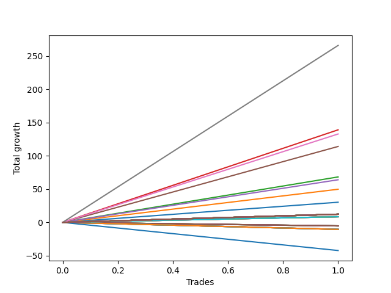

# Short Pointer 007 
- Symbol: ES1y1d
- Date Range: 07/19/2021 - 07/08/2022
- Trading Period: 7:20-12:30
- Number of Trades: 1



| Name | Win Percent | Profit | Avg Profit / Trade | Avg Time / Trade |      | Name | Win Percent | Profit | Avg Profit / Trade | Avg Time / Trade |
| ---- | ----------- | ------ | ------------------ | ---------------- | ---- | ---- | ----------- | ------ | ------------------ | ---------------- |
| Sorted By <br> Profit | | | | | | Sorted By <br> Win Percentage ||||
| Seven | 100.00 | 131000.00 | 131000.00 | 71 04:48:00 |     | Seven | 100.00 | 131000.00 | 131000.00 | 71 04:48:00 |
| Three | 100.00 | 67625.00 | 67625.00 | 20 05:36:00 |     | Three | 100.00 | 67625.00 | 67625.00 | 20 05:36:00 |
| Six | 100.00 | 64500.00 | 64500.00 | 69 05:36:00 |     | Six | 100.00 | 64500.00 | 64500.00 | 69 05:36:00 |
| Five | 100.00 | 55125.00 | 55125.00 | 69 05:12:00 |     | Five | 100.00 | 55125.00 | 55125.00 | 69 05:12:00 |
| Three Hundred | 100.00 | 50625.00 | 50625.00 | 20 04:55:00 |     | Three Hundred | 100.00 | 50625.00 | 50625.00 | 20 04:55:00 |
| Two Hundred Nine | 100.00 | 45000.00 | 45000.00 | 19 01:41:00 |     | Two Hundred Nine | 100.00 | 45000.00 | 45000.00 | 19 01:41:00 |
| Two Hundred Eight | 100.00 | 40500.00 | 40500.00 | 19 01:23:00 |     | Two Hundred Eight | 100.00 | 40500.00 | 40500.00 | 19 01:23:00 |
| Two Hundred Seven | 100.00 | 35375.00 | 35375.00 | 15 01:01:00 |     | Two Hundred Seven | 100.00 | 35375.00 | 35375.00 | 15 01:01:00 |
| Two | 100.00 | 32250.00 | 32250.00 | 15 02:30:00 |     | Two | 100.00 | 32250.00 | 32250.00 | 15 02:30:00 |
| Two Hundred Six | 100.00 | 30250.00 | 30250.00 | 15 00:51:00 |     | Two Hundred Six | 100.00 | 30250.00 | 30250.00 | 15 00:51:00 |
| Four | 100.00 | 30125.00 | 30125.00 | 59 23:41:00 |     | Four | 100.00 | 30125.00 | 30125.00 | 59 23:41:00 |
| Two Hundred Five | 100.00 | 25000.00 | 25000.00 | 14 23:44:00 |     | Two Hundred Five | 100.00 | 25000.00 | 25000.00 | 14 23:44:00 |
| One | 100.00 | 23000.00 | 23000.00 | 14 23:27:00 |     | One | 100.00 | 23000.00 | 23000.00 | 14 23:27:00 |
| Two Hundred Four | 100.00 | 20375.00 | 20375.00 | 14 23:25:00 |     | Two Hundred Four | 100.00 | 20375.00 | 20375.00 | 14 23:25:00 |
| Two Hundred Three | 100.00 | 16000.00 | 16000.00 | 14 23:22:00 |     | Two Hundred Three | 100.00 | 16000.00 | 16000.00 | 14 23:22:00 |
| Two Hundred Two | 100.00 | 13250.00 | 13250.00 | 14 23:10:00 |     | Two Hundred Two | 100.00 | 13250.00 | 13250.00 | 14 23:10:00 |
| Zero | 100.00 | 13250.00 | 13250.00 | 14 23:10:00 |     | Zero | 100.00 | 13250.00 | 13250.00 | 14 23:10:00 |
| Two Hundred One | 100.00 | 5625.00 | 5625.00 | 00 00:11:00 |     | Two Hundred One | 100.00 | 5625.00 | 5625.00 | 00 00:11:00 |
| One Hundred Thirty | 100.00 | 4500.00 | 4500.00 | 00 00:03:00 |     | One Hundred Thirty | 100.00 | 4500.00 | 4500.00 | 00 00:03:00 |
| One Hundred Twenty-Nine | 100.00 | 4500.00 | 4500.00 | 00 00:03:00 |     | One Hundred Twenty-Nine | 100.00 | 4500.00 | 4500.00 | 00 00:03:00 |
| One Hundred Twenty-Eight | 100.00 | 4500.00 | 4500.00 | 00 00:03:00 |     | One Hundred Twenty-Eight | 100.00 | 4500.00 | 4500.00 | 00 00:03:00 |
| One Hundred Twenty-Seven | 100.00 | 4500.00 | 4500.00 | 00 00:03:00 |     | One Hundred Twenty-Seven | 100.00 | 4500.00 | 4500.00 | 00 00:03:00 |
| One Hundred Twenty-Six | 100.00 | 4500.00 | 4500.00 | 00 00:03:00 |     | One Hundred Twenty-Six | 100.00 | 4500.00 | 4500.00 | 00 00:03:00 |
| One Hundred Twenty-Five | 100.00 | 4500.00 | 4500.00 | 00 00:03:00 |     | One Hundred Twenty-Five | 100.00 | 4500.00 | 4500.00 | 00 00:03:00 |
| One Hundred Twenty-Four | 100.00 | 4500.00 | 4500.00 | 00 00:03:00 |     | One Hundred Twenty-Four | 100.00 | 4500.00 | 4500.00 | 00 00:03:00 |
| One Hundred Twenty-Three | 100.00 | 4500.00 | 4500.00 | 00 00:03:00 |     | One Hundred Twenty-Three | 100.00 | 4500.00 | 4500.00 | 00 00:03:00 |
| One Hundred Twenty-Two | 100.00 | 4500.00 | 4500.00 | 00 00:03:00 |     | One Hundred Twenty-Two | 100.00 | 4500.00 | 4500.00 | 00 00:03:00 |
| One Hundred Twenty-One | 100.00 | 4500.00 | 4500.00 | 00 00:03:00 |     | One Hundred Twenty-One | 100.00 | 4500.00 | 4500.00 | 00 00:03:00 |
| One Hundred Twenty | 100.00 | 4500.00 | 4500.00 | 00 00:03:00 |     | One Hundred Twenty | 100.00 | 4500.00 | 4500.00 | 00 00:03:00 |
| One Hundred Ninteen | 100.00 | 4500.00 | 4500.00 | 00 00:03:00 |     | One Hundred Ninteen | 100.00 | 4500.00 | 4500.00 | 00 00:03:00 |
| One Hundred Eighteen | 100.00 | 4500.00 | 4500.00 | 00 00:03:00 |     | One Hundred Eighteen | 100.00 | 4500.00 | 4500.00 | 00 00:03:00 |
| One Hundred Seventeen | 100.00 | 4500.00 | 4500.00 | 00 00:03:00 |     | One Hundred Seventeen | 100.00 | 4500.00 | 4500.00 | 00 00:03:00 |
| One Hundred Sixteen | 100.00 | 4500.00 | 4500.00 | 00 00:03:00 |     | One Hundred Sixteen | 100.00 | 4500.00 | 4500.00 | 00 00:03:00 |
| One Hundred Fifteen | 100.00 | 4500.00 | 4500.00 | 00 00:03:00 |     | One Hundred Fifteen | 100.00 | 4500.00 | 4500.00 | 00 00:03:00 |
| One Hundred Fourteen | 100.00 | 4500.00 | 4500.00 | 00 00:03:00 |     | One Hundred Fourteen | 100.00 | 4500.00 | 4500.00 | 00 00:03:00 |
| One Hundred Thirteen | 100.00 | 4500.00 | 4500.00 | 00 00:03:00 |     | One Hundred Thirteen | 100.00 | 4500.00 | 4500.00 | 00 00:03:00 |
| One Hundred Twelve | 100.00 | 4500.00 | 4500.00 | 00 00:03:00 |     | One Hundred Twelve | 100.00 | 4500.00 | 4500.00 | 00 00:03:00 |
| One Hundred Eleven | 100.00 | 4500.00 | 4500.00 | 00 00:03:00 |     | One Hundred Eleven | 100.00 | 4500.00 | 4500.00 | 00 00:03:00 |
| Eighty-Five | 100.00 | 4500.00 | 4500.00 | 00 00:03:00 |     | Eighty-Five | 100.00 | 4500.00 | 4500.00 | 00 00:03:00 |
| Eighty-Four | 100.00 | 4500.00 | 4500.00 | 00 00:03:00 |     | Eighty-Four | 100.00 | 4500.00 | 4500.00 | 00 00:03:00 |
| Eighty-Three | 100.00 | 4500.00 | 4500.00 | 00 00:03:00 |     | Eighty-Three | 100.00 | 4500.00 | 4500.00 | 00 00:03:00 |
| Eighty-Two | 100.00 | 4500.00 | 4500.00 | 00 00:03:00 |     | Eighty-Two | 100.00 | 4500.00 | 4500.00 | 00 00:03:00 |
| Eighty-One | 100.00 | 4500.00 | 4500.00 | 00 00:03:00 |     | Eighty-One | 100.00 | 4500.00 | 4500.00 | 00 00:03:00 |
| Fifty-Five | 100.00 | 3625.00 | 3625.00 | 00 00:04:00 |     | Fifty-Five | 100.00 | 3625.00 | 3625.00 | 00 00:04:00 |
| Fifty-Four | 100.00 | 3625.00 | 3625.00 | 00 00:04:00 |     | Fifty-Four | 100.00 | 3625.00 | 3625.00 | 00 00:04:00 |
| Fifty-Three | 100.00 | 3625.00 | 3625.00 | 00 00:04:00 |     | Fifty-Three | 100.00 | 3625.00 | 3625.00 | 00 00:04:00 |
| Fifty-Two | 100.00 | 3625.00 | 3625.00 | 00 00:04:00 |     | Fifty-Two | 100.00 | 3625.00 | 3625.00 | 00 00:04:00 |
| Fifty-One | 100.00 | 3625.00 | 3625.00 | 00 00:04:00 |     | Fifty-One | 100.00 | 3625.00 | 3625.00 | 00 00:04:00 |
| Fifty | 100.00 | 3625.00 | 3625.00 | 00 00:04:00 |     | Fifty | 100.00 | 3625.00 | 3625.00 | 00 00:04:00 |
| Forty-Nine | 100.00 | 3625.00 | 3625.00 | 00 00:04:00 |     | Forty-Nine | 100.00 | 3625.00 | 3625.00 | 00 00:04:00 |
| Forty-Eight | 100.00 | 3625.00 | 3625.00 | 00 00:04:00 |     | Forty-Eight | 100.00 | 3625.00 | 3625.00 | 00 00:04:00 |
| Seventy-One | 100.00 | 1500.00 | 1500.00 | 00 01:16:00 |     | Seventy-One | 100.00 | 1500.00 | 1500.00 | 00 01:16:00 |
| Seventy | 100.00 | 1500.00 | 1500.00 | 00 01:16:00 |     | Seventy | 100.00 | 1500.00 | 1500.00 | 00 01:16:00 |
| Sixty-Nine | 100.00 | 1500.00 | 1500.00 | 00 01:16:00 |     | Sixty-Nine | 100.00 | 1500.00 | 1500.00 | 00 01:16:00 |
| Sixty-Eight | 100.00 | 1500.00 | 1500.00 | 00 01:16:00 |     | Sixty-Eight | 100.00 | 1500.00 | 1500.00 | 00 01:16:00 |
| Sixty-Seven | 100.00 | 1500.00 | 1500.00 | 00 01:16:00 |     | Sixty-Seven | 100.00 | 1500.00 | 1500.00 | 00 01:16:00 |
| Sixty-Six | 100.00 | 1500.00 | 1500.00 | 00 01:16:00 |     | Sixty-Six | 100.00 | 1500.00 | 1500.00 | 00 01:16:00 |
| Sixty-Five | 100.00 | 1500.00 | 1500.00 | 00 01:16:00 |     | Sixty-Five | 100.00 | 1500.00 | 1500.00 | 00 01:16:00 |
| Sixty-Four | 100.00 | 1500.00 | 1500.00 | 00 01:16:00 |     | Sixty-Four | 100.00 | 1500.00 | 1500.00 | 00 01:16:00 |
| Forty-Seven | 0.00 | -3625.00 | -3625.00 | 01 00:41:00 |     | Forty-Seven | 0.00 | -3625.00 | -3625.00 | 01 00:41:00 |
| Forty-Six | 0.00 | -3625.00 | -3625.00 | 01 00:41:00 |     | Forty-Six | 0.00 | -3625.00 | -3625.00 | 01 00:41:00 |
| Forty-Five | 0.00 | -3625.00 | -3625.00 | 01 00:41:00 |     | Forty-Five | 0.00 | -3625.00 | -3625.00 | 01 00:41:00 |
| Forty-Four | 0.00 | -3625.00 | -3625.00 | 01 00:41:00 |     | Forty-Four | 0.00 | -3625.00 | -3625.00 | 01 00:41:00 |
| Forty-Three | 0.00 | -3625.00 | -3625.00 | 01 00:41:00 |     | Forty-Three | 0.00 | -3625.00 | -3625.00 | 01 00:41:00 |
| Forty-Two | 0.00 | -3625.00 | -3625.00 | 01 00:41:00 |     | Forty-Two | 0.00 | -3625.00 | -3625.00 | 01 00:41:00 |
| Forty-One | 0.00 | -3625.00 | -3625.00 | 01 00:41:00 |     | Forty-One | 0.00 | -3625.00 | -3625.00 | 01 00:41:00 |
| Forty | 0.00 | -3625.00 | -3625.00 | 01 00:41:00 |     | Forty | 0.00 | -3625.00 | -3625.00 | 01 00:41:00 |
| Sixty-Three | 0.00 | -6375.00 | -6375.00 | 01 00:55:00 |     | Sixty-Three | 0.00 | -6375.00 | -6375.00 | 01 00:55:00 |
| Sixty-Two | 0.00 | -6375.00 | -6375.00 | 01 00:55:00 |     | Sixty-Two | 0.00 | -6375.00 | -6375.00 | 01 00:55:00 |
| Sixty-One | 0.00 | -6375.00 | -6375.00 | 01 00:55:00 |     | Sixty-One | 0.00 | -6375.00 | -6375.00 | 01 00:55:00 |
| Sixty | 0.00 | -6375.00 | -6375.00 | 01 00:55:00 |     | Sixty | 0.00 | -6375.00 | -6375.00 | 01 00:55:00 |
| Fifty-Nine | 0.00 | -6375.00 | -6375.00 | 01 00:55:00 |     | Fifty-Nine | 0.00 | -6375.00 | -6375.00 | 01 00:55:00 |
| Fifty-Eight | 0.00 | -6375.00 | -6375.00 | 01 00:55:00 |     | Fifty-Eight | 0.00 | -6375.00 | -6375.00 | 01 00:55:00 |
| Fifty-Seven | 0.00 | -6375.00 | -6375.00 | 01 00:55:00 |     | Fifty-Seven | 0.00 | -6375.00 | -6375.00 | 01 00:55:00 |
| Fifty-Six | 0.00 | -6375.00 | -6375.00 | 01 00:55:00 |     | Fifty-Six | 0.00 | -6375.00 | -6375.00 | 01 00:55:00 |
| Seventy-Three | 0.00 | -16250.00 | -16250.00 | 06 01:01:00 |     | Seventy-Three | 0.00 | -16250.00 | -16250.00 | 06 01:01:00 |

## NO STOPLOSS

### Test Zero
* Sell when price hits the middle line of the 20p bollinger
* No Stoploss
* Results:
```
Total Trades: 1
Percent Up: 0.00
Percent Down: 100.00
Total Points Moved Down: 26.50
Potential Profit: 13250.00
Total Points Ups: 0.00 Count Ups: 0
Total Points Downs: 26.50 Count Downs: 1
```

<details><summary>Trades</summary>

<code>In: 2021-11-11 07:21:00		Out: 2021-11-26 06:31:00		Total Position Time: 14 23:10:00		Total Move Down: 26.50		Total to Date: 26.50</code> <br />


</details>

### Test One
* Sell when the price hits the upper line of the 20p 1std bollinger
* No Stoploss
* Results:
```
Total Trades: 1
Percent Up: 0.00
Percent Down: 100.00
Total Points Moved Down: 46.00
Potential Profit: 23000.00
Total Points Ups: 0.00 Count Ups: 0
Total Points Downs: 46.00 Count Downs: 1
```

<details><summary>Trades</summary>

<code>In: 2021-11-11 07:21:00		Out: 2021-11-26 06:48:00		Total Position Time: 14 23:27:00		Total Move Down: 46.00		Total to Date: 46.00</code> <br />


</details>

### Test Two
* Sell when the price hits the upper line of the 20p 2std bollinger
* No Stoploss
* Results:
```
Total Trades: 1
Percent Up: 0.00
Percent Down: 100.00
Total Points Moved Down: 64.50
Potential Profit: 32250.00
Total Points Ups: 0.00 Count Ups: 0
Total Points Downs: 64.50 Count Downs: 1
```

<details><summary>Trades</summary>

<code>In: 2021-11-11 07:21:00		Out: 2021-11-26 09:51:00		Total Position Time: 15 02:30:00		Total Move Down: 64.50		Total to Date: 64.50</code> <br />


</details>

### Test Three
* Sell when price hits the middle line of the 50p bollinger
* No Stoploss
* Results:
```
Total Trades: 1
Percent Up: 0.00
Percent Down: 100.00
Total Points Moved Down: 135.25
Potential Profit: 67625.00
Total Points Ups: 0.00 Count Ups: 0
Total Points Downs: 135.25 Count Downs: 1
```

<details><summary>Trades</summary>

<code>In: 2021-11-11 07:21:00		Out: 2021-12-01 12:57:00		Total Position Time: 20 05:36:00		Total Move Down: 135.25		Total to Date: 135.25</code> <br />


</details>

### Test Four
* Sell when the price hits the upper line of the 50p 1std bollinger
* No Stoploss
* Results:
```
Total Trades: 1
Percent Up: 0.00
Percent Down: 100.00
Total Points Moved Down: 60.25
Potential Profit: 30125.00
Total Points Ups: 0.00 Count Ups: 0
Total Points Downs: 60.25 Count Downs: 1
```

<details><summary>Trades</summary>

<code>In: 2021-11-11 07:21:00		Out: 2022-01-10 07:02:00		Total Position Time: 59 23:41:00		Total Move Down: 60.25		Total to Date: 60.25</code> <br />


</details>

### Test Five
* Sell when the price hits the upper line of the 50p 2std bollinger
* No Stoploss
* Results:
```
Total Trades: 1
Percent Up: 0.00
Percent Down: 100.00
Total Points Moved Down: 110.25
Potential Profit: 55125.00
Total Points Ups: 0.00 Count Ups: 0
Total Points Downs: 110.25 Count Downs: 1
```

<details><summary>Trades</summary>

<code>In: 2021-11-11 07:21:00		Out: 2022-01-19 12:33:00		Total Position Time: 69 05:12:00		Total Move Down: 110.25		Total to Date: 110.25</code> <br />


</details>

### Test Six
* Sell when the price hits the middle line of the 1std VWAP
* No Stoploss
* Results:
```
Total Trades: 1
Percent Up: 0.00
Percent Down: 100.00
Total Points Moved Down: 129.00
Potential Profit: 64500.00
Total Points Ups: 0.00 Count Ups: 0
Total Points Downs: 129.00 Count Downs: 1
```

<details><summary>Trades</summary>

<code>In: 2021-11-11 07:21:00		Out: 2022-01-19 12:57:00		Total Position Time: 69 05:36:00		Total Move Down: 129.00		Total to Date: 129.00</code> <br />


</details>

### Test Seven
* Sell when the price hits the upper line of the 1std VWAP
* No Stoploss
* Results:
```
Total Trades: 1
Percent Up: 0.00
Percent Down: 100.00
Total Points Moved Down: 262.00
Potential Profit: 131000.00
Total Points Ups: 0.00 Count Ups: 0
Total Points Downs: 262.00 Count Downs: 1
```

<details><summary>Trades</summary>

<code>In: 2021-11-11 07:21:00		Out: 2022-01-21 12:09:00		Total Position Time: 71 04:48:00		Total Move Down: 262.00		Total to Date: 262.00</code> <br />


</details>

## STOPLOSS OF 5

### Test Forty
* Sell when price hits the middle line of the 20p bollinger
* Stoploss is -5 points
* Results:
```
Total Trades: 1
Percent Up: 100.00
Percent Down: 0.00
Total Points Moved Down: -7.25
Potential Profit: -3625.00
Total Points Ups: 7.25 Count Ups: 1
Total Points Downs: 0.00 Count Downs: 0
```

<details><summary>Trades</summary>

<code>In: 2021-11-11 07:21:00		Out: 2021-11-12 08:02:00		Total Position Time: 01 00:41:00		Total Move Down: -7.25		Total to Date: -7.25</code> <br />


</details>

### Test Forty-One
* Sell when the price hits the upper line of the 20p 1std bollinger
* Stoploss is -5 points
* Results:
```
Total Trades: 1
Percent Up: 100.00
Percent Down: 0.00
Total Points Moved Down: -7.25
Potential Profit: -3625.00
Total Points Ups: 7.25 Count Ups: 1
Total Points Downs: 0.00 Count Downs: 0
```

<details><summary>Trades</summary>

<code>In: 2021-11-11 07:21:00		Out: 2021-11-12 08:02:00		Total Position Time: 01 00:41:00		Total Move Down: -7.25		Total to Date: -7.25</code> <br />


</details>

### Test Forty-Two
* Sell when the price hits the upper line of the 20p 2std bollinger
* Stoploss is -5 points
* Results:
```
Total Trades: 1
Percent Up: 100.00
Percent Down: 0.00
Total Points Moved Down: -7.25
Potential Profit: -3625.00
Total Points Ups: 7.25 Count Ups: 1
Total Points Downs: 0.00 Count Downs: 0
```

<details><summary>Trades</summary>

<code>In: 2021-11-11 07:21:00		Out: 2021-11-12 08:02:00		Total Position Time: 01 00:41:00		Total Move Down: -7.25		Total to Date: -7.25</code> <br />


</details>

### Test Forty-Three
* Sell when price hits the middle line of the 50p bollinger
* Stoploss is -5 points
* Results:
```
Total Trades: 1
Percent Up: 100.00
Percent Down: 0.00
Total Points Moved Down: -7.25
Potential Profit: -3625.00
Total Points Ups: 7.25 Count Ups: 1
Total Points Downs: 0.00 Count Downs: 0
```

<details><summary>Trades</summary>

<code>In: 2021-11-11 07:21:00		Out: 2021-11-12 08:02:00		Total Position Time: 01 00:41:00		Total Move Down: -7.25		Total to Date: -7.25</code> <br />


</details>

### Test Forty-Four
* Sell when the price hits the upper line of the 50p 1std bollinger
* Stoploss is -5 points
* Results:
```
Total Trades: 1
Percent Up: 100.00
Percent Down: 0.00
Total Points Moved Down: -7.25
Potential Profit: -3625.00
Total Points Ups: 7.25 Count Ups: 1
Total Points Downs: 0.00 Count Downs: 0
```

<details><summary>Trades</summary>

<code>In: 2021-11-11 07:21:00		Out: 2021-11-12 08:02:00		Total Position Time: 01 00:41:00		Total Move Down: -7.25		Total to Date: -7.25</code> <br />


</details>

### Test Forty-Five
* Sell when the price hits the upper line of the 50p 2std bollinger
* Stoploss is -5 points
* Results:
```
Total Trades: 1
Percent Up: 100.00
Percent Down: 0.00
Total Points Moved Down: -7.25
Potential Profit: -3625.00
Total Points Ups: 7.25 Count Ups: 1
Total Points Downs: 0.00 Count Downs: 0
```

<details><summary>Trades</summary>

<code>In: 2021-11-11 07:21:00		Out: 2021-11-12 08:02:00		Total Position Time: 01 00:41:00		Total Move Down: -7.25		Total to Date: -7.25</code> <br />


</details>

### Test Forty-Six
* Sell when the price hits the middle line of the 1std VWAP
* Stoploss is -5 points
* Results:
```
Total Trades: 1
Percent Up: 100.00
Percent Down: 0.00
Total Points Moved Down: -7.25
Potential Profit: -3625.00
Total Points Ups: 7.25 Count Ups: 1
Total Points Downs: 0.00 Count Downs: 0
```

<details><summary>Trades</summary>

<code>In: 2021-11-11 07:21:00		Out: 2021-11-12 08:02:00		Total Position Time: 01 00:41:00		Total Move Down: -7.25		Total to Date: -7.25</code> <br />


</details>

### Test Forty-Seven
* Sell when the price hits the upper line of the 1std VWAP
* Stoploss is -5 points
* Results:
```
Total Trades: 1
Percent Up: 100.00
Percent Down: 0.00
Total Points Moved Down: -7.25
Potential Profit: -3625.00
Total Points Ups: 7.25 Count Ups: 1
Total Points Downs: 0.00 Count Downs: 0
```

<details><summary>Trades</summary>

<code>In: 2021-11-11 07:21:00		Out: 2021-11-12 08:02:00		Total Position Time: 01 00:41:00		Total Move Down: -7.25		Total to Date: -7.25</code> <br />


</details>

## TRAIL STOP OF 5

### Test Forty-Eight
* Sell when price hits the middle line of the 20p bollinger
* Trailing Stop is -5 points
* Results:
```
Total Trades: 1
Percent Up: 0.00
Percent Down: 100.00
Total Points Moved Down: 7.25
Potential Profit: 3625.00
Total Points Ups: 0.00 Count Ups: 0
Total Points Downs: 7.25 Count Downs: 1
```

<details><summary>Trades</summary>

<code>In: 2021-11-11 07:21:00		Out: 2021-11-11 07:25:00		Total Position Time: 00 00:04:00		Total Move Down: 7.25		Total to Date: 7.25</code> <br />


</details>

### Test Forty-Nine
* Sell when the price hits the upper line of the 20p 1std bollinger
* Trailing Stop is -5 points
* Results:
```
Total Trades: 1
Percent Up: 0.00
Percent Down: 100.00
Total Points Moved Down: 7.25
Potential Profit: 3625.00
Total Points Ups: 0.00 Count Ups: 0
Total Points Downs: 7.25 Count Downs: 1
```

<details><summary>Trades</summary>

<code>In: 2021-11-11 07:21:00		Out: 2021-11-11 07:25:00		Total Position Time: 00 00:04:00		Total Move Down: 7.25		Total to Date: 7.25</code> <br />


</details>

### Test Fifty
* Sell when the price hits the upper line of the 20p 2std bollinger
* Trailing Stop is -5 points
* Results:
```
Total Trades: 1
Percent Up: 0.00
Percent Down: 100.00
Total Points Moved Down: 7.25
Potential Profit: 3625.00
Total Points Ups: 0.00 Count Ups: 0
Total Points Downs: 7.25 Count Downs: 1
```

<details><summary>Trades</summary>

<code>In: 2021-11-11 07:21:00		Out: 2021-11-11 07:25:00		Total Position Time: 00 00:04:00		Total Move Down: 7.25		Total to Date: 7.25</code> <br />


</details>

### Test Fifty-One
* Sell when price hits the middle line of the 50p bollinger
* Trailing Stop is -5 points
* Results:
```
Total Trades: 1
Percent Up: 0.00
Percent Down: 100.00
Total Points Moved Down: 7.25
Potential Profit: 3625.00
Total Points Ups: 0.00 Count Ups: 0
Total Points Downs: 7.25 Count Downs: 1
```

<details><summary>Trades</summary>

<code>In: 2021-11-11 07:21:00		Out: 2021-11-11 07:25:00		Total Position Time: 00 00:04:00		Total Move Down: 7.25		Total to Date: 7.25</code> <br />


</details>

### Test Fifty-Two
* Sell when the price hits the upper line of the 50p 1std bollinger
* Trailing Stop is -5 points
* Results:
```
Total Trades: 1
Percent Up: 0.00
Percent Down: 100.00
Total Points Moved Down: 7.25
Potential Profit: 3625.00
Total Points Ups: 0.00 Count Ups: 0
Total Points Downs: 7.25 Count Downs: 1
```

<details><summary>Trades</summary>

<code>In: 2021-11-11 07:21:00		Out: 2021-11-11 07:25:00		Total Position Time: 00 00:04:00		Total Move Down: 7.25		Total to Date: 7.25</code> <br />


</details>

### Test Fifty-Three
* Sell when the price hits the upper line of the 50p 2std bollinger
* Trailing Stop is -5 points
* Results:
```
Total Trades: 1
Percent Up: 0.00
Percent Down: 100.00
Total Points Moved Down: 7.25
Potential Profit: 3625.00
Total Points Ups: 0.00 Count Ups: 0
Total Points Downs: 7.25 Count Downs: 1
```

<details><summary>Trades</summary>

<code>In: 2021-11-11 07:21:00		Out: 2021-11-11 07:25:00		Total Position Time: 00 00:04:00		Total Move Down: 7.25		Total to Date: 7.25</code> <br />


</details>

### Test Fifty-Four
* Sell when the price hits the middle line of the 1std VWAP
* Trailing Stop is -5 points
* Results:
```
Total Trades: 1
Percent Up: 0.00
Percent Down: 100.00
Total Points Moved Down: 7.25
Potential Profit: 3625.00
Total Points Ups: 0.00 Count Ups: 0
Total Points Downs: 7.25 Count Downs: 1
```

<details><summary>Trades</summary>

<code>In: 2021-11-11 07:21:00		Out: 2021-11-11 07:25:00		Total Position Time: 00 00:04:00		Total Move Down: 7.25		Total to Date: 7.25</code> <br />


</details>

### Test Fifty-Five
* Sell when the price hits the upper line of the 1std VWAP
* Trailing Stop is -5 points
* Results:
```
Total Trades: 1
Percent Up: 0.00
Percent Down: 100.00
Total Points Moved Down: 7.25
Potential Profit: 3625.00
Total Points Ups: 0.00 Count Ups: 0
Total Points Downs: 7.25 Count Downs: 1
```

<details><summary>Trades</summary>

<code>In: 2021-11-11 07:21:00		Out: 2021-11-11 07:25:00		Total Position Time: 00 00:04:00		Total Move Down: 7.25		Total to Date: 7.25</code> <br />


</details>

## STOPLOSS OF 10

### Test Fifty-Six
* Sell when price hits the middle line of the 20p bollinger
* Stoploss is -10 points
* Results:
```
Total Trades: 1
Percent Up: 100.00
Percent Down: 0.00
Total Points Moved Down: -12.75
Potential Profit: -6375.00
Total Points Ups: 12.75 Count Ups: 1
Total Points Downs: 0.00 Count Downs: 0
```

<details><summary>Trades</summary>

<code>In: 2021-11-11 07:21:00		Out: 2021-11-12 08:16:00		Total Position Time: 01 00:55:00		Total Move Down: -12.75		Total to Date: -12.75</code> <br />


</details>

### Test Fifty-Seven
* Sell when the price hits the upper line of the 20p 1std bollinger
* Stoploss is -10 points
* Results:
```
Total Trades: 1
Percent Up: 100.00
Percent Down: 0.00
Total Points Moved Down: -12.75
Potential Profit: -6375.00
Total Points Ups: 12.75 Count Ups: 1
Total Points Downs: 0.00 Count Downs: 0
```

<details><summary>Trades</summary>

<code>In: 2021-11-11 07:21:00		Out: 2021-11-12 08:16:00		Total Position Time: 01 00:55:00		Total Move Down: -12.75		Total to Date: -12.75</code> <br />


</details>

### Test Fifty-Eight
* Sell when the price hits the upper line of the 20p 2std bollinger
* Stoploss is -10 points
* Results:
```
Total Trades: 1
Percent Up: 100.00
Percent Down: 0.00
Total Points Moved Down: -12.75
Potential Profit: -6375.00
Total Points Ups: 12.75 Count Ups: 1
Total Points Downs: 0.00 Count Downs: 0
```

<details><summary>Trades</summary>

<code>In: 2021-11-11 07:21:00		Out: 2021-11-12 08:16:00		Total Position Time: 01 00:55:00		Total Move Down: -12.75		Total to Date: -12.75</code> <br />


</details>

### Test Fifty-Nine
* Sell when price hits the middle line of the 50p bollinger
* Stoploss is -10 points
* Results:
```
Total Trades: 1
Percent Up: 100.00
Percent Down: 0.00
Total Points Moved Down: -12.75
Potential Profit: -6375.00
Total Points Ups: 12.75 Count Ups: 1
Total Points Downs: 0.00 Count Downs: 0
```

<details><summary>Trades</summary>

<code>In: 2021-11-11 07:21:00		Out: 2021-11-12 08:16:00		Total Position Time: 01 00:55:00		Total Move Down: -12.75		Total to Date: -12.75</code> <br />


</details>

### Test Sixty
* Sell when the price hits the upper line of the 50p 1std bollinger
* Stoploss is -10 points
* Results:
```
Total Trades: 1
Percent Up: 100.00
Percent Down: 0.00
Total Points Moved Down: -12.75
Potential Profit: -6375.00
Total Points Ups: 12.75 Count Ups: 1
Total Points Downs: 0.00 Count Downs: 0
```

<details><summary>Trades</summary>

<code>In: 2021-11-11 07:21:00		Out: 2021-11-12 08:16:00		Total Position Time: 01 00:55:00		Total Move Down: -12.75		Total to Date: -12.75</code> <br />


</details>

### Test Sixty-One
* Sell when the price hits the upper line of the 50p 2std bollinger
* Stoploss is -10 points
* Results:
```
Total Trades: 1
Percent Up: 100.00
Percent Down: 0.00
Total Points Moved Down: -12.75
Potential Profit: -6375.00
Total Points Ups: 12.75 Count Ups: 1
Total Points Downs: 0.00 Count Downs: 0
```

<details><summary>Trades</summary>

<code>In: 2021-11-11 07:21:00		Out: 2021-11-12 08:16:00		Total Position Time: 01 00:55:00		Total Move Down: -12.75		Total to Date: -12.75</code> <br />


</details>

### Test Sixty-Two
* Sell when the price hits the middle line of the 1std VWAP
* Stoploss is -10 points
* Results:
```
Total Trades: 1
Percent Up: 100.00
Percent Down: 0.00
Total Points Moved Down: -12.75
Potential Profit: -6375.00
Total Points Ups: 12.75 Count Ups: 1
Total Points Downs: 0.00 Count Downs: 0
```

<details><summary>Trades</summary>

<code>In: 2021-11-11 07:21:00		Out: 2021-11-12 08:16:00		Total Position Time: 01 00:55:00		Total Move Down: -12.75		Total to Date: -12.75</code> <br />


</details>

### Test Sixty-Three
* Sell when the price hits the upper line of the 1std VWAP
* Stoploss is -10 points
* Results:
```
Total Trades: 1
Percent Up: 100.00
Percent Down: 0.00
Total Points Moved Down: -12.75
Potential Profit: -6375.00
Total Points Ups: 12.75 Count Ups: 1
Total Points Downs: 0.00 Count Downs: 0
```

<details><summary>Trades</summary>

<code>In: 2021-11-11 07:21:00		Out: 2021-11-12 08:16:00		Total Position Time: 01 00:55:00		Total Move Down: -12.75		Total to Date: -12.75</code> <br />


</details>

## TRAIL STOP OF 10

### Test Sixty-Four
* Sell when price hits the middle line of the 20p bollinger
* Trailing Stop is -10 points
* Results:
```
Total Trades: 1
Percent Up: 0.00
Percent Down: 100.00
Total Points Moved Down: 3.00
Potential Profit: 1500.00
Total Points Ups: 0.00 Count Ups: 0
Total Points Downs: 3.00 Count Downs: 1
```

<details><summary>Trades</summary>

<code>In: 2021-11-11 07:21:00		Out: 2021-11-11 08:37:00		Total Position Time: 00 01:16:00		Total Move Down: 3.00		Total to Date: 3.00</code> <br />


</details>

### Test Sixty-Five
* Sell when the price hits the upper line of the 20p 1std bollinger
* Trailing Stop is -10 points
* Results:
```
Total Trades: 1
Percent Up: 0.00
Percent Down: 100.00
Total Points Moved Down: 3.00
Potential Profit: 1500.00
Total Points Ups: 0.00 Count Ups: 0
Total Points Downs: 3.00 Count Downs: 1
```

<details><summary>Trades</summary>

<code>In: 2021-11-11 07:21:00		Out: 2021-11-11 08:37:00		Total Position Time: 00 01:16:00		Total Move Down: 3.00		Total to Date: 3.00</code> <br />


</details>

### Test Sixty-Six
* Sell when the price hits the upper line of the 20p 2std bollinger
* Trailing Stop is -10 points
* Results:
```
Total Trades: 1
Percent Up: 0.00
Percent Down: 100.00
Total Points Moved Down: 3.00
Potential Profit: 1500.00
Total Points Ups: 0.00 Count Ups: 0
Total Points Downs: 3.00 Count Downs: 1
```

<details><summary>Trades</summary>

<code>In: 2021-11-11 07:21:00		Out: 2021-11-11 08:37:00		Total Position Time: 00 01:16:00		Total Move Down: 3.00		Total to Date: 3.00</code> <br />


</details>

### Test Sixty-Seven
* Sell when price hits the middle line of the 50p bollinger
* Trailing Stop is -10 points
* Results:
```
Total Trades: 1
Percent Up: 0.00
Percent Down: 100.00
Total Points Moved Down: 3.00
Potential Profit: 1500.00
Total Points Ups: 0.00 Count Ups: 0
Total Points Downs: 3.00 Count Downs: 1
```

<details><summary>Trades</summary>

<code>In: 2021-11-11 07:21:00		Out: 2021-11-11 08:37:00		Total Position Time: 00 01:16:00		Total Move Down: 3.00		Total to Date: 3.00</code> <br />


</details>

### Test Sixty-Eight
* Sell when the price hits the upper line of the 50p 1std bollinger
* Trailing Stop is -10 points
* Results:
```
Total Trades: 1
Percent Up: 0.00
Percent Down: 100.00
Total Points Moved Down: 3.00
Potential Profit: 1500.00
Total Points Ups: 0.00 Count Ups: 0
Total Points Downs: 3.00 Count Downs: 1
```

<details><summary>Trades</summary>

<code>In: 2021-11-11 07:21:00		Out: 2021-11-11 08:37:00		Total Position Time: 00 01:16:00		Total Move Down: 3.00		Total to Date: 3.00</code> <br />


</details>

### Test Sixty-Nine
* Sell when the price hits the upper line of the 50p 2std bollinger
* Trailing Stop is -10 points
* Results:
```
Total Trades: 1
Percent Up: 0.00
Percent Down: 100.00
Total Points Moved Down: 3.00
Potential Profit: 1500.00
Total Points Ups: 0.00 Count Ups: 0
Total Points Downs: 3.00 Count Downs: 1
```

<details><summary>Trades</summary>

<code>In: 2021-11-11 07:21:00		Out: 2021-11-11 08:37:00		Total Position Time: 00 01:16:00		Total Move Down: 3.00		Total to Date: 3.00</code> <br />


</details>

### Test Seventy
* Sell when the price hits the middle line of the 1std VWAP
* Trailing Stop is -10 points
* Results:
```
Total Trades: 1
Percent Up: 0.00
Percent Down: 100.00
Total Points Moved Down: 3.00
Potential Profit: 1500.00
Total Points Ups: 0.00 Count Ups: 0
Total Points Downs: 3.00 Count Downs: 1
```

<details><summary>Trades</summary>

<code>In: 2021-11-11 07:21:00		Out: 2021-11-11 08:37:00		Total Position Time: 00 01:16:00		Total Move Down: 3.00		Total to Date: 3.00</code> <br />


</details>

### Test Seventy-One
* Sell when the price hits the upper line of the 1std VWAP
* Trailing Stop is -10 points
* Results:
```
Total Trades: 1
Percent Up: 0.00
Percent Down: 100.00
Total Points Moved Down: 3.00
Potential Profit: 1500.00
Total Points Ups: 0.00 Count Ups: 0
Total Points Downs: 3.00 Count Downs: 1
```

<details><summary>Trades</summary>

<code>In: 2021-11-11 07:21:00		Out: 2021-11-11 08:37:00		Total Position Time: 00 01:16:00		Total Move Down: 3.00		Total to Date: 3.00</code> <br />


</details>

## SPECIAL EXIT CONDITIONS 

### Test Seventy-Three
* Sell when the linear regression slope changes to negative
* No Stoploss
* Results:
```
Total Trades: 1
Percent Up: 100.00
Percent Down: 0.00
Total Points Moved Down: -32.50
Potential Profit: -16250.00
Total Points Ups: 32.50 Count Ups: 1
Total Points Downs: 0.00 Count Downs: 0
```

<details><summary>Trades</summary>

<code>In: 2021-11-11 07:21:00		Out: 2021-11-17 08:22:00		Total Position Time: 06 01:01:00		Total Move Down: -32.50		Total to Date: -32.50</code> <br />


</details>

## TAKE PROFIT

### Test Eighty-One
* Take Profit of 1 Point
* No Stoploss
* Results:
```
Total Trades: 1
Percent Up: 0.00
Percent Down: 100.00
Total Points Moved Down: 9.00
Potential Profit: 4500.00
Total Points Ups: 0.00 Count Ups: 0
Total Points Downs: 9.00 Count Downs: 1
```

<details><summary>Trades</summary>

<code>In: 2021-11-11 07:21:00		Out: 2021-11-11 07:24:00		Total Position Time: 00 00:03:00		Total Move Down: 9.00		Total to Date: 9.00</code> <br />


</details>

### Test Eighty-Two
* Take Profit of 2 Point
* No Stoploss
* Results:
```
Total Trades: 1
Percent Up: 0.00
Percent Down: 100.00
Total Points Moved Down: 9.00
Potential Profit: 4500.00
Total Points Ups: 0.00 Count Ups: 0
Total Points Downs: 9.00 Count Downs: 1
```

<details><summary>Trades</summary>

<code>In: 2021-11-11 07:21:00		Out: 2021-11-11 07:24:00		Total Position Time: 00 00:03:00		Total Move Down: 9.00		Total to Date: 9.00</code> <br />


</details>

### Test Eighty-Three
* Take Profit of 3 Point
* No Stoploss
* Results:
```
Total Trades: 1
Percent Up: 0.00
Percent Down: 100.00
Total Points Moved Down: 9.00
Potential Profit: 4500.00
Total Points Ups: 0.00 Count Ups: 0
Total Points Downs: 9.00 Count Downs: 1
```

<details><summary>Trades</summary>

<code>In: 2021-11-11 07:21:00		Out: 2021-11-11 07:24:00		Total Position Time: 00 00:03:00		Total Move Down: 9.00		Total to Date: 9.00</code> <br />


</details>

### Test Eighty-Four
* Take Profit of 4 Point
* No Stoploss
* Results:
```
Total Trades: 1
Percent Up: 0.00
Percent Down: 100.00
Total Points Moved Down: 9.00
Potential Profit: 4500.00
Total Points Ups: 0.00 Count Ups: 0
Total Points Downs: 9.00 Count Downs: 1
```

<details><summary>Trades</summary>

<code>In: 2021-11-11 07:21:00		Out: 2021-11-11 07:24:00		Total Position Time: 00 00:03:00		Total Move Down: 9.00		Total to Date: 9.00</code> <br />


</details>

### Test Eighty-Five
* Take Profit of 5 Point
* No Stoploss
* Results:
```
Total Trades: 1
Percent Up: 0.00
Percent Down: 100.00
Total Points Moved Down: 9.00
Potential Profit: 4500.00
Total Points Ups: 0.00 Count Ups: 0
Total Points Downs: 9.00 Count Downs: 1
```

<details><summary>Trades</summary>

<code>In: 2021-11-11 07:21:00		Out: 2021-11-11 07:24:00		Total Position Time: 00 00:03:00		Total Move Down: 9.00		Total to Date: 9.00</code> <br />


</details>

## TAKE PROFIT Stoploss of Five

### Test One Hundred Eleven
* Take Profit of 1 Point
* Stoploss is -5 points
* Results:
```
Total Trades: 1
Percent Up: 0.00
Percent Down: 100.00
Total Points Moved Down: 9.00
Potential Profit: 4500.00
Total Points Ups: 0.00 Count Ups: 0
Total Points Downs: 9.00 Count Downs: 1
```

<details><summary>Trades</summary>

<code>In: 2021-11-11 07:21:00		Out: 2021-11-11 07:24:00		Total Position Time: 00 00:03:00		Total Move Down: 9.00		Total to Date: 9.00</code> <br />


</details>

### Test One Hundred Twelve
* Take Profit of 2 Point
* Stoploss is -5 points
* Results:
```
Total Trades: 1
Percent Up: 0.00
Percent Down: 100.00
Total Points Moved Down: 9.00
Potential Profit: 4500.00
Total Points Ups: 0.00 Count Ups: 0
Total Points Downs: 9.00 Count Downs: 1
```

<details><summary>Trades</summary>

<code>In: 2021-11-11 07:21:00		Out: 2021-11-11 07:24:00		Total Position Time: 00 00:03:00		Total Move Down: 9.00		Total to Date: 9.00</code> <br />


</details>

### Test One Hundred Thirteen
* Take Profit of 3 Point
* Stoploss is -5 points
* Results:
```
Total Trades: 1
Percent Up: 0.00
Percent Down: 100.00
Total Points Moved Down: 9.00
Potential Profit: 4500.00
Total Points Ups: 0.00 Count Ups: 0
Total Points Downs: 9.00 Count Downs: 1
```

<details><summary>Trades</summary>

<code>In: 2021-11-11 07:21:00		Out: 2021-11-11 07:24:00		Total Position Time: 00 00:03:00		Total Move Down: 9.00		Total to Date: 9.00</code> <br />


</details>

### Test One Hundred Fourteen
* Take Profit of 4 Point
* Stoploss is -5 points
* Results:
```
Total Trades: 1
Percent Up: 0.00
Percent Down: 100.00
Total Points Moved Down: 9.00
Potential Profit: 4500.00
Total Points Ups: 0.00 Count Ups: 0
Total Points Downs: 9.00 Count Downs: 1
```

<details><summary>Trades</summary>

<code>In: 2021-11-11 07:21:00		Out: 2021-11-11 07:24:00		Total Position Time: 00 00:03:00		Total Move Down: 9.00		Total to Date: 9.00</code> <br />


</details>

### Test One Hundred Fifteen
* Take Profit of 5 Point
* Stoploss is -5 points
* Results:
```
Total Trades: 1
Percent Up: 0.00
Percent Down: 100.00
Total Points Moved Down: 9.00
Potential Profit: 4500.00
Total Points Ups: 0.00 Count Ups: 0
Total Points Downs: 9.00 Count Downs: 1
```

<details><summary>Trades</summary>

<code>In: 2021-11-11 07:21:00		Out: 2021-11-11 07:24:00		Total Position Time: 00 00:03:00		Total Move Down: 9.00		Total to Date: 9.00</code> <br />


</details>

## TAKE PROFIT Trailstop of Five

### Test One Hundred Sixteen
* Take Profit of 1 Point
* Trailing stop is -5 points
* Results:
```
Total Trades: 1
Percent Up: 0.00
Percent Down: 100.00
Total Points Moved Down: 9.00
Potential Profit: 4500.00
Total Points Ups: 0.00 Count Ups: 0
Total Points Downs: 9.00 Count Downs: 1
```

<details><summary>Trades</summary>

<code>In: 2021-11-11 07:21:00		Out: 2021-11-11 07:24:00		Total Position Time: 00 00:03:00		Total Move Down: 9.00		Total to Date: 9.00</code> <br />


</details>

### Test One Hundred Seventeen
* Take Profit of 2 Point
* Trailing stop is -5 points
* Results:
```
Total Trades: 1
Percent Up: 0.00
Percent Down: 100.00
Total Points Moved Down: 9.00
Potential Profit: 4500.00
Total Points Ups: 0.00 Count Ups: 0
Total Points Downs: 9.00 Count Downs: 1
```

<details><summary>Trades</summary>

<code>In: 2021-11-11 07:21:00		Out: 2021-11-11 07:24:00		Total Position Time: 00 00:03:00		Total Move Down: 9.00		Total to Date: 9.00</code> <br />


</details>

### Test One Hundred Eighteen
* Take Profit of 3 Point
* Trailing stop is -5 points
* Results:
```
Total Trades: 1
Percent Up: 0.00
Percent Down: 100.00
Total Points Moved Down: 9.00
Potential Profit: 4500.00
Total Points Ups: 0.00 Count Ups: 0
Total Points Downs: 9.00 Count Downs: 1
```

<details><summary>Trades</summary>

<code>In: 2021-11-11 07:21:00		Out: 2021-11-11 07:24:00		Total Position Time: 00 00:03:00		Total Move Down: 9.00		Total to Date: 9.00</code> <br />


</details>

### Test One Hundred Ninteen
* Take Profit of 4 Point
* Trailing stop is -5 points
* Results:
```
Total Trades: 1
Percent Up: 0.00
Percent Down: 100.00
Total Points Moved Down: 9.00
Potential Profit: 4500.00
Total Points Ups: 0.00 Count Ups: 0
Total Points Downs: 9.00 Count Downs: 1
```

<details><summary>Trades</summary>

<code>In: 2021-11-11 07:21:00		Out: 2021-11-11 07:24:00		Total Position Time: 00 00:03:00		Total Move Down: 9.00		Total to Date: 9.00</code> <br />


</details>

### Test One Hundred Twenty
* Take Profit of 5 Point
* Trailing stop is -5 points
* Results:
```
Total Trades: 1
Percent Up: 0.00
Percent Down: 100.00
Total Points Moved Down: 9.00
Potential Profit: 4500.00
Total Points Ups: 0.00 Count Ups: 0
Total Points Downs: 9.00 Count Downs: 1
```

<details><summary>Trades</summary>

<code>In: 2021-11-11 07:21:00		Out: 2021-11-11 07:24:00		Total Position Time: 00 00:03:00		Total Move Down: 9.00		Total to Date: 9.00</code> <br />


</details>

## TAKE PROFIT Stoploss of Ten

### Test One Hundred Twenty-One
* Take Profit of 1 Point
* Stoploss is -10 points
* Results:
```
Total Trades: 1
Percent Up: 0.00
Percent Down: 100.00
Total Points Moved Down: 9.00
Potential Profit: 4500.00
Total Points Ups: 0.00 Count Ups: 0
Total Points Downs: 9.00 Count Downs: 1
```

<details><summary>Trades</summary>

<code>In: 2021-11-11 07:21:00		Out: 2021-11-11 07:24:00		Total Position Time: 00 00:03:00		Total Move Down: 9.00		Total to Date: 9.00</code> <br />


</details>

### Test One Hundred Twenty-Two
* Take Profit of 2 Point
* Stoploss is -10 points
* Results:
```
Total Trades: 1
Percent Up: 0.00
Percent Down: 100.00
Total Points Moved Down: 9.00
Potential Profit: 4500.00
Total Points Ups: 0.00 Count Ups: 0
Total Points Downs: 9.00 Count Downs: 1
```

<details><summary>Trades</summary>

<code>In: 2021-11-11 07:21:00		Out: 2021-11-11 07:24:00		Total Position Time: 00 00:03:00		Total Move Down: 9.00		Total to Date: 9.00</code> <br />


</details>

### Test One Hundred Twenty-Three
* Take Profit of 3 Point
* Stoploss is -10 points
* Results:
```
Total Trades: 1
Percent Up: 0.00
Percent Down: 100.00
Total Points Moved Down: 9.00
Potential Profit: 4500.00
Total Points Ups: 0.00 Count Ups: 0
Total Points Downs: 9.00 Count Downs: 1
```

<details><summary>Trades</summary>

<code>In: 2021-11-11 07:21:00		Out: 2021-11-11 07:24:00		Total Position Time: 00 00:03:00		Total Move Down: 9.00		Total to Date: 9.00</code> <br />


</details>

### Test One Hundred Twenty-Four
* Take Profit of 4 Point
* Stoploss is -10 points
* Results:
```
Total Trades: 1
Percent Up: 0.00
Percent Down: 100.00
Total Points Moved Down: 9.00
Potential Profit: 4500.00
Total Points Ups: 0.00 Count Ups: 0
Total Points Downs: 9.00 Count Downs: 1
```

<details><summary>Trades</summary>

<code>In: 2021-11-11 07:21:00		Out: 2021-11-11 07:24:00		Total Position Time: 00 00:03:00		Total Move Down: 9.00		Total to Date: 9.00</code> <br />


</details>

### Test One Hundred Twenty-Five
* Take Profit of 5 Point
* Stoploss is -10 points
* Results:
```
Total Trades: 1
Percent Up: 0.00
Percent Down: 100.00
Total Points Moved Down: 9.00
Potential Profit: 4500.00
Total Points Ups: 0.00 Count Ups: 0
Total Points Downs: 9.00 Count Downs: 1
```

<details><summary>Trades</summary>

<code>In: 2021-11-11 07:21:00		Out: 2021-11-11 07:24:00		Total Position Time: 00 00:03:00		Total Move Down: 9.00		Total to Date: 9.00</code> <br />


</details>

## TAKE PROFIT Trailstop of Ten

### Test One Hundred Twenty-Six
* Take Profit of 1 Point
* Trailing stop is -10 points
* Results:
```
Total Trades: 1
Percent Up: 0.00
Percent Down: 100.00
Total Points Moved Down: 9.00
Potential Profit: 4500.00
Total Points Ups: 0.00 Count Ups: 0
Total Points Downs: 9.00 Count Downs: 1
```

<details><summary>Trades</summary>

<code>In: 2021-11-11 07:21:00		Out: 2021-11-11 07:24:00		Total Position Time: 00 00:03:00		Total Move Down: 9.00		Total to Date: 9.00</code> <br />


</details>

### Test One Hundred Twenty-Seven
* Take Profit of 2 Point
* Trailing stop is -10 points
* Results:
```
Total Trades: 1
Percent Up: 0.00
Percent Down: 100.00
Total Points Moved Down: 9.00
Potential Profit: 4500.00
Total Points Ups: 0.00 Count Ups: 0
Total Points Downs: 9.00 Count Downs: 1
```

<details><summary>Trades</summary>

<code>In: 2021-11-11 07:21:00		Out: 2021-11-11 07:24:00		Total Position Time: 00 00:03:00		Total Move Down: 9.00		Total to Date: 9.00</code> <br />


</details>

### Test One Hundred Twenty-Eight
* Take Profit of 3 Point
* Trailing stop is -10 points
* Results:
```
Total Trades: 1
Percent Up: 0.00
Percent Down: 100.00
Total Points Moved Down: 9.00
Potential Profit: 4500.00
Total Points Ups: 0.00 Count Ups: 0
Total Points Downs: 9.00 Count Downs: 1
```

<details><summary>Trades</summary>

<code>In: 2021-11-11 07:21:00		Out: 2021-11-11 07:24:00		Total Position Time: 00 00:03:00		Total Move Down: 9.00		Total to Date: 9.00</code> <br />


</details>

### Test One Hundred Twenty-Nine
* Take Profit of 4 Point
* Trailing stop is -10 points
* Results:
```
Total Trades: 1
Percent Up: 0.00
Percent Down: 100.00
Total Points Moved Down: 9.00
Potential Profit: 4500.00
Total Points Ups: 0.00 Count Ups: 0
Total Points Downs: 9.00 Count Downs: 1
```

<details><summary>Trades</summary>

<code>In: 2021-11-11 07:21:00		Out: 2021-11-11 07:24:00		Total Position Time: 00 00:03:00		Total Move Down: 9.00		Total to Date: 9.00</code> <br />


</details>

### Test One Hundred Thirty
* Take Profit of 5 Point
* Trailing stop is -10 points
* Results:
```
Total Trades: 1
Percent Up: 0.00
Percent Down: 100.00
Total Points Moved Down: 9.00
Potential Profit: 4500.00
Total Points Ups: 0.00 Count Ups: 0
Total Points Downs: 9.00 Count Downs: 1
```

<details><summary>Trades</summary>

<code>In: 2021-11-11 07:21:00		Out: 2021-11-11 07:24:00		Total Position Time: 00 00:03:00		Total Move Down: 9.00		Total to Date: 9.00</code> <br />


</details>

## DAILY TAKE PROFITS

### Test Two Hundred One
* Take Profit of 10 Point
* No Stoploss
* Results:
```
Total Trades: 1
Percent Up: 0.00
Percent Down: 100.00
Total Points Moved Down: 11.25
Potential Profit: 5625.00
Total Points Ups: 0.00 Count Ups: 0
Total Points Downs: 11.25 Count Downs: 1
```

<details><summary>Trades</summary>

<code>In: 2021-11-11 07:21:00		Out: 2021-11-11 07:32:00		Total Position Time: 00 00:11:00		Total Move Down: 11.25		Total to Date: 11.25</code> <br />


</details>

### Test Two Hundred Two
* Take Profit of 20 Point
* No Stoploss
* Results:
```
Total Trades: 1
Percent Up: 0.00
Percent Down: 100.00
Total Points Moved Down: 26.50
Potential Profit: 13250.00
Total Points Ups: 0.00 Count Ups: 0
Total Points Downs: 26.50 Count Downs: 1
```

<details><summary>Trades</summary>

<code>In: 2021-11-11 07:21:00		Out: 2021-11-26 06:31:00		Total Position Time: 14 23:10:00		Total Move Down: 26.50		Total to Date: 26.50</code> <br />


</details>

### Test Two Hundred Three
* Take Profit of 30 Point
* No Stoploss
* Results:
```
Total Trades: 1
Percent Up: 0.00
Percent Down: 100.00
Total Points Moved Down: 32.00
Potential Profit: 16000.00
Total Points Ups: 0.00 Count Ups: 0
Total Points Downs: 32.00 Count Downs: 1
```

<details><summary>Trades</summary>

<code>In: 2021-11-11 07:21:00		Out: 2021-11-26 06:43:00		Total Position Time: 14 23:22:00		Total Move Down: 32.00		Total to Date: 32.00</code> <br />


</details>

### Test Two Hundred Four
* Take Profit of 40 Point
* No Stoploss
* Results:
```
Total Trades: 1
Percent Up: 0.00
Percent Down: 100.00
Total Points Moved Down: 40.75
Potential Profit: 20375.00
Total Points Ups: 0.00 Count Ups: 0
Total Points Downs: 40.75 Count Downs: 1
```

<details><summary>Trades</summary>

<code>In: 2021-11-11 07:21:00		Out: 2021-11-26 06:46:00		Total Position Time: 14 23:25:00		Total Move Down: 40.75		Total to Date: 40.75</code> <br />


</details>

### Test Two Hundred Five
* Take Profit of 50 Point
* No Stoploss
* Results:
```
Total Trades: 1
Percent Up: 0.00
Percent Down: 100.00
Total Points Moved Down: 50.00
Potential Profit: 25000.00
Total Points Ups: 0.00 Count Ups: 0
Total Points Downs: 50.00 Count Downs: 1
```

<details><summary>Trades</summary>

<code>In: 2021-11-11 07:21:00		Out: 2021-11-26 07:05:00		Total Position Time: 14 23:44:00		Total Move Down: 50.00		Total to Date: 50.00</code> <br />


</details>

### Test Two Hundred Six
* Take Profit of 60 Point
* No Stoploss
* Results:
```
Total Trades: 1
Percent Up: 0.00
Percent Down: 100.00
Total Points Moved Down: 60.50
Potential Profit: 30250.00
Total Points Ups: 0.00 Count Ups: 0
Total Points Downs: 60.50 Count Downs: 1
```

<details><summary>Trades</summary>

<code>In: 2021-11-11 07:21:00		Out: 2021-11-26 08:12:00		Total Position Time: 15 00:51:00		Total Move Down: 60.50		Total to Date: 60.50</code> <br />


</details>

### Test Two Hundred Seven
* Take Profit of 70 Point
* No Stoploss
* Results:
```
Total Trades: 1
Percent Up: 0.00
Percent Down: 100.00
Total Points Moved Down: 70.75
Potential Profit: 35375.00
Total Points Ups: 0.00 Count Ups: 0
Total Points Downs: 70.75 Count Downs: 1
```

<details><summary>Trades</summary>

<code>In: 2021-11-11 07:21:00		Out: 2021-11-26 08:22:00		Total Position Time: 15 01:01:00		Total Move Down: 70.75		Total to Date: 70.75</code> <br />


</details>

### Test Two Hundred Eight
* Take Profit of 80 Point
* No Stoploss
* Results:
```
Total Trades: 1
Percent Up: 0.00
Percent Down: 100.00
Total Points Moved Down: 81.00
Potential Profit: 40500.00
Total Points Ups: 0.00 Count Ups: 0
Total Points Downs: 81.00 Count Downs: 1
```

<details><summary>Trades</summary>

<code>In: 2021-11-11 07:21:00		Out: 2021-11-30 08:44:00		Total Position Time: 19 01:23:00		Total Move Down: 81.00		Total to Date: 81.00</code> <br />


</details>

### Test Two Hundred Nine
* Take Profit of 90 Point
* No Stoploss
* Results:
```
Total Trades: 1
Percent Up: 0.00
Percent Down: 100.00
Total Points Moved Down: 90.00
Potential Profit: 45000.00
Total Points Ups: 0.00 Count Ups: 0
Total Points Downs: 90.00 Count Downs: 1
```

<details><summary>Trades</summary>

<code>In: 2021-11-11 07:21:00		Out: 2021-11-30 09:02:00		Total Position Time: 19 01:41:00		Total Move Down: 90.00		Total to Date: 90.00</code> <br />


</details>

### Test Three Hundred
* Take Profit of 100 Point
* No Stoploss
* Results:
```
Total Trades: 1
Percent Up: 0.00
Percent Down: 100.00
Total Points Moved Down: 101.25
Potential Profit: 50625.00
Total Points Ups: 0.00 Count Ups: 0
Total Points Downs: 101.25 Count Downs: 1
```

<details><summary>Trades</summary>

<code>In: 2021-11-11 07:21:00		Out: 2021-12-01 12:16:00		Total Position Time: 20 04:55:00		Total Move Down: 101.25		Total to Date: 101.25</code> <br />


</details>