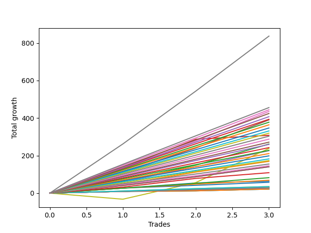

# Short Shepard 003 AB 
- Symbol: ES1y1d
- Date Range: 07/19/2021 - 07/08/2022
- Trading Period: 7:20-12:30
- Number of Trades: 3



| Name | Win Percent | Profit | Avg Profit / Trade | Avg Time / Trade | Avg Profit / Time |      | Name | Win Percent | Profit | Avg Profit / Trade | Avg Time / Trade | Avg Profit / Time |
| ---- | ----------- | ------ | ------------------ | ---------------- | ----------------- | ---- | ---- | ----------- | ------ | ------------------ | ---------------- | ----------------- |
| Sorted By <br> Profit | | | | | | | Sorted By <br> Win Percentage ||||||
| Seven | 100.00 | 418250.00 | 139416.67 | 48 12:48:00 |     | Seven | 100.00 | 418250.00 | 139416.67 | 48 12:48:00 |
| Two Hundred Fifteen | 100.00 | 227875.00 | 75958.33 | 13 21:36:00 |     | Two Hundred Fifteen | 100.00 | 227875.00 | 75958.33 | 13 21:36:00 |
| Two Hundred Fourteen.Five | 100.00 | 222000.00 | 74000.00 | 13 21:34:20 |     | Two Hundred Fourteen.Five | 100.00 | 222000.00 | 74000.00 | 13 21:34:20 |
| Six | 100.00 | 217625.00 | 72541.67 | 46 13:35:40 |     | Six | 100.00 | 217625.00 | 72541.67 | 46 13:35:40 |
| Two Hundred Fourteen | 100.00 | 212125.00 | 70708.33 | 13 21:27:00 |     | Two Hundred Fourteen | 100.00 | 212125.00 | 70708.33 | 13 21:27:00 |
| Two Hundred Thirteen.Five | 100.00 | 203625.00 | 67875.00 | 13 20:56:20 |     | Two Hundred Thirteen.Five | 100.00 | 203625.00 | 67875.00 | 13 20:56:20 |
| Two Hundred Thirteen | 100.00 | 196750.00 | 65583.33 | 13 19:51:20 |     | Two Hundred Thirteen | 100.00 | 196750.00 | 65583.33 | 13 19:51:20 |
| Five | 100.00 | 195125.00 | 65041.67 | 46 13:18:00 |     | Five | 100.00 | 195125.00 | 65041.67 | 46 13:18:00 |
| Two Hundred Twelve.Five | 100.00 | 188875.00 | 62958.33 | 13 12:25:20 |     | Two Hundred Twelve.Five | 100.00 | 188875.00 | 62958.33 | 13 12:25:20 |
| Two Hundred Twelve | 100.00 | 181875.00 | 60625.00 | 13 12:18:00 |     | Two Hundred Twelve | 100.00 | 181875.00 | 60625.00 | 13 12:18:00 |
| Two Hundred Eleven.Five | 100.00 | 173500.00 | 57833.33 | 13 04:15:40 |     | Two Hundred Eleven.Five | 100.00 | 173500.00 | 57833.33 | 13 04:15:40 |
| Two Hundred Eleven | 100.00 | 165625.00 | 55208.33 | 10 10:21:20 |     | Two Hundred Eleven | 100.00 | 165625.00 | 55208.33 | 10 10:21:20 |
| Two Hundred Ten.Five | 100.00 | 159625.00 | 53208.33 | 10 10:08:20 |     | Two Hundred Ten.Five | 100.00 | 159625.00 | 53208.33 | 10 10:08:20 |
| Three | 100.00 | 154000.00 | 51333.33 | 09 19:51:20 |     | Three | 100.00 | 154000.00 | 51333.33 | 09 19:51:20 |
| Two Hundred Ten | 100.00 | 151625.00 | 50541.67 | 10 10:03:20 |     | Two Hundred Ten | 100.00 | 151625.00 | 50541.67 | 10 10:03:20 |
| Two Hundred Nine.Five | 100.00 | 143750.00 | 47916.67 | 08 18:43:00 |     | Two Hundred Nine.Five | 100.00 | 143750.00 | 47916.67 | 08 18:43:00 |
| Two Hundred Nine | 100.00 | 135750.00 | 45250.00 | 08 16:47:40 |     | Two Hundred Nine | 100.00 | 135750.00 | 45250.00 | 08 16:47:40 |
| Two | 100.00 | 130750.00 | 43583.33 | 10 01:50:00 |     | Two | 100.00 | 130750.00 | 43583.33 | 10 01:50:00 |
| Two Hundred Eight.Five | 100.00 | 129750.00 | 43250.00 | 08 16:39:20 |     | Two Hundred Eight.Five | 100.00 | 129750.00 | 43250.00 | 08 16:39:20 |
| Two Hundred Eight | 100.00 | 121250.00 | 40416.67 | 08 16:34:00 |     | Two Hundred Eight | 100.00 | 121250.00 | 40416.67 | 08 16:34:00 |
| Seventy-Three | 66.67 | 119000.00 | 39666.67 | 13 18:56:00 |     | Two Hundred Seven.Five | 100.00 | 113875.00 | 37958.33 | 07 08:43:40 |
| Two Hundred Seven.Five | 100.00 | 113875.00 | 37958.33 | 07 08:43:40 |     | Four | 100.00 | 113125.00 | 37708.33 | 37 07:39:00 |
| Four | 100.00 | 113125.00 | 37708.33 | 37 07:39:00 |     | Two Hundred Seven | 100.00 | 105375.00 | 35125.00 | 07 08:00:20 |
| Two Hundred Seven | 100.00 | 105375.00 | 35125.00 | 07 08:00:20 |     | Two Hundred Six.Five | 100.00 | 99250.00 | 33083.33 | 07 07:53:00 |
| Two Hundred Six.Five | 100.00 | 99250.00 | 33083.33 | 07 07:53:00 |     | Two Hundred Six | 100.00 | 91125.00 | 30375.00 | 07 07:49:20 |
| Two Hundred Six | 100.00 | 91125.00 | 30375.00 | 07 07:49:20 |     | Two Hundred Five.Five | 100.00 | 86625.00 | 28875.00 | 07 07:29:40 |
| Two Hundred Five.Five | 100.00 | 86625.00 | 28875.00 | 07 07:29:40 |     | One | 100.00 | 84625.00 | 28208.33 | 07 07:21:40 |
| One | 100.00 | 84625.00 | 28208.33 | 07 07:21:40 |     | Two Hundred Five | 100.00 | 77500.00 | 25833.33 | 07 07:25:20 |
| Two Hundred Five | 100.00 | 77500.00 | 25833.33 | 07 07:25:20 |     | Two Hundred Four.Five | 100.00 | 72750.00 | 24250.00 | 07 07:15:40 |
| Two Hundred Four.Five | 100.00 | 72750.00 | 24250.00 | 07 07:15:40 |     | Two Hundred Four | 100.00 | 70125.00 | 23375.00 | 07 07:15:00 |
| Two Hundred Four | 100.00 | 70125.00 | 23375.00 | 07 07:15:00 |     | Two Hundred Three.Five | 100.00 | 70125.00 | 23375.00 | 07 07:15:00 |
| Two Hundred Three.Five | 100.00 | 70125.00 | 23375.00 | 07 07:15:00 |     | Two Hundred Three | 100.00 | 54375.00 | 18125.00 | 06 07:41:00 |
| Two Hundred Three | 100.00 | 54375.00 | 18125.00 | 06 07:41:00 |     | Two Hundred Two.Five | 100.00 | 41125.00 | 13708.33 | 05 08:07:20 |
| Two Hundred Two.Five | 100.00 | 41125.00 | 13708.33 | 05 08:07:20 |     | Two Hundred Two | 100.00 | 34250.00 | 11416.67 | 05 08:04:00 |
| Two Hundred Two | 100.00 | 34250.00 | 11416.67 | 05 08:04:00 |     | Zero | 100.00 | 31750.00 | 10583.33 | 04 23:58:20 |
| Zero | 100.00 | 31750.00 | 10583.33 | 04 23:58:20 |     | Two Hundred One.Five | 100.00 | 28875.00 | 9625.00 | 05 07:57:20 |
| Two Hundred One.Five | 100.00 | 28875.00 | 9625.00 | 05 07:57:20 |     | Two Hundred One | 100.00 | 17375.00 | 5791.67 | 00 07:51:40 |
| Two Hundred One | 100.00 | 17375.00 | 5791.67 | 00 07:51:40 |     | Ninety | 100.00 | 17375.00 | 5791.67 | 00 07:51:40 |
| Ninety | 100.00 | 17375.00 | 5791.67 | 00 07:51:40 |     | Eighty-Nine | 100.00 | 14125.00 | 4708.33 | 00 00:04:00 |
| Eighty-Nine | 100.00 | 14125.00 | 4708.33 | 00 00:04:00 |     | Eighty-Eight | 100.00 | 14125.00 | 4708.33 | 00 00:04:00 |
| Eighty-Eight | 100.00 | 14125.00 | 4708.33 | 00 00:04:00 |     | Eighty-Seven | 100.00 | 14125.00 | 4708.33 | 00 00:04:00 |
| Eighty-Seven | 100.00 | 14125.00 | 4708.33 | 00 00:04:00 |     | Eighty-Six | 100.00 | 14125.00 | 4708.33 | 00 00:04:00 |
| Eighty-Six | 100.00 | 14125.00 | 4708.33 | 00 00:04:00 |     | Eighty-Five | 100.00 | 14125.00 | 4708.33 | 00 00:04:00 |
| Eighty-Five | 100.00 | 14125.00 | 4708.33 | 00 00:04:00 |     | Eighty-Four | 100.00 | 14125.00 | 4708.33 | 00 00:04:00 |
| Eighty-Four | 100.00 | 14125.00 | 4708.33 | 00 00:04:00 |     | Eighty-Three | 100.00 | 10750.00 | 3583.33 | 00 00:03:00 |
| Eighty-Three | 100.00 | 10750.00 | 3583.33 | 00 00:03:00 |     | Eighty-Two | 100.00 | 10750.00 | 3583.33 | 00 00:03:00 |
| Eighty-Two | 100.00 | 10750.00 | 3583.33 | 00 00:03:00 |     | Eighty-One | 100.00 | 10750.00 | 3583.33 | 00 00:03:00 |
| Eighty-One | 100.00 | 10750.00 | 3583.33 | 00 00:03:00 |     | Seventy-Three | 66.67 | 119000.00 | 39666.67 | 13 18:56:00 |

## NO STOPLOSS

### Test Zero
* Sell when price hits the middle line of the 20p bollinger
* No Stoploss
* Results:
```
Total Trades: 3
Percent Up: 0.00
Percent Down: 100.00
Total Points Moved Down: 63.50
Potential Profit: 31750.00
Total Points Ups: 0.00 Count Ups: 0
Total Points Downs: 63.50 Count Downs: 3
```

<details><summary>Trades</summary>

<code>In: 2021-11-11 07:21:00		Out: 2021-11-26 06:31:00		Total Position Time: 14 23:10:00		Total Move Down: 26.50		Total to Date: 26.50</code> <br />
<code>In: 2021-11-23 07:21:00		Out: 2021-11-23 08:03:00		Total Position Time: 00 00:42:00		Total Move Down: 27.50		Total to Date: 54.00</code> <br />
<code>In: 2022-01-06 07:21:00		Out: 2022-01-06 07:24:00		Total Position Time: 00 00:03:00		Total Move Down: 9.50		Total to Date: 63.50</code> <br />


</details>

### Test One
* Sell when the price hits the upper line of the 20p 1std bollinger
* No Stoploss
* Results:
```
Total Trades: 3
Percent Up: 0.00
Percent Down: 100.00
Total Points Moved Down: 169.25
Potential Profit: 84625.00
Total Points Ups: 0.00 Count Ups: 0
Total Points Downs: 169.25 Count Downs: 3
```

<details><summary>Trades</summary>

<code>In: 2021-11-11 07:21:00		Out: 2021-11-26 06:48:00		Total Position Time: 14 23:27:00		Total Move Down: 46.00		Total to Date: 46.00</code> <br />
<code>In: 2021-11-23 07:21:00		Out: 2021-11-26 06:48:00		Total Position Time: 02 23:27:00		Total Move Down: 66.00		Total to Date: 112.00</code> <br />
<code>In: 2022-01-06 07:21:00		Out: 2022-01-10 06:32:00		Total Position Time: 03 23:11:00		Total Move Down: 57.25		Total to Date: 169.25</code> <br />


</details>

### Test Two
* Sell when the price hits the upper line of the 20p 2std bollinger
* No Stoploss
* Results:
```
Total Trades: 3
Percent Up: 0.00
Percent Down: 100.00
Total Points Moved Down: 261.50
Potential Profit: 130750.00
Total Points Ups: 0.00 Count Ups: 0
Total Points Downs: 261.50 Count Downs: 3
```

<details><summary>Trades</summary>

<code>In: 2021-11-11 07:21:00		Out: 2021-11-26 09:51:00		Total Position Time: 15 02:30:00		Total Move Down: 64.50		Total to Date: 64.50</code> <br />
<code>In: 2021-11-23 07:21:00		Out: 2021-11-26 08:17:00		Total Position Time: 03 00:56:00		Total Move Down: 84.50		Total to Date: 149.00</code> <br />
<code>In: 2022-01-06 07:21:00		Out: 2022-01-18 09:25:00		Total Position Time: 12 02:04:00		Total Move Down: 112.50		Total to Date: 261.50</code> <br />


</details>

### Test Three
* Sell when price hits the middle line of the 50p bollinger
* No Stoploss
* Results:
```
Total Trades: 3
Percent Up: 0.00
Percent Down: 100.00
Total Points Moved Down: 308.00
Potential Profit: 154000.00
Total Points Ups: 0.00 Count Ups: 0
Total Points Downs: 308.00 Count Downs: 3
```

<details><summary>Trades</summary>

<code>In: 2021-11-11 07:21:00		Out: 2021-12-01 12:57:00		Total Position Time: 20 05:36:00		Total Move Down: 135.25		Total to Date: 135.25</code> <br />
<code>In: 2021-11-23 07:21:00		Out: 2021-12-01 12:56:00		Total Position Time: 08 05:35:00		Total Move Down: 152.00		Total to Date: 287.25</code> <br />
<code>In: 2022-01-06 07:21:00		Out: 2022-01-07 07:44:00		Total Position Time: 01 00:23:00		Total Move Down: 20.75		Total to Date: 308.00</code> <br />


</details>

### Test Four
* Sell when the price hits the upper line of the 50p 1std bollinger
* No Stoploss
* Results:
```
Total Trades: 3
Percent Up: 0.00
Percent Down: 100.00
Total Points Moved Down: 226.25
Potential Profit: 113125.00
Total Points Ups: 0.00 Count Ups: 0
Total Points Downs: 226.25 Count Downs: 3
```

<details><summary>Trades</summary>

<code>In: 2021-11-11 07:21:00		Out: 2022-01-10 07:02:00		Total Position Time: 59 23:41:00		Total Move Down: 60.25		Total to Date: 60.25</code> <br />
<code>In: 2021-11-23 07:21:00		Out: 2022-01-10 07:02:00		Total Position Time: 47 23:41:00		Total Move Down: 80.25		Total to Date: 140.50</code> <br />
<code>In: 2022-01-06 07:21:00		Out: 2022-01-10 06:56:00		Total Position Time: 03 23:35:00		Total Move Down: 85.75		Total to Date: 226.25</code> <br />


</details>

### Test Five
* Sell when the price hits the upper line of the 50p 2std bollinger
* No Stoploss
* Results:
```
Total Trades: 3
Percent Up: 0.00
Percent Down: 100.00
Total Points Moved Down: 390.25
Potential Profit: 195125.00
Total Points Ups: 0.00 Count Ups: 0
Total Points Downs: 390.25 Count Downs: 3
```

<details><summary>Trades</summary>

<code>In: 2021-11-11 07:21:00		Out: 2022-01-19 12:33:00		Total Position Time: 69 05:12:00		Total Move Down: 110.25		Total to Date: 110.25</code> <br />
<code>In: 2021-11-23 07:21:00		Out: 2022-01-19 12:33:00		Total Position Time: 57 05:12:00		Total Move Down: 130.25		Total to Date: 240.50</code> <br />
<code>In: 2022-01-06 07:21:00		Out: 2022-01-19 12:51:00		Total Position Time: 13 05:30:00		Total Move Down: 149.75		Total to Date: 390.25</code> <br />


</details>

### Test Six
* Sell when the price hits the middle line of the 1std VWAP
* No Stoploss
* Results:
```
Total Trades: 3
Percent Up: 0.00
Percent Down: 100.00
Total Points Moved Down: 435.25
Potential Profit: 217625.00
Total Points Ups: 0.00 Count Ups: 0
Total Points Downs: 435.25 Count Downs: 3
```

<details><summary>Trades</summary>

<code>In: 2021-11-11 07:21:00		Out: 2022-01-19 12:57:00		Total Position Time: 69 05:36:00		Total Move Down: 129.00		Total to Date: 129.00</code> <br />
<code>In: 2021-11-23 07:21:00		Out: 2022-01-19 12:57:00		Total Position Time: 57 05:36:00		Total Move Down: 149.00		Total to Date: 278.00</code> <br />
<code>In: 2022-01-06 07:21:00		Out: 2022-01-19 12:56:00		Total Position Time: 13 05:35:00		Total Move Down: 157.25		Total to Date: 435.25</code> <br />


</details>

### Test Seven
* Sell when the price hits the upper line of the 1std VWAP
* No Stoploss
* Results:
```
Total Trades: 3
Percent Up: 0.00
Percent Down: 100.00
Total Points Moved Down: 836.50
Potential Profit: 418250.00
Total Points Ups: 0.00 Count Ups: 0
Total Points Downs: 836.50 Count Downs: 3
```

<details><summary>Trades</summary>

<code>In: 2021-11-11 07:21:00		Out: 2022-01-21 12:09:00		Total Position Time: 71 04:48:00		Total Move Down: 262.00		Total to Date: 262.00</code> <br />
<code>In: 2021-11-23 07:21:00		Out: 2022-01-21 12:09:00		Total Position Time: 59 04:48:00		Total Move Down: 282.00		Total to Date: 544.00</code> <br />
<code>In: 2022-01-06 07:21:00		Out: 2022-01-21 12:09:00		Total Position Time: 15 04:48:00		Total Move Down: 292.50		Total to Date: 836.50</code> <br />


</details>

## SPECIAL EXIT CONDITIONS 

### Test Seventy-Three
* Sell when the linear regression slope changes to negative
* No Stoploss
* Results:
```
Total Trades: 3
Percent Up: 33.33
Percent Down: 66.67
Total Points Moved Down: 238.00
Potential Profit: 119000.00
Total Points Ups: 32.50 Count Ups: 1
Total Points Downs: 270.50 Count Downs: 2
```

<details><summary>Trades</summary>

<code>In: 2021-11-11 07:21:00		Out: 2021-11-17 08:22:00		Total Position Time: 06 01:01:00		Total Move Down: -32.50		Total to Date: -32.50</code> <br />
<code>In: 2021-11-23 07:21:00		Out: 2021-11-30 11:07:00		Total Position Time: 07 03:46:00		Total Move Down: 89.00		Total to Date: 56.50</code> <br />
<code>In: 2022-01-06 07:21:00		Out: 2022-02-03 11:22:00		Total Position Time: 28 04:01:00		Total Move Down: 181.50		Total to Date: 238.00</code> <br />


</details>

## TAKE PROFIT

### Test Eighty-One
* Take Profit of 1 Point
* No Stoploss
* Results:
```
Total Trades: 3
Percent Up: 0.00
Percent Down: 100.00
Total Points Moved Down: 21.50
Potential Profit: 10750.00
Total Points Ups: 0.00 Count Ups: 0
Total Points Downs: 21.50 Count Downs: 3
```

<details><summary>Trades</summary>

<code>In: 2021-11-11 07:21:00		Out: 2021-11-11 07:24:00		Total Position Time: 00 00:03:00		Total Move Down: 9.00		Total to Date: 9.00</code> <br />
<code>In: 2021-11-23 07:21:00		Out: 2021-11-23 07:24:00		Total Position Time: 00 00:03:00		Total Move Down: 3.00		Total to Date: 12.00</code> <br />
<code>In: 2022-01-06 07:21:00		Out: 2022-01-06 07:24:00		Total Position Time: 00 00:03:00		Total Move Down: 9.50		Total to Date: 21.50</code> <br />


</details>

### Test Eighty-Two
* Take Profit of 2 Point
* No Stoploss
* Results:
```
Total Trades: 3
Percent Up: 0.00
Percent Down: 100.00
Total Points Moved Down: 21.50
Potential Profit: 10750.00
Total Points Ups: 0.00 Count Ups: 0
Total Points Downs: 21.50 Count Downs: 3
```

<details><summary>Trades</summary>

<code>In: 2021-11-11 07:21:00		Out: 2021-11-11 07:24:00		Total Position Time: 00 00:03:00		Total Move Down: 9.00		Total to Date: 9.00</code> <br />
<code>In: 2021-11-23 07:21:00		Out: 2021-11-23 07:24:00		Total Position Time: 00 00:03:00		Total Move Down: 3.00		Total to Date: 12.00</code> <br />
<code>In: 2022-01-06 07:21:00		Out: 2022-01-06 07:24:00		Total Position Time: 00 00:03:00		Total Move Down: 9.50		Total to Date: 21.50</code> <br />


</details>

### Test Eighty-Three
* Take Profit of 3 Point
* No Stoploss
* Results:
```
Total Trades: 3
Percent Up: 0.00
Percent Down: 100.00
Total Points Moved Down: 21.50
Potential Profit: 10750.00
Total Points Ups: 0.00 Count Ups: 0
Total Points Downs: 21.50 Count Downs: 3
```

<details><summary>Trades</summary>

<code>In: 2021-11-11 07:21:00		Out: 2021-11-11 07:24:00		Total Position Time: 00 00:03:00		Total Move Down: 9.00		Total to Date: 9.00</code> <br />
<code>In: 2021-11-23 07:21:00		Out: 2021-11-23 07:24:00		Total Position Time: 00 00:03:00		Total Move Down: 3.00		Total to Date: 12.00</code> <br />
<code>In: 2022-01-06 07:21:00		Out: 2022-01-06 07:24:00		Total Position Time: 00 00:03:00		Total Move Down: 9.50		Total to Date: 21.50</code> <br />


</details>

### Test Eighty-Four
* Take Profit of 4 Point
* No Stoploss
* Results:
```
Total Trades: 3
Percent Up: 0.00
Percent Down: 100.00
Total Points Moved Down: 28.25
Potential Profit: 14125.00
Total Points Ups: 0.00 Count Ups: 0
Total Points Downs: 28.25 Count Downs: 3
```

<details><summary>Trades</summary>

<code>In: 2021-11-11 07:21:00		Out: 2021-11-11 07:24:00		Total Position Time: 00 00:03:00		Total Move Down: 9.00		Total to Date: 9.00</code> <br />
<code>In: 2021-11-23 07:21:00		Out: 2021-11-23 07:27:00		Total Position Time: 00 00:06:00		Total Move Down: 9.75		Total to Date: 18.75</code> <br />
<code>In: 2022-01-06 07:21:00		Out: 2022-01-06 07:24:00		Total Position Time: 00 00:03:00		Total Move Down: 9.50		Total to Date: 28.25</code> <br />


</details>

### Test Eighty-Five
* Take Profit of 5 Point
* No Stoploss
* Results:
```
Total Trades: 3
Percent Up: 0.00
Percent Down: 100.00
Total Points Moved Down: 28.25
Potential Profit: 14125.00
Total Points Ups: 0.00 Count Ups: 0
Total Points Downs: 28.25 Count Downs: 3
```

<details><summary>Trades</summary>

<code>In: 2021-11-11 07:21:00		Out: 2021-11-11 07:24:00		Total Position Time: 00 00:03:00		Total Move Down: 9.00		Total to Date: 9.00</code> <br />
<code>In: 2021-11-23 07:21:00		Out: 2021-11-23 07:27:00		Total Position Time: 00 00:06:00		Total Move Down: 9.75		Total to Date: 18.75</code> <br />
<code>In: 2022-01-06 07:21:00		Out: 2022-01-06 07:24:00		Total Position Time: 00 00:03:00		Total Move Down: 9.50		Total to Date: 28.25</code> <br />


</details>

### Test Eighty-Six
* Take Profit of 6 Point
* No Stoploss
* Results:
```
Total Trades: 3
Percent Up: 0.00
Percent Down: 100.00
Total Points Moved Down: 28.25
Potential Profit: 14125.00
Total Points Ups: 0.00 Count Ups: 0
Total Points Downs: 28.25 Count Downs: 3
```

<details><summary>Trades</summary>

<code>In: 2021-11-11 07:21:00		Out: 2021-11-11 07:24:00		Total Position Time: 00 00:03:00		Total Move Down: 9.00		Total to Date: 9.00</code> <br />
<code>In: 2021-11-23 07:21:00		Out: 2021-11-23 07:27:00		Total Position Time: 00 00:06:00		Total Move Down: 9.75		Total to Date: 18.75</code> <br />
<code>In: 2022-01-06 07:21:00		Out: 2022-01-06 07:24:00		Total Position Time: 00 00:03:00		Total Move Down: 9.50		Total to Date: 28.25</code> <br />


</details>

### Test Eighty-Seven
* Take Profit of 7 Point
* No Stoploss
* Results:
```
Total Trades: 3
Percent Up: 0.00
Percent Down: 100.00
Total Points Moved Down: 28.25
Potential Profit: 14125.00
Total Points Ups: 0.00 Count Ups: 0
Total Points Downs: 28.25 Count Downs: 3
```

<details><summary>Trades</summary>

<code>In: 2021-11-11 07:21:00		Out: 2021-11-11 07:24:00		Total Position Time: 00 00:03:00		Total Move Down: 9.00		Total to Date: 9.00</code> <br />
<code>In: 2021-11-23 07:21:00		Out: 2021-11-23 07:27:00		Total Position Time: 00 00:06:00		Total Move Down: 9.75		Total to Date: 18.75</code> <br />
<code>In: 2022-01-06 07:21:00		Out: 2022-01-06 07:24:00		Total Position Time: 00 00:03:00		Total Move Down: 9.50		Total to Date: 28.25</code> <br />


</details>

### Test Eighty-Eight
* Take Profit of 8 Point
* No Stoploss
* Results:
```
Total Trades: 3
Percent Up: 0.00
Percent Down: 100.00
Total Points Moved Down: 28.25
Potential Profit: 14125.00
Total Points Ups: 0.00 Count Ups: 0
Total Points Downs: 28.25 Count Downs: 3
```

<details><summary>Trades</summary>

<code>In: 2021-11-11 07:21:00		Out: 2021-11-11 07:24:00		Total Position Time: 00 00:03:00		Total Move Down: 9.00		Total to Date: 9.00</code> <br />
<code>In: 2021-11-23 07:21:00		Out: 2021-11-23 07:27:00		Total Position Time: 00 00:06:00		Total Move Down: 9.75		Total to Date: 18.75</code> <br />
<code>In: 2022-01-06 07:21:00		Out: 2022-01-06 07:24:00		Total Position Time: 00 00:03:00		Total Move Down: 9.50		Total to Date: 28.25</code> <br />


</details>

### Test Eighty-Nine
* Take Profit of 9 Point
* No Stoploss
* Results:
```
Total Trades: 3
Percent Up: 0.00
Percent Down: 100.00
Total Points Moved Down: 28.25
Potential Profit: 14125.00
Total Points Ups: 0.00 Count Ups: 0
Total Points Downs: 28.25 Count Downs: 3
```

<details><summary>Trades</summary>

<code>In: 2021-11-11 07:21:00		Out: 2021-11-11 07:24:00		Total Position Time: 00 00:03:00		Total Move Down: 9.00		Total to Date: 9.00</code> <br />
<code>In: 2021-11-23 07:21:00		Out: 2021-11-23 07:27:00		Total Position Time: 00 00:06:00		Total Move Down: 9.75		Total to Date: 18.75</code> <br />
<code>In: 2022-01-06 07:21:00		Out: 2022-01-06 07:24:00		Total Position Time: 00 00:03:00		Total Move Down: 9.50		Total to Date: 28.25</code> <br />


</details>

### Test Ninety
* Take Profit of 10 Point
* No Stoploss
* Results:
```
Total Trades: 3
Percent Up: 0.00
Percent Down: 100.00
Total Points Moved Down: 34.75
Potential Profit: 17375.00
Total Points Ups: 0.00 Count Ups: 0
Total Points Downs: 34.75 Count Downs: 3
```

<details><summary>Trades</summary>

<code>In: 2021-11-11 07:21:00		Out: 2021-11-11 07:32:00		Total Position Time: 00 00:11:00		Total Move Down: 11.25		Total to Date: 11.25</code> <br />
<code>In: 2021-11-23 07:21:00		Out: 2021-11-23 07:29:00		Total Position Time: 00 00:08:00		Total Move Down: 12.75		Total to Date: 24.00</code> <br />
<code>In: 2022-01-06 07:21:00		Out: 2022-01-07 06:37:00		Total Position Time: 00 23:16:00		Total Move Down: 10.75		Total to Date: 34.75</code> <br />


</details>

## DAILY TAKE PROFITS

### Test Two Hundred One
* Take Profit of 10 Point
* No Stoploss
* Results:
```
Total Trades: 3
Percent Up: 0.00
Percent Down: 100.00
Total Points Moved Down: 34.75
Potential Profit: 17375.00
Total Points Ups: 0.00 Count Ups: 0
Total Points Downs: 34.75 Count Downs: 3
```

<details><summary>Trades</summary>

<code>In: 2021-11-11 07:21:00		Out: 2021-11-11 07:32:00		Total Position Time: 00 00:11:00		Total Move Down: 11.25		Total to Date: 11.25</code> <br />
<code>In: 2021-11-23 07:21:00		Out: 2021-11-23 07:29:00		Total Position Time: 00 00:08:00		Total Move Down: 12.75		Total to Date: 24.00</code> <br />
<code>In: 2022-01-06 07:21:00		Out: 2022-01-07 06:37:00		Total Position Time: 00 23:16:00		Total Move Down: 10.75		Total to Date: 34.75</code> <br />


</details>

### Test Two Hundred One.Five
* Take Profit of 15 Point
* No Stoploss
* Results:
```
Total Trades: 3
Percent Up: 0.00
Percent Down: 100.00
Total Points Moved Down: 57.75
Potential Profit: 28875.00
Total Points Ups: 0.00 Count Ups: 0
Total Points Downs: 57.75 Count Downs: 3
```

<details><summary>Trades</summary>

<code>In: 2021-11-11 07:21:00		Out: 2021-11-26 06:31:00		Total Position Time: 14 23:10:00		Total Move Down: 26.50		Total to Date: 26.50</code> <br />
<code>In: 2021-11-23 07:21:00		Out: 2021-11-23 07:45:00		Total Position Time: 00 00:24:00		Total Move Down: 15.00		Total to Date: 41.50</code> <br />
<code>In: 2022-01-06 07:21:00		Out: 2022-01-07 07:39:00		Total Position Time: 01 00:18:00		Total Move Down: 16.25		Total to Date: 57.75</code> <br />


</details>

### Test Two Hundred Two
* Take Profit of 20 Point
* No Stoploss
* Results:
```
Total Trades: 3
Percent Up: 0.00
Percent Down: 100.00
Total Points Moved Down: 68.50
Potential Profit: 34250.00
Total Points Ups: 0.00 Count Ups: 0
Total Points Downs: 68.50 Count Downs: 3
```

<details><summary>Trades</summary>

<code>In: 2021-11-11 07:21:00		Out: 2021-11-26 06:31:00		Total Position Time: 14 23:10:00		Total Move Down: 26.50		Total to Date: 26.50</code> <br />
<code>In: 2021-11-23 07:21:00		Out: 2021-11-23 08:00:00		Total Position Time: 00 00:39:00		Total Move Down: 21.25		Total to Date: 47.75</code> <br />
<code>In: 2022-01-06 07:21:00		Out: 2022-01-07 07:44:00		Total Position Time: 01 00:23:00		Total Move Down: 20.75		Total to Date: 68.50</code> <br />


</details>

### Test Two Hundred Two.Five
* Take Profit of 25 Point
* No Stoploss
* Results:
```
Total Trades: 3
Percent Up: 0.00
Percent Down: 100.00
Total Points Moved Down: 82.25
Potential Profit: 41125.00
Total Points Ups: 0.00 Count Ups: 0
Total Points Downs: 82.25 Count Downs: 3
```

<details><summary>Trades</summary>

<code>In: 2021-11-11 07:21:00		Out: 2021-11-26 06:31:00		Total Position Time: 14 23:10:00		Total Move Down: 26.50		Total to Date: 26.50</code> <br />
<code>In: 2021-11-23 07:21:00		Out: 2021-11-23 08:02:00		Total Position Time: 00 00:41:00		Total Move Down: 25.50		Total to Date: 52.00</code> <br />
<code>In: 2022-01-06 07:21:00		Out: 2022-01-07 07:52:00		Total Position Time: 01 00:31:00		Total Move Down: 30.25		Total to Date: 82.25</code> <br />


</details>

### Test Two Hundred Three
* Take Profit of 30 Point
* No Stoploss
* Results:
```
Total Trades: 3
Percent Up: 0.00
Percent Down: 100.00
Total Points Moved Down: 108.75
Potential Profit: 54375.00
Total Points Ups: 0.00 Count Ups: 0
Total Points Downs: 108.75 Count Downs: 3
```

<details><summary>Trades</summary>

<code>In: 2021-11-11 07:21:00		Out: 2021-11-26 06:43:00		Total Position Time: 14 23:22:00		Total Move Down: 32.00		Total to Date: 32.00</code> <br />
<code>In: 2021-11-23 07:21:00		Out: 2021-11-26 06:31:00		Total Position Time: 02 23:10:00		Total Move Down: 46.50		Total to Date: 78.50</code> <br />
<code>In: 2022-01-06 07:21:00		Out: 2022-01-07 07:52:00		Total Position Time: 01 00:31:00		Total Move Down: 30.25		Total to Date: 108.75</code> <br />


</details>

### Test Two Hundred Three.Five
* Take Profit of 35 Point
* No Stoploss
* Results:
```
Total Trades: 3
Percent Up: 0.00
Percent Down: 100.00
Total Points Moved Down: 140.25
Potential Profit: 70125.00
Total Points Ups: 0.00 Count Ups: 0
Total Points Downs: 140.25 Count Downs: 3
```

<details><summary>Trades</summary>

<code>In: 2021-11-11 07:21:00		Out: 2021-11-26 06:46:00		Total Position Time: 14 23:25:00		Total Move Down: 40.75		Total to Date: 40.75</code> <br />
<code>In: 2021-11-23 07:21:00		Out: 2021-11-26 06:31:00		Total Position Time: 02 23:10:00		Total Move Down: 46.50		Total to Date: 87.25</code> <br />
<code>In: 2022-01-06 07:21:00		Out: 2022-01-10 06:31:00		Total Position Time: 03 23:10:00		Total Move Down: 53.00		Total to Date: 140.25</code> <br />


</details>

### Test Two Hundred Four
* Take Profit of 40 Point
* No Stoploss
* Results:
```
Total Trades: 3
Percent Up: 0.00
Percent Down: 100.00
Total Points Moved Down: 140.25
Potential Profit: 70125.00
Total Points Ups: 0.00 Count Ups: 0
Total Points Downs: 140.25 Count Downs: 3
```

<details><summary>Trades</summary>

<code>In: 2021-11-11 07:21:00		Out: 2021-11-26 06:46:00		Total Position Time: 14 23:25:00		Total Move Down: 40.75		Total to Date: 40.75</code> <br />
<code>In: 2021-11-23 07:21:00		Out: 2021-11-26 06:31:00		Total Position Time: 02 23:10:00		Total Move Down: 46.50		Total to Date: 87.25</code> <br />
<code>In: 2022-01-06 07:21:00		Out: 2022-01-10 06:31:00		Total Position Time: 03 23:10:00		Total Move Down: 53.00		Total to Date: 140.25</code> <br />


</details>

### Test Two Hundred Four.Five
* Take Profit of 45 Point
* No Stoploss
* Results:
```
Total Trades: 3
Percent Up: 0.00
Percent Down: 100.00
Total Points Moved Down: 145.50
Potential Profit: 72750.00
Total Points Ups: 0.00 Count Ups: 0
Total Points Downs: 145.50 Count Downs: 3
```

<details><summary>Trades</summary>

<code>In: 2021-11-11 07:21:00		Out: 2021-11-26 06:48:00		Total Position Time: 14 23:27:00		Total Move Down: 46.00		Total to Date: 46.00</code> <br />
<code>In: 2021-11-23 07:21:00		Out: 2021-11-26 06:31:00		Total Position Time: 02 23:10:00		Total Move Down: 46.50		Total to Date: 92.50</code> <br />
<code>In: 2022-01-06 07:21:00		Out: 2022-01-10 06:31:00		Total Position Time: 03 23:10:00		Total Move Down: 53.00		Total to Date: 145.50</code> <br />


</details>

### Test Two Hundred Five
* Take Profit of 50 Point
* No Stoploss
* Results:
```
Total Trades: 3
Percent Up: 0.00
Percent Down: 100.00
Total Points Moved Down: 155.00
Potential Profit: 77500.00
Total Points Ups: 0.00 Count Ups: 0
Total Points Downs: 155.00 Count Downs: 3
```

<details><summary>Trades</summary>

<code>In: 2021-11-11 07:21:00		Out: 2021-11-26 07:05:00		Total Position Time: 14 23:44:00		Total Move Down: 50.00		Total to Date: 50.00</code> <br />
<code>In: 2021-11-23 07:21:00		Out: 2021-11-26 06:43:00		Total Position Time: 02 23:22:00		Total Move Down: 52.00		Total to Date: 102.00</code> <br />
<code>In: 2022-01-06 07:21:00		Out: 2022-01-10 06:31:00		Total Position Time: 03 23:10:00		Total Move Down: 53.00		Total to Date: 155.00</code> <br />


</details>

### Test Two Hundred Five.Five
* Take Profit of 55 Point
* No Stoploss
* Results:
```
Total Trades: 3
Percent Up: 0.00
Percent Down: 100.00
Total Points Moved Down: 173.25
Potential Profit: 86625.00
Total Points Ups: 0.00 Count Ups: 0
Total Points Downs: 173.25 Count Downs: 3
```

<details><summary>Trades</summary>

<code>In: 2021-11-11 07:21:00		Out: 2021-11-26 07:14:00		Total Position Time: 14 23:53:00		Total Move Down: 55.25		Total to Date: 55.25</code> <br />
<code>In: 2021-11-23 07:21:00		Out: 2021-11-26 06:46:00		Total Position Time: 02 23:25:00		Total Move Down: 60.75		Total to Date: 116.00</code> <br />
<code>In: 2022-01-06 07:21:00		Out: 2022-01-10 06:32:00		Total Position Time: 03 23:11:00		Total Move Down: 57.25		Total to Date: 173.25</code> <br />


</details>

### Test Two Hundred Six
* Take Profit of 60 Point
* No Stoploss
* Results:
```
Total Trades: 3
Percent Up: 0.00
Percent Down: 100.00
Total Points Moved Down: 182.25
Potential Profit: 91125.00
Total Points Ups: 0.00 Count Ups: 0
Total Points Downs: 182.25 Count Downs: 3
```

<details><summary>Trades</summary>

<code>In: 2021-11-11 07:21:00		Out: 2021-11-26 08:12:00		Total Position Time: 15 00:51:00		Total Move Down: 60.50		Total to Date: 60.50</code> <br />
<code>In: 2021-11-23 07:21:00		Out: 2021-11-26 06:46:00		Total Position Time: 02 23:25:00		Total Move Down: 60.75		Total to Date: 121.25</code> <br />
<code>In: 2022-01-06 07:21:00		Out: 2022-01-10 06:33:00		Total Position Time: 03 23:12:00		Total Move Down: 61.00		Total to Date: 182.25</code> <br />


</details>

### Test Two Hundred Six.Five
* Take Profit of 65 Point
* No Stoploss
* Results:
```
Total Trades: 3
Percent Up: 0.00
Percent Down: 100.00
Total Points Moved Down: 198.50
Potential Profit: 99250.00
Total Points Ups: 0.00 Count Ups: 0
Total Points Downs: 198.50 Count Downs: 3
```

<details><summary>Trades</summary>

<code>In: 2021-11-11 07:21:00		Out: 2021-11-26 08:18:00		Total Position Time: 15 00:57:00		Total Move Down: 66.75		Total to Date: 66.75</code> <br />
<code>In: 2021-11-23 07:21:00		Out: 2021-11-26 06:48:00		Total Position Time: 02 23:27:00		Total Move Down: 66.00		Total to Date: 132.75</code> <br />
<code>In: 2022-01-06 07:21:00		Out: 2022-01-10 06:36:00		Total Position Time: 03 23:15:00		Total Move Down: 65.75		Total to Date: 198.50</code> <br />


</details>

### Test Two Hundred Seven
* Take Profit of 70 Point
* No Stoploss
* Results:
```
Total Trades: 3
Percent Up: 0.00
Percent Down: 100.00
Total Points Moved Down: 210.75
Potential Profit: 105375.00
Total Points Ups: 0.00 Count Ups: 0
Total Points Downs: 210.75 Count Downs: 3
```

<details><summary>Trades</summary>

<code>In: 2021-11-11 07:21:00		Out: 2021-11-26 08:22:00		Total Position Time: 15 01:01:00		Total Move Down: 70.75		Total to Date: 70.75</code> <br />
<code>In: 2021-11-23 07:21:00		Out: 2021-11-26 07:05:00		Total Position Time: 02 23:44:00		Total Move Down: 70.00		Total to Date: 140.75</code> <br />
<code>In: 2022-01-06 07:21:00		Out: 2022-01-10 06:37:00		Total Position Time: 03 23:16:00		Total Move Down: 70.00		Total to Date: 210.75</code> <br />


</details>

### Test Two Hundred Seven.Five
* Take Profit of 75 Point
* No Stoploss
* Results:
```
Total Trades: 3
Percent Up: 0.00
Percent Down: 100.00
Total Points Moved Down: 227.75
Potential Profit: 113875.00
Total Points Ups: 0.00 Count Ups: 0
Total Points Downs: 227.75 Count Downs: 3
```

<details><summary>Trades</summary>

<code>In: 2021-11-11 07:21:00		Out: 2021-11-26 10:14:00		Total Position Time: 15 02:53:00		Total Move Down: 76.50		Total to Date: 76.50</code> <br />
<code>In: 2021-11-23 07:21:00		Out: 2021-11-26 07:14:00		Total Position Time: 02 23:53:00		Total Move Down: 75.25		Total to Date: 151.75</code> <br />
<code>In: 2022-01-06 07:21:00		Out: 2022-01-10 06:46:00		Total Position Time: 03 23:25:00		Total Move Down: 76.00		Total to Date: 227.75</code> <br />


</details>

### Test Two Hundred Eight
* Take Profit of 80 Point
* No Stoploss
* Results:
```
Total Trades: 3
Percent Up: 0.00
Percent Down: 100.00
Total Points Moved Down: 242.50
Potential Profit: 121250.00
Total Points Ups: 0.00 Count Ups: 0
Total Points Downs: 242.50 Count Downs: 3
```

<details><summary>Trades</summary>

<code>In: 2021-11-11 07:21:00		Out: 2021-11-30 08:44:00		Total Position Time: 19 01:23:00		Total Move Down: 81.00		Total to Date: 81.00</code> <br />
<code>In: 2021-11-23 07:21:00		Out: 2021-11-26 08:12:00		Total Position Time: 03 00:51:00		Total Move Down: 80.50		Total to Date: 161.50</code> <br />
<code>In: 2022-01-06 07:21:00		Out: 2022-01-10 06:49:00		Total Position Time: 03 23:28:00		Total Move Down: 81.00		Total to Date: 242.50</code> <br />


</details>

### Test Two Hundred Eight.Five
* Take Profit of 85 Point
* No Stoploss
* Results:
```
Total Trades: 3
Percent Up: 0.00
Percent Down: 100.00
Total Points Moved Down: 259.50
Potential Profit: 129750.00
Total Points Ups: 0.00 Count Ups: 0
Total Points Downs: 259.50 Count Downs: 3
```

<details><summary>Trades</summary>

<code>In: 2021-11-11 07:21:00		Out: 2021-11-30 08:47:00		Total Position Time: 19 01:26:00		Total Move Down: 87.00		Total to Date: 87.00</code> <br />
<code>In: 2021-11-23 07:21:00		Out: 2021-11-26 08:18:00		Total Position Time: 03 00:57:00		Total Move Down: 86.75		Total to Date: 173.75</code> <br />
<code>In: 2022-01-06 07:21:00		Out: 2022-01-10 06:56:00		Total Position Time: 03 23:35:00		Total Move Down: 85.75		Total to Date: 259.50</code> <br />


</details>

### Test Two Hundred Nine
* Take Profit of 90 Point
* No Stoploss
* Results:
```
Total Trades: 3
Percent Up: 0.00
Percent Down: 100.00
Total Points Moved Down: 271.50
Potential Profit: 135750.00
Total Points Ups: 0.00 Count Ups: 0
Total Points Downs: 271.50 Count Downs: 3
```

<details><summary>Trades</summary>

<code>In: 2021-11-11 07:21:00		Out: 2021-11-30 09:02:00		Total Position Time: 19 01:41:00		Total Move Down: 90.00		Total to Date: 90.00</code> <br />
<code>In: 2021-11-23 07:21:00		Out: 2021-11-26 08:22:00		Total Position Time: 03 01:01:00		Total Move Down: 90.75		Total to Date: 180.75</code> <br />
<code>In: 2022-01-06 07:21:00		Out: 2022-01-10 07:02:00		Total Position Time: 03 23:41:00		Total Move Down: 90.75		Total to Date: 271.50</code> <br />


</details>

### Test Two Hundred Nine.Five
* Take Profit of 95 Point
* No Stoploss
* Results:
```
Total Trades: 3
Percent Up: 0.00
Percent Down: 100.00
Total Points Moved Down: 287.50
Potential Profit: 143750.00
Total Points Ups: 0.00 Count Ups: 0
Total Points Downs: 287.50 Count Downs: 3
```

<details><summary>Trades</summary>

<code>In: 2021-11-11 07:21:00		Out: 2021-11-30 12:53:00		Total Position Time: 19 05:32:00		Total Move Down: 95.25		Total to Date: 95.25</code> <br />
<code>In: 2021-11-23 07:21:00		Out: 2021-11-26 10:14:00		Total Position Time: 03 02:53:00		Total Move Down: 96.50		Total to Date: 191.75</code> <br />
<code>In: 2022-01-06 07:21:00		Out: 2022-01-10 07:05:00		Total Position Time: 03 23:44:00		Total Move Down: 95.75		Total to Date: 287.50</code> <br />


</details>

### Test Two Hundred Ten
* Take Profit of 100 Point
* No Stoploss
* Results:
```
Total Trades: 3
Percent Up: 0.00
Percent Down: 100.00
Total Points Moved Down: 303.25
Potential Profit: 151625.00
Total Points Ups: 0.00 Count Ups: 0
Total Points Downs: 303.25 Count Downs: 3
```

<details><summary>Trades</summary>

<code>In: 2021-11-11 07:21:00		Out: 2021-12-01 12:16:00		Total Position Time: 20 04:55:00		Total Move Down: 101.25		Total to Date: 101.25</code> <br />
<code>In: 2021-11-23 07:21:00		Out: 2021-11-30 08:44:00		Total Position Time: 07 01:23:00		Total Move Down: 101.00		Total to Date: 202.25</code> <br />
<code>In: 2022-01-06 07:21:00		Out: 2022-01-10 07:13:00		Total Position Time: 03 23:52:00		Total Move Down: 101.00		Total to Date: 303.25</code> <br />


</details>

### Test Two Hundred Ten.Five
* Take Profit of 105 Point
* No Stoploss
* Results:
```
Total Trades: 3
Percent Up: 0.00
Percent Down: 100.00
Total Points Moved Down: 319.25
Potential Profit: 159625.00
Total Points Ups: 0.00 Count Ups: 0
Total Points Downs: 319.25 Count Downs: 3
```

<details><summary>Trades</summary>

<code>In: 2021-11-11 07:21:00		Out: 2021-12-01 12:21:00		Total Position Time: 20 05:00:00		Total Move Down: 106.25		Total to Date: 106.25</code> <br />
<code>In: 2021-11-23 07:21:00		Out: 2021-11-30 08:47:00		Total Position Time: 07 01:26:00		Total Move Down: 107.00		Total to Date: 213.25</code> <br />
<code>In: 2022-01-06 07:21:00		Out: 2022-01-10 07:20:00		Total Position Time: 03 23:59:00		Total Move Down: 106.00		Total to Date: 319.25</code> <br />


</details>

### Test Two Hundred Eleven
* Take Profit of 110 Point
* No Stoploss
* Results:
```
Total Trades: 3
Percent Up: 0.00
Percent Down: 100.00
Total Points Moved Down: 331.25
Potential Profit: 165625.00
Total Points Ups: 0.00 Count Ups: 0
Total Points Downs: 331.25 Count Downs: 3
```

<details><summary>Trades</summary>

<code>In: 2021-11-11 07:21:00		Out: 2021-12-01 12:22:00		Total Position Time: 20 05:01:00		Total Move Down: 111.00		Total to Date: 111.00</code> <br />
<code>In: 2021-11-23 07:21:00		Out: 2021-11-30 09:02:00		Total Position Time: 07 01:41:00		Total Move Down: 110.00		Total to Date: 221.00</code> <br />
<code>In: 2022-01-06 07:21:00		Out: 2022-01-10 07:43:00		Total Position Time: 04 00:22:00		Total Move Down: 110.25		Total to Date: 331.25</code> <br />


</details>

### Test Two Hundred Eleven.Five
* Take Profit of 115 Point
* No Stoploss
* Results:
```
Total Trades: 3
Percent Up: 0.00
Percent Down: 100.00
Total Points Moved Down: 347.00
Potential Profit: 173500.00
Total Points Ups: 0.00 Count Ups: 0
Total Points Downs: 347.00 Count Downs: 3
```

<details><summary>Trades</summary>

<code>In: 2021-11-11 07:21:00		Out: 2021-12-01 12:25:00		Total Position Time: 20 05:04:00		Total Move Down: 116.25		Total to Date: 116.25</code> <br />
<code>In: 2021-11-23 07:21:00		Out: 2021-11-30 12:53:00		Total Position Time: 07 05:32:00		Total Move Down: 115.25		Total to Date: 231.50</code> <br />
<code>In: 2022-01-06 07:21:00		Out: 2022-01-18 09:32:00		Total Position Time: 12 02:11:00		Total Move Down: 115.50		Total to Date: 347.00</code> <br />


</details>

### Test Two Hundred Twelve
* Take Profit of 120 Point
* No Stoploss
* Results:
```
Total Trades: 3
Percent Up: 0.00
Percent Down: 100.00
Total Points Moved Down: 363.75
Potential Profit: 181875.00
Total Points Ups: 0.00 Count Ups: 0
Total Points Downs: 363.75 Count Downs: 3
```

<details><summary>Trades</summary>

<code>In: 2021-11-11 07:21:00		Out: 2021-12-01 12:52:00		Total Position Time: 20 05:31:00		Total Move Down: 122.25		Total to Date: 122.25</code> <br />
<code>In: 2021-11-23 07:21:00		Out: 2021-12-01 12:16:00		Total Position Time: 08 04:55:00		Total Move Down: 121.25		Total to Date: 243.50</code> <br />
<code>In: 2022-01-06 07:21:00		Out: 2022-01-18 09:49:00		Total Position Time: 12 02:28:00		Total Move Down: 120.25		Total to Date: 363.75</code> <br />


</details>

### Test Two Hundred Twelve.Five
* Take Profit of 125 Point
* No Stoploss
* Results:
```
Total Trades: 3
Percent Up: 0.00
Percent Down: 100.00
Total Points Moved Down: 377.75
Potential Profit: 188875.00
Total Points Ups: 0.00 Count Ups: 0
Total Points Downs: 377.75 Count Downs: 3
```

<details><summary>Trades</summary>

<code>In: 2021-11-11 07:21:00		Out: 2021-12-01 12:55:00		Total Position Time: 20 05:34:00		Total Move Down: 126.00		Total to Date: 126.00</code> <br />
<code>In: 2021-11-23 07:21:00		Out: 2021-12-01 12:21:00		Total Position Time: 08 05:00:00		Total Move Down: 126.25		Total to Date: 252.25</code> <br />
<code>In: 2022-01-06 07:21:00		Out: 2022-01-18 10:03:00		Total Position Time: 12 02:42:00		Total Move Down: 125.50		Total to Date: 377.75</code> <br />


</details>

### Test Two Hundred Thirteen
* Take Profit of 130 Point
* No Stoploss
* Results:
```
Total Trades: 3
Percent Up: 0.00
Percent Down: 100.00
Total Points Moved Down: 393.50
Potential Profit: 196750.00
Total Points Ups: 0.00 Count Ups: 0
Total Points Downs: 393.50 Count Downs: 3
```

<details><summary>Trades</summary>

<code>In: 2021-11-11 07:21:00		Out: 2021-12-01 12:56:00		Total Position Time: 20 05:35:00		Total Move Down: 132.00		Total to Date: 132.00</code> <br />
<code>In: 2021-11-23 07:21:00		Out: 2021-12-01 12:22:00		Total Position Time: 08 05:01:00		Total Move Down: 131.00		Total to Date: 263.00</code> <br />
<code>In: 2022-01-06 07:21:00		Out: 2022-01-19 08:19:00		Total Position Time: 13 00:58:00		Total Move Down: 130.50		Total to Date: 393.50</code> <br />


</details>

### Test Two Hundred Thirteen.Five
* Take Profit of 135 Point
* No Stoploss
* Results:
```
Total Trades: 3
Percent Up: 0.00
Percent Down: 100.00
Total Points Moved Down: 407.25
Potential Profit: 203625.00
Total Points Ups: 0.00 Count Ups: 0
Total Points Downs: 407.25 Count Downs: 3
```

<details><summary>Trades</summary>

<code>In: 2021-11-11 07:21:00		Out: 2021-12-01 12:57:00		Total Position Time: 20 05:36:00		Total Move Down: 135.25		Total to Date: 135.25</code> <br />
<code>In: 2021-11-23 07:21:00		Out: 2021-12-01 12:25:00		Total Position Time: 08 05:04:00		Total Move Down: 136.25		Total to Date: 271.50</code> <br />
<code>In: 2022-01-06 07:21:00		Out: 2022-01-19 11:30:00		Total Position Time: 13 04:09:00		Total Move Down: 135.75		Total to Date: 407.25</code> <br />


</details>

### Test Two Hundred Fourteen
* Take Profit of 140 Point
* No Stoploss
* Results:
```
Total Trades: 3
Percent Up: 0.00
Percent Down: 100.00
Total Points Moved Down: 424.25
Potential Profit: 212125.00
Total Points Ups: 0.00 Count Ups: 0
Total Points Downs: 424.25 Count Downs: 3
```

<details><summary>Trades</summary>

<code>In: 2021-11-11 07:21:00		Out: 2021-12-01 12:59:00		Total Position Time: 20 05:38:00		Total Move Down: 141.25		Total to Date: 141.25</code> <br />
<code>In: 2021-11-23 07:21:00		Out: 2021-12-01 12:52:00		Total Position Time: 08 05:31:00		Total Move Down: 142.25		Total to Date: 283.50</code> <br />
<code>In: 2022-01-06 07:21:00		Out: 2022-01-19 12:33:00		Total Position Time: 13 05:12:00		Total Move Down: 140.75		Total to Date: 424.25</code> <br />


</details>

### Test Two Hundred Fourteen.Five
* Take Profit of 145 Point
* No Stoploss
* Results:
```
Total Trades: 3
Percent Up: 0.00
Percent Down: 100.00
Total Points Moved Down: 444.00
Potential Profit: 222000.00
Total Points Ups: 0.00 Count Ups: 0
Total Points Downs: 444.00 Count Downs: 3
```

<details><summary>Trades</summary>

<code>In: 2021-11-11 07:21:00		Out: 2021-12-01 13:00:00		Total Position Time: 20 05:39:00		Total Move Down: 148.25		Total to Date: 148.25</code> <br />
<code>In: 2021-11-23 07:21:00		Out: 2021-12-01 12:55:00		Total Position Time: 08 05:34:00		Total Move Down: 146.00		Total to Date: 294.25</code> <br />
<code>In: 2022-01-06 07:21:00		Out: 2022-01-19 12:51:00		Total Position Time: 13 05:30:00		Total Move Down: 149.75		Total to Date: 444.00</code> <br />


</details>

### Test Two Hundred Fifteen
* Take Profit of 150 Point
* No Stoploss
* Results:
```
Total Trades: 3
Percent Up: 0.00
Percent Down: 100.00
Total Points Moved Down: 455.75
Potential Profit: 227875.00
Total Points Ups: 0.00 Count Ups: 0
Total Points Downs: 455.75 Count Downs: 3
```

<details><summary>Trades</summary>

<code>In: 2021-11-11 07:21:00		Out: 2021-12-01 13:03:00		Total Position Time: 20 05:42:00		Total Move Down: 153.50		Total to Date: 153.50</code> <br />
<code>In: 2021-11-23 07:21:00		Out: 2021-12-01 12:56:00		Total Position Time: 08 05:35:00		Total Move Down: 152.00		Total to Date: 305.50</code> <br />
<code>In: 2022-01-06 07:21:00		Out: 2022-01-19 12:52:00		Total Position Time: 13 05:31:00		Total Move Down: 150.25		Total to Date: 455.75</code> <br />


</details>