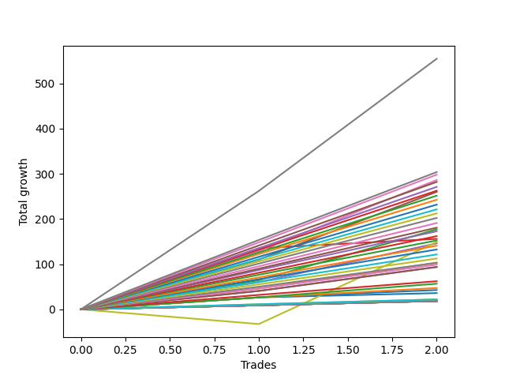

# Short Shepard 004 AB 
- Symbol: ES1y1d
- Date Range: 07/19/2021 - 07/07/2022
- Trading Period: 7:20-12:30
- Number of Trades: 2


## NO STOPLOSS

### Test Zero
* Sell when price hits the middle line of the 20p bollinger
* No Stoploss
* Results:
```
Total Trades: 2
Percent Up: 0.00
Percent Down: 100.00
Total Points Moved Down: 36.00
Potential Profit: 18000.00
Total Points Ups: 0.00 Count Ups: 0
Total Points Downs: 36.00 Count Downs: 2
```

<details><summary>Trades</summary>

<code>In: 2021-11-11 07:21:00		Out: 2021-11-26 06:31:00		Total Position Time: 14 23:10:00		Total Move Down: 26.50		Total to Date: 26.50</code> <br />
<code>In: 2022-01-06 07:21:00		Out: 2022-01-06 07:24:00		Total Position Time: 00 00:03:00		Total Move Down: 9.50		Total to Date: 36.00</code> <br />


</details>

### Test One
* Sell when the price hits the upper line of the 20p 1std bollinger
* No Stoploss
* Results:
```
Total Trades: 2
Percent Up: 0.00
Percent Down: 100.00
Total Points Moved Down: 103.25
Potential Profit: 51625.00
Total Points Ups: 0.00 Count Ups: 0
Total Points Downs: 103.25 Count Downs: 2
```

<details><summary>Trades</summary>

<code>In: 2021-11-11 07:21:00		Out: 2021-11-26 06:48:00		Total Position Time: 14 23:27:00		Total Move Down: 46.00		Total to Date: 46.00</code> <br />
<code>In: 2022-01-06 07:21:00		Out: 2022-01-10 06:32:00		Total Position Time: 03 23:11:00		Total Move Down: 57.25		Total to Date: 103.25</code> <br />


</details>

### Test Two
* Sell when the price hits the upper line of the 20p 2std bollinger
* No Stoploss
* Results:
```
Total Trades: 2
Percent Up: 0.00
Percent Down: 100.00
Total Points Moved Down: 177.00
Potential Profit: 88500.00
Total Points Ups: 0.00 Count Ups: 0
Total Points Downs: 177.00 Count Downs: 2
```

<details><summary>Trades</summary>

<code>In: 2021-11-11 07:21:00		Out: 2021-11-26 09:51:00		Total Position Time: 15 02:30:00		Total Move Down: 64.50		Total to Date: 64.50</code> <br />
<code>In: 2022-01-06 07:21:00		Out: 2022-01-18 09:25:00		Total Position Time: 12 02:04:00		Total Move Down: 112.50		Total to Date: 177.00</code> <br />


</details>

### Test Three
* Sell when price hits the middle line of the 50p bollinger
* No Stoploss
* Results:
```
Total Trades: 2
Percent Up: 0.00
Percent Down: 100.00
Total Points Moved Down: 156.00
Potential Profit: 78000.00
Total Points Ups: 0.00 Count Ups: 0
Total Points Downs: 156.00 Count Downs: 2
```

<details><summary>Trades</summary>

<code>In: 2021-11-11 07:21:00		Out: 2021-12-01 12:57:00		Total Position Time: 20 05:36:00		Total Move Down: 135.25		Total to Date: 135.25</code> <br />
<code>In: 2022-01-06 07:21:00		Out: 2022-01-07 07:44:00		Total Position Time: 01 00:23:00		Total Move Down: 20.75		Total to Date: 156.00</code> <br />


</details>

### Test Four
* Sell when the price hits the upper line of the 50p 1std bollinger
* No Stoploss
* Results:
```
Total Trades: 2
Percent Up: 0.00
Percent Down: 100.00
Total Points Moved Down: 146.00
Potential Profit: 73000.00
Total Points Ups: 0.00 Count Ups: 0
Total Points Downs: 146.00 Count Downs: 2
```

<details><summary>Trades</summary>

<code>In: 2021-11-11 07:21:00		Out: 2022-01-10 07:02:00		Total Position Time: 59 23:41:00		Total Move Down: 60.25		Total to Date: 60.25</code> <br />
<code>In: 2022-01-06 07:21:00		Out: 2022-01-10 06:56:00		Total Position Time: 03 23:35:00		Total Move Down: 85.75		Total to Date: 146.00</code> <br />


</details>

### Test Five
* Sell when the price hits the upper line of the 50p 2std bollinger
* No Stoploss
* Results:
```
Total Trades: 2
Percent Up: 0.00
Percent Down: 100.00
Total Points Moved Down: 260.00
Potential Profit: 130000.00
Total Points Ups: 0.00 Count Ups: 0
Total Points Downs: 260.00 Count Downs: 2
```

<details><summary>Trades</summary>

<code>In: 2021-11-11 07:21:00		Out: 2022-01-19 12:33:00		Total Position Time: 69 05:12:00		Total Move Down: 110.25		Total to Date: 110.25</code> <br />
<code>In: 2022-01-06 07:21:00		Out: 2022-01-19 12:51:00		Total Position Time: 13 05:30:00		Total Move Down: 149.75		Total to Date: 260.00</code> <br />


</details>

### Test Six
* Sell when the price hits the middle line of the 1std VWAP
* No Stoploss
* Results:
```
Total Trades: 2
Percent Up: 0.00
Percent Down: 100.00
Total Points Moved Down: 286.25
Potential Profit: 143125.00
Total Points Ups: 0.00 Count Ups: 0
Total Points Downs: 286.25 Count Downs: 2
```

<details><summary>Trades</summary>

<code>In: 2021-11-11 07:21:00		Out: 2022-01-19 12:57:00		Total Position Time: 69 05:36:00		Total Move Down: 129.00		Total to Date: 129.00</code> <br />
<code>In: 2022-01-06 07:21:00		Out: 2022-01-19 12:56:00		Total Position Time: 13 05:35:00		Total Move Down: 157.25		Total to Date: 286.25</code> <br />


</details>

### Test Seven
* Sell when the price hits the upper line of the 1std VWAP
* No Stoploss
* Results:
```
Total Trades: 2
Percent Up: 0.00
Percent Down: 100.00
Total Points Moved Down: 554.50
Potential Profit: 277250.00
Total Points Ups: 0.00 Count Ups: 0
Total Points Downs: 554.50 Count Downs: 2
```

<details><summary>Trades</summary>

<code>In: 2021-11-11 07:21:00		Out: 2022-01-21 12:09:00		Total Position Time: 71 04:48:00		Total Move Down: 262.00		Total to Date: 262.00</code> <br />
<code>In: 2022-01-06 07:21:00		Out: 2022-01-21 12:09:00		Total Position Time: 15 04:48:00		Total Move Down: 292.50		Total to Date: 554.50</code> <br />


</details>

## SPECIAL EXIT CONDITIONS 

### Test Seventy-Three
* Sell when the linear regression slope changes to negative
* No Stoploss
* Results:
```
Total Trades: 2
Percent Up: 50.00
Percent Down: 50.00
Total Points Moved Down: 149.00
Potential Profit: 74500.00
Total Points Ups: 32.50 Count Ups: 1
Total Points Downs: 181.50 Count Downs: 1
```

<details><summary>Trades</summary>

<code>In: 2021-11-11 07:21:00		Out: 2021-11-17 08:22:00		Total Position Time: 06 01:01:00		Total Move Down: -32.50		Total to Date: -32.50</code> <br />
<code>In: 2022-01-06 07:21:00		Out: 2022-02-03 11:22:00		Total Position Time: 28 04:01:00		Total Move Down: 181.50		Total to Date: 149.00</code> <br />


</details>

## TAKE PROFIT

### Test Eighty-One
* Take Profit of 1 Point
* No Stoploss
* Results:
```
Total Trades: 2
Percent Up: 0.00
Percent Down: 100.00
Total Points Moved Down: 18.50
Potential Profit: 9250.00
Total Points Ups: 0.00 Count Ups: 0
Total Points Downs: 18.50 Count Downs: 2
```

<details><summary>Trades</summary>

<code>In: 2021-11-11 07:21:00		Out: 2021-11-11 07:24:00		Total Position Time: 00 00:03:00		Total Move Down: 9.00		Total to Date: 9.00</code> <br />
<code>In: 2022-01-06 07:21:00		Out: 2022-01-06 07:24:00		Total Position Time: 00 00:03:00		Total Move Down: 9.50		Total to Date: 18.50</code> <br />


</details>

### Test Eighty-Two
* Take Profit of 2 Point
* No Stoploss
* Results:
```
Total Trades: 2
Percent Up: 0.00
Percent Down: 100.00
Total Points Moved Down: 18.50
Potential Profit: 9250.00
Total Points Ups: 0.00 Count Ups: 0
Total Points Downs: 18.50 Count Downs: 2
```

<details><summary>Trades</summary>

<code>In: 2021-11-11 07:21:00		Out: 2021-11-11 07:24:00		Total Position Time: 00 00:03:00		Total Move Down: 9.00		Total to Date: 9.00</code> <br />
<code>In: 2022-01-06 07:21:00		Out: 2022-01-06 07:24:00		Total Position Time: 00 00:03:00		Total Move Down: 9.50		Total to Date: 18.50</code> <br />


</details>

### Test Eighty-Three
* Take Profit of 3 Point
* No Stoploss
* Results:
```
Total Trades: 2
Percent Up: 0.00
Percent Down: 100.00
Total Points Moved Down: 18.50
Potential Profit: 9250.00
Total Points Ups: 0.00 Count Ups: 0
Total Points Downs: 18.50 Count Downs: 2
```

<details><summary>Trades</summary>

<code>In: 2021-11-11 07:21:00		Out: 2021-11-11 07:24:00		Total Position Time: 00 00:03:00		Total Move Down: 9.00		Total to Date: 9.00</code> <br />
<code>In: 2022-01-06 07:21:00		Out: 2022-01-06 07:24:00		Total Position Time: 00 00:03:00		Total Move Down: 9.50		Total to Date: 18.50</code> <br />


</details>

### Test Eighty-Four
* Take Profit of 4 Point
* No Stoploss
* Results:
```
Total Trades: 2
Percent Up: 0.00
Percent Down: 100.00
Total Points Moved Down: 18.50
Potential Profit: 9250.00
Total Points Ups: 0.00 Count Ups: 0
Total Points Downs: 18.50 Count Downs: 2
```

<details><summary>Trades</summary>

<code>In: 2021-11-11 07:21:00		Out: 2021-11-11 07:24:00		Total Position Time: 00 00:03:00		Total Move Down: 9.00		Total to Date: 9.00</code> <br />
<code>In: 2022-01-06 07:21:00		Out: 2022-01-06 07:24:00		Total Position Time: 00 00:03:00		Total Move Down: 9.50		Total to Date: 18.50</code> <br />


</details>

### Test Eighty-Five
* Take Profit of 5 Point
* No Stoploss
* Results:
```
Total Trades: 2
Percent Up: 0.00
Percent Down: 100.00
Total Points Moved Down: 18.50
Potential Profit: 9250.00
Total Points Ups: 0.00 Count Ups: 0
Total Points Downs: 18.50 Count Downs: 2
```

<details><summary>Trades</summary>

<code>In: 2021-11-11 07:21:00		Out: 2021-11-11 07:24:00		Total Position Time: 00 00:03:00		Total Move Down: 9.00		Total to Date: 9.00</code> <br />
<code>In: 2022-01-06 07:21:00		Out: 2022-01-06 07:24:00		Total Position Time: 00 00:03:00		Total Move Down: 9.50		Total to Date: 18.50</code> <br />


</details>

### Test Eighty-Six
* Take Profit of 6 Point
* No Stoploss
* Results:
```
Total Trades: 2
Percent Up: 0.00
Percent Down: 100.00
Total Points Moved Down: 18.50
Potential Profit: 9250.00
Total Points Ups: 0.00 Count Ups: 0
Total Points Downs: 18.50 Count Downs: 2
```

<details><summary>Trades</summary>

<code>In: 2021-11-11 07:21:00		Out: 2021-11-11 07:24:00		Total Position Time: 00 00:03:00		Total Move Down: 9.00		Total to Date: 9.00</code> <br />
<code>In: 2022-01-06 07:21:00		Out: 2022-01-06 07:24:00		Total Position Time: 00 00:03:00		Total Move Down: 9.50		Total to Date: 18.50</code> <br />


</details>

### Test Eighty-Seven
* Take Profit of 7 Point
* No Stoploss
* Results:
```
Total Trades: 2
Percent Up: 0.00
Percent Down: 100.00
Total Points Moved Down: 18.50
Potential Profit: 9250.00
Total Points Ups: 0.00 Count Ups: 0
Total Points Downs: 18.50 Count Downs: 2
```

<details><summary>Trades</summary>

<code>In: 2021-11-11 07:21:00		Out: 2021-11-11 07:24:00		Total Position Time: 00 00:03:00		Total Move Down: 9.00		Total to Date: 9.00</code> <br />
<code>In: 2022-01-06 07:21:00		Out: 2022-01-06 07:24:00		Total Position Time: 00 00:03:00		Total Move Down: 9.50		Total to Date: 18.50</code> <br />


</details>

### Test Eighty-Eight
* Take Profit of 8 Point
* No Stoploss
* Results:
```
Total Trades: 2
Percent Up: 0.00
Percent Down: 100.00
Total Points Moved Down: 18.50
Potential Profit: 9250.00
Total Points Ups: 0.00 Count Ups: 0
Total Points Downs: 18.50 Count Downs: 2
```

<details><summary>Trades</summary>

<code>In: 2021-11-11 07:21:00		Out: 2021-11-11 07:24:00		Total Position Time: 00 00:03:00		Total Move Down: 9.00		Total to Date: 9.00</code> <br />
<code>In: 2022-01-06 07:21:00		Out: 2022-01-06 07:24:00		Total Position Time: 00 00:03:00		Total Move Down: 9.50		Total to Date: 18.50</code> <br />


</details>

### Test Eighty-Nine
* Take Profit of 9 Point
* No Stoploss
* Results:
```
Total Trades: 2
Percent Up: 0.00
Percent Down: 100.00
Total Points Moved Down: 18.50
Potential Profit: 9250.00
Total Points Ups: 0.00 Count Ups: 0
Total Points Downs: 18.50 Count Downs: 2
```

<details><summary>Trades</summary>

<code>In: 2021-11-11 07:21:00		Out: 2021-11-11 07:24:00		Total Position Time: 00 00:03:00		Total Move Down: 9.00		Total to Date: 9.00</code> <br />
<code>In: 2022-01-06 07:21:00		Out: 2022-01-06 07:24:00		Total Position Time: 00 00:03:00		Total Move Down: 9.50		Total to Date: 18.50</code> <br />


</details>

### Test Ninety
* Take Profit of 10 Point
* No Stoploss
* Results:
```
Total Trades: 2
Percent Up: 0.00
Percent Down: 100.00
Total Points Moved Down: 22.00
Potential Profit: 11000.00
Total Points Ups: 0.00 Count Ups: 0
Total Points Downs: 22.00 Count Downs: 2
```

<details><summary>Trades</summary>

<code>In: 2021-11-11 07:21:00		Out: 2021-11-11 07:32:00		Total Position Time: 00 00:11:00		Total Move Down: 11.25		Total to Date: 11.25</code> <br />
<code>In: 2022-01-06 07:21:00		Out: 2022-01-07 06:37:00		Total Position Time: 00 23:16:00		Total Move Down: 10.75		Total to Date: 22.00</code> <br />


</details>