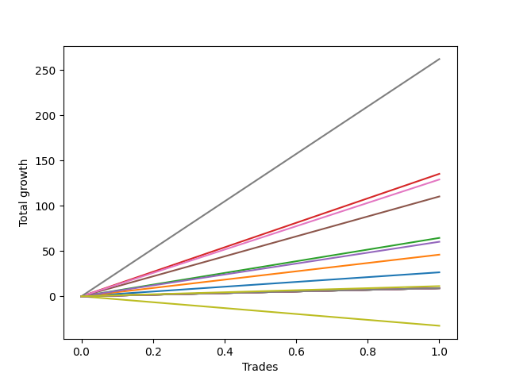

# Short Shepard 004 SD 
- Symbol: ES1y1d
- Date Range: 07/19/2021 - 07/07/2022
- Trading Period: 7:20-12:30
- Number of Trades: 1


## NO STOPLOSS

### Test Zero
* Sell when price hits the middle line of the 20p bollinger
* No Stoploss
* Results:
```
Total Trades: 1
Percent Up: 0.00
Percent Down: 100.00
Total Points Moved Down: 26.50
Potential Profit: 13250.00
Total Points Ups: 0.00 Count Ups: 0
Total Points Downs: 26.50 Count Downs: 1
```

<details><summary>Trades</summary>

<code>In: 2021-11-11 07:21:00		Out: 2021-11-26 06:31:00		Total Position Time: 14 23:10:00		Total Move Down: 26.50		Total to Date: 26.50</code> <br />


</details>

### Test One
* Sell when the price hits the upper line of the 20p 1std bollinger
* No Stoploss
* Results:
```
Total Trades: 1
Percent Up: 0.00
Percent Down: 100.00
Total Points Moved Down: 46.00
Potential Profit: 23000.00
Total Points Ups: 0.00 Count Ups: 0
Total Points Downs: 46.00 Count Downs: 1
```

<details><summary>Trades</summary>

<code>In: 2021-11-11 07:21:00		Out: 2021-11-26 06:48:00		Total Position Time: 14 23:27:00		Total Move Down: 46.00		Total to Date: 46.00</code> <br />


</details>

### Test Two
* Sell when the price hits the upper line of the 20p 2std bollinger
* No Stoploss
* Results:
```
Total Trades: 1
Percent Up: 0.00
Percent Down: 100.00
Total Points Moved Down: 64.50
Potential Profit: 32250.00
Total Points Ups: 0.00 Count Ups: 0
Total Points Downs: 64.50 Count Downs: 1
```

<details><summary>Trades</summary>

<code>In: 2021-11-11 07:21:00		Out: 2021-11-26 09:51:00		Total Position Time: 15 02:30:00		Total Move Down: 64.50		Total to Date: 64.50</code> <br />


</details>

### Test Three
* Sell when price hits the middle line of the 50p bollinger
* No Stoploss
* Results:
```
Total Trades: 1
Percent Up: 0.00
Percent Down: 100.00
Total Points Moved Down: 135.25
Potential Profit: 67625.00
Total Points Ups: 0.00 Count Ups: 0
Total Points Downs: 135.25 Count Downs: 1
```

<details><summary>Trades</summary>

<code>In: 2021-11-11 07:21:00		Out: 2021-12-01 12:57:00		Total Position Time: 20 05:36:00		Total Move Down: 135.25		Total to Date: 135.25</code> <br />


</details>

### Test Four
* Sell when the price hits the upper line of the 50p 1std bollinger
* No Stoploss
* Results:
```
Total Trades: 1
Percent Up: 0.00
Percent Down: 100.00
Total Points Moved Down: 60.25
Potential Profit: 30125.00
Total Points Ups: 0.00 Count Ups: 0
Total Points Downs: 60.25 Count Downs: 1
```

<details><summary>Trades</summary>

<code>In: 2021-11-11 07:21:00		Out: 2022-01-10 07:02:00		Total Position Time: 59 23:41:00		Total Move Down: 60.25		Total to Date: 60.25</code> <br />


</details>

### Test Five
* Sell when the price hits the upper line of the 50p 2std bollinger
* No Stoploss
* Results:
```
Total Trades: 1
Percent Up: 0.00
Percent Down: 100.00
Total Points Moved Down: 110.25
Potential Profit: 55125.00
Total Points Ups: 0.00 Count Ups: 0
Total Points Downs: 110.25 Count Downs: 1
```

<details><summary>Trades</summary>

<code>In: 2021-11-11 07:21:00		Out: 2022-01-19 12:33:00		Total Position Time: 69 05:12:00		Total Move Down: 110.25		Total to Date: 110.25</code> <br />


</details>

### Test Six
* Sell when the price hits the middle line of the 1std VWAP
* No Stoploss
* Results:
```
Total Trades: 1
Percent Up: 0.00
Percent Down: 100.00
Total Points Moved Down: 129.00
Potential Profit: 64500.00
Total Points Ups: 0.00 Count Ups: 0
Total Points Downs: 129.00 Count Downs: 1
```

<details><summary>Trades</summary>

<code>In: 2021-11-11 07:21:00		Out: 2022-01-19 12:57:00		Total Position Time: 69 05:36:00		Total Move Down: 129.00		Total to Date: 129.00</code> <br />


</details>

### Test Seven
* Sell when the price hits the upper line of the 1std VWAP
* No Stoploss
* Results:
```
Total Trades: 1
Percent Up: 0.00
Percent Down: 100.00
Total Points Moved Down: 262.00
Potential Profit: 131000.00
Total Points Ups: 0.00 Count Ups: 0
Total Points Downs: 262.00 Count Downs: 1
```

<details><summary>Trades</summary>

<code>In: 2021-11-11 07:21:00		Out: 2022-01-21 12:09:00		Total Position Time: 71 04:48:00		Total Move Down: 262.00		Total to Date: 262.00</code> <br />


</details>

## SPECIAL EXIT CONDITIONS 

### Test Seventy-Three
* Sell when the linear regression slope changes to negative
* No Stoploss
* Results:
```
Total Trades: 1
Percent Up: 100.00
Percent Down: 0.00
Total Points Moved Down: -32.50
Potential Profit: -16250.00
Total Points Ups: 32.50 Count Ups: 1
Total Points Downs: 0.00 Count Downs: 0
```

<details><summary>Trades</summary>

<code>In: 2021-11-11 07:21:00		Out: 2021-11-17 08:22:00		Total Position Time: 06 01:01:00		Total Move Down: -32.50		Total to Date: -32.50</code> <br />


</details>

## TAKE PROFIT

### Test Eighty-One
* Take Profit of 1 Point
* No Stoploss
* Results:
```
Total Trades: 1
Percent Up: 0.00
Percent Down: 100.00
Total Points Moved Down: 9.00
Potential Profit: 4500.00
Total Points Ups: 0.00 Count Ups: 0
Total Points Downs: 9.00 Count Downs: 1
```

<details><summary>Trades</summary>

<code>In: 2021-11-11 07:21:00		Out: 2021-11-11 07:24:00		Total Position Time: 00 00:03:00		Total Move Down: 9.00		Total to Date: 9.00</code> <br />


</details>

### Test Eighty-Two
* Take Profit of 2 Point
* No Stoploss
* Results:
```
Total Trades: 1
Percent Up: 0.00
Percent Down: 100.00
Total Points Moved Down: 9.00
Potential Profit: 4500.00
Total Points Ups: 0.00 Count Ups: 0
Total Points Downs: 9.00 Count Downs: 1
```

<details><summary>Trades</summary>

<code>In: 2021-11-11 07:21:00		Out: 2021-11-11 07:24:00		Total Position Time: 00 00:03:00		Total Move Down: 9.00		Total to Date: 9.00</code> <br />


</details>

### Test Eighty-Three
* Take Profit of 3 Point
* No Stoploss
* Results:
```
Total Trades: 1
Percent Up: 0.00
Percent Down: 100.00
Total Points Moved Down: 9.00
Potential Profit: 4500.00
Total Points Ups: 0.00 Count Ups: 0
Total Points Downs: 9.00 Count Downs: 1
```

<details><summary>Trades</summary>

<code>In: 2021-11-11 07:21:00		Out: 2021-11-11 07:24:00		Total Position Time: 00 00:03:00		Total Move Down: 9.00		Total to Date: 9.00</code> <br />


</details>

### Test Eighty-Four
* Take Profit of 4 Point
* No Stoploss
* Results:
```
Total Trades: 1
Percent Up: 0.00
Percent Down: 100.00
Total Points Moved Down: 9.00
Potential Profit: 4500.00
Total Points Ups: 0.00 Count Ups: 0
Total Points Downs: 9.00 Count Downs: 1
```

<details><summary>Trades</summary>

<code>In: 2021-11-11 07:21:00		Out: 2021-11-11 07:24:00		Total Position Time: 00 00:03:00		Total Move Down: 9.00		Total to Date: 9.00</code> <br />


</details>

### Test Eighty-Five
* Take Profit of 5 Point
* No Stoploss
* Results:
```
Total Trades: 1
Percent Up: 0.00
Percent Down: 100.00
Total Points Moved Down: 9.00
Potential Profit: 4500.00
Total Points Ups: 0.00 Count Ups: 0
Total Points Downs: 9.00 Count Downs: 1
```

<details><summary>Trades</summary>

<code>In: 2021-11-11 07:21:00		Out: 2021-11-11 07:24:00		Total Position Time: 00 00:03:00		Total Move Down: 9.00		Total to Date: 9.00</code> <br />


</details>

### Test Eighty-Six
* Take Profit of 6 Point
* No Stoploss
* Results:
```
Total Trades: 1
Percent Up: 0.00
Percent Down: 100.00
Total Points Moved Down: 9.00
Potential Profit: 4500.00
Total Points Ups: 0.00 Count Ups: 0
Total Points Downs: 9.00 Count Downs: 1
```

<details><summary>Trades</summary>

<code>In: 2021-11-11 07:21:00		Out: 2021-11-11 07:24:00		Total Position Time: 00 00:03:00		Total Move Down: 9.00		Total to Date: 9.00</code> <br />


</details>

### Test Eighty-Seven
* Take Profit of 7 Point
* No Stoploss
* Results:
```
Total Trades: 1
Percent Up: 0.00
Percent Down: 100.00
Total Points Moved Down: 9.00
Potential Profit: 4500.00
Total Points Ups: 0.00 Count Ups: 0
Total Points Downs: 9.00 Count Downs: 1
```

<details><summary>Trades</summary>

<code>In: 2021-11-11 07:21:00		Out: 2021-11-11 07:24:00		Total Position Time: 00 00:03:00		Total Move Down: 9.00		Total to Date: 9.00</code> <br />


</details>

### Test Eighty-Eight
* Take Profit of 8 Point
* No Stoploss
* Results:
```
Total Trades: 1
Percent Up: 0.00
Percent Down: 100.00
Total Points Moved Down: 9.00
Potential Profit: 4500.00
Total Points Ups: 0.00 Count Ups: 0
Total Points Downs: 9.00 Count Downs: 1
```

<details><summary>Trades</summary>

<code>In: 2021-11-11 07:21:00		Out: 2021-11-11 07:24:00		Total Position Time: 00 00:03:00		Total Move Down: 9.00		Total to Date: 9.00</code> <br />


</details>

### Test Eighty-Nine
* Take Profit of 9 Point
* No Stoploss
* Results:
```
Total Trades: 1
Percent Up: 0.00
Percent Down: 100.00
Total Points Moved Down: 9.00
Potential Profit: 4500.00
Total Points Ups: 0.00 Count Ups: 0
Total Points Downs: 9.00 Count Downs: 1
```

<details><summary>Trades</summary>

<code>In: 2021-11-11 07:21:00		Out: 2021-11-11 07:24:00		Total Position Time: 00 00:03:00		Total Move Down: 9.00		Total to Date: 9.00</code> <br />


</details>

### Test Ninety
* Take Profit of 10 Point
* No Stoploss
* Results:
```
Total Trades: 1
Percent Up: 0.00
Percent Down: 100.00
Total Points Moved Down: 11.25
Potential Profit: 5625.00
Total Points Ups: 0.00 Count Ups: 0
Total Points Downs: 11.25 Count Downs: 1
```

<details><summary>Trades</summary>

<code>In: 2021-11-11 07:21:00		Out: 2021-11-11 07:32:00		Total Position Time: 00 00:11:00		Total Move Down: 11.25		Total to Date: 11.25</code> <br />


</details>