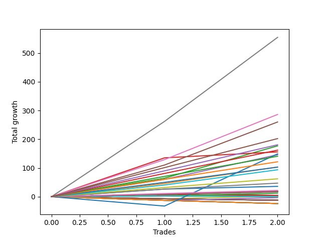

# Short Shepard 004 
- Symbol: ES1y1d
- Date Range: 07/19/2021 - 07/08/2022
- Trading Period: 7:20-12:30
- Number of Trades: 2



| Name | Win Percent | Profit | Avg Profit / Trade | Avg Time / Trade |      | Name | Win Percent | Profit | Avg Profit / Trade | Avg Time / Trade |
| ---- | ----------- | ------ | ------------------ | ---------------- | ---- | ---- | ----------- | ------ | ------------------ | ---------------- |
| Sorted By <br> Profit | | | | | | Sorted By <br> Win Percentage ||||
| Seven | 100.00 | 277250.00 | 138625.00 | 43 04:48:00 |     | Seven | 100.00 | 277250.00 | 138625.00 | 43 04:48:00 |
| Six | 100.00 | 143125.00 | 71562.50 | 41 05:35:30 |     | Six | 100.00 | 143125.00 | 71562.50 | 41 05:35:30 |
| Five | 100.00 | 130000.00 | 65000.00 | 41 05:21:00 |     | Five | 100.00 | 130000.00 | 65000.00 | 41 05:21:00 |
| Three Hundred | 100.00 | 101125.00 | 50562.50 | 12 02:23:30 |     | Three Hundred | 100.00 | 101125.00 | 50562.50 | 12 02:23:30 |
| Two Hundred Nine | 100.00 | 90375.00 | 45187.50 | 11 12:41:00 |     | Two Hundred Nine | 100.00 | 90375.00 | 45187.50 | 11 12:41:00 |
| Two | 100.00 | 88500.00 | 44250.00 | 13 14:17:00 |     | Two | 100.00 | 88500.00 | 44250.00 | 13 14:17:00 |
| Two Hundred Eight | 100.00 | 81000.00 | 40500.00 | 11 12:25:30 |     | Two Hundred Eight | 100.00 | 81000.00 | 40500.00 | 11 12:25:30 |
| Three | 100.00 | 78000.00 | 39000.00 | 10 14:59:30 |     | Three | 100.00 | 78000.00 | 39000.00 | 10 14:59:30 |
| Seventy-Three | 50.00 | 74500.00 | 37250.00 | 17 02:31:00 |     | Four | 100.00 | 73000.00 | 36500.00 | 31 23:38:00 |
| Four | 100.00 | 73000.00 | 36500.00 | 31 23:38:00 |     | Two Hundred Seven | 100.00 | 70375.00 | 35187.50 | 09 12:08:30 |
| Two Hundred Seven | 100.00 | 70375.00 | 35187.50 | 09 12:08:30 |     | Two Hundred Six | 100.00 | 60750.00 | 30375.00 | 09 12:01:30 |
| Two Hundred Six | 100.00 | 60750.00 | 30375.00 | 09 12:01:30 |     | One | 100.00 | 51625.00 | 25812.50 | 09 11:19:00 |
| One | 100.00 | 51625.00 | 25812.50 | 09 11:19:00 |     | Two Hundred Five | 100.00 | 51500.00 | 25750.00 | 09 11:27:00 |
| Two Hundred Five | 100.00 | 51500.00 | 25750.00 | 09 11:27:00 |     | Two Hundred Four | 100.00 | 46875.00 | 23437.50 | 09 11:17:30 |
| Two Hundred Four | 100.00 | 46875.00 | 23437.50 | 09 11:17:30 |     | Two Hundred Three | 100.00 | 31125.00 | 15562.50 | 07 23:56:30 |
| Two Hundred Three | 100.00 | 31125.00 | 15562.50 | 07 23:56:30 |     | Two Hundred Two | 100.00 | 23625.00 | 11812.50 | 07 23:46:30 |
| Two Hundred Two | 100.00 | 23625.00 | 11812.50 | 07 23:46:30 |     | Zero | 100.00 | 18000.00 | 9000.00 | 07 11:36:30 |
| Zero | 100.00 | 18000.00 | 9000.00 | 07 11:36:30 |     | Two Hundred One | 100.00 | 11000.00 | 5500.00 | 00 11:43:30 |
| Two Hundred One | 100.00 | 11000.00 | 5500.00 | 00 11:43:30 |     | One Hundred Thirty | 100.00 | 9250.00 | 4625.00 | 00 00:03:00 |
| One Hundred Thirty | 100.00 | 9250.00 | 4625.00 | 00 00:03:00 |     | One Hundred Twenty-Nine | 100.00 | 9250.00 | 4625.00 | 00 00:03:00 |
| One Hundred Twenty-Nine | 100.00 | 9250.00 | 4625.00 | 00 00:03:00 |     | One Hundred Twenty-Eight | 100.00 | 9250.00 | 4625.00 | 00 00:03:00 |
| One Hundred Twenty-Eight | 100.00 | 9250.00 | 4625.00 | 00 00:03:00 |     | One Hundred Twenty-Seven | 100.00 | 9250.00 | 4625.00 | 00 00:03:00 |
| One Hundred Twenty-Seven | 100.00 | 9250.00 | 4625.00 | 00 00:03:00 |     | One Hundred Twenty-Six | 100.00 | 9250.00 | 4625.00 | 00 00:03:00 |
| One Hundred Twenty-Six | 100.00 | 9250.00 | 4625.00 | 00 00:03:00 |     | One Hundred Twenty-Five | 100.00 | 9250.00 | 4625.00 | 00 00:03:00 |
| One Hundred Twenty-Five | 100.00 | 9250.00 | 4625.00 | 00 00:03:00 |     | One Hundred Twenty-Four | 100.00 | 9250.00 | 4625.00 | 00 00:03:00 |
| One Hundred Twenty-Four | 100.00 | 9250.00 | 4625.00 | 00 00:03:00 |     | One Hundred Twenty-Three | 100.00 | 9250.00 | 4625.00 | 00 00:03:00 |
| One Hundred Twenty-Three | 100.00 | 9250.00 | 4625.00 | 00 00:03:00 |     | One Hundred Twenty-Two | 100.00 | 9250.00 | 4625.00 | 00 00:03:00 |
| One Hundred Twenty-Two | 100.00 | 9250.00 | 4625.00 | 00 00:03:00 |     | One Hundred Twenty-One | 100.00 | 9250.00 | 4625.00 | 00 00:03:00 |
| One Hundred Twenty-One | 100.00 | 9250.00 | 4625.00 | 00 00:03:00 |     | One Hundred Twenty | 100.00 | 9250.00 | 4625.00 | 00 00:03:00 |
| One Hundred Twenty | 100.00 | 9250.00 | 4625.00 | 00 00:03:00 |     | One Hundred Ninteen | 100.00 | 9250.00 | 4625.00 | 00 00:03:00 |
| One Hundred Ninteen | 100.00 | 9250.00 | 4625.00 | 00 00:03:00 |     | One Hundred Eighteen | 100.00 | 9250.00 | 4625.00 | 00 00:03:00 |
| One Hundred Eighteen | 100.00 | 9250.00 | 4625.00 | 00 00:03:00 |     | One Hundred Seventeen | 100.00 | 9250.00 | 4625.00 | 00 00:03:00 |
| One Hundred Seventeen | 100.00 | 9250.00 | 4625.00 | 00 00:03:00 |     | One Hundred Sixteen | 100.00 | 9250.00 | 4625.00 | 00 00:03:00 |
| One Hundred Sixteen | 100.00 | 9250.00 | 4625.00 | 00 00:03:00 |     | One Hundred Fifteen | 100.00 | 9250.00 | 4625.00 | 00 00:03:00 |
| One Hundred Fifteen | 100.00 | 9250.00 | 4625.00 | 00 00:03:00 |     | One Hundred Fourteen | 100.00 | 9250.00 | 4625.00 | 00 00:03:00 |
| One Hundred Fourteen | 100.00 | 9250.00 | 4625.00 | 00 00:03:00 |     | One Hundred Thirteen | 100.00 | 9250.00 | 4625.00 | 00 00:03:00 |
| One Hundred Thirteen | 100.00 | 9250.00 | 4625.00 | 00 00:03:00 |     | One Hundred Twelve | 100.00 | 9250.00 | 4625.00 | 00 00:03:00 |
| One Hundred Twelve | 100.00 | 9250.00 | 4625.00 | 00 00:03:00 |     | One Hundred Eleven | 100.00 | 9250.00 | 4625.00 | 00 00:03:00 |
| One Hundred Eleven | 100.00 | 9250.00 | 4625.00 | 00 00:03:00 |     | Eighty-Five | 100.00 | 9250.00 | 4625.00 | 00 00:03:00 |
| Eighty-Five | 100.00 | 9250.00 | 4625.00 | 00 00:03:00 |     | Eighty-Four | 100.00 | 9250.00 | 4625.00 | 00 00:03:00 |
| Eighty-Four | 100.00 | 9250.00 | 4625.00 | 00 00:03:00 |     | Eighty-Three | 100.00 | 9250.00 | 4625.00 | 00 00:03:00 |
| Eighty-Three | 100.00 | 9250.00 | 4625.00 | 00 00:03:00 |     | Eighty-Two | 100.00 | 9250.00 | 4625.00 | 00 00:03:00 |
| Eighty-Two | 100.00 | 9250.00 | 4625.00 | 00 00:03:00 |     | Eighty-One | 100.00 | 9250.00 | 4625.00 | 00 00:03:00 |
| Eighty-One | 100.00 | 9250.00 | 4625.00 | 00 00:03:00 |     | Forty-Eight | 100.00 | 8375.00 | 4187.50 | 00 00:03:30 |
| Forty-Eight | 100.00 | 8375.00 | 4187.50 | 00 00:03:30 |     | Sixty-Four | 100.00 | 6250.00 | 3125.00 | 00 00:39:30 |
| Sixty-Four | 100.00 | 6250.00 | 3125.00 | 00 00:39:30 |     | Seventy-Three | 50.00 | 74500.00 | 37250.00 | 17 02:31:00 |
| Fifty-Five | 50.00 | 2375.00 | 1187.50 | 00 00:04:30 |     | Fifty-Five | 50.00 | 2375.00 | 1187.50 | 00 00:04:30 |
| Fifty-Four | 50.00 | 2375.00 | 1187.50 | 00 00:04:30 |     | Fifty-Four | 50.00 | 2375.00 | 1187.50 | 00 00:04:30 |
| Fifty-Three | 50.00 | 2375.00 | 1187.50 | 00 00:04:30 |     | Fifty-Three | 50.00 | 2375.00 | 1187.50 | 00 00:04:30 |
| Fifty-Two | 50.00 | 2375.00 | 1187.50 | 00 00:04:30 |     | Fifty-Two | 50.00 | 2375.00 | 1187.50 | 00 00:04:30 |
| Fifty-One | 50.00 | 2375.00 | 1187.50 | 00 00:04:30 |     | Fifty-One | 50.00 | 2375.00 | 1187.50 | 00 00:04:30 |
| Fifty | 50.00 | 2375.00 | 1187.50 | 00 00:04:30 |     | Fifty | 50.00 | 2375.00 | 1187.50 | 00 00:04:30 |
| Forty-Nine | 50.00 | 2375.00 | 1187.50 | 00 00:04:30 |     | Forty-Nine | 50.00 | 2375.00 | 1187.50 | 00 00:04:30 |
| Forty | 50.00 | 1125.00 | 562.50 | 00 12:22:00 |     | Forty | 50.00 | 1125.00 | 562.50 | 00 12:22:00 |
| Seventy-One | 50.00 | 250.00 | 125.00 | 00 00:40:30 |     | Seventy-One | 50.00 | 250.00 | 125.00 | 00 00:40:30 |
| Seventy | 50.00 | 250.00 | 125.00 | 00 00:40:30 |     | Seventy | 50.00 | 250.00 | 125.00 | 00 00:40:30 |
| Sixty-Nine | 50.00 | 250.00 | 125.00 | 00 00:40:30 |     | Sixty-Nine | 50.00 | 250.00 | 125.00 | 00 00:40:30 |
| Sixty-Eight | 50.00 | 250.00 | 125.00 | 00 00:40:30 |     | Sixty-Eight | 50.00 | 250.00 | 125.00 | 00 00:40:30 |
| Sixty-Seven | 50.00 | 250.00 | 125.00 | 00 00:40:30 |     | Sixty-Seven | 50.00 | 250.00 | 125.00 | 00 00:40:30 |
| Sixty-Six | 50.00 | 250.00 | 125.00 | 00 00:40:30 |     | Sixty-Six | 50.00 | 250.00 | 125.00 | 00 00:40:30 |
| Sixty-Five | 50.00 | 250.00 | 125.00 | 00 00:40:30 |     | Sixty-Five | 50.00 | 250.00 | 125.00 | 00 00:40:30 |
| Fifty-Six | 50.00 | -1625.00 | -812.50 | 00 12:29:00 |     | Fifty-Six | 50.00 | -1625.00 | -812.50 | 00 12:29:00 |
| Forty-Seven | 0.00 | -6125.00 | -3062.50 | 00 12:23:30 |     | Forty-Seven | 0.00 | -6125.00 | -3062.50 | 00 12:23:30 |
| Forty-Six | 0.00 | -6125.00 | -3062.50 | 00 12:23:30 |     | Forty-Six | 0.00 | -6125.00 | -3062.50 | 00 12:23:30 |
| Forty-Five | 0.00 | -6125.00 | -3062.50 | 00 12:23:30 |     | Forty-Five | 0.00 | -6125.00 | -3062.50 | 00 12:23:30 |
| Forty-Four | 0.00 | -6125.00 | -3062.50 | 00 12:23:30 |     | Forty-Four | 0.00 | -6125.00 | -3062.50 | 00 12:23:30 |
| Forty-Three | 0.00 | -6125.00 | -3062.50 | 00 12:23:30 |     | Forty-Three | 0.00 | -6125.00 | -3062.50 | 00 12:23:30 |
| Forty-Two | 0.00 | -6125.00 | -3062.50 | 00 12:23:30 |     | Forty-Two | 0.00 | -6125.00 | -3062.50 | 00 12:23:30 |
| Forty-One | 0.00 | -6125.00 | -3062.50 | 00 12:23:30 |     | Forty-One | 0.00 | -6125.00 | -3062.50 | 00 12:23:30 |
| Sixty-Three | 0.00 | -11875.00 | -5937.50 | 00 12:34:00 |     | Sixty-Three | 0.00 | -11875.00 | -5937.50 | 00 12:34:00 |
| Sixty-Two | 0.00 | -11875.00 | -5937.50 | 00 12:34:00 |     | Sixty-Two | 0.00 | -11875.00 | -5937.50 | 00 12:34:00 |
| Sixty-One | 0.00 | -11875.00 | -5937.50 | 00 12:34:00 |     | Sixty-One | 0.00 | -11875.00 | -5937.50 | 00 12:34:00 |
| Sixty | 0.00 | -11875.00 | -5937.50 | 00 12:34:00 |     | Sixty | 0.00 | -11875.00 | -5937.50 | 00 12:34:00 |
| Fifty-Nine | 0.00 | -11875.00 | -5937.50 | 00 12:34:00 |     | Fifty-Nine | 0.00 | -11875.00 | -5937.50 | 00 12:34:00 |
| Fifty-Eight | 0.00 | -11875.00 | -5937.50 | 00 12:34:00 |     | Fifty-Eight | 0.00 | -11875.00 | -5937.50 | 00 12:34:00 |
| Fifty-Seven | 0.00 | -11875.00 | -5937.50 | 00 12:34:00 |     | Fifty-Seven | 0.00 | -11875.00 | -5937.50 | 00 12:34:00 |

## NO STOPLOSS

### Test Zero
* Sell when price hits the middle line of the 20p bollinger
* No Stoploss
* Results:
```
Total Trades: 2
Percent Up: 0.00
Percent Down: 100.00
Total Points Moved Down: 36.00
Potential Profit: 18000.00
Total Points Ups: 0.00 Count Ups: 0
Total Points Downs: 36.00 Count Downs: 2
```

<details><summary>Trades</summary>

<code>In: 2021-11-11 07:21:00		Out: 2021-11-26 06:31:00		Total Position Time: 14 23:10:00		Total Move Down: 26.50		Total to Date: 26.50</code> <br />
<code>In: 2022-01-06 07:21:00		Out: 2022-01-06 07:24:00		Total Position Time: 00 00:03:00		Total Move Down: 9.50		Total to Date: 36.00</code> <br />


</details>

### Test One
* Sell when the price hits the upper line of the 20p 1std bollinger
* No Stoploss
* Results:
```
Total Trades: 2
Percent Up: 0.00
Percent Down: 100.00
Total Points Moved Down: 103.25
Potential Profit: 51625.00
Total Points Ups: 0.00 Count Ups: 0
Total Points Downs: 103.25 Count Downs: 2
```

<details><summary>Trades</summary>

<code>In: 2021-11-11 07:21:00		Out: 2021-11-26 06:48:00		Total Position Time: 14 23:27:00		Total Move Down: 46.00		Total to Date: 46.00</code> <br />
<code>In: 2022-01-06 07:21:00		Out: 2022-01-10 06:32:00		Total Position Time: 03 23:11:00		Total Move Down: 57.25		Total to Date: 103.25</code> <br />


</details>

### Test Two
* Sell when the price hits the upper line of the 20p 2std bollinger
* No Stoploss
* Results:
```
Total Trades: 2
Percent Up: 0.00
Percent Down: 100.00
Total Points Moved Down: 177.00
Potential Profit: 88500.00
Total Points Ups: 0.00 Count Ups: 0
Total Points Downs: 177.00 Count Downs: 2
```

<details><summary>Trades</summary>

<code>In: 2021-11-11 07:21:00		Out: 2021-11-26 09:51:00		Total Position Time: 15 02:30:00		Total Move Down: 64.50		Total to Date: 64.50</code> <br />
<code>In: 2022-01-06 07:21:00		Out: 2022-01-18 09:25:00		Total Position Time: 12 02:04:00		Total Move Down: 112.50		Total to Date: 177.00</code> <br />


</details>

### Test Three
* Sell when price hits the middle line of the 50p bollinger
* No Stoploss
* Results:
```
Total Trades: 2
Percent Up: 0.00
Percent Down: 100.00
Total Points Moved Down: 156.00
Potential Profit: 78000.00
Total Points Ups: 0.00 Count Ups: 0
Total Points Downs: 156.00 Count Downs: 2
```

<details><summary>Trades</summary>

<code>In: 2021-11-11 07:21:00		Out: 2021-12-01 12:57:00		Total Position Time: 20 05:36:00		Total Move Down: 135.25		Total to Date: 135.25</code> <br />
<code>In: 2022-01-06 07:21:00		Out: 2022-01-07 07:44:00		Total Position Time: 01 00:23:00		Total Move Down: 20.75		Total to Date: 156.00</code> <br />


</details>

### Test Four
* Sell when the price hits the upper line of the 50p 1std bollinger
* No Stoploss
* Results:
```
Total Trades: 2
Percent Up: 0.00
Percent Down: 100.00
Total Points Moved Down: 146.00
Potential Profit: 73000.00
Total Points Ups: 0.00 Count Ups: 0
Total Points Downs: 146.00 Count Downs: 2
```

<details><summary>Trades</summary>

<code>In: 2021-11-11 07:21:00		Out: 2022-01-10 07:02:00		Total Position Time: 59 23:41:00		Total Move Down: 60.25		Total to Date: 60.25</code> <br />
<code>In: 2022-01-06 07:21:00		Out: 2022-01-10 06:56:00		Total Position Time: 03 23:35:00		Total Move Down: 85.75		Total to Date: 146.00</code> <br />


</details>

### Test Five
* Sell when the price hits the upper line of the 50p 2std bollinger
* No Stoploss
* Results:
```
Total Trades: 2
Percent Up: 0.00
Percent Down: 100.00
Total Points Moved Down: 260.00
Potential Profit: 130000.00
Total Points Ups: 0.00 Count Ups: 0
Total Points Downs: 260.00 Count Downs: 2
```

<details><summary>Trades</summary>

<code>In: 2021-11-11 07:21:00		Out: 2022-01-19 12:33:00		Total Position Time: 69 05:12:00		Total Move Down: 110.25		Total to Date: 110.25</code> <br />
<code>In: 2022-01-06 07:21:00		Out: 2022-01-19 12:51:00		Total Position Time: 13 05:30:00		Total Move Down: 149.75		Total to Date: 260.00</code> <br />


</details>

### Test Six
* Sell when the price hits the middle line of the 1std VWAP
* No Stoploss
* Results:
```
Total Trades: 2
Percent Up: 0.00
Percent Down: 100.00
Total Points Moved Down: 286.25
Potential Profit: 143125.00
Total Points Ups: 0.00 Count Ups: 0
Total Points Downs: 286.25 Count Downs: 2
```

<details><summary>Trades</summary>

<code>In: 2021-11-11 07:21:00		Out: 2022-01-19 12:57:00		Total Position Time: 69 05:36:00		Total Move Down: 129.00		Total to Date: 129.00</code> <br />
<code>In: 2022-01-06 07:21:00		Out: 2022-01-19 12:56:00		Total Position Time: 13 05:35:00		Total Move Down: 157.25		Total to Date: 286.25</code> <br />


</details>

### Test Seven
* Sell when the price hits the upper line of the 1std VWAP
* No Stoploss
* Results:
```
Total Trades: 2
Percent Up: 0.00
Percent Down: 100.00
Total Points Moved Down: 554.50
Potential Profit: 277250.00
Total Points Ups: 0.00 Count Ups: 0
Total Points Downs: 554.50 Count Downs: 2
```

<details><summary>Trades</summary>

<code>In: 2021-11-11 07:21:00		Out: 2022-01-21 12:09:00		Total Position Time: 71 04:48:00		Total Move Down: 262.00		Total to Date: 262.00</code> <br />
<code>In: 2022-01-06 07:21:00		Out: 2022-01-21 12:09:00		Total Position Time: 15 04:48:00		Total Move Down: 292.50		Total to Date: 554.50</code> <br />


</details>

## STOPLOSS OF 5

### Test Forty
* Sell when price hits the middle line of the 20p bollinger
* Stoploss is -5 points
* Results:
```
Total Trades: 2
Percent Up: 50.00
Percent Down: 50.00
Total Points Moved Down: 2.25
Potential Profit: 1125.00
Total Points Ups: 7.25 Count Ups: 1
Total Points Downs: 9.50 Count Downs: 1
```

<details><summary>Trades</summary>

<code>In: 2021-11-11 07:21:00		Out: 2021-11-12 08:02:00		Total Position Time: 01 00:41:00		Total Move Down: -7.25		Total to Date: -7.25</code> <br />
<code>In: 2022-01-06 07:21:00		Out: 2022-01-06 07:24:00		Total Position Time: 00 00:03:00		Total Move Down: 9.50		Total to Date: 2.25</code> <br />


</details>

### Test Forty-One
* Sell when the price hits the upper line of the 20p 1std bollinger
* Stoploss is -5 points
* Results:
```
Total Trades: 2
Percent Up: 100.00
Percent Down: 0.00
Total Points Moved Down: -12.25
Potential Profit: -6125.00
Total Points Ups: 12.25 Count Ups: 2
Total Points Downs: 0.00 Count Downs: 0
```

<details><summary>Trades</summary>

<code>In: 2021-11-11 07:21:00		Out: 2021-11-12 08:02:00		Total Position Time: 01 00:41:00		Total Move Down: -7.25		Total to Date: -7.25</code> <br />
<code>In: 2022-01-06 07:21:00		Out: 2022-01-06 07:27:00		Total Position Time: 00 00:06:00		Total Move Down: -5.00		Total to Date: -12.25</code> <br />


</details>

### Test Forty-Two
* Sell when the price hits the upper line of the 20p 2std bollinger
* Stoploss is -5 points
* Results:
```
Total Trades: 2
Percent Up: 100.00
Percent Down: 0.00
Total Points Moved Down: -12.25
Potential Profit: -6125.00
Total Points Ups: 12.25 Count Ups: 2
Total Points Downs: 0.00 Count Downs: 0
```

<details><summary>Trades</summary>

<code>In: 2021-11-11 07:21:00		Out: 2021-11-12 08:02:00		Total Position Time: 01 00:41:00		Total Move Down: -7.25		Total to Date: -7.25</code> <br />
<code>In: 2022-01-06 07:21:00		Out: 2022-01-06 07:27:00		Total Position Time: 00 00:06:00		Total Move Down: -5.00		Total to Date: -12.25</code> <br />


</details>

### Test Forty-Three
* Sell when price hits the middle line of the 50p bollinger
* Stoploss is -5 points
* Results:
```
Total Trades: 2
Percent Up: 100.00
Percent Down: 0.00
Total Points Moved Down: -12.25
Potential Profit: -6125.00
Total Points Ups: 12.25 Count Ups: 2
Total Points Downs: 0.00 Count Downs: 0
```

<details><summary>Trades</summary>

<code>In: 2021-11-11 07:21:00		Out: 2021-11-12 08:02:00		Total Position Time: 01 00:41:00		Total Move Down: -7.25		Total to Date: -7.25</code> <br />
<code>In: 2022-01-06 07:21:00		Out: 2022-01-06 07:27:00		Total Position Time: 00 00:06:00		Total Move Down: -5.00		Total to Date: -12.25</code> <br />


</details>

### Test Forty-Four
* Sell when the price hits the upper line of the 50p 1std bollinger
* Stoploss is -5 points
* Results:
```
Total Trades: 2
Percent Up: 100.00
Percent Down: 0.00
Total Points Moved Down: -12.25
Potential Profit: -6125.00
Total Points Ups: 12.25 Count Ups: 2
Total Points Downs: 0.00 Count Downs: 0
```

<details><summary>Trades</summary>

<code>In: 2021-11-11 07:21:00		Out: 2021-11-12 08:02:00		Total Position Time: 01 00:41:00		Total Move Down: -7.25		Total to Date: -7.25</code> <br />
<code>In: 2022-01-06 07:21:00		Out: 2022-01-06 07:27:00		Total Position Time: 00 00:06:00		Total Move Down: -5.00		Total to Date: -12.25</code> <br />


</details>

### Test Forty-Five
* Sell when the price hits the upper line of the 50p 2std bollinger
* Stoploss is -5 points
* Results:
```
Total Trades: 2
Percent Up: 100.00
Percent Down: 0.00
Total Points Moved Down: -12.25
Potential Profit: -6125.00
Total Points Ups: 12.25 Count Ups: 2
Total Points Downs: 0.00 Count Downs: 0
```

<details><summary>Trades</summary>

<code>In: 2021-11-11 07:21:00		Out: 2021-11-12 08:02:00		Total Position Time: 01 00:41:00		Total Move Down: -7.25		Total to Date: -7.25</code> <br />
<code>In: 2022-01-06 07:21:00		Out: 2022-01-06 07:27:00		Total Position Time: 00 00:06:00		Total Move Down: -5.00		Total to Date: -12.25</code> <br />


</details>

### Test Forty-Six
* Sell when the price hits the middle line of the 1std VWAP
* Stoploss is -5 points
* Results:
```
Total Trades: 2
Percent Up: 100.00
Percent Down: 0.00
Total Points Moved Down: -12.25
Potential Profit: -6125.00
Total Points Ups: 12.25 Count Ups: 2
Total Points Downs: 0.00 Count Downs: 0
```

<details><summary>Trades</summary>

<code>In: 2021-11-11 07:21:00		Out: 2021-11-12 08:02:00		Total Position Time: 01 00:41:00		Total Move Down: -7.25		Total to Date: -7.25</code> <br />
<code>In: 2022-01-06 07:21:00		Out: 2022-01-06 07:27:00		Total Position Time: 00 00:06:00		Total Move Down: -5.00		Total to Date: -12.25</code> <br />


</details>

### Test Forty-Seven
* Sell when the price hits the upper line of the 1std VWAP
* Stoploss is -5 points
* Results:
```
Total Trades: 2
Percent Up: 100.00
Percent Down: 0.00
Total Points Moved Down: -12.25
Potential Profit: -6125.00
Total Points Ups: 12.25 Count Ups: 2
Total Points Downs: 0.00 Count Downs: 0
```

<details><summary>Trades</summary>

<code>In: 2021-11-11 07:21:00		Out: 2021-11-12 08:02:00		Total Position Time: 01 00:41:00		Total Move Down: -7.25		Total to Date: -7.25</code> <br />
<code>In: 2022-01-06 07:21:00		Out: 2022-01-06 07:27:00		Total Position Time: 00 00:06:00		Total Move Down: -5.00		Total to Date: -12.25</code> <br />


</details>

## TRAIL STOP OF 5

### Test Forty-Eight
* Sell when price hits the middle line of the 20p bollinger
* Trailing Stop is -5 points
* Results:
```
Total Trades: 2
Percent Up: 0.00
Percent Down: 100.00
Total Points Moved Down: 16.75
Potential Profit: 8375.00
Total Points Ups: 0.00 Count Ups: 0
Total Points Downs: 16.75 Count Downs: 2
```

<details><summary>Trades</summary>

<code>In: 2021-11-11 07:21:00		Out: 2021-11-11 07:25:00		Total Position Time: 00 00:04:00		Total Move Down: 7.25		Total to Date: 7.25</code> <br />
<code>In: 2022-01-06 07:21:00		Out: 2022-01-06 07:24:00		Total Position Time: 00 00:03:00		Total Move Down: 9.50		Total to Date: 16.75</code> <br />


</details>

### Test Forty-Nine
* Sell when the price hits the upper line of the 20p 1std bollinger
* Trailing Stop is -5 points
* Results:
```
Total Trades: 2
Percent Up: 50.00
Percent Down: 50.00
Total Points Moved Down: 4.75
Potential Profit: 2375.00
Total Points Ups: 2.50 Count Ups: 1
Total Points Downs: 7.25 Count Downs: 1
```

<details><summary>Trades</summary>

<code>In: 2021-11-11 07:21:00		Out: 2021-11-11 07:25:00		Total Position Time: 00 00:04:00		Total Move Down: 7.25		Total to Date: 7.25</code> <br />
<code>In: 2022-01-06 07:21:00		Out: 2022-01-06 07:26:00		Total Position Time: 00 00:05:00		Total Move Down: -2.50		Total to Date: 4.75</code> <br />


</details>

### Test Fifty
* Sell when the price hits the upper line of the 20p 2std bollinger
* Trailing Stop is -5 points
* Results:
```
Total Trades: 2
Percent Up: 50.00
Percent Down: 50.00
Total Points Moved Down: 4.75
Potential Profit: 2375.00
Total Points Ups: 2.50 Count Ups: 1
Total Points Downs: 7.25 Count Downs: 1
```

<details><summary>Trades</summary>

<code>In: 2021-11-11 07:21:00		Out: 2021-11-11 07:25:00		Total Position Time: 00 00:04:00		Total Move Down: 7.25		Total to Date: 7.25</code> <br />
<code>In: 2022-01-06 07:21:00		Out: 2022-01-06 07:26:00		Total Position Time: 00 00:05:00		Total Move Down: -2.50		Total to Date: 4.75</code> <br />


</details>

### Test Fifty-One
* Sell when price hits the middle line of the 50p bollinger
* Trailing Stop is -5 points
* Results:
```
Total Trades: 2
Percent Up: 50.00
Percent Down: 50.00
Total Points Moved Down: 4.75
Potential Profit: 2375.00
Total Points Ups: 2.50 Count Ups: 1
Total Points Downs: 7.25 Count Downs: 1
```

<details><summary>Trades</summary>

<code>In: 2021-11-11 07:21:00		Out: 2021-11-11 07:25:00		Total Position Time: 00 00:04:00		Total Move Down: 7.25		Total to Date: 7.25</code> <br />
<code>In: 2022-01-06 07:21:00		Out: 2022-01-06 07:26:00		Total Position Time: 00 00:05:00		Total Move Down: -2.50		Total to Date: 4.75</code> <br />


</details>

### Test Fifty-Two
* Sell when the price hits the upper line of the 50p 1std bollinger
* Trailing Stop is -5 points
* Results:
```
Total Trades: 2
Percent Up: 50.00
Percent Down: 50.00
Total Points Moved Down: 4.75
Potential Profit: 2375.00
Total Points Ups: 2.50 Count Ups: 1
Total Points Downs: 7.25 Count Downs: 1
```

<details><summary>Trades</summary>

<code>In: 2021-11-11 07:21:00		Out: 2021-11-11 07:25:00		Total Position Time: 00 00:04:00		Total Move Down: 7.25		Total to Date: 7.25</code> <br />
<code>In: 2022-01-06 07:21:00		Out: 2022-01-06 07:26:00		Total Position Time: 00 00:05:00		Total Move Down: -2.50		Total to Date: 4.75</code> <br />


</details>

### Test Fifty-Three
* Sell when the price hits the upper line of the 50p 2std bollinger
* Trailing Stop is -5 points
* Results:
```
Total Trades: 2
Percent Up: 50.00
Percent Down: 50.00
Total Points Moved Down: 4.75
Potential Profit: 2375.00
Total Points Ups: 2.50 Count Ups: 1
Total Points Downs: 7.25 Count Downs: 1
```

<details><summary>Trades</summary>

<code>In: 2021-11-11 07:21:00		Out: 2021-11-11 07:25:00		Total Position Time: 00 00:04:00		Total Move Down: 7.25		Total to Date: 7.25</code> <br />
<code>In: 2022-01-06 07:21:00		Out: 2022-01-06 07:26:00		Total Position Time: 00 00:05:00		Total Move Down: -2.50		Total to Date: 4.75</code> <br />


</details>

### Test Fifty-Four
* Sell when the price hits the middle line of the 1std VWAP
* Trailing Stop is -5 points
* Results:
```
Total Trades: 2
Percent Up: 50.00
Percent Down: 50.00
Total Points Moved Down: 4.75
Potential Profit: 2375.00
Total Points Ups: 2.50 Count Ups: 1
Total Points Downs: 7.25 Count Downs: 1
```

<details><summary>Trades</summary>

<code>In: 2021-11-11 07:21:00		Out: 2021-11-11 07:25:00		Total Position Time: 00 00:04:00		Total Move Down: 7.25		Total to Date: 7.25</code> <br />
<code>In: 2022-01-06 07:21:00		Out: 2022-01-06 07:26:00		Total Position Time: 00 00:05:00		Total Move Down: -2.50		Total to Date: 4.75</code> <br />


</details>

### Test Fifty-Five
* Sell when the price hits the upper line of the 1std VWAP
* Trailing Stop is -5 points
* Results:
```
Total Trades: 2
Percent Up: 50.00
Percent Down: 50.00
Total Points Moved Down: 4.75
Potential Profit: 2375.00
Total Points Ups: 2.50 Count Ups: 1
Total Points Downs: 7.25 Count Downs: 1
```

<details><summary>Trades</summary>

<code>In: 2021-11-11 07:21:00		Out: 2021-11-11 07:25:00		Total Position Time: 00 00:04:00		Total Move Down: 7.25		Total to Date: 7.25</code> <br />
<code>In: 2022-01-06 07:21:00		Out: 2022-01-06 07:26:00		Total Position Time: 00 00:05:00		Total Move Down: -2.50		Total to Date: 4.75</code> <br />


</details>

## STOPLOSS OF 10

### Test Fifty-Six
* Sell when price hits the middle line of the 20p bollinger
* Stoploss is -10 points
* Results:
```
Total Trades: 2
Percent Up: 50.00
Percent Down: 50.00
Total Points Moved Down: -3.25
Potential Profit: -1625.00
Total Points Ups: 12.75 Count Ups: 1
Total Points Downs: 9.50 Count Downs: 1
```

<details><summary>Trades</summary>

<code>In: 2021-11-11 07:21:00		Out: 2021-11-12 08:16:00		Total Position Time: 01 00:55:00		Total Move Down: -12.75		Total to Date: -12.75</code> <br />
<code>In: 2022-01-06 07:21:00		Out: 2022-01-06 07:24:00		Total Position Time: 00 00:03:00		Total Move Down: 9.50		Total to Date: -3.25</code> <br />


</details>

### Test Fifty-Seven
* Sell when the price hits the upper line of the 20p 1std bollinger
* Stoploss is -10 points
* Results:
```
Total Trades: 2
Percent Up: 100.00
Percent Down: 0.00
Total Points Moved Down: -23.75
Potential Profit: -11875.00
Total Points Ups: 23.75 Count Ups: 2
Total Points Downs: 0.00 Count Downs: 0
```

<details><summary>Trades</summary>

<code>In: 2021-11-11 07:21:00		Out: 2021-11-12 08:16:00		Total Position Time: 01 00:55:00		Total Move Down: -12.75		Total to Date: -12.75</code> <br />
<code>In: 2022-01-06 07:21:00		Out: 2022-01-06 07:34:00		Total Position Time: 00 00:13:00		Total Move Down: -11.00		Total to Date: -23.75</code> <br />


</details>

### Test Fifty-Eight
* Sell when the price hits the upper line of the 20p 2std bollinger
* Stoploss is -10 points
* Results:
```
Total Trades: 2
Percent Up: 100.00
Percent Down: 0.00
Total Points Moved Down: -23.75
Potential Profit: -11875.00
Total Points Ups: 23.75 Count Ups: 2
Total Points Downs: 0.00 Count Downs: 0
```

<details><summary>Trades</summary>

<code>In: 2021-11-11 07:21:00		Out: 2021-11-12 08:16:00		Total Position Time: 01 00:55:00		Total Move Down: -12.75		Total to Date: -12.75</code> <br />
<code>In: 2022-01-06 07:21:00		Out: 2022-01-06 07:34:00		Total Position Time: 00 00:13:00		Total Move Down: -11.00		Total to Date: -23.75</code> <br />


</details>

### Test Fifty-Nine
* Sell when price hits the middle line of the 50p bollinger
* Stoploss is -10 points
* Results:
```
Total Trades: 2
Percent Up: 100.00
Percent Down: 0.00
Total Points Moved Down: -23.75
Potential Profit: -11875.00
Total Points Ups: 23.75 Count Ups: 2
Total Points Downs: 0.00 Count Downs: 0
```

<details><summary>Trades</summary>

<code>In: 2021-11-11 07:21:00		Out: 2021-11-12 08:16:00		Total Position Time: 01 00:55:00		Total Move Down: -12.75		Total to Date: -12.75</code> <br />
<code>In: 2022-01-06 07:21:00		Out: 2022-01-06 07:34:00		Total Position Time: 00 00:13:00		Total Move Down: -11.00		Total to Date: -23.75</code> <br />


</details>

### Test Sixty
* Sell when the price hits the upper line of the 50p 1std bollinger
* Stoploss is -10 points
* Results:
```
Total Trades: 2
Percent Up: 100.00
Percent Down: 0.00
Total Points Moved Down: -23.75
Potential Profit: -11875.00
Total Points Ups: 23.75 Count Ups: 2
Total Points Downs: 0.00 Count Downs: 0
```

<details><summary>Trades</summary>

<code>In: 2021-11-11 07:21:00		Out: 2021-11-12 08:16:00		Total Position Time: 01 00:55:00		Total Move Down: -12.75		Total to Date: -12.75</code> <br />
<code>In: 2022-01-06 07:21:00		Out: 2022-01-06 07:34:00		Total Position Time: 00 00:13:00		Total Move Down: -11.00		Total to Date: -23.75</code> <br />


</details>

### Test Sixty-One
* Sell when the price hits the upper line of the 50p 2std bollinger
* Stoploss is -10 points
* Results:
```
Total Trades: 2
Percent Up: 100.00
Percent Down: 0.00
Total Points Moved Down: -23.75
Potential Profit: -11875.00
Total Points Ups: 23.75 Count Ups: 2
Total Points Downs: 0.00 Count Downs: 0
```

<details><summary>Trades</summary>

<code>In: 2021-11-11 07:21:00		Out: 2021-11-12 08:16:00		Total Position Time: 01 00:55:00		Total Move Down: -12.75		Total to Date: -12.75</code> <br />
<code>In: 2022-01-06 07:21:00		Out: 2022-01-06 07:34:00		Total Position Time: 00 00:13:00		Total Move Down: -11.00		Total to Date: -23.75</code> <br />


</details>

### Test Sixty-Two
* Sell when the price hits the middle line of the 1std VWAP
* Stoploss is -10 points
* Results:
```
Total Trades: 2
Percent Up: 100.00
Percent Down: 0.00
Total Points Moved Down: -23.75
Potential Profit: -11875.00
Total Points Ups: 23.75 Count Ups: 2
Total Points Downs: 0.00 Count Downs: 0
```

<details><summary>Trades</summary>

<code>In: 2021-11-11 07:21:00		Out: 2021-11-12 08:16:00		Total Position Time: 01 00:55:00		Total Move Down: -12.75		Total to Date: -12.75</code> <br />
<code>In: 2022-01-06 07:21:00		Out: 2022-01-06 07:34:00		Total Position Time: 00 00:13:00		Total Move Down: -11.00		Total to Date: -23.75</code> <br />


</details>

### Test Sixty-Three
* Sell when the price hits the upper line of the 1std VWAP
* Stoploss is -10 points
* Results:
```
Total Trades: 2
Percent Up: 100.00
Percent Down: 0.00
Total Points Moved Down: -23.75
Potential Profit: -11875.00
Total Points Ups: 23.75 Count Ups: 2
Total Points Downs: 0.00 Count Downs: 0
```

<details><summary>Trades</summary>

<code>In: 2021-11-11 07:21:00		Out: 2021-11-12 08:16:00		Total Position Time: 01 00:55:00		Total Move Down: -12.75		Total to Date: -12.75</code> <br />
<code>In: 2022-01-06 07:21:00		Out: 2022-01-06 07:34:00		Total Position Time: 00 00:13:00		Total Move Down: -11.00		Total to Date: -23.75</code> <br />


</details>

## TRAIL STOP OF 10

### Test Sixty-Four
* Sell when price hits the middle line of the 20p bollinger
* Trailing Stop is -10 points
* Results:
```
Total Trades: 2
Percent Up: 0.00
Percent Down: 100.00
Total Points Moved Down: 12.50
Potential Profit: 6250.00
Total Points Ups: 0.00 Count Ups: 0
Total Points Downs: 12.50 Count Downs: 2
```

<details><summary>Trades</summary>

<code>In: 2021-11-11 07:21:00		Out: 2021-11-11 08:37:00		Total Position Time: 00 01:16:00		Total Move Down: 3.00		Total to Date: 3.00</code> <br />
<code>In: 2022-01-06 07:21:00		Out: 2022-01-06 07:24:00		Total Position Time: 00 00:03:00		Total Move Down: 9.50		Total to Date: 12.50</code> <br />


</details>

### Test Sixty-Five
* Sell when the price hits the upper line of the 20p 1std bollinger
* Trailing Stop is -10 points
* Results:
```
Total Trades: 2
Percent Up: 50.00
Percent Down: 50.00
Total Points Moved Down: 0.50
Potential Profit: 250.00
Total Points Ups: 2.50 Count Ups: 1
Total Points Downs: 3.00 Count Downs: 1
```

<details><summary>Trades</summary>

<code>In: 2021-11-11 07:21:00		Out: 2021-11-11 08:37:00		Total Position Time: 00 01:16:00		Total Move Down: 3.00		Total to Date: 3.00</code> <br />
<code>In: 2022-01-06 07:21:00		Out: 2022-01-06 07:26:00		Total Position Time: 00 00:05:00		Total Move Down: -2.50		Total to Date: 0.50</code> <br />


</details>

### Test Sixty-Six
* Sell when the price hits the upper line of the 20p 2std bollinger
* Trailing Stop is -10 points
* Results:
```
Total Trades: 2
Percent Up: 50.00
Percent Down: 50.00
Total Points Moved Down: 0.50
Potential Profit: 250.00
Total Points Ups: 2.50 Count Ups: 1
Total Points Downs: 3.00 Count Downs: 1
```

<details><summary>Trades</summary>

<code>In: 2021-11-11 07:21:00		Out: 2021-11-11 08:37:00		Total Position Time: 00 01:16:00		Total Move Down: 3.00		Total to Date: 3.00</code> <br />
<code>In: 2022-01-06 07:21:00		Out: 2022-01-06 07:26:00		Total Position Time: 00 00:05:00		Total Move Down: -2.50		Total to Date: 0.50</code> <br />


</details>

### Test Sixty-Seven
* Sell when price hits the middle line of the 50p bollinger
* Trailing Stop is -10 points
* Results:
```
Total Trades: 2
Percent Up: 50.00
Percent Down: 50.00
Total Points Moved Down: 0.50
Potential Profit: 250.00
Total Points Ups: 2.50 Count Ups: 1
Total Points Downs: 3.00 Count Downs: 1
```

<details><summary>Trades</summary>

<code>In: 2021-11-11 07:21:00		Out: 2021-11-11 08:37:00		Total Position Time: 00 01:16:00		Total Move Down: 3.00		Total to Date: 3.00</code> <br />
<code>In: 2022-01-06 07:21:00		Out: 2022-01-06 07:26:00		Total Position Time: 00 00:05:00		Total Move Down: -2.50		Total to Date: 0.50</code> <br />


</details>

### Test Sixty-Eight
* Sell when the price hits the upper line of the 50p 1std bollinger
* Trailing Stop is -10 points
* Results:
```
Total Trades: 2
Percent Up: 50.00
Percent Down: 50.00
Total Points Moved Down: 0.50
Potential Profit: 250.00
Total Points Ups: 2.50 Count Ups: 1
Total Points Downs: 3.00 Count Downs: 1
```

<details><summary>Trades</summary>

<code>In: 2021-11-11 07:21:00		Out: 2021-11-11 08:37:00		Total Position Time: 00 01:16:00		Total Move Down: 3.00		Total to Date: 3.00</code> <br />
<code>In: 2022-01-06 07:21:00		Out: 2022-01-06 07:26:00		Total Position Time: 00 00:05:00		Total Move Down: -2.50		Total to Date: 0.50</code> <br />


</details>

### Test Sixty-Nine
* Sell when the price hits the upper line of the 50p 2std bollinger
* Trailing Stop is -10 points
* Results:
```
Total Trades: 2
Percent Up: 50.00
Percent Down: 50.00
Total Points Moved Down: 0.50
Potential Profit: 250.00
Total Points Ups: 2.50 Count Ups: 1
Total Points Downs: 3.00 Count Downs: 1
```

<details><summary>Trades</summary>

<code>In: 2021-11-11 07:21:00		Out: 2021-11-11 08:37:00		Total Position Time: 00 01:16:00		Total Move Down: 3.00		Total to Date: 3.00</code> <br />
<code>In: 2022-01-06 07:21:00		Out: 2022-01-06 07:26:00		Total Position Time: 00 00:05:00		Total Move Down: -2.50		Total to Date: 0.50</code> <br />


</details>

### Test Seventy
* Sell when the price hits the middle line of the 1std VWAP
* Trailing Stop is -10 points
* Results:
```
Total Trades: 2
Percent Up: 50.00
Percent Down: 50.00
Total Points Moved Down: 0.50
Potential Profit: 250.00
Total Points Ups: 2.50 Count Ups: 1
Total Points Downs: 3.00 Count Downs: 1
```

<details><summary>Trades</summary>

<code>In: 2021-11-11 07:21:00		Out: 2021-11-11 08:37:00		Total Position Time: 00 01:16:00		Total Move Down: 3.00		Total to Date: 3.00</code> <br />
<code>In: 2022-01-06 07:21:00		Out: 2022-01-06 07:26:00		Total Position Time: 00 00:05:00		Total Move Down: -2.50		Total to Date: 0.50</code> <br />


</details>

### Test Seventy-One
* Sell when the price hits the upper line of the 1std VWAP
* Trailing Stop is -10 points
* Results:
```
Total Trades: 2
Percent Up: 50.00
Percent Down: 50.00
Total Points Moved Down: 0.50
Potential Profit: 250.00
Total Points Ups: 2.50 Count Ups: 1
Total Points Downs: 3.00 Count Downs: 1
```

<details><summary>Trades</summary>

<code>In: 2021-11-11 07:21:00		Out: 2021-11-11 08:37:00		Total Position Time: 00 01:16:00		Total Move Down: 3.00		Total to Date: 3.00</code> <br />
<code>In: 2022-01-06 07:21:00		Out: 2022-01-06 07:26:00		Total Position Time: 00 00:05:00		Total Move Down: -2.50		Total to Date: 0.50</code> <br />


</details>

## SPECIAL EXIT CONDITIONS 

### Test Seventy-Three
* Sell when the linear regression slope changes to negative
* No Stoploss
* Results:
```
Total Trades: 2
Percent Up: 50.00
Percent Down: 50.00
Total Points Moved Down: 149.00
Potential Profit: 74500.00
Total Points Ups: 32.50 Count Ups: 1
Total Points Downs: 181.50 Count Downs: 1
```

<details><summary>Trades</summary>

<code>In: 2021-11-11 07:21:00		Out: 2021-11-17 08:22:00		Total Position Time: 06 01:01:00		Total Move Down: -32.50		Total to Date: -32.50</code> <br />
<code>In: 2022-01-06 07:21:00		Out: 2022-02-03 11:22:00		Total Position Time: 28 04:01:00		Total Move Down: 181.50		Total to Date: 149.00</code> <br />


</details>

## TAKE PROFIT

### Test Eighty-One
* Take Profit of 1 Point
* No Stoploss
* Results:
```
Total Trades: 2
Percent Up: 0.00
Percent Down: 100.00
Total Points Moved Down: 18.50
Potential Profit: 9250.00
Total Points Ups: 0.00 Count Ups: 0
Total Points Downs: 18.50 Count Downs: 2
```

<details><summary>Trades</summary>

<code>In: 2021-11-11 07:21:00		Out: 2021-11-11 07:24:00		Total Position Time: 00 00:03:00		Total Move Down: 9.00		Total to Date: 9.00</code> <br />
<code>In: 2022-01-06 07:21:00		Out: 2022-01-06 07:24:00		Total Position Time: 00 00:03:00		Total Move Down: 9.50		Total to Date: 18.50</code> <br />


</details>

### Test Eighty-Two
* Take Profit of 2 Point
* No Stoploss
* Results:
```
Total Trades: 2
Percent Up: 0.00
Percent Down: 100.00
Total Points Moved Down: 18.50
Potential Profit: 9250.00
Total Points Ups: 0.00 Count Ups: 0
Total Points Downs: 18.50 Count Downs: 2
```

<details><summary>Trades</summary>

<code>In: 2021-11-11 07:21:00		Out: 2021-11-11 07:24:00		Total Position Time: 00 00:03:00		Total Move Down: 9.00		Total to Date: 9.00</code> <br />
<code>In: 2022-01-06 07:21:00		Out: 2022-01-06 07:24:00		Total Position Time: 00 00:03:00		Total Move Down: 9.50		Total to Date: 18.50</code> <br />


</details>

### Test Eighty-Three
* Take Profit of 3 Point
* No Stoploss
* Results:
```
Total Trades: 2
Percent Up: 0.00
Percent Down: 100.00
Total Points Moved Down: 18.50
Potential Profit: 9250.00
Total Points Ups: 0.00 Count Ups: 0
Total Points Downs: 18.50 Count Downs: 2
```

<details><summary>Trades</summary>

<code>In: 2021-11-11 07:21:00		Out: 2021-11-11 07:24:00		Total Position Time: 00 00:03:00		Total Move Down: 9.00		Total to Date: 9.00</code> <br />
<code>In: 2022-01-06 07:21:00		Out: 2022-01-06 07:24:00		Total Position Time: 00 00:03:00		Total Move Down: 9.50		Total to Date: 18.50</code> <br />


</details>

### Test Eighty-Four
* Take Profit of 4 Point
* No Stoploss
* Results:
```
Total Trades: 2
Percent Up: 0.00
Percent Down: 100.00
Total Points Moved Down: 18.50
Potential Profit: 9250.00
Total Points Ups: 0.00 Count Ups: 0
Total Points Downs: 18.50 Count Downs: 2
```

<details><summary>Trades</summary>

<code>In: 2021-11-11 07:21:00		Out: 2021-11-11 07:24:00		Total Position Time: 00 00:03:00		Total Move Down: 9.00		Total to Date: 9.00</code> <br />
<code>In: 2022-01-06 07:21:00		Out: 2022-01-06 07:24:00		Total Position Time: 00 00:03:00		Total Move Down: 9.50		Total to Date: 18.50</code> <br />


</details>

### Test Eighty-Five
* Take Profit of 5 Point
* No Stoploss
* Results:
```
Total Trades: 2
Percent Up: 0.00
Percent Down: 100.00
Total Points Moved Down: 18.50
Potential Profit: 9250.00
Total Points Ups: 0.00 Count Ups: 0
Total Points Downs: 18.50 Count Downs: 2
```

<details><summary>Trades</summary>

<code>In: 2021-11-11 07:21:00		Out: 2021-11-11 07:24:00		Total Position Time: 00 00:03:00		Total Move Down: 9.00		Total to Date: 9.00</code> <br />
<code>In: 2022-01-06 07:21:00		Out: 2022-01-06 07:24:00		Total Position Time: 00 00:03:00		Total Move Down: 9.50		Total to Date: 18.50</code> <br />


</details>

## TAKE PROFIT Stoploss of Five

### Test One Hundred Eleven
* Take Profit of 1 Point
* Stoploss is -5 points
* Results:
```
Total Trades: 2
Percent Up: 0.00
Percent Down: 100.00
Total Points Moved Down: 18.50
Potential Profit: 9250.00
Total Points Ups: 0.00 Count Ups: 0
Total Points Downs: 18.50 Count Downs: 2
```

<details><summary>Trades</summary>

<code>In: 2021-11-11 07:21:00		Out: 2021-11-11 07:24:00		Total Position Time: 00 00:03:00		Total Move Down: 9.00		Total to Date: 9.00</code> <br />
<code>In: 2022-01-06 07:21:00		Out: 2022-01-06 07:24:00		Total Position Time: 00 00:03:00		Total Move Down: 9.50		Total to Date: 18.50</code> <br />


</details>

### Test One Hundred Twelve
* Take Profit of 2 Point
* Stoploss is -5 points
* Results:
```
Total Trades: 2
Percent Up: 0.00
Percent Down: 100.00
Total Points Moved Down: 18.50
Potential Profit: 9250.00
Total Points Ups: 0.00 Count Ups: 0
Total Points Downs: 18.50 Count Downs: 2
```

<details><summary>Trades</summary>

<code>In: 2021-11-11 07:21:00		Out: 2021-11-11 07:24:00		Total Position Time: 00 00:03:00		Total Move Down: 9.00		Total to Date: 9.00</code> <br />
<code>In: 2022-01-06 07:21:00		Out: 2022-01-06 07:24:00		Total Position Time: 00 00:03:00		Total Move Down: 9.50		Total to Date: 18.50</code> <br />


</details>

### Test One Hundred Thirteen
* Take Profit of 3 Point
* Stoploss is -5 points
* Results:
```
Total Trades: 2
Percent Up: 0.00
Percent Down: 100.00
Total Points Moved Down: 18.50
Potential Profit: 9250.00
Total Points Ups: 0.00 Count Ups: 0
Total Points Downs: 18.50 Count Downs: 2
```

<details><summary>Trades</summary>

<code>In: 2021-11-11 07:21:00		Out: 2021-11-11 07:24:00		Total Position Time: 00 00:03:00		Total Move Down: 9.00		Total to Date: 9.00</code> <br />
<code>In: 2022-01-06 07:21:00		Out: 2022-01-06 07:24:00		Total Position Time: 00 00:03:00		Total Move Down: 9.50		Total to Date: 18.50</code> <br />


</details>

### Test One Hundred Fourteen
* Take Profit of 4 Point
* Stoploss is -5 points
* Results:
```
Total Trades: 2
Percent Up: 0.00
Percent Down: 100.00
Total Points Moved Down: 18.50
Potential Profit: 9250.00
Total Points Ups: 0.00 Count Ups: 0
Total Points Downs: 18.50 Count Downs: 2
```

<details><summary>Trades</summary>

<code>In: 2021-11-11 07:21:00		Out: 2021-11-11 07:24:00		Total Position Time: 00 00:03:00		Total Move Down: 9.00		Total to Date: 9.00</code> <br />
<code>In: 2022-01-06 07:21:00		Out: 2022-01-06 07:24:00		Total Position Time: 00 00:03:00		Total Move Down: 9.50		Total to Date: 18.50</code> <br />


</details>

### Test One Hundred Fifteen
* Take Profit of 5 Point
* Stoploss is -5 points
* Results:
```
Total Trades: 2
Percent Up: 0.00
Percent Down: 100.00
Total Points Moved Down: 18.50
Potential Profit: 9250.00
Total Points Ups: 0.00 Count Ups: 0
Total Points Downs: 18.50 Count Downs: 2
```

<details><summary>Trades</summary>

<code>In: 2021-11-11 07:21:00		Out: 2021-11-11 07:24:00		Total Position Time: 00 00:03:00		Total Move Down: 9.00		Total to Date: 9.00</code> <br />
<code>In: 2022-01-06 07:21:00		Out: 2022-01-06 07:24:00		Total Position Time: 00 00:03:00		Total Move Down: 9.50		Total to Date: 18.50</code> <br />


</details>

## TAKE PROFIT Trailstop of Five

### Test One Hundred Sixteen
* Take Profit of 1 Point
* Trailing stop is -5 points
* Results:
```
Total Trades: 2
Percent Up: 0.00
Percent Down: 100.00
Total Points Moved Down: 18.50
Potential Profit: 9250.00
Total Points Ups: 0.00 Count Ups: 0
Total Points Downs: 18.50 Count Downs: 2
```

<details><summary>Trades</summary>

<code>In: 2021-11-11 07:21:00		Out: 2021-11-11 07:24:00		Total Position Time: 00 00:03:00		Total Move Down: 9.00		Total to Date: 9.00</code> <br />
<code>In: 2022-01-06 07:21:00		Out: 2022-01-06 07:24:00		Total Position Time: 00 00:03:00		Total Move Down: 9.50		Total to Date: 18.50</code> <br />


</details>

### Test One Hundred Seventeen
* Take Profit of 2 Point
* Trailing stop is -5 points
* Results:
```
Total Trades: 2
Percent Up: 0.00
Percent Down: 100.00
Total Points Moved Down: 18.50
Potential Profit: 9250.00
Total Points Ups: 0.00 Count Ups: 0
Total Points Downs: 18.50 Count Downs: 2
```

<details><summary>Trades</summary>

<code>In: 2021-11-11 07:21:00		Out: 2021-11-11 07:24:00		Total Position Time: 00 00:03:00		Total Move Down: 9.00		Total to Date: 9.00</code> <br />
<code>In: 2022-01-06 07:21:00		Out: 2022-01-06 07:24:00		Total Position Time: 00 00:03:00		Total Move Down: 9.50		Total to Date: 18.50</code> <br />


</details>

### Test One Hundred Eighteen
* Take Profit of 3 Point
* Trailing stop is -5 points
* Results:
```
Total Trades: 2
Percent Up: 0.00
Percent Down: 100.00
Total Points Moved Down: 18.50
Potential Profit: 9250.00
Total Points Ups: 0.00 Count Ups: 0
Total Points Downs: 18.50 Count Downs: 2
```

<details><summary>Trades</summary>

<code>In: 2021-11-11 07:21:00		Out: 2021-11-11 07:24:00		Total Position Time: 00 00:03:00		Total Move Down: 9.00		Total to Date: 9.00</code> <br />
<code>In: 2022-01-06 07:21:00		Out: 2022-01-06 07:24:00		Total Position Time: 00 00:03:00		Total Move Down: 9.50		Total to Date: 18.50</code> <br />


</details>

### Test One Hundred Ninteen
* Take Profit of 4 Point
* Trailing stop is -5 points
* Results:
```
Total Trades: 2
Percent Up: 0.00
Percent Down: 100.00
Total Points Moved Down: 18.50
Potential Profit: 9250.00
Total Points Ups: 0.00 Count Ups: 0
Total Points Downs: 18.50 Count Downs: 2
```

<details><summary>Trades</summary>

<code>In: 2021-11-11 07:21:00		Out: 2021-11-11 07:24:00		Total Position Time: 00 00:03:00		Total Move Down: 9.00		Total to Date: 9.00</code> <br />
<code>In: 2022-01-06 07:21:00		Out: 2022-01-06 07:24:00		Total Position Time: 00 00:03:00		Total Move Down: 9.50		Total to Date: 18.50</code> <br />


</details>

### Test One Hundred Twenty
* Take Profit of 5 Point
* Trailing stop is -5 points
* Results:
```
Total Trades: 2
Percent Up: 0.00
Percent Down: 100.00
Total Points Moved Down: 18.50
Potential Profit: 9250.00
Total Points Ups: 0.00 Count Ups: 0
Total Points Downs: 18.50 Count Downs: 2
```

<details><summary>Trades</summary>

<code>In: 2021-11-11 07:21:00		Out: 2021-11-11 07:24:00		Total Position Time: 00 00:03:00		Total Move Down: 9.00		Total to Date: 9.00</code> <br />
<code>In: 2022-01-06 07:21:00		Out: 2022-01-06 07:24:00		Total Position Time: 00 00:03:00		Total Move Down: 9.50		Total to Date: 18.50</code> <br />


</details>

## TAKE PROFIT Stoploss of Ten

### Test One Hundred Twenty-One
* Take Profit of 1 Point
* Stoploss is -10 points
* Results:
```
Total Trades: 2
Percent Up: 0.00
Percent Down: 100.00
Total Points Moved Down: 18.50
Potential Profit: 9250.00
Total Points Ups: 0.00 Count Ups: 0
Total Points Downs: 18.50 Count Downs: 2
```

<details><summary>Trades</summary>

<code>In: 2021-11-11 07:21:00		Out: 2021-11-11 07:24:00		Total Position Time: 00 00:03:00		Total Move Down: 9.00		Total to Date: 9.00</code> <br />
<code>In: 2022-01-06 07:21:00		Out: 2022-01-06 07:24:00		Total Position Time: 00 00:03:00		Total Move Down: 9.50		Total to Date: 18.50</code> <br />


</details>

### Test One Hundred Twenty-Two
* Take Profit of 2 Point
* Stoploss is -10 points
* Results:
```
Total Trades: 2
Percent Up: 0.00
Percent Down: 100.00
Total Points Moved Down: 18.50
Potential Profit: 9250.00
Total Points Ups: 0.00 Count Ups: 0
Total Points Downs: 18.50 Count Downs: 2
```

<details><summary>Trades</summary>

<code>In: 2021-11-11 07:21:00		Out: 2021-11-11 07:24:00		Total Position Time: 00 00:03:00		Total Move Down: 9.00		Total to Date: 9.00</code> <br />
<code>In: 2022-01-06 07:21:00		Out: 2022-01-06 07:24:00		Total Position Time: 00 00:03:00		Total Move Down: 9.50		Total to Date: 18.50</code> <br />


</details>

### Test One Hundred Twenty-Three
* Take Profit of 3 Point
* Stoploss is -10 points
* Results:
```
Total Trades: 2
Percent Up: 0.00
Percent Down: 100.00
Total Points Moved Down: 18.50
Potential Profit: 9250.00
Total Points Ups: 0.00 Count Ups: 0
Total Points Downs: 18.50 Count Downs: 2
```

<details><summary>Trades</summary>

<code>In: 2021-11-11 07:21:00		Out: 2021-11-11 07:24:00		Total Position Time: 00 00:03:00		Total Move Down: 9.00		Total to Date: 9.00</code> <br />
<code>In: 2022-01-06 07:21:00		Out: 2022-01-06 07:24:00		Total Position Time: 00 00:03:00		Total Move Down: 9.50		Total to Date: 18.50</code> <br />


</details>

### Test One Hundred Twenty-Four
* Take Profit of 4 Point
* Stoploss is -10 points
* Results:
```
Total Trades: 2
Percent Up: 0.00
Percent Down: 100.00
Total Points Moved Down: 18.50
Potential Profit: 9250.00
Total Points Ups: 0.00 Count Ups: 0
Total Points Downs: 18.50 Count Downs: 2
```

<details><summary>Trades</summary>

<code>In: 2021-11-11 07:21:00		Out: 2021-11-11 07:24:00		Total Position Time: 00 00:03:00		Total Move Down: 9.00		Total to Date: 9.00</code> <br />
<code>In: 2022-01-06 07:21:00		Out: 2022-01-06 07:24:00		Total Position Time: 00 00:03:00		Total Move Down: 9.50		Total to Date: 18.50</code> <br />


</details>

### Test One Hundred Twenty-Five
* Take Profit of 5 Point
* Stoploss is -10 points
* Results:
```
Total Trades: 2
Percent Up: 0.00
Percent Down: 100.00
Total Points Moved Down: 18.50
Potential Profit: 9250.00
Total Points Ups: 0.00 Count Ups: 0
Total Points Downs: 18.50 Count Downs: 2
```

<details><summary>Trades</summary>

<code>In: 2021-11-11 07:21:00		Out: 2021-11-11 07:24:00		Total Position Time: 00 00:03:00		Total Move Down: 9.00		Total to Date: 9.00</code> <br />
<code>In: 2022-01-06 07:21:00		Out: 2022-01-06 07:24:00		Total Position Time: 00 00:03:00		Total Move Down: 9.50		Total to Date: 18.50</code> <br />


</details>

## TAKE PROFIT Trailstop of Ten

### Test One Hundred Twenty-Six
* Take Profit of 1 Point
* Trailing stop is -10 points
* Results:
```
Total Trades: 2
Percent Up: 0.00
Percent Down: 100.00
Total Points Moved Down: 18.50
Potential Profit: 9250.00
Total Points Ups: 0.00 Count Ups: 0
Total Points Downs: 18.50 Count Downs: 2
```

<details><summary>Trades</summary>

<code>In: 2021-11-11 07:21:00		Out: 2021-11-11 07:24:00		Total Position Time: 00 00:03:00		Total Move Down: 9.00		Total to Date: 9.00</code> <br />
<code>In: 2022-01-06 07:21:00		Out: 2022-01-06 07:24:00		Total Position Time: 00 00:03:00		Total Move Down: 9.50		Total to Date: 18.50</code> <br />


</details>

### Test One Hundred Twenty-Seven
* Take Profit of 2 Point
* Trailing stop is -10 points
* Results:
```
Total Trades: 2
Percent Up: 0.00
Percent Down: 100.00
Total Points Moved Down: 18.50
Potential Profit: 9250.00
Total Points Ups: 0.00 Count Ups: 0
Total Points Downs: 18.50 Count Downs: 2
```

<details><summary>Trades</summary>

<code>In: 2021-11-11 07:21:00		Out: 2021-11-11 07:24:00		Total Position Time: 00 00:03:00		Total Move Down: 9.00		Total to Date: 9.00</code> <br />
<code>In: 2022-01-06 07:21:00		Out: 2022-01-06 07:24:00		Total Position Time: 00 00:03:00		Total Move Down: 9.50		Total to Date: 18.50</code> <br />


</details>

### Test One Hundred Twenty-Eight
* Take Profit of 3 Point
* Trailing stop is -10 points
* Results:
```
Total Trades: 2
Percent Up: 0.00
Percent Down: 100.00
Total Points Moved Down: 18.50
Potential Profit: 9250.00
Total Points Ups: 0.00 Count Ups: 0
Total Points Downs: 18.50 Count Downs: 2
```

<details><summary>Trades</summary>

<code>In: 2021-11-11 07:21:00		Out: 2021-11-11 07:24:00		Total Position Time: 00 00:03:00		Total Move Down: 9.00		Total to Date: 9.00</code> <br />
<code>In: 2022-01-06 07:21:00		Out: 2022-01-06 07:24:00		Total Position Time: 00 00:03:00		Total Move Down: 9.50		Total to Date: 18.50</code> <br />


</details>

### Test One Hundred Twenty-Nine
* Take Profit of 4 Point
* Trailing stop is -10 points
* Results:
```
Total Trades: 2
Percent Up: 0.00
Percent Down: 100.00
Total Points Moved Down: 18.50
Potential Profit: 9250.00
Total Points Ups: 0.00 Count Ups: 0
Total Points Downs: 18.50 Count Downs: 2
```

<details><summary>Trades</summary>

<code>In: 2021-11-11 07:21:00		Out: 2021-11-11 07:24:00		Total Position Time: 00 00:03:00		Total Move Down: 9.00		Total to Date: 9.00</code> <br />
<code>In: 2022-01-06 07:21:00		Out: 2022-01-06 07:24:00		Total Position Time: 00 00:03:00		Total Move Down: 9.50		Total to Date: 18.50</code> <br />


</details>

### Test One Hundred Thirty
* Take Profit of 5 Point
* Trailing stop is -10 points
* Results:
```
Total Trades: 2
Percent Up: 0.00
Percent Down: 100.00
Total Points Moved Down: 18.50
Potential Profit: 9250.00
Total Points Ups: 0.00 Count Ups: 0
Total Points Downs: 18.50 Count Downs: 2
```

<details><summary>Trades</summary>

<code>In: 2021-11-11 07:21:00		Out: 2021-11-11 07:24:00		Total Position Time: 00 00:03:00		Total Move Down: 9.00		Total to Date: 9.00</code> <br />
<code>In: 2022-01-06 07:21:00		Out: 2022-01-06 07:24:00		Total Position Time: 00 00:03:00		Total Move Down: 9.50		Total to Date: 18.50</code> <br />


</details>

## DAILY TAKE PROFITS

### Test Two Hundred One
* Take Profit of 10 Point
* No Stoploss
* Results:
```
Total Trades: 2
Percent Up: 0.00
Percent Down: 100.00
Total Points Moved Down: 22.00
Potential Profit: 11000.00
Total Points Ups: 0.00 Count Ups: 0
Total Points Downs: 22.00 Count Downs: 2
```

<details><summary>Trades</summary>

<code>In: 2021-11-11 07:21:00		Out: 2021-11-11 07:32:00		Total Position Time: 00 00:11:00		Total Move Down: 11.25		Total to Date: 11.25</code> <br />
<code>In: 2022-01-06 07:21:00		Out: 2022-01-07 06:37:00		Total Position Time: 00 23:16:00		Total Move Down: 10.75		Total to Date: 22.00</code> <br />


</details>

### Test Two Hundred Two
* Take Profit of 20 Point
* No Stoploss
* Results:
```
Total Trades: 2
Percent Up: 0.00
Percent Down: 100.00
Total Points Moved Down: 47.25
Potential Profit: 23625.00
Total Points Ups: 0.00 Count Ups: 0
Total Points Downs: 47.25 Count Downs: 2
```

<details><summary>Trades</summary>

<code>In: 2021-11-11 07:21:00		Out: 2021-11-26 06:31:00		Total Position Time: 14 23:10:00		Total Move Down: 26.50		Total to Date: 26.50</code> <br />
<code>In: 2022-01-06 07:21:00		Out: 2022-01-07 07:44:00		Total Position Time: 01 00:23:00		Total Move Down: 20.75		Total to Date: 47.25</code> <br />


</details>

### Test Two Hundred Three
* Take Profit of 30 Point
* No Stoploss
* Results:
```
Total Trades: 2
Percent Up: 0.00
Percent Down: 100.00
Total Points Moved Down: 62.25
Potential Profit: 31125.00
Total Points Ups: 0.00 Count Ups: 0
Total Points Downs: 62.25 Count Downs: 2
```

<details><summary>Trades</summary>

<code>In: 2021-11-11 07:21:00		Out: 2021-11-26 06:43:00		Total Position Time: 14 23:22:00		Total Move Down: 32.00		Total to Date: 32.00</code> <br />
<code>In: 2022-01-06 07:21:00		Out: 2022-01-07 07:52:00		Total Position Time: 01 00:31:00		Total Move Down: 30.25		Total to Date: 62.25</code> <br />


</details>

### Test Two Hundred Four
* Take Profit of 40 Point
* No Stoploss
* Results:
```
Total Trades: 2
Percent Up: 0.00
Percent Down: 100.00
Total Points Moved Down: 93.75
Potential Profit: 46875.00
Total Points Ups: 0.00 Count Ups: 0
Total Points Downs: 93.75 Count Downs: 2
```

<details><summary>Trades</summary>

<code>In: 2021-11-11 07:21:00		Out: 2021-11-26 06:46:00		Total Position Time: 14 23:25:00		Total Move Down: 40.75		Total to Date: 40.75</code> <br />
<code>In: 2022-01-06 07:21:00		Out: 2022-01-10 06:31:00		Total Position Time: 03 23:10:00		Total Move Down: 53.00		Total to Date: 93.75</code> <br />


</details>

### Test Two Hundred Five
* Take Profit of 50 Point
* No Stoploss
* Results:
```
Total Trades: 2
Percent Up: 0.00
Percent Down: 100.00
Total Points Moved Down: 103.00
Potential Profit: 51500.00
Total Points Ups: 0.00 Count Ups: 0
Total Points Downs: 103.00 Count Downs: 2
```

<details><summary>Trades</summary>

<code>In: 2021-11-11 07:21:00		Out: 2021-11-26 07:05:00		Total Position Time: 14 23:44:00		Total Move Down: 50.00		Total to Date: 50.00</code> <br />
<code>In: 2022-01-06 07:21:00		Out: 2022-01-10 06:31:00		Total Position Time: 03 23:10:00		Total Move Down: 53.00		Total to Date: 103.00</code> <br />


</details>

### Test Two Hundred Six
* Take Profit of 60 Point
* No Stoploss
* Results:
```
Total Trades: 2
Percent Up: 0.00
Percent Down: 100.00
Total Points Moved Down: 121.50
Potential Profit: 60750.00
Total Points Ups: 0.00 Count Ups: 0
Total Points Downs: 121.50 Count Downs: 2
```

<details><summary>Trades</summary>

<code>In: 2021-11-11 07:21:00		Out: 2021-11-26 08:12:00		Total Position Time: 15 00:51:00		Total Move Down: 60.50		Total to Date: 60.50</code> <br />
<code>In: 2022-01-06 07:21:00		Out: 2022-01-10 06:33:00		Total Position Time: 03 23:12:00		Total Move Down: 61.00		Total to Date: 121.50</code> <br />


</details>

### Test Two Hundred Seven
* Take Profit of 70 Point
* No Stoploss
* Results:
```
Total Trades: 2
Percent Up: 0.00
Percent Down: 100.00
Total Points Moved Down: 140.75
Potential Profit: 70375.00
Total Points Ups: 0.00 Count Ups: 0
Total Points Downs: 140.75 Count Downs: 2
```

<details><summary>Trades</summary>

<code>In: 2021-11-11 07:21:00		Out: 2021-11-26 08:22:00		Total Position Time: 15 01:01:00		Total Move Down: 70.75		Total to Date: 70.75</code> <br />
<code>In: 2022-01-06 07:21:00		Out: 2022-01-10 06:37:00		Total Position Time: 03 23:16:00		Total Move Down: 70.00		Total to Date: 140.75</code> <br />


</details>

### Test Two Hundred Eight
* Take Profit of 80 Point
* No Stoploss
* Results:
```
Total Trades: 2
Percent Up: 0.00
Percent Down: 100.00
Total Points Moved Down: 162.00
Potential Profit: 81000.00
Total Points Ups: 0.00 Count Ups: 0
Total Points Downs: 162.00 Count Downs: 2
```

<details><summary>Trades</summary>

<code>In: 2021-11-11 07:21:00		Out: 2021-11-30 08:44:00		Total Position Time: 19 01:23:00		Total Move Down: 81.00		Total to Date: 81.00</code> <br />
<code>In: 2022-01-06 07:21:00		Out: 2022-01-10 06:49:00		Total Position Time: 03 23:28:00		Total Move Down: 81.00		Total to Date: 162.00</code> <br />


</details>

### Test Two Hundred Nine
* Take Profit of 90 Point
* No Stoploss
* Results:
```
Total Trades: 2
Percent Up: 0.00
Percent Down: 100.00
Total Points Moved Down: 180.75
Potential Profit: 90375.00
Total Points Ups: 0.00 Count Ups: 0
Total Points Downs: 180.75 Count Downs: 2
```

<details><summary>Trades</summary>

<code>In: 2021-11-11 07:21:00		Out: 2021-11-30 09:02:00		Total Position Time: 19 01:41:00		Total Move Down: 90.00		Total to Date: 90.00</code> <br />
<code>In: 2022-01-06 07:21:00		Out: 2022-01-10 07:02:00		Total Position Time: 03 23:41:00		Total Move Down: 90.75		Total to Date: 180.75</code> <br />


</details>

### Test Three Hundred
* Take Profit of 100 Point
* No Stoploss
* Results:
```
Total Trades: 2
Percent Up: 0.00
Percent Down: 100.00
Total Points Moved Down: 202.25
Potential Profit: 101125.00
Total Points Ups: 0.00 Count Ups: 0
Total Points Downs: 202.25 Count Downs: 2
```

<details><summary>Trades</summary>

<code>In: 2021-11-11 07:21:00		Out: 2021-12-01 12:16:00		Total Position Time: 20 04:55:00		Total Move Down: 101.25		Total to Date: 101.25</code> <br />
<code>In: 2022-01-06 07:21:00		Out: 2022-01-10 07:13:00		Total Position Time: 03 23:52:00		Total Move Down: 101.00		Total to Date: 202.25</code> <br />


</details>