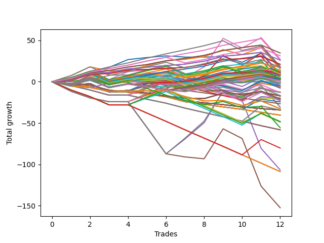

# Long Bulldog 003 
- Symbol: ES90d5m
- Date Range: 03/18/2022 - 07/08/2022
- Trading Period: 7:20-12:30
- Number of Trades: 12



| Name | Win Percent | Profit | Avg Profit / Trade |     | Name | Win Percent | Profit | Avg Profit / Trade |
| ---- | ----------- | ------ | ------------------ | --- | ---- | ----------- | ------ | ------------------ |
| Sorted By <br> Profit | | | | | Sorted By <br> Win Percentage ||||
| Six | 83.33 | 41875.00 | 3489.58 |     | Two | 91.67 | 30125.00 | 2510.42 |
| Three | 83.33 | 32750.00 | 2729.17 |     | Six | 83.33 | 41875.00 | 3489.58 |
| Two | 91.67 | 30125.00 | 2510.42 |     | Three | 83.33 | 32750.00 | 2729.17 |
| Four | 66.67 | 27875.00 | 2322.92 |     | One | 83.33 | 27750.00 | 2312.50 |
| One | 83.33 | 27750.00 | 2312.50 |     | Zero | 75.00 | 16625.00 | 1385.42 |
| Seven | 66.67 | 21375.00 | 1781.25 |     | Four | 66.67 | 27875.00 | 2322.92 |
| Zero | 75.00 | 16625.00 | 1385.42 |     | Seven | 66.67 | 21375.00 | 1781.25 |
| Five | 41.67 | -45875.00 | -3822.92 |     | Five | 41.67 | -45875.00 | -3822.92 |

### Test Zero
* Sell when price hits the middle line of the 20p bollinger
* No Stoploss
* Results:
```
Total Trades: 12
Percent Up: 75.00
Percent Down: 25.00
Total Points Moved Up: 33.25
Potential Profit: 16625.00
Total Points Ups: 59.75 Count Ups: 9
Total Points Downs: -26.50 Count Downs: 3
```

<details><summary>Trades</summary>

<code>In: 2022-03-23 10:30:00		Out: 2022-03-23 11:28:15		Total Position Time: 58:15		Total Move Up: 7.00		Total to Date: 7.00</code> <br />
<code>In: 2022-03-23 10:45:00		Out: 2022-03-23 11:28:15		Total Position Time: 43:15		Total Move Up: 8.25		Total to Date: 15.25</code> <br />
<code>In: 2022-03-30 12:10:00		Out: 2022-03-30 12:47:25		Total Position Time: 37:25		Total Move Up: 4.00		Total to Date: 19.25</code> <br />
<code>In: 2022-03-30 12:25:00		Out: 2022-03-30 12:47:25		Total Position Time: 22:25		Total Move Up: 14.50		Total to Date: 33.75</code> <br />
<code>In: 2022-03-31 11:20:00		Out: 2022-03-31 11:59:20		Total Position Time: 39:20		Total Move Up: 5.25		Total to Date: 39.00</code> <br />
<code>In: 2022-03-31 11:25:00		Out: 2022-03-31 11:59:20		Total Position Time: 34:20		Total Move Up: 2.50		Total to Date: 41.50</code> <br />
<code>In: 2022-04-18 08:40:00		Out: 2022-04-18 09:55:05		Total Position Time: 75:05		Total Move Up: -1.75		Total to Date: 39.75</code> <br />
<code>In: 2022-04-18 08:50:00		Out: 2022-04-18 09:55:05		Total Position Time: 65:05		Total Move Up: 3.25		Total to Date: 43.00</code> <br />
<code>In: 2022-05-12 10:50:00		Out: 2022-05-12 12:04:55		Total Position Time: 74:55		Total Move Up: 3.75		Total to Date: 46.75</code> <br />
<code>In: 2022-06-08 09:45:00		Out: 2022-06-08 11:45:20		Total Position Time: 120:20		Total Move Up: -1.25		Total to Date: 45.50</code> <br />
<code>In: 2022-06-09 08:05:00		Out: 2022-06-09 08:42:25		Total Position Time: 37:25		Total Move Up: 11.25		Total to Date: 56.75</code> <br />
<code>In: 2022-06-09 12:15:00		Out: 2022-06-09 12:50:00		Total Position Time: 35:00		Total Move Up: -23.50		Total to Date: 33.25</code> <br />


</details>

### Test One
* Sell when the price hits the upper line of the 20p 1std bollinger
* No Stoploss
* Results:
```
Total Trades: 12
Percent Up: 83.33
Percent Down: 16.67
Total Points Moved Up: 55.50
Potential Profit: 27750.00
Total Points Ups: 79.25 Count Ups: 10
Total Points Downs: -23.75 Count Downs: 2
```

<details><summary>Trades</summary>

<code>In: 2022-03-23 10:30:00		Out: 2022-03-23 11:48:45		Total Position Time: 78:45		Total Move Up: 10.50		Total to Date: 10.50</code> <br />
<code>In: 2022-03-23 10:45:00		Out: 2022-03-23 11:48:45		Total Position Time: 63:45		Total Move Up: 11.75		Total to Date: 22.25</code> <br />
<code>In: 2022-03-30 12:10:00		Out: 2022-03-30 12:50:00		Total Position Time: 40:00		Total Move Up: 2.25		Total to Date: 24.50</code> <br />
<code>In: 2022-03-30 12:25:00		Out: 2022-03-30 12:50:00		Total Position Time: 25:00		Total Move Up: 12.75		Total to Date: 37.25</code> <br />
<code>In: 2022-03-31 11:20:00		Out: 2022-03-31 12:00:20		Total Position Time: 40:20		Total Move Up: 9.00		Total to Date: 46.25</code> <br />
<code>In: 2022-03-31 11:25:00		Out: 2022-03-31 12:00:20		Total Position Time: 35:20		Total Move Up: 6.25		Total to Date: 52.50</code> <br />
<code>In: 2022-04-18 08:40:00		Out: 2022-04-18 10:08:10		Total Position Time: 88:10		Total Move Up: 2.00		Total to Date: 54.50</code> <br />
<code>In: 2022-04-18 08:50:00		Out: 2022-04-18 10:08:10		Total Position Time: 78:10		Total Move Up: 7.00		Total to Date: 61.50</code> <br />
<code>In: 2022-05-12 10:50:00		Out: 2022-05-12 12:18:20		Total Position Time: 88:20		Total Move Up: 9.00		Total to Date: 70.50</code> <br />
<code>In: 2022-06-08 09:45:00		Out: 2022-06-08 12:21:10		Total Position Time: 156:10		Total Move Up: -0.25		Total to Date: 70.25</code> <br />
<code>In: 2022-06-09 08:05:00		Out: 2022-06-09 09:28:40		Total Position Time: 83:40		Total Move Up: 8.75		Total to Date: 79.00</code> <br />
<code>In: 2022-06-09 12:15:00		Out: 2022-06-09 12:50:00		Total Position Time: 35:00		Total Move Up: -23.50		Total to Date: 55.50</code> <br />


</details>

### Test Two
* Sell when the price hits the upper line of the 20p 2std bollinger
* No Stoploss
* Results:
```
Total Trades: 12
Percent Up: 91.67
Percent Down: 8.33
Total Points Moved Up: 60.25
Potential Profit: 30125.00
Total Points Ups: 83.75 Count Ups: 11
Total Points Downs: -23.50 Count Downs: 1
```

<details><summary>Trades</summary>

<code>In: 2022-03-23 10:30:00		Out: 2022-03-23 12:50:00		Total Position Time: 140:00		Total Move Up: 1.00		Total to Date: 1.00</code> <br />
<code>In: 2022-03-23 10:45:00		Out: 2022-03-23 12:50:00		Total Position Time: 125:00		Total Move Up: 2.25		Total to Date: 3.25</code> <br />
<code>In: 2022-03-30 12:10:00		Out: 2022-03-30 12:50:00		Total Position Time: 40:00		Total Move Up: 2.25		Total to Date: 5.50</code> <br />
<code>In: 2022-03-30 12:25:00		Out: 2022-03-30 12:50:00		Total Position Time: 25:00		Total Move Up: 12.75		Total to Date: 18.25</code> <br />
<code>In: 2022-03-31 11:20:00		Out: 2022-03-31 12:02:30		Total Position Time: 42:30		Total Move Up: 12.00		Total to Date: 30.25</code> <br />
<code>In: 2022-03-31 11:25:00		Out: 2022-03-31 12:02:30		Total Position Time: 37:30		Total Move Up: 9.25		Total to Date: 39.50</code> <br />
<code>In: 2022-04-18 08:40:00		Out: 2022-04-18 10:10:25		Total Position Time: 90:25		Total Move Up: 5.25		Total to Date: 44.75</code> <br />
<code>In: 2022-04-18 08:50:00		Out: 2022-04-18 10:10:25		Total Position Time: 80:25		Total Move Up: 10.25		Total to Date: 55.00</code> <br />
<code>In: 2022-05-12 10:50:00		Out: 2022-05-12 12:19:20		Total Position Time: 89:20		Total Move Up: 14.00		Total to Date: 69.00</code> <br />
<code>In: 2022-06-08 09:45:00		Out: 2022-06-08 12:22:55		Total Position Time: 157:55		Total Move Up: 2.75		Total to Date: 71.75</code> <br />
<code>In: 2022-06-09 08:05:00		Out: 2022-06-09 09:30:40		Total Position Time: 85:40		Total Move Up: 12.00		Total to Date: 83.75</code> <br />
<code>In: 2022-06-09 12:15:00		Out: 2022-06-09 12:50:00		Total Position Time: 35:00		Total Move Up: -23.50		Total to Date: 60.25</code> <br />


</details>

### Test Three
* Sell when price hits the middle line of the 50p bollinger
* No Stoploss
* Results:
```
Total Trades: 12
Percent Up: 83.33
Percent Down: 16.67
Total Points Moved Up: 65.50
Potential Profit: 32750.00
Total Points Ups: 96.75 Count Ups: 10
Total Points Downs: -31.25 Count Downs: 2
```

<details><summary>Trades</summary>

<code>In: 2022-03-23 10:30:00		Out: 2022-03-23 12:50:00		Total Position Time: 140:00		Total Move Up: 1.00		Total to Date: 1.00</code> <br />
<code>In: 2022-03-23 10:45:00		Out: 2022-03-23 12:50:00		Total Position Time: 125:00		Total Move Up: 2.25		Total to Date: 3.25</code> <br />
<code>In: 2022-03-30 12:10:00		Out: 2022-03-30 12:50:00		Total Position Time: 40:00		Total Move Up: 2.25		Total to Date: 5.50</code> <br />
<code>In: 2022-03-30 12:25:00		Out: 2022-03-30 12:50:00		Total Position Time: 25:00		Total Move Up: 12.75		Total to Date: 18.25</code> <br />
<code>In: 2022-03-31 11:20:00		Out: 2022-03-31 12:01:05		Total Position Time: 41:05		Total Move Up: 10.50		Total to Date: 28.75</code> <br />
<code>In: 2022-03-31 11:25:00		Out: 2022-03-31 12:01:05		Total Position Time: 36:05		Total Move Up: 7.75		Total to Date: 36.50</code> <br />
<code>In: 2022-04-18 08:40:00		Out: 2022-04-18 10:31:35		Total Position Time: 111:35		Total Move Up: 7.75		Total to Date: 44.25</code> <br />
<code>In: 2022-04-18 08:50:00		Out: 2022-04-18 10:31:35		Total Position Time: 101:35		Total Move Up: 12.75		Total to Date: 57.00</code> <br />
<code>In: 2022-05-12 10:50:00		Out: 2022-05-12 12:21:25		Total Position Time: 91:25		Total Move Up: 24.50		Total to Date: 81.50</code> <br />
<code>In: 2022-06-08 09:45:00		Out: 2022-06-08 12:50:00		Total Position Time: 185:00		Total Move Up: -7.75		Total to Date: 73.75</code> <br />
<code>In: 2022-06-09 08:05:00		Out: 2022-06-09 09:44:15		Total Position Time: 99:15		Total Move Up: 15.25		Total to Date: 89.00</code> <br />
<code>In: 2022-06-09 12:15:00		Out: 2022-06-09 12:50:00		Total Position Time: 35:00		Total Move Up: -23.50		Total to Date: 65.50</code> <br />


</details>

### Test Four
* Sell when the price hits the upper line of the 50p 1std bollinger
* No Stoploss
* Results:
```
Total Trades: 12
Percent Up: 66.67
Percent Down: 33.33
Total Points Moved Up: 55.75
Potential Profit: 27875.00
Total Points Ups: 125.25 Count Ups: 8
Total Points Downs: -69.50 Count Downs: 4
```

<details><summary>Trades</summary>

<code>In: 2022-03-23 10:30:00		Out: 2022-03-23 12:50:00		Total Position Time: 140:00		Total Move Up: 1.00		Total to Date: 1.00</code> <br />
<code>In: 2022-03-23 10:45:00		Out: 2022-03-23 12:50:00		Total Position Time: 125:00		Total Move Up: 2.25		Total to Date: 3.25</code> <br />
<code>In: 2022-03-30 12:10:00		Out: 2022-03-30 12:50:00		Total Position Time: 40:00		Total Move Up: 2.25		Total to Date: 5.50</code> <br />
<code>In: 2022-03-30 12:25:00		Out: 2022-03-30 12:50:00		Total Position Time: 25:00		Total Move Up: 12.75		Total to Date: 18.25</code> <br />
<code>In: 2022-03-31 11:20:00		Out: 2022-03-31 12:50:00		Total Position Time: 90:00		Total Move Up: -17.75		Total to Date: 0.50</code> <br />
<code>In: 2022-03-31 11:25:00		Out: 2022-03-31 12:50:00		Total Position Time: 85:00		Total Move Up: -20.50		Total to Date: -20.00</code> <br />
<code>In: 2022-04-18 08:40:00		Out: 2022-04-18 10:35:40		Total Position Time: 115:40		Total Move Up: 18.75		Total to Date: -1.25</code> <br />
<code>In: 2022-04-18 08:50:00		Out: 2022-04-18 10:35:40		Total Position Time: 105:40		Total Move Up: 23.75		Total to Date: 22.50</code> <br />
<code>In: 2022-05-12 10:50:00		Out: 2022-05-12 12:43:05		Total Position Time: 113:05		Total Move Up: 40.75		Total to Date: 63.25</code> <br />
<code>In: 2022-06-08 09:45:00		Out: 2022-06-08 12:50:00		Total Position Time: 185:00		Total Move Up: -7.75		Total to Date: 55.50</code> <br />
<code>In: 2022-06-09 08:05:00		Out: 2022-06-09 10:07:20		Total Position Time: 122:20		Total Move Up: 23.75		Total to Date: 79.25</code> <br />
<code>In: 2022-06-09 12:15:00		Out: 2022-06-09 12:50:00		Total Position Time: 35:00		Total Move Up: -23.50		Total to Date: 55.75</code> <br />


</details>

### Test Five
* Sell when the price hits the upper line of the 50p 2std bollinger
* No Stoploss
* Results:
```
Total Trades: 12
Percent Up: 41.67
Percent Down: 58.33
Total Points Moved Up: -91.75
Potential Profit: -45875.00
Total Points Ups: 48.25 Count Ups: 5
Total Points Downs: -140.00 Count Downs: 7
```

<details><summary>Trades</summary>

<code>In: 2022-03-23 10:30:00		Out: 2022-03-23 12:50:00		Total Position Time: 140:00		Total Move Up: 1.00		Total to Date: 1.00</code> <br />
<code>In: 2022-03-23 10:45:00		Out: 2022-03-23 12:50:00		Total Position Time: 125:00		Total Move Up: 2.25		Total to Date: 3.25</code> <br />
<code>In: 2022-03-30 12:10:00		Out: 2022-03-30 12:50:00		Total Position Time: 40:00		Total Move Up: 2.25		Total to Date: 5.50</code> <br />
<code>In: 2022-03-30 12:25:00		Out: 2022-03-30 12:50:00		Total Position Time: 25:00		Total Move Up: 12.75		Total to Date: 18.25</code> <br />
<code>In: 2022-03-31 11:20:00		Out: 2022-03-31 12:50:00		Total Position Time: 90:00		Total Move Up: -17.75		Total to Date: 0.50</code> <br />
<code>In: 2022-03-31 11:25:00		Out: 2022-03-31 12:50:00		Total Position Time: 85:00		Total Move Up: -20.50		Total to Date: -20.00</code> <br />
<code>In: 2022-04-18 08:40:00		Out: 2022-04-18 12:50:00		Total Position Time: 250:00		Total Move Up: -9.00		Total to Date: -29.00</code> <br />
<code>In: 2022-04-18 08:50:00		Out: 2022-04-18 12:50:00		Total Position Time: 240:00		Total Move Up: -4.00		Total to Date: -33.00</code> <br />
<code>In: 2022-05-12 10:50:00		Out: 2022-05-12 12:50:00		Total Position Time: 120:00		Total Move Up: 30.00		Total to Date: -3.00</code> <br />
<code>In: 2022-06-08 09:45:00		Out: 2022-06-08 12:50:00		Total Position Time: 185:00		Total Move Up: -7.75		Total to Date: -10.75</code> <br />
<code>In: 2022-06-09 08:05:00		Out: 2022-06-09 12:50:00		Total Position Time: 285:00		Total Move Up: -57.50		Total to Date: -68.25</code> <br />
<code>In: 2022-06-09 12:15:00		Out: 2022-06-09 12:50:00		Total Position Time: 35:00		Total Move Up: -23.50		Total to Date: -91.75</code> <br />


</details>

### Test Six
* Sell when the price hits the middle line of the 1std VWAP
* No Stoploss
* Results:
```
Total Trades: 12
Percent Up: 83.33
Percent Down: 16.67
Total Points Moved Up: 83.75
Potential Profit: 41875.00
Total Points Ups: 115.00 Count Ups: 10
Total Points Downs: -31.25 Count Downs: 2
```

<details><summary>Trades</summary>

<code>In: 2022-03-23 10:30:00		Out: 2022-03-23 12:50:00		Total Position Time: 140:00		Total Move Up: 1.00		Total to Date: 1.00</code> <br />
<code>In: 2022-03-23 10:45:00		Out: 2022-03-23 12:50:00		Total Position Time: 125:00		Total Move Up: 2.25		Total to Date: 3.25</code> <br />
<code>In: 2022-03-30 12:10:00		Out: 2022-03-30 12:50:00		Total Position Time: 40:00		Total Move Up: 2.25		Total to Date: 5.50</code> <br />
<code>In: 2022-03-30 12:25:00		Out: 2022-03-30 12:50:00		Total Position Time: 25:00		Total Move Up: 12.75		Total to Date: 18.25</code> <br />
<code>In: 2022-03-31 11:20:00		Out: 2022-03-31 12:02:30		Total Position Time: 42:30		Total Move Up: 12.00		Total to Date: 30.25</code> <br />
<code>In: 2022-03-31 11:25:00		Out: 2022-03-31 12:02:30		Total Position Time: 37:30		Total Move Up: 9.25		Total to Date: 39.50</code> <br />
<code>In: 2022-04-18 08:40:00		Out: 2022-04-18 10:32:10		Total Position Time: 112:10		Total Move Up: 12.00		Total to Date: 51.50</code> <br />
<code>In: 2022-04-18 08:50:00		Out: 2022-04-18 10:32:10		Total Position Time: 102:10		Total Move Up: 17.00		Total to Date: 68.50</code> <br />
<code>In: 2022-05-12 10:50:00		Out: 2022-05-12 12:23:20		Total Position Time: 93:20		Total Move Up: 32.50		Total to Date: 101.00</code> <br />
<code>In: 2022-06-08 09:45:00		Out: 2022-06-08 12:50:00		Total Position Time: 185:00		Total Move Up: -7.75		Total to Date: 93.25</code> <br />
<code>In: 2022-06-09 08:05:00		Out: 2022-06-09 08:42:55		Total Position Time: 37:55		Total Move Up: 14.00		Total to Date: 107.25</code> <br />
<code>In: 2022-06-09 12:15:00		Out: 2022-06-09 12:50:00		Total Position Time: 35:00		Total Move Up: -23.50		Total to Date: 83.75</code> <br />


</details>

### Test Seven
* Sell when the price hits the upper line of the 1std VWAP
* No Stoploss
* Results:
```
Total Trades: 12
Percent Up: 66.67
Percent Down: 33.33
Total Points Moved Up: 42.75
Potential Profit: 21375.00
Total Points Ups: 112.25 Count Ups: 8
Total Points Downs: -69.50 Count Downs: 4
```

<details><summary>Trades</summary>

<code>In: 2022-03-23 10:30:00		Out: 2022-03-23 12:50:00		Total Position Time: 140:00		Total Move Up: 1.00		Total to Date: 1.00</code> <br />
<code>In: 2022-03-23 10:45:00		Out: 2022-03-23 12:50:00		Total Position Time: 125:00		Total Move Up: 2.25		Total to Date: 3.25</code> <br />
<code>In: 2022-03-30 12:10:00		Out: 2022-03-30 12:50:00		Total Position Time: 40:00		Total Move Up: 2.25		Total to Date: 5.50</code> <br />
<code>In: 2022-03-30 12:25:00		Out: 2022-03-30 12:50:00		Total Position Time: 25:00		Total Move Up: 12.75		Total to Date: 18.25</code> <br />
<code>In: 2022-03-31 11:20:00		Out: 2022-03-31 12:50:00		Total Position Time: 90:00		Total Move Up: -17.75		Total to Date: 0.50</code> <br />
<code>In: 2022-03-31 11:25:00		Out: 2022-03-31 12:50:00		Total Position Time: 85:00		Total Move Up: -20.50		Total to Date: -20.00</code> <br />
<code>In: 2022-04-18 08:40:00		Out: 2022-04-18 10:35:45		Total Position Time: 115:45		Total Move Up: 19.75		Total to Date: -0.25</code> <br />
<code>In: 2022-04-18 08:50:00		Out: 2022-04-18 10:35:45		Total Position Time: 105:45		Total Move Up: 24.75		Total to Date: 24.50</code> <br />
<code>In: 2022-05-12 10:50:00		Out: 2022-05-12 12:50:00		Total Position Time: 120:00		Total Move Up: 30.00		Total to Date: 54.50</code> <br />
<code>In: 2022-06-08 09:45:00		Out: 2022-06-08 12:50:00		Total Position Time: 185:00		Total Move Up: -7.75		Total to Date: 46.75</code> <br />
<code>In: 2022-06-09 08:05:00		Out: 2022-06-09 09:59:35		Total Position Time: 114:35		Total Move Up: 19.50		Total to Date: 66.25</code> <br />
<code>In: 2022-06-09 12:15:00		Out: 2022-06-09 12:50:00		Total Position Time: 35:00		Total Move Up: -23.50		Total to Date: 42.75</code> <br />


</details>