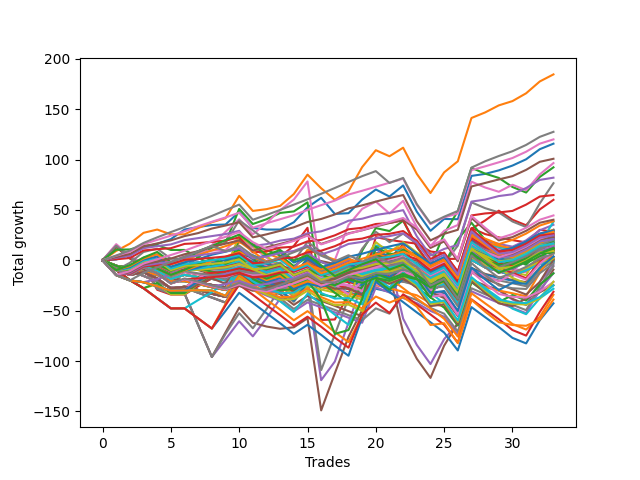

# Long Bulldog 005 
- Symbol: ES90d5m
- Date Range: 03/18/2022 - 07/08/2022
- Trading Period: 7:20-12:30
- Number of Trades: 33



| Name | Win Percent | Profit | Avg Profit / Trade |     | Name | Win Percent | Profit | Avg Profit / Trade |
| ---- | ----------- | ------ | ------------------ | --- | ---- | ----------- | ------ | ------------------ |
| Sorted By <br> Profit | | | | | Sorted By <br> Win Percentage ||||
| One | 81.82 | 143250.00 | 4340.91 |     | One | 81.82 | 143250.00 | 4340.91 |
| Two | 81.82 | 139500.00 | 4227.27 |     | Two | 81.82 | 139500.00 | 4227.27 |
| Four | 69.70 | 131250.00 | 3977.27 |     | Three | 81.82 | 109625.00 | 3321.97 |
| Seven | 69.70 | 130375.00 | 3950.76 |     | Zero | 81.82 | 105375.00 | 3193.18 |
| Six | 78.79 | 115125.00 | 3488.64 |     | Six | 78.79 | 115125.00 | 3488.64 |
| Three | 81.82 | 109625.00 | 3321.97 |     | Four | 69.70 | 131250.00 | 3977.27 |
| Zero | 81.82 | 105375.00 | 3193.18 |     | Seven | 69.70 | 130375.00 | 3950.76 |
| Five | 60.61 | 85750.00 | 2598.48 |     | Five | 60.61 | 85750.00 | 2598.48 |

### Test Zero
* Sell when price hits the middle line of the 20p bollinger
* No Stoploss
* Results:
```
Total Trades: 33
Percent Up: 81.82
Percent Down: 18.18
Total Points Moved Up: 210.75
Potential Profit: 105375.00
Total Points Ups: 275.00 Count Ups: 27
Total Points Downs: -64.25 Count Downs: 6
```

<details><summary>Trades</summary>

<code>In: 2022-03-21 10:05:00		Out: 2022-03-21 11:00:15		Total Position Time: 55:15		Total Move Up: 9.50		Total to Date: 9.50</code> <br />
<code>In: 2022-03-23 10:30:00		Out: 2022-03-23 11:28:15		Total Position Time: 58:15		Total Move Up: 7.00		Total to Date: 16.50</code> <br />
<code>In: 2022-03-23 10:45:00		Out: 2022-03-23 11:28:15		Total Position Time: 43:15		Total Move Up: 8.25		Total to Date: 24.75</code> <br />
<code>In: 2022-03-30 08:15:00		Out: 2022-03-30 09:00:30		Total Position Time: 45:30		Total Move Up: 6.00		Total to Date: 30.75</code> <br />
<code>In: 2022-03-30 12:10:00		Out: 2022-03-30 12:47:25		Total Position Time: 37:25		Total Move Up: 4.00		Total to Date: 34.75</code> <br />
<code>In: 2022-03-30 12:25:00		Out: 2022-03-30 12:47:25		Total Position Time: 22:25		Total Move Up: 14.50		Total to Date: 49.25</code> <br />
<code>In: 2022-03-31 11:20:00		Out: 2022-03-31 11:59:20		Total Position Time: 39:20		Total Move Up: 5.25		Total to Date: 54.50</code> <br />
<code>In: 2022-03-31 11:25:00		Out: 2022-03-31 11:59:20		Total Position Time: 34:20		Total Move Up: 2.50		Total to Date: 57.00</code> <br />
<code>In: 2022-04-01 09:05:00		Out: 2022-04-01 10:36:15		Total Position Time: 91:15		Total Move Up: 0.25		Total to Date: 57.25</code> <br />
<code>In: 2022-04-06 11:20:00		Out: 2022-04-06 11:32:25		Total Position Time: 12:25		Total Move Up: 17.00		Total to Date: 74.25</code> <br />
<code>In: 2022-04-12 11:00:00		Out: 2022-04-12 12:47:25		Total Position Time: 107:25		Total Move Up: -13.75		Total to Date: 60.50</code> <br />
<code>In: 2022-04-18 08:40:00		Out: 2022-04-18 09:55:05		Total Position Time: 75:05		Total Move Up: -1.75		Total to Date: 58.75</code> <br />
<code>In: 2022-04-18 08:50:00		Out: 2022-04-18 09:55:05		Total Position Time: 65:05		Total Move Up: 3.25		Total to Date: 62.00</code> <br />
<code>In: 2022-04-20 11:45:00		Out: 2022-04-20 12:25:05		Total Position Time: 40:05		Total Move Up: 8.25		Total to Date: 70.25</code> <br />
<code>In: 2022-04-20 11:55:00		Out: 2022-04-20 12:25:05		Total Position Time: 30:05		Total Move Up: 17.00		Total to Date: 87.25</code> <br />
<code>In: 2022-04-29 07:35:00		Out: 2022-04-29 08:33:15		Total Position Time: 58:15		Total Move Up: 10.00		Total to Date: 97.25</code> <br />
<code>In: 2022-05-02 10:05:00		Out: 2022-05-02 11:53:40		Total Position Time: 108:40		Total Move Up: -7.00		Total to Date: 90.25</code> <br />
<code>In: 2022-05-12 10:50:00		Out: 2022-05-12 12:04:55		Total Position Time: 74:55		Total Move Up: 3.75		Total to Date: 94.00</code> <br />
<code>In: 2022-05-13 11:05:00		Out: 2022-05-13 11:51:50		Total Position Time: 46:50		Total Move Up: 18.75		Total to Date: 112.75</code> <br />
<code>In: 2022-06-02 07:25:00		Out: 2022-06-02 07:40:05		Total Position Time: 15:05		Total Move Up: 16.50		Total to Date: 129.25</code> <br />
<code>In: 2022-06-08 09:45:00		Out: 2022-06-08 11:45:20		Total Position Time: 120:20		Total Move Up: -1.25		Total to Date: 128.00</code> <br />
<code>In: 2022-06-09 08:05:00		Out: 2022-06-09 08:42:25		Total Position Time: 37:25		Total Move Up: 11.25		Total to Date: 139.25</code> <br />
<code>In: 2022-06-09 12:15:00		Out: 2022-06-09 12:50:00		Total Position Time: 35:00		Total Move Up: -23.50		Total to Date: 115.75</code> <br />
<code>In: 2022-06-13 12:15:00		Out: 2022-06-13 12:50:00		Total Position Time: 35:00		Total Move Up: -17.00		Total to Date: 98.75</code> <br />
<code>In: 2022-06-15 11:10:00		Out: 2022-06-15 11:17:05		Total Position Time: 07:05		Total Move Up: 13.25		Total to Date: 112.00</code> <br />
<code>In: 2022-06-15 11:15:00		Out: 2022-06-15 11:20:30		Total Position Time: 05:30		Total Move Up: 11.25		Total to Date: 123.25</code> <br />
<code>In: 2022-06-15 11:35:00		Out: 2022-06-15 11:40:10		Total Position Time: 05:10		Total Move Up: 39.25		Total to Date: 162.50</code> <br />
<code>In: 2022-06-16 11:00:00		Out: 2022-06-16 12:09:35		Total Position Time: 69:35		Total Move Up: 4.50		Total to Date: 167.00</code> <br />
<code>In: 2022-06-16 11:10:00		Out: 2022-06-16 12:09:35		Total Position Time: 59:35		Total Move Up: 6.75		Total to Date: 173.75</code> <br />
<code>In: 2022-06-27 11:00:00		Out: 2022-06-27 11:19:05		Total Position Time: 19:05		Total Move Up: 7.00		Total to Date: 180.75</code> <br />
<code>In: 2022-06-27 12:05:00		Out: 2022-06-27 12:10:30		Total Position Time: 05:30		Total Move Up: 8.75		Total to Date: 189.50</code> <br />
<code>In: 2022-06-29 09:30:00		Out: 2022-06-29 10:01:50		Total Position Time: 31:50		Total Move Up: 11.75		Total to Date: 201.25</code> <br />
<code>In: 2022-07-06 08:45:00		Out: 2022-07-06 09:15:00		Total Position Time: 30:00		Total Move Up: 9.50		Total to Date: 210.75</code> <br />


</details>

### Test One
* Sell when the price hits the upper line of the 20p 1std bollinger
* No Stoploss
* Results:
```
Total Trades: 33
Percent Up: 81.82
Percent Down: 18.18
Total Points Moved Up: 286.50
Potential Profit: 143250.00
Total Points Ups: 359.50 Count Ups: 27
Total Points Downs: -73.00 Count Downs: 6
```

<details><summary>Trades</summary>

<code>In: 2022-03-21 10:05:00		Out: 2022-03-21 11:21:40		Total Position Time: 76:40		Total Move Up: 12.75		Total to Date: 12.75</code> <br />
<code>In: 2022-03-23 10:30:00		Out: 2022-03-23 11:48:45		Total Position Time: 78:45		Total Move Up: 10.50		Total to Date: 23.25</code> <br />
<code>In: 2022-03-23 10:45:00		Out: 2022-03-23 11:48:45		Total Position Time: 63:45		Total Move Up: 11.75		Total to Date: 35.00</code> <br />
<code>In: 2022-03-30 08:15:00		Out: 2022-03-30 09:37:30		Total Position Time: 82:30		Total Move Up: 5.25		Total to Date: 40.25</code> <br />
<code>In: 2022-03-30 12:10:00		Out: 2022-03-30 12:50:00		Total Position Time: 40:00		Total Move Up: 2.25		Total to Date: 42.50</code> <br />
<code>In: 2022-03-30 12:25:00		Out: 2022-03-30 12:50:00		Total Position Time: 25:00		Total Move Up: 12.75		Total to Date: 55.25</code> <br />
<code>In: 2022-03-31 11:20:00		Out: 2022-03-31 12:00:20		Total Position Time: 40:20		Total Move Up: 9.00		Total to Date: 64.25</code> <br />
<code>In: 2022-03-31 11:25:00		Out: 2022-03-31 12:00:20		Total Position Time: 35:20		Total Move Up: 6.25		Total to Date: 70.50</code> <br />
<code>In: 2022-04-01 09:05:00		Out: 2022-04-01 10:37:05		Total Position Time: 92:05		Total Move Up: 2.50		Total to Date: 73.00</code> <br />
<code>In: 2022-04-06 11:20:00		Out: 2022-04-06 11:34:00		Total Position Time: 14:00		Total Move Up: 26.75		Total to Date: 99.75</code> <br />
<code>In: 2022-04-12 11:00:00		Out: 2022-04-12 12:50:00		Total Position Time: 110:00		Total Move Up: -12.00		Total to Date: 87.75</code> <br />
<code>In: 2022-04-18 08:40:00		Out: 2022-04-18 10:08:10		Total Position Time: 88:10		Total Move Up: 2.00		Total to Date: 89.75</code> <br />
<code>In: 2022-04-18 08:50:00		Out: 2022-04-18 10:08:10		Total Position Time: 78:10		Total Move Up: 7.00		Total to Date: 96.75</code> <br />
<code>In: 2022-04-20 11:45:00		Out: 2022-04-20 12:45:15		Total Position Time: 60:15		Total Move Up: 12.00		Total to Date: 108.75</code> <br />
<code>In: 2022-04-20 11:55:00		Out: 2022-04-20 12:45:15		Total Position Time: 50:15		Total Move Up: 20.75		Total to Date: 129.50</code> <br />
<code>In: 2022-04-29 07:35:00		Out: 2022-04-29 10:36:20		Total Position Time: 181:20		Total Move Up: -16.25		Total to Date: 113.25</code> <br />
<code>In: 2022-05-02 10:05:00		Out: 2022-05-02 12:05:15		Total Position Time: 120:15		Total Move Up: -4.00		Total to Date: 109.25</code> <br />
<code>In: 2022-05-12 10:50:00		Out: 2022-05-12 12:18:20		Total Position Time: 88:20		Total Move Up: 9.00		Total to Date: 118.25</code> <br />
<code>In: 2022-05-13 11:05:00		Out: 2022-05-13 12:00:35		Total Position Time: 55:35		Total Move Up: 29.50		Total to Date: 147.75</code> <br />
<code>In: 2022-06-02 07:25:00		Out: 2022-06-02 07:56:05		Total Position Time: 31:05		Total Move Up: 23.25		Total to Date: 171.00</code> <br />
<code>In: 2022-06-08 09:45:00		Out: 2022-06-08 12:21:10		Total Position Time: 156:10		Total Move Up: -0.25		Total to Date: 170.75</code> <br />
<code>In: 2022-06-09 08:05:00		Out: 2022-06-09 09:28:40		Total Position Time: 83:40		Total Move Up: 8.75		Total to Date: 179.50</code> <br />
<code>In: 2022-06-09 12:15:00		Out: 2022-06-09 12:50:00		Total Position Time: 35:00		Total Move Up: -23.50		Total to Date: 156.00</code> <br />
<code>In: 2022-06-13 12:15:00		Out: 2022-06-13 12:50:00		Total Position Time: 35:00		Total Move Up: -17.00		Total to Date: 139.00</code> <br />
<code>In: 2022-06-15 11:10:00		Out: 2022-06-15 11:38:55		Total Position Time: 28:55		Total Move Up: 21.50		Total to Date: 160.50</code> <br />
<code>In: 2022-06-15 11:15:00		Out: 2022-06-15 11:38:55		Total Position Time: 23:55		Total Move Up: 20.50		Total to Date: 181.00</code> <br />
<code>In: 2022-06-15 11:35:00		Out: 2022-06-15 11:40:30		Total Position Time: 05:30		Total Move Up: 42.25		Total to Date: 223.25</code> <br />
<code>In: 2022-06-16 11:00:00		Out: 2022-06-16 12:20:15		Total Position Time: 80:15		Total Move Up: 8.75		Total to Date: 232.00</code> <br />
<code>In: 2022-06-16 11:10:00		Out: 2022-06-16 12:20:15		Total Position Time: 70:15		Total Move Up: 11.00		Total to Date: 243.00</code> <br />
<code>In: 2022-06-27 11:00:00		Out: 2022-06-27 12:15:20		Total Position Time: 75:20		Total Move Up: 6.50		Total to Date: 249.50</code> <br />
<code>In: 2022-06-27 12:05:00		Out: 2022-06-27 12:15:20		Total Position Time: 10:20		Total Move Up: 12.25		Total to Date: 261.75</code> <br />
<code>In: 2022-06-29 09:30:00		Out: 2022-06-29 10:39:35		Total Position Time: 69:35		Total Move Up: 13.50		Total to Date: 275.25</code> <br />
<code>In: 2022-07-06 08:45:00		Out: 2022-07-06 09:37:20		Total Position Time: 52:20		Total Move Up: 11.25		Total to Date: 286.50</code> <br />


</details>

### Test Two
* Sell when the price hits the upper line of the 20p 2std bollinger
* No Stoploss
* Results:
```
Total Trades: 33
Percent Up: 81.82
Percent Down: 18.18
Total Points Moved Up: 279.00
Potential Profit: 139500.00
Total Points Ups: 430.00 Count Ups: 27
Total Points Downs: -151.00 Count Downs: 6
```

<details><summary>Trades</summary>

<code>In: 2022-03-21 10:05:00		Out: 2022-03-21 11:29:05		Total Position Time: 84:05		Total Move Up: 18.50		Total to Date: 18.50</code> <br />
<code>In: 2022-03-23 10:30:00		Out: 2022-03-23 12:50:00		Total Position Time: 140:00		Total Move Up: 1.00		Total to Date: 19.50</code> <br />
<code>In: 2022-03-23 10:45:00		Out: 2022-03-23 12:50:00		Total Position Time: 125:00		Total Move Up: 2.25		Total to Date: 21.75</code> <br />
<code>In: 2022-03-30 08:15:00		Out: 2022-03-30 09:40:10		Total Position Time: 85:10		Total Move Up: 7.00		Total to Date: 28.75</code> <br />
<code>In: 2022-03-30 12:10:00		Out: 2022-03-30 12:50:00		Total Position Time: 40:00		Total Move Up: 2.25		Total to Date: 31.00</code> <br />
<code>In: 2022-03-30 12:25:00		Out: 2022-03-30 12:50:00		Total Position Time: 25:00		Total Move Up: 12.75		Total to Date: 43.75</code> <br />
<code>In: 2022-03-31 11:20:00		Out: 2022-03-31 12:02:30		Total Position Time: 42:30		Total Move Up: 12.00		Total to Date: 55.75</code> <br />
<code>In: 2022-03-31 11:25:00		Out: 2022-03-31 12:02:30		Total Position Time: 37:30		Total Move Up: 9.25		Total to Date: 65.00</code> <br />
<code>In: 2022-04-01 09:05:00		Out: 2022-04-01 10:38:20		Total Position Time: 93:20		Total Move Up: 6.00		Total to Date: 71.00</code> <br />
<code>In: 2022-04-06 11:20:00		Out: 2022-04-06 11:56:00		Total Position Time: 36:00		Total Move Up: 40.25		Total to Date: 111.25</code> <br />
<code>In: 2022-04-12 11:00:00		Out: 2022-04-12 12:50:00		Total Position Time: 110:00		Total Move Up: -12.00		Total to Date: 99.25</code> <br />
<code>In: 2022-04-18 08:40:00		Out: 2022-04-18 10:10:25		Total Position Time: 90:25		Total Move Up: 5.25		Total to Date: 104.50</code> <br />
<code>In: 2022-04-18 08:50:00		Out: 2022-04-18 10:10:25		Total Position Time: 80:25		Total Move Up: 10.25		Total to Date: 114.75</code> <br />
<code>In: 2022-04-20 11:45:00		Out: 2022-04-20 12:50:00		Total Position Time: 65:00		Total Move Up: 13.25		Total to Date: 128.00</code> <br />
<code>In: 2022-04-20 11:55:00		Out: 2022-04-20 12:50:00		Total Position Time: 55:00		Total Move Up: 22.00		Total to Date: 150.00</code> <br />
<code>In: 2022-04-29 07:35:00		Out: 2022-04-29 12:50:00		Total Position Time: 315:00		Total Move Up: -81.25		Total to Date: 68.75</code> <br />
<code>In: 2022-05-02 10:05:00		Out: 2022-05-02 12:09:40		Total Position Time: 124:40		Total Move Up: 6.50		Total to Date: 75.25</code> <br />
<code>In: 2022-05-12 10:50:00		Out: 2022-05-12 12:19:20		Total Position Time: 89:20		Total Move Up: 14.00		Total to Date: 89.25</code> <br />
<code>In: 2022-05-13 11:05:00		Out: 2022-05-13 12:14:45		Total Position Time: 69:45		Total Move Up: 40.00		Total to Date: 129.25</code> <br />
<code>In: 2022-06-02 07:25:00		Out: 2022-06-02 08:01:35		Total Position Time: 36:35		Total Move Up: 29.00		Total to Date: 158.25</code> <br />
<code>In: 2022-06-08 09:45:00		Out: 2022-06-08 12:22:55		Total Position Time: 157:55		Total Move Up: 2.75		Total to Date: 161.00</code> <br />
<code>In: 2022-06-09 08:05:00		Out: 2022-06-09 09:30:40		Total Position Time: 85:40		Total Move Up: 12.00		Total to Date: 173.00</code> <br />
<code>In: 2022-06-09 12:15:00		Out: 2022-06-09 12:50:00		Total Position Time: 35:00		Total Move Up: -23.50		Total to Date: 149.50</code> <br />
<code>In: 2022-06-13 12:15:00		Out: 2022-06-13 12:50:00		Total Position Time: 35:00		Total Move Up: -17.00		Total to Date: 132.50</code> <br />
<code>In: 2022-06-15 11:10:00		Out: 2022-06-15 11:41:00		Total Position Time: 31:00		Total Move Up: 33.00		Total to Date: 165.50</code> <br />
<code>In: 2022-06-15 11:15:00		Out: 2022-06-15 11:41:00		Total Position Time: 26:00		Total Move Up: 32.00		Total to Date: 197.50</code> <br />
<code>In: 2022-06-15 11:35:00		Out: 2022-06-15 11:41:00		Total Position Time: 06:00		Total Move Up: 54.75		Total to Date: 252.25</code> <br />
<code>In: 2022-06-16 11:00:00		Out: 2022-06-16 12:50:00		Total Position Time: 110:00		Total Move Up: -9.75		Total to Date: 242.50</code> <br />
<code>In: 2022-06-16 11:10:00		Out: 2022-06-16 12:50:00		Total Position Time: 100:00		Total Move Up: -7.50		Total to Date: 235.00</code> <br />
<code>In: 2022-06-27 11:00:00		Out: 2022-06-27 12:50:00		Total Position Time: 110:00		Total Move Up: 4.00		Total to Date: 239.00</code> <br />
<code>In: 2022-06-27 12:05:00		Out: 2022-06-27 12:50:00		Total Position Time: 45:00		Total Move Up: 9.75		Total to Date: 248.75</code> <br />
<code>In: 2022-06-29 09:30:00		Out: 2022-06-29 10:43:40		Total Position Time: 73:40		Total Move Up: 17.00		Total to Date: 265.75</code> <br />
<code>In: 2022-07-06 08:45:00		Out: 2022-07-06 10:00:50		Total Position Time: 75:50		Total Move Up: 13.25		Total to Date: 279.00</code> <br />


</details>

### Test Three
* Sell when price hits the middle line of the 50p bollinger
* No Stoploss
* Results:
```
Total Trades: 33
Percent Up: 81.82
Percent Down: 18.18
Total Points Moved Up: 219.25
Potential Profit: 109625.00
Total Points Ups: 374.25 Count Ups: 27
Total Points Downs: -155.00 Count Downs: 6
```

<details><summary>Trades</summary>

<code>In: 2022-03-21 10:05:00		Out: 2022-03-21 11:30:15		Total Position Time: 85:15		Total Move Up: 18.50		Total to Date: 18.50</code> <br />
<code>In: 2022-03-23 10:30:00		Out: 2022-03-23 12:50:00		Total Position Time: 140:00		Total Move Up: 1.00		Total to Date: 19.50</code> <br />
<code>In: 2022-03-23 10:45:00		Out: 2022-03-23 12:50:00		Total Position Time: 125:00		Total Move Up: 2.25		Total to Date: 21.75</code> <br />
<code>In: 2022-03-30 08:15:00		Out: 2022-03-30 12:50:00		Total Position Time: 275:00		Total Move Up: -13.50		Total to Date: 8.25</code> <br />
<code>In: 2022-03-30 12:10:00		Out: 2022-03-30 12:50:00		Total Position Time: 40:00		Total Move Up: 2.25		Total to Date: 10.50</code> <br />
<code>In: 2022-03-30 12:25:00		Out: 2022-03-30 12:50:00		Total Position Time: 25:00		Total Move Up: 12.75		Total to Date: 23.25</code> <br />
<code>In: 2022-03-31 11:20:00		Out: 2022-03-31 12:01:05		Total Position Time: 41:05		Total Move Up: 10.50		Total to Date: 33.75</code> <br />
<code>In: 2022-03-31 11:25:00		Out: 2022-03-31 12:01:05		Total Position Time: 36:05		Total Move Up: 7.75		Total to Date: 41.50</code> <br />
<code>In: 2022-04-01 09:05:00		Out: 2022-04-01 11:02:35		Total Position Time: 117:35		Total Move Up: 8.75		Total to Date: 50.25</code> <br />
<code>In: 2022-04-06 11:20:00		Out: 2022-04-06 11:32:15		Total Position Time: 12:15		Total Move Up: 16.00		Total to Date: 66.25</code> <br />
<code>In: 2022-04-12 11:00:00		Out: 2022-04-12 12:50:00		Total Position Time: 110:00		Total Move Up: -12.00		Total to Date: 54.25</code> <br />
<code>In: 2022-04-18 08:40:00		Out: 2022-04-18 10:31:35		Total Position Time: 111:35		Total Move Up: 7.75		Total to Date: 62.00</code> <br />
<code>In: 2022-04-18 08:50:00		Out: 2022-04-18 10:31:35		Total Position Time: 101:35		Total Move Up: 12.75		Total to Date: 74.75</code> <br />
<code>In: 2022-04-20 11:45:00		Out: 2022-04-20 12:25:50		Total Position Time: 40:50		Total Move Up: 11.25		Total to Date: 86.00</code> <br />
<code>In: 2022-04-20 11:55:00		Out: 2022-04-20 12:25:50		Total Position Time: 30:50		Total Move Up: 20.00		Total to Date: 106.00</code> <br />
<code>In: 2022-04-29 07:35:00		Out: 2022-04-29 12:50:00		Total Position Time: 315:00		Total Move Up: -81.25		Total to Date: 24.75</code> <br />
<code>In: 2022-05-02 10:05:00		Out: 2022-05-02 12:10:10		Total Position Time: 125:10		Total Move Up: 7.25		Total to Date: 32.00</code> <br />
<code>In: 2022-05-12 10:50:00		Out: 2022-05-12 12:21:25		Total Position Time: 91:25		Total Move Up: 24.50		Total to Date: 56.50</code> <br />
<code>In: 2022-05-13 11:05:00		Out: 2022-05-13 12:01:10		Total Position Time: 56:10		Total Move Up: 31.75		Total to Date: 88.25</code> <br />
<code>In: 2022-06-02 07:25:00		Out: 2022-06-02 08:01:30		Total Position Time: 36:30		Total Move Up: 28.25		Total to Date: 116.50</code> <br />
<code>In: 2022-06-08 09:45:00		Out: 2022-06-08 12:50:00		Total Position Time: 185:00		Total Move Up: -7.75		Total to Date: 108.75</code> <br />
<code>In: 2022-06-09 08:05:00		Out: 2022-06-09 09:44:15		Total Position Time: 99:15		Total Move Up: 15.25		Total to Date: 124.00</code> <br />
<code>In: 2022-06-09 12:15:00		Out: 2022-06-09 12:50:00		Total Position Time: 35:00		Total Move Up: -23.50		Total to Date: 100.50</code> <br />
<code>In: 2022-06-13 12:15:00		Out: 2022-06-13 12:50:00		Total Position Time: 35:00		Total Move Up: -17.00		Total to Date: 83.50</code> <br />
<code>In: 2022-06-15 11:10:00		Out: 2022-06-15 11:38:45		Total Position Time: 28:45		Total Move Up: 14.50		Total to Date: 98.00</code> <br />
<code>In: 2022-06-15 11:15:00		Out: 2022-06-15 11:38:45		Total Position Time: 23:45		Total Move Up: 13.50		Total to Date: 111.50</code> <br />
<code>In: 2022-06-15 11:35:00		Out: 2022-06-15 11:40:10		Total Position Time: 05:10		Total Move Up: 39.25		Total to Date: 150.75</code> <br />
<code>In: 2022-06-16 11:00:00		Out: 2022-06-16 12:10:20		Total Position Time: 70:20		Total Move Up: 10.75		Total to Date: 161.50</code> <br />
<code>In: 2022-06-16 11:10:00		Out: 2022-06-16 12:10:20		Total Position Time: 60:20		Total Move Up: 13.00		Total to Date: 174.50</code> <br />
<code>In: 2022-06-27 11:00:00		Out: 2022-06-27 12:50:00		Total Position Time: 110:00		Total Move Up: 4.00		Total to Date: 178.50</code> <br />
<code>In: 2022-06-27 12:05:00		Out: 2022-06-27 12:50:00		Total Position Time: 45:00		Total Move Up: 9.75		Total to Date: 188.25</code> <br />
<code>In: 2022-06-29 09:30:00		Out: 2022-06-29 10:10:45		Total Position Time: 40:45		Total Move Up: 17.25		Total to Date: 205.50</code> <br />
<code>In: 2022-07-06 08:45:00		Out: 2022-07-06 10:01:50		Total Position Time: 76:50		Total Move Up: 13.75		Total to Date: 219.25</code> <br />


</details>

### Test Four
* Sell when the price hits the upper line of the 50p 1std bollinger
* No Stoploss
* Results:
```
Total Trades: 33
Percent Up: 69.70
Percent Down: 30.30
Total Points Moved Up: 262.50
Potential Profit: 131250.00
Total Points Ups: 473.00 Count Ups: 23
Total Points Downs: -210.50 Count Downs: 10
```

<details><summary>Trades</summary>

<code>In: 2022-03-21 10:05:00		Out: 2022-03-21 12:50:00		Total Position Time: 165:00		Total Move Up: 3.75		Total to Date: 3.75</code> <br />
<code>In: 2022-03-23 10:30:00		Out: 2022-03-23 12:50:00		Total Position Time: 140:00		Total Move Up: 1.00		Total to Date: 4.75</code> <br />
<code>In: 2022-03-23 10:45:00		Out: 2022-03-23 12:50:00		Total Position Time: 125:00		Total Move Up: 2.25		Total to Date: 7.00</code> <br />
<code>In: 2022-03-30 08:15:00		Out: 2022-03-30 12:50:00		Total Position Time: 275:00		Total Move Up: -13.50		Total to Date: -6.50</code> <br />
<code>In: 2022-03-30 12:10:00		Out: 2022-03-30 12:50:00		Total Position Time: 40:00		Total Move Up: 2.25		Total to Date: -4.25</code> <br />
<code>In: 2022-03-30 12:25:00		Out: 2022-03-30 12:50:00		Total Position Time: 25:00		Total Move Up: 12.75		Total to Date: 8.50</code> <br />
<code>In: 2022-03-31 11:20:00		Out: 2022-03-31 12:50:00		Total Position Time: 90:00		Total Move Up: -17.75		Total to Date: -9.25</code> <br />
<code>In: 2022-03-31 11:25:00		Out: 2022-03-31 12:50:00		Total Position Time: 85:00		Total Move Up: -20.50		Total to Date: -29.75</code> <br />
<code>In: 2022-04-01 09:05:00		Out: 2022-04-01 11:06:00		Total Position Time: 121:00		Total Move Up: 17.50		Total to Date: -12.25</code> <br />
<code>In: 2022-04-06 11:20:00		Out: 2022-04-06 11:32:45		Total Position Time: 12:45		Total Move Up: 22.50		Total to Date: 10.25</code> <br />
<code>In: 2022-04-12 11:00:00		Out: 2022-04-12 12:50:00		Total Position Time: 110:00		Total Move Up: -12.00		Total to Date: -1.75</code> <br />
<code>In: 2022-04-18 08:40:00		Out: 2022-04-18 10:35:40		Total Position Time: 115:40		Total Move Up: 18.75		Total to Date: 17.00</code> <br />
<code>In: 2022-04-18 08:50:00		Out: 2022-04-18 10:35:40		Total Position Time: 105:40		Total Move Up: 23.75		Total to Date: 40.75</code> <br />
<code>In: 2022-04-20 11:45:00		Out: 2022-04-20 12:50:00		Total Position Time: 65:00		Total Move Up: 13.25		Total to Date: 54.00</code> <br />
<code>In: 2022-04-20 11:55:00		Out: 2022-04-20 12:50:00		Total Position Time: 55:00		Total Move Up: 22.00		Total to Date: 76.00</code> <br />
<code>In: 2022-04-29 07:35:00		Out: 2022-04-29 12:50:00		Total Position Time: 315:00		Total Move Up: -81.25		Total to Date: -5.25</code> <br />
<code>In: 2022-05-02 10:05:00		Out: 2022-05-02 12:20:25		Total Position Time: 135:25		Total Move Up: 27.50		Total to Date: 22.25</code> <br />
<code>In: 2022-05-12 10:50:00		Out: 2022-05-12 12:43:05		Total Position Time: 113:05		Total Move Up: 40.75		Total to Date: 63.00</code> <br />
<code>In: 2022-05-13 11:05:00		Out: 2022-05-13 12:29:40		Total Position Time: 84:40		Total Move Up: 46.50		Total to Date: 109.50</code> <br />
<code>In: 2022-06-02 07:25:00		Out: 2022-06-02 08:10:45		Total Position Time: 45:45		Total Move Up: 41.75		Total to Date: 151.25</code> <br />
<code>In: 2022-06-08 09:45:00		Out: 2022-06-08 12:50:00		Total Position Time: 185:00		Total Move Up: -7.75		Total to Date: 143.50</code> <br />
<code>In: 2022-06-09 08:05:00		Out: 2022-06-09 10:07:20		Total Position Time: 122:20		Total Move Up: 23.75		Total to Date: 167.25</code> <br />
<code>In: 2022-06-09 12:15:00		Out: 2022-06-09 12:50:00		Total Position Time: 35:00		Total Move Up: -23.50		Total to Date: 143.75</code> <br />
<code>In: 2022-06-13 12:15:00		Out: 2022-06-13 12:50:00		Total Position Time: 35:00		Total Move Up: -17.00		Total to Date: 126.75</code> <br />
<code>In: 2022-06-15 11:10:00		Out: 2022-06-15 11:39:00		Total Position Time: 29:00		Total Move Up: 25.75		Total to Date: 152.50</code> <br />
<code>In: 2022-06-15 11:15:00		Out: 2022-06-15 11:39:00		Total Position Time: 24:00		Total Move Up: 24.75		Total to Date: 177.25</code> <br />
<code>In: 2022-06-15 11:35:00		Out: 2022-06-15 11:40:30		Total Position Time: 05:30		Total Move Up: 42.25		Total to Date: 219.50</code> <br />
<code>In: 2022-06-16 11:00:00		Out: 2022-06-16 12:50:00		Total Position Time: 110:00		Total Move Up: -9.75		Total to Date: 209.75</code> <br />
<code>In: 2022-06-16 11:10:00		Out: 2022-06-16 12:50:00		Total Position Time: 100:00		Total Move Up: -7.50		Total to Date: 202.25</code> <br />
<code>In: 2022-06-27 11:00:00		Out: 2022-06-27 12:50:00		Total Position Time: 110:00		Total Move Up: 4.00		Total to Date: 206.25</code> <br />
<code>In: 2022-06-27 12:05:00		Out: 2022-06-27 12:50:00		Total Position Time: 45:00		Total Move Up: 9.75		Total to Date: 216.00</code> <br />
<code>In: 2022-06-29 09:30:00		Out: 2022-06-29 11:01:35		Total Position Time: 91:35		Total Move Up: 25.50		Total to Date: 241.50</code> <br />
<code>In: 2022-07-06 08:45:00		Out: 2022-07-06 10:08:05		Total Position Time: 83:05		Total Move Up: 21.00		Total to Date: 262.50</code> <br />


</details>

### Test Five
* Sell when the price hits the upper line of the 50p 2std bollinger
* No Stoploss
* Results:
```
Total Trades: 33
Percent Up: 60.61
Percent Down: 39.39
Total Points Moved Up: 171.50
Potential Profit: 85750.00
Total Points Ups: 452.50 Count Ups: 20
Total Points Downs: -281.00 Count Downs: 13
```

<details><summary>Trades</summary>

<code>In: 2022-03-21 10:05:00		Out: 2022-03-21 12:50:00		Total Position Time: 165:00		Total Move Up: 3.75		Total to Date: 3.75</code> <br />
<code>In: 2022-03-23 10:30:00		Out: 2022-03-23 12:50:00		Total Position Time: 140:00		Total Move Up: 1.00		Total to Date: 4.75</code> <br />
<code>In: 2022-03-23 10:45:00		Out: 2022-03-23 12:50:00		Total Position Time: 125:00		Total Move Up: 2.25		Total to Date: 7.00</code> <br />
<code>In: 2022-03-30 08:15:00		Out: 2022-03-30 12:50:00		Total Position Time: 275:00		Total Move Up: -13.50		Total to Date: -6.50</code> <br />
<code>In: 2022-03-30 12:10:00		Out: 2022-03-30 12:50:00		Total Position Time: 40:00		Total Move Up: 2.25		Total to Date: -4.25</code> <br />
<code>In: 2022-03-30 12:25:00		Out: 2022-03-30 12:50:00		Total Position Time: 25:00		Total Move Up: 12.75		Total to Date: 8.50</code> <br />
<code>In: 2022-03-31 11:20:00		Out: 2022-03-31 12:50:00		Total Position Time: 90:00		Total Move Up: -17.75		Total to Date: -9.25</code> <br />
<code>In: 2022-03-31 11:25:00		Out: 2022-03-31 12:50:00		Total Position Time: 85:00		Total Move Up: -20.50		Total to Date: -29.75</code> <br />
<code>In: 2022-04-01 09:05:00		Out: 2022-04-01 11:31:40		Total Position Time: 146:40		Total Move Up: 24.75		Total to Date: -5.00</code> <br />
<code>In: 2022-04-06 11:20:00		Out: 2022-04-06 11:34:25		Total Position Time: 14:25		Total Move Up: 29.00		Total to Date: 24.00</code> <br />
<code>In: 2022-04-12 11:00:00		Out: 2022-04-12 12:50:00		Total Position Time: 110:00		Total Move Up: -12.00		Total to Date: 12.00</code> <br />
<code>In: 2022-04-18 08:40:00		Out: 2022-04-18 12:50:00		Total Position Time: 250:00		Total Move Up: -9.00		Total to Date: 3.00</code> <br />
<code>In: 2022-04-18 08:50:00		Out: 2022-04-18 12:50:00		Total Position Time: 240:00		Total Move Up: -4.00		Total to Date: -1.00</code> <br />
<code>In: 2022-04-20 11:45:00		Out: 2022-04-20 12:50:00		Total Position Time: 65:00		Total Move Up: 13.25		Total to Date: 12.25</code> <br />
<code>In: 2022-04-20 11:55:00		Out: 2022-04-20 12:50:00		Total Position Time: 55:00		Total Move Up: 22.00		Total to Date: 34.25</code> <br />
<code>In: 2022-04-29 07:35:00		Out: 2022-04-29 12:50:00		Total Position Time: 315:00		Total Move Up: -81.25		Total to Date: -47.00</code> <br />
<code>In: 2022-05-02 10:05:00		Out: 2022-05-02 12:30:30		Total Position Time: 145:30		Total Move Up: 45.75		Total to Date: -1.25</code> <br />
<code>In: 2022-05-12 10:50:00		Out: 2022-05-12 12:50:00		Total Position Time: 120:00		Total Move Up: 30.00		Total to Date: 28.75</code> <br />
<code>In: 2022-05-13 11:05:00		Out: 2022-05-13 12:50:00		Total Position Time: 105:00		Total Move Up: 35.25		Total to Date: 64.00</code> <br />
<code>In: 2022-06-02 07:25:00		Out: 2022-06-02 08:46:15		Total Position Time: 81:15		Total Move Up: 54.00		Total to Date: 118.00</code> <br />
<code>In: 2022-06-08 09:45:00		Out: 2022-06-08 12:50:00		Total Position Time: 185:00		Total Move Up: -7.75		Total to Date: 110.25</code> <br />
<code>In: 2022-06-09 08:05:00		Out: 2022-06-09 12:50:00		Total Position Time: 285:00		Total Move Up: -57.50		Total to Date: 52.75</code> <br />
<code>In: 2022-06-09 12:15:00		Out: 2022-06-09 12:50:00		Total Position Time: 35:00		Total Move Up: -23.50		Total to Date: 29.25</code> <br />
<code>In: 2022-06-13 12:15:00		Out: 2022-06-13 12:50:00		Total Position Time: 35:00		Total Move Up: -17.00		Total to Date: 12.25</code> <br />
<code>In: 2022-06-15 11:10:00		Out: 2022-06-15 11:41:00		Total Position Time: 31:00		Total Move Up: 33.00		Total to Date: 45.25</code> <br />
<code>In: 2022-06-15 11:15:00		Out: 2022-06-15 11:41:00		Total Position Time: 26:00		Total Move Up: 32.00		Total to Date: 77.25</code> <br />
<code>In: 2022-06-15 11:35:00		Out: 2022-06-15 11:41:00		Total Position Time: 06:00		Total Move Up: 54.75		Total to Date: 132.00</code> <br />
<code>In: 2022-06-16 11:00:00		Out: 2022-06-16 12:50:00		Total Position Time: 110:00		Total Move Up: -9.75		Total to Date: 122.25</code> <br />
<code>In: 2022-06-16 11:10:00		Out: 2022-06-16 12:50:00		Total Position Time: 100:00		Total Move Up: -7.50		Total to Date: 114.75</code> <br />
<code>In: 2022-06-27 11:00:00		Out: 2022-06-27 12:50:00		Total Position Time: 110:00		Total Move Up: 4.00		Total to Date: 118.75</code> <br />
<code>In: 2022-06-27 12:05:00		Out: 2022-06-27 12:50:00		Total Position Time: 45:00		Total Move Up: 9.75		Total to Date: 128.50</code> <br />
<code>In: 2022-06-29 09:30:00		Out: 2022-06-29 12:50:00		Total Position Time: 200:00		Total Move Up: 15.25		Total to Date: 143.75</code> <br />
<code>In: 2022-07-06 08:45:00		Out: 2022-07-06 11:06:40		Total Position Time: 141:40		Total Move Up: 27.75		Total to Date: 171.50</code> <br />


</details>

### Test Six
* Sell when the price hits the middle line of the 1std VWAP
* No Stoploss
* Results:
```
Total Trades: 33
Percent Up: 78.79
Percent Down: 21.21
Total Points Moved Up: 230.25
Potential Profit: 115125.00
Total Points Ups: 389.00 Count Ups: 26
Total Points Downs: -158.75 Count Downs: 7
```

<details><summary>Trades</summary>

<code>In: 2022-03-21 10:05:00		Out: 2022-03-21 11:46:15		Total Position Time: 101:15		Total Move Up: 21.00		Total to Date: 21.00</code> <br />
<code>In: 2022-03-23 10:30:00		Out: 2022-03-23 12:50:00		Total Position Time: 140:00		Total Move Up: 1.00		Total to Date: 22.00</code> <br />
<code>In: 2022-03-23 10:45:00		Out: 2022-03-23 12:50:00		Total Position Time: 125:00		Total Move Up: 2.25		Total to Date: 24.25</code> <br />
<code>In: 2022-03-30 08:15:00		Out: 2022-03-30 09:44:10		Total Position Time: 89:10		Total Move Up: 8.25		Total to Date: 32.50</code> <br />
<code>In: 2022-03-30 12:10:00		Out: 2022-03-30 12:50:00		Total Position Time: 40:00		Total Move Up: 2.25		Total to Date: 34.75</code> <br />
<code>In: 2022-03-30 12:25:00		Out: 2022-03-30 12:50:00		Total Position Time: 25:00		Total Move Up: 12.75		Total to Date: 47.50</code> <br />
<code>In: 2022-03-31 11:20:00		Out: 2022-03-31 12:02:30		Total Position Time: 42:30		Total Move Up: 12.00		Total to Date: 59.50</code> <br />
<code>In: 2022-03-31 11:25:00		Out: 2022-03-31 12:02:30		Total Position Time: 37:30		Total Move Up: 9.25		Total to Date: 68.75</code> <br />
<code>In: 2022-04-01 09:05:00		Out: 2022-04-01 11:05:00		Total Position Time: 120:00		Total Move Up: 13.50		Total to Date: 82.25</code> <br />
<code>In: 2022-04-06 11:20:00		Out: 2022-04-06 11:32:25		Total Position Time: 12:25		Total Move Up: 17.00		Total to Date: 99.25</code> <br />
<code>In: 2022-04-12 11:00:00		Out: 2022-04-12 12:50:00		Total Position Time: 110:00		Total Move Up: -12.00		Total to Date: 87.25</code> <br />
<code>In: 2022-04-18 08:40:00		Out: 2022-04-18 10:32:10		Total Position Time: 112:10		Total Move Up: 12.00		Total to Date: 99.25</code> <br />
<code>In: 2022-04-18 08:50:00		Out: 2022-04-18 10:32:10		Total Position Time: 102:10		Total Move Up: 17.00		Total to Date: 116.25</code> <br />
<code>In: 2022-04-20 11:45:00		Out: 2022-04-20 12:26:10		Total Position Time: 41:10		Total Move Up: 12.00		Total to Date: 128.25</code> <br />
<code>In: 2022-04-20 11:55:00		Out: 2022-04-20 12:26:10		Total Position Time: 31:10		Total Move Up: 20.75		Total to Date: 149.00</code> <br />
<code>In: 2022-04-29 07:35:00		Out: 2022-04-29 12:50:00		Total Position Time: 315:00		Total Move Up: -81.25		Total to Date: 67.75</code> <br />
<code>In: 2022-05-02 10:05:00		Out: 2022-05-02 12:16:15		Total Position Time: 131:15		Total Move Up: 22.50		Total to Date: 90.25</code> <br />
<code>In: 2022-05-12 10:50:00		Out: 2022-05-12 12:23:20		Total Position Time: 93:20		Total Move Up: 32.50		Total to Date: 122.75</code> <br />
<code>In: 2022-05-13 11:05:00		Out: 2022-05-13 11:52:25		Total Position Time: 47:25		Total Move Up: 21.75		Total to Date: 144.50</code> <br />
<code>In: 2022-06-02 07:25:00		Out: 2022-06-02 07:34:25		Total Position Time: 09:25		Total Move Up: 14.25		Total to Date: 158.75</code> <br />
<code>In: 2022-06-08 09:45:00		Out: 2022-06-08 12:50:00		Total Position Time: 185:00		Total Move Up: -7.75		Total to Date: 151.00</code> <br />
<code>In: 2022-06-09 08:05:00		Out: 2022-06-09 08:42:55		Total Position Time: 37:55		Total Move Up: 14.00		Total to Date: 165.00</code> <br />
<code>In: 2022-06-09 12:15:00		Out: 2022-06-09 12:50:00		Total Position Time: 35:00		Total Move Up: -23.50		Total to Date: 141.50</code> <br />
<code>In: 2022-06-13 12:15:00		Out: 2022-06-13 12:50:00		Total Position Time: 35:00		Total Move Up: -17.00		Total to Date: 124.50</code> <br />
<code>In: 2022-06-15 11:10:00		Out: 2022-06-15 11:38:45		Total Position Time: 28:45		Total Move Up: 14.50		Total to Date: 139.00</code> <br />
<code>In: 2022-06-15 11:15:00		Out: 2022-06-15 11:38:45		Total Position Time: 23:45		Total Move Up: 13.50		Total to Date: 152.50</code> <br />
<code>In: 2022-06-15 11:35:00		Out: 2022-06-15 11:40:10		Total Position Time: 05:10		Total Move Up: 39.25		Total to Date: 191.75</code> <br />
<code>In: 2022-06-16 11:00:00		Out: 2022-06-16 12:50:00		Total Position Time: 110:00		Total Move Up: -9.75		Total to Date: 182.00</code> <br />
<code>In: 2022-06-16 11:10:00		Out: 2022-06-16 12:50:00		Total Position Time: 100:00		Total Move Up: -7.50		Total to Date: 174.50</code> <br />
<code>In: 2022-06-27 11:00:00		Out: 2022-06-27 11:38:50		Total Position Time: 38:50		Total Move Up: 9.25		Total to Date: 183.75</code> <br />
<code>In: 2022-06-27 12:05:00		Out: 2022-06-27 12:45:40		Total Position Time: 40:40		Total Move Up: 13.25		Total to Date: 197.00</code> <br />
<code>In: 2022-06-29 09:30:00		Out: 2022-06-29 10:10:55		Total Position Time: 40:55		Total Move Up: 17.75		Total to Date: 214.75</code> <br />
<code>In: 2022-07-06 08:45:00		Out: 2022-07-06 10:03:05		Total Position Time: 78:05		Total Move Up: 15.50		Total to Date: 230.25</code> <br />


</details>

### Test Seven
* Sell when the price hits the upper line of the 1std VWAP
* No Stoploss
* Results:
```
Total Trades: 33
Percent Up: 69.70
Percent Down: 30.30
Total Points Moved Up: 260.75
Potential Profit: 130375.00
Total Points Ups: 471.25 Count Ups: 23
Total Points Downs: -210.50 Count Downs: 10
```

<details><summary>Trades</summary>

<code>In: 2022-03-21 10:05:00		Out: 2022-03-21 12:50:00		Total Position Time: 165:00		Total Move Up: 3.75		Total to Date: 3.75</code> <br />
<code>In: 2022-03-23 10:30:00		Out: 2022-03-23 12:50:00		Total Position Time: 140:00		Total Move Up: 1.00		Total to Date: 4.75</code> <br />
<code>In: 2022-03-23 10:45:00		Out: 2022-03-23 12:50:00		Total Position Time: 125:00		Total Move Up: 2.25		Total to Date: 7.00</code> <br />
<code>In: 2022-03-30 08:15:00		Out: 2022-03-30 12:50:00		Total Position Time: 275:00		Total Move Up: -13.50		Total to Date: -6.50</code> <br />
<code>In: 2022-03-30 12:10:00		Out: 2022-03-30 12:50:00		Total Position Time: 40:00		Total Move Up: 2.25		Total to Date: -4.25</code> <br />
<code>In: 2022-03-30 12:25:00		Out: 2022-03-30 12:50:00		Total Position Time: 25:00		Total Move Up: 12.75		Total to Date: 8.50</code> <br />
<code>In: 2022-03-31 11:20:00		Out: 2022-03-31 12:50:00		Total Position Time: 90:00		Total Move Up: -17.75		Total to Date: -9.25</code> <br />
<code>In: 2022-03-31 11:25:00		Out: 2022-03-31 12:50:00		Total Position Time: 85:00		Total Move Up: -20.50		Total to Date: -29.75</code> <br />
<code>In: 2022-04-01 09:05:00		Out: 2022-04-01 11:30:15		Total Position Time: 145:15		Total Move Up: 23.25		Total to Date: -6.50</code> <br />
<code>In: 2022-04-06 11:20:00		Out: 2022-04-06 11:32:55		Total Position Time: 12:55		Total Move Up: 25.00		Total to Date: 18.50</code> <br />
<code>In: 2022-04-12 11:00:00		Out: 2022-04-12 12:50:00		Total Position Time: 110:00		Total Move Up: -12.00		Total to Date: 6.50</code> <br />
<code>In: 2022-04-18 08:40:00		Out: 2022-04-18 10:35:45		Total Position Time: 115:45		Total Move Up: 19.75		Total to Date: 26.25</code> <br />
<code>In: 2022-04-18 08:50:00		Out: 2022-04-18 10:35:45		Total Position Time: 105:45		Total Move Up: 24.75		Total to Date: 51.00</code> <br />
<code>In: 2022-04-20 11:45:00		Out: 2022-04-20 12:50:00		Total Position Time: 65:00		Total Move Up: 13.25		Total to Date: 64.25</code> <br />
<code>In: 2022-04-20 11:55:00		Out: 2022-04-20 12:50:00		Total Position Time: 55:00		Total Move Up: 22.00		Total to Date: 86.25</code> <br />
<code>In: 2022-04-29 07:35:00		Out: 2022-04-29 12:50:00		Total Position Time: 315:00		Total Move Up: -81.25		Total to Date: 5.00</code> <br />
<code>In: 2022-05-02 10:05:00		Out: 2022-05-02 12:30:25		Total Position Time: 145:25		Total Move Up: 44.50		Total to Date: 49.50</code> <br />
<code>In: 2022-05-12 10:50:00		Out: 2022-05-12 12:50:00		Total Position Time: 120:00		Total Move Up: 30.00		Total to Date: 79.50</code> <br />
<code>In: 2022-05-13 11:05:00		Out: 2022-05-13 12:14:40		Total Position Time: 69:40		Total Move Up: 39.25		Total to Date: 118.75</code> <br />
<code>In: 2022-06-02 07:25:00		Out: 2022-06-02 07:42:35		Total Position Time: 17:35		Total Move Up: 18.25		Total to Date: 137.00</code> <br />
<code>In: 2022-06-08 09:45:00		Out: 2022-06-08 12:50:00		Total Position Time: 185:00		Total Move Up: -7.75		Total to Date: 129.25</code> <br />
<code>In: 2022-06-09 08:05:00		Out: 2022-06-09 09:59:35		Total Position Time: 114:35		Total Move Up: 19.50		Total to Date: 148.75</code> <br />
<code>In: 2022-06-09 12:15:00		Out: 2022-06-09 12:50:00		Total Position Time: 35:00		Total Move Up: -23.50		Total to Date: 125.25</code> <br />
<code>In: 2022-06-13 12:15:00		Out: 2022-06-13 12:50:00		Total Position Time: 35:00		Total Move Up: -17.00		Total to Date: 108.25</code> <br />
<code>In: 2022-06-15 11:10:00		Out: 2022-06-15 11:40:55		Total Position Time: 30:55		Total Move Up: 28.50		Total to Date: 136.75</code> <br />
<code>In: 2022-06-15 11:15:00		Out: 2022-06-15 11:40:55		Total Position Time: 25:55		Total Move Up: 27.50		Total to Date: 164.25</code> <br />
<code>In: 2022-06-15 11:35:00		Out: 2022-06-15 11:40:55		Total Position Time: 05:55		Total Move Up: 50.25		Total to Date: 214.50</code> <br />
<code>In: 2022-06-16 11:00:00		Out: 2022-06-16 12:50:00		Total Position Time: 110:00		Total Move Up: -9.75		Total to Date: 204.75</code> <br />
<code>In: 2022-06-16 11:10:00		Out: 2022-06-16 12:50:00		Total Position Time: 100:00		Total Move Up: -7.50		Total to Date: 197.25</code> <br />
<code>In: 2022-06-27 11:00:00		Out: 2022-06-27 12:50:00		Total Position Time: 110:00		Total Move Up: 4.00		Total to Date: 201.25</code> <br />
<code>In: 2022-06-27 12:05:00		Out: 2022-06-27 12:50:00		Total Position Time: 45:00		Total Move Up: 9.75		Total to Date: 211.00</code> <br />
<code>In: 2022-06-29 09:30:00		Out: 2022-06-29 11:01:35		Total Position Time: 91:35		Total Move Up: 25.50		Total to Date: 236.50</code> <br />
<code>In: 2022-07-06 08:45:00		Out: 2022-07-06 11:00:25		Total Position Time: 135:25		Total Move Up: 24.25		Total to Date: 260.75</code> <br />


</details>