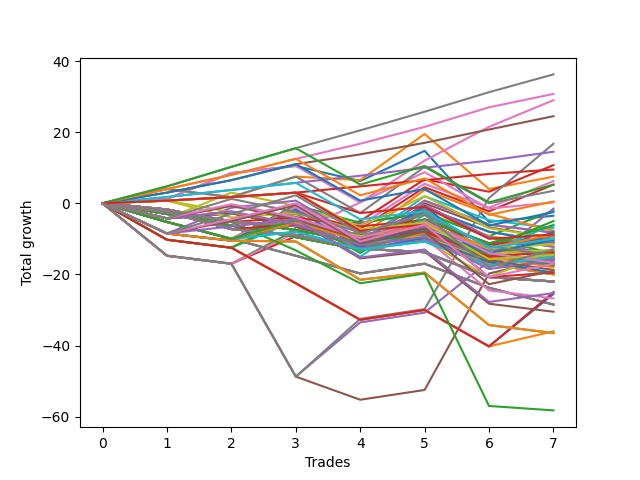

# Long Bulldog 006 
- Symbol: ES90d5m
- Date Range: 03/18/2022 - 07/08/2022
- Trading Period: 7:20-12:30
- Number of Trades: 7



| Name | Win Percent | Profit | Avg Profit / Trade |     | Name | Win Percent | Profit | Avg Profit / Trade |
| ---- | ----------- | ------ | ------------------ | --- | ---- | ----------- | ------ | ------------------ |
| Sorted By <br> Profit | | | | | Sorted By <br> Win Percentage ||||
| Seven | 85.71 | 43125.00 | 6160.71 |     | Six | 100.00 | 38625.00 | 5517.86 |
| Six | 100.00 | 38625.00 | 5517.86 |     | Seven | 85.71 | 43125.00 | 6160.71 |
| Four | 85.71 | 34125.00 | 4875.00 |     | Four | 85.71 | 34125.00 | 4875.00 |
| Three | 85.71 | 27500.00 | 3928.57 |     | Three | 85.71 | 27500.00 | 3928.57 |
| Two | 85.71 | 27500.00 | 3928.57 |     | Two | 85.71 | 27500.00 | 3928.57 |
| Five | 71.43 | 24250.00 | 3464.29 |     | One | 85.71 | 21500.00 | 3071.43 |
| One | 85.71 | 21500.00 | 3071.43 |     | Seventy-Three | 85.71 | 13500.00 | 1928.57 |
| Seventy-Three | 85.71 | 13500.00 | 1928.57 |     | Five | 71.43 | 24250.00 | 3464.29 |
| Zero | 71.43 | 12625.00 | 1803.57 |     | Zero | 71.43 | 12625.00 | 1803.57 |

## NO STOPLOSS

### Test Zero
* Sell when price hits the middle line of the 20p bollinger
* No Stoploss
* Results:
```
Total Trades: 7
Percent Up: 71.43
Percent Down: 28.57
Total Points Moved Up: 25.25
Potential Profit: 12625.00
Total Points Ups: 42.25 Count Ups: 5
Total Points Downs: -17.00 Count Downs: 2
```

<details><summary>Trades</summary>

<code>In: 2022-03-23 10:50:00		Out: 2022-03-23 11:28:15		Total Position Time: 38:15		Total Move Up: 7.25		Total to Date: 7.25</code> <br />
<code>In: 2022-03-30 12:30:00		Out: 2022-03-30 12:47:25		Total Position Time: 17:25		Total Move Up: 8.50		Total to Date: 15.75</code> <br />
<code>In: 2022-03-31 11:25:00		Out: 2022-03-31 11:59:20		Total Position Time: 34:20		Total Move Up: 2.50		Total to Date: 18.25</code> <br />
<code>In: 2022-04-18 08:55:00		Out: 2022-04-18 09:55:05		Total Position Time: 60:05		Total Move Up: -1.00		Total to Date: 17.25</code> <br />
<code>In: 2022-04-20 12:00:00		Out: 2022-04-20 12:25:05		Total Position Time: 25:05		Total Move Up: 14.25		Total to Date: 31.50</code> <br />
<code>In: 2022-05-02 10:10:00		Out: 2022-05-02 11:53:40		Total Position Time: 103:40		Total Move Up: -16.00		Total to Date: 15.50</code> <br />
<code>In: 2022-06-29 09:35:00		Out: 2022-06-29 10:01:50		Total Position Time: 26:50		Total Move Up: 9.75		Total to Date: 25.25</code> <br />


</details>

### Test One
* Sell when the price hits the upper line of the 20p 1std bollinger
* No Stoploss
* Results:
```
Total Trades: 7
Percent Up: 85.71
Percent Down: 14.29
Total Points Moved Up: 43.00
Potential Profit: 21500.00
Total Points Ups: 56.00 Count Ups: 6
Total Points Downs: -13.00 Count Downs: 1
```

<details><summary>Trades</summary>

<code>In: 2022-03-23 10:50:00		Out: 2022-03-23 11:48:45		Total Position Time: 58:45		Total Move Up: 10.75		Total to Date: 10.75</code> <br />
<code>In: 2022-03-30 12:30:00		Out: 2022-03-30 12:50:00		Total Position Time: 20:00		Total Move Up: 6.75		Total to Date: 17.50</code> <br />
<code>In: 2022-03-31 11:25:00		Out: 2022-03-31 12:00:20		Total Position Time: 35:20		Total Move Up: 6.25		Total to Date: 23.75</code> <br />
<code>In: 2022-04-18 08:55:00		Out: 2022-04-18 10:08:10		Total Position Time: 73:10		Total Move Up: 2.75		Total to Date: 26.50</code> <br />
<code>In: 2022-04-20 12:00:00		Out: 2022-04-20 12:45:15		Total Position Time: 45:15		Total Move Up: 18.00		Total to Date: 44.50</code> <br />
<code>In: 2022-05-02 10:10:00		Out: 2022-05-02 12:05:15		Total Position Time: 115:15		Total Move Up: -13.00		Total to Date: 31.50</code> <br />
<code>In: 2022-06-29 09:35:00		Out: 2022-06-29 10:39:35		Total Position Time: 64:35		Total Move Up: 11.50		Total to Date: 43.00</code> <br />


</details>

### Test Two
* Sell when the price hits the upper line of the 20p 2std bollinger
* No Stoploss
* Results:
```
Total Trades: 7
Percent Up: 85.71
Percent Down: 14.29
Total Points Moved Up: 55.00
Potential Profit: 27500.00
Total Points Ups: 57.50 Count Ups: 6
Total Points Downs: -2.50 Count Downs: 1
```

<details><summary>Trades</summary>

<code>In: 2022-03-23 10:50:00		Out: 2022-03-23 12:50:00		Total Position Time: 120:00		Total Move Up: 1.25		Total to Date: 1.25</code> <br />
<code>In: 2022-03-30 12:30:00		Out: 2022-03-30 12:50:00		Total Position Time: 20:00		Total Move Up: 6.75		Total to Date: 8.00</code> <br />
<code>In: 2022-03-31 11:25:00		Out: 2022-03-31 12:02:30		Total Position Time: 37:30		Total Move Up: 9.25		Total to Date: 17.25</code> <br />
<code>In: 2022-04-18 08:55:00		Out: 2022-04-18 10:10:25		Total Position Time: 75:25		Total Move Up: 6.00		Total to Date: 23.25</code> <br />
<code>In: 2022-04-20 12:00:00		Out: 2022-04-20 12:50:00		Total Position Time: 50:00		Total Move Up: 19.25		Total to Date: 42.50</code> <br />
<code>In: 2022-05-02 10:10:00		Out: 2022-05-02 12:09:40		Total Position Time: 119:40		Total Move Up: -2.50		Total to Date: 40.00</code> <br />
<code>In: 2022-06-29 09:35:00		Out: 2022-06-29 10:43:40		Total Position Time: 68:40		Total Move Up: 15.00		Total to Date: 55.00</code> <br />


</details>

### Test Three
* Sell when price hits the middle line of the 50p bollinger
* No Stoploss
* Results:
```
Total Trades: 7
Percent Up: 85.71
Percent Down: 14.29
Total Points Moved Up: 55.00
Potential Profit: 27500.00
Total Points Ups: 56.75 Count Ups: 6
Total Points Downs: -1.75 Count Downs: 1
```

<details><summary>Trades</summary>

<code>In: 2022-03-23 10:50:00		Out: 2022-03-23 12:50:00		Total Position Time: 120:00		Total Move Up: 1.25		Total to Date: 1.25</code> <br />
<code>In: 2022-03-30 12:30:00		Out: 2022-03-30 12:50:00		Total Position Time: 20:00		Total Move Up: 6.75		Total to Date: 8.00</code> <br />
<code>In: 2022-03-31 11:25:00		Out: 2022-03-31 12:01:05		Total Position Time: 36:05		Total Move Up: 7.75		Total to Date: 15.75</code> <br />
<code>In: 2022-04-18 08:55:00		Out: 2022-04-18 10:31:35		Total Position Time: 96:35		Total Move Up: 8.50		Total to Date: 24.25</code> <br />
<code>In: 2022-04-20 12:00:00		Out: 2022-04-20 12:25:50		Total Position Time: 25:50		Total Move Up: 17.25		Total to Date: 41.50</code> <br />
<code>In: 2022-05-02 10:10:00		Out: 2022-05-02 12:10:10		Total Position Time: 120:10		Total Move Up: -1.75		Total to Date: 39.75</code> <br />
<code>In: 2022-06-29 09:35:00		Out: 2022-06-29 10:10:45		Total Position Time: 35:45		Total Move Up: 15.25		Total to Date: 55.00</code> <br />


</details>

### Test Four
* Sell when the price hits the upper line of the 50p 1std bollinger
* No Stoploss
* Results:
```
Total Trades: 7
Percent Up: 85.71
Percent Down: 14.29
Total Points Moved Up: 68.25
Potential Profit: 34125.00
Total Points Ups: 88.75 Count Ups: 6
Total Points Downs: -20.50 Count Downs: 1
```

<details><summary>Trades</summary>

<code>In: 2022-03-23 10:50:00		Out: 2022-03-23 12:50:00		Total Position Time: 120:00		Total Move Up: 1.25		Total to Date: 1.25</code> <br />
<code>In: 2022-03-30 12:30:00		Out: 2022-03-30 12:50:00		Total Position Time: 20:00		Total Move Up: 6.75		Total to Date: 8.00</code> <br />
<code>In: 2022-03-31 11:25:00		Out: 2022-03-31 12:50:00		Total Position Time: 85:00		Total Move Up: -20.50		Total to Date: -12.50</code> <br />
<code>In: 2022-04-18 08:55:00		Out: 2022-04-18 10:35:40		Total Position Time: 100:40		Total Move Up: 19.50		Total to Date: 7.00</code> <br />
<code>In: 2022-04-20 12:00:00		Out: 2022-04-20 12:50:00		Total Position Time: 50:00		Total Move Up: 19.25		Total to Date: 26.25</code> <br />
<code>In: 2022-05-02 10:10:00		Out: 2022-05-02 12:20:25		Total Position Time: 130:25		Total Move Up: 18.50		Total to Date: 44.75</code> <br />
<code>In: 2022-06-29 09:35:00		Out: 2022-06-29 11:01:35		Total Position Time: 86:35		Total Move Up: 23.50		Total to Date: 68.25</code> <br />


</details>

### Test Five
* Sell when the price hits the upper line of the 50p 2std bollinger
* No Stoploss
* Results:
```
Total Trades: 7
Percent Up: 71.43
Percent Down: 28.57
Total Points Moved Up: 48.50
Potential Profit: 24250.00
Total Points Ups: 77.25 Count Ups: 5
Total Points Downs: -28.75 Count Downs: 2
```

<details><summary>Trades</summary>

<code>In: 2022-03-23 10:50:00		Out: 2022-03-23 12:50:00		Total Position Time: 120:00		Total Move Up: 1.25		Total to Date: 1.25</code> <br />
<code>In: 2022-03-30 12:30:00		Out: 2022-03-30 12:50:00		Total Position Time: 20:00		Total Move Up: 6.75		Total to Date: 8.00</code> <br />
<code>In: 2022-03-31 11:25:00		Out: 2022-03-31 12:50:00		Total Position Time: 85:00		Total Move Up: -20.50		Total to Date: -12.50</code> <br />
<code>In: 2022-04-18 08:55:00		Out: 2022-04-18 12:50:00		Total Position Time: 235:00		Total Move Up: -8.25		Total to Date: -20.75</code> <br />
<code>In: 2022-04-20 12:00:00		Out: 2022-04-20 12:50:00		Total Position Time: 50:00		Total Move Up: 19.25		Total to Date: -1.50</code> <br />
<code>In: 2022-05-02 10:10:00		Out: 2022-05-02 12:30:30		Total Position Time: 140:30		Total Move Up: 36.75		Total to Date: 35.25</code> <br />
<code>In: 2022-06-29 09:35:00		Out: 2022-06-29 12:50:00		Total Position Time: 195:00		Total Move Up: 13.25		Total to Date: 48.50</code> <br />


</details>

### Test Six
* Sell when the price hits the middle line of the 1std VWAP
* No Stoploss
* Results:
```
Total Trades: 7
Percent Up: 100.00
Percent Down: 0.00
Total Points Moved Up: 77.25
Potential Profit: 38625.00
Total Points Ups: 77.25 Count Ups: 7
Total Points Downs: 0.00 Count Downs: 0
```

<details><summary>Trades</summary>

<code>In: 2022-03-23 10:50:00		Out: 2022-03-23 12:50:00		Total Position Time: 120:00		Total Move Up: 1.25		Total to Date: 1.25</code> <br />
<code>In: 2022-03-30 12:30:00		Out: 2022-03-30 12:50:00		Total Position Time: 20:00		Total Move Up: 6.75		Total to Date: 8.00</code> <br />
<code>In: 2022-03-31 11:25:00		Out: 2022-03-31 12:02:30		Total Position Time: 37:30		Total Move Up: 9.25		Total to Date: 17.25</code> <br />
<code>In: 2022-04-18 08:55:00		Out: 2022-04-18 10:32:10		Total Position Time: 97:10		Total Move Up: 12.75		Total to Date: 30.00</code> <br />
<code>In: 2022-04-20 12:00:00		Out: 2022-04-20 12:26:10		Total Position Time: 26:10		Total Move Up: 18.00		Total to Date: 48.00</code> <br />
<code>In: 2022-05-02 10:10:00		Out: 2022-05-02 12:16:15		Total Position Time: 126:15		Total Move Up: 13.50		Total to Date: 61.50</code> <br />
<code>In: 2022-06-29 09:35:00		Out: 2022-06-29 10:10:55		Total Position Time: 35:55		Total Move Up: 15.75		Total to Date: 77.25</code> <br />


</details>

### Test Seven
* Sell when the price hits the upper line of the 1std VWAP
* No Stoploss
* Results:
```
Total Trades: 7
Percent Up: 85.71
Percent Down: 14.29
Total Points Moved Up: 86.25
Potential Profit: 43125.00
Total Points Ups: 106.75 Count Ups: 6
Total Points Downs: -20.50 Count Downs: 1
```

<details><summary>Trades</summary>

<code>In: 2022-03-23 10:50:00		Out: 2022-03-23 12:50:00		Total Position Time: 120:00		Total Move Up: 1.25		Total to Date: 1.25</code> <br />
<code>In: 2022-03-30 12:30:00		Out: 2022-03-30 12:50:00		Total Position Time: 20:00		Total Move Up: 6.75		Total to Date: 8.00</code> <br />
<code>In: 2022-03-31 11:25:00		Out: 2022-03-31 12:50:00		Total Position Time: 85:00		Total Move Up: -20.50		Total to Date: -12.50</code> <br />
<code>In: 2022-04-18 08:55:00		Out: 2022-04-18 10:35:45		Total Position Time: 100:45		Total Move Up: 20.50		Total to Date: 8.00</code> <br />
<code>In: 2022-04-20 12:00:00		Out: 2022-04-20 12:50:00		Total Position Time: 50:00		Total Move Up: 19.25		Total to Date: 27.25</code> <br />
<code>In: 2022-05-02 10:10:00		Out: 2022-05-02 12:30:25		Total Position Time: 140:25		Total Move Up: 35.50		Total to Date: 62.75</code> <br />
<code>In: 2022-06-29 09:35:00		Out: 2022-06-29 11:01:35		Total Position Time: 86:35		Total Move Up: 23.50		Total to Date: 86.25</code> <br />


</details>

## SPECIAL EXIT CONDITIONS 

### Test Seventy-Three
* Sell when the linear regression slope changes to negative
* No Stoploss
* Results:
```
Total Trades: 7
Percent Up: 85.71
Percent Down: 14.29
Total Points Moved Up: 27.00
Potential Profit: 13500.00
Total Points Ups: 31.00 Count Ups: 6
Total Points Downs: -4.00 Count Downs: 1
```

<details><summary>Trades</summary>

<code>In: 2022-03-23 10:50:00		Out: 2022-03-23 10:55:05		Total Position Time: 05:05		Total Move Up: 7.50		Total to Date: 7.50</code> <br />
<code>In: 2022-03-30 12:30:00		Out: 2022-03-30 12:34:00		Total Position Time: 04:00		Total Move Up: 4.00		Total to Date: 11.50</code> <br />
<code>In: 2022-03-31 11:25:00		Out: 2022-03-31 11:37:05		Total Position Time: 12:05		Total Move Up: 1.25		Total to Date: 12.75</code> <br />
<code>In: 2022-04-18 08:55:00		Out: 2022-04-18 08:58:05		Total Position Time: 03:05		Total Move Up: 2.75		Total to Date: 15.50</code> <br />
<code>In: 2022-04-20 12:00:00		Out: 2022-04-20 12:10:00		Total Position Time: 10:00		Total Move Up: 6.50		Total to Date: 22.00</code> <br />
<code>In: 2022-05-02 10:10:00		Out: 2022-05-02 10:23:05		Total Position Time: 13:05		Total Move Up: -4.00		Total to Date: 18.00</code> <br />
<code>In: 2022-06-29 09:35:00		Out: 2022-06-29 09:40:05		Total Position Time: 05:05		Total Move Up: 9.00		Total to Date: 27.00</code> <br />


</details>