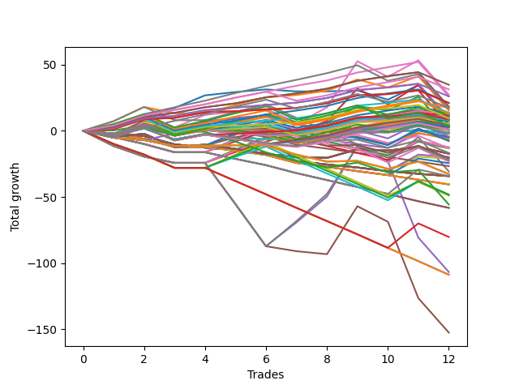

# Long Bulldog 003 
- Symbol: ES90d5m
- Date Range: 03/18/2022 - 07/08/2022
- Trading Period: 7:20-12:30
- Number of Trades: 12



| Name | Win Percent | Profit | Avg Profit / Trade | Avg Time / Trade |      | Name | Win Percent | Profit | Avg Profit / Trade | Avg Time / Trade |
| ---- | ----------- | ------ | ------------------ | ---------------- | ---- | ---- | ----------- | ------ | ------------------ | ---------------- |
| Sorted By <br> Profit | | | | | | Sorted By <br> Win Percentage ||||
| One Hundred Twenty-Eight | 91.67 | 17375.00 | 1447.92 | 00:00 |     | One Hundred Twenty-Eight | 91.67 | 17375.00 | 1447.92 | 00:00 |
| One Hundred Twenty-Nine | 83.33 | 15625.00 | 1302.08 | 00:00 |     | One Hundred Twenty-Seven | 91.67 | 13000.00 | 1083.33 | 00:00 |
| Six | 58.33 | 13625.00 | 1135.42 | 00:00 |     | Eighty-Four | 91.67 | 13000.00 | 1083.33 | 00:00 |
| One Hundred Twenty-Seven | 91.67 | 13000.00 | 1083.33 | 00:00 |     | One Hundred Twenty-Six | 91.67 | 10500.00 | 875.00 | 00:00 |
| Eighty-Four | 91.67 | 13000.00 | 1083.33 | 00:00 |     | Eighty-Three | 91.67 | 9125.00 | 760.42 | 00:00 |
| One Hundred Twenty-Six | 91.67 | 10500.00 | 875.00 | 00:00 |     | Eighty-Two | 91.67 | 4750.00 | 395.83 | 00:00 |
| One Hundred Twenty-Three | 83.33 | 10500.00 | 875.00 | 00:00 |     | Eighty-One | 91.67 | 2250.00 | 187.50 | 00:00 |
| Eighty-Three | 91.67 | 9125.00 | 760.42 | 00:00 |     | One Hundred Twenty-Nine | 83.33 | 15625.00 | 1302.08 | 00:00 |
| One Hundred Thirty | 66.67 | 8625.00 | 718.75 | 00:00 |     | One Hundred Twenty-Three | 83.33 | 10500.00 | 875.00 | 00:00 |
| One Hundred Fourteen | 66.67 | 8625.00 | 718.75 | 00:00 |     | Eighty-Five | 83.33 | 8375.00 | 697.92 | 00:00 |
| Eighty-Five | 83.33 | 8375.00 | 697.92 | 00:00 |     | One Hundred Twenty-Two | 83.33 | 6750.00 | 562.50 | 00:00 |
| One | 75.00 | 7625.00 | 635.42 | 00:00 |     | One Hundred Twenty-One | 83.33 | 4625.00 | 385.42 | 00:00 |
| One Hundred Twenty-Two | 83.33 | 6750.00 | 562.50 | 00:00 |     | One | 75.00 | 7625.00 | 635.42 | 00:00 |
| One Hundred Thirteen | 66.67 | 6625.00 | 552.08 | 00:00 |     | One Hundred Twenty-Four | 75.00 | 6375.00 | 531.25 | 00:00 |
| One Hundred Eight | 58.33 | 6500.00 | 541.67 | 00:00 |     | One Hundred Sixteen | 75.00 | 4250.00 | 354.17 | 00:00 |
| One Hundred Twenty-Four | 75.00 | 6375.00 | 531.25 | 00:00 |     | Zero | 75.00 | 4250.00 | 354.17 | 00:00 |
| One Hundred Nine | 58.33 | 6250.00 | 520.83 | 00:00 |     | One Hundred Thirty | 66.67 | 8625.00 | 718.75 | 00:00 |
| One Hundred Fifteen | 58.33 | 6125.00 | 510.42 | 00:00 |     | One Hundred Fourteen | 66.67 | 8625.00 | 718.75 | 00:00 |
| Ninety-Six | 58.33 | 5875.00 | 489.58 | 00:00 |     | One Hundred Thirteen | 66.67 | 6625.00 | 552.08 | 00:00 |
| One Hundred Six | 66.67 | 5750.00 | 479.17 | 00:00 |     | One Hundred Six | 66.67 | 5750.00 | 479.17 | 00:00 |
| Ninety-Seven | 50.00 | 5250.00 | 437.50 | 00:00 |     | One Hundred Twelve | 66.67 | 4000.00 | 333.33 | 00:00 |
| One Hundred | 50.00 | 5125.00 | 427.08 | 00:00 |     | One Hundred Eleven | 66.67 | 2500.00 | 208.33 | 00:00 |
| One Hundred Seven | 58.33 | 5000.00 | 416.67 | 00:00 |     | One Hundred Twenty-Five | 66.67 | 1875.00 | 156.25 | 00:00 |
| Eighty-Two | 91.67 | 4750.00 | 395.83 | 00:00 |     | Six | 58.33 | 13625.00 | 1135.42 | 00:00 |
| One Hundred Twenty-One | 83.33 | 4625.00 | 385.42 | 00:00 |     | One Hundred Eight | 58.33 | 6500.00 | 541.67 | 00:00 |
| Ninety-Four | 50.00 | 4625.00 | 385.42 | 00:00 |     | One Hundred Nine | 58.33 | 6250.00 | 520.83 | 00:00 |
| Ninety-Eight | 50.00 | 4500.00 | 375.00 | 00:00 |     | One Hundred Fifteen | 58.33 | 6125.00 | 510.42 | 00:00 |
| One Hundred Sixteen | 75.00 | 4250.00 | 354.17 | 00:00 |     | Ninety-Six | 58.33 | 5875.00 | 489.58 | 00:00 |
| Zero | 75.00 | 4250.00 | 354.17 | 00:00 |     | One Hundred Seven | 58.33 | 5000.00 | 416.67 | 00:00 |
| Three | 58.33 | 4250.00 | 354.17 | 00:00 |     | Three | 58.33 | 4250.00 | 354.17 | 00:00 |
| Ninety-Nine | 50.00 | 4250.00 | 354.17 | 00:00 |     | One Hundred Ten | 58.33 | 4125.00 | 343.75 | 00:00 |
| One Hundred Ten | 58.33 | 4125.00 | 343.75 | 00:00 |     | One Hundred Eighteen | 58.33 | 2000.00 | 166.67 | 00:00 |
| One Hundred Twelve | 66.67 | 4000.00 | 333.33 | 00:00 |     | One Hundred Seventeen | 58.33 | 500.00 | 41.67 | 00:00 |
| Ninety-Three | 50.00 | 3625.00 | 302.08 | 00:00 |     | Two | 58.33 | -125.00 | -10.42 | 00:00 |
| Ninety-Two | 50.00 | 2750.00 | 229.17 | 00:00 |     | Thirty-Nine | 58.33 | -1000.00 | -83.33 | 00:00 |
| Ninety-Five | 41.67 | 2625.00 | 218.75 | 00:00 |     | Thirty-Eight | 58.33 | -1000.00 | -83.33 | 00:00 |
| One Hundred Eleven | 66.67 | 2500.00 | 208.33 | 00:00 |     | Thirty-Seven | 58.33 | -1000.00 | -83.33 | 00:00 |
| One Hundred Four | 50.00 | 2500.00 | 208.33 | 00:00 |     | Thirty-Six | 58.33 | -1000.00 | -83.33 | 00:00 |
| Eighty-One | 91.67 | 2250.00 | 187.50 | 00:00 |     | Thirty-Five | 58.33 | -1000.00 | -83.33 | 00:00 |
| Ninety-One | 50.00 | 2250.00 | 187.50 | 00:00 |     | Thirty-Four | 58.33 | -1000.00 | -83.33 | 00:00 |
| One Hundred Eighteen | 58.33 | 2000.00 | 166.67 | 00:00 |     | Thirty-Three | 58.33 | -1000.00 | -83.33 | 00:00 |
| One Hundred Twenty-Five | 66.67 | 1875.00 | 156.25 | 00:00 |     | Thirty-Two | 58.33 | -1000.00 | -83.33 | 00:00 |
| One Hundred Three | 50.00 | 1500.00 | 125.00 | 00:00 |     | Ninety-Seven | 50.00 | 5250.00 | 437.50 | 00:00 |
| Twenty-Three | 50.00 | 1500.00 | 125.00 | 00:00 |     | One Hundred | 50.00 | 5125.00 | 427.08 | 00:00 |
| Twenty-Two | 50.00 | 1500.00 | 125.00 | 00:00 |     | Ninety-Four | 50.00 | 4625.00 | 385.42 | 00:00 |
| Twenty-One | 50.00 | 1500.00 | 125.00 | 00:00 |     | Ninety-Eight | 50.00 | 4500.00 | 375.00 | 00:00 |
| Twenty | 50.00 | 1500.00 | 125.00 | 00:00 |     | Ninety-Nine | 50.00 | 4250.00 | 354.17 | 00:00 |
| Nineteen | 50.00 | 1500.00 | 125.00 | 00:00 |     | Ninety-Three | 50.00 | 3625.00 | 302.08 | 00:00 |
| Eighteen | 50.00 | 1500.00 | 125.00 | 00:00 |     | Ninety-Two | 50.00 | 2750.00 | 229.17 | 00:00 |
| Seventeen | 50.00 | 1500.00 | 125.00 | 00:00 |     | One Hundred Four | 50.00 | 2500.00 | 208.33 | 00:00 |
| Sixten | 50.00 | 1500.00 | 125.00 | 00:00 |     | Ninety-One | 50.00 | 2250.00 | 187.50 | 00:00 |
| One Hundred Two | 50.00 | 625.00 | 52.08 | 00:00 |     | One Hundred Three | 50.00 | 1500.00 | 125.00 | 00:00 |
| One Hundred Seventeen | 58.33 | 500.00 | 41.67 | 00:00 |     | Twenty-Three | 50.00 | 1500.00 | 125.00 | 00:00 |
| One Hundred Ninteen | 50.00 | 375.00 | 31.25 | 00:00 |     | Twenty-Two | 50.00 | 1500.00 | 125.00 | 00:00 |
| One Hundred Five | 41.67 | 375.00 | 31.25 | 00:00 |     | Twenty-One | 50.00 | 1500.00 | 125.00 | 00:00 |
| One Hundred One | 50.00 | 125.00 | 10.42 | 00:00 |     | Twenty | 50.00 | 1500.00 | 125.00 | 00:00 |
| Two | 58.33 | -125.00 | -10.42 | 00:00 |     | Nineteen | 50.00 | 1500.00 | 125.00 | 00:00 |
| One Hundred Twenty | 41.67 | -750.00 | -62.50 | 00:00 |     | Eighteen | 50.00 | 1500.00 | 125.00 | 00:00 |
| Thirty-Nine | 58.33 | -1000.00 | -83.33 | 00:00 |     | Seventeen | 50.00 | 1500.00 | 125.00 | 00:00 |
| Thirty-Eight | 58.33 | -1000.00 | -83.33 | 00:00 |     | Sixten | 50.00 | 1500.00 | 125.00 | 00:00 |
| Thirty-Seven | 58.33 | -1000.00 | -83.33 | 00:00 |     | One Hundred Two | 50.00 | 625.00 | 52.08 | 00:00 |
| Thirty-Six | 58.33 | -1000.00 | -83.33 | 00:00 |     | One Hundred Ninteen | 50.00 | 375.00 | 31.25 | 00:00 |
| Thirty-Five | 58.33 | -1000.00 | -83.33 | 00:00 |     | One Hundred One | 50.00 | 125.00 | 10.42 | 00:00 |
| Thirty-Four | 58.33 | -1000.00 | -83.33 | 00:00 |     | Sixty-Four | 50.00 | -2125.00 | -177.08 | 00:00 |
| Thirty-Three | 58.33 | -1000.00 | -83.33 | 00:00 |     | Fifty-Seven | 50.00 | -11125.00 | -927.08 | 00:00 |
| Thirty-Two | 58.33 | -1000.00 | -83.33 | 00:00 |     | Fifty-Six | 50.00 | -11625.00 | -968.75 | 00:00 |
| Sixty-Four | 50.00 | -2125.00 | -177.08 | 00:00 |     | Ninety-Five | 41.67 | 2625.00 | 218.75 | 00:00 |
| Forty | 41.67 | -2375.00 | -197.92 | 00:00 |     | One Hundred Five | 41.67 | 375.00 | 31.25 | 00:00 |
| Twenty-Four | 25.00 | -2750.00 | -229.17 | 00:00 |     | One Hundred Twenty | 41.67 | -750.00 | -62.50 | 00:00 |
| Forty-One | 41.67 | -3250.00 | -270.83 | 00:00 |     | Forty | 41.67 | -2375.00 | -197.92 | 00:00 |
| Seventy | 41.67 | -3875.00 | -322.92 | 00:00 |     | Forty-One | 41.67 | -3250.00 | -270.83 | 00:00 |
| Forty-Six | 33.33 | -6250.00 | -520.83 | 00:00 |     | Seventy | 41.67 | -3875.00 | -322.92 | 00:00 |
| Forty-Three | 33.33 | -6250.00 | -520.83 | 00:00 |     | Sixty-Six | 41.67 | -6625.00 | -552.08 | 00:00 |
| Sixty-Six | 41.67 | -6625.00 | -552.08 | 00:00 |     | Sixty-Seven | 41.67 | -8375.00 | -697.92 | 00:00 |
| Forty-Two | 33.33 | -6625.00 | -552.08 | 00:00 |     | Sixty-Five | 41.67 | -10375.00 | -864.58 | 00:00 |
| Sixty-Seven | 41.67 | -8375.00 | -697.92 | 00:00 |     | Seven | 41.67 | -15375.00 | -1281.25 | 00:00 |
| Fifty-Five | 33.33 | -8625.00 | -718.75 | 00:00 |     | Seventy-Three | 41.67 | -27875.00 | -2322.92 | 00:00 |
| Fifty-Four | 33.33 | -8625.00 | -718.75 | 00:00 |     | Forty-Six | 33.33 | -6250.00 | -520.83 | 00:00 |
| Fifty-Three | 33.33 | -8625.00 | -718.75 | 00:00 |     | Forty-Three | 33.33 | -6250.00 | -520.83 | 00:00 |
| Fifty-Two | 33.33 | -8625.00 | -718.75 | 00:00 |     | Forty-Two | 33.33 | -6625.00 | -552.08 | 00:00 |
| Fifty-One | 33.33 | -8625.00 | -718.75 | 00:00 |     | Fifty-Five | 33.33 | -8625.00 | -718.75 | 00:00 |
| Fifty | 33.33 | -8625.00 | -718.75 | 00:00 |     | Fifty-Four | 33.33 | -8625.00 | -718.75 | 00:00 |
| Forty-Nine | 33.33 | -8625.00 | -718.75 | 00:00 |     | Fifty-Three | 33.33 | -8625.00 | -718.75 | 00:00 |
| Forty-Eight | 33.33 | -8625.00 | -718.75 | 00:00 |     | Fifty-Two | 33.33 | -8625.00 | -718.75 | 00:00 |
| Fourteen | 8.33 | -9875.00 | -822.92 | 00:00 |     | Fifty-One | 33.33 | -8625.00 | -718.75 | 00:00 |
| Sixty-Five | 41.67 | -10375.00 | -864.58 | 00:00 |     | Fifty | 33.33 | -8625.00 | -718.75 | 00:00 |
| Eight | 8.33 | -10625.00 | -885.42 | 00:00 |     | Forty-Nine | 33.33 | -8625.00 | -718.75 | 00:00 |
| Fifty-Seven | 50.00 | -11125.00 | -927.08 | 00:00 |     | Forty-Eight | 33.33 | -8625.00 | -718.75 | 00:00 |
| Fifty-Six | 50.00 | -11625.00 | -968.75 | 00:00 |     | Seventy-One | 33.33 | -16375.00 | -1364.58 | 00:00 |
| Thirty | 16.67 | -12250.00 | -1020.83 | 00:00 |     | Sixty-Nine | 33.33 | -16375.00 | -1364.58 | 00:00 |
| Twenty-Five | 16.67 | -13375.00 | -1114.58 | 00:00 |     | Sixty-Eight | 33.33 | -16375.00 | -1364.58 | 00:00 |
| Seven | 41.67 | -15375.00 | -1281.25 | 00:00 |     | Sixty-Two | 33.33 | -24125.00 | -2010.42 | 00:00 |
| Seventy-One | 33.33 | -16375.00 | -1364.58 | 00:00 |     | Fifty-Nine | 33.33 | -24125.00 | -2010.42 | 00:00 |
| Sixty-Nine | 33.33 | -16375.00 | -1364.58 | 00:00 |     | Fifty-Eight | 33.33 | -24500.00 | -2041.67 | 00:00 |
| Sixty-Eight | 33.33 | -16375.00 | -1364.58 | 00:00 |     | Four | 33.33 | -53375.00 | -4447.92 | 00:00 |
| Forty-Seven | 16.67 | -17125.00 | -1427.08 | 00:00 |     | Twenty-Four | 25.00 | -2750.00 | -229.17 | 00:00 |
| Fifteen | 0.00 | -17125.00 | -1427.08 | 00:00 |     | Thirty | 16.67 | -12250.00 | -1020.83 | 00:00 |
| Thirteen | 0.00 | -17125.00 | -1427.08 | 00:00 |     | Twenty-Five | 16.67 | -13375.00 | -1114.58 | 00:00 |
| Twelve | 0.00 | -17125.00 | -1427.08 | 00:00 |     | Forty-Seven | 16.67 | -17125.00 | -1427.08 | 00:00 |
| Eleven | 0.00 | -17125.00 | -1427.08 | 00:00 |     | Sixty-Three | 16.67 | -40125.00 | -3343.75 | 00:00 |
| Ten | 0.00 | -17125.00 | -1427.08 | 00:00 |     | Five | 16.67 | -76250.00 | -6354.17 | 00:00 |
| Nine | 0.00 | -17125.00 | -1427.08 | 00:00 |     | Fourteen | 8.33 | -9875.00 | -822.92 | 00:00 |
| Thirty-One | 8.33 | -20250.00 | -1687.50 | 00:00 |     | Eight | 8.33 | -10625.00 | -885.42 | 00:00 |
| Twenty-Nine | 8.33 | -20250.00 | -1687.50 | 00:00 |     | Thirty-One | 8.33 | -20250.00 | -1687.50 | 00:00 |
| Twenty-Eight | 8.33 | -20250.00 | -1687.50 | 00:00 |     | Twenty-Nine | 8.33 | -20250.00 | -1687.50 | 00:00 |
| twenty-Seven | 8.33 | -20250.00 | -1687.50 | 00:00 |     | Twenty-Eight | 8.33 | -20250.00 | -1687.50 | 00:00 |
| Twenty-Six | 8.33 | -20250.00 | -1687.50 | 00:00 |     | twenty-Seven | 8.33 | -20250.00 | -1687.50 | 00:00 |
| Sixty-Two | 33.33 | -24125.00 | -2010.42 | 00:00 |     | Twenty-Six | 8.33 | -20250.00 | -1687.50 | 00:00 |
| Fifty-Nine | 33.33 | -24125.00 | -2010.42 | 00:00 |     | Forty-Five | 8.33 | -29125.00 | -2427.08 | 00:00 |
| Fifty-Eight | 33.33 | -24500.00 | -2041.67 | 00:00 |     | Forty-Four | 8.33 | -29125.00 | -2427.08 | 00:00 |
| Seventy-Three | 41.67 | -27875.00 | -2322.92 | 00:00 |     | Sixty-One | 8.33 | -54375.00 | -4531.25 | 00:00 |
| Forty-Five | 8.33 | -29125.00 | -2427.08 | 00:00 |     | Sixty | 8.33 | -54375.00 | -4531.25 | 00:00 |
| Forty-Four | 8.33 | -29125.00 | -2427.08 | 00:00 |     | Fifteen | 0.00 | -17125.00 | -1427.08 | 00:00 |
| Sixty-Three | 16.67 | -40125.00 | -3343.75 | 00:00 |     | Thirteen | 0.00 | -17125.00 | -1427.08 | 00:00 |
| Four | 33.33 | -53375.00 | -4447.92 | 00:00 |     | Twelve | 0.00 | -17125.00 | -1427.08 | 00:00 |
| Sixty-One | 8.33 | -54375.00 | -4531.25 | 00:00 |     | Eleven | 0.00 | -17125.00 | -1427.08 | 00:00 |
| Sixty | 8.33 | -54375.00 | -4531.25 | 00:00 |     | Ten | 0.00 | -17125.00 | -1427.08 | 00:00 |
| Five | 16.67 | -76250.00 | -6354.17 | 00:00 |     | Nine | 0.00 | -17125.00 | -1427.08 | 00:00 |

## NO STOPLOSS

### Test Zero
* Sell when price hits the middle line of the 20p bollinger
* No Stoploss
* Results:
```
Total Trades: 12
Percent Up: 75.00
Percent Down: 25.00
Total Points Moved Up: 8.50
Potential Profit: 4250.00
Total Points Ups: 43.00 Count Ups: 9
Total Points Downs: -34.50 Count Downs: 3
```

<details><summary>Trades</summary>

<code>In: 2022-03-23 10:35:00		Out: 2022-03-23 11:28:20		Total Position Time: 53:20		Total Move Up: 4.50		Total to Date: 4.50</code> <br />
<code>In: 2022-03-23 10:50:00		Out: 2022-03-23 11:28:20		Total Position Time: 38:20		Total Move Up: 8.00		Total to Date: 12.50</code> <br />
<code>In: 2022-03-30 12:15:00		Out: 2022-03-30 12:48:00		Total Position Time: 33:00		Total Move Up: 4.75		Total to Date: 17.25</code> <br />
<code>In: 2022-03-30 12:30:00		Out: 2022-03-30 12:48:00		Total Position Time: 18:00		Total Move Up: 9.50		Total to Date: 26.75</code> <br />
<code>In: 2022-03-31 11:25:00		Out: 2022-03-31 11:59:20		Total Position Time: 34:20		Total Move Up: 2.50		Total to Date: 29.25</code> <br />
<code>In: 2022-03-31 11:30:00		Out: 2022-03-31 11:59:20		Total Position Time: 29:20		Total Move Up: 2.00		Total to Date: 31.25</code> <br />
<code>In: 2022-04-18 08:45:00		Out: 2022-04-18 09:58:15		Total Position Time: 73:15		Total Move Up: -1.50		Total to Date: 29.75</code> <br />
<code>In: 2022-04-18 08:55:00		Out: 2022-04-18 09:58:15		Total Position Time: 63:15		Total Move Up: 0.00		Total to Date: 29.75</code> <br />
<code>In: 2022-05-12 10:55:00		Out: 2022-05-12 12:15:30		Total Position Time: 80:30		Total Move Up: 0.75		Total to Date: 30.50</code> <br />
<code>In: 2022-06-08 09:50:00		Out: 2022-06-08 11:45:20		Total Position Time: 115:20		Total Move Up: -7.00		Total to Date: 23.50</code> <br />
<code>In: 2022-06-09 08:10:00		Out: 2022-06-09 08:42:50		Total Position Time: 32:50		Total Move Up: 11.00		Total to Date: 34.50</code> <br />
<code>In: 2022-06-09 12:20:00		Out: 2022-06-09 12:55:00		Total Position Time: 35:00		Total Move Up: -26.00		Total to Date: 8.50</code> <br />


</details>

### Test One
* Sell when the price hits the upper line of the 20p 1std bollinger
* No Stoploss
* Results:
```
Total Trades: 12
Percent Up: 75.00
Percent Down: 25.00
Total Points Moved Up: 15.25
Potential Profit: 7625.00
Total Points Ups: 52.00 Count Ups: 9
Total Points Downs: -36.75 Count Downs: 3
```

<details><summary>Trades</summary>

<code>In: 2022-03-23 10:35:00		Out: 2022-03-23 11:48:45		Total Position Time: 73:45		Total Move Up: 7.25		Total to Date: 7.25</code> <br />
<code>In: 2022-03-23 10:50:00		Out: 2022-03-23 11:48:45		Total Position Time: 58:45		Total Move Up: 10.75		Total to Date: 18.00</code> <br />
<code>In: 2022-03-30 12:15:00		Out: 2022-03-30 12:55:00		Total Position Time: 40:00		Total Move Up: -4.75		Total to Date: 13.25</code> <br />
<code>In: 2022-03-30 12:30:00		Out: 2022-03-30 12:55:00		Total Position Time: 25:00		Total Move Up: 0.00		Total to Date: 13.25</code> <br />
<code>In: 2022-03-31 11:25:00		Out: 2022-03-31 12:00:20		Total Position Time: 35:20		Total Move Up: 6.25		Total to Date: 19.50</code> <br />
<code>In: 2022-03-31 11:30:00		Out: 2022-03-31 12:00:20		Total Position Time: 30:20		Total Move Up: 5.75		Total to Date: 25.25</code> <br />
<code>In: 2022-04-18 08:45:00		Out: 2022-04-18 10:08:20		Total Position Time: 83:20		Total Move Up: 1.75		Total to Date: 27.00</code> <br />
<code>In: 2022-04-18 08:55:00		Out: 2022-04-18 10:08:20		Total Position Time: 73:20		Total Move Up: 3.25		Total to Date: 30.25</code> <br />
<code>In: 2022-05-12 10:55:00		Out: 2022-05-12 12:18:25		Total Position Time: 83:25		Total Move Up: 8.50		Total to Date: 38.75</code> <br />
<code>In: 2022-06-08 09:50:00		Out: 2022-06-08 12:21:10		Total Position Time: 151:10		Total Move Up: -6.00		Total to Date: 32.75</code> <br />
<code>In: 2022-06-09 08:10:00		Out: 2022-06-09 09:29:05		Total Position Time: 79:05		Total Move Up: 8.50		Total to Date: 41.25</code> <br />
<code>In: 2022-06-09 12:20:00		Out: 2022-06-09 12:55:00		Total Position Time: 35:00		Total Move Up: -26.00		Total to Date: 15.25</code> <br />


</details>

### Test Two
* Sell when the price hits the upper line of the 20p 2std bollinger
* No Stoploss
* Results:
```
Total Trades: 12
Percent Up: 58.33
Percent Down: 41.67
Total Points Moved Up: -0.25
Potential Profit: -125.00
Total Points Ups: 53.00 Count Ups: 7
Total Points Downs: -53.25 Count Downs: 5
```

<details><summary>Trades</summary>

<code>In: 2022-03-23 10:35:00		Out: 2022-03-23 12:55:00		Total Position Time: 140:00		Total Move Up: -11.50		Total to Date: -11.50</code> <br />
<code>In: 2022-03-23 10:50:00		Out: 2022-03-23 12:55:00		Total Position Time: 125:00		Total Move Up: -8.00		Total to Date: -19.50</code> <br />
<code>In: 2022-03-30 12:15:00		Out: 2022-03-30 12:55:00		Total Position Time: 40:00		Total Move Up: -4.75		Total to Date: -24.25</code> <br />
<code>In: 2022-03-30 12:30:00		Out: 2022-03-30 12:55:00		Total Position Time: 25:00		Total Move Up: 0.00		Total to Date: -24.25</code> <br />
<code>In: 2022-03-31 11:25:00		Out: 2022-03-31 12:02:45		Total Position Time: 37:45		Total Move Up: 10.00		Total to Date: -14.25</code> <br />
<code>In: 2022-03-31 11:30:00		Out: 2022-03-31 12:02:45		Total Position Time: 32:45		Total Move Up: 9.50		Total to Date: -4.75</code> <br />
<code>In: 2022-04-18 08:45:00		Out: 2022-04-18 10:10:30		Total Position Time: 85:30		Total Move Up: 4.75		Total to Date: 0.00</code> <br />
<code>In: 2022-04-18 08:55:00		Out: 2022-04-18 10:10:30		Total Position Time: 75:30		Total Move Up: 6.25		Total to Date: 6.25</code> <br />
<code>In: 2022-05-12 10:55:00		Out: 2022-05-12 12:20:20		Total Position Time: 85:20		Total Move Up: 12.25		Total to Date: 18.50</code> <br />
<code>In: 2022-06-08 09:50:00		Out: 2022-06-08 12:22:55		Total Position Time: 152:55		Total Move Up: -3.00		Total to Date: 15.50</code> <br />
<code>In: 2022-06-09 08:10:00		Out: 2022-06-09 09:35:20		Total Position Time: 85:20		Total Move Up: 10.25		Total to Date: 25.75</code> <br />
<code>In: 2022-06-09 12:20:00		Out: 2022-06-09 12:55:00		Total Position Time: 35:00		Total Move Up: -26.00		Total to Date: -0.25</code> <br />


</details>

### Test Three
* Sell when price hits the middle line of the 50p bollinger
* No Stoploss
* Results:
```
Total Trades: 12
Percent Up: 58.33
Percent Down: 41.67
Total Points Moved Up: 8.50
Potential Profit: 4250.00
Total Points Ups: 70.50 Count Ups: 7
Total Points Downs: -62.00 Count Downs: 5
```

<details><summary>Trades</summary>

<code>In: 2022-03-23 10:35:00		Out: 2022-03-23 12:55:00		Total Position Time: 140:00		Total Move Up: -11.50		Total to Date: -11.50</code> <br />
<code>In: 2022-03-23 10:50:00		Out: 2022-03-23 12:55:00		Total Position Time: 125:00		Total Move Up: -8.00		Total to Date: -19.50</code> <br />
<code>In: 2022-03-30 12:15:00		Out: 2022-03-30 12:55:00		Total Position Time: 40:00		Total Move Up: -4.75		Total to Date: -24.25</code> <br />
<code>In: 2022-03-30 12:30:00		Out: 2022-03-30 12:55:00		Total Position Time: 25:00		Total Move Up: 0.00		Total to Date: -24.25</code> <br />
<code>In: 2022-03-31 11:25:00		Out: 2022-03-31 12:01:10		Total Position Time: 36:10		Total Move Up: 8.25		Total to Date: -16.00</code> <br />
<code>In: 2022-03-31 11:30:00		Out: 2022-03-31 12:01:10		Total Position Time: 31:10		Total Move Up: 7.75		Total to Date: -8.25</code> <br />
<code>In: 2022-04-18 08:45:00		Out: 2022-04-18 10:31:35		Total Position Time: 106:35		Total Move Up: 7.00		Total to Date: -1.25</code> <br />
<code>In: 2022-04-18 08:55:00		Out: 2022-04-18 10:31:35		Total Position Time: 96:35		Total Move Up: 8.50		Total to Date: 7.25</code> <br />
<code>In: 2022-05-12 10:55:00		Out: 2022-05-12 12:21:40		Total Position Time: 86:40		Total Move Up: 24.50		Total to Date: 31.75</code> <br />
<code>In: 2022-06-08 09:50:00		Out: 2022-06-08 12:55:00		Total Position Time: 185:00		Total Move Up: -11.75		Total to Date: 20.00</code> <br />
<code>In: 2022-06-09 08:10:00		Out: 2022-06-09 09:44:25		Total Position Time: 94:25		Total Move Up: 14.50		Total to Date: 34.50</code> <br />
<code>In: 2022-06-09 12:20:00		Out: 2022-06-09 12:55:00		Total Position Time: 35:00		Total Move Up: -26.00		Total to Date: 8.50</code> <br />


</details>

### Test Four
* Sell when the price hits the upper line of the 50p 1std bollinger
* No Stoploss
* Results:
```
Total Trades: 12
Percent Up: 33.33
Percent Down: 66.67
Total Points Moved Up: -106.75
Potential Profit: -53375.00
Total Points Ups: 76.00 Count Ups: 4
Total Points Downs: -182.75 Count Downs: 8
```

<details><summary>Trades</summary>

<code>In: 2022-03-23 10:35:00		Out: 2022-03-23 12:55:00		Total Position Time: 140:00		Total Move Up: -11.50		Total to Date: -11.50</code> <br />
<code>In: 2022-03-23 10:50:00		Out: 2022-03-23 12:55:00		Total Position Time: 125:00		Total Move Up: -8.00		Total to Date: -19.50</code> <br />
<code>In: 2022-03-30 12:15:00		Out: 2022-03-30 12:55:00		Total Position Time: 40:00		Total Move Up: -4.75		Total to Date: -24.25</code> <br />
<code>In: 2022-03-30 12:30:00		Out: 2022-03-30 12:55:00		Total Position Time: 25:00		Total Move Up: 0.00		Total to Date: -24.25</code> <br />
<code>In: 2022-03-31 11:25:00		Out: 2022-03-31 12:55:00		Total Position Time: 90:00		Total Move Up: -31.25		Total to Date: -55.50</code> <br />
<code>In: 2022-03-31 11:30:00		Out: 2022-03-31 12:55:00		Total Position Time: 85:00		Total Move Up: -31.75		Total to Date: -87.25</code> <br />
<code>In: 2022-04-18 08:45:00		Out: 2022-04-18 10:35:40		Total Position Time: 110:40		Total Move Up: 18.00		Total to Date: -69.25</code> <br />
<code>In: 2022-04-18 08:55:00		Out: 2022-04-18 10:35:40		Total Position Time: 100:40		Total Move Up: 19.50		Total to Date: -49.75</code> <br />
<code>In: 2022-05-12 10:55:00		Out: 2022-05-12 12:50:15		Total Position Time: 115:15		Total Move Up: 38.50		Total to Date: -11.25</code> <br />
<code>In: 2022-06-08 09:50:00		Out: 2022-06-08 12:55:00		Total Position Time: 185:00		Total Move Up: -11.75		Total to Date: -23.00</code> <br />
<code>In: 2022-06-09 08:10:00		Out: 2022-06-09 12:55:00		Total Position Time: 285:00		Total Move Up: -57.75		Total to Date: -80.75</code> <br />
<code>In: 2022-06-09 12:20:00		Out: 2022-06-09 12:55:00		Total Position Time: 35:00		Total Move Up: -26.00		Total to Date: -106.75</code> <br />


</details>

### Test Five
* Sell when the price hits the upper line of the 50p 2std bollinger
* No Stoploss
* Results:
```
Total Trades: 12
Percent Up: 16.67
Percent Down: 83.33
Total Points Moved Up: -152.50
Potential Profit: -76250.00
Total Points Ups: 36.25 Count Ups: 2
Total Points Downs: -188.75 Count Downs: 10
```

<details><summary>Trades</summary>

<code>In: 2022-03-23 10:35:00		Out: 2022-03-23 12:55:00		Total Position Time: 140:00		Total Move Up: -11.50		Total to Date: -11.50</code> <br />
<code>In: 2022-03-23 10:50:00		Out: 2022-03-23 12:55:00		Total Position Time: 125:00		Total Move Up: -8.00		Total to Date: -19.50</code> <br />
<code>In: 2022-03-30 12:15:00		Out: 2022-03-30 12:55:00		Total Position Time: 40:00		Total Move Up: -4.75		Total to Date: -24.25</code> <br />
<code>In: 2022-03-30 12:30:00		Out: 2022-03-30 12:55:00		Total Position Time: 25:00		Total Move Up: 0.00		Total to Date: -24.25</code> <br />
<code>In: 2022-03-31 11:25:00		Out: 2022-03-31 12:55:00		Total Position Time: 90:00		Total Move Up: -31.25		Total to Date: -55.50</code> <br />
<code>In: 2022-03-31 11:30:00		Out: 2022-03-31 12:55:00		Total Position Time: 85:00		Total Move Up: -31.75		Total to Date: -87.25</code> <br />
<code>In: 2022-04-18 08:45:00		Out: 2022-04-18 12:55:00		Total Position Time: 250:00		Total Move Up: -3.75		Total to Date: -91.00</code> <br />
<code>In: 2022-04-18 08:55:00		Out: 2022-04-18 12:55:00		Total Position Time: 240:00		Total Move Up: -2.25		Total to Date: -93.25</code> <br />
<code>In: 2022-05-12 10:55:00		Out: 2022-05-12 12:55:00		Total Position Time: 120:00		Total Move Up: 36.25		Total to Date: -57.00</code> <br />
<code>In: 2022-06-08 09:50:00		Out: 2022-06-08 12:55:00		Total Position Time: 185:00		Total Move Up: -11.75		Total to Date: -68.75</code> <br />
<code>In: 2022-06-09 08:10:00		Out: 2022-06-09 12:55:00		Total Position Time: 285:00		Total Move Up: -57.75		Total to Date: -126.50</code> <br />
<code>In: 2022-06-09 12:20:00		Out: 2022-06-09 12:55:00		Total Position Time: 35:00		Total Move Up: -26.00		Total to Date: -152.50</code> <br />


</details>

### Test Six
* Sell when the price hits the middle line of the 1std VWAP
* No Stoploss
* Results:
```
Total Trades: 12
Percent Up: 58.33
Percent Down: 41.67
Total Points Moved Up: 27.25
Potential Profit: 13625.00
Total Points Ups: 89.25 Count Ups: 7
Total Points Downs: -62.00 Count Downs: 5
```

<details><summary>Trades</summary>

<code>In: 2022-03-23 10:35:00		Out: 2022-03-23 12:55:00		Total Position Time: 140:00		Total Move Up: -11.50		Total to Date: -11.50</code> <br />
<code>In: 2022-03-23 10:50:00		Out: 2022-03-23 12:55:00		Total Position Time: 125:00		Total Move Up: -8.00		Total to Date: -19.50</code> <br />
<code>In: 2022-03-30 12:15:00		Out: 2022-03-30 12:55:00		Total Position Time: 40:00		Total Move Up: -4.75		Total to Date: -24.25</code> <br />
<code>In: 2022-03-30 12:30:00		Out: 2022-03-30 12:55:00		Total Position Time: 25:00		Total Move Up: 0.00		Total to Date: -24.25</code> <br />
<code>In: 2022-03-31 11:25:00		Out: 2022-03-31 12:02:30		Total Position Time: 37:30		Total Move Up: 9.25		Total to Date: -15.00</code> <br />
<code>In: 2022-03-31 11:30:00		Out: 2022-03-31 12:02:30		Total Position Time: 32:30		Total Move Up: 8.75		Total to Date: -6.25</code> <br />
<code>In: 2022-04-18 08:45:00		Out: 2022-04-18 10:32:10		Total Position Time: 107:10		Total Move Up: 11.25		Total to Date: 5.00</code> <br />
<code>In: 2022-04-18 08:55:00		Out: 2022-04-18 10:32:10		Total Position Time: 97:10		Total Move Up: 12.75		Total to Date: 17.75</code> <br />
<code>In: 2022-05-12 10:55:00		Out: 2022-05-12 12:26:25		Total Position Time: 91:25		Total Move Up: 34.75		Total to Date: 52.50</code> <br />
<code>In: 2022-06-08 09:50:00		Out: 2022-06-08 12:55:00		Total Position Time: 185:00		Total Move Up: -11.75		Total to Date: 40.75</code> <br />
<code>In: 2022-06-09 08:10:00		Out: 2022-06-09 08:42:55		Total Position Time: 32:55		Total Move Up: 12.50		Total to Date: 53.25</code> <br />
<code>In: 2022-06-09 12:20:00		Out: 2022-06-09 12:55:00		Total Position Time: 35:00		Total Move Up: -26.00		Total to Date: 27.25</code> <br />


</details>

### Test Seven
* Sell when the price hits the upper line of the 1std VWAP
* No Stoploss
* Results:
```
Total Trades: 12
Percent Up: 41.67
Percent Down: 58.33
Total Points Moved Up: -30.75
Potential Profit: -15375.00
Total Points Ups: 94.25 Count Ups: 5
Total Points Downs: -125.00 Count Downs: 7
```

<details><summary>Trades</summary>

<code>In: 2022-03-23 10:35:00		Out: 2022-03-23 12:55:00		Total Position Time: 140:00		Total Move Up: -11.50		Total to Date: -11.50</code> <br />
<code>In: 2022-03-23 10:50:00		Out: 2022-03-23 12:55:00		Total Position Time: 125:00		Total Move Up: -8.00		Total to Date: -19.50</code> <br />
<code>In: 2022-03-30 12:15:00		Out: 2022-03-30 12:55:00		Total Position Time: 40:00		Total Move Up: -4.75		Total to Date: -24.25</code> <br />
<code>In: 2022-03-30 12:30:00		Out: 2022-03-30 12:55:00		Total Position Time: 25:00		Total Move Up: 0.00		Total to Date: -24.25</code> <br />
<code>In: 2022-03-31 11:25:00		Out: 2022-03-31 12:55:00		Total Position Time: 90:00		Total Move Up: -31.25		Total to Date: -55.50</code> <br />
<code>In: 2022-03-31 11:30:00		Out: 2022-03-31 12:55:00		Total Position Time: 85:00		Total Move Up: -31.75		Total to Date: -87.25</code> <br />
<code>In: 2022-04-18 08:45:00		Out: 2022-04-18 10:35:45		Total Position Time: 110:45		Total Move Up: 19.00		Total to Date: -68.25</code> <br />
<code>In: 2022-04-18 08:55:00		Out: 2022-04-18 10:35:45		Total Position Time: 100:45		Total Move Up: 20.50		Total to Date: -47.75</code> <br />
<code>In: 2022-05-12 10:55:00		Out: 2022-05-12 12:55:00		Total Position Time: 120:00		Total Move Up: 36.25		Total to Date: -11.50</code> <br />
<code>In: 2022-06-08 09:50:00		Out: 2022-06-08 12:55:00		Total Position Time: 185:00		Total Move Up: -11.75		Total to Date: -23.25</code> <br />
<code>In: 2022-06-09 08:10:00		Out: 2022-06-09 09:59:40		Total Position Time: 109:40		Total Move Up: 18.50		Total to Date: -4.75</code> <br />
<code>In: 2022-06-09 12:20:00		Out: 2022-06-09 12:55:00		Total Position Time: 35:00		Total Move Up: -26.00		Total to Date: -30.75</code> <br />


</details>

## STOPLOSS OF 2

### Test Eight
* Sell when price hits the middle line of the 20p bollinger
* Stoploss is 2 points
* Results:
```
Total Trades: 12
Percent Up: 8.33
Percent Down: 91.67
Total Points Moved Up: -21.25
Potential Profit: -10625.00
Total Points Ups: 11.00 Count Ups: 1
Total Points Downs: -32.25 Count Downs: 11
```

<details><summary>Trades</summary>

<code>In: 2022-03-23 10:35:00		Out: 2022-03-23 10:41:20		Total Position Time: 06:20		Total Move Up: -2.25		Total to Date: -2.25</code> <br />
<code>In: 2022-03-23 10:50:00		Out: 2022-03-23 11:10:40		Total Position Time: 20:40		Total Move Up: -1.75		Total to Date: -4.00</code> <br />
<code>In: 2022-03-30 12:15:00		Out: 2022-03-30 12:20:10		Total Position Time: 05:10		Total Move Up: -6.25		Total to Date: -10.25</code> <br />
<code>In: 2022-03-30 12:30:00		Out: 2022-03-30 12:41:20		Total Position Time: 11:20		Total Move Up: -2.50		Total to Date: -12.75</code> <br />
<code>In: 2022-03-31 11:25:00		Out: 2022-03-31 11:33:45		Total Position Time: 08:45		Total Move Up: -1.75		Total to Date: -14.50</code> <br />
<code>In: 2022-03-31 11:30:00		Out: 2022-03-31 11:35:10		Total Position Time: 05:10		Total Move Up: -2.50		Total to Date: -17.00</code> <br />
<code>In: 2022-04-18 08:45:00		Out: 2022-04-18 08:50:10		Total Position Time: 05:10		Total Move Up: -6.00		Total to Date: -23.00</code> <br />
<code>In: 2022-04-18 08:55:00		Out: 2022-04-18 09:10:40		Total Position Time: 15:40		Total Move Up: -2.50		Total to Date: -25.50</code> <br />
<code>In: 2022-05-12 10:55:00		Out: 2022-05-12 11:08:10		Total Position Time: 13:10		Total Move Up: -2.25		Total to Date: -27.75</code> <br />
<code>In: 2022-06-08 09:50:00		Out: 2022-06-08 10:02:20		Total Position Time: 12:20		Total Move Up: -2.75		Total to Date: -30.50</code> <br />
<code>In: 2022-06-09 08:10:00		Out: 2022-06-09 08:42:50		Total Position Time: 32:50		Total Move Up: 11.00		Total to Date: -19.50</code> <br />
<code>In: 2022-06-09 12:20:00		Out: 2022-06-09 12:25:40		Total Position Time: 05:40		Total Move Up: -1.75		Total to Date: -21.25</code> <br />


</details>

### Test Nine
* Sell when the price hits the upper line of the 20p 1std bollinger
* Stoploss is 2 points
* Results:
```
Total Trades: 12
Percent Up: 0.00
Percent Down: 100.00
Total Points Moved Up: -34.25
Potential Profit: -17125.00
Total Points Ups: 0.00 Count Ups: 0
Total Points Downs: -34.25 Count Downs: 12
```

<details><summary>Trades</summary>

<code>In: 2022-03-23 10:35:00		Out: 2022-03-23 10:41:20		Total Position Time: 06:20		Total Move Up: -2.25		Total to Date: -2.25</code> <br />
<code>In: 2022-03-23 10:50:00		Out: 2022-03-23 11:10:40		Total Position Time: 20:40		Total Move Up: -1.75		Total to Date: -4.00</code> <br />
<code>In: 2022-03-30 12:15:00		Out: 2022-03-30 12:20:10		Total Position Time: 05:10		Total Move Up: -6.25		Total to Date: -10.25</code> <br />
<code>In: 2022-03-30 12:30:00		Out: 2022-03-30 12:41:20		Total Position Time: 11:20		Total Move Up: -2.50		Total to Date: -12.75</code> <br />
<code>In: 2022-03-31 11:25:00		Out: 2022-03-31 11:33:45		Total Position Time: 08:45		Total Move Up: -1.75		Total to Date: -14.50</code> <br />
<code>In: 2022-03-31 11:30:00		Out: 2022-03-31 11:35:10		Total Position Time: 05:10		Total Move Up: -2.50		Total to Date: -17.00</code> <br />
<code>In: 2022-04-18 08:45:00		Out: 2022-04-18 08:50:10		Total Position Time: 05:10		Total Move Up: -6.00		Total to Date: -23.00</code> <br />
<code>In: 2022-04-18 08:55:00		Out: 2022-04-18 09:10:40		Total Position Time: 15:40		Total Move Up: -2.50		Total to Date: -25.50</code> <br />
<code>In: 2022-05-12 10:55:00		Out: 2022-05-12 11:08:10		Total Position Time: 13:10		Total Move Up: -2.25		Total to Date: -27.75</code> <br />
<code>In: 2022-06-08 09:50:00		Out: 2022-06-08 10:02:20		Total Position Time: 12:20		Total Move Up: -2.75		Total to Date: -30.50</code> <br />
<code>In: 2022-06-09 08:10:00		Out: 2022-06-09 08:50:40		Total Position Time: 40:40		Total Move Up: -2.00		Total to Date: -32.50</code> <br />
<code>In: 2022-06-09 12:20:00		Out: 2022-06-09 12:25:40		Total Position Time: 05:40		Total Move Up: -1.75		Total to Date: -34.25</code> <br />


</details>

### Test Ten
* Sell when the price hits the upper line of the 20p 2std bollinger
* Stoploss is 2 points
* Results:
```
Total Trades: 12
Percent Up: 0.00
Percent Down: 100.00
Total Points Moved Up: -34.25
Potential Profit: -17125.00
Total Points Ups: 0.00 Count Ups: 0
Total Points Downs: -34.25 Count Downs: 12
```

<details><summary>Trades</summary>

<code>In: 2022-03-23 10:35:00		Out: 2022-03-23 10:41:20		Total Position Time: 06:20		Total Move Up: -2.25		Total to Date: -2.25</code> <br />
<code>In: 2022-03-23 10:50:00		Out: 2022-03-23 11:10:40		Total Position Time: 20:40		Total Move Up: -1.75		Total to Date: -4.00</code> <br />
<code>In: 2022-03-30 12:15:00		Out: 2022-03-30 12:20:10		Total Position Time: 05:10		Total Move Up: -6.25		Total to Date: -10.25</code> <br />
<code>In: 2022-03-30 12:30:00		Out: 2022-03-30 12:41:20		Total Position Time: 11:20		Total Move Up: -2.50		Total to Date: -12.75</code> <br />
<code>In: 2022-03-31 11:25:00		Out: 2022-03-31 11:33:45		Total Position Time: 08:45		Total Move Up: -1.75		Total to Date: -14.50</code> <br />
<code>In: 2022-03-31 11:30:00		Out: 2022-03-31 11:35:10		Total Position Time: 05:10		Total Move Up: -2.50		Total to Date: -17.00</code> <br />
<code>In: 2022-04-18 08:45:00		Out: 2022-04-18 08:50:10		Total Position Time: 05:10		Total Move Up: -6.00		Total to Date: -23.00</code> <br />
<code>In: 2022-04-18 08:55:00		Out: 2022-04-18 09:10:40		Total Position Time: 15:40		Total Move Up: -2.50		Total to Date: -25.50</code> <br />
<code>In: 2022-05-12 10:55:00		Out: 2022-05-12 11:08:10		Total Position Time: 13:10		Total Move Up: -2.25		Total to Date: -27.75</code> <br />
<code>In: 2022-06-08 09:50:00		Out: 2022-06-08 10:02:20		Total Position Time: 12:20		Total Move Up: -2.75		Total to Date: -30.50</code> <br />
<code>In: 2022-06-09 08:10:00		Out: 2022-06-09 08:50:40		Total Position Time: 40:40		Total Move Up: -2.00		Total to Date: -32.50</code> <br />
<code>In: 2022-06-09 12:20:00		Out: 2022-06-09 12:25:40		Total Position Time: 05:40		Total Move Up: -1.75		Total to Date: -34.25</code> <br />


</details>

### Test Eleven
* Sell when price hits the middle line of the 50p bollinger
* Stoploss is 2 points
* Results:
```
Total Trades: 12
Percent Up: 0.00
Percent Down: 100.00
Total Points Moved Up: -34.25
Potential Profit: -17125.00
Total Points Ups: 0.00 Count Ups: 0
Total Points Downs: -34.25 Count Downs: 12
```

<details><summary>Trades</summary>

<code>In: 2022-03-23 10:35:00		Out: 2022-03-23 10:41:20		Total Position Time: 06:20		Total Move Up: -2.25		Total to Date: -2.25</code> <br />
<code>In: 2022-03-23 10:50:00		Out: 2022-03-23 11:10:40		Total Position Time: 20:40		Total Move Up: -1.75		Total to Date: -4.00</code> <br />
<code>In: 2022-03-30 12:15:00		Out: 2022-03-30 12:20:10		Total Position Time: 05:10		Total Move Up: -6.25		Total to Date: -10.25</code> <br />
<code>In: 2022-03-30 12:30:00		Out: 2022-03-30 12:41:20		Total Position Time: 11:20		Total Move Up: -2.50		Total to Date: -12.75</code> <br />
<code>In: 2022-03-31 11:25:00		Out: 2022-03-31 11:33:45		Total Position Time: 08:45		Total Move Up: -1.75		Total to Date: -14.50</code> <br />
<code>In: 2022-03-31 11:30:00		Out: 2022-03-31 11:35:10		Total Position Time: 05:10		Total Move Up: -2.50		Total to Date: -17.00</code> <br />
<code>In: 2022-04-18 08:45:00		Out: 2022-04-18 08:50:10		Total Position Time: 05:10		Total Move Up: -6.00		Total to Date: -23.00</code> <br />
<code>In: 2022-04-18 08:55:00		Out: 2022-04-18 09:10:40		Total Position Time: 15:40		Total Move Up: -2.50		Total to Date: -25.50</code> <br />
<code>In: 2022-05-12 10:55:00		Out: 2022-05-12 11:08:10		Total Position Time: 13:10		Total Move Up: -2.25		Total to Date: -27.75</code> <br />
<code>In: 2022-06-08 09:50:00		Out: 2022-06-08 10:02:20		Total Position Time: 12:20		Total Move Up: -2.75		Total to Date: -30.50</code> <br />
<code>In: 2022-06-09 08:10:00		Out: 2022-06-09 08:50:40		Total Position Time: 40:40		Total Move Up: -2.00		Total to Date: -32.50</code> <br />
<code>In: 2022-06-09 12:20:00		Out: 2022-06-09 12:25:40		Total Position Time: 05:40		Total Move Up: -1.75		Total to Date: -34.25</code> <br />


</details>

### Test Twelve
* Sell when the price hits the upper line of the 50p 1std bollinger
* Stoploss is 2 points
* Results:
```
Total Trades: 12
Percent Up: 0.00
Percent Down: 100.00
Total Points Moved Up: -34.25
Potential Profit: -17125.00
Total Points Ups: 0.00 Count Ups: 0
Total Points Downs: -34.25 Count Downs: 12
```

<details><summary>Trades</summary>

<code>In: 2022-03-23 10:35:00		Out: 2022-03-23 10:41:20		Total Position Time: 06:20		Total Move Up: -2.25		Total to Date: -2.25</code> <br />
<code>In: 2022-03-23 10:50:00		Out: 2022-03-23 11:10:40		Total Position Time: 20:40		Total Move Up: -1.75		Total to Date: -4.00</code> <br />
<code>In: 2022-03-30 12:15:00		Out: 2022-03-30 12:20:10		Total Position Time: 05:10		Total Move Up: -6.25		Total to Date: -10.25</code> <br />
<code>In: 2022-03-30 12:30:00		Out: 2022-03-30 12:41:20		Total Position Time: 11:20		Total Move Up: -2.50		Total to Date: -12.75</code> <br />
<code>In: 2022-03-31 11:25:00		Out: 2022-03-31 11:33:45		Total Position Time: 08:45		Total Move Up: -1.75		Total to Date: -14.50</code> <br />
<code>In: 2022-03-31 11:30:00		Out: 2022-03-31 11:35:10		Total Position Time: 05:10		Total Move Up: -2.50		Total to Date: -17.00</code> <br />
<code>In: 2022-04-18 08:45:00		Out: 2022-04-18 08:50:10		Total Position Time: 05:10		Total Move Up: -6.00		Total to Date: -23.00</code> <br />
<code>In: 2022-04-18 08:55:00		Out: 2022-04-18 09:10:40		Total Position Time: 15:40		Total Move Up: -2.50		Total to Date: -25.50</code> <br />
<code>In: 2022-05-12 10:55:00		Out: 2022-05-12 11:08:10		Total Position Time: 13:10		Total Move Up: -2.25		Total to Date: -27.75</code> <br />
<code>In: 2022-06-08 09:50:00		Out: 2022-06-08 10:02:20		Total Position Time: 12:20		Total Move Up: -2.75		Total to Date: -30.50</code> <br />
<code>In: 2022-06-09 08:10:00		Out: 2022-06-09 08:50:40		Total Position Time: 40:40		Total Move Up: -2.00		Total to Date: -32.50</code> <br />
<code>In: 2022-06-09 12:20:00		Out: 2022-06-09 12:25:40		Total Position Time: 05:40		Total Move Up: -1.75		Total to Date: -34.25</code> <br />


</details>

### Test Thirteen
* Sell when the price hits the upper line of the 50p 2std bollinger
* Stoploss is 2 points
* Results:
```
Total Trades: 12
Percent Up: 0.00
Percent Down: 100.00
Total Points Moved Up: -34.25
Potential Profit: -17125.00
Total Points Ups: 0.00 Count Ups: 0
Total Points Downs: -34.25 Count Downs: 12
```

<details><summary>Trades</summary>

<code>In: 2022-03-23 10:35:00		Out: 2022-03-23 10:41:20		Total Position Time: 06:20		Total Move Up: -2.25		Total to Date: -2.25</code> <br />
<code>In: 2022-03-23 10:50:00		Out: 2022-03-23 11:10:40		Total Position Time: 20:40		Total Move Up: -1.75		Total to Date: -4.00</code> <br />
<code>In: 2022-03-30 12:15:00		Out: 2022-03-30 12:20:10		Total Position Time: 05:10		Total Move Up: -6.25		Total to Date: -10.25</code> <br />
<code>In: 2022-03-30 12:30:00		Out: 2022-03-30 12:41:20		Total Position Time: 11:20		Total Move Up: -2.50		Total to Date: -12.75</code> <br />
<code>In: 2022-03-31 11:25:00		Out: 2022-03-31 11:33:45		Total Position Time: 08:45		Total Move Up: -1.75		Total to Date: -14.50</code> <br />
<code>In: 2022-03-31 11:30:00		Out: 2022-03-31 11:35:10		Total Position Time: 05:10		Total Move Up: -2.50		Total to Date: -17.00</code> <br />
<code>In: 2022-04-18 08:45:00		Out: 2022-04-18 08:50:10		Total Position Time: 05:10		Total Move Up: -6.00		Total to Date: -23.00</code> <br />
<code>In: 2022-04-18 08:55:00		Out: 2022-04-18 09:10:40		Total Position Time: 15:40		Total Move Up: -2.50		Total to Date: -25.50</code> <br />
<code>In: 2022-05-12 10:55:00		Out: 2022-05-12 11:08:10		Total Position Time: 13:10		Total Move Up: -2.25		Total to Date: -27.75</code> <br />
<code>In: 2022-06-08 09:50:00		Out: 2022-06-08 10:02:20		Total Position Time: 12:20		Total Move Up: -2.75		Total to Date: -30.50</code> <br />
<code>In: 2022-06-09 08:10:00		Out: 2022-06-09 08:50:40		Total Position Time: 40:40		Total Move Up: -2.00		Total to Date: -32.50</code> <br />
<code>In: 2022-06-09 12:20:00		Out: 2022-06-09 12:25:40		Total Position Time: 05:40		Total Move Up: -1.75		Total to Date: -34.25</code> <br />


</details>

### Test Fourteen
* Sell when the price hits the middle line of the 1std VWAP
* Stoploss is 2 points
* Results:
```
Total Trades: 12
Percent Up: 8.33
Percent Down: 91.67
Total Points Moved Up: -19.75
Potential Profit: -9875.00
Total Points Ups: 12.50 Count Ups: 1
Total Points Downs: -32.25 Count Downs: 11
```

<details><summary>Trades</summary>

<code>In: 2022-03-23 10:35:00		Out: 2022-03-23 10:41:20		Total Position Time: 06:20		Total Move Up: -2.25		Total to Date: -2.25</code> <br />
<code>In: 2022-03-23 10:50:00		Out: 2022-03-23 11:10:40		Total Position Time: 20:40		Total Move Up: -1.75		Total to Date: -4.00</code> <br />
<code>In: 2022-03-30 12:15:00		Out: 2022-03-30 12:20:10		Total Position Time: 05:10		Total Move Up: -6.25		Total to Date: -10.25</code> <br />
<code>In: 2022-03-30 12:30:00		Out: 2022-03-30 12:41:20		Total Position Time: 11:20		Total Move Up: -2.50		Total to Date: -12.75</code> <br />
<code>In: 2022-03-31 11:25:00		Out: 2022-03-31 11:33:45		Total Position Time: 08:45		Total Move Up: -1.75		Total to Date: -14.50</code> <br />
<code>In: 2022-03-31 11:30:00		Out: 2022-03-31 11:35:10		Total Position Time: 05:10		Total Move Up: -2.50		Total to Date: -17.00</code> <br />
<code>In: 2022-04-18 08:45:00		Out: 2022-04-18 08:50:10		Total Position Time: 05:10		Total Move Up: -6.00		Total to Date: -23.00</code> <br />
<code>In: 2022-04-18 08:55:00		Out: 2022-04-18 09:10:40		Total Position Time: 15:40		Total Move Up: -2.50		Total to Date: -25.50</code> <br />
<code>In: 2022-05-12 10:55:00		Out: 2022-05-12 11:08:10		Total Position Time: 13:10		Total Move Up: -2.25		Total to Date: -27.75</code> <br />
<code>In: 2022-06-08 09:50:00		Out: 2022-06-08 10:02:20		Total Position Time: 12:20		Total Move Up: -2.75		Total to Date: -30.50</code> <br />
<code>In: 2022-06-09 08:10:00		Out: 2022-06-09 08:42:55		Total Position Time: 32:55		Total Move Up: 12.50		Total to Date: -18.00</code> <br />
<code>In: 2022-06-09 12:20:00		Out: 2022-06-09 12:25:40		Total Position Time: 05:40		Total Move Up: -1.75		Total to Date: -19.75</code> <br />


</details>

### Test Fifteen
* Sell when the price hits the upper line of the 1std VWAP
* Stoploss is 2 points
* Results:
```
Total Trades: 12
Percent Up: 0.00
Percent Down: 100.00
Total Points Moved Up: -34.25
Potential Profit: -17125.00
Total Points Ups: 0.00 Count Ups: 0
Total Points Downs: -34.25 Count Downs: 12
```

<details><summary>Trades</summary>

<code>In: 2022-03-23 10:35:00		Out: 2022-03-23 10:41:20		Total Position Time: 06:20		Total Move Up: -2.25		Total to Date: -2.25</code> <br />
<code>In: 2022-03-23 10:50:00		Out: 2022-03-23 11:10:40		Total Position Time: 20:40		Total Move Up: -1.75		Total to Date: -4.00</code> <br />
<code>In: 2022-03-30 12:15:00		Out: 2022-03-30 12:20:10		Total Position Time: 05:10		Total Move Up: -6.25		Total to Date: -10.25</code> <br />
<code>In: 2022-03-30 12:30:00		Out: 2022-03-30 12:41:20		Total Position Time: 11:20		Total Move Up: -2.50		Total to Date: -12.75</code> <br />
<code>In: 2022-03-31 11:25:00		Out: 2022-03-31 11:33:45		Total Position Time: 08:45		Total Move Up: -1.75		Total to Date: -14.50</code> <br />
<code>In: 2022-03-31 11:30:00		Out: 2022-03-31 11:35:10		Total Position Time: 05:10		Total Move Up: -2.50		Total to Date: -17.00</code> <br />
<code>In: 2022-04-18 08:45:00		Out: 2022-04-18 08:50:10		Total Position Time: 05:10		Total Move Up: -6.00		Total to Date: -23.00</code> <br />
<code>In: 2022-04-18 08:55:00		Out: 2022-04-18 09:10:40		Total Position Time: 15:40		Total Move Up: -2.50		Total to Date: -25.50</code> <br />
<code>In: 2022-05-12 10:55:00		Out: 2022-05-12 11:08:10		Total Position Time: 13:10		Total Move Up: -2.25		Total to Date: -27.75</code> <br />
<code>In: 2022-06-08 09:50:00		Out: 2022-06-08 10:02:20		Total Position Time: 12:20		Total Move Up: -2.75		Total to Date: -30.50</code> <br />
<code>In: 2022-06-09 08:10:00		Out: 2022-06-09 08:50:40		Total Position Time: 40:40		Total Move Up: -2.00		Total to Date: -32.50</code> <br />
<code>In: 2022-06-09 12:20:00		Out: 2022-06-09 12:25:40		Total Position Time: 05:40		Total Move Up: -1.75		Total to Date: -34.25</code> <br />


</details>

## TRAIL STOP OF 2

### Test Sixten
* Sell when price hits the middle line of the 20p bollinger
* Trailing Stop is 2 points
* Results:
```
Total Trades: 12
Percent Up: 50.00
Percent Down: 50.00
Total Points Moved Up: 3.00
Potential Profit: 1500.00
Total Points Ups: 18.50 Count Ups: 6
Total Points Downs: -15.50 Count Downs: 6
```

<details><summary>Trades</summary>

<code>In: 2022-03-23 10:35:00		Out: 2022-03-23 10:41:20		Total Position Time: 06:20		Total Move Up: -2.25		Total to Date: -2.25</code> <br />
<code>In: 2022-03-23 10:50:00		Out: 2022-03-23 10:57:30		Total Position Time: 07:30		Total Move Up: 5.75		Total to Date: 3.50</code> <br />
<code>In: 2022-03-30 12:15:00		Out: 2022-03-30 12:22:45		Total Position Time: 07:45		Total Move Up: -7.00		Total to Date: -3.50</code> <br />
<code>In: 2022-03-30 12:30:00		Out: 2022-03-30 12:38:10		Total Position Time: 08:10		Total Move Up: 5.00		Total to Date: 1.50</code> <br />
<code>In: 2022-03-31 11:25:00		Out: 2022-03-31 11:33:35		Total Position Time: 08:35		Total Move Up: -1.75		Total to Date: -0.25</code> <br />
<code>In: 2022-03-31 11:30:00		Out: 2022-03-31 11:37:55		Total Position Time: 07:55		Total Move Up: -1.00		Total to Date: -1.25</code> <br />
<code>In: 2022-04-18 08:45:00		Out: 2022-04-18 08:55:45		Total Position Time: 10:45		Total Move Up: -2.00		Total to Date: -3.25</code> <br />
<code>In: 2022-04-18 08:55:00		Out: 2022-04-18 09:01:05		Total Position Time: 06:05		Total Move Up: 3.00		Total to Date: -0.25</code> <br />
<code>In: 2022-05-12 10:55:00		Out: 2022-05-12 11:00:20		Total Position Time: 05:20		Total Move Up: 2.50		Total to Date: 2.25</code> <br />
<code>In: 2022-06-08 09:50:00		Out: 2022-06-08 09:57:25		Total Position Time: 07:25		Total Move Up: 0.25		Total to Date: 2.50</code> <br />
<code>In: 2022-06-09 08:10:00		Out: 2022-06-09 08:15:35		Total Position Time: 05:35		Total Move Up: 2.00		Total to Date: 4.50</code> <br />
<code>In: 2022-06-09 12:20:00		Out: 2022-06-09 12:25:25		Total Position Time: 05:25		Total Move Up: -1.50		Total to Date: 3.00</code> <br />


</details>

### Test Seventeen
* Sell when the price hits the upper line of the 20p 1std bollinger
* Trailing Stop is 2 points
* Results:
```
Total Trades: 12
Percent Up: 50.00
Percent Down: 50.00
Total Points Moved Up: 3.00
Potential Profit: 1500.00
Total Points Ups: 18.50 Count Ups: 6
Total Points Downs: -15.50 Count Downs: 6
```

<details><summary>Trades</summary>

<code>In: 2022-03-23 10:35:00		Out: 2022-03-23 10:41:20		Total Position Time: 06:20		Total Move Up: -2.25		Total to Date: -2.25</code> <br />
<code>In: 2022-03-23 10:50:00		Out: 2022-03-23 10:57:30		Total Position Time: 07:30		Total Move Up: 5.75		Total to Date: 3.50</code> <br />
<code>In: 2022-03-30 12:15:00		Out: 2022-03-30 12:22:45		Total Position Time: 07:45		Total Move Up: -7.00		Total to Date: -3.50</code> <br />
<code>In: 2022-03-30 12:30:00		Out: 2022-03-30 12:38:10		Total Position Time: 08:10		Total Move Up: 5.00		Total to Date: 1.50</code> <br />
<code>In: 2022-03-31 11:25:00		Out: 2022-03-31 11:33:35		Total Position Time: 08:35		Total Move Up: -1.75		Total to Date: -0.25</code> <br />
<code>In: 2022-03-31 11:30:00		Out: 2022-03-31 11:37:55		Total Position Time: 07:55		Total Move Up: -1.00		Total to Date: -1.25</code> <br />
<code>In: 2022-04-18 08:45:00		Out: 2022-04-18 08:55:45		Total Position Time: 10:45		Total Move Up: -2.00		Total to Date: -3.25</code> <br />
<code>In: 2022-04-18 08:55:00		Out: 2022-04-18 09:01:05		Total Position Time: 06:05		Total Move Up: 3.00		Total to Date: -0.25</code> <br />
<code>In: 2022-05-12 10:55:00		Out: 2022-05-12 11:00:20		Total Position Time: 05:20		Total Move Up: 2.50		Total to Date: 2.25</code> <br />
<code>In: 2022-06-08 09:50:00		Out: 2022-06-08 09:57:25		Total Position Time: 07:25		Total Move Up: 0.25		Total to Date: 2.50</code> <br />
<code>In: 2022-06-09 08:10:00		Out: 2022-06-09 08:15:35		Total Position Time: 05:35		Total Move Up: 2.00		Total to Date: 4.50</code> <br />
<code>In: 2022-06-09 12:20:00		Out: 2022-06-09 12:25:25		Total Position Time: 05:25		Total Move Up: -1.50		Total to Date: 3.00</code> <br />


</details>

### Test Eighteen
* Sell when the price hits the upper line of the 20p 2std bollinger
* Trailing Stop is 2 points
* Results:
```
Total Trades: 12
Percent Up: 50.00
Percent Down: 50.00
Total Points Moved Up: 3.00
Potential Profit: 1500.00
Total Points Ups: 18.50 Count Ups: 6
Total Points Downs: -15.50 Count Downs: 6
```

<details><summary>Trades</summary>

<code>In: 2022-03-23 10:35:00		Out: 2022-03-23 10:41:20		Total Position Time: 06:20		Total Move Up: -2.25		Total to Date: -2.25</code> <br />
<code>In: 2022-03-23 10:50:00		Out: 2022-03-23 10:57:30		Total Position Time: 07:30		Total Move Up: 5.75		Total to Date: 3.50</code> <br />
<code>In: 2022-03-30 12:15:00		Out: 2022-03-30 12:22:45		Total Position Time: 07:45		Total Move Up: -7.00		Total to Date: -3.50</code> <br />
<code>In: 2022-03-30 12:30:00		Out: 2022-03-30 12:38:10		Total Position Time: 08:10		Total Move Up: 5.00		Total to Date: 1.50</code> <br />
<code>In: 2022-03-31 11:25:00		Out: 2022-03-31 11:33:35		Total Position Time: 08:35		Total Move Up: -1.75		Total to Date: -0.25</code> <br />
<code>In: 2022-03-31 11:30:00		Out: 2022-03-31 11:37:55		Total Position Time: 07:55		Total Move Up: -1.00		Total to Date: -1.25</code> <br />
<code>In: 2022-04-18 08:45:00		Out: 2022-04-18 08:55:45		Total Position Time: 10:45		Total Move Up: -2.00		Total to Date: -3.25</code> <br />
<code>In: 2022-04-18 08:55:00		Out: 2022-04-18 09:01:05		Total Position Time: 06:05		Total Move Up: 3.00		Total to Date: -0.25</code> <br />
<code>In: 2022-05-12 10:55:00		Out: 2022-05-12 11:00:20		Total Position Time: 05:20		Total Move Up: 2.50		Total to Date: 2.25</code> <br />
<code>In: 2022-06-08 09:50:00		Out: 2022-06-08 09:57:25		Total Position Time: 07:25		Total Move Up: 0.25		Total to Date: 2.50</code> <br />
<code>In: 2022-06-09 08:10:00		Out: 2022-06-09 08:15:35		Total Position Time: 05:35		Total Move Up: 2.00		Total to Date: 4.50</code> <br />
<code>In: 2022-06-09 12:20:00		Out: 2022-06-09 12:25:25		Total Position Time: 05:25		Total Move Up: -1.50		Total to Date: 3.00</code> <br />


</details>

### Test Nineteen
* Sell when price hits the middle line of the 50p bollinger
* Trailing Stop is 2 points
* Results:
```
Total Trades: 12
Percent Up: 50.00
Percent Down: 50.00
Total Points Moved Up: 3.00
Potential Profit: 1500.00
Total Points Ups: 18.50 Count Ups: 6
Total Points Downs: -15.50 Count Downs: 6
```

<details><summary>Trades</summary>

<code>In: 2022-03-23 10:35:00		Out: 2022-03-23 10:41:20		Total Position Time: 06:20		Total Move Up: -2.25		Total to Date: -2.25</code> <br />
<code>In: 2022-03-23 10:50:00		Out: 2022-03-23 10:57:30		Total Position Time: 07:30		Total Move Up: 5.75		Total to Date: 3.50</code> <br />
<code>In: 2022-03-30 12:15:00		Out: 2022-03-30 12:22:45		Total Position Time: 07:45		Total Move Up: -7.00		Total to Date: -3.50</code> <br />
<code>In: 2022-03-30 12:30:00		Out: 2022-03-30 12:38:10		Total Position Time: 08:10		Total Move Up: 5.00		Total to Date: 1.50</code> <br />
<code>In: 2022-03-31 11:25:00		Out: 2022-03-31 11:33:35		Total Position Time: 08:35		Total Move Up: -1.75		Total to Date: -0.25</code> <br />
<code>In: 2022-03-31 11:30:00		Out: 2022-03-31 11:37:55		Total Position Time: 07:55		Total Move Up: -1.00		Total to Date: -1.25</code> <br />
<code>In: 2022-04-18 08:45:00		Out: 2022-04-18 08:55:45		Total Position Time: 10:45		Total Move Up: -2.00		Total to Date: -3.25</code> <br />
<code>In: 2022-04-18 08:55:00		Out: 2022-04-18 09:01:05		Total Position Time: 06:05		Total Move Up: 3.00		Total to Date: -0.25</code> <br />
<code>In: 2022-05-12 10:55:00		Out: 2022-05-12 11:00:20		Total Position Time: 05:20		Total Move Up: 2.50		Total to Date: 2.25</code> <br />
<code>In: 2022-06-08 09:50:00		Out: 2022-06-08 09:57:25		Total Position Time: 07:25		Total Move Up: 0.25		Total to Date: 2.50</code> <br />
<code>In: 2022-06-09 08:10:00		Out: 2022-06-09 08:15:35		Total Position Time: 05:35		Total Move Up: 2.00		Total to Date: 4.50</code> <br />
<code>In: 2022-06-09 12:20:00		Out: 2022-06-09 12:25:25		Total Position Time: 05:25		Total Move Up: -1.50		Total to Date: 3.00</code> <br />


</details>

### Test Twenty
* Sell when the price hits the upper line of the 50p 1std bollinger
* Trailing Stop is 2 points
* Results:
```
Total Trades: 12
Percent Up: 50.00
Percent Down: 50.00
Total Points Moved Up: 3.00
Potential Profit: 1500.00
Total Points Ups: 18.50 Count Ups: 6
Total Points Downs: -15.50 Count Downs: 6
```

<details><summary>Trades</summary>

<code>In: 2022-03-23 10:35:00		Out: 2022-03-23 10:41:20		Total Position Time: 06:20		Total Move Up: -2.25		Total to Date: -2.25</code> <br />
<code>In: 2022-03-23 10:50:00		Out: 2022-03-23 10:57:30		Total Position Time: 07:30		Total Move Up: 5.75		Total to Date: 3.50</code> <br />
<code>In: 2022-03-30 12:15:00		Out: 2022-03-30 12:22:45		Total Position Time: 07:45		Total Move Up: -7.00		Total to Date: -3.50</code> <br />
<code>In: 2022-03-30 12:30:00		Out: 2022-03-30 12:38:10		Total Position Time: 08:10		Total Move Up: 5.00		Total to Date: 1.50</code> <br />
<code>In: 2022-03-31 11:25:00		Out: 2022-03-31 11:33:35		Total Position Time: 08:35		Total Move Up: -1.75		Total to Date: -0.25</code> <br />
<code>In: 2022-03-31 11:30:00		Out: 2022-03-31 11:37:55		Total Position Time: 07:55		Total Move Up: -1.00		Total to Date: -1.25</code> <br />
<code>In: 2022-04-18 08:45:00		Out: 2022-04-18 08:55:45		Total Position Time: 10:45		Total Move Up: -2.00		Total to Date: -3.25</code> <br />
<code>In: 2022-04-18 08:55:00		Out: 2022-04-18 09:01:05		Total Position Time: 06:05		Total Move Up: 3.00		Total to Date: -0.25</code> <br />
<code>In: 2022-05-12 10:55:00		Out: 2022-05-12 11:00:20		Total Position Time: 05:20		Total Move Up: 2.50		Total to Date: 2.25</code> <br />
<code>In: 2022-06-08 09:50:00		Out: 2022-06-08 09:57:25		Total Position Time: 07:25		Total Move Up: 0.25		Total to Date: 2.50</code> <br />
<code>In: 2022-06-09 08:10:00		Out: 2022-06-09 08:15:35		Total Position Time: 05:35		Total Move Up: 2.00		Total to Date: 4.50</code> <br />
<code>In: 2022-06-09 12:20:00		Out: 2022-06-09 12:25:25		Total Position Time: 05:25		Total Move Up: -1.50		Total to Date: 3.00</code> <br />


</details>

### Test Twenty-One
* Sell when the price hits the upper line of the 50p 2std bollinger
* Trailing Stop is 2 points
* Results:
```
Total Trades: 12
Percent Up: 50.00
Percent Down: 50.00
Total Points Moved Up: 3.00
Potential Profit: 1500.00
Total Points Ups: 18.50 Count Ups: 6
Total Points Downs: -15.50 Count Downs: 6
```

<details><summary>Trades</summary>

<code>In: 2022-03-23 10:35:00		Out: 2022-03-23 10:41:20		Total Position Time: 06:20		Total Move Up: -2.25		Total to Date: -2.25</code> <br />
<code>In: 2022-03-23 10:50:00		Out: 2022-03-23 10:57:30		Total Position Time: 07:30		Total Move Up: 5.75		Total to Date: 3.50</code> <br />
<code>In: 2022-03-30 12:15:00		Out: 2022-03-30 12:22:45		Total Position Time: 07:45		Total Move Up: -7.00		Total to Date: -3.50</code> <br />
<code>In: 2022-03-30 12:30:00		Out: 2022-03-30 12:38:10		Total Position Time: 08:10		Total Move Up: 5.00		Total to Date: 1.50</code> <br />
<code>In: 2022-03-31 11:25:00		Out: 2022-03-31 11:33:35		Total Position Time: 08:35		Total Move Up: -1.75		Total to Date: -0.25</code> <br />
<code>In: 2022-03-31 11:30:00		Out: 2022-03-31 11:37:55		Total Position Time: 07:55		Total Move Up: -1.00		Total to Date: -1.25</code> <br />
<code>In: 2022-04-18 08:45:00		Out: 2022-04-18 08:55:45		Total Position Time: 10:45		Total Move Up: -2.00		Total to Date: -3.25</code> <br />
<code>In: 2022-04-18 08:55:00		Out: 2022-04-18 09:01:05		Total Position Time: 06:05		Total Move Up: 3.00		Total to Date: -0.25</code> <br />
<code>In: 2022-05-12 10:55:00		Out: 2022-05-12 11:00:20		Total Position Time: 05:20		Total Move Up: 2.50		Total to Date: 2.25</code> <br />
<code>In: 2022-06-08 09:50:00		Out: 2022-06-08 09:57:25		Total Position Time: 07:25		Total Move Up: 0.25		Total to Date: 2.50</code> <br />
<code>In: 2022-06-09 08:10:00		Out: 2022-06-09 08:15:35		Total Position Time: 05:35		Total Move Up: 2.00		Total to Date: 4.50</code> <br />
<code>In: 2022-06-09 12:20:00		Out: 2022-06-09 12:25:25		Total Position Time: 05:25		Total Move Up: -1.50		Total to Date: 3.00</code> <br />


</details>

### Test Twenty-Two
* Sell when the price hits the middle line of the 1std VWAP
* Trailing Stop is 2 points
* Results:
```
Total Trades: 12
Percent Up: 50.00
Percent Down: 50.00
Total Points Moved Up: 3.00
Potential Profit: 1500.00
Total Points Ups: 18.50 Count Ups: 6
Total Points Downs: -15.50 Count Downs: 6
```

<details><summary>Trades</summary>

<code>In: 2022-03-23 10:35:00		Out: 2022-03-23 10:41:20		Total Position Time: 06:20		Total Move Up: -2.25		Total to Date: -2.25</code> <br />
<code>In: 2022-03-23 10:50:00		Out: 2022-03-23 10:57:30		Total Position Time: 07:30		Total Move Up: 5.75		Total to Date: 3.50</code> <br />
<code>In: 2022-03-30 12:15:00		Out: 2022-03-30 12:22:45		Total Position Time: 07:45		Total Move Up: -7.00		Total to Date: -3.50</code> <br />
<code>In: 2022-03-30 12:30:00		Out: 2022-03-30 12:38:10		Total Position Time: 08:10		Total Move Up: 5.00		Total to Date: 1.50</code> <br />
<code>In: 2022-03-31 11:25:00		Out: 2022-03-31 11:33:35		Total Position Time: 08:35		Total Move Up: -1.75		Total to Date: -0.25</code> <br />
<code>In: 2022-03-31 11:30:00		Out: 2022-03-31 11:37:55		Total Position Time: 07:55		Total Move Up: -1.00		Total to Date: -1.25</code> <br />
<code>In: 2022-04-18 08:45:00		Out: 2022-04-18 08:55:45		Total Position Time: 10:45		Total Move Up: -2.00		Total to Date: -3.25</code> <br />
<code>In: 2022-04-18 08:55:00		Out: 2022-04-18 09:01:05		Total Position Time: 06:05		Total Move Up: 3.00		Total to Date: -0.25</code> <br />
<code>In: 2022-05-12 10:55:00		Out: 2022-05-12 11:00:20		Total Position Time: 05:20		Total Move Up: 2.50		Total to Date: 2.25</code> <br />
<code>In: 2022-06-08 09:50:00		Out: 2022-06-08 09:57:25		Total Position Time: 07:25		Total Move Up: 0.25		Total to Date: 2.50</code> <br />
<code>In: 2022-06-09 08:10:00		Out: 2022-06-09 08:15:35		Total Position Time: 05:35		Total Move Up: 2.00		Total to Date: 4.50</code> <br />
<code>In: 2022-06-09 12:20:00		Out: 2022-06-09 12:25:25		Total Position Time: 05:25		Total Move Up: -1.50		Total to Date: 3.00</code> <br />


</details>

### Test Twenty-Three
* Sell when the price hits the upper line of the 1std VWAP
* Trailing Stop is 2 points
* Results:
```
Total Trades: 12
Percent Up: 50.00
Percent Down: 50.00
Total Points Moved Up: 3.00
Potential Profit: 1500.00
Total Points Ups: 18.50 Count Ups: 6
Total Points Downs: -15.50 Count Downs: 6
```

<details><summary>Trades</summary>

<code>In: 2022-03-23 10:35:00		Out: 2022-03-23 10:41:20		Total Position Time: 06:20		Total Move Up: -2.25		Total to Date: -2.25</code> <br />
<code>In: 2022-03-23 10:50:00		Out: 2022-03-23 10:57:30		Total Position Time: 07:30		Total Move Up: 5.75		Total to Date: 3.50</code> <br />
<code>In: 2022-03-30 12:15:00		Out: 2022-03-30 12:22:45		Total Position Time: 07:45		Total Move Up: -7.00		Total to Date: -3.50</code> <br />
<code>In: 2022-03-30 12:30:00		Out: 2022-03-30 12:38:10		Total Position Time: 08:10		Total Move Up: 5.00		Total to Date: 1.50</code> <br />
<code>In: 2022-03-31 11:25:00		Out: 2022-03-31 11:33:35		Total Position Time: 08:35		Total Move Up: -1.75		Total to Date: -0.25</code> <br />
<code>In: 2022-03-31 11:30:00		Out: 2022-03-31 11:37:55		Total Position Time: 07:55		Total Move Up: -1.00		Total to Date: -1.25</code> <br />
<code>In: 2022-04-18 08:45:00		Out: 2022-04-18 08:55:45		Total Position Time: 10:45		Total Move Up: -2.00		Total to Date: -3.25</code> <br />
<code>In: 2022-04-18 08:55:00		Out: 2022-04-18 09:01:05		Total Position Time: 06:05		Total Move Up: 3.00		Total to Date: -0.25</code> <br />
<code>In: 2022-05-12 10:55:00		Out: 2022-05-12 11:00:20		Total Position Time: 05:20		Total Move Up: 2.50		Total to Date: 2.25</code> <br />
<code>In: 2022-06-08 09:50:00		Out: 2022-06-08 09:57:25		Total Position Time: 07:25		Total Move Up: 0.25		Total to Date: 2.50</code> <br />
<code>In: 2022-06-09 08:10:00		Out: 2022-06-09 08:15:35		Total Position Time: 05:35		Total Move Up: 2.00		Total to Date: 4.50</code> <br />
<code>In: 2022-06-09 12:20:00		Out: 2022-06-09 12:25:25		Total Position Time: 05:25		Total Move Up: -1.50		Total to Date: 3.00</code> <br />


</details>

## STOPLOSS OF 3

### Test Twenty-Four
* Sell when price hits the middle line of the 20p bollinger
* Stoploss is 3 points
* Results:
```
Total Trades: 12
Percent Up: 25.00
Percent Down: 75.00
Total Points Moved Up: -5.50
Potential Profit: -2750.00
Total Points Ups: 28.50 Count Ups: 3
Total Points Downs: -34.00 Count Downs: 9
```

<details><summary>Trades</summary>

<code>In: 2022-03-23 10:35:00		Out: 2022-03-23 10:44:10		Total Position Time: 09:10		Total Move Up: -3.00		Total to Date: -3.00</code> <br />
<code>In: 2022-03-23 10:50:00		Out: 2022-03-23 11:28:20		Total Position Time: 38:20		Total Move Up: 8.00		Total to Date: 5.00</code> <br />
<code>In: 2022-03-30 12:15:00		Out: 2022-03-30 12:20:10		Total Position Time: 05:10		Total Move Up: -6.25		Total to Date: -1.25</code> <br />
<code>In: 2022-03-30 12:30:00		Out: 2022-03-30 12:48:00		Total Position Time: 18:00		Total Move Up: 9.50		Total to Date: 8.25</code> <br />
<code>In: 2022-03-31 11:25:00		Out: 2022-03-31 11:35:30		Total Position Time: 10:30		Total Move Up: -2.75		Total to Date: 5.50</code> <br />
<code>In: 2022-03-31 11:30:00		Out: 2022-03-31 11:35:20		Total Position Time: 05:20		Total Move Up: -3.25		Total to Date: 2.25</code> <br />
<code>In: 2022-04-18 08:45:00		Out: 2022-04-18 08:50:10		Total Position Time: 05:10		Total Move Up: -6.00		Total to Date: -3.75</code> <br />
<code>In: 2022-04-18 08:55:00		Out: 2022-04-18 09:10:50		Total Position Time: 15:50		Total Move Up: -3.00		Total to Date: -6.75</code> <br />
<code>In: 2022-05-12 10:55:00		Out: 2022-05-12 11:09:00		Total Position Time: 14:00		Total Move Up: -3.25		Total to Date: -10.00</code> <br />
<code>In: 2022-06-08 09:50:00		Out: 2022-06-08 10:02:25		Total Position Time: 12:25		Total Move Up: -3.00		Total to Date: -13.00</code> <br />
<code>In: 2022-06-09 08:10:00		Out: 2022-06-09 08:42:50		Total Position Time: 32:50		Total Move Up: 11.00		Total to Date: -2.00</code> <br />
<code>In: 2022-06-09 12:20:00		Out: 2022-06-09 12:26:35		Total Position Time: 06:35		Total Move Up: -3.50		Total to Date: -5.50</code> <br />


</details>

### Test Twenty-Five
* Sell when the price hits the upper line of the 20p 1std bollinger
* Stoploss is 3 points
* Results:
```
Total Trades: 12
Percent Up: 16.67
Percent Down: 83.33
Total Points Moved Up: -26.75
Potential Profit: -13375.00
Total Points Ups: 10.75 Count Ups: 2
Total Points Downs: -37.50 Count Downs: 10
```

<details><summary>Trades</summary>

<code>In: 2022-03-23 10:35:00		Out: 2022-03-23 10:44:10		Total Position Time: 09:10		Total Move Up: -3.00		Total to Date: -3.00</code> <br />
<code>In: 2022-03-23 10:50:00		Out: 2022-03-23 11:48:45		Total Position Time: 58:45		Total Move Up: 10.75		Total to Date: 7.75</code> <br />
<code>In: 2022-03-30 12:15:00		Out: 2022-03-30 12:20:10		Total Position Time: 05:10		Total Move Up: -6.25		Total to Date: 1.50</code> <br />
<code>In: 2022-03-30 12:30:00		Out: 2022-03-30 12:55:00		Total Position Time: 25:00		Total Move Up: 0.00		Total to Date: 1.50</code> <br />
<code>In: 2022-03-31 11:25:00		Out: 2022-03-31 11:35:30		Total Position Time: 10:30		Total Move Up: -2.75		Total to Date: -1.25</code> <br />
<code>In: 2022-03-31 11:30:00		Out: 2022-03-31 11:35:20		Total Position Time: 05:20		Total Move Up: -3.25		Total to Date: -4.50</code> <br />
<code>In: 2022-04-18 08:45:00		Out: 2022-04-18 08:50:10		Total Position Time: 05:10		Total Move Up: -6.00		Total to Date: -10.50</code> <br />
<code>In: 2022-04-18 08:55:00		Out: 2022-04-18 09:10:50		Total Position Time: 15:50		Total Move Up: -3.00		Total to Date: -13.50</code> <br />
<code>In: 2022-05-12 10:55:00		Out: 2022-05-12 11:09:00		Total Position Time: 14:00		Total Move Up: -3.25		Total to Date: -16.75</code> <br />
<code>In: 2022-06-08 09:50:00		Out: 2022-06-08 10:02:25		Total Position Time: 12:25		Total Move Up: -3.00		Total to Date: -19.75</code> <br />
<code>In: 2022-06-09 08:10:00		Out: 2022-06-09 09:13:05		Total Position Time: 63:05		Total Move Up: -3.50		Total to Date: -23.25</code> <br />
<code>In: 2022-06-09 12:20:00		Out: 2022-06-09 12:26:35		Total Position Time: 06:35		Total Move Up: -3.50		Total to Date: -26.75</code> <br />


</details>

### Test Twenty-Six
* Sell when the price hits the upper line of the 20p 2std bollinger
* Stoploss is 3 points
* Results:
```
Total Trades: 12
Percent Up: 8.33
Percent Down: 91.67
Total Points Moved Up: -40.50
Potential Profit: -20250.00
Total Points Ups: 0.00 Count Ups: 1
Total Points Downs: -40.50 Count Downs: 11
```

<details><summary>Trades</summary>

<code>In: 2022-03-23 10:35:00		Out: 2022-03-23 10:44:10		Total Position Time: 09:10		Total Move Up: -3.00		Total to Date: -3.00</code> <br />
<code>In: 2022-03-23 10:50:00		Out: 2022-03-23 12:40:45		Total Position Time: 110:45		Total Move Up: -3.00		Total to Date: -6.00</code> <br />
<code>In: 2022-03-30 12:15:00		Out: 2022-03-30 12:20:10		Total Position Time: 05:10		Total Move Up: -6.25		Total to Date: -12.25</code> <br />
<code>In: 2022-03-30 12:30:00		Out: 2022-03-30 12:55:00		Total Position Time: 25:00		Total Move Up: 0.00		Total to Date: -12.25</code> <br />
<code>In: 2022-03-31 11:25:00		Out: 2022-03-31 11:35:30		Total Position Time: 10:30		Total Move Up: -2.75		Total to Date: -15.00</code> <br />
<code>In: 2022-03-31 11:30:00		Out: 2022-03-31 11:35:20		Total Position Time: 05:20		Total Move Up: -3.25		Total to Date: -18.25</code> <br />
<code>In: 2022-04-18 08:45:00		Out: 2022-04-18 08:50:10		Total Position Time: 05:10		Total Move Up: -6.00		Total to Date: -24.25</code> <br />
<code>In: 2022-04-18 08:55:00		Out: 2022-04-18 09:10:50		Total Position Time: 15:50		Total Move Up: -3.00		Total to Date: -27.25</code> <br />
<code>In: 2022-05-12 10:55:00		Out: 2022-05-12 11:09:00		Total Position Time: 14:00		Total Move Up: -3.25		Total to Date: -30.50</code> <br />
<code>In: 2022-06-08 09:50:00		Out: 2022-06-08 10:02:25		Total Position Time: 12:25		Total Move Up: -3.00		Total to Date: -33.50</code> <br />
<code>In: 2022-06-09 08:10:00		Out: 2022-06-09 09:13:05		Total Position Time: 63:05		Total Move Up: -3.50		Total to Date: -37.00</code> <br />
<code>In: 2022-06-09 12:20:00		Out: 2022-06-09 12:26:35		Total Position Time: 06:35		Total Move Up: -3.50		Total to Date: -40.50</code> <br />


</details>

### Test twenty-Seven
* Sell when price hits the middle line of the 50p bollinger
* Stoploss is 3 points
* Results:
```
Total Trades: 12
Percent Up: 8.33
Percent Down: 91.67
Total Points Moved Up: -40.50
Potential Profit: -20250.00
Total Points Ups: 0.00 Count Ups: 1
Total Points Downs: -40.50 Count Downs: 11
```

<details><summary>Trades</summary>

<code>In: 2022-03-23 10:35:00		Out: 2022-03-23 10:44:10		Total Position Time: 09:10		Total Move Up: -3.00		Total to Date: -3.00</code> <br />
<code>In: 2022-03-23 10:50:00		Out: 2022-03-23 12:40:45		Total Position Time: 110:45		Total Move Up: -3.00		Total to Date: -6.00</code> <br />
<code>In: 2022-03-30 12:15:00		Out: 2022-03-30 12:20:10		Total Position Time: 05:10		Total Move Up: -6.25		Total to Date: -12.25</code> <br />
<code>In: 2022-03-30 12:30:00		Out: 2022-03-30 12:55:00		Total Position Time: 25:00		Total Move Up: 0.00		Total to Date: -12.25</code> <br />
<code>In: 2022-03-31 11:25:00		Out: 2022-03-31 11:35:30		Total Position Time: 10:30		Total Move Up: -2.75		Total to Date: -15.00</code> <br />
<code>In: 2022-03-31 11:30:00		Out: 2022-03-31 11:35:20		Total Position Time: 05:20		Total Move Up: -3.25		Total to Date: -18.25</code> <br />
<code>In: 2022-04-18 08:45:00		Out: 2022-04-18 08:50:10		Total Position Time: 05:10		Total Move Up: -6.00		Total to Date: -24.25</code> <br />
<code>In: 2022-04-18 08:55:00		Out: 2022-04-18 09:10:50		Total Position Time: 15:50		Total Move Up: -3.00		Total to Date: -27.25</code> <br />
<code>In: 2022-05-12 10:55:00		Out: 2022-05-12 11:09:00		Total Position Time: 14:00		Total Move Up: -3.25		Total to Date: -30.50</code> <br />
<code>In: 2022-06-08 09:50:00		Out: 2022-06-08 10:02:25		Total Position Time: 12:25		Total Move Up: -3.00		Total to Date: -33.50</code> <br />
<code>In: 2022-06-09 08:10:00		Out: 2022-06-09 09:13:05		Total Position Time: 63:05		Total Move Up: -3.50		Total to Date: -37.00</code> <br />
<code>In: 2022-06-09 12:20:00		Out: 2022-06-09 12:26:35		Total Position Time: 06:35		Total Move Up: -3.50		Total to Date: -40.50</code> <br />


</details>

### Test Twenty-Eight
* Sell when the price hits the upper line of the 50p 1std bollinger
* Stoploss is 3 points
* Results:
```
Total Trades: 12
Percent Up: 8.33
Percent Down: 91.67
Total Points Moved Up: -40.50
Potential Profit: -20250.00
Total Points Ups: 0.00 Count Ups: 1
Total Points Downs: -40.50 Count Downs: 11
```

<details><summary>Trades</summary>

<code>In: 2022-03-23 10:35:00		Out: 2022-03-23 10:44:10		Total Position Time: 09:10		Total Move Up: -3.00		Total to Date: -3.00</code> <br />
<code>In: 2022-03-23 10:50:00		Out: 2022-03-23 12:40:45		Total Position Time: 110:45		Total Move Up: -3.00		Total to Date: -6.00</code> <br />
<code>In: 2022-03-30 12:15:00		Out: 2022-03-30 12:20:10		Total Position Time: 05:10		Total Move Up: -6.25		Total to Date: -12.25</code> <br />
<code>In: 2022-03-30 12:30:00		Out: 2022-03-30 12:55:00		Total Position Time: 25:00		Total Move Up: 0.00		Total to Date: -12.25</code> <br />
<code>In: 2022-03-31 11:25:00		Out: 2022-03-31 11:35:30		Total Position Time: 10:30		Total Move Up: -2.75		Total to Date: -15.00</code> <br />
<code>In: 2022-03-31 11:30:00		Out: 2022-03-31 11:35:20		Total Position Time: 05:20		Total Move Up: -3.25		Total to Date: -18.25</code> <br />
<code>In: 2022-04-18 08:45:00		Out: 2022-04-18 08:50:10		Total Position Time: 05:10		Total Move Up: -6.00		Total to Date: -24.25</code> <br />
<code>In: 2022-04-18 08:55:00		Out: 2022-04-18 09:10:50		Total Position Time: 15:50		Total Move Up: -3.00		Total to Date: -27.25</code> <br />
<code>In: 2022-05-12 10:55:00		Out: 2022-05-12 11:09:00		Total Position Time: 14:00		Total Move Up: -3.25		Total to Date: -30.50</code> <br />
<code>In: 2022-06-08 09:50:00		Out: 2022-06-08 10:02:25		Total Position Time: 12:25		Total Move Up: -3.00		Total to Date: -33.50</code> <br />
<code>In: 2022-06-09 08:10:00		Out: 2022-06-09 09:13:05		Total Position Time: 63:05		Total Move Up: -3.50		Total to Date: -37.00</code> <br />
<code>In: 2022-06-09 12:20:00		Out: 2022-06-09 12:26:35		Total Position Time: 06:35		Total Move Up: -3.50		Total to Date: -40.50</code> <br />


</details>

### Test Twenty-Nine
* Sell when the price hits the upper line of the 50p 2std bollinger
* Stoploss is 3 points
* Results:
```
Total Trades: 12
Percent Up: 8.33
Percent Down: 91.67
Total Points Moved Up: -40.50
Potential Profit: -20250.00
Total Points Ups: 0.00 Count Ups: 1
Total Points Downs: -40.50 Count Downs: 11
```

<details><summary>Trades</summary>

<code>In: 2022-03-23 10:35:00		Out: 2022-03-23 10:44:10		Total Position Time: 09:10		Total Move Up: -3.00		Total to Date: -3.00</code> <br />
<code>In: 2022-03-23 10:50:00		Out: 2022-03-23 12:40:45		Total Position Time: 110:45		Total Move Up: -3.00		Total to Date: -6.00</code> <br />
<code>In: 2022-03-30 12:15:00		Out: 2022-03-30 12:20:10		Total Position Time: 05:10		Total Move Up: -6.25		Total to Date: -12.25</code> <br />
<code>In: 2022-03-30 12:30:00		Out: 2022-03-30 12:55:00		Total Position Time: 25:00		Total Move Up: 0.00		Total to Date: -12.25</code> <br />
<code>In: 2022-03-31 11:25:00		Out: 2022-03-31 11:35:30		Total Position Time: 10:30		Total Move Up: -2.75		Total to Date: -15.00</code> <br />
<code>In: 2022-03-31 11:30:00		Out: 2022-03-31 11:35:20		Total Position Time: 05:20		Total Move Up: -3.25		Total to Date: -18.25</code> <br />
<code>In: 2022-04-18 08:45:00		Out: 2022-04-18 08:50:10		Total Position Time: 05:10		Total Move Up: -6.00		Total to Date: -24.25</code> <br />
<code>In: 2022-04-18 08:55:00		Out: 2022-04-18 09:10:50		Total Position Time: 15:50		Total Move Up: -3.00		Total to Date: -27.25</code> <br />
<code>In: 2022-05-12 10:55:00		Out: 2022-05-12 11:09:00		Total Position Time: 14:00		Total Move Up: -3.25		Total to Date: -30.50</code> <br />
<code>In: 2022-06-08 09:50:00		Out: 2022-06-08 10:02:25		Total Position Time: 12:25		Total Move Up: -3.00		Total to Date: -33.50</code> <br />
<code>In: 2022-06-09 08:10:00		Out: 2022-06-09 09:13:05		Total Position Time: 63:05		Total Move Up: -3.50		Total to Date: -37.00</code> <br />
<code>In: 2022-06-09 12:20:00		Out: 2022-06-09 12:26:35		Total Position Time: 06:35		Total Move Up: -3.50		Total to Date: -40.50</code> <br />


</details>

### Test Thirty
* Sell when the price hits the middle line of the 1std VWAP
* Stoploss is 3 points
* Results:
```
Total Trades: 12
Percent Up: 16.67
Percent Down: 83.33
Total Points Moved Up: -24.50
Potential Profit: -12250.00
Total Points Ups: 12.50 Count Ups: 2
Total Points Downs: -37.00 Count Downs: 10
```

<details><summary>Trades</summary>

<code>In: 2022-03-23 10:35:00		Out: 2022-03-23 10:44:10		Total Position Time: 09:10		Total Move Up: -3.00		Total to Date: -3.00</code> <br />
<code>In: 2022-03-23 10:50:00		Out: 2022-03-23 12:40:45		Total Position Time: 110:45		Total Move Up: -3.00		Total to Date: -6.00</code> <br />
<code>In: 2022-03-30 12:15:00		Out: 2022-03-30 12:20:10		Total Position Time: 05:10		Total Move Up: -6.25		Total to Date: -12.25</code> <br />
<code>In: 2022-03-30 12:30:00		Out: 2022-03-30 12:55:00		Total Position Time: 25:00		Total Move Up: 0.00		Total to Date: -12.25</code> <br />
<code>In: 2022-03-31 11:25:00		Out: 2022-03-31 11:35:30		Total Position Time: 10:30		Total Move Up: -2.75		Total to Date: -15.00</code> <br />
<code>In: 2022-03-31 11:30:00		Out: 2022-03-31 11:35:20		Total Position Time: 05:20		Total Move Up: -3.25		Total to Date: -18.25</code> <br />
<code>In: 2022-04-18 08:45:00		Out: 2022-04-18 08:50:10		Total Position Time: 05:10		Total Move Up: -6.00		Total to Date: -24.25</code> <br />
<code>In: 2022-04-18 08:55:00		Out: 2022-04-18 09:10:50		Total Position Time: 15:50		Total Move Up: -3.00		Total to Date: -27.25</code> <br />
<code>In: 2022-05-12 10:55:00		Out: 2022-05-12 11:09:00		Total Position Time: 14:00		Total Move Up: -3.25		Total to Date: -30.50</code> <br />
<code>In: 2022-06-08 09:50:00		Out: 2022-06-08 10:02:25		Total Position Time: 12:25		Total Move Up: -3.00		Total to Date: -33.50</code> <br />
<code>In: 2022-06-09 08:10:00		Out: 2022-06-09 08:42:55		Total Position Time: 32:55		Total Move Up: 12.50		Total to Date: -21.00</code> <br />
<code>In: 2022-06-09 12:20:00		Out: 2022-06-09 12:26:35		Total Position Time: 06:35		Total Move Up: -3.50		Total to Date: -24.50</code> <br />


</details>

### Test Thirty-One
* Sell when the price hits the upper line of the 1std VWAP
* Stoploss is 3 points
* Results:
```
Total Trades: 12
Percent Up: 8.33
Percent Down: 91.67
Total Points Moved Up: -40.50
Potential Profit: -20250.00
Total Points Ups: 0.00 Count Ups: 1
Total Points Downs: -40.50 Count Downs: 11
```

<details><summary>Trades</summary>

<code>In: 2022-03-23 10:35:00		Out: 2022-03-23 10:44:10		Total Position Time: 09:10		Total Move Up: -3.00		Total to Date: -3.00</code> <br />
<code>In: 2022-03-23 10:50:00		Out: 2022-03-23 12:40:45		Total Position Time: 110:45		Total Move Up: -3.00		Total to Date: -6.00</code> <br />
<code>In: 2022-03-30 12:15:00		Out: 2022-03-30 12:20:10		Total Position Time: 05:10		Total Move Up: -6.25		Total to Date: -12.25</code> <br />
<code>In: 2022-03-30 12:30:00		Out: 2022-03-30 12:55:00		Total Position Time: 25:00		Total Move Up: 0.00		Total to Date: -12.25</code> <br />
<code>In: 2022-03-31 11:25:00		Out: 2022-03-31 11:35:30		Total Position Time: 10:30		Total Move Up: -2.75		Total to Date: -15.00</code> <br />
<code>In: 2022-03-31 11:30:00		Out: 2022-03-31 11:35:20		Total Position Time: 05:20		Total Move Up: -3.25		Total to Date: -18.25</code> <br />
<code>In: 2022-04-18 08:45:00		Out: 2022-04-18 08:50:10		Total Position Time: 05:10		Total Move Up: -6.00		Total to Date: -24.25</code> <br />
<code>In: 2022-04-18 08:55:00		Out: 2022-04-18 09:10:50		Total Position Time: 15:50		Total Move Up: -3.00		Total to Date: -27.25</code> <br />
<code>In: 2022-05-12 10:55:00		Out: 2022-05-12 11:09:00		Total Position Time: 14:00		Total Move Up: -3.25		Total to Date: -30.50</code> <br />
<code>In: 2022-06-08 09:50:00		Out: 2022-06-08 10:02:25		Total Position Time: 12:25		Total Move Up: -3.00		Total to Date: -33.50</code> <br />
<code>In: 2022-06-09 08:10:00		Out: 2022-06-09 09:13:05		Total Position Time: 63:05		Total Move Up: -3.50		Total to Date: -37.00</code> <br />
<code>In: 2022-06-09 12:20:00		Out: 2022-06-09 12:26:35		Total Position Time: 06:35		Total Move Up: -3.50		Total to Date: -40.50</code> <br />


</details>

## TRAIL STOP OF 3

### Test Thirty-Two
* Sell when price hits the middle line of the 20p bollinger
* Trailing Stop is 3 points
* Results:
```
Total Trades: 12
Percent Up: 58.33
Percent Down: 41.67
Total Points Moved Up: -2.00
Potential Profit: -1000.00
Total Points Ups: 15.75 Count Ups: 7
Total Points Downs: -17.75 Count Downs: 5
```

<details><summary>Trades</summary>

<code>In: 2022-03-23 10:35:00		Out: 2022-03-23 10:44:10		Total Position Time: 09:10		Total Move Up: -3.00		Total to Date: -3.00</code> <br />
<code>In: 2022-03-23 10:50:00		Out: 2022-03-23 11:00:30		Total Position Time: 10:30		Total Move Up: 4.75		Total to Date: 1.75</code> <br />
<code>In: 2022-03-30 12:15:00		Out: 2022-03-30 12:22:50		Total Position Time: 07:50		Total Move Up: -8.25		Total to Date: -6.50</code> <br />
<code>In: 2022-03-30 12:30:00		Out: 2022-03-30 12:38:30		Total Position Time: 08:30		Total Move Up: 4.00		Total to Date: -2.50</code> <br />
<code>In: 2022-03-31 11:25:00		Out: 2022-03-31 11:34:10		Total Position Time: 09:10		Total Move Up: -2.25		Total to Date: -4.75</code> <br />
<code>In: 2022-03-31 11:30:00		Out: 2022-03-31 11:38:20		Total Position Time: 08:20		Total Move Up: -1.75		Total to Date: -6.50</code> <br />
<code>In: 2022-04-18 08:45:00		Out: 2022-04-18 09:02:10		Total Position Time: 17:10		Total Move Up: 0.50		Total to Date: -6.00</code> <br />
<code>In: 2022-04-18 08:55:00		Out: 2022-04-18 09:02:10		Total Position Time: 07:10		Total Move Up: 2.00		Total to Date: -4.00</code> <br />
<code>In: 2022-05-12 10:55:00		Out: 2022-05-12 11:00:20		Total Position Time: 05:20		Total Move Up: 2.50		Total to Date: -1.50</code> <br />
<code>In: 2022-06-08 09:50:00		Out: 2022-06-08 10:01:05		Total Position Time: 11:05		Total Move Up: 0.75		Total to Date: -0.75</code> <br />
<code>In: 2022-06-09 08:10:00		Out: 2022-06-09 08:18:40		Total Position Time: 08:40		Total Move Up: 1.25		Total to Date: 0.50</code> <br />
<code>In: 2022-06-09 12:20:00		Out: 2022-06-09 12:25:50		Total Position Time: 05:50		Total Move Up: -2.50		Total to Date: -2.00</code> <br />


</details>

### Test Thirty-Three
* Sell when the price hits the upper line of the 20p 1std bollinger
* Trailing Stop is 3 points
* Results:
```
Total Trades: 12
Percent Up: 58.33
Percent Down: 41.67
Total Points Moved Up: -2.00
Potential Profit: -1000.00
Total Points Ups: 15.75 Count Ups: 7
Total Points Downs: -17.75 Count Downs: 5
```

<details><summary>Trades</summary>

<code>In: 2022-03-23 10:35:00		Out: 2022-03-23 10:44:10		Total Position Time: 09:10		Total Move Up: -3.00		Total to Date: -3.00</code> <br />
<code>In: 2022-03-23 10:50:00		Out: 2022-03-23 11:00:30		Total Position Time: 10:30		Total Move Up: 4.75		Total to Date: 1.75</code> <br />
<code>In: 2022-03-30 12:15:00		Out: 2022-03-30 12:22:50		Total Position Time: 07:50		Total Move Up: -8.25		Total to Date: -6.50</code> <br />
<code>In: 2022-03-30 12:30:00		Out: 2022-03-30 12:38:30		Total Position Time: 08:30		Total Move Up: 4.00		Total to Date: -2.50</code> <br />
<code>In: 2022-03-31 11:25:00		Out: 2022-03-31 11:34:10		Total Position Time: 09:10		Total Move Up: -2.25		Total to Date: -4.75</code> <br />
<code>In: 2022-03-31 11:30:00		Out: 2022-03-31 11:38:20		Total Position Time: 08:20		Total Move Up: -1.75		Total to Date: -6.50</code> <br />
<code>In: 2022-04-18 08:45:00		Out: 2022-04-18 09:02:10		Total Position Time: 17:10		Total Move Up: 0.50		Total to Date: -6.00</code> <br />
<code>In: 2022-04-18 08:55:00		Out: 2022-04-18 09:02:10		Total Position Time: 07:10		Total Move Up: 2.00		Total to Date: -4.00</code> <br />
<code>In: 2022-05-12 10:55:00		Out: 2022-05-12 11:00:20		Total Position Time: 05:20		Total Move Up: 2.50		Total to Date: -1.50</code> <br />
<code>In: 2022-06-08 09:50:00		Out: 2022-06-08 10:01:05		Total Position Time: 11:05		Total Move Up: 0.75		Total to Date: -0.75</code> <br />
<code>In: 2022-06-09 08:10:00		Out: 2022-06-09 08:18:40		Total Position Time: 08:40		Total Move Up: 1.25		Total to Date: 0.50</code> <br />
<code>In: 2022-06-09 12:20:00		Out: 2022-06-09 12:25:50		Total Position Time: 05:50		Total Move Up: -2.50		Total to Date: -2.00</code> <br />


</details>

### Test Thirty-Four
* Sell when the price hits the upper line of the 20p 2std bollinger
* Trailing Stop is 3 points
* Results:
```
Total Trades: 12
Percent Up: 58.33
Percent Down: 41.67
Total Points Moved Up: -2.00
Potential Profit: -1000.00
Total Points Ups: 15.75 Count Ups: 7
Total Points Downs: -17.75 Count Downs: 5
```

<details><summary>Trades</summary>

<code>In: 2022-03-23 10:35:00		Out: 2022-03-23 10:44:10		Total Position Time: 09:10		Total Move Up: -3.00		Total to Date: -3.00</code> <br />
<code>In: 2022-03-23 10:50:00		Out: 2022-03-23 11:00:30		Total Position Time: 10:30		Total Move Up: 4.75		Total to Date: 1.75</code> <br />
<code>In: 2022-03-30 12:15:00		Out: 2022-03-30 12:22:50		Total Position Time: 07:50		Total Move Up: -8.25		Total to Date: -6.50</code> <br />
<code>In: 2022-03-30 12:30:00		Out: 2022-03-30 12:38:30		Total Position Time: 08:30		Total Move Up: 4.00		Total to Date: -2.50</code> <br />
<code>In: 2022-03-31 11:25:00		Out: 2022-03-31 11:34:10		Total Position Time: 09:10		Total Move Up: -2.25		Total to Date: -4.75</code> <br />
<code>In: 2022-03-31 11:30:00		Out: 2022-03-31 11:38:20		Total Position Time: 08:20		Total Move Up: -1.75		Total to Date: -6.50</code> <br />
<code>In: 2022-04-18 08:45:00		Out: 2022-04-18 09:02:10		Total Position Time: 17:10		Total Move Up: 0.50		Total to Date: -6.00</code> <br />
<code>In: 2022-04-18 08:55:00		Out: 2022-04-18 09:02:10		Total Position Time: 07:10		Total Move Up: 2.00		Total to Date: -4.00</code> <br />
<code>In: 2022-05-12 10:55:00		Out: 2022-05-12 11:00:20		Total Position Time: 05:20		Total Move Up: 2.50		Total to Date: -1.50</code> <br />
<code>In: 2022-06-08 09:50:00		Out: 2022-06-08 10:01:05		Total Position Time: 11:05		Total Move Up: 0.75		Total to Date: -0.75</code> <br />
<code>In: 2022-06-09 08:10:00		Out: 2022-06-09 08:18:40		Total Position Time: 08:40		Total Move Up: 1.25		Total to Date: 0.50</code> <br />
<code>In: 2022-06-09 12:20:00		Out: 2022-06-09 12:25:50		Total Position Time: 05:50		Total Move Up: -2.50		Total to Date: -2.00</code> <br />


</details>

### Test Thirty-Five
* Sell when price hits the middle line of the 50p bollinger
* Trailing Stop is 3 points
* Results:
```
Total Trades: 12
Percent Up: 58.33
Percent Down: 41.67
Total Points Moved Up: -2.00
Potential Profit: -1000.00
Total Points Ups: 15.75 Count Ups: 7
Total Points Downs: -17.75 Count Downs: 5
```

<details><summary>Trades</summary>

<code>In: 2022-03-23 10:35:00		Out: 2022-03-23 10:44:10		Total Position Time: 09:10		Total Move Up: -3.00		Total to Date: -3.00</code> <br />
<code>In: 2022-03-23 10:50:00		Out: 2022-03-23 11:00:30		Total Position Time: 10:30		Total Move Up: 4.75		Total to Date: 1.75</code> <br />
<code>In: 2022-03-30 12:15:00		Out: 2022-03-30 12:22:50		Total Position Time: 07:50		Total Move Up: -8.25		Total to Date: -6.50</code> <br />
<code>In: 2022-03-30 12:30:00		Out: 2022-03-30 12:38:30		Total Position Time: 08:30		Total Move Up: 4.00		Total to Date: -2.50</code> <br />
<code>In: 2022-03-31 11:25:00		Out: 2022-03-31 11:34:10		Total Position Time: 09:10		Total Move Up: -2.25		Total to Date: -4.75</code> <br />
<code>In: 2022-03-31 11:30:00		Out: 2022-03-31 11:38:20		Total Position Time: 08:20		Total Move Up: -1.75		Total to Date: -6.50</code> <br />
<code>In: 2022-04-18 08:45:00		Out: 2022-04-18 09:02:10		Total Position Time: 17:10		Total Move Up: 0.50		Total to Date: -6.00</code> <br />
<code>In: 2022-04-18 08:55:00		Out: 2022-04-18 09:02:10		Total Position Time: 07:10		Total Move Up: 2.00		Total to Date: -4.00</code> <br />
<code>In: 2022-05-12 10:55:00		Out: 2022-05-12 11:00:20		Total Position Time: 05:20		Total Move Up: 2.50		Total to Date: -1.50</code> <br />
<code>In: 2022-06-08 09:50:00		Out: 2022-06-08 10:01:05		Total Position Time: 11:05		Total Move Up: 0.75		Total to Date: -0.75</code> <br />
<code>In: 2022-06-09 08:10:00		Out: 2022-06-09 08:18:40		Total Position Time: 08:40		Total Move Up: 1.25		Total to Date: 0.50</code> <br />
<code>In: 2022-06-09 12:20:00		Out: 2022-06-09 12:25:50		Total Position Time: 05:50		Total Move Up: -2.50		Total to Date: -2.00</code> <br />


</details>

### Test Thirty-Six
* Sell when the price hits the upper line of the 50p 1std bollinger
* Trailing Stop is 3 points
* Results:
```
Total Trades: 12
Percent Up: 58.33
Percent Down: 41.67
Total Points Moved Up: -2.00
Potential Profit: -1000.00
Total Points Ups: 15.75 Count Ups: 7
Total Points Downs: -17.75 Count Downs: 5
```

<details><summary>Trades</summary>

<code>In: 2022-03-23 10:35:00		Out: 2022-03-23 10:44:10		Total Position Time: 09:10		Total Move Up: -3.00		Total to Date: -3.00</code> <br />
<code>In: 2022-03-23 10:50:00		Out: 2022-03-23 11:00:30		Total Position Time: 10:30		Total Move Up: 4.75		Total to Date: 1.75</code> <br />
<code>In: 2022-03-30 12:15:00		Out: 2022-03-30 12:22:50		Total Position Time: 07:50		Total Move Up: -8.25		Total to Date: -6.50</code> <br />
<code>In: 2022-03-30 12:30:00		Out: 2022-03-30 12:38:30		Total Position Time: 08:30		Total Move Up: 4.00		Total to Date: -2.50</code> <br />
<code>In: 2022-03-31 11:25:00		Out: 2022-03-31 11:34:10		Total Position Time: 09:10		Total Move Up: -2.25		Total to Date: -4.75</code> <br />
<code>In: 2022-03-31 11:30:00		Out: 2022-03-31 11:38:20		Total Position Time: 08:20		Total Move Up: -1.75		Total to Date: -6.50</code> <br />
<code>In: 2022-04-18 08:45:00		Out: 2022-04-18 09:02:10		Total Position Time: 17:10		Total Move Up: 0.50		Total to Date: -6.00</code> <br />
<code>In: 2022-04-18 08:55:00		Out: 2022-04-18 09:02:10		Total Position Time: 07:10		Total Move Up: 2.00		Total to Date: -4.00</code> <br />
<code>In: 2022-05-12 10:55:00		Out: 2022-05-12 11:00:20		Total Position Time: 05:20		Total Move Up: 2.50		Total to Date: -1.50</code> <br />
<code>In: 2022-06-08 09:50:00		Out: 2022-06-08 10:01:05		Total Position Time: 11:05		Total Move Up: 0.75		Total to Date: -0.75</code> <br />
<code>In: 2022-06-09 08:10:00		Out: 2022-06-09 08:18:40		Total Position Time: 08:40		Total Move Up: 1.25		Total to Date: 0.50</code> <br />
<code>In: 2022-06-09 12:20:00		Out: 2022-06-09 12:25:50		Total Position Time: 05:50		Total Move Up: -2.50		Total to Date: -2.00</code> <br />


</details>

### Test Thirty-Seven
* Sell when the price hits the upper line of the 50p 2std bollinger
* Trailing Stop is 3 points
* Results:
```
Total Trades: 12
Percent Up: 58.33
Percent Down: 41.67
Total Points Moved Up: -2.00
Potential Profit: -1000.00
Total Points Ups: 15.75 Count Ups: 7
Total Points Downs: -17.75 Count Downs: 5
```

<details><summary>Trades</summary>

<code>In: 2022-03-23 10:35:00		Out: 2022-03-23 10:44:10		Total Position Time: 09:10		Total Move Up: -3.00		Total to Date: -3.00</code> <br />
<code>In: 2022-03-23 10:50:00		Out: 2022-03-23 11:00:30		Total Position Time: 10:30		Total Move Up: 4.75		Total to Date: 1.75</code> <br />
<code>In: 2022-03-30 12:15:00		Out: 2022-03-30 12:22:50		Total Position Time: 07:50		Total Move Up: -8.25		Total to Date: -6.50</code> <br />
<code>In: 2022-03-30 12:30:00		Out: 2022-03-30 12:38:30		Total Position Time: 08:30		Total Move Up: 4.00		Total to Date: -2.50</code> <br />
<code>In: 2022-03-31 11:25:00		Out: 2022-03-31 11:34:10		Total Position Time: 09:10		Total Move Up: -2.25		Total to Date: -4.75</code> <br />
<code>In: 2022-03-31 11:30:00		Out: 2022-03-31 11:38:20		Total Position Time: 08:20		Total Move Up: -1.75		Total to Date: -6.50</code> <br />
<code>In: 2022-04-18 08:45:00		Out: 2022-04-18 09:02:10		Total Position Time: 17:10		Total Move Up: 0.50		Total to Date: -6.00</code> <br />
<code>In: 2022-04-18 08:55:00		Out: 2022-04-18 09:02:10		Total Position Time: 07:10		Total Move Up: 2.00		Total to Date: -4.00</code> <br />
<code>In: 2022-05-12 10:55:00		Out: 2022-05-12 11:00:20		Total Position Time: 05:20		Total Move Up: 2.50		Total to Date: -1.50</code> <br />
<code>In: 2022-06-08 09:50:00		Out: 2022-06-08 10:01:05		Total Position Time: 11:05		Total Move Up: 0.75		Total to Date: -0.75</code> <br />
<code>In: 2022-06-09 08:10:00		Out: 2022-06-09 08:18:40		Total Position Time: 08:40		Total Move Up: 1.25		Total to Date: 0.50</code> <br />
<code>In: 2022-06-09 12:20:00		Out: 2022-06-09 12:25:50		Total Position Time: 05:50		Total Move Up: -2.50		Total to Date: -2.00</code> <br />


</details>

### Test Thirty-Eight
* Sell when the price hits the middle line of the 1std VWAP
* Trailing Stop is 3 points
* Results:
```
Total Trades: 12
Percent Up: 58.33
Percent Down: 41.67
Total Points Moved Up: -2.00
Potential Profit: -1000.00
Total Points Ups: 15.75 Count Ups: 7
Total Points Downs: -17.75 Count Downs: 5
```

<details><summary>Trades</summary>

<code>In: 2022-03-23 10:35:00		Out: 2022-03-23 10:44:10		Total Position Time: 09:10		Total Move Up: -3.00		Total to Date: -3.00</code> <br />
<code>In: 2022-03-23 10:50:00		Out: 2022-03-23 11:00:30		Total Position Time: 10:30		Total Move Up: 4.75		Total to Date: 1.75</code> <br />
<code>In: 2022-03-30 12:15:00		Out: 2022-03-30 12:22:50		Total Position Time: 07:50		Total Move Up: -8.25		Total to Date: -6.50</code> <br />
<code>In: 2022-03-30 12:30:00		Out: 2022-03-30 12:38:30		Total Position Time: 08:30		Total Move Up: 4.00		Total to Date: -2.50</code> <br />
<code>In: 2022-03-31 11:25:00		Out: 2022-03-31 11:34:10		Total Position Time: 09:10		Total Move Up: -2.25		Total to Date: -4.75</code> <br />
<code>In: 2022-03-31 11:30:00		Out: 2022-03-31 11:38:20		Total Position Time: 08:20		Total Move Up: -1.75		Total to Date: -6.50</code> <br />
<code>In: 2022-04-18 08:45:00		Out: 2022-04-18 09:02:10		Total Position Time: 17:10		Total Move Up: 0.50		Total to Date: -6.00</code> <br />
<code>In: 2022-04-18 08:55:00		Out: 2022-04-18 09:02:10		Total Position Time: 07:10		Total Move Up: 2.00		Total to Date: -4.00</code> <br />
<code>In: 2022-05-12 10:55:00		Out: 2022-05-12 11:00:20		Total Position Time: 05:20		Total Move Up: 2.50		Total to Date: -1.50</code> <br />
<code>In: 2022-06-08 09:50:00		Out: 2022-06-08 10:01:05		Total Position Time: 11:05		Total Move Up: 0.75		Total to Date: -0.75</code> <br />
<code>In: 2022-06-09 08:10:00		Out: 2022-06-09 08:18:40		Total Position Time: 08:40		Total Move Up: 1.25		Total to Date: 0.50</code> <br />
<code>In: 2022-06-09 12:20:00		Out: 2022-06-09 12:25:50		Total Position Time: 05:50		Total Move Up: -2.50		Total to Date: -2.00</code> <br />


</details>

### Test Thirty-Nine
* Sell when the price hits the upper line of the 1std VWAP
* Trailing Stop is 3 points
* Results:
```
Total Trades: 12
Percent Up: 58.33
Percent Down: 41.67
Total Points Moved Up: -2.00
Potential Profit: -1000.00
Total Points Ups: 15.75 Count Ups: 7
Total Points Downs: -17.75 Count Downs: 5
```

<details><summary>Trades</summary>

<code>In: 2022-03-23 10:35:00		Out: 2022-03-23 10:44:10		Total Position Time: 09:10		Total Move Up: -3.00		Total to Date: -3.00</code> <br />
<code>In: 2022-03-23 10:50:00		Out: 2022-03-23 11:00:30		Total Position Time: 10:30		Total Move Up: 4.75		Total to Date: 1.75</code> <br />
<code>In: 2022-03-30 12:15:00		Out: 2022-03-30 12:22:50		Total Position Time: 07:50		Total Move Up: -8.25		Total to Date: -6.50</code> <br />
<code>In: 2022-03-30 12:30:00		Out: 2022-03-30 12:38:30		Total Position Time: 08:30		Total Move Up: 4.00		Total to Date: -2.50</code> <br />
<code>In: 2022-03-31 11:25:00		Out: 2022-03-31 11:34:10		Total Position Time: 09:10		Total Move Up: -2.25		Total to Date: -4.75</code> <br />
<code>In: 2022-03-31 11:30:00		Out: 2022-03-31 11:38:20		Total Position Time: 08:20		Total Move Up: -1.75		Total to Date: -6.50</code> <br />
<code>In: 2022-04-18 08:45:00		Out: 2022-04-18 09:02:10		Total Position Time: 17:10		Total Move Up: 0.50		Total to Date: -6.00</code> <br />
<code>In: 2022-04-18 08:55:00		Out: 2022-04-18 09:02:10		Total Position Time: 07:10		Total Move Up: 2.00		Total to Date: -4.00</code> <br />
<code>In: 2022-05-12 10:55:00		Out: 2022-05-12 11:00:20		Total Position Time: 05:20		Total Move Up: 2.50		Total to Date: -1.50</code> <br />
<code>In: 2022-06-08 09:50:00		Out: 2022-06-08 10:01:05		Total Position Time: 11:05		Total Move Up: 0.75		Total to Date: -0.75</code> <br />
<code>In: 2022-06-09 08:10:00		Out: 2022-06-09 08:18:40		Total Position Time: 08:40		Total Move Up: 1.25		Total to Date: 0.50</code> <br />
<code>In: 2022-06-09 12:20:00		Out: 2022-06-09 12:25:50		Total Position Time: 05:50		Total Move Up: -2.50		Total to Date: -2.00</code> <br />


</details>

## STOPLOSS OF 5

### Test Forty
* Sell when price hits the middle line of the 20p bollinger
* Stoploss is 5 points
* Results:
```
Total Trades: 12
Percent Up: 41.67
Percent Down: 58.33
Total Points Moved Up: -4.75
Potential Profit: -2375.00
Total Points Ups: 33.00 Count Ups: 5
Total Points Downs: -37.75 Count Downs: 7
```

<details><summary>Trades</summary>

<code>In: 2022-03-23 10:35:00		Out: 2022-03-23 10:46:10		Total Position Time: 11:10		Total Move Up: -4.75		Total to Date: -4.75</code> <br />
<code>In: 2022-03-23 10:50:00		Out: 2022-03-23 11:28:20		Total Position Time: 38:20		Total Move Up: 8.00		Total to Date: 3.25</code> <br />
<code>In: 2022-03-30 12:15:00		Out: 2022-03-30 12:20:10		Total Position Time: 05:10		Total Move Up: -6.25		Total to Date: -3.00</code> <br />
<code>In: 2022-03-30 12:30:00		Out: 2022-03-30 12:48:00		Total Position Time: 18:00		Total Move Up: 9.50		Total to Date: 6.50</code> <br />
<code>In: 2022-03-31 11:25:00		Out: 2022-03-31 11:59:20		Total Position Time: 34:20		Total Move Up: 2.50		Total to Date: 9.00</code> <br />
<code>In: 2022-03-31 11:30:00		Out: 2022-03-31 11:59:20		Total Position Time: 29:20		Total Move Up: 2.00		Total to Date: 11.00</code> <br />
<code>In: 2022-04-18 08:45:00		Out: 2022-04-18 08:50:10		Total Position Time: 05:10		Total Move Up: -6.00		Total to Date: 5.00</code> <br />
<code>In: 2022-04-18 08:55:00		Out: 2022-04-18 09:11:15		Total Position Time: 16:15		Total Move Up: -5.25		Total to Date: -0.25</code> <br />
<code>In: 2022-05-12 10:55:00		Out: 2022-05-12 11:09:25		Total Position Time: 14:25		Total Move Up: -5.25		Total to Date: -5.50</code> <br />
<code>In: 2022-06-08 09:50:00		Out: 2022-06-08 10:29:45		Total Position Time: 39:45		Total Move Up: -5.25		Total to Date: -10.75</code> <br />
<code>In: 2022-06-09 08:10:00		Out: 2022-06-09 08:42:50		Total Position Time: 32:50		Total Move Up: 11.00		Total to Date: 0.25</code> <br />
<code>In: 2022-06-09 12:20:00		Out: 2022-06-09 12:27:35		Total Position Time: 07:35		Total Move Up: -5.00		Total to Date: -4.75</code> <br />


</details>

### Test Forty-One
* Sell when the price hits the upper line of the 20p 1std bollinger
* Stoploss is 5 points
* Results:
```
Total Trades: 12
Percent Up: 41.67
Percent Down: 58.33
Total Points Moved Up: -6.50
Potential Profit: -3250.00
Total Points Ups: 31.25 Count Ups: 5
Total Points Downs: -37.75 Count Downs: 7
```

<details><summary>Trades</summary>

<code>In: 2022-03-23 10:35:00		Out: 2022-03-23 10:46:10		Total Position Time: 11:10		Total Move Up: -4.75		Total to Date: -4.75</code> <br />
<code>In: 2022-03-23 10:50:00		Out: 2022-03-23 11:48:45		Total Position Time: 58:45		Total Move Up: 10.75		Total to Date: 6.00</code> <br />
<code>In: 2022-03-30 12:15:00		Out: 2022-03-30 12:20:10		Total Position Time: 05:10		Total Move Up: -6.25		Total to Date: -0.25</code> <br />
<code>In: 2022-03-30 12:30:00		Out: 2022-03-30 12:55:00		Total Position Time: 25:00		Total Move Up: 0.00		Total to Date: -0.25</code> <br />
<code>In: 2022-03-31 11:25:00		Out: 2022-03-31 12:00:20		Total Position Time: 35:20		Total Move Up: 6.25		Total to Date: 6.00</code> <br />
<code>In: 2022-03-31 11:30:00		Out: 2022-03-31 12:00:20		Total Position Time: 30:20		Total Move Up: 5.75		Total to Date: 11.75</code> <br />
<code>In: 2022-04-18 08:45:00		Out: 2022-04-18 08:50:10		Total Position Time: 05:10		Total Move Up: -6.00		Total to Date: 5.75</code> <br />
<code>In: 2022-04-18 08:55:00		Out: 2022-04-18 09:11:15		Total Position Time: 16:15		Total Move Up: -5.25		Total to Date: 0.50</code> <br />
<code>In: 2022-05-12 10:55:00		Out: 2022-05-12 11:09:25		Total Position Time: 14:25		Total Move Up: -5.25		Total to Date: -4.75</code> <br />
<code>In: 2022-06-08 09:50:00		Out: 2022-06-08 10:29:45		Total Position Time: 39:45		Total Move Up: -5.25		Total to Date: -10.00</code> <br />
<code>In: 2022-06-09 08:10:00		Out: 2022-06-09 09:29:05		Total Position Time: 79:05		Total Move Up: 8.50		Total to Date: -1.50</code> <br />
<code>In: 2022-06-09 12:20:00		Out: 2022-06-09 12:27:35		Total Position Time: 07:35		Total Move Up: -5.00		Total to Date: -6.50</code> <br />


</details>

### Test Forty-Two
* Sell when the price hits the upper line of the 20p 2std bollinger
* Stoploss is 5 points
* Results:
```
Total Trades: 12
Percent Up: 33.33
Percent Down: 66.67
Total Points Moved Up: -13.25
Potential Profit: -6625.00
Total Points Ups: 29.75 Count Ups: 4
Total Points Downs: -43.00 Count Downs: 8
```

<details><summary>Trades</summary>

<code>In: 2022-03-23 10:35:00		Out: 2022-03-23 10:46:10		Total Position Time: 11:10		Total Move Up: -4.75		Total to Date: -4.75</code> <br />
<code>In: 2022-03-23 10:50:00		Out: 2022-03-23 12:50:20		Total Position Time: 120:20		Total Move Up: -5.25		Total to Date: -10.00</code> <br />
<code>In: 2022-03-30 12:15:00		Out: 2022-03-30 12:20:10		Total Position Time: 05:10		Total Move Up: -6.25		Total to Date: -16.25</code> <br />
<code>In: 2022-03-30 12:30:00		Out: 2022-03-30 12:55:00		Total Position Time: 25:00		Total Move Up: 0.00		Total to Date: -16.25</code> <br />
<code>In: 2022-03-31 11:25:00		Out: 2022-03-31 12:02:45		Total Position Time: 37:45		Total Move Up: 10.00		Total to Date: -6.25</code> <br />
<code>In: 2022-03-31 11:30:00		Out: 2022-03-31 12:02:45		Total Position Time: 32:45		Total Move Up: 9.50		Total to Date: 3.25</code> <br />
<code>In: 2022-04-18 08:45:00		Out: 2022-04-18 08:50:10		Total Position Time: 05:10		Total Move Up: -6.00		Total to Date: -2.75</code> <br />
<code>In: 2022-04-18 08:55:00		Out: 2022-04-18 09:11:15		Total Position Time: 16:15		Total Move Up: -5.25		Total to Date: -8.00</code> <br />
<code>In: 2022-05-12 10:55:00		Out: 2022-05-12 11:09:25		Total Position Time: 14:25		Total Move Up: -5.25		Total to Date: -13.25</code> <br />
<code>In: 2022-06-08 09:50:00		Out: 2022-06-08 10:29:45		Total Position Time: 39:45		Total Move Up: -5.25		Total to Date: -18.50</code> <br />
<code>In: 2022-06-09 08:10:00		Out: 2022-06-09 09:35:20		Total Position Time: 85:20		Total Move Up: 10.25		Total to Date: -8.25</code> <br />
<code>In: 2022-06-09 12:20:00		Out: 2022-06-09 12:27:35		Total Position Time: 07:35		Total Move Up: -5.00		Total to Date: -13.25</code> <br />


</details>

### Test Forty-Three
* Sell when price hits the middle line of the 50p bollinger
* Stoploss is 5 points
* Results:
```
Total Trades: 12
Percent Up: 33.33
Percent Down: 66.67
Total Points Moved Up: -12.50
Potential Profit: -6250.00
Total Points Ups: 30.50 Count Ups: 4
Total Points Downs: -43.00 Count Downs: 8
```

<details><summary>Trades</summary>

<code>In: 2022-03-23 10:35:00		Out: 2022-03-23 10:46:10		Total Position Time: 11:10		Total Move Up: -4.75		Total to Date: -4.75</code> <br />
<code>In: 2022-03-23 10:50:00		Out: 2022-03-23 12:50:20		Total Position Time: 120:20		Total Move Up: -5.25		Total to Date: -10.00</code> <br />
<code>In: 2022-03-30 12:15:00		Out: 2022-03-30 12:20:10		Total Position Time: 05:10		Total Move Up: -6.25		Total to Date: -16.25</code> <br />
<code>In: 2022-03-30 12:30:00		Out: 2022-03-30 12:55:00		Total Position Time: 25:00		Total Move Up: 0.00		Total to Date: -16.25</code> <br />
<code>In: 2022-03-31 11:25:00		Out: 2022-03-31 12:01:10		Total Position Time: 36:10		Total Move Up: 8.25		Total to Date: -8.00</code> <br />
<code>In: 2022-03-31 11:30:00		Out: 2022-03-31 12:01:10		Total Position Time: 31:10		Total Move Up: 7.75		Total to Date: -0.25</code> <br />
<code>In: 2022-04-18 08:45:00		Out: 2022-04-18 08:50:10		Total Position Time: 05:10		Total Move Up: -6.00		Total to Date: -6.25</code> <br />
<code>In: 2022-04-18 08:55:00		Out: 2022-04-18 09:11:15		Total Position Time: 16:15		Total Move Up: -5.25		Total to Date: -11.50</code> <br />
<code>In: 2022-05-12 10:55:00		Out: 2022-05-12 11:09:25		Total Position Time: 14:25		Total Move Up: -5.25		Total to Date: -16.75</code> <br />
<code>In: 2022-06-08 09:50:00		Out: 2022-06-08 10:29:45		Total Position Time: 39:45		Total Move Up: -5.25		Total to Date: -22.00</code> <br />
<code>In: 2022-06-09 08:10:00		Out: 2022-06-09 09:44:25		Total Position Time: 94:25		Total Move Up: 14.50		Total to Date: -7.50</code> <br />
<code>In: 2022-06-09 12:20:00		Out: 2022-06-09 12:27:35		Total Position Time: 07:35		Total Move Up: -5.00		Total to Date: -12.50</code> <br />


</details>

### Test Forty-Four
* Sell when the price hits the upper line of the 50p 1std bollinger
* Stoploss is 5 points
* Results:
```
Total Trades: 12
Percent Up: 8.33
Percent Down: 91.67
Total Points Moved Up: -58.25
Potential Profit: -29125.00
Total Points Ups: 0.00 Count Ups: 1
Total Points Downs: -58.25 Count Downs: 11
```

<details><summary>Trades</summary>

<code>In: 2022-03-23 10:35:00		Out: 2022-03-23 10:46:10		Total Position Time: 11:10		Total Move Up: -4.75		Total to Date: -4.75</code> <br />
<code>In: 2022-03-23 10:50:00		Out: 2022-03-23 12:50:20		Total Position Time: 120:20		Total Move Up: -5.25		Total to Date: -10.00</code> <br />
<code>In: 2022-03-30 12:15:00		Out: 2022-03-30 12:20:10		Total Position Time: 05:10		Total Move Up: -6.25		Total to Date: -16.25</code> <br />
<code>In: 2022-03-30 12:30:00		Out: 2022-03-30 12:55:00		Total Position Time: 25:00		Total Move Up: 0.00		Total to Date: -16.25</code> <br />
<code>In: 2022-03-31 11:25:00		Out: 2022-03-31 12:21:35		Total Position Time: 56:35		Total Move Up: -5.00		Total to Date: -21.25</code> <br />
<code>In: 2022-03-31 11:30:00		Out: 2022-03-31 12:21:25		Total Position Time: 51:25		Total Move Up: -4.75		Total to Date: -26.00</code> <br />
<code>In: 2022-04-18 08:45:00		Out: 2022-04-18 08:50:10		Total Position Time: 05:10		Total Move Up: -6.00		Total to Date: -32.00</code> <br />
<code>In: 2022-04-18 08:55:00		Out: 2022-04-18 09:11:15		Total Position Time: 16:15		Total Move Up: -5.25		Total to Date: -37.25</code> <br />
<code>In: 2022-05-12 10:55:00		Out: 2022-05-12 11:09:25		Total Position Time: 14:25		Total Move Up: -5.25		Total to Date: -42.50</code> <br />
<code>In: 2022-06-08 09:50:00		Out: 2022-06-08 10:29:45		Total Position Time: 39:45		Total Move Up: -5.25		Total to Date: -47.75</code> <br />
<code>In: 2022-06-09 08:10:00		Out: 2022-06-09 11:23:05		Total Position Time: 193:05		Total Move Up: -5.50		Total to Date: -53.25</code> <br />
<code>In: 2022-06-09 12:20:00		Out: 2022-06-09 12:27:35		Total Position Time: 07:35		Total Move Up: -5.00		Total to Date: -58.25</code> <br />


</details>

### Test Forty-Five
* Sell when the price hits the upper line of the 50p 2std bollinger
* Stoploss is 5 points
* Results:
```
Total Trades: 12
Percent Up: 8.33
Percent Down: 91.67
Total Points Moved Up: -58.25
Potential Profit: -29125.00
Total Points Ups: 0.00 Count Ups: 1
Total Points Downs: -58.25 Count Downs: 11
```

<details><summary>Trades</summary>

<code>In: 2022-03-23 10:35:00		Out: 2022-03-23 10:46:10		Total Position Time: 11:10		Total Move Up: -4.75		Total to Date: -4.75</code> <br />
<code>In: 2022-03-23 10:50:00		Out: 2022-03-23 12:50:20		Total Position Time: 120:20		Total Move Up: -5.25		Total to Date: -10.00</code> <br />
<code>In: 2022-03-30 12:15:00		Out: 2022-03-30 12:20:10		Total Position Time: 05:10		Total Move Up: -6.25		Total to Date: -16.25</code> <br />
<code>In: 2022-03-30 12:30:00		Out: 2022-03-30 12:55:00		Total Position Time: 25:00		Total Move Up: 0.00		Total to Date: -16.25</code> <br />
<code>In: 2022-03-31 11:25:00		Out: 2022-03-31 12:21:35		Total Position Time: 56:35		Total Move Up: -5.00		Total to Date: -21.25</code> <br />
<code>In: 2022-03-31 11:30:00		Out: 2022-03-31 12:21:25		Total Position Time: 51:25		Total Move Up: -4.75		Total to Date: -26.00</code> <br />
<code>In: 2022-04-18 08:45:00		Out: 2022-04-18 08:50:10		Total Position Time: 05:10		Total Move Up: -6.00		Total to Date: -32.00</code> <br />
<code>In: 2022-04-18 08:55:00		Out: 2022-04-18 09:11:15		Total Position Time: 16:15		Total Move Up: -5.25		Total to Date: -37.25</code> <br />
<code>In: 2022-05-12 10:55:00		Out: 2022-05-12 11:09:25		Total Position Time: 14:25		Total Move Up: -5.25		Total to Date: -42.50</code> <br />
<code>In: 2022-06-08 09:50:00		Out: 2022-06-08 10:29:45		Total Position Time: 39:45		Total Move Up: -5.25		Total to Date: -47.75</code> <br />
<code>In: 2022-06-09 08:10:00		Out: 2022-06-09 11:23:05		Total Position Time: 193:05		Total Move Up: -5.50		Total to Date: -53.25</code> <br />
<code>In: 2022-06-09 12:20:00		Out: 2022-06-09 12:27:35		Total Position Time: 07:35		Total Move Up: -5.00		Total to Date: -58.25</code> <br />


</details>

### Test Forty-Six
* Sell when the price hits the middle line of the 1std VWAP
* Stoploss is 5 points
* Results:
```
Total Trades: 12
Percent Up: 33.33
Percent Down: 66.67
Total Points Moved Up: -12.50
Potential Profit: -6250.00
Total Points Ups: 30.50 Count Ups: 4
Total Points Downs: -43.00 Count Downs: 8
```

<details><summary>Trades</summary>

<code>In: 2022-03-23 10:35:00		Out: 2022-03-23 10:46:10		Total Position Time: 11:10		Total Move Up: -4.75		Total to Date: -4.75</code> <br />
<code>In: 2022-03-23 10:50:00		Out: 2022-03-23 12:50:20		Total Position Time: 120:20		Total Move Up: -5.25		Total to Date: -10.00</code> <br />
<code>In: 2022-03-30 12:15:00		Out: 2022-03-30 12:20:10		Total Position Time: 05:10		Total Move Up: -6.25		Total to Date: -16.25</code> <br />
<code>In: 2022-03-30 12:30:00		Out: 2022-03-30 12:55:00		Total Position Time: 25:00		Total Move Up: 0.00		Total to Date: -16.25</code> <br />
<code>In: 2022-03-31 11:25:00		Out: 2022-03-31 12:02:30		Total Position Time: 37:30		Total Move Up: 9.25		Total to Date: -7.00</code> <br />
<code>In: 2022-03-31 11:30:00		Out: 2022-03-31 12:02:30		Total Position Time: 32:30		Total Move Up: 8.75		Total to Date: 1.75</code> <br />
<code>In: 2022-04-18 08:45:00		Out: 2022-04-18 08:50:10		Total Position Time: 05:10		Total Move Up: -6.00		Total to Date: -4.25</code> <br />
<code>In: 2022-04-18 08:55:00		Out: 2022-04-18 09:11:15		Total Position Time: 16:15		Total Move Up: -5.25		Total to Date: -9.50</code> <br />
<code>In: 2022-05-12 10:55:00		Out: 2022-05-12 11:09:25		Total Position Time: 14:25		Total Move Up: -5.25		Total to Date: -14.75</code> <br />
<code>In: 2022-06-08 09:50:00		Out: 2022-06-08 10:29:45		Total Position Time: 39:45		Total Move Up: -5.25		Total to Date: -20.00</code> <br />
<code>In: 2022-06-09 08:10:00		Out: 2022-06-09 08:42:55		Total Position Time: 32:55		Total Move Up: 12.50		Total to Date: -7.50</code> <br />
<code>In: 2022-06-09 12:20:00		Out: 2022-06-09 12:27:35		Total Position Time: 07:35		Total Move Up: -5.00		Total to Date: -12.50</code> <br />


</details>

### Test Forty-Seven
* Sell when the price hits the upper line of the 1std VWAP
* Stoploss is 5 points
* Results:
```
Total Trades: 12
Percent Up: 16.67
Percent Down: 83.33
Total Points Moved Up: -34.25
Potential Profit: -17125.00
Total Points Ups: 18.50 Count Ups: 2
Total Points Downs: -52.75 Count Downs: 10
```

<details><summary>Trades</summary>

<code>In: 2022-03-23 10:35:00		Out: 2022-03-23 10:46:10		Total Position Time: 11:10		Total Move Up: -4.75		Total to Date: -4.75</code> <br />
<code>In: 2022-03-23 10:50:00		Out: 2022-03-23 12:50:20		Total Position Time: 120:20		Total Move Up: -5.25		Total to Date: -10.00</code> <br />
<code>In: 2022-03-30 12:15:00		Out: 2022-03-30 12:20:10		Total Position Time: 05:10		Total Move Up: -6.25		Total to Date: -16.25</code> <br />
<code>In: 2022-03-30 12:30:00		Out: 2022-03-30 12:55:00		Total Position Time: 25:00		Total Move Up: 0.00		Total to Date: -16.25</code> <br />
<code>In: 2022-03-31 11:25:00		Out: 2022-03-31 12:21:35		Total Position Time: 56:35		Total Move Up: -5.00		Total to Date: -21.25</code> <br />
<code>In: 2022-03-31 11:30:00		Out: 2022-03-31 12:21:25		Total Position Time: 51:25		Total Move Up: -4.75		Total to Date: -26.00</code> <br />
<code>In: 2022-04-18 08:45:00		Out: 2022-04-18 08:50:10		Total Position Time: 05:10		Total Move Up: -6.00		Total to Date: -32.00</code> <br />
<code>In: 2022-04-18 08:55:00		Out: 2022-04-18 09:11:15		Total Position Time: 16:15		Total Move Up: -5.25		Total to Date: -37.25</code> <br />
<code>In: 2022-05-12 10:55:00		Out: 2022-05-12 11:09:25		Total Position Time: 14:25		Total Move Up: -5.25		Total to Date: -42.50</code> <br />
<code>In: 2022-06-08 09:50:00		Out: 2022-06-08 10:29:45		Total Position Time: 39:45		Total Move Up: -5.25		Total to Date: -47.75</code> <br />
<code>In: 2022-06-09 08:10:00		Out: 2022-06-09 09:59:40		Total Position Time: 109:40		Total Move Up: 18.50		Total to Date: -29.25</code> <br />
<code>In: 2022-06-09 12:20:00		Out: 2022-06-09 12:27:35		Total Position Time: 07:35		Total Move Up: -5.00		Total to Date: -34.25</code> <br />


</details>

## TRAIL STOP OF 5

### Test Forty-Eight
* Sell when price hits the middle line of the 20p bollinger
* Trailing Stop is 5 points
* Results:
```
Total Trades: 12
Percent Up: 33.33
Percent Down: 66.67
Total Points Moved Up: -17.25
Potential Profit: -8625.00
Total Points Ups: 13.50 Count Ups: 4
Total Points Downs: -30.75 Count Downs: 8
```

<details><summary>Trades</summary>

<code>In: 2022-03-23 10:35:00		Out: 2022-03-23 10:46:10		Total Position Time: 11:10		Total Move Up: -4.75		Total to Date: -4.75</code> <br />
<code>In: 2022-03-23 10:50:00		Out: 2022-03-23 11:08:55		Total Position Time: 18:55		Total Move Up: 2.50		Total to Date: -2.25</code> <br />
<code>In: 2022-03-30 12:15:00		Out: 2022-03-30 12:23:15		Total Position Time: 08:15		Total Move Up: -10.00		Total to Date: -12.25</code> <br />
<code>In: 2022-03-30 12:30:00		Out: 2022-03-30 12:38:50		Total Position Time: 08:50		Total Move Up: 1.75		Total to Date: -10.50</code> <br />
<code>In: 2022-03-31 11:25:00		Out: 2022-03-31 11:42:40		Total Position Time: 17:40		Total Move Up: -3.25		Total to Date: -13.75</code> <br />
<code>In: 2022-03-31 11:30:00		Out: 2022-03-31 11:42:40		Total Position Time: 12:40		Total Move Up: -3.75		Total to Date: -17.50</code> <br />
<code>In: 2022-04-18 08:45:00		Out: 2022-04-18 09:04:10		Total Position Time: 19:10		Total Move Up: -2.25		Total to Date: -19.75</code> <br />
<code>In: 2022-04-18 08:55:00		Out: 2022-04-18 09:04:10		Total Position Time: 09:10		Total Move Up: -0.75		Total to Date: -20.50</code> <br />
<code>In: 2022-05-12 10:55:00		Out: 2022-05-12 11:04:20		Total Position Time: 09:20		Total Move Up: 6.50		Total to Date: -14.00</code> <br />
<code>In: 2022-06-08 09:50:00		Out: 2022-06-08 10:01:40		Total Position Time: 11:40		Total Move Up: -1.00		Total to Date: -15.00</code> <br />
<code>In: 2022-06-09 08:10:00		Out: 2022-06-09 08:23:40		Total Position Time: 13:40		Total Move Up: 2.75		Total to Date: -12.25</code> <br />
<code>In: 2022-06-09 12:20:00		Out: 2022-06-09 12:27:35		Total Position Time: 07:35		Total Move Up: -5.00		Total to Date: -17.25</code> <br />


</details>

### Test Forty-Nine
* Sell when the price hits the upper line of the 20p 1std bollinger
* Trailing Stop is 5 points
* Results:
```
Total Trades: 12
Percent Up: 33.33
Percent Down: 66.67
Total Points Moved Up: -17.25
Potential Profit: -8625.00
Total Points Ups: 13.50 Count Ups: 4
Total Points Downs: -30.75 Count Downs: 8
```

<details><summary>Trades</summary>

<code>In: 2022-03-23 10:35:00		Out: 2022-03-23 10:46:10		Total Position Time: 11:10		Total Move Up: -4.75		Total to Date: -4.75</code> <br />
<code>In: 2022-03-23 10:50:00		Out: 2022-03-23 11:08:55		Total Position Time: 18:55		Total Move Up: 2.50		Total to Date: -2.25</code> <br />
<code>In: 2022-03-30 12:15:00		Out: 2022-03-30 12:23:15		Total Position Time: 08:15		Total Move Up: -10.00		Total to Date: -12.25</code> <br />
<code>In: 2022-03-30 12:30:00		Out: 2022-03-30 12:38:50		Total Position Time: 08:50		Total Move Up: 1.75		Total to Date: -10.50</code> <br />
<code>In: 2022-03-31 11:25:00		Out: 2022-03-31 11:42:40		Total Position Time: 17:40		Total Move Up: -3.25		Total to Date: -13.75</code> <br />
<code>In: 2022-03-31 11:30:00		Out: 2022-03-31 11:42:40		Total Position Time: 12:40		Total Move Up: -3.75		Total to Date: -17.50</code> <br />
<code>In: 2022-04-18 08:45:00		Out: 2022-04-18 09:04:10		Total Position Time: 19:10		Total Move Up: -2.25		Total to Date: -19.75</code> <br />
<code>In: 2022-04-18 08:55:00		Out: 2022-04-18 09:04:10		Total Position Time: 09:10		Total Move Up: -0.75		Total to Date: -20.50</code> <br />
<code>In: 2022-05-12 10:55:00		Out: 2022-05-12 11:04:20		Total Position Time: 09:20		Total Move Up: 6.50		Total to Date: -14.00</code> <br />
<code>In: 2022-06-08 09:50:00		Out: 2022-06-08 10:01:40		Total Position Time: 11:40		Total Move Up: -1.00		Total to Date: -15.00</code> <br />
<code>In: 2022-06-09 08:10:00		Out: 2022-06-09 08:23:40		Total Position Time: 13:40		Total Move Up: 2.75		Total to Date: -12.25</code> <br />
<code>In: 2022-06-09 12:20:00		Out: 2022-06-09 12:27:35		Total Position Time: 07:35		Total Move Up: -5.00		Total to Date: -17.25</code> <br />


</details>

### Test Fifty
* Sell when the price hits the upper line of the 20p 2std bollinger
* Trailing Stop is 5 points
* Results:
```
Total Trades: 12
Percent Up: 33.33
Percent Down: 66.67
Total Points Moved Up: -17.25
Potential Profit: -8625.00
Total Points Ups: 13.50 Count Ups: 4
Total Points Downs: -30.75 Count Downs: 8
```

<details><summary>Trades</summary>

<code>In: 2022-03-23 10:35:00		Out: 2022-03-23 10:46:10		Total Position Time: 11:10		Total Move Up: -4.75		Total to Date: -4.75</code> <br />
<code>In: 2022-03-23 10:50:00		Out: 2022-03-23 11:08:55		Total Position Time: 18:55		Total Move Up: 2.50		Total to Date: -2.25</code> <br />
<code>In: 2022-03-30 12:15:00		Out: 2022-03-30 12:23:15		Total Position Time: 08:15		Total Move Up: -10.00		Total to Date: -12.25</code> <br />
<code>In: 2022-03-30 12:30:00		Out: 2022-03-30 12:38:50		Total Position Time: 08:50		Total Move Up: 1.75		Total to Date: -10.50</code> <br />
<code>In: 2022-03-31 11:25:00		Out: 2022-03-31 11:42:40		Total Position Time: 17:40		Total Move Up: -3.25		Total to Date: -13.75</code> <br />
<code>In: 2022-03-31 11:30:00		Out: 2022-03-31 11:42:40		Total Position Time: 12:40		Total Move Up: -3.75		Total to Date: -17.50</code> <br />
<code>In: 2022-04-18 08:45:00		Out: 2022-04-18 09:04:10		Total Position Time: 19:10		Total Move Up: -2.25		Total to Date: -19.75</code> <br />
<code>In: 2022-04-18 08:55:00		Out: 2022-04-18 09:04:10		Total Position Time: 09:10		Total Move Up: -0.75		Total to Date: -20.50</code> <br />
<code>In: 2022-05-12 10:55:00		Out: 2022-05-12 11:04:20		Total Position Time: 09:20		Total Move Up: 6.50		Total to Date: -14.00</code> <br />
<code>In: 2022-06-08 09:50:00		Out: 2022-06-08 10:01:40		Total Position Time: 11:40		Total Move Up: -1.00		Total to Date: -15.00</code> <br />
<code>In: 2022-06-09 08:10:00		Out: 2022-06-09 08:23:40		Total Position Time: 13:40		Total Move Up: 2.75		Total to Date: -12.25</code> <br />
<code>In: 2022-06-09 12:20:00		Out: 2022-06-09 12:27:35		Total Position Time: 07:35		Total Move Up: -5.00		Total to Date: -17.25</code> <br />


</details>

### Test Fifty-One
* Sell when price hits the middle line of the 50p bollinger
* Trailing Stop is 5 points
* Results:
```
Total Trades: 12
Percent Up: 33.33
Percent Down: 66.67
Total Points Moved Up: -17.25
Potential Profit: -8625.00
Total Points Ups: 13.50 Count Ups: 4
Total Points Downs: -30.75 Count Downs: 8
```

<details><summary>Trades</summary>

<code>In: 2022-03-23 10:35:00		Out: 2022-03-23 10:46:10		Total Position Time: 11:10		Total Move Up: -4.75		Total to Date: -4.75</code> <br />
<code>In: 2022-03-23 10:50:00		Out: 2022-03-23 11:08:55		Total Position Time: 18:55		Total Move Up: 2.50		Total to Date: -2.25</code> <br />
<code>In: 2022-03-30 12:15:00		Out: 2022-03-30 12:23:15		Total Position Time: 08:15		Total Move Up: -10.00		Total to Date: -12.25</code> <br />
<code>In: 2022-03-30 12:30:00		Out: 2022-03-30 12:38:50		Total Position Time: 08:50		Total Move Up: 1.75		Total to Date: -10.50</code> <br />
<code>In: 2022-03-31 11:25:00		Out: 2022-03-31 11:42:40		Total Position Time: 17:40		Total Move Up: -3.25		Total to Date: -13.75</code> <br />
<code>In: 2022-03-31 11:30:00		Out: 2022-03-31 11:42:40		Total Position Time: 12:40		Total Move Up: -3.75		Total to Date: -17.50</code> <br />
<code>In: 2022-04-18 08:45:00		Out: 2022-04-18 09:04:10		Total Position Time: 19:10		Total Move Up: -2.25		Total to Date: -19.75</code> <br />
<code>In: 2022-04-18 08:55:00		Out: 2022-04-18 09:04:10		Total Position Time: 09:10		Total Move Up: -0.75		Total to Date: -20.50</code> <br />
<code>In: 2022-05-12 10:55:00		Out: 2022-05-12 11:04:20		Total Position Time: 09:20		Total Move Up: 6.50		Total to Date: -14.00</code> <br />
<code>In: 2022-06-08 09:50:00		Out: 2022-06-08 10:01:40		Total Position Time: 11:40		Total Move Up: -1.00		Total to Date: -15.00</code> <br />
<code>In: 2022-06-09 08:10:00		Out: 2022-06-09 08:23:40		Total Position Time: 13:40		Total Move Up: 2.75		Total to Date: -12.25</code> <br />
<code>In: 2022-06-09 12:20:00		Out: 2022-06-09 12:27:35		Total Position Time: 07:35		Total Move Up: -5.00		Total to Date: -17.25</code> <br />


</details>

### Test Fifty-Two
* Sell when the price hits the upper line of the 50p 1std bollinger
* Trailing Stop is 5 points
* Results:
```
Total Trades: 12
Percent Up: 33.33
Percent Down: 66.67
Total Points Moved Up: -17.25
Potential Profit: -8625.00
Total Points Ups: 13.50 Count Ups: 4
Total Points Downs: -30.75 Count Downs: 8
```

<details><summary>Trades</summary>

<code>In: 2022-03-23 10:35:00		Out: 2022-03-23 10:46:10		Total Position Time: 11:10		Total Move Up: -4.75		Total to Date: -4.75</code> <br />
<code>In: 2022-03-23 10:50:00		Out: 2022-03-23 11:08:55		Total Position Time: 18:55		Total Move Up: 2.50		Total to Date: -2.25</code> <br />
<code>In: 2022-03-30 12:15:00		Out: 2022-03-30 12:23:15		Total Position Time: 08:15		Total Move Up: -10.00		Total to Date: -12.25</code> <br />
<code>In: 2022-03-30 12:30:00		Out: 2022-03-30 12:38:50		Total Position Time: 08:50		Total Move Up: 1.75		Total to Date: -10.50</code> <br />
<code>In: 2022-03-31 11:25:00		Out: 2022-03-31 11:42:40		Total Position Time: 17:40		Total Move Up: -3.25		Total to Date: -13.75</code> <br />
<code>In: 2022-03-31 11:30:00		Out: 2022-03-31 11:42:40		Total Position Time: 12:40		Total Move Up: -3.75		Total to Date: -17.50</code> <br />
<code>In: 2022-04-18 08:45:00		Out: 2022-04-18 09:04:10		Total Position Time: 19:10		Total Move Up: -2.25		Total to Date: -19.75</code> <br />
<code>In: 2022-04-18 08:55:00		Out: 2022-04-18 09:04:10		Total Position Time: 09:10		Total Move Up: -0.75		Total to Date: -20.50</code> <br />
<code>In: 2022-05-12 10:55:00		Out: 2022-05-12 11:04:20		Total Position Time: 09:20		Total Move Up: 6.50		Total to Date: -14.00</code> <br />
<code>In: 2022-06-08 09:50:00		Out: 2022-06-08 10:01:40		Total Position Time: 11:40		Total Move Up: -1.00		Total to Date: -15.00</code> <br />
<code>In: 2022-06-09 08:10:00		Out: 2022-06-09 08:23:40		Total Position Time: 13:40		Total Move Up: 2.75		Total to Date: -12.25</code> <br />
<code>In: 2022-06-09 12:20:00		Out: 2022-06-09 12:27:35		Total Position Time: 07:35		Total Move Up: -5.00		Total to Date: -17.25</code> <br />


</details>

### Test Fifty-Three
* Sell when the price hits the upper line of the 50p 2std bollinger
* Trailing Stop is 5 points
* Results:
```
Total Trades: 12
Percent Up: 33.33
Percent Down: 66.67
Total Points Moved Up: -17.25
Potential Profit: -8625.00
Total Points Ups: 13.50 Count Ups: 4
Total Points Downs: -30.75 Count Downs: 8
```

<details><summary>Trades</summary>

<code>In: 2022-03-23 10:35:00		Out: 2022-03-23 10:46:10		Total Position Time: 11:10		Total Move Up: -4.75		Total to Date: -4.75</code> <br />
<code>In: 2022-03-23 10:50:00		Out: 2022-03-23 11:08:55		Total Position Time: 18:55		Total Move Up: 2.50		Total to Date: -2.25</code> <br />
<code>In: 2022-03-30 12:15:00		Out: 2022-03-30 12:23:15		Total Position Time: 08:15		Total Move Up: -10.00		Total to Date: -12.25</code> <br />
<code>In: 2022-03-30 12:30:00		Out: 2022-03-30 12:38:50		Total Position Time: 08:50		Total Move Up: 1.75		Total to Date: -10.50</code> <br />
<code>In: 2022-03-31 11:25:00		Out: 2022-03-31 11:42:40		Total Position Time: 17:40		Total Move Up: -3.25		Total to Date: -13.75</code> <br />
<code>In: 2022-03-31 11:30:00		Out: 2022-03-31 11:42:40		Total Position Time: 12:40		Total Move Up: -3.75		Total to Date: -17.50</code> <br />
<code>In: 2022-04-18 08:45:00		Out: 2022-04-18 09:04:10		Total Position Time: 19:10		Total Move Up: -2.25		Total to Date: -19.75</code> <br />
<code>In: 2022-04-18 08:55:00		Out: 2022-04-18 09:04:10		Total Position Time: 09:10		Total Move Up: -0.75		Total to Date: -20.50</code> <br />
<code>In: 2022-05-12 10:55:00		Out: 2022-05-12 11:04:20		Total Position Time: 09:20		Total Move Up: 6.50		Total to Date: -14.00</code> <br />
<code>In: 2022-06-08 09:50:00		Out: 2022-06-08 10:01:40		Total Position Time: 11:40		Total Move Up: -1.00		Total to Date: -15.00</code> <br />
<code>In: 2022-06-09 08:10:00		Out: 2022-06-09 08:23:40		Total Position Time: 13:40		Total Move Up: 2.75		Total to Date: -12.25</code> <br />
<code>In: 2022-06-09 12:20:00		Out: 2022-06-09 12:27:35		Total Position Time: 07:35		Total Move Up: -5.00		Total to Date: -17.25</code> <br />


</details>

### Test Fifty-Four
* Sell when the price hits the middle line of the 1std VWAP
* Trailing Stop is 5 points
* Results:
```
Total Trades: 12
Percent Up: 33.33
Percent Down: 66.67
Total Points Moved Up: -17.25
Potential Profit: -8625.00
Total Points Ups: 13.50 Count Ups: 4
Total Points Downs: -30.75 Count Downs: 8
```

<details><summary>Trades</summary>

<code>In: 2022-03-23 10:35:00		Out: 2022-03-23 10:46:10		Total Position Time: 11:10		Total Move Up: -4.75		Total to Date: -4.75</code> <br />
<code>In: 2022-03-23 10:50:00		Out: 2022-03-23 11:08:55		Total Position Time: 18:55		Total Move Up: 2.50		Total to Date: -2.25</code> <br />
<code>In: 2022-03-30 12:15:00		Out: 2022-03-30 12:23:15		Total Position Time: 08:15		Total Move Up: -10.00		Total to Date: -12.25</code> <br />
<code>In: 2022-03-30 12:30:00		Out: 2022-03-30 12:38:50		Total Position Time: 08:50		Total Move Up: 1.75		Total to Date: -10.50</code> <br />
<code>In: 2022-03-31 11:25:00		Out: 2022-03-31 11:42:40		Total Position Time: 17:40		Total Move Up: -3.25		Total to Date: -13.75</code> <br />
<code>In: 2022-03-31 11:30:00		Out: 2022-03-31 11:42:40		Total Position Time: 12:40		Total Move Up: -3.75		Total to Date: -17.50</code> <br />
<code>In: 2022-04-18 08:45:00		Out: 2022-04-18 09:04:10		Total Position Time: 19:10		Total Move Up: -2.25		Total to Date: -19.75</code> <br />
<code>In: 2022-04-18 08:55:00		Out: 2022-04-18 09:04:10		Total Position Time: 09:10		Total Move Up: -0.75		Total to Date: -20.50</code> <br />
<code>In: 2022-05-12 10:55:00		Out: 2022-05-12 11:04:20		Total Position Time: 09:20		Total Move Up: 6.50		Total to Date: -14.00</code> <br />
<code>In: 2022-06-08 09:50:00		Out: 2022-06-08 10:01:40		Total Position Time: 11:40		Total Move Up: -1.00		Total to Date: -15.00</code> <br />
<code>In: 2022-06-09 08:10:00		Out: 2022-06-09 08:23:40		Total Position Time: 13:40		Total Move Up: 2.75		Total to Date: -12.25</code> <br />
<code>In: 2022-06-09 12:20:00		Out: 2022-06-09 12:27:35		Total Position Time: 07:35		Total Move Up: -5.00		Total to Date: -17.25</code> <br />


</details>

### Test Fifty-Five
* Sell when the price hits the upper line of the 1std VWAP
* Trailing Stop is 5 points
* Results:
```
Total Trades: 12
Percent Up: 33.33
Percent Down: 66.67
Total Points Moved Up: -17.25
Potential Profit: -8625.00
Total Points Ups: 13.50 Count Ups: 4
Total Points Downs: -30.75 Count Downs: 8
```

<details><summary>Trades</summary>

<code>In: 2022-03-23 10:35:00		Out: 2022-03-23 10:46:10		Total Position Time: 11:10		Total Move Up: -4.75		Total to Date: -4.75</code> <br />
<code>In: 2022-03-23 10:50:00		Out: 2022-03-23 11:08:55		Total Position Time: 18:55		Total Move Up: 2.50		Total to Date: -2.25</code> <br />
<code>In: 2022-03-30 12:15:00		Out: 2022-03-30 12:23:15		Total Position Time: 08:15		Total Move Up: -10.00		Total to Date: -12.25</code> <br />
<code>In: 2022-03-30 12:30:00		Out: 2022-03-30 12:38:50		Total Position Time: 08:50		Total Move Up: 1.75		Total to Date: -10.50</code> <br />
<code>In: 2022-03-31 11:25:00		Out: 2022-03-31 11:42:40		Total Position Time: 17:40		Total Move Up: -3.25		Total to Date: -13.75</code> <br />
<code>In: 2022-03-31 11:30:00		Out: 2022-03-31 11:42:40		Total Position Time: 12:40		Total Move Up: -3.75		Total to Date: -17.50</code> <br />
<code>In: 2022-04-18 08:45:00		Out: 2022-04-18 09:04:10		Total Position Time: 19:10		Total Move Up: -2.25		Total to Date: -19.75</code> <br />
<code>In: 2022-04-18 08:55:00		Out: 2022-04-18 09:04:10		Total Position Time: 09:10		Total Move Up: -0.75		Total to Date: -20.50</code> <br />
<code>In: 2022-05-12 10:55:00		Out: 2022-05-12 11:04:20		Total Position Time: 09:20		Total Move Up: 6.50		Total to Date: -14.00</code> <br />
<code>In: 2022-06-08 09:50:00		Out: 2022-06-08 10:01:40		Total Position Time: 11:40		Total Move Up: -1.00		Total to Date: -15.00</code> <br />
<code>In: 2022-06-09 08:10:00		Out: 2022-06-09 08:23:40		Total Position Time: 13:40		Total Move Up: 2.75		Total to Date: -12.25</code> <br />
<code>In: 2022-06-09 12:20:00		Out: 2022-06-09 12:27:35		Total Position Time: 07:35		Total Move Up: -5.00		Total to Date: -17.25</code> <br />


</details>

## STOPLOSS OF 10

### Test Fifty-Six
* Sell when price hits the middle line of the 20p bollinger
* Stoploss is 10 points
* Results:
```
Total Trades: 12
Percent Up: 50.00
Percent Down: 50.00
Total Points Moved Up: -23.25
Potential Profit: -11625.00
Total Points Ups: 37.50 Count Ups: 6
Total Points Downs: -60.75 Count Downs: 6
```

<details><summary>Trades</summary>

<code>In: 2022-03-23 10:35:00		Out: 2022-03-23 11:28:20		Total Position Time: 53:20		Total Move Up: 4.50		Total to Date: 4.50</code> <br />
<code>In: 2022-03-23 10:50:00		Out: 2022-03-23 11:28:20		Total Position Time: 38:20		Total Move Up: 8.00		Total to Date: 12.50</code> <br />
<code>In: 2022-03-30 12:15:00		Out: 2022-03-30 12:23:15		Total Position Time: 08:15		Total Move Up: -10.00		Total to Date: 2.50</code> <br />
<code>In: 2022-03-30 12:30:00		Out: 2022-03-30 12:48:00		Total Position Time: 18:00		Total Move Up: 9.50		Total to Date: 12.00</code> <br />
<code>In: 2022-03-31 11:25:00		Out: 2022-03-31 11:59:20		Total Position Time: 34:20		Total Move Up: 2.50		Total to Date: 14.50</code> <br />
<code>In: 2022-03-31 11:30:00		Out: 2022-03-31 11:59:20		Total Position Time: 29:20		Total Move Up: 2.00		Total to Date: 16.50</code> <br />
<code>In: 2022-04-18 08:45:00		Out: 2022-04-18 09:26:05		Total Position Time: 41:05		Total Move Up: -10.25		Total to Date: 6.25</code> <br />
<code>In: 2022-04-18 08:55:00		Out: 2022-04-18 09:41:00		Total Position Time: 46:00		Total Move Up: -10.00		Total to Date: -3.75</code> <br />
<code>In: 2022-05-12 10:55:00		Out: 2022-05-12 11:33:00		Total Position Time: 38:00		Total Move Up: -10.00		Total to Date: -13.75</code> <br />
<code>In: 2022-06-08 09:50:00		Out: 2022-06-08 10:30:55		Total Position Time: 40:55		Total Move Up: -10.25		Total to Date: -24.00</code> <br />
<code>In: 2022-06-09 08:10:00		Out: 2022-06-09 08:42:50		Total Position Time: 32:50		Total Move Up: 11.00		Total to Date: -13.00</code> <br />
<code>In: 2022-06-09 12:20:00		Out: 2022-06-09 12:30:00		Total Position Time: 10:00		Total Move Up: -10.25		Total to Date: -23.25</code> <br />


</details>

### Test Fifty-Seven
* Sell when the price hits the upper line of the 20p 1std bollinger
* Stoploss is 10 points
* Results:
```
Total Trades: 12
Percent Up: 50.00
Percent Down: 50.00
Total Points Moved Up: -22.25
Potential Profit: -11125.00
Total Points Ups: 38.50 Count Ups: 6
Total Points Downs: -60.75 Count Downs: 6
```

<details><summary>Trades</summary>

<code>In: 2022-03-23 10:35:00		Out: 2022-03-23 11:48:45		Total Position Time: 73:45		Total Move Up: 7.25		Total to Date: 7.25</code> <br />
<code>In: 2022-03-23 10:50:00		Out: 2022-03-23 11:48:45		Total Position Time: 58:45		Total Move Up: 10.75		Total to Date: 18.00</code> <br />
<code>In: 2022-03-30 12:15:00		Out: 2022-03-30 12:23:15		Total Position Time: 08:15		Total Move Up: -10.00		Total to Date: 8.00</code> <br />
<code>In: 2022-03-30 12:30:00		Out: 2022-03-30 12:55:00		Total Position Time: 25:00		Total Move Up: 0.00		Total to Date: 8.00</code> <br />
<code>In: 2022-03-31 11:25:00		Out: 2022-03-31 12:00:20		Total Position Time: 35:20		Total Move Up: 6.25		Total to Date: 14.25</code> <br />
<code>In: 2022-03-31 11:30:00		Out: 2022-03-31 12:00:20		Total Position Time: 30:20		Total Move Up: 5.75		Total to Date: 20.00</code> <br />
<code>In: 2022-04-18 08:45:00		Out: 2022-04-18 09:26:05		Total Position Time: 41:05		Total Move Up: -10.25		Total to Date: 9.75</code> <br />
<code>In: 2022-04-18 08:55:00		Out: 2022-04-18 09:41:00		Total Position Time: 46:00		Total Move Up: -10.00		Total to Date: -0.25</code> <br />
<code>In: 2022-05-12 10:55:00		Out: 2022-05-12 11:33:00		Total Position Time: 38:00		Total Move Up: -10.00		Total to Date: -10.25</code> <br />
<code>In: 2022-06-08 09:50:00		Out: 2022-06-08 10:30:55		Total Position Time: 40:55		Total Move Up: -10.25		Total to Date: -20.50</code> <br />
<code>In: 2022-06-09 08:10:00		Out: 2022-06-09 09:29:05		Total Position Time: 79:05		Total Move Up: 8.50		Total to Date: -12.00</code> <br />
<code>In: 2022-06-09 12:20:00		Out: 2022-06-09 12:30:00		Total Position Time: 10:00		Total Move Up: -10.25		Total to Date: -22.25</code> <br />


</details>

### Test Fifty-Eight
* Sell when the price hits the upper line of the 20p 2std bollinger
* Stoploss is 10 points
* Results:
```
Total Trades: 12
Percent Up: 33.33
Percent Down: 66.67
Total Points Moved Up: -49.00
Potential Profit: -24500.00
Total Points Ups: 29.75 Count Ups: 4
Total Points Downs: -78.75 Count Downs: 8
```

<details><summary>Trades</summary>

<code>In: 2022-03-23 10:35:00		Out: 2022-03-23 12:51:15		Total Position Time: 136:15		Total Move Up: -10.00		Total to Date: -10.00</code> <br />
<code>In: 2022-03-23 10:50:00		Out: 2022-03-23 12:55:00		Total Position Time: 125:00		Total Move Up: -8.00		Total to Date: -18.00</code> <br />
<code>In: 2022-03-30 12:15:00		Out: 2022-03-30 12:23:15		Total Position Time: 08:15		Total Move Up: -10.00		Total to Date: -28.00</code> <br />
<code>In: 2022-03-30 12:30:00		Out: 2022-03-30 12:55:00		Total Position Time: 25:00		Total Move Up: 0.00		Total to Date: -28.00</code> <br />
<code>In: 2022-03-31 11:25:00		Out: 2022-03-31 12:02:45		Total Position Time: 37:45		Total Move Up: 10.00		Total to Date: -18.00</code> <br />
<code>In: 2022-03-31 11:30:00		Out: 2022-03-31 12:02:45		Total Position Time: 32:45		Total Move Up: 9.50		Total to Date: -8.50</code> <br />
<code>In: 2022-04-18 08:45:00		Out: 2022-04-18 09:26:05		Total Position Time: 41:05		Total Move Up: -10.25		Total to Date: -18.75</code> <br />
<code>In: 2022-04-18 08:55:00		Out: 2022-04-18 09:41:00		Total Position Time: 46:00		Total Move Up: -10.00		Total to Date: -28.75</code> <br />
<code>In: 2022-05-12 10:55:00		Out: 2022-05-12 11:33:00		Total Position Time: 38:00		Total Move Up: -10.00		Total to Date: -38.75</code> <br />
<code>In: 2022-06-08 09:50:00		Out: 2022-06-08 10:30:55		Total Position Time: 40:55		Total Move Up: -10.25		Total to Date: -49.00</code> <br />
<code>In: 2022-06-09 08:10:00		Out: 2022-06-09 09:35:20		Total Position Time: 85:20		Total Move Up: 10.25		Total to Date: -38.75</code> <br />
<code>In: 2022-06-09 12:20:00		Out: 2022-06-09 12:30:00		Total Position Time: 10:00		Total Move Up: -10.25		Total to Date: -49.00</code> <br />


</details>

### Test Fifty-Nine
* Sell when price hits the middle line of the 50p bollinger
* Stoploss is 10 points
* Results:
```
Total Trades: 12
Percent Up: 33.33
Percent Down: 66.67
Total Points Moved Up: -48.25
Potential Profit: -24125.00
Total Points Ups: 30.50 Count Ups: 4
Total Points Downs: -78.75 Count Downs: 8
```

<details><summary>Trades</summary>

<code>In: 2022-03-23 10:35:00		Out: 2022-03-23 12:51:15		Total Position Time: 136:15		Total Move Up: -10.00		Total to Date: -10.00</code> <br />
<code>In: 2022-03-23 10:50:00		Out: 2022-03-23 12:55:00		Total Position Time: 125:00		Total Move Up: -8.00		Total to Date: -18.00</code> <br />
<code>In: 2022-03-30 12:15:00		Out: 2022-03-30 12:23:15		Total Position Time: 08:15		Total Move Up: -10.00		Total to Date: -28.00</code> <br />
<code>In: 2022-03-30 12:30:00		Out: 2022-03-30 12:55:00		Total Position Time: 25:00		Total Move Up: 0.00		Total to Date: -28.00</code> <br />
<code>In: 2022-03-31 11:25:00		Out: 2022-03-31 12:01:10		Total Position Time: 36:10		Total Move Up: 8.25		Total to Date: -19.75</code> <br />
<code>In: 2022-03-31 11:30:00		Out: 2022-03-31 12:01:10		Total Position Time: 31:10		Total Move Up: 7.75		Total to Date: -12.00</code> <br />
<code>In: 2022-04-18 08:45:00		Out: 2022-04-18 09:26:05		Total Position Time: 41:05		Total Move Up: -10.25		Total to Date: -22.25</code> <br />
<code>In: 2022-04-18 08:55:00		Out: 2022-04-18 09:41:00		Total Position Time: 46:00		Total Move Up: -10.00		Total to Date: -32.25</code> <br />
<code>In: 2022-05-12 10:55:00		Out: 2022-05-12 11:33:00		Total Position Time: 38:00		Total Move Up: -10.00		Total to Date: -42.25</code> <br />
<code>In: 2022-06-08 09:50:00		Out: 2022-06-08 10:30:55		Total Position Time: 40:55		Total Move Up: -10.25		Total to Date: -52.50</code> <br />
<code>In: 2022-06-09 08:10:00		Out: 2022-06-09 09:44:25		Total Position Time: 94:25		Total Move Up: 14.50		Total to Date: -38.00</code> <br />
<code>In: 2022-06-09 12:20:00		Out: 2022-06-09 12:30:00		Total Position Time: 10:00		Total Move Up: -10.25		Total to Date: -48.25</code> <br />


</details>

### Test Sixty
* Sell when the price hits the upper line of the 50p 1std bollinger
* Stoploss is 10 points
* Results:
```
Total Trades: 12
Percent Up: 8.33
Percent Down: 91.67
Total Points Moved Up: -108.75
Potential Profit: -54375.00
Total Points Ups: 0.00 Count Ups: 1
Total Points Downs: -108.75 Count Downs: 11
```

<details><summary>Trades</summary>

<code>In: 2022-03-23 10:35:00		Out: 2022-03-23 12:51:15		Total Position Time: 136:15		Total Move Up: -10.00		Total to Date: -10.00</code> <br />
<code>In: 2022-03-23 10:50:00		Out: 2022-03-23 12:55:00		Total Position Time: 125:00		Total Move Up: -8.00		Total to Date: -18.00</code> <br />
<code>In: 2022-03-30 12:15:00		Out: 2022-03-30 12:23:15		Total Position Time: 08:15		Total Move Up: -10.00		Total to Date: -28.00</code> <br />
<code>In: 2022-03-30 12:30:00		Out: 2022-03-30 12:55:00		Total Position Time: 25:00		Total Move Up: 0.00		Total to Date: -28.00</code> <br />
<code>In: 2022-03-31 11:25:00		Out: 2022-03-31 12:31:45		Total Position Time: 66:45		Total Move Up: -10.00		Total to Date: -38.00</code> <br />
<code>In: 2022-03-31 11:30:00		Out: 2022-03-31 12:28:05		Total Position Time: 58:05		Total Move Up: -10.00		Total to Date: -48.00</code> <br />
<code>In: 2022-04-18 08:45:00		Out: 2022-04-18 09:26:05		Total Position Time: 41:05		Total Move Up: -10.25		Total to Date: -58.25</code> <br />
<code>In: 2022-04-18 08:55:00		Out: 2022-04-18 09:41:00		Total Position Time: 46:00		Total Move Up: -10.00		Total to Date: -68.25</code> <br />
<code>In: 2022-05-12 10:55:00		Out: 2022-05-12 11:33:00		Total Position Time: 38:00		Total Move Up: -10.00		Total to Date: -78.25</code> <br />
<code>In: 2022-06-08 09:50:00		Out: 2022-06-08 10:30:55		Total Position Time: 40:55		Total Move Up: -10.25		Total to Date: -88.50</code> <br />
<code>In: 2022-06-09 08:10:00		Out: 2022-06-09 11:34:45		Total Position Time: 204:45		Total Move Up: -10.00		Total to Date: -98.50</code> <br />
<code>In: 2022-06-09 12:20:00		Out: 2022-06-09 12:30:00		Total Position Time: 10:00		Total Move Up: -10.25		Total to Date: -108.75</code> <br />


</details>

### Test Sixty-One
* Sell when the price hits the upper line of the 50p 2std bollinger
* Stoploss is 10 points
* Results:
```
Total Trades: 12
Percent Up: 8.33
Percent Down: 91.67
Total Points Moved Up: -108.75
Potential Profit: -54375.00
Total Points Ups: 0.00 Count Ups: 1
Total Points Downs: -108.75 Count Downs: 11
```

<details><summary>Trades</summary>

<code>In: 2022-03-23 10:35:00		Out: 2022-03-23 12:51:15		Total Position Time: 136:15		Total Move Up: -10.00		Total to Date: -10.00</code> <br />
<code>In: 2022-03-23 10:50:00		Out: 2022-03-23 12:55:00		Total Position Time: 125:00		Total Move Up: -8.00		Total to Date: -18.00</code> <br />
<code>In: 2022-03-30 12:15:00		Out: 2022-03-30 12:23:15		Total Position Time: 08:15		Total Move Up: -10.00		Total to Date: -28.00</code> <br />
<code>In: 2022-03-30 12:30:00		Out: 2022-03-30 12:55:00		Total Position Time: 25:00		Total Move Up: 0.00		Total to Date: -28.00</code> <br />
<code>In: 2022-03-31 11:25:00		Out: 2022-03-31 12:31:45		Total Position Time: 66:45		Total Move Up: -10.00		Total to Date: -38.00</code> <br />
<code>In: 2022-03-31 11:30:00		Out: 2022-03-31 12:28:05		Total Position Time: 58:05		Total Move Up: -10.00		Total to Date: -48.00</code> <br />
<code>In: 2022-04-18 08:45:00		Out: 2022-04-18 09:26:05		Total Position Time: 41:05		Total Move Up: -10.25		Total to Date: -58.25</code> <br />
<code>In: 2022-04-18 08:55:00		Out: 2022-04-18 09:41:00		Total Position Time: 46:00		Total Move Up: -10.00		Total to Date: -68.25</code> <br />
<code>In: 2022-05-12 10:55:00		Out: 2022-05-12 11:33:00		Total Position Time: 38:00		Total Move Up: -10.00		Total to Date: -78.25</code> <br />
<code>In: 2022-06-08 09:50:00		Out: 2022-06-08 10:30:55		Total Position Time: 40:55		Total Move Up: -10.25		Total to Date: -88.50</code> <br />
<code>In: 2022-06-09 08:10:00		Out: 2022-06-09 11:34:45		Total Position Time: 204:45		Total Move Up: -10.00		Total to Date: -98.50</code> <br />
<code>In: 2022-06-09 12:20:00		Out: 2022-06-09 12:30:00		Total Position Time: 10:00		Total Move Up: -10.25		Total to Date: -108.75</code> <br />


</details>

### Test Sixty-Two
* Sell when the price hits the middle line of the 1std VWAP
* Stoploss is 10 points
* Results:
```
Total Trades: 12
Percent Up: 33.33
Percent Down: 66.67
Total Points Moved Up: -48.25
Potential Profit: -24125.00
Total Points Ups: 30.50 Count Ups: 4
Total Points Downs: -78.75 Count Downs: 8
```

<details><summary>Trades</summary>

<code>In: 2022-03-23 10:35:00		Out: 2022-03-23 12:51:15		Total Position Time: 136:15		Total Move Up: -10.00		Total to Date: -10.00</code> <br />
<code>In: 2022-03-23 10:50:00		Out: 2022-03-23 12:55:00		Total Position Time: 125:00		Total Move Up: -8.00		Total to Date: -18.00</code> <br />
<code>In: 2022-03-30 12:15:00		Out: 2022-03-30 12:23:15		Total Position Time: 08:15		Total Move Up: -10.00		Total to Date: -28.00</code> <br />
<code>In: 2022-03-30 12:30:00		Out: 2022-03-30 12:55:00		Total Position Time: 25:00		Total Move Up: 0.00		Total to Date: -28.00</code> <br />
<code>In: 2022-03-31 11:25:00		Out: 2022-03-31 12:02:30		Total Position Time: 37:30		Total Move Up: 9.25		Total to Date: -18.75</code> <br />
<code>In: 2022-03-31 11:30:00		Out: 2022-03-31 12:02:30		Total Position Time: 32:30		Total Move Up: 8.75		Total to Date: -10.00</code> <br />
<code>In: 2022-04-18 08:45:00		Out: 2022-04-18 09:26:05		Total Position Time: 41:05		Total Move Up: -10.25		Total to Date: -20.25</code> <br />
<code>In: 2022-04-18 08:55:00		Out: 2022-04-18 09:41:00		Total Position Time: 46:00		Total Move Up: -10.00		Total to Date: -30.25</code> <br />
<code>In: 2022-05-12 10:55:00		Out: 2022-05-12 11:33:00		Total Position Time: 38:00		Total Move Up: -10.00		Total to Date: -40.25</code> <br />
<code>In: 2022-06-08 09:50:00		Out: 2022-06-08 10:30:55		Total Position Time: 40:55		Total Move Up: -10.25		Total to Date: -50.50</code> <br />
<code>In: 2022-06-09 08:10:00		Out: 2022-06-09 08:42:55		Total Position Time: 32:55		Total Move Up: 12.50		Total to Date: -38.00</code> <br />
<code>In: 2022-06-09 12:20:00		Out: 2022-06-09 12:30:00		Total Position Time: 10:00		Total Move Up: -10.25		Total to Date: -48.25</code> <br />


</details>

### Test Sixty-Three
* Sell when the price hits the upper line of the 1std VWAP
* Stoploss is 10 points
* Results:
```
Total Trades: 12
Percent Up: 16.67
Percent Down: 83.33
Total Points Moved Up: -80.25
Potential Profit: -40125.00
Total Points Ups: 18.50 Count Ups: 2
Total Points Downs: -98.75 Count Downs: 10
```

<details><summary>Trades</summary>

<code>In: 2022-03-23 10:35:00		Out: 2022-03-23 12:51:15		Total Position Time: 136:15		Total Move Up: -10.00		Total to Date: -10.00</code> <br />
<code>In: 2022-03-23 10:50:00		Out: 2022-03-23 12:55:00		Total Position Time: 125:00		Total Move Up: -8.00		Total to Date: -18.00</code> <br />
<code>In: 2022-03-30 12:15:00		Out: 2022-03-30 12:23:15		Total Position Time: 08:15		Total Move Up: -10.00		Total to Date: -28.00</code> <br />
<code>In: 2022-03-30 12:30:00		Out: 2022-03-30 12:55:00		Total Position Time: 25:00		Total Move Up: 0.00		Total to Date: -28.00</code> <br />
<code>In: 2022-03-31 11:25:00		Out: 2022-03-31 12:31:45		Total Position Time: 66:45		Total Move Up: -10.00		Total to Date: -38.00</code> <br />
<code>In: 2022-03-31 11:30:00		Out: 2022-03-31 12:28:05		Total Position Time: 58:05		Total Move Up: -10.00		Total to Date: -48.00</code> <br />
<code>In: 2022-04-18 08:45:00		Out: 2022-04-18 09:26:05		Total Position Time: 41:05		Total Move Up: -10.25		Total to Date: -58.25</code> <br />
<code>In: 2022-04-18 08:55:00		Out: 2022-04-18 09:41:00		Total Position Time: 46:00		Total Move Up: -10.00		Total to Date: -68.25</code> <br />
<code>In: 2022-05-12 10:55:00		Out: 2022-05-12 11:33:00		Total Position Time: 38:00		Total Move Up: -10.00		Total to Date: -78.25</code> <br />
<code>In: 2022-06-08 09:50:00		Out: 2022-06-08 10:30:55		Total Position Time: 40:55		Total Move Up: -10.25		Total to Date: -88.50</code> <br />
<code>In: 2022-06-09 08:10:00		Out: 2022-06-09 09:59:40		Total Position Time: 109:40		Total Move Up: 18.50		Total to Date: -70.00</code> <br />
<code>In: 2022-06-09 12:20:00		Out: 2022-06-09 12:30:00		Total Position Time: 10:00		Total Move Up: -10.25		Total to Date: -80.25</code> <br />


</details>

## TRAIL STOP OF 10

### Test Sixty-Four
* Sell when price hits the middle line of the 20p bollinger
* Trailing Stop is 10 points
* Results:
```
Total Trades: 12
Percent Up: 50.00
Percent Down: 50.00
Total Points Moved Up: -4.25
Potential Profit: -2125.00
Total Points Ups: 30.25 Count Ups: 6
Total Points Downs: -34.50 Count Downs: 6
```

<details><summary>Trades</summary>

<code>In: 2022-03-23 10:35:00		Out: 2022-03-23 11:10:40		Total Position Time: 35:40		Total Move Up: -5.25		Total to Date: -5.25</code> <br />
<code>In: 2022-03-23 10:50:00		Out: 2022-03-23 11:10:40		Total Position Time: 20:40		Total Move Up: -1.75		Total to Date: -7.00</code> <br />
<code>In: 2022-03-30 12:15:00		Out: 2022-03-30 12:48:00		Total Position Time: 33:00		Total Move Up: 4.75		Total to Date: -2.25</code> <br />
<code>In: 2022-03-30 12:30:00		Out: 2022-03-30 12:48:00		Total Position Time: 18:00		Total Move Up: 9.50		Total to Date: 7.25</code> <br />
<code>In: 2022-03-31 11:25:00		Out: 2022-03-31 11:59:20		Total Position Time: 34:20		Total Move Up: 2.50		Total to Date: 9.75</code> <br />
<code>In: 2022-03-31 11:30:00		Out: 2022-03-31 11:59:20		Total Position Time: 29:20		Total Move Up: 2.00		Total to Date: 11.75</code> <br />
<code>In: 2022-04-18 08:45:00		Out: 2022-04-18 09:11:15		Total Position Time: 26:15		Total Move Up: -6.75		Total to Date: 5.00</code> <br />
<code>In: 2022-04-18 08:55:00		Out: 2022-04-18 09:11:15		Total Position Time: 16:15		Total Move Up: -5.25		Total to Date: -0.25</code> <br />
<code>In: 2022-05-12 10:55:00		Out: 2022-05-12 11:06:00		Total Position Time: 11:00		Total Move Up: 0.50		Total to Date: 0.25</code> <br />
<code>In: 2022-06-08 09:50:00		Out: 2022-06-08 10:30:05		Total Position Time: 40:05		Total Move Up: -6.00		Total to Date: -5.75</code> <br />
<code>In: 2022-06-09 08:10:00		Out: 2022-06-09 08:42:50		Total Position Time: 32:50		Total Move Up: 11.00		Total to Date: 5.25</code> <br />
<code>In: 2022-06-09 12:20:00		Out: 2022-06-09 12:29:25		Total Position Time: 09:25		Total Move Up: -9.50		Total to Date: -4.25</code> <br />


</details>

### Test Sixty-Five
* Sell when the price hits the upper line of the 20p 1std bollinger
* Trailing Stop is 10 points
* Results:
```
Total Trades: 12
Percent Up: 41.67
Percent Down: 58.33
Total Points Moved Up: -20.75
Potential Profit: -10375.00
Total Points Ups: 18.25 Count Ups: 5
Total Points Downs: -39.00 Count Downs: 7
```

<details><summary>Trades</summary>

<code>In: 2022-03-23 10:35:00		Out: 2022-03-23 11:10:40		Total Position Time: 35:40		Total Move Up: -5.25		Total to Date: -5.25</code> <br />
<code>In: 2022-03-23 10:50:00		Out: 2022-03-23 11:10:40		Total Position Time: 20:40		Total Move Up: -1.75		Total to Date: -7.00</code> <br />
<code>In: 2022-03-30 12:15:00		Out: 2022-03-30 12:51:40		Total Position Time: 36:40		Total Move Up: -4.50		Total to Date: -11.50</code> <br />
<code>In: 2022-03-30 12:30:00		Out: 2022-03-30 12:51:40		Total Position Time: 21:40		Total Move Up: 0.25		Total to Date: -11.25</code> <br />
<code>In: 2022-03-31 11:25:00		Out: 2022-03-31 12:00:20		Total Position Time: 35:20		Total Move Up: 6.25		Total to Date: -5.00</code> <br />
<code>In: 2022-03-31 11:30:00		Out: 2022-03-31 12:00:20		Total Position Time: 30:20		Total Move Up: 5.75		Total to Date: 0.75</code> <br />
<code>In: 2022-04-18 08:45:00		Out: 2022-04-18 09:11:15		Total Position Time: 26:15		Total Move Up: -6.75		Total to Date: -6.00</code> <br />
<code>In: 2022-04-18 08:55:00		Out: 2022-04-18 09:11:15		Total Position Time: 16:15		Total Move Up: -5.25		Total to Date: -11.25</code> <br />
<code>In: 2022-05-12 10:55:00		Out: 2022-05-12 11:06:00		Total Position Time: 11:00		Total Move Up: 0.50		Total to Date: -10.75</code> <br />
<code>In: 2022-06-08 09:50:00		Out: 2022-06-08 10:30:05		Total Position Time: 40:05		Total Move Up: -6.00		Total to Date: -16.75</code> <br />
<code>In: 2022-06-09 08:10:00		Out: 2022-06-09 08:48:20		Total Position Time: 38:20		Total Move Up: 5.50		Total to Date: -11.25</code> <br />
<code>In: 2022-06-09 12:20:00		Out: 2022-06-09 12:29:25		Total Position Time: 09:25		Total Move Up: -9.50		Total to Date: -20.75</code> <br />


</details>

### Test Sixty-Six
* Sell when the price hits the upper line of the 20p 2std bollinger
* Trailing Stop is 10 points
* Results:
```
Total Trades: 12
Percent Up: 41.67
Percent Down: 58.33
Total Points Moved Up: -13.25
Potential Profit: -6625.00
Total Points Ups: 25.75 Count Ups: 5
Total Points Downs: -39.00 Count Downs: 7
```

<details><summary>Trades</summary>

<code>In: 2022-03-23 10:35:00		Out: 2022-03-23 11:10:40		Total Position Time: 35:40		Total Move Up: -5.25		Total to Date: -5.25</code> <br />
<code>In: 2022-03-23 10:50:00		Out: 2022-03-23 11:10:40		Total Position Time: 20:40		Total Move Up: -1.75		Total to Date: -7.00</code> <br />
<code>In: 2022-03-30 12:15:00		Out: 2022-03-30 12:51:40		Total Position Time: 36:40		Total Move Up: -4.50		Total to Date: -11.50</code> <br />
<code>In: 2022-03-30 12:30:00		Out: 2022-03-30 12:51:40		Total Position Time: 21:40		Total Move Up: 0.25		Total to Date: -11.25</code> <br />
<code>In: 2022-03-31 11:25:00		Out: 2022-03-31 12:02:45		Total Position Time: 37:45		Total Move Up: 10.00		Total to Date: -1.25</code> <br />
<code>In: 2022-03-31 11:30:00		Out: 2022-03-31 12:02:45		Total Position Time: 32:45		Total Move Up: 9.50		Total to Date: 8.25</code> <br />
<code>In: 2022-04-18 08:45:00		Out: 2022-04-18 09:11:15		Total Position Time: 26:15		Total Move Up: -6.75		Total to Date: 1.50</code> <br />
<code>In: 2022-04-18 08:55:00		Out: 2022-04-18 09:11:15		Total Position Time: 16:15		Total Move Up: -5.25		Total to Date: -3.75</code> <br />
<code>In: 2022-05-12 10:55:00		Out: 2022-05-12 11:06:00		Total Position Time: 11:00		Total Move Up: 0.50		Total to Date: -3.25</code> <br />
<code>In: 2022-06-08 09:50:00		Out: 2022-06-08 10:30:05		Total Position Time: 40:05		Total Move Up: -6.00		Total to Date: -9.25</code> <br />
<code>In: 2022-06-09 08:10:00		Out: 2022-06-09 08:48:20		Total Position Time: 38:20		Total Move Up: 5.50		Total to Date: -3.75</code> <br />
<code>In: 2022-06-09 12:20:00		Out: 2022-06-09 12:29:25		Total Position Time: 09:25		Total Move Up: -9.50		Total to Date: -13.25</code> <br />


</details>

### Test Sixty-Seven
* Sell when price hits the middle line of the 50p bollinger
* Trailing Stop is 10 points
* Results:
```
Total Trades: 12
Percent Up: 41.67
Percent Down: 58.33
Total Points Moved Up: -16.75
Potential Profit: -8375.00
Total Points Ups: 22.25 Count Ups: 5
Total Points Downs: -39.00 Count Downs: 7
```

<details><summary>Trades</summary>

<code>In: 2022-03-23 10:35:00		Out: 2022-03-23 11:10:40		Total Position Time: 35:40		Total Move Up: -5.25		Total to Date: -5.25</code> <br />
<code>In: 2022-03-23 10:50:00		Out: 2022-03-23 11:10:40		Total Position Time: 20:40		Total Move Up: -1.75		Total to Date: -7.00</code> <br />
<code>In: 2022-03-30 12:15:00		Out: 2022-03-30 12:51:40		Total Position Time: 36:40		Total Move Up: -4.50		Total to Date: -11.50</code> <br />
<code>In: 2022-03-30 12:30:00		Out: 2022-03-30 12:51:40		Total Position Time: 21:40		Total Move Up: 0.25		Total to Date: -11.25</code> <br />
<code>In: 2022-03-31 11:25:00		Out: 2022-03-31 12:01:10		Total Position Time: 36:10		Total Move Up: 8.25		Total to Date: -3.00</code> <br />
<code>In: 2022-03-31 11:30:00		Out: 2022-03-31 12:01:10		Total Position Time: 31:10		Total Move Up: 7.75		Total to Date: 4.75</code> <br />
<code>In: 2022-04-18 08:45:00		Out: 2022-04-18 09:11:15		Total Position Time: 26:15		Total Move Up: -6.75		Total to Date: -2.00</code> <br />
<code>In: 2022-04-18 08:55:00		Out: 2022-04-18 09:11:15		Total Position Time: 16:15		Total Move Up: -5.25		Total to Date: -7.25</code> <br />
<code>In: 2022-05-12 10:55:00		Out: 2022-05-12 11:06:00		Total Position Time: 11:00		Total Move Up: 0.50		Total to Date: -6.75</code> <br />
<code>In: 2022-06-08 09:50:00		Out: 2022-06-08 10:30:05		Total Position Time: 40:05		Total Move Up: -6.00		Total to Date: -12.75</code> <br />
<code>In: 2022-06-09 08:10:00		Out: 2022-06-09 08:48:20		Total Position Time: 38:20		Total Move Up: 5.50		Total to Date: -7.25</code> <br />
<code>In: 2022-06-09 12:20:00		Out: 2022-06-09 12:29:25		Total Position Time: 09:25		Total Move Up: -9.50		Total to Date: -16.75</code> <br />


</details>

### Test Sixty-Eight
* Sell when the price hits the upper line of the 50p 1std bollinger
* Trailing Stop is 10 points
* Results:
```
Total Trades: 12
Percent Up: 33.33
Percent Down: 66.67
Total Points Moved Up: -32.75
Potential Profit: -16375.00
Total Points Ups: 6.50 Count Ups: 4
Total Points Downs: -39.25 Count Downs: 8
```

<details><summary>Trades</summary>

<code>In: 2022-03-23 10:35:00		Out: 2022-03-23 11:10:40		Total Position Time: 35:40		Total Move Up: -5.25		Total to Date: -5.25</code> <br />
<code>In: 2022-03-23 10:50:00		Out: 2022-03-23 11:10:40		Total Position Time: 20:40		Total Move Up: -1.75		Total to Date: -7.00</code> <br />
<code>In: 2022-03-30 12:15:00		Out: 2022-03-30 12:51:40		Total Position Time: 36:40		Total Move Up: -4.50		Total to Date: -11.50</code> <br />
<code>In: 2022-03-30 12:30:00		Out: 2022-03-30 12:51:40		Total Position Time: 21:40		Total Move Up: 0.25		Total to Date: -11.25</code> <br />
<code>In: 2022-03-31 11:25:00		Out: 2022-03-31 12:18:10		Total Position Time: 53:10		Total Move Up: 0.25		Total to Date: -11.00</code> <br />
<code>In: 2022-03-31 11:30:00		Out: 2022-03-31 12:18:10		Total Position Time: 48:10		Total Move Up: -0.25		Total to Date: -11.25</code> <br />
<code>In: 2022-04-18 08:45:00		Out: 2022-04-18 09:11:15		Total Position Time: 26:15		Total Move Up: -6.75		Total to Date: -18.00</code> <br />
<code>In: 2022-04-18 08:55:00		Out: 2022-04-18 09:11:15		Total Position Time: 16:15		Total Move Up: -5.25		Total to Date: -23.25</code> <br />
<code>In: 2022-05-12 10:55:00		Out: 2022-05-12 11:06:00		Total Position Time: 11:00		Total Move Up: 0.50		Total to Date: -22.75</code> <br />
<code>In: 2022-06-08 09:50:00		Out: 2022-06-08 10:30:05		Total Position Time: 40:05		Total Move Up: -6.00		Total to Date: -28.75</code> <br />
<code>In: 2022-06-09 08:10:00		Out: 2022-06-09 08:48:20		Total Position Time: 38:20		Total Move Up: 5.50		Total to Date: -23.25</code> <br />
<code>In: 2022-06-09 12:20:00		Out: 2022-06-09 12:29:25		Total Position Time: 09:25		Total Move Up: -9.50		Total to Date: -32.75</code> <br />


</details>

### Test Sixty-Nine
* Sell when the price hits the upper line of the 50p 2std bollinger
* Trailing Stop is 10 points
* Results:
```
Total Trades: 12
Percent Up: 33.33
Percent Down: 66.67
Total Points Moved Up: -32.75
Potential Profit: -16375.00
Total Points Ups: 6.50 Count Ups: 4
Total Points Downs: -39.25 Count Downs: 8
```

<details><summary>Trades</summary>

<code>In: 2022-03-23 10:35:00		Out: 2022-03-23 11:10:40		Total Position Time: 35:40		Total Move Up: -5.25		Total to Date: -5.25</code> <br />
<code>In: 2022-03-23 10:50:00		Out: 2022-03-23 11:10:40		Total Position Time: 20:40		Total Move Up: -1.75		Total to Date: -7.00</code> <br />
<code>In: 2022-03-30 12:15:00		Out: 2022-03-30 12:51:40		Total Position Time: 36:40		Total Move Up: -4.50		Total to Date: -11.50</code> <br />
<code>In: 2022-03-30 12:30:00		Out: 2022-03-30 12:51:40		Total Position Time: 21:40		Total Move Up: 0.25		Total to Date: -11.25</code> <br />
<code>In: 2022-03-31 11:25:00		Out: 2022-03-31 12:18:10		Total Position Time: 53:10		Total Move Up: 0.25		Total to Date: -11.00</code> <br />
<code>In: 2022-03-31 11:30:00		Out: 2022-03-31 12:18:10		Total Position Time: 48:10		Total Move Up: -0.25		Total to Date: -11.25</code> <br />
<code>In: 2022-04-18 08:45:00		Out: 2022-04-18 09:11:15		Total Position Time: 26:15		Total Move Up: -6.75		Total to Date: -18.00</code> <br />
<code>In: 2022-04-18 08:55:00		Out: 2022-04-18 09:11:15		Total Position Time: 16:15		Total Move Up: -5.25		Total to Date: -23.25</code> <br />
<code>In: 2022-05-12 10:55:00		Out: 2022-05-12 11:06:00		Total Position Time: 11:00		Total Move Up: 0.50		Total to Date: -22.75</code> <br />
<code>In: 2022-06-08 09:50:00		Out: 2022-06-08 10:30:05		Total Position Time: 40:05		Total Move Up: -6.00		Total to Date: -28.75</code> <br />
<code>In: 2022-06-09 08:10:00		Out: 2022-06-09 08:48:20		Total Position Time: 38:20		Total Move Up: 5.50		Total to Date: -23.25</code> <br />
<code>In: 2022-06-09 12:20:00		Out: 2022-06-09 12:29:25		Total Position Time: 09:25		Total Move Up: -9.50		Total to Date: -32.75</code> <br />


</details>

### Test Seventy
* Sell when the price hits the middle line of the 1std VWAP
* Trailing Stop is 10 points
* Results:
```
Total Trades: 12
Percent Up: 41.67
Percent Down: 58.33
Total Points Moved Up: -7.75
Potential Profit: -3875.00
Total Points Ups: 31.25 Count Ups: 5
Total Points Downs: -39.00 Count Downs: 7
```

<details><summary>Trades</summary>

<code>In: 2022-03-23 10:35:00		Out: 2022-03-23 11:10:40		Total Position Time: 35:40		Total Move Up: -5.25		Total to Date: -5.25</code> <br />
<code>In: 2022-03-23 10:50:00		Out: 2022-03-23 11:10:40		Total Position Time: 20:40		Total Move Up: -1.75		Total to Date: -7.00</code> <br />
<code>In: 2022-03-30 12:15:00		Out: 2022-03-30 12:51:40		Total Position Time: 36:40		Total Move Up: -4.50		Total to Date: -11.50</code> <br />
<code>In: 2022-03-30 12:30:00		Out: 2022-03-30 12:51:40		Total Position Time: 21:40		Total Move Up: 0.25		Total to Date: -11.25</code> <br />
<code>In: 2022-03-31 11:25:00		Out: 2022-03-31 12:02:30		Total Position Time: 37:30		Total Move Up: 9.25		Total to Date: -2.00</code> <br />
<code>In: 2022-03-31 11:30:00		Out: 2022-03-31 12:02:30		Total Position Time: 32:30		Total Move Up: 8.75		Total to Date: 6.75</code> <br />
<code>In: 2022-04-18 08:45:00		Out: 2022-04-18 09:11:15		Total Position Time: 26:15		Total Move Up: -6.75		Total to Date: 0.00</code> <br />
<code>In: 2022-04-18 08:55:00		Out: 2022-04-18 09:11:15		Total Position Time: 16:15		Total Move Up: -5.25		Total to Date: -5.25</code> <br />
<code>In: 2022-05-12 10:55:00		Out: 2022-05-12 11:06:00		Total Position Time: 11:00		Total Move Up: 0.50		Total to Date: -4.75</code> <br />
<code>In: 2022-06-08 09:50:00		Out: 2022-06-08 10:30:05		Total Position Time: 40:05		Total Move Up: -6.00		Total to Date: -10.75</code> <br />
<code>In: 2022-06-09 08:10:00		Out: 2022-06-09 08:42:55		Total Position Time: 32:55		Total Move Up: 12.50		Total to Date: 1.75</code> <br />
<code>In: 2022-06-09 12:20:00		Out: 2022-06-09 12:29:25		Total Position Time: 09:25		Total Move Up: -9.50		Total to Date: -7.75</code> <br />


</details>

### Test Seventy-One
* Sell when the price hits the upper line of the 1std VWAP
* Trailing Stop is 10 points
* Results:
```
Total Trades: 12
Percent Up: 33.33
Percent Down: 66.67
Total Points Moved Up: -32.75
Potential Profit: -16375.00
Total Points Ups: 6.50 Count Ups: 4
Total Points Downs: -39.25 Count Downs: 8
```

<details><summary>Trades</summary>

<code>In: 2022-03-23 10:35:00		Out: 2022-03-23 11:10:40		Total Position Time: 35:40		Total Move Up: -5.25		Total to Date: -5.25</code> <br />
<code>In: 2022-03-23 10:50:00		Out: 2022-03-23 11:10:40		Total Position Time: 20:40		Total Move Up: -1.75		Total to Date: -7.00</code> <br />
<code>In: 2022-03-30 12:15:00		Out: 2022-03-30 12:51:40		Total Position Time: 36:40		Total Move Up: -4.50		Total to Date: -11.50</code> <br />
<code>In: 2022-03-30 12:30:00		Out: 2022-03-30 12:51:40		Total Position Time: 21:40		Total Move Up: 0.25		Total to Date: -11.25</code> <br />
<code>In: 2022-03-31 11:25:00		Out: 2022-03-31 12:18:10		Total Position Time: 53:10		Total Move Up: 0.25		Total to Date: -11.00</code> <br />
<code>In: 2022-03-31 11:30:00		Out: 2022-03-31 12:18:10		Total Position Time: 48:10		Total Move Up: -0.25		Total to Date: -11.25</code> <br />
<code>In: 2022-04-18 08:45:00		Out: 2022-04-18 09:11:15		Total Position Time: 26:15		Total Move Up: -6.75		Total to Date: -18.00</code> <br />
<code>In: 2022-04-18 08:55:00		Out: 2022-04-18 09:11:15		Total Position Time: 16:15		Total Move Up: -5.25		Total to Date: -23.25</code> <br />
<code>In: 2022-05-12 10:55:00		Out: 2022-05-12 11:06:00		Total Position Time: 11:00		Total Move Up: 0.50		Total to Date: -22.75</code> <br />
<code>In: 2022-06-08 09:50:00		Out: 2022-06-08 10:30:05		Total Position Time: 40:05		Total Move Up: -6.00		Total to Date: -28.75</code> <br />
<code>In: 2022-06-09 08:10:00		Out: 2022-06-09 08:48:20		Total Position Time: 38:20		Total Move Up: 5.50		Total to Date: -23.25</code> <br />
<code>In: 2022-06-09 12:20:00		Out: 2022-06-09 12:29:25		Total Position Time: 09:25		Total Move Up: -9.50		Total to Date: -32.75</code> <br />


</details>

## SPECIAL EXIT CONDITIONS 

### Test Seventy-Three
* Sell when the linear regression slope changes to negative
* No Stoploss
* Results:
```
Total Trades: 12
Percent Up: 41.67
Percent Down: 58.33
Total Points Moved Up: -55.75
Potential Profit: -27875.00
Total Points Ups: 9.50 Count Ups: 5
Total Points Downs: -65.25 Count Downs: 7
```

<details><summary>Trades</summary>

<code>In: 2022-03-23 10:35:00		Out: 2022-03-23 11:20:05		Total Position Time: 45:05		Total Move Up: 0.25		Total to Date: 0.25</code> <br />
<code>In: 2022-03-23 10:50:00		Out: 2022-03-23 11:20:05		Total Position Time: 30:05		Total Move Up: 3.75		Total to Date: 4.00</code> <br />
<code>In: 2022-03-30 12:15:00		Out: 2022-03-30 12:55:00		Total Position Time: 40:00		Total Move Up: -4.75		Total to Date: -0.75</code> <br />
<code>In: 2022-03-30 12:30:00		Out: 2022-03-30 12:55:00		Total Position Time: 25:00		Total Move Up: 0.00		Total to Date: -0.75</code> <br />
<code>In: 2022-03-31 11:25:00		Out: 2022-03-31 12:30:05		Total Position Time: 65:05		Total Move Up: -7.50		Total to Date: -8.25</code> <br />
<code>In: 2022-03-31 11:30:00		Out: 2022-03-31 12:30:05		Total Position Time: 60:05		Total Move Up: -8.00		Total to Date: -16.25</code> <br />
<code>In: 2022-04-18 08:45:00		Out: 2022-04-18 09:15:05		Total Position Time: 30:05		Total Move Up: -6.50		Total to Date: -22.75</code> <br />
<code>In: 2022-04-18 08:55:00		Out: 2022-04-18 09:15:05		Total Position Time: 20:05		Total Move Up: -5.00		Total to Date: -27.75</code> <br />
<code>In: 2022-05-12 10:55:00		Out: 2022-05-12 11:20:05		Total Position Time: 25:05		Total Move Up: 3.75		Total to Date: -24.00</code> <br />
<code>In: 2022-06-08 09:50:00		Out: 2022-06-08 10:45:05		Total Position Time: 55:05		Total Move Up: -7.50		Total to Date: -31.50</code> <br />
<code>In: 2022-06-09 08:10:00		Out: 2022-06-09 09:20:05		Total Position Time: 70:05		Total Move Up: 1.75		Total to Date: -29.75</code> <br />
<code>In: 2022-06-09 12:20:00		Out: 2022-06-09 12:55:00		Total Position Time: 35:00		Total Move Up: -26.00		Total to Date: -55.75</code> <br />


</details>

## TAKE PROFIT

### Test Eighty-One
* Take Profit of 1 Point
* No Stoploss
* Results:
```
Total Trades: 12
Percent Up: 91.67
Percent Down: 8.33
Total Points Moved Up: 4.50
Potential Profit: 2250.00
Total Points Ups: 30.50 Count Ups: 11
Total Points Downs: -26.00 Count Downs: 1
```

<details><summary>Trades</summary>

<code>In: 2022-03-23 10:35:00		Out: 2022-03-23 10:53:40		Total Position Time: 18:40		Total Move Up: 1.25		Total to Date: 1.25</code> <br />
<code>In: 2022-03-23 10:50:00		Out: 2022-03-23 10:55:10		Total Position Time: 05:10		Total Move Up: 7.50		Total to Date: 8.75</code> <br />
<code>In: 2022-03-30 12:15:00		Out: 2022-03-30 12:36:25		Total Position Time: 21:25		Total Move Up: 1.00		Total to Date: 9.75</code> <br />
<code>In: 2022-03-30 12:30:00		Out: 2022-03-30 12:35:10		Total Position Time: 05:10		Total Move Up: 4.25		Total to Date: 14.00</code> <br />
<code>In: 2022-03-31 11:25:00		Out: 2022-03-31 11:36:30		Total Position Time: 11:30		Total Move Up: 0.75		Total to Date: 14.75</code> <br />
<code>In: 2022-03-31 11:30:00		Out: 2022-03-31 11:36:50		Total Position Time: 06:50		Total Move Up: 1.25		Total to Date: 16.00</code> <br />
<code>In: 2022-04-18 08:45:00		Out: 2022-04-18 08:57:25		Total Position Time: 12:25		Total Move Up: 1.25		Total to Date: 17.25</code> <br />
<code>In: 2022-04-18 08:55:00		Out: 2022-04-18 09:00:10		Total Position Time: 05:10		Total Move Up: 3.50		Total to Date: 20.75</code> <br />
<code>In: 2022-05-12 10:55:00		Out: 2022-05-12 11:00:10		Total Position Time: 05:10		Total Move Up: 6.00		Total to Date: 26.75</code> <br />
<code>In: 2022-06-08 09:50:00		Out: 2022-06-08 09:56:25		Total Position Time: 06:25		Total Move Up: 1.00		Total to Date: 27.75</code> <br />
<code>In: 2022-06-09 08:10:00		Out: 2022-06-09 08:15:10		Total Position Time: 05:10		Total Move Up: 2.75		Total to Date: 30.50</code> <br />
<code>In: 2022-06-09 12:20:00		Out: 2022-06-09 12:55:00		Total Position Time: 35:00		Total Move Up: -26.00		Total to Date: 4.50</code> <br />


</details>

### Test Eighty-Two
* Take Profit of 2 Point
* No Stoploss
* Results:
```
Total Trades: 12
Percent Up: 91.67
Percent Down: 8.33
Total Points Moved Up: 9.50
Potential Profit: 4750.00
Total Points Ups: 35.50 Count Ups: 11
Total Points Downs: -26.00 Count Downs: 1
```

<details><summary>Trades</summary>

<code>In: 2022-03-23 10:35:00		Out: 2022-03-23 10:54:25		Total Position Time: 19:25		Total Move Up: 2.00		Total to Date: 2.00</code> <br />
<code>In: 2022-03-23 10:50:00		Out: 2022-03-23 10:55:10		Total Position Time: 05:10		Total Move Up: 7.50		Total to Date: 9.50</code> <br />
<code>In: 2022-03-30 12:15:00		Out: 2022-03-30 12:36:55		Total Position Time: 21:55		Total Move Up: 1.75		Total to Date: 11.25</code> <br />
<code>In: 2022-03-30 12:30:00		Out: 2022-03-30 12:35:10		Total Position Time: 05:10		Total Move Up: 4.25		Total to Date: 15.50</code> <br />
<code>In: 2022-03-31 11:25:00		Out: 2022-03-31 11:58:10		Total Position Time: 33:10		Total Move Up: 2.00		Total to Date: 17.50</code> <br />
<code>In: 2022-03-31 11:30:00		Out: 2022-03-31 11:59:20		Total Position Time: 29:20		Total Move Up: 2.00		Total to Date: 19.50</code> <br />
<code>In: 2022-04-18 08:45:00		Out: 2022-04-18 08:58:45		Total Position Time: 13:45		Total Move Up: 1.75		Total to Date: 21.25</code> <br />
<code>In: 2022-04-18 08:55:00		Out: 2022-04-18 09:00:10		Total Position Time: 05:10		Total Move Up: 3.50		Total to Date: 24.75</code> <br />
<code>In: 2022-05-12 10:55:00		Out: 2022-05-12 11:00:10		Total Position Time: 05:10		Total Move Up: 6.00		Total to Date: 30.75</code> <br />
<code>In: 2022-06-08 09:50:00		Out: 2022-06-08 09:56:55		Total Position Time: 06:55		Total Move Up: 2.00		Total to Date: 32.75</code> <br />
<code>In: 2022-06-09 08:10:00		Out: 2022-06-09 08:15:10		Total Position Time: 05:10		Total Move Up: 2.75		Total to Date: 35.50</code> <br />
<code>In: 2022-06-09 12:20:00		Out: 2022-06-09 12:55:00		Total Position Time: 35:00		Total Move Up: -26.00		Total to Date: 9.50</code> <br />


</details>

### Test Eighty-Three
* Take Profit of 3 Point
* No Stoploss
* Results:
```
Total Trades: 12
Percent Up: 91.67
Percent Down: 8.33
Total Points Moved Up: 18.25
Potential Profit: 9125.00
Total Points Ups: 44.25 Count Ups: 11
Total Points Downs: -26.00 Count Downs: 1
```

<details><summary>Trades</summary>

<code>In: 2022-03-23 10:35:00		Out: 2022-03-23 10:54:50		Total Position Time: 19:50		Total Move Up: 3.00		Total to Date: 3.00</code> <br />
<code>In: 2022-03-23 10:50:00		Out: 2022-03-23 10:55:10		Total Position Time: 05:10		Total Move Up: 7.50		Total to Date: 10.50</code> <br />
<code>In: 2022-03-30 12:15:00		Out: 2022-03-30 12:46:25		Total Position Time: 31:25		Total Move Up: 3.00		Total to Date: 13.50</code> <br />
<code>In: 2022-03-30 12:30:00		Out: 2022-03-30 12:35:10		Total Position Time: 05:10		Total Move Up: 4.25		Total to Date: 17.75</code> <br />
<code>In: 2022-03-31 11:25:00		Out: 2022-03-31 12:00:00		Total Position Time: 35:00		Total Move Up: 3.00		Total to Date: 20.75</code> <br />
<code>In: 2022-03-31 11:30:00		Out: 2022-03-31 12:00:05		Total Position Time: 30:05		Total Move Up: 4.50		Total to Date: 25.25</code> <br />
<code>In: 2022-04-18 08:45:00		Out: 2022-04-18 08:59:35		Total Position Time: 14:35		Total Move Up: 3.00		Total to Date: 28.25</code> <br />
<code>In: 2022-04-18 08:55:00		Out: 2022-04-18 09:00:10		Total Position Time: 05:10		Total Move Up: 3.50		Total to Date: 31.75</code> <br />
<code>In: 2022-05-12 10:55:00		Out: 2022-05-12 11:00:10		Total Position Time: 05:10		Total Move Up: 6.00		Total to Date: 37.75</code> <br />
<code>In: 2022-06-08 09:50:00		Out: 2022-06-08 09:59:05		Total Position Time: 09:05		Total Move Up: 3.50		Total to Date: 41.25</code> <br />
<code>In: 2022-06-09 08:10:00		Out: 2022-06-09 08:15:15		Total Position Time: 05:15		Total Move Up: 3.00		Total to Date: 44.25</code> <br />
<code>In: 2022-06-09 12:20:00		Out: 2022-06-09 12:55:00		Total Position Time: 35:00		Total Move Up: -26.00		Total to Date: 18.25</code> <br />


</details>

### Test Eighty-Four
* Take Profit of 4 Point
* No Stoploss
* Results:
```
Total Trades: 12
Percent Up: 91.67
Percent Down: 8.33
Total Points Moved Up: 26.00
Potential Profit: 13000.00
Total Points Ups: 52.00 Count Ups: 11
Total Points Downs: -26.00 Count Downs: 1
```

<details><summary>Trades</summary>

<code>In: 2022-03-23 10:35:00		Out: 2022-03-23 10:55:05		Total Position Time: 20:05		Total Move Up: 4.00		Total to Date: 4.00</code> <br />
<code>In: 2022-03-23 10:50:00		Out: 2022-03-23 10:55:10		Total Position Time: 05:10		Total Move Up: 7.50		Total to Date: 11.50</code> <br />
<code>In: 2022-03-30 12:15:00		Out: 2022-03-30 12:47:55		Total Position Time: 32:55		Total Move Up: 4.25		Total to Date: 15.75</code> <br />
<code>In: 2022-03-30 12:30:00		Out: 2022-03-30 12:35:10		Total Position Time: 05:10		Total Move Up: 4.25		Total to Date: 20.00</code> <br />
<code>In: 2022-03-31 11:25:00		Out: 2022-03-31 12:00:05		Total Position Time: 35:05		Total Move Up: 5.00		Total to Date: 25.00</code> <br />
<code>In: 2022-03-31 11:30:00		Out: 2022-03-31 12:00:05		Total Position Time: 30:05		Total Move Up: 4.50		Total to Date: 29.50</code> <br />
<code>In: 2022-04-18 08:45:00		Out: 2022-04-18 10:10:25		Total Position Time: 85:25		Total Move Up: 4.50		Total to Date: 34.00</code> <br />
<code>In: 2022-04-18 08:55:00		Out: 2022-04-18 09:00:20		Total Position Time: 05:20		Total Move Up: 4.00		Total to Date: 38.00</code> <br />
<code>In: 2022-05-12 10:55:00		Out: 2022-05-12 11:00:10		Total Position Time: 05:10		Total Move Up: 6.00		Total to Date: 44.00</code> <br />
<code>In: 2022-06-08 09:50:00		Out: 2022-06-08 09:59:10		Total Position Time: 09:10		Total Move Up: 4.00		Total to Date: 48.00</code> <br />
<code>In: 2022-06-09 08:10:00		Out: 2022-06-09 08:16:55		Total Position Time: 06:55		Total Move Up: 4.00		Total to Date: 52.00</code> <br />
<code>In: 2022-06-09 12:20:00		Out: 2022-06-09 12:55:00		Total Position Time: 35:00		Total Move Up: -26.00		Total to Date: 26.00</code> <br />


</details>

### Test Eighty-Five
* Take Profit of 5 Point
* No Stoploss
* Results:
```
Total Trades: 12
Percent Up: 83.33
Percent Down: 16.67
Total Points Moved Up: 16.75
Potential Profit: 8375.00
Total Points Ups: 54.50 Count Ups: 10
Total Points Downs: -37.75 Count Downs: 2
```

<details><summary>Trades</summary>

<code>In: 2022-03-23 10:35:00		Out: 2022-03-23 11:30:00		Total Position Time: 55:00		Total Move Up: 5.00		Total to Date: 5.00</code> <br />
<code>In: 2022-03-23 10:50:00		Out: 2022-03-23 10:55:10		Total Position Time: 05:10		Total Move Up: 7.50		Total to Date: 12.50</code> <br />
<code>In: 2022-03-30 12:15:00		Out: 2022-03-30 12:48:05		Total Position Time: 33:05		Total Move Up: 5.25		Total to Date: 17.75</code> <br />
<code>In: 2022-03-30 12:30:00		Out: 2022-03-30 12:35:55		Total Position Time: 05:55		Total Move Up: 5.00		Total to Date: 22.75</code> <br />
<code>In: 2022-03-31 11:25:00		Out: 2022-03-31 12:00:15		Total Position Time: 35:15		Total Move Up: 5.75		Total to Date: 28.50</code> <br />
<code>In: 2022-03-31 11:30:00		Out: 2022-03-31 12:00:15		Total Position Time: 30:15		Total Move Up: 5.25		Total to Date: 33.75</code> <br />
<code>In: 2022-04-18 08:45:00		Out: 2022-04-18 10:10:30		Total Position Time: 85:30		Total Move Up: 4.75		Total to Date: 38.50</code> <br />
<code>In: 2022-04-18 08:55:00		Out: 2022-04-18 09:00:40		Total Position Time: 05:40		Total Move Up: 5.00		Total to Date: 43.50</code> <br />
<code>In: 2022-05-12 10:55:00		Out: 2022-05-12 11:00:10		Total Position Time: 05:10		Total Move Up: 6.00		Total to Date: 49.50</code> <br />
<code>In: 2022-06-08 09:50:00		Out: 2022-06-08 12:55:00		Total Position Time: 185:00		Total Move Up: -11.75		Total to Date: 37.75</code> <br />
<code>In: 2022-06-09 08:10:00		Out: 2022-06-09 08:21:15		Total Position Time: 11:15		Total Move Up: 5.00		Total to Date: 42.75</code> <br />
<code>In: 2022-06-09 12:20:00		Out: 2022-06-09 12:55:00		Total Position Time: 35:00		Total Move Up: -26.00		Total to Date: 16.75</code> <br />


</details>

## TAKE PROFIT Stoploss of Two

### Test Ninety-One
* Take Profit of 1 Point
* Stoploss is 2 points
* Results:
```
Total Trades: 12
Percent Up: 50.00
Percent Down: 50.00
Total Points Moved Up: 4.50
Potential Profit: 2250.00
Total Points Ups: 25.00 Count Ups: 6
Total Points Downs: -20.50 Count Downs: 6
```

<details><summary>Trades</summary>

<code>In: 2022-03-23 10:35:00		Out: 2022-03-23 10:41:20		Total Position Time: 06:20		Total Move Up: -2.25		Total to Date: -2.25</code> <br />
<code>In: 2022-03-23 10:50:00		Out: 2022-03-23 10:55:10		Total Position Time: 05:10		Total Move Up: 7.50		Total to Date: 5.25</code> <br />
<code>In: 2022-03-30 12:15:00		Out: 2022-03-30 12:20:10		Total Position Time: 05:10		Total Move Up: -6.25		Total to Date: -1.00</code> <br />
<code>In: 2022-03-30 12:30:00		Out: 2022-03-30 12:35:10		Total Position Time: 05:10		Total Move Up: 4.25		Total to Date: 3.25</code> <br />
<code>In: 2022-03-31 11:25:00		Out: 2022-03-31 11:33:45		Total Position Time: 08:45		Total Move Up: -1.75		Total to Date: 1.50</code> <br />
<code>In: 2022-03-31 11:30:00		Out: 2022-03-31 11:35:10		Total Position Time: 05:10		Total Move Up: -2.50		Total to Date: -1.00</code> <br />
<code>In: 2022-04-18 08:45:00		Out: 2022-04-18 08:50:10		Total Position Time: 05:10		Total Move Up: -6.00		Total to Date: -7.00</code> <br />
<code>In: 2022-04-18 08:55:00		Out: 2022-04-18 09:00:10		Total Position Time: 05:10		Total Move Up: 3.50		Total to Date: -3.50</code> <br />
<code>In: 2022-05-12 10:55:00		Out: 2022-05-12 11:00:10		Total Position Time: 05:10		Total Move Up: 6.00		Total to Date: 2.50</code> <br />
<code>In: 2022-06-08 09:50:00		Out: 2022-06-08 09:56:25		Total Position Time: 06:25		Total Move Up: 1.00		Total to Date: 3.50</code> <br />
<code>In: 2022-06-09 08:10:00		Out: 2022-06-09 08:15:10		Total Position Time: 05:10		Total Move Up: 2.75		Total to Date: 6.25</code> <br />
<code>In: 2022-06-09 12:20:00		Out: 2022-06-09 12:25:40		Total Position Time: 05:40		Total Move Up: -1.75		Total to Date: 4.50</code> <br />


</details>

### Test Ninety-Two
* Take Profit of 2 Point
* Stoploss is 2 points
* Results:
```
Total Trades: 12
Percent Up: 50.00
Percent Down: 50.00
Total Points Moved Up: 5.50
Potential Profit: 2750.00
Total Points Ups: 26.00 Count Ups: 6
Total Points Downs: -20.50 Count Downs: 6
```

<details><summary>Trades</summary>

<code>In: 2022-03-23 10:35:00		Out: 2022-03-23 10:41:20		Total Position Time: 06:20		Total Move Up: -2.25		Total to Date: -2.25</code> <br />
<code>In: 2022-03-23 10:50:00		Out: 2022-03-23 10:55:10		Total Position Time: 05:10		Total Move Up: 7.50		Total to Date: 5.25</code> <br />
<code>In: 2022-03-30 12:15:00		Out: 2022-03-30 12:20:10		Total Position Time: 05:10		Total Move Up: -6.25		Total to Date: -1.00</code> <br />
<code>In: 2022-03-30 12:30:00		Out: 2022-03-30 12:35:10		Total Position Time: 05:10		Total Move Up: 4.25		Total to Date: 3.25</code> <br />
<code>In: 2022-03-31 11:25:00		Out: 2022-03-31 11:33:45		Total Position Time: 08:45		Total Move Up: -1.75		Total to Date: 1.50</code> <br />
<code>In: 2022-03-31 11:30:00		Out: 2022-03-31 11:35:10		Total Position Time: 05:10		Total Move Up: -2.50		Total to Date: -1.00</code> <br />
<code>In: 2022-04-18 08:45:00		Out: 2022-04-18 08:50:10		Total Position Time: 05:10		Total Move Up: -6.00		Total to Date: -7.00</code> <br />
<code>In: 2022-04-18 08:55:00		Out: 2022-04-18 09:00:10		Total Position Time: 05:10		Total Move Up: 3.50		Total to Date: -3.50</code> <br />
<code>In: 2022-05-12 10:55:00		Out: 2022-05-12 11:00:10		Total Position Time: 05:10		Total Move Up: 6.00		Total to Date: 2.50</code> <br />
<code>In: 2022-06-08 09:50:00		Out: 2022-06-08 09:56:55		Total Position Time: 06:55		Total Move Up: 2.00		Total to Date: 4.50</code> <br />
<code>In: 2022-06-09 08:10:00		Out: 2022-06-09 08:15:10		Total Position Time: 05:10		Total Move Up: 2.75		Total to Date: 7.25</code> <br />
<code>In: 2022-06-09 12:20:00		Out: 2022-06-09 12:25:40		Total Position Time: 05:40		Total Move Up: -1.75		Total to Date: 5.50</code> <br />


</details>

### Test Ninety-Three
* Take Profit of 3 Point
* Stoploss is 2 points
* Results:
```
Total Trades: 12
Percent Up: 50.00
Percent Down: 50.00
Total Points Moved Up: 7.25
Potential Profit: 3625.00
Total Points Ups: 27.75 Count Ups: 6
Total Points Downs: -20.50 Count Downs: 6
```

<details><summary>Trades</summary>

<code>In: 2022-03-23 10:35:00		Out: 2022-03-23 10:41:20		Total Position Time: 06:20		Total Move Up: -2.25		Total to Date: -2.25</code> <br />
<code>In: 2022-03-23 10:50:00		Out: 2022-03-23 10:55:10		Total Position Time: 05:10		Total Move Up: 7.50		Total to Date: 5.25</code> <br />
<code>In: 2022-03-30 12:15:00		Out: 2022-03-30 12:20:10		Total Position Time: 05:10		Total Move Up: -6.25		Total to Date: -1.00</code> <br />
<code>In: 2022-03-30 12:30:00		Out: 2022-03-30 12:35:10		Total Position Time: 05:10		Total Move Up: 4.25		Total to Date: 3.25</code> <br />
<code>In: 2022-03-31 11:25:00		Out: 2022-03-31 11:33:45		Total Position Time: 08:45		Total Move Up: -1.75		Total to Date: 1.50</code> <br />
<code>In: 2022-03-31 11:30:00		Out: 2022-03-31 11:35:10		Total Position Time: 05:10		Total Move Up: -2.50		Total to Date: -1.00</code> <br />
<code>In: 2022-04-18 08:45:00		Out: 2022-04-18 08:50:10		Total Position Time: 05:10		Total Move Up: -6.00		Total to Date: -7.00</code> <br />
<code>In: 2022-04-18 08:55:00		Out: 2022-04-18 09:00:10		Total Position Time: 05:10		Total Move Up: 3.50		Total to Date: -3.50</code> <br />
<code>In: 2022-05-12 10:55:00		Out: 2022-05-12 11:00:10		Total Position Time: 05:10		Total Move Up: 6.00		Total to Date: 2.50</code> <br />
<code>In: 2022-06-08 09:50:00		Out: 2022-06-08 09:59:05		Total Position Time: 09:05		Total Move Up: 3.50		Total to Date: 6.00</code> <br />
<code>In: 2022-06-09 08:10:00		Out: 2022-06-09 08:15:15		Total Position Time: 05:15		Total Move Up: 3.00		Total to Date: 9.00</code> <br />
<code>In: 2022-06-09 12:20:00		Out: 2022-06-09 12:25:40		Total Position Time: 05:40		Total Move Up: -1.75		Total to Date: 7.25</code> <br />


</details>

### Test Ninety-Four
* Take Profit of 4 Point
* Stoploss is 2 points
* Results:
```
Total Trades: 12
Percent Up: 50.00
Percent Down: 50.00
Total Points Moved Up: 9.25
Potential Profit: 4625.00
Total Points Ups: 29.75 Count Ups: 6
Total Points Downs: -20.50 Count Downs: 6
```

<details><summary>Trades</summary>

<code>In: 2022-03-23 10:35:00		Out: 2022-03-23 10:41:20		Total Position Time: 06:20		Total Move Up: -2.25		Total to Date: -2.25</code> <br />
<code>In: 2022-03-23 10:50:00		Out: 2022-03-23 10:55:10		Total Position Time: 05:10		Total Move Up: 7.50		Total to Date: 5.25</code> <br />
<code>In: 2022-03-30 12:15:00		Out: 2022-03-30 12:20:10		Total Position Time: 05:10		Total Move Up: -6.25		Total to Date: -1.00</code> <br />
<code>In: 2022-03-30 12:30:00		Out: 2022-03-30 12:35:10		Total Position Time: 05:10		Total Move Up: 4.25		Total to Date: 3.25</code> <br />
<code>In: 2022-03-31 11:25:00		Out: 2022-03-31 11:33:45		Total Position Time: 08:45		Total Move Up: -1.75		Total to Date: 1.50</code> <br />
<code>In: 2022-03-31 11:30:00		Out: 2022-03-31 11:35:10		Total Position Time: 05:10		Total Move Up: -2.50		Total to Date: -1.00</code> <br />
<code>In: 2022-04-18 08:45:00		Out: 2022-04-18 08:50:10		Total Position Time: 05:10		Total Move Up: -6.00		Total to Date: -7.00</code> <br />
<code>In: 2022-04-18 08:55:00		Out: 2022-04-18 09:00:20		Total Position Time: 05:20		Total Move Up: 4.00		Total to Date: -3.00</code> <br />
<code>In: 2022-05-12 10:55:00		Out: 2022-05-12 11:00:10		Total Position Time: 05:10		Total Move Up: 6.00		Total to Date: 3.00</code> <br />
<code>In: 2022-06-08 09:50:00		Out: 2022-06-08 09:59:10		Total Position Time: 09:10		Total Move Up: 4.00		Total to Date: 7.00</code> <br />
<code>In: 2022-06-09 08:10:00		Out: 2022-06-09 08:16:55		Total Position Time: 06:55		Total Move Up: 4.00		Total to Date: 11.00</code> <br />
<code>In: 2022-06-09 12:20:00		Out: 2022-06-09 12:25:40		Total Position Time: 05:40		Total Move Up: -1.75		Total to Date: 9.25</code> <br />


</details>

### Test Ninety-Five
* Take Profit of 5 Point
* Stoploss is 2 points
* Results:
```
Total Trades: 12
Percent Up: 41.67
Percent Down: 58.33
Total Points Moved Up: 5.25
Potential Profit: 2625.00
Total Points Ups: 28.50 Count Ups: 5
Total Points Downs: -23.25 Count Downs: 7
```

<details><summary>Trades</summary>

<code>In: 2022-03-23 10:35:00		Out: 2022-03-23 10:41:20		Total Position Time: 06:20		Total Move Up: -2.25		Total to Date: -2.25</code> <br />
<code>In: 2022-03-23 10:50:00		Out: 2022-03-23 10:55:10		Total Position Time: 05:10		Total Move Up: 7.50		Total to Date: 5.25</code> <br />
<code>In: 2022-03-30 12:15:00		Out: 2022-03-30 12:20:10		Total Position Time: 05:10		Total Move Up: -6.25		Total to Date: -1.00</code> <br />
<code>In: 2022-03-30 12:30:00		Out: 2022-03-30 12:35:55		Total Position Time: 05:55		Total Move Up: 5.00		Total to Date: 4.00</code> <br />
<code>In: 2022-03-31 11:25:00		Out: 2022-03-31 11:33:45		Total Position Time: 08:45		Total Move Up: -1.75		Total to Date: 2.25</code> <br />
<code>In: 2022-03-31 11:30:00		Out: 2022-03-31 11:35:10		Total Position Time: 05:10		Total Move Up: -2.50		Total to Date: -0.25</code> <br />
<code>In: 2022-04-18 08:45:00		Out: 2022-04-18 08:50:10		Total Position Time: 05:10		Total Move Up: -6.00		Total to Date: -6.25</code> <br />
<code>In: 2022-04-18 08:55:00		Out: 2022-04-18 09:00:40		Total Position Time: 05:40		Total Move Up: 5.00		Total to Date: -1.25</code> <br />
<code>In: 2022-05-12 10:55:00		Out: 2022-05-12 11:00:10		Total Position Time: 05:10		Total Move Up: 6.00		Total to Date: 4.75</code> <br />
<code>In: 2022-06-08 09:50:00		Out: 2022-06-08 10:02:20		Total Position Time: 12:20		Total Move Up: -2.75		Total to Date: 2.00</code> <br />
<code>In: 2022-06-09 08:10:00		Out: 2022-06-09 08:21:15		Total Position Time: 11:15		Total Move Up: 5.00		Total to Date: 7.00</code> <br />
<code>In: 2022-06-09 12:20:00		Out: 2022-06-09 12:25:40		Total Position Time: 05:40		Total Move Up: -1.75		Total to Date: 5.25</code> <br />


</details>

## TAKE PROFIT Trailstop of Two

### Test Ninety-Six
* Take Profit of 1 Point
* Trailing stop is 2 points
* Results:
```
Total Trades: 12
Percent Up: 58.33
Percent Down: 41.67
Total Points Moved Up: 11.75
Potential Profit: 5875.00
Total Points Ups: 26.25 Count Ups: 7
Total Points Downs: -14.50 Count Downs: 5
```

<details><summary>Trades</summary>

<code>In: 2022-03-23 10:35:00		Out: 2022-03-23 10:41:20		Total Position Time: 06:20		Total Move Up: -2.25		Total to Date: -2.25</code> <br />
<code>In: 2022-03-23 10:50:00		Out: 2022-03-23 10:55:10		Total Position Time: 05:10		Total Move Up: 7.50		Total to Date: 5.25</code> <br />
<code>In: 2022-03-30 12:15:00		Out: 2022-03-30 12:22:45		Total Position Time: 07:45		Total Move Up: -7.00		Total to Date: -1.75</code> <br />
<code>In: 2022-03-30 12:30:00		Out: 2022-03-30 12:35:10		Total Position Time: 05:10		Total Move Up: 4.25		Total to Date: 2.50</code> <br />
<code>In: 2022-03-31 11:25:00		Out: 2022-03-31 11:33:35		Total Position Time: 08:35		Total Move Up: -1.75		Total to Date: 0.75</code> <br />
<code>In: 2022-03-31 11:30:00		Out: 2022-03-31 11:36:50		Total Position Time: 06:50		Total Move Up: 1.25		Total to Date: 2.00</code> <br />
<code>In: 2022-04-18 08:45:00		Out: 2022-04-18 08:55:45		Total Position Time: 10:45		Total Move Up: -2.00		Total to Date: 0.00</code> <br />
<code>In: 2022-04-18 08:55:00		Out: 2022-04-18 09:00:10		Total Position Time: 05:10		Total Move Up: 3.50		Total to Date: 3.50</code> <br />
<code>In: 2022-05-12 10:55:00		Out: 2022-05-12 11:00:10		Total Position Time: 05:10		Total Move Up: 6.00		Total to Date: 9.50</code> <br />
<code>In: 2022-06-08 09:50:00		Out: 2022-06-08 09:56:25		Total Position Time: 06:25		Total Move Up: 1.00		Total to Date: 10.50</code> <br />
<code>In: 2022-06-09 08:10:00		Out: 2022-06-09 08:15:10		Total Position Time: 05:10		Total Move Up: 2.75		Total to Date: 13.25</code> <br />
<code>In: 2022-06-09 12:20:00		Out: 2022-06-09 12:25:25		Total Position Time: 05:25		Total Move Up: -1.50		Total to Date: 11.75</code> <br />


</details>

### Test Ninety-Seven
* Take Profit of 2 Point
* Trailing stop is 2 points
* Results:
```
Total Trades: 12
Percent Up: 50.00
Percent Down: 50.00
Total Points Moved Up: 10.50
Potential Profit: 5250.00
Total Points Ups: 26.00 Count Ups: 6
Total Points Downs: -15.50 Count Downs: 6
```

<details><summary>Trades</summary>

<code>In: 2022-03-23 10:35:00		Out: 2022-03-23 10:41:20		Total Position Time: 06:20		Total Move Up: -2.25		Total to Date: -2.25</code> <br />
<code>In: 2022-03-23 10:50:00		Out: 2022-03-23 10:55:10		Total Position Time: 05:10		Total Move Up: 7.50		Total to Date: 5.25</code> <br />
<code>In: 2022-03-30 12:15:00		Out: 2022-03-30 12:22:45		Total Position Time: 07:45		Total Move Up: -7.00		Total to Date: -1.75</code> <br />
<code>In: 2022-03-30 12:30:00		Out: 2022-03-30 12:35:10		Total Position Time: 05:10		Total Move Up: 4.25		Total to Date: 2.50</code> <br />
<code>In: 2022-03-31 11:25:00		Out: 2022-03-31 11:33:35		Total Position Time: 08:35		Total Move Up: -1.75		Total to Date: 0.75</code> <br />
<code>In: 2022-03-31 11:30:00		Out: 2022-03-31 11:37:55		Total Position Time: 07:55		Total Move Up: -1.00		Total to Date: -0.25</code> <br />
<code>In: 2022-04-18 08:45:00		Out: 2022-04-18 08:55:45		Total Position Time: 10:45		Total Move Up: -2.00		Total to Date: -2.25</code> <br />
<code>In: 2022-04-18 08:55:00		Out: 2022-04-18 09:00:10		Total Position Time: 05:10		Total Move Up: 3.50		Total to Date: 1.25</code> <br />
<code>In: 2022-05-12 10:55:00		Out: 2022-05-12 11:00:10		Total Position Time: 05:10		Total Move Up: 6.00		Total to Date: 7.25</code> <br />
<code>In: 2022-06-08 09:50:00		Out: 2022-06-08 09:56:55		Total Position Time: 06:55		Total Move Up: 2.00		Total to Date: 9.25</code> <br />
<code>In: 2022-06-09 08:10:00		Out: 2022-06-09 08:15:10		Total Position Time: 05:10		Total Move Up: 2.75		Total to Date: 12.00</code> <br />
<code>In: 2022-06-09 12:20:00		Out: 2022-06-09 12:25:25		Total Position Time: 05:25		Total Move Up: -1.50		Total to Date: 10.50</code> <br />


</details>

### Test Ninety-Eight
* Take Profit of 3 Point
* Trailing stop is 2 points
* Results:
```
Total Trades: 12
Percent Up: 50.00
Percent Down: 50.00
Total Points Moved Up: 9.00
Potential Profit: 4500.00
Total Points Ups: 24.50 Count Ups: 6
Total Points Downs: -15.50 Count Downs: 6
```

<details><summary>Trades</summary>

<code>In: 2022-03-23 10:35:00		Out: 2022-03-23 10:41:20		Total Position Time: 06:20		Total Move Up: -2.25		Total to Date: -2.25</code> <br />
<code>In: 2022-03-23 10:50:00		Out: 2022-03-23 10:55:10		Total Position Time: 05:10		Total Move Up: 7.50		Total to Date: 5.25</code> <br />
<code>In: 2022-03-30 12:15:00		Out: 2022-03-30 12:22:45		Total Position Time: 07:45		Total Move Up: -7.00		Total to Date: -1.75</code> <br />
<code>In: 2022-03-30 12:30:00		Out: 2022-03-30 12:35:10		Total Position Time: 05:10		Total Move Up: 4.25		Total to Date: 2.50</code> <br />
<code>In: 2022-03-31 11:25:00		Out: 2022-03-31 11:33:35		Total Position Time: 08:35		Total Move Up: -1.75		Total to Date: 0.75</code> <br />
<code>In: 2022-03-31 11:30:00		Out: 2022-03-31 11:37:55		Total Position Time: 07:55		Total Move Up: -1.00		Total to Date: -0.25</code> <br />
<code>In: 2022-04-18 08:45:00		Out: 2022-04-18 08:55:45		Total Position Time: 10:45		Total Move Up: -2.00		Total to Date: -2.25</code> <br />
<code>In: 2022-04-18 08:55:00		Out: 2022-04-18 09:00:10		Total Position Time: 05:10		Total Move Up: 3.50		Total to Date: 1.25</code> <br />
<code>In: 2022-05-12 10:55:00		Out: 2022-05-12 11:00:10		Total Position Time: 05:10		Total Move Up: 6.00		Total to Date: 7.25</code> <br />
<code>In: 2022-06-08 09:50:00		Out: 2022-06-08 09:57:25		Total Position Time: 07:25		Total Move Up: 0.25		Total to Date: 7.50</code> <br />
<code>In: 2022-06-09 08:10:00		Out: 2022-06-09 08:15:15		Total Position Time: 05:15		Total Move Up: 3.00		Total to Date: 10.50</code> <br />
<code>In: 2022-06-09 12:20:00		Out: 2022-06-09 12:25:25		Total Position Time: 05:25		Total Move Up: -1.50		Total to Date: 9.00</code> <br />


</details>

### Test Ninety-Nine
* Take Profit of 4 Point
* Trailing stop is 2 points
* Results:
```
Total Trades: 12
Percent Up: 50.00
Percent Down: 50.00
Total Points Moved Up: 8.50
Potential Profit: 4250.00
Total Points Ups: 24.00 Count Ups: 6
Total Points Downs: -15.50 Count Downs: 6
```

<details><summary>Trades</summary>

<code>In: 2022-03-23 10:35:00		Out: 2022-03-23 10:41:20		Total Position Time: 06:20		Total Move Up: -2.25		Total to Date: -2.25</code> <br />
<code>In: 2022-03-23 10:50:00		Out: 2022-03-23 10:55:10		Total Position Time: 05:10		Total Move Up: 7.50		Total to Date: 5.25</code> <br />
<code>In: 2022-03-30 12:15:00		Out: 2022-03-30 12:22:45		Total Position Time: 07:45		Total Move Up: -7.00		Total to Date: -1.75</code> <br />
<code>In: 2022-03-30 12:30:00		Out: 2022-03-30 12:35:10		Total Position Time: 05:10		Total Move Up: 4.25		Total to Date: 2.50</code> <br />
<code>In: 2022-03-31 11:25:00		Out: 2022-03-31 11:33:35		Total Position Time: 08:35		Total Move Up: -1.75		Total to Date: 0.75</code> <br />
<code>In: 2022-03-31 11:30:00		Out: 2022-03-31 11:37:55		Total Position Time: 07:55		Total Move Up: -1.00		Total to Date: -0.25</code> <br />
<code>In: 2022-04-18 08:45:00		Out: 2022-04-18 08:55:45		Total Position Time: 10:45		Total Move Up: -2.00		Total to Date: -2.25</code> <br />
<code>In: 2022-04-18 08:55:00		Out: 2022-04-18 09:00:20		Total Position Time: 05:20		Total Move Up: 4.00		Total to Date: 1.75</code> <br />
<code>In: 2022-05-12 10:55:00		Out: 2022-05-12 11:00:10		Total Position Time: 05:10		Total Move Up: 6.00		Total to Date: 7.75</code> <br />
<code>In: 2022-06-08 09:50:00		Out: 2022-06-08 09:57:25		Total Position Time: 07:25		Total Move Up: 0.25		Total to Date: 8.00</code> <br />
<code>In: 2022-06-09 08:10:00		Out: 2022-06-09 08:15:35		Total Position Time: 05:35		Total Move Up: 2.00		Total to Date: 10.00</code> <br />
<code>In: 2022-06-09 12:20:00		Out: 2022-06-09 12:25:25		Total Position Time: 05:25		Total Move Up: -1.50		Total to Date: 8.50</code> <br />


</details>

### Test One Hundred
* Take Profit of 5 Point
* Trailing stop is 2 points
* Results:
```
Total Trades: 12
Percent Up: 50.00
Percent Down: 50.00
Total Points Moved Up: 10.25
Potential Profit: 5125.00
Total Points Ups: 25.75 Count Ups: 6
Total Points Downs: -15.50 Count Downs: 6
```

<details><summary>Trades</summary>

<code>In: 2022-03-23 10:35:00		Out: 2022-03-23 10:41:20		Total Position Time: 06:20		Total Move Up: -2.25		Total to Date: -2.25</code> <br />
<code>In: 2022-03-23 10:50:00		Out: 2022-03-23 10:55:10		Total Position Time: 05:10		Total Move Up: 7.50		Total to Date: 5.25</code> <br />
<code>In: 2022-03-30 12:15:00		Out: 2022-03-30 12:22:45		Total Position Time: 07:45		Total Move Up: -7.00		Total to Date: -1.75</code> <br />
<code>In: 2022-03-30 12:30:00		Out: 2022-03-30 12:35:55		Total Position Time: 05:55		Total Move Up: 5.00		Total to Date: 3.25</code> <br />
<code>In: 2022-03-31 11:25:00		Out: 2022-03-31 11:33:35		Total Position Time: 08:35		Total Move Up: -1.75		Total to Date: 1.50</code> <br />
<code>In: 2022-03-31 11:30:00		Out: 2022-03-31 11:37:55		Total Position Time: 07:55		Total Move Up: -1.00		Total to Date: 0.50</code> <br />
<code>In: 2022-04-18 08:45:00		Out: 2022-04-18 08:55:45		Total Position Time: 10:45		Total Move Up: -2.00		Total to Date: -1.50</code> <br />
<code>In: 2022-04-18 08:55:00		Out: 2022-04-18 09:00:40		Total Position Time: 05:40		Total Move Up: 5.00		Total to Date: 3.50</code> <br />
<code>In: 2022-05-12 10:55:00		Out: 2022-05-12 11:00:10		Total Position Time: 05:10		Total Move Up: 6.00		Total to Date: 9.50</code> <br />
<code>In: 2022-06-08 09:50:00		Out: 2022-06-08 09:57:25		Total Position Time: 07:25		Total Move Up: 0.25		Total to Date: 9.75</code> <br />
<code>In: 2022-06-09 08:10:00		Out: 2022-06-09 08:15:35		Total Position Time: 05:35		Total Move Up: 2.00		Total to Date: 11.75</code> <br />
<code>In: 2022-06-09 12:20:00		Out: 2022-06-09 12:25:25		Total Position Time: 05:25		Total Move Up: -1.50		Total to Date: 10.25</code> <br />


</details>

## TAKE PROFIT Stoploss of Three

### Test One Hundred One
* Take Profit of 1 Point
* Stoploss is 3 points
* Results:
```
Total Trades: 12
Percent Up: 50.00
Percent Down: 50.00
Total Points Moved Up: 0.25
Potential Profit: 125.00
Total Points Ups: 25.00 Count Ups: 6
Total Points Downs: -24.75 Count Downs: 6
```

<details><summary>Trades</summary>

<code>In: 2022-03-23 10:35:00		Out: 2022-03-23 10:44:10		Total Position Time: 09:10		Total Move Up: -3.00		Total to Date: -3.00</code> <br />
<code>In: 2022-03-23 10:50:00		Out: 2022-03-23 10:55:10		Total Position Time: 05:10		Total Move Up: 7.50		Total to Date: 4.50</code> <br />
<code>In: 2022-03-30 12:15:00		Out: 2022-03-30 12:20:10		Total Position Time: 05:10		Total Move Up: -6.25		Total to Date: -1.75</code> <br />
<code>In: 2022-03-30 12:30:00		Out: 2022-03-30 12:35:10		Total Position Time: 05:10		Total Move Up: 4.25		Total to Date: 2.50</code> <br />
<code>In: 2022-03-31 11:25:00		Out: 2022-03-31 11:35:30		Total Position Time: 10:30		Total Move Up: -2.75		Total to Date: -0.25</code> <br />
<code>In: 2022-03-31 11:30:00		Out: 2022-03-31 11:35:20		Total Position Time: 05:20		Total Move Up: -3.25		Total to Date: -3.50</code> <br />
<code>In: 2022-04-18 08:45:00		Out: 2022-04-18 08:50:10		Total Position Time: 05:10		Total Move Up: -6.00		Total to Date: -9.50</code> <br />
<code>In: 2022-04-18 08:55:00		Out: 2022-04-18 09:00:10		Total Position Time: 05:10		Total Move Up: 3.50		Total to Date: -6.00</code> <br />
<code>In: 2022-05-12 10:55:00		Out: 2022-05-12 11:00:10		Total Position Time: 05:10		Total Move Up: 6.00		Total to Date: 0.00</code> <br />
<code>In: 2022-06-08 09:50:00		Out: 2022-06-08 09:56:25		Total Position Time: 06:25		Total Move Up: 1.00		Total to Date: 1.00</code> <br />
<code>In: 2022-06-09 08:10:00		Out: 2022-06-09 08:15:10		Total Position Time: 05:10		Total Move Up: 2.75		Total to Date: 3.75</code> <br />
<code>In: 2022-06-09 12:20:00		Out: 2022-06-09 12:26:35		Total Position Time: 06:35		Total Move Up: -3.50		Total to Date: 0.25</code> <br />


</details>

### Test One Hundred Two
* Take Profit of 2 Point
* Stoploss is 3 points
* Results:
```
Total Trades: 12
Percent Up: 50.00
Percent Down: 50.00
Total Points Moved Up: 1.25
Potential Profit: 625.00
Total Points Ups: 26.00 Count Ups: 6
Total Points Downs: -24.75 Count Downs: 6
```

<details><summary>Trades</summary>

<code>In: 2022-03-23 10:35:00		Out: 2022-03-23 10:44:10		Total Position Time: 09:10		Total Move Up: -3.00		Total to Date: -3.00</code> <br />
<code>In: 2022-03-23 10:50:00		Out: 2022-03-23 10:55:10		Total Position Time: 05:10		Total Move Up: 7.50		Total to Date: 4.50</code> <br />
<code>In: 2022-03-30 12:15:00		Out: 2022-03-30 12:20:10		Total Position Time: 05:10		Total Move Up: -6.25		Total to Date: -1.75</code> <br />
<code>In: 2022-03-30 12:30:00		Out: 2022-03-30 12:35:10		Total Position Time: 05:10		Total Move Up: 4.25		Total to Date: 2.50</code> <br />
<code>In: 2022-03-31 11:25:00		Out: 2022-03-31 11:35:30		Total Position Time: 10:30		Total Move Up: -2.75		Total to Date: -0.25</code> <br />
<code>In: 2022-03-31 11:30:00		Out: 2022-03-31 11:35:20		Total Position Time: 05:20		Total Move Up: -3.25		Total to Date: -3.50</code> <br />
<code>In: 2022-04-18 08:45:00		Out: 2022-04-18 08:50:10		Total Position Time: 05:10		Total Move Up: -6.00		Total to Date: -9.50</code> <br />
<code>In: 2022-04-18 08:55:00		Out: 2022-04-18 09:00:10		Total Position Time: 05:10		Total Move Up: 3.50		Total to Date: -6.00</code> <br />
<code>In: 2022-05-12 10:55:00		Out: 2022-05-12 11:00:10		Total Position Time: 05:10		Total Move Up: 6.00		Total to Date: 0.00</code> <br />
<code>In: 2022-06-08 09:50:00		Out: 2022-06-08 09:56:55		Total Position Time: 06:55		Total Move Up: 2.00		Total to Date: 2.00</code> <br />
<code>In: 2022-06-09 08:10:00		Out: 2022-06-09 08:15:10		Total Position Time: 05:10		Total Move Up: 2.75		Total to Date: 4.75</code> <br />
<code>In: 2022-06-09 12:20:00		Out: 2022-06-09 12:26:35		Total Position Time: 06:35		Total Move Up: -3.50		Total to Date: 1.25</code> <br />


</details>

### Test One Hundred Three
* Take Profit of 3 Point
* Stoploss is 3 points
* Results:
```
Total Trades: 12
Percent Up: 50.00
Percent Down: 50.00
Total Points Moved Up: 3.00
Potential Profit: 1500.00
Total Points Ups: 27.75 Count Ups: 6
Total Points Downs: -24.75 Count Downs: 6
```

<details><summary>Trades</summary>

<code>In: 2022-03-23 10:35:00		Out: 2022-03-23 10:44:10		Total Position Time: 09:10		Total Move Up: -3.00		Total to Date: -3.00</code> <br />
<code>In: 2022-03-23 10:50:00		Out: 2022-03-23 10:55:10		Total Position Time: 05:10		Total Move Up: 7.50		Total to Date: 4.50</code> <br />
<code>In: 2022-03-30 12:15:00		Out: 2022-03-30 12:20:10		Total Position Time: 05:10		Total Move Up: -6.25		Total to Date: -1.75</code> <br />
<code>In: 2022-03-30 12:30:00		Out: 2022-03-30 12:35:10		Total Position Time: 05:10		Total Move Up: 4.25		Total to Date: 2.50</code> <br />
<code>In: 2022-03-31 11:25:00		Out: 2022-03-31 11:35:30		Total Position Time: 10:30		Total Move Up: -2.75		Total to Date: -0.25</code> <br />
<code>In: 2022-03-31 11:30:00		Out: 2022-03-31 11:35:20		Total Position Time: 05:20		Total Move Up: -3.25		Total to Date: -3.50</code> <br />
<code>In: 2022-04-18 08:45:00		Out: 2022-04-18 08:50:10		Total Position Time: 05:10		Total Move Up: -6.00		Total to Date: -9.50</code> <br />
<code>In: 2022-04-18 08:55:00		Out: 2022-04-18 09:00:10		Total Position Time: 05:10		Total Move Up: 3.50		Total to Date: -6.00</code> <br />
<code>In: 2022-05-12 10:55:00		Out: 2022-05-12 11:00:10		Total Position Time: 05:10		Total Move Up: 6.00		Total to Date: 0.00</code> <br />
<code>In: 2022-06-08 09:50:00		Out: 2022-06-08 09:59:05		Total Position Time: 09:05		Total Move Up: 3.50		Total to Date: 3.50</code> <br />
<code>In: 2022-06-09 08:10:00		Out: 2022-06-09 08:15:15		Total Position Time: 05:15		Total Move Up: 3.00		Total to Date: 6.50</code> <br />
<code>In: 2022-06-09 12:20:00		Out: 2022-06-09 12:26:35		Total Position Time: 06:35		Total Move Up: -3.50		Total to Date: 3.00</code> <br />


</details>

### Test One Hundred Four
* Take Profit of 4 Point
* Stoploss is 3 points
* Results:
```
Total Trades: 12
Percent Up: 50.00
Percent Down: 50.00
Total Points Moved Up: 5.00
Potential Profit: 2500.00
Total Points Ups: 29.75 Count Ups: 6
Total Points Downs: -24.75 Count Downs: 6
```

<details><summary>Trades</summary>

<code>In: 2022-03-23 10:35:00		Out: 2022-03-23 10:44:10		Total Position Time: 09:10		Total Move Up: -3.00		Total to Date: -3.00</code> <br />
<code>In: 2022-03-23 10:50:00		Out: 2022-03-23 10:55:10		Total Position Time: 05:10		Total Move Up: 7.50		Total to Date: 4.50</code> <br />
<code>In: 2022-03-30 12:15:00		Out: 2022-03-30 12:20:10		Total Position Time: 05:10		Total Move Up: -6.25		Total to Date: -1.75</code> <br />
<code>In: 2022-03-30 12:30:00		Out: 2022-03-30 12:35:10		Total Position Time: 05:10		Total Move Up: 4.25		Total to Date: 2.50</code> <br />
<code>In: 2022-03-31 11:25:00		Out: 2022-03-31 11:35:30		Total Position Time: 10:30		Total Move Up: -2.75		Total to Date: -0.25</code> <br />
<code>In: 2022-03-31 11:30:00		Out: 2022-03-31 11:35:20		Total Position Time: 05:20		Total Move Up: -3.25		Total to Date: -3.50</code> <br />
<code>In: 2022-04-18 08:45:00		Out: 2022-04-18 08:50:10		Total Position Time: 05:10		Total Move Up: -6.00		Total to Date: -9.50</code> <br />
<code>In: 2022-04-18 08:55:00		Out: 2022-04-18 09:00:20		Total Position Time: 05:20		Total Move Up: 4.00		Total to Date: -5.50</code> <br />
<code>In: 2022-05-12 10:55:00		Out: 2022-05-12 11:00:10		Total Position Time: 05:10		Total Move Up: 6.00		Total to Date: 0.50</code> <br />
<code>In: 2022-06-08 09:50:00		Out: 2022-06-08 09:59:10		Total Position Time: 09:10		Total Move Up: 4.00		Total to Date: 4.50</code> <br />
<code>In: 2022-06-09 08:10:00		Out: 2022-06-09 08:16:55		Total Position Time: 06:55		Total Move Up: 4.00		Total to Date: 8.50</code> <br />
<code>In: 2022-06-09 12:20:00		Out: 2022-06-09 12:26:35		Total Position Time: 06:35		Total Move Up: -3.50		Total to Date: 5.00</code> <br />


</details>

### Test One Hundred Five
* Take Profit of 5 Point
* Stoploss is 3 points
* Results:
```
Total Trades: 12
Percent Up: 41.67
Percent Down: 58.33
Total Points Moved Up: 0.75
Potential Profit: 375.00
Total Points Ups: 28.50 Count Ups: 5
Total Points Downs: -27.75 Count Downs: 7
```

<details><summary>Trades</summary>

<code>In: 2022-03-23 10:35:00		Out: 2022-03-23 10:44:10		Total Position Time: 09:10		Total Move Up: -3.00		Total to Date: -3.00</code> <br />
<code>In: 2022-03-23 10:50:00		Out: 2022-03-23 10:55:10		Total Position Time: 05:10		Total Move Up: 7.50		Total to Date: 4.50</code> <br />
<code>In: 2022-03-30 12:15:00		Out: 2022-03-30 12:20:10		Total Position Time: 05:10		Total Move Up: -6.25		Total to Date: -1.75</code> <br />
<code>In: 2022-03-30 12:30:00		Out: 2022-03-30 12:35:55		Total Position Time: 05:55		Total Move Up: 5.00		Total to Date: 3.25</code> <br />
<code>In: 2022-03-31 11:25:00		Out: 2022-03-31 11:35:30		Total Position Time: 10:30		Total Move Up: -2.75		Total to Date: 0.50</code> <br />
<code>In: 2022-03-31 11:30:00		Out: 2022-03-31 11:35:20		Total Position Time: 05:20		Total Move Up: -3.25		Total to Date: -2.75</code> <br />
<code>In: 2022-04-18 08:45:00		Out: 2022-04-18 08:50:10		Total Position Time: 05:10		Total Move Up: -6.00		Total to Date: -8.75</code> <br />
<code>In: 2022-04-18 08:55:00		Out: 2022-04-18 09:00:40		Total Position Time: 05:40		Total Move Up: 5.00		Total to Date: -3.75</code> <br />
<code>In: 2022-05-12 10:55:00		Out: 2022-05-12 11:00:10		Total Position Time: 05:10		Total Move Up: 6.00		Total to Date: 2.25</code> <br />
<code>In: 2022-06-08 09:50:00		Out: 2022-06-08 10:02:25		Total Position Time: 12:25		Total Move Up: -3.00		Total to Date: -0.75</code> <br />
<code>In: 2022-06-09 08:10:00		Out: 2022-06-09 08:21:15		Total Position Time: 11:15		Total Move Up: 5.00		Total to Date: 4.25</code> <br />
<code>In: 2022-06-09 12:20:00		Out: 2022-06-09 12:26:35		Total Position Time: 06:35		Total Move Up: -3.50		Total to Date: 0.75</code> <br />


</details>

## TAKE PROFIT Trailstop of Three

### Test One Hundred Six
* Take Profit of 1 Point
* Trailing stop is 3 points
* Results:
```
Total Trades: 12
Percent Up: 66.67
Percent Down: 33.33
Total Points Moved Up: 11.50
Potential Profit: 5750.00
Total Points Ups: 27.50 Count Ups: 8
Total Points Downs: -16.00 Count Downs: 4
```

<details><summary>Trades</summary>

<code>In: 2022-03-23 10:35:00		Out: 2022-03-23 10:44:10		Total Position Time: 09:10		Total Move Up: -3.00		Total to Date: -3.00</code> <br />
<code>In: 2022-03-23 10:50:00		Out: 2022-03-23 10:55:10		Total Position Time: 05:10		Total Move Up: 7.50		Total to Date: 4.50</code> <br />
<code>In: 2022-03-30 12:15:00		Out: 2022-03-30 12:22:50		Total Position Time: 07:50		Total Move Up: -8.25		Total to Date: -3.75</code> <br />
<code>In: 2022-03-30 12:30:00		Out: 2022-03-30 12:35:10		Total Position Time: 05:10		Total Move Up: 4.25		Total to Date: 0.50</code> <br />
<code>In: 2022-03-31 11:25:00		Out: 2022-03-31 11:34:10		Total Position Time: 09:10		Total Move Up: -2.25		Total to Date: -1.75</code> <br />
<code>In: 2022-03-31 11:30:00		Out: 2022-03-31 11:36:50		Total Position Time: 06:50		Total Move Up: 1.25		Total to Date: -0.50</code> <br />
<code>In: 2022-04-18 08:45:00		Out: 2022-04-18 08:57:25		Total Position Time: 12:25		Total Move Up: 1.25		Total to Date: 0.75</code> <br />
<code>In: 2022-04-18 08:55:00		Out: 2022-04-18 09:00:10		Total Position Time: 05:10		Total Move Up: 3.50		Total to Date: 4.25</code> <br />
<code>In: 2022-05-12 10:55:00		Out: 2022-05-12 11:00:10		Total Position Time: 05:10		Total Move Up: 6.00		Total to Date: 10.25</code> <br />
<code>In: 2022-06-08 09:50:00		Out: 2022-06-08 09:56:25		Total Position Time: 06:25		Total Move Up: 1.00		Total to Date: 11.25</code> <br />
<code>In: 2022-06-09 08:10:00		Out: 2022-06-09 08:15:10		Total Position Time: 05:10		Total Move Up: 2.75		Total to Date: 14.00</code> <br />
<code>In: 2022-06-09 12:20:00		Out: 2022-06-09 12:25:50		Total Position Time: 05:50		Total Move Up: -2.50		Total to Date: 11.50</code> <br />


</details>

### Test One Hundred Seven
* Take Profit of 2 Point
* Trailing stop is 3 points
* Results:
```
Total Trades: 12
Percent Up: 58.33
Percent Down: 41.67
Total Points Moved Up: 10.00
Potential Profit: 5000.00
Total Points Ups: 27.75 Count Ups: 7
Total Points Downs: -17.75 Count Downs: 5
```

<details><summary>Trades</summary>

<code>In: 2022-03-23 10:35:00		Out: 2022-03-23 10:44:10		Total Position Time: 09:10		Total Move Up: -3.00		Total to Date: -3.00</code> <br />
<code>In: 2022-03-23 10:50:00		Out: 2022-03-23 10:55:10		Total Position Time: 05:10		Total Move Up: 7.50		Total to Date: 4.50</code> <br />
<code>In: 2022-03-30 12:15:00		Out: 2022-03-30 12:22:50		Total Position Time: 07:50		Total Move Up: -8.25		Total to Date: -3.75</code> <br />
<code>In: 2022-03-30 12:30:00		Out: 2022-03-30 12:35:10		Total Position Time: 05:10		Total Move Up: 4.25		Total to Date: 0.50</code> <br />
<code>In: 2022-03-31 11:25:00		Out: 2022-03-31 11:34:10		Total Position Time: 09:10		Total Move Up: -2.25		Total to Date: -1.75</code> <br />
<code>In: 2022-03-31 11:30:00		Out: 2022-03-31 11:38:20		Total Position Time: 08:20		Total Move Up: -1.75		Total to Date: -3.50</code> <br />
<code>In: 2022-04-18 08:45:00		Out: 2022-04-18 08:58:45		Total Position Time: 13:45		Total Move Up: 1.75		Total to Date: -1.75</code> <br />
<code>In: 2022-04-18 08:55:00		Out: 2022-04-18 09:00:10		Total Position Time: 05:10		Total Move Up: 3.50		Total to Date: 1.75</code> <br />
<code>In: 2022-05-12 10:55:00		Out: 2022-05-12 11:00:10		Total Position Time: 05:10		Total Move Up: 6.00		Total to Date: 7.75</code> <br />
<code>In: 2022-06-08 09:50:00		Out: 2022-06-08 09:56:55		Total Position Time: 06:55		Total Move Up: 2.00		Total to Date: 9.75</code> <br />
<code>In: 2022-06-09 08:10:00		Out: 2022-06-09 08:15:10		Total Position Time: 05:10		Total Move Up: 2.75		Total to Date: 12.50</code> <br />
<code>In: 2022-06-09 12:20:00		Out: 2022-06-09 12:25:50		Total Position Time: 05:50		Total Move Up: -2.50		Total to Date: 10.00</code> <br />


</details>

### Test One Hundred Eight
* Take Profit of 3 Point
* Trailing stop is 3 points
* Results:
```
Total Trades: 12
Percent Up: 58.33
Percent Down: 41.67
Total Points Moved Up: 13.00
Potential Profit: 6500.00
Total Points Ups: 30.75 Count Ups: 7
Total Points Downs: -17.75 Count Downs: 5
```

<details><summary>Trades</summary>

<code>In: 2022-03-23 10:35:00		Out: 2022-03-23 10:44:10		Total Position Time: 09:10		Total Move Up: -3.00		Total to Date: -3.00</code> <br />
<code>In: 2022-03-23 10:50:00		Out: 2022-03-23 10:55:10		Total Position Time: 05:10		Total Move Up: 7.50		Total to Date: 4.50</code> <br />
<code>In: 2022-03-30 12:15:00		Out: 2022-03-30 12:22:50		Total Position Time: 07:50		Total Move Up: -8.25		Total to Date: -3.75</code> <br />
<code>In: 2022-03-30 12:30:00		Out: 2022-03-30 12:35:10		Total Position Time: 05:10		Total Move Up: 4.25		Total to Date: 0.50</code> <br />
<code>In: 2022-03-31 11:25:00		Out: 2022-03-31 11:34:10		Total Position Time: 09:10		Total Move Up: -2.25		Total to Date: -1.75</code> <br />
<code>In: 2022-03-31 11:30:00		Out: 2022-03-31 11:38:20		Total Position Time: 08:20		Total Move Up: -1.75		Total to Date: -3.50</code> <br />
<code>In: 2022-04-18 08:45:00		Out: 2022-04-18 08:59:35		Total Position Time: 14:35		Total Move Up: 3.00		Total to Date: -0.50</code> <br />
<code>In: 2022-04-18 08:55:00		Out: 2022-04-18 09:00:10		Total Position Time: 05:10		Total Move Up: 3.50		Total to Date: 3.00</code> <br />
<code>In: 2022-05-12 10:55:00		Out: 2022-05-12 11:00:10		Total Position Time: 05:10		Total Move Up: 6.00		Total to Date: 9.00</code> <br />
<code>In: 2022-06-08 09:50:00		Out: 2022-06-08 09:59:05		Total Position Time: 09:05		Total Move Up: 3.50		Total to Date: 12.50</code> <br />
<code>In: 2022-06-09 08:10:00		Out: 2022-06-09 08:15:15		Total Position Time: 05:15		Total Move Up: 3.00		Total to Date: 15.50</code> <br />
<code>In: 2022-06-09 12:20:00		Out: 2022-06-09 12:25:50		Total Position Time: 05:50		Total Move Up: -2.50		Total to Date: 13.00</code> <br />


</details>

### Test One Hundred Nine
* Take Profit of 4 Point
* Trailing stop is 3 points
* Results:
```
Total Trades: 12
Percent Up: 58.33
Percent Down: 41.67
Total Points Moved Up: 12.50
Potential Profit: 6250.00
Total Points Ups: 30.25 Count Ups: 7
Total Points Downs: -17.75 Count Downs: 5
```

<details><summary>Trades</summary>

<code>In: 2022-03-23 10:35:00		Out: 2022-03-23 10:44:10		Total Position Time: 09:10		Total Move Up: -3.00		Total to Date: -3.00</code> <br />
<code>In: 2022-03-23 10:50:00		Out: 2022-03-23 10:55:10		Total Position Time: 05:10		Total Move Up: 7.50		Total to Date: 4.50</code> <br />
<code>In: 2022-03-30 12:15:00		Out: 2022-03-30 12:22:50		Total Position Time: 07:50		Total Move Up: -8.25		Total to Date: -3.75</code> <br />
<code>In: 2022-03-30 12:30:00		Out: 2022-03-30 12:35:10		Total Position Time: 05:10		Total Move Up: 4.25		Total to Date: 0.50</code> <br />
<code>In: 2022-03-31 11:25:00		Out: 2022-03-31 11:34:10		Total Position Time: 09:10		Total Move Up: -2.25		Total to Date: -1.75</code> <br />
<code>In: 2022-03-31 11:30:00		Out: 2022-03-31 11:38:20		Total Position Time: 08:20		Total Move Up: -1.75		Total to Date: -3.50</code> <br />
<code>In: 2022-04-18 08:45:00		Out: 2022-04-18 09:02:10		Total Position Time: 17:10		Total Move Up: 0.50		Total to Date: -3.00</code> <br />
<code>In: 2022-04-18 08:55:00		Out: 2022-04-18 09:00:20		Total Position Time: 05:20		Total Move Up: 4.00		Total to Date: 1.00</code> <br />
<code>In: 2022-05-12 10:55:00		Out: 2022-05-12 11:00:10		Total Position Time: 05:10		Total Move Up: 6.00		Total to Date: 7.00</code> <br />
<code>In: 2022-06-08 09:50:00		Out: 2022-06-08 09:59:10		Total Position Time: 09:10		Total Move Up: 4.00		Total to Date: 11.00</code> <br />
<code>In: 2022-06-09 08:10:00		Out: 2022-06-09 08:16:55		Total Position Time: 06:55		Total Move Up: 4.00		Total to Date: 15.00</code> <br />
<code>In: 2022-06-09 12:20:00		Out: 2022-06-09 12:25:50		Total Position Time: 05:50		Total Move Up: -2.50		Total to Date: 12.50</code> <br />


</details>

### Test One Hundred Ten
* Take Profit of 5 Point
* Trailing stop is 3 points
* Results:
```
Total Trades: 12
Percent Up: 58.33
Percent Down: 41.67
Total Points Moved Up: 8.25
Potential Profit: 4125.00
Total Points Ups: 26.00 Count Ups: 7
Total Points Downs: -17.75 Count Downs: 5
```

<details><summary>Trades</summary>

<code>In: 2022-03-23 10:35:00		Out: 2022-03-23 10:44:10		Total Position Time: 09:10		Total Move Up: -3.00		Total to Date: -3.00</code> <br />
<code>In: 2022-03-23 10:50:00		Out: 2022-03-23 10:55:10		Total Position Time: 05:10		Total Move Up: 7.50		Total to Date: 4.50</code> <br />
<code>In: 2022-03-30 12:15:00		Out: 2022-03-30 12:22:50		Total Position Time: 07:50		Total Move Up: -8.25		Total to Date: -3.75</code> <br />
<code>In: 2022-03-30 12:30:00		Out: 2022-03-30 12:35:55		Total Position Time: 05:55		Total Move Up: 5.00		Total to Date: 1.25</code> <br />
<code>In: 2022-03-31 11:25:00		Out: 2022-03-31 11:34:10		Total Position Time: 09:10		Total Move Up: -2.25		Total to Date: -1.00</code> <br />
<code>In: 2022-03-31 11:30:00		Out: 2022-03-31 11:38:20		Total Position Time: 08:20		Total Move Up: -1.75		Total to Date: -2.75</code> <br />
<code>In: 2022-04-18 08:45:00		Out: 2022-04-18 09:02:10		Total Position Time: 17:10		Total Move Up: 0.50		Total to Date: -2.25</code> <br />
<code>In: 2022-04-18 08:55:00		Out: 2022-04-18 09:00:40		Total Position Time: 05:40		Total Move Up: 5.00		Total to Date: 2.75</code> <br />
<code>In: 2022-05-12 10:55:00		Out: 2022-05-12 11:00:10		Total Position Time: 05:10		Total Move Up: 6.00		Total to Date: 8.75</code> <br />
<code>In: 2022-06-08 09:50:00		Out: 2022-06-08 10:01:05		Total Position Time: 11:05		Total Move Up: 0.75		Total to Date: 9.50</code> <br />
<code>In: 2022-06-09 08:10:00		Out: 2022-06-09 08:18:40		Total Position Time: 08:40		Total Move Up: 1.25		Total to Date: 10.75</code> <br />
<code>In: 2022-06-09 12:20:00		Out: 2022-06-09 12:25:50		Total Position Time: 05:50		Total Move Up: -2.50		Total to Date: 8.25</code> <br />


</details>

## TAKE PROFIT Stoploss of Five

### Test One Hundred Eleven
* Take Profit of 1 Point
* Stoploss is 5 points
* Results:
```
Total Trades: 12
Percent Up: 66.67
Percent Down: 33.33
Total Points Moved Up: 5.00
Potential Profit: 2500.00
Total Points Ups: 27.00 Count Ups: 8
Total Points Downs: -22.00 Count Downs: 4
```

<details><summary>Trades</summary>

<code>In: 2022-03-23 10:35:00		Out: 2022-03-23 10:46:10		Total Position Time: 11:10		Total Move Up: -4.75		Total to Date: -4.75</code> <br />
<code>In: 2022-03-23 10:50:00		Out: 2022-03-23 10:55:10		Total Position Time: 05:10		Total Move Up: 7.50		Total to Date: 2.75</code> <br />
<code>In: 2022-03-30 12:15:00		Out: 2022-03-30 12:20:10		Total Position Time: 05:10		Total Move Up: -6.25		Total to Date: -3.50</code> <br />
<code>In: 2022-03-30 12:30:00		Out: 2022-03-30 12:35:10		Total Position Time: 05:10		Total Move Up: 4.25		Total to Date: 0.75</code> <br />
<code>In: 2022-03-31 11:25:00		Out: 2022-03-31 11:36:30		Total Position Time: 11:30		Total Move Up: 0.75		Total to Date: 1.50</code> <br />
<code>In: 2022-03-31 11:30:00		Out: 2022-03-31 11:36:50		Total Position Time: 06:50		Total Move Up: 1.25		Total to Date: 2.75</code> <br />
<code>In: 2022-04-18 08:45:00		Out: 2022-04-18 08:50:10		Total Position Time: 05:10		Total Move Up: -6.00		Total to Date: -3.25</code> <br />
<code>In: 2022-04-18 08:55:00		Out: 2022-04-18 09:00:10		Total Position Time: 05:10		Total Move Up: 3.50		Total to Date: 0.25</code> <br />
<code>In: 2022-05-12 10:55:00		Out: 2022-05-12 11:00:10		Total Position Time: 05:10		Total Move Up: 6.00		Total to Date: 6.25</code> <br />
<code>In: 2022-06-08 09:50:00		Out: 2022-06-08 09:56:25		Total Position Time: 06:25		Total Move Up: 1.00		Total to Date: 7.25</code> <br />
<code>In: 2022-06-09 08:10:00		Out: 2022-06-09 08:15:10		Total Position Time: 05:10		Total Move Up: 2.75		Total to Date: 10.00</code> <br />
<code>In: 2022-06-09 12:20:00		Out: 2022-06-09 12:27:35		Total Position Time: 07:35		Total Move Up: -5.00		Total to Date: 5.00</code> <br />


</details>

### Test One Hundred Twelve
* Take Profit of 2 Point
* Stoploss is 5 points
* Results:
```
Total Trades: 12
Percent Up: 66.67
Percent Down: 33.33
Total Points Moved Up: 8.00
Potential Profit: 4000.00
Total Points Ups: 30.00 Count Ups: 8
Total Points Downs: -22.00 Count Downs: 4
```

<details><summary>Trades</summary>

<code>In: 2022-03-23 10:35:00		Out: 2022-03-23 10:46:10		Total Position Time: 11:10		Total Move Up: -4.75		Total to Date: -4.75</code> <br />
<code>In: 2022-03-23 10:50:00		Out: 2022-03-23 10:55:10		Total Position Time: 05:10		Total Move Up: 7.50		Total to Date: 2.75</code> <br />
<code>In: 2022-03-30 12:15:00		Out: 2022-03-30 12:20:10		Total Position Time: 05:10		Total Move Up: -6.25		Total to Date: -3.50</code> <br />
<code>In: 2022-03-30 12:30:00		Out: 2022-03-30 12:35:10		Total Position Time: 05:10		Total Move Up: 4.25		Total to Date: 0.75</code> <br />
<code>In: 2022-03-31 11:25:00		Out: 2022-03-31 11:58:10		Total Position Time: 33:10		Total Move Up: 2.00		Total to Date: 2.75</code> <br />
<code>In: 2022-03-31 11:30:00		Out: 2022-03-31 11:59:20		Total Position Time: 29:20		Total Move Up: 2.00		Total to Date: 4.75</code> <br />
<code>In: 2022-04-18 08:45:00		Out: 2022-04-18 08:50:10		Total Position Time: 05:10		Total Move Up: -6.00		Total to Date: -1.25</code> <br />
<code>In: 2022-04-18 08:55:00		Out: 2022-04-18 09:00:10		Total Position Time: 05:10		Total Move Up: 3.50		Total to Date: 2.25</code> <br />
<code>In: 2022-05-12 10:55:00		Out: 2022-05-12 11:00:10		Total Position Time: 05:10		Total Move Up: 6.00		Total to Date: 8.25</code> <br />
<code>In: 2022-06-08 09:50:00		Out: 2022-06-08 09:56:55		Total Position Time: 06:55		Total Move Up: 2.00		Total to Date: 10.25</code> <br />
<code>In: 2022-06-09 08:10:00		Out: 2022-06-09 08:15:10		Total Position Time: 05:10		Total Move Up: 2.75		Total to Date: 13.00</code> <br />
<code>In: 2022-06-09 12:20:00		Out: 2022-06-09 12:27:35		Total Position Time: 07:35		Total Move Up: -5.00		Total to Date: 8.00</code> <br />


</details>

### Test One Hundred Thirteen
* Take Profit of 3 Point
* Stoploss is 5 points
* Results:
```
Total Trades: 12
Percent Up: 66.67
Percent Down: 33.33
Total Points Moved Up: 13.25
Potential Profit: 6625.00
Total Points Ups: 35.25 Count Ups: 8
Total Points Downs: -22.00 Count Downs: 4
```

<details><summary>Trades</summary>

<code>In: 2022-03-23 10:35:00		Out: 2022-03-23 10:46:10		Total Position Time: 11:10		Total Move Up: -4.75		Total to Date: -4.75</code> <br />
<code>In: 2022-03-23 10:50:00		Out: 2022-03-23 10:55:10		Total Position Time: 05:10		Total Move Up: 7.50		Total to Date: 2.75</code> <br />
<code>In: 2022-03-30 12:15:00		Out: 2022-03-30 12:20:10		Total Position Time: 05:10		Total Move Up: -6.25		Total to Date: -3.50</code> <br />
<code>In: 2022-03-30 12:30:00		Out: 2022-03-30 12:35:10		Total Position Time: 05:10		Total Move Up: 4.25		Total to Date: 0.75</code> <br />
<code>In: 2022-03-31 11:25:00		Out: 2022-03-31 12:00:00		Total Position Time: 35:00		Total Move Up: 3.00		Total to Date: 3.75</code> <br />
<code>In: 2022-03-31 11:30:00		Out: 2022-03-31 12:00:05		Total Position Time: 30:05		Total Move Up: 4.50		Total to Date: 8.25</code> <br />
<code>In: 2022-04-18 08:45:00		Out: 2022-04-18 08:50:10		Total Position Time: 05:10		Total Move Up: -6.00		Total to Date: 2.25</code> <br />
<code>In: 2022-04-18 08:55:00		Out: 2022-04-18 09:00:10		Total Position Time: 05:10		Total Move Up: 3.50		Total to Date: 5.75</code> <br />
<code>In: 2022-05-12 10:55:00		Out: 2022-05-12 11:00:10		Total Position Time: 05:10		Total Move Up: 6.00		Total to Date: 11.75</code> <br />
<code>In: 2022-06-08 09:50:00		Out: 2022-06-08 09:59:05		Total Position Time: 09:05		Total Move Up: 3.50		Total to Date: 15.25</code> <br />
<code>In: 2022-06-09 08:10:00		Out: 2022-06-09 08:15:15		Total Position Time: 05:15		Total Move Up: 3.00		Total to Date: 18.25</code> <br />
<code>In: 2022-06-09 12:20:00		Out: 2022-06-09 12:27:35		Total Position Time: 07:35		Total Move Up: -5.00		Total to Date: 13.25</code> <br />


</details>

### Test One Hundred Fourteen
* Take Profit of 4 Point
* Stoploss is 5 points
* Results:
```
Total Trades: 12
Percent Up: 66.67
Percent Down: 33.33
Total Points Moved Up: 17.25
Potential Profit: 8625.00
Total Points Ups: 39.25 Count Ups: 8
Total Points Downs: -22.00 Count Downs: 4
```

<details><summary>Trades</summary>

<code>In: 2022-03-23 10:35:00		Out: 2022-03-23 10:46:10		Total Position Time: 11:10		Total Move Up: -4.75		Total to Date: -4.75</code> <br />
<code>In: 2022-03-23 10:50:00		Out: 2022-03-23 10:55:10		Total Position Time: 05:10		Total Move Up: 7.50		Total to Date: 2.75</code> <br />
<code>In: 2022-03-30 12:15:00		Out: 2022-03-30 12:20:10		Total Position Time: 05:10		Total Move Up: -6.25		Total to Date: -3.50</code> <br />
<code>In: 2022-03-30 12:30:00		Out: 2022-03-30 12:35:10		Total Position Time: 05:10		Total Move Up: 4.25		Total to Date: 0.75</code> <br />
<code>In: 2022-03-31 11:25:00		Out: 2022-03-31 12:00:05		Total Position Time: 35:05		Total Move Up: 5.00		Total to Date: 5.75</code> <br />
<code>In: 2022-03-31 11:30:00		Out: 2022-03-31 12:00:05		Total Position Time: 30:05		Total Move Up: 4.50		Total to Date: 10.25</code> <br />
<code>In: 2022-04-18 08:45:00		Out: 2022-04-18 08:50:10		Total Position Time: 05:10		Total Move Up: -6.00		Total to Date: 4.25</code> <br />
<code>In: 2022-04-18 08:55:00		Out: 2022-04-18 09:00:20		Total Position Time: 05:20		Total Move Up: 4.00		Total to Date: 8.25</code> <br />
<code>In: 2022-05-12 10:55:00		Out: 2022-05-12 11:00:10		Total Position Time: 05:10		Total Move Up: 6.00		Total to Date: 14.25</code> <br />
<code>In: 2022-06-08 09:50:00		Out: 2022-06-08 09:59:10		Total Position Time: 09:10		Total Move Up: 4.00		Total to Date: 18.25</code> <br />
<code>In: 2022-06-09 08:10:00		Out: 2022-06-09 08:16:55		Total Position Time: 06:55		Total Move Up: 4.00		Total to Date: 22.25</code> <br />
<code>In: 2022-06-09 12:20:00		Out: 2022-06-09 12:27:35		Total Position Time: 07:35		Total Move Up: -5.00		Total to Date: 17.25</code> <br />


</details>

### Test One Hundred Fifteen
* Take Profit of 5 Point
* Stoploss is 5 points
* Results:
```
Total Trades: 12
Percent Up: 58.33
Percent Down: 41.67
Total Points Moved Up: 12.25
Potential Profit: 6125.00
Total Points Ups: 39.50 Count Ups: 7
Total Points Downs: -27.25 Count Downs: 5
```

<details><summary>Trades</summary>

<code>In: 2022-03-23 10:35:00		Out: 2022-03-23 10:46:10		Total Position Time: 11:10		Total Move Up: -4.75		Total to Date: -4.75</code> <br />
<code>In: 2022-03-23 10:50:00		Out: 2022-03-23 10:55:10		Total Position Time: 05:10		Total Move Up: 7.50		Total to Date: 2.75</code> <br />
<code>In: 2022-03-30 12:15:00		Out: 2022-03-30 12:20:10		Total Position Time: 05:10		Total Move Up: -6.25		Total to Date: -3.50</code> <br />
<code>In: 2022-03-30 12:30:00		Out: 2022-03-30 12:35:55		Total Position Time: 05:55		Total Move Up: 5.00		Total to Date: 1.50</code> <br />
<code>In: 2022-03-31 11:25:00		Out: 2022-03-31 12:00:15		Total Position Time: 35:15		Total Move Up: 5.75		Total to Date: 7.25</code> <br />
<code>In: 2022-03-31 11:30:00		Out: 2022-03-31 12:00:15		Total Position Time: 30:15		Total Move Up: 5.25		Total to Date: 12.50</code> <br />
<code>In: 2022-04-18 08:45:00		Out: 2022-04-18 08:50:10		Total Position Time: 05:10		Total Move Up: -6.00		Total to Date: 6.50</code> <br />
<code>In: 2022-04-18 08:55:00		Out: 2022-04-18 09:00:40		Total Position Time: 05:40		Total Move Up: 5.00		Total to Date: 11.50</code> <br />
<code>In: 2022-05-12 10:55:00		Out: 2022-05-12 11:00:10		Total Position Time: 05:10		Total Move Up: 6.00		Total to Date: 17.50</code> <br />
<code>In: 2022-06-08 09:50:00		Out: 2022-06-08 10:29:45		Total Position Time: 39:45		Total Move Up: -5.25		Total to Date: 12.25</code> <br />
<code>In: 2022-06-09 08:10:00		Out: 2022-06-09 08:21:15		Total Position Time: 11:15		Total Move Up: 5.00		Total to Date: 17.25</code> <br />
<code>In: 2022-06-09 12:20:00		Out: 2022-06-09 12:27:35		Total Position Time: 07:35		Total Move Up: -5.00		Total to Date: 12.25</code> <br />


</details>

## TAKE PROFIT Trailstop of Five

### Test One Hundred Sixteen
* Take Profit of 1 Point
* Trailing stop is 5 points
* Results:
```
Total Trades: 12
Percent Up: 75.00
Percent Down: 25.00
Total Points Moved Up: 8.50
Potential Profit: 4250.00
Total Points Ups: 28.25 Count Ups: 9
Total Points Downs: -19.75 Count Downs: 3
```

<details><summary>Trades</summary>

<code>In: 2022-03-23 10:35:00		Out: 2022-03-23 10:46:10		Total Position Time: 11:10		Total Move Up: -4.75		Total to Date: -4.75</code> <br />
<code>In: 2022-03-23 10:50:00		Out: 2022-03-23 10:55:10		Total Position Time: 05:10		Total Move Up: 7.50		Total to Date: 2.75</code> <br />
<code>In: 2022-03-30 12:15:00		Out: 2022-03-30 12:23:15		Total Position Time: 08:15		Total Move Up: -10.00		Total to Date: -7.25</code> <br />
<code>In: 2022-03-30 12:30:00		Out: 2022-03-30 12:35:10		Total Position Time: 05:10		Total Move Up: 4.25		Total to Date: -3.00</code> <br />
<code>In: 2022-03-31 11:25:00		Out: 2022-03-31 11:36:30		Total Position Time: 11:30		Total Move Up: 0.75		Total to Date: -2.25</code> <br />
<code>In: 2022-03-31 11:30:00		Out: 2022-03-31 11:36:50		Total Position Time: 06:50		Total Move Up: 1.25		Total to Date: -1.00</code> <br />
<code>In: 2022-04-18 08:45:00		Out: 2022-04-18 08:57:25		Total Position Time: 12:25		Total Move Up: 1.25		Total to Date: 0.25</code> <br />
<code>In: 2022-04-18 08:55:00		Out: 2022-04-18 09:00:10		Total Position Time: 05:10		Total Move Up: 3.50		Total to Date: 3.75</code> <br />
<code>In: 2022-05-12 10:55:00		Out: 2022-05-12 11:00:10		Total Position Time: 05:10		Total Move Up: 6.00		Total to Date: 9.75</code> <br />
<code>In: 2022-06-08 09:50:00		Out: 2022-06-08 09:56:25		Total Position Time: 06:25		Total Move Up: 1.00		Total to Date: 10.75</code> <br />
<code>In: 2022-06-09 08:10:00		Out: 2022-06-09 08:15:10		Total Position Time: 05:10		Total Move Up: 2.75		Total to Date: 13.50</code> <br />
<code>In: 2022-06-09 12:20:00		Out: 2022-06-09 12:27:35		Total Position Time: 07:35		Total Move Up: -5.00		Total to Date: 8.50</code> <br />


</details>

### Test One Hundred Seventeen
* Take Profit of 2 Point
* Trailing stop is 5 points
* Results:
```
Total Trades: 12
Percent Up: 58.33
Percent Down: 41.67
Total Points Moved Up: 1.00
Potential Profit: 500.00
Total Points Ups: 27.75 Count Ups: 7
Total Points Downs: -26.75 Count Downs: 5
```

<details><summary>Trades</summary>

<code>In: 2022-03-23 10:35:00		Out: 2022-03-23 10:46:10		Total Position Time: 11:10		Total Move Up: -4.75		Total to Date: -4.75</code> <br />
<code>In: 2022-03-23 10:50:00		Out: 2022-03-23 10:55:10		Total Position Time: 05:10		Total Move Up: 7.50		Total to Date: 2.75</code> <br />
<code>In: 2022-03-30 12:15:00		Out: 2022-03-30 12:23:15		Total Position Time: 08:15		Total Move Up: -10.00		Total to Date: -7.25</code> <br />
<code>In: 2022-03-30 12:30:00		Out: 2022-03-30 12:35:10		Total Position Time: 05:10		Total Move Up: 4.25		Total to Date: -3.00</code> <br />
<code>In: 2022-03-31 11:25:00		Out: 2022-03-31 11:42:40		Total Position Time: 17:40		Total Move Up: -3.25		Total to Date: -6.25</code> <br />
<code>In: 2022-03-31 11:30:00		Out: 2022-03-31 11:42:40		Total Position Time: 12:40		Total Move Up: -3.75		Total to Date: -10.00</code> <br />
<code>In: 2022-04-18 08:45:00		Out: 2022-04-18 08:58:45		Total Position Time: 13:45		Total Move Up: 1.75		Total to Date: -8.25</code> <br />
<code>In: 2022-04-18 08:55:00		Out: 2022-04-18 09:00:10		Total Position Time: 05:10		Total Move Up: 3.50		Total to Date: -4.75</code> <br />
<code>In: 2022-05-12 10:55:00		Out: 2022-05-12 11:00:10		Total Position Time: 05:10		Total Move Up: 6.00		Total to Date: 1.25</code> <br />
<code>In: 2022-06-08 09:50:00		Out: 2022-06-08 09:56:55		Total Position Time: 06:55		Total Move Up: 2.00		Total to Date: 3.25</code> <br />
<code>In: 2022-06-09 08:10:00		Out: 2022-06-09 08:15:10		Total Position Time: 05:10		Total Move Up: 2.75		Total to Date: 6.00</code> <br />
<code>In: 2022-06-09 12:20:00		Out: 2022-06-09 12:27:35		Total Position Time: 07:35		Total Move Up: -5.00		Total to Date: 1.00</code> <br />


</details>

### Test One Hundred Eighteen
* Take Profit of 3 Point
* Trailing stop is 5 points
* Results:
```
Total Trades: 12
Percent Up: 58.33
Percent Down: 41.67
Total Points Moved Up: 4.00
Potential Profit: 2000.00
Total Points Ups: 30.75 Count Ups: 7
Total Points Downs: -26.75 Count Downs: 5
```

<details><summary>Trades</summary>

<code>In: 2022-03-23 10:35:00		Out: 2022-03-23 10:46:10		Total Position Time: 11:10		Total Move Up: -4.75		Total to Date: -4.75</code> <br />
<code>In: 2022-03-23 10:50:00		Out: 2022-03-23 10:55:10		Total Position Time: 05:10		Total Move Up: 7.50		Total to Date: 2.75</code> <br />
<code>In: 2022-03-30 12:15:00		Out: 2022-03-30 12:23:15		Total Position Time: 08:15		Total Move Up: -10.00		Total to Date: -7.25</code> <br />
<code>In: 2022-03-30 12:30:00		Out: 2022-03-30 12:35:10		Total Position Time: 05:10		Total Move Up: 4.25		Total to Date: -3.00</code> <br />
<code>In: 2022-03-31 11:25:00		Out: 2022-03-31 11:42:40		Total Position Time: 17:40		Total Move Up: -3.25		Total to Date: -6.25</code> <br />
<code>In: 2022-03-31 11:30:00		Out: 2022-03-31 11:42:40		Total Position Time: 12:40		Total Move Up: -3.75		Total to Date: -10.00</code> <br />
<code>In: 2022-04-18 08:45:00		Out: 2022-04-18 08:59:35		Total Position Time: 14:35		Total Move Up: 3.00		Total to Date: -7.00</code> <br />
<code>In: 2022-04-18 08:55:00		Out: 2022-04-18 09:00:10		Total Position Time: 05:10		Total Move Up: 3.50		Total to Date: -3.50</code> <br />
<code>In: 2022-05-12 10:55:00		Out: 2022-05-12 11:00:10		Total Position Time: 05:10		Total Move Up: 6.00		Total to Date: 2.50</code> <br />
<code>In: 2022-06-08 09:50:00		Out: 2022-06-08 09:59:05		Total Position Time: 09:05		Total Move Up: 3.50		Total to Date: 6.00</code> <br />
<code>In: 2022-06-09 08:10:00		Out: 2022-06-09 08:15:15		Total Position Time: 05:15		Total Move Up: 3.00		Total to Date: 9.00</code> <br />
<code>In: 2022-06-09 12:20:00		Out: 2022-06-09 12:27:35		Total Position Time: 07:35		Total Move Up: -5.00		Total to Date: 4.00</code> <br />


</details>

### Test One Hundred Ninteen
* Take Profit of 4 Point
* Trailing stop is 5 points
* Results:
```
Total Trades: 12
Percent Up: 50.00
Percent Down: 50.00
Total Points Moved Up: 0.75
Potential Profit: 375.00
Total Points Ups: 29.75 Count Ups: 6
Total Points Downs: -29.00 Count Downs: 6
```

<details><summary>Trades</summary>

<code>In: 2022-03-23 10:35:00		Out: 2022-03-23 10:46:10		Total Position Time: 11:10		Total Move Up: -4.75		Total to Date: -4.75</code> <br />
<code>In: 2022-03-23 10:50:00		Out: 2022-03-23 10:55:10		Total Position Time: 05:10		Total Move Up: 7.50		Total to Date: 2.75</code> <br />
<code>In: 2022-03-30 12:15:00		Out: 2022-03-30 12:23:15		Total Position Time: 08:15		Total Move Up: -10.00		Total to Date: -7.25</code> <br />
<code>In: 2022-03-30 12:30:00		Out: 2022-03-30 12:35:10		Total Position Time: 05:10		Total Move Up: 4.25		Total to Date: -3.00</code> <br />
<code>In: 2022-03-31 11:25:00		Out: 2022-03-31 11:42:40		Total Position Time: 17:40		Total Move Up: -3.25		Total to Date: -6.25</code> <br />
<code>In: 2022-03-31 11:30:00		Out: 2022-03-31 11:42:40		Total Position Time: 12:40		Total Move Up: -3.75		Total to Date: -10.00</code> <br />
<code>In: 2022-04-18 08:45:00		Out: 2022-04-18 09:04:10		Total Position Time: 19:10		Total Move Up: -2.25		Total to Date: -12.25</code> <br />
<code>In: 2022-04-18 08:55:00		Out: 2022-04-18 09:00:20		Total Position Time: 05:20		Total Move Up: 4.00		Total to Date: -8.25</code> <br />
<code>In: 2022-05-12 10:55:00		Out: 2022-05-12 11:00:10		Total Position Time: 05:10		Total Move Up: 6.00		Total to Date: -2.25</code> <br />
<code>In: 2022-06-08 09:50:00		Out: 2022-06-08 09:59:10		Total Position Time: 09:10		Total Move Up: 4.00		Total to Date: 1.75</code> <br />
<code>In: 2022-06-09 08:10:00		Out: 2022-06-09 08:16:55		Total Position Time: 06:55		Total Move Up: 4.00		Total to Date: 5.75</code> <br />
<code>In: 2022-06-09 12:20:00		Out: 2022-06-09 12:27:35		Total Position Time: 07:35		Total Move Up: -5.00		Total to Date: 0.75</code> <br />


</details>

### Test One Hundred Twenty
* Take Profit of 5 Point
* Trailing stop is 5 points
* Results:
```
Total Trades: 12
Percent Up: 41.67
Percent Down: 58.33
Total Points Moved Up: -1.50
Potential Profit: -750.00
Total Points Ups: 28.50 Count Ups: 5
Total Points Downs: -30.00 Count Downs: 7
```

<details><summary>Trades</summary>

<code>In: 2022-03-23 10:35:00		Out: 2022-03-23 10:46:10		Total Position Time: 11:10		Total Move Up: -4.75		Total to Date: -4.75</code> <br />
<code>In: 2022-03-23 10:50:00		Out: 2022-03-23 10:55:10		Total Position Time: 05:10		Total Move Up: 7.50		Total to Date: 2.75</code> <br />
<code>In: 2022-03-30 12:15:00		Out: 2022-03-30 12:23:15		Total Position Time: 08:15		Total Move Up: -10.00		Total to Date: -7.25</code> <br />
<code>In: 2022-03-30 12:30:00		Out: 2022-03-30 12:35:55		Total Position Time: 05:55		Total Move Up: 5.00		Total to Date: -2.25</code> <br />
<code>In: 2022-03-31 11:25:00		Out: 2022-03-31 11:42:40		Total Position Time: 17:40		Total Move Up: -3.25		Total to Date: -5.50</code> <br />
<code>In: 2022-03-31 11:30:00		Out: 2022-03-31 11:42:40		Total Position Time: 12:40		Total Move Up: -3.75		Total to Date: -9.25</code> <br />
<code>In: 2022-04-18 08:45:00		Out: 2022-04-18 09:04:10		Total Position Time: 19:10		Total Move Up: -2.25		Total to Date: -11.50</code> <br />
<code>In: 2022-04-18 08:55:00		Out: 2022-04-18 09:00:40		Total Position Time: 05:40		Total Move Up: 5.00		Total to Date: -6.50</code> <br />
<code>In: 2022-05-12 10:55:00		Out: 2022-05-12 11:00:10		Total Position Time: 05:10		Total Move Up: 6.00		Total to Date: -0.50</code> <br />
<code>In: 2022-06-08 09:50:00		Out: 2022-06-08 10:01:40		Total Position Time: 11:40		Total Move Up: -1.00		Total to Date: -1.50</code> <br />
<code>In: 2022-06-09 08:10:00		Out: 2022-06-09 08:21:15		Total Position Time: 11:15		Total Move Up: 5.00		Total to Date: 3.50</code> <br />
<code>In: 2022-06-09 12:20:00		Out: 2022-06-09 12:27:35		Total Position Time: 07:35		Total Move Up: -5.00		Total to Date: -1.50</code> <br />


</details>

## TAKE PROFIT Stoploss of Ten

### Test One Hundred Twenty-One
* Take Profit of 1 Point
* Stoploss is 10 points
* Results:
```
Total Trades: 12
Percent Up: 83.33
Percent Down: 16.67
Total Points Moved Up: 9.25
Potential Profit: 4625.00
Total Points Ups: 29.50 Count Ups: 10
Total Points Downs: -20.25 Count Downs: 2
```

<details><summary>Trades</summary>

<code>In: 2022-03-23 10:35:00		Out: 2022-03-23 10:53:40		Total Position Time: 18:40		Total Move Up: 1.25		Total to Date: 1.25</code> <br />
<code>In: 2022-03-23 10:50:00		Out: 2022-03-23 10:55:10		Total Position Time: 05:10		Total Move Up: 7.50		Total to Date: 8.75</code> <br />
<code>In: 2022-03-30 12:15:00		Out: 2022-03-30 12:23:15		Total Position Time: 08:15		Total Move Up: -10.00		Total to Date: -1.25</code> <br />
<code>In: 2022-03-30 12:30:00		Out: 2022-03-30 12:35:10		Total Position Time: 05:10		Total Move Up: 4.25		Total to Date: 3.00</code> <br />
<code>In: 2022-03-31 11:25:00		Out: 2022-03-31 11:36:30		Total Position Time: 11:30		Total Move Up: 0.75		Total to Date: 3.75</code> <br />
<code>In: 2022-03-31 11:30:00		Out: 2022-03-31 11:36:50		Total Position Time: 06:50		Total Move Up: 1.25		Total to Date: 5.00</code> <br />
<code>In: 2022-04-18 08:45:00		Out: 2022-04-18 08:57:25		Total Position Time: 12:25		Total Move Up: 1.25		Total to Date: 6.25</code> <br />
<code>In: 2022-04-18 08:55:00		Out: 2022-04-18 09:00:10		Total Position Time: 05:10		Total Move Up: 3.50		Total to Date: 9.75</code> <br />
<code>In: 2022-05-12 10:55:00		Out: 2022-05-12 11:00:10		Total Position Time: 05:10		Total Move Up: 6.00		Total to Date: 15.75</code> <br />
<code>In: 2022-06-08 09:50:00		Out: 2022-06-08 09:56:25		Total Position Time: 06:25		Total Move Up: 1.00		Total to Date: 16.75</code> <br />
<code>In: 2022-06-09 08:10:00		Out: 2022-06-09 08:15:10		Total Position Time: 05:10		Total Move Up: 2.75		Total to Date: 19.50</code> <br />
<code>In: 2022-06-09 12:20:00		Out: 2022-06-09 12:30:00		Total Position Time: 10:00		Total Move Up: -10.25		Total to Date: 9.25</code> <br />


</details>

### Test One Hundred Twenty-Two
* Take Profit of 2 Point
* Stoploss is 10 points
* Results:
```
Total Trades: 12
Percent Up: 83.33
Percent Down: 16.67
Total Points Moved Up: 13.50
Potential Profit: 6750.00
Total Points Ups: 33.75 Count Ups: 10
Total Points Downs: -20.25 Count Downs: 2
```

<details><summary>Trades</summary>

<code>In: 2022-03-23 10:35:00		Out: 2022-03-23 10:54:25		Total Position Time: 19:25		Total Move Up: 2.00		Total to Date: 2.00</code> <br />
<code>In: 2022-03-23 10:50:00		Out: 2022-03-23 10:55:10		Total Position Time: 05:10		Total Move Up: 7.50		Total to Date: 9.50</code> <br />
<code>In: 2022-03-30 12:15:00		Out: 2022-03-30 12:23:15		Total Position Time: 08:15		Total Move Up: -10.00		Total to Date: -0.50</code> <br />
<code>In: 2022-03-30 12:30:00		Out: 2022-03-30 12:35:10		Total Position Time: 05:10		Total Move Up: 4.25		Total to Date: 3.75</code> <br />
<code>In: 2022-03-31 11:25:00		Out: 2022-03-31 11:58:10		Total Position Time: 33:10		Total Move Up: 2.00		Total to Date: 5.75</code> <br />
<code>In: 2022-03-31 11:30:00		Out: 2022-03-31 11:59:20		Total Position Time: 29:20		Total Move Up: 2.00		Total to Date: 7.75</code> <br />
<code>In: 2022-04-18 08:45:00		Out: 2022-04-18 08:58:45		Total Position Time: 13:45		Total Move Up: 1.75		Total to Date: 9.50</code> <br />
<code>In: 2022-04-18 08:55:00		Out: 2022-04-18 09:00:10		Total Position Time: 05:10		Total Move Up: 3.50		Total to Date: 13.00</code> <br />
<code>In: 2022-05-12 10:55:00		Out: 2022-05-12 11:00:10		Total Position Time: 05:10		Total Move Up: 6.00		Total to Date: 19.00</code> <br />
<code>In: 2022-06-08 09:50:00		Out: 2022-06-08 09:56:55		Total Position Time: 06:55		Total Move Up: 2.00		Total to Date: 21.00</code> <br />
<code>In: 2022-06-09 08:10:00		Out: 2022-06-09 08:15:10		Total Position Time: 05:10		Total Move Up: 2.75		Total to Date: 23.75</code> <br />
<code>In: 2022-06-09 12:20:00		Out: 2022-06-09 12:30:00		Total Position Time: 10:00		Total Move Up: -10.25		Total to Date: 13.50</code> <br />


</details>

### Test One Hundred Twenty-Three
* Take Profit of 3 Point
* Stoploss is 10 points
* Results:
```
Total Trades: 12
Percent Up: 83.33
Percent Down: 16.67
Total Points Moved Up: 21.00
Potential Profit: 10500.00
Total Points Ups: 41.25 Count Ups: 10
Total Points Downs: -20.25 Count Downs: 2
```

<details><summary>Trades</summary>

<code>In: 2022-03-23 10:35:00		Out: 2022-03-23 10:54:50		Total Position Time: 19:50		Total Move Up: 3.00		Total to Date: 3.00</code> <br />
<code>In: 2022-03-23 10:50:00		Out: 2022-03-23 10:55:10		Total Position Time: 05:10		Total Move Up: 7.50		Total to Date: 10.50</code> <br />
<code>In: 2022-03-30 12:15:00		Out: 2022-03-30 12:23:15		Total Position Time: 08:15		Total Move Up: -10.00		Total to Date: 0.50</code> <br />
<code>In: 2022-03-30 12:30:00		Out: 2022-03-30 12:35:10		Total Position Time: 05:10		Total Move Up: 4.25		Total to Date: 4.75</code> <br />
<code>In: 2022-03-31 11:25:00		Out: 2022-03-31 12:00:00		Total Position Time: 35:00		Total Move Up: 3.00		Total to Date: 7.75</code> <br />
<code>In: 2022-03-31 11:30:00		Out: 2022-03-31 12:00:05		Total Position Time: 30:05		Total Move Up: 4.50		Total to Date: 12.25</code> <br />
<code>In: 2022-04-18 08:45:00		Out: 2022-04-18 08:59:35		Total Position Time: 14:35		Total Move Up: 3.00		Total to Date: 15.25</code> <br />
<code>In: 2022-04-18 08:55:00		Out: 2022-04-18 09:00:10		Total Position Time: 05:10		Total Move Up: 3.50		Total to Date: 18.75</code> <br />
<code>In: 2022-05-12 10:55:00		Out: 2022-05-12 11:00:10		Total Position Time: 05:10		Total Move Up: 6.00		Total to Date: 24.75</code> <br />
<code>In: 2022-06-08 09:50:00		Out: 2022-06-08 09:59:05		Total Position Time: 09:05		Total Move Up: 3.50		Total to Date: 28.25</code> <br />
<code>In: 2022-06-09 08:10:00		Out: 2022-06-09 08:15:15		Total Position Time: 05:15		Total Move Up: 3.00		Total to Date: 31.25</code> <br />
<code>In: 2022-06-09 12:20:00		Out: 2022-06-09 12:30:00		Total Position Time: 10:00		Total Move Up: -10.25		Total to Date: 21.00</code> <br />


</details>

### Test One Hundred Twenty-Four
* Take Profit of 4 Point
* Stoploss is 10 points
* Results:
```
Total Trades: 12
Percent Up: 75.00
Percent Down: 25.00
Total Points Moved Up: 12.75
Potential Profit: 6375.00
Total Points Ups: 43.25 Count Ups: 9
Total Points Downs: -30.50 Count Downs: 3
```

<details><summary>Trades</summary>

<code>In: 2022-03-23 10:35:00		Out: 2022-03-23 10:55:05		Total Position Time: 20:05		Total Move Up: 4.00		Total to Date: 4.00</code> <br />
<code>In: 2022-03-23 10:50:00		Out: 2022-03-23 10:55:10		Total Position Time: 05:10		Total Move Up: 7.50		Total to Date: 11.50</code> <br />
<code>In: 2022-03-30 12:15:00		Out: 2022-03-30 12:23:15		Total Position Time: 08:15		Total Move Up: -10.00		Total to Date: 1.50</code> <br />
<code>In: 2022-03-30 12:30:00		Out: 2022-03-30 12:35:10		Total Position Time: 05:10		Total Move Up: 4.25		Total to Date: 5.75</code> <br />
<code>In: 2022-03-31 11:25:00		Out: 2022-03-31 12:00:05		Total Position Time: 35:05		Total Move Up: 5.00		Total to Date: 10.75</code> <br />
<code>In: 2022-03-31 11:30:00		Out: 2022-03-31 12:00:05		Total Position Time: 30:05		Total Move Up: 4.50		Total to Date: 15.25</code> <br />
<code>In: 2022-04-18 08:45:00		Out: 2022-04-18 09:26:05		Total Position Time: 41:05		Total Move Up: -10.25		Total to Date: 5.00</code> <br />
<code>In: 2022-04-18 08:55:00		Out: 2022-04-18 09:00:20		Total Position Time: 05:20		Total Move Up: 4.00		Total to Date: 9.00</code> <br />
<code>In: 2022-05-12 10:55:00		Out: 2022-05-12 11:00:10		Total Position Time: 05:10		Total Move Up: 6.00		Total to Date: 15.00</code> <br />
<code>In: 2022-06-08 09:50:00		Out: 2022-06-08 09:59:10		Total Position Time: 09:10		Total Move Up: 4.00		Total to Date: 19.00</code> <br />
<code>In: 2022-06-09 08:10:00		Out: 2022-06-09 08:16:55		Total Position Time: 06:55		Total Move Up: 4.00		Total to Date: 23.00</code> <br />
<code>In: 2022-06-09 12:20:00		Out: 2022-06-09 12:30:00		Total Position Time: 10:00		Total Move Up: -10.25		Total to Date: 12.75</code> <br />


</details>

### Test One Hundred Twenty-Five
* Take Profit of 5 Point
* Stoploss is 10 points
* Results:
```
Total Trades: 12
Percent Up: 66.67
Percent Down: 33.33
Total Points Moved Up: 3.75
Potential Profit: 1875.00
Total Points Ups: 44.50 Count Ups: 8
Total Points Downs: -40.75 Count Downs: 4
```

<details><summary>Trades</summary>

<code>In: 2022-03-23 10:35:00		Out: 2022-03-23 11:30:00		Total Position Time: 55:00		Total Move Up: 5.00		Total to Date: 5.00</code> <br />
<code>In: 2022-03-23 10:50:00		Out: 2022-03-23 10:55:10		Total Position Time: 05:10		Total Move Up: 7.50		Total to Date: 12.50</code> <br />
<code>In: 2022-03-30 12:15:00		Out: 2022-03-30 12:23:15		Total Position Time: 08:15		Total Move Up: -10.00		Total to Date: 2.50</code> <br />
<code>In: 2022-03-30 12:30:00		Out: 2022-03-30 12:35:55		Total Position Time: 05:55		Total Move Up: 5.00		Total to Date: 7.50</code> <br />
<code>In: 2022-03-31 11:25:00		Out: 2022-03-31 12:00:15		Total Position Time: 35:15		Total Move Up: 5.75		Total to Date: 13.25</code> <br />
<code>In: 2022-03-31 11:30:00		Out: 2022-03-31 12:00:15		Total Position Time: 30:15		Total Move Up: 5.25		Total to Date: 18.50</code> <br />
<code>In: 2022-04-18 08:45:00		Out: 2022-04-18 09:26:05		Total Position Time: 41:05		Total Move Up: -10.25		Total to Date: 8.25</code> <br />
<code>In: 2022-04-18 08:55:00		Out: 2022-04-18 09:00:40		Total Position Time: 05:40		Total Move Up: 5.00		Total to Date: 13.25</code> <br />
<code>In: 2022-05-12 10:55:00		Out: 2022-05-12 11:00:10		Total Position Time: 05:10		Total Move Up: 6.00		Total to Date: 19.25</code> <br />
<code>In: 2022-06-08 09:50:00		Out: 2022-06-08 10:30:55		Total Position Time: 40:55		Total Move Up: -10.25		Total to Date: 9.00</code> <br />
<code>In: 2022-06-09 08:10:00		Out: 2022-06-09 08:21:15		Total Position Time: 11:15		Total Move Up: 5.00		Total to Date: 14.00</code> <br />
<code>In: 2022-06-09 12:20:00		Out: 2022-06-09 12:30:00		Total Position Time: 10:00		Total Move Up: -10.25		Total to Date: 3.75</code> <br />


</details>

## TAKE PROFIT Trailstop of Ten

### Test One Hundred Twenty-Six
* Take Profit of 1 Point
* Trailing stop is 10 points
* Results:
```
Total Trades: 12
Percent Up: 91.67
Percent Down: 8.33
Total Points Moved Up: 21.00
Potential Profit: 10500.00
Total Points Ups: 30.50 Count Ups: 11
Total Points Downs: -9.50 Count Downs: 1
```

<details><summary>Trades</summary>

<code>In: 2022-03-23 10:35:00		Out: 2022-03-23 10:53:40		Total Position Time: 18:40		Total Move Up: 1.25		Total to Date: 1.25</code> <br />
<code>In: 2022-03-23 10:50:00		Out: 2022-03-23 10:55:10		Total Position Time: 05:10		Total Move Up: 7.50		Total to Date: 8.75</code> <br />
<code>In: 2022-03-30 12:15:00		Out: 2022-03-30 12:36:25		Total Position Time: 21:25		Total Move Up: 1.00		Total to Date: 9.75</code> <br />
<code>In: 2022-03-30 12:30:00		Out: 2022-03-30 12:35:10		Total Position Time: 05:10		Total Move Up: 4.25		Total to Date: 14.00</code> <br />
<code>In: 2022-03-31 11:25:00		Out: 2022-03-31 11:36:30		Total Position Time: 11:30		Total Move Up: 0.75		Total to Date: 14.75</code> <br />
<code>In: 2022-03-31 11:30:00		Out: 2022-03-31 11:36:50		Total Position Time: 06:50		Total Move Up: 1.25		Total to Date: 16.00</code> <br />
<code>In: 2022-04-18 08:45:00		Out: 2022-04-18 08:57:25		Total Position Time: 12:25		Total Move Up: 1.25		Total to Date: 17.25</code> <br />
<code>In: 2022-04-18 08:55:00		Out: 2022-04-18 09:00:10		Total Position Time: 05:10		Total Move Up: 3.50		Total to Date: 20.75</code> <br />
<code>In: 2022-05-12 10:55:00		Out: 2022-05-12 11:00:10		Total Position Time: 05:10		Total Move Up: 6.00		Total to Date: 26.75</code> <br />
<code>In: 2022-06-08 09:50:00		Out: 2022-06-08 09:56:25		Total Position Time: 06:25		Total Move Up: 1.00		Total to Date: 27.75</code> <br />
<code>In: 2022-06-09 08:10:00		Out: 2022-06-09 08:15:10		Total Position Time: 05:10		Total Move Up: 2.75		Total to Date: 30.50</code> <br />
<code>In: 2022-06-09 12:20:00		Out: 2022-06-09 12:29:25		Total Position Time: 09:25		Total Move Up: -9.50		Total to Date: 21.00</code> <br />


</details>

### Test One Hundred Twenty-Seven
* Take Profit of 2 Point
* Trailing stop is 10 points
* Results:
```
Total Trades: 12
Percent Up: 91.67
Percent Down: 8.33
Total Points Moved Up: 26.00
Potential Profit: 13000.00
Total Points Ups: 35.50 Count Ups: 11
Total Points Downs: -9.50 Count Downs: 1
```

<details><summary>Trades</summary>

<code>In: 2022-03-23 10:35:00		Out: 2022-03-23 10:54:25		Total Position Time: 19:25		Total Move Up: 2.00		Total to Date: 2.00</code> <br />
<code>In: 2022-03-23 10:50:00		Out: 2022-03-23 10:55:10		Total Position Time: 05:10		Total Move Up: 7.50		Total to Date: 9.50</code> <br />
<code>In: 2022-03-30 12:15:00		Out: 2022-03-30 12:36:55		Total Position Time: 21:55		Total Move Up: 1.75		Total to Date: 11.25</code> <br />
<code>In: 2022-03-30 12:30:00		Out: 2022-03-30 12:35:10		Total Position Time: 05:10		Total Move Up: 4.25		Total to Date: 15.50</code> <br />
<code>In: 2022-03-31 11:25:00		Out: 2022-03-31 11:58:10		Total Position Time: 33:10		Total Move Up: 2.00		Total to Date: 17.50</code> <br />
<code>In: 2022-03-31 11:30:00		Out: 2022-03-31 11:59:20		Total Position Time: 29:20		Total Move Up: 2.00		Total to Date: 19.50</code> <br />
<code>In: 2022-04-18 08:45:00		Out: 2022-04-18 08:58:45		Total Position Time: 13:45		Total Move Up: 1.75		Total to Date: 21.25</code> <br />
<code>In: 2022-04-18 08:55:00		Out: 2022-04-18 09:00:10		Total Position Time: 05:10		Total Move Up: 3.50		Total to Date: 24.75</code> <br />
<code>In: 2022-05-12 10:55:00		Out: 2022-05-12 11:00:10		Total Position Time: 05:10		Total Move Up: 6.00		Total to Date: 30.75</code> <br />
<code>In: 2022-06-08 09:50:00		Out: 2022-06-08 09:56:55		Total Position Time: 06:55		Total Move Up: 2.00		Total to Date: 32.75</code> <br />
<code>In: 2022-06-09 08:10:00		Out: 2022-06-09 08:15:10		Total Position Time: 05:10		Total Move Up: 2.75		Total to Date: 35.50</code> <br />
<code>In: 2022-06-09 12:20:00		Out: 2022-06-09 12:29:25		Total Position Time: 09:25		Total Move Up: -9.50		Total to Date: 26.00</code> <br />


</details>

### Test One Hundred Twenty-Eight
* Take Profit of 3 Point
* Trailing stop is 10 points
* Results:
```
Total Trades: 12
Percent Up: 91.67
Percent Down: 8.33
Total Points Moved Up: 34.75
Potential Profit: 17375.00
Total Points Ups: 44.25 Count Ups: 11
Total Points Downs: -9.50 Count Downs: 1
```

<details><summary>Trades</summary>

<code>In: 2022-03-23 10:35:00		Out: 2022-03-23 10:54:50		Total Position Time: 19:50		Total Move Up: 3.00		Total to Date: 3.00</code> <br />
<code>In: 2022-03-23 10:50:00		Out: 2022-03-23 10:55:10		Total Position Time: 05:10		Total Move Up: 7.50		Total to Date: 10.50</code> <br />
<code>In: 2022-03-30 12:15:00		Out: 2022-03-30 12:46:25		Total Position Time: 31:25		Total Move Up: 3.00		Total to Date: 13.50</code> <br />
<code>In: 2022-03-30 12:30:00		Out: 2022-03-30 12:35:10		Total Position Time: 05:10		Total Move Up: 4.25		Total to Date: 17.75</code> <br />
<code>In: 2022-03-31 11:25:00		Out: 2022-03-31 12:00:00		Total Position Time: 35:00		Total Move Up: 3.00		Total to Date: 20.75</code> <br />
<code>In: 2022-03-31 11:30:00		Out: 2022-03-31 12:00:05		Total Position Time: 30:05		Total Move Up: 4.50		Total to Date: 25.25</code> <br />
<code>In: 2022-04-18 08:45:00		Out: 2022-04-18 08:59:35		Total Position Time: 14:35		Total Move Up: 3.00		Total to Date: 28.25</code> <br />
<code>In: 2022-04-18 08:55:00		Out: 2022-04-18 09:00:10		Total Position Time: 05:10		Total Move Up: 3.50		Total to Date: 31.75</code> <br />
<code>In: 2022-05-12 10:55:00		Out: 2022-05-12 11:00:10		Total Position Time: 05:10		Total Move Up: 6.00		Total to Date: 37.75</code> <br />
<code>In: 2022-06-08 09:50:00		Out: 2022-06-08 09:59:05		Total Position Time: 09:05		Total Move Up: 3.50		Total to Date: 41.25</code> <br />
<code>In: 2022-06-09 08:10:00		Out: 2022-06-09 08:15:15		Total Position Time: 05:15		Total Move Up: 3.00		Total to Date: 44.25</code> <br />
<code>In: 2022-06-09 12:20:00		Out: 2022-06-09 12:29:25		Total Position Time: 09:25		Total Move Up: -9.50		Total to Date: 34.75</code> <br />


</details>

### Test One Hundred Twenty-Nine
* Take Profit of 4 Point
* Trailing stop is 10 points
* Results:
```
Total Trades: 12
Percent Up: 83.33
Percent Down: 16.67
Total Points Moved Up: 31.25
Potential Profit: 15625.00
Total Points Ups: 47.50 Count Ups: 10
Total Points Downs: -16.25 Count Downs: 2
```

<details><summary>Trades</summary>

<code>In: 2022-03-23 10:35:00		Out: 2022-03-23 10:55:05		Total Position Time: 20:05		Total Move Up: 4.00		Total to Date: 4.00</code> <br />
<code>In: 2022-03-23 10:50:00		Out: 2022-03-23 10:55:10		Total Position Time: 05:10		Total Move Up: 7.50		Total to Date: 11.50</code> <br />
<code>In: 2022-03-30 12:15:00		Out: 2022-03-30 12:47:55		Total Position Time: 32:55		Total Move Up: 4.25		Total to Date: 15.75</code> <br />
<code>In: 2022-03-30 12:30:00		Out: 2022-03-30 12:35:10		Total Position Time: 05:10		Total Move Up: 4.25		Total to Date: 20.00</code> <br />
<code>In: 2022-03-31 11:25:00		Out: 2022-03-31 12:00:05		Total Position Time: 35:05		Total Move Up: 5.00		Total to Date: 25.00</code> <br />
<code>In: 2022-03-31 11:30:00		Out: 2022-03-31 12:00:05		Total Position Time: 30:05		Total Move Up: 4.50		Total to Date: 29.50</code> <br />
<code>In: 2022-04-18 08:45:00		Out: 2022-04-18 09:11:15		Total Position Time: 26:15		Total Move Up: -6.75		Total to Date: 22.75</code> <br />
<code>In: 2022-04-18 08:55:00		Out: 2022-04-18 09:00:20		Total Position Time: 05:20		Total Move Up: 4.00		Total to Date: 26.75</code> <br />
<code>In: 2022-05-12 10:55:00		Out: 2022-05-12 11:00:10		Total Position Time: 05:10		Total Move Up: 6.00		Total to Date: 32.75</code> <br />
<code>In: 2022-06-08 09:50:00		Out: 2022-06-08 09:59:10		Total Position Time: 09:10		Total Move Up: 4.00		Total to Date: 36.75</code> <br />
<code>In: 2022-06-09 08:10:00		Out: 2022-06-09 08:16:55		Total Position Time: 06:55		Total Move Up: 4.00		Total to Date: 40.75</code> <br />
<code>In: 2022-06-09 12:20:00		Out: 2022-06-09 12:29:25		Total Position Time: 09:25		Total Move Up: -9.50		Total to Date: 31.25</code> <br />


</details>

### Test One Hundred Thirty
* Take Profit of 5 Point
* Trailing stop is 10 points
* Results:
```
Total Trades: 12
Percent Up: 66.67
Percent Down: 33.33
Total Points Moved Up: 17.25
Potential Profit: 8625.00
Total Points Ups: 44.75 Count Ups: 8
Total Points Downs: -27.50 Count Downs: 4
```

<details><summary>Trades</summary>

<code>In: 2022-03-23 10:35:00		Out: 2022-03-23 11:10:40		Total Position Time: 35:40		Total Move Up: -5.25		Total to Date: -5.25</code> <br />
<code>In: 2022-03-23 10:50:00		Out: 2022-03-23 10:55:10		Total Position Time: 05:10		Total Move Up: 7.50		Total to Date: 2.25</code> <br />
<code>In: 2022-03-30 12:15:00		Out: 2022-03-30 12:48:05		Total Position Time: 33:05		Total Move Up: 5.25		Total to Date: 7.50</code> <br />
<code>In: 2022-03-30 12:30:00		Out: 2022-03-30 12:35:55		Total Position Time: 05:55		Total Move Up: 5.00		Total to Date: 12.50</code> <br />
<code>In: 2022-03-31 11:25:00		Out: 2022-03-31 12:00:15		Total Position Time: 35:15		Total Move Up: 5.75		Total to Date: 18.25</code> <br />
<code>In: 2022-03-31 11:30:00		Out: 2022-03-31 12:00:15		Total Position Time: 30:15		Total Move Up: 5.25		Total to Date: 23.50</code> <br />
<code>In: 2022-04-18 08:45:00		Out: 2022-04-18 09:11:15		Total Position Time: 26:15		Total Move Up: -6.75		Total to Date: 16.75</code> <br />
<code>In: 2022-04-18 08:55:00		Out: 2022-04-18 09:00:40		Total Position Time: 05:40		Total Move Up: 5.00		Total to Date: 21.75</code> <br />
<code>In: 2022-05-12 10:55:00		Out: 2022-05-12 11:00:10		Total Position Time: 05:10		Total Move Up: 6.00		Total to Date: 27.75</code> <br />
<code>In: 2022-06-08 09:50:00		Out: 2022-06-08 10:30:05		Total Position Time: 40:05		Total Move Up: -6.00		Total to Date: 21.75</code> <br />
<code>In: 2022-06-09 08:10:00		Out: 2022-06-09 08:21:15		Total Position Time: 11:15		Total Move Up: 5.00		Total to Date: 26.75</code> <br />
<code>In: 2022-06-09 12:20:00		Out: 2022-06-09 12:29:25		Total Position Time: 09:25		Total Move Up: -9.50		Total to Date: 17.25</code> <br />


</details>