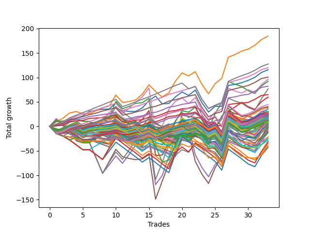

# Long Bulldog 005 
- Symbol: ES90d5m
- Date Range: 03/18/2022 - 07/08/2022
- Trading Period: 7:20-12:30
- Number of Trades: 33



| Name | Win Percent | Profit | Avg Profit / Trade | Avg Time / Trade |      | Name | Win Percent | Profit | Avg Profit / Trade | Avg Time / Trade |
| ---- | ----------- | ------ | ------------------ | ---------------- | ---- | ---- | ----------- | ------ | ------------------ | ---------------- |
| Sorted By <br> Profit | | | | | | Sorted By <br> Win Percentage ||||
| One | 78.79 | 92250.00 | 2795.45 | 00:00 |     | Eighty-Four | 90.91 | 60000.00 | 1818.18 | 00:00 |
| Eighty-Five | 87.88 | 63750.00 | 1931.82 | 00:00 |     | Eighty-Three | 90.91 | 50375.00 | 1526.52 | 00:00 |
| Eighty-Four | 90.91 | 60000.00 | 1818.18 | 00:00 |     | Eighty-Two | 90.91 | 41000.00 | 1242.42 | 00:00 |
| Zero | 78.79 | 57875.00 | 1753.79 | 00:00 |     | Eighty-One | 90.91 | 32375.00 | 981.06 | 00:00 |
| Eighty-Three | 90.91 | 50375.00 | 1526.52 | 00:00 |     | Eighty-Five | 87.88 | 63750.00 | 1931.82 | 00:00 |
| Six | 66.67 | 48250.00 | 1462.12 | 00:00 |     | One | 78.79 | 92250.00 | 2795.45 | 00:00 |
| Two | 60.61 | 46125.00 | 1397.73 | 00:00 |     | Zero | 78.79 | 57875.00 | 1753.79 | 00:00 |
| Eighty-Two | 90.91 | 41000.00 | 1242.42 | 00:00 |     | One Hundred Twenty-Six | 78.79 | 13000.00 | 393.94 | 00:00 |
| Seven | 54.55 | 38250.00 | 1159.09 | 00:00 |     | One Hundred Twenty-Eight | 75.76 | 20125.00 | 609.85 | 00:00 |
| Eighty-One | 90.91 | 32375.00 | 981.06 | 00:00 |     | One Hundred Twenty-Seven | 75.76 | 12375.00 | 375.00 | 00:00 |
| Three | 66.67 | 30000.00 | 909.09 | 00:00 |     | One Hundred Twenty-Nine | 72.73 | 22250.00 | 674.24 | 00:00 |
| One Hundred Twenty-Nine | 72.73 | 22250.00 | 674.24 | 00:00 |     | One Hundred Twenty-Three | 69.70 | 14625.00 | 443.18 | 00:00 |
| One Hundred Twenty-Eight | 75.76 | 20125.00 | 609.85 | 00:00 |     | One Hundred Twenty-Two | 69.70 | 8250.00 | 250.00 | 00:00 |
| One Hundred Fourteen | 57.58 | 19375.00 | 587.12 | 00:00 |     | One Hundred Twenty-One | 69.70 | 4625.00 | 140.15 | 00:00 |
| Twenty-Nine | 21.21 | 19125.00 | 579.55 | 00:00 |     | Six | 66.67 | 48250.00 | 1462.12 | 00:00 |
| Twenty-Four | 33.33 | 17625.00 | 534.09 | 00:00 |     | Three | 66.67 | 30000.00 | 909.09 | 00:00 |
| Ninety-Four | 45.45 | 15125.00 | 458.33 | 00:00 |     | One Hundred Twenty-Four | 66.67 | 14125.00 | 428.03 | 00:00 |
| Forty | 42.42 | 15125.00 | 458.33 | 00:00 |     | One Hundred Sixteen | 66.67 | 12625.00 | 382.58 | 00:00 |
| One Hundred Thirteen | 57.58 | 14750.00 | 446.97 | 00:00 |     | Two | 60.61 | 46125.00 | 1397.73 | 00:00 |
| One Hundred Twenty-Three | 69.70 | 14625.00 | 443.18 | 00:00 |     | One Hundred Seventeen | 60.61 | 10500.00 | 318.18 | 00:00 |
| One Hundred Twenty-Four | 66.67 | 14125.00 | 428.03 | 00:00 |     | One Hundred Twenty-Five | 60.61 | 5875.00 | 178.03 | 00:00 |
| Thirteen | 15.15 | 14125.00 | 428.03 | 00:00 |     | One Hundred Fourteen | 57.58 | 19375.00 | 587.12 | 00:00 |
| Ninety-Two | 48.48 | 13500.00 | 409.09 | 00:00 |     | One Hundred Thirteen | 57.58 | 14750.00 | 446.97 | 00:00 |
| Forty-One | 36.36 | 13500.00 | 409.09 | 00:00 |     | One Hundred Eighteen | 57.58 | 11875.00 | 359.85 | 00:00 |
| One Hundred Twenty-Six | 78.79 | 13000.00 | 393.94 | 00:00 |     | One Hundred Twelve | 57.58 | 10500.00 | 318.18 | 00:00 |
| One Hundred Ninteen | 54.55 | 12875.00 | 390.15 | 00:00 |     | One Hundred Eleven | 57.58 | 8125.00 | 246.21 | 00:00 |
| One Hundred Sixteen | 66.67 | 12625.00 | 382.58 | 00:00 |     | Seventy-Three | 57.58 | 4750.00 | 143.94 | 00:00 |
| Ninety-Three | 45.45 | 12625.00 | 382.58 | 00:00 |     | One Hundred Thirty | 57.58 | 3250.00 | 98.48 | 00:00 |
| One Hundred Nine | 48.48 | 12500.00 | 378.79 | 00:00 |     | Seven | 54.55 | 38250.00 | 1159.09 | 00:00 |
| Twenty-Eight | 21.21 | 12500.00 | 378.79 | 00:00 |     | One Hundred Ninteen | 54.55 | 12875.00 | 390.15 | 00:00 |
| One Hundred Twenty-Seven | 75.76 | 12375.00 | 375.00 | 00:00 |     | One Hundred Six | 54.55 | 11000.00 | 333.33 | 00:00 |
| Ninety-One | 48.48 | 12250.00 | 371.21 | 00:00 |     | Fifty-Six | 54.55 | 7000.00 | 212.12 | 00:00 |
| Twenty-Five | 27.27 | 12250.00 | 371.21 | 00:00 |     | One Hundred Seven | 51.52 | 11000.00 | 333.33 | 00:00 |
| One Hundred Eighteen | 57.58 | 11875.00 | 359.85 | 00:00 |     | Ninety-Six | 51.52 | 10375.00 | 314.39 | 00:00 |
| One Hundred | 48.48 | 11500.00 | 348.48 | 00:00 |     | Sixty-Four | 51.52 | 6875.00 | 208.33 | 00:00 |
| One Hundred Eight | 48.48 | 11250.00 | 340.91 | 00:00 |     | Four | 51.52 | -2375.00 | -71.97 | 00:00 |
| Ninety-Five | 39.39 | 11125.00 | 337.12 | 00:00 |     | Ninety-Two | 48.48 | 13500.00 | 409.09 | 00:00 |
| One Hundred Six | 54.55 | 11000.00 | 333.33 | 00:00 |     | One Hundred Nine | 48.48 | 12500.00 | 378.79 | 00:00 |
| One Hundred Seven | 51.52 | 11000.00 | 333.33 | 00:00 |     | Ninety-One | 48.48 | 12250.00 | 371.21 | 00:00 |
| One Hundred Four | 45.45 | 10750.00 | 325.76 | 00:00 |     | One Hundred | 48.48 | 11500.00 | 348.48 | 00:00 |
| One Hundred Seventeen | 60.61 | 10500.00 | 318.18 | 00:00 |     | One Hundred Eight | 48.48 | 11250.00 | 340.91 | 00:00 |
| One Hundred Twelve | 57.58 | 10500.00 | 318.18 | 00:00 |     | Ninety-Seven | 48.48 | 10500.00 | 318.18 | 00:00 |
| Ninety-Seven | 48.48 | 10500.00 | 318.18 | 00:00 |     | Ninety-Nine | 48.48 | 10375.00 | 314.39 | 00:00 |
| Ninety-Six | 51.52 | 10375.00 | 314.39 | 00:00 |     | One Hundred Ten | 48.48 | 9875.00 | 299.24 | 00:00 |
| Ninety-Nine | 48.48 | 10375.00 | 314.39 | 00:00 |     | One Hundred Two | 48.48 | 9375.00 | 284.09 | 00:00 |
| Forty-Two | 30.30 | 10250.00 | 310.61 | 00:00 |     | Ninety-Eight | 48.48 | 9125.00 | 276.52 | 00:00 |
| Twelve | 15.15 | 10125.00 | 306.82 | 00:00 |     | One Hundred Fifteen | 48.48 | 9000.00 | 272.73 | 00:00 |
| One Hundred Ten | 48.48 | 9875.00 | 299.24 | 00:00 |     | Fifty-Seven | 48.48 | 8750.00 | 265.15 | 00:00 |
| One Hundred Two | 48.48 | 9375.00 | 284.09 | 00:00 |     | One Hundred One | 48.48 | 8125.00 | 246.21 | 00:00 |
| Ninety-Eight | 48.48 | 9125.00 | 276.52 | 00:00 |     | Seventeen | 48.48 | 6250.00 | 189.39 | 00:00 |
| One Hundred Fifteen | 48.48 | 9000.00 | 272.73 | 00:00 |     | Twenty-Two | 48.48 | 6000.00 | 181.82 | 00:00 |
| Fifty-Seven | 48.48 | 8750.00 | 265.15 | 00:00 |     | Sixten | 48.48 | 5500.00 | 166.67 | 00:00 |
| Eight | 24.24 | 8750.00 | 265.15 | 00:00 |     | Twenty-Three | 48.48 | 5250.00 | 159.09 | 00:00 |
| One Hundred Twenty | 45.45 | 8625.00 | 261.36 | 00:00 |     | Twenty-One | 48.48 | 5250.00 | 159.09 | 00:00 |
| One Hundred Twenty-Two | 69.70 | 8250.00 | 250.00 | 00:00 |     | Twenty | 48.48 | 5250.00 | 159.09 | 00:00 |
| One Hundred Three | 45.45 | 8250.00 | 250.00 | 00:00 |     | Nineteen | 48.48 | 5250.00 | 159.09 | 00:00 |
| One Hundred Eleven | 57.58 | 8125.00 | 246.21 | 00:00 |     | Eighteen | 48.48 | 5250.00 | 159.09 | 00:00 |
| One Hundred One | 48.48 | 8125.00 | 246.21 | 00:00 |     | Thirty-Three | 48.48 | 750.00 | 22.73 | 00:00 |
| Forty-Eight | 42.42 | 8000.00 | 242.42 | 00:00 |     | Thirty-Eight | 48.48 | 500.00 | 15.15 | 00:00 |
| Ten | 15.15 | 7875.00 | 238.64 | 00:00 |     | Thirty-Two | 48.48 | 0.00 | 0.00 | 00:00 |
| Forty-Nine | 39.39 | 7625.00 | 231.06 | 00:00 |     | Thirty-Nine | 48.48 | -625.00 | -18.94 | 00:00 |
| Nine | 18.18 | 7500.00 | 227.27 | 00:00 |     | Thirty-Seven | 48.48 | -625.00 | -18.94 | 00:00 |
| Fifty-Four | 39.39 | 7375.00 | 223.48 | 00:00 |     | Thirty-Six | 48.48 | -625.00 | -18.94 | 00:00 |
| Fifty-Six | 54.55 | 7000.00 | 212.12 | 00:00 |     | Thirty-Five | 48.48 | -625.00 | -18.94 | 00:00 |
| Sixty-Four | 51.52 | 6875.00 | 208.33 | 00:00 |     | Thirty-Four | 48.48 | -625.00 | -18.94 | 00:00 |
| Fifty-Three | 39.39 | 6875.00 | 208.33 | 00:00 |     | Ninety-Four | 45.45 | 15125.00 | 458.33 | 00:00 |
| Twenty-Six | 21.21 | 6625.00 | 200.76 | 00:00 |     | Ninety-Three | 45.45 | 12625.00 | 382.58 | 00:00 |
| Seventeen | 48.48 | 6250.00 | 189.39 | 00:00 |     | One Hundred Four | 45.45 | 10750.00 | 325.76 | 00:00 |
| One Hundred Five | 39.39 | 6125.00 | 185.61 | 00:00 |     | One Hundred Twenty | 45.45 | 8625.00 | 261.36 | 00:00 |
| Twenty-Two | 48.48 | 6000.00 | 181.82 | 00:00 |     | One Hundred Three | 45.45 | 8250.00 | 250.00 | 00:00 |
| One Hundred Twenty-Five | 60.61 | 5875.00 | 178.03 | 00:00 |     | Five | 45.45 | -4625.00 | -140.15 | 00:00 |
| Fifty | 39.39 | 5750.00 | 174.24 | 00:00 |     | Forty | 42.42 | 15125.00 | 458.33 | 00:00 |
| Sixten | 48.48 | 5500.00 | 166.67 | 00:00 |     | Forty-Eight | 42.42 | 8000.00 | 242.42 | 00:00 |
| Twenty-Three | 48.48 | 5250.00 | 159.09 | 00:00 |     | Seventy | 42.42 | 1875.00 | 56.82 | 00:00 |
| Twenty-One | 48.48 | 5250.00 | 159.09 | 00:00 |     | Sixty-Two | 42.42 | -6500.00 | -196.97 | 00:00 |
| Twenty | 48.48 | 5250.00 | 159.09 | 00:00 |     | Sixty-Five | 42.42 | -12375.00 | -375.00 | 00:00 |
| Nineteen | 48.48 | 5250.00 | 159.09 | 00:00 |     | Ninety-Five | 39.39 | 11125.00 | 337.12 | 00:00 |
| Eighteen | 48.48 | 5250.00 | 159.09 | 00:00 |     | Forty-Nine | 39.39 | 7625.00 | 231.06 | 00:00 |
| Fifty-Five | 39.39 | 4875.00 | 147.73 | 00:00 |     | Fifty-Four | 39.39 | 7375.00 | 223.48 | 00:00 |
| Fifty-One | 39.39 | 4875.00 | 147.73 | 00:00 |     | Fifty-Three | 39.39 | 6875.00 | 208.33 | 00:00 |
| Seventy-Three | 57.58 | 4750.00 | 143.94 | 00:00 |     | One Hundred Five | 39.39 | 6125.00 | 185.61 | 00:00 |
| One Hundred Twenty-One | 69.70 | 4625.00 | 140.15 | 00:00 |     | Fifty | 39.39 | 5750.00 | 174.24 | 00:00 |
| Forty-Six | 33.33 | 3875.00 | 117.42 | 00:00 |     | Fifty-Five | 39.39 | 4875.00 | 147.73 | 00:00 |
| Thirty-One | 21.21 | 3875.00 | 117.42 | 00:00 |     | Fifty-One | 39.39 | 4875.00 | 147.73 | 00:00 |
| Forty-Three | 30.30 | 3750.00 | 113.64 | 00:00 |     | Fifty-Two | 39.39 | 3625.00 | 109.85 | 00:00 |
| Fifty-Two | 39.39 | 3625.00 | 109.85 | 00:00 |     | Fifty-Eight | 39.39 | 1000.00 | 30.30 | 00:00 |
| One Hundred Thirty | 57.58 | 3250.00 | 98.48 | 00:00 |     | Sixty-Seven | 39.39 | -1625.00 | -49.24 | 00:00 |
| Seventy | 42.42 | 1875.00 | 56.82 | 00:00 |     | Sixty-Six | 39.39 | -10750.00 | -325.76 | 00:00 |
| Thirty | 24.24 | 1875.00 | 56.82 | 00:00 |     | Forty-One | 36.36 | 13500.00 | 409.09 | 00:00 |
| Fourteen | 18.18 | 1500.00 | 45.45 | 00:00 |     | Sixty-Eight | 36.36 | -10625.00 | -321.97 | 00:00 |
| Fifty-Eight | 39.39 | 1000.00 | 30.30 | 00:00 |     | Sixty-Nine | 36.36 | -12500.00 | -378.79 | 00:00 |
| Eleven | 15.15 | 1000.00 | 30.30 | 00:00 |     | Fifty-Nine | 36.36 | -14125.00 | -428.03 | 00:00 |
| Thirty-Three | 48.48 | 750.00 | 22.73 | 00:00 |     | Seventy-One | 36.36 | -19500.00 | -590.91 | 00:00 |
| Thirty-Eight | 48.48 | 500.00 | 15.15 | 00:00 |     | Twenty-Four | 33.33 | 17625.00 | 534.09 | 00:00 |
| Forty-Five | 21.21 | 250.00 | 7.58 | 00:00 |     | Forty-Six | 33.33 | 3875.00 | 117.42 | 00:00 |
| Thirty-Two | 48.48 | 0.00 | 0.00 | 00:00 |     | Forty-Two | 30.30 | 10250.00 | 310.61 | 00:00 |
| Fifteen | 15.15 | -125.00 | -3.79 | 00:00 |     | Forty-Three | 30.30 | 3750.00 | 113.64 | 00:00 |
| twenty-Seven | 21.21 | -250.00 | -7.58 | 00:00 |     | Sixty-Three | 30.30 | -15625.00 | -473.48 | 00:00 |
| Thirty-Nine | 48.48 | -625.00 | -18.94 | 00:00 |     | Twenty-Five | 27.27 | 12250.00 | 371.21 | 00:00 |
| Thirty-Seven | 48.48 | -625.00 | -18.94 | 00:00 |     | Sixty-One | 27.27 | -17125.00 | -518.94 | 00:00 |
| Thirty-Six | 48.48 | -625.00 | -18.94 | 00:00 |     | Sixty | 27.27 | -21375.00 | -647.73 | 00:00 |
| Thirty-Five | 48.48 | -625.00 | -18.94 | 00:00 |     | Eight | 24.24 | 8750.00 | 265.15 | 00:00 |
| Thirty-Four | 48.48 | -625.00 | -18.94 | 00:00 |     | Thirty | 24.24 | 1875.00 | 56.82 | 00:00 |
| Sixty-Seven | 39.39 | -1625.00 | -49.24 | 00:00 |     | Forty-Seven | 24.24 | -3000.00 | -90.91 | 00:00 |
| Four | 51.52 | -2375.00 | -71.97 | 00:00 |     | Twenty-Nine | 21.21 | 19125.00 | 579.55 | 00:00 |
| Forty-Seven | 24.24 | -3000.00 | -90.91 | 00:00 |     | Twenty-Eight | 21.21 | 12500.00 | 378.79 | 00:00 |
| Five | 45.45 | -4625.00 | -140.15 | 00:00 |     | Twenty-Six | 21.21 | 6625.00 | 200.76 | 00:00 |
| Forty-Four | 21.21 | -6375.00 | -193.18 | 00:00 |     | Thirty-One | 21.21 | 3875.00 | 117.42 | 00:00 |
| Sixty-Two | 42.42 | -6500.00 | -196.97 | 00:00 |     | Forty-Five | 21.21 | 250.00 | 7.58 | 00:00 |
| Sixty-Eight | 36.36 | -10625.00 | -321.97 | 00:00 |     | twenty-Seven | 21.21 | -250.00 | -7.58 | 00:00 |
| Sixty-Six | 39.39 | -10750.00 | -325.76 | 00:00 |     | Forty-Four | 21.21 | -6375.00 | -193.18 | 00:00 |
| Sixty-Five | 42.42 | -12375.00 | -375.00 | 00:00 |     | Nine | 18.18 | 7500.00 | 227.27 | 00:00 |
| Sixty-Nine | 36.36 | -12500.00 | -378.79 | 00:00 |     | Fourteen | 18.18 | 1500.00 | 45.45 | 00:00 |
| Fifty-Nine | 36.36 | -14125.00 | -428.03 | 00:00 |     | Thirteen | 15.15 | 14125.00 | 428.03 | 00:00 |
| Sixty-Three | 30.30 | -15625.00 | -473.48 | 00:00 |     | Twelve | 15.15 | 10125.00 | 306.82 | 00:00 |
| Sixty-One | 27.27 | -17125.00 | -518.94 | 00:00 |     | Ten | 15.15 | 7875.00 | 238.64 | 00:00 |
| Seventy-One | 36.36 | -19500.00 | -590.91 | 00:00 |     | Eleven | 15.15 | 1000.00 | 30.30 | 00:00 |
| Sixty | 27.27 | -21375.00 | -647.73 | 00:00 |     | Fifteen | 15.15 | -125.00 | -3.79 | 00:00 |

## NO STOPLOSS

### Test Zero
* Sell when price hits the middle line of the 20p bollinger
* No Stoploss
* Results:
```
Total Trades: 33
Percent Up: 78.79
Percent Down: 21.21
Total Points Moved Up: 115.75
Potential Profit: 57875.00
Total Points Ups: 201.50 Count Ups: 26
Total Points Downs: -85.75 Count Downs: 7
```

<details><summary>Trades</summary>

<code>In: 2022-03-21 10:10:00		Out: 2022-03-21 11:20:10		Total Position Time: 70:10		Total Move Up: 0.75		Total to Date: 0.75</code> <br />
<code>In: 2022-03-23 10:35:00		Out: 2022-03-23 11:28:20		Total Position Time: 53:20		Total Move Up: 4.50		Total to Date: 5.25</code> <br />
<code>In: 2022-03-23 10:50:00		Out: 2022-03-23 11:28:20		Total Position Time: 38:20		Total Move Up: 8.00		Total to Date: 13.25</code> <br />
<code>In: 2022-03-30 08:20:00		Out: 2022-03-30 09:00:30		Total Position Time: 40:30		Total Move Up: 3.00		Total to Date: 16.25</code> <br />
<code>In: 2022-03-30 12:15:00		Out: 2022-03-30 12:48:00		Total Position Time: 33:00		Total Move Up: 4.75		Total to Date: 21.00</code> <br />
<code>In: 2022-03-30 12:30:00		Out: 2022-03-30 12:48:00		Total Position Time: 18:00		Total Move Up: 9.50		Total to Date: 30.50</code> <br />
<code>In: 2022-03-31 11:25:00		Out: 2022-03-31 11:59:20		Total Position Time: 34:20		Total Move Up: 2.50		Total to Date: 33.00</code> <br />
<code>In: 2022-03-31 11:30:00		Out: 2022-03-31 11:59:20		Total Position Time: 29:20		Total Move Up: 2.00		Total to Date: 35.00</code> <br />
<code>In: 2022-04-01 09:10:00		Out: 2022-04-01 10:36:45		Total Position Time: 86:45		Total Move Up: 0.50		Total to Date: 35.50</code> <br />
<code>In: 2022-04-06 11:25:00		Out: 2022-04-06 11:32:25		Total Position Time: 07:25		Total Move Up: 12.50		Total to Date: 48.00</code> <br />
<code>In: 2022-04-12 11:05:00		Out: 2022-04-12 12:47:45		Total Position Time: 102:45		Total Move Up: -16.00		Total to Date: 32.00</code> <br />
<code>In: 2022-04-18 08:45:00		Out: 2022-04-18 09:58:15		Total Position Time: 73:15		Total Move Up: -1.50		Total to Date: 30.50</code> <br />
<code>In: 2022-04-18 08:55:00		Out: 2022-04-18 09:58:15		Total Position Time: 63:15		Total Move Up: 0.00		Total to Date: 30.50</code> <br />
<code>In: 2022-04-20 11:50:00		Out: 2022-04-20 12:25:15		Total Position Time: 35:15		Total Move Up: 7.25		Total to Date: 37.75</code> <br />
<code>In: 2022-04-20 12:00:00		Out: 2022-04-20 12:25:15		Total Position Time: 25:15		Total Move Up: 14.75		Total to Date: 52.50</code> <br />
<code>In: 2022-04-29 07:40:00		Out: 2022-04-29 08:33:15		Total Position Time: 53:15		Total Move Up: 9.50		Total to Date: 62.00</code> <br />
<code>In: 2022-05-02 10:10:00		Out: 2022-05-02 11:53:40		Total Position Time: 103:40		Total Move Up: -16.00		Total to Date: 46.00</code> <br />
<code>In: 2022-05-12 10:55:00		Out: 2022-05-12 12:15:30		Total Position Time: 80:30		Total Move Up: 0.75		Total to Date: 46.75</code> <br />
<code>In: 2022-05-13 11:10:00		Out: 2022-05-13 11:52:15		Total Position Time: 42:15		Total Move Up: 13.50		Total to Date: 60.25</code> <br />
<code>In: 2022-06-02 07:30:00		Out: 2022-06-02 07:40:05		Total Position Time: 10:05		Total Move Up: 10.00		Total to Date: 70.25</code> <br />
<code>In: 2022-06-08 09:50:00		Out: 2022-06-08 11:45:20		Total Position Time: 115:20		Total Move Up: -7.00		Total to Date: 63.25</code> <br />
<code>In: 2022-06-09 08:10:00		Out: 2022-06-09 08:42:50		Total Position Time: 32:50		Total Move Up: 11.00		Total to Date: 74.25</code> <br />
<code>In: 2022-06-09 12:20:00		Out: 2022-06-09 12:55:00		Total Position Time: 35:00		Total Move Up: -26.00		Total to Date: 48.25</code> <br />
<code>In: 2022-06-13 12:20:00		Out: 2022-06-13 12:55:00		Total Position Time: 35:00		Total Move Up: -19.00		Total to Date: 29.25</code> <br />
<code>In: 2022-06-15 11:15:00		Out: 2022-06-15 11:20:35		Total Position Time: 05:35		Total Move Up: 11.75		Total to Date: 41.00</code> <br />
<code>In: 2022-06-15 11:20:00		Out: 2022-06-15 11:38:10		Total Position Time: 18:10		Total Move Up: -0.25		Total to Date: 40.75</code> <br />
<code>In: 2022-06-15 11:40:00		Out: 2022-06-15 11:45:10		Total Position Time: 05:10		Total Move Up: 43.00		Total to Date: 83.75</code> <br />
<code>In: 2022-06-16 11:05:00		Out: 2022-06-16 12:09:35		Total Position Time: 64:35		Total Move Up: 2.00		Total to Date: 85.75</code> <br />
<code>In: 2022-06-16 11:15:00		Out: 2022-06-16 12:09:35		Total Position Time: 54:35		Total Move Up: 3.50		Total to Date: 89.25</code> <br />
<code>In: 2022-06-27 11:05:00		Out: 2022-06-27 11:19:05		Total Position Time: 14:05		Total Move Up: 4.75		Total to Date: 94.00</code> <br />
<code>In: 2022-06-27 12:10:00		Out: 2022-06-27 12:15:10		Total Position Time: 05:10		Total Move Up: 6.25		Total to Date: 100.25</code> <br />
<code>In: 2022-06-29 09:35:00		Out: 2022-06-29 10:08:20		Total Position Time: 33:20		Total Move Up: 10.00		Total to Date: 110.25</code> <br />
<code>In: 2022-07-06 08:50:00		Out: 2022-07-06 09:15:05		Total Position Time: 25:05		Total Move Up: 5.50		Total to Date: 115.75</code> <br />


</details>

### Test One
* Sell when the price hits the upper line of the 20p 1std bollinger
* No Stoploss
* Results:
```
Total Trades: 33
Percent Up: 78.79
Percent Down: 21.21
Total Points Moved Up: 184.50
Potential Profit: 92250.00
Total Points Ups: 280.25 Count Ups: 26
Total Points Downs: -95.75 Count Downs: 7
```

<details><summary>Trades</summary>

<code>In: 2022-03-21 10:10:00		Out: 2022-03-21 11:22:10		Total Position Time: 72:10		Total Move Up: 9.25		Total to Date: 9.25</code> <br />
<code>In: 2022-03-23 10:35:00		Out: 2022-03-23 11:48:45		Total Position Time: 73:45		Total Move Up: 7.25		Total to Date: 16.50</code> <br />
<code>In: 2022-03-23 10:50:00		Out: 2022-03-23 11:48:45		Total Position Time: 58:45		Total Move Up: 10.75		Total to Date: 27.25</code> <br />
<code>In: 2022-03-30 08:20:00		Out: 2022-03-30 09:39:20		Total Position Time: 79:20		Total Move Up: 3.25		Total to Date: 30.50</code> <br />
<code>In: 2022-03-30 12:15:00		Out: 2022-03-30 12:55:00		Total Position Time: 40:00		Total Move Up: -4.75		Total to Date: 25.75</code> <br />
<code>In: 2022-03-30 12:30:00		Out: 2022-03-30 12:55:00		Total Position Time: 25:00		Total Move Up: 0.00		Total to Date: 25.75</code> <br />
<code>In: 2022-03-31 11:25:00		Out: 2022-03-31 12:00:20		Total Position Time: 35:20		Total Move Up: 6.25		Total to Date: 32.00</code> <br />
<code>In: 2022-03-31 11:30:00		Out: 2022-03-31 12:00:20		Total Position Time: 30:20		Total Move Up: 5.75		Total to Date: 37.75</code> <br />
<code>In: 2022-04-01 09:10:00		Out: 2022-04-01 10:37:40		Total Position Time: 87:40		Total Move Up: 4.00		Total to Date: 41.75</code> <br />
<code>In: 2022-04-06 11:25:00		Out: 2022-04-06 11:34:00		Total Position Time: 09:00		Total Move Up: 22.25		Total to Date: 64.00</code> <br />
<code>In: 2022-04-12 11:05:00		Out: 2022-04-12 12:55:00		Total Position Time: 110:00		Total Move Up: -15.00		Total to Date: 49.00</code> <br />
<code>In: 2022-04-18 08:45:00		Out: 2022-04-18 10:08:20		Total Position Time: 83:20		Total Move Up: 1.75		Total to Date: 50.75</code> <br />
<code>In: 2022-04-18 08:55:00		Out: 2022-04-18 10:08:20		Total Position Time: 73:20		Total Move Up: 3.25		Total to Date: 54.00</code> <br />
<code>In: 2022-04-20 11:50:00		Out: 2022-04-20 12:46:30		Total Position Time: 56:30		Total Move Up: 11.75		Total to Date: 65.75</code> <br />
<code>In: 2022-04-20 12:00:00		Out: 2022-04-20 12:46:30		Total Position Time: 46:30		Total Move Up: 19.25		Total to Date: 85.00</code> <br />
<code>In: 2022-04-29 07:40:00		Out: 2022-04-29 10:37:55		Total Position Time: 177:55		Total Move Up: -13.50		Total to Date: 71.50</code> <br />
<code>In: 2022-05-02 10:10:00		Out: 2022-05-02 12:05:20		Total Position Time: 115:20		Total Move Up: -11.50		Total to Date: 60.00</code> <br />
<code>In: 2022-05-12 10:55:00		Out: 2022-05-12 12:18:25		Total Position Time: 83:25		Total Move Up: 8.50		Total to Date: 68.50</code> <br />
<code>In: 2022-05-13 11:10:00		Out: 2022-05-13 12:01:05		Total Position Time: 51:05		Total Move Up: 24.00		Total to Date: 92.50</code> <br />
<code>In: 2022-06-02 07:30:00		Out: 2022-06-02 07:56:05		Total Position Time: 26:05		Total Move Up: 16.75		Total to Date: 109.25</code> <br />
<code>In: 2022-06-08 09:50:00		Out: 2022-06-08 12:21:10		Total Position Time: 151:10		Total Move Up: -6.00		Total to Date: 103.25</code> <br />
<code>In: 2022-06-09 08:10:00		Out: 2022-06-09 09:29:05		Total Position Time: 79:05		Total Move Up: 8.50		Total to Date: 111.75</code> <br />
<code>In: 2022-06-09 12:20:00		Out: 2022-06-09 12:55:00		Total Position Time: 35:00		Total Move Up: -26.00		Total to Date: 85.75</code> <br />
<code>In: 2022-06-13 12:20:00		Out: 2022-06-13 12:55:00		Total Position Time: 35:00		Total Move Up: -19.00		Total to Date: 66.75</code> <br />
<code>In: 2022-06-15 11:15:00		Out: 2022-06-15 11:38:55		Total Position Time: 23:55		Total Move Up: 20.50		Total to Date: 87.25</code> <br />
<code>In: 2022-06-15 11:20:00		Out: 2022-06-15 11:38:55		Total Position Time: 18:55		Total Move Up: 11.00		Total to Date: 98.25</code> <br />
<code>In: 2022-06-15 11:40:00		Out: 2022-06-15 11:45:10		Total Position Time: 05:10		Total Move Up: 43.00		Total to Date: 141.25</code> <br />
<code>In: 2022-06-16 11:05:00		Out: 2022-06-16 12:26:30		Total Position Time: 81:30		Total Move Up: 5.50		Total to Date: 146.75</code> <br />
<code>In: 2022-06-16 11:15:00		Out: 2022-06-16 12:26:30		Total Position Time: 71:30		Total Move Up: 7.00		Total to Date: 153.75</code> <br />
<code>In: 2022-06-27 11:05:00		Out: 2022-06-27 12:15:20		Total Position Time: 70:20		Total Move Up: 4.25		Total to Date: 158.00</code> <br />
<code>In: 2022-06-27 12:10:00		Out: 2022-06-27 12:15:20		Total Position Time: 05:20		Total Move Up: 7.75		Total to Date: 165.75</code> <br />
<code>In: 2022-06-29 09:35:00		Out: 2022-06-29 10:40:35		Total Position Time: 65:35		Total Move Up: 11.75		Total to Date: 177.50</code> <br />
<code>In: 2022-07-06 08:50:00		Out: 2022-07-06 09:44:15		Total Position Time: 54:15		Total Move Up: 7.00		Total to Date: 184.50</code> <br />


</details>

### Test Two
* Sell when the price hits the upper line of the 20p 2std bollinger
* No Stoploss
* Results:
```
Total Trades: 33
Percent Up: 60.61
Percent Down: 39.39
Total Points Moved Up: 92.25
Potential Profit: 46125.00
Total Points Ups: 298.00 Count Ups: 20
Total Points Downs: -205.75 Count Downs: 13
```

<details><summary>Trades</summary>

<code>In: 2022-03-21 10:10:00		Out: 2022-03-21 11:30:10		Total Position Time: 80:10		Total Move Up: 13.25		Total to Date: 13.25</code> <br />
<code>In: 2022-03-23 10:35:00		Out: 2022-03-23 12:55:00		Total Position Time: 140:00		Total Move Up: -11.50		Total to Date: 1.75</code> <br />
<code>In: 2022-03-23 10:50:00		Out: 2022-03-23 12:55:00		Total Position Time: 125:00		Total Move Up: -8.00		Total to Date: -6.25</code> <br />
<code>In: 2022-03-30 08:20:00		Out: 2022-03-30 09:40:10		Total Position Time: 80:10		Total Move Up: 4.00		Total to Date: -2.25</code> <br />
<code>In: 2022-03-30 12:15:00		Out: 2022-03-30 12:55:00		Total Position Time: 40:00		Total Move Up: -4.75		Total to Date: -7.00</code> <br />
<code>In: 2022-03-30 12:30:00		Out: 2022-03-30 12:55:00		Total Position Time: 25:00		Total Move Up: 0.00		Total to Date: -7.00</code> <br />
<code>In: 2022-03-31 11:25:00		Out: 2022-03-31 12:02:45		Total Position Time: 37:45		Total Move Up: 10.00		Total to Date: 3.00</code> <br />
<code>In: 2022-03-31 11:30:00		Out: 2022-03-31 12:02:45		Total Position Time: 32:45		Total Move Up: 9.50		Total to Date: 12.50</code> <br />
<code>In: 2022-04-01 09:10:00		Out: 2022-04-01 10:40:05		Total Position Time: 90:05		Total Move Up: 4.75		Total to Date: 17.25</code> <br />
<code>In: 2022-04-06 11:25:00		Out: 2022-04-06 11:55:45		Total Position Time: 30:45		Total Move Up: 33.75		Total to Date: 51.00</code> <br />
<code>In: 2022-04-12 11:05:00		Out: 2022-04-12 12:55:00		Total Position Time: 110:00		Total Move Up: -15.00		Total to Date: 36.00</code> <br />
<code>In: 2022-04-18 08:45:00		Out: 2022-04-18 10:10:30		Total Position Time: 85:30		Total Move Up: 4.75		Total to Date: 40.75</code> <br />
<code>In: 2022-04-18 08:55:00		Out: 2022-04-18 10:10:30		Total Position Time: 75:30		Total Move Up: 6.25		Total to Date: 47.00</code> <br />
<code>In: 2022-04-20 11:50:00		Out: 2022-04-20 12:55:00		Total Position Time: 65:00		Total Move Up: 1.50		Total to Date: 48.50</code> <br />
<code>In: 2022-04-20 12:00:00		Out: 2022-04-20 12:55:00		Total Position Time: 55:00		Total Move Up: 9.00		Total to Date: 57.50</code> <br />
<code>In: 2022-04-29 07:40:00		Out: 2022-04-29 12:55:00		Total Position Time: 315:00		Total Move Up: -91.50		Total to Date: -34.00</code> <br />
<code>In: 2022-05-02 10:10:00		Out: 2022-05-02 12:09:40		Total Position Time: 119:40		Total Move Up: -2.50		Total to Date: -36.50</code> <br />
<code>In: 2022-05-12 10:55:00		Out: 2022-05-12 12:20:20		Total Position Time: 85:20		Total Move Up: 12.25		Total to Date: -24.25</code> <br />
<code>In: 2022-05-13 11:10:00		Out: 2022-05-13 12:14:45		Total Position Time: 64:45		Total Move Up: 33.75		Total to Date: 9.50</code> <br />
<code>In: 2022-06-02 07:30:00		Out: 2022-06-02 08:01:35		Total Position Time: 31:35		Total Move Up: 22.50		Total to Date: 32.00</code> <br />
<code>In: 2022-06-08 09:50:00		Out: 2022-06-08 12:22:55		Total Position Time: 152:55		Total Move Up: -3.00		Total to Date: 29.00</code> <br />
<code>In: 2022-06-09 08:10:00		Out: 2022-06-09 09:35:20		Total Position Time: 85:20		Total Move Up: 10.25		Total to Date: 39.25</code> <br />
<code>In: 2022-06-09 12:20:00		Out: 2022-06-09 12:55:00		Total Position Time: 35:00		Total Move Up: -26.00		Total to Date: 13.25</code> <br />
<code>In: 2022-06-13 12:20:00		Out: 2022-06-13 12:55:00		Total Position Time: 35:00		Total Move Up: -19.00		Total to Date: -5.75</code> <br />
<code>In: 2022-06-15 11:15:00		Out: 2022-06-15 11:41:00		Total Position Time: 26:00		Total Move Up: 32.00		Total to Date: 26.25</code> <br />
<code>In: 2022-06-15 11:20:00		Out: 2022-06-15 11:41:00		Total Position Time: 21:00		Total Move Up: 22.50		Total to Date: 48.75</code> <br />
<code>In: 2022-06-15 11:40:00		Out: 2022-06-15 11:45:10		Total Position Time: 05:10		Total Move Up: 43.00		Total to Date: 91.75</code> <br />
<code>In: 2022-06-16 11:05:00		Out: 2022-06-16 12:55:00		Total Position Time: 110:00		Total Move Up: -5.75		Total to Date: 86.00</code> <br />
<code>In: 2022-06-16 11:15:00		Out: 2022-06-16 12:55:00		Total Position Time: 100:00		Total Move Up: -4.25		Total to Date: 81.75</code> <br />
<code>In: 2022-06-27 11:05:00		Out: 2022-06-27 12:55:00		Total Position Time: 110:00		Total Move Up: -9.00		Total to Date: 72.75</code> <br />
<code>In: 2022-06-27 12:10:00		Out: 2022-06-27 12:55:00		Total Position Time: 45:00		Total Move Up: -5.50		Total to Date: 67.25</code> <br />
<code>In: 2022-06-29 09:35:00		Out: 2022-06-29 10:45:25		Total Position Time: 70:25		Total Move Up: 15.50		Total to Date: 82.75</code> <br />
<code>In: 2022-07-06 08:50:00		Out: 2022-07-06 10:01:50		Total Position Time: 71:50		Total Move Up: 9.50		Total to Date: 92.25</code> <br />


</details>

### Test Three
* Sell when price hits the middle line of the 50p bollinger
* No Stoploss
* Results:
```
Total Trades: 33
Percent Up: 66.67
Percent Down: 33.33
Total Points Moved Up: 60.00
Potential Profit: 30000.00
Total Points Ups: 285.25 Count Ups: 22
Total Points Downs: -225.25 Count Downs: 11
```

<details><summary>Trades</summary>

<code>In: 2022-03-21 10:10:00		Out: 2022-03-21 11:30:15		Total Position Time: 80:15		Total Move Up: 13.50		Total to Date: 13.50</code> <br />
<code>In: 2022-03-23 10:35:00		Out: 2022-03-23 12:55:00		Total Position Time: 140:00		Total Move Up: -11.50		Total to Date: 2.00</code> <br />
<code>In: 2022-03-23 10:50:00		Out: 2022-03-23 12:55:00		Total Position Time: 125:00		Total Move Up: -8.00		Total to Date: -6.00</code> <br />
<code>In: 2022-03-30 08:20:00		Out: 2022-03-30 12:55:00		Total Position Time: 275:00		Total Move Up: -23.25		Total to Date: -29.25</code> <br />
<code>In: 2022-03-30 12:15:00		Out: 2022-03-30 12:55:00		Total Position Time: 40:00		Total Move Up: -4.75		Total to Date: -34.00</code> <br />
<code>In: 2022-03-30 12:30:00		Out: 2022-03-30 12:55:00		Total Position Time: 25:00		Total Move Up: 0.00		Total to Date: -34.00</code> <br />
<code>In: 2022-03-31 11:25:00		Out: 2022-03-31 12:01:10		Total Position Time: 36:10		Total Move Up: 8.25		Total to Date: -25.75</code> <br />
<code>In: 2022-03-31 11:30:00		Out: 2022-03-31 12:01:10		Total Position Time: 31:10		Total Move Up: 7.75		Total to Date: -18.00</code> <br />
<code>In: 2022-04-01 09:10:00		Out: 2022-04-01 11:02:40		Total Position Time: 112:40		Total Move Up: 9.75		Total to Date: -8.25</code> <br />
<code>In: 2022-04-06 11:25:00		Out: 2022-04-06 11:32:15		Total Position Time: 07:15		Total Move Up: 11.50		Total to Date: 3.25</code> <br />
<code>In: 2022-04-12 11:05:00		Out: 2022-04-12 12:55:00		Total Position Time: 110:00		Total Move Up: -15.00		Total to Date: -11.75</code> <br />
<code>In: 2022-04-18 08:45:00		Out: 2022-04-18 10:31:35		Total Position Time: 106:35		Total Move Up: 7.00		Total to Date: -4.75</code> <br />
<code>In: 2022-04-18 08:55:00		Out: 2022-04-18 10:31:35		Total Position Time: 96:35		Total Move Up: 8.50		Total to Date: 3.75</code> <br />
<code>In: 2022-04-20 11:50:00		Out: 2022-04-20 12:26:10		Total Position Time: 36:10		Total Move Up: 10.50		Total to Date: 14.25</code> <br />
<code>In: 2022-04-20 12:00:00		Out: 2022-04-20 12:26:10		Total Position Time: 26:10		Total Move Up: 18.00		Total to Date: 32.25</code> <br />
<code>In: 2022-04-29 07:40:00		Out: 2022-04-29 12:55:00		Total Position Time: 315:00		Total Move Up: -91.50		Total to Date: -59.25</code> <br />
<code>In: 2022-05-02 10:10:00		Out: 2022-05-02 12:10:15		Total Position Time: 120:15		Total Move Up: 0.50		Total to Date: -58.75</code> <br />
<code>In: 2022-05-12 10:55:00		Out: 2022-05-12 12:21:40		Total Position Time: 86:40		Total Move Up: 24.50		Total to Date: -34.25</code> <br />
<code>In: 2022-05-13 11:10:00		Out: 2022-05-13 12:01:10		Total Position Time: 51:10		Total Move Up: 25.50		Total to Date: -8.75</code> <br />
<code>In: 2022-06-02 07:30:00		Out: 2022-06-02 08:01:30		Total Position Time: 31:30		Total Move Up: 21.75		Total to Date: 13.00</code> <br />
<code>In: 2022-06-08 09:50:00		Out: 2022-06-08 12:55:00		Total Position Time: 185:00		Total Move Up: -11.75		Total to Date: 1.25</code> <br />
<code>In: 2022-06-09 08:10:00		Out: 2022-06-09 09:44:25		Total Position Time: 94:25		Total Move Up: 14.50		Total to Date: 15.75</code> <br />
<code>In: 2022-06-09 12:20:00		Out: 2022-06-09 12:55:00		Total Position Time: 35:00		Total Move Up: -26.00		Total to Date: -10.25</code> <br />
<code>In: 2022-06-13 12:20:00		Out: 2022-06-13 12:55:00		Total Position Time: 35:00		Total Move Up: -19.00		Total to Date: -29.25</code> <br />
<code>In: 2022-06-15 11:15:00		Out: 2022-06-15 11:38:45		Total Position Time: 23:45		Total Move Up: 13.50		Total to Date: -15.75</code> <br />
<code>In: 2022-06-15 11:20:00		Out: 2022-06-15 11:38:45		Total Position Time: 18:45		Total Move Up: 4.00		Total to Date: -11.75</code> <br />
<code>In: 2022-06-15 11:40:00		Out: 2022-06-15 11:45:10		Total Position Time: 05:10		Total Move Up: 43.00		Total to Date: 31.25</code> <br />
<code>In: 2022-06-16 11:05:00		Out: 2022-06-16 12:10:20		Total Position Time: 65:20		Total Move Up: 8.25		Total to Date: 39.50</code> <br />
<code>In: 2022-06-16 11:15:00		Out: 2022-06-16 12:10:20		Total Position Time: 55:20		Total Move Up: 9.75		Total to Date: 49.25</code> <br />
<code>In: 2022-06-27 11:05:00		Out: 2022-06-27 12:55:00		Total Position Time: 110:00		Total Move Up: -9.00		Total to Date: 40.25</code> <br />
<code>In: 2022-06-27 12:10:00		Out: 2022-06-27 12:55:00		Total Position Time: 45:00		Total Move Up: -5.50		Total to Date: 34.75</code> <br />
<code>In: 2022-06-29 09:35:00		Out: 2022-06-29 10:10:55		Total Position Time: 35:55		Total Move Up: 15.75		Total to Date: 50.50</code> <br />
<code>In: 2022-07-06 08:50:00		Out: 2022-07-06 10:01:50		Total Position Time: 71:50		Total Move Up: 9.50		Total to Date: 60.00</code> <br />


</details>

### Test Four
* Sell when the price hits the upper line of the 50p 1std bollinger
* No Stoploss
* Results:
```
Total Trades: 33
Percent Up: 51.52
Percent Down: 48.48
Total Points Moved Up: -4.75
Potential Profit: -2375.00
Total Points Ups: 351.25 Count Ups: 17
Total Points Downs: -356.00 Count Downs: 16
```

<details><summary>Trades</summary>

<code>In: 2022-03-21 10:10:00		Out: 2022-03-21 12:55:00		Total Position Time: 165:00		Total Move Up: 14.50		Total to Date: 14.50</code> <br />
<code>In: 2022-03-23 10:35:00		Out: 2022-03-23 12:55:00		Total Position Time: 140:00		Total Move Up: -11.50		Total to Date: 3.00</code> <br />
<code>In: 2022-03-23 10:50:00		Out: 2022-03-23 12:55:00		Total Position Time: 125:00		Total Move Up: -8.00		Total to Date: -5.00</code> <br />
<code>In: 2022-03-30 08:20:00		Out: 2022-03-30 12:55:00		Total Position Time: 275:00		Total Move Up: -23.25		Total to Date: -28.25</code> <br />
<code>In: 2022-03-30 12:15:00		Out: 2022-03-30 12:55:00		Total Position Time: 40:00		Total Move Up: -4.75		Total to Date: -33.00</code> <br />
<code>In: 2022-03-30 12:30:00		Out: 2022-03-30 12:55:00		Total Position Time: 25:00		Total Move Up: 0.00		Total to Date: -33.00</code> <br />
<code>In: 2022-03-31 11:25:00		Out: 2022-03-31 12:55:00		Total Position Time: 90:00		Total Move Up: -31.25		Total to Date: -64.25</code> <br />
<code>In: 2022-03-31 11:30:00		Out: 2022-03-31 12:55:00		Total Position Time: 85:00		Total Move Up: -31.75		Total to Date: -96.00</code> <br />
<code>In: 2022-04-01 09:10:00		Out: 2022-04-01 11:06:05		Total Position Time: 116:05		Total Move Up: 17.50		Total to Date: -78.50</code> <br />
<code>In: 2022-04-06 11:25:00		Out: 2022-04-06 11:32:45		Total Position Time: 07:45		Total Move Up: 18.00		Total to Date: -60.50</code> <br />
<code>In: 2022-04-12 11:05:00		Out: 2022-04-12 12:55:00		Total Position Time: 110:00		Total Move Up: -15.00		Total to Date: -75.50</code> <br />
<code>In: 2022-04-18 08:45:00		Out: 2022-04-18 10:35:40		Total Position Time: 110:40		Total Move Up: 18.00		Total to Date: -57.50</code> <br />
<code>In: 2022-04-18 08:55:00		Out: 2022-04-18 10:35:40		Total Position Time: 100:40		Total Move Up: 19.50		Total to Date: -38.00</code> <br />
<code>In: 2022-04-20 11:50:00		Out: 2022-04-20 12:55:00		Total Position Time: 65:00		Total Move Up: 1.50		Total to Date: -36.50</code> <br />
<code>In: 2022-04-20 12:00:00		Out: 2022-04-20 12:55:00		Total Position Time: 55:00		Total Move Up: 9.00		Total to Date: -27.50</code> <br />
<code>In: 2022-04-29 07:40:00		Out: 2022-04-29 12:55:00		Total Position Time: 315:00		Total Move Up: -91.50		Total to Date: -119.00</code> <br />
<code>In: 2022-05-02 10:10:00		Out: 2022-05-02 12:20:25		Total Position Time: 130:25		Total Move Up: 18.50		Total to Date: -100.50</code> <br />
<code>In: 2022-05-12 10:55:00		Out: 2022-05-12 12:50:15		Total Position Time: 115:15		Total Move Up: 38.50		Total to Date: -62.00</code> <br />
<code>In: 2022-05-13 11:10:00		Out: 2022-05-13 12:19:20		Total Position Time: 69:20		Total Move Up: 38.25		Total to Date: -23.75</code> <br />
<code>In: 2022-06-02 07:30:00		Out: 2022-06-02 08:10:45		Total Position Time: 40:45		Total Move Up: 35.25		Total to Date: 11.50</code> <br />
<code>In: 2022-06-08 09:50:00		Out: 2022-06-08 12:55:00		Total Position Time: 185:00		Total Move Up: -11.75		Total to Date: -0.25</code> <br />
<code>In: 2022-06-09 08:10:00		Out: 2022-06-09 12:55:00		Total Position Time: 285:00		Total Move Up: -57.75		Total to Date: -58.00</code> <br />
<code>In: 2022-06-09 12:20:00		Out: 2022-06-09 12:55:00		Total Position Time: 35:00		Total Move Up: -26.00		Total to Date: -84.00</code> <br />
<code>In: 2022-06-13 12:20:00		Out: 2022-06-13 12:55:00		Total Position Time: 35:00		Total Move Up: -19.00		Total to Date: -103.00</code> <br />
<code>In: 2022-06-15 11:15:00		Out: 2022-06-15 11:39:00		Total Position Time: 24:00		Total Move Up: 24.75		Total to Date: -78.25</code> <br />
<code>In: 2022-06-15 11:20:00		Out: 2022-06-15 11:39:00		Total Position Time: 19:00		Total Move Up: 15.25		Total to Date: -63.00</code> <br />
<code>In: 2022-06-15 11:40:00		Out: 2022-06-15 11:45:10		Total Position Time: 05:10		Total Move Up: 43.00		Total to Date: -20.00</code> <br />
<code>In: 2022-06-16 11:05:00		Out: 2022-06-16 12:55:00		Total Position Time: 110:00		Total Move Up: -5.75		Total to Date: -25.75</code> <br />
<code>In: 2022-06-16 11:15:00		Out: 2022-06-16 12:55:00		Total Position Time: 100:00		Total Move Up: -4.25		Total to Date: -30.00</code> <br />
<code>In: 2022-06-27 11:05:00		Out: 2022-06-27 12:55:00		Total Position Time: 110:00		Total Move Up: -9.00		Total to Date: -39.00</code> <br />
<code>In: 2022-06-27 12:10:00		Out: 2022-06-27 12:55:00		Total Position Time: 45:00		Total Move Up: -5.50		Total to Date: -44.50</code> <br />
<code>In: 2022-06-29 09:35:00		Out: 2022-06-29 11:01:30		Total Position Time: 86:30		Total Move Up: 23.00		Total to Date: -21.50</code> <br />
<code>In: 2022-07-06 08:50:00		Out: 2022-07-06 10:08:05		Total Position Time: 78:05		Total Move Up: 16.75		Total to Date: -4.75</code> <br />


</details>

### Test Five
* Sell when the price hits the upper line of the 50p 2std bollinger
* No Stoploss
* Results:
```
Total Trades: 33
Percent Up: 45.45
Percent Down: 54.55
Total Points Moved Up: -9.25
Potential Profit: -4625.00
Total Points Ups: 352.75 Count Ups: 15
Total Points Downs: -362.00 Count Downs: 18
```

<details><summary>Trades</summary>

<code>In: 2022-03-21 10:10:00		Out: 2022-03-21 12:55:00		Total Position Time: 165:00		Total Move Up: 14.50		Total to Date: 14.50</code> <br />
<code>In: 2022-03-23 10:35:00		Out: 2022-03-23 12:55:00		Total Position Time: 140:00		Total Move Up: -11.50		Total to Date: 3.00</code> <br />
<code>In: 2022-03-23 10:50:00		Out: 2022-03-23 12:55:00		Total Position Time: 125:00		Total Move Up: -8.00		Total to Date: -5.00</code> <br />
<code>In: 2022-03-30 08:20:00		Out: 2022-03-30 12:55:00		Total Position Time: 275:00		Total Move Up: -23.25		Total to Date: -28.25</code> <br />
<code>In: 2022-03-30 12:15:00		Out: 2022-03-30 12:55:00		Total Position Time: 40:00		Total Move Up: -4.75		Total to Date: -33.00</code> <br />
<code>In: 2022-03-30 12:30:00		Out: 2022-03-30 12:55:00		Total Position Time: 25:00		Total Move Up: 0.00		Total to Date: -33.00</code> <br />
<code>In: 2022-03-31 11:25:00		Out: 2022-03-31 12:55:00		Total Position Time: 90:00		Total Move Up: -31.25		Total to Date: -64.25</code> <br />
<code>In: 2022-03-31 11:30:00		Out: 2022-03-31 12:55:00		Total Position Time: 85:00		Total Move Up: -31.75		Total to Date: -96.00</code> <br />
<code>In: 2022-04-01 09:10:00		Out: 2022-04-01 11:31:40		Total Position Time: 141:40		Total Move Up: 24.50		Total to Date: -71.50</code> <br />
<code>In: 2022-04-06 11:25:00		Out: 2022-04-06 11:34:25		Total Position Time: 09:25		Total Move Up: 24.50		Total to Date: -47.00</code> <br />
<code>In: 2022-04-12 11:05:00		Out: 2022-04-12 12:55:00		Total Position Time: 110:00		Total Move Up: -15.00		Total to Date: -62.00</code> <br />
<code>In: 2022-04-18 08:45:00		Out: 2022-04-18 12:55:00		Total Position Time: 250:00		Total Move Up: -3.75		Total to Date: -65.75</code> <br />
<code>In: 2022-04-18 08:55:00		Out: 2022-04-18 12:55:00		Total Position Time: 240:00		Total Move Up: -2.25		Total to Date: -68.00</code> <br />
<code>In: 2022-04-20 11:50:00		Out: 2022-04-20 12:55:00		Total Position Time: 65:00		Total Move Up: 1.50		Total to Date: -66.50</code> <br />
<code>In: 2022-04-20 12:00:00		Out: 2022-04-20 12:55:00		Total Position Time: 55:00		Total Move Up: 9.00		Total to Date: -57.50</code> <br />
<code>In: 2022-04-29 07:40:00		Out: 2022-04-29 12:55:00		Total Position Time: 315:00		Total Move Up: -91.50		Total to Date: -149.00</code> <br />
<code>In: 2022-05-02 10:10:00		Out: 2022-05-02 12:30:30		Total Position Time: 140:30		Total Move Up: 36.75		Total to Date: -112.25</code> <br />
<code>In: 2022-05-12 10:55:00		Out: 2022-05-12 12:55:00		Total Position Time: 120:00		Total Move Up: 36.25		Total to Date: -76.00</code> <br />
<code>In: 2022-05-13 11:10:00		Out: 2022-05-13 12:55:00		Total Position Time: 105:00		Total Move Up: 26.50		Total to Date: -49.50</code> <br />
<code>In: 2022-06-02 07:30:00		Out: 2022-06-02 08:46:10		Total Position Time: 76:10		Total Move Up: 47.25		Total to Date: -2.25</code> <br />
<code>In: 2022-06-08 09:50:00		Out: 2022-06-08 12:55:00		Total Position Time: 185:00		Total Move Up: -11.75		Total to Date: -14.00</code> <br />
<code>In: 2022-06-09 08:10:00		Out: 2022-06-09 12:55:00		Total Position Time: 285:00		Total Move Up: -57.75		Total to Date: -71.75</code> <br />
<code>In: 2022-06-09 12:20:00		Out: 2022-06-09 12:55:00		Total Position Time: 35:00		Total Move Up: -26.00		Total to Date: -97.75</code> <br />
<code>In: 2022-06-13 12:20:00		Out: 2022-06-13 12:55:00		Total Position Time: 35:00		Total Move Up: -19.00		Total to Date: -116.75</code> <br />
<code>In: 2022-06-15 11:15:00		Out: 2022-06-15 11:41:00		Total Position Time: 26:00		Total Move Up: 32.00		Total to Date: -84.75</code> <br />
<code>In: 2022-06-15 11:20:00		Out: 2022-06-15 11:41:00		Total Position Time: 21:00		Total Move Up: 22.50		Total to Date: -62.25</code> <br />
<code>In: 2022-06-15 11:40:00		Out: 2022-06-15 11:45:10		Total Position Time: 05:10		Total Move Up: 43.00		Total to Date: -19.25</code> <br />
<code>In: 2022-06-16 11:05:00		Out: 2022-06-16 12:55:00		Total Position Time: 110:00		Total Move Up: -5.75		Total to Date: -25.00</code> <br />
<code>In: 2022-06-16 11:15:00		Out: 2022-06-16 12:55:00		Total Position Time: 100:00		Total Move Up: -4.25		Total to Date: -29.25</code> <br />
<code>In: 2022-06-27 11:05:00		Out: 2022-06-27 12:55:00		Total Position Time: 110:00		Total Move Up: -9.00		Total to Date: -38.25</code> <br />
<code>In: 2022-06-27 12:10:00		Out: 2022-06-27 12:55:00		Total Position Time: 45:00		Total Move Up: -5.50		Total to Date: -43.75</code> <br />
<code>In: 2022-06-29 09:35:00		Out: 2022-06-29 12:55:00		Total Position Time: 200:00		Total Move Up: 12.50		Total to Date: -31.25</code> <br />
<code>In: 2022-07-06 08:50:00		Out: 2022-07-06 11:05:15		Total Position Time: 135:15		Total Move Up: 22.00		Total to Date: -9.25</code> <br />


</details>

### Test Six
* Sell when the price hits the middle line of the 1std VWAP
* No Stoploss
* Results:
```
Total Trades: 33
Percent Up: 66.67
Percent Down: 33.33
Total Points Moved Up: 96.50
Potential Profit: 48250.00
Total Points Ups: 299.50 Count Ups: 22
Total Points Downs: -203.00 Count Downs: 11
```

<details><summary>Trades</summary>

<code>In: 2022-03-21 10:10:00		Out: 2022-03-21 11:46:15		Total Position Time: 96:15		Total Move Up: 16.00		Total to Date: 16.00</code> <br />
<code>In: 2022-03-23 10:35:00		Out: 2022-03-23 12:55:00		Total Position Time: 140:00		Total Move Up: -11.50		Total to Date: 4.50</code> <br />
<code>In: 2022-03-23 10:50:00		Out: 2022-03-23 12:55:00		Total Position Time: 125:00		Total Move Up: -8.00		Total to Date: -3.50</code> <br />
<code>In: 2022-03-30 08:20:00		Out: 2022-03-30 09:44:10		Total Position Time: 84:10		Total Move Up: 5.25		Total to Date: 1.75</code> <br />
<code>In: 2022-03-30 12:15:00		Out: 2022-03-30 12:55:00		Total Position Time: 40:00		Total Move Up: -4.75		Total to Date: -3.00</code> <br />
<code>In: 2022-03-30 12:30:00		Out: 2022-03-30 12:55:00		Total Position Time: 25:00		Total Move Up: 0.00		Total to Date: -3.00</code> <br />
<code>In: 2022-03-31 11:25:00		Out: 2022-03-31 12:02:30		Total Position Time: 37:30		Total Move Up: 9.25		Total to Date: 6.25</code> <br />
<code>In: 2022-03-31 11:30:00		Out: 2022-03-31 12:02:30		Total Position Time: 32:30		Total Move Up: 8.75		Total to Date: 15.00</code> <br />
<code>In: 2022-04-01 09:10:00		Out: 2022-04-01 11:05:00		Total Position Time: 115:00		Total Move Up: 13.25		Total to Date: 28.25</code> <br />
<code>In: 2022-04-06 11:25:00		Out: 2022-04-06 11:32:25		Total Position Time: 07:25		Total Move Up: 12.50		Total to Date: 40.75</code> <br />
<code>In: 2022-04-12 11:05:00		Out: 2022-04-12 12:55:00		Total Position Time: 110:00		Total Move Up: -15.00		Total to Date: 25.75</code> <br />
<code>In: 2022-04-18 08:45:00		Out: 2022-04-18 10:32:10		Total Position Time: 107:10		Total Move Up: 11.25		Total to Date: 37.00</code> <br />
<code>In: 2022-04-18 08:55:00		Out: 2022-04-18 10:32:10		Total Position Time: 97:10		Total Move Up: 12.75		Total to Date: 49.75</code> <br />
<code>In: 2022-04-20 11:50:00		Out: 2022-04-20 12:26:10		Total Position Time: 36:10		Total Move Up: 10.50		Total to Date: 60.25</code> <br />
<code>In: 2022-04-20 12:00:00		Out: 2022-04-20 12:26:10		Total Position Time: 26:10		Total Move Up: 18.00		Total to Date: 78.25</code> <br />
<code>In: 2022-04-29 07:40:00		Out: 2022-04-29 12:55:00		Total Position Time: 315:00		Total Move Up: -91.50		Total to Date: -13.25</code> <br />
<code>In: 2022-05-02 10:10:00		Out: 2022-05-02 12:16:15		Total Position Time: 126:15		Total Move Up: 13.50		Total to Date: 0.25</code> <br />
<code>In: 2022-05-12 10:55:00		Out: 2022-05-12 12:26:25		Total Position Time: 91:25		Total Move Up: 34.75		Total to Date: 35.00</code> <br />
<code>In: 2022-05-13 11:10:00		Out: 2022-05-13 11:52:35		Total Position Time: 42:35		Total Move Up: 16.00		Total to Date: 51.00</code> <br />
<code>In: 2022-06-02 07:30:00		Out: 2022-06-02 07:35:35		Total Position Time: 05:35		Total Move Up: 7.25		Total to Date: 58.25</code> <br />
<code>In: 2022-06-08 09:50:00		Out: 2022-06-08 12:55:00		Total Position Time: 185:00		Total Move Up: -11.75		Total to Date: 46.50</code> <br />
<code>In: 2022-06-09 08:10:00		Out: 2022-06-09 08:42:55		Total Position Time: 32:55		Total Move Up: 12.50		Total to Date: 59.00</code> <br />
<code>In: 2022-06-09 12:20:00		Out: 2022-06-09 12:55:00		Total Position Time: 35:00		Total Move Up: -26.00		Total to Date: 33.00</code> <br />
<code>In: 2022-06-13 12:20:00		Out: 2022-06-13 12:55:00		Total Position Time: 35:00		Total Move Up: -19.00		Total to Date: 14.00</code> <br />
<code>In: 2022-06-15 11:15:00		Out: 2022-06-15 11:38:50		Total Position Time: 23:50		Total Move Up: 15.25		Total to Date: 29.25</code> <br />
<code>In: 2022-06-15 11:20:00		Out: 2022-06-15 11:38:50		Total Position Time: 18:50		Total Move Up: 5.75		Total to Date: 35.00</code> <br />
<code>In: 2022-06-15 11:40:00		Out: 2022-06-15 11:45:10		Total Position Time: 05:10		Total Move Up: 43.00		Total to Date: 78.00</code> <br />
<code>In: 2022-06-16 11:05:00		Out: 2022-06-16 12:55:00		Total Position Time: 110:00		Total Move Up: -5.75		Total to Date: 72.25</code> <br />
<code>In: 2022-06-16 11:15:00		Out: 2022-06-16 12:55:00		Total Position Time: 100:00		Total Move Up: -4.25		Total to Date: 68.00</code> <br />
<code>In: 2022-06-27 11:05:00		Out: 2022-06-27 11:38:50		Total Position Time: 33:50		Total Move Up: 7.00		Total to Date: 75.00</code> <br />
<code>In: 2022-06-27 12:10:00		Out: 2022-06-27 12:55:00		Total Position Time: 45:00		Total Move Up: -5.50		Total to Date: 69.50</code> <br />
<code>In: 2022-06-29 09:35:00		Out: 2022-06-29 10:10:55		Total Position Time: 35:55		Total Move Up: 15.75		Total to Date: 85.25</code> <br />
<code>In: 2022-07-06 08:50:00		Out: 2022-07-06 10:03:05		Total Position Time: 73:05		Total Move Up: 11.25		Total to Date: 96.50</code> <br />


</details>

### Test Seven
* Sell when the price hits the upper line of the 1std VWAP
* No Stoploss
* Results:
```
Total Trades: 33
Percent Up: 54.55
Percent Down: 45.45
Total Points Moved Up: 76.50
Potential Profit: 38250.00
Total Points Ups: 374.75 Count Ups: 18
Total Points Downs: -298.25 Count Downs: 15
```

<details><summary>Trades</summary>

<code>In: 2022-03-21 10:10:00		Out: 2022-03-21 12:55:00		Total Position Time: 165:00		Total Move Up: 14.50		Total to Date: 14.50</code> <br />
<code>In: 2022-03-23 10:35:00		Out: 2022-03-23 12:55:00		Total Position Time: 140:00		Total Move Up: -11.50		Total to Date: 3.00</code> <br />
<code>In: 2022-03-23 10:50:00		Out: 2022-03-23 12:55:00		Total Position Time: 125:00		Total Move Up: -8.00		Total to Date: -5.00</code> <br />
<code>In: 2022-03-30 08:20:00		Out: 2022-03-30 12:55:00		Total Position Time: 275:00		Total Move Up: -23.25		Total to Date: -28.25</code> <br />
<code>In: 2022-03-30 12:15:00		Out: 2022-03-30 12:55:00		Total Position Time: 40:00		Total Move Up: -4.75		Total to Date: -33.00</code> <br />
<code>In: 2022-03-30 12:30:00		Out: 2022-03-30 12:55:00		Total Position Time: 25:00		Total Move Up: 0.00		Total to Date: -33.00</code> <br />
<code>In: 2022-03-31 11:25:00		Out: 2022-03-31 12:55:00		Total Position Time: 90:00		Total Move Up: -31.25		Total to Date: -64.25</code> <br />
<code>In: 2022-03-31 11:30:00		Out: 2022-03-31 12:55:00		Total Position Time: 85:00		Total Move Up: -31.75		Total to Date: -96.00</code> <br />
<code>In: 2022-04-01 09:10:00		Out: 2022-04-01 11:30:15		Total Position Time: 140:15		Total Move Up: 23.00		Total to Date: -73.00</code> <br />
<code>In: 2022-04-06 11:25:00		Out: 2022-04-06 11:32:55		Total Position Time: 07:55		Total Move Up: 20.50		Total to Date: -52.50</code> <br />
<code>In: 2022-04-12 11:05:00		Out: 2022-04-12 12:55:00		Total Position Time: 110:00		Total Move Up: -15.00		Total to Date: -67.50</code> <br />
<code>In: 2022-04-18 08:45:00		Out: 2022-04-18 10:35:45		Total Position Time: 110:45		Total Move Up: 19.00		Total to Date: -48.50</code> <br />
<code>In: 2022-04-18 08:55:00		Out: 2022-04-18 10:35:45		Total Position Time: 100:45		Total Move Up: 20.50		Total to Date: -28.00</code> <br />
<code>In: 2022-04-20 11:50:00		Out: 2022-04-20 12:55:00		Total Position Time: 65:00		Total Move Up: 1.50		Total to Date: -26.50</code> <br />
<code>In: 2022-04-20 12:00:00		Out: 2022-04-20 12:55:00		Total Position Time: 55:00		Total Move Up: 9.00		Total to Date: -17.50</code> <br />
<code>In: 2022-04-29 07:40:00		Out: 2022-04-29 12:55:00		Total Position Time: 315:00		Total Move Up: -91.50		Total to Date: -109.00</code> <br />
<code>In: 2022-05-02 10:10:00		Out: 2022-05-02 12:30:20		Total Position Time: 140:20		Total Move Up: 35.25		Total to Date: -73.75</code> <br />
<code>In: 2022-05-12 10:55:00		Out: 2022-05-12 12:55:00		Total Position Time: 120:00		Total Move Up: 36.25		Total to Date: -37.50</code> <br />
<code>In: 2022-05-13 11:10:00		Out: 2022-05-13 12:14:40		Total Position Time: 64:40		Total Move Up: 33.00		Total to Date: -4.50</code> <br />
<code>In: 2022-06-02 07:30:00		Out: 2022-06-02 07:42:35		Total Position Time: 12:35		Total Move Up: 11.75		Total to Date: 7.25</code> <br />
<code>In: 2022-06-08 09:50:00		Out: 2022-06-08 12:55:00		Total Position Time: 185:00		Total Move Up: -11.75		Total to Date: -4.50</code> <br />
<code>In: 2022-06-09 08:10:00		Out: 2022-06-09 09:59:40		Total Position Time: 109:40		Total Move Up: 18.50		Total to Date: 14.00</code> <br />
<code>In: 2022-06-09 12:20:00		Out: 2022-06-09 12:55:00		Total Position Time: 35:00		Total Move Up: -26.00		Total to Date: -12.00</code> <br />
<code>In: 2022-06-13 12:20:00		Out: 2022-06-13 12:55:00		Total Position Time: 35:00		Total Move Up: -19.00		Total to Date: -31.00</code> <br />
<code>In: 2022-06-15 11:15:00		Out: 2022-06-15 11:40:55		Total Position Time: 25:55		Total Move Up: 27.50		Total to Date: -3.50</code> <br />
<code>In: 2022-06-15 11:20:00		Out: 2022-06-15 11:40:55		Total Position Time: 20:55		Total Move Up: 18.00		Total to Date: 14.50</code> <br />
<code>In: 2022-06-15 11:40:00		Out: 2022-06-15 11:45:10		Total Position Time: 05:10		Total Move Up: 43.00		Total to Date: 57.50</code> <br />
<code>In: 2022-06-16 11:05:00		Out: 2022-06-16 12:55:00		Total Position Time: 110:00		Total Move Up: -5.75		Total to Date: 51.75</code> <br />
<code>In: 2022-06-16 11:15:00		Out: 2022-06-16 12:55:00		Total Position Time: 100:00		Total Move Up: -4.25		Total to Date: 47.50</code> <br />
<code>In: 2022-06-27 11:05:00		Out: 2022-06-27 12:55:00		Total Position Time: 110:00		Total Move Up: -9.00		Total to Date: 38.50</code> <br />
<code>In: 2022-06-27 12:10:00		Out: 2022-06-27 12:55:00		Total Position Time: 45:00		Total Move Up: -5.50		Total to Date: 33.00</code> <br />
<code>In: 2022-06-29 09:35:00		Out: 2022-06-29 11:01:35		Total Position Time: 86:35		Total Move Up: 23.50		Total to Date: 56.50</code> <br />
<code>In: 2022-07-06 08:50:00		Out: 2022-07-06 11:00:25		Total Position Time: 130:25		Total Move Up: 20.00		Total to Date: 76.50</code> <br />


</details>

## STOPLOSS OF 2

### Test Eight
* Sell when price hits the middle line of the 20p bollinger
* Stoploss is 2 points
* Results:
```
Total Trades: 33
Percent Up: 24.24
Percent Down: 75.76
Total Points Moved Up: 17.50
Potential Profit: 8750.00
Total Points Ups: 119.25 Count Ups: 8
Total Points Downs: -101.75 Count Downs: 25
```

<details><summary>Trades</summary>

<code>In: 2022-03-21 10:10:00		Out: 2022-03-21 10:15:10		Total Position Time: 05:10		Total Move Up: -5.50		Total to Date: -5.50</code> <br />
<code>In: 2022-03-23 10:35:00		Out: 2022-03-23 10:41:20		Total Position Time: 06:20		Total Move Up: -2.25		Total to Date: -7.75</code> <br />
<code>In: 2022-03-23 10:50:00		Out: 2022-03-23 11:10:40		Total Position Time: 20:40		Total Move Up: -1.75		Total to Date: -9.50</code> <br />
<code>In: 2022-03-30 08:20:00		Out: 2022-03-30 08:25:35		Total Position Time: 05:35		Total Move Up: -2.00		Total to Date: -11.50</code> <br />
<code>In: 2022-03-30 12:15:00		Out: 2022-03-30 12:20:10		Total Position Time: 05:10		Total Move Up: -6.25		Total to Date: -17.75</code> <br />
<code>In: 2022-03-30 12:30:00		Out: 2022-03-30 12:41:20		Total Position Time: 11:20		Total Move Up: -2.50		Total to Date: -20.25</code> <br />
<code>In: 2022-03-31 11:25:00		Out: 2022-03-31 11:33:45		Total Position Time: 08:45		Total Move Up: -1.75		Total to Date: -22.00</code> <br />
<code>In: 2022-03-31 11:30:00		Out: 2022-03-31 11:35:10		Total Position Time: 05:10		Total Move Up: -2.50		Total to Date: -24.50</code> <br />
<code>In: 2022-04-01 09:10:00		Out: 2022-04-01 09:17:35		Total Position Time: 07:35		Total Move Up: -2.25		Total to Date: -26.75</code> <br />
<code>In: 2022-04-06 11:25:00		Out: 2022-04-06 11:32:25		Total Position Time: 07:25		Total Move Up: 12.50		Total to Date: -14.25</code> <br />
<code>In: 2022-04-12 11:05:00		Out: 2022-04-12 11:11:05		Total Position Time: 06:05		Total Move Up: -2.00		Total to Date: -16.25</code> <br />
<code>In: 2022-04-18 08:45:00		Out: 2022-04-18 08:50:10		Total Position Time: 05:10		Total Move Up: -6.00		Total to Date: -22.25</code> <br />
<code>In: 2022-04-18 08:55:00		Out: 2022-04-18 09:10:40		Total Position Time: 15:40		Total Move Up: -2.50		Total to Date: -24.75</code> <br />
<code>In: 2022-04-20 11:50:00		Out: 2022-04-20 11:55:10		Total Position Time: 05:10		Total Move Up: -10.50		Total to Date: -35.25</code> <br />
<code>In: 2022-04-20 12:00:00		Out: 2022-04-20 12:25:15		Total Position Time: 25:15		Total Move Up: 14.75		Total to Date: -20.50</code> <br />
<code>In: 2022-04-29 07:40:00		Out: 2022-04-29 07:45:10		Total Position Time: 05:10		Total Move Up: -3.25		Total to Date: -23.75</code> <br />
<code>In: 2022-05-02 10:10:00		Out: 2022-05-02 10:17:20		Total Position Time: 07:20		Total Move Up: -2.00		Total to Date: -25.75</code> <br />
<code>In: 2022-05-12 10:55:00		Out: 2022-05-12 11:08:10		Total Position Time: 13:10		Total Move Up: -2.25		Total to Date: -28.00</code> <br />
<code>In: 2022-05-13 11:10:00		Out: 2022-05-13 11:15:10		Total Position Time: 05:10		Total Move Up: -2.50		Total to Date: -30.50</code> <br />
<code>In: 2022-06-02 07:30:00		Out: 2022-06-02 07:40:05		Total Position Time: 10:05		Total Move Up: 10.00		Total to Date: -20.50</code> <br />
<code>In: 2022-06-08 09:50:00		Out: 2022-06-08 10:02:20		Total Position Time: 12:20		Total Move Up: -2.75		Total to Date: -23.25</code> <br />
<code>In: 2022-06-09 08:10:00		Out: 2022-06-09 08:42:50		Total Position Time: 32:50		Total Move Up: 11.00		Total to Date: -12.25</code> <br />
<code>In: 2022-06-09 12:20:00		Out: 2022-06-09 12:25:40		Total Position Time: 05:40		Total Move Up: -1.75		Total to Date: -14.00</code> <br />
<code>In: 2022-06-13 12:20:00		Out: 2022-06-13 12:25:10		Total Position Time: 05:10		Total Move Up: -7.75		Total to Date: -21.75</code> <br />
<code>In: 2022-06-15 11:15:00		Out: 2022-06-15 11:20:35		Total Position Time: 05:35		Total Move Up: 11.75		Total to Date: -10.00</code> <br />
<code>In: 2022-06-15 11:20:00		Out: 2022-06-15 11:25:10		Total Position Time: 05:10		Total Move Up: -17.75		Total to Date: -27.75</code> <br />
<code>In: 2022-06-15 11:40:00		Out: 2022-06-15 11:45:10		Total Position Time: 05:10		Total Move Up: 43.00		Total to Date: 15.25</code> <br />
<code>In: 2022-06-16 11:05:00		Out: 2022-06-16 11:10:10		Total Position Time: 05:10		Total Move Up: -6.00		Total to Date: 9.25</code> <br />
<code>In: 2022-06-16 11:15:00		Out: 2022-06-16 11:20:10		Total Position Time: 05:10		Total Move Up: -3.25		Total to Date: 6.00</code> <br />
<code>In: 2022-06-27 11:05:00		Out: 2022-06-27 11:10:10		Total Position Time: 05:10		Total Move Up: -2.75		Total to Date: 3.25</code> <br />
<code>In: 2022-06-27 12:10:00		Out: 2022-06-27 12:15:10		Total Position Time: 05:10		Total Move Up: 6.25		Total to Date: 9.50</code> <br />
<code>In: 2022-06-29 09:35:00		Out: 2022-06-29 10:08:20		Total Position Time: 33:20		Total Move Up: 10.00		Total to Date: 19.50</code> <br />
<code>In: 2022-07-06 08:50:00		Out: 2022-07-06 09:04:50		Total Position Time: 14:50		Total Move Up: -2.00		Total to Date: 17.50</code> <br />


</details>

### Test Nine
* Sell when the price hits the upper line of the 20p 1std bollinger
* Stoploss is 2 points
* Results:
```
Total Trades: 33
Percent Up: 18.18
Percent Down: 81.82
Total Points Moved Up: 15.00
Potential Profit: 7500.00
Total Points Ups: 120.75 Count Ups: 6
Total Points Downs: -105.75 Count Downs: 27
```

<details><summary>Trades</summary>

<code>In: 2022-03-21 10:10:00		Out: 2022-03-21 10:15:10		Total Position Time: 05:10		Total Move Up: -5.50		Total to Date: -5.50</code> <br />
<code>In: 2022-03-23 10:35:00		Out: 2022-03-23 10:41:20		Total Position Time: 06:20		Total Move Up: -2.25		Total to Date: -7.75</code> <br />
<code>In: 2022-03-23 10:50:00		Out: 2022-03-23 11:10:40		Total Position Time: 20:40		Total Move Up: -1.75		Total to Date: -9.50</code> <br />
<code>In: 2022-03-30 08:20:00		Out: 2022-03-30 08:25:35		Total Position Time: 05:35		Total Move Up: -2.00		Total to Date: -11.50</code> <br />
<code>In: 2022-03-30 12:15:00		Out: 2022-03-30 12:20:10		Total Position Time: 05:10		Total Move Up: -6.25		Total to Date: -17.75</code> <br />
<code>In: 2022-03-30 12:30:00		Out: 2022-03-30 12:41:20		Total Position Time: 11:20		Total Move Up: -2.50		Total to Date: -20.25</code> <br />
<code>In: 2022-03-31 11:25:00		Out: 2022-03-31 11:33:45		Total Position Time: 08:45		Total Move Up: -1.75		Total to Date: -22.00</code> <br />
<code>In: 2022-03-31 11:30:00		Out: 2022-03-31 11:35:10		Total Position Time: 05:10		Total Move Up: -2.50		Total to Date: -24.50</code> <br />
<code>In: 2022-04-01 09:10:00		Out: 2022-04-01 09:17:35		Total Position Time: 07:35		Total Move Up: -2.25		Total to Date: -26.75</code> <br />
<code>In: 2022-04-06 11:25:00		Out: 2022-04-06 11:34:00		Total Position Time: 09:00		Total Move Up: 22.25		Total to Date: -4.50</code> <br />
<code>In: 2022-04-12 11:05:00		Out: 2022-04-12 11:11:05		Total Position Time: 06:05		Total Move Up: -2.00		Total to Date: -6.50</code> <br />
<code>In: 2022-04-18 08:45:00		Out: 2022-04-18 08:50:10		Total Position Time: 05:10		Total Move Up: -6.00		Total to Date: -12.50</code> <br />
<code>In: 2022-04-18 08:55:00		Out: 2022-04-18 09:10:40		Total Position Time: 15:40		Total Move Up: -2.50		Total to Date: -15.00</code> <br />
<code>In: 2022-04-20 11:50:00		Out: 2022-04-20 11:55:10		Total Position Time: 05:10		Total Move Up: -10.50		Total to Date: -25.50</code> <br />
<code>In: 2022-04-20 12:00:00		Out: 2022-04-20 12:46:30		Total Position Time: 46:30		Total Move Up: 19.25		Total to Date: -6.25</code> <br />
<code>In: 2022-04-29 07:40:00		Out: 2022-04-29 07:45:10		Total Position Time: 05:10		Total Move Up: -3.25		Total to Date: -9.50</code> <br />
<code>In: 2022-05-02 10:10:00		Out: 2022-05-02 10:17:20		Total Position Time: 07:20		Total Move Up: -2.00		Total to Date: -11.50</code> <br />
<code>In: 2022-05-12 10:55:00		Out: 2022-05-12 11:08:10		Total Position Time: 13:10		Total Move Up: -2.25		Total to Date: -13.75</code> <br />
<code>In: 2022-05-13 11:10:00		Out: 2022-05-13 11:15:10		Total Position Time: 05:10		Total Move Up: -2.50		Total to Date: -16.25</code> <br />
<code>In: 2022-06-02 07:30:00		Out: 2022-06-02 07:56:05		Total Position Time: 26:05		Total Move Up: 16.75		Total to Date: 0.50</code> <br />
<code>In: 2022-06-08 09:50:00		Out: 2022-06-08 10:02:20		Total Position Time: 12:20		Total Move Up: -2.75		Total to Date: -2.25</code> <br />
<code>In: 2022-06-09 08:10:00		Out: 2022-06-09 08:50:40		Total Position Time: 40:40		Total Move Up: -2.00		Total to Date: -4.25</code> <br />
<code>In: 2022-06-09 12:20:00		Out: 2022-06-09 12:25:40		Total Position Time: 05:40		Total Move Up: -1.75		Total to Date: -6.00</code> <br />
<code>In: 2022-06-13 12:20:00		Out: 2022-06-13 12:25:10		Total Position Time: 05:10		Total Move Up: -7.75		Total to Date: -13.75</code> <br />
<code>In: 2022-06-15 11:15:00		Out: 2022-06-15 11:22:55		Total Position Time: 07:55		Total Move Up: -2.00		Total to Date: -15.75</code> <br />
<code>In: 2022-06-15 11:20:00		Out: 2022-06-15 11:25:10		Total Position Time: 05:10		Total Move Up: -17.75		Total to Date: -33.50</code> <br />
<code>In: 2022-06-15 11:40:00		Out: 2022-06-15 11:45:10		Total Position Time: 05:10		Total Move Up: 43.00		Total to Date: 9.50</code> <br />
<code>In: 2022-06-16 11:05:00		Out: 2022-06-16 11:10:10		Total Position Time: 05:10		Total Move Up: -6.00		Total to Date: 3.50</code> <br />
<code>In: 2022-06-16 11:15:00		Out: 2022-06-16 11:20:10		Total Position Time: 05:10		Total Move Up: -3.25		Total to Date: 0.25</code> <br />
<code>In: 2022-06-27 11:05:00		Out: 2022-06-27 11:10:10		Total Position Time: 05:10		Total Move Up: -2.75		Total to Date: -2.50</code> <br />
<code>In: 2022-06-27 12:10:00		Out: 2022-06-27 12:15:20		Total Position Time: 05:20		Total Move Up: 7.75		Total to Date: 5.25</code> <br />
<code>In: 2022-06-29 09:35:00		Out: 2022-06-29 10:40:35		Total Position Time: 65:35		Total Move Up: 11.75		Total to Date: 17.00</code> <br />
<code>In: 2022-07-06 08:50:00		Out: 2022-07-06 09:04:50		Total Position Time: 14:50		Total Move Up: -2.00		Total to Date: 15.00</code> <br />


</details>

### Test Ten
* Sell when the price hits the upper line of the 20p 2std bollinger
* Stoploss is 2 points
* Results:
```
Total Trades: 33
Percent Up: 15.15
Percent Down: 84.85
Total Points Moved Up: 15.75
Potential Profit: 7875.00
Total Points Ups: 123.75 Count Ups: 5
Total Points Downs: -108.00 Count Downs: 28
```

<details><summary>Trades</summary>

<code>In: 2022-03-21 10:10:00		Out: 2022-03-21 10:15:10		Total Position Time: 05:10		Total Move Up: -5.50		Total to Date: -5.50</code> <br />
<code>In: 2022-03-23 10:35:00		Out: 2022-03-23 10:41:20		Total Position Time: 06:20		Total Move Up: -2.25		Total to Date: -7.75</code> <br />
<code>In: 2022-03-23 10:50:00		Out: 2022-03-23 11:10:40		Total Position Time: 20:40		Total Move Up: -1.75		Total to Date: -9.50</code> <br />
<code>In: 2022-03-30 08:20:00		Out: 2022-03-30 08:25:35		Total Position Time: 05:35		Total Move Up: -2.00		Total to Date: -11.50</code> <br />
<code>In: 2022-03-30 12:15:00		Out: 2022-03-30 12:20:10		Total Position Time: 05:10		Total Move Up: -6.25		Total to Date: -17.75</code> <br />
<code>In: 2022-03-30 12:30:00		Out: 2022-03-30 12:41:20		Total Position Time: 11:20		Total Move Up: -2.50		Total to Date: -20.25</code> <br />
<code>In: 2022-03-31 11:25:00		Out: 2022-03-31 11:33:45		Total Position Time: 08:45		Total Move Up: -1.75		Total to Date: -22.00</code> <br />
<code>In: 2022-03-31 11:30:00		Out: 2022-03-31 11:35:10		Total Position Time: 05:10		Total Move Up: -2.50		Total to Date: -24.50</code> <br />
<code>In: 2022-04-01 09:10:00		Out: 2022-04-01 09:17:35		Total Position Time: 07:35		Total Move Up: -2.25		Total to Date: -26.75</code> <br />
<code>In: 2022-04-06 11:25:00		Out: 2022-04-06 11:55:45		Total Position Time: 30:45		Total Move Up: 33.75		Total to Date: 7.00</code> <br />
<code>In: 2022-04-12 11:05:00		Out: 2022-04-12 11:11:05		Total Position Time: 06:05		Total Move Up: -2.00		Total to Date: 5.00</code> <br />
<code>In: 2022-04-18 08:45:00		Out: 2022-04-18 08:50:10		Total Position Time: 05:10		Total Move Up: -6.00		Total to Date: -1.00</code> <br />
<code>In: 2022-04-18 08:55:00		Out: 2022-04-18 09:10:40		Total Position Time: 15:40		Total Move Up: -2.50		Total to Date: -3.50</code> <br />
<code>In: 2022-04-20 11:50:00		Out: 2022-04-20 11:55:10		Total Position Time: 05:10		Total Move Up: -10.50		Total to Date: -14.00</code> <br />
<code>In: 2022-04-20 12:00:00		Out: 2022-04-20 12:55:00		Total Position Time: 55:00		Total Move Up: 9.00		Total to Date: -5.00</code> <br />
<code>In: 2022-04-29 07:40:00		Out: 2022-04-29 07:45:10		Total Position Time: 05:10		Total Move Up: -3.25		Total to Date: -8.25</code> <br />
<code>In: 2022-05-02 10:10:00		Out: 2022-05-02 10:17:20		Total Position Time: 07:20		Total Move Up: -2.00		Total to Date: -10.25</code> <br />
<code>In: 2022-05-12 10:55:00		Out: 2022-05-12 11:08:10		Total Position Time: 13:10		Total Move Up: -2.25		Total to Date: -12.50</code> <br />
<code>In: 2022-05-13 11:10:00		Out: 2022-05-13 11:15:10		Total Position Time: 05:10		Total Move Up: -2.50		Total to Date: -15.00</code> <br />
<code>In: 2022-06-02 07:30:00		Out: 2022-06-02 08:01:35		Total Position Time: 31:35		Total Move Up: 22.50		Total to Date: 7.50</code> <br />
<code>In: 2022-06-08 09:50:00		Out: 2022-06-08 10:02:20		Total Position Time: 12:20		Total Move Up: -2.75		Total to Date: 4.75</code> <br />
<code>In: 2022-06-09 08:10:00		Out: 2022-06-09 08:50:40		Total Position Time: 40:40		Total Move Up: -2.00		Total to Date: 2.75</code> <br />
<code>In: 2022-06-09 12:20:00		Out: 2022-06-09 12:25:40		Total Position Time: 05:40		Total Move Up: -1.75		Total to Date: 1.00</code> <br />
<code>In: 2022-06-13 12:20:00		Out: 2022-06-13 12:25:10		Total Position Time: 05:10		Total Move Up: -7.75		Total to Date: -6.75</code> <br />
<code>In: 2022-06-15 11:15:00		Out: 2022-06-15 11:22:55		Total Position Time: 07:55		Total Move Up: -2.00		Total to Date: -8.75</code> <br />
<code>In: 2022-06-15 11:20:00		Out: 2022-06-15 11:25:10		Total Position Time: 05:10		Total Move Up: -17.75		Total to Date: -26.50</code> <br />
<code>In: 2022-06-15 11:40:00		Out: 2022-06-15 11:45:10		Total Position Time: 05:10		Total Move Up: 43.00		Total to Date: 16.50</code> <br />
<code>In: 2022-06-16 11:05:00		Out: 2022-06-16 11:10:10		Total Position Time: 05:10		Total Move Up: -6.00		Total to Date: 10.50</code> <br />
<code>In: 2022-06-16 11:15:00		Out: 2022-06-16 11:20:10		Total Position Time: 05:10		Total Move Up: -3.25		Total to Date: 7.25</code> <br />
<code>In: 2022-06-27 11:05:00		Out: 2022-06-27 11:10:10		Total Position Time: 05:10		Total Move Up: -2.75		Total to Date: 4.50</code> <br />
<code>In: 2022-06-27 12:10:00		Out: 2022-06-27 12:36:35		Total Position Time: 26:35		Total Move Up: -2.25		Total to Date: 2.25</code> <br />
<code>In: 2022-06-29 09:35:00		Out: 2022-06-29 10:45:25		Total Position Time: 70:25		Total Move Up: 15.50		Total to Date: 17.75</code> <br />
<code>In: 2022-07-06 08:50:00		Out: 2022-07-06 09:04:50		Total Position Time: 14:50		Total Move Up: -2.00		Total to Date: 15.75</code> <br />


</details>

### Test Eleven
* Sell when price hits the middle line of the 50p bollinger
* Stoploss is 2 points
* Results:
```
Total Trades: 33
Percent Up: 15.15
Percent Down: 84.85
Total Points Moved Up: 2.00
Potential Profit: 1000.00
Total Points Ups: 110.00 Count Ups: 5
Total Points Downs: -108.00 Count Downs: 28
```

<details><summary>Trades</summary>

<code>In: 2022-03-21 10:10:00		Out: 2022-03-21 10:15:10		Total Position Time: 05:10		Total Move Up: -5.50		Total to Date: -5.50</code> <br />
<code>In: 2022-03-23 10:35:00		Out: 2022-03-23 10:41:20		Total Position Time: 06:20		Total Move Up: -2.25		Total to Date: -7.75</code> <br />
<code>In: 2022-03-23 10:50:00		Out: 2022-03-23 11:10:40		Total Position Time: 20:40		Total Move Up: -1.75		Total to Date: -9.50</code> <br />
<code>In: 2022-03-30 08:20:00		Out: 2022-03-30 08:25:35		Total Position Time: 05:35		Total Move Up: -2.00		Total to Date: -11.50</code> <br />
<code>In: 2022-03-30 12:15:00		Out: 2022-03-30 12:20:10		Total Position Time: 05:10		Total Move Up: -6.25		Total to Date: -17.75</code> <br />
<code>In: 2022-03-30 12:30:00		Out: 2022-03-30 12:41:20		Total Position Time: 11:20		Total Move Up: -2.50		Total to Date: -20.25</code> <br />
<code>In: 2022-03-31 11:25:00		Out: 2022-03-31 11:33:45		Total Position Time: 08:45		Total Move Up: -1.75		Total to Date: -22.00</code> <br />
<code>In: 2022-03-31 11:30:00		Out: 2022-03-31 11:35:10		Total Position Time: 05:10		Total Move Up: -2.50		Total to Date: -24.50</code> <br />
<code>In: 2022-04-01 09:10:00		Out: 2022-04-01 09:17:35		Total Position Time: 07:35		Total Move Up: -2.25		Total to Date: -26.75</code> <br />
<code>In: 2022-04-06 11:25:00		Out: 2022-04-06 11:32:15		Total Position Time: 07:15		Total Move Up: 11.50		Total to Date: -15.25</code> <br />
<code>In: 2022-04-12 11:05:00		Out: 2022-04-12 11:11:05		Total Position Time: 06:05		Total Move Up: -2.00		Total to Date: -17.25</code> <br />
<code>In: 2022-04-18 08:45:00		Out: 2022-04-18 08:50:10		Total Position Time: 05:10		Total Move Up: -6.00		Total to Date: -23.25</code> <br />
<code>In: 2022-04-18 08:55:00		Out: 2022-04-18 09:10:40		Total Position Time: 15:40		Total Move Up: -2.50		Total to Date: -25.75</code> <br />
<code>In: 2022-04-20 11:50:00		Out: 2022-04-20 11:55:10		Total Position Time: 05:10		Total Move Up: -10.50		Total to Date: -36.25</code> <br />
<code>In: 2022-04-20 12:00:00		Out: 2022-04-20 12:26:10		Total Position Time: 26:10		Total Move Up: 18.00		Total to Date: -18.25</code> <br />
<code>In: 2022-04-29 07:40:00		Out: 2022-04-29 07:45:10		Total Position Time: 05:10		Total Move Up: -3.25		Total to Date: -21.50</code> <br />
<code>In: 2022-05-02 10:10:00		Out: 2022-05-02 10:17:20		Total Position Time: 07:20		Total Move Up: -2.00		Total to Date: -23.50</code> <br />
<code>In: 2022-05-12 10:55:00		Out: 2022-05-12 11:08:10		Total Position Time: 13:10		Total Move Up: -2.25		Total to Date: -25.75</code> <br />
<code>In: 2022-05-13 11:10:00		Out: 2022-05-13 11:15:10		Total Position Time: 05:10		Total Move Up: -2.50		Total to Date: -28.25</code> <br />
<code>In: 2022-06-02 07:30:00		Out: 2022-06-02 08:01:30		Total Position Time: 31:30		Total Move Up: 21.75		Total to Date: -6.50</code> <br />
<code>In: 2022-06-08 09:50:00		Out: 2022-06-08 10:02:20		Total Position Time: 12:20		Total Move Up: -2.75		Total to Date: -9.25</code> <br />
<code>In: 2022-06-09 08:10:00		Out: 2022-06-09 08:50:40		Total Position Time: 40:40		Total Move Up: -2.00		Total to Date: -11.25</code> <br />
<code>In: 2022-06-09 12:20:00		Out: 2022-06-09 12:25:40		Total Position Time: 05:40		Total Move Up: -1.75		Total to Date: -13.00</code> <br />
<code>In: 2022-06-13 12:20:00		Out: 2022-06-13 12:25:10		Total Position Time: 05:10		Total Move Up: -7.75		Total to Date: -20.75</code> <br />
<code>In: 2022-06-15 11:15:00		Out: 2022-06-15 11:22:55		Total Position Time: 07:55		Total Move Up: -2.00		Total to Date: -22.75</code> <br />
<code>In: 2022-06-15 11:20:00		Out: 2022-06-15 11:25:10		Total Position Time: 05:10		Total Move Up: -17.75		Total to Date: -40.50</code> <br />
<code>In: 2022-06-15 11:40:00		Out: 2022-06-15 11:45:10		Total Position Time: 05:10		Total Move Up: 43.00		Total to Date: 2.50</code> <br />
<code>In: 2022-06-16 11:05:00		Out: 2022-06-16 11:10:10		Total Position Time: 05:10		Total Move Up: -6.00		Total to Date: -3.50</code> <br />
<code>In: 2022-06-16 11:15:00		Out: 2022-06-16 11:20:10		Total Position Time: 05:10		Total Move Up: -3.25		Total to Date: -6.75</code> <br />
<code>In: 2022-06-27 11:05:00		Out: 2022-06-27 11:10:10		Total Position Time: 05:10		Total Move Up: -2.75		Total to Date: -9.50</code> <br />
<code>In: 2022-06-27 12:10:00		Out: 2022-06-27 12:36:35		Total Position Time: 26:35		Total Move Up: -2.25		Total to Date: -11.75</code> <br />
<code>In: 2022-06-29 09:35:00		Out: 2022-06-29 10:10:55		Total Position Time: 35:55		Total Move Up: 15.75		Total to Date: 4.00</code> <br />
<code>In: 2022-07-06 08:50:00		Out: 2022-07-06 09:04:50		Total Position Time: 14:50		Total Move Up: -2.00		Total to Date: 2.00</code> <br />


</details>

### Test Twelve
* Sell when the price hits the upper line of the 50p 1std bollinger
* Stoploss is 2 points
* Results:
```
Total Trades: 33
Percent Up: 15.15
Percent Down: 84.85
Total Points Moved Up: 20.25
Potential Profit: 10125.00
Total Points Ups: 128.25 Count Ups: 5
Total Points Downs: -108.00 Count Downs: 28
```

<details><summary>Trades</summary>

<code>In: 2022-03-21 10:10:00		Out: 2022-03-21 10:15:10		Total Position Time: 05:10		Total Move Up: -5.50		Total to Date: -5.50</code> <br />
<code>In: 2022-03-23 10:35:00		Out: 2022-03-23 10:41:20		Total Position Time: 06:20		Total Move Up: -2.25		Total to Date: -7.75</code> <br />
<code>In: 2022-03-23 10:50:00		Out: 2022-03-23 11:10:40		Total Position Time: 20:40		Total Move Up: -1.75		Total to Date: -9.50</code> <br />
<code>In: 2022-03-30 08:20:00		Out: 2022-03-30 08:25:35		Total Position Time: 05:35		Total Move Up: -2.00		Total to Date: -11.50</code> <br />
<code>In: 2022-03-30 12:15:00		Out: 2022-03-30 12:20:10		Total Position Time: 05:10		Total Move Up: -6.25		Total to Date: -17.75</code> <br />
<code>In: 2022-03-30 12:30:00		Out: 2022-03-30 12:41:20		Total Position Time: 11:20		Total Move Up: -2.50		Total to Date: -20.25</code> <br />
<code>In: 2022-03-31 11:25:00		Out: 2022-03-31 11:33:45		Total Position Time: 08:45		Total Move Up: -1.75		Total to Date: -22.00</code> <br />
<code>In: 2022-03-31 11:30:00		Out: 2022-03-31 11:35:10		Total Position Time: 05:10		Total Move Up: -2.50		Total to Date: -24.50</code> <br />
<code>In: 2022-04-01 09:10:00		Out: 2022-04-01 09:17:35		Total Position Time: 07:35		Total Move Up: -2.25		Total to Date: -26.75</code> <br />
<code>In: 2022-04-06 11:25:00		Out: 2022-04-06 11:32:45		Total Position Time: 07:45		Total Move Up: 18.00		Total to Date: -8.75</code> <br />
<code>In: 2022-04-12 11:05:00		Out: 2022-04-12 11:11:05		Total Position Time: 06:05		Total Move Up: -2.00		Total to Date: -10.75</code> <br />
<code>In: 2022-04-18 08:45:00		Out: 2022-04-18 08:50:10		Total Position Time: 05:10		Total Move Up: -6.00		Total to Date: -16.75</code> <br />
<code>In: 2022-04-18 08:55:00		Out: 2022-04-18 09:10:40		Total Position Time: 15:40		Total Move Up: -2.50		Total to Date: -19.25</code> <br />
<code>In: 2022-04-20 11:50:00		Out: 2022-04-20 11:55:10		Total Position Time: 05:10		Total Move Up: -10.50		Total to Date: -29.75</code> <br />
<code>In: 2022-04-20 12:00:00		Out: 2022-04-20 12:55:00		Total Position Time: 55:00		Total Move Up: 9.00		Total to Date: -20.75</code> <br />
<code>In: 2022-04-29 07:40:00		Out: 2022-04-29 07:45:10		Total Position Time: 05:10		Total Move Up: -3.25		Total to Date: -24.00</code> <br />
<code>In: 2022-05-02 10:10:00		Out: 2022-05-02 10:17:20		Total Position Time: 07:20		Total Move Up: -2.00		Total to Date: -26.00</code> <br />
<code>In: 2022-05-12 10:55:00		Out: 2022-05-12 11:08:10		Total Position Time: 13:10		Total Move Up: -2.25		Total to Date: -28.25</code> <br />
<code>In: 2022-05-13 11:10:00		Out: 2022-05-13 11:15:10		Total Position Time: 05:10		Total Move Up: -2.50		Total to Date: -30.75</code> <br />
<code>In: 2022-06-02 07:30:00		Out: 2022-06-02 08:10:45		Total Position Time: 40:45		Total Move Up: 35.25		Total to Date: 4.50</code> <br />
<code>In: 2022-06-08 09:50:00		Out: 2022-06-08 10:02:20		Total Position Time: 12:20		Total Move Up: -2.75		Total to Date: 1.75</code> <br />
<code>In: 2022-06-09 08:10:00		Out: 2022-06-09 08:50:40		Total Position Time: 40:40		Total Move Up: -2.00		Total to Date: -0.25</code> <br />
<code>In: 2022-06-09 12:20:00		Out: 2022-06-09 12:25:40		Total Position Time: 05:40		Total Move Up: -1.75		Total to Date: -2.00</code> <br />
<code>In: 2022-06-13 12:20:00		Out: 2022-06-13 12:25:10		Total Position Time: 05:10		Total Move Up: -7.75		Total to Date: -9.75</code> <br />
<code>In: 2022-06-15 11:15:00		Out: 2022-06-15 11:22:55		Total Position Time: 07:55		Total Move Up: -2.00		Total to Date: -11.75</code> <br />
<code>In: 2022-06-15 11:20:00		Out: 2022-06-15 11:25:10		Total Position Time: 05:10		Total Move Up: -17.75		Total to Date: -29.50</code> <br />
<code>In: 2022-06-15 11:40:00		Out: 2022-06-15 11:45:10		Total Position Time: 05:10		Total Move Up: 43.00		Total to Date: 13.50</code> <br />
<code>In: 2022-06-16 11:05:00		Out: 2022-06-16 11:10:10		Total Position Time: 05:10		Total Move Up: -6.00		Total to Date: 7.50</code> <br />
<code>In: 2022-06-16 11:15:00		Out: 2022-06-16 11:20:10		Total Position Time: 05:10		Total Move Up: -3.25		Total to Date: 4.25</code> <br />
<code>In: 2022-06-27 11:05:00		Out: 2022-06-27 11:10:10		Total Position Time: 05:10		Total Move Up: -2.75		Total to Date: 1.50</code> <br />
<code>In: 2022-06-27 12:10:00		Out: 2022-06-27 12:36:35		Total Position Time: 26:35		Total Move Up: -2.25		Total to Date: -0.75</code> <br />
<code>In: 2022-06-29 09:35:00		Out: 2022-06-29 11:01:30		Total Position Time: 86:30		Total Move Up: 23.00		Total to Date: 22.25</code> <br />
<code>In: 2022-07-06 08:50:00		Out: 2022-07-06 09:04:50		Total Position Time: 14:50		Total Move Up: -2.00		Total to Date: 20.25</code> <br />


</details>

### Test Thirteen
* Sell when the price hits the upper line of the 50p 2std bollinger
* Stoploss is 2 points
* Results:
```
Total Trades: 33
Percent Up: 15.15
Percent Down: 84.85
Total Points Moved Up: 28.25
Potential Profit: 14125.00
Total Points Ups: 136.25 Count Ups: 5
Total Points Downs: -108.00 Count Downs: 28
```

<details><summary>Trades</summary>

<code>In: 2022-03-21 10:10:00		Out: 2022-03-21 10:15:10		Total Position Time: 05:10		Total Move Up: -5.50		Total to Date: -5.50</code> <br />
<code>In: 2022-03-23 10:35:00		Out: 2022-03-23 10:41:20		Total Position Time: 06:20		Total Move Up: -2.25		Total to Date: -7.75</code> <br />
<code>In: 2022-03-23 10:50:00		Out: 2022-03-23 11:10:40		Total Position Time: 20:40		Total Move Up: -1.75		Total to Date: -9.50</code> <br />
<code>In: 2022-03-30 08:20:00		Out: 2022-03-30 08:25:35		Total Position Time: 05:35		Total Move Up: -2.00		Total to Date: -11.50</code> <br />
<code>In: 2022-03-30 12:15:00		Out: 2022-03-30 12:20:10		Total Position Time: 05:10		Total Move Up: -6.25		Total to Date: -17.75</code> <br />
<code>In: 2022-03-30 12:30:00		Out: 2022-03-30 12:41:20		Total Position Time: 11:20		Total Move Up: -2.50		Total to Date: -20.25</code> <br />
<code>In: 2022-03-31 11:25:00		Out: 2022-03-31 11:33:45		Total Position Time: 08:45		Total Move Up: -1.75		Total to Date: -22.00</code> <br />
<code>In: 2022-03-31 11:30:00		Out: 2022-03-31 11:35:10		Total Position Time: 05:10		Total Move Up: -2.50		Total to Date: -24.50</code> <br />
<code>In: 2022-04-01 09:10:00		Out: 2022-04-01 09:17:35		Total Position Time: 07:35		Total Move Up: -2.25		Total to Date: -26.75</code> <br />
<code>In: 2022-04-06 11:25:00		Out: 2022-04-06 11:34:25		Total Position Time: 09:25		Total Move Up: 24.50		Total to Date: -2.25</code> <br />
<code>In: 2022-04-12 11:05:00		Out: 2022-04-12 11:11:05		Total Position Time: 06:05		Total Move Up: -2.00		Total to Date: -4.25</code> <br />
<code>In: 2022-04-18 08:45:00		Out: 2022-04-18 08:50:10		Total Position Time: 05:10		Total Move Up: -6.00		Total to Date: -10.25</code> <br />
<code>In: 2022-04-18 08:55:00		Out: 2022-04-18 09:10:40		Total Position Time: 15:40		Total Move Up: -2.50		Total to Date: -12.75</code> <br />
<code>In: 2022-04-20 11:50:00		Out: 2022-04-20 11:55:10		Total Position Time: 05:10		Total Move Up: -10.50		Total to Date: -23.25</code> <br />
<code>In: 2022-04-20 12:00:00		Out: 2022-04-20 12:55:00		Total Position Time: 55:00		Total Move Up: 9.00		Total to Date: -14.25</code> <br />
<code>In: 2022-04-29 07:40:00		Out: 2022-04-29 07:45:10		Total Position Time: 05:10		Total Move Up: -3.25		Total to Date: -17.50</code> <br />
<code>In: 2022-05-02 10:10:00		Out: 2022-05-02 10:17:20		Total Position Time: 07:20		Total Move Up: -2.00		Total to Date: -19.50</code> <br />
<code>In: 2022-05-12 10:55:00		Out: 2022-05-12 11:08:10		Total Position Time: 13:10		Total Move Up: -2.25		Total to Date: -21.75</code> <br />
<code>In: 2022-05-13 11:10:00		Out: 2022-05-13 11:15:10		Total Position Time: 05:10		Total Move Up: -2.50		Total to Date: -24.25</code> <br />
<code>In: 2022-06-02 07:30:00		Out: 2022-06-02 08:46:10		Total Position Time: 76:10		Total Move Up: 47.25		Total to Date: 23.00</code> <br />
<code>In: 2022-06-08 09:50:00		Out: 2022-06-08 10:02:20		Total Position Time: 12:20		Total Move Up: -2.75		Total to Date: 20.25</code> <br />
<code>In: 2022-06-09 08:10:00		Out: 2022-06-09 08:50:40		Total Position Time: 40:40		Total Move Up: -2.00		Total to Date: 18.25</code> <br />
<code>In: 2022-06-09 12:20:00		Out: 2022-06-09 12:25:40		Total Position Time: 05:40		Total Move Up: -1.75		Total to Date: 16.50</code> <br />
<code>In: 2022-06-13 12:20:00		Out: 2022-06-13 12:25:10		Total Position Time: 05:10		Total Move Up: -7.75		Total to Date: 8.75</code> <br />
<code>In: 2022-06-15 11:15:00		Out: 2022-06-15 11:22:55		Total Position Time: 07:55		Total Move Up: -2.00		Total to Date: 6.75</code> <br />
<code>In: 2022-06-15 11:20:00		Out: 2022-06-15 11:25:10		Total Position Time: 05:10		Total Move Up: -17.75		Total to Date: -11.00</code> <br />
<code>In: 2022-06-15 11:40:00		Out: 2022-06-15 11:45:10		Total Position Time: 05:10		Total Move Up: 43.00		Total to Date: 32.00</code> <br />
<code>In: 2022-06-16 11:05:00		Out: 2022-06-16 11:10:10		Total Position Time: 05:10		Total Move Up: -6.00		Total to Date: 26.00</code> <br />
<code>In: 2022-06-16 11:15:00		Out: 2022-06-16 11:20:10		Total Position Time: 05:10		Total Move Up: -3.25		Total to Date: 22.75</code> <br />
<code>In: 2022-06-27 11:05:00		Out: 2022-06-27 11:10:10		Total Position Time: 05:10		Total Move Up: -2.75		Total to Date: 20.00</code> <br />
<code>In: 2022-06-27 12:10:00		Out: 2022-06-27 12:36:35		Total Position Time: 26:35		Total Move Up: -2.25		Total to Date: 17.75</code> <br />
<code>In: 2022-06-29 09:35:00		Out: 2022-06-29 12:55:00		Total Position Time: 200:00		Total Move Up: 12.50		Total to Date: 30.25</code> <br />
<code>In: 2022-07-06 08:50:00		Out: 2022-07-06 09:04:50		Total Position Time: 14:50		Total Move Up: -2.00		Total to Date: 28.25</code> <br />


</details>

### Test Fourteen
* Sell when the price hits the middle line of the 1std VWAP
* Stoploss is 2 points
* Results:
```
Total Trades: 33
Percent Up: 18.18
Percent Down: 81.82
Total Points Moved Up: 3.00
Potential Profit: 1500.00
Total Points Ups: 109.00 Count Ups: 6
Total Points Downs: -106.00 Count Downs: 27
```

<details><summary>Trades</summary>

<code>In: 2022-03-21 10:10:00		Out: 2022-03-21 10:15:10		Total Position Time: 05:10		Total Move Up: -5.50		Total to Date: -5.50</code> <br />
<code>In: 2022-03-23 10:35:00		Out: 2022-03-23 10:41:20		Total Position Time: 06:20		Total Move Up: -2.25		Total to Date: -7.75</code> <br />
<code>In: 2022-03-23 10:50:00		Out: 2022-03-23 11:10:40		Total Position Time: 20:40		Total Move Up: -1.75		Total to Date: -9.50</code> <br />
<code>In: 2022-03-30 08:20:00		Out: 2022-03-30 08:25:35		Total Position Time: 05:35		Total Move Up: -2.00		Total to Date: -11.50</code> <br />
<code>In: 2022-03-30 12:15:00		Out: 2022-03-30 12:20:10		Total Position Time: 05:10		Total Move Up: -6.25		Total to Date: -17.75</code> <br />
<code>In: 2022-03-30 12:30:00		Out: 2022-03-30 12:41:20		Total Position Time: 11:20		Total Move Up: -2.50		Total to Date: -20.25</code> <br />
<code>In: 2022-03-31 11:25:00		Out: 2022-03-31 11:33:45		Total Position Time: 08:45		Total Move Up: -1.75		Total to Date: -22.00</code> <br />
<code>In: 2022-03-31 11:30:00		Out: 2022-03-31 11:35:10		Total Position Time: 05:10		Total Move Up: -2.50		Total to Date: -24.50</code> <br />
<code>In: 2022-04-01 09:10:00		Out: 2022-04-01 09:17:35		Total Position Time: 07:35		Total Move Up: -2.25		Total to Date: -26.75</code> <br />
<code>In: 2022-04-06 11:25:00		Out: 2022-04-06 11:32:25		Total Position Time: 07:25		Total Move Up: 12.50		Total to Date: -14.25</code> <br />
<code>In: 2022-04-12 11:05:00		Out: 2022-04-12 11:11:05		Total Position Time: 06:05		Total Move Up: -2.00		Total to Date: -16.25</code> <br />
<code>In: 2022-04-18 08:45:00		Out: 2022-04-18 08:50:10		Total Position Time: 05:10		Total Move Up: -6.00		Total to Date: -22.25</code> <br />
<code>In: 2022-04-18 08:55:00		Out: 2022-04-18 09:10:40		Total Position Time: 15:40		Total Move Up: -2.50		Total to Date: -24.75</code> <br />
<code>In: 2022-04-20 11:50:00		Out: 2022-04-20 11:55:10		Total Position Time: 05:10		Total Move Up: -10.50		Total to Date: -35.25</code> <br />
<code>In: 2022-04-20 12:00:00		Out: 2022-04-20 12:26:10		Total Position Time: 26:10		Total Move Up: 18.00		Total to Date: -17.25</code> <br />
<code>In: 2022-04-29 07:40:00		Out: 2022-04-29 07:45:10		Total Position Time: 05:10		Total Move Up: -3.25		Total to Date: -20.50</code> <br />
<code>In: 2022-05-02 10:10:00		Out: 2022-05-02 10:17:20		Total Position Time: 07:20		Total Move Up: -2.00		Total to Date: -22.50</code> <br />
<code>In: 2022-05-12 10:55:00		Out: 2022-05-12 11:08:10		Total Position Time: 13:10		Total Move Up: -2.25		Total to Date: -24.75</code> <br />
<code>In: 2022-05-13 11:10:00		Out: 2022-05-13 11:15:10		Total Position Time: 05:10		Total Move Up: -2.50		Total to Date: -27.25</code> <br />
<code>In: 2022-06-02 07:30:00		Out: 2022-06-02 07:35:35		Total Position Time: 05:35		Total Move Up: 7.25		Total to Date: -20.00</code> <br />
<code>In: 2022-06-08 09:50:00		Out: 2022-06-08 10:02:20		Total Position Time: 12:20		Total Move Up: -2.75		Total to Date: -22.75</code> <br />
<code>In: 2022-06-09 08:10:00		Out: 2022-06-09 08:42:55		Total Position Time: 32:55		Total Move Up: 12.50		Total to Date: -10.25</code> <br />
<code>In: 2022-06-09 12:20:00		Out: 2022-06-09 12:25:40		Total Position Time: 05:40		Total Move Up: -1.75		Total to Date: -12.00</code> <br />
<code>In: 2022-06-13 12:20:00		Out: 2022-06-13 12:25:10		Total Position Time: 05:10		Total Move Up: -7.75		Total to Date: -19.75</code> <br />
<code>In: 2022-06-15 11:15:00		Out: 2022-06-15 11:22:55		Total Position Time: 07:55		Total Move Up: -2.00		Total to Date: -21.75</code> <br />
<code>In: 2022-06-15 11:20:00		Out: 2022-06-15 11:25:10		Total Position Time: 05:10		Total Move Up: -17.75		Total to Date: -39.50</code> <br />
<code>In: 2022-06-15 11:40:00		Out: 2022-06-15 11:45:10		Total Position Time: 05:10		Total Move Up: 43.00		Total to Date: 3.50</code> <br />
<code>In: 2022-06-16 11:05:00		Out: 2022-06-16 11:10:10		Total Position Time: 05:10		Total Move Up: -6.00		Total to Date: -2.50</code> <br />
<code>In: 2022-06-16 11:15:00		Out: 2022-06-16 11:20:10		Total Position Time: 05:10		Total Move Up: -3.25		Total to Date: -5.75</code> <br />
<code>In: 2022-06-27 11:05:00		Out: 2022-06-27 11:10:10		Total Position Time: 05:10		Total Move Up: -2.75		Total to Date: -8.50</code> <br />
<code>In: 2022-06-27 12:10:00		Out: 2022-06-27 12:36:35		Total Position Time: 26:35		Total Move Up: -2.25		Total to Date: -10.75</code> <br />
<code>In: 2022-06-29 09:35:00		Out: 2022-06-29 10:10:55		Total Position Time: 35:55		Total Move Up: 15.75		Total to Date: 5.00</code> <br />
<code>In: 2022-07-06 08:50:00		Out: 2022-07-06 09:04:50		Total Position Time: 14:50		Total Move Up: -2.00		Total to Date: 3.00</code> <br />


</details>

### Test Fifteen
* Sell when the price hits the upper line of the 1std VWAP
* Stoploss is 2 points
* Results:
```
Total Trades: 33
Percent Up: 15.15
Percent Down: 84.85
Total Points Moved Up: -0.25
Potential Profit: -125.00
Total Points Ups: 107.75 Count Ups: 5
Total Points Downs: -108.00 Count Downs: 28
```

<details><summary>Trades</summary>

<code>In: 2022-03-21 10:10:00		Out: 2022-03-21 10:15:10		Total Position Time: 05:10		Total Move Up: -5.50		Total to Date: -5.50</code> <br />
<code>In: 2022-03-23 10:35:00		Out: 2022-03-23 10:41:20		Total Position Time: 06:20		Total Move Up: -2.25		Total to Date: -7.75</code> <br />
<code>In: 2022-03-23 10:50:00		Out: 2022-03-23 11:10:40		Total Position Time: 20:40		Total Move Up: -1.75		Total to Date: -9.50</code> <br />
<code>In: 2022-03-30 08:20:00		Out: 2022-03-30 08:25:35		Total Position Time: 05:35		Total Move Up: -2.00		Total to Date: -11.50</code> <br />
<code>In: 2022-03-30 12:15:00		Out: 2022-03-30 12:20:10		Total Position Time: 05:10		Total Move Up: -6.25		Total to Date: -17.75</code> <br />
<code>In: 2022-03-30 12:30:00		Out: 2022-03-30 12:41:20		Total Position Time: 11:20		Total Move Up: -2.50		Total to Date: -20.25</code> <br />
<code>In: 2022-03-31 11:25:00		Out: 2022-03-31 11:33:45		Total Position Time: 08:45		Total Move Up: -1.75		Total to Date: -22.00</code> <br />
<code>In: 2022-03-31 11:30:00		Out: 2022-03-31 11:35:10		Total Position Time: 05:10		Total Move Up: -2.50		Total to Date: -24.50</code> <br />
<code>In: 2022-04-01 09:10:00		Out: 2022-04-01 09:17:35		Total Position Time: 07:35		Total Move Up: -2.25		Total to Date: -26.75</code> <br />
<code>In: 2022-04-06 11:25:00		Out: 2022-04-06 11:32:55		Total Position Time: 07:55		Total Move Up: 20.50		Total to Date: -6.25</code> <br />
<code>In: 2022-04-12 11:05:00		Out: 2022-04-12 11:11:05		Total Position Time: 06:05		Total Move Up: -2.00		Total to Date: -8.25</code> <br />
<code>In: 2022-04-18 08:45:00		Out: 2022-04-18 08:50:10		Total Position Time: 05:10		Total Move Up: -6.00		Total to Date: -14.25</code> <br />
<code>In: 2022-04-18 08:55:00		Out: 2022-04-18 09:10:40		Total Position Time: 15:40		Total Move Up: -2.50		Total to Date: -16.75</code> <br />
<code>In: 2022-04-20 11:50:00		Out: 2022-04-20 11:55:10		Total Position Time: 05:10		Total Move Up: -10.50		Total to Date: -27.25</code> <br />
<code>In: 2022-04-20 12:00:00		Out: 2022-04-20 12:55:00		Total Position Time: 55:00		Total Move Up: 9.00		Total to Date: -18.25</code> <br />
<code>In: 2022-04-29 07:40:00		Out: 2022-04-29 07:45:10		Total Position Time: 05:10		Total Move Up: -3.25		Total to Date: -21.50</code> <br />
<code>In: 2022-05-02 10:10:00		Out: 2022-05-02 10:17:20		Total Position Time: 07:20		Total Move Up: -2.00		Total to Date: -23.50</code> <br />
<code>In: 2022-05-12 10:55:00		Out: 2022-05-12 11:08:10		Total Position Time: 13:10		Total Move Up: -2.25		Total to Date: -25.75</code> <br />
<code>In: 2022-05-13 11:10:00		Out: 2022-05-13 11:15:10		Total Position Time: 05:10		Total Move Up: -2.50		Total to Date: -28.25</code> <br />
<code>In: 2022-06-02 07:30:00		Out: 2022-06-02 07:42:35		Total Position Time: 12:35		Total Move Up: 11.75		Total to Date: -16.50</code> <br />
<code>In: 2022-06-08 09:50:00		Out: 2022-06-08 10:02:20		Total Position Time: 12:20		Total Move Up: -2.75		Total to Date: -19.25</code> <br />
<code>In: 2022-06-09 08:10:00		Out: 2022-06-09 08:50:40		Total Position Time: 40:40		Total Move Up: -2.00		Total to Date: -21.25</code> <br />
<code>In: 2022-06-09 12:20:00		Out: 2022-06-09 12:25:40		Total Position Time: 05:40		Total Move Up: -1.75		Total to Date: -23.00</code> <br />
<code>In: 2022-06-13 12:20:00		Out: 2022-06-13 12:25:10		Total Position Time: 05:10		Total Move Up: -7.75		Total to Date: -30.75</code> <br />
<code>In: 2022-06-15 11:15:00		Out: 2022-06-15 11:22:55		Total Position Time: 07:55		Total Move Up: -2.00		Total to Date: -32.75</code> <br />
<code>In: 2022-06-15 11:20:00		Out: 2022-06-15 11:25:10		Total Position Time: 05:10		Total Move Up: -17.75		Total to Date: -50.50</code> <br />
<code>In: 2022-06-15 11:40:00		Out: 2022-06-15 11:45:10		Total Position Time: 05:10		Total Move Up: 43.00		Total to Date: -7.50</code> <br />
<code>In: 2022-06-16 11:05:00		Out: 2022-06-16 11:10:10		Total Position Time: 05:10		Total Move Up: -6.00		Total to Date: -13.50</code> <br />
<code>In: 2022-06-16 11:15:00		Out: 2022-06-16 11:20:10		Total Position Time: 05:10		Total Move Up: -3.25		Total to Date: -16.75</code> <br />
<code>In: 2022-06-27 11:05:00		Out: 2022-06-27 11:10:10		Total Position Time: 05:10		Total Move Up: -2.75		Total to Date: -19.50</code> <br />
<code>In: 2022-06-27 12:10:00		Out: 2022-06-27 12:36:35		Total Position Time: 26:35		Total Move Up: -2.25		Total to Date: -21.75</code> <br />
<code>In: 2022-06-29 09:35:00		Out: 2022-06-29 11:01:35		Total Position Time: 86:35		Total Move Up: 23.50		Total to Date: 1.75</code> <br />
<code>In: 2022-07-06 08:50:00		Out: 2022-07-06 09:04:50		Total Position Time: 14:50		Total Move Up: -2.00		Total to Date: -0.25</code> <br />


</details>

## TRAIL STOP OF 2

### Test Sixten
* Sell when price hits the middle line of the 20p bollinger
* Trailing Stop is 2 points
* Results:
```
Total Trades: 33
Percent Up: 48.48
Percent Down: 51.52
Total Points Moved Up: 11.00
Potential Profit: 5500.00
Total Points Ups: 100.75 Count Ups: 16
Total Points Downs: -89.75 Count Downs: 17
```

<details><summary>Trades</summary>

<code>In: 2022-03-21 10:10:00		Out: 2022-03-21 10:15:35		Total Position Time: 05:35		Total Move Up: -6.75		Total to Date: -6.75</code> <br />
<code>In: 2022-03-23 10:35:00		Out: 2022-03-23 10:41:20		Total Position Time: 06:20		Total Move Up: -2.25		Total to Date: -9.00</code> <br />
<code>In: 2022-03-23 10:50:00		Out: 2022-03-23 10:57:30		Total Position Time: 07:30		Total Move Up: 5.75		Total to Date: -3.25</code> <br />
<code>In: 2022-03-30 08:20:00		Out: 2022-03-30 08:25:55		Total Position Time: 05:55		Total Move Up: -2.50		Total to Date: -5.75</code> <br />
<code>In: 2022-03-30 12:15:00		Out: 2022-03-30 12:22:45		Total Position Time: 07:45		Total Move Up: -7.00		Total to Date: -12.75</code> <br />
<code>In: 2022-03-30 12:30:00		Out: 2022-03-30 12:38:10		Total Position Time: 08:10		Total Move Up: 5.00		Total to Date: -7.75</code> <br />
<code>In: 2022-03-31 11:25:00		Out: 2022-03-31 11:33:35		Total Position Time: 08:35		Total Move Up: -1.75		Total to Date: -9.50</code> <br />
<code>In: 2022-03-31 11:30:00		Out: 2022-03-31 11:37:55		Total Position Time: 07:55		Total Move Up: -1.00		Total to Date: -10.50</code> <br />
<code>In: 2022-04-01 09:10:00		Out: 2022-04-01 09:15:50		Total Position Time: 05:50		Total Move Up: 0.00		Total to Date: -10.50</code> <br />
<code>In: 2022-04-06 11:25:00		Out: 2022-04-06 11:30:50		Total Position Time: 05:50		Total Move Up: 3.25		Total to Date: -7.25</code> <br />
<code>In: 2022-04-12 11:05:00		Out: 2022-04-12 11:11:05		Total Position Time: 06:05		Total Move Up: -2.00		Total to Date: -9.25</code> <br />
<code>In: 2022-04-18 08:45:00		Out: 2022-04-18 08:55:45		Total Position Time: 10:45		Total Move Up: -2.00		Total to Date: -11.25</code> <br />
<code>In: 2022-04-18 08:55:00		Out: 2022-04-18 09:01:05		Total Position Time: 06:05		Total Move Up: 3.00		Total to Date: -8.25</code> <br />
<code>In: 2022-04-20 11:50:00		Out: 2022-04-20 11:55:20		Total Position Time: 05:20		Total Move Up: -12.75		Total to Date: -21.00</code> <br />
<code>In: 2022-04-20 12:00:00		Out: 2022-04-20 12:05:55		Total Position Time: 05:55		Total Move Up: 4.50		Total to Date: -16.50</code> <br />
<code>In: 2022-04-29 07:40:00		Out: 2022-04-29 07:45:30		Total Position Time: 05:30		Total Move Up: -5.00		Total to Date: -21.50</code> <br />
<code>In: 2022-05-02 10:10:00		Out: 2022-05-02 10:15:20		Total Position Time: 05:20		Total Move Up: 2.50		Total to Date: -19.00</code> <br />
<code>In: 2022-05-12 10:55:00		Out: 2022-05-12 11:00:20		Total Position Time: 05:20		Total Move Up: 2.50		Total to Date: -16.50</code> <br />
<code>In: 2022-05-13 11:10:00		Out: 2022-05-13 11:15:50		Total Position Time: 05:50		Total Move Up: -5.00		Total to Date: -21.50</code> <br />
<code>In: 2022-06-02 07:30:00		Out: 2022-06-02 07:36:10		Total Position Time: 06:10		Total Move Up: 5.75		Total to Date: -15.75</code> <br />
<code>In: 2022-06-08 09:50:00		Out: 2022-06-08 09:57:25		Total Position Time: 07:25		Total Move Up: 0.25		Total to Date: -15.50</code> <br />
<code>In: 2022-06-09 08:10:00		Out: 2022-06-09 08:15:35		Total Position Time: 05:35		Total Move Up: 2.00		Total to Date: -13.50</code> <br />
<code>In: 2022-06-09 12:20:00		Out: 2022-06-09 12:25:25		Total Position Time: 05:25		Total Move Up: -1.50		Total to Date: -15.00</code> <br />
<code>In: 2022-06-13 12:20:00		Out: 2022-06-13 12:25:20		Total Position Time: 05:20		Total Move Up: -9.50		Total to Date: -24.50</code> <br />
<code>In: 2022-06-15 11:15:00		Out: 2022-06-15 11:20:10		Total Position Time: 05:10		Total Move Up: 6.50		Total to Date: -18.00</code> <br />
<code>In: 2022-06-15 11:20:00		Out: 2022-06-15 11:25:10		Total Position Time: 05:10		Total Move Up: -17.75		Total to Date: -35.75</code> <br />
<code>In: 2022-06-15 11:40:00		Out: 2022-06-15 11:45:10		Total Position Time: 05:10		Total Move Up: 43.00		Total to Date: 7.25</code> <br />
<code>In: 2022-06-16 11:05:00		Out: 2022-06-16 11:10:40		Total Position Time: 05:40		Total Move Up: -7.25		Total to Date: 0.00</code> <br />
<code>In: 2022-06-16 11:15:00		Out: 2022-06-16 11:20:10		Total Position Time: 05:10		Total Move Up: -3.25		Total to Date: -3.25</code> <br />
<code>In: 2022-06-27 11:05:00		Out: 2022-06-27 11:12:05		Total Position Time: 07:05		Total Move Up: -2.50		Total to Date: -5.75</code> <br />
<code>In: 2022-06-27 12:10:00		Out: 2022-06-27 12:15:10		Total Position Time: 05:10		Total Move Up: 6.25		Total to Date: 0.50</code> <br />
<code>In: 2022-06-29 09:35:00		Out: 2022-06-29 09:41:55		Total Position Time: 06:55		Total Move Up: 7.25		Total to Date: 7.75</code> <br />
<code>In: 2022-07-06 08:50:00		Out: 2022-07-06 08:59:05		Total Position Time: 09:05		Total Move Up: 3.25		Total to Date: 11.00</code> <br />


</details>

### Test Seventeen
* Sell when the price hits the upper line of the 20p 1std bollinger
* Trailing Stop is 2 points
* Results:
```
Total Trades: 33
Percent Up: 48.48
Percent Down: 51.52
Total Points Moved Up: 12.50
Potential Profit: 6250.00
Total Points Ups: 102.25 Count Ups: 16
Total Points Downs: -89.75 Count Downs: 17
```

<details><summary>Trades</summary>

<code>In: 2022-03-21 10:10:00		Out: 2022-03-21 10:15:35		Total Position Time: 05:35		Total Move Up: -6.75		Total to Date: -6.75</code> <br />
<code>In: 2022-03-23 10:35:00		Out: 2022-03-23 10:41:20		Total Position Time: 06:20		Total Move Up: -2.25		Total to Date: -9.00</code> <br />
<code>In: 2022-03-23 10:50:00		Out: 2022-03-23 10:57:30		Total Position Time: 07:30		Total Move Up: 5.75		Total to Date: -3.25</code> <br />
<code>In: 2022-03-30 08:20:00		Out: 2022-03-30 08:25:55		Total Position Time: 05:55		Total Move Up: -2.50		Total to Date: -5.75</code> <br />
<code>In: 2022-03-30 12:15:00		Out: 2022-03-30 12:22:45		Total Position Time: 07:45		Total Move Up: -7.00		Total to Date: -12.75</code> <br />
<code>In: 2022-03-30 12:30:00		Out: 2022-03-30 12:38:10		Total Position Time: 08:10		Total Move Up: 5.00		Total to Date: -7.75</code> <br />
<code>In: 2022-03-31 11:25:00		Out: 2022-03-31 11:33:35		Total Position Time: 08:35		Total Move Up: -1.75		Total to Date: -9.50</code> <br />
<code>In: 2022-03-31 11:30:00		Out: 2022-03-31 11:37:55		Total Position Time: 07:55		Total Move Up: -1.00		Total to Date: -10.50</code> <br />
<code>In: 2022-04-01 09:10:00		Out: 2022-04-01 09:15:50		Total Position Time: 05:50		Total Move Up: 0.00		Total to Date: -10.50</code> <br />
<code>In: 2022-04-06 11:25:00		Out: 2022-04-06 11:30:50		Total Position Time: 05:50		Total Move Up: 3.25		Total to Date: -7.25</code> <br />
<code>In: 2022-04-12 11:05:00		Out: 2022-04-12 11:11:05		Total Position Time: 06:05		Total Move Up: -2.00		Total to Date: -9.25</code> <br />
<code>In: 2022-04-18 08:45:00		Out: 2022-04-18 08:55:45		Total Position Time: 10:45		Total Move Up: -2.00		Total to Date: -11.25</code> <br />
<code>In: 2022-04-18 08:55:00		Out: 2022-04-18 09:01:05		Total Position Time: 06:05		Total Move Up: 3.00		Total to Date: -8.25</code> <br />
<code>In: 2022-04-20 11:50:00		Out: 2022-04-20 11:55:20		Total Position Time: 05:20		Total Move Up: -12.75		Total to Date: -21.00</code> <br />
<code>In: 2022-04-20 12:00:00		Out: 2022-04-20 12:05:55		Total Position Time: 05:55		Total Move Up: 4.50		Total to Date: -16.50</code> <br />
<code>In: 2022-04-29 07:40:00		Out: 2022-04-29 07:45:30		Total Position Time: 05:30		Total Move Up: -5.00		Total to Date: -21.50</code> <br />
<code>In: 2022-05-02 10:10:00		Out: 2022-05-02 10:15:20		Total Position Time: 05:20		Total Move Up: 2.50		Total to Date: -19.00</code> <br />
<code>In: 2022-05-12 10:55:00		Out: 2022-05-12 11:00:20		Total Position Time: 05:20		Total Move Up: 2.50		Total to Date: -16.50</code> <br />
<code>In: 2022-05-13 11:10:00		Out: 2022-05-13 11:15:50		Total Position Time: 05:50		Total Move Up: -5.00		Total to Date: -21.50</code> <br />
<code>In: 2022-06-02 07:30:00		Out: 2022-06-02 07:36:10		Total Position Time: 06:10		Total Move Up: 5.75		Total to Date: -15.75</code> <br />
<code>In: 2022-06-08 09:50:00		Out: 2022-06-08 09:57:25		Total Position Time: 07:25		Total Move Up: 0.25		Total to Date: -15.50</code> <br />
<code>In: 2022-06-09 08:10:00		Out: 2022-06-09 08:15:35		Total Position Time: 05:35		Total Move Up: 2.00		Total to Date: -13.50</code> <br />
<code>In: 2022-06-09 12:20:00		Out: 2022-06-09 12:25:25		Total Position Time: 05:25		Total Move Up: -1.50		Total to Date: -15.00</code> <br />
<code>In: 2022-06-13 12:20:00		Out: 2022-06-13 12:25:20		Total Position Time: 05:20		Total Move Up: -9.50		Total to Date: -24.50</code> <br />
<code>In: 2022-06-15 11:15:00		Out: 2022-06-15 11:20:10		Total Position Time: 05:10		Total Move Up: 6.50		Total to Date: -18.00</code> <br />
<code>In: 2022-06-15 11:20:00		Out: 2022-06-15 11:25:10		Total Position Time: 05:10		Total Move Up: -17.75		Total to Date: -35.75</code> <br />
<code>In: 2022-06-15 11:40:00		Out: 2022-06-15 11:45:10		Total Position Time: 05:10		Total Move Up: 43.00		Total to Date: 7.25</code> <br />
<code>In: 2022-06-16 11:05:00		Out: 2022-06-16 11:10:40		Total Position Time: 05:40		Total Move Up: -7.25		Total to Date: 0.00</code> <br />
<code>In: 2022-06-16 11:15:00		Out: 2022-06-16 11:20:10		Total Position Time: 05:10		Total Move Up: -3.25		Total to Date: -3.25</code> <br />
<code>In: 2022-06-27 11:05:00		Out: 2022-06-27 11:12:05		Total Position Time: 07:05		Total Move Up: -2.50		Total to Date: -5.75</code> <br />
<code>In: 2022-06-27 12:10:00		Out: 2022-06-27 12:15:20		Total Position Time: 05:20		Total Move Up: 7.75		Total to Date: 2.00</code> <br />
<code>In: 2022-06-29 09:35:00		Out: 2022-06-29 09:41:55		Total Position Time: 06:55		Total Move Up: 7.25		Total to Date: 9.25</code> <br />
<code>In: 2022-07-06 08:50:00		Out: 2022-07-06 08:59:05		Total Position Time: 09:05		Total Move Up: 3.25		Total to Date: 12.50</code> <br />


</details>

### Test Eighteen
* Sell when the price hits the upper line of the 20p 2std bollinger
* Trailing Stop is 2 points
* Results:
```
Total Trades: 33
Percent Up: 48.48
Percent Down: 51.52
Total Points Moved Up: 10.50
Potential Profit: 5250.00
Total Points Ups: 100.25 Count Ups: 16
Total Points Downs: -89.75 Count Downs: 17
```

<details><summary>Trades</summary>

<code>In: 2022-03-21 10:10:00		Out: 2022-03-21 10:15:35		Total Position Time: 05:35		Total Move Up: -6.75		Total to Date: -6.75</code> <br />
<code>In: 2022-03-23 10:35:00		Out: 2022-03-23 10:41:20		Total Position Time: 06:20		Total Move Up: -2.25		Total to Date: -9.00</code> <br />
<code>In: 2022-03-23 10:50:00		Out: 2022-03-23 10:57:30		Total Position Time: 07:30		Total Move Up: 5.75		Total to Date: -3.25</code> <br />
<code>In: 2022-03-30 08:20:00		Out: 2022-03-30 08:25:55		Total Position Time: 05:55		Total Move Up: -2.50		Total to Date: -5.75</code> <br />
<code>In: 2022-03-30 12:15:00		Out: 2022-03-30 12:22:45		Total Position Time: 07:45		Total Move Up: -7.00		Total to Date: -12.75</code> <br />
<code>In: 2022-03-30 12:30:00		Out: 2022-03-30 12:38:10		Total Position Time: 08:10		Total Move Up: 5.00		Total to Date: -7.75</code> <br />
<code>In: 2022-03-31 11:25:00		Out: 2022-03-31 11:33:35		Total Position Time: 08:35		Total Move Up: -1.75		Total to Date: -9.50</code> <br />
<code>In: 2022-03-31 11:30:00		Out: 2022-03-31 11:37:55		Total Position Time: 07:55		Total Move Up: -1.00		Total to Date: -10.50</code> <br />
<code>In: 2022-04-01 09:10:00		Out: 2022-04-01 09:15:50		Total Position Time: 05:50		Total Move Up: 0.00		Total to Date: -10.50</code> <br />
<code>In: 2022-04-06 11:25:00		Out: 2022-04-06 11:30:50		Total Position Time: 05:50		Total Move Up: 3.25		Total to Date: -7.25</code> <br />
<code>In: 2022-04-12 11:05:00		Out: 2022-04-12 11:11:05		Total Position Time: 06:05		Total Move Up: -2.00		Total to Date: -9.25</code> <br />
<code>In: 2022-04-18 08:45:00		Out: 2022-04-18 08:55:45		Total Position Time: 10:45		Total Move Up: -2.00		Total to Date: -11.25</code> <br />
<code>In: 2022-04-18 08:55:00		Out: 2022-04-18 09:01:05		Total Position Time: 06:05		Total Move Up: 3.00		Total to Date: -8.25</code> <br />
<code>In: 2022-04-20 11:50:00		Out: 2022-04-20 11:55:20		Total Position Time: 05:20		Total Move Up: -12.75		Total to Date: -21.00</code> <br />
<code>In: 2022-04-20 12:00:00		Out: 2022-04-20 12:05:55		Total Position Time: 05:55		Total Move Up: 4.50		Total to Date: -16.50</code> <br />
<code>In: 2022-04-29 07:40:00		Out: 2022-04-29 07:45:30		Total Position Time: 05:30		Total Move Up: -5.00		Total to Date: -21.50</code> <br />
<code>In: 2022-05-02 10:10:00		Out: 2022-05-02 10:15:20		Total Position Time: 05:20		Total Move Up: 2.50		Total to Date: -19.00</code> <br />
<code>In: 2022-05-12 10:55:00		Out: 2022-05-12 11:00:20		Total Position Time: 05:20		Total Move Up: 2.50		Total to Date: -16.50</code> <br />
<code>In: 2022-05-13 11:10:00		Out: 2022-05-13 11:15:50		Total Position Time: 05:50		Total Move Up: -5.00		Total to Date: -21.50</code> <br />
<code>In: 2022-06-02 07:30:00		Out: 2022-06-02 07:36:10		Total Position Time: 06:10		Total Move Up: 5.75		Total to Date: -15.75</code> <br />
<code>In: 2022-06-08 09:50:00		Out: 2022-06-08 09:57:25		Total Position Time: 07:25		Total Move Up: 0.25		Total to Date: -15.50</code> <br />
<code>In: 2022-06-09 08:10:00		Out: 2022-06-09 08:15:35		Total Position Time: 05:35		Total Move Up: 2.00		Total to Date: -13.50</code> <br />
<code>In: 2022-06-09 12:20:00		Out: 2022-06-09 12:25:25		Total Position Time: 05:25		Total Move Up: -1.50		Total to Date: -15.00</code> <br />
<code>In: 2022-06-13 12:20:00		Out: 2022-06-13 12:25:20		Total Position Time: 05:20		Total Move Up: -9.50		Total to Date: -24.50</code> <br />
<code>In: 2022-06-15 11:15:00		Out: 2022-06-15 11:20:10		Total Position Time: 05:10		Total Move Up: 6.50		Total to Date: -18.00</code> <br />
<code>In: 2022-06-15 11:20:00		Out: 2022-06-15 11:25:10		Total Position Time: 05:10		Total Move Up: -17.75		Total to Date: -35.75</code> <br />
<code>In: 2022-06-15 11:40:00		Out: 2022-06-15 11:45:10		Total Position Time: 05:10		Total Move Up: 43.00		Total to Date: 7.25</code> <br />
<code>In: 2022-06-16 11:05:00		Out: 2022-06-16 11:10:40		Total Position Time: 05:40		Total Move Up: -7.25		Total to Date: 0.00</code> <br />
<code>In: 2022-06-16 11:15:00		Out: 2022-06-16 11:20:10		Total Position Time: 05:10		Total Move Up: -3.25		Total to Date: -3.25</code> <br />
<code>In: 2022-06-27 11:05:00		Out: 2022-06-27 11:12:05		Total Position Time: 07:05		Total Move Up: -2.50		Total to Date: -5.75</code> <br />
<code>In: 2022-06-27 12:10:00		Out: 2022-06-27 12:15:45		Total Position Time: 05:45		Total Move Up: 5.75		Total to Date: 0.00</code> <br />
<code>In: 2022-06-29 09:35:00		Out: 2022-06-29 09:41:55		Total Position Time: 06:55		Total Move Up: 7.25		Total to Date: 7.25</code> <br />
<code>In: 2022-07-06 08:50:00		Out: 2022-07-06 08:59:05		Total Position Time: 09:05		Total Move Up: 3.25		Total to Date: 10.50</code> <br />


</details>

### Test Nineteen
* Sell when price hits the middle line of the 50p bollinger
* Trailing Stop is 2 points
* Results:
```
Total Trades: 33
Percent Up: 48.48
Percent Down: 51.52
Total Points Moved Up: 10.50
Potential Profit: 5250.00
Total Points Ups: 100.25 Count Ups: 16
Total Points Downs: -89.75 Count Downs: 17
```

<details><summary>Trades</summary>

<code>In: 2022-03-21 10:10:00		Out: 2022-03-21 10:15:35		Total Position Time: 05:35		Total Move Up: -6.75		Total to Date: -6.75</code> <br />
<code>In: 2022-03-23 10:35:00		Out: 2022-03-23 10:41:20		Total Position Time: 06:20		Total Move Up: -2.25		Total to Date: -9.00</code> <br />
<code>In: 2022-03-23 10:50:00		Out: 2022-03-23 10:57:30		Total Position Time: 07:30		Total Move Up: 5.75		Total to Date: -3.25</code> <br />
<code>In: 2022-03-30 08:20:00		Out: 2022-03-30 08:25:55		Total Position Time: 05:55		Total Move Up: -2.50		Total to Date: -5.75</code> <br />
<code>In: 2022-03-30 12:15:00		Out: 2022-03-30 12:22:45		Total Position Time: 07:45		Total Move Up: -7.00		Total to Date: -12.75</code> <br />
<code>In: 2022-03-30 12:30:00		Out: 2022-03-30 12:38:10		Total Position Time: 08:10		Total Move Up: 5.00		Total to Date: -7.75</code> <br />
<code>In: 2022-03-31 11:25:00		Out: 2022-03-31 11:33:35		Total Position Time: 08:35		Total Move Up: -1.75		Total to Date: -9.50</code> <br />
<code>In: 2022-03-31 11:30:00		Out: 2022-03-31 11:37:55		Total Position Time: 07:55		Total Move Up: -1.00		Total to Date: -10.50</code> <br />
<code>In: 2022-04-01 09:10:00		Out: 2022-04-01 09:15:50		Total Position Time: 05:50		Total Move Up: 0.00		Total to Date: -10.50</code> <br />
<code>In: 2022-04-06 11:25:00		Out: 2022-04-06 11:30:50		Total Position Time: 05:50		Total Move Up: 3.25		Total to Date: -7.25</code> <br />
<code>In: 2022-04-12 11:05:00		Out: 2022-04-12 11:11:05		Total Position Time: 06:05		Total Move Up: -2.00		Total to Date: -9.25</code> <br />
<code>In: 2022-04-18 08:45:00		Out: 2022-04-18 08:55:45		Total Position Time: 10:45		Total Move Up: -2.00		Total to Date: -11.25</code> <br />
<code>In: 2022-04-18 08:55:00		Out: 2022-04-18 09:01:05		Total Position Time: 06:05		Total Move Up: 3.00		Total to Date: -8.25</code> <br />
<code>In: 2022-04-20 11:50:00		Out: 2022-04-20 11:55:20		Total Position Time: 05:20		Total Move Up: -12.75		Total to Date: -21.00</code> <br />
<code>In: 2022-04-20 12:00:00		Out: 2022-04-20 12:05:55		Total Position Time: 05:55		Total Move Up: 4.50		Total to Date: -16.50</code> <br />
<code>In: 2022-04-29 07:40:00		Out: 2022-04-29 07:45:30		Total Position Time: 05:30		Total Move Up: -5.00		Total to Date: -21.50</code> <br />
<code>In: 2022-05-02 10:10:00		Out: 2022-05-02 10:15:20		Total Position Time: 05:20		Total Move Up: 2.50		Total to Date: -19.00</code> <br />
<code>In: 2022-05-12 10:55:00		Out: 2022-05-12 11:00:20		Total Position Time: 05:20		Total Move Up: 2.50		Total to Date: -16.50</code> <br />
<code>In: 2022-05-13 11:10:00		Out: 2022-05-13 11:15:50		Total Position Time: 05:50		Total Move Up: -5.00		Total to Date: -21.50</code> <br />
<code>In: 2022-06-02 07:30:00		Out: 2022-06-02 07:36:10		Total Position Time: 06:10		Total Move Up: 5.75		Total to Date: -15.75</code> <br />
<code>In: 2022-06-08 09:50:00		Out: 2022-06-08 09:57:25		Total Position Time: 07:25		Total Move Up: 0.25		Total to Date: -15.50</code> <br />
<code>In: 2022-06-09 08:10:00		Out: 2022-06-09 08:15:35		Total Position Time: 05:35		Total Move Up: 2.00		Total to Date: -13.50</code> <br />
<code>In: 2022-06-09 12:20:00		Out: 2022-06-09 12:25:25		Total Position Time: 05:25		Total Move Up: -1.50		Total to Date: -15.00</code> <br />
<code>In: 2022-06-13 12:20:00		Out: 2022-06-13 12:25:20		Total Position Time: 05:20		Total Move Up: -9.50		Total to Date: -24.50</code> <br />
<code>In: 2022-06-15 11:15:00		Out: 2022-06-15 11:20:10		Total Position Time: 05:10		Total Move Up: 6.50		Total to Date: -18.00</code> <br />
<code>In: 2022-06-15 11:20:00		Out: 2022-06-15 11:25:10		Total Position Time: 05:10		Total Move Up: -17.75		Total to Date: -35.75</code> <br />
<code>In: 2022-06-15 11:40:00		Out: 2022-06-15 11:45:10		Total Position Time: 05:10		Total Move Up: 43.00		Total to Date: 7.25</code> <br />
<code>In: 2022-06-16 11:05:00		Out: 2022-06-16 11:10:40		Total Position Time: 05:40		Total Move Up: -7.25		Total to Date: 0.00</code> <br />
<code>In: 2022-06-16 11:15:00		Out: 2022-06-16 11:20:10		Total Position Time: 05:10		Total Move Up: -3.25		Total to Date: -3.25</code> <br />
<code>In: 2022-06-27 11:05:00		Out: 2022-06-27 11:12:05		Total Position Time: 07:05		Total Move Up: -2.50		Total to Date: -5.75</code> <br />
<code>In: 2022-06-27 12:10:00		Out: 2022-06-27 12:15:45		Total Position Time: 05:45		Total Move Up: 5.75		Total to Date: 0.00</code> <br />
<code>In: 2022-06-29 09:35:00		Out: 2022-06-29 09:41:55		Total Position Time: 06:55		Total Move Up: 7.25		Total to Date: 7.25</code> <br />
<code>In: 2022-07-06 08:50:00		Out: 2022-07-06 08:59:05		Total Position Time: 09:05		Total Move Up: 3.25		Total to Date: 10.50</code> <br />


</details>

### Test Twenty
* Sell when the price hits the upper line of the 50p 1std bollinger
* Trailing Stop is 2 points
* Results:
```
Total Trades: 33
Percent Up: 48.48
Percent Down: 51.52
Total Points Moved Up: 10.50
Potential Profit: 5250.00
Total Points Ups: 100.25 Count Ups: 16
Total Points Downs: -89.75 Count Downs: 17
```

<details><summary>Trades</summary>

<code>In: 2022-03-21 10:10:00		Out: 2022-03-21 10:15:35		Total Position Time: 05:35		Total Move Up: -6.75		Total to Date: -6.75</code> <br />
<code>In: 2022-03-23 10:35:00		Out: 2022-03-23 10:41:20		Total Position Time: 06:20		Total Move Up: -2.25		Total to Date: -9.00</code> <br />
<code>In: 2022-03-23 10:50:00		Out: 2022-03-23 10:57:30		Total Position Time: 07:30		Total Move Up: 5.75		Total to Date: -3.25</code> <br />
<code>In: 2022-03-30 08:20:00		Out: 2022-03-30 08:25:55		Total Position Time: 05:55		Total Move Up: -2.50		Total to Date: -5.75</code> <br />
<code>In: 2022-03-30 12:15:00		Out: 2022-03-30 12:22:45		Total Position Time: 07:45		Total Move Up: -7.00		Total to Date: -12.75</code> <br />
<code>In: 2022-03-30 12:30:00		Out: 2022-03-30 12:38:10		Total Position Time: 08:10		Total Move Up: 5.00		Total to Date: -7.75</code> <br />
<code>In: 2022-03-31 11:25:00		Out: 2022-03-31 11:33:35		Total Position Time: 08:35		Total Move Up: -1.75		Total to Date: -9.50</code> <br />
<code>In: 2022-03-31 11:30:00		Out: 2022-03-31 11:37:55		Total Position Time: 07:55		Total Move Up: -1.00		Total to Date: -10.50</code> <br />
<code>In: 2022-04-01 09:10:00		Out: 2022-04-01 09:15:50		Total Position Time: 05:50		Total Move Up: 0.00		Total to Date: -10.50</code> <br />
<code>In: 2022-04-06 11:25:00		Out: 2022-04-06 11:30:50		Total Position Time: 05:50		Total Move Up: 3.25		Total to Date: -7.25</code> <br />
<code>In: 2022-04-12 11:05:00		Out: 2022-04-12 11:11:05		Total Position Time: 06:05		Total Move Up: -2.00		Total to Date: -9.25</code> <br />
<code>In: 2022-04-18 08:45:00		Out: 2022-04-18 08:55:45		Total Position Time: 10:45		Total Move Up: -2.00		Total to Date: -11.25</code> <br />
<code>In: 2022-04-18 08:55:00		Out: 2022-04-18 09:01:05		Total Position Time: 06:05		Total Move Up: 3.00		Total to Date: -8.25</code> <br />
<code>In: 2022-04-20 11:50:00		Out: 2022-04-20 11:55:20		Total Position Time: 05:20		Total Move Up: -12.75		Total to Date: -21.00</code> <br />
<code>In: 2022-04-20 12:00:00		Out: 2022-04-20 12:05:55		Total Position Time: 05:55		Total Move Up: 4.50		Total to Date: -16.50</code> <br />
<code>In: 2022-04-29 07:40:00		Out: 2022-04-29 07:45:30		Total Position Time: 05:30		Total Move Up: -5.00		Total to Date: -21.50</code> <br />
<code>In: 2022-05-02 10:10:00		Out: 2022-05-02 10:15:20		Total Position Time: 05:20		Total Move Up: 2.50		Total to Date: -19.00</code> <br />
<code>In: 2022-05-12 10:55:00		Out: 2022-05-12 11:00:20		Total Position Time: 05:20		Total Move Up: 2.50		Total to Date: -16.50</code> <br />
<code>In: 2022-05-13 11:10:00		Out: 2022-05-13 11:15:50		Total Position Time: 05:50		Total Move Up: -5.00		Total to Date: -21.50</code> <br />
<code>In: 2022-06-02 07:30:00		Out: 2022-06-02 07:36:10		Total Position Time: 06:10		Total Move Up: 5.75		Total to Date: -15.75</code> <br />
<code>In: 2022-06-08 09:50:00		Out: 2022-06-08 09:57:25		Total Position Time: 07:25		Total Move Up: 0.25		Total to Date: -15.50</code> <br />
<code>In: 2022-06-09 08:10:00		Out: 2022-06-09 08:15:35		Total Position Time: 05:35		Total Move Up: 2.00		Total to Date: -13.50</code> <br />
<code>In: 2022-06-09 12:20:00		Out: 2022-06-09 12:25:25		Total Position Time: 05:25		Total Move Up: -1.50		Total to Date: -15.00</code> <br />
<code>In: 2022-06-13 12:20:00		Out: 2022-06-13 12:25:20		Total Position Time: 05:20		Total Move Up: -9.50		Total to Date: -24.50</code> <br />
<code>In: 2022-06-15 11:15:00		Out: 2022-06-15 11:20:10		Total Position Time: 05:10		Total Move Up: 6.50		Total to Date: -18.00</code> <br />
<code>In: 2022-06-15 11:20:00		Out: 2022-06-15 11:25:10		Total Position Time: 05:10		Total Move Up: -17.75		Total to Date: -35.75</code> <br />
<code>In: 2022-06-15 11:40:00		Out: 2022-06-15 11:45:10		Total Position Time: 05:10		Total Move Up: 43.00		Total to Date: 7.25</code> <br />
<code>In: 2022-06-16 11:05:00		Out: 2022-06-16 11:10:40		Total Position Time: 05:40		Total Move Up: -7.25		Total to Date: 0.00</code> <br />
<code>In: 2022-06-16 11:15:00		Out: 2022-06-16 11:20:10		Total Position Time: 05:10		Total Move Up: -3.25		Total to Date: -3.25</code> <br />
<code>In: 2022-06-27 11:05:00		Out: 2022-06-27 11:12:05		Total Position Time: 07:05		Total Move Up: -2.50		Total to Date: -5.75</code> <br />
<code>In: 2022-06-27 12:10:00		Out: 2022-06-27 12:15:45		Total Position Time: 05:45		Total Move Up: 5.75		Total to Date: 0.00</code> <br />
<code>In: 2022-06-29 09:35:00		Out: 2022-06-29 09:41:55		Total Position Time: 06:55		Total Move Up: 7.25		Total to Date: 7.25</code> <br />
<code>In: 2022-07-06 08:50:00		Out: 2022-07-06 08:59:05		Total Position Time: 09:05		Total Move Up: 3.25		Total to Date: 10.50</code> <br />


</details>

### Test Twenty-One
* Sell when the price hits the upper line of the 50p 2std bollinger
* Trailing Stop is 2 points
* Results:
```
Total Trades: 33
Percent Up: 48.48
Percent Down: 51.52
Total Points Moved Up: 10.50
Potential Profit: 5250.00
Total Points Ups: 100.25 Count Ups: 16
Total Points Downs: -89.75 Count Downs: 17
```

<details><summary>Trades</summary>

<code>In: 2022-03-21 10:10:00		Out: 2022-03-21 10:15:35		Total Position Time: 05:35		Total Move Up: -6.75		Total to Date: -6.75</code> <br />
<code>In: 2022-03-23 10:35:00		Out: 2022-03-23 10:41:20		Total Position Time: 06:20		Total Move Up: -2.25		Total to Date: -9.00</code> <br />
<code>In: 2022-03-23 10:50:00		Out: 2022-03-23 10:57:30		Total Position Time: 07:30		Total Move Up: 5.75		Total to Date: -3.25</code> <br />
<code>In: 2022-03-30 08:20:00		Out: 2022-03-30 08:25:55		Total Position Time: 05:55		Total Move Up: -2.50		Total to Date: -5.75</code> <br />
<code>In: 2022-03-30 12:15:00		Out: 2022-03-30 12:22:45		Total Position Time: 07:45		Total Move Up: -7.00		Total to Date: -12.75</code> <br />
<code>In: 2022-03-30 12:30:00		Out: 2022-03-30 12:38:10		Total Position Time: 08:10		Total Move Up: 5.00		Total to Date: -7.75</code> <br />
<code>In: 2022-03-31 11:25:00		Out: 2022-03-31 11:33:35		Total Position Time: 08:35		Total Move Up: -1.75		Total to Date: -9.50</code> <br />
<code>In: 2022-03-31 11:30:00		Out: 2022-03-31 11:37:55		Total Position Time: 07:55		Total Move Up: -1.00		Total to Date: -10.50</code> <br />
<code>In: 2022-04-01 09:10:00		Out: 2022-04-01 09:15:50		Total Position Time: 05:50		Total Move Up: 0.00		Total to Date: -10.50</code> <br />
<code>In: 2022-04-06 11:25:00		Out: 2022-04-06 11:30:50		Total Position Time: 05:50		Total Move Up: 3.25		Total to Date: -7.25</code> <br />
<code>In: 2022-04-12 11:05:00		Out: 2022-04-12 11:11:05		Total Position Time: 06:05		Total Move Up: -2.00		Total to Date: -9.25</code> <br />
<code>In: 2022-04-18 08:45:00		Out: 2022-04-18 08:55:45		Total Position Time: 10:45		Total Move Up: -2.00		Total to Date: -11.25</code> <br />
<code>In: 2022-04-18 08:55:00		Out: 2022-04-18 09:01:05		Total Position Time: 06:05		Total Move Up: 3.00		Total to Date: -8.25</code> <br />
<code>In: 2022-04-20 11:50:00		Out: 2022-04-20 11:55:20		Total Position Time: 05:20		Total Move Up: -12.75		Total to Date: -21.00</code> <br />
<code>In: 2022-04-20 12:00:00		Out: 2022-04-20 12:05:55		Total Position Time: 05:55		Total Move Up: 4.50		Total to Date: -16.50</code> <br />
<code>In: 2022-04-29 07:40:00		Out: 2022-04-29 07:45:30		Total Position Time: 05:30		Total Move Up: -5.00		Total to Date: -21.50</code> <br />
<code>In: 2022-05-02 10:10:00		Out: 2022-05-02 10:15:20		Total Position Time: 05:20		Total Move Up: 2.50		Total to Date: -19.00</code> <br />
<code>In: 2022-05-12 10:55:00		Out: 2022-05-12 11:00:20		Total Position Time: 05:20		Total Move Up: 2.50		Total to Date: -16.50</code> <br />
<code>In: 2022-05-13 11:10:00		Out: 2022-05-13 11:15:50		Total Position Time: 05:50		Total Move Up: -5.00		Total to Date: -21.50</code> <br />
<code>In: 2022-06-02 07:30:00		Out: 2022-06-02 07:36:10		Total Position Time: 06:10		Total Move Up: 5.75		Total to Date: -15.75</code> <br />
<code>In: 2022-06-08 09:50:00		Out: 2022-06-08 09:57:25		Total Position Time: 07:25		Total Move Up: 0.25		Total to Date: -15.50</code> <br />
<code>In: 2022-06-09 08:10:00		Out: 2022-06-09 08:15:35		Total Position Time: 05:35		Total Move Up: 2.00		Total to Date: -13.50</code> <br />
<code>In: 2022-06-09 12:20:00		Out: 2022-06-09 12:25:25		Total Position Time: 05:25		Total Move Up: -1.50		Total to Date: -15.00</code> <br />
<code>In: 2022-06-13 12:20:00		Out: 2022-06-13 12:25:20		Total Position Time: 05:20		Total Move Up: -9.50		Total to Date: -24.50</code> <br />
<code>In: 2022-06-15 11:15:00		Out: 2022-06-15 11:20:10		Total Position Time: 05:10		Total Move Up: 6.50		Total to Date: -18.00</code> <br />
<code>In: 2022-06-15 11:20:00		Out: 2022-06-15 11:25:10		Total Position Time: 05:10		Total Move Up: -17.75		Total to Date: -35.75</code> <br />
<code>In: 2022-06-15 11:40:00		Out: 2022-06-15 11:45:10		Total Position Time: 05:10		Total Move Up: 43.00		Total to Date: 7.25</code> <br />
<code>In: 2022-06-16 11:05:00		Out: 2022-06-16 11:10:40		Total Position Time: 05:40		Total Move Up: -7.25		Total to Date: 0.00</code> <br />
<code>In: 2022-06-16 11:15:00		Out: 2022-06-16 11:20:10		Total Position Time: 05:10		Total Move Up: -3.25		Total to Date: -3.25</code> <br />
<code>In: 2022-06-27 11:05:00		Out: 2022-06-27 11:12:05		Total Position Time: 07:05		Total Move Up: -2.50		Total to Date: -5.75</code> <br />
<code>In: 2022-06-27 12:10:00		Out: 2022-06-27 12:15:45		Total Position Time: 05:45		Total Move Up: 5.75		Total to Date: 0.00</code> <br />
<code>In: 2022-06-29 09:35:00		Out: 2022-06-29 09:41:55		Total Position Time: 06:55		Total Move Up: 7.25		Total to Date: 7.25</code> <br />
<code>In: 2022-07-06 08:50:00		Out: 2022-07-06 08:59:05		Total Position Time: 09:05		Total Move Up: 3.25		Total to Date: 10.50</code> <br />


</details>

### Test Twenty-Two
* Sell when the price hits the middle line of the 1std VWAP
* Trailing Stop is 2 points
* Results:
```
Total Trades: 33
Percent Up: 48.48
Percent Down: 51.52
Total Points Moved Up: 12.00
Potential Profit: 6000.00
Total Points Ups: 101.75 Count Ups: 16
Total Points Downs: -89.75 Count Downs: 17
```

<details><summary>Trades</summary>

<code>In: 2022-03-21 10:10:00		Out: 2022-03-21 10:15:35		Total Position Time: 05:35		Total Move Up: -6.75		Total to Date: -6.75</code> <br />
<code>In: 2022-03-23 10:35:00		Out: 2022-03-23 10:41:20		Total Position Time: 06:20		Total Move Up: -2.25		Total to Date: -9.00</code> <br />
<code>In: 2022-03-23 10:50:00		Out: 2022-03-23 10:57:30		Total Position Time: 07:30		Total Move Up: 5.75		Total to Date: -3.25</code> <br />
<code>In: 2022-03-30 08:20:00		Out: 2022-03-30 08:25:55		Total Position Time: 05:55		Total Move Up: -2.50		Total to Date: -5.75</code> <br />
<code>In: 2022-03-30 12:15:00		Out: 2022-03-30 12:22:45		Total Position Time: 07:45		Total Move Up: -7.00		Total to Date: -12.75</code> <br />
<code>In: 2022-03-30 12:30:00		Out: 2022-03-30 12:38:10		Total Position Time: 08:10		Total Move Up: 5.00		Total to Date: -7.75</code> <br />
<code>In: 2022-03-31 11:25:00		Out: 2022-03-31 11:33:35		Total Position Time: 08:35		Total Move Up: -1.75		Total to Date: -9.50</code> <br />
<code>In: 2022-03-31 11:30:00		Out: 2022-03-31 11:37:55		Total Position Time: 07:55		Total Move Up: -1.00		Total to Date: -10.50</code> <br />
<code>In: 2022-04-01 09:10:00		Out: 2022-04-01 09:15:50		Total Position Time: 05:50		Total Move Up: 0.00		Total to Date: -10.50</code> <br />
<code>In: 2022-04-06 11:25:00		Out: 2022-04-06 11:30:50		Total Position Time: 05:50		Total Move Up: 3.25		Total to Date: -7.25</code> <br />
<code>In: 2022-04-12 11:05:00		Out: 2022-04-12 11:11:05		Total Position Time: 06:05		Total Move Up: -2.00		Total to Date: -9.25</code> <br />
<code>In: 2022-04-18 08:45:00		Out: 2022-04-18 08:55:45		Total Position Time: 10:45		Total Move Up: -2.00		Total to Date: -11.25</code> <br />
<code>In: 2022-04-18 08:55:00		Out: 2022-04-18 09:01:05		Total Position Time: 06:05		Total Move Up: 3.00		Total to Date: -8.25</code> <br />
<code>In: 2022-04-20 11:50:00		Out: 2022-04-20 11:55:20		Total Position Time: 05:20		Total Move Up: -12.75		Total to Date: -21.00</code> <br />
<code>In: 2022-04-20 12:00:00		Out: 2022-04-20 12:05:55		Total Position Time: 05:55		Total Move Up: 4.50		Total to Date: -16.50</code> <br />
<code>In: 2022-04-29 07:40:00		Out: 2022-04-29 07:45:30		Total Position Time: 05:30		Total Move Up: -5.00		Total to Date: -21.50</code> <br />
<code>In: 2022-05-02 10:10:00		Out: 2022-05-02 10:15:20		Total Position Time: 05:20		Total Move Up: 2.50		Total to Date: -19.00</code> <br />
<code>In: 2022-05-12 10:55:00		Out: 2022-05-12 11:00:20		Total Position Time: 05:20		Total Move Up: 2.50		Total to Date: -16.50</code> <br />
<code>In: 2022-05-13 11:10:00		Out: 2022-05-13 11:15:50		Total Position Time: 05:50		Total Move Up: -5.00		Total to Date: -21.50</code> <br />
<code>In: 2022-06-02 07:30:00		Out: 2022-06-02 07:35:35		Total Position Time: 05:35		Total Move Up: 7.25		Total to Date: -14.25</code> <br />
<code>In: 2022-06-08 09:50:00		Out: 2022-06-08 09:57:25		Total Position Time: 07:25		Total Move Up: 0.25		Total to Date: -14.00</code> <br />
<code>In: 2022-06-09 08:10:00		Out: 2022-06-09 08:15:35		Total Position Time: 05:35		Total Move Up: 2.00		Total to Date: -12.00</code> <br />
<code>In: 2022-06-09 12:20:00		Out: 2022-06-09 12:25:25		Total Position Time: 05:25		Total Move Up: -1.50		Total to Date: -13.50</code> <br />
<code>In: 2022-06-13 12:20:00		Out: 2022-06-13 12:25:20		Total Position Time: 05:20		Total Move Up: -9.50		Total to Date: -23.00</code> <br />
<code>In: 2022-06-15 11:15:00		Out: 2022-06-15 11:20:10		Total Position Time: 05:10		Total Move Up: 6.50		Total to Date: -16.50</code> <br />
<code>In: 2022-06-15 11:20:00		Out: 2022-06-15 11:25:10		Total Position Time: 05:10		Total Move Up: -17.75		Total to Date: -34.25</code> <br />
<code>In: 2022-06-15 11:40:00		Out: 2022-06-15 11:45:10		Total Position Time: 05:10		Total Move Up: 43.00		Total to Date: 8.75</code> <br />
<code>In: 2022-06-16 11:05:00		Out: 2022-06-16 11:10:40		Total Position Time: 05:40		Total Move Up: -7.25		Total to Date: 1.50</code> <br />
<code>In: 2022-06-16 11:15:00		Out: 2022-06-16 11:20:10		Total Position Time: 05:10		Total Move Up: -3.25		Total to Date: -1.75</code> <br />
<code>In: 2022-06-27 11:05:00		Out: 2022-06-27 11:12:05		Total Position Time: 07:05		Total Move Up: -2.50		Total to Date: -4.25</code> <br />
<code>In: 2022-06-27 12:10:00		Out: 2022-06-27 12:15:45		Total Position Time: 05:45		Total Move Up: 5.75		Total to Date: 1.50</code> <br />
<code>In: 2022-06-29 09:35:00		Out: 2022-06-29 09:41:55		Total Position Time: 06:55		Total Move Up: 7.25		Total to Date: 8.75</code> <br />
<code>In: 2022-07-06 08:50:00		Out: 2022-07-06 08:59:05		Total Position Time: 09:05		Total Move Up: 3.25		Total to Date: 12.00</code> <br />


</details>

### Test Twenty-Three
* Sell when the price hits the upper line of the 1std VWAP
* Trailing Stop is 2 points
* Results:
```
Total Trades: 33
Percent Up: 48.48
Percent Down: 51.52
Total Points Moved Up: 10.50
Potential Profit: 5250.00
Total Points Ups: 100.25 Count Ups: 16
Total Points Downs: -89.75 Count Downs: 17
```

<details><summary>Trades</summary>

<code>In: 2022-03-21 10:10:00		Out: 2022-03-21 10:15:35		Total Position Time: 05:35		Total Move Up: -6.75		Total to Date: -6.75</code> <br />
<code>In: 2022-03-23 10:35:00		Out: 2022-03-23 10:41:20		Total Position Time: 06:20		Total Move Up: -2.25		Total to Date: -9.00</code> <br />
<code>In: 2022-03-23 10:50:00		Out: 2022-03-23 10:57:30		Total Position Time: 07:30		Total Move Up: 5.75		Total to Date: -3.25</code> <br />
<code>In: 2022-03-30 08:20:00		Out: 2022-03-30 08:25:55		Total Position Time: 05:55		Total Move Up: -2.50		Total to Date: -5.75</code> <br />
<code>In: 2022-03-30 12:15:00		Out: 2022-03-30 12:22:45		Total Position Time: 07:45		Total Move Up: -7.00		Total to Date: -12.75</code> <br />
<code>In: 2022-03-30 12:30:00		Out: 2022-03-30 12:38:10		Total Position Time: 08:10		Total Move Up: 5.00		Total to Date: -7.75</code> <br />
<code>In: 2022-03-31 11:25:00		Out: 2022-03-31 11:33:35		Total Position Time: 08:35		Total Move Up: -1.75		Total to Date: -9.50</code> <br />
<code>In: 2022-03-31 11:30:00		Out: 2022-03-31 11:37:55		Total Position Time: 07:55		Total Move Up: -1.00		Total to Date: -10.50</code> <br />
<code>In: 2022-04-01 09:10:00		Out: 2022-04-01 09:15:50		Total Position Time: 05:50		Total Move Up: 0.00		Total to Date: -10.50</code> <br />
<code>In: 2022-04-06 11:25:00		Out: 2022-04-06 11:30:50		Total Position Time: 05:50		Total Move Up: 3.25		Total to Date: -7.25</code> <br />
<code>In: 2022-04-12 11:05:00		Out: 2022-04-12 11:11:05		Total Position Time: 06:05		Total Move Up: -2.00		Total to Date: -9.25</code> <br />
<code>In: 2022-04-18 08:45:00		Out: 2022-04-18 08:55:45		Total Position Time: 10:45		Total Move Up: -2.00		Total to Date: -11.25</code> <br />
<code>In: 2022-04-18 08:55:00		Out: 2022-04-18 09:01:05		Total Position Time: 06:05		Total Move Up: 3.00		Total to Date: -8.25</code> <br />
<code>In: 2022-04-20 11:50:00		Out: 2022-04-20 11:55:20		Total Position Time: 05:20		Total Move Up: -12.75		Total to Date: -21.00</code> <br />
<code>In: 2022-04-20 12:00:00		Out: 2022-04-20 12:05:55		Total Position Time: 05:55		Total Move Up: 4.50		Total to Date: -16.50</code> <br />
<code>In: 2022-04-29 07:40:00		Out: 2022-04-29 07:45:30		Total Position Time: 05:30		Total Move Up: -5.00		Total to Date: -21.50</code> <br />
<code>In: 2022-05-02 10:10:00		Out: 2022-05-02 10:15:20		Total Position Time: 05:20		Total Move Up: 2.50		Total to Date: -19.00</code> <br />
<code>In: 2022-05-12 10:55:00		Out: 2022-05-12 11:00:20		Total Position Time: 05:20		Total Move Up: 2.50		Total to Date: -16.50</code> <br />
<code>In: 2022-05-13 11:10:00		Out: 2022-05-13 11:15:50		Total Position Time: 05:50		Total Move Up: -5.00		Total to Date: -21.50</code> <br />
<code>In: 2022-06-02 07:30:00		Out: 2022-06-02 07:36:10		Total Position Time: 06:10		Total Move Up: 5.75		Total to Date: -15.75</code> <br />
<code>In: 2022-06-08 09:50:00		Out: 2022-06-08 09:57:25		Total Position Time: 07:25		Total Move Up: 0.25		Total to Date: -15.50</code> <br />
<code>In: 2022-06-09 08:10:00		Out: 2022-06-09 08:15:35		Total Position Time: 05:35		Total Move Up: 2.00		Total to Date: -13.50</code> <br />
<code>In: 2022-06-09 12:20:00		Out: 2022-06-09 12:25:25		Total Position Time: 05:25		Total Move Up: -1.50		Total to Date: -15.00</code> <br />
<code>In: 2022-06-13 12:20:00		Out: 2022-06-13 12:25:20		Total Position Time: 05:20		Total Move Up: -9.50		Total to Date: -24.50</code> <br />
<code>In: 2022-06-15 11:15:00		Out: 2022-06-15 11:20:10		Total Position Time: 05:10		Total Move Up: 6.50		Total to Date: -18.00</code> <br />
<code>In: 2022-06-15 11:20:00		Out: 2022-06-15 11:25:10		Total Position Time: 05:10		Total Move Up: -17.75		Total to Date: -35.75</code> <br />
<code>In: 2022-06-15 11:40:00		Out: 2022-06-15 11:45:10		Total Position Time: 05:10		Total Move Up: 43.00		Total to Date: 7.25</code> <br />
<code>In: 2022-06-16 11:05:00		Out: 2022-06-16 11:10:40		Total Position Time: 05:40		Total Move Up: -7.25		Total to Date: 0.00</code> <br />
<code>In: 2022-06-16 11:15:00		Out: 2022-06-16 11:20:10		Total Position Time: 05:10		Total Move Up: -3.25		Total to Date: -3.25</code> <br />
<code>In: 2022-06-27 11:05:00		Out: 2022-06-27 11:12:05		Total Position Time: 07:05		Total Move Up: -2.50		Total to Date: -5.75</code> <br />
<code>In: 2022-06-27 12:10:00		Out: 2022-06-27 12:15:45		Total Position Time: 05:45		Total Move Up: 5.75		Total to Date: 0.00</code> <br />
<code>In: 2022-06-29 09:35:00		Out: 2022-06-29 09:41:55		Total Position Time: 06:55		Total Move Up: 7.25		Total to Date: 7.25</code> <br />
<code>In: 2022-07-06 08:50:00		Out: 2022-07-06 08:59:05		Total Position Time: 09:05		Total Move Up: 3.25		Total to Date: 10.50</code> <br />


</details>

## STOPLOSS OF 3

### Test Twenty-Four
* Sell when price hits the middle line of the 20p bollinger
* Stoploss is 3 points
* Results:
```
Total Trades: 33
Percent Up: 33.33
Percent Down: 66.67
Total Points Moved Up: 35.25
Potential Profit: 17625.00
Total Points Ups: 142.25 Count Ups: 11
Total Points Downs: -107.00 Count Downs: 22
```

<details><summary>Trades</summary>

<code>In: 2022-03-21 10:10:00		Out: 2022-03-21 10:15:10		Total Position Time: 05:10		Total Move Up: -5.50		Total to Date: -5.50</code> <br />
<code>In: 2022-03-23 10:35:00		Out: 2022-03-23 10:44:10		Total Position Time: 09:10		Total Move Up: -3.00		Total to Date: -8.50</code> <br />
<code>In: 2022-03-23 10:50:00		Out: 2022-03-23 11:28:20		Total Position Time: 38:20		Total Move Up: 8.00		Total to Date: -0.50</code> <br />
<code>In: 2022-03-30 08:20:00		Out: 2022-03-30 08:26:05		Total Position Time: 06:05		Total Move Up: -3.00		Total to Date: -3.50</code> <br />
<code>In: 2022-03-30 12:15:00		Out: 2022-03-30 12:20:10		Total Position Time: 05:10		Total Move Up: -6.25		Total to Date: -9.75</code> <br />
<code>In: 2022-03-30 12:30:00		Out: 2022-03-30 12:48:00		Total Position Time: 18:00		Total Move Up: 9.50		Total to Date: -0.25</code> <br />
<code>In: 2022-03-31 11:25:00		Out: 2022-03-31 11:35:30		Total Position Time: 10:30		Total Move Up: -2.75		Total to Date: -3.00</code> <br />
<code>In: 2022-03-31 11:30:00		Out: 2022-03-31 11:35:20		Total Position Time: 05:20		Total Move Up: -3.25		Total to Date: -6.25</code> <br />
<code>In: 2022-04-01 09:10:00		Out: 2022-04-01 09:17:55		Total Position Time: 07:55		Total Move Up: -2.75		Total to Date: -9.00</code> <br />
<code>In: 2022-04-06 11:25:00		Out: 2022-04-06 11:32:25		Total Position Time: 07:25		Total Move Up: 12.50		Total to Date: 3.50</code> <br />
<code>In: 2022-04-12 11:05:00		Out: 2022-04-12 11:12:55		Total Position Time: 07:55		Total Move Up: -3.75		Total to Date: -0.25</code> <br />
<code>In: 2022-04-18 08:45:00		Out: 2022-04-18 08:50:10		Total Position Time: 05:10		Total Move Up: -6.00		Total to Date: -6.25</code> <br />
<code>In: 2022-04-18 08:55:00		Out: 2022-04-18 09:10:50		Total Position Time: 15:50		Total Move Up: -3.00		Total to Date: -9.25</code> <br />
<code>In: 2022-04-20 11:50:00		Out: 2022-04-20 11:55:10		Total Position Time: 05:10		Total Move Up: -10.50		Total to Date: -19.75</code> <br />
<code>In: 2022-04-20 12:00:00		Out: 2022-04-20 12:25:15		Total Position Time: 25:15		Total Move Up: 14.75		Total to Date: -5.00</code> <br />
<code>In: 2022-04-29 07:40:00		Out: 2022-04-29 07:45:10		Total Position Time: 05:10		Total Move Up: -3.25		Total to Date: -8.25</code> <br />
<code>In: 2022-05-02 10:10:00		Out: 2022-05-02 10:20:45		Total Position Time: 10:45		Total Move Up: -3.00		Total to Date: -11.25</code> <br />
<code>In: 2022-05-12 10:55:00		Out: 2022-05-12 11:09:00		Total Position Time: 14:00		Total Move Up: -3.25		Total to Date: -14.50</code> <br />
<code>In: 2022-05-13 11:10:00		Out: 2022-05-13 11:15:15		Total Position Time: 05:15		Total Move Up: -3.75		Total to Date: -18.25</code> <br />
<code>In: 2022-06-02 07:30:00		Out: 2022-06-02 07:40:05		Total Position Time: 10:05		Total Move Up: 10.00		Total to Date: -8.25</code> <br />
<code>In: 2022-06-08 09:50:00		Out: 2022-06-08 10:02:25		Total Position Time: 12:25		Total Move Up: -3.00		Total to Date: -11.25</code> <br />
<code>In: 2022-06-09 08:10:00		Out: 2022-06-09 08:42:50		Total Position Time: 32:50		Total Move Up: 11.00		Total to Date: -0.25</code> <br />
<code>In: 2022-06-09 12:20:00		Out: 2022-06-09 12:26:35		Total Position Time: 06:35		Total Move Up: -3.50		Total to Date: -3.75</code> <br />
<code>In: 2022-06-13 12:20:00		Out: 2022-06-13 12:25:10		Total Position Time: 05:10		Total Move Up: -7.75		Total to Date: -11.50</code> <br />
<code>In: 2022-06-15 11:15:00		Out: 2022-06-15 11:20:35		Total Position Time: 05:35		Total Move Up: 11.75		Total to Date: 0.25</code> <br />
<code>In: 2022-06-15 11:20:00		Out: 2022-06-15 11:25:10		Total Position Time: 05:10		Total Move Up: -17.75		Total to Date: -17.50</code> <br />
<code>In: 2022-06-15 11:40:00		Out: 2022-06-15 11:45:10		Total Position Time: 05:10		Total Move Up: 43.00		Total to Date: 25.50</code> <br />
<code>In: 2022-06-16 11:05:00		Out: 2022-06-16 11:10:10		Total Position Time: 05:10		Total Move Up: -6.00		Total to Date: 19.50</code> <br />
<code>In: 2022-06-16 11:15:00		Out: 2022-06-16 11:20:10		Total Position Time: 05:10		Total Move Up: -3.25		Total to Date: 16.25</code> <br />
<code>In: 2022-06-27 11:05:00		Out: 2022-06-27 11:10:40		Total Position Time: 05:40		Total Move Up: -2.75		Total to Date: 13.50</code> <br />
<code>In: 2022-06-27 12:10:00		Out: 2022-06-27 12:15:10		Total Position Time: 05:10		Total Move Up: 6.25		Total to Date: 19.75</code> <br />
<code>In: 2022-06-29 09:35:00		Out: 2022-06-29 10:08:20		Total Position Time: 33:20		Total Move Up: 10.00		Total to Date: 29.75</code> <br />
<code>In: 2022-07-06 08:50:00		Out: 2022-07-06 09:15:05		Total Position Time: 25:05		Total Move Up: 5.50		Total to Date: 35.25</code> <br />


</details>

### Test Twenty-Five
* Sell when the price hits the upper line of the 20p 1std bollinger
* Stoploss is 3 points
* Results:
```
Total Trades: 33
Percent Up: 27.27
Percent Down: 72.73
Total Points Moved Up: 24.50
Potential Profit: 12250.00
Total Points Ups: 138.50 Count Ups: 9
Total Points Downs: -114.00 Count Downs: 24
```

<details><summary>Trades</summary>

<code>In: 2022-03-21 10:10:00		Out: 2022-03-21 10:15:10		Total Position Time: 05:10		Total Move Up: -5.50		Total to Date: -5.50</code> <br />
<code>In: 2022-03-23 10:35:00		Out: 2022-03-23 10:44:10		Total Position Time: 09:10		Total Move Up: -3.00		Total to Date: -8.50</code> <br />
<code>In: 2022-03-23 10:50:00		Out: 2022-03-23 11:48:45		Total Position Time: 58:45		Total Move Up: 10.75		Total to Date: 2.25</code> <br />
<code>In: 2022-03-30 08:20:00		Out: 2022-03-30 08:26:05		Total Position Time: 06:05		Total Move Up: -3.00		Total to Date: -0.75</code> <br />
<code>In: 2022-03-30 12:15:00		Out: 2022-03-30 12:20:10		Total Position Time: 05:10		Total Move Up: -6.25		Total to Date: -7.00</code> <br />
<code>In: 2022-03-30 12:30:00		Out: 2022-03-30 12:55:00		Total Position Time: 25:00		Total Move Up: 0.00		Total to Date: -7.00</code> <br />
<code>In: 2022-03-31 11:25:00		Out: 2022-03-31 11:35:30		Total Position Time: 10:30		Total Move Up: -2.75		Total to Date: -9.75</code> <br />
<code>In: 2022-03-31 11:30:00		Out: 2022-03-31 11:35:20		Total Position Time: 05:20		Total Move Up: -3.25		Total to Date: -13.00</code> <br />
<code>In: 2022-04-01 09:10:00		Out: 2022-04-01 09:17:55		Total Position Time: 07:55		Total Move Up: -2.75		Total to Date: -15.75</code> <br />
<code>In: 2022-04-06 11:25:00		Out: 2022-04-06 11:34:00		Total Position Time: 09:00		Total Move Up: 22.25		Total to Date: 6.50</code> <br />
<code>In: 2022-04-12 11:05:00		Out: 2022-04-12 11:12:55		Total Position Time: 07:55		Total Move Up: -3.75		Total to Date: 2.75</code> <br />
<code>In: 2022-04-18 08:45:00		Out: 2022-04-18 08:50:10		Total Position Time: 05:10		Total Move Up: -6.00		Total to Date: -3.25</code> <br />
<code>In: 2022-04-18 08:55:00		Out: 2022-04-18 09:10:50		Total Position Time: 15:50		Total Move Up: -3.00		Total to Date: -6.25</code> <br />
<code>In: 2022-04-20 11:50:00		Out: 2022-04-20 11:55:10		Total Position Time: 05:10		Total Move Up: -10.50		Total to Date: -16.75</code> <br />
<code>In: 2022-04-20 12:00:00		Out: 2022-04-20 12:46:30		Total Position Time: 46:30		Total Move Up: 19.25		Total to Date: 2.50</code> <br />
<code>In: 2022-04-29 07:40:00		Out: 2022-04-29 07:45:10		Total Position Time: 05:10		Total Move Up: -3.25		Total to Date: -0.75</code> <br />
<code>In: 2022-05-02 10:10:00		Out: 2022-05-02 10:20:45		Total Position Time: 10:45		Total Move Up: -3.00		Total to Date: -3.75</code> <br />
<code>In: 2022-05-12 10:55:00		Out: 2022-05-12 11:09:00		Total Position Time: 14:00		Total Move Up: -3.25		Total to Date: -7.00</code> <br />
<code>In: 2022-05-13 11:10:00		Out: 2022-05-13 11:15:15		Total Position Time: 05:15		Total Move Up: -3.75		Total to Date: -10.75</code> <br />
<code>In: 2022-06-02 07:30:00		Out: 2022-06-02 07:56:05		Total Position Time: 26:05		Total Move Up: 16.75		Total to Date: 6.00</code> <br />
<code>In: 2022-06-08 09:50:00		Out: 2022-06-08 10:02:25		Total Position Time: 12:25		Total Move Up: -3.00		Total to Date: 3.00</code> <br />
<code>In: 2022-06-09 08:10:00		Out: 2022-06-09 09:13:05		Total Position Time: 63:05		Total Move Up: -3.50		Total to Date: -0.50</code> <br />
<code>In: 2022-06-09 12:20:00		Out: 2022-06-09 12:26:35		Total Position Time: 06:35		Total Move Up: -3.50		Total to Date: -4.00</code> <br />
<code>In: 2022-06-13 12:20:00		Out: 2022-06-13 12:25:10		Total Position Time: 05:10		Total Move Up: -7.75		Total to Date: -11.75</code> <br />
<code>In: 2022-06-15 11:15:00		Out: 2022-06-15 11:23:00		Total Position Time: 08:00		Total Move Up: -3.50		Total to Date: -15.25</code> <br />
<code>In: 2022-06-15 11:20:00		Out: 2022-06-15 11:25:10		Total Position Time: 05:10		Total Move Up: -17.75		Total to Date: -33.00</code> <br />
<code>In: 2022-06-15 11:40:00		Out: 2022-06-15 11:45:10		Total Position Time: 05:10		Total Move Up: 43.00		Total to Date: 10.00</code> <br />
<code>In: 2022-06-16 11:05:00		Out: 2022-06-16 11:10:10		Total Position Time: 05:10		Total Move Up: -6.00		Total to Date: 4.00</code> <br />
<code>In: 2022-06-16 11:15:00		Out: 2022-06-16 11:20:10		Total Position Time: 05:10		Total Move Up: -3.25		Total to Date: 0.75</code> <br />
<code>In: 2022-06-27 11:05:00		Out: 2022-06-27 11:10:40		Total Position Time: 05:40		Total Move Up: -2.75		Total to Date: -2.00</code> <br />
<code>In: 2022-06-27 12:10:00		Out: 2022-06-27 12:15:20		Total Position Time: 05:20		Total Move Up: 7.75		Total to Date: 5.75</code> <br />
<code>In: 2022-06-29 09:35:00		Out: 2022-06-29 10:40:35		Total Position Time: 65:35		Total Move Up: 11.75		Total to Date: 17.50</code> <br />
<code>In: 2022-07-06 08:50:00		Out: 2022-07-06 09:44:15		Total Position Time: 54:15		Total Move Up: 7.00		Total to Date: 24.50</code> <br />


</details>

### Test Twenty-Six
* Sell when the price hits the upper line of the 20p 2std bollinger
* Stoploss is 3 points
* Results:
```
Total Trades: 33
Percent Up: 21.21
Percent Down: 78.79
Total Points Moved Up: 13.25
Potential Profit: 6625.00
Total Points Ups: 133.25 Count Ups: 7
Total Points Downs: -120.00 Count Downs: 26
```

<details><summary>Trades</summary>

<code>In: 2022-03-21 10:10:00		Out: 2022-03-21 10:15:10		Total Position Time: 05:10		Total Move Up: -5.50		Total to Date: -5.50</code> <br />
<code>In: 2022-03-23 10:35:00		Out: 2022-03-23 10:44:10		Total Position Time: 09:10		Total Move Up: -3.00		Total to Date: -8.50</code> <br />
<code>In: 2022-03-23 10:50:00		Out: 2022-03-23 12:40:45		Total Position Time: 110:45		Total Move Up: -3.00		Total to Date: -11.50</code> <br />
<code>In: 2022-03-30 08:20:00		Out: 2022-03-30 08:26:05		Total Position Time: 06:05		Total Move Up: -3.00		Total to Date: -14.50</code> <br />
<code>In: 2022-03-30 12:15:00		Out: 2022-03-30 12:20:10		Total Position Time: 05:10		Total Move Up: -6.25		Total to Date: -20.75</code> <br />
<code>In: 2022-03-30 12:30:00		Out: 2022-03-30 12:55:00		Total Position Time: 25:00		Total Move Up: 0.00		Total to Date: -20.75</code> <br />
<code>In: 2022-03-31 11:25:00		Out: 2022-03-31 11:35:30		Total Position Time: 10:30		Total Move Up: -2.75		Total to Date: -23.50</code> <br />
<code>In: 2022-03-31 11:30:00		Out: 2022-03-31 11:35:20		Total Position Time: 05:20		Total Move Up: -3.25		Total to Date: -26.75</code> <br />
<code>In: 2022-04-01 09:10:00		Out: 2022-04-01 09:17:55		Total Position Time: 07:55		Total Move Up: -2.75		Total to Date: -29.50</code> <br />
<code>In: 2022-04-06 11:25:00		Out: 2022-04-06 11:55:45		Total Position Time: 30:45		Total Move Up: 33.75		Total to Date: 4.25</code> <br />
<code>In: 2022-04-12 11:05:00		Out: 2022-04-12 11:12:55		Total Position Time: 07:55		Total Move Up: -3.75		Total to Date: 0.50</code> <br />
<code>In: 2022-04-18 08:45:00		Out: 2022-04-18 08:50:10		Total Position Time: 05:10		Total Move Up: -6.00		Total to Date: -5.50</code> <br />
<code>In: 2022-04-18 08:55:00		Out: 2022-04-18 09:10:50		Total Position Time: 15:50		Total Move Up: -3.00		Total to Date: -8.50</code> <br />
<code>In: 2022-04-20 11:50:00		Out: 2022-04-20 11:55:10		Total Position Time: 05:10		Total Move Up: -10.50		Total to Date: -19.00</code> <br />
<code>In: 2022-04-20 12:00:00		Out: 2022-04-20 12:55:00		Total Position Time: 55:00		Total Move Up: 9.00		Total to Date: -10.00</code> <br />
<code>In: 2022-04-29 07:40:00		Out: 2022-04-29 07:45:10		Total Position Time: 05:10		Total Move Up: -3.25		Total to Date: -13.25</code> <br />
<code>In: 2022-05-02 10:10:00		Out: 2022-05-02 10:20:45		Total Position Time: 10:45		Total Move Up: -3.00		Total to Date: -16.25</code> <br />
<code>In: 2022-05-12 10:55:00		Out: 2022-05-12 11:09:00		Total Position Time: 14:00		Total Move Up: -3.25		Total to Date: -19.50</code> <br />
<code>In: 2022-05-13 11:10:00		Out: 2022-05-13 11:15:15		Total Position Time: 05:15		Total Move Up: -3.75		Total to Date: -23.25</code> <br />
<code>In: 2022-06-02 07:30:00		Out: 2022-06-02 08:01:35		Total Position Time: 31:35		Total Move Up: 22.50		Total to Date: -0.75</code> <br />
<code>In: 2022-06-08 09:50:00		Out: 2022-06-08 10:02:25		Total Position Time: 12:25		Total Move Up: -3.00		Total to Date: -3.75</code> <br />
<code>In: 2022-06-09 08:10:00		Out: 2022-06-09 09:13:05		Total Position Time: 63:05		Total Move Up: -3.50		Total to Date: -7.25</code> <br />
<code>In: 2022-06-09 12:20:00		Out: 2022-06-09 12:26:35		Total Position Time: 06:35		Total Move Up: -3.50		Total to Date: -10.75</code> <br />
<code>In: 2022-06-13 12:20:00		Out: 2022-06-13 12:25:10		Total Position Time: 05:10		Total Move Up: -7.75		Total to Date: -18.50</code> <br />
<code>In: 2022-06-15 11:15:00		Out: 2022-06-15 11:23:00		Total Position Time: 08:00		Total Move Up: -3.50		Total to Date: -22.00</code> <br />
<code>In: 2022-06-15 11:20:00		Out: 2022-06-15 11:25:10		Total Position Time: 05:10		Total Move Up: -17.75		Total to Date: -39.75</code> <br />
<code>In: 2022-06-15 11:40:00		Out: 2022-06-15 11:45:10		Total Position Time: 05:10		Total Move Up: 43.00		Total to Date: 3.25</code> <br />
<code>In: 2022-06-16 11:05:00		Out: 2022-06-16 11:10:10		Total Position Time: 05:10		Total Move Up: -6.00		Total to Date: -2.75</code> <br />
<code>In: 2022-06-16 11:15:00		Out: 2022-06-16 11:20:10		Total Position Time: 05:10		Total Move Up: -3.25		Total to Date: -6.00</code> <br />
<code>In: 2022-06-27 11:05:00		Out: 2022-06-27 11:10:40		Total Position Time: 05:40		Total Move Up: -2.75		Total to Date: -8.75</code> <br />
<code>In: 2022-06-27 12:10:00		Out: 2022-06-27 12:36:40		Total Position Time: 26:40		Total Move Up: -3.00		Total to Date: -11.75</code> <br />
<code>In: 2022-06-29 09:35:00		Out: 2022-06-29 10:45:25		Total Position Time: 70:25		Total Move Up: 15.50		Total to Date: 3.75</code> <br />
<code>In: 2022-07-06 08:50:00		Out: 2022-07-06 10:01:50		Total Position Time: 71:50		Total Move Up: 9.50		Total to Date: 13.25</code> <br />


</details>

### Test twenty-Seven
* Sell when price hits the middle line of the 50p bollinger
* Stoploss is 3 points
* Results:
```
Total Trades: 33
Percent Up: 21.21
Percent Down: 78.79
Total Points Moved Up: -0.50
Potential Profit: -250.00
Total Points Ups: 119.50 Count Ups: 7
Total Points Downs: -120.00 Count Downs: 26
```

<details><summary>Trades</summary>

<code>In: 2022-03-21 10:10:00		Out: 2022-03-21 10:15:10		Total Position Time: 05:10		Total Move Up: -5.50		Total to Date: -5.50</code> <br />
<code>In: 2022-03-23 10:35:00		Out: 2022-03-23 10:44:10		Total Position Time: 09:10		Total Move Up: -3.00		Total to Date: -8.50</code> <br />
<code>In: 2022-03-23 10:50:00		Out: 2022-03-23 12:40:45		Total Position Time: 110:45		Total Move Up: -3.00		Total to Date: -11.50</code> <br />
<code>In: 2022-03-30 08:20:00		Out: 2022-03-30 08:26:05		Total Position Time: 06:05		Total Move Up: -3.00		Total to Date: -14.50</code> <br />
<code>In: 2022-03-30 12:15:00		Out: 2022-03-30 12:20:10		Total Position Time: 05:10		Total Move Up: -6.25		Total to Date: -20.75</code> <br />
<code>In: 2022-03-30 12:30:00		Out: 2022-03-30 12:55:00		Total Position Time: 25:00		Total Move Up: 0.00		Total to Date: -20.75</code> <br />
<code>In: 2022-03-31 11:25:00		Out: 2022-03-31 11:35:30		Total Position Time: 10:30		Total Move Up: -2.75		Total to Date: -23.50</code> <br />
<code>In: 2022-03-31 11:30:00		Out: 2022-03-31 11:35:20		Total Position Time: 05:20		Total Move Up: -3.25		Total to Date: -26.75</code> <br />
<code>In: 2022-04-01 09:10:00		Out: 2022-04-01 09:17:55		Total Position Time: 07:55		Total Move Up: -2.75		Total to Date: -29.50</code> <br />
<code>In: 2022-04-06 11:25:00		Out: 2022-04-06 11:32:15		Total Position Time: 07:15		Total Move Up: 11.50		Total to Date: -18.00</code> <br />
<code>In: 2022-04-12 11:05:00		Out: 2022-04-12 11:12:55		Total Position Time: 07:55		Total Move Up: -3.75		Total to Date: -21.75</code> <br />
<code>In: 2022-04-18 08:45:00		Out: 2022-04-18 08:50:10		Total Position Time: 05:10		Total Move Up: -6.00		Total to Date: -27.75</code> <br />
<code>In: 2022-04-18 08:55:00		Out: 2022-04-18 09:10:50		Total Position Time: 15:50		Total Move Up: -3.00		Total to Date: -30.75</code> <br />
<code>In: 2022-04-20 11:50:00		Out: 2022-04-20 11:55:10		Total Position Time: 05:10		Total Move Up: -10.50		Total to Date: -41.25</code> <br />
<code>In: 2022-04-20 12:00:00		Out: 2022-04-20 12:26:10		Total Position Time: 26:10		Total Move Up: 18.00		Total to Date: -23.25</code> <br />
<code>In: 2022-04-29 07:40:00		Out: 2022-04-29 07:45:10		Total Position Time: 05:10		Total Move Up: -3.25		Total to Date: -26.50</code> <br />
<code>In: 2022-05-02 10:10:00		Out: 2022-05-02 10:20:45		Total Position Time: 10:45		Total Move Up: -3.00		Total to Date: -29.50</code> <br />
<code>In: 2022-05-12 10:55:00		Out: 2022-05-12 11:09:00		Total Position Time: 14:00		Total Move Up: -3.25		Total to Date: -32.75</code> <br />
<code>In: 2022-05-13 11:10:00		Out: 2022-05-13 11:15:15		Total Position Time: 05:15		Total Move Up: -3.75		Total to Date: -36.50</code> <br />
<code>In: 2022-06-02 07:30:00		Out: 2022-06-02 08:01:30		Total Position Time: 31:30		Total Move Up: 21.75		Total to Date: -14.75</code> <br />
<code>In: 2022-06-08 09:50:00		Out: 2022-06-08 10:02:25		Total Position Time: 12:25		Total Move Up: -3.00		Total to Date: -17.75</code> <br />
<code>In: 2022-06-09 08:10:00		Out: 2022-06-09 09:13:05		Total Position Time: 63:05		Total Move Up: -3.50		Total to Date: -21.25</code> <br />
<code>In: 2022-06-09 12:20:00		Out: 2022-06-09 12:26:35		Total Position Time: 06:35		Total Move Up: -3.50		Total to Date: -24.75</code> <br />
<code>In: 2022-06-13 12:20:00		Out: 2022-06-13 12:25:10		Total Position Time: 05:10		Total Move Up: -7.75		Total to Date: -32.50</code> <br />
<code>In: 2022-06-15 11:15:00		Out: 2022-06-15 11:23:00		Total Position Time: 08:00		Total Move Up: -3.50		Total to Date: -36.00</code> <br />
<code>In: 2022-06-15 11:20:00		Out: 2022-06-15 11:25:10		Total Position Time: 05:10		Total Move Up: -17.75		Total to Date: -53.75</code> <br />
<code>In: 2022-06-15 11:40:00		Out: 2022-06-15 11:45:10		Total Position Time: 05:10		Total Move Up: 43.00		Total to Date: -10.75</code> <br />
<code>In: 2022-06-16 11:05:00		Out: 2022-06-16 11:10:10		Total Position Time: 05:10		Total Move Up: -6.00		Total to Date: -16.75</code> <br />
<code>In: 2022-06-16 11:15:00		Out: 2022-06-16 11:20:10		Total Position Time: 05:10		Total Move Up: -3.25		Total to Date: -20.00</code> <br />
<code>In: 2022-06-27 11:05:00		Out: 2022-06-27 11:10:40		Total Position Time: 05:40		Total Move Up: -2.75		Total to Date: -22.75</code> <br />
<code>In: 2022-06-27 12:10:00		Out: 2022-06-27 12:36:40		Total Position Time: 26:40		Total Move Up: -3.00		Total to Date: -25.75</code> <br />
<code>In: 2022-06-29 09:35:00		Out: 2022-06-29 10:10:55		Total Position Time: 35:55		Total Move Up: 15.75		Total to Date: -10.00</code> <br />
<code>In: 2022-07-06 08:50:00		Out: 2022-07-06 10:01:50		Total Position Time: 71:50		Total Move Up: 9.50		Total to Date: -0.50</code> <br />


</details>

### Test Twenty-Eight
* Sell when the price hits the upper line of the 50p 1std bollinger
* Stoploss is 3 points
* Results:
```
Total Trades: 33
Percent Up: 21.21
Percent Down: 78.79
Total Points Moved Up: 25.00
Potential Profit: 12500.00
Total Points Ups: 145.00 Count Ups: 7
Total Points Downs: -120.00 Count Downs: 26
```

<details><summary>Trades</summary>

<code>In: 2022-03-21 10:10:00		Out: 2022-03-21 10:15:10		Total Position Time: 05:10		Total Move Up: -5.50		Total to Date: -5.50</code> <br />
<code>In: 2022-03-23 10:35:00		Out: 2022-03-23 10:44:10		Total Position Time: 09:10		Total Move Up: -3.00		Total to Date: -8.50</code> <br />
<code>In: 2022-03-23 10:50:00		Out: 2022-03-23 12:40:45		Total Position Time: 110:45		Total Move Up: -3.00		Total to Date: -11.50</code> <br />
<code>In: 2022-03-30 08:20:00		Out: 2022-03-30 08:26:05		Total Position Time: 06:05		Total Move Up: -3.00		Total to Date: -14.50</code> <br />
<code>In: 2022-03-30 12:15:00		Out: 2022-03-30 12:20:10		Total Position Time: 05:10		Total Move Up: -6.25		Total to Date: -20.75</code> <br />
<code>In: 2022-03-30 12:30:00		Out: 2022-03-30 12:55:00		Total Position Time: 25:00		Total Move Up: 0.00		Total to Date: -20.75</code> <br />
<code>In: 2022-03-31 11:25:00		Out: 2022-03-31 11:35:30		Total Position Time: 10:30		Total Move Up: -2.75		Total to Date: -23.50</code> <br />
<code>In: 2022-03-31 11:30:00		Out: 2022-03-31 11:35:20		Total Position Time: 05:20		Total Move Up: -3.25		Total to Date: -26.75</code> <br />
<code>In: 2022-04-01 09:10:00		Out: 2022-04-01 09:17:55		Total Position Time: 07:55		Total Move Up: -2.75		Total to Date: -29.50</code> <br />
<code>In: 2022-04-06 11:25:00		Out: 2022-04-06 11:32:45		Total Position Time: 07:45		Total Move Up: 18.00		Total to Date: -11.50</code> <br />
<code>In: 2022-04-12 11:05:00		Out: 2022-04-12 11:12:55		Total Position Time: 07:55		Total Move Up: -3.75		Total to Date: -15.25</code> <br />
<code>In: 2022-04-18 08:45:00		Out: 2022-04-18 08:50:10		Total Position Time: 05:10		Total Move Up: -6.00		Total to Date: -21.25</code> <br />
<code>In: 2022-04-18 08:55:00		Out: 2022-04-18 09:10:50		Total Position Time: 15:50		Total Move Up: -3.00		Total to Date: -24.25</code> <br />
<code>In: 2022-04-20 11:50:00		Out: 2022-04-20 11:55:10		Total Position Time: 05:10		Total Move Up: -10.50		Total to Date: -34.75</code> <br />
<code>In: 2022-04-20 12:00:00		Out: 2022-04-20 12:55:00		Total Position Time: 55:00		Total Move Up: 9.00		Total to Date: -25.75</code> <br />
<code>In: 2022-04-29 07:40:00		Out: 2022-04-29 07:45:10		Total Position Time: 05:10		Total Move Up: -3.25		Total to Date: -29.00</code> <br />
<code>In: 2022-05-02 10:10:00		Out: 2022-05-02 10:20:45		Total Position Time: 10:45		Total Move Up: -3.00		Total to Date: -32.00</code> <br />
<code>In: 2022-05-12 10:55:00		Out: 2022-05-12 11:09:00		Total Position Time: 14:00		Total Move Up: -3.25		Total to Date: -35.25</code> <br />
<code>In: 2022-05-13 11:10:00		Out: 2022-05-13 11:15:15		Total Position Time: 05:15		Total Move Up: -3.75		Total to Date: -39.00</code> <br />
<code>In: 2022-06-02 07:30:00		Out: 2022-06-02 08:10:45		Total Position Time: 40:45		Total Move Up: 35.25		Total to Date: -3.75</code> <br />
<code>In: 2022-06-08 09:50:00		Out: 2022-06-08 10:02:25		Total Position Time: 12:25		Total Move Up: -3.00		Total to Date: -6.75</code> <br />
<code>In: 2022-06-09 08:10:00		Out: 2022-06-09 09:13:05		Total Position Time: 63:05		Total Move Up: -3.50		Total to Date: -10.25</code> <br />
<code>In: 2022-06-09 12:20:00		Out: 2022-06-09 12:26:35		Total Position Time: 06:35		Total Move Up: -3.50		Total to Date: -13.75</code> <br />
<code>In: 2022-06-13 12:20:00		Out: 2022-06-13 12:25:10		Total Position Time: 05:10		Total Move Up: -7.75		Total to Date: -21.50</code> <br />
<code>In: 2022-06-15 11:15:00		Out: 2022-06-15 11:23:00		Total Position Time: 08:00		Total Move Up: -3.50		Total to Date: -25.00</code> <br />
<code>In: 2022-06-15 11:20:00		Out: 2022-06-15 11:25:10		Total Position Time: 05:10		Total Move Up: -17.75		Total to Date: -42.75</code> <br />
<code>In: 2022-06-15 11:40:00		Out: 2022-06-15 11:45:10		Total Position Time: 05:10		Total Move Up: 43.00		Total to Date: 0.25</code> <br />
<code>In: 2022-06-16 11:05:00		Out: 2022-06-16 11:10:10		Total Position Time: 05:10		Total Move Up: -6.00		Total to Date: -5.75</code> <br />
<code>In: 2022-06-16 11:15:00		Out: 2022-06-16 11:20:10		Total Position Time: 05:10		Total Move Up: -3.25		Total to Date: -9.00</code> <br />
<code>In: 2022-06-27 11:05:00		Out: 2022-06-27 11:10:40		Total Position Time: 05:40		Total Move Up: -2.75		Total to Date: -11.75</code> <br />
<code>In: 2022-06-27 12:10:00		Out: 2022-06-27 12:36:40		Total Position Time: 26:40		Total Move Up: -3.00		Total to Date: -14.75</code> <br />
<code>In: 2022-06-29 09:35:00		Out: 2022-06-29 11:01:30		Total Position Time: 86:30		Total Move Up: 23.00		Total to Date: 8.25</code> <br />
<code>In: 2022-07-06 08:50:00		Out: 2022-07-06 10:08:05		Total Position Time: 78:05		Total Move Up: 16.75		Total to Date: 25.00</code> <br />


</details>

### Test Twenty-Nine
* Sell when the price hits the upper line of the 50p 2std bollinger
* Stoploss is 3 points
* Results:
```
Total Trades: 33
Percent Up: 21.21
Percent Down: 78.79
Total Points Moved Up: 38.25
Potential Profit: 19125.00
Total Points Ups: 158.25 Count Ups: 7
Total Points Downs: -120.00 Count Downs: 26
```

<details><summary>Trades</summary>

<code>In: 2022-03-21 10:10:00		Out: 2022-03-21 10:15:10		Total Position Time: 05:10		Total Move Up: -5.50		Total to Date: -5.50</code> <br />
<code>In: 2022-03-23 10:35:00		Out: 2022-03-23 10:44:10		Total Position Time: 09:10		Total Move Up: -3.00		Total to Date: -8.50</code> <br />
<code>In: 2022-03-23 10:50:00		Out: 2022-03-23 12:40:45		Total Position Time: 110:45		Total Move Up: -3.00		Total to Date: -11.50</code> <br />
<code>In: 2022-03-30 08:20:00		Out: 2022-03-30 08:26:05		Total Position Time: 06:05		Total Move Up: -3.00		Total to Date: -14.50</code> <br />
<code>In: 2022-03-30 12:15:00		Out: 2022-03-30 12:20:10		Total Position Time: 05:10		Total Move Up: -6.25		Total to Date: -20.75</code> <br />
<code>In: 2022-03-30 12:30:00		Out: 2022-03-30 12:55:00		Total Position Time: 25:00		Total Move Up: 0.00		Total to Date: -20.75</code> <br />
<code>In: 2022-03-31 11:25:00		Out: 2022-03-31 11:35:30		Total Position Time: 10:30		Total Move Up: -2.75		Total to Date: -23.50</code> <br />
<code>In: 2022-03-31 11:30:00		Out: 2022-03-31 11:35:20		Total Position Time: 05:20		Total Move Up: -3.25		Total to Date: -26.75</code> <br />
<code>In: 2022-04-01 09:10:00		Out: 2022-04-01 09:17:55		Total Position Time: 07:55		Total Move Up: -2.75		Total to Date: -29.50</code> <br />
<code>In: 2022-04-06 11:25:00		Out: 2022-04-06 11:34:25		Total Position Time: 09:25		Total Move Up: 24.50		Total to Date: -5.00</code> <br />
<code>In: 2022-04-12 11:05:00		Out: 2022-04-12 11:12:55		Total Position Time: 07:55		Total Move Up: -3.75		Total to Date: -8.75</code> <br />
<code>In: 2022-04-18 08:45:00		Out: 2022-04-18 08:50:10		Total Position Time: 05:10		Total Move Up: -6.00		Total to Date: -14.75</code> <br />
<code>In: 2022-04-18 08:55:00		Out: 2022-04-18 09:10:50		Total Position Time: 15:50		Total Move Up: -3.00		Total to Date: -17.75</code> <br />
<code>In: 2022-04-20 11:50:00		Out: 2022-04-20 11:55:10		Total Position Time: 05:10		Total Move Up: -10.50		Total to Date: -28.25</code> <br />
<code>In: 2022-04-20 12:00:00		Out: 2022-04-20 12:55:00		Total Position Time: 55:00		Total Move Up: 9.00		Total to Date: -19.25</code> <br />
<code>In: 2022-04-29 07:40:00		Out: 2022-04-29 07:45:10		Total Position Time: 05:10		Total Move Up: -3.25		Total to Date: -22.50</code> <br />
<code>In: 2022-05-02 10:10:00		Out: 2022-05-02 10:20:45		Total Position Time: 10:45		Total Move Up: -3.00		Total to Date: -25.50</code> <br />
<code>In: 2022-05-12 10:55:00		Out: 2022-05-12 11:09:00		Total Position Time: 14:00		Total Move Up: -3.25		Total to Date: -28.75</code> <br />
<code>In: 2022-05-13 11:10:00		Out: 2022-05-13 11:15:15		Total Position Time: 05:15		Total Move Up: -3.75		Total to Date: -32.50</code> <br />
<code>In: 2022-06-02 07:30:00		Out: 2022-06-02 08:46:10		Total Position Time: 76:10		Total Move Up: 47.25		Total to Date: 14.75</code> <br />
<code>In: 2022-06-08 09:50:00		Out: 2022-06-08 10:02:25		Total Position Time: 12:25		Total Move Up: -3.00		Total to Date: 11.75</code> <br />
<code>In: 2022-06-09 08:10:00		Out: 2022-06-09 09:13:05		Total Position Time: 63:05		Total Move Up: -3.50		Total to Date: 8.25</code> <br />
<code>In: 2022-06-09 12:20:00		Out: 2022-06-09 12:26:35		Total Position Time: 06:35		Total Move Up: -3.50		Total to Date: 4.75</code> <br />
<code>In: 2022-06-13 12:20:00		Out: 2022-06-13 12:25:10		Total Position Time: 05:10		Total Move Up: -7.75		Total to Date: -3.00</code> <br />
<code>In: 2022-06-15 11:15:00		Out: 2022-06-15 11:23:00		Total Position Time: 08:00		Total Move Up: -3.50		Total to Date: -6.50</code> <br />
<code>In: 2022-06-15 11:20:00		Out: 2022-06-15 11:25:10		Total Position Time: 05:10		Total Move Up: -17.75		Total to Date: -24.25</code> <br />
<code>In: 2022-06-15 11:40:00		Out: 2022-06-15 11:45:10		Total Position Time: 05:10		Total Move Up: 43.00		Total to Date: 18.75</code> <br />
<code>In: 2022-06-16 11:05:00		Out: 2022-06-16 11:10:10		Total Position Time: 05:10		Total Move Up: -6.00		Total to Date: 12.75</code> <br />
<code>In: 2022-06-16 11:15:00		Out: 2022-06-16 11:20:10		Total Position Time: 05:10		Total Move Up: -3.25		Total to Date: 9.50</code> <br />
<code>In: 2022-06-27 11:05:00		Out: 2022-06-27 11:10:40		Total Position Time: 05:40		Total Move Up: -2.75		Total to Date: 6.75</code> <br />
<code>In: 2022-06-27 12:10:00		Out: 2022-06-27 12:36:40		Total Position Time: 26:40		Total Move Up: -3.00		Total to Date: 3.75</code> <br />
<code>In: 2022-06-29 09:35:00		Out: 2022-06-29 12:55:00		Total Position Time: 200:00		Total Move Up: 12.50		Total to Date: 16.25</code> <br />
<code>In: 2022-07-06 08:50:00		Out: 2022-07-06 11:05:15		Total Position Time: 135:15		Total Move Up: 22.00		Total to Date: 38.25</code> <br />


</details>

### Test Thirty
* Sell when the price hits the middle line of the 1std VWAP
* Stoploss is 3 points
* Results:
```
Total Trades: 33
Percent Up: 24.24
Percent Down: 75.76
Total Points Moved Up: 3.75
Potential Profit: 1875.00
Total Points Ups: 120.25 Count Ups: 8
Total Points Downs: -116.50 Count Downs: 25
```

<details><summary>Trades</summary>

<code>In: 2022-03-21 10:10:00		Out: 2022-03-21 10:15:10		Total Position Time: 05:10		Total Move Up: -5.50		Total to Date: -5.50</code> <br />
<code>In: 2022-03-23 10:35:00		Out: 2022-03-23 10:44:10		Total Position Time: 09:10		Total Move Up: -3.00		Total to Date: -8.50</code> <br />
<code>In: 2022-03-23 10:50:00		Out: 2022-03-23 12:40:45		Total Position Time: 110:45		Total Move Up: -3.00		Total to Date: -11.50</code> <br />
<code>In: 2022-03-30 08:20:00		Out: 2022-03-30 08:26:05		Total Position Time: 06:05		Total Move Up: -3.00		Total to Date: -14.50</code> <br />
<code>In: 2022-03-30 12:15:00		Out: 2022-03-30 12:20:10		Total Position Time: 05:10		Total Move Up: -6.25		Total to Date: -20.75</code> <br />
<code>In: 2022-03-30 12:30:00		Out: 2022-03-30 12:55:00		Total Position Time: 25:00		Total Move Up: 0.00		Total to Date: -20.75</code> <br />
<code>In: 2022-03-31 11:25:00		Out: 2022-03-31 11:35:30		Total Position Time: 10:30		Total Move Up: -2.75		Total to Date: -23.50</code> <br />
<code>In: 2022-03-31 11:30:00		Out: 2022-03-31 11:35:20		Total Position Time: 05:20		Total Move Up: -3.25		Total to Date: -26.75</code> <br />
<code>In: 2022-04-01 09:10:00		Out: 2022-04-01 09:17:55		Total Position Time: 07:55		Total Move Up: -2.75		Total to Date: -29.50</code> <br />
<code>In: 2022-04-06 11:25:00		Out: 2022-04-06 11:32:25		Total Position Time: 07:25		Total Move Up: 12.50		Total to Date: -17.00</code> <br />
<code>In: 2022-04-12 11:05:00		Out: 2022-04-12 11:12:55		Total Position Time: 07:55		Total Move Up: -3.75		Total to Date: -20.75</code> <br />
<code>In: 2022-04-18 08:45:00		Out: 2022-04-18 08:50:10		Total Position Time: 05:10		Total Move Up: -6.00		Total to Date: -26.75</code> <br />
<code>In: 2022-04-18 08:55:00		Out: 2022-04-18 09:10:50		Total Position Time: 15:50		Total Move Up: -3.00		Total to Date: -29.75</code> <br />
<code>In: 2022-04-20 11:50:00		Out: 2022-04-20 11:55:10		Total Position Time: 05:10		Total Move Up: -10.50		Total to Date: -40.25</code> <br />
<code>In: 2022-04-20 12:00:00		Out: 2022-04-20 12:26:10		Total Position Time: 26:10		Total Move Up: 18.00		Total to Date: -22.25</code> <br />
<code>In: 2022-04-29 07:40:00		Out: 2022-04-29 07:45:10		Total Position Time: 05:10		Total Move Up: -3.25		Total to Date: -25.50</code> <br />
<code>In: 2022-05-02 10:10:00		Out: 2022-05-02 10:20:45		Total Position Time: 10:45		Total Move Up: -3.00		Total to Date: -28.50</code> <br />
<code>In: 2022-05-12 10:55:00		Out: 2022-05-12 11:09:00		Total Position Time: 14:00		Total Move Up: -3.25		Total to Date: -31.75</code> <br />
<code>In: 2022-05-13 11:10:00		Out: 2022-05-13 11:15:15		Total Position Time: 05:15		Total Move Up: -3.75		Total to Date: -35.50</code> <br />
<code>In: 2022-06-02 07:30:00		Out: 2022-06-02 07:35:35		Total Position Time: 05:35		Total Move Up: 7.25		Total to Date: -28.25</code> <br />
<code>In: 2022-06-08 09:50:00		Out: 2022-06-08 10:02:25		Total Position Time: 12:25		Total Move Up: -3.00		Total to Date: -31.25</code> <br />
<code>In: 2022-06-09 08:10:00		Out: 2022-06-09 08:42:55		Total Position Time: 32:55		Total Move Up: 12.50		Total to Date: -18.75</code> <br />
<code>In: 2022-06-09 12:20:00		Out: 2022-06-09 12:26:35		Total Position Time: 06:35		Total Move Up: -3.50		Total to Date: -22.25</code> <br />
<code>In: 2022-06-13 12:20:00		Out: 2022-06-13 12:25:10		Total Position Time: 05:10		Total Move Up: -7.75		Total to Date: -30.00</code> <br />
<code>In: 2022-06-15 11:15:00		Out: 2022-06-15 11:23:00		Total Position Time: 08:00		Total Move Up: -3.50		Total to Date: -33.50</code> <br />
<code>In: 2022-06-15 11:20:00		Out: 2022-06-15 11:25:10		Total Position Time: 05:10		Total Move Up: -17.75		Total to Date: -51.25</code> <br />
<code>In: 2022-06-15 11:40:00		Out: 2022-06-15 11:45:10		Total Position Time: 05:10		Total Move Up: 43.00		Total to Date: -8.25</code> <br />
<code>In: 2022-06-16 11:05:00		Out: 2022-06-16 11:10:10		Total Position Time: 05:10		Total Move Up: -6.00		Total to Date: -14.25</code> <br />
<code>In: 2022-06-16 11:15:00		Out: 2022-06-16 11:20:10		Total Position Time: 05:10		Total Move Up: -3.25		Total to Date: -17.50</code> <br />
<code>In: 2022-06-27 11:05:00		Out: 2022-06-27 11:10:40		Total Position Time: 05:40		Total Move Up: -2.75		Total to Date: -20.25</code> <br />
<code>In: 2022-06-27 12:10:00		Out: 2022-06-27 12:36:40		Total Position Time: 26:40		Total Move Up: -3.00		Total to Date: -23.25</code> <br />
<code>In: 2022-06-29 09:35:00		Out: 2022-06-29 10:10:55		Total Position Time: 35:55		Total Move Up: 15.75		Total to Date: -7.50</code> <br />
<code>In: 2022-07-06 08:50:00		Out: 2022-07-06 10:03:05		Total Position Time: 73:05		Total Move Up: 11.25		Total to Date: 3.75</code> <br />


</details>

### Test Thirty-One
* Sell when the price hits the upper line of the 1std VWAP
* Stoploss is 3 points
* Results:
```
Total Trades: 33
Percent Up: 21.21
Percent Down: 78.79
Total Points Moved Up: 7.75
Potential Profit: 3875.00
Total Points Ups: 127.75 Count Ups: 7
Total Points Downs: -120.00 Count Downs: 26
```

<details><summary>Trades</summary>

<code>In: 2022-03-21 10:10:00		Out: 2022-03-21 10:15:10		Total Position Time: 05:10		Total Move Up: -5.50		Total to Date: -5.50</code> <br />
<code>In: 2022-03-23 10:35:00		Out: 2022-03-23 10:44:10		Total Position Time: 09:10		Total Move Up: -3.00		Total to Date: -8.50</code> <br />
<code>In: 2022-03-23 10:50:00		Out: 2022-03-23 12:40:45		Total Position Time: 110:45		Total Move Up: -3.00		Total to Date: -11.50</code> <br />
<code>In: 2022-03-30 08:20:00		Out: 2022-03-30 08:26:05		Total Position Time: 06:05		Total Move Up: -3.00		Total to Date: -14.50</code> <br />
<code>In: 2022-03-30 12:15:00		Out: 2022-03-30 12:20:10		Total Position Time: 05:10		Total Move Up: -6.25		Total to Date: -20.75</code> <br />
<code>In: 2022-03-30 12:30:00		Out: 2022-03-30 12:55:00		Total Position Time: 25:00		Total Move Up: 0.00		Total to Date: -20.75</code> <br />
<code>In: 2022-03-31 11:25:00		Out: 2022-03-31 11:35:30		Total Position Time: 10:30		Total Move Up: -2.75		Total to Date: -23.50</code> <br />
<code>In: 2022-03-31 11:30:00		Out: 2022-03-31 11:35:20		Total Position Time: 05:20		Total Move Up: -3.25		Total to Date: -26.75</code> <br />
<code>In: 2022-04-01 09:10:00		Out: 2022-04-01 09:17:55		Total Position Time: 07:55		Total Move Up: -2.75		Total to Date: -29.50</code> <br />
<code>In: 2022-04-06 11:25:00		Out: 2022-04-06 11:32:55		Total Position Time: 07:55		Total Move Up: 20.50		Total to Date: -9.00</code> <br />
<code>In: 2022-04-12 11:05:00		Out: 2022-04-12 11:12:55		Total Position Time: 07:55		Total Move Up: -3.75		Total to Date: -12.75</code> <br />
<code>In: 2022-04-18 08:45:00		Out: 2022-04-18 08:50:10		Total Position Time: 05:10		Total Move Up: -6.00		Total to Date: -18.75</code> <br />
<code>In: 2022-04-18 08:55:00		Out: 2022-04-18 09:10:50		Total Position Time: 15:50		Total Move Up: -3.00		Total to Date: -21.75</code> <br />
<code>In: 2022-04-20 11:50:00		Out: 2022-04-20 11:55:10		Total Position Time: 05:10		Total Move Up: -10.50		Total to Date: -32.25</code> <br />
<code>In: 2022-04-20 12:00:00		Out: 2022-04-20 12:55:00		Total Position Time: 55:00		Total Move Up: 9.00		Total to Date: -23.25</code> <br />
<code>In: 2022-04-29 07:40:00		Out: 2022-04-29 07:45:10		Total Position Time: 05:10		Total Move Up: -3.25		Total to Date: -26.50</code> <br />
<code>In: 2022-05-02 10:10:00		Out: 2022-05-02 10:20:45		Total Position Time: 10:45		Total Move Up: -3.00		Total to Date: -29.50</code> <br />
<code>In: 2022-05-12 10:55:00		Out: 2022-05-12 11:09:00		Total Position Time: 14:00		Total Move Up: -3.25		Total to Date: -32.75</code> <br />
<code>In: 2022-05-13 11:10:00		Out: 2022-05-13 11:15:15		Total Position Time: 05:15		Total Move Up: -3.75		Total to Date: -36.50</code> <br />
<code>In: 2022-06-02 07:30:00		Out: 2022-06-02 07:42:35		Total Position Time: 12:35		Total Move Up: 11.75		Total to Date: -24.75</code> <br />
<code>In: 2022-06-08 09:50:00		Out: 2022-06-08 10:02:25		Total Position Time: 12:25		Total Move Up: -3.00		Total to Date: -27.75</code> <br />
<code>In: 2022-06-09 08:10:00		Out: 2022-06-09 09:13:05		Total Position Time: 63:05		Total Move Up: -3.50		Total to Date: -31.25</code> <br />
<code>In: 2022-06-09 12:20:00		Out: 2022-06-09 12:26:35		Total Position Time: 06:35		Total Move Up: -3.50		Total to Date: -34.75</code> <br />
<code>In: 2022-06-13 12:20:00		Out: 2022-06-13 12:25:10		Total Position Time: 05:10		Total Move Up: -7.75		Total to Date: -42.50</code> <br />
<code>In: 2022-06-15 11:15:00		Out: 2022-06-15 11:23:00		Total Position Time: 08:00		Total Move Up: -3.50		Total to Date: -46.00</code> <br />
<code>In: 2022-06-15 11:20:00		Out: 2022-06-15 11:25:10		Total Position Time: 05:10		Total Move Up: -17.75		Total to Date: -63.75</code> <br />
<code>In: 2022-06-15 11:40:00		Out: 2022-06-15 11:45:10		Total Position Time: 05:10		Total Move Up: 43.00		Total to Date: -20.75</code> <br />
<code>In: 2022-06-16 11:05:00		Out: 2022-06-16 11:10:10		Total Position Time: 05:10		Total Move Up: -6.00		Total to Date: -26.75</code> <br />
<code>In: 2022-06-16 11:15:00		Out: 2022-06-16 11:20:10		Total Position Time: 05:10		Total Move Up: -3.25		Total to Date: -30.00</code> <br />
<code>In: 2022-06-27 11:05:00		Out: 2022-06-27 11:10:40		Total Position Time: 05:40		Total Move Up: -2.75		Total to Date: -32.75</code> <br />
<code>In: 2022-06-27 12:10:00		Out: 2022-06-27 12:36:40		Total Position Time: 26:40		Total Move Up: -3.00		Total to Date: -35.75</code> <br />
<code>In: 2022-06-29 09:35:00		Out: 2022-06-29 11:01:35		Total Position Time: 86:35		Total Move Up: 23.50		Total to Date: -12.25</code> <br />
<code>In: 2022-07-06 08:50:00		Out: 2022-07-06 11:00:25		Total Position Time: 130:25		Total Move Up: 20.00		Total to Date: 7.75</code> <br />


</details>

## TRAIL STOP OF 3

### Test Thirty-Two
* Sell when price hits the middle line of the 20p bollinger
* Trailing Stop is 3 points
* Results:
```
Total Trades: 33
Percent Up: 48.48
Percent Down: 51.52
Total Points Moved Up: 0.00
Potential Profit: 0.00
Total Points Ups: 91.75 Count Ups: 16
Total Points Downs: -91.75 Count Downs: 17
```

<details><summary>Trades</summary>

<code>In: 2022-03-21 10:10:00		Out: 2022-03-21 10:15:55		Total Position Time: 05:55		Total Move Up: -8.00		Total to Date: -8.00</code> <br />
<code>In: 2022-03-23 10:35:00		Out: 2022-03-23 10:44:10		Total Position Time: 09:10		Total Move Up: -3.00		Total to Date: -11.00</code> <br />
<code>In: 2022-03-23 10:50:00		Out: 2022-03-23 11:00:30		Total Position Time: 10:30		Total Move Up: 4.75		Total to Date: -6.25</code> <br />
<code>In: 2022-03-30 08:20:00		Out: 2022-03-30 08:27:05		Total Position Time: 07:05		Total Move Up: -4.00		Total to Date: -10.25</code> <br />
<code>In: 2022-03-30 12:15:00		Out: 2022-03-30 12:22:50		Total Position Time: 07:50		Total Move Up: -8.25		Total to Date: -18.50</code> <br />
<code>In: 2022-03-30 12:30:00		Out: 2022-03-30 12:38:30		Total Position Time: 08:30		Total Move Up: 4.00		Total to Date: -14.50</code> <br />
<code>In: 2022-03-31 11:25:00		Out: 2022-03-31 11:34:10		Total Position Time: 09:10		Total Move Up: -2.25		Total to Date: -16.75</code> <br />
<code>In: 2022-03-31 11:30:00		Out: 2022-03-31 11:38:20		Total Position Time: 08:20		Total Move Up: -1.75		Total to Date: -18.50</code> <br />
<code>In: 2022-04-01 09:10:00		Out: 2022-04-01 09:16:20		Total Position Time: 06:20		Total Move Up: -1.25		Total to Date: -19.75</code> <br />
<code>In: 2022-04-06 11:25:00		Out: 2022-04-06 11:30:55		Total Position Time: 05:55		Total Move Up: 2.25		Total to Date: -17.50</code> <br />
<code>In: 2022-04-12 11:05:00		Out: 2022-04-12 11:12:35		Total Position Time: 07:35		Total Move Up: -2.50		Total to Date: -20.00</code> <br />
<code>In: 2022-04-18 08:45:00		Out: 2022-04-18 09:02:10		Total Position Time: 17:10		Total Move Up: 0.50		Total to Date: -19.50</code> <br />
<code>In: 2022-04-18 08:55:00		Out: 2022-04-18 09:02:10		Total Position Time: 07:10		Total Move Up: 2.00		Total to Date: -17.50</code> <br />
<code>In: 2022-04-20 11:50:00		Out: 2022-04-20 12:05:55		Total Position Time: 15:55		Total Move Up: -3.00		Total to Date: -20.50</code> <br />
<code>In: 2022-04-20 12:00:00		Out: 2022-04-20 12:06:20		Total Position Time: 06:20		Total Move Up: 3.25		Total to Date: -17.25</code> <br />
<code>In: 2022-04-29 07:40:00		Out: 2022-04-29 07:45:45		Total Position Time: 05:45		Total Move Up: -5.50		Total to Date: -22.75</code> <br />
<code>In: 2022-05-02 10:10:00		Out: 2022-05-02 10:16:50		Total Position Time: 06:50		Total Move Up: 1.00		Total to Date: -21.75</code> <br />
<code>In: 2022-05-12 10:55:00		Out: 2022-05-12 11:00:20		Total Position Time: 05:20		Total Move Up: 2.50		Total to Date: -19.25</code> <br />
<code>In: 2022-05-13 11:10:00		Out: 2022-05-13 11:16:05		Total Position Time: 06:05		Total Move Up: -5.50		Total to Date: -24.75</code> <br />
<code>In: 2022-06-02 07:30:00		Out: 2022-06-02 07:36:15		Total Position Time: 06:15		Total Move Up: 5.00		Total to Date: -19.75</code> <br />
<code>In: 2022-06-08 09:50:00		Out: 2022-06-08 10:01:05		Total Position Time: 11:05		Total Move Up: 0.75		Total to Date: -19.00</code> <br />
<code>In: 2022-06-09 08:10:00		Out: 2022-06-09 08:18:40		Total Position Time: 08:40		Total Move Up: 1.25		Total to Date: -17.75</code> <br />
<code>In: 2022-06-09 12:20:00		Out: 2022-06-09 12:25:50		Total Position Time: 05:50		Total Move Up: -2.50		Total to Date: -20.25</code> <br />
<code>In: 2022-06-13 12:20:00		Out: 2022-06-13 12:25:25		Total Position Time: 05:25		Total Move Up: -9.75		Total to Date: -30.00</code> <br />
<code>In: 2022-06-15 11:15:00		Out: 2022-06-15 11:20:10		Total Position Time: 05:10		Total Move Up: 6.50		Total to Date: -23.50</code> <br />
<code>In: 2022-06-15 11:20:00		Out: 2022-06-15 11:25:15		Total Position Time: 05:15		Total Move Up: -19.00		Total to Date: -42.50</code> <br />
<code>In: 2022-06-15 11:40:00		Out: 2022-06-15 11:45:10		Total Position Time: 05:10		Total Move Up: 43.00		Total to Date: 0.50</code> <br />
<code>In: 2022-06-16 11:05:00		Out: 2022-06-16 11:10:45		Total Position Time: 05:45		Total Move Up: -7.50		Total to Date: -7.00</code> <br />
<code>In: 2022-06-16 11:15:00		Out: 2022-06-16 11:20:15		Total Position Time: 05:15		Total Move Up: -3.75		Total to Date: -10.75</code> <br />
<code>In: 2022-06-27 11:05:00		Out: 2022-06-27 11:12:25		Total Position Time: 07:25		Total Move Up: -4.25		Total to Date: -15.00</code> <br />
<code>In: 2022-06-27 12:10:00		Out: 2022-06-27 12:15:10		Total Position Time: 05:10		Total Move Up: 6.25		Total to Date: -8.75</code> <br />
<code>In: 2022-06-29 09:35:00		Out: 2022-06-29 09:43:10		Total Position Time: 08:10		Total Move Up: 6.25		Total to Date: -2.50</code> <br />
<code>In: 2022-07-06 08:50:00		Out: 2022-07-06 08:59:10		Total Position Time: 09:10		Total Move Up: 2.50		Total to Date: 0.00</code> <br />


</details>

### Test Thirty-Three
* Sell when the price hits the upper line of the 20p 1std bollinger
* Trailing Stop is 3 points
* Results:
```
Total Trades: 33
Percent Up: 48.48
Percent Down: 51.52
Total Points Moved Up: 1.50
Potential Profit: 750.00
Total Points Ups: 93.25 Count Ups: 16
Total Points Downs: -91.75 Count Downs: 17
```

<details><summary>Trades</summary>

<code>In: 2022-03-21 10:10:00		Out: 2022-03-21 10:15:55		Total Position Time: 05:55		Total Move Up: -8.00		Total to Date: -8.00</code> <br />
<code>In: 2022-03-23 10:35:00		Out: 2022-03-23 10:44:10		Total Position Time: 09:10		Total Move Up: -3.00		Total to Date: -11.00</code> <br />
<code>In: 2022-03-23 10:50:00		Out: 2022-03-23 11:00:30		Total Position Time: 10:30		Total Move Up: 4.75		Total to Date: -6.25</code> <br />
<code>In: 2022-03-30 08:20:00		Out: 2022-03-30 08:27:05		Total Position Time: 07:05		Total Move Up: -4.00		Total to Date: -10.25</code> <br />
<code>In: 2022-03-30 12:15:00		Out: 2022-03-30 12:22:50		Total Position Time: 07:50		Total Move Up: -8.25		Total to Date: -18.50</code> <br />
<code>In: 2022-03-30 12:30:00		Out: 2022-03-30 12:38:30		Total Position Time: 08:30		Total Move Up: 4.00		Total to Date: -14.50</code> <br />
<code>In: 2022-03-31 11:25:00		Out: 2022-03-31 11:34:10		Total Position Time: 09:10		Total Move Up: -2.25		Total to Date: -16.75</code> <br />
<code>In: 2022-03-31 11:30:00		Out: 2022-03-31 11:38:20		Total Position Time: 08:20		Total Move Up: -1.75		Total to Date: -18.50</code> <br />
<code>In: 2022-04-01 09:10:00		Out: 2022-04-01 09:16:20		Total Position Time: 06:20		Total Move Up: -1.25		Total to Date: -19.75</code> <br />
<code>In: 2022-04-06 11:25:00		Out: 2022-04-06 11:30:55		Total Position Time: 05:55		Total Move Up: 2.25		Total to Date: -17.50</code> <br />
<code>In: 2022-04-12 11:05:00		Out: 2022-04-12 11:12:35		Total Position Time: 07:35		Total Move Up: -2.50		Total to Date: -20.00</code> <br />
<code>In: 2022-04-18 08:45:00		Out: 2022-04-18 09:02:10		Total Position Time: 17:10		Total Move Up: 0.50		Total to Date: -19.50</code> <br />
<code>In: 2022-04-18 08:55:00		Out: 2022-04-18 09:02:10		Total Position Time: 07:10		Total Move Up: 2.00		Total to Date: -17.50</code> <br />
<code>In: 2022-04-20 11:50:00		Out: 2022-04-20 12:05:55		Total Position Time: 15:55		Total Move Up: -3.00		Total to Date: -20.50</code> <br />
<code>In: 2022-04-20 12:00:00		Out: 2022-04-20 12:06:20		Total Position Time: 06:20		Total Move Up: 3.25		Total to Date: -17.25</code> <br />
<code>In: 2022-04-29 07:40:00		Out: 2022-04-29 07:45:45		Total Position Time: 05:45		Total Move Up: -5.50		Total to Date: -22.75</code> <br />
<code>In: 2022-05-02 10:10:00		Out: 2022-05-02 10:16:50		Total Position Time: 06:50		Total Move Up: 1.00		Total to Date: -21.75</code> <br />
<code>In: 2022-05-12 10:55:00		Out: 2022-05-12 11:00:20		Total Position Time: 05:20		Total Move Up: 2.50		Total to Date: -19.25</code> <br />
<code>In: 2022-05-13 11:10:00		Out: 2022-05-13 11:16:05		Total Position Time: 06:05		Total Move Up: -5.50		Total to Date: -24.75</code> <br />
<code>In: 2022-06-02 07:30:00		Out: 2022-06-02 07:36:15		Total Position Time: 06:15		Total Move Up: 5.00		Total to Date: -19.75</code> <br />
<code>In: 2022-06-08 09:50:00		Out: 2022-06-08 10:01:05		Total Position Time: 11:05		Total Move Up: 0.75		Total to Date: -19.00</code> <br />
<code>In: 2022-06-09 08:10:00		Out: 2022-06-09 08:18:40		Total Position Time: 08:40		Total Move Up: 1.25		Total to Date: -17.75</code> <br />
<code>In: 2022-06-09 12:20:00		Out: 2022-06-09 12:25:50		Total Position Time: 05:50		Total Move Up: -2.50		Total to Date: -20.25</code> <br />
<code>In: 2022-06-13 12:20:00		Out: 2022-06-13 12:25:25		Total Position Time: 05:25		Total Move Up: -9.75		Total to Date: -30.00</code> <br />
<code>In: 2022-06-15 11:15:00		Out: 2022-06-15 11:20:10		Total Position Time: 05:10		Total Move Up: 6.50		Total to Date: -23.50</code> <br />
<code>In: 2022-06-15 11:20:00		Out: 2022-06-15 11:25:15		Total Position Time: 05:15		Total Move Up: -19.00		Total to Date: -42.50</code> <br />
<code>In: 2022-06-15 11:40:00		Out: 2022-06-15 11:45:10		Total Position Time: 05:10		Total Move Up: 43.00		Total to Date: 0.50</code> <br />
<code>In: 2022-06-16 11:05:00		Out: 2022-06-16 11:10:45		Total Position Time: 05:45		Total Move Up: -7.50		Total to Date: -7.00</code> <br />
<code>In: 2022-06-16 11:15:00		Out: 2022-06-16 11:20:15		Total Position Time: 05:15		Total Move Up: -3.75		Total to Date: -10.75</code> <br />
<code>In: 2022-06-27 11:05:00		Out: 2022-06-27 11:12:25		Total Position Time: 07:25		Total Move Up: -4.25		Total to Date: -15.00</code> <br />
<code>In: 2022-06-27 12:10:00		Out: 2022-06-27 12:15:20		Total Position Time: 05:20		Total Move Up: 7.75		Total to Date: -7.25</code> <br />
<code>In: 2022-06-29 09:35:00		Out: 2022-06-29 09:43:10		Total Position Time: 08:10		Total Move Up: 6.25		Total to Date: -1.00</code> <br />
<code>In: 2022-07-06 08:50:00		Out: 2022-07-06 08:59:10		Total Position Time: 09:10		Total Move Up: 2.50		Total to Date: 1.50</code> <br />


</details>

### Test Thirty-Four
* Sell when the price hits the upper line of the 20p 2std bollinger
* Trailing Stop is 3 points
* Results:
```
Total Trades: 33
Percent Up: 48.48
Percent Down: 51.52
Total Points Moved Up: -1.25
Potential Profit: -625.00
Total Points Ups: 90.50 Count Ups: 16
Total Points Downs: -91.75 Count Downs: 17
```

<details><summary>Trades</summary>

<code>In: 2022-03-21 10:10:00		Out: 2022-03-21 10:15:55		Total Position Time: 05:55		Total Move Up: -8.00		Total to Date: -8.00</code> <br />
<code>In: 2022-03-23 10:35:00		Out: 2022-03-23 10:44:10		Total Position Time: 09:10		Total Move Up: -3.00		Total to Date: -11.00</code> <br />
<code>In: 2022-03-23 10:50:00		Out: 2022-03-23 11:00:30		Total Position Time: 10:30		Total Move Up: 4.75		Total to Date: -6.25</code> <br />
<code>In: 2022-03-30 08:20:00		Out: 2022-03-30 08:27:05		Total Position Time: 07:05		Total Move Up: -4.00		Total to Date: -10.25</code> <br />
<code>In: 2022-03-30 12:15:00		Out: 2022-03-30 12:22:50		Total Position Time: 07:50		Total Move Up: -8.25		Total to Date: -18.50</code> <br />
<code>In: 2022-03-30 12:30:00		Out: 2022-03-30 12:38:30		Total Position Time: 08:30		Total Move Up: 4.00		Total to Date: -14.50</code> <br />
<code>In: 2022-03-31 11:25:00		Out: 2022-03-31 11:34:10		Total Position Time: 09:10		Total Move Up: -2.25		Total to Date: -16.75</code> <br />
<code>In: 2022-03-31 11:30:00		Out: 2022-03-31 11:38:20		Total Position Time: 08:20		Total Move Up: -1.75		Total to Date: -18.50</code> <br />
<code>In: 2022-04-01 09:10:00		Out: 2022-04-01 09:16:20		Total Position Time: 06:20		Total Move Up: -1.25		Total to Date: -19.75</code> <br />
<code>In: 2022-04-06 11:25:00		Out: 2022-04-06 11:30:55		Total Position Time: 05:55		Total Move Up: 2.25		Total to Date: -17.50</code> <br />
<code>In: 2022-04-12 11:05:00		Out: 2022-04-12 11:12:35		Total Position Time: 07:35		Total Move Up: -2.50		Total to Date: -20.00</code> <br />
<code>In: 2022-04-18 08:45:00		Out: 2022-04-18 09:02:10		Total Position Time: 17:10		Total Move Up: 0.50		Total to Date: -19.50</code> <br />
<code>In: 2022-04-18 08:55:00		Out: 2022-04-18 09:02:10		Total Position Time: 07:10		Total Move Up: 2.00		Total to Date: -17.50</code> <br />
<code>In: 2022-04-20 11:50:00		Out: 2022-04-20 12:05:55		Total Position Time: 15:55		Total Move Up: -3.00		Total to Date: -20.50</code> <br />
<code>In: 2022-04-20 12:00:00		Out: 2022-04-20 12:06:20		Total Position Time: 06:20		Total Move Up: 3.25		Total to Date: -17.25</code> <br />
<code>In: 2022-04-29 07:40:00		Out: 2022-04-29 07:45:45		Total Position Time: 05:45		Total Move Up: -5.50		Total to Date: -22.75</code> <br />
<code>In: 2022-05-02 10:10:00		Out: 2022-05-02 10:16:50		Total Position Time: 06:50		Total Move Up: 1.00		Total to Date: -21.75</code> <br />
<code>In: 2022-05-12 10:55:00		Out: 2022-05-12 11:00:20		Total Position Time: 05:20		Total Move Up: 2.50		Total to Date: -19.25</code> <br />
<code>In: 2022-05-13 11:10:00		Out: 2022-05-13 11:16:05		Total Position Time: 06:05		Total Move Up: -5.50		Total to Date: -24.75</code> <br />
<code>In: 2022-06-02 07:30:00		Out: 2022-06-02 07:36:15		Total Position Time: 06:15		Total Move Up: 5.00		Total to Date: -19.75</code> <br />
<code>In: 2022-06-08 09:50:00		Out: 2022-06-08 10:01:05		Total Position Time: 11:05		Total Move Up: 0.75		Total to Date: -19.00</code> <br />
<code>In: 2022-06-09 08:10:00		Out: 2022-06-09 08:18:40		Total Position Time: 08:40		Total Move Up: 1.25		Total to Date: -17.75</code> <br />
<code>In: 2022-06-09 12:20:00		Out: 2022-06-09 12:25:50		Total Position Time: 05:50		Total Move Up: -2.50		Total to Date: -20.25</code> <br />
<code>In: 2022-06-13 12:20:00		Out: 2022-06-13 12:25:25		Total Position Time: 05:25		Total Move Up: -9.75		Total to Date: -30.00</code> <br />
<code>In: 2022-06-15 11:15:00		Out: 2022-06-15 11:20:10		Total Position Time: 05:10		Total Move Up: 6.50		Total to Date: -23.50</code> <br />
<code>In: 2022-06-15 11:20:00		Out: 2022-06-15 11:25:15		Total Position Time: 05:15		Total Move Up: -19.00		Total to Date: -42.50</code> <br />
<code>In: 2022-06-15 11:40:00		Out: 2022-06-15 11:45:10		Total Position Time: 05:10		Total Move Up: 43.00		Total to Date: 0.50</code> <br />
<code>In: 2022-06-16 11:05:00		Out: 2022-06-16 11:10:45		Total Position Time: 05:45		Total Move Up: -7.50		Total to Date: -7.00</code> <br />
<code>In: 2022-06-16 11:15:00		Out: 2022-06-16 11:20:15		Total Position Time: 05:15		Total Move Up: -3.75		Total to Date: -10.75</code> <br />
<code>In: 2022-06-27 11:05:00		Out: 2022-06-27 11:12:25		Total Position Time: 07:25		Total Move Up: -4.25		Total to Date: -15.00</code> <br />
<code>In: 2022-06-27 12:10:00		Out: 2022-06-27 12:16:05		Total Position Time: 06:05		Total Move Up: 5.00		Total to Date: -10.00</code> <br />
<code>In: 2022-06-29 09:35:00		Out: 2022-06-29 09:43:10		Total Position Time: 08:10		Total Move Up: 6.25		Total to Date: -3.75</code> <br />
<code>In: 2022-07-06 08:50:00		Out: 2022-07-06 08:59:10		Total Position Time: 09:10		Total Move Up: 2.50		Total to Date: -1.25</code> <br />


</details>

### Test Thirty-Five
* Sell when price hits the middle line of the 50p bollinger
* Trailing Stop is 3 points
* Results:
```
Total Trades: 33
Percent Up: 48.48
Percent Down: 51.52
Total Points Moved Up: -1.25
Potential Profit: -625.00
Total Points Ups: 90.50 Count Ups: 16
Total Points Downs: -91.75 Count Downs: 17
```

<details><summary>Trades</summary>

<code>In: 2022-03-21 10:10:00		Out: 2022-03-21 10:15:55		Total Position Time: 05:55		Total Move Up: -8.00		Total to Date: -8.00</code> <br />
<code>In: 2022-03-23 10:35:00		Out: 2022-03-23 10:44:10		Total Position Time: 09:10		Total Move Up: -3.00		Total to Date: -11.00</code> <br />
<code>In: 2022-03-23 10:50:00		Out: 2022-03-23 11:00:30		Total Position Time: 10:30		Total Move Up: 4.75		Total to Date: -6.25</code> <br />
<code>In: 2022-03-30 08:20:00		Out: 2022-03-30 08:27:05		Total Position Time: 07:05		Total Move Up: -4.00		Total to Date: -10.25</code> <br />
<code>In: 2022-03-30 12:15:00		Out: 2022-03-30 12:22:50		Total Position Time: 07:50		Total Move Up: -8.25		Total to Date: -18.50</code> <br />
<code>In: 2022-03-30 12:30:00		Out: 2022-03-30 12:38:30		Total Position Time: 08:30		Total Move Up: 4.00		Total to Date: -14.50</code> <br />
<code>In: 2022-03-31 11:25:00		Out: 2022-03-31 11:34:10		Total Position Time: 09:10		Total Move Up: -2.25		Total to Date: -16.75</code> <br />
<code>In: 2022-03-31 11:30:00		Out: 2022-03-31 11:38:20		Total Position Time: 08:20		Total Move Up: -1.75		Total to Date: -18.50</code> <br />
<code>In: 2022-04-01 09:10:00		Out: 2022-04-01 09:16:20		Total Position Time: 06:20		Total Move Up: -1.25		Total to Date: -19.75</code> <br />
<code>In: 2022-04-06 11:25:00		Out: 2022-04-06 11:30:55		Total Position Time: 05:55		Total Move Up: 2.25		Total to Date: -17.50</code> <br />
<code>In: 2022-04-12 11:05:00		Out: 2022-04-12 11:12:35		Total Position Time: 07:35		Total Move Up: -2.50		Total to Date: -20.00</code> <br />
<code>In: 2022-04-18 08:45:00		Out: 2022-04-18 09:02:10		Total Position Time: 17:10		Total Move Up: 0.50		Total to Date: -19.50</code> <br />
<code>In: 2022-04-18 08:55:00		Out: 2022-04-18 09:02:10		Total Position Time: 07:10		Total Move Up: 2.00		Total to Date: -17.50</code> <br />
<code>In: 2022-04-20 11:50:00		Out: 2022-04-20 12:05:55		Total Position Time: 15:55		Total Move Up: -3.00		Total to Date: -20.50</code> <br />
<code>In: 2022-04-20 12:00:00		Out: 2022-04-20 12:06:20		Total Position Time: 06:20		Total Move Up: 3.25		Total to Date: -17.25</code> <br />
<code>In: 2022-04-29 07:40:00		Out: 2022-04-29 07:45:45		Total Position Time: 05:45		Total Move Up: -5.50		Total to Date: -22.75</code> <br />
<code>In: 2022-05-02 10:10:00		Out: 2022-05-02 10:16:50		Total Position Time: 06:50		Total Move Up: 1.00		Total to Date: -21.75</code> <br />
<code>In: 2022-05-12 10:55:00		Out: 2022-05-12 11:00:20		Total Position Time: 05:20		Total Move Up: 2.50		Total to Date: -19.25</code> <br />
<code>In: 2022-05-13 11:10:00		Out: 2022-05-13 11:16:05		Total Position Time: 06:05		Total Move Up: -5.50		Total to Date: -24.75</code> <br />
<code>In: 2022-06-02 07:30:00		Out: 2022-06-02 07:36:15		Total Position Time: 06:15		Total Move Up: 5.00		Total to Date: -19.75</code> <br />
<code>In: 2022-06-08 09:50:00		Out: 2022-06-08 10:01:05		Total Position Time: 11:05		Total Move Up: 0.75		Total to Date: -19.00</code> <br />
<code>In: 2022-06-09 08:10:00		Out: 2022-06-09 08:18:40		Total Position Time: 08:40		Total Move Up: 1.25		Total to Date: -17.75</code> <br />
<code>In: 2022-06-09 12:20:00		Out: 2022-06-09 12:25:50		Total Position Time: 05:50		Total Move Up: -2.50		Total to Date: -20.25</code> <br />
<code>In: 2022-06-13 12:20:00		Out: 2022-06-13 12:25:25		Total Position Time: 05:25		Total Move Up: -9.75		Total to Date: -30.00</code> <br />
<code>In: 2022-06-15 11:15:00		Out: 2022-06-15 11:20:10		Total Position Time: 05:10		Total Move Up: 6.50		Total to Date: -23.50</code> <br />
<code>In: 2022-06-15 11:20:00		Out: 2022-06-15 11:25:15		Total Position Time: 05:15		Total Move Up: -19.00		Total to Date: -42.50</code> <br />
<code>In: 2022-06-15 11:40:00		Out: 2022-06-15 11:45:10		Total Position Time: 05:10		Total Move Up: 43.00		Total to Date: 0.50</code> <br />
<code>In: 2022-06-16 11:05:00		Out: 2022-06-16 11:10:45		Total Position Time: 05:45		Total Move Up: -7.50		Total to Date: -7.00</code> <br />
<code>In: 2022-06-16 11:15:00		Out: 2022-06-16 11:20:15		Total Position Time: 05:15		Total Move Up: -3.75		Total to Date: -10.75</code> <br />
<code>In: 2022-06-27 11:05:00		Out: 2022-06-27 11:12:25		Total Position Time: 07:25		Total Move Up: -4.25		Total to Date: -15.00</code> <br />
<code>In: 2022-06-27 12:10:00		Out: 2022-06-27 12:16:05		Total Position Time: 06:05		Total Move Up: 5.00		Total to Date: -10.00</code> <br />
<code>In: 2022-06-29 09:35:00		Out: 2022-06-29 09:43:10		Total Position Time: 08:10		Total Move Up: 6.25		Total to Date: -3.75</code> <br />
<code>In: 2022-07-06 08:50:00		Out: 2022-07-06 08:59:10		Total Position Time: 09:10		Total Move Up: 2.50		Total to Date: -1.25</code> <br />


</details>

### Test Thirty-Six
* Sell when the price hits the upper line of the 50p 1std bollinger
* Trailing Stop is 3 points
* Results:
```
Total Trades: 33
Percent Up: 48.48
Percent Down: 51.52
Total Points Moved Up: -1.25
Potential Profit: -625.00
Total Points Ups: 90.50 Count Ups: 16
Total Points Downs: -91.75 Count Downs: 17
```

<details><summary>Trades</summary>

<code>In: 2022-03-21 10:10:00		Out: 2022-03-21 10:15:55		Total Position Time: 05:55		Total Move Up: -8.00		Total to Date: -8.00</code> <br />
<code>In: 2022-03-23 10:35:00		Out: 2022-03-23 10:44:10		Total Position Time: 09:10		Total Move Up: -3.00		Total to Date: -11.00</code> <br />
<code>In: 2022-03-23 10:50:00		Out: 2022-03-23 11:00:30		Total Position Time: 10:30		Total Move Up: 4.75		Total to Date: -6.25</code> <br />
<code>In: 2022-03-30 08:20:00		Out: 2022-03-30 08:27:05		Total Position Time: 07:05		Total Move Up: -4.00		Total to Date: -10.25</code> <br />
<code>In: 2022-03-30 12:15:00		Out: 2022-03-30 12:22:50		Total Position Time: 07:50		Total Move Up: -8.25		Total to Date: -18.50</code> <br />
<code>In: 2022-03-30 12:30:00		Out: 2022-03-30 12:38:30		Total Position Time: 08:30		Total Move Up: 4.00		Total to Date: -14.50</code> <br />
<code>In: 2022-03-31 11:25:00		Out: 2022-03-31 11:34:10		Total Position Time: 09:10		Total Move Up: -2.25		Total to Date: -16.75</code> <br />
<code>In: 2022-03-31 11:30:00		Out: 2022-03-31 11:38:20		Total Position Time: 08:20		Total Move Up: -1.75		Total to Date: -18.50</code> <br />
<code>In: 2022-04-01 09:10:00		Out: 2022-04-01 09:16:20		Total Position Time: 06:20		Total Move Up: -1.25		Total to Date: -19.75</code> <br />
<code>In: 2022-04-06 11:25:00		Out: 2022-04-06 11:30:55		Total Position Time: 05:55		Total Move Up: 2.25		Total to Date: -17.50</code> <br />
<code>In: 2022-04-12 11:05:00		Out: 2022-04-12 11:12:35		Total Position Time: 07:35		Total Move Up: -2.50		Total to Date: -20.00</code> <br />
<code>In: 2022-04-18 08:45:00		Out: 2022-04-18 09:02:10		Total Position Time: 17:10		Total Move Up: 0.50		Total to Date: -19.50</code> <br />
<code>In: 2022-04-18 08:55:00		Out: 2022-04-18 09:02:10		Total Position Time: 07:10		Total Move Up: 2.00		Total to Date: -17.50</code> <br />
<code>In: 2022-04-20 11:50:00		Out: 2022-04-20 12:05:55		Total Position Time: 15:55		Total Move Up: -3.00		Total to Date: -20.50</code> <br />
<code>In: 2022-04-20 12:00:00		Out: 2022-04-20 12:06:20		Total Position Time: 06:20		Total Move Up: 3.25		Total to Date: -17.25</code> <br />
<code>In: 2022-04-29 07:40:00		Out: 2022-04-29 07:45:45		Total Position Time: 05:45		Total Move Up: -5.50		Total to Date: -22.75</code> <br />
<code>In: 2022-05-02 10:10:00		Out: 2022-05-02 10:16:50		Total Position Time: 06:50		Total Move Up: 1.00		Total to Date: -21.75</code> <br />
<code>In: 2022-05-12 10:55:00		Out: 2022-05-12 11:00:20		Total Position Time: 05:20		Total Move Up: 2.50		Total to Date: -19.25</code> <br />
<code>In: 2022-05-13 11:10:00		Out: 2022-05-13 11:16:05		Total Position Time: 06:05		Total Move Up: -5.50		Total to Date: -24.75</code> <br />
<code>In: 2022-06-02 07:30:00		Out: 2022-06-02 07:36:15		Total Position Time: 06:15		Total Move Up: 5.00		Total to Date: -19.75</code> <br />
<code>In: 2022-06-08 09:50:00		Out: 2022-06-08 10:01:05		Total Position Time: 11:05		Total Move Up: 0.75		Total to Date: -19.00</code> <br />
<code>In: 2022-06-09 08:10:00		Out: 2022-06-09 08:18:40		Total Position Time: 08:40		Total Move Up: 1.25		Total to Date: -17.75</code> <br />
<code>In: 2022-06-09 12:20:00		Out: 2022-06-09 12:25:50		Total Position Time: 05:50		Total Move Up: -2.50		Total to Date: -20.25</code> <br />
<code>In: 2022-06-13 12:20:00		Out: 2022-06-13 12:25:25		Total Position Time: 05:25		Total Move Up: -9.75		Total to Date: -30.00</code> <br />
<code>In: 2022-06-15 11:15:00		Out: 2022-06-15 11:20:10		Total Position Time: 05:10		Total Move Up: 6.50		Total to Date: -23.50</code> <br />
<code>In: 2022-06-15 11:20:00		Out: 2022-06-15 11:25:15		Total Position Time: 05:15		Total Move Up: -19.00		Total to Date: -42.50</code> <br />
<code>In: 2022-06-15 11:40:00		Out: 2022-06-15 11:45:10		Total Position Time: 05:10		Total Move Up: 43.00		Total to Date: 0.50</code> <br />
<code>In: 2022-06-16 11:05:00		Out: 2022-06-16 11:10:45		Total Position Time: 05:45		Total Move Up: -7.50		Total to Date: -7.00</code> <br />
<code>In: 2022-06-16 11:15:00		Out: 2022-06-16 11:20:15		Total Position Time: 05:15		Total Move Up: -3.75		Total to Date: -10.75</code> <br />
<code>In: 2022-06-27 11:05:00		Out: 2022-06-27 11:12:25		Total Position Time: 07:25		Total Move Up: -4.25		Total to Date: -15.00</code> <br />
<code>In: 2022-06-27 12:10:00		Out: 2022-06-27 12:16:05		Total Position Time: 06:05		Total Move Up: 5.00		Total to Date: -10.00</code> <br />
<code>In: 2022-06-29 09:35:00		Out: 2022-06-29 09:43:10		Total Position Time: 08:10		Total Move Up: 6.25		Total to Date: -3.75</code> <br />
<code>In: 2022-07-06 08:50:00		Out: 2022-07-06 08:59:10		Total Position Time: 09:10		Total Move Up: 2.50		Total to Date: -1.25</code> <br />


</details>

### Test Thirty-Seven
* Sell when the price hits the upper line of the 50p 2std bollinger
* Trailing Stop is 3 points
* Results:
```
Total Trades: 33
Percent Up: 48.48
Percent Down: 51.52
Total Points Moved Up: -1.25
Potential Profit: -625.00
Total Points Ups: 90.50 Count Ups: 16
Total Points Downs: -91.75 Count Downs: 17
```

<details><summary>Trades</summary>

<code>In: 2022-03-21 10:10:00		Out: 2022-03-21 10:15:55		Total Position Time: 05:55		Total Move Up: -8.00		Total to Date: -8.00</code> <br />
<code>In: 2022-03-23 10:35:00		Out: 2022-03-23 10:44:10		Total Position Time: 09:10		Total Move Up: -3.00		Total to Date: -11.00</code> <br />
<code>In: 2022-03-23 10:50:00		Out: 2022-03-23 11:00:30		Total Position Time: 10:30		Total Move Up: 4.75		Total to Date: -6.25</code> <br />
<code>In: 2022-03-30 08:20:00		Out: 2022-03-30 08:27:05		Total Position Time: 07:05		Total Move Up: -4.00		Total to Date: -10.25</code> <br />
<code>In: 2022-03-30 12:15:00		Out: 2022-03-30 12:22:50		Total Position Time: 07:50		Total Move Up: -8.25		Total to Date: -18.50</code> <br />
<code>In: 2022-03-30 12:30:00		Out: 2022-03-30 12:38:30		Total Position Time: 08:30		Total Move Up: 4.00		Total to Date: -14.50</code> <br />
<code>In: 2022-03-31 11:25:00		Out: 2022-03-31 11:34:10		Total Position Time: 09:10		Total Move Up: -2.25		Total to Date: -16.75</code> <br />
<code>In: 2022-03-31 11:30:00		Out: 2022-03-31 11:38:20		Total Position Time: 08:20		Total Move Up: -1.75		Total to Date: -18.50</code> <br />
<code>In: 2022-04-01 09:10:00		Out: 2022-04-01 09:16:20		Total Position Time: 06:20		Total Move Up: -1.25		Total to Date: -19.75</code> <br />
<code>In: 2022-04-06 11:25:00		Out: 2022-04-06 11:30:55		Total Position Time: 05:55		Total Move Up: 2.25		Total to Date: -17.50</code> <br />
<code>In: 2022-04-12 11:05:00		Out: 2022-04-12 11:12:35		Total Position Time: 07:35		Total Move Up: -2.50		Total to Date: -20.00</code> <br />
<code>In: 2022-04-18 08:45:00		Out: 2022-04-18 09:02:10		Total Position Time: 17:10		Total Move Up: 0.50		Total to Date: -19.50</code> <br />
<code>In: 2022-04-18 08:55:00		Out: 2022-04-18 09:02:10		Total Position Time: 07:10		Total Move Up: 2.00		Total to Date: -17.50</code> <br />
<code>In: 2022-04-20 11:50:00		Out: 2022-04-20 12:05:55		Total Position Time: 15:55		Total Move Up: -3.00		Total to Date: -20.50</code> <br />
<code>In: 2022-04-20 12:00:00		Out: 2022-04-20 12:06:20		Total Position Time: 06:20		Total Move Up: 3.25		Total to Date: -17.25</code> <br />
<code>In: 2022-04-29 07:40:00		Out: 2022-04-29 07:45:45		Total Position Time: 05:45		Total Move Up: -5.50		Total to Date: -22.75</code> <br />
<code>In: 2022-05-02 10:10:00		Out: 2022-05-02 10:16:50		Total Position Time: 06:50		Total Move Up: 1.00		Total to Date: -21.75</code> <br />
<code>In: 2022-05-12 10:55:00		Out: 2022-05-12 11:00:20		Total Position Time: 05:20		Total Move Up: 2.50		Total to Date: -19.25</code> <br />
<code>In: 2022-05-13 11:10:00		Out: 2022-05-13 11:16:05		Total Position Time: 06:05		Total Move Up: -5.50		Total to Date: -24.75</code> <br />
<code>In: 2022-06-02 07:30:00		Out: 2022-06-02 07:36:15		Total Position Time: 06:15		Total Move Up: 5.00		Total to Date: -19.75</code> <br />
<code>In: 2022-06-08 09:50:00		Out: 2022-06-08 10:01:05		Total Position Time: 11:05		Total Move Up: 0.75		Total to Date: -19.00</code> <br />
<code>In: 2022-06-09 08:10:00		Out: 2022-06-09 08:18:40		Total Position Time: 08:40		Total Move Up: 1.25		Total to Date: -17.75</code> <br />
<code>In: 2022-06-09 12:20:00		Out: 2022-06-09 12:25:50		Total Position Time: 05:50		Total Move Up: -2.50		Total to Date: -20.25</code> <br />
<code>In: 2022-06-13 12:20:00		Out: 2022-06-13 12:25:25		Total Position Time: 05:25		Total Move Up: -9.75		Total to Date: -30.00</code> <br />
<code>In: 2022-06-15 11:15:00		Out: 2022-06-15 11:20:10		Total Position Time: 05:10		Total Move Up: 6.50		Total to Date: -23.50</code> <br />
<code>In: 2022-06-15 11:20:00		Out: 2022-06-15 11:25:15		Total Position Time: 05:15		Total Move Up: -19.00		Total to Date: -42.50</code> <br />
<code>In: 2022-06-15 11:40:00		Out: 2022-06-15 11:45:10		Total Position Time: 05:10		Total Move Up: 43.00		Total to Date: 0.50</code> <br />
<code>In: 2022-06-16 11:05:00		Out: 2022-06-16 11:10:45		Total Position Time: 05:45		Total Move Up: -7.50		Total to Date: -7.00</code> <br />
<code>In: 2022-06-16 11:15:00		Out: 2022-06-16 11:20:15		Total Position Time: 05:15		Total Move Up: -3.75		Total to Date: -10.75</code> <br />
<code>In: 2022-06-27 11:05:00		Out: 2022-06-27 11:12:25		Total Position Time: 07:25		Total Move Up: -4.25		Total to Date: -15.00</code> <br />
<code>In: 2022-06-27 12:10:00		Out: 2022-06-27 12:16:05		Total Position Time: 06:05		Total Move Up: 5.00		Total to Date: -10.00</code> <br />
<code>In: 2022-06-29 09:35:00		Out: 2022-06-29 09:43:10		Total Position Time: 08:10		Total Move Up: 6.25		Total to Date: -3.75</code> <br />
<code>In: 2022-07-06 08:50:00		Out: 2022-07-06 08:59:10		Total Position Time: 09:10		Total Move Up: 2.50		Total to Date: -1.25</code> <br />


</details>

### Test Thirty-Eight
* Sell when the price hits the middle line of the 1std VWAP
* Trailing Stop is 3 points
* Results:
```
Total Trades: 33
Percent Up: 48.48
Percent Down: 51.52
Total Points Moved Up: 1.00
Potential Profit: 500.00
Total Points Ups: 92.75 Count Ups: 16
Total Points Downs: -91.75 Count Downs: 17
```

<details><summary>Trades</summary>

<code>In: 2022-03-21 10:10:00		Out: 2022-03-21 10:15:55		Total Position Time: 05:55		Total Move Up: -8.00		Total to Date: -8.00</code> <br />
<code>In: 2022-03-23 10:35:00		Out: 2022-03-23 10:44:10		Total Position Time: 09:10		Total Move Up: -3.00		Total to Date: -11.00</code> <br />
<code>In: 2022-03-23 10:50:00		Out: 2022-03-23 11:00:30		Total Position Time: 10:30		Total Move Up: 4.75		Total to Date: -6.25</code> <br />
<code>In: 2022-03-30 08:20:00		Out: 2022-03-30 08:27:05		Total Position Time: 07:05		Total Move Up: -4.00		Total to Date: -10.25</code> <br />
<code>In: 2022-03-30 12:15:00		Out: 2022-03-30 12:22:50		Total Position Time: 07:50		Total Move Up: -8.25		Total to Date: -18.50</code> <br />
<code>In: 2022-03-30 12:30:00		Out: 2022-03-30 12:38:30		Total Position Time: 08:30		Total Move Up: 4.00		Total to Date: -14.50</code> <br />
<code>In: 2022-03-31 11:25:00		Out: 2022-03-31 11:34:10		Total Position Time: 09:10		Total Move Up: -2.25		Total to Date: -16.75</code> <br />
<code>In: 2022-03-31 11:30:00		Out: 2022-03-31 11:38:20		Total Position Time: 08:20		Total Move Up: -1.75		Total to Date: -18.50</code> <br />
<code>In: 2022-04-01 09:10:00		Out: 2022-04-01 09:16:20		Total Position Time: 06:20		Total Move Up: -1.25		Total to Date: -19.75</code> <br />
<code>In: 2022-04-06 11:25:00		Out: 2022-04-06 11:30:55		Total Position Time: 05:55		Total Move Up: 2.25		Total to Date: -17.50</code> <br />
<code>In: 2022-04-12 11:05:00		Out: 2022-04-12 11:12:35		Total Position Time: 07:35		Total Move Up: -2.50		Total to Date: -20.00</code> <br />
<code>In: 2022-04-18 08:45:00		Out: 2022-04-18 09:02:10		Total Position Time: 17:10		Total Move Up: 0.50		Total to Date: -19.50</code> <br />
<code>In: 2022-04-18 08:55:00		Out: 2022-04-18 09:02:10		Total Position Time: 07:10		Total Move Up: 2.00		Total to Date: -17.50</code> <br />
<code>In: 2022-04-20 11:50:00		Out: 2022-04-20 12:05:55		Total Position Time: 15:55		Total Move Up: -3.00		Total to Date: -20.50</code> <br />
<code>In: 2022-04-20 12:00:00		Out: 2022-04-20 12:06:20		Total Position Time: 06:20		Total Move Up: 3.25		Total to Date: -17.25</code> <br />
<code>In: 2022-04-29 07:40:00		Out: 2022-04-29 07:45:45		Total Position Time: 05:45		Total Move Up: -5.50		Total to Date: -22.75</code> <br />
<code>In: 2022-05-02 10:10:00		Out: 2022-05-02 10:16:50		Total Position Time: 06:50		Total Move Up: 1.00		Total to Date: -21.75</code> <br />
<code>In: 2022-05-12 10:55:00		Out: 2022-05-12 11:00:20		Total Position Time: 05:20		Total Move Up: 2.50		Total to Date: -19.25</code> <br />
<code>In: 2022-05-13 11:10:00		Out: 2022-05-13 11:16:05		Total Position Time: 06:05		Total Move Up: -5.50		Total to Date: -24.75</code> <br />
<code>In: 2022-06-02 07:30:00		Out: 2022-06-02 07:35:35		Total Position Time: 05:35		Total Move Up: 7.25		Total to Date: -17.50</code> <br />
<code>In: 2022-06-08 09:50:00		Out: 2022-06-08 10:01:05		Total Position Time: 11:05		Total Move Up: 0.75		Total to Date: -16.75</code> <br />
<code>In: 2022-06-09 08:10:00		Out: 2022-06-09 08:18:40		Total Position Time: 08:40		Total Move Up: 1.25		Total to Date: -15.50</code> <br />
<code>In: 2022-06-09 12:20:00		Out: 2022-06-09 12:25:50		Total Position Time: 05:50		Total Move Up: -2.50		Total to Date: -18.00</code> <br />
<code>In: 2022-06-13 12:20:00		Out: 2022-06-13 12:25:25		Total Position Time: 05:25		Total Move Up: -9.75		Total to Date: -27.75</code> <br />
<code>In: 2022-06-15 11:15:00		Out: 2022-06-15 11:20:10		Total Position Time: 05:10		Total Move Up: 6.50		Total to Date: -21.25</code> <br />
<code>In: 2022-06-15 11:20:00		Out: 2022-06-15 11:25:15		Total Position Time: 05:15		Total Move Up: -19.00		Total to Date: -40.25</code> <br />
<code>In: 2022-06-15 11:40:00		Out: 2022-06-15 11:45:10		Total Position Time: 05:10		Total Move Up: 43.00		Total to Date: 2.75</code> <br />
<code>In: 2022-06-16 11:05:00		Out: 2022-06-16 11:10:45		Total Position Time: 05:45		Total Move Up: -7.50		Total to Date: -4.75</code> <br />
<code>In: 2022-06-16 11:15:00		Out: 2022-06-16 11:20:15		Total Position Time: 05:15		Total Move Up: -3.75		Total to Date: -8.50</code> <br />
<code>In: 2022-06-27 11:05:00		Out: 2022-06-27 11:12:25		Total Position Time: 07:25		Total Move Up: -4.25		Total to Date: -12.75</code> <br />
<code>In: 2022-06-27 12:10:00		Out: 2022-06-27 12:16:05		Total Position Time: 06:05		Total Move Up: 5.00		Total to Date: -7.75</code> <br />
<code>In: 2022-06-29 09:35:00		Out: 2022-06-29 09:43:10		Total Position Time: 08:10		Total Move Up: 6.25		Total to Date: -1.50</code> <br />
<code>In: 2022-07-06 08:50:00		Out: 2022-07-06 08:59:10		Total Position Time: 09:10		Total Move Up: 2.50		Total to Date: 1.00</code> <br />


</details>

### Test Thirty-Nine
* Sell when the price hits the upper line of the 1std VWAP
* Trailing Stop is 3 points
* Results:
```
Total Trades: 33
Percent Up: 48.48
Percent Down: 51.52
Total Points Moved Up: -1.25
Potential Profit: -625.00
Total Points Ups: 90.50 Count Ups: 16
Total Points Downs: -91.75 Count Downs: 17
```

<details><summary>Trades</summary>

<code>In: 2022-03-21 10:10:00		Out: 2022-03-21 10:15:55		Total Position Time: 05:55		Total Move Up: -8.00		Total to Date: -8.00</code> <br />
<code>In: 2022-03-23 10:35:00		Out: 2022-03-23 10:44:10		Total Position Time: 09:10		Total Move Up: -3.00		Total to Date: -11.00</code> <br />
<code>In: 2022-03-23 10:50:00		Out: 2022-03-23 11:00:30		Total Position Time: 10:30		Total Move Up: 4.75		Total to Date: -6.25</code> <br />
<code>In: 2022-03-30 08:20:00		Out: 2022-03-30 08:27:05		Total Position Time: 07:05		Total Move Up: -4.00		Total to Date: -10.25</code> <br />
<code>In: 2022-03-30 12:15:00		Out: 2022-03-30 12:22:50		Total Position Time: 07:50		Total Move Up: -8.25		Total to Date: -18.50</code> <br />
<code>In: 2022-03-30 12:30:00		Out: 2022-03-30 12:38:30		Total Position Time: 08:30		Total Move Up: 4.00		Total to Date: -14.50</code> <br />
<code>In: 2022-03-31 11:25:00		Out: 2022-03-31 11:34:10		Total Position Time: 09:10		Total Move Up: -2.25		Total to Date: -16.75</code> <br />
<code>In: 2022-03-31 11:30:00		Out: 2022-03-31 11:38:20		Total Position Time: 08:20		Total Move Up: -1.75		Total to Date: -18.50</code> <br />
<code>In: 2022-04-01 09:10:00		Out: 2022-04-01 09:16:20		Total Position Time: 06:20		Total Move Up: -1.25		Total to Date: -19.75</code> <br />
<code>In: 2022-04-06 11:25:00		Out: 2022-04-06 11:30:55		Total Position Time: 05:55		Total Move Up: 2.25		Total to Date: -17.50</code> <br />
<code>In: 2022-04-12 11:05:00		Out: 2022-04-12 11:12:35		Total Position Time: 07:35		Total Move Up: -2.50		Total to Date: -20.00</code> <br />
<code>In: 2022-04-18 08:45:00		Out: 2022-04-18 09:02:10		Total Position Time: 17:10		Total Move Up: 0.50		Total to Date: -19.50</code> <br />
<code>In: 2022-04-18 08:55:00		Out: 2022-04-18 09:02:10		Total Position Time: 07:10		Total Move Up: 2.00		Total to Date: -17.50</code> <br />
<code>In: 2022-04-20 11:50:00		Out: 2022-04-20 12:05:55		Total Position Time: 15:55		Total Move Up: -3.00		Total to Date: -20.50</code> <br />
<code>In: 2022-04-20 12:00:00		Out: 2022-04-20 12:06:20		Total Position Time: 06:20		Total Move Up: 3.25		Total to Date: -17.25</code> <br />
<code>In: 2022-04-29 07:40:00		Out: 2022-04-29 07:45:45		Total Position Time: 05:45		Total Move Up: -5.50		Total to Date: -22.75</code> <br />
<code>In: 2022-05-02 10:10:00		Out: 2022-05-02 10:16:50		Total Position Time: 06:50		Total Move Up: 1.00		Total to Date: -21.75</code> <br />
<code>In: 2022-05-12 10:55:00		Out: 2022-05-12 11:00:20		Total Position Time: 05:20		Total Move Up: 2.50		Total to Date: -19.25</code> <br />
<code>In: 2022-05-13 11:10:00		Out: 2022-05-13 11:16:05		Total Position Time: 06:05		Total Move Up: -5.50		Total to Date: -24.75</code> <br />
<code>In: 2022-06-02 07:30:00		Out: 2022-06-02 07:36:15		Total Position Time: 06:15		Total Move Up: 5.00		Total to Date: -19.75</code> <br />
<code>In: 2022-06-08 09:50:00		Out: 2022-06-08 10:01:05		Total Position Time: 11:05		Total Move Up: 0.75		Total to Date: -19.00</code> <br />
<code>In: 2022-06-09 08:10:00		Out: 2022-06-09 08:18:40		Total Position Time: 08:40		Total Move Up: 1.25		Total to Date: -17.75</code> <br />
<code>In: 2022-06-09 12:20:00		Out: 2022-06-09 12:25:50		Total Position Time: 05:50		Total Move Up: -2.50		Total to Date: -20.25</code> <br />
<code>In: 2022-06-13 12:20:00		Out: 2022-06-13 12:25:25		Total Position Time: 05:25		Total Move Up: -9.75		Total to Date: -30.00</code> <br />
<code>In: 2022-06-15 11:15:00		Out: 2022-06-15 11:20:10		Total Position Time: 05:10		Total Move Up: 6.50		Total to Date: -23.50</code> <br />
<code>In: 2022-06-15 11:20:00		Out: 2022-06-15 11:25:15		Total Position Time: 05:15		Total Move Up: -19.00		Total to Date: -42.50</code> <br />
<code>In: 2022-06-15 11:40:00		Out: 2022-06-15 11:45:10		Total Position Time: 05:10		Total Move Up: 43.00		Total to Date: 0.50</code> <br />
<code>In: 2022-06-16 11:05:00		Out: 2022-06-16 11:10:45		Total Position Time: 05:45		Total Move Up: -7.50		Total to Date: -7.00</code> <br />
<code>In: 2022-06-16 11:15:00		Out: 2022-06-16 11:20:15		Total Position Time: 05:15		Total Move Up: -3.75		Total to Date: -10.75</code> <br />
<code>In: 2022-06-27 11:05:00		Out: 2022-06-27 11:12:25		Total Position Time: 07:25		Total Move Up: -4.25		Total to Date: -15.00</code> <br />
<code>In: 2022-06-27 12:10:00		Out: 2022-06-27 12:16:05		Total Position Time: 06:05		Total Move Up: 5.00		Total to Date: -10.00</code> <br />
<code>In: 2022-06-29 09:35:00		Out: 2022-06-29 09:43:10		Total Position Time: 08:10		Total Move Up: 6.25		Total to Date: -3.75</code> <br />
<code>In: 2022-07-06 08:50:00		Out: 2022-07-06 08:59:10		Total Position Time: 09:10		Total Move Up: 2.50		Total to Date: -1.25</code> <br />


</details>

## STOPLOSS OF 5

### Test Forty
* Sell when price hits the middle line of the 20p bollinger
* Stoploss is 5 points
* Results:
```
Total Trades: 33
Percent Up: 42.42
Percent Down: 57.58
Total Points Moved Up: 30.25
Potential Profit: 15125.00
Total Points Ups: 151.50 Count Ups: 14
Total Points Downs: -121.25 Count Downs: 19
```

<details><summary>Trades</summary>

<code>In: 2022-03-21 10:10:00		Out: 2022-03-21 10:15:10		Total Position Time: 05:10		Total Move Up: -5.50		Total to Date: -5.50</code> <br />
<code>In: 2022-03-23 10:35:00		Out: 2022-03-23 10:46:10		Total Position Time: 11:10		Total Move Up: -4.75		Total to Date: -10.25</code> <br />
<code>In: 2022-03-23 10:50:00		Out: 2022-03-23 11:28:20		Total Position Time: 38:20		Total Move Up: 8.00		Total to Date: -2.25</code> <br />
<code>In: 2022-03-30 08:20:00		Out: 2022-03-30 08:28:45		Total Position Time: 08:45		Total Move Up: -5.50		Total to Date: -7.75</code> <br />
<code>In: 2022-03-30 12:15:00		Out: 2022-03-30 12:20:10		Total Position Time: 05:10		Total Move Up: -6.25		Total to Date: -14.00</code> <br />
<code>In: 2022-03-30 12:30:00		Out: 2022-03-30 12:48:00		Total Position Time: 18:00		Total Move Up: 9.50		Total to Date: -4.50</code> <br />
<code>In: 2022-03-31 11:25:00		Out: 2022-03-31 11:59:20		Total Position Time: 34:20		Total Move Up: 2.50		Total to Date: -2.00</code> <br />
<code>In: 2022-03-31 11:30:00		Out: 2022-03-31 11:59:20		Total Position Time: 29:20		Total Move Up: 2.00		Total to Date: 0.00</code> <br />
<code>In: 2022-04-01 09:10:00		Out: 2022-04-01 09:34:20		Total Position Time: 24:20		Total Move Up: -5.00		Total to Date: -5.00</code> <br />
<code>In: 2022-04-06 11:25:00		Out: 2022-04-06 11:32:25		Total Position Time: 07:25		Total Move Up: 12.50		Total to Date: 7.50</code> <br />
<code>In: 2022-04-12 11:05:00		Out: 2022-04-12 11:14:05		Total Position Time: 09:05		Total Move Up: -5.00		Total to Date: 2.50</code> <br />
<code>In: 2022-04-18 08:45:00		Out: 2022-04-18 08:50:10		Total Position Time: 05:10		Total Move Up: -6.00		Total to Date: -3.50</code> <br />
<code>In: 2022-04-18 08:55:00		Out: 2022-04-18 09:11:15		Total Position Time: 16:15		Total Move Up: -5.25		Total to Date: -8.75</code> <br />
<code>In: 2022-04-20 11:50:00		Out: 2022-04-20 11:55:10		Total Position Time: 05:10		Total Move Up: -10.50		Total to Date: -19.25</code> <br />
<code>In: 2022-04-20 12:00:00		Out: 2022-04-20 12:25:15		Total Position Time: 25:15		Total Move Up: 14.75		Total to Date: -4.50</code> <br />
<code>In: 2022-04-29 07:40:00		Out: 2022-04-29 07:45:30		Total Position Time: 05:30		Total Move Up: -5.00		Total to Date: -9.50</code> <br />
<code>In: 2022-05-02 10:10:00		Out: 2022-05-02 10:21:50		Total Position Time: 11:50		Total Move Up: -5.00		Total to Date: -14.50</code> <br />
<code>In: 2022-05-12 10:55:00		Out: 2022-05-12 11:09:25		Total Position Time: 14:25		Total Move Up: -5.25		Total to Date: -19.75</code> <br />
<code>In: 2022-05-13 11:10:00		Out: 2022-05-13 11:15:50		Total Position Time: 05:50		Total Move Up: -5.00		Total to Date: -24.75</code> <br />
<code>In: 2022-06-02 07:30:00		Out: 2022-06-02 07:40:05		Total Position Time: 10:05		Total Move Up: 10.00		Total to Date: -14.75</code> <br />
<code>In: 2022-06-08 09:50:00		Out: 2022-06-08 10:29:45		Total Position Time: 39:45		Total Move Up: -5.25		Total to Date: -20.00</code> <br />
<code>In: 2022-06-09 08:10:00		Out: 2022-06-09 08:42:50		Total Position Time: 32:50		Total Move Up: 11.00		Total to Date: -9.00</code> <br />
<code>In: 2022-06-09 12:20:00		Out: 2022-06-09 12:27:35		Total Position Time: 07:35		Total Move Up: -5.00		Total to Date: -14.00</code> <br />
<code>In: 2022-06-13 12:20:00		Out: 2022-06-13 12:25:10		Total Position Time: 05:10		Total Move Up: -7.75		Total to Date: -21.75</code> <br />
<code>In: 2022-06-15 11:15:00		Out: 2022-06-15 11:20:35		Total Position Time: 05:35		Total Move Up: 11.75		Total to Date: -10.00</code> <br />
<code>In: 2022-06-15 11:20:00		Out: 2022-06-15 11:25:10		Total Position Time: 05:10		Total Move Up: -17.75		Total to Date: -27.75</code> <br />
<code>In: 2022-06-15 11:40:00		Out: 2022-06-15 11:45:10		Total Position Time: 05:10		Total Move Up: 43.00		Total to Date: 15.25</code> <br />
<code>In: 2022-06-16 11:05:00		Out: 2022-06-16 11:10:10		Total Position Time: 05:10		Total Move Up: -6.00		Total to Date: 9.25</code> <br />
<code>In: 2022-06-16 11:15:00		Out: 2022-06-16 11:20:35		Total Position Time: 05:35		Total Move Up: -5.50		Total to Date: 3.75</code> <br />
<code>In: 2022-06-27 11:05:00		Out: 2022-06-27 11:19:05		Total Position Time: 14:05		Total Move Up: 4.75		Total to Date: 8.50</code> <br />
<code>In: 2022-06-27 12:10:00		Out: 2022-06-27 12:15:10		Total Position Time: 05:10		Total Move Up: 6.25		Total to Date: 14.75</code> <br />
<code>In: 2022-06-29 09:35:00		Out: 2022-06-29 10:08:20		Total Position Time: 33:20		Total Move Up: 10.00		Total to Date: 24.75</code> <br />
<code>In: 2022-07-06 08:50:00		Out: 2022-07-06 09:15:05		Total Position Time: 25:05		Total Move Up: 5.50		Total to Date: 30.25</code> <br />


</details>

### Test Forty-One
* Sell when the price hits the upper line of the 20p 1std bollinger
* Stoploss is 5 points
* Results:
```
Total Trades: 33
Percent Up: 36.36
Percent Down: 63.64
Total Points Moved Up: 27.00
Potential Profit: 13500.00
Total Points Ups: 159.00 Count Ups: 12
Total Points Downs: -132.00 Count Downs: 21
```

<details><summary>Trades</summary>

<code>In: 2022-03-21 10:10:00		Out: 2022-03-21 10:15:10		Total Position Time: 05:10		Total Move Up: -5.50		Total to Date: -5.50</code> <br />
<code>In: 2022-03-23 10:35:00		Out: 2022-03-23 10:46:10		Total Position Time: 11:10		Total Move Up: -4.75		Total to Date: -10.25</code> <br />
<code>In: 2022-03-23 10:50:00		Out: 2022-03-23 11:48:45		Total Position Time: 58:45		Total Move Up: 10.75		Total to Date: 0.50</code> <br />
<code>In: 2022-03-30 08:20:00		Out: 2022-03-30 08:28:45		Total Position Time: 08:45		Total Move Up: -5.50		Total to Date: -5.00</code> <br />
<code>In: 2022-03-30 12:15:00		Out: 2022-03-30 12:20:10		Total Position Time: 05:10		Total Move Up: -6.25		Total to Date: -11.25</code> <br />
<code>In: 2022-03-30 12:30:00		Out: 2022-03-30 12:55:00		Total Position Time: 25:00		Total Move Up: 0.00		Total to Date: -11.25</code> <br />
<code>In: 2022-03-31 11:25:00		Out: 2022-03-31 12:00:20		Total Position Time: 35:20		Total Move Up: 6.25		Total to Date: -5.00</code> <br />
<code>In: 2022-03-31 11:30:00		Out: 2022-03-31 12:00:20		Total Position Time: 30:20		Total Move Up: 5.75		Total to Date: 0.75</code> <br />
<code>In: 2022-04-01 09:10:00		Out: 2022-04-01 09:34:20		Total Position Time: 24:20		Total Move Up: -5.00		Total to Date: -4.25</code> <br />
<code>In: 2022-04-06 11:25:00		Out: 2022-04-06 11:34:00		Total Position Time: 09:00		Total Move Up: 22.25		Total to Date: 18.00</code> <br />
<code>In: 2022-04-12 11:05:00		Out: 2022-04-12 11:14:05		Total Position Time: 09:05		Total Move Up: -5.00		Total to Date: 13.00</code> <br />
<code>In: 2022-04-18 08:45:00		Out: 2022-04-18 08:50:10		Total Position Time: 05:10		Total Move Up: -6.00		Total to Date: 7.00</code> <br />
<code>In: 2022-04-18 08:55:00		Out: 2022-04-18 09:11:15		Total Position Time: 16:15		Total Move Up: -5.25		Total to Date: 1.75</code> <br />
<code>In: 2022-04-20 11:50:00		Out: 2022-04-20 11:55:10		Total Position Time: 05:10		Total Move Up: -10.50		Total to Date: -8.75</code> <br />
<code>In: 2022-04-20 12:00:00		Out: 2022-04-20 12:46:30		Total Position Time: 46:30		Total Move Up: 19.25		Total to Date: 10.50</code> <br />
<code>In: 2022-04-29 07:40:00		Out: 2022-04-29 07:45:30		Total Position Time: 05:30		Total Move Up: -5.00		Total to Date: 5.50</code> <br />
<code>In: 2022-05-02 10:10:00		Out: 2022-05-02 10:21:50		Total Position Time: 11:50		Total Move Up: -5.00		Total to Date: 0.50</code> <br />
<code>In: 2022-05-12 10:55:00		Out: 2022-05-12 11:09:25		Total Position Time: 14:25		Total Move Up: -5.25		Total to Date: -4.75</code> <br />
<code>In: 2022-05-13 11:10:00		Out: 2022-05-13 11:15:50		Total Position Time: 05:50		Total Move Up: -5.00		Total to Date: -9.75</code> <br />
<code>In: 2022-06-02 07:30:00		Out: 2022-06-02 07:56:05		Total Position Time: 26:05		Total Move Up: 16.75		Total to Date: 7.00</code> <br />
<code>In: 2022-06-08 09:50:00		Out: 2022-06-08 10:29:45		Total Position Time: 39:45		Total Move Up: -5.25		Total to Date: 1.75</code> <br />
<code>In: 2022-06-09 08:10:00		Out: 2022-06-09 09:29:05		Total Position Time: 79:05		Total Move Up: 8.50		Total to Date: 10.25</code> <br />
<code>In: 2022-06-09 12:20:00		Out: 2022-06-09 12:27:35		Total Position Time: 07:35		Total Move Up: -5.00		Total to Date: 5.25</code> <br />
<code>In: 2022-06-13 12:20:00		Out: 2022-06-13 12:25:10		Total Position Time: 05:10		Total Move Up: -7.75		Total to Date: -2.50</code> <br />
<code>In: 2022-06-15 11:15:00		Out: 2022-06-15 11:23:20		Total Position Time: 08:20		Total Move Up: -5.75		Total to Date: -8.25</code> <br />
<code>In: 2022-06-15 11:20:00		Out: 2022-06-15 11:25:10		Total Position Time: 05:10		Total Move Up: -17.75		Total to Date: -26.00</code> <br />
<code>In: 2022-06-15 11:40:00		Out: 2022-06-15 11:45:10		Total Position Time: 05:10		Total Move Up: 43.00		Total to Date: 17.00</code> <br />
<code>In: 2022-06-16 11:05:00		Out: 2022-06-16 11:10:10		Total Position Time: 05:10		Total Move Up: -6.00		Total to Date: 11.00</code> <br />
<code>In: 2022-06-16 11:15:00		Out: 2022-06-16 11:20:35		Total Position Time: 05:35		Total Move Up: -5.50		Total to Date: 5.50</code> <br />
<code>In: 2022-06-27 11:05:00		Out: 2022-06-27 12:02:25		Total Position Time: 57:25		Total Move Up: -5.00		Total to Date: 0.50</code> <br />
<code>In: 2022-06-27 12:10:00		Out: 2022-06-27 12:15:20		Total Position Time: 05:20		Total Move Up: 7.75		Total to Date: 8.25</code> <br />
<code>In: 2022-06-29 09:35:00		Out: 2022-06-29 10:40:35		Total Position Time: 65:35		Total Move Up: 11.75		Total to Date: 20.00</code> <br />
<code>In: 2022-07-06 08:50:00		Out: 2022-07-06 09:44:15		Total Position Time: 54:15		Total Move Up: 7.00		Total to Date: 27.00</code> <br />


</details>

### Test Forty-Two
* Sell when the price hits the upper line of the 20p 2std bollinger
* Stoploss is 5 points
* Results:
```
Total Trades: 33
Percent Up: 30.30
Percent Down: 69.70
Total Points Moved Up: 20.50
Potential Profit: 10250.00
Total Points Ups: 163.00 Count Ups: 10
Total Points Downs: -142.50 Count Downs: 23
```

<details><summary>Trades</summary>

<code>In: 2022-03-21 10:10:00		Out: 2022-03-21 10:15:10		Total Position Time: 05:10		Total Move Up: -5.50		Total to Date: -5.50</code> <br />
<code>In: 2022-03-23 10:35:00		Out: 2022-03-23 10:46:10		Total Position Time: 11:10		Total Move Up: -4.75		Total to Date: -10.25</code> <br />
<code>In: 2022-03-23 10:50:00		Out: 2022-03-23 12:50:20		Total Position Time: 120:20		Total Move Up: -5.25		Total to Date: -15.50</code> <br />
<code>In: 2022-03-30 08:20:00		Out: 2022-03-30 08:28:45		Total Position Time: 08:45		Total Move Up: -5.50		Total to Date: -21.00</code> <br />
<code>In: 2022-03-30 12:15:00		Out: 2022-03-30 12:20:10		Total Position Time: 05:10		Total Move Up: -6.25		Total to Date: -27.25</code> <br />
<code>In: 2022-03-30 12:30:00		Out: 2022-03-30 12:55:00		Total Position Time: 25:00		Total Move Up: 0.00		Total to Date: -27.25</code> <br />
<code>In: 2022-03-31 11:25:00		Out: 2022-03-31 12:02:45		Total Position Time: 37:45		Total Move Up: 10.00		Total to Date: -17.25</code> <br />
<code>In: 2022-03-31 11:30:00		Out: 2022-03-31 12:02:45		Total Position Time: 32:45		Total Move Up: 9.50		Total to Date: -7.75</code> <br />
<code>In: 2022-04-01 09:10:00		Out: 2022-04-01 09:34:20		Total Position Time: 24:20		Total Move Up: -5.00		Total to Date: -12.75</code> <br />
<code>In: 2022-04-06 11:25:00		Out: 2022-04-06 11:55:45		Total Position Time: 30:45		Total Move Up: 33.75		Total to Date: 21.00</code> <br />
<code>In: 2022-04-12 11:05:00		Out: 2022-04-12 11:14:05		Total Position Time: 09:05		Total Move Up: -5.00		Total to Date: 16.00</code> <br />
<code>In: 2022-04-18 08:45:00		Out: 2022-04-18 08:50:10		Total Position Time: 05:10		Total Move Up: -6.00		Total to Date: 10.00</code> <br />
<code>In: 2022-04-18 08:55:00		Out: 2022-04-18 09:11:15		Total Position Time: 16:15		Total Move Up: -5.25		Total to Date: 4.75</code> <br />
<code>In: 2022-04-20 11:50:00		Out: 2022-04-20 11:55:10		Total Position Time: 05:10		Total Move Up: -10.50		Total to Date: -5.75</code> <br />
<code>In: 2022-04-20 12:00:00		Out: 2022-04-20 12:55:00		Total Position Time: 55:00		Total Move Up: 9.00		Total to Date: 3.25</code> <br />
<code>In: 2022-04-29 07:40:00		Out: 2022-04-29 07:45:30		Total Position Time: 05:30		Total Move Up: -5.00		Total to Date: -1.75</code> <br />
<code>In: 2022-05-02 10:10:00		Out: 2022-05-02 10:21:50		Total Position Time: 11:50		Total Move Up: -5.00		Total to Date: -6.75</code> <br />
<code>In: 2022-05-12 10:55:00		Out: 2022-05-12 11:09:25		Total Position Time: 14:25		Total Move Up: -5.25		Total to Date: -12.00</code> <br />
<code>In: 2022-05-13 11:10:00		Out: 2022-05-13 11:15:50		Total Position Time: 05:50		Total Move Up: -5.00		Total to Date: -17.00</code> <br />
<code>In: 2022-06-02 07:30:00		Out: 2022-06-02 08:01:35		Total Position Time: 31:35		Total Move Up: 22.50		Total to Date: 5.50</code> <br />
<code>In: 2022-06-08 09:50:00		Out: 2022-06-08 10:29:45		Total Position Time: 39:45		Total Move Up: -5.25		Total to Date: 0.25</code> <br />
<code>In: 2022-06-09 08:10:00		Out: 2022-06-09 09:35:20		Total Position Time: 85:20		Total Move Up: 10.25		Total to Date: 10.50</code> <br />
<code>In: 2022-06-09 12:20:00		Out: 2022-06-09 12:27:35		Total Position Time: 07:35		Total Move Up: -5.00		Total to Date: 5.50</code> <br />
<code>In: 2022-06-13 12:20:00		Out: 2022-06-13 12:25:10		Total Position Time: 05:10		Total Move Up: -7.75		Total to Date: -2.25</code> <br />
<code>In: 2022-06-15 11:15:00		Out: 2022-06-15 11:23:20		Total Position Time: 08:20		Total Move Up: -5.75		Total to Date: -8.00</code> <br />
<code>In: 2022-06-15 11:20:00		Out: 2022-06-15 11:25:10		Total Position Time: 05:10		Total Move Up: -17.75		Total to Date: -25.75</code> <br />
<code>In: 2022-06-15 11:40:00		Out: 2022-06-15 11:45:10		Total Position Time: 05:10		Total Move Up: 43.00		Total to Date: 17.25</code> <br />
<code>In: 2022-06-16 11:05:00		Out: 2022-06-16 11:10:10		Total Position Time: 05:10		Total Move Up: -6.00		Total to Date: 11.25</code> <br />
<code>In: 2022-06-16 11:15:00		Out: 2022-06-16 11:20:35		Total Position Time: 05:35		Total Move Up: -5.50		Total to Date: 5.75</code> <br />
<code>In: 2022-06-27 11:05:00		Out: 2022-06-27 12:02:25		Total Position Time: 57:25		Total Move Up: -5.00		Total to Date: 0.75</code> <br />
<code>In: 2022-06-27 12:10:00		Out: 2022-06-27 12:38:55		Total Position Time: 28:55		Total Move Up: -5.25		Total to Date: -4.50</code> <br />
<code>In: 2022-06-29 09:35:00		Out: 2022-06-29 10:45:25		Total Position Time: 70:25		Total Move Up: 15.50		Total to Date: 11.00</code> <br />
<code>In: 2022-07-06 08:50:00		Out: 2022-07-06 10:01:50		Total Position Time: 71:50		Total Move Up: 9.50		Total to Date: 20.50</code> <br />


</details>

### Test Forty-Three
* Sell when price hits the middle line of the 50p bollinger
* Stoploss is 5 points
* Results:
```
Total Trades: 33
Percent Up: 30.30
Percent Down: 69.70
Total Points Moved Up: 7.50
Potential Profit: 3750.00
Total Points Ups: 150.00 Count Ups: 10
Total Points Downs: -142.50 Count Downs: 23
```

<details><summary>Trades</summary>

<code>In: 2022-03-21 10:10:00		Out: 2022-03-21 10:15:10		Total Position Time: 05:10		Total Move Up: -5.50		Total to Date: -5.50</code> <br />
<code>In: 2022-03-23 10:35:00		Out: 2022-03-23 10:46:10		Total Position Time: 11:10		Total Move Up: -4.75		Total to Date: -10.25</code> <br />
<code>In: 2022-03-23 10:50:00		Out: 2022-03-23 12:50:20		Total Position Time: 120:20		Total Move Up: -5.25		Total to Date: -15.50</code> <br />
<code>In: 2022-03-30 08:20:00		Out: 2022-03-30 08:28:45		Total Position Time: 08:45		Total Move Up: -5.50		Total to Date: -21.00</code> <br />
<code>In: 2022-03-30 12:15:00		Out: 2022-03-30 12:20:10		Total Position Time: 05:10		Total Move Up: -6.25		Total to Date: -27.25</code> <br />
<code>In: 2022-03-30 12:30:00		Out: 2022-03-30 12:55:00		Total Position Time: 25:00		Total Move Up: 0.00		Total to Date: -27.25</code> <br />
<code>In: 2022-03-31 11:25:00		Out: 2022-03-31 12:01:10		Total Position Time: 36:10		Total Move Up: 8.25		Total to Date: -19.00</code> <br />
<code>In: 2022-03-31 11:30:00		Out: 2022-03-31 12:01:10		Total Position Time: 31:10		Total Move Up: 7.75		Total to Date: -11.25</code> <br />
<code>In: 2022-04-01 09:10:00		Out: 2022-04-01 09:34:20		Total Position Time: 24:20		Total Move Up: -5.00		Total to Date: -16.25</code> <br />
<code>In: 2022-04-06 11:25:00		Out: 2022-04-06 11:32:15		Total Position Time: 07:15		Total Move Up: 11.50		Total to Date: -4.75</code> <br />
<code>In: 2022-04-12 11:05:00		Out: 2022-04-12 11:14:05		Total Position Time: 09:05		Total Move Up: -5.00		Total to Date: -9.75</code> <br />
<code>In: 2022-04-18 08:45:00		Out: 2022-04-18 08:50:10		Total Position Time: 05:10		Total Move Up: -6.00		Total to Date: -15.75</code> <br />
<code>In: 2022-04-18 08:55:00		Out: 2022-04-18 09:11:15		Total Position Time: 16:15		Total Move Up: -5.25		Total to Date: -21.00</code> <br />
<code>In: 2022-04-20 11:50:00		Out: 2022-04-20 11:55:10		Total Position Time: 05:10		Total Move Up: -10.50		Total to Date: -31.50</code> <br />
<code>In: 2022-04-20 12:00:00		Out: 2022-04-20 12:26:10		Total Position Time: 26:10		Total Move Up: 18.00		Total to Date: -13.50</code> <br />
<code>In: 2022-04-29 07:40:00		Out: 2022-04-29 07:45:30		Total Position Time: 05:30		Total Move Up: -5.00		Total to Date: -18.50</code> <br />
<code>In: 2022-05-02 10:10:00		Out: 2022-05-02 10:21:50		Total Position Time: 11:50		Total Move Up: -5.00		Total to Date: -23.50</code> <br />
<code>In: 2022-05-12 10:55:00		Out: 2022-05-12 11:09:25		Total Position Time: 14:25		Total Move Up: -5.25		Total to Date: -28.75</code> <br />
<code>In: 2022-05-13 11:10:00		Out: 2022-05-13 11:15:50		Total Position Time: 05:50		Total Move Up: -5.00		Total to Date: -33.75</code> <br />
<code>In: 2022-06-02 07:30:00		Out: 2022-06-02 08:01:30		Total Position Time: 31:30		Total Move Up: 21.75		Total to Date: -12.00</code> <br />
<code>In: 2022-06-08 09:50:00		Out: 2022-06-08 10:29:45		Total Position Time: 39:45		Total Move Up: -5.25		Total to Date: -17.25</code> <br />
<code>In: 2022-06-09 08:10:00		Out: 2022-06-09 09:44:25		Total Position Time: 94:25		Total Move Up: 14.50		Total to Date: -2.75</code> <br />
<code>In: 2022-06-09 12:20:00		Out: 2022-06-09 12:27:35		Total Position Time: 07:35		Total Move Up: -5.00		Total to Date: -7.75</code> <br />
<code>In: 2022-06-13 12:20:00		Out: 2022-06-13 12:25:10		Total Position Time: 05:10		Total Move Up: -7.75		Total to Date: -15.50</code> <br />
<code>In: 2022-06-15 11:15:00		Out: 2022-06-15 11:23:20		Total Position Time: 08:20		Total Move Up: -5.75		Total to Date: -21.25</code> <br />
<code>In: 2022-06-15 11:20:00		Out: 2022-06-15 11:25:10		Total Position Time: 05:10		Total Move Up: -17.75		Total to Date: -39.00</code> <br />
<code>In: 2022-06-15 11:40:00		Out: 2022-06-15 11:45:10		Total Position Time: 05:10		Total Move Up: 43.00		Total to Date: 4.00</code> <br />
<code>In: 2022-06-16 11:05:00		Out: 2022-06-16 11:10:10		Total Position Time: 05:10		Total Move Up: -6.00		Total to Date: -2.00</code> <br />
<code>In: 2022-06-16 11:15:00		Out: 2022-06-16 11:20:35		Total Position Time: 05:35		Total Move Up: -5.50		Total to Date: -7.50</code> <br />
<code>In: 2022-06-27 11:05:00		Out: 2022-06-27 12:02:25		Total Position Time: 57:25		Total Move Up: -5.00		Total to Date: -12.50</code> <br />
<code>In: 2022-06-27 12:10:00		Out: 2022-06-27 12:38:55		Total Position Time: 28:55		Total Move Up: -5.25		Total to Date: -17.75</code> <br />
<code>In: 2022-06-29 09:35:00		Out: 2022-06-29 10:10:55		Total Position Time: 35:55		Total Move Up: 15.75		Total to Date: -2.00</code> <br />
<code>In: 2022-07-06 08:50:00		Out: 2022-07-06 10:01:50		Total Position Time: 71:50		Total Move Up: 9.50		Total to Date: 7.50</code> <br />


</details>

### Test Forty-Four
* Sell when the price hits the upper line of the 50p 1std bollinger
* Stoploss is 5 points
* Results:
```
Total Trades: 33
Percent Up: 21.21
Percent Down: 78.79
Total Points Moved Up: -12.75
Potential Profit: -6375.00
Total Points Ups: 145.00 Count Ups: 7
Total Points Downs: -157.75 Count Downs: 26
```

<details><summary>Trades</summary>

<code>In: 2022-03-21 10:10:00		Out: 2022-03-21 10:15:10		Total Position Time: 05:10		Total Move Up: -5.50		Total to Date: -5.50</code> <br />
<code>In: 2022-03-23 10:35:00		Out: 2022-03-23 10:46:10		Total Position Time: 11:10		Total Move Up: -4.75		Total to Date: -10.25</code> <br />
<code>In: 2022-03-23 10:50:00		Out: 2022-03-23 12:50:20		Total Position Time: 120:20		Total Move Up: -5.25		Total to Date: -15.50</code> <br />
<code>In: 2022-03-30 08:20:00		Out: 2022-03-30 08:28:45		Total Position Time: 08:45		Total Move Up: -5.50		Total to Date: -21.00</code> <br />
<code>In: 2022-03-30 12:15:00		Out: 2022-03-30 12:20:10		Total Position Time: 05:10		Total Move Up: -6.25		Total to Date: -27.25</code> <br />
<code>In: 2022-03-30 12:30:00		Out: 2022-03-30 12:55:00		Total Position Time: 25:00		Total Move Up: 0.00		Total to Date: -27.25</code> <br />
<code>In: 2022-03-31 11:25:00		Out: 2022-03-31 12:21:35		Total Position Time: 56:35		Total Move Up: -5.00		Total to Date: -32.25</code> <br />
<code>In: 2022-03-31 11:30:00		Out: 2022-03-31 12:21:25		Total Position Time: 51:25		Total Move Up: -4.75		Total to Date: -37.00</code> <br />
<code>In: 2022-04-01 09:10:00		Out: 2022-04-01 09:34:20		Total Position Time: 24:20		Total Move Up: -5.00		Total to Date: -42.00</code> <br />
<code>In: 2022-04-06 11:25:00		Out: 2022-04-06 11:32:45		Total Position Time: 07:45		Total Move Up: 18.00		Total to Date: -24.00</code> <br />
<code>In: 2022-04-12 11:05:00		Out: 2022-04-12 11:14:05		Total Position Time: 09:05		Total Move Up: -5.00		Total to Date: -29.00</code> <br />
<code>In: 2022-04-18 08:45:00		Out: 2022-04-18 08:50:10		Total Position Time: 05:10		Total Move Up: -6.00		Total to Date: -35.00</code> <br />
<code>In: 2022-04-18 08:55:00		Out: 2022-04-18 09:11:15		Total Position Time: 16:15		Total Move Up: -5.25		Total to Date: -40.25</code> <br />
<code>In: 2022-04-20 11:50:00		Out: 2022-04-20 11:55:10		Total Position Time: 05:10		Total Move Up: -10.50		Total to Date: -50.75</code> <br />
<code>In: 2022-04-20 12:00:00		Out: 2022-04-20 12:55:00		Total Position Time: 55:00		Total Move Up: 9.00		Total to Date: -41.75</code> <br />
<code>In: 2022-04-29 07:40:00		Out: 2022-04-29 07:45:30		Total Position Time: 05:30		Total Move Up: -5.00		Total to Date: -46.75</code> <br />
<code>In: 2022-05-02 10:10:00		Out: 2022-05-02 10:21:50		Total Position Time: 11:50		Total Move Up: -5.00		Total to Date: -51.75</code> <br />
<code>In: 2022-05-12 10:55:00		Out: 2022-05-12 11:09:25		Total Position Time: 14:25		Total Move Up: -5.25		Total to Date: -57.00</code> <br />
<code>In: 2022-05-13 11:10:00		Out: 2022-05-13 11:15:50		Total Position Time: 05:50		Total Move Up: -5.00		Total to Date: -62.00</code> <br />
<code>In: 2022-06-02 07:30:00		Out: 2022-06-02 08:10:45		Total Position Time: 40:45		Total Move Up: 35.25		Total to Date: -26.75</code> <br />
<code>In: 2022-06-08 09:50:00		Out: 2022-06-08 10:29:45		Total Position Time: 39:45		Total Move Up: -5.25		Total to Date: -32.00</code> <br />
<code>In: 2022-06-09 08:10:00		Out: 2022-06-09 11:23:05		Total Position Time: 193:05		Total Move Up: -5.50		Total to Date: -37.50</code> <br />
<code>In: 2022-06-09 12:20:00		Out: 2022-06-09 12:27:35		Total Position Time: 07:35		Total Move Up: -5.00		Total to Date: -42.50</code> <br />
<code>In: 2022-06-13 12:20:00		Out: 2022-06-13 12:25:10		Total Position Time: 05:10		Total Move Up: -7.75		Total to Date: -50.25</code> <br />
<code>In: 2022-06-15 11:15:00		Out: 2022-06-15 11:23:20		Total Position Time: 08:20		Total Move Up: -5.75		Total to Date: -56.00</code> <br />
<code>In: 2022-06-15 11:20:00		Out: 2022-06-15 11:25:10		Total Position Time: 05:10		Total Move Up: -17.75		Total to Date: -73.75</code> <br />
<code>In: 2022-06-15 11:40:00		Out: 2022-06-15 11:45:10		Total Position Time: 05:10		Total Move Up: 43.00		Total to Date: -30.75</code> <br />
<code>In: 2022-06-16 11:05:00		Out: 2022-06-16 11:10:10		Total Position Time: 05:10		Total Move Up: -6.00		Total to Date: -36.75</code> <br />
<code>In: 2022-06-16 11:15:00		Out: 2022-06-16 11:20:35		Total Position Time: 05:35		Total Move Up: -5.50		Total to Date: -42.25</code> <br />
<code>In: 2022-06-27 11:05:00		Out: 2022-06-27 12:02:25		Total Position Time: 57:25		Total Move Up: -5.00		Total to Date: -47.25</code> <br />
<code>In: 2022-06-27 12:10:00		Out: 2022-06-27 12:38:55		Total Position Time: 28:55		Total Move Up: -5.25		Total to Date: -52.50</code> <br />
<code>In: 2022-06-29 09:35:00		Out: 2022-06-29 11:01:30		Total Position Time: 86:30		Total Move Up: 23.00		Total to Date: -29.50</code> <br />
<code>In: 2022-07-06 08:50:00		Out: 2022-07-06 10:08:05		Total Position Time: 78:05		Total Move Up: 16.75		Total to Date: -12.75</code> <br />


</details>

### Test Forty-Five
* Sell when the price hits the upper line of the 50p 2std bollinger
* Stoploss is 5 points
* Results:
```
Total Trades: 33
Percent Up: 21.21
Percent Down: 78.79
Total Points Moved Up: 0.50
Potential Profit: 250.00
Total Points Ups: 158.25 Count Ups: 7
Total Points Downs: -157.75 Count Downs: 26
```

<details><summary>Trades</summary>

<code>In: 2022-03-21 10:10:00		Out: 2022-03-21 10:15:10		Total Position Time: 05:10		Total Move Up: -5.50		Total to Date: -5.50</code> <br />
<code>In: 2022-03-23 10:35:00		Out: 2022-03-23 10:46:10		Total Position Time: 11:10		Total Move Up: -4.75		Total to Date: -10.25</code> <br />
<code>In: 2022-03-23 10:50:00		Out: 2022-03-23 12:50:20		Total Position Time: 120:20		Total Move Up: -5.25		Total to Date: -15.50</code> <br />
<code>In: 2022-03-30 08:20:00		Out: 2022-03-30 08:28:45		Total Position Time: 08:45		Total Move Up: -5.50		Total to Date: -21.00</code> <br />
<code>In: 2022-03-30 12:15:00		Out: 2022-03-30 12:20:10		Total Position Time: 05:10		Total Move Up: -6.25		Total to Date: -27.25</code> <br />
<code>In: 2022-03-30 12:30:00		Out: 2022-03-30 12:55:00		Total Position Time: 25:00		Total Move Up: 0.00		Total to Date: -27.25</code> <br />
<code>In: 2022-03-31 11:25:00		Out: 2022-03-31 12:21:35		Total Position Time: 56:35		Total Move Up: -5.00		Total to Date: -32.25</code> <br />
<code>In: 2022-03-31 11:30:00		Out: 2022-03-31 12:21:25		Total Position Time: 51:25		Total Move Up: -4.75		Total to Date: -37.00</code> <br />
<code>In: 2022-04-01 09:10:00		Out: 2022-04-01 09:34:20		Total Position Time: 24:20		Total Move Up: -5.00		Total to Date: -42.00</code> <br />
<code>In: 2022-04-06 11:25:00		Out: 2022-04-06 11:34:25		Total Position Time: 09:25		Total Move Up: 24.50		Total to Date: -17.50</code> <br />
<code>In: 2022-04-12 11:05:00		Out: 2022-04-12 11:14:05		Total Position Time: 09:05		Total Move Up: -5.00		Total to Date: -22.50</code> <br />
<code>In: 2022-04-18 08:45:00		Out: 2022-04-18 08:50:10		Total Position Time: 05:10		Total Move Up: -6.00		Total to Date: -28.50</code> <br />
<code>In: 2022-04-18 08:55:00		Out: 2022-04-18 09:11:15		Total Position Time: 16:15		Total Move Up: -5.25		Total to Date: -33.75</code> <br />
<code>In: 2022-04-20 11:50:00		Out: 2022-04-20 11:55:10		Total Position Time: 05:10		Total Move Up: -10.50		Total to Date: -44.25</code> <br />
<code>In: 2022-04-20 12:00:00		Out: 2022-04-20 12:55:00		Total Position Time: 55:00		Total Move Up: 9.00		Total to Date: -35.25</code> <br />
<code>In: 2022-04-29 07:40:00		Out: 2022-04-29 07:45:30		Total Position Time: 05:30		Total Move Up: -5.00		Total to Date: -40.25</code> <br />
<code>In: 2022-05-02 10:10:00		Out: 2022-05-02 10:21:50		Total Position Time: 11:50		Total Move Up: -5.00		Total to Date: -45.25</code> <br />
<code>In: 2022-05-12 10:55:00		Out: 2022-05-12 11:09:25		Total Position Time: 14:25		Total Move Up: -5.25		Total to Date: -50.50</code> <br />
<code>In: 2022-05-13 11:10:00		Out: 2022-05-13 11:15:50		Total Position Time: 05:50		Total Move Up: -5.00		Total to Date: -55.50</code> <br />
<code>In: 2022-06-02 07:30:00		Out: 2022-06-02 08:46:10		Total Position Time: 76:10		Total Move Up: 47.25		Total to Date: -8.25</code> <br />
<code>In: 2022-06-08 09:50:00		Out: 2022-06-08 10:29:45		Total Position Time: 39:45		Total Move Up: -5.25		Total to Date: -13.50</code> <br />
<code>In: 2022-06-09 08:10:00		Out: 2022-06-09 11:23:05		Total Position Time: 193:05		Total Move Up: -5.50		Total to Date: -19.00</code> <br />
<code>In: 2022-06-09 12:20:00		Out: 2022-06-09 12:27:35		Total Position Time: 07:35		Total Move Up: -5.00		Total to Date: -24.00</code> <br />
<code>In: 2022-06-13 12:20:00		Out: 2022-06-13 12:25:10		Total Position Time: 05:10		Total Move Up: -7.75		Total to Date: -31.75</code> <br />
<code>In: 2022-06-15 11:15:00		Out: 2022-06-15 11:23:20		Total Position Time: 08:20		Total Move Up: -5.75		Total to Date: -37.50</code> <br />
<code>In: 2022-06-15 11:20:00		Out: 2022-06-15 11:25:10		Total Position Time: 05:10		Total Move Up: -17.75		Total to Date: -55.25</code> <br />
<code>In: 2022-06-15 11:40:00		Out: 2022-06-15 11:45:10		Total Position Time: 05:10		Total Move Up: 43.00		Total to Date: -12.25</code> <br />
<code>In: 2022-06-16 11:05:00		Out: 2022-06-16 11:10:10		Total Position Time: 05:10		Total Move Up: -6.00		Total to Date: -18.25</code> <br />
<code>In: 2022-06-16 11:15:00		Out: 2022-06-16 11:20:35		Total Position Time: 05:35		Total Move Up: -5.50		Total to Date: -23.75</code> <br />
<code>In: 2022-06-27 11:05:00		Out: 2022-06-27 12:02:25		Total Position Time: 57:25		Total Move Up: -5.00		Total to Date: -28.75</code> <br />
<code>In: 2022-06-27 12:10:00		Out: 2022-06-27 12:38:55		Total Position Time: 28:55		Total Move Up: -5.25		Total to Date: -34.00</code> <br />
<code>In: 2022-06-29 09:35:00		Out: 2022-06-29 12:55:00		Total Position Time: 200:00		Total Move Up: 12.50		Total to Date: -21.50</code> <br />
<code>In: 2022-07-06 08:50:00		Out: 2022-07-06 11:05:15		Total Position Time: 135:15		Total Move Up: 22.00		Total to Date: 0.50</code> <br />


</details>

### Test Forty-Six
* Sell when the price hits the middle line of the 1std VWAP
* Stoploss is 5 points
* Results:
```
Total Trades: 33
Percent Up: 33.33
Percent Down: 66.67
Total Points Moved Up: 7.75
Potential Profit: 3875.00
Total Points Ups: 145.25 Count Ups: 11
Total Points Downs: -137.50 Count Downs: 22
```

<details><summary>Trades</summary>

<code>In: 2022-03-21 10:10:00		Out: 2022-03-21 10:15:10		Total Position Time: 05:10		Total Move Up: -5.50		Total to Date: -5.50</code> <br />
<code>In: 2022-03-23 10:35:00		Out: 2022-03-23 10:46:10		Total Position Time: 11:10		Total Move Up: -4.75		Total to Date: -10.25</code> <br />
<code>In: 2022-03-23 10:50:00		Out: 2022-03-23 12:50:20		Total Position Time: 120:20		Total Move Up: -5.25		Total to Date: -15.50</code> <br />
<code>In: 2022-03-30 08:20:00		Out: 2022-03-30 08:28:45		Total Position Time: 08:45		Total Move Up: -5.50		Total to Date: -21.00</code> <br />
<code>In: 2022-03-30 12:15:00		Out: 2022-03-30 12:20:10		Total Position Time: 05:10		Total Move Up: -6.25		Total to Date: -27.25</code> <br />
<code>In: 2022-03-30 12:30:00		Out: 2022-03-30 12:55:00		Total Position Time: 25:00		Total Move Up: 0.00		Total to Date: -27.25</code> <br />
<code>In: 2022-03-31 11:25:00		Out: 2022-03-31 12:02:30		Total Position Time: 37:30		Total Move Up: 9.25		Total to Date: -18.00</code> <br />
<code>In: 2022-03-31 11:30:00		Out: 2022-03-31 12:02:30		Total Position Time: 32:30		Total Move Up: 8.75		Total to Date: -9.25</code> <br />
<code>In: 2022-04-01 09:10:00		Out: 2022-04-01 09:34:20		Total Position Time: 24:20		Total Move Up: -5.00		Total to Date: -14.25</code> <br />
<code>In: 2022-04-06 11:25:00		Out: 2022-04-06 11:32:25		Total Position Time: 07:25		Total Move Up: 12.50		Total to Date: -1.75</code> <br />
<code>In: 2022-04-12 11:05:00		Out: 2022-04-12 11:14:05		Total Position Time: 09:05		Total Move Up: -5.00		Total to Date: -6.75</code> <br />
<code>In: 2022-04-18 08:45:00		Out: 2022-04-18 08:50:10		Total Position Time: 05:10		Total Move Up: -6.00		Total to Date: -12.75</code> <br />
<code>In: 2022-04-18 08:55:00		Out: 2022-04-18 09:11:15		Total Position Time: 16:15		Total Move Up: -5.25		Total to Date: -18.00</code> <br />
<code>In: 2022-04-20 11:50:00		Out: 2022-04-20 11:55:10		Total Position Time: 05:10		Total Move Up: -10.50		Total to Date: -28.50</code> <br />
<code>In: 2022-04-20 12:00:00		Out: 2022-04-20 12:26:10		Total Position Time: 26:10		Total Move Up: 18.00		Total to Date: -10.50</code> <br />
<code>In: 2022-04-29 07:40:00		Out: 2022-04-29 07:45:30		Total Position Time: 05:30		Total Move Up: -5.00		Total to Date: -15.50</code> <br />
<code>In: 2022-05-02 10:10:00		Out: 2022-05-02 10:21:50		Total Position Time: 11:50		Total Move Up: -5.00		Total to Date: -20.50</code> <br />
<code>In: 2022-05-12 10:55:00		Out: 2022-05-12 11:09:25		Total Position Time: 14:25		Total Move Up: -5.25		Total to Date: -25.75</code> <br />
<code>In: 2022-05-13 11:10:00		Out: 2022-05-13 11:15:50		Total Position Time: 05:50		Total Move Up: -5.00		Total to Date: -30.75</code> <br />
<code>In: 2022-06-02 07:30:00		Out: 2022-06-02 07:35:35		Total Position Time: 05:35		Total Move Up: 7.25		Total to Date: -23.50</code> <br />
<code>In: 2022-06-08 09:50:00		Out: 2022-06-08 10:29:45		Total Position Time: 39:45		Total Move Up: -5.25		Total to Date: -28.75</code> <br />
<code>In: 2022-06-09 08:10:00		Out: 2022-06-09 08:42:55		Total Position Time: 32:55		Total Move Up: 12.50		Total to Date: -16.25</code> <br />
<code>In: 2022-06-09 12:20:00		Out: 2022-06-09 12:27:35		Total Position Time: 07:35		Total Move Up: -5.00		Total to Date: -21.25</code> <br />
<code>In: 2022-06-13 12:20:00		Out: 2022-06-13 12:25:10		Total Position Time: 05:10		Total Move Up: -7.75		Total to Date: -29.00</code> <br />
<code>In: 2022-06-15 11:15:00		Out: 2022-06-15 11:23:20		Total Position Time: 08:20		Total Move Up: -5.75		Total to Date: -34.75</code> <br />
<code>In: 2022-06-15 11:20:00		Out: 2022-06-15 11:25:10		Total Position Time: 05:10		Total Move Up: -17.75		Total to Date: -52.50</code> <br />
<code>In: 2022-06-15 11:40:00		Out: 2022-06-15 11:45:10		Total Position Time: 05:10		Total Move Up: 43.00		Total to Date: -9.50</code> <br />
<code>In: 2022-06-16 11:05:00		Out: 2022-06-16 11:10:10		Total Position Time: 05:10		Total Move Up: -6.00		Total to Date: -15.50</code> <br />
<code>In: 2022-06-16 11:15:00		Out: 2022-06-16 11:20:35		Total Position Time: 05:35		Total Move Up: -5.50		Total to Date: -21.00</code> <br />
<code>In: 2022-06-27 11:05:00		Out: 2022-06-27 11:38:50		Total Position Time: 33:50		Total Move Up: 7.00		Total to Date: -14.00</code> <br />
<code>In: 2022-06-27 12:10:00		Out: 2022-06-27 12:38:55		Total Position Time: 28:55		Total Move Up: -5.25		Total to Date: -19.25</code> <br />
<code>In: 2022-06-29 09:35:00		Out: 2022-06-29 10:10:55		Total Position Time: 35:55		Total Move Up: 15.75		Total to Date: -3.50</code> <br />
<code>In: 2022-07-06 08:50:00		Out: 2022-07-06 10:03:05		Total Position Time: 73:05		Total Move Up: 11.25		Total to Date: 7.75</code> <br />


</details>

### Test Forty-Seven
* Sell when the price hits the upper line of the 1std VWAP
* Stoploss is 5 points
* Results:
```
Total Trades: 33
Percent Up: 24.24
Percent Down: 75.76
Total Points Moved Up: -6.00
Potential Profit: -3000.00
Total Points Ups: 146.25 Count Ups: 8
Total Points Downs: -152.25 Count Downs: 25
```

<details><summary>Trades</summary>

<code>In: 2022-03-21 10:10:00		Out: 2022-03-21 10:15:10		Total Position Time: 05:10		Total Move Up: -5.50		Total to Date: -5.50</code> <br />
<code>In: 2022-03-23 10:35:00		Out: 2022-03-23 10:46:10		Total Position Time: 11:10		Total Move Up: -4.75		Total to Date: -10.25</code> <br />
<code>In: 2022-03-23 10:50:00		Out: 2022-03-23 12:50:20		Total Position Time: 120:20		Total Move Up: -5.25		Total to Date: -15.50</code> <br />
<code>In: 2022-03-30 08:20:00		Out: 2022-03-30 08:28:45		Total Position Time: 08:45		Total Move Up: -5.50		Total to Date: -21.00</code> <br />
<code>In: 2022-03-30 12:15:00		Out: 2022-03-30 12:20:10		Total Position Time: 05:10		Total Move Up: -6.25		Total to Date: -27.25</code> <br />
<code>In: 2022-03-30 12:30:00		Out: 2022-03-30 12:55:00		Total Position Time: 25:00		Total Move Up: 0.00		Total to Date: -27.25</code> <br />
<code>In: 2022-03-31 11:25:00		Out: 2022-03-31 12:21:35		Total Position Time: 56:35		Total Move Up: -5.00		Total to Date: -32.25</code> <br />
<code>In: 2022-03-31 11:30:00		Out: 2022-03-31 12:21:25		Total Position Time: 51:25		Total Move Up: -4.75		Total to Date: -37.00</code> <br />
<code>In: 2022-04-01 09:10:00		Out: 2022-04-01 09:34:20		Total Position Time: 24:20		Total Move Up: -5.00		Total to Date: -42.00</code> <br />
<code>In: 2022-04-06 11:25:00		Out: 2022-04-06 11:32:55		Total Position Time: 07:55		Total Move Up: 20.50		Total to Date: -21.50</code> <br />
<code>In: 2022-04-12 11:05:00		Out: 2022-04-12 11:14:05		Total Position Time: 09:05		Total Move Up: -5.00		Total to Date: -26.50</code> <br />
<code>In: 2022-04-18 08:45:00		Out: 2022-04-18 08:50:10		Total Position Time: 05:10		Total Move Up: -6.00		Total to Date: -32.50</code> <br />
<code>In: 2022-04-18 08:55:00		Out: 2022-04-18 09:11:15		Total Position Time: 16:15		Total Move Up: -5.25		Total to Date: -37.75</code> <br />
<code>In: 2022-04-20 11:50:00		Out: 2022-04-20 11:55:10		Total Position Time: 05:10		Total Move Up: -10.50		Total to Date: -48.25</code> <br />
<code>In: 2022-04-20 12:00:00		Out: 2022-04-20 12:55:00		Total Position Time: 55:00		Total Move Up: 9.00		Total to Date: -39.25</code> <br />
<code>In: 2022-04-29 07:40:00		Out: 2022-04-29 07:45:30		Total Position Time: 05:30		Total Move Up: -5.00		Total to Date: -44.25</code> <br />
<code>In: 2022-05-02 10:10:00		Out: 2022-05-02 10:21:50		Total Position Time: 11:50		Total Move Up: -5.00		Total to Date: -49.25</code> <br />
<code>In: 2022-05-12 10:55:00		Out: 2022-05-12 11:09:25		Total Position Time: 14:25		Total Move Up: -5.25		Total to Date: -54.50</code> <br />
<code>In: 2022-05-13 11:10:00		Out: 2022-05-13 11:15:50		Total Position Time: 05:50		Total Move Up: -5.00		Total to Date: -59.50</code> <br />
<code>In: 2022-06-02 07:30:00		Out: 2022-06-02 07:42:35		Total Position Time: 12:35		Total Move Up: 11.75		Total to Date: -47.75</code> <br />
<code>In: 2022-06-08 09:50:00		Out: 2022-06-08 10:29:45		Total Position Time: 39:45		Total Move Up: -5.25		Total to Date: -53.00</code> <br />
<code>In: 2022-06-09 08:10:00		Out: 2022-06-09 09:59:40		Total Position Time: 109:40		Total Move Up: 18.50		Total to Date: -34.50</code> <br />
<code>In: 2022-06-09 12:20:00		Out: 2022-06-09 12:27:35		Total Position Time: 07:35		Total Move Up: -5.00		Total to Date: -39.50</code> <br />
<code>In: 2022-06-13 12:20:00		Out: 2022-06-13 12:25:10		Total Position Time: 05:10		Total Move Up: -7.75		Total to Date: -47.25</code> <br />
<code>In: 2022-06-15 11:15:00		Out: 2022-06-15 11:23:20		Total Position Time: 08:20		Total Move Up: -5.75		Total to Date: -53.00</code> <br />
<code>In: 2022-06-15 11:20:00		Out: 2022-06-15 11:25:10		Total Position Time: 05:10		Total Move Up: -17.75		Total to Date: -70.75</code> <br />
<code>In: 2022-06-15 11:40:00		Out: 2022-06-15 11:45:10		Total Position Time: 05:10		Total Move Up: 43.00		Total to Date: -27.75</code> <br />
<code>In: 2022-06-16 11:05:00		Out: 2022-06-16 11:10:10		Total Position Time: 05:10		Total Move Up: -6.00		Total to Date: -33.75</code> <br />
<code>In: 2022-06-16 11:15:00		Out: 2022-06-16 11:20:35		Total Position Time: 05:35		Total Move Up: -5.50		Total to Date: -39.25</code> <br />
<code>In: 2022-06-27 11:05:00		Out: 2022-06-27 12:02:25		Total Position Time: 57:25		Total Move Up: -5.00		Total to Date: -44.25</code> <br />
<code>In: 2022-06-27 12:10:00		Out: 2022-06-27 12:38:55		Total Position Time: 28:55		Total Move Up: -5.25		Total to Date: -49.50</code> <br />
<code>In: 2022-06-29 09:35:00		Out: 2022-06-29 11:01:35		Total Position Time: 86:35		Total Move Up: 23.50		Total to Date: -26.00</code> <br />
<code>In: 2022-07-06 08:50:00		Out: 2022-07-06 11:00:25		Total Position Time: 130:25		Total Move Up: 20.00		Total to Date: -6.00</code> <br />


</details>

## TRAIL STOP OF 5

### Test Forty-Eight
* Sell when price hits the middle line of the 20p bollinger
* Trailing Stop is 5 points
* Results:
```
Total Trades: 33
Percent Up: 42.42
Percent Down: 57.58
Total Points Moved Up: 16.00
Potential Profit: 8000.00
Total Points Ups: 122.50 Count Ups: 14
Total Points Downs: -106.50 Count Downs: 19
```

<details><summary>Trades</summary>

<code>In: 2022-03-21 10:10:00		Out: 2022-03-21 10:17:30		Total Position Time: 07:30		Total Move Up: -9.75		Total to Date: -9.75</code> <br />
<code>In: 2022-03-23 10:35:00		Out: 2022-03-23 10:46:10		Total Position Time: 11:10		Total Move Up: -4.75		Total to Date: -14.50</code> <br />
<code>In: 2022-03-23 10:50:00		Out: 2022-03-23 11:08:55		Total Position Time: 18:55		Total Move Up: 2.50		Total to Date: -12.00</code> <br />
<code>In: 2022-03-30 08:20:00		Out: 2022-03-30 08:28:50		Total Position Time: 08:50		Total Move Up: -6.00		Total to Date: -18.00</code> <br />
<code>In: 2022-03-30 12:15:00		Out: 2022-03-30 12:23:15		Total Position Time: 08:15		Total Move Up: -10.00		Total to Date: -28.00</code> <br />
<code>In: 2022-03-30 12:30:00		Out: 2022-03-30 12:38:50		Total Position Time: 08:50		Total Move Up: 1.75		Total to Date: -26.25</code> <br />
<code>In: 2022-03-31 11:25:00		Out: 2022-03-31 11:42:40		Total Position Time: 17:40		Total Move Up: -3.25		Total to Date: -29.50</code> <br />
<code>In: 2022-03-31 11:30:00		Out: 2022-03-31 11:42:40		Total Position Time: 12:40		Total Move Up: -3.75		Total to Date: -33.25</code> <br />
<code>In: 2022-04-01 09:10:00		Out: 2022-04-01 09:17:50		Total Position Time: 07:50		Total Move Up: -3.00		Total to Date: -36.25</code> <br />
<code>In: 2022-04-06 11:25:00		Out: 2022-04-06 11:32:25		Total Position Time: 07:25		Total Move Up: 12.50		Total to Date: -23.75</code> <br />
<code>In: 2022-04-12 11:05:00		Out: 2022-04-12 11:13:15		Total Position Time: 08:15		Total Move Up: -4.75		Total to Date: -28.50</code> <br />
<code>In: 2022-04-18 08:45:00		Out: 2022-04-18 09:04:10		Total Position Time: 19:10		Total Move Up: -2.25		Total to Date: -30.75</code> <br />
<code>In: 2022-04-18 08:55:00		Out: 2022-04-18 09:04:10		Total Position Time: 09:10		Total Move Up: -0.75		Total to Date: -31.50</code> <br />
<code>In: 2022-04-20 11:50:00		Out: 2022-04-20 12:25:15		Total Position Time: 35:15		Total Move Up: 7.25		Total to Date: -24.25</code> <br />
<code>In: 2022-04-20 12:00:00		Out: 2022-04-20 12:25:15		Total Position Time: 25:15		Total Move Up: 14.75		Total to Date: -9.50</code> <br />
<code>In: 2022-04-29 07:40:00		Out: 2022-04-29 07:47:45		Total Position Time: 07:45		Total Move Up: -7.50		Total to Date: -17.00</code> <br />
<code>In: 2022-05-02 10:10:00		Out: 2022-05-02 10:17:05		Total Position Time: 07:05		Total Move Up: -0.50		Total to Date: -17.50</code> <br />
<code>In: 2022-05-12 10:55:00		Out: 2022-05-12 11:04:20		Total Position Time: 09:20		Total Move Up: 6.50		Total to Date: -11.00</code> <br />
<code>In: 2022-05-13 11:10:00		Out: 2022-05-13 11:23:15		Total Position Time: 13:15		Total Move Up: -1.75		Total to Date: -12.75</code> <br />
<code>In: 2022-06-02 07:30:00		Out: 2022-06-02 07:36:25		Total Position Time: 06:25		Total Move Up: 3.25		Total to Date: -9.50</code> <br />
<code>In: 2022-06-08 09:50:00		Out: 2022-06-08 10:01:40		Total Position Time: 11:40		Total Move Up: -1.00		Total to Date: -10.50</code> <br />
<code>In: 2022-06-09 08:10:00		Out: 2022-06-09 08:23:40		Total Position Time: 13:40		Total Move Up: 2.75		Total to Date: -7.75</code> <br />
<code>In: 2022-06-09 12:20:00		Out: 2022-06-09 12:27:35		Total Position Time: 07:35		Total Move Up: -5.00		Total to Date: -12.75</code> <br />
<code>In: 2022-06-13 12:20:00		Out: 2022-06-13 12:26:45		Total Position Time: 06:45		Total Move Up: -11.00		Total to Date: -23.75</code> <br />
<code>In: 2022-06-15 11:15:00		Out: 2022-06-15 11:20:35		Total Position Time: 05:35		Total Move Up: 11.75		Total to Date: -12.00</code> <br />
<code>In: 2022-06-15 11:20:00		Out: 2022-06-15 11:26:05		Total Position Time: 06:05		Total Move Up: -17.50		Total to Date: -29.50</code> <br />
<code>In: 2022-06-15 11:40:00		Out: 2022-06-15 11:45:10		Total Position Time: 05:10		Total Move Up: 43.00		Total to Date: 13.50</code> <br />
<code>In: 2022-06-16 11:05:00		Out: 2022-06-16 11:22:35		Total Position Time: 17:35		Total Move Up: -8.50		Total to Date: 5.00</code> <br />
<code>In: 2022-06-16 11:15:00		Out: 2022-06-16 11:20:35		Total Position Time: 05:35		Total Move Up: -5.50		Total to Date: -0.50</code> <br />
<code>In: 2022-06-27 11:05:00		Out: 2022-06-27 11:19:05		Total Position Time: 14:05		Total Move Up: 4.75		Total to Date: 4.25</code> <br />
<code>In: 2022-06-27 12:10:00		Out: 2022-06-27 12:15:10		Total Position Time: 05:10		Total Move Up: 6.25		Total to Date: 10.50</code> <br />
<code>In: 2022-06-29 09:35:00		Out: 2022-06-29 09:47:30		Total Position Time: 12:30		Total Move Up: 5.50		Total to Date: 16.00</code> <br />
<code>In: 2022-07-06 08:50:00		Out: 2022-07-06 09:04:15		Total Position Time: 14:15		Total Move Up: 0.00		Total to Date: 16.00</code> <br />


</details>

### Test Forty-Nine
* Sell when the price hits the upper line of the 20p 1std bollinger
* Trailing Stop is 5 points
* Results:
```
Total Trades: 33
Percent Up: 39.39
Percent Down: 60.61
Total Points Moved Up: 15.25
Potential Profit: 7625.00
Total Points Ups: 122.25 Count Ups: 13
Total Points Downs: -107.00 Count Downs: 20
```

<details><summary>Trades</summary>

<code>In: 2022-03-21 10:10:00		Out: 2022-03-21 10:17:30		Total Position Time: 07:30		Total Move Up: -9.75		Total to Date: -9.75</code> <br />
<code>In: 2022-03-23 10:35:00		Out: 2022-03-23 10:46:10		Total Position Time: 11:10		Total Move Up: -4.75		Total to Date: -14.50</code> <br />
<code>In: 2022-03-23 10:50:00		Out: 2022-03-23 11:08:55		Total Position Time: 18:55		Total Move Up: 2.50		Total to Date: -12.00</code> <br />
<code>In: 2022-03-30 08:20:00		Out: 2022-03-30 08:28:50		Total Position Time: 08:50		Total Move Up: -6.00		Total to Date: -18.00</code> <br />
<code>In: 2022-03-30 12:15:00		Out: 2022-03-30 12:23:15		Total Position Time: 08:15		Total Move Up: -10.00		Total to Date: -28.00</code> <br />
<code>In: 2022-03-30 12:30:00		Out: 2022-03-30 12:38:50		Total Position Time: 08:50		Total Move Up: 1.75		Total to Date: -26.25</code> <br />
<code>In: 2022-03-31 11:25:00		Out: 2022-03-31 11:42:40		Total Position Time: 17:40		Total Move Up: -3.25		Total to Date: -29.50</code> <br />
<code>In: 2022-03-31 11:30:00		Out: 2022-03-31 11:42:40		Total Position Time: 12:40		Total Move Up: -3.75		Total to Date: -33.25</code> <br />
<code>In: 2022-04-01 09:10:00		Out: 2022-04-01 09:17:50		Total Position Time: 07:50		Total Move Up: -3.00		Total to Date: -36.25</code> <br />
<code>In: 2022-04-06 11:25:00		Out: 2022-04-06 11:34:00		Total Position Time: 09:00		Total Move Up: 22.25		Total to Date: -14.00</code> <br />
<code>In: 2022-04-12 11:05:00		Out: 2022-04-12 11:13:15		Total Position Time: 08:15		Total Move Up: -4.75		Total to Date: -18.75</code> <br />
<code>In: 2022-04-18 08:45:00		Out: 2022-04-18 09:04:10		Total Position Time: 19:10		Total Move Up: -2.25		Total to Date: -21.00</code> <br />
<code>In: 2022-04-18 08:55:00		Out: 2022-04-18 09:04:10		Total Position Time: 09:10		Total Move Up: -0.75		Total to Date: -21.75</code> <br />
<code>In: 2022-04-20 11:50:00		Out: 2022-04-20 12:28:15		Total Position Time: 38:15		Total Move Up: 6.00		Total to Date: -15.75</code> <br />
<code>In: 2022-04-20 12:00:00		Out: 2022-04-20 12:28:15		Total Position Time: 28:15		Total Move Up: 13.50		Total to Date: -2.25</code> <br />
<code>In: 2022-04-29 07:40:00		Out: 2022-04-29 07:47:45		Total Position Time: 07:45		Total Move Up: -7.50		Total to Date: -9.75</code> <br />
<code>In: 2022-05-02 10:10:00		Out: 2022-05-02 10:17:05		Total Position Time: 07:05		Total Move Up: -0.50		Total to Date: -10.25</code> <br />
<code>In: 2022-05-12 10:55:00		Out: 2022-05-12 11:04:20		Total Position Time: 09:20		Total Move Up: 6.50		Total to Date: -3.75</code> <br />
<code>In: 2022-05-13 11:10:00		Out: 2022-05-13 11:23:15		Total Position Time: 13:15		Total Move Up: -1.75		Total to Date: -5.50</code> <br />
<code>In: 2022-06-02 07:30:00		Out: 2022-06-02 07:36:25		Total Position Time: 06:25		Total Move Up: 3.25		Total to Date: -2.25</code> <br />
<code>In: 2022-06-08 09:50:00		Out: 2022-06-08 10:01:40		Total Position Time: 11:40		Total Move Up: -1.00		Total to Date: -3.25</code> <br />
<code>In: 2022-06-09 08:10:00		Out: 2022-06-09 08:23:40		Total Position Time: 13:40		Total Move Up: 2.75		Total to Date: -0.50</code> <br />
<code>In: 2022-06-09 12:20:00		Out: 2022-06-09 12:27:35		Total Position Time: 07:35		Total Move Up: -5.00		Total to Date: -5.50</code> <br />
<code>In: 2022-06-13 12:20:00		Out: 2022-06-13 12:26:45		Total Position Time: 06:45		Total Move Up: -11.00		Total to Date: -16.50</code> <br />
<code>In: 2022-06-15 11:15:00		Out: 2022-06-15 11:21:30		Total Position Time: 06:30		Total Move Up: 7.50		Total to Date: -9.00</code> <br />
<code>In: 2022-06-15 11:20:00		Out: 2022-06-15 11:26:05		Total Position Time: 06:05		Total Move Up: -17.50		Total to Date: -26.50</code> <br />
<code>In: 2022-06-15 11:40:00		Out: 2022-06-15 11:45:10		Total Position Time: 05:10		Total Move Up: 43.00		Total to Date: 16.50</code> <br />
<code>In: 2022-06-16 11:05:00		Out: 2022-06-16 11:22:35		Total Position Time: 17:35		Total Move Up: -8.50		Total to Date: 8.00</code> <br />
<code>In: 2022-06-16 11:15:00		Out: 2022-06-16 11:20:35		Total Position Time: 05:35		Total Move Up: -5.50		Total to Date: 2.50</code> <br />
<code>In: 2022-06-27 11:05:00		Out: 2022-06-27 11:25:30		Total Position Time: 20:30		Total Move Up: -0.50		Total to Date: 2.00</code> <br />
<code>In: 2022-06-27 12:10:00		Out: 2022-06-27 12:15:20		Total Position Time: 05:20		Total Move Up: 7.75		Total to Date: 9.75</code> <br />
<code>In: 2022-06-29 09:35:00		Out: 2022-06-29 09:47:30		Total Position Time: 12:30		Total Move Up: 5.50		Total to Date: 15.25</code> <br />
<code>In: 2022-07-06 08:50:00		Out: 2022-07-06 09:04:15		Total Position Time: 14:15		Total Move Up: 0.00		Total to Date: 15.25</code> <br />


</details>

### Test Fifty
* Sell when the price hits the upper line of the 20p 2std bollinger
* Trailing Stop is 5 points
* Results:
```
Total Trades: 33
Percent Up: 39.39
Percent Down: 60.61
Total Points Moved Up: 11.50
Potential Profit: 5750.00
Total Points Ups: 118.50 Count Ups: 13
Total Points Downs: -107.00 Count Downs: 20
```

<details><summary>Trades</summary>

<code>In: 2022-03-21 10:10:00		Out: 2022-03-21 10:17:30		Total Position Time: 07:30		Total Move Up: -9.75		Total to Date: -9.75</code> <br />
<code>In: 2022-03-23 10:35:00		Out: 2022-03-23 10:46:10		Total Position Time: 11:10		Total Move Up: -4.75		Total to Date: -14.50</code> <br />
<code>In: 2022-03-23 10:50:00		Out: 2022-03-23 11:08:55		Total Position Time: 18:55		Total Move Up: 2.50		Total to Date: -12.00</code> <br />
<code>In: 2022-03-30 08:20:00		Out: 2022-03-30 08:28:50		Total Position Time: 08:50		Total Move Up: -6.00		Total to Date: -18.00</code> <br />
<code>In: 2022-03-30 12:15:00		Out: 2022-03-30 12:23:15		Total Position Time: 08:15		Total Move Up: -10.00		Total to Date: -28.00</code> <br />
<code>In: 2022-03-30 12:30:00		Out: 2022-03-30 12:38:50		Total Position Time: 08:50		Total Move Up: 1.75		Total to Date: -26.25</code> <br />
<code>In: 2022-03-31 11:25:00		Out: 2022-03-31 11:42:40		Total Position Time: 17:40		Total Move Up: -3.25		Total to Date: -29.50</code> <br />
<code>In: 2022-03-31 11:30:00		Out: 2022-03-31 11:42:40		Total Position Time: 12:40		Total Move Up: -3.75		Total to Date: -33.25</code> <br />
<code>In: 2022-04-01 09:10:00		Out: 2022-04-01 09:17:50		Total Position Time: 07:50		Total Move Up: -3.00		Total to Date: -36.25</code> <br />
<code>In: 2022-04-06 11:25:00		Out: 2022-04-06 11:36:10		Total Position Time: 11:10		Total Move Up: 22.25		Total to Date: -14.00</code> <br />
<code>In: 2022-04-12 11:05:00		Out: 2022-04-12 11:13:15		Total Position Time: 08:15		Total Move Up: -4.75		Total to Date: -18.75</code> <br />
<code>In: 2022-04-18 08:45:00		Out: 2022-04-18 09:04:10		Total Position Time: 19:10		Total Move Up: -2.25		Total to Date: -21.00</code> <br />
<code>In: 2022-04-18 08:55:00		Out: 2022-04-18 09:04:10		Total Position Time: 09:10		Total Move Up: -0.75		Total to Date: -21.75</code> <br />
<code>In: 2022-04-20 11:50:00		Out: 2022-04-20 12:28:15		Total Position Time: 38:15		Total Move Up: 6.00		Total to Date: -15.75</code> <br />
<code>In: 2022-04-20 12:00:00		Out: 2022-04-20 12:28:15		Total Position Time: 28:15		Total Move Up: 13.50		Total to Date: -2.25</code> <br />
<code>In: 2022-04-29 07:40:00		Out: 2022-04-29 07:47:45		Total Position Time: 07:45		Total Move Up: -7.50		Total to Date: -9.75</code> <br />
<code>In: 2022-05-02 10:10:00		Out: 2022-05-02 10:17:05		Total Position Time: 07:05		Total Move Up: -0.50		Total to Date: -10.25</code> <br />
<code>In: 2022-05-12 10:55:00		Out: 2022-05-12 11:04:20		Total Position Time: 09:20		Total Move Up: 6.50		Total to Date: -3.75</code> <br />
<code>In: 2022-05-13 11:10:00		Out: 2022-05-13 11:23:15		Total Position Time: 13:15		Total Move Up: -1.75		Total to Date: -5.50</code> <br />
<code>In: 2022-06-02 07:30:00		Out: 2022-06-02 07:36:25		Total Position Time: 06:25		Total Move Up: 3.25		Total to Date: -2.25</code> <br />
<code>In: 2022-06-08 09:50:00		Out: 2022-06-08 10:01:40		Total Position Time: 11:40		Total Move Up: -1.00		Total to Date: -3.25</code> <br />
<code>In: 2022-06-09 08:10:00		Out: 2022-06-09 08:23:40		Total Position Time: 13:40		Total Move Up: 2.75		Total to Date: -0.50</code> <br />
<code>In: 2022-06-09 12:20:00		Out: 2022-06-09 12:27:35		Total Position Time: 07:35		Total Move Up: -5.00		Total to Date: -5.50</code> <br />
<code>In: 2022-06-13 12:20:00		Out: 2022-06-13 12:26:45		Total Position Time: 06:45		Total Move Up: -11.00		Total to Date: -16.50</code> <br />
<code>In: 2022-06-15 11:15:00		Out: 2022-06-15 11:21:30		Total Position Time: 06:30		Total Move Up: 7.50		Total to Date: -9.00</code> <br />
<code>In: 2022-06-15 11:20:00		Out: 2022-06-15 11:26:05		Total Position Time: 06:05		Total Move Up: -17.50		Total to Date: -26.50</code> <br />
<code>In: 2022-06-15 11:40:00		Out: 2022-06-15 11:45:10		Total Position Time: 05:10		Total Move Up: 43.00		Total to Date: 16.50</code> <br />
<code>In: 2022-06-16 11:05:00		Out: 2022-06-16 11:22:35		Total Position Time: 17:35		Total Move Up: -8.50		Total to Date: 8.00</code> <br />
<code>In: 2022-06-16 11:15:00		Out: 2022-06-16 11:20:35		Total Position Time: 05:35		Total Move Up: -5.50		Total to Date: 2.50</code> <br />
<code>In: 2022-06-27 11:05:00		Out: 2022-06-27 11:25:30		Total Position Time: 20:30		Total Move Up: -0.50		Total to Date: 2.00</code> <br />
<code>In: 2022-06-27 12:10:00		Out: 2022-06-27 12:21:40		Total Position Time: 11:40		Total Move Up: 4.00		Total to Date: 6.00</code> <br />
<code>In: 2022-06-29 09:35:00		Out: 2022-06-29 09:47:30		Total Position Time: 12:30		Total Move Up: 5.50		Total to Date: 11.50</code> <br />
<code>In: 2022-07-06 08:50:00		Out: 2022-07-06 09:04:15		Total Position Time: 14:15		Total Move Up: 0.00		Total to Date: 11.50</code> <br />


</details>

### Test Fifty-One
* Sell when price hits the middle line of the 50p bollinger
* Trailing Stop is 5 points
* Results:
```
Total Trades: 33
Percent Up: 39.39
Percent Down: 60.61
Total Points Moved Up: 9.75
Potential Profit: 4875.00
Total Points Ups: 116.75 Count Ups: 13
Total Points Downs: -107.00 Count Downs: 20
```

<details><summary>Trades</summary>

<code>In: 2022-03-21 10:10:00		Out: 2022-03-21 10:17:30		Total Position Time: 07:30		Total Move Up: -9.75		Total to Date: -9.75</code> <br />
<code>In: 2022-03-23 10:35:00		Out: 2022-03-23 10:46:10		Total Position Time: 11:10		Total Move Up: -4.75		Total to Date: -14.50</code> <br />
<code>In: 2022-03-23 10:50:00		Out: 2022-03-23 11:08:55		Total Position Time: 18:55		Total Move Up: 2.50		Total to Date: -12.00</code> <br />
<code>In: 2022-03-30 08:20:00		Out: 2022-03-30 08:28:50		Total Position Time: 08:50		Total Move Up: -6.00		Total to Date: -18.00</code> <br />
<code>In: 2022-03-30 12:15:00		Out: 2022-03-30 12:23:15		Total Position Time: 08:15		Total Move Up: -10.00		Total to Date: -28.00</code> <br />
<code>In: 2022-03-30 12:30:00		Out: 2022-03-30 12:38:50		Total Position Time: 08:50		Total Move Up: 1.75		Total to Date: -26.25</code> <br />
<code>In: 2022-03-31 11:25:00		Out: 2022-03-31 11:42:40		Total Position Time: 17:40		Total Move Up: -3.25		Total to Date: -29.50</code> <br />
<code>In: 2022-03-31 11:30:00		Out: 2022-03-31 11:42:40		Total Position Time: 12:40		Total Move Up: -3.75		Total to Date: -33.25</code> <br />
<code>In: 2022-04-01 09:10:00		Out: 2022-04-01 09:17:50		Total Position Time: 07:50		Total Move Up: -3.00		Total to Date: -36.25</code> <br />
<code>In: 2022-04-06 11:25:00		Out: 2022-04-06 11:32:15		Total Position Time: 07:15		Total Move Up: 11.50		Total to Date: -24.75</code> <br />
<code>In: 2022-04-12 11:05:00		Out: 2022-04-12 11:13:15		Total Position Time: 08:15		Total Move Up: -4.75		Total to Date: -29.50</code> <br />
<code>In: 2022-04-18 08:45:00		Out: 2022-04-18 09:04:10		Total Position Time: 19:10		Total Move Up: -2.25		Total to Date: -31.75</code> <br />
<code>In: 2022-04-18 08:55:00		Out: 2022-04-18 09:04:10		Total Position Time: 09:10		Total Move Up: -0.75		Total to Date: -32.50</code> <br />
<code>In: 2022-04-20 11:50:00		Out: 2022-04-20 12:26:10		Total Position Time: 36:10		Total Move Up: 10.50		Total to Date: -22.00</code> <br />
<code>In: 2022-04-20 12:00:00		Out: 2022-04-20 12:26:10		Total Position Time: 26:10		Total Move Up: 18.00		Total to Date: -4.00</code> <br />
<code>In: 2022-04-29 07:40:00		Out: 2022-04-29 07:47:45		Total Position Time: 07:45		Total Move Up: -7.50		Total to Date: -11.50</code> <br />
<code>In: 2022-05-02 10:10:00		Out: 2022-05-02 10:17:05		Total Position Time: 07:05		Total Move Up: -0.50		Total to Date: -12.00</code> <br />
<code>In: 2022-05-12 10:55:00		Out: 2022-05-12 11:04:20		Total Position Time: 09:20		Total Move Up: 6.50		Total to Date: -5.50</code> <br />
<code>In: 2022-05-13 11:10:00		Out: 2022-05-13 11:23:15		Total Position Time: 13:15		Total Move Up: -1.75		Total to Date: -7.25</code> <br />
<code>In: 2022-06-02 07:30:00		Out: 2022-06-02 07:36:25		Total Position Time: 06:25		Total Move Up: 3.25		Total to Date: -4.00</code> <br />
<code>In: 2022-06-08 09:50:00		Out: 2022-06-08 10:01:40		Total Position Time: 11:40		Total Move Up: -1.00		Total to Date: -5.00</code> <br />
<code>In: 2022-06-09 08:10:00		Out: 2022-06-09 08:23:40		Total Position Time: 13:40		Total Move Up: 2.75		Total to Date: -2.25</code> <br />
<code>In: 2022-06-09 12:20:00		Out: 2022-06-09 12:27:35		Total Position Time: 07:35		Total Move Up: -5.00		Total to Date: -7.25</code> <br />
<code>In: 2022-06-13 12:20:00		Out: 2022-06-13 12:26:45		Total Position Time: 06:45		Total Move Up: -11.00		Total to Date: -18.25</code> <br />
<code>In: 2022-06-15 11:15:00		Out: 2022-06-15 11:21:30		Total Position Time: 06:30		Total Move Up: 7.50		Total to Date: -10.75</code> <br />
<code>In: 2022-06-15 11:20:00		Out: 2022-06-15 11:26:05		Total Position Time: 06:05		Total Move Up: -17.50		Total to Date: -28.25</code> <br />
<code>In: 2022-06-15 11:40:00		Out: 2022-06-15 11:45:10		Total Position Time: 05:10		Total Move Up: 43.00		Total to Date: 14.75</code> <br />
<code>In: 2022-06-16 11:05:00		Out: 2022-06-16 11:22:35		Total Position Time: 17:35		Total Move Up: -8.50		Total to Date: 6.25</code> <br />
<code>In: 2022-06-16 11:15:00		Out: 2022-06-16 11:20:35		Total Position Time: 05:35		Total Move Up: -5.50		Total to Date: 0.75</code> <br />
<code>In: 2022-06-27 11:05:00		Out: 2022-06-27 11:25:30		Total Position Time: 20:30		Total Move Up: -0.50		Total to Date: 0.25</code> <br />
<code>In: 2022-06-27 12:10:00		Out: 2022-06-27 12:21:40		Total Position Time: 11:40		Total Move Up: 4.00		Total to Date: 4.25</code> <br />
<code>In: 2022-06-29 09:35:00		Out: 2022-06-29 09:47:30		Total Position Time: 12:30		Total Move Up: 5.50		Total to Date: 9.75</code> <br />
<code>In: 2022-07-06 08:50:00		Out: 2022-07-06 09:04:15		Total Position Time: 14:15		Total Move Up: 0.00		Total to Date: 9.75</code> <br />


</details>

### Test Fifty-Two
* Sell when the price hits the upper line of the 50p 1std bollinger
* Trailing Stop is 5 points
* Results:
```
Total Trades: 33
Percent Up: 39.39
Percent Down: 60.61
Total Points Moved Up: 7.25
Potential Profit: 3625.00
Total Points Ups: 114.25 Count Ups: 13
Total Points Downs: -107.00 Count Downs: 20
```

<details><summary>Trades</summary>

<code>In: 2022-03-21 10:10:00		Out: 2022-03-21 10:17:30		Total Position Time: 07:30		Total Move Up: -9.75		Total to Date: -9.75</code> <br />
<code>In: 2022-03-23 10:35:00		Out: 2022-03-23 10:46:10		Total Position Time: 11:10		Total Move Up: -4.75		Total to Date: -14.50</code> <br />
<code>In: 2022-03-23 10:50:00		Out: 2022-03-23 11:08:55		Total Position Time: 18:55		Total Move Up: 2.50		Total to Date: -12.00</code> <br />
<code>In: 2022-03-30 08:20:00		Out: 2022-03-30 08:28:50		Total Position Time: 08:50		Total Move Up: -6.00		Total to Date: -18.00</code> <br />
<code>In: 2022-03-30 12:15:00		Out: 2022-03-30 12:23:15		Total Position Time: 08:15		Total Move Up: -10.00		Total to Date: -28.00</code> <br />
<code>In: 2022-03-30 12:30:00		Out: 2022-03-30 12:38:50		Total Position Time: 08:50		Total Move Up: 1.75		Total to Date: -26.25</code> <br />
<code>In: 2022-03-31 11:25:00		Out: 2022-03-31 11:42:40		Total Position Time: 17:40		Total Move Up: -3.25		Total to Date: -29.50</code> <br />
<code>In: 2022-03-31 11:30:00		Out: 2022-03-31 11:42:40		Total Position Time: 12:40		Total Move Up: -3.75		Total to Date: -33.25</code> <br />
<code>In: 2022-04-01 09:10:00		Out: 2022-04-01 09:17:50		Total Position Time: 07:50		Total Move Up: -3.00		Total to Date: -36.25</code> <br />
<code>In: 2022-04-06 11:25:00		Out: 2022-04-06 11:32:45		Total Position Time: 07:45		Total Move Up: 18.00		Total to Date: -18.25</code> <br />
<code>In: 2022-04-12 11:05:00		Out: 2022-04-12 11:13:15		Total Position Time: 08:15		Total Move Up: -4.75		Total to Date: -23.00</code> <br />
<code>In: 2022-04-18 08:45:00		Out: 2022-04-18 09:04:10		Total Position Time: 19:10		Total Move Up: -2.25		Total to Date: -25.25</code> <br />
<code>In: 2022-04-18 08:55:00		Out: 2022-04-18 09:04:10		Total Position Time: 09:10		Total Move Up: -0.75		Total to Date: -26.00</code> <br />
<code>In: 2022-04-20 11:50:00		Out: 2022-04-20 12:28:15		Total Position Time: 38:15		Total Move Up: 6.00		Total to Date: -20.00</code> <br />
<code>In: 2022-04-20 12:00:00		Out: 2022-04-20 12:28:15		Total Position Time: 28:15		Total Move Up: 13.50		Total to Date: -6.50</code> <br />
<code>In: 2022-04-29 07:40:00		Out: 2022-04-29 07:47:45		Total Position Time: 07:45		Total Move Up: -7.50		Total to Date: -14.00</code> <br />
<code>In: 2022-05-02 10:10:00		Out: 2022-05-02 10:17:05		Total Position Time: 07:05		Total Move Up: -0.50		Total to Date: -14.50</code> <br />
<code>In: 2022-05-12 10:55:00		Out: 2022-05-12 11:04:20		Total Position Time: 09:20		Total Move Up: 6.50		Total to Date: -8.00</code> <br />
<code>In: 2022-05-13 11:10:00		Out: 2022-05-13 11:23:15		Total Position Time: 13:15		Total Move Up: -1.75		Total to Date: -9.75</code> <br />
<code>In: 2022-06-02 07:30:00		Out: 2022-06-02 07:36:25		Total Position Time: 06:25		Total Move Up: 3.25		Total to Date: -6.50</code> <br />
<code>In: 2022-06-08 09:50:00		Out: 2022-06-08 10:01:40		Total Position Time: 11:40		Total Move Up: -1.00		Total to Date: -7.50</code> <br />
<code>In: 2022-06-09 08:10:00		Out: 2022-06-09 08:23:40		Total Position Time: 13:40		Total Move Up: 2.75		Total to Date: -4.75</code> <br />
<code>In: 2022-06-09 12:20:00		Out: 2022-06-09 12:27:35		Total Position Time: 07:35		Total Move Up: -5.00		Total to Date: -9.75</code> <br />
<code>In: 2022-06-13 12:20:00		Out: 2022-06-13 12:26:45		Total Position Time: 06:45		Total Move Up: -11.00		Total to Date: -20.75</code> <br />
<code>In: 2022-06-15 11:15:00		Out: 2022-06-15 11:21:30		Total Position Time: 06:30		Total Move Up: 7.50		Total to Date: -13.25</code> <br />
<code>In: 2022-06-15 11:20:00		Out: 2022-06-15 11:26:05		Total Position Time: 06:05		Total Move Up: -17.50		Total to Date: -30.75</code> <br />
<code>In: 2022-06-15 11:40:00		Out: 2022-06-15 11:45:10		Total Position Time: 05:10		Total Move Up: 43.00		Total to Date: 12.25</code> <br />
<code>In: 2022-06-16 11:05:00		Out: 2022-06-16 11:22:35		Total Position Time: 17:35		Total Move Up: -8.50		Total to Date: 3.75</code> <br />
<code>In: 2022-06-16 11:15:00		Out: 2022-06-16 11:20:35		Total Position Time: 05:35		Total Move Up: -5.50		Total to Date: -1.75</code> <br />
<code>In: 2022-06-27 11:05:00		Out: 2022-06-27 11:25:30		Total Position Time: 20:30		Total Move Up: -0.50		Total to Date: -2.25</code> <br />
<code>In: 2022-06-27 12:10:00		Out: 2022-06-27 12:21:40		Total Position Time: 11:40		Total Move Up: 4.00		Total to Date: 1.75</code> <br />
<code>In: 2022-06-29 09:35:00		Out: 2022-06-29 09:47:30		Total Position Time: 12:30		Total Move Up: 5.50		Total to Date: 7.25</code> <br />
<code>In: 2022-07-06 08:50:00		Out: 2022-07-06 09:04:15		Total Position Time: 14:15		Total Move Up: 0.00		Total to Date: 7.25</code> <br />


</details>

### Test Fifty-Three
* Sell when the price hits the upper line of the 50p 2std bollinger
* Trailing Stop is 5 points
* Results:
```
Total Trades: 33
Percent Up: 39.39
Percent Down: 60.61
Total Points Moved Up: 13.75
Potential Profit: 6875.00
Total Points Ups: 120.75 Count Ups: 13
Total Points Downs: -107.00 Count Downs: 20
```

<details><summary>Trades</summary>

<code>In: 2022-03-21 10:10:00		Out: 2022-03-21 10:17:30		Total Position Time: 07:30		Total Move Up: -9.75		Total to Date: -9.75</code> <br />
<code>In: 2022-03-23 10:35:00		Out: 2022-03-23 10:46:10		Total Position Time: 11:10		Total Move Up: -4.75		Total to Date: -14.50</code> <br />
<code>In: 2022-03-23 10:50:00		Out: 2022-03-23 11:08:55		Total Position Time: 18:55		Total Move Up: 2.50		Total to Date: -12.00</code> <br />
<code>In: 2022-03-30 08:20:00		Out: 2022-03-30 08:28:50		Total Position Time: 08:50		Total Move Up: -6.00		Total to Date: -18.00</code> <br />
<code>In: 2022-03-30 12:15:00		Out: 2022-03-30 12:23:15		Total Position Time: 08:15		Total Move Up: -10.00		Total to Date: -28.00</code> <br />
<code>In: 2022-03-30 12:30:00		Out: 2022-03-30 12:38:50		Total Position Time: 08:50		Total Move Up: 1.75		Total to Date: -26.25</code> <br />
<code>In: 2022-03-31 11:25:00		Out: 2022-03-31 11:42:40		Total Position Time: 17:40		Total Move Up: -3.25		Total to Date: -29.50</code> <br />
<code>In: 2022-03-31 11:30:00		Out: 2022-03-31 11:42:40		Total Position Time: 12:40		Total Move Up: -3.75		Total to Date: -33.25</code> <br />
<code>In: 2022-04-01 09:10:00		Out: 2022-04-01 09:17:50		Total Position Time: 07:50		Total Move Up: -3.00		Total to Date: -36.25</code> <br />
<code>In: 2022-04-06 11:25:00		Out: 2022-04-06 11:34:25		Total Position Time: 09:25		Total Move Up: 24.50		Total to Date: -11.75</code> <br />
<code>In: 2022-04-12 11:05:00		Out: 2022-04-12 11:13:15		Total Position Time: 08:15		Total Move Up: -4.75		Total to Date: -16.50</code> <br />
<code>In: 2022-04-18 08:45:00		Out: 2022-04-18 09:04:10		Total Position Time: 19:10		Total Move Up: -2.25		Total to Date: -18.75</code> <br />
<code>In: 2022-04-18 08:55:00		Out: 2022-04-18 09:04:10		Total Position Time: 09:10		Total Move Up: -0.75		Total to Date: -19.50</code> <br />
<code>In: 2022-04-20 11:50:00		Out: 2022-04-20 12:28:15		Total Position Time: 38:15		Total Move Up: 6.00		Total to Date: -13.50</code> <br />
<code>In: 2022-04-20 12:00:00		Out: 2022-04-20 12:28:15		Total Position Time: 28:15		Total Move Up: 13.50		Total to Date: 0.00</code> <br />
<code>In: 2022-04-29 07:40:00		Out: 2022-04-29 07:47:45		Total Position Time: 07:45		Total Move Up: -7.50		Total to Date: -7.50</code> <br />
<code>In: 2022-05-02 10:10:00		Out: 2022-05-02 10:17:05		Total Position Time: 07:05		Total Move Up: -0.50		Total to Date: -8.00</code> <br />
<code>In: 2022-05-12 10:55:00		Out: 2022-05-12 11:04:20		Total Position Time: 09:20		Total Move Up: 6.50		Total to Date: -1.50</code> <br />
<code>In: 2022-05-13 11:10:00		Out: 2022-05-13 11:23:15		Total Position Time: 13:15		Total Move Up: -1.75		Total to Date: -3.25</code> <br />
<code>In: 2022-06-02 07:30:00		Out: 2022-06-02 07:36:25		Total Position Time: 06:25		Total Move Up: 3.25		Total to Date: 0.00</code> <br />
<code>In: 2022-06-08 09:50:00		Out: 2022-06-08 10:01:40		Total Position Time: 11:40		Total Move Up: -1.00		Total to Date: -1.00</code> <br />
<code>In: 2022-06-09 08:10:00		Out: 2022-06-09 08:23:40		Total Position Time: 13:40		Total Move Up: 2.75		Total to Date: 1.75</code> <br />
<code>In: 2022-06-09 12:20:00		Out: 2022-06-09 12:27:35		Total Position Time: 07:35		Total Move Up: -5.00		Total to Date: -3.25</code> <br />
<code>In: 2022-06-13 12:20:00		Out: 2022-06-13 12:26:45		Total Position Time: 06:45		Total Move Up: -11.00		Total to Date: -14.25</code> <br />
<code>In: 2022-06-15 11:15:00		Out: 2022-06-15 11:21:30		Total Position Time: 06:30		Total Move Up: 7.50		Total to Date: -6.75</code> <br />
<code>In: 2022-06-15 11:20:00		Out: 2022-06-15 11:26:05		Total Position Time: 06:05		Total Move Up: -17.50		Total to Date: -24.25</code> <br />
<code>In: 2022-06-15 11:40:00		Out: 2022-06-15 11:45:10		Total Position Time: 05:10		Total Move Up: 43.00		Total to Date: 18.75</code> <br />
<code>In: 2022-06-16 11:05:00		Out: 2022-06-16 11:22:35		Total Position Time: 17:35		Total Move Up: -8.50		Total to Date: 10.25</code> <br />
<code>In: 2022-06-16 11:15:00		Out: 2022-06-16 11:20:35		Total Position Time: 05:35		Total Move Up: -5.50		Total to Date: 4.75</code> <br />
<code>In: 2022-06-27 11:05:00		Out: 2022-06-27 11:25:30		Total Position Time: 20:30		Total Move Up: -0.50		Total to Date: 4.25</code> <br />
<code>In: 2022-06-27 12:10:00		Out: 2022-06-27 12:21:40		Total Position Time: 11:40		Total Move Up: 4.00		Total to Date: 8.25</code> <br />
<code>In: 2022-06-29 09:35:00		Out: 2022-06-29 09:47:30		Total Position Time: 12:30		Total Move Up: 5.50		Total to Date: 13.75</code> <br />
<code>In: 2022-07-06 08:50:00		Out: 2022-07-06 09:04:15		Total Position Time: 14:15		Total Move Up: 0.00		Total to Date: 13.75</code> <br />


</details>

### Test Fifty-Four
* Sell when the price hits the middle line of the 1std VWAP
* Trailing Stop is 5 points
* Results:
```
Total Trades: 33
Percent Up: 39.39
Percent Down: 60.61
Total Points Moved Up: 14.75
Potential Profit: 7375.00
Total Points Ups: 121.75 Count Ups: 13
Total Points Downs: -107.00 Count Downs: 20
```

<details><summary>Trades</summary>

<code>In: 2022-03-21 10:10:00		Out: 2022-03-21 10:17:30		Total Position Time: 07:30		Total Move Up: -9.75		Total to Date: -9.75</code> <br />
<code>In: 2022-03-23 10:35:00		Out: 2022-03-23 10:46:10		Total Position Time: 11:10		Total Move Up: -4.75		Total to Date: -14.50</code> <br />
<code>In: 2022-03-23 10:50:00		Out: 2022-03-23 11:08:55		Total Position Time: 18:55		Total Move Up: 2.50		Total to Date: -12.00</code> <br />
<code>In: 2022-03-30 08:20:00		Out: 2022-03-30 08:28:50		Total Position Time: 08:50		Total Move Up: -6.00		Total to Date: -18.00</code> <br />
<code>In: 2022-03-30 12:15:00		Out: 2022-03-30 12:23:15		Total Position Time: 08:15		Total Move Up: -10.00		Total to Date: -28.00</code> <br />
<code>In: 2022-03-30 12:30:00		Out: 2022-03-30 12:38:50		Total Position Time: 08:50		Total Move Up: 1.75		Total to Date: -26.25</code> <br />
<code>In: 2022-03-31 11:25:00		Out: 2022-03-31 11:42:40		Total Position Time: 17:40		Total Move Up: -3.25		Total to Date: -29.50</code> <br />
<code>In: 2022-03-31 11:30:00		Out: 2022-03-31 11:42:40		Total Position Time: 12:40		Total Move Up: -3.75		Total to Date: -33.25</code> <br />
<code>In: 2022-04-01 09:10:00		Out: 2022-04-01 09:17:50		Total Position Time: 07:50		Total Move Up: -3.00		Total to Date: -36.25</code> <br />
<code>In: 2022-04-06 11:25:00		Out: 2022-04-06 11:32:25		Total Position Time: 07:25		Total Move Up: 12.50		Total to Date: -23.75</code> <br />
<code>In: 2022-04-12 11:05:00		Out: 2022-04-12 11:13:15		Total Position Time: 08:15		Total Move Up: -4.75		Total to Date: -28.50</code> <br />
<code>In: 2022-04-18 08:45:00		Out: 2022-04-18 09:04:10		Total Position Time: 19:10		Total Move Up: -2.25		Total to Date: -30.75</code> <br />
<code>In: 2022-04-18 08:55:00		Out: 2022-04-18 09:04:10		Total Position Time: 09:10		Total Move Up: -0.75		Total to Date: -31.50</code> <br />
<code>In: 2022-04-20 11:50:00		Out: 2022-04-20 12:26:10		Total Position Time: 36:10		Total Move Up: 10.50		Total to Date: -21.00</code> <br />
<code>In: 2022-04-20 12:00:00		Out: 2022-04-20 12:26:10		Total Position Time: 26:10		Total Move Up: 18.00		Total to Date: -3.00</code> <br />
<code>In: 2022-04-29 07:40:00		Out: 2022-04-29 07:47:45		Total Position Time: 07:45		Total Move Up: -7.50		Total to Date: -10.50</code> <br />
<code>In: 2022-05-02 10:10:00		Out: 2022-05-02 10:17:05		Total Position Time: 07:05		Total Move Up: -0.50		Total to Date: -11.00</code> <br />
<code>In: 2022-05-12 10:55:00		Out: 2022-05-12 11:04:20		Total Position Time: 09:20		Total Move Up: 6.50		Total to Date: -4.50</code> <br />
<code>In: 2022-05-13 11:10:00		Out: 2022-05-13 11:23:15		Total Position Time: 13:15		Total Move Up: -1.75		Total to Date: -6.25</code> <br />
<code>In: 2022-06-02 07:30:00		Out: 2022-06-02 07:35:35		Total Position Time: 05:35		Total Move Up: 7.25		Total to Date: 1.00</code> <br />
<code>In: 2022-06-08 09:50:00		Out: 2022-06-08 10:01:40		Total Position Time: 11:40		Total Move Up: -1.00		Total to Date: 0.00</code> <br />
<code>In: 2022-06-09 08:10:00		Out: 2022-06-09 08:23:40		Total Position Time: 13:40		Total Move Up: 2.75		Total to Date: 2.75</code> <br />
<code>In: 2022-06-09 12:20:00		Out: 2022-06-09 12:27:35		Total Position Time: 07:35		Total Move Up: -5.00		Total to Date: -2.25</code> <br />
<code>In: 2022-06-13 12:20:00		Out: 2022-06-13 12:26:45		Total Position Time: 06:45		Total Move Up: -11.00		Total to Date: -13.25</code> <br />
<code>In: 2022-06-15 11:15:00		Out: 2022-06-15 11:21:30		Total Position Time: 06:30		Total Move Up: 7.50		Total to Date: -5.75</code> <br />
<code>In: 2022-06-15 11:20:00		Out: 2022-06-15 11:26:05		Total Position Time: 06:05		Total Move Up: -17.50		Total to Date: -23.25</code> <br />
<code>In: 2022-06-15 11:40:00		Out: 2022-06-15 11:45:10		Total Position Time: 05:10		Total Move Up: 43.00		Total to Date: 19.75</code> <br />
<code>In: 2022-06-16 11:05:00		Out: 2022-06-16 11:22:35		Total Position Time: 17:35		Total Move Up: -8.50		Total to Date: 11.25</code> <br />
<code>In: 2022-06-16 11:15:00		Out: 2022-06-16 11:20:35		Total Position Time: 05:35		Total Move Up: -5.50		Total to Date: 5.75</code> <br />
<code>In: 2022-06-27 11:05:00		Out: 2022-06-27 11:25:30		Total Position Time: 20:30		Total Move Up: -0.50		Total to Date: 5.25</code> <br />
<code>In: 2022-06-27 12:10:00		Out: 2022-06-27 12:21:40		Total Position Time: 11:40		Total Move Up: 4.00		Total to Date: 9.25</code> <br />
<code>In: 2022-06-29 09:35:00		Out: 2022-06-29 09:47:30		Total Position Time: 12:30		Total Move Up: 5.50		Total to Date: 14.75</code> <br />
<code>In: 2022-07-06 08:50:00		Out: 2022-07-06 09:04:15		Total Position Time: 14:15		Total Move Up: 0.00		Total to Date: 14.75</code> <br />


</details>

### Test Fifty-Five
* Sell when the price hits the upper line of the 1std VWAP
* Trailing Stop is 5 points
* Results:
```
Total Trades: 33
Percent Up: 39.39
Percent Down: 60.61
Total Points Moved Up: 9.75
Potential Profit: 4875.00
Total Points Ups: 116.75 Count Ups: 13
Total Points Downs: -107.00 Count Downs: 20
```

<details><summary>Trades</summary>

<code>In: 2022-03-21 10:10:00		Out: 2022-03-21 10:17:30		Total Position Time: 07:30		Total Move Up: -9.75		Total to Date: -9.75</code> <br />
<code>In: 2022-03-23 10:35:00		Out: 2022-03-23 10:46:10		Total Position Time: 11:10		Total Move Up: -4.75		Total to Date: -14.50</code> <br />
<code>In: 2022-03-23 10:50:00		Out: 2022-03-23 11:08:55		Total Position Time: 18:55		Total Move Up: 2.50		Total to Date: -12.00</code> <br />
<code>In: 2022-03-30 08:20:00		Out: 2022-03-30 08:28:50		Total Position Time: 08:50		Total Move Up: -6.00		Total to Date: -18.00</code> <br />
<code>In: 2022-03-30 12:15:00		Out: 2022-03-30 12:23:15		Total Position Time: 08:15		Total Move Up: -10.00		Total to Date: -28.00</code> <br />
<code>In: 2022-03-30 12:30:00		Out: 2022-03-30 12:38:50		Total Position Time: 08:50		Total Move Up: 1.75		Total to Date: -26.25</code> <br />
<code>In: 2022-03-31 11:25:00		Out: 2022-03-31 11:42:40		Total Position Time: 17:40		Total Move Up: -3.25		Total to Date: -29.50</code> <br />
<code>In: 2022-03-31 11:30:00		Out: 2022-03-31 11:42:40		Total Position Time: 12:40		Total Move Up: -3.75		Total to Date: -33.25</code> <br />
<code>In: 2022-04-01 09:10:00		Out: 2022-04-01 09:17:50		Total Position Time: 07:50		Total Move Up: -3.00		Total to Date: -36.25</code> <br />
<code>In: 2022-04-06 11:25:00		Out: 2022-04-06 11:32:55		Total Position Time: 07:55		Total Move Up: 20.50		Total to Date: -15.75</code> <br />
<code>In: 2022-04-12 11:05:00		Out: 2022-04-12 11:13:15		Total Position Time: 08:15		Total Move Up: -4.75		Total to Date: -20.50</code> <br />
<code>In: 2022-04-18 08:45:00		Out: 2022-04-18 09:04:10		Total Position Time: 19:10		Total Move Up: -2.25		Total to Date: -22.75</code> <br />
<code>In: 2022-04-18 08:55:00		Out: 2022-04-18 09:04:10		Total Position Time: 09:10		Total Move Up: -0.75		Total to Date: -23.50</code> <br />
<code>In: 2022-04-20 11:50:00		Out: 2022-04-20 12:28:15		Total Position Time: 38:15		Total Move Up: 6.00		Total to Date: -17.50</code> <br />
<code>In: 2022-04-20 12:00:00		Out: 2022-04-20 12:28:15		Total Position Time: 28:15		Total Move Up: 13.50		Total to Date: -4.00</code> <br />
<code>In: 2022-04-29 07:40:00		Out: 2022-04-29 07:47:45		Total Position Time: 07:45		Total Move Up: -7.50		Total to Date: -11.50</code> <br />
<code>In: 2022-05-02 10:10:00		Out: 2022-05-02 10:17:05		Total Position Time: 07:05		Total Move Up: -0.50		Total to Date: -12.00</code> <br />
<code>In: 2022-05-12 10:55:00		Out: 2022-05-12 11:04:20		Total Position Time: 09:20		Total Move Up: 6.50		Total to Date: -5.50</code> <br />
<code>In: 2022-05-13 11:10:00		Out: 2022-05-13 11:23:15		Total Position Time: 13:15		Total Move Up: -1.75		Total to Date: -7.25</code> <br />
<code>In: 2022-06-02 07:30:00		Out: 2022-06-02 07:36:25		Total Position Time: 06:25		Total Move Up: 3.25		Total to Date: -4.00</code> <br />
<code>In: 2022-06-08 09:50:00		Out: 2022-06-08 10:01:40		Total Position Time: 11:40		Total Move Up: -1.00		Total to Date: -5.00</code> <br />
<code>In: 2022-06-09 08:10:00		Out: 2022-06-09 08:23:40		Total Position Time: 13:40		Total Move Up: 2.75		Total to Date: -2.25</code> <br />
<code>In: 2022-06-09 12:20:00		Out: 2022-06-09 12:27:35		Total Position Time: 07:35		Total Move Up: -5.00		Total to Date: -7.25</code> <br />
<code>In: 2022-06-13 12:20:00		Out: 2022-06-13 12:26:45		Total Position Time: 06:45		Total Move Up: -11.00		Total to Date: -18.25</code> <br />
<code>In: 2022-06-15 11:15:00		Out: 2022-06-15 11:21:30		Total Position Time: 06:30		Total Move Up: 7.50		Total to Date: -10.75</code> <br />
<code>In: 2022-06-15 11:20:00		Out: 2022-06-15 11:26:05		Total Position Time: 06:05		Total Move Up: -17.50		Total to Date: -28.25</code> <br />
<code>In: 2022-06-15 11:40:00		Out: 2022-06-15 11:45:10		Total Position Time: 05:10		Total Move Up: 43.00		Total to Date: 14.75</code> <br />
<code>In: 2022-06-16 11:05:00		Out: 2022-06-16 11:22:35		Total Position Time: 17:35		Total Move Up: -8.50		Total to Date: 6.25</code> <br />
<code>In: 2022-06-16 11:15:00		Out: 2022-06-16 11:20:35		Total Position Time: 05:35		Total Move Up: -5.50		Total to Date: 0.75</code> <br />
<code>In: 2022-06-27 11:05:00		Out: 2022-06-27 11:25:30		Total Position Time: 20:30		Total Move Up: -0.50		Total to Date: 0.25</code> <br />
<code>In: 2022-06-27 12:10:00		Out: 2022-06-27 12:21:40		Total Position Time: 11:40		Total Move Up: 4.00		Total to Date: 4.25</code> <br />
<code>In: 2022-06-29 09:35:00		Out: 2022-06-29 09:47:30		Total Position Time: 12:30		Total Move Up: 5.50		Total to Date: 9.75</code> <br />
<code>In: 2022-07-06 08:50:00		Out: 2022-07-06 09:04:15		Total Position Time: 14:15		Total Move Up: 0.00		Total to Date: 9.75</code> <br />


</details>

## STOPLOSS OF 10

### Test Fifty-Six
* Sell when price hits the middle line of the 20p bollinger
* Stoploss is 10 points
* Results:
```
Total Trades: 33
Percent Up: 54.55
Percent Down: 45.45
Total Points Moved Up: 14.00
Potential Profit: 7000.00
Total Points Ups: 173.00 Count Ups: 18
Total Points Downs: -159.00 Count Downs: 15
```

<details><summary>Trades</summary>

<code>In: 2022-03-21 10:10:00		Out: 2022-03-21 10:17:30		Total Position Time: 07:30		Total Move Up: -9.75		Total to Date: -9.75</code> <br />
<code>In: 2022-03-23 10:35:00		Out: 2022-03-23 11:28:20		Total Position Time: 53:20		Total Move Up: 4.50		Total to Date: -5.25</code> <br />
<code>In: 2022-03-23 10:50:00		Out: 2022-03-23 11:28:20		Total Position Time: 38:20		Total Move Up: 8.00		Total to Date: 2.75</code> <br />
<code>In: 2022-03-30 08:20:00		Out: 2022-03-30 09:00:30		Total Position Time: 40:30		Total Move Up: 3.00		Total to Date: 5.75</code> <br />
<code>In: 2022-03-30 12:15:00		Out: 2022-03-30 12:23:15		Total Position Time: 08:15		Total Move Up: -10.00		Total to Date: -4.25</code> <br />
<code>In: 2022-03-30 12:30:00		Out: 2022-03-30 12:48:00		Total Position Time: 18:00		Total Move Up: 9.50		Total to Date: 5.25</code> <br />
<code>In: 2022-03-31 11:25:00		Out: 2022-03-31 11:59:20		Total Position Time: 34:20		Total Move Up: 2.50		Total to Date: 7.75</code> <br />
<code>In: 2022-03-31 11:30:00		Out: 2022-03-31 11:59:20		Total Position Time: 29:20		Total Move Up: 2.00		Total to Date: 9.75</code> <br />
<code>In: 2022-04-01 09:10:00		Out: 2022-04-01 10:36:45		Total Position Time: 86:45		Total Move Up: 0.50		Total to Date: 10.25</code> <br />
<code>In: 2022-04-06 11:25:00		Out: 2022-04-06 11:32:25		Total Position Time: 07:25		Total Move Up: 12.50		Total to Date: 22.75</code> <br />
<code>In: 2022-04-12 11:05:00		Out: 2022-04-12 11:15:55		Total Position Time: 10:55		Total Move Up: -10.00		Total to Date: 12.75</code> <br />
<code>In: 2022-04-18 08:45:00		Out: 2022-04-18 09:26:05		Total Position Time: 41:05		Total Move Up: -10.25		Total to Date: 2.50</code> <br />
<code>In: 2022-04-18 08:55:00		Out: 2022-04-18 09:41:00		Total Position Time: 46:00		Total Move Up: -10.00		Total to Date: -7.50</code> <br />
<code>In: 2022-04-20 11:50:00		Out: 2022-04-20 11:55:10		Total Position Time: 05:10		Total Move Up: -10.50		Total to Date: -18.00</code> <br />
<code>In: 2022-04-20 12:00:00		Out: 2022-04-20 12:25:15		Total Position Time: 25:15		Total Move Up: 14.75		Total to Date: -3.25</code> <br />
<code>In: 2022-04-29 07:40:00		Out: 2022-04-29 07:51:30		Total Position Time: 11:30		Total Move Up: -10.00		Total to Date: -13.25</code> <br />
<code>In: 2022-05-02 10:10:00		Out: 2022-05-02 10:29:05		Total Position Time: 19:05		Total Move Up: -10.75		Total to Date: -24.00</code> <br />
<code>In: 2022-05-12 10:55:00		Out: 2022-05-12 11:33:00		Total Position Time: 38:00		Total Move Up: -10.00		Total to Date: -34.00</code> <br />
<code>In: 2022-05-13 11:10:00		Out: 2022-05-13 11:52:15		Total Position Time: 42:15		Total Move Up: 13.50		Total to Date: -20.50</code> <br />
<code>In: 2022-06-02 07:30:00		Out: 2022-06-02 07:40:05		Total Position Time: 10:05		Total Move Up: 10.00		Total to Date: -10.50</code> <br />
<code>In: 2022-06-08 09:50:00		Out: 2022-06-08 10:30:55		Total Position Time: 40:55		Total Move Up: -10.25		Total to Date: -20.75</code> <br />
<code>In: 2022-06-09 08:10:00		Out: 2022-06-09 08:42:50		Total Position Time: 32:50		Total Move Up: 11.00		Total to Date: -9.75</code> <br />
<code>In: 2022-06-09 12:20:00		Out: 2022-06-09 12:30:00		Total Position Time: 10:00		Total Move Up: -10.25		Total to Date: -20.00</code> <br />
<code>In: 2022-06-13 12:20:00		Out: 2022-06-13 12:25:25		Total Position Time: 05:25		Total Move Up: -9.75		Total to Date: -29.75</code> <br />
<code>In: 2022-06-15 11:15:00		Out: 2022-06-15 11:20:35		Total Position Time: 05:35		Total Move Up: 11.75		Total to Date: -18.00</code> <br />
<code>In: 2022-06-15 11:20:00		Out: 2022-06-15 11:25:10		Total Position Time: 05:10		Total Move Up: -17.75		Total to Date: -35.75</code> <br />
<code>In: 2022-06-15 11:40:00		Out: 2022-06-15 11:45:10		Total Position Time: 05:10		Total Move Up: 43.00		Total to Date: 7.25</code> <br />
<code>In: 2022-06-16 11:05:00		Out: 2022-06-16 11:23:25		Total Position Time: 18:25		Total Move Up: -10.00		Total to Date: -2.75</code> <br />
<code>In: 2022-06-16 11:15:00		Out: 2022-06-16 11:29:55		Total Position Time: 14:55		Total Move Up: -9.75		Total to Date: -12.50</code> <br />
<code>In: 2022-06-27 11:05:00		Out: 2022-06-27 11:19:05		Total Position Time: 14:05		Total Move Up: 4.75		Total to Date: -7.75</code> <br />
<code>In: 2022-06-27 12:10:00		Out: 2022-06-27 12:15:10		Total Position Time: 05:10		Total Move Up: 6.25		Total to Date: -1.50</code> <br />
<code>In: 2022-06-29 09:35:00		Out: 2022-06-29 10:08:20		Total Position Time: 33:20		Total Move Up: 10.00		Total to Date: 8.50</code> <br />
<code>In: 2022-07-06 08:50:00		Out: 2022-07-06 09:15:05		Total Position Time: 25:05		Total Move Up: 5.50		Total to Date: 14.00</code> <br />


</details>

### Test Fifty-Seven
* Sell when the price hits the upper line of the 20p 1std bollinger
* Stoploss is 10 points
* Results:
```
Total Trades: 33
Percent Up: 48.48
Percent Down: 51.52
Total Points Moved Up: 17.50
Potential Profit: 8750.00
Total Points Ups: 197.50 Count Ups: 16
Total Points Downs: -180.00 Count Downs: 17
```

<details><summary>Trades</summary>

<code>In: 2022-03-21 10:10:00		Out: 2022-03-21 10:17:30		Total Position Time: 07:30		Total Move Up: -9.75		Total to Date: -9.75</code> <br />
<code>In: 2022-03-23 10:35:00		Out: 2022-03-23 11:48:45		Total Position Time: 73:45		Total Move Up: 7.25		Total to Date: -2.50</code> <br />
<code>In: 2022-03-23 10:50:00		Out: 2022-03-23 11:48:45		Total Position Time: 58:45		Total Move Up: 10.75		Total to Date: 8.25</code> <br />
<code>In: 2022-03-30 08:20:00		Out: 2022-03-30 09:39:20		Total Position Time: 79:20		Total Move Up: 3.25		Total to Date: 11.50</code> <br />
<code>In: 2022-03-30 12:15:00		Out: 2022-03-30 12:23:15		Total Position Time: 08:15		Total Move Up: -10.00		Total to Date: 1.50</code> <br />
<code>In: 2022-03-30 12:30:00		Out: 2022-03-30 12:55:00		Total Position Time: 25:00		Total Move Up: 0.00		Total to Date: 1.50</code> <br />
<code>In: 2022-03-31 11:25:00		Out: 2022-03-31 12:00:20		Total Position Time: 35:20		Total Move Up: 6.25		Total to Date: 7.75</code> <br />
<code>In: 2022-03-31 11:30:00		Out: 2022-03-31 12:00:20		Total Position Time: 30:20		Total Move Up: 5.75		Total to Date: 13.50</code> <br />
<code>In: 2022-04-01 09:10:00		Out: 2022-04-01 10:37:40		Total Position Time: 87:40		Total Move Up: 4.00		Total to Date: 17.50</code> <br />
<code>In: 2022-04-06 11:25:00		Out: 2022-04-06 11:34:00		Total Position Time: 09:00		Total Move Up: 22.25		Total to Date: 39.75</code> <br />
<code>In: 2022-04-12 11:05:00		Out: 2022-04-12 11:15:55		Total Position Time: 10:55		Total Move Up: -10.00		Total to Date: 29.75</code> <br />
<code>In: 2022-04-18 08:45:00		Out: 2022-04-18 09:26:05		Total Position Time: 41:05		Total Move Up: -10.25		Total to Date: 19.50</code> <br />
<code>In: 2022-04-18 08:55:00		Out: 2022-04-18 09:41:00		Total Position Time: 46:00		Total Move Up: -10.00		Total to Date: 9.50</code> <br />
<code>In: 2022-04-20 11:50:00		Out: 2022-04-20 11:55:10		Total Position Time: 05:10		Total Move Up: -10.50		Total to Date: -1.00</code> <br />
<code>In: 2022-04-20 12:00:00		Out: 2022-04-20 12:46:30		Total Position Time: 46:30		Total Move Up: 19.25		Total to Date: 18.25</code> <br />
<code>In: 2022-04-29 07:40:00		Out: 2022-04-29 07:51:30		Total Position Time: 11:30		Total Move Up: -10.00		Total to Date: 8.25</code> <br />
<code>In: 2022-05-02 10:10:00		Out: 2022-05-02 10:29:05		Total Position Time: 19:05		Total Move Up: -10.75		Total to Date: -2.50</code> <br />
<code>In: 2022-05-12 10:55:00		Out: 2022-05-12 11:33:00		Total Position Time: 38:00		Total Move Up: -10.00		Total to Date: -12.50</code> <br />
<code>In: 2022-05-13 11:10:00		Out: 2022-05-13 12:01:05		Total Position Time: 51:05		Total Move Up: 24.00		Total to Date: 11.50</code> <br />
<code>In: 2022-06-02 07:30:00		Out: 2022-06-02 07:56:05		Total Position Time: 26:05		Total Move Up: 16.75		Total to Date: 28.25</code> <br />
<code>In: 2022-06-08 09:50:00		Out: 2022-06-08 10:30:55		Total Position Time: 40:55		Total Move Up: -10.25		Total to Date: 18.00</code> <br />
<code>In: 2022-06-09 08:10:00		Out: 2022-06-09 09:29:05		Total Position Time: 79:05		Total Move Up: 8.50		Total to Date: 26.50</code> <br />
<code>In: 2022-06-09 12:20:00		Out: 2022-06-09 12:30:00		Total Position Time: 10:00		Total Move Up: -10.25		Total to Date: 16.25</code> <br />
<code>In: 2022-06-13 12:20:00		Out: 2022-06-13 12:25:25		Total Position Time: 05:25		Total Move Up: -9.75		Total to Date: 6.50</code> <br />
<code>In: 2022-06-15 11:15:00		Out: 2022-06-15 11:23:55		Total Position Time: 08:55		Total Move Up: -10.25		Total to Date: -3.75</code> <br />
<code>In: 2022-06-15 11:20:00		Out: 2022-06-15 11:25:10		Total Position Time: 05:10		Total Move Up: -17.75		Total to Date: -21.50</code> <br />
<code>In: 2022-06-15 11:40:00		Out: 2022-06-15 11:45:10		Total Position Time: 05:10		Total Move Up: 43.00		Total to Date: 21.50</code> <br />
<code>In: 2022-06-16 11:05:00		Out: 2022-06-16 11:23:25		Total Position Time: 18:25		Total Move Up: -10.00		Total to Date: 11.50</code> <br />
<code>In: 2022-06-16 11:15:00		Out: 2022-06-16 11:29:55		Total Position Time: 14:55		Total Move Up: -9.75		Total to Date: 1.75</code> <br />
<code>In: 2022-06-27 11:05:00		Out: 2022-06-27 12:05:40		Total Position Time: 60:40		Total Move Up: -10.75		Total to Date: -9.00</code> <br />
<code>In: 2022-06-27 12:10:00		Out: 2022-06-27 12:15:20		Total Position Time: 05:20		Total Move Up: 7.75		Total to Date: -1.25</code> <br />
<code>In: 2022-06-29 09:35:00		Out: 2022-06-29 10:40:35		Total Position Time: 65:35		Total Move Up: 11.75		Total to Date: 10.50</code> <br />
<code>In: 2022-07-06 08:50:00		Out: 2022-07-06 09:44:15		Total Position Time: 54:15		Total Move Up: 7.00		Total to Date: 17.50</code> <br />


</details>

### Test Fifty-Eight
* Sell when the price hits the upper line of the 20p 2std bollinger
* Stoploss is 10 points
* Results:
```
Total Trades: 33
Percent Up: 39.39
Percent Down: 60.61
Total Points Moved Up: 2.00
Potential Profit: 1000.00
Total Points Ups: 205.50 Count Ups: 13
Total Points Downs: -203.50 Count Downs: 20
```

<details><summary>Trades</summary>

<code>In: 2022-03-21 10:10:00		Out: 2022-03-21 10:17:30		Total Position Time: 07:30		Total Move Up: -9.75		Total to Date: -9.75</code> <br />
<code>In: 2022-03-23 10:35:00		Out: 2022-03-23 12:51:15		Total Position Time: 136:15		Total Move Up: -10.00		Total to Date: -19.75</code> <br />
<code>In: 2022-03-23 10:50:00		Out: 2022-03-23 12:55:00		Total Position Time: 125:00		Total Move Up: -8.00		Total to Date: -27.75</code> <br />
<code>In: 2022-03-30 08:20:00		Out: 2022-03-30 09:40:10		Total Position Time: 80:10		Total Move Up: 4.00		Total to Date: -23.75</code> <br />
<code>In: 2022-03-30 12:15:00		Out: 2022-03-30 12:23:15		Total Position Time: 08:15		Total Move Up: -10.00		Total to Date: -33.75</code> <br />
<code>In: 2022-03-30 12:30:00		Out: 2022-03-30 12:55:00		Total Position Time: 25:00		Total Move Up: 0.00		Total to Date: -33.75</code> <br />
<code>In: 2022-03-31 11:25:00		Out: 2022-03-31 12:02:45		Total Position Time: 37:45		Total Move Up: 10.00		Total to Date: -23.75</code> <br />
<code>In: 2022-03-31 11:30:00		Out: 2022-03-31 12:02:45		Total Position Time: 32:45		Total Move Up: 9.50		Total to Date: -14.25</code> <br />
<code>In: 2022-04-01 09:10:00		Out: 2022-04-01 10:40:05		Total Position Time: 90:05		Total Move Up: 4.75		Total to Date: -9.50</code> <br />
<code>In: 2022-04-06 11:25:00		Out: 2022-04-06 11:55:45		Total Position Time: 30:45		Total Move Up: 33.75		Total to Date: 24.25</code> <br />
<code>In: 2022-04-12 11:05:00		Out: 2022-04-12 11:15:55		Total Position Time: 10:55		Total Move Up: -10.00		Total to Date: 14.25</code> <br />
<code>In: 2022-04-18 08:45:00		Out: 2022-04-18 09:26:05		Total Position Time: 41:05		Total Move Up: -10.25		Total to Date: 4.00</code> <br />
<code>In: 2022-04-18 08:55:00		Out: 2022-04-18 09:41:00		Total Position Time: 46:00		Total Move Up: -10.00		Total to Date: -6.00</code> <br />
<code>In: 2022-04-20 11:50:00		Out: 2022-04-20 11:55:10		Total Position Time: 05:10		Total Move Up: -10.50		Total to Date: -16.50</code> <br />
<code>In: 2022-04-20 12:00:00		Out: 2022-04-20 12:55:00		Total Position Time: 55:00		Total Move Up: 9.00		Total to Date: -7.50</code> <br />
<code>In: 2022-04-29 07:40:00		Out: 2022-04-29 07:51:30		Total Position Time: 11:30		Total Move Up: -10.00		Total to Date: -17.50</code> <br />
<code>In: 2022-05-02 10:10:00		Out: 2022-05-02 10:29:05		Total Position Time: 19:05		Total Move Up: -10.75		Total to Date: -28.25</code> <br />
<code>In: 2022-05-12 10:55:00		Out: 2022-05-12 11:33:00		Total Position Time: 38:00		Total Move Up: -10.00		Total to Date: -38.25</code> <br />
<code>In: 2022-05-13 11:10:00		Out: 2022-05-13 12:14:45		Total Position Time: 64:45		Total Move Up: 33.75		Total to Date: -4.50</code> <br />
<code>In: 2022-06-02 07:30:00		Out: 2022-06-02 08:01:35		Total Position Time: 31:35		Total Move Up: 22.50		Total to Date: 18.00</code> <br />
<code>In: 2022-06-08 09:50:00		Out: 2022-06-08 10:30:55		Total Position Time: 40:55		Total Move Up: -10.25		Total to Date: 7.75</code> <br />
<code>In: 2022-06-09 08:10:00		Out: 2022-06-09 09:35:20		Total Position Time: 85:20		Total Move Up: 10.25		Total to Date: 18.00</code> <br />
<code>In: 2022-06-09 12:20:00		Out: 2022-06-09 12:30:00		Total Position Time: 10:00		Total Move Up: -10.25		Total to Date: 7.75</code> <br />
<code>In: 2022-06-13 12:20:00		Out: 2022-06-13 12:25:25		Total Position Time: 05:25		Total Move Up: -9.75		Total to Date: -2.00</code> <br />
<code>In: 2022-06-15 11:15:00		Out: 2022-06-15 11:23:55		Total Position Time: 08:55		Total Move Up: -10.25		Total to Date: -12.25</code> <br />
<code>In: 2022-06-15 11:20:00		Out: 2022-06-15 11:25:10		Total Position Time: 05:10		Total Move Up: -17.75		Total to Date: -30.00</code> <br />
<code>In: 2022-06-15 11:40:00		Out: 2022-06-15 11:45:10		Total Position Time: 05:10		Total Move Up: 43.00		Total to Date: 13.00</code> <br />
<code>In: 2022-06-16 11:05:00		Out: 2022-06-16 11:23:25		Total Position Time: 18:25		Total Move Up: -10.00		Total to Date: 3.00</code> <br />
<code>In: 2022-06-16 11:15:00		Out: 2022-06-16 11:29:55		Total Position Time: 14:55		Total Move Up: -9.75		Total to Date: -6.75</code> <br />
<code>In: 2022-06-27 11:05:00		Out: 2022-06-27 12:05:40		Total Position Time: 60:40		Total Move Up: -10.75		Total to Date: -17.50</code> <br />
<code>In: 2022-06-27 12:10:00		Out: 2022-06-27 12:55:00		Total Position Time: 45:00		Total Move Up: -5.50		Total to Date: -23.00</code> <br />
<code>In: 2022-06-29 09:35:00		Out: 2022-06-29 10:45:25		Total Position Time: 70:25		Total Move Up: 15.50		Total to Date: -7.50</code> <br />
<code>In: 2022-07-06 08:50:00		Out: 2022-07-06 10:01:50		Total Position Time: 71:50		Total Move Up: 9.50		Total to Date: 2.00</code> <br />


</details>

### Test Fifty-Nine
* Sell when price hits the middle line of the 50p bollinger
* Stoploss is 10 points
* Results:
```
Total Trades: 33
Percent Up: 36.36
Percent Down: 63.64
Total Points Moved Up: -28.25
Potential Profit: -14125.00
Total Points Ups: 185.25 Count Ups: 12
Total Points Downs: -213.50 Count Downs: 21
```

<details><summary>Trades</summary>

<code>In: 2022-03-21 10:10:00		Out: 2022-03-21 10:17:30		Total Position Time: 07:30		Total Move Up: -9.75		Total to Date: -9.75</code> <br />
<code>In: 2022-03-23 10:35:00		Out: 2022-03-23 12:51:15		Total Position Time: 136:15		Total Move Up: -10.00		Total to Date: -19.75</code> <br />
<code>In: 2022-03-23 10:50:00		Out: 2022-03-23 12:55:00		Total Position Time: 125:00		Total Move Up: -8.00		Total to Date: -27.75</code> <br />
<code>In: 2022-03-30 08:20:00		Out: 2022-03-30 11:27:35		Total Position Time: 187:35		Total Move Up: -10.00		Total to Date: -37.75</code> <br />
<code>In: 2022-03-30 12:15:00		Out: 2022-03-30 12:23:15		Total Position Time: 08:15		Total Move Up: -10.00		Total to Date: -47.75</code> <br />
<code>In: 2022-03-30 12:30:00		Out: 2022-03-30 12:55:00		Total Position Time: 25:00		Total Move Up: 0.00		Total to Date: -47.75</code> <br />
<code>In: 2022-03-31 11:25:00		Out: 2022-03-31 12:01:10		Total Position Time: 36:10		Total Move Up: 8.25		Total to Date: -39.50</code> <br />
<code>In: 2022-03-31 11:30:00		Out: 2022-03-31 12:01:10		Total Position Time: 31:10		Total Move Up: 7.75		Total to Date: -31.75</code> <br />
<code>In: 2022-04-01 09:10:00		Out: 2022-04-01 11:02:40		Total Position Time: 112:40		Total Move Up: 9.75		Total to Date: -22.00</code> <br />
<code>In: 2022-04-06 11:25:00		Out: 2022-04-06 11:32:15		Total Position Time: 07:15		Total Move Up: 11.50		Total to Date: -10.50</code> <br />
<code>In: 2022-04-12 11:05:00		Out: 2022-04-12 11:15:55		Total Position Time: 10:55		Total Move Up: -10.00		Total to Date: -20.50</code> <br />
<code>In: 2022-04-18 08:45:00		Out: 2022-04-18 09:26:05		Total Position Time: 41:05		Total Move Up: -10.25		Total to Date: -30.75</code> <br />
<code>In: 2022-04-18 08:55:00		Out: 2022-04-18 09:41:00		Total Position Time: 46:00		Total Move Up: -10.00		Total to Date: -40.75</code> <br />
<code>In: 2022-04-20 11:50:00		Out: 2022-04-20 11:55:10		Total Position Time: 05:10		Total Move Up: -10.50		Total to Date: -51.25</code> <br />
<code>In: 2022-04-20 12:00:00		Out: 2022-04-20 12:26:10		Total Position Time: 26:10		Total Move Up: 18.00		Total to Date: -33.25</code> <br />
<code>In: 2022-04-29 07:40:00		Out: 2022-04-29 07:51:30		Total Position Time: 11:30		Total Move Up: -10.00		Total to Date: -43.25</code> <br />
<code>In: 2022-05-02 10:10:00		Out: 2022-05-02 10:29:05		Total Position Time: 19:05		Total Move Up: -10.75		Total to Date: -54.00</code> <br />
<code>In: 2022-05-12 10:55:00		Out: 2022-05-12 11:33:00		Total Position Time: 38:00		Total Move Up: -10.00		Total to Date: -64.00</code> <br />
<code>In: 2022-05-13 11:10:00		Out: 2022-05-13 12:01:10		Total Position Time: 51:10		Total Move Up: 25.50		Total to Date: -38.50</code> <br />
<code>In: 2022-06-02 07:30:00		Out: 2022-06-02 08:01:30		Total Position Time: 31:30		Total Move Up: 21.75		Total to Date: -16.75</code> <br />
<code>In: 2022-06-08 09:50:00		Out: 2022-06-08 10:30:55		Total Position Time: 40:55		Total Move Up: -10.25		Total to Date: -27.00</code> <br />
<code>In: 2022-06-09 08:10:00		Out: 2022-06-09 09:44:25		Total Position Time: 94:25		Total Move Up: 14.50		Total to Date: -12.50</code> <br />
<code>In: 2022-06-09 12:20:00		Out: 2022-06-09 12:30:00		Total Position Time: 10:00		Total Move Up: -10.25		Total to Date: -22.75</code> <br />
<code>In: 2022-06-13 12:20:00		Out: 2022-06-13 12:25:25		Total Position Time: 05:25		Total Move Up: -9.75		Total to Date: -32.50</code> <br />
<code>In: 2022-06-15 11:15:00		Out: 2022-06-15 11:23:55		Total Position Time: 08:55		Total Move Up: -10.25		Total to Date: -42.75</code> <br />
<code>In: 2022-06-15 11:20:00		Out: 2022-06-15 11:25:10		Total Position Time: 05:10		Total Move Up: -17.75		Total to Date: -60.50</code> <br />
<code>In: 2022-06-15 11:40:00		Out: 2022-06-15 11:45:10		Total Position Time: 05:10		Total Move Up: 43.00		Total to Date: -17.50</code> <br />
<code>In: 2022-06-16 11:05:00		Out: 2022-06-16 11:23:25		Total Position Time: 18:25		Total Move Up: -10.00		Total to Date: -27.50</code> <br />
<code>In: 2022-06-16 11:15:00		Out: 2022-06-16 11:29:55		Total Position Time: 14:55		Total Move Up: -9.75		Total to Date: -37.25</code> <br />
<code>In: 2022-06-27 11:05:00		Out: 2022-06-27 12:05:40		Total Position Time: 60:40		Total Move Up: -10.75		Total to Date: -48.00</code> <br />
<code>In: 2022-06-27 12:10:00		Out: 2022-06-27 12:55:00		Total Position Time: 45:00		Total Move Up: -5.50		Total to Date: -53.50</code> <br />
<code>In: 2022-06-29 09:35:00		Out: 2022-06-29 10:10:55		Total Position Time: 35:55		Total Move Up: 15.75		Total to Date: -37.75</code> <br />
<code>In: 2022-07-06 08:50:00		Out: 2022-07-06 10:01:50		Total Position Time: 71:50		Total Move Up: 9.50		Total to Date: -28.25</code> <br />


</details>

### Test Sixty
* Sell when the price hits the upper line of the 50p 1std bollinger
* Stoploss is 10 points
* Results:
```
Total Trades: 33
Percent Up: 27.27
Percent Down: 72.73
Total Points Moved Up: -42.75
Potential Profit: -21375.00
Total Points Ups: 200.75 Count Ups: 9
Total Points Downs: -243.50 Count Downs: 24
```

<details><summary>Trades</summary>

<code>In: 2022-03-21 10:10:00		Out: 2022-03-21 10:17:30		Total Position Time: 07:30		Total Move Up: -9.75		Total to Date: -9.75</code> <br />
<code>In: 2022-03-23 10:35:00		Out: 2022-03-23 12:51:15		Total Position Time: 136:15		Total Move Up: -10.00		Total to Date: -19.75</code> <br />
<code>In: 2022-03-23 10:50:00		Out: 2022-03-23 12:55:00		Total Position Time: 125:00		Total Move Up: -8.00		Total to Date: -27.75</code> <br />
<code>In: 2022-03-30 08:20:00		Out: 2022-03-30 11:27:35		Total Position Time: 187:35		Total Move Up: -10.00		Total to Date: -37.75</code> <br />
<code>In: 2022-03-30 12:15:00		Out: 2022-03-30 12:23:15		Total Position Time: 08:15		Total Move Up: -10.00		Total to Date: -47.75</code> <br />
<code>In: 2022-03-30 12:30:00		Out: 2022-03-30 12:55:00		Total Position Time: 25:00		Total Move Up: 0.00		Total to Date: -47.75</code> <br />
<code>In: 2022-03-31 11:25:00		Out: 2022-03-31 12:31:45		Total Position Time: 66:45		Total Move Up: -10.00		Total to Date: -57.75</code> <br />
<code>In: 2022-03-31 11:30:00		Out: 2022-03-31 12:28:05		Total Position Time: 58:05		Total Move Up: -10.00		Total to Date: -67.75</code> <br />
<code>In: 2022-04-01 09:10:00		Out: 2022-04-01 11:06:05		Total Position Time: 116:05		Total Move Up: 17.50		Total to Date: -50.25</code> <br />
<code>In: 2022-04-06 11:25:00		Out: 2022-04-06 11:32:45		Total Position Time: 07:45		Total Move Up: 18.00		Total to Date: -32.25</code> <br />
<code>In: 2022-04-12 11:05:00		Out: 2022-04-12 11:15:55		Total Position Time: 10:55		Total Move Up: -10.00		Total to Date: -42.25</code> <br />
<code>In: 2022-04-18 08:45:00		Out: 2022-04-18 09:26:05		Total Position Time: 41:05		Total Move Up: -10.25		Total to Date: -52.50</code> <br />
<code>In: 2022-04-18 08:55:00		Out: 2022-04-18 09:41:00		Total Position Time: 46:00		Total Move Up: -10.00		Total to Date: -62.50</code> <br />
<code>In: 2022-04-20 11:50:00		Out: 2022-04-20 11:55:10		Total Position Time: 05:10		Total Move Up: -10.50		Total to Date: -73.00</code> <br />
<code>In: 2022-04-20 12:00:00		Out: 2022-04-20 12:55:00		Total Position Time: 55:00		Total Move Up: 9.00		Total to Date: -64.00</code> <br />
<code>In: 2022-04-29 07:40:00		Out: 2022-04-29 07:51:30		Total Position Time: 11:30		Total Move Up: -10.00		Total to Date: -74.00</code> <br />
<code>In: 2022-05-02 10:10:00		Out: 2022-05-02 10:29:05		Total Position Time: 19:05		Total Move Up: -10.75		Total to Date: -84.75</code> <br />
<code>In: 2022-05-12 10:55:00		Out: 2022-05-12 11:33:00		Total Position Time: 38:00		Total Move Up: -10.00		Total to Date: -94.75</code> <br />
<code>In: 2022-05-13 11:10:00		Out: 2022-05-13 12:19:20		Total Position Time: 69:20		Total Move Up: 38.25		Total to Date: -56.50</code> <br />
<code>In: 2022-06-02 07:30:00		Out: 2022-06-02 08:10:45		Total Position Time: 40:45		Total Move Up: 35.25		Total to Date: -21.25</code> <br />
<code>In: 2022-06-08 09:50:00		Out: 2022-06-08 10:30:55		Total Position Time: 40:55		Total Move Up: -10.25		Total to Date: -31.50</code> <br />
<code>In: 2022-06-09 08:10:00		Out: 2022-06-09 11:34:45		Total Position Time: 204:45		Total Move Up: -10.00		Total to Date: -41.50</code> <br />
<code>In: 2022-06-09 12:20:00		Out: 2022-06-09 12:30:00		Total Position Time: 10:00		Total Move Up: -10.25		Total to Date: -51.75</code> <br />
<code>In: 2022-06-13 12:20:00		Out: 2022-06-13 12:25:25		Total Position Time: 05:25		Total Move Up: -9.75		Total to Date: -61.50</code> <br />
<code>In: 2022-06-15 11:15:00		Out: 2022-06-15 11:23:55		Total Position Time: 08:55		Total Move Up: -10.25		Total to Date: -71.75</code> <br />
<code>In: 2022-06-15 11:20:00		Out: 2022-06-15 11:25:10		Total Position Time: 05:10		Total Move Up: -17.75		Total to Date: -89.50</code> <br />
<code>In: 2022-06-15 11:40:00		Out: 2022-06-15 11:45:10		Total Position Time: 05:10		Total Move Up: 43.00		Total to Date: -46.50</code> <br />
<code>In: 2022-06-16 11:05:00		Out: 2022-06-16 11:23:25		Total Position Time: 18:25		Total Move Up: -10.00		Total to Date: -56.50</code> <br />
<code>In: 2022-06-16 11:15:00		Out: 2022-06-16 11:29:55		Total Position Time: 14:55		Total Move Up: -9.75		Total to Date: -66.25</code> <br />
<code>In: 2022-06-27 11:05:00		Out: 2022-06-27 12:05:40		Total Position Time: 60:40		Total Move Up: -10.75		Total to Date: -77.00</code> <br />
<code>In: 2022-06-27 12:10:00		Out: 2022-06-27 12:55:00		Total Position Time: 45:00		Total Move Up: -5.50		Total to Date: -82.50</code> <br />
<code>In: 2022-06-29 09:35:00		Out: 2022-06-29 11:01:30		Total Position Time: 86:30		Total Move Up: 23.00		Total to Date: -59.50</code> <br />
<code>In: 2022-07-06 08:50:00		Out: 2022-07-06 10:08:05		Total Position Time: 78:05		Total Move Up: 16.75		Total to Date: -42.75</code> <br />


</details>

### Test Sixty-One
* Sell when the price hits the upper line of the 50p 2std bollinger
* Stoploss is 10 points
* Results:
```
Total Trades: 33
Percent Up: 27.27
Percent Down: 72.73
Total Points Moved Up: -34.25
Potential Profit: -17125.00
Total Points Ups: 209.25 Count Ups: 9
Total Points Downs: -243.50 Count Downs: 24
```

<details><summary>Trades</summary>

<code>In: 2022-03-21 10:10:00		Out: 2022-03-21 10:17:30		Total Position Time: 07:30		Total Move Up: -9.75		Total to Date: -9.75</code> <br />
<code>In: 2022-03-23 10:35:00		Out: 2022-03-23 12:51:15		Total Position Time: 136:15		Total Move Up: -10.00		Total to Date: -19.75</code> <br />
<code>In: 2022-03-23 10:50:00		Out: 2022-03-23 12:55:00		Total Position Time: 125:00		Total Move Up: -8.00		Total to Date: -27.75</code> <br />
<code>In: 2022-03-30 08:20:00		Out: 2022-03-30 11:27:35		Total Position Time: 187:35		Total Move Up: -10.00		Total to Date: -37.75</code> <br />
<code>In: 2022-03-30 12:15:00		Out: 2022-03-30 12:23:15		Total Position Time: 08:15		Total Move Up: -10.00		Total to Date: -47.75</code> <br />
<code>In: 2022-03-30 12:30:00		Out: 2022-03-30 12:55:00		Total Position Time: 25:00		Total Move Up: 0.00		Total to Date: -47.75</code> <br />
<code>In: 2022-03-31 11:25:00		Out: 2022-03-31 12:31:45		Total Position Time: 66:45		Total Move Up: -10.00		Total to Date: -57.75</code> <br />
<code>In: 2022-03-31 11:30:00		Out: 2022-03-31 12:28:05		Total Position Time: 58:05		Total Move Up: -10.00		Total to Date: -67.75</code> <br />
<code>In: 2022-04-01 09:10:00		Out: 2022-04-01 11:31:40		Total Position Time: 141:40		Total Move Up: 24.50		Total to Date: -43.25</code> <br />
<code>In: 2022-04-06 11:25:00		Out: 2022-04-06 11:34:25		Total Position Time: 09:25		Total Move Up: 24.50		Total to Date: -18.75</code> <br />
<code>In: 2022-04-12 11:05:00		Out: 2022-04-12 11:15:55		Total Position Time: 10:55		Total Move Up: -10.00		Total to Date: -28.75</code> <br />
<code>In: 2022-04-18 08:45:00		Out: 2022-04-18 09:26:05		Total Position Time: 41:05		Total Move Up: -10.25		Total to Date: -39.00</code> <br />
<code>In: 2022-04-18 08:55:00		Out: 2022-04-18 09:41:00		Total Position Time: 46:00		Total Move Up: -10.00		Total to Date: -49.00</code> <br />
<code>In: 2022-04-20 11:50:00		Out: 2022-04-20 11:55:10		Total Position Time: 05:10		Total Move Up: -10.50		Total to Date: -59.50</code> <br />
<code>In: 2022-04-20 12:00:00		Out: 2022-04-20 12:55:00		Total Position Time: 55:00		Total Move Up: 9.00		Total to Date: -50.50</code> <br />
<code>In: 2022-04-29 07:40:00		Out: 2022-04-29 07:51:30		Total Position Time: 11:30		Total Move Up: -10.00		Total to Date: -60.50</code> <br />
<code>In: 2022-05-02 10:10:00		Out: 2022-05-02 10:29:05		Total Position Time: 19:05		Total Move Up: -10.75		Total to Date: -71.25</code> <br />
<code>In: 2022-05-12 10:55:00		Out: 2022-05-12 11:33:00		Total Position Time: 38:00		Total Move Up: -10.00		Total to Date: -81.25</code> <br />
<code>In: 2022-05-13 11:10:00		Out: 2022-05-13 12:55:00		Total Position Time: 105:00		Total Move Up: 26.50		Total to Date: -54.75</code> <br />
<code>In: 2022-06-02 07:30:00		Out: 2022-06-02 08:46:10		Total Position Time: 76:10		Total Move Up: 47.25		Total to Date: -7.50</code> <br />
<code>In: 2022-06-08 09:50:00		Out: 2022-06-08 10:30:55		Total Position Time: 40:55		Total Move Up: -10.25		Total to Date: -17.75</code> <br />
<code>In: 2022-06-09 08:10:00		Out: 2022-06-09 11:34:45		Total Position Time: 204:45		Total Move Up: -10.00		Total to Date: -27.75</code> <br />
<code>In: 2022-06-09 12:20:00		Out: 2022-06-09 12:30:00		Total Position Time: 10:00		Total Move Up: -10.25		Total to Date: -38.00</code> <br />
<code>In: 2022-06-13 12:20:00		Out: 2022-06-13 12:25:25		Total Position Time: 05:25		Total Move Up: -9.75		Total to Date: -47.75</code> <br />
<code>In: 2022-06-15 11:15:00		Out: 2022-06-15 11:23:55		Total Position Time: 08:55		Total Move Up: -10.25		Total to Date: -58.00</code> <br />
<code>In: 2022-06-15 11:20:00		Out: 2022-06-15 11:25:10		Total Position Time: 05:10		Total Move Up: -17.75		Total to Date: -75.75</code> <br />
<code>In: 2022-06-15 11:40:00		Out: 2022-06-15 11:45:10		Total Position Time: 05:10		Total Move Up: 43.00		Total to Date: -32.75</code> <br />
<code>In: 2022-06-16 11:05:00		Out: 2022-06-16 11:23:25		Total Position Time: 18:25		Total Move Up: -10.00		Total to Date: -42.75</code> <br />
<code>In: 2022-06-16 11:15:00		Out: 2022-06-16 11:29:55		Total Position Time: 14:55		Total Move Up: -9.75		Total to Date: -52.50</code> <br />
<code>In: 2022-06-27 11:05:00		Out: 2022-06-27 12:05:40		Total Position Time: 60:40		Total Move Up: -10.75		Total to Date: -63.25</code> <br />
<code>In: 2022-06-27 12:10:00		Out: 2022-06-27 12:55:00		Total Position Time: 45:00		Total Move Up: -5.50		Total to Date: -68.75</code> <br />
<code>In: 2022-06-29 09:35:00		Out: 2022-06-29 12:55:00		Total Position Time: 200:00		Total Move Up: 12.50		Total to Date: -56.25</code> <br />
<code>In: 2022-07-06 08:50:00		Out: 2022-07-06 11:05:15		Total Position Time: 135:15		Total Move Up: 22.00		Total to Date: -34.25</code> <br />


</details>

### Test Sixty-Two
* Sell when the price hits the middle line of the 1std VWAP
* Stoploss is 10 points
* Results:
```
Total Trades: 33
Percent Up: 42.42
Percent Down: 57.58
Total Points Moved Up: -13.00
Potential Profit: -6500.00
Total Points Ups: 179.75 Count Ups: 14
Total Points Downs: -192.75 Count Downs: 19
```

<details><summary>Trades</summary>

<code>In: 2022-03-21 10:10:00		Out: 2022-03-21 10:17:30		Total Position Time: 07:30		Total Move Up: -9.75		Total to Date: -9.75</code> <br />
<code>In: 2022-03-23 10:35:00		Out: 2022-03-23 12:51:15		Total Position Time: 136:15		Total Move Up: -10.00		Total to Date: -19.75</code> <br />
<code>In: 2022-03-23 10:50:00		Out: 2022-03-23 12:55:00		Total Position Time: 125:00		Total Move Up: -8.00		Total to Date: -27.75</code> <br />
<code>In: 2022-03-30 08:20:00		Out: 2022-03-30 09:44:10		Total Position Time: 84:10		Total Move Up: 5.25		Total to Date: -22.50</code> <br />
<code>In: 2022-03-30 12:15:00		Out: 2022-03-30 12:23:15		Total Position Time: 08:15		Total Move Up: -10.00		Total to Date: -32.50</code> <br />
<code>In: 2022-03-30 12:30:00		Out: 2022-03-30 12:55:00		Total Position Time: 25:00		Total Move Up: 0.00		Total to Date: -32.50</code> <br />
<code>In: 2022-03-31 11:25:00		Out: 2022-03-31 12:02:30		Total Position Time: 37:30		Total Move Up: 9.25		Total to Date: -23.25</code> <br />
<code>In: 2022-03-31 11:30:00		Out: 2022-03-31 12:02:30		Total Position Time: 32:30		Total Move Up: 8.75		Total to Date: -14.50</code> <br />
<code>In: 2022-04-01 09:10:00		Out: 2022-04-01 11:05:00		Total Position Time: 115:00		Total Move Up: 13.25		Total to Date: -1.25</code> <br />
<code>In: 2022-04-06 11:25:00		Out: 2022-04-06 11:32:25		Total Position Time: 07:25		Total Move Up: 12.50		Total to Date: 11.25</code> <br />
<code>In: 2022-04-12 11:05:00		Out: 2022-04-12 11:15:55		Total Position Time: 10:55		Total Move Up: -10.00		Total to Date: 1.25</code> <br />
<code>In: 2022-04-18 08:45:00		Out: 2022-04-18 09:26:05		Total Position Time: 41:05		Total Move Up: -10.25		Total to Date: -9.00</code> <br />
<code>In: 2022-04-18 08:55:00		Out: 2022-04-18 09:41:00		Total Position Time: 46:00		Total Move Up: -10.00		Total to Date: -19.00</code> <br />
<code>In: 2022-04-20 11:50:00		Out: 2022-04-20 11:55:10		Total Position Time: 05:10		Total Move Up: -10.50		Total to Date: -29.50</code> <br />
<code>In: 2022-04-20 12:00:00		Out: 2022-04-20 12:26:10		Total Position Time: 26:10		Total Move Up: 18.00		Total to Date: -11.50</code> <br />
<code>In: 2022-04-29 07:40:00		Out: 2022-04-29 07:51:30		Total Position Time: 11:30		Total Move Up: -10.00		Total to Date: -21.50</code> <br />
<code>In: 2022-05-02 10:10:00		Out: 2022-05-02 10:29:05		Total Position Time: 19:05		Total Move Up: -10.75		Total to Date: -32.25</code> <br />
<code>In: 2022-05-12 10:55:00		Out: 2022-05-12 11:33:00		Total Position Time: 38:00		Total Move Up: -10.00		Total to Date: -42.25</code> <br />
<code>In: 2022-05-13 11:10:00		Out: 2022-05-13 11:52:35		Total Position Time: 42:35		Total Move Up: 16.00		Total to Date: -26.25</code> <br />
<code>In: 2022-06-02 07:30:00		Out: 2022-06-02 07:35:35		Total Position Time: 05:35		Total Move Up: 7.25		Total to Date: -19.00</code> <br />
<code>In: 2022-06-08 09:50:00		Out: 2022-06-08 10:30:55		Total Position Time: 40:55		Total Move Up: -10.25		Total to Date: -29.25</code> <br />
<code>In: 2022-06-09 08:10:00		Out: 2022-06-09 08:42:55		Total Position Time: 32:55		Total Move Up: 12.50		Total to Date: -16.75</code> <br />
<code>In: 2022-06-09 12:20:00		Out: 2022-06-09 12:30:00		Total Position Time: 10:00		Total Move Up: -10.25		Total to Date: -27.00</code> <br />
<code>In: 2022-06-13 12:20:00		Out: 2022-06-13 12:25:25		Total Position Time: 05:25		Total Move Up: -9.75		Total to Date: -36.75</code> <br />
<code>In: 2022-06-15 11:15:00		Out: 2022-06-15 11:23:55		Total Position Time: 08:55		Total Move Up: -10.25		Total to Date: -47.00</code> <br />
<code>In: 2022-06-15 11:20:00		Out: 2022-06-15 11:25:10		Total Position Time: 05:10		Total Move Up: -17.75		Total to Date: -64.75</code> <br />
<code>In: 2022-06-15 11:40:00		Out: 2022-06-15 11:45:10		Total Position Time: 05:10		Total Move Up: 43.00		Total to Date: -21.75</code> <br />
<code>In: 2022-06-16 11:05:00		Out: 2022-06-16 11:23:25		Total Position Time: 18:25		Total Move Up: -10.00		Total to Date: -31.75</code> <br />
<code>In: 2022-06-16 11:15:00		Out: 2022-06-16 11:29:55		Total Position Time: 14:55		Total Move Up: -9.75		Total to Date: -41.50</code> <br />
<code>In: 2022-06-27 11:05:00		Out: 2022-06-27 11:38:50		Total Position Time: 33:50		Total Move Up: 7.00		Total to Date: -34.50</code> <br />
<code>In: 2022-06-27 12:10:00		Out: 2022-06-27 12:55:00		Total Position Time: 45:00		Total Move Up: -5.50		Total to Date: -40.00</code> <br />
<code>In: 2022-06-29 09:35:00		Out: 2022-06-29 10:10:55		Total Position Time: 35:55		Total Move Up: 15.75		Total to Date: -24.25</code> <br />
<code>In: 2022-07-06 08:50:00		Out: 2022-07-06 10:03:05		Total Position Time: 73:05		Total Move Up: 11.25		Total to Date: -13.00</code> <br />


</details>

### Test Sixty-Three
* Sell when the price hits the upper line of the 1std VWAP
* Stoploss is 10 points
* Results:
```
Total Trades: 33
Percent Up: 30.30
Percent Down: 69.70
Total Points Moved Up: -31.25
Potential Profit: -15625.00
Total Points Ups: 202.25 Count Ups: 10
Total Points Downs: -233.50 Count Downs: 23
```

<details><summary>Trades</summary>

<code>In: 2022-03-21 10:10:00		Out: 2022-03-21 10:17:30		Total Position Time: 07:30		Total Move Up: -9.75		Total to Date: -9.75</code> <br />
<code>In: 2022-03-23 10:35:00		Out: 2022-03-23 12:51:15		Total Position Time: 136:15		Total Move Up: -10.00		Total to Date: -19.75</code> <br />
<code>In: 2022-03-23 10:50:00		Out: 2022-03-23 12:55:00		Total Position Time: 125:00		Total Move Up: -8.00		Total to Date: -27.75</code> <br />
<code>In: 2022-03-30 08:20:00		Out: 2022-03-30 11:27:35		Total Position Time: 187:35		Total Move Up: -10.00		Total to Date: -37.75</code> <br />
<code>In: 2022-03-30 12:15:00		Out: 2022-03-30 12:23:15		Total Position Time: 08:15		Total Move Up: -10.00		Total to Date: -47.75</code> <br />
<code>In: 2022-03-30 12:30:00		Out: 2022-03-30 12:55:00		Total Position Time: 25:00		Total Move Up: 0.00		Total to Date: -47.75</code> <br />
<code>In: 2022-03-31 11:25:00		Out: 2022-03-31 12:31:45		Total Position Time: 66:45		Total Move Up: -10.00		Total to Date: -57.75</code> <br />
<code>In: 2022-03-31 11:30:00		Out: 2022-03-31 12:28:05		Total Position Time: 58:05		Total Move Up: -10.00		Total to Date: -67.75</code> <br />
<code>In: 2022-04-01 09:10:00		Out: 2022-04-01 11:30:15		Total Position Time: 140:15		Total Move Up: 23.00		Total to Date: -44.75</code> <br />
<code>In: 2022-04-06 11:25:00		Out: 2022-04-06 11:32:55		Total Position Time: 07:55		Total Move Up: 20.50		Total to Date: -24.25</code> <br />
<code>In: 2022-04-12 11:05:00		Out: 2022-04-12 11:15:55		Total Position Time: 10:55		Total Move Up: -10.00		Total to Date: -34.25</code> <br />
<code>In: 2022-04-18 08:45:00		Out: 2022-04-18 09:26:05		Total Position Time: 41:05		Total Move Up: -10.25		Total to Date: -44.50</code> <br />
<code>In: 2022-04-18 08:55:00		Out: 2022-04-18 09:41:00		Total Position Time: 46:00		Total Move Up: -10.00		Total to Date: -54.50</code> <br />
<code>In: 2022-04-20 11:50:00		Out: 2022-04-20 11:55:10		Total Position Time: 05:10		Total Move Up: -10.50		Total to Date: -65.00</code> <br />
<code>In: 2022-04-20 12:00:00		Out: 2022-04-20 12:55:00		Total Position Time: 55:00		Total Move Up: 9.00		Total to Date: -56.00</code> <br />
<code>In: 2022-04-29 07:40:00		Out: 2022-04-29 07:51:30		Total Position Time: 11:30		Total Move Up: -10.00		Total to Date: -66.00</code> <br />
<code>In: 2022-05-02 10:10:00		Out: 2022-05-02 10:29:05		Total Position Time: 19:05		Total Move Up: -10.75		Total to Date: -76.75</code> <br />
<code>In: 2022-05-12 10:55:00		Out: 2022-05-12 11:33:00		Total Position Time: 38:00		Total Move Up: -10.00		Total to Date: -86.75</code> <br />
<code>In: 2022-05-13 11:10:00		Out: 2022-05-13 12:14:40		Total Position Time: 64:40		Total Move Up: 33.00		Total to Date: -53.75</code> <br />
<code>In: 2022-06-02 07:30:00		Out: 2022-06-02 07:42:35		Total Position Time: 12:35		Total Move Up: 11.75		Total to Date: -42.00</code> <br />
<code>In: 2022-06-08 09:50:00		Out: 2022-06-08 10:30:55		Total Position Time: 40:55		Total Move Up: -10.25		Total to Date: -52.25</code> <br />
<code>In: 2022-06-09 08:10:00		Out: 2022-06-09 09:59:40		Total Position Time: 109:40		Total Move Up: 18.50		Total to Date: -33.75</code> <br />
<code>In: 2022-06-09 12:20:00		Out: 2022-06-09 12:30:00		Total Position Time: 10:00		Total Move Up: -10.25		Total to Date: -44.00</code> <br />
<code>In: 2022-06-13 12:20:00		Out: 2022-06-13 12:25:25		Total Position Time: 05:25		Total Move Up: -9.75		Total to Date: -53.75</code> <br />
<code>In: 2022-06-15 11:15:00		Out: 2022-06-15 11:23:55		Total Position Time: 08:55		Total Move Up: -10.25		Total to Date: -64.00</code> <br />
<code>In: 2022-06-15 11:20:00		Out: 2022-06-15 11:25:10		Total Position Time: 05:10		Total Move Up: -17.75		Total to Date: -81.75</code> <br />
<code>In: 2022-06-15 11:40:00		Out: 2022-06-15 11:45:10		Total Position Time: 05:10		Total Move Up: 43.00		Total to Date: -38.75</code> <br />
<code>In: 2022-06-16 11:05:00		Out: 2022-06-16 11:23:25		Total Position Time: 18:25		Total Move Up: -10.00		Total to Date: -48.75</code> <br />
<code>In: 2022-06-16 11:15:00		Out: 2022-06-16 11:29:55		Total Position Time: 14:55		Total Move Up: -9.75		Total to Date: -58.50</code> <br />
<code>In: 2022-06-27 11:05:00		Out: 2022-06-27 12:05:40		Total Position Time: 60:40		Total Move Up: -10.75		Total to Date: -69.25</code> <br />
<code>In: 2022-06-27 12:10:00		Out: 2022-06-27 12:55:00		Total Position Time: 45:00		Total Move Up: -5.50		Total to Date: -74.75</code> <br />
<code>In: 2022-06-29 09:35:00		Out: 2022-06-29 11:01:35		Total Position Time: 86:35		Total Move Up: 23.50		Total to Date: -51.25</code> <br />
<code>In: 2022-07-06 08:50:00		Out: 2022-07-06 11:00:25		Total Position Time: 130:25		Total Move Up: 20.00		Total to Date: -31.25</code> <br />


</details>

## TRAIL STOP OF 10

### Test Sixty-Four
* Sell when price hits the middle line of the 20p bollinger
* Trailing Stop is 10 points
* Results:
```
Total Trades: 33
Percent Up: 51.52
Percent Down: 48.48
Total Points Moved Up: 13.75
Potential Profit: 6875.00
Total Points Ups: 159.00 Count Ups: 17
Total Points Downs: -145.25 Count Downs: 16
```

<details><summary>Trades</summary>

<code>In: 2022-03-21 10:10:00		Out: 2022-03-21 10:19:50		Total Position Time: 09:50		Total Move Up: -14.75		Total to Date: -14.75</code> <br />
<code>In: 2022-03-23 10:35:00		Out: 2022-03-23 11:10:40		Total Position Time: 35:40		Total Move Up: -5.25		Total to Date: -20.00</code> <br />
<code>In: 2022-03-23 10:50:00		Out: 2022-03-23 11:10:40		Total Position Time: 20:40		Total Move Up: -1.75		Total to Date: -21.75</code> <br />
<code>In: 2022-03-30 08:20:00		Out: 2022-03-30 09:00:30		Total Position Time: 40:30		Total Move Up: 3.00		Total to Date: -18.75</code> <br />
<code>In: 2022-03-30 12:15:00		Out: 2022-03-30 12:48:00		Total Position Time: 33:00		Total Move Up: 4.75		Total to Date: -14.00</code> <br />
<code>In: 2022-03-30 12:30:00		Out: 2022-03-30 12:48:00		Total Position Time: 18:00		Total Move Up: 9.50		Total to Date: -4.50</code> <br />
<code>In: 2022-03-31 11:25:00		Out: 2022-03-31 11:59:20		Total Position Time: 34:20		Total Move Up: 2.50		Total to Date: -2.00</code> <br />
<code>In: 2022-03-31 11:30:00		Out: 2022-03-31 11:59:20		Total Position Time: 29:20		Total Move Up: 2.00		Total to Date: 0.00</code> <br />
<code>In: 2022-04-01 09:10:00		Out: 2022-04-01 09:35:45		Total Position Time: 25:45		Total Move Up: -5.25		Total to Date: -5.25</code> <br />
<code>In: 2022-04-06 11:25:00		Out: 2022-04-06 11:32:25		Total Position Time: 07:25		Total Move Up: 12.50		Total to Date: 7.25</code> <br />
<code>In: 2022-04-12 11:05:00		Out: 2022-04-12 11:15:55		Total Position Time: 10:55		Total Move Up: -10.00		Total to Date: -2.75</code> <br />
<code>In: 2022-04-18 08:45:00		Out: 2022-04-18 09:11:15		Total Position Time: 26:15		Total Move Up: -6.75		Total to Date: -9.50</code> <br />
<code>In: 2022-04-18 08:55:00		Out: 2022-04-18 09:11:15		Total Position Time: 16:15		Total Move Up: -5.25		Total to Date: -14.75</code> <br />
<code>In: 2022-04-20 11:50:00		Out: 2022-04-20 12:25:15		Total Position Time: 35:15		Total Move Up: 7.25		Total to Date: -7.50</code> <br />
<code>In: 2022-04-20 12:00:00		Out: 2022-04-20 12:25:15		Total Position Time: 25:15		Total Move Up: 14.75		Total to Date: 7.25</code> <br />
<code>In: 2022-04-29 07:40:00		Out: 2022-04-29 08:10:45		Total Position Time: 30:45		Total Move Up: -8.75		Total to Date: -1.50</code> <br />
<code>In: 2022-05-02 10:10:00		Out: 2022-05-02 10:22:20		Total Position Time: 12:20		Total Move Up: -5.50		Total to Date: -7.00</code> <br />
<code>In: 2022-05-12 10:55:00		Out: 2022-05-12 11:06:00		Total Position Time: 11:00		Total Move Up: 0.50		Total to Date: -6.50</code> <br />
<code>In: 2022-05-13 11:10:00		Out: 2022-05-13 11:23:30		Total Position Time: 13:30		Total Move Up: -6.25		Total to Date: -12.75</code> <br />
<code>In: 2022-06-02 07:30:00		Out: 2022-06-02 07:40:05		Total Position Time: 10:05		Total Move Up: 10.00		Total to Date: -2.75</code> <br />
<code>In: 2022-06-08 09:50:00		Out: 2022-06-08 10:30:05		Total Position Time: 40:05		Total Move Up: -6.00		Total to Date: -8.75</code> <br />
<code>In: 2022-06-09 08:10:00		Out: 2022-06-09 08:42:50		Total Position Time: 32:50		Total Move Up: 11.00		Total to Date: 2.25</code> <br />
<code>In: 2022-06-09 12:20:00		Out: 2022-06-09 12:29:25		Total Position Time: 09:25		Total Move Up: -9.50		Total to Date: -7.25</code> <br />
<code>In: 2022-06-13 12:20:00		Out: 2022-06-13 12:30:15		Total Position Time: 10:15		Total Move Up: -18.25		Total to Date: -25.50</code> <br />
<code>In: 2022-06-15 11:15:00		Out: 2022-06-15 11:20:35		Total Position Time: 05:35		Total Move Up: 11.75		Total to Date: -13.75</code> <br />
<code>In: 2022-06-15 11:20:00		Out: 2022-06-15 11:29:00		Total Position Time: 09:00		Total Move Up: -19.75		Total to Date: -33.50</code> <br />
<code>In: 2022-06-15 11:40:00		Out: 2022-06-15 11:45:10		Total Position Time: 05:10		Total Move Up: 43.00		Total to Date: 9.50</code> <br />
<code>In: 2022-06-16 11:05:00		Out: 2022-06-16 11:47:35		Total Position Time: 42:35		Total Move Up: -11.75		Total to Date: -2.25</code> <br />
<code>In: 2022-06-16 11:15:00		Out: 2022-06-16 11:32:25		Total Position Time: 17:25		Total Move Up: -10.50		Total to Date: -12.75</code> <br />
<code>In: 2022-06-27 11:05:00		Out: 2022-06-27 11:19:05		Total Position Time: 14:05		Total Move Up: 4.75		Total to Date: -8.00</code> <br />
<code>In: 2022-06-27 12:10:00		Out: 2022-06-27 12:15:10		Total Position Time: 05:10		Total Move Up: 6.25		Total to Date: -1.75</code> <br />
<code>In: 2022-06-29 09:35:00		Out: 2022-06-29 10:08:20		Total Position Time: 33:20		Total Move Up: 10.00		Total to Date: 8.25</code> <br />
<code>In: 2022-07-06 08:50:00		Out: 2022-07-06 09:15:05		Total Position Time: 25:05		Total Move Up: 5.50		Total to Date: 13.75</code> <br />


</details>

### Test Sixty-Five
* Sell when the price hits the upper line of the 20p 1std bollinger
* Trailing Stop is 10 points
* Results:
```
Total Trades: 33
Percent Up: 42.42
Percent Down: 57.58
Total Points Moved Up: -24.75
Potential Profit: -12375.00
Total Points Ups: 131.75 Count Ups: 14
Total Points Downs: -156.50 Count Downs: 19
```

<details><summary>Trades</summary>

<code>In: 2022-03-21 10:10:00		Out: 2022-03-21 10:19:50		Total Position Time: 09:50		Total Move Up: -14.75		Total to Date: -14.75</code> <br />
<code>In: 2022-03-23 10:35:00		Out: 2022-03-23 11:10:40		Total Position Time: 35:40		Total Move Up: -5.25		Total to Date: -20.00</code> <br />
<code>In: 2022-03-23 10:50:00		Out: 2022-03-23 11:10:40		Total Position Time: 20:40		Total Move Up: -1.75		Total to Date: -21.75</code> <br />
<code>In: 2022-03-30 08:20:00		Out: 2022-03-30 09:12:45		Total Position Time: 52:45		Total Move Up: -4.00		Total to Date: -25.75</code> <br />
<code>In: 2022-03-30 12:15:00		Out: 2022-03-30 12:51:40		Total Position Time: 36:40		Total Move Up: -4.50		Total to Date: -30.25</code> <br />
<code>In: 2022-03-30 12:30:00		Out: 2022-03-30 12:51:40		Total Position Time: 21:40		Total Move Up: 0.25		Total to Date: -30.00</code> <br />
<code>In: 2022-03-31 11:25:00		Out: 2022-03-31 12:00:20		Total Position Time: 35:20		Total Move Up: 6.25		Total to Date: -23.75</code> <br />
<code>In: 2022-03-31 11:30:00		Out: 2022-03-31 12:00:20		Total Position Time: 30:20		Total Move Up: 5.75		Total to Date: -18.00</code> <br />
<code>In: 2022-04-01 09:10:00		Out: 2022-04-01 09:35:45		Total Position Time: 25:45		Total Move Up: -5.25		Total to Date: -23.25</code> <br />
<code>In: 2022-04-06 11:25:00		Out: 2022-04-06 11:34:00		Total Position Time: 09:00		Total Move Up: 22.25		Total to Date: -1.00</code> <br />
<code>In: 2022-04-12 11:05:00		Out: 2022-04-12 11:15:55		Total Position Time: 10:55		Total Move Up: -10.00		Total to Date: -11.00</code> <br />
<code>In: 2022-04-18 08:45:00		Out: 2022-04-18 09:11:15		Total Position Time: 26:15		Total Move Up: -6.75		Total to Date: -17.75</code> <br />
<code>In: 2022-04-18 08:55:00		Out: 2022-04-18 09:11:15		Total Position Time: 16:15		Total Move Up: -5.25		Total to Date: -23.00</code> <br />
<code>In: 2022-04-20 11:50:00		Out: 2022-04-20 12:35:15		Total Position Time: 45:15		Total Move Up: 0.75		Total to Date: -22.25</code> <br />
<code>In: 2022-04-20 12:00:00		Out: 2022-04-20 12:35:15		Total Position Time: 35:15		Total Move Up: 8.25		Total to Date: -14.00</code> <br />
<code>In: 2022-04-29 07:40:00		Out: 2022-04-29 08:10:45		Total Position Time: 30:45		Total Move Up: -8.75		Total to Date: -22.75</code> <br />
<code>In: 2022-05-02 10:10:00		Out: 2022-05-02 10:22:20		Total Position Time: 12:20		Total Move Up: -5.50		Total to Date: -28.25</code> <br />
<code>In: 2022-05-12 10:55:00		Out: 2022-05-12 11:06:00		Total Position Time: 11:00		Total Move Up: 0.50		Total to Date: -27.75</code> <br />
<code>In: 2022-05-13 11:10:00		Out: 2022-05-13 11:23:30		Total Position Time: 13:30		Total Move Up: -6.25		Total to Date: -34.00</code> <br />
<code>In: 2022-06-02 07:30:00		Out: 2022-06-02 07:56:05		Total Position Time: 26:05		Total Move Up: 16.75		Total to Date: -17.25</code> <br />
<code>In: 2022-06-08 09:50:00		Out: 2022-06-08 10:30:05		Total Position Time: 40:05		Total Move Up: -6.00		Total to Date: -23.25</code> <br />
<code>In: 2022-06-09 08:10:00		Out: 2022-06-09 08:48:20		Total Position Time: 38:20		Total Move Up: 5.50		Total to Date: -17.75</code> <br />
<code>In: 2022-06-09 12:20:00		Out: 2022-06-09 12:29:25		Total Position Time: 09:25		Total Move Up: -9.50		Total to Date: -27.25</code> <br />
<code>In: 2022-06-13 12:20:00		Out: 2022-06-13 12:30:15		Total Position Time: 10:15		Total Move Up: -18.25		Total to Date: -45.50</code> <br />
<code>In: 2022-06-15 11:15:00		Out: 2022-06-15 11:22:10		Total Position Time: 07:10		Total Move Up: 1.75		Total to Date: -43.75</code> <br />
<code>In: 2022-06-15 11:20:00		Out: 2022-06-15 11:29:00		Total Position Time: 09:00		Total Move Up: -19.75		Total to Date: -63.50</code> <br />
<code>In: 2022-06-15 11:40:00		Out: 2022-06-15 11:45:10		Total Position Time: 05:10		Total Move Up: 43.00		Total to Date: -20.50</code> <br />
<code>In: 2022-06-16 11:05:00		Out: 2022-06-16 11:47:35		Total Position Time: 42:35		Total Move Up: -11.75		Total to Date: -32.25</code> <br />
<code>In: 2022-06-16 11:15:00		Out: 2022-06-16 11:32:25		Total Position Time: 17:25		Total Move Up: -10.50		Total to Date: -42.75</code> <br />
<code>In: 2022-06-27 11:05:00		Out: 2022-06-27 12:01:30		Total Position Time: 56:30		Total Move Up: -2.75		Total to Date: -45.50</code> <br />
<code>In: 2022-06-27 12:10:00		Out: 2022-06-27 12:15:20		Total Position Time: 05:20		Total Move Up: 7.75		Total to Date: -37.75</code> <br />
<code>In: 2022-06-29 09:35:00		Out: 2022-06-29 10:13:55		Total Position Time: 38:55		Total Move Up: 6.00		Total to Date: -31.75</code> <br />
<code>In: 2022-07-06 08:50:00		Out: 2022-07-06 09:44:15		Total Position Time: 54:15		Total Move Up: 7.00		Total to Date: -24.75</code> <br />


</details>

### Test Sixty-Six
* Sell when the price hits the upper line of the 20p 2std bollinger
* Trailing Stop is 10 points
* Results:
```
Total Trades: 33
Percent Up: 39.39
Percent Down: 60.61
Total Points Moved Up: -21.50
Potential Profit: -10750.00
Total Points Ups: 135.75 Count Ups: 13
Total Points Downs: -157.25 Count Downs: 20
```

<details><summary>Trades</summary>

<code>In: 2022-03-21 10:10:00		Out: 2022-03-21 10:19:50		Total Position Time: 09:50		Total Move Up: -14.75		Total to Date: -14.75</code> <br />
<code>In: 2022-03-23 10:35:00		Out: 2022-03-23 11:10:40		Total Position Time: 35:40		Total Move Up: -5.25		Total to Date: -20.00</code> <br />
<code>In: 2022-03-23 10:50:00		Out: 2022-03-23 11:10:40		Total Position Time: 20:40		Total Move Up: -1.75		Total to Date: -21.75</code> <br />
<code>In: 2022-03-30 08:20:00		Out: 2022-03-30 09:12:45		Total Position Time: 52:45		Total Move Up: -4.00		Total to Date: -25.75</code> <br />
<code>In: 2022-03-30 12:15:00		Out: 2022-03-30 12:51:40		Total Position Time: 36:40		Total Move Up: -4.50		Total to Date: -30.25</code> <br />
<code>In: 2022-03-30 12:30:00		Out: 2022-03-30 12:51:40		Total Position Time: 21:40		Total Move Up: 0.25		Total to Date: -30.00</code> <br />
<code>In: 2022-03-31 11:25:00		Out: 2022-03-31 12:02:45		Total Position Time: 37:45		Total Move Up: 10.00		Total to Date: -20.00</code> <br />
<code>In: 2022-03-31 11:30:00		Out: 2022-03-31 12:02:45		Total Position Time: 32:45		Total Move Up: 9.50		Total to Date: -10.50</code> <br />
<code>In: 2022-04-01 09:10:00		Out: 2022-04-01 09:35:45		Total Position Time: 25:45		Total Move Up: -5.25		Total to Date: -15.75</code> <br />
<code>In: 2022-04-06 11:25:00		Out: 2022-04-06 11:36:35		Total Position Time: 11:35		Total Move Up: 18.25		Total to Date: 2.50</code> <br />
<code>In: 2022-04-12 11:05:00		Out: 2022-04-12 11:15:55		Total Position Time: 10:55		Total Move Up: -10.00		Total to Date: -7.50</code> <br />
<code>In: 2022-04-18 08:45:00		Out: 2022-04-18 09:11:15		Total Position Time: 26:15		Total Move Up: -6.75		Total to Date: -14.25</code> <br />
<code>In: 2022-04-18 08:55:00		Out: 2022-04-18 09:11:15		Total Position Time: 16:15		Total Move Up: -5.25		Total to Date: -19.50</code> <br />
<code>In: 2022-04-20 11:50:00		Out: 2022-04-20 12:35:15		Total Position Time: 45:15		Total Move Up: 0.75		Total to Date: -18.75</code> <br />
<code>In: 2022-04-20 12:00:00		Out: 2022-04-20 12:35:15		Total Position Time: 35:15		Total Move Up: 8.25		Total to Date: -10.50</code> <br />
<code>In: 2022-04-29 07:40:00		Out: 2022-04-29 08:10:45		Total Position Time: 30:45		Total Move Up: -8.75		Total to Date: -19.25</code> <br />
<code>In: 2022-05-02 10:10:00		Out: 2022-05-02 10:22:20		Total Position Time: 12:20		Total Move Up: -5.50		Total to Date: -24.75</code> <br />
<code>In: 2022-05-12 10:55:00		Out: 2022-05-12 11:06:00		Total Position Time: 11:00		Total Move Up: 0.50		Total to Date: -24.25</code> <br />
<code>In: 2022-05-13 11:10:00		Out: 2022-05-13 11:23:30		Total Position Time: 13:30		Total Move Up: -6.25		Total to Date: -30.50</code> <br />
<code>In: 2022-06-02 07:30:00		Out: 2022-06-02 08:01:35		Total Position Time: 31:35		Total Move Up: 22.50		Total to Date: -8.00</code> <br />
<code>In: 2022-06-08 09:50:00		Out: 2022-06-08 10:30:05		Total Position Time: 40:05		Total Move Up: -6.00		Total to Date: -14.00</code> <br />
<code>In: 2022-06-09 08:10:00		Out: 2022-06-09 08:48:20		Total Position Time: 38:20		Total Move Up: 5.50		Total to Date: -8.50</code> <br />
<code>In: 2022-06-09 12:20:00		Out: 2022-06-09 12:29:25		Total Position Time: 09:25		Total Move Up: -9.50		Total to Date: -18.00</code> <br />
<code>In: 2022-06-13 12:20:00		Out: 2022-06-13 12:30:15		Total Position Time: 10:15		Total Move Up: -18.25		Total to Date: -36.25</code> <br />
<code>In: 2022-06-15 11:15:00		Out: 2022-06-15 11:22:10		Total Position Time: 07:10		Total Move Up: 1.75		Total to Date: -34.50</code> <br />
<code>In: 2022-06-15 11:20:00		Out: 2022-06-15 11:29:00		Total Position Time: 09:00		Total Move Up: -19.75		Total to Date: -54.25</code> <br />
<code>In: 2022-06-15 11:40:00		Out: 2022-06-15 11:45:10		Total Position Time: 05:10		Total Move Up: 43.00		Total to Date: -11.25</code> <br />
<code>In: 2022-06-16 11:05:00		Out: 2022-06-16 11:47:35		Total Position Time: 42:35		Total Move Up: -11.75		Total to Date: -23.00</code> <br />
<code>In: 2022-06-16 11:15:00		Out: 2022-06-16 11:32:25		Total Position Time: 17:25		Total Move Up: -10.50		Total to Date: -33.50</code> <br />
<code>In: 2022-06-27 11:05:00		Out: 2022-06-27 12:01:30		Total Position Time: 56:30		Total Move Up: -2.75		Total to Date: -36.25</code> <br />
<code>In: 2022-06-27 12:10:00		Out: 2022-06-27 12:35:15		Total Position Time: 25:15		Total Move Up: -0.75		Total to Date: -37.00</code> <br />
<code>In: 2022-06-29 09:35:00		Out: 2022-06-29 10:13:55		Total Position Time: 38:55		Total Move Up: 6.00		Total to Date: -31.00</code> <br />
<code>In: 2022-07-06 08:50:00		Out: 2022-07-06 10:01:50		Total Position Time: 71:50		Total Move Up: 9.50		Total to Date: -21.50</code> <br />


</details>

### Test Sixty-Seven
* Sell when price hits the middle line of the 50p bollinger
* Trailing Stop is 10 points
* Results:
```
Total Trades: 33
Percent Up: 39.39
Percent Down: 60.61
Total Points Moved Up: -3.25
Potential Profit: -1625.00
Total Points Ups: 154.00 Count Ups: 13
Total Points Downs: -157.25 Count Downs: 20
```

<details><summary>Trades</summary>

<code>In: 2022-03-21 10:10:00		Out: 2022-03-21 10:19:50		Total Position Time: 09:50		Total Move Up: -14.75		Total to Date: -14.75</code> <br />
<code>In: 2022-03-23 10:35:00		Out: 2022-03-23 11:10:40		Total Position Time: 35:40		Total Move Up: -5.25		Total to Date: -20.00</code> <br />
<code>In: 2022-03-23 10:50:00		Out: 2022-03-23 11:10:40		Total Position Time: 20:40		Total Move Up: -1.75		Total to Date: -21.75</code> <br />
<code>In: 2022-03-30 08:20:00		Out: 2022-03-30 09:12:45		Total Position Time: 52:45		Total Move Up: -4.00		Total to Date: -25.75</code> <br />
<code>In: 2022-03-30 12:15:00		Out: 2022-03-30 12:51:40		Total Position Time: 36:40		Total Move Up: -4.50		Total to Date: -30.25</code> <br />
<code>In: 2022-03-30 12:30:00		Out: 2022-03-30 12:51:40		Total Position Time: 21:40		Total Move Up: 0.25		Total to Date: -30.00</code> <br />
<code>In: 2022-03-31 11:25:00		Out: 2022-03-31 12:01:10		Total Position Time: 36:10		Total Move Up: 8.25		Total to Date: -21.75</code> <br />
<code>In: 2022-03-31 11:30:00		Out: 2022-03-31 12:01:10		Total Position Time: 31:10		Total Move Up: 7.75		Total to Date: -14.00</code> <br />
<code>In: 2022-04-01 09:10:00		Out: 2022-04-01 09:35:45		Total Position Time: 25:45		Total Move Up: -5.25		Total to Date: -19.25</code> <br />
<code>In: 2022-04-06 11:25:00		Out: 2022-04-06 11:32:15		Total Position Time: 07:15		Total Move Up: 11.50		Total to Date: -7.75</code> <br />
<code>In: 2022-04-12 11:05:00		Out: 2022-04-12 11:15:55		Total Position Time: 10:55		Total Move Up: -10.00		Total to Date: -17.75</code> <br />
<code>In: 2022-04-18 08:45:00		Out: 2022-04-18 09:11:15		Total Position Time: 26:15		Total Move Up: -6.75		Total to Date: -24.50</code> <br />
<code>In: 2022-04-18 08:55:00		Out: 2022-04-18 09:11:15		Total Position Time: 16:15		Total Move Up: -5.25		Total to Date: -29.75</code> <br />
<code>In: 2022-04-20 11:50:00		Out: 2022-04-20 12:26:10		Total Position Time: 36:10		Total Move Up: 10.50		Total to Date: -19.25</code> <br />
<code>In: 2022-04-20 12:00:00		Out: 2022-04-20 12:26:10		Total Position Time: 26:10		Total Move Up: 18.00		Total to Date: -1.25</code> <br />
<code>In: 2022-04-29 07:40:00		Out: 2022-04-29 08:10:45		Total Position Time: 30:45		Total Move Up: -8.75		Total to Date: -10.00</code> <br />
<code>In: 2022-05-02 10:10:00		Out: 2022-05-02 10:22:20		Total Position Time: 12:20		Total Move Up: -5.50		Total to Date: -15.50</code> <br />
<code>In: 2022-05-12 10:55:00		Out: 2022-05-12 11:06:00		Total Position Time: 11:00		Total Move Up: 0.50		Total to Date: -15.00</code> <br />
<code>In: 2022-05-13 11:10:00		Out: 2022-05-13 11:23:30		Total Position Time: 13:30		Total Move Up: -6.25		Total to Date: -21.25</code> <br />
<code>In: 2022-06-02 07:30:00		Out: 2022-06-02 08:01:30		Total Position Time: 31:30		Total Move Up: 21.75		Total to Date: 0.50</code> <br />
<code>In: 2022-06-08 09:50:00		Out: 2022-06-08 10:30:05		Total Position Time: 40:05		Total Move Up: -6.00		Total to Date: -5.50</code> <br />
<code>In: 2022-06-09 08:10:00		Out: 2022-06-09 08:48:20		Total Position Time: 38:20		Total Move Up: 5.50		Total to Date: 0.00</code> <br />
<code>In: 2022-06-09 12:20:00		Out: 2022-06-09 12:29:25		Total Position Time: 09:25		Total Move Up: -9.50		Total to Date: -9.50</code> <br />
<code>In: 2022-06-13 12:20:00		Out: 2022-06-13 12:30:15		Total Position Time: 10:15		Total Move Up: -18.25		Total to Date: -27.75</code> <br />
<code>In: 2022-06-15 11:15:00		Out: 2022-06-15 11:22:10		Total Position Time: 07:10		Total Move Up: 1.75		Total to Date: -26.00</code> <br />
<code>In: 2022-06-15 11:20:00		Out: 2022-06-15 11:29:00		Total Position Time: 09:00		Total Move Up: -19.75		Total to Date: -45.75</code> <br />
<code>In: 2022-06-15 11:40:00		Out: 2022-06-15 11:45:10		Total Position Time: 05:10		Total Move Up: 43.00		Total to Date: -2.75</code> <br />
<code>In: 2022-06-16 11:05:00		Out: 2022-06-16 11:47:35		Total Position Time: 42:35		Total Move Up: -11.75		Total to Date: -14.50</code> <br />
<code>In: 2022-06-16 11:15:00		Out: 2022-06-16 11:32:25		Total Position Time: 17:25		Total Move Up: -10.50		Total to Date: -25.00</code> <br />
<code>In: 2022-06-27 11:05:00		Out: 2022-06-27 12:01:30		Total Position Time: 56:30		Total Move Up: -2.75		Total to Date: -27.75</code> <br />
<code>In: 2022-06-27 12:10:00		Out: 2022-06-27 12:35:15		Total Position Time: 25:15		Total Move Up: -0.75		Total to Date: -28.50</code> <br />
<code>In: 2022-06-29 09:35:00		Out: 2022-06-29 10:10:55		Total Position Time: 35:55		Total Move Up: 15.75		Total to Date: -12.75</code> <br />
<code>In: 2022-07-06 08:50:00		Out: 2022-07-06 10:01:50		Total Position Time: 71:50		Total Move Up: 9.50		Total to Date: -3.25</code> <br />


</details>

### Test Sixty-Eight
* Sell when the price hits the upper line of the 50p 1std bollinger
* Trailing Stop is 10 points
* Results:
```
Total Trades: 33
Percent Up: 36.36
Percent Down: 63.64
Total Points Moved Up: -21.25
Potential Profit: -10625.00
Total Points Ups: 136.25 Count Ups: 12
Total Points Downs: -157.50 Count Downs: 21
```

<details><summary>Trades</summary>

<code>In: 2022-03-21 10:10:00		Out: 2022-03-21 10:19:50		Total Position Time: 09:50		Total Move Up: -14.75		Total to Date: -14.75</code> <br />
<code>In: 2022-03-23 10:35:00		Out: 2022-03-23 11:10:40		Total Position Time: 35:40		Total Move Up: -5.25		Total to Date: -20.00</code> <br />
<code>In: 2022-03-23 10:50:00		Out: 2022-03-23 11:10:40		Total Position Time: 20:40		Total Move Up: -1.75		Total to Date: -21.75</code> <br />
<code>In: 2022-03-30 08:20:00		Out: 2022-03-30 09:12:45		Total Position Time: 52:45		Total Move Up: -4.00		Total to Date: -25.75</code> <br />
<code>In: 2022-03-30 12:15:00		Out: 2022-03-30 12:51:40		Total Position Time: 36:40		Total Move Up: -4.50		Total to Date: -30.25</code> <br />
<code>In: 2022-03-30 12:30:00		Out: 2022-03-30 12:51:40		Total Position Time: 21:40		Total Move Up: 0.25		Total to Date: -30.00</code> <br />
<code>In: 2022-03-31 11:25:00		Out: 2022-03-31 12:18:10		Total Position Time: 53:10		Total Move Up: 0.25		Total to Date: -29.75</code> <br />
<code>In: 2022-03-31 11:30:00		Out: 2022-03-31 12:18:10		Total Position Time: 48:10		Total Move Up: -0.25		Total to Date: -30.00</code> <br />
<code>In: 2022-04-01 09:10:00		Out: 2022-04-01 09:35:45		Total Position Time: 25:45		Total Move Up: -5.25		Total to Date: -35.25</code> <br />
<code>In: 2022-04-06 11:25:00		Out: 2022-04-06 11:32:45		Total Position Time: 07:45		Total Move Up: 18.00		Total to Date: -17.25</code> <br />
<code>In: 2022-04-12 11:05:00		Out: 2022-04-12 11:15:55		Total Position Time: 10:55		Total Move Up: -10.00		Total to Date: -27.25</code> <br />
<code>In: 2022-04-18 08:45:00		Out: 2022-04-18 09:11:15		Total Position Time: 26:15		Total Move Up: -6.75		Total to Date: -34.00</code> <br />
<code>In: 2022-04-18 08:55:00		Out: 2022-04-18 09:11:15		Total Position Time: 16:15		Total Move Up: -5.25		Total to Date: -39.25</code> <br />
<code>In: 2022-04-20 11:50:00		Out: 2022-04-20 12:35:15		Total Position Time: 45:15		Total Move Up: 0.75		Total to Date: -38.50</code> <br />
<code>In: 2022-04-20 12:00:00		Out: 2022-04-20 12:35:15		Total Position Time: 35:15		Total Move Up: 8.25		Total to Date: -30.25</code> <br />
<code>In: 2022-04-29 07:40:00		Out: 2022-04-29 08:10:45		Total Position Time: 30:45		Total Move Up: -8.75		Total to Date: -39.00</code> <br />
<code>In: 2022-05-02 10:10:00		Out: 2022-05-02 10:22:20		Total Position Time: 12:20		Total Move Up: -5.50		Total to Date: -44.50</code> <br />
<code>In: 2022-05-12 10:55:00		Out: 2022-05-12 11:06:00		Total Position Time: 11:00		Total Move Up: 0.50		Total to Date: -44.00</code> <br />
<code>In: 2022-05-13 11:10:00		Out: 2022-05-13 11:23:30		Total Position Time: 13:30		Total Move Up: -6.25		Total to Date: -50.25</code> <br />
<code>In: 2022-06-02 07:30:00		Out: 2022-06-02 08:10:45		Total Position Time: 40:45		Total Move Up: 35.25		Total to Date: -15.00</code> <br />
<code>In: 2022-06-08 09:50:00		Out: 2022-06-08 10:30:05		Total Position Time: 40:05		Total Move Up: -6.00		Total to Date: -21.00</code> <br />
<code>In: 2022-06-09 08:10:00		Out: 2022-06-09 08:48:20		Total Position Time: 38:20		Total Move Up: 5.50		Total to Date: -15.50</code> <br />
<code>In: 2022-06-09 12:20:00		Out: 2022-06-09 12:29:25		Total Position Time: 09:25		Total Move Up: -9.50		Total to Date: -25.00</code> <br />
<code>In: 2022-06-13 12:20:00		Out: 2022-06-13 12:30:15		Total Position Time: 10:15		Total Move Up: -18.25		Total to Date: -43.25</code> <br />
<code>In: 2022-06-15 11:15:00		Out: 2022-06-15 11:22:10		Total Position Time: 07:10		Total Move Up: 1.75		Total to Date: -41.50</code> <br />
<code>In: 2022-06-15 11:20:00		Out: 2022-06-15 11:29:00		Total Position Time: 09:00		Total Move Up: -19.75		Total to Date: -61.25</code> <br />
<code>In: 2022-06-15 11:40:00		Out: 2022-06-15 11:45:10		Total Position Time: 05:10		Total Move Up: 43.00		Total to Date: -18.25</code> <br />
<code>In: 2022-06-16 11:05:00		Out: 2022-06-16 11:47:35		Total Position Time: 42:35		Total Move Up: -11.75		Total to Date: -30.00</code> <br />
<code>In: 2022-06-16 11:15:00		Out: 2022-06-16 11:32:25		Total Position Time: 17:25		Total Move Up: -10.50		Total to Date: -40.50</code> <br />
<code>In: 2022-06-27 11:05:00		Out: 2022-06-27 12:01:30		Total Position Time: 56:30		Total Move Up: -2.75		Total to Date: -43.25</code> <br />
<code>In: 2022-06-27 12:10:00		Out: 2022-06-27 12:35:15		Total Position Time: 25:15		Total Move Up: -0.75		Total to Date: -44.00</code> <br />
<code>In: 2022-06-29 09:35:00		Out: 2022-06-29 10:13:55		Total Position Time: 38:55		Total Move Up: 6.00		Total to Date: -38.00</code> <br />
<code>In: 2022-07-06 08:50:00		Out: 2022-07-06 10:08:05		Total Position Time: 78:05		Total Move Up: 16.75		Total to Date: -21.25</code> <br />


</details>

### Test Sixty-Nine
* Sell when the price hits the upper line of the 50p 2std bollinger
* Trailing Stop is 10 points
* Results:
```
Total Trades: 33
Percent Up: 36.36
Percent Down: 63.64
Total Points Moved Up: -25.00
Potential Profit: -12500.00
Total Points Ups: 132.50 Count Ups: 12
Total Points Downs: -157.50 Count Downs: 21
```

<details><summary>Trades</summary>

<code>In: 2022-03-21 10:10:00		Out: 2022-03-21 10:19:50		Total Position Time: 09:50		Total Move Up: -14.75		Total to Date: -14.75</code> <br />
<code>In: 2022-03-23 10:35:00		Out: 2022-03-23 11:10:40		Total Position Time: 35:40		Total Move Up: -5.25		Total to Date: -20.00</code> <br />
<code>In: 2022-03-23 10:50:00		Out: 2022-03-23 11:10:40		Total Position Time: 20:40		Total Move Up: -1.75		Total to Date: -21.75</code> <br />
<code>In: 2022-03-30 08:20:00		Out: 2022-03-30 09:12:45		Total Position Time: 52:45		Total Move Up: -4.00		Total to Date: -25.75</code> <br />
<code>In: 2022-03-30 12:15:00		Out: 2022-03-30 12:51:40		Total Position Time: 36:40		Total Move Up: -4.50		Total to Date: -30.25</code> <br />
<code>In: 2022-03-30 12:30:00		Out: 2022-03-30 12:51:40		Total Position Time: 21:40		Total Move Up: 0.25		Total to Date: -30.00</code> <br />
<code>In: 2022-03-31 11:25:00		Out: 2022-03-31 12:18:10		Total Position Time: 53:10		Total Move Up: 0.25		Total to Date: -29.75</code> <br />
<code>In: 2022-03-31 11:30:00		Out: 2022-03-31 12:18:10		Total Position Time: 48:10		Total Move Up: -0.25		Total to Date: -30.00</code> <br />
<code>In: 2022-04-01 09:10:00		Out: 2022-04-01 09:35:45		Total Position Time: 25:45		Total Move Up: -5.25		Total to Date: -35.25</code> <br />
<code>In: 2022-04-06 11:25:00		Out: 2022-04-06 11:34:25		Total Position Time: 09:25		Total Move Up: 24.50		Total to Date: -10.75</code> <br />
<code>In: 2022-04-12 11:05:00		Out: 2022-04-12 11:15:55		Total Position Time: 10:55		Total Move Up: -10.00		Total to Date: -20.75</code> <br />
<code>In: 2022-04-18 08:45:00		Out: 2022-04-18 09:11:15		Total Position Time: 26:15		Total Move Up: -6.75		Total to Date: -27.50</code> <br />
<code>In: 2022-04-18 08:55:00		Out: 2022-04-18 09:11:15		Total Position Time: 16:15		Total Move Up: -5.25		Total to Date: -32.75</code> <br />
<code>In: 2022-04-20 11:50:00		Out: 2022-04-20 12:35:15		Total Position Time: 45:15		Total Move Up: 0.75		Total to Date: -32.00</code> <br />
<code>In: 2022-04-20 12:00:00		Out: 2022-04-20 12:35:15		Total Position Time: 35:15		Total Move Up: 8.25		Total to Date: -23.75</code> <br />
<code>In: 2022-04-29 07:40:00		Out: 2022-04-29 08:10:45		Total Position Time: 30:45		Total Move Up: -8.75		Total to Date: -32.50</code> <br />
<code>In: 2022-05-02 10:10:00		Out: 2022-05-02 10:22:20		Total Position Time: 12:20		Total Move Up: -5.50		Total to Date: -38.00</code> <br />
<code>In: 2022-05-12 10:55:00		Out: 2022-05-12 11:06:00		Total Position Time: 11:00		Total Move Up: 0.50		Total to Date: -37.50</code> <br />
<code>In: 2022-05-13 11:10:00		Out: 2022-05-13 11:23:30		Total Position Time: 13:30		Total Move Up: -6.25		Total to Date: -43.75</code> <br />
<code>In: 2022-06-02 07:30:00		Out: 2022-06-02 08:35:55		Total Position Time: 65:55		Total Move Up: 30.25		Total to Date: -13.50</code> <br />
<code>In: 2022-06-08 09:50:00		Out: 2022-06-08 10:30:05		Total Position Time: 40:05		Total Move Up: -6.00		Total to Date: -19.50</code> <br />
<code>In: 2022-06-09 08:10:00		Out: 2022-06-09 08:48:20		Total Position Time: 38:20		Total Move Up: 5.50		Total to Date: -14.00</code> <br />
<code>In: 2022-06-09 12:20:00		Out: 2022-06-09 12:29:25		Total Position Time: 09:25		Total Move Up: -9.50		Total to Date: -23.50</code> <br />
<code>In: 2022-06-13 12:20:00		Out: 2022-06-13 12:30:15		Total Position Time: 10:15		Total Move Up: -18.25		Total to Date: -41.75</code> <br />
<code>In: 2022-06-15 11:15:00		Out: 2022-06-15 11:22:10		Total Position Time: 07:10		Total Move Up: 1.75		Total to Date: -40.00</code> <br />
<code>In: 2022-06-15 11:20:00		Out: 2022-06-15 11:29:00		Total Position Time: 09:00		Total Move Up: -19.75		Total to Date: -59.75</code> <br />
<code>In: 2022-06-15 11:40:00		Out: 2022-06-15 11:45:10		Total Position Time: 05:10		Total Move Up: 43.00		Total to Date: -16.75</code> <br />
<code>In: 2022-06-16 11:05:00		Out: 2022-06-16 11:47:35		Total Position Time: 42:35		Total Move Up: -11.75		Total to Date: -28.50</code> <br />
<code>In: 2022-06-16 11:15:00		Out: 2022-06-16 11:32:25		Total Position Time: 17:25		Total Move Up: -10.50		Total to Date: -39.00</code> <br />
<code>In: 2022-06-27 11:05:00		Out: 2022-06-27 12:01:30		Total Position Time: 56:30		Total Move Up: -2.75		Total to Date: -41.75</code> <br />
<code>In: 2022-06-27 12:10:00		Out: 2022-06-27 12:35:15		Total Position Time: 25:15		Total Move Up: -0.75		Total to Date: -42.50</code> <br />
<code>In: 2022-06-29 09:35:00		Out: 2022-06-29 10:13:55		Total Position Time: 38:55		Total Move Up: 6.00		Total to Date: -36.50</code> <br />
<code>In: 2022-07-06 08:50:00		Out: 2022-07-06 11:01:15		Total Position Time: 131:15		Total Move Up: 11.50		Total to Date: -25.00</code> <br />


</details>

### Test Seventy
* Sell when the price hits the middle line of the 1std VWAP
* Trailing Stop is 10 points
* Results:
```
Total Trades: 33
Percent Up: 42.42
Percent Down: 57.58
Total Points Moved Up: 3.75
Potential Profit: 1875.00
Total Points Ups: 158.25 Count Ups: 14
Total Points Downs: -154.50 Count Downs: 19
```

<details><summary>Trades</summary>

<code>In: 2022-03-21 10:10:00		Out: 2022-03-21 10:19:50		Total Position Time: 09:50		Total Move Up: -14.75		Total to Date: -14.75</code> <br />
<code>In: 2022-03-23 10:35:00		Out: 2022-03-23 11:10:40		Total Position Time: 35:40		Total Move Up: -5.25		Total to Date: -20.00</code> <br />
<code>In: 2022-03-23 10:50:00		Out: 2022-03-23 11:10:40		Total Position Time: 20:40		Total Move Up: -1.75		Total to Date: -21.75</code> <br />
<code>In: 2022-03-30 08:20:00		Out: 2022-03-30 09:12:45		Total Position Time: 52:45		Total Move Up: -4.00		Total to Date: -25.75</code> <br />
<code>In: 2022-03-30 12:15:00		Out: 2022-03-30 12:51:40		Total Position Time: 36:40		Total Move Up: -4.50		Total to Date: -30.25</code> <br />
<code>In: 2022-03-30 12:30:00		Out: 2022-03-30 12:51:40		Total Position Time: 21:40		Total Move Up: 0.25		Total to Date: -30.00</code> <br />
<code>In: 2022-03-31 11:25:00		Out: 2022-03-31 12:02:30		Total Position Time: 37:30		Total Move Up: 9.25		Total to Date: -20.75</code> <br />
<code>In: 2022-03-31 11:30:00		Out: 2022-03-31 12:02:30		Total Position Time: 32:30		Total Move Up: 8.75		Total to Date: -12.00</code> <br />
<code>In: 2022-04-01 09:10:00		Out: 2022-04-01 09:35:45		Total Position Time: 25:45		Total Move Up: -5.25		Total to Date: -17.25</code> <br />
<code>In: 2022-04-06 11:25:00		Out: 2022-04-06 11:32:25		Total Position Time: 07:25		Total Move Up: 12.50		Total to Date: -4.75</code> <br />
<code>In: 2022-04-12 11:05:00		Out: 2022-04-12 11:15:55		Total Position Time: 10:55		Total Move Up: -10.00		Total to Date: -14.75</code> <br />
<code>In: 2022-04-18 08:45:00		Out: 2022-04-18 09:11:15		Total Position Time: 26:15		Total Move Up: -6.75		Total to Date: -21.50</code> <br />
<code>In: 2022-04-18 08:55:00		Out: 2022-04-18 09:11:15		Total Position Time: 16:15		Total Move Up: -5.25		Total to Date: -26.75</code> <br />
<code>In: 2022-04-20 11:50:00		Out: 2022-04-20 12:26:10		Total Position Time: 36:10		Total Move Up: 10.50		Total to Date: -16.25</code> <br />
<code>In: 2022-04-20 12:00:00		Out: 2022-04-20 12:26:10		Total Position Time: 26:10		Total Move Up: 18.00		Total to Date: 1.75</code> <br />
<code>In: 2022-04-29 07:40:00		Out: 2022-04-29 08:10:45		Total Position Time: 30:45		Total Move Up: -8.75		Total to Date: -7.00</code> <br />
<code>In: 2022-05-02 10:10:00		Out: 2022-05-02 10:22:20		Total Position Time: 12:20		Total Move Up: -5.50		Total to Date: -12.50</code> <br />
<code>In: 2022-05-12 10:55:00		Out: 2022-05-12 11:06:00		Total Position Time: 11:00		Total Move Up: 0.50		Total to Date: -12.00</code> <br />
<code>In: 2022-05-13 11:10:00		Out: 2022-05-13 11:23:30		Total Position Time: 13:30		Total Move Up: -6.25		Total to Date: -18.25</code> <br />
<code>In: 2022-06-02 07:30:00		Out: 2022-06-02 07:35:35		Total Position Time: 05:35		Total Move Up: 7.25		Total to Date: -11.00</code> <br />
<code>In: 2022-06-08 09:50:00		Out: 2022-06-08 10:30:05		Total Position Time: 40:05		Total Move Up: -6.00		Total to Date: -17.00</code> <br />
<code>In: 2022-06-09 08:10:00		Out: 2022-06-09 08:42:55		Total Position Time: 32:55		Total Move Up: 12.50		Total to Date: -4.50</code> <br />
<code>In: 2022-06-09 12:20:00		Out: 2022-06-09 12:29:25		Total Position Time: 09:25		Total Move Up: -9.50		Total to Date: -14.00</code> <br />
<code>In: 2022-06-13 12:20:00		Out: 2022-06-13 12:30:15		Total Position Time: 10:15		Total Move Up: -18.25		Total to Date: -32.25</code> <br />
<code>In: 2022-06-15 11:15:00		Out: 2022-06-15 11:22:10		Total Position Time: 07:10		Total Move Up: 1.75		Total to Date: -30.50</code> <br />
<code>In: 2022-06-15 11:20:00		Out: 2022-06-15 11:29:00		Total Position Time: 09:00		Total Move Up: -19.75		Total to Date: -50.25</code> <br />
<code>In: 2022-06-15 11:40:00		Out: 2022-06-15 11:45:10		Total Position Time: 05:10		Total Move Up: 43.00		Total to Date: -7.25</code> <br />
<code>In: 2022-06-16 11:05:00		Out: 2022-06-16 11:47:35		Total Position Time: 42:35		Total Move Up: -11.75		Total to Date: -19.00</code> <br />
<code>In: 2022-06-16 11:15:00		Out: 2022-06-16 11:32:25		Total Position Time: 17:25		Total Move Up: -10.50		Total to Date: -29.50</code> <br />
<code>In: 2022-06-27 11:05:00		Out: 2022-06-27 11:38:50		Total Position Time: 33:50		Total Move Up: 7.00		Total to Date: -22.50</code> <br />
<code>In: 2022-06-27 12:10:00		Out: 2022-06-27 12:35:15		Total Position Time: 25:15		Total Move Up: -0.75		Total to Date: -23.25</code> <br />
<code>In: 2022-06-29 09:35:00		Out: 2022-06-29 10:10:55		Total Position Time: 35:55		Total Move Up: 15.75		Total to Date: -7.50</code> <br />
<code>In: 2022-07-06 08:50:00		Out: 2022-07-06 10:03:05		Total Position Time: 73:05		Total Move Up: 11.25		Total to Date: 3.75</code> <br />


</details>

### Test Seventy-One
* Sell when the price hits the upper line of the 1std VWAP
* Trailing Stop is 10 points
* Results:
```
Total Trades: 33
Percent Up: 36.36
Percent Down: 63.64
Total Points Moved Up: -39.00
Potential Profit: -19500.00
Total Points Ups: 118.50 Count Ups: 12
Total Points Downs: -157.50 Count Downs: 21
```

<details><summary>Trades</summary>

<code>In: 2022-03-21 10:10:00		Out: 2022-03-21 10:19:50		Total Position Time: 09:50		Total Move Up: -14.75		Total to Date: -14.75</code> <br />
<code>In: 2022-03-23 10:35:00		Out: 2022-03-23 11:10:40		Total Position Time: 35:40		Total Move Up: -5.25		Total to Date: -20.00</code> <br />
<code>In: 2022-03-23 10:50:00		Out: 2022-03-23 11:10:40		Total Position Time: 20:40		Total Move Up: -1.75		Total to Date: -21.75</code> <br />
<code>In: 2022-03-30 08:20:00		Out: 2022-03-30 09:12:45		Total Position Time: 52:45		Total Move Up: -4.00		Total to Date: -25.75</code> <br />
<code>In: 2022-03-30 12:15:00		Out: 2022-03-30 12:51:40		Total Position Time: 36:40		Total Move Up: -4.50		Total to Date: -30.25</code> <br />
<code>In: 2022-03-30 12:30:00		Out: 2022-03-30 12:51:40		Total Position Time: 21:40		Total Move Up: 0.25		Total to Date: -30.00</code> <br />
<code>In: 2022-03-31 11:25:00		Out: 2022-03-31 12:18:10		Total Position Time: 53:10		Total Move Up: 0.25		Total to Date: -29.75</code> <br />
<code>In: 2022-03-31 11:30:00		Out: 2022-03-31 12:18:10		Total Position Time: 48:10		Total Move Up: -0.25		Total to Date: -30.00</code> <br />
<code>In: 2022-04-01 09:10:00		Out: 2022-04-01 09:35:45		Total Position Time: 25:45		Total Move Up: -5.25		Total to Date: -35.25</code> <br />
<code>In: 2022-04-06 11:25:00		Out: 2022-04-06 11:32:55		Total Position Time: 07:55		Total Move Up: 20.50		Total to Date: -14.75</code> <br />
<code>In: 2022-04-12 11:05:00		Out: 2022-04-12 11:15:55		Total Position Time: 10:55		Total Move Up: -10.00		Total to Date: -24.75</code> <br />
<code>In: 2022-04-18 08:45:00		Out: 2022-04-18 09:11:15		Total Position Time: 26:15		Total Move Up: -6.75		Total to Date: -31.50</code> <br />
<code>In: 2022-04-18 08:55:00		Out: 2022-04-18 09:11:15		Total Position Time: 16:15		Total Move Up: -5.25		Total to Date: -36.75</code> <br />
<code>In: 2022-04-20 11:50:00		Out: 2022-04-20 12:35:15		Total Position Time: 45:15		Total Move Up: 0.75		Total to Date: -36.00</code> <br />
<code>In: 2022-04-20 12:00:00		Out: 2022-04-20 12:35:15		Total Position Time: 35:15		Total Move Up: 8.25		Total to Date: -27.75</code> <br />
<code>In: 2022-04-29 07:40:00		Out: 2022-04-29 08:10:45		Total Position Time: 30:45		Total Move Up: -8.75		Total to Date: -36.50</code> <br />
<code>In: 2022-05-02 10:10:00		Out: 2022-05-02 10:22:20		Total Position Time: 12:20		Total Move Up: -5.50		Total to Date: -42.00</code> <br />
<code>In: 2022-05-12 10:55:00		Out: 2022-05-12 11:06:00		Total Position Time: 11:00		Total Move Up: 0.50		Total to Date: -41.50</code> <br />
<code>In: 2022-05-13 11:10:00		Out: 2022-05-13 11:23:30		Total Position Time: 13:30		Total Move Up: -6.25		Total to Date: -47.75</code> <br />
<code>In: 2022-06-02 07:30:00		Out: 2022-06-02 07:42:35		Total Position Time: 12:35		Total Move Up: 11.75		Total to Date: -36.00</code> <br />
<code>In: 2022-06-08 09:50:00		Out: 2022-06-08 10:30:05		Total Position Time: 40:05		Total Move Up: -6.00		Total to Date: -42.00</code> <br />
<code>In: 2022-06-09 08:10:00		Out: 2022-06-09 08:48:20		Total Position Time: 38:20		Total Move Up: 5.50		Total to Date: -36.50</code> <br />
<code>In: 2022-06-09 12:20:00		Out: 2022-06-09 12:29:25		Total Position Time: 09:25		Total Move Up: -9.50		Total to Date: -46.00</code> <br />
<code>In: 2022-06-13 12:20:00		Out: 2022-06-13 12:30:15		Total Position Time: 10:15		Total Move Up: -18.25		Total to Date: -64.25</code> <br />
<code>In: 2022-06-15 11:15:00		Out: 2022-06-15 11:22:10		Total Position Time: 07:10		Total Move Up: 1.75		Total to Date: -62.50</code> <br />
<code>In: 2022-06-15 11:20:00		Out: 2022-06-15 11:29:00		Total Position Time: 09:00		Total Move Up: -19.75		Total to Date: -82.25</code> <br />
<code>In: 2022-06-15 11:40:00		Out: 2022-06-15 11:45:10		Total Position Time: 05:10		Total Move Up: 43.00		Total to Date: -39.25</code> <br />
<code>In: 2022-06-16 11:05:00		Out: 2022-06-16 11:47:35		Total Position Time: 42:35		Total Move Up: -11.75		Total to Date: -51.00</code> <br />
<code>In: 2022-06-16 11:15:00		Out: 2022-06-16 11:32:25		Total Position Time: 17:25		Total Move Up: -10.50		Total to Date: -61.50</code> <br />
<code>In: 2022-06-27 11:05:00		Out: 2022-06-27 12:01:30		Total Position Time: 56:30		Total Move Up: -2.75		Total to Date: -64.25</code> <br />
<code>In: 2022-06-27 12:10:00		Out: 2022-06-27 12:35:15		Total Position Time: 25:15		Total Move Up: -0.75		Total to Date: -65.00</code> <br />
<code>In: 2022-06-29 09:35:00		Out: 2022-06-29 10:13:55		Total Position Time: 38:55		Total Move Up: 6.00		Total to Date: -59.00</code> <br />
<code>In: 2022-07-06 08:50:00		Out: 2022-07-06 11:00:25		Total Position Time: 130:25		Total Move Up: 20.00		Total to Date: -39.00</code> <br />


</details>

## SPECIAL EXIT CONDITIONS 

### Test Seventy-Three
* Sell when the linear regression slope changes to negative
* No Stoploss
* Results:
```
Total Trades: 33
Percent Up: 57.58
Percent Down: 42.42
Total Points Moved Up: 9.50
Potential Profit: 4750.00
Total Points Ups: 216.50 Count Ups: 19
Total Points Downs: -207.00 Count Downs: 14
```

<details><summary>Trades</summary>

<code>In: 2022-03-21 10:10:00		Out: 2022-03-21 11:25:05		Total Position Time: 75:05		Total Move Up: 10.50		Total to Date: 10.50</code> <br />
<code>In: 2022-03-23 10:35:00		Out: 2022-03-23 11:20:05		Total Position Time: 45:05		Total Move Up: 0.25		Total to Date: 10.75</code> <br />
<code>In: 2022-03-23 10:50:00		Out: 2022-03-23 11:20:05		Total Position Time: 30:05		Total Move Up: 3.75		Total to Date: 14.50</code> <br />
<code>In: 2022-03-30 08:20:00		Out: 2022-03-30 09:30:05		Total Position Time: 70:05		Total Move Up: 0.50		Total to Date: 15.00</code> <br />
<code>In: 2022-03-30 12:15:00		Out: 2022-03-30 12:55:00		Total Position Time: 40:00		Total Move Up: -4.75		Total to Date: 10.25</code> <br />
<code>In: 2022-03-30 12:30:00		Out: 2022-03-30 12:55:00		Total Position Time: 25:00		Total Move Up: 0.00		Total to Date: 10.25</code> <br />
<code>In: 2022-03-31 11:25:00		Out: 2022-03-31 12:30:05		Total Position Time: 65:05		Total Move Up: -7.50		Total to Date: 2.75</code> <br />
<code>In: 2022-03-31 11:30:00		Out: 2022-03-31 12:30:05		Total Position Time: 60:05		Total Move Up: -8.00		Total to Date: -5.25</code> <br />
<code>In: 2022-04-01 09:10:00		Out: 2022-04-01 09:45:05		Total Position Time: 35:05		Total Move Up: 2.50		Total to Date: -2.75</code> <br />
<code>In: 2022-04-06 11:25:00		Out: 2022-04-06 12:35:05		Total Position Time: 70:05		Total Move Up: 12.50		Total to Date: 9.75</code> <br />
<code>In: 2022-04-12 11:05:00		Out: 2022-04-12 12:15:05		Total Position Time: 70:05		Total Move Up: -28.25		Total to Date: -18.50</code> <br />
<code>In: 2022-04-18 08:45:00		Out: 2022-04-18 09:15:05		Total Position Time: 30:05		Total Move Up: -6.50		Total to Date: -25.00</code> <br />
<code>In: 2022-04-18 08:55:00		Out: 2022-04-18 09:15:05		Total Position Time: 20:05		Total Move Up: -5.00		Total to Date: -30.00</code> <br />
<code>In: 2022-04-20 11:50:00		Out: 2022-04-20 12:55:00		Total Position Time: 65:00		Total Move Up: 1.50		Total to Date: -28.50</code> <br />
<code>In: 2022-04-20 12:00:00		Out: 2022-04-20 12:55:00		Total Position Time: 55:00		Total Move Up: 9.00		Total to Date: -19.50</code> <br />
<code>In: 2022-04-29 07:40:00		Out: 2022-04-29 09:10:05		Total Position Time: 90:05		Total Move Up: -20.25		Total to Date: -39.75</code> <br />
<code>In: 2022-05-02 10:10:00		Out: 2022-05-02 11:20:05		Total Position Time: 70:05		Total Move Up: -33.25		Total to Date: -73.00</code> <br />
<code>In: 2022-05-12 10:55:00		Out: 2022-05-12 11:20:05		Total Position Time: 25:05		Total Move Up: 3.75		Total to Date: -69.25</code> <br />
<code>In: 2022-05-13 11:10:00		Out: 2022-05-13 12:45:05		Total Position Time: 95:05		Total Move Up: 30.75		Total to Date: -38.50</code> <br />
<code>In: 2022-06-02 07:30:00		Out: 2022-06-02 08:50:05		Total Position Time: 80:05		Total Move Up: 52.00		Total to Date: 13.50</code> <br />
<code>In: 2022-06-08 09:50:00		Out: 2022-06-08 10:45:05		Total Position Time: 55:05		Total Move Up: -7.50		Total to Date: 6.00</code> <br />
<code>In: 2022-06-09 08:10:00		Out: 2022-06-09 09:20:05		Total Position Time: 70:05		Total Move Up: 1.75		Total to Date: 7.75</code> <br />
<code>In: 2022-06-09 12:20:00		Out: 2022-06-09 12:55:00		Total Position Time: 35:00		Total Move Up: -26.00		Total to Date: -18.25</code> <br />
<code>In: 2022-06-13 12:20:00		Out: 2022-06-13 12:55:00		Total Position Time: 35:00		Total Move Up: -19.00		Total to Date: -37.25</code> <br />
<code>In: 2022-06-15 11:15:00		Out: 2022-06-15 12:50:05		Total Position Time: 95:05		Total Move Up: 33.75		Total to Date: -3.50</code> <br />
<code>In: 2022-06-15 11:20:00		Out: 2022-06-15 12:50:05		Total Position Time: 90:05		Total Move Up: 24.25		Total to Date: 20.75</code> <br />
<code>In: 2022-06-15 11:40:00		Out: 2022-06-15 12:50:05		Total Position Time: 70:05		Total Move Up: 16.50		Total to Date: 37.25</code> <br />
<code>In: 2022-06-16 11:05:00		Out: 2022-06-16 12:00:05		Total Position Time: 55:05		Total Move Up: -17.00		Total to Date: 20.25</code> <br />
<code>In: 2022-06-16 11:15:00		Out: 2022-06-16 12:00:05		Total Position Time: 45:05		Total Move Up: -15.50		Total to Date: 4.75</code> <br />
<code>In: 2022-06-27 11:05:00		Out: 2022-06-27 12:05:05		Total Position Time: 60:05		Total Move Up: -8.50		Total to Date: -3.75</code> <br />
<code>In: 2022-06-27 12:10:00		Out: 2022-06-27 12:35:05		Total Position Time: 25:05		Total Move Up: 0.75		Total to Date: -3.00</code> <br />
<code>In: 2022-06-29 09:35:00		Out: 2022-06-29 10:05:05		Total Position Time: 30:05		Total Move Up: 7.00		Total to Date: 4.00</code> <br />
<code>In: 2022-07-06 08:50:00		Out: 2022-07-06 09:15:05		Total Position Time: 25:05		Total Move Up: 5.50		Total to Date: 9.50</code> <br />


</details>

## TAKE PROFIT

### Test Eighty-One
* Take Profit of 1 Point
* No Stoploss
* Results:
```
Total Trades: 33
Percent Up: 90.91
Percent Down: 9.09
Total Points Moved Up: 64.75
Potential Profit: 32375.00
Total Points Ups: 124.75 Count Ups: 30
Total Points Downs: -60.00 Count Downs: 3
```

<details><summary>Trades</summary>

<code>In: 2022-03-21 10:10:00		Out: 2022-03-21 10:38:25		Total Position Time: 28:25		Total Move Up: 1.00		Total to Date: 1.00</code> <br />
<code>In: 2022-03-23 10:35:00		Out: 2022-03-23 10:53:40		Total Position Time: 18:40		Total Move Up: 1.25		Total to Date: 2.25</code> <br />
<code>In: 2022-03-23 10:50:00		Out: 2022-03-23 10:55:10		Total Position Time: 05:10		Total Move Up: 7.50		Total to Date: 9.75</code> <br />
<code>In: 2022-03-30 08:20:00		Out: 2022-03-30 08:35:15		Total Position Time: 15:15		Total Move Up: 1.25		Total to Date: 11.00</code> <br />
<code>In: 2022-03-30 12:15:00		Out: 2022-03-30 12:36:25		Total Position Time: 21:25		Total Move Up: 1.00		Total to Date: 12.00</code> <br />
<code>In: 2022-03-30 12:30:00		Out: 2022-03-30 12:35:10		Total Position Time: 05:10		Total Move Up: 4.25		Total to Date: 16.25</code> <br />
<code>In: 2022-03-31 11:25:00		Out: 2022-03-31 11:36:30		Total Position Time: 11:30		Total Move Up: 0.75		Total to Date: 17.00</code> <br />
<code>In: 2022-03-31 11:30:00		Out: 2022-03-31 11:36:50		Total Position Time: 06:50		Total Move Up: 1.25		Total to Date: 18.25</code> <br />
<code>In: 2022-04-01 09:10:00		Out: 2022-04-01 09:15:10		Total Position Time: 05:10		Total Move Up: 1.25		Total to Date: 19.50</code> <br />
<code>In: 2022-04-06 11:25:00		Out: 2022-04-06 11:30:10		Total Position Time: 05:10		Total Move Up: 3.25		Total to Date: 22.75</code> <br />
<code>In: 2022-04-12 11:05:00		Out: 2022-04-12 12:55:00		Total Position Time: 110:00		Total Move Up: -15.00		Total to Date: 7.75</code> <br />
<code>In: 2022-04-18 08:45:00		Out: 2022-04-18 08:57:25		Total Position Time: 12:25		Total Move Up: 1.25		Total to Date: 9.00</code> <br />
<code>In: 2022-04-18 08:55:00		Out: 2022-04-18 09:00:10		Total Position Time: 05:10		Total Move Up: 3.50		Total to Date: 12.50</code> <br />
<code>In: 2022-04-20 11:50:00		Out: 2022-04-20 12:10:20		Total Position Time: 20:20		Total Move Up: 1.00		Total to Date: 13.50</code> <br />
<code>In: 2022-04-20 12:00:00		Out: 2022-04-20 12:05:10		Total Position Time: 05:10		Total Move Up: 5.25		Total to Date: 18.75</code> <br />
<code>In: 2022-04-29 07:40:00		Out: 2022-04-29 08:05:45		Total Position Time: 25:45		Total Move Up: 1.50		Total to Date: 20.25</code> <br />
<code>In: 2022-05-02 10:10:00		Out: 2022-05-02 10:15:10		Total Position Time: 05:10		Total Move Up: 4.50		Total to Date: 24.75</code> <br />
<code>In: 2022-05-12 10:55:00		Out: 2022-05-12 11:00:10		Total Position Time: 05:10		Total Move Up: 6.00		Total to Date: 30.75</code> <br />
<code>In: 2022-05-13 11:10:00		Out: 2022-05-13 11:19:25		Total Position Time: 09:25		Total Move Up: 1.50		Total to Date: 32.25</code> <br />
<code>In: 2022-06-02 07:30:00		Out: 2022-06-02 07:35:10		Total Position Time: 05:10		Total Move Up: 3.75		Total to Date: 36.00</code> <br />
<code>In: 2022-06-08 09:50:00		Out: 2022-06-08 09:56:25		Total Position Time: 06:25		Total Move Up: 1.00		Total to Date: 37.00</code> <br />
<code>In: 2022-06-09 08:10:00		Out: 2022-06-09 08:15:10		Total Position Time: 05:10		Total Move Up: 2.75		Total to Date: 39.75</code> <br />
<code>In: 2022-06-09 12:20:00		Out: 2022-06-09 12:55:00		Total Position Time: 35:00		Total Move Up: -26.00		Total to Date: 13.75</code> <br />
<code>In: 2022-06-13 12:20:00		Out: 2022-06-13 12:55:00		Total Position Time: 35:00		Total Move Up: -19.00		Total to Date: -5.25</code> <br />
<code>In: 2022-06-15 11:15:00		Out: 2022-06-15 11:20:10		Total Position Time: 05:10		Total Move Up: 6.50		Total to Date: 1.25</code> <br />
<code>In: 2022-06-15 11:20:00		Out: 2022-06-15 11:38:35		Total Position Time: 18:35		Total Move Up: 0.25		Total to Date: 1.50</code> <br />
<code>In: 2022-06-15 11:40:00		Out: 2022-06-15 11:45:10		Total Position Time: 05:10		Total Move Up: 43.00		Total to Date: 44.50</code> <br />
<code>In: 2022-06-16 11:05:00		Out: 2022-06-16 12:09:35		Total Position Time: 64:35		Total Move Up: 2.00		Total to Date: 46.50</code> <br />
<code>In: 2022-06-16 11:15:00		Out: 2022-06-16 11:41:25		Total Position Time: 26:25		Total Move Up: 1.00		Total to Date: 47.50</code> <br />
<code>In: 2022-06-27 11:05:00		Out: 2022-06-27 11:14:45		Total Position Time: 09:45		Total Move Up: 1.50		Total to Date: 49.00</code> <br />
<code>In: 2022-06-27 12:10:00		Out: 2022-06-27 12:15:10		Total Position Time: 05:10		Total Move Up: 6.25		Total to Date: 55.25</code> <br />
<code>In: 2022-06-29 09:35:00		Out: 2022-06-29 09:40:10		Total Position Time: 05:10		Total Move Up: 8.00		Total to Date: 63.25</code> <br />
<code>In: 2022-07-06 08:50:00		Out: 2022-07-06 08:56:05		Total Position Time: 06:05		Total Move Up: 1.50		Total to Date: 64.75</code> <br />


</details>

### Test Eighty-Two
* Take Profit of 2 Point
* No Stoploss
* Results:
```
Total Trades: 33
Percent Up: 90.91
Percent Down: 9.09
Total Points Moved Up: 82.00
Potential Profit: 41000.00
Total Points Ups: 142.00 Count Ups: 30
Total Points Downs: -60.00 Count Downs: 3
```

<details><summary>Trades</summary>

<code>In: 2022-03-21 10:10:00		Out: 2022-03-21 10:38:40		Total Position Time: 28:40		Total Move Up: 2.50		Total to Date: 2.50</code> <br />
<code>In: 2022-03-23 10:35:00		Out: 2022-03-23 10:54:25		Total Position Time: 19:25		Total Move Up: 2.00		Total to Date: 4.50</code> <br />
<code>In: 2022-03-23 10:50:00		Out: 2022-03-23 10:55:10		Total Position Time: 05:10		Total Move Up: 7.50		Total to Date: 12.00</code> <br />
<code>In: 2022-03-30 08:20:00		Out: 2022-03-30 08:35:25		Total Position Time: 15:25		Total Move Up: 2.00		Total to Date: 14.00</code> <br />
<code>In: 2022-03-30 12:15:00		Out: 2022-03-30 12:36:55		Total Position Time: 21:55		Total Move Up: 1.75		Total to Date: 15.75</code> <br />
<code>In: 2022-03-30 12:30:00		Out: 2022-03-30 12:35:10		Total Position Time: 05:10		Total Move Up: 4.25		Total to Date: 20.00</code> <br />
<code>In: 2022-03-31 11:25:00		Out: 2022-03-31 11:58:10		Total Position Time: 33:10		Total Move Up: 2.00		Total to Date: 22.00</code> <br />
<code>In: 2022-03-31 11:30:00		Out: 2022-03-31 11:59:20		Total Position Time: 29:20		Total Move Up: 2.00		Total to Date: 24.00</code> <br />
<code>In: 2022-04-01 09:10:00		Out: 2022-04-01 09:15:15		Total Position Time: 05:15		Total Move Up: 2.00		Total to Date: 26.00</code> <br />
<code>In: 2022-04-06 11:25:00		Out: 2022-04-06 11:30:10		Total Position Time: 05:10		Total Move Up: 3.25		Total to Date: 29.25</code> <br />
<code>In: 2022-04-12 11:05:00		Out: 2022-04-12 12:55:00		Total Position Time: 110:00		Total Move Up: -15.00		Total to Date: 14.25</code> <br />
<code>In: 2022-04-18 08:45:00		Out: 2022-04-18 08:58:45		Total Position Time: 13:45		Total Move Up: 1.75		Total to Date: 16.00</code> <br />
<code>In: 2022-04-18 08:55:00		Out: 2022-04-18 09:00:10		Total Position Time: 05:10		Total Move Up: 3.50		Total to Date: 19.50</code> <br />
<code>In: 2022-04-20 11:50:00		Out: 2022-04-20 12:12:35		Total Position Time: 22:35		Total Move Up: 2.00		Total to Date: 21.50</code> <br />
<code>In: 2022-04-20 12:00:00		Out: 2022-04-20 12:05:10		Total Position Time: 05:10		Total Move Up: 5.25		Total to Date: 26.75</code> <br />
<code>In: 2022-04-29 07:40:00		Out: 2022-04-29 08:30:35		Total Position Time: 50:35		Total Move Up: 2.00		Total to Date: 28.75</code> <br />
<code>In: 2022-05-02 10:10:00		Out: 2022-05-02 10:15:10		Total Position Time: 05:10		Total Move Up: 4.50		Total to Date: 33.25</code> <br />
<code>In: 2022-05-12 10:55:00		Out: 2022-05-12 11:00:10		Total Position Time: 05:10		Total Move Up: 6.00		Total to Date: 39.25</code> <br />
<code>In: 2022-05-13 11:10:00		Out: 2022-05-13 11:19:30		Total Position Time: 09:30		Total Move Up: 2.00		Total to Date: 41.25</code> <br />
<code>In: 2022-06-02 07:30:00		Out: 2022-06-02 07:35:10		Total Position Time: 05:10		Total Move Up: 3.75		Total to Date: 45.00</code> <br />
<code>In: 2022-06-08 09:50:00		Out: 2022-06-08 09:56:55		Total Position Time: 06:55		Total Move Up: 2.00		Total to Date: 47.00</code> <br />
<code>In: 2022-06-09 08:10:00		Out: 2022-06-09 08:15:10		Total Position Time: 05:10		Total Move Up: 2.75		Total to Date: 49.75</code> <br />
<code>In: 2022-06-09 12:20:00		Out: 2022-06-09 12:55:00		Total Position Time: 35:00		Total Move Up: -26.00		Total to Date: 23.75</code> <br />
<code>In: 2022-06-13 12:20:00		Out: 2022-06-13 12:55:00		Total Position Time: 35:00		Total Move Up: -19.00		Total to Date: 4.75</code> <br />
<code>In: 2022-06-15 11:15:00		Out: 2022-06-15 11:20:10		Total Position Time: 05:10		Total Move Up: 6.50		Total to Date: 11.25</code> <br />
<code>In: 2022-06-15 11:20:00		Out: 2022-06-15 11:38:45		Total Position Time: 18:45		Total Move Up: 4.00		Total to Date: 15.25</code> <br />
<code>In: 2022-06-15 11:40:00		Out: 2022-06-15 11:45:10		Total Position Time: 05:10		Total Move Up: 43.00		Total to Date: 58.25</code> <br />
<code>In: 2022-06-16 11:05:00		Out: 2022-06-16 12:09:35		Total Position Time: 64:35		Total Move Up: 2.00		Total to Date: 60.25</code> <br />
<code>In: 2022-06-16 11:15:00		Out: 2022-06-16 12:09:35		Total Position Time: 54:35		Total Move Up: 3.50		Total to Date: 63.75</code> <br />
<code>In: 2022-06-27 11:05:00		Out: 2022-06-27 11:15:35		Total Position Time: 10:35		Total Move Up: 1.75		Total to Date: 65.50</code> <br />
<code>In: 2022-06-27 12:10:00		Out: 2022-06-27 12:15:10		Total Position Time: 05:10		Total Move Up: 6.25		Total to Date: 71.75</code> <br />
<code>In: 2022-06-29 09:35:00		Out: 2022-06-29 09:40:10		Total Position Time: 05:10		Total Move Up: 8.00		Total to Date: 79.75</code> <br />
<code>In: 2022-07-06 08:50:00		Out: 2022-07-06 08:56:20		Total Position Time: 06:20		Total Move Up: 2.25		Total to Date: 82.00</code> <br />


</details>

### Test Eighty-Three
* Take Profit of 3 Point
* No Stoploss
* Results:
```
Total Trades: 33
Percent Up: 90.91
Percent Down: 9.09
Total Points Moved Up: 100.75
Potential Profit: 50375.00
Total Points Ups: 160.75 Count Ups: 30
Total Points Downs: -60.00 Count Downs: 3
```

<details><summary>Trades</summary>

<code>In: 2022-03-21 10:10:00		Out: 2022-03-21 10:38:50		Total Position Time: 28:50		Total Move Up: 3.25		Total to Date: 3.25</code> <br />
<code>In: 2022-03-23 10:35:00		Out: 2022-03-23 10:54:50		Total Position Time: 19:50		Total Move Up: 3.00		Total to Date: 6.25</code> <br />
<code>In: 2022-03-23 10:50:00		Out: 2022-03-23 10:55:10		Total Position Time: 05:10		Total Move Up: 7.50		Total to Date: 13.75</code> <br />
<code>In: 2022-03-30 08:20:00		Out: 2022-03-30 09:00:30		Total Position Time: 40:30		Total Move Up: 3.00		Total to Date: 16.75</code> <br />
<code>In: 2022-03-30 12:15:00		Out: 2022-03-30 12:46:25		Total Position Time: 31:25		Total Move Up: 3.00		Total to Date: 19.75</code> <br />
<code>In: 2022-03-30 12:30:00		Out: 2022-03-30 12:35:10		Total Position Time: 05:10		Total Move Up: 4.25		Total to Date: 24.00</code> <br />
<code>In: 2022-03-31 11:25:00		Out: 2022-03-31 12:00:00		Total Position Time: 35:00		Total Move Up: 3.00		Total to Date: 27.00</code> <br />
<code>In: 2022-03-31 11:30:00		Out: 2022-03-31 12:00:05		Total Position Time: 30:05		Total Move Up: 4.50		Total to Date: 31.50</code> <br />
<code>In: 2022-04-01 09:10:00		Out: 2022-04-01 09:25:30		Total Position Time: 15:30		Total Move Up: 3.00		Total to Date: 34.50</code> <br />
<code>In: 2022-04-06 11:25:00		Out: 2022-04-06 11:30:10		Total Position Time: 05:10		Total Move Up: 3.25		Total to Date: 37.75</code> <br />
<code>In: 2022-04-12 11:05:00		Out: 2022-04-12 12:55:00		Total Position Time: 110:00		Total Move Up: -15.00		Total to Date: 22.75</code> <br />
<code>In: 2022-04-18 08:45:00		Out: 2022-04-18 08:59:35		Total Position Time: 14:35		Total Move Up: 3.00		Total to Date: 25.75</code> <br />
<code>In: 2022-04-18 08:55:00		Out: 2022-04-18 09:00:10		Total Position Time: 05:10		Total Move Up: 3.50		Total to Date: 29.25</code> <br />
<code>In: 2022-04-20 11:50:00		Out: 2022-04-20 12:12:50		Total Position Time: 22:50		Total Move Up: 3.50		Total to Date: 32.75</code> <br />
<code>In: 2022-04-20 12:00:00		Out: 2022-04-20 12:05:10		Total Position Time: 05:10		Total Move Up: 5.25		Total to Date: 38.00</code> <br />
<code>In: 2022-04-29 07:40:00		Out: 2022-04-29 08:30:45		Total Position Time: 50:45		Total Move Up: 3.00		Total to Date: 41.00</code> <br />
<code>In: 2022-05-02 10:10:00		Out: 2022-05-02 10:15:10		Total Position Time: 05:10		Total Move Up: 4.50		Total to Date: 45.50</code> <br />
<code>In: 2022-05-12 10:55:00		Out: 2022-05-12 11:00:10		Total Position Time: 05:10		Total Move Up: 6.00		Total to Date: 51.50</code> <br />
<code>In: 2022-05-13 11:10:00		Out: 2022-05-13 11:19:50		Total Position Time: 09:50		Total Move Up: 3.00		Total to Date: 54.50</code> <br />
<code>In: 2022-06-02 07:30:00		Out: 2022-06-02 07:35:10		Total Position Time: 05:10		Total Move Up: 3.75		Total to Date: 58.25</code> <br />
<code>In: 2022-06-08 09:50:00		Out: 2022-06-08 09:59:05		Total Position Time: 09:05		Total Move Up: 3.50		Total to Date: 61.75</code> <br />
<code>In: 2022-06-09 08:10:00		Out: 2022-06-09 08:15:15		Total Position Time: 05:15		Total Move Up: 3.00		Total to Date: 64.75</code> <br />
<code>In: 2022-06-09 12:20:00		Out: 2022-06-09 12:55:00		Total Position Time: 35:00		Total Move Up: -26.00		Total to Date: 38.75</code> <br />
<code>In: 2022-06-13 12:20:00		Out: 2022-06-13 12:55:00		Total Position Time: 35:00		Total Move Up: -19.00		Total to Date: 19.75</code> <br />
<code>In: 2022-06-15 11:15:00		Out: 2022-06-15 11:20:10		Total Position Time: 05:10		Total Move Up: 6.50		Total to Date: 26.25</code> <br />
<code>In: 2022-06-15 11:20:00		Out: 2022-06-15 11:38:45		Total Position Time: 18:45		Total Move Up: 4.00		Total to Date: 30.25</code> <br />
<code>In: 2022-06-15 11:40:00		Out: 2022-06-15 11:45:10		Total Position Time: 05:10		Total Move Up: 43.00		Total to Date: 73.25</code> <br />
<code>In: 2022-06-16 11:05:00		Out: 2022-06-16 12:09:55		Total Position Time: 64:55		Total Move Up: 3.50		Total to Date: 76.75</code> <br />
<code>In: 2022-06-16 11:15:00		Out: 2022-06-16 12:09:35		Total Position Time: 54:35		Total Move Up: 3.50		Total to Date: 80.25</code> <br />
<code>In: 2022-06-27 11:05:00		Out: 2022-06-27 11:18:25		Total Position Time: 13:25		Total Move Up: 3.25		Total to Date: 83.50</code> <br />
<code>In: 2022-06-27 12:10:00		Out: 2022-06-27 12:15:10		Total Position Time: 05:10		Total Move Up: 6.25		Total to Date: 89.75</code> <br />
<code>In: 2022-06-29 09:35:00		Out: 2022-06-29 09:40:10		Total Position Time: 05:10		Total Move Up: 8.00		Total to Date: 97.75</code> <br />
<code>In: 2022-07-06 08:50:00		Out: 2022-07-06 08:56:45		Total Position Time: 06:45		Total Move Up: 3.00		Total to Date: 100.75</code> <br />


</details>

### Test Eighty-Four
* Take Profit of 4 Point
* No Stoploss
* Results:
```
Total Trades: 33
Percent Up: 90.91
Percent Down: 9.09
Total Points Moved Up: 120.00
Potential Profit: 60000.00
Total Points Ups: 180.00 Count Ups: 30
Total Points Downs: -60.00 Count Downs: 3
```

<details><summary>Trades</summary>

<code>In: 2022-03-21 10:10:00		Out: 2022-03-21 11:00:15		Total Position Time: 50:15		Total Move Up: 4.50		Total to Date: 4.50</code> <br />
<code>In: 2022-03-23 10:35:00		Out: 2022-03-23 10:55:05		Total Position Time: 20:05		Total Move Up: 4.00		Total to Date: 8.50</code> <br />
<code>In: 2022-03-23 10:50:00		Out: 2022-03-23 10:55:10		Total Position Time: 05:10		Total Move Up: 7.50		Total to Date: 16.00</code> <br />
<code>In: 2022-03-30 08:20:00		Out: 2022-03-30 09:02:15		Total Position Time: 42:15		Total Move Up: 4.25		Total to Date: 20.25</code> <br />
<code>In: 2022-03-30 12:15:00		Out: 2022-03-30 12:47:55		Total Position Time: 32:55		Total Move Up: 4.25		Total to Date: 24.50</code> <br />
<code>In: 2022-03-30 12:30:00		Out: 2022-03-30 12:35:10		Total Position Time: 05:10		Total Move Up: 4.25		Total to Date: 28.75</code> <br />
<code>In: 2022-03-31 11:25:00		Out: 2022-03-31 12:00:05		Total Position Time: 35:05		Total Move Up: 5.00		Total to Date: 33.75</code> <br />
<code>In: 2022-03-31 11:30:00		Out: 2022-03-31 12:00:05		Total Position Time: 30:05		Total Move Up: 4.50		Total to Date: 38.25</code> <br />
<code>In: 2022-04-01 09:10:00		Out: 2022-04-01 09:29:30		Total Position Time: 19:30		Total Move Up: 4.25		Total to Date: 42.50</code> <br />
<code>In: 2022-04-06 11:25:00		Out: 2022-04-06 11:30:20		Total Position Time: 05:20		Total Move Up: 4.75		Total to Date: 47.25</code> <br />
<code>In: 2022-04-12 11:05:00		Out: 2022-04-12 12:55:00		Total Position Time: 110:00		Total Move Up: -15.00		Total to Date: 32.25</code> <br />
<code>In: 2022-04-18 08:45:00		Out: 2022-04-18 10:10:25		Total Position Time: 85:25		Total Move Up: 4.50		Total to Date: 36.75</code> <br />
<code>In: 2022-04-18 08:55:00		Out: 2022-04-18 09:00:20		Total Position Time: 05:20		Total Move Up: 4.00		Total to Date: 40.75</code> <br />
<code>In: 2022-04-20 11:50:00		Out: 2022-04-20 12:12:55		Total Position Time: 22:55		Total Move Up: 4.00		Total to Date: 44.75</code> <br />
<code>In: 2022-04-20 12:00:00		Out: 2022-04-20 12:05:10		Total Position Time: 05:10		Total Move Up: 5.25		Total to Date: 50.00</code> <br />
<code>In: 2022-04-29 07:40:00		Out: 2022-04-29 08:31:15		Total Position Time: 51:15		Total Move Up: 4.75		Total to Date: 54.75</code> <br />
<code>In: 2022-05-02 10:10:00		Out: 2022-05-02 10:15:10		Total Position Time: 05:10		Total Move Up: 4.50		Total to Date: 59.25</code> <br />
<code>In: 2022-05-12 10:55:00		Out: 2022-05-12 11:00:10		Total Position Time: 05:10		Total Move Up: 6.00		Total to Date: 65.25</code> <br />
<code>In: 2022-05-13 11:10:00		Out: 2022-05-13 11:20:00		Total Position Time: 10:00		Total Move Up: 3.75		Total to Date: 69.00</code> <br />
<code>In: 2022-06-02 07:30:00		Out: 2022-06-02 07:35:15		Total Position Time: 05:15		Total Move Up: 4.00		Total to Date: 73.00</code> <br />
<code>In: 2022-06-08 09:50:00		Out: 2022-06-08 09:59:10		Total Position Time: 09:10		Total Move Up: 4.00		Total to Date: 77.00</code> <br />
<code>In: 2022-06-09 08:10:00		Out: 2022-06-09 08:16:55		Total Position Time: 06:55		Total Move Up: 4.00		Total to Date: 81.00</code> <br />
<code>In: 2022-06-09 12:20:00		Out: 2022-06-09 12:55:00		Total Position Time: 35:00		Total Move Up: -26.00		Total to Date: 55.00</code> <br />
<code>In: 2022-06-13 12:20:00		Out: 2022-06-13 12:55:00		Total Position Time: 35:00		Total Move Up: -19.00		Total to Date: 36.00</code> <br />
<code>In: 2022-06-15 11:15:00		Out: 2022-06-15 11:20:10		Total Position Time: 05:10		Total Move Up: 6.50		Total to Date: 42.50</code> <br />
<code>In: 2022-06-15 11:20:00		Out: 2022-06-15 11:38:45		Total Position Time: 18:45		Total Move Up: 4.00		Total to Date: 46.50</code> <br />
<code>In: 2022-06-15 11:40:00		Out: 2022-06-15 11:45:10		Total Position Time: 05:10		Total Move Up: 43.00		Total to Date: 89.50</code> <br />
<code>In: 2022-06-16 11:05:00		Out: 2022-06-16 12:10:00		Total Position Time: 65:00		Total Move Up: 3.75		Total to Date: 93.25</code> <br />
<code>In: 2022-06-16 11:15:00		Out: 2022-06-16 12:09:45		Total Position Time: 54:45		Total Move Up: 4.00		Total to Date: 97.25</code> <br />
<code>In: 2022-06-27 11:05:00		Out: 2022-06-27 11:19:00		Total Position Time: 14:00		Total Move Up: 4.25		Total to Date: 101.50</code> <br />
<code>In: 2022-06-27 12:10:00		Out: 2022-06-27 12:15:10		Total Position Time: 05:10		Total Move Up: 6.25		Total to Date: 107.75</code> <br />
<code>In: 2022-06-29 09:35:00		Out: 2022-06-29 09:40:10		Total Position Time: 05:10		Total Move Up: 8.00		Total to Date: 115.75</code> <br />
<code>In: 2022-07-06 08:50:00		Out: 2022-07-06 08:58:10		Total Position Time: 08:10		Total Move Up: 4.25		Total to Date: 120.00</code> <br />


</details>

### Test Eighty-Five
* Take Profit of 5 Point
* No Stoploss
* Results:
```
Total Trades: 33
Percent Up: 87.88
Percent Down: 12.12
Total Points Moved Up: 127.50
Potential Profit: 63750.00
Total Points Ups: 199.25 Count Ups: 29
Total Points Downs: -71.75 Count Downs: 4
```

<details><summary>Trades</summary>

<code>In: 2022-03-21 10:10:00		Out: 2022-03-21 11:00:20		Total Position Time: 50:20		Total Move Up: 4.75		Total to Date: 4.75</code> <br />
<code>In: 2022-03-23 10:35:00		Out: 2022-03-23 11:30:00		Total Position Time: 55:00		Total Move Up: 5.00		Total to Date: 9.75</code> <br />
<code>In: 2022-03-23 10:50:00		Out: 2022-03-23 10:55:10		Total Position Time: 05:10		Total Move Up: 7.50		Total to Date: 17.25</code> <br />
<code>In: 2022-03-30 08:20:00		Out: 2022-03-30 09:02:20		Total Position Time: 42:20		Total Move Up: 5.50		Total to Date: 22.75</code> <br />
<code>In: 2022-03-30 12:15:00		Out: 2022-03-30 12:48:05		Total Position Time: 33:05		Total Move Up: 5.25		Total to Date: 28.00</code> <br />
<code>In: 2022-03-30 12:30:00		Out: 2022-03-30 12:35:55		Total Position Time: 05:55		Total Move Up: 5.00		Total to Date: 33.00</code> <br />
<code>In: 2022-03-31 11:25:00		Out: 2022-03-31 12:00:15		Total Position Time: 35:15		Total Move Up: 5.75		Total to Date: 38.75</code> <br />
<code>In: 2022-03-31 11:30:00		Out: 2022-03-31 12:00:15		Total Position Time: 30:15		Total Move Up: 5.25		Total to Date: 44.00</code> <br />
<code>In: 2022-04-01 09:10:00		Out: 2022-04-01 10:38:20		Total Position Time: 88:20		Total Move Up: 5.75		Total to Date: 49.75</code> <br />
<code>In: 2022-04-06 11:25:00		Out: 2022-04-06 11:30:35		Total Position Time: 05:35		Total Move Up: 5.50		Total to Date: 55.25</code> <br />
<code>In: 2022-04-12 11:05:00		Out: 2022-04-12 12:55:00		Total Position Time: 110:00		Total Move Up: -15.00		Total to Date: 40.25</code> <br />
<code>In: 2022-04-18 08:45:00		Out: 2022-04-18 10:10:30		Total Position Time: 85:30		Total Move Up: 4.75		Total to Date: 45.00</code> <br />
<code>In: 2022-04-18 08:55:00		Out: 2022-04-18 09:00:40		Total Position Time: 05:40		Total Move Up: 5.00		Total to Date: 50.00</code> <br />
<code>In: 2022-04-20 11:50:00		Out: 2022-04-20 12:13:35		Total Position Time: 23:35		Total Move Up: 5.25		Total to Date: 55.25</code> <br />
<code>In: 2022-04-20 12:00:00		Out: 2022-04-20 12:05:10		Total Position Time: 05:10		Total Move Up: 5.25		Total to Date: 60.50</code> <br />
<code>In: 2022-04-29 07:40:00		Out: 2022-04-29 08:31:55		Total Position Time: 51:55		Total Move Up: 5.50		Total to Date: 66.00</code> <br />
<code>In: 2022-05-02 10:10:00		Out: 2022-05-02 12:12:25		Total Position Time: 122:25		Total Move Up: 5.75		Total to Date: 71.75</code> <br />
<code>In: 2022-05-12 10:55:00		Out: 2022-05-12 11:00:10		Total Position Time: 05:10		Total Move Up: 6.00		Total to Date: 77.75</code> <br />
<code>In: 2022-05-13 11:10:00		Out: 2022-05-13 11:31:20		Total Position Time: 21:20		Total Move Up: 5.75		Total to Date: 83.50</code> <br />
<code>In: 2022-06-02 07:30:00		Out: 2022-06-02 07:35:25		Total Position Time: 05:25		Total Move Up: 5.00		Total to Date: 88.50</code> <br />
<code>In: 2022-06-08 09:50:00		Out: 2022-06-08 12:55:00		Total Position Time: 185:00		Total Move Up: -11.75		Total to Date: 76.75</code> <br />
<code>In: 2022-06-09 08:10:00		Out: 2022-06-09 08:21:15		Total Position Time: 11:15		Total Move Up: 5.00		Total to Date: 81.75</code> <br />
<code>In: 2022-06-09 12:20:00		Out: 2022-06-09 12:55:00		Total Position Time: 35:00		Total Move Up: -26.00		Total to Date: 55.75</code> <br />
<code>In: 2022-06-13 12:20:00		Out: 2022-06-13 12:55:00		Total Position Time: 35:00		Total Move Up: -19.00		Total to Date: 36.75</code> <br />
<code>In: 2022-06-15 11:15:00		Out: 2022-06-15 11:20:10		Total Position Time: 05:10		Total Move Up: 6.50		Total to Date: 43.25</code> <br />
<code>In: 2022-06-15 11:20:00		Out: 2022-06-15 11:38:50		Total Position Time: 18:50		Total Move Up: 5.75		Total to Date: 49.00</code> <br />
<code>In: 2022-06-15 11:40:00		Out: 2022-06-15 11:45:10		Total Position Time: 05:10		Total Move Up: 43.00		Total to Date: 92.00</code> <br />
<code>In: 2022-06-16 11:05:00		Out: 2022-06-16 12:10:05		Total Position Time: 65:05		Total Move Up: 6.25		Total to Date: 98.25</code> <br />
<code>In: 2022-06-16 11:15:00		Out: 2022-06-16 12:10:00		Total Position Time: 55:00		Total Move Up: 5.25		Total to Date: 103.50</code> <br />
<code>In: 2022-06-27 11:05:00		Out: 2022-06-27 11:19:05		Total Position Time: 14:05		Total Move Up: 4.75		Total to Date: 108.25</code> <br />
<code>In: 2022-06-27 12:10:00		Out: 2022-06-27 12:15:10		Total Position Time: 05:10		Total Move Up: 6.25		Total to Date: 114.50</code> <br />
<code>In: 2022-06-29 09:35:00		Out: 2022-06-29 09:40:10		Total Position Time: 05:10		Total Move Up: 8.00		Total to Date: 122.50</code> <br />
<code>In: 2022-07-06 08:50:00		Out: 2022-07-06 08:58:15		Total Position Time: 08:15		Total Move Up: 5.00		Total to Date: 127.50</code> <br />


</details>

## TAKE PROFIT Stoploss of Two

### Test Ninety-One
* Take Profit of 1 Point
* Stoploss is 2 points
* Results:
```
Total Trades: 33
Percent Up: 48.48
Percent Down: 51.52
Total Points Moved Up: 24.50
Potential Profit: 12250.00
Total Points Ups: 108.25 Count Ups: 16
Total Points Downs: -83.75 Count Downs: 17
```

<details><summary>Trades</summary>

<code>In: 2022-03-21 10:10:00		Out: 2022-03-21 10:15:10		Total Position Time: 05:10		Total Move Up: -5.50		Total to Date: -5.50</code> <br />
<code>In: 2022-03-23 10:35:00		Out: 2022-03-23 10:41:20		Total Position Time: 06:20		Total Move Up: -2.25		Total to Date: -7.75</code> <br />
<code>In: 2022-03-23 10:50:00		Out: 2022-03-23 10:55:10		Total Position Time: 05:10		Total Move Up: 7.50		Total to Date: -0.25</code> <br />
<code>In: 2022-03-30 08:20:00		Out: 2022-03-30 08:25:35		Total Position Time: 05:35		Total Move Up: -2.00		Total to Date: -2.25</code> <br />
<code>In: 2022-03-30 12:15:00		Out: 2022-03-30 12:20:10		Total Position Time: 05:10		Total Move Up: -6.25		Total to Date: -8.50</code> <br />
<code>In: 2022-03-30 12:30:00		Out: 2022-03-30 12:35:10		Total Position Time: 05:10		Total Move Up: 4.25		Total to Date: -4.25</code> <br />
<code>In: 2022-03-31 11:25:00		Out: 2022-03-31 11:33:45		Total Position Time: 08:45		Total Move Up: -1.75		Total to Date: -6.00</code> <br />
<code>In: 2022-03-31 11:30:00		Out: 2022-03-31 11:35:10		Total Position Time: 05:10		Total Move Up: -2.50		Total to Date: -8.50</code> <br />
<code>In: 2022-04-01 09:10:00		Out: 2022-04-01 09:15:10		Total Position Time: 05:10		Total Move Up: 1.25		Total to Date: -7.25</code> <br />
<code>In: 2022-04-06 11:25:00		Out: 2022-04-06 11:30:10		Total Position Time: 05:10		Total Move Up: 3.25		Total to Date: -4.00</code> <br />
<code>In: 2022-04-12 11:05:00		Out: 2022-04-12 11:11:05		Total Position Time: 06:05		Total Move Up: -2.00		Total to Date: -6.00</code> <br />
<code>In: 2022-04-18 08:45:00		Out: 2022-04-18 08:50:10		Total Position Time: 05:10		Total Move Up: -6.00		Total to Date: -12.00</code> <br />
<code>In: 2022-04-18 08:55:00		Out: 2022-04-18 09:00:10		Total Position Time: 05:10		Total Move Up: 3.50		Total to Date: -8.50</code> <br />
<code>In: 2022-04-20 11:50:00		Out: 2022-04-20 11:55:10		Total Position Time: 05:10		Total Move Up: -10.50		Total to Date: -19.00</code> <br />
<code>In: 2022-04-20 12:00:00		Out: 2022-04-20 12:05:10		Total Position Time: 05:10		Total Move Up: 5.25		Total to Date: -13.75</code> <br />
<code>In: 2022-04-29 07:40:00		Out: 2022-04-29 07:45:10		Total Position Time: 05:10		Total Move Up: -3.25		Total to Date: -17.00</code> <br />
<code>In: 2022-05-02 10:10:00		Out: 2022-05-02 10:15:10		Total Position Time: 05:10		Total Move Up: 4.50		Total to Date: -12.50</code> <br />
<code>In: 2022-05-12 10:55:00		Out: 2022-05-12 11:00:10		Total Position Time: 05:10		Total Move Up: 6.00		Total to Date: -6.50</code> <br />
<code>In: 2022-05-13 11:10:00		Out: 2022-05-13 11:15:10		Total Position Time: 05:10		Total Move Up: -2.50		Total to Date: -9.00</code> <br />
<code>In: 2022-06-02 07:30:00		Out: 2022-06-02 07:35:10		Total Position Time: 05:10		Total Move Up: 3.75		Total to Date: -5.25</code> <br />
<code>In: 2022-06-08 09:50:00		Out: 2022-06-08 09:56:25		Total Position Time: 06:25		Total Move Up: 1.00		Total to Date: -4.25</code> <br />
<code>In: 2022-06-09 08:10:00		Out: 2022-06-09 08:15:10		Total Position Time: 05:10		Total Move Up: 2.75		Total to Date: -1.50</code> <br />
<code>In: 2022-06-09 12:20:00		Out: 2022-06-09 12:25:40		Total Position Time: 05:40		Total Move Up: -1.75		Total to Date: -3.25</code> <br />
<code>In: 2022-06-13 12:20:00		Out: 2022-06-13 12:25:10		Total Position Time: 05:10		Total Move Up: -7.75		Total to Date: -11.00</code> <br />
<code>In: 2022-06-15 11:15:00		Out: 2022-06-15 11:20:10		Total Position Time: 05:10		Total Move Up: 6.50		Total to Date: -4.50</code> <br />
<code>In: 2022-06-15 11:20:00		Out: 2022-06-15 11:25:10		Total Position Time: 05:10		Total Move Up: -17.75		Total to Date: -22.25</code> <br />
<code>In: 2022-06-15 11:40:00		Out: 2022-06-15 11:45:10		Total Position Time: 05:10		Total Move Up: 43.00		Total to Date: 20.75</code> <br />
<code>In: 2022-06-16 11:05:00		Out: 2022-06-16 11:10:10		Total Position Time: 05:10		Total Move Up: -6.00		Total to Date: 14.75</code> <br />
<code>In: 2022-06-16 11:15:00		Out: 2022-06-16 11:20:10		Total Position Time: 05:10		Total Move Up: -3.25		Total to Date: 11.50</code> <br />
<code>In: 2022-06-27 11:05:00		Out: 2022-06-27 11:10:10		Total Position Time: 05:10		Total Move Up: -2.75		Total to Date: 8.75</code> <br />
<code>In: 2022-06-27 12:10:00		Out: 2022-06-27 12:15:10		Total Position Time: 05:10		Total Move Up: 6.25		Total to Date: 15.00</code> <br />
<code>In: 2022-06-29 09:35:00		Out: 2022-06-29 09:40:10		Total Position Time: 05:10		Total Move Up: 8.00		Total to Date: 23.00</code> <br />
<code>In: 2022-07-06 08:50:00		Out: 2022-07-06 08:56:05		Total Position Time: 06:05		Total Move Up: 1.50		Total to Date: 24.50</code> <br />


</details>

### Test Ninety-Two
* Take Profit of 2 Point
* Stoploss is 2 points
* Results:
```
Total Trades: 33
Percent Up: 48.48
Percent Down: 51.52
Total Points Moved Up: 27.00
Potential Profit: 13500.00
Total Points Ups: 110.75 Count Ups: 16
Total Points Downs: -83.75 Count Downs: 17
```

<details><summary>Trades</summary>

<code>In: 2022-03-21 10:10:00		Out: 2022-03-21 10:15:10		Total Position Time: 05:10		Total Move Up: -5.50		Total to Date: -5.50</code> <br />
<code>In: 2022-03-23 10:35:00		Out: 2022-03-23 10:41:20		Total Position Time: 06:20		Total Move Up: -2.25		Total to Date: -7.75</code> <br />
<code>In: 2022-03-23 10:50:00		Out: 2022-03-23 10:55:10		Total Position Time: 05:10		Total Move Up: 7.50		Total to Date: -0.25</code> <br />
<code>In: 2022-03-30 08:20:00		Out: 2022-03-30 08:25:35		Total Position Time: 05:35		Total Move Up: -2.00		Total to Date: -2.25</code> <br />
<code>In: 2022-03-30 12:15:00		Out: 2022-03-30 12:20:10		Total Position Time: 05:10		Total Move Up: -6.25		Total to Date: -8.50</code> <br />
<code>In: 2022-03-30 12:30:00		Out: 2022-03-30 12:35:10		Total Position Time: 05:10		Total Move Up: 4.25		Total to Date: -4.25</code> <br />
<code>In: 2022-03-31 11:25:00		Out: 2022-03-31 11:33:45		Total Position Time: 08:45		Total Move Up: -1.75		Total to Date: -6.00</code> <br />
<code>In: 2022-03-31 11:30:00		Out: 2022-03-31 11:35:10		Total Position Time: 05:10		Total Move Up: -2.50		Total to Date: -8.50</code> <br />
<code>In: 2022-04-01 09:10:00		Out: 2022-04-01 09:15:15		Total Position Time: 05:15		Total Move Up: 2.00		Total to Date: -6.50</code> <br />
<code>In: 2022-04-06 11:25:00		Out: 2022-04-06 11:30:10		Total Position Time: 05:10		Total Move Up: 3.25		Total to Date: -3.25</code> <br />
<code>In: 2022-04-12 11:05:00		Out: 2022-04-12 11:11:05		Total Position Time: 06:05		Total Move Up: -2.00		Total to Date: -5.25</code> <br />
<code>In: 2022-04-18 08:45:00		Out: 2022-04-18 08:50:10		Total Position Time: 05:10		Total Move Up: -6.00		Total to Date: -11.25</code> <br />
<code>In: 2022-04-18 08:55:00		Out: 2022-04-18 09:00:10		Total Position Time: 05:10		Total Move Up: 3.50		Total to Date: -7.75</code> <br />
<code>In: 2022-04-20 11:50:00		Out: 2022-04-20 11:55:10		Total Position Time: 05:10		Total Move Up: -10.50		Total to Date: -18.25</code> <br />
<code>In: 2022-04-20 12:00:00		Out: 2022-04-20 12:05:10		Total Position Time: 05:10		Total Move Up: 5.25		Total to Date: -13.00</code> <br />
<code>In: 2022-04-29 07:40:00		Out: 2022-04-29 07:45:10		Total Position Time: 05:10		Total Move Up: -3.25		Total to Date: -16.25</code> <br />
<code>In: 2022-05-02 10:10:00		Out: 2022-05-02 10:15:10		Total Position Time: 05:10		Total Move Up: 4.50		Total to Date: -11.75</code> <br />
<code>In: 2022-05-12 10:55:00		Out: 2022-05-12 11:00:10		Total Position Time: 05:10		Total Move Up: 6.00		Total to Date: -5.75</code> <br />
<code>In: 2022-05-13 11:10:00		Out: 2022-05-13 11:15:10		Total Position Time: 05:10		Total Move Up: -2.50		Total to Date: -8.25</code> <br />
<code>In: 2022-06-02 07:30:00		Out: 2022-06-02 07:35:10		Total Position Time: 05:10		Total Move Up: 3.75		Total to Date: -4.50</code> <br />
<code>In: 2022-06-08 09:50:00		Out: 2022-06-08 09:56:55		Total Position Time: 06:55		Total Move Up: 2.00		Total to Date: -2.50</code> <br />
<code>In: 2022-06-09 08:10:00		Out: 2022-06-09 08:15:10		Total Position Time: 05:10		Total Move Up: 2.75		Total to Date: 0.25</code> <br />
<code>In: 2022-06-09 12:20:00		Out: 2022-06-09 12:25:40		Total Position Time: 05:40		Total Move Up: -1.75		Total to Date: -1.50</code> <br />
<code>In: 2022-06-13 12:20:00		Out: 2022-06-13 12:25:10		Total Position Time: 05:10		Total Move Up: -7.75		Total to Date: -9.25</code> <br />
<code>In: 2022-06-15 11:15:00		Out: 2022-06-15 11:20:10		Total Position Time: 05:10		Total Move Up: 6.50		Total to Date: -2.75</code> <br />
<code>In: 2022-06-15 11:20:00		Out: 2022-06-15 11:25:10		Total Position Time: 05:10		Total Move Up: -17.75		Total to Date: -20.50</code> <br />
<code>In: 2022-06-15 11:40:00		Out: 2022-06-15 11:45:10		Total Position Time: 05:10		Total Move Up: 43.00		Total to Date: 22.50</code> <br />
<code>In: 2022-06-16 11:05:00		Out: 2022-06-16 11:10:10		Total Position Time: 05:10		Total Move Up: -6.00		Total to Date: 16.50</code> <br />
<code>In: 2022-06-16 11:15:00		Out: 2022-06-16 11:20:10		Total Position Time: 05:10		Total Move Up: -3.25		Total to Date: 13.25</code> <br />
<code>In: 2022-06-27 11:05:00		Out: 2022-06-27 11:10:10		Total Position Time: 05:10		Total Move Up: -2.75		Total to Date: 10.50</code> <br />
<code>In: 2022-06-27 12:10:00		Out: 2022-06-27 12:15:10		Total Position Time: 05:10		Total Move Up: 6.25		Total to Date: 16.75</code> <br />
<code>In: 2022-06-29 09:35:00		Out: 2022-06-29 09:40:10		Total Position Time: 05:10		Total Move Up: 8.00		Total to Date: 24.75</code> <br />
<code>In: 2022-07-06 08:50:00		Out: 2022-07-06 08:56:20		Total Position Time: 06:20		Total Move Up: 2.25		Total to Date: 27.00</code> <br />


</details>

### Test Ninety-Three
* Take Profit of 3 Point
* Stoploss is 2 points
* Results:
```
Total Trades: 33
Percent Up: 45.45
Percent Down: 54.55
Total Points Moved Up: 25.25
Potential Profit: 12625.00
Total Points Ups: 111.25 Count Ups: 15
Total Points Downs: -86.00 Count Downs: 18
```

<details><summary>Trades</summary>

<code>In: 2022-03-21 10:10:00		Out: 2022-03-21 10:15:10		Total Position Time: 05:10		Total Move Up: -5.50		Total to Date: -5.50</code> <br />
<code>In: 2022-03-23 10:35:00		Out: 2022-03-23 10:41:20		Total Position Time: 06:20		Total Move Up: -2.25		Total to Date: -7.75</code> <br />
<code>In: 2022-03-23 10:50:00		Out: 2022-03-23 10:55:10		Total Position Time: 05:10		Total Move Up: 7.50		Total to Date: -0.25</code> <br />
<code>In: 2022-03-30 08:20:00		Out: 2022-03-30 08:25:35		Total Position Time: 05:35		Total Move Up: -2.00		Total to Date: -2.25</code> <br />
<code>In: 2022-03-30 12:15:00		Out: 2022-03-30 12:20:10		Total Position Time: 05:10		Total Move Up: -6.25		Total to Date: -8.50</code> <br />
<code>In: 2022-03-30 12:30:00		Out: 2022-03-30 12:35:10		Total Position Time: 05:10		Total Move Up: 4.25		Total to Date: -4.25</code> <br />
<code>In: 2022-03-31 11:25:00		Out: 2022-03-31 11:33:45		Total Position Time: 08:45		Total Move Up: -1.75		Total to Date: -6.00</code> <br />
<code>In: 2022-03-31 11:30:00		Out: 2022-03-31 11:35:10		Total Position Time: 05:10		Total Move Up: -2.50		Total to Date: -8.50</code> <br />
<code>In: 2022-04-01 09:10:00		Out: 2022-04-01 09:17:35		Total Position Time: 07:35		Total Move Up: -2.25		Total to Date: -10.75</code> <br />
<code>In: 2022-04-06 11:25:00		Out: 2022-04-06 11:30:10		Total Position Time: 05:10		Total Move Up: 3.25		Total to Date: -7.50</code> <br />
<code>In: 2022-04-12 11:05:00		Out: 2022-04-12 11:11:05		Total Position Time: 06:05		Total Move Up: -2.00		Total to Date: -9.50</code> <br />
<code>In: 2022-04-18 08:45:00		Out: 2022-04-18 08:50:10		Total Position Time: 05:10		Total Move Up: -6.00		Total to Date: -15.50</code> <br />
<code>In: 2022-04-18 08:55:00		Out: 2022-04-18 09:00:10		Total Position Time: 05:10		Total Move Up: 3.50		Total to Date: -12.00</code> <br />
<code>In: 2022-04-20 11:50:00		Out: 2022-04-20 11:55:10		Total Position Time: 05:10		Total Move Up: -10.50		Total to Date: -22.50</code> <br />
<code>In: 2022-04-20 12:00:00		Out: 2022-04-20 12:05:10		Total Position Time: 05:10		Total Move Up: 5.25		Total to Date: -17.25</code> <br />
<code>In: 2022-04-29 07:40:00		Out: 2022-04-29 07:45:10		Total Position Time: 05:10		Total Move Up: -3.25		Total to Date: -20.50</code> <br />
<code>In: 2022-05-02 10:10:00		Out: 2022-05-02 10:15:10		Total Position Time: 05:10		Total Move Up: 4.50		Total to Date: -16.00</code> <br />
<code>In: 2022-05-12 10:55:00		Out: 2022-05-12 11:00:10		Total Position Time: 05:10		Total Move Up: 6.00		Total to Date: -10.00</code> <br />
<code>In: 2022-05-13 11:10:00		Out: 2022-05-13 11:15:10		Total Position Time: 05:10		Total Move Up: -2.50		Total to Date: -12.50</code> <br />
<code>In: 2022-06-02 07:30:00		Out: 2022-06-02 07:35:10		Total Position Time: 05:10		Total Move Up: 3.75		Total to Date: -8.75</code> <br />
<code>In: 2022-06-08 09:50:00		Out: 2022-06-08 09:59:05		Total Position Time: 09:05		Total Move Up: 3.50		Total to Date: -5.25</code> <br />
<code>In: 2022-06-09 08:10:00		Out: 2022-06-09 08:15:15		Total Position Time: 05:15		Total Move Up: 3.00		Total to Date: -2.25</code> <br />
<code>In: 2022-06-09 12:20:00		Out: 2022-06-09 12:25:40		Total Position Time: 05:40		Total Move Up: -1.75		Total to Date: -4.00</code> <br />
<code>In: 2022-06-13 12:20:00		Out: 2022-06-13 12:25:10		Total Position Time: 05:10		Total Move Up: -7.75		Total to Date: -11.75</code> <br />
<code>In: 2022-06-15 11:15:00		Out: 2022-06-15 11:20:10		Total Position Time: 05:10		Total Move Up: 6.50		Total to Date: -5.25</code> <br />
<code>In: 2022-06-15 11:20:00		Out: 2022-06-15 11:25:10		Total Position Time: 05:10		Total Move Up: -17.75		Total to Date: -23.00</code> <br />
<code>In: 2022-06-15 11:40:00		Out: 2022-06-15 11:45:10		Total Position Time: 05:10		Total Move Up: 43.00		Total to Date: 20.00</code> <br />
<code>In: 2022-06-16 11:05:00		Out: 2022-06-16 11:10:10		Total Position Time: 05:10		Total Move Up: -6.00		Total to Date: 14.00</code> <br />
<code>In: 2022-06-16 11:15:00		Out: 2022-06-16 11:20:10		Total Position Time: 05:10		Total Move Up: -3.25		Total to Date: 10.75</code> <br />
<code>In: 2022-06-27 11:05:00		Out: 2022-06-27 11:10:10		Total Position Time: 05:10		Total Move Up: -2.75		Total to Date: 8.00</code> <br />
<code>In: 2022-06-27 12:10:00		Out: 2022-06-27 12:15:10		Total Position Time: 05:10		Total Move Up: 6.25		Total to Date: 14.25</code> <br />
<code>In: 2022-06-29 09:35:00		Out: 2022-06-29 09:40:10		Total Position Time: 05:10		Total Move Up: 8.00		Total to Date: 22.25</code> <br />
<code>In: 2022-07-06 08:50:00		Out: 2022-07-06 08:56:45		Total Position Time: 06:45		Total Move Up: 3.00		Total to Date: 25.25</code> <br />


</details>

### Test Ninety-Four
* Take Profit of 4 Point
* Stoploss is 2 points
* Results:
```
Total Trades: 33
Percent Up: 45.45
Percent Down: 54.55
Total Points Moved Up: 30.25
Potential Profit: 15125.00
Total Points Ups: 116.25 Count Ups: 15
Total Points Downs: -86.00 Count Downs: 18
```

<details><summary>Trades</summary>

<code>In: 2022-03-21 10:10:00		Out: 2022-03-21 10:15:10		Total Position Time: 05:10		Total Move Up: -5.50		Total to Date: -5.50</code> <br />
<code>In: 2022-03-23 10:35:00		Out: 2022-03-23 10:41:20		Total Position Time: 06:20		Total Move Up: -2.25		Total to Date: -7.75</code> <br />
<code>In: 2022-03-23 10:50:00		Out: 2022-03-23 10:55:10		Total Position Time: 05:10		Total Move Up: 7.50		Total to Date: -0.25</code> <br />
<code>In: 2022-03-30 08:20:00		Out: 2022-03-30 08:25:35		Total Position Time: 05:35		Total Move Up: -2.00		Total to Date: -2.25</code> <br />
<code>In: 2022-03-30 12:15:00		Out: 2022-03-30 12:20:10		Total Position Time: 05:10		Total Move Up: -6.25		Total to Date: -8.50</code> <br />
<code>In: 2022-03-30 12:30:00		Out: 2022-03-30 12:35:10		Total Position Time: 05:10		Total Move Up: 4.25		Total to Date: -4.25</code> <br />
<code>In: 2022-03-31 11:25:00		Out: 2022-03-31 11:33:45		Total Position Time: 08:45		Total Move Up: -1.75		Total to Date: -6.00</code> <br />
<code>In: 2022-03-31 11:30:00		Out: 2022-03-31 11:35:10		Total Position Time: 05:10		Total Move Up: -2.50		Total to Date: -8.50</code> <br />
<code>In: 2022-04-01 09:10:00		Out: 2022-04-01 09:17:35		Total Position Time: 07:35		Total Move Up: -2.25		Total to Date: -10.75</code> <br />
<code>In: 2022-04-06 11:25:00		Out: 2022-04-06 11:30:20		Total Position Time: 05:20		Total Move Up: 4.75		Total to Date: -6.00</code> <br />
<code>In: 2022-04-12 11:05:00		Out: 2022-04-12 11:11:05		Total Position Time: 06:05		Total Move Up: -2.00		Total to Date: -8.00</code> <br />
<code>In: 2022-04-18 08:45:00		Out: 2022-04-18 08:50:10		Total Position Time: 05:10		Total Move Up: -6.00		Total to Date: -14.00</code> <br />
<code>In: 2022-04-18 08:55:00		Out: 2022-04-18 09:00:20		Total Position Time: 05:20		Total Move Up: 4.00		Total to Date: -10.00</code> <br />
<code>In: 2022-04-20 11:50:00		Out: 2022-04-20 11:55:10		Total Position Time: 05:10		Total Move Up: -10.50		Total to Date: -20.50</code> <br />
<code>In: 2022-04-20 12:00:00		Out: 2022-04-20 12:05:10		Total Position Time: 05:10		Total Move Up: 5.25		Total to Date: -15.25</code> <br />
<code>In: 2022-04-29 07:40:00		Out: 2022-04-29 07:45:10		Total Position Time: 05:10		Total Move Up: -3.25		Total to Date: -18.50</code> <br />
<code>In: 2022-05-02 10:10:00		Out: 2022-05-02 10:15:10		Total Position Time: 05:10		Total Move Up: 4.50		Total to Date: -14.00</code> <br />
<code>In: 2022-05-12 10:55:00		Out: 2022-05-12 11:00:10		Total Position Time: 05:10		Total Move Up: 6.00		Total to Date: -8.00</code> <br />
<code>In: 2022-05-13 11:10:00		Out: 2022-05-13 11:15:10		Total Position Time: 05:10		Total Move Up: -2.50		Total to Date: -10.50</code> <br />
<code>In: 2022-06-02 07:30:00		Out: 2022-06-02 07:35:15		Total Position Time: 05:15		Total Move Up: 4.00		Total to Date: -6.50</code> <br />
<code>In: 2022-06-08 09:50:00		Out: 2022-06-08 09:59:10		Total Position Time: 09:10		Total Move Up: 4.00		Total to Date: -2.50</code> <br />
<code>In: 2022-06-09 08:10:00		Out: 2022-06-09 08:16:55		Total Position Time: 06:55		Total Move Up: 4.00		Total to Date: 1.50</code> <br />
<code>In: 2022-06-09 12:20:00		Out: 2022-06-09 12:25:40		Total Position Time: 05:40		Total Move Up: -1.75		Total to Date: -0.25</code> <br />
<code>In: 2022-06-13 12:20:00		Out: 2022-06-13 12:25:10		Total Position Time: 05:10		Total Move Up: -7.75		Total to Date: -8.00</code> <br />
<code>In: 2022-06-15 11:15:00		Out: 2022-06-15 11:20:10		Total Position Time: 05:10		Total Move Up: 6.50		Total to Date: -1.50</code> <br />
<code>In: 2022-06-15 11:20:00		Out: 2022-06-15 11:25:10		Total Position Time: 05:10		Total Move Up: -17.75		Total to Date: -19.25</code> <br />
<code>In: 2022-06-15 11:40:00		Out: 2022-06-15 11:45:10		Total Position Time: 05:10		Total Move Up: 43.00		Total to Date: 23.75</code> <br />
<code>In: 2022-06-16 11:05:00		Out: 2022-06-16 11:10:10		Total Position Time: 05:10		Total Move Up: -6.00		Total to Date: 17.75</code> <br />
<code>In: 2022-06-16 11:15:00		Out: 2022-06-16 11:20:10		Total Position Time: 05:10		Total Move Up: -3.25		Total to Date: 14.50</code> <br />
<code>In: 2022-06-27 11:05:00		Out: 2022-06-27 11:10:10		Total Position Time: 05:10		Total Move Up: -2.75		Total to Date: 11.75</code> <br />
<code>In: 2022-06-27 12:10:00		Out: 2022-06-27 12:15:10		Total Position Time: 05:10		Total Move Up: 6.25		Total to Date: 18.00</code> <br />
<code>In: 2022-06-29 09:35:00		Out: 2022-06-29 09:40:10		Total Position Time: 05:10		Total Move Up: 8.00		Total to Date: 26.00</code> <br />
<code>In: 2022-07-06 08:50:00		Out: 2022-07-06 08:58:10		Total Position Time: 08:10		Total Move Up: 4.25		Total to Date: 30.25</code> <br />


</details>

### Test Ninety-Five
* Take Profit of 5 Point
* Stoploss is 2 points
* Results:
```
Total Trades: 33
Percent Up: 39.39
Percent Down: 60.61
Total Points Moved Up: 22.25
Potential Profit: 11125.00
Total Points Ups: 113.00 Count Ups: 13
Total Points Downs: -90.75 Count Downs: 20
```

<details><summary>Trades</summary>

<code>In: 2022-03-21 10:10:00		Out: 2022-03-21 10:15:10		Total Position Time: 05:10		Total Move Up: -5.50		Total to Date: -5.50</code> <br />
<code>In: 2022-03-23 10:35:00		Out: 2022-03-23 10:41:20		Total Position Time: 06:20		Total Move Up: -2.25		Total to Date: -7.75</code> <br />
<code>In: 2022-03-23 10:50:00		Out: 2022-03-23 10:55:10		Total Position Time: 05:10		Total Move Up: 7.50		Total to Date: -0.25</code> <br />
<code>In: 2022-03-30 08:20:00		Out: 2022-03-30 08:25:35		Total Position Time: 05:35		Total Move Up: -2.00		Total to Date: -2.25</code> <br />
<code>In: 2022-03-30 12:15:00		Out: 2022-03-30 12:20:10		Total Position Time: 05:10		Total Move Up: -6.25		Total to Date: -8.50</code> <br />
<code>In: 2022-03-30 12:30:00		Out: 2022-03-30 12:35:55		Total Position Time: 05:55		Total Move Up: 5.00		Total to Date: -3.50</code> <br />
<code>In: 2022-03-31 11:25:00		Out: 2022-03-31 11:33:45		Total Position Time: 08:45		Total Move Up: -1.75		Total to Date: -5.25</code> <br />
<code>In: 2022-03-31 11:30:00		Out: 2022-03-31 11:35:10		Total Position Time: 05:10		Total Move Up: -2.50		Total to Date: -7.75</code> <br />
<code>In: 2022-04-01 09:10:00		Out: 2022-04-01 09:17:35		Total Position Time: 07:35		Total Move Up: -2.25		Total to Date: -10.00</code> <br />
<code>In: 2022-04-06 11:25:00		Out: 2022-04-06 11:30:35		Total Position Time: 05:35		Total Move Up: 5.50		Total to Date: -4.50</code> <br />
<code>In: 2022-04-12 11:05:00		Out: 2022-04-12 11:11:05		Total Position Time: 06:05		Total Move Up: -2.00		Total to Date: -6.50</code> <br />
<code>In: 2022-04-18 08:45:00		Out: 2022-04-18 08:50:10		Total Position Time: 05:10		Total Move Up: -6.00		Total to Date: -12.50</code> <br />
<code>In: 2022-04-18 08:55:00		Out: 2022-04-18 09:00:40		Total Position Time: 05:40		Total Move Up: 5.00		Total to Date: -7.50</code> <br />
<code>In: 2022-04-20 11:50:00		Out: 2022-04-20 11:55:10		Total Position Time: 05:10		Total Move Up: -10.50		Total to Date: -18.00</code> <br />
<code>In: 2022-04-20 12:00:00		Out: 2022-04-20 12:05:10		Total Position Time: 05:10		Total Move Up: 5.25		Total to Date: -12.75</code> <br />
<code>In: 2022-04-29 07:40:00		Out: 2022-04-29 07:45:10		Total Position Time: 05:10		Total Move Up: -3.25		Total to Date: -16.00</code> <br />
<code>In: 2022-05-02 10:10:00		Out: 2022-05-02 10:17:20		Total Position Time: 07:20		Total Move Up: -2.00		Total to Date: -18.00</code> <br />
<code>In: 2022-05-12 10:55:00		Out: 2022-05-12 11:00:10		Total Position Time: 05:10		Total Move Up: 6.00		Total to Date: -12.00</code> <br />
<code>In: 2022-05-13 11:10:00		Out: 2022-05-13 11:15:10		Total Position Time: 05:10		Total Move Up: -2.50		Total to Date: -14.50</code> <br />
<code>In: 2022-06-02 07:30:00		Out: 2022-06-02 07:35:25		Total Position Time: 05:25		Total Move Up: 5.00		Total to Date: -9.50</code> <br />
<code>In: 2022-06-08 09:50:00		Out: 2022-06-08 10:02:20		Total Position Time: 12:20		Total Move Up: -2.75		Total to Date: -12.25</code> <br />
<code>In: 2022-06-09 08:10:00		Out: 2022-06-09 08:21:15		Total Position Time: 11:15		Total Move Up: 5.00		Total to Date: -7.25</code> <br />
<code>In: 2022-06-09 12:20:00		Out: 2022-06-09 12:25:40		Total Position Time: 05:40		Total Move Up: -1.75		Total to Date: -9.00</code> <br />
<code>In: 2022-06-13 12:20:00		Out: 2022-06-13 12:25:10		Total Position Time: 05:10		Total Move Up: -7.75		Total to Date: -16.75</code> <br />
<code>In: 2022-06-15 11:15:00		Out: 2022-06-15 11:20:10		Total Position Time: 05:10		Total Move Up: 6.50		Total to Date: -10.25</code> <br />
<code>In: 2022-06-15 11:20:00		Out: 2022-06-15 11:25:10		Total Position Time: 05:10		Total Move Up: -17.75		Total to Date: -28.00</code> <br />
<code>In: 2022-06-15 11:40:00		Out: 2022-06-15 11:45:10		Total Position Time: 05:10		Total Move Up: 43.00		Total to Date: 15.00</code> <br />
<code>In: 2022-06-16 11:05:00		Out: 2022-06-16 11:10:10		Total Position Time: 05:10		Total Move Up: -6.00		Total to Date: 9.00</code> <br />
<code>In: 2022-06-16 11:15:00		Out: 2022-06-16 11:20:10		Total Position Time: 05:10		Total Move Up: -3.25		Total to Date: 5.75</code> <br />
<code>In: 2022-06-27 11:05:00		Out: 2022-06-27 11:10:10		Total Position Time: 05:10		Total Move Up: -2.75		Total to Date: 3.00</code> <br />
<code>In: 2022-06-27 12:10:00		Out: 2022-06-27 12:15:10		Total Position Time: 05:10		Total Move Up: 6.25		Total to Date: 9.25</code> <br />
<code>In: 2022-06-29 09:35:00		Out: 2022-06-29 09:40:10		Total Position Time: 05:10		Total Move Up: 8.00		Total to Date: 17.25</code> <br />
<code>In: 2022-07-06 08:50:00		Out: 2022-07-06 08:58:15		Total Position Time: 08:15		Total Move Up: 5.00		Total to Date: 22.25</code> <br />


</details>

## TAKE PROFIT Trailstop of Two

### Test Ninety-Six
* Take Profit of 1 Point
* Trailing stop is 2 points
* Results:
```
Total Trades: 33
Percent Up: 51.52
Percent Down: 48.48
Total Points Moved Up: 20.75
Potential Profit: 10375.00
Total Points Ups: 109.50 Count Ups: 17
Total Points Downs: -88.75 Count Downs: 16
```

<details><summary>Trades</summary>

<code>In: 2022-03-21 10:10:00		Out: 2022-03-21 10:15:35		Total Position Time: 05:35		Total Move Up: -6.75		Total to Date: -6.75</code> <br />
<code>In: 2022-03-23 10:35:00		Out: 2022-03-23 10:41:20		Total Position Time: 06:20		Total Move Up: -2.25		Total to Date: -9.00</code> <br />
<code>In: 2022-03-23 10:50:00		Out: 2022-03-23 10:55:10		Total Position Time: 05:10		Total Move Up: 7.50		Total to Date: -1.50</code> <br />
<code>In: 2022-03-30 08:20:00		Out: 2022-03-30 08:25:55		Total Position Time: 05:55		Total Move Up: -2.50		Total to Date: -4.00</code> <br />
<code>In: 2022-03-30 12:15:00		Out: 2022-03-30 12:22:45		Total Position Time: 07:45		Total Move Up: -7.00		Total to Date: -11.00</code> <br />
<code>In: 2022-03-30 12:30:00		Out: 2022-03-30 12:35:10		Total Position Time: 05:10		Total Move Up: 4.25		Total to Date: -6.75</code> <br />
<code>In: 2022-03-31 11:25:00		Out: 2022-03-31 11:33:35		Total Position Time: 08:35		Total Move Up: -1.75		Total to Date: -8.50</code> <br />
<code>In: 2022-03-31 11:30:00		Out: 2022-03-31 11:36:50		Total Position Time: 06:50		Total Move Up: 1.25		Total to Date: -7.25</code> <br />
<code>In: 2022-04-01 09:10:00		Out: 2022-04-01 09:15:10		Total Position Time: 05:10		Total Move Up: 1.25		Total to Date: -6.00</code> <br />
<code>In: 2022-04-06 11:25:00		Out: 2022-04-06 11:30:10		Total Position Time: 05:10		Total Move Up: 3.25		Total to Date: -2.75</code> <br />
<code>In: 2022-04-12 11:05:00		Out: 2022-04-12 11:11:05		Total Position Time: 06:05		Total Move Up: -2.00		Total to Date: -4.75</code> <br />
<code>In: 2022-04-18 08:45:00		Out: 2022-04-18 08:55:45		Total Position Time: 10:45		Total Move Up: -2.00		Total to Date: -6.75</code> <br />
<code>In: 2022-04-18 08:55:00		Out: 2022-04-18 09:00:10		Total Position Time: 05:10		Total Move Up: 3.50		Total to Date: -3.25</code> <br />
<code>In: 2022-04-20 11:50:00		Out: 2022-04-20 11:55:20		Total Position Time: 05:20		Total Move Up: -12.75		Total to Date: -16.00</code> <br />
<code>In: 2022-04-20 12:00:00		Out: 2022-04-20 12:05:10		Total Position Time: 05:10		Total Move Up: 5.25		Total to Date: -10.75</code> <br />
<code>In: 2022-04-29 07:40:00		Out: 2022-04-29 07:45:30		Total Position Time: 05:30		Total Move Up: -5.00		Total to Date: -15.75</code> <br />
<code>In: 2022-05-02 10:10:00		Out: 2022-05-02 10:15:10		Total Position Time: 05:10		Total Move Up: 4.50		Total to Date: -11.25</code> <br />
<code>In: 2022-05-12 10:55:00		Out: 2022-05-12 11:00:10		Total Position Time: 05:10		Total Move Up: 6.00		Total to Date: -5.25</code> <br />
<code>In: 2022-05-13 11:10:00		Out: 2022-05-13 11:15:50		Total Position Time: 05:50		Total Move Up: -5.00		Total to Date: -10.25</code> <br />
<code>In: 2022-06-02 07:30:00		Out: 2022-06-02 07:35:10		Total Position Time: 05:10		Total Move Up: 3.75		Total to Date: -6.50</code> <br />
<code>In: 2022-06-08 09:50:00		Out: 2022-06-08 09:56:25		Total Position Time: 06:25		Total Move Up: 1.00		Total to Date: -5.50</code> <br />
<code>In: 2022-06-09 08:10:00		Out: 2022-06-09 08:15:10		Total Position Time: 05:10		Total Move Up: 2.75		Total to Date: -2.75</code> <br />
<code>In: 2022-06-09 12:20:00		Out: 2022-06-09 12:25:25		Total Position Time: 05:25		Total Move Up: -1.50		Total to Date: -4.25</code> <br />
<code>In: 2022-06-13 12:20:00		Out: 2022-06-13 12:25:20		Total Position Time: 05:20		Total Move Up: -9.50		Total to Date: -13.75</code> <br />
<code>In: 2022-06-15 11:15:00		Out: 2022-06-15 11:20:10		Total Position Time: 05:10		Total Move Up: 6.50		Total to Date: -7.25</code> <br />
<code>In: 2022-06-15 11:20:00		Out: 2022-06-15 11:25:10		Total Position Time: 05:10		Total Move Up: -17.75		Total to Date: -25.00</code> <br />
<code>In: 2022-06-15 11:40:00		Out: 2022-06-15 11:45:10		Total Position Time: 05:10		Total Move Up: 43.00		Total to Date: 18.00</code> <br />
<code>In: 2022-06-16 11:05:00		Out: 2022-06-16 11:10:40		Total Position Time: 05:40		Total Move Up: -7.25		Total to Date: 10.75</code> <br />
<code>In: 2022-06-16 11:15:00		Out: 2022-06-16 11:20:10		Total Position Time: 05:10		Total Move Up: -3.25		Total to Date: 7.50</code> <br />
<code>In: 2022-06-27 11:05:00		Out: 2022-06-27 11:12:05		Total Position Time: 07:05		Total Move Up: -2.50		Total to Date: 5.00</code> <br />
<code>In: 2022-06-27 12:10:00		Out: 2022-06-27 12:15:10		Total Position Time: 05:10		Total Move Up: 6.25		Total to Date: 11.25</code> <br />
<code>In: 2022-06-29 09:35:00		Out: 2022-06-29 09:40:10		Total Position Time: 05:10		Total Move Up: 8.00		Total to Date: 19.25</code> <br />
<code>In: 2022-07-06 08:50:00		Out: 2022-07-06 08:56:05		Total Position Time: 06:05		Total Move Up: 1.50		Total to Date: 20.75</code> <br />


</details>

### Test Ninety-Seven
* Take Profit of 2 Point
* Trailing stop is 2 points
* Results:
```
Total Trades: 33
Percent Up: 48.48
Percent Down: 51.52
Total Points Moved Up: 21.00
Potential Profit: 10500.00
Total Points Ups: 110.75 Count Ups: 16
Total Points Downs: -89.75 Count Downs: 17
```

<details><summary>Trades</summary>

<code>In: 2022-03-21 10:10:00		Out: 2022-03-21 10:15:35		Total Position Time: 05:35		Total Move Up: -6.75		Total to Date: -6.75</code> <br />
<code>In: 2022-03-23 10:35:00		Out: 2022-03-23 10:41:20		Total Position Time: 06:20		Total Move Up: -2.25		Total to Date: -9.00</code> <br />
<code>In: 2022-03-23 10:50:00		Out: 2022-03-23 10:55:10		Total Position Time: 05:10		Total Move Up: 7.50		Total to Date: -1.50</code> <br />
<code>In: 2022-03-30 08:20:00		Out: 2022-03-30 08:25:55		Total Position Time: 05:55		Total Move Up: -2.50		Total to Date: -4.00</code> <br />
<code>In: 2022-03-30 12:15:00		Out: 2022-03-30 12:22:45		Total Position Time: 07:45		Total Move Up: -7.00		Total to Date: -11.00</code> <br />
<code>In: 2022-03-30 12:30:00		Out: 2022-03-30 12:35:10		Total Position Time: 05:10		Total Move Up: 4.25		Total to Date: -6.75</code> <br />
<code>In: 2022-03-31 11:25:00		Out: 2022-03-31 11:33:35		Total Position Time: 08:35		Total Move Up: -1.75		Total to Date: -8.50</code> <br />
<code>In: 2022-03-31 11:30:00		Out: 2022-03-31 11:37:55		Total Position Time: 07:55		Total Move Up: -1.00		Total to Date: -9.50</code> <br />
<code>In: 2022-04-01 09:10:00		Out: 2022-04-01 09:15:15		Total Position Time: 05:15		Total Move Up: 2.00		Total to Date: -7.50</code> <br />
<code>In: 2022-04-06 11:25:00		Out: 2022-04-06 11:30:10		Total Position Time: 05:10		Total Move Up: 3.25		Total to Date: -4.25</code> <br />
<code>In: 2022-04-12 11:05:00		Out: 2022-04-12 11:11:05		Total Position Time: 06:05		Total Move Up: -2.00		Total to Date: -6.25</code> <br />
<code>In: 2022-04-18 08:45:00		Out: 2022-04-18 08:55:45		Total Position Time: 10:45		Total Move Up: -2.00		Total to Date: -8.25</code> <br />
<code>In: 2022-04-18 08:55:00		Out: 2022-04-18 09:00:10		Total Position Time: 05:10		Total Move Up: 3.50		Total to Date: -4.75</code> <br />
<code>In: 2022-04-20 11:50:00		Out: 2022-04-20 11:55:20		Total Position Time: 05:20		Total Move Up: -12.75		Total to Date: -17.50</code> <br />
<code>In: 2022-04-20 12:00:00		Out: 2022-04-20 12:05:10		Total Position Time: 05:10		Total Move Up: 5.25		Total to Date: -12.25</code> <br />
<code>In: 2022-04-29 07:40:00		Out: 2022-04-29 07:45:30		Total Position Time: 05:30		Total Move Up: -5.00		Total to Date: -17.25</code> <br />
<code>In: 2022-05-02 10:10:00		Out: 2022-05-02 10:15:10		Total Position Time: 05:10		Total Move Up: 4.50		Total to Date: -12.75</code> <br />
<code>In: 2022-05-12 10:55:00		Out: 2022-05-12 11:00:10		Total Position Time: 05:10		Total Move Up: 6.00		Total to Date: -6.75</code> <br />
<code>In: 2022-05-13 11:10:00		Out: 2022-05-13 11:15:50		Total Position Time: 05:50		Total Move Up: -5.00		Total to Date: -11.75</code> <br />
<code>In: 2022-06-02 07:30:00		Out: 2022-06-02 07:35:10		Total Position Time: 05:10		Total Move Up: 3.75		Total to Date: -8.00</code> <br />
<code>In: 2022-06-08 09:50:00		Out: 2022-06-08 09:56:55		Total Position Time: 06:55		Total Move Up: 2.00		Total to Date: -6.00</code> <br />
<code>In: 2022-06-09 08:10:00		Out: 2022-06-09 08:15:10		Total Position Time: 05:10		Total Move Up: 2.75		Total to Date: -3.25</code> <br />
<code>In: 2022-06-09 12:20:00		Out: 2022-06-09 12:25:25		Total Position Time: 05:25		Total Move Up: -1.50		Total to Date: -4.75</code> <br />
<code>In: 2022-06-13 12:20:00		Out: 2022-06-13 12:25:20		Total Position Time: 05:20		Total Move Up: -9.50		Total to Date: -14.25</code> <br />
<code>In: 2022-06-15 11:15:00		Out: 2022-06-15 11:20:10		Total Position Time: 05:10		Total Move Up: 6.50		Total to Date: -7.75</code> <br />
<code>In: 2022-06-15 11:20:00		Out: 2022-06-15 11:25:10		Total Position Time: 05:10		Total Move Up: -17.75		Total to Date: -25.50</code> <br />
<code>In: 2022-06-15 11:40:00		Out: 2022-06-15 11:45:10		Total Position Time: 05:10		Total Move Up: 43.00		Total to Date: 17.50</code> <br />
<code>In: 2022-06-16 11:05:00		Out: 2022-06-16 11:10:40		Total Position Time: 05:40		Total Move Up: -7.25		Total to Date: 10.25</code> <br />
<code>In: 2022-06-16 11:15:00		Out: 2022-06-16 11:20:10		Total Position Time: 05:10		Total Move Up: -3.25		Total to Date: 7.00</code> <br />
<code>In: 2022-06-27 11:05:00		Out: 2022-06-27 11:12:05		Total Position Time: 07:05		Total Move Up: -2.50		Total to Date: 4.50</code> <br />
<code>In: 2022-06-27 12:10:00		Out: 2022-06-27 12:15:10		Total Position Time: 05:10		Total Move Up: 6.25		Total to Date: 10.75</code> <br />
<code>In: 2022-06-29 09:35:00		Out: 2022-06-29 09:40:10		Total Position Time: 05:10		Total Move Up: 8.00		Total to Date: 18.75</code> <br />
<code>In: 2022-07-06 08:50:00		Out: 2022-07-06 08:56:20		Total Position Time: 06:20		Total Move Up: 2.25		Total to Date: 21.00</code> <br />


</details>

### Test Ninety-Eight
* Take Profit of 3 Point
* Trailing stop is 2 points
* Results:
```
Total Trades: 33
Percent Up: 48.48
Percent Down: 51.52
Total Points Moved Up: 18.25
Potential Profit: 9125.00
Total Points Ups: 108.00 Count Ups: 16
Total Points Downs: -89.75 Count Downs: 17
```

<details><summary>Trades</summary>

<code>In: 2022-03-21 10:10:00		Out: 2022-03-21 10:15:35		Total Position Time: 05:35		Total Move Up: -6.75		Total to Date: -6.75</code> <br />
<code>In: 2022-03-23 10:35:00		Out: 2022-03-23 10:41:20		Total Position Time: 06:20		Total Move Up: -2.25		Total to Date: -9.00</code> <br />
<code>In: 2022-03-23 10:50:00		Out: 2022-03-23 10:55:10		Total Position Time: 05:10		Total Move Up: 7.50		Total to Date: -1.50</code> <br />
<code>In: 2022-03-30 08:20:00		Out: 2022-03-30 08:25:55		Total Position Time: 05:55		Total Move Up: -2.50		Total to Date: -4.00</code> <br />
<code>In: 2022-03-30 12:15:00		Out: 2022-03-30 12:22:45		Total Position Time: 07:45		Total Move Up: -7.00		Total to Date: -11.00</code> <br />
<code>In: 2022-03-30 12:30:00		Out: 2022-03-30 12:35:10		Total Position Time: 05:10		Total Move Up: 4.25		Total to Date: -6.75</code> <br />
<code>In: 2022-03-31 11:25:00		Out: 2022-03-31 11:33:35		Total Position Time: 08:35		Total Move Up: -1.75		Total to Date: -8.50</code> <br />
<code>In: 2022-03-31 11:30:00		Out: 2022-03-31 11:37:55		Total Position Time: 07:55		Total Move Up: -1.00		Total to Date: -9.50</code> <br />
<code>In: 2022-04-01 09:10:00		Out: 2022-04-01 09:15:50		Total Position Time: 05:50		Total Move Up: 0.00		Total to Date: -9.50</code> <br />
<code>In: 2022-04-06 11:25:00		Out: 2022-04-06 11:30:10		Total Position Time: 05:10		Total Move Up: 3.25		Total to Date: -6.25</code> <br />
<code>In: 2022-04-12 11:05:00		Out: 2022-04-12 11:11:05		Total Position Time: 06:05		Total Move Up: -2.00		Total to Date: -8.25</code> <br />
<code>In: 2022-04-18 08:45:00		Out: 2022-04-18 08:55:45		Total Position Time: 10:45		Total Move Up: -2.00		Total to Date: -10.25</code> <br />
<code>In: 2022-04-18 08:55:00		Out: 2022-04-18 09:00:10		Total Position Time: 05:10		Total Move Up: 3.50		Total to Date: -6.75</code> <br />
<code>In: 2022-04-20 11:50:00		Out: 2022-04-20 11:55:20		Total Position Time: 05:20		Total Move Up: -12.75		Total to Date: -19.50</code> <br />
<code>In: 2022-04-20 12:00:00		Out: 2022-04-20 12:05:10		Total Position Time: 05:10		Total Move Up: 5.25		Total to Date: -14.25</code> <br />
<code>In: 2022-04-29 07:40:00		Out: 2022-04-29 07:45:30		Total Position Time: 05:30		Total Move Up: -5.00		Total to Date: -19.25</code> <br />
<code>In: 2022-05-02 10:10:00		Out: 2022-05-02 10:15:10		Total Position Time: 05:10		Total Move Up: 4.50		Total to Date: -14.75</code> <br />
<code>In: 2022-05-12 10:55:00		Out: 2022-05-12 11:00:10		Total Position Time: 05:10		Total Move Up: 6.00		Total to Date: -8.75</code> <br />
<code>In: 2022-05-13 11:10:00		Out: 2022-05-13 11:15:50		Total Position Time: 05:50		Total Move Up: -5.00		Total to Date: -13.75</code> <br />
<code>In: 2022-06-02 07:30:00		Out: 2022-06-02 07:35:10		Total Position Time: 05:10		Total Move Up: 3.75		Total to Date: -10.00</code> <br />
<code>In: 2022-06-08 09:50:00		Out: 2022-06-08 09:57:25		Total Position Time: 07:25		Total Move Up: 0.25		Total to Date: -9.75</code> <br />
<code>In: 2022-06-09 08:10:00		Out: 2022-06-09 08:15:15		Total Position Time: 05:15		Total Move Up: 3.00		Total to Date: -6.75</code> <br />
<code>In: 2022-06-09 12:20:00		Out: 2022-06-09 12:25:25		Total Position Time: 05:25		Total Move Up: -1.50		Total to Date: -8.25</code> <br />
<code>In: 2022-06-13 12:20:00		Out: 2022-06-13 12:25:20		Total Position Time: 05:20		Total Move Up: -9.50		Total to Date: -17.75</code> <br />
<code>In: 2022-06-15 11:15:00		Out: 2022-06-15 11:20:10		Total Position Time: 05:10		Total Move Up: 6.50		Total to Date: -11.25</code> <br />
<code>In: 2022-06-15 11:20:00		Out: 2022-06-15 11:25:10		Total Position Time: 05:10		Total Move Up: -17.75		Total to Date: -29.00</code> <br />
<code>In: 2022-06-15 11:40:00		Out: 2022-06-15 11:45:10		Total Position Time: 05:10		Total Move Up: 43.00		Total to Date: 14.00</code> <br />
<code>In: 2022-06-16 11:05:00		Out: 2022-06-16 11:10:40		Total Position Time: 05:40		Total Move Up: -7.25		Total to Date: 6.75</code> <br />
<code>In: 2022-06-16 11:15:00		Out: 2022-06-16 11:20:10		Total Position Time: 05:10		Total Move Up: -3.25		Total to Date: 3.50</code> <br />
<code>In: 2022-06-27 11:05:00		Out: 2022-06-27 11:12:05		Total Position Time: 07:05		Total Move Up: -2.50		Total to Date: 1.00</code> <br />
<code>In: 2022-06-27 12:10:00		Out: 2022-06-27 12:15:10		Total Position Time: 05:10		Total Move Up: 6.25		Total to Date: 7.25</code> <br />
<code>In: 2022-06-29 09:35:00		Out: 2022-06-29 09:40:10		Total Position Time: 05:10		Total Move Up: 8.00		Total to Date: 15.25</code> <br />
<code>In: 2022-07-06 08:50:00		Out: 2022-07-06 08:56:45		Total Position Time: 06:45		Total Move Up: 3.00		Total to Date: 18.25</code> <br />


</details>

### Test Ninety-Nine
* Take Profit of 4 Point
* Trailing stop is 2 points
* Results:
```
Total Trades: 33
Percent Up: 48.48
Percent Down: 51.52
Total Points Moved Up: 20.75
Potential Profit: 10375.00
Total Points Ups: 110.50 Count Ups: 16
Total Points Downs: -89.75 Count Downs: 17
```

<details><summary>Trades</summary>

<code>In: 2022-03-21 10:10:00		Out: 2022-03-21 10:15:35		Total Position Time: 05:35		Total Move Up: -6.75		Total to Date: -6.75</code> <br />
<code>In: 2022-03-23 10:35:00		Out: 2022-03-23 10:41:20		Total Position Time: 06:20		Total Move Up: -2.25		Total to Date: -9.00</code> <br />
<code>In: 2022-03-23 10:50:00		Out: 2022-03-23 10:55:10		Total Position Time: 05:10		Total Move Up: 7.50		Total to Date: -1.50</code> <br />
<code>In: 2022-03-30 08:20:00		Out: 2022-03-30 08:25:55		Total Position Time: 05:55		Total Move Up: -2.50		Total to Date: -4.00</code> <br />
<code>In: 2022-03-30 12:15:00		Out: 2022-03-30 12:22:45		Total Position Time: 07:45		Total Move Up: -7.00		Total to Date: -11.00</code> <br />
<code>In: 2022-03-30 12:30:00		Out: 2022-03-30 12:35:10		Total Position Time: 05:10		Total Move Up: 4.25		Total to Date: -6.75</code> <br />
<code>In: 2022-03-31 11:25:00		Out: 2022-03-31 11:33:35		Total Position Time: 08:35		Total Move Up: -1.75		Total to Date: -8.50</code> <br />
<code>In: 2022-03-31 11:30:00		Out: 2022-03-31 11:37:55		Total Position Time: 07:55		Total Move Up: -1.00		Total to Date: -9.50</code> <br />
<code>In: 2022-04-01 09:10:00		Out: 2022-04-01 09:15:50		Total Position Time: 05:50		Total Move Up: 0.00		Total to Date: -9.50</code> <br />
<code>In: 2022-04-06 11:25:00		Out: 2022-04-06 11:30:20		Total Position Time: 05:20		Total Move Up: 4.75		Total to Date: -4.75</code> <br />
<code>In: 2022-04-12 11:05:00		Out: 2022-04-12 11:11:05		Total Position Time: 06:05		Total Move Up: -2.00		Total to Date: -6.75</code> <br />
<code>In: 2022-04-18 08:45:00		Out: 2022-04-18 08:55:45		Total Position Time: 10:45		Total Move Up: -2.00		Total to Date: -8.75</code> <br />
<code>In: 2022-04-18 08:55:00		Out: 2022-04-18 09:00:20		Total Position Time: 05:20		Total Move Up: 4.00		Total to Date: -4.75</code> <br />
<code>In: 2022-04-20 11:50:00		Out: 2022-04-20 11:55:20		Total Position Time: 05:20		Total Move Up: -12.75		Total to Date: -17.50</code> <br />
<code>In: 2022-04-20 12:00:00		Out: 2022-04-20 12:05:10		Total Position Time: 05:10		Total Move Up: 5.25		Total to Date: -12.25</code> <br />
<code>In: 2022-04-29 07:40:00		Out: 2022-04-29 07:45:30		Total Position Time: 05:30		Total Move Up: -5.00		Total to Date: -17.25</code> <br />
<code>In: 2022-05-02 10:10:00		Out: 2022-05-02 10:15:10		Total Position Time: 05:10		Total Move Up: 4.50		Total to Date: -12.75</code> <br />
<code>In: 2022-05-12 10:55:00		Out: 2022-05-12 11:00:10		Total Position Time: 05:10		Total Move Up: 6.00		Total to Date: -6.75</code> <br />
<code>In: 2022-05-13 11:10:00		Out: 2022-05-13 11:15:50		Total Position Time: 05:50		Total Move Up: -5.00		Total to Date: -11.75</code> <br />
<code>In: 2022-06-02 07:30:00		Out: 2022-06-02 07:35:15		Total Position Time: 05:15		Total Move Up: 4.00		Total to Date: -7.75</code> <br />
<code>In: 2022-06-08 09:50:00		Out: 2022-06-08 09:57:25		Total Position Time: 07:25		Total Move Up: 0.25		Total to Date: -7.50</code> <br />
<code>In: 2022-06-09 08:10:00		Out: 2022-06-09 08:15:35		Total Position Time: 05:35		Total Move Up: 2.00		Total to Date: -5.50</code> <br />
<code>In: 2022-06-09 12:20:00		Out: 2022-06-09 12:25:25		Total Position Time: 05:25		Total Move Up: -1.50		Total to Date: -7.00</code> <br />
<code>In: 2022-06-13 12:20:00		Out: 2022-06-13 12:25:20		Total Position Time: 05:20		Total Move Up: -9.50		Total to Date: -16.50</code> <br />
<code>In: 2022-06-15 11:15:00		Out: 2022-06-15 11:20:10		Total Position Time: 05:10		Total Move Up: 6.50		Total to Date: -10.00</code> <br />
<code>In: 2022-06-15 11:20:00		Out: 2022-06-15 11:25:10		Total Position Time: 05:10		Total Move Up: -17.75		Total to Date: -27.75</code> <br />
<code>In: 2022-06-15 11:40:00		Out: 2022-06-15 11:45:10		Total Position Time: 05:10		Total Move Up: 43.00		Total to Date: 15.25</code> <br />
<code>In: 2022-06-16 11:05:00		Out: 2022-06-16 11:10:40		Total Position Time: 05:40		Total Move Up: -7.25		Total to Date: 8.00</code> <br />
<code>In: 2022-06-16 11:15:00		Out: 2022-06-16 11:20:10		Total Position Time: 05:10		Total Move Up: -3.25		Total to Date: 4.75</code> <br />
<code>In: 2022-06-27 11:05:00		Out: 2022-06-27 11:12:05		Total Position Time: 07:05		Total Move Up: -2.50		Total to Date: 2.25</code> <br />
<code>In: 2022-06-27 12:10:00		Out: 2022-06-27 12:15:10		Total Position Time: 05:10		Total Move Up: 6.25		Total to Date: 8.50</code> <br />
<code>In: 2022-06-29 09:35:00		Out: 2022-06-29 09:40:10		Total Position Time: 05:10		Total Move Up: 8.00		Total to Date: 16.50</code> <br />
<code>In: 2022-07-06 08:50:00		Out: 2022-07-06 08:58:10		Total Position Time: 08:10		Total Move Up: 4.25		Total to Date: 20.75</code> <br />


</details>

### Test One Hundred
* Take Profit of 5 Point
* Trailing stop is 2 points
* Results:
```
Total Trades: 33
Percent Up: 48.48
Percent Down: 51.52
Total Points Moved Up: 23.00
Potential Profit: 11500.00
Total Points Ups: 112.75 Count Ups: 16
Total Points Downs: -89.75 Count Downs: 17
```

<details><summary>Trades</summary>

<code>In: 2022-03-21 10:10:00		Out: 2022-03-21 10:15:35		Total Position Time: 05:35		Total Move Up: -6.75		Total to Date: -6.75</code> <br />
<code>In: 2022-03-23 10:35:00		Out: 2022-03-23 10:41:20		Total Position Time: 06:20		Total Move Up: -2.25		Total to Date: -9.00</code> <br />
<code>In: 2022-03-23 10:50:00		Out: 2022-03-23 10:55:10		Total Position Time: 05:10		Total Move Up: 7.50		Total to Date: -1.50</code> <br />
<code>In: 2022-03-30 08:20:00		Out: 2022-03-30 08:25:55		Total Position Time: 05:55		Total Move Up: -2.50		Total to Date: -4.00</code> <br />
<code>In: 2022-03-30 12:15:00		Out: 2022-03-30 12:22:45		Total Position Time: 07:45		Total Move Up: -7.00		Total to Date: -11.00</code> <br />
<code>In: 2022-03-30 12:30:00		Out: 2022-03-30 12:35:55		Total Position Time: 05:55		Total Move Up: 5.00		Total to Date: -6.00</code> <br />
<code>In: 2022-03-31 11:25:00		Out: 2022-03-31 11:33:35		Total Position Time: 08:35		Total Move Up: -1.75		Total to Date: -7.75</code> <br />
<code>In: 2022-03-31 11:30:00		Out: 2022-03-31 11:37:55		Total Position Time: 07:55		Total Move Up: -1.00		Total to Date: -8.75</code> <br />
<code>In: 2022-04-01 09:10:00		Out: 2022-04-01 09:15:50		Total Position Time: 05:50		Total Move Up: 0.00		Total to Date: -8.75</code> <br />
<code>In: 2022-04-06 11:25:00		Out: 2022-04-06 11:30:35		Total Position Time: 05:35		Total Move Up: 5.50		Total to Date: -3.25</code> <br />
<code>In: 2022-04-12 11:05:00		Out: 2022-04-12 11:11:05		Total Position Time: 06:05		Total Move Up: -2.00		Total to Date: -5.25</code> <br />
<code>In: 2022-04-18 08:45:00		Out: 2022-04-18 08:55:45		Total Position Time: 10:45		Total Move Up: -2.00		Total to Date: -7.25</code> <br />
<code>In: 2022-04-18 08:55:00		Out: 2022-04-18 09:00:40		Total Position Time: 05:40		Total Move Up: 5.00		Total to Date: -2.25</code> <br />
<code>In: 2022-04-20 11:50:00		Out: 2022-04-20 11:55:20		Total Position Time: 05:20		Total Move Up: -12.75		Total to Date: -15.00</code> <br />
<code>In: 2022-04-20 12:00:00		Out: 2022-04-20 12:05:10		Total Position Time: 05:10		Total Move Up: 5.25		Total to Date: -9.75</code> <br />
<code>In: 2022-04-29 07:40:00		Out: 2022-04-29 07:45:30		Total Position Time: 05:30		Total Move Up: -5.00		Total to Date: -14.75</code> <br />
<code>In: 2022-05-02 10:10:00		Out: 2022-05-02 10:15:20		Total Position Time: 05:20		Total Move Up: 2.50		Total to Date: -12.25</code> <br />
<code>In: 2022-05-12 10:55:00		Out: 2022-05-12 11:00:10		Total Position Time: 05:10		Total Move Up: 6.00		Total to Date: -6.25</code> <br />
<code>In: 2022-05-13 11:10:00		Out: 2022-05-13 11:15:50		Total Position Time: 05:50		Total Move Up: -5.00		Total to Date: -11.25</code> <br />
<code>In: 2022-06-02 07:30:00		Out: 2022-06-02 07:35:25		Total Position Time: 05:25		Total Move Up: 5.00		Total to Date: -6.25</code> <br />
<code>In: 2022-06-08 09:50:00		Out: 2022-06-08 09:57:25		Total Position Time: 07:25		Total Move Up: 0.25		Total to Date: -6.00</code> <br />
<code>In: 2022-06-09 08:10:00		Out: 2022-06-09 08:15:35		Total Position Time: 05:35		Total Move Up: 2.00		Total to Date: -4.00</code> <br />
<code>In: 2022-06-09 12:20:00		Out: 2022-06-09 12:25:25		Total Position Time: 05:25		Total Move Up: -1.50		Total to Date: -5.50</code> <br />
<code>In: 2022-06-13 12:20:00		Out: 2022-06-13 12:25:20		Total Position Time: 05:20		Total Move Up: -9.50		Total to Date: -15.00</code> <br />
<code>In: 2022-06-15 11:15:00		Out: 2022-06-15 11:20:10		Total Position Time: 05:10		Total Move Up: 6.50		Total to Date: -8.50</code> <br />
<code>In: 2022-06-15 11:20:00		Out: 2022-06-15 11:25:10		Total Position Time: 05:10		Total Move Up: -17.75		Total to Date: -26.25</code> <br />
<code>In: 2022-06-15 11:40:00		Out: 2022-06-15 11:45:10		Total Position Time: 05:10		Total Move Up: 43.00		Total to Date: 16.75</code> <br />
<code>In: 2022-06-16 11:05:00		Out: 2022-06-16 11:10:40		Total Position Time: 05:40		Total Move Up: -7.25		Total to Date: 9.50</code> <br />
<code>In: 2022-06-16 11:15:00		Out: 2022-06-16 11:20:10		Total Position Time: 05:10		Total Move Up: -3.25		Total to Date: 6.25</code> <br />
<code>In: 2022-06-27 11:05:00		Out: 2022-06-27 11:12:05		Total Position Time: 07:05		Total Move Up: -2.50		Total to Date: 3.75</code> <br />
<code>In: 2022-06-27 12:10:00		Out: 2022-06-27 12:15:10		Total Position Time: 05:10		Total Move Up: 6.25		Total to Date: 10.00</code> <br />
<code>In: 2022-06-29 09:35:00		Out: 2022-06-29 09:40:10		Total Position Time: 05:10		Total Move Up: 8.00		Total to Date: 18.00</code> <br />
<code>In: 2022-07-06 08:50:00		Out: 2022-07-06 08:58:15		Total Position Time: 08:15		Total Move Up: 5.00		Total to Date: 23.00</code> <br />


</details>

## TAKE PROFIT Stoploss of Three

### Test One Hundred One
* Take Profit of 1 Point
* Stoploss is 3 points
* Results:
```
Total Trades: 33
Percent Up: 48.48
Percent Down: 51.52
Total Points Moved Up: 16.25
Potential Profit: 8125.00
Total Points Ups: 108.25 Count Ups: 16
Total Points Downs: -92.00 Count Downs: 17
```

<details><summary>Trades</summary>

<code>In: 2022-03-21 10:10:00		Out: 2022-03-21 10:15:10		Total Position Time: 05:10		Total Move Up: -5.50		Total to Date: -5.50</code> <br />
<code>In: 2022-03-23 10:35:00		Out: 2022-03-23 10:44:10		Total Position Time: 09:10		Total Move Up: -3.00		Total to Date: -8.50</code> <br />
<code>In: 2022-03-23 10:50:00		Out: 2022-03-23 10:55:10		Total Position Time: 05:10		Total Move Up: 7.50		Total to Date: -1.00</code> <br />
<code>In: 2022-03-30 08:20:00		Out: 2022-03-30 08:26:05		Total Position Time: 06:05		Total Move Up: -3.00		Total to Date: -4.00</code> <br />
<code>In: 2022-03-30 12:15:00		Out: 2022-03-30 12:20:10		Total Position Time: 05:10		Total Move Up: -6.25		Total to Date: -10.25</code> <br />
<code>In: 2022-03-30 12:30:00		Out: 2022-03-30 12:35:10		Total Position Time: 05:10		Total Move Up: 4.25		Total to Date: -6.00</code> <br />
<code>In: 2022-03-31 11:25:00		Out: 2022-03-31 11:35:30		Total Position Time: 10:30		Total Move Up: -2.75		Total to Date: -8.75</code> <br />
<code>In: 2022-03-31 11:30:00		Out: 2022-03-31 11:35:20		Total Position Time: 05:20		Total Move Up: -3.25		Total to Date: -12.00</code> <br />
<code>In: 2022-04-01 09:10:00		Out: 2022-04-01 09:15:10		Total Position Time: 05:10		Total Move Up: 1.25		Total to Date: -10.75</code> <br />
<code>In: 2022-04-06 11:25:00		Out: 2022-04-06 11:30:10		Total Position Time: 05:10		Total Move Up: 3.25		Total to Date: -7.50</code> <br />
<code>In: 2022-04-12 11:05:00		Out: 2022-04-12 11:12:55		Total Position Time: 07:55		Total Move Up: -3.75		Total to Date: -11.25</code> <br />
<code>In: 2022-04-18 08:45:00		Out: 2022-04-18 08:50:10		Total Position Time: 05:10		Total Move Up: -6.00		Total to Date: -17.25</code> <br />
<code>In: 2022-04-18 08:55:00		Out: 2022-04-18 09:00:10		Total Position Time: 05:10		Total Move Up: 3.50		Total to Date: -13.75</code> <br />
<code>In: 2022-04-20 11:50:00		Out: 2022-04-20 11:55:10		Total Position Time: 05:10		Total Move Up: -10.50		Total to Date: -24.25</code> <br />
<code>In: 2022-04-20 12:00:00		Out: 2022-04-20 12:05:10		Total Position Time: 05:10		Total Move Up: 5.25		Total to Date: -19.00</code> <br />
<code>In: 2022-04-29 07:40:00		Out: 2022-04-29 07:45:10		Total Position Time: 05:10		Total Move Up: -3.25		Total to Date: -22.25</code> <br />
<code>In: 2022-05-02 10:10:00		Out: 2022-05-02 10:15:10		Total Position Time: 05:10		Total Move Up: 4.50		Total to Date: -17.75</code> <br />
<code>In: 2022-05-12 10:55:00		Out: 2022-05-12 11:00:10		Total Position Time: 05:10		Total Move Up: 6.00		Total to Date: -11.75</code> <br />
<code>In: 2022-05-13 11:10:00		Out: 2022-05-13 11:15:15		Total Position Time: 05:15		Total Move Up: -3.75		Total to Date: -15.50</code> <br />
<code>In: 2022-06-02 07:30:00		Out: 2022-06-02 07:35:10		Total Position Time: 05:10		Total Move Up: 3.75		Total to Date: -11.75</code> <br />
<code>In: 2022-06-08 09:50:00		Out: 2022-06-08 09:56:25		Total Position Time: 06:25		Total Move Up: 1.00		Total to Date: -10.75</code> <br />
<code>In: 2022-06-09 08:10:00		Out: 2022-06-09 08:15:10		Total Position Time: 05:10		Total Move Up: 2.75		Total to Date: -8.00</code> <br />
<code>In: 2022-06-09 12:20:00		Out: 2022-06-09 12:26:35		Total Position Time: 06:35		Total Move Up: -3.50		Total to Date: -11.50</code> <br />
<code>In: 2022-06-13 12:20:00		Out: 2022-06-13 12:25:10		Total Position Time: 05:10		Total Move Up: -7.75		Total to Date: -19.25</code> <br />
<code>In: 2022-06-15 11:15:00		Out: 2022-06-15 11:20:10		Total Position Time: 05:10		Total Move Up: 6.50		Total to Date: -12.75</code> <br />
<code>In: 2022-06-15 11:20:00		Out: 2022-06-15 11:25:10		Total Position Time: 05:10		Total Move Up: -17.75		Total to Date: -30.50</code> <br />
<code>In: 2022-06-15 11:40:00		Out: 2022-06-15 11:45:10		Total Position Time: 05:10		Total Move Up: 43.00		Total to Date: 12.50</code> <br />
<code>In: 2022-06-16 11:05:00		Out: 2022-06-16 11:10:10		Total Position Time: 05:10		Total Move Up: -6.00		Total to Date: 6.50</code> <br />
<code>In: 2022-06-16 11:15:00		Out: 2022-06-16 11:20:10		Total Position Time: 05:10		Total Move Up: -3.25		Total to Date: 3.25</code> <br />
<code>In: 2022-06-27 11:05:00		Out: 2022-06-27 11:10:40		Total Position Time: 05:40		Total Move Up: -2.75		Total to Date: 0.50</code> <br />
<code>In: 2022-06-27 12:10:00		Out: 2022-06-27 12:15:10		Total Position Time: 05:10		Total Move Up: 6.25		Total to Date: 6.75</code> <br />
<code>In: 2022-06-29 09:35:00		Out: 2022-06-29 09:40:10		Total Position Time: 05:10		Total Move Up: 8.00		Total to Date: 14.75</code> <br />
<code>In: 2022-07-06 08:50:00		Out: 2022-07-06 08:56:05		Total Position Time: 06:05		Total Move Up: 1.50		Total to Date: 16.25</code> <br />


</details>

### Test One Hundred Two
* Take Profit of 2 Point
* Stoploss is 3 points
* Results:
```
Total Trades: 33
Percent Up: 48.48
Percent Down: 51.52
Total Points Moved Up: 18.75
Potential Profit: 9375.00
Total Points Ups: 110.75 Count Ups: 16
Total Points Downs: -92.00 Count Downs: 17
```

<details><summary>Trades</summary>

<code>In: 2022-03-21 10:10:00		Out: 2022-03-21 10:15:10		Total Position Time: 05:10		Total Move Up: -5.50		Total to Date: -5.50</code> <br />
<code>In: 2022-03-23 10:35:00		Out: 2022-03-23 10:44:10		Total Position Time: 09:10		Total Move Up: -3.00		Total to Date: -8.50</code> <br />
<code>In: 2022-03-23 10:50:00		Out: 2022-03-23 10:55:10		Total Position Time: 05:10		Total Move Up: 7.50		Total to Date: -1.00</code> <br />
<code>In: 2022-03-30 08:20:00		Out: 2022-03-30 08:26:05		Total Position Time: 06:05		Total Move Up: -3.00		Total to Date: -4.00</code> <br />
<code>In: 2022-03-30 12:15:00		Out: 2022-03-30 12:20:10		Total Position Time: 05:10		Total Move Up: -6.25		Total to Date: -10.25</code> <br />
<code>In: 2022-03-30 12:30:00		Out: 2022-03-30 12:35:10		Total Position Time: 05:10		Total Move Up: 4.25		Total to Date: -6.00</code> <br />
<code>In: 2022-03-31 11:25:00		Out: 2022-03-31 11:35:30		Total Position Time: 10:30		Total Move Up: -2.75		Total to Date: -8.75</code> <br />
<code>In: 2022-03-31 11:30:00		Out: 2022-03-31 11:35:20		Total Position Time: 05:20		Total Move Up: -3.25		Total to Date: -12.00</code> <br />
<code>In: 2022-04-01 09:10:00		Out: 2022-04-01 09:15:15		Total Position Time: 05:15		Total Move Up: 2.00		Total to Date: -10.00</code> <br />
<code>In: 2022-04-06 11:25:00		Out: 2022-04-06 11:30:10		Total Position Time: 05:10		Total Move Up: 3.25		Total to Date: -6.75</code> <br />
<code>In: 2022-04-12 11:05:00		Out: 2022-04-12 11:12:55		Total Position Time: 07:55		Total Move Up: -3.75		Total to Date: -10.50</code> <br />
<code>In: 2022-04-18 08:45:00		Out: 2022-04-18 08:50:10		Total Position Time: 05:10		Total Move Up: -6.00		Total to Date: -16.50</code> <br />
<code>In: 2022-04-18 08:55:00		Out: 2022-04-18 09:00:10		Total Position Time: 05:10		Total Move Up: 3.50		Total to Date: -13.00</code> <br />
<code>In: 2022-04-20 11:50:00		Out: 2022-04-20 11:55:10		Total Position Time: 05:10		Total Move Up: -10.50		Total to Date: -23.50</code> <br />
<code>In: 2022-04-20 12:00:00		Out: 2022-04-20 12:05:10		Total Position Time: 05:10		Total Move Up: 5.25		Total to Date: -18.25</code> <br />
<code>In: 2022-04-29 07:40:00		Out: 2022-04-29 07:45:10		Total Position Time: 05:10		Total Move Up: -3.25		Total to Date: -21.50</code> <br />
<code>In: 2022-05-02 10:10:00		Out: 2022-05-02 10:15:10		Total Position Time: 05:10		Total Move Up: 4.50		Total to Date: -17.00</code> <br />
<code>In: 2022-05-12 10:55:00		Out: 2022-05-12 11:00:10		Total Position Time: 05:10		Total Move Up: 6.00		Total to Date: -11.00</code> <br />
<code>In: 2022-05-13 11:10:00		Out: 2022-05-13 11:15:15		Total Position Time: 05:15		Total Move Up: -3.75		Total to Date: -14.75</code> <br />
<code>In: 2022-06-02 07:30:00		Out: 2022-06-02 07:35:10		Total Position Time: 05:10		Total Move Up: 3.75		Total to Date: -11.00</code> <br />
<code>In: 2022-06-08 09:50:00		Out: 2022-06-08 09:56:55		Total Position Time: 06:55		Total Move Up: 2.00		Total to Date: -9.00</code> <br />
<code>In: 2022-06-09 08:10:00		Out: 2022-06-09 08:15:10		Total Position Time: 05:10		Total Move Up: 2.75		Total to Date: -6.25</code> <br />
<code>In: 2022-06-09 12:20:00		Out: 2022-06-09 12:26:35		Total Position Time: 06:35		Total Move Up: -3.50		Total to Date: -9.75</code> <br />
<code>In: 2022-06-13 12:20:00		Out: 2022-06-13 12:25:10		Total Position Time: 05:10		Total Move Up: -7.75		Total to Date: -17.50</code> <br />
<code>In: 2022-06-15 11:15:00		Out: 2022-06-15 11:20:10		Total Position Time: 05:10		Total Move Up: 6.50		Total to Date: -11.00</code> <br />
<code>In: 2022-06-15 11:20:00		Out: 2022-06-15 11:25:10		Total Position Time: 05:10		Total Move Up: -17.75		Total to Date: -28.75</code> <br />
<code>In: 2022-06-15 11:40:00		Out: 2022-06-15 11:45:10		Total Position Time: 05:10		Total Move Up: 43.00		Total to Date: 14.25</code> <br />
<code>In: 2022-06-16 11:05:00		Out: 2022-06-16 11:10:10		Total Position Time: 05:10		Total Move Up: -6.00		Total to Date: 8.25</code> <br />
<code>In: 2022-06-16 11:15:00		Out: 2022-06-16 11:20:10		Total Position Time: 05:10		Total Move Up: -3.25		Total to Date: 5.00</code> <br />
<code>In: 2022-06-27 11:05:00		Out: 2022-06-27 11:10:40		Total Position Time: 05:40		Total Move Up: -2.75		Total to Date: 2.25</code> <br />
<code>In: 2022-06-27 12:10:00		Out: 2022-06-27 12:15:10		Total Position Time: 05:10		Total Move Up: 6.25		Total to Date: 8.50</code> <br />
<code>In: 2022-06-29 09:35:00		Out: 2022-06-29 09:40:10		Total Position Time: 05:10		Total Move Up: 8.00		Total to Date: 16.50</code> <br />
<code>In: 2022-07-06 08:50:00		Out: 2022-07-06 08:56:20		Total Position Time: 06:20		Total Move Up: 2.25		Total to Date: 18.75</code> <br />


</details>

### Test One Hundred Three
* Take Profit of 3 Point
* Stoploss is 3 points
* Results:
```
Total Trades: 33
Percent Up: 45.45
Percent Down: 54.55
Total Points Moved Up: 16.50
Potential Profit: 8250.00
Total Points Ups: 111.25 Count Ups: 15
Total Points Downs: -94.75 Count Downs: 18
```

<details><summary>Trades</summary>

<code>In: 2022-03-21 10:10:00		Out: 2022-03-21 10:15:10		Total Position Time: 05:10		Total Move Up: -5.50		Total to Date: -5.50</code> <br />
<code>In: 2022-03-23 10:35:00		Out: 2022-03-23 10:44:10		Total Position Time: 09:10		Total Move Up: -3.00		Total to Date: -8.50</code> <br />
<code>In: 2022-03-23 10:50:00		Out: 2022-03-23 10:55:10		Total Position Time: 05:10		Total Move Up: 7.50		Total to Date: -1.00</code> <br />
<code>In: 2022-03-30 08:20:00		Out: 2022-03-30 08:26:05		Total Position Time: 06:05		Total Move Up: -3.00		Total to Date: -4.00</code> <br />
<code>In: 2022-03-30 12:15:00		Out: 2022-03-30 12:20:10		Total Position Time: 05:10		Total Move Up: -6.25		Total to Date: -10.25</code> <br />
<code>In: 2022-03-30 12:30:00		Out: 2022-03-30 12:35:10		Total Position Time: 05:10		Total Move Up: 4.25		Total to Date: -6.00</code> <br />
<code>In: 2022-03-31 11:25:00		Out: 2022-03-31 11:35:30		Total Position Time: 10:30		Total Move Up: -2.75		Total to Date: -8.75</code> <br />
<code>In: 2022-03-31 11:30:00		Out: 2022-03-31 11:35:20		Total Position Time: 05:20		Total Move Up: -3.25		Total to Date: -12.00</code> <br />
<code>In: 2022-04-01 09:10:00		Out: 2022-04-01 09:17:55		Total Position Time: 07:55		Total Move Up: -2.75		Total to Date: -14.75</code> <br />
<code>In: 2022-04-06 11:25:00		Out: 2022-04-06 11:30:10		Total Position Time: 05:10		Total Move Up: 3.25		Total to Date: -11.50</code> <br />
<code>In: 2022-04-12 11:05:00		Out: 2022-04-12 11:12:55		Total Position Time: 07:55		Total Move Up: -3.75		Total to Date: -15.25</code> <br />
<code>In: 2022-04-18 08:45:00		Out: 2022-04-18 08:50:10		Total Position Time: 05:10		Total Move Up: -6.00		Total to Date: -21.25</code> <br />
<code>In: 2022-04-18 08:55:00		Out: 2022-04-18 09:00:10		Total Position Time: 05:10		Total Move Up: 3.50		Total to Date: -17.75</code> <br />
<code>In: 2022-04-20 11:50:00		Out: 2022-04-20 11:55:10		Total Position Time: 05:10		Total Move Up: -10.50		Total to Date: -28.25</code> <br />
<code>In: 2022-04-20 12:00:00		Out: 2022-04-20 12:05:10		Total Position Time: 05:10		Total Move Up: 5.25		Total to Date: -23.00</code> <br />
<code>In: 2022-04-29 07:40:00		Out: 2022-04-29 07:45:10		Total Position Time: 05:10		Total Move Up: -3.25		Total to Date: -26.25</code> <br />
<code>In: 2022-05-02 10:10:00		Out: 2022-05-02 10:15:10		Total Position Time: 05:10		Total Move Up: 4.50		Total to Date: -21.75</code> <br />
<code>In: 2022-05-12 10:55:00		Out: 2022-05-12 11:00:10		Total Position Time: 05:10		Total Move Up: 6.00		Total to Date: -15.75</code> <br />
<code>In: 2022-05-13 11:10:00		Out: 2022-05-13 11:15:15		Total Position Time: 05:15		Total Move Up: -3.75		Total to Date: -19.50</code> <br />
<code>In: 2022-06-02 07:30:00		Out: 2022-06-02 07:35:10		Total Position Time: 05:10		Total Move Up: 3.75		Total to Date: -15.75</code> <br />
<code>In: 2022-06-08 09:50:00		Out: 2022-06-08 09:59:05		Total Position Time: 09:05		Total Move Up: 3.50		Total to Date: -12.25</code> <br />
<code>In: 2022-06-09 08:10:00		Out: 2022-06-09 08:15:15		Total Position Time: 05:15		Total Move Up: 3.00		Total to Date: -9.25</code> <br />
<code>In: 2022-06-09 12:20:00		Out: 2022-06-09 12:26:35		Total Position Time: 06:35		Total Move Up: -3.50		Total to Date: -12.75</code> <br />
<code>In: 2022-06-13 12:20:00		Out: 2022-06-13 12:25:10		Total Position Time: 05:10		Total Move Up: -7.75		Total to Date: -20.50</code> <br />
<code>In: 2022-06-15 11:15:00		Out: 2022-06-15 11:20:10		Total Position Time: 05:10		Total Move Up: 6.50		Total to Date: -14.00</code> <br />
<code>In: 2022-06-15 11:20:00		Out: 2022-06-15 11:25:10		Total Position Time: 05:10		Total Move Up: -17.75		Total to Date: -31.75</code> <br />
<code>In: 2022-06-15 11:40:00		Out: 2022-06-15 11:45:10		Total Position Time: 05:10		Total Move Up: 43.00		Total to Date: 11.25</code> <br />
<code>In: 2022-06-16 11:05:00		Out: 2022-06-16 11:10:10		Total Position Time: 05:10		Total Move Up: -6.00		Total to Date: 5.25</code> <br />
<code>In: 2022-06-16 11:15:00		Out: 2022-06-16 11:20:10		Total Position Time: 05:10		Total Move Up: -3.25		Total to Date: 2.00</code> <br />
<code>In: 2022-06-27 11:05:00		Out: 2022-06-27 11:10:40		Total Position Time: 05:40		Total Move Up: -2.75		Total to Date: -0.75</code> <br />
<code>In: 2022-06-27 12:10:00		Out: 2022-06-27 12:15:10		Total Position Time: 05:10		Total Move Up: 6.25		Total to Date: 5.50</code> <br />
<code>In: 2022-06-29 09:35:00		Out: 2022-06-29 09:40:10		Total Position Time: 05:10		Total Move Up: 8.00		Total to Date: 13.50</code> <br />
<code>In: 2022-07-06 08:50:00		Out: 2022-07-06 08:56:45		Total Position Time: 06:45		Total Move Up: 3.00		Total to Date: 16.50</code> <br />


</details>

### Test One Hundred Four
* Take Profit of 4 Point
* Stoploss is 3 points
* Results:
```
Total Trades: 33
Percent Up: 45.45
Percent Down: 54.55
Total Points Moved Up: 21.50
Potential Profit: 10750.00
Total Points Ups: 116.25 Count Ups: 15
Total Points Downs: -94.75 Count Downs: 18
```

<details><summary>Trades</summary>

<code>In: 2022-03-21 10:10:00		Out: 2022-03-21 10:15:10		Total Position Time: 05:10		Total Move Up: -5.50		Total to Date: -5.50</code> <br />
<code>In: 2022-03-23 10:35:00		Out: 2022-03-23 10:44:10		Total Position Time: 09:10		Total Move Up: -3.00		Total to Date: -8.50</code> <br />
<code>In: 2022-03-23 10:50:00		Out: 2022-03-23 10:55:10		Total Position Time: 05:10		Total Move Up: 7.50		Total to Date: -1.00</code> <br />
<code>In: 2022-03-30 08:20:00		Out: 2022-03-30 08:26:05		Total Position Time: 06:05		Total Move Up: -3.00		Total to Date: -4.00</code> <br />
<code>In: 2022-03-30 12:15:00		Out: 2022-03-30 12:20:10		Total Position Time: 05:10		Total Move Up: -6.25		Total to Date: -10.25</code> <br />
<code>In: 2022-03-30 12:30:00		Out: 2022-03-30 12:35:10		Total Position Time: 05:10		Total Move Up: 4.25		Total to Date: -6.00</code> <br />
<code>In: 2022-03-31 11:25:00		Out: 2022-03-31 11:35:30		Total Position Time: 10:30		Total Move Up: -2.75		Total to Date: -8.75</code> <br />
<code>In: 2022-03-31 11:30:00		Out: 2022-03-31 11:35:20		Total Position Time: 05:20		Total Move Up: -3.25		Total to Date: -12.00</code> <br />
<code>In: 2022-04-01 09:10:00		Out: 2022-04-01 09:17:55		Total Position Time: 07:55		Total Move Up: -2.75		Total to Date: -14.75</code> <br />
<code>In: 2022-04-06 11:25:00		Out: 2022-04-06 11:30:20		Total Position Time: 05:20		Total Move Up: 4.75		Total to Date: -10.00</code> <br />
<code>In: 2022-04-12 11:05:00		Out: 2022-04-12 11:12:55		Total Position Time: 07:55		Total Move Up: -3.75		Total to Date: -13.75</code> <br />
<code>In: 2022-04-18 08:45:00		Out: 2022-04-18 08:50:10		Total Position Time: 05:10		Total Move Up: -6.00		Total to Date: -19.75</code> <br />
<code>In: 2022-04-18 08:55:00		Out: 2022-04-18 09:00:20		Total Position Time: 05:20		Total Move Up: 4.00		Total to Date: -15.75</code> <br />
<code>In: 2022-04-20 11:50:00		Out: 2022-04-20 11:55:10		Total Position Time: 05:10		Total Move Up: -10.50		Total to Date: -26.25</code> <br />
<code>In: 2022-04-20 12:00:00		Out: 2022-04-20 12:05:10		Total Position Time: 05:10		Total Move Up: 5.25		Total to Date: -21.00</code> <br />
<code>In: 2022-04-29 07:40:00		Out: 2022-04-29 07:45:10		Total Position Time: 05:10		Total Move Up: -3.25		Total to Date: -24.25</code> <br />
<code>In: 2022-05-02 10:10:00		Out: 2022-05-02 10:15:10		Total Position Time: 05:10		Total Move Up: 4.50		Total to Date: -19.75</code> <br />
<code>In: 2022-05-12 10:55:00		Out: 2022-05-12 11:00:10		Total Position Time: 05:10		Total Move Up: 6.00		Total to Date: -13.75</code> <br />
<code>In: 2022-05-13 11:10:00		Out: 2022-05-13 11:15:15		Total Position Time: 05:15		Total Move Up: -3.75		Total to Date: -17.50</code> <br />
<code>In: 2022-06-02 07:30:00		Out: 2022-06-02 07:35:15		Total Position Time: 05:15		Total Move Up: 4.00		Total to Date: -13.50</code> <br />
<code>In: 2022-06-08 09:50:00		Out: 2022-06-08 09:59:10		Total Position Time: 09:10		Total Move Up: 4.00		Total to Date: -9.50</code> <br />
<code>In: 2022-06-09 08:10:00		Out: 2022-06-09 08:16:55		Total Position Time: 06:55		Total Move Up: 4.00		Total to Date: -5.50</code> <br />
<code>In: 2022-06-09 12:20:00		Out: 2022-06-09 12:26:35		Total Position Time: 06:35		Total Move Up: -3.50		Total to Date: -9.00</code> <br />
<code>In: 2022-06-13 12:20:00		Out: 2022-06-13 12:25:10		Total Position Time: 05:10		Total Move Up: -7.75		Total to Date: -16.75</code> <br />
<code>In: 2022-06-15 11:15:00		Out: 2022-06-15 11:20:10		Total Position Time: 05:10		Total Move Up: 6.50		Total to Date: -10.25</code> <br />
<code>In: 2022-06-15 11:20:00		Out: 2022-06-15 11:25:10		Total Position Time: 05:10		Total Move Up: -17.75		Total to Date: -28.00</code> <br />
<code>In: 2022-06-15 11:40:00		Out: 2022-06-15 11:45:10		Total Position Time: 05:10		Total Move Up: 43.00		Total to Date: 15.00</code> <br />
<code>In: 2022-06-16 11:05:00		Out: 2022-06-16 11:10:10		Total Position Time: 05:10		Total Move Up: -6.00		Total to Date: 9.00</code> <br />
<code>In: 2022-06-16 11:15:00		Out: 2022-06-16 11:20:10		Total Position Time: 05:10		Total Move Up: -3.25		Total to Date: 5.75</code> <br />
<code>In: 2022-06-27 11:05:00		Out: 2022-06-27 11:10:40		Total Position Time: 05:40		Total Move Up: -2.75		Total to Date: 3.00</code> <br />
<code>In: 2022-06-27 12:10:00		Out: 2022-06-27 12:15:10		Total Position Time: 05:10		Total Move Up: 6.25		Total to Date: 9.25</code> <br />
<code>In: 2022-06-29 09:35:00		Out: 2022-06-29 09:40:10		Total Position Time: 05:10		Total Move Up: 8.00		Total to Date: 17.25</code> <br />
<code>In: 2022-07-06 08:50:00		Out: 2022-07-06 08:58:10		Total Position Time: 08:10		Total Move Up: 4.25		Total to Date: 21.50</code> <br />


</details>

### Test One Hundred Five
* Take Profit of 5 Point
* Stoploss is 3 points
* Results:
```
Total Trades: 33
Percent Up: 39.39
Percent Down: 60.61
Total Points Moved Up: 12.25
Potential Profit: 6125.00
Total Points Ups: 113.00 Count Ups: 13
Total Points Downs: -100.75 Count Downs: 20
```

<details><summary>Trades</summary>

<code>In: 2022-03-21 10:10:00		Out: 2022-03-21 10:15:10		Total Position Time: 05:10		Total Move Up: -5.50		Total to Date: -5.50</code> <br />
<code>In: 2022-03-23 10:35:00		Out: 2022-03-23 10:44:10		Total Position Time: 09:10		Total Move Up: -3.00		Total to Date: -8.50</code> <br />
<code>In: 2022-03-23 10:50:00		Out: 2022-03-23 10:55:10		Total Position Time: 05:10		Total Move Up: 7.50		Total to Date: -1.00</code> <br />
<code>In: 2022-03-30 08:20:00		Out: 2022-03-30 08:26:05		Total Position Time: 06:05		Total Move Up: -3.00		Total to Date: -4.00</code> <br />
<code>In: 2022-03-30 12:15:00		Out: 2022-03-30 12:20:10		Total Position Time: 05:10		Total Move Up: -6.25		Total to Date: -10.25</code> <br />
<code>In: 2022-03-30 12:30:00		Out: 2022-03-30 12:35:55		Total Position Time: 05:55		Total Move Up: 5.00		Total to Date: -5.25</code> <br />
<code>In: 2022-03-31 11:25:00		Out: 2022-03-31 11:35:30		Total Position Time: 10:30		Total Move Up: -2.75		Total to Date: -8.00</code> <br />
<code>In: 2022-03-31 11:30:00		Out: 2022-03-31 11:35:20		Total Position Time: 05:20		Total Move Up: -3.25		Total to Date: -11.25</code> <br />
<code>In: 2022-04-01 09:10:00		Out: 2022-04-01 09:17:55		Total Position Time: 07:55		Total Move Up: -2.75		Total to Date: -14.00</code> <br />
<code>In: 2022-04-06 11:25:00		Out: 2022-04-06 11:30:35		Total Position Time: 05:35		Total Move Up: 5.50		Total to Date: -8.50</code> <br />
<code>In: 2022-04-12 11:05:00		Out: 2022-04-12 11:12:55		Total Position Time: 07:55		Total Move Up: -3.75		Total to Date: -12.25</code> <br />
<code>In: 2022-04-18 08:45:00		Out: 2022-04-18 08:50:10		Total Position Time: 05:10		Total Move Up: -6.00		Total to Date: -18.25</code> <br />
<code>In: 2022-04-18 08:55:00		Out: 2022-04-18 09:00:40		Total Position Time: 05:40		Total Move Up: 5.00		Total to Date: -13.25</code> <br />
<code>In: 2022-04-20 11:50:00		Out: 2022-04-20 11:55:10		Total Position Time: 05:10		Total Move Up: -10.50		Total to Date: -23.75</code> <br />
<code>In: 2022-04-20 12:00:00		Out: 2022-04-20 12:05:10		Total Position Time: 05:10		Total Move Up: 5.25		Total to Date: -18.50</code> <br />
<code>In: 2022-04-29 07:40:00		Out: 2022-04-29 07:45:10		Total Position Time: 05:10		Total Move Up: -3.25		Total to Date: -21.75</code> <br />
<code>In: 2022-05-02 10:10:00		Out: 2022-05-02 10:20:45		Total Position Time: 10:45		Total Move Up: -3.00		Total to Date: -24.75</code> <br />
<code>In: 2022-05-12 10:55:00		Out: 2022-05-12 11:00:10		Total Position Time: 05:10		Total Move Up: 6.00		Total to Date: -18.75</code> <br />
<code>In: 2022-05-13 11:10:00		Out: 2022-05-13 11:15:15		Total Position Time: 05:15		Total Move Up: -3.75		Total to Date: -22.50</code> <br />
<code>In: 2022-06-02 07:30:00		Out: 2022-06-02 07:35:25		Total Position Time: 05:25		Total Move Up: 5.00		Total to Date: -17.50</code> <br />
<code>In: 2022-06-08 09:50:00		Out: 2022-06-08 10:02:25		Total Position Time: 12:25		Total Move Up: -3.00		Total to Date: -20.50</code> <br />
<code>In: 2022-06-09 08:10:00		Out: 2022-06-09 08:21:15		Total Position Time: 11:15		Total Move Up: 5.00		Total to Date: -15.50</code> <br />
<code>In: 2022-06-09 12:20:00		Out: 2022-06-09 12:26:35		Total Position Time: 06:35		Total Move Up: -3.50		Total to Date: -19.00</code> <br />
<code>In: 2022-06-13 12:20:00		Out: 2022-06-13 12:25:10		Total Position Time: 05:10		Total Move Up: -7.75		Total to Date: -26.75</code> <br />
<code>In: 2022-06-15 11:15:00		Out: 2022-06-15 11:20:10		Total Position Time: 05:10		Total Move Up: 6.50		Total to Date: -20.25</code> <br />
<code>In: 2022-06-15 11:20:00		Out: 2022-06-15 11:25:10		Total Position Time: 05:10		Total Move Up: -17.75		Total to Date: -38.00</code> <br />
<code>In: 2022-06-15 11:40:00		Out: 2022-06-15 11:45:10		Total Position Time: 05:10		Total Move Up: 43.00		Total to Date: 5.00</code> <br />
<code>In: 2022-06-16 11:05:00		Out: 2022-06-16 11:10:10		Total Position Time: 05:10		Total Move Up: -6.00		Total to Date: -1.00</code> <br />
<code>In: 2022-06-16 11:15:00		Out: 2022-06-16 11:20:10		Total Position Time: 05:10		Total Move Up: -3.25		Total to Date: -4.25</code> <br />
<code>In: 2022-06-27 11:05:00		Out: 2022-06-27 11:10:40		Total Position Time: 05:40		Total Move Up: -2.75		Total to Date: -7.00</code> <br />
<code>In: 2022-06-27 12:10:00		Out: 2022-06-27 12:15:10		Total Position Time: 05:10		Total Move Up: 6.25		Total to Date: -0.75</code> <br />
<code>In: 2022-06-29 09:35:00		Out: 2022-06-29 09:40:10		Total Position Time: 05:10		Total Move Up: 8.00		Total to Date: 7.25</code> <br />
<code>In: 2022-07-06 08:50:00		Out: 2022-07-06 08:58:15		Total Position Time: 08:15		Total Move Up: 5.00		Total to Date: 12.25</code> <br />


</details>

## TAKE PROFIT Trailstop of Three

### Test One Hundred Six
* Take Profit of 1 Point
* Trailing stop is 3 points
* Results:
```
Total Trades: 33
Percent Up: 54.55
Percent Down: 45.45
Total Points Moved Up: 22.00
Potential Profit: 11000.00
Total Points Ups: 110.75 Count Ups: 18
Total Points Downs: -88.75 Count Downs: 15
```

<details><summary>Trades</summary>

<code>In: 2022-03-21 10:10:00		Out: 2022-03-21 10:15:55		Total Position Time: 05:55		Total Move Up: -8.00		Total to Date: -8.00</code> <br />
<code>In: 2022-03-23 10:35:00		Out: 2022-03-23 10:44:10		Total Position Time: 09:10		Total Move Up: -3.00		Total to Date: -11.00</code> <br />
<code>In: 2022-03-23 10:50:00		Out: 2022-03-23 10:55:10		Total Position Time: 05:10		Total Move Up: 7.50		Total to Date: -3.50</code> <br />
<code>In: 2022-03-30 08:20:00		Out: 2022-03-30 08:27:05		Total Position Time: 07:05		Total Move Up: -4.00		Total to Date: -7.50</code> <br />
<code>In: 2022-03-30 12:15:00		Out: 2022-03-30 12:22:50		Total Position Time: 07:50		Total Move Up: -8.25		Total to Date: -15.75</code> <br />
<code>In: 2022-03-30 12:30:00		Out: 2022-03-30 12:35:10		Total Position Time: 05:10		Total Move Up: 4.25		Total to Date: -11.50</code> <br />
<code>In: 2022-03-31 11:25:00		Out: 2022-03-31 11:34:10		Total Position Time: 09:10		Total Move Up: -2.25		Total to Date: -13.75</code> <br />
<code>In: 2022-03-31 11:30:00		Out: 2022-03-31 11:36:50		Total Position Time: 06:50		Total Move Up: 1.25		Total to Date: -12.50</code> <br />
<code>In: 2022-04-01 09:10:00		Out: 2022-04-01 09:15:10		Total Position Time: 05:10		Total Move Up: 1.25		Total to Date: -11.25</code> <br />
<code>In: 2022-04-06 11:25:00		Out: 2022-04-06 11:30:10		Total Position Time: 05:10		Total Move Up: 3.25		Total to Date: -8.00</code> <br />
<code>In: 2022-04-12 11:05:00		Out: 2022-04-12 11:12:35		Total Position Time: 07:35		Total Move Up: -2.50		Total to Date: -10.50</code> <br />
<code>In: 2022-04-18 08:45:00		Out: 2022-04-18 08:57:25		Total Position Time: 12:25		Total Move Up: 1.25		Total to Date: -9.25</code> <br />
<code>In: 2022-04-18 08:55:00		Out: 2022-04-18 09:00:10		Total Position Time: 05:10		Total Move Up: 3.50		Total to Date: -5.75</code> <br />
<code>In: 2022-04-20 11:50:00		Out: 2022-04-20 12:05:55		Total Position Time: 15:55		Total Move Up: -3.00		Total to Date: -8.75</code> <br />
<code>In: 2022-04-20 12:00:00		Out: 2022-04-20 12:05:10		Total Position Time: 05:10		Total Move Up: 5.25		Total to Date: -3.50</code> <br />
<code>In: 2022-04-29 07:40:00		Out: 2022-04-29 07:45:45		Total Position Time: 05:45		Total Move Up: -5.50		Total to Date: -9.00</code> <br />
<code>In: 2022-05-02 10:10:00		Out: 2022-05-02 10:15:10		Total Position Time: 05:10		Total Move Up: 4.50		Total to Date: -4.50</code> <br />
<code>In: 2022-05-12 10:55:00		Out: 2022-05-12 11:00:10		Total Position Time: 05:10		Total Move Up: 6.00		Total to Date: 1.50</code> <br />
<code>In: 2022-05-13 11:10:00		Out: 2022-05-13 11:16:05		Total Position Time: 06:05		Total Move Up: -5.50		Total to Date: -4.00</code> <br />
<code>In: 2022-06-02 07:30:00		Out: 2022-06-02 07:35:10		Total Position Time: 05:10		Total Move Up: 3.75		Total to Date: -0.25</code> <br />
<code>In: 2022-06-08 09:50:00		Out: 2022-06-08 09:56:25		Total Position Time: 06:25		Total Move Up: 1.00		Total to Date: 0.75</code> <br />
<code>In: 2022-06-09 08:10:00		Out: 2022-06-09 08:15:10		Total Position Time: 05:10		Total Move Up: 2.75		Total to Date: 3.50</code> <br />
<code>In: 2022-06-09 12:20:00		Out: 2022-06-09 12:25:50		Total Position Time: 05:50		Total Move Up: -2.50		Total to Date: 1.00</code> <br />
<code>In: 2022-06-13 12:20:00		Out: 2022-06-13 12:25:25		Total Position Time: 05:25		Total Move Up: -9.75		Total to Date: -8.75</code> <br />
<code>In: 2022-06-15 11:15:00		Out: 2022-06-15 11:20:10		Total Position Time: 05:10		Total Move Up: 6.50		Total to Date: -2.25</code> <br />
<code>In: 2022-06-15 11:20:00		Out: 2022-06-15 11:25:15		Total Position Time: 05:15		Total Move Up: -19.00		Total to Date: -21.25</code> <br />
<code>In: 2022-06-15 11:40:00		Out: 2022-06-15 11:45:10		Total Position Time: 05:10		Total Move Up: 43.00		Total to Date: 21.75</code> <br />
<code>In: 2022-06-16 11:05:00		Out: 2022-06-16 11:10:45		Total Position Time: 05:45		Total Move Up: -7.50		Total to Date: 14.25</code> <br />
<code>In: 2022-06-16 11:15:00		Out: 2022-06-16 11:20:15		Total Position Time: 05:15		Total Move Up: -3.75		Total to Date: 10.50</code> <br />
<code>In: 2022-06-27 11:05:00		Out: 2022-06-27 11:12:25		Total Position Time: 07:25		Total Move Up: -4.25		Total to Date: 6.25</code> <br />
<code>In: 2022-06-27 12:10:00		Out: 2022-06-27 12:15:10		Total Position Time: 05:10		Total Move Up: 6.25		Total to Date: 12.50</code> <br />
<code>In: 2022-06-29 09:35:00		Out: 2022-06-29 09:40:10		Total Position Time: 05:10		Total Move Up: 8.00		Total to Date: 20.50</code> <br />
<code>In: 2022-07-06 08:50:00		Out: 2022-07-06 08:56:05		Total Position Time: 06:05		Total Move Up: 1.50		Total to Date: 22.00</code> <br />


</details>

### Test One Hundred Seven
* Take Profit of 2 Point
* Trailing stop is 3 points
* Results:
```
Total Trades: 33
Percent Up: 51.52
Percent Down: 48.48
Total Points Moved Up: 22.00
Potential Profit: 11000.00
Total Points Ups: 112.50 Count Ups: 17
Total Points Downs: -90.50 Count Downs: 16
```

<details><summary>Trades</summary>

<code>In: 2022-03-21 10:10:00		Out: 2022-03-21 10:15:55		Total Position Time: 05:55		Total Move Up: -8.00		Total to Date: -8.00</code> <br />
<code>In: 2022-03-23 10:35:00		Out: 2022-03-23 10:44:10		Total Position Time: 09:10		Total Move Up: -3.00		Total to Date: -11.00</code> <br />
<code>In: 2022-03-23 10:50:00		Out: 2022-03-23 10:55:10		Total Position Time: 05:10		Total Move Up: 7.50		Total to Date: -3.50</code> <br />
<code>In: 2022-03-30 08:20:00		Out: 2022-03-30 08:27:05		Total Position Time: 07:05		Total Move Up: -4.00		Total to Date: -7.50</code> <br />
<code>In: 2022-03-30 12:15:00		Out: 2022-03-30 12:22:50		Total Position Time: 07:50		Total Move Up: -8.25		Total to Date: -15.75</code> <br />
<code>In: 2022-03-30 12:30:00		Out: 2022-03-30 12:35:10		Total Position Time: 05:10		Total Move Up: 4.25		Total to Date: -11.50</code> <br />
<code>In: 2022-03-31 11:25:00		Out: 2022-03-31 11:34:10		Total Position Time: 09:10		Total Move Up: -2.25		Total to Date: -13.75</code> <br />
<code>In: 2022-03-31 11:30:00		Out: 2022-03-31 11:38:20		Total Position Time: 08:20		Total Move Up: -1.75		Total to Date: -15.50</code> <br />
<code>In: 2022-04-01 09:10:00		Out: 2022-04-01 09:15:15		Total Position Time: 05:15		Total Move Up: 2.00		Total to Date: -13.50</code> <br />
<code>In: 2022-04-06 11:25:00		Out: 2022-04-06 11:30:10		Total Position Time: 05:10		Total Move Up: 3.25		Total to Date: -10.25</code> <br />
<code>In: 2022-04-12 11:05:00		Out: 2022-04-12 11:12:35		Total Position Time: 07:35		Total Move Up: -2.50		Total to Date: -12.75</code> <br />
<code>In: 2022-04-18 08:45:00		Out: 2022-04-18 08:58:45		Total Position Time: 13:45		Total Move Up: 1.75		Total to Date: -11.00</code> <br />
<code>In: 2022-04-18 08:55:00		Out: 2022-04-18 09:00:10		Total Position Time: 05:10		Total Move Up: 3.50		Total to Date: -7.50</code> <br />
<code>In: 2022-04-20 11:50:00		Out: 2022-04-20 12:05:55		Total Position Time: 15:55		Total Move Up: -3.00		Total to Date: -10.50</code> <br />
<code>In: 2022-04-20 12:00:00		Out: 2022-04-20 12:05:10		Total Position Time: 05:10		Total Move Up: 5.25		Total to Date: -5.25</code> <br />
<code>In: 2022-04-29 07:40:00		Out: 2022-04-29 07:45:45		Total Position Time: 05:45		Total Move Up: -5.50		Total to Date: -10.75</code> <br />
<code>In: 2022-05-02 10:10:00		Out: 2022-05-02 10:15:10		Total Position Time: 05:10		Total Move Up: 4.50		Total to Date: -6.25</code> <br />
<code>In: 2022-05-12 10:55:00		Out: 2022-05-12 11:00:10		Total Position Time: 05:10		Total Move Up: 6.00		Total to Date: -0.25</code> <br />
<code>In: 2022-05-13 11:10:00		Out: 2022-05-13 11:16:05		Total Position Time: 06:05		Total Move Up: -5.50		Total to Date: -5.75</code> <br />
<code>In: 2022-06-02 07:30:00		Out: 2022-06-02 07:35:10		Total Position Time: 05:10		Total Move Up: 3.75		Total to Date: -2.00</code> <br />
<code>In: 2022-06-08 09:50:00		Out: 2022-06-08 09:56:55		Total Position Time: 06:55		Total Move Up: 2.00		Total to Date: 0.00</code> <br />
<code>In: 2022-06-09 08:10:00		Out: 2022-06-09 08:15:10		Total Position Time: 05:10		Total Move Up: 2.75		Total to Date: 2.75</code> <br />
<code>In: 2022-06-09 12:20:00		Out: 2022-06-09 12:25:50		Total Position Time: 05:50		Total Move Up: -2.50		Total to Date: 0.25</code> <br />
<code>In: 2022-06-13 12:20:00		Out: 2022-06-13 12:25:25		Total Position Time: 05:25		Total Move Up: -9.75		Total to Date: -9.50</code> <br />
<code>In: 2022-06-15 11:15:00		Out: 2022-06-15 11:20:10		Total Position Time: 05:10		Total Move Up: 6.50		Total to Date: -3.00</code> <br />
<code>In: 2022-06-15 11:20:00		Out: 2022-06-15 11:25:15		Total Position Time: 05:15		Total Move Up: -19.00		Total to Date: -22.00</code> <br />
<code>In: 2022-06-15 11:40:00		Out: 2022-06-15 11:45:10		Total Position Time: 05:10		Total Move Up: 43.00		Total to Date: 21.00</code> <br />
<code>In: 2022-06-16 11:05:00		Out: 2022-06-16 11:10:45		Total Position Time: 05:45		Total Move Up: -7.50		Total to Date: 13.50</code> <br />
<code>In: 2022-06-16 11:15:00		Out: 2022-06-16 11:20:15		Total Position Time: 05:15		Total Move Up: -3.75		Total to Date: 9.75</code> <br />
<code>In: 2022-06-27 11:05:00		Out: 2022-06-27 11:12:25		Total Position Time: 07:25		Total Move Up: -4.25		Total to Date: 5.50</code> <br />
<code>In: 2022-06-27 12:10:00		Out: 2022-06-27 12:15:10		Total Position Time: 05:10		Total Move Up: 6.25		Total to Date: 11.75</code> <br />
<code>In: 2022-06-29 09:35:00		Out: 2022-06-29 09:40:10		Total Position Time: 05:10		Total Move Up: 8.00		Total to Date: 19.75</code> <br />
<code>In: 2022-07-06 08:50:00		Out: 2022-07-06 08:56:20		Total Position Time: 06:20		Total Move Up: 2.25		Total to Date: 22.00</code> <br />


</details>

### Test One Hundred Eight
* Take Profit of 3 Point
* Trailing stop is 3 points
* Results:
```
Total Trades: 33
Percent Up: 48.48
Percent Down: 51.52
Total Points Moved Up: 22.50
Potential Profit: 11250.00
Total Points Ups: 114.25 Count Ups: 16
Total Points Downs: -91.75 Count Downs: 17
```

<details><summary>Trades</summary>

<code>In: 2022-03-21 10:10:00		Out: 2022-03-21 10:15:55		Total Position Time: 05:55		Total Move Up: -8.00		Total to Date: -8.00</code> <br />
<code>In: 2022-03-23 10:35:00		Out: 2022-03-23 10:44:10		Total Position Time: 09:10		Total Move Up: -3.00		Total to Date: -11.00</code> <br />
<code>In: 2022-03-23 10:50:00		Out: 2022-03-23 10:55:10		Total Position Time: 05:10		Total Move Up: 7.50		Total to Date: -3.50</code> <br />
<code>In: 2022-03-30 08:20:00		Out: 2022-03-30 08:27:05		Total Position Time: 07:05		Total Move Up: -4.00		Total to Date: -7.50</code> <br />
<code>In: 2022-03-30 12:15:00		Out: 2022-03-30 12:22:50		Total Position Time: 07:50		Total Move Up: -8.25		Total to Date: -15.75</code> <br />
<code>In: 2022-03-30 12:30:00		Out: 2022-03-30 12:35:10		Total Position Time: 05:10		Total Move Up: 4.25		Total to Date: -11.50</code> <br />
<code>In: 2022-03-31 11:25:00		Out: 2022-03-31 11:34:10		Total Position Time: 09:10		Total Move Up: -2.25		Total to Date: -13.75</code> <br />
<code>In: 2022-03-31 11:30:00		Out: 2022-03-31 11:38:20		Total Position Time: 08:20		Total Move Up: -1.75		Total to Date: -15.50</code> <br />
<code>In: 2022-04-01 09:10:00		Out: 2022-04-01 09:16:20		Total Position Time: 06:20		Total Move Up: -1.25		Total to Date: -16.75</code> <br />
<code>In: 2022-04-06 11:25:00		Out: 2022-04-06 11:30:10		Total Position Time: 05:10		Total Move Up: 3.25		Total to Date: -13.50</code> <br />
<code>In: 2022-04-12 11:05:00		Out: 2022-04-12 11:12:35		Total Position Time: 07:35		Total Move Up: -2.50		Total to Date: -16.00</code> <br />
<code>In: 2022-04-18 08:45:00		Out: 2022-04-18 08:59:35		Total Position Time: 14:35		Total Move Up: 3.00		Total to Date: -13.00</code> <br />
<code>In: 2022-04-18 08:55:00		Out: 2022-04-18 09:00:10		Total Position Time: 05:10		Total Move Up: 3.50		Total to Date: -9.50</code> <br />
<code>In: 2022-04-20 11:50:00		Out: 2022-04-20 12:05:55		Total Position Time: 15:55		Total Move Up: -3.00		Total to Date: -12.50</code> <br />
<code>In: 2022-04-20 12:00:00		Out: 2022-04-20 12:05:10		Total Position Time: 05:10		Total Move Up: 5.25		Total to Date: -7.25</code> <br />
<code>In: 2022-04-29 07:40:00		Out: 2022-04-29 07:45:45		Total Position Time: 05:45		Total Move Up: -5.50		Total to Date: -12.75</code> <br />
<code>In: 2022-05-02 10:10:00		Out: 2022-05-02 10:15:10		Total Position Time: 05:10		Total Move Up: 4.50		Total to Date: -8.25</code> <br />
<code>In: 2022-05-12 10:55:00		Out: 2022-05-12 11:00:10		Total Position Time: 05:10		Total Move Up: 6.00		Total to Date: -2.25</code> <br />
<code>In: 2022-05-13 11:10:00		Out: 2022-05-13 11:16:05		Total Position Time: 06:05		Total Move Up: -5.50		Total to Date: -7.75</code> <br />
<code>In: 2022-06-02 07:30:00		Out: 2022-06-02 07:35:10		Total Position Time: 05:10		Total Move Up: 3.75		Total to Date: -4.00</code> <br />
<code>In: 2022-06-08 09:50:00		Out: 2022-06-08 09:59:05		Total Position Time: 09:05		Total Move Up: 3.50		Total to Date: -0.50</code> <br />
<code>In: 2022-06-09 08:10:00		Out: 2022-06-09 08:15:15		Total Position Time: 05:15		Total Move Up: 3.00		Total to Date: 2.50</code> <br />
<code>In: 2022-06-09 12:20:00		Out: 2022-06-09 12:25:50		Total Position Time: 05:50		Total Move Up: -2.50		Total to Date: 0.00</code> <br />
<code>In: 2022-06-13 12:20:00		Out: 2022-06-13 12:25:25		Total Position Time: 05:25		Total Move Up: -9.75		Total to Date: -9.75</code> <br />
<code>In: 2022-06-15 11:15:00		Out: 2022-06-15 11:20:10		Total Position Time: 05:10		Total Move Up: 6.50		Total to Date: -3.25</code> <br />
<code>In: 2022-06-15 11:20:00		Out: 2022-06-15 11:25:15		Total Position Time: 05:15		Total Move Up: -19.00		Total to Date: -22.25</code> <br />
<code>In: 2022-06-15 11:40:00		Out: 2022-06-15 11:45:10		Total Position Time: 05:10		Total Move Up: 43.00		Total to Date: 20.75</code> <br />
<code>In: 2022-06-16 11:05:00		Out: 2022-06-16 11:10:45		Total Position Time: 05:45		Total Move Up: -7.50		Total to Date: 13.25</code> <br />
<code>In: 2022-06-16 11:15:00		Out: 2022-06-16 11:20:15		Total Position Time: 05:15		Total Move Up: -3.75		Total to Date: 9.50</code> <br />
<code>In: 2022-06-27 11:05:00		Out: 2022-06-27 11:12:25		Total Position Time: 07:25		Total Move Up: -4.25		Total to Date: 5.25</code> <br />
<code>In: 2022-06-27 12:10:00		Out: 2022-06-27 12:15:10		Total Position Time: 05:10		Total Move Up: 6.25		Total to Date: 11.50</code> <br />
<code>In: 2022-06-29 09:35:00		Out: 2022-06-29 09:40:10		Total Position Time: 05:10		Total Move Up: 8.00		Total to Date: 19.50</code> <br />
<code>In: 2022-07-06 08:50:00		Out: 2022-07-06 08:56:45		Total Position Time: 06:45		Total Move Up: 3.00		Total to Date: 22.50</code> <br />


</details>

### Test One Hundred Nine
* Take Profit of 4 Point
* Trailing stop is 3 points
* Results:
```
Total Trades: 33
Percent Up: 48.48
Percent Down: 51.52
Total Points Moved Up: 25.00
Potential Profit: 12500.00
Total Points Ups: 116.75 Count Ups: 16
Total Points Downs: -91.75 Count Downs: 17
```

<details><summary>Trades</summary>

<code>In: 2022-03-21 10:10:00		Out: 2022-03-21 10:15:55		Total Position Time: 05:55		Total Move Up: -8.00		Total to Date: -8.00</code> <br />
<code>In: 2022-03-23 10:35:00		Out: 2022-03-23 10:44:10		Total Position Time: 09:10		Total Move Up: -3.00		Total to Date: -11.00</code> <br />
<code>In: 2022-03-23 10:50:00		Out: 2022-03-23 10:55:10		Total Position Time: 05:10		Total Move Up: 7.50		Total to Date: -3.50</code> <br />
<code>In: 2022-03-30 08:20:00		Out: 2022-03-30 08:27:05		Total Position Time: 07:05		Total Move Up: -4.00		Total to Date: -7.50</code> <br />
<code>In: 2022-03-30 12:15:00		Out: 2022-03-30 12:22:50		Total Position Time: 07:50		Total Move Up: -8.25		Total to Date: -15.75</code> <br />
<code>In: 2022-03-30 12:30:00		Out: 2022-03-30 12:35:10		Total Position Time: 05:10		Total Move Up: 4.25		Total to Date: -11.50</code> <br />
<code>In: 2022-03-31 11:25:00		Out: 2022-03-31 11:34:10		Total Position Time: 09:10		Total Move Up: -2.25		Total to Date: -13.75</code> <br />
<code>In: 2022-03-31 11:30:00		Out: 2022-03-31 11:38:20		Total Position Time: 08:20		Total Move Up: -1.75		Total to Date: -15.50</code> <br />
<code>In: 2022-04-01 09:10:00		Out: 2022-04-01 09:16:20		Total Position Time: 06:20		Total Move Up: -1.25		Total to Date: -16.75</code> <br />
<code>In: 2022-04-06 11:25:00		Out: 2022-04-06 11:30:20		Total Position Time: 05:20		Total Move Up: 4.75		Total to Date: -12.00</code> <br />
<code>In: 2022-04-12 11:05:00		Out: 2022-04-12 11:12:35		Total Position Time: 07:35		Total Move Up: -2.50		Total to Date: -14.50</code> <br />
<code>In: 2022-04-18 08:45:00		Out: 2022-04-18 09:02:10		Total Position Time: 17:10		Total Move Up: 0.50		Total to Date: -14.00</code> <br />
<code>In: 2022-04-18 08:55:00		Out: 2022-04-18 09:00:20		Total Position Time: 05:20		Total Move Up: 4.00		Total to Date: -10.00</code> <br />
<code>In: 2022-04-20 11:50:00		Out: 2022-04-20 12:05:55		Total Position Time: 15:55		Total Move Up: -3.00		Total to Date: -13.00</code> <br />
<code>In: 2022-04-20 12:00:00		Out: 2022-04-20 12:05:10		Total Position Time: 05:10		Total Move Up: 5.25		Total to Date: -7.75</code> <br />
<code>In: 2022-04-29 07:40:00		Out: 2022-04-29 07:45:45		Total Position Time: 05:45		Total Move Up: -5.50		Total to Date: -13.25</code> <br />
<code>In: 2022-05-02 10:10:00		Out: 2022-05-02 10:15:10		Total Position Time: 05:10		Total Move Up: 4.50		Total to Date: -8.75</code> <br />
<code>In: 2022-05-12 10:55:00		Out: 2022-05-12 11:00:10		Total Position Time: 05:10		Total Move Up: 6.00		Total to Date: -2.75</code> <br />
<code>In: 2022-05-13 11:10:00		Out: 2022-05-13 11:16:05		Total Position Time: 06:05		Total Move Up: -5.50		Total to Date: -8.25</code> <br />
<code>In: 2022-06-02 07:30:00		Out: 2022-06-02 07:35:15		Total Position Time: 05:15		Total Move Up: 4.00		Total to Date: -4.25</code> <br />
<code>In: 2022-06-08 09:50:00		Out: 2022-06-08 09:59:10		Total Position Time: 09:10		Total Move Up: 4.00		Total to Date: -0.25</code> <br />
<code>In: 2022-06-09 08:10:00		Out: 2022-06-09 08:16:55		Total Position Time: 06:55		Total Move Up: 4.00		Total to Date: 3.75</code> <br />
<code>In: 2022-06-09 12:20:00		Out: 2022-06-09 12:25:50		Total Position Time: 05:50		Total Move Up: -2.50		Total to Date: 1.25</code> <br />
<code>In: 2022-06-13 12:20:00		Out: 2022-06-13 12:25:25		Total Position Time: 05:25		Total Move Up: -9.75		Total to Date: -8.50</code> <br />
<code>In: 2022-06-15 11:15:00		Out: 2022-06-15 11:20:10		Total Position Time: 05:10		Total Move Up: 6.50		Total to Date: -2.00</code> <br />
<code>In: 2022-06-15 11:20:00		Out: 2022-06-15 11:25:15		Total Position Time: 05:15		Total Move Up: -19.00		Total to Date: -21.00</code> <br />
<code>In: 2022-06-15 11:40:00		Out: 2022-06-15 11:45:10		Total Position Time: 05:10		Total Move Up: 43.00		Total to Date: 22.00</code> <br />
<code>In: 2022-06-16 11:05:00		Out: 2022-06-16 11:10:45		Total Position Time: 05:45		Total Move Up: -7.50		Total to Date: 14.50</code> <br />
<code>In: 2022-06-16 11:15:00		Out: 2022-06-16 11:20:15		Total Position Time: 05:15		Total Move Up: -3.75		Total to Date: 10.75</code> <br />
<code>In: 2022-06-27 11:05:00		Out: 2022-06-27 11:12:25		Total Position Time: 07:25		Total Move Up: -4.25		Total to Date: 6.50</code> <br />
<code>In: 2022-06-27 12:10:00		Out: 2022-06-27 12:15:10		Total Position Time: 05:10		Total Move Up: 6.25		Total to Date: 12.75</code> <br />
<code>In: 2022-06-29 09:35:00		Out: 2022-06-29 09:40:10		Total Position Time: 05:10		Total Move Up: 8.00		Total to Date: 20.75</code> <br />
<code>In: 2022-07-06 08:50:00		Out: 2022-07-06 08:58:10		Total Position Time: 08:10		Total Move Up: 4.25		Total to Date: 25.00</code> <br />


</details>

### Test One Hundred Ten
* Take Profit of 5 Point
* Trailing stop is 3 points
* Results:
```
Total Trades: 33
Percent Up: 48.48
Percent Down: 51.52
Total Points Moved Up: 19.75
Potential Profit: 9875.00
Total Points Ups: 111.50 Count Ups: 16
Total Points Downs: -91.75 Count Downs: 17
```

<details><summary>Trades</summary>

<code>In: 2022-03-21 10:10:00		Out: 2022-03-21 10:15:55		Total Position Time: 05:55		Total Move Up: -8.00		Total to Date: -8.00</code> <br />
<code>In: 2022-03-23 10:35:00		Out: 2022-03-23 10:44:10		Total Position Time: 09:10		Total Move Up: -3.00		Total to Date: -11.00</code> <br />
<code>In: 2022-03-23 10:50:00		Out: 2022-03-23 10:55:10		Total Position Time: 05:10		Total Move Up: 7.50		Total to Date: -3.50</code> <br />
<code>In: 2022-03-30 08:20:00		Out: 2022-03-30 08:27:05		Total Position Time: 07:05		Total Move Up: -4.00		Total to Date: -7.50</code> <br />
<code>In: 2022-03-30 12:15:00		Out: 2022-03-30 12:22:50		Total Position Time: 07:50		Total Move Up: -8.25		Total to Date: -15.75</code> <br />
<code>In: 2022-03-30 12:30:00		Out: 2022-03-30 12:35:55		Total Position Time: 05:55		Total Move Up: 5.00		Total to Date: -10.75</code> <br />
<code>In: 2022-03-31 11:25:00		Out: 2022-03-31 11:34:10		Total Position Time: 09:10		Total Move Up: -2.25		Total to Date: -13.00</code> <br />
<code>In: 2022-03-31 11:30:00		Out: 2022-03-31 11:38:20		Total Position Time: 08:20		Total Move Up: -1.75		Total to Date: -14.75</code> <br />
<code>In: 2022-04-01 09:10:00		Out: 2022-04-01 09:16:20		Total Position Time: 06:20		Total Move Up: -1.25		Total to Date: -16.00</code> <br />
<code>In: 2022-04-06 11:25:00		Out: 2022-04-06 11:30:35		Total Position Time: 05:35		Total Move Up: 5.50		Total to Date: -10.50</code> <br />
<code>In: 2022-04-12 11:05:00		Out: 2022-04-12 11:12:35		Total Position Time: 07:35		Total Move Up: -2.50		Total to Date: -13.00</code> <br />
<code>In: 2022-04-18 08:45:00		Out: 2022-04-18 09:02:10		Total Position Time: 17:10		Total Move Up: 0.50		Total to Date: -12.50</code> <br />
<code>In: 2022-04-18 08:55:00		Out: 2022-04-18 09:00:40		Total Position Time: 05:40		Total Move Up: 5.00		Total to Date: -7.50</code> <br />
<code>In: 2022-04-20 11:50:00		Out: 2022-04-20 12:05:55		Total Position Time: 15:55		Total Move Up: -3.00		Total to Date: -10.50</code> <br />
<code>In: 2022-04-20 12:00:00		Out: 2022-04-20 12:05:10		Total Position Time: 05:10		Total Move Up: 5.25		Total to Date: -5.25</code> <br />
<code>In: 2022-04-29 07:40:00		Out: 2022-04-29 07:45:45		Total Position Time: 05:45		Total Move Up: -5.50		Total to Date: -10.75</code> <br />
<code>In: 2022-05-02 10:10:00		Out: 2022-05-02 10:16:50		Total Position Time: 06:50		Total Move Up: 1.00		Total to Date: -9.75</code> <br />
<code>In: 2022-05-12 10:55:00		Out: 2022-05-12 11:00:10		Total Position Time: 05:10		Total Move Up: 6.00		Total to Date: -3.75</code> <br />
<code>In: 2022-05-13 11:10:00		Out: 2022-05-13 11:16:05		Total Position Time: 06:05		Total Move Up: -5.50		Total to Date: -9.25</code> <br />
<code>In: 2022-06-02 07:30:00		Out: 2022-06-02 07:35:25		Total Position Time: 05:25		Total Move Up: 5.00		Total to Date: -4.25</code> <br />
<code>In: 2022-06-08 09:50:00		Out: 2022-06-08 10:01:05		Total Position Time: 11:05		Total Move Up: 0.75		Total to Date: -3.50</code> <br />
<code>In: 2022-06-09 08:10:00		Out: 2022-06-09 08:18:40		Total Position Time: 08:40		Total Move Up: 1.25		Total to Date: -2.25</code> <br />
<code>In: 2022-06-09 12:20:00		Out: 2022-06-09 12:25:50		Total Position Time: 05:50		Total Move Up: -2.50		Total to Date: -4.75</code> <br />
<code>In: 2022-06-13 12:20:00		Out: 2022-06-13 12:25:25		Total Position Time: 05:25		Total Move Up: -9.75		Total to Date: -14.50</code> <br />
<code>In: 2022-06-15 11:15:00		Out: 2022-06-15 11:20:10		Total Position Time: 05:10		Total Move Up: 6.50		Total to Date: -8.00</code> <br />
<code>In: 2022-06-15 11:20:00		Out: 2022-06-15 11:25:15		Total Position Time: 05:15		Total Move Up: -19.00		Total to Date: -27.00</code> <br />
<code>In: 2022-06-15 11:40:00		Out: 2022-06-15 11:45:10		Total Position Time: 05:10		Total Move Up: 43.00		Total to Date: 16.00</code> <br />
<code>In: 2022-06-16 11:05:00		Out: 2022-06-16 11:10:45		Total Position Time: 05:45		Total Move Up: -7.50		Total to Date: 8.50</code> <br />
<code>In: 2022-06-16 11:15:00		Out: 2022-06-16 11:20:15		Total Position Time: 05:15		Total Move Up: -3.75		Total to Date: 4.75</code> <br />
<code>In: 2022-06-27 11:05:00		Out: 2022-06-27 11:12:25		Total Position Time: 07:25		Total Move Up: -4.25		Total to Date: 0.50</code> <br />
<code>In: 2022-06-27 12:10:00		Out: 2022-06-27 12:15:10		Total Position Time: 05:10		Total Move Up: 6.25		Total to Date: 6.75</code> <br />
<code>In: 2022-06-29 09:35:00		Out: 2022-06-29 09:40:10		Total Position Time: 05:10		Total Move Up: 8.00		Total to Date: 14.75</code> <br />
<code>In: 2022-07-06 08:50:00		Out: 2022-07-06 08:58:15		Total Position Time: 08:15		Total Move Up: 5.00		Total to Date: 19.75</code> <br />


</details>

## TAKE PROFIT Stoploss of Five

### Test One Hundred Eleven
* Take Profit of 1 Point
* Stoploss is 5 points
* Results:
```
Total Trades: 33
Percent Up: 57.58
Percent Down: 42.42
Total Points Moved Up: 16.25
Potential Profit: 8125.00
Total Points Ups: 111.75 Count Ups: 19
Total Points Downs: -95.50 Count Downs: 14
```

<details><summary>Trades</summary>

<code>In: 2022-03-21 10:10:00		Out: 2022-03-21 10:15:10		Total Position Time: 05:10		Total Move Up: -5.50		Total to Date: -5.50</code> <br />
<code>In: 2022-03-23 10:35:00		Out: 2022-03-23 10:46:10		Total Position Time: 11:10		Total Move Up: -4.75		Total to Date: -10.25</code> <br />
<code>In: 2022-03-23 10:50:00		Out: 2022-03-23 10:55:10		Total Position Time: 05:10		Total Move Up: 7.50		Total to Date: -2.75</code> <br />
<code>In: 2022-03-30 08:20:00		Out: 2022-03-30 08:28:45		Total Position Time: 08:45		Total Move Up: -5.50		Total to Date: -8.25</code> <br />
<code>In: 2022-03-30 12:15:00		Out: 2022-03-30 12:20:10		Total Position Time: 05:10		Total Move Up: -6.25		Total to Date: -14.50</code> <br />
<code>In: 2022-03-30 12:30:00		Out: 2022-03-30 12:35:10		Total Position Time: 05:10		Total Move Up: 4.25		Total to Date: -10.25</code> <br />
<code>In: 2022-03-31 11:25:00		Out: 2022-03-31 11:36:30		Total Position Time: 11:30		Total Move Up: 0.75		Total to Date: -9.50</code> <br />
<code>In: 2022-03-31 11:30:00		Out: 2022-03-31 11:36:50		Total Position Time: 06:50		Total Move Up: 1.25		Total to Date: -8.25</code> <br />
<code>In: 2022-04-01 09:10:00		Out: 2022-04-01 09:15:10		Total Position Time: 05:10		Total Move Up: 1.25		Total to Date: -7.00</code> <br />
<code>In: 2022-04-06 11:25:00		Out: 2022-04-06 11:30:10		Total Position Time: 05:10		Total Move Up: 3.25		Total to Date: -3.75</code> <br />
<code>In: 2022-04-12 11:05:00		Out: 2022-04-12 11:14:05		Total Position Time: 09:05		Total Move Up: -5.00		Total to Date: -8.75</code> <br />
<code>In: 2022-04-18 08:45:00		Out: 2022-04-18 08:50:10		Total Position Time: 05:10		Total Move Up: -6.00		Total to Date: -14.75</code> <br />
<code>In: 2022-04-18 08:55:00		Out: 2022-04-18 09:00:10		Total Position Time: 05:10		Total Move Up: 3.50		Total to Date: -11.25</code> <br />
<code>In: 2022-04-20 11:50:00		Out: 2022-04-20 11:55:10		Total Position Time: 05:10		Total Move Up: -10.50		Total to Date: -21.75</code> <br />
<code>In: 2022-04-20 12:00:00		Out: 2022-04-20 12:05:10		Total Position Time: 05:10		Total Move Up: 5.25		Total to Date: -16.50</code> <br />
<code>In: 2022-04-29 07:40:00		Out: 2022-04-29 07:45:30		Total Position Time: 05:30		Total Move Up: -5.00		Total to Date: -21.50</code> <br />
<code>In: 2022-05-02 10:10:00		Out: 2022-05-02 10:15:10		Total Position Time: 05:10		Total Move Up: 4.50		Total to Date: -17.00</code> <br />
<code>In: 2022-05-12 10:55:00		Out: 2022-05-12 11:00:10		Total Position Time: 05:10		Total Move Up: 6.00		Total to Date: -11.00</code> <br />
<code>In: 2022-05-13 11:10:00		Out: 2022-05-13 11:15:50		Total Position Time: 05:50		Total Move Up: -5.00		Total to Date: -16.00</code> <br />
<code>In: 2022-06-02 07:30:00		Out: 2022-06-02 07:35:10		Total Position Time: 05:10		Total Move Up: 3.75		Total to Date: -12.25</code> <br />
<code>In: 2022-06-08 09:50:00		Out: 2022-06-08 09:56:25		Total Position Time: 06:25		Total Move Up: 1.00		Total to Date: -11.25</code> <br />
<code>In: 2022-06-09 08:10:00		Out: 2022-06-09 08:15:10		Total Position Time: 05:10		Total Move Up: 2.75		Total to Date: -8.50</code> <br />
<code>In: 2022-06-09 12:20:00		Out: 2022-06-09 12:27:35		Total Position Time: 07:35		Total Move Up: -5.00		Total to Date: -13.50</code> <br />
<code>In: 2022-06-13 12:20:00		Out: 2022-06-13 12:25:10		Total Position Time: 05:10		Total Move Up: -7.75		Total to Date: -21.25</code> <br />
<code>In: 2022-06-15 11:15:00		Out: 2022-06-15 11:20:10		Total Position Time: 05:10		Total Move Up: 6.50		Total to Date: -14.75</code> <br />
<code>In: 2022-06-15 11:20:00		Out: 2022-06-15 11:25:10		Total Position Time: 05:10		Total Move Up: -17.75		Total to Date: -32.50</code> <br />
<code>In: 2022-06-15 11:40:00		Out: 2022-06-15 11:45:10		Total Position Time: 05:10		Total Move Up: 43.00		Total to Date: 10.50</code> <br />
<code>In: 2022-06-16 11:05:00		Out: 2022-06-16 11:10:10		Total Position Time: 05:10		Total Move Up: -6.00		Total to Date: 4.50</code> <br />
<code>In: 2022-06-16 11:15:00		Out: 2022-06-16 11:20:35		Total Position Time: 05:35		Total Move Up: -5.50		Total to Date: -1.00</code> <br />
<code>In: 2022-06-27 11:05:00		Out: 2022-06-27 11:14:45		Total Position Time: 09:45		Total Move Up: 1.50		Total to Date: 0.50</code> <br />
<code>In: 2022-06-27 12:10:00		Out: 2022-06-27 12:15:10		Total Position Time: 05:10		Total Move Up: 6.25		Total to Date: 6.75</code> <br />
<code>In: 2022-06-29 09:35:00		Out: 2022-06-29 09:40:10		Total Position Time: 05:10		Total Move Up: 8.00		Total to Date: 14.75</code> <br />
<code>In: 2022-07-06 08:50:00		Out: 2022-07-06 08:56:05		Total Position Time: 06:05		Total Move Up: 1.50		Total to Date: 16.25</code> <br />


</details>

### Test One Hundred Twelve
* Take Profit of 2 Point
* Stoploss is 5 points
* Results:
```
Total Trades: 33
Percent Up: 57.58
Percent Down: 42.42
Total Points Moved Up: 21.00
Potential Profit: 10500.00
Total Points Ups: 116.50 Count Ups: 19
Total Points Downs: -95.50 Count Downs: 14
```

<details><summary>Trades</summary>

<code>In: 2022-03-21 10:10:00		Out: 2022-03-21 10:15:10		Total Position Time: 05:10		Total Move Up: -5.50		Total to Date: -5.50</code> <br />
<code>In: 2022-03-23 10:35:00		Out: 2022-03-23 10:46:10		Total Position Time: 11:10		Total Move Up: -4.75		Total to Date: -10.25</code> <br />
<code>In: 2022-03-23 10:50:00		Out: 2022-03-23 10:55:10		Total Position Time: 05:10		Total Move Up: 7.50		Total to Date: -2.75</code> <br />
<code>In: 2022-03-30 08:20:00		Out: 2022-03-30 08:28:45		Total Position Time: 08:45		Total Move Up: -5.50		Total to Date: -8.25</code> <br />
<code>In: 2022-03-30 12:15:00		Out: 2022-03-30 12:20:10		Total Position Time: 05:10		Total Move Up: -6.25		Total to Date: -14.50</code> <br />
<code>In: 2022-03-30 12:30:00		Out: 2022-03-30 12:35:10		Total Position Time: 05:10		Total Move Up: 4.25		Total to Date: -10.25</code> <br />
<code>In: 2022-03-31 11:25:00		Out: 2022-03-31 11:58:10		Total Position Time: 33:10		Total Move Up: 2.00		Total to Date: -8.25</code> <br />
<code>In: 2022-03-31 11:30:00		Out: 2022-03-31 11:59:20		Total Position Time: 29:20		Total Move Up: 2.00		Total to Date: -6.25</code> <br />
<code>In: 2022-04-01 09:10:00		Out: 2022-04-01 09:15:15		Total Position Time: 05:15		Total Move Up: 2.00		Total to Date: -4.25</code> <br />
<code>In: 2022-04-06 11:25:00		Out: 2022-04-06 11:30:10		Total Position Time: 05:10		Total Move Up: 3.25		Total to Date: -1.00</code> <br />
<code>In: 2022-04-12 11:05:00		Out: 2022-04-12 11:14:05		Total Position Time: 09:05		Total Move Up: -5.00		Total to Date: -6.00</code> <br />
<code>In: 2022-04-18 08:45:00		Out: 2022-04-18 08:50:10		Total Position Time: 05:10		Total Move Up: -6.00		Total to Date: -12.00</code> <br />
<code>In: 2022-04-18 08:55:00		Out: 2022-04-18 09:00:10		Total Position Time: 05:10		Total Move Up: 3.50		Total to Date: -8.50</code> <br />
<code>In: 2022-04-20 11:50:00		Out: 2022-04-20 11:55:10		Total Position Time: 05:10		Total Move Up: -10.50		Total to Date: -19.00</code> <br />
<code>In: 2022-04-20 12:00:00		Out: 2022-04-20 12:05:10		Total Position Time: 05:10		Total Move Up: 5.25		Total to Date: -13.75</code> <br />
<code>In: 2022-04-29 07:40:00		Out: 2022-04-29 07:45:30		Total Position Time: 05:30		Total Move Up: -5.00		Total to Date: -18.75</code> <br />
<code>In: 2022-05-02 10:10:00		Out: 2022-05-02 10:15:10		Total Position Time: 05:10		Total Move Up: 4.50		Total to Date: -14.25</code> <br />
<code>In: 2022-05-12 10:55:00		Out: 2022-05-12 11:00:10		Total Position Time: 05:10		Total Move Up: 6.00		Total to Date: -8.25</code> <br />
<code>In: 2022-05-13 11:10:00		Out: 2022-05-13 11:15:50		Total Position Time: 05:50		Total Move Up: -5.00		Total to Date: -13.25</code> <br />
<code>In: 2022-06-02 07:30:00		Out: 2022-06-02 07:35:10		Total Position Time: 05:10		Total Move Up: 3.75		Total to Date: -9.50</code> <br />
<code>In: 2022-06-08 09:50:00		Out: 2022-06-08 09:56:55		Total Position Time: 06:55		Total Move Up: 2.00		Total to Date: -7.50</code> <br />
<code>In: 2022-06-09 08:10:00		Out: 2022-06-09 08:15:10		Total Position Time: 05:10		Total Move Up: 2.75		Total to Date: -4.75</code> <br />
<code>In: 2022-06-09 12:20:00		Out: 2022-06-09 12:27:35		Total Position Time: 07:35		Total Move Up: -5.00		Total to Date: -9.75</code> <br />
<code>In: 2022-06-13 12:20:00		Out: 2022-06-13 12:25:10		Total Position Time: 05:10		Total Move Up: -7.75		Total to Date: -17.50</code> <br />
<code>In: 2022-06-15 11:15:00		Out: 2022-06-15 11:20:10		Total Position Time: 05:10		Total Move Up: 6.50		Total to Date: -11.00</code> <br />
<code>In: 2022-06-15 11:20:00		Out: 2022-06-15 11:25:10		Total Position Time: 05:10		Total Move Up: -17.75		Total to Date: -28.75</code> <br />
<code>In: 2022-06-15 11:40:00		Out: 2022-06-15 11:45:10		Total Position Time: 05:10		Total Move Up: 43.00		Total to Date: 14.25</code> <br />
<code>In: 2022-06-16 11:05:00		Out: 2022-06-16 11:10:10		Total Position Time: 05:10		Total Move Up: -6.00		Total to Date: 8.25</code> <br />
<code>In: 2022-06-16 11:15:00		Out: 2022-06-16 11:20:35		Total Position Time: 05:35		Total Move Up: -5.50		Total to Date: 2.75</code> <br />
<code>In: 2022-06-27 11:05:00		Out: 2022-06-27 11:15:35		Total Position Time: 10:35		Total Move Up: 1.75		Total to Date: 4.50</code> <br />
<code>In: 2022-06-27 12:10:00		Out: 2022-06-27 12:15:10		Total Position Time: 05:10		Total Move Up: 6.25		Total to Date: 10.75</code> <br />
<code>In: 2022-06-29 09:35:00		Out: 2022-06-29 09:40:10		Total Position Time: 05:10		Total Move Up: 8.00		Total to Date: 18.75</code> <br />
<code>In: 2022-07-06 08:50:00		Out: 2022-07-06 08:56:20		Total Position Time: 06:20		Total Move Up: 2.25		Total to Date: 21.00</code> <br />


</details>

### Test One Hundred Thirteen
* Take Profit of 3 Point
* Stoploss is 5 points
* Results:
```
Total Trades: 33
Percent Up: 57.58
Percent Down: 42.42
Total Points Moved Up: 29.50
Potential Profit: 14750.00
Total Points Ups: 125.00 Count Ups: 19
Total Points Downs: -95.50 Count Downs: 14
```

<details><summary>Trades</summary>

<code>In: 2022-03-21 10:10:00		Out: 2022-03-21 10:15:10		Total Position Time: 05:10		Total Move Up: -5.50		Total to Date: -5.50</code> <br />
<code>In: 2022-03-23 10:35:00		Out: 2022-03-23 10:46:10		Total Position Time: 11:10		Total Move Up: -4.75		Total to Date: -10.25</code> <br />
<code>In: 2022-03-23 10:50:00		Out: 2022-03-23 10:55:10		Total Position Time: 05:10		Total Move Up: 7.50		Total to Date: -2.75</code> <br />
<code>In: 2022-03-30 08:20:00		Out: 2022-03-30 08:28:45		Total Position Time: 08:45		Total Move Up: -5.50		Total to Date: -8.25</code> <br />
<code>In: 2022-03-30 12:15:00		Out: 2022-03-30 12:20:10		Total Position Time: 05:10		Total Move Up: -6.25		Total to Date: -14.50</code> <br />
<code>In: 2022-03-30 12:30:00		Out: 2022-03-30 12:35:10		Total Position Time: 05:10		Total Move Up: 4.25		Total to Date: -10.25</code> <br />
<code>In: 2022-03-31 11:25:00		Out: 2022-03-31 12:00:00		Total Position Time: 35:00		Total Move Up: 3.00		Total to Date: -7.25</code> <br />
<code>In: 2022-03-31 11:30:00		Out: 2022-03-31 12:00:05		Total Position Time: 30:05		Total Move Up: 4.50		Total to Date: -2.75</code> <br />
<code>In: 2022-04-01 09:10:00		Out: 2022-04-01 09:25:30		Total Position Time: 15:30		Total Move Up: 3.00		Total to Date: 0.25</code> <br />
<code>In: 2022-04-06 11:25:00		Out: 2022-04-06 11:30:10		Total Position Time: 05:10		Total Move Up: 3.25		Total to Date: 3.50</code> <br />
<code>In: 2022-04-12 11:05:00		Out: 2022-04-12 11:14:05		Total Position Time: 09:05		Total Move Up: -5.00		Total to Date: -1.50</code> <br />
<code>In: 2022-04-18 08:45:00		Out: 2022-04-18 08:50:10		Total Position Time: 05:10		Total Move Up: -6.00		Total to Date: -7.50</code> <br />
<code>In: 2022-04-18 08:55:00		Out: 2022-04-18 09:00:10		Total Position Time: 05:10		Total Move Up: 3.50		Total to Date: -4.00</code> <br />
<code>In: 2022-04-20 11:50:00		Out: 2022-04-20 11:55:10		Total Position Time: 05:10		Total Move Up: -10.50		Total to Date: -14.50</code> <br />
<code>In: 2022-04-20 12:00:00		Out: 2022-04-20 12:05:10		Total Position Time: 05:10		Total Move Up: 5.25		Total to Date: -9.25</code> <br />
<code>In: 2022-04-29 07:40:00		Out: 2022-04-29 07:45:30		Total Position Time: 05:30		Total Move Up: -5.00		Total to Date: -14.25</code> <br />
<code>In: 2022-05-02 10:10:00		Out: 2022-05-02 10:15:10		Total Position Time: 05:10		Total Move Up: 4.50		Total to Date: -9.75</code> <br />
<code>In: 2022-05-12 10:55:00		Out: 2022-05-12 11:00:10		Total Position Time: 05:10		Total Move Up: 6.00		Total to Date: -3.75</code> <br />
<code>In: 2022-05-13 11:10:00		Out: 2022-05-13 11:15:50		Total Position Time: 05:50		Total Move Up: -5.00		Total to Date: -8.75</code> <br />
<code>In: 2022-06-02 07:30:00		Out: 2022-06-02 07:35:10		Total Position Time: 05:10		Total Move Up: 3.75		Total to Date: -5.00</code> <br />
<code>In: 2022-06-08 09:50:00		Out: 2022-06-08 09:59:05		Total Position Time: 09:05		Total Move Up: 3.50		Total to Date: -1.50</code> <br />
<code>In: 2022-06-09 08:10:00		Out: 2022-06-09 08:15:15		Total Position Time: 05:15		Total Move Up: 3.00		Total to Date: 1.50</code> <br />
<code>In: 2022-06-09 12:20:00		Out: 2022-06-09 12:27:35		Total Position Time: 07:35		Total Move Up: -5.00		Total to Date: -3.50</code> <br />
<code>In: 2022-06-13 12:20:00		Out: 2022-06-13 12:25:10		Total Position Time: 05:10		Total Move Up: -7.75		Total to Date: -11.25</code> <br />
<code>In: 2022-06-15 11:15:00		Out: 2022-06-15 11:20:10		Total Position Time: 05:10		Total Move Up: 6.50		Total to Date: -4.75</code> <br />
<code>In: 2022-06-15 11:20:00		Out: 2022-06-15 11:25:10		Total Position Time: 05:10		Total Move Up: -17.75		Total to Date: -22.50</code> <br />
<code>In: 2022-06-15 11:40:00		Out: 2022-06-15 11:45:10		Total Position Time: 05:10		Total Move Up: 43.00		Total to Date: 20.50</code> <br />
<code>In: 2022-06-16 11:05:00		Out: 2022-06-16 11:10:10		Total Position Time: 05:10		Total Move Up: -6.00		Total to Date: 14.50</code> <br />
<code>In: 2022-06-16 11:15:00		Out: 2022-06-16 11:20:35		Total Position Time: 05:35		Total Move Up: -5.50		Total to Date: 9.00</code> <br />
<code>In: 2022-06-27 11:05:00		Out: 2022-06-27 11:18:25		Total Position Time: 13:25		Total Move Up: 3.25		Total to Date: 12.25</code> <br />
<code>In: 2022-06-27 12:10:00		Out: 2022-06-27 12:15:10		Total Position Time: 05:10		Total Move Up: 6.25		Total to Date: 18.50</code> <br />
<code>In: 2022-06-29 09:35:00		Out: 2022-06-29 09:40:10		Total Position Time: 05:10		Total Move Up: 8.00		Total to Date: 26.50</code> <br />
<code>In: 2022-07-06 08:50:00		Out: 2022-07-06 08:56:45		Total Position Time: 06:45		Total Move Up: 3.00		Total to Date: 29.50</code> <br />


</details>

### Test One Hundred Fourteen
* Take Profit of 4 Point
* Stoploss is 5 points
* Results:
```
Total Trades: 33
Percent Up: 57.58
Percent Down: 42.42
Total Points Moved Up: 38.75
Potential Profit: 19375.00
Total Points Ups: 134.25 Count Ups: 19
Total Points Downs: -95.50 Count Downs: 14
```

<details><summary>Trades</summary>

<code>In: 2022-03-21 10:10:00		Out: 2022-03-21 10:15:10		Total Position Time: 05:10		Total Move Up: -5.50		Total to Date: -5.50</code> <br />
<code>In: 2022-03-23 10:35:00		Out: 2022-03-23 10:46:10		Total Position Time: 11:10		Total Move Up: -4.75		Total to Date: -10.25</code> <br />
<code>In: 2022-03-23 10:50:00		Out: 2022-03-23 10:55:10		Total Position Time: 05:10		Total Move Up: 7.50		Total to Date: -2.75</code> <br />
<code>In: 2022-03-30 08:20:00		Out: 2022-03-30 08:28:45		Total Position Time: 08:45		Total Move Up: -5.50		Total to Date: -8.25</code> <br />
<code>In: 2022-03-30 12:15:00		Out: 2022-03-30 12:20:10		Total Position Time: 05:10		Total Move Up: -6.25		Total to Date: -14.50</code> <br />
<code>In: 2022-03-30 12:30:00		Out: 2022-03-30 12:35:10		Total Position Time: 05:10		Total Move Up: 4.25		Total to Date: -10.25</code> <br />
<code>In: 2022-03-31 11:25:00		Out: 2022-03-31 12:00:05		Total Position Time: 35:05		Total Move Up: 5.00		Total to Date: -5.25</code> <br />
<code>In: 2022-03-31 11:30:00		Out: 2022-03-31 12:00:05		Total Position Time: 30:05		Total Move Up: 4.50		Total to Date: -0.75</code> <br />
<code>In: 2022-04-01 09:10:00		Out: 2022-04-01 09:29:30		Total Position Time: 19:30		Total Move Up: 4.25		Total to Date: 3.50</code> <br />
<code>In: 2022-04-06 11:25:00		Out: 2022-04-06 11:30:20		Total Position Time: 05:20		Total Move Up: 4.75		Total to Date: 8.25</code> <br />
<code>In: 2022-04-12 11:05:00		Out: 2022-04-12 11:14:05		Total Position Time: 09:05		Total Move Up: -5.00		Total to Date: 3.25</code> <br />
<code>In: 2022-04-18 08:45:00		Out: 2022-04-18 08:50:10		Total Position Time: 05:10		Total Move Up: -6.00		Total to Date: -2.75</code> <br />
<code>In: 2022-04-18 08:55:00		Out: 2022-04-18 09:00:20		Total Position Time: 05:20		Total Move Up: 4.00		Total to Date: 1.25</code> <br />
<code>In: 2022-04-20 11:50:00		Out: 2022-04-20 11:55:10		Total Position Time: 05:10		Total Move Up: -10.50		Total to Date: -9.25</code> <br />
<code>In: 2022-04-20 12:00:00		Out: 2022-04-20 12:05:10		Total Position Time: 05:10		Total Move Up: 5.25		Total to Date: -4.00</code> <br />
<code>In: 2022-04-29 07:40:00		Out: 2022-04-29 07:45:30		Total Position Time: 05:30		Total Move Up: -5.00		Total to Date: -9.00</code> <br />
<code>In: 2022-05-02 10:10:00		Out: 2022-05-02 10:15:10		Total Position Time: 05:10		Total Move Up: 4.50		Total to Date: -4.50</code> <br />
<code>In: 2022-05-12 10:55:00		Out: 2022-05-12 11:00:10		Total Position Time: 05:10		Total Move Up: 6.00		Total to Date: 1.50</code> <br />
<code>In: 2022-05-13 11:10:00		Out: 2022-05-13 11:15:50		Total Position Time: 05:50		Total Move Up: -5.00		Total to Date: -3.50</code> <br />
<code>In: 2022-06-02 07:30:00		Out: 2022-06-02 07:35:15		Total Position Time: 05:15		Total Move Up: 4.00		Total to Date: 0.50</code> <br />
<code>In: 2022-06-08 09:50:00		Out: 2022-06-08 09:59:10		Total Position Time: 09:10		Total Move Up: 4.00		Total to Date: 4.50</code> <br />
<code>In: 2022-06-09 08:10:00		Out: 2022-06-09 08:16:55		Total Position Time: 06:55		Total Move Up: 4.00		Total to Date: 8.50</code> <br />
<code>In: 2022-06-09 12:20:00		Out: 2022-06-09 12:27:35		Total Position Time: 07:35		Total Move Up: -5.00		Total to Date: 3.50</code> <br />
<code>In: 2022-06-13 12:20:00		Out: 2022-06-13 12:25:10		Total Position Time: 05:10		Total Move Up: -7.75		Total to Date: -4.25</code> <br />
<code>In: 2022-06-15 11:15:00		Out: 2022-06-15 11:20:10		Total Position Time: 05:10		Total Move Up: 6.50		Total to Date: 2.25</code> <br />
<code>In: 2022-06-15 11:20:00		Out: 2022-06-15 11:25:10		Total Position Time: 05:10		Total Move Up: -17.75		Total to Date: -15.50</code> <br />
<code>In: 2022-06-15 11:40:00		Out: 2022-06-15 11:45:10		Total Position Time: 05:10		Total Move Up: 43.00		Total to Date: 27.50</code> <br />
<code>In: 2022-06-16 11:05:00		Out: 2022-06-16 11:10:10		Total Position Time: 05:10		Total Move Up: -6.00		Total to Date: 21.50</code> <br />
<code>In: 2022-06-16 11:15:00		Out: 2022-06-16 11:20:35		Total Position Time: 05:35		Total Move Up: -5.50		Total to Date: 16.00</code> <br />
<code>In: 2022-06-27 11:05:00		Out: 2022-06-27 11:19:00		Total Position Time: 14:00		Total Move Up: 4.25		Total to Date: 20.25</code> <br />
<code>In: 2022-06-27 12:10:00		Out: 2022-06-27 12:15:10		Total Position Time: 05:10		Total Move Up: 6.25		Total to Date: 26.50</code> <br />
<code>In: 2022-06-29 09:35:00		Out: 2022-06-29 09:40:10		Total Position Time: 05:10		Total Move Up: 8.00		Total to Date: 34.50</code> <br />
<code>In: 2022-07-06 08:50:00		Out: 2022-07-06 08:58:10		Total Position Time: 08:10		Total Move Up: 4.25		Total to Date: 38.75</code> <br />


</details>

### Test One Hundred Fifteen
* Take Profit of 5 Point
* Stoploss is 5 points
* Results:
```
Total Trades: 33
Percent Up: 48.48
Percent Down: 51.52
Total Points Moved Up: 18.00
Potential Profit: 9000.00
Total Points Ups: 128.75 Count Ups: 16
Total Points Downs: -110.75 Count Downs: 17
```

<details><summary>Trades</summary>

<code>In: 2022-03-21 10:10:00		Out: 2022-03-21 10:15:10		Total Position Time: 05:10		Total Move Up: -5.50		Total to Date: -5.50</code> <br />
<code>In: 2022-03-23 10:35:00		Out: 2022-03-23 10:46:10		Total Position Time: 11:10		Total Move Up: -4.75		Total to Date: -10.25</code> <br />
<code>In: 2022-03-23 10:50:00		Out: 2022-03-23 10:55:10		Total Position Time: 05:10		Total Move Up: 7.50		Total to Date: -2.75</code> <br />
<code>In: 2022-03-30 08:20:00		Out: 2022-03-30 08:28:45		Total Position Time: 08:45		Total Move Up: -5.50		Total to Date: -8.25</code> <br />
<code>In: 2022-03-30 12:15:00		Out: 2022-03-30 12:20:10		Total Position Time: 05:10		Total Move Up: -6.25		Total to Date: -14.50</code> <br />
<code>In: 2022-03-30 12:30:00		Out: 2022-03-30 12:35:55		Total Position Time: 05:55		Total Move Up: 5.00		Total to Date: -9.50</code> <br />
<code>In: 2022-03-31 11:25:00		Out: 2022-03-31 12:00:15		Total Position Time: 35:15		Total Move Up: 5.75		Total to Date: -3.75</code> <br />
<code>In: 2022-03-31 11:30:00		Out: 2022-03-31 12:00:15		Total Position Time: 30:15		Total Move Up: 5.25		Total to Date: 1.50</code> <br />
<code>In: 2022-04-01 09:10:00		Out: 2022-04-01 09:34:20		Total Position Time: 24:20		Total Move Up: -5.00		Total to Date: -3.50</code> <br />
<code>In: 2022-04-06 11:25:00		Out: 2022-04-06 11:30:35		Total Position Time: 05:35		Total Move Up: 5.50		Total to Date: 2.00</code> <br />
<code>In: 2022-04-12 11:05:00		Out: 2022-04-12 11:14:05		Total Position Time: 09:05		Total Move Up: -5.00		Total to Date: -3.00</code> <br />
<code>In: 2022-04-18 08:45:00		Out: 2022-04-18 08:50:10		Total Position Time: 05:10		Total Move Up: -6.00		Total to Date: -9.00</code> <br />
<code>In: 2022-04-18 08:55:00		Out: 2022-04-18 09:00:40		Total Position Time: 05:40		Total Move Up: 5.00		Total to Date: -4.00</code> <br />
<code>In: 2022-04-20 11:50:00		Out: 2022-04-20 11:55:10		Total Position Time: 05:10		Total Move Up: -10.50		Total to Date: -14.50</code> <br />
<code>In: 2022-04-20 12:00:00		Out: 2022-04-20 12:05:10		Total Position Time: 05:10		Total Move Up: 5.25		Total to Date: -9.25</code> <br />
<code>In: 2022-04-29 07:40:00		Out: 2022-04-29 07:45:30		Total Position Time: 05:30		Total Move Up: -5.00		Total to Date: -14.25</code> <br />
<code>In: 2022-05-02 10:10:00		Out: 2022-05-02 10:21:50		Total Position Time: 11:50		Total Move Up: -5.00		Total to Date: -19.25</code> <br />
<code>In: 2022-05-12 10:55:00		Out: 2022-05-12 11:00:10		Total Position Time: 05:10		Total Move Up: 6.00		Total to Date: -13.25</code> <br />
<code>In: 2022-05-13 11:10:00		Out: 2022-05-13 11:15:50		Total Position Time: 05:50		Total Move Up: -5.00		Total to Date: -18.25</code> <br />
<code>In: 2022-06-02 07:30:00		Out: 2022-06-02 07:35:25		Total Position Time: 05:25		Total Move Up: 5.00		Total to Date: -13.25</code> <br />
<code>In: 2022-06-08 09:50:00		Out: 2022-06-08 10:29:45		Total Position Time: 39:45		Total Move Up: -5.25		Total to Date: -18.50</code> <br />
<code>In: 2022-06-09 08:10:00		Out: 2022-06-09 08:21:15		Total Position Time: 11:15		Total Move Up: 5.00		Total to Date: -13.50</code> <br />
<code>In: 2022-06-09 12:20:00		Out: 2022-06-09 12:27:35		Total Position Time: 07:35		Total Move Up: -5.00		Total to Date: -18.50</code> <br />
<code>In: 2022-06-13 12:20:00		Out: 2022-06-13 12:25:10		Total Position Time: 05:10		Total Move Up: -7.75		Total to Date: -26.25</code> <br />
<code>In: 2022-06-15 11:15:00		Out: 2022-06-15 11:20:10		Total Position Time: 05:10		Total Move Up: 6.50		Total to Date: -19.75</code> <br />
<code>In: 2022-06-15 11:20:00		Out: 2022-06-15 11:25:10		Total Position Time: 05:10		Total Move Up: -17.75		Total to Date: -37.50</code> <br />
<code>In: 2022-06-15 11:40:00		Out: 2022-06-15 11:45:10		Total Position Time: 05:10		Total Move Up: 43.00		Total to Date: 5.50</code> <br />
<code>In: 2022-06-16 11:05:00		Out: 2022-06-16 11:10:10		Total Position Time: 05:10		Total Move Up: -6.00		Total to Date: -0.50</code> <br />
<code>In: 2022-06-16 11:15:00		Out: 2022-06-16 11:20:35		Total Position Time: 05:35		Total Move Up: -5.50		Total to Date: -6.00</code> <br />
<code>In: 2022-06-27 11:05:00		Out: 2022-06-27 11:19:05		Total Position Time: 14:05		Total Move Up: 4.75		Total to Date: -1.25</code> <br />
<code>In: 2022-06-27 12:10:00		Out: 2022-06-27 12:15:10		Total Position Time: 05:10		Total Move Up: 6.25		Total to Date: 5.00</code> <br />
<code>In: 2022-06-29 09:35:00		Out: 2022-06-29 09:40:10		Total Position Time: 05:10		Total Move Up: 8.00		Total to Date: 13.00</code> <br />
<code>In: 2022-07-06 08:50:00		Out: 2022-07-06 08:58:15		Total Position Time: 08:15		Total Move Up: 5.00		Total to Date: 18.00</code> <br />


</details>

## TAKE PROFIT Trailstop of Five

### Test One Hundred Sixteen
* Take Profit of 1 Point
* Trailing stop is 5 points
* Results:
```
Total Trades: 33
Percent Up: 66.67
Percent Down: 33.33
Total Points Moved Up: 25.25
Potential Profit: 12625.00
Total Points Ups: 115.50 Count Ups: 22
Total Points Downs: -90.25 Count Downs: 11
```

<details><summary>Trades</summary>

<code>In: 2022-03-21 10:10:00		Out: 2022-03-21 10:17:30		Total Position Time: 07:30		Total Move Up: -9.75		Total to Date: -9.75</code> <br />
<code>In: 2022-03-23 10:35:00		Out: 2022-03-23 10:46:10		Total Position Time: 11:10		Total Move Up: -4.75		Total to Date: -14.50</code> <br />
<code>In: 2022-03-23 10:50:00		Out: 2022-03-23 10:55:10		Total Position Time: 05:10		Total Move Up: 7.50		Total to Date: -7.00</code> <br />
<code>In: 2022-03-30 08:20:00		Out: 2022-03-30 08:28:50		Total Position Time: 08:50		Total Move Up: -6.00		Total to Date: -13.00</code> <br />
<code>In: 2022-03-30 12:15:00		Out: 2022-03-30 12:23:15		Total Position Time: 08:15		Total Move Up: -10.00		Total to Date: -23.00</code> <br />
<code>In: 2022-03-30 12:30:00		Out: 2022-03-30 12:35:10		Total Position Time: 05:10		Total Move Up: 4.25		Total to Date: -18.75</code> <br />
<code>In: 2022-03-31 11:25:00		Out: 2022-03-31 11:36:30		Total Position Time: 11:30		Total Move Up: 0.75		Total to Date: -18.00</code> <br />
<code>In: 2022-03-31 11:30:00		Out: 2022-03-31 11:36:50		Total Position Time: 06:50		Total Move Up: 1.25		Total to Date: -16.75</code> <br />
<code>In: 2022-04-01 09:10:00		Out: 2022-04-01 09:15:10		Total Position Time: 05:10		Total Move Up: 1.25		Total to Date: -15.50</code> <br />
<code>In: 2022-04-06 11:25:00		Out: 2022-04-06 11:30:10		Total Position Time: 05:10		Total Move Up: 3.25		Total to Date: -12.25</code> <br />
<code>In: 2022-04-12 11:05:00		Out: 2022-04-12 11:13:15		Total Position Time: 08:15		Total Move Up: -4.75		Total to Date: -17.00</code> <br />
<code>In: 2022-04-18 08:45:00		Out: 2022-04-18 08:57:25		Total Position Time: 12:25		Total Move Up: 1.25		Total to Date: -15.75</code> <br />
<code>In: 2022-04-18 08:55:00		Out: 2022-04-18 09:00:10		Total Position Time: 05:10		Total Move Up: 3.50		Total to Date: -12.25</code> <br />
<code>In: 2022-04-20 11:50:00		Out: 2022-04-20 12:10:20		Total Position Time: 20:20		Total Move Up: 1.00		Total to Date: -11.25</code> <br />
<code>In: 2022-04-20 12:00:00		Out: 2022-04-20 12:05:10		Total Position Time: 05:10		Total Move Up: 5.25		Total to Date: -6.00</code> <br />
<code>In: 2022-04-29 07:40:00		Out: 2022-04-29 07:47:45		Total Position Time: 07:45		Total Move Up: -7.50		Total to Date: -13.50</code> <br />
<code>In: 2022-05-02 10:10:00		Out: 2022-05-02 10:15:10		Total Position Time: 05:10		Total Move Up: 4.50		Total to Date: -9.00</code> <br />
<code>In: 2022-05-12 10:55:00		Out: 2022-05-12 11:00:10		Total Position Time: 05:10		Total Move Up: 6.00		Total to Date: -3.00</code> <br />
<code>In: 2022-05-13 11:10:00		Out: 2022-05-13 11:19:25		Total Position Time: 09:25		Total Move Up: 1.50		Total to Date: -1.50</code> <br />
<code>In: 2022-06-02 07:30:00		Out: 2022-06-02 07:35:10		Total Position Time: 05:10		Total Move Up: 3.75		Total to Date: 2.25</code> <br />
<code>In: 2022-06-08 09:50:00		Out: 2022-06-08 09:56:25		Total Position Time: 06:25		Total Move Up: 1.00		Total to Date: 3.25</code> <br />
<code>In: 2022-06-09 08:10:00		Out: 2022-06-09 08:15:10		Total Position Time: 05:10		Total Move Up: 2.75		Total to Date: 6.00</code> <br />
<code>In: 2022-06-09 12:20:00		Out: 2022-06-09 12:27:35		Total Position Time: 07:35		Total Move Up: -5.00		Total to Date: 1.00</code> <br />
<code>In: 2022-06-13 12:20:00		Out: 2022-06-13 12:26:45		Total Position Time: 06:45		Total Move Up: -11.00		Total to Date: -10.00</code> <br />
<code>In: 2022-06-15 11:15:00		Out: 2022-06-15 11:20:10		Total Position Time: 05:10		Total Move Up: 6.50		Total to Date: -3.50</code> <br />
<code>In: 2022-06-15 11:20:00		Out: 2022-06-15 11:26:05		Total Position Time: 06:05		Total Move Up: -17.50		Total to Date: -21.00</code> <br />
<code>In: 2022-06-15 11:40:00		Out: 2022-06-15 11:45:10		Total Position Time: 05:10		Total Move Up: 43.00		Total to Date: 22.00</code> <br />
<code>In: 2022-06-16 11:05:00		Out: 2022-06-16 11:22:35		Total Position Time: 17:35		Total Move Up: -8.50		Total to Date: 13.50</code> <br />
<code>In: 2022-06-16 11:15:00		Out: 2022-06-16 11:20:35		Total Position Time: 05:35		Total Move Up: -5.50		Total to Date: 8.00</code> <br />
<code>In: 2022-06-27 11:05:00		Out: 2022-06-27 11:14:45		Total Position Time: 09:45		Total Move Up: 1.50		Total to Date: 9.50</code> <br />
<code>In: 2022-06-27 12:10:00		Out: 2022-06-27 12:15:10		Total Position Time: 05:10		Total Move Up: 6.25		Total to Date: 15.75</code> <br />
<code>In: 2022-06-29 09:35:00		Out: 2022-06-29 09:40:10		Total Position Time: 05:10		Total Move Up: 8.00		Total to Date: 23.75</code> <br />
<code>In: 2022-07-06 08:50:00		Out: 2022-07-06 08:56:05		Total Position Time: 06:05		Total Move Up: 1.50		Total to Date: 25.25</code> <br />


</details>

### Test One Hundred Seventeen
* Take Profit of 2 Point
* Trailing stop is 5 points
* Results:
```
Total Trades: 33
Percent Up: 60.61
Percent Down: 39.39
Total Points Moved Up: 21.00
Potential Profit: 10500.00
Total Points Ups: 118.25 Count Ups: 20
Total Points Downs: -97.25 Count Downs: 13
```

<details><summary>Trades</summary>

<code>In: 2022-03-21 10:10:00		Out: 2022-03-21 10:17:30		Total Position Time: 07:30		Total Move Up: -9.75		Total to Date: -9.75</code> <br />
<code>In: 2022-03-23 10:35:00		Out: 2022-03-23 10:46:10		Total Position Time: 11:10		Total Move Up: -4.75		Total to Date: -14.50</code> <br />
<code>In: 2022-03-23 10:50:00		Out: 2022-03-23 10:55:10		Total Position Time: 05:10		Total Move Up: 7.50		Total to Date: -7.00</code> <br />
<code>In: 2022-03-30 08:20:00		Out: 2022-03-30 08:28:50		Total Position Time: 08:50		Total Move Up: -6.00		Total to Date: -13.00</code> <br />
<code>In: 2022-03-30 12:15:00		Out: 2022-03-30 12:23:15		Total Position Time: 08:15		Total Move Up: -10.00		Total to Date: -23.00</code> <br />
<code>In: 2022-03-30 12:30:00		Out: 2022-03-30 12:35:10		Total Position Time: 05:10		Total Move Up: 4.25		Total to Date: -18.75</code> <br />
<code>In: 2022-03-31 11:25:00		Out: 2022-03-31 11:42:40		Total Position Time: 17:40		Total Move Up: -3.25		Total to Date: -22.00</code> <br />
<code>In: 2022-03-31 11:30:00		Out: 2022-03-31 11:42:40		Total Position Time: 12:40		Total Move Up: -3.75		Total to Date: -25.75</code> <br />
<code>In: 2022-04-01 09:10:00		Out: 2022-04-01 09:15:15		Total Position Time: 05:15		Total Move Up: 2.00		Total to Date: -23.75</code> <br />
<code>In: 2022-04-06 11:25:00		Out: 2022-04-06 11:30:10		Total Position Time: 05:10		Total Move Up: 3.25		Total to Date: -20.50</code> <br />
<code>In: 2022-04-12 11:05:00		Out: 2022-04-12 11:13:15		Total Position Time: 08:15		Total Move Up: -4.75		Total to Date: -25.25</code> <br />
<code>In: 2022-04-18 08:45:00		Out: 2022-04-18 08:58:45		Total Position Time: 13:45		Total Move Up: 1.75		Total to Date: -23.50</code> <br />
<code>In: 2022-04-18 08:55:00		Out: 2022-04-18 09:00:10		Total Position Time: 05:10		Total Move Up: 3.50		Total to Date: -20.00</code> <br />
<code>In: 2022-04-20 11:50:00		Out: 2022-04-20 12:12:35		Total Position Time: 22:35		Total Move Up: 2.00		Total to Date: -18.00</code> <br />
<code>In: 2022-04-20 12:00:00		Out: 2022-04-20 12:05:10		Total Position Time: 05:10		Total Move Up: 5.25		Total to Date: -12.75</code> <br />
<code>In: 2022-04-29 07:40:00		Out: 2022-04-29 07:47:45		Total Position Time: 07:45		Total Move Up: -7.50		Total to Date: -20.25</code> <br />
<code>In: 2022-05-02 10:10:00		Out: 2022-05-02 10:15:10		Total Position Time: 05:10		Total Move Up: 4.50		Total to Date: -15.75</code> <br />
<code>In: 2022-05-12 10:55:00		Out: 2022-05-12 11:00:10		Total Position Time: 05:10		Total Move Up: 6.00		Total to Date: -9.75</code> <br />
<code>In: 2022-05-13 11:10:00		Out: 2022-05-13 11:19:30		Total Position Time: 09:30		Total Move Up: 2.00		Total to Date: -7.75</code> <br />
<code>In: 2022-06-02 07:30:00		Out: 2022-06-02 07:35:10		Total Position Time: 05:10		Total Move Up: 3.75		Total to Date: -4.00</code> <br />
<code>In: 2022-06-08 09:50:00		Out: 2022-06-08 09:56:55		Total Position Time: 06:55		Total Move Up: 2.00		Total to Date: -2.00</code> <br />
<code>In: 2022-06-09 08:10:00		Out: 2022-06-09 08:15:10		Total Position Time: 05:10		Total Move Up: 2.75		Total to Date: 0.75</code> <br />
<code>In: 2022-06-09 12:20:00		Out: 2022-06-09 12:27:35		Total Position Time: 07:35		Total Move Up: -5.00		Total to Date: -4.25</code> <br />
<code>In: 2022-06-13 12:20:00		Out: 2022-06-13 12:26:45		Total Position Time: 06:45		Total Move Up: -11.00		Total to Date: -15.25</code> <br />
<code>In: 2022-06-15 11:15:00		Out: 2022-06-15 11:20:10		Total Position Time: 05:10		Total Move Up: 6.50		Total to Date: -8.75</code> <br />
<code>In: 2022-06-15 11:20:00		Out: 2022-06-15 11:26:05		Total Position Time: 06:05		Total Move Up: -17.50		Total to Date: -26.25</code> <br />
<code>In: 2022-06-15 11:40:00		Out: 2022-06-15 11:45:10		Total Position Time: 05:10		Total Move Up: 43.00		Total to Date: 16.75</code> <br />
<code>In: 2022-06-16 11:05:00		Out: 2022-06-16 11:22:35		Total Position Time: 17:35		Total Move Up: -8.50		Total to Date: 8.25</code> <br />
<code>In: 2022-06-16 11:15:00		Out: 2022-06-16 11:20:35		Total Position Time: 05:35		Total Move Up: -5.50		Total to Date: 2.75</code> <br />
<code>In: 2022-06-27 11:05:00		Out: 2022-06-27 11:15:35		Total Position Time: 10:35		Total Move Up: 1.75		Total to Date: 4.50</code> <br />
<code>In: 2022-06-27 12:10:00		Out: 2022-06-27 12:15:10		Total Position Time: 05:10		Total Move Up: 6.25		Total to Date: 10.75</code> <br />
<code>In: 2022-06-29 09:35:00		Out: 2022-06-29 09:40:10		Total Position Time: 05:10		Total Move Up: 8.00		Total to Date: 18.75</code> <br />
<code>In: 2022-07-06 08:50:00		Out: 2022-07-06 08:56:20		Total Position Time: 06:20		Total Move Up: 2.25		Total to Date: 21.00</code> <br />


</details>

### Test One Hundred Eighteen
* Take Profit of 3 Point
* Trailing stop is 5 points
* Results:
```
Total Trades: 33
Percent Up: 57.58
Percent Down: 42.42
Total Points Moved Up: 23.75
Potential Profit: 11875.00
Total Points Ups: 124.00 Count Ups: 19
Total Points Downs: -100.25 Count Downs: 14
```

<details><summary>Trades</summary>

<code>In: 2022-03-21 10:10:00		Out: 2022-03-21 10:17:30		Total Position Time: 07:30		Total Move Up: -9.75		Total to Date: -9.75</code> <br />
<code>In: 2022-03-23 10:35:00		Out: 2022-03-23 10:46:10		Total Position Time: 11:10		Total Move Up: -4.75		Total to Date: -14.50</code> <br />
<code>In: 2022-03-23 10:50:00		Out: 2022-03-23 10:55:10		Total Position Time: 05:10		Total Move Up: 7.50		Total to Date: -7.00</code> <br />
<code>In: 2022-03-30 08:20:00		Out: 2022-03-30 08:28:50		Total Position Time: 08:50		Total Move Up: -6.00		Total to Date: -13.00</code> <br />
<code>In: 2022-03-30 12:15:00		Out: 2022-03-30 12:23:15		Total Position Time: 08:15		Total Move Up: -10.00		Total to Date: -23.00</code> <br />
<code>In: 2022-03-30 12:30:00		Out: 2022-03-30 12:35:10		Total Position Time: 05:10		Total Move Up: 4.25		Total to Date: -18.75</code> <br />
<code>In: 2022-03-31 11:25:00		Out: 2022-03-31 11:42:40		Total Position Time: 17:40		Total Move Up: -3.25		Total to Date: -22.00</code> <br />
<code>In: 2022-03-31 11:30:00		Out: 2022-03-31 11:42:40		Total Position Time: 12:40		Total Move Up: -3.75		Total to Date: -25.75</code> <br />
<code>In: 2022-04-01 09:10:00		Out: 2022-04-01 09:17:50		Total Position Time: 07:50		Total Move Up: -3.00		Total to Date: -28.75</code> <br />
<code>In: 2022-04-06 11:25:00		Out: 2022-04-06 11:30:10		Total Position Time: 05:10		Total Move Up: 3.25		Total to Date: -25.50</code> <br />
<code>In: 2022-04-12 11:05:00		Out: 2022-04-12 11:13:15		Total Position Time: 08:15		Total Move Up: -4.75		Total to Date: -30.25</code> <br />
<code>In: 2022-04-18 08:45:00		Out: 2022-04-18 08:59:35		Total Position Time: 14:35		Total Move Up: 3.00		Total to Date: -27.25</code> <br />
<code>In: 2022-04-18 08:55:00		Out: 2022-04-18 09:00:10		Total Position Time: 05:10		Total Move Up: 3.50		Total to Date: -23.75</code> <br />
<code>In: 2022-04-20 11:50:00		Out: 2022-04-20 12:12:50		Total Position Time: 22:50		Total Move Up: 3.50		Total to Date: -20.25</code> <br />
<code>In: 2022-04-20 12:00:00		Out: 2022-04-20 12:05:10		Total Position Time: 05:10		Total Move Up: 5.25		Total to Date: -15.00</code> <br />
<code>In: 2022-04-29 07:40:00		Out: 2022-04-29 07:47:45		Total Position Time: 07:45		Total Move Up: -7.50		Total to Date: -22.50</code> <br />
<code>In: 2022-05-02 10:10:00		Out: 2022-05-02 10:15:10		Total Position Time: 05:10		Total Move Up: 4.50		Total to Date: -18.00</code> <br />
<code>In: 2022-05-12 10:55:00		Out: 2022-05-12 11:00:10		Total Position Time: 05:10		Total Move Up: 6.00		Total to Date: -12.00</code> <br />
<code>In: 2022-05-13 11:10:00		Out: 2022-05-13 11:19:50		Total Position Time: 09:50		Total Move Up: 3.00		Total to Date: -9.00</code> <br />
<code>In: 2022-06-02 07:30:00		Out: 2022-06-02 07:35:10		Total Position Time: 05:10		Total Move Up: 3.75		Total to Date: -5.25</code> <br />
<code>In: 2022-06-08 09:50:00		Out: 2022-06-08 09:59:05		Total Position Time: 09:05		Total Move Up: 3.50		Total to Date: -1.75</code> <br />
<code>In: 2022-06-09 08:10:00		Out: 2022-06-09 08:15:15		Total Position Time: 05:15		Total Move Up: 3.00		Total to Date: 1.25</code> <br />
<code>In: 2022-06-09 12:20:00		Out: 2022-06-09 12:27:35		Total Position Time: 07:35		Total Move Up: -5.00		Total to Date: -3.75</code> <br />
<code>In: 2022-06-13 12:20:00		Out: 2022-06-13 12:26:45		Total Position Time: 06:45		Total Move Up: -11.00		Total to Date: -14.75</code> <br />
<code>In: 2022-06-15 11:15:00		Out: 2022-06-15 11:20:10		Total Position Time: 05:10		Total Move Up: 6.50		Total to Date: -8.25</code> <br />
<code>In: 2022-06-15 11:20:00		Out: 2022-06-15 11:26:05		Total Position Time: 06:05		Total Move Up: -17.50		Total to Date: -25.75</code> <br />
<code>In: 2022-06-15 11:40:00		Out: 2022-06-15 11:45:10		Total Position Time: 05:10		Total Move Up: 43.00		Total to Date: 17.25</code> <br />
<code>In: 2022-06-16 11:05:00		Out: 2022-06-16 11:22:35		Total Position Time: 17:35		Total Move Up: -8.50		Total to Date: 8.75</code> <br />
<code>In: 2022-06-16 11:15:00		Out: 2022-06-16 11:20:35		Total Position Time: 05:35		Total Move Up: -5.50		Total to Date: 3.25</code> <br />
<code>In: 2022-06-27 11:05:00		Out: 2022-06-27 11:18:25		Total Position Time: 13:25		Total Move Up: 3.25		Total to Date: 6.50</code> <br />
<code>In: 2022-06-27 12:10:00		Out: 2022-06-27 12:15:10		Total Position Time: 05:10		Total Move Up: 6.25		Total to Date: 12.75</code> <br />
<code>In: 2022-06-29 09:35:00		Out: 2022-06-29 09:40:10		Total Position Time: 05:10		Total Move Up: 8.00		Total to Date: 20.75</code> <br />
<code>In: 2022-07-06 08:50:00		Out: 2022-07-06 08:56:45		Total Position Time: 06:45		Total Move Up: 3.00		Total to Date: 23.75</code> <br />


</details>

### Test One Hundred Ninteen
* Take Profit of 4 Point
* Trailing stop is 5 points
* Results:
```
Total Trades: 33
Percent Up: 54.55
Percent Down: 45.45
Total Points Moved Up: 25.75
Potential Profit: 12875.00
Total Points Ups: 128.25 Count Ups: 18
Total Points Downs: -102.50 Count Downs: 15
```

<details><summary>Trades</summary>

<code>In: 2022-03-21 10:10:00		Out: 2022-03-21 10:17:30		Total Position Time: 07:30		Total Move Up: -9.75		Total to Date: -9.75</code> <br />
<code>In: 2022-03-23 10:35:00		Out: 2022-03-23 10:46:10		Total Position Time: 11:10		Total Move Up: -4.75		Total to Date: -14.50</code> <br />
<code>In: 2022-03-23 10:50:00		Out: 2022-03-23 10:55:10		Total Position Time: 05:10		Total Move Up: 7.50		Total to Date: -7.00</code> <br />
<code>In: 2022-03-30 08:20:00		Out: 2022-03-30 08:28:50		Total Position Time: 08:50		Total Move Up: -6.00		Total to Date: -13.00</code> <br />
<code>In: 2022-03-30 12:15:00		Out: 2022-03-30 12:23:15		Total Position Time: 08:15		Total Move Up: -10.00		Total to Date: -23.00</code> <br />
<code>In: 2022-03-30 12:30:00		Out: 2022-03-30 12:35:10		Total Position Time: 05:10		Total Move Up: 4.25		Total to Date: -18.75</code> <br />
<code>In: 2022-03-31 11:25:00		Out: 2022-03-31 11:42:40		Total Position Time: 17:40		Total Move Up: -3.25		Total to Date: -22.00</code> <br />
<code>In: 2022-03-31 11:30:00		Out: 2022-03-31 11:42:40		Total Position Time: 12:40		Total Move Up: -3.75		Total to Date: -25.75</code> <br />
<code>In: 2022-04-01 09:10:00		Out: 2022-04-01 09:17:50		Total Position Time: 07:50		Total Move Up: -3.00		Total to Date: -28.75</code> <br />
<code>In: 2022-04-06 11:25:00		Out: 2022-04-06 11:30:20		Total Position Time: 05:20		Total Move Up: 4.75		Total to Date: -24.00</code> <br />
<code>In: 2022-04-12 11:05:00		Out: 2022-04-12 11:13:15		Total Position Time: 08:15		Total Move Up: -4.75		Total to Date: -28.75</code> <br />
<code>In: 2022-04-18 08:45:00		Out: 2022-04-18 09:04:10		Total Position Time: 19:10		Total Move Up: -2.25		Total to Date: -31.00</code> <br />
<code>In: 2022-04-18 08:55:00		Out: 2022-04-18 09:00:20		Total Position Time: 05:20		Total Move Up: 4.00		Total to Date: -27.00</code> <br />
<code>In: 2022-04-20 11:50:00		Out: 2022-04-20 12:12:55		Total Position Time: 22:55		Total Move Up: 4.00		Total to Date: -23.00</code> <br />
<code>In: 2022-04-20 12:00:00		Out: 2022-04-20 12:05:10		Total Position Time: 05:10		Total Move Up: 5.25		Total to Date: -17.75</code> <br />
<code>In: 2022-04-29 07:40:00		Out: 2022-04-29 07:47:45		Total Position Time: 07:45		Total Move Up: -7.50		Total to Date: -25.25</code> <br />
<code>In: 2022-05-02 10:10:00		Out: 2022-05-02 10:15:10		Total Position Time: 05:10		Total Move Up: 4.50		Total to Date: -20.75</code> <br />
<code>In: 2022-05-12 10:55:00		Out: 2022-05-12 11:00:10		Total Position Time: 05:10		Total Move Up: 6.00		Total to Date: -14.75</code> <br />
<code>In: 2022-05-13 11:10:00		Out: 2022-05-13 11:20:00		Total Position Time: 10:00		Total Move Up: 3.75		Total to Date: -11.00</code> <br />
<code>In: 2022-06-02 07:30:00		Out: 2022-06-02 07:35:15		Total Position Time: 05:15		Total Move Up: 4.00		Total to Date: -7.00</code> <br />
<code>In: 2022-06-08 09:50:00		Out: 2022-06-08 09:59:10		Total Position Time: 09:10		Total Move Up: 4.00		Total to Date: -3.00</code> <br />
<code>In: 2022-06-09 08:10:00		Out: 2022-06-09 08:16:55		Total Position Time: 06:55		Total Move Up: 4.00		Total to Date: 1.00</code> <br />
<code>In: 2022-06-09 12:20:00		Out: 2022-06-09 12:27:35		Total Position Time: 07:35		Total Move Up: -5.00		Total to Date: -4.00</code> <br />
<code>In: 2022-06-13 12:20:00		Out: 2022-06-13 12:26:45		Total Position Time: 06:45		Total Move Up: -11.00		Total to Date: -15.00</code> <br />
<code>In: 2022-06-15 11:15:00		Out: 2022-06-15 11:20:10		Total Position Time: 05:10		Total Move Up: 6.50		Total to Date: -8.50</code> <br />
<code>In: 2022-06-15 11:20:00		Out: 2022-06-15 11:26:05		Total Position Time: 06:05		Total Move Up: -17.50		Total to Date: -26.00</code> <br />
<code>In: 2022-06-15 11:40:00		Out: 2022-06-15 11:45:10		Total Position Time: 05:10		Total Move Up: 43.00		Total to Date: 17.00</code> <br />
<code>In: 2022-06-16 11:05:00		Out: 2022-06-16 11:22:35		Total Position Time: 17:35		Total Move Up: -8.50		Total to Date: 8.50</code> <br />
<code>In: 2022-06-16 11:15:00		Out: 2022-06-16 11:20:35		Total Position Time: 05:35		Total Move Up: -5.50		Total to Date: 3.00</code> <br />
<code>In: 2022-06-27 11:05:00		Out: 2022-06-27 11:19:00		Total Position Time: 14:00		Total Move Up: 4.25		Total to Date: 7.25</code> <br />
<code>In: 2022-06-27 12:10:00		Out: 2022-06-27 12:15:10		Total Position Time: 05:10		Total Move Up: 6.25		Total to Date: 13.50</code> <br />
<code>In: 2022-06-29 09:35:00		Out: 2022-06-29 09:40:10		Total Position Time: 05:10		Total Move Up: 8.00		Total to Date: 21.50</code> <br />
<code>In: 2022-07-06 08:50:00		Out: 2022-07-06 08:58:10		Total Position Time: 08:10		Total Move Up: 4.25		Total to Date: 25.75</code> <br />


</details>

### Test One Hundred Twenty
* Take Profit of 5 Point
* Trailing stop is 5 points
* Results:
```
Total Trades: 33
Percent Up: 45.45
Percent Down: 54.55
Total Points Moved Up: 17.25
Potential Profit: 8625.00
Total Points Ups: 123.00 Count Ups: 15
Total Points Downs: -105.75 Count Downs: 18
```

<details><summary>Trades</summary>

<code>In: 2022-03-21 10:10:00		Out: 2022-03-21 10:17:30		Total Position Time: 07:30		Total Move Up: -9.75		Total to Date: -9.75</code> <br />
<code>In: 2022-03-23 10:35:00		Out: 2022-03-23 10:46:10		Total Position Time: 11:10		Total Move Up: -4.75		Total to Date: -14.50</code> <br />
<code>In: 2022-03-23 10:50:00		Out: 2022-03-23 10:55:10		Total Position Time: 05:10		Total Move Up: 7.50		Total to Date: -7.00</code> <br />
<code>In: 2022-03-30 08:20:00		Out: 2022-03-30 08:28:50		Total Position Time: 08:50		Total Move Up: -6.00		Total to Date: -13.00</code> <br />
<code>In: 2022-03-30 12:15:00		Out: 2022-03-30 12:23:15		Total Position Time: 08:15		Total Move Up: -10.00		Total to Date: -23.00</code> <br />
<code>In: 2022-03-30 12:30:00		Out: 2022-03-30 12:35:55		Total Position Time: 05:55		Total Move Up: 5.00		Total to Date: -18.00</code> <br />
<code>In: 2022-03-31 11:25:00		Out: 2022-03-31 11:42:40		Total Position Time: 17:40		Total Move Up: -3.25		Total to Date: -21.25</code> <br />
<code>In: 2022-03-31 11:30:00		Out: 2022-03-31 11:42:40		Total Position Time: 12:40		Total Move Up: -3.75		Total to Date: -25.00</code> <br />
<code>In: 2022-04-01 09:10:00		Out: 2022-04-01 09:17:50		Total Position Time: 07:50		Total Move Up: -3.00		Total to Date: -28.00</code> <br />
<code>In: 2022-04-06 11:25:00		Out: 2022-04-06 11:30:35		Total Position Time: 05:35		Total Move Up: 5.50		Total to Date: -22.50</code> <br />
<code>In: 2022-04-12 11:05:00		Out: 2022-04-12 11:13:15		Total Position Time: 08:15		Total Move Up: -4.75		Total to Date: -27.25</code> <br />
<code>In: 2022-04-18 08:45:00		Out: 2022-04-18 09:04:10		Total Position Time: 19:10		Total Move Up: -2.25		Total to Date: -29.50</code> <br />
<code>In: 2022-04-18 08:55:00		Out: 2022-04-18 09:00:40		Total Position Time: 05:40		Total Move Up: 5.00		Total to Date: -24.50</code> <br />
<code>In: 2022-04-20 11:50:00		Out: 2022-04-20 12:13:35		Total Position Time: 23:35		Total Move Up: 5.25		Total to Date: -19.25</code> <br />
<code>In: 2022-04-20 12:00:00		Out: 2022-04-20 12:05:10		Total Position Time: 05:10		Total Move Up: 5.25		Total to Date: -14.00</code> <br />
<code>In: 2022-04-29 07:40:00		Out: 2022-04-29 07:47:45		Total Position Time: 07:45		Total Move Up: -7.50		Total to Date: -21.50</code> <br />
<code>In: 2022-05-02 10:10:00		Out: 2022-05-02 10:17:05		Total Position Time: 07:05		Total Move Up: -0.50		Total to Date: -22.00</code> <br />
<code>In: 2022-05-12 10:55:00		Out: 2022-05-12 11:00:10		Total Position Time: 05:10		Total Move Up: 6.00		Total to Date: -16.00</code> <br />
<code>In: 2022-05-13 11:10:00		Out: 2022-05-13 11:23:15		Total Position Time: 13:15		Total Move Up: -1.75		Total to Date: -17.75</code> <br />
<code>In: 2022-06-02 07:30:00		Out: 2022-06-02 07:35:25		Total Position Time: 05:25		Total Move Up: 5.00		Total to Date: -12.75</code> <br />
<code>In: 2022-06-08 09:50:00		Out: 2022-06-08 10:01:40		Total Position Time: 11:40		Total Move Up: -1.00		Total to Date: -13.75</code> <br />
<code>In: 2022-06-09 08:10:00		Out: 2022-06-09 08:21:15		Total Position Time: 11:15		Total Move Up: 5.00		Total to Date: -8.75</code> <br />
<code>In: 2022-06-09 12:20:00		Out: 2022-06-09 12:27:35		Total Position Time: 07:35		Total Move Up: -5.00		Total to Date: -13.75</code> <br />
<code>In: 2022-06-13 12:20:00		Out: 2022-06-13 12:26:45		Total Position Time: 06:45		Total Move Up: -11.00		Total to Date: -24.75</code> <br />
<code>In: 2022-06-15 11:15:00		Out: 2022-06-15 11:20:10		Total Position Time: 05:10		Total Move Up: 6.50		Total to Date: -18.25</code> <br />
<code>In: 2022-06-15 11:20:00		Out: 2022-06-15 11:26:05		Total Position Time: 06:05		Total Move Up: -17.50		Total to Date: -35.75</code> <br />
<code>In: 2022-06-15 11:40:00		Out: 2022-06-15 11:45:10		Total Position Time: 05:10		Total Move Up: 43.00		Total to Date: 7.25</code> <br />
<code>In: 2022-06-16 11:05:00		Out: 2022-06-16 11:22:35		Total Position Time: 17:35		Total Move Up: -8.50		Total to Date: -1.25</code> <br />
<code>In: 2022-06-16 11:15:00		Out: 2022-06-16 11:20:35		Total Position Time: 05:35		Total Move Up: -5.50		Total to Date: -6.75</code> <br />
<code>In: 2022-06-27 11:05:00		Out: 2022-06-27 11:19:05		Total Position Time: 14:05		Total Move Up: 4.75		Total to Date: -2.00</code> <br />
<code>In: 2022-06-27 12:10:00		Out: 2022-06-27 12:15:10		Total Position Time: 05:10		Total Move Up: 6.25		Total to Date: 4.25</code> <br />
<code>In: 2022-06-29 09:35:00		Out: 2022-06-29 09:40:10		Total Position Time: 05:10		Total Move Up: 8.00		Total to Date: 12.25</code> <br />
<code>In: 2022-07-06 08:50:00		Out: 2022-07-06 08:58:15		Total Position Time: 08:15		Total Move Up: 5.00		Total to Date: 17.25</code> <br />


</details>

## TAKE PROFIT Stoploss of Ten

### Test One Hundred Twenty-One
* Take Profit of 1 Point
* Stoploss is 10 points
* Results:
```
Total Trades: 33
Percent Up: 69.70
Percent Down: 30.30
Total Points Moved Up: 9.25
Potential Profit: 4625.00
Total Points Ups: 117.00 Count Ups: 23
Total Points Downs: -107.75 Count Downs: 10
```

<details><summary>Trades</summary>

<code>In: 2022-03-21 10:10:00		Out: 2022-03-21 10:17:30		Total Position Time: 07:30		Total Move Up: -9.75		Total to Date: -9.75</code> <br />
<code>In: 2022-03-23 10:35:00		Out: 2022-03-23 10:53:40		Total Position Time: 18:40		Total Move Up: 1.25		Total to Date: -8.50</code> <br />
<code>In: 2022-03-23 10:50:00		Out: 2022-03-23 10:55:10		Total Position Time: 05:10		Total Move Up: 7.50		Total to Date: -1.00</code> <br />
<code>In: 2022-03-30 08:20:00		Out: 2022-03-30 08:35:15		Total Position Time: 15:15		Total Move Up: 1.25		Total to Date: 0.25</code> <br />
<code>In: 2022-03-30 12:15:00		Out: 2022-03-30 12:23:15		Total Position Time: 08:15		Total Move Up: -10.00		Total to Date: -9.75</code> <br />
<code>In: 2022-03-30 12:30:00		Out: 2022-03-30 12:35:10		Total Position Time: 05:10		Total Move Up: 4.25		Total to Date: -5.50</code> <br />
<code>In: 2022-03-31 11:25:00		Out: 2022-03-31 11:36:30		Total Position Time: 11:30		Total Move Up: 0.75		Total to Date: -4.75</code> <br />
<code>In: 2022-03-31 11:30:00		Out: 2022-03-31 11:36:50		Total Position Time: 06:50		Total Move Up: 1.25		Total to Date: -3.50</code> <br />
<code>In: 2022-04-01 09:10:00		Out: 2022-04-01 09:15:10		Total Position Time: 05:10		Total Move Up: 1.25		Total to Date: -2.25</code> <br />
<code>In: 2022-04-06 11:25:00		Out: 2022-04-06 11:30:10		Total Position Time: 05:10		Total Move Up: 3.25		Total to Date: 1.00</code> <br />
<code>In: 2022-04-12 11:05:00		Out: 2022-04-12 11:15:55		Total Position Time: 10:55		Total Move Up: -10.00		Total to Date: -9.00</code> <br />
<code>In: 2022-04-18 08:45:00		Out: 2022-04-18 08:57:25		Total Position Time: 12:25		Total Move Up: 1.25		Total to Date: -7.75</code> <br />
<code>In: 2022-04-18 08:55:00		Out: 2022-04-18 09:00:10		Total Position Time: 05:10		Total Move Up: 3.50		Total to Date: -4.25</code> <br />
<code>In: 2022-04-20 11:50:00		Out: 2022-04-20 11:55:10		Total Position Time: 05:10		Total Move Up: -10.50		Total to Date: -14.75</code> <br />
<code>In: 2022-04-20 12:00:00		Out: 2022-04-20 12:05:10		Total Position Time: 05:10		Total Move Up: 5.25		Total to Date: -9.50</code> <br />
<code>In: 2022-04-29 07:40:00		Out: 2022-04-29 07:51:30		Total Position Time: 11:30		Total Move Up: -10.00		Total to Date: -19.50</code> <br />
<code>In: 2022-05-02 10:10:00		Out: 2022-05-02 10:15:10		Total Position Time: 05:10		Total Move Up: 4.50		Total to Date: -15.00</code> <br />
<code>In: 2022-05-12 10:55:00		Out: 2022-05-12 11:00:10		Total Position Time: 05:10		Total Move Up: 6.00		Total to Date: -9.00</code> <br />
<code>In: 2022-05-13 11:10:00		Out: 2022-05-13 11:19:25		Total Position Time: 09:25		Total Move Up: 1.50		Total to Date: -7.50</code> <br />
<code>In: 2022-06-02 07:30:00		Out: 2022-06-02 07:35:10		Total Position Time: 05:10		Total Move Up: 3.75		Total to Date: -3.75</code> <br />
<code>In: 2022-06-08 09:50:00		Out: 2022-06-08 09:56:25		Total Position Time: 06:25		Total Move Up: 1.00		Total to Date: -2.75</code> <br />
<code>In: 2022-06-09 08:10:00		Out: 2022-06-09 08:15:10		Total Position Time: 05:10		Total Move Up: 2.75		Total to Date: 0.00</code> <br />
<code>In: 2022-06-09 12:20:00		Out: 2022-06-09 12:30:00		Total Position Time: 10:00		Total Move Up: -10.25		Total to Date: -10.25</code> <br />
<code>In: 2022-06-13 12:20:00		Out: 2022-06-13 12:25:25		Total Position Time: 05:25		Total Move Up: -9.75		Total to Date: -20.00</code> <br />
<code>In: 2022-06-15 11:15:00		Out: 2022-06-15 11:20:10		Total Position Time: 05:10		Total Move Up: 6.50		Total to Date: -13.50</code> <br />
<code>In: 2022-06-15 11:20:00		Out: 2022-06-15 11:25:10		Total Position Time: 05:10		Total Move Up: -17.75		Total to Date: -31.25</code> <br />
<code>In: 2022-06-15 11:40:00		Out: 2022-06-15 11:45:10		Total Position Time: 05:10		Total Move Up: 43.00		Total to Date: 11.75</code> <br />
<code>In: 2022-06-16 11:05:00		Out: 2022-06-16 11:23:25		Total Position Time: 18:25		Total Move Up: -10.00		Total to Date: 1.75</code> <br />
<code>In: 2022-06-16 11:15:00		Out: 2022-06-16 11:29:55		Total Position Time: 14:55		Total Move Up: -9.75		Total to Date: -8.00</code> <br />
<code>In: 2022-06-27 11:05:00		Out: 2022-06-27 11:14:45		Total Position Time: 09:45		Total Move Up: 1.50		Total to Date: -6.50</code> <br />
<code>In: 2022-06-27 12:10:00		Out: 2022-06-27 12:15:10		Total Position Time: 05:10		Total Move Up: 6.25		Total to Date: -0.25</code> <br />
<code>In: 2022-06-29 09:35:00		Out: 2022-06-29 09:40:10		Total Position Time: 05:10		Total Move Up: 8.00		Total to Date: 7.75</code> <br />
<code>In: 2022-07-06 08:50:00		Out: 2022-07-06 08:56:05		Total Position Time: 06:05		Total Move Up: 1.50		Total to Date: 9.25</code> <br />


</details>

### Test One Hundred Twenty-Two
* Take Profit of 2 Point
* Stoploss is 10 points
* Results:
```
Total Trades: 33
Percent Up: 69.70
Percent Down: 30.30
Total Points Moved Up: 16.50
Potential Profit: 8250.00
Total Points Ups: 124.25 Count Ups: 23
Total Points Downs: -107.75 Count Downs: 10
```

<details><summary>Trades</summary>

<code>In: 2022-03-21 10:10:00		Out: 2022-03-21 10:17:30		Total Position Time: 07:30		Total Move Up: -9.75		Total to Date: -9.75</code> <br />
<code>In: 2022-03-23 10:35:00		Out: 2022-03-23 10:54:25		Total Position Time: 19:25		Total Move Up: 2.00		Total to Date: -7.75</code> <br />
<code>In: 2022-03-23 10:50:00		Out: 2022-03-23 10:55:10		Total Position Time: 05:10		Total Move Up: 7.50		Total to Date: -0.25</code> <br />
<code>In: 2022-03-30 08:20:00		Out: 2022-03-30 08:35:25		Total Position Time: 15:25		Total Move Up: 2.00		Total to Date: 1.75</code> <br />
<code>In: 2022-03-30 12:15:00		Out: 2022-03-30 12:23:15		Total Position Time: 08:15		Total Move Up: -10.00		Total to Date: -8.25</code> <br />
<code>In: 2022-03-30 12:30:00		Out: 2022-03-30 12:35:10		Total Position Time: 05:10		Total Move Up: 4.25		Total to Date: -4.00</code> <br />
<code>In: 2022-03-31 11:25:00		Out: 2022-03-31 11:58:10		Total Position Time: 33:10		Total Move Up: 2.00		Total to Date: -2.00</code> <br />
<code>In: 2022-03-31 11:30:00		Out: 2022-03-31 11:59:20		Total Position Time: 29:20		Total Move Up: 2.00		Total to Date: 0.00</code> <br />
<code>In: 2022-04-01 09:10:00		Out: 2022-04-01 09:15:15		Total Position Time: 05:15		Total Move Up: 2.00		Total to Date: 2.00</code> <br />
<code>In: 2022-04-06 11:25:00		Out: 2022-04-06 11:30:10		Total Position Time: 05:10		Total Move Up: 3.25		Total to Date: 5.25</code> <br />
<code>In: 2022-04-12 11:05:00		Out: 2022-04-12 11:15:55		Total Position Time: 10:55		Total Move Up: -10.00		Total to Date: -4.75</code> <br />
<code>In: 2022-04-18 08:45:00		Out: 2022-04-18 08:58:45		Total Position Time: 13:45		Total Move Up: 1.75		Total to Date: -3.00</code> <br />
<code>In: 2022-04-18 08:55:00		Out: 2022-04-18 09:00:10		Total Position Time: 05:10		Total Move Up: 3.50		Total to Date: 0.50</code> <br />
<code>In: 2022-04-20 11:50:00		Out: 2022-04-20 11:55:10		Total Position Time: 05:10		Total Move Up: -10.50		Total to Date: -10.00</code> <br />
<code>In: 2022-04-20 12:00:00		Out: 2022-04-20 12:05:10		Total Position Time: 05:10		Total Move Up: 5.25		Total to Date: -4.75</code> <br />
<code>In: 2022-04-29 07:40:00		Out: 2022-04-29 07:51:30		Total Position Time: 11:30		Total Move Up: -10.00		Total to Date: -14.75</code> <br />
<code>In: 2022-05-02 10:10:00		Out: 2022-05-02 10:15:10		Total Position Time: 05:10		Total Move Up: 4.50		Total to Date: -10.25</code> <br />
<code>In: 2022-05-12 10:55:00		Out: 2022-05-12 11:00:10		Total Position Time: 05:10		Total Move Up: 6.00		Total to Date: -4.25</code> <br />
<code>In: 2022-05-13 11:10:00		Out: 2022-05-13 11:19:30		Total Position Time: 09:30		Total Move Up: 2.00		Total to Date: -2.25</code> <br />
<code>In: 2022-06-02 07:30:00		Out: 2022-06-02 07:35:10		Total Position Time: 05:10		Total Move Up: 3.75		Total to Date: 1.50</code> <br />
<code>In: 2022-06-08 09:50:00		Out: 2022-06-08 09:56:55		Total Position Time: 06:55		Total Move Up: 2.00		Total to Date: 3.50</code> <br />
<code>In: 2022-06-09 08:10:00		Out: 2022-06-09 08:15:10		Total Position Time: 05:10		Total Move Up: 2.75		Total to Date: 6.25</code> <br />
<code>In: 2022-06-09 12:20:00		Out: 2022-06-09 12:30:00		Total Position Time: 10:00		Total Move Up: -10.25		Total to Date: -4.00</code> <br />
<code>In: 2022-06-13 12:20:00		Out: 2022-06-13 12:25:25		Total Position Time: 05:25		Total Move Up: -9.75		Total to Date: -13.75</code> <br />
<code>In: 2022-06-15 11:15:00		Out: 2022-06-15 11:20:10		Total Position Time: 05:10		Total Move Up: 6.50		Total to Date: -7.25</code> <br />
<code>In: 2022-06-15 11:20:00		Out: 2022-06-15 11:25:10		Total Position Time: 05:10		Total Move Up: -17.75		Total to Date: -25.00</code> <br />
<code>In: 2022-06-15 11:40:00		Out: 2022-06-15 11:45:10		Total Position Time: 05:10		Total Move Up: 43.00		Total to Date: 18.00</code> <br />
<code>In: 2022-06-16 11:05:00		Out: 2022-06-16 11:23:25		Total Position Time: 18:25		Total Move Up: -10.00		Total to Date: 8.00</code> <br />
<code>In: 2022-06-16 11:15:00		Out: 2022-06-16 11:29:55		Total Position Time: 14:55		Total Move Up: -9.75		Total to Date: -1.75</code> <br />
<code>In: 2022-06-27 11:05:00		Out: 2022-06-27 11:15:35		Total Position Time: 10:35		Total Move Up: 1.75		Total to Date: 0.00</code> <br />
<code>In: 2022-06-27 12:10:00		Out: 2022-06-27 12:15:10		Total Position Time: 05:10		Total Move Up: 6.25		Total to Date: 6.25</code> <br />
<code>In: 2022-06-29 09:35:00		Out: 2022-06-29 09:40:10		Total Position Time: 05:10		Total Move Up: 8.00		Total to Date: 14.25</code> <br />
<code>In: 2022-07-06 08:50:00		Out: 2022-07-06 08:56:20		Total Position Time: 06:20		Total Move Up: 2.25		Total to Date: 16.50</code> <br />


</details>

### Test One Hundred Twenty-Three
* Take Profit of 3 Point
* Stoploss is 10 points
* Results:
```
Total Trades: 33
Percent Up: 69.70
Percent Down: 30.30
Total Points Moved Up: 29.25
Potential Profit: 14625.00
Total Points Ups: 137.00 Count Ups: 23
Total Points Downs: -107.75 Count Downs: 10
```

<details><summary>Trades</summary>

<code>In: 2022-03-21 10:10:00		Out: 2022-03-21 10:17:30		Total Position Time: 07:30		Total Move Up: -9.75		Total to Date: -9.75</code> <br />
<code>In: 2022-03-23 10:35:00		Out: 2022-03-23 10:54:50		Total Position Time: 19:50		Total Move Up: 3.00		Total to Date: -6.75</code> <br />
<code>In: 2022-03-23 10:50:00		Out: 2022-03-23 10:55:10		Total Position Time: 05:10		Total Move Up: 7.50		Total to Date: 0.75</code> <br />
<code>In: 2022-03-30 08:20:00		Out: 2022-03-30 09:00:30		Total Position Time: 40:30		Total Move Up: 3.00		Total to Date: 3.75</code> <br />
<code>In: 2022-03-30 12:15:00		Out: 2022-03-30 12:23:15		Total Position Time: 08:15		Total Move Up: -10.00		Total to Date: -6.25</code> <br />
<code>In: 2022-03-30 12:30:00		Out: 2022-03-30 12:35:10		Total Position Time: 05:10		Total Move Up: 4.25		Total to Date: -2.00</code> <br />
<code>In: 2022-03-31 11:25:00		Out: 2022-03-31 12:00:00		Total Position Time: 35:00		Total Move Up: 3.00		Total to Date: 1.00</code> <br />
<code>In: 2022-03-31 11:30:00		Out: 2022-03-31 12:00:05		Total Position Time: 30:05		Total Move Up: 4.50		Total to Date: 5.50</code> <br />
<code>In: 2022-04-01 09:10:00		Out: 2022-04-01 09:25:30		Total Position Time: 15:30		Total Move Up: 3.00		Total to Date: 8.50</code> <br />
<code>In: 2022-04-06 11:25:00		Out: 2022-04-06 11:30:10		Total Position Time: 05:10		Total Move Up: 3.25		Total to Date: 11.75</code> <br />
<code>In: 2022-04-12 11:05:00		Out: 2022-04-12 11:15:55		Total Position Time: 10:55		Total Move Up: -10.00		Total to Date: 1.75</code> <br />
<code>In: 2022-04-18 08:45:00		Out: 2022-04-18 08:59:35		Total Position Time: 14:35		Total Move Up: 3.00		Total to Date: 4.75</code> <br />
<code>In: 2022-04-18 08:55:00		Out: 2022-04-18 09:00:10		Total Position Time: 05:10		Total Move Up: 3.50		Total to Date: 8.25</code> <br />
<code>In: 2022-04-20 11:50:00		Out: 2022-04-20 11:55:10		Total Position Time: 05:10		Total Move Up: -10.50		Total to Date: -2.25</code> <br />
<code>In: 2022-04-20 12:00:00		Out: 2022-04-20 12:05:10		Total Position Time: 05:10		Total Move Up: 5.25		Total to Date: 3.00</code> <br />
<code>In: 2022-04-29 07:40:00		Out: 2022-04-29 07:51:30		Total Position Time: 11:30		Total Move Up: -10.00		Total to Date: -7.00</code> <br />
<code>In: 2022-05-02 10:10:00		Out: 2022-05-02 10:15:10		Total Position Time: 05:10		Total Move Up: 4.50		Total to Date: -2.50</code> <br />
<code>In: 2022-05-12 10:55:00		Out: 2022-05-12 11:00:10		Total Position Time: 05:10		Total Move Up: 6.00		Total to Date: 3.50</code> <br />
<code>In: 2022-05-13 11:10:00		Out: 2022-05-13 11:19:50		Total Position Time: 09:50		Total Move Up: 3.00		Total to Date: 6.50</code> <br />
<code>In: 2022-06-02 07:30:00		Out: 2022-06-02 07:35:10		Total Position Time: 05:10		Total Move Up: 3.75		Total to Date: 10.25</code> <br />
<code>In: 2022-06-08 09:50:00		Out: 2022-06-08 09:59:05		Total Position Time: 09:05		Total Move Up: 3.50		Total to Date: 13.75</code> <br />
<code>In: 2022-06-09 08:10:00		Out: 2022-06-09 08:15:15		Total Position Time: 05:15		Total Move Up: 3.00		Total to Date: 16.75</code> <br />
<code>In: 2022-06-09 12:20:00		Out: 2022-06-09 12:30:00		Total Position Time: 10:00		Total Move Up: -10.25		Total to Date: 6.50</code> <br />
<code>In: 2022-06-13 12:20:00		Out: 2022-06-13 12:25:25		Total Position Time: 05:25		Total Move Up: -9.75		Total to Date: -3.25</code> <br />
<code>In: 2022-06-15 11:15:00		Out: 2022-06-15 11:20:10		Total Position Time: 05:10		Total Move Up: 6.50		Total to Date: 3.25</code> <br />
<code>In: 2022-06-15 11:20:00		Out: 2022-06-15 11:25:10		Total Position Time: 05:10		Total Move Up: -17.75		Total to Date: -14.50</code> <br />
<code>In: 2022-06-15 11:40:00		Out: 2022-06-15 11:45:10		Total Position Time: 05:10		Total Move Up: 43.00		Total to Date: 28.50</code> <br />
<code>In: 2022-06-16 11:05:00		Out: 2022-06-16 11:23:25		Total Position Time: 18:25		Total Move Up: -10.00		Total to Date: 18.50</code> <br />
<code>In: 2022-06-16 11:15:00		Out: 2022-06-16 11:29:55		Total Position Time: 14:55		Total Move Up: -9.75		Total to Date: 8.75</code> <br />
<code>In: 2022-06-27 11:05:00		Out: 2022-06-27 11:18:25		Total Position Time: 13:25		Total Move Up: 3.25		Total to Date: 12.00</code> <br />
<code>In: 2022-06-27 12:10:00		Out: 2022-06-27 12:15:10		Total Position Time: 05:10		Total Move Up: 6.25		Total to Date: 18.25</code> <br />
<code>In: 2022-06-29 09:35:00		Out: 2022-06-29 09:40:10		Total Position Time: 05:10		Total Move Up: 8.00		Total to Date: 26.25</code> <br />
<code>In: 2022-07-06 08:50:00		Out: 2022-07-06 08:56:45		Total Position Time: 06:45		Total Move Up: 3.00		Total to Date: 29.25</code> <br />


</details>

### Test One Hundred Twenty-Four
* Take Profit of 4 Point
* Stoploss is 10 points
* Results:
```
Total Trades: 33
Percent Up: 66.67
Percent Down: 33.33
Total Points Moved Up: 28.25
Potential Profit: 14125.00
Total Points Ups: 146.25 Count Ups: 22
Total Points Downs: -118.00 Count Downs: 11
```

<details><summary>Trades</summary>

<code>In: 2022-03-21 10:10:00		Out: 2022-03-21 10:17:30		Total Position Time: 07:30		Total Move Up: -9.75		Total to Date: -9.75</code> <br />
<code>In: 2022-03-23 10:35:00		Out: 2022-03-23 10:55:05		Total Position Time: 20:05		Total Move Up: 4.00		Total to Date: -5.75</code> <br />
<code>In: 2022-03-23 10:50:00		Out: 2022-03-23 10:55:10		Total Position Time: 05:10		Total Move Up: 7.50		Total to Date: 1.75</code> <br />
<code>In: 2022-03-30 08:20:00		Out: 2022-03-30 09:02:15		Total Position Time: 42:15		Total Move Up: 4.25		Total to Date: 6.00</code> <br />
<code>In: 2022-03-30 12:15:00		Out: 2022-03-30 12:23:15		Total Position Time: 08:15		Total Move Up: -10.00		Total to Date: -4.00</code> <br />
<code>In: 2022-03-30 12:30:00		Out: 2022-03-30 12:35:10		Total Position Time: 05:10		Total Move Up: 4.25		Total to Date: 0.25</code> <br />
<code>In: 2022-03-31 11:25:00		Out: 2022-03-31 12:00:05		Total Position Time: 35:05		Total Move Up: 5.00		Total to Date: 5.25</code> <br />
<code>In: 2022-03-31 11:30:00		Out: 2022-03-31 12:00:05		Total Position Time: 30:05		Total Move Up: 4.50		Total to Date: 9.75</code> <br />
<code>In: 2022-04-01 09:10:00		Out: 2022-04-01 09:29:30		Total Position Time: 19:30		Total Move Up: 4.25		Total to Date: 14.00</code> <br />
<code>In: 2022-04-06 11:25:00		Out: 2022-04-06 11:30:20		Total Position Time: 05:20		Total Move Up: 4.75		Total to Date: 18.75</code> <br />
<code>In: 2022-04-12 11:05:00		Out: 2022-04-12 11:15:55		Total Position Time: 10:55		Total Move Up: -10.00		Total to Date: 8.75</code> <br />
<code>In: 2022-04-18 08:45:00		Out: 2022-04-18 09:26:05		Total Position Time: 41:05		Total Move Up: -10.25		Total to Date: -1.50</code> <br />
<code>In: 2022-04-18 08:55:00		Out: 2022-04-18 09:00:20		Total Position Time: 05:20		Total Move Up: 4.00		Total to Date: 2.50</code> <br />
<code>In: 2022-04-20 11:50:00		Out: 2022-04-20 11:55:10		Total Position Time: 05:10		Total Move Up: -10.50		Total to Date: -8.00</code> <br />
<code>In: 2022-04-20 12:00:00		Out: 2022-04-20 12:05:10		Total Position Time: 05:10		Total Move Up: 5.25		Total to Date: -2.75</code> <br />
<code>In: 2022-04-29 07:40:00		Out: 2022-04-29 07:51:30		Total Position Time: 11:30		Total Move Up: -10.00		Total to Date: -12.75</code> <br />
<code>In: 2022-05-02 10:10:00		Out: 2022-05-02 10:15:10		Total Position Time: 05:10		Total Move Up: 4.50		Total to Date: -8.25</code> <br />
<code>In: 2022-05-12 10:55:00		Out: 2022-05-12 11:00:10		Total Position Time: 05:10		Total Move Up: 6.00		Total to Date: -2.25</code> <br />
<code>In: 2022-05-13 11:10:00		Out: 2022-05-13 11:20:00		Total Position Time: 10:00		Total Move Up: 3.75		Total to Date: 1.50</code> <br />
<code>In: 2022-06-02 07:30:00		Out: 2022-06-02 07:35:15		Total Position Time: 05:15		Total Move Up: 4.00		Total to Date: 5.50</code> <br />
<code>In: 2022-06-08 09:50:00		Out: 2022-06-08 09:59:10		Total Position Time: 09:10		Total Move Up: 4.00		Total to Date: 9.50</code> <br />
<code>In: 2022-06-09 08:10:00		Out: 2022-06-09 08:16:55		Total Position Time: 06:55		Total Move Up: 4.00		Total to Date: 13.50</code> <br />
<code>In: 2022-06-09 12:20:00		Out: 2022-06-09 12:30:00		Total Position Time: 10:00		Total Move Up: -10.25		Total to Date: 3.25</code> <br />
<code>In: 2022-06-13 12:20:00		Out: 2022-06-13 12:25:25		Total Position Time: 05:25		Total Move Up: -9.75		Total to Date: -6.50</code> <br />
<code>In: 2022-06-15 11:15:00		Out: 2022-06-15 11:20:10		Total Position Time: 05:10		Total Move Up: 6.50		Total to Date: 0.00</code> <br />
<code>In: 2022-06-15 11:20:00		Out: 2022-06-15 11:25:10		Total Position Time: 05:10		Total Move Up: -17.75		Total to Date: -17.75</code> <br />
<code>In: 2022-06-15 11:40:00		Out: 2022-06-15 11:45:10		Total Position Time: 05:10		Total Move Up: 43.00		Total to Date: 25.25</code> <br />
<code>In: 2022-06-16 11:05:00		Out: 2022-06-16 11:23:25		Total Position Time: 18:25		Total Move Up: -10.00		Total to Date: 15.25</code> <br />
<code>In: 2022-06-16 11:15:00		Out: 2022-06-16 11:29:55		Total Position Time: 14:55		Total Move Up: -9.75		Total to Date: 5.50</code> <br />
<code>In: 2022-06-27 11:05:00		Out: 2022-06-27 11:19:00		Total Position Time: 14:00		Total Move Up: 4.25		Total to Date: 9.75</code> <br />
<code>In: 2022-06-27 12:10:00		Out: 2022-06-27 12:15:10		Total Position Time: 05:10		Total Move Up: 6.25		Total to Date: 16.00</code> <br />
<code>In: 2022-06-29 09:35:00		Out: 2022-06-29 09:40:10		Total Position Time: 05:10		Total Move Up: 8.00		Total to Date: 24.00</code> <br />
<code>In: 2022-07-06 08:50:00		Out: 2022-07-06 08:58:10		Total Position Time: 08:10		Total Move Up: 4.25		Total to Date: 28.25</code> <br />


</details>

### Test One Hundred Twenty-Five
* Take Profit of 5 Point
* Stoploss is 10 points
* Results:
```
Total Trades: 33
Percent Up: 60.61
Percent Down: 39.39
Total Points Moved Up: 11.75
Potential Profit: 5875.00
Total Points Ups: 150.75 Count Ups: 20
Total Points Downs: -139.00 Count Downs: 13
```

<details><summary>Trades</summary>

<code>In: 2022-03-21 10:10:00		Out: 2022-03-21 10:17:30		Total Position Time: 07:30		Total Move Up: -9.75		Total to Date: -9.75</code> <br />
<code>In: 2022-03-23 10:35:00		Out: 2022-03-23 11:30:00		Total Position Time: 55:00		Total Move Up: 5.00		Total to Date: -4.75</code> <br />
<code>In: 2022-03-23 10:50:00		Out: 2022-03-23 10:55:10		Total Position Time: 05:10		Total Move Up: 7.50		Total to Date: 2.75</code> <br />
<code>In: 2022-03-30 08:20:00		Out: 2022-03-30 09:02:20		Total Position Time: 42:20		Total Move Up: 5.50		Total to Date: 8.25</code> <br />
<code>In: 2022-03-30 12:15:00		Out: 2022-03-30 12:23:15		Total Position Time: 08:15		Total Move Up: -10.00		Total to Date: -1.75</code> <br />
<code>In: 2022-03-30 12:30:00		Out: 2022-03-30 12:35:55		Total Position Time: 05:55		Total Move Up: 5.00		Total to Date: 3.25</code> <br />
<code>In: 2022-03-31 11:25:00		Out: 2022-03-31 12:00:15		Total Position Time: 35:15		Total Move Up: 5.75		Total to Date: 9.00</code> <br />
<code>In: 2022-03-31 11:30:00		Out: 2022-03-31 12:00:15		Total Position Time: 30:15		Total Move Up: 5.25		Total to Date: 14.25</code> <br />
<code>In: 2022-04-01 09:10:00		Out: 2022-04-01 10:38:20		Total Position Time: 88:20		Total Move Up: 5.75		Total to Date: 20.00</code> <br />
<code>In: 2022-04-06 11:25:00		Out: 2022-04-06 11:30:35		Total Position Time: 05:35		Total Move Up: 5.50		Total to Date: 25.50</code> <br />
<code>In: 2022-04-12 11:05:00		Out: 2022-04-12 11:15:55		Total Position Time: 10:55		Total Move Up: -10.00		Total to Date: 15.50</code> <br />
<code>In: 2022-04-18 08:45:00		Out: 2022-04-18 09:26:05		Total Position Time: 41:05		Total Move Up: -10.25		Total to Date: 5.25</code> <br />
<code>In: 2022-04-18 08:55:00		Out: 2022-04-18 09:00:40		Total Position Time: 05:40		Total Move Up: 5.00		Total to Date: 10.25</code> <br />
<code>In: 2022-04-20 11:50:00		Out: 2022-04-20 11:55:10		Total Position Time: 05:10		Total Move Up: -10.50		Total to Date: -0.25</code> <br />
<code>In: 2022-04-20 12:00:00		Out: 2022-04-20 12:05:10		Total Position Time: 05:10		Total Move Up: 5.25		Total to Date: 5.00</code> <br />
<code>In: 2022-04-29 07:40:00		Out: 2022-04-29 07:51:30		Total Position Time: 11:30		Total Move Up: -10.00		Total to Date: -5.00</code> <br />
<code>In: 2022-05-02 10:10:00		Out: 2022-05-02 10:29:05		Total Position Time: 19:05		Total Move Up: -10.75		Total to Date: -15.75</code> <br />
<code>In: 2022-05-12 10:55:00		Out: 2022-05-12 11:00:10		Total Position Time: 05:10		Total Move Up: 6.00		Total to Date: -9.75</code> <br />
<code>In: 2022-05-13 11:10:00		Out: 2022-05-13 11:31:20		Total Position Time: 21:20		Total Move Up: 5.75		Total to Date: -4.00</code> <br />
<code>In: 2022-06-02 07:30:00		Out: 2022-06-02 07:35:25		Total Position Time: 05:25		Total Move Up: 5.00		Total to Date: 1.00</code> <br />
<code>In: 2022-06-08 09:50:00		Out: 2022-06-08 10:30:55		Total Position Time: 40:55		Total Move Up: -10.25		Total to Date: -9.25</code> <br />
<code>In: 2022-06-09 08:10:00		Out: 2022-06-09 08:21:15		Total Position Time: 11:15		Total Move Up: 5.00		Total to Date: -4.25</code> <br />
<code>In: 2022-06-09 12:20:00		Out: 2022-06-09 12:30:00		Total Position Time: 10:00		Total Move Up: -10.25		Total to Date: -14.50</code> <br />
<code>In: 2022-06-13 12:20:00		Out: 2022-06-13 12:25:25		Total Position Time: 05:25		Total Move Up: -9.75		Total to Date: -24.25</code> <br />
<code>In: 2022-06-15 11:15:00		Out: 2022-06-15 11:20:10		Total Position Time: 05:10		Total Move Up: 6.50		Total to Date: -17.75</code> <br />
<code>In: 2022-06-15 11:20:00		Out: 2022-06-15 11:25:10		Total Position Time: 05:10		Total Move Up: -17.75		Total to Date: -35.50</code> <br />
<code>In: 2022-06-15 11:40:00		Out: 2022-06-15 11:45:10		Total Position Time: 05:10		Total Move Up: 43.00		Total to Date: 7.50</code> <br />
<code>In: 2022-06-16 11:05:00		Out: 2022-06-16 11:23:25		Total Position Time: 18:25		Total Move Up: -10.00		Total to Date: -2.50</code> <br />
<code>In: 2022-06-16 11:15:00		Out: 2022-06-16 11:29:55		Total Position Time: 14:55		Total Move Up: -9.75		Total to Date: -12.25</code> <br />
<code>In: 2022-06-27 11:05:00		Out: 2022-06-27 11:19:05		Total Position Time: 14:05		Total Move Up: 4.75		Total to Date: -7.50</code> <br />
<code>In: 2022-06-27 12:10:00		Out: 2022-06-27 12:15:10		Total Position Time: 05:10		Total Move Up: 6.25		Total to Date: -1.25</code> <br />
<code>In: 2022-06-29 09:35:00		Out: 2022-06-29 09:40:10		Total Position Time: 05:10		Total Move Up: 8.00		Total to Date: 6.75</code> <br />
<code>In: 2022-07-06 08:50:00		Out: 2022-07-06 08:58:15		Total Position Time: 08:15		Total Move Up: 5.00		Total to Date: 11.75</code> <br />


</details>

## TAKE PROFIT Trailstop of Ten

### Test One Hundred Twenty-Six
* Take Profit of 1 Point
* Trailing stop is 10 points
* Results:
```
Total Trades: 33
Percent Up: 78.79
Percent Down: 21.21
Total Points Moved Up: 26.00
Potential Profit: 13000.00
Total Points Ups: 120.50 Count Ups: 26
Total Points Downs: -94.50 Count Downs: 7
```

<details><summary>Trades</summary>

<code>In: 2022-03-21 10:10:00		Out: 2022-03-21 10:19:50		Total Position Time: 09:50		Total Move Up: -14.75		Total to Date: -14.75</code> <br />
<code>In: 2022-03-23 10:35:00		Out: 2022-03-23 10:53:40		Total Position Time: 18:40		Total Move Up: 1.25		Total to Date: -13.50</code> <br />
<code>In: 2022-03-23 10:50:00		Out: 2022-03-23 10:55:10		Total Position Time: 05:10		Total Move Up: 7.50		Total to Date: -6.00</code> <br />
<code>In: 2022-03-30 08:20:00		Out: 2022-03-30 08:35:15		Total Position Time: 15:15		Total Move Up: 1.25		Total to Date: -4.75</code> <br />
<code>In: 2022-03-30 12:15:00		Out: 2022-03-30 12:36:25		Total Position Time: 21:25		Total Move Up: 1.00		Total to Date: -3.75</code> <br />
<code>In: 2022-03-30 12:30:00		Out: 2022-03-30 12:35:10		Total Position Time: 05:10		Total Move Up: 4.25		Total to Date: 0.50</code> <br />
<code>In: 2022-03-31 11:25:00		Out: 2022-03-31 11:36:30		Total Position Time: 11:30		Total Move Up: 0.75		Total to Date: 1.25</code> <br />
<code>In: 2022-03-31 11:30:00		Out: 2022-03-31 11:36:50		Total Position Time: 06:50		Total Move Up: 1.25		Total to Date: 2.50</code> <br />
<code>In: 2022-04-01 09:10:00		Out: 2022-04-01 09:15:10		Total Position Time: 05:10		Total Move Up: 1.25		Total to Date: 3.75</code> <br />
<code>In: 2022-04-06 11:25:00		Out: 2022-04-06 11:30:10		Total Position Time: 05:10		Total Move Up: 3.25		Total to Date: 7.00</code> <br />
<code>In: 2022-04-12 11:05:00		Out: 2022-04-12 11:15:55		Total Position Time: 10:55		Total Move Up: -10.00		Total to Date: -3.00</code> <br />
<code>In: 2022-04-18 08:45:00		Out: 2022-04-18 08:57:25		Total Position Time: 12:25		Total Move Up: 1.25		Total to Date: -1.75</code> <br />
<code>In: 2022-04-18 08:55:00		Out: 2022-04-18 09:00:10		Total Position Time: 05:10		Total Move Up: 3.50		Total to Date: 1.75</code> <br />
<code>In: 2022-04-20 11:50:00		Out: 2022-04-20 12:10:20		Total Position Time: 20:20		Total Move Up: 1.00		Total to Date: 2.75</code> <br />
<code>In: 2022-04-20 12:00:00		Out: 2022-04-20 12:05:10		Total Position Time: 05:10		Total Move Up: 5.25		Total to Date: 8.00</code> <br />
<code>In: 2022-04-29 07:40:00		Out: 2022-04-29 08:05:45		Total Position Time: 25:45		Total Move Up: 1.50		Total to Date: 9.50</code> <br />
<code>In: 2022-05-02 10:10:00		Out: 2022-05-02 10:15:10		Total Position Time: 05:10		Total Move Up: 4.50		Total to Date: 14.00</code> <br />
<code>In: 2022-05-12 10:55:00		Out: 2022-05-12 11:00:10		Total Position Time: 05:10		Total Move Up: 6.00		Total to Date: 20.00</code> <br />
<code>In: 2022-05-13 11:10:00		Out: 2022-05-13 11:19:25		Total Position Time: 09:25		Total Move Up: 1.50		Total to Date: 21.50</code> <br />
<code>In: 2022-06-02 07:30:00		Out: 2022-06-02 07:35:10		Total Position Time: 05:10		Total Move Up: 3.75		Total to Date: 25.25</code> <br />
<code>In: 2022-06-08 09:50:00		Out: 2022-06-08 09:56:25		Total Position Time: 06:25		Total Move Up: 1.00		Total to Date: 26.25</code> <br />
<code>In: 2022-06-09 08:10:00		Out: 2022-06-09 08:15:10		Total Position Time: 05:10		Total Move Up: 2.75		Total to Date: 29.00</code> <br />
<code>In: 2022-06-09 12:20:00		Out: 2022-06-09 12:29:25		Total Position Time: 09:25		Total Move Up: -9.50		Total to Date: 19.50</code> <br />
<code>In: 2022-06-13 12:20:00		Out: 2022-06-13 12:30:15		Total Position Time: 10:15		Total Move Up: -18.25		Total to Date: 1.25</code> <br />
<code>In: 2022-06-15 11:15:00		Out: 2022-06-15 11:20:10		Total Position Time: 05:10		Total Move Up: 6.50		Total to Date: 7.75</code> <br />
<code>In: 2022-06-15 11:20:00		Out: 2022-06-15 11:29:00		Total Position Time: 09:00		Total Move Up: -19.75		Total to Date: -12.00</code> <br />
<code>In: 2022-06-15 11:40:00		Out: 2022-06-15 11:45:10		Total Position Time: 05:10		Total Move Up: 43.00		Total to Date: 31.00</code> <br />
<code>In: 2022-06-16 11:05:00		Out: 2022-06-16 11:47:35		Total Position Time: 42:35		Total Move Up: -11.75		Total to Date: 19.25</code> <br />
<code>In: 2022-06-16 11:15:00		Out: 2022-06-16 11:32:25		Total Position Time: 17:25		Total Move Up: -10.50		Total to Date: 8.75</code> <br />
<code>In: 2022-06-27 11:05:00		Out: 2022-06-27 11:14:45		Total Position Time: 09:45		Total Move Up: 1.50		Total to Date: 10.25</code> <br />
<code>In: 2022-06-27 12:10:00		Out: 2022-06-27 12:15:10		Total Position Time: 05:10		Total Move Up: 6.25		Total to Date: 16.50</code> <br />
<code>In: 2022-06-29 09:35:00		Out: 2022-06-29 09:40:10		Total Position Time: 05:10		Total Move Up: 8.00		Total to Date: 24.50</code> <br />
<code>In: 2022-07-06 08:50:00		Out: 2022-07-06 08:56:05		Total Position Time: 06:05		Total Move Up: 1.50		Total to Date: 26.00</code> <br />


</details>

### Test One Hundred Twenty-Seven
* Take Profit of 2 Point
* Trailing stop is 10 points
* Results:
```
Total Trades: 33
Percent Up: 75.76
Percent Down: 24.24
Total Points Moved Up: 24.75
Potential Profit: 12375.00
Total Points Ups: 128.00 Count Ups: 25
Total Points Downs: -103.25 Count Downs: 8
```

<details><summary>Trades</summary>

<code>In: 2022-03-21 10:10:00		Out: 2022-03-21 10:19:50		Total Position Time: 09:50		Total Move Up: -14.75		Total to Date: -14.75</code> <br />
<code>In: 2022-03-23 10:35:00		Out: 2022-03-23 10:54:25		Total Position Time: 19:25		Total Move Up: 2.00		Total to Date: -12.75</code> <br />
<code>In: 2022-03-23 10:50:00		Out: 2022-03-23 10:55:10		Total Position Time: 05:10		Total Move Up: 7.50		Total to Date: -5.25</code> <br />
<code>In: 2022-03-30 08:20:00		Out: 2022-03-30 08:35:25		Total Position Time: 15:25		Total Move Up: 2.00		Total to Date: -3.25</code> <br />
<code>In: 2022-03-30 12:15:00		Out: 2022-03-30 12:36:55		Total Position Time: 21:55		Total Move Up: 1.75		Total to Date: -1.50</code> <br />
<code>In: 2022-03-30 12:30:00		Out: 2022-03-30 12:35:10		Total Position Time: 05:10		Total Move Up: 4.25		Total to Date: 2.75</code> <br />
<code>In: 2022-03-31 11:25:00		Out: 2022-03-31 11:58:10		Total Position Time: 33:10		Total Move Up: 2.00		Total to Date: 4.75</code> <br />
<code>In: 2022-03-31 11:30:00		Out: 2022-03-31 11:59:20		Total Position Time: 29:20		Total Move Up: 2.00		Total to Date: 6.75</code> <br />
<code>In: 2022-04-01 09:10:00		Out: 2022-04-01 09:15:15		Total Position Time: 05:15		Total Move Up: 2.00		Total to Date: 8.75</code> <br />
<code>In: 2022-04-06 11:25:00		Out: 2022-04-06 11:30:10		Total Position Time: 05:10		Total Move Up: 3.25		Total to Date: 12.00</code> <br />
<code>In: 2022-04-12 11:05:00		Out: 2022-04-12 11:15:55		Total Position Time: 10:55		Total Move Up: -10.00		Total to Date: 2.00</code> <br />
<code>In: 2022-04-18 08:45:00		Out: 2022-04-18 08:58:45		Total Position Time: 13:45		Total Move Up: 1.75		Total to Date: 3.75</code> <br />
<code>In: 2022-04-18 08:55:00		Out: 2022-04-18 09:00:10		Total Position Time: 05:10		Total Move Up: 3.50		Total to Date: 7.25</code> <br />
<code>In: 2022-04-20 11:50:00		Out: 2022-04-20 12:12:35		Total Position Time: 22:35		Total Move Up: 2.00		Total to Date: 9.25</code> <br />
<code>In: 2022-04-20 12:00:00		Out: 2022-04-20 12:05:10		Total Position Time: 05:10		Total Move Up: 5.25		Total to Date: 14.50</code> <br />
<code>In: 2022-04-29 07:40:00		Out: 2022-04-29 08:10:45		Total Position Time: 30:45		Total Move Up: -8.75		Total to Date: 5.75</code> <br />
<code>In: 2022-05-02 10:10:00		Out: 2022-05-02 10:15:10		Total Position Time: 05:10		Total Move Up: 4.50		Total to Date: 10.25</code> <br />
<code>In: 2022-05-12 10:55:00		Out: 2022-05-12 11:00:10		Total Position Time: 05:10		Total Move Up: 6.00		Total to Date: 16.25</code> <br />
<code>In: 2022-05-13 11:10:00		Out: 2022-05-13 11:19:30		Total Position Time: 09:30		Total Move Up: 2.00		Total to Date: 18.25</code> <br />
<code>In: 2022-06-02 07:30:00		Out: 2022-06-02 07:35:10		Total Position Time: 05:10		Total Move Up: 3.75		Total to Date: 22.00</code> <br />
<code>In: 2022-06-08 09:50:00		Out: 2022-06-08 09:56:55		Total Position Time: 06:55		Total Move Up: 2.00		Total to Date: 24.00</code> <br />
<code>In: 2022-06-09 08:10:00		Out: 2022-06-09 08:15:10		Total Position Time: 05:10		Total Move Up: 2.75		Total to Date: 26.75</code> <br />
<code>In: 2022-06-09 12:20:00		Out: 2022-06-09 12:29:25		Total Position Time: 09:25		Total Move Up: -9.50		Total to Date: 17.25</code> <br />
<code>In: 2022-06-13 12:20:00		Out: 2022-06-13 12:30:15		Total Position Time: 10:15		Total Move Up: -18.25		Total to Date: -1.00</code> <br />
<code>In: 2022-06-15 11:15:00		Out: 2022-06-15 11:20:10		Total Position Time: 05:10		Total Move Up: 6.50		Total to Date: 5.50</code> <br />
<code>In: 2022-06-15 11:20:00		Out: 2022-06-15 11:29:00		Total Position Time: 09:00		Total Move Up: -19.75		Total to Date: -14.25</code> <br />
<code>In: 2022-06-15 11:40:00		Out: 2022-06-15 11:45:10		Total Position Time: 05:10		Total Move Up: 43.00		Total to Date: 28.75</code> <br />
<code>In: 2022-06-16 11:05:00		Out: 2022-06-16 11:47:35		Total Position Time: 42:35		Total Move Up: -11.75		Total to Date: 17.00</code> <br />
<code>In: 2022-06-16 11:15:00		Out: 2022-06-16 11:32:25		Total Position Time: 17:25		Total Move Up: -10.50		Total to Date: 6.50</code> <br />
<code>In: 2022-06-27 11:05:00		Out: 2022-06-27 11:15:35		Total Position Time: 10:35		Total Move Up: 1.75		Total to Date: 8.25</code> <br />
<code>In: 2022-06-27 12:10:00		Out: 2022-06-27 12:15:10		Total Position Time: 05:10		Total Move Up: 6.25		Total to Date: 14.50</code> <br />
<code>In: 2022-06-29 09:35:00		Out: 2022-06-29 09:40:10		Total Position Time: 05:10		Total Move Up: 8.00		Total to Date: 22.50</code> <br />
<code>In: 2022-07-06 08:50:00		Out: 2022-07-06 08:56:20		Total Position Time: 06:20		Total Move Up: 2.25		Total to Date: 24.75</code> <br />


</details>

### Test One Hundred Twenty-Eight
* Take Profit of 3 Point
* Trailing stop is 10 points
* Results:
```
Total Trades: 33
Percent Up: 75.76
Percent Down: 24.24
Total Points Moved Up: 40.25
Potential Profit: 20125.00
Total Points Ups: 143.50 Count Ups: 25
Total Points Downs: -103.25 Count Downs: 8
```

<details><summary>Trades</summary>

<code>In: 2022-03-21 10:10:00		Out: 2022-03-21 10:19:50		Total Position Time: 09:50		Total Move Up: -14.75		Total to Date: -14.75</code> <br />
<code>In: 2022-03-23 10:35:00		Out: 2022-03-23 10:54:50		Total Position Time: 19:50		Total Move Up: 3.00		Total to Date: -11.75</code> <br />
<code>In: 2022-03-23 10:50:00		Out: 2022-03-23 10:55:10		Total Position Time: 05:10		Total Move Up: 7.50		Total to Date: -4.25</code> <br />
<code>In: 2022-03-30 08:20:00		Out: 2022-03-30 09:00:30		Total Position Time: 40:30		Total Move Up: 3.00		Total to Date: -1.25</code> <br />
<code>In: 2022-03-30 12:15:00		Out: 2022-03-30 12:46:25		Total Position Time: 31:25		Total Move Up: 3.00		Total to Date: 1.75</code> <br />
<code>In: 2022-03-30 12:30:00		Out: 2022-03-30 12:35:10		Total Position Time: 05:10		Total Move Up: 4.25		Total to Date: 6.00</code> <br />
<code>In: 2022-03-31 11:25:00		Out: 2022-03-31 12:00:00		Total Position Time: 35:00		Total Move Up: 3.00		Total to Date: 9.00</code> <br />
<code>In: 2022-03-31 11:30:00		Out: 2022-03-31 12:00:05		Total Position Time: 30:05		Total Move Up: 4.50		Total to Date: 13.50</code> <br />
<code>In: 2022-04-01 09:10:00		Out: 2022-04-01 09:25:30		Total Position Time: 15:30		Total Move Up: 3.00		Total to Date: 16.50</code> <br />
<code>In: 2022-04-06 11:25:00		Out: 2022-04-06 11:30:10		Total Position Time: 05:10		Total Move Up: 3.25		Total to Date: 19.75</code> <br />
<code>In: 2022-04-12 11:05:00		Out: 2022-04-12 11:15:55		Total Position Time: 10:55		Total Move Up: -10.00		Total to Date: 9.75</code> <br />
<code>In: 2022-04-18 08:45:00		Out: 2022-04-18 08:59:35		Total Position Time: 14:35		Total Move Up: 3.00		Total to Date: 12.75</code> <br />
<code>In: 2022-04-18 08:55:00		Out: 2022-04-18 09:00:10		Total Position Time: 05:10		Total Move Up: 3.50		Total to Date: 16.25</code> <br />
<code>In: 2022-04-20 11:50:00		Out: 2022-04-20 12:12:50		Total Position Time: 22:50		Total Move Up: 3.50		Total to Date: 19.75</code> <br />
<code>In: 2022-04-20 12:00:00		Out: 2022-04-20 12:05:10		Total Position Time: 05:10		Total Move Up: 5.25		Total to Date: 25.00</code> <br />
<code>In: 2022-04-29 07:40:00		Out: 2022-04-29 08:10:45		Total Position Time: 30:45		Total Move Up: -8.75		Total to Date: 16.25</code> <br />
<code>In: 2022-05-02 10:10:00		Out: 2022-05-02 10:15:10		Total Position Time: 05:10		Total Move Up: 4.50		Total to Date: 20.75</code> <br />
<code>In: 2022-05-12 10:55:00		Out: 2022-05-12 11:00:10		Total Position Time: 05:10		Total Move Up: 6.00		Total to Date: 26.75</code> <br />
<code>In: 2022-05-13 11:10:00		Out: 2022-05-13 11:19:50		Total Position Time: 09:50		Total Move Up: 3.00		Total to Date: 29.75</code> <br />
<code>In: 2022-06-02 07:30:00		Out: 2022-06-02 07:35:10		Total Position Time: 05:10		Total Move Up: 3.75		Total to Date: 33.50</code> <br />
<code>In: 2022-06-08 09:50:00		Out: 2022-06-08 09:59:05		Total Position Time: 09:05		Total Move Up: 3.50		Total to Date: 37.00</code> <br />
<code>In: 2022-06-09 08:10:00		Out: 2022-06-09 08:15:15		Total Position Time: 05:15		Total Move Up: 3.00		Total to Date: 40.00</code> <br />
<code>In: 2022-06-09 12:20:00		Out: 2022-06-09 12:29:25		Total Position Time: 09:25		Total Move Up: -9.50		Total to Date: 30.50</code> <br />
<code>In: 2022-06-13 12:20:00		Out: 2022-06-13 12:30:15		Total Position Time: 10:15		Total Move Up: -18.25		Total to Date: 12.25</code> <br />
<code>In: 2022-06-15 11:15:00		Out: 2022-06-15 11:20:10		Total Position Time: 05:10		Total Move Up: 6.50		Total to Date: 18.75</code> <br />
<code>In: 2022-06-15 11:20:00		Out: 2022-06-15 11:29:00		Total Position Time: 09:00		Total Move Up: -19.75		Total to Date: -1.00</code> <br />
<code>In: 2022-06-15 11:40:00		Out: 2022-06-15 11:45:10		Total Position Time: 05:10		Total Move Up: 43.00		Total to Date: 42.00</code> <br />
<code>In: 2022-06-16 11:05:00		Out: 2022-06-16 11:47:35		Total Position Time: 42:35		Total Move Up: -11.75		Total to Date: 30.25</code> <br />
<code>In: 2022-06-16 11:15:00		Out: 2022-06-16 11:32:25		Total Position Time: 17:25		Total Move Up: -10.50		Total to Date: 19.75</code> <br />
<code>In: 2022-06-27 11:05:00		Out: 2022-06-27 11:18:25		Total Position Time: 13:25		Total Move Up: 3.25		Total to Date: 23.00</code> <br />
<code>In: 2022-06-27 12:10:00		Out: 2022-06-27 12:15:10		Total Position Time: 05:10		Total Move Up: 6.25		Total to Date: 29.25</code> <br />
<code>In: 2022-06-29 09:35:00		Out: 2022-06-29 09:40:10		Total Position Time: 05:10		Total Move Up: 8.00		Total to Date: 37.25</code> <br />
<code>In: 2022-07-06 08:50:00		Out: 2022-07-06 08:56:45		Total Position Time: 06:45		Total Move Up: 3.00		Total to Date: 40.25</code> <br />


</details>

### Test One Hundred Twenty-Nine
* Take Profit of 4 Point
* Trailing stop is 10 points
* Results:
```
Total Trades: 33
Percent Up: 72.73
Percent Down: 27.27
Total Points Moved Up: 44.50
Potential Profit: 22250.00
Total Points Ups: 154.50 Count Ups: 24
Total Points Downs: -110.00 Count Downs: 9
```

<details><summary>Trades</summary>

<code>In: 2022-03-21 10:10:00		Out: 2022-03-21 10:19:50		Total Position Time: 09:50		Total Move Up: -14.75		Total to Date: -14.75</code> <br />
<code>In: 2022-03-23 10:35:00		Out: 2022-03-23 10:55:05		Total Position Time: 20:05		Total Move Up: 4.00		Total to Date: -10.75</code> <br />
<code>In: 2022-03-23 10:50:00		Out: 2022-03-23 10:55:10		Total Position Time: 05:10		Total Move Up: 7.50		Total to Date: -3.25</code> <br />
<code>In: 2022-03-30 08:20:00		Out: 2022-03-30 09:02:15		Total Position Time: 42:15		Total Move Up: 4.25		Total to Date: 1.00</code> <br />
<code>In: 2022-03-30 12:15:00		Out: 2022-03-30 12:47:55		Total Position Time: 32:55		Total Move Up: 4.25		Total to Date: 5.25</code> <br />
<code>In: 2022-03-30 12:30:00		Out: 2022-03-30 12:35:10		Total Position Time: 05:10		Total Move Up: 4.25		Total to Date: 9.50</code> <br />
<code>In: 2022-03-31 11:25:00		Out: 2022-03-31 12:00:05		Total Position Time: 35:05		Total Move Up: 5.00		Total to Date: 14.50</code> <br />
<code>In: 2022-03-31 11:30:00		Out: 2022-03-31 12:00:05		Total Position Time: 30:05		Total Move Up: 4.50		Total to Date: 19.00</code> <br />
<code>In: 2022-04-01 09:10:00		Out: 2022-04-01 09:29:30		Total Position Time: 19:30		Total Move Up: 4.25		Total to Date: 23.25</code> <br />
<code>In: 2022-04-06 11:25:00		Out: 2022-04-06 11:30:20		Total Position Time: 05:20		Total Move Up: 4.75		Total to Date: 28.00</code> <br />
<code>In: 2022-04-12 11:05:00		Out: 2022-04-12 11:15:55		Total Position Time: 10:55		Total Move Up: -10.00		Total to Date: 18.00</code> <br />
<code>In: 2022-04-18 08:45:00		Out: 2022-04-18 09:11:15		Total Position Time: 26:15		Total Move Up: -6.75		Total to Date: 11.25</code> <br />
<code>In: 2022-04-18 08:55:00		Out: 2022-04-18 09:00:20		Total Position Time: 05:20		Total Move Up: 4.00		Total to Date: 15.25</code> <br />
<code>In: 2022-04-20 11:50:00		Out: 2022-04-20 12:12:55		Total Position Time: 22:55		Total Move Up: 4.00		Total to Date: 19.25</code> <br />
<code>In: 2022-04-20 12:00:00		Out: 2022-04-20 12:05:10		Total Position Time: 05:10		Total Move Up: 5.25		Total to Date: 24.50</code> <br />
<code>In: 2022-04-29 07:40:00		Out: 2022-04-29 08:10:45		Total Position Time: 30:45		Total Move Up: -8.75		Total to Date: 15.75</code> <br />
<code>In: 2022-05-02 10:10:00		Out: 2022-05-02 10:15:10		Total Position Time: 05:10		Total Move Up: 4.50		Total to Date: 20.25</code> <br />
<code>In: 2022-05-12 10:55:00		Out: 2022-05-12 11:00:10		Total Position Time: 05:10		Total Move Up: 6.00		Total to Date: 26.25</code> <br />
<code>In: 2022-05-13 11:10:00		Out: 2022-05-13 11:20:00		Total Position Time: 10:00		Total Move Up: 3.75		Total to Date: 30.00</code> <br />
<code>In: 2022-06-02 07:30:00		Out: 2022-06-02 07:35:15		Total Position Time: 05:15		Total Move Up: 4.00		Total to Date: 34.00</code> <br />
<code>In: 2022-06-08 09:50:00		Out: 2022-06-08 09:59:10		Total Position Time: 09:10		Total Move Up: 4.00		Total to Date: 38.00</code> <br />
<code>In: 2022-06-09 08:10:00		Out: 2022-06-09 08:16:55		Total Position Time: 06:55		Total Move Up: 4.00		Total to Date: 42.00</code> <br />
<code>In: 2022-06-09 12:20:00		Out: 2022-06-09 12:29:25		Total Position Time: 09:25		Total Move Up: -9.50		Total to Date: 32.50</code> <br />
<code>In: 2022-06-13 12:20:00		Out: 2022-06-13 12:30:15		Total Position Time: 10:15		Total Move Up: -18.25		Total to Date: 14.25</code> <br />
<code>In: 2022-06-15 11:15:00		Out: 2022-06-15 11:20:10		Total Position Time: 05:10		Total Move Up: 6.50		Total to Date: 20.75</code> <br />
<code>In: 2022-06-15 11:20:00		Out: 2022-06-15 11:29:00		Total Position Time: 09:00		Total Move Up: -19.75		Total to Date: 1.00</code> <br />
<code>In: 2022-06-15 11:40:00		Out: 2022-06-15 11:45:10		Total Position Time: 05:10		Total Move Up: 43.00		Total to Date: 44.00</code> <br />
<code>In: 2022-06-16 11:05:00		Out: 2022-06-16 11:47:35		Total Position Time: 42:35		Total Move Up: -11.75		Total to Date: 32.25</code> <br />
<code>In: 2022-06-16 11:15:00		Out: 2022-06-16 11:32:25		Total Position Time: 17:25		Total Move Up: -10.50		Total to Date: 21.75</code> <br />
<code>In: 2022-06-27 11:05:00		Out: 2022-06-27 11:19:00		Total Position Time: 14:00		Total Move Up: 4.25		Total to Date: 26.00</code> <br />
<code>In: 2022-06-27 12:10:00		Out: 2022-06-27 12:15:10		Total Position Time: 05:10		Total Move Up: 6.25		Total to Date: 32.25</code> <br />
<code>In: 2022-06-29 09:35:00		Out: 2022-06-29 09:40:10		Total Position Time: 05:10		Total Move Up: 8.00		Total to Date: 40.25</code> <br />
<code>In: 2022-07-06 08:50:00		Out: 2022-07-06 08:58:10		Total Position Time: 08:10		Total Move Up: 4.25		Total to Date: 44.50</code> <br />


</details>

### Test One Hundred Thirty
* Take Profit of 5 Point
* Trailing stop is 10 points
* Results:
```
Total Trades: 33
Percent Up: 57.58
Percent Down: 42.42
Total Points Moved Up: 6.50
Potential Profit: 3250.00
Total Points Ups: 144.75 Count Ups: 19
Total Points Downs: -138.25 Count Downs: 14
```

<details><summary>Trades</summary>

<code>In: 2022-03-21 10:10:00		Out: 2022-03-21 10:19:50		Total Position Time: 09:50		Total Move Up: -14.75		Total to Date: -14.75</code> <br />
<code>In: 2022-03-23 10:35:00		Out: 2022-03-23 11:10:40		Total Position Time: 35:40		Total Move Up: -5.25		Total to Date: -20.00</code> <br />
<code>In: 2022-03-23 10:50:00		Out: 2022-03-23 10:55:10		Total Position Time: 05:10		Total Move Up: 7.50		Total to Date: -12.50</code> <br />
<code>In: 2022-03-30 08:20:00		Out: 2022-03-30 09:02:20		Total Position Time: 42:20		Total Move Up: 5.50		Total to Date: -7.00</code> <br />
<code>In: 2022-03-30 12:15:00		Out: 2022-03-30 12:48:05		Total Position Time: 33:05		Total Move Up: 5.25		Total to Date: -1.75</code> <br />
<code>In: 2022-03-30 12:30:00		Out: 2022-03-30 12:35:55		Total Position Time: 05:55		Total Move Up: 5.00		Total to Date: 3.25</code> <br />
<code>In: 2022-03-31 11:25:00		Out: 2022-03-31 12:00:15		Total Position Time: 35:15		Total Move Up: 5.75		Total to Date: 9.00</code> <br />
<code>In: 2022-03-31 11:30:00		Out: 2022-03-31 12:00:15		Total Position Time: 30:15		Total Move Up: 5.25		Total to Date: 14.25</code> <br />
<code>In: 2022-04-01 09:10:00		Out: 2022-04-01 09:35:45		Total Position Time: 25:45		Total Move Up: -5.25		Total to Date: 9.00</code> <br />
<code>In: 2022-04-06 11:25:00		Out: 2022-04-06 11:30:35		Total Position Time: 05:35		Total Move Up: 5.50		Total to Date: 14.50</code> <br />
<code>In: 2022-04-12 11:05:00		Out: 2022-04-12 11:15:55		Total Position Time: 10:55		Total Move Up: -10.00		Total to Date: 4.50</code> <br />
<code>In: 2022-04-18 08:45:00		Out: 2022-04-18 09:11:15		Total Position Time: 26:15		Total Move Up: -6.75		Total to Date: -2.25</code> <br />
<code>In: 2022-04-18 08:55:00		Out: 2022-04-18 09:00:40		Total Position Time: 05:40		Total Move Up: 5.00		Total to Date: 2.75</code> <br />
<code>In: 2022-04-20 11:50:00		Out: 2022-04-20 12:13:35		Total Position Time: 23:35		Total Move Up: 5.25		Total to Date: 8.00</code> <br />
<code>In: 2022-04-20 12:00:00		Out: 2022-04-20 12:05:10		Total Position Time: 05:10		Total Move Up: 5.25		Total to Date: 13.25</code> <br />
<code>In: 2022-04-29 07:40:00		Out: 2022-04-29 08:10:45		Total Position Time: 30:45		Total Move Up: -8.75		Total to Date: 4.50</code> <br />
<code>In: 2022-05-02 10:10:00		Out: 2022-05-02 10:22:20		Total Position Time: 12:20		Total Move Up: -5.50		Total to Date: -1.00</code> <br />
<code>In: 2022-05-12 10:55:00		Out: 2022-05-12 11:00:10		Total Position Time: 05:10		Total Move Up: 6.00		Total to Date: 5.00</code> <br />
<code>In: 2022-05-13 11:10:00		Out: 2022-05-13 11:23:30		Total Position Time: 13:30		Total Move Up: -6.25		Total to Date: -1.25</code> <br />
<code>In: 2022-06-02 07:30:00		Out: 2022-06-02 07:35:25		Total Position Time: 05:25		Total Move Up: 5.00		Total to Date: 3.75</code> <br />
<code>In: 2022-06-08 09:50:00		Out: 2022-06-08 10:30:05		Total Position Time: 40:05		Total Move Up: -6.00		Total to Date: -2.25</code> <br />
<code>In: 2022-06-09 08:10:00		Out: 2022-06-09 08:21:15		Total Position Time: 11:15		Total Move Up: 5.00		Total to Date: 2.75</code> <br />
<code>In: 2022-06-09 12:20:00		Out: 2022-06-09 12:29:25		Total Position Time: 09:25		Total Move Up: -9.50		Total to Date: -6.75</code> <br />
<code>In: 2022-06-13 12:20:00		Out: 2022-06-13 12:30:15		Total Position Time: 10:15		Total Move Up: -18.25		Total to Date: -25.00</code> <br />
<code>In: 2022-06-15 11:15:00		Out: 2022-06-15 11:20:10		Total Position Time: 05:10		Total Move Up: 6.50		Total to Date: -18.50</code> <br />
<code>In: 2022-06-15 11:20:00		Out: 2022-06-15 11:29:00		Total Position Time: 09:00		Total Move Up: -19.75		Total to Date: -38.25</code> <br />
<code>In: 2022-06-15 11:40:00		Out: 2022-06-15 11:45:10		Total Position Time: 05:10		Total Move Up: 43.00		Total to Date: 4.75</code> <br />
<code>In: 2022-06-16 11:05:00		Out: 2022-06-16 11:47:35		Total Position Time: 42:35		Total Move Up: -11.75		Total to Date: -7.00</code> <br />
<code>In: 2022-06-16 11:15:00		Out: 2022-06-16 11:32:25		Total Position Time: 17:25		Total Move Up: -10.50		Total to Date: -17.50</code> <br />
<code>In: 2022-06-27 11:05:00		Out: 2022-06-27 11:19:05		Total Position Time: 14:05		Total Move Up: 4.75		Total to Date: -12.75</code> <br />
<code>In: 2022-06-27 12:10:00		Out: 2022-06-27 12:15:10		Total Position Time: 05:10		Total Move Up: 6.25		Total to Date: -6.50</code> <br />
<code>In: 2022-06-29 09:35:00		Out: 2022-06-29 09:40:10		Total Position Time: 05:10		Total Move Up: 8.00		Total to Date: 1.50</code> <br />
<code>In: 2022-07-06 08:50:00		Out: 2022-07-06 08:58:15		Total Position Time: 08:15		Total Move Up: 5.00		Total to Date: 6.50</code> <br />


</details>