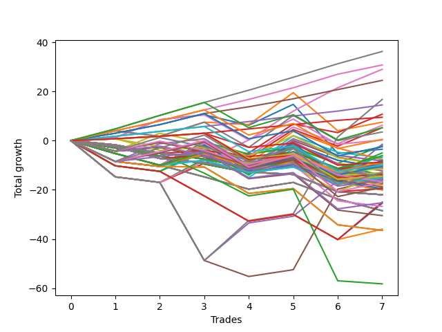

# Long Bulldog 006 
- Symbol: ES90d5m
- Date Range: 03/18/2022 - 07/08/2022
- Trading Period: 7:20-12:30
- Number of Trades: 7



| Name | Win Percent | Profit | Avg Profit / Trade | Avg Time / Trade |      | Name | Win Percent | Profit | Avg Profit / Trade | Avg Time / Trade |
| ---- | ----------- | ------ | ------------------ | ---------------- | ---- | ---- | ----------- | ------ | ------------------ | ---------------- |
| Sorted By <br> Profit | | | | | | Sorted By <br> Win Percentage ||||
| Eighty-Five | 100.00 | 18125.00 | 2589.29 | 00:00 |     | Eighty-Five | 100.00 | 18125.00 | 2589.29 | 00:00 |
| Eighty-Four | 100.00 | 15375.00 | 2196.43 | 00:00 |     | Eighty-Four | 100.00 | 15375.00 | 2196.43 | 00:00 |
| Six | 71.43 | 14500.00 | 2071.43 | 00:00 |     | Eighty-Three | 100.00 | 12250.00 | 1750.00 | 00:00 |
| Eighty-Three | 100.00 | 12250.00 | 1750.00 | 00:00 |     | Eighty-Two | 100.00 | 7250.00 | 1035.71 | 00:00 |
| Seven | 57.14 | 8375.00 | 1196.43 | 00:00 |     | Eighty-One | 100.00 | 4750.00 | 678.57 | 00:00 |
| Eighty-Two | 100.00 | 7250.00 | 1035.71 | 00:00 |     | Six | 71.43 | 14500.00 | 2071.43 | 00:00 |
| Three | 57.14 | 5375.00 | 767.86 | 00:00 |     | One Hundred Twenty-Five | 71.43 | 2625.00 | 375.00 | 00:00 |
| Eighty-One | 100.00 | 4750.00 | 678.57 | 00:00 |     | One Hundred Twenty-Four | 71.43 | 250.00 | 35.71 | 00:00 |
| One | 57.14 | 3750.00 | 535.71 | 00:00 |     | Fifty-Six | 71.43 | 125.00 | 17.86 | 00:00 |
| Forty-Six | 42.86 | 3125.00 | 446.43 | 00:00 |     | One Hundred Twenty-Three | 71.43 | -1250.00 | -178.57 | 00:00 |
| One Hundred Twenty-Five | 71.43 | 2625.00 | 375.00 | 00:00 |     | Zero | 71.43 | -1750.00 | -250.00 | 00:00 |
| Forty-Three | 42.86 | 2625.00 | 375.00 | 00:00 |     | One Hundred Sixteen | 71.43 | -4375.00 | -625.00 | 00:00 |
| Fifty-Seven | 57.14 | 1750.00 | 250.00 | 00:00 |     | One Hundred Twenty-Two | 71.43 | -5000.00 | -714.29 | 00:00 |
| One Hundred Twenty-Four | 71.43 | 250.00 | 35.71 | 00:00 |     | One Hundred Twenty-One | 71.43 | -7250.00 | -1035.71 | 00:00 |
| Fifty-Six | 71.43 | 125.00 | 17.86 | 00:00 |     | One Hundred Twenty-Six | 71.43 | -9750.00 | -1392.86 | 00:00 |
| Four | 57.14 | -750.00 | -107.14 | 00:00 |     | Seven | 57.14 | 8375.00 | 1196.43 | 00:00 |
| Two | 57.14 | -1000.00 | -142.86 | 00:00 |     | Three | 57.14 | 5375.00 | 767.86 | 00:00 |
| One Hundred Twenty-Three | 71.43 | -1250.00 | -178.57 | 00:00 |     | One | 57.14 | 3750.00 | 535.71 | 00:00 |
| Zero | 71.43 | -1750.00 | -250.00 | 00:00 |     | Fifty-Seven | 57.14 | 1750.00 | 250.00 | 00:00 |
| Sixty-Two | 42.86 | -2500.00 | -357.14 | 00:00 |     | Four | 57.14 | -750.00 | -107.14 | 00:00 |
| Fifty-Nine | 42.86 | -3000.00 | -428.57 | 00:00 |     | Two | 57.14 | -1000.00 | -142.86 | 00:00 |
| One Hundred Fifteen | 42.86 | -3125.00 | -446.43 | 00:00 |     | One Hundred Eleven | 57.14 | -5750.00 | -821.43 | 00:00 |
| Nine | 14.29 | -3500.00 | -500.00 | 00:00 |     | One Hundred Thirty | 57.14 | -6500.00 | -928.57 | 00:00 |
| Forty-One | 28.57 | -3875.00 | -553.57 | 00:00 |     | Sixty-Four | 57.14 | -7250.00 | -1035.71 | 00:00 |
| Seventy | 42.86 | -4000.00 | -571.43 | 00:00 |     | One Hundred Twenty-Nine | 57.14 | -8500.00 | -1214.29 | 00:00 |
| Fourteen | 14.29 | -4125.00 | -589.29 | 00:00 |     | One Hundred Twenty-Eight | 57.14 | -9500.00 | -1357.14 | 00:00 |
| Eleven | 14.29 | -4125.00 | -589.29 | 00:00 |     | One Hundred Twenty-Seven | 57.14 | -12625.00 | -1803.57 | 00:00 |
| One Hundred Sixteen | 71.43 | -4375.00 | -625.00 | 00:00 |     | Forty-Six | 42.86 | 3125.00 | 446.43 | 00:00 |
| One Hundred Fourteen | 42.86 | -4375.00 | -625.00 | 00:00 |     | Forty-Three | 42.86 | 2625.00 | 375.00 | 00:00 |
| Sixty-Seven | 42.86 | -4500.00 | -642.86 | 00:00 |     | Sixty-Two | 42.86 | -2500.00 | -357.14 | 00:00 |
| Forty | 42.86 | -4750.00 | -678.57 | 00:00 |     | Fifty-Nine | 42.86 | -3000.00 | -428.57 | 00:00 |
| Forty-Eight | 28.57 | -4875.00 | -696.43 | 00:00 |     | One Hundred Fifteen | 42.86 | -3125.00 | -446.43 | 00:00 |
| Twenty-Five | 14.29 | -4875.00 | -696.43 | 00:00 |     | Seventy | 42.86 | -4000.00 | -571.43 | 00:00 |
| One Hundred Twenty-Two | 71.43 | -5000.00 | -714.29 | 00:00 |     | One Hundred Fourteen | 42.86 | -4375.00 | -625.00 | 00:00 |
| One Hundred Thirteen | 42.86 | -5125.00 | -732.14 | 00:00 |     | Sixty-Seven | 42.86 | -4500.00 | -642.86 | 00:00 |
| Ninety-Six | 42.86 | -5125.00 | -732.14 | 00:00 |     | Forty | 42.86 | -4750.00 | -678.57 | 00:00 |
| Ninety-Seven | 28.57 | -5375.00 | -767.86 | 00:00 |     | One Hundred Thirteen | 42.86 | -5125.00 | -732.14 | 00:00 |
| Thirty | 14.29 | -5500.00 | -785.71 | 00:00 |     | Ninety-Six | 42.86 | -5125.00 | -732.14 | 00:00 |
| twenty-Seven | 14.29 | -5500.00 | -785.71 | 00:00 |     | One Hundred One | 42.86 | -6500.00 | -928.57 | 00:00 |
| One Hundred Eleven | 57.14 | -5750.00 | -821.43 | 00:00 |     | Fifty-Eight | 42.86 | -6750.00 | -964.29 | 00:00 |
| Eight | 14.29 | -5750.00 | -821.43 | 00:00 |     | One Hundred Six | 42.86 | -6875.00 | -982.14 | 00:00 |
| Fifty-Four | 28.57 | -6125.00 | -875.00 | 00:00 |     | One Hundred Twelve | 42.86 | -7500.00 | -1071.43 | 00:00 |
| Fifty-One | 28.57 | -6125.00 | -875.00 | 00:00 |     | Five | 42.86 | -7750.00 | -1107.14 | 00:00 |
| One Hundred Thirty | 57.14 | -6500.00 | -928.57 | 00:00 |     | One Hundred Seventeen | 42.86 | -8000.00 | -1142.86 | 00:00 |
| One Hundred One | 42.86 | -6500.00 | -928.57 | 00:00 |     | Forty-One | 28.57 | -3875.00 | -553.57 | 00:00 |
| Ninety-Two | 28.57 | -6500.00 | -928.57 | 00:00 |     | Forty-Eight | 28.57 | -4875.00 | -696.43 | 00:00 |
| Fifty-Eight | 42.86 | -6750.00 | -964.29 | 00:00 |     | Ninety-Seven | 28.57 | -5375.00 | -767.86 | 00:00 |
| One Hundred Six | 42.86 | -6875.00 | -982.14 | 00:00 |     | Fifty-Four | 28.57 | -6125.00 | -875.00 | 00:00 |
| Forty-Two | 28.57 | -7125.00 | -1017.86 | 00:00 |     | Fifty-One | 28.57 | -6125.00 | -875.00 | 00:00 |
| Twenty-Four | 14.29 | -7125.00 | -1017.86 | 00:00 |     | Ninety-Two | 28.57 | -6500.00 | -928.57 | 00:00 |
| One Hundred Twenty-One | 71.43 | -7250.00 | -1035.71 | 00:00 |     | Forty-Two | 28.57 | -7125.00 | -1017.86 | 00:00 |
| Sixty-Four | 57.14 | -7250.00 | -1035.71 | 00:00 |     | One Hundred Twenty | 28.57 | -7375.00 | -1053.57 | 00:00 |
| One Hundred Twenty | 28.57 | -7375.00 | -1053.57 | 00:00 |     | Ninety-One | 28.57 | -7375.00 | -1053.57 | 00:00 |
| Ninety-One | 28.57 | -7375.00 | -1053.57 | 00:00 |     | One Hundred Seven | 28.57 | -7500.00 | -1071.43 | 00:00 |
| Ninety-Five | 14.29 | -7375.00 | -1053.57 | 00:00 |     | One Hundred Two | 28.57 | -7500.00 | -1071.43 | 00:00 |
| One Hundred Twelve | 42.86 | -7500.00 | -1071.43 | 00:00 |     | One Hundred Ninteen | 28.57 | -8375.00 | -1196.43 | 00:00 |
| One Hundred Seven | 28.57 | -7500.00 | -1071.43 | 00:00 |     | Fifty-Five | 28.57 | -8375.00 | -1196.43 | 00:00 |
| One Hundred Two | 28.57 | -7500.00 | -1071.43 | 00:00 |     | Fifty-Three | 28.57 | -8375.00 | -1196.43 | 00:00 |
| Ninety-Four | 14.29 | -7625.00 | -1089.29 | 00:00 |     | Fifty-Two | 28.57 | -8375.00 | -1196.43 | 00:00 |
| Five | 42.86 | -7750.00 | -1107.14 | 00:00 |     | Fifty | 28.57 | -8375.00 | -1196.43 | 00:00 |
| One Hundred | 14.29 | -7875.00 | -1125.00 | 00:00 |     | Forty-Nine | 28.57 | -8375.00 | -1196.43 | 00:00 |
| Ninety-Nine | 14.29 | -7875.00 | -1125.00 | 00:00 |     | One Hundred Eighteen | 28.57 | -9375.00 | -1339.29 | 00:00 |
| Ninety-Eight | 14.29 | -7875.00 | -1125.00 | 00:00 |     | Sixty-Three | 28.57 | -12500.00 | -1785.71 | 00:00 |
| Twenty-Three | 14.29 | -7875.00 | -1125.00 | 00:00 |     | Sixty | 28.57 | -12750.00 | -1821.43 | 00:00 |
| Twenty-Two | 14.29 | -7875.00 | -1125.00 | 00:00 |     | Sixty-Six | 28.57 | -13375.00 | -1910.71 | 00:00 |
| Twenty-One | 14.29 | -7875.00 | -1125.00 | 00:00 |     | Sixty-Five | 28.57 | -15250.00 | -2178.57 | 00:00 |
| Twenty | 14.29 | -7875.00 | -1125.00 | 00:00 |     | Sixty-One | 28.57 | -18000.00 | -2571.43 | 00:00 |
| Nineteen | 14.29 | -7875.00 | -1125.00 | 00:00 |     | Nine | 14.29 | -3500.00 | -500.00 | 00:00 |
| Eighteen | 14.29 | -7875.00 | -1125.00 | 00:00 |     | Fourteen | 14.29 | -4125.00 | -589.29 | 00:00 |
| Seventeen | 14.29 | -7875.00 | -1125.00 | 00:00 |     | Eleven | 14.29 | -4125.00 | -589.29 | 00:00 |
| Sixten | 14.29 | -7875.00 | -1125.00 | 00:00 |     | Twenty-Five | 14.29 | -4875.00 | -696.43 | 00:00 |
| One Hundred Seventeen | 42.86 | -8000.00 | -1142.86 | 00:00 |     | Thirty | 14.29 | -5500.00 | -785.71 | 00:00 |
| One Hundred Ninteen | 28.57 | -8375.00 | -1196.43 | 00:00 |     | twenty-Seven | 14.29 | -5500.00 | -785.71 | 00:00 |
| Fifty-Five | 28.57 | -8375.00 | -1196.43 | 00:00 |     | Eight | 14.29 | -5750.00 | -821.43 | 00:00 |
| Fifty-Three | 28.57 | -8375.00 | -1196.43 | 00:00 |     | Twenty-Four | 14.29 | -7125.00 | -1017.86 | 00:00 |
| Fifty-Two | 28.57 | -8375.00 | -1196.43 | 00:00 |     | Ninety-Five | 14.29 | -7375.00 | -1053.57 | 00:00 |
| Fifty | 28.57 | -8375.00 | -1196.43 | 00:00 |     | Ninety-Four | 14.29 | -7625.00 | -1089.29 | 00:00 |
| Forty-Nine | 28.57 | -8375.00 | -1196.43 | 00:00 |     | One Hundred | 14.29 | -7875.00 | -1125.00 | 00:00 |
| Ninety-Three | 14.29 | -8375.00 | -1196.43 | 00:00 |     | Ninety-Nine | 14.29 | -7875.00 | -1125.00 | 00:00 |
| One Hundred Twenty-Nine | 57.14 | -8500.00 | -1214.29 | 00:00 |     | Ninety-Eight | 14.29 | -7875.00 | -1125.00 | 00:00 |
| Fifteen | 14.29 | -8625.00 | -1232.14 | 00:00 |     | Twenty-Three | 14.29 | -7875.00 | -1125.00 | 00:00 |
| Thirteen | 14.29 | -8625.00 | -1232.14 | 00:00 |     | Twenty-Two | 14.29 | -7875.00 | -1125.00 | 00:00 |
| Twelve | 14.29 | -8625.00 | -1232.14 | 00:00 |     | Twenty-One | 14.29 | -7875.00 | -1125.00 | 00:00 |
| Ten | 14.29 | -8625.00 | -1232.14 | 00:00 |     | Twenty | 14.29 | -7875.00 | -1125.00 | 00:00 |
| One Hundred Five | 14.29 | -8750.00 | -1250.00 | 00:00 |     | Nineteen | 14.29 | -7875.00 | -1125.00 | 00:00 |
| One Hundred Four | 14.29 | -9000.00 | -1285.71 | 00:00 |     | Eighteen | 14.29 | -7875.00 | -1125.00 | 00:00 |
| One Hundred Eighteen | 28.57 | -9375.00 | -1339.29 | 00:00 |     | Seventeen | 14.29 | -7875.00 | -1125.00 | 00:00 |
| One Hundred Twenty-Eight | 57.14 | -9500.00 | -1357.14 | 00:00 |     | Sixten | 14.29 | -7875.00 | -1125.00 | 00:00 |
| One Hundred Twenty-Six | 71.43 | -9750.00 | -1392.86 | 00:00 |     | Ninety-Three | 14.29 | -8375.00 | -1196.43 | 00:00 |
| One Hundred Three | 14.29 | -9750.00 | -1392.86 | 00:00 |     | Fifteen | 14.29 | -8625.00 | -1232.14 | 00:00 |
| Thirty-One | 14.29 | -10000.00 | -1428.57 | 00:00 |     | Thirteen | 14.29 | -8625.00 | -1232.14 | 00:00 |
| Twenty-Nine | 14.29 | -10000.00 | -1428.57 | 00:00 |     | Twelve | 14.29 | -8625.00 | -1232.14 | 00:00 |
| Twenty-Eight | 14.29 | -10000.00 | -1428.57 | 00:00 |     | Ten | 14.29 | -8625.00 | -1232.14 | 00:00 |
| Twenty-Six | 14.29 | -10000.00 | -1428.57 | 00:00 |     | One Hundred Five | 14.29 | -8750.00 | -1250.00 | 00:00 |
| One Hundred Ten | 0.00 | -11000.00 | -1571.43 | 00:00 |     | One Hundred Four | 14.29 | -9000.00 | -1285.71 | 00:00 |
| One Hundred Nine | 0.00 | -11000.00 | -1571.43 | 00:00 |     | One Hundred Three | 14.29 | -9750.00 | -1392.86 | 00:00 |
| One Hundred Eight | 0.00 | -11000.00 | -1571.43 | 00:00 |     | Thirty-One | 14.29 | -10000.00 | -1428.57 | 00:00 |
| Thirty-Nine | 0.00 | -11000.00 | -1571.43 | 00:00 |     | Twenty-Nine | 14.29 | -10000.00 | -1428.57 | 00:00 |
| Thirty-Eight | 0.00 | -11000.00 | -1571.43 | 00:00 |     | Twenty-Eight | 14.29 | -10000.00 | -1428.57 | 00:00 |
| Thirty-Seven | 0.00 | -11000.00 | -1571.43 | 00:00 |     | Twenty-Six | 14.29 | -10000.00 | -1428.57 | 00:00 |
| Thirty-Six | 0.00 | -11000.00 | -1571.43 | 00:00 |     | Forty-Seven | 14.29 | -14250.00 | -2035.71 | 00:00 |
| Thirty-Five | 0.00 | -11000.00 | -1571.43 | 00:00 |     | Forty-Five | 14.29 | -14250.00 | -2035.71 | 00:00 |
| Thirty-Four | 0.00 | -11000.00 | -1571.43 | 00:00 |     | Forty-Four | 14.29 | -14250.00 | -2035.71 | 00:00 |
| Thirty-Three | 0.00 | -11000.00 | -1571.43 | 00:00 |     | Seventy-One | 14.29 | -18250.00 | -2607.14 | 00:00 |
| Thirty-Two | 0.00 | -11000.00 | -1571.43 | 00:00 |     | Sixty-Nine | 14.29 | -18250.00 | -2607.14 | 00:00 |
| Sixty-Three | 28.57 | -12500.00 | -1785.71 | 00:00 |     | Sixty-Eight | 14.29 | -18250.00 | -2607.14 | 00:00 |
| One Hundred Twenty-Seven | 57.14 | -12625.00 | -1803.57 | 00:00 |     | Seventy-Three | 14.29 | -29125.00 | -4160.71 | 00:00 |
| Sixty | 28.57 | -12750.00 | -1821.43 | 00:00 |     | One Hundred Ten | 0.00 | -11000.00 | -1571.43 | 00:00 |
| Sixty-Six | 28.57 | -13375.00 | -1910.71 | 00:00 |     | One Hundred Nine | 0.00 | -11000.00 | -1571.43 | 00:00 |
| Forty-Seven | 14.29 | -14250.00 | -2035.71 | 00:00 |     | One Hundred Eight | 0.00 | -11000.00 | -1571.43 | 00:00 |
| Forty-Five | 14.29 | -14250.00 | -2035.71 | 00:00 |     | Thirty-Nine | 0.00 | -11000.00 | -1571.43 | 00:00 |
| Forty-Four | 14.29 | -14250.00 | -2035.71 | 00:00 |     | Thirty-Eight | 0.00 | -11000.00 | -1571.43 | 00:00 |
| Sixty-Five | 28.57 | -15250.00 | -2178.57 | 00:00 |     | Thirty-Seven | 0.00 | -11000.00 | -1571.43 | 00:00 |
| Sixty-One | 28.57 | -18000.00 | -2571.43 | 00:00 |     | Thirty-Six | 0.00 | -11000.00 | -1571.43 | 00:00 |
| Seventy-One | 14.29 | -18250.00 | -2607.14 | 00:00 |     | Thirty-Five | 0.00 | -11000.00 | -1571.43 | 00:00 |
| Sixty-Nine | 14.29 | -18250.00 | -2607.14 | 00:00 |     | Thirty-Four | 0.00 | -11000.00 | -1571.43 | 00:00 |
| Sixty-Eight | 14.29 | -18250.00 | -2607.14 | 00:00 |     | Thirty-Three | 0.00 | -11000.00 | -1571.43 | 00:00 |
| Seventy-Three | 14.29 | -29125.00 | -4160.71 | 00:00 |     | Thirty-Two | 0.00 | -11000.00 | -1571.43 | 00:00 |

## NO STOPLOSS

### Test Zero
* Sell when price hits the middle line of the 20p bollinger
* No Stoploss
* Results:
```
Total Trades: 7
Percent Up: 71.43
Percent Down: 28.57
Total Points Moved Up: -3.50
Potential Profit: -1750.00
Total Points Ups: 20.75 Count Ups: 5
Total Points Downs: -24.25 Count Downs: 2
```

<details><summary>Trades</summary>

<code>In: 2022-03-23 10:55:00		Out: 2022-03-23 11:28:20		Total Position Time: 33:20		Total Move Up: 1.25		Total to Date: 1.25</code> <br />
<code>In: 2022-03-30 12:35:00		Out: 2022-03-30 12:48:00		Total Position Time: 13:00		Total Move Up: 7.25		Total to Date: 8.50</code> <br />
<code>In: 2022-03-31 11:30:00		Out: 2022-03-31 11:59:20		Total Position Time: 29:20		Total Move Up: 2.00		Total to Date: 10.50</code> <br />
<code>In: 2022-04-18 09:00:00		Out: 2022-04-18 09:58:15		Total Position Time: 58:15		Total Move Up: -4.25		Total to Date: 6.25</code> <br />
<code>In: 2022-04-20 12:05:00		Out: 2022-04-20 12:25:15		Total Position Time: 20:15		Total Move Up: 8.50		Total to Date: 14.75</code> <br />
<code>In: 2022-05-02 10:15:00		Out: 2022-05-02 11:53:40		Total Position Time: 98:40		Total Move Up: -20.00		Total to Date: -5.25</code> <br />
<code>In: 2022-06-29 09:40:00		Out: 2022-06-29 10:08:20		Total Position Time: 28:20		Total Move Up: 1.75		Total to Date: -3.50</code> <br />


</details>

### Test One
* Sell when the price hits the upper line of the 20p 1std bollinger
* No Stoploss
* Results:
```
Total Trades: 7
Percent Up: 57.14
Percent Down: 42.86
Total Points Moved Up: 7.50
Potential Profit: 3750.00
Total Points Ups: 26.25 Count Ups: 4
Total Points Downs: -18.75 Count Downs: 3
```

<details><summary>Trades</summary>

<code>In: 2022-03-23 10:55:00		Out: 2022-03-23 11:48:45		Total Position Time: 53:45		Total Move Up: 4.00		Total to Date: 4.00</code> <br />
<code>In: 2022-03-30 12:35:00		Out: 2022-03-30 12:55:00		Total Position Time: 20:00		Total Move Up: -2.25		Total to Date: 1.75</code> <br />
<code>In: 2022-03-31 11:30:00		Out: 2022-03-31 12:00:20		Total Position Time: 30:20		Total Move Up: 5.75		Total to Date: 7.50</code> <br />
<code>In: 2022-04-18 09:00:00		Out: 2022-04-18 10:08:20		Total Position Time: 68:20		Total Move Up: -1.00		Total to Date: 6.50</code> <br />
<code>In: 2022-04-20 12:05:00		Out: 2022-04-20 12:46:30		Total Position Time: 41:30		Total Move Up: 13.00		Total to Date: 19.50</code> <br />
<code>In: 2022-05-02 10:15:00		Out: 2022-05-02 12:05:20		Total Position Time: 110:20		Total Move Up: -15.50		Total to Date: 4.00</code> <br />
<code>In: 2022-06-29 09:40:00		Out: 2022-06-29 10:40:35		Total Position Time: 60:35		Total Move Up: 3.50		Total to Date: 7.50</code> <br />


</details>

### Test Two
* Sell when the price hits the upper line of the 20p 2std bollinger
* No Stoploss
* Results:
```
Total Trades: 7
Percent Up: 57.14
Percent Down: 42.86
Total Points Moved Up: -2.00
Potential Profit: -1000.00
Total Points Ups: 21.50 Count Ups: 4
Total Points Downs: -23.50 Count Downs: 3
```

<details><summary>Trades</summary>

<code>In: 2022-03-23 10:55:00		Out: 2022-03-23 12:55:00		Total Position Time: 120:00		Total Move Up: -14.75		Total to Date: -14.75</code> <br />
<code>In: 2022-03-30 12:35:00		Out: 2022-03-30 12:55:00		Total Position Time: 20:00		Total Move Up: -2.25		Total to Date: -17.00</code> <br />
<code>In: 2022-03-31 11:30:00		Out: 2022-03-31 12:02:45		Total Position Time: 32:45		Total Move Up: 9.50		Total to Date: -7.50</code> <br />
<code>In: 2022-04-18 09:00:00		Out: 2022-04-18 10:10:30		Total Position Time: 70:30		Total Move Up: 2.00		Total to Date: -5.50</code> <br />
<code>In: 2022-04-20 12:05:00		Out: 2022-04-20 12:55:00		Total Position Time: 50:00		Total Move Up: 2.75		Total to Date: -2.75</code> <br />
<code>In: 2022-05-02 10:15:00		Out: 2022-05-02 12:09:40		Total Position Time: 114:40		Total Move Up: -6.50		Total to Date: -9.25</code> <br />
<code>In: 2022-06-29 09:40:00		Out: 2022-06-29 10:45:25		Total Position Time: 65:25		Total Move Up: 7.25		Total to Date: -2.00</code> <br />


</details>

### Test Three
* Sell when price hits the middle line of the 50p bollinger
* No Stoploss
* Results:
```
Total Trades: 7
Percent Up: 57.14
Percent Down: 42.86
Total Points Moved Up: 10.75
Potential Profit: 5375.00
Total Points Ups: 31.25 Count Ups: 4
Total Points Downs: -20.50 Count Downs: 3
```

<details><summary>Trades</summary>

<code>In: 2022-03-23 10:55:00		Out: 2022-03-23 12:55:00		Total Position Time: 120:00		Total Move Up: -14.75		Total to Date: -14.75</code> <br />
<code>In: 2022-03-30 12:35:00		Out: 2022-03-30 12:55:00		Total Position Time: 20:00		Total Move Up: -2.25		Total to Date: -17.00</code> <br />
<code>In: 2022-03-31 11:30:00		Out: 2022-03-31 12:01:10		Total Position Time: 31:10		Total Move Up: 7.75		Total to Date: -9.25</code> <br />
<code>In: 2022-04-18 09:00:00		Out: 2022-04-18 10:31:35		Total Position Time: 91:35		Total Move Up: 4.25		Total to Date: -5.00</code> <br />
<code>In: 2022-04-20 12:05:00		Out: 2022-04-20 12:26:10		Total Position Time: 21:10		Total Move Up: 11.75		Total to Date: 6.75</code> <br />
<code>In: 2022-05-02 10:15:00		Out: 2022-05-02 12:10:15		Total Position Time: 115:15		Total Move Up: -3.50		Total to Date: 3.25</code> <br />
<code>In: 2022-06-29 09:40:00		Out: 2022-06-29 10:10:55		Total Position Time: 30:55		Total Move Up: 7.50		Total to Date: 10.75</code> <br />


</details>

### Test Four
* Sell when the price hits the upper line of the 50p 1std bollinger
* No Stoploss
* Results:
```
Total Trades: 7
Percent Up: 57.14
Percent Down: 42.86
Total Points Moved Up: -1.50
Potential Profit: -750.00
Total Points Ups: 47.25 Count Ups: 4
Total Points Downs: -48.75 Count Downs: 3
```

<details><summary>Trades</summary>

<code>In: 2022-03-23 10:55:00		Out: 2022-03-23 12:55:00		Total Position Time: 120:00		Total Move Up: -14.75		Total to Date: -14.75</code> <br />
<code>In: 2022-03-30 12:35:00		Out: 2022-03-30 12:55:00		Total Position Time: 20:00		Total Move Up: -2.25		Total to Date: -17.00</code> <br />
<code>In: 2022-03-31 11:30:00		Out: 2022-03-31 12:55:00		Total Position Time: 85:00		Total Move Up: -31.75		Total to Date: -48.75</code> <br />
<code>In: 2022-04-18 09:00:00		Out: 2022-04-18 10:35:40		Total Position Time: 95:40		Total Move Up: 15.25		Total to Date: -33.50</code> <br />
<code>In: 2022-04-20 12:05:00		Out: 2022-04-20 12:55:00		Total Position Time: 50:00		Total Move Up: 2.75		Total to Date: -30.75</code> <br />
<code>In: 2022-05-02 10:15:00		Out: 2022-05-02 12:20:25		Total Position Time: 125:25		Total Move Up: 14.50		Total to Date: -16.25</code> <br />
<code>In: 2022-06-29 09:40:00		Out: 2022-06-29 11:01:30		Total Position Time: 81:30		Total Move Up: 14.75		Total to Date: -1.50</code> <br />


</details>

### Test Five
* Sell when the price hits the upper line of the 50p 2std bollinger
* No Stoploss
* Results:
```
Total Trades: 7
Percent Up: 42.86
Percent Down: 57.14
Total Points Moved Up: -15.50
Potential Profit: -7750.00
Total Points Ups: 39.75 Count Ups: 3
Total Points Downs: -55.25 Count Downs: 4
```

<details><summary>Trades</summary>

<code>In: 2022-03-23 10:55:00		Out: 2022-03-23 12:55:00		Total Position Time: 120:00		Total Move Up: -14.75		Total to Date: -14.75</code> <br />
<code>In: 2022-03-30 12:35:00		Out: 2022-03-30 12:55:00		Total Position Time: 20:00		Total Move Up: -2.25		Total to Date: -17.00</code> <br />
<code>In: 2022-03-31 11:30:00		Out: 2022-03-31 12:55:00		Total Position Time: 85:00		Total Move Up: -31.75		Total to Date: -48.75</code> <br />
<code>In: 2022-04-18 09:00:00		Out: 2022-04-18 12:55:00		Total Position Time: 235:00		Total Move Up: -6.50		Total to Date: -55.25</code> <br />
<code>In: 2022-04-20 12:05:00		Out: 2022-04-20 12:55:00		Total Position Time: 50:00		Total Move Up: 2.75		Total to Date: -52.50</code> <br />
<code>In: 2022-05-02 10:15:00		Out: 2022-05-02 12:30:30		Total Position Time: 135:30		Total Move Up: 32.75		Total to Date: -19.75</code> <br />
<code>In: 2022-06-29 09:40:00		Out: 2022-06-29 12:55:00		Total Position Time: 195:00		Total Move Up: 4.25		Total to Date: -15.50</code> <br />


</details>

### Test Six
* Sell when the price hits the middle line of the 1std VWAP
* No Stoploss
* Results:
```
Total Trades: 7
Percent Up: 71.43
Percent Down: 28.57
Total Points Moved Up: 29.00
Potential Profit: 14500.00
Total Points Ups: 46.00 Count Ups: 5
Total Points Downs: -17.00 Count Downs: 2
```

<details><summary>Trades</summary>

<code>In: 2022-03-23 10:55:00		Out: 2022-03-23 12:55:00		Total Position Time: 120:00		Total Move Up: -14.75		Total to Date: -14.75</code> <br />
<code>In: 2022-03-30 12:35:00		Out: 2022-03-30 12:55:00		Total Position Time: 20:00		Total Move Up: -2.25		Total to Date: -17.00</code> <br />
<code>In: 2022-03-31 11:30:00		Out: 2022-03-31 12:02:30		Total Position Time: 32:30		Total Move Up: 8.75		Total to Date: -8.25</code> <br />
<code>In: 2022-04-18 09:00:00		Out: 2022-04-18 10:32:10		Total Position Time: 92:10		Total Move Up: 8.50		Total to Date: 0.25</code> <br />
<code>In: 2022-04-20 12:05:00		Out: 2022-04-20 12:26:10		Total Position Time: 21:10		Total Move Up: 11.75		Total to Date: 12.00</code> <br />
<code>In: 2022-05-02 10:15:00		Out: 2022-05-02 12:16:15		Total Position Time: 121:15		Total Move Up: 9.50		Total to Date: 21.50</code> <br />
<code>In: 2022-06-29 09:40:00		Out: 2022-06-29 10:10:55		Total Position Time: 30:55		Total Move Up: 7.50		Total to Date: 29.00</code> <br />


</details>

### Test Seven
* Sell when the price hits the upper line of the 1std VWAP
* No Stoploss
* Results:
```
Total Trades: 7
Percent Up: 57.14
Percent Down: 42.86
Total Points Moved Up: 16.75
Potential Profit: 8375.00
Total Points Ups: 65.50 Count Ups: 4
Total Points Downs: -48.75 Count Downs: 3
```

<details><summary>Trades</summary>

<code>In: 2022-03-23 10:55:00		Out: 2022-03-23 12:55:00		Total Position Time: 120:00		Total Move Up: -14.75		Total to Date: -14.75</code> <br />
<code>In: 2022-03-30 12:35:00		Out: 2022-03-30 12:55:00		Total Position Time: 20:00		Total Move Up: -2.25		Total to Date: -17.00</code> <br />
<code>In: 2022-03-31 11:30:00		Out: 2022-03-31 12:55:00		Total Position Time: 85:00		Total Move Up: -31.75		Total to Date: -48.75</code> <br />
<code>In: 2022-04-18 09:00:00		Out: 2022-04-18 10:35:45		Total Position Time: 95:45		Total Move Up: 16.25		Total to Date: -32.50</code> <br />
<code>In: 2022-04-20 12:05:00		Out: 2022-04-20 12:55:00		Total Position Time: 50:00		Total Move Up: 2.75		Total to Date: -29.75</code> <br />
<code>In: 2022-05-02 10:15:00		Out: 2022-05-02 12:30:20		Total Position Time: 135:20		Total Move Up: 31.25		Total to Date: 1.50</code> <br />
<code>In: 2022-06-29 09:40:00		Out: 2022-06-29 11:01:35		Total Position Time: 81:35		Total Move Up: 15.25		Total to Date: 16.75</code> <br />


</details>

## STOPLOSS OF 2

### Test Eight
* Sell when price hits the middle line of the 20p bollinger
* Stoploss is 2 points
* Results:
```
Total Trades: 7
Percent Up: 14.29
Percent Down: 85.71
Total Points Moved Up: -11.50
Potential Profit: -5750.00
Total Points Ups: 8.50 Count Ups: 1
Total Points Downs: -20.00 Count Downs: 6
```

<details><summary>Trades</summary>

<code>In: 2022-03-23 10:55:00		Out: 2022-03-23 11:00:40		Total Position Time: 05:40		Total Move Up: -2.50		Total to Date: -2.50</code> <br />
<code>In: 2022-03-30 12:35:00		Out: 2022-03-30 12:40:15		Total Position Time: 05:15		Total Move Up: -2.50		Total to Date: -5.00</code> <br />
<code>In: 2022-03-31 11:30:00		Out: 2022-03-31 11:35:10		Total Position Time: 05:10		Total Move Up: -2.50		Total to Date: -7.50</code> <br />
<code>In: 2022-04-18 09:00:00		Out: 2022-04-18 09:05:10		Total Position Time: 05:10		Total Move Up: -3.50		Total to Date: -11.00</code> <br />
<code>In: 2022-04-20 12:05:00		Out: 2022-04-20 12:25:15		Total Position Time: 20:15		Total Move Up: 8.50		Total to Date: -2.50</code> <br />
<code>In: 2022-05-02 10:15:00		Out: 2022-05-02 10:20:10		Total Position Time: 05:10		Total Move Up: -6.75		Total to Date: -9.25</code> <br />
<code>In: 2022-06-29 09:40:00		Out: 2022-06-29 09:47:05		Total Position Time: 07:05		Total Move Up: -2.25		Total to Date: -11.50</code> <br />


</details>

### Test Nine
* Sell when the price hits the upper line of the 20p 1std bollinger
* Stoploss is 2 points
* Results:
```
Total Trades: 7
Percent Up: 14.29
Percent Down: 85.71
Total Points Moved Up: -7.00
Potential Profit: -3500.00
Total Points Ups: 13.00 Count Ups: 1
Total Points Downs: -20.00 Count Downs: 6
```

<details><summary>Trades</summary>

<code>In: 2022-03-23 10:55:00		Out: 2022-03-23 11:00:40		Total Position Time: 05:40		Total Move Up: -2.50		Total to Date: -2.50</code> <br />
<code>In: 2022-03-30 12:35:00		Out: 2022-03-30 12:40:15		Total Position Time: 05:15		Total Move Up: -2.50		Total to Date: -5.00</code> <br />
<code>In: 2022-03-31 11:30:00		Out: 2022-03-31 11:35:10		Total Position Time: 05:10		Total Move Up: -2.50		Total to Date: -7.50</code> <br />
<code>In: 2022-04-18 09:00:00		Out: 2022-04-18 09:05:10		Total Position Time: 05:10		Total Move Up: -3.50		Total to Date: -11.00</code> <br />
<code>In: 2022-04-20 12:05:00		Out: 2022-04-20 12:46:30		Total Position Time: 41:30		Total Move Up: 13.00		Total to Date: 2.00</code> <br />
<code>In: 2022-05-02 10:15:00		Out: 2022-05-02 10:20:10		Total Position Time: 05:10		Total Move Up: -6.75		Total to Date: -4.75</code> <br />
<code>In: 2022-06-29 09:40:00		Out: 2022-06-29 09:47:05		Total Position Time: 07:05		Total Move Up: -2.25		Total to Date: -7.00</code> <br />


</details>

### Test Ten
* Sell when the price hits the upper line of the 20p 2std bollinger
* Stoploss is 2 points
* Results:
```
Total Trades: 7
Percent Up: 14.29
Percent Down: 85.71
Total Points Moved Up: -17.25
Potential Profit: -8625.00
Total Points Ups: 2.75 Count Ups: 1
Total Points Downs: -20.00 Count Downs: 6
```

<details><summary>Trades</summary>

<code>In: 2022-03-23 10:55:00		Out: 2022-03-23 11:00:40		Total Position Time: 05:40		Total Move Up: -2.50		Total to Date: -2.50</code> <br />
<code>In: 2022-03-30 12:35:00		Out: 2022-03-30 12:40:15		Total Position Time: 05:15		Total Move Up: -2.50		Total to Date: -5.00</code> <br />
<code>In: 2022-03-31 11:30:00		Out: 2022-03-31 11:35:10		Total Position Time: 05:10		Total Move Up: -2.50		Total to Date: -7.50</code> <br />
<code>In: 2022-04-18 09:00:00		Out: 2022-04-18 09:05:10		Total Position Time: 05:10		Total Move Up: -3.50		Total to Date: -11.00</code> <br />
<code>In: 2022-04-20 12:05:00		Out: 2022-04-20 12:55:00		Total Position Time: 50:00		Total Move Up: 2.75		Total to Date: -8.25</code> <br />
<code>In: 2022-05-02 10:15:00		Out: 2022-05-02 10:20:10		Total Position Time: 05:10		Total Move Up: -6.75		Total to Date: -15.00</code> <br />
<code>In: 2022-06-29 09:40:00		Out: 2022-06-29 09:47:05		Total Position Time: 07:05		Total Move Up: -2.25		Total to Date: -17.25</code> <br />


</details>

### Test Eleven
* Sell when price hits the middle line of the 50p bollinger
* Stoploss is 2 points
* Results:
```
Total Trades: 7
Percent Up: 14.29
Percent Down: 85.71
Total Points Moved Up: -8.25
Potential Profit: -4125.00
Total Points Ups: 11.75 Count Ups: 1
Total Points Downs: -20.00 Count Downs: 6
```

<details><summary>Trades</summary>

<code>In: 2022-03-23 10:55:00		Out: 2022-03-23 11:00:40		Total Position Time: 05:40		Total Move Up: -2.50		Total to Date: -2.50</code> <br />
<code>In: 2022-03-30 12:35:00		Out: 2022-03-30 12:40:15		Total Position Time: 05:15		Total Move Up: -2.50		Total to Date: -5.00</code> <br />
<code>In: 2022-03-31 11:30:00		Out: 2022-03-31 11:35:10		Total Position Time: 05:10		Total Move Up: -2.50		Total to Date: -7.50</code> <br />
<code>In: 2022-04-18 09:00:00		Out: 2022-04-18 09:05:10		Total Position Time: 05:10		Total Move Up: -3.50		Total to Date: -11.00</code> <br />
<code>In: 2022-04-20 12:05:00		Out: 2022-04-20 12:26:10		Total Position Time: 21:10		Total Move Up: 11.75		Total to Date: 0.75</code> <br />
<code>In: 2022-05-02 10:15:00		Out: 2022-05-02 10:20:10		Total Position Time: 05:10		Total Move Up: -6.75		Total to Date: -6.00</code> <br />
<code>In: 2022-06-29 09:40:00		Out: 2022-06-29 09:47:05		Total Position Time: 07:05		Total Move Up: -2.25		Total to Date: -8.25</code> <br />


</details>

### Test Twelve
* Sell when the price hits the upper line of the 50p 1std bollinger
* Stoploss is 2 points
* Results:
```
Total Trades: 7
Percent Up: 14.29
Percent Down: 85.71
Total Points Moved Up: -17.25
Potential Profit: -8625.00
Total Points Ups: 2.75 Count Ups: 1
Total Points Downs: -20.00 Count Downs: 6
```

<details><summary>Trades</summary>

<code>In: 2022-03-23 10:55:00		Out: 2022-03-23 11:00:40		Total Position Time: 05:40		Total Move Up: -2.50		Total to Date: -2.50</code> <br />
<code>In: 2022-03-30 12:35:00		Out: 2022-03-30 12:40:15		Total Position Time: 05:15		Total Move Up: -2.50		Total to Date: -5.00</code> <br />
<code>In: 2022-03-31 11:30:00		Out: 2022-03-31 11:35:10		Total Position Time: 05:10		Total Move Up: -2.50		Total to Date: -7.50</code> <br />
<code>In: 2022-04-18 09:00:00		Out: 2022-04-18 09:05:10		Total Position Time: 05:10		Total Move Up: -3.50		Total to Date: -11.00</code> <br />
<code>In: 2022-04-20 12:05:00		Out: 2022-04-20 12:55:00		Total Position Time: 50:00		Total Move Up: 2.75		Total to Date: -8.25</code> <br />
<code>In: 2022-05-02 10:15:00		Out: 2022-05-02 10:20:10		Total Position Time: 05:10		Total Move Up: -6.75		Total to Date: -15.00</code> <br />
<code>In: 2022-06-29 09:40:00		Out: 2022-06-29 09:47:05		Total Position Time: 07:05		Total Move Up: -2.25		Total to Date: -17.25</code> <br />


</details>

### Test Thirteen
* Sell when the price hits the upper line of the 50p 2std bollinger
* Stoploss is 2 points
* Results:
```
Total Trades: 7
Percent Up: 14.29
Percent Down: 85.71
Total Points Moved Up: -17.25
Potential Profit: -8625.00
Total Points Ups: 2.75 Count Ups: 1
Total Points Downs: -20.00 Count Downs: 6
```

<details><summary>Trades</summary>

<code>In: 2022-03-23 10:55:00		Out: 2022-03-23 11:00:40		Total Position Time: 05:40		Total Move Up: -2.50		Total to Date: -2.50</code> <br />
<code>In: 2022-03-30 12:35:00		Out: 2022-03-30 12:40:15		Total Position Time: 05:15		Total Move Up: -2.50		Total to Date: -5.00</code> <br />
<code>In: 2022-03-31 11:30:00		Out: 2022-03-31 11:35:10		Total Position Time: 05:10		Total Move Up: -2.50		Total to Date: -7.50</code> <br />
<code>In: 2022-04-18 09:00:00		Out: 2022-04-18 09:05:10		Total Position Time: 05:10		Total Move Up: -3.50		Total to Date: -11.00</code> <br />
<code>In: 2022-04-20 12:05:00		Out: 2022-04-20 12:55:00		Total Position Time: 50:00		Total Move Up: 2.75		Total to Date: -8.25</code> <br />
<code>In: 2022-05-02 10:15:00		Out: 2022-05-02 10:20:10		Total Position Time: 05:10		Total Move Up: -6.75		Total to Date: -15.00</code> <br />
<code>In: 2022-06-29 09:40:00		Out: 2022-06-29 09:47:05		Total Position Time: 07:05		Total Move Up: -2.25		Total to Date: -17.25</code> <br />


</details>

### Test Fourteen
* Sell when the price hits the middle line of the 1std VWAP
* Stoploss is 2 points
* Results:
```
Total Trades: 7
Percent Up: 14.29
Percent Down: 85.71
Total Points Moved Up: -8.25
Potential Profit: -4125.00
Total Points Ups: 11.75 Count Ups: 1
Total Points Downs: -20.00 Count Downs: 6
```

<details><summary>Trades</summary>

<code>In: 2022-03-23 10:55:00		Out: 2022-03-23 11:00:40		Total Position Time: 05:40		Total Move Up: -2.50		Total to Date: -2.50</code> <br />
<code>In: 2022-03-30 12:35:00		Out: 2022-03-30 12:40:15		Total Position Time: 05:15		Total Move Up: -2.50		Total to Date: -5.00</code> <br />
<code>In: 2022-03-31 11:30:00		Out: 2022-03-31 11:35:10		Total Position Time: 05:10		Total Move Up: -2.50		Total to Date: -7.50</code> <br />
<code>In: 2022-04-18 09:00:00		Out: 2022-04-18 09:05:10		Total Position Time: 05:10		Total Move Up: -3.50		Total to Date: -11.00</code> <br />
<code>In: 2022-04-20 12:05:00		Out: 2022-04-20 12:26:10		Total Position Time: 21:10		Total Move Up: 11.75		Total to Date: 0.75</code> <br />
<code>In: 2022-05-02 10:15:00		Out: 2022-05-02 10:20:10		Total Position Time: 05:10		Total Move Up: -6.75		Total to Date: -6.00</code> <br />
<code>In: 2022-06-29 09:40:00		Out: 2022-06-29 09:47:05		Total Position Time: 07:05		Total Move Up: -2.25		Total to Date: -8.25</code> <br />


</details>

### Test Fifteen
* Sell when the price hits the upper line of the 1std VWAP
* Stoploss is 2 points
* Results:
```
Total Trades: 7
Percent Up: 14.29
Percent Down: 85.71
Total Points Moved Up: -17.25
Potential Profit: -8625.00
Total Points Ups: 2.75 Count Ups: 1
Total Points Downs: -20.00 Count Downs: 6
```

<details><summary>Trades</summary>

<code>In: 2022-03-23 10:55:00		Out: 2022-03-23 11:00:40		Total Position Time: 05:40		Total Move Up: -2.50		Total to Date: -2.50</code> <br />
<code>In: 2022-03-30 12:35:00		Out: 2022-03-30 12:40:15		Total Position Time: 05:15		Total Move Up: -2.50		Total to Date: -5.00</code> <br />
<code>In: 2022-03-31 11:30:00		Out: 2022-03-31 11:35:10		Total Position Time: 05:10		Total Move Up: -2.50		Total to Date: -7.50</code> <br />
<code>In: 2022-04-18 09:00:00		Out: 2022-04-18 09:05:10		Total Position Time: 05:10		Total Move Up: -3.50		Total to Date: -11.00</code> <br />
<code>In: 2022-04-20 12:05:00		Out: 2022-04-20 12:55:00		Total Position Time: 50:00		Total Move Up: 2.75		Total to Date: -8.25</code> <br />
<code>In: 2022-05-02 10:15:00		Out: 2022-05-02 10:20:10		Total Position Time: 05:10		Total Move Up: -6.75		Total to Date: -15.00</code> <br />
<code>In: 2022-06-29 09:40:00		Out: 2022-06-29 09:47:05		Total Position Time: 07:05		Total Move Up: -2.25		Total to Date: -17.25</code> <br />


</details>

## TRAIL STOP OF 2

### Test Sixten
* Sell when price hits the middle line of the 20p bollinger
* Trailing Stop is 2 points
* Results:
```
Total Trades: 7
Percent Up: 14.29
Percent Down: 85.71
Total Points Moved Up: -15.75
Potential Profit: -7875.00
Total Points Ups: 0.00 Count Ups: 1
Total Points Downs: -15.75 Count Downs: 6
```

<details><summary>Trades</summary>

<code>In: 2022-03-23 10:55:00		Out: 2022-03-23 11:00:25		Total Position Time: 05:25		Total Move Up: -1.75		Total to Date: -1.75</code> <br />
<code>In: 2022-03-30 12:35:00		Out: 2022-03-30 12:40:30		Total Position Time: 05:30		Total Move Up: -3.50		Total to Date: -5.25</code> <br />
<code>In: 2022-03-31 11:30:00		Out: 2022-03-31 11:37:55		Total Position Time: 07:55		Total Move Up: -1.00		Total to Date: -6.25</code> <br />
<code>In: 2022-04-18 09:00:00		Out: 2022-04-18 09:08:25		Total Position Time: 08:25		Total Move Up: -2.50		Total to Date: -8.75</code> <br />
<code>In: 2022-04-20 12:05:00		Out: 2022-04-20 12:10:55		Total Position Time: 05:55		Total Move Up: 0.00		Total to Date: -8.75</code> <br />
<code>In: 2022-05-02 10:15:00		Out: 2022-05-02 10:20:10		Total Position Time: 05:10		Total Move Up: -6.75		Total to Date: -15.50</code> <br />
<code>In: 2022-06-29 09:40:00		Out: 2022-06-29 09:46:20		Total Position Time: 06:20		Total Move Up: -0.25		Total to Date: -15.75</code> <br />


</details>

### Test Seventeen
* Sell when the price hits the upper line of the 20p 1std bollinger
* Trailing Stop is 2 points
* Results:
```
Total Trades: 7
Percent Up: 14.29
Percent Down: 85.71
Total Points Moved Up: -15.75
Potential Profit: -7875.00
Total Points Ups: 0.00 Count Ups: 1
Total Points Downs: -15.75 Count Downs: 6
```

<details><summary>Trades</summary>

<code>In: 2022-03-23 10:55:00		Out: 2022-03-23 11:00:25		Total Position Time: 05:25		Total Move Up: -1.75		Total to Date: -1.75</code> <br />
<code>In: 2022-03-30 12:35:00		Out: 2022-03-30 12:40:30		Total Position Time: 05:30		Total Move Up: -3.50		Total to Date: -5.25</code> <br />
<code>In: 2022-03-31 11:30:00		Out: 2022-03-31 11:37:55		Total Position Time: 07:55		Total Move Up: -1.00		Total to Date: -6.25</code> <br />
<code>In: 2022-04-18 09:00:00		Out: 2022-04-18 09:08:25		Total Position Time: 08:25		Total Move Up: -2.50		Total to Date: -8.75</code> <br />
<code>In: 2022-04-20 12:05:00		Out: 2022-04-20 12:10:55		Total Position Time: 05:55		Total Move Up: 0.00		Total to Date: -8.75</code> <br />
<code>In: 2022-05-02 10:15:00		Out: 2022-05-02 10:20:10		Total Position Time: 05:10		Total Move Up: -6.75		Total to Date: -15.50</code> <br />
<code>In: 2022-06-29 09:40:00		Out: 2022-06-29 09:46:20		Total Position Time: 06:20		Total Move Up: -0.25		Total to Date: -15.75</code> <br />


</details>

### Test Eighteen
* Sell when the price hits the upper line of the 20p 2std bollinger
* Trailing Stop is 2 points
* Results:
```
Total Trades: 7
Percent Up: 14.29
Percent Down: 85.71
Total Points Moved Up: -15.75
Potential Profit: -7875.00
Total Points Ups: 0.00 Count Ups: 1
Total Points Downs: -15.75 Count Downs: 6
```

<details><summary>Trades</summary>

<code>In: 2022-03-23 10:55:00		Out: 2022-03-23 11:00:25		Total Position Time: 05:25		Total Move Up: -1.75		Total to Date: -1.75</code> <br />
<code>In: 2022-03-30 12:35:00		Out: 2022-03-30 12:40:30		Total Position Time: 05:30		Total Move Up: -3.50		Total to Date: -5.25</code> <br />
<code>In: 2022-03-31 11:30:00		Out: 2022-03-31 11:37:55		Total Position Time: 07:55		Total Move Up: -1.00		Total to Date: -6.25</code> <br />
<code>In: 2022-04-18 09:00:00		Out: 2022-04-18 09:08:25		Total Position Time: 08:25		Total Move Up: -2.50		Total to Date: -8.75</code> <br />
<code>In: 2022-04-20 12:05:00		Out: 2022-04-20 12:10:55		Total Position Time: 05:55		Total Move Up: 0.00		Total to Date: -8.75</code> <br />
<code>In: 2022-05-02 10:15:00		Out: 2022-05-02 10:20:10		Total Position Time: 05:10		Total Move Up: -6.75		Total to Date: -15.50</code> <br />
<code>In: 2022-06-29 09:40:00		Out: 2022-06-29 09:46:20		Total Position Time: 06:20		Total Move Up: -0.25		Total to Date: -15.75</code> <br />


</details>

### Test Nineteen
* Sell when price hits the middle line of the 50p bollinger
* Trailing Stop is 2 points
* Results:
```
Total Trades: 7
Percent Up: 14.29
Percent Down: 85.71
Total Points Moved Up: -15.75
Potential Profit: -7875.00
Total Points Ups: 0.00 Count Ups: 1
Total Points Downs: -15.75 Count Downs: 6
```

<details><summary>Trades</summary>

<code>In: 2022-03-23 10:55:00		Out: 2022-03-23 11:00:25		Total Position Time: 05:25		Total Move Up: -1.75		Total to Date: -1.75</code> <br />
<code>In: 2022-03-30 12:35:00		Out: 2022-03-30 12:40:30		Total Position Time: 05:30		Total Move Up: -3.50		Total to Date: -5.25</code> <br />
<code>In: 2022-03-31 11:30:00		Out: 2022-03-31 11:37:55		Total Position Time: 07:55		Total Move Up: -1.00		Total to Date: -6.25</code> <br />
<code>In: 2022-04-18 09:00:00		Out: 2022-04-18 09:08:25		Total Position Time: 08:25		Total Move Up: -2.50		Total to Date: -8.75</code> <br />
<code>In: 2022-04-20 12:05:00		Out: 2022-04-20 12:10:55		Total Position Time: 05:55		Total Move Up: 0.00		Total to Date: -8.75</code> <br />
<code>In: 2022-05-02 10:15:00		Out: 2022-05-02 10:20:10		Total Position Time: 05:10		Total Move Up: -6.75		Total to Date: -15.50</code> <br />
<code>In: 2022-06-29 09:40:00		Out: 2022-06-29 09:46:20		Total Position Time: 06:20		Total Move Up: -0.25		Total to Date: -15.75</code> <br />


</details>

### Test Twenty
* Sell when the price hits the upper line of the 50p 1std bollinger
* Trailing Stop is 2 points
* Results:
```
Total Trades: 7
Percent Up: 14.29
Percent Down: 85.71
Total Points Moved Up: -15.75
Potential Profit: -7875.00
Total Points Ups: 0.00 Count Ups: 1
Total Points Downs: -15.75 Count Downs: 6
```

<details><summary>Trades</summary>

<code>In: 2022-03-23 10:55:00		Out: 2022-03-23 11:00:25		Total Position Time: 05:25		Total Move Up: -1.75		Total to Date: -1.75</code> <br />
<code>In: 2022-03-30 12:35:00		Out: 2022-03-30 12:40:30		Total Position Time: 05:30		Total Move Up: -3.50		Total to Date: -5.25</code> <br />
<code>In: 2022-03-31 11:30:00		Out: 2022-03-31 11:37:55		Total Position Time: 07:55		Total Move Up: -1.00		Total to Date: -6.25</code> <br />
<code>In: 2022-04-18 09:00:00		Out: 2022-04-18 09:08:25		Total Position Time: 08:25		Total Move Up: -2.50		Total to Date: -8.75</code> <br />
<code>In: 2022-04-20 12:05:00		Out: 2022-04-20 12:10:55		Total Position Time: 05:55		Total Move Up: 0.00		Total to Date: -8.75</code> <br />
<code>In: 2022-05-02 10:15:00		Out: 2022-05-02 10:20:10		Total Position Time: 05:10		Total Move Up: -6.75		Total to Date: -15.50</code> <br />
<code>In: 2022-06-29 09:40:00		Out: 2022-06-29 09:46:20		Total Position Time: 06:20		Total Move Up: -0.25		Total to Date: -15.75</code> <br />


</details>

### Test Twenty-One
* Sell when the price hits the upper line of the 50p 2std bollinger
* Trailing Stop is 2 points
* Results:
```
Total Trades: 7
Percent Up: 14.29
Percent Down: 85.71
Total Points Moved Up: -15.75
Potential Profit: -7875.00
Total Points Ups: 0.00 Count Ups: 1
Total Points Downs: -15.75 Count Downs: 6
```

<details><summary>Trades</summary>

<code>In: 2022-03-23 10:55:00		Out: 2022-03-23 11:00:25		Total Position Time: 05:25		Total Move Up: -1.75		Total to Date: -1.75</code> <br />
<code>In: 2022-03-30 12:35:00		Out: 2022-03-30 12:40:30		Total Position Time: 05:30		Total Move Up: -3.50		Total to Date: -5.25</code> <br />
<code>In: 2022-03-31 11:30:00		Out: 2022-03-31 11:37:55		Total Position Time: 07:55		Total Move Up: -1.00		Total to Date: -6.25</code> <br />
<code>In: 2022-04-18 09:00:00		Out: 2022-04-18 09:08:25		Total Position Time: 08:25		Total Move Up: -2.50		Total to Date: -8.75</code> <br />
<code>In: 2022-04-20 12:05:00		Out: 2022-04-20 12:10:55		Total Position Time: 05:55		Total Move Up: 0.00		Total to Date: -8.75</code> <br />
<code>In: 2022-05-02 10:15:00		Out: 2022-05-02 10:20:10		Total Position Time: 05:10		Total Move Up: -6.75		Total to Date: -15.50</code> <br />
<code>In: 2022-06-29 09:40:00		Out: 2022-06-29 09:46:20		Total Position Time: 06:20		Total Move Up: -0.25		Total to Date: -15.75</code> <br />


</details>

### Test Twenty-Two
* Sell when the price hits the middle line of the 1std VWAP
* Trailing Stop is 2 points
* Results:
```
Total Trades: 7
Percent Up: 14.29
Percent Down: 85.71
Total Points Moved Up: -15.75
Potential Profit: -7875.00
Total Points Ups: 0.00 Count Ups: 1
Total Points Downs: -15.75 Count Downs: 6
```

<details><summary>Trades</summary>

<code>In: 2022-03-23 10:55:00		Out: 2022-03-23 11:00:25		Total Position Time: 05:25		Total Move Up: -1.75		Total to Date: -1.75</code> <br />
<code>In: 2022-03-30 12:35:00		Out: 2022-03-30 12:40:30		Total Position Time: 05:30		Total Move Up: -3.50		Total to Date: -5.25</code> <br />
<code>In: 2022-03-31 11:30:00		Out: 2022-03-31 11:37:55		Total Position Time: 07:55		Total Move Up: -1.00		Total to Date: -6.25</code> <br />
<code>In: 2022-04-18 09:00:00		Out: 2022-04-18 09:08:25		Total Position Time: 08:25		Total Move Up: -2.50		Total to Date: -8.75</code> <br />
<code>In: 2022-04-20 12:05:00		Out: 2022-04-20 12:10:55		Total Position Time: 05:55		Total Move Up: 0.00		Total to Date: -8.75</code> <br />
<code>In: 2022-05-02 10:15:00		Out: 2022-05-02 10:20:10		Total Position Time: 05:10		Total Move Up: -6.75		Total to Date: -15.50</code> <br />
<code>In: 2022-06-29 09:40:00		Out: 2022-06-29 09:46:20		Total Position Time: 06:20		Total Move Up: -0.25		Total to Date: -15.75</code> <br />


</details>

### Test Twenty-Three
* Sell when the price hits the upper line of the 1std VWAP
* Trailing Stop is 2 points
* Results:
```
Total Trades: 7
Percent Up: 14.29
Percent Down: 85.71
Total Points Moved Up: -15.75
Potential Profit: -7875.00
Total Points Ups: 0.00 Count Ups: 1
Total Points Downs: -15.75 Count Downs: 6
```

<details><summary>Trades</summary>

<code>In: 2022-03-23 10:55:00		Out: 2022-03-23 11:00:25		Total Position Time: 05:25		Total Move Up: -1.75		Total to Date: -1.75</code> <br />
<code>In: 2022-03-30 12:35:00		Out: 2022-03-30 12:40:30		Total Position Time: 05:30		Total Move Up: -3.50		Total to Date: -5.25</code> <br />
<code>In: 2022-03-31 11:30:00		Out: 2022-03-31 11:37:55		Total Position Time: 07:55		Total Move Up: -1.00		Total to Date: -6.25</code> <br />
<code>In: 2022-04-18 09:00:00		Out: 2022-04-18 09:08:25		Total Position Time: 08:25		Total Move Up: -2.50		Total to Date: -8.75</code> <br />
<code>In: 2022-04-20 12:05:00		Out: 2022-04-20 12:10:55		Total Position Time: 05:55		Total Move Up: 0.00		Total to Date: -8.75</code> <br />
<code>In: 2022-05-02 10:15:00		Out: 2022-05-02 10:20:10		Total Position Time: 05:10		Total Move Up: -6.75		Total to Date: -15.50</code> <br />
<code>In: 2022-06-29 09:40:00		Out: 2022-06-29 09:46:20		Total Position Time: 06:20		Total Move Up: -0.25		Total to Date: -15.75</code> <br />


</details>

## STOPLOSS OF 3

### Test Twenty-Four
* Sell when price hits the middle line of the 20p bollinger
* Stoploss is 3 points
* Results:
```
Total Trades: 7
Percent Up: 14.29
Percent Down: 85.71
Total Points Moved Up: -14.25
Potential Profit: -7125.00
Total Points Ups: 8.50 Count Ups: 1
Total Points Downs: -22.75 Count Downs: 6
```

<details><summary>Trades</summary>

<code>In: 2022-03-23 10:55:00		Out: 2022-03-23 11:06:40		Total Position Time: 11:40		Total Move Up: -3.00		Total to Date: -3.00</code> <br />
<code>In: 2022-03-30 12:35:00		Out: 2022-03-30 12:40:25		Total Position Time: 05:25		Total Move Up: -3.25		Total to Date: -6.25</code> <br />
<code>In: 2022-03-31 11:30:00		Out: 2022-03-31 11:35:20		Total Position Time: 05:20		Total Move Up: -3.25		Total to Date: -9.50</code> <br />
<code>In: 2022-04-18 09:00:00		Out: 2022-04-18 09:05:10		Total Position Time: 05:10		Total Move Up: -3.50		Total to Date: -13.00</code> <br />
<code>In: 2022-04-20 12:05:00		Out: 2022-04-20 12:25:15		Total Position Time: 20:15		Total Move Up: 8.50		Total to Date: -4.50</code> <br />
<code>In: 2022-05-02 10:15:00		Out: 2022-05-02 10:20:10		Total Position Time: 05:10		Total Move Up: -6.75		Total to Date: -11.25</code> <br />
<code>In: 2022-06-29 09:40:00		Out: 2022-06-29 09:48:25		Total Position Time: 08:25		Total Move Up: -3.00		Total to Date: -14.25</code> <br />


</details>

### Test Twenty-Five
* Sell when the price hits the upper line of the 20p 1std bollinger
* Stoploss is 3 points
* Results:
```
Total Trades: 7
Percent Up: 14.29
Percent Down: 85.71
Total Points Moved Up: -9.75
Potential Profit: -4875.00
Total Points Ups: 13.00 Count Ups: 1
Total Points Downs: -22.75 Count Downs: 6
```

<details><summary>Trades</summary>

<code>In: 2022-03-23 10:55:00		Out: 2022-03-23 11:06:40		Total Position Time: 11:40		Total Move Up: -3.00		Total to Date: -3.00</code> <br />
<code>In: 2022-03-30 12:35:00		Out: 2022-03-30 12:40:25		Total Position Time: 05:25		Total Move Up: -3.25		Total to Date: -6.25</code> <br />
<code>In: 2022-03-31 11:30:00		Out: 2022-03-31 11:35:20		Total Position Time: 05:20		Total Move Up: -3.25		Total to Date: -9.50</code> <br />
<code>In: 2022-04-18 09:00:00		Out: 2022-04-18 09:05:10		Total Position Time: 05:10		Total Move Up: -3.50		Total to Date: -13.00</code> <br />
<code>In: 2022-04-20 12:05:00		Out: 2022-04-20 12:46:30		Total Position Time: 41:30		Total Move Up: 13.00		Total to Date: 0.00</code> <br />
<code>In: 2022-05-02 10:15:00		Out: 2022-05-02 10:20:10		Total Position Time: 05:10		Total Move Up: -6.75		Total to Date: -6.75</code> <br />
<code>In: 2022-06-29 09:40:00		Out: 2022-06-29 09:48:25		Total Position Time: 08:25		Total Move Up: -3.00		Total to Date: -9.75</code> <br />


</details>

### Test Twenty-Six
* Sell when the price hits the upper line of the 20p 2std bollinger
* Stoploss is 3 points
* Results:
```
Total Trades: 7
Percent Up: 14.29
Percent Down: 85.71
Total Points Moved Up: -20.00
Potential Profit: -10000.00
Total Points Ups: 2.75 Count Ups: 1
Total Points Downs: -22.75 Count Downs: 6
```

<details><summary>Trades</summary>

<code>In: 2022-03-23 10:55:00		Out: 2022-03-23 11:06:40		Total Position Time: 11:40		Total Move Up: -3.00		Total to Date: -3.00</code> <br />
<code>In: 2022-03-30 12:35:00		Out: 2022-03-30 12:40:25		Total Position Time: 05:25		Total Move Up: -3.25		Total to Date: -6.25</code> <br />
<code>In: 2022-03-31 11:30:00		Out: 2022-03-31 11:35:20		Total Position Time: 05:20		Total Move Up: -3.25		Total to Date: -9.50</code> <br />
<code>In: 2022-04-18 09:00:00		Out: 2022-04-18 09:05:10		Total Position Time: 05:10		Total Move Up: -3.50		Total to Date: -13.00</code> <br />
<code>In: 2022-04-20 12:05:00		Out: 2022-04-20 12:55:00		Total Position Time: 50:00		Total Move Up: 2.75		Total to Date: -10.25</code> <br />
<code>In: 2022-05-02 10:15:00		Out: 2022-05-02 10:20:10		Total Position Time: 05:10		Total Move Up: -6.75		Total to Date: -17.00</code> <br />
<code>In: 2022-06-29 09:40:00		Out: 2022-06-29 09:48:25		Total Position Time: 08:25		Total Move Up: -3.00		Total to Date: -20.00</code> <br />


</details>

### Test twenty-Seven
* Sell when price hits the middle line of the 50p bollinger
* Stoploss is 3 points
* Results:
```
Total Trades: 7
Percent Up: 14.29
Percent Down: 85.71
Total Points Moved Up: -11.00
Potential Profit: -5500.00
Total Points Ups: 11.75 Count Ups: 1
Total Points Downs: -22.75 Count Downs: 6
```

<details><summary>Trades</summary>

<code>In: 2022-03-23 10:55:00		Out: 2022-03-23 11:06:40		Total Position Time: 11:40		Total Move Up: -3.00		Total to Date: -3.00</code> <br />
<code>In: 2022-03-30 12:35:00		Out: 2022-03-30 12:40:25		Total Position Time: 05:25		Total Move Up: -3.25		Total to Date: -6.25</code> <br />
<code>In: 2022-03-31 11:30:00		Out: 2022-03-31 11:35:20		Total Position Time: 05:20		Total Move Up: -3.25		Total to Date: -9.50</code> <br />
<code>In: 2022-04-18 09:00:00		Out: 2022-04-18 09:05:10		Total Position Time: 05:10		Total Move Up: -3.50		Total to Date: -13.00</code> <br />
<code>In: 2022-04-20 12:05:00		Out: 2022-04-20 12:26:10		Total Position Time: 21:10		Total Move Up: 11.75		Total to Date: -1.25</code> <br />
<code>In: 2022-05-02 10:15:00		Out: 2022-05-02 10:20:10		Total Position Time: 05:10		Total Move Up: -6.75		Total to Date: -8.00</code> <br />
<code>In: 2022-06-29 09:40:00		Out: 2022-06-29 09:48:25		Total Position Time: 08:25		Total Move Up: -3.00		Total to Date: -11.00</code> <br />


</details>

### Test Twenty-Eight
* Sell when the price hits the upper line of the 50p 1std bollinger
* Stoploss is 3 points
* Results:
```
Total Trades: 7
Percent Up: 14.29
Percent Down: 85.71
Total Points Moved Up: -20.00
Potential Profit: -10000.00
Total Points Ups: 2.75 Count Ups: 1
Total Points Downs: -22.75 Count Downs: 6
```

<details><summary>Trades</summary>

<code>In: 2022-03-23 10:55:00		Out: 2022-03-23 11:06:40		Total Position Time: 11:40		Total Move Up: -3.00		Total to Date: -3.00</code> <br />
<code>In: 2022-03-30 12:35:00		Out: 2022-03-30 12:40:25		Total Position Time: 05:25		Total Move Up: -3.25		Total to Date: -6.25</code> <br />
<code>In: 2022-03-31 11:30:00		Out: 2022-03-31 11:35:20		Total Position Time: 05:20		Total Move Up: -3.25		Total to Date: -9.50</code> <br />
<code>In: 2022-04-18 09:00:00		Out: 2022-04-18 09:05:10		Total Position Time: 05:10		Total Move Up: -3.50		Total to Date: -13.00</code> <br />
<code>In: 2022-04-20 12:05:00		Out: 2022-04-20 12:55:00		Total Position Time: 50:00		Total Move Up: 2.75		Total to Date: -10.25</code> <br />
<code>In: 2022-05-02 10:15:00		Out: 2022-05-02 10:20:10		Total Position Time: 05:10		Total Move Up: -6.75		Total to Date: -17.00</code> <br />
<code>In: 2022-06-29 09:40:00		Out: 2022-06-29 09:48:25		Total Position Time: 08:25		Total Move Up: -3.00		Total to Date: -20.00</code> <br />


</details>

### Test Twenty-Nine
* Sell when the price hits the upper line of the 50p 2std bollinger
* Stoploss is 3 points
* Results:
```
Total Trades: 7
Percent Up: 14.29
Percent Down: 85.71
Total Points Moved Up: -20.00
Potential Profit: -10000.00
Total Points Ups: 2.75 Count Ups: 1
Total Points Downs: -22.75 Count Downs: 6
```

<details><summary>Trades</summary>

<code>In: 2022-03-23 10:55:00		Out: 2022-03-23 11:06:40		Total Position Time: 11:40		Total Move Up: -3.00		Total to Date: -3.00</code> <br />
<code>In: 2022-03-30 12:35:00		Out: 2022-03-30 12:40:25		Total Position Time: 05:25		Total Move Up: -3.25		Total to Date: -6.25</code> <br />
<code>In: 2022-03-31 11:30:00		Out: 2022-03-31 11:35:20		Total Position Time: 05:20		Total Move Up: -3.25		Total to Date: -9.50</code> <br />
<code>In: 2022-04-18 09:00:00		Out: 2022-04-18 09:05:10		Total Position Time: 05:10		Total Move Up: -3.50		Total to Date: -13.00</code> <br />
<code>In: 2022-04-20 12:05:00		Out: 2022-04-20 12:55:00		Total Position Time: 50:00		Total Move Up: 2.75		Total to Date: -10.25</code> <br />
<code>In: 2022-05-02 10:15:00		Out: 2022-05-02 10:20:10		Total Position Time: 05:10		Total Move Up: -6.75		Total to Date: -17.00</code> <br />
<code>In: 2022-06-29 09:40:00		Out: 2022-06-29 09:48:25		Total Position Time: 08:25		Total Move Up: -3.00		Total to Date: -20.00</code> <br />


</details>

### Test Thirty
* Sell when the price hits the middle line of the 1std VWAP
* Stoploss is 3 points
* Results:
```
Total Trades: 7
Percent Up: 14.29
Percent Down: 85.71
Total Points Moved Up: -11.00
Potential Profit: -5500.00
Total Points Ups: 11.75 Count Ups: 1
Total Points Downs: -22.75 Count Downs: 6
```

<details><summary>Trades</summary>

<code>In: 2022-03-23 10:55:00		Out: 2022-03-23 11:06:40		Total Position Time: 11:40		Total Move Up: -3.00		Total to Date: -3.00</code> <br />
<code>In: 2022-03-30 12:35:00		Out: 2022-03-30 12:40:25		Total Position Time: 05:25		Total Move Up: -3.25		Total to Date: -6.25</code> <br />
<code>In: 2022-03-31 11:30:00		Out: 2022-03-31 11:35:20		Total Position Time: 05:20		Total Move Up: -3.25		Total to Date: -9.50</code> <br />
<code>In: 2022-04-18 09:00:00		Out: 2022-04-18 09:05:10		Total Position Time: 05:10		Total Move Up: -3.50		Total to Date: -13.00</code> <br />
<code>In: 2022-04-20 12:05:00		Out: 2022-04-20 12:26:10		Total Position Time: 21:10		Total Move Up: 11.75		Total to Date: -1.25</code> <br />
<code>In: 2022-05-02 10:15:00		Out: 2022-05-02 10:20:10		Total Position Time: 05:10		Total Move Up: -6.75		Total to Date: -8.00</code> <br />
<code>In: 2022-06-29 09:40:00		Out: 2022-06-29 09:48:25		Total Position Time: 08:25		Total Move Up: -3.00		Total to Date: -11.00</code> <br />


</details>

### Test Thirty-One
* Sell when the price hits the upper line of the 1std VWAP
* Stoploss is 3 points
* Results:
```
Total Trades: 7
Percent Up: 14.29
Percent Down: 85.71
Total Points Moved Up: -20.00
Potential Profit: -10000.00
Total Points Ups: 2.75 Count Ups: 1
Total Points Downs: -22.75 Count Downs: 6
```

<details><summary>Trades</summary>

<code>In: 2022-03-23 10:55:00		Out: 2022-03-23 11:06:40		Total Position Time: 11:40		Total Move Up: -3.00		Total to Date: -3.00</code> <br />
<code>In: 2022-03-30 12:35:00		Out: 2022-03-30 12:40:25		Total Position Time: 05:25		Total Move Up: -3.25		Total to Date: -6.25</code> <br />
<code>In: 2022-03-31 11:30:00		Out: 2022-03-31 11:35:20		Total Position Time: 05:20		Total Move Up: -3.25		Total to Date: -9.50</code> <br />
<code>In: 2022-04-18 09:00:00		Out: 2022-04-18 09:05:10		Total Position Time: 05:10		Total Move Up: -3.50		Total to Date: -13.00</code> <br />
<code>In: 2022-04-20 12:05:00		Out: 2022-04-20 12:55:00		Total Position Time: 50:00		Total Move Up: 2.75		Total to Date: -10.25</code> <br />
<code>In: 2022-05-02 10:15:00		Out: 2022-05-02 10:20:10		Total Position Time: 05:10		Total Move Up: -6.75		Total to Date: -17.00</code> <br />
<code>In: 2022-06-29 09:40:00		Out: 2022-06-29 09:48:25		Total Position Time: 08:25		Total Move Up: -3.00		Total to Date: -20.00</code> <br />


</details>

## TRAIL STOP OF 3

### Test Thirty-Two
* Sell when price hits the middle line of the 20p bollinger
* Trailing Stop is 3 points
* Results:
```
Total Trades: 7
Percent Up: 0.00
Percent Down: 100.00
Total Points Moved Up: -22.00
Potential Profit: -11000.00
Total Points Ups: 0.00 Count Ups: 0
Total Points Downs: -22.00 Count Downs: 7
```

<details><summary>Trades</summary>

<code>In: 2022-03-23 10:55:00		Out: 2022-03-23 11:00:40		Total Position Time: 05:40		Total Move Up: -2.50		Total to Date: -2.50</code> <br />
<code>In: 2022-03-30 12:35:00		Out: 2022-03-30 12:41:20		Total Position Time: 06:20		Total Move Up: -4.75		Total to Date: -7.25</code> <br />
<code>In: 2022-03-31 11:30:00		Out: 2022-03-31 11:38:20		Total Position Time: 08:20		Total Move Up: -1.75		Total to Date: -9.00</code> <br />
<code>In: 2022-04-18 09:00:00		Out: 2022-04-18 09:09:05		Total Position Time: 09:05		Total Move Up: -3.75		Total to Date: -12.75</code> <br />
<code>In: 2022-04-20 12:05:00		Out: 2022-04-20 12:11:25		Total Position Time: 06:25		Total Move Up: -1.00		Total to Date: -13.75</code> <br />
<code>In: 2022-05-02 10:15:00		Out: 2022-05-02 10:20:45		Total Position Time: 05:45		Total Move Up: -7.00		Total to Date: -20.75</code> <br />
<code>In: 2022-06-29 09:40:00		Out: 2022-06-29 09:46:45		Total Position Time: 06:45		Total Move Up: -1.25		Total to Date: -22.00</code> <br />


</details>

### Test Thirty-Three
* Sell when the price hits the upper line of the 20p 1std bollinger
* Trailing Stop is 3 points
* Results:
```
Total Trades: 7
Percent Up: 0.00
Percent Down: 100.00
Total Points Moved Up: -22.00
Potential Profit: -11000.00
Total Points Ups: 0.00 Count Ups: 0
Total Points Downs: -22.00 Count Downs: 7
```

<details><summary>Trades</summary>

<code>In: 2022-03-23 10:55:00		Out: 2022-03-23 11:00:40		Total Position Time: 05:40		Total Move Up: -2.50		Total to Date: -2.50</code> <br />
<code>In: 2022-03-30 12:35:00		Out: 2022-03-30 12:41:20		Total Position Time: 06:20		Total Move Up: -4.75		Total to Date: -7.25</code> <br />
<code>In: 2022-03-31 11:30:00		Out: 2022-03-31 11:38:20		Total Position Time: 08:20		Total Move Up: -1.75		Total to Date: -9.00</code> <br />
<code>In: 2022-04-18 09:00:00		Out: 2022-04-18 09:09:05		Total Position Time: 09:05		Total Move Up: -3.75		Total to Date: -12.75</code> <br />
<code>In: 2022-04-20 12:05:00		Out: 2022-04-20 12:11:25		Total Position Time: 06:25		Total Move Up: -1.00		Total to Date: -13.75</code> <br />
<code>In: 2022-05-02 10:15:00		Out: 2022-05-02 10:20:45		Total Position Time: 05:45		Total Move Up: -7.00		Total to Date: -20.75</code> <br />
<code>In: 2022-06-29 09:40:00		Out: 2022-06-29 09:46:45		Total Position Time: 06:45		Total Move Up: -1.25		Total to Date: -22.00</code> <br />


</details>

### Test Thirty-Four
* Sell when the price hits the upper line of the 20p 2std bollinger
* Trailing Stop is 3 points
* Results:
```
Total Trades: 7
Percent Up: 0.00
Percent Down: 100.00
Total Points Moved Up: -22.00
Potential Profit: -11000.00
Total Points Ups: 0.00 Count Ups: 0
Total Points Downs: -22.00 Count Downs: 7
```

<details><summary>Trades</summary>

<code>In: 2022-03-23 10:55:00		Out: 2022-03-23 11:00:40		Total Position Time: 05:40		Total Move Up: -2.50		Total to Date: -2.50</code> <br />
<code>In: 2022-03-30 12:35:00		Out: 2022-03-30 12:41:20		Total Position Time: 06:20		Total Move Up: -4.75		Total to Date: -7.25</code> <br />
<code>In: 2022-03-31 11:30:00		Out: 2022-03-31 11:38:20		Total Position Time: 08:20		Total Move Up: -1.75		Total to Date: -9.00</code> <br />
<code>In: 2022-04-18 09:00:00		Out: 2022-04-18 09:09:05		Total Position Time: 09:05		Total Move Up: -3.75		Total to Date: -12.75</code> <br />
<code>In: 2022-04-20 12:05:00		Out: 2022-04-20 12:11:25		Total Position Time: 06:25		Total Move Up: -1.00		Total to Date: -13.75</code> <br />
<code>In: 2022-05-02 10:15:00		Out: 2022-05-02 10:20:45		Total Position Time: 05:45		Total Move Up: -7.00		Total to Date: -20.75</code> <br />
<code>In: 2022-06-29 09:40:00		Out: 2022-06-29 09:46:45		Total Position Time: 06:45		Total Move Up: -1.25		Total to Date: -22.00</code> <br />


</details>

### Test Thirty-Five
* Sell when price hits the middle line of the 50p bollinger
* Trailing Stop is 3 points
* Results:
```
Total Trades: 7
Percent Up: 0.00
Percent Down: 100.00
Total Points Moved Up: -22.00
Potential Profit: -11000.00
Total Points Ups: 0.00 Count Ups: 0
Total Points Downs: -22.00 Count Downs: 7
```

<details><summary>Trades</summary>

<code>In: 2022-03-23 10:55:00		Out: 2022-03-23 11:00:40		Total Position Time: 05:40		Total Move Up: -2.50		Total to Date: -2.50</code> <br />
<code>In: 2022-03-30 12:35:00		Out: 2022-03-30 12:41:20		Total Position Time: 06:20		Total Move Up: -4.75		Total to Date: -7.25</code> <br />
<code>In: 2022-03-31 11:30:00		Out: 2022-03-31 11:38:20		Total Position Time: 08:20		Total Move Up: -1.75		Total to Date: -9.00</code> <br />
<code>In: 2022-04-18 09:00:00		Out: 2022-04-18 09:09:05		Total Position Time: 09:05		Total Move Up: -3.75		Total to Date: -12.75</code> <br />
<code>In: 2022-04-20 12:05:00		Out: 2022-04-20 12:11:25		Total Position Time: 06:25		Total Move Up: -1.00		Total to Date: -13.75</code> <br />
<code>In: 2022-05-02 10:15:00		Out: 2022-05-02 10:20:45		Total Position Time: 05:45		Total Move Up: -7.00		Total to Date: -20.75</code> <br />
<code>In: 2022-06-29 09:40:00		Out: 2022-06-29 09:46:45		Total Position Time: 06:45		Total Move Up: -1.25		Total to Date: -22.00</code> <br />


</details>

### Test Thirty-Six
* Sell when the price hits the upper line of the 50p 1std bollinger
* Trailing Stop is 3 points
* Results:
```
Total Trades: 7
Percent Up: 0.00
Percent Down: 100.00
Total Points Moved Up: -22.00
Potential Profit: -11000.00
Total Points Ups: 0.00 Count Ups: 0
Total Points Downs: -22.00 Count Downs: 7
```

<details><summary>Trades</summary>

<code>In: 2022-03-23 10:55:00		Out: 2022-03-23 11:00:40		Total Position Time: 05:40		Total Move Up: -2.50		Total to Date: -2.50</code> <br />
<code>In: 2022-03-30 12:35:00		Out: 2022-03-30 12:41:20		Total Position Time: 06:20		Total Move Up: -4.75		Total to Date: -7.25</code> <br />
<code>In: 2022-03-31 11:30:00		Out: 2022-03-31 11:38:20		Total Position Time: 08:20		Total Move Up: -1.75		Total to Date: -9.00</code> <br />
<code>In: 2022-04-18 09:00:00		Out: 2022-04-18 09:09:05		Total Position Time: 09:05		Total Move Up: -3.75		Total to Date: -12.75</code> <br />
<code>In: 2022-04-20 12:05:00		Out: 2022-04-20 12:11:25		Total Position Time: 06:25		Total Move Up: -1.00		Total to Date: -13.75</code> <br />
<code>In: 2022-05-02 10:15:00		Out: 2022-05-02 10:20:45		Total Position Time: 05:45		Total Move Up: -7.00		Total to Date: -20.75</code> <br />
<code>In: 2022-06-29 09:40:00		Out: 2022-06-29 09:46:45		Total Position Time: 06:45		Total Move Up: -1.25		Total to Date: -22.00</code> <br />


</details>

### Test Thirty-Seven
* Sell when the price hits the upper line of the 50p 2std bollinger
* Trailing Stop is 3 points
* Results:
```
Total Trades: 7
Percent Up: 0.00
Percent Down: 100.00
Total Points Moved Up: -22.00
Potential Profit: -11000.00
Total Points Ups: 0.00 Count Ups: 0
Total Points Downs: -22.00 Count Downs: 7
```

<details><summary>Trades</summary>

<code>In: 2022-03-23 10:55:00		Out: 2022-03-23 11:00:40		Total Position Time: 05:40		Total Move Up: -2.50		Total to Date: -2.50</code> <br />
<code>In: 2022-03-30 12:35:00		Out: 2022-03-30 12:41:20		Total Position Time: 06:20		Total Move Up: -4.75		Total to Date: -7.25</code> <br />
<code>In: 2022-03-31 11:30:00		Out: 2022-03-31 11:38:20		Total Position Time: 08:20		Total Move Up: -1.75		Total to Date: -9.00</code> <br />
<code>In: 2022-04-18 09:00:00		Out: 2022-04-18 09:09:05		Total Position Time: 09:05		Total Move Up: -3.75		Total to Date: -12.75</code> <br />
<code>In: 2022-04-20 12:05:00		Out: 2022-04-20 12:11:25		Total Position Time: 06:25		Total Move Up: -1.00		Total to Date: -13.75</code> <br />
<code>In: 2022-05-02 10:15:00		Out: 2022-05-02 10:20:45		Total Position Time: 05:45		Total Move Up: -7.00		Total to Date: -20.75</code> <br />
<code>In: 2022-06-29 09:40:00		Out: 2022-06-29 09:46:45		Total Position Time: 06:45		Total Move Up: -1.25		Total to Date: -22.00</code> <br />


</details>

### Test Thirty-Eight
* Sell when the price hits the middle line of the 1std VWAP
* Trailing Stop is 3 points
* Results:
```
Total Trades: 7
Percent Up: 0.00
Percent Down: 100.00
Total Points Moved Up: -22.00
Potential Profit: -11000.00
Total Points Ups: 0.00 Count Ups: 0
Total Points Downs: -22.00 Count Downs: 7
```

<details><summary>Trades</summary>

<code>In: 2022-03-23 10:55:00		Out: 2022-03-23 11:00:40		Total Position Time: 05:40		Total Move Up: -2.50		Total to Date: -2.50</code> <br />
<code>In: 2022-03-30 12:35:00		Out: 2022-03-30 12:41:20		Total Position Time: 06:20		Total Move Up: -4.75		Total to Date: -7.25</code> <br />
<code>In: 2022-03-31 11:30:00		Out: 2022-03-31 11:38:20		Total Position Time: 08:20		Total Move Up: -1.75		Total to Date: -9.00</code> <br />
<code>In: 2022-04-18 09:00:00		Out: 2022-04-18 09:09:05		Total Position Time: 09:05		Total Move Up: -3.75		Total to Date: -12.75</code> <br />
<code>In: 2022-04-20 12:05:00		Out: 2022-04-20 12:11:25		Total Position Time: 06:25		Total Move Up: -1.00		Total to Date: -13.75</code> <br />
<code>In: 2022-05-02 10:15:00		Out: 2022-05-02 10:20:45		Total Position Time: 05:45		Total Move Up: -7.00		Total to Date: -20.75</code> <br />
<code>In: 2022-06-29 09:40:00		Out: 2022-06-29 09:46:45		Total Position Time: 06:45		Total Move Up: -1.25		Total to Date: -22.00</code> <br />


</details>

### Test Thirty-Nine
* Sell when the price hits the upper line of the 1std VWAP
* Trailing Stop is 3 points
* Results:
```
Total Trades: 7
Percent Up: 0.00
Percent Down: 100.00
Total Points Moved Up: -22.00
Potential Profit: -11000.00
Total Points Ups: 0.00 Count Ups: 0
Total Points Downs: -22.00 Count Downs: 7
```

<details><summary>Trades</summary>

<code>In: 2022-03-23 10:55:00		Out: 2022-03-23 11:00:40		Total Position Time: 05:40		Total Move Up: -2.50		Total to Date: -2.50</code> <br />
<code>In: 2022-03-30 12:35:00		Out: 2022-03-30 12:41:20		Total Position Time: 06:20		Total Move Up: -4.75		Total to Date: -7.25</code> <br />
<code>In: 2022-03-31 11:30:00		Out: 2022-03-31 11:38:20		Total Position Time: 08:20		Total Move Up: -1.75		Total to Date: -9.00</code> <br />
<code>In: 2022-04-18 09:00:00		Out: 2022-04-18 09:09:05		Total Position Time: 09:05		Total Move Up: -3.75		Total to Date: -12.75</code> <br />
<code>In: 2022-04-20 12:05:00		Out: 2022-04-20 12:11:25		Total Position Time: 06:25		Total Move Up: -1.00		Total to Date: -13.75</code> <br />
<code>In: 2022-05-02 10:15:00		Out: 2022-05-02 10:20:45		Total Position Time: 05:45		Total Move Up: -7.00		Total to Date: -20.75</code> <br />
<code>In: 2022-06-29 09:40:00		Out: 2022-06-29 09:46:45		Total Position Time: 06:45		Total Move Up: -1.25		Total to Date: -22.00</code> <br />


</details>

## STOPLOSS OF 5

### Test Forty
* Sell when price hits the middle line of the 20p bollinger
* Stoploss is 5 points
* Results:
```
Total Trades: 7
Percent Up: 42.86
Percent Down: 57.14
Total Points Moved Up: -9.50
Potential Profit: -4750.00
Total Points Ups: 12.25 Count Ups: 3
Total Points Downs: -21.75 Count Downs: 4
```

<details><summary>Trades</summary>

<code>In: 2022-03-23 10:55:00		Out: 2022-03-23 11:09:10		Total Position Time: 14:10		Total Move Up: -5.25		Total to Date: -5.25</code> <br />
<code>In: 2022-03-30 12:35:00		Out: 2022-03-30 12:41:45		Total Position Time: 06:45		Total Move Up: -4.75		Total to Date: -10.00</code> <br />
<code>In: 2022-03-31 11:30:00		Out: 2022-03-31 11:59:20		Total Position Time: 29:20		Total Move Up: 2.00		Total to Date: -8.00</code> <br />
<code>In: 2022-04-18 09:00:00		Out: 2022-04-18 09:09:50		Total Position Time: 09:50		Total Move Up: -5.00		Total to Date: -13.00</code> <br />
<code>In: 2022-04-20 12:05:00		Out: 2022-04-20 12:25:15		Total Position Time: 20:15		Total Move Up: 8.50		Total to Date: -4.50</code> <br />
<code>In: 2022-05-02 10:15:00		Out: 2022-05-02 10:20:10		Total Position Time: 05:10		Total Move Up: -6.75		Total to Date: -11.25</code> <br />
<code>In: 2022-06-29 09:40:00		Out: 2022-06-29 10:08:20		Total Position Time: 28:20		Total Move Up: 1.75		Total to Date: -9.50</code> <br />


</details>

### Test Forty-One
* Sell when the price hits the upper line of the 20p 1std bollinger
* Stoploss is 5 points
* Results:
```
Total Trades: 7
Percent Up: 28.57
Percent Down: 71.43
Total Points Moved Up: -7.75
Potential Profit: -3875.00
Total Points Ups: 18.75 Count Ups: 2
Total Points Downs: -26.50 Count Downs: 5
```

<details><summary>Trades</summary>

<code>In: 2022-03-23 10:55:00		Out: 2022-03-23 11:09:10		Total Position Time: 14:10		Total Move Up: -5.25		Total to Date: -5.25</code> <br />
<code>In: 2022-03-30 12:35:00		Out: 2022-03-30 12:41:45		Total Position Time: 06:45		Total Move Up: -4.75		Total to Date: -10.00</code> <br />
<code>In: 2022-03-31 11:30:00		Out: 2022-03-31 12:00:20		Total Position Time: 30:20		Total Move Up: 5.75		Total to Date: -4.25</code> <br />
<code>In: 2022-04-18 09:00:00		Out: 2022-04-18 09:09:50		Total Position Time: 09:50		Total Move Up: -5.00		Total to Date: -9.25</code> <br />
<code>In: 2022-04-20 12:05:00		Out: 2022-04-20 12:46:30		Total Position Time: 41:30		Total Move Up: 13.00		Total to Date: 3.75</code> <br />
<code>In: 2022-05-02 10:15:00		Out: 2022-05-02 10:20:10		Total Position Time: 05:10		Total Move Up: -6.75		Total to Date: -3.00</code> <br />
<code>In: 2022-06-29 09:40:00		Out: 2022-06-29 10:14:05		Total Position Time: 34:05		Total Move Up: -4.75		Total to Date: -7.75</code> <br />


</details>

### Test Forty-Two
* Sell when the price hits the upper line of the 20p 2std bollinger
* Stoploss is 5 points
* Results:
```
Total Trades: 7
Percent Up: 28.57
Percent Down: 71.43
Total Points Moved Up: -14.25
Potential Profit: -7125.00
Total Points Ups: 12.25 Count Ups: 2
Total Points Downs: -26.50 Count Downs: 5
```

<details><summary>Trades</summary>

<code>In: 2022-03-23 10:55:00		Out: 2022-03-23 11:09:10		Total Position Time: 14:10		Total Move Up: -5.25		Total to Date: -5.25</code> <br />
<code>In: 2022-03-30 12:35:00		Out: 2022-03-30 12:41:45		Total Position Time: 06:45		Total Move Up: -4.75		Total to Date: -10.00</code> <br />
<code>In: 2022-03-31 11:30:00		Out: 2022-03-31 12:02:45		Total Position Time: 32:45		Total Move Up: 9.50		Total to Date: -0.50</code> <br />
<code>In: 2022-04-18 09:00:00		Out: 2022-04-18 09:09:50		Total Position Time: 09:50		Total Move Up: -5.00		Total to Date: -5.50</code> <br />
<code>In: 2022-04-20 12:05:00		Out: 2022-04-20 12:55:00		Total Position Time: 50:00		Total Move Up: 2.75		Total to Date: -2.75</code> <br />
<code>In: 2022-05-02 10:15:00		Out: 2022-05-02 10:20:10		Total Position Time: 05:10		Total Move Up: -6.75		Total to Date: -9.50</code> <br />
<code>In: 2022-06-29 09:40:00		Out: 2022-06-29 10:14:05		Total Position Time: 34:05		Total Move Up: -4.75		Total to Date: -14.25</code> <br />


</details>

### Test Forty-Three
* Sell when price hits the middle line of the 50p bollinger
* Stoploss is 5 points
* Results:
```
Total Trades: 7
Percent Up: 42.86
Percent Down: 57.14
Total Points Moved Up: 5.25
Potential Profit: 2625.00
Total Points Ups: 27.00 Count Ups: 3
Total Points Downs: -21.75 Count Downs: 4
```

<details><summary>Trades</summary>

<code>In: 2022-03-23 10:55:00		Out: 2022-03-23 11:09:10		Total Position Time: 14:10		Total Move Up: -5.25		Total to Date: -5.25</code> <br />
<code>In: 2022-03-30 12:35:00		Out: 2022-03-30 12:41:45		Total Position Time: 06:45		Total Move Up: -4.75		Total to Date: -10.00</code> <br />
<code>In: 2022-03-31 11:30:00		Out: 2022-03-31 12:01:10		Total Position Time: 31:10		Total Move Up: 7.75		Total to Date: -2.25</code> <br />
<code>In: 2022-04-18 09:00:00		Out: 2022-04-18 09:09:50		Total Position Time: 09:50		Total Move Up: -5.00		Total to Date: -7.25</code> <br />
<code>In: 2022-04-20 12:05:00		Out: 2022-04-20 12:26:10		Total Position Time: 21:10		Total Move Up: 11.75		Total to Date: 4.50</code> <br />
<code>In: 2022-05-02 10:15:00		Out: 2022-05-02 10:20:10		Total Position Time: 05:10		Total Move Up: -6.75		Total to Date: -2.25</code> <br />
<code>In: 2022-06-29 09:40:00		Out: 2022-06-29 10:10:55		Total Position Time: 30:55		Total Move Up: 7.50		Total to Date: 5.25</code> <br />


</details>

### Test Forty-Four
* Sell when the price hits the upper line of the 50p 1std bollinger
* Stoploss is 5 points
* Results:
```
Total Trades: 7
Percent Up: 14.29
Percent Down: 85.71
Total Points Moved Up: -28.50
Potential Profit: -14250.00
Total Points Ups: 2.75 Count Ups: 1
Total Points Downs: -31.25 Count Downs: 6
```

<details><summary>Trades</summary>

<code>In: 2022-03-23 10:55:00		Out: 2022-03-23 11:09:10		Total Position Time: 14:10		Total Move Up: -5.25		Total to Date: -5.25</code> <br />
<code>In: 2022-03-30 12:35:00		Out: 2022-03-30 12:41:45		Total Position Time: 06:45		Total Move Up: -4.75		Total to Date: -10.00</code> <br />
<code>In: 2022-03-31 11:30:00		Out: 2022-03-31 12:21:25		Total Position Time: 51:25		Total Move Up: -4.75		Total to Date: -14.75</code> <br />
<code>In: 2022-04-18 09:00:00		Out: 2022-04-18 09:09:50		Total Position Time: 09:50		Total Move Up: -5.00		Total to Date: -19.75</code> <br />
<code>In: 2022-04-20 12:05:00		Out: 2022-04-20 12:55:00		Total Position Time: 50:00		Total Move Up: 2.75		Total to Date: -17.00</code> <br />
<code>In: 2022-05-02 10:15:00		Out: 2022-05-02 10:20:10		Total Position Time: 05:10		Total Move Up: -6.75		Total to Date: -23.75</code> <br />
<code>In: 2022-06-29 09:40:00		Out: 2022-06-29 10:14:05		Total Position Time: 34:05		Total Move Up: -4.75		Total to Date: -28.50</code> <br />


</details>

### Test Forty-Five
* Sell when the price hits the upper line of the 50p 2std bollinger
* Stoploss is 5 points
* Results:
```
Total Trades: 7
Percent Up: 14.29
Percent Down: 85.71
Total Points Moved Up: -28.50
Potential Profit: -14250.00
Total Points Ups: 2.75 Count Ups: 1
Total Points Downs: -31.25 Count Downs: 6
```

<details><summary>Trades</summary>

<code>In: 2022-03-23 10:55:00		Out: 2022-03-23 11:09:10		Total Position Time: 14:10		Total Move Up: -5.25		Total to Date: -5.25</code> <br />
<code>In: 2022-03-30 12:35:00		Out: 2022-03-30 12:41:45		Total Position Time: 06:45		Total Move Up: -4.75		Total to Date: -10.00</code> <br />
<code>In: 2022-03-31 11:30:00		Out: 2022-03-31 12:21:25		Total Position Time: 51:25		Total Move Up: -4.75		Total to Date: -14.75</code> <br />
<code>In: 2022-04-18 09:00:00		Out: 2022-04-18 09:09:50		Total Position Time: 09:50		Total Move Up: -5.00		Total to Date: -19.75</code> <br />
<code>In: 2022-04-20 12:05:00		Out: 2022-04-20 12:55:00		Total Position Time: 50:00		Total Move Up: 2.75		Total to Date: -17.00</code> <br />
<code>In: 2022-05-02 10:15:00		Out: 2022-05-02 10:20:10		Total Position Time: 05:10		Total Move Up: -6.75		Total to Date: -23.75</code> <br />
<code>In: 2022-06-29 09:40:00		Out: 2022-06-29 10:14:05		Total Position Time: 34:05		Total Move Up: -4.75		Total to Date: -28.50</code> <br />


</details>

### Test Forty-Six
* Sell when the price hits the middle line of the 1std VWAP
* Stoploss is 5 points
* Results:
```
Total Trades: 7
Percent Up: 42.86
Percent Down: 57.14
Total Points Moved Up: 6.25
Potential Profit: 3125.00
Total Points Ups: 28.00 Count Ups: 3
Total Points Downs: -21.75 Count Downs: 4
```

<details><summary>Trades</summary>

<code>In: 2022-03-23 10:55:00		Out: 2022-03-23 11:09:10		Total Position Time: 14:10		Total Move Up: -5.25		Total to Date: -5.25</code> <br />
<code>In: 2022-03-30 12:35:00		Out: 2022-03-30 12:41:45		Total Position Time: 06:45		Total Move Up: -4.75		Total to Date: -10.00</code> <br />
<code>In: 2022-03-31 11:30:00		Out: 2022-03-31 12:02:30		Total Position Time: 32:30		Total Move Up: 8.75		Total to Date: -1.25</code> <br />
<code>In: 2022-04-18 09:00:00		Out: 2022-04-18 09:09:50		Total Position Time: 09:50		Total Move Up: -5.00		Total to Date: -6.25</code> <br />
<code>In: 2022-04-20 12:05:00		Out: 2022-04-20 12:26:10		Total Position Time: 21:10		Total Move Up: 11.75		Total to Date: 5.50</code> <br />
<code>In: 2022-05-02 10:15:00		Out: 2022-05-02 10:20:10		Total Position Time: 05:10		Total Move Up: -6.75		Total to Date: -1.25</code> <br />
<code>In: 2022-06-29 09:40:00		Out: 2022-06-29 10:10:55		Total Position Time: 30:55		Total Move Up: 7.50		Total to Date: 6.25</code> <br />


</details>

### Test Forty-Seven
* Sell when the price hits the upper line of the 1std VWAP
* Stoploss is 5 points
* Results:
```
Total Trades: 7
Percent Up: 14.29
Percent Down: 85.71
Total Points Moved Up: -28.50
Potential Profit: -14250.00
Total Points Ups: 2.75 Count Ups: 1
Total Points Downs: -31.25 Count Downs: 6
```

<details><summary>Trades</summary>

<code>In: 2022-03-23 10:55:00		Out: 2022-03-23 11:09:10		Total Position Time: 14:10		Total Move Up: -5.25		Total to Date: -5.25</code> <br />
<code>In: 2022-03-30 12:35:00		Out: 2022-03-30 12:41:45		Total Position Time: 06:45		Total Move Up: -4.75		Total to Date: -10.00</code> <br />
<code>In: 2022-03-31 11:30:00		Out: 2022-03-31 12:21:25		Total Position Time: 51:25		Total Move Up: -4.75		Total to Date: -14.75</code> <br />
<code>In: 2022-04-18 09:00:00		Out: 2022-04-18 09:09:50		Total Position Time: 09:50		Total Move Up: -5.00		Total to Date: -19.75</code> <br />
<code>In: 2022-04-20 12:05:00		Out: 2022-04-20 12:55:00		Total Position Time: 50:00		Total Move Up: 2.75		Total to Date: -17.00</code> <br />
<code>In: 2022-05-02 10:15:00		Out: 2022-05-02 10:20:10		Total Position Time: 05:10		Total Move Up: -6.75		Total to Date: -23.75</code> <br />
<code>In: 2022-06-29 09:40:00		Out: 2022-06-29 10:14:05		Total Position Time: 34:05		Total Move Up: -4.75		Total to Date: -28.50</code> <br />


</details>

## TRAIL STOP OF 5

### Test Forty-Eight
* Sell when price hits the middle line of the 20p bollinger
* Trailing Stop is 5 points
* Results:
```
Total Trades: 7
Percent Up: 28.57
Percent Down: 71.43
Total Points Moved Up: -9.75
Potential Profit: -4875.00
Total Points Ups: 15.75 Count Ups: 2
Total Points Downs: -25.50 Count Downs: 5
```

<details><summary>Trades</summary>

<code>In: 2022-03-23 10:55:00		Out: 2022-03-23 11:08:55		Total Position Time: 13:55		Total Move Up: -4.25		Total to Date: -4.25</code> <br />
<code>In: 2022-03-30 12:35:00		Out: 2022-03-30 12:48:00		Total Position Time: 13:00		Total Move Up: 7.25		Total to Date: 3.00</code> <br />
<code>In: 2022-03-31 11:30:00		Out: 2022-03-31 11:42:40		Total Position Time: 12:40		Total Move Up: -3.75		Total to Date: -0.75</code> <br />
<code>In: 2022-04-18 09:00:00		Out: 2022-04-18 09:10:25		Total Position Time: 10:25		Total Move Up: -5.75		Total to Date: -6.50</code> <br />
<code>In: 2022-04-20 12:05:00		Out: 2022-04-20 12:25:15		Total Position Time: 20:15		Total Move Up: 8.50		Total to Date: 2.00</code> <br />
<code>In: 2022-05-02 10:15:00		Out: 2022-05-02 10:21:50		Total Position Time: 06:50		Total Move Up: -9.00		Total to Date: -7.00</code> <br />
<code>In: 2022-06-29 09:40:00		Out: 2022-06-29 09:47:30		Total Position Time: 07:30		Total Move Up: -2.75		Total to Date: -9.75</code> <br />


</details>

### Test Forty-Nine
* Sell when the price hits the upper line of the 20p 1std bollinger
* Trailing Stop is 5 points
* Results:
```
Total Trades: 7
Percent Up: 28.57
Percent Down: 71.43
Total Points Moved Up: -16.75
Potential Profit: -8375.00
Total Points Ups: 8.75 Count Ups: 2
Total Points Downs: -25.50 Count Downs: 5
```

<details><summary>Trades</summary>

<code>In: 2022-03-23 10:55:00		Out: 2022-03-23 11:08:55		Total Position Time: 13:55		Total Move Up: -4.25		Total to Date: -4.25</code> <br />
<code>In: 2022-03-30 12:35:00		Out: 2022-03-30 12:50:05		Total Position Time: 15:05		Total Move Up: 1.50		Total to Date: -2.75</code> <br />
<code>In: 2022-03-31 11:30:00		Out: 2022-03-31 11:42:40		Total Position Time: 12:40		Total Move Up: -3.75		Total to Date: -6.50</code> <br />
<code>In: 2022-04-18 09:00:00		Out: 2022-04-18 09:10:25		Total Position Time: 10:25		Total Move Up: -5.75		Total to Date: -12.25</code> <br />
<code>In: 2022-04-20 12:05:00		Out: 2022-04-20 12:28:15		Total Position Time: 23:15		Total Move Up: 7.25		Total to Date: -5.00</code> <br />
<code>In: 2022-05-02 10:15:00		Out: 2022-05-02 10:21:50		Total Position Time: 06:50		Total Move Up: -9.00		Total to Date: -14.00</code> <br />
<code>In: 2022-06-29 09:40:00		Out: 2022-06-29 09:47:30		Total Position Time: 07:30		Total Move Up: -2.75		Total to Date: -16.75</code> <br />


</details>

### Test Fifty
* Sell when the price hits the upper line of the 20p 2std bollinger
* Trailing Stop is 5 points
* Results:
```
Total Trades: 7
Percent Up: 28.57
Percent Down: 71.43
Total Points Moved Up: -16.75
Potential Profit: -8375.00
Total Points Ups: 8.75 Count Ups: 2
Total Points Downs: -25.50 Count Downs: 5
```

<details><summary>Trades</summary>

<code>In: 2022-03-23 10:55:00		Out: 2022-03-23 11:08:55		Total Position Time: 13:55		Total Move Up: -4.25		Total to Date: -4.25</code> <br />
<code>In: 2022-03-30 12:35:00		Out: 2022-03-30 12:50:05		Total Position Time: 15:05		Total Move Up: 1.50		Total to Date: -2.75</code> <br />
<code>In: 2022-03-31 11:30:00		Out: 2022-03-31 11:42:40		Total Position Time: 12:40		Total Move Up: -3.75		Total to Date: -6.50</code> <br />
<code>In: 2022-04-18 09:00:00		Out: 2022-04-18 09:10:25		Total Position Time: 10:25		Total Move Up: -5.75		Total to Date: -12.25</code> <br />
<code>In: 2022-04-20 12:05:00		Out: 2022-04-20 12:28:15		Total Position Time: 23:15		Total Move Up: 7.25		Total to Date: -5.00</code> <br />
<code>In: 2022-05-02 10:15:00		Out: 2022-05-02 10:21:50		Total Position Time: 06:50		Total Move Up: -9.00		Total to Date: -14.00</code> <br />
<code>In: 2022-06-29 09:40:00		Out: 2022-06-29 09:47:30		Total Position Time: 07:30		Total Move Up: -2.75		Total to Date: -16.75</code> <br />


</details>

### Test Fifty-One
* Sell when price hits the middle line of the 50p bollinger
* Trailing Stop is 5 points
* Results:
```
Total Trades: 7
Percent Up: 28.57
Percent Down: 71.43
Total Points Moved Up: -12.25
Potential Profit: -6125.00
Total Points Ups: 13.25 Count Ups: 2
Total Points Downs: -25.50 Count Downs: 5
```

<details><summary>Trades</summary>

<code>In: 2022-03-23 10:55:00		Out: 2022-03-23 11:08:55		Total Position Time: 13:55		Total Move Up: -4.25		Total to Date: -4.25</code> <br />
<code>In: 2022-03-30 12:35:00		Out: 2022-03-30 12:50:05		Total Position Time: 15:05		Total Move Up: 1.50		Total to Date: -2.75</code> <br />
<code>In: 2022-03-31 11:30:00		Out: 2022-03-31 11:42:40		Total Position Time: 12:40		Total Move Up: -3.75		Total to Date: -6.50</code> <br />
<code>In: 2022-04-18 09:00:00		Out: 2022-04-18 09:10:25		Total Position Time: 10:25		Total Move Up: -5.75		Total to Date: -12.25</code> <br />
<code>In: 2022-04-20 12:05:00		Out: 2022-04-20 12:26:10		Total Position Time: 21:10		Total Move Up: 11.75		Total to Date: -0.50</code> <br />
<code>In: 2022-05-02 10:15:00		Out: 2022-05-02 10:21:50		Total Position Time: 06:50		Total Move Up: -9.00		Total to Date: -9.50</code> <br />
<code>In: 2022-06-29 09:40:00		Out: 2022-06-29 09:47:30		Total Position Time: 07:30		Total Move Up: -2.75		Total to Date: -12.25</code> <br />


</details>

### Test Fifty-Two
* Sell when the price hits the upper line of the 50p 1std bollinger
* Trailing Stop is 5 points
* Results:
```
Total Trades: 7
Percent Up: 28.57
Percent Down: 71.43
Total Points Moved Up: -16.75
Potential Profit: -8375.00
Total Points Ups: 8.75 Count Ups: 2
Total Points Downs: -25.50 Count Downs: 5
```

<details><summary>Trades</summary>

<code>In: 2022-03-23 10:55:00		Out: 2022-03-23 11:08:55		Total Position Time: 13:55		Total Move Up: -4.25		Total to Date: -4.25</code> <br />
<code>In: 2022-03-30 12:35:00		Out: 2022-03-30 12:50:05		Total Position Time: 15:05		Total Move Up: 1.50		Total to Date: -2.75</code> <br />
<code>In: 2022-03-31 11:30:00		Out: 2022-03-31 11:42:40		Total Position Time: 12:40		Total Move Up: -3.75		Total to Date: -6.50</code> <br />
<code>In: 2022-04-18 09:00:00		Out: 2022-04-18 09:10:25		Total Position Time: 10:25		Total Move Up: -5.75		Total to Date: -12.25</code> <br />
<code>In: 2022-04-20 12:05:00		Out: 2022-04-20 12:28:15		Total Position Time: 23:15		Total Move Up: 7.25		Total to Date: -5.00</code> <br />
<code>In: 2022-05-02 10:15:00		Out: 2022-05-02 10:21:50		Total Position Time: 06:50		Total Move Up: -9.00		Total to Date: -14.00</code> <br />
<code>In: 2022-06-29 09:40:00		Out: 2022-06-29 09:47:30		Total Position Time: 07:30		Total Move Up: -2.75		Total to Date: -16.75</code> <br />


</details>

### Test Fifty-Three
* Sell when the price hits the upper line of the 50p 2std bollinger
* Trailing Stop is 5 points
* Results:
```
Total Trades: 7
Percent Up: 28.57
Percent Down: 71.43
Total Points Moved Up: -16.75
Potential Profit: -8375.00
Total Points Ups: 8.75 Count Ups: 2
Total Points Downs: -25.50 Count Downs: 5
```

<details><summary>Trades</summary>

<code>In: 2022-03-23 10:55:00		Out: 2022-03-23 11:08:55		Total Position Time: 13:55		Total Move Up: -4.25		Total to Date: -4.25</code> <br />
<code>In: 2022-03-30 12:35:00		Out: 2022-03-30 12:50:05		Total Position Time: 15:05		Total Move Up: 1.50		Total to Date: -2.75</code> <br />
<code>In: 2022-03-31 11:30:00		Out: 2022-03-31 11:42:40		Total Position Time: 12:40		Total Move Up: -3.75		Total to Date: -6.50</code> <br />
<code>In: 2022-04-18 09:00:00		Out: 2022-04-18 09:10:25		Total Position Time: 10:25		Total Move Up: -5.75		Total to Date: -12.25</code> <br />
<code>In: 2022-04-20 12:05:00		Out: 2022-04-20 12:28:15		Total Position Time: 23:15		Total Move Up: 7.25		Total to Date: -5.00</code> <br />
<code>In: 2022-05-02 10:15:00		Out: 2022-05-02 10:21:50		Total Position Time: 06:50		Total Move Up: -9.00		Total to Date: -14.00</code> <br />
<code>In: 2022-06-29 09:40:00		Out: 2022-06-29 09:47:30		Total Position Time: 07:30		Total Move Up: -2.75		Total to Date: -16.75</code> <br />


</details>

### Test Fifty-Four
* Sell when the price hits the middle line of the 1std VWAP
* Trailing Stop is 5 points
* Results:
```
Total Trades: 7
Percent Up: 28.57
Percent Down: 71.43
Total Points Moved Up: -12.25
Potential Profit: -6125.00
Total Points Ups: 13.25 Count Ups: 2
Total Points Downs: -25.50 Count Downs: 5
```

<details><summary>Trades</summary>

<code>In: 2022-03-23 10:55:00		Out: 2022-03-23 11:08:55		Total Position Time: 13:55		Total Move Up: -4.25		Total to Date: -4.25</code> <br />
<code>In: 2022-03-30 12:35:00		Out: 2022-03-30 12:50:05		Total Position Time: 15:05		Total Move Up: 1.50		Total to Date: -2.75</code> <br />
<code>In: 2022-03-31 11:30:00		Out: 2022-03-31 11:42:40		Total Position Time: 12:40		Total Move Up: -3.75		Total to Date: -6.50</code> <br />
<code>In: 2022-04-18 09:00:00		Out: 2022-04-18 09:10:25		Total Position Time: 10:25		Total Move Up: -5.75		Total to Date: -12.25</code> <br />
<code>In: 2022-04-20 12:05:00		Out: 2022-04-20 12:26:10		Total Position Time: 21:10		Total Move Up: 11.75		Total to Date: -0.50</code> <br />
<code>In: 2022-05-02 10:15:00		Out: 2022-05-02 10:21:50		Total Position Time: 06:50		Total Move Up: -9.00		Total to Date: -9.50</code> <br />
<code>In: 2022-06-29 09:40:00		Out: 2022-06-29 09:47:30		Total Position Time: 07:30		Total Move Up: -2.75		Total to Date: -12.25</code> <br />


</details>

### Test Fifty-Five
* Sell when the price hits the upper line of the 1std VWAP
* Trailing Stop is 5 points
* Results:
```
Total Trades: 7
Percent Up: 28.57
Percent Down: 71.43
Total Points Moved Up: -16.75
Potential Profit: -8375.00
Total Points Ups: 8.75 Count Ups: 2
Total Points Downs: -25.50 Count Downs: 5
```

<details><summary>Trades</summary>

<code>In: 2022-03-23 10:55:00		Out: 2022-03-23 11:08:55		Total Position Time: 13:55		Total Move Up: -4.25		Total to Date: -4.25</code> <br />
<code>In: 2022-03-30 12:35:00		Out: 2022-03-30 12:50:05		Total Position Time: 15:05		Total Move Up: 1.50		Total to Date: -2.75</code> <br />
<code>In: 2022-03-31 11:30:00		Out: 2022-03-31 11:42:40		Total Position Time: 12:40		Total Move Up: -3.75		Total to Date: -6.50</code> <br />
<code>In: 2022-04-18 09:00:00		Out: 2022-04-18 09:10:25		Total Position Time: 10:25		Total Move Up: -5.75		Total to Date: -12.25</code> <br />
<code>In: 2022-04-20 12:05:00		Out: 2022-04-20 12:28:15		Total Position Time: 23:15		Total Move Up: 7.25		Total to Date: -5.00</code> <br />
<code>In: 2022-05-02 10:15:00		Out: 2022-05-02 10:21:50		Total Position Time: 06:50		Total Move Up: -9.00		Total to Date: -14.00</code> <br />
<code>In: 2022-06-29 09:40:00		Out: 2022-06-29 09:47:30		Total Position Time: 07:30		Total Move Up: -2.75		Total to Date: -16.75</code> <br />


</details>

## STOPLOSS OF 10

### Test Fifty-Six
* Sell when price hits the middle line of the 20p bollinger
* Stoploss is 10 points
* Results:
```
Total Trades: 7
Percent Up: 71.43
Percent Down: 28.57
Total Points Moved Up: 0.25
Potential Profit: 125.00
Total Points Ups: 20.75 Count Ups: 5
Total Points Downs: -20.50 Count Downs: 2
```

<details><summary>Trades</summary>

<code>In: 2022-03-23 10:55:00		Out: 2022-03-23 11:28:20		Total Position Time: 33:20		Total Move Up: 1.25		Total to Date: 1.25</code> <br />
<code>In: 2022-03-30 12:35:00		Out: 2022-03-30 12:48:00		Total Position Time: 13:00		Total Move Up: 7.25		Total to Date: 8.50</code> <br />
<code>In: 2022-03-31 11:30:00		Out: 2022-03-31 11:59:20		Total Position Time: 29:20		Total Move Up: 2.00		Total to Date: 10.50</code> <br />
<code>In: 2022-04-18 09:00:00		Out: 2022-04-18 09:14:15		Total Position Time: 14:15		Total Move Up: -10.25		Total to Date: 0.25</code> <br />
<code>In: 2022-04-20 12:05:00		Out: 2022-04-20 12:25:15		Total Position Time: 20:15		Total Move Up: 8.50		Total to Date: 8.75</code> <br />
<code>In: 2022-05-02 10:15:00		Out: 2022-05-02 10:24:25		Total Position Time: 09:25		Total Move Up: -10.25		Total to Date: -1.50</code> <br />
<code>In: 2022-06-29 09:40:00		Out: 2022-06-29 10:08:20		Total Position Time: 28:20		Total Move Up: 1.75		Total to Date: 0.25</code> <br />


</details>

### Test Fifty-Seven
* Sell when the price hits the upper line of the 20p 1std bollinger
* Stoploss is 10 points
* Results:
```
Total Trades: 7
Percent Up: 57.14
Percent Down: 42.86
Total Points Moved Up: 3.50
Potential Profit: 1750.00
Total Points Ups: 26.25 Count Ups: 4
Total Points Downs: -22.75 Count Downs: 3
```

<details><summary>Trades</summary>

<code>In: 2022-03-23 10:55:00		Out: 2022-03-23 11:48:45		Total Position Time: 53:45		Total Move Up: 4.00		Total to Date: 4.00</code> <br />
<code>In: 2022-03-30 12:35:00		Out: 2022-03-30 12:55:00		Total Position Time: 20:00		Total Move Up: -2.25		Total to Date: 1.75</code> <br />
<code>In: 2022-03-31 11:30:00		Out: 2022-03-31 12:00:20		Total Position Time: 30:20		Total Move Up: 5.75		Total to Date: 7.50</code> <br />
<code>In: 2022-04-18 09:00:00		Out: 2022-04-18 09:14:15		Total Position Time: 14:15		Total Move Up: -10.25		Total to Date: -2.75</code> <br />
<code>In: 2022-04-20 12:05:00		Out: 2022-04-20 12:46:30		Total Position Time: 41:30		Total Move Up: 13.00		Total to Date: 10.25</code> <br />
<code>In: 2022-05-02 10:15:00		Out: 2022-05-02 10:24:25		Total Position Time: 09:25		Total Move Up: -10.25		Total to Date: 0.00</code> <br />
<code>In: 2022-06-29 09:40:00		Out: 2022-06-29 10:40:35		Total Position Time: 60:35		Total Move Up: 3.50		Total to Date: 3.50</code> <br />


</details>

### Test Fifty-Eight
* Sell when the price hits the upper line of the 20p 2std bollinger
* Stoploss is 10 points
* Results:
```
Total Trades: 7
Percent Up: 42.86
Percent Down: 57.14
Total Points Moved Up: -13.50
Potential Profit: -6750.00
Total Points Ups: 19.50 Count Ups: 3
Total Points Downs: -33.00 Count Downs: 4
```

<details><summary>Trades</summary>

<code>In: 2022-03-23 10:55:00		Out: 2022-03-23 12:40:50		Total Position Time: 105:50		Total Move Up: -10.25		Total to Date: -10.25</code> <br />
<code>In: 2022-03-30 12:35:00		Out: 2022-03-30 12:55:00		Total Position Time: 20:00		Total Move Up: -2.25		Total to Date: -12.50</code> <br />
<code>In: 2022-03-31 11:30:00		Out: 2022-03-31 12:02:45		Total Position Time: 32:45		Total Move Up: 9.50		Total to Date: -3.00</code> <br />
<code>In: 2022-04-18 09:00:00		Out: 2022-04-18 09:14:15		Total Position Time: 14:15		Total Move Up: -10.25		Total to Date: -13.25</code> <br />
<code>In: 2022-04-20 12:05:00		Out: 2022-04-20 12:55:00		Total Position Time: 50:00		Total Move Up: 2.75		Total to Date: -10.50</code> <br />
<code>In: 2022-05-02 10:15:00		Out: 2022-05-02 10:24:25		Total Position Time: 09:25		Total Move Up: -10.25		Total to Date: -20.75</code> <br />
<code>In: 2022-06-29 09:40:00		Out: 2022-06-29 10:45:25		Total Position Time: 65:25		Total Move Up: 7.25		Total to Date: -13.50</code> <br />


</details>

### Test Fifty-Nine
* Sell when price hits the middle line of the 50p bollinger
* Stoploss is 10 points
* Results:
```
Total Trades: 7
Percent Up: 42.86
Percent Down: 57.14
Total Points Moved Up: -6.00
Potential Profit: -3000.00
Total Points Ups: 27.00 Count Ups: 3
Total Points Downs: -33.00 Count Downs: 4
```

<details><summary>Trades</summary>

<code>In: 2022-03-23 10:55:00		Out: 2022-03-23 12:40:50		Total Position Time: 105:50		Total Move Up: -10.25		Total to Date: -10.25</code> <br />
<code>In: 2022-03-30 12:35:00		Out: 2022-03-30 12:55:00		Total Position Time: 20:00		Total Move Up: -2.25		Total to Date: -12.50</code> <br />
<code>In: 2022-03-31 11:30:00		Out: 2022-03-31 12:01:10		Total Position Time: 31:10		Total Move Up: 7.75		Total to Date: -4.75</code> <br />
<code>In: 2022-04-18 09:00:00		Out: 2022-04-18 09:14:15		Total Position Time: 14:15		Total Move Up: -10.25		Total to Date: -15.00</code> <br />
<code>In: 2022-04-20 12:05:00		Out: 2022-04-20 12:26:10		Total Position Time: 21:10		Total Move Up: 11.75		Total to Date: -3.25</code> <br />
<code>In: 2022-05-02 10:15:00		Out: 2022-05-02 10:24:25		Total Position Time: 09:25		Total Move Up: -10.25		Total to Date: -13.50</code> <br />
<code>In: 2022-06-29 09:40:00		Out: 2022-06-29 10:10:55		Total Position Time: 30:55		Total Move Up: 7.50		Total to Date: -6.00</code> <br />


</details>

### Test Sixty
* Sell when the price hits the upper line of the 50p 1std bollinger
* Stoploss is 10 points
* Results:
```
Total Trades: 7
Percent Up: 28.57
Percent Down: 71.43
Total Points Moved Up: -25.50
Potential Profit: -12750.00
Total Points Ups: 17.50 Count Ups: 2
Total Points Downs: -43.00 Count Downs: 5
```

<details><summary>Trades</summary>

<code>In: 2022-03-23 10:55:00		Out: 2022-03-23 12:40:50		Total Position Time: 105:50		Total Move Up: -10.25		Total to Date: -10.25</code> <br />
<code>In: 2022-03-30 12:35:00		Out: 2022-03-30 12:55:00		Total Position Time: 20:00		Total Move Up: -2.25		Total to Date: -12.50</code> <br />
<code>In: 2022-03-31 11:30:00		Out: 2022-03-31 12:28:05		Total Position Time: 58:05		Total Move Up: -10.00		Total to Date: -22.50</code> <br />
<code>In: 2022-04-18 09:00:00		Out: 2022-04-18 09:14:15		Total Position Time: 14:15		Total Move Up: -10.25		Total to Date: -32.75</code> <br />
<code>In: 2022-04-20 12:05:00		Out: 2022-04-20 12:55:00		Total Position Time: 50:00		Total Move Up: 2.75		Total to Date: -30.00</code> <br />
<code>In: 2022-05-02 10:15:00		Out: 2022-05-02 10:24:25		Total Position Time: 09:25		Total Move Up: -10.25		Total to Date: -40.25</code> <br />
<code>In: 2022-06-29 09:40:00		Out: 2022-06-29 11:01:30		Total Position Time: 81:30		Total Move Up: 14.75		Total to Date: -25.50</code> <br />


</details>

### Test Sixty-One
* Sell when the price hits the upper line of the 50p 2std bollinger
* Stoploss is 10 points
* Results:
```
Total Trades: 7
Percent Up: 28.57
Percent Down: 71.43
Total Points Moved Up: -36.00
Potential Profit: -18000.00
Total Points Ups: 7.00 Count Ups: 2
Total Points Downs: -43.00 Count Downs: 5
```

<details><summary>Trades</summary>

<code>In: 2022-03-23 10:55:00		Out: 2022-03-23 12:40:50		Total Position Time: 105:50		Total Move Up: -10.25		Total to Date: -10.25</code> <br />
<code>In: 2022-03-30 12:35:00		Out: 2022-03-30 12:55:00		Total Position Time: 20:00		Total Move Up: -2.25		Total to Date: -12.50</code> <br />
<code>In: 2022-03-31 11:30:00		Out: 2022-03-31 12:28:05		Total Position Time: 58:05		Total Move Up: -10.00		Total to Date: -22.50</code> <br />
<code>In: 2022-04-18 09:00:00		Out: 2022-04-18 09:14:15		Total Position Time: 14:15		Total Move Up: -10.25		Total to Date: -32.75</code> <br />
<code>In: 2022-04-20 12:05:00		Out: 2022-04-20 12:55:00		Total Position Time: 50:00		Total Move Up: 2.75		Total to Date: -30.00</code> <br />
<code>In: 2022-05-02 10:15:00		Out: 2022-05-02 10:24:25		Total Position Time: 09:25		Total Move Up: -10.25		Total to Date: -40.25</code> <br />
<code>In: 2022-06-29 09:40:00		Out: 2022-06-29 12:55:00		Total Position Time: 195:00		Total Move Up: 4.25		Total to Date: -36.00</code> <br />


</details>

### Test Sixty-Two
* Sell when the price hits the middle line of the 1std VWAP
* Stoploss is 10 points
* Results:
```
Total Trades: 7
Percent Up: 42.86
Percent Down: 57.14
Total Points Moved Up: -5.00
Potential Profit: -2500.00
Total Points Ups: 28.00 Count Ups: 3
Total Points Downs: -33.00 Count Downs: 4
```

<details><summary>Trades</summary>

<code>In: 2022-03-23 10:55:00		Out: 2022-03-23 12:40:50		Total Position Time: 105:50		Total Move Up: -10.25		Total to Date: -10.25</code> <br />
<code>In: 2022-03-30 12:35:00		Out: 2022-03-30 12:55:00		Total Position Time: 20:00		Total Move Up: -2.25		Total to Date: -12.50</code> <br />
<code>In: 2022-03-31 11:30:00		Out: 2022-03-31 12:02:30		Total Position Time: 32:30		Total Move Up: 8.75		Total to Date: -3.75</code> <br />
<code>In: 2022-04-18 09:00:00		Out: 2022-04-18 09:14:15		Total Position Time: 14:15		Total Move Up: -10.25		Total to Date: -14.00</code> <br />
<code>In: 2022-04-20 12:05:00		Out: 2022-04-20 12:26:10		Total Position Time: 21:10		Total Move Up: 11.75		Total to Date: -2.25</code> <br />
<code>In: 2022-05-02 10:15:00		Out: 2022-05-02 10:24:25		Total Position Time: 09:25		Total Move Up: -10.25		Total to Date: -12.50</code> <br />
<code>In: 2022-06-29 09:40:00		Out: 2022-06-29 10:10:55		Total Position Time: 30:55		Total Move Up: 7.50		Total to Date: -5.00</code> <br />


</details>

### Test Sixty-Three
* Sell when the price hits the upper line of the 1std VWAP
* Stoploss is 10 points
* Results:
```
Total Trades: 7
Percent Up: 28.57
Percent Down: 71.43
Total Points Moved Up: -25.00
Potential Profit: -12500.00
Total Points Ups: 18.00 Count Ups: 2
Total Points Downs: -43.00 Count Downs: 5
```

<details><summary>Trades</summary>

<code>In: 2022-03-23 10:55:00		Out: 2022-03-23 12:40:50		Total Position Time: 105:50		Total Move Up: -10.25		Total to Date: -10.25</code> <br />
<code>In: 2022-03-30 12:35:00		Out: 2022-03-30 12:55:00		Total Position Time: 20:00		Total Move Up: -2.25		Total to Date: -12.50</code> <br />
<code>In: 2022-03-31 11:30:00		Out: 2022-03-31 12:28:05		Total Position Time: 58:05		Total Move Up: -10.00		Total to Date: -22.50</code> <br />
<code>In: 2022-04-18 09:00:00		Out: 2022-04-18 09:14:15		Total Position Time: 14:15		Total Move Up: -10.25		Total to Date: -32.75</code> <br />
<code>In: 2022-04-20 12:05:00		Out: 2022-04-20 12:55:00		Total Position Time: 50:00		Total Move Up: 2.75		Total to Date: -30.00</code> <br />
<code>In: 2022-05-02 10:15:00		Out: 2022-05-02 10:24:25		Total Position Time: 09:25		Total Move Up: -10.25		Total to Date: -40.25</code> <br />
<code>In: 2022-06-29 09:40:00		Out: 2022-06-29 11:01:35		Total Position Time: 81:35		Total Move Up: 15.25		Total to Date: -25.00</code> <br />


</details>

## TRAIL STOP OF 10

### Test Sixty-Four
* Sell when price hits the middle line of the 20p bollinger
* Trailing Stop is 10 points
* Results:
```
Total Trades: 7
Percent Up: 57.14
Percent Down: 42.86
Total Points Moved Up: -14.50
Potential Profit: -7250.00
Total Points Ups: 19.50 Count Ups: 4
Total Points Downs: -34.00 Count Downs: 3
```

<details><summary>Trades</summary>

<code>In: 2022-03-23 10:55:00		Out: 2022-03-23 11:10:40		Total Position Time: 15:40		Total Move Up: -8.50		Total to Date: -8.50</code> <br />
<code>In: 2022-03-30 12:35:00		Out: 2022-03-30 12:48:00		Total Position Time: 13:00		Total Move Up: 7.25		Total to Date: -1.25</code> <br />
<code>In: 2022-03-31 11:30:00		Out: 2022-03-31 11:59:20		Total Position Time: 29:20		Total Move Up: 2.00		Total to Date: 0.75</code> <br />
<code>In: 2022-04-18 09:00:00		Out: 2022-04-18 09:15:20		Total Position Time: 15:20		Total Move Up: -10.75		Total to Date: -10.00</code> <br />
<code>In: 2022-04-20 12:05:00		Out: 2022-04-20 12:25:15		Total Position Time: 20:15		Total Move Up: 8.50		Total to Date: -1.50</code> <br />
<code>In: 2022-05-02 10:15:00		Out: 2022-05-02 10:29:05		Total Position Time: 14:05		Total Move Up: -14.75		Total to Date: -16.25</code> <br />
<code>In: 2022-06-29 09:40:00		Out: 2022-06-29 10:08:20		Total Position Time: 28:20		Total Move Up: 1.75		Total to Date: -14.50</code> <br />


</details>

### Test Sixty-Five
* Sell when the price hits the upper line of the 20p 1std bollinger
* Trailing Stop is 10 points
* Results:
```
Total Trades: 7
Percent Up: 28.57
Percent Down: 71.43
Total Points Moved Up: -30.50
Potential Profit: -15250.00
Total Points Ups: 7.75 Count Ups: 2
Total Points Downs: -38.25 Count Downs: 5
```

<details><summary>Trades</summary>

<code>In: 2022-03-23 10:55:00		Out: 2022-03-23 11:10:40		Total Position Time: 15:40		Total Move Up: -8.50		Total to Date: -8.50</code> <br />
<code>In: 2022-03-30 12:35:00		Out: 2022-03-30 12:51:40		Total Position Time: 16:40		Total Move Up: -2.00		Total to Date: -10.50</code> <br />
<code>In: 2022-03-31 11:30:00		Out: 2022-03-31 12:00:20		Total Position Time: 30:20		Total Move Up: 5.75		Total to Date: -4.75</code> <br />
<code>In: 2022-04-18 09:00:00		Out: 2022-04-18 09:15:20		Total Position Time: 15:20		Total Move Up: -10.75		Total to Date: -15.50</code> <br />
<code>In: 2022-04-20 12:05:00		Out: 2022-04-20 12:35:15		Total Position Time: 30:15		Total Move Up: 2.00		Total to Date: -13.50</code> <br />
<code>In: 2022-05-02 10:15:00		Out: 2022-05-02 10:29:05		Total Position Time: 14:05		Total Move Up: -14.75		Total to Date: -28.25</code> <br />
<code>In: 2022-06-29 09:40:00		Out: 2022-06-29 10:13:55		Total Position Time: 33:55		Total Move Up: -2.25		Total to Date: -30.50</code> <br />


</details>

### Test Sixty-Six
* Sell when the price hits the upper line of the 20p 2std bollinger
* Trailing Stop is 10 points
* Results:
```
Total Trades: 7
Percent Up: 28.57
Percent Down: 71.43
Total Points Moved Up: -26.75
Potential Profit: -13375.00
Total Points Ups: 11.50 Count Ups: 2
Total Points Downs: -38.25 Count Downs: 5
```

<details><summary>Trades</summary>

<code>In: 2022-03-23 10:55:00		Out: 2022-03-23 11:10:40		Total Position Time: 15:40		Total Move Up: -8.50		Total to Date: -8.50</code> <br />
<code>In: 2022-03-30 12:35:00		Out: 2022-03-30 12:51:40		Total Position Time: 16:40		Total Move Up: -2.00		Total to Date: -10.50</code> <br />
<code>In: 2022-03-31 11:30:00		Out: 2022-03-31 12:02:45		Total Position Time: 32:45		Total Move Up: 9.50		Total to Date: -1.00</code> <br />
<code>In: 2022-04-18 09:00:00		Out: 2022-04-18 09:15:20		Total Position Time: 15:20		Total Move Up: -10.75		Total to Date: -11.75</code> <br />
<code>In: 2022-04-20 12:05:00		Out: 2022-04-20 12:35:15		Total Position Time: 30:15		Total Move Up: 2.00		Total to Date: -9.75</code> <br />
<code>In: 2022-05-02 10:15:00		Out: 2022-05-02 10:29:05		Total Position Time: 14:05		Total Move Up: -14.75		Total to Date: -24.50</code> <br />
<code>In: 2022-06-29 09:40:00		Out: 2022-06-29 10:13:55		Total Position Time: 33:55		Total Move Up: -2.25		Total to Date: -26.75</code> <br />


</details>

### Test Sixty-Seven
* Sell when price hits the middle line of the 50p bollinger
* Trailing Stop is 10 points
* Results:
```
Total Trades: 7
Percent Up: 42.86
Percent Down: 57.14
Total Points Moved Up: -9.00
Potential Profit: -4500.00
Total Points Ups: 27.00 Count Ups: 3
Total Points Downs: -36.00 Count Downs: 4
```

<details><summary>Trades</summary>

<code>In: 2022-03-23 10:55:00		Out: 2022-03-23 11:10:40		Total Position Time: 15:40		Total Move Up: -8.50		Total to Date: -8.50</code> <br />
<code>In: 2022-03-30 12:35:00		Out: 2022-03-30 12:51:40		Total Position Time: 16:40		Total Move Up: -2.00		Total to Date: -10.50</code> <br />
<code>In: 2022-03-31 11:30:00		Out: 2022-03-31 12:01:10		Total Position Time: 31:10		Total Move Up: 7.75		Total to Date: -2.75</code> <br />
<code>In: 2022-04-18 09:00:00		Out: 2022-04-18 09:15:20		Total Position Time: 15:20		Total Move Up: -10.75		Total to Date: -13.50</code> <br />
<code>In: 2022-04-20 12:05:00		Out: 2022-04-20 12:26:10		Total Position Time: 21:10		Total Move Up: 11.75		Total to Date: -1.75</code> <br />
<code>In: 2022-05-02 10:15:00		Out: 2022-05-02 10:29:05		Total Position Time: 14:05		Total Move Up: -14.75		Total to Date: -16.50</code> <br />
<code>In: 2022-06-29 09:40:00		Out: 2022-06-29 10:10:55		Total Position Time: 30:55		Total Move Up: 7.50		Total to Date: -9.00</code> <br />


</details>

### Test Sixty-Eight
* Sell when the price hits the upper line of the 50p 1std bollinger
* Trailing Stop is 10 points
* Results:
```
Total Trades: 7
Percent Up: 14.29
Percent Down: 85.71
Total Points Moved Up: -36.50
Potential Profit: -18250.00
Total Points Ups: 2.00 Count Ups: 1
Total Points Downs: -38.50 Count Downs: 6
```

<details><summary>Trades</summary>

<code>In: 2022-03-23 10:55:00		Out: 2022-03-23 11:10:40		Total Position Time: 15:40		Total Move Up: -8.50		Total to Date: -8.50</code> <br />
<code>In: 2022-03-30 12:35:00		Out: 2022-03-30 12:51:40		Total Position Time: 16:40		Total Move Up: -2.00		Total to Date: -10.50</code> <br />
<code>In: 2022-03-31 11:30:00		Out: 2022-03-31 12:18:10		Total Position Time: 48:10		Total Move Up: -0.25		Total to Date: -10.75</code> <br />
<code>In: 2022-04-18 09:00:00		Out: 2022-04-18 09:15:20		Total Position Time: 15:20		Total Move Up: -10.75		Total to Date: -21.50</code> <br />
<code>In: 2022-04-20 12:05:00		Out: 2022-04-20 12:35:15		Total Position Time: 30:15		Total Move Up: 2.00		Total to Date: -19.50</code> <br />
<code>In: 2022-05-02 10:15:00		Out: 2022-05-02 10:29:05		Total Position Time: 14:05		Total Move Up: -14.75		Total to Date: -34.25</code> <br />
<code>In: 2022-06-29 09:40:00		Out: 2022-06-29 10:13:55		Total Position Time: 33:55		Total Move Up: -2.25		Total to Date: -36.50</code> <br />


</details>

### Test Sixty-Nine
* Sell when the price hits the upper line of the 50p 2std bollinger
* Trailing Stop is 10 points
* Results:
```
Total Trades: 7
Percent Up: 14.29
Percent Down: 85.71
Total Points Moved Up: -36.50
Potential Profit: -18250.00
Total Points Ups: 2.00 Count Ups: 1
Total Points Downs: -38.50 Count Downs: 6
```

<details><summary>Trades</summary>

<code>In: 2022-03-23 10:55:00		Out: 2022-03-23 11:10:40		Total Position Time: 15:40		Total Move Up: -8.50		Total to Date: -8.50</code> <br />
<code>In: 2022-03-30 12:35:00		Out: 2022-03-30 12:51:40		Total Position Time: 16:40		Total Move Up: -2.00		Total to Date: -10.50</code> <br />
<code>In: 2022-03-31 11:30:00		Out: 2022-03-31 12:18:10		Total Position Time: 48:10		Total Move Up: -0.25		Total to Date: -10.75</code> <br />
<code>In: 2022-04-18 09:00:00		Out: 2022-04-18 09:15:20		Total Position Time: 15:20		Total Move Up: -10.75		Total to Date: -21.50</code> <br />
<code>In: 2022-04-20 12:05:00		Out: 2022-04-20 12:35:15		Total Position Time: 30:15		Total Move Up: 2.00		Total to Date: -19.50</code> <br />
<code>In: 2022-05-02 10:15:00		Out: 2022-05-02 10:29:05		Total Position Time: 14:05		Total Move Up: -14.75		Total to Date: -34.25</code> <br />
<code>In: 2022-06-29 09:40:00		Out: 2022-06-29 10:13:55		Total Position Time: 33:55		Total Move Up: -2.25		Total to Date: -36.50</code> <br />


</details>

### Test Seventy
* Sell when the price hits the middle line of the 1std VWAP
* Trailing Stop is 10 points
* Results:
```
Total Trades: 7
Percent Up: 42.86
Percent Down: 57.14
Total Points Moved Up: -8.00
Potential Profit: -4000.00
Total Points Ups: 28.00 Count Ups: 3
Total Points Downs: -36.00 Count Downs: 4
```

<details><summary>Trades</summary>

<code>In: 2022-03-23 10:55:00		Out: 2022-03-23 11:10:40		Total Position Time: 15:40		Total Move Up: -8.50		Total to Date: -8.50</code> <br />
<code>In: 2022-03-30 12:35:00		Out: 2022-03-30 12:51:40		Total Position Time: 16:40		Total Move Up: -2.00		Total to Date: -10.50</code> <br />
<code>In: 2022-03-31 11:30:00		Out: 2022-03-31 12:02:30		Total Position Time: 32:30		Total Move Up: 8.75		Total to Date: -1.75</code> <br />
<code>In: 2022-04-18 09:00:00		Out: 2022-04-18 09:15:20		Total Position Time: 15:20		Total Move Up: -10.75		Total to Date: -12.50</code> <br />
<code>In: 2022-04-20 12:05:00		Out: 2022-04-20 12:26:10		Total Position Time: 21:10		Total Move Up: 11.75		Total to Date: -0.75</code> <br />
<code>In: 2022-05-02 10:15:00		Out: 2022-05-02 10:29:05		Total Position Time: 14:05		Total Move Up: -14.75		Total to Date: -15.50</code> <br />
<code>In: 2022-06-29 09:40:00		Out: 2022-06-29 10:10:55		Total Position Time: 30:55		Total Move Up: 7.50		Total to Date: -8.00</code> <br />


</details>

### Test Seventy-One
* Sell when the price hits the upper line of the 1std VWAP
* Trailing Stop is 10 points
* Results:
```
Total Trades: 7
Percent Up: 14.29
Percent Down: 85.71
Total Points Moved Up: -36.50
Potential Profit: -18250.00
Total Points Ups: 2.00 Count Ups: 1
Total Points Downs: -38.50 Count Downs: 6
```

<details><summary>Trades</summary>

<code>In: 2022-03-23 10:55:00		Out: 2022-03-23 11:10:40		Total Position Time: 15:40		Total Move Up: -8.50		Total to Date: -8.50</code> <br />
<code>In: 2022-03-30 12:35:00		Out: 2022-03-30 12:51:40		Total Position Time: 16:40		Total Move Up: -2.00		Total to Date: -10.50</code> <br />
<code>In: 2022-03-31 11:30:00		Out: 2022-03-31 12:18:10		Total Position Time: 48:10		Total Move Up: -0.25		Total to Date: -10.75</code> <br />
<code>In: 2022-04-18 09:00:00		Out: 2022-04-18 09:15:20		Total Position Time: 15:20		Total Move Up: -10.75		Total to Date: -21.50</code> <br />
<code>In: 2022-04-20 12:05:00		Out: 2022-04-20 12:35:15		Total Position Time: 30:15		Total Move Up: 2.00		Total to Date: -19.50</code> <br />
<code>In: 2022-05-02 10:15:00		Out: 2022-05-02 10:29:05		Total Position Time: 14:05		Total Move Up: -14.75		Total to Date: -34.25</code> <br />
<code>In: 2022-06-29 09:40:00		Out: 2022-06-29 10:13:55		Total Position Time: 33:55		Total Move Up: -2.25		Total to Date: -36.50</code> <br />


</details>

## SPECIAL EXIT CONDITIONS 

### Test Seventy-Three
* Sell when the linear regression slope changes to negative
* No Stoploss
* Results:
```
Total Trades: 7
Percent Up: 14.29
Percent Down: 85.71
Total Points Moved Up: -58.25
Potential Profit: -29125.00
Total Points Ups: 2.75 Count Ups: 1
Total Points Downs: -61.00 Count Downs: 6
```

<details><summary>Trades</summary>

<code>In: 2022-03-23 10:55:00		Out: 2022-03-23 11:20:05		Total Position Time: 25:05		Total Move Up: -3.00		Total to Date: -3.00</code> <br />
<code>In: 2022-03-30 12:35:00		Out: 2022-03-30 12:55:00		Total Position Time: 20:00		Total Move Up: -2.25		Total to Date: -5.25</code> <br />
<code>In: 2022-03-31 11:30:00		Out: 2022-03-31 12:30:05		Total Position Time: 60:05		Total Move Up: -8.00		Total to Date: -13.25</code> <br />
<code>In: 2022-04-18 09:00:00		Out: 2022-04-18 09:15:05		Total Position Time: 15:05		Total Move Up: -9.25		Total to Date: -22.50</code> <br />
<code>In: 2022-04-20 12:05:00		Out: 2022-04-20 12:55:00		Total Position Time: 50:00		Total Move Up: 2.75		Total to Date: -19.75</code> <br />
<code>In: 2022-05-02 10:15:00		Out: 2022-05-02 11:20:05		Total Position Time: 65:05		Total Move Up: -37.25		Total to Date: -57.00</code> <br />
<code>In: 2022-06-29 09:40:00		Out: 2022-06-29 10:05:05		Total Position Time: 25:05		Total Move Up: -1.25		Total to Date: -58.25</code> <br />


</details>

## TAKE PROFIT

### Test Eighty-One
* Take Profit of 1 Point
* No Stoploss
* Results:
```
Total Trades: 7
Percent Up: 100.00
Percent Down: 0.00
Total Points Moved Up: 9.50
Potential Profit: 4750.00
Total Points Ups: 9.50 Count Ups: 7
Total Points Downs: 0.00 Count Downs: 0
```

<details><summary>Trades</summary>

<code>In: 2022-03-23 10:55:00		Out: 2022-03-23 11:02:45		Total Position Time: 07:45		Total Move Up: 0.75		Total to Date: 0.75</code> <br />
<code>In: 2022-03-30 12:35:00		Out: 2022-03-30 12:42:20		Total Position Time: 07:20		Total Move Up: 1.00		Total to Date: 1.75</code> <br />
<code>In: 2022-03-31 11:30:00		Out: 2022-03-31 11:36:50		Total Position Time: 06:50		Total Move Up: 1.25		Total to Date: 3.00</code> <br />
<code>In: 2022-04-18 09:00:00		Out: 2022-04-18 10:10:25		Total Position Time: 70:25		Total Move Up: 1.75		Total to Date: 4.75</code> <br />
<code>In: 2022-04-20 12:05:00		Out: 2022-04-20 12:10:10		Total Position Time: 05:10		Total Move Up: 1.75		Total to Date: 6.50</code> <br />
<code>In: 2022-05-02 10:15:00		Out: 2022-05-02 12:12:25		Total Position Time: 117:25		Total Move Up: 1.75		Total to Date: 8.25</code> <br />
<code>In: 2022-06-29 09:40:00		Out: 2022-06-29 09:45:25		Total Position Time: 05:25		Total Move Up: 1.25		Total to Date: 9.50</code> <br />


</details>

### Test Eighty-Two
* Take Profit of 2 Point
* No Stoploss
* Results:
```
Total Trades: 7
Percent Up: 100.00
Percent Down: 0.00
Total Points Moved Up: 14.50
Potential Profit: 7250.00
Total Points Ups: 14.50 Count Ups: 7
Total Points Downs: 0.00 Count Downs: 0
```

<details><summary>Trades</summary>

<code>In: 2022-03-23 10:55:00		Out: 2022-03-23 11:30:00		Total Position Time: 35:00		Total Move Up: 1.75		Total to Date: 1.75</code> <br />
<code>In: 2022-03-30 12:35:00		Out: 2022-03-30 12:43:00		Total Position Time: 08:00		Total Move Up: 2.00		Total to Date: 3.75</code> <br />
<code>In: 2022-03-31 11:30:00		Out: 2022-03-31 11:59:20		Total Position Time: 29:20		Total Move Up: 2.00		Total to Date: 5.75</code> <br />
<code>In: 2022-04-18 09:00:00		Out: 2022-04-18 10:10:30		Total Position Time: 70:30		Total Move Up: 2.00		Total to Date: 7.75</code> <br />
<code>In: 2022-04-20 12:05:00		Out: 2022-04-20 12:10:20		Total Position Time: 05:20		Total Move Up: 2.25		Total to Date: 10.00</code> <br />
<code>In: 2022-05-02 10:15:00		Out: 2022-05-02 12:13:00		Total Position Time: 118:00		Total Move Up: 2.00		Total to Date: 12.00</code> <br />
<code>In: 2022-06-29 09:40:00		Out: 2022-06-29 09:46:10		Total Position Time: 06:10		Total Move Up: 2.50		Total to Date: 14.50</code> <br />


</details>

### Test Eighty-Three
* Take Profit of 3 Point
* No Stoploss
* Results:
```
Total Trades: 7
Percent Up: 100.00
Percent Down: 0.00
Total Points Moved Up: 24.50
Potential Profit: 12250.00
Total Points Ups: 24.50 Count Ups: 7
Total Points Downs: 0.00 Count Downs: 0
```

<details><summary>Trades</summary>

<code>In: 2022-03-23 10:55:00		Out: 2022-03-23 11:48:00		Total Position Time: 53:00		Total Move Up: 3.00		Total to Date: 3.00</code> <br />
<code>In: 2022-03-30 12:35:00		Out: 2022-03-30 12:45:20		Total Position Time: 10:20		Total Move Up: 3.50		Total to Date: 6.50</code> <br />
<code>In: 2022-03-31 11:30:00		Out: 2022-03-31 12:00:05		Total Position Time: 30:05		Total Move Up: 4.50		Total to Date: 11.00</code> <br />
<code>In: 2022-04-18 09:00:00		Out: 2022-04-18 10:10:40		Total Position Time: 70:40		Total Move Up: 2.75		Total to Date: 13.75</code> <br />
<code>In: 2022-04-20 12:05:00		Out: 2022-04-20 12:12:35		Total Position Time: 07:35		Total Move Up: 3.25		Total to Date: 17.00</code> <br />
<code>In: 2022-05-02 10:15:00		Out: 2022-05-02 12:13:15		Total Position Time: 118:15		Total Move Up: 3.75		Total to Date: 20.75</code> <br />
<code>In: 2022-06-29 09:40:00		Out: 2022-06-29 10:09:35		Total Position Time: 29:35		Total Move Up: 3.75		Total to Date: 24.50</code> <br />


</details>

### Test Eighty-Four
* Take Profit of 4 Point
* No Stoploss
* Results:
```
Total Trades: 7
Percent Up: 100.00
Percent Down: 0.00
Total Points Moved Up: 30.75
Potential Profit: 15375.00
Total Points Ups: 30.75 Count Ups: 7
Total Points Downs: 0.00 Count Downs: 0
```

<details><summary>Trades</summary>

<code>In: 2022-03-23 10:55:00		Out: 2022-03-23 11:48:45		Total Position Time: 53:45		Total Move Up: 4.00		Total to Date: 4.00</code> <br />
<code>In: 2022-03-30 12:35:00		Out: 2022-03-30 12:45:25		Total Position Time: 10:25		Total Move Up: 4.00		Total to Date: 8.00</code> <br />
<code>In: 2022-03-31 11:30:00		Out: 2022-03-31 12:00:05		Total Position Time: 30:05		Total Move Up: 4.50		Total to Date: 12.50</code> <br />
<code>In: 2022-04-18 09:00:00		Out: 2022-04-18 10:31:35		Total Position Time: 91:35		Total Move Up: 4.25		Total to Date: 16.75</code> <br />
<code>In: 2022-04-20 12:05:00		Out: 2022-04-20 12:12:50		Total Position Time: 07:50		Total Move Up: 4.75		Total to Date: 21.50</code> <br />
<code>In: 2022-05-02 10:15:00		Out: 2022-05-02 12:13:20		Total Position Time: 118:20		Total Move Up: 5.50		Total to Date: 27.00</code> <br />
<code>In: 2022-06-29 09:40:00		Out: 2022-06-29 10:09:35		Total Position Time: 29:35		Total Move Up: 3.75		Total to Date: 30.75</code> <br />


</details>

### Test Eighty-Five
* Take Profit of 5 Point
* No Stoploss
* Results:
```
Total Trades: 7
Percent Up: 100.00
Percent Down: 0.00
Total Points Moved Up: 36.25
Potential Profit: 18125.00
Total Points Ups: 36.25 Count Ups: 7
Total Points Downs: 0.00 Count Downs: 0
```

<details><summary>Trades</summary>

<code>In: 2022-03-23 10:55:00		Out: 2022-03-23 11:49:25		Total Position Time: 54:25		Total Move Up: 4.75		Total to Date: 4.75</code> <br />
<code>In: 2022-03-30 12:35:00		Out: 2022-03-30 12:46:25		Total Position Time: 11:25		Total Move Up: 5.50		Total to Date: 10.25</code> <br />
<code>In: 2022-03-31 11:30:00		Out: 2022-03-31 12:00:15		Total Position Time: 30:15		Total Move Up: 5.25		Total to Date: 15.50</code> <br />
<code>In: 2022-04-18 09:00:00		Out: 2022-04-18 10:31:40		Total Position Time: 91:40		Total Move Up: 5.00		Total to Date: 20.50</code> <br />
<code>In: 2022-04-20 12:05:00		Out: 2022-04-20 12:12:55		Total Position Time: 07:55		Total Move Up: 5.25		Total to Date: 25.75</code> <br />
<code>In: 2022-05-02 10:15:00		Out: 2022-05-02 12:13:20		Total Position Time: 118:20		Total Move Up: 5.50		Total to Date: 31.25</code> <br />
<code>In: 2022-06-29 09:40:00		Out: 2022-06-29 10:09:45		Total Position Time: 29:45		Total Move Up: 5.00		Total to Date: 36.25</code> <br />


</details>

## TAKE PROFIT Stoploss of Two

### Test Ninety-One
* Take Profit of 1 Point
* Stoploss is 2 points
* Results:
```
Total Trades: 7
Percent Up: 28.57
Percent Down: 71.43
Total Points Moved Up: -14.75
Potential Profit: -7375.00
Total Points Ups: 3.00 Count Ups: 2
Total Points Downs: -17.75 Count Downs: 5
```

<details><summary>Trades</summary>

<code>In: 2022-03-23 10:55:00		Out: 2022-03-23 11:00:40		Total Position Time: 05:40		Total Move Up: -2.50		Total to Date: -2.50</code> <br />
<code>In: 2022-03-30 12:35:00		Out: 2022-03-30 12:40:15		Total Position Time: 05:15		Total Move Up: -2.50		Total to Date: -5.00</code> <br />
<code>In: 2022-03-31 11:30:00		Out: 2022-03-31 11:35:10		Total Position Time: 05:10		Total Move Up: -2.50		Total to Date: -7.50</code> <br />
<code>In: 2022-04-18 09:00:00		Out: 2022-04-18 09:05:10		Total Position Time: 05:10		Total Move Up: -3.50		Total to Date: -11.00</code> <br />
<code>In: 2022-04-20 12:05:00		Out: 2022-04-20 12:10:10		Total Position Time: 05:10		Total Move Up: 1.75		Total to Date: -9.25</code> <br />
<code>In: 2022-05-02 10:15:00		Out: 2022-05-02 10:20:10		Total Position Time: 05:10		Total Move Up: -6.75		Total to Date: -16.00</code> <br />
<code>In: 2022-06-29 09:40:00		Out: 2022-06-29 09:45:25		Total Position Time: 05:25		Total Move Up: 1.25		Total to Date: -14.75</code> <br />


</details>

### Test Ninety-Two
* Take Profit of 2 Point
* Stoploss is 2 points
* Results:
```
Total Trades: 7
Percent Up: 28.57
Percent Down: 71.43
Total Points Moved Up: -13.00
Potential Profit: -6500.00
Total Points Ups: 4.75 Count Ups: 2
Total Points Downs: -17.75 Count Downs: 5
```

<details><summary>Trades</summary>

<code>In: 2022-03-23 10:55:00		Out: 2022-03-23 11:00:40		Total Position Time: 05:40		Total Move Up: -2.50		Total to Date: -2.50</code> <br />
<code>In: 2022-03-30 12:35:00		Out: 2022-03-30 12:40:15		Total Position Time: 05:15		Total Move Up: -2.50		Total to Date: -5.00</code> <br />
<code>In: 2022-03-31 11:30:00		Out: 2022-03-31 11:35:10		Total Position Time: 05:10		Total Move Up: -2.50		Total to Date: -7.50</code> <br />
<code>In: 2022-04-18 09:00:00		Out: 2022-04-18 09:05:10		Total Position Time: 05:10		Total Move Up: -3.50		Total to Date: -11.00</code> <br />
<code>In: 2022-04-20 12:05:00		Out: 2022-04-20 12:10:20		Total Position Time: 05:20		Total Move Up: 2.25		Total to Date: -8.75</code> <br />
<code>In: 2022-05-02 10:15:00		Out: 2022-05-02 10:20:10		Total Position Time: 05:10		Total Move Up: -6.75		Total to Date: -15.50</code> <br />
<code>In: 2022-06-29 09:40:00		Out: 2022-06-29 09:46:10		Total Position Time: 06:10		Total Move Up: 2.50		Total to Date: -13.00</code> <br />


</details>

### Test Ninety-Three
* Take Profit of 3 Point
* Stoploss is 2 points
* Results:
```
Total Trades: 7
Percent Up: 14.29
Percent Down: 85.71
Total Points Moved Up: -16.75
Potential Profit: -8375.00
Total Points Ups: 3.25 Count Ups: 1
Total Points Downs: -20.00 Count Downs: 6
```

<details><summary>Trades</summary>

<code>In: 2022-03-23 10:55:00		Out: 2022-03-23 11:00:40		Total Position Time: 05:40		Total Move Up: -2.50		Total to Date: -2.50</code> <br />
<code>In: 2022-03-30 12:35:00		Out: 2022-03-30 12:40:15		Total Position Time: 05:15		Total Move Up: -2.50		Total to Date: -5.00</code> <br />
<code>In: 2022-03-31 11:30:00		Out: 2022-03-31 11:35:10		Total Position Time: 05:10		Total Move Up: -2.50		Total to Date: -7.50</code> <br />
<code>In: 2022-04-18 09:00:00		Out: 2022-04-18 09:05:10		Total Position Time: 05:10		Total Move Up: -3.50		Total to Date: -11.00</code> <br />
<code>In: 2022-04-20 12:05:00		Out: 2022-04-20 12:12:35		Total Position Time: 07:35		Total Move Up: 3.25		Total to Date: -7.75</code> <br />
<code>In: 2022-05-02 10:15:00		Out: 2022-05-02 10:20:10		Total Position Time: 05:10		Total Move Up: -6.75		Total to Date: -14.50</code> <br />
<code>In: 2022-06-29 09:40:00		Out: 2022-06-29 09:47:05		Total Position Time: 07:05		Total Move Up: -2.25		Total to Date: -16.75</code> <br />


</details>

### Test Ninety-Four
* Take Profit of 4 Point
* Stoploss is 2 points
* Results:
```
Total Trades: 7
Percent Up: 14.29
Percent Down: 85.71
Total Points Moved Up: -15.25
Potential Profit: -7625.00
Total Points Ups: 4.75 Count Ups: 1
Total Points Downs: -20.00 Count Downs: 6
```

<details><summary>Trades</summary>

<code>In: 2022-03-23 10:55:00		Out: 2022-03-23 11:00:40		Total Position Time: 05:40		Total Move Up: -2.50		Total to Date: -2.50</code> <br />
<code>In: 2022-03-30 12:35:00		Out: 2022-03-30 12:40:15		Total Position Time: 05:15		Total Move Up: -2.50		Total to Date: -5.00</code> <br />
<code>In: 2022-03-31 11:30:00		Out: 2022-03-31 11:35:10		Total Position Time: 05:10		Total Move Up: -2.50		Total to Date: -7.50</code> <br />
<code>In: 2022-04-18 09:00:00		Out: 2022-04-18 09:05:10		Total Position Time: 05:10		Total Move Up: -3.50		Total to Date: -11.00</code> <br />
<code>In: 2022-04-20 12:05:00		Out: 2022-04-20 12:12:50		Total Position Time: 07:50		Total Move Up: 4.75		Total to Date: -6.25</code> <br />
<code>In: 2022-05-02 10:15:00		Out: 2022-05-02 10:20:10		Total Position Time: 05:10		Total Move Up: -6.75		Total to Date: -13.00</code> <br />
<code>In: 2022-06-29 09:40:00		Out: 2022-06-29 09:47:05		Total Position Time: 07:05		Total Move Up: -2.25		Total to Date: -15.25</code> <br />


</details>

### Test Ninety-Five
* Take Profit of 5 Point
* Stoploss is 2 points
* Results:
```
Total Trades: 7
Percent Up: 14.29
Percent Down: 85.71
Total Points Moved Up: -14.75
Potential Profit: -7375.00
Total Points Ups: 5.25 Count Ups: 1
Total Points Downs: -20.00 Count Downs: 6
```

<details><summary>Trades</summary>

<code>In: 2022-03-23 10:55:00		Out: 2022-03-23 11:00:40		Total Position Time: 05:40		Total Move Up: -2.50		Total to Date: -2.50</code> <br />
<code>In: 2022-03-30 12:35:00		Out: 2022-03-30 12:40:15		Total Position Time: 05:15		Total Move Up: -2.50		Total to Date: -5.00</code> <br />
<code>In: 2022-03-31 11:30:00		Out: 2022-03-31 11:35:10		Total Position Time: 05:10		Total Move Up: -2.50		Total to Date: -7.50</code> <br />
<code>In: 2022-04-18 09:00:00		Out: 2022-04-18 09:05:10		Total Position Time: 05:10		Total Move Up: -3.50		Total to Date: -11.00</code> <br />
<code>In: 2022-04-20 12:05:00		Out: 2022-04-20 12:12:55		Total Position Time: 07:55		Total Move Up: 5.25		Total to Date: -5.75</code> <br />
<code>In: 2022-05-02 10:15:00		Out: 2022-05-02 10:20:10		Total Position Time: 05:10		Total Move Up: -6.75		Total to Date: -12.50</code> <br />
<code>In: 2022-06-29 09:40:00		Out: 2022-06-29 09:47:05		Total Position Time: 07:05		Total Move Up: -2.25		Total to Date: -14.75</code> <br />


</details>

## TAKE PROFIT Trailstop of Two

### Test Ninety-Six
* Take Profit of 1 Point
* Trailing stop is 2 points
* Results:
```
Total Trades: 7
Percent Up: 42.86
Percent Down: 57.14
Total Points Moved Up: -10.25
Potential Profit: -5125.00
Total Points Ups: 4.25 Count Ups: 3
Total Points Downs: -14.50 Count Downs: 4
```

<details><summary>Trades</summary>

<code>In: 2022-03-23 10:55:00		Out: 2022-03-23 11:00:25		Total Position Time: 05:25		Total Move Up: -1.75		Total to Date: -1.75</code> <br />
<code>In: 2022-03-30 12:35:00		Out: 2022-03-30 12:40:30		Total Position Time: 05:30		Total Move Up: -3.50		Total to Date: -5.25</code> <br />
<code>In: 2022-03-31 11:30:00		Out: 2022-03-31 11:36:50		Total Position Time: 06:50		Total Move Up: 1.25		Total to Date: -4.00</code> <br />
<code>In: 2022-04-18 09:00:00		Out: 2022-04-18 09:08:25		Total Position Time: 08:25		Total Move Up: -2.50		Total to Date: -6.50</code> <br />
<code>In: 2022-04-20 12:05:00		Out: 2022-04-20 12:10:10		Total Position Time: 05:10		Total Move Up: 1.75		Total to Date: -4.75</code> <br />
<code>In: 2022-05-02 10:15:00		Out: 2022-05-02 10:20:10		Total Position Time: 05:10		Total Move Up: -6.75		Total to Date: -11.50</code> <br />
<code>In: 2022-06-29 09:40:00		Out: 2022-06-29 09:45:25		Total Position Time: 05:25		Total Move Up: 1.25		Total to Date: -10.25</code> <br />


</details>

### Test Ninety-Seven
* Take Profit of 2 Point
* Trailing stop is 2 points
* Results:
```
Total Trades: 7
Percent Up: 28.57
Percent Down: 71.43
Total Points Moved Up: -10.75
Potential Profit: -5375.00
Total Points Ups: 4.75 Count Ups: 2
Total Points Downs: -15.50 Count Downs: 5
```

<details><summary>Trades</summary>

<code>In: 2022-03-23 10:55:00		Out: 2022-03-23 11:00:25		Total Position Time: 05:25		Total Move Up: -1.75		Total to Date: -1.75</code> <br />
<code>In: 2022-03-30 12:35:00		Out: 2022-03-30 12:40:30		Total Position Time: 05:30		Total Move Up: -3.50		Total to Date: -5.25</code> <br />
<code>In: 2022-03-31 11:30:00		Out: 2022-03-31 11:37:55		Total Position Time: 07:55		Total Move Up: -1.00		Total to Date: -6.25</code> <br />
<code>In: 2022-04-18 09:00:00		Out: 2022-04-18 09:08:25		Total Position Time: 08:25		Total Move Up: -2.50		Total to Date: -8.75</code> <br />
<code>In: 2022-04-20 12:05:00		Out: 2022-04-20 12:10:20		Total Position Time: 05:20		Total Move Up: 2.25		Total to Date: -6.50</code> <br />
<code>In: 2022-05-02 10:15:00		Out: 2022-05-02 10:20:10		Total Position Time: 05:10		Total Move Up: -6.75		Total to Date: -13.25</code> <br />
<code>In: 2022-06-29 09:40:00		Out: 2022-06-29 09:46:10		Total Position Time: 06:10		Total Move Up: 2.50		Total to Date: -10.75</code> <br />


</details>

### Test Ninety-Eight
* Take Profit of 3 Point
* Trailing stop is 2 points
* Results:
```
Total Trades: 7
Percent Up: 14.29
Percent Down: 85.71
Total Points Moved Up: -15.75
Potential Profit: -7875.00
Total Points Ups: 0.00 Count Ups: 1
Total Points Downs: -15.75 Count Downs: 6
```

<details><summary>Trades</summary>

<code>In: 2022-03-23 10:55:00		Out: 2022-03-23 11:00:25		Total Position Time: 05:25		Total Move Up: -1.75		Total to Date: -1.75</code> <br />
<code>In: 2022-03-30 12:35:00		Out: 2022-03-30 12:40:30		Total Position Time: 05:30		Total Move Up: -3.50		Total to Date: -5.25</code> <br />
<code>In: 2022-03-31 11:30:00		Out: 2022-03-31 11:37:55		Total Position Time: 07:55		Total Move Up: -1.00		Total to Date: -6.25</code> <br />
<code>In: 2022-04-18 09:00:00		Out: 2022-04-18 09:08:25		Total Position Time: 08:25		Total Move Up: -2.50		Total to Date: -8.75</code> <br />
<code>In: 2022-04-20 12:05:00		Out: 2022-04-20 12:10:55		Total Position Time: 05:55		Total Move Up: 0.00		Total to Date: -8.75</code> <br />
<code>In: 2022-05-02 10:15:00		Out: 2022-05-02 10:20:10		Total Position Time: 05:10		Total Move Up: -6.75		Total to Date: -15.50</code> <br />
<code>In: 2022-06-29 09:40:00		Out: 2022-06-29 09:46:20		Total Position Time: 06:20		Total Move Up: -0.25		Total to Date: -15.75</code> <br />


</details>

### Test Ninety-Nine
* Take Profit of 4 Point
* Trailing stop is 2 points
* Results:
```
Total Trades: 7
Percent Up: 14.29
Percent Down: 85.71
Total Points Moved Up: -15.75
Potential Profit: -7875.00
Total Points Ups: 0.00 Count Ups: 1
Total Points Downs: -15.75 Count Downs: 6
```

<details><summary>Trades</summary>

<code>In: 2022-03-23 10:55:00		Out: 2022-03-23 11:00:25		Total Position Time: 05:25		Total Move Up: -1.75		Total to Date: -1.75</code> <br />
<code>In: 2022-03-30 12:35:00		Out: 2022-03-30 12:40:30		Total Position Time: 05:30		Total Move Up: -3.50		Total to Date: -5.25</code> <br />
<code>In: 2022-03-31 11:30:00		Out: 2022-03-31 11:37:55		Total Position Time: 07:55		Total Move Up: -1.00		Total to Date: -6.25</code> <br />
<code>In: 2022-04-18 09:00:00		Out: 2022-04-18 09:08:25		Total Position Time: 08:25		Total Move Up: -2.50		Total to Date: -8.75</code> <br />
<code>In: 2022-04-20 12:05:00		Out: 2022-04-20 12:10:55		Total Position Time: 05:55		Total Move Up: 0.00		Total to Date: -8.75</code> <br />
<code>In: 2022-05-02 10:15:00		Out: 2022-05-02 10:20:10		Total Position Time: 05:10		Total Move Up: -6.75		Total to Date: -15.50</code> <br />
<code>In: 2022-06-29 09:40:00		Out: 2022-06-29 09:46:20		Total Position Time: 06:20		Total Move Up: -0.25		Total to Date: -15.75</code> <br />


</details>

### Test One Hundred
* Take Profit of 5 Point
* Trailing stop is 2 points
* Results:
```
Total Trades: 7
Percent Up: 14.29
Percent Down: 85.71
Total Points Moved Up: -15.75
Potential Profit: -7875.00
Total Points Ups: 0.00 Count Ups: 1
Total Points Downs: -15.75 Count Downs: 6
```

<details><summary>Trades</summary>

<code>In: 2022-03-23 10:55:00		Out: 2022-03-23 11:00:25		Total Position Time: 05:25		Total Move Up: -1.75		Total to Date: -1.75</code> <br />
<code>In: 2022-03-30 12:35:00		Out: 2022-03-30 12:40:30		Total Position Time: 05:30		Total Move Up: -3.50		Total to Date: -5.25</code> <br />
<code>In: 2022-03-31 11:30:00		Out: 2022-03-31 11:37:55		Total Position Time: 07:55		Total Move Up: -1.00		Total to Date: -6.25</code> <br />
<code>In: 2022-04-18 09:00:00		Out: 2022-04-18 09:08:25		Total Position Time: 08:25		Total Move Up: -2.50		Total to Date: -8.75</code> <br />
<code>In: 2022-04-20 12:05:00		Out: 2022-04-20 12:10:55		Total Position Time: 05:55		Total Move Up: 0.00		Total to Date: -8.75</code> <br />
<code>In: 2022-05-02 10:15:00		Out: 2022-05-02 10:20:10		Total Position Time: 05:10		Total Move Up: -6.75		Total to Date: -15.50</code> <br />
<code>In: 2022-06-29 09:40:00		Out: 2022-06-29 09:46:20		Total Position Time: 06:20		Total Move Up: -0.25		Total to Date: -15.75</code> <br />


</details>

## TAKE PROFIT Stoploss of Three

### Test One Hundred One
* Take Profit of 1 Point
* Stoploss is 3 points
* Results:
```
Total Trades: 7
Percent Up: 42.86
Percent Down: 57.14
Total Points Moved Up: -13.00
Potential Profit: -6500.00
Total Points Ups: 3.75 Count Ups: 3
Total Points Downs: -16.75 Count Downs: 4
```

<details><summary>Trades</summary>

<code>In: 2022-03-23 10:55:00		Out: 2022-03-23 11:02:45		Total Position Time: 07:45		Total Move Up: 0.75		Total to Date: 0.75</code> <br />
<code>In: 2022-03-30 12:35:00		Out: 2022-03-30 12:40:25		Total Position Time: 05:25		Total Move Up: -3.25		Total to Date: -2.50</code> <br />
<code>In: 2022-03-31 11:30:00		Out: 2022-03-31 11:35:20		Total Position Time: 05:20		Total Move Up: -3.25		Total to Date: -5.75</code> <br />
<code>In: 2022-04-18 09:00:00		Out: 2022-04-18 09:05:10		Total Position Time: 05:10		Total Move Up: -3.50		Total to Date: -9.25</code> <br />
<code>In: 2022-04-20 12:05:00		Out: 2022-04-20 12:10:10		Total Position Time: 05:10		Total Move Up: 1.75		Total to Date: -7.50</code> <br />
<code>In: 2022-05-02 10:15:00		Out: 2022-05-02 10:20:10		Total Position Time: 05:10		Total Move Up: -6.75		Total to Date: -14.25</code> <br />
<code>In: 2022-06-29 09:40:00		Out: 2022-06-29 09:45:25		Total Position Time: 05:25		Total Move Up: 1.25		Total to Date: -13.00</code> <br />


</details>

### Test One Hundred Two
* Take Profit of 2 Point
* Stoploss is 3 points
* Results:
```
Total Trades: 7
Percent Up: 28.57
Percent Down: 71.43
Total Points Moved Up: -15.00
Potential Profit: -7500.00
Total Points Ups: 4.75 Count Ups: 2
Total Points Downs: -19.75 Count Downs: 5
```

<details><summary>Trades</summary>

<code>In: 2022-03-23 10:55:00		Out: 2022-03-23 11:06:40		Total Position Time: 11:40		Total Move Up: -3.00		Total to Date: -3.00</code> <br />
<code>In: 2022-03-30 12:35:00		Out: 2022-03-30 12:40:25		Total Position Time: 05:25		Total Move Up: -3.25		Total to Date: -6.25</code> <br />
<code>In: 2022-03-31 11:30:00		Out: 2022-03-31 11:35:20		Total Position Time: 05:20		Total Move Up: -3.25		Total to Date: -9.50</code> <br />
<code>In: 2022-04-18 09:00:00		Out: 2022-04-18 09:05:10		Total Position Time: 05:10		Total Move Up: -3.50		Total to Date: -13.00</code> <br />
<code>In: 2022-04-20 12:05:00		Out: 2022-04-20 12:10:20		Total Position Time: 05:20		Total Move Up: 2.25		Total to Date: -10.75</code> <br />
<code>In: 2022-05-02 10:15:00		Out: 2022-05-02 10:20:10		Total Position Time: 05:10		Total Move Up: -6.75		Total to Date: -17.50</code> <br />
<code>In: 2022-06-29 09:40:00		Out: 2022-06-29 09:46:10		Total Position Time: 06:10		Total Move Up: 2.50		Total to Date: -15.00</code> <br />


</details>

### Test One Hundred Three
* Take Profit of 3 Point
* Stoploss is 3 points
* Results:
```
Total Trades: 7
Percent Up: 14.29
Percent Down: 85.71
Total Points Moved Up: -19.50
Potential Profit: -9750.00
Total Points Ups: 3.25 Count Ups: 1
Total Points Downs: -22.75 Count Downs: 6
```

<details><summary>Trades</summary>

<code>In: 2022-03-23 10:55:00		Out: 2022-03-23 11:06:40		Total Position Time: 11:40		Total Move Up: -3.00		Total to Date: -3.00</code> <br />
<code>In: 2022-03-30 12:35:00		Out: 2022-03-30 12:40:25		Total Position Time: 05:25		Total Move Up: -3.25		Total to Date: -6.25</code> <br />
<code>In: 2022-03-31 11:30:00		Out: 2022-03-31 11:35:20		Total Position Time: 05:20		Total Move Up: -3.25		Total to Date: -9.50</code> <br />
<code>In: 2022-04-18 09:00:00		Out: 2022-04-18 09:05:10		Total Position Time: 05:10		Total Move Up: -3.50		Total to Date: -13.00</code> <br />
<code>In: 2022-04-20 12:05:00		Out: 2022-04-20 12:12:35		Total Position Time: 07:35		Total Move Up: 3.25		Total to Date: -9.75</code> <br />
<code>In: 2022-05-02 10:15:00		Out: 2022-05-02 10:20:10		Total Position Time: 05:10		Total Move Up: -6.75		Total to Date: -16.50</code> <br />
<code>In: 2022-06-29 09:40:00		Out: 2022-06-29 09:48:25		Total Position Time: 08:25		Total Move Up: -3.00		Total to Date: -19.50</code> <br />


</details>

### Test One Hundred Four
* Take Profit of 4 Point
* Stoploss is 3 points
* Results:
```
Total Trades: 7
Percent Up: 14.29
Percent Down: 85.71
Total Points Moved Up: -18.00
Potential Profit: -9000.00
Total Points Ups: 4.75 Count Ups: 1
Total Points Downs: -22.75 Count Downs: 6
```

<details><summary>Trades</summary>

<code>In: 2022-03-23 10:55:00		Out: 2022-03-23 11:06:40		Total Position Time: 11:40		Total Move Up: -3.00		Total to Date: -3.00</code> <br />
<code>In: 2022-03-30 12:35:00		Out: 2022-03-30 12:40:25		Total Position Time: 05:25		Total Move Up: -3.25		Total to Date: -6.25</code> <br />
<code>In: 2022-03-31 11:30:00		Out: 2022-03-31 11:35:20		Total Position Time: 05:20		Total Move Up: -3.25		Total to Date: -9.50</code> <br />
<code>In: 2022-04-18 09:00:00		Out: 2022-04-18 09:05:10		Total Position Time: 05:10		Total Move Up: -3.50		Total to Date: -13.00</code> <br />
<code>In: 2022-04-20 12:05:00		Out: 2022-04-20 12:12:50		Total Position Time: 07:50		Total Move Up: 4.75		Total to Date: -8.25</code> <br />
<code>In: 2022-05-02 10:15:00		Out: 2022-05-02 10:20:10		Total Position Time: 05:10		Total Move Up: -6.75		Total to Date: -15.00</code> <br />
<code>In: 2022-06-29 09:40:00		Out: 2022-06-29 09:48:25		Total Position Time: 08:25		Total Move Up: -3.00		Total to Date: -18.00</code> <br />


</details>

### Test One Hundred Five
* Take Profit of 5 Point
* Stoploss is 3 points
* Results:
```
Total Trades: 7
Percent Up: 14.29
Percent Down: 85.71
Total Points Moved Up: -17.50
Potential Profit: -8750.00
Total Points Ups: 5.25 Count Ups: 1
Total Points Downs: -22.75 Count Downs: 6
```

<details><summary>Trades</summary>

<code>In: 2022-03-23 10:55:00		Out: 2022-03-23 11:06:40		Total Position Time: 11:40		Total Move Up: -3.00		Total to Date: -3.00</code> <br />
<code>In: 2022-03-30 12:35:00		Out: 2022-03-30 12:40:25		Total Position Time: 05:25		Total Move Up: -3.25		Total to Date: -6.25</code> <br />
<code>In: 2022-03-31 11:30:00		Out: 2022-03-31 11:35:20		Total Position Time: 05:20		Total Move Up: -3.25		Total to Date: -9.50</code> <br />
<code>In: 2022-04-18 09:00:00		Out: 2022-04-18 09:05:10		Total Position Time: 05:10		Total Move Up: -3.50		Total to Date: -13.00</code> <br />
<code>In: 2022-04-20 12:05:00		Out: 2022-04-20 12:12:55		Total Position Time: 07:55		Total Move Up: 5.25		Total to Date: -7.75</code> <br />
<code>In: 2022-05-02 10:15:00		Out: 2022-05-02 10:20:10		Total Position Time: 05:10		Total Move Up: -6.75		Total to Date: -14.50</code> <br />
<code>In: 2022-06-29 09:40:00		Out: 2022-06-29 09:48:25		Total Position Time: 08:25		Total Move Up: -3.00		Total to Date: -17.50</code> <br />


</details>

## TAKE PROFIT Trailstop of Three

### Test One Hundred Six
* Take Profit of 1 Point
* Trailing stop is 3 points
* Results:
```
Total Trades: 7
Percent Up: 42.86
Percent Down: 57.14
Total Points Moved Up: -13.75
Potential Profit: -6875.00
Total Points Ups: 4.25 Count Ups: 3
Total Points Downs: -18.00 Count Downs: 4
```

<details><summary>Trades</summary>

<code>In: 2022-03-23 10:55:00		Out: 2022-03-23 11:00:40		Total Position Time: 05:40		Total Move Up: -2.50		Total to Date: -2.50</code> <br />
<code>In: 2022-03-30 12:35:00		Out: 2022-03-30 12:41:20		Total Position Time: 06:20		Total Move Up: -4.75		Total to Date: -7.25</code> <br />
<code>In: 2022-03-31 11:30:00		Out: 2022-03-31 11:36:50		Total Position Time: 06:50		Total Move Up: 1.25		Total to Date: -6.00</code> <br />
<code>In: 2022-04-18 09:00:00		Out: 2022-04-18 09:09:05		Total Position Time: 09:05		Total Move Up: -3.75		Total to Date: -9.75</code> <br />
<code>In: 2022-04-20 12:05:00		Out: 2022-04-20 12:10:10		Total Position Time: 05:10		Total Move Up: 1.75		Total to Date: -8.00</code> <br />
<code>In: 2022-05-02 10:15:00		Out: 2022-05-02 10:20:45		Total Position Time: 05:45		Total Move Up: -7.00		Total to Date: -15.00</code> <br />
<code>In: 2022-06-29 09:40:00		Out: 2022-06-29 09:45:25		Total Position Time: 05:25		Total Move Up: 1.25		Total to Date: -13.75</code> <br />


</details>

### Test One Hundred Seven
* Take Profit of 2 Point
* Trailing stop is 3 points
* Results:
```
Total Trades: 7
Percent Up: 28.57
Percent Down: 71.43
Total Points Moved Up: -15.00
Potential Profit: -7500.00
Total Points Ups: 4.75 Count Ups: 2
Total Points Downs: -19.75 Count Downs: 5
```

<details><summary>Trades</summary>

<code>In: 2022-03-23 10:55:00		Out: 2022-03-23 11:00:40		Total Position Time: 05:40		Total Move Up: -2.50		Total to Date: -2.50</code> <br />
<code>In: 2022-03-30 12:35:00		Out: 2022-03-30 12:41:20		Total Position Time: 06:20		Total Move Up: -4.75		Total to Date: -7.25</code> <br />
<code>In: 2022-03-31 11:30:00		Out: 2022-03-31 11:38:20		Total Position Time: 08:20		Total Move Up: -1.75		Total to Date: -9.00</code> <br />
<code>In: 2022-04-18 09:00:00		Out: 2022-04-18 09:09:05		Total Position Time: 09:05		Total Move Up: -3.75		Total to Date: -12.75</code> <br />
<code>In: 2022-04-20 12:05:00		Out: 2022-04-20 12:10:20		Total Position Time: 05:20		Total Move Up: 2.25		Total to Date: -10.50</code> <br />
<code>In: 2022-05-02 10:15:00		Out: 2022-05-02 10:20:45		Total Position Time: 05:45		Total Move Up: -7.00		Total to Date: -17.50</code> <br />
<code>In: 2022-06-29 09:40:00		Out: 2022-06-29 09:46:10		Total Position Time: 06:10		Total Move Up: 2.50		Total to Date: -15.00</code> <br />


</details>

### Test One Hundred Eight
* Take Profit of 3 Point
* Trailing stop is 3 points
* Results:
```
Total Trades: 7
Percent Up: 0.00
Percent Down: 100.00
Total Points Moved Up: -22.00
Potential Profit: -11000.00
Total Points Ups: 0.00 Count Ups: 0
Total Points Downs: -22.00 Count Downs: 7
```

<details><summary>Trades</summary>

<code>In: 2022-03-23 10:55:00		Out: 2022-03-23 11:00:40		Total Position Time: 05:40		Total Move Up: -2.50		Total to Date: -2.50</code> <br />
<code>In: 2022-03-30 12:35:00		Out: 2022-03-30 12:41:20		Total Position Time: 06:20		Total Move Up: -4.75		Total to Date: -7.25</code> <br />
<code>In: 2022-03-31 11:30:00		Out: 2022-03-31 11:38:20		Total Position Time: 08:20		Total Move Up: -1.75		Total to Date: -9.00</code> <br />
<code>In: 2022-04-18 09:00:00		Out: 2022-04-18 09:09:05		Total Position Time: 09:05		Total Move Up: -3.75		Total to Date: -12.75</code> <br />
<code>In: 2022-04-20 12:05:00		Out: 2022-04-20 12:11:25		Total Position Time: 06:25		Total Move Up: -1.00		Total to Date: -13.75</code> <br />
<code>In: 2022-05-02 10:15:00		Out: 2022-05-02 10:20:45		Total Position Time: 05:45		Total Move Up: -7.00		Total to Date: -20.75</code> <br />
<code>In: 2022-06-29 09:40:00		Out: 2022-06-29 09:46:45		Total Position Time: 06:45		Total Move Up: -1.25		Total to Date: -22.00</code> <br />


</details>

### Test One Hundred Nine
* Take Profit of 4 Point
* Trailing stop is 3 points
* Results:
```
Total Trades: 7
Percent Up: 0.00
Percent Down: 100.00
Total Points Moved Up: -22.00
Potential Profit: -11000.00
Total Points Ups: 0.00 Count Ups: 0
Total Points Downs: -22.00 Count Downs: 7
```

<details><summary>Trades</summary>

<code>In: 2022-03-23 10:55:00		Out: 2022-03-23 11:00:40		Total Position Time: 05:40		Total Move Up: -2.50		Total to Date: -2.50</code> <br />
<code>In: 2022-03-30 12:35:00		Out: 2022-03-30 12:41:20		Total Position Time: 06:20		Total Move Up: -4.75		Total to Date: -7.25</code> <br />
<code>In: 2022-03-31 11:30:00		Out: 2022-03-31 11:38:20		Total Position Time: 08:20		Total Move Up: -1.75		Total to Date: -9.00</code> <br />
<code>In: 2022-04-18 09:00:00		Out: 2022-04-18 09:09:05		Total Position Time: 09:05		Total Move Up: -3.75		Total to Date: -12.75</code> <br />
<code>In: 2022-04-20 12:05:00		Out: 2022-04-20 12:11:25		Total Position Time: 06:25		Total Move Up: -1.00		Total to Date: -13.75</code> <br />
<code>In: 2022-05-02 10:15:00		Out: 2022-05-02 10:20:45		Total Position Time: 05:45		Total Move Up: -7.00		Total to Date: -20.75</code> <br />
<code>In: 2022-06-29 09:40:00		Out: 2022-06-29 09:46:45		Total Position Time: 06:45		Total Move Up: -1.25		Total to Date: -22.00</code> <br />


</details>

### Test One Hundred Ten
* Take Profit of 5 Point
* Trailing stop is 3 points
* Results:
```
Total Trades: 7
Percent Up: 0.00
Percent Down: 100.00
Total Points Moved Up: -22.00
Potential Profit: -11000.00
Total Points Ups: 0.00 Count Ups: 0
Total Points Downs: -22.00 Count Downs: 7
```

<details><summary>Trades</summary>

<code>In: 2022-03-23 10:55:00		Out: 2022-03-23 11:00:40		Total Position Time: 05:40		Total Move Up: -2.50		Total to Date: -2.50</code> <br />
<code>In: 2022-03-30 12:35:00		Out: 2022-03-30 12:41:20		Total Position Time: 06:20		Total Move Up: -4.75		Total to Date: -7.25</code> <br />
<code>In: 2022-03-31 11:30:00		Out: 2022-03-31 11:38:20		Total Position Time: 08:20		Total Move Up: -1.75		Total to Date: -9.00</code> <br />
<code>In: 2022-04-18 09:00:00		Out: 2022-04-18 09:09:05		Total Position Time: 09:05		Total Move Up: -3.75		Total to Date: -12.75</code> <br />
<code>In: 2022-04-20 12:05:00		Out: 2022-04-20 12:11:25		Total Position Time: 06:25		Total Move Up: -1.00		Total to Date: -13.75</code> <br />
<code>In: 2022-05-02 10:15:00		Out: 2022-05-02 10:20:45		Total Position Time: 05:45		Total Move Up: -7.00		Total to Date: -20.75</code> <br />
<code>In: 2022-06-29 09:40:00		Out: 2022-06-29 09:46:45		Total Position Time: 06:45		Total Move Up: -1.25		Total to Date: -22.00</code> <br />


</details>

## TAKE PROFIT Stoploss of Five

### Test One Hundred Eleven
* Take Profit of 1 Point
* Stoploss is 5 points
* Results:
```
Total Trades: 7
Percent Up: 57.14
Percent Down: 42.86
Total Points Moved Up: -11.50
Potential Profit: -5750.00
Total Points Ups: 5.00 Count Ups: 4
Total Points Downs: -16.50 Count Downs: 3
```

<details><summary>Trades</summary>

<code>In: 2022-03-23 10:55:00		Out: 2022-03-23 11:02:45		Total Position Time: 07:45		Total Move Up: 0.75		Total to Date: 0.75</code> <br />
<code>In: 2022-03-30 12:35:00		Out: 2022-03-30 12:41:45		Total Position Time: 06:45		Total Move Up: -4.75		Total to Date: -4.00</code> <br />
<code>In: 2022-03-31 11:30:00		Out: 2022-03-31 11:36:50		Total Position Time: 06:50		Total Move Up: 1.25		Total to Date: -2.75</code> <br />
<code>In: 2022-04-18 09:00:00		Out: 2022-04-18 09:09:50		Total Position Time: 09:50		Total Move Up: -5.00		Total to Date: -7.75</code> <br />
<code>In: 2022-04-20 12:05:00		Out: 2022-04-20 12:10:10		Total Position Time: 05:10		Total Move Up: 1.75		Total to Date: -6.00</code> <br />
<code>In: 2022-05-02 10:15:00		Out: 2022-05-02 10:20:10		Total Position Time: 05:10		Total Move Up: -6.75		Total to Date: -12.75</code> <br />
<code>In: 2022-06-29 09:40:00		Out: 2022-06-29 09:45:25		Total Position Time: 05:25		Total Move Up: 1.25		Total to Date: -11.50</code> <br />


</details>

### Test One Hundred Twelve
* Take Profit of 2 Point
* Stoploss is 5 points
* Results:
```
Total Trades: 7
Percent Up: 42.86
Percent Down: 57.14
Total Points Moved Up: -15.00
Potential Profit: -7500.00
Total Points Ups: 6.75 Count Ups: 3
Total Points Downs: -21.75 Count Downs: 4
```

<details><summary>Trades</summary>

<code>In: 2022-03-23 10:55:00		Out: 2022-03-23 11:09:10		Total Position Time: 14:10		Total Move Up: -5.25		Total to Date: -5.25</code> <br />
<code>In: 2022-03-30 12:35:00		Out: 2022-03-30 12:41:45		Total Position Time: 06:45		Total Move Up: -4.75		Total to Date: -10.00</code> <br />
<code>In: 2022-03-31 11:30:00		Out: 2022-03-31 11:59:20		Total Position Time: 29:20		Total Move Up: 2.00		Total to Date: -8.00</code> <br />
<code>In: 2022-04-18 09:00:00		Out: 2022-04-18 09:09:50		Total Position Time: 09:50		Total Move Up: -5.00		Total to Date: -13.00</code> <br />
<code>In: 2022-04-20 12:05:00		Out: 2022-04-20 12:10:20		Total Position Time: 05:20		Total Move Up: 2.25		Total to Date: -10.75</code> <br />
<code>In: 2022-05-02 10:15:00		Out: 2022-05-02 10:20:10		Total Position Time: 05:10		Total Move Up: -6.75		Total to Date: -17.50</code> <br />
<code>In: 2022-06-29 09:40:00		Out: 2022-06-29 09:46:10		Total Position Time: 06:10		Total Move Up: 2.50		Total to Date: -15.00</code> <br />


</details>

### Test One Hundred Thirteen
* Take Profit of 3 Point
* Stoploss is 5 points
* Results:
```
Total Trades: 7
Percent Up: 42.86
Percent Down: 57.14
Total Points Moved Up: -10.25
Potential Profit: -5125.00
Total Points Ups: 11.50 Count Ups: 3
Total Points Downs: -21.75 Count Downs: 4
```

<details><summary>Trades</summary>

<code>In: 2022-03-23 10:55:00		Out: 2022-03-23 11:09:10		Total Position Time: 14:10		Total Move Up: -5.25		Total to Date: -5.25</code> <br />
<code>In: 2022-03-30 12:35:00		Out: 2022-03-30 12:41:45		Total Position Time: 06:45		Total Move Up: -4.75		Total to Date: -10.00</code> <br />
<code>In: 2022-03-31 11:30:00		Out: 2022-03-31 12:00:05		Total Position Time: 30:05		Total Move Up: 4.50		Total to Date: -5.50</code> <br />
<code>In: 2022-04-18 09:00:00		Out: 2022-04-18 09:09:50		Total Position Time: 09:50		Total Move Up: -5.00		Total to Date: -10.50</code> <br />
<code>In: 2022-04-20 12:05:00		Out: 2022-04-20 12:12:35		Total Position Time: 07:35		Total Move Up: 3.25		Total to Date: -7.25</code> <br />
<code>In: 2022-05-02 10:15:00		Out: 2022-05-02 10:20:10		Total Position Time: 05:10		Total Move Up: -6.75		Total to Date: -14.00</code> <br />
<code>In: 2022-06-29 09:40:00		Out: 2022-06-29 10:09:35		Total Position Time: 29:35		Total Move Up: 3.75		Total to Date: -10.25</code> <br />


</details>

### Test One Hundred Fourteen
* Take Profit of 4 Point
* Stoploss is 5 points
* Results:
```
Total Trades: 7
Percent Up: 42.86
Percent Down: 57.14
Total Points Moved Up: -8.75
Potential Profit: -4375.00
Total Points Ups: 13.00 Count Ups: 3
Total Points Downs: -21.75 Count Downs: 4
```

<details><summary>Trades</summary>

<code>In: 2022-03-23 10:55:00		Out: 2022-03-23 11:09:10		Total Position Time: 14:10		Total Move Up: -5.25		Total to Date: -5.25</code> <br />
<code>In: 2022-03-30 12:35:00		Out: 2022-03-30 12:41:45		Total Position Time: 06:45		Total Move Up: -4.75		Total to Date: -10.00</code> <br />
<code>In: 2022-03-31 11:30:00		Out: 2022-03-31 12:00:05		Total Position Time: 30:05		Total Move Up: 4.50		Total to Date: -5.50</code> <br />
<code>In: 2022-04-18 09:00:00		Out: 2022-04-18 09:09:50		Total Position Time: 09:50		Total Move Up: -5.00		Total to Date: -10.50</code> <br />
<code>In: 2022-04-20 12:05:00		Out: 2022-04-20 12:12:50		Total Position Time: 07:50		Total Move Up: 4.75		Total to Date: -5.75</code> <br />
<code>In: 2022-05-02 10:15:00		Out: 2022-05-02 10:20:10		Total Position Time: 05:10		Total Move Up: -6.75		Total to Date: -12.50</code> <br />
<code>In: 2022-06-29 09:40:00		Out: 2022-06-29 10:09:35		Total Position Time: 29:35		Total Move Up: 3.75		Total to Date: -8.75</code> <br />


</details>

### Test One Hundred Fifteen
* Take Profit of 5 Point
* Stoploss is 5 points
* Results:
```
Total Trades: 7
Percent Up: 42.86
Percent Down: 57.14
Total Points Moved Up: -6.25
Potential Profit: -3125.00
Total Points Ups: 15.50 Count Ups: 3
Total Points Downs: -21.75 Count Downs: 4
```

<details><summary>Trades</summary>

<code>In: 2022-03-23 10:55:00		Out: 2022-03-23 11:09:10		Total Position Time: 14:10		Total Move Up: -5.25		Total to Date: -5.25</code> <br />
<code>In: 2022-03-30 12:35:00		Out: 2022-03-30 12:41:45		Total Position Time: 06:45		Total Move Up: -4.75		Total to Date: -10.00</code> <br />
<code>In: 2022-03-31 11:30:00		Out: 2022-03-31 12:00:15		Total Position Time: 30:15		Total Move Up: 5.25		Total to Date: -4.75</code> <br />
<code>In: 2022-04-18 09:00:00		Out: 2022-04-18 09:09:50		Total Position Time: 09:50		Total Move Up: -5.00		Total to Date: -9.75</code> <br />
<code>In: 2022-04-20 12:05:00		Out: 2022-04-20 12:12:55		Total Position Time: 07:55		Total Move Up: 5.25		Total to Date: -4.50</code> <br />
<code>In: 2022-05-02 10:15:00		Out: 2022-05-02 10:20:10		Total Position Time: 05:10		Total Move Up: -6.75		Total to Date: -11.25</code> <br />
<code>In: 2022-06-29 09:40:00		Out: 2022-06-29 10:09:45		Total Position Time: 29:45		Total Move Up: 5.00		Total to Date: -6.25</code> <br />


</details>

## TAKE PROFIT Trailstop of Five

### Test One Hundred Sixteen
* Take Profit of 1 Point
* Trailing stop is 5 points
* Results:
```
Total Trades: 7
Percent Up: 71.43
Percent Down: 28.57
Total Points Moved Up: -8.75
Potential Profit: -4375.00
Total Points Ups: 6.00 Count Ups: 5
Total Points Downs: -14.75 Count Downs: 2
```

<details><summary>Trades</summary>

<code>In: 2022-03-23 10:55:00		Out: 2022-03-23 11:02:45		Total Position Time: 07:45		Total Move Up: 0.75		Total to Date: 0.75</code> <br />
<code>In: 2022-03-30 12:35:00		Out: 2022-03-30 12:42:20		Total Position Time: 07:20		Total Move Up: 1.00		Total to Date: 1.75</code> <br />
<code>In: 2022-03-31 11:30:00		Out: 2022-03-31 11:36:50		Total Position Time: 06:50		Total Move Up: 1.25		Total to Date: 3.00</code> <br />
<code>In: 2022-04-18 09:00:00		Out: 2022-04-18 09:10:25		Total Position Time: 10:25		Total Move Up: -5.75		Total to Date: -2.75</code> <br />
<code>In: 2022-04-20 12:05:00		Out: 2022-04-20 12:10:10		Total Position Time: 05:10		Total Move Up: 1.75		Total to Date: -1.00</code> <br />
<code>In: 2022-05-02 10:15:00		Out: 2022-05-02 10:21:50		Total Position Time: 06:50		Total Move Up: -9.00		Total to Date: -10.00</code> <br />
<code>In: 2022-06-29 09:40:00		Out: 2022-06-29 09:45:25		Total Position Time: 05:25		Total Move Up: 1.25		Total to Date: -8.75</code> <br />


</details>

### Test One Hundred Seventeen
* Take Profit of 2 Point
* Trailing stop is 5 points
* Results:
```
Total Trades: 7
Percent Up: 42.86
Percent Down: 57.14
Total Points Moved Up: -16.00
Potential Profit: -8000.00
Total Points Ups: 6.75 Count Ups: 3
Total Points Downs: -22.75 Count Downs: 4
```

<details><summary>Trades</summary>

<code>In: 2022-03-23 10:55:00		Out: 2022-03-23 11:08:55		Total Position Time: 13:55		Total Move Up: -4.25		Total to Date: -4.25</code> <br />
<code>In: 2022-03-30 12:35:00		Out: 2022-03-30 12:43:00		Total Position Time: 08:00		Total Move Up: 2.00		Total to Date: -2.25</code> <br />
<code>In: 2022-03-31 11:30:00		Out: 2022-03-31 11:42:40		Total Position Time: 12:40		Total Move Up: -3.75		Total to Date: -6.00</code> <br />
<code>In: 2022-04-18 09:00:00		Out: 2022-04-18 09:10:25		Total Position Time: 10:25		Total Move Up: -5.75		Total to Date: -11.75</code> <br />
<code>In: 2022-04-20 12:05:00		Out: 2022-04-20 12:10:20		Total Position Time: 05:20		Total Move Up: 2.25		Total to Date: -9.50</code> <br />
<code>In: 2022-05-02 10:15:00		Out: 2022-05-02 10:21:50		Total Position Time: 06:50		Total Move Up: -9.00		Total to Date: -18.50</code> <br />
<code>In: 2022-06-29 09:40:00		Out: 2022-06-29 09:46:10		Total Position Time: 06:10		Total Move Up: 2.50		Total to Date: -16.00</code> <br />


</details>

### Test One Hundred Eighteen
* Take Profit of 3 Point
* Trailing stop is 5 points
* Results:
```
Total Trades: 7
Percent Up: 28.57
Percent Down: 71.43
Total Points Moved Up: -18.75
Potential Profit: -9375.00
Total Points Ups: 6.75 Count Ups: 2
Total Points Downs: -25.50 Count Downs: 5
```

<details><summary>Trades</summary>

<code>In: 2022-03-23 10:55:00		Out: 2022-03-23 11:08:55		Total Position Time: 13:55		Total Move Up: -4.25		Total to Date: -4.25</code> <br />
<code>In: 2022-03-30 12:35:00		Out: 2022-03-30 12:45:20		Total Position Time: 10:20		Total Move Up: 3.50		Total to Date: -0.75</code> <br />
<code>In: 2022-03-31 11:30:00		Out: 2022-03-31 11:42:40		Total Position Time: 12:40		Total Move Up: -3.75		Total to Date: -4.50</code> <br />
<code>In: 2022-04-18 09:00:00		Out: 2022-04-18 09:10:25		Total Position Time: 10:25		Total Move Up: -5.75		Total to Date: -10.25</code> <br />
<code>In: 2022-04-20 12:05:00		Out: 2022-04-20 12:12:35		Total Position Time: 07:35		Total Move Up: 3.25		Total to Date: -7.00</code> <br />
<code>In: 2022-05-02 10:15:00		Out: 2022-05-02 10:21:50		Total Position Time: 06:50		Total Move Up: -9.00		Total to Date: -16.00</code> <br />
<code>In: 2022-06-29 09:40:00		Out: 2022-06-29 09:47:30		Total Position Time: 07:30		Total Move Up: -2.75		Total to Date: -18.75</code> <br />


</details>

### Test One Hundred Ninteen
* Take Profit of 4 Point
* Trailing stop is 5 points
* Results:
```
Total Trades: 7
Percent Up: 28.57
Percent Down: 71.43
Total Points Moved Up: -16.75
Potential Profit: -8375.00
Total Points Ups: 8.75 Count Ups: 2
Total Points Downs: -25.50 Count Downs: 5
```

<details><summary>Trades</summary>

<code>In: 2022-03-23 10:55:00		Out: 2022-03-23 11:08:55		Total Position Time: 13:55		Total Move Up: -4.25		Total to Date: -4.25</code> <br />
<code>In: 2022-03-30 12:35:00		Out: 2022-03-30 12:45:25		Total Position Time: 10:25		Total Move Up: 4.00		Total to Date: -0.25</code> <br />
<code>In: 2022-03-31 11:30:00		Out: 2022-03-31 11:42:40		Total Position Time: 12:40		Total Move Up: -3.75		Total to Date: -4.00</code> <br />
<code>In: 2022-04-18 09:00:00		Out: 2022-04-18 09:10:25		Total Position Time: 10:25		Total Move Up: -5.75		Total to Date: -9.75</code> <br />
<code>In: 2022-04-20 12:05:00		Out: 2022-04-20 12:12:50		Total Position Time: 07:50		Total Move Up: 4.75		Total to Date: -5.00</code> <br />
<code>In: 2022-05-02 10:15:00		Out: 2022-05-02 10:21:50		Total Position Time: 06:50		Total Move Up: -9.00		Total to Date: -14.00</code> <br />
<code>In: 2022-06-29 09:40:00		Out: 2022-06-29 09:47:30		Total Position Time: 07:30		Total Move Up: -2.75		Total to Date: -16.75</code> <br />


</details>

### Test One Hundred Twenty
* Take Profit of 5 Point
* Trailing stop is 5 points
* Results:
```
Total Trades: 7
Percent Up: 28.57
Percent Down: 71.43
Total Points Moved Up: -14.75
Potential Profit: -7375.00
Total Points Ups: 10.75 Count Ups: 2
Total Points Downs: -25.50 Count Downs: 5
```

<details><summary>Trades</summary>

<code>In: 2022-03-23 10:55:00		Out: 2022-03-23 11:08:55		Total Position Time: 13:55		Total Move Up: -4.25		Total to Date: -4.25</code> <br />
<code>In: 2022-03-30 12:35:00		Out: 2022-03-30 12:46:25		Total Position Time: 11:25		Total Move Up: 5.50		Total to Date: 1.25</code> <br />
<code>In: 2022-03-31 11:30:00		Out: 2022-03-31 11:42:40		Total Position Time: 12:40		Total Move Up: -3.75		Total to Date: -2.50</code> <br />
<code>In: 2022-04-18 09:00:00		Out: 2022-04-18 09:10:25		Total Position Time: 10:25		Total Move Up: -5.75		Total to Date: -8.25</code> <br />
<code>In: 2022-04-20 12:05:00		Out: 2022-04-20 12:12:55		Total Position Time: 07:55		Total Move Up: 5.25		Total to Date: -3.00</code> <br />
<code>In: 2022-05-02 10:15:00		Out: 2022-05-02 10:21:50		Total Position Time: 06:50		Total Move Up: -9.00		Total to Date: -12.00</code> <br />
<code>In: 2022-06-29 09:40:00		Out: 2022-06-29 09:47:30		Total Position Time: 07:30		Total Move Up: -2.75		Total to Date: -14.75</code> <br />


</details>

## TAKE PROFIT Stoploss of Ten

### Test One Hundred Twenty-One
* Take Profit of 1 Point
* Stoploss is 10 points
* Results:
```
Total Trades: 7
Percent Up: 71.43
Percent Down: 28.57
Total Points Moved Up: -14.50
Potential Profit: -7250.00
Total Points Ups: 6.00 Count Ups: 5
Total Points Downs: -20.50 Count Downs: 2
```

<details><summary>Trades</summary>

<code>In: 2022-03-23 10:55:00		Out: 2022-03-23 11:02:45		Total Position Time: 07:45		Total Move Up: 0.75		Total to Date: 0.75</code> <br />
<code>In: 2022-03-30 12:35:00		Out: 2022-03-30 12:42:20		Total Position Time: 07:20		Total Move Up: 1.00		Total to Date: 1.75</code> <br />
<code>In: 2022-03-31 11:30:00		Out: 2022-03-31 11:36:50		Total Position Time: 06:50		Total Move Up: 1.25		Total to Date: 3.00</code> <br />
<code>In: 2022-04-18 09:00:00		Out: 2022-04-18 09:14:15		Total Position Time: 14:15		Total Move Up: -10.25		Total to Date: -7.25</code> <br />
<code>In: 2022-04-20 12:05:00		Out: 2022-04-20 12:10:10		Total Position Time: 05:10		Total Move Up: 1.75		Total to Date: -5.50</code> <br />
<code>In: 2022-05-02 10:15:00		Out: 2022-05-02 10:24:25		Total Position Time: 09:25		Total Move Up: -10.25		Total to Date: -15.75</code> <br />
<code>In: 2022-06-29 09:40:00		Out: 2022-06-29 09:45:25		Total Position Time: 05:25		Total Move Up: 1.25		Total to Date: -14.50</code> <br />


</details>

### Test One Hundred Twenty-Two
* Take Profit of 2 Point
* Stoploss is 10 points
* Results:
```
Total Trades: 7
Percent Up: 71.43
Percent Down: 28.57
Total Points Moved Up: -10.00
Potential Profit: -5000.00
Total Points Ups: 10.50 Count Ups: 5
Total Points Downs: -20.50 Count Downs: 2
```

<details><summary>Trades</summary>

<code>In: 2022-03-23 10:55:00		Out: 2022-03-23 11:30:00		Total Position Time: 35:00		Total Move Up: 1.75		Total to Date: 1.75</code> <br />
<code>In: 2022-03-30 12:35:00		Out: 2022-03-30 12:43:00		Total Position Time: 08:00		Total Move Up: 2.00		Total to Date: 3.75</code> <br />
<code>In: 2022-03-31 11:30:00		Out: 2022-03-31 11:59:20		Total Position Time: 29:20		Total Move Up: 2.00		Total to Date: 5.75</code> <br />
<code>In: 2022-04-18 09:00:00		Out: 2022-04-18 09:14:15		Total Position Time: 14:15		Total Move Up: -10.25		Total to Date: -4.50</code> <br />
<code>In: 2022-04-20 12:05:00		Out: 2022-04-20 12:10:20		Total Position Time: 05:20		Total Move Up: 2.25		Total to Date: -2.25</code> <br />
<code>In: 2022-05-02 10:15:00		Out: 2022-05-02 10:24:25		Total Position Time: 09:25		Total Move Up: -10.25		Total to Date: -12.50</code> <br />
<code>In: 2022-06-29 09:40:00		Out: 2022-06-29 09:46:10		Total Position Time: 06:10		Total Move Up: 2.50		Total to Date: -10.00</code> <br />


</details>

### Test One Hundred Twenty-Three
* Take Profit of 3 Point
* Stoploss is 10 points
* Results:
```
Total Trades: 7
Percent Up: 71.43
Percent Down: 28.57
Total Points Moved Up: -2.50
Potential Profit: -1250.00
Total Points Ups: 18.00 Count Ups: 5
Total Points Downs: -20.50 Count Downs: 2
```

<details><summary>Trades</summary>

<code>In: 2022-03-23 10:55:00		Out: 2022-03-23 11:48:00		Total Position Time: 53:00		Total Move Up: 3.00		Total to Date: 3.00</code> <br />
<code>In: 2022-03-30 12:35:00		Out: 2022-03-30 12:45:20		Total Position Time: 10:20		Total Move Up: 3.50		Total to Date: 6.50</code> <br />
<code>In: 2022-03-31 11:30:00		Out: 2022-03-31 12:00:05		Total Position Time: 30:05		Total Move Up: 4.50		Total to Date: 11.00</code> <br />
<code>In: 2022-04-18 09:00:00		Out: 2022-04-18 09:14:15		Total Position Time: 14:15		Total Move Up: -10.25		Total to Date: 0.75</code> <br />
<code>In: 2022-04-20 12:05:00		Out: 2022-04-20 12:12:35		Total Position Time: 07:35		Total Move Up: 3.25		Total to Date: 4.00</code> <br />
<code>In: 2022-05-02 10:15:00		Out: 2022-05-02 10:24:25		Total Position Time: 09:25		Total Move Up: -10.25		Total to Date: -6.25</code> <br />
<code>In: 2022-06-29 09:40:00		Out: 2022-06-29 10:09:35		Total Position Time: 29:35		Total Move Up: 3.75		Total to Date: -2.50</code> <br />


</details>

### Test One Hundred Twenty-Four
* Take Profit of 4 Point
* Stoploss is 10 points
* Results:
```
Total Trades: 7
Percent Up: 71.43
Percent Down: 28.57
Total Points Moved Up: 0.50
Potential Profit: 250.00
Total Points Ups: 21.00 Count Ups: 5
Total Points Downs: -20.50 Count Downs: 2
```

<details><summary>Trades</summary>

<code>In: 2022-03-23 10:55:00		Out: 2022-03-23 11:48:45		Total Position Time: 53:45		Total Move Up: 4.00		Total to Date: 4.00</code> <br />
<code>In: 2022-03-30 12:35:00		Out: 2022-03-30 12:45:25		Total Position Time: 10:25		Total Move Up: 4.00		Total to Date: 8.00</code> <br />
<code>In: 2022-03-31 11:30:00		Out: 2022-03-31 12:00:05		Total Position Time: 30:05		Total Move Up: 4.50		Total to Date: 12.50</code> <br />
<code>In: 2022-04-18 09:00:00		Out: 2022-04-18 09:14:15		Total Position Time: 14:15		Total Move Up: -10.25		Total to Date: 2.25</code> <br />
<code>In: 2022-04-20 12:05:00		Out: 2022-04-20 12:12:50		Total Position Time: 07:50		Total Move Up: 4.75		Total to Date: 7.00</code> <br />
<code>In: 2022-05-02 10:15:00		Out: 2022-05-02 10:24:25		Total Position Time: 09:25		Total Move Up: -10.25		Total to Date: -3.25</code> <br />
<code>In: 2022-06-29 09:40:00		Out: 2022-06-29 10:09:35		Total Position Time: 29:35		Total Move Up: 3.75		Total to Date: 0.50</code> <br />


</details>

### Test One Hundred Twenty-Five
* Take Profit of 5 Point
* Stoploss is 10 points
* Results:
```
Total Trades: 7
Percent Up: 71.43
Percent Down: 28.57
Total Points Moved Up: 5.25
Potential Profit: 2625.00
Total Points Ups: 25.75 Count Ups: 5
Total Points Downs: -20.50 Count Downs: 2
```

<details><summary>Trades</summary>

<code>In: 2022-03-23 10:55:00		Out: 2022-03-23 11:49:25		Total Position Time: 54:25		Total Move Up: 4.75		Total to Date: 4.75</code> <br />
<code>In: 2022-03-30 12:35:00		Out: 2022-03-30 12:46:25		Total Position Time: 11:25		Total Move Up: 5.50		Total to Date: 10.25</code> <br />
<code>In: 2022-03-31 11:30:00		Out: 2022-03-31 12:00:15		Total Position Time: 30:15		Total Move Up: 5.25		Total to Date: 15.50</code> <br />
<code>In: 2022-04-18 09:00:00		Out: 2022-04-18 09:14:15		Total Position Time: 14:15		Total Move Up: -10.25		Total to Date: 5.25</code> <br />
<code>In: 2022-04-20 12:05:00		Out: 2022-04-20 12:12:55		Total Position Time: 07:55		Total Move Up: 5.25		Total to Date: 10.50</code> <br />
<code>In: 2022-05-02 10:15:00		Out: 2022-05-02 10:24:25		Total Position Time: 09:25		Total Move Up: -10.25		Total to Date: 0.25</code> <br />
<code>In: 2022-06-29 09:40:00		Out: 2022-06-29 10:09:45		Total Position Time: 29:45		Total Move Up: 5.00		Total to Date: 5.25</code> <br />


</details>

## TAKE PROFIT Trailstop of Ten

### Test One Hundred Twenty-Six
* Take Profit of 1 Point
* Trailing stop is 10 points
* Results:
```
Total Trades: 7
Percent Up: 71.43
Percent Down: 28.57
Total Points Moved Up: -19.50
Potential Profit: -9750.00
Total Points Ups: 6.00 Count Ups: 5
Total Points Downs: -25.50 Count Downs: 2
```

<details><summary>Trades</summary>

<code>In: 2022-03-23 10:55:00		Out: 2022-03-23 11:02:45		Total Position Time: 07:45		Total Move Up: 0.75		Total to Date: 0.75</code> <br />
<code>In: 2022-03-30 12:35:00		Out: 2022-03-30 12:42:20		Total Position Time: 07:20		Total Move Up: 1.00		Total to Date: 1.75</code> <br />
<code>In: 2022-03-31 11:30:00		Out: 2022-03-31 11:36:50		Total Position Time: 06:50		Total Move Up: 1.25		Total to Date: 3.00</code> <br />
<code>In: 2022-04-18 09:00:00		Out: 2022-04-18 09:15:20		Total Position Time: 15:20		Total Move Up: -10.75		Total to Date: -7.75</code> <br />
<code>In: 2022-04-20 12:05:00		Out: 2022-04-20 12:10:10		Total Position Time: 05:10		Total Move Up: 1.75		Total to Date: -6.00</code> <br />
<code>In: 2022-05-02 10:15:00		Out: 2022-05-02 10:29:05		Total Position Time: 14:05		Total Move Up: -14.75		Total to Date: -20.75</code> <br />
<code>In: 2022-06-29 09:40:00		Out: 2022-06-29 09:45:25		Total Position Time: 05:25		Total Move Up: 1.25		Total to Date: -19.50</code> <br />


</details>

### Test One Hundred Twenty-Seven
* Take Profit of 2 Point
* Trailing stop is 10 points
* Results:
```
Total Trades: 7
Percent Up: 57.14
Percent Down: 42.86
Total Points Moved Up: -25.25
Potential Profit: -12625.00
Total Points Ups: 8.75 Count Ups: 4
Total Points Downs: -34.00 Count Downs: 3
```

<details><summary>Trades</summary>

<code>In: 2022-03-23 10:55:00		Out: 2022-03-23 11:10:40		Total Position Time: 15:40		Total Move Up: -8.50		Total to Date: -8.50</code> <br />
<code>In: 2022-03-30 12:35:00		Out: 2022-03-30 12:43:00		Total Position Time: 08:00		Total Move Up: 2.00		Total to Date: -6.50</code> <br />
<code>In: 2022-03-31 11:30:00		Out: 2022-03-31 11:59:20		Total Position Time: 29:20		Total Move Up: 2.00		Total to Date: -4.50</code> <br />
<code>In: 2022-04-18 09:00:00		Out: 2022-04-18 09:15:20		Total Position Time: 15:20		Total Move Up: -10.75		Total to Date: -15.25</code> <br />
<code>In: 2022-04-20 12:05:00		Out: 2022-04-20 12:10:20		Total Position Time: 05:20		Total Move Up: 2.25		Total to Date: -13.00</code> <br />
<code>In: 2022-05-02 10:15:00		Out: 2022-05-02 10:29:05		Total Position Time: 14:05		Total Move Up: -14.75		Total to Date: -27.75</code> <br />
<code>In: 2022-06-29 09:40:00		Out: 2022-06-29 09:46:10		Total Position Time: 06:10		Total Move Up: 2.50		Total to Date: -25.25</code> <br />


</details>

### Test One Hundred Twenty-Eight
* Take Profit of 3 Point
* Trailing stop is 10 points
* Results:
```
Total Trades: 7
Percent Up: 57.14
Percent Down: 42.86
Total Points Moved Up: -19.00
Potential Profit: -9500.00
Total Points Ups: 15.00 Count Ups: 4
Total Points Downs: -34.00 Count Downs: 3
```

<details><summary>Trades</summary>

<code>In: 2022-03-23 10:55:00		Out: 2022-03-23 11:10:40		Total Position Time: 15:40		Total Move Up: -8.50		Total to Date: -8.50</code> <br />
<code>In: 2022-03-30 12:35:00		Out: 2022-03-30 12:45:20		Total Position Time: 10:20		Total Move Up: 3.50		Total to Date: -5.00</code> <br />
<code>In: 2022-03-31 11:30:00		Out: 2022-03-31 12:00:05		Total Position Time: 30:05		Total Move Up: 4.50		Total to Date: -0.50</code> <br />
<code>In: 2022-04-18 09:00:00		Out: 2022-04-18 09:15:20		Total Position Time: 15:20		Total Move Up: -10.75		Total to Date: -11.25</code> <br />
<code>In: 2022-04-20 12:05:00		Out: 2022-04-20 12:12:35		Total Position Time: 07:35		Total Move Up: 3.25		Total to Date: -8.00</code> <br />
<code>In: 2022-05-02 10:15:00		Out: 2022-05-02 10:29:05		Total Position Time: 14:05		Total Move Up: -14.75		Total to Date: -22.75</code> <br />
<code>In: 2022-06-29 09:40:00		Out: 2022-06-29 10:09:35		Total Position Time: 29:35		Total Move Up: 3.75		Total to Date: -19.00</code> <br />


</details>

### Test One Hundred Twenty-Nine
* Take Profit of 4 Point
* Trailing stop is 10 points
* Results:
```
Total Trades: 7
Percent Up: 57.14
Percent Down: 42.86
Total Points Moved Up: -17.00
Potential Profit: -8500.00
Total Points Ups: 17.00 Count Ups: 4
Total Points Downs: -34.00 Count Downs: 3
```

<details><summary>Trades</summary>

<code>In: 2022-03-23 10:55:00		Out: 2022-03-23 11:10:40		Total Position Time: 15:40		Total Move Up: -8.50		Total to Date: -8.50</code> <br />
<code>In: 2022-03-30 12:35:00		Out: 2022-03-30 12:45:25		Total Position Time: 10:25		Total Move Up: 4.00		Total to Date: -4.50</code> <br />
<code>In: 2022-03-31 11:30:00		Out: 2022-03-31 12:00:05		Total Position Time: 30:05		Total Move Up: 4.50		Total to Date: 0.00</code> <br />
<code>In: 2022-04-18 09:00:00		Out: 2022-04-18 09:15:20		Total Position Time: 15:20		Total Move Up: -10.75		Total to Date: -10.75</code> <br />
<code>In: 2022-04-20 12:05:00		Out: 2022-04-20 12:12:50		Total Position Time: 07:50		Total Move Up: 4.75		Total to Date: -6.00</code> <br />
<code>In: 2022-05-02 10:15:00		Out: 2022-05-02 10:29:05		Total Position Time: 14:05		Total Move Up: -14.75		Total to Date: -20.75</code> <br />
<code>In: 2022-06-29 09:40:00		Out: 2022-06-29 10:09:35		Total Position Time: 29:35		Total Move Up: 3.75		Total to Date: -17.00</code> <br />


</details>

### Test One Hundred Thirty
* Take Profit of 5 Point
* Trailing stop is 10 points
* Results:
```
Total Trades: 7
Percent Up: 57.14
Percent Down: 42.86
Total Points Moved Up: -13.00
Potential Profit: -6500.00
Total Points Ups: 21.00 Count Ups: 4
Total Points Downs: -34.00 Count Downs: 3
```

<details><summary>Trades</summary>

<code>In: 2022-03-23 10:55:00		Out: 2022-03-23 11:10:40		Total Position Time: 15:40		Total Move Up: -8.50		Total to Date: -8.50</code> <br />
<code>In: 2022-03-30 12:35:00		Out: 2022-03-30 12:46:25		Total Position Time: 11:25		Total Move Up: 5.50		Total to Date: -3.00</code> <br />
<code>In: 2022-03-31 11:30:00		Out: 2022-03-31 12:00:15		Total Position Time: 30:15		Total Move Up: 5.25		Total to Date: 2.25</code> <br />
<code>In: 2022-04-18 09:00:00		Out: 2022-04-18 09:15:20		Total Position Time: 15:20		Total Move Up: -10.75		Total to Date: -8.50</code> <br />
<code>In: 2022-04-20 12:05:00		Out: 2022-04-20 12:12:55		Total Position Time: 07:55		Total Move Up: 5.25		Total to Date: -3.25</code> <br />
<code>In: 2022-05-02 10:15:00		Out: 2022-05-02 10:29:05		Total Position Time: 14:05		Total Move Up: -14.75		Total to Date: -18.00</code> <br />
<code>In: 2022-06-29 09:40:00		Out: 2022-06-29 10:09:45		Total Position Time: 29:45		Total Move Up: 5.00		Total to Date: -13.00</code> <br />


</details>