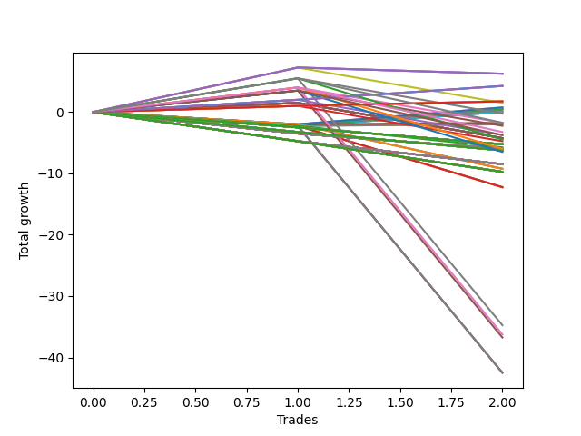

# Long Entry Wallace MJ 007 
- Symbol: ES90d5m
- Date Range: 03/18/2022 - 07/08/2022
- Trading Period: 7:20-12:30
- Number of Trades: 2



| Name | Win Percent | Profit | Avg Profit / Trade |     | Name | Win Percent | Profit | Avg Profit / Trade |
| ---- | ----------- | ------ | ------------------ | --- | ---- | ----------- | ------ | ------------------ |
| Sorted By <br> Profit | | | | | Sorted By <br> Win Percentage ||||
| Six | 100.00 | 5875.00 | 2937.50 |     | Six | 100.00 | 5875.00 | 2937.50 |
| Three | 100.00 | 5625.00 | 2812.50 |     | Three | 100.00 | 5625.00 | 2812.50 |
| Two | 100.00 | 5250.00 | 2625.00 |     | Two | 100.00 | 5250.00 | 2625.00 |
| Zero | 100.00 | 4625.00 | 2312.50 |     | Zero | 100.00 | 4625.00 | 2312.50 |
| One | 100.00 | 4375.00 | 2187.50 |     | One | 100.00 | 4375.00 | 2187.50 |
| Seventy-Three | 100.00 | 2750.00 | 1375.00 |     | Seventy-Three | 100.00 | 2750.00 | 1375.00 |
| Seven | 50.00 | -10250.00 | -5125.00 |     | Seven | 50.00 | -10250.00 | -5125.00 |
| Five | 50.00 | -10250.00 | -5125.00 |     | Five | 50.00 | -10250.00 | -5125.00 |
| Four | 50.00 | -10250.00 | -5125.00 |     | Four | 50.00 | -10250.00 | -5125.00 |

## NO STOPLOSS

### Test Zero
* Sell when price hits the middle line of the 20p bollinger
* No Stoploss
* Results:
```
Total Trades: 2
Percent Up: 100.00
Percent Down: 0.00
Total Points Moved Up: 9.25
Potential Profit: 4625.00
Total Points Ups: 9.25 Count Ups: 2
Total Points Downs: 0.00 Count Downs: 0
```

<details><summary>Trades</summary>

<code>In: 2022-03-30 12:30:00		Out: 2022-03-30 12:47:25		Total Position Time: 17:25		Total Move Up: 8.50		Total to Date: 8.50</code> <br />
<code>In: 2022-03-31 09:40:00		Out: 2022-03-31 10:31:10		Total Position Time: 51:10		Total Move Up: 0.75		Total to Date: 9.25</code> <br />


</details>

### Test One
* Sell when the price hits the upper line of the 20p 1std bollinger
* No Stoploss
* Results:
```
Total Trades: 2
Percent Up: 100.00
Percent Down: 0.00
Total Points Moved Up: 8.75
Potential Profit: 4375.00
Total Points Ups: 8.75 Count Ups: 2
Total Points Downs: 0.00 Count Downs: 0
```

<details><summary>Trades</summary>

<code>In: 2022-03-30 12:30:00		Out: 2022-03-30 12:50:00		Total Position Time: 20:00		Total Move Up: 6.75		Total to Date: 6.75</code> <br />
<code>In: 2022-03-31 09:40:00		Out: 2022-03-31 10:50:05		Total Position Time: 70:05		Total Move Up: 2.00		Total to Date: 8.75</code> <br />


</details>

### Test Two
* Sell when the price hits the upper line of the 20p 2std bollinger
* No Stoploss
* Results:
```
Total Trades: 2
Percent Up: 100.00
Percent Down: 0.00
Total Points Moved Up: 10.50
Potential Profit: 5250.00
Total Points Ups: 10.50 Count Ups: 2
Total Points Downs: 0.00 Count Downs: 0
```

<details><summary>Trades</summary>

<code>In: 2022-03-30 12:30:00		Out: 2022-03-30 12:50:00		Total Position Time: 20:00		Total Move Up: 6.75		Total to Date: 6.75</code> <br />
<code>In: 2022-03-31 09:40:00		Out: 2022-03-31 10:51:00		Total Position Time: 71:00		Total Move Up: 3.75		Total to Date: 10.50</code> <br />


</details>

### Test Three
* Sell when price hits the middle line of the 50p bollinger
* No Stoploss
* Results:
```
Total Trades: 2
Percent Up: 100.00
Percent Down: 0.00
Total Points Moved Up: 11.25
Potential Profit: 5625.00
Total Points Ups: 11.25 Count Ups: 2
Total Points Downs: 0.00 Count Downs: 0
```

<details><summary>Trades</summary>

<code>In: 2022-03-30 12:30:00		Out: 2022-03-30 12:50:00		Total Position Time: 20:00		Total Move Up: 6.75		Total to Date: 6.75</code> <br />
<code>In: 2022-03-31 09:40:00		Out: 2022-03-31 10:52:00		Total Position Time: 72:00		Total Move Up: 4.50		Total to Date: 11.25</code> <br />


</details>

### Test Four
* Sell when the price hits the upper line of the 50p 1std bollinger
* No Stoploss
* Results:
```
Total Trades: 2
Percent Up: 50.00
Percent Down: 50.00
Total Points Moved Up: -20.50
Potential Profit: -10250.00
Total Points Ups: 6.75 Count Ups: 1
Total Points Downs: -27.25 Count Downs: 1
```

<details><summary>Trades</summary>

<code>In: 2022-03-30 12:30:00		Out: 2022-03-30 12:50:00		Total Position Time: 20:00		Total Move Up: 6.75		Total to Date: 6.75</code> <br />
<code>In: 2022-03-31 09:40:00		Out: 2022-03-31 12:50:00		Total Position Time: 190:00		Total Move Up: -27.25		Total to Date: -20.50</code> <br />


</details>

### Test Five
* Sell when the price hits the upper line of the 50p 2std bollinger
* No Stoploss
* Results:
```
Total Trades: 2
Percent Up: 50.00
Percent Down: 50.00
Total Points Moved Up: -20.50
Potential Profit: -10250.00
Total Points Ups: 6.75 Count Ups: 1
Total Points Downs: -27.25 Count Downs: 1
```

<details><summary>Trades</summary>

<code>In: 2022-03-30 12:30:00		Out: 2022-03-30 12:50:00		Total Position Time: 20:00		Total Move Up: 6.75		Total to Date: 6.75</code> <br />
<code>In: 2022-03-31 09:40:00		Out: 2022-03-31 12:50:00		Total Position Time: 190:00		Total Move Up: -27.25		Total to Date: -20.50</code> <br />


</details>

### Test Six
* Sell when the price hits the middle line of the 1std VWAP
* No Stoploss
* Results:
```
Total Trades: 2
Percent Up: 100.00
Percent Down: 0.00
Total Points Moved Up: 11.75
Potential Profit: 5875.00
Total Points Ups: 11.75 Count Ups: 2
Total Points Downs: 0.00 Count Downs: 0
```

<details><summary>Trades</summary>

<code>In: 2022-03-30 12:30:00		Out: 2022-03-30 12:50:00		Total Position Time: 20:00		Total Move Up: 6.75		Total to Date: 6.75</code> <br />
<code>In: 2022-03-31 09:40:00		Out: 2022-03-31 10:52:10		Total Position Time: 72:10		Total Move Up: 5.00		Total to Date: 11.75</code> <br />


</details>

### Test Seven
* Sell when the price hits the upper line of the 1std VWAP
* No Stoploss
* Results:
```
Total Trades: 2
Percent Up: 50.00
Percent Down: 50.00
Total Points Moved Up: -20.50
Potential Profit: -10250.00
Total Points Ups: 6.75 Count Ups: 1
Total Points Downs: -27.25 Count Downs: 1
```

<details><summary>Trades</summary>

<code>In: 2022-03-30 12:30:00		Out: 2022-03-30 12:50:00		Total Position Time: 20:00		Total Move Up: 6.75		Total to Date: 6.75</code> <br />
<code>In: 2022-03-31 09:40:00		Out: 2022-03-31 12:50:00		Total Position Time: 190:00		Total Move Up: -27.25		Total to Date: -20.50</code> <br />


</details>

## SPECIAL EXIT CONDITIONS 

### Test Seventy-Three
* Sell when the linear regression slope changes to negative
* No Stoploss
* Results:
```
Total Trades: 2
Percent Up: 100.00
Percent Down: 0.00
Total Points Moved Up: 5.50
Potential Profit: 2750.00
Total Points Ups: 5.50 Count Ups: 2
Total Points Downs: 0.00 Count Downs: 0
```

<details><summary>Trades</summary>

<code>In: 2022-03-30 12:30:00		Out: 2022-03-30 12:34:00		Total Position Time: 04:00		Total Move Up: 4.00		Total to Date: 4.00</code> <br />
<code>In: 2022-03-31 09:40:00		Out: 2022-03-31 09:50:05		Total Position Time: 10:05		Total Move Up: 1.50		Total to Date: 5.50</code> <br />


</details>