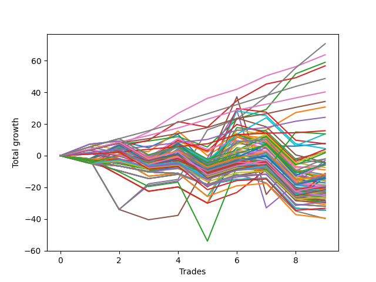

# Long Wallace 004 
- Symbol: ES90d5m
- Date Range: 03/18/2022 - 07/08/2022
- Trading Period: 7:20-12:30
- Number of Trades: 9



| Name | Win Percent | Profit | Avg Profit / Trade |     | Name | Win Percent | Profit | Avg Profit / Trade |
| ---- | ----------- | ------ | ------------------ | --- | ---- | ----------- | ------ | ------------------ |
| Sorted By <br> Profit | | | | | Sorted By <br> Win Percentage ||||
| Four | 88.89 | 74625.00 | 8291.67 |     | Six | 100.00 | 54625.00 | 6069.44 |
| Seven | 88.89 | 71125.00 | 7902.78 |     | Four | 88.89 | 74625.00 | 8291.67 |
| Two | 88.89 | 59375.00 | 6597.22 |     | Seven | 88.89 | 71125.00 | 7902.78 |
| Six | 100.00 | 54625.00 | 6069.44 |     | Two | 88.89 | 59375.00 | 6597.22 |
| Three | 88.89 | 51375.00 | 5708.33 |     | Three | 88.89 | 51375.00 | 5708.33 |
| One | 88.89 | 38375.00 | 4263.89 |     | One | 88.89 | 38375.00 | 4263.89 |
| Five | 66.67 | 33875.00 | 3763.89 |     | Zero | 77.78 | 24500.00 | 2722.22 |
| Zero | 77.78 | 24500.00 | 2722.22 |     | Five | 66.67 | 33875.00 | 3763.89 |

### Test Zero
* Sell when price hits the middle line of the 20p bollinger
* No Stoploss
* Results:
```
Total Trades: 9
Percent Up: 77.78
Percent Down: 22.22
Total Points Moved Up: 49.00
Potential Profit: 24500.00
Total Points Ups: 66.00 Count Ups: 7
Total Points Downs: -17.00 Count Downs: 2
```

<details><summary>Trades</summary>

<code>In: 2022-03-30 12:30:00		Out: 2022-03-30 12:47:25		Total Position Time: 17:25		Total Move Up: 8.50		Total to Date: 8.50</code> <br />
<code>In: 2022-03-31 11:25:00		Out: 2022-03-31 11:59:20		Total Position Time: 34:20		Total Move Up: 2.50		Total to Date: 11.00</code> <br />
<code>In: 2022-04-18 08:55:00		Out: 2022-04-18 09:55:05		Total Position Time: 60:05		Total Move Up: -1.00		Total to Date: 10.00</code> <br />
<code>In: 2022-04-20 12:00:00		Out: 2022-04-20 12:25:05		Total Position Time: 25:05		Total Move Up: 14.25		Total to Date: 24.25</code> <br />
<code>In: 2022-05-02 10:10:00		Out: 2022-05-02 11:53:40		Total Position Time: 103:40		Total Move Up: -16.00		Total to Date: 8.25</code> <br />
<code>In: 2022-06-02 07:30:00		Out: 2022-06-02 07:40:05		Total Position Time: 10:05		Total Move Up: 10.00		Total to Date: 18.25</code> <br />
<code>In: 2022-06-09 08:10:00		Out: 2022-06-09 08:42:25		Total Position Time: 32:25		Total Move Up: 9.75		Total to Date: 28.00</code> <br />
<code>In: 2022-06-15 11:15:00		Out: 2022-06-15 11:20:30		Total Position Time: 05:30		Total Move Up: 11.25		Total to Date: 39.25</code> <br />
<code>In: 2022-06-29 09:35:00		Out: 2022-06-29 10:01:50		Total Position Time: 26:50		Total Move Up: 9.75		Total to Date: 49.00</code> <br />


</details>

### Test One
* Sell when the price hits the upper line of the 20p 1std bollinger
* No Stoploss
* Results:
```
Total Trades: 9
Percent Up: 88.89
Percent Down: 11.11
Total Points Moved Up: 76.75
Potential Profit: 38375.00
Total Points Ups: 89.75 Count Ups: 8
Total Points Downs: -13.00 Count Downs: 1
```

<details><summary>Trades</summary>

<code>In: 2022-03-30 12:30:00		Out: 2022-03-30 12:50:00		Total Position Time: 20:00		Total Move Up: 6.75		Total to Date: 6.75</code> <br />
<code>In: 2022-03-31 11:25:00		Out: 2022-03-31 12:00:20		Total Position Time: 35:20		Total Move Up: 6.25		Total to Date: 13.00</code> <br />
<code>In: 2022-04-18 08:55:00		Out: 2022-04-18 10:08:10		Total Position Time: 73:10		Total Move Up: 2.75		Total to Date: 15.75</code> <br />
<code>In: 2022-04-20 12:00:00		Out: 2022-04-20 12:45:15		Total Position Time: 45:15		Total Move Up: 18.00		Total to Date: 33.75</code> <br />
<code>In: 2022-05-02 10:10:00		Out: 2022-05-02 12:05:15		Total Position Time: 115:15		Total Move Up: -13.00		Total to Date: 20.75</code> <br />
<code>In: 2022-06-02 07:30:00		Out: 2022-06-02 07:56:05		Total Position Time: 26:05		Total Move Up: 16.75		Total to Date: 37.50</code> <br />
<code>In: 2022-06-09 08:10:00		Out: 2022-06-09 09:28:40		Total Position Time: 78:40		Total Move Up: 7.25		Total to Date: 44.75</code> <br />
<code>In: 2022-06-15 11:15:00		Out: 2022-06-15 11:38:55		Total Position Time: 23:55		Total Move Up: 20.50		Total to Date: 65.25</code> <br />
<code>In: 2022-06-29 09:35:00		Out: 2022-06-29 10:39:35		Total Position Time: 64:35		Total Move Up: 11.50		Total to Date: 76.75</code> <br />


</details>

### Test Two
* Sell when the price hits the upper line of the 20p 2std bollinger
* No Stoploss
* Results:
```
Total Trades: 9
Percent Up: 88.89
Percent Down: 11.11
Total Points Moved Up: 118.75
Potential Profit: 59375.00
Total Points Ups: 121.25 Count Ups: 8
Total Points Downs: -2.50 Count Downs: 1
```

<details><summary>Trades</summary>

<code>In: 2022-03-30 12:30:00		Out: 2022-03-30 12:50:00		Total Position Time: 20:00		Total Move Up: 6.75		Total to Date: 6.75</code> <br />
<code>In: 2022-03-31 11:25:00		Out: 2022-03-31 12:02:30		Total Position Time: 37:30		Total Move Up: 9.25		Total to Date: 16.00</code> <br />
<code>In: 2022-04-18 08:55:00		Out: 2022-04-18 10:10:25		Total Position Time: 75:25		Total Move Up: 6.00		Total to Date: 22.00</code> <br />
<code>In: 2022-04-20 12:00:00		Out: 2022-04-20 12:50:00		Total Position Time: 50:00		Total Move Up: 19.25		Total to Date: 41.25</code> <br />
<code>In: 2022-05-02 10:10:00		Out: 2022-05-02 12:09:40		Total Position Time: 119:40		Total Move Up: -2.50		Total to Date: 38.75</code> <br />
<code>In: 2022-06-02 07:30:00		Out: 2022-06-02 08:01:35		Total Position Time: 31:35		Total Move Up: 22.50		Total to Date: 61.25</code> <br />
<code>In: 2022-06-09 08:10:00		Out: 2022-06-09 09:30:40		Total Position Time: 80:40		Total Move Up: 10.50		Total to Date: 71.75</code> <br />
<code>In: 2022-06-15 11:15:00		Out: 2022-06-15 11:41:00		Total Position Time: 26:00		Total Move Up: 32.00		Total to Date: 103.75</code> <br />
<code>In: 2022-06-29 09:35:00		Out: 2022-06-29 10:43:40		Total Position Time: 68:40		Total Move Up: 15.00		Total to Date: 118.75</code> <br />


</details>

### Test Three
* Sell when price hits the middle line of the 50p bollinger
* No Stoploss
* Results:
```
Total Trades: 9
Percent Up: 88.89
Percent Down: 11.11
Total Points Moved Up: 102.75
Potential Profit: 51375.00
Total Points Ups: 104.50 Count Ups: 8
Total Points Downs: -1.75 Count Downs: 1
```

<details><summary>Trades</summary>

<code>In: 2022-03-30 12:30:00		Out: 2022-03-30 12:50:00		Total Position Time: 20:00		Total Move Up: 6.75		Total to Date: 6.75</code> <br />
<code>In: 2022-03-31 11:25:00		Out: 2022-03-31 12:01:05		Total Position Time: 36:05		Total Move Up: 7.75		Total to Date: 14.50</code> <br />
<code>In: 2022-04-18 08:55:00		Out: 2022-04-18 10:31:35		Total Position Time: 96:35		Total Move Up: 8.50		Total to Date: 23.00</code> <br />
<code>In: 2022-04-20 12:00:00		Out: 2022-04-20 12:25:50		Total Position Time: 25:50		Total Move Up: 17.25		Total to Date: 40.25</code> <br />
<code>In: 2022-05-02 10:10:00		Out: 2022-05-02 12:10:10		Total Position Time: 120:10		Total Move Up: -1.75		Total to Date: 38.50</code> <br />
<code>In: 2022-06-02 07:30:00		Out: 2022-06-02 08:01:30		Total Position Time: 31:30		Total Move Up: 21.75		Total to Date: 60.25</code> <br />
<code>In: 2022-06-09 08:10:00		Out: 2022-06-09 09:44:15		Total Position Time: 94:15		Total Move Up: 13.75		Total to Date: 74.00</code> <br />
<code>In: 2022-06-15 11:15:00		Out: 2022-06-15 11:38:45		Total Position Time: 23:45		Total Move Up: 13.50		Total to Date: 87.50</code> <br />
<code>In: 2022-06-29 09:35:00		Out: 2022-06-29 10:10:45		Total Position Time: 35:45		Total Move Up: 15.25		Total to Date: 102.75</code> <br />


</details>

### Test Four
* Sell when the price hits the upper line of the 50p 1std bollinger
* No Stoploss
* Results:
```
Total Trades: 9
Percent Up: 88.89
Percent Down: 11.11
Total Points Moved Up: 149.25
Potential Profit: 74625.00
Total Points Ups: 169.75 Count Ups: 8
Total Points Downs: -20.50 Count Downs: 1
```

<details><summary>Trades</summary>

<code>In: 2022-03-30 12:30:00		Out: 2022-03-30 12:50:00		Total Position Time: 20:00		Total Move Up: 6.75		Total to Date: 6.75</code> <br />
<code>In: 2022-03-31 11:25:00		Out: 2022-03-31 12:50:00		Total Position Time: 85:00		Total Move Up: -20.50		Total to Date: -13.75</code> <br />
<code>In: 2022-04-18 08:55:00		Out: 2022-04-18 10:35:40		Total Position Time: 100:40		Total Move Up: 19.50		Total to Date: 5.75</code> <br />
<code>In: 2022-04-20 12:00:00		Out: 2022-04-20 12:50:00		Total Position Time: 50:00		Total Move Up: 19.25		Total to Date: 25.00</code> <br />
<code>In: 2022-05-02 10:10:00		Out: 2022-05-02 12:20:25		Total Position Time: 130:25		Total Move Up: 18.50		Total to Date: 43.50</code> <br />
<code>In: 2022-06-02 07:30:00		Out: 2022-06-02 08:10:45		Total Position Time: 40:45		Total Move Up: 35.25		Total to Date: 78.75</code> <br />
<code>In: 2022-06-09 08:10:00		Out: 2022-06-09 10:07:20		Total Position Time: 117:20		Total Move Up: 22.25		Total to Date: 101.00</code> <br />
<code>In: 2022-06-15 11:15:00		Out: 2022-06-15 11:39:00		Total Position Time: 24:00		Total Move Up: 24.75		Total to Date: 125.75</code> <br />
<code>In: 2022-06-29 09:35:00		Out: 2022-06-29 11:01:35		Total Position Time: 86:35		Total Move Up: 23.50		Total to Date: 149.25</code> <br />


</details>

### Test Five
* Sell when the price hits the upper line of the 50p 2std bollinger
* No Stoploss
* Results:
```
Total Trades: 9
Percent Up: 66.67
Percent Down: 33.33
Total Points Moved Up: 67.75
Potential Profit: 33875.00
Total Points Ups: 155.50 Count Ups: 6
Total Points Downs: -87.75 Count Downs: 3
```

<details><summary>Trades</summary>

<code>In: 2022-03-30 12:30:00		Out: 2022-03-30 12:50:00		Total Position Time: 20:00		Total Move Up: 6.75		Total to Date: 6.75</code> <br />
<code>In: 2022-03-31 11:25:00		Out: 2022-03-31 12:50:00		Total Position Time: 85:00		Total Move Up: -20.50		Total to Date: -13.75</code> <br />
<code>In: 2022-04-18 08:55:00		Out: 2022-04-18 12:50:00		Total Position Time: 235:00		Total Move Up: -8.25		Total to Date: -22.00</code> <br />
<code>In: 2022-04-20 12:00:00		Out: 2022-04-20 12:50:00		Total Position Time: 50:00		Total Move Up: 19.25		Total to Date: -2.75</code> <br />
<code>In: 2022-05-02 10:10:00		Out: 2022-05-02 12:30:30		Total Position Time: 140:30		Total Move Up: 36.75		Total to Date: 34.00</code> <br />
<code>In: 2022-06-02 07:30:00		Out: 2022-06-02 08:46:15		Total Position Time: 76:15		Total Move Up: 47.50		Total to Date: 81.50</code> <br />
<code>In: 2022-06-09 08:10:00		Out: 2022-06-09 12:50:00		Total Position Time: 280:00		Total Move Up: -59.00		Total to Date: 22.50</code> <br />
<code>In: 2022-06-15 11:15:00		Out: 2022-06-15 11:41:00		Total Position Time: 26:00		Total Move Up: 32.00		Total to Date: 54.50</code> <br />
<code>In: 2022-06-29 09:35:00		Out: 2022-06-29 12:50:00		Total Position Time: 195:00		Total Move Up: 13.25		Total to Date: 67.75</code> <br />


</details>

### Test Six
* Sell when the price hits the middle line of the 1std VWAP
* No Stoploss
* Results:
```
Total Trades: 9
Percent Up: 100.00
Percent Down: 0.00
Total Points Moved Up: 109.25
Potential Profit: 54625.00
Total Points Ups: 109.25 Count Ups: 9
Total Points Downs: 0.00 Count Downs: 0
```

<details><summary>Trades</summary>

<code>In: 2022-03-30 12:30:00		Out: 2022-03-30 12:50:00		Total Position Time: 20:00		Total Move Up: 6.75		Total to Date: 6.75</code> <br />
<code>In: 2022-03-31 11:25:00		Out: 2022-03-31 12:02:30		Total Position Time: 37:30		Total Move Up: 9.25		Total to Date: 16.00</code> <br />
<code>In: 2022-04-18 08:55:00		Out: 2022-04-18 10:32:10		Total Position Time: 97:10		Total Move Up: 12.75		Total to Date: 28.75</code> <br />
<code>In: 2022-04-20 12:00:00		Out: 2022-04-20 12:26:10		Total Position Time: 26:10		Total Move Up: 18.00		Total to Date: 46.75</code> <br />
<code>In: 2022-05-02 10:10:00		Out: 2022-05-02 12:16:15		Total Position Time: 126:15		Total Move Up: 13.50		Total to Date: 60.25</code> <br />
<code>In: 2022-06-02 07:30:00		Out: 2022-06-02 07:35:35		Total Position Time: 05:35		Total Move Up: 7.25		Total to Date: 67.50</code> <br />
<code>In: 2022-06-09 08:10:00		Out: 2022-06-09 08:42:55		Total Position Time: 32:55		Total Move Up: 12.50		Total to Date: 80.00</code> <br />
<code>In: 2022-06-15 11:15:00		Out: 2022-06-15 11:38:45		Total Position Time: 23:45		Total Move Up: 13.50		Total to Date: 93.50</code> <br />
<code>In: 2022-06-29 09:35:00		Out: 2022-06-29 10:10:55		Total Position Time: 35:55		Total Move Up: 15.75		Total to Date: 109.25</code> <br />


</details>

### Test Seven
* Sell when the price hits the upper line of the 1std VWAP
* No Stoploss
* Results:
```
Total Trades: 9
Percent Up: 88.89
Percent Down: 11.11
Total Points Moved Up: 142.25
Potential Profit: 71125.00
Total Points Ups: 162.75 Count Ups: 8
Total Points Downs: -20.50 Count Downs: 1
```

<details><summary>Trades</summary>

<code>In: 2022-03-30 12:30:00		Out: 2022-03-30 12:50:00		Total Position Time: 20:00		Total Move Up: 6.75		Total to Date: 6.75</code> <br />
<code>In: 2022-03-31 11:25:00		Out: 2022-03-31 12:50:00		Total Position Time: 85:00		Total Move Up: -20.50		Total to Date: -13.75</code> <br />
<code>In: 2022-04-18 08:55:00		Out: 2022-04-18 10:35:45		Total Position Time: 100:45		Total Move Up: 20.50		Total to Date: 6.75</code> <br />
<code>In: 2022-04-20 12:00:00		Out: 2022-04-20 12:50:00		Total Position Time: 50:00		Total Move Up: 19.25		Total to Date: 26.00</code> <br />
<code>In: 2022-05-02 10:10:00		Out: 2022-05-02 12:30:25		Total Position Time: 140:25		Total Move Up: 35.50		Total to Date: 61.50</code> <br />
<code>In: 2022-06-02 07:30:00		Out: 2022-06-02 07:42:35		Total Position Time: 12:35		Total Move Up: 11.75		Total to Date: 73.25</code> <br />
<code>In: 2022-06-09 08:10:00		Out: 2022-06-09 09:59:35		Total Position Time: 109:35		Total Move Up: 18.00		Total to Date: 91.25</code> <br />
<code>In: 2022-06-15 11:15:00		Out: 2022-06-15 11:40:55		Total Position Time: 25:55		Total Move Up: 27.50		Total to Date: 118.75</code> <br />
<code>In: 2022-06-29 09:35:00		Out: 2022-06-29 11:01:35		Total Position Time: 86:35		Total Move Up: 23.50		Total to Date: 142.25</code> <br />


</details>