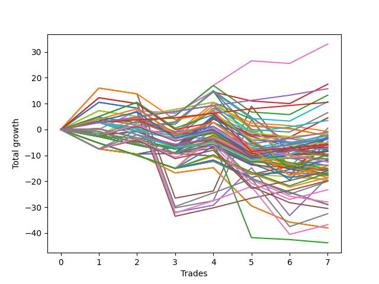

# Long Wallace 1226_003 
- Symbol: ES90d5m
- Date Range: 03/18/2022 - 07/08/2022
- Trading Period: 7:20-12:30
- Number of Trades: 7



| Name | Win Percent | Profit | Avg Profit / Trade |     | Name | Win Percent | Profit | Avg Profit / Trade |
| ---- | ----------- | ------ | ------------------ | --- | ---- | ----------- | ------ | ------------------ |
| Sorted By <br> Profit | | | | | Sorted By <br> Win Percentage ||||
| Six | 100.00 | 37250.00 | 5321.43 |     | Six | 100.00 | 37250.00 | 5321.43 |
| Seven | 71.43 | 36250.00 | 5178.57 |     | Three | 85.71 | 26625.00 | 3803.57 |
| Five | 71.43 | 33625.00 | 4803.57 |     | Zero | 85.71 | 11125.00 | 1589.29 |
| Three | 85.71 | 26625.00 | 3803.57 |     | Seven | 71.43 | 36250.00 | 5178.57 |
| Four | 71.43 | 26000.00 | 3714.29 |     | Five | 71.43 | 33625.00 | 4803.57 |
| Two | 71.43 | 25625.00 | 3660.71 |     | Four | 71.43 | 26000.00 | 3714.29 |
| One | 71.43 | 16750.00 | 2392.86 |     | Two | 71.43 | 25625.00 | 3660.71 |
| Zero | 85.71 | 11125.00 | 1589.29 |     | One | 71.43 | 16750.00 | 2392.86 |

### Test Zero
* Sell when price hits the middle line of the 20p bollinger
* No Stoploss
* Results:
```
Total Trades: 7
Percent Up: 85.71
Percent Down: 14.29
Total Points Moved Up: 22.25
Potential Profit: 11125.00
Total Points Ups: 38.25 Count Ups: 6
Total Points Downs: -16.00 Count Downs: 1
```

<details><summary>Trades</summary>

<code>In: 2022-03-29 09:40:00		Out: 2022-03-29 10:36:00		Total Position Time: 56:00		Total Move Up: 5.00		Total to Date: 5.00</code> <br />
<code>In: 2022-03-30 12:30:00		Out: 2022-03-30 12:47:25		Total Position Time: 17:25		Total Move Up: 8.50		Total to Date: 13.50</code> <br />
<code>In: 2022-03-31 09:40:00		Out: 2022-03-31 10:31:10		Total Position Time: 51:10		Total Move Up: 0.75		Total to Date: 14.25</code> <br />
<code>In: 2022-04-20 12:00:00		Out: 2022-04-20 12:25:05		Total Position Time: 25:05		Total Move Up: 14.25		Total to Date: 28.50</code> <br />
<code>In: 2022-05-02 10:10:00		Out: 2022-05-02 11:53:40		Total Position Time: 103:40		Total Move Up: -16.00		Total to Date: 12.50</code> <br />
<code>In: 2022-06-27 09:40:00		Out: 2022-06-27 11:19:05		Total Position Time: 99:05		Total Move Up: 0.00		Total to Date: 12.50</code> <br />
<code>In: 2022-06-29 09:35:00		Out: 2022-06-29 10:01:50		Total Position Time: 26:50		Total Move Up: 9.75		Total to Date: 22.25</code> <br />


</details>

### Test One
* Sell when the price hits the upper line of the 20p 1std bollinger
* No Stoploss
* Results:
```
Total Trades: 7
Percent Up: 71.43
Percent Down: 28.57
Total Points Moved Up: 33.50
Potential Profit: 16750.00
Total Points Ups: 47.00 Count Ups: 5
Total Points Downs: -13.50 Count Downs: 2
```

<details><summary>Trades</summary>

<code>In: 2022-03-29 09:40:00		Out: 2022-03-29 10:41:00		Total Position Time: 61:00		Total Move Up: 8.75		Total to Date: 8.75</code> <br />
<code>In: 2022-03-30 12:30:00		Out: 2022-03-30 12:50:00		Total Position Time: 20:00		Total Move Up: 6.75		Total to Date: 15.50</code> <br />
<code>In: 2022-03-31 09:40:00		Out: 2022-03-31 10:50:05		Total Position Time: 70:05		Total Move Up: 2.00		Total to Date: 17.50</code> <br />
<code>In: 2022-04-20 12:00:00		Out: 2022-04-20 12:45:15		Total Position Time: 45:15		Total Move Up: 18.00		Total to Date: 35.50</code> <br />
<code>In: 2022-05-02 10:10:00		Out: 2022-05-02 12:05:15		Total Position Time: 115:15		Total Move Up: -13.00		Total to Date: 22.50</code> <br />
<code>In: 2022-06-27 09:40:00		Out: 2022-06-27 12:15:20		Total Position Time: 155:20		Total Move Up: -0.50		Total to Date: 22.00</code> <br />
<code>In: 2022-06-29 09:35:00		Out: 2022-06-29 10:39:35		Total Position Time: 64:35		Total Move Up: 11.50		Total to Date: 33.50</code> <br />


</details>

### Test Two
* Sell when the price hits the upper line of the 20p 2std bollinger
* No Stoploss
* Results:
```
Total Trades: 7
Percent Up: 71.43
Percent Down: 28.57
Total Points Moved Up: 51.25
Potential Profit: 25625.00
Total Points Ups: 56.75 Count Ups: 5
Total Points Downs: -5.50 Count Downs: 2
```

<details><summary>Trades</summary>

<code>In: 2022-03-29 09:40:00		Out: 2022-03-29 10:47:10		Total Position Time: 67:10		Total Move Up: 12.00		Total to Date: 12.00</code> <br />
<code>In: 2022-03-30 12:30:00		Out: 2022-03-30 12:50:00		Total Position Time: 20:00		Total Move Up: 6.75		Total to Date: 18.75</code> <br />
<code>In: 2022-03-31 09:40:00		Out: 2022-03-31 10:51:00		Total Position Time: 71:00		Total Move Up: 3.75		Total to Date: 22.50</code> <br />
<code>In: 2022-04-20 12:00:00		Out: 2022-04-20 12:50:00		Total Position Time: 50:00		Total Move Up: 19.25		Total to Date: 41.75</code> <br />
<code>In: 2022-05-02 10:10:00		Out: 2022-05-02 12:09:40		Total Position Time: 119:40		Total Move Up: -2.50		Total to Date: 39.25</code> <br />
<code>In: 2022-06-27 09:40:00		Out: 2022-06-27 12:50:00		Total Position Time: 190:00		Total Move Up: -3.00		Total to Date: 36.25</code> <br />
<code>In: 2022-06-29 09:35:00		Out: 2022-06-29 10:43:40		Total Position Time: 68:40		Total Move Up: 15.00		Total to Date: 51.25</code> <br />


</details>

### Test Three
* Sell when price hits the middle line of the 50p bollinger
* No Stoploss
* Results:
```
Total Trades: 7
Percent Up: 85.71
Percent Down: 14.29
Total Points Moved Up: 53.25
Potential Profit: 26625.00
Total Points Ups: 55.00 Count Ups: 6
Total Points Downs: -1.75 Count Downs: 1
```

<details><summary>Trades</summary>

<code>In: 2022-03-29 09:40:00		Out: 2022-03-29 09:45:10		Total Position Time: 05:10		Total Move Up: 6.00		Total to Date: 6.00</code> <br />
<code>In: 2022-03-30 12:30:00		Out: 2022-03-30 12:50:00		Total Position Time: 20:00		Total Move Up: 6.75		Total to Date: 12.75</code> <br />
<code>In: 2022-03-31 09:40:00		Out: 2022-03-31 10:52:00		Total Position Time: 72:00		Total Move Up: 4.50		Total to Date: 17.25</code> <br />
<code>In: 2022-04-20 12:00:00		Out: 2022-04-20 12:25:50		Total Position Time: 25:50		Total Move Up: 17.25		Total to Date: 34.50</code> <br />
<code>In: 2022-05-02 10:10:00		Out: 2022-05-02 12:10:10		Total Position Time: 120:10		Total Move Up: -1.75		Total to Date: 32.75</code> <br />
<code>In: 2022-06-27 09:40:00		Out: 2022-06-27 09:45:10		Total Position Time: 05:10		Total Move Up: 5.25		Total to Date: 38.00</code> <br />
<code>In: 2022-06-29 09:35:00		Out: 2022-06-29 10:10:45		Total Position Time: 35:45		Total Move Up: 15.25		Total to Date: 53.25</code> <br />


</details>

### Test Four
* Sell when the price hits the upper line of the 50p 1std bollinger
* No Stoploss
* Results:
```
Total Trades: 7
Percent Up: 71.43
Percent Down: 28.57
Total Points Moved Up: 52.00
Potential Profit: 26000.00
Total Points Ups: 82.25 Count Ups: 5
Total Points Downs: -30.25 Count Downs: 2
```

<details><summary>Trades</summary>

<code>In: 2022-03-29 09:40:00		Out: 2022-03-29 10:48:05		Total Position Time: 68:05		Total Move Up: 14.25		Total to Date: 14.25</code> <br />
<code>In: 2022-03-30 12:30:00		Out: 2022-03-30 12:50:00		Total Position Time: 20:00		Total Move Up: 6.75		Total to Date: 21.00</code> <br />
<code>In: 2022-03-31 09:40:00		Out: 2022-03-31 12:50:00		Total Position Time: 190:00		Total Move Up: -27.25		Total to Date: -6.25</code> <br />
<code>In: 2022-04-20 12:00:00		Out: 2022-04-20 12:50:00		Total Position Time: 50:00		Total Move Up: 19.25		Total to Date: 13.00</code> <br />
<code>In: 2022-05-02 10:10:00		Out: 2022-05-02 12:20:25		Total Position Time: 130:25		Total Move Up: 18.50		Total to Date: 31.50</code> <br />
<code>In: 2022-06-27 09:40:00		Out: 2022-06-27 12:50:00		Total Position Time: 190:00		Total Move Up: -3.00		Total to Date: 28.50</code> <br />
<code>In: 2022-06-29 09:35:00		Out: 2022-06-29 11:01:35		Total Position Time: 86:35		Total Move Up: 23.50		Total to Date: 52.00</code> <br />


</details>

### Test Five
* Sell when the price hits the upper line of the 50p 2std bollinger
* No Stoploss
* Results:
```
Total Trades: 7
Percent Up: 71.43
Percent Down: 28.57
Total Points Moved Up: 67.25
Potential Profit: 33625.00
Total Points Ups: 97.50 Count Ups: 5
Total Points Downs: -30.25 Count Downs: 2
```

<details><summary>Trades</summary>

<code>In: 2022-03-29 09:40:00		Out: 2022-03-29 11:34:10		Total Position Time: 114:10		Total Move Up: 21.50		Total to Date: 21.50</code> <br />
<code>In: 2022-03-30 12:30:00		Out: 2022-03-30 12:50:00		Total Position Time: 20:00		Total Move Up: 6.75		Total to Date: 28.25</code> <br />
<code>In: 2022-03-31 09:40:00		Out: 2022-03-31 12:50:00		Total Position Time: 190:00		Total Move Up: -27.25		Total to Date: 1.00</code> <br />
<code>In: 2022-04-20 12:00:00		Out: 2022-04-20 12:50:00		Total Position Time: 50:00		Total Move Up: 19.25		Total to Date: 20.25</code> <br />
<code>In: 2022-05-02 10:10:00		Out: 2022-05-02 12:30:30		Total Position Time: 140:30		Total Move Up: 36.75		Total to Date: 57.00</code> <br />
<code>In: 2022-06-27 09:40:00		Out: 2022-06-27 12:50:00		Total Position Time: 190:00		Total Move Up: -3.00		Total to Date: 54.00</code> <br />
<code>In: 2022-06-29 09:35:00		Out: 2022-06-29 12:50:00		Total Position Time: 195:00		Total Move Up: 13.25		Total to Date: 67.25</code> <br />


</details>

### Test Six
* Sell when the price hits the middle line of the 1std VWAP
* No Stoploss
* Results:
```
Total Trades: 7
Percent Up: 100.00
Percent Down: 0.00
Total Points Moved Up: 74.50
Potential Profit: 37250.00
Total Points Ups: 74.50 Count Ups: 7
Total Points Downs: 0.00 Count Downs: 0
```

<details><summary>Trades</summary>

<code>In: 2022-03-29 09:40:00		Out: 2022-03-29 10:45:05		Total Position Time: 65:05		Total Move Up: 10.25		Total to Date: 10.25</code> <br />
<code>In: 2022-03-30 12:30:00		Out: 2022-03-30 12:50:00		Total Position Time: 20:00		Total Move Up: 6.75		Total to Date: 17.00</code> <br />
<code>In: 2022-03-31 09:40:00		Out: 2022-03-31 10:52:10		Total Position Time: 72:10		Total Move Up: 5.00		Total to Date: 22.00</code> <br />
<code>In: 2022-04-20 12:00:00		Out: 2022-04-20 12:26:10		Total Position Time: 26:10		Total Move Up: 18.00		Total to Date: 40.00</code> <br />
<code>In: 2022-05-02 10:10:00		Out: 2022-05-02 12:16:15		Total Position Time: 126:15		Total Move Up: 13.50		Total to Date: 53.50</code> <br />
<code>In: 2022-06-27 09:40:00		Out: 2022-06-27 09:45:10		Total Position Time: 05:10		Total Move Up: 5.25		Total to Date: 58.75</code> <br />
<code>In: 2022-06-29 09:35:00		Out: 2022-06-29 10:10:55		Total Position Time: 35:55		Total Move Up: 15.75		Total to Date: 74.50</code> <br />


</details>

### Test Seven
* Sell when the price hits the upper line of the 1std VWAP
* No Stoploss
* Results:
```
Total Trades: 7
Percent Up: 71.43
Percent Down: 28.57
Total Points Moved Up: 72.50
Potential Profit: 36250.00
Total Points Ups: 102.75 Count Ups: 5
Total Points Downs: -30.25 Count Downs: 2
```

<details><summary>Trades</summary>

<code>In: 2022-03-29 09:40:00		Out: 2022-03-29 11:03:25		Total Position Time: 83:25		Total Move Up: 17.75		Total to Date: 17.75</code> <br />
<code>In: 2022-03-30 12:30:00		Out: 2022-03-30 12:50:00		Total Position Time: 20:00		Total Move Up: 6.75		Total to Date: 24.50</code> <br />
<code>In: 2022-03-31 09:40:00		Out: 2022-03-31 12:50:00		Total Position Time: 190:00		Total Move Up: -27.25		Total to Date: -2.75</code> <br />
<code>In: 2022-04-20 12:00:00		Out: 2022-04-20 12:50:00		Total Position Time: 50:00		Total Move Up: 19.25		Total to Date: 16.50</code> <br />
<code>In: 2022-05-02 10:10:00		Out: 2022-05-02 12:30:25		Total Position Time: 140:25		Total Move Up: 35.50		Total to Date: 52.00</code> <br />
<code>In: 2022-06-27 09:40:00		Out: 2022-06-27 12:50:00		Total Position Time: 190:00		Total Move Up: -3.00		Total to Date: 49.00</code> <br />
<code>In: 2022-06-29 09:35:00		Out: 2022-06-29 11:01:35		Total Position Time: 86:35		Total Move Up: 23.50		Total to Date: 72.50</code> <br />


</details>