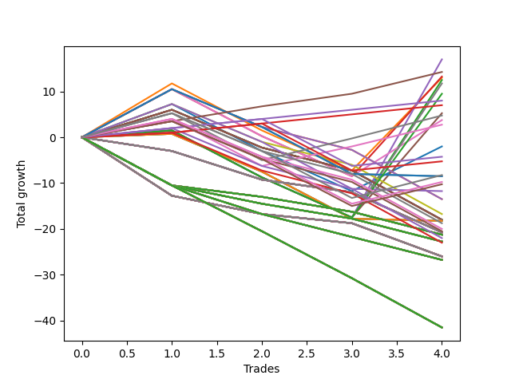

# Long Wallace Doodle 011 
- Symbol: ES90d5m
- Date Range: 03/18/2022 - 07/08/2022
- Trading Period: 7:20-12:30
- Number of Trades: 4



| Name | Win Percent | Profit | Avg Profit / Trade |     | Name | Win Percent | Profit | Avg Profit / Trade |
| ---- | ----------- | ------ | ------------------ | --- | ---- | ----------- | ------ | ------------------ |
| Sorted By <br> Profit | | | | | Sorted By <br> Win Percentage ||||
| Four | 50.00 | 24125.00 | 6031.25 |     | Four | 50.00 | 24125.00 | 6031.25 |
| Two | 50.00 | 20875.00 | 5218.75 |     | Two | 50.00 | 20875.00 | 5218.75 |
| Seven | 50.00 | 20500.00 | 5125.00 |     | Seven | 50.00 | 20500.00 | 5125.00 |
| Five | 50.00 | 18500.00 | 4625.00 |     | Five | 50.00 | 18500.00 | 4625.00 |
| Three | 50.00 | 15750.00 | 3937.50 |     | Three | 50.00 | 15750.00 | 3937.50 |
| One | 50.00 | 15000.00 | 3750.00 |     | One | 50.00 | 15000.00 | 3750.00 |
| Six | 50.00 | 11125.00 | 2781.25 |     | Six | 50.00 | 11125.00 | 2781.25 |
| Zero | 50.00 | 7750.00 | 1937.50 |     | Zero | 50.00 | 7750.00 | 1937.50 |
| Seventy-Three | 50.00 | 6000.00 | 1500.00 |     | Seventy-Three | 50.00 | 6000.00 | 1500.00 |

## NO STOPLOSS

### Test Zero
* Sell when price hits the middle line of the 20p bollinger
* No Stoploss
* Results:
```
Total Trades: 4
Percent Up: 50.00
Percent Down: 50.00
Total Points Moved Up: 15.50
Potential Profit: 7750.00
Total Points Ups: 24.25 Count Ups: 2
Total Points Downs: -8.75 Count Downs: 2
```

<details><summary>Trades</summary>

<code>In: 2022-04-20 11:45:00		Out: 2022-04-20 12:25:05		Total Position Time: 40:05		Total Move Up: 8.25		Total to Date: 8.25</code> <br />
<code>In: 2022-04-27 12:10:00		Out: 2022-04-27 12:50:00		Total Position Time: 40:00		Total Move Up: -6.25		Total to Date: 2.00</code> <br />
<code>In: 2022-04-27 12:25:00		Out: 2022-04-27 12:50:00		Total Position Time: 25:00		Total Move Up: -2.50		Total to Date: -0.50</code> <br />
<code>In: 2022-05-13 11:15:00		Out: 2022-05-13 11:51:50		Total Position Time: 36:50		Total Move Up: 16.00		Total to Date: 15.50</code> <br />


</details>

### Test One
* Sell when the price hits the upper line of the 20p 1std bollinger
* No Stoploss
* Results:
```
Total Trades: 4
Percent Up: 50.00
Percent Down: 50.00
Total Points Moved Up: 30.00
Potential Profit: 15000.00
Total Points Ups: 38.75 Count Ups: 2
Total Points Downs: -8.75 Count Downs: 2
```

<details><summary>Trades</summary>

<code>In: 2022-04-20 11:45:00		Out: 2022-04-20 12:45:15		Total Position Time: 60:15		Total Move Up: 12.00		Total to Date: 12.00</code> <br />
<code>In: 2022-04-27 12:10:00		Out: 2022-04-27 12:50:00		Total Position Time: 40:00		Total Move Up: -6.25		Total to Date: 5.75</code> <br />
<code>In: 2022-04-27 12:25:00		Out: 2022-04-27 12:50:00		Total Position Time: 25:00		Total Move Up: -2.50		Total to Date: 3.25</code> <br />
<code>In: 2022-05-13 11:15:00		Out: 2022-05-13 12:00:35		Total Position Time: 45:35		Total Move Up: 26.75		Total to Date: 30.00</code> <br />


</details>

### Test Two
* Sell when the price hits the upper line of the 20p 2std bollinger
* No Stoploss
* Results:
```
Total Trades: 4
Percent Up: 50.00
Percent Down: 50.00
Total Points Moved Up: 41.75
Potential Profit: 20875.00
Total Points Ups: 50.50 Count Ups: 2
Total Points Downs: -8.75 Count Downs: 2
```

<details><summary>Trades</summary>

<code>In: 2022-04-20 11:45:00		Out: 2022-04-20 12:50:00		Total Position Time: 65:00		Total Move Up: 13.25		Total to Date: 13.25</code> <br />
<code>In: 2022-04-27 12:10:00		Out: 2022-04-27 12:50:00		Total Position Time: 40:00		Total Move Up: -6.25		Total to Date: 7.00</code> <br />
<code>In: 2022-04-27 12:25:00		Out: 2022-04-27 12:50:00		Total Position Time: 25:00		Total Move Up: -2.50		Total to Date: 4.50</code> <br />
<code>In: 2022-05-13 11:15:00		Out: 2022-05-13 12:14:45		Total Position Time: 59:45		Total Move Up: 37.25		Total to Date: 41.75</code> <br />


</details>

### Test Three
* Sell when price hits the middle line of the 50p bollinger
* No Stoploss
* Results:
```
Total Trades: 4
Percent Up: 50.00
Percent Down: 50.00
Total Points Moved Up: 31.50
Potential Profit: 15750.00
Total Points Ups: 40.25 Count Ups: 2
Total Points Downs: -8.75 Count Downs: 2
```

<details><summary>Trades</summary>

<code>In: 2022-04-20 11:45:00		Out: 2022-04-20 12:25:50		Total Position Time: 40:50		Total Move Up: 11.25		Total to Date: 11.25</code> <br />
<code>In: 2022-04-27 12:10:00		Out: 2022-04-27 12:50:00		Total Position Time: 40:00		Total Move Up: -6.25		Total to Date: 5.00</code> <br />
<code>In: 2022-04-27 12:25:00		Out: 2022-04-27 12:50:00		Total Position Time: 25:00		Total Move Up: -2.50		Total to Date: 2.50</code> <br />
<code>In: 2022-05-13 11:15:00		Out: 2022-05-13 12:01:10		Total Position Time: 46:10		Total Move Up: 29.00		Total to Date: 31.50</code> <br />


</details>

### Test Four
* Sell when the price hits the upper line of the 50p 1std bollinger
* No Stoploss
* Results:
```
Total Trades: 4
Percent Up: 50.00
Percent Down: 50.00
Total Points Moved Up: 48.25
Potential Profit: 24125.00
Total Points Ups: 57.00 Count Ups: 2
Total Points Downs: -8.75 Count Downs: 2
```

<details><summary>Trades</summary>

<code>In: 2022-04-20 11:45:00		Out: 2022-04-20 12:50:00		Total Position Time: 65:00		Total Move Up: 13.25		Total to Date: 13.25</code> <br />
<code>In: 2022-04-27 12:10:00		Out: 2022-04-27 12:50:00		Total Position Time: 40:00		Total Move Up: -6.25		Total to Date: 7.00</code> <br />
<code>In: 2022-04-27 12:25:00		Out: 2022-04-27 12:50:00		Total Position Time: 25:00		Total Move Up: -2.50		Total to Date: 4.50</code> <br />
<code>In: 2022-05-13 11:15:00		Out: 2022-05-13 12:29:40		Total Position Time: 74:40		Total Move Up: 43.75		Total to Date: 48.25</code> <br />


</details>

### Test Five
* Sell when the price hits the upper line of the 50p 2std bollinger
* No Stoploss
* Results:
```
Total Trades: 4
Percent Up: 50.00
Percent Down: 50.00
Total Points Moved Up: 37.00
Potential Profit: 18500.00
Total Points Ups: 45.75 Count Ups: 2
Total Points Downs: -8.75 Count Downs: 2
```

<details><summary>Trades</summary>

<code>In: 2022-04-20 11:45:00		Out: 2022-04-20 12:50:00		Total Position Time: 65:00		Total Move Up: 13.25		Total to Date: 13.25</code> <br />
<code>In: 2022-04-27 12:10:00		Out: 2022-04-27 12:50:00		Total Position Time: 40:00		Total Move Up: -6.25		Total to Date: 7.00</code> <br />
<code>In: 2022-04-27 12:25:00		Out: 2022-04-27 12:50:00		Total Position Time: 25:00		Total Move Up: -2.50		Total to Date: 4.50</code> <br />
<code>In: 2022-05-13 11:15:00		Out: 2022-05-13 12:50:00		Total Position Time: 95:00		Total Move Up: 32.50		Total to Date: 37.00</code> <br />


</details>

### Test Six
* Sell when the price hits the middle line of the 1std VWAP
* No Stoploss
* Results:
```
Total Trades: 4
Percent Up: 50.00
Percent Down: 50.00
Total Points Moved Up: 22.25
Potential Profit: 11125.00
Total Points Ups: 31.00 Count Ups: 2
Total Points Downs: -8.75 Count Downs: 2
```

<details><summary>Trades</summary>

<code>In: 2022-04-20 11:45:00		Out: 2022-04-20 12:26:10		Total Position Time: 41:10		Total Move Up: 12.00		Total to Date: 12.00</code> <br />
<code>In: 2022-04-27 12:10:00		Out: 2022-04-27 12:50:00		Total Position Time: 40:00		Total Move Up: -6.25		Total to Date: 5.75</code> <br />
<code>In: 2022-04-27 12:25:00		Out: 2022-04-27 12:50:00		Total Position Time: 25:00		Total Move Up: -2.50		Total to Date: 3.25</code> <br />
<code>In: 2022-05-13 11:15:00		Out: 2022-05-13 11:52:25		Total Position Time: 37:25		Total Move Up: 19.00		Total to Date: 22.25</code> <br />


</details>

### Test Seven
* Sell when the price hits the upper line of the 1std VWAP
* No Stoploss
* Results:
```
Total Trades: 4
Percent Up: 50.00
Percent Down: 50.00
Total Points Moved Up: 41.00
Potential Profit: 20500.00
Total Points Ups: 49.75 Count Ups: 2
Total Points Downs: -8.75 Count Downs: 2
```

<details><summary>Trades</summary>

<code>In: 2022-04-20 11:45:00		Out: 2022-04-20 12:50:00		Total Position Time: 65:00		Total Move Up: 13.25		Total to Date: 13.25</code> <br />
<code>In: 2022-04-27 12:10:00		Out: 2022-04-27 12:50:00		Total Position Time: 40:00		Total Move Up: -6.25		Total to Date: 7.00</code> <br />
<code>In: 2022-04-27 12:25:00		Out: 2022-04-27 12:50:00		Total Position Time: 25:00		Total Move Up: -2.50		Total to Date: 4.50</code> <br />
<code>In: 2022-05-13 11:15:00		Out: 2022-05-13 12:14:40		Total Position Time: 59:40		Total Move Up: 36.50		Total to Date: 41.00</code> <br />


</details>

## SPECIAL EXIT CONDITIONS 

### Test Seventy-Three
* Sell when the linear regression slope changes to negative
* No Stoploss
* Results:
```
Total Trades: 4
Percent Up: 50.00
Percent Down: 50.00
Total Points Moved Up: 12.00
Potential Profit: 6000.00
Total Points Ups: 21.00 Count Ups: 2
Total Points Downs: -9.00 Count Downs: 2
```

<details><summary>Trades</summary>

<code>In: 2022-04-20 11:45:00		Out: 2022-04-20 11:58:00		Total Position Time: 13:00		Total Move Up: -6.25		Total to Date: -6.25</code> <br />
<code>In: 2022-04-27 12:10:00		Out: 2022-04-27 12:18:00		Total Position Time: 08:00		Total Move Up: -2.75		Total to Date: -9.00</code> <br />
<code>In: 2022-04-27 12:25:00		Out: 2022-04-27 12:30:00		Total Position Time: 05:00		Total Move Up: 5.50		Total to Date: -3.50</code> <br />
<code>In: 2022-05-13 11:15:00		Out: 2022-05-13 11:32:05		Total Position Time: 17:05		Total Move Up: 15.50		Total to Date: 12.00</code> <br />


</details>