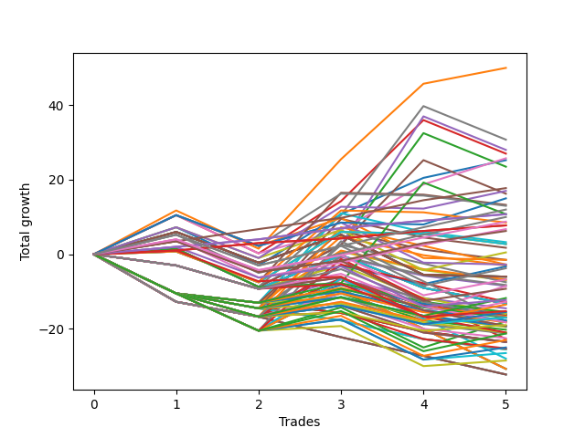

# Long Wallace Doodle 014 
- Symbol: ES90d5m
- Date Range: 03/18/2022 - 07/08/2022
- Trading Period: 7:20-12:30
- Number of Trades: 5



| Name | Win Percent | Profit | Avg Profit / Trade |     | Name | Win Percent | Profit | Avg Profit / Trade |
| ---- | ----------- | ------ | ------------------ | --- | ---- | ----------- | ------ | ------------------ |
| Sorted By <br> Profit | | | | | Sorted By <br> Win Percentage ||||
| Seven | 80.00 | 34875.00 | 6975.00 |     | Seven | 80.00 | 34875.00 | 6975.00 |
| One | 80.00 | 32750.00 | 6550.00 |     | One | 80.00 | 32750.00 | 6550.00 |
| Four | 80.00 | 28500.00 | 5700.00 |     | Four | 80.00 | 28500.00 | 5700.00 |
| Three | 80.00 | 28250.00 | 5650.00 |     | Three | 80.00 | 28250.00 | 5650.00 |
| Two | 80.00 | 25250.00 | 5050.00 |     | Two | 80.00 | 25250.00 | 5050.00 |
| Five | 80.00 | 22875.00 | 4575.00 |     | Five | 80.00 | 22875.00 | 4575.00 |
| Six | 80.00 | 21625.00 | 4325.00 |     | Six | 80.00 | 21625.00 | 4325.00 |
| Zero | 80.00 | 20875.00 | 4175.00 |     | Zero | 80.00 | 20875.00 | 4175.00 |
| Seventy-Three | 40.00 | 7625.00 | 1525.00 |     | Seventy-Three | 40.00 | 7625.00 | 1525.00 |

## NO STOPLOSS

### Test Zero
* Sell when price hits the middle line of the 20p bollinger
* No Stoploss
* Results:
```
Total Trades: 5
Percent Up: 80.00
Percent Down: 20.00
Total Points Moved Up: 41.75
Potential Profit: 20875.00
Total Points Ups: 48.00 Count Ups: 4
Total Points Downs: -6.25 Count Downs: 1
```

<details><summary>Trades</summary>

<code>In: 2022-04-20 11:45:00		Out: 2022-04-20 12:25:05		Total Position Time: 40:05		Total Move Up: 8.25		Total to Date: 8.25</code> <br />
<code>In: 2022-04-27 12:10:00		Out: 2022-04-27 12:50:00		Total Position Time: 40:00		Total Move Up: -6.25		Total to Date: 2.00</code> <br />
<code>In: 2022-05-03 11:40:00		Out: 2022-05-03 11:56:50		Total Position Time: 16:50		Total Move Up: 16.75		Total to Date: 18.75</code> <br />
<code>In: 2022-05-13 11:15:00		Out: 2022-05-13 11:51:50		Total Position Time: 36:50		Total Move Up: 16.00		Total to Date: 34.75</code> <br />
<code>In: 2022-06-27 11:00:00		Out: 2022-06-27 11:19:05		Total Position Time: 19:05		Total Move Up: 7.00		Total to Date: 41.75</code> <br />


</details>

### Test One
* Sell when the price hits the upper line of the 20p 1std bollinger
* No Stoploss
* Results:
```
Total Trades: 5
Percent Up: 80.00
Percent Down: 20.00
Total Points Moved Up: 65.50
Potential Profit: 32750.00
Total Points Ups: 71.75 Count Ups: 4
Total Points Downs: -6.25 Count Downs: 1
```

<details><summary>Trades</summary>

<code>In: 2022-04-20 11:45:00		Out: 2022-04-20 12:45:15		Total Position Time: 60:15		Total Move Up: 12.00		Total to Date: 12.00</code> <br />
<code>In: 2022-04-27 12:10:00		Out: 2022-04-27 12:50:00		Total Position Time: 40:00		Total Move Up: -6.25		Total to Date: 5.75</code> <br />
<code>In: 2022-05-03 11:40:00		Out: 2022-05-03 12:07:55		Total Position Time: 27:55		Total Move Up: 26.50		Total to Date: 32.25</code> <br />
<code>In: 2022-05-13 11:15:00		Out: 2022-05-13 12:00:35		Total Position Time: 45:35		Total Move Up: 26.75		Total to Date: 59.00</code> <br />
<code>In: 2022-06-27 11:00:00		Out: 2022-06-27 12:15:20		Total Position Time: 75:20		Total Move Up: 6.50		Total to Date: 65.50</code> <br />


</details>

### Test Two
* Sell when the price hits the upper line of the 20p 2std bollinger
* No Stoploss
* Results:
```
Total Trades: 5
Percent Up: 80.00
Percent Down: 20.00
Total Points Moved Up: 50.50
Potential Profit: 25250.00
Total Points Ups: 56.75 Count Ups: 4
Total Points Downs: -6.25 Count Downs: 1
```

<details><summary>Trades</summary>

<code>In: 2022-04-20 11:45:00		Out: 2022-04-20 12:50:00		Total Position Time: 65:00		Total Move Up: 13.25		Total to Date: 13.25</code> <br />
<code>In: 2022-04-27 12:10:00		Out: 2022-04-27 12:50:00		Total Position Time: 40:00		Total Move Up: -6.25		Total to Date: 7.00</code> <br />
<code>In: 2022-05-03 11:40:00		Out: 2022-05-03 12:50:00		Total Position Time: 70:00		Total Move Up: 2.25		Total to Date: 9.25</code> <br />
<code>In: 2022-05-13 11:15:00		Out: 2022-05-13 12:14:45		Total Position Time: 59:45		Total Move Up: 37.25		Total to Date: 46.50</code> <br />
<code>In: 2022-06-27 11:00:00		Out: 2022-06-27 12:50:00		Total Position Time: 110:00		Total Move Up: 4.00		Total to Date: 50.50</code> <br />


</details>

### Test Three
* Sell when price hits the middle line of the 50p bollinger
* No Stoploss
* Results:
```
Total Trades: 5
Percent Up: 80.00
Percent Down: 20.00
Total Points Moved Up: 56.50
Potential Profit: 28250.00
Total Points Ups: 62.75 Count Ups: 4
Total Points Downs: -6.25 Count Downs: 1
```

<details><summary>Trades</summary>

<code>In: 2022-04-20 11:45:00		Out: 2022-04-20 12:25:50		Total Position Time: 40:50		Total Move Up: 11.25		Total to Date: 11.25</code> <br />
<code>In: 2022-04-27 12:10:00		Out: 2022-04-27 12:50:00		Total Position Time: 40:00		Total Move Up: -6.25		Total to Date: 5.00</code> <br />
<code>In: 2022-05-03 11:40:00		Out: 2022-05-03 11:59:05		Total Position Time: 19:05		Total Move Up: 18.50		Total to Date: 23.50</code> <br />
<code>In: 2022-05-13 11:15:00		Out: 2022-05-13 12:01:10		Total Position Time: 46:10		Total Move Up: 29.00		Total to Date: 52.50</code> <br />
<code>In: 2022-06-27 11:00:00		Out: 2022-06-27 12:50:00		Total Position Time: 110:00		Total Move Up: 4.00		Total to Date: 56.50</code> <br />


</details>

### Test Four
* Sell when the price hits the upper line of the 50p 1std bollinger
* No Stoploss
* Results:
```
Total Trades: 5
Percent Up: 80.00
Percent Down: 20.00
Total Points Moved Up: 57.00
Potential Profit: 28500.00
Total Points Ups: 63.25 Count Ups: 4
Total Points Downs: -6.25 Count Downs: 1
```

<details><summary>Trades</summary>

<code>In: 2022-04-20 11:45:00		Out: 2022-04-20 12:50:00		Total Position Time: 65:00		Total Move Up: 13.25		Total to Date: 13.25</code> <br />
<code>In: 2022-04-27 12:10:00		Out: 2022-04-27 12:50:00		Total Position Time: 40:00		Total Move Up: -6.25		Total to Date: 7.00</code> <br />
<code>In: 2022-05-03 11:40:00		Out: 2022-05-03 12:50:00		Total Position Time: 70:00		Total Move Up: 2.25		Total to Date: 9.25</code> <br />
<code>In: 2022-05-13 11:15:00		Out: 2022-05-13 12:29:40		Total Position Time: 74:40		Total Move Up: 43.75		Total to Date: 53.00</code> <br />
<code>In: 2022-06-27 11:00:00		Out: 2022-06-27 12:50:00		Total Position Time: 110:00		Total Move Up: 4.00		Total to Date: 57.00</code> <br />


</details>

### Test Five
* Sell when the price hits the upper line of the 50p 2std bollinger
* No Stoploss
* Results:
```
Total Trades: 5
Percent Up: 80.00
Percent Down: 20.00
Total Points Moved Up: 45.75
Potential Profit: 22875.00
Total Points Ups: 52.00 Count Ups: 4
Total Points Downs: -6.25 Count Downs: 1
```

<details><summary>Trades</summary>

<code>In: 2022-04-20 11:45:00		Out: 2022-04-20 12:50:00		Total Position Time: 65:00		Total Move Up: 13.25		Total to Date: 13.25</code> <br />
<code>In: 2022-04-27 12:10:00		Out: 2022-04-27 12:50:00		Total Position Time: 40:00		Total Move Up: -6.25		Total to Date: 7.00</code> <br />
<code>In: 2022-05-03 11:40:00		Out: 2022-05-03 12:50:00		Total Position Time: 70:00		Total Move Up: 2.25		Total to Date: 9.25</code> <br />
<code>In: 2022-05-13 11:15:00		Out: 2022-05-13 12:50:00		Total Position Time: 95:00		Total Move Up: 32.50		Total to Date: 41.75</code> <br />
<code>In: 2022-06-27 11:00:00		Out: 2022-06-27 12:50:00		Total Position Time: 110:00		Total Move Up: 4.00		Total to Date: 45.75</code> <br />


</details>

### Test Six
* Sell when the price hits the middle line of the 1std VWAP
* No Stoploss
* Results:
```
Total Trades: 5
Percent Up: 80.00
Percent Down: 20.00
Total Points Moved Up: 43.25
Potential Profit: 21625.00
Total Points Ups: 49.50 Count Ups: 4
Total Points Downs: -6.25 Count Downs: 1
```

<details><summary>Trades</summary>

<code>In: 2022-04-20 11:45:00		Out: 2022-04-20 12:26:10		Total Position Time: 41:10		Total Move Up: 12.00		Total to Date: 12.00</code> <br />
<code>In: 2022-04-27 12:10:00		Out: 2022-04-27 12:50:00		Total Position Time: 40:00		Total Move Up: -6.25		Total to Date: 5.75</code> <br />
<code>In: 2022-05-03 11:40:00		Out: 2022-05-03 11:50:50		Total Position Time: 10:50		Total Move Up: 9.25		Total to Date: 15.00</code> <br />
<code>In: 2022-05-13 11:15:00		Out: 2022-05-13 11:52:25		Total Position Time: 37:25		Total Move Up: 19.00		Total to Date: 34.00</code> <br />
<code>In: 2022-06-27 11:00:00		Out: 2022-06-27 11:38:50		Total Position Time: 38:50		Total Move Up: 9.25		Total to Date: 43.25</code> <br />


</details>

### Test Seven
* Sell when the price hits the upper line of the 1std VWAP
* No Stoploss
* Results:
```
Total Trades: 5
Percent Up: 80.00
Percent Down: 20.00
Total Points Moved Up: 69.75
Potential Profit: 34875.00
Total Points Ups: 76.00 Count Ups: 4
Total Points Downs: -6.25 Count Downs: 1
```

<details><summary>Trades</summary>

<code>In: 2022-04-20 11:45:00		Out: 2022-04-20 12:50:00		Total Position Time: 65:00		Total Move Up: 13.25		Total to Date: 13.25</code> <br />
<code>In: 2022-04-27 12:10:00		Out: 2022-04-27 12:50:00		Total Position Time: 40:00		Total Move Up: -6.25		Total to Date: 7.00</code> <br />
<code>In: 2022-05-03 11:40:00		Out: 2022-05-03 11:59:45		Total Position Time: 19:45		Total Move Up: 22.25		Total to Date: 29.25</code> <br />
<code>In: 2022-05-13 11:15:00		Out: 2022-05-13 12:14:40		Total Position Time: 59:40		Total Move Up: 36.50		Total to Date: 65.75</code> <br />
<code>In: 2022-06-27 11:00:00		Out: 2022-06-27 12:50:00		Total Position Time: 110:00		Total Move Up: 4.00		Total to Date: 69.75</code> <br />


</details>

## SPECIAL EXIT CONDITIONS 

### Test Seventy-Three
* Sell when the linear regression slope changes to negative
* No Stoploss
* Results:
```
Total Trades: 5
Percent Up: 40.00
Percent Down: 60.00
Total Points Moved Up: 15.25
Potential Profit: 7625.00
Total Points Ups: 24.50 Count Ups: 2
Total Points Downs: -9.25 Count Downs: 3
```

<details><summary>Trades</summary>

<code>In: 2022-04-20 11:45:00		Out: 2022-04-20 11:58:00		Total Position Time: 13:00		Total Move Up: -6.25		Total to Date: -6.25</code> <br />
<code>In: 2022-04-27 12:10:00		Out: 2022-04-27 12:18:00		Total Position Time: 08:00		Total Move Up: -2.75		Total to Date: -9.00</code> <br />
<code>In: 2022-05-03 11:40:00		Out: 2022-05-03 11:51:05		Total Position Time: 11:05		Total Move Up: 9.00		Total to Date: 0.00</code> <br />
<code>In: 2022-05-13 11:15:00		Out: 2022-05-13 11:32:05		Total Position Time: 17:05		Total Move Up: 15.50		Total to Date: 15.50</code> <br />
<code>In: 2022-06-27 11:00:00		Out: 2022-06-27 11:12:05		Total Position Time: 12:05		Total Move Up: -0.25		Total to Date: 15.25</code> <br />


</details>