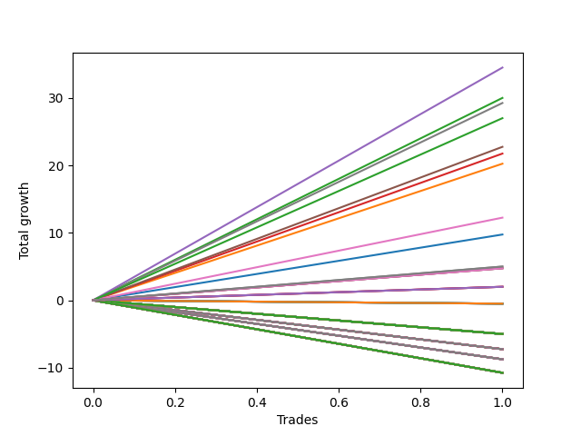

# Long Wallace Doodle 016 
- Symbol: ES90d5m
- Date Range: 03/18/2022 - 07/08/2022
- Trading Period: 7:20-12:30
- Number of Trades: 1



| Name | Win Percent | Profit | Avg Profit / Trade |     | Name | Win Percent | Profit | Avg Profit / Trade |
| ---- | ----------- | ------ | ------------------ | --- | ---- | ----------- | ------ | ------------------ |
| Sorted By <br> Profit | | | | | Sorted By <br> Win Percentage ||||
| Four | 100.00 | 21875.00 | 21875.00 |     | Four | 100.00 | 21875.00 | 21875.00 |
| Two | 100.00 | 18625.00 | 18625.00 |     | Two | 100.00 | 18625.00 | 18625.00 |
| Seven | 100.00 | 18250.00 | 18250.00 |     | Seven | 100.00 | 18250.00 | 18250.00 |
| Five | 100.00 | 16250.00 | 16250.00 |     | Five | 100.00 | 16250.00 | 16250.00 |
| Three | 100.00 | 14500.00 | 14500.00 |     | Three | 100.00 | 14500.00 | 14500.00 |
| One | 100.00 | 13375.00 | 13375.00 |     | One | 100.00 | 13375.00 | 13375.00 |
| Six | 100.00 | 9500.00 | 9500.00 |     | Six | 100.00 | 9500.00 | 9500.00 |
| Zero | 100.00 | 8000.00 | 8000.00 |     | Zero | 100.00 | 8000.00 | 8000.00 |
| Seventy-Three | 100.00 | 7750.00 | 7750.00 |     | Seventy-Three | 100.00 | 7750.00 | 7750.00 |

## NO STOPLOSS

### Test Zero
* Sell when price hits the middle line of the 20p bollinger
* No Stoploss
* Results:
```
Total Trades: 1
Percent Up: 100.00
Percent Down: 0.00
Total Points Moved Up: 16.00
Potential Profit: 8000.00
Total Points Ups: 16.00 Count Ups: 1
Total Points Downs: 0.00 Count Downs: 0
```

<details><summary>Trades</summary>

<code>In: 2022-05-13 11:15:00		Out: 2022-05-13 11:51:50		Total Position Time: 36:50		Total Move Up: 16.00		Total to Date: 16.00</code> <br />


</details>

### Test One
* Sell when the price hits the upper line of the 20p 1std bollinger
* No Stoploss
* Results:
```
Total Trades: 1
Percent Up: 100.00
Percent Down: 0.00
Total Points Moved Up: 26.75
Potential Profit: 13375.00
Total Points Ups: 26.75 Count Ups: 1
Total Points Downs: 0.00 Count Downs: 0
```

<details><summary>Trades</summary>

<code>In: 2022-05-13 11:15:00		Out: 2022-05-13 12:00:35		Total Position Time: 45:35		Total Move Up: 26.75		Total to Date: 26.75</code> <br />


</details>

### Test Two
* Sell when the price hits the upper line of the 20p 2std bollinger
* No Stoploss
* Results:
```
Total Trades: 1
Percent Up: 100.00
Percent Down: 0.00
Total Points Moved Up: 37.25
Potential Profit: 18625.00
Total Points Ups: 37.25 Count Ups: 1
Total Points Downs: 0.00 Count Downs: 0
```

<details><summary>Trades</summary>

<code>In: 2022-05-13 11:15:00		Out: 2022-05-13 12:14:45		Total Position Time: 59:45		Total Move Up: 37.25		Total to Date: 37.25</code> <br />


</details>

### Test Three
* Sell when price hits the middle line of the 50p bollinger
* No Stoploss
* Results:
```
Total Trades: 1
Percent Up: 100.00
Percent Down: 0.00
Total Points Moved Up: 29.00
Potential Profit: 14500.00
Total Points Ups: 29.00 Count Ups: 1
Total Points Downs: 0.00 Count Downs: 0
```

<details><summary>Trades</summary>

<code>In: 2022-05-13 11:15:00		Out: 2022-05-13 12:01:10		Total Position Time: 46:10		Total Move Up: 29.00		Total to Date: 29.00</code> <br />


</details>

### Test Four
* Sell when the price hits the upper line of the 50p 1std bollinger
* No Stoploss
* Results:
```
Total Trades: 1
Percent Up: 100.00
Percent Down: 0.00
Total Points Moved Up: 43.75
Potential Profit: 21875.00
Total Points Ups: 43.75 Count Ups: 1
Total Points Downs: 0.00 Count Downs: 0
```

<details><summary>Trades</summary>

<code>In: 2022-05-13 11:15:00		Out: 2022-05-13 12:29:40		Total Position Time: 74:40		Total Move Up: 43.75		Total to Date: 43.75</code> <br />


</details>

### Test Five
* Sell when the price hits the upper line of the 50p 2std bollinger
* No Stoploss
* Results:
```
Total Trades: 1
Percent Up: 100.00
Percent Down: 0.00
Total Points Moved Up: 32.50
Potential Profit: 16250.00
Total Points Ups: 32.50 Count Ups: 1
Total Points Downs: 0.00 Count Downs: 0
```

<details><summary>Trades</summary>

<code>In: 2022-05-13 11:15:00		Out: 2022-05-13 12:50:00		Total Position Time: 95:00		Total Move Up: 32.50		Total to Date: 32.50</code> <br />


</details>

### Test Six
* Sell when the price hits the middle line of the 1std VWAP
* No Stoploss
* Results:
```
Total Trades: 1
Percent Up: 100.00
Percent Down: 0.00
Total Points Moved Up: 19.00
Potential Profit: 9500.00
Total Points Ups: 19.00 Count Ups: 1
Total Points Downs: 0.00 Count Downs: 0
```

<details><summary>Trades</summary>

<code>In: 2022-05-13 11:15:00		Out: 2022-05-13 11:52:25		Total Position Time: 37:25		Total Move Up: 19.00		Total to Date: 19.00</code> <br />


</details>

### Test Seven
* Sell when the price hits the upper line of the 1std VWAP
* No Stoploss
* Results:
```
Total Trades: 1
Percent Up: 100.00
Percent Down: 0.00
Total Points Moved Up: 36.50
Potential Profit: 18250.00
Total Points Ups: 36.50 Count Ups: 1
Total Points Downs: 0.00 Count Downs: 0
```

<details><summary>Trades</summary>

<code>In: 2022-05-13 11:15:00		Out: 2022-05-13 12:14:40		Total Position Time: 59:40		Total Move Up: 36.50		Total to Date: 36.50</code> <br />


</details>

## SPECIAL EXIT CONDITIONS 

### Test Seventy-Three
* Sell when the linear regression slope changes to negative
* No Stoploss
* Results:
```
Total Trades: 1
Percent Up: 100.00
Percent Down: 0.00
Total Points Moved Up: 15.50
Potential Profit: 7750.00
Total Points Ups: 15.50 Count Ups: 1
Total Points Downs: 0.00 Count Downs: 0
```

<details><summary>Trades</summary>

<code>In: 2022-05-13 11:15:00		Out: 2022-05-13 11:32:05		Total Position Time: 17:05		Total Move Up: 15.50		Total to Date: 15.50</code> <br />


</details>