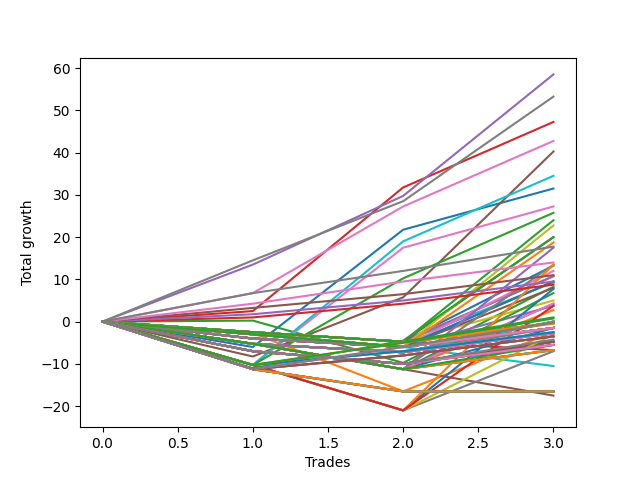

# Long Wallace Doodle 019 
- Symbol: ES90d5m
- Date Range: 03/18/2022 - 07/08/2022
- Trading Period: 7:20-12:30
- Number of Trades: 3



| Name | Win Percent | Profit | Avg Profit / Trade |     | Name | Win Percent | Profit | Avg Profit / Trade |
| ---- | ----------- | ------ | ------------------ | --- | ---- | ----------- | ------ | ------------------ |
| Sorted By <br> Profit | | | | | Sorted By <br> Win Percentage ||||
| Four | 100.00 | 30000.00 | 10000.00 |     | Four | 100.00 | 30000.00 | 10000.00 |
| Three | 100.00 | 23875.00 | 7958.33 |     | Three | 100.00 | 23875.00 | 7958.33 |
| Seven | 100.00 | 23125.00 | 7708.33 |     | Seven | 100.00 | 23125.00 | 7708.33 |
| Six | 100.00 | 21750.00 | 7250.00 |     | Six | 100.00 | 21750.00 | 7250.00 |
| Zero | 66.67 | 15375.00 | 5125.00 |     | Zero | 66.67 | 15375.00 | 5125.00 |
| Five | 66.67 | 13625.00 | 4541.67 |     | Five | 66.67 | 13625.00 | 4541.67 |
| Two | 33.33 | 4500.00 | 1500.00 |     | Two | 33.33 | 4500.00 | 1500.00 |
| One | 33.33 | -1625.00 | -541.67 |     | One | 33.33 | -1625.00 | -541.67 |

### Test Zero
* Sell when price hits the middle line of the 20p bollinger
* No Stoploss
* Results:
```
Total Trades: 3
Percent Up: 66.67
Percent Down: 33.33
Total Points Moved Up: 30.75
Potential Profit: 15375.00
Total Points Ups: 38.25 Count Ups: 2
Total Points Downs: -7.50 Count Downs: 1
```

<details><summary>Trades</summary>

<code>In: 2022-04-18 08:25:00		Out: 2022-04-18 09:55:05		Total Position Time: 90:05		Total Move Up: -7.50		Total to Date: -7.50</code> <br />
<code>In: 2022-05-12 09:00:00		Out: 2022-05-12 09:33:10		Total Position Time: 33:10		Total Move Up: 30.50		Total to Date: 23.00</code> <br />
<code>In: 2022-05-25 09:35:00		Out: 2022-05-25 10:29:20		Total Position Time: 54:20		Total Move Up: 7.75		Total to Date: 30.75</code> <br />


</details>

### Test One
* Sell when the price hits the upper line of the 20p 1std bollinger
* No Stoploss
* Results:
```
Total Trades: 3
Percent Up: 33.33
Percent Down: 66.67
Total Points Moved Up: -3.25
Potential Profit: -1625.00
Total Points Ups: 12.50 Count Ups: 1
Total Points Downs: -15.75 Count Downs: 2
```

<details><summary>Trades</summary>

<code>In: 2022-04-18 08:25:00		Out: 2022-04-18 10:08:10		Total Position Time: 103:10		Total Move Up: -3.75		Total to Date: -3.75</code> <br />
<code>In: 2022-05-12 09:00:00		Out: 2022-05-12 12:18:20		Total Position Time: 198:20		Total Move Up: -12.00		Total to Date: -15.75</code> <br />
<code>In: 2022-05-25 09:35:00		Out: 2022-05-25 10:36:50		Total Position Time: 61:50		Total Move Up: 12.50		Total to Date: -3.25</code> <br />


</details>

### Test Two
* Sell when the price hits the upper line of the 20p 2std bollinger
* No Stoploss
* Results:
```
Total Trades: 3
Percent Up: 33.33
Percent Down: 66.67
Total Points Moved Up: 9.00
Potential Profit: 4500.00
Total Points Ups: 16.50 Count Ups: 1
Total Points Downs: -7.50 Count Downs: 2
```

<details><summary>Trades</summary>

<code>In: 2022-04-18 08:25:00		Out: 2022-04-18 10:10:25		Total Position Time: 105:25		Total Move Up: -0.50		Total to Date: -0.50</code> <br />
<code>In: 2022-05-12 09:00:00		Out: 2022-05-12 12:19:20		Total Position Time: 199:20		Total Move Up: -7.00		Total to Date: -7.50</code> <br />
<code>In: 2022-05-25 09:35:00		Out: 2022-05-25 11:00:25		Total Position Time: 85:25		Total Move Up: 16.50		Total to Date: 9.00</code> <br />


</details>

### Test Three
* Sell when price hits the middle line of the 50p bollinger
* No Stoploss
* Results:
```
Total Trades: 3
Percent Up: 100.00
Percent Down: 0.00
Total Points Moved Up: 47.75
Potential Profit: 23875.00
Total Points Ups: 47.75 Count Ups: 3
Total Points Downs: 0.00 Count Downs: 0
```

<details><summary>Trades</summary>

<code>In: 2022-04-18 08:25:00		Out: 2022-04-18 10:31:35		Total Position Time: 126:35		Total Move Up: 2.00		Total to Date: 2.00</code> <br />
<code>In: 2022-05-12 09:00:00		Out: 2022-05-12 09:35:15		Total Position Time: 35:15		Total Move Up: 31.75		Total to Date: 33.75</code> <br />
<code>In: 2022-05-25 09:35:00		Out: 2022-05-25 10:37:05		Total Position Time: 62:05		Total Move Up: 14.00		Total to Date: 47.75</code> <br />


</details>

### Test Four
* Sell when the price hits the upper line of the 50p 1std bollinger
* No Stoploss
* Results:
```
Total Trades: 3
Percent Up: 100.00
Percent Down: 0.00
Total Points Moved Up: 60.00
Potential Profit: 30000.00
Total Points Ups: 60.00 Count Ups: 3
Total Points Downs: 0.00 Count Downs: 0
```

<details><summary>Trades</summary>

<code>In: 2022-04-18 08:25:00		Out: 2022-04-18 10:35:40		Total Position Time: 130:40		Total Move Up: 13.00		Total to Date: 13.00</code> <br />
<code>In: 2022-05-12 09:00:00		Out: 2022-05-12 12:43:05		Total Position Time: 223:05		Total Move Up: 19.75		Total to Date: 32.75</code> <br />
<code>In: 2022-05-25 09:35:00		Out: 2022-05-25 11:02:25		Total Position Time: 87:25		Total Move Up: 27.25		Total to Date: 60.00</code> <br />


</details>

### Test Five
* Sell when the price hits the upper line of the 50p 2std bollinger
* No Stoploss
* Results:
```
Total Trades: 3
Percent Up: 66.67
Percent Down: 33.33
Total Points Moved Up: 27.25
Potential Profit: 13625.00
Total Points Ups: 42.00 Count Ups: 2
Total Points Downs: -14.75 Count Downs: 1
```

<details><summary>Trades</summary>

<code>In: 2022-04-18 08:25:00		Out: 2022-04-18 12:50:00		Total Position Time: 265:00		Total Move Up: -14.75		Total to Date: -14.75</code> <br />
<code>In: 2022-05-12 09:00:00		Out: 2022-05-12 12:50:00		Total Position Time: 230:00		Total Move Up: 9.00		Total to Date: -5.75</code> <br />
<code>In: 2022-05-25 09:35:00		Out: 2022-05-25 11:27:25		Total Position Time: 112:25		Total Move Up: 33.00		Total to Date: 27.25</code> <br />


</details>

### Test Six
* Sell when the price hits the middle line of the 1std VWAP
* No Stoploss
* Results:
```
Total Trades: 3
Percent Up: 100.00
Percent Down: 0.00
Total Points Moved Up: 43.50
Potential Profit: 21750.00
Total Points Ups: 43.50 Count Ups: 3
Total Points Downs: 0.00 Count Downs: 0
```

<details><summary>Trades</summary>

<code>In: 2022-04-18 08:25:00		Out: 2022-04-18 10:32:10		Total Position Time: 127:10		Total Move Up: 6.25		Total to Date: 6.25</code> <br />
<code>In: 2022-05-12 09:00:00		Out: 2022-05-12 09:31:15		Total Position Time: 31:15		Total Move Up: 23.25		Total to Date: 29.50</code> <br />
<code>In: 2022-05-25 09:35:00		Out: 2022-05-25 10:37:05		Total Position Time: 62:05		Total Move Up: 14.00		Total to Date: 43.50</code> <br />


</details>

### Test Seven
* Sell when the price hits the upper line of the 1std VWAP
* No Stoploss
* Results:
```
Total Trades: 3
Percent Up: 100.00
Percent Down: 0.00
Total Points Moved Up: 46.25
Potential Profit: 23125.00
Total Points Ups: 46.25 Count Ups: 3
Total Points Downs: 0.00 Count Downs: 0
```

<details><summary>Trades</summary>

<code>In: 2022-04-18 08:25:00		Out: 2022-04-18 10:35:45		Total Position Time: 130:45		Total Move Up: 14.00		Total to Date: 14.00</code> <br />
<code>In: 2022-05-12 09:00:00		Out: 2022-05-12 12:50:00		Total Position Time: 230:00		Total Move Up: 9.00		Total to Date: 23.00</code> <br />
<code>In: 2022-05-25 09:35:00		Out: 2022-05-25 11:02:15		Total Position Time: 87:15		Total Move Up: 23.25		Total to Date: 46.25</code> <br />


</details>