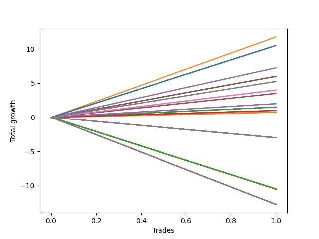

# Long Wallace Doodle 0225_009 
- Symbol: ES90d5m
- Date Range: 03/18/2022 - 07/08/2022
- Trading Period: 7:20-12:30
- Number of Trades: 1



| Name | Win Percent | Profit | Avg Profit / Trade |     | Name | Win Percent | Profit | Avg Profit / Trade |
| ---- | ----------- | ------ | ------------------ | --- | ---- | ----------- | ------ | ------------------ |
| Sorted By <br> Profit | | | | | Sorted By <br> Win Percentage ||||
| Seven | 100.00 | 6625.00 | 6625.00 |     | Seven | 100.00 | 6625.00 | 6625.00 |
| Five | 100.00 | 6625.00 | 6625.00 |     | Five | 100.00 | 6625.00 | 6625.00 |
| Four | 100.00 | 6625.00 | 6625.00 |     | Four | 100.00 | 6625.00 | 6625.00 |
| Two | 100.00 | 6625.00 | 6625.00 |     | Two | 100.00 | 6625.00 | 6625.00 |
| Six | 100.00 | 6000.00 | 6000.00 |     | Six | 100.00 | 6000.00 | 6000.00 |
| One | 100.00 | 6000.00 | 6000.00 |     | One | 100.00 | 6000.00 | 6000.00 |
| Three | 100.00 | 5625.00 | 5625.00 |     | Three | 100.00 | 5625.00 | 5625.00 |
| Zero | 100.00 | 4125.00 | 4125.00 |     | Zero | 100.00 | 4125.00 | 4125.00 |
| Seventy-Three | 0.00 | -3125.00 | -3125.00 |     | Seventy-Three | 0.00 | -3125.00 | -3125.00 |

## NO STOPLOSS

### Test Zero
* Sell when price hits the middle line of the 20p bollinger
* No Stoploss
* Results:
```
Total Trades: 1
Percent Up: 100.00
Percent Down: 0.00
Total Points Moved Up: 8.25
Potential Profit: 4125.00
Total Points Ups: 8.25 Count Ups: 1
Total Points Downs: 0.00 Count Downs: 0
```

<details><summary>Trades</summary>

<code>In: 2022-04-20 11:45:00		Out: 2022-04-20 12:25:05		Total Position Time: 40:05		Total Move Up: 8.25		Total to Date: 8.25</code> <br />


</details>

### Test One
* Sell when the price hits the upper line of the 20p 1std bollinger
* No Stoploss
* Results:
```
Total Trades: 1
Percent Up: 100.00
Percent Down: 0.00
Total Points Moved Up: 12.00
Potential Profit: 6000.00
Total Points Ups: 12.00 Count Ups: 1
Total Points Downs: 0.00 Count Downs: 0
```

<details><summary>Trades</summary>

<code>In: 2022-04-20 11:45:00		Out: 2022-04-20 12:45:15		Total Position Time: 60:15		Total Move Up: 12.00		Total to Date: 12.00</code> <br />


</details>

### Test Two
* Sell when the price hits the upper line of the 20p 2std bollinger
* No Stoploss
* Results:
```
Total Trades: 1
Percent Up: 100.00
Percent Down: 0.00
Total Points Moved Up: 13.25
Potential Profit: 6625.00
Total Points Ups: 13.25 Count Ups: 1
Total Points Downs: 0.00 Count Downs: 0
```

<details><summary>Trades</summary>

<code>In: 2022-04-20 11:45:00		Out: 2022-04-20 12:50:00		Total Position Time: 65:00		Total Move Up: 13.25		Total to Date: 13.25</code> <br />


</details>

### Test Three
* Sell when price hits the middle line of the 50p bollinger
* No Stoploss
* Results:
```
Total Trades: 1
Percent Up: 100.00
Percent Down: 0.00
Total Points Moved Up: 11.25
Potential Profit: 5625.00
Total Points Ups: 11.25 Count Ups: 1
Total Points Downs: 0.00 Count Downs: 0
```

<details><summary>Trades</summary>

<code>In: 2022-04-20 11:45:00		Out: 2022-04-20 12:25:50		Total Position Time: 40:50		Total Move Up: 11.25		Total to Date: 11.25</code> <br />


</details>

### Test Four
* Sell when the price hits the upper line of the 50p 1std bollinger
* No Stoploss
* Results:
```
Total Trades: 1
Percent Up: 100.00
Percent Down: 0.00
Total Points Moved Up: 13.25
Potential Profit: 6625.00
Total Points Ups: 13.25 Count Ups: 1
Total Points Downs: 0.00 Count Downs: 0
```

<details><summary>Trades</summary>

<code>In: 2022-04-20 11:45:00		Out: 2022-04-20 12:50:00		Total Position Time: 65:00		Total Move Up: 13.25		Total to Date: 13.25</code> <br />


</details>

### Test Five
* Sell when the price hits the upper line of the 50p 2std bollinger
* No Stoploss
* Results:
```
Total Trades: 1
Percent Up: 100.00
Percent Down: 0.00
Total Points Moved Up: 13.25
Potential Profit: 6625.00
Total Points Ups: 13.25 Count Ups: 1
Total Points Downs: 0.00 Count Downs: 0
```

<details><summary>Trades</summary>

<code>In: 2022-04-20 11:45:00		Out: 2022-04-20 12:50:00		Total Position Time: 65:00		Total Move Up: 13.25		Total to Date: 13.25</code> <br />


</details>

### Test Six
* Sell when the price hits the middle line of the 1std VWAP
* No Stoploss
* Results:
```
Total Trades: 1
Percent Up: 100.00
Percent Down: 0.00
Total Points Moved Up: 12.00
Potential Profit: 6000.00
Total Points Ups: 12.00 Count Ups: 1
Total Points Downs: 0.00 Count Downs: 0
```

<details><summary>Trades</summary>

<code>In: 2022-04-20 11:45:00		Out: 2022-04-20 12:26:10		Total Position Time: 41:10		Total Move Up: 12.00		Total to Date: 12.00</code> <br />


</details>

### Test Seven
* Sell when the price hits the upper line of the 1std VWAP
* No Stoploss
* Results:
```
Total Trades: 1
Percent Up: 100.00
Percent Down: 0.00
Total Points Moved Up: 13.25
Potential Profit: 6625.00
Total Points Ups: 13.25 Count Ups: 1
Total Points Downs: 0.00 Count Downs: 0
```

<details><summary>Trades</summary>

<code>In: 2022-04-20 11:45:00		Out: 2022-04-20 12:50:00		Total Position Time: 65:00		Total Move Up: 13.25		Total to Date: 13.25</code> <br />


</details>

## SPECIAL EXIT CONDITIONS 

### Test Seventy-Three
* Sell when the linear regression slope changes to negative
* No Stoploss
* Results:
```
Total Trades: 1
Percent Up: 0.00
Percent Down: 100.00
Total Points Moved Up: -6.25
Potential Profit: -3125.00
Total Points Ups: 0.00 Count Ups: 0
Total Points Downs: -6.25 Count Downs: 1
```

<details><summary>Trades</summary>

<code>In: 2022-04-20 11:45:00		Out: 2022-04-20 11:58:00		Total Position Time: 13:00		Total Move Up: -6.25		Total to Date: -6.25</code> <br />


</details>