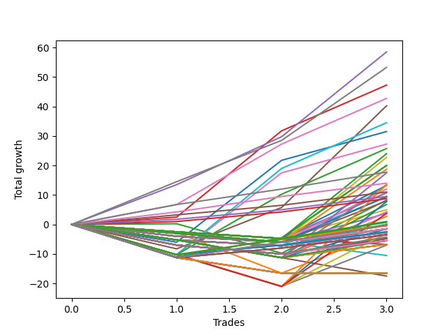

# Long Wallace Doodle 019 
- Symbol: ES90d5m
- Date Range: 03/18/2022 - 07/08/2022
- Trading Period: 7:20-12:30
- Number of Trades: 3



| Name | Win Percent | Profit | Avg Profit / Trade | Avg Time / Trade |      | Name | Win Percent | Profit | Avg Profit / Trade | Avg Time / Trade |
| ---- | ----------- | ------ | ------------------ | ---------------- | ---- | ---- | ----------- | ------ | ------------------ | ---------------- |
| Sorted By <br> Profit | | | | | | Sorted By <br> Win Percentage ||||
| Four | 100.00 | 29250.00 | 9750.00 | 00:00 |     | Four | 100.00 | 29250.00 | 9750.00 | 00:00 |
| Seven | 100.00 | 26625.00 | 8875.00 | 00:00 |     | Seven | 100.00 | 26625.00 | 8875.00 | 00:00 |
| Three | 100.00 | 23625.00 | 7875.00 | 00:00 |     | Three | 100.00 | 23625.00 | 7875.00 | 00:00 |
| Six | 100.00 | 21375.00 | 7125.00 | 00:00 |     | Six | 100.00 | 21375.00 | 7125.00 | 00:00 |
| Five | 66.67 | 20125.00 | 6708.33 | 00:00 |     | Eighty-Five | 100.00 | 8875.00 | 2958.33 | 00:00 |
| Fifty-Nine | 66.67 | 17250.00 | 5750.00 | 00:00 |     | Eighty-Four | 100.00 | 7000.00 | 2333.33 | 00:00 |
| Zero | 66.67 | 15750.00 | 5250.00 | 00:00 |     | Eighty-Three | 100.00 | 5500.00 | 1833.33 | 00:00 |
| Fifty-Six | 66.67 | 13625.00 | 4541.67 | 00:00 |     | Eighty-Two | 100.00 | 4750.00 | 1583.33 | 00:00 |
| Sixty-Two | 66.67 | 12875.00 | 4291.67 | 00:00 |     | Eighty-One | 100.00 | 4375.00 | 1458.33 | 00:00 |
| Twelve | 33.33 | 12000.00 | 4000.00 | 00:00 |     | Five | 66.67 | 20125.00 | 6708.33 | 00:00 |
| Twenty-Eight | 33.33 | 11375.00 | 3791.67 | 00:00 |     | Fifty-Nine | 66.67 | 17250.00 | 5750.00 | 00:00 |
| Seventy-Three | 66.67 | 10000.00 | 3333.33 | 00:00 |     | Zero | 66.67 | 15750.00 | 5250.00 | 00:00 |
| Fifteen | 33.33 | 10000.00 | 3333.33 | 00:00 |     | Fifty-Six | 66.67 | 13625.00 | 4541.67 | 00:00 |
| Thirty-One | 33.33 | 9375.00 | 3125.00 | 00:00 |     | Sixty-Two | 66.67 | 12875.00 | 4291.67 | 00:00 |
| Eighty-Five | 100.00 | 8875.00 | 2958.33 | 00:00 |     | Seventy-Three | 66.67 | 10000.00 | 3333.33 | 00:00 |
| Forty-Four | 33.33 | 8750.00 | 2916.67 | 00:00 |     | Two | 66.67 | 4125.00 | 1375.00 | 00:00 |
| Eighty-Four | 100.00 | 7000.00 | 2333.33 | 00:00 |     | One Hundred Twenty-Five | 66.67 | 375.00 | 125.00 | 00:00 |
| Sixty-One | 33.33 | 6750.00 | 2250.00 | 00:00 |     | One Hundred Thirty | 66.67 | -125.00 | -41.67 | 00:00 |
| Forty-Seven | 33.33 | 6750.00 | 2250.00 | 00:00 |     | One Hundred Twenty-Four | 66.67 | -250.00 | -83.33 | 00:00 |
| Ten | 33.33 | 6625.00 | 2208.33 | 00:00 |     | One Hundred Twenty-Nine | 66.67 | -750.00 | -250.00 | 00:00 |
| Twenty-Six | 33.33 | 6000.00 | 2000.00 | 00:00 |     | One Hundred Twenty-Three | 66.67 | -1250.00 | -416.67 | 00:00 |
| Eighty-Three | 100.00 | 5500.00 | 1833.33 | 00:00 |     | One Hundred Twenty-Two | 66.67 | -1250.00 | -416.67 | 00:00 |
| Fourteen | 33.33 | 5375.00 | 1791.67 | 00:00 |     | One Hundred Twenty-One | 66.67 | -1250.00 | -416.67 | 00:00 |
| Eleven | 33.33 | 5375.00 | 1791.67 | 00:00 |     | One Hundred Twenty-Eight | 66.67 | -1750.00 | -583.33 | 00:00 |
| Eighty-Two | 100.00 | 4750.00 | 1583.33 | 00:00 |     | One Hundred Twenty-Seven | 66.67 | -1750.00 | -583.33 | 00:00 |
| Thirty | 33.33 | 4750.00 | 1583.33 | 00:00 |     | One Hundred Twenty-Six | 66.67 | -1750.00 | -583.33 | 00:00 |
| twenty-Seven | 33.33 | 4750.00 | 1583.33 | 00:00 |     | Twelve | 33.33 | 12000.00 | 4000.00 | 00:00 |
| Nine | 33.33 | 4625.00 | 1541.67 | 00:00 |     | Twenty-Eight | 33.33 | 11375.00 | 3791.67 | 00:00 |
| Eighty-One | 100.00 | 4375.00 | 1458.33 | 00:00 |     | Fifteen | 33.33 | 10000.00 | 3333.33 | 00:00 |
| Two | 66.67 | 4125.00 | 1375.00 | 00:00 |     | Thirty-One | 33.33 | 9375.00 | 3125.00 | 00:00 |
| Twenty-Five | 33.33 | 4000.00 | 1333.33 | 00:00 |     | Forty-Four | 33.33 | 8750.00 | 2916.67 | 00:00 |
| Sixty | 33.33 | 3875.00 | 1291.67 | 00:00 |     | Sixty-One | 33.33 | 6750.00 | 2250.00 | 00:00 |
| Forty-Two | 33.33 | 3375.00 | 1125.00 | 00:00 |     | Forty-Seven | 33.33 | 6750.00 | 2250.00 | 00:00 |
| Eight | 33.33 | 2500.00 | 833.33 | 00:00 |     | Ten | 33.33 | 6625.00 | 2208.33 | 00:00 |
| Forty-Six | 33.33 | 2125.00 | 708.33 | 00:00 |     | Twenty-Six | 33.33 | 6000.00 | 2000.00 | 00:00 |
| Forty-Three | 33.33 | 2125.00 | 708.33 | 00:00 |     | Fourteen | 33.33 | 5375.00 | 1791.67 | 00:00 |
| Sixty-Three | 33.33 | 1875.00 | 625.00 | 00:00 |     | Eleven | 33.33 | 5375.00 | 1791.67 | 00:00 |
| Twenty-Four | 33.33 | 1875.00 | 625.00 | 00:00 |     | Thirty | 33.33 | 4750.00 | 1583.33 | 00:00 |
| Forty-One | 33.33 | 1375.00 | 458.33 | 00:00 |     | twenty-Seven | 33.33 | 4750.00 | 1583.33 | 00:00 |
| Ninety-Five | 33.33 | 500.00 | 166.67 | 00:00 |     | Nine | 33.33 | 4625.00 | 1541.67 | 00:00 |
| One Hundred Twenty-Five | 66.67 | 375.00 | 125.00 | 00:00 |     | Twenty-Five | 33.33 | 4000.00 | 1333.33 | 00:00 |
| Thirty-Nine | 33.33 | 0.00 | 0.00 | 00:00 |     | Sixty | 33.33 | 3875.00 | 1291.67 | 00:00 |
| Thirty-Eight | 33.33 | 0.00 | 0.00 | 00:00 |     | Forty-Two | 33.33 | 3375.00 | 1125.00 | 00:00 |
| Thirty-Seven | 33.33 | 0.00 | 0.00 | 00:00 |     | Eight | 33.33 | 2500.00 | 833.33 | 00:00 |
| Thirty-Six | 33.33 | 0.00 | 0.00 | 00:00 |     | Forty-Six | 33.33 | 2125.00 | 708.33 | 00:00 |
| Thirty-Five | 33.33 | 0.00 | 0.00 | 00:00 |     | Forty-Three | 33.33 | 2125.00 | 708.33 | 00:00 |
| Thirty-Four | 33.33 | 0.00 | 0.00 | 00:00 |     | Sixty-Three | 33.33 | 1875.00 | 625.00 | 00:00 |
| Thirty-Three | 33.33 | 0.00 | 0.00 | 00:00 |     | Twenty-Four | 33.33 | 1875.00 | 625.00 | 00:00 |
| Thirty-Two | 33.33 | 0.00 | 0.00 | 00:00 |     | Forty-One | 33.33 | 1375.00 | 458.33 | 00:00 |
| One Hundred Thirty | 66.67 | -125.00 | -41.67 | 00:00 |     | Ninety-Five | 33.33 | 500.00 | 166.67 | 00:00 |
| One Hundred Five | 33.33 | -125.00 | -41.67 | 00:00 |     | Thirty-Nine | 33.33 | 0.00 | 0.00 | 00:00 |
| One Hundred | 33.33 | -125.00 | -41.67 | 00:00 |     | Thirty-Eight | 33.33 | 0.00 | 0.00 | 00:00 |
| Ninety-Four | 33.33 | -125.00 | -41.67 | 00:00 |     | Thirty-Seven | 33.33 | 0.00 | 0.00 | 00:00 |
| Ninety-Three | 33.33 | -125.00 | -41.67 | 00:00 |     | Thirty-Six | 33.33 | 0.00 | 0.00 | 00:00 |
| Ninety-Two | 33.33 | -125.00 | -41.67 | 00:00 |     | Thirty-Five | 33.33 | 0.00 | 0.00 | 00:00 |
| Ninety-One | 33.33 | -125.00 | -41.67 | 00:00 |     | Thirty-Four | 33.33 | 0.00 | 0.00 | 00:00 |
| One Hundred Twenty-Four | 66.67 | -250.00 | -83.33 | 00:00 |     | Thirty-Three | 33.33 | 0.00 | 0.00 | 00:00 |
| One Hundred Twenty-Nine | 66.67 | -750.00 | -250.00 | 00:00 |     | Thirty-Two | 33.33 | 0.00 | 0.00 | 00:00 |
| One Hundred Ten | 33.33 | -750.00 | -250.00 | 00:00 |     | One Hundred Five | 33.33 | -125.00 | -41.67 | 00:00 |
| One Hundred Four | 33.33 | -750.00 | -250.00 | 00:00 |     | One Hundred | 33.33 | -125.00 | -41.67 | 00:00 |
| One Hundred Three | 33.33 | -750.00 | -250.00 | 00:00 |     | Ninety-Four | 33.33 | -125.00 | -41.67 | 00:00 |
| One Hundred Two | 33.33 | -750.00 | -250.00 | 00:00 |     | Ninety-Three | 33.33 | -125.00 | -41.67 | 00:00 |
| One Hundred One | 33.33 | -750.00 | -250.00 | 00:00 |     | Ninety-Two | 33.33 | -125.00 | -41.67 | 00:00 |
| Ninety-Nine | 33.33 | -750.00 | -250.00 | 00:00 |     | Ninety-One | 33.33 | -125.00 | -41.67 | 00:00 |
| Ninety-Eight | 33.33 | -750.00 | -250.00 | 00:00 |     | One Hundred Ten | 33.33 | -750.00 | -250.00 | 00:00 |
| Ninety-Seven | 33.33 | -750.00 | -250.00 | 00:00 |     | One Hundred Four | 33.33 | -750.00 | -250.00 | 00:00 |
| Ninety-Six | 33.33 | -750.00 | -250.00 | 00:00 |     | One Hundred Three | 33.33 | -750.00 | -250.00 | 00:00 |
| Forty | 33.33 | -750.00 | -250.00 | 00:00 |     | One Hundred Two | 33.33 | -750.00 | -250.00 | 00:00 |
| Twenty-Three | 33.33 | -750.00 | -250.00 | 00:00 |     | One Hundred One | 33.33 | -750.00 | -250.00 | 00:00 |
| Twenty-Two | 33.33 | -750.00 | -250.00 | 00:00 |     | Ninety-Nine | 33.33 | -750.00 | -250.00 | 00:00 |
| Twenty-One | 33.33 | -750.00 | -250.00 | 00:00 |     | Ninety-Eight | 33.33 | -750.00 | -250.00 | 00:00 |
| Twenty | 33.33 | -750.00 | -250.00 | 00:00 |     | Ninety-Seven | 33.33 | -750.00 | -250.00 | 00:00 |
| Nineteen | 33.33 | -750.00 | -250.00 | 00:00 |     | Ninety-Six | 33.33 | -750.00 | -250.00 | 00:00 |
| Eighteen | 33.33 | -750.00 | -250.00 | 00:00 |     | Forty | 33.33 | -750.00 | -250.00 | 00:00 |
| Seventeen | 33.33 | -750.00 | -250.00 | 00:00 |     | Twenty-Three | 33.33 | -750.00 | -250.00 | 00:00 |
| Sixten | 33.33 | -750.00 | -250.00 | 00:00 |     | Twenty-Two | 33.33 | -750.00 | -250.00 | 00:00 |
| One Hundred Twenty-Three | 66.67 | -1250.00 | -416.67 | 00:00 |     | Twenty-One | 33.33 | -750.00 | -250.00 | 00:00 |
| One Hundred Twenty-Two | 66.67 | -1250.00 | -416.67 | 00:00 |     | Twenty | 33.33 | -750.00 | -250.00 | 00:00 |
| One Hundred Twenty-One | 66.67 | -1250.00 | -416.67 | 00:00 |     | Nineteen | 33.33 | -750.00 | -250.00 | 00:00 |
| One | 33.33 | -1250.00 | -416.67 | 00:00 |     | Eighteen | 33.33 | -750.00 | -250.00 | 00:00 |
| One Hundred Nine | 33.33 | -1375.00 | -458.33 | 00:00 |     | Seventeen | 33.33 | -750.00 | -250.00 | 00:00 |
| One Hundred Eight | 33.33 | -1375.00 | -458.33 | 00:00 |     | Sixten | 33.33 | -750.00 | -250.00 | 00:00 |
| One Hundred Seven | 33.33 | -1375.00 | -458.33 | 00:00 |     | One | 33.33 | -1250.00 | -416.67 | 00:00 |
| One Hundred Six | 33.33 | -1375.00 | -458.33 | 00:00 |     | One Hundred Nine | 33.33 | -1375.00 | -458.33 | 00:00 |
| Fifty-Eight | 33.33 | -1500.00 | -500.00 | 00:00 |     | One Hundred Eight | 33.33 | -1375.00 | -458.33 | 00:00 |
| One Hundred Twenty-Eight | 66.67 | -1750.00 | -583.33 | 00:00 |     | One Hundred Seven | 33.33 | -1375.00 | -458.33 | 00:00 |
| One Hundred Twenty-Seven | 66.67 | -1750.00 | -583.33 | 00:00 |     | One Hundred Six | 33.33 | -1375.00 | -458.33 | 00:00 |
| One Hundred Twenty-Six | 66.67 | -1750.00 | -583.33 | 00:00 |     | Fifty-Eight | 33.33 | -1500.00 | -500.00 | 00:00 |
| One Hundred Twenty | 33.33 | -2125.00 | -708.33 | 00:00 |     | One Hundred Twenty | 33.33 | -2125.00 | -708.33 | 00:00 |
| Fifty-Five | 33.33 | -2375.00 | -791.67 | 00:00 |     | Fifty-Five | 33.33 | -2375.00 | -791.67 | 00:00 |
| Fifty-Four | 33.33 | -2375.00 | -791.67 | 00:00 |     | Fifty-Four | 33.33 | -2375.00 | -791.67 | 00:00 |
| Fifty-Three | 33.33 | -2375.00 | -791.67 | 00:00 |     | Fifty-Three | 33.33 | -2375.00 | -791.67 | 00:00 |
| Fifty-Two | 33.33 | -2375.00 | -791.67 | 00:00 |     | Fifty-Two | 33.33 | -2375.00 | -791.67 | 00:00 |
| Fifty-One | 33.33 | -2375.00 | -791.67 | 00:00 |     | Fifty-One | 33.33 | -2375.00 | -791.67 | 00:00 |
| Fifty | 33.33 | -2375.00 | -791.67 | 00:00 |     | Fifty | 33.33 | -2375.00 | -791.67 | 00:00 |
| Forty-Nine | 33.33 | -2375.00 | -791.67 | 00:00 |     | Forty-Nine | 33.33 | -2375.00 | -791.67 | 00:00 |
| Forty-Eight | 33.33 | -2375.00 | -791.67 | 00:00 |     | Forty-Eight | 33.33 | -2375.00 | -791.67 | 00:00 |
| One Hundred Ninteen | 33.33 | -2750.00 | -916.67 | 00:00 |     | One Hundred Ninteen | 33.33 | -2750.00 | -916.67 | 00:00 |
| One Hundred Eighteen | 33.33 | -2750.00 | -916.67 | 00:00 |     | One Hundred Eighteen | 33.33 | -2750.00 | -916.67 | 00:00 |
| One Hundred Seventeen | 33.33 | -2750.00 | -916.67 | 00:00 |     | One Hundred Seventeen | 33.33 | -2750.00 | -916.67 | 00:00 |
| One Hundred Sixteen | 33.33 | -2750.00 | -916.67 | 00:00 |     | One Hundred Sixteen | 33.33 | -2750.00 | -916.67 | 00:00 |
| One Hundred Fifteen | 33.33 | -2750.00 | -916.67 | 00:00 |     | One Hundred Fifteen | 33.33 | -2750.00 | -916.67 | 00:00 |
| One Hundred Fourteen | 33.33 | -3375.00 | -1125.00 | 00:00 |     | One Hundred Fourteen | 33.33 | -3375.00 | -1125.00 | 00:00 |
| One Hundred Thirteen | 33.33 | -3375.00 | -1125.00 | 00:00 |     | One Hundred Thirteen | 33.33 | -3375.00 | -1125.00 | 00:00 |
| One Hundred Twelve | 33.33 | -3375.00 | -1125.00 | 00:00 |     | One Hundred Twelve | 33.33 | -3375.00 | -1125.00 | 00:00 |
| One Hundred Eleven | 33.33 | -3375.00 | -1125.00 | 00:00 |     | One Hundred Eleven | 33.33 | -3375.00 | -1125.00 | 00:00 |
| Thirteen | 0.00 | -3375.00 | -1125.00 | 00:00 |     | Fifty-Seven | 33.33 | -3500.00 | -1166.67 | 00:00 |
| Fifty-Seven | 33.33 | -3500.00 | -1166.67 | 00:00 |     | Seventy-One | 33.33 | -8250.00 | -2750.00 | 00:00 |
| Twenty-Nine | 0.00 | -5250.00 | -1750.00 | 00:00 |     | Seventy | 33.33 | -8250.00 | -2750.00 | 00:00 |
| Seventy-One | 33.33 | -8250.00 | -2750.00 | 00:00 |     | Sixty-Nine | 33.33 | -8250.00 | -2750.00 | 00:00 |
| Seventy | 33.33 | -8250.00 | -2750.00 | 00:00 |     | Sixty-Eight | 33.33 | -8250.00 | -2750.00 | 00:00 |
| Sixty-Nine | 33.33 | -8250.00 | -2750.00 | 00:00 |     | Sixty-Seven | 33.33 | -8250.00 | -2750.00 | 00:00 |
| Sixty-Eight | 33.33 | -8250.00 | -2750.00 | 00:00 |     | Sixty-Six | 33.33 | -8250.00 | -2750.00 | 00:00 |
| Sixty-Seven | 33.33 | -8250.00 | -2750.00 | 00:00 |     | Sixty-Five | 33.33 | -8250.00 | -2750.00 | 00:00 |
| Sixty-Six | 33.33 | -8250.00 | -2750.00 | 00:00 |     | Sixty-Four | 33.33 | -8250.00 | -2750.00 | 00:00 |
| Sixty-Five | 33.33 | -8250.00 | -2750.00 | 00:00 |     | Thirteen | 0.00 | -3375.00 | -1125.00 | 00:00 |
| Sixty-Four | 33.33 | -8250.00 | -2750.00 | 00:00 |     | Twenty-Nine | 0.00 | -5250.00 | -1750.00 | 00:00 |
| Forty-Five | 0.00 | -8750.00 | -2916.67 | 00:00 |     | Forty-Five | 0.00 | -8750.00 | -2916.67 | 00:00 |

## NO STOPLOSS

### Test Zero
* Sell when price hits the middle line of the 20p bollinger
* No Stoploss
* Results:
```
Total Trades: 3
Percent Up: 66.67
Percent Down: 33.33
Total Points Moved Up: 31.50
Potential Profit: 15750.00
Total Points Ups: 37.50 Count Ups: 2
Total Points Downs: -6.00 Count Downs: 1
```

<details><summary>Trades</summary>

<code>In: 2022-04-18 08:30:00		Out: 2022-04-18 09:58:15		Total Position Time: 88:15		Total Move Up: -6.00		Total to Date: -6.00</code> <br />
<code>In: 2022-05-12 09:05:00		Out: 2022-05-12 09:34:30		Total Position Time: 29:30		Total Move Up: 27.75		Total to Date: 21.75</code> <br />
<code>In: 2022-05-25 09:40:00		Out: 2022-05-25 10:29:25		Total Position Time: 49:25		Total Move Up: 9.75		Total to Date: 31.50</code> <br />


</details>

### Test One
* Sell when the price hits the upper line of the 20p 1std bollinger
* No Stoploss
* Results:
```
Total Trades: 3
Percent Up: 33.33
Percent Down: 66.67
Total Points Moved Up: -2.50
Potential Profit: -1250.00
Total Points Ups: 14.00 Count Ups: 1
Total Points Downs: -16.50 Count Downs: 2
```

<details><summary>Trades</summary>

<code>In: 2022-04-18 08:30:00		Out: 2022-04-18 10:08:20		Total Position Time: 98:20		Total Move Up: -2.75		Total to Date: -2.75</code> <br />
<code>In: 2022-05-12 09:05:00		Out: 2022-05-12 12:18:25		Total Position Time: 193:25		Total Move Up: -13.75		Total to Date: -16.50</code> <br />
<code>In: 2022-05-25 09:40:00		Out: 2022-05-25 10:36:50		Total Position Time: 56:50		Total Move Up: 14.00		Total to Date: -2.50</code> <br />


</details>

### Test Two
* Sell when the price hits the upper line of the 20p 2std bollinger
* No Stoploss
* Results:
```
Total Trades: 3
Percent Up: 66.67
Percent Down: 33.33
Total Points Moved Up: 8.25
Potential Profit: 4125.00
Total Points Ups: 18.25 Count Ups: 2
Total Points Downs: -10.00 Count Downs: 1
```

<details><summary>Trades</summary>

<code>In: 2022-04-18 08:30:00		Out: 2022-04-18 10:10:30		Total Position Time: 100:30		Total Move Up: 0.25		Total to Date: 0.25</code> <br />
<code>In: 2022-05-12 09:05:00		Out: 2022-05-12 12:20:20		Total Position Time: 195:20		Total Move Up: -10.00		Total to Date: -9.75</code> <br />
<code>In: 2022-05-25 09:40:00		Out: 2022-05-25 11:00:25		Total Position Time: 80:25		Total Move Up: 18.00		Total to Date: 8.25</code> <br />


</details>

### Test Three
* Sell when price hits the middle line of the 50p bollinger
* No Stoploss
* Results:
```
Total Trades: 3
Percent Up: 100.00
Percent Down: 0.00
Total Points Moved Up: 47.25
Potential Profit: 23625.00
Total Points Ups: 47.25 Count Ups: 3
Total Points Downs: 0.00 Count Downs: 0
```

<details><summary>Trades</summary>

<code>In: 2022-04-18 08:30:00		Out: 2022-04-18 10:31:35		Total Position Time: 121:35		Total Move Up: 2.50		Total to Date: 2.50</code> <br />
<code>In: 2022-05-12 09:05:00		Out: 2022-05-12 09:36:00		Total Position Time: 31:00		Total Move Up: 29.25		Total to Date: 31.75</code> <br />
<code>In: 2022-05-25 09:40:00		Out: 2022-05-25 10:37:05		Total Position Time: 57:05		Total Move Up: 15.50		Total to Date: 47.25</code> <br />


</details>

### Test Four
* Sell when the price hits the upper line of the 50p 1std bollinger
* No Stoploss
* Results:
```
Total Trades: 3
Percent Up: 100.00
Percent Down: 0.00
Total Points Moved Up: 58.50
Potential Profit: 29250.00
Total Points Ups: 58.50 Count Ups: 3
Total Points Downs: 0.00 Count Downs: 0
```

<details><summary>Trades</summary>

<code>In: 2022-04-18 08:30:00		Out: 2022-04-18 10:35:40		Total Position Time: 125:40		Total Move Up: 13.50		Total to Date: 13.50</code> <br />
<code>In: 2022-05-12 09:05:00		Out: 2022-05-12 12:50:15		Total Position Time: 225:15		Total Move Up: 16.25		Total to Date: 29.75</code> <br />
<code>In: 2022-05-25 09:40:00		Out: 2022-05-25 11:02:25		Total Position Time: 82:25		Total Move Up: 28.75		Total to Date: 58.50</code> <br />


</details>

### Test Five
* Sell when the price hits the upper line of the 50p 2std bollinger
* No Stoploss
* Results:
```
Total Trades: 3
Percent Up: 66.67
Percent Down: 33.33
Total Points Moved Up: 40.25
Potential Profit: 20125.00
Total Points Ups: 48.50 Count Ups: 2
Total Points Downs: -8.25 Count Downs: 1
```

<details><summary>Trades</summary>

<code>In: 2022-04-18 08:30:00		Out: 2022-04-18 12:55:00		Total Position Time: 265:00		Total Move Up: -8.25		Total to Date: -8.25</code> <br />
<code>In: 2022-05-12 09:05:00		Out: 2022-05-12 12:55:00		Total Position Time: 230:00		Total Move Up: 14.00		Total to Date: 5.75</code> <br />
<code>In: 2022-05-25 09:40:00		Out: 2022-05-25 11:27:25		Total Position Time: 107:25		Total Move Up: 34.50		Total to Date: 40.25</code> <br />


</details>

### Test Six
* Sell when the price hits the middle line of the 1std VWAP
* No Stoploss
* Results:
```
Total Trades: 3
Percent Up: 100.00
Percent Down: 0.00
Total Points Moved Up: 42.75
Potential Profit: 21375.00
Total Points Ups: 42.75 Count Ups: 3
Total Points Downs: 0.00 Count Downs: 0
```

<details><summary>Trades</summary>

<code>In: 2022-04-18 08:30:00		Out: 2022-04-18 10:32:10		Total Position Time: 122:10		Total Move Up: 6.75		Total to Date: 6.75</code> <br />
<code>In: 2022-05-12 09:05:00		Out: 2022-05-12 09:31:15		Total Position Time: 26:15		Total Move Up: 20.50		Total to Date: 27.25</code> <br />
<code>In: 2022-05-25 09:40:00		Out: 2022-05-25 10:37:05		Total Position Time: 57:05		Total Move Up: 15.50		Total to Date: 42.75</code> <br />


</details>

### Test Seven
* Sell when the price hits the upper line of the 1std VWAP
* No Stoploss
* Results:
```
Total Trades: 3
Percent Up: 100.00
Percent Down: 0.00
Total Points Moved Up: 53.25
Potential Profit: 26625.00
Total Points Ups: 53.25 Count Ups: 3
Total Points Downs: 0.00 Count Downs: 0
```

<details><summary>Trades</summary>

<code>In: 2022-04-18 08:30:00		Out: 2022-04-18 10:35:45		Total Position Time: 125:45		Total Move Up: 14.50		Total to Date: 14.50</code> <br />
<code>In: 2022-05-12 09:05:00		Out: 2022-05-12 12:55:00		Total Position Time: 230:00		Total Move Up: 14.00		Total to Date: 28.50</code> <br />
<code>In: 2022-05-25 09:40:00		Out: 2022-05-25 11:02:15		Total Position Time: 82:15		Total Move Up: 24.75		Total to Date: 53.25</code> <br />


</details>

## STOPLOSS OF 2

### Test Eight
* Sell when price hits the middle line of the 20p bollinger
* Stoploss is 2 points
* Results:
```
Total Trades: 3
Percent Up: 33.33
Percent Down: 66.67
Total Points Moved Up: 5.00
Potential Profit: 2500.00
Total Points Ups: 9.75 Count Ups: 1
Total Points Downs: -4.75 Count Downs: 2
```

<details><summary>Trades</summary>

<code>In: 2022-04-18 08:30:00		Out: 2022-04-18 08:35:10		Total Position Time: 05:10		Total Move Up: -2.50		Total to Date: -2.50</code> <br />
<code>In: 2022-05-12 09:05:00		Out: 2022-05-12 09:10:15		Total Position Time: 05:15		Total Move Up: -2.25		Total to Date: -4.75</code> <br />
<code>In: 2022-05-25 09:40:00		Out: 2022-05-25 10:29:25		Total Position Time: 49:25		Total Move Up: 9.75		Total to Date: 5.00</code> <br />


</details>

### Test Nine
* Sell when the price hits the upper line of the 20p 1std bollinger
* Stoploss is 2 points
* Results:
```
Total Trades: 3
Percent Up: 33.33
Percent Down: 66.67
Total Points Moved Up: 9.25
Potential Profit: 4625.00
Total Points Ups: 14.00 Count Ups: 1
Total Points Downs: -4.75 Count Downs: 2
```

<details><summary>Trades</summary>

<code>In: 2022-04-18 08:30:00		Out: 2022-04-18 08:35:10		Total Position Time: 05:10		Total Move Up: -2.50		Total to Date: -2.50</code> <br />
<code>In: 2022-05-12 09:05:00		Out: 2022-05-12 09:10:15		Total Position Time: 05:15		Total Move Up: -2.25		Total to Date: -4.75</code> <br />
<code>In: 2022-05-25 09:40:00		Out: 2022-05-25 10:36:50		Total Position Time: 56:50		Total Move Up: 14.00		Total to Date: 9.25</code> <br />


</details>

### Test Ten
* Sell when the price hits the upper line of the 20p 2std bollinger
* Stoploss is 2 points
* Results:
```
Total Trades: 3
Percent Up: 33.33
Percent Down: 66.67
Total Points Moved Up: 13.25
Potential Profit: 6625.00
Total Points Ups: 18.00 Count Ups: 1
Total Points Downs: -4.75 Count Downs: 2
```

<details><summary>Trades</summary>

<code>In: 2022-04-18 08:30:00		Out: 2022-04-18 08:35:10		Total Position Time: 05:10		Total Move Up: -2.50		Total to Date: -2.50</code> <br />
<code>In: 2022-05-12 09:05:00		Out: 2022-05-12 09:10:15		Total Position Time: 05:15		Total Move Up: -2.25		Total to Date: -4.75</code> <br />
<code>In: 2022-05-25 09:40:00		Out: 2022-05-25 11:00:25		Total Position Time: 80:25		Total Move Up: 18.00		Total to Date: 13.25</code> <br />


</details>

### Test Eleven
* Sell when price hits the middle line of the 50p bollinger
* Stoploss is 2 points
* Results:
```
Total Trades: 3
Percent Up: 33.33
Percent Down: 66.67
Total Points Moved Up: 10.75
Potential Profit: 5375.00
Total Points Ups: 15.50 Count Ups: 1
Total Points Downs: -4.75 Count Downs: 2
```

<details><summary>Trades</summary>

<code>In: 2022-04-18 08:30:00		Out: 2022-04-18 08:35:10		Total Position Time: 05:10		Total Move Up: -2.50		Total to Date: -2.50</code> <br />
<code>In: 2022-05-12 09:05:00		Out: 2022-05-12 09:10:15		Total Position Time: 05:15		Total Move Up: -2.25		Total to Date: -4.75</code> <br />
<code>In: 2022-05-25 09:40:00		Out: 2022-05-25 10:37:05		Total Position Time: 57:05		Total Move Up: 15.50		Total to Date: 10.75</code> <br />


</details>

### Test Twelve
* Sell when the price hits the upper line of the 50p 1std bollinger
* Stoploss is 2 points
* Results:
```
Total Trades: 3
Percent Up: 33.33
Percent Down: 66.67
Total Points Moved Up: 24.00
Potential Profit: 12000.00
Total Points Ups: 28.75 Count Ups: 1
Total Points Downs: -4.75 Count Downs: 2
```

<details><summary>Trades</summary>

<code>In: 2022-04-18 08:30:00		Out: 2022-04-18 08:35:10		Total Position Time: 05:10		Total Move Up: -2.50		Total to Date: -2.50</code> <br />
<code>In: 2022-05-12 09:05:00		Out: 2022-05-12 09:10:15		Total Position Time: 05:15		Total Move Up: -2.25		Total to Date: -4.75</code> <br />
<code>In: 2022-05-25 09:40:00		Out: 2022-05-25 11:02:25		Total Position Time: 82:25		Total Move Up: 28.75		Total to Date: 24.00</code> <br />


</details>

### Test Thirteen
* Sell when the price hits the upper line of the 50p 2std bollinger
* Stoploss is 2 points
* Results:
```
Total Trades: 3
Percent Up: 0.00
Percent Down: 100.00
Total Points Moved Up: -6.75
Potential Profit: -3375.00
Total Points Ups: 0.00 Count Ups: 0
Total Points Downs: -6.75 Count Downs: 3
```

<details><summary>Trades</summary>

<code>In: 2022-04-18 08:30:00		Out: 2022-04-18 08:35:10		Total Position Time: 05:10		Total Move Up: -2.50		Total to Date: -2.50</code> <br />
<code>In: 2022-05-12 09:05:00		Out: 2022-05-12 09:10:15		Total Position Time: 05:15		Total Move Up: -2.25		Total to Date: -4.75</code> <br />
<code>In: 2022-05-25 09:40:00		Out: 2022-05-25 11:07:05		Total Position Time: 87:05		Total Move Up: -2.00		Total to Date: -6.75</code> <br />


</details>

### Test Fourteen
* Sell when the price hits the middle line of the 1std VWAP
* Stoploss is 2 points
* Results:
```
Total Trades: 3
Percent Up: 33.33
Percent Down: 66.67
Total Points Moved Up: 10.75
Potential Profit: 5375.00
Total Points Ups: 15.50 Count Ups: 1
Total Points Downs: -4.75 Count Downs: 2
```

<details><summary>Trades</summary>

<code>In: 2022-04-18 08:30:00		Out: 2022-04-18 08:35:10		Total Position Time: 05:10		Total Move Up: -2.50		Total to Date: -2.50</code> <br />
<code>In: 2022-05-12 09:05:00		Out: 2022-05-12 09:10:15		Total Position Time: 05:15		Total Move Up: -2.25		Total to Date: -4.75</code> <br />
<code>In: 2022-05-25 09:40:00		Out: 2022-05-25 10:37:05		Total Position Time: 57:05		Total Move Up: 15.50		Total to Date: 10.75</code> <br />


</details>

### Test Fifteen
* Sell when the price hits the upper line of the 1std VWAP
* Stoploss is 2 points
* Results:
```
Total Trades: 3
Percent Up: 33.33
Percent Down: 66.67
Total Points Moved Up: 20.00
Potential Profit: 10000.00
Total Points Ups: 24.75 Count Ups: 1
Total Points Downs: -4.75 Count Downs: 2
```

<details><summary>Trades</summary>

<code>In: 2022-04-18 08:30:00		Out: 2022-04-18 08:35:10		Total Position Time: 05:10		Total Move Up: -2.50		Total to Date: -2.50</code> <br />
<code>In: 2022-05-12 09:05:00		Out: 2022-05-12 09:10:15		Total Position Time: 05:15		Total Move Up: -2.25		Total to Date: -4.75</code> <br />
<code>In: 2022-05-25 09:40:00		Out: 2022-05-25 11:02:15		Total Position Time: 82:15		Total Move Up: 24.75		Total to Date: 20.00</code> <br />


</details>

## TRAIL STOP OF 2

### Test Sixten
* Sell when price hits the middle line of the 20p bollinger
* Trailing Stop is 2 points
* Results:
```
Total Trades: 3
Percent Up: 33.33
Percent Down: 66.67
Total Points Moved Up: -1.50
Potential Profit: -750.00
Total Points Ups: 4.50 Count Ups: 1
Total Points Downs: -6.00 Count Downs: 2
```

<details><summary>Trades</summary>

<code>In: 2022-04-18 08:30:00		Out: 2022-04-18 08:36:45		Total Position Time: 06:45		Total Move Up: -4.00		Total to Date: -4.00</code> <br />
<code>In: 2022-05-12 09:05:00		Out: 2022-05-12 09:10:10		Total Position Time: 05:10		Total Move Up: -2.00		Total to Date: -6.00</code> <br />
<code>In: 2022-05-25 09:40:00		Out: 2022-05-25 09:46:25		Total Position Time: 06:25		Total Move Up: 4.50		Total to Date: -1.50</code> <br />


</details>

### Test Seventeen
* Sell when the price hits the upper line of the 20p 1std bollinger
* Trailing Stop is 2 points
* Results:
```
Total Trades: 3
Percent Up: 33.33
Percent Down: 66.67
Total Points Moved Up: -1.50
Potential Profit: -750.00
Total Points Ups: 4.50 Count Ups: 1
Total Points Downs: -6.00 Count Downs: 2
```

<details><summary>Trades</summary>

<code>In: 2022-04-18 08:30:00		Out: 2022-04-18 08:36:45		Total Position Time: 06:45		Total Move Up: -4.00		Total to Date: -4.00</code> <br />
<code>In: 2022-05-12 09:05:00		Out: 2022-05-12 09:10:10		Total Position Time: 05:10		Total Move Up: -2.00		Total to Date: -6.00</code> <br />
<code>In: 2022-05-25 09:40:00		Out: 2022-05-25 09:46:25		Total Position Time: 06:25		Total Move Up: 4.50		Total to Date: -1.50</code> <br />


</details>

### Test Eighteen
* Sell when the price hits the upper line of the 20p 2std bollinger
* Trailing Stop is 2 points
* Results:
```
Total Trades: 3
Percent Up: 33.33
Percent Down: 66.67
Total Points Moved Up: -1.50
Potential Profit: -750.00
Total Points Ups: 4.50 Count Ups: 1
Total Points Downs: -6.00 Count Downs: 2
```

<details><summary>Trades</summary>

<code>In: 2022-04-18 08:30:00		Out: 2022-04-18 08:36:45		Total Position Time: 06:45		Total Move Up: -4.00		Total to Date: -4.00</code> <br />
<code>In: 2022-05-12 09:05:00		Out: 2022-05-12 09:10:10		Total Position Time: 05:10		Total Move Up: -2.00		Total to Date: -6.00</code> <br />
<code>In: 2022-05-25 09:40:00		Out: 2022-05-25 09:46:25		Total Position Time: 06:25		Total Move Up: 4.50		Total to Date: -1.50</code> <br />


</details>

### Test Nineteen
* Sell when price hits the middle line of the 50p bollinger
* Trailing Stop is 2 points
* Results:
```
Total Trades: 3
Percent Up: 33.33
Percent Down: 66.67
Total Points Moved Up: -1.50
Potential Profit: -750.00
Total Points Ups: 4.50 Count Ups: 1
Total Points Downs: -6.00 Count Downs: 2
```

<details><summary>Trades</summary>

<code>In: 2022-04-18 08:30:00		Out: 2022-04-18 08:36:45		Total Position Time: 06:45		Total Move Up: -4.00		Total to Date: -4.00</code> <br />
<code>In: 2022-05-12 09:05:00		Out: 2022-05-12 09:10:10		Total Position Time: 05:10		Total Move Up: -2.00		Total to Date: -6.00</code> <br />
<code>In: 2022-05-25 09:40:00		Out: 2022-05-25 09:46:25		Total Position Time: 06:25		Total Move Up: 4.50		Total to Date: -1.50</code> <br />


</details>

### Test Twenty
* Sell when the price hits the upper line of the 50p 1std bollinger
* Trailing Stop is 2 points
* Results:
```
Total Trades: 3
Percent Up: 33.33
Percent Down: 66.67
Total Points Moved Up: -1.50
Potential Profit: -750.00
Total Points Ups: 4.50 Count Ups: 1
Total Points Downs: -6.00 Count Downs: 2
```

<details><summary>Trades</summary>

<code>In: 2022-04-18 08:30:00		Out: 2022-04-18 08:36:45		Total Position Time: 06:45		Total Move Up: -4.00		Total to Date: -4.00</code> <br />
<code>In: 2022-05-12 09:05:00		Out: 2022-05-12 09:10:10		Total Position Time: 05:10		Total Move Up: -2.00		Total to Date: -6.00</code> <br />
<code>In: 2022-05-25 09:40:00		Out: 2022-05-25 09:46:25		Total Position Time: 06:25		Total Move Up: 4.50		Total to Date: -1.50</code> <br />


</details>

### Test Twenty-One
* Sell when the price hits the upper line of the 50p 2std bollinger
* Trailing Stop is 2 points
* Results:
```
Total Trades: 3
Percent Up: 33.33
Percent Down: 66.67
Total Points Moved Up: -1.50
Potential Profit: -750.00
Total Points Ups: 4.50 Count Ups: 1
Total Points Downs: -6.00 Count Downs: 2
```

<details><summary>Trades</summary>

<code>In: 2022-04-18 08:30:00		Out: 2022-04-18 08:36:45		Total Position Time: 06:45		Total Move Up: -4.00		Total to Date: -4.00</code> <br />
<code>In: 2022-05-12 09:05:00		Out: 2022-05-12 09:10:10		Total Position Time: 05:10		Total Move Up: -2.00		Total to Date: -6.00</code> <br />
<code>In: 2022-05-25 09:40:00		Out: 2022-05-25 09:46:25		Total Position Time: 06:25		Total Move Up: 4.50		Total to Date: -1.50</code> <br />


</details>

### Test Twenty-Two
* Sell when the price hits the middle line of the 1std VWAP
* Trailing Stop is 2 points
* Results:
```
Total Trades: 3
Percent Up: 33.33
Percent Down: 66.67
Total Points Moved Up: -1.50
Potential Profit: -750.00
Total Points Ups: 4.50 Count Ups: 1
Total Points Downs: -6.00 Count Downs: 2
```

<details><summary>Trades</summary>

<code>In: 2022-04-18 08:30:00		Out: 2022-04-18 08:36:45		Total Position Time: 06:45		Total Move Up: -4.00		Total to Date: -4.00</code> <br />
<code>In: 2022-05-12 09:05:00		Out: 2022-05-12 09:10:10		Total Position Time: 05:10		Total Move Up: -2.00		Total to Date: -6.00</code> <br />
<code>In: 2022-05-25 09:40:00		Out: 2022-05-25 09:46:25		Total Position Time: 06:25		Total Move Up: 4.50		Total to Date: -1.50</code> <br />


</details>

### Test Twenty-Three
* Sell when the price hits the upper line of the 1std VWAP
* Trailing Stop is 2 points
* Results:
```
Total Trades: 3
Percent Up: 33.33
Percent Down: 66.67
Total Points Moved Up: -1.50
Potential Profit: -750.00
Total Points Ups: 4.50 Count Ups: 1
Total Points Downs: -6.00 Count Downs: 2
```

<details><summary>Trades</summary>

<code>In: 2022-04-18 08:30:00		Out: 2022-04-18 08:36:45		Total Position Time: 06:45		Total Move Up: -4.00		Total to Date: -4.00</code> <br />
<code>In: 2022-05-12 09:05:00		Out: 2022-05-12 09:10:10		Total Position Time: 05:10		Total Move Up: -2.00		Total to Date: -6.00</code> <br />
<code>In: 2022-05-25 09:40:00		Out: 2022-05-25 09:46:25		Total Position Time: 06:25		Total Move Up: 4.50		Total to Date: -1.50</code> <br />


</details>

## STOPLOSS OF 3

### Test Twenty-Four
* Sell when price hits the middle line of the 20p bollinger
* Stoploss is 3 points
* Results:
```
Total Trades: 3
Percent Up: 33.33
Percent Down: 66.67
Total Points Moved Up: 3.75
Potential Profit: 1875.00
Total Points Ups: 9.75 Count Ups: 1
Total Points Downs: -6.00 Count Downs: 2
```

<details><summary>Trades</summary>

<code>In: 2022-04-18 08:30:00		Out: 2022-04-18 08:35:20		Total Position Time: 05:20		Total Move Up: -3.00		Total to Date: -3.00</code> <br />
<code>In: 2022-05-12 09:05:00		Out: 2022-05-12 09:10:20		Total Position Time: 05:20		Total Move Up: -3.00		Total to Date: -6.00</code> <br />
<code>In: 2022-05-25 09:40:00		Out: 2022-05-25 10:29:25		Total Position Time: 49:25		Total Move Up: 9.75		Total to Date: 3.75</code> <br />


</details>

### Test Twenty-Five
* Sell when the price hits the upper line of the 20p 1std bollinger
* Stoploss is 3 points
* Results:
```
Total Trades: 3
Percent Up: 33.33
Percent Down: 66.67
Total Points Moved Up: 8.00
Potential Profit: 4000.00
Total Points Ups: 14.00 Count Ups: 1
Total Points Downs: -6.00 Count Downs: 2
```

<details><summary>Trades</summary>

<code>In: 2022-04-18 08:30:00		Out: 2022-04-18 08:35:20		Total Position Time: 05:20		Total Move Up: -3.00		Total to Date: -3.00</code> <br />
<code>In: 2022-05-12 09:05:00		Out: 2022-05-12 09:10:20		Total Position Time: 05:20		Total Move Up: -3.00		Total to Date: -6.00</code> <br />
<code>In: 2022-05-25 09:40:00		Out: 2022-05-25 10:36:50		Total Position Time: 56:50		Total Move Up: 14.00		Total to Date: 8.00</code> <br />


</details>

### Test Twenty-Six
* Sell when the price hits the upper line of the 20p 2std bollinger
* Stoploss is 3 points
* Results:
```
Total Trades: 3
Percent Up: 33.33
Percent Down: 66.67
Total Points Moved Up: 12.00
Potential Profit: 6000.00
Total Points Ups: 18.00 Count Ups: 1
Total Points Downs: -6.00 Count Downs: 2
```

<details><summary>Trades</summary>

<code>In: 2022-04-18 08:30:00		Out: 2022-04-18 08:35:20		Total Position Time: 05:20		Total Move Up: -3.00		Total to Date: -3.00</code> <br />
<code>In: 2022-05-12 09:05:00		Out: 2022-05-12 09:10:20		Total Position Time: 05:20		Total Move Up: -3.00		Total to Date: -6.00</code> <br />
<code>In: 2022-05-25 09:40:00		Out: 2022-05-25 11:00:25		Total Position Time: 80:25		Total Move Up: 18.00		Total to Date: 12.00</code> <br />


</details>

### Test twenty-Seven
* Sell when price hits the middle line of the 50p bollinger
* Stoploss is 3 points
* Results:
```
Total Trades: 3
Percent Up: 33.33
Percent Down: 66.67
Total Points Moved Up: 9.50
Potential Profit: 4750.00
Total Points Ups: 15.50 Count Ups: 1
Total Points Downs: -6.00 Count Downs: 2
```

<details><summary>Trades</summary>

<code>In: 2022-04-18 08:30:00		Out: 2022-04-18 08:35:20		Total Position Time: 05:20		Total Move Up: -3.00		Total to Date: -3.00</code> <br />
<code>In: 2022-05-12 09:05:00		Out: 2022-05-12 09:10:20		Total Position Time: 05:20		Total Move Up: -3.00		Total to Date: -6.00</code> <br />
<code>In: 2022-05-25 09:40:00		Out: 2022-05-25 10:37:05		Total Position Time: 57:05		Total Move Up: 15.50		Total to Date: 9.50</code> <br />


</details>

### Test Twenty-Eight
* Sell when the price hits the upper line of the 50p 1std bollinger
* Stoploss is 3 points
* Results:
```
Total Trades: 3
Percent Up: 33.33
Percent Down: 66.67
Total Points Moved Up: 22.75
Potential Profit: 11375.00
Total Points Ups: 28.75 Count Ups: 1
Total Points Downs: -6.00 Count Downs: 2
```

<details><summary>Trades</summary>

<code>In: 2022-04-18 08:30:00		Out: 2022-04-18 08:35:20		Total Position Time: 05:20		Total Move Up: -3.00		Total to Date: -3.00</code> <br />
<code>In: 2022-05-12 09:05:00		Out: 2022-05-12 09:10:20		Total Position Time: 05:20		Total Move Up: -3.00		Total to Date: -6.00</code> <br />
<code>In: 2022-05-25 09:40:00		Out: 2022-05-25 11:02:25		Total Position Time: 82:25		Total Move Up: 28.75		Total to Date: 22.75</code> <br />


</details>

### Test Twenty-Nine
* Sell when the price hits the upper line of the 50p 2std bollinger
* Stoploss is 3 points
* Results:
```
Total Trades: 3
Percent Up: 0.00
Percent Down: 100.00
Total Points Moved Up: -10.50
Potential Profit: -5250.00
Total Points Ups: 0.00 Count Ups: 0
Total Points Downs: -10.50 Count Downs: 3
```

<details><summary>Trades</summary>

<code>In: 2022-04-18 08:30:00		Out: 2022-04-18 08:35:20		Total Position Time: 05:20		Total Move Up: -3.00		Total to Date: -3.00</code> <br />
<code>In: 2022-05-12 09:05:00		Out: 2022-05-12 09:10:20		Total Position Time: 05:20		Total Move Up: -3.00		Total to Date: -6.00</code> <br />
<code>In: 2022-05-25 09:40:00		Out: 2022-05-25 11:07:10		Total Position Time: 87:10		Total Move Up: -4.50		Total to Date: -10.50</code> <br />


</details>

### Test Thirty
* Sell when the price hits the middle line of the 1std VWAP
* Stoploss is 3 points
* Results:
```
Total Trades: 3
Percent Up: 33.33
Percent Down: 66.67
Total Points Moved Up: 9.50
Potential Profit: 4750.00
Total Points Ups: 15.50 Count Ups: 1
Total Points Downs: -6.00 Count Downs: 2
```

<details><summary>Trades</summary>

<code>In: 2022-04-18 08:30:00		Out: 2022-04-18 08:35:20		Total Position Time: 05:20		Total Move Up: -3.00		Total to Date: -3.00</code> <br />
<code>In: 2022-05-12 09:05:00		Out: 2022-05-12 09:10:20		Total Position Time: 05:20		Total Move Up: -3.00		Total to Date: -6.00</code> <br />
<code>In: 2022-05-25 09:40:00		Out: 2022-05-25 10:37:05		Total Position Time: 57:05		Total Move Up: 15.50		Total to Date: 9.50</code> <br />


</details>

### Test Thirty-One
* Sell when the price hits the upper line of the 1std VWAP
* Stoploss is 3 points
* Results:
```
Total Trades: 3
Percent Up: 33.33
Percent Down: 66.67
Total Points Moved Up: 18.75
Potential Profit: 9375.00
Total Points Ups: 24.75 Count Ups: 1
Total Points Downs: -6.00 Count Downs: 2
```

<details><summary>Trades</summary>

<code>In: 2022-04-18 08:30:00		Out: 2022-04-18 08:35:20		Total Position Time: 05:20		Total Move Up: -3.00		Total to Date: -3.00</code> <br />
<code>In: 2022-05-12 09:05:00		Out: 2022-05-12 09:10:20		Total Position Time: 05:20		Total Move Up: -3.00		Total to Date: -6.00</code> <br />
<code>In: 2022-05-25 09:40:00		Out: 2022-05-25 11:02:15		Total Position Time: 82:15		Total Move Up: 24.75		Total to Date: 18.75</code> <br />


</details>

## TRAIL STOP OF 3

### Test Thirty-Two
* Sell when price hits the middle line of the 20p bollinger
* Trailing Stop is 3 points
* Results:
```
Total Trades: 3
Percent Up: 33.33
Percent Down: 66.67
Total Points Moved Up: 0.00
Potential Profit: 0.00
Total Points Ups: 7.25 Count Ups: 1
Total Points Downs: -7.25 Count Downs: 2
```

<details><summary>Trades</summary>

<code>In: 2022-04-18 08:30:00		Out: 2022-04-18 08:38:10		Total Position Time: 08:10		Total Move Up: -5.25		Total to Date: -5.25</code> <br />
<code>In: 2022-05-12 09:05:00		Out: 2022-05-12 09:10:10		Total Position Time: 05:10		Total Move Up: -2.00		Total to Date: -7.25</code> <br />
<code>In: 2022-05-25 09:40:00		Out: 2022-05-25 09:50:20		Total Position Time: 10:20		Total Move Up: 7.25		Total to Date: 0.00</code> <br />


</details>

### Test Thirty-Three
* Sell when the price hits the upper line of the 20p 1std bollinger
* Trailing Stop is 3 points
* Results:
```
Total Trades: 3
Percent Up: 33.33
Percent Down: 66.67
Total Points Moved Up: 0.00
Potential Profit: 0.00
Total Points Ups: 7.25 Count Ups: 1
Total Points Downs: -7.25 Count Downs: 2
```

<details><summary>Trades</summary>

<code>In: 2022-04-18 08:30:00		Out: 2022-04-18 08:38:10		Total Position Time: 08:10		Total Move Up: -5.25		Total to Date: -5.25</code> <br />
<code>In: 2022-05-12 09:05:00		Out: 2022-05-12 09:10:10		Total Position Time: 05:10		Total Move Up: -2.00		Total to Date: -7.25</code> <br />
<code>In: 2022-05-25 09:40:00		Out: 2022-05-25 09:50:20		Total Position Time: 10:20		Total Move Up: 7.25		Total to Date: 0.00</code> <br />


</details>

### Test Thirty-Four
* Sell when the price hits the upper line of the 20p 2std bollinger
* Trailing Stop is 3 points
* Results:
```
Total Trades: 3
Percent Up: 33.33
Percent Down: 66.67
Total Points Moved Up: 0.00
Potential Profit: 0.00
Total Points Ups: 7.25 Count Ups: 1
Total Points Downs: -7.25 Count Downs: 2
```

<details><summary>Trades</summary>

<code>In: 2022-04-18 08:30:00		Out: 2022-04-18 08:38:10		Total Position Time: 08:10		Total Move Up: -5.25		Total to Date: -5.25</code> <br />
<code>In: 2022-05-12 09:05:00		Out: 2022-05-12 09:10:10		Total Position Time: 05:10		Total Move Up: -2.00		Total to Date: -7.25</code> <br />
<code>In: 2022-05-25 09:40:00		Out: 2022-05-25 09:50:20		Total Position Time: 10:20		Total Move Up: 7.25		Total to Date: 0.00</code> <br />


</details>

### Test Thirty-Five
* Sell when price hits the middle line of the 50p bollinger
* Trailing Stop is 3 points
* Results:
```
Total Trades: 3
Percent Up: 33.33
Percent Down: 66.67
Total Points Moved Up: 0.00
Potential Profit: 0.00
Total Points Ups: 7.25 Count Ups: 1
Total Points Downs: -7.25 Count Downs: 2
```

<details><summary>Trades</summary>

<code>In: 2022-04-18 08:30:00		Out: 2022-04-18 08:38:10		Total Position Time: 08:10		Total Move Up: -5.25		Total to Date: -5.25</code> <br />
<code>In: 2022-05-12 09:05:00		Out: 2022-05-12 09:10:10		Total Position Time: 05:10		Total Move Up: -2.00		Total to Date: -7.25</code> <br />
<code>In: 2022-05-25 09:40:00		Out: 2022-05-25 09:50:20		Total Position Time: 10:20		Total Move Up: 7.25		Total to Date: 0.00</code> <br />


</details>

### Test Thirty-Six
* Sell when the price hits the upper line of the 50p 1std bollinger
* Trailing Stop is 3 points
* Results:
```
Total Trades: 3
Percent Up: 33.33
Percent Down: 66.67
Total Points Moved Up: 0.00
Potential Profit: 0.00
Total Points Ups: 7.25 Count Ups: 1
Total Points Downs: -7.25 Count Downs: 2
```

<details><summary>Trades</summary>

<code>In: 2022-04-18 08:30:00		Out: 2022-04-18 08:38:10		Total Position Time: 08:10		Total Move Up: -5.25		Total to Date: -5.25</code> <br />
<code>In: 2022-05-12 09:05:00		Out: 2022-05-12 09:10:10		Total Position Time: 05:10		Total Move Up: -2.00		Total to Date: -7.25</code> <br />
<code>In: 2022-05-25 09:40:00		Out: 2022-05-25 09:50:20		Total Position Time: 10:20		Total Move Up: 7.25		Total to Date: 0.00</code> <br />


</details>

### Test Thirty-Seven
* Sell when the price hits the upper line of the 50p 2std bollinger
* Trailing Stop is 3 points
* Results:
```
Total Trades: 3
Percent Up: 33.33
Percent Down: 66.67
Total Points Moved Up: 0.00
Potential Profit: 0.00
Total Points Ups: 7.25 Count Ups: 1
Total Points Downs: -7.25 Count Downs: 2
```

<details><summary>Trades</summary>

<code>In: 2022-04-18 08:30:00		Out: 2022-04-18 08:38:10		Total Position Time: 08:10		Total Move Up: -5.25		Total to Date: -5.25</code> <br />
<code>In: 2022-05-12 09:05:00		Out: 2022-05-12 09:10:10		Total Position Time: 05:10		Total Move Up: -2.00		Total to Date: -7.25</code> <br />
<code>In: 2022-05-25 09:40:00		Out: 2022-05-25 09:50:20		Total Position Time: 10:20		Total Move Up: 7.25		Total to Date: 0.00</code> <br />


</details>

### Test Thirty-Eight
* Sell when the price hits the middle line of the 1std VWAP
* Trailing Stop is 3 points
* Results:
```
Total Trades: 3
Percent Up: 33.33
Percent Down: 66.67
Total Points Moved Up: 0.00
Potential Profit: 0.00
Total Points Ups: 7.25 Count Ups: 1
Total Points Downs: -7.25 Count Downs: 2
```

<details><summary>Trades</summary>

<code>In: 2022-04-18 08:30:00		Out: 2022-04-18 08:38:10		Total Position Time: 08:10		Total Move Up: -5.25		Total to Date: -5.25</code> <br />
<code>In: 2022-05-12 09:05:00		Out: 2022-05-12 09:10:10		Total Position Time: 05:10		Total Move Up: -2.00		Total to Date: -7.25</code> <br />
<code>In: 2022-05-25 09:40:00		Out: 2022-05-25 09:50:20		Total Position Time: 10:20		Total Move Up: 7.25		Total to Date: 0.00</code> <br />


</details>

### Test Thirty-Nine
* Sell when the price hits the upper line of the 1std VWAP
* Trailing Stop is 3 points
* Results:
```
Total Trades: 3
Percent Up: 33.33
Percent Down: 66.67
Total Points Moved Up: 0.00
Potential Profit: 0.00
Total Points Ups: 7.25 Count Ups: 1
Total Points Downs: -7.25 Count Downs: 2
```

<details><summary>Trades</summary>

<code>In: 2022-04-18 08:30:00		Out: 2022-04-18 08:38:10		Total Position Time: 08:10		Total Move Up: -5.25		Total to Date: -5.25</code> <br />
<code>In: 2022-05-12 09:05:00		Out: 2022-05-12 09:10:10		Total Position Time: 05:10		Total Move Up: -2.00		Total to Date: -7.25</code> <br />
<code>In: 2022-05-25 09:40:00		Out: 2022-05-25 09:50:20		Total Position Time: 10:20		Total Move Up: 7.25		Total to Date: 0.00</code> <br />


</details>

## STOPLOSS OF 5

### Test Forty
* Sell when price hits the middle line of the 20p bollinger
* Stoploss is 5 points
* Results:
```
Total Trades: 3
Percent Up: 33.33
Percent Down: 66.67
Total Points Moved Up: -1.50
Potential Profit: -750.00
Total Points Ups: 9.75 Count Ups: 1
Total Points Downs: -11.25 Count Downs: 2
```

<details><summary>Trades</summary>

<code>In: 2022-04-18 08:30:00		Out: 2022-04-18 08:38:10		Total Position Time: 08:10		Total Move Up: -5.25		Total to Date: -5.25</code> <br />
<code>In: 2022-05-12 09:05:00		Out: 2022-05-12 09:10:30		Total Position Time: 05:30		Total Move Up: -6.00		Total to Date: -11.25</code> <br />
<code>In: 2022-05-25 09:40:00		Out: 2022-05-25 10:29:25		Total Position Time: 49:25		Total Move Up: 9.75		Total to Date: -1.50</code> <br />


</details>

### Test Forty-One
* Sell when the price hits the upper line of the 20p 1std bollinger
* Stoploss is 5 points
* Results:
```
Total Trades: 3
Percent Up: 33.33
Percent Down: 66.67
Total Points Moved Up: 2.75
Potential Profit: 1375.00
Total Points Ups: 14.00 Count Ups: 1
Total Points Downs: -11.25 Count Downs: 2
```

<details><summary>Trades</summary>

<code>In: 2022-04-18 08:30:00		Out: 2022-04-18 08:38:10		Total Position Time: 08:10		Total Move Up: -5.25		Total to Date: -5.25</code> <br />
<code>In: 2022-05-12 09:05:00		Out: 2022-05-12 09:10:30		Total Position Time: 05:30		Total Move Up: -6.00		Total to Date: -11.25</code> <br />
<code>In: 2022-05-25 09:40:00		Out: 2022-05-25 10:36:50		Total Position Time: 56:50		Total Move Up: 14.00		Total to Date: 2.75</code> <br />


</details>

### Test Forty-Two
* Sell when the price hits the upper line of the 20p 2std bollinger
* Stoploss is 5 points
* Results:
```
Total Trades: 3
Percent Up: 33.33
Percent Down: 66.67
Total Points Moved Up: 6.75
Potential Profit: 3375.00
Total Points Ups: 18.00 Count Ups: 1
Total Points Downs: -11.25 Count Downs: 2
```

<details><summary>Trades</summary>

<code>In: 2022-04-18 08:30:00		Out: 2022-04-18 08:38:10		Total Position Time: 08:10		Total Move Up: -5.25		Total to Date: -5.25</code> <br />
<code>In: 2022-05-12 09:05:00		Out: 2022-05-12 09:10:30		Total Position Time: 05:30		Total Move Up: -6.00		Total to Date: -11.25</code> <br />
<code>In: 2022-05-25 09:40:00		Out: 2022-05-25 11:00:25		Total Position Time: 80:25		Total Move Up: 18.00		Total to Date: 6.75</code> <br />


</details>

### Test Forty-Three
* Sell when price hits the middle line of the 50p bollinger
* Stoploss is 5 points
* Results:
```
Total Trades: 3
Percent Up: 33.33
Percent Down: 66.67
Total Points Moved Up: 4.25
Potential Profit: 2125.00
Total Points Ups: 15.50 Count Ups: 1
Total Points Downs: -11.25 Count Downs: 2
```

<details><summary>Trades</summary>

<code>In: 2022-04-18 08:30:00		Out: 2022-04-18 08:38:10		Total Position Time: 08:10		Total Move Up: -5.25		Total to Date: -5.25</code> <br />
<code>In: 2022-05-12 09:05:00		Out: 2022-05-12 09:10:30		Total Position Time: 05:30		Total Move Up: -6.00		Total to Date: -11.25</code> <br />
<code>In: 2022-05-25 09:40:00		Out: 2022-05-25 10:37:05		Total Position Time: 57:05		Total Move Up: 15.50		Total to Date: 4.25</code> <br />


</details>

### Test Forty-Four
* Sell when the price hits the upper line of the 50p 1std bollinger
* Stoploss is 5 points
* Results:
```
Total Trades: 3
Percent Up: 33.33
Percent Down: 66.67
Total Points Moved Up: 17.50
Potential Profit: 8750.00
Total Points Ups: 28.75 Count Ups: 1
Total Points Downs: -11.25 Count Downs: 2
```

<details><summary>Trades</summary>

<code>In: 2022-04-18 08:30:00		Out: 2022-04-18 08:38:10		Total Position Time: 08:10		Total Move Up: -5.25		Total to Date: -5.25</code> <br />
<code>In: 2022-05-12 09:05:00		Out: 2022-05-12 09:10:30		Total Position Time: 05:30		Total Move Up: -6.00		Total to Date: -11.25</code> <br />
<code>In: 2022-05-25 09:40:00		Out: 2022-05-25 11:02:25		Total Position Time: 82:25		Total Move Up: 28.75		Total to Date: 17.50</code> <br />


</details>

### Test Forty-Five
* Sell when the price hits the upper line of the 50p 2std bollinger
* Stoploss is 5 points
* Results:
```
Total Trades: 3
Percent Up: 0.00
Percent Down: 100.00
Total Points Moved Up: -17.50
Potential Profit: -8750.00
Total Points Ups: 0.00 Count Ups: 0
Total Points Downs: -17.50 Count Downs: 3
```

<details><summary>Trades</summary>

<code>In: 2022-04-18 08:30:00		Out: 2022-04-18 08:38:10		Total Position Time: 08:10		Total Move Up: -5.25		Total to Date: -5.25</code> <br />
<code>In: 2022-05-12 09:05:00		Out: 2022-05-12 09:10:30		Total Position Time: 05:30		Total Move Up: -6.00		Total to Date: -11.25</code> <br />
<code>In: 2022-05-25 09:40:00		Out: 2022-05-25 11:07:15		Total Position Time: 87:15		Total Move Up: -6.25		Total to Date: -17.50</code> <br />


</details>

### Test Forty-Six
* Sell when the price hits the middle line of the 1std VWAP
* Stoploss is 5 points
* Results:
```
Total Trades: 3
Percent Up: 33.33
Percent Down: 66.67
Total Points Moved Up: 4.25
Potential Profit: 2125.00
Total Points Ups: 15.50 Count Ups: 1
Total Points Downs: -11.25 Count Downs: 2
```

<details><summary>Trades</summary>

<code>In: 2022-04-18 08:30:00		Out: 2022-04-18 08:38:10		Total Position Time: 08:10		Total Move Up: -5.25		Total to Date: -5.25</code> <br />
<code>In: 2022-05-12 09:05:00		Out: 2022-05-12 09:10:30		Total Position Time: 05:30		Total Move Up: -6.00		Total to Date: -11.25</code> <br />
<code>In: 2022-05-25 09:40:00		Out: 2022-05-25 10:37:05		Total Position Time: 57:05		Total Move Up: 15.50		Total to Date: 4.25</code> <br />


</details>

### Test Forty-Seven
* Sell when the price hits the upper line of the 1std VWAP
* Stoploss is 5 points
* Results:
```
Total Trades: 3
Percent Up: 33.33
Percent Down: 66.67
Total Points Moved Up: 13.50
Potential Profit: 6750.00
Total Points Ups: 24.75 Count Ups: 1
Total Points Downs: -11.25 Count Downs: 2
```

<details><summary>Trades</summary>

<code>In: 2022-04-18 08:30:00		Out: 2022-04-18 08:38:10		Total Position Time: 08:10		Total Move Up: -5.25		Total to Date: -5.25</code> <br />
<code>In: 2022-05-12 09:05:00		Out: 2022-05-12 09:10:30		Total Position Time: 05:30		Total Move Up: -6.00		Total to Date: -11.25</code> <br />
<code>In: 2022-05-25 09:40:00		Out: 2022-05-25 11:02:15		Total Position Time: 82:15		Total Move Up: 24.75		Total to Date: 13.50</code> <br />


</details>

## TRAIL STOP OF 5

### Test Forty-Eight
* Sell when price hits the middle line of the 20p bollinger
* Trailing Stop is 5 points
* Results:
```
Total Trades: 3
Percent Up: 33.33
Percent Down: 66.67
Total Points Moved Up: -4.75
Potential Profit: -2375.00
Total Points Ups: 5.25 Count Ups: 1
Total Points Downs: -10.00 Count Downs: 2
```

<details><summary>Trades</summary>

<code>In: 2022-04-18 08:30:00		Out: 2022-04-18 08:40:30		Total Position Time: 10:30		Total Move Up: -7.00		Total to Date: -7.00</code> <br />
<code>In: 2022-05-12 09:05:00		Out: 2022-05-12 09:10:20		Total Position Time: 05:20		Total Move Up: -3.00		Total to Date: -10.00</code> <br />
<code>In: 2022-05-25 09:40:00		Out: 2022-05-25 09:53:15		Total Position Time: 13:15		Total Move Up: 5.25		Total to Date: -4.75</code> <br />


</details>

### Test Forty-Nine
* Sell when the price hits the upper line of the 20p 1std bollinger
* Trailing Stop is 5 points
* Results:
```
Total Trades: 3
Percent Up: 33.33
Percent Down: 66.67
Total Points Moved Up: -4.75
Potential Profit: -2375.00
Total Points Ups: 5.25 Count Ups: 1
Total Points Downs: -10.00 Count Downs: 2
```

<details><summary>Trades</summary>

<code>In: 2022-04-18 08:30:00		Out: 2022-04-18 08:40:30		Total Position Time: 10:30		Total Move Up: -7.00		Total to Date: -7.00</code> <br />
<code>In: 2022-05-12 09:05:00		Out: 2022-05-12 09:10:20		Total Position Time: 05:20		Total Move Up: -3.00		Total to Date: -10.00</code> <br />
<code>In: 2022-05-25 09:40:00		Out: 2022-05-25 09:53:15		Total Position Time: 13:15		Total Move Up: 5.25		Total to Date: -4.75</code> <br />


</details>

### Test Fifty
* Sell when the price hits the upper line of the 20p 2std bollinger
* Trailing Stop is 5 points
* Results:
```
Total Trades: 3
Percent Up: 33.33
Percent Down: 66.67
Total Points Moved Up: -4.75
Potential Profit: -2375.00
Total Points Ups: 5.25 Count Ups: 1
Total Points Downs: -10.00 Count Downs: 2
```

<details><summary>Trades</summary>

<code>In: 2022-04-18 08:30:00		Out: 2022-04-18 08:40:30		Total Position Time: 10:30		Total Move Up: -7.00		Total to Date: -7.00</code> <br />
<code>In: 2022-05-12 09:05:00		Out: 2022-05-12 09:10:20		Total Position Time: 05:20		Total Move Up: -3.00		Total to Date: -10.00</code> <br />
<code>In: 2022-05-25 09:40:00		Out: 2022-05-25 09:53:15		Total Position Time: 13:15		Total Move Up: 5.25		Total to Date: -4.75</code> <br />


</details>

### Test Fifty-One
* Sell when price hits the middle line of the 50p bollinger
* Trailing Stop is 5 points
* Results:
```
Total Trades: 3
Percent Up: 33.33
Percent Down: 66.67
Total Points Moved Up: -4.75
Potential Profit: -2375.00
Total Points Ups: 5.25 Count Ups: 1
Total Points Downs: -10.00 Count Downs: 2
```

<details><summary>Trades</summary>

<code>In: 2022-04-18 08:30:00		Out: 2022-04-18 08:40:30		Total Position Time: 10:30		Total Move Up: -7.00		Total to Date: -7.00</code> <br />
<code>In: 2022-05-12 09:05:00		Out: 2022-05-12 09:10:20		Total Position Time: 05:20		Total Move Up: -3.00		Total to Date: -10.00</code> <br />
<code>In: 2022-05-25 09:40:00		Out: 2022-05-25 09:53:15		Total Position Time: 13:15		Total Move Up: 5.25		Total to Date: -4.75</code> <br />


</details>

### Test Fifty-Two
* Sell when the price hits the upper line of the 50p 1std bollinger
* Trailing Stop is 5 points
* Results:
```
Total Trades: 3
Percent Up: 33.33
Percent Down: 66.67
Total Points Moved Up: -4.75
Potential Profit: -2375.00
Total Points Ups: 5.25 Count Ups: 1
Total Points Downs: -10.00 Count Downs: 2
```

<details><summary>Trades</summary>

<code>In: 2022-04-18 08:30:00		Out: 2022-04-18 08:40:30		Total Position Time: 10:30		Total Move Up: -7.00		Total to Date: -7.00</code> <br />
<code>In: 2022-05-12 09:05:00		Out: 2022-05-12 09:10:20		Total Position Time: 05:20		Total Move Up: -3.00		Total to Date: -10.00</code> <br />
<code>In: 2022-05-25 09:40:00		Out: 2022-05-25 09:53:15		Total Position Time: 13:15		Total Move Up: 5.25		Total to Date: -4.75</code> <br />


</details>

### Test Fifty-Three
* Sell when the price hits the upper line of the 50p 2std bollinger
* Trailing Stop is 5 points
* Results:
```
Total Trades: 3
Percent Up: 33.33
Percent Down: 66.67
Total Points Moved Up: -4.75
Potential Profit: -2375.00
Total Points Ups: 5.25 Count Ups: 1
Total Points Downs: -10.00 Count Downs: 2
```

<details><summary>Trades</summary>

<code>In: 2022-04-18 08:30:00		Out: 2022-04-18 08:40:30		Total Position Time: 10:30		Total Move Up: -7.00		Total to Date: -7.00</code> <br />
<code>In: 2022-05-12 09:05:00		Out: 2022-05-12 09:10:20		Total Position Time: 05:20		Total Move Up: -3.00		Total to Date: -10.00</code> <br />
<code>In: 2022-05-25 09:40:00		Out: 2022-05-25 09:53:15		Total Position Time: 13:15		Total Move Up: 5.25		Total to Date: -4.75</code> <br />


</details>

### Test Fifty-Four
* Sell when the price hits the middle line of the 1std VWAP
* Trailing Stop is 5 points
* Results:
```
Total Trades: 3
Percent Up: 33.33
Percent Down: 66.67
Total Points Moved Up: -4.75
Potential Profit: -2375.00
Total Points Ups: 5.25 Count Ups: 1
Total Points Downs: -10.00 Count Downs: 2
```

<details><summary>Trades</summary>

<code>In: 2022-04-18 08:30:00		Out: 2022-04-18 08:40:30		Total Position Time: 10:30		Total Move Up: -7.00		Total to Date: -7.00</code> <br />
<code>In: 2022-05-12 09:05:00		Out: 2022-05-12 09:10:20		Total Position Time: 05:20		Total Move Up: -3.00		Total to Date: -10.00</code> <br />
<code>In: 2022-05-25 09:40:00		Out: 2022-05-25 09:53:15		Total Position Time: 13:15		Total Move Up: 5.25		Total to Date: -4.75</code> <br />


</details>

### Test Fifty-Five
* Sell when the price hits the upper line of the 1std VWAP
* Trailing Stop is 5 points
* Results:
```
Total Trades: 3
Percent Up: 33.33
Percent Down: 66.67
Total Points Moved Up: -4.75
Potential Profit: -2375.00
Total Points Ups: 5.25 Count Ups: 1
Total Points Downs: -10.00 Count Downs: 2
```

<details><summary>Trades</summary>

<code>In: 2022-04-18 08:30:00		Out: 2022-04-18 08:40:30		Total Position Time: 10:30		Total Move Up: -7.00		Total to Date: -7.00</code> <br />
<code>In: 2022-05-12 09:05:00		Out: 2022-05-12 09:10:20		Total Position Time: 05:20		Total Move Up: -3.00		Total to Date: -10.00</code> <br />
<code>In: 2022-05-25 09:40:00		Out: 2022-05-25 09:53:15		Total Position Time: 13:15		Total Move Up: 5.25		Total to Date: -4.75</code> <br />


</details>

## STOPLOSS OF 10

### Test Fifty-Six
* Sell when price hits the middle line of the 20p bollinger
* Stoploss is 10 points
* Results:
```
Total Trades: 3
Percent Up: 66.67
Percent Down: 33.33
Total Points Moved Up: 27.25
Potential Profit: 13625.00
Total Points Ups: 37.50 Count Ups: 2
Total Points Downs: -10.25 Count Downs: 1
```

<details><summary>Trades</summary>

<code>In: 2022-04-18 08:30:00		Out: 2022-04-18 08:49:10		Total Position Time: 19:10		Total Move Up: -10.25		Total to Date: -10.25</code> <br />
<code>In: 2022-05-12 09:05:00		Out: 2022-05-12 09:34:30		Total Position Time: 29:30		Total Move Up: 27.75		Total to Date: 17.50</code> <br />
<code>In: 2022-05-25 09:40:00		Out: 2022-05-25 10:29:25		Total Position Time: 49:25		Total Move Up: 9.75		Total to Date: 27.25</code> <br />


</details>

### Test Fifty-Seven
* Sell when the price hits the upper line of the 20p 1std bollinger
* Stoploss is 10 points
* Results:
```
Total Trades: 3
Percent Up: 33.33
Percent Down: 66.67
Total Points Moved Up: -7.00
Potential Profit: -3500.00
Total Points Ups: 14.00 Count Ups: 1
Total Points Downs: -21.00 Count Downs: 2
```

<details><summary>Trades</summary>

<code>In: 2022-04-18 08:30:00		Out: 2022-04-18 08:49:10		Total Position Time: 19:10		Total Move Up: -10.25		Total to Date: -10.25</code> <br />
<code>In: 2022-05-12 09:05:00		Out: 2022-05-12 10:38:05		Total Position Time: 93:05		Total Move Up: -10.75		Total to Date: -21.00</code> <br />
<code>In: 2022-05-25 09:40:00		Out: 2022-05-25 10:36:50		Total Position Time: 56:50		Total Move Up: 14.00		Total to Date: -7.00</code> <br />


</details>

### Test Fifty-Eight
* Sell when the price hits the upper line of the 20p 2std bollinger
* Stoploss is 10 points
* Results:
```
Total Trades: 3
Percent Up: 33.33
Percent Down: 66.67
Total Points Moved Up: -3.00
Potential Profit: -1500.00
Total Points Ups: 18.00 Count Ups: 1
Total Points Downs: -21.00 Count Downs: 2
```

<details><summary>Trades</summary>

<code>In: 2022-04-18 08:30:00		Out: 2022-04-18 08:49:10		Total Position Time: 19:10		Total Move Up: -10.25		Total to Date: -10.25</code> <br />
<code>In: 2022-05-12 09:05:00		Out: 2022-05-12 10:38:05		Total Position Time: 93:05		Total Move Up: -10.75		Total to Date: -21.00</code> <br />
<code>In: 2022-05-25 09:40:00		Out: 2022-05-25 11:00:25		Total Position Time: 80:25		Total Move Up: 18.00		Total to Date: -3.00</code> <br />


</details>

### Test Fifty-Nine
* Sell when price hits the middle line of the 50p bollinger
* Stoploss is 10 points
* Results:
```
Total Trades: 3
Percent Up: 66.67
Percent Down: 33.33
Total Points Moved Up: 34.50
Potential Profit: 17250.00
Total Points Ups: 44.75 Count Ups: 2
Total Points Downs: -10.25 Count Downs: 1
```

<details><summary>Trades</summary>

<code>In: 2022-04-18 08:30:00		Out: 2022-04-18 08:49:10		Total Position Time: 19:10		Total Move Up: -10.25		Total to Date: -10.25</code> <br />
<code>In: 2022-05-12 09:05:00		Out: 2022-05-12 09:36:00		Total Position Time: 31:00		Total Move Up: 29.25		Total to Date: 19.00</code> <br />
<code>In: 2022-05-25 09:40:00		Out: 2022-05-25 10:37:05		Total Position Time: 57:05		Total Move Up: 15.50		Total to Date: 34.50</code> <br />


</details>

### Test Sixty
* Sell when the price hits the upper line of the 50p 1std bollinger
* Stoploss is 10 points
* Results:
```
Total Trades: 3
Percent Up: 33.33
Percent Down: 66.67
Total Points Moved Up: 7.75
Potential Profit: 3875.00
Total Points Ups: 28.75 Count Ups: 1
Total Points Downs: -21.00 Count Downs: 2
```

<details><summary>Trades</summary>

<code>In: 2022-04-18 08:30:00		Out: 2022-04-18 08:49:10		Total Position Time: 19:10		Total Move Up: -10.25		Total to Date: -10.25</code> <br />
<code>In: 2022-05-12 09:05:00		Out: 2022-05-12 10:38:05		Total Position Time: 93:05		Total Move Up: -10.75		Total to Date: -21.00</code> <br />
<code>In: 2022-05-25 09:40:00		Out: 2022-05-25 11:02:25		Total Position Time: 82:25		Total Move Up: 28.75		Total to Date: 7.75</code> <br />


</details>

### Test Sixty-One
* Sell when the price hits the upper line of the 50p 2std bollinger
* Stoploss is 10 points
* Results:
```
Total Trades: 3
Percent Up: 33.33
Percent Down: 66.67
Total Points Moved Up: 13.50
Potential Profit: 6750.00
Total Points Ups: 34.50 Count Ups: 1
Total Points Downs: -21.00 Count Downs: 2
```

<details><summary>Trades</summary>

<code>In: 2022-04-18 08:30:00		Out: 2022-04-18 08:49:10		Total Position Time: 19:10		Total Move Up: -10.25		Total to Date: -10.25</code> <br />
<code>In: 2022-05-12 09:05:00		Out: 2022-05-12 10:38:05		Total Position Time: 93:05		Total Move Up: -10.75		Total to Date: -21.00</code> <br />
<code>In: 2022-05-25 09:40:00		Out: 2022-05-25 11:27:25		Total Position Time: 107:25		Total Move Up: 34.50		Total to Date: 13.50</code> <br />


</details>

### Test Sixty-Two
* Sell when the price hits the middle line of the 1std VWAP
* Stoploss is 10 points
* Results:
```
Total Trades: 3
Percent Up: 66.67
Percent Down: 33.33
Total Points Moved Up: 25.75
Potential Profit: 12875.00
Total Points Ups: 36.00 Count Ups: 2
Total Points Downs: -10.25 Count Downs: 1
```

<details><summary>Trades</summary>

<code>In: 2022-04-18 08:30:00		Out: 2022-04-18 08:49:10		Total Position Time: 19:10		Total Move Up: -10.25		Total to Date: -10.25</code> <br />
<code>In: 2022-05-12 09:05:00		Out: 2022-05-12 09:31:15		Total Position Time: 26:15		Total Move Up: 20.50		Total to Date: 10.25</code> <br />
<code>In: 2022-05-25 09:40:00		Out: 2022-05-25 10:37:05		Total Position Time: 57:05		Total Move Up: 15.50		Total to Date: 25.75</code> <br />


</details>

### Test Sixty-Three
* Sell when the price hits the upper line of the 1std VWAP
* Stoploss is 10 points
* Results:
```
Total Trades: 3
Percent Up: 33.33
Percent Down: 66.67
Total Points Moved Up: 3.75
Potential Profit: 1875.00
Total Points Ups: 24.75 Count Ups: 1
Total Points Downs: -21.00 Count Downs: 2
```

<details><summary>Trades</summary>

<code>In: 2022-04-18 08:30:00		Out: 2022-04-18 08:49:10		Total Position Time: 19:10		Total Move Up: -10.25		Total to Date: -10.25</code> <br />
<code>In: 2022-05-12 09:05:00		Out: 2022-05-12 10:38:05		Total Position Time: 93:05		Total Move Up: -10.75		Total to Date: -21.00</code> <br />
<code>In: 2022-05-25 09:40:00		Out: 2022-05-25 11:02:15		Total Position Time: 82:15		Total Move Up: 24.75		Total to Date: 3.75</code> <br />


</details>

## TRAIL STOP OF 10

### Test Sixty-Four
* Sell when price hits the middle line of the 20p bollinger
* Trailing Stop is 10 points
* Results:
```
Total Trades: 3
Percent Up: 33.33
Percent Down: 66.67
Total Points Moved Up: -16.50
Potential Profit: -8250.00
Total Points Ups: 0.00 Count Ups: 1
Total Points Downs: -16.50 Count Downs: 2
```

<details><summary>Trades</summary>

<code>In: 2022-04-18 08:30:00		Out: 2022-04-18 09:11:15		Total Position Time: 41:15		Total Move Up: -11.25		Total to Date: -11.25</code> <br />
<code>In: 2022-05-12 09:05:00		Out: 2022-05-12 09:18:10		Total Position Time: 13:10		Total Move Up: -5.25		Total to Date: -16.50</code> <br />
<code>In: 2022-05-25 09:40:00		Out: 2022-05-25 10:12:10		Total Position Time: 32:10		Total Move Up: 0.00		Total to Date: -16.50</code> <br />


</details>

### Test Sixty-Five
* Sell when the price hits the upper line of the 20p 1std bollinger
* Trailing Stop is 10 points
* Results:
```
Total Trades: 3
Percent Up: 33.33
Percent Down: 66.67
Total Points Moved Up: -16.50
Potential Profit: -8250.00
Total Points Ups: 0.00 Count Ups: 1
Total Points Downs: -16.50 Count Downs: 2
```

<details><summary>Trades</summary>

<code>In: 2022-04-18 08:30:00		Out: 2022-04-18 09:11:15		Total Position Time: 41:15		Total Move Up: -11.25		Total to Date: -11.25</code> <br />
<code>In: 2022-05-12 09:05:00		Out: 2022-05-12 09:18:10		Total Position Time: 13:10		Total Move Up: -5.25		Total to Date: -16.50</code> <br />
<code>In: 2022-05-25 09:40:00		Out: 2022-05-25 10:12:10		Total Position Time: 32:10		Total Move Up: 0.00		Total to Date: -16.50</code> <br />


</details>

### Test Sixty-Six
* Sell when the price hits the upper line of the 20p 2std bollinger
* Trailing Stop is 10 points
* Results:
```
Total Trades: 3
Percent Up: 33.33
Percent Down: 66.67
Total Points Moved Up: -16.50
Potential Profit: -8250.00
Total Points Ups: 0.00 Count Ups: 1
Total Points Downs: -16.50 Count Downs: 2
```

<details><summary>Trades</summary>

<code>In: 2022-04-18 08:30:00		Out: 2022-04-18 09:11:15		Total Position Time: 41:15		Total Move Up: -11.25		Total to Date: -11.25</code> <br />
<code>In: 2022-05-12 09:05:00		Out: 2022-05-12 09:18:10		Total Position Time: 13:10		Total Move Up: -5.25		Total to Date: -16.50</code> <br />
<code>In: 2022-05-25 09:40:00		Out: 2022-05-25 10:12:10		Total Position Time: 32:10		Total Move Up: 0.00		Total to Date: -16.50</code> <br />


</details>

### Test Sixty-Seven
* Sell when price hits the middle line of the 50p bollinger
* Trailing Stop is 10 points
* Results:
```
Total Trades: 3
Percent Up: 33.33
Percent Down: 66.67
Total Points Moved Up: -16.50
Potential Profit: -8250.00
Total Points Ups: 0.00 Count Ups: 1
Total Points Downs: -16.50 Count Downs: 2
```

<details><summary>Trades</summary>

<code>In: 2022-04-18 08:30:00		Out: 2022-04-18 09:11:15		Total Position Time: 41:15		Total Move Up: -11.25		Total to Date: -11.25</code> <br />
<code>In: 2022-05-12 09:05:00		Out: 2022-05-12 09:18:10		Total Position Time: 13:10		Total Move Up: -5.25		Total to Date: -16.50</code> <br />
<code>In: 2022-05-25 09:40:00		Out: 2022-05-25 10:12:10		Total Position Time: 32:10		Total Move Up: 0.00		Total to Date: -16.50</code> <br />


</details>

### Test Sixty-Eight
* Sell when the price hits the upper line of the 50p 1std bollinger
* Trailing Stop is 10 points
* Results:
```
Total Trades: 3
Percent Up: 33.33
Percent Down: 66.67
Total Points Moved Up: -16.50
Potential Profit: -8250.00
Total Points Ups: 0.00 Count Ups: 1
Total Points Downs: -16.50 Count Downs: 2
```

<details><summary>Trades</summary>

<code>In: 2022-04-18 08:30:00		Out: 2022-04-18 09:11:15		Total Position Time: 41:15		Total Move Up: -11.25		Total to Date: -11.25</code> <br />
<code>In: 2022-05-12 09:05:00		Out: 2022-05-12 09:18:10		Total Position Time: 13:10		Total Move Up: -5.25		Total to Date: -16.50</code> <br />
<code>In: 2022-05-25 09:40:00		Out: 2022-05-25 10:12:10		Total Position Time: 32:10		Total Move Up: 0.00		Total to Date: -16.50</code> <br />


</details>

### Test Sixty-Nine
* Sell when the price hits the upper line of the 50p 2std bollinger
* Trailing Stop is 10 points
* Results:
```
Total Trades: 3
Percent Up: 33.33
Percent Down: 66.67
Total Points Moved Up: -16.50
Potential Profit: -8250.00
Total Points Ups: 0.00 Count Ups: 1
Total Points Downs: -16.50 Count Downs: 2
```

<details><summary>Trades</summary>

<code>In: 2022-04-18 08:30:00		Out: 2022-04-18 09:11:15		Total Position Time: 41:15		Total Move Up: -11.25		Total to Date: -11.25</code> <br />
<code>In: 2022-05-12 09:05:00		Out: 2022-05-12 09:18:10		Total Position Time: 13:10		Total Move Up: -5.25		Total to Date: -16.50</code> <br />
<code>In: 2022-05-25 09:40:00		Out: 2022-05-25 10:12:10		Total Position Time: 32:10		Total Move Up: 0.00		Total to Date: -16.50</code> <br />


</details>

### Test Seventy
* Sell when the price hits the middle line of the 1std VWAP
* Trailing Stop is 10 points
* Results:
```
Total Trades: 3
Percent Up: 33.33
Percent Down: 66.67
Total Points Moved Up: -16.50
Potential Profit: -8250.00
Total Points Ups: 0.00 Count Ups: 1
Total Points Downs: -16.50 Count Downs: 2
```

<details><summary>Trades</summary>

<code>In: 2022-04-18 08:30:00		Out: 2022-04-18 09:11:15		Total Position Time: 41:15		Total Move Up: -11.25		Total to Date: -11.25</code> <br />
<code>In: 2022-05-12 09:05:00		Out: 2022-05-12 09:18:10		Total Position Time: 13:10		Total Move Up: -5.25		Total to Date: -16.50</code> <br />
<code>In: 2022-05-25 09:40:00		Out: 2022-05-25 10:12:10		Total Position Time: 32:10		Total Move Up: 0.00		Total to Date: -16.50</code> <br />


</details>

### Test Seventy-One
* Sell when the price hits the upper line of the 1std VWAP
* Trailing Stop is 10 points
* Results:
```
Total Trades: 3
Percent Up: 33.33
Percent Down: 66.67
Total Points Moved Up: -16.50
Potential Profit: -8250.00
Total Points Ups: 0.00 Count Ups: 1
Total Points Downs: -16.50 Count Downs: 2
```

<details><summary>Trades</summary>

<code>In: 2022-04-18 08:30:00		Out: 2022-04-18 09:11:15		Total Position Time: 41:15		Total Move Up: -11.25		Total to Date: -11.25</code> <br />
<code>In: 2022-05-12 09:05:00		Out: 2022-05-12 09:18:10		Total Position Time: 13:10		Total Move Up: -5.25		Total to Date: -16.50</code> <br />
<code>In: 2022-05-25 09:40:00		Out: 2022-05-25 10:12:10		Total Position Time: 32:10		Total Move Up: 0.00		Total to Date: -16.50</code> <br />


</details>

## SPECIAL EXIT CONDITIONS 

### Test Seventy-Three
* Sell when the linear regression slope changes to negative
* No Stoploss
* Results:
```
Total Trades: 3
Percent Up: 66.67
Percent Down: 33.33
Total Points Moved Up: 20.00
Potential Profit: 10000.00
Total Points Ups: 31.00 Count Ups: 2
Total Points Downs: -11.00 Count Downs: 1
```

<details><summary>Trades</summary>

<code>In: 2022-04-18 08:30:00		Out: 2022-04-18 09:15:05		Total Position Time: 45:05		Total Move Up: -11.00		Total to Date: -11.00</code> <br />
<code>In: 2022-05-12 09:05:00		Out: 2022-05-12 10:15:05		Total Position Time: 70:05		Total Move Up: 6.50		Total to Date: -4.50</code> <br />
<code>In: 2022-05-25 09:40:00		Out: 2022-05-25 11:05:05		Total Position Time: 85:05		Total Move Up: 24.50		Total to Date: 20.00</code> <br />


</details>

## TAKE PROFIT

### Test Eighty-One
* Take Profit of 1 Point
* No Stoploss
* Results:
```
Total Trades: 3
Percent Up: 100.00
Percent Down: 0.00
Total Points Moved Up: 8.75
Potential Profit: 4375.00
Total Points Ups: 8.75 Count Ups: 3
Total Points Downs: 0.00 Count Downs: 0
```

<details><summary>Trades</summary>

<code>In: 2022-04-18 08:30:00		Out: 2022-04-18 10:10:35		Total Position Time: 100:35		Total Move Up: 1.00		Total to Date: 1.00</code> <br />
<code>In: 2022-05-12 09:05:00		Out: 2022-05-12 09:11:05		Total Position Time: 06:05		Total Move Up: 3.25		Total to Date: 4.25</code> <br />
<code>In: 2022-05-25 09:40:00		Out: 2022-05-25 09:45:10		Total Position Time: 05:10		Total Move Up: 4.50		Total to Date: 8.75</code> <br />


</details>

### Test Eighty-Two
* Take Profit of 2 Point
* No Stoploss
* Results:
```
Total Trades: 3
Percent Up: 100.00
Percent Down: 0.00
Total Points Moved Up: 9.50
Potential Profit: 4750.00
Total Points Ups: 9.50 Count Ups: 3
Total Points Downs: 0.00 Count Downs: 0
```

<details><summary>Trades</summary>

<code>In: 2022-04-18 08:30:00		Out: 2022-04-18 10:11:15		Total Position Time: 101:15		Total Move Up: 1.75		Total to Date: 1.75</code> <br />
<code>In: 2022-05-12 09:05:00		Out: 2022-05-12 09:11:05		Total Position Time: 06:05		Total Move Up: 3.25		Total to Date: 5.00</code> <br />
<code>In: 2022-05-25 09:40:00		Out: 2022-05-25 09:45:10		Total Position Time: 05:10		Total Move Up: 4.50		Total to Date: 9.50</code> <br />


</details>

### Test Eighty-Three
* Take Profit of 3 Point
* No Stoploss
* Results:
```
Total Trades: 3
Percent Up: 100.00
Percent Down: 0.00
Total Points Moved Up: 11.00
Potential Profit: 5500.00
Total Points Ups: 11.00 Count Ups: 3
Total Points Downs: 0.00 Count Downs: 0
```

<details><summary>Trades</summary>

<code>In: 2022-04-18 08:30:00		Out: 2022-04-18 10:31:40		Total Position Time: 121:40		Total Move Up: 3.25		Total to Date: 3.25</code> <br />
<code>In: 2022-05-12 09:05:00		Out: 2022-05-12 09:11:05		Total Position Time: 06:05		Total Move Up: 3.25		Total to Date: 6.50</code> <br />
<code>In: 2022-05-25 09:40:00		Out: 2022-05-25 09:45:10		Total Position Time: 05:10		Total Move Up: 4.50		Total to Date: 11.00</code> <br />


</details>

### Test Eighty-Four
* Take Profit of 4 Point
* No Stoploss
* Results:
```
Total Trades: 3
Percent Up: 100.00
Percent Down: 0.00
Total Points Moved Up: 14.00
Potential Profit: 7000.00
Total Points Ups: 14.00 Count Ups: 3
Total Points Downs: 0.00 Count Downs: 0
```

<details><summary>Trades</summary>

<code>In: 2022-04-18 08:30:00		Out: 2022-04-18 10:32:05		Total Position Time: 122:05		Total Move Up: 4.25		Total to Date: 4.25</code> <br />
<code>In: 2022-05-12 09:05:00		Out: 2022-05-12 09:11:10		Total Position Time: 06:10		Total Move Up: 5.25		Total to Date: 9.50</code> <br />
<code>In: 2022-05-25 09:40:00		Out: 2022-05-25 09:45:10		Total Position Time: 05:10		Total Move Up: 4.50		Total to Date: 14.00</code> <br />


</details>

### Test Eighty-Five
* Take Profit of 5 Point
* No Stoploss
* Results:
```
Total Trades: 3
Percent Up: 100.00
Percent Down: 0.00
Total Points Moved Up: 17.75
Potential Profit: 8875.00
Total Points Ups: 17.75 Count Ups: 3
Total Points Downs: 0.00 Count Downs: 0
```

<details><summary>Trades</summary>

<code>In: 2022-04-18 08:30:00		Out: 2022-04-18 10:32:10		Total Position Time: 122:10		Total Move Up: 6.75		Total to Date: 6.75</code> <br />
<code>In: 2022-05-12 09:05:00		Out: 2022-05-12 09:11:10		Total Position Time: 06:10		Total Move Up: 5.25		Total to Date: 12.00</code> <br />
<code>In: 2022-05-25 09:40:00		Out: 2022-05-25 09:45:15		Total Position Time: 05:15		Total Move Up: 5.75		Total to Date: 17.75</code> <br />


</details>

## TAKE PROFIT Stoploss of Two

### Test Ninety-One
* Take Profit of 1 Point
* Stoploss is 2 points
* Results:
```
Total Trades: 3
Percent Up: 33.33
Percent Down: 66.67
Total Points Moved Up: -0.25
Potential Profit: -125.00
Total Points Ups: 4.50 Count Ups: 1
Total Points Downs: -4.75 Count Downs: 2
```

<details><summary>Trades</summary>

<code>In: 2022-04-18 08:30:00		Out: 2022-04-18 08:35:10		Total Position Time: 05:10		Total Move Up: -2.50		Total to Date: -2.50</code> <br />
<code>In: 2022-05-12 09:05:00		Out: 2022-05-12 09:10:15		Total Position Time: 05:15		Total Move Up: -2.25		Total to Date: -4.75</code> <br />
<code>In: 2022-05-25 09:40:00		Out: 2022-05-25 09:45:10		Total Position Time: 05:10		Total Move Up: 4.50		Total to Date: -0.25</code> <br />


</details>

### Test Ninety-Two
* Take Profit of 2 Point
* Stoploss is 2 points
* Results:
```
Total Trades: 3
Percent Up: 33.33
Percent Down: 66.67
Total Points Moved Up: -0.25
Potential Profit: -125.00
Total Points Ups: 4.50 Count Ups: 1
Total Points Downs: -4.75 Count Downs: 2
```

<details><summary>Trades</summary>

<code>In: 2022-04-18 08:30:00		Out: 2022-04-18 08:35:10		Total Position Time: 05:10		Total Move Up: -2.50		Total to Date: -2.50</code> <br />
<code>In: 2022-05-12 09:05:00		Out: 2022-05-12 09:10:15		Total Position Time: 05:15		Total Move Up: -2.25		Total to Date: -4.75</code> <br />
<code>In: 2022-05-25 09:40:00		Out: 2022-05-25 09:45:10		Total Position Time: 05:10		Total Move Up: 4.50		Total to Date: -0.25</code> <br />


</details>

### Test Ninety-Three
* Take Profit of 3 Point
* Stoploss is 2 points
* Results:
```
Total Trades: 3
Percent Up: 33.33
Percent Down: 66.67
Total Points Moved Up: -0.25
Potential Profit: -125.00
Total Points Ups: 4.50 Count Ups: 1
Total Points Downs: -4.75 Count Downs: 2
```

<details><summary>Trades</summary>

<code>In: 2022-04-18 08:30:00		Out: 2022-04-18 08:35:10		Total Position Time: 05:10		Total Move Up: -2.50		Total to Date: -2.50</code> <br />
<code>In: 2022-05-12 09:05:00		Out: 2022-05-12 09:10:15		Total Position Time: 05:15		Total Move Up: -2.25		Total to Date: -4.75</code> <br />
<code>In: 2022-05-25 09:40:00		Out: 2022-05-25 09:45:10		Total Position Time: 05:10		Total Move Up: 4.50		Total to Date: -0.25</code> <br />


</details>

### Test Ninety-Four
* Take Profit of 4 Point
* Stoploss is 2 points
* Results:
```
Total Trades: 3
Percent Up: 33.33
Percent Down: 66.67
Total Points Moved Up: -0.25
Potential Profit: -125.00
Total Points Ups: 4.50 Count Ups: 1
Total Points Downs: -4.75 Count Downs: 2
```

<details><summary>Trades</summary>

<code>In: 2022-04-18 08:30:00		Out: 2022-04-18 08:35:10		Total Position Time: 05:10		Total Move Up: -2.50		Total to Date: -2.50</code> <br />
<code>In: 2022-05-12 09:05:00		Out: 2022-05-12 09:10:15		Total Position Time: 05:15		Total Move Up: -2.25		Total to Date: -4.75</code> <br />
<code>In: 2022-05-25 09:40:00		Out: 2022-05-25 09:45:10		Total Position Time: 05:10		Total Move Up: 4.50		Total to Date: -0.25</code> <br />


</details>

### Test Ninety-Five
* Take Profit of 5 Point
* Stoploss is 2 points
* Results:
```
Total Trades: 3
Percent Up: 33.33
Percent Down: 66.67
Total Points Moved Up: 1.00
Potential Profit: 500.00
Total Points Ups: 5.75 Count Ups: 1
Total Points Downs: -4.75 Count Downs: 2
```

<details><summary>Trades</summary>

<code>In: 2022-04-18 08:30:00		Out: 2022-04-18 08:35:10		Total Position Time: 05:10		Total Move Up: -2.50		Total to Date: -2.50</code> <br />
<code>In: 2022-05-12 09:05:00		Out: 2022-05-12 09:10:15		Total Position Time: 05:15		Total Move Up: -2.25		Total to Date: -4.75</code> <br />
<code>In: 2022-05-25 09:40:00		Out: 2022-05-25 09:45:15		Total Position Time: 05:15		Total Move Up: 5.75		Total to Date: 1.00</code> <br />


</details>

## TAKE PROFIT Trailstop of Two

### Test Ninety-Six
* Take Profit of 1 Point
* Trailing stop is 2 points
* Results:
```
Total Trades: 3
Percent Up: 33.33
Percent Down: 66.67
Total Points Moved Up: -1.50
Potential Profit: -750.00
Total Points Ups: 4.50 Count Ups: 1
Total Points Downs: -6.00 Count Downs: 2
```

<details><summary>Trades</summary>

<code>In: 2022-04-18 08:30:00		Out: 2022-04-18 08:36:45		Total Position Time: 06:45		Total Move Up: -4.00		Total to Date: -4.00</code> <br />
<code>In: 2022-05-12 09:05:00		Out: 2022-05-12 09:10:10		Total Position Time: 05:10		Total Move Up: -2.00		Total to Date: -6.00</code> <br />
<code>In: 2022-05-25 09:40:00		Out: 2022-05-25 09:45:10		Total Position Time: 05:10		Total Move Up: 4.50		Total to Date: -1.50</code> <br />


</details>

### Test Ninety-Seven
* Take Profit of 2 Point
* Trailing stop is 2 points
* Results:
```
Total Trades: 3
Percent Up: 33.33
Percent Down: 66.67
Total Points Moved Up: -1.50
Potential Profit: -750.00
Total Points Ups: 4.50 Count Ups: 1
Total Points Downs: -6.00 Count Downs: 2
```

<details><summary>Trades</summary>

<code>In: 2022-04-18 08:30:00		Out: 2022-04-18 08:36:45		Total Position Time: 06:45		Total Move Up: -4.00		Total to Date: -4.00</code> <br />
<code>In: 2022-05-12 09:05:00		Out: 2022-05-12 09:10:10		Total Position Time: 05:10		Total Move Up: -2.00		Total to Date: -6.00</code> <br />
<code>In: 2022-05-25 09:40:00		Out: 2022-05-25 09:45:10		Total Position Time: 05:10		Total Move Up: 4.50		Total to Date: -1.50</code> <br />


</details>

### Test Ninety-Eight
* Take Profit of 3 Point
* Trailing stop is 2 points
* Results:
```
Total Trades: 3
Percent Up: 33.33
Percent Down: 66.67
Total Points Moved Up: -1.50
Potential Profit: -750.00
Total Points Ups: 4.50 Count Ups: 1
Total Points Downs: -6.00 Count Downs: 2
```

<details><summary>Trades</summary>

<code>In: 2022-04-18 08:30:00		Out: 2022-04-18 08:36:45		Total Position Time: 06:45		Total Move Up: -4.00		Total to Date: -4.00</code> <br />
<code>In: 2022-05-12 09:05:00		Out: 2022-05-12 09:10:10		Total Position Time: 05:10		Total Move Up: -2.00		Total to Date: -6.00</code> <br />
<code>In: 2022-05-25 09:40:00		Out: 2022-05-25 09:45:10		Total Position Time: 05:10		Total Move Up: 4.50		Total to Date: -1.50</code> <br />


</details>

### Test Ninety-Nine
* Take Profit of 4 Point
* Trailing stop is 2 points
* Results:
```
Total Trades: 3
Percent Up: 33.33
Percent Down: 66.67
Total Points Moved Up: -1.50
Potential Profit: -750.00
Total Points Ups: 4.50 Count Ups: 1
Total Points Downs: -6.00 Count Downs: 2
```

<details><summary>Trades</summary>

<code>In: 2022-04-18 08:30:00		Out: 2022-04-18 08:36:45		Total Position Time: 06:45		Total Move Up: -4.00		Total to Date: -4.00</code> <br />
<code>In: 2022-05-12 09:05:00		Out: 2022-05-12 09:10:10		Total Position Time: 05:10		Total Move Up: -2.00		Total to Date: -6.00</code> <br />
<code>In: 2022-05-25 09:40:00		Out: 2022-05-25 09:45:10		Total Position Time: 05:10		Total Move Up: 4.50		Total to Date: -1.50</code> <br />


</details>

### Test One Hundred
* Take Profit of 5 Point
* Trailing stop is 2 points
* Results:
```
Total Trades: 3
Percent Up: 33.33
Percent Down: 66.67
Total Points Moved Up: -0.25
Potential Profit: -125.00
Total Points Ups: 5.75 Count Ups: 1
Total Points Downs: -6.00 Count Downs: 2
```

<details><summary>Trades</summary>

<code>In: 2022-04-18 08:30:00		Out: 2022-04-18 08:36:45		Total Position Time: 06:45		Total Move Up: -4.00		Total to Date: -4.00</code> <br />
<code>In: 2022-05-12 09:05:00		Out: 2022-05-12 09:10:10		Total Position Time: 05:10		Total Move Up: -2.00		Total to Date: -6.00</code> <br />
<code>In: 2022-05-25 09:40:00		Out: 2022-05-25 09:45:15		Total Position Time: 05:15		Total Move Up: 5.75		Total to Date: -0.25</code> <br />


</details>

## TAKE PROFIT Stoploss of Three

### Test One Hundred One
* Take Profit of 1 Point
* Stoploss is 3 points
* Results:
```
Total Trades: 3
Percent Up: 33.33
Percent Down: 66.67
Total Points Moved Up: -1.50
Potential Profit: -750.00
Total Points Ups: 4.50 Count Ups: 1
Total Points Downs: -6.00 Count Downs: 2
```

<details><summary>Trades</summary>

<code>In: 2022-04-18 08:30:00		Out: 2022-04-18 08:35:20		Total Position Time: 05:20		Total Move Up: -3.00		Total to Date: -3.00</code> <br />
<code>In: 2022-05-12 09:05:00		Out: 2022-05-12 09:10:20		Total Position Time: 05:20		Total Move Up: -3.00		Total to Date: -6.00</code> <br />
<code>In: 2022-05-25 09:40:00		Out: 2022-05-25 09:45:10		Total Position Time: 05:10		Total Move Up: 4.50		Total to Date: -1.50</code> <br />


</details>

### Test One Hundred Two
* Take Profit of 2 Point
* Stoploss is 3 points
* Results:
```
Total Trades: 3
Percent Up: 33.33
Percent Down: 66.67
Total Points Moved Up: -1.50
Potential Profit: -750.00
Total Points Ups: 4.50 Count Ups: 1
Total Points Downs: -6.00 Count Downs: 2
```

<details><summary>Trades</summary>

<code>In: 2022-04-18 08:30:00		Out: 2022-04-18 08:35:20		Total Position Time: 05:20		Total Move Up: -3.00		Total to Date: -3.00</code> <br />
<code>In: 2022-05-12 09:05:00		Out: 2022-05-12 09:10:20		Total Position Time: 05:20		Total Move Up: -3.00		Total to Date: -6.00</code> <br />
<code>In: 2022-05-25 09:40:00		Out: 2022-05-25 09:45:10		Total Position Time: 05:10		Total Move Up: 4.50		Total to Date: -1.50</code> <br />


</details>

### Test One Hundred Three
* Take Profit of 3 Point
* Stoploss is 3 points
* Results:
```
Total Trades: 3
Percent Up: 33.33
Percent Down: 66.67
Total Points Moved Up: -1.50
Potential Profit: -750.00
Total Points Ups: 4.50 Count Ups: 1
Total Points Downs: -6.00 Count Downs: 2
```

<details><summary>Trades</summary>

<code>In: 2022-04-18 08:30:00		Out: 2022-04-18 08:35:20		Total Position Time: 05:20		Total Move Up: -3.00		Total to Date: -3.00</code> <br />
<code>In: 2022-05-12 09:05:00		Out: 2022-05-12 09:10:20		Total Position Time: 05:20		Total Move Up: -3.00		Total to Date: -6.00</code> <br />
<code>In: 2022-05-25 09:40:00		Out: 2022-05-25 09:45:10		Total Position Time: 05:10		Total Move Up: 4.50		Total to Date: -1.50</code> <br />


</details>

### Test One Hundred Four
* Take Profit of 4 Point
* Stoploss is 3 points
* Results:
```
Total Trades: 3
Percent Up: 33.33
Percent Down: 66.67
Total Points Moved Up: -1.50
Potential Profit: -750.00
Total Points Ups: 4.50 Count Ups: 1
Total Points Downs: -6.00 Count Downs: 2
```

<details><summary>Trades</summary>

<code>In: 2022-04-18 08:30:00		Out: 2022-04-18 08:35:20		Total Position Time: 05:20		Total Move Up: -3.00		Total to Date: -3.00</code> <br />
<code>In: 2022-05-12 09:05:00		Out: 2022-05-12 09:10:20		Total Position Time: 05:20		Total Move Up: -3.00		Total to Date: -6.00</code> <br />
<code>In: 2022-05-25 09:40:00		Out: 2022-05-25 09:45:10		Total Position Time: 05:10		Total Move Up: 4.50		Total to Date: -1.50</code> <br />


</details>

### Test One Hundred Five
* Take Profit of 5 Point
* Stoploss is 3 points
* Results:
```
Total Trades: 3
Percent Up: 33.33
Percent Down: 66.67
Total Points Moved Up: -0.25
Potential Profit: -125.00
Total Points Ups: 5.75 Count Ups: 1
Total Points Downs: -6.00 Count Downs: 2
```

<details><summary>Trades</summary>

<code>In: 2022-04-18 08:30:00		Out: 2022-04-18 08:35:20		Total Position Time: 05:20		Total Move Up: -3.00		Total to Date: -3.00</code> <br />
<code>In: 2022-05-12 09:05:00		Out: 2022-05-12 09:10:20		Total Position Time: 05:20		Total Move Up: -3.00		Total to Date: -6.00</code> <br />
<code>In: 2022-05-25 09:40:00		Out: 2022-05-25 09:45:15		Total Position Time: 05:15		Total Move Up: 5.75		Total to Date: -0.25</code> <br />


</details>

## TAKE PROFIT Trailstop of Three

### Test One Hundred Six
* Take Profit of 1 Point
* Trailing stop is 3 points
* Results:
```
Total Trades: 3
Percent Up: 33.33
Percent Down: 66.67
Total Points Moved Up: -2.75
Potential Profit: -1375.00
Total Points Ups: 4.50 Count Ups: 1
Total Points Downs: -7.25 Count Downs: 2
```

<details><summary>Trades</summary>

<code>In: 2022-04-18 08:30:00		Out: 2022-04-18 08:38:10		Total Position Time: 08:10		Total Move Up: -5.25		Total to Date: -5.25</code> <br />
<code>In: 2022-05-12 09:05:00		Out: 2022-05-12 09:10:10		Total Position Time: 05:10		Total Move Up: -2.00		Total to Date: -7.25</code> <br />
<code>In: 2022-05-25 09:40:00		Out: 2022-05-25 09:45:10		Total Position Time: 05:10		Total Move Up: 4.50		Total to Date: -2.75</code> <br />


</details>

### Test One Hundred Seven
* Take Profit of 2 Point
* Trailing stop is 3 points
* Results:
```
Total Trades: 3
Percent Up: 33.33
Percent Down: 66.67
Total Points Moved Up: -2.75
Potential Profit: -1375.00
Total Points Ups: 4.50 Count Ups: 1
Total Points Downs: -7.25 Count Downs: 2
```

<details><summary>Trades</summary>

<code>In: 2022-04-18 08:30:00		Out: 2022-04-18 08:38:10		Total Position Time: 08:10		Total Move Up: -5.25		Total to Date: -5.25</code> <br />
<code>In: 2022-05-12 09:05:00		Out: 2022-05-12 09:10:10		Total Position Time: 05:10		Total Move Up: -2.00		Total to Date: -7.25</code> <br />
<code>In: 2022-05-25 09:40:00		Out: 2022-05-25 09:45:10		Total Position Time: 05:10		Total Move Up: 4.50		Total to Date: -2.75</code> <br />


</details>

### Test One Hundred Eight
* Take Profit of 3 Point
* Trailing stop is 3 points
* Results:
```
Total Trades: 3
Percent Up: 33.33
Percent Down: 66.67
Total Points Moved Up: -2.75
Potential Profit: -1375.00
Total Points Ups: 4.50 Count Ups: 1
Total Points Downs: -7.25 Count Downs: 2
```

<details><summary>Trades</summary>

<code>In: 2022-04-18 08:30:00		Out: 2022-04-18 08:38:10		Total Position Time: 08:10		Total Move Up: -5.25		Total to Date: -5.25</code> <br />
<code>In: 2022-05-12 09:05:00		Out: 2022-05-12 09:10:10		Total Position Time: 05:10		Total Move Up: -2.00		Total to Date: -7.25</code> <br />
<code>In: 2022-05-25 09:40:00		Out: 2022-05-25 09:45:10		Total Position Time: 05:10		Total Move Up: 4.50		Total to Date: -2.75</code> <br />


</details>

### Test One Hundred Nine
* Take Profit of 4 Point
* Trailing stop is 3 points
* Results:
```
Total Trades: 3
Percent Up: 33.33
Percent Down: 66.67
Total Points Moved Up: -2.75
Potential Profit: -1375.00
Total Points Ups: 4.50 Count Ups: 1
Total Points Downs: -7.25 Count Downs: 2
```

<details><summary>Trades</summary>

<code>In: 2022-04-18 08:30:00		Out: 2022-04-18 08:38:10		Total Position Time: 08:10		Total Move Up: -5.25		Total to Date: -5.25</code> <br />
<code>In: 2022-05-12 09:05:00		Out: 2022-05-12 09:10:10		Total Position Time: 05:10		Total Move Up: -2.00		Total to Date: -7.25</code> <br />
<code>In: 2022-05-25 09:40:00		Out: 2022-05-25 09:45:10		Total Position Time: 05:10		Total Move Up: 4.50		Total to Date: -2.75</code> <br />


</details>

### Test One Hundred Ten
* Take Profit of 5 Point
* Trailing stop is 3 points
* Results:
```
Total Trades: 3
Percent Up: 33.33
Percent Down: 66.67
Total Points Moved Up: -1.50
Potential Profit: -750.00
Total Points Ups: 5.75 Count Ups: 1
Total Points Downs: -7.25 Count Downs: 2
```

<details><summary>Trades</summary>

<code>In: 2022-04-18 08:30:00		Out: 2022-04-18 08:38:10		Total Position Time: 08:10		Total Move Up: -5.25		Total to Date: -5.25</code> <br />
<code>In: 2022-05-12 09:05:00		Out: 2022-05-12 09:10:10		Total Position Time: 05:10		Total Move Up: -2.00		Total to Date: -7.25</code> <br />
<code>In: 2022-05-25 09:40:00		Out: 2022-05-25 09:45:15		Total Position Time: 05:15		Total Move Up: 5.75		Total to Date: -1.50</code> <br />


</details>

## TAKE PROFIT Stoploss of Five

### Test One Hundred Eleven
* Take Profit of 1 Point
* Stoploss is 5 points
* Results:
```
Total Trades: 3
Percent Up: 33.33
Percent Down: 66.67
Total Points Moved Up: -6.75
Potential Profit: -3375.00
Total Points Ups: 4.50 Count Ups: 1
Total Points Downs: -11.25 Count Downs: 2
```

<details><summary>Trades</summary>

<code>In: 2022-04-18 08:30:00		Out: 2022-04-18 08:38:10		Total Position Time: 08:10		Total Move Up: -5.25		Total to Date: -5.25</code> <br />
<code>In: 2022-05-12 09:05:00		Out: 2022-05-12 09:10:30		Total Position Time: 05:30		Total Move Up: -6.00		Total to Date: -11.25</code> <br />
<code>In: 2022-05-25 09:40:00		Out: 2022-05-25 09:45:10		Total Position Time: 05:10		Total Move Up: 4.50		Total to Date: -6.75</code> <br />


</details>

### Test One Hundred Twelve
* Take Profit of 2 Point
* Stoploss is 5 points
* Results:
```
Total Trades: 3
Percent Up: 33.33
Percent Down: 66.67
Total Points Moved Up: -6.75
Potential Profit: -3375.00
Total Points Ups: 4.50 Count Ups: 1
Total Points Downs: -11.25 Count Downs: 2
```

<details><summary>Trades</summary>

<code>In: 2022-04-18 08:30:00		Out: 2022-04-18 08:38:10		Total Position Time: 08:10		Total Move Up: -5.25		Total to Date: -5.25</code> <br />
<code>In: 2022-05-12 09:05:00		Out: 2022-05-12 09:10:30		Total Position Time: 05:30		Total Move Up: -6.00		Total to Date: -11.25</code> <br />
<code>In: 2022-05-25 09:40:00		Out: 2022-05-25 09:45:10		Total Position Time: 05:10		Total Move Up: 4.50		Total to Date: -6.75</code> <br />


</details>

### Test One Hundred Thirteen
* Take Profit of 3 Point
* Stoploss is 5 points
* Results:
```
Total Trades: 3
Percent Up: 33.33
Percent Down: 66.67
Total Points Moved Up: -6.75
Potential Profit: -3375.00
Total Points Ups: 4.50 Count Ups: 1
Total Points Downs: -11.25 Count Downs: 2
```

<details><summary>Trades</summary>

<code>In: 2022-04-18 08:30:00		Out: 2022-04-18 08:38:10		Total Position Time: 08:10		Total Move Up: -5.25		Total to Date: -5.25</code> <br />
<code>In: 2022-05-12 09:05:00		Out: 2022-05-12 09:10:30		Total Position Time: 05:30		Total Move Up: -6.00		Total to Date: -11.25</code> <br />
<code>In: 2022-05-25 09:40:00		Out: 2022-05-25 09:45:10		Total Position Time: 05:10		Total Move Up: 4.50		Total to Date: -6.75</code> <br />


</details>

### Test One Hundred Fourteen
* Take Profit of 4 Point
* Stoploss is 5 points
* Results:
```
Total Trades: 3
Percent Up: 33.33
Percent Down: 66.67
Total Points Moved Up: -6.75
Potential Profit: -3375.00
Total Points Ups: 4.50 Count Ups: 1
Total Points Downs: -11.25 Count Downs: 2
```

<details><summary>Trades</summary>

<code>In: 2022-04-18 08:30:00		Out: 2022-04-18 08:38:10		Total Position Time: 08:10		Total Move Up: -5.25		Total to Date: -5.25</code> <br />
<code>In: 2022-05-12 09:05:00		Out: 2022-05-12 09:10:30		Total Position Time: 05:30		Total Move Up: -6.00		Total to Date: -11.25</code> <br />
<code>In: 2022-05-25 09:40:00		Out: 2022-05-25 09:45:10		Total Position Time: 05:10		Total Move Up: 4.50		Total to Date: -6.75</code> <br />


</details>

### Test One Hundred Fifteen
* Take Profit of 5 Point
* Stoploss is 5 points
* Results:
```
Total Trades: 3
Percent Up: 33.33
Percent Down: 66.67
Total Points Moved Up: -5.50
Potential Profit: -2750.00
Total Points Ups: 5.75 Count Ups: 1
Total Points Downs: -11.25 Count Downs: 2
```

<details><summary>Trades</summary>

<code>In: 2022-04-18 08:30:00		Out: 2022-04-18 08:38:10		Total Position Time: 08:10		Total Move Up: -5.25		Total to Date: -5.25</code> <br />
<code>In: 2022-05-12 09:05:00		Out: 2022-05-12 09:10:30		Total Position Time: 05:30		Total Move Up: -6.00		Total to Date: -11.25</code> <br />
<code>In: 2022-05-25 09:40:00		Out: 2022-05-25 09:45:15		Total Position Time: 05:15		Total Move Up: 5.75		Total to Date: -5.50</code> <br />


</details>

## TAKE PROFIT Trailstop of Five

### Test One Hundred Sixteen
* Take Profit of 1 Point
* Trailing stop is 5 points
* Results:
```
Total Trades: 3
Percent Up: 33.33
Percent Down: 66.67
Total Points Moved Up: -5.50
Potential Profit: -2750.00
Total Points Ups: 4.50 Count Ups: 1
Total Points Downs: -10.00 Count Downs: 2
```

<details><summary>Trades</summary>

<code>In: 2022-04-18 08:30:00		Out: 2022-04-18 08:40:30		Total Position Time: 10:30		Total Move Up: -7.00		Total to Date: -7.00</code> <br />
<code>In: 2022-05-12 09:05:00		Out: 2022-05-12 09:10:20		Total Position Time: 05:20		Total Move Up: -3.00		Total to Date: -10.00</code> <br />
<code>In: 2022-05-25 09:40:00		Out: 2022-05-25 09:45:10		Total Position Time: 05:10		Total Move Up: 4.50		Total to Date: -5.50</code> <br />


</details>

### Test One Hundred Seventeen
* Take Profit of 2 Point
* Trailing stop is 5 points
* Results:
```
Total Trades: 3
Percent Up: 33.33
Percent Down: 66.67
Total Points Moved Up: -5.50
Potential Profit: -2750.00
Total Points Ups: 4.50 Count Ups: 1
Total Points Downs: -10.00 Count Downs: 2
```

<details><summary>Trades</summary>

<code>In: 2022-04-18 08:30:00		Out: 2022-04-18 08:40:30		Total Position Time: 10:30		Total Move Up: -7.00		Total to Date: -7.00</code> <br />
<code>In: 2022-05-12 09:05:00		Out: 2022-05-12 09:10:20		Total Position Time: 05:20		Total Move Up: -3.00		Total to Date: -10.00</code> <br />
<code>In: 2022-05-25 09:40:00		Out: 2022-05-25 09:45:10		Total Position Time: 05:10		Total Move Up: 4.50		Total to Date: -5.50</code> <br />


</details>

### Test One Hundred Eighteen
* Take Profit of 3 Point
* Trailing stop is 5 points
* Results:
```
Total Trades: 3
Percent Up: 33.33
Percent Down: 66.67
Total Points Moved Up: -5.50
Potential Profit: -2750.00
Total Points Ups: 4.50 Count Ups: 1
Total Points Downs: -10.00 Count Downs: 2
```

<details><summary>Trades</summary>

<code>In: 2022-04-18 08:30:00		Out: 2022-04-18 08:40:30		Total Position Time: 10:30		Total Move Up: -7.00		Total to Date: -7.00</code> <br />
<code>In: 2022-05-12 09:05:00		Out: 2022-05-12 09:10:20		Total Position Time: 05:20		Total Move Up: -3.00		Total to Date: -10.00</code> <br />
<code>In: 2022-05-25 09:40:00		Out: 2022-05-25 09:45:10		Total Position Time: 05:10		Total Move Up: 4.50		Total to Date: -5.50</code> <br />


</details>

### Test One Hundred Ninteen
* Take Profit of 4 Point
* Trailing stop is 5 points
* Results:
```
Total Trades: 3
Percent Up: 33.33
Percent Down: 66.67
Total Points Moved Up: -5.50
Potential Profit: -2750.00
Total Points Ups: 4.50 Count Ups: 1
Total Points Downs: -10.00 Count Downs: 2
```

<details><summary>Trades</summary>

<code>In: 2022-04-18 08:30:00		Out: 2022-04-18 08:40:30		Total Position Time: 10:30		Total Move Up: -7.00		Total to Date: -7.00</code> <br />
<code>In: 2022-05-12 09:05:00		Out: 2022-05-12 09:10:20		Total Position Time: 05:20		Total Move Up: -3.00		Total to Date: -10.00</code> <br />
<code>In: 2022-05-25 09:40:00		Out: 2022-05-25 09:45:10		Total Position Time: 05:10		Total Move Up: 4.50		Total to Date: -5.50</code> <br />


</details>

### Test One Hundred Twenty
* Take Profit of 5 Point
* Trailing stop is 5 points
* Results:
```
Total Trades: 3
Percent Up: 33.33
Percent Down: 66.67
Total Points Moved Up: -4.25
Potential Profit: -2125.00
Total Points Ups: 5.75 Count Ups: 1
Total Points Downs: -10.00 Count Downs: 2
```

<details><summary>Trades</summary>

<code>In: 2022-04-18 08:30:00		Out: 2022-04-18 08:40:30		Total Position Time: 10:30		Total Move Up: -7.00		Total to Date: -7.00</code> <br />
<code>In: 2022-05-12 09:05:00		Out: 2022-05-12 09:10:20		Total Position Time: 05:20		Total Move Up: -3.00		Total to Date: -10.00</code> <br />
<code>In: 2022-05-25 09:40:00		Out: 2022-05-25 09:45:15		Total Position Time: 05:15		Total Move Up: 5.75		Total to Date: -4.25</code> <br />


</details>

## TAKE PROFIT Stoploss of Ten

### Test One Hundred Twenty-One
* Take Profit of 1 Point
* Stoploss is 10 points
* Results:
```
Total Trades: 3
Percent Up: 66.67
Percent Down: 33.33
Total Points Moved Up: -2.50
Potential Profit: -1250.00
Total Points Ups: 7.75 Count Ups: 2
Total Points Downs: -10.25 Count Downs: 1
```

<details><summary>Trades</summary>

<code>In: 2022-04-18 08:30:00		Out: 2022-04-18 08:49:10		Total Position Time: 19:10		Total Move Up: -10.25		Total to Date: -10.25</code> <br />
<code>In: 2022-05-12 09:05:00		Out: 2022-05-12 09:11:05		Total Position Time: 06:05		Total Move Up: 3.25		Total to Date: -7.00</code> <br />
<code>In: 2022-05-25 09:40:00		Out: 2022-05-25 09:45:10		Total Position Time: 05:10		Total Move Up: 4.50		Total to Date: -2.50</code> <br />


</details>

### Test One Hundred Twenty-Two
* Take Profit of 2 Point
* Stoploss is 10 points
* Results:
```
Total Trades: 3
Percent Up: 66.67
Percent Down: 33.33
Total Points Moved Up: -2.50
Potential Profit: -1250.00
Total Points Ups: 7.75 Count Ups: 2
Total Points Downs: -10.25 Count Downs: 1
```

<details><summary>Trades</summary>

<code>In: 2022-04-18 08:30:00		Out: 2022-04-18 08:49:10		Total Position Time: 19:10		Total Move Up: -10.25		Total to Date: -10.25</code> <br />
<code>In: 2022-05-12 09:05:00		Out: 2022-05-12 09:11:05		Total Position Time: 06:05		Total Move Up: 3.25		Total to Date: -7.00</code> <br />
<code>In: 2022-05-25 09:40:00		Out: 2022-05-25 09:45:10		Total Position Time: 05:10		Total Move Up: 4.50		Total to Date: -2.50</code> <br />


</details>

### Test One Hundred Twenty-Three
* Take Profit of 3 Point
* Stoploss is 10 points
* Results:
```
Total Trades: 3
Percent Up: 66.67
Percent Down: 33.33
Total Points Moved Up: -2.50
Potential Profit: -1250.00
Total Points Ups: 7.75 Count Ups: 2
Total Points Downs: -10.25 Count Downs: 1
```

<details><summary>Trades</summary>

<code>In: 2022-04-18 08:30:00		Out: 2022-04-18 08:49:10		Total Position Time: 19:10		Total Move Up: -10.25		Total to Date: -10.25</code> <br />
<code>In: 2022-05-12 09:05:00		Out: 2022-05-12 09:11:05		Total Position Time: 06:05		Total Move Up: 3.25		Total to Date: -7.00</code> <br />
<code>In: 2022-05-25 09:40:00		Out: 2022-05-25 09:45:10		Total Position Time: 05:10		Total Move Up: 4.50		Total to Date: -2.50</code> <br />


</details>

### Test One Hundred Twenty-Four
* Take Profit of 4 Point
* Stoploss is 10 points
* Results:
```
Total Trades: 3
Percent Up: 66.67
Percent Down: 33.33
Total Points Moved Up: -0.50
Potential Profit: -250.00
Total Points Ups: 9.75 Count Ups: 2
Total Points Downs: -10.25 Count Downs: 1
```

<details><summary>Trades</summary>

<code>In: 2022-04-18 08:30:00		Out: 2022-04-18 08:49:10		Total Position Time: 19:10		Total Move Up: -10.25		Total to Date: -10.25</code> <br />
<code>In: 2022-05-12 09:05:00		Out: 2022-05-12 09:11:10		Total Position Time: 06:10		Total Move Up: 5.25		Total to Date: -5.00</code> <br />
<code>In: 2022-05-25 09:40:00		Out: 2022-05-25 09:45:10		Total Position Time: 05:10		Total Move Up: 4.50		Total to Date: -0.50</code> <br />


</details>

### Test One Hundred Twenty-Five
* Take Profit of 5 Point
* Stoploss is 10 points
* Results:
```
Total Trades: 3
Percent Up: 66.67
Percent Down: 33.33
Total Points Moved Up: 0.75
Potential Profit: 375.00
Total Points Ups: 11.00 Count Ups: 2
Total Points Downs: -10.25 Count Downs: 1
```

<details><summary>Trades</summary>

<code>In: 2022-04-18 08:30:00		Out: 2022-04-18 08:49:10		Total Position Time: 19:10		Total Move Up: -10.25		Total to Date: -10.25</code> <br />
<code>In: 2022-05-12 09:05:00		Out: 2022-05-12 09:11:10		Total Position Time: 06:10		Total Move Up: 5.25		Total to Date: -5.00</code> <br />
<code>In: 2022-05-25 09:40:00		Out: 2022-05-25 09:45:15		Total Position Time: 05:15		Total Move Up: 5.75		Total to Date: 0.75</code> <br />


</details>

## TAKE PROFIT Trailstop of Ten

### Test One Hundred Twenty-Six
* Take Profit of 1 Point
* Trailing stop is 10 points
* Results:
```
Total Trades: 3
Percent Up: 66.67
Percent Down: 33.33
Total Points Moved Up: -3.50
Potential Profit: -1750.00
Total Points Ups: 7.75 Count Ups: 2
Total Points Downs: -11.25 Count Downs: 1
```

<details><summary>Trades</summary>

<code>In: 2022-04-18 08:30:00		Out: 2022-04-18 09:11:15		Total Position Time: 41:15		Total Move Up: -11.25		Total to Date: -11.25</code> <br />
<code>In: 2022-05-12 09:05:00		Out: 2022-05-12 09:11:05		Total Position Time: 06:05		Total Move Up: 3.25		Total to Date: -8.00</code> <br />
<code>In: 2022-05-25 09:40:00		Out: 2022-05-25 09:45:10		Total Position Time: 05:10		Total Move Up: 4.50		Total to Date: -3.50</code> <br />


</details>

### Test One Hundred Twenty-Seven
* Take Profit of 2 Point
* Trailing stop is 10 points
* Results:
```
Total Trades: 3
Percent Up: 66.67
Percent Down: 33.33
Total Points Moved Up: -3.50
Potential Profit: -1750.00
Total Points Ups: 7.75 Count Ups: 2
Total Points Downs: -11.25 Count Downs: 1
```

<details><summary>Trades</summary>

<code>In: 2022-04-18 08:30:00		Out: 2022-04-18 09:11:15		Total Position Time: 41:15		Total Move Up: -11.25		Total to Date: -11.25</code> <br />
<code>In: 2022-05-12 09:05:00		Out: 2022-05-12 09:11:05		Total Position Time: 06:05		Total Move Up: 3.25		Total to Date: -8.00</code> <br />
<code>In: 2022-05-25 09:40:00		Out: 2022-05-25 09:45:10		Total Position Time: 05:10		Total Move Up: 4.50		Total to Date: -3.50</code> <br />


</details>

### Test One Hundred Twenty-Eight
* Take Profit of 3 Point
* Trailing stop is 10 points
* Results:
```
Total Trades: 3
Percent Up: 66.67
Percent Down: 33.33
Total Points Moved Up: -3.50
Potential Profit: -1750.00
Total Points Ups: 7.75 Count Ups: 2
Total Points Downs: -11.25 Count Downs: 1
```

<details><summary>Trades</summary>

<code>In: 2022-04-18 08:30:00		Out: 2022-04-18 09:11:15		Total Position Time: 41:15		Total Move Up: -11.25		Total to Date: -11.25</code> <br />
<code>In: 2022-05-12 09:05:00		Out: 2022-05-12 09:11:05		Total Position Time: 06:05		Total Move Up: 3.25		Total to Date: -8.00</code> <br />
<code>In: 2022-05-25 09:40:00		Out: 2022-05-25 09:45:10		Total Position Time: 05:10		Total Move Up: 4.50		Total to Date: -3.50</code> <br />


</details>

### Test One Hundred Twenty-Nine
* Take Profit of 4 Point
* Trailing stop is 10 points
* Results:
```
Total Trades: 3
Percent Up: 66.67
Percent Down: 33.33
Total Points Moved Up: -1.50
Potential Profit: -750.00
Total Points Ups: 9.75 Count Ups: 2
Total Points Downs: -11.25 Count Downs: 1
```

<details><summary>Trades</summary>

<code>In: 2022-04-18 08:30:00		Out: 2022-04-18 09:11:15		Total Position Time: 41:15		Total Move Up: -11.25		Total to Date: -11.25</code> <br />
<code>In: 2022-05-12 09:05:00		Out: 2022-05-12 09:11:10		Total Position Time: 06:10		Total Move Up: 5.25		Total to Date: -6.00</code> <br />
<code>In: 2022-05-25 09:40:00		Out: 2022-05-25 09:45:10		Total Position Time: 05:10		Total Move Up: 4.50		Total to Date: -1.50</code> <br />


</details>

### Test One Hundred Thirty
* Take Profit of 5 Point
* Trailing stop is 10 points
* Results:
```
Total Trades: 3
Percent Up: 66.67
Percent Down: 33.33
Total Points Moved Up: -0.25
Potential Profit: -125.00
Total Points Ups: 11.00 Count Ups: 2
Total Points Downs: -11.25 Count Downs: 1
```

<details><summary>Trades</summary>

<code>In: 2022-04-18 08:30:00		Out: 2022-04-18 09:11:15		Total Position Time: 41:15		Total Move Up: -11.25		Total to Date: -11.25</code> <br />
<code>In: 2022-05-12 09:05:00		Out: 2022-05-12 09:11:10		Total Position Time: 06:10		Total Move Up: 5.25		Total to Date: -6.00</code> <br />
<code>In: 2022-05-25 09:40:00		Out: 2022-05-25 09:45:15		Total Position Time: 05:15		Total Move Up: 5.75		Total to Date: -0.25</code> <br />


</details>