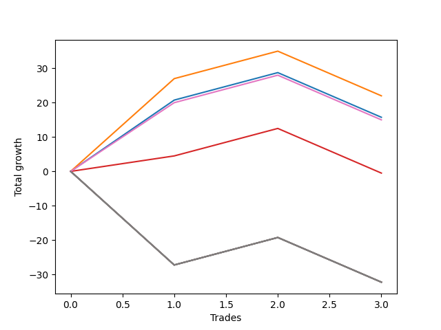

# Short Bulldog 001 
- Symbol: ES90d5m
- Date Range: 03/18/2022 - 07/08/2022
- Trading Period: 7:20-12:30
- Number of Trades: 3



| Name | Win Percent | Profit | Avg Profit / Trade | Avg Time / Trade |      | Name | Win Percent | Profit | Avg Profit / Trade | Avg Time / Trade |
| ---- | ----------- | ------ | ------------------ | ---------------- | ---- | ---- | ----------- | ------ | ------------------ | ---------------- |
| Sorted By <br> Profit | | | | | | Sorted By <br> Win Percentage ||||
| One | 66.67 | 12875.00 | 4291.67 | 00:00 |     | Six | 100.00 | 11625.00 | 3875.00 | 00:00 |
| Six | 100.00 | 11625.00 | 3875.00 | 00:00 |     | Eighty-Five | 100.00 | 8000.00 | 2666.67 | 00:00 |
| Forty-One | 66.67 | 10750.00 | 3583.33 | 00:00 |     | Eighty-Four | 100.00 | 7375.00 | 2458.33 | 00:00 |
| Twenty-Five | 66.67 | 10750.00 | 3583.33 | 00:00 |     | Eighty-Three | 100.00 | 7250.00 | 2416.67 | 00:00 |
| Nine | 66.67 | 10750.00 | 3583.33 | 00:00 |     | Eighty-Two | 100.00 | 5625.00 | 1875.00 | 00:00 |
| Zero | 66.67 | 9750.00 | 3250.00 | 00:00 |     | Eighty-One | 100.00 | 5625.00 | 1875.00 | 00:00 |
| Thirty-Two | 66.67 | 8500.00 | 2833.33 | 00:00 |     | One | 66.67 | 12875.00 | 4291.67 | 00:00 |
| Fifty-Seven | 66.67 | 8250.00 | 2750.00 | 00:00 |     | Forty-One | 66.67 | 10750.00 | 3583.33 | 00:00 |
| Eighty-Five | 100.00 | 8000.00 | 2666.67 | 00:00 |     | Twenty-Five | 66.67 | 10750.00 | 3583.33 | 00:00 |
| Forty-Eight | 66.67 | 8000.00 | 2666.67 | 00:00 |     | Nine | 66.67 | 10750.00 | 3583.33 | 00:00 |
| Forty | 66.67 | 7875.00 | 2625.00 | 00:00 |     | Zero | 66.67 | 9750.00 | 3250.00 | 00:00 |
| Twenty-Four | 66.67 | 7875.00 | 2625.00 | 00:00 |     | Thirty-Two | 66.67 | 8500.00 | 2833.33 | 00:00 |
| Eight | 66.67 | 7875.00 | 2625.00 | 00:00 |     | Fifty-Seven | 66.67 | 8250.00 | 2750.00 | 00:00 |
| Thirty-Nine | 66.67 | 7625.00 | 2541.67 | 00:00 |     | Forty-Eight | 66.67 | 8000.00 | 2666.67 | 00:00 |
| Thirty-Seven | 66.67 | 7625.00 | 2541.67 | 00:00 |     | Forty | 66.67 | 7875.00 | 2625.00 | 00:00 |
| Thirty-Six | 66.67 | 7625.00 | 2541.67 | 00:00 |     | Twenty-Four | 66.67 | 7875.00 | 2625.00 | 00:00 |
| Thirty-Four | 66.67 | 7625.00 | 2541.67 | 00:00 |     | Eight | 66.67 | 7875.00 | 2625.00 | 00:00 |
| Thirty-Three | 66.67 | 7625.00 | 2541.67 | 00:00 |     | Thirty-Nine | 66.67 | 7625.00 | 2541.67 | 00:00 |
| Thirty-Eight | 66.67 | 7500.00 | 2500.00 | 00:00 |     | Thirty-Seven | 66.67 | 7625.00 | 2541.67 | 00:00 |
| Eighty-Four | 100.00 | 7375.00 | 2458.33 | 00:00 |     | Thirty-Six | 66.67 | 7625.00 | 2541.67 | 00:00 |
| Eighty-Three | 100.00 | 7250.00 | 2416.67 | 00:00 |     | Thirty-Four | 66.67 | 7625.00 | 2541.67 | 00:00 |
| Fifty-Four | 66.67 | 7000.00 | 2333.33 | 00:00 |     | Thirty-Three | 66.67 | 7625.00 | 2541.67 | 00:00 |
| Forty-Six | 66.67 | 6875.00 | 2291.67 | 00:00 |     | Thirty-Eight | 66.67 | 7500.00 | 2500.00 | 00:00 |
| Thirty | 66.67 | 6875.00 | 2291.67 | 00:00 |     | Fifty-Four | 66.67 | 7000.00 | 2333.33 | 00:00 |
| Fourteen | 66.67 | 6875.00 | 2291.67 | 00:00 |     | Forty-Six | 66.67 | 6875.00 | 2291.67 | 00:00 |
| Fifty-Five | 66.67 | 5875.00 | 1958.33 | 00:00 |     | Thirty | 66.67 | 6875.00 | 2291.67 | 00:00 |
| Fifty-Three | 66.67 | 5875.00 | 1958.33 | 00:00 |     | Fourteen | 66.67 | 6875.00 | 2291.67 | 00:00 |
| Fifty-Two | 66.67 | 5875.00 | 1958.33 | 00:00 |     | Fifty-Five | 66.67 | 5875.00 | 1958.33 | 00:00 |
| Fifty | 66.67 | 5875.00 | 1958.33 | 00:00 |     | Fifty-Three | 66.67 | 5875.00 | 1958.33 | 00:00 |
| Forty-Nine | 66.67 | 5875.00 | 1958.33 | 00:00 |     | Fifty-Two | 66.67 | 5875.00 | 1958.33 | 00:00 |
| Eighty-Two | 100.00 | 5625.00 | 1875.00 | 00:00 |     | Fifty | 66.67 | 5875.00 | 1958.33 | 00:00 |
| Eighty-One | 100.00 | 5625.00 | 1875.00 | 00:00 |     | Forty-Nine | 66.67 | 5875.00 | 1958.33 | 00:00 |
| Sixty-Four | 66.67 | 5375.00 | 1791.67 | 00:00 |     | Sixty-Four | 66.67 | 5375.00 | 1791.67 | 00:00 |
| Fifty-Six | 66.67 | 5375.00 | 1791.67 | 00:00 |     | Fifty-Six | 66.67 | 5375.00 | 1791.67 | 00:00 |
| Seventy | 66.67 | 4375.00 | 1458.33 | 00:00 |     | Seventy | 66.67 | 4375.00 | 1458.33 | 00:00 |
| Sixty-Two | 66.67 | 4375.00 | 1458.33 | 00:00 |     | Sixty-Two | 66.67 | 4375.00 | 1458.33 | 00:00 |
| Three | 66.67 | 3000.00 | 1000.00 | 00:00 |     | Three | 66.67 | 3000.00 | 1000.00 | 00:00 |
| One Hundred Ten | 66.67 | 2250.00 | 750.00 | 00:00 |     | One Hundred Ten | 66.67 | 2250.00 | 750.00 | 00:00 |
| One Hundred Twenty | 66.67 | 1750.00 | 583.33 | 00:00 |     | One Hundred Twenty | 66.67 | 1750.00 | 583.33 | 00:00 |
| One Hundred Fifteen | 66.67 | 1625.00 | 541.67 | 00:00 |     | One Hundred Fifteen | 66.67 | 1625.00 | 541.67 | 00:00 |
| One Hundred Nine | 66.67 | 1625.00 | 541.67 | 00:00 |     | One Hundred Nine | 66.67 | 1625.00 | 541.67 | 00:00 |
| One Hundred Five | 66.67 | 1625.00 | 541.67 | 00:00 |     | One Hundred Five | 66.67 | 1625.00 | 541.67 | 00:00 |
| Ninety-Nine | 66.67 | 1625.00 | 541.67 | 00:00 |     | Ninety-Nine | 66.67 | 1625.00 | 541.67 | 00:00 |
| Ninety-Five | 66.67 | 1625.00 | 541.67 | 00:00 |     | Ninety-Five | 66.67 | 1625.00 | 541.67 | 00:00 |
| One Hundred Eight | 66.67 | 1500.00 | 500.00 | 00:00 |     | One Hundred Eight | 66.67 | 1500.00 | 500.00 | 00:00 |
| One Hundred Seven | 66.67 | 1500.00 | 500.00 | 00:00 |     | One Hundred Seven | 66.67 | 1500.00 | 500.00 | 00:00 |
| One Hundred Six | 66.67 | 1500.00 | 500.00 | 00:00 |     | One Hundred Six | 66.67 | 1500.00 | 500.00 | 00:00 |
| Ninety-Eight | 66.67 | 1500.00 | 500.00 | 00:00 |     | Ninety-Eight | 66.67 | 1500.00 | 500.00 | 00:00 |
| Ninety-Seven | 66.67 | 1500.00 | 500.00 | 00:00 |     | Ninety-Seven | 66.67 | 1500.00 | 500.00 | 00:00 |
| Ninety-Six | 66.67 | 1500.00 | 500.00 | 00:00 |     | Ninety-Six | 66.67 | 1500.00 | 500.00 | 00:00 |
| Thirty-Five | 66.67 | 1500.00 | 500.00 | 00:00 |     | Thirty-Five | 66.67 | 1500.00 | 500.00 | 00:00 |
| Nineteen | 66.67 | 1500.00 | 500.00 | 00:00 |     | Nineteen | 66.67 | 1500.00 | 500.00 | 00:00 |
| One Hundred Ninteen | 66.67 | 1125.00 | 375.00 | 00:00 |     | One Hundred Ninteen | 66.67 | 1125.00 | 375.00 | 00:00 |
| Seventy-One | 66.67 | 1125.00 | 375.00 | 00:00 |     | Seventy-One | 66.67 | 1125.00 | 375.00 | 00:00 |
| Sixty-Nine | 66.67 | 1125.00 | 375.00 | 00:00 |     | Sixty-Nine | 66.67 | 1125.00 | 375.00 | 00:00 |
| Sixty-Eight | 66.67 | 1125.00 | 375.00 | 00:00 |     | Sixty-Eight | 66.67 | 1125.00 | 375.00 | 00:00 |
| Sixty-Six | 66.67 | 1125.00 | 375.00 | 00:00 |     | Sixty-Six | 66.67 | 1125.00 | 375.00 | 00:00 |
| Sixty-Five | 66.67 | 1125.00 | 375.00 | 00:00 |     | Sixty-Five | 66.67 | 1125.00 | 375.00 | 00:00 |
| One Hundred Eighteen | 66.67 | 1000.00 | 333.33 | 00:00 |     | One Hundred Eighteen | 66.67 | 1000.00 | 333.33 | 00:00 |
| One Hundred Seventeen | 66.67 | 1000.00 | 333.33 | 00:00 |     | One Hundred Seventeen | 66.67 | 1000.00 | 333.33 | 00:00 |
| One Hundred Sixteen | 66.67 | 1000.00 | 333.33 | 00:00 |     | One Hundred Sixteen | 66.67 | 1000.00 | 333.33 | 00:00 |
| One Hundred Fourteen | 66.67 | 1000.00 | 333.33 | 00:00 |     | One Hundred Fourteen | 66.67 | 1000.00 | 333.33 | 00:00 |
| One Hundred Four | 66.67 | 1000.00 | 333.33 | 00:00 |     | One Hundred Four | 66.67 | 1000.00 | 333.33 | 00:00 |
| Ninety-Four | 66.67 | 1000.00 | 333.33 | 00:00 |     | Ninety-Four | 66.67 | 1000.00 | 333.33 | 00:00 |
| Fifty-One | 66.67 | 1000.00 | 333.33 | 00:00 |     | Fifty-One | 66.67 | 1000.00 | 333.33 | 00:00 |
| One Hundred Thirteen | 66.67 | 875.00 | 291.67 | 00:00 |     | One Hundred Thirteen | 66.67 | 875.00 | 291.67 | 00:00 |
| One Hundred Twelve | 66.67 | 875.00 | 291.67 | 00:00 |     | One Hundred Twelve | 66.67 | 875.00 | 291.67 | 00:00 |
| One Hundred Eleven | 66.67 | 875.00 | 291.67 | 00:00 |     | One Hundred Eleven | 66.67 | 875.00 | 291.67 | 00:00 |
| One Hundred Three | 66.67 | 875.00 | 291.67 | 00:00 |     | One Hundred Three | 66.67 | 875.00 | 291.67 | 00:00 |
| One Hundred Two | 66.67 | 875.00 | 291.67 | 00:00 |     | One Hundred Two | 66.67 | 875.00 | 291.67 | 00:00 |
| One Hundred One | 66.67 | 875.00 | 291.67 | 00:00 |     | One Hundred One | 66.67 | 875.00 | 291.67 | 00:00 |
| Ninety-Three | 66.67 | 875.00 | 291.67 | 00:00 |     | Ninety-Three | 66.67 | 875.00 | 291.67 | 00:00 |
| Ninety-Two | 66.67 | 875.00 | 291.67 | 00:00 |     | Ninety-Two | 66.67 | 875.00 | 291.67 | 00:00 |
| Ninety-One | 66.67 | 875.00 | 291.67 | 00:00 |     | Ninety-One | 66.67 | 875.00 | 291.67 | 00:00 |
| Forty-Three | 66.67 | 875.00 | 291.67 | 00:00 |     | Forty-Three | 66.67 | 875.00 | 291.67 | 00:00 |
| twenty-Seven | 66.67 | 875.00 | 291.67 | 00:00 |     | twenty-Seven | 66.67 | 875.00 | 291.67 | 00:00 |
| Eleven | 66.67 | 875.00 | 291.67 | 00:00 |     | Eleven | 66.67 | 875.00 | 291.67 | 00:00 |
| One Hundred | 66.67 | 375.00 | 125.00 | 00:00 |     | One Hundred | 66.67 | 375.00 | 125.00 | 00:00 |
| Twenty-Three | 66.67 | 375.00 | 125.00 | 00:00 |     | Twenty-Three | 66.67 | 375.00 | 125.00 | 00:00 |
| Twenty-Two | 66.67 | 375.00 | 125.00 | 00:00 |     | Twenty-Two | 66.67 | 375.00 | 125.00 | 00:00 |
| Twenty-One | 66.67 | 375.00 | 125.00 | 00:00 |     | Twenty-One | 66.67 | 375.00 | 125.00 | 00:00 |
| Twenty | 66.67 | 375.00 | 125.00 | 00:00 |     | Twenty | 66.67 | 375.00 | 125.00 | 00:00 |
| Eighteen | 66.67 | 375.00 | 125.00 | 00:00 |     | Eighteen | 66.67 | 375.00 | 125.00 | 00:00 |
| Seventeen | 66.67 | 375.00 | 125.00 | 00:00 |     | Seventeen | 66.67 | 375.00 | 125.00 | 00:00 |
| Sixten | 66.67 | 375.00 | 125.00 | 00:00 |     | Sixten | 66.67 | 375.00 | 125.00 | 00:00 |
| One Hundred Thirty | 66.67 | -875.00 | -291.67 | 00:00 |     | One Hundred Thirty | 66.67 | -875.00 | -291.67 | 00:00 |
| One Hundred Twenty-Five | 66.67 | -875.00 | -291.67 | 00:00 |     | One Hundred Twenty-Five | 66.67 | -875.00 | -291.67 | 00:00 |
| One Hundred Twenty-Nine | 66.67 | -1500.00 | -500.00 | 00:00 |     | One Hundred Twenty-Nine | 66.67 | -1500.00 | -500.00 | 00:00 |
| One Hundred Twenty-Four | 66.67 | -1500.00 | -500.00 | 00:00 |     | One Hundred Twenty-Four | 66.67 | -1500.00 | -500.00 | 00:00 |
| One Hundred Twenty-Eight | 66.67 | -1625.00 | -541.67 | 00:00 |     | One Hundred Twenty-Eight | 66.67 | -1625.00 | -541.67 | 00:00 |
| One Hundred Twenty-Seven | 66.67 | -1625.00 | -541.67 | 00:00 |     | One Hundred Twenty-Seven | 66.67 | -1625.00 | -541.67 | 00:00 |
| One Hundred Twenty-Six | 66.67 | -1625.00 | -541.67 | 00:00 |     | One Hundred Twenty-Six | 66.67 | -1625.00 | -541.67 | 00:00 |
| One Hundred Twenty-Three | 66.67 | -1625.00 | -541.67 | 00:00 |     | One Hundred Twenty-Three | 66.67 | -1625.00 | -541.67 | 00:00 |
| One Hundred Twenty-Two | 66.67 | -1625.00 | -541.67 | 00:00 |     | One Hundred Twenty-Two | 66.67 | -1625.00 | -541.67 | 00:00 |
| One Hundred Twenty-One | 66.67 | -1625.00 | -541.67 | 00:00 |     | One Hundred Twenty-One | 66.67 | -1625.00 | -541.67 | 00:00 |
| Sixty-Seven | 66.67 | -1625.00 | -541.67 | 00:00 |     | Sixty-Seven | 66.67 | -1625.00 | -541.67 | 00:00 |
| Fifty-Nine | 66.67 | -1625.00 | -541.67 | 00:00 |     | Fifty-Nine | 66.67 | -1625.00 | -541.67 | 00:00 |
| Fifteen | 33.33 | -2000.00 | -666.67 | 00:00 |     | Fifteen | 33.33 | -2000.00 | -666.67 | 00:00 |
| Thirteen | 33.33 | -2000.00 | -666.67 | 00:00 |     | Thirteen | 33.33 | -2000.00 | -666.67 | 00:00 |
| Twelve | 33.33 | -2000.00 | -666.67 | 00:00 |     | Twelve | 33.33 | -2000.00 | -666.67 | 00:00 |
| Ten | 33.33 | -2000.00 | -666.67 | 00:00 |     | Ten | 33.33 | -2000.00 | -666.67 | 00:00 |
| Thirty-One | 33.33 | -2750.00 | -916.67 | 00:00 |     | Thirty-One | 33.33 | -2750.00 | -916.67 | 00:00 |
| Twenty-Nine | 33.33 | -2750.00 | -916.67 | 00:00 |     | Twenty-Nine | 33.33 | -2750.00 | -916.67 | 00:00 |
| Twenty-Eight | 33.33 | -2750.00 | -916.67 | 00:00 |     | Twenty-Eight | 33.33 | -2750.00 | -916.67 | 00:00 |
| Twenty-Six | 33.33 | -2750.00 | -916.67 | 00:00 |     | Twenty-Six | 33.33 | -2750.00 | -916.67 | 00:00 |
| Forty-Seven | 33.33 | -3375.00 | -1125.00 | 00:00 |     | Forty-Seven | 33.33 | -3375.00 | -1125.00 | 00:00 |
| Forty-Five | 33.33 | -3375.00 | -1125.00 | 00:00 |     | Forty-Five | 33.33 | -3375.00 | -1125.00 | 00:00 |
| Forty-Four | 33.33 | -3375.00 | -1125.00 | 00:00 |     | Forty-Four | 33.33 | -3375.00 | -1125.00 | 00:00 |
| Forty-Two | 33.33 | -3375.00 | -1125.00 | 00:00 |     | Forty-Two | 33.33 | -3375.00 | -1125.00 | 00:00 |
| Seven | 33.33 | -8250.00 | -2750.00 | 00:00 |     | Seven | 33.33 | -8250.00 | -2750.00 | 00:00 |
| Five | 33.33 | -8250.00 | -2750.00 | 00:00 |     | Five | 33.33 | -8250.00 | -2750.00 | 00:00 |
| Four | 33.33 | -8250.00 | -2750.00 | 00:00 |     | Four | 33.33 | -8250.00 | -2750.00 | 00:00 |
| Two | 33.33 | -8250.00 | -2750.00 | 00:00 |     | Two | 33.33 | -8250.00 | -2750.00 | 00:00 |
| Sixty-Three | 33.33 | -9000.00 | -3000.00 | 00:00 |     | Sixty-Three | 33.33 | -9000.00 | -3000.00 | 00:00 |
| Sixty-One | 33.33 | -9000.00 | -3000.00 | 00:00 |     | Sixty-One | 33.33 | -9000.00 | -3000.00 | 00:00 |
| Sixty | 33.33 | -9000.00 | -3000.00 | 00:00 |     | Sixty | 33.33 | -9000.00 | -3000.00 | 00:00 |
| Fifty-Eight | 33.33 | -9000.00 | -3000.00 | 00:00 |     | Fifty-Eight | 33.33 | -9000.00 | -3000.00 | 00:00 |
| Seventy-Three | 33.33 | -17250.00 | -5750.00 | 00:00 |     | Seventy-Three | 33.33 | -17250.00 | -5750.00 | 00:00 |

## NO STOPLOSS

### Test Zero
* Sell when price hits the middle line of the 20p bollinger
* No Stoploss
* Results:
```
Total Trades: 3
Percent Up: 33.33
Percent Down: 66.67
Total Points Moved Down: 19.50
Potential Profit: 9750.00
Total Points Ups: 3.75 Count Ups: 1
Total Points Downs: 23.25 Count Downs: 2
```

<details><summary>Trades</summary>

<code>In: 2022-05-24 09:25:00		Out: 2022-05-24 09:37:10		Total Position Time: 12:10		Total Move Down: 17.75		Total to Date: 17.75</code> <br />
<code>In: 2022-06-15 11:10:00		Out: 2022-06-15 11:15:10		Total Position Time: 05:10		Total Move Down: 5.50		Total to Date: 23.25</code> <br />
<code>In: 2022-06-15 12:00:00		Out: 2022-06-15 12:50:25		Total Position Time: 50:25		Total Move Down: -3.75		Total to Date: 19.50</code> <br />


</details>

### Test One
* Sell when the price hits the upper line of the 20p 1std bollinger
* No Stoploss
* Results:
```
Total Trades: 3
Percent Up: 33.33
Percent Down: 66.67
Total Points Moved Down: 25.75
Potential Profit: 12875.00
Total Points Ups: 3.25 Count Ups: 1
Total Points Downs: 29.00 Count Downs: 2
```

<details><summary>Trades</summary>

<code>In: 2022-05-24 09:25:00		Out: 2022-05-24 10:05:05		Total Position Time: 40:05		Total Move Down: 23.50		Total to Date: 23.50</code> <br />
<code>In: 2022-06-15 11:10:00		Out: 2022-06-15 11:15:10		Total Position Time: 05:10		Total Move Down: 5.50		Total to Date: 29.00</code> <br />
<code>In: 2022-06-15 12:00:00		Out: 2022-06-15 12:55:00		Total Position Time: 55:00		Total Move Down: -3.25		Total to Date: 25.75</code> <br />


</details>

### Test Two
* Sell when the price hits the upper line of the 20p 2std bollinger
* No Stoploss
* Results:
```
Total Trades: 3
Percent Up: 66.67
Percent Down: 33.33
Total Points Moved Down: -16.50
Potential Profit: -8250.00
Total Points Ups: 22.00 Count Ups: 2
Total Points Downs: 5.50 Count Downs: 1
```

<details><summary>Trades</summary>

<code>In: 2022-05-24 09:25:00		Out: 2022-05-24 12:55:00		Total Position Time: 210:00		Total Move Down: -18.75		Total to Date: -18.75</code> <br />
<code>In: 2022-06-15 11:10:00		Out: 2022-06-15 11:15:10		Total Position Time: 05:10		Total Move Down: 5.50		Total to Date: -13.25</code> <br />
<code>In: 2022-06-15 12:00:00		Out: 2022-06-15 12:55:00		Total Position Time: 55:00		Total Move Down: -3.25		Total to Date: -16.50</code> <br />


</details>

### Test Three
* Sell when price hits the middle line of the 50p bollinger
* No Stoploss
* Results:
```
Total Trades: 3
Percent Up: 33.33
Percent Down: 66.67
Total Points Moved Down: 6.00
Potential Profit: 3000.00
Total Points Ups: 3.25 Count Ups: 1
Total Points Downs: 9.25 Count Downs: 2
```

<details><summary>Trades</summary>

<code>In: 2022-05-24 09:25:00		Out: 2022-05-24 09:30:10		Total Position Time: 05:10		Total Move Down: 3.75		Total to Date: 3.75</code> <br />
<code>In: 2022-06-15 11:10:00		Out: 2022-06-15 11:15:10		Total Position Time: 05:10		Total Move Down: 5.50		Total to Date: 9.25</code> <br />
<code>In: 2022-06-15 12:00:00		Out: 2022-06-15 12:55:00		Total Position Time: 55:00		Total Move Down: -3.25		Total to Date: 6.00</code> <br />


</details>

### Test Four
* Sell when the price hits the upper line of the 50p 1std bollinger
* No Stoploss
* Results:
```
Total Trades: 3
Percent Up: 66.67
Percent Down: 33.33
Total Points Moved Down: -16.50
Potential Profit: -8250.00
Total Points Ups: 22.00 Count Ups: 2
Total Points Downs: 5.50 Count Downs: 1
```

<details><summary>Trades</summary>

<code>In: 2022-05-24 09:25:00		Out: 2022-05-24 12:55:00		Total Position Time: 210:00		Total Move Down: -18.75		Total to Date: -18.75</code> <br />
<code>In: 2022-06-15 11:10:00		Out: 2022-06-15 11:15:10		Total Position Time: 05:10		Total Move Down: 5.50		Total to Date: -13.25</code> <br />
<code>In: 2022-06-15 12:00:00		Out: 2022-06-15 12:55:00		Total Position Time: 55:00		Total Move Down: -3.25		Total to Date: -16.50</code> <br />


</details>

### Test Five
* Sell when the price hits the upper line of the 50p 2std bollinger
* No Stoploss
* Results:
```
Total Trades: 3
Percent Up: 66.67
Percent Down: 33.33
Total Points Moved Down: -16.50
Potential Profit: -8250.00
Total Points Ups: 22.00 Count Ups: 2
Total Points Downs: 5.50 Count Downs: 1
```

<details><summary>Trades</summary>

<code>In: 2022-05-24 09:25:00		Out: 2022-05-24 12:55:00		Total Position Time: 210:00		Total Move Down: -18.75		Total to Date: -18.75</code> <br />
<code>In: 2022-06-15 11:10:00		Out: 2022-06-15 11:15:10		Total Position Time: 05:10		Total Move Down: 5.50		Total to Date: -13.25</code> <br />
<code>In: 2022-06-15 12:00:00		Out: 2022-06-15 12:55:00		Total Position Time: 55:00		Total Move Down: -3.25		Total to Date: -16.50</code> <br />


</details>

### Test Six
* Sell when the price hits the middle line of the 1std VWAP
* No Stoploss
* Results:
```
Total Trades: 3
Percent Up: 0.00
Percent Down: 100.00
Total Points Moved Down: 23.25
Potential Profit: 11625.00
Total Points Ups: 0.00 Count Ups: 0
Total Points Downs: 23.25 Count Downs: 3
```

<details><summary>Trades</summary>

<code>In: 2022-05-24 09:25:00		Out: 2022-05-24 09:36:45		Total Position Time: 11:45		Total Move Down: 15.75		Total to Date: 15.75</code> <br />
<code>In: 2022-06-15 11:10:00		Out: 2022-06-15 11:15:10		Total Position Time: 05:10		Total Move Down: 5.50		Total to Date: 21.25</code> <br />
<code>In: 2022-06-15 12:00:00		Out: 2022-06-15 12:52:10		Total Position Time: 52:10		Total Move Down: 2.00		Total to Date: 23.25</code> <br />


</details>

### Test Seven
* Sell when the price hits the upper line of the 1std VWAP
* No Stoploss
* Results:
```
Total Trades: 3
Percent Up: 66.67
Percent Down: 33.33
Total Points Moved Down: -16.50
Potential Profit: -8250.00
Total Points Ups: 22.00 Count Ups: 2
Total Points Downs: 5.50 Count Downs: 1
```

<details><summary>Trades</summary>

<code>In: 2022-05-24 09:25:00		Out: 2022-05-24 12:55:00		Total Position Time: 210:00		Total Move Down: -18.75		Total to Date: -18.75</code> <br />
<code>In: 2022-06-15 11:10:00		Out: 2022-06-15 11:15:10		Total Position Time: 05:10		Total Move Down: 5.50		Total to Date: -13.25</code> <br />
<code>In: 2022-06-15 12:00:00		Out: 2022-06-15 12:55:00		Total Position Time: 55:00		Total Move Down: -3.25		Total to Date: -16.50</code> <br />


</details>

## STOPLOSS OF 2

### Test Eight
* Sell when price hits the middle line of the 20p bollinger
* Stoploss is -2 points
* Results:
```
Total Trades: 3
Percent Up: 33.33
Percent Down: 66.67
Total Points Moved Down: 15.75
Potential Profit: 7875.00
Total Points Ups: 7.50 Count Ups: 1
Total Points Downs: 23.25 Count Downs: 2
```

<details><summary>Trades</summary>

<code>In: 2022-05-24 09:25:00		Out: 2022-05-24 09:37:10		Total Position Time: 12:10		Total Move Down: 17.75		Total to Date: 17.75</code> <br />
<code>In: 2022-06-15 11:10:00		Out: 2022-06-15 11:15:10		Total Position Time: 05:10		Total Move Down: 5.50		Total to Date: 23.25</code> <br />
<code>In: 2022-06-15 12:00:00		Out: 2022-06-15 12:05:10		Total Position Time: 05:10		Total Move Down: -7.50		Total to Date: 15.75</code> <br />


</details>

### Test Nine
* Sell when the price hits the upper line of the 20p 1std bollinger
* Stoploss is -2 points
* Results:
```
Total Trades: 3
Percent Up: 33.33
Percent Down: 66.67
Total Points Moved Down: 21.50
Potential Profit: 10750.00
Total Points Ups: 7.50 Count Ups: 1
Total Points Downs: 29.00 Count Downs: 2
```

<details><summary>Trades</summary>

<code>In: 2022-05-24 09:25:00		Out: 2022-05-24 10:05:05		Total Position Time: 40:05		Total Move Down: 23.50		Total to Date: 23.50</code> <br />
<code>In: 2022-06-15 11:10:00		Out: 2022-06-15 11:15:10		Total Position Time: 05:10		Total Move Down: 5.50		Total to Date: 29.00</code> <br />
<code>In: 2022-06-15 12:00:00		Out: 2022-06-15 12:05:10		Total Position Time: 05:10		Total Move Down: -7.50		Total to Date: 21.50</code> <br />


</details>

### Test Ten
* Sell when the price hits the upper line of the 20p 2std bollinger
* Stoploss is -2 points
* Results:
```
Total Trades: 3
Percent Up: 66.67
Percent Down: 33.33
Total Points Moved Down: -4.00
Potential Profit: -2000.00
Total Points Ups: 9.50 Count Ups: 2
Total Points Downs: 5.50 Count Downs: 1
```

<details><summary>Trades</summary>

<code>In: 2022-05-24 09:25:00		Out: 2022-05-24 10:41:00		Total Position Time: 76:00		Total Move Down: -2.00		Total to Date: -2.00</code> <br />
<code>In: 2022-06-15 11:10:00		Out: 2022-06-15 11:15:10		Total Position Time: 05:10		Total Move Down: 5.50		Total to Date: 3.50</code> <br />
<code>In: 2022-06-15 12:00:00		Out: 2022-06-15 12:05:10		Total Position Time: 05:10		Total Move Down: -7.50		Total to Date: -4.00</code> <br />


</details>

### Test Eleven
* Sell when price hits the middle line of the 50p bollinger
* Stoploss is -2 points
* Results:
```
Total Trades: 3
Percent Up: 33.33
Percent Down: 66.67
Total Points Moved Down: 1.75
Potential Profit: 875.00
Total Points Ups: 7.50 Count Ups: 1
Total Points Downs: 9.25 Count Downs: 2
```

<details><summary>Trades</summary>

<code>In: 2022-05-24 09:25:00		Out: 2022-05-24 09:30:10		Total Position Time: 05:10		Total Move Down: 3.75		Total to Date: 3.75</code> <br />
<code>In: 2022-06-15 11:10:00		Out: 2022-06-15 11:15:10		Total Position Time: 05:10		Total Move Down: 5.50		Total to Date: 9.25</code> <br />
<code>In: 2022-06-15 12:00:00		Out: 2022-06-15 12:05:10		Total Position Time: 05:10		Total Move Down: -7.50		Total to Date: 1.75</code> <br />


</details>

### Test Twelve
* Sell when the price hits the upper line of the 50p 1std bollinger
* Stoploss is -2 points
* Results:
```
Total Trades: 3
Percent Up: 66.67
Percent Down: 33.33
Total Points Moved Down: -4.00
Potential Profit: -2000.00
Total Points Ups: 9.50 Count Ups: 2
Total Points Downs: 5.50 Count Downs: 1
```

<details><summary>Trades</summary>

<code>In: 2022-05-24 09:25:00		Out: 2022-05-24 10:41:00		Total Position Time: 76:00		Total Move Down: -2.00		Total to Date: -2.00</code> <br />
<code>In: 2022-06-15 11:10:00		Out: 2022-06-15 11:15:10		Total Position Time: 05:10		Total Move Down: 5.50		Total to Date: 3.50</code> <br />
<code>In: 2022-06-15 12:00:00		Out: 2022-06-15 12:05:10		Total Position Time: 05:10		Total Move Down: -7.50		Total to Date: -4.00</code> <br />


</details>

### Test Thirteen
* Sell when the price hits the upper line of the 50p 2std bollinger
* Stoploss is -2 points
* Results:
```
Total Trades: 3
Percent Up: 66.67
Percent Down: 33.33
Total Points Moved Down: -4.00
Potential Profit: -2000.00
Total Points Ups: 9.50 Count Ups: 2
Total Points Downs: 5.50 Count Downs: 1
```

<details><summary>Trades</summary>

<code>In: 2022-05-24 09:25:00		Out: 2022-05-24 10:41:00		Total Position Time: 76:00		Total Move Down: -2.00		Total to Date: -2.00</code> <br />
<code>In: 2022-06-15 11:10:00		Out: 2022-06-15 11:15:10		Total Position Time: 05:10		Total Move Down: 5.50		Total to Date: 3.50</code> <br />
<code>In: 2022-06-15 12:00:00		Out: 2022-06-15 12:05:10		Total Position Time: 05:10		Total Move Down: -7.50		Total to Date: -4.00</code> <br />


</details>

### Test Fourteen
* Sell when the price hits the middle line of the 1std VWAP
* Stoploss is -2 points
* Results:
```
Total Trades: 3
Percent Up: 33.33
Percent Down: 66.67
Total Points Moved Down: 13.75
Potential Profit: 6875.00
Total Points Ups: 7.50 Count Ups: 1
Total Points Downs: 21.25 Count Downs: 2
```

<details><summary>Trades</summary>

<code>In: 2022-05-24 09:25:00		Out: 2022-05-24 09:36:45		Total Position Time: 11:45		Total Move Down: 15.75		Total to Date: 15.75</code> <br />
<code>In: 2022-06-15 11:10:00		Out: 2022-06-15 11:15:10		Total Position Time: 05:10		Total Move Down: 5.50		Total to Date: 21.25</code> <br />
<code>In: 2022-06-15 12:00:00		Out: 2022-06-15 12:05:10		Total Position Time: 05:10		Total Move Down: -7.50		Total to Date: 13.75</code> <br />


</details>

### Test Fifteen
* Sell when the price hits the upper line of the 1std VWAP
* Stoploss is -2 points
* Results:
```
Total Trades: 3
Percent Up: 66.67
Percent Down: 33.33
Total Points Moved Down: -4.00
Potential Profit: -2000.00
Total Points Ups: 9.50 Count Ups: 2
Total Points Downs: 5.50 Count Downs: 1
```

<details><summary>Trades</summary>

<code>In: 2022-05-24 09:25:00		Out: 2022-05-24 10:41:00		Total Position Time: 76:00		Total Move Down: -2.00		Total to Date: -2.00</code> <br />
<code>In: 2022-06-15 11:10:00		Out: 2022-06-15 11:15:10		Total Position Time: 05:10		Total Move Down: 5.50		Total to Date: 3.50</code> <br />
<code>In: 2022-06-15 12:00:00		Out: 2022-06-15 12:05:10		Total Position Time: 05:10		Total Move Down: -7.50		Total to Date: -4.00</code> <br />


</details>

## TRAIL STOP OF 2

### Test Sixten
* Sell when price hits the middle line of the 20p bollinger
* Trailing Stop is -2 points
* Results:
```
Total Trades: 3
Percent Up: 33.33
Percent Down: 66.67
Total Points Moved Down: 0.75
Potential Profit: 375.00
Total Points Ups: 6.25 Count Ups: 1
Total Points Downs: 7.00 Count Downs: 2
```

<details><summary>Trades</summary>

<code>In: 2022-05-24 09:25:00		Out: 2022-05-24 09:30:40		Total Position Time: 05:40		Total Move Down: 1.50		Total to Date: 1.50</code> <br />
<code>In: 2022-06-15 11:10:00		Out: 2022-06-15 11:15:10		Total Position Time: 05:10		Total Move Down: 5.50		Total to Date: 7.00</code> <br />
<code>In: 2022-06-15 12:00:00		Out: 2022-06-15 12:05:40		Total Position Time: 05:40		Total Move Down: -6.25		Total to Date: 0.75</code> <br />


</details>

### Test Seventeen
* Sell when the price hits the upper line of the 20p 1std bollinger
* Trailing Stop is -2 points
* Results:
```
Total Trades: 3
Percent Up: 33.33
Percent Down: 66.67
Total Points Moved Down: 0.75
Potential Profit: 375.00
Total Points Ups: 6.25 Count Ups: 1
Total Points Downs: 7.00 Count Downs: 2
```

<details><summary>Trades</summary>

<code>In: 2022-05-24 09:25:00		Out: 2022-05-24 09:30:40		Total Position Time: 05:40		Total Move Down: 1.50		Total to Date: 1.50</code> <br />
<code>In: 2022-06-15 11:10:00		Out: 2022-06-15 11:15:10		Total Position Time: 05:10		Total Move Down: 5.50		Total to Date: 7.00</code> <br />
<code>In: 2022-06-15 12:00:00		Out: 2022-06-15 12:05:40		Total Position Time: 05:40		Total Move Down: -6.25		Total to Date: 0.75</code> <br />


</details>

### Test Eighteen
* Sell when the price hits the upper line of the 20p 2std bollinger
* Trailing Stop is -2 points
* Results:
```
Total Trades: 3
Percent Up: 33.33
Percent Down: 66.67
Total Points Moved Down: 0.75
Potential Profit: 375.00
Total Points Ups: 6.25 Count Ups: 1
Total Points Downs: 7.00 Count Downs: 2
```

<details><summary>Trades</summary>

<code>In: 2022-05-24 09:25:00		Out: 2022-05-24 09:30:40		Total Position Time: 05:40		Total Move Down: 1.50		Total to Date: 1.50</code> <br />
<code>In: 2022-06-15 11:10:00		Out: 2022-06-15 11:15:10		Total Position Time: 05:10		Total Move Down: 5.50		Total to Date: 7.00</code> <br />
<code>In: 2022-06-15 12:00:00		Out: 2022-06-15 12:05:40		Total Position Time: 05:40		Total Move Down: -6.25		Total to Date: 0.75</code> <br />


</details>

### Test Nineteen
* Sell when price hits the middle line of the 50p bollinger
* Trailing Stop is -2 points
* Results:
```
Total Trades: 3
Percent Up: 33.33
Percent Down: 66.67
Total Points Moved Down: 3.00
Potential Profit: 1500.00
Total Points Ups: 6.25 Count Ups: 1
Total Points Downs: 9.25 Count Downs: 2
```

<details><summary>Trades</summary>

<code>In: 2022-05-24 09:25:00		Out: 2022-05-24 09:30:10		Total Position Time: 05:10		Total Move Down: 3.75		Total to Date: 3.75</code> <br />
<code>In: 2022-06-15 11:10:00		Out: 2022-06-15 11:15:10		Total Position Time: 05:10		Total Move Down: 5.50		Total to Date: 9.25</code> <br />
<code>In: 2022-06-15 12:00:00		Out: 2022-06-15 12:05:40		Total Position Time: 05:40		Total Move Down: -6.25		Total to Date: 3.00</code> <br />


</details>

### Test Twenty
* Sell when the price hits the upper line of the 50p 1std bollinger
* Trailing Stop is -2 points
* Results:
```
Total Trades: 3
Percent Up: 33.33
Percent Down: 66.67
Total Points Moved Down: 0.75
Potential Profit: 375.00
Total Points Ups: 6.25 Count Ups: 1
Total Points Downs: 7.00 Count Downs: 2
```

<details><summary>Trades</summary>

<code>In: 2022-05-24 09:25:00		Out: 2022-05-24 09:30:40		Total Position Time: 05:40		Total Move Down: 1.50		Total to Date: 1.50</code> <br />
<code>In: 2022-06-15 11:10:00		Out: 2022-06-15 11:15:10		Total Position Time: 05:10		Total Move Down: 5.50		Total to Date: 7.00</code> <br />
<code>In: 2022-06-15 12:00:00		Out: 2022-06-15 12:05:40		Total Position Time: 05:40		Total Move Down: -6.25		Total to Date: 0.75</code> <br />


</details>

### Test Twenty-One
* Sell when the price hits the upper line of the 50p 2std bollinger
* Trailing Stop is -2 points
* Results:
```
Total Trades: 3
Percent Up: 33.33
Percent Down: 66.67
Total Points Moved Down: 0.75
Potential Profit: 375.00
Total Points Ups: 6.25 Count Ups: 1
Total Points Downs: 7.00 Count Downs: 2
```

<details><summary>Trades</summary>

<code>In: 2022-05-24 09:25:00		Out: 2022-05-24 09:30:40		Total Position Time: 05:40		Total Move Down: 1.50		Total to Date: 1.50</code> <br />
<code>In: 2022-06-15 11:10:00		Out: 2022-06-15 11:15:10		Total Position Time: 05:10		Total Move Down: 5.50		Total to Date: 7.00</code> <br />
<code>In: 2022-06-15 12:00:00		Out: 2022-06-15 12:05:40		Total Position Time: 05:40		Total Move Down: -6.25		Total to Date: 0.75</code> <br />


</details>

### Test Twenty-Two
* Sell when the price hits the middle line of the 1std VWAP
* Trailing Stop is -2 points
* Results:
```
Total Trades: 3
Percent Up: 33.33
Percent Down: 66.67
Total Points Moved Down: 0.75
Potential Profit: 375.00
Total Points Ups: 6.25 Count Ups: 1
Total Points Downs: 7.00 Count Downs: 2
```

<details><summary>Trades</summary>

<code>In: 2022-05-24 09:25:00		Out: 2022-05-24 09:30:40		Total Position Time: 05:40		Total Move Down: 1.50		Total to Date: 1.50</code> <br />
<code>In: 2022-06-15 11:10:00		Out: 2022-06-15 11:15:10		Total Position Time: 05:10		Total Move Down: 5.50		Total to Date: 7.00</code> <br />
<code>In: 2022-06-15 12:00:00		Out: 2022-06-15 12:05:40		Total Position Time: 05:40		Total Move Down: -6.25		Total to Date: 0.75</code> <br />


</details>

### Test Twenty-Three
* Sell when the price hits the upper line of the 1std VWAP
* Trailing Stop is -2 points
* Results:
```
Total Trades: 3
Percent Up: 33.33
Percent Down: 66.67
Total Points Moved Down: 0.75
Potential Profit: 375.00
Total Points Ups: 6.25 Count Ups: 1
Total Points Downs: 7.00 Count Downs: 2
```

<details><summary>Trades</summary>

<code>In: 2022-05-24 09:25:00		Out: 2022-05-24 09:30:40		Total Position Time: 05:40		Total Move Down: 1.50		Total to Date: 1.50</code> <br />
<code>In: 2022-06-15 11:10:00		Out: 2022-06-15 11:15:10		Total Position Time: 05:10		Total Move Down: 5.50		Total to Date: 7.00</code> <br />
<code>In: 2022-06-15 12:00:00		Out: 2022-06-15 12:05:40		Total Position Time: 05:40		Total Move Down: -6.25		Total to Date: 0.75</code> <br />


</details>

## STOPLOSS OF 3

### Test Twenty-Four
* Sell when price hits the middle line of the 20p bollinger
* Stoploss is -3 points
* Results:
```
Total Trades: 3
Percent Up: 33.33
Percent Down: 66.67
Total Points Moved Down: 15.75
Potential Profit: 7875.00
Total Points Ups: 7.50 Count Ups: 1
Total Points Downs: 23.25 Count Downs: 2
```

<details><summary>Trades</summary>

<code>In: 2022-05-24 09:25:00		Out: 2022-05-24 09:37:10		Total Position Time: 12:10		Total Move Down: 17.75		Total to Date: 17.75</code> <br />
<code>In: 2022-06-15 11:10:00		Out: 2022-06-15 11:15:10		Total Position Time: 05:10		Total Move Down: 5.50		Total to Date: 23.25</code> <br />
<code>In: 2022-06-15 12:00:00		Out: 2022-06-15 12:05:10		Total Position Time: 05:10		Total Move Down: -7.50		Total to Date: 15.75</code> <br />


</details>

### Test Twenty-Five
* Sell when the price hits the upper line of the 20p 1std bollinger
* Stoploss is -3 points
* Results:
```
Total Trades: 3
Percent Up: 33.33
Percent Down: 66.67
Total Points Moved Down: 21.50
Potential Profit: 10750.00
Total Points Ups: 7.50 Count Ups: 1
Total Points Downs: 29.00 Count Downs: 2
```

<details><summary>Trades</summary>

<code>In: 2022-05-24 09:25:00		Out: 2022-05-24 10:05:05		Total Position Time: 40:05		Total Move Down: 23.50		Total to Date: 23.50</code> <br />
<code>In: 2022-06-15 11:10:00		Out: 2022-06-15 11:15:10		Total Position Time: 05:10		Total Move Down: 5.50		Total to Date: 29.00</code> <br />
<code>In: 2022-06-15 12:00:00		Out: 2022-06-15 12:05:10		Total Position Time: 05:10		Total Move Down: -7.50		Total to Date: 21.50</code> <br />


</details>

### Test Twenty-Six
* Sell when the price hits the upper line of the 20p 2std bollinger
* Stoploss is -3 points
* Results:
```
Total Trades: 3
Percent Up: 66.67
Percent Down: 33.33
Total Points Moved Down: -5.50
Potential Profit: -2750.00
Total Points Ups: 11.00 Count Ups: 2
Total Points Downs: 5.50 Count Downs: 1
```

<details><summary>Trades</summary>

<code>In: 2022-05-24 09:25:00		Out: 2022-05-24 10:41:05		Total Position Time: 76:05		Total Move Down: -3.50		Total to Date: -3.50</code> <br />
<code>In: 2022-06-15 11:10:00		Out: 2022-06-15 11:15:10		Total Position Time: 05:10		Total Move Down: 5.50		Total to Date: 2.00</code> <br />
<code>In: 2022-06-15 12:00:00		Out: 2022-06-15 12:05:10		Total Position Time: 05:10		Total Move Down: -7.50		Total to Date: -5.50</code> <br />


</details>

### Test twenty-Seven
* Sell when price hits the middle line of the 50p bollinger
* Stoploss is -3 points
* Results:
```
Total Trades: 3
Percent Up: 33.33
Percent Down: 66.67
Total Points Moved Down: 1.75
Potential Profit: 875.00
Total Points Ups: 7.50 Count Ups: 1
Total Points Downs: 9.25 Count Downs: 2
```

<details><summary>Trades</summary>

<code>In: 2022-05-24 09:25:00		Out: 2022-05-24 09:30:10		Total Position Time: 05:10		Total Move Down: 3.75		Total to Date: 3.75</code> <br />
<code>In: 2022-06-15 11:10:00		Out: 2022-06-15 11:15:10		Total Position Time: 05:10		Total Move Down: 5.50		Total to Date: 9.25</code> <br />
<code>In: 2022-06-15 12:00:00		Out: 2022-06-15 12:05:10		Total Position Time: 05:10		Total Move Down: -7.50		Total to Date: 1.75</code> <br />


</details>

### Test Twenty-Eight
* Sell when the price hits the upper line of the 50p 1std bollinger
* Stoploss is -3 points
* Results:
```
Total Trades: 3
Percent Up: 66.67
Percent Down: 33.33
Total Points Moved Down: -5.50
Potential Profit: -2750.00
Total Points Ups: 11.00 Count Ups: 2
Total Points Downs: 5.50 Count Downs: 1
```

<details><summary>Trades</summary>

<code>In: 2022-05-24 09:25:00		Out: 2022-05-24 10:41:05		Total Position Time: 76:05		Total Move Down: -3.50		Total to Date: -3.50</code> <br />
<code>In: 2022-06-15 11:10:00		Out: 2022-06-15 11:15:10		Total Position Time: 05:10		Total Move Down: 5.50		Total to Date: 2.00</code> <br />
<code>In: 2022-06-15 12:00:00		Out: 2022-06-15 12:05:10		Total Position Time: 05:10		Total Move Down: -7.50		Total to Date: -5.50</code> <br />


</details>

### Test Twenty-Nine
* Sell when the price hits the upper line of the 50p 2std bollinger
* Stoploss is -3 points
* Results:
```
Total Trades: 3
Percent Up: 66.67
Percent Down: 33.33
Total Points Moved Down: -5.50
Potential Profit: -2750.00
Total Points Ups: 11.00 Count Ups: 2
Total Points Downs: 5.50 Count Downs: 1
```

<details><summary>Trades</summary>

<code>In: 2022-05-24 09:25:00		Out: 2022-05-24 10:41:05		Total Position Time: 76:05		Total Move Down: -3.50		Total to Date: -3.50</code> <br />
<code>In: 2022-06-15 11:10:00		Out: 2022-06-15 11:15:10		Total Position Time: 05:10		Total Move Down: 5.50		Total to Date: 2.00</code> <br />
<code>In: 2022-06-15 12:00:00		Out: 2022-06-15 12:05:10		Total Position Time: 05:10		Total Move Down: -7.50		Total to Date: -5.50</code> <br />


</details>

### Test Thirty
* Sell when the price hits the middle line of the 1std VWAP
* Stoploss is -3 points
* Results:
```
Total Trades: 3
Percent Up: 33.33
Percent Down: 66.67
Total Points Moved Down: 13.75
Potential Profit: 6875.00
Total Points Ups: 7.50 Count Ups: 1
Total Points Downs: 21.25 Count Downs: 2
```

<details><summary>Trades</summary>

<code>In: 2022-05-24 09:25:00		Out: 2022-05-24 09:36:45		Total Position Time: 11:45		Total Move Down: 15.75		Total to Date: 15.75</code> <br />
<code>In: 2022-06-15 11:10:00		Out: 2022-06-15 11:15:10		Total Position Time: 05:10		Total Move Down: 5.50		Total to Date: 21.25</code> <br />
<code>In: 2022-06-15 12:00:00		Out: 2022-06-15 12:05:10		Total Position Time: 05:10		Total Move Down: -7.50		Total to Date: 13.75</code> <br />


</details>

### Test Thirty-One
* Sell when the price hits the upper line of the 1std VWAP
* Stoploss is -3 points
* Results:
```
Total Trades: 3
Percent Up: 66.67
Percent Down: 33.33
Total Points Moved Down: -5.50
Potential Profit: -2750.00
Total Points Ups: 11.00 Count Ups: 2
Total Points Downs: 5.50 Count Downs: 1
```

<details><summary>Trades</summary>

<code>In: 2022-05-24 09:25:00		Out: 2022-05-24 10:41:05		Total Position Time: 76:05		Total Move Down: -3.50		Total to Date: -3.50</code> <br />
<code>In: 2022-06-15 11:10:00		Out: 2022-06-15 11:15:10		Total Position Time: 05:10		Total Move Down: 5.50		Total to Date: 2.00</code> <br />
<code>In: 2022-06-15 12:00:00		Out: 2022-06-15 12:05:10		Total Position Time: 05:10		Total Move Down: -7.50		Total to Date: -5.50</code> <br />


</details>

## TRAIL STOP OF 3

### Test Thirty-Two
* Sell when price hits the middle line of the 20p bollinger
* Trailing Stop is -3 points
* Results:
```
Total Trades: 3
Percent Up: 33.33
Percent Down: 66.67
Total Points Moved Down: 17.00
Potential Profit: 8500.00
Total Points Ups: 6.25 Count Ups: 1
Total Points Downs: 23.25 Count Downs: 2
```

<details><summary>Trades</summary>

<code>In: 2022-05-24 09:25:00		Out: 2022-05-24 09:37:10		Total Position Time: 12:10		Total Move Down: 17.75		Total to Date: 17.75</code> <br />
<code>In: 2022-06-15 11:10:00		Out: 2022-06-15 11:15:10		Total Position Time: 05:10		Total Move Down: 5.50		Total to Date: 23.25</code> <br />
<code>In: 2022-06-15 12:00:00		Out: 2022-06-15 12:05:40		Total Position Time: 05:40		Total Move Down: -6.25		Total to Date: 17.00</code> <br />


</details>

### Test Thirty-Three
* Sell when the price hits the upper line of the 20p 1std bollinger
* Trailing Stop is -3 points
* Results:
```
Total Trades: 3
Percent Up: 33.33
Percent Down: 66.67
Total Points Moved Down: 15.25
Potential Profit: 7625.00
Total Points Ups: 6.25 Count Ups: 1
Total Points Downs: 21.50 Count Downs: 2
```

<details><summary>Trades</summary>

<code>In: 2022-05-24 09:25:00		Out: 2022-05-24 09:43:00		Total Position Time: 18:00		Total Move Down: 16.00		Total to Date: 16.00</code> <br />
<code>In: 2022-06-15 11:10:00		Out: 2022-06-15 11:15:10		Total Position Time: 05:10		Total Move Down: 5.50		Total to Date: 21.50</code> <br />
<code>In: 2022-06-15 12:00:00		Out: 2022-06-15 12:05:40		Total Position Time: 05:40		Total Move Down: -6.25		Total to Date: 15.25</code> <br />


</details>

### Test Thirty-Four
* Sell when the price hits the upper line of the 20p 2std bollinger
* Trailing Stop is -3 points
* Results:
```
Total Trades: 3
Percent Up: 33.33
Percent Down: 66.67
Total Points Moved Down: 15.25
Potential Profit: 7625.00
Total Points Ups: 6.25 Count Ups: 1
Total Points Downs: 21.50 Count Downs: 2
```

<details><summary>Trades</summary>

<code>In: 2022-05-24 09:25:00		Out: 2022-05-24 09:43:00		Total Position Time: 18:00		Total Move Down: 16.00		Total to Date: 16.00</code> <br />
<code>In: 2022-06-15 11:10:00		Out: 2022-06-15 11:15:10		Total Position Time: 05:10		Total Move Down: 5.50		Total to Date: 21.50</code> <br />
<code>In: 2022-06-15 12:00:00		Out: 2022-06-15 12:05:40		Total Position Time: 05:40		Total Move Down: -6.25		Total to Date: 15.25</code> <br />


</details>

### Test Thirty-Five
* Sell when price hits the middle line of the 50p bollinger
* Trailing Stop is -3 points
* Results:
```
Total Trades: 3
Percent Up: 33.33
Percent Down: 66.67
Total Points Moved Down: 3.00
Potential Profit: 1500.00
Total Points Ups: 6.25 Count Ups: 1
Total Points Downs: 9.25 Count Downs: 2
```

<details><summary>Trades</summary>

<code>In: 2022-05-24 09:25:00		Out: 2022-05-24 09:30:10		Total Position Time: 05:10		Total Move Down: 3.75		Total to Date: 3.75</code> <br />
<code>In: 2022-06-15 11:10:00		Out: 2022-06-15 11:15:10		Total Position Time: 05:10		Total Move Down: 5.50		Total to Date: 9.25</code> <br />
<code>In: 2022-06-15 12:00:00		Out: 2022-06-15 12:05:40		Total Position Time: 05:40		Total Move Down: -6.25		Total to Date: 3.00</code> <br />


</details>

### Test Thirty-Six
* Sell when the price hits the upper line of the 50p 1std bollinger
* Trailing Stop is -3 points
* Results:
```
Total Trades: 3
Percent Up: 33.33
Percent Down: 66.67
Total Points Moved Down: 15.25
Potential Profit: 7625.00
Total Points Ups: 6.25 Count Ups: 1
Total Points Downs: 21.50 Count Downs: 2
```

<details><summary>Trades</summary>

<code>In: 2022-05-24 09:25:00		Out: 2022-05-24 09:43:00		Total Position Time: 18:00		Total Move Down: 16.00		Total to Date: 16.00</code> <br />
<code>In: 2022-06-15 11:10:00		Out: 2022-06-15 11:15:10		Total Position Time: 05:10		Total Move Down: 5.50		Total to Date: 21.50</code> <br />
<code>In: 2022-06-15 12:00:00		Out: 2022-06-15 12:05:40		Total Position Time: 05:40		Total Move Down: -6.25		Total to Date: 15.25</code> <br />


</details>

### Test Thirty-Seven
* Sell when the price hits the upper line of the 50p 2std bollinger
* Trailing Stop is -3 points
* Results:
```
Total Trades: 3
Percent Up: 33.33
Percent Down: 66.67
Total Points Moved Down: 15.25
Potential Profit: 7625.00
Total Points Ups: 6.25 Count Ups: 1
Total Points Downs: 21.50 Count Downs: 2
```

<details><summary>Trades</summary>

<code>In: 2022-05-24 09:25:00		Out: 2022-05-24 09:43:00		Total Position Time: 18:00		Total Move Down: 16.00		Total to Date: 16.00</code> <br />
<code>In: 2022-06-15 11:10:00		Out: 2022-06-15 11:15:10		Total Position Time: 05:10		Total Move Down: 5.50		Total to Date: 21.50</code> <br />
<code>In: 2022-06-15 12:00:00		Out: 2022-06-15 12:05:40		Total Position Time: 05:40		Total Move Down: -6.25		Total to Date: 15.25</code> <br />


</details>

### Test Thirty-Eight
* Sell when the price hits the middle line of the 1std VWAP
* Trailing Stop is -3 points
* Results:
```
Total Trades: 3
Percent Up: 33.33
Percent Down: 66.67
Total Points Moved Down: 15.00
Potential Profit: 7500.00
Total Points Ups: 6.25 Count Ups: 1
Total Points Downs: 21.25 Count Downs: 2
```

<details><summary>Trades</summary>

<code>In: 2022-05-24 09:25:00		Out: 2022-05-24 09:36:45		Total Position Time: 11:45		Total Move Down: 15.75		Total to Date: 15.75</code> <br />
<code>In: 2022-06-15 11:10:00		Out: 2022-06-15 11:15:10		Total Position Time: 05:10		Total Move Down: 5.50		Total to Date: 21.25</code> <br />
<code>In: 2022-06-15 12:00:00		Out: 2022-06-15 12:05:40		Total Position Time: 05:40		Total Move Down: -6.25		Total to Date: 15.00</code> <br />


</details>

### Test Thirty-Nine
* Sell when the price hits the upper line of the 1std VWAP
* Trailing Stop is -3 points
* Results:
```
Total Trades: 3
Percent Up: 33.33
Percent Down: 66.67
Total Points Moved Down: 15.25
Potential Profit: 7625.00
Total Points Ups: 6.25 Count Ups: 1
Total Points Downs: 21.50 Count Downs: 2
```

<details><summary>Trades</summary>

<code>In: 2022-05-24 09:25:00		Out: 2022-05-24 09:43:00		Total Position Time: 18:00		Total Move Down: 16.00		Total to Date: 16.00</code> <br />
<code>In: 2022-06-15 11:10:00		Out: 2022-06-15 11:15:10		Total Position Time: 05:10		Total Move Down: 5.50		Total to Date: 21.50</code> <br />
<code>In: 2022-06-15 12:00:00		Out: 2022-06-15 12:05:40		Total Position Time: 05:40		Total Move Down: -6.25		Total to Date: 15.25</code> <br />


</details>

## STOPLOSS OF 5

### Test Forty
* Sell when price hits the middle line of the 20p bollinger
* Stoploss is -5 points
* Results:
```
Total Trades: 3
Percent Up: 33.33
Percent Down: 66.67
Total Points Moved Down: 15.75
Potential Profit: 7875.00
Total Points Ups: 7.50 Count Ups: 1
Total Points Downs: 23.25 Count Downs: 2
```

<details><summary>Trades</summary>

<code>In: 2022-05-24 09:25:00		Out: 2022-05-24 09:37:10		Total Position Time: 12:10		Total Move Down: 17.75		Total to Date: 17.75</code> <br />
<code>In: 2022-06-15 11:10:00		Out: 2022-06-15 11:15:10		Total Position Time: 05:10		Total Move Down: 5.50		Total to Date: 23.25</code> <br />
<code>In: 2022-06-15 12:00:00		Out: 2022-06-15 12:05:10		Total Position Time: 05:10		Total Move Down: -7.50		Total to Date: 15.75</code> <br />


</details>

### Test Forty-One
* Sell when the price hits the upper line of the 20p 1std bollinger
* Stoploss is -5 points
* Results:
```
Total Trades: 3
Percent Up: 33.33
Percent Down: 66.67
Total Points Moved Down: 21.50
Potential Profit: 10750.00
Total Points Ups: 7.50 Count Ups: 1
Total Points Downs: 29.00 Count Downs: 2
```

<details><summary>Trades</summary>

<code>In: 2022-05-24 09:25:00		Out: 2022-05-24 10:05:05		Total Position Time: 40:05		Total Move Down: 23.50		Total to Date: 23.50</code> <br />
<code>In: 2022-06-15 11:10:00		Out: 2022-06-15 11:15:10		Total Position Time: 05:10		Total Move Down: 5.50		Total to Date: 29.00</code> <br />
<code>In: 2022-06-15 12:00:00		Out: 2022-06-15 12:05:10		Total Position Time: 05:10		Total Move Down: -7.50		Total to Date: 21.50</code> <br />


</details>

### Test Forty-Two
* Sell when the price hits the upper line of the 20p 2std bollinger
* Stoploss is -5 points
* Results:
```
Total Trades: 3
Percent Up: 66.67
Percent Down: 33.33
Total Points Moved Down: -6.75
Potential Profit: -3375.00
Total Points Ups: 12.25 Count Ups: 2
Total Points Downs: 5.50 Count Downs: 1
```

<details><summary>Trades</summary>

<code>In: 2022-05-24 09:25:00		Out: 2022-05-24 10:41:15		Total Position Time: 76:15		Total Move Down: -4.75		Total to Date: -4.75</code> <br />
<code>In: 2022-06-15 11:10:00		Out: 2022-06-15 11:15:10		Total Position Time: 05:10		Total Move Down: 5.50		Total to Date: 0.75</code> <br />
<code>In: 2022-06-15 12:00:00		Out: 2022-06-15 12:05:10		Total Position Time: 05:10		Total Move Down: -7.50		Total to Date: -6.75</code> <br />


</details>

### Test Forty-Three
* Sell when price hits the middle line of the 50p bollinger
* Stoploss is -5 points
* Results:
```
Total Trades: 3
Percent Up: 33.33
Percent Down: 66.67
Total Points Moved Down: 1.75
Potential Profit: 875.00
Total Points Ups: 7.50 Count Ups: 1
Total Points Downs: 9.25 Count Downs: 2
```

<details><summary>Trades</summary>

<code>In: 2022-05-24 09:25:00		Out: 2022-05-24 09:30:10		Total Position Time: 05:10		Total Move Down: 3.75		Total to Date: 3.75</code> <br />
<code>In: 2022-06-15 11:10:00		Out: 2022-06-15 11:15:10		Total Position Time: 05:10		Total Move Down: 5.50		Total to Date: 9.25</code> <br />
<code>In: 2022-06-15 12:00:00		Out: 2022-06-15 12:05:10		Total Position Time: 05:10		Total Move Down: -7.50		Total to Date: 1.75</code> <br />


</details>

### Test Forty-Four
* Sell when the price hits the upper line of the 50p 1std bollinger
* Stoploss is -5 points
* Results:
```
Total Trades: 3
Percent Up: 66.67
Percent Down: 33.33
Total Points Moved Down: -6.75
Potential Profit: -3375.00
Total Points Ups: 12.25 Count Ups: 2
Total Points Downs: 5.50 Count Downs: 1
```

<details><summary>Trades</summary>

<code>In: 2022-05-24 09:25:00		Out: 2022-05-24 10:41:15		Total Position Time: 76:15		Total Move Down: -4.75		Total to Date: -4.75</code> <br />
<code>In: 2022-06-15 11:10:00		Out: 2022-06-15 11:15:10		Total Position Time: 05:10		Total Move Down: 5.50		Total to Date: 0.75</code> <br />
<code>In: 2022-06-15 12:00:00		Out: 2022-06-15 12:05:10		Total Position Time: 05:10		Total Move Down: -7.50		Total to Date: -6.75</code> <br />


</details>

### Test Forty-Five
* Sell when the price hits the upper line of the 50p 2std bollinger
* Stoploss is -5 points
* Results:
```
Total Trades: 3
Percent Up: 66.67
Percent Down: 33.33
Total Points Moved Down: -6.75
Potential Profit: -3375.00
Total Points Ups: 12.25 Count Ups: 2
Total Points Downs: 5.50 Count Downs: 1
```

<details><summary>Trades</summary>

<code>In: 2022-05-24 09:25:00		Out: 2022-05-24 10:41:15		Total Position Time: 76:15		Total Move Down: -4.75		Total to Date: -4.75</code> <br />
<code>In: 2022-06-15 11:10:00		Out: 2022-06-15 11:15:10		Total Position Time: 05:10		Total Move Down: 5.50		Total to Date: 0.75</code> <br />
<code>In: 2022-06-15 12:00:00		Out: 2022-06-15 12:05:10		Total Position Time: 05:10		Total Move Down: -7.50		Total to Date: -6.75</code> <br />


</details>

### Test Forty-Six
* Sell when the price hits the middle line of the 1std VWAP
* Stoploss is -5 points
* Results:
```
Total Trades: 3
Percent Up: 33.33
Percent Down: 66.67
Total Points Moved Down: 13.75
Potential Profit: 6875.00
Total Points Ups: 7.50 Count Ups: 1
Total Points Downs: 21.25 Count Downs: 2
```

<details><summary>Trades</summary>

<code>In: 2022-05-24 09:25:00		Out: 2022-05-24 09:36:45		Total Position Time: 11:45		Total Move Down: 15.75		Total to Date: 15.75</code> <br />
<code>In: 2022-06-15 11:10:00		Out: 2022-06-15 11:15:10		Total Position Time: 05:10		Total Move Down: 5.50		Total to Date: 21.25</code> <br />
<code>In: 2022-06-15 12:00:00		Out: 2022-06-15 12:05:10		Total Position Time: 05:10		Total Move Down: -7.50		Total to Date: 13.75</code> <br />


</details>

### Test Forty-Seven
* Sell when the price hits the upper line of the 1std VWAP
* Stoploss is -5 points
* Results:
```
Total Trades: 3
Percent Up: 66.67
Percent Down: 33.33
Total Points Moved Down: -6.75
Potential Profit: -3375.00
Total Points Ups: 12.25 Count Ups: 2
Total Points Downs: 5.50 Count Downs: 1
```

<details><summary>Trades</summary>

<code>In: 2022-05-24 09:25:00		Out: 2022-05-24 10:41:15		Total Position Time: 76:15		Total Move Down: -4.75		Total to Date: -4.75</code> <br />
<code>In: 2022-06-15 11:10:00		Out: 2022-06-15 11:15:10		Total Position Time: 05:10		Total Move Down: 5.50		Total to Date: 0.75</code> <br />
<code>In: 2022-06-15 12:00:00		Out: 2022-06-15 12:05:10		Total Position Time: 05:10		Total Move Down: -7.50		Total to Date: -6.75</code> <br />


</details>

## TRAIL STOP OF 5

### Test Forty-Eight
* Sell when price hits the middle line of the 20p bollinger
* Trailing Stop is -5 points
* Results:
```
Total Trades: 3
Percent Up: 33.33
Percent Down: 66.67
Total Points Moved Down: 16.00
Potential Profit: 8000.00
Total Points Ups: 7.25 Count Ups: 1
Total Points Downs: 23.25 Count Downs: 2
```

<details><summary>Trades</summary>

<code>In: 2022-05-24 09:25:00		Out: 2022-05-24 09:37:10		Total Position Time: 12:10		Total Move Down: 17.75		Total to Date: 17.75</code> <br />
<code>In: 2022-06-15 11:10:00		Out: 2022-06-15 11:15:10		Total Position Time: 05:10		Total Move Down: 5.50		Total to Date: 23.25</code> <br />
<code>In: 2022-06-15 12:00:00		Out: 2022-06-15 12:06:25		Total Position Time: 06:25		Total Move Down: -7.25		Total to Date: 16.00</code> <br />


</details>

### Test Forty-Nine
* Sell when the price hits the upper line of the 20p 1std bollinger
* Trailing Stop is -5 points
* Results:
```
Total Trades: 3
Percent Up: 33.33
Percent Down: 66.67
Total Points Moved Down: 11.75
Potential Profit: 5875.00
Total Points Ups: 7.25 Count Ups: 1
Total Points Downs: 19.00 Count Downs: 2
```

<details><summary>Trades</summary>

<code>In: 2022-05-24 09:25:00		Out: 2022-05-24 09:48:20		Total Position Time: 23:20		Total Move Down: 13.50		Total to Date: 13.50</code> <br />
<code>In: 2022-06-15 11:10:00		Out: 2022-06-15 11:15:10		Total Position Time: 05:10		Total Move Down: 5.50		Total to Date: 19.00</code> <br />
<code>In: 2022-06-15 12:00:00		Out: 2022-06-15 12:06:25		Total Position Time: 06:25		Total Move Down: -7.25		Total to Date: 11.75</code> <br />


</details>

### Test Fifty
* Sell when the price hits the upper line of the 20p 2std bollinger
* Trailing Stop is -5 points
* Results:
```
Total Trades: 3
Percent Up: 33.33
Percent Down: 66.67
Total Points Moved Down: 11.75
Potential Profit: 5875.00
Total Points Ups: 7.25 Count Ups: 1
Total Points Downs: 19.00 Count Downs: 2
```

<details><summary>Trades</summary>

<code>In: 2022-05-24 09:25:00		Out: 2022-05-24 09:48:20		Total Position Time: 23:20		Total Move Down: 13.50		Total to Date: 13.50</code> <br />
<code>In: 2022-06-15 11:10:00		Out: 2022-06-15 11:15:10		Total Position Time: 05:10		Total Move Down: 5.50		Total to Date: 19.00</code> <br />
<code>In: 2022-06-15 12:00:00		Out: 2022-06-15 12:06:25		Total Position Time: 06:25		Total Move Down: -7.25		Total to Date: 11.75</code> <br />


</details>

### Test Fifty-One
* Sell when price hits the middle line of the 50p bollinger
* Trailing Stop is -5 points
* Results:
```
Total Trades: 3
Percent Up: 33.33
Percent Down: 66.67
Total Points Moved Down: 2.00
Potential Profit: 1000.00
Total Points Ups: 7.25 Count Ups: 1
Total Points Downs: 9.25 Count Downs: 2
```

<details><summary>Trades</summary>

<code>In: 2022-05-24 09:25:00		Out: 2022-05-24 09:30:10		Total Position Time: 05:10		Total Move Down: 3.75		Total to Date: 3.75</code> <br />
<code>In: 2022-06-15 11:10:00		Out: 2022-06-15 11:15:10		Total Position Time: 05:10		Total Move Down: 5.50		Total to Date: 9.25</code> <br />
<code>In: 2022-06-15 12:00:00		Out: 2022-06-15 12:06:25		Total Position Time: 06:25		Total Move Down: -7.25		Total to Date: 2.00</code> <br />


</details>

### Test Fifty-Two
* Sell when the price hits the upper line of the 50p 1std bollinger
* Trailing Stop is -5 points
* Results:
```
Total Trades: 3
Percent Up: 33.33
Percent Down: 66.67
Total Points Moved Down: 11.75
Potential Profit: 5875.00
Total Points Ups: 7.25 Count Ups: 1
Total Points Downs: 19.00 Count Downs: 2
```

<details><summary>Trades</summary>

<code>In: 2022-05-24 09:25:00		Out: 2022-05-24 09:48:20		Total Position Time: 23:20		Total Move Down: 13.50		Total to Date: 13.50</code> <br />
<code>In: 2022-06-15 11:10:00		Out: 2022-06-15 11:15:10		Total Position Time: 05:10		Total Move Down: 5.50		Total to Date: 19.00</code> <br />
<code>In: 2022-06-15 12:00:00		Out: 2022-06-15 12:06:25		Total Position Time: 06:25		Total Move Down: -7.25		Total to Date: 11.75</code> <br />


</details>

### Test Fifty-Three
* Sell when the price hits the upper line of the 50p 2std bollinger
* Trailing Stop is -5 points
* Results:
```
Total Trades: 3
Percent Up: 33.33
Percent Down: 66.67
Total Points Moved Down: 11.75
Potential Profit: 5875.00
Total Points Ups: 7.25 Count Ups: 1
Total Points Downs: 19.00 Count Downs: 2
```

<details><summary>Trades</summary>

<code>In: 2022-05-24 09:25:00		Out: 2022-05-24 09:48:20		Total Position Time: 23:20		Total Move Down: 13.50		Total to Date: 13.50</code> <br />
<code>In: 2022-06-15 11:10:00		Out: 2022-06-15 11:15:10		Total Position Time: 05:10		Total Move Down: 5.50		Total to Date: 19.00</code> <br />
<code>In: 2022-06-15 12:00:00		Out: 2022-06-15 12:06:25		Total Position Time: 06:25		Total Move Down: -7.25		Total to Date: 11.75</code> <br />


</details>

### Test Fifty-Four
* Sell when the price hits the middle line of the 1std VWAP
* Trailing Stop is -5 points
* Results:
```
Total Trades: 3
Percent Up: 33.33
Percent Down: 66.67
Total Points Moved Down: 14.00
Potential Profit: 7000.00
Total Points Ups: 7.25 Count Ups: 1
Total Points Downs: 21.25 Count Downs: 2
```

<details><summary>Trades</summary>

<code>In: 2022-05-24 09:25:00		Out: 2022-05-24 09:36:45		Total Position Time: 11:45		Total Move Down: 15.75		Total to Date: 15.75</code> <br />
<code>In: 2022-06-15 11:10:00		Out: 2022-06-15 11:15:10		Total Position Time: 05:10		Total Move Down: 5.50		Total to Date: 21.25</code> <br />
<code>In: 2022-06-15 12:00:00		Out: 2022-06-15 12:06:25		Total Position Time: 06:25		Total Move Down: -7.25		Total to Date: 14.00</code> <br />


</details>

### Test Fifty-Five
* Sell when the price hits the upper line of the 1std VWAP
* Trailing Stop is -5 points
* Results:
```
Total Trades: 3
Percent Up: 33.33
Percent Down: 66.67
Total Points Moved Down: 11.75
Potential Profit: 5875.00
Total Points Ups: 7.25 Count Ups: 1
Total Points Downs: 19.00 Count Downs: 2
```

<details><summary>Trades</summary>

<code>In: 2022-05-24 09:25:00		Out: 2022-05-24 09:48:20		Total Position Time: 23:20		Total Move Down: 13.50		Total to Date: 13.50</code> <br />
<code>In: 2022-06-15 11:10:00		Out: 2022-06-15 11:15:10		Total Position Time: 05:10		Total Move Down: 5.50		Total to Date: 19.00</code> <br />
<code>In: 2022-06-15 12:00:00		Out: 2022-06-15 12:06:25		Total Position Time: 06:25		Total Move Down: -7.25		Total to Date: 11.75</code> <br />


</details>

## STOPLOSS OF 10

### Test Fifty-Six
* Sell when price hits the middle line of the 20p bollinger
* Stoploss is -10 points
* Results:
```
Total Trades: 3
Percent Up: 33.33
Percent Down: 66.67
Total Points Moved Down: 10.75
Potential Profit: 5375.00
Total Points Ups: 12.50 Count Ups: 1
Total Points Downs: 23.25 Count Downs: 2
```

<details><summary>Trades</summary>

<code>In: 2022-05-24 09:25:00		Out: 2022-05-24 09:37:10		Total Position Time: 12:10		Total Move Down: 17.75		Total to Date: 17.75</code> <br />
<code>In: 2022-06-15 11:10:00		Out: 2022-06-15 11:15:10		Total Position Time: 05:10		Total Move Down: 5.50		Total to Date: 23.25</code> <br />
<code>In: 2022-06-15 12:00:00		Out: 2022-06-15 12:07:10		Total Position Time: 07:10		Total Move Down: -12.50		Total to Date: 10.75</code> <br />


</details>

### Test Fifty-Seven
* Sell when the price hits the upper line of the 20p 1std bollinger
* Stoploss is -10 points
* Results:
```
Total Trades: 3
Percent Up: 33.33
Percent Down: 66.67
Total Points Moved Down: 16.50
Potential Profit: 8250.00
Total Points Ups: 12.50 Count Ups: 1
Total Points Downs: 29.00 Count Downs: 2
```

<details><summary>Trades</summary>

<code>In: 2022-05-24 09:25:00		Out: 2022-05-24 10:05:05		Total Position Time: 40:05		Total Move Down: 23.50		Total to Date: 23.50</code> <br />
<code>In: 2022-06-15 11:10:00		Out: 2022-06-15 11:15:10		Total Position Time: 05:10		Total Move Down: 5.50		Total to Date: 29.00</code> <br />
<code>In: 2022-06-15 12:00:00		Out: 2022-06-15 12:07:10		Total Position Time: 07:10		Total Move Down: -12.50		Total to Date: 16.50</code> <br />


</details>

### Test Fifty-Eight
* Sell when the price hits the upper line of the 20p 2std bollinger
* Stoploss is -10 points
* Results:
```
Total Trades: 3
Percent Up: 66.67
Percent Down: 33.33
Total Points Moved Down: -18.00
Potential Profit: -9000.00
Total Points Ups: 23.50 Count Ups: 2
Total Points Downs: 5.50 Count Downs: 1
```

<details><summary>Trades</summary>

<code>In: 2022-05-24 09:25:00		Out: 2022-05-24 11:09:30		Total Position Time: 104:30		Total Move Down: -11.00		Total to Date: -11.00</code> <br />
<code>In: 2022-06-15 11:10:00		Out: 2022-06-15 11:15:10		Total Position Time: 05:10		Total Move Down: 5.50		Total to Date: -5.50</code> <br />
<code>In: 2022-06-15 12:00:00		Out: 2022-06-15 12:07:10		Total Position Time: 07:10		Total Move Down: -12.50		Total to Date: -18.00</code> <br />


</details>

### Test Fifty-Nine
* Sell when price hits the middle line of the 50p bollinger
* Stoploss is -10 points
* Results:
```
Total Trades: 3
Percent Up: 33.33
Percent Down: 66.67
Total Points Moved Down: -3.25
Potential Profit: -1625.00
Total Points Ups: 12.50 Count Ups: 1
Total Points Downs: 9.25 Count Downs: 2
```

<details><summary>Trades</summary>

<code>In: 2022-05-24 09:25:00		Out: 2022-05-24 09:30:10		Total Position Time: 05:10		Total Move Down: 3.75		Total to Date: 3.75</code> <br />
<code>In: 2022-06-15 11:10:00		Out: 2022-06-15 11:15:10		Total Position Time: 05:10		Total Move Down: 5.50		Total to Date: 9.25</code> <br />
<code>In: 2022-06-15 12:00:00		Out: 2022-06-15 12:07:10		Total Position Time: 07:10		Total Move Down: -12.50		Total to Date: -3.25</code> <br />


</details>

### Test Sixty
* Sell when the price hits the upper line of the 50p 1std bollinger
* Stoploss is -10 points
* Results:
```
Total Trades: 3
Percent Up: 66.67
Percent Down: 33.33
Total Points Moved Down: -18.00
Potential Profit: -9000.00
Total Points Ups: 23.50 Count Ups: 2
Total Points Downs: 5.50 Count Downs: 1
```

<details><summary>Trades</summary>

<code>In: 2022-05-24 09:25:00		Out: 2022-05-24 11:09:30		Total Position Time: 104:30		Total Move Down: -11.00		Total to Date: -11.00</code> <br />
<code>In: 2022-06-15 11:10:00		Out: 2022-06-15 11:15:10		Total Position Time: 05:10		Total Move Down: 5.50		Total to Date: -5.50</code> <br />
<code>In: 2022-06-15 12:00:00		Out: 2022-06-15 12:07:10		Total Position Time: 07:10		Total Move Down: -12.50		Total to Date: -18.00</code> <br />


</details>

### Test Sixty-One
* Sell when the price hits the upper line of the 50p 2std bollinger
* Stoploss is -10 points
* Results:
```
Total Trades: 3
Percent Up: 66.67
Percent Down: 33.33
Total Points Moved Down: -18.00
Potential Profit: -9000.00
Total Points Ups: 23.50 Count Ups: 2
Total Points Downs: 5.50 Count Downs: 1
```

<details><summary>Trades</summary>

<code>In: 2022-05-24 09:25:00		Out: 2022-05-24 11:09:30		Total Position Time: 104:30		Total Move Down: -11.00		Total to Date: -11.00</code> <br />
<code>In: 2022-06-15 11:10:00		Out: 2022-06-15 11:15:10		Total Position Time: 05:10		Total Move Down: 5.50		Total to Date: -5.50</code> <br />
<code>In: 2022-06-15 12:00:00		Out: 2022-06-15 12:07:10		Total Position Time: 07:10		Total Move Down: -12.50		Total to Date: -18.00</code> <br />


</details>

### Test Sixty-Two
* Sell when the price hits the middle line of the 1std VWAP
* Stoploss is -10 points
* Results:
```
Total Trades: 3
Percent Up: 33.33
Percent Down: 66.67
Total Points Moved Down: 8.75
Potential Profit: 4375.00
Total Points Ups: 12.50 Count Ups: 1
Total Points Downs: 21.25 Count Downs: 2
```

<details><summary>Trades</summary>

<code>In: 2022-05-24 09:25:00		Out: 2022-05-24 09:36:45		Total Position Time: 11:45		Total Move Down: 15.75		Total to Date: 15.75</code> <br />
<code>In: 2022-06-15 11:10:00		Out: 2022-06-15 11:15:10		Total Position Time: 05:10		Total Move Down: 5.50		Total to Date: 21.25</code> <br />
<code>In: 2022-06-15 12:00:00		Out: 2022-06-15 12:07:10		Total Position Time: 07:10		Total Move Down: -12.50		Total to Date: 8.75</code> <br />


</details>

### Test Sixty-Three
* Sell when the price hits the upper line of the 1std VWAP
* Stoploss is -10 points
* Results:
```
Total Trades: 3
Percent Up: 66.67
Percent Down: 33.33
Total Points Moved Down: -18.00
Potential Profit: -9000.00
Total Points Ups: 23.50 Count Ups: 2
Total Points Downs: 5.50 Count Downs: 1
```

<details><summary>Trades</summary>

<code>In: 2022-05-24 09:25:00		Out: 2022-05-24 11:09:30		Total Position Time: 104:30		Total Move Down: -11.00		Total to Date: -11.00</code> <br />
<code>In: 2022-06-15 11:10:00		Out: 2022-06-15 11:15:10		Total Position Time: 05:10		Total Move Down: 5.50		Total to Date: -5.50</code> <br />
<code>In: 2022-06-15 12:00:00		Out: 2022-06-15 12:07:10		Total Position Time: 07:10		Total Move Down: -12.50		Total to Date: -18.00</code> <br />


</details>

## TRAIL STOP OF 10

### Test Sixty-Four
* Sell when price hits the middle line of the 20p bollinger
* Trailing Stop is -10 points
* Results:
```
Total Trades: 3
Percent Up: 33.33
Percent Down: 66.67
Total Points Moved Down: 10.75
Potential Profit: 5375.00
Total Points Ups: 12.50 Count Ups: 1
Total Points Downs: 23.25 Count Downs: 2
```

<details><summary>Trades</summary>

<code>In: 2022-05-24 09:25:00		Out: 2022-05-24 09:37:10		Total Position Time: 12:10		Total Move Down: 17.75		Total to Date: 17.75</code> <br />
<code>In: 2022-06-15 11:10:00		Out: 2022-06-15 11:15:10		Total Position Time: 05:10		Total Move Down: 5.50		Total to Date: 23.25</code> <br />
<code>In: 2022-06-15 12:00:00		Out: 2022-06-15 12:07:10		Total Position Time: 07:10		Total Move Down: -12.50		Total to Date: 10.75</code> <br />


</details>

### Test Sixty-Five
* Sell when the price hits the upper line of the 20p 1std bollinger
* Trailing Stop is -10 points
* Results:
```
Total Trades: 3
Percent Up: 33.33
Percent Down: 66.67
Total Points Moved Down: 2.25
Potential Profit: 1125.00
Total Points Ups: 12.50 Count Ups: 1
Total Points Downs: 14.75 Count Downs: 2
```

<details><summary>Trades</summary>

<code>In: 2022-05-24 09:25:00		Out: 2022-05-24 09:55:30		Total Position Time: 30:30		Total Move Down: 9.25		Total to Date: 9.25</code> <br />
<code>In: 2022-06-15 11:10:00		Out: 2022-06-15 11:15:10		Total Position Time: 05:10		Total Move Down: 5.50		Total to Date: 14.75</code> <br />
<code>In: 2022-06-15 12:00:00		Out: 2022-06-15 12:07:10		Total Position Time: 07:10		Total Move Down: -12.50		Total to Date: 2.25</code> <br />


</details>

### Test Sixty-Six
* Sell when the price hits the upper line of the 20p 2std bollinger
* Trailing Stop is -10 points
* Results:
```
Total Trades: 3
Percent Up: 33.33
Percent Down: 66.67
Total Points Moved Down: 2.25
Potential Profit: 1125.00
Total Points Ups: 12.50 Count Ups: 1
Total Points Downs: 14.75 Count Downs: 2
```

<details><summary>Trades</summary>

<code>In: 2022-05-24 09:25:00		Out: 2022-05-24 09:55:30		Total Position Time: 30:30		Total Move Down: 9.25		Total to Date: 9.25</code> <br />
<code>In: 2022-06-15 11:10:00		Out: 2022-06-15 11:15:10		Total Position Time: 05:10		Total Move Down: 5.50		Total to Date: 14.75</code> <br />
<code>In: 2022-06-15 12:00:00		Out: 2022-06-15 12:07:10		Total Position Time: 07:10		Total Move Down: -12.50		Total to Date: 2.25</code> <br />


</details>

### Test Sixty-Seven
* Sell when price hits the middle line of the 50p bollinger
* Trailing Stop is -10 points
* Results:
```
Total Trades: 3
Percent Up: 33.33
Percent Down: 66.67
Total Points Moved Down: -3.25
Potential Profit: -1625.00
Total Points Ups: 12.50 Count Ups: 1
Total Points Downs: 9.25 Count Downs: 2
```

<details><summary>Trades</summary>

<code>In: 2022-05-24 09:25:00		Out: 2022-05-24 09:30:10		Total Position Time: 05:10		Total Move Down: 3.75		Total to Date: 3.75</code> <br />
<code>In: 2022-06-15 11:10:00		Out: 2022-06-15 11:15:10		Total Position Time: 05:10		Total Move Down: 5.50		Total to Date: 9.25</code> <br />
<code>In: 2022-06-15 12:00:00		Out: 2022-06-15 12:07:10		Total Position Time: 07:10		Total Move Down: -12.50		Total to Date: -3.25</code> <br />


</details>

### Test Sixty-Eight
* Sell when the price hits the upper line of the 50p 1std bollinger
* Trailing Stop is -10 points
* Results:
```
Total Trades: 3
Percent Up: 33.33
Percent Down: 66.67
Total Points Moved Down: 2.25
Potential Profit: 1125.00
Total Points Ups: 12.50 Count Ups: 1
Total Points Downs: 14.75 Count Downs: 2
```

<details><summary>Trades</summary>

<code>In: 2022-05-24 09:25:00		Out: 2022-05-24 09:55:30		Total Position Time: 30:30		Total Move Down: 9.25		Total to Date: 9.25</code> <br />
<code>In: 2022-06-15 11:10:00		Out: 2022-06-15 11:15:10		Total Position Time: 05:10		Total Move Down: 5.50		Total to Date: 14.75</code> <br />
<code>In: 2022-06-15 12:00:00		Out: 2022-06-15 12:07:10		Total Position Time: 07:10		Total Move Down: -12.50		Total to Date: 2.25</code> <br />


</details>

### Test Sixty-Nine
* Sell when the price hits the upper line of the 50p 2std bollinger
* Trailing Stop is -10 points
* Results:
```
Total Trades: 3
Percent Up: 33.33
Percent Down: 66.67
Total Points Moved Down: 2.25
Potential Profit: 1125.00
Total Points Ups: 12.50 Count Ups: 1
Total Points Downs: 14.75 Count Downs: 2
```

<details><summary>Trades</summary>

<code>In: 2022-05-24 09:25:00		Out: 2022-05-24 09:55:30		Total Position Time: 30:30		Total Move Down: 9.25		Total to Date: 9.25</code> <br />
<code>In: 2022-06-15 11:10:00		Out: 2022-06-15 11:15:10		Total Position Time: 05:10		Total Move Down: 5.50		Total to Date: 14.75</code> <br />
<code>In: 2022-06-15 12:00:00		Out: 2022-06-15 12:07:10		Total Position Time: 07:10		Total Move Down: -12.50		Total to Date: 2.25</code> <br />


</details>

### Test Seventy
* Sell when the price hits the middle line of the 1std VWAP
* Trailing Stop is -10 points
* Results:
```
Total Trades: 3
Percent Up: 33.33
Percent Down: 66.67
Total Points Moved Down: 8.75
Potential Profit: 4375.00
Total Points Ups: 12.50 Count Ups: 1
Total Points Downs: 21.25 Count Downs: 2
```

<details><summary>Trades</summary>

<code>In: 2022-05-24 09:25:00		Out: 2022-05-24 09:36:45		Total Position Time: 11:45		Total Move Down: 15.75		Total to Date: 15.75</code> <br />
<code>In: 2022-06-15 11:10:00		Out: 2022-06-15 11:15:10		Total Position Time: 05:10		Total Move Down: 5.50		Total to Date: 21.25</code> <br />
<code>In: 2022-06-15 12:00:00		Out: 2022-06-15 12:07:10		Total Position Time: 07:10		Total Move Down: -12.50		Total to Date: 8.75</code> <br />


</details>

### Test Seventy-One
* Sell when the price hits the upper line of the 1std VWAP
* Trailing Stop is -10 points
* Results:
```
Total Trades: 3
Percent Up: 33.33
Percent Down: 66.67
Total Points Moved Down: 2.25
Potential Profit: 1125.00
Total Points Ups: 12.50 Count Ups: 1
Total Points Downs: 14.75 Count Downs: 2
```

<details><summary>Trades</summary>

<code>In: 2022-05-24 09:25:00		Out: 2022-05-24 09:55:30		Total Position Time: 30:30		Total Move Down: 9.25		Total to Date: 9.25</code> <br />
<code>In: 2022-06-15 11:10:00		Out: 2022-06-15 11:15:10		Total Position Time: 05:10		Total Move Down: 5.50		Total to Date: 14.75</code> <br />
<code>In: 2022-06-15 12:00:00		Out: 2022-06-15 12:07:10		Total Position Time: 07:10		Total Move Down: -12.50		Total to Date: 2.25</code> <br />


</details>

## SPECIAL EXIT CONDITIONS 

### Test Seventy-Three
* Sell when the linear regression slope changes to negative
* No Stoploss
* Results:
```
Total Trades: 3
Percent Up: 66.67
Percent Down: 33.33
Total Points Moved Down: -34.50
Potential Profit: -17250.00
Total Points Ups: 50.00 Count Ups: 2
Total Points Downs: 15.50 Count Downs: 1
```

<details><summary>Trades</summary>

<code>In: 2022-05-24 09:25:00		Out: 2022-05-24 10:35:05		Total Position Time: 70:05		Total Move Down: 15.50		Total to Date: 15.50</code> <br />
<code>In: 2022-06-15 11:10:00		Out: 2022-06-15 11:50:05		Total Position Time: 40:05		Total Move Down: -46.75		Total to Date: -31.25</code> <br />
<code>In: 2022-06-15 12:00:00		Out: 2022-06-15 12:55:00		Total Position Time: 55:00		Total Move Down: -3.25		Total to Date: -34.50</code> <br />


</details>

## TAKE PROFIT

### Test Eighty-One
* Take Profit of 1 Point
* No Stoploss
* Results:
```
Total Trades: 3
Percent Up: 0.00
Percent Down: 100.00
Total Points Moved Down: 11.25
Potential Profit: 5625.00
Total Points Ups: 0.00 Count Ups: 0
Total Points Downs: 11.25 Count Downs: 3
```

<details><summary>Trades</summary>

<code>In: 2022-05-24 09:25:00		Out: 2022-05-24 09:30:10		Total Position Time: 05:10		Total Move Down: 3.75		Total to Date: 3.75</code> <br />
<code>In: 2022-06-15 11:10:00		Out: 2022-06-15 11:15:10		Total Position Time: 05:10		Total Move Down: 5.50		Total to Date: 9.25</code> <br />
<code>In: 2022-06-15 12:00:00		Out: 2022-06-15 12:12:50		Total Position Time: 12:50		Total Move Down: 2.00		Total to Date: 11.25</code> <br />


</details>

### Test Eighty-Two
* Take Profit of 2 Point
* No Stoploss
* Results:
```
Total Trades: 3
Percent Up: 0.00
Percent Down: 100.00
Total Points Moved Down: 11.25
Potential Profit: 5625.00
Total Points Ups: 0.00 Count Ups: 0
Total Points Downs: 11.25 Count Downs: 3
```

<details><summary>Trades</summary>

<code>In: 2022-05-24 09:25:00		Out: 2022-05-24 09:30:10		Total Position Time: 05:10		Total Move Down: 3.75		Total to Date: 3.75</code> <br />
<code>In: 2022-06-15 11:10:00		Out: 2022-06-15 11:15:10		Total Position Time: 05:10		Total Move Down: 5.50		Total to Date: 9.25</code> <br />
<code>In: 2022-06-15 12:00:00		Out: 2022-06-15 12:12:50		Total Position Time: 12:50		Total Move Down: 2.00		Total to Date: 11.25</code> <br />


</details>

### Test Eighty-Three
* Take Profit of 3 Point
* No Stoploss
* Results:
```
Total Trades: 3
Percent Up: 0.00
Percent Down: 100.00
Total Points Moved Down: 14.50
Potential Profit: 7250.00
Total Points Ups: 0.00 Count Ups: 0
Total Points Downs: 14.50 Count Downs: 3
```

<details><summary>Trades</summary>

<code>In: 2022-05-24 09:25:00		Out: 2022-05-24 09:30:10		Total Position Time: 05:10		Total Move Down: 3.75		Total to Date: 3.75</code> <br />
<code>In: 2022-06-15 11:10:00		Out: 2022-06-15 11:15:10		Total Position Time: 05:10		Total Move Down: 5.50		Total to Date: 9.25</code> <br />
<code>In: 2022-06-15 12:00:00		Out: 2022-06-15 12:13:05		Total Position Time: 13:05		Total Move Down: 5.25		Total to Date: 14.50</code> <br />


</details>

### Test Eighty-Four
* Take Profit of 4 Point
* No Stoploss
* Results:
```
Total Trades: 3
Percent Up: 0.00
Percent Down: 100.00
Total Points Moved Down: 14.75
Potential Profit: 7375.00
Total Points Ups: 0.00 Count Ups: 0
Total Points Downs: 14.75 Count Downs: 3
```

<details><summary>Trades</summary>

<code>In: 2022-05-24 09:25:00		Out: 2022-05-24 09:30:25		Total Position Time: 05:25		Total Move Down: 4.00		Total to Date: 4.00</code> <br />
<code>In: 2022-06-15 11:10:00		Out: 2022-06-15 11:15:10		Total Position Time: 05:10		Total Move Down: 5.50		Total to Date: 9.50</code> <br />
<code>In: 2022-06-15 12:00:00		Out: 2022-06-15 12:13:05		Total Position Time: 13:05		Total Move Down: 5.25		Total to Date: 14.75</code> <br />


</details>

### Test Eighty-Five
* Take Profit of 5 Point
* No Stoploss
* Results:
```
Total Trades: 3
Percent Up: 0.00
Percent Down: 100.00
Total Points Moved Down: 16.00
Potential Profit: 8000.00
Total Points Ups: 0.00 Count Ups: 0
Total Points Downs: 16.00 Count Downs: 3
```

<details><summary>Trades</summary>

<code>In: 2022-05-24 09:25:00		Out: 2022-05-24 09:31:10		Total Position Time: 06:10		Total Move Down: 5.25		Total to Date: 5.25</code> <br />
<code>In: 2022-06-15 11:10:00		Out: 2022-06-15 11:15:10		Total Position Time: 05:10		Total Move Down: 5.50		Total to Date: 10.75</code> <br />
<code>In: 2022-06-15 12:00:00		Out: 2022-06-15 12:13:05		Total Position Time: 13:05		Total Move Down: 5.25		Total to Date: 16.00</code> <br />


</details>

## TAKE PROFIT Stoploss of Two

### Test Ninety-One
* Take Profit of 1 Point
* Stoploss is -2 points
* Results:
```
Total Trades: 3
Percent Up: 33.33
Percent Down: 66.67
Total Points Moved Down: 1.75
Potential Profit: 875.00
Total Points Ups: 7.50 Count Ups: 1
Total Points Downs: 9.25 Count Downs: 2
```

<details><summary>Trades</summary>

<code>In: 2022-05-24 09:25:00		Out: 2022-05-24 09:30:10		Total Position Time: 05:10		Total Move Down: 3.75		Total to Date: 3.75</code> <br />
<code>In: 2022-06-15 11:10:00		Out: 2022-06-15 11:15:10		Total Position Time: 05:10		Total Move Down: 5.50		Total to Date: 9.25</code> <br />
<code>In: 2022-06-15 12:00:00		Out: 2022-06-15 12:05:10		Total Position Time: 05:10		Total Move Down: -7.50		Total to Date: 1.75</code> <br />


</details>

### Test Ninety-Two
* Take Profit of 2 Point
* Stoploss is -2 points
* Results:
```
Total Trades: 3
Percent Up: 33.33
Percent Down: 66.67
Total Points Moved Down: 1.75
Potential Profit: 875.00
Total Points Ups: 7.50 Count Ups: 1
Total Points Downs: 9.25 Count Downs: 2
```

<details><summary>Trades</summary>

<code>In: 2022-05-24 09:25:00		Out: 2022-05-24 09:30:10		Total Position Time: 05:10		Total Move Down: 3.75		Total to Date: 3.75</code> <br />
<code>In: 2022-06-15 11:10:00		Out: 2022-06-15 11:15:10		Total Position Time: 05:10		Total Move Down: 5.50		Total to Date: 9.25</code> <br />
<code>In: 2022-06-15 12:00:00		Out: 2022-06-15 12:05:10		Total Position Time: 05:10		Total Move Down: -7.50		Total to Date: 1.75</code> <br />


</details>

### Test Ninety-Three
* Take Profit of 3 Point
* Stoploss is -2 points
* Results:
```
Total Trades: 3
Percent Up: 33.33
Percent Down: 66.67
Total Points Moved Down: 1.75
Potential Profit: 875.00
Total Points Ups: 7.50 Count Ups: 1
Total Points Downs: 9.25 Count Downs: 2
```

<details><summary>Trades</summary>

<code>In: 2022-05-24 09:25:00		Out: 2022-05-24 09:30:10		Total Position Time: 05:10		Total Move Down: 3.75		Total to Date: 3.75</code> <br />
<code>In: 2022-06-15 11:10:00		Out: 2022-06-15 11:15:10		Total Position Time: 05:10		Total Move Down: 5.50		Total to Date: 9.25</code> <br />
<code>In: 2022-06-15 12:00:00		Out: 2022-06-15 12:05:10		Total Position Time: 05:10		Total Move Down: -7.50		Total to Date: 1.75</code> <br />


</details>

### Test Ninety-Four
* Take Profit of 4 Point
* Stoploss is -2 points
* Results:
```
Total Trades: 3
Percent Up: 33.33
Percent Down: 66.67
Total Points Moved Down: 2.00
Potential Profit: 1000.00
Total Points Ups: 7.50 Count Ups: 1
Total Points Downs: 9.50 Count Downs: 2
```

<details><summary>Trades</summary>

<code>In: 2022-05-24 09:25:00		Out: 2022-05-24 09:30:25		Total Position Time: 05:25		Total Move Down: 4.00		Total to Date: 4.00</code> <br />
<code>In: 2022-06-15 11:10:00		Out: 2022-06-15 11:15:10		Total Position Time: 05:10		Total Move Down: 5.50		Total to Date: 9.50</code> <br />
<code>In: 2022-06-15 12:00:00		Out: 2022-06-15 12:05:10		Total Position Time: 05:10		Total Move Down: -7.50		Total to Date: 2.00</code> <br />


</details>

### Test Ninety-Five
* Take Profit of 5 Point
* Stoploss is -2 points
* Results:
```
Total Trades: 3
Percent Up: 33.33
Percent Down: 66.67
Total Points Moved Down: 3.25
Potential Profit: 1625.00
Total Points Ups: 7.50 Count Ups: 1
Total Points Downs: 10.75 Count Downs: 2
```

<details><summary>Trades</summary>

<code>In: 2022-05-24 09:25:00		Out: 2022-05-24 09:31:10		Total Position Time: 06:10		Total Move Down: 5.25		Total to Date: 5.25</code> <br />
<code>In: 2022-06-15 11:10:00		Out: 2022-06-15 11:15:10		Total Position Time: 05:10		Total Move Down: 5.50		Total to Date: 10.75</code> <br />
<code>In: 2022-06-15 12:00:00		Out: 2022-06-15 12:05:10		Total Position Time: 05:10		Total Move Down: -7.50		Total to Date: 3.25</code> <br />


</details>

## TAKE PROFIT Trailstop of Two

### Test Ninety-Six
* Take Profit of 1 Point
* Trailing stop is -2 points
* Results:
```
Total Trades: 3
Percent Up: 33.33
Percent Down: 66.67
Total Points Moved Down: 3.00
Potential Profit: 1500.00
Total Points Ups: 6.25 Count Ups: 1
Total Points Downs: 9.25 Count Downs: 2
```

<details><summary>Trades</summary>

<code>In: 2022-05-24 09:25:00		Out: 2022-05-24 09:30:10		Total Position Time: 05:10		Total Move Down: 3.75		Total to Date: 3.75</code> <br />
<code>In: 2022-06-15 11:10:00		Out: 2022-06-15 11:15:10		Total Position Time: 05:10		Total Move Down: 5.50		Total to Date: 9.25</code> <br />
<code>In: 2022-06-15 12:00:00		Out: 2022-06-15 12:05:40		Total Position Time: 05:40		Total Move Down: -6.25		Total to Date: 3.00</code> <br />


</details>

### Test Ninety-Seven
* Take Profit of 2 Point
* Trailing stop is -2 points
* Results:
```
Total Trades: 3
Percent Up: 33.33
Percent Down: 66.67
Total Points Moved Down: 3.00
Potential Profit: 1500.00
Total Points Ups: 6.25 Count Ups: 1
Total Points Downs: 9.25 Count Downs: 2
```

<details><summary>Trades</summary>

<code>In: 2022-05-24 09:25:00		Out: 2022-05-24 09:30:10		Total Position Time: 05:10		Total Move Down: 3.75		Total to Date: 3.75</code> <br />
<code>In: 2022-06-15 11:10:00		Out: 2022-06-15 11:15:10		Total Position Time: 05:10		Total Move Down: 5.50		Total to Date: 9.25</code> <br />
<code>In: 2022-06-15 12:00:00		Out: 2022-06-15 12:05:40		Total Position Time: 05:40		Total Move Down: -6.25		Total to Date: 3.00</code> <br />


</details>

### Test Ninety-Eight
* Take Profit of 3 Point
* Trailing stop is -2 points
* Results:
```
Total Trades: 3
Percent Up: 33.33
Percent Down: 66.67
Total Points Moved Down: 3.00
Potential Profit: 1500.00
Total Points Ups: 6.25 Count Ups: 1
Total Points Downs: 9.25 Count Downs: 2
```

<details><summary>Trades</summary>

<code>In: 2022-05-24 09:25:00		Out: 2022-05-24 09:30:10		Total Position Time: 05:10		Total Move Down: 3.75		Total to Date: 3.75</code> <br />
<code>In: 2022-06-15 11:10:00		Out: 2022-06-15 11:15:10		Total Position Time: 05:10		Total Move Down: 5.50		Total to Date: 9.25</code> <br />
<code>In: 2022-06-15 12:00:00		Out: 2022-06-15 12:05:40		Total Position Time: 05:40		Total Move Down: -6.25		Total to Date: 3.00</code> <br />


</details>

### Test Ninety-Nine
* Take Profit of 4 Point
* Trailing stop is -2 points
* Results:
```
Total Trades: 3
Percent Up: 33.33
Percent Down: 66.67
Total Points Moved Down: 3.25
Potential Profit: 1625.00
Total Points Ups: 6.25 Count Ups: 1
Total Points Downs: 9.50 Count Downs: 2
```

<details><summary>Trades</summary>

<code>In: 2022-05-24 09:25:00		Out: 2022-05-24 09:30:25		Total Position Time: 05:25		Total Move Down: 4.00		Total to Date: 4.00</code> <br />
<code>In: 2022-06-15 11:10:00		Out: 2022-06-15 11:15:10		Total Position Time: 05:10		Total Move Down: 5.50		Total to Date: 9.50</code> <br />
<code>In: 2022-06-15 12:00:00		Out: 2022-06-15 12:05:40		Total Position Time: 05:40		Total Move Down: -6.25		Total to Date: 3.25</code> <br />


</details>

### Test One Hundred
* Take Profit of 5 Point
* Trailing stop is -2 points
* Results:
```
Total Trades: 3
Percent Up: 33.33
Percent Down: 66.67
Total Points Moved Down: 0.75
Potential Profit: 375.00
Total Points Ups: 6.25 Count Ups: 1
Total Points Downs: 7.00 Count Downs: 2
```

<details><summary>Trades</summary>

<code>In: 2022-05-24 09:25:00		Out: 2022-05-24 09:30:40		Total Position Time: 05:40		Total Move Down: 1.50		Total to Date: 1.50</code> <br />
<code>In: 2022-06-15 11:10:00		Out: 2022-06-15 11:15:10		Total Position Time: 05:10		Total Move Down: 5.50		Total to Date: 7.00</code> <br />
<code>In: 2022-06-15 12:00:00		Out: 2022-06-15 12:05:40		Total Position Time: 05:40		Total Move Down: -6.25		Total to Date: 0.75</code> <br />


</details>

## TAKE PROFIT Stoploss of Three

### Test One Hundred One
* Take Profit of 1 Point
* Stoploss is -3 points
* Results:
```
Total Trades: 3
Percent Up: 33.33
Percent Down: 66.67
Total Points Moved Down: 1.75
Potential Profit: 875.00
Total Points Ups: 7.50 Count Ups: 1
Total Points Downs: 9.25 Count Downs: 2
```

<details><summary>Trades</summary>

<code>In: 2022-05-24 09:25:00		Out: 2022-05-24 09:30:10		Total Position Time: 05:10		Total Move Down: 3.75		Total to Date: 3.75</code> <br />
<code>In: 2022-06-15 11:10:00		Out: 2022-06-15 11:15:10		Total Position Time: 05:10		Total Move Down: 5.50		Total to Date: 9.25</code> <br />
<code>In: 2022-06-15 12:00:00		Out: 2022-06-15 12:05:10		Total Position Time: 05:10		Total Move Down: -7.50		Total to Date: 1.75</code> <br />


</details>

### Test One Hundred Two
* Take Profit of 2 Point
* Stoploss is -3 points
* Results:
```
Total Trades: 3
Percent Up: 33.33
Percent Down: 66.67
Total Points Moved Down: 1.75
Potential Profit: 875.00
Total Points Ups: 7.50 Count Ups: 1
Total Points Downs: 9.25 Count Downs: 2
```

<details><summary>Trades</summary>

<code>In: 2022-05-24 09:25:00		Out: 2022-05-24 09:30:10		Total Position Time: 05:10		Total Move Down: 3.75		Total to Date: 3.75</code> <br />
<code>In: 2022-06-15 11:10:00		Out: 2022-06-15 11:15:10		Total Position Time: 05:10		Total Move Down: 5.50		Total to Date: 9.25</code> <br />
<code>In: 2022-06-15 12:00:00		Out: 2022-06-15 12:05:10		Total Position Time: 05:10		Total Move Down: -7.50		Total to Date: 1.75</code> <br />


</details>

### Test One Hundred Three
* Take Profit of 3 Point
* Stoploss is -3 points
* Results:
```
Total Trades: 3
Percent Up: 33.33
Percent Down: 66.67
Total Points Moved Down: 1.75
Potential Profit: 875.00
Total Points Ups: 7.50 Count Ups: 1
Total Points Downs: 9.25 Count Downs: 2
```

<details><summary>Trades</summary>

<code>In: 2022-05-24 09:25:00		Out: 2022-05-24 09:30:10		Total Position Time: 05:10		Total Move Down: 3.75		Total to Date: 3.75</code> <br />
<code>In: 2022-06-15 11:10:00		Out: 2022-06-15 11:15:10		Total Position Time: 05:10		Total Move Down: 5.50		Total to Date: 9.25</code> <br />
<code>In: 2022-06-15 12:00:00		Out: 2022-06-15 12:05:10		Total Position Time: 05:10		Total Move Down: -7.50		Total to Date: 1.75</code> <br />


</details>

### Test One Hundred Four
* Take Profit of 4 Point
* Stoploss is -3 points
* Results:
```
Total Trades: 3
Percent Up: 33.33
Percent Down: 66.67
Total Points Moved Down: 2.00
Potential Profit: 1000.00
Total Points Ups: 7.50 Count Ups: 1
Total Points Downs: 9.50 Count Downs: 2
```

<details><summary>Trades</summary>

<code>In: 2022-05-24 09:25:00		Out: 2022-05-24 09:30:25		Total Position Time: 05:25		Total Move Down: 4.00		Total to Date: 4.00</code> <br />
<code>In: 2022-06-15 11:10:00		Out: 2022-06-15 11:15:10		Total Position Time: 05:10		Total Move Down: 5.50		Total to Date: 9.50</code> <br />
<code>In: 2022-06-15 12:00:00		Out: 2022-06-15 12:05:10		Total Position Time: 05:10		Total Move Down: -7.50		Total to Date: 2.00</code> <br />


</details>

### Test One Hundred Five
* Take Profit of 5 Point
* Stoploss is -3 points
* Results:
```
Total Trades: 3
Percent Up: 33.33
Percent Down: 66.67
Total Points Moved Down: 3.25
Potential Profit: 1625.00
Total Points Ups: 7.50 Count Ups: 1
Total Points Downs: 10.75 Count Downs: 2
```

<details><summary>Trades</summary>

<code>In: 2022-05-24 09:25:00		Out: 2022-05-24 09:31:10		Total Position Time: 06:10		Total Move Down: 5.25		Total to Date: 5.25</code> <br />
<code>In: 2022-06-15 11:10:00		Out: 2022-06-15 11:15:10		Total Position Time: 05:10		Total Move Down: 5.50		Total to Date: 10.75</code> <br />
<code>In: 2022-06-15 12:00:00		Out: 2022-06-15 12:05:10		Total Position Time: 05:10		Total Move Down: -7.50		Total to Date: 3.25</code> <br />


</details>

## TAKE PROFIT Trailstop of Three

### Test One Hundred Six
* Take Profit of 1 Point
* Trailing stop is -3 points
* Results:
```
Total Trades: 3
Percent Up: 33.33
Percent Down: 66.67
Total Points Moved Down: 3.00
Potential Profit: 1500.00
Total Points Ups: 6.25 Count Ups: 1
Total Points Downs: 9.25 Count Downs: 2
```

<details><summary>Trades</summary>

<code>In: 2022-05-24 09:25:00		Out: 2022-05-24 09:30:10		Total Position Time: 05:10		Total Move Down: 3.75		Total to Date: 3.75</code> <br />
<code>In: 2022-06-15 11:10:00		Out: 2022-06-15 11:15:10		Total Position Time: 05:10		Total Move Down: 5.50		Total to Date: 9.25</code> <br />
<code>In: 2022-06-15 12:00:00		Out: 2022-06-15 12:05:40		Total Position Time: 05:40		Total Move Down: -6.25		Total to Date: 3.00</code> <br />


</details>

### Test One Hundred Seven
* Take Profit of 2 Point
* Trailing stop is -3 points
* Results:
```
Total Trades: 3
Percent Up: 33.33
Percent Down: 66.67
Total Points Moved Down: 3.00
Potential Profit: 1500.00
Total Points Ups: 6.25 Count Ups: 1
Total Points Downs: 9.25 Count Downs: 2
```

<details><summary>Trades</summary>

<code>In: 2022-05-24 09:25:00		Out: 2022-05-24 09:30:10		Total Position Time: 05:10		Total Move Down: 3.75		Total to Date: 3.75</code> <br />
<code>In: 2022-06-15 11:10:00		Out: 2022-06-15 11:15:10		Total Position Time: 05:10		Total Move Down: 5.50		Total to Date: 9.25</code> <br />
<code>In: 2022-06-15 12:00:00		Out: 2022-06-15 12:05:40		Total Position Time: 05:40		Total Move Down: -6.25		Total to Date: 3.00</code> <br />


</details>

### Test One Hundred Eight
* Take Profit of 3 Point
* Trailing stop is -3 points
* Results:
```
Total Trades: 3
Percent Up: 33.33
Percent Down: 66.67
Total Points Moved Down: 3.00
Potential Profit: 1500.00
Total Points Ups: 6.25 Count Ups: 1
Total Points Downs: 9.25 Count Downs: 2
```

<details><summary>Trades</summary>

<code>In: 2022-05-24 09:25:00		Out: 2022-05-24 09:30:10		Total Position Time: 05:10		Total Move Down: 3.75		Total to Date: 3.75</code> <br />
<code>In: 2022-06-15 11:10:00		Out: 2022-06-15 11:15:10		Total Position Time: 05:10		Total Move Down: 5.50		Total to Date: 9.25</code> <br />
<code>In: 2022-06-15 12:00:00		Out: 2022-06-15 12:05:40		Total Position Time: 05:40		Total Move Down: -6.25		Total to Date: 3.00</code> <br />


</details>

### Test One Hundred Nine
* Take Profit of 4 Point
* Trailing stop is -3 points
* Results:
```
Total Trades: 3
Percent Up: 33.33
Percent Down: 66.67
Total Points Moved Down: 3.25
Potential Profit: 1625.00
Total Points Ups: 6.25 Count Ups: 1
Total Points Downs: 9.50 Count Downs: 2
```

<details><summary>Trades</summary>

<code>In: 2022-05-24 09:25:00		Out: 2022-05-24 09:30:25		Total Position Time: 05:25		Total Move Down: 4.00		Total to Date: 4.00</code> <br />
<code>In: 2022-06-15 11:10:00		Out: 2022-06-15 11:15:10		Total Position Time: 05:10		Total Move Down: 5.50		Total to Date: 9.50</code> <br />
<code>In: 2022-06-15 12:00:00		Out: 2022-06-15 12:05:40		Total Position Time: 05:40		Total Move Down: -6.25		Total to Date: 3.25</code> <br />


</details>

### Test One Hundred Ten
* Take Profit of 5 Point
* Trailing stop is -3 points
* Results:
```
Total Trades: 3
Percent Up: 33.33
Percent Down: 66.67
Total Points Moved Down: 4.50
Potential Profit: 2250.00
Total Points Ups: 6.25 Count Ups: 1
Total Points Downs: 10.75 Count Downs: 2
```

<details><summary>Trades</summary>

<code>In: 2022-05-24 09:25:00		Out: 2022-05-24 09:31:10		Total Position Time: 06:10		Total Move Down: 5.25		Total to Date: 5.25</code> <br />
<code>In: 2022-06-15 11:10:00		Out: 2022-06-15 11:15:10		Total Position Time: 05:10		Total Move Down: 5.50		Total to Date: 10.75</code> <br />
<code>In: 2022-06-15 12:00:00		Out: 2022-06-15 12:05:40		Total Position Time: 05:40		Total Move Down: -6.25		Total to Date: 4.50</code> <br />


</details>

## TAKE PROFIT Stoploss of Five

### Test One Hundred Eleven
* Take Profit of 1 Point
* Stoploss is -5 points
* Results:
```
Total Trades: 3
Percent Up: 33.33
Percent Down: 66.67
Total Points Moved Down: 1.75
Potential Profit: 875.00
Total Points Ups: 7.50 Count Ups: 1
Total Points Downs: 9.25 Count Downs: 2
```

<details><summary>Trades</summary>

<code>In: 2022-05-24 09:25:00		Out: 2022-05-24 09:30:10		Total Position Time: 05:10		Total Move Down: 3.75		Total to Date: 3.75</code> <br />
<code>In: 2022-06-15 11:10:00		Out: 2022-06-15 11:15:10		Total Position Time: 05:10		Total Move Down: 5.50		Total to Date: 9.25</code> <br />
<code>In: 2022-06-15 12:00:00		Out: 2022-06-15 12:05:10		Total Position Time: 05:10		Total Move Down: -7.50		Total to Date: 1.75</code> <br />


</details>

### Test One Hundred Twelve
* Take Profit of 2 Point
* Stoploss is -5 points
* Results:
```
Total Trades: 3
Percent Up: 33.33
Percent Down: 66.67
Total Points Moved Down: 1.75
Potential Profit: 875.00
Total Points Ups: 7.50 Count Ups: 1
Total Points Downs: 9.25 Count Downs: 2
```

<details><summary>Trades</summary>

<code>In: 2022-05-24 09:25:00		Out: 2022-05-24 09:30:10		Total Position Time: 05:10		Total Move Down: 3.75		Total to Date: 3.75</code> <br />
<code>In: 2022-06-15 11:10:00		Out: 2022-06-15 11:15:10		Total Position Time: 05:10		Total Move Down: 5.50		Total to Date: 9.25</code> <br />
<code>In: 2022-06-15 12:00:00		Out: 2022-06-15 12:05:10		Total Position Time: 05:10		Total Move Down: -7.50		Total to Date: 1.75</code> <br />


</details>

### Test One Hundred Thirteen
* Take Profit of 3 Point
* Stoploss is -5 points
* Results:
```
Total Trades: 3
Percent Up: 33.33
Percent Down: 66.67
Total Points Moved Down: 1.75
Potential Profit: 875.00
Total Points Ups: 7.50 Count Ups: 1
Total Points Downs: 9.25 Count Downs: 2
```

<details><summary>Trades</summary>

<code>In: 2022-05-24 09:25:00		Out: 2022-05-24 09:30:10		Total Position Time: 05:10		Total Move Down: 3.75		Total to Date: 3.75</code> <br />
<code>In: 2022-06-15 11:10:00		Out: 2022-06-15 11:15:10		Total Position Time: 05:10		Total Move Down: 5.50		Total to Date: 9.25</code> <br />
<code>In: 2022-06-15 12:00:00		Out: 2022-06-15 12:05:10		Total Position Time: 05:10		Total Move Down: -7.50		Total to Date: 1.75</code> <br />


</details>

### Test One Hundred Fourteen
* Take Profit of 4 Point
* Stoploss is -5 points
* Results:
```
Total Trades: 3
Percent Up: 33.33
Percent Down: 66.67
Total Points Moved Down: 2.00
Potential Profit: 1000.00
Total Points Ups: 7.50 Count Ups: 1
Total Points Downs: 9.50 Count Downs: 2
```

<details><summary>Trades</summary>

<code>In: 2022-05-24 09:25:00		Out: 2022-05-24 09:30:25		Total Position Time: 05:25		Total Move Down: 4.00		Total to Date: 4.00</code> <br />
<code>In: 2022-06-15 11:10:00		Out: 2022-06-15 11:15:10		Total Position Time: 05:10		Total Move Down: 5.50		Total to Date: 9.50</code> <br />
<code>In: 2022-06-15 12:00:00		Out: 2022-06-15 12:05:10		Total Position Time: 05:10		Total Move Down: -7.50		Total to Date: 2.00</code> <br />


</details>

### Test One Hundred Fifteen
* Take Profit of 5 Point
* Stoploss is -5 points
* Results:
```
Total Trades: 3
Percent Up: 33.33
Percent Down: 66.67
Total Points Moved Down: 3.25
Potential Profit: 1625.00
Total Points Ups: 7.50 Count Ups: 1
Total Points Downs: 10.75 Count Downs: 2
```

<details><summary>Trades</summary>

<code>In: 2022-05-24 09:25:00		Out: 2022-05-24 09:31:10		Total Position Time: 06:10		Total Move Down: 5.25		Total to Date: 5.25</code> <br />
<code>In: 2022-06-15 11:10:00		Out: 2022-06-15 11:15:10		Total Position Time: 05:10		Total Move Down: 5.50		Total to Date: 10.75</code> <br />
<code>In: 2022-06-15 12:00:00		Out: 2022-06-15 12:05:10		Total Position Time: 05:10		Total Move Down: -7.50		Total to Date: 3.25</code> <br />


</details>

## TAKE PROFIT Trailstop of Five

### Test One Hundred Sixteen
* Take Profit of 1 Point
* Trailing stop is -5 points
* Results:
```
Total Trades: 3
Percent Up: 33.33
Percent Down: 66.67
Total Points Moved Down: 2.00
Potential Profit: 1000.00
Total Points Ups: 7.25 Count Ups: 1
Total Points Downs: 9.25 Count Downs: 2
```

<details><summary>Trades</summary>

<code>In: 2022-05-24 09:25:00		Out: 2022-05-24 09:30:10		Total Position Time: 05:10		Total Move Down: 3.75		Total to Date: 3.75</code> <br />
<code>In: 2022-06-15 11:10:00		Out: 2022-06-15 11:15:10		Total Position Time: 05:10		Total Move Down: 5.50		Total to Date: 9.25</code> <br />
<code>In: 2022-06-15 12:00:00		Out: 2022-06-15 12:06:25		Total Position Time: 06:25		Total Move Down: -7.25		Total to Date: 2.00</code> <br />


</details>

### Test One Hundred Seventeen
* Take Profit of 2 Point
* Trailing stop is -5 points
* Results:
```
Total Trades: 3
Percent Up: 33.33
Percent Down: 66.67
Total Points Moved Down: 2.00
Potential Profit: 1000.00
Total Points Ups: 7.25 Count Ups: 1
Total Points Downs: 9.25 Count Downs: 2
```

<details><summary>Trades</summary>

<code>In: 2022-05-24 09:25:00		Out: 2022-05-24 09:30:10		Total Position Time: 05:10		Total Move Down: 3.75		Total to Date: 3.75</code> <br />
<code>In: 2022-06-15 11:10:00		Out: 2022-06-15 11:15:10		Total Position Time: 05:10		Total Move Down: 5.50		Total to Date: 9.25</code> <br />
<code>In: 2022-06-15 12:00:00		Out: 2022-06-15 12:06:25		Total Position Time: 06:25		Total Move Down: -7.25		Total to Date: 2.00</code> <br />


</details>

### Test One Hundred Eighteen
* Take Profit of 3 Point
* Trailing stop is -5 points
* Results:
```
Total Trades: 3
Percent Up: 33.33
Percent Down: 66.67
Total Points Moved Down: 2.00
Potential Profit: 1000.00
Total Points Ups: 7.25 Count Ups: 1
Total Points Downs: 9.25 Count Downs: 2
```

<details><summary>Trades</summary>

<code>In: 2022-05-24 09:25:00		Out: 2022-05-24 09:30:10		Total Position Time: 05:10		Total Move Down: 3.75		Total to Date: 3.75</code> <br />
<code>In: 2022-06-15 11:10:00		Out: 2022-06-15 11:15:10		Total Position Time: 05:10		Total Move Down: 5.50		Total to Date: 9.25</code> <br />
<code>In: 2022-06-15 12:00:00		Out: 2022-06-15 12:06:25		Total Position Time: 06:25		Total Move Down: -7.25		Total to Date: 2.00</code> <br />


</details>

### Test One Hundred Ninteen
* Take Profit of 4 Point
* Trailing stop is -5 points
* Results:
```
Total Trades: 3
Percent Up: 33.33
Percent Down: 66.67
Total Points Moved Down: 2.25
Potential Profit: 1125.00
Total Points Ups: 7.25 Count Ups: 1
Total Points Downs: 9.50 Count Downs: 2
```

<details><summary>Trades</summary>

<code>In: 2022-05-24 09:25:00		Out: 2022-05-24 09:30:25		Total Position Time: 05:25		Total Move Down: 4.00		Total to Date: 4.00</code> <br />
<code>In: 2022-06-15 11:10:00		Out: 2022-06-15 11:15:10		Total Position Time: 05:10		Total Move Down: 5.50		Total to Date: 9.50</code> <br />
<code>In: 2022-06-15 12:00:00		Out: 2022-06-15 12:06:25		Total Position Time: 06:25		Total Move Down: -7.25		Total to Date: 2.25</code> <br />


</details>

### Test One Hundred Twenty
* Take Profit of 5 Point
* Trailing stop is -5 points
* Results:
```
Total Trades: 3
Percent Up: 33.33
Percent Down: 66.67
Total Points Moved Down: 3.50
Potential Profit: 1750.00
Total Points Ups: 7.25 Count Ups: 1
Total Points Downs: 10.75 Count Downs: 2
```

<details><summary>Trades</summary>

<code>In: 2022-05-24 09:25:00		Out: 2022-05-24 09:31:10		Total Position Time: 06:10		Total Move Down: 5.25		Total to Date: 5.25</code> <br />
<code>In: 2022-06-15 11:10:00		Out: 2022-06-15 11:15:10		Total Position Time: 05:10		Total Move Down: 5.50		Total to Date: 10.75</code> <br />
<code>In: 2022-06-15 12:00:00		Out: 2022-06-15 12:06:25		Total Position Time: 06:25		Total Move Down: -7.25		Total to Date: 3.50</code> <br />


</details>

## TAKE PROFIT Stoploss of Ten

### Test One Hundred Twenty-One
* Take Profit of 1 Point
* Stoploss is -10 points
* Results:
```
Total Trades: 3
Percent Up: 33.33
Percent Down: 66.67
Total Points Moved Down: -3.25
Potential Profit: -1625.00
Total Points Ups: 12.50 Count Ups: 1
Total Points Downs: 9.25 Count Downs: 2
```

<details><summary>Trades</summary>

<code>In: 2022-05-24 09:25:00		Out: 2022-05-24 09:30:10		Total Position Time: 05:10		Total Move Down: 3.75		Total to Date: 3.75</code> <br />
<code>In: 2022-06-15 11:10:00		Out: 2022-06-15 11:15:10		Total Position Time: 05:10		Total Move Down: 5.50		Total to Date: 9.25</code> <br />
<code>In: 2022-06-15 12:00:00		Out: 2022-06-15 12:07:10		Total Position Time: 07:10		Total Move Down: -12.50		Total to Date: -3.25</code> <br />


</details>

### Test One Hundred Twenty-Two
* Take Profit of 2 Point
* Stoploss is -10 points
* Results:
```
Total Trades: 3
Percent Up: 33.33
Percent Down: 66.67
Total Points Moved Down: -3.25
Potential Profit: -1625.00
Total Points Ups: 12.50 Count Ups: 1
Total Points Downs: 9.25 Count Downs: 2
```

<details><summary>Trades</summary>

<code>In: 2022-05-24 09:25:00		Out: 2022-05-24 09:30:10		Total Position Time: 05:10		Total Move Down: 3.75		Total to Date: 3.75</code> <br />
<code>In: 2022-06-15 11:10:00		Out: 2022-06-15 11:15:10		Total Position Time: 05:10		Total Move Down: 5.50		Total to Date: 9.25</code> <br />
<code>In: 2022-06-15 12:00:00		Out: 2022-06-15 12:07:10		Total Position Time: 07:10		Total Move Down: -12.50		Total to Date: -3.25</code> <br />


</details>

### Test One Hundred Twenty-Three
* Take Profit of 3 Point
* Stoploss is -10 points
* Results:
```
Total Trades: 3
Percent Up: 33.33
Percent Down: 66.67
Total Points Moved Down: -3.25
Potential Profit: -1625.00
Total Points Ups: 12.50 Count Ups: 1
Total Points Downs: 9.25 Count Downs: 2
```

<details><summary>Trades</summary>

<code>In: 2022-05-24 09:25:00		Out: 2022-05-24 09:30:10		Total Position Time: 05:10		Total Move Down: 3.75		Total to Date: 3.75</code> <br />
<code>In: 2022-06-15 11:10:00		Out: 2022-06-15 11:15:10		Total Position Time: 05:10		Total Move Down: 5.50		Total to Date: 9.25</code> <br />
<code>In: 2022-06-15 12:00:00		Out: 2022-06-15 12:07:10		Total Position Time: 07:10		Total Move Down: -12.50		Total to Date: -3.25</code> <br />


</details>

### Test One Hundred Twenty-Four
* Take Profit of 4 Point
* Stoploss is -10 points
* Results:
```
Total Trades: 3
Percent Up: 33.33
Percent Down: 66.67
Total Points Moved Down: -3.00
Potential Profit: -1500.00
Total Points Ups: 12.50 Count Ups: 1
Total Points Downs: 9.50 Count Downs: 2
```

<details><summary>Trades</summary>

<code>In: 2022-05-24 09:25:00		Out: 2022-05-24 09:30:25		Total Position Time: 05:25		Total Move Down: 4.00		Total to Date: 4.00</code> <br />
<code>In: 2022-06-15 11:10:00		Out: 2022-06-15 11:15:10		Total Position Time: 05:10		Total Move Down: 5.50		Total to Date: 9.50</code> <br />
<code>In: 2022-06-15 12:00:00		Out: 2022-06-15 12:07:10		Total Position Time: 07:10		Total Move Down: -12.50		Total to Date: -3.00</code> <br />


</details>

### Test One Hundred Twenty-Five
* Take Profit of 5 Point
* Stoploss is -10 points
* Results:
```
Total Trades: 3
Percent Up: 33.33
Percent Down: 66.67
Total Points Moved Down: -1.75
Potential Profit: -875.00
Total Points Ups: 12.50 Count Ups: 1
Total Points Downs: 10.75 Count Downs: 2
```

<details><summary>Trades</summary>

<code>In: 2022-05-24 09:25:00		Out: 2022-05-24 09:31:10		Total Position Time: 06:10		Total Move Down: 5.25		Total to Date: 5.25</code> <br />
<code>In: 2022-06-15 11:10:00		Out: 2022-06-15 11:15:10		Total Position Time: 05:10		Total Move Down: 5.50		Total to Date: 10.75</code> <br />
<code>In: 2022-06-15 12:00:00		Out: 2022-06-15 12:07:10		Total Position Time: 07:10		Total Move Down: -12.50		Total to Date: -1.75</code> <br />


</details>

## TAKE PROFIT Trailstop of Ten

### Test One Hundred Twenty-Six
* Take Profit of 1 Point
* Trailing stop is -10 points
* Results:
```
Total Trades: 3
Percent Up: 33.33
Percent Down: 66.67
Total Points Moved Down: -3.25
Potential Profit: -1625.00
Total Points Ups: 12.50 Count Ups: 1
Total Points Downs: 9.25 Count Downs: 2
```

<details><summary>Trades</summary>

<code>In: 2022-05-24 09:25:00		Out: 2022-05-24 09:30:10		Total Position Time: 05:10		Total Move Down: 3.75		Total to Date: 3.75</code> <br />
<code>In: 2022-06-15 11:10:00		Out: 2022-06-15 11:15:10		Total Position Time: 05:10		Total Move Down: 5.50		Total to Date: 9.25</code> <br />
<code>In: 2022-06-15 12:00:00		Out: 2022-06-15 12:07:10		Total Position Time: 07:10		Total Move Down: -12.50		Total to Date: -3.25</code> <br />


</details>

### Test One Hundred Twenty-Seven
* Take Profit of 2 Point
* Trailing stop is -10 points
* Results:
```
Total Trades: 3
Percent Up: 33.33
Percent Down: 66.67
Total Points Moved Down: -3.25
Potential Profit: -1625.00
Total Points Ups: 12.50 Count Ups: 1
Total Points Downs: 9.25 Count Downs: 2
```

<details><summary>Trades</summary>

<code>In: 2022-05-24 09:25:00		Out: 2022-05-24 09:30:10		Total Position Time: 05:10		Total Move Down: 3.75		Total to Date: 3.75</code> <br />
<code>In: 2022-06-15 11:10:00		Out: 2022-06-15 11:15:10		Total Position Time: 05:10		Total Move Down: 5.50		Total to Date: 9.25</code> <br />
<code>In: 2022-06-15 12:00:00		Out: 2022-06-15 12:07:10		Total Position Time: 07:10		Total Move Down: -12.50		Total to Date: -3.25</code> <br />


</details>

### Test One Hundred Twenty-Eight
* Take Profit of 3 Point
* Trailing stop is -10 points
* Results:
```
Total Trades: 3
Percent Up: 33.33
Percent Down: 66.67
Total Points Moved Down: -3.25
Potential Profit: -1625.00
Total Points Ups: 12.50 Count Ups: 1
Total Points Downs: 9.25 Count Downs: 2
```

<details><summary>Trades</summary>

<code>In: 2022-05-24 09:25:00		Out: 2022-05-24 09:30:10		Total Position Time: 05:10		Total Move Down: 3.75		Total to Date: 3.75</code> <br />
<code>In: 2022-06-15 11:10:00		Out: 2022-06-15 11:15:10		Total Position Time: 05:10		Total Move Down: 5.50		Total to Date: 9.25</code> <br />
<code>In: 2022-06-15 12:00:00		Out: 2022-06-15 12:07:10		Total Position Time: 07:10		Total Move Down: -12.50		Total to Date: -3.25</code> <br />


</details>

### Test One Hundred Twenty-Nine
* Take Profit of 4 Point
* Trailing stop is -10 points
* Results:
```
Total Trades: 3
Percent Up: 33.33
Percent Down: 66.67
Total Points Moved Down: -3.00
Potential Profit: -1500.00
Total Points Ups: 12.50 Count Ups: 1
Total Points Downs: 9.50 Count Downs: 2
```

<details><summary>Trades</summary>

<code>In: 2022-05-24 09:25:00		Out: 2022-05-24 09:30:25		Total Position Time: 05:25		Total Move Down: 4.00		Total to Date: 4.00</code> <br />
<code>In: 2022-06-15 11:10:00		Out: 2022-06-15 11:15:10		Total Position Time: 05:10		Total Move Down: 5.50		Total to Date: 9.50</code> <br />
<code>In: 2022-06-15 12:00:00		Out: 2022-06-15 12:07:10		Total Position Time: 07:10		Total Move Down: -12.50		Total to Date: -3.00</code> <br />


</details>

### Test One Hundred Thirty
* Take Profit of 5 Point
* Trailing stop is -10 points
* Results:
```
Total Trades: 3
Percent Up: 33.33
Percent Down: 66.67
Total Points Moved Down: -1.75
Potential Profit: -875.00
Total Points Ups: 12.50 Count Ups: 1
Total Points Downs: 10.75 Count Downs: 2
```

<details><summary>Trades</summary>

<code>In: 2022-05-24 09:25:00		Out: 2022-05-24 09:31:10		Total Position Time: 06:10		Total Move Down: 5.25		Total to Date: 5.25</code> <br />
<code>In: 2022-06-15 11:10:00		Out: 2022-06-15 11:15:10		Total Position Time: 05:10		Total Move Down: 5.50		Total to Date: 10.75</code> <br />
<code>In: 2022-06-15 12:00:00		Out: 2022-06-15 12:07:10		Total Position Time: 07:10		Total Move Down: -12.50		Total to Date: -1.75</code> <br />


</details>