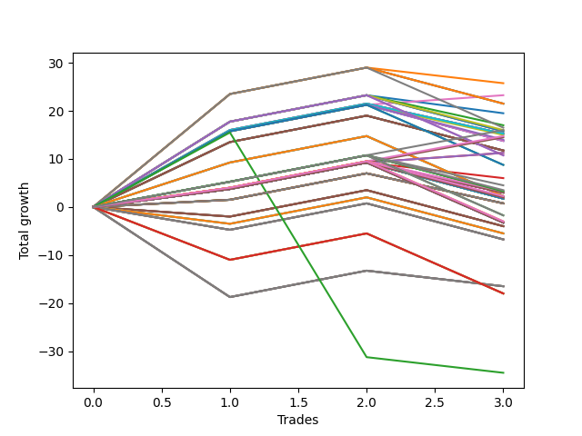

# Short Bulldog 001 
- Symbol: ES90d5m
- Date Range: 03/18/2022 - 07/08/2022
- Trading Period: 7:20-12:30
- Number of Trades: 3



| Name | Win Percent | Profit | Avg Profit / Trade |     | Name | Win Percent | Profit | Avg Profit / Trade |
| ---- | ----------- | ------ | ------------------ | --- | ---- | ----------- | ------ | ------------------ |
| Sorted By <br> Profit | | | | | Sorted By <br> Win Percentage ||||
| Seventy-Three | 100.00 | 12750.00 | 4250.00 |     | Seventy-Three | 100.00 | 12750.00 | 4250.00 |
| One | 66.67 | 11000.00 | 3666.67 |     | One | 66.67 | 11000.00 | 3666.67 |
| Zero | 66.67 | 7875.00 | 2625.00 |     | Zero | 66.67 | 7875.00 | 2625.00 |
| Six | 66.67 | 7500.00 | 2500.00 |     | Six | 66.67 | 7500.00 | 2500.00 |
| Three | 66.67 | -250.00 | -83.33 |     | Three | 66.67 | -250.00 | -83.33 |
| Seven | 33.33 | -16125.00 | -5375.00 |     | Seven | 33.33 | -16125.00 | -5375.00 |
| Five | 33.33 | -16125.00 | -5375.00 |     | Five | 33.33 | -16125.00 | -5375.00 |
| Four | 33.33 | -16125.00 | -5375.00 |     | Four | 33.33 | -16125.00 | -5375.00 |
| Two | 33.33 | -16125.00 | -5375.00 |     | Two | 33.33 | -16125.00 | -5375.00 |

## NO STOPLOSS

### Test Zero
* Sell when price hits the middle line of the 20p bollinger
* No Stoploss
* Results:
```
Total Trades: 3
Percent Up: 33.33
Percent Down: 66.67
Total Points Moved Down: 15.75
Potential Profit: 7875.00
Total Points Ups: 13.00 Count Ups: 1
Total Points Downs: 28.75 Count Downs: 2
```

<details><summary>Trades</summary>

<code>In: 2022-05-24 09:20:00		Out: 2022-05-24 09:36:50		Total Position Time: 16:50		Total Move Down: 20.75		Total to Date: 20.75</code> <br />
<code>In: 2022-06-15 11:05:00		Out: 2022-06-15 11:10:10		Total Position Time: 05:10		Total Move Down: 8.00		Total to Date: 28.75</code> <br />
<code>In: 2022-06-15 11:55:00		Out: 2022-06-15 12:50:00		Total Position Time: 55:00		Total Move Down: -13.00		Total to Date: 15.75</code> <br />


</details>

### Test One
* Sell when the price hits the upper line of the 20p 1std bollinger
* No Stoploss
* Results:
```
Total Trades: 3
Percent Up: 33.33
Percent Down: 66.67
Total Points Moved Down: 22.00
Potential Profit: 11000.00
Total Points Ups: 13.00 Count Ups: 1
Total Points Downs: 35.00 Count Downs: 2
```

<details><summary>Trades</summary>

<code>In: 2022-05-24 09:20:00		Out: 2022-05-24 10:04:10		Total Position Time: 44:10		Total Move Down: 27.00		Total to Date: 27.00</code> <br />
<code>In: 2022-06-15 11:05:00		Out: 2022-06-15 11:10:10		Total Position Time: 05:10		Total Move Down: 8.00		Total to Date: 35.00</code> <br />
<code>In: 2022-06-15 11:55:00		Out: 2022-06-15 12:50:00		Total Position Time: 55:00		Total Move Down: -13.00		Total to Date: 22.00</code> <br />


</details>

### Test Two
* Sell when the price hits the upper line of the 20p 2std bollinger
* No Stoploss
* Results:
```
Total Trades: 3
Percent Up: 66.67
Percent Down: 33.33
Total Points Moved Down: -32.25
Potential Profit: -16125.00
Total Points Ups: 40.25 Count Ups: 2
Total Points Downs: 8.00 Count Downs: 1
```

<details><summary>Trades</summary>

<code>In: 2022-05-24 09:20:00		Out: 2022-05-24 12:50:00		Total Position Time: 210:00		Total Move Down: -27.25		Total to Date: -27.25</code> <br />
<code>In: 2022-06-15 11:05:00		Out: 2022-06-15 11:10:10		Total Position Time: 05:10		Total Move Down: 8.00		Total to Date: -19.25</code> <br />
<code>In: 2022-06-15 11:55:00		Out: 2022-06-15 12:50:00		Total Position Time: 55:00		Total Move Down: -13.00		Total to Date: -32.25</code> <br />


</details>

### Test Three
* Sell when price hits the middle line of the 50p bollinger
* No Stoploss
* Results:
```
Total Trades: 3
Percent Up: 33.33
Percent Down: 66.67
Total Points Moved Down: -0.50
Potential Profit: -250.00
Total Points Ups: 13.00 Count Ups: 1
Total Points Downs: 12.50 Count Downs: 2
```

<details><summary>Trades</summary>

<code>In: 2022-05-24 09:20:00		Out: 2022-05-24 09:25:10		Total Position Time: 05:10		Total Move Down: 4.50		Total to Date: 4.50</code> <br />
<code>In: 2022-06-15 11:05:00		Out: 2022-06-15 11:10:10		Total Position Time: 05:10		Total Move Down: 8.00		Total to Date: 12.50</code> <br />
<code>In: 2022-06-15 11:55:00		Out: 2022-06-15 12:50:00		Total Position Time: 55:00		Total Move Down: -13.00		Total to Date: -0.50</code> <br />


</details>

### Test Four
* Sell when the price hits the upper line of the 50p 1std bollinger
* No Stoploss
* Results:
```
Total Trades: 3
Percent Up: 66.67
Percent Down: 33.33
Total Points Moved Down: -32.25
Potential Profit: -16125.00
Total Points Ups: 40.25 Count Ups: 2
Total Points Downs: 8.00 Count Downs: 1
```

<details><summary>Trades</summary>

<code>In: 2022-05-24 09:20:00		Out: 2022-05-24 12:50:00		Total Position Time: 210:00		Total Move Down: -27.25		Total to Date: -27.25</code> <br />
<code>In: 2022-06-15 11:05:00		Out: 2022-06-15 11:10:10		Total Position Time: 05:10		Total Move Down: 8.00		Total to Date: -19.25</code> <br />
<code>In: 2022-06-15 11:55:00		Out: 2022-06-15 12:50:00		Total Position Time: 55:00		Total Move Down: -13.00		Total to Date: -32.25</code> <br />


</details>

### Test Five
* Sell when the price hits the upper line of the 50p 2std bollinger
* No Stoploss
* Results:
```
Total Trades: 3
Percent Up: 66.67
Percent Down: 33.33
Total Points Moved Down: -32.25
Potential Profit: -16125.00
Total Points Ups: 40.25 Count Ups: 2
Total Points Downs: 8.00 Count Downs: 1
```

<details><summary>Trades</summary>

<code>In: 2022-05-24 09:20:00		Out: 2022-05-24 12:50:00		Total Position Time: 210:00		Total Move Down: -27.25		Total to Date: -27.25</code> <br />
<code>In: 2022-06-15 11:05:00		Out: 2022-06-15 11:10:10		Total Position Time: 05:10		Total Move Down: 8.00		Total to Date: -19.25</code> <br />
<code>In: 2022-06-15 11:55:00		Out: 2022-06-15 12:50:00		Total Position Time: 55:00		Total Move Down: -13.00		Total to Date: -32.25</code> <br />


</details>

### Test Six
* Sell when the price hits the middle line of the 1std VWAP
* No Stoploss
* Results:
```
Total Trades: 3
Percent Up: 33.33
Percent Down: 66.67
Total Points Moved Down: 15.00
Potential Profit: 7500.00
Total Points Ups: 13.00 Count Ups: 1
Total Points Downs: 28.00 Count Downs: 2
```

<details><summary>Trades</summary>

<code>In: 2022-05-24 09:20:00		Out: 2022-05-24 09:36:45		Total Position Time: 16:45		Total Move Down: 20.00		Total to Date: 20.00</code> <br />
<code>In: 2022-06-15 11:05:00		Out: 2022-06-15 11:10:10		Total Position Time: 05:10		Total Move Down: 8.00		Total to Date: 28.00</code> <br />
<code>In: 2022-06-15 11:55:00		Out: 2022-06-15 12:50:00		Total Position Time: 55:00		Total Move Down: -13.00		Total to Date: 15.00</code> <br />


</details>

### Test Seven
* Sell when the price hits the upper line of the 1std VWAP
* No Stoploss
* Results:
```
Total Trades: 3
Percent Up: 66.67
Percent Down: 33.33
Total Points Moved Down: -32.25
Potential Profit: -16125.00
Total Points Ups: 40.25 Count Ups: 2
Total Points Downs: 8.00 Count Downs: 1
```

<details><summary>Trades</summary>

<code>In: 2022-05-24 09:20:00		Out: 2022-05-24 12:50:00		Total Position Time: 210:00		Total Move Down: -27.25		Total to Date: -27.25</code> <br />
<code>In: 2022-06-15 11:05:00		Out: 2022-06-15 11:10:10		Total Position Time: 05:10		Total Move Down: 8.00		Total to Date: -19.25</code> <br />
<code>In: 2022-06-15 11:55:00		Out: 2022-06-15 12:50:00		Total Position Time: 55:00		Total Move Down: -13.00		Total to Date: -32.25</code> <br />


</details>

## SPECIAL EXIT CONDITIONS 

### Test Seventy-Three
* Sell when the linear regression slope changes to negative
* No Stoploss
* Results:
```
Total Trades: 3
Percent Up: 0.00
Percent Down: 100.00
Total Points Moved Down: 25.50
Potential Profit: 12750.00
Total Points Ups: 0.00 Count Ups: 0
Total Points Downs: 25.50 Count Downs: 3
```

<details><summary>Trades</summary>

<code>In: 2022-05-24 09:20:00		Out: 2022-05-24 09:34:05		Total Position Time: 14:05		Total Move Down: 14.00		Total to Date: 14.00</code> <br />
<code>In: 2022-06-15 11:05:00		Out: 2022-06-15 11:13:05		Total Position Time: 08:05		Total Move Down: 6.50		Total to Date: 20.50</code> <br />
<code>In: 2022-06-15 11:55:00		Out: 2022-06-15 12:06:00		Total Position Time: 11:00		Total Move Down: 5.00		Total to Date: 25.50</code> <br />


</details>