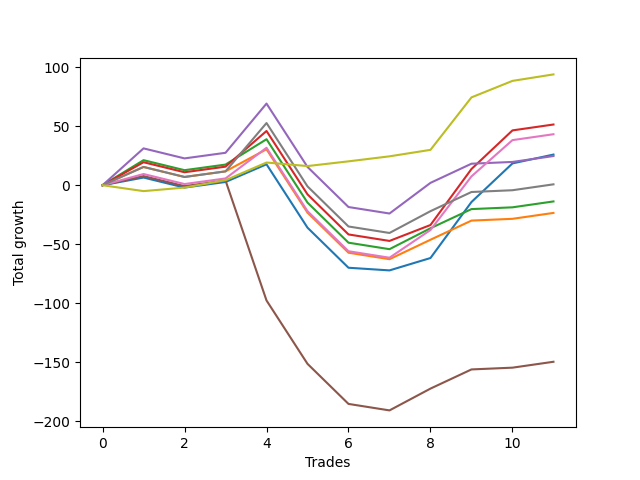

# Short Bulldog 003 
- Symbol: ES90d5m
- Date Range: 03/18/2022 - 07/08/2022
- Trading Period: 7:20-12:30
- Number of Trades: 11



| Name | Win Percent | Profit | Avg Profit / Trade | Avg Time / Trade |      | Name | Win Percent | Profit | Avg Profit / Trade | Avg Time / Trade |
| ---- | ----------- | ------ | ------------------ | ---------------- | ---- | ---- | ----------- | ------ | ------------------ | ---------------- |
| Sorted By <br> Profit | | | | | | Sorted By <br> Win Percentage ||||
| Fifty-One | 45.45 | 8500.00 | 772.73 | 00:00 |     | Four | 63.64 | 6750.00 | 613.64 | 00:00 |
| Eleven | 18.18 | 7500.00 | 681.82 | 00:00 |     | One Hundred Thirty | 63.64 | 1125.00 | 102.27 | 00:00 |
| Four | 63.64 | 6750.00 | 613.64 | 00:00 |     | One Hundred Twenty-Nine | 63.64 | -1500.00 | -136.36 | 00:00 |
| Ninety-Five | 45.45 | 6750.00 | 613.64 | 00:00 |     | One Hundred Twenty-Eight | 63.64 | -3125.00 | -284.09 | 00:00 |
| Fifty-Four | 45.45 | 5375.00 | 488.64 | 00:00 |     | One Hundred Twenty-Seven | 63.64 | -4000.00 | -363.64 | 00:00 |
| Sixty-Seven | 36.36 | 5375.00 | 488.64 | 00:00 |     | Three | 63.64 | -4000.00 | -363.64 | 00:00 |
| One Hundred Five | 45.45 | 5000.00 | 454.55 | 00:00 |     | Six | 63.64 | -4750.00 | -431.82 | 00:00 |
| Ninety-Four | 45.45 | 4625.00 | 420.45 | 00:00 |     | One Hundred Twenty-Six | 63.64 | -5750.00 | -522.73 | 00:00 |
| twenty-Seven | 18.18 | 4500.00 | 409.09 | 00:00 |     | Seven | 63.64 | -5750.00 | -522.73 | 00:00 |
| Ninety-Three | 45.45 | 4375.00 | 397.73 | 00:00 |     | Two | 63.64 | -13500.00 | -1227.27 | 00:00 |
| Fourteen | 18.18 | 4375.00 | 397.73 | 00:00 |     | One | 63.64 | -17125.00 | -1556.82 | 00:00 |
| Ninety-Two | 45.45 | 4125.00 | 375.00 | 00:00 |     | Eighty-Five | 63.64 | -26625.00 | -2420.45 | 00:00 |
| Ninety-One | 45.45 | 4125.00 | 375.00 | 00:00 |     | Eighty-Four | 63.64 | -29250.00 | -2659.09 | 00:00 |
| Fifty-Five | 45.45 | 3750.00 | 340.91 | 00:00 |     | Zero | 63.64 | -29625.00 | -2693.18 | 00:00 |
| Fifty-Three | 45.45 | 3750.00 | 340.91 | 00:00 |     | Eighty-Three | 63.64 | -30875.00 | -2806.82 | 00:00 |
| Fifty-Two | 45.45 | 3750.00 | 340.91 | 00:00 |     | Eighty-Two | 63.64 | -31750.00 | -2886.36 | 00:00 |
| One Hundred Ten | 45.45 | 3375.00 | 306.82 | 00:00 |     | Eighty-One | 63.64 | -33500.00 | -3045.45 | 00:00 |
| One Hundred Four | 45.45 | 2875.00 | 261.36 | 00:00 |     | One Hundred Twenty-Five | 54.55 | -1375.00 | -125.00 | 00:00 |
| Ninety-Nine | 45.45 | 2750.00 | 250.00 | 00:00 |     | One Hundred Twenty-Four | 54.55 | -4000.00 | -363.64 | 00:00 |
| One Hundred Fifteen | 45.45 | 2625.00 | 238.64 | 00:00 |     | One Hundred Twenty-Three | 54.55 | -4500.00 | -409.09 | 00:00 |
| One Hundred Three | 45.45 | 2625.00 | 238.64 | 00:00 |     | One Hundred Twenty-Two | 54.55 | -5250.00 | -477.27 | 00:00 |
| Ninety-Eight | 45.45 | 2500.00 | 227.27 | 00:00 |     | One Hundred Twenty-One | 54.55 | -6000.00 | -545.45 | 00:00 |
| One Hundred Two | 45.45 | 2375.00 | 215.91 | 00:00 |     | Fifty-One | 45.45 | 8500.00 | 772.73 | 00:00 |
| One Hundred One | 45.45 | 2375.00 | 215.91 | 00:00 |     | Ninety-Five | 45.45 | 6750.00 | 613.64 | 00:00 |
| Fifty | 45.45 | 2375.00 | 215.91 | 00:00 |     | Fifty-Four | 45.45 | 5375.00 | 488.64 | 00:00 |
| Ninety-Seven | 45.45 | 2250.00 | 204.55 | 00:00 |     | One Hundred Five | 45.45 | 5000.00 | 454.55 | 00:00 |
| Ninety-Six | 45.45 | 2250.00 | 204.55 | 00:00 |     | Ninety-Four | 45.45 | 4625.00 | 420.45 | 00:00 |
| Thirty | 18.18 | 1375.00 | 125.00 | 00:00 |     | Ninety-Three | 45.45 | 4375.00 | 397.73 | 00:00 |
| One Hundred Nine | 45.45 | 1250.00 | 113.64 | 00:00 |     | Ninety-Two | 45.45 | 4125.00 | 375.00 | 00:00 |
| One Hundred Thirty | 63.64 | 1125.00 | 102.27 | 00:00 |     | Ninety-One | 45.45 | 4125.00 | 375.00 | 00:00 |
| One Hundred Eight | 45.45 | 1000.00 | 90.91 | 00:00 |     | Fifty-Five | 45.45 | 3750.00 | 340.91 | 00:00 |
| Forty-Nine | 45.45 | 1000.00 | 90.91 | 00:00 |     | Fifty-Three | 45.45 | 3750.00 | 340.91 | 00:00 |
| One Hundred Seven | 45.45 | 750.00 | 68.18 | 00:00 |     | Fifty-Two | 45.45 | 3750.00 | 340.91 | 00:00 |
| One Hundred Six | 45.45 | 750.00 | 68.18 | 00:00 |     | One Hundred Ten | 45.45 | 3375.00 | 306.82 | 00:00 |
| One Hundred Fourteen | 45.45 | 500.00 | 45.45 | 00:00 |     | One Hundred Four | 45.45 | 2875.00 | 261.36 | 00:00 |
| One Hundred | 45.45 | 500.00 | 45.45 | 00:00 |     | Ninety-Nine | 45.45 | 2750.00 | 250.00 | 00:00 |
| One Hundred Thirteen | 45.45 | 250.00 | 22.73 | 00:00 |     | One Hundred Fifteen | 45.45 | 2625.00 | 238.64 | 00:00 |
| One Hundred Twelve | 45.45 | -0.00 | -0.00 | 00:00 |     | One Hundred Three | 45.45 | 2625.00 | 238.64 | 00:00 |
| One Hundred Eleven | 45.45 | -0.00 | -0.00 | 00:00 |     | Ninety-Eight | 45.45 | 2500.00 | 227.27 | 00:00 |
| Sixten | 45.45 | -875.00 | -79.55 | 00:00 |     | One Hundred Two | 45.45 | 2375.00 | 215.91 | 00:00 |
| Sixty-Eight | 36.36 | -875.00 | -79.55 | 00:00 |     | One Hundred One | 45.45 | 2375.00 | 215.91 | 00:00 |
| One Hundred Twenty-Five | 54.55 | -1375.00 | -125.00 | 00:00 |     | Fifty | 45.45 | 2375.00 | 215.91 | 00:00 |
| One Hundred Twenty-Nine | 63.64 | -1500.00 | -136.36 | 00:00 |     | Ninety-Seven | 45.45 | 2250.00 | 204.55 | 00:00 |
| Forty-Eight | 45.45 | -1750.00 | -159.09 | 00:00 |     | Ninety-Six | 45.45 | 2250.00 | 204.55 | 00:00 |
| Twenty-Three | 45.45 | -1750.00 | -159.09 | 00:00 |     | One Hundred Nine | 45.45 | 1250.00 | 113.64 | 00:00 |
| Twenty-Two | 45.45 | -1750.00 | -159.09 | 00:00 |     | One Hundred Eight | 45.45 | 1000.00 | 90.91 | 00:00 |
| Twenty-One | 45.45 | -1750.00 | -159.09 | 00:00 |     | Forty-Nine | 45.45 | 1000.00 | 90.91 | 00:00 |
| Twenty | 45.45 | -1750.00 | -159.09 | 00:00 |     | One Hundred Seven | 45.45 | 750.00 | 68.18 | 00:00 |
| Nineteen | 45.45 | -1750.00 | -159.09 | 00:00 |     | One Hundred Six | 45.45 | 750.00 | 68.18 | 00:00 |
| Eighteen | 45.45 | -1750.00 | -159.09 | 00:00 |     | One Hundred Fourteen | 45.45 | 500.00 | 45.45 | 00:00 |
| Seventeen | 45.45 | -1750.00 | -159.09 | 00:00 |     | One Hundred | 45.45 | 500.00 | 45.45 | 00:00 |
| Thirty-Two | 45.45 | -1875.00 | -170.45 | 00:00 |     | One Hundred Thirteen | 45.45 | 250.00 | 22.73 | 00:00 |
| Thirty-Nine | 45.45 | -2250.00 | -204.55 | 00:00 |     | One Hundred Twelve | 45.45 | -0.00 | -0.00 | 00:00 |
| Thirty-Eight | 45.45 | -2250.00 | -204.55 | 00:00 |     | One Hundred Eleven | 45.45 | -0.00 | -0.00 | 00:00 |
| Thirty-Seven | 45.45 | -2250.00 | -204.55 | 00:00 |     | Sixten | 45.45 | -875.00 | -79.55 | 00:00 |
| Thirty-Six | 45.45 | -2250.00 | -204.55 | 00:00 |     | Forty-Eight | 45.45 | -1750.00 | -159.09 | 00:00 |
| Thirty-Five | 45.45 | -2250.00 | -204.55 | 00:00 |     | Twenty-Three | 45.45 | -1750.00 | -159.09 | 00:00 |
| Thirty-Four | 45.45 | -2250.00 | -204.55 | 00:00 |     | Twenty-Two | 45.45 | -1750.00 | -159.09 | 00:00 |
| Thirty-Three | 45.45 | -2250.00 | -204.55 | 00:00 |     | Twenty-One | 45.45 | -1750.00 | -159.09 | 00:00 |
| Forty-Three | 18.18 | -2500.00 | -227.27 | 00:00 |     | Twenty | 45.45 | -1750.00 | -159.09 | 00:00 |
| Sixty-Nine | 36.36 | -2750.00 | -250.00 | 00:00 |     | Nineteen | 45.45 | -1750.00 | -159.09 | 00:00 |
| One Hundred Twenty-Eight | 63.64 | -3125.00 | -284.09 | 00:00 |     | Eighteen | 45.45 | -1750.00 | -159.09 | 00:00 |
| One Hundred Twenty | 45.45 | -3250.00 | -295.45 | 00:00 |     | Seventeen | 45.45 | -1750.00 | -159.09 | 00:00 |
| Seventy | 36.36 | -3625.00 | -329.55 | 00:00 |     | Thirty-Two | 45.45 | -1875.00 | -170.45 | 00:00 |
| Sixty-Six | 36.36 | -3625.00 | -329.55 | 00:00 |     | Thirty-Nine | 45.45 | -2250.00 | -204.55 | 00:00 |
| One Hundred Twenty-Seven | 63.64 | -4000.00 | -363.64 | 00:00 |     | Thirty-Eight | 45.45 | -2250.00 | -204.55 | 00:00 |
| Three | 63.64 | -4000.00 | -363.64 | 00:00 |     | Thirty-Seven | 45.45 | -2250.00 | -204.55 | 00:00 |
| One Hundred Twenty-Four | 54.55 | -4000.00 | -363.64 | 00:00 |     | Thirty-Six | 45.45 | -2250.00 | -204.55 | 00:00 |
| One Hundred Twenty-Three | 54.55 | -4500.00 | -409.09 | 00:00 |     | Thirty-Five | 45.45 | -2250.00 | -204.55 | 00:00 |
| Six | 63.64 | -4750.00 | -431.82 | 00:00 |     | Thirty-Four | 45.45 | -2250.00 | -204.55 | 00:00 |
| One Hundred Twenty-Two | 54.55 | -5250.00 | -477.27 | 00:00 |     | Thirty-Three | 45.45 | -2250.00 | -204.55 | 00:00 |
| One Hundred Ninteen | 45.45 | -5375.00 | -488.64 | 00:00 |     | One Hundred Twenty | 45.45 | -3250.00 | -295.45 | 00:00 |
| One Hundred Eighteen | 45.45 | -5625.00 | -511.36 | 00:00 |     | One Hundred Ninteen | 45.45 | -5375.00 | -488.64 | 00:00 |
| Forty-Six | 18.18 | -5625.00 | -511.36 | 00:00 |     | One Hundred Eighteen | 45.45 | -5625.00 | -511.36 | 00:00 |
| One Hundred Twenty-Six | 63.64 | -5750.00 | -522.73 | 00:00 |     | One Hundred Seventeen | 45.45 | -5875.00 | -534.09 | 00:00 |
| Seven | 63.64 | -5750.00 | -522.73 | 00:00 |     | One Hundred Sixteen | 45.45 | -5875.00 | -534.09 | 00:00 |
| One Hundred Seventeen | 45.45 | -5875.00 | -534.09 | 00:00 |     | Seventy-Three | 45.45 | -20500.00 | -1863.64 | 00:00 |
| One Hundred Sixteen | 45.45 | -5875.00 | -534.09 | 00:00 |     | Five | 45.45 | -82000.00 | -7454.55 | 00:00 |
| One Hundred Twenty-One | 54.55 | -6000.00 | -545.45 | 00:00 |     | Sixty-Seven | 36.36 | 5375.00 | 488.64 | 00:00 |
| Sixty-Five | 36.36 | -7875.00 | -715.91 | 00:00 |     | Sixty-Eight | 36.36 | -875.00 | -79.55 | 00:00 |
| Seventy-One | 36.36 | -9125.00 | -829.55 | 00:00 |     | Sixty-Nine | 36.36 | -2750.00 | -250.00 | 00:00 |
| Fifty-Nine | 27.27 | -12625.00 | -1147.73 | 00:00 |     | Seventy | 36.36 | -3625.00 | -329.55 | 00:00 |
| Two | 63.64 | -13500.00 | -1227.27 | 00:00 |     | Sixty-Six | 36.36 | -3625.00 | -329.55 | 00:00 |
| Sixty-Four | 36.36 | -13625.00 | -1238.64 | 00:00 |     | Sixty-Five | 36.36 | -7875.00 | -715.91 | 00:00 |
| Ten | 9.09 | -14000.00 | -1272.73 | 00:00 |     | Seventy-One | 36.36 | -9125.00 | -829.55 | 00:00 |
| Nine | 9.09 | -15375.00 | -1397.73 | 00:00 |     | Sixty-Four | 36.36 | -13625.00 | -1238.64 | 00:00 |
| Sixty-Two | 27.27 | -15750.00 | -1431.82 | 00:00 |     | Fifty-Nine | 27.27 | -12625.00 | -1147.73 | 00:00 |
| One | 63.64 | -17125.00 | -1556.82 | 00:00 |     | Sixty-Two | 27.27 | -15750.00 | -1431.82 | 00:00 |
| Twenty-Six | 9.09 | -17250.00 | -1568.18 | 00:00 |     | Fifty-Seven | 27.27 | -29375.00 | -2670.45 | 00:00 |
| Eight | 9.09 | -18125.00 | -1647.73 | 00:00 |     | Fifty-Six | 27.27 | -34500.00 | -3136.36 | 00:00 |
| Twenty-Five | 9.09 | -18625.00 | -1693.18 | 00:00 |     | Eleven | 18.18 | 7500.00 | 681.82 | 00:00 |
| Seventy-Three | 45.45 | -20500.00 | -1863.64 | 00:00 |     | twenty-Seven | 18.18 | 4500.00 | 409.09 | 00:00 |
| Fifteen | 0.00 | -20625.00 | -1875.00 | 00:00 |     | Fourteen | 18.18 | 4375.00 | 397.73 | 00:00 |
| Thirteen | 0.00 | -20625.00 | -1875.00 | 00:00 |     | Thirty | 18.18 | 1375.00 | 125.00 | 00:00 |
| Twelve | 0.00 | -20625.00 | -1875.00 | 00:00 |     | Forty-Three | 18.18 | -2500.00 | -227.27 | 00:00 |
| Twenty-Four | 9.09 | -21375.00 | -1943.18 | 00:00 |     | Forty-Six | 18.18 | -5625.00 | -511.36 | 00:00 |
| Forty-Two | 9.09 | -25750.00 | -2340.91 | 00:00 |     | Fifty-Eight | 18.18 | -38250.00 | -3477.27 | 00:00 |
| Thirty-One | 0.00 | -26375.00 | -2397.73 | 00:00 |     | Ten | 9.09 | -14000.00 | -1272.73 | 00:00 |
| Twenty-Nine | 0.00 | -26375.00 | -2397.73 | 00:00 |     | Nine | 9.09 | -15375.00 | -1397.73 | 00:00 |
| Twenty-Eight | 0.00 | -26375.00 | -2397.73 | 00:00 |     | Twenty-Six | 9.09 | -17250.00 | -1568.18 | 00:00 |
| Eighty-Five | 63.64 | -26625.00 | -2420.45 | 00:00 |     | Eight | 9.09 | -18125.00 | -1647.73 | 00:00 |
| Forty-One | 9.09 | -27125.00 | -2465.91 | 00:00 |     | Twenty-Five | 9.09 | -18625.00 | -1693.18 | 00:00 |
| Eighty-Four | 63.64 | -29250.00 | -2659.09 | 00:00 |     | Twenty-Four | 9.09 | -21375.00 | -1943.18 | 00:00 |
| Fifty-Seven | 27.27 | -29375.00 | -2670.45 | 00:00 |     | Forty-Two | 9.09 | -25750.00 | -2340.91 | 00:00 |
| Zero | 63.64 | -29625.00 | -2693.18 | 00:00 |     | Forty-One | 9.09 | -27125.00 | -2465.91 | 00:00 |
| Forty | 9.09 | -29875.00 | -2715.91 | 00:00 |     | Forty | 9.09 | -29875.00 | -2715.91 | 00:00 |
| Eighty-Three | 63.64 | -30875.00 | -2806.82 | 00:00 |     | Sixty-Three | 9.09 | -49375.00 | -4488.64 | 00:00 |
| Eighty-Two | 63.64 | -31750.00 | -2886.36 | 00:00 |     | Sixty-One | 9.09 | -49375.00 | -4488.64 | 00:00 |
| Eighty-One | 63.64 | -33500.00 | -3045.45 | 00:00 |     | Sixty | 9.09 | -49375.00 | -4488.64 | 00:00 |
| Fifty-Six | 27.27 | -34500.00 | -3136.36 | 00:00 |     | Fifteen | 0.00 | -20625.00 | -1875.00 | 00:00 |
| Forty-Seven | 0.00 | -34875.00 | -3170.45 | 00:00 |     | Thirteen | 0.00 | -20625.00 | -1875.00 | 00:00 |
| Forty-Five | 0.00 | -34875.00 | -3170.45 | 00:00 |     | Twelve | 0.00 | -20625.00 | -1875.00 | 00:00 |
| Forty-Four | 0.00 | -34875.00 | -3170.45 | 00:00 |     | Thirty-One | 0.00 | -26375.00 | -2397.73 | 00:00 |
| Fifty-Eight | 18.18 | -38250.00 | -3477.27 | 00:00 |     | Twenty-Nine | 0.00 | -26375.00 | -2397.73 | 00:00 |
| Sixty-Three | 9.09 | -49375.00 | -4488.64 | 00:00 |     | Twenty-Eight | 0.00 | -26375.00 | -2397.73 | 00:00 |
| Sixty-One | 9.09 | -49375.00 | -4488.64 | 00:00 |     | Forty-Seven | 0.00 | -34875.00 | -3170.45 | 00:00 |
| Sixty | 9.09 | -49375.00 | -4488.64 | 00:00 |     | Forty-Five | 0.00 | -34875.00 | -3170.45 | 00:00 |
| Five | 45.45 | -82000.00 | -7454.55 | 00:00 |     | Forty-Four | 0.00 | -34875.00 | -3170.45 | 00:00 |

## NO STOPLOSS

### Test Zero
* Sell when price hits the middle line of the 20p bollinger
* No Stoploss
* Results:
```
Total Trades: 11
Percent Up: 36.36
Percent Down: 63.64
Total Points Moved Down: -59.25
Potential Profit: -29625.00
Total Points Ups: 102.75 Count Ups: 4
Total Points Downs: 43.50 Count Downs: 7
```

<details><summary>Trades</summary>

<code>In: 2022-03-25 07:30:00		Out: 2022-03-25 08:08:15		Total Position Time: 38:15		Total Move Down: 5.25		Total to Date: 5.25</code> <br />
<code>In: 2022-03-28 12:05:00		Out: 2022-03-28 12:55:00		Total Position Time: 50:00		Total Move Down: -10.75		Total to Date: -5.50</code> <br />
<code>In: 2022-04-07 12:20:00		Out: 2022-04-07 12:55:00		Total Position Time: 35:00		Total Move Down: 6.50		Total to Date: 1.00</code> <br />
<code>In: 2022-05-04 11:10:00		Out: 2022-05-04 11:15:10		Total Position Time: 05:10		Total Move Down: 3.00		Total to Date: 4.00</code> <br />
<code>In: 2022-05-04 12:00:00		Out: 2022-05-04 12:55:00		Total Position Time: 55:00		Total Move Down: -51.75		Total to Date: -47.75</code> <br />
<code>In: 2022-05-04 12:20:00		Out: 2022-05-04 12:55:00		Total Position Time: 35:00		Total Move Down: -36.00		Total to Date: -83.75</code> <br />
<code>In: 2022-05-25 11:40:00		Out: 2022-05-25 12:50:05		Total Position Time: 70:05		Total Move Down: -4.25		Total to Date: -88.00</code> <br />
<code>In: 2022-05-31 09:10:00		Out: 2022-05-31 10:16:30		Total Position Time: 66:30		Total Move Down: 5.75		Total to Date: -82.25</code> <br />
<code>In: 2022-06-15 11:50:00		Out: 2022-06-15 12:50:25		Total Position Time: 60:25		Total Move Down: 17.25		Total to Date: -65.00</code> <br />
<code>In: 2022-06-15 11:55:00		Out: 2022-06-15 12:50:25		Total Position Time: 55:25		Total Move Down: 2.75		Total to Date: -62.25</code> <br />
<code>In: 2022-07-06 11:50:00		Out: 2022-07-06 12:50:45		Total Position Time: 60:45		Total Move Down: 3.00		Total to Date: -59.25</code> <br />


</details>

### Test One
* Sell when the price hits the upper line of the 20p 1std bollinger
* No Stoploss
* Results:
```
Total Trades: 11
Percent Up: 36.36
Percent Down: 63.64
Total Points Moved Down: -34.25
Potential Profit: -17125.00
Total Points Ups: 106.00 Count Ups: 4
Total Points Downs: 71.75 Count Downs: 7
```

<details><summary>Trades</summary>

<code>In: 2022-03-25 07:30:00		Out: 2022-03-25 08:09:20		Total Position Time: 39:20		Total Move Down: 11.25		Total to Date: 11.25</code> <br />
<code>In: 2022-03-28 12:05:00		Out: 2022-03-28 12:55:00		Total Position Time: 50:00		Total Move Down: -10.75		Total to Date: 0.50</code> <br />
<code>In: 2022-04-07 12:20:00		Out: 2022-04-07 12:55:00		Total Position Time: 35:00		Total Move Down: 6.50		Total to Date: 7.00</code> <br />
<code>In: 2022-05-04 11:10:00		Out: 2022-05-04 11:18:20		Total Position Time: 08:20		Total Move Down: 8.50		Total to Date: 15.50</code> <br />
<code>In: 2022-05-04 12:00:00		Out: 2022-05-04 12:55:00		Total Position Time: 55:00		Total Move Down: -51.75		Total to Date: -36.25</code> <br />
<code>In: 2022-05-04 12:20:00		Out: 2022-05-04 12:55:00		Total Position Time: 35:00		Total Move Down: -36.00		Total to Date: -72.25</code> <br />
<code>In: 2022-05-25 11:40:00		Out: 2022-05-25 12:55:00		Total Position Time: 75:00		Total Move Down: -7.50		Total to Date: -79.75</code> <br />
<code>In: 2022-05-31 09:10:00		Out: 2022-05-31 10:28:50		Total Position Time: 78:50		Total Move Down: 10.50		Total to Date: -69.25</code> <br />
<code>In: 2022-06-15 11:50:00		Out: 2022-06-15 12:55:00		Total Position Time: 65:00		Total Move Down: 17.75		Total to Date: -51.50</code> <br />
<code>In: 2022-06-15 11:55:00		Out: 2022-06-15 12:55:00		Total Position Time: 60:00		Total Move Down: 3.25		Total to Date: -48.25</code> <br />
<code>In: 2022-07-06 11:50:00		Out: 2022-07-06 12:53:30		Total Position Time: 63:30		Total Move Down: 14.00		Total to Date: -34.25</code> <br />


</details>

### Test Two
* Sell when the price hits the upper line of the 20p 2std bollinger
* No Stoploss
* Results:
```
Total Trades: 11
Percent Up: 36.36
Percent Down: 63.64
Total Points Moved Down: -27.00
Potential Profit: -13500.00
Total Points Ups: 106.00 Count Ups: 4
Total Points Downs: 79.00 Count Downs: 7
```

<details><summary>Trades</summary>

<code>In: 2022-03-25 07:30:00		Out: 2022-03-25 08:10:45		Total Position Time: 40:45		Total Move Down: 17.00		Total to Date: 17.00</code> <br />
<code>In: 2022-03-28 12:05:00		Out: 2022-03-28 12:55:00		Total Position Time: 50:00		Total Move Down: -10.75		Total to Date: 6.25</code> <br />
<code>In: 2022-04-07 12:20:00		Out: 2022-04-07 12:55:00		Total Position Time: 35:00		Total Move Down: 6.50		Total to Date: 12.75</code> <br />
<code>In: 2022-05-04 11:10:00		Out: 2022-05-04 11:18:40		Total Position Time: 08:40		Total Move Down: 11.25		Total to Date: 24.00</code> <br />
<code>In: 2022-05-04 12:00:00		Out: 2022-05-04 12:55:00		Total Position Time: 55:00		Total Move Down: -51.75		Total to Date: -27.75</code> <br />
<code>In: 2022-05-04 12:20:00		Out: 2022-05-04 12:55:00		Total Position Time: 35:00		Total Move Down: -36.00		Total to Date: -63.75</code> <br />
<code>In: 2022-05-25 11:40:00		Out: 2022-05-25 12:55:00		Total Position Time: 75:00		Total Move Down: -7.50		Total to Date: -71.25</code> <br />
<code>In: 2022-05-31 09:10:00		Out: 2022-05-31 11:45:45		Total Position Time: 155:45		Total Move Down: 10.50		Total to Date: -60.75</code> <br />
<code>In: 2022-06-15 11:50:00		Out: 2022-06-15 12:55:00		Total Position Time: 65:00		Total Move Down: 17.75		Total to Date: -43.00</code> <br />
<code>In: 2022-06-15 11:55:00		Out: 2022-06-15 12:55:00		Total Position Time: 60:00		Total Move Down: 3.25		Total to Date: -39.75</code> <br />
<code>In: 2022-07-06 11:50:00		Out: 2022-07-06 12:55:00		Total Position Time: 65:00		Total Move Down: 12.75		Total to Date: -27.00</code> <br />


</details>

### Test Three
* Sell when price hits the middle line of the 50p bollinger
* No Stoploss
* Results:
```
Total Trades: 11
Percent Up: 36.36
Percent Down: 63.64
Total Points Moved Down: -8.00
Potential Profit: -4000.00
Total Points Ups: 106.00 Count Ups: 4
Total Points Downs: 98.00 Count Downs: 7
```

<details><summary>Trades</summary>

<code>In: 2022-03-25 07:30:00		Out: 2022-03-25 08:10:45		Total Position Time: 40:45		Total Move Down: 17.00		Total to Date: 17.00</code> <br />
<code>In: 2022-03-28 12:05:00		Out: 2022-03-28 12:55:00		Total Position Time: 50:00		Total Move Down: -10.75		Total to Date: 6.25</code> <br />
<code>In: 2022-04-07 12:20:00		Out: 2022-04-07 12:55:00		Total Position Time: 35:00		Total Move Down: 6.50		Total to Date: 12.75</code> <br />
<code>In: 2022-05-04 11:10:00		Out: 2022-05-04 11:20:50		Total Position Time: 10:50		Total Move Down: 18.75		Total to Date: 31.50</code> <br />
<code>In: 2022-05-04 12:00:00		Out: 2022-05-04 12:55:00		Total Position Time: 55:00		Total Move Down: -51.75		Total to Date: -20.25</code> <br />
<code>In: 2022-05-04 12:20:00		Out: 2022-05-04 12:55:00		Total Position Time: 35:00		Total Move Down: -36.00		Total to Date: -56.25</code> <br />
<code>In: 2022-05-25 11:40:00		Out: 2022-05-25 12:55:00		Total Position Time: 75:00		Total Move Down: -7.50		Total to Date: -63.75</code> <br />
<code>In: 2022-05-31 09:10:00		Out: 2022-05-31 11:45:05		Total Position Time: 155:05		Total Move Down: 7.00		Total to Date: -56.75</code> <br />
<code>In: 2022-06-15 11:50:00		Out: 2022-06-15 11:58:10		Total Position Time: 08:10		Total Move Down: 32.75		Total to Date: -24.00</code> <br />
<code>In: 2022-06-15 11:55:00		Out: 2022-06-15 12:55:00		Total Position Time: 60:00		Total Move Down: 3.25		Total to Date: -20.75</code> <br />
<code>In: 2022-07-06 11:50:00		Out: 2022-07-06 12:55:00		Total Position Time: 65:00		Total Move Down: 12.75		Total to Date: -8.00</code> <br />


</details>

### Test Four
* Sell when the price hits the upper line of the 50p 1std bollinger
* No Stoploss
* Results:
```
Total Trades: 11
Percent Up: 36.36
Percent Down: 63.64
Total Points Moved Down: 13.50
Potential Profit: 6750.00
Total Points Ups: 106.00 Count Ups: 4
Total Points Downs: 119.50 Count Downs: 7
```

<details><summary>Trades</summary>

<code>In: 2022-03-25 07:30:00		Out: 2022-03-25 08:26:25		Total Position Time: 56:25		Total Move Down: 27.75		Total to Date: 27.75</code> <br />
<code>In: 2022-03-28 12:05:00		Out: 2022-03-28 12:55:00		Total Position Time: 50:00		Total Move Down: -10.75		Total to Date: 17.00</code> <br />
<code>In: 2022-04-07 12:20:00		Out: 2022-04-07 12:55:00		Total Position Time: 35:00		Total Move Down: 6.50		Total to Date: 23.50</code> <br />
<code>In: 2022-05-04 11:10:00		Out: 2022-05-04 11:34:10		Total Position Time: 24:10		Total Move Down: 30.25		Total to Date: 53.75</code> <br />
<code>In: 2022-05-04 12:00:00		Out: 2022-05-04 12:55:00		Total Position Time: 55:00		Total Move Down: -51.75		Total to Date: 2.00</code> <br />
<code>In: 2022-05-04 12:20:00		Out: 2022-05-04 12:55:00		Total Position Time: 35:00		Total Move Down: -36.00		Total to Date: -34.00</code> <br />
<code>In: 2022-05-25 11:40:00		Out: 2022-05-25 12:55:00		Total Position Time: 75:00		Total Move Down: -7.50		Total to Date: -41.50</code> <br />
<code>In: 2022-05-31 09:10:00		Out: 2022-05-31 11:54:45		Total Position Time: 164:45		Total Move Down: 21.25		Total to Date: -20.25</code> <br />
<code>In: 2022-06-15 11:50:00		Out: 2022-06-15 12:55:00		Total Position Time: 65:00		Total Move Down: 17.75		Total to Date: -2.50</code> <br />
<code>In: 2022-06-15 11:55:00		Out: 2022-06-15 12:55:00		Total Position Time: 60:00		Total Move Down: 3.25		Total to Date: 0.75</code> <br />
<code>In: 2022-07-06 11:50:00		Out: 2022-07-06 12:55:00		Total Position Time: 65:00		Total Move Down: 12.75		Total to Date: 13.50</code> <br />


</details>

### Test Five
* Sell when the price hits the upper line of the 50p 2std bollinger
* No Stoploss
* Results:
```
Total Trades: 11
Percent Up: 54.55
Percent Down: 45.45
Total Points Moved Down: -164.00
Potential Profit: -82000.00
Total Points Ups: 217.75 Count Ups: 6
Total Points Downs: 53.75 Count Downs: 5
```

<details><summary>Trades</summary>

<code>In: 2022-03-25 07:30:00		Out: 2022-03-25 12:55:00		Total Position Time: 325:00		Total Move Down: -1.25		Total to Date: -1.25</code> <br />
<code>In: 2022-03-28 12:05:00		Out: 2022-03-28 12:55:00		Total Position Time: 50:00		Total Move Down: -10.75		Total to Date: -12.00</code> <br />
<code>In: 2022-04-07 12:20:00		Out: 2022-04-07 12:55:00		Total Position Time: 35:00		Total Move Down: 6.50		Total to Date: -5.50</code> <br />
<code>In: 2022-05-04 11:10:00		Out: 2022-05-04 12:55:00		Total Position Time: 105:00		Total Move Down: -110.50		Total to Date: -116.00</code> <br />
<code>In: 2022-05-04 12:00:00		Out: 2022-05-04 12:55:00		Total Position Time: 55:00		Total Move Down: -51.75		Total to Date: -167.75</code> <br />
<code>In: 2022-05-04 12:20:00		Out: 2022-05-04 12:55:00		Total Position Time: 35:00		Total Move Down: -36.00		Total to Date: -203.75</code> <br />
<code>In: 2022-05-25 11:40:00		Out: 2022-05-25 12:55:00		Total Position Time: 75:00		Total Move Down: -7.50		Total to Date: -211.25</code> <br />
<code>In: 2022-05-31 09:10:00		Out: 2022-05-31 12:55:00		Total Position Time: 225:00		Total Move Down: 13.50		Total to Date: -197.75</code> <br />
<code>In: 2022-06-15 11:50:00		Out: 2022-06-15 12:55:00		Total Position Time: 65:00		Total Move Down: 17.75		Total to Date: -180.00</code> <br />
<code>In: 2022-06-15 11:55:00		Out: 2022-06-15 12:55:00		Total Position Time: 60:00		Total Move Down: 3.25		Total to Date: -176.75</code> <br />
<code>In: 2022-07-06 11:50:00		Out: 2022-07-06 12:55:00		Total Position Time: 65:00		Total Move Down: 12.75		Total to Date: -164.00</code> <br />


</details>

### Test Six
* Sell when the price hits the middle line of the 1std VWAP
* No Stoploss
* Results:
```
Total Trades: 11
Percent Up: 36.36
Percent Down: 63.64
Total Points Moved Down: -9.50
Potential Profit: -4750.00
Total Points Ups: 106.00 Count Ups: 4
Total Points Downs: 96.50 Count Downs: 7
```

<details><summary>Trades</summary>

<code>In: 2022-03-25 07:30:00		Out: 2022-03-25 08:08:15		Total Position Time: 38:15		Total Move Down: 5.25		Total to Date: 5.25</code> <br />
<code>In: 2022-03-28 12:05:00		Out: 2022-03-28 12:55:00		Total Position Time: 50:00		Total Move Down: -10.75		Total to Date: -5.50</code> <br />
<code>In: 2022-04-07 12:20:00		Out: 2022-04-07 12:55:00		Total Position Time: 35:00		Total Move Down: 6.50		Total to Date: 1.00</code> <br />
<code>In: 2022-05-04 11:10:00		Out: 2022-05-04 11:20:20		Total Position Time: 10:20		Total Move Down: 14.50		Total to Date: 15.50</code> <br />
<code>In: 2022-05-04 12:00:00		Out: 2022-05-04 12:55:00		Total Position Time: 55:00		Total Move Down: -51.75		Total to Date: -36.25</code> <br />
<code>In: 2022-05-04 12:20:00		Out: 2022-05-04 12:55:00		Total Position Time: 35:00		Total Move Down: -36.00		Total to Date: -72.25</code> <br />
<code>In: 2022-05-25 11:40:00		Out: 2022-05-25 12:55:00		Total Position Time: 75:00		Total Move Down: -7.50		Total to Date: -79.75</code> <br />
<code>In: 2022-05-31 09:10:00		Out: 2022-05-31 11:48:40		Total Position Time: 158:40		Total Move Down: 18.25		Total to Date: -61.50</code> <br />
<code>In: 2022-06-15 11:50:00		Out: 2022-06-15 11:57:55		Total Position Time: 07:55		Total Move Down: 30.75		Total to Date: -30.75</code> <br />
<code>In: 2022-06-15 11:55:00		Out: 2022-06-15 12:52:10		Total Position Time: 57:10		Total Move Down: 8.50		Total to Date: -22.25</code> <br />
<code>In: 2022-07-06 11:50:00		Out: 2022-07-06 12:55:00		Total Position Time: 65:00		Total Move Down: 12.75		Total to Date: -9.50</code> <br />


</details>

### Test Seven
* Sell when the price hits the upper line of the 1std VWAP
* No Stoploss
* Results:
```
Total Trades: 11
Percent Up: 36.36
Percent Down: 63.64
Total Points Moved Down: -11.50
Potential Profit: -5750.00
Total Points Ups: 106.00 Count Ups: 4
Total Points Downs: 94.50 Count Downs: 7
```

<details><summary>Trades</summary>

<code>In: 2022-03-25 07:30:00		Out: 2022-03-25 08:09:20		Total Position Time: 39:20		Total Move Down: 11.25		Total to Date: 11.25</code> <br />
<code>In: 2022-03-28 12:05:00		Out: 2022-03-28 12:55:00		Total Position Time: 50:00		Total Move Down: -10.75		Total to Date: 0.50</code> <br />
<code>In: 2022-04-07 12:20:00		Out: 2022-04-07 12:55:00		Total Position Time: 35:00		Total Move Down: 6.50		Total to Date: 7.00</code> <br />
<code>In: 2022-05-04 11:10:00		Out: 2022-05-04 11:34:05		Total Position Time: 24:05		Total Move Down: 29.50		Total to Date: 36.50</code> <br />
<code>In: 2022-05-04 12:00:00		Out: 2022-05-04 12:55:00		Total Position Time: 55:00		Total Move Down: -51.75		Total to Date: -15.25</code> <br />
<code>In: 2022-05-04 12:20:00		Out: 2022-05-04 12:55:00		Total Position Time: 35:00		Total Move Down: -36.00		Total to Date: -51.25</code> <br />
<code>In: 2022-05-25 11:40:00		Out: 2022-05-25 12:55:00		Total Position Time: 75:00		Total Move Down: -7.50		Total to Date: -58.75</code> <br />
<code>In: 2022-05-31 09:10:00		Out: 2022-05-31 12:55:00		Total Position Time: 225:00		Total Move Down: 13.50		Total to Date: -45.25</code> <br />
<code>In: 2022-06-15 11:50:00		Out: 2022-06-15 12:55:00		Total Position Time: 65:00		Total Move Down: 17.75		Total to Date: -27.50</code> <br />
<code>In: 2022-06-15 11:55:00		Out: 2022-06-15 12:55:00		Total Position Time: 60:00		Total Move Down: 3.25		Total to Date: -24.25</code> <br />
<code>In: 2022-07-06 11:50:00		Out: 2022-07-06 12:55:00		Total Position Time: 65:00		Total Move Down: 12.75		Total to Date: -11.50</code> <br />


</details>

## STOPLOSS OF 2

### Test Eight
* Sell when price hits the middle line of the 20p bollinger
* Stoploss is -2 points
* Results:
```
Total Trades: 11
Percent Up: 90.91
Percent Down: 9.09
Total Points Moved Down: -36.25
Potential Profit: -18125.00
Total Points Ups: 39.25 Count Ups: 10
Total Points Downs: 3.00 Count Downs: 1
```

<details><summary>Trades</summary>

<code>In: 2022-03-25 07:30:00		Out: 2022-03-25 07:35:10		Total Position Time: 05:10		Total Move Down: -6.75		Total to Date: -6.75</code> <br />
<code>In: 2022-03-28 12:05:00		Out: 2022-03-28 12:10:25		Total Position Time: 05:25		Total Move Down: -2.25		Total to Date: -9.00</code> <br />
<code>In: 2022-04-07 12:20:00		Out: 2022-04-07 12:35:10		Total Position Time: 15:10		Total Move Down: -2.00		Total to Date: -11.00</code> <br />
<code>In: 2022-05-04 11:10:00		Out: 2022-05-04 11:15:10		Total Position Time: 05:10		Total Move Down: 3.00		Total to Date: -8.00</code> <br />
<code>In: 2022-05-04 12:00:00		Out: 2022-05-04 12:05:10		Total Position Time: 05:10		Total Move Down: -5.50		Total to Date: -13.50</code> <br />
<code>In: 2022-05-04 12:20:00		Out: 2022-05-04 12:25:10		Total Position Time: 05:10		Total Move Down: -9.75		Total to Date: -23.25</code> <br />
<code>In: 2022-05-25 11:40:00		Out: 2022-05-25 11:45:10		Total Position Time: 05:10		Total Move Down: -2.25		Total to Date: -25.50</code> <br />
<code>In: 2022-05-31 09:10:00		Out: 2022-05-31 09:38:40		Total Position Time: 28:40		Total Move Down: -2.00		Total to Date: -27.50</code> <br />
<code>In: 2022-06-15 11:50:00		Out: 2022-06-15 12:24:00		Total Position Time: 34:00		Total Move Down: -2.75		Total to Date: -30.25</code> <br />
<code>In: 2022-06-15 11:55:00		Out: 2022-06-15 12:00:50		Total Position Time: 05:50		Total Move Down: -3.50		Total to Date: -33.75</code> <br />
<code>In: 2022-07-06 11:50:00		Out: 2022-07-06 11:55:40		Total Position Time: 05:40		Total Move Down: -2.50		Total to Date: -36.25</code> <br />


</details>

### Test Nine
* Sell when the price hits the upper line of the 20p 1std bollinger
* Stoploss is -2 points
* Results:
```
Total Trades: 11
Percent Up: 90.91
Percent Down: 9.09
Total Points Moved Down: -30.75
Potential Profit: -15375.00
Total Points Ups: 39.25 Count Ups: 10
Total Points Downs: 8.50 Count Downs: 1
```

<details><summary>Trades</summary>

<code>In: 2022-03-25 07:30:00		Out: 2022-03-25 07:35:10		Total Position Time: 05:10		Total Move Down: -6.75		Total to Date: -6.75</code> <br />
<code>In: 2022-03-28 12:05:00		Out: 2022-03-28 12:10:25		Total Position Time: 05:25		Total Move Down: -2.25		Total to Date: -9.00</code> <br />
<code>In: 2022-04-07 12:20:00		Out: 2022-04-07 12:35:10		Total Position Time: 15:10		Total Move Down: -2.00		Total to Date: -11.00</code> <br />
<code>In: 2022-05-04 11:10:00		Out: 2022-05-04 11:18:20		Total Position Time: 08:20		Total Move Down: 8.50		Total to Date: -2.50</code> <br />
<code>In: 2022-05-04 12:00:00		Out: 2022-05-04 12:05:10		Total Position Time: 05:10		Total Move Down: -5.50		Total to Date: -8.00</code> <br />
<code>In: 2022-05-04 12:20:00		Out: 2022-05-04 12:25:10		Total Position Time: 05:10		Total Move Down: -9.75		Total to Date: -17.75</code> <br />
<code>In: 2022-05-25 11:40:00		Out: 2022-05-25 11:45:10		Total Position Time: 05:10		Total Move Down: -2.25		Total to Date: -20.00</code> <br />
<code>In: 2022-05-31 09:10:00		Out: 2022-05-31 09:38:40		Total Position Time: 28:40		Total Move Down: -2.00		Total to Date: -22.00</code> <br />
<code>In: 2022-06-15 11:50:00		Out: 2022-06-15 12:24:00		Total Position Time: 34:00		Total Move Down: -2.75		Total to Date: -24.75</code> <br />
<code>In: 2022-06-15 11:55:00		Out: 2022-06-15 12:00:50		Total Position Time: 05:50		Total Move Down: -3.50		Total to Date: -28.25</code> <br />
<code>In: 2022-07-06 11:50:00		Out: 2022-07-06 11:55:40		Total Position Time: 05:40		Total Move Down: -2.50		Total to Date: -30.75</code> <br />


</details>

### Test Ten
* Sell when the price hits the upper line of the 20p 2std bollinger
* Stoploss is -2 points
* Results:
```
Total Trades: 11
Percent Up: 90.91
Percent Down: 9.09
Total Points Moved Down: -28.00
Potential Profit: -14000.00
Total Points Ups: 39.25 Count Ups: 10
Total Points Downs: 11.25 Count Downs: 1
```

<details><summary>Trades</summary>

<code>In: 2022-03-25 07:30:00		Out: 2022-03-25 07:35:10		Total Position Time: 05:10		Total Move Down: -6.75		Total to Date: -6.75</code> <br />
<code>In: 2022-03-28 12:05:00		Out: 2022-03-28 12:10:25		Total Position Time: 05:25		Total Move Down: -2.25		Total to Date: -9.00</code> <br />
<code>In: 2022-04-07 12:20:00		Out: 2022-04-07 12:35:10		Total Position Time: 15:10		Total Move Down: -2.00		Total to Date: -11.00</code> <br />
<code>In: 2022-05-04 11:10:00		Out: 2022-05-04 11:18:40		Total Position Time: 08:40		Total Move Down: 11.25		Total to Date: 0.25</code> <br />
<code>In: 2022-05-04 12:00:00		Out: 2022-05-04 12:05:10		Total Position Time: 05:10		Total Move Down: -5.50		Total to Date: -5.25</code> <br />
<code>In: 2022-05-04 12:20:00		Out: 2022-05-04 12:25:10		Total Position Time: 05:10		Total Move Down: -9.75		Total to Date: -15.00</code> <br />
<code>In: 2022-05-25 11:40:00		Out: 2022-05-25 11:45:10		Total Position Time: 05:10		Total Move Down: -2.25		Total to Date: -17.25</code> <br />
<code>In: 2022-05-31 09:10:00		Out: 2022-05-31 09:38:40		Total Position Time: 28:40		Total Move Down: -2.00		Total to Date: -19.25</code> <br />
<code>In: 2022-06-15 11:50:00		Out: 2022-06-15 12:24:00		Total Position Time: 34:00		Total Move Down: -2.75		Total to Date: -22.00</code> <br />
<code>In: 2022-06-15 11:55:00		Out: 2022-06-15 12:00:50		Total Position Time: 05:50		Total Move Down: -3.50		Total to Date: -25.50</code> <br />
<code>In: 2022-07-06 11:50:00		Out: 2022-07-06 11:55:40		Total Position Time: 05:40		Total Move Down: -2.50		Total to Date: -28.00</code> <br />


</details>

### Test Eleven
* Sell when price hits the middle line of the 50p bollinger
* Stoploss is -2 points
* Results:
```
Total Trades: 11
Percent Up: 81.82
Percent Down: 18.18
Total Points Moved Down: 15.00
Potential Profit: 7500.00
Total Points Ups: 36.50 Count Ups: 9
Total Points Downs: 51.50 Count Downs: 2
```

<details><summary>Trades</summary>

<code>In: 2022-03-25 07:30:00		Out: 2022-03-25 07:35:10		Total Position Time: 05:10		Total Move Down: -6.75		Total to Date: -6.75</code> <br />
<code>In: 2022-03-28 12:05:00		Out: 2022-03-28 12:10:25		Total Position Time: 05:25		Total Move Down: -2.25		Total to Date: -9.00</code> <br />
<code>In: 2022-04-07 12:20:00		Out: 2022-04-07 12:35:10		Total Position Time: 15:10		Total Move Down: -2.00		Total to Date: -11.00</code> <br />
<code>In: 2022-05-04 11:10:00		Out: 2022-05-04 11:20:50		Total Position Time: 10:50		Total Move Down: 18.75		Total to Date: 7.75</code> <br />
<code>In: 2022-05-04 12:00:00		Out: 2022-05-04 12:05:10		Total Position Time: 05:10		Total Move Down: -5.50		Total to Date: 2.25</code> <br />
<code>In: 2022-05-04 12:20:00		Out: 2022-05-04 12:25:10		Total Position Time: 05:10		Total Move Down: -9.75		Total to Date: -7.50</code> <br />
<code>In: 2022-05-25 11:40:00		Out: 2022-05-25 11:45:10		Total Position Time: 05:10		Total Move Down: -2.25		Total to Date: -9.75</code> <br />
<code>In: 2022-05-31 09:10:00		Out: 2022-05-31 09:38:40		Total Position Time: 28:40		Total Move Down: -2.00		Total to Date: -11.75</code> <br />
<code>In: 2022-06-15 11:50:00		Out: 2022-06-15 11:58:10		Total Position Time: 08:10		Total Move Down: 32.75		Total to Date: 21.00</code> <br />
<code>In: 2022-06-15 11:55:00		Out: 2022-06-15 12:00:50		Total Position Time: 05:50		Total Move Down: -3.50		Total to Date: 17.50</code> <br />
<code>In: 2022-07-06 11:50:00		Out: 2022-07-06 11:55:40		Total Position Time: 05:40		Total Move Down: -2.50		Total to Date: 15.00</code> <br />


</details>

### Test Twelve
* Sell when the price hits the upper line of the 50p 1std bollinger
* Stoploss is -2 points
* Results:
```
Total Trades: 11
Percent Up: 100.00
Percent Down: 0.00
Total Points Moved Down: -41.25
Potential Profit: -20625.00
Total Points Ups: 41.25 Count Ups: 11
Total Points Downs: 0.00 Count Downs: 0
```

<details><summary>Trades</summary>

<code>In: 2022-03-25 07:30:00		Out: 2022-03-25 07:35:10		Total Position Time: 05:10		Total Move Down: -6.75		Total to Date: -6.75</code> <br />
<code>In: 2022-03-28 12:05:00		Out: 2022-03-28 12:10:25		Total Position Time: 05:25		Total Move Down: -2.25		Total to Date: -9.00</code> <br />
<code>In: 2022-04-07 12:20:00		Out: 2022-04-07 12:35:10		Total Position Time: 15:10		Total Move Down: -2.00		Total to Date: -11.00</code> <br />
<code>In: 2022-05-04 11:10:00		Out: 2022-05-04 11:27:15		Total Position Time: 17:15		Total Move Down: -2.00		Total to Date: -13.00</code> <br />
<code>In: 2022-05-04 12:00:00		Out: 2022-05-04 12:05:10		Total Position Time: 05:10		Total Move Down: -5.50		Total to Date: -18.50</code> <br />
<code>In: 2022-05-04 12:20:00		Out: 2022-05-04 12:25:10		Total Position Time: 05:10		Total Move Down: -9.75		Total to Date: -28.25</code> <br />
<code>In: 2022-05-25 11:40:00		Out: 2022-05-25 11:45:10		Total Position Time: 05:10		Total Move Down: -2.25		Total to Date: -30.50</code> <br />
<code>In: 2022-05-31 09:10:00		Out: 2022-05-31 09:38:40		Total Position Time: 28:40		Total Move Down: -2.00		Total to Date: -32.50</code> <br />
<code>In: 2022-06-15 11:50:00		Out: 2022-06-15 12:24:00		Total Position Time: 34:00		Total Move Down: -2.75		Total to Date: -35.25</code> <br />
<code>In: 2022-06-15 11:55:00		Out: 2022-06-15 12:00:50		Total Position Time: 05:50		Total Move Down: -3.50		Total to Date: -38.75</code> <br />
<code>In: 2022-07-06 11:50:00		Out: 2022-07-06 11:55:40		Total Position Time: 05:40		Total Move Down: -2.50		Total to Date: -41.25</code> <br />


</details>

### Test Thirteen
* Sell when the price hits the upper line of the 50p 2std bollinger
* Stoploss is -2 points
* Results:
```
Total Trades: 11
Percent Up: 100.00
Percent Down: 0.00
Total Points Moved Down: -41.25
Potential Profit: -20625.00
Total Points Ups: 41.25 Count Ups: 11
Total Points Downs: 0.00 Count Downs: 0
```

<details><summary>Trades</summary>

<code>In: 2022-03-25 07:30:00		Out: 2022-03-25 07:35:10		Total Position Time: 05:10		Total Move Down: -6.75		Total to Date: -6.75</code> <br />
<code>In: 2022-03-28 12:05:00		Out: 2022-03-28 12:10:25		Total Position Time: 05:25		Total Move Down: -2.25		Total to Date: -9.00</code> <br />
<code>In: 2022-04-07 12:20:00		Out: 2022-04-07 12:35:10		Total Position Time: 15:10		Total Move Down: -2.00		Total to Date: -11.00</code> <br />
<code>In: 2022-05-04 11:10:00		Out: 2022-05-04 11:27:15		Total Position Time: 17:15		Total Move Down: -2.00		Total to Date: -13.00</code> <br />
<code>In: 2022-05-04 12:00:00		Out: 2022-05-04 12:05:10		Total Position Time: 05:10		Total Move Down: -5.50		Total to Date: -18.50</code> <br />
<code>In: 2022-05-04 12:20:00		Out: 2022-05-04 12:25:10		Total Position Time: 05:10		Total Move Down: -9.75		Total to Date: -28.25</code> <br />
<code>In: 2022-05-25 11:40:00		Out: 2022-05-25 11:45:10		Total Position Time: 05:10		Total Move Down: -2.25		Total to Date: -30.50</code> <br />
<code>In: 2022-05-31 09:10:00		Out: 2022-05-31 09:38:40		Total Position Time: 28:40		Total Move Down: -2.00		Total to Date: -32.50</code> <br />
<code>In: 2022-06-15 11:50:00		Out: 2022-06-15 12:24:00		Total Position Time: 34:00		Total Move Down: -2.75		Total to Date: -35.25</code> <br />
<code>In: 2022-06-15 11:55:00		Out: 2022-06-15 12:00:50		Total Position Time: 05:50		Total Move Down: -3.50		Total to Date: -38.75</code> <br />
<code>In: 2022-07-06 11:50:00		Out: 2022-07-06 11:55:40		Total Position Time: 05:40		Total Move Down: -2.50		Total to Date: -41.25</code> <br />


</details>

### Test Fourteen
* Sell when the price hits the middle line of the 1std VWAP
* Stoploss is -2 points
* Results:
```
Total Trades: 11
Percent Up: 81.82
Percent Down: 18.18
Total Points Moved Down: 8.75
Potential Profit: 4375.00
Total Points Ups: 36.50 Count Ups: 9
Total Points Downs: 45.25 Count Downs: 2
```

<details><summary>Trades</summary>

<code>In: 2022-03-25 07:30:00		Out: 2022-03-25 07:35:10		Total Position Time: 05:10		Total Move Down: -6.75		Total to Date: -6.75</code> <br />
<code>In: 2022-03-28 12:05:00		Out: 2022-03-28 12:10:25		Total Position Time: 05:25		Total Move Down: -2.25		Total to Date: -9.00</code> <br />
<code>In: 2022-04-07 12:20:00		Out: 2022-04-07 12:35:10		Total Position Time: 15:10		Total Move Down: -2.00		Total to Date: -11.00</code> <br />
<code>In: 2022-05-04 11:10:00		Out: 2022-05-04 11:20:20		Total Position Time: 10:20		Total Move Down: 14.50		Total to Date: 3.50</code> <br />
<code>In: 2022-05-04 12:00:00		Out: 2022-05-04 12:05:10		Total Position Time: 05:10		Total Move Down: -5.50		Total to Date: -2.00</code> <br />
<code>In: 2022-05-04 12:20:00		Out: 2022-05-04 12:25:10		Total Position Time: 05:10		Total Move Down: -9.75		Total to Date: -11.75</code> <br />
<code>In: 2022-05-25 11:40:00		Out: 2022-05-25 11:45:10		Total Position Time: 05:10		Total Move Down: -2.25		Total to Date: -14.00</code> <br />
<code>In: 2022-05-31 09:10:00		Out: 2022-05-31 09:38:40		Total Position Time: 28:40		Total Move Down: -2.00		Total to Date: -16.00</code> <br />
<code>In: 2022-06-15 11:50:00		Out: 2022-06-15 11:57:55		Total Position Time: 07:55		Total Move Down: 30.75		Total to Date: 14.75</code> <br />
<code>In: 2022-06-15 11:55:00		Out: 2022-06-15 12:00:50		Total Position Time: 05:50		Total Move Down: -3.50		Total to Date: 11.25</code> <br />
<code>In: 2022-07-06 11:50:00		Out: 2022-07-06 11:55:40		Total Position Time: 05:40		Total Move Down: -2.50		Total to Date: 8.75</code> <br />


</details>

### Test Fifteen
* Sell when the price hits the upper line of the 1std VWAP
* Stoploss is -2 points
* Results:
```
Total Trades: 11
Percent Up: 100.00
Percent Down: 0.00
Total Points Moved Down: -41.25
Potential Profit: -20625.00
Total Points Ups: 41.25 Count Ups: 11
Total Points Downs: 0.00 Count Downs: 0
```

<details><summary>Trades</summary>

<code>In: 2022-03-25 07:30:00		Out: 2022-03-25 07:35:10		Total Position Time: 05:10		Total Move Down: -6.75		Total to Date: -6.75</code> <br />
<code>In: 2022-03-28 12:05:00		Out: 2022-03-28 12:10:25		Total Position Time: 05:25		Total Move Down: -2.25		Total to Date: -9.00</code> <br />
<code>In: 2022-04-07 12:20:00		Out: 2022-04-07 12:35:10		Total Position Time: 15:10		Total Move Down: -2.00		Total to Date: -11.00</code> <br />
<code>In: 2022-05-04 11:10:00		Out: 2022-05-04 11:27:15		Total Position Time: 17:15		Total Move Down: -2.00		Total to Date: -13.00</code> <br />
<code>In: 2022-05-04 12:00:00		Out: 2022-05-04 12:05:10		Total Position Time: 05:10		Total Move Down: -5.50		Total to Date: -18.50</code> <br />
<code>In: 2022-05-04 12:20:00		Out: 2022-05-04 12:25:10		Total Position Time: 05:10		Total Move Down: -9.75		Total to Date: -28.25</code> <br />
<code>In: 2022-05-25 11:40:00		Out: 2022-05-25 11:45:10		Total Position Time: 05:10		Total Move Down: -2.25		Total to Date: -30.50</code> <br />
<code>In: 2022-05-31 09:10:00		Out: 2022-05-31 09:38:40		Total Position Time: 28:40		Total Move Down: -2.00		Total to Date: -32.50</code> <br />
<code>In: 2022-06-15 11:50:00		Out: 2022-06-15 12:24:00		Total Position Time: 34:00		Total Move Down: -2.75		Total to Date: -35.25</code> <br />
<code>In: 2022-06-15 11:55:00		Out: 2022-06-15 12:00:50		Total Position Time: 05:50		Total Move Down: -3.50		Total to Date: -38.75</code> <br />
<code>In: 2022-07-06 11:50:00		Out: 2022-07-06 11:55:40		Total Position Time: 05:40		Total Move Down: -2.50		Total to Date: -41.25</code> <br />


</details>

## TRAIL STOP OF 2

### Test Sixten
* Sell when price hits the middle line of the 20p bollinger
* Trailing Stop is -2 points
* Results:
```
Total Trades: 11
Percent Up: 54.55
Percent Down: 45.45
Total Points Moved Down: -1.75
Potential Profit: -875.00
Total Points Ups: 32.75 Count Ups: 6
Total Points Downs: 31.00 Count Downs: 5
```

<details><summary>Trades</summary>

<code>In: 2022-03-25 07:30:00		Out: 2022-03-25 07:35:20		Total Position Time: 05:20		Total Move Down: -7.00		Total to Date: -7.00</code> <br />
<code>In: 2022-03-28 12:05:00		Out: 2022-03-28 12:11:15		Total Position Time: 06:15		Total Move Down: -2.50		Total to Date: -9.50</code> <br />
<code>In: 2022-04-07 12:20:00		Out: 2022-04-07 12:25:30		Total Position Time: 05:30		Total Move Down: 2.50		Total to Date: -7.00</code> <br />
<code>In: 2022-05-04 11:10:00		Out: 2022-05-04 11:15:10		Total Position Time: 05:10		Total Move Down: 3.00		Total to Date: -4.00</code> <br />
<code>In: 2022-05-04 12:00:00		Out: 2022-05-04 12:05:10		Total Position Time: 05:10		Total Move Down: -5.50		Total to Date: -9.50</code> <br />
<code>In: 2022-05-04 12:20:00		Out: 2022-05-04 12:25:55		Total Position Time: 05:55		Total Move Down: -10.75		Total to Date: -20.25</code> <br />
<code>In: 2022-05-25 11:40:00		Out: 2022-05-25 11:45:30		Total Position Time: 05:30		Total Move Down: -4.50		Total to Date: -24.75</code> <br />
<code>In: 2022-05-31 09:10:00		Out: 2022-05-31 09:15:25		Total Position Time: 05:25		Total Move Down: 5.00		Total to Date: -19.75</code> <br />
<code>In: 2022-06-15 11:50:00		Out: 2022-06-15 11:55:30		Total Position Time: 05:30		Total Move Down: 16.25		Total to Date: -3.50</code> <br />
<code>In: 2022-06-15 11:55:00		Out: 2022-06-15 12:00:25		Total Position Time: 05:25		Total Move Down: 4.25		Total to Date: 0.75</code> <br />
<code>In: 2022-07-06 11:50:00		Out: 2022-07-06 11:55:40		Total Position Time: 05:40		Total Move Down: -2.50		Total to Date: -1.75</code> <br />


</details>

### Test Seventeen
* Sell when the price hits the upper line of the 20p 1std bollinger
* Trailing Stop is -2 points
* Results:
```
Total Trades: 11
Percent Up: 54.55
Percent Down: 45.45
Total Points Moved Down: -3.50
Potential Profit: -1750.00
Total Points Ups: 32.75 Count Ups: 6
Total Points Downs: 29.25 Count Downs: 5
```

<details><summary>Trades</summary>

<code>In: 2022-03-25 07:30:00		Out: 2022-03-25 07:35:20		Total Position Time: 05:20		Total Move Down: -7.00		Total to Date: -7.00</code> <br />
<code>In: 2022-03-28 12:05:00		Out: 2022-03-28 12:11:15		Total Position Time: 06:15		Total Move Down: -2.50		Total to Date: -9.50</code> <br />
<code>In: 2022-04-07 12:20:00		Out: 2022-04-07 12:25:30		Total Position Time: 05:30		Total Move Down: 2.50		Total to Date: -7.00</code> <br />
<code>In: 2022-05-04 11:10:00		Out: 2022-05-04 11:15:55		Total Position Time: 05:55		Total Move Down: 1.25		Total to Date: -5.75</code> <br />
<code>In: 2022-05-04 12:00:00		Out: 2022-05-04 12:05:10		Total Position Time: 05:10		Total Move Down: -5.50		Total to Date: -11.25</code> <br />
<code>In: 2022-05-04 12:20:00		Out: 2022-05-04 12:25:55		Total Position Time: 05:55		Total Move Down: -10.75		Total to Date: -22.00</code> <br />
<code>In: 2022-05-25 11:40:00		Out: 2022-05-25 11:45:30		Total Position Time: 05:30		Total Move Down: -4.50		Total to Date: -26.50</code> <br />
<code>In: 2022-05-31 09:10:00		Out: 2022-05-31 09:15:25		Total Position Time: 05:25		Total Move Down: 5.00		Total to Date: -21.50</code> <br />
<code>In: 2022-06-15 11:50:00		Out: 2022-06-15 11:55:30		Total Position Time: 05:30		Total Move Down: 16.25		Total to Date: -5.25</code> <br />
<code>In: 2022-06-15 11:55:00		Out: 2022-06-15 12:00:25		Total Position Time: 05:25		Total Move Down: 4.25		Total to Date: -1.00</code> <br />
<code>In: 2022-07-06 11:50:00		Out: 2022-07-06 11:55:40		Total Position Time: 05:40		Total Move Down: -2.50		Total to Date: -3.50</code> <br />


</details>

### Test Eighteen
* Sell when the price hits the upper line of the 20p 2std bollinger
* Trailing Stop is -2 points
* Results:
```
Total Trades: 11
Percent Up: 54.55
Percent Down: 45.45
Total Points Moved Down: -3.50
Potential Profit: -1750.00
Total Points Ups: 32.75 Count Ups: 6
Total Points Downs: 29.25 Count Downs: 5
```

<details><summary>Trades</summary>

<code>In: 2022-03-25 07:30:00		Out: 2022-03-25 07:35:20		Total Position Time: 05:20		Total Move Down: -7.00		Total to Date: -7.00</code> <br />
<code>In: 2022-03-28 12:05:00		Out: 2022-03-28 12:11:15		Total Position Time: 06:15		Total Move Down: -2.50		Total to Date: -9.50</code> <br />
<code>In: 2022-04-07 12:20:00		Out: 2022-04-07 12:25:30		Total Position Time: 05:30		Total Move Down: 2.50		Total to Date: -7.00</code> <br />
<code>In: 2022-05-04 11:10:00		Out: 2022-05-04 11:15:55		Total Position Time: 05:55		Total Move Down: 1.25		Total to Date: -5.75</code> <br />
<code>In: 2022-05-04 12:00:00		Out: 2022-05-04 12:05:10		Total Position Time: 05:10		Total Move Down: -5.50		Total to Date: -11.25</code> <br />
<code>In: 2022-05-04 12:20:00		Out: 2022-05-04 12:25:55		Total Position Time: 05:55		Total Move Down: -10.75		Total to Date: -22.00</code> <br />
<code>In: 2022-05-25 11:40:00		Out: 2022-05-25 11:45:30		Total Position Time: 05:30		Total Move Down: -4.50		Total to Date: -26.50</code> <br />
<code>In: 2022-05-31 09:10:00		Out: 2022-05-31 09:15:25		Total Position Time: 05:25		Total Move Down: 5.00		Total to Date: -21.50</code> <br />
<code>In: 2022-06-15 11:50:00		Out: 2022-06-15 11:55:30		Total Position Time: 05:30		Total Move Down: 16.25		Total to Date: -5.25</code> <br />
<code>In: 2022-06-15 11:55:00		Out: 2022-06-15 12:00:25		Total Position Time: 05:25		Total Move Down: 4.25		Total to Date: -1.00</code> <br />
<code>In: 2022-07-06 11:50:00		Out: 2022-07-06 11:55:40		Total Position Time: 05:40		Total Move Down: -2.50		Total to Date: -3.50</code> <br />


</details>

### Test Nineteen
* Sell when price hits the middle line of the 50p bollinger
* Trailing Stop is -2 points
* Results:
```
Total Trades: 11
Percent Up: 54.55
Percent Down: 45.45
Total Points Moved Down: -3.50
Potential Profit: -1750.00
Total Points Ups: 32.75 Count Ups: 6
Total Points Downs: 29.25 Count Downs: 5
```

<details><summary>Trades</summary>

<code>In: 2022-03-25 07:30:00		Out: 2022-03-25 07:35:20		Total Position Time: 05:20		Total Move Down: -7.00		Total to Date: -7.00</code> <br />
<code>In: 2022-03-28 12:05:00		Out: 2022-03-28 12:11:15		Total Position Time: 06:15		Total Move Down: -2.50		Total to Date: -9.50</code> <br />
<code>In: 2022-04-07 12:20:00		Out: 2022-04-07 12:25:30		Total Position Time: 05:30		Total Move Down: 2.50		Total to Date: -7.00</code> <br />
<code>In: 2022-05-04 11:10:00		Out: 2022-05-04 11:15:55		Total Position Time: 05:55		Total Move Down: 1.25		Total to Date: -5.75</code> <br />
<code>In: 2022-05-04 12:00:00		Out: 2022-05-04 12:05:10		Total Position Time: 05:10		Total Move Down: -5.50		Total to Date: -11.25</code> <br />
<code>In: 2022-05-04 12:20:00		Out: 2022-05-04 12:25:55		Total Position Time: 05:55		Total Move Down: -10.75		Total to Date: -22.00</code> <br />
<code>In: 2022-05-25 11:40:00		Out: 2022-05-25 11:45:30		Total Position Time: 05:30		Total Move Down: -4.50		Total to Date: -26.50</code> <br />
<code>In: 2022-05-31 09:10:00		Out: 2022-05-31 09:15:25		Total Position Time: 05:25		Total Move Down: 5.00		Total to Date: -21.50</code> <br />
<code>In: 2022-06-15 11:50:00		Out: 2022-06-15 11:55:30		Total Position Time: 05:30		Total Move Down: 16.25		Total to Date: -5.25</code> <br />
<code>In: 2022-06-15 11:55:00		Out: 2022-06-15 12:00:25		Total Position Time: 05:25		Total Move Down: 4.25		Total to Date: -1.00</code> <br />
<code>In: 2022-07-06 11:50:00		Out: 2022-07-06 11:55:40		Total Position Time: 05:40		Total Move Down: -2.50		Total to Date: -3.50</code> <br />


</details>

### Test Twenty
* Sell when the price hits the upper line of the 50p 1std bollinger
* Trailing Stop is -2 points
* Results:
```
Total Trades: 11
Percent Up: 54.55
Percent Down: 45.45
Total Points Moved Down: -3.50
Potential Profit: -1750.00
Total Points Ups: 32.75 Count Ups: 6
Total Points Downs: 29.25 Count Downs: 5
```

<details><summary>Trades</summary>

<code>In: 2022-03-25 07:30:00		Out: 2022-03-25 07:35:20		Total Position Time: 05:20		Total Move Down: -7.00		Total to Date: -7.00</code> <br />
<code>In: 2022-03-28 12:05:00		Out: 2022-03-28 12:11:15		Total Position Time: 06:15		Total Move Down: -2.50		Total to Date: -9.50</code> <br />
<code>In: 2022-04-07 12:20:00		Out: 2022-04-07 12:25:30		Total Position Time: 05:30		Total Move Down: 2.50		Total to Date: -7.00</code> <br />
<code>In: 2022-05-04 11:10:00		Out: 2022-05-04 11:15:55		Total Position Time: 05:55		Total Move Down: 1.25		Total to Date: -5.75</code> <br />
<code>In: 2022-05-04 12:00:00		Out: 2022-05-04 12:05:10		Total Position Time: 05:10		Total Move Down: -5.50		Total to Date: -11.25</code> <br />
<code>In: 2022-05-04 12:20:00		Out: 2022-05-04 12:25:55		Total Position Time: 05:55		Total Move Down: -10.75		Total to Date: -22.00</code> <br />
<code>In: 2022-05-25 11:40:00		Out: 2022-05-25 11:45:30		Total Position Time: 05:30		Total Move Down: -4.50		Total to Date: -26.50</code> <br />
<code>In: 2022-05-31 09:10:00		Out: 2022-05-31 09:15:25		Total Position Time: 05:25		Total Move Down: 5.00		Total to Date: -21.50</code> <br />
<code>In: 2022-06-15 11:50:00		Out: 2022-06-15 11:55:30		Total Position Time: 05:30		Total Move Down: 16.25		Total to Date: -5.25</code> <br />
<code>In: 2022-06-15 11:55:00		Out: 2022-06-15 12:00:25		Total Position Time: 05:25		Total Move Down: 4.25		Total to Date: -1.00</code> <br />
<code>In: 2022-07-06 11:50:00		Out: 2022-07-06 11:55:40		Total Position Time: 05:40		Total Move Down: -2.50		Total to Date: -3.50</code> <br />


</details>

### Test Twenty-One
* Sell when the price hits the upper line of the 50p 2std bollinger
* Trailing Stop is -2 points
* Results:
```
Total Trades: 11
Percent Up: 54.55
Percent Down: 45.45
Total Points Moved Down: -3.50
Potential Profit: -1750.00
Total Points Ups: 32.75 Count Ups: 6
Total Points Downs: 29.25 Count Downs: 5
```

<details><summary>Trades</summary>

<code>In: 2022-03-25 07:30:00		Out: 2022-03-25 07:35:20		Total Position Time: 05:20		Total Move Down: -7.00		Total to Date: -7.00</code> <br />
<code>In: 2022-03-28 12:05:00		Out: 2022-03-28 12:11:15		Total Position Time: 06:15		Total Move Down: -2.50		Total to Date: -9.50</code> <br />
<code>In: 2022-04-07 12:20:00		Out: 2022-04-07 12:25:30		Total Position Time: 05:30		Total Move Down: 2.50		Total to Date: -7.00</code> <br />
<code>In: 2022-05-04 11:10:00		Out: 2022-05-04 11:15:55		Total Position Time: 05:55		Total Move Down: 1.25		Total to Date: -5.75</code> <br />
<code>In: 2022-05-04 12:00:00		Out: 2022-05-04 12:05:10		Total Position Time: 05:10		Total Move Down: -5.50		Total to Date: -11.25</code> <br />
<code>In: 2022-05-04 12:20:00		Out: 2022-05-04 12:25:55		Total Position Time: 05:55		Total Move Down: -10.75		Total to Date: -22.00</code> <br />
<code>In: 2022-05-25 11:40:00		Out: 2022-05-25 11:45:30		Total Position Time: 05:30		Total Move Down: -4.50		Total to Date: -26.50</code> <br />
<code>In: 2022-05-31 09:10:00		Out: 2022-05-31 09:15:25		Total Position Time: 05:25		Total Move Down: 5.00		Total to Date: -21.50</code> <br />
<code>In: 2022-06-15 11:50:00		Out: 2022-06-15 11:55:30		Total Position Time: 05:30		Total Move Down: 16.25		Total to Date: -5.25</code> <br />
<code>In: 2022-06-15 11:55:00		Out: 2022-06-15 12:00:25		Total Position Time: 05:25		Total Move Down: 4.25		Total to Date: -1.00</code> <br />
<code>In: 2022-07-06 11:50:00		Out: 2022-07-06 11:55:40		Total Position Time: 05:40		Total Move Down: -2.50		Total to Date: -3.50</code> <br />


</details>

### Test Twenty-Two
* Sell when the price hits the middle line of the 1std VWAP
* Trailing Stop is -2 points
* Results:
```
Total Trades: 11
Percent Up: 54.55
Percent Down: 45.45
Total Points Moved Down: -3.50
Potential Profit: -1750.00
Total Points Ups: 32.75 Count Ups: 6
Total Points Downs: 29.25 Count Downs: 5
```

<details><summary>Trades</summary>

<code>In: 2022-03-25 07:30:00		Out: 2022-03-25 07:35:20		Total Position Time: 05:20		Total Move Down: -7.00		Total to Date: -7.00</code> <br />
<code>In: 2022-03-28 12:05:00		Out: 2022-03-28 12:11:15		Total Position Time: 06:15		Total Move Down: -2.50		Total to Date: -9.50</code> <br />
<code>In: 2022-04-07 12:20:00		Out: 2022-04-07 12:25:30		Total Position Time: 05:30		Total Move Down: 2.50		Total to Date: -7.00</code> <br />
<code>In: 2022-05-04 11:10:00		Out: 2022-05-04 11:15:55		Total Position Time: 05:55		Total Move Down: 1.25		Total to Date: -5.75</code> <br />
<code>In: 2022-05-04 12:00:00		Out: 2022-05-04 12:05:10		Total Position Time: 05:10		Total Move Down: -5.50		Total to Date: -11.25</code> <br />
<code>In: 2022-05-04 12:20:00		Out: 2022-05-04 12:25:55		Total Position Time: 05:55		Total Move Down: -10.75		Total to Date: -22.00</code> <br />
<code>In: 2022-05-25 11:40:00		Out: 2022-05-25 11:45:30		Total Position Time: 05:30		Total Move Down: -4.50		Total to Date: -26.50</code> <br />
<code>In: 2022-05-31 09:10:00		Out: 2022-05-31 09:15:25		Total Position Time: 05:25		Total Move Down: 5.00		Total to Date: -21.50</code> <br />
<code>In: 2022-06-15 11:50:00		Out: 2022-06-15 11:55:30		Total Position Time: 05:30		Total Move Down: 16.25		Total to Date: -5.25</code> <br />
<code>In: 2022-06-15 11:55:00		Out: 2022-06-15 12:00:25		Total Position Time: 05:25		Total Move Down: 4.25		Total to Date: -1.00</code> <br />
<code>In: 2022-07-06 11:50:00		Out: 2022-07-06 11:55:40		Total Position Time: 05:40		Total Move Down: -2.50		Total to Date: -3.50</code> <br />


</details>

### Test Twenty-Three
* Sell when the price hits the upper line of the 1std VWAP
* Trailing Stop is -2 points
* Results:
```
Total Trades: 11
Percent Up: 54.55
Percent Down: 45.45
Total Points Moved Down: -3.50
Potential Profit: -1750.00
Total Points Ups: 32.75 Count Ups: 6
Total Points Downs: 29.25 Count Downs: 5
```

<details><summary>Trades</summary>

<code>In: 2022-03-25 07:30:00		Out: 2022-03-25 07:35:20		Total Position Time: 05:20		Total Move Down: -7.00		Total to Date: -7.00</code> <br />
<code>In: 2022-03-28 12:05:00		Out: 2022-03-28 12:11:15		Total Position Time: 06:15		Total Move Down: -2.50		Total to Date: -9.50</code> <br />
<code>In: 2022-04-07 12:20:00		Out: 2022-04-07 12:25:30		Total Position Time: 05:30		Total Move Down: 2.50		Total to Date: -7.00</code> <br />
<code>In: 2022-05-04 11:10:00		Out: 2022-05-04 11:15:55		Total Position Time: 05:55		Total Move Down: 1.25		Total to Date: -5.75</code> <br />
<code>In: 2022-05-04 12:00:00		Out: 2022-05-04 12:05:10		Total Position Time: 05:10		Total Move Down: -5.50		Total to Date: -11.25</code> <br />
<code>In: 2022-05-04 12:20:00		Out: 2022-05-04 12:25:55		Total Position Time: 05:55		Total Move Down: -10.75		Total to Date: -22.00</code> <br />
<code>In: 2022-05-25 11:40:00		Out: 2022-05-25 11:45:30		Total Position Time: 05:30		Total Move Down: -4.50		Total to Date: -26.50</code> <br />
<code>In: 2022-05-31 09:10:00		Out: 2022-05-31 09:15:25		Total Position Time: 05:25		Total Move Down: 5.00		Total to Date: -21.50</code> <br />
<code>In: 2022-06-15 11:50:00		Out: 2022-06-15 11:55:30		Total Position Time: 05:30		Total Move Down: 16.25		Total to Date: -5.25</code> <br />
<code>In: 2022-06-15 11:55:00		Out: 2022-06-15 12:00:25		Total Position Time: 05:25		Total Move Down: 4.25		Total to Date: -1.00</code> <br />
<code>In: 2022-07-06 11:50:00		Out: 2022-07-06 11:55:40		Total Position Time: 05:40		Total Move Down: -2.50		Total to Date: -3.50</code> <br />


</details>

## STOPLOSS OF 3

### Test Twenty-Four
* Sell when price hits the middle line of the 20p bollinger
* Stoploss is -3 points
* Results:
```
Total Trades: 11
Percent Up: 90.91
Percent Down: 9.09
Total Points Moved Down: -42.75
Potential Profit: -21375.00
Total Points Ups: 45.75 Count Ups: 10
Total Points Downs: 3.00 Count Downs: 1
```

<details><summary>Trades</summary>

<code>In: 2022-03-25 07:30:00		Out: 2022-03-25 07:35:10		Total Position Time: 05:10		Total Move Down: -6.75		Total to Date: -6.75</code> <br />
<code>In: 2022-03-28 12:05:00		Out: 2022-03-28 12:14:25		Total Position Time: 09:25		Total Move Down: -3.00		Total to Date: -9.75</code> <br />
<code>In: 2022-04-07 12:20:00		Out: 2022-04-07 12:40:00		Total Position Time: 20:00		Total Move Down: -3.00		Total to Date: -12.75</code> <br />
<code>In: 2022-05-04 11:10:00		Out: 2022-05-04 11:15:10		Total Position Time: 05:10		Total Move Down: 3.00		Total to Date: -9.75</code> <br />
<code>In: 2022-05-04 12:00:00		Out: 2022-05-04 12:05:10		Total Position Time: 05:10		Total Move Down: -5.50		Total to Date: -15.25</code> <br />
<code>In: 2022-05-04 12:20:00		Out: 2022-05-04 12:25:10		Total Position Time: 05:10		Total Move Down: -9.75		Total to Date: -25.00</code> <br />
<code>In: 2022-05-25 11:40:00		Out: 2022-05-25 11:45:30		Total Position Time: 05:30		Total Move Down: -4.50		Total to Date: -29.50</code> <br />
<code>In: 2022-05-31 09:10:00		Out: 2022-05-31 09:39:40		Total Position Time: 29:40		Total Move Down: -3.50		Total to Date: -33.00</code> <br />
<code>In: 2022-06-15 11:50:00		Out: 2022-06-15 12:24:10		Total Position Time: 34:10		Total Move Down: -3.25		Total to Date: -36.25</code> <br />
<code>In: 2022-06-15 11:55:00		Out: 2022-06-15 12:00:50		Total Position Time: 05:50		Total Move Down: -3.50		Total to Date: -39.75</code> <br />
<code>In: 2022-07-06 11:50:00		Out: 2022-07-06 11:55:50		Total Position Time: 05:50		Total Move Down: -3.00		Total to Date: -42.75</code> <br />


</details>

### Test Twenty-Five
* Sell when the price hits the upper line of the 20p 1std bollinger
* Stoploss is -3 points
* Results:
```
Total Trades: 11
Percent Up: 90.91
Percent Down: 9.09
Total Points Moved Down: -37.25
Potential Profit: -18625.00
Total Points Ups: 45.75 Count Ups: 10
Total Points Downs: 8.50 Count Downs: 1
```

<details><summary>Trades</summary>

<code>In: 2022-03-25 07:30:00		Out: 2022-03-25 07:35:10		Total Position Time: 05:10		Total Move Down: -6.75		Total to Date: -6.75</code> <br />
<code>In: 2022-03-28 12:05:00		Out: 2022-03-28 12:14:25		Total Position Time: 09:25		Total Move Down: -3.00		Total to Date: -9.75</code> <br />
<code>In: 2022-04-07 12:20:00		Out: 2022-04-07 12:40:00		Total Position Time: 20:00		Total Move Down: -3.00		Total to Date: -12.75</code> <br />
<code>In: 2022-05-04 11:10:00		Out: 2022-05-04 11:18:20		Total Position Time: 08:20		Total Move Down: 8.50		Total to Date: -4.25</code> <br />
<code>In: 2022-05-04 12:00:00		Out: 2022-05-04 12:05:10		Total Position Time: 05:10		Total Move Down: -5.50		Total to Date: -9.75</code> <br />
<code>In: 2022-05-04 12:20:00		Out: 2022-05-04 12:25:10		Total Position Time: 05:10		Total Move Down: -9.75		Total to Date: -19.50</code> <br />
<code>In: 2022-05-25 11:40:00		Out: 2022-05-25 11:45:30		Total Position Time: 05:30		Total Move Down: -4.50		Total to Date: -24.00</code> <br />
<code>In: 2022-05-31 09:10:00		Out: 2022-05-31 09:39:40		Total Position Time: 29:40		Total Move Down: -3.50		Total to Date: -27.50</code> <br />
<code>In: 2022-06-15 11:50:00		Out: 2022-06-15 12:24:10		Total Position Time: 34:10		Total Move Down: -3.25		Total to Date: -30.75</code> <br />
<code>In: 2022-06-15 11:55:00		Out: 2022-06-15 12:00:50		Total Position Time: 05:50		Total Move Down: -3.50		Total to Date: -34.25</code> <br />
<code>In: 2022-07-06 11:50:00		Out: 2022-07-06 11:55:50		Total Position Time: 05:50		Total Move Down: -3.00		Total to Date: -37.25</code> <br />


</details>

### Test Twenty-Six
* Sell when the price hits the upper line of the 20p 2std bollinger
* Stoploss is -3 points
* Results:
```
Total Trades: 11
Percent Up: 90.91
Percent Down: 9.09
Total Points Moved Down: -34.50
Potential Profit: -17250.00
Total Points Ups: 45.75 Count Ups: 10
Total Points Downs: 11.25 Count Downs: 1
```

<details><summary>Trades</summary>

<code>In: 2022-03-25 07:30:00		Out: 2022-03-25 07:35:10		Total Position Time: 05:10		Total Move Down: -6.75		Total to Date: -6.75</code> <br />
<code>In: 2022-03-28 12:05:00		Out: 2022-03-28 12:14:25		Total Position Time: 09:25		Total Move Down: -3.00		Total to Date: -9.75</code> <br />
<code>In: 2022-04-07 12:20:00		Out: 2022-04-07 12:40:00		Total Position Time: 20:00		Total Move Down: -3.00		Total to Date: -12.75</code> <br />
<code>In: 2022-05-04 11:10:00		Out: 2022-05-04 11:18:40		Total Position Time: 08:40		Total Move Down: 11.25		Total to Date: -1.50</code> <br />
<code>In: 2022-05-04 12:00:00		Out: 2022-05-04 12:05:10		Total Position Time: 05:10		Total Move Down: -5.50		Total to Date: -7.00</code> <br />
<code>In: 2022-05-04 12:20:00		Out: 2022-05-04 12:25:10		Total Position Time: 05:10		Total Move Down: -9.75		Total to Date: -16.75</code> <br />
<code>In: 2022-05-25 11:40:00		Out: 2022-05-25 11:45:30		Total Position Time: 05:30		Total Move Down: -4.50		Total to Date: -21.25</code> <br />
<code>In: 2022-05-31 09:10:00		Out: 2022-05-31 09:39:40		Total Position Time: 29:40		Total Move Down: -3.50		Total to Date: -24.75</code> <br />
<code>In: 2022-06-15 11:50:00		Out: 2022-06-15 12:24:10		Total Position Time: 34:10		Total Move Down: -3.25		Total to Date: -28.00</code> <br />
<code>In: 2022-06-15 11:55:00		Out: 2022-06-15 12:00:50		Total Position Time: 05:50		Total Move Down: -3.50		Total to Date: -31.50</code> <br />
<code>In: 2022-07-06 11:50:00		Out: 2022-07-06 11:55:50		Total Position Time: 05:50		Total Move Down: -3.00		Total to Date: -34.50</code> <br />


</details>

### Test twenty-Seven
* Sell when price hits the middle line of the 50p bollinger
* Stoploss is -3 points
* Results:
```
Total Trades: 11
Percent Up: 81.82
Percent Down: 18.18
Total Points Moved Down: 9.00
Potential Profit: 4500.00
Total Points Ups: 42.50 Count Ups: 9
Total Points Downs: 51.50 Count Downs: 2
```

<details><summary>Trades</summary>

<code>In: 2022-03-25 07:30:00		Out: 2022-03-25 07:35:10		Total Position Time: 05:10		Total Move Down: -6.75		Total to Date: -6.75</code> <br />
<code>In: 2022-03-28 12:05:00		Out: 2022-03-28 12:14:25		Total Position Time: 09:25		Total Move Down: -3.00		Total to Date: -9.75</code> <br />
<code>In: 2022-04-07 12:20:00		Out: 2022-04-07 12:40:00		Total Position Time: 20:00		Total Move Down: -3.00		Total to Date: -12.75</code> <br />
<code>In: 2022-05-04 11:10:00		Out: 2022-05-04 11:20:50		Total Position Time: 10:50		Total Move Down: 18.75		Total to Date: 6.00</code> <br />
<code>In: 2022-05-04 12:00:00		Out: 2022-05-04 12:05:10		Total Position Time: 05:10		Total Move Down: -5.50		Total to Date: 0.50</code> <br />
<code>In: 2022-05-04 12:20:00		Out: 2022-05-04 12:25:10		Total Position Time: 05:10		Total Move Down: -9.75		Total to Date: -9.25</code> <br />
<code>In: 2022-05-25 11:40:00		Out: 2022-05-25 11:45:30		Total Position Time: 05:30		Total Move Down: -4.50		Total to Date: -13.75</code> <br />
<code>In: 2022-05-31 09:10:00		Out: 2022-05-31 09:39:40		Total Position Time: 29:40		Total Move Down: -3.50		Total to Date: -17.25</code> <br />
<code>In: 2022-06-15 11:50:00		Out: 2022-06-15 11:58:10		Total Position Time: 08:10		Total Move Down: 32.75		Total to Date: 15.50</code> <br />
<code>In: 2022-06-15 11:55:00		Out: 2022-06-15 12:00:50		Total Position Time: 05:50		Total Move Down: -3.50		Total to Date: 12.00</code> <br />
<code>In: 2022-07-06 11:50:00		Out: 2022-07-06 11:55:50		Total Position Time: 05:50		Total Move Down: -3.00		Total to Date: 9.00</code> <br />


</details>

### Test Twenty-Eight
* Sell when the price hits the upper line of the 50p 1std bollinger
* Stoploss is -3 points
* Results:
```
Total Trades: 11
Percent Up: 100.00
Percent Down: 0.00
Total Points Moved Down: -52.75
Potential Profit: -26375.00
Total Points Ups: 52.75 Count Ups: 11
Total Points Downs: 0.00 Count Downs: 0
```

<details><summary>Trades</summary>

<code>In: 2022-03-25 07:30:00		Out: 2022-03-25 07:35:10		Total Position Time: 05:10		Total Move Down: -6.75		Total to Date: -6.75</code> <br />
<code>In: 2022-03-28 12:05:00		Out: 2022-03-28 12:14:25		Total Position Time: 09:25		Total Move Down: -3.00		Total to Date: -9.75</code> <br />
<code>In: 2022-04-07 12:20:00		Out: 2022-04-07 12:40:00		Total Position Time: 20:00		Total Move Down: -3.00		Total to Date: -12.75</code> <br />
<code>In: 2022-05-04 11:10:00		Out: 2022-05-04 11:27:35		Total Position Time: 17:35		Total Move Down: -7.00		Total to Date: -19.75</code> <br />
<code>In: 2022-05-04 12:00:00		Out: 2022-05-04 12:05:10		Total Position Time: 05:10		Total Move Down: -5.50		Total to Date: -25.25</code> <br />
<code>In: 2022-05-04 12:20:00		Out: 2022-05-04 12:25:10		Total Position Time: 05:10		Total Move Down: -9.75		Total to Date: -35.00</code> <br />
<code>In: 2022-05-25 11:40:00		Out: 2022-05-25 11:45:30		Total Position Time: 05:30		Total Move Down: -4.50		Total to Date: -39.50</code> <br />
<code>In: 2022-05-31 09:10:00		Out: 2022-05-31 09:39:40		Total Position Time: 29:40		Total Move Down: -3.50		Total to Date: -43.00</code> <br />
<code>In: 2022-06-15 11:50:00		Out: 2022-06-15 12:24:10		Total Position Time: 34:10		Total Move Down: -3.25		Total to Date: -46.25</code> <br />
<code>In: 2022-06-15 11:55:00		Out: 2022-06-15 12:00:50		Total Position Time: 05:50		Total Move Down: -3.50		Total to Date: -49.75</code> <br />
<code>In: 2022-07-06 11:50:00		Out: 2022-07-06 11:55:50		Total Position Time: 05:50		Total Move Down: -3.00		Total to Date: -52.75</code> <br />


</details>

### Test Twenty-Nine
* Sell when the price hits the upper line of the 50p 2std bollinger
* Stoploss is -3 points
* Results:
```
Total Trades: 11
Percent Up: 100.00
Percent Down: 0.00
Total Points Moved Down: -52.75
Potential Profit: -26375.00
Total Points Ups: 52.75 Count Ups: 11
Total Points Downs: 0.00 Count Downs: 0
```

<details><summary>Trades</summary>

<code>In: 2022-03-25 07:30:00		Out: 2022-03-25 07:35:10		Total Position Time: 05:10		Total Move Down: -6.75		Total to Date: -6.75</code> <br />
<code>In: 2022-03-28 12:05:00		Out: 2022-03-28 12:14:25		Total Position Time: 09:25		Total Move Down: -3.00		Total to Date: -9.75</code> <br />
<code>In: 2022-04-07 12:20:00		Out: 2022-04-07 12:40:00		Total Position Time: 20:00		Total Move Down: -3.00		Total to Date: -12.75</code> <br />
<code>In: 2022-05-04 11:10:00		Out: 2022-05-04 11:27:35		Total Position Time: 17:35		Total Move Down: -7.00		Total to Date: -19.75</code> <br />
<code>In: 2022-05-04 12:00:00		Out: 2022-05-04 12:05:10		Total Position Time: 05:10		Total Move Down: -5.50		Total to Date: -25.25</code> <br />
<code>In: 2022-05-04 12:20:00		Out: 2022-05-04 12:25:10		Total Position Time: 05:10		Total Move Down: -9.75		Total to Date: -35.00</code> <br />
<code>In: 2022-05-25 11:40:00		Out: 2022-05-25 11:45:30		Total Position Time: 05:30		Total Move Down: -4.50		Total to Date: -39.50</code> <br />
<code>In: 2022-05-31 09:10:00		Out: 2022-05-31 09:39:40		Total Position Time: 29:40		Total Move Down: -3.50		Total to Date: -43.00</code> <br />
<code>In: 2022-06-15 11:50:00		Out: 2022-06-15 12:24:10		Total Position Time: 34:10		Total Move Down: -3.25		Total to Date: -46.25</code> <br />
<code>In: 2022-06-15 11:55:00		Out: 2022-06-15 12:00:50		Total Position Time: 05:50		Total Move Down: -3.50		Total to Date: -49.75</code> <br />
<code>In: 2022-07-06 11:50:00		Out: 2022-07-06 11:55:50		Total Position Time: 05:50		Total Move Down: -3.00		Total to Date: -52.75</code> <br />


</details>

### Test Thirty
* Sell when the price hits the middle line of the 1std VWAP
* Stoploss is -3 points
* Results:
```
Total Trades: 11
Percent Up: 81.82
Percent Down: 18.18
Total Points Moved Down: 2.75
Potential Profit: 1375.00
Total Points Ups: 42.50 Count Ups: 9
Total Points Downs: 45.25 Count Downs: 2
```

<details><summary>Trades</summary>

<code>In: 2022-03-25 07:30:00		Out: 2022-03-25 07:35:10		Total Position Time: 05:10		Total Move Down: -6.75		Total to Date: -6.75</code> <br />
<code>In: 2022-03-28 12:05:00		Out: 2022-03-28 12:14:25		Total Position Time: 09:25		Total Move Down: -3.00		Total to Date: -9.75</code> <br />
<code>In: 2022-04-07 12:20:00		Out: 2022-04-07 12:40:00		Total Position Time: 20:00		Total Move Down: -3.00		Total to Date: -12.75</code> <br />
<code>In: 2022-05-04 11:10:00		Out: 2022-05-04 11:20:20		Total Position Time: 10:20		Total Move Down: 14.50		Total to Date: 1.75</code> <br />
<code>In: 2022-05-04 12:00:00		Out: 2022-05-04 12:05:10		Total Position Time: 05:10		Total Move Down: -5.50		Total to Date: -3.75</code> <br />
<code>In: 2022-05-04 12:20:00		Out: 2022-05-04 12:25:10		Total Position Time: 05:10		Total Move Down: -9.75		Total to Date: -13.50</code> <br />
<code>In: 2022-05-25 11:40:00		Out: 2022-05-25 11:45:30		Total Position Time: 05:30		Total Move Down: -4.50		Total to Date: -18.00</code> <br />
<code>In: 2022-05-31 09:10:00		Out: 2022-05-31 09:39:40		Total Position Time: 29:40		Total Move Down: -3.50		Total to Date: -21.50</code> <br />
<code>In: 2022-06-15 11:50:00		Out: 2022-06-15 11:57:55		Total Position Time: 07:55		Total Move Down: 30.75		Total to Date: 9.25</code> <br />
<code>In: 2022-06-15 11:55:00		Out: 2022-06-15 12:00:50		Total Position Time: 05:50		Total Move Down: -3.50		Total to Date: 5.75</code> <br />
<code>In: 2022-07-06 11:50:00		Out: 2022-07-06 11:55:50		Total Position Time: 05:50		Total Move Down: -3.00		Total to Date: 2.75</code> <br />


</details>

### Test Thirty-One
* Sell when the price hits the upper line of the 1std VWAP
* Stoploss is -3 points
* Results:
```
Total Trades: 11
Percent Up: 100.00
Percent Down: 0.00
Total Points Moved Down: -52.75
Potential Profit: -26375.00
Total Points Ups: 52.75 Count Ups: 11
Total Points Downs: 0.00 Count Downs: 0
```

<details><summary>Trades</summary>

<code>In: 2022-03-25 07:30:00		Out: 2022-03-25 07:35:10		Total Position Time: 05:10		Total Move Down: -6.75		Total to Date: -6.75</code> <br />
<code>In: 2022-03-28 12:05:00		Out: 2022-03-28 12:14:25		Total Position Time: 09:25		Total Move Down: -3.00		Total to Date: -9.75</code> <br />
<code>In: 2022-04-07 12:20:00		Out: 2022-04-07 12:40:00		Total Position Time: 20:00		Total Move Down: -3.00		Total to Date: -12.75</code> <br />
<code>In: 2022-05-04 11:10:00		Out: 2022-05-04 11:27:35		Total Position Time: 17:35		Total Move Down: -7.00		Total to Date: -19.75</code> <br />
<code>In: 2022-05-04 12:00:00		Out: 2022-05-04 12:05:10		Total Position Time: 05:10		Total Move Down: -5.50		Total to Date: -25.25</code> <br />
<code>In: 2022-05-04 12:20:00		Out: 2022-05-04 12:25:10		Total Position Time: 05:10		Total Move Down: -9.75		Total to Date: -35.00</code> <br />
<code>In: 2022-05-25 11:40:00		Out: 2022-05-25 11:45:30		Total Position Time: 05:30		Total Move Down: -4.50		Total to Date: -39.50</code> <br />
<code>In: 2022-05-31 09:10:00		Out: 2022-05-31 09:39:40		Total Position Time: 29:40		Total Move Down: -3.50		Total to Date: -43.00</code> <br />
<code>In: 2022-06-15 11:50:00		Out: 2022-06-15 12:24:10		Total Position Time: 34:10		Total Move Down: -3.25		Total to Date: -46.25</code> <br />
<code>In: 2022-06-15 11:55:00		Out: 2022-06-15 12:00:50		Total Position Time: 05:50		Total Move Down: -3.50		Total to Date: -49.75</code> <br />
<code>In: 2022-07-06 11:50:00		Out: 2022-07-06 11:55:50		Total Position Time: 05:50		Total Move Down: -3.00		Total to Date: -52.75</code> <br />


</details>

## TRAIL STOP OF 3

### Test Thirty-Two
* Sell when price hits the middle line of the 20p bollinger
* Trailing Stop is -3 points
* Results:
```
Total Trades: 11
Percent Up: 54.55
Percent Down: 45.45
Total Points Moved Down: -3.75
Potential Profit: -1875.00
Total Points Ups: 35.75 Count Ups: 6
Total Points Downs: 32.00 Count Downs: 5
```

<details><summary>Trades</summary>

<code>In: 2022-03-25 07:30:00		Out: 2022-03-25 07:36:35		Total Position Time: 06:35		Total Move Down: -7.75		Total to Date: -7.75</code> <br />
<code>In: 2022-03-28 12:05:00		Out: 2022-03-28 12:15:15		Total Position Time: 10:15		Total Move Down: -4.00		Total to Date: -11.75</code> <br />
<code>In: 2022-04-07 12:20:00		Out: 2022-04-07 12:30:40		Total Position Time: 10:40		Total Move Down: 3.50		Total to Date: -8.25</code> <br />
<code>In: 2022-05-04 11:10:00		Out: 2022-05-04 11:15:10		Total Position Time: 05:10		Total Move Down: 3.00		Total to Date: -5.25</code> <br />
<code>In: 2022-05-04 12:00:00		Out: 2022-05-04 12:05:10		Total Position Time: 05:10		Total Move Down: -5.50		Total to Date: -10.75</code> <br />
<code>In: 2022-05-04 12:20:00		Out: 2022-05-04 12:26:00		Total Position Time: 06:00		Total Move Down: -11.50		Total to Date: -22.25</code> <br />
<code>In: 2022-05-25 11:40:00		Out: 2022-05-25 11:45:30		Total Position Time: 05:30		Total Move Down: -4.50		Total to Date: -26.75</code> <br />
<code>In: 2022-05-31 09:10:00		Out: 2022-05-31 09:19:30		Total Position Time: 09:30		Total Move Down: 8.75		Total to Date: -18.00</code> <br />
<code>In: 2022-06-15 11:50:00		Out: 2022-06-15 11:55:50		Total Position Time: 05:50		Total Move Down: 12.50		Total to Date: -5.50</code> <br />
<code>In: 2022-06-15 11:55:00		Out: 2022-06-15 12:00:25		Total Position Time: 05:25		Total Move Down: 4.25		Total to Date: -1.25</code> <br />
<code>In: 2022-07-06 11:50:00		Out: 2022-07-06 11:55:40		Total Position Time: 05:40		Total Move Down: -2.50		Total to Date: -3.75</code> <br />


</details>

### Test Thirty-Three
* Sell when the price hits the upper line of the 20p 1std bollinger
* Trailing Stop is -3 points
* Results:
```
Total Trades: 11
Percent Up: 54.55
Percent Down: 45.45
Total Points Moved Down: -4.50
Potential Profit: -2250.00
Total Points Ups: 35.75 Count Ups: 6
Total Points Downs: 31.25 Count Downs: 5
```

<details><summary>Trades</summary>

<code>In: 2022-03-25 07:30:00		Out: 2022-03-25 07:36:35		Total Position Time: 06:35		Total Move Down: -7.75		Total to Date: -7.75</code> <br />
<code>In: 2022-03-28 12:05:00		Out: 2022-03-28 12:15:15		Total Position Time: 10:15		Total Move Down: -4.00		Total to Date: -11.75</code> <br />
<code>In: 2022-04-07 12:20:00		Out: 2022-04-07 12:30:40		Total Position Time: 10:40		Total Move Down: 3.50		Total to Date: -8.25</code> <br />
<code>In: 2022-05-04 11:10:00		Out: 2022-05-04 11:17:15		Total Position Time: 07:15		Total Move Down: 2.25		Total to Date: -6.00</code> <br />
<code>In: 2022-05-04 12:00:00		Out: 2022-05-04 12:05:10		Total Position Time: 05:10		Total Move Down: -5.50		Total to Date: -11.50</code> <br />
<code>In: 2022-05-04 12:20:00		Out: 2022-05-04 12:26:00		Total Position Time: 06:00		Total Move Down: -11.50		Total to Date: -23.00</code> <br />
<code>In: 2022-05-25 11:40:00		Out: 2022-05-25 11:45:30		Total Position Time: 05:30		Total Move Down: -4.50		Total to Date: -27.50</code> <br />
<code>In: 2022-05-31 09:10:00		Out: 2022-05-31 09:19:30		Total Position Time: 09:30		Total Move Down: 8.75		Total to Date: -18.75</code> <br />
<code>In: 2022-06-15 11:50:00		Out: 2022-06-15 11:55:50		Total Position Time: 05:50		Total Move Down: 12.50		Total to Date: -6.25</code> <br />
<code>In: 2022-06-15 11:55:00		Out: 2022-06-15 12:00:25		Total Position Time: 05:25		Total Move Down: 4.25		Total to Date: -2.00</code> <br />
<code>In: 2022-07-06 11:50:00		Out: 2022-07-06 11:55:40		Total Position Time: 05:40		Total Move Down: -2.50		Total to Date: -4.50</code> <br />


</details>

### Test Thirty-Four
* Sell when the price hits the upper line of the 20p 2std bollinger
* Trailing Stop is -3 points
* Results:
```
Total Trades: 11
Percent Up: 54.55
Percent Down: 45.45
Total Points Moved Down: -4.50
Potential Profit: -2250.00
Total Points Ups: 35.75 Count Ups: 6
Total Points Downs: 31.25 Count Downs: 5
```

<details><summary>Trades</summary>

<code>In: 2022-03-25 07:30:00		Out: 2022-03-25 07:36:35		Total Position Time: 06:35		Total Move Down: -7.75		Total to Date: -7.75</code> <br />
<code>In: 2022-03-28 12:05:00		Out: 2022-03-28 12:15:15		Total Position Time: 10:15		Total Move Down: -4.00		Total to Date: -11.75</code> <br />
<code>In: 2022-04-07 12:20:00		Out: 2022-04-07 12:30:40		Total Position Time: 10:40		Total Move Down: 3.50		Total to Date: -8.25</code> <br />
<code>In: 2022-05-04 11:10:00		Out: 2022-05-04 11:17:15		Total Position Time: 07:15		Total Move Down: 2.25		Total to Date: -6.00</code> <br />
<code>In: 2022-05-04 12:00:00		Out: 2022-05-04 12:05:10		Total Position Time: 05:10		Total Move Down: -5.50		Total to Date: -11.50</code> <br />
<code>In: 2022-05-04 12:20:00		Out: 2022-05-04 12:26:00		Total Position Time: 06:00		Total Move Down: -11.50		Total to Date: -23.00</code> <br />
<code>In: 2022-05-25 11:40:00		Out: 2022-05-25 11:45:30		Total Position Time: 05:30		Total Move Down: -4.50		Total to Date: -27.50</code> <br />
<code>In: 2022-05-31 09:10:00		Out: 2022-05-31 09:19:30		Total Position Time: 09:30		Total Move Down: 8.75		Total to Date: -18.75</code> <br />
<code>In: 2022-06-15 11:50:00		Out: 2022-06-15 11:55:50		Total Position Time: 05:50		Total Move Down: 12.50		Total to Date: -6.25</code> <br />
<code>In: 2022-06-15 11:55:00		Out: 2022-06-15 12:00:25		Total Position Time: 05:25		Total Move Down: 4.25		Total to Date: -2.00</code> <br />
<code>In: 2022-07-06 11:50:00		Out: 2022-07-06 11:55:40		Total Position Time: 05:40		Total Move Down: -2.50		Total to Date: -4.50</code> <br />


</details>

### Test Thirty-Five
* Sell when price hits the middle line of the 50p bollinger
* Trailing Stop is -3 points
* Results:
```
Total Trades: 11
Percent Up: 54.55
Percent Down: 45.45
Total Points Moved Down: -4.50
Potential Profit: -2250.00
Total Points Ups: 35.75 Count Ups: 6
Total Points Downs: 31.25 Count Downs: 5
```

<details><summary>Trades</summary>

<code>In: 2022-03-25 07:30:00		Out: 2022-03-25 07:36:35		Total Position Time: 06:35		Total Move Down: -7.75		Total to Date: -7.75</code> <br />
<code>In: 2022-03-28 12:05:00		Out: 2022-03-28 12:15:15		Total Position Time: 10:15		Total Move Down: -4.00		Total to Date: -11.75</code> <br />
<code>In: 2022-04-07 12:20:00		Out: 2022-04-07 12:30:40		Total Position Time: 10:40		Total Move Down: 3.50		Total to Date: -8.25</code> <br />
<code>In: 2022-05-04 11:10:00		Out: 2022-05-04 11:17:15		Total Position Time: 07:15		Total Move Down: 2.25		Total to Date: -6.00</code> <br />
<code>In: 2022-05-04 12:00:00		Out: 2022-05-04 12:05:10		Total Position Time: 05:10		Total Move Down: -5.50		Total to Date: -11.50</code> <br />
<code>In: 2022-05-04 12:20:00		Out: 2022-05-04 12:26:00		Total Position Time: 06:00		Total Move Down: -11.50		Total to Date: -23.00</code> <br />
<code>In: 2022-05-25 11:40:00		Out: 2022-05-25 11:45:30		Total Position Time: 05:30		Total Move Down: -4.50		Total to Date: -27.50</code> <br />
<code>In: 2022-05-31 09:10:00		Out: 2022-05-31 09:19:30		Total Position Time: 09:30		Total Move Down: 8.75		Total to Date: -18.75</code> <br />
<code>In: 2022-06-15 11:50:00		Out: 2022-06-15 11:55:50		Total Position Time: 05:50		Total Move Down: 12.50		Total to Date: -6.25</code> <br />
<code>In: 2022-06-15 11:55:00		Out: 2022-06-15 12:00:25		Total Position Time: 05:25		Total Move Down: 4.25		Total to Date: -2.00</code> <br />
<code>In: 2022-07-06 11:50:00		Out: 2022-07-06 11:55:40		Total Position Time: 05:40		Total Move Down: -2.50		Total to Date: -4.50</code> <br />


</details>

### Test Thirty-Six
* Sell when the price hits the upper line of the 50p 1std bollinger
* Trailing Stop is -3 points
* Results:
```
Total Trades: 11
Percent Up: 54.55
Percent Down: 45.45
Total Points Moved Down: -4.50
Potential Profit: -2250.00
Total Points Ups: 35.75 Count Ups: 6
Total Points Downs: 31.25 Count Downs: 5
```

<details><summary>Trades</summary>

<code>In: 2022-03-25 07:30:00		Out: 2022-03-25 07:36:35		Total Position Time: 06:35		Total Move Down: -7.75		Total to Date: -7.75</code> <br />
<code>In: 2022-03-28 12:05:00		Out: 2022-03-28 12:15:15		Total Position Time: 10:15		Total Move Down: -4.00		Total to Date: -11.75</code> <br />
<code>In: 2022-04-07 12:20:00		Out: 2022-04-07 12:30:40		Total Position Time: 10:40		Total Move Down: 3.50		Total to Date: -8.25</code> <br />
<code>In: 2022-05-04 11:10:00		Out: 2022-05-04 11:17:15		Total Position Time: 07:15		Total Move Down: 2.25		Total to Date: -6.00</code> <br />
<code>In: 2022-05-04 12:00:00		Out: 2022-05-04 12:05:10		Total Position Time: 05:10		Total Move Down: -5.50		Total to Date: -11.50</code> <br />
<code>In: 2022-05-04 12:20:00		Out: 2022-05-04 12:26:00		Total Position Time: 06:00		Total Move Down: -11.50		Total to Date: -23.00</code> <br />
<code>In: 2022-05-25 11:40:00		Out: 2022-05-25 11:45:30		Total Position Time: 05:30		Total Move Down: -4.50		Total to Date: -27.50</code> <br />
<code>In: 2022-05-31 09:10:00		Out: 2022-05-31 09:19:30		Total Position Time: 09:30		Total Move Down: 8.75		Total to Date: -18.75</code> <br />
<code>In: 2022-06-15 11:50:00		Out: 2022-06-15 11:55:50		Total Position Time: 05:50		Total Move Down: 12.50		Total to Date: -6.25</code> <br />
<code>In: 2022-06-15 11:55:00		Out: 2022-06-15 12:00:25		Total Position Time: 05:25		Total Move Down: 4.25		Total to Date: -2.00</code> <br />
<code>In: 2022-07-06 11:50:00		Out: 2022-07-06 11:55:40		Total Position Time: 05:40		Total Move Down: -2.50		Total to Date: -4.50</code> <br />


</details>

### Test Thirty-Seven
* Sell when the price hits the upper line of the 50p 2std bollinger
* Trailing Stop is -3 points
* Results:
```
Total Trades: 11
Percent Up: 54.55
Percent Down: 45.45
Total Points Moved Down: -4.50
Potential Profit: -2250.00
Total Points Ups: 35.75 Count Ups: 6
Total Points Downs: 31.25 Count Downs: 5
```

<details><summary>Trades</summary>

<code>In: 2022-03-25 07:30:00		Out: 2022-03-25 07:36:35		Total Position Time: 06:35		Total Move Down: -7.75		Total to Date: -7.75</code> <br />
<code>In: 2022-03-28 12:05:00		Out: 2022-03-28 12:15:15		Total Position Time: 10:15		Total Move Down: -4.00		Total to Date: -11.75</code> <br />
<code>In: 2022-04-07 12:20:00		Out: 2022-04-07 12:30:40		Total Position Time: 10:40		Total Move Down: 3.50		Total to Date: -8.25</code> <br />
<code>In: 2022-05-04 11:10:00		Out: 2022-05-04 11:17:15		Total Position Time: 07:15		Total Move Down: 2.25		Total to Date: -6.00</code> <br />
<code>In: 2022-05-04 12:00:00		Out: 2022-05-04 12:05:10		Total Position Time: 05:10		Total Move Down: -5.50		Total to Date: -11.50</code> <br />
<code>In: 2022-05-04 12:20:00		Out: 2022-05-04 12:26:00		Total Position Time: 06:00		Total Move Down: -11.50		Total to Date: -23.00</code> <br />
<code>In: 2022-05-25 11:40:00		Out: 2022-05-25 11:45:30		Total Position Time: 05:30		Total Move Down: -4.50		Total to Date: -27.50</code> <br />
<code>In: 2022-05-31 09:10:00		Out: 2022-05-31 09:19:30		Total Position Time: 09:30		Total Move Down: 8.75		Total to Date: -18.75</code> <br />
<code>In: 2022-06-15 11:50:00		Out: 2022-06-15 11:55:50		Total Position Time: 05:50		Total Move Down: 12.50		Total to Date: -6.25</code> <br />
<code>In: 2022-06-15 11:55:00		Out: 2022-06-15 12:00:25		Total Position Time: 05:25		Total Move Down: 4.25		Total to Date: -2.00</code> <br />
<code>In: 2022-07-06 11:50:00		Out: 2022-07-06 11:55:40		Total Position Time: 05:40		Total Move Down: -2.50		Total to Date: -4.50</code> <br />


</details>

### Test Thirty-Eight
* Sell when the price hits the middle line of the 1std VWAP
* Trailing Stop is -3 points
* Results:
```
Total Trades: 11
Percent Up: 54.55
Percent Down: 45.45
Total Points Moved Down: -4.50
Potential Profit: -2250.00
Total Points Ups: 35.75 Count Ups: 6
Total Points Downs: 31.25 Count Downs: 5
```

<details><summary>Trades</summary>

<code>In: 2022-03-25 07:30:00		Out: 2022-03-25 07:36:35		Total Position Time: 06:35		Total Move Down: -7.75		Total to Date: -7.75</code> <br />
<code>In: 2022-03-28 12:05:00		Out: 2022-03-28 12:15:15		Total Position Time: 10:15		Total Move Down: -4.00		Total to Date: -11.75</code> <br />
<code>In: 2022-04-07 12:20:00		Out: 2022-04-07 12:30:40		Total Position Time: 10:40		Total Move Down: 3.50		Total to Date: -8.25</code> <br />
<code>In: 2022-05-04 11:10:00		Out: 2022-05-04 11:17:15		Total Position Time: 07:15		Total Move Down: 2.25		Total to Date: -6.00</code> <br />
<code>In: 2022-05-04 12:00:00		Out: 2022-05-04 12:05:10		Total Position Time: 05:10		Total Move Down: -5.50		Total to Date: -11.50</code> <br />
<code>In: 2022-05-04 12:20:00		Out: 2022-05-04 12:26:00		Total Position Time: 06:00		Total Move Down: -11.50		Total to Date: -23.00</code> <br />
<code>In: 2022-05-25 11:40:00		Out: 2022-05-25 11:45:30		Total Position Time: 05:30		Total Move Down: -4.50		Total to Date: -27.50</code> <br />
<code>In: 2022-05-31 09:10:00		Out: 2022-05-31 09:19:30		Total Position Time: 09:30		Total Move Down: 8.75		Total to Date: -18.75</code> <br />
<code>In: 2022-06-15 11:50:00		Out: 2022-06-15 11:55:50		Total Position Time: 05:50		Total Move Down: 12.50		Total to Date: -6.25</code> <br />
<code>In: 2022-06-15 11:55:00		Out: 2022-06-15 12:00:25		Total Position Time: 05:25		Total Move Down: 4.25		Total to Date: -2.00</code> <br />
<code>In: 2022-07-06 11:50:00		Out: 2022-07-06 11:55:40		Total Position Time: 05:40		Total Move Down: -2.50		Total to Date: -4.50</code> <br />


</details>

### Test Thirty-Nine
* Sell when the price hits the upper line of the 1std VWAP
* Trailing Stop is -3 points
* Results:
```
Total Trades: 11
Percent Up: 54.55
Percent Down: 45.45
Total Points Moved Down: -4.50
Potential Profit: -2250.00
Total Points Ups: 35.75 Count Ups: 6
Total Points Downs: 31.25 Count Downs: 5
```

<details><summary>Trades</summary>

<code>In: 2022-03-25 07:30:00		Out: 2022-03-25 07:36:35		Total Position Time: 06:35		Total Move Down: -7.75		Total to Date: -7.75</code> <br />
<code>In: 2022-03-28 12:05:00		Out: 2022-03-28 12:15:15		Total Position Time: 10:15		Total Move Down: -4.00		Total to Date: -11.75</code> <br />
<code>In: 2022-04-07 12:20:00		Out: 2022-04-07 12:30:40		Total Position Time: 10:40		Total Move Down: 3.50		Total to Date: -8.25</code> <br />
<code>In: 2022-05-04 11:10:00		Out: 2022-05-04 11:17:15		Total Position Time: 07:15		Total Move Down: 2.25		Total to Date: -6.00</code> <br />
<code>In: 2022-05-04 12:00:00		Out: 2022-05-04 12:05:10		Total Position Time: 05:10		Total Move Down: -5.50		Total to Date: -11.50</code> <br />
<code>In: 2022-05-04 12:20:00		Out: 2022-05-04 12:26:00		Total Position Time: 06:00		Total Move Down: -11.50		Total to Date: -23.00</code> <br />
<code>In: 2022-05-25 11:40:00		Out: 2022-05-25 11:45:30		Total Position Time: 05:30		Total Move Down: -4.50		Total to Date: -27.50</code> <br />
<code>In: 2022-05-31 09:10:00		Out: 2022-05-31 09:19:30		Total Position Time: 09:30		Total Move Down: 8.75		Total to Date: -18.75</code> <br />
<code>In: 2022-06-15 11:50:00		Out: 2022-06-15 11:55:50		Total Position Time: 05:50		Total Move Down: 12.50		Total to Date: -6.25</code> <br />
<code>In: 2022-06-15 11:55:00		Out: 2022-06-15 12:00:25		Total Position Time: 05:25		Total Move Down: 4.25		Total to Date: -2.00</code> <br />
<code>In: 2022-07-06 11:50:00		Out: 2022-07-06 11:55:40		Total Position Time: 05:40		Total Move Down: -2.50		Total to Date: -4.50</code> <br />


</details>

## STOPLOSS OF 5

### Test Forty
* Sell when price hits the middle line of the 20p bollinger
* Stoploss is -5 points
* Results:
```
Total Trades: 11
Percent Up: 90.91
Percent Down: 9.09
Total Points Moved Down: -59.75
Potential Profit: -29875.00
Total Points Ups: 62.75 Count Ups: 10
Total Points Downs: 3.00 Count Downs: 1
```

<details><summary>Trades</summary>

<code>In: 2022-03-25 07:30:00		Out: 2022-03-25 07:35:10		Total Position Time: 05:10		Total Move Down: -6.75		Total to Date: -6.75</code> <br />
<code>In: 2022-03-28 12:05:00		Out: 2022-03-28 12:23:45		Total Position Time: 18:45		Total Move Down: -5.00		Total to Date: -11.75</code> <br />
<code>In: 2022-04-07 12:20:00		Out: 2022-04-07 12:40:45		Total Position Time: 20:45		Total Move Down: -5.25		Total to Date: -17.00</code> <br />
<code>In: 2022-05-04 11:10:00		Out: 2022-05-04 11:15:10		Total Position Time: 05:10		Total Move Down: 3.00		Total to Date: -14.00</code> <br />
<code>In: 2022-05-04 12:00:00		Out: 2022-05-04 12:05:10		Total Position Time: 05:10		Total Move Down: -5.50		Total to Date: -19.50</code> <br />
<code>In: 2022-05-04 12:20:00		Out: 2022-05-04 12:25:10		Total Position Time: 05:10		Total Move Down: -9.75		Total to Date: -29.25</code> <br />
<code>In: 2022-05-25 11:40:00		Out: 2022-05-25 11:45:45		Total Position Time: 05:45		Total Move Down: -5.50		Total to Date: -34.75</code> <br />
<code>In: 2022-05-31 09:10:00		Out: 2022-05-31 09:41:25		Total Position Time: 31:25		Total Move Down: -5.00		Total to Date: -39.75</code> <br />
<code>In: 2022-06-15 11:50:00		Out: 2022-06-15 12:24:25		Total Position Time: 34:25		Total Move Down: -6.25		Total to Date: -46.00</code> <br />
<code>In: 2022-06-15 11:55:00		Out: 2022-06-15 12:00:55		Total Position Time: 05:55		Total Move Down: -9.00		Total to Date: -55.00</code> <br />
<code>In: 2022-07-06 11:50:00		Out: 2022-07-06 11:58:40		Total Position Time: 08:40		Total Move Down: -4.75		Total to Date: -59.75</code> <br />


</details>

### Test Forty-One
* Sell when the price hits the upper line of the 20p 1std bollinger
* Stoploss is -5 points
* Results:
```
Total Trades: 11
Percent Up: 90.91
Percent Down: 9.09
Total Points Moved Down: -54.25
Potential Profit: -27125.00
Total Points Ups: 62.75 Count Ups: 10
Total Points Downs: 8.50 Count Downs: 1
```

<details><summary>Trades</summary>

<code>In: 2022-03-25 07:30:00		Out: 2022-03-25 07:35:10		Total Position Time: 05:10		Total Move Down: -6.75		Total to Date: -6.75</code> <br />
<code>In: 2022-03-28 12:05:00		Out: 2022-03-28 12:23:45		Total Position Time: 18:45		Total Move Down: -5.00		Total to Date: -11.75</code> <br />
<code>In: 2022-04-07 12:20:00		Out: 2022-04-07 12:40:45		Total Position Time: 20:45		Total Move Down: -5.25		Total to Date: -17.00</code> <br />
<code>In: 2022-05-04 11:10:00		Out: 2022-05-04 11:18:20		Total Position Time: 08:20		Total Move Down: 8.50		Total to Date: -8.50</code> <br />
<code>In: 2022-05-04 12:00:00		Out: 2022-05-04 12:05:10		Total Position Time: 05:10		Total Move Down: -5.50		Total to Date: -14.00</code> <br />
<code>In: 2022-05-04 12:20:00		Out: 2022-05-04 12:25:10		Total Position Time: 05:10		Total Move Down: -9.75		Total to Date: -23.75</code> <br />
<code>In: 2022-05-25 11:40:00		Out: 2022-05-25 11:45:45		Total Position Time: 05:45		Total Move Down: -5.50		Total to Date: -29.25</code> <br />
<code>In: 2022-05-31 09:10:00		Out: 2022-05-31 09:41:25		Total Position Time: 31:25		Total Move Down: -5.00		Total to Date: -34.25</code> <br />
<code>In: 2022-06-15 11:50:00		Out: 2022-06-15 12:24:25		Total Position Time: 34:25		Total Move Down: -6.25		Total to Date: -40.50</code> <br />
<code>In: 2022-06-15 11:55:00		Out: 2022-06-15 12:00:55		Total Position Time: 05:55		Total Move Down: -9.00		Total to Date: -49.50</code> <br />
<code>In: 2022-07-06 11:50:00		Out: 2022-07-06 11:58:40		Total Position Time: 08:40		Total Move Down: -4.75		Total to Date: -54.25</code> <br />


</details>

### Test Forty-Two
* Sell when the price hits the upper line of the 20p 2std bollinger
* Stoploss is -5 points
* Results:
```
Total Trades: 11
Percent Up: 90.91
Percent Down: 9.09
Total Points Moved Down: -51.50
Potential Profit: -25750.00
Total Points Ups: 62.75 Count Ups: 10
Total Points Downs: 11.25 Count Downs: 1
```

<details><summary>Trades</summary>

<code>In: 2022-03-25 07:30:00		Out: 2022-03-25 07:35:10		Total Position Time: 05:10		Total Move Down: -6.75		Total to Date: -6.75</code> <br />
<code>In: 2022-03-28 12:05:00		Out: 2022-03-28 12:23:45		Total Position Time: 18:45		Total Move Down: -5.00		Total to Date: -11.75</code> <br />
<code>In: 2022-04-07 12:20:00		Out: 2022-04-07 12:40:45		Total Position Time: 20:45		Total Move Down: -5.25		Total to Date: -17.00</code> <br />
<code>In: 2022-05-04 11:10:00		Out: 2022-05-04 11:18:40		Total Position Time: 08:40		Total Move Down: 11.25		Total to Date: -5.75</code> <br />
<code>In: 2022-05-04 12:00:00		Out: 2022-05-04 12:05:10		Total Position Time: 05:10		Total Move Down: -5.50		Total to Date: -11.25</code> <br />
<code>In: 2022-05-04 12:20:00		Out: 2022-05-04 12:25:10		Total Position Time: 05:10		Total Move Down: -9.75		Total to Date: -21.00</code> <br />
<code>In: 2022-05-25 11:40:00		Out: 2022-05-25 11:45:45		Total Position Time: 05:45		Total Move Down: -5.50		Total to Date: -26.50</code> <br />
<code>In: 2022-05-31 09:10:00		Out: 2022-05-31 09:41:25		Total Position Time: 31:25		Total Move Down: -5.00		Total to Date: -31.50</code> <br />
<code>In: 2022-06-15 11:50:00		Out: 2022-06-15 12:24:25		Total Position Time: 34:25		Total Move Down: -6.25		Total to Date: -37.75</code> <br />
<code>In: 2022-06-15 11:55:00		Out: 2022-06-15 12:00:55		Total Position Time: 05:55		Total Move Down: -9.00		Total to Date: -46.75</code> <br />
<code>In: 2022-07-06 11:50:00		Out: 2022-07-06 11:58:40		Total Position Time: 08:40		Total Move Down: -4.75		Total to Date: -51.50</code> <br />


</details>

### Test Forty-Three
* Sell when price hits the middle line of the 50p bollinger
* Stoploss is -5 points
* Results:
```
Total Trades: 11
Percent Up: 81.82
Percent Down: 18.18
Total Points Moved Down: -5.00
Potential Profit: -2500.00
Total Points Ups: 56.50 Count Ups: 9
Total Points Downs: 51.50 Count Downs: 2
```

<details><summary>Trades</summary>

<code>In: 2022-03-25 07:30:00		Out: 2022-03-25 07:35:10		Total Position Time: 05:10		Total Move Down: -6.75		Total to Date: -6.75</code> <br />
<code>In: 2022-03-28 12:05:00		Out: 2022-03-28 12:23:45		Total Position Time: 18:45		Total Move Down: -5.00		Total to Date: -11.75</code> <br />
<code>In: 2022-04-07 12:20:00		Out: 2022-04-07 12:40:45		Total Position Time: 20:45		Total Move Down: -5.25		Total to Date: -17.00</code> <br />
<code>In: 2022-05-04 11:10:00		Out: 2022-05-04 11:20:50		Total Position Time: 10:50		Total Move Down: 18.75		Total to Date: 1.75</code> <br />
<code>In: 2022-05-04 12:00:00		Out: 2022-05-04 12:05:10		Total Position Time: 05:10		Total Move Down: -5.50		Total to Date: -3.75</code> <br />
<code>In: 2022-05-04 12:20:00		Out: 2022-05-04 12:25:10		Total Position Time: 05:10		Total Move Down: -9.75		Total to Date: -13.50</code> <br />
<code>In: 2022-05-25 11:40:00		Out: 2022-05-25 11:45:45		Total Position Time: 05:45		Total Move Down: -5.50		Total to Date: -19.00</code> <br />
<code>In: 2022-05-31 09:10:00		Out: 2022-05-31 09:41:25		Total Position Time: 31:25		Total Move Down: -5.00		Total to Date: -24.00</code> <br />
<code>In: 2022-06-15 11:50:00		Out: 2022-06-15 11:58:10		Total Position Time: 08:10		Total Move Down: 32.75		Total to Date: 8.75</code> <br />
<code>In: 2022-06-15 11:55:00		Out: 2022-06-15 12:00:55		Total Position Time: 05:55		Total Move Down: -9.00		Total to Date: -0.25</code> <br />
<code>In: 2022-07-06 11:50:00		Out: 2022-07-06 11:58:40		Total Position Time: 08:40		Total Move Down: -4.75		Total to Date: -5.00</code> <br />


</details>

### Test Forty-Four
* Sell when the price hits the upper line of the 50p 1std bollinger
* Stoploss is -5 points
* Results:
```
Total Trades: 11
Percent Up: 100.00
Percent Down: 0.00
Total Points Moved Down: -69.75
Potential Profit: -34875.00
Total Points Ups: 69.75 Count Ups: 11
Total Points Downs: 0.00 Count Downs: 0
```

<details><summary>Trades</summary>

<code>In: 2022-03-25 07:30:00		Out: 2022-03-25 07:35:10		Total Position Time: 05:10		Total Move Down: -6.75		Total to Date: -6.75</code> <br />
<code>In: 2022-03-28 12:05:00		Out: 2022-03-28 12:23:45		Total Position Time: 18:45		Total Move Down: -5.00		Total to Date: -11.75</code> <br />
<code>In: 2022-04-07 12:20:00		Out: 2022-04-07 12:40:45		Total Position Time: 20:45		Total Move Down: -5.25		Total to Date: -17.00</code> <br />
<code>In: 2022-05-04 11:10:00		Out: 2022-05-04 11:27:35		Total Position Time: 17:35		Total Move Down: -7.00		Total to Date: -24.00</code> <br />
<code>In: 2022-05-04 12:00:00		Out: 2022-05-04 12:05:10		Total Position Time: 05:10		Total Move Down: -5.50		Total to Date: -29.50</code> <br />
<code>In: 2022-05-04 12:20:00		Out: 2022-05-04 12:25:10		Total Position Time: 05:10		Total Move Down: -9.75		Total to Date: -39.25</code> <br />
<code>In: 2022-05-25 11:40:00		Out: 2022-05-25 11:45:45		Total Position Time: 05:45		Total Move Down: -5.50		Total to Date: -44.75</code> <br />
<code>In: 2022-05-31 09:10:00		Out: 2022-05-31 09:41:25		Total Position Time: 31:25		Total Move Down: -5.00		Total to Date: -49.75</code> <br />
<code>In: 2022-06-15 11:50:00		Out: 2022-06-15 12:24:25		Total Position Time: 34:25		Total Move Down: -6.25		Total to Date: -56.00</code> <br />
<code>In: 2022-06-15 11:55:00		Out: 2022-06-15 12:00:55		Total Position Time: 05:55		Total Move Down: -9.00		Total to Date: -65.00</code> <br />
<code>In: 2022-07-06 11:50:00		Out: 2022-07-06 11:58:40		Total Position Time: 08:40		Total Move Down: -4.75		Total to Date: -69.75</code> <br />


</details>

### Test Forty-Five
* Sell when the price hits the upper line of the 50p 2std bollinger
* Stoploss is -5 points
* Results:
```
Total Trades: 11
Percent Up: 100.00
Percent Down: 0.00
Total Points Moved Down: -69.75
Potential Profit: -34875.00
Total Points Ups: 69.75 Count Ups: 11
Total Points Downs: 0.00 Count Downs: 0
```

<details><summary>Trades</summary>

<code>In: 2022-03-25 07:30:00		Out: 2022-03-25 07:35:10		Total Position Time: 05:10		Total Move Down: -6.75		Total to Date: -6.75</code> <br />
<code>In: 2022-03-28 12:05:00		Out: 2022-03-28 12:23:45		Total Position Time: 18:45		Total Move Down: -5.00		Total to Date: -11.75</code> <br />
<code>In: 2022-04-07 12:20:00		Out: 2022-04-07 12:40:45		Total Position Time: 20:45		Total Move Down: -5.25		Total to Date: -17.00</code> <br />
<code>In: 2022-05-04 11:10:00		Out: 2022-05-04 11:27:35		Total Position Time: 17:35		Total Move Down: -7.00		Total to Date: -24.00</code> <br />
<code>In: 2022-05-04 12:00:00		Out: 2022-05-04 12:05:10		Total Position Time: 05:10		Total Move Down: -5.50		Total to Date: -29.50</code> <br />
<code>In: 2022-05-04 12:20:00		Out: 2022-05-04 12:25:10		Total Position Time: 05:10		Total Move Down: -9.75		Total to Date: -39.25</code> <br />
<code>In: 2022-05-25 11:40:00		Out: 2022-05-25 11:45:45		Total Position Time: 05:45		Total Move Down: -5.50		Total to Date: -44.75</code> <br />
<code>In: 2022-05-31 09:10:00		Out: 2022-05-31 09:41:25		Total Position Time: 31:25		Total Move Down: -5.00		Total to Date: -49.75</code> <br />
<code>In: 2022-06-15 11:50:00		Out: 2022-06-15 12:24:25		Total Position Time: 34:25		Total Move Down: -6.25		Total to Date: -56.00</code> <br />
<code>In: 2022-06-15 11:55:00		Out: 2022-06-15 12:00:55		Total Position Time: 05:55		Total Move Down: -9.00		Total to Date: -65.00</code> <br />
<code>In: 2022-07-06 11:50:00		Out: 2022-07-06 11:58:40		Total Position Time: 08:40		Total Move Down: -4.75		Total to Date: -69.75</code> <br />


</details>

### Test Forty-Six
* Sell when the price hits the middle line of the 1std VWAP
* Stoploss is -5 points
* Results:
```
Total Trades: 11
Percent Up: 81.82
Percent Down: 18.18
Total Points Moved Down: -11.25
Potential Profit: -5625.00
Total Points Ups: 56.50 Count Ups: 9
Total Points Downs: 45.25 Count Downs: 2
```

<details><summary>Trades</summary>

<code>In: 2022-03-25 07:30:00		Out: 2022-03-25 07:35:10		Total Position Time: 05:10		Total Move Down: -6.75		Total to Date: -6.75</code> <br />
<code>In: 2022-03-28 12:05:00		Out: 2022-03-28 12:23:45		Total Position Time: 18:45		Total Move Down: -5.00		Total to Date: -11.75</code> <br />
<code>In: 2022-04-07 12:20:00		Out: 2022-04-07 12:40:45		Total Position Time: 20:45		Total Move Down: -5.25		Total to Date: -17.00</code> <br />
<code>In: 2022-05-04 11:10:00		Out: 2022-05-04 11:20:20		Total Position Time: 10:20		Total Move Down: 14.50		Total to Date: -2.50</code> <br />
<code>In: 2022-05-04 12:00:00		Out: 2022-05-04 12:05:10		Total Position Time: 05:10		Total Move Down: -5.50		Total to Date: -8.00</code> <br />
<code>In: 2022-05-04 12:20:00		Out: 2022-05-04 12:25:10		Total Position Time: 05:10		Total Move Down: -9.75		Total to Date: -17.75</code> <br />
<code>In: 2022-05-25 11:40:00		Out: 2022-05-25 11:45:45		Total Position Time: 05:45		Total Move Down: -5.50		Total to Date: -23.25</code> <br />
<code>In: 2022-05-31 09:10:00		Out: 2022-05-31 09:41:25		Total Position Time: 31:25		Total Move Down: -5.00		Total to Date: -28.25</code> <br />
<code>In: 2022-06-15 11:50:00		Out: 2022-06-15 11:57:55		Total Position Time: 07:55		Total Move Down: 30.75		Total to Date: 2.50</code> <br />
<code>In: 2022-06-15 11:55:00		Out: 2022-06-15 12:00:55		Total Position Time: 05:55		Total Move Down: -9.00		Total to Date: -6.50</code> <br />
<code>In: 2022-07-06 11:50:00		Out: 2022-07-06 11:58:40		Total Position Time: 08:40		Total Move Down: -4.75		Total to Date: -11.25</code> <br />


</details>

### Test Forty-Seven
* Sell when the price hits the upper line of the 1std VWAP
* Stoploss is -5 points
* Results:
```
Total Trades: 11
Percent Up: 100.00
Percent Down: 0.00
Total Points Moved Down: -69.75
Potential Profit: -34875.00
Total Points Ups: 69.75 Count Ups: 11
Total Points Downs: 0.00 Count Downs: 0
```

<details><summary>Trades</summary>

<code>In: 2022-03-25 07:30:00		Out: 2022-03-25 07:35:10		Total Position Time: 05:10		Total Move Down: -6.75		Total to Date: -6.75</code> <br />
<code>In: 2022-03-28 12:05:00		Out: 2022-03-28 12:23:45		Total Position Time: 18:45		Total Move Down: -5.00		Total to Date: -11.75</code> <br />
<code>In: 2022-04-07 12:20:00		Out: 2022-04-07 12:40:45		Total Position Time: 20:45		Total Move Down: -5.25		Total to Date: -17.00</code> <br />
<code>In: 2022-05-04 11:10:00		Out: 2022-05-04 11:27:35		Total Position Time: 17:35		Total Move Down: -7.00		Total to Date: -24.00</code> <br />
<code>In: 2022-05-04 12:00:00		Out: 2022-05-04 12:05:10		Total Position Time: 05:10		Total Move Down: -5.50		Total to Date: -29.50</code> <br />
<code>In: 2022-05-04 12:20:00		Out: 2022-05-04 12:25:10		Total Position Time: 05:10		Total Move Down: -9.75		Total to Date: -39.25</code> <br />
<code>In: 2022-05-25 11:40:00		Out: 2022-05-25 11:45:45		Total Position Time: 05:45		Total Move Down: -5.50		Total to Date: -44.75</code> <br />
<code>In: 2022-05-31 09:10:00		Out: 2022-05-31 09:41:25		Total Position Time: 31:25		Total Move Down: -5.00		Total to Date: -49.75</code> <br />
<code>In: 2022-06-15 11:50:00		Out: 2022-06-15 12:24:25		Total Position Time: 34:25		Total Move Down: -6.25		Total to Date: -56.00</code> <br />
<code>In: 2022-06-15 11:55:00		Out: 2022-06-15 12:00:55		Total Position Time: 05:55		Total Move Down: -9.00		Total to Date: -65.00</code> <br />
<code>In: 2022-07-06 11:50:00		Out: 2022-07-06 11:58:40		Total Position Time: 08:40		Total Move Down: -4.75		Total to Date: -69.75</code> <br />


</details>

## TRAIL STOP OF 5

### Test Forty-Eight
* Sell when price hits the middle line of the 20p bollinger
* Trailing Stop is -5 points
* Results:
```
Total Trades: 11
Percent Up: 54.55
Percent Down: 45.45
Total Points Moved Down: -3.50
Potential Profit: -1750.00
Total Points Ups: 49.00 Count Ups: 6
Total Points Downs: 45.50 Count Downs: 5
```

<details><summary>Trades</summary>

<code>In: 2022-03-25 07:30:00		Out: 2022-03-25 07:42:10		Total Position Time: 12:10		Total Move Down: -9.50		Total to Date: -9.50</code> <br />
<code>In: 2022-03-28 12:05:00		Out: 2022-03-28 12:23:50		Total Position Time: 18:50		Total Move Down: -6.00		Total to Date: -15.50</code> <br />
<code>In: 2022-04-07 12:20:00		Out: 2022-04-07 12:31:15		Total Position Time: 11:15		Total Move Down: 1.50		Total to Date: -14.00</code> <br />
<code>In: 2022-05-04 11:10:00		Out: 2022-05-04 11:15:10		Total Position Time: 05:10		Total Move Down: 3.00		Total to Date: -11.00</code> <br />
<code>In: 2022-05-04 12:00:00		Out: 2022-05-04 12:06:10		Total Position Time: 06:10		Total Move Down: -7.75		Total to Date: -18.75</code> <br />
<code>In: 2022-05-04 12:20:00		Out: 2022-05-04 12:26:35		Total Position Time: 06:35		Total Move Down: -14.00		Total to Date: -32.75</code> <br />
<code>In: 2022-05-25 11:40:00		Out: 2022-05-25 11:50:15		Total Position Time: 10:15		Total Move Down: -7.00		Total to Date: -39.75</code> <br />
<code>In: 2022-05-31 09:10:00		Out: 2022-05-31 09:27:20		Total Position Time: 17:20		Total Move Down: 8.75		Total to Date: -31.00</code> <br />
<code>In: 2022-06-15 11:50:00		Out: 2022-06-15 11:58:20		Total Position Time: 08:20		Total Move Down: 28.00		Total to Date: -3.00</code> <br />
<code>In: 2022-06-15 11:55:00		Out: 2022-06-15 12:00:25		Total Position Time: 05:25		Total Move Down: 4.25		Total to Date: 1.25</code> <br />
<code>In: 2022-07-06 11:50:00		Out: 2022-07-06 11:58:40		Total Position Time: 08:40		Total Move Down: -4.75		Total to Date: -3.50</code> <br />


</details>

### Test Forty-Nine
* Sell when the price hits the upper line of the 20p 1std bollinger
* Trailing Stop is -5 points
* Results:
```
Total Trades: 11
Percent Up: 54.55
Percent Down: 45.45
Total Points Moved Down: 2.00
Potential Profit: 1000.00
Total Points Ups: 49.00 Count Ups: 6
Total Points Downs: 51.00 Count Downs: 5
```

<details><summary>Trades</summary>

<code>In: 2022-03-25 07:30:00		Out: 2022-03-25 07:42:10		Total Position Time: 12:10		Total Move Down: -9.50		Total to Date: -9.50</code> <br />
<code>In: 2022-03-28 12:05:00		Out: 2022-03-28 12:23:50		Total Position Time: 18:50		Total Move Down: -6.00		Total to Date: -15.50</code> <br />
<code>In: 2022-04-07 12:20:00		Out: 2022-04-07 12:31:15		Total Position Time: 11:15		Total Move Down: 1.50		Total to Date: -14.00</code> <br />
<code>In: 2022-05-04 11:10:00		Out: 2022-05-04 11:18:20		Total Position Time: 08:20		Total Move Down: 8.50		Total to Date: -5.50</code> <br />
<code>In: 2022-05-04 12:00:00		Out: 2022-05-04 12:06:10		Total Position Time: 06:10		Total Move Down: -7.75		Total to Date: -13.25</code> <br />
<code>In: 2022-05-04 12:20:00		Out: 2022-05-04 12:26:35		Total Position Time: 06:35		Total Move Down: -14.00		Total to Date: -27.25</code> <br />
<code>In: 2022-05-25 11:40:00		Out: 2022-05-25 11:50:15		Total Position Time: 10:15		Total Move Down: -7.00		Total to Date: -34.25</code> <br />
<code>In: 2022-05-31 09:10:00		Out: 2022-05-31 09:27:20		Total Position Time: 17:20		Total Move Down: 8.75		Total to Date: -25.50</code> <br />
<code>In: 2022-06-15 11:50:00		Out: 2022-06-15 11:58:20		Total Position Time: 08:20		Total Move Down: 28.00		Total to Date: 2.50</code> <br />
<code>In: 2022-06-15 11:55:00		Out: 2022-06-15 12:00:25		Total Position Time: 05:25		Total Move Down: 4.25		Total to Date: 6.75</code> <br />
<code>In: 2022-07-06 11:50:00		Out: 2022-07-06 11:58:40		Total Position Time: 08:40		Total Move Down: -4.75		Total to Date: 2.00</code> <br />


</details>

### Test Fifty
* Sell when the price hits the upper line of the 20p 2std bollinger
* Trailing Stop is -5 points
* Results:
```
Total Trades: 11
Percent Up: 54.55
Percent Down: 45.45
Total Points Moved Down: 4.75
Potential Profit: 2375.00
Total Points Ups: 49.00 Count Ups: 6
Total Points Downs: 53.75 Count Downs: 5
```

<details><summary>Trades</summary>

<code>In: 2022-03-25 07:30:00		Out: 2022-03-25 07:42:10		Total Position Time: 12:10		Total Move Down: -9.50		Total to Date: -9.50</code> <br />
<code>In: 2022-03-28 12:05:00		Out: 2022-03-28 12:23:50		Total Position Time: 18:50		Total Move Down: -6.00		Total to Date: -15.50</code> <br />
<code>In: 2022-04-07 12:20:00		Out: 2022-04-07 12:31:15		Total Position Time: 11:15		Total Move Down: 1.50		Total to Date: -14.00</code> <br />
<code>In: 2022-05-04 11:10:00		Out: 2022-05-04 11:18:40		Total Position Time: 08:40		Total Move Down: 11.25		Total to Date: -2.75</code> <br />
<code>In: 2022-05-04 12:00:00		Out: 2022-05-04 12:06:10		Total Position Time: 06:10		Total Move Down: -7.75		Total to Date: -10.50</code> <br />
<code>In: 2022-05-04 12:20:00		Out: 2022-05-04 12:26:35		Total Position Time: 06:35		Total Move Down: -14.00		Total to Date: -24.50</code> <br />
<code>In: 2022-05-25 11:40:00		Out: 2022-05-25 11:50:15		Total Position Time: 10:15		Total Move Down: -7.00		Total to Date: -31.50</code> <br />
<code>In: 2022-05-31 09:10:00		Out: 2022-05-31 09:27:20		Total Position Time: 17:20		Total Move Down: 8.75		Total to Date: -22.75</code> <br />
<code>In: 2022-06-15 11:50:00		Out: 2022-06-15 11:58:20		Total Position Time: 08:20		Total Move Down: 28.00		Total to Date: 5.25</code> <br />
<code>In: 2022-06-15 11:55:00		Out: 2022-06-15 12:00:25		Total Position Time: 05:25		Total Move Down: 4.25		Total to Date: 9.50</code> <br />
<code>In: 2022-07-06 11:50:00		Out: 2022-07-06 11:58:40		Total Position Time: 08:40		Total Move Down: -4.75		Total to Date: 4.75</code> <br />


</details>

### Test Fifty-One
* Sell when price hits the middle line of the 50p bollinger
* Trailing Stop is -5 points
* Results:
```
Total Trades: 11
Percent Up: 54.55
Percent Down: 45.45
Total Points Moved Down: 17.00
Potential Profit: 8500.00
Total Points Ups: 49.00 Count Ups: 6
Total Points Downs: 66.00 Count Downs: 5
```

<details><summary>Trades</summary>

<code>In: 2022-03-25 07:30:00		Out: 2022-03-25 07:42:10		Total Position Time: 12:10		Total Move Down: -9.50		Total to Date: -9.50</code> <br />
<code>In: 2022-03-28 12:05:00		Out: 2022-03-28 12:23:50		Total Position Time: 18:50		Total Move Down: -6.00		Total to Date: -15.50</code> <br />
<code>In: 2022-04-07 12:20:00		Out: 2022-04-07 12:31:15		Total Position Time: 11:15		Total Move Down: 1.50		Total to Date: -14.00</code> <br />
<code>In: 2022-05-04 11:10:00		Out: 2022-05-04 11:20:50		Total Position Time: 10:50		Total Move Down: 18.75		Total to Date: 4.75</code> <br />
<code>In: 2022-05-04 12:00:00		Out: 2022-05-04 12:06:10		Total Position Time: 06:10		Total Move Down: -7.75		Total to Date: -3.00</code> <br />
<code>In: 2022-05-04 12:20:00		Out: 2022-05-04 12:26:35		Total Position Time: 06:35		Total Move Down: -14.00		Total to Date: -17.00</code> <br />
<code>In: 2022-05-25 11:40:00		Out: 2022-05-25 11:50:15		Total Position Time: 10:15		Total Move Down: -7.00		Total to Date: -24.00</code> <br />
<code>In: 2022-05-31 09:10:00		Out: 2022-05-31 09:27:20		Total Position Time: 17:20		Total Move Down: 8.75		Total to Date: -15.25</code> <br />
<code>In: 2022-06-15 11:50:00		Out: 2022-06-15 11:58:10		Total Position Time: 08:10		Total Move Down: 32.75		Total to Date: 17.50</code> <br />
<code>In: 2022-06-15 11:55:00		Out: 2022-06-15 12:00:25		Total Position Time: 05:25		Total Move Down: 4.25		Total to Date: 21.75</code> <br />
<code>In: 2022-07-06 11:50:00		Out: 2022-07-06 11:58:40		Total Position Time: 08:40		Total Move Down: -4.75		Total to Date: 17.00</code> <br />


</details>

### Test Fifty-Two
* Sell when the price hits the upper line of the 50p 1std bollinger
* Trailing Stop is -5 points
* Results:
```
Total Trades: 11
Percent Up: 54.55
Percent Down: 45.45
Total Points Moved Down: 7.50
Potential Profit: 3750.00
Total Points Ups: 49.00 Count Ups: 6
Total Points Downs: 56.50 Count Downs: 5
```

<details><summary>Trades</summary>

<code>In: 2022-03-25 07:30:00		Out: 2022-03-25 07:42:10		Total Position Time: 12:10		Total Move Down: -9.50		Total to Date: -9.50</code> <br />
<code>In: 2022-03-28 12:05:00		Out: 2022-03-28 12:23:50		Total Position Time: 18:50		Total Move Down: -6.00		Total to Date: -15.50</code> <br />
<code>In: 2022-04-07 12:20:00		Out: 2022-04-07 12:31:15		Total Position Time: 11:15		Total Move Down: 1.50		Total to Date: -14.00</code> <br />
<code>In: 2022-05-04 11:10:00		Out: 2022-05-04 11:22:45		Total Position Time: 12:45		Total Move Down: 14.00		Total to Date: 0.00</code> <br />
<code>In: 2022-05-04 12:00:00		Out: 2022-05-04 12:06:10		Total Position Time: 06:10		Total Move Down: -7.75		Total to Date: -7.75</code> <br />
<code>In: 2022-05-04 12:20:00		Out: 2022-05-04 12:26:35		Total Position Time: 06:35		Total Move Down: -14.00		Total to Date: -21.75</code> <br />
<code>In: 2022-05-25 11:40:00		Out: 2022-05-25 11:50:15		Total Position Time: 10:15		Total Move Down: -7.00		Total to Date: -28.75</code> <br />
<code>In: 2022-05-31 09:10:00		Out: 2022-05-31 09:27:20		Total Position Time: 17:20		Total Move Down: 8.75		Total to Date: -20.00</code> <br />
<code>In: 2022-06-15 11:50:00		Out: 2022-06-15 11:58:20		Total Position Time: 08:20		Total Move Down: 28.00		Total to Date: 8.00</code> <br />
<code>In: 2022-06-15 11:55:00		Out: 2022-06-15 12:00:25		Total Position Time: 05:25		Total Move Down: 4.25		Total to Date: 12.25</code> <br />
<code>In: 2022-07-06 11:50:00		Out: 2022-07-06 11:58:40		Total Position Time: 08:40		Total Move Down: -4.75		Total to Date: 7.50</code> <br />


</details>

### Test Fifty-Three
* Sell when the price hits the upper line of the 50p 2std bollinger
* Trailing Stop is -5 points
* Results:
```
Total Trades: 11
Percent Up: 54.55
Percent Down: 45.45
Total Points Moved Down: 7.50
Potential Profit: 3750.00
Total Points Ups: 49.00 Count Ups: 6
Total Points Downs: 56.50 Count Downs: 5
```

<details><summary>Trades</summary>

<code>In: 2022-03-25 07:30:00		Out: 2022-03-25 07:42:10		Total Position Time: 12:10		Total Move Down: -9.50		Total to Date: -9.50</code> <br />
<code>In: 2022-03-28 12:05:00		Out: 2022-03-28 12:23:50		Total Position Time: 18:50		Total Move Down: -6.00		Total to Date: -15.50</code> <br />
<code>In: 2022-04-07 12:20:00		Out: 2022-04-07 12:31:15		Total Position Time: 11:15		Total Move Down: 1.50		Total to Date: -14.00</code> <br />
<code>In: 2022-05-04 11:10:00		Out: 2022-05-04 11:22:45		Total Position Time: 12:45		Total Move Down: 14.00		Total to Date: 0.00</code> <br />
<code>In: 2022-05-04 12:00:00		Out: 2022-05-04 12:06:10		Total Position Time: 06:10		Total Move Down: -7.75		Total to Date: -7.75</code> <br />
<code>In: 2022-05-04 12:20:00		Out: 2022-05-04 12:26:35		Total Position Time: 06:35		Total Move Down: -14.00		Total to Date: -21.75</code> <br />
<code>In: 2022-05-25 11:40:00		Out: 2022-05-25 11:50:15		Total Position Time: 10:15		Total Move Down: -7.00		Total to Date: -28.75</code> <br />
<code>In: 2022-05-31 09:10:00		Out: 2022-05-31 09:27:20		Total Position Time: 17:20		Total Move Down: 8.75		Total to Date: -20.00</code> <br />
<code>In: 2022-06-15 11:50:00		Out: 2022-06-15 11:58:20		Total Position Time: 08:20		Total Move Down: 28.00		Total to Date: 8.00</code> <br />
<code>In: 2022-06-15 11:55:00		Out: 2022-06-15 12:00:25		Total Position Time: 05:25		Total Move Down: 4.25		Total to Date: 12.25</code> <br />
<code>In: 2022-07-06 11:50:00		Out: 2022-07-06 11:58:40		Total Position Time: 08:40		Total Move Down: -4.75		Total to Date: 7.50</code> <br />


</details>

### Test Fifty-Four
* Sell when the price hits the middle line of the 1std VWAP
* Trailing Stop is -5 points
* Results:
```
Total Trades: 11
Percent Up: 54.55
Percent Down: 45.45
Total Points Moved Down: 10.75
Potential Profit: 5375.00
Total Points Ups: 49.00 Count Ups: 6
Total Points Downs: 59.75 Count Downs: 5
```

<details><summary>Trades</summary>

<code>In: 2022-03-25 07:30:00		Out: 2022-03-25 07:42:10		Total Position Time: 12:10		Total Move Down: -9.50		Total to Date: -9.50</code> <br />
<code>In: 2022-03-28 12:05:00		Out: 2022-03-28 12:23:50		Total Position Time: 18:50		Total Move Down: -6.00		Total to Date: -15.50</code> <br />
<code>In: 2022-04-07 12:20:00		Out: 2022-04-07 12:31:15		Total Position Time: 11:15		Total Move Down: 1.50		Total to Date: -14.00</code> <br />
<code>In: 2022-05-04 11:10:00		Out: 2022-05-04 11:20:20		Total Position Time: 10:20		Total Move Down: 14.50		Total to Date: 0.50</code> <br />
<code>In: 2022-05-04 12:00:00		Out: 2022-05-04 12:06:10		Total Position Time: 06:10		Total Move Down: -7.75		Total to Date: -7.25</code> <br />
<code>In: 2022-05-04 12:20:00		Out: 2022-05-04 12:26:35		Total Position Time: 06:35		Total Move Down: -14.00		Total to Date: -21.25</code> <br />
<code>In: 2022-05-25 11:40:00		Out: 2022-05-25 11:50:15		Total Position Time: 10:15		Total Move Down: -7.00		Total to Date: -28.25</code> <br />
<code>In: 2022-05-31 09:10:00		Out: 2022-05-31 09:27:20		Total Position Time: 17:20		Total Move Down: 8.75		Total to Date: -19.50</code> <br />
<code>In: 2022-06-15 11:50:00		Out: 2022-06-15 11:57:55		Total Position Time: 07:55		Total Move Down: 30.75		Total to Date: 11.25</code> <br />
<code>In: 2022-06-15 11:55:00		Out: 2022-06-15 12:00:25		Total Position Time: 05:25		Total Move Down: 4.25		Total to Date: 15.50</code> <br />
<code>In: 2022-07-06 11:50:00		Out: 2022-07-06 11:58:40		Total Position Time: 08:40		Total Move Down: -4.75		Total to Date: 10.75</code> <br />


</details>

### Test Fifty-Five
* Sell when the price hits the upper line of the 1std VWAP
* Trailing Stop is -5 points
* Results:
```
Total Trades: 11
Percent Up: 54.55
Percent Down: 45.45
Total Points Moved Down: 7.50
Potential Profit: 3750.00
Total Points Ups: 49.00 Count Ups: 6
Total Points Downs: 56.50 Count Downs: 5
```

<details><summary>Trades</summary>

<code>In: 2022-03-25 07:30:00		Out: 2022-03-25 07:42:10		Total Position Time: 12:10		Total Move Down: -9.50		Total to Date: -9.50</code> <br />
<code>In: 2022-03-28 12:05:00		Out: 2022-03-28 12:23:50		Total Position Time: 18:50		Total Move Down: -6.00		Total to Date: -15.50</code> <br />
<code>In: 2022-04-07 12:20:00		Out: 2022-04-07 12:31:15		Total Position Time: 11:15		Total Move Down: 1.50		Total to Date: -14.00</code> <br />
<code>In: 2022-05-04 11:10:00		Out: 2022-05-04 11:22:45		Total Position Time: 12:45		Total Move Down: 14.00		Total to Date: 0.00</code> <br />
<code>In: 2022-05-04 12:00:00		Out: 2022-05-04 12:06:10		Total Position Time: 06:10		Total Move Down: -7.75		Total to Date: -7.75</code> <br />
<code>In: 2022-05-04 12:20:00		Out: 2022-05-04 12:26:35		Total Position Time: 06:35		Total Move Down: -14.00		Total to Date: -21.75</code> <br />
<code>In: 2022-05-25 11:40:00		Out: 2022-05-25 11:50:15		Total Position Time: 10:15		Total Move Down: -7.00		Total to Date: -28.75</code> <br />
<code>In: 2022-05-31 09:10:00		Out: 2022-05-31 09:27:20		Total Position Time: 17:20		Total Move Down: 8.75		Total to Date: -20.00</code> <br />
<code>In: 2022-06-15 11:50:00		Out: 2022-06-15 11:58:20		Total Position Time: 08:20		Total Move Down: 28.00		Total to Date: 8.00</code> <br />
<code>In: 2022-06-15 11:55:00		Out: 2022-06-15 12:00:25		Total Position Time: 05:25		Total Move Down: 4.25		Total to Date: 12.25</code> <br />
<code>In: 2022-07-06 11:50:00		Out: 2022-07-06 11:58:40		Total Position Time: 08:40		Total Move Down: -4.75		Total to Date: 7.50</code> <br />


</details>

## STOPLOSS OF 10

### Test Fifty-Six
* Sell when price hits the middle line of the 20p bollinger
* Stoploss is -10 points
* Results:
```
Total Trades: 11
Percent Up: 72.73
Percent Down: 27.27
Total Points Moved Down: -69.00
Potential Profit: -34500.00
Total Points Ups: 84.25 Count Ups: 8
Total Points Downs: 15.25 Count Downs: 3
```

<details><summary>Trades</summary>

<code>In: 2022-03-25 07:30:00		Out: 2022-03-25 07:42:15		Total Position Time: 12:15		Total Move Down: -10.00		Total to Date: -10.00</code> <br />
<code>In: 2022-03-28 12:05:00		Out: 2022-03-28 12:45:25		Total Position Time: 40:25		Total Move Down: -10.25		Total to Date: -20.25</code> <br />
<code>In: 2022-04-07 12:20:00		Out: 2022-04-07 12:55:00		Total Position Time: 35:00		Total Move Down: 6.50		Total to Date: -13.75</code> <br />
<code>In: 2022-05-04 11:10:00		Out: 2022-05-04 11:15:10		Total Position Time: 05:10		Total Move Down: 3.00		Total to Date: -10.75</code> <br />
<code>In: 2022-05-04 12:00:00		Out: 2022-05-04 12:08:35		Total Position Time: 08:35		Total Move Down: -10.25		Total to Date: -21.00</code> <br />
<code>In: 2022-05-04 12:20:00		Out: 2022-05-04 12:25:10		Total Position Time: 05:10		Total Move Down: -9.75		Total to Date: -30.75</code> <br />
<code>In: 2022-05-25 11:40:00		Out: 2022-05-25 11:51:10		Total Position Time: 11:10		Total Move Down: -10.00		Total to Date: -40.75</code> <br />
<code>In: 2022-05-31 09:10:00		Out: 2022-05-31 10:16:30		Total Position Time: 66:30		Total Move Down: 5.75		Total to Date: -35.00</code> <br />
<code>In: 2022-06-15 11:50:00		Out: 2022-06-15 12:26:05		Total Position Time: 36:05		Total Move Down: -11.00		Total to Date: -46.00</code> <br />
<code>In: 2022-06-15 11:55:00		Out: 2022-06-15 12:21:10		Total Position Time: 26:10		Total Move Down: -13.25		Total to Date: -59.25</code> <br />
<code>In: 2022-07-06 11:50:00		Out: 2022-07-06 12:18:55		Total Position Time: 28:55		Total Move Down: -9.75		Total to Date: -69.00</code> <br />


</details>

### Test Fifty-Seven
* Sell when the price hits the upper line of the 20p 1std bollinger
* Stoploss is -10 points
* Results:
```
Total Trades: 11
Percent Up: 72.73
Percent Down: 27.27
Total Points Moved Down: -58.75
Potential Profit: -29375.00
Total Points Ups: 84.25 Count Ups: 8
Total Points Downs: 25.50 Count Downs: 3
```

<details><summary>Trades</summary>

<code>In: 2022-03-25 07:30:00		Out: 2022-03-25 07:42:15		Total Position Time: 12:15		Total Move Down: -10.00		Total to Date: -10.00</code> <br />
<code>In: 2022-03-28 12:05:00		Out: 2022-03-28 12:45:25		Total Position Time: 40:25		Total Move Down: -10.25		Total to Date: -20.25</code> <br />
<code>In: 2022-04-07 12:20:00		Out: 2022-04-07 12:55:00		Total Position Time: 35:00		Total Move Down: 6.50		Total to Date: -13.75</code> <br />
<code>In: 2022-05-04 11:10:00		Out: 2022-05-04 11:18:20		Total Position Time: 08:20		Total Move Down: 8.50		Total to Date: -5.25</code> <br />
<code>In: 2022-05-04 12:00:00		Out: 2022-05-04 12:08:35		Total Position Time: 08:35		Total Move Down: -10.25		Total to Date: -15.50</code> <br />
<code>In: 2022-05-04 12:20:00		Out: 2022-05-04 12:25:10		Total Position Time: 05:10		Total Move Down: -9.75		Total to Date: -25.25</code> <br />
<code>In: 2022-05-25 11:40:00		Out: 2022-05-25 11:51:10		Total Position Time: 11:10		Total Move Down: -10.00		Total to Date: -35.25</code> <br />
<code>In: 2022-05-31 09:10:00		Out: 2022-05-31 10:28:50		Total Position Time: 78:50		Total Move Down: 10.50		Total to Date: -24.75</code> <br />
<code>In: 2022-06-15 11:50:00		Out: 2022-06-15 12:26:05		Total Position Time: 36:05		Total Move Down: -11.00		Total to Date: -35.75</code> <br />
<code>In: 2022-06-15 11:55:00		Out: 2022-06-15 12:21:10		Total Position Time: 26:10		Total Move Down: -13.25		Total to Date: -49.00</code> <br />
<code>In: 2022-07-06 11:50:00		Out: 2022-07-06 12:18:55		Total Position Time: 28:55		Total Move Down: -9.75		Total to Date: -58.75</code> <br />


</details>

### Test Fifty-Eight
* Sell when the price hits the upper line of the 20p 2std bollinger
* Stoploss is -10 points
* Results:
```
Total Trades: 11
Percent Up: 81.82
Percent Down: 18.18
Total Points Moved Down: -76.50
Potential Profit: -38250.00
Total Points Ups: 94.25 Count Ups: 9
Total Points Downs: 17.75 Count Downs: 2
```

<details><summary>Trades</summary>

<code>In: 2022-03-25 07:30:00		Out: 2022-03-25 07:42:15		Total Position Time: 12:15		Total Move Down: -10.00		Total to Date: -10.00</code> <br />
<code>In: 2022-03-28 12:05:00		Out: 2022-03-28 12:45:25		Total Position Time: 40:25		Total Move Down: -10.25		Total to Date: -20.25</code> <br />
<code>In: 2022-04-07 12:20:00		Out: 2022-04-07 12:55:00		Total Position Time: 35:00		Total Move Down: 6.50		Total to Date: -13.75</code> <br />
<code>In: 2022-05-04 11:10:00		Out: 2022-05-04 11:18:40		Total Position Time: 08:40		Total Move Down: 11.25		Total to Date: -2.50</code> <br />
<code>In: 2022-05-04 12:00:00		Out: 2022-05-04 12:08:35		Total Position Time: 08:35		Total Move Down: -10.25		Total to Date: -12.75</code> <br />
<code>In: 2022-05-04 12:20:00		Out: 2022-05-04 12:25:10		Total Position Time: 05:10		Total Move Down: -9.75		Total to Date: -22.50</code> <br />
<code>In: 2022-05-25 11:40:00		Out: 2022-05-25 11:51:10		Total Position Time: 11:10		Total Move Down: -10.00		Total to Date: -32.50</code> <br />
<code>In: 2022-05-31 09:10:00		Out: 2022-05-31 10:53:50		Total Position Time: 103:50		Total Move Down: -10.00		Total to Date: -42.50</code> <br />
<code>In: 2022-06-15 11:50:00		Out: 2022-06-15 12:26:05		Total Position Time: 36:05		Total Move Down: -11.00		Total to Date: -53.50</code> <br />
<code>In: 2022-06-15 11:55:00		Out: 2022-06-15 12:21:10		Total Position Time: 26:10		Total Move Down: -13.25		Total to Date: -66.75</code> <br />
<code>In: 2022-07-06 11:50:00		Out: 2022-07-06 12:18:55		Total Position Time: 28:55		Total Move Down: -9.75		Total to Date: -76.50</code> <br />


</details>

### Test Fifty-Nine
* Sell when price hits the middle line of the 50p bollinger
* Stoploss is -10 points
* Results:
```
Total Trades: 11
Percent Up: 72.73
Percent Down: 27.27
Total Points Moved Down: -25.25
Potential Profit: -12625.00
Total Points Ups: 83.25 Count Ups: 8
Total Points Downs: 58.00 Count Downs: 3
```

<details><summary>Trades</summary>

<code>In: 2022-03-25 07:30:00		Out: 2022-03-25 07:42:15		Total Position Time: 12:15		Total Move Down: -10.00		Total to Date: -10.00</code> <br />
<code>In: 2022-03-28 12:05:00		Out: 2022-03-28 12:45:25		Total Position Time: 40:25		Total Move Down: -10.25		Total to Date: -20.25</code> <br />
<code>In: 2022-04-07 12:20:00		Out: 2022-04-07 12:55:00		Total Position Time: 35:00		Total Move Down: 6.50		Total to Date: -13.75</code> <br />
<code>In: 2022-05-04 11:10:00		Out: 2022-05-04 11:20:50		Total Position Time: 10:50		Total Move Down: 18.75		Total to Date: 5.00</code> <br />
<code>In: 2022-05-04 12:00:00		Out: 2022-05-04 12:08:35		Total Position Time: 08:35		Total Move Down: -10.25		Total to Date: -5.25</code> <br />
<code>In: 2022-05-04 12:20:00		Out: 2022-05-04 12:25:10		Total Position Time: 05:10		Total Move Down: -9.75		Total to Date: -15.00</code> <br />
<code>In: 2022-05-25 11:40:00		Out: 2022-05-25 11:51:10		Total Position Time: 11:10		Total Move Down: -10.00		Total to Date: -25.00</code> <br />
<code>In: 2022-05-31 09:10:00		Out: 2022-05-31 10:53:50		Total Position Time: 103:50		Total Move Down: -10.00		Total to Date: -35.00</code> <br />
<code>In: 2022-06-15 11:50:00		Out: 2022-06-15 11:58:10		Total Position Time: 08:10		Total Move Down: 32.75		Total to Date: -2.25</code> <br />
<code>In: 2022-06-15 11:55:00		Out: 2022-06-15 12:21:10		Total Position Time: 26:10		Total Move Down: -13.25		Total to Date: -15.50</code> <br />
<code>In: 2022-07-06 11:50:00		Out: 2022-07-06 12:18:55		Total Position Time: 28:55		Total Move Down: -9.75		Total to Date: -25.25</code> <br />


</details>

### Test Sixty
* Sell when the price hits the upper line of the 50p 1std bollinger
* Stoploss is -10 points
* Results:
```
Total Trades: 11
Percent Up: 90.91
Percent Down: 9.09
Total Points Moved Down: -98.75
Potential Profit: -49375.00
Total Points Ups: 105.25 Count Ups: 10
Total Points Downs: 6.50 Count Downs: 1
```

<details><summary>Trades</summary>

<code>In: 2022-03-25 07:30:00		Out: 2022-03-25 07:42:15		Total Position Time: 12:15		Total Move Down: -10.00		Total to Date: -10.00</code> <br />
<code>In: 2022-03-28 12:05:00		Out: 2022-03-28 12:45:25		Total Position Time: 40:25		Total Move Down: -10.25		Total to Date: -20.25</code> <br />
<code>In: 2022-04-07 12:20:00		Out: 2022-04-07 12:55:00		Total Position Time: 35:00		Total Move Down: 6.50		Total to Date: -13.75</code> <br />
<code>In: 2022-05-04 11:10:00		Out: 2022-05-04 11:27:45		Total Position Time: 17:45		Total Move Down: -11.00		Total to Date: -24.75</code> <br />
<code>In: 2022-05-04 12:00:00		Out: 2022-05-04 12:08:35		Total Position Time: 08:35		Total Move Down: -10.25		Total to Date: -35.00</code> <br />
<code>In: 2022-05-04 12:20:00		Out: 2022-05-04 12:25:10		Total Position Time: 05:10		Total Move Down: -9.75		Total to Date: -44.75</code> <br />
<code>In: 2022-05-25 11:40:00		Out: 2022-05-25 11:51:10		Total Position Time: 11:10		Total Move Down: -10.00		Total to Date: -54.75</code> <br />
<code>In: 2022-05-31 09:10:00		Out: 2022-05-31 10:53:50		Total Position Time: 103:50		Total Move Down: -10.00		Total to Date: -64.75</code> <br />
<code>In: 2022-06-15 11:50:00		Out: 2022-06-15 12:26:05		Total Position Time: 36:05		Total Move Down: -11.00		Total to Date: -75.75</code> <br />
<code>In: 2022-06-15 11:55:00		Out: 2022-06-15 12:21:10		Total Position Time: 26:10		Total Move Down: -13.25		Total to Date: -89.00</code> <br />
<code>In: 2022-07-06 11:50:00		Out: 2022-07-06 12:18:55		Total Position Time: 28:55		Total Move Down: -9.75		Total to Date: -98.75</code> <br />


</details>

### Test Sixty-One
* Sell when the price hits the upper line of the 50p 2std bollinger
* Stoploss is -10 points
* Results:
```
Total Trades: 11
Percent Up: 90.91
Percent Down: 9.09
Total Points Moved Down: -98.75
Potential Profit: -49375.00
Total Points Ups: 105.25 Count Ups: 10
Total Points Downs: 6.50 Count Downs: 1
```

<details><summary>Trades</summary>

<code>In: 2022-03-25 07:30:00		Out: 2022-03-25 07:42:15		Total Position Time: 12:15		Total Move Down: -10.00		Total to Date: -10.00</code> <br />
<code>In: 2022-03-28 12:05:00		Out: 2022-03-28 12:45:25		Total Position Time: 40:25		Total Move Down: -10.25		Total to Date: -20.25</code> <br />
<code>In: 2022-04-07 12:20:00		Out: 2022-04-07 12:55:00		Total Position Time: 35:00		Total Move Down: 6.50		Total to Date: -13.75</code> <br />
<code>In: 2022-05-04 11:10:00		Out: 2022-05-04 11:27:45		Total Position Time: 17:45		Total Move Down: -11.00		Total to Date: -24.75</code> <br />
<code>In: 2022-05-04 12:00:00		Out: 2022-05-04 12:08:35		Total Position Time: 08:35		Total Move Down: -10.25		Total to Date: -35.00</code> <br />
<code>In: 2022-05-04 12:20:00		Out: 2022-05-04 12:25:10		Total Position Time: 05:10		Total Move Down: -9.75		Total to Date: -44.75</code> <br />
<code>In: 2022-05-25 11:40:00		Out: 2022-05-25 11:51:10		Total Position Time: 11:10		Total Move Down: -10.00		Total to Date: -54.75</code> <br />
<code>In: 2022-05-31 09:10:00		Out: 2022-05-31 10:53:50		Total Position Time: 103:50		Total Move Down: -10.00		Total to Date: -64.75</code> <br />
<code>In: 2022-06-15 11:50:00		Out: 2022-06-15 12:26:05		Total Position Time: 36:05		Total Move Down: -11.00		Total to Date: -75.75</code> <br />
<code>In: 2022-06-15 11:55:00		Out: 2022-06-15 12:21:10		Total Position Time: 26:10		Total Move Down: -13.25		Total to Date: -89.00</code> <br />
<code>In: 2022-07-06 11:50:00		Out: 2022-07-06 12:18:55		Total Position Time: 28:55		Total Move Down: -9.75		Total to Date: -98.75</code> <br />


</details>

### Test Sixty-Two
* Sell when the price hits the middle line of the 1std VWAP
* Stoploss is -10 points
* Results:
```
Total Trades: 11
Percent Up: 72.73
Percent Down: 27.27
Total Points Moved Down: -31.50
Potential Profit: -15750.00
Total Points Ups: 83.25 Count Ups: 8
Total Points Downs: 51.75 Count Downs: 3
```

<details><summary>Trades</summary>

<code>In: 2022-03-25 07:30:00		Out: 2022-03-25 07:42:15		Total Position Time: 12:15		Total Move Down: -10.00		Total to Date: -10.00</code> <br />
<code>In: 2022-03-28 12:05:00		Out: 2022-03-28 12:45:25		Total Position Time: 40:25		Total Move Down: -10.25		Total to Date: -20.25</code> <br />
<code>In: 2022-04-07 12:20:00		Out: 2022-04-07 12:55:00		Total Position Time: 35:00		Total Move Down: 6.50		Total to Date: -13.75</code> <br />
<code>In: 2022-05-04 11:10:00		Out: 2022-05-04 11:20:20		Total Position Time: 10:20		Total Move Down: 14.50		Total to Date: 0.75</code> <br />
<code>In: 2022-05-04 12:00:00		Out: 2022-05-04 12:08:35		Total Position Time: 08:35		Total Move Down: -10.25		Total to Date: -9.50</code> <br />
<code>In: 2022-05-04 12:20:00		Out: 2022-05-04 12:25:10		Total Position Time: 05:10		Total Move Down: -9.75		Total to Date: -19.25</code> <br />
<code>In: 2022-05-25 11:40:00		Out: 2022-05-25 11:51:10		Total Position Time: 11:10		Total Move Down: -10.00		Total to Date: -29.25</code> <br />
<code>In: 2022-05-31 09:10:00		Out: 2022-05-31 10:53:50		Total Position Time: 103:50		Total Move Down: -10.00		Total to Date: -39.25</code> <br />
<code>In: 2022-06-15 11:50:00		Out: 2022-06-15 11:57:55		Total Position Time: 07:55		Total Move Down: 30.75		Total to Date: -8.50</code> <br />
<code>In: 2022-06-15 11:55:00		Out: 2022-06-15 12:21:10		Total Position Time: 26:10		Total Move Down: -13.25		Total to Date: -21.75</code> <br />
<code>In: 2022-07-06 11:50:00		Out: 2022-07-06 12:18:55		Total Position Time: 28:55		Total Move Down: -9.75		Total to Date: -31.50</code> <br />


</details>

### Test Sixty-Three
* Sell when the price hits the upper line of the 1std VWAP
* Stoploss is -10 points
* Results:
```
Total Trades: 11
Percent Up: 90.91
Percent Down: 9.09
Total Points Moved Down: -98.75
Potential Profit: -49375.00
Total Points Ups: 105.25 Count Ups: 10
Total Points Downs: 6.50 Count Downs: 1
```

<details><summary>Trades</summary>

<code>In: 2022-03-25 07:30:00		Out: 2022-03-25 07:42:15		Total Position Time: 12:15		Total Move Down: -10.00		Total to Date: -10.00</code> <br />
<code>In: 2022-03-28 12:05:00		Out: 2022-03-28 12:45:25		Total Position Time: 40:25		Total Move Down: -10.25		Total to Date: -20.25</code> <br />
<code>In: 2022-04-07 12:20:00		Out: 2022-04-07 12:55:00		Total Position Time: 35:00		Total Move Down: 6.50		Total to Date: -13.75</code> <br />
<code>In: 2022-05-04 11:10:00		Out: 2022-05-04 11:27:45		Total Position Time: 17:45		Total Move Down: -11.00		Total to Date: -24.75</code> <br />
<code>In: 2022-05-04 12:00:00		Out: 2022-05-04 12:08:35		Total Position Time: 08:35		Total Move Down: -10.25		Total to Date: -35.00</code> <br />
<code>In: 2022-05-04 12:20:00		Out: 2022-05-04 12:25:10		Total Position Time: 05:10		Total Move Down: -9.75		Total to Date: -44.75</code> <br />
<code>In: 2022-05-25 11:40:00		Out: 2022-05-25 11:51:10		Total Position Time: 11:10		Total Move Down: -10.00		Total to Date: -54.75</code> <br />
<code>In: 2022-05-31 09:10:00		Out: 2022-05-31 10:53:50		Total Position Time: 103:50		Total Move Down: -10.00		Total to Date: -64.75</code> <br />
<code>In: 2022-06-15 11:50:00		Out: 2022-06-15 12:26:05		Total Position Time: 36:05		Total Move Down: -11.00		Total to Date: -75.75</code> <br />
<code>In: 2022-06-15 11:55:00		Out: 2022-06-15 12:21:10		Total Position Time: 26:10		Total Move Down: -13.25		Total to Date: -89.00</code> <br />
<code>In: 2022-07-06 11:50:00		Out: 2022-07-06 12:18:55		Total Position Time: 28:55		Total Move Down: -9.75		Total to Date: -98.75</code> <br />


</details>

## TRAIL STOP OF 10

### Test Sixty-Four
* Sell when price hits the middle line of the 20p bollinger
* Trailing Stop is -10 points
* Results:
```
Total Trades: 11
Percent Up: 63.64
Percent Down: 36.36
Total Points Moved Down: -27.25
Potential Profit: -13625.00
Total Points Ups: 60.50 Count Ups: 7
Total Points Downs: 33.25 Count Downs: 4
```

<details><summary>Trades</summary>

<code>In: 2022-03-25 07:30:00		Out: 2022-03-25 08:08:15		Total Position Time: 38:15		Total Move Down: 5.25		Total to Date: 5.25</code> <br />
<code>In: 2022-03-28 12:05:00		Out: 2022-03-28 12:47:10		Total Position Time: 42:10		Total Move Down: -10.50		Total to Date: -5.25</code> <br />
<code>In: 2022-04-07 12:20:00		Out: 2022-04-07 12:40:00		Total Position Time: 20:00		Total Move Down: -3.00		Total to Date: -8.25</code> <br />
<code>In: 2022-05-04 11:10:00		Out: 2022-05-04 11:15:10		Total Position Time: 05:10		Total Move Down: 3.00		Total to Date: -5.25</code> <br />
<code>In: 2022-05-04 12:00:00		Out: 2022-05-04 12:08:30		Total Position Time: 08:30		Total Move Down: -9.75		Total to Date: -15.00</code> <br />
<code>In: 2022-05-04 12:20:00		Out: 2022-05-04 12:30:05		Total Position Time: 10:05		Total Move Down: -18.50		Total to Date: -33.50</code> <br />
<code>In: 2022-05-25 11:40:00		Out: 2022-05-25 11:51:15		Total Position Time: 11:15		Total Move Down: -11.75		Total to Date: -45.25</code> <br />
<code>In: 2022-05-31 09:10:00		Out: 2022-05-31 09:35:05		Total Position Time: 25:05		Total Move Down: 2.75		Total to Date: -42.50</code> <br />
<code>In: 2022-06-15 11:50:00		Out: 2022-06-15 11:58:35		Total Position Time: 08:35		Total Move Down: 22.25		Total to Date: -20.25</code> <br />
<code>In: 2022-06-15 11:55:00		Out: 2022-06-15 12:00:35		Total Position Time: 05:35		Total Move Down: -0.25		Total to Date: -20.50</code> <br />
<code>In: 2022-07-06 11:50:00		Out: 2022-07-06 12:11:05		Total Position Time: 21:05		Total Move Down: -6.75		Total to Date: -27.25</code> <br />


</details>

### Test Sixty-Five
* Sell when the price hits the upper line of the 20p 1std bollinger
* Trailing Stop is -10 points
* Results:
```
Total Trades: 11
Percent Up: 63.64
Percent Down: 36.36
Total Points Moved Down: -15.75
Potential Profit: -7875.00
Total Points Ups: 60.50 Count Ups: 7
Total Points Downs: 44.75 Count Downs: 4
```

<details><summary>Trades</summary>

<code>In: 2022-03-25 07:30:00		Out: 2022-03-25 08:09:20		Total Position Time: 39:20		Total Move Down: 11.25		Total to Date: 11.25</code> <br />
<code>In: 2022-03-28 12:05:00		Out: 2022-03-28 12:47:10		Total Position Time: 42:10		Total Move Down: -10.50		Total to Date: 0.75</code> <br />
<code>In: 2022-04-07 12:20:00		Out: 2022-04-07 12:40:00		Total Position Time: 20:00		Total Move Down: -3.00		Total to Date: -2.25</code> <br />
<code>In: 2022-05-04 11:10:00		Out: 2022-05-04 11:18:20		Total Position Time: 08:20		Total Move Down: 8.50		Total to Date: 6.25</code> <br />
<code>In: 2022-05-04 12:00:00		Out: 2022-05-04 12:08:30		Total Position Time: 08:30		Total Move Down: -9.75		Total to Date: -3.50</code> <br />
<code>In: 2022-05-04 12:20:00		Out: 2022-05-04 12:30:05		Total Position Time: 10:05		Total Move Down: -18.50		Total to Date: -22.00</code> <br />
<code>In: 2022-05-25 11:40:00		Out: 2022-05-25 11:51:15		Total Position Time: 11:15		Total Move Down: -11.75		Total to Date: -33.75</code> <br />
<code>In: 2022-05-31 09:10:00		Out: 2022-05-31 09:35:05		Total Position Time: 25:05		Total Move Down: 2.75		Total to Date: -31.00</code> <br />
<code>In: 2022-06-15 11:50:00		Out: 2022-06-15 11:58:35		Total Position Time: 08:35		Total Move Down: 22.25		Total to Date: -8.75</code> <br />
<code>In: 2022-06-15 11:55:00		Out: 2022-06-15 12:00:35		Total Position Time: 05:35		Total Move Down: -0.25		Total to Date: -9.00</code> <br />
<code>In: 2022-07-06 11:50:00		Out: 2022-07-06 12:11:05		Total Position Time: 21:05		Total Move Down: -6.75		Total to Date: -15.75</code> <br />


</details>

### Test Sixty-Six
* Sell when the price hits the upper line of the 20p 2std bollinger
* Trailing Stop is -10 points
* Results:
```
Total Trades: 11
Percent Up: 63.64
Percent Down: 36.36
Total Points Moved Down: -7.25
Potential Profit: -3625.00
Total Points Ups: 60.50 Count Ups: 7
Total Points Downs: 53.25 Count Downs: 4
```

<details><summary>Trades</summary>

<code>In: 2022-03-25 07:30:00		Out: 2022-03-25 08:10:45		Total Position Time: 40:45		Total Move Down: 17.00		Total to Date: 17.00</code> <br />
<code>In: 2022-03-28 12:05:00		Out: 2022-03-28 12:47:10		Total Position Time: 42:10		Total Move Down: -10.50		Total to Date: 6.50</code> <br />
<code>In: 2022-04-07 12:20:00		Out: 2022-04-07 12:40:00		Total Position Time: 20:00		Total Move Down: -3.00		Total to Date: 3.50</code> <br />
<code>In: 2022-05-04 11:10:00		Out: 2022-05-04 11:18:40		Total Position Time: 08:40		Total Move Down: 11.25		Total to Date: 14.75</code> <br />
<code>In: 2022-05-04 12:00:00		Out: 2022-05-04 12:08:30		Total Position Time: 08:30		Total Move Down: -9.75		Total to Date: 5.00</code> <br />
<code>In: 2022-05-04 12:20:00		Out: 2022-05-04 12:30:05		Total Position Time: 10:05		Total Move Down: -18.50		Total to Date: -13.50</code> <br />
<code>In: 2022-05-25 11:40:00		Out: 2022-05-25 11:51:15		Total Position Time: 11:15		Total Move Down: -11.75		Total to Date: -25.25</code> <br />
<code>In: 2022-05-31 09:10:00		Out: 2022-05-31 09:35:05		Total Position Time: 25:05		Total Move Down: 2.75		Total to Date: -22.50</code> <br />
<code>In: 2022-06-15 11:50:00		Out: 2022-06-15 11:58:35		Total Position Time: 08:35		Total Move Down: 22.25		Total to Date: -0.25</code> <br />
<code>In: 2022-06-15 11:55:00		Out: 2022-06-15 12:00:35		Total Position Time: 05:35		Total Move Down: -0.25		Total to Date: -0.50</code> <br />
<code>In: 2022-07-06 11:50:00		Out: 2022-07-06 12:11:05		Total Position Time: 21:05		Total Move Down: -6.75		Total to Date: -7.25</code> <br />


</details>

### Test Sixty-Seven
* Sell when price hits the middle line of the 50p bollinger
* Trailing Stop is -10 points
* Results:
```
Total Trades: 11
Percent Up: 63.64
Percent Down: 36.36
Total Points Moved Down: 10.75
Potential Profit: 5375.00
Total Points Ups: 60.50 Count Ups: 7
Total Points Downs: 71.25 Count Downs: 4
```

<details><summary>Trades</summary>

<code>In: 2022-03-25 07:30:00		Out: 2022-03-25 08:10:45		Total Position Time: 40:45		Total Move Down: 17.00		Total to Date: 17.00</code> <br />
<code>In: 2022-03-28 12:05:00		Out: 2022-03-28 12:47:10		Total Position Time: 42:10		Total Move Down: -10.50		Total to Date: 6.50</code> <br />
<code>In: 2022-04-07 12:20:00		Out: 2022-04-07 12:40:00		Total Position Time: 20:00		Total Move Down: -3.00		Total to Date: 3.50</code> <br />
<code>In: 2022-05-04 11:10:00		Out: 2022-05-04 11:20:50		Total Position Time: 10:50		Total Move Down: 18.75		Total to Date: 22.25</code> <br />
<code>In: 2022-05-04 12:00:00		Out: 2022-05-04 12:08:30		Total Position Time: 08:30		Total Move Down: -9.75		Total to Date: 12.50</code> <br />
<code>In: 2022-05-04 12:20:00		Out: 2022-05-04 12:30:05		Total Position Time: 10:05		Total Move Down: -18.50		Total to Date: -6.00</code> <br />
<code>In: 2022-05-25 11:40:00		Out: 2022-05-25 11:51:15		Total Position Time: 11:15		Total Move Down: -11.75		Total to Date: -17.75</code> <br />
<code>In: 2022-05-31 09:10:00		Out: 2022-05-31 09:35:05		Total Position Time: 25:05		Total Move Down: 2.75		Total to Date: -15.00</code> <br />
<code>In: 2022-06-15 11:50:00		Out: 2022-06-15 11:58:10		Total Position Time: 08:10		Total Move Down: 32.75		Total to Date: 17.75</code> <br />
<code>In: 2022-06-15 11:55:00		Out: 2022-06-15 12:00:35		Total Position Time: 05:35		Total Move Down: -0.25		Total to Date: 17.50</code> <br />
<code>In: 2022-07-06 11:50:00		Out: 2022-07-06 12:11:05		Total Position Time: 21:05		Total Move Down: -6.75		Total to Date: 10.75</code> <br />


</details>

### Test Sixty-Eight
* Sell when the price hits the upper line of the 50p 1std bollinger
* Trailing Stop is -10 points
* Results:
```
Total Trades: 11
Percent Up: 63.64
Percent Down: 36.36
Total Points Moved Down: -1.75
Potential Profit: -875.00
Total Points Ups: 60.50 Count Ups: 7
Total Points Downs: 58.75 Count Downs: 4
```

<details><summary>Trades</summary>

<code>In: 2022-03-25 07:30:00		Out: 2022-03-25 08:26:25		Total Position Time: 56:25		Total Move Down: 27.75		Total to Date: 27.75</code> <br />
<code>In: 2022-03-28 12:05:00		Out: 2022-03-28 12:47:10		Total Position Time: 42:10		Total Move Down: -10.50		Total to Date: 17.25</code> <br />
<code>In: 2022-04-07 12:20:00		Out: 2022-04-07 12:40:00		Total Position Time: 20:00		Total Move Down: -3.00		Total to Date: 14.25</code> <br />
<code>In: 2022-05-04 11:10:00		Out: 2022-05-04 11:23:55		Total Position Time: 13:55		Total Move Down: 6.00		Total to Date: 20.25</code> <br />
<code>In: 2022-05-04 12:00:00		Out: 2022-05-04 12:08:30		Total Position Time: 08:30		Total Move Down: -9.75		Total to Date: 10.50</code> <br />
<code>In: 2022-05-04 12:20:00		Out: 2022-05-04 12:30:05		Total Position Time: 10:05		Total Move Down: -18.50		Total to Date: -8.00</code> <br />
<code>In: 2022-05-25 11:40:00		Out: 2022-05-25 11:51:15		Total Position Time: 11:15		Total Move Down: -11.75		Total to Date: -19.75</code> <br />
<code>In: 2022-05-31 09:10:00		Out: 2022-05-31 09:35:05		Total Position Time: 25:05		Total Move Down: 2.75		Total to Date: -17.00</code> <br />
<code>In: 2022-06-15 11:50:00		Out: 2022-06-15 11:58:35		Total Position Time: 08:35		Total Move Down: 22.25		Total to Date: 5.25</code> <br />
<code>In: 2022-06-15 11:55:00		Out: 2022-06-15 12:00:35		Total Position Time: 05:35		Total Move Down: -0.25		Total to Date: 5.00</code> <br />
<code>In: 2022-07-06 11:50:00		Out: 2022-07-06 12:11:05		Total Position Time: 21:05		Total Move Down: -6.75		Total to Date: -1.75</code> <br />


</details>

### Test Sixty-Nine
* Sell when the price hits the upper line of the 50p 2std bollinger
* Trailing Stop is -10 points
* Results:
```
Total Trades: 11
Percent Up: 63.64
Percent Down: 36.36
Total Points Moved Down: -5.50
Potential Profit: -2750.00
Total Points Ups: 60.50 Count Ups: 7
Total Points Downs: 55.00 Count Downs: 4
```

<details><summary>Trades</summary>

<code>In: 2022-03-25 07:30:00		Out: 2022-03-25 08:36:55		Total Position Time: 66:55		Total Move Down: 24.00		Total to Date: 24.00</code> <br />
<code>In: 2022-03-28 12:05:00		Out: 2022-03-28 12:47:10		Total Position Time: 42:10		Total Move Down: -10.50		Total to Date: 13.50</code> <br />
<code>In: 2022-04-07 12:20:00		Out: 2022-04-07 12:40:00		Total Position Time: 20:00		Total Move Down: -3.00		Total to Date: 10.50</code> <br />
<code>In: 2022-05-04 11:10:00		Out: 2022-05-04 11:23:55		Total Position Time: 13:55		Total Move Down: 6.00		Total to Date: 16.50</code> <br />
<code>In: 2022-05-04 12:00:00		Out: 2022-05-04 12:08:30		Total Position Time: 08:30		Total Move Down: -9.75		Total to Date: 6.75</code> <br />
<code>In: 2022-05-04 12:20:00		Out: 2022-05-04 12:30:05		Total Position Time: 10:05		Total Move Down: -18.50		Total to Date: -11.75</code> <br />
<code>In: 2022-05-25 11:40:00		Out: 2022-05-25 11:51:15		Total Position Time: 11:15		Total Move Down: -11.75		Total to Date: -23.50</code> <br />
<code>In: 2022-05-31 09:10:00		Out: 2022-05-31 09:35:05		Total Position Time: 25:05		Total Move Down: 2.75		Total to Date: -20.75</code> <br />
<code>In: 2022-06-15 11:50:00		Out: 2022-06-15 11:58:35		Total Position Time: 08:35		Total Move Down: 22.25		Total to Date: 1.50</code> <br />
<code>In: 2022-06-15 11:55:00		Out: 2022-06-15 12:00:35		Total Position Time: 05:35		Total Move Down: -0.25		Total to Date: 1.25</code> <br />
<code>In: 2022-07-06 11:50:00		Out: 2022-07-06 12:11:05		Total Position Time: 21:05		Total Move Down: -6.75		Total to Date: -5.50</code> <br />


</details>

### Test Seventy
* Sell when the price hits the middle line of the 1std VWAP
* Trailing Stop is -10 points
* Results:
```
Total Trades: 11
Percent Up: 63.64
Percent Down: 36.36
Total Points Moved Down: -7.25
Potential Profit: -3625.00
Total Points Ups: 60.50 Count Ups: 7
Total Points Downs: 53.25 Count Downs: 4
```

<details><summary>Trades</summary>

<code>In: 2022-03-25 07:30:00		Out: 2022-03-25 08:08:15		Total Position Time: 38:15		Total Move Down: 5.25		Total to Date: 5.25</code> <br />
<code>In: 2022-03-28 12:05:00		Out: 2022-03-28 12:47:10		Total Position Time: 42:10		Total Move Down: -10.50		Total to Date: -5.25</code> <br />
<code>In: 2022-04-07 12:20:00		Out: 2022-04-07 12:40:00		Total Position Time: 20:00		Total Move Down: -3.00		Total to Date: -8.25</code> <br />
<code>In: 2022-05-04 11:10:00		Out: 2022-05-04 11:20:20		Total Position Time: 10:20		Total Move Down: 14.50		Total to Date: 6.25</code> <br />
<code>In: 2022-05-04 12:00:00		Out: 2022-05-04 12:08:30		Total Position Time: 08:30		Total Move Down: -9.75		Total to Date: -3.50</code> <br />
<code>In: 2022-05-04 12:20:00		Out: 2022-05-04 12:30:05		Total Position Time: 10:05		Total Move Down: -18.50		Total to Date: -22.00</code> <br />
<code>In: 2022-05-25 11:40:00		Out: 2022-05-25 11:51:15		Total Position Time: 11:15		Total Move Down: -11.75		Total to Date: -33.75</code> <br />
<code>In: 2022-05-31 09:10:00		Out: 2022-05-31 09:35:05		Total Position Time: 25:05		Total Move Down: 2.75		Total to Date: -31.00</code> <br />
<code>In: 2022-06-15 11:50:00		Out: 2022-06-15 11:57:55		Total Position Time: 07:55		Total Move Down: 30.75		Total to Date: -0.25</code> <br />
<code>In: 2022-06-15 11:55:00		Out: 2022-06-15 12:00:35		Total Position Time: 05:35		Total Move Down: -0.25		Total to Date: -0.50</code> <br />
<code>In: 2022-07-06 11:50:00		Out: 2022-07-06 12:11:05		Total Position Time: 21:05		Total Move Down: -6.75		Total to Date: -7.25</code> <br />


</details>

### Test Seventy-One
* Sell when the price hits the upper line of the 1std VWAP
* Trailing Stop is -10 points
* Results:
```
Total Trades: 11
Percent Up: 63.64
Percent Down: 36.36
Total Points Moved Down: -18.25
Potential Profit: -9125.00
Total Points Ups: 60.50 Count Ups: 7
Total Points Downs: 42.25 Count Downs: 4
```

<details><summary>Trades</summary>

<code>In: 2022-03-25 07:30:00		Out: 2022-03-25 08:09:20		Total Position Time: 39:20		Total Move Down: 11.25		Total to Date: 11.25</code> <br />
<code>In: 2022-03-28 12:05:00		Out: 2022-03-28 12:47:10		Total Position Time: 42:10		Total Move Down: -10.50		Total to Date: 0.75</code> <br />
<code>In: 2022-04-07 12:20:00		Out: 2022-04-07 12:40:00		Total Position Time: 20:00		Total Move Down: -3.00		Total to Date: -2.25</code> <br />
<code>In: 2022-05-04 11:10:00		Out: 2022-05-04 11:23:55		Total Position Time: 13:55		Total Move Down: 6.00		Total to Date: 3.75</code> <br />
<code>In: 2022-05-04 12:00:00		Out: 2022-05-04 12:08:30		Total Position Time: 08:30		Total Move Down: -9.75		Total to Date: -6.00</code> <br />
<code>In: 2022-05-04 12:20:00		Out: 2022-05-04 12:30:05		Total Position Time: 10:05		Total Move Down: -18.50		Total to Date: -24.50</code> <br />
<code>In: 2022-05-25 11:40:00		Out: 2022-05-25 11:51:15		Total Position Time: 11:15		Total Move Down: -11.75		Total to Date: -36.25</code> <br />
<code>In: 2022-05-31 09:10:00		Out: 2022-05-31 09:35:05		Total Position Time: 25:05		Total Move Down: 2.75		Total to Date: -33.50</code> <br />
<code>In: 2022-06-15 11:50:00		Out: 2022-06-15 11:58:35		Total Position Time: 08:35		Total Move Down: 22.25		Total to Date: -11.25</code> <br />
<code>In: 2022-06-15 11:55:00		Out: 2022-06-15 12:00:35		Total Position Time: 05:35		Total Move Down: -0.25		Total to Date: -11.50</code> <br />
<code>In: 2022-07-06 11:50:00		Out: 2022-07-06 12:11:05		Total Position Time: 21:05		Total Move Down: -6.75		Total to Date: -18.25</code> <br />


</details>

## SPECIAL EXIT CONDITIONS 

### Test Seventy-Three
* Sell when the linear regression slope changes to negative
* No Stoploss
* Results:
```
Total Trades: 11
Percent Up: 54.55
Percent Down: 45.45
Total Points Moved Down: -41.00
Potential Profit: -20500.00
Total Points Ups: 112.25 Count Ups: 6
Total Points Downs: 71.25 Count Downs: 5
```

<details><summary>Trades</summary>

<code>In: 2022-03-25 07:30:00		Out: 2022-03-25 09:05:05		Total Position Time: 95:05		Total Move Down: 24.00		Total to Date: 24.00</code> <br />
<code>In: 2022-03-28 12:05:00		Out: 2022-03-28 12:55:00		Total Position Time: 50:00		Total Move Down: -10.75		Total to Date: 13.25</code> <br />
<code>In: 2022-04-07 12:20:00		Out: 2022-04-07 12:45:05		Total Position Time: 25:05		Total Move Down: -3.50		Total to Date: 9.75</code> <br />
<code>In: 2022-05-04 11:10:00		Out: 2022-05-04 11:40:05		Total Position Time: 30:05		Total Move Down: 13.50		Total to Date: 23.25</code> <br />
<code>In: 2022-05-04 12:00:00		Out: 2022-05-04 12:55:00		Total Position Time: 55:00		Total Move Down: -51.75		Total to Date: -28.50</code> <br />
<code>In: 2022-05-04 12:20:00		Out: 2022-05-04 12:55:00		Total Position Time: 35:00		Total Move Down: -36.00		Total to Date: -64.50</code> <br />
<code>In: 2022-05-25 11:40:00		Out: 2022-05-25 12:55:00		Total Position Time: 75:00		Total Move Down: -7.50		Total to Date: -72.00</code> <br />
<code>In: 2022-05-31 09:10:00		Out: 2022-05-31 09:40:05		Total Position Time: 30:05		Total Move Down: -2.75		Total to Date: -74.75</code> <br />
<code>In: 2022-06-15 11:50:00		Out: 2022-06-15 12:55:00		Total Position Time: 65:00		Total Move Down: 17.75		Total to Date: -57.00</code> <br />
<code>In: 2022-06-15 11:55:00		Out: 2022-06-15 12:55:00		Total Position Time: 60:00		Total Move Down: 3.25		Total to Date: -53.75</code> <br />
<code>In: 2022-07-06 11:50:00		Out: 2022-07-06 12:55:00		Total Position Time: 65:00		Total Move Down: 12.75		Total to Date: -41.00</code> <br />


</details>

## TAKE PROFIT

### Test Eighty-One
* Take Profit of 1 Point
* No Stoploss
* Results:
```
Total Trades: 11
Percent Up: 36.36
Percent Down: 63.64
Total Points Moved Down: -67.00
Potential Profit: -33500.00
Total Points Ups: 106.00 Count Ups: 4
Total Points Downs: 39.00 Count Downs: 7
```

<details><summary>Trades</summary>

<code>In: 2022-03-25 07:30:00		Out: 2022-03-25 08:01:30		Total Position Time: 31:30		Total Move Down: 0.75		Total to Date: 0.75</code> <br />
<code>In: 2022-03-28 12:05:00		Out: 2022-03-28 12:55:00		Total Position Time: 50:00		Total Move Down: -10.75		Total to Date: -10.00</code> <br />
<code>In: 2022-04-07 12:20:00		Out: 2022-04-07 12:25:10		Total Position Time: 05:10		Total Move Down: 4.25		Total to Date: -5.75</code> <br />
<code>In: 2022-05-04 11:10:00		Out: 2022-05-04 11:15:10		Total Position Time: 05:10		Total Move Down: 3.00		Total to Date: -2.75</code> <br />
<code>In: 2022-05-04 12:00:00		Out: 2022-05-04 12:55:00		Total Position Time: 55:00		Total Move Down: -51.75		Total to Date: -54.50</code> <br />
<code>In: 2022-05-04 12:20:00		Out: 2022-05-04 12:55:00		Total Position Time: 35:00		Total Move Down: -36.00		Total to Date: -90.50</code> <br />
<code>In: 2022-05-25 11:40:00		Out: 2022-05-25 12:55:00		Total Position Time: 75:00		Total Move Down: -7.50		Total to Date: -98.00</code> <br />
<code>In: 2022-05-31 09:10:00		Out: 2022-05-31 09:15:10		Total Position Time: 05:10		Total Move Down: 7.00		Total to Date: -91.00</code> <br />
<code>In: 2022-06-15 11:50:00		Out: 2022-06-15 11:55:10		Total Position Time: 05:10		Total Move Down: 14.75		Total to Date: -76.25</code> <br />
<code>In: 2022-06-15 11:55:00		Out: 2022-06-15 12:00:10		Total Position Time: 05:10		Total Move Down: 8.25		Total to Date: -68.00</code> <br />
<code>In: 2022-07-06 11:50:00		Out: 2022-07-06 12:01:00		Total Position Time: 11:00		Total Move Down: 1.00		Total to Date: -67.00</code> <br />


</details>

### Test Eighty-Two
* Take Profit of 2 Point
* No Stoploss
* Results:
```
Total Trades: 11
Percent Up: 36.36
Percent Down: 63.64
Total Points Moved Down: -63.50
Potential Profit: -31750.00
Total Points Ups: 106.00 Count Ups: 4
Total Points Downs: 42.50 Count Downs: 7
```

<details><summary>Trades</summary>

<code>In: 2022-03-25 07:30:00		Out: 2022-03-25 08:01:45		Total Position Time: 31:45		Total Move Down: 2.75		Total to Date: 2.75</code> <br />
<code>In: 2022-03-28 12:05:00		Out: 2022-03-28 12:55:00		Total Position Time: 50:00		Total Move Down: -10.75		Total to Date: -8.00</code> <br />
<code>In: 2022-04-07 12:20:00		Out: 2022-04-07 12:25:10		Total Position Time: 05:10		Total Move Down: 4.25		Total to Date: -3.75</code> <br />
<code>In: 2022-05-04 11:10:00		Out: 2022-05-04 11:15:10		Total Position Time: 05:10		Total Move Down: 3.00		Total to Date: -0.75</code> <br />
<code>In: 2022-05-04 12:00:00		Out: 2022-05-04 12:55:00		Total Position Time: 55:00		Total Move Down: -51.75		Total to Date: -52.50</code> <br />
<code>In: 2022-05-04 12:20:00		Out: 2022-05-04 12:55:00		Total Position Time: 35:00		Total Move Down: -36.00		Total to Date: -88.50</code> <br />
<code>In: 2022-05-25 11:40:00		Out: 2022-05-25 12:55:00		Total Position Time: 75:00		Total Move Down: -7.50		Total to Date: -96.00</code> <br />
<code>In: 2022-05-31 09:10:00		Out: 2022-05-31 09:15:10		Total Position Time: 05:10		Total Move Down: 7.00		Total to Date: -89.00</code> <br />
<code>In: 2022-06-15 11:50:00		Out: 2022-06-15 11:55:10		Total Position Time: 05:10		Total Move Down: 14.75		Total to Date: -74.25</code> <br />
<code>In: 2022-06-15 11:55:00		Out: 2022-06-15 12:00:10		Total Position Time: 05:10		Total Move Down: 8.25		Total to Date: -66.00</code> <br />
<code>In: 2022-07-06 11:50:00		Out: 2022-07-06 12:01:25		Total Position Time: 11:25		Total Move Down: 2.50		Total to Date: -63.50</code> <br />


</details>

### Test Eighty-Three
* Take Profit of 3 Point
* No Stoploss
* Results:
```
Total Trades: 11
Percent Up: 36.36
Percent Down: 63.64
Total Points Moved Down: -61.75
Potential Profit: -30875.00
Total Points Ups: 106.00 Count Ups: 4
Total Points Downs: 44.25 Count Downs: 7
```

<details><summary>Trades</summary>

<code>In: 2022-03-25 07:30:00		Out: 2022-03-25 08:02:05		Total Position Time: 32:05		Total Move Down: 3.00		Total to Date: 3.00</code> <br />
<code>In: 2022-03-28 12:05:00		Out: 2022-03-28 12:55:00		Total Position Time: 50:00		Total Move Down: -10.75		Total to Date: -7.75</code> <br />
<code>In: 2022-04-07 12:20:00		Out: 2022-04-07 12:25:10		Total Position Time: 05:10		Total Move Down: 4.25		Total to Date: -3.50</code> <br />
<code>In: 2022-05-04 11:10:00		Out: 2022-05-04 11:15:20		Total Position Time: 05:20		Total Move Down: 3.50		Total to Date: 0.00</code> <br />
<code>In: 2022-05-04 12:00:00		Out: 2022-05-04 12:55:00		Total Position Time: 55:00		Total Move Down: -51.75		Total to Date: -51.75</code> <br />
<code>In: 2022-05-04 12:20:00		Out: 2022-05-04 12:55:00		Total Position Time: 35:00		Total Move Down: -36.00		Total to Date: -87.75</code> <br />
<code>In: 2022-05-25 11:40:00		Out: 2022-05-25 12:55:00		Total Position Time: 75:00		Total Move Down: -7.50		Total to Date: -95.25</code> <br />
<code>In: 2022-05-31 09:10:00		Out: 2022-05-31 09:15:10		Total Position Time: 05:10		Total Move Down: 7.00		Total to Date: -88.25</code> <br />
<code>In: 2022-06-15 11:50:00		Out: 2022-06-15 11:55:10		Total Position Time: 05:10		Total Move Down: 14.75		Total to Date: -73.50</code> <br />
<code>In: 2022-06-15 11:55:00		Out: 2022-06-15 12:00:10		Total Position Time: 05:10		Total Move Down: 8.25		Total to Date: -65.25</code> <br />
<code>In: 2022-07-06 11:50:00		Out: 2022-07-06 12:01:30		Total Position Time: 11:30		Total Move Down: 3.50		Total to Date: -61.75</code> <br />


</details>

### Test Eighty-Four
* Take Profit of 4 Point
* No Stoploss
* Results:
```
Total Trades: 11
Percent Up: 36.36
Percent Down: 63.64
Total Points Moved Down: -58.50
Potential Profit: -29250.00
Total Points Ups: 106.00 Count Ups: 4
Total Points Downs: 47.50 Count Downs: 7
```

<details><summary>Trades</summary>

<code>In: 2022-03-25 07:30:00		Out: 2022-03-25 08:08:15		Total Position Time: 38:15		Total Move Down: 5.25		Total to Date: 5.25</code> <br />
<code>In: 2022-03-28 12:05:00		Out: 2022-03-28 12:55:00		Total Position Time: 50:00		Total Move Down: -10.75		Total to Date: -5.50</code> <br />
<code>In: 2022-04-07 12:20:00		Out: 2022-04-07 12:25:10		Total Position Time: 05:10		Total Move Down: 4.25		Total to Date: -1.25</code> <br />
<code>In: 2022-05-04 11:10:00		Out: 2022-05-04 11:15:30		Total Position Time: 05:30		Total Move Down: 4.00		Total to Date: 2.75</code> <br />
<code>In: 2022-05-04 12:00:00		Out: 2022-05-04 12:55:00		Total Position Time: 55:00		Total Move Down: -51.75		Total to Date: -49.00</code> <br />
<code>In: 2022-05-04 12:20:00		Out: 2022-05-04 12:55:00		Total Position Time: 35:00		Total Move Down: -36.00		Total to Date: -85.00</code> <br />
<code>In: 2022-05-25 11:40:00		Out: 2022-05-25 12:55:00		Total Position Time: 75:00		Total Move Down: -7.50		Total to Date: -92.50</code> <br />
<code>In: 2022-05-31 09:10:00		Out: 2022-05-31 09:15:10		Total Position Time: 05:10		Total Move Down: 7.00		Total to Date: -85.50</code> <br />
<code>In: 2022-06-15 11:50:00		Out: 2022-06-15 11:55:10		Total Position Time: 05:10		Total Move Down: 14.75		Total to Date: -70.75</code> <br />
<code>In: 2022-06-15 11:55:00		Out: 2022-06-15 12:00:10		Total Position Time: 05:10		Total Move Down: 8.25		Total to Date: -62.50</code> <br />
<code>In: 2022-07-06 11:50:00		Out: 2022-07-06 12:01:35		Total Position Time: 11:35		Total Move Down: 4.00		Total to Date: -58.50</code> <br />


</details>

### Test Eighty-Five
* Take Profit of 5 Point
* No Stoploss
* Results:
```
Total Trades: 11
Percent Up: 36.36
Percent Down: 63.64
Total Points Moved Down: -53.25
Potential Profit: -26625.00
Total Points Ups: 106.00 Count Ups: 4
Total Points Downs: 52.75 Count Downs: 7
```

<details><summary>Trades</summary>

<code>In: 2022-03-25 07:30:00		Out: 2022-03-25 08:08:15		Total Position Time: 38:15		Total Move Down: 5.25		Total to Date: 5.25</code> <br />
<code>In: 2022-03-28 12:05:00		Out: 2022-03-28 12:55:00		Total Position Time: 50:00		Total Move Down: -10.75		Total to Date: -5.50</code> <br />
<code>In: 2022-04-07 12:20:00		Out: 2022-04-07 12:27:40		Total Position Time: 07:40		Total Move Down: 6.50		Total to Date: 1.00</code> <br />
<code>In: 2022-05-04 11:10:00		Out: 2022-05-04 11:17:05		Total Position Time: 07:05		Total Move Down: 6.00		Total to Date: 7.00</code> <br />
<code>In: 2022-05-04 12:00:00		Out: 2022-05-04 12:55:00		Total Position Time: 55:00		Total Move Down: -51.75		Total to Date: -44.75</code> <br />
<code>In: 2022-05-04 12:20:00		Out: 2022-05-04 12:55:00		Total Position Time: 35:00		Total Move Down: -36.00		Total to Date: -80.75</code> <br />
<code>In: 2022-05-25 11:40:00		Out: 2022-05-25 12:55:00		Total Position Time: 75:00		Total Move Down: -7.50		Total to Date: -88.25</code> <br />
<code>In: 2022-05-31 09:10:00		Out: 2022-05-31 09:15:10		Total Position Time: 05:10		Total Move Down: 7.00		Total to Date: -81.25</code> <br />
<code>In: 2022-06-15 11:50:00		Out: 2022-06-15 11:55:10		Total Position Time: 05:10		Total Move Down: 14.75		Total to Date: -66.50</code> <br />
<code>In: 2022-06-15 11:55:00		Out: 2022-06-15 12:00:10		Total Position Time: 05:10		Total Move Down: 8.25		Total to Date: -58.25</code> <br />
<code>In: 2022-07-06 11:50:00		Out: 2022-07-06 12:02:50		Total Position Time: 12:50		Total Move Down: 5.00		Total to Date: -53.25</code> <br />


</details>

## TAKE PROFIT Stoploss of Two

### Test Ninety-One
* Take Profit of 1 Point
* Stoploss is -2 points
* Results:
```
Total Trades: 11
Percent Up: 54.55
Percent Down: 45.45
Total Points Moved Down: 8.25
Potential Profit: 4125.00
Total Points Ups: 29.00 Count Ups: 6
Total Points Downs: 37.25 Count Downs: 5
```

<details><summary>Trades</summary>

<code>In: 2022-03-25 07:30:00		Out: 2022-03-25 07:35:10		Total Position Time: 05:10		Total Move Down: -6.75		Total to Date: -6.75</code> <br />
<code>In: 2022-03-28 12:05:00		Out: 2022-03-28 12:10:25		Total Position Time: 05:25		Total Move Down: -2.25		Total to Date: -9.00</code> <br />
<code>In: 2022-04-07 12:20:00		Out: 2022-04-07 12:25:10		Total Position Time: 05:10		Total Move Down: 4.25		Total to Date: -4.75</code> <br />
<code>In: 2022-05-04 11:10:00		Out: 2022-05-04 11:15:10		Total Position Time: 05:10		Total Move Down: 3.00		Total to Date: -1.75</code> <br />
<code>In: 2022-05-04 12:00:00		Out: 2022-05-04 12:05:10		Total Position Time: 05:10		Total Move Down: -5.50		Total to Date: -7.25</code> <br />
<code>In: 2022-05-04 12:20:00		Out: 2022-05-04 12:25:10		Total Position Time: 05:10		Total Move Down: -9.75		Total to Date: -17.00</code> <br />
<code>In: 2022-05-25 11:40:00		Out: 2022-05-25 11:45:10		Total Position Time: 05:10		Total Move Down: -2.25		Total to Date: -19.25</code> <br />
<code>In: 2022-05-31 09:10:00		Out: 2022-05-31 09:15:10		Total Position Time: 05:10		Total Move Down: 7.00		Total to Date: -12.25</code> <br />
<code>In: 2022-06-15 11:50:00		Out: 2022-06-15 11:55:10		Total Position Time: 05:10		Total Move Down: 14.75		Total to Date: 2.50</code> <br />
<code>In: 2022-06-15 11:55:00		Out: 2022-06-15 12:00:10		Total Position Time: 05:10		Total Move Down: 8.25		Total to Date: 10.75</code> <br />
<code>In: 2022-07-06 11:50:00		Out: 2022-07-06 11:55:40		Total Position Time: 05:40		Total Move Down: -2.50		Total to Date: 8.25</code> <br />


</details>

### Test Ninety-Two
* Take Profit of 2 Point
* Stoploss is -2 points
* Results:
```
Total Trades: 11
Percent Up: 54.55
Percent Down: 45.45
Total Points Moved Down: 8.25
Potential Profit: 4125.00
Total Points Ups: 29.00 Count Ups: 6
Total Points Downs: 37.25 Count Downs: 5
```

<details><summary>Trades</summary>

<code>In: 2022-03-25 07:30:00		Out: 2022-03-25 07:35:10		Total Position Time: 05:10		Total Move Down: -6.75		Total to Date: -6.75</code> <br />
<code>In: 2022-03-28 12:05:00		Out: 2022-03-28 12:10:25		Total Position Time: 05:25		Total Move Down: -2.25		Total to Date: -9.00</code> <br />
<code>In: 2022-04-07 12:20:00		Out: 2022-04-07 12:25:10		Total Position Time: 05:10		Total Move Down: 4.25		Total to Date: -4.75</code> <br />
<code>In: 2022-05-04 11:10:00		Out: 2022-05-04 11:15:10		Total Position Time: 05:10		Total Move Down: 3.00		Total to Date: -1.75</code> <br />
<code>In: 2022-05-04 12:00:00		Out: 2022-05-04 12:05:10		Total Position Time: 05:10		Total Move Down: -5.50		Total to Date: -7.25</code> <br />
<code>In: 2022-05-04 12:20:00		Out: 2022-05-04 12:25:10		Total Position Time: 05:10		Total Move Down: -9.75		Total to Date: -17.00</code> <br />
<code>In: 2022-05-25 11:40:00		Out: 2022-05-25 11:45:10		Total Position Time: 05:10		Total Move Down: -2.25		Total to Date: -19.25</code> <br />
<code>In: 2022-05-31 09:10:00		Out: 2022-05-31 09:15:10		Total Position Time: 05:10		Total Move Down: 7.00		Total to Date: -12.25</code> <br />
<code>In: 2022-06-15 11:50:00		Out: 2022-06-15 11:55:10		Total Position Time: 05:10		Total Move Down: 14.75		Total to Date: 2.50</code> <br />
<code>In: 2022-06-15 11:55:00		Out: 2022-06-15 12:00:10		Total Position Time: 05:10		Total Move Down: 8.25		Total to Date: 10.75</code> <br />
<code>In: 2022-07-06 11:50:00		Out: 2022-07-06 11:55:40		Total Position Time: 05:40		Total Move Down: -2.50		Total to Date: 8.25</code> <br />


</details>

### Test Ninety-Three
* Take Profit of 3 Point
* Stoploss is -2 points
* Results:
```
Total Trades: 11
Percent Up: 54.55
Percent Down: 45.45
Total Points Moved Down: 8.75
Potential Profit: 4375.00
Total Points Ups: 29.00 Count Ups: 6
Total Points Downs: 37.75 Count Downs: 5
```

<details><summary>Trades</summary>

<code>In: 2022-03-25 07:30:00		Out: 2022-03-25 07:35:10		Total Position Time: 05:10		Total Move Down: -6.75		Total to Date: -6.75</code> <br />
<code>In: 2022-03-28 12:05:00		Out: 2022-03-28 12:10:25		Total Position Time: 05:25		Total Move Down: -2.25		Total to Date: -9.00</code> <br />
<code>In: 2022-04-07 12:20:00		Out: 2022-04-07 12:25:10		Total Position Time: 05:10		Total Move Down: 4.25		Total to Date: -4.75</code> <br />
<code>In: 2022-05-04 11:10:00		Out: 2022-05-04 11:15:20		Total Position Time: 05:20		Total Move Down: 3.50		Total to Date: -1.25</code> <br />
<code>In: 2022-05-04 12:00:00		Out: 2022-05-04 12:05:10		Total Position Time: 05:10		Total Move Down: -5.50		Total to Date: -6.75</code> <br />
<code>In: 2022-05-04 12:20:00		Out: 2022-05-04 12:25:10		Total Position Time: 05:10		Total Move Down: -9.75		Total to Date: -16.50</code> <br />
<code>In: 2022-05-25 11:40:00		Out: 2022-05-25 11:45:10		Total Position Time: 05:10		Total Move Down: -2.25		Total to Date: -18.75</code> <br />
<code>In: 2022-05-31 09:10:00		Out: 2022-05-31 09:15:10		Total Position Time: 05:10		Total Move Down: 7.00		Total to Date: -11.75</code> <br />
<code>In: 2022-06-15 11:50:00		Out: 2022-06-15 11:55:10		Total Position Time: 05:10		Total Move Down: 14.75		Total to Date: 3.00</code> <br />
<code>In: 2022-06-15 11:55:00		Out: 2022-06-15 12:00:10		Total Position Time: 05:10		Total Move Down: 8.25		Total to Date: 11.25</code> <br />
<code>In: 2022-07-06 11:50:00		Out: 2022-07-06 11:55:40		Total Position Time: 05:40		Total Move Down: -2.50		Total to Date: 8.75</code> <br />


</details>

### Test Ninety-Four
* Take Profit of 4 Point
* Stoploss is -2 points
* Results:
```
Total Trades: 11
Percent Up: 54.55
Percent Down: 45.45
Total Points Moved Down: 9.25
Potential Profit: 4625.00
Total Points Ups: 29.00 Count Ups: 6
Total Points Downs: 38.25 Count Downs: 5
```

<details><summary>Trades</summary>

<code>In: 2022-03-25 07:30:00		Out: 2022-03-25 07:35:10		Total Position Time: 05:10		Total Move Down: -6.75		Total to Date: -6.75</code> <br />
<code>In: 2022-03-28 12:05:00		Out: 2022-03-28 12:10:25		Total Position Time: 05:25		Total Move Down: -2.25		Total to Date: -9.00</code> <br />
<code>In: 2022-04-07 12:20:00		Out: 2022-04-07 12:25:10		Total Position Time: 05:10		Total Move Down: 4.25		Total to Date: -4.75</code> <br />
<code>In: 2022-05-04 11:10:00		Out: 2022-05-04 11:15:30		Total Position Time: 05:30		Total Move Down: 4.00		Total to Date: -0.75</code> <br />
<code>In: 2022-05-04 12:00:00		Out: 2022-05-04 12:05:10		Total Position Time: 05:10		Total Move Down: -5.50		Total to Date: -6.25</code> <br />
<code>In: 2022-05-04 12:20:00		Out: 2022-05-04 12:25:10		Total Position Time: 05:10		Total Move Down: -9.75		Total to Date: -16.00</code> <br />
<code>In: 2022-05-25 11:40:00		Out: 2022-05-25 11:45:10		Total Position Time: 05:10		Total Move Down: -2.25		Total to Date: -18.25</code> <br />
<code>In: 2022-05-31 09:10:00		Out: 2022-05-31 09:15:10		Total Position Time: 05:10		Total Move Down: 7.00		Total to Date: -11.25</code> <br />
<code>In: 2022-06-15 11:50:00		Out: 2022-06-15 11:55:10		Total Position Time: 05:10		Total Move Down: 14.75		Total to Date: 3.50</code> <br />
<code>In: 2022-06-15 11:55:00		Out: 2022-06-15 12:00:10		Total Position Time: 05:10		Total Move Down: 8.25		Total to Date: 11.75</code> <br />
<code>In: 2022-07-06 11:50:00		Out: 2022-07-06 11:55:40		Total Position Time: 05:40		Total Move Down: -2.50		Total to Date: 9.25</code> <br />


</details>

### Test Ninety-Five
* Take Profit of 5 Point
* Stoploss is -2 points
* Results:
```
Total Trades: 11
Percent Up: 54.55
Percent Down: 45.45
Total Points Moved Down: 13.50
Potential Profit: 6750.00
Total Points Ups: 29.00 Count Ups: 6
Total Points Downs: 42.50 Count Downs: 5
```

<details><summary>Trades</summary>

<code>In: 2022-03-25 07:30:00		Out: 2022-03-25 07:35:10		Total Position Time: 05:10		Total Move Down: -6.75		Total to Date: -6.75</code> <br />
<code>In: 2022-03-28 12:05:00		Out: 2022-03-28 12:10:25		Total Position Time: 05:25		Total Move Down: -2.25		Total to Date: -9.00</code> <br />
<code>In: 2022-04-07 12:20:00		Out: 2022-04-07 12:27:40		Total Position Time: 07:40		Total Move Down: 6.50		Total to Date: -2.50</code> <br />
<code>In: 2022-05-04 11:10:00		Out: 2022-05-04 11:17:05		Total Position Time: 07:05		Total Move Down: 6.00		Total to Date: 3.50</code> <br />
<code>In: 2022-05-04 12:00:00		Out: 2022-05-04 12:05:10		Total Position Time: 05:10		Total Move Down: -5.50		Total to Date: -2.00</code> <br />
<code>In: 2022-05-04 12:20:00		Out: 2022-05-04 12:25:10		Total Position Time: 05:10		Total Move Down: -9.75		Total to Date: -11.75</code> <br />
<code>In: 2022-05-25 11:40:00		Out: 2022-05-25 11:45:10		Total Position Time: 05:10		Total Move Down: -2.25		Total to Date: -14.00</code> <br />
<code>In: 2022-05-31 09:10:00		Out: 2022-05-31 09:15:10		Total Position Time: 05:10		Total Move Down: 7.00		Total to Date: -7.00</code> <br />
<code>In: 2022-06-15 11:50:00		Out: 2022-06-15 11:55:10		Total Position Time: 05:10		Total Move Down: 14.75		Total to Date: 7.75</code> <br />
<code>In: 2022-06-15 11:55:00		Out: 2022-06-15 12:00:10		Total Position Time: 05:10		Total Move Down: 8.25		Total to Date: 16.00</code> <br />
<code>In: 2022-07-06 11:50:00		Out: 2022-07-06 11:55:40		Total Position Time: 05:40		Total Move Down: -2.50		Total to Date: 13.50</code> <br />


</details>

## TAKE PROFIT Trailstop of Two

### Test Ninety-Six
* Take Profit of 1 Point
* Trailing stop is -2 points
* Results:
```
Total Trades: 11
Percent Up: 54.55
Percent Down: 45.45
Total Points Moved Down: 4.50
Potential Profit: 2250.00
Total Points Ups: 32.75 Count Ups: 6
Total Points Downs: 37.25 Count Downs: 5
```

<details><summary>Trades</summary>

<code>In: 2022-03-25 07:30:00		Out: 2022-03-25 07:35:20		Total Position Time: 05:20		Total Move Down: -7.00		Total to Date: -7.00</code> <br />
<code>In: 2022-03-28 12:05:00		Out: 2022-03-28 12:11:15		Total Position Time: 06:15		Total Move Down: -2.50		Total to Date: -9.50</code> <br />
<code>In: 2022-04-07 12:20:00		Out: 2022-04-07 12:25:10		Total Position Time: 05:10		Total Move Down: 4.25		Total to Date: -5.25</code> <br />
<code>In: 2022-05-04 11:10:00		Out: 2022-05-04 11:15:10		Total Position Time: 05:10		Total Move Down: 3.00		Total to Date: -2.25</code> <br />
<code>In: 2022-05-04 12:00:00		Out: 2022-05-04 12:05:10		Total Position Time: 05:10		Total Move Down: -5.50		Total to Date: -7.75</code> <br />
<code>In: 2022-05-04 12:20:00		Out: 2022-05-04 12:25:55		Total Position Time: 05:55		Total Move Down: -10.75		Total to Date: -18.50</code> <br />
<code>In: 2022-05-25 11:40:00		Out: 2022-05-25 11:45:30		Total Position Time: 05:30		Total Move Down: -4.50		Total to Date: -23.00</code> <br />
<code>In: 2022-05-31 09:10:00		Out: 2022-05-31 09:15:10		Total Position Time: 05:10		Total Move Down: 7.00		Total to Date: -16.00</code> <br />
<code>In: 2022-06-15 11:50:00		Out: 2022-06-15 11:55:10		Total Position Time: 05:10		Total Move Down: 14.75		Total to Date: -1.25</code> <br />
<code>In: 2022-06-15 11:55:00		Out: 2022-06-15 12:00:10		Total Position Time: 05:10		Total Move Down: 8.25		Total to Date: 7.00</code> <br />
<code>In: 2022-07-06 11:50:00		Out: 2022-07-06 11:55:40		Total Position Time: 05:40		Total Move Down: -2.50		Total to Date: 4.50</code> <br />


</details>

### Test Ninety-Seven
* Take Profit of 2 Point
* Trailing stop is -2 points
* Results:
```
Total Trades: 11
Percent Up: 54.55
Percent Down: 45.45
Total Points Moved Down: 4.50
Potential Profit: 2250.00
Total Points Ups: 32.75 Count Ups: 6
Total Points Downs: 37.25 Count Downs: 5
```

<details><summary>Trades</summary>

<code>In: 2022-03-25 07:30:00		Out: 2022-03-25 07:35:20		Total Position Time: 05:20		Total Move Down: -7.00		Total to Date: -7.00</code> <br />
<code>In: 2022-03-28 12:05:00		Out: 2022-03-28 12:11:15		Total Position Time: 06:15		Total Move Down: -2.50		Total to Date: -9.50</code> <br />
<code>In: 2022-04-07 12:20:00		Out: 2022-04-07 12:25:10		Total Position Time: 05:10		Total Move Down: 4.25		Total to Date: -5.25</code> <br />
<code>In: 2022-05-04 11:10:00		Out: 2022-05-04 11:15:10		Total Position Time: 05:10		Total Move Down: 3.00		Total to Date: -2.25</code> <br />
<code>In: 2022-05-04 12:00:00		Out: 2022-05-04 12:05:10		Total Position Time: 05:10		Total Move Down: -5.50		Total to Date: -7.75</code> <br />
<code>In: 2022-05-04 12:20:00		Out: 2022-05-04 12:25:55		Total Position Time: 05:55		Total Move Down: -10.75		Total to Date: -18.50</code> <br />
<code>In: 2022-05-25 11:40:00		Out: 2022-05-25 11:45:30		Total Position Time: 05:30		Total Move Down: -4.50		Total to Date: -23.00</code> <br />
<code>In: 2022-05-31 09:10:00		Out: 2022-05-31 09:15:10		Total Position Time: 05:10		Total Move Down: 7.00		Total to Date: -16.00</code> <br />
<code>In: 2022-06-15 11:50:00		Out: 2022-06-15 11:55:10		Total Position Time: 05:10		Total Move Down: 14.75		Total to Date: -1.25</code> <br />
<code>In: 2022-06-15 11:55:00		Out: 2022-06-15 12:00:10		Total Position Time: 05:10		Total Move Down: 8.25		Total to Date: 7.00</code> <br />
<code>In: 2022-07-06 11:50:00		Out: 2022-07-06 11:55:40		Total Position Time: 05:40		Total Move Down: -2.50		Total to Date: 4.50</code> <br />


</details>

### Test Ninety-Eight
* Take Profit of 3 Point
* Trailing stop is -2 points
* Results:
```
Total Trades: 11
Percent Up: 54.55
Percent Down: 45.45
Total Points Moved Down: 5.00
Potential Profit: 2500.00
Total Points Ups: 32.75 Count Ups: 6
Total Points Downs: 37.75 Count Downs: 5
```

<details><summary>Trades</summary>

<code>In: 2022-03-25 07:30:00		Out: 2022-03-25 07:35:20		Total Position Time: 05:20		Total Move Down: -7.00		Total to Date: -7.00</code> <br />
<code>In: 2022-03-28 12:05:00		Out: 2022-03-28 12:11:15		Total Position Time: 06:15		Total Move Down: -2.50		Total to Date: -9.50</code> <br />
<code>In: 2022-04-07 12:20:00		Out: 2022-04-07 12:25:10		Total Position Time: 05:10		Total Move Down: 4.25		Total to Date: -5.25</code> <br />
<code>In: 2022-05-04 11:10:00		Out: 2022-05-04 11:15:20		Total Position Time: 05:20		Total Move Down: 3.50		Total to Date: -1.75</code> <br />
<code>In: 2022-05-04 12:00:00		Out: 2022-05-04 12:05:10		Total Position Time: 05:10		Total Move Down: -5.50		Total to Date: -7.25</code> <br />
<code>In: 2022-05-04 12:20:00		Out: 2022-05-04 12:25:55		Total Position Time: 05:55		Total Move Down: -10.75		Total to Date: -18.00</code> <br />
<code>In: 2022-05-25 11:40:00		Out: 2022-05-25 11:45:30		Total Position Time: 05:30		Total Move Down: -4.50		Total to Date: -22.50</code> <br />
<code>In: 2022-05-31 09:10:00		Out: 2022-05-31 09:15:10		Total Position Time: 05:10		Total Move Down: 7.00		Total to Date: -15.50</code> <br />
<code>In: 2022-06-15 11:50:00		Out: 2022-06-15 11:55:10		Total Position Time: 05:10		Total Move Down: 14.75		Total to Date: -0.75</code> <br />
<code>In: 2022-06-15 11:55:00		Out: 2022-06-15 12:00:10		Total Position Time: 05:10		Total Move Down: 8.25		Total to Date: 7.50</code> <br />
<code>In: 2022-07-06 11:50:00		Out: 2022-07-06 11:55:40		Total Position Time: 05:40		Total Move Down: -2.50		Total to Date: 5.00</code> <br />


</details>

### Test Ninety-Nine
* Take Profit of 4 Point
* Trailing stop is -2 points
* Results:
```
Total Trades: 11
Percent Up: 54.55
Percent Down: 45.45
Total Points Moved Down: 5.50
Potential Profit: 2750.00
Total Points Ups: 32.75 Count Ups: 6
Total Points Downs: 38.25 Count Downs: 5
```

<details><summary>Trades</summary>

<code>In: 2022-03-25 07:30:00		Out: 2022-03-25 07:35:20		Total Position Time: 05:20		Total Move Down: -7.00		Total to Date: -7.00</code> <br />
<code>In: 2022-03-28 12:05:00		Out: 2022-03-28 12:11:15		Total Position Time: 06:15		Total Move Down: -2.50		Total to Date: -9.50</code> <br />
<code>In: 2022-04-07 12:20:00		Out: 2022-04-07 12:25:10		Total Position Time: 05:10		Total Move Down: 4.25		Total to Date: -5.25</code> <br />
<code>In: 2022-05-04 11:10:00		Out: 2022-05-04 11:15:30		Total Position Time: 05:30		Total Move Down: 4.00		Total to Date: -1.25</code> <br />
<code>In: 2022-05-04 12:00:00		Out: 2022-05-04 12:05:10		Total Position Time: 05:10		Total Move Down: -5.50		Total to Date: -6.75</code> <br />
<code>In: 2022-05-04 12:20:00		Out: 2022-05-04 12:25:55		Total Position Time: 05:55		Total Move Down: -10.75		Total to Date: -17.50</code> <br />
<code>In: 2022-05-25 11:40:00		Out: 2022-05-25 11:45:30		Total Position Time: 05:30		Total Move Down: -4.50		Total to Date: -22.00</code> <br />
<code>In: 2022-05-31 09:10:00		Out: 2022-05-31 09:15:10		Total Position Time: 05:10		Total Move Down: 7.00		Total to Date: -15.00</code> <br />
<code>In: 2022-06-15 11:50:00		Out: 2022-06-15 11:55:10		Total Position Time: 05:10		Total Move Down: 14.75		Total to Date: -0.25</code> <br />
<code>In: 2022-06-15 11:55:00		Out: 2022-06-15 12:00:10		Total Position Time: 05:10		Total Move Down: 8.25		Total to Date: 8.00</code> <br />
<code>In: 2022-07-06 11:50:00		Out: 2022-07-06 11:55:40		Total Position Time: 05:40		Total Move Down: -2.50		Total to Date: 5.50</code> <br />


</details>

### Test One Hundred
* Take Profit of 5 Point
* Trailing stop is -2 points
* Results:
```
Total Trades: 11
Percent Up: 54.55
Percent Down: 45.45
Total Points Moved Down: 1.00
Potential Profit: 500.00
Total Points Ups: 32.75 Count Ups: 6
Total Points Downs: 33.75 Count Downs: 5
```

<details><summary>Trades</summary>

<code>In: 2022-03-25 07:30:00		Out: 2022-03-25 07:35:20		Total Position Time: 05:20		Total Move Down: -7.00		Total to Date: -7.00</code> <br />
<code>In: 2022-03-28 12:05:00		Out: 2022-03-28 12:11:15		Total Position Time: 06:15		Total Move Down: -2.50		Total to Date: -9.50</code> <br />
<code>In: 2022-04-07 12:20:00		Out: 2022-04-07 12:25:30		Total Position Time: 05:30		Total Move Down: 2.50		Total to Date: -7.00</code> <br />
<code>In: 2022-05-04 11:10:00		Out: 2022-05-04 11:15:55		Total Position Time: 05:55		Total Move Down: 1.25		Total to Date: -5.75</code> <br />
<code>In: 2022-05-04 12:00:00		Out: 2022-05-04 12:05:10		Total Position Time: 05:10		Total Move Down: -5.50		Total to Date: -11.25</code> <br />
<code>In: 2022-05-04 12:20:00		Out: 2022-05-04 12:25:55		Total Position Time: 05:55		Total Move Down: -10.75		Total to Date: -22.00</code> <br />
<code>In: 2022-05-25 11:40:00		Out: 2022-05-25 11:45:30		Total Position Time: 05:30		Total Move Down: -4.50		Total to Date: -26.50</code> <br />
<code>In: 2022-05-31 09:10:00		Out: 2022-05-31 09:15:10		Total Position Time: 05:10		Total Move Down: 7.00		Total to Date: -19.50</code> <br />
<code>In: 2022-06-15 11:50:00		Out: 2022-06-15 11:55:10		Total Position Time: 05:10		Total Move Down: 14.75		Total to Date: -4.75</code> <br />
<code>In: 2022-06-15 11:55:00		Out: 2022-06-15 12:00:10		Total Position Time: 05:10		Total Move Down: 8.25		Total to Date: 3.50</code> <br />
<code>In: 2022-07-06 11:50:00		Out: 2022-07-06 11:55:40		Total Position Time: 05:40		Total Move Down: -2.50		Total to Date: 1.00</code> <br />


</details>

## TAKE PROFIT Stoploss of Three

### Test One Hundred One
* Take Profit of 1 Point
* Stoploss is -3 points
* Results:
```
Total Trades: 11
Percent Up: 54.55
Percent Down: 45.45
Total Points Moved Down: 4.75
Potential Profit: 2375.00
Total Points Ups: 32.50 Count Ups: 6
Total Points Downs: 37.25 Count Downs: 5
```

<details><summary>Trades</summary>

<code>In: 2022-03-25 07:30:00		Out: 2022-03-25 07:35:10		Total Position Time: 05:10		Total Move Down: -6.75		Total to Date: -6.75</code> <br />
<code>In: 2022-03-28 12:05:00		Out: 2022-03-28 12:14:25		Total Position Time: 09:25		Total Move Down: -3.00		Total to Date: -9.75</code> <br />
<code>In: 2022-04-07 12:20:00		Out: 2022-04-07 12:25:10		Total Position Time: 05:10		Total Move Down: 4.25		Total to Date: -5.50</code> <br />
<code>In: 2022-05-04 11:10:00		Out: 2022-05-04 11:15:10		Total Position Time: 05:10		Total Move Down: 3.00		Total to Date: -2.50</code> <br />
<code>In: 2022-05-04 12:00:00		Out: 2022-05-04 12:05:10		Total Position Time: 05:10		Total Move Down: -5.50		Total to Date: -8.00</code> <br />
<code>In: 2022-05-04 12:20:00		Out: 2022-05-04 12:25:10		Total Position Time: 05:10		Total Move Down: -9.75		Total to Date: -17.75</code> <br />
<code>In: 2022-05-25 11:40:00		Out: 2022-05-25 11:45:30		Total Position Time: 05:30		Total Move Down: -4.50		Total to Date: -22.25</code> <br />
<code>In: 2022-05-31 09:10:00		Out: 2022-05-31 09:15:10		Total Position Time: 05:10		Total Move Down: 7.00		Total to Date: -15.25</code> <br />
<code>In: 2022-06-15 11:50:00		Out: 2022-06-15 11:55:10		Total Position Time: 05:10		Total Move Down: 14.75		Total to Date: -0.50</code> <br />
<code>In: 2022-06-15 11:55:00		Out: 2022-06-15 12:00:10		Total Position Time: 05:10		Total Move Down: 8.25		Total to Date: 7.75</code> <br />
<code>In: 2022-07-06 11:50:00		Out: 2022-07-06 11:55:50		Total Position Time: 05:50		Total Move Down: -3.00		Total to Date: 4.75</code> <br />


</details>

### Test One Hundred Two
* Take Profit of 2 Point
* Stoploss is -3 points
* Results:
```
Total Trades: 11
Percent Up: 54.55
Percent Down: 45.45
Total Points Moved Down: 4.75
Potential Profit: 2375.00
Total Points Ups: 32.50 Count Ups: 6
Total Points Downs: 37.25 Count Downs: 5
```

<details><summary>Trades</summary>

<code>In: 2022-03-25 07:30:00		Out: 2022-03-25 07:35:10		Total Position Time: 05:10		Total Move Down: -6.75		Total to Date: -6.75</code> <br />
<code>In: 2022-03-28 12:05:00		Out: 2022-03-28 12:14:25		Total Position Time: 09:25		Total Move Down: -3.00		Total to Date: -9.75</code> <br />
<code>In: 2022-04-07 12:20:00		Out: 2022-04-07 12:25:10		Total Position Time: 05:10		Total Move Down: 4.25		Total to Date: -5.50</code> <br />
<code>In: 2022-05-04 11:10:00		Out: 2022-05-04 11:15:10		Total Position Time: 05:10		Total Move Down: 3.00		Total to Date: -2.50</code> <br />
<code>In: 2022-05-04 12:00:00		Out: 2022-05-04 12:05:10		Total Position Time: 05:10		Total Move Down: -5.50		Total to Date: -8.00</code> <br />
<code>In: 2022-05-04 12:20:00		Out: 2022-05-04 12:25:10		Total Position Time: 05:10		Total Move Down: -9.75		Total to Date: -17.75</code> <br />
<code>In: 2022-05-25 11:40:00		Out: 2022-05-25 11:45:30		Total Position Time: 05:30		Total Move Down: -4.50		Total to Date: -22.25</code> <br />
<code>In: 2022-05-31 09:10:00		Out: 2022-05-31 09:15:10		Total Position Time: 05:10		Total Move Down: 7.00		Total to Date: -15.25</code> <br />
<code>In: 2022-06-15 11:50:00		Out: 2022-06-15 11:55:10		Total Position Time: 05:10		Total Move Down: 14.75		Total to Date: -0.50</code> <br />
<code>In: 2022-06-15 11:55:00		Out: 2022-06-15 12:00:10		Total Position Time: 05:10		Total Move Down: 8.25		Total to Date: 7.75</code> <br />
<code>In: 2022-07-06 11:50:00		Out: 2022-07-06 11:55:50		Total Position Time: 05:50		Total Move Down: -3.00		Total to Date: 4.75</code> <br />


</details>

### Test One Hundred Three
* Take Profit of 3 Point
* Stoploss is -3 points
* Results:
```
Total Trades: 11
Percent Up: 54.55
Percent Down: 45.45
Total Points Moved Down: 5.25
Potential Profit: 2625.00
Total Points Ups: 32.50 Count Ups: 6
Total Points Downs: 37.75 Count Downs: 5
```

<details><summary>Trades</summary>

<code>In: 2022-03-25 07:30:00		Out: 2022-03-25 07:35:10		Total Position Time: 05:10		Total Move Down: -6.75		Total to Date: -6.75</code> <br />
<code>In: 2022-03-28 12:05:00		Out: 2022-03-28 12:14:25		Total Position Time: 09:25		Total Move Down: -3.00		Total to Date: -9.75</code> <br />
<code>In: 2022-04-07 12:20:00		Out: 2022-04-07 12:25:10		Total Position Time: 05:10		Total Move Down: 4.25		Total to Date: -5.50</code> <br />
<code>In: 2022-05-04 11:10:00		Out: 2022-05-04 11:15:20		Total Position Time: 05:20		Total Move Down: 3.50		Total to Date: -2.00</code> <br />
<code>In: 2022-05-04 12:00:00		Out: 2022-05-04 12:05:10		Total Position Time: 05:10		Total Move Down: -5.50		Total to Date: -7.50</code> <br />
<code>In: 2022-05-04 12:20:00		Out: 2022-05-04 12:25:10		Total Position Time: 05:10		Total Move Down: -9.75		Total to Date: -17.25</code> <br />
<code>In: 2022-05-25 11:40:00		Out: 2022-05-25 11:45:30		Total Position Time: 05:30		Total Move Down: -4.50		Total to Date: -21.75</code> <br />
<code>In: 2022-05-31 09:10:00		Out: 2022-05-31 09:15:10		Total Position Time: 05:10		Total Move Down: 7.00		Total to Date: -14.75</code> <br />
<code>In: 2022-06-15 11:50:00		Out: 2022-06-15 11:55:10		Total Position Time: 05:10		Total Move Down: 14.75		Total to Date: 0.00</code> <br />
<code>In: 2022-06-15 11:55:00		Out: 2022-06-15 12:00:10		Total Position Time: 05:10		Total Move Down: 8.25		Total to Date: 8.25</code> <br />
<code>In: 2022-07-06 11:50:00		Out: 2022-07-06 11:55:50		Total Position Time: 05:50		Total Move Down: -3.00		Total to Date: 5.25</code> <br />


</details>

### Test One Hundred Four
* Take Profit of 4 Point
* Stoploss is -3 points
* Results:
```
Total Trades: 11
Percent Up: 54.55
Percent Down: 45.45
Total Points Moved Down: 5.75
Potential Profit: 2875.00
Total Points Ups: 32.50 Count Ups: 6
Total Points Downs: 38.25 Count Downs: 5
```

<details><summary>Trades</summary>

<code>In: 2022-03-25 07:30:00		Out: 2022-03-25 07:35:10		Total Position Time: 05:10		Total Move Down: -6.75		Total to Date: -6.75</code> <br />
<code>In: 2022-03-28 12:05:00		Out: 2022-03-28 12:14:25		Total Position Time: 09:25		Total Move Down: -3.00		Total to Date: -9.75</code> <br />
<code>In: 2022-04-07 12:20:00		Out: 2022-04-07 12:25:10		Total Position Time: 05:10		Total Move Down: 4.25		Total to Date: -5.50</code> <br />
<code>In: 2022-05-04 11:10:00		Out: 2022-05-04 11:15:30		Total Position Time: 05:30		Total Move Down: 4.00		Total to Date: -1.50</code> <br />
<code>In: 2022-05-04 12:00:00		Out: 2022-05-04 12:05:10		Total Position Time: 05:10		Total Move Down: -5.50		Total to Date: -7.00</code> <br />
<code>In: 2022-05-04 12:20:00		Out: 2022-05-04 12:25:10		Total Position Time: 05:10		Total Move Down: -9.75		Total to Date: -16.75</code> <br />
<code>In: 2022-05-25 11:40:00		Out: 2022-05-25 11:45:30		Total Position Time: 05:30		Total Move Down: -4.50		Total to Date: -21.25</code> <br />
<code>In: 2022-05-31 09:10:00		Out: 2022-05-31 09:15:10		Total Position Time: 05:10		Total Move Down: 7.00		Total to Date: -14.25</code> <br />
<code>In: 2022-06-15 11:50:00		Out: 2022-06-15 11:55:10		Total Position Time: 05:10		Total Move Down: 14.75		Total to Date: 0.50</code> <br />
<code>In: 2022-06-15 11:55:00		Out: 2022-06-15 12:00:10		Total Position Time: 05:10		Total Move Down: 8.25		Total to Date: 8.75</code> <br />
<code>In: 2022-07-06 11:50:00		Out: 2022-07-06 11:55:50		Total Position Time: 05:50		Total Move Down: -3.00		Total to Date: 5.75</code> <br />


</details>

### Test One Hundred Five
* Take Profit of 5 Point
* Stoploss is -3 points
* Results:
```
Total Trades: 11
Percent Up: 54.55
Percent Down: 45.45
Total Points Moved Down: 10.00
Potential Profit: 5000.00
Total Points Ups: 32.50 Count Ups: 6
Total Points Downs: 42.50 Count Downs: 5
```

<details><summary>Trades</summary>

<code>In: 2022-03-25 07:30:00		Out: 2022-03-25 07:35:10		Total Position Time: 05:10		Total Move Down: -6.75		Total to Date: -6.75</code> <br />
<code>In: 2022-03-28 12:05:00		Out: 2022-03-28 12:14:25		Total Position Time: 09:25		Total Move Down: -3.00		Total to Date: -9.75</code> <br />
<code>In: 2022-04-07 12:20:00		Out: 2022-04-07 12:27:40		Total Position Time: 07:40		Total Move Down: 6.50		Total to Date: -3.25</code> <br />
<code>In: 2022-05-04 11:10:00		Out: 2022-05-04 11:17:05		Total Position Time: 07:05		Total Move Down: 6.00		Total to Date: 2.75</code> <br />
<code>In: 2022-05-04 12:00:00		Out: 2022-05-04 12:05:10		Total Position Time: 05:10		Total Move Down: -5.50		Total to Date: -2.75</code> <br />
<code>In: 2022-05-04 12:20:00		Out: 2022-05-04 12:25:10		Total Position Time: 05:10		Total Move Down: -9.75		Total to Date: -12.50</code> <br />
<code>In: 2022-05-25 11:40:00		Out: 2022-05-25 11:45:30		Total Position Time: 05:30		Total Move Down: -4.50		Total to Date: -17.00</code> <br />
<code>In: 2022-05-31 09:10:00		Out: 2022-05-31 09:15:10		Total Position Time: 05:10		Total Move Down: 7.00		Total to Date: -10.00</code> <br />
<code>In: 2022-06-15 11:50:00		Out: 2022-06-15 11:55:10		Total Position Time: 05:10		Total Move Down: 14.75		Total to Date: 4.75</code> <br />
<code>In: 2022-06-15 11:55:00		Out: 2022-06-15 12:00:10		Total Position Time: 05:10		Total Move Down: 8.25		Total to Date: 13.00</code> <br />
<code>In: 2022-07-06 11:50:00		Out: 2022-07-06 11:55:50		Total Position Time: 05:50		Total Move Down: -3.00		Total to Date: 10.00</code> <br />


</details>

## TAKE PROFIT Trailstop of Three

### Test One Hundred Six
* Take Profit of 1 Point
* Trailing stop is -3 points
* Results:
```
Total Trades: 11
Percent Up: 54.55
Percent Down: 45.45
Total Points Moved Down: 1.50
Potential Profit: 750.00
Total Points Ups: 35.75 Count Ups: 6
Total Points Downs: 37.25 Count Downs: 5
```

<details><summary>Trades</summary>

<code>In: 2022-03-25 07:30:00		Out: 2022-03-25 07:36:35		Total Position Time: 06:35		Total Move Down: -7.75		Total to Date: -7.75</code> <br />
<code>In: 2022-03-28 12:05:00		Out: 2022-03-28 12:15:15		Total Position Time: 10:15		Total Move Down: -4.00		Total to Date: -11.75</code> <br />
<code>In: 2022-04-07 12:20:00		Out: 2022-04-07 12:25:10		Total Position Time: 05:10		Total Move Down: 4.25		Total to Date: -7.50</code> <br />
<code>In: 2022-05-04 11:10:00		Out: 2022-05-04 11:15:10		Total Position Time: 05:10		Total Move Down: 3.00		Total to Date: -4.50</code> <br />
<code>In: 2022-05-04 12:00:00		Out: 2022-05-04 12:05:10		Total Position Time: 05:10		Total Move Down: -5.50		Total to Date: -10.00</code> <br />
<code>In: 2022-05-04 12:20:00		Out: 2022-05-04 12:26:00		Total Position Time: 06:00		Total Move Down: -11.50		Total to Date: -21.50</code> <br />
<code>In: 2022-05-25 11:40:00		Out: 2022-05-25 11:45:30		Total Position Time: 05:30		Total Move Down: -4.50		Total to Date: -26.00</code> <br />
<code>In: 2022-05-31 09:10:00		Out: 2022-05-31 09:15:10		Total Position Time: 05:10		Total Move Down: 7.00		Total to Date: -19.00</code> <br />
<code>In: 2022-06-15 11:50:00		Out: 2022-06-15 11:55:10		Total Position Time: 05:10		Total Move Down: 14.75		Total to Date: -4.25</code> <br />
<code>In: 2022-06-15 11:55:00		Out: 2022-06-15 12:00:10		Total Position Time: 05:10		Total Move Down: 8.25		Total to Date: 4.00</code> <br />
<code>In: 2022-07-06 11:50:00		Out: 2022-07-06 11:55:40		Total Position Time: 05:40		Total Move Down: -2.50		Total to Date: 1.50</code> <br />


</details>

### Test One Hundred Seven
* Take Profit of 2 Point
* Trailing stop is -3 points
* Results:
```
Total Trades: 11
Percent Up: 54.55
Percent Down: 45.45
Total Points Moved Down: 1.50
Potential Profit: 750.00
Total Points Ups: 35.75 Count Ups: 6
Total Points Downs: 37.25 Count Downs: 5
```

<details><summary>Trades</summary>

<code>In: 2022-03-25 07:30:00		Out: 2022-03-25 07:36:35		Total Position Time: 06:35		Total Move Down: -7.75		Total to Date: -7.75</code> <br />
<code>In: 2022-03-28 12:05:00		Out: 2022-03-28 12:15:15		Total Position Time: 10:15		Total Move Down: -4.00		Total to Date: -11.75</code> <br />
<code>In: 2022-04-07 12:20:00		Out: 2022-04-07 12:25:10		Total Position Time: 05:10		Total Move Down: 4.25		Total to Date: -7.50</code> <br />
<code>In: 2022-05-04 11:10:00		Out: 2022-05-04 11:15:10		Total Position Time: 05:10		Total Move Down: 3.00		Total to Date: -4.50</code> <br />
<code>In: 2022-05-04 12:00:00		Out: 2022-05-04 12:05:10		Total Position Time: 05:10		Total Move Down: -5.50		Total to Date: -10.00</code> <br />
<code>In: 2022-05-04 12:20:00		Out: 2022-05-04 12:26:00		Total Position Time: 06:00		Total Move Down: -11.50		Total to Date: -21.50</code> <br />
<code>In: 2022-05-25 11:40:00		Out: 2022-05-25 11:45:30		Total Position Time: 05:30		Total Move Down: -4.50		Total to Date: -26.00</code> <br />
<code>In: 2022-05-31 09:10:00		Out: 2022-05-31 09:15:10		Total Position Time: 05:10		Total Move Down: 7.00		Total to Date: -19.00</code> <br />
<code>In: 2022-06-15 11:50:00		Out: 2022-06-15 11:55:10		Total Position Time: 05:10		Total Move Down: 14.75		Total to Date: -4.25</code> <br />
<code>In: 2022-06-15 11:55:00		Out: 2022-06-15 12:00:10		Total Position Time: 05:10		Total Move Down: 8.25		Total to Date: 4.00</code> <br />
<code>In: 2022-07-06 11:50:00		Out: 2022-07-06 11:55:40		Total Position Time: 05:40		Total Move Down: -2.50		Total to Date: 1.50</code> <br />


</details>

### Test One Hundred Eight
* Take Profit of 3 Point
* Trailing stop is -3 points
* Results:
```
Total Trades: 11
Percent Up: 54.55
Percent Down: 45.45
Total Points Moved Down: 2.00
Potential Profit: 1000.00
Total Points Ups: 35.75 Count Ups: 6
Total Points Downs: 37.75 Count Downs: 5
```

<details><summary>Trades</summary>

<code>In: 2022-03-25 07:30:00		Out: 2022-03-25 07:36:35		Total Position Time: 06:35		Total Move Down: -7.75		Total to Date: -7.75</code> <br />
<code>In: 2022-03-28 12:05:00		Out: 2022-03-28 12:15:15		Total Position Time: 10:15		Total Move Down: -4.00		Total to Date: -11.75</code> <br />
<code>In: 2022-04-07 12:20:00		Out: 2022-04-07 12:25:10		Total Position Time: 05:10		Total Move Down: 4.25		Total to Date: -7.50</code> <br />
<code>In: 2022-05-04 11:10:00		Out: 2022-05-04 11:15:20		Total Position Time: 05:20		Total Move Down: 3.50		Total to Date: -4.00</code> <br />
<code>In: 2022-05-04 12:00:00		Out: 2022-05-04 12:05:10		Total Position Time: 05:10		Total Move Down: -5.50		Total to Date: -9.50</code> <br />
<code>In: 2022-05-04 12:20:00		Out: 2022-05-04 12:26:00		Total Position Time: 06:00		Total Move Down: -11.50		Total to Date: -21.00</code> <br />
<code>In: 2022-05-25 11:40:00		Out: 2022-05-25 11:45:30		Total Position Time: 05:30		Total Move Down: -4.50		Total to Date: -25.50</code> <br />
<code>In: 2022-05-31 09:10:00		Out: 2022-05-31 09:15:10		Total Position Time: 05:10		Total Move Down: 7.00		Total to Date: -18.50</code> <br />
<code>In: 2022-06-15 11:50:00		Out: 2022-06-15 11:55:10		Total Position Time: 05:10		Total Move Down: 14.75		Total to Date: -3.75</code> <br />
<code>In: 2022-06-15 11:55:00		Out: 2022-06-15 12:00:10		Total Position Time: 05:10		Total Move Down: 8.25		Total to Date: 4.50</code> <br />
<code>In: 2022-07-06 11:50:00		Out: 2022-07-06 11:55:40		Total Position Time: 05:40		Total Move Down: -2.50		Total to Date: 2.00</code> <br />


</details>

### Test One Hundred Nine
* Take Profit of 4 Point
* Trailing stop is -3 points
* Results:
```
Total Trades: 11
Percent Up: 54.55
Percent Down: 45.45
Total Points Moved Down: 2.50
Potential Profit: 1250.00
Total Points Ups: 35.75 Count Ups: 6
Total Points Downs: 38.25 Count Downs: 5
```

<details><summary>Trades</summary>

<code>In: 2022-03-25 07:30:00		Out: 2022-03-25 07:36:35		Total Position Time: 06:35		Total Move Down: -7.75		Total to Date: -7.75</code> <br />
<code>In: 2022-03-28 12:05:00		Out: 2022-03-28 12:15:15		Total Position Time: 10:15		Total Move Down: -4.00		Total to Date: -11.75</code> <br />
<code>In: 2022-04-07 12:20:00		Out: 2022-04-07 12:25:10		Total Position Time: 05:10		Total Move Down: 4.25		Total to Date: -7.50</code> <br />
<code>In: 2022-05-04 11:10:00		Out: 2022-05-04 11:15:30		Total Position Time: 05:30		Total Move Down: 4.00		Total to Date: -3.50</code> <br />
<code>In: 2022-05-04 12:00:00		Out: 2022-05-04 12:05:10		Total Position Time: 05:10		Total Move Down: -5.50		Total to Date: -9.00</code> <br />
<code>In: 2022-05-04 12:20:00		Out: 2022-05-04 12:26:00		Total Position Time: 06:00		Total Move Down: -11.50		Total to Date: -20.50</code> <br />
<code>In: 2022-05-25 11:40:00		Out: 2022-05-25 11:45:30		Total Position Time: 05:30		Total Move Down: -4.50		Total to Date: -25.00</code> <br />
<code>In: 2022-05-31 09:10:00		Out: 2022-05-31 09:15:10		Total Position Time: 05:10		Total Move Down: 7.00		Total to Date: -18.00</code> <br />
<code>In: 2022-06-15 11:50:00		Out: 2022-06-15 11:55:10		Total Position Time: 05:10		Total Move Down: 14.75		Total to Date: -3.25</code> <br />
<code>In: 2022-06-15 11:55:00		Out: 2022-06-15 12:00:10		Total Position Time: 05:10		Total Move Down: 8.25		Total to Date: 5.00</code> <br />
<code>In: 2022-07-06 11:50:00		Out: 2022-07-06 11:55:40		Total Position Time: 05:40		Total Move Down: -2.50		Total to Date: 2.50</code> <br />


</details>

### Test One Hundred Ten
* Take Profit of 5 Point
* Trailing stop is -3 points
* Results:
```
Total Trades: 11
Percent Up: 54.55
Percent Down: 45.45
Total Points Moved Down: 6.75
Potential Profit: 3375.00
Total Points Ups: 35.75 Count Ups: 6
Total Points Downs: 42.50 Count Downs: 5
```

<details><summary>Trades</summary>

<code>In: 2022-03-25 07:30:00		Out: 2022-03-25 07:36:35		Total Position Time: 06:35		Total Move Down: -7.75		Total to Date: -7.75</code> <br />
<code>In: 2022-03-28 12:05:00		Out: 2022-03-28 12:15:15		Total Position Time: 10:15		Total Move Down: -4.00		Total to Date: -11.75</code> <br />
<code>In: 2022-04-07 12:20:00		Out: 2022-04-07 12:27:40		Total Position Time: 07:40		Total Move Down: 6.50		Total to Date: -5.25</code> <br />
<code>In: 2022-05-04 11:10:00		Out: 2022-05-04 11:17:05		Total Position Time: 07:05		Total Move Down: 6.00		Total to Date: 0.75</code> <br />
<code>In: 2022-05-04 12:00:00		Out: 2022-05-04 12:05:10		Total Position Time: 05:10		Total Move Down: -5.50		Total to Date: -4.75</code> <br />
<code>In: 2022-05-04 12:20:00		Out: 2022-05-04 12:26:00		Total Position Time: 06:00		Total Move Down: -11.50		Total to Date: -16.25</code> <br />
<code>In: 2022-05-25 11:40:00		Out: 2022-05-25 11:45:30		Total Position Time: 05:30		Total Move Down: -4.50		Total to Date: -20.75</code> <br />
<code>In: 2022-05-31 09:10:00		Out: 2022-05-31 09:15:10		Total Position Time: 05:10		Total Move Down: 7.00		Total to Date: -13.75</code> <br />
<code>In: 2022-06-15 11:50:00		Out: 2022-06-15 11:55:10		Total Position Time: 05:10		Total Move Down: 14.75		Total to Date: 1.00</code> <br />
<code>In: 2022-06-15 11:55:00		Out: 2022-06-15 12:00:10		Total Position Time: 05:10		Total Move Down: 8.25		Total to Date: 9.25</code> <br />
<code>In: 2022-07-06 11:50:00		Out: 2022-07-06 11:55:40		Total Position Time: 05:40		Total Move Down: -2.50		Total to Date: 6.75</code> <br />


</details>

## TAKE PROFIT Stoploss of Five

### Test One Hundred Eleven
* Take Profit of 1 Point
* Stoploss is -5 points
* Results:
```
Total Trades: 11
Percent Up: 54.55
Percent Down: 45.45
Total Points Moved Down: -0.00
Potential Profit: -0.00
Total Points Ups: 37.25 Count Ups: 6
Total Points Downs: 37.25 Count Downs: 5
```

<details><summary>Trades</summary>

<code>In: 2022-03-25 07:30:00		Out: 2022-03-25 07:35:10		Total Position Time: 05:10		Total Move Down: -6.75		Total to Date: -6.75</code> <br />
<code>In: 2022-03-28 12:05:00		Out: 2022-03-28 12:23:45		Total Position Time: 18:45		Total Move Down: -5.00		Total to Date: -11.75</code> <br />
<code>In: 2022-04-07 12:20:00		Out: 2022-04-07 12:25:10		Total Position Time: 05:10		Total Move Down: 4.25		Total to Date: -7.50</code> <br />
<code>In: 2022-05-04 11:10:00		Out: 2022-05-04 11:15:10		Total Position Time: 05:10		Total Move Down: 3.00		Total to Date: -4.50</code> <br />
<code>In: 2022-05-04 12:00:00		Out: 2022-05-04 12:05:10		Total Position Time: 05:10		Total Move Down: -5.50		Total to Date: -10.00</code> <br />
<code>In: 2022-05-04 12:20:00		Out: 2022-05-04 12:25:10		Total Position Time: 05:10		Total Move Down: -9.75		Total to Date: -19.75</code> <br />
<code>In: 2022-05-25 11:40:00		Out: 2022-05-25 11:45:45		Total Position Time: 05:45		Total Move Down: -5.50		Total to Date: -25.25</code> <br />
<code>In: 2022-05-31 09:10:00		Out: 2022-05-31 09:15:10		Total Position Time: 05:10		Total Move Down: 7.00		Total to Date: -18.25</code> <br />
<code>In: 2022-06-15 11:50:00		Out: 2022-06-15 11:55:10		Total Position Time: 05:10		Total Move Down: 14.75		Total to Date: -3.50</code> <br />
<code>In: 2022-06-15 11:55:00		Out: 2022-06-15 12:00:10		Total Position Time: 05:10		Total Move Down: 8.25		Total to Date: 4.75</code> <br />
<code>In: 2022-07-06 11:50:00		Out: 2022-07-06 11:58:40		Total Position Time: 08:40		Total Move Down: -4.75		Total to Date: 0.00</code> <br />


</details>

### Test One Hundred Twelve
* Take Profit of 2 Point
* Stoploss is -5 points
* Results:
```
Total Trades: 11
Percent Up: 54.55
Percent Down: 45.45
Total Points Moved Down: -0.00
Potential Profit: -0.00
Total Points Ups: 37.25 Count Ups: 6
Total Points Downs: 37.25 Count Downs: 5
```

<details><summary>Trades</summary>

<code>In: 2022-03-25 07:30:00		Out: 2022-03-25 07:35:10		Total Position Time: 05:10		Total Move Down: -6.75		Total to Date: -6.75</code> <br />
<code>In: 2022-03-28 12:05:00		Out: 2022-03-28 12:23:45		Total Position Time: 18:45		Total Move Down: -5.00		Total to Date: -11.75</code> <br />
<code>In: 2022-04-07 12:20:00		Out: 2022-04-07 12:25:10		Total Position Time: 05:10		Total Move Down: 4.25		Total to Date: -7.50</code> <br />
<code>In: 2022-05-04 11:10:00		Out: 2022-05-04 11:15:10		Total Position Time: 05:10		Total Move Down: 3.00		Total to Date: -4.50</code> <br />
<code>In: 2022-05-04 12:00:00		Out: 2022-05-04 12:05:10		Total Position Time: 05:10		Total Move Down: -5.50		Total to Date: -10.00</code> <br />
<code>In: 2022-05-04 12:20:00		Out: 2022-05-04 12:25:10		Total Position Time: 05:10		Total Move Down: -9.75		Total to Date: -19.75</code> <br />
<code>In: 2022-05-25 11:40:00		Out: 2022-05-25 11:45:45		Total Position Time: 05:45		Total Move Down: -5.50		Total to Date: -25.25</code> <br />
<code>In: 2022-05-31 09:10:00		Out: 2022-05-31 09:15:10		Total Position Time: 05:10		Total Move Down: 7.00		Total to Date: -18.25</code> <br />
<code>In: 2022-06-15 11:50:00		Out: 2022-06-15 11:55:10		Total Position Time: 05:10		Total Move Down: 14.75		Total to Date: -3.50</code> <br />
<code>In: 2022-06-15 11:55:00		Out: 2022-06-15 12:00:10		Total Position Time: 05:10		Total Move Down: 8.25		Total to Date: 4.75</code> <br />
<code>In: 2022-07-06 11:50:00		Out: 2022-07-06 11:58:40		Total Position Time: 08:40		Total Move Down: -4.75		Total to Date: 0.00</code> <br />


</details>

### Test One Hundred Thirteen
* Take Profit of 3 Point
* Stoploss is -5 points
* Results:
```
Total Trades: 11
Percent Up: 54.55
Percent Down: 45.45
Total Points Moved Down: 0.50
Potential Profit: 250.00
Total Points Ups: 37.25 Count Ups: 6
Total Points Downs: 37.75 Count Downs: 5
```

<details><summary>Trades</summary>

<code>In: 2022-03-25 07:30:00		Out: 2022-03-25 07:35:10		Total Position Time: 05:10		Total Move Down: -6.75		Total to Date: -6.75</code> <br />
<code>In: 2022-03-28 12:05:00		Out: 2022-03-28 12:23:45		Total Position Time: 18:45		Total Move Down: -5.00		Total to Date: -11.75</code> <br />
<code>In: 2022-04-07 12:20:00		Out: 2022-04-07 12:25:10		Total Position Time: 05:10		Total Move Down: 4.25		Total to Date: -7.50</code> <br />
<code>In: 2022-05-04 11:10:00		Out: 2022-05-04 11:15:20		Total Position Time: 05:20		Total Move Down: 3.50		Total to Date: -4.00</code> <br />
<code>In: 2022-05-04 12:00:00		Out: 2022-05-04 12:05:10		Total Position Time: 05:10		Total Move Down: -5.50		Total to Date: -9.50</code> <br />
<code>In: 2022-05-04 12:20:00		Out: 2022-05-04 12:25:10		Total Position Time: 05:10		Total Move Down: -9.75		Total to Date: -19.25</code> <br />
<code>In: 2022-05-25 11:40:00		Out: 2022-05-25 11:45:45		Total Position Time: 05:45		Total Move Down: -5.50		Total to Date: -24.75</code> <br />
<code>In: 2022-05-31 09:10:00		Out: 2022-05-31 09:15:10		Total Position Time: 05:10		Total Move Down: 7.00		Total to Date: -17.75</code> <br />
<code>In: 2022-06-15 11:50:00		Out: 2022-06-15 11:55:10		Total Position Time: 05:10		Total Move Down: 14.75		Total to Date: -3.00</code> <br />
<code>In: 2022-06-15 11:55:00		Out: 2022-06-15 12:00:10		Total Position Time: 05:10		Total Move Down: 8.25		Total to Date: 5.25</code> <br />
<code>In: 2022-07-06 11:50:00		Out: 2022-07-06 11:58:40		Total Position Time: 08:40		Total Move Down: -4.75		Total to Date: 0.50</code> <br />


</details>

### Test One Hundred Fourteen
* Take Profit of 4 Point
* Stoploss is -5 points
* Results:
```
Total Trades: 11
Percent Up: 54.55
Percent Down: 45.45
Total Points Moved Down: 1.00
Potential Profit: 500.00
Total Points Ups: 37.25 Count Ups: 6
Total Points Downs: 38.25 Count Downs: 5
```

<details><summary>Trades</summary>

<code>In: 2022-03-25 07:30:00		Out: 2022-03-25 07:35:10		Total Position Time: 05:10		Total Move Down: -6.75		Total to Date: -6.75</code> <br />
<code>In: 2022-03-28 12:05:00		Out: 2022-03-28 12:23:45		Total Position Time: 18:45		Total Move Down: -5.00		Total to Date: -11.75</code> <br />
<code>In: 2022-04-07 12:20:00		Out: 2022-04-07 12:25:10		Total Position Time: 05:10		Total Move Down: 4.25		Total to Date: -7.50</code> <br />
<code>In: 2022-05-04 11:10:00		Out: 2022-05-04 11:15:30		Total Position Time: 05:30		Total Move Down: 4.00		Total to Date: -3.50</code> <br />
<code>In: 2022-05-04 12:00:00		Out: 2022-05-04 12:05:10		Total Position Time: 05:10		Total Move Down: -5.50		Total to Date: -9.00</code> <br />
<code>In: 2022-05-04 12:20:00		Out: 2022-05-04 12:25:10		Total Position Time: 05:10		Total Move Down: -9.75		Total to Date: -18.75</code> <br />
<code>In: 2022-05-25 11:40:00		Out: 2022-05-25 11:45:45		Total Position Time: 05:45		Total Move Down: -5.50		Total to Date: -24.25</code> <br />
<code>In: 2022-05-31 09:10:00		Out: 2022-05-31 09:15:10		Total Position Time: 05:10		Total Move Down: 7.00		Total to Date: -17.25</code> <br />
<code>In: 2022-06-15 11:50:00		Out: 2022-06-15 11:55:10		Total Position Time: 05:10		Total Move Down: 14.75		Total to Date: -2.50</code> <br />
<code>In: 2022-06-15 11:55:00		Out: 2022-06-15 12:00:10		Total Position Time: 05:10		Total Move Down: 8.25		Total to Date: 5.75</code> <br />
<code>In: 2022-07-06 11:50:00		Out: 2022-07-06 11:58:40		Total Position Time: 08:40		Total Move Down: -4.75		Total to Date: 1.00</code> <br />


</details>

### Test One Hundred Fifteen
* Take Profit of 5 Point
* Stoploss is -5 points
* Results:
```
Total Trades: 11
Percent Up: 54.55
Percent Down: 45.45
Total Points Moved Down: 5.25
Potential Profit: 2625.00
Total Points Ups: 37.25 Count Ups: 6
Total Points Downs: 42.50 Count Downs: 5
```

<details><summary>Trades</summary>

<code>In: 2022-03-25 07:30:00		Out: 2022-03-25 07:35:10		Total Position Time: 05:10		Total Move Down: -6.75		Total to Date: -6.75</code> <br />
<code>In: 2022-03-28 12:05:00		Out: 2022-03-28 12:23:45		Total Position Time: 18:45		Total Move Down: -5.00		Total to Date: -11.75</code> <br />
<code>In: 2022-04-07 12:20:00		Out: 2022-04-07 12:27:40		Total Position Time: 07:40		Total Move Down: 6.50		Total to Date: -5.25</code> <br />
<code>In: 2022-05-04 11:10:00		Out: 2022-05-04 11:17:05		Total Position Time: 07:05		Total Move Down: 6.00		Total to Date: 0.75</code> <br />
<code>In: 2022-05-04 12:00:00		Out: 2022-05-04 12:05:10		Total Position Time: 05:10		Total Move Down: -5.50		Total to Date: -4.75</code> <br />
<code>In: 2022-05-04 12:20:00		Out: 2022-05-04 12:25:10		Total Position Time: 05:10		Total Move Down: -9.75		Total to Date: -14.50</code> <br />
<code>In: 2022-05-25 11:40:00		Out: 2022-05-25 11:45:45		Total Position Time: 05:45		Total Move Down: -5.50		Total to Date: -20.00</code> <br />
<code>In: 2022-05-31 09:10:00		Out: 2022-05-31 09:15:10		Total Position Time: 05:10		Total Move Down: 7.00		Total to Date: -13.00</code> <br />
<code>In: 2022-06-15 11:50:00		Out: 2022-06-15 11:55:10		Total Position Time: 05:10		Total Move Down: 14.75		Total to Date: 1.75</code> <br />
<code>In: 2022-06-15 11:55:00		Out: 2022-06-15 12:00:10		Total Position Time: 05:10		Total Move Down: 8.25		Total to Date: 10.00</code> <br />
<code>In: 2022-07-06 11:50:00		Out: 2022-07-06 11:58:40		Total Position Time: 08:40		Total Move Down: -4.75		Total to Date: 5.25</code> <br />


</details>

## TAKE PROFIT Trailstop of Five

### Test One Hundred Sixteen
* Take Profit of 1 Point
* Trailing stop is -5 points
* Results:
```
Total Trades: 11
Percent Up: 54.55
Percent Down: 45.45
Total Points Moved Down: -11.75
Potential Profit: -5875.00
Total Points Ups: 49.00 Count Ups: 6
Total Points Downs: 37.25 Count Downs: 5
```

<details><summary>Trades</summary>

<code>In: 2022-03-25 07:30:00		Out: 2022-03-25 07:42:10		Total Position Time: 12:10		Total Move Down: -9.50		Total to Date: -9.50</code> <br />
<code>In: 2022-03-28 12:05:00		Out: 2022-03-28 12:23:50		Total Position Time: 18:50		Total Move Down: -6.00		Total to Date: -15.50</code> <br />
<code>In: 2022-04-07 12:20:00		Out: 2022-04-07 12:25:10		Total Position Time: 05:10		Total Move Down: 4.25		Total to Date: -11.25</code> <br />
<code>In: 2022-05-04 11:10:00		Out: 2022-05-04 11:15:10		Total Position Time: 05:10		Total Move Down: 3.00		Total to Date: -8.25</code> <br />
<code>In: 2022-05-04 12:00:00		Out: 2022-05-04 12:06:10		Total Position Time: 06:10		Total Move Down: -7.75		Total to Date: -16.00</code> <br />
<code>In: 2022-05-04 12:20:00		Out: 2022-05-04 12:26:35		Total Position Time: 06:35		Total Move Down: -14.00		Total to Date: -30.00</code> <br />
<code>In: 2022-05-25 11:40:00		Out: 2022-05-25 11:50:15		Total Position Time: 10:15		Total Move Down: -7.00		Total to Date: -37.00</code> <br />
<code>In: 2022-05-31 09:10:00		Out: 2022-05-31 09:15:10		Total Position Time: 05:10		Total Move Down: 7.00		Total to Date: -30.00</code> <br />
<code>In: 2022-06-15 11:50:00		Out: 2022-06-15 11:55:10		Total Position Time: 05:10		Total Move Down: 14.75		Total to Date: -15.25</code> <br />
<code>In: 2022-06-15 11:55:00		Out: 2022-06-15 12:00:10		Total Position Time: 05:10		Total Move Down: 8.25		Total to Date: -7.00</code> <br />
<code>In: 2022-07-06 11:50:00		Out: 2022-07-06 11:58:40		Total Position Time: 08:40		Total Move Down: -4.75		Total to Date: -11.75</code> <br />


</details>

### Test One Hundred Seventeen
* Take Profit of 2 Point
* Trailing stop is -5 points
* Results:
```
Total Trades: 11
Percent Up: 54.55
Percent Down: 45.45
Total Points Moved Down: -11.75
Potential Profit: -5875.00
Total Points Ups: 49.00 Count Ups: 6
Total Points Downs: 37.25 Count Downs: 5
```

<details><summary>Trades</summary>

<code>In: 2022-03-25 07:30:00		Out: 2022-03-25 07:42:10		Total Position Time: 12:10		Total Move Down: -9.50		Total to Date: -9.50</code> <br />
<code>In: 2022-03-28 12:05:00		Out: 2022-03-28 12:23:50		Total Position Time: 18:50		Total Move Down: -6.00		Total to Date: -15.50</code> <br />
<code>In: 2022-04-07 12:20:00		Out: 2022-04-07 12:25:10		Total Position Time: 05:10		Total Move Down: 4.25		Total to Date: -11.25</code> <br />
<code>In: 2022-05-04 11:10:00		Out: 2022-05-04 11:15:10		Total Position Time: 05:10		Total Move Down: 3.00		Total to Date: -8.25</code> <br />
<code>In: 2022-05-04 12:00:00		Out: 2022-05-04 12:06:10		Total Position Time: 06:10		Total Move Down: -7.75		Total to Date: -16.00</code> <br />
<code>In: 2022-05-04 12:20:00		Out: 2022-05-04 12:26:35		Total Position Time: 06:35		Total Move Down: -14.00		Total to Date: -30.00</code> <br />
<code>In: 2022-05-25 11:40:00		Out: 2022-05-25 11:50:15		Total Position Time: 10:15		Total Move Down: -7.00		Total to Date: -37.00</code> <br />
<code>In: 2022-05-31 09:10:00		Out: 2022-05-31 09:15:10		Total Position Time: 05:10		Total Move Down: 7.00		Total to Date: -30.00</code> <br />
<code>In: 2022-06-15 11:50:00		Out: 2022-06-15 11:55:10		Total Position Time: 05:10		Total Move Down: 14.75		Total to Date: -15.25</code> <br />
<code>In: 2022-06-15 11:55:00		Out: 2022-06-15 12:00:10		Total Position Time: 05:10		Total Move Down: 8.25		Total to Date: -7.00</code> <br />
<code>In: 2022-07-06 11:50:00		Out: 2022-07-06 11:58:40		Total Position Time: 08:40		Total Move Down: -4.75		Total to Date: -11.75</code> <br />


</details>

### Test One Hundred Eighteen
* Take Profit of 3 Point
* Trailing stop is -5 points
* Results:
```
Total Trades: 11
Percent Up: 54.55
Percent Down: 45.45
Total Points Moved Down: -11.25
Potential Profit: -5625.00
Total Points Ups: 49.00 Count Ups: 6
Total Points Downs: 37.75 Count Downs: 5
```

<details><summary>Trades</summary>

<code>In: 2022-03-25 07:30:00		Out: 2022-03-25 07:42:10		Total Position Time: 12:10		Total Move Down: -9.50		Total to Date: -9.50</code> <br />
<code>In: 2022-03-28 12:05:00		Out: 2022-03-28 12:23:50		Total Position Time: 18:50		Total Move Down: -6.00		Total to Date: -15.50</code> <br />
<code>In: 2022-04-07 12:20:00		Out: 2022-04-07 12:25:10		Total Position Time: 05:10		Total Move Down: 4.25		Total to Date: -11.25</code> <br />
<code>In: 2022-05-04 11:10:00		Out: 2022-05-04 11:15:20		Total Position Time: 05:20		Total Move Down: 3.50		Total to Date: -7.75</code> <br />
<code>In: 2022-05-04 12:00:00		Out: 2022-05-04 12:06:10		Total Position Time: 06:10		Total Move Down: -7.75		Total to Date: -15.50</code> <br />
<code>In: 2022-05-04 12:20:00		Out: 2022-05-04 12:26:35		Total Position Time: 06:35		Total Move Down: -14.00		Total to Date: -29.50</code> <br />
<code>In: 2022-05-25 11:40:00		Out: 2022-05-25 11:50:15		Total Position Time: 10:15		Total Move Down: -7.00		Total to Date: -36.50</code> <br />
<code>In: 2022-05-31 09:10:00		Out: 2022-05-31 09:15:10		Total Position Time: 05:10		Total Move Down: 7.00		Total to Date: -29.50</code> <br />
<code>In: 2022-06-15 11:50:00		Out: 2022-06-15 11:55:10		Total Position Time: 05:10		Total Move Down: 14.75		Total to Date: -14.75</code> <br />
<code>In: 2022-06-15 11:55:00		Out: 2022-06-15 12:00:10		Total Position Time: 05:10		Total Move Down: 8.25		Total to Date: -6.50</code> <br />
<code>In: 2022-07-06 11:50:00		Out: 2022-07-06 11:58:40		Total Position Time: 08:40		Total Move Down: -4.75		Total to Date: -11.25</code> <br />


</details>

### Test One Hundred Ninteen
* Take Profit of 4 Point
* Trailing stop is -5 points
* Results:
```
Total Trades: 11
Percent Up: 54.55
Percent Down: 45.45
Total Points Moved Down: -10.75
Potential Profit: -5375.00
Total Points Ups: 49.00 Count Ups: 6
Total Points Downs: 38.25 Count Downs: 5
```

<details><summary>Trades</summary>

<code>In: 2022-03-25 07:30:00		Out: 2022-03-25 07:42:10		Total Position Time: 12:10		Total Move Down: -9.50		Total to Date: -9.50</code> <br />
<code>In: 2022-03-28 12:05:00		Out: 2022-03-28 12:23:50		Total Position Time: 18:50		Total Move Down: -6.00		Total to Date: -15.50</code> <br />
<code>In: 2022-04-07 12:20:00		Out: 2022-04-07 12:25:10		Total Position Time: 05:10		Total Move Down: 4.25		Total to Date: -11.25</code> <br />
<code>In: 2022-05-04 11:10:00		Out: 2022-05-04 11:15:30		Total Position Time: 05:30		Total Move Down: 4.00		Total to Date: -7.25</code> <br />
<code>In: 2022-05-04 12:00:00		Out: 2022-05-04 12:06:10		Total Position Time: 06:10		Total Move Down: -7.75		Total to Date: -15.00</code> <br />
<code>In: 2022-05-04 12:20:00		Out: 2022-05-04 12:26:35		Total Position Time: 06:35		Total Move Down: -14.00		Total to Date: -29.00</code> <br />
<code>In: 2022-05-25 11:40:00		Out: 2022-05-25 11:50:15		Total Position Time: 10:15		Total Move Down: -7.00		Total to Date: -36.00</code> <br />
<code>In: 2022-05-31 09:10:00		Out: 2022-05-31 09:15:10		Total Position Time: 05:10		Total Move Down: 7.00		Total to Date: -29.00</code> <br />
<code>In: 2022-06-15 11:50:00		Out: 2022-06-15 11:55:10		Total Position Time: 05:10		Total Move Down: 14.75		Total to Date: -14.25</code> <br />
<code>In: 2022-06-15 11:55:00		Out: 2022-06-15 12:00:10		Total Position Time: 05:10		Total Move Down: 8.25		Total to Date: -6.00</code> <br />
<code>In: 2022-07-06 11:50:00		Out: 2022-07-06 11:58:40		Total Position Time: 08:40		Total Move Down: -4.75		Total to Date: -10.75</code> <br />


</details>

### Test One Hundred Twenty
* Take Profit of 5 Point
* Trailing stop is -5 points
* Results:
```
Total Trades: 11
Percent Up: 54.55
Percent Down: 45.45
Total Points Moved Down: -6.50
Potential Profit: -3250.00
Total Points Ups: 49.00 Count Ups: 6
Total Points Downs: 42.50 Count Downs: 5
```

<details><summary>Trades</summary>

<code>In: 2022-03-25 07:30:00		Out: 2022-03-25 07:42:10		Total Position Time: 12:10		Total Move Down: -9.50		Total to Date: -9.50</code> <br />
<code>In: 2022-03-28 12:05:00		Out: 2022-03-28 12:23:50		Total Position Time: 18:50		Total Move Down: -6.00		Total to Date: -15.50</code> <br />
<code>In: 2022-04-07 12:20:00		Out: 2022-04-07 12:27:40		Total Position Time: 07:40		Total Move Down: 6.50		Total to Date: -9.00</code> <br />
<code>In: 2022-05-04 11:10:00		Out: 2022-05-04 11:17:05		Total Position Time: 07:05		Total Move Down: 6.00		Total to Date: -3.00</code> <br />
<code>In: 2022-05-04 12:00:00		Out: 2022-05-04 12:06:10		Total Position Time: 06:10		Total Move Down: -7.75		Total to Date: -10.75</code> <br />
<code>In: 2022-05-04 12:20:00		Out: 2022-05-04 12:26:35		Total Position Time: 06:35		Total Move Down: -14.00		Total to Date: -24.75</code> <br />
<code>In: 2022-05-25 11:40:00		Out: 2022-05-25 11:50:15		Total Position Time: 10:15		Total Move Down: -7.00		Total to Date: -31.75</code> <br />
<code>In: 2022-05-31 09:10:00		Out: 2022-05-31 09:15:10		Total Position Time: 05:10		Total Move Down: 7.00		Total to Date: -24.75</code> <br />
<code>In: 2022-06-15 11:50:00		Out: 2022-06-15 11:55:10		Total Position Time: 05:10		Total Move Down: 14.75		Total to Date: -10.00</code> <br />
<code>In: 2022-06-15 11:55:00		Out: 2022-06-15 12:00:10		Total Position Time: 05:10		Total Move Down: 8.25		Total to Date: -1.75</code> <br />
<code>In: 2022-07-06 11:50:00		Out: 2022-07-06 11:58:40		Total Position Time: 08:40		Total Move Down: -4.75		Total to Date: -6.50</code> <br />


</details>

## TAKE PROFIT Stoploss of Ten

### Test One Hundred Twenty-One
* Take Profit of 1 Point
* Stoploss is -10 points
* Results:
```
Total Trades: 11
Percent Up: 45.45
Percent Down: 54.55
Total Points Moved Down: -12.00
Potential Profit: -6000.00
Total Points Ups: 50.25 Count Ups: 5
Total Points Downs: 38.25 Count Downs: 6
```

<details><summary>Trades</summary>

<code>In: 2022-03-25 07:30:00		Out: 2022-03-25 07:42:15		Total Position Time: 12:15		Total Move Down: -10.00		Total to Date: -10.00</code> <br />
<code>In: 2022-03-28 12:05:00		Out: 2022-03-28 12:45:25		Total Position Time: 40:25		Total Move Down: -10.25		Total to Date: -20.25</code> <br />
<code>In: 2022-04-07 12:20:00		Out: 2022-04-07 12:25:10		Total Position Time: 05:10		Total Move Down: 4.25		Total to Date: -16.00</code> <br />
<code>In: 2022-05-04 11:10:00		Out: 2022-05-04 11:15:10		Total Position Time: 05:10		Total Move Down: 3.00		Total to Date: -13.00</code> <br />
<code>In: 2022-05-04 12:00:00		Out: 2022-05-04 12:08:35		Total Position Time: 08:35		Total Move Down: -10.25		Total to Date: -23.25</code> <br />
<code>In: 2022-05-04 12:20:00		Out: 2022-05-04 12:25:10		Total Position Time: 05:10		Total Move Down: -9.75		Total to Date: -33.00</code> <br />
<code>In: 2022-05-25 11:40:00		Out: 2022-05-25 11:51:10		Total Position Time: 11:10		Total Move Down: -10.00		Total to Date: -43.00</code> <br />
<code>In: 2022-05-31 09:10:00		Out: 2022-05-31 09:15:10		Total Position Time: 05:10		Total Move Down: 7.00		Total to Date: -36.00</code> <br />
<code>In: 2022-06-15 11:50:00		Out: 2022-06-15 11:55:10		Total Position Time: 05:10		Total Move Down: 14.75		Total to Date: -21.25</code> <br />
<code>In: 2022-06-15 11:55:00		Out: 2022-06-15 12:00:10		Total Position Time: 05:10		Total Move Down: 8.25		Total to Date: -13.00</code> <br />
<code>In: 2022-07-06 11:50:00		Out: 2022-07-06 12:01:00		Total Position Time: 11:00		Total Move Down: 1.00		Total to Date: -12.00</code> <br />


</details>

### Test One Hundred Twenty-Two
* Take Profit of 2 Point
* Stoploss is -10 points
* Results:
```
Total Trades: 11
Percent Up: 45.45
Percent Down: 54.55
Total Points Moved Down: -10.50
Potential Profit: -5250.00
Total Points Ups: 50.25 Count Ups: 5
Total Points Downs: 39.75 Count Downs: 6
```

<details><summary>Trades</summary>

<code>In: 2022-03-25 07:30:00		Out: 2022-03-25 07:42:15		Total Position Time: 12:15		Total Move Down: -10.00		Total to Date: -10.00</code> <br />
<code>In: 2022-03-28 12:05:00		Out: 2022-03-28 12:45:25		Total Position Time: 40:25		Total Move Down: -10.25		Total to Date: -20.25</code> <br />
<code>In: 2022-04-07 12:20:00		Out: 2022-04-07 12:25:10		Total Position Time: 05:10		Total Move Down: 4.25		Total to Date: -16.00</code> <br />
<code>In: 2022-05-04 11:10:00		Out: 2022-05-04 11:15:10		Total Position Time: 05:10		Total Move Down: 3.00		Total to Date: -13.00</code> <br />
<code>In: 2022-05-04 12:00:00		Out: 2022-05-04 12:08:35		Total Position Time: 08:35		Total Move Down: -10.25		Total to Date: -23.25</code> <br />
<code>In: 2022-05-04 12:20:00		Out: 2022-05-04 12:25:10		Total Position Time: 05:10		Total Move Down: -9.75		Total to Date: -33.00</code> <br />
<code>In: 2022-05-25 11:40:00		Out: 2022-05-25 11:51:10		Total Position Time: 11:10		Total Move Down: -10.00		Total to Date: -43.00</code> <br />
<code>In: 2022-05-31 09:10:00		Out: 2022-05-31 09:15:10		Total Position Time: 05:10		Total Move Down: 7.00		Total to Date: -36.00</code> <br />
<code>In: 2022-06-15 11:50:00		Out: 2022-06-15 11:55:10		Total Position Time: 05:10		Total Move Down: 14.75		Total to Date: -21.25</code> <br />
<code>In: 2022-06-15 11:55:00		Out: 2022-06-15 12:00:10		Total Position Time: 05:10		Total Move Down: 8.25		Total to Date: -13.00</code> <br />
<code>In: 2022-07-06 11:50:00		Out: 2022-07-06 12:01:25		Total Position Time: 11:25		Total Move Down: 2.50		Total to Date: -10.50</code> <br />


</details>

### Test One Hundred Twenty-Three
* Take Profit of 3 Point
* Stoploss is -10 points
* Results:
```
Total Trades: 11
Percent Up: 45.45
Percent Down: 54.55
Total Points Moved Down: -9.00
Potential Profit: -4500.00
Total Points Ups: 50.25 Count Ups: 5
Total Points Downs: 41.25 Count Downs: 6
```

<details><summary>Trades</summary>

<code>In: 2022-03-25 07:30:00		Out: 2022-03-25 07:42:15		Total Position Time: 12:15		Total Move Down: -10.00		Total to Date: -10.00</code> <br />
<code>In: 2022-03-28 12:05:00		Out: 2022-03-28 12:45:25		Total Position Time: 40:25		Total Move Down: -10.25		Total to Date: -20.25</code> <br />
<code>In: 2022-04-07 12:20:00		Out: 2022-04-07 12:25:10		Total Position Time: 05:10		Total Move Down: 4.25		Total to Date: -16.00</code> <br />
<code>In: 2022-05-04 11:10:00		Out: 2022-05-04 11:15:20		Total Position Time: 05:20		Total Move Down: 3.50		Total to Date: -12.50</code> <br />
<code>In: 2022-05-04 12:00:00		Out: 2022-05-04 12:08:35		Total Position Time: 08:35		Total Move Down: -10.25		Total to Date: -22.75</code> <br />
<code>In: 2022-05-04 12:20:00		Out: 2022-05-04 12:25:10		Total Position Time: 05:10		Total Move Down: -9.75		Total to Date: -32.50</code> <br />
<code>In: 2022-05-25 11:40:00		Out: 2022-05-25 11:51:10		Total Position Time: 11:10		Total Move Down: -10.00		Total to Date: -42.50</code> <br />
<code>In: 2022-05-31 09:10:00		Out: 2022-05-31 09:15:10		Total Position Time: 05:10		Total Move Down: 7.00		Total to Date: -35.50</code> <br />
<code>In: 2022-06-15 11:50:00		Out: 2022-06-15 11:55:10		Total Position Time: 05:10		Total Move Down: 14.75		Total to Date: -20.75</code> <br />
<code>In: 2022-06-15 11:55:00		Out: 2022-06-15 12:00:10		Total Position Time: 05:10		Total Move Down: 8.25		Total to Date: -12.50</code> <br />
<code>In: 2022-07-06 11:50:00		Out: 2022-07-06 12:01:30		Total Position Time: 11:30		Total Move Down: 3.50		Total to Date: -9.00</code> <br />


</details>

### Test One Hundred Twenty-Four
* Take Profit of 4 Point
* Stoploss is -10 points
* Results:
```
Total Trades: 11
Percent Up: 45.45
Percent Down: 54.55
Total Points Moved Down: -8.00
Potential Profit: -4000.00
Total Points Ups: 50.25 Count Ups: 5
Total Points Downs: 42.25 Count Downs: 6
```

<details><summary>Trades</summary>

<code>In: 2022-03-25 07:30:00		Out: 2022-03-25 07:42:15		Total Position Time: 12:15		Total Move Down: -10.00		Total to Date: -10.00</code> <br />
<code>In: 2022-03-28 12:05:00		Out: 2022-03-28 12:45:25		Total Position Time: 40:25		Total Move Down: -10.25		Total to Date: -20.25</code> <br />
<code>In: 2022-04-07 12:20:00		Out: 2022-04-07 12:25:10		Total Position Time: 05:10		Total Move Down: 4.25		Total to Date: -16.00</code> <br />
<code>In: 2022-05-04 11:10:00		Out: 2022-05-04 11:15:30		Total Position Time: 05:30		Total Move Down: 4.00		Total to Date: -12.00</code> <br />
<code>In: 2022-05-04 12:00:00		Out: 2022-05-04 12:08:35		Total Position Time: 08:35		Total Move Down: -10.25		Total to Date: -22.25</code> <br />
<code>In: 2022-05-04 12:20:00		Out: 2022-05-04 12:25:10		Total Position Time: 05:10		Total Move Down: -9.75		Total to Date: -32.00</code> <br />
<code>In: 2022-05-25 11:40:00		Out: 2022-05-25 11:51:10		Total Position Time: 11:10		Total Move Down: -10.00		Total to Date: -42.00</code> <br />
<code>In: 2022-05-31 09:10:00		Out: 2022-05-31 09:15:10		Total Position Time: 05:10		Total Move Down: 7.00		Total to Date: -35.00</code> <br />
<code>In: 2022-06-15 11:50:00		Out: 2022-06-15 11:55:10		Total Position Time: 05:10		Total Move Down: 14.75		Total to Date: -20.25</code> <br />
<code>In: 2022-06-15 11:55:00		Out: 2022-06-15 12:00:10		Total Position Time: 05:10		Total Move Down: 8.25		Total to Date: -12.00</code> <br />
<code>In: 2022-07-06 11:50:00		Out: 2022-07-06 12:01:35		Total Position Time: 11:35		Total Move Down: 4.00		Total to Date: -8.00</code> <br />


</details>

### Test One Hundred Twenty-Five
* Take Profit of 5 Point
* Stoploss is -10 points
* Results:
```
Total Trades: 11
Percent Up: 45.45
Percent Down: 54.55
Total Points Moved Down: -2.75
Potential Profit: -1375.00
Total Points Ups: 50.25 Count Ups: 5
Total Points Downs: 47.50 Count Downs: 6
```

<details><summary>Trades</summary>

<code>In: 2022-03-25 07:30:00		Out: 2022-03-25 07:42:15		Total Position Time: 12:15		Total Move Down: -10.00		Total to Date: -10.00</code> <br />
<code>In: 2022-03-28 12:05:00		Out: 2022-03-28 12:45:25		Total Position Time: 40:25		Total Move Down: -10.25		Total to Date: -20.25</code> <br />
<code>In: 2022-04-07 12:20:00		Out: 2022-04-07 12:27:40		Total Position Time: 07:40		Total Move Down: 6.50		Total to Date: -13.75</code> <br />
<code>In: 2022-05-04 11:10:00		Out: 2022-05-04 11:17:05		Total Position Time: 07:05		Total Move Down: 6.00		Total to Date: -7.75</code> <br />
<code>In: 2022-05-04 12:00:00		Out: 2022-05-04 12:08:35		Total Position Time: 08:35		Total Move Down: -10.25		Total to Date: -18.00</code> <br />
<code>In: 2022-05-04 12:20:00		Out: 2022-05-04 12:25:10		Total Position Time: 05:10		Total Move Down: -9.75		Total to Date: -27.75</code> <br />
<code>In: 2022-05-25 11:40:00		Out: 2022-05-25 11:51:10		Total Position Time: 11:10		Total Move Down: -10.00		Total to Date: -37.75</code> <br />
<code>In: 2022-05-31 09:10:00		Out: 2022-05-31 09:15:10		Total Position Time: 05:10		Total Move Down: 7.00		Total to Date: -30.75</code> <br />
<code>In: 2022-06-15 11:50:00		Out: 2022-06-15 11:55:10		Total Position Time: 05:10		Total Move Down: 14.75		Total to Date: -16.00</code> <br />
<code>In: 2022-06-15 11:55:00		Out: 2022-06-15 12:00:10		Total Position Time: 05:10		Total Move Down: 8.25		Total to Date: -7.75</code> <br />
<code>In: 2022-07-06 11:50:00		Out: 2022-07-06 12:02:50		Total Position Time: 12:50		Total Move Down: 5.00		Total to Date: -2.75</code> <br />


</details>

## TAKE PROFIT Trailstop of Ten

### Test One Hundred Twenty-Six
* Take Profit of 1 Point
* Trailing stop is -10 points
* Results:
```
Total Trades: 11
Percent Up: 36.36
Percent Down: 63.64
Total Points Moved Down: -11.50
Potential Profit: -5750.00
Total Points Ups: 50.50 Count Ups: 4
Total Points Downs: 39.00 Count Downs: 7
```

<details><summary>Trades</summary>

<code>In: 2022-03-25 07:30:00		Out: 2022-03-25 08:01:30		Total Position Time: 31:30		Total Move Down: 0.75		Total to Date: 0.75</code> <br />
<code>In: 2022-03-28 12:05:00		Out: 2022-03-28 12:47:10		Total Position Time: 42:10		Total Move Down: -10.50		Total to Date: -9.75</code> <br />
<code>In: 2022-04-07 12:20:00		Out: 2022-04-07 12:25:10		Total Position Time: 05:10		Total Move Down: 4.25		Total to Date: -5.50</code> <br />
<code>In: 2022-05-04 11:10:00		Out: 2022-05-04 11:15:10		Total Position Time: 05:10		Total Move Down: 3.00		Total to Date: -2.50</code> <br />
<code>In: 2022-05-04 12:00:00		Out: 2022-05-04 12:08:30		Total Position Time: 08:30		Total Move Down: -9.75		Total to Date: -12.25</code> <br />
<code>In: 2022-05-04 12:20:00		Out: 2022-05-04 12:30:05		Total Position Time: 10:05		Total Move Down: -18.50		Total to Date: -30.75</code> <br />
<code>In: 2022-05-25 11:40:00		Out: 2022-05-25 11:51:15		Total Position Time: 11:15		Total Move Down: -11.75		Total to Date: -42.50</code> <br />
<code>In: 2022-05-31 09:10:00		Out: 2022-05-31 09:15:10		Total Position Time: 05:10		Total Move Down: 7.00		Total to Date: -35.50</code> <br />
<code>In: 2022-06-15 11:50:00		Out: 2022-06-15 11:55:10		Total Position Time: 05:10		Total Move Down: 14.75		Total to Date: -20.75</code> <br />
<code>In: 2022-06-15 11:55:00		Out: 2022-06-15 12:00:10		Total Position Time: 05:10		Total Move Down: 8.25		Total to Date: -12.50</code> <br />
<code>In: 2022-07-06 11:50:00		Out: 2022-07-06 12:01:00		Total Position Time: 11:00		Total Move Down: 1.00		Total to Date: -11.50</code> <br />


</details>

### Test One Hundred Twenty-Seven
* Take Profit of 2 Point
* Trailing stop is -10 points
* Results:
```
Total Trades: 11
Percent Up: 36.36
Percent Down: 63.64
Total Points Moved Down: -8.00
Potential Profit: -4000.00
Total Points Ups: 50.50 Count Ups: 4
Total Points Downs: 42.50 Count Downs: 7
```

<details><summary>Trades</summary>

<code>In: 2022-03-25 07:30:00		Out: 2022-03-25 08:01:45		Total Position Time: 31:45		Total Move Down: 2.75		Total to Date: 2.75</code> <br />
<code>In: 2022-03-28 12:05:00		Out: 2022-03-28 12:47:10		Total Position Time: 42:10		Total Move Down: -10.50		Total to Date: -7.75</code> <br />
<code>In: 2022-04-07 12:20:00		Out: 2022-04-07 12:25:10		Total Position Time: 05:10		Total Move Down: 4.25		Total to Date: -3.50</code> <br />
<code>In: 2022-05-04 11:10:00		Out: 2022-05-04 11:15:10		Total Position Time: 05:10		Total Move Down: 3.00		Total to Date: -0.50</code> <br />
<code>In: 2022-05-04 12:00:00		Out: 2022-05-04 12:08:30		Total Position Time: 08:30		Total Move Down: -9.75		Total to Date: -10.25</code> <br />
<code>In: 2022-05-04 12:20:00		Out: 2022-05-04 12:30:05		Total Position Time: 10:05		Total Move Down: -18.50		Total to Date: -28.75</code> <br />
<code>In: 2022-05-25 11:40:00		Out: 2022-05-25 11:51:15		Total Position Time: 11:15		Total Move Down: -11.75		Total to Date: -40.50</code> <br />
<code>In: 2022-05-31 09:10:00		Out: 2022-05-31 09:15:10		Total Position Time: 05:10		Total Move Down: 7.00		Total to Date: -33.50</code> <br />
<code>In: 2022-06-15 11:50:00		Out: 2022-06-15 11:55:10		Total Position Time: 05:10		Total Move Down: 14.75		Total to Date: -18.75</code> <br />
<code>In: 2022-06-15 11:55:00		Out: 2022-06-15 12:00:10		Total Position Time: 05:10		Total Move Down: 8.25		Total to Date: -10.50</code> <br />
<code>In: 2022-07-06 11:50:00		Out: 2022-07-06 12:01:25		Total Position Time: 11:25		Total Move Down: 2.50		Total to Date: -8.00</code> <br />


</details>

### Test One Hundred Twenty-Eight
* Take Profit of 3 Point
* Trailing stop is -10 points
* Results:
```
Total Trades: 11
Percent Up: 36.36
Percent Down: 63.64
Total Points Moved Down: -6.25
Potential Profit: -3125.00
Total Points Ups: 50.50 Count Ups: 4
Total Points Downs: 44.25 Count Downs: 7
```

<details><summary>Trades</summary>

<code>In: 2022-03-25 07:30:00		Out: 2022-03-25 08:02:05		Total Position Time: 32:05		Total Move Down: 3.00		Total to Date: 3.00</code> <br />
<code>In: 2022-03-28 12:05:00		Out: 2022-03-28 12:47:10		Total Position Time: 42:10		Total Move Down: -10.50		Total to Date: -7.50</code> <br />
<code>In: 2022-04-07 12:20:00		Out: 2022-04-07 12:25:10		Total Position Time: 05:10		Total Move Down: 4.25		Total to Date: -3.25</code> <br />
<code>In: 2022-05-04 11:10:00		Out: 2022-05-04 11:15:20		Total Position Time: 05:20		Total Move Down: 3.50		Total to Date: 0.25</code> <br />
<code>In: 2022-05-04 12:00:00		Out: 2022-05-04 12:08:30		Total Position Time: 08:30		Total Move Down: -9.75		Total to Date: -9.50</code> <br />
<code>In: 2022-05-04 12:20:00		Out: 2022-05-04 12:30:05		Total Position Time: 10:05		Total Move Down: -18.50		Total to Date: -28.00</code> <br />
<code>In: 2022-05-25 11:40:00		Out: 2022-05-25 11:51:15		Total Position Time: 11:15		Total Move Down: -11.75		Total to Date: -39.75</code> <br />
<code>In: 2022-05-31 09:10:00		Out: 2022-05-31 09:15:10		Total Position Time: 05:10		Total Move Down: 7.00		Total to Date: -32.75</code> <br />
<code>In: 2022-06-15 11:50:00		Out: 2022-06-15 11:55:10		Total Position Time: 05:10		Total Move Down: 14.75		Total to Date: -18.00</code> <br />
<code>In: 2022-06-15 11:55:00		Out: 2022-06-15 12:00:10		Total Position Time: 05:10		Total Move Down: 8.25		Total to Date: -9.75</code> <br />
<code>In: 2022-07-06 11:50:00		Out: 2022-07-06 12:01:30		Total Position Time: 11:30		Total Move Down: 3.50		Total to Date: -6.25</code> <br />


</details>

### Test One Hundred Twenty-Nine
* Take Profit of 4 Point
* Trailing stop is -10 points
* Results:
```
Total Trades: 11
Percent Up: 36.36
Percent Down: 63.64
Total Points Moved Down: -3.00
Potential Profit: -1500.00
Total Points Ups: 50.50 Count Ups: 4
Total Points Downs: 47.50 Count Downs: 7
```

<details><summary>Trades</summary>

<code>In: 2022-03-25 07:30:00		Out: 2022-03-25 08:08:15		Total Position Time: 38:15		Total Move Down: 5.25		Total to Date: 5.25</code> <br />
<code>In: 2022-03-28 12:05:00		Out: 2022-03-28 12:47:10		Total Position Time: 42:10		Total Move Down: -10.50		Total to Date: -5.25</code> <br />
<code>In: 2022-04-07 12:20:00		Out: 2022-04-07 12:25:10		Total Position Time: 05:10		Total Move Down: 4.25		Total to Date: -1.00</code> <br />
<code>In: 2022-05-04 11:10:00		Out: 2022-05-04 11:15:30		Total Position Time: 05:30		Total Move Down: 4.00		Total to Date: 3.00</code> <br />
<code>In: 2022-05-04 12:00:00		Out: 2022-05-04 12:08:30		Total Position Time: 08:30		Total Move Down: -9.75		Total to Date: -6.75</code> <br />
<code>In: 2022-05-04 12:20:00		Out: 2022-05-04 12:30:05		Total Position Time: 10:05		Total Move Down: -18.50		Total to Date: -25.25</code> <br />
<code>In: 2022-05-25 11:40:00		Out: 2022-05-25 11:51:15		Total Position Time: 11:15		Total Move Down: -11.75		Total to Date: -37.00</code> <br />
<code>In: 2022-05-31 09:10:00		Out: 2022-05-31 09:15:10		Total Position Time: 05:10		Total Move Down: 7.00		Total to Date: -30.00</code> <br />
<code>In: 2022-06-15 11:50:00		Out: 2022-06-15 11:55:10		Total Position Time: 05:10		Total Move Down: 14.75		Total to Date: -15.25</code> <br />
<code>In: 2022-06-15 11:55:00		Out: 2022-06-15 12:00:10		Total Position Time: 05:10		Total Move Down: 8.25		Total to Date: -7.00</code> <br />
<code>In: 2022-07-06 11:50:00		Out: 2022-07-06 12:01:35		Total Position Time: 11:35		Total Move Down: 4.00		Total to Date: -3.00</code> <br />


</details>

### Test One Hundred Thirty
* Take Profit of 5 Point
* Trailing stop is -10 points
* Results:
```
Total Trades: 11
Percent Up: 36.36
Percent Down: 63.64
Total Points Moved Down: 2.25
Potential Profit: 1125.00
Total Points Ups: 50.50 Count Ups: 4
Total Points Downs: 52.75 Count Downs: 7
```

<details><summary>Trades</summary>

<code>In: 2022-03-25 07:30:00		Out: 2022-03-25 08:08:15		Total Position Time: 38:15		Total Move Down: 5.25		Total to Date: 5.25</code> <br />
<code>In: 2022-03-28 12:05:00		Out: 2022-03-28 12:47:10		Total Position Time: 42:10		Total Move Down: -10.50		Total to Date: -5.25</code> <br />
<code>In: 2022-04-07 12:20:00		Out: 2022-04-07 12:27:40		Total Position Time: 07:40		Total Move Down: 6.50		Total to Date: 1.25</code> <br />
<code>In: 2022-05-04 11:10:00		Out: 2022-05-04 11:17:05		Total Position Time: 07:05		Total Move Down: 6.00		Total to Date: 7.25</code> <br />
<code>In: 2022-05-04 12:00:00		Out: 2022-05-04 12:08:30		Total Position Time: 08:30		Total Move Down: -9.75		Total to Date: -2.50</code> <br />
<code>In: 2022-05-04 12:20:00		Out: 2022-05-04 12:30:05		Total Position Time: 10:05		Total Move Down: -18.50		Total to Date: -21.00</code> <br />
<code>In: 2022-05-25 11:40:00		Out: 2022-05-25 11:51:15		Total Position Time: 11:15		Total Move Down: -11.75		Total to Date: -32.75</code> <br />
<code>In: 2022-05-31 09:10:00		Out: 2022-05-31 09:15:10		Total Position Time: 05:10		Total Move Down: 7.00		Total to Date: -25.75</code> <br />
<code>In: 2022-06-15 11:50:00		Out: 2022-06-15 11:55:10		Total Position Time: 05:10		Total Move Down: 14.75		Total to Date: -11.00</code> <br />
<code>In: 2022-06-15 11:55:00		Out: 2022-06-15 12:00:10		Total Position Time: 05:10		Total Move Down: 8.25		Total to Date: -2.75</code> <br />
<code>In: 2022-07-06 11:50:00		Out: 2022-07-06 12:02:50		Total Position Time: 12:50		Total Move Down: 5.00		Total to Date: 2.25</code> <br />


</details>