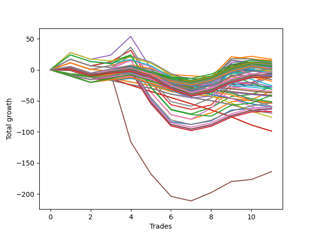

# Short Bulldog 003 
- Symbol: ES90d5m
- Date Range: 03/18/2022 - 07/08/2022
- Trading Period: 7:20-12:30
- Number of Trades: 11



| Name | Win Percent | Profit | Avg Profit / Trade |     | Name | Win Percent | Profit | Avg Profit / Trade |
| ---- | ----------- | ------ | ------------------ | --- | ---- | ----------- | ------ | ------------------ |
| Sorted By <br> Profit | | | | | Sorted By <br> Win Percentage ||||
| Three | 63.64 | 25750.00 | 2340.91 |     | Three | 63.64 | 25750.00 | 2340.91 |
| Six | 63.64 | 21625.00 | 1965.91 |     | Six | 63.64 | 21625.00 | 1965.91 |
| Zero | 63.64 | 13000.00 | 1181.82 |     | Zero | 63.64 | 13000.00 | 1181.82 |
| Four | 63.64 | 12375.00 | 1125.00 |     | Four | 63.64 | 12375.00 | 1125.00 |
| Seven | 63.64 | 375.00 | 34.09 |     | Seven | 63.64 | 375.00 | 34.09 |
| Two | 63.64 | -6875.00 | -625.00 |     | Two | 63.64 | -6875.00 | -625.00 |
| One | 63.64 | -11750.00 | -1068.18 |     | One | 63.64 | -11750.00 | -1068.18 |
| Five | 54.55 | -74875.00 | -6806.82 |     | Five | 54.55 | -74875.00 | -6806.82 |

### Test Zero
* Sell when price hits the middle line of the 20p bollinger
* No Stoploss
* Results:
```
Total Trades: 11
Percent Up: 36.36
Percent Down: 63.64
Total Points Moved Down: 26.00
Potential Profit: 13000.00
Total Points Ups: 98.50 Count Ups: 4
Total Points Downs: 124.50 Count Downs: 7
```

<details><summary>Trades</summary>

<code>In: 2022-03-25 07:25:00		Out: 2022-03-25 08:07:45		Total Position Time: 42:45		Total Move Down: 6.50		Total to Date: 6.50</code> <br />
<code>In: 2022-03-28 12:00:00		Out: 2022-03-28 12:50:00		Total Position Time: 50:00		Total Move Down: -8.50		Total to Date: -2.00</code> <br />
<code>In: 2022-04-07 12:15:00		Out: 2022-04-07 12:50:00		Total Position Time: 35:00		Total Move Down: 4.75		Total to Date: 2.75</code> <br />
<code>In: 2022-05-04 11:05:00		Out: 2022-05-04 11:10:10		Total Position Time: 05:10		Total Move Down: 15.00		Total to Date: 17.75</code> <br />
<code>In: 2022-05-04 11:55:00		Out: 2022-05-04 12:50:00		Total Position Time: 55:00		Total Move Down: -53.75		Total to Date: -36.00</code> <br />
<code>In: 2022-05-04 12:15:00		Out: 2022-05-04 12:50:00		Total Position Time: 35:00		Total Move Down: -34.00		Total to Date: -70.00</code> <br />
<code>In: 2022-05-25 11:35:00		Out: 2022-05-25 12:49:20		Total Position Time: 74:20		Total Move Down: -2.25		Total to Date: -72.25</code> <br />
<code>In: 2022-05-31 09:05:00		Out: 2022-05-31 10:16:00		Total Position Time: 71:00		Total Move Down: 10.50		Total to Date: -61.75</code> <br />
<code>In: 2022-06-15 11:45:00		Out: 2022-06-15 11:58:10		Total Position Time: 13:10		Total Move Down: 47.50		Total to Date: -14.25</code> <br />
<code>In: 2022-06-15 11:50:00		Out: 2022-06-15 11:58:10		Total Position Time: 08:10		Total Move Down: 32.75		Total to Date: 18.50</code> <br />
<code>In: 2022-07-06 11:45:00		Out: 2022-07-06 12:49:20		Total Position Time: 64:20		Total Move Down: 7.50		Total to Date: 26.00</code> <br />


</details>

### Test One
* Sell when the price hits the upper line of the 20p 1std bollinger
* No Stoploss
* Results:
```
Total Trades: 11
Percent Up: 36.36
Percent Down: 63.64
Total Points Moved Down: -23.50
Potential Profit: -11750.00
Total Points Ups: 101.75 Count Ups: 4
Total Points Downs: 78.25 Count Downs: 7
```

<details><summary>Trades</summary>

<code>In: 2022-03-25 07:25:00		Out: 2022-03-25 08:09:20		Total Position Time: 44:20		Total Move Down: 15.50		Total to Date: 15.50</code> <br />
<code>In: 2022-03-28 12:00:00		Out: 2022-03-28 12:50:00		Total Position Time: 50:00		Total Move Down: -8.50		Total to Date: 7.00</code> <br />
<code>In: 2022-04-07 12:15:00		Out: 2022-04-07 12:50:00		Total Position Time: 35:00		Total Move Down: 4.75		Total to Date: 11.75</code> <br />
<code>In: 2022-05-04 11:05:00		Out: 2022-05-04 11:10:55		Total Position Time: 05:55		Total Move Down: 18.75		Total to Date: 30.50</code> <br />
<code>In: 2022-05-04 11:55:00		Out: 2022-05-04 12:50:00		Total Position Time: 55:00		Total Move Down: -53.75		Total to Date: -23.25</code> <br />
<code>In: 2022-05-04 12:15:00		Out: 2022-05-04 12:50:00		Total Position Time: 35:00		Total Move Down: -34.00		Total to Date: -57.25</code> <br />
<code>In: 2022-05-25 11:35:00		Out: 2022-05-25 12:50:00		Total Position Time: 75:00		Total Move Down: -5.50		Total to Date: -62.75</code> <br />
<code>In: 2022-05-31 09:05:00		Out: 2022-05-31 10:23:00		Total Position Time: 78:00		Total Move Down: 16.50		Total to Date: -46.25</code> <br />
<code>In: 2022-06-15 11:45:00		Out: 2022-06-15 12:50:00		Total Position Time: 65:00		Total Move Down: 16.25		Total to Date: -30.00</code> <br />
<code>In: 2022-06-15 11:50:00		Out: 2022-06-15 12:50:00		Total Position Time: 60:00		Total Move Down: 1.50		Total to Date: -28.50</code> <br />
<code>In: 2022-07-06 11:45:00		Out: 2022-07-06 12:50:00		Total Position Time: 65:00		Total Move Down: 5.00		Total to Date: -23.50</code> <br />


</details>

### Test Two
* Sell when the price hits the upper line of the 20p 2std bollinger
* No Stoploss
* Results:
```
Total Trades: 11
Percent Up: 36.36
Percent Down: 63.64
Total Points Moved Down: -13.75
Potential Profit: -6875.00
Total Points Ups: 101.75 Count Ups: 4
Total Points Downs: 88.00 Count Downs: 7
```

<details><summary>Trades</summary>

<code>In: 2022-03-25 07:25:00		Out: 2022-03-25 08:10:45		Total Position Time: 45:45		Total Move Down: 21.25		Total to Date: 21.25</code> <br />
<code>In: 2022-03-28 12:00:00		Out: 2022-03-28 12:50:00		Total Position Time: 50:00		Total Move Down: -8.50		Total to Date: 12.75</code> <br />
<code>In: 2022-04-07 12:15:00		Out: 2022-04-07 12:50:00		Total Position Time: 35:00		Total Move Down: 4.75		Total to Date: 17.50</code> <br />
<code>In: 2022-05-04 11:05:00		Out: 2022-05-04 11:18:35		Total Position Time: 13:35		Total Move Down: 21.50		Total to Date: 39.00</code> <br />
<code>In: 2022-05-04 11:55:00		Out: 2022-05-04 12:50:00		Total Position Time: 55:00		Total Move Down: -53.75		Total to Date: -14.75</code> <br />
<code>In: 2022-05-04 12:15:00		Out: 2022-05-04 12:50:00		Total Position Time: 35:00		Total Move Down: -34.00		Total to Date: -48.75</code> <br />
<code>In: 2022-05-25 11:35:00		Out: 2022-05-25 12:50:00		Total Position Time: 75:00		Total Move Down: -5.50		Total to Date: -54.25</code> <br />
<code>In: 2022-05-31 09:05:00		Out: 2022-05-31 11:46:00		Total Position Time: 161:00		Total Move Down: 17.75		Total to Date: -36.50</code> <br />
<code>In: 2022-06-15 11:45:00		Out: 2022-06-15 12:50:00		Total Position Time: 65:00		Total Move Down: 16.25		Total to Date: -20.25</code> <br />
<code>In: 2022-06-15 11:50:00		Out: 2022-06-15 12:50:00		Total Position Time: 60:00		Total Move Down: 1.50		Total to Date: -18.75</code> <br />
<code>In: 2022-07-06 11:45:00		Out: 2022-07-06 12:50:00		Total Position Time: 65:00		Total Move Down: 5.00		Total to Date: -13.75</code> <br />


</details>

### Test Three
* Sell when price hits the middle line of the 50p bollinger
* No Stoploss
* Results:
```
Total Trades: 11
Percent Up: 36.36
Percent Down: 63.64
Total Points Moved Down: 51.50
Potential Profit: 25750.00
Total Points Ups: 101.75 Count Ups: 4
Total Points Downs: 153.25 Count Downs: 7
```

<details><summary>Trades</summary>

<code>In: 2022-03-25 07:25:00		Out: 2022-03-25 08:10:15		Total Position Time: 45:15		Total Move Down: 19.50		Total to Date: 19.50</code> <br />
<code>In: 2022-03-28 12:00:00		Out: 2022-03-28 12:50:00		Total Position Time: 50:00		Total Move Down: -8.50		Total to Date: 11.00</code> <br />
<code>In: 2022-04-07 12:15:00		Out: 2022-04-07 12:50:00		Total Position Time: 35:00		Total Move Down: 4.75		Total to Date: 15.75</code> <br />
<code>In: 2022-05-04 11:05:00		Out: 2022-05-04 11:20:50		Total Position Time: 15:50		Total Move Down: 30.25		Total to Date: 46.00</code> <br />
<code>In: 2022-05-04 11:55:00		Out: 2022-05-04 12:50:00		Total Position Time: 55:00		Total Move Down: -53.75		Total to Date: -7.75</code> <br />
<code>In: 2022-05-04 12:15:00		Out: 2022-05-04 12:50:00		Total Position Time: 35:00		Total Move Down: -34.00		Total to Date: -41.75</code> <br />
<code>In: 2022-05-25 11:35:00		Out: 2022-05-25 12:50:00		Total Position Time: 75:00		Total Move Down: -5.50		Total to Date: -47.25</code> <br />
<code>In: 2022-05-31 09:05:00		Out: 2022-05-31 11:45:05		Total Position Time: 160:05		Total Move Down: 13.50		Total to Date: -33.75</code> <br />
<code>In: 2022-06-15 11:45:00		Out: 2022-06-15 11:58:10		Total Position Time: 13:10		Total Move Down: 47.50		Total to Date: 13.75</code> <br />
<code>In: 2022-06-15 11:50:00		Out: 2022-06-15 11:58:10		Total Position Time: 08:10		Total Move Down: 32.75		Total to Date: 46.50</code> <br />
<code>In: 2022-07-06 11:45:00		Out: 2022-07-06 12:50:00		Total Position Time: 65:00		Total Move Down: 5.00		Total to Date: 51.50</code> <br />


</details>

### Test Four
* Sell when the price hits the upper line of the 50p 1std bollinger
* No Stoploss
* Results:
```
Total Trades: 11
Percent Up: 36.36
Percent Down: 63.64
Total Points Moved Down: 24.75
Potential Profit: 12375.00
Total Points Ups: 101.75 Count Ups: 4
Total Points Downs: 126.50 Count Downs: 7
```

<details><summary>Trades</summary>

<code>In: 2022-03-25 07:25:00		Out: 2022-03-25 08:26:20		Total Position Time: 61:20		Total Move Down: 31.25		Total to Date: 31.25</code> <br />
<code>In: 2022-03-28 12:00:00		Out: 2022-03-28 12:50:00		Total Position Time: 50:00		Total Move Down: -8.50		Total to Date: 22.75</code> <br />
<code>In: 2022-04-07 12:15:00		Out: 2022-04-07 12:50:00		Total Position Time: 35:00		Total Move Down: 4.75		Total to Date: 27.50</code> <br />
<code>In: 2022-05-04 11:05:00		Out: 2022-05-04 11:34:10		Total Position Time: 29:10		Total Move Down: 41.75		Total to Date: 69.25</code> <br />
<code>In: 2022-05-04 11:55:00		Out: 2022-05-04 12:50:00		Total Position Time: 55:00		Total Move Down: -53.75		Total to Date: 15.50</code> <br />
<code>In: 2022-05-04 12:15:00		Out: 2022-05-04 12:50:00		Total Position Time: 35:00		Total Move Down: -34.00		Total to Date: -18.50</code> <br />
<code>In: 2022-05-25 11:35:00		Out: 2022-05-25 12:50:00		Total Position Time: 75:00		Total Move Down: -5.50		Total to Date: -24.00</code> <br />
<code>In: 2022-05-31 09:05:00		Out: 2022-05-31 11:54:40		Total Position Time: 169:40		Total Move Down: 26.00		Total to Date: 2.00</code> <br />
<code>In: 2022-06-15 11:45:00		Out: 2022-06-15 12:50:00		Total Position Time: 65:00		Total Move Down: 16.25		Total to Date: 18.25</code> <br />
<code>In: 2022-06-15 11:50:00		Out: 2022-06-15 12:50:00		Total Position Time: 60:00		Total Move Down: 1.50		Total to Date: 19.75</code> <br />
<code>In: 2022-07-06 11:45:00		Out: 2022-07-06 12:50:00		Total Position Time: 65:00		Total Move Down: 5.00		Total to Date: 24.75</code> <br />


</details>

### Test Five
* Sell when the price hits the upper line of the 50p 2std bollinger
* No Stoploss
* Results:
```
Total Trades: 11
Percent Up: 45.45
Percent Down: 54.55
Total Points Moved Down: -149.75
Potential Profit: -74875.00
Total Points Ups: 203.50 Count Ups: 5
Total Points Downs: 53.75 Count Downs: 6
```

<details><summary>Trades</summary>

<code>In: 2022-03-25 07:25:00		Out: 2022-03-25 12:50:00		Total Position Time: 325:00		Total Move Down: 7.75		Total to Date: 7.75</code> <br />
<code>In: 2022-03-28 12:00:00		Out: 2022-03-28 12:50:00		Total Position Time: 50:00		Total Move Down: -8.50		Total to Date: -0.75</code> <br />
<code>In: 2022-04-07 12:15:00		Out: 2022-04-07 12:50:00		Total Position Time: 35:00		Total Move Down: 4.75		Total to Date: 4.00</code> <br />
<code>In: 2022-05-04 11:05:00		Out: 2022-05-04 12:50:00		Total Position Time: 105:00		Total Move Down: -101.75		Total to Date: -97.75</code> <br />
<code>In: 2022-05-04 11:55:00		Out: 2022-05-04 12:50:00		Total Position Time: 55:00		Total Move Down: -53.75		Total to Date: -151.50</code> <br />
<code>In: 2022-05-04 12:15:00		Out: 2022-05-04 12:50:00		Total Position Time: 35:00		Total Move Down: -34.00		Total to Date: -185.50</code> <br />
<code>In: 2022-05-25 11:35:00		Out: 2022-05-25 12:50:00		Total Position Time: 75:00		Total Move Down: -5.50		Total to Date: -191.00</code> <br />
<code>In: 2022-05-31 09:05:00		Out: 2022-05-31 12:50:00		Total Position Time: 225:00		Total Move Down: 18.50		Total to Date: -172.50</code> <br />
<code>In: 2022-06-15 11:45:00		Out: 2022-06-15 12:50:00		Total Position Time: 65:00		Total Move Down: 16.25		Total to Date: -156.25</code> <br />
<code>In: 2022-06-15 11:50:00		Out: 2022-06-15 12:50:00		Total Position Time: 60:00		Total Move Down: 1.50		Total to Date: -154.75</code> <br />
<code>In: 2022-07-06 11:45:00		Out: 2022-07-06 12:50:00		Total Position Time: 65:00		Total Move Down: 5.00		Total to Date: -149.75</code> <br />


</details>

### Test Six
* Sell when the price hits the middle line of the 1std VWAP
* No Stoploss
* Results:
```
Total Trades: 11
Percent Up: 36.36
Percent Down: 63.64
Total Points Moved Down: 43.25
Potential Profit: 21625.00
Total Points Ups: 101.75 Count Ups: 4
Total Points Downs: 145.00 Count Downs: 7
```

<details><summary>Trades</summary>

<code>In: 2022-03-25 07:25:00		Out: 2022-03-25 08:08:15		Total Position Time: 43:15		Total Move Down: 9.50		Total to Date: 9.50</code> <br />
<code>In: 2022-03-28 12:00:00		Out: 2022-03-28 12:50:00		Total Position Time: 50:00		Total Move Down: -8.50		Total to Date: 1.00</code> <br />
<code>In: 2022-04-07 12:15:00		Out: 2022-04-07 12:50:00		Total Position Time: 35:00		Total Move Down: 4.75		Total to Date: 5.75</code> <br />
<code>In: 2022-05-04 11:05:00		Out: 2022-05-04 11:20:20		Total Position Time: 15:20		Total Move Down: 26.00		Total to Date: 31.75</code> <br />
<code>In: 2022-05-04 11:55:00		Out: 2022-05-04 12:50:00		Total Position Time: 55:00		Total Move Down: -53.75		Total to Date: -22.00</code> <br />
<code>In: 2022-05-04 12:15:00		Out: 2022-05-04 12:50:00		Total Position Time: 35:00		Total Move Down: -34.00		Total to Date: -56.00</code> <br />
<code>In: 2022-05-25 11:35:00		Out: 2022-05-25 12:50:00		Total Position Time: 75:00		Total Move Down: -5.50		Total to Date: -61.50</code> <br />
<code>In: 2022-05-31 09:05:00		Out: 2022-05-31 11:48:35		Total Position Time: 163:35		Total Move Down: 23.50		Total to Date: -38.00</code> <br />
<code>In: 2022-06-15 11:45:00		Out: 2022-06-15 11:57:55		Total Position Time: 12:55		Total Move Down: 45.50		Total to Date: 7.50</code> <br />
<code>In: 2022-06-15 11:50:00		Out: 2022-06-15 11:57:55		Total Position Time: 07:55		Total Move Down: 30.75		Total to Date: 38.25</code> <br />
<code>In: 2022-07-06 11:45:00		Out: 2022-07-06 12:50:00		Total Position Time: 65:00		Total Move Down: 5.00		Total to Date: 43.25</code> <br />


</details>

### Test Seven
* Sell when the price hits the upper line of the 1std VWAP
* No Stoploss
* Results:
```
Total Trades: 11
Percent Up: 36.36
Percent Down: 63.64
Total Points Moved Down: 0.75
Potential Profit: 375.00
Total Points Ups: 101.75 Count Ups: 4
Total Points Downs: 102.50 Count Downs: 7
```

<details><summary>Trades</summary>

<code>In: 2022-03-25 07:25:00		Out: 2022-03-25 08:09:20		Total Position Time: 44:20		Total Move Down: 15.50		Total to Date: 15.50</code> <br />
<code>In: 2022-03-28 12:00:00		Out: 2022-03-28 12:50:00		Total Position Time: 50:00		Total Move Down: -8.50		Total to Date: 7.00</code> <br />
<code>In: 2022-04-07 12:15:00		Out: 2022-04-07 12:50:00		Total Position Time: 35:00		Total Move Down: 4.75		Total to Date: 11.75</code> <br />
<code>In: 2022-05-04 11:05:00		Out: 2022-05-04 11:34:05		Total Position Time: 29:05		Total Move Down: 41.00		Total to Date: 52.75</code> <br />
<code>In: 2022-05-04 11:55:00		Out: 2022-05-04 12:50:00		Total Position Time: 55:00		Total Move Down: -53.75		Total to Date: -1.00</code> <br />
<code>In: 2022-05-04 12:15:00		Out: 2022-05-04 12:50:00		Total Position Time: 35:00		Total Move Down: -34.00		Total to Date: -35.00</code> <br />
<code>In: 2022-05-25 11:35:00		Out: 2022-05-25 12:50:00		Total Position Time: 75:00		Total Move Down: -5.50		Total to Date: -40.50</code> <br />
<code>In: 2022-05-31 09:05:00		Out: 2022-05-31 12:50:00		Total Position Time: 225:00		Total Move Down: 18.50		Total to Date: -22.00</code> <br />
<code>In: 2022-06-15 11:45:00		Out: 2022-06-15 12:50:00		Total Position Time: 65:00		Total Move Down: 16.25		Total to Date: -5.75</code> <br />
<code>In: 2022-06-15 11:50:00		Out: 2022-06-15 12:50:00		Total Position Time: 60:00		Total Move Down: 1.50		Total to Date: -4.25</code> <br />
<code>In: 2022-07-06 11:45:00		Out: 2022-07-06 12:50:00		Total Position Time: 65:00		Total Move Down: 5.00		Total to Date: 0.75</code> <br />


</details>