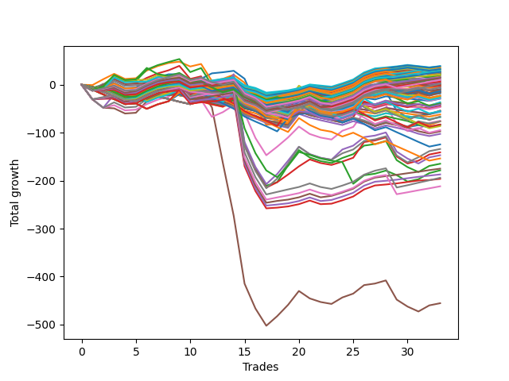

# Short Bulldog 005 
- Symbol: ES90d5m
- Date Range: 03/18/2022 - 07/08/2022
- Trading Period: 7:20-12:30
- Number of Trades: 33



| Name | Win Percent | Profit | Avg Profit / Trade |     | Name | Win Percent | Profit | Avg Profit / Trade |
| ---- | ----------- | ------ | ------------------ | --- | ---- | ----------- | ------ | ------------------ |
| Sorted By <br> Profit | | | | | Sorted By <br> Win Percentage ||||
| Three | 66.67 | 93125.00 | 2821.97 |     | Zero | 69.70 | 85500.00 | 2590.91 |
| Zero | 69.70 | 85500.00 | 2590.91 |     | Three | 66.67 | 93125.00 | 2821.97 |
| One | 66.67 | 74750.00 | 2265.15 |     | One | 66.67 | 74750.00 | 2265.15 |
| Seven | 60.61 | 69625.00 | 2109.85 |     | Seven | 60.61 | 69625.00 | 2109.85 |
| Six | 60.61 | 57750.00 | 1750.00 |     | Six | 60.61 | 57750.00 | 1750.00 |
| Four | 57.58 | 57375.00 | 1738.64 |     | Two | 60.61 | 48875.00 | 1481.06 |
| Two | 60.61 | 48875.00 | 1481.06 |     | Four | 57.58 | 57375.00 | 1738.64 |
| Five | 48.48 | -170250.00 | -5159.09 |     | Five | 48.48 | -170250.00 | -5159.09 |

### Test Zero
* Sell when price hits the middle line of the 20p bollinger
* No Stoploss
* Results:
```
Total Trades: 33
Percent Up: 30.30
Percent Down: 69.70
Total Points Moved Down: 171.00
Potential Profit: 85500.00
Total Points Ups: 175.00 Count Ups: 10
Total Points Downs: 346.00 Count Downs: 23
```

<details><summary>Trades</summary>

<code>In: 2022-03-24 08:05:00		Out: 2022-03-24 09:25:00		Total Position Time: 80:00		Total Move Down: -7.50		Total to Date: -7.50</code> <br />
<code>In: 2022-03-24 08:30:00		Out: 2022-03-24 09:25:00		Total Position Time: 55:00		Total Move Down: 6.00		Total to Date: -1.50</code> <br />
<code>In: 2022-03-25 07:25:00		Out: 2022-03-25 08:07:45		Total Position Time: 42:45		Total Move Down: 6.50		Total to Date: 5.00</code> <br />
<code>In: 2022-03-28 12:00:00		Out: 2022-03-28 12:50:00		Total Position Time: 50:00		Total Move Down: -8.50		Total to Date: -3.50</code> <br />
<code>In: 2022-03-29 12:10:00		Out: 2022-03-29 12:50:00		Total Position Time: 40:00		Total Move Down: -4.25		Total to Date: -7.75</code> <br />
<code>In: 2022-04-06 10:50:00		Out: 2022-04-06 11:00:10		Total Position Time: 10:10		Total Move Down: 13.25		Total to Date: 5.50</code> <br />
<code>In: 2022-04-06 11:05:00		Out: 2022-04-06 11:10:10		Total Position Time: 05:10		Total Move Down: 24.75		Total to Date: 30.25</code> <br />
<code>In: 2022-04-07 12:15:00		Out: 2022-04-07 12:50:00		Total Position Time: 35:00		Total Move Down: 4.75		Total to Date: 35.00</code> <br />
<code>In: 2022-04-08 08:05:00		Out: 2022-04-08 09:15:55		Total Position Time: 70:55		Total Move Down: 7.00		Total to Date: 42.00</code> <br />
<code>In: 2022-04-13 08:05:00		Out: 2022-04-13 10:34:30		Total Position Time: 149:30		Total Move Down: -11.50		Total to Date: 30.50</code> <br />
<code>In: 2022-04-20 10:45:00		Out: 2022-04-20 11:13:35		Total Position Time: 28:35		Total Move Down: 5.75		Total to Date: 36.25</code> <br />
<code>In: 2022-04-25 11:35:00		Out: 2022-04-25 12:07:25		Total Position Time: 32:25		Total Move Down: 16.75		Total to Date: 53.00</code> <br />
<code>In: 2022-05-04 09:40:00		Out: 2022-05-04 10:50:05		Total Position Time: 70:05		Total Move Down: 4.00		Total to Date: 57.00</code> <br />
<code>In: 2022-05-04 11:05:00		Out: 2022-05-04 11:10:10		Total Position Time: 05:10		Total Move Down: 15.00		Total to Date: 72.00</code> <br />
<code>In: 2022-05-04 11:30:00		Out: 2022-05-04 11:35:10		Total Position Time: 05:10		Total Move Down: 40.75		Total to Date: 112.75</code> <br />
<code>In: 2022-05-04 11:55:00		Out: 2022-05-04 12:50:00		Total Position Time: 55:00		Total Move Down: -53.75		Total to Date: 59.00</code> <br />
<code>In: 2022-05-04 12:15:00		Out: 2022-05-04 12:50:00		Total Position Time: 35:00		Total Move Down: -34.00		Total to Date: 25.00</code> <br />
<code>In: 2022-05-16 10:35:00		Out: 2022-05-16 11:52:30		Total Position Time: 77:30		Total Move Down: 0.25		Total to Date: 25.25</code> <br />
<code>In: 2022-05-19 08:50:00		Out: 2022-05-19 09:34:10		Total Position Time: 44:10		Total Move Down: 20.00		Total to Date: 45.25</code> <br />
<code>In: 2022-05-19 12:05:00		Out: 2022-05-19 12:18:25		Total Position Time: 13:25		Total Move Down: 25.00		Total to Date: 70.25</code> <br />
<code>In: 2022-05-24 10:55:00		Out: 2022-05-24 11:48:35		Total Position Time: 53:35		Total Move Down: 6.25		Total to Date: 76.50</code> <br />
<code>In: 2022-05-25 11:35:00		Out: 2022-05-25 12:49:20		Total Position Time: 74:20		Total Move Down: -2.25		Total to Date: 74.25</code> <br />
<code>In: 2022-05-27 12:10:00		Out: 2022-05-27 12:50:00		Total Position Time: 40:00		Total Move Down: -0.25		Total to Date: 74.00</code> <br />
<code>In: 2022-05-31 09:05:00		Out: 2022-05-31 10:16:00		Total Position Time: 71:00		Total Move Down: 10.50		Total to Date: 84.50</code> <br />
<code>In: 2022-06-15 11:00:00		Out: 2022-06-15 11:05:10		Total Position Time: 05:10		Total Move Down: 30.75		Total to Date: 115.25</code> <br />
<code>In: 2022-06-15 11:45:00		Out: 2022-06-15 11:58:10		Total Position Time: 13:10		Total Move Down: 47.50		Total to Date: 162.75</code> <br />
<code>In: 2022-06-15 11:50:00		Out: 2022-06-15 11:58:10		Total Position Time: 08:10		Total Move Down: 32.75		Total to Date: 195.50</code> <br />
<code>In: 2022-06-21 12:05:00		Out: 2022-06-21 12:35:35		Total Position Time: 30:35		Total Move Down: 8.00		Total to Date: 203.50</code> <br />
<code>In: 2022-07-05 10:40:00		Out: 2022-07-05 12:50:00		Total Position Time: 130:00		Total Move Down: -40.00		Total to Date: 163.50</code> <br />
<code>In: 2022-07-05 11:40:00		Out: 2022-07-05 12:50:00		Total Position Time: 70:00		Total Move Down: -13.00		Total to Date: 150.50</code> <br />
<code>In: 2022-07-06 11:00:00		Out: 2022-07-06 11:11:35		Total Position Time: 11:35		Total Move Down: 5.50		Total to Date: 156.00</code> <br />
<code>In: 2022-07-06 11:45:00		Out: 2022-07-06 12:49:20		Total Position Time: 64:20		Total Move Down: 7.50		Total to Date: 163.50</code> <br />
<code>In: 2022-07-07 12:20:00		Out: 2022-07-07 12:38:25		Total Position Time: 18:25		Total Move Down: 7.50		Total to Date: 171.00</code> <br />


</details>

### Test One
* Sell when the price hits the upper line of the 20p 1std bollinger
* No Stoploss
* Results:
```
Total Trades: 33
Percent Up: 33.33
Percent Down: 66.67
Total Points Moved Down: 149.50
Potential Profit: 74750.00
Total Points Ups: 187.75 Count Ups: 11
Total Points Downs: 337.25 Count Downs: 22
```

<details><summary>Trades</summary>

<code>In: 2022-03-24 08:05:00		Out: 2022-03-24 09:34:05		Total Position Time: 89:05		Total Move Down: -0.25		Total to Date: -0.25</code> <br />
<code>In: 2022-03-24 08:30:00		Out: 2022-03-24 09:34:05		Total Position Time: 64:05		Total Move Down: 13.25		Total to Date: 13.00</code> <br />
<code>In: 2022-03-25 07:25:00		Out: 2022-03-25 08:09:20		Total Position Time: 44:20		Total Move Down: 15.50		Total to Date: 28.50</code> <br />
<code>In: 2022-03-28 12:00:00		Out: 2022-03-28 12:50:00		Total Position Time: 50:00		Total Move Down: -8.50		Total to Date: 20.00</code> <br />
<code>In: 2022-03-29 12:10:00		Out: 2022-03-29 12:50:00		Total Position Time: 40:00		Total Move Down: -4.25		Total to Date: 15.75</code> <br />
<code>In: 2022-04-06 10:50:00		Out: 2022-04-06 11:09:45		Total Position Time: 19:45		Total Move Down: 17.75		Total to Date: 33.50</code> <br />
<code>In: 2022-04-06 11:05:00		Out: 2022-04-06 11:10:10		Total Position Time: 05:10		Total Move Down: 24.75		Total to Date: 58.25</code> <br />
<code>In: 2022-04-07 12:15:00		Out: 2022-04-07 12:50:00		Total Position Time: 35:00		Total Move Down: 4.75		Total to Date: 63.00</code> <br />
<code>In: 2022-04-08 08:05:00		Out: 2022-04-08 10:13:40		Total Position Time: 128:40		Total Move Down: 4.25		Total to Date: 67.25</code> <br />
<code>In: 2022-04-13 08:05:00		Out: 2022-04-13 10:47:30		Total Position Time: 162:30		Total Move Down: -8.00		Total to Date: 59.25</code> <br />
<code>In: 2022-04-20 10:45:00		Out: 2022-04-20 11:17:15		Total Position Time: 32:15		Total Move Down: 8.75		Total to Date: 68.00</code> <br />
<code>In: 2022-04-25 11:35:00		Out: 2022-04-25 12:50:00		Total Position Time: 75:00		Total Move Down: -20.25		Total to Date: 47.75</code> <br />
<code>In: 2022-05-04 09:40:00		Out: 2022-05-04 11:07:25		Total Position Time: 87:25		Total Move Down: 6.75		Total to Date: 54.50</code> <br />
<code>In: 2022-05-04 11:05:00		Out: 2022-05-04 11:10:55		Total Position Time: 05:55		Total Move Down: 18.75		Total to Date: 73.25</code> <br />
<code>In: 2022-05-04 11:30:00		Out: 2022-05-04 11:35:10		Total Position Time: 05:10		Total Move Down: 40.75		Total to Date: 114.00</code> <br />
<code>In: 2022-05-04 11:55:00		Out: 2022-05-04 12:50:00		Total Position Time: 55:00		Total Move Down: -53.75		Total to Date: 60.25</code> <br />
<code>In: 2022-05-04 12:15:00		Out: 2022-05-04 12:50:00		Total Position Time: 35:00		Total Move Down: -34.00		Total to Date: 26.25</code> <br />
<code>In: 2022-05-16 10:35:00		Out: 2022-05-16 12:10:10		Total Position Time: 95:10		Total Move Down: 2.50		Total to Date: 28.75</code> <br />
<code>In: 2022-05-19 08:50:00		Out: 2022-05-19 09:40:30		Total Position Time: 50:30		Total Move Down: 30.75		Total to Date: 59.50</code> <br />
<code>In: 2022-05-19 12:05:00		Out: 2022-05-19 12:24:50		Total Position Time: 19:50		Total Move Down: 34.75		Total to Date: 94.25</code> <br />
<code>In: 2022-05-24 10:55:00		Out: 2022-05-24 11:55:10		Total Position Time: 60:10		Total Move Down: 15.25		Total to Date: 109.50</code> <br />
<code>In: 2022-05-25 11:35:00		Out: 2022-05-25 12:50:00		Total Position Time: 75:00		Total Move Down: -5.50		Total to Date: 104.00</code> <br />
<code>In: 2022-05-27 12:10:00		Out: 2022-05-27 12:50:00		Total Position Time: 40:00		Total Move Down: -0.25		Total to Date: 103.75</code> <br />
<code>In: 2022-05-31 09:05:00		Out: 2022-05-31 10:23:00		Total Position Time: 78:00		Total Move Down: 16.50		Total to Date: 120.25</code> <br />
<code>In: 2022-06-15 11:00:00		Out: 2022-06-15 11:05:10		Total Position Time: 05:10		Total Move Down: 30.75		Total to Date: 151.00</code> <br />
<code>In: 2022-06-15 11:45:00		Out: 2022-06-15 12:50:00		Total Position Time: 65:00		Total Move Down: 16.25		Total to Date: 167.25</code> <br />
<code>In: 2022-06-15 11:50:00		Out: 2022-06-15 12:50:00		Total Position Time: 60:00		Total Move Down: 1.50		Total to Date: 168.75</code> <br />
<code>In: 2022-06-21 12:05:00		Out: 2022-06-21 12:50:00		Total Position Time: 45:00		Total Move Down: 7.00		Total to Date: 175.75</code> <br />
<code>In: 2022-07-05 10:40:00		Out: 2022-07-05 12:50:00		Total Position Time: 130:00		Total Move Down: -40.00		Total to Date: 135.75</code> <br />
<code>In: 2022-07-05 11:40:00		Out: 2022-07-05 12:50:00		Total Position Time: 70:00		Total Move Down: -13.00		Total to Date: 122.75</code> <br />
<code>In: 2022-07-06 11:00:00		Out: 2022-07-06 11:12:15		Total Position Time: 12:15		Total Move Down: 11.25		Total to Date: 134.00</code> <br />
<code>In: 2022-07-06 11:45:00		Out: 2022-07-06 12:50:00		Total Position Time: 65:00		Total Move Down: 5.00		Total to Date: 139.00</code> <br />
<code>In: 2022-07-07 12:20:00		Out: 2022-07-07 12:46:45		Total Position Time: 26:45		Total Move Down: 10.50		Total to Date: 149.50</code> <br />


</details>

### Test Two
* Sell when the price hits the upper line of the 20p 2std bollinger
* No Stoploss
* Results:
```
Total Trades: 33
Percent Up: 39.39
Percent Down: 60.61
Total Points Moved Down: 97.75
Potential Profit: 48875.00
Total Points Ups: 268.00 Count Ups: 13
Total Points Downs: 365.75 Count Downs: 20
```

<details><summary>Trades</summary>

<code>In: 2022-03-24 08:05:00		Out: 2022-03-24 11:46:05		Total Position Time: 221:05		Total Move Down: -7.00		Total to Date: -7.00</code> <br />
<code>In: 2022-03-24 08:30:00		Out: 2022-03-24 11:46:05		Total Position Time: 196:05		Total Move Down: 6.50		Total to Date: -0.50</code> <br />
<code>In: 2022-03-25 07:25:00		Out: 2022-03-25 08:10:45		Total Position Time: 45:45		Total Move Down: 21.25		Total to Date: 20.75</code> <br />
<code>In: 2022-03-28 12:00:00		Out: 2022-03-28 12:50:00		Total Position Time: 50:00		Total Move Down: -8.50		Total to Date: 12.25</code> <br />
<code>In: 2022-03-29 12:10:00		Out: 2022-03-29 12:50:00		Total Position Time: 40:00		Total Move Down: -4.25		Total to Date: 8.00</code> <br />
<code>In: 2022-04-06 10:50:00		Out: 2022-04-06 11:15:15		Total Position Time: 25:15		Total Move Down: 26.25		Total to Date: 34.25</code> <br />
<code>In: 2022-04-06 11:05:00		Out: 2022-04-06 11:15:15		Total Position Time: 10:15		Total Move Down: 33.25		Total to Date: 67.50</code> <br />
<code>In: 2022-04-07 12:15:00		Out: 2022-04-07 12:50:00		Total Position Time: 35:00		Total Move Down: 4.75		Total to Date: 72.25</code> <br />
<code>In: 2022-04-08 08:05:00		Out: 2022-04-08 10:32:15		Total Position Time: 147:15		Total Move Down: 8.00		Total to Date: 80.25</code> <br />
<code>In: 2022-04-13 08:05:00		Out: 2022-04-13 12:50:00		Total Position Time: 285:00		Total Move Down: -31.25		Total to Date: 49.00</code> <br />
<code>In: 2022-04-20 10:45:00		Out: 2022-04-20 11:18:30		Total Position Time: 33:30		Total Move Down: 11.00		Total to Date: 60.00</code> <br />
<code>In: 2022-04-25 11:35:00		Out: 2022-04-25 12:50:00		Total Position Time: 75:00		Total Move Down: -20.25		Total to Date: 39.75</code> <br />
<code>In: 2022-05-04 09:40:00		Out: 2022-05-04 11:07:40		Total Position Time: 87:40		Total Move Down: 10.50		Total to Date: 50.25</code> <br />
<code>In: 2022-05-04 11:05:00		Out: 2022-05-04 11:18:35		Total Position Time: 13:35		Total Move Down: 21.50		Total to Date: 71.75</code> <br />
<code>In: 2022-05-04 11:30:00		Out: 2022-05-04 11:35:10		Total Position Time: 05:10		Total Move Down: 40.75		Total to Date: 112.50</code> <br />
<code>In: 2022-05-04 11:55:00		Out: 2022-05-04 12:50:00		Total Position Time: 55:00		Total Move Down: -53.75		Total to Date: 58.75</code> <br />
<code>In: 2022-05-04 12:15:00		Out: 2022-05-04 12:50:00		Total Position Time: 35:00		Total Move Down: -34.00		Total to Date: 24.75</code> <br />
<code>In: 2022-05-16 10:35:00		Out: 2022-05-16 12:13:35		Total Position Time: 98:35		Total Move Down: 8.50		Total to Date: 33.25</code> <br />
<code>In: 2022-05-19 08:50:00		Out: 2022-05-19 10:13:35		Total Position Time: 83:35		Total Move Down: 44.00		Total to Date: 77.25</code> <br />
<code>In: 2022-05-19 12:05:00		Out: 2022-05-19 12:36:30		Total Position Time: 31:30		Total Move Down: 44.50		Total to Date: 121.75</code> <br />
<code>In: 2022-05-24 10:55:00		Out: 2022-05-24 12:50:00		Total Position Time: 115:00		Total Move Down: -27.25		Total to Date: 94.50</code> <br />
<code>In: 2022-05-25 11:35:00		Out: 2022-05-25 12:50:00		Total Position Time: 75:00		Total Move Down: -5.50		Total to Date: 89.00</code> <br />
<code>In: 2022-05-27 12:10:00		Out: 2022-05-27 12:50:00		Total Position Time: 40:00		Total Move Down: -0.25		Total to Date: 88.75</code> <br />
<code>In: 2022-05-31 09:05:00		Out: 2022-05-31 11:46:00		Total Position Time: 161:00		Total Move Down: 17.75		Total to Date: 106.50</code> <br />
<code>In: 2022-06-15 11:00:00		Out: 2022-06-15 11:05:10		Total Position Time: 05:10		Total Move Down: 30.75		Total to Date: 137.25</code> <br />
<code>In: 2022-06-15 11:45:00		Out: 2022-06-15 12:50:00		Total Position Time: 65:00		Total Move Down: 16.25		Total to Date: 153.50</code> <br />
<code>In: 2022-06-15 11:50:00		Out: 2022-06-15 12:50:00		Total Position Time: 60:00		Total Move Down: 1.50		Total to Date: 155.00</code> <br />
<code>In: 2022-06-21 12:05:00		Out: 2022-06-21 12:50:00		Total Position Time: 45:00		Total Move Down: 7.00		Total to Date: 162.00</code> <br />
<code>In: 2022-07-05 10:40:00		Out: 2022-07-05 12:50:00		Total Position Time: 130:00		Total Move Down: -40.00		Total to Date: 122.00</code> <br />
<code>In: 2022-07-05 11:40:00		Out: 2022-07-05 12:50:00		Total Position Time: 70:00		Total Move Down: -13.00		Total to Date: 109.00</code> <br />
<code>In: 2022-07-06 11:00:00		Out: 2022-07-06 12:50:00		Total Position Time: 110:00		Total Move Down: -23.00		Total to Date: 86.00</code> <br />
<code>In: 2022-07-06 11:45:00		Out: 2022-07-06 12:50:00		Total Position Time: 65:00		Total Move Down: 5.00		Total to Date: 91.00</code> <br />
<code>In: 2022-07-07 12:20:00		Out: 2022-07-07 12:50:00		Total Position Time: 30:00		Total Move Down: 6.75		Total to Date: 97.75</code> <br />


</details>

### Test Three
* Sell when price hits the middle line of the 50p bollinger
* No Stoploss
* Results:
```
Total Trades: 33
Percent Up: 33.33
Percent Down: 66.67
Total Points Moved Down: 186.25
Potential Profit: 93125.00
Total Points Ups: 219.50 Count Ups: 11
Total Points Downs: 405.75 Count Downs: 22
```

<details><summary>Trades</summary>

<code>In: 2022-03-24 08:05:00		Out: 2022-03-24 11:45:20		Total Position Time: 220:20		Total Move Down: -8.75		Total to Date: -8.75</code> <br />
<code>In: 2022-03-24 08:30:00		Out: 2022-03-24 11:45:20		Total Position Time: 195:20		Total Move Down: 4.75		Total to Date: -4.00</code> <br />
<code>In: 2022-03-25 07:25:00		Out: 2022-03-25 08:10:15		Total Position Time: 45:15		Total Move Down: 19.50		Total to Date: 15.50</code> <br />
<code>In: 2022-03-28 12:00:00		Out: 2022-03-28 12:50:00		Total Position Time: 50:00		Total Move Down: -8.50		Total to Date: 7.00</code> <br />
<code>In: 2022-03-29 12:10:00		Out: 2022-03-29 12:50:00		Total Position Time: 40:00		Total Move Down: -4.25		Total to Date: 2.75</code> <br />
<code>In: 2022-04-06 10:50:00		Out: 2022-04-06 11:08:35		Total Position Time: 18:35		Total Move Down: 13.25		Total to Date: 16.00</code> <br />
<code>In: 2022-04-06 11:05:00		Out: 2022-04-06 11:10:10		Total Position Time: 05:10		Total Move Down: 24.75		Total to Date: 40.75</code> <br />
<code>In: 2022-04-07 12:15:00		Out: 2022-04-07 12:50:00		Total Position Time: 35:00		Total Move Down: 4.75		Total to Date: 45.50</code> <br />
<code>In: 2022-04-08 08:05:00		Out: 2022-04-08 10:43:05		Total Position Time: 158:05		Total Move Down: 11.00		Total to Date: 56.50</code> <br />
<code>In: 2022-04-13 08:05:00		Out: 2022-04-13 12:50:00		Total Position Time: 285:00		Total Move Down: -31.25		Total to Date: 25.25</code> <br />
<code>In: 2022-04-20 10:45:00		Out: 2022-04-20 11:17:40		Total Position Time: 32:40		Total Move Down: 9.00		Total to Date: 34.25</code> <br />
<code>In: 2022-04-25 11:35:00		Out: 2022-04-25 12:50:00		Total Position Time: 75:00		Total Move Down: -20.25		Total to Date: 14.00</code> <br />
<code>In: 2022-05-04 09:40:00		Out: 2022-05-04 11:20:50		Total Position Time: 100:50		Total Move Down: 16.25		Total to Date: 30.25</code> <br />
<code>In: 2022-05-04 11:05:00		Out: 2022-05-04 11:20:50		Total Position Time: 15:50		Total Move Down: 30.25		Total to Date: 60.50</code> <br />
<code>In: 2022-05-04 11:30:00		Out: 2022-05-04 11:35:10		Total Position Time: 05:10		Total Move Down: 40.75		Total to Date: 101.25</code> <br />
<code>In: 2022-05-04 11:55:00		Out: 2022-05-04 12:50:00		Total Position Time: 55:00		Total Move Down: -53.75		Total to Date: 47.50</code> <br />
<code>In: 2022-05-04 12:15:00		Out: 2022-05-04 12:50:00		Total Position Time: 35:00		Total Move Down: -34.00		Total to Date: 13.50</code> <br />
<code>In: 2022-05-16 10:35:00		Out: 2022-05-16 12:17:45		Total Position Time: 102:45		Total Move Down: 12.50		Total to Date: 26.00</code> <br />
<code>In: 2022-05-19 08:50:00		Out: 2022-05-19 09:37:05		Total Position Time: 47:05		Total Move Down: 25.75		Total to Date: 51.75</code> <br />
<code>In: 2022-05-19 12:05:00		Out: 2022-05-19 12:21:15		Total Position Time: 16:15		Total Move Down: 27.50		Total to Date: 79.25</code> <br />
<code>In: 2022-05-24 10:55:00		Out: 2022-05-24 11:55:10		Total Position Time: 60:10		Total Move Down: 15.25		Total to Date: 94.50</code> <br />
<code>In: 2022-05-25 11:35:00		Out: 2022-05-25 12:50:00		Total Position Time: 75:00		Total Move Down: -5.50		Total to Date: 89.00</code> <br />
<code>In: 2022-05-27 12:10:00		Out: 2022-05-27 12:50:00		Total Position Time: 40:00		Total Move Down: -0.25		Total to Date: 88.75</code> <br />
<code>In: 2022-05-31 09:05:00		Out: 2022-05-31 11:45:05		Total Position Time: 160:05		Total Move Down: 13.50		Total to Date: 102.25</code> <br />
<code>In: 2022-06-15 11:00:00		Out: 2022-06-15 11:05:10		Total Position Time: 05:10		Total Move Down: 30.75		Total to Date: 133.00</code> <br />
<code>In: 2022-06-15 11:45:00		Out: 2022-06-15 11:58:10		Total Position Time: 13:10		Total Move Down: 47.50		Total to Date: 180.50</code> <br />
<code>In: 2022-06-15 11:50:00		Out: 2022-06-15 11:58:10		Total Position Time: 08:10		Total Move Down: 32.75		Total to Date: 213.25</code> <br />
<code>In: 2022-06-21 12:05:00		Out: 2022-06-21 12:50:00		Total Position Time: 45:00		Total Move Down: 7.00		Total to Date: 220.25</code> <br />
<code>In: 2022-07-05 10:40:00		Out: 2022-07-05 12:50:00		Total Position Time: 130:00		Total Move Down: -40.00		Total to Date: 180.25</code> <br />
<code>In: 2022-07-05 11:40:00		Out: 2022-07-05 12:50:00		Total Position Time: 70:00		Total Move Down: -13.00		Total to Date: 167.25</code> <br />
<code>In: 2022-07-06 11:00:00		Out: 2022-07-06 11:11:50		Total Position Time: 11:50		Total Move Down: 7.25		Total to Date: 174.50</code> <br />
<code>In: 2022-07-06 11:45:00		Out: 2022-07-06 12:50:00		Total Position Time: 65:00		Total Move Down: 5.00		Total to Date: 179.50</code> <br />
<code>In: 2022-07-07 12:20:00		Out: 2022-07-07 12:50:00		Total Position Time: 30:00		Total Move Down: 6.75		Total to Date: 186.25</code> <br />


</details>

### Test Four
* Sell when the price hits the upper line of the 50p 1std bollinger
* No Stoploss
* Results:
```
Total Trades: 33
Percent Up: 42.42
Percent Down: 57.58
Total Points Moved Down: 114.75
Potential Profit: 57375.00
Total Points Ups: 301.00 Count Ups: 14
Total Points Downs: 415.75 Count Downs: 19
```

<details><summary>Trades</summary>

<code>In: 2022-03-24 08:05:00		Out: 2022-03-24 12:50:00		Total Position Time: 285:00		Total Move Down: -26.75		Total to Date: -26.75</code> <br />
<code>In: 2022-03-24 08:30:00		Out: 2022-03-24 12:50:00		Total Position Time: 260:00		Total Move Down: -13.25		Total to Date: -40.00</code> <br />
<code>In: 2022-03-25 07:25:00		Out: 2022-03-25 08:26:20		Total Position Time: 61:20		Total Move Down: 31.25		Total to Date: -8.75</code> <br />
<code>In: 2022-03-28 12:00:00		Out: 2022-03-28 12:50:00		Total Position Time: 50:00		Total Move Down: -8.50		Total to Date: -17.25</code> <br />
<code>In: 2022-03-29 12:10:00		Out: 2022-03-29 12:50:00		Total Position Time: 40:00		Total Move Down: -4.25		Total to Date: -21.50</code> <br />
<code>In: 2022-04-06 10:50:00		Out: 2022-04-06 11:11:20		Total Position Time: 21:20		Total Move Down: 19.25		Total to Date: -2.25</code> <br />
<code>In: 2022-04-06 11:05:00		Out: 2022-04-06 11:11:20		Total Position Time: 06:20		Total Move Down: 26.25		Total to Date: 24.00</code> <br />
<code>In: 2022-04-07 12:15:00		Out: 2022-04-07 12:50:00		Total Position Time: 35:00		Total Move Down: 4.75		Total to Date: 28.75</code> <br />
<code>In: 2022-04-08 08:05:00		Out: 2022-04-08 11:25:05		Total Position Time: 200:05		Total Move Down: 16.00		Total to Date: 44.75</code> <br />
<code>In: 2022-04-13 08:05:00		Out: 2022-04-13 12:50:00		Total Position Time: 285:00		Total Move Down: -31.25		Total to Date: 13.50</code> <br />
<code>In: 2022-04-20 10:45:00		Out: 2022-04-20 11:25:50		Total Position Time: 40:50		Total Move Down: 13.50		Total to Date: 27.00</code> <br />
<code>In: 2022-04-25 11:35:00		Out: 2022-04-25 12:50:00		Total Position Time: 75:00		Total Move Down: -20.25		Total to Date: 6.75</code> <br />
<code>In: 2022-05-04 09:40:00		Out: 2022-05-04 11:34:10		Total Position Time: 114:10		Total Move Down: 27.75		Total to Date: 34.50</code> <br />
<code>In: 2022-05-04 11:05:00		Out: 2022-05-04 11:34:10		Total Position Time: 29:10		Total Move Down: 41.75		Total to Date: 76.25</code> <br />
<code>In: 2022-05-04 11:30:00		Out: 2022-05-04 11:35:10		Total Position Time: 05:10		Total Move Down: 40.75		Total to Date: 117.00</code> <br />
<code>In: 2022-05-04 11:55:00		Out: 2022-05-04 12:50:00		Total Position Time: 55:00		Total Move Down: -53.75		Total to Date: 63.25</code> <br />
<code>In: 2022-05-04 12:15:00		Out: 2022-05-04 12:50:00		Total Position Time: 35:00		Total Move Down: -34.00		Total to Date: 29.25</code> <br />
<code>In: 2022-05-16 10:35:00		Out: 2022-05-16 12:35:20		Total Position Time: 120:20		Total Move Down: 22.25		Total to Date: 51.50</code> <br />
<code>In: 2022-05-19 08:50:00		Out: 2022-05-19 09:45:45		Total Position Time: 55:45		Total Move Down: 38.50		Total to Date: 90.00</code> <br />
<code>In: 2022-05-19 12:05:00		Out: 2022-05-19 12:30:05		Total Position Time: 25:05		Total Move Down: 40.50		Total to Date: 130.50</code> <br />
<code>In: 2022-05-24 10:55:00		Out: 2022-05-24 12:50:00		Total Position Time: 115:00		Total Move Down: -27.25		Total to Date: 103.25</code> <br />
<code>In: 2022-05-25 11:35:00		Out: 2022-05-25 12:50:00		Total Position Time: 75:00		Total Move Down: -5.50		Total to Date: 97.75</code> <br />
<code>In: 2022-05-27 12:10:00		Out: 2022-05-27 12:50:00		Total Position Time: 40:00		Total Move Down: -0.25		Total to Date: 97.50</code> <br />
<code>In: 2022-05-31 09:05:00		Out: 2022-05-31 11:54:40		Total Position Time: 169:40		Total Move Down: 26.00		Total to Date: 123.50</code> <br />
<code>In: 2022-06-15 11:00:00		Out: 2022-06-15 11:05:10		Total Position Time: 05:10		Total Move Down: 30.75		Total to Date: 154.25</code> <br />
<code>In: 2022-06-15 11:45:00		Out: 2022-06-15 12:50:00		Total Position Time: 65:00		Total Move Down: 16.25		Total to Date: 170.50</code> <br />
<code>In: 2022-06-15 11:50:00		Out: 2022-06-15 12:50:00		Total Position Time: 60:00		Total Move Down: 1.50		Total to Date: 172.00</code> <br />
<code>In: 2022-06-21 12:05:00		Out: 2022-06-21 12:50:00		Total Position Time: 45:00		Total Move Down: 7.00		Total to Date: 179.00</code> <br />
<code>In: 2022-07-05 10:40:00		Out: 2022-07-05 12:50:00		Total Position Time: 130:00		Total Move Down: -40.00		Total to Date: 139.00</code> <br />
<code>In: 2022-07-05 11:40:00		Out: 2022-07-05 12:50:00		Total Position Time: 70:00		Total Move Down: -13.00		Total to Date: 126.00</code> <br />
<code>In: 2022-07-06 11:00:00		Out: 2022-07-06 12:50:00		Total Position Time: 110:00		Total Move Down: -23.00		Total to Date: 103.00</code> <br />
<code>In: 2022-07-06 11:45:00		Out: 2022-07-06 12:50:00		Total Position Time: 65:00		Total Move Down: 5.00		Total to Date: 108.00</code> <br />
<code>In: 2022-07-07 12:20:00		Out: 2022-07-07 12:50:00		Total Position Time: 30:00		Total Move Down: 6.75		Total to Date: 114.75</code> <br />


</details>

### Test Five
* Sell when the price hits the upper line of the 50p 2std bollinger
* No Stoploss
* Results:
```
Total Trades: 33
Percent Up: 51.52
Percent Down: 48.48
Total Points Moved Down: -340.50
Potential Profit: -170250.00
Total Points Ups: 622.00 Count Ups: 17
Total Points Downs: 281.50 Count Downs: 16
```

<details><summary>Trades</summary>

<code>In: 2022-03-24 08:05:00		Out: 2022-03-24 12:50:00		Total Position Time: 285:00		Total Move Down: -26.75		Total to Date: -26.75</code> <br />
<code>In: 2022-03-24 08:30:00		Out: 2022-03-24 12:50:00		Total Position Time: 260:00		Total Move Down: -13.25		Total to Date: -40.00</code> <br />
<code>In: 2022-03-25 07:25:00		Out: 2022-03-25 12:50:00		Total Position Time: 325:00		Total Move Down: 7.75		Total to Date: -32.25</code> <br />
<code>In: 2022-03-28 12:00:00		Out: 2022-03-28 12:50:00		Total Position Time: 50:00		Total Move Down: -8.50		Total to Date: -40.75</code> <br />
<code>In: 2022-03-29 12:10:00		Out: 2022-03-29 12:50:00		Total Position Time: 40:00		Total Move Down: -4.25		Total to Date: -45.00</code> <br />
<code>In: 2022-04-06 10:50:00		Out: 2022-04-06 11:15:05		Total Position Time: 25:05		Total Move Down: 25.50		Total to Date: -19.50</code> <br />
<code>In: 2022-04-06 11:05:00		Out: 2022-04-06 11:15:05		Total Position Time: 10:05		Total Move Down: 32.50		Total to Date: 13.00</code> <br />
<code>In: 2022-04-07 12:15:00		Out: 2022-04-07 12:50:00		Total Position Time: 35:00		Total Move Down: 4.75		Total to Date: 17.75</code> <br />
<code>In: 2022-04-08 08:05:00		Out: 2022-04-08 12:50:00		Total Position Time: 285:00		Total Move Down: 20.25		Total to Date: 38.00</code> <br />
<code>In: 2022-04-13 08:05:00		Out: 2022-04-13 12:50:00		Total Position Time: 285:00		Total Move Down: -31.25		Total to Date: 6.75</code> <br />
<code>In: 2022-04-20 10:45:00		Out: 2022-04-20 11:35:45		Total Position Time: 50:45		Total Move Down: 19.25		Total to Date: 26.00</code> <br />
<code>In: 2022-04-25 11:35:00		Out: 2022-04-25 12:50:00		Total Position Time: 75:00		Total Move Down: -20.25		Total to Date: 5.75</code> <br />
<code>In: 2022-05-04 09:40:00		Out: 2022-05-04 12:50:00		Total Position Time: 190:00		Total Move Down: -115.75		Total to Date: -110.00</code> <br />
<code>In: 2022-05-04 11:05:00		Out: 2022-05-04 12:50:00		Total Position Time: 105:00		Total Move Down: -101.75		Total to Date: -211.75</code> <br />
<code>In: 2022-05-04 11:30:00		Out: 2022-05-04 12:50:00		Total Position Time: 80:00		Total Move Down: -103.50		Total to Date: -315.25</code> <br />
<code>In: 2022-05-04 11:55:00		Out: 2022-05-04 12:50:00		Total Position Time: 55:00		Total Move Down: -53.75		Total to Date: -369.00</code> <br />
<code>In: 2022-05-04 12:15:00		Out: 2022-05-04 12:50:00		Total Position Time: 35:00		Total Move Down: -34.00		Total to Date: -403.00</code> <br />
<code>In: 2022-05-16 10:35:00		Out: 2022-05-16 12:50:00		Total Position Time: 135:00		Total Move Down: 24.75		Total to Date: -378.25</code> <br />
<code>In: 2022-05-19 08:50:00		Out: 2022-05-19 12:50:00		Total Position Time: 240:00		Total Move Down: 27.00		Total to Date: -351.25</code> <br />
<code>In: 2022-05-19 12:05:00		Out: 2022-05-19 12:50:00		Total Position Time: 45:00		Total Move Down: 34.00		Total to Date: -317.25</code> <br />
<code>In: 2022-05-24 10:55:00		Out: 2022-05-24 12:50:00		Total Position Time: 115:00		Total Move Down: -27.25		Total to Date: -344.50</code> <br />
<code>In: 2022-05-25 11:35:00		Out: 2022-05-25 12:50:00		Total Position Time: 75:00		Total Move Down: -5.50		Total to Date: -350.00</code> <br />
<code>In: 2022-05-27 12:10:00		Out: 2022-05-27 12:50:00		Total Position Time: 40:00		Total Move Down: -0.25		Total to Date: -350.25</code> <br />
<code>In: 2022-05-31 09:05:00		Out: 2022-05-31 12:50:00		Total Position Time: 225:00		Total Move Down: 18.50		Total to Date: -331.75</code> <br />
<code>In: 2022-06-15 11:00:00		Out: 2022-06-15 11:05:10		Total Position Time: 05:10		Total Move Down: 30.75		Total to Date: -301.00</code> <br />
<code>In: 2022-06-15 11:45:00		Out: 2022-06-15 12:50:00		Total Position Time: 65:00		Total Move Down: 16.25		Total to Date: -284.75</code> <br />
<code>In: 2022-06-15 11:50:00		Out: 2022-06-15 12:50:00		Total Position Time: 60:00		Total Move Down: 1.50		Total to Date: -283.25</code> <br />
<code>In: 2022-06-21 12:05:00		Out: 2022-06-21 12:50:00		Total Position Time: 45:00		Total Move Down: 7.00		Total to Date: -276.25</code> <br />
<code>In: 2022-07-05 10:40:00		Out: 2022-07-05 12:50:00		Total Position Time: 130:00		Total Move Down: -40.00		Total to Date: -316.25</code> <br />
<code>In: 2022-07-05 11:40:00		Out: 2022-07-05 12:50:00		Total Position Time: 70:00		Total Move Down: -13.00		Total to Date: -329.25</code> <br />
<code>In: 2022-07-06 11:00:00		Out: 2022-07-06 12:50:00		Total Position Time: 110:00		Total Move Down: -23.00		Total to Date: -352.25</code> <br />
<code>In: 2022-07-06 11:45:00		Out: 2022-07-06 12:50:00		Total Position Time: 65:00		Total Move Down: 5.00		Total to Date: -347.25</code> <br />
<code>In: 2022-07-07 12:20:00		Out: 2022-07-07 12:50:00		Total Position Time: 30:00		Total Move Down: 6.75		Total to Date: -340.50</code> <br />


</details>

### Test Six
* Sell when the price hits the middle line of the 1std VWAP
* No Stoploss
* Results:
```
Total Trades: 33
Percent Up: 39.39
Percent Down: 60.61
Total Points Moved Down: 115.50
Potential Profit: 57750.00
Total Points Ups: 278.00 Count Ups: 13
Total Points Downs: 393.50 Count Downs: 20
```

<details><summary>Trades</summary>

<code>In: 2022-03-24 08:05:00		Out: 2022-03-24 12:50:00		Total Position Time: 285:00		Total Move Down: -26.75		Total to Date: -26.75</code> <br />
<code>In: 2022-03-24 08:30:00		Out: 2022-03-24 12:50:00		Total Position Time: 260:00		Total Move Down: -13.25		Total to Date: -40.00</code> <br />
<code>In: 2022-03-25 07:25:00		Out: 2022-03-25 08:08:15		Total Position Time: 43:15		Total Move Down: 9.50		Total to Date: -30.50</code> <br />
<code>In: 2022-03-28 12:00:00		Out: 2022-03-28 12:50:00		Total Position Time: 50:00		Total Move Down: -8.50		Total to Date: -39.00</code> <br />
<code>In: 2022-03-29 12:10:00		Out: 2022-03-29 12:50:00		Total Position Time: 40:00		Total Move Down: -4.25		Total to Date: -43.25</code> <br />
<code>In: 2022-04-06 10:50:00		Out: 2022-04-06 11:00:10		Total Position Time: 10:10		Total Move Down: 13.25		Total to Date: -30.00</code> <br />
<code>In: 2022-04-06 11:05:00		Out: 2022-04-06 11:10:10		Total Position Time: 05:10		Total Move Down: 24.75		Total to Date: -5.25</code> <br />
<code>In: 2022-04-07 12:15:00		Out: 2022-04-07 12:50:00		Total Position Time: 35:00		Total Move Down: 4.75		Total to Date: -0.50</code> <br />
<code>In: 2022-04-08 08:05:00		Out: 2022-04-08 11:25:05		Total Position Time: 200:05		Total Move Down: 16.00		Total to Date: 15.50</code> <br />
<code>In: 2022-04-13 08:05:00		Out: 2022-04-13 12:50:00		Total Position Time: 285:00		Total Move Down: -31.25		Total to Date: -15.75</code> <br />
<code>In: 2022-04-20 10:45:00		Out: 2022-04-20 11:18:20		Total Position Time: 33:20		Total Move Down: 9.75		Total to Date: -6.00</code> <br />
<code>In: 2022-04-25 11:35:00		Out: 2022-04-25 12:50:00		Total Position Time: 75:00		Total Move Down: -20.25		Total to Date: -26.25</code> <br />
<code>In: 2022-05-04 09:40:00		Out: 2022-05-04 11:20:20		Total Position Time: 100:20		Total Move Down: 12.00		Total to Date: -14.25</code> <br />
<code>In: 2022-05-04 11:05:00		Out: 2022-05-04 11:20:20		Total Position Time: 15:20		Total Move Down: 26.00		Total to Date: 11.75</code> <br />
<code>In: 2022-05-04 11:30:00		Out: 2022-05-04 11:35:10		Total Position Time: 05:10		Total Move Down: 40.75		Total to Date: 52.50</code> <br />
<code>In: 2022-05-04 11:55:00		Out: 2022-05-04 12:50:00		Total Position Time: 55:00		Total Move Down: -53.75		Total to Date: -1.25</code> <br />
<code>In: 2022-05-04 12:15:00		Out: 2022-05-04 12:50:00		Total Position Time: 35:00		Total Move Down: -34.00		Total to Date: -35.25</code> <br />
<code>In: 2022-05-16 10:35:00		Out: 2022-05-16 12:34:05		Total Position Time: 119:05		Total Move Down: 19.00		Total to Date: -16.25</code> <br />
<code>In: 2022-05-19 08:50:00		Out: 2022-05-19 09:39:15		Total Position Time: 49:15		Total Move Down: 29.00		Total to Date: 12.75</code> <br />
<code>In: 2022-05-19 12:05:00		Out: 2022-05-19 12:24:45		Total Position Time: 19:45		Total Move Down: 34.00		Total to Date: 46.75</code> <br />
<code>In: 2022-05-24 10:55:00		Out: 2022-05-24 12:50:00		Total Position Time: 115:00		Total Move Down: -27.25		Total to Date: 19.50</code> <br />
<code>In: 2022-05-25 11:35:00		Out: 2022-05-25 12:50:00		Total Position Time: 75:00		Total Move Down: -5.50		Total to Date: 14.00</code> <br />
<code>In: 2022-05-27 12:10:00		Out: 2022-05-27 12:50:00		Total Position Time: 40:00		Total Move Down: -0.25		Total to Date: 13.75</code> <br />
<code>In: 2022-05-31 09:05:00		Out: 2022-05-31 11:48:35		Total Position Time: 163:35		Total Move Down: 23.50		Total to Date: 37.25</code> <br />
<code>In: 2022-06-15 11:00:00		Out: 2022-06-15 11:05:10		Total Position Time: 05:10		Total Move Down: 30.75		Total to Date: 68.00</code> <br />
<code>In: 2022-06-15 11:45:00		Out: 2022-06-15 11:57:55		Total Position Time: 12:55		Total Move Down: 45.50		Total to Date: 113.50</code> <br />
<code>In: 2022-06-15 11:50:00		Out: 2022-06-15 11:57:55		Total Position Time: 07:55		Total Move Down: 30.75		Total to Date: 144.25</code> <br />
<code>In: 2022-06-21 12:05:00		Out: 2022-06-21 12:50:00		Total Position Time: 45:00		Total Move Down: 7.00		Total to Date: 151.25</code> <br />
<code>In: 2022-07-05 10:40:00		Out: 2022-07-05 12:50:00		Total Position Time: 130:00		Total Move Down: -40.00		Total to Date: 111.25</code> <br />
<code>In: 2022-07-05 11:40:00		Out: 2022-07-05 12:50:00		Total Position Time: 70:00		Total Move Down: -13.00		Total to Date: 98.25</code> <br />
<code>In: 2022-07-06 11:00:00		Out: 2022-07-06 11:11:35		Total Position Time: 11:35		Total Move Down: 5.50		Total to Date: 103.75</code> <br />
<code>In: 2022-07-06 11:45:00		Out: 2022-07-06 12:50:00		Total Position Time: 65:00		Total Move Down: 5.00		Total to Date: 108.75</code> <br />
<code>In: 2022-07-07 12:20:00		Out: 2022-07-07 12:50:00		Total Position Time: 30:00		Total Move Down: 6.75		Total to Date: 115.50</code> <br />


</details>

### Test Seven
* Sell when the price hits the upper line of the 1std VWAP
* No Stoploss
* Results:
```
Total Trades: 33
Percent Up: 39.39
Percent Down: 60.61
Total Points Moved Down: 139.25
Potential Profit: 69625.00
Total Points Ups: 278.00 Count Ups: 13
Total Points Downs: 417.25 Count Downs: 20
```

<details><summary>Trades</summary>

<code>In: 2022-03-24 08:05:00		Out: 2022-03-24 12:50:00		Total Position Time: 285:00		Total Move Down: -26.75		Total to Date: -26.75</code> <br />
<code>In: 2022-03-24 08:30:00		Out: 2022-03-24 12:50:00		Total Position Time: 260:00		Total Move Down: -13.25		Total to Date: -40.00</code> <br />
<code>In: 2022-03-25 07:25:00		Out: 2022-03-25 08:09:20		Total Position Time: 44:20		Total Move Down: 15.50		Total to Date: -24.50</code> <br />
<code>In: 2022-03-28 12:00:00		Out: 2022-03-28 12:50:00		Total Position Time: 50:00		Total Move Down: -8.50		Total to Date: -33.00</code> <br />
<code>In: 2022-03-29 12:10:00		Out: 2022-03-29 12:50:00		Total Position Time: 40:00		Total Move Down: -4.25		Total to Date: -37.25</code> <br />
<code>In: 2022-04-06 10:50:00		Out: 2022-04-06 11:09:40		Total Position Time: 19:40		Total Move Down: 17.50		Total to Date: -19.75</code> <br />
<code>In: 2022-04-06 11:05:00		Out: 2022-04-06 11:10:10		Total Position Time: 05:10		Total Move Down: 24.75		Total to Date: 5.00</code> <br />
<code>In: 2022-04-07 12:15:00		Out: 2022-04-07 12:50:00		Total Position Time: 35:00		Total Move Down: 4.75		Total to Date: 9.75</code> <br />
<code>In: 2022-04-08 08:05:00		Out: 2022-04-08 12:50:00		Total Position Time: 285:00		Total Move Down: 20.25		Total to Date: 30.00</code> <br />
<code>In: 2022-04-13 08:05:00		Out: 2022-04-13 12:50:00		Total Position Time: 285:00		Total Move Down: -31.25		Total to Date: -1.25</code> <br />
<code>In: 2022-04-20 10:45:00		Out: 2022-04-20 11:30:15		Total Position Time: 45:15		Total Move Down: 16.00		Total to Date: 14.75</code> <br />
<code>In: 2022-04-25 11:35:00		Out: 2022-04-25 12:50:00		Total Position Time: 75:00		Total Move Down: -20.25		Total to Date: -5.50</code> <br />
<code>In: 2022-05-04 09:40:00		Out: 2022-05-04 11:34:05		Total Position Time: 114:05		Total Move Down: 27.00		Total to Date: 21.50</code> <br />
<code>In: 2022-05-04 11:05:00		Out: 2022-05-04 11:34:05		Total Position Time: 29:05		Total Move Down: 41.00		Total to Date: 62.50</code> <br />
<code>In: 2022-05-04 11:30:00		Out: 2022-05-04 11:35:10		Total Position Time: 05:10		Total Move Down: 40.75		Total to Date: 103.25</code> <br />
<code>In: 2022-05-04 11:55:00		Out: 2022-05-04 12:50:00		Total Position Time: 55:00		Total Move Down: -53.75		Total to Date: 49.50</code> <br />
<code>In: 2022-05-04 12:15:00		Out: 2022-05-04 12:50:00		Total Position Time: 35:00		Total Move Down: -34.00		Total to Date: 15.50</code> <br />
<code>In: 2022-05-16 10:35:00		Out: 2022-05-16 12:50:00		Total Position Time: 135:00		Total Move Down: 24.75		Total to Date: 40.25</code> <br />
<code>In: 2022-05-19 08:50:00		Out: 2022-05-19 09:47:35		Total Position Time: 57:35		Total Move Down: 41.25		Total to Date: 81.50</code> <br />
<code>In: 2022-05-19 12:05:00		Out: 2022-05-19 12:42:25		Total Position Time: 37:25		Total Move Down: 46.00		Total to Date: 127.50</code> <br />
<code>In: 2022-05-24 10:55:00		Out: 2022-05-24 12:50:00		Total Position Time: 115:00		Total Move Down: -27.25		Total to Date: 100.25</code> <br />
<code>In: 2022-05-25 11:35:00		Out: 2022-05-25 12:50:00		Total Position Time: 75:00		Total Move Down: -5.50		Total to Date: 94.75</code> <br />
<code>In: 2022-05-27 12:10:00		Out: 2022-05-27 12:50:00		Total Position Time: 40:00		Total Move Down: -0.25		Total to Date: 94.50</code> <br />
<code>In: 2022-05-31 09:05:00		Out: 2022-05-31 12:50:00		Total Position Time: 225:00		Total Move Down: 18.50		Total to Date: 113.00</code> <br />
<code>In: 2022-06-15 11:00:00		Out: 2022-06-15 11:05:10		Total Position Time: 05:10		Total Move Down: 30.75		Total to Date: 143.75</code> <br />
<code>In: 2022-06-15 11:45:00		Out: 2022-06-15 12:50:00		Total Position Time: 65:00		Total Move Down: 16.25		Total to Date: 160.00</code> <br />
<code>In: 2022-06-15 11:50:00		Out: 2022-06-15 12:50:00		Total Position Time: 60:00		Total Move Down: 1.50		Total to Date: 161.50</code> <br />
<code>In: 2022-06-21 12:05:00		Out: 2022-06-21 12:50:00		Total Position Time: 45:00		Total Move Down: 7.00		Total to Date: 168.50</code> <br />
<code>In: 2022-07-05 10:40:00		Out: 2022-07-05 12:50:00		Total Position Time: 130:00		Total Move Down: -40.00		Total to Date: 128.50</code> <br />
<code>In: 2022-07-05 11:40:00		Out: 2022-07-05 12:50:00		Total Position Time: 70:00		Total Move Down: -13.00		Total to Date: 115.50</code> <br />
<code>In: 2022-07-06 11:00:00		Out: 2022-07-06 11:12:25		Total Position Time: 12:25		Total Move Down: 12.00		Total to Date: 127.50</code> <br />
<code>In: 2022-07-06 11:45:00		Out: 2022-07-06 12:50:00		Total Position Time: 65:00		Total Move Down: 5.00		Total to Date: 132.50</code> <br />
<code>In: 2022-07-07 12:20:00		Out: 2022-07-07 12:50:00		Total Position Time: 30:00		Total Move Down: 6.75		Total to Date: 139.25</code> <br />


</details>