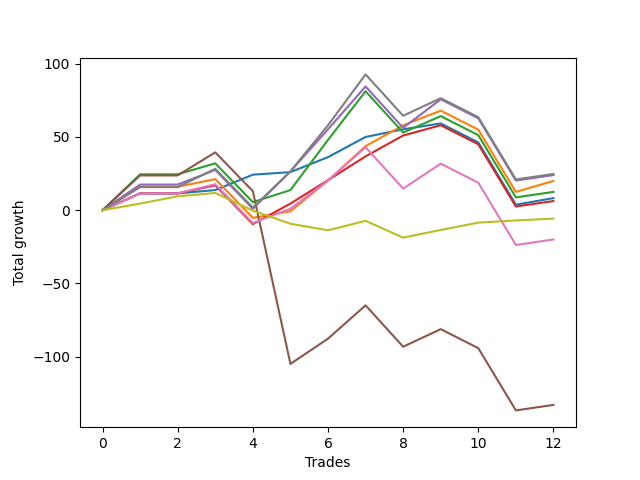

# Short Bulldog 006 
- Symbol: ES90d5m
- Date Range: 03/18/2022 - 07/08/2022
- Trading Period: 7:20-12:30
- Number of Trades: 12



| Name | Win Percent | Profit | Avg Profit / Trade | Avg Time / Trade |      | Name | Win Percent | Profit | Avg Profit / Trade | Avg Time / Trade |
| ---- | ----------- | ------ | ------------------ | ---------------- | ---- | ---- | ----------- | ------ | ------------------ | ---------------- |
| Sorted By <br> Profit | | | | | | Sorted By <br> Win Percentage ||||
| Eighty-Five | 91.67 | 8375.00 | 697.92 | 00:00 |     | Eighty-Five | 91.67 | 8375.00 | 697.92 | 00:00 |
| Eighty-Four | 91.67 | 6125.00 | 510.42 | 00:00 |     | Eighty-Four | 91.67 | 6125.00 | 510.42 | 00:00 |
| Seven | 66.67 | 5375.00 | 447.92 | 00:00 |     | Eighty-Three | 91.67 | 3625.00 | 302.08 | 00:00 |
| Four | 66.67 | 4750.00 | 395.83 | 00:00 |     | Eighty-Two | 91.67 | -4250.00 | -354.17 | 00:00 |
| Eighty-Three | 91.67 | 3625.00 | 302.08 | 00:00 |     | Eighty-One | 91.67 | -9500.00 | -791.67 | 00:00 |
| Two | 66.67 | -2000.00 | -166.67 | 00:00 |     | One | 75.00 | -2875.00 | -239.58 | 00:00 |
| One | 75.00 | -2875.00 | -239.58 | 00:00 |     | Three | 75.00 | -10500.00 | -875.00 | 00:00 |
| Seventy-Three | 33.33 | -3625.00 | -302.08 | 00:00 |     | Six | 75.00 | -15375.00 | -1281.25 | 00:00 |
| Zero | 58.33 | -4000.00 | -333.33 | 00:00 |     | Seven | 66.67 | 5375.00 | 447.92 | 00:00 |
| Eighty-Two | 91.67 | -4250.00 | -354.17 | 00:00 |     | Four | 66.67 | 4750.00 | 395.83 | 00:00 |
| Eighty-One | 91.67 | -9500.00 | -791.67 | 00:00 |     | Two | 66.67 | -2000.00 | -166.67 | 00:00 |
| Three | 75.00 | -10500.00 | -875.00 | 00:00 |     | One Hundred Twenty-Six | 66.67 | -19875.00 | -1656.25 | 00:00 |
| Sixty-Six | 33.33 | -12125.00 | -1010.42 | 00:00 |     | Zero | 58.33 | -4000.00 | -333.33 | 00:00 |
| Sixty-Nine | 33.33 | -12250.00 | -1020.83 | 00:00 |     | One Hundred Twenty-Seven | 58.33 | -21375.00 | -1781.25 | 00:00 |
| Seventy-One | 33.33 | -12625.00 | -1052.08 | 00:00 |     | Five | 58.33 | -65875.00 | -5489.58 | 00:00 |
| Six | 75.00 | -15375.00 | -1281.25 | 00:00 |     | One Hundred Thirty | 50.00 | -20625.00 | -1718.75 | 00:00 |
| Sixty-Eight | 33.33 | -15625.00 | -1302.08 | 00:00 |     | One Hundred Twenty-Nine | 50.00 | -21000.00 | -1750.00 | 00:00 |
| Fifteen | 8.33 | -17125.00 | -1427.08 | 00:00 |     | One Hundred Twenty-Eight | 50.00 | -23250.00 | -1937.50 | 00:00 |
| Ten | 8.33 | -18625.00 | -1552.08 | 00:00 |     | One Hundred Sixteen | 50.00 | -25500.00 | -2125.00 | 00:00 |
| Thirty-One | 8.33 | -19250.00 | -1604.17 | 00:00 |     | One Hundred Twenty-One | 50.00 | -25750.00 | -2145.83 | 00:00 |
| One Hundred Twenty-Six | 66.67 | -19875.00 | -1656.25 | 00:00 |     | One Hundred Eleven | 41.67 | -22000.00 | -1833.33 | 00:00 |
| Sixty-Five | 33.33 | -19875.00 | -1656.25 | 00:00 |     | One Hundred Six | 41.67 | -22500.00 | -1875.00 | 00:00 |
| Twelve | 8.33 | -19875.00 | -1656.25 | 00:00 |     | Sixty-Four | 41.67 | -24500.00 | -2041.67 | 00:00 |
| Thirteen | 8.33 | -20000.00 | -1666.67 | 00:00 |     | One Hundred Seventeen | 41.67 | -26000.00 | -2166.67 | 00:00 |
| One Hundred Thirty | 50.00 | -20625.00 | -1718.75 | 00:00 |     | One Hundred Twenty-Two | 41.67 | -29125.00 | -2427.08 | 00:00 |
| Twenty-Six | 8.33 | -20750.00 | -1729.17 | 00:00 |     | Seventy-Three | 33.33 | -3625.00 | -302.08 | 00:00 |
| One Hundred Twenty-Nine | 50.00 | -21000.00 | -1750.00 | 00:00 |     | Sixty-Six | 33.33 | -12125.00 | -1010.42 | 00:00 |
| Ninety-One | 33.33 | -21125.00 | -1760.42 | 00:00 |     | Sixty-Nine | 33.33 | -12250.00 | -1020.83 | 00:00 |
| Forty-Seven | 16.67 | -21250.00 | -1770.83 | 00:00 |     | Seventy-One | 33.33 | -12625.00 | -1052.08 | 00:00 |
| One Hundred Twenty-Seven | 58.33 | -21375.00 | -1781.25 | 00:00 |     | Sixty-Eight | 33.33 | -15625.00 | -1302.08 | 00:00 |
| One Hundred One | 33.33 | -21875.00 | -1822.92 | 00:00 |     | Sixty-Five | 33.33 | -19875.00 | -1656.25 | 00:00 |
| One Hundred Eleven | 41.67 | -22000.00 | -1833.33 | 00:00 |     | Ninety-One | 33.33 | -21125.00 | -1760.42 | 00:00 |
| Ninety-Two | 25.00 | -22000.00 | -1833.33 | 00:00 |     | One Hundred One | 33.33 | -21875.00 | -1822.92 | 00:00 |
| Twenty-Eight | 8.33 | -22000.00 | -1833.33 | 00:00 |     | One Hundred Seven | 33.33 | -22875.00 | -1906.25 | 00:00 |
| Fifty-Three | 25.00 | -22125.00 | -1843.75 | 00:00 |     | Ninety-Six | 33.33 | -23375.00 | -1947.92 | 00:00 |
| Twenty-Nine | 8.33 | -22125.00 | -1843.75 | 00:00 |     | One Hundred Twelve | 33.33 | -23750.00 | -1979.17 | 00:00 |
| Nine | 8.33 | -22375.00 | -1864.58 | 00:00 |     | Seventy | 33.33 | -24750.00 | -2062.50 | 00:00 |
| One Hundred Six | 41.67 | -22500.00 | -1875.00 | 00:00 |     | One Hundred Ninteen | 33.33 | -25750.00 | -2145.83 | 00:00 |
| Forty-Two | 16.67 | -22750.00 | -1895.83 | 00:00 |     | Sixty-Seven | 33.33 | -27125.00 | -2260.42 | 00:00 |
| One Hundred Seven | 33.33 | -22875.00 | -1906.25 | 00:00 |     | One Hundred Eighteen | 33.33 | -27500.00 | -2291.67 | 00:00 |
| One Hundred | 25.00 | -22875.00 | -1906.25 | 00:00 |     | Forty-Eight | 33.33 | -29625.00 | -2468.75 | 00:00 |
| Ninety-Five | 16.67 | -22875.00 | -1906.25 | 00:00 |     | One Hundred Twenty-Four | 33.33 | -32625.00 | -2718.75 | 00:00 |
| Twenty-Three | 25.00 | -23000.00 | -1916.67 | 00:00 |     | One Hundred Twenty-Five | 33.33 | -33000.00 | -2750.00 | 00:00 |
| Twenty-Two | 25.00 | -23000.00 | -1916.67 | 00:00 |     | One Hundred Twenty-Three | 33.33 | -34375.00 | -2864.58 | 00:00 |
| Twenty-One | 25.00 | -23000.00 | -1916.67 | 00:00 |     | Ninety-Two | 25.00 | -22000.00 | -1833.33 | 00:00 |
| Twenty | 25.00 | -23000.00 | -1916.67 | 00:00 |     | Fifty-Three | 25.00 | -22125.00 | -1843.75 | 00:00 |
| Nineteen | 25.00 | -23000.00 | -1916.67 | 00:00 |     | One Hundred | 25.00 | -22875.00 | -1906.25 | 00:00 |
| Eighteen | 25.00 | -23000.00 | -1916.67 | 00:00 |     | Twenty-Three | 25.00 | -23000.00 | -1916.67 | 00:00 |
| Seventeen | 25.00 | -23000.00 | -1916.67 | 00:00 |     | Twenty-Two | 25.00 | -23000.00 | -1916.67 | 00:00 |
| Fourteen | 8.33 | -23125.00 | -1927.08 | 00:00 |     | Twenty-One | 25.00 | -23000.00 | -1916.67 | 00:00 |
| One Hundred Twenty-Eight | 50.00 | -23250.00 | -1937.50 | 00:00 |     | Twenty | 25.00 | -23000.00 | -1916.67 | 00:00 |
| Sixten | 25.00 | -23250.00 | -1937.50 | 00:00 |     | Nineteen | 25.00 | -23000.00 | -1916.67 | 00:00 |
| Ninety-Six | 33.33 | -23375.00 | -1947.92 | 00:00 |     | Eighteen | 25.00 | -23000.00 | -1916.67 | 00:00 |
| One Hundred Eight | 25.00 | -23500.00 | -1958.33 | 00:00 |     | Seventeen | 25.00 | -23000.00 | -1916.67 | 00:00 |
| Thirty-Two | 25.00 | -23500.00 | -1958.33 | 00:00 |     | Sixten | 25.00 | -23250.00 | -1937.50 | 00:00 |
| One Hundred Ten | 25.00 | -23625.00 | -1968.75 | 00:00 |     | One Hundred Eight | 25.00 | -23500.00 | -1958.33 | 00:00 |
| One Hundred Twelve | 33.33 | -23750.00 | -1979.17 | 00:00 |     | Thirty-Two | 25.00 | -23500.00 | -1958.33 | 00:00 |
| Ninety-Seven | 25.00 | -23750.00 | -1979.17 | 00:00 |     | One Hundred Ten | 25.00 | -23625.00 | -1968.75 | 00:00 |
| Fifty-Five | 25.00 | -23750.00 | -1979.17 | 00:00 |     | Ninety-Seven | 25.00 | -23750.00 | -1979.17 | 00:00 |
| One Hundred Two | 25.00 | -23875.00 | -1989.58 | 00:00 |     | Fifty-Five | 25.00 | -23750.00 | -1979.17 | 00:00 |
| Ninety-Nine | 25.00 | -23875.00 | -1989.58 | 00:00 |     | One Hundred Two | 25.00 | -23875.00 | -1989.58 | 00:00 |
| Ninety-Four | 16.67 | -23875.00 | -1989.58 | 00:00 |     | Ninety-Nine | 25.00 | -23875.00 | -1989.58 | 00:00 |
| Forty-Four | 16.67 | -24000.00 | -2000.00 | 00:00 |     | Ninety-Eight | 25.00 | -24250.00 | -2020.83 | 00:00 |
| Forty-Five | 16.67 | -24125.00 | -2010.42 | 00:00 |     | Thirty-Nine | 25.00 | -24500.00 | -2041.67 | 00:00 |
| Ninety-Eight | 25.00 | -24250.00 | -2020.83 | 00:00 |     | Thirty-Eight | 25.00 | -24500.00 | -2041.67 | 00:00 |
| Ninety-Three | 16.67 | -24250.00 | -2020.83 | 00:00 |     | Thirty-Seven | 25.00 | -24500.00 | -2041.67 | 00:00 |
| Sixty-Four | 41.67 | -24500.00 | -2041.67 | 00:00 |     | Thirty-Six | 25.00 | -24500.00 | -2041.67 | 00:00 |
| Thirty-Nine | 25.00 | -24500.00 | -2041.67 | 00:00 |     | Thirty-Five | 25.00 | -24500.00 | -2041.67 | 00:00 |
| Thirty-Eight | 25.00 | -24500.00 | -2041.67 | 00:00 |     | Thirty-Four | 25.00 | -24500.00 | -2041.67 | 00:00 |
| Thirty-Seven | 25.00 | -24500.00 | -2041.67 | 00:00 |     | Thirty-Three | 25.00 | -24500.00 | -2041.67 | 00:00 |
| Thirty-Six | 25.00 | -24500.00 | -2041.67 | 00:00 |     | One Hundred Nine | 25.00 | -24625.00 | -2052.08 | 00:00 |
| Thirty-Five | 25.00 | -24500.00 | -2041.67 | 00:00 |     | Fifty-Two | 25.00 | -24875.00 | -2072.92 | 00:00 |
| Thirty-Four | 25.00 | -24500.00 | -2041.67 | 00:00 |     | Forty-Nine | 25.00 | -24875.00 | -2072.92 | 00:00 |
| Thirty-Three | 25.00 | -24500.00 | -2041.67 | 00:00 |     | Fifty-Four | 25.00 | -25125.00 | -2093.75 | 00:00 |
| Twenty-Five | 8.33 | -24500.00 | -2041.67 | 00:00 |     | One Hundred Fourteen | 25.00 | -25750.00 | -2145.83 | 00:00 |
| One Hundred Nine | 25.00 | -24625.00 | -2052.08 | 00:00 |     | Fifty | 25.00 | -25750.00 | -2145.83 | 00:00 |
| Seventy | 33.33 | -24750.00 | -2062.50 | 00:00 |     | One Hundred Fifteen | 25.00 | -26125.00 | -2177.08 | 00:00 |
| Fifty-Two | 25.00 | -24875.00 | -2072.92 | 00:00 |     | One Hundred Thirteen | 25.00 | -26500.00 | -2208.33 | 00:00 |
| Forty-Nine | 25.00 | -24875.00 | -2072.92 | 00:00 |     | One Hundred Twenty | 25.00 | -27250.00 | -2270.83 | 00:00 |
| One Hundred Five | 16.67 | -25000.00 | -2083.33 | 00:00 |     | Sixty-Three | 25.00 | -28250.00 | -2354.17 | 00:00 |
| Forty-One | 16.67 | -25000.00 | -2083.33 | 00:00 |     | Fifty-One | 25.00 | -28375.00 | -2364.58 | 00:00 |
| Fifty-Four | 25.00 | -25125.00 | -2093.75 | 00:00 |     | Sixty-One | 25.00 | -29500.00 | -2458.33 | 00:00 |
| Thirty | 8.33 | -25250.00 | -2104.17 | 00:00 |     | Fifty-Eight | 25.00 | -31750.00 | -2645.83 | 00:00 |
| One Hundred Sixteen | 50.00 | -25500.00 | -2125.00 | 00:00 |     | Sixty | 25.00 | -32125.00 | -2677.08 | 00:00 |
| One Hundred Twenty-One | 50.00 | -25750.00 | -2145.83 | 00:00 |     | Fifty-Seven | 25.00 | -35625.00 | -2968.75 | 00:00 |
| One Hundred Ninteen | 33.33 | -25750.00 | -2145.83 | 00:00 |     | Sixty-Two | 25.00 | -37375.00 | -3114.58 | 00:00 |
| One Hundred Fourteen | 25.00 | -25750.00 | -2145.83 | 00:00 |     | Fifty-Nine | 25.00 | -40625.00 | -3385.42 | 00:00 |
| Fifty | 25.00 | -25750.00 | -2145.83 | 00:00 |     | Fifty-Six | 25.00 | -43000.00 | -3583.33 | 00:00 |
| One Hundred Seventeen | 41.67 | -26000.00 | -2166.67 | 00:00 |     | Forty-Seven | 16.67 | -21250.00 | -1770.83 | 00:00 |
| One Hundred Four | 16.67 | -26000.00 | -2166.67 | 00:00 |     | Forty-Two | 16.67 | -22750.00 | -1895.83 | 00:00 |
| Eleven | 8.33 | -26000.00 | -2166.67 | 00:00 |     | Ninety-Five | 16.67 | -22875.00 | -1906.25 | 00:00 |
| One Hundred Fifteen | 25.00 | -26125.00 | -2177.08 | 00:00 |     | Ninety-Four | 16.67 | -23875.00 | -1989.58 | 00:00 |
| One Hundred Three | 16.67 | -26375.00 | -2197.92 | 00:00 |     | Forty-Four | 16.67 | -24000.00 | -2000.00 | 00:00 |
| One Hundred Thirteen | 25.00 | -26500.00 | -2208.33 | 00:00 |     | Forty-Five | 16.67 | -24125.00 | -2010.42 | 00:00 |
| Sixty-Seven | 33.33 | -27125.00 | -2260.42 | 00:00 |     | Ninety-Three | 16.67 | -24250.00 | -2020.83 | 00:00 |
| One Hundred Twenty | 25.00 | -27250.00 | -2270.83 | 00:00 |     | One Hundred Five | 16.67 | -25000.00 | -2083.33 | 00:00 |
| Forty-Six | 16.67 | -27250.00 | -2270.83 | 00:00 |     | Forty-One | 16.67 | -25000.00 | -2083.33 | 00:00 |
| One Hundred Eighteen | 33.33 | -27500.00 | -2291.67 | 00:00 |     | One Hundred Four | 16.67 | -26000.00 | -2166.67 | 00:00 |
| Eight | 8.33 | -27625.00 | -2302.08 | 00:00 |     | One Hundred Three | 16.67 | -26375.00 | -2197.92 | 00:00 |
| twenty-Seven | 8.33 | -28125.00 | -2343.75 | 00:00 |     | Forty-Six | 16.67 | -27250.00 | -2270.83 | 00:00 |
| Sixty-Three | 25.00 | -28250.00 | -2354.17 | 00:00 |     | Forty-Three | 16.67 | -30125.00 | -2510.42 | 00:00 |
| Fifty-One | 25.00 | -28375.00 | -2364.58 | 00:00 |     | Forty | 16.67 | -31375.00 | -2614.58 | 00:00 |
| One Hundred Twenty-Two | 41.67 | -29125.00 | -2427.08 | 00:00 |     | Fifteen | 8.33 | -17125.00 | -1427.08 | 00:00 |
| Sixty-One | 25.00 | -29500.00 | -2458.33 | 00:00 |     | Ten | 8.33 | -18625.00 | -1552.08 | 00:00 |
| Forty-Eight | 33.33 | -29625.00 | -2468.75 | 00:00 |     | Thirty-One | 8.33 | -19250.00 | -1604.17 | 00:00 |
| Twenty-Four | 8.33 | -29750.00 | -2479.17 | 00:00 |     | Twelve | 8.33 | -19875.00 | -1656.25 | 00:00 |
| Forty-Three | 16.67 | -30125.00 | -2510.42 | 00:00 |     | Thirteen | 8.33 | -20000.00 | -1666.67 | 00:00 |
| Forty | 16.67 | -31375.00 | -2614.58 | 00:00 |     | Twenty-Six | 8.33 | -20750.00 | -1729.17 | 00:00 |
| Fifty-Eight | 25.00 | -31750.00 | -2645.83 | 00:00 |     | Twenty-Eight | 8.33 | -22000.00 | -1833.33 | 00:00 |
| Sixty | 25.00 | -32125.00 | -2677.08 | 00:00 |     | Twenty-Nine | 8.33 | -22125.00 | -1843.75 | 00:00 |
| One Hundred Twenty-Four | 33.33 | -32625.00 | -2718.75 | 00:00 |     | Nine | 8.33 | -22375.00 | -1864.58 | 00:00 |
| One Hundred Twenty-Five | 33.33 | -33000.00 | -2750.00 | 00:00 |     | Fourteen | 8.33 | -23125.00 | -1927.08 | 00:00 |
| One Hundred Twenty-Three | 33.33 | -34375.00 | -2864.58 | 00:00 |     | Twenty-Five | 8.33 | -24500.00 | -2041.67 | 00:00 |
| Fifty-Seven | 25.00 | -35625.00 | -2968.75 | 00:00 |     | Thirty | 8.33 | -25250.00 | -2104.17 | 00:00 |
| Sixty-Two | 25.00 | -37375.00 | -3114.58 | 00:00 |     | Eleven | 8.33 | -26000.00 | -2166.67 | 00:00 |
| Fifty-Nine | 25.00 | -40625.00 | -3385.42 | 00:00 |     | Eight | 8.33 | -27625.00 | -2302.08 | 00:00 |
| Fifty-Six | 25.00 | -43000.00 | -3583.33 | 00:00 |     | twenty-Seven | 8.33 | -28125.00 | -2343.75 | 00:00 |
| Five | 58.33 | -65875.00 | -5489.58 | 00:00 |     | Twenty-Four | 8.33 | -29750.00 | -2479.17 | 00:00 |

## NO STOPLOSS

### Test Zero
* Sell when price hits the middle line of the 20p bollinger
* No Stoploss
* Results:
```
Total Trades: 12
Percent Up: 41.67
Percent Down: 58.33
Total Points Moved Down: -8.00
Potential Profit: -4000.00
Total Points Ups: 48.00 Count Ups: 5
Total Points Downs: 40.00 Count Downs: 7
```

<details><summary>Trades</summary>

<code>In: 2022-04-06 11:00:00		Out: 2022-04-06 11:08:25		Total Position Time: 08:25		Total Move Down: 5.25		Total to Date: 5.25</code> <br />
<code>In: 2022-04-07 12:25:00		Out: 2022-04-07 12:55:00		Total Position Time: 30:00		Total Move Down: 2.25		Total to Date: 7.50</code> <br />
<code>In: 2022-04-20 10:55:00		Out: 2022-04-20 11:13:55		Total Position Time: 18:55		Total Move Down: 0.75		Total to Date: 8.25</code> <br />
<code>In: 2022-04-25 11:45:00		Out: 2022-04-25 12:07:30		Total Position Time: 22:30		Total Move Down: 11.00		Total to Date: 19.25</code> <br />
<code>In: 2022-05-04 09:50:00		Out: 2022-05-04 11:00:25		Total Position Time: 70:25		Total Move Down: -0.00		Total to Date: 19.25</code> <br />
<code>In: 2022-05-19 09:00:00		Out: 2022-05-19 09:35:15		Total Position Time: 35:15		Total Move Down: 8.75		Total to Date: 28.00</code> <br />
<code>In: 2022-05-19 12:15:00		Out: 2022-05-19 12:20:10		Total Position Time: 05:10		Total Move Down: 9.75		Total to Date: 37.75</code> <br />
<code>In: 2022-05-24 11:05:00		Out: 2022-05-24 11:48:40		Total Position Time: 43:40		Total Move Down: -1.50		Total to Date: 36.25</code> <br />
<code>In: 2022-05-31 09:15:00		Out: 2022-05-31 10:16:30		Total Position Time: 61:30		Total Move Down: -0.25		Total to Date: 36.00</code> <br />
<code>In: 2022-06-15 12:00:00		Out: 2022-06-15 12:50:25		Total Position Time: 50:25		Total Move Down: -3.75		Total to Date: 32.25</code> <br />
<code>In: 2022-07-05 10:50:00		Out: 2022-07-05 12:55:00		Total Position Time: 125:00		Total Move Down: -42.50		Total to Date: -10.25</code> <br />
<code>In: 2022-07-07 12:30:00		Out: 2022-07-07 12:38:40		Total Position Time: 08:40		Total Move Down: 2.25		Total to Date: -8.00</code> <br />


</details>

### Test One
* Sell when the price hits the upper line of the 20p 1std bollinger
* No Stoploss
* Results:
```
Total Trades: 12
Percent Up: 25.00
Percent Down: 75.00
Total Points Moved Down: -5.75
Potential Profit: -2875.00
Total Points Ups: 81.50 Count Ups: 3
Total Points Downs: 75.75 Count Downs: 9
```

<details><summary>Trades</summary>

<code>In: 2022-04-06 11:00:00		Out: 2022-04-06 11:10:05		Total Position Time: 10:05		Total Move Down: 11.00		Total to Date: 11.00</code> <br />
<code>In: 2022-04-07 12:25:00		Out: 2022-04-07 12:55:00		Total Position Time: 30:00		Total Move Down: 2.25		Total to Date: 13.25</code> <br />
<code>In: 2022-04-20 10:55:00		Out: 2022-04-20 11:17:15		Total Position Time: 22:15		Total Move Down: 2.75		Total to Date: 16.00</code> <br />
<code>In: 2022-04-25 11:45:00		Out: 2022-04-25 12:55:00		Total Position Time: 70:00		Total Move Down: -35.75		Total to Date: -19.75</code> <br />
<code>In: 2022-05-04 09:50:00		Out: 2022-05-04 11:07:25		Total Position Time: 77:25		Total Move Down: 2.25		Total to Date: -17.50</code> <br />
<code>In: 2022-05-19 09:00:00		Out: 2022-05-19 09:40:45		Total Position Time: 40:45		Total Move Down: 21.50		Total to Date: 4.00</code> <br />
<code>In: 2022-05-19 12:15:00		Out: 2022-05-19 12:25:05		Total Position Time: 10:05		Total Move Down: 20.25		Total to Date: 24.25</code> <br />
<code>In: 2022-05-24 11:05:00		Out: 2022-05-24 11:55:15		Total Position Time: 50:15		Total Move Down: 6.75		Total to Date: 31.00</code> <br />
<code>In: 2022-05-31 09:15:00		Out: 2022-05-31 10:28:50		Total Position Time: 73:50		Total Move Down: 4.50		Total to Date: 35.50</code> <br />
<code>In: 2022-06-15 12:00:00		Out: 2022-06-15 12:55:00		Total Position Time: 55:00		Total Move Down: -3.25		Total to Date: 32.25</code> <br />
<code>In: 2022-07-05 10:50:00		Out: 2022-07-05 12:55:00		Total Position Time: 125:00		Total Move Down: -42.50		Total to Date: -10.25</code> <br />
<code>In: 2022-07-07 12:30:00		Out: 2022-07-07 12:54:30		Total Position Time: 24:30		Total Move Down: 4.50		Total to Date: -5.75</code> <br />


</details>

### Test Two
* Sell when the price hits the upper line of the 20p 2std bollinger
* No Stoploss
* Results:
```
Total Trades: 12
Percent Up: 33.33
Percent Down: 66.67
Total Points Moved Down: -4.00
Potential Profit: -2000.00
Total Points Ups: 104.75 Count Ups: 4
Total Points Downs: 100.75 Count Downs: 8
```

<details><summary>Trades</summary>

<code>In: 2022-04-06 11:00:00		Out: 2022-04-06 11:15:05		Total Position Time: 15:05		Total Move Down: 18.75		Total to Date: 18.75</code> <br />
<code>In: 2022-04-07 12:25:00		Out: 2022-04-07 12:55:00		Total Position Time: 30:00		Total Move Down: 2.25		Total to Date: 21.00</code> <br />
<code>In: 2022-04-20 10:55:00		Out: 2022-04-20 11:19:20		Total Position Time: 24:20		Total Move Down: 6.00		Total to Date: 27.00</code> <br />
<code>In: 2022-04-25 11:45:00		Out: 2022-04-25 12:55:00		Total Position Time: 70:00		Total Move Down: -35.75		Total to Date: -8.75</code> <br />
<code>In: 2022-05-04 09:50:00		Out: 2022-05-04 11:07:40		Total Position Time: 77:40		Total Move Down: 6.00		Total to Date: -2.75</code> <br />
<code>In: 2022-05-19 09:00:00		Out: 2022-05-19 10:13:55		Total Position Time: 73:55		Total Move Down: 34.00		Total to Date: 31.25</code> <br />
<code>In: 2022-05-19 12:15:00		Out: 2022-05-19 12:36:10		Total Position Time: 21:10		Total Move Down: 27.75		Total to Date: 59.00</code> <br />
<code>In: 2022-05-24 11:05:00		Out: 2022-05-24 12:55:00		Total Position Time: 110:00		Total Move Down: -23.25		Total to Date: 35.75</code> <br />
<code>In: 2022-05-31 09:15:00		Out: 2022-05-31 11:45:45		Total Position Time: 150:45		Total Move Down: 4.50		Total to Date: 40.25</code> <br />
<code>In: 2022-06-15 12:00:00		Out: 2022-06-15 12:55:00		Total Position Time: 55:00		Total Move Down: -3.25		Total to Date: 37.00</code> <br />
<code>In: 2022-07-05 10:50:00		Out: 2022-07-05 12:55:00		Total Position Time: 125:00		Total Move Down: -42.50		Total to Date: -5.50</code> <br />
<code>In: 2022-07-07 12:30:00		Out: 2022-07-07 12:55:00		Total Position Time: 25:00		Total Move Down: 1.50		Total to Date: -4.00</code> <br />


</details>

### Test Three
* Sell when price hits the middle line of the 50p bollinger
* No Stoploss
* Results:
```
Total Trades: 12
Percent Up: 25.00
Percent Down: 75.00
Total Points Moved Down: -21.00
Potential Profit: -10500.00
Total Points Ups: 81.50 Count Ups: 3
Total Points Downs: 60.50 Count Downs: 9
```

<details><summary>Trades</summary>

<code>In: 2022-04-06 11:00:00		Out: 2022-04-06 11:08:35		Total Position Time: 08:35		Total Move Down: 6.50		Total to Date: 6.50</code> <br />
<code>In: 2022-04-07 12:25:00		Out: 2022-04-07 12:55:00		Total Position Time: 30:00		Total Move Down: 2.25		Total to Date: 8.75</code> <br />
<code>In: 2022-04-20 10:55:00		Out: 2022-04-20 11:17:40		Total Position Time: 22:40		Total Move Down: 3.00		Total to Date: 11.75</code> <br />
<code>In: 2022-04-25 11:45:00		Out: 2022-04-25 12:55:00		Total Position Time: 70:00		Total Move Down: -35.75		Total to Date: -24.00</code> <br />
<code>In: 2022-05-04 09:50:00		Out: 2022-05-04 11:20:50		Total Position Time: 90:50		Total Move Down: 11.75		Total to Date: -12.25</code> <br />
<code>In: 2022-05-19 09:00:00		Out: 2022-05-19 09:37:05		Total Position Time: 37:05		Total Move Down: 14.75		Total to Date: 2.50</code> <br />
<code>In: 2022-05-19 12:15:00		Out: 2022-05-19 12:22:10		Total Position Time: 07:10		Total Move Down: 13.00		Total to Date: 15.50</code> <br />
<code>In: 2022-05-24 11:05:00		Out: 2022-05-24 11:55:15		Total Position Time: 50:15		Total Move Down: 6.75		Total to Date: 22.25</code> <br />
<code>In: 2022-05-31 09:15:00		Out: 2022-05-31 11:45:05		Total Position Time: 150:05		Total Move Down: 1.00		Total to Date: 23.25</code> <br />
<code>In: 2022-06-15 12:00:00		Out: 2022-06-15 12:55:00		Total Position Time: 55:00		Total Move Down: -3.25		Total to Date: 20.00</code> <br />
<code>In: 2022-07-05 10:50:00		Out: 2022-07-05 12:55:00		Total Position Time: 125:00		Total Move Down: -42.50		Total to Date: -22.50</code> <br />
<code>In: 2022-07-07 12:30:00		Out: 2022-07-07 12:55:00		Total Position Time: 25:00		Total Move Down: 1.50		Total to Date: -21.00</code> <br />


</details>

### Test Four
* Sell when the price hits the upper line of the 50p 1std bollinger
* No Stoploss
* Results:
```
Total Trades: 12
Percent Up: 33.33
Percent Down: 66.67
Total Points Moved Down: 9.50
Potential Profit: 4750.00
Total Points Ups: 104.75 Count Ups: 4
Total Points Downs: 114.25 Count Downs: 8
```

<details><summary>Trades</summary>

<code>In: 2022-04-06 11:00:00		Out: 2022-04-06 11:11:20		Total Position Time: 11:20		Total Move Down: 12.50		Total to Date: 12.50</code> <br />
<code>In: 2022-04-07 12:25:00		Out: 2022-04-07 12:55:00		Total Position Time: 30:00		Total Move Down: 2.25		Total to Date: 14.75</code> <br />
<code>In: 2022-04-20 10:55:00		Out: 2022-04-20 11:26:00		Total Position Time: 31:00		Total Move Down: 7.75		Total to Date: 22.50</code> <br />
<code>In: 2022-04-25 11:45:00		Out: 2022-04-25 12:55:00		Total Position Time: 70:00		Total Move Down: -35.75		Total to Date: -13.25</code> <br />
<code>In: 2022-05-04 09:50:00		Out: 2022-05-04 11:34:10		Total Position Time: 104:10		Total Move Down: 23.25		Total to Date: 10.00</code> <br />
<code>In: 2022-05-19 09:00:00		Out: 2022-05-19 09:45:05		Total Position Time: 45:05		Total Move Down: 26.50		Total to Date: 36.50</code> <br />
<code>In: 2022-05-19 12:15:00		Out: 2022-05-19 12:30:05		Total Position Time: 15:05		Total Move Down: 25.25		Total to Date: 61.75</code> <br />
<code>In: 2022-05-24 11:05:00		Out: 2022-05-24 12:55:00		Total Position Time: 110:00		Total Move Down: -23.25		Total to Date: 38.50</code> <br />
<code>In: 2022-05-31 09:15:00		Out: 2022-05-31 11:54:45		Total Position Time: 159:45		Total Move Down: 15.25		Total to Date: 53.75</code> <br />
<code>In: 2022-06-15 12:00:00		Out: 2022-06-15 12:55:00		Total Position Time: 55:00		Total Move Down: -3.25		Total to Date: 50.50</code> <br />
<code>In: 2022-07-05 10:50:00		Out: 2022-07-05 12:55:00		Total Position Time: 125:00		Total Move Down: -42.50		Total to Date: 8.00</code> <br />
<code>In: 2022-07-07 12:30:00		Out: 2022-07-07 12:55:00		Total Position Time: 25:00		Total Move Down: 1.50		Total to Date: 9.50</code> <br />


</details>

### Test Five
* Sell when the price hits the upper line of the 50p 2std bollinger
* No Stoploss
* Results:
```
Total Trades: 12
Percent Up: 41.67
Percent Down: 58.33
Total Points Moved Down: -131.75
Potential Profit: -65875.00
Total Points Ups: 222.25 Count Ups: 5
Total Points Downs: 90.50 Count Downs: 7
```

<details><summary>Trades</summary>

<code>In: 2022-04-06 11:00:00		Out: 2022-04-06 11:15:05		Total Position Time: 15:05		Total Move Down: 18.75		Total to Date: 18.75</code> <br />
<code>In: 2022-04-07 12:25:00		Out: 2022-04-07 12:55:00		Total Position Time: 30:00		Total Move Down: 2.25		Total to Date: 21.00</code> <br />
<code>In: 2022-04-20 10:55:00		Out: 2022-04-20 11:35:45		Total Position Time: 40:45		Total Move Down: 13.25		Total to Date: 34.25</code> <br />
<code>In: 2022-04-25 11:45:00		Out: 2022-04-25 12:55:00		Total Position Time: 70:00		Total Move Down: -35.75		Total to Date: -1.50</code> <br />
<code>In: 2022-05-04 09:50:00		Out: 2022-05-04 12:55:00		Total Position Time: 185:00		Total Move Down: -117.50		Total to Date: -119.00</code> <br />
<code>In: 2022-05-19 09:00:00		Out: 2022-05-19 12:55:00		Total Position Time: 235:00		Total Move Down: 22.25		Total to Date: -96.75</code> <br />
<code>In: 2022-05-19 12:15:00		Out: 2022-05-19 12:55:00		Total Position Time: 40:00		Total Move Down: 25.00		Total to Date: -71.75</code> <br />
<code>In: 2022-05-24 11:05:00		Out: 2022-05-24 12:55:00		Total Position Time: 110:00		Total Move Down: -23.25		Total to Date: -95.00</code> <br />
<code>In: 2022-05-31 09:15:00		Out: 2022-05-31 12:55:00		Total Position Time: 220:00		Total Move Down: 7.50		Total to Date: -87.50</code> <br />
<code>In: 2022-06-15 12:00:00		Out: 2022-06-15 12:55:00		Total Position Time: 55:00		Total Move Down: -3.25		Total to Date: -90.75</code> <br />
<code>In: 2022-07-05 10:50:00		Out: 2022-07-05 12:55:00		Total Position Time: 125:00		Total Move Down: -42.50		Total to Date: -133.25</code> <br />
<code>In: 2022-07-07 12:30:00		Out: 2022-07-07 12:55:00		Total Position Time: 25:00		Total Move Down: 1.50		Total to Date: -131.75</code> <br />


</details>

### Test Six
* Sell when the price hits the middle line of the 1std VWAP
* No Stoploss
* Results:
```
Total Trades: 12
Percent Up: 25.00
Percent Down: 75.00
Total Points Moved Down: -30.75
Potential Profit: -15375.00
Total Points Ups: 101.50 Count Ups: 3
Total Points Downs: 70.75 Count Downs: 9
```

<details><summary>Trades</summary>

<code>In: 2022-04-06 11:00:00		Out: 2022-04-06 11:08:20		Total Position Time: 08:20		Total Move Down: 4.75		Total to Date: 4.75</code> <br />
<code>In: 2022-04-07 12:25:00		Out: 2022-04-07 12:55:00		Total Position Time: 30:00		Total Move Down: 2.25		Total to Date: 7.00</code> <br />
<code>In: 2022-04-20 10:55:00		Out: 2022-04-20 11:18:20		Total Position Time: 23:20		Total Move Down: 3.75		Total to Date: 10.75</code> <br />
<code>In: 2022-04-25 11:45:00		Out: 2022-04-25 12:55:00		Total Position Time: 70:00		Total Move Down: -35.75		Total to Date: -25.00</code> <br />
<code>In: 2022-05-04 09:50:00		Out: 2022-05-04 11:20:20		Total Position Time: 90:20		Total Move Down: 7.50		Total to Date: -17.50</code> <br />
<code>In: 2022-05-19 09:00:00		Out: 2022-05-19 09:39:15		Total Position Time: 39:15		Total Move Down: 18.00		Total to Date: 0.50</code> <br />
<code>In: 2022-05-19 12:15:00		Out: 2022-05-19 12:24:45		Total Position Time: 09:45		Total Move Down: 18.75		Total to Date: 19.25</code> <br />
<code>In: 2022-05-24 11:05:00		Out: 2022-05-24 12:55:00		Total Position Time: 110:00		Total Move Down: -23.25		Total to Date: -4.00</code> <br />
<code>In: 2022-05-31 09:15:00		Out: 2022-05-31 11:48:40		Total Position Time: 153:40		Total Move Down: 12.25		Total to Date: 8.25</code> <br />
<code>In: 2022-06-15 12:00:00		Out: 2022-06-15 12:52:10		Total Position Time: 52:10		Total Move Down: 2.00		Total to Date: 10.25</code> <br />
<code>In: 2022-07-05 10:50:00		Out: 2022-07-05 12:55:00		Total Position Time: 125:00		Total Move Down: -42.50		Total to Date: -32.25</code> <br />
<code>In: 2022-07-07 12:30:00		Out: 2022-07-07 12:55:00		Total Position Time: 25:00		Total Move Down: 1.50		Total to Date: -30.75</code> <br />


</details>

### Test Seven
* Sell when the price hits the upper line of the 1std VWAP
* No Stoploss
* Results:
```
Total Trades: 12
Percent Up: 33.33
Percent Down: 66.67
Total Points Moved Down: 10.75
Potential Profit: 5375.00
Total Points Ups: 104.75 Count Ups: 4
Total Points Downs: 115.50 Count Downs: 8
```

<details><summary>Trades</summary>

<code>In: 2022-04-06 11:00:00		Out: 2022-04-06 11:09:40		Total Position Time: 09:40		Total Move Down: 10.75		Total to Date: 10.75</code> <br />
<code>In: 2022-04-07 12:25:00		Out: 2022-04-07 12:55:00		Total Position Time: 30:00		Total Move Down: 2.25		Total to Date: 13.00</code> <br />
<code>In: 2022-04-20 10:55:00		Out: 2022-04-20 11:30:15		Total Position Time: 35:15		Total Move Down: 10.00		Total to Date: 23.00</code> <br />
<code>In: 2022-04-25 11:45:00		Out: 2022-04-25 12:55:00		Total Position Time: 70:00		Total Move Down: -35.75		Total to Date: -12.75</code> <br />
<code>In: 2022-05-04 09:50:00		Out: 2022-05-04 11:34:05		Total Position Time: 104:05		Total Move Down: 22.50		Total to Date: 9.75</code> <br />
<code>In: 2022-05-19 09:00:00		Out: 2022-05-19 09:47:35		Total Position Time: 47:35		Total Move Down: 30.25		Total to Date: 40.00</code> <br />
<code>In: 2022-05-19 12:15:00		Out: 2022-05-19 12:42:25		Total Position Time: 27:25		Total Move Down: 30.75		Total to Date: 70.75</code> <br />
<code>In: 2022-05-24 11:05:00		Out: 2022-05-24 12:55:00		Total Position Time: 110:00		Total Move Down: -23.25		Total to Date: 47.50</code> <br />
<code>In: 2022-05-31 09:15:00		Out: 2022-05-31 12:55:00		Total Position Time: 220:00		Total Move Down: 7.50		Total to Date: 55.00</code> <br />
<code>In: 2022-06-15 12:00:00		Out: 2022-06-15 12:55:00		Total Position Time: 55:00		Total Move Down: -3.25		Total to Date: 51.75</code> <br />
<code>In: 2022-07-05 10:50:00		Out: 2022-07-05 12:55:00		Total Position Time: 125:00		Total Move Down: -42.50		Total to Date: 9.25</code> <br />
<code>In: 2022-07-07 12:30:00		Out: 2022-07-07 12:55:00		Total Position Time: 25:00		Total Move Down: 1.50		Total to Date: 10.75</code> <br />


</details>

## STOPLOSS OF 2

### Test Eight
* Sell when price hits the middle line of the 20p bollinger
* Stoploss is -2 points
* Results:
```
Total Trades: 12
Percent Up: 91.67
Percent Down: 8.33
Total Points Moved Down: -55.25
Potential Profit: -27625.00
Total Points Ups: 65.00 Count Ups: 11
Total Points Downs: 9.75 Count Downs: 1
```

<details><summary>Trades</summary>

<code>In: 2022-04-06 11:00:00		Out: 2022-04-06 11:05:10		Total Position Time: 05:10		Total Move Down: -9.75		Total to Date: -9.75</code> <br />
<code>In: 2022-04-07 12:25:00		Out: 2022-04-07 12:31:15		Total Position Time: 06:15		Total Move Down: -2.75		Total to Date: -12.50</code> <br />
<code>In: 2022-04-20 10:55:00		Out: 2022-04-20 11:00:10		Total Position Time: 05:10		Total Move Down: -3.00		Total to Date: -15.50</code> <br />
<code>In: 2022-04-25 11:45:00		Out: 2022-04-25 11:50:10		Total Position Time: 05:10		Total Move Down: -11.75		Total to Date: -27.25</code> <br />
<code>In: 2022-05-04 09:50:00		Out: 2022-05-04 09:55:10		Total Position Time: 05:10		Total Move Down: -6.00		Total to Date: -33.25</code> <br />
<code>In: 2022-05-19 09:00:00		Out: 2022-05-19 09:06:35		Total Position Time: 06:35		Total Move Down: -2.25		Total to Date: -35.50</code> <br />
<code>In: 2022-05-19 12:15:00		Out: 2022-05-19 12:20:10		Total Position Time: 05:10		Total Move Down: 9.75		Total to Date: -25.75</code> <br />
<code>In: 2022-05-24 11:05:00		Out: 2022-05-24 11:10:10		Total Position Time: 05:10		Total Move Down: -14.00		Total to Date: -39.75</code> <br />
<code>In: 2022-05-31 09:15:00		Out: 2022-05-31 09:35:05		Total Position Time: 20:05		Total Move Down: -3.25		Total to Date: -43.00</code> <br />
<code>In: 2022-06-15 12:00:00		Out: 2022-06-15 12:05:10		Total Position Time: 05:10		Total Move Down: -7.50		Total to Date: -50.50</code> <br />
<code>In: 2022-07-05 10:50:00		Out: 2022-07-05 10:55:15		Total Position Time: 05:15		Total Move Down: -2.25		Total to Date: -52.75</code> <br />
<code>In: 2022-07-07 12:30:00		Out: 2022-07-07 12:35:10		Total Position Time: 05:10		Total Move Down: -2.50		Total to Date: -55.25</code> <br />


</details>

### Test Nine
* Sell when the price hits the upper line of the 20p 1std bollinger
* Stoploss is -2 points
* Results:
```
Total Trades: 12
Percent Up: 91.67
Percent Down: 8.33
Total Points Moved Down: -44.75
Potential Profit: -22375.00
Total Points Ups: 65.00 Count Ups: 11
Total Points Downs: 20.25 Count Downs: 1
```

<details><summary>Trades</summary>

<code>In: 2022-04-06 11:00:00		Out: 2022-04-06 11:05:10		Total Position Time: 05:10		Total Move Down: -9.75		Total to Date: -9.75</code> <br />
<code>In: 2022-04-07 12:25:00		Out: 2022-04-07 12:31:15		Total Position Time: 06:15		Total Move Down: -2.75		Total to Date: -12.50</code> <br />
<code>In: 2022-04-20 10:55:00		Out: 2022-04-20 11:00:10		Total Position Time: 05:10		Total Move Down: -3.00		Total to Date: -15.50</code> <br />
<code>In: 2022-04-25 11:45:00		Out: 2022-04-25 11:50:10		Total Position Time: 05:10		Total Move Down: -11.75		Total to Date: -27.25</code> <br />
<code>In: 2022-05-04 09:50:00		Out: 2022-05-04 09:55:10		Total Position Time: 05:10		Total Move Down: -6.00		Total to Date: -33.25</code> <br />
<code>In: 2022-05-19 09:00:00		Out: 2022-05-19 09:06:35		Total Position Time: 06:35		Total Move Down: -2.25		Total to Date: -35.50</code> <br />
<code>In: 2022-05-19 12:15:00		Out: 2022-05-19 12:25:05		Total Position Time: 10:05		Total Move Down: 20.25		Total to Date: -15.25</code> <br />
<code>In: 2022-05-24 11:05:00		Out: 2022-05-24 11:10:10		Total Position Time: 05:10		Total Move Down: -14.00		Total to Date: -29.25</code> <br />
<code>In: 2022-05-31 09:15:00		Out: 2022-05-31 09:35:05		Total Position Time: 20:05		Total Move Down: -3.25		Total to Date: -32.50</code> <br />
<code>In: 2022-06-15 12:00:00		Out: 2022-06-15 12:05:10		Total Position Time: 05:10		Total Move Down: -7.50		Total to Date: -40.00</code> <br />
<code>In: 2022-07-05 10:50:00		Out: 2022-07-05 10:55:15		Total Position Time: 05:15		Total Move Down: -2.25		Total to Date: -42.25</code> <br />
<code>In: 2022-07-07 12:30:00		Out: 2022-07-07 12:35:10		Total Position Time: 05:10		Total Move Down: -2.50		Total to Date: -44.75</code> <br />


</details>

### Test Ten
* Sell when the price hits the upper line of the 20p 2std bollinger
* Stoploss is -2 points
* Results:
```
Total Trades: 12
Percent Up: 91.67
Percent Down: 8.33
Total Points Moved Down: -37.25
Potential Profit: -18625.00
Total Points Ups: 65.00 Count Ups: 11
Total Points Downs: 27.75 Count Downs: 1
```

<details><summary>Trades</summary>

<code>In: 2022-04-06 11:00:00		Out: 2022-04-06 11:05:10		Total Position Time: 05:10		Total Move Down: -9.75		Total to Date: -9.75</code> <br />
<code>In: 2022-04-07 12:25:00		Out: 2022-04-07 12:31:15		Total Position Time: 06:15		Total Move Down: -2.75		Total to Date: -12.50</code> <br />
<code>In: 2022-04-20 10:55:00		Out: 2022-04-20 11:00:10		Total Position Time: 05:10		Total Move Down: -3.00		Total to Date: -15.50</code> <br />
<code>In: 2022-04-25 11:45:00		Out: 2022-04-25 11:50:10		Total Position Time: 05:10		Total Move Down: -11.75		Total to Date: -27.25</code> <br />
<code>In: 2022-05-04 09:50:00		Out: 2022-05-04 09:55:10		Total Position Time: 05:10		Total Move Down: -6.00		Total to Date: -33.25</code> <br />
<code>In: 2022-05-19 09:00:00		Out: 2022-05-19 09:06:35		Total Position Time: 06:35		Total Move Down: -2.25		Total to Date: -35.50</code> <br />
<code>In: 2022-05-19 12:15:00		Out: 2022-05-19 12:36:10		Total Position Time: 21:10		Total Move Down: 27.75		Total to Date: -7.75</code> <br />
<code>In: 2022-05-24 11:05:00		Out: 2022-05-24 11:10:10		Total Position Time: 05:10		Total Move Down: -14.00		Total to Date: -21.75</code> <br />
<code>In: 2022-05-31 09:15:00		Out: 2022-05-31 09:35:05		Total Position Time: 20:05		Total Move Down: -3.25		Total to Date: -25.00</code> <br />
<code>In: 2022-06-15 12:00:00		Out: 2022-06-15 12:05:10		Total Position Time: 05:10		Total Move Down: -7.50		Total to Date: -32.50</code> <br />
<code>In: 2022-07-05 10:50:00		Out: 2022-07-05 10:55:15		Total Position Time: 05:15		Total Move Down: -2.25		Total to Date: -34.75</code> <br />
<code>In: 2022-07-07 12:30:00		Out: 2022-07-07 12:35:10		Total Position Time: 05:10		Total Move Down: -2.50		Total to Date: -37.25</code> <br />


</details>

### Test Eleven
* Sell when price hits the middle line of the 50p bollinger
* Stoploss is -2 points
* Results:
```
Total Trades: 12
Percent Up: 91.67
Percent Down: 8.33
Total Points Moved Down: -52.00
Potential Profit: -26000.00
Total Points Ups: 65.00 Count Ups: 11
Total Points Downs: 13.00 Count Downs: 1
```

<details><summary>Trades</summary>

<code>In: 2022-04-06 11:00:00		Out: 2022-04-06 11:05:10		Total Position Time: 05:10		Total Move Down: -9.75		Total to Date: -9.75</code> <br />
<code>In: 2022-04-07 12:25:00		Out: 2022-04-07 12:31:15		Total Position Time: 06:15		Total Move Down: -2.75		Total to Date: -12.50</code> <br />
<code>In: 2022-04-20 10:55:00		Out: 2022-04-20 11:00:10		Total Position Time: 05:10		Total Move Down: -3.00		Total to Date: -15.50</code> <br />
<code>In: 2022-04-25 11:45:00		Out: 2022-04-25 11:50:10		Total Position Time: 05:10		Total Move Down: -11.75		Total to Date: -27.25</code> <br />
<code>In: 2022-05-04 09:50:00		Out: 2022-05-04 09:55:10		Total Position Time: 05:10		Total Move Down: -6.00		Total to Date: -33.25</code> <br />
<code>In: 2022-05-19 09:00:00		Out: 2022-05-19 09:06:35		Total Position Time: 06:35		Total Move Down: -2.25		Total to Date: -35.50</code> <br />
<code>In: 2022-05-19 12:15:00		Out: 2022-05-19 12:22:10		Total Position Time: 07:10		Total Move Down: 13.00		Total to Date: -22.50</code> <br />
<code>In: 2022-05-24 11:05:00		Out: 2022-05-24 11:10:10		Total Position Time: 05:10		Total Move Down: -14.00		Total to Date: -36.50</code> <br />
<code>In: 2022-05-31 09:15:00		Out: 2022-05-31 09:35:05		Total Position Time: 20:05		Total Move Down: -3.25		Total to Date: -39.75</code> <br />
<code>In: 2022-06-15 12:00:00		Out: 2022-06-15 12:05:10		Total Position Time: 05:10		Total Move Down: -7.50		Total to Date: -47.25</code> <br />
<code>In: 2022-07-05 10:50:00		Out: 2022-07-05 10:55:15		Total Position Time: 05:15		Total Move Down: -2.25		Total to Date: -49.50</code> <br />
<code>In: 2022-07-07 12:30:00		Out: 2022-07-07 12:35:10		Total Position Time: 05:10		Total Move Down: -2.50		Total to Date: -52.00</code> <br />


</details>

### Test Twelve
* Sell when the price hits the upper line of the 50p 1std bollinger
* Stoploss is -2 points
* Results:
```
Total Trades: 12
Percent Up: 91.67
Percent Down: 8.33
Total Points Moved Down: -39.75
Potential Profit: -19875.00
Total Points Ups: 65.00 Count Ups: 11
Total Points Downs: 25.25 Count Downs: 1
```

<details><summary>Trades</summary>

<code>In: 2022-04-06 11:00:00		Out: 2022-04-06 11:05:10		Total Position Time: 05:10		Total Move Down: -9.75		Total to Date: -9.75</code> <br />
<code>In: 2022-04-07 12:25:00		Out: 2022-04-07 12:31:15		Total Position Time: 06:15		Total Move Down: -2.75		Total to Date: -12.50</code> <br />
<code>In: 2022-04-20 10:55:00		Out: 2022-04-20 11:00:10		Total Position Time: 05:10		Total Move Down: -3.00		Total to Date: -15.50</code> <br />
<code>In: 2022-04-25 11:45:00		Out: 2022-04-25 11:50:10		Total Position Time: 05:10		Total Move Down: -11.75		Total to Date: -27.25</code> <br />
<code>In: 2022-05-04 09:50:00		Out: 2022-05-04 09:55:10		Total Position Time: 05:10		Total Move Down: -6.00		Total to Date: -33.25</code> <br />
<code>In: 2022-05-19 09:00:00		Out: 2022-05-19 09:06:35		Total Position Time: 06:35		Total Move Down: -2.25		Total to Date: -35.50</code> <br />
<code>In: 2022-05-19 12:15:00		Out: 2022-05-19 12:30:05		Total Position Time: 15:05		Total Move Down: 25.25		Total to Date: -10.25</code> <br />
<code>In: 2022-05-24 11:05:00		Out: 2022-05-24 11:10:10		Total Position Time: 05:10		Total Move Down: -14.00		Total to Date: -24.25</code> <br />
<code>In: 2022-05-31 09:15:00		Out: 2022-05-31 09:35:05		Total Position Time: 20:05		Total Move Down: -3.25		Total to Date: -27.50</code> <br />
<code>In: 2022-06-15 12:00:00		Out: 2022-06-15 12:05:10		Total Position Time: 05:10		Total Move Down: -7.50		Total to Date: -35.00</code> <br />
<code>In: 2022-07-05 10:50:00		Out: 2022-07-05 10:55:15		Total Position Time: 05:15		Total Move Down: -2.25		Total to Date: -37.25</code> <br />
<code>In: 2022-07-07 12:30:00		Out: 2022-07-07 12:35:10		Total Position Time: 05:10		Total Move Down: -2.50		Total to Date: -39.75</code> <br />


</details>

### Test Thirteen
* Sell when the price hits the upper line of the 50p 2std bollinger
* Stoploss is -2 points
* Results:
```
Total Trades: 12
Percent Up: 91.67
Percent Down: 8.33
Total Points Moved Down: -40.00
Potential Profit: -20000.00
Total Points Ups: 65.00 Count Ups: 11
Total Points Downs: 25.00 Count Downs: 1
```

<details><summary>Trades</summary>

<code>In: 2022-04-06 11:00:00		Out: 2022-04-06 11:05:10		Total Position Time: 05:10		Total Move Down: -9.75		Total to Date: -9.75</code> <br />
<code>In: 2022-04-07 12:25:00		Out: 2022-04-07 12:31:15		Total Position Time: 06:15		Total Move Down: -2.75		Total to Date: -12.50</code> <br />
<code>In: 2022-04-20 10:55:00		Out: 2022-04-20 11:00:10		Total Position Time: 05:10		Total Move Down: -3.00		Total to Date: -15.50</code> <br />
<code>In: 2022-04-25 11:45:00		Out: 2022-04-25 11:50:10		Total Position Time: 05:10		Total Move Down: -11.75		Total to Date: -27.25</code> <br />
<code>In: 2022-05-04 09:50:00		Out: 2022-05-04 09:55:10		Total Position Time: 05:10		Total Move Down: -6.00		Total to Date: -33.25</code> <br />
<code>In: 2022-05-19 09:00:00		Out: 2022-05-19 09:06:35		Total Position Time: 06:35		Total Move Down: -2.25		Total to Date: -35.50</code> <br />
<code>In: 2022-05-19 12:15:00		Out: 2022-05-19 12:55:00		Total Position Time: 40:00		Total Move Down: 25.00		Total to Date: -10.50</code> <br />
<code>In: 2022-05-24 11:05:00		Out: 2022-05-24 11:10:10		Total Position Time: 05:10		Total Move Down: -14.00		Total to Date: -24.50</code> <br />
<code>In: 2022-05-31 09:15:00		Out: 2022-05-31 09:35:05		Total Position Time: 20:05		Total Move Down: -3.25		Total to Date: -27.75</code> <br />
<code>In: 2022-06-15 12:00:00		Out: 2022-06-15 12:05:10		Total Position Time: 05:10		Total Move Down: -7.50		Total to Date: -35.25</code> <br />
<code>In: 2022-07-05 10:50:00		Out: 2022-07-05 10:55:15		Total Position Time: 05:15		Total Move Down: -2.25		Total to Date: -37.50</code> <br />
<code>In: 2022-07-07 12:30:00		Out: 2022-07-07 12:35:10		Total Position Time: 05:10		Total Move Down: -2.50		Total to Date: -40.00</code> <br />


</details>

### Test Fourteen
* Sell when the price hits the middle line of the 1std VWAP
* Stoploss is -2 points
* Results:
```
Total Trades: 12
Percent Up: 91.67
Percent Down: 8.33
Total Points Moved Down: -46.25
Potential Profit: -23125.00
Total Points Ups: 65.00 Count Ups: 11
Total Points Downs: 18.75 Count Downs: 1
```

<details><summary>Trades</summary>

<code>In: 2022-04-06 11:00:00		Out: 2022-04-06 11:05:10		Total Position Time: 05:10		Total Move Down: -9.75		Total to Date: -9.75</code> <br />
<code>In: 2022-04-07 12:25:00		Out: 2022-04-07 12:31:15		Total Position Time: 06:15		Total Move Down: -2.75		Total to Date: -12.50</code> <br />
<code>In: 2022-04-20 10:55:00		Out: 2022-04-20 11:00:10		Total Position Time: 05:10		Total Move Down: -3.00		Total to Date: -15.50</code> <br />
<code>In: 2022-04-25 11:45:00		Out: 2022-04-25 11:50:10		Total Position Time: 05:10		Total Move Down: -11.75		Total to Date: -27.25</code> <br />
<code>In: 2022-05-04 09:50:00		Out: 2022-05-04 09:55:10		Total Position Time: 05:10		Total Move Down: -6.00		Total to Date: -33.25</code> <br />
<code>In: 2022-05-19 09:00:00		Out: 2022-05-19 09:06:35		Total Position Time: 06:35		Total Move Down: -2.25		Total to Date: -35.50</code> <br />
<code>In: 2022-05-19 12:15:00		Out: 2022-05-19 12:24:45		Total Position Time: 09:45		Total Move Down: 18.75		Total to Date: -16.75</code> <br />
<code>In: 2022-05-24 11:05:00		Out: 2022-05-24 11:10:10		Total Position Time: 05:10		Total Move Down: -14.00		Total to Date: -30.75</code> <br />
<code>In: 2022-05-31 09:15:00		Out: 2022-05-31 09:35:05		Total Position Time: 20:05		Total Move Down: -3.25		Total to Date: -34.00</code> <br />
<code>In: 2022-06-15 12:00:00		Out: 2022-06-15 12:05:10		Total Position Time: 05:10		Total Move Down: -7.50		Total to Date: -41.50</code> <br />
<code>In: 2022-07-05 10:50:00		Out: 2022-07-05 10:55:15		Total Position Time: 05:15		Total Move Down: -2.25		Total to Date: -43.75</code> <br />
<code>In: 2022-07-07 12:30:00		Out: 2022-07-07 12:35:10		Total Position Time: 05:10		Total Move Down: -2.50		Total to Date: -46.25</code> <br />


</details>

### Test Fifteen
* Sell when the price hits the upper line of the 1std VWAP
* Stoploss is -2 points
* Results:
```
Total Trades: 12
Percent Up: 91.67
Percent Down: 8.33
Total Points Moved Down: -34.25
Potential Profit: -17125.00
Total Points Ups: 65.00 Count Ups: 11
Total Points Downs: 30.75 Count Downs: 1
```

<details><summary>Trades</summary>

<code>In: 2022-04-06 11:00:00		Out: 2022-04-06 11:05:10		Total Position Time: 05:10		Total Move Down: -9.75		Total to Date: -9.75</code> <br />
<code>In: 2022-04-07 12:25:00		Out: 2022-04-07 12:31:15		Total Position Time: 06:15		Total Move Down: -2.75		Total to Date: -12.50</code> <br />
<code>In: 2022-04-20 10:55:00		Out: 2022-04-20 11:00:10		Total Position Time: 05:10		Total Move Down: -3.00		Total to Date: -15.50</code> <br />
<code>In: 2022-04-25 11:45:00		Out: 2022-04-25 11:50:10		Total Position Time: 05:10		Total Move Down: -11.75		Total to Date: -27.25</code> <br />
<code>In: 2022-05-04 09:50:00		Out: 2022-05-04 09:55:10		Total Position Time: 05:10		Total Move Down: -6.00		Total to Date: -33.25</code> <br />
<code>In: 2022-05-19 09:00:00		Out: 2022-05-19 09:06:35		Total Position Time: 06:35		Total Move Down: -2.25		Total to Date: -35.50</code> <br />
<code>In: 2022-05-19 12:15:00		Out: 2022-05-19 12:42:25		Total Position Time: 27:25		Total Move Down: 30.75		Total to Date: -4.75</code> <br />
<code>In: 2022-05-24 11:05:00		Out: 2022-05-24 11:10:10		Total Position Time: 05:10		Total Move Down: -14.00		Total to Date: -18.75</code> <br />
<code>In: 2022-05-31 09:15:00		Out: 2022-05-31 09:35:05		Total Position Time: 20:05		Total Move Down: -3.25		Total to Date: -22.00</code> <br />
<code>In: 2022-06-15 12:00:00		Out: 2022-06-15 12:05:10		Total Position Time: 05:10		Total Move Down: -7.50		Total to Date: -29.50</code> <br />
<code>In: 2022-07-05 10:50:00		Out: 2022-07-05 10:55:15		Total Position Time: 05:15		Total Move Down: -2.25		Total to Date: -31.75</code> <br />
<code>In: 2022-07-07 12:30:00		Out: 2022-07-07 12:35:10		Total Position Time: 05:10		Total Move Down: -2.50		Total to Date: -34.25</code> <br />


</details>

## TRAIL STOP OF 2

### Test Sixten
* Sell when price hits the middle line of the 20p bollinger
* Trailing Stop is -2 points
* Results:
```
Total Trades: 12
Percent Up: 75.00
Percent Down: 25.00
Total Points Moved Down: -46.50
Potential Profit: -23250.00
Total Points Ups: 62.50 Count Ups: 9
Total Points Downs: 16.00 Count Downs: 3
```

<details><summary>Trades</summary>

<code>In: 2022-04-06 11:00:00		Out: 2022-04-06 11:06:15		Total Position Time: 06:15		Total Move Down: -7.00		Total to Date: -7.00</code> <br />
<code>In: 2022-04-07 12:25:00		Out: 2022-04-07 12:30:15		Total Position Time: 05:15		Total Move Down: 0.75		Total to Date: -6.25</code> <br />
<code>In: 2022-04-20 10:55:00		Out: 2022-04-20 11:01:40		Total Position Time: 06:40		Total Move Down: -4.75		Total to Date: -11.00</code> <br />
<code>In: 2022-04-25 11:45:00		Out: 2022-04-25 11:51:05		Total Position Time: 06:05		Total Move Down: -13.50		Total to Date: -24.50</code> <br />
<code>In: 2022-05-04 09:50:00		Out: 2022-05-04 09:55:25		Total Position Time: 05:25		Total Move Down: -7.25		Total to Date: -31.75</code> <br />
<code>In: 2022-05-19 09:00:00		Out: 2022-05-19 09:06:20		Total Position Time: 06:20		Total Move Down: -1.25		Total to Date: -33.00</code> <br />
<code>In: 2022-05-19 12:15:00		Out: 2022-05-19 12:20:10		Total Position Time: 05:10		Total Move Down: 9.75		Total to Date: -23.25</code> <br />
<code>In: 2022-05-24 11:05:00		Out: 2022-05-24 11:10:20		Total Position Time: 05:20		Total Move Down: -16.25		Total to Date: -39.50</code> <br />
<code>In: 2022-05-31 09:15:00		Out: 2022-05-31 09:24:40		Total Position Time: 09:40		Total Move Down: 5.50		Total to Date: -34.00</code> <br />
<code>In: 2022-06-15 12:00:00		Out: 2022-06-15 12:05:40		Total Position Time: 05:40		Total Move Down: -6.25		Total to Date: -40.25</code> <br />
<code>In: 2022-07-05 10:50:00		Out: 2022-07-05 10:57:10		Total Position Time: 07:10		Total Move Down: -1.75		Total to Date: -42.00</code> <br />
<code>In: 2022-07-07 12:30:00		Out: 2022-07-07 12:35:35		Total Position Time: 05:35		Total Move Down: -4.50		Total to Date: -46.50</code> <br />


</details>

### Test Seventeen
* Sell when the price hits the upper line of the 20p 1std bollinger
* Trailing Stop is -2 points
* Results:
```
Total Trades: 12
Percent Up: 75.00
Percent Down: 25.00
Total Points Moved Down: -46.00
Potential Profit: -23000.00
Total Points Ups: 62.50 Count Ups: 9
Total Points Downs: 16.50 Count Downs: 3
```

<details><summary>Trades</summary>

<code>In: 2022-04-06 11:00:00		Out: 2022-04-06 11:06:15		Total Position Time: 06:15		Total Move Down: -7.00		Total to Date: -7.00</code> <br />
<code>In: 2022-04-07 12:25:00		Out: 2022-04-07 12:30:15		Total Position Time: 05:15		Total Move Down: 0.75		Total to Date: -6.25</code> <br />
<code>In: 2022-04-20 10:55:00		Out: 2022-04-20 11:01:40		Total Position Time: 06:40		Total Move Down: -4.75		Total to Date: -11.00</code> <br />
<code>In: 2022-04-25 11:45:00		Out: 2022-04-25 11:51:05		Total Position Time: 06:05		Total Move Down: -13.50		Total to Date: -24.50</code> <br />
<code>In: 2022-05-04 09:50:00		Out: 2022-05-04 09:55:25		Total Position Time: 05:25		Total Move Down: -7.25		Total to Date: -31.75</code> <br />
<code>In: 2022-05-19 09:00:00		Out: 2022-05-19 09:06:20		Total Position Time: 06:20		Total Move Down: -1.25		Total to Date: -33.00</code> <br />
<code>In: 2022-05-19 12:15:00		Out: 2022-05-19 12:21:25		Total Position Time: 06:25		Total Move Down: 10.25		Total to Date: -22.75</code> <br />
<code>In: 2022-05-24 11:05:00		Out: 2022-05-24 11:10:20		Total Position Time: 05:20		Total Move Down: -16.25		Total to Date: -39.00</code> <br />
<code>In: 2022-05-31 09:15:00		Out: 2022-05-31 09:24:40		Total Position Time: 09:40		Total Move Down: 5.50		Total to Date: -33.50</code> <br />
<code>In: 2022-06-15 12:00:00		Out: 2022-06-15 12:05:40		Total Position Time: 05:40		Total Move Down: -6.25		Total to Date: -39.75</code> <br />
<code>In: 2022-07-05 10:50:00		Out: 2022-07-05 10:57:10		Total Position Time: 07:10		Total Move Down: -1.75		Total to Date: -41.50</code> <br />
<code>In: 2022-07-07 12:30:00		Out: 2022-07-07 12:35:35		Total Position Time: 05:35		Total Move Down: -4.50		Total to Date: -46.00</code> <br />


</details>

### Test Eighteen
* Sell when the price hits the upper line of the 20p 2std bollinger
* Trailing Stop is -2 points
* Results:
```
Total Trades: 12
Percent Up: 75.00
Percent Down: 25.00
Total Points Moved Down: -46.00
Potential Profit: -23000.00
Total Points Ups: 62.50 Count Ups: 9
Total Points Downs: 16.50 Count Downs: 3
```

<details><summary>Trades</summary>

<code>In: 2022-04-06 11:00:00		Out: 2022-04-06 11:06:15		Total Position Time: 06:15		Total Move Down: -7.00		Total to Date: -7.00</code> <br />
<code>In: 2022-04-07 12:25:00		Out: 2022-04-07 12:30:15		Total Position Time: 05:15		Total Move Down: 0.75		Total to Date: -6.25</code> <br />
<code>In: 2022-04-20 10:55:00		Out: 2022-04-20 11:01:40		Total Position Time: 06:40		Total Move Down: -4.75		Total to Date: -11.00</code> <br />
<code>In: 2022-04-25 11:45:00		Out: 2022-04-25 11:51:05		Total Position Time: 06:05		Total Move Down: -13.50		Total to Date: -24.50</code> <br />
<code>In: 2022-05-04 09:50:00		Out: 2022-05-04 09:55:25		Total Position Time: 05:25		Total Move Down: -7.25		Total to Date: -31.75</code> <br />
<code>In: 2022-05-19 09:00:00		Out: 2022-05-19 09:06:20		Total Position Time: 06:20		Total Move Down: -1.25		Total to Date: -33.00</code> <br />
<code>In: 2022-05-19 12:15:00		Out: 2022-05-19 12:21:25		Total Position Time: 06:25		Total Move Down: 10.25		Total to Date: -22.75</code> <br />
<code>In: 2022-05-24 11:05:00		Out: 2022-05-24 11:10:20		Total Position Time: 05:20		Total Move Down: -16.25		Total to Date: -39.00</code> <br />
<code>In: 2022-05-31 09:15:00		Out: 2022-05-31 09:24:40		Total Position Time: 09:40		Total Move Down: 5.50		Total to Date: -33.50</code> <br />
<code>In: 2022-06-15 12:00:00		Out: 2022-06-15 12:05:40		Total Position Time: 05:40		Total Move Down: -6.25		Total to Date: -39.75</code> <br />
<code>In: 2022-07-05 10:50:00		Out: 2022-07-05 10:57:10		Total Position Time: 07:10		Total Move Down: -1.75		Total to Date: -41.50</code> <br />
<code>In: 2022-07-07 12:30:00		Out: 2022-07-07 12:35:35		Total Position Time: 05:35		Total Move Down: -4.50		Total to Date: -46.00</code> <br />


</details>

### Test Nineteen
* Sell when price hits the middle line of the 50p bollinger
* Trailing Stop is -2 points
* Results:
```
Total Trades: 12
Percent Up: 75.00
Percent Down: 25.00
Total Points Moved Down: -46.00
Potential Profit: -23000.00
Total Points Ups: 62.50 Count Ups: 9
Total Points Downs: 16.50 Count Downs: 3
```

<details><summary>Trades</summary>

<code>In: 2022-04-06 11:00:00		Out: 2022-04-06 11:06:15		Total Position Time: 06:15		Total Move Down: -7.00		Total to Date: -7.00</code> <br />
<code>In: 2022-04-07 12:25:00		Out: 2022-04-07 12:30:15		Total Position Time: 05:15		Total Move Down: 0.75		Total to Date: -6.25</code> <br />
<code>In: 2022-04-20 10:55:00		Out: 2022-04-20 11:01:40		Total Position Time: 06:40		Total Move Down: -4.75		Total to Date: -11.00</code> <br />
<code>In: 2022-04-25 11:45:00		Out: 2022-04-25 11:51:05		Total Position Time: 06:05		Total Move Down: -13.50		Total to Date: -24.50</code> <br />
<code>In: 2022-05-04 09:50:00		Out: 2022-05-04 09:55:25		Total Position Time: 05:25		Total Move Down: -7.25		Total to Date: -31.75</code> <br />
<code>In: 2022-05-19 09:00:00		Out: 2022-05-19 09:06:20		Total Position Time: 06:20		Total Move Down: -1.25		Total to Date: -33.00</code> <br />
<code>In: 2022-05-19 12:15:00		Out: 2022-05-19 12:21:25		Total Position Time: 06:25		Total Move Down: 10.25		Total to Date: -22.75</code> <br />
<code>In: 2022-05-24 11:05:00		Out: 2022-05-24 11:10:20		Total Position Time: 05:20		Total Move Down: -16.25		Total to Date: -39.00</code> <br />
<code>In: 2022-05-31 09:15:00		Out: 2022-05-31 09:24:40		Total Position Time: 09:40		Total Move Down: 5.50		Total to Date: -33.50</code> <br />
<code>In: 2022-06-15 12:00:00		Out: 2022-06-15 12:05:40		Total Position Time: 05:40		Total Move Down: -6.25		Total to Date: -39.75</code> <br />
<code>In: 2022-07-05 10:50:00		Out: 2022-07-05 10:57:10		Total Position Time: 07:10		Total Move Down: -1.75		Total to Date: -41.50</code> <br />
<code>In: 2022-07-07 12:30:00		Out: 2022-07-07 12:35:35		Total Position Time: 05:35		Total Move Down: -4.50		Total to Date: -46.00</code> <br />


</details>

### Test Twenty
* Sell when the price hits the upper line of the 50p 1std bollinger
* Trailing Stop is -2 points
* Results:
```
Total Trades: 12
Percent Up: 75.00
Percent Down: 25.00
Total Points Moved Down: -46.00
Potential Profit: -23000.00
Total Points Ups: 62.50 Count Ups: 9
Total Points Downs: 16.50 Count Downs: 3
```

<details><summary>Trades</summary>

<code>In: 2022-04-06 11:00:00		Out: 2022-04-06 11:06:15		Total Position Time: 06:15		Total Move Down: -7.00		Total to Date: -7.00</code> <br />
<code>In: 2022-04-07 12:25:00		Out: 2022-04-07 12:30:15		Total Position Time: 05:15		Total Move Down: 0.75		Total to Date: -6.25</code> <br />
<code>In: 2022-04-20 10:55:00		Out: 2022-04-20 11:01:40		Total Position Time: 06:40		Total Move Down: -4.75		Total to Date: -11.00</code> <br />
<code>In: 2022-04-25 11:45:00		Out: 2022-04-25 11:51:05		Total Position Time: 06:05		Total Move Down: -13.50		Total to Date: -24.50</code> <br />
<code>In: 2022-05-04 09:50:00		Out: 2022-05-04 09:55:25		Total Position Time: 05:25		Total Move Down: -7.25		Total to Date: -31.75</code> <br />
<code>In: 2022-05-19 09:00:00		Out: 2022-05-19 09:06:20		Total Position Time: 06:20		Total Move Down: -1.25		Total to Date: -33.00</code> <br />
<code>In: 2022-05-19 12:15:00		Out: 2022-05-19 12:21:25		Total Position Time: 06:25		Total Move Down: 10.25		Total to Date: -22.75</code> <br />
<code>In: 2022-05-24 11:05:00		Out: 2022-05-24 11:10:20		Total Position Time: 05:20		Total Move Down: -16.25		Total to Date: -39.00</code> <br />
<code>In: 2022-05-31 09:15:00		Out: 2022-05-31 09:24:40		Total Position Time: 09:40		Total Move Down: 5.50		Total to Date: -33.50</code> <br />
<code>In: 2022-06-15 12:00:00		Out: 2022-06-15 12:05:40		Total Position Time: 05:40		Total Move Down: -6.25		Total to Date: -39.75</code> <br />
<code>In: 2022-07-05 10:50:00		Out: 2022-07-05 10:57:10		Total Position Time: 07:10		Total Move Down: -1.75		Total to Date: -41.50</code> <br />
<code>In: 2022-07-07 12:30:00		Out: 2022-07-07 12:35:35		Total Position Time: 05:35		Total Move Down: -4.50		Total to Date: -46.00</code> <br />


</details>

### Test Twenty-One
* Sell when the price hits the upper line of the 50p 2std bollinger
* Trailing Stop is -2 points
* Results:
```
Total Trades: 12
Percent Up: 75.00
Percent Down: 25.00
Total Points Moved Down: -46.00
Potential Profit: -23000.00
Total Points Ups: 62.50 Count Ups: 9
Total Points Downs: 16.50 Count Downs: 3
```

<details><summary>Trades</summary>

<code>In: 2022-04-06 11:00:00		Out: 2022-04-06 11:06:15		Total Position Time: 06:15		Total Move Down: -7.00		Total to Date: -7.00</code> <br />
<code>In: 2022-04-07 12:25:00		Out: 2022-04-07 12:30:15		Total Position Time: 05:15		Total Move Down: 0.75		Total to Date: -6.25</code> <br />
<code>In: 2022-04-20 10:55:00		Out: 2022-04-20 11:01:40		Total Position Time: 06:40		Total Move Down: -4.75		Total to Date: -11.00</code> <br />
<code>In: 2022-04-25 11:45:00		Out: 2022-04-25 11:51:05		Total Position Time: 06:05		Total Move Down: -13.50		Total to Date: -24.50</code> <br />
<code>In: 2022-05-04 09:50:00		Out: 2022-05-04 09:55:25		Total Position Time: 05:25		Total Move Down: -7.25		Total to Date: -31.75</code> <br />
<code>In: 2022-05-19 09:00:00		Out: 2022-05-19 09:06:20		Total Position Time: 06:20		Total Move Down: -1.25		Total to Date: -33.00</code> <br />
<code>In: 2022-05-19 12:15:00		Out: 2022-05-19 12:21:25		Total Position Time: 06:25		Total Move Down: 10.25		Total to Date: -22.75</code> <br />
<code>In: 2022-05-24 11:05:00		Out: 2022-05-24 11:10:20		Total Position Time: 05:20		Total Move Down: -16.25		Total to Date: -39.00</code> <br />
<code>In: 2022-05-31 09:15:00		Out: 2022-05-31 09:24:40		Total Position Time: 09:40		Total Move Down: 5.50		Total to Date: -33.50</code> <br />
<code>In: 2022-06-15 12:00:00		Out: 2022-06-15 12:05:40		Total Position Time: 05:40		Total Move Down: -6.25		Total to Date: -39.75</code> <br />
<code>In: 2022-07-05 10:50:00		Out: 2022-07-05 10:57:10		Total Position Time: 07:10		Total Move Down: -1.75		Total to Date: -41.50</code> <br />
<code>In: 2022-07-07 12:30:00		Out: 2022-07-07 12:35:35		Total Position Time: 05:35		Total Move Down: -4.50		Total to Date: -46.00</code> <br />


</details>

### Test Twenty-Two
* Sell when the price hits the middle line of the 1std VWAP
* Trailing Stop is -2 points
* Results:
```
Total Trades: 12
Percent Up: 75.00
Percent Down: 25.00
Total Points Moved Down: -46.00
Potential Profit: -23000.00
Total Points Ups: 62.50 Count Ups: 9
Total Points Downs: 16.50 Count Downs: 3
```

<details><summary>Trades</summary>

<code>In: 2022-04-06 11:00:00		Out: 2022-04-06 11:06:15		Total Position Time: 06:15		Total Move Down: -7.00		Total to Date: -7.00</code> <br />
<code>In: 2022-04-07 12:25:00		Out: 2022-04-07 12:30:15		Total Position Time: 05:15		Total Move Down: 0.75		Total to Date: -6.25</code> <br />
<code>In: 2022-04-20 10:55:00		Out: 2022-04-20 11:01:40		Total Position Time: 06:40		Total Move Down: -4.75		Total to Date: -11.00</code> <br />
<code>In: 2022-04-25 11:45:00		Out: 2022-04-25 11:51:05		Total Position Time: 06:05		Total Move Down: -13.50		Total to Date: -24.50</code> <br />
<code>In: 2022-05-04 09:50:00		Out: 2022-05-04 09:55:25		Total Position Time: 05:25		Total Move Down: -7.25		Total to Date: -31.75</code> <br />
<code>In: 2022-05-19 09:00:00		Out: 2022-05-19 09:06:20		Total Position Time: 06:20		Total Move Down: -1.25		Total to Date: -33.00</code> <br />
<code>In: 2022-05-19 12:15:00		Out: 2022-05-19 12:21:25		Total Position Time: 06:25		Total Move Down: 10.25		Total to Date: -22.75</code> <br />
<code>In: 2022-05-24 11:05:00		Out: 2022-05-24 11:10:20		Total Position Time: 05:20		Total Move Down: -16.25		Total to Date: -39.00</code> <br />
<code>In: 2022-05-31 09:15:00		Out: 2022-05-31 09:24:40		Total Position Time: 09:40		Total Move Down: 5.50		Total to Date: -33.50</code> <br />
<code>In: 2022-06-15 12:00:00		Out: 2022-06-15 12:05:40		Total Position Time: 05:40		Total Move Down: -6.25		Total to Date: -39.75</code> <br />
<code>In: 2022-07-05 10:50:00		Out: 2022-07-05 10:57:10		Total Position Time: 07:10		Total Move Down: -1.75		Total to Date: -41.50</code> <br />
<code>In: 2022-07-07 12:30:00		Out: 2022-07-07 12:35:35		Total Position Time: 05:35		Total Move Down: -4.50		Total to Date: -46.00</code> <br />


</details>

### Test Twenty-Three
* Sell when the price hits the upper line of the 1std VWAP
* Trailing Stop is -2 points
* Results:
```
Total Trades: 12
Percent Up: 75.00
Percent Down: 25.00
Total Points Moved Down: -46.00
Potential Profit: -23000.00
Total Points Ups: 62.50 Count Ups: 9
Total Points Downs: 16.50 Count Downs: 3
```

<details><summary>Trades</summary>

<code>In: 2022-04-06 11:00:00		Out: 2022-04-06 11:06:15		Total Position Time: 06:15		Total Move Down: -7.00		Total to Date: -7.00</code> <br />
<code>In: 2022-04-07 12:25:00		Out: 2022-04-07 12:30:15		Total Position Time: 05:15		Total Move Down: 0.75		Total to Date: -6.25</code> <br />
<code>In: 2022-04-20 10:55:00		Out: 2022-04-20 11:01:40		Total Position Time: 06:40		Total Move Down: -4.75		Total to Date: -11.00</code> <br />
<code>In: 2022-04-25 11:45:00		Out: 2022-04-25 11:51:05		Total Position Time: 06:05		Total Move Down: -13.50		Total to Date: -24.50</code> <br />
<code>In: 2022-05-04 09:50:00		Out: 2022-05-04 09:55:25		Total Position Time: 05:25		Total Move Down: -7.25		Total to Date: -31.75</code> <br />
<code>In: 2022-05-19 09:00:00		Out: 2022-05-19 09:06:20		Total Position Time: 06:20		Total Move Down: -1.25		Total to Date: -33.00</code> <br />
<code>In: 2022-05-19 12:15:00		Out: 2022-05-19 12:21:25		Total Position Time: 06:25		Total Move Down: 10.25		Total to Date: -22.75</code> <br />
<code>In: 2022-05-24 11:05:00		Out: 2022-05-24 11:10:20		Total Position Time: 05:20		Total Move Down: -16.25		Total to Date: -39.00</code> <br />
<code>In: 2022-05-31 09:15:00		Out: 2022-05-31 09:24:40		Total Position Time: 09:40		Total Move Down: 5.50		Total to Date: -33.50</code> <br />
<code>In: 2022-06-15 12:00:00		Out: 2022-06-15 12:05:40		Total Position Time: 05:40		Total Move Down: -6.25		Total to Date: -39.75</code> <br />
<code>In: 2022-07-05 10:50:00		Out: 2022-07-05 10:57:10		Total Position Time: 07:10		Total Move Down: -1.75		Total to Date: -41.50</code> <br />
<code>In: 2022-07-07 12:30:00		Out: 2022-07-07 12:35:35		Total Position Time: 05:35		Total Move Down: -4.50		Total to Date: -46.00</code> <br />


</details>

## STOPLOSS OF 3

### Test Twenty-Four
* Sell when price hits the middle line of the 20p bollinger
* Stoploss is -3 points
* Results:
```
Total Trades: 12
Percent Up: 91.67
Percent Down: 8.33
Total Points Moved Down: -59.50
Potential Profit: -29750.00
Total Points Ups: 69.25 Count Ups: 11
Total Points Downs: 9.75 Count Downs: 1
```

<details><summary>Trades</summary>

<code>In: 2022-04-06 11:00:00		Out: 2022-04-06 11:05:10		Total Position Time: 05:10		Total Move Down: -9.75		Total to Date: -9.75</code> <br />
<code>In: 2022-04-07 12:25:00		Out: 2022-04-07 12:31:35		Total Position Time: 06:35		Total Move Down: -3.25		Total to Date: -13.00</code> <br />
<code>In: 2022-04-20 10:55:00		Out: 2022-04-20 11:00:10		Total Position Time: 05:10		Total Move Down: -3.00		Total to Date: -16.00</code> <br />
<code>In: 2022-04-25 11:45:00		Out: 2022-04-25 11:50:10		Total Position Time: 05:10		Total Move Down: -11.75		Total to Date: -27.75</code> <br />
<code>In: 2022-05-04 09:50:00		Out: 2022-05-04 09:55:10		Total Position Time: 05:10		Total Move Down: -6.00		Total to Date: -33.75</code> <br />
<code>In: 2022-05-19 09:00:00		Out: 2022-05-19 09:06:55		Total Position Time: 06:55		Total Move Down: -4.50		Total to Date: -38.25</code> <br />
<code>In: 2022-05-19 12:15:00		Out: 2022-05-19 12:20:10		Total Position Time: 05:10		Total Move Down: 9.75		Total to Date: -28.50</code> <br />
<code>In: 2022-05-24 11:05:00		Out: 2022-05-24 11:10:10		Total Position Time: 05:10		Total Move Down: -14.00		Total to Date: -42.50</code> <br />
<code>In: 2022-05-31 09:15:00		Out: 2022-05-31 09:35:05		Total Position Time: 20:05		Total Move Down: -3.25		Total to Date: -45.75</code> <br />
<code>In: 2022-06-15 12:00:00		Out: 2022-06-15 12:05:10		Total Position Time: 05:10		Total Move Down: -7.50		Total to Date: -53.25</code> <br />
<code>In: 2022-07-05 10:50:00		Out: 2022-07-05 11:02:00		Total Position Time: 12:00		Total Move Down: -3.25		Total to Date: -56.50</code> <br />
<code>In: 2022-07-07 12:30:00		Out: 2022-07-07 12:35:25		Total Position Time: 05:25		Total Move Down: -3.00		Total to Date: -59.50</code> <br />


</details>

### Test Twenty-Five
* Sell when the price hits the upper line of the 20p 1std bollinger
* Stoploss is -3 points
* Results:
```
Total Trades: 12
Percent Up: 91.67
Percent Down: 8.33
Total Points Moved Down: -49.00
Potential Profit: -24500.00
Total Points Ups: 69.25 Count Ups: 11
Total Points Downs: 20.25 Count Downs: 1
```

<details><summary>Trades</summary>

<code>In: 2022-04-06 11:00:00		Out: 2022-04-06 11:05:10		Total Position Time: 05:10		Total Move Down: -9.75		Total to Date: -9.75</code> <br />
<code>In: 2022-04-07 12:25:00		Out: 2022-04-07 12:31:35		Total Position Time: 06:35		Total Move Down: -3.25		Total to Date: -13.00</code> <br />
<code>In: 2022-04-20 10:55:00		Out: 2022-04-20 11:00:10		Total Position Time: 05:10		Total Move Down: -3.00		Total to Date: -16.00</code> <br />
<code>In: 2022-04-25 11:45:00		Out: 2022-04-25 11:50:10		Total Position Time: 05:10		Total Move Down: -11.75		Total to Date: -27.75</code> <br />
<code>In: 2022-05-04 09:50:00		Out: 2022-05-04 09:55:10		Total Position Time: 05:10		Total Move Down: -6.00		Total to Date: -33.75</code> <br />
<code>In: 2022-05-19 09:00:00		Out: 2022-05-19 09:06:55		Total Position Time: 06:55		Total Move Down: -4.50		Total to Date: -38.25</code> <br />
<code>In: 2022-05-19 12:15:00		Out: 2022-05-19 12:25:05		Total Position Time: 10:05		Total Move Down: 20.25		Total to Date: -18.00</code> <br />
<code>In: 2022-05-24 11:05:00		Out: 2022-05-24 11:10:10		Total Position Time: 05:10		Total Move Down: -14.00		Total to Date: -32.00</code> <br />
<code>In: 2022-05-31 09:15:00		Out: 2022-05-31 09:35:05		Total Position Time: 20:05		Total Move Down: -3.25		Total to Date: -35.25</code> <br />
<code>In: 2022-06-15 12:00:00		Out: 2022-06-15 12:05:10		Total Position Time: 05:10		Total Move Down: -7.50		Total to Date: -42.75</code> <br />
<code>In: 2022-07-05 10:50:00		Out: 2022-07-05 11:02:00		Total Position Time: 12:00		Total Move Down: -3.25		Total to Date: -46.00</code> <br />
<code>In: 2022-07-07 12:30:00		Out: 2022-07-07 12:35:25		Total Position Time: 05:25		Total Move Down: -3.00		Total to Date: -49.00</code> <br />


</details>

### Test Twenty-Six
* Sell when the price hits the upper line of the 20p 2std bollinger
* Stoploss is -3 points
* Results:
```
Total Trades: 12
Percent Up: 91.67
Percent Down: 8.33
Total Points Moved Down: -41.50
Potential Profit: -20750.00
Total Points Ups: 69.25 Count Ups: 11
Total Points Downs: 27.75 Count Downs: 1
```

<details><summary>Trades</summary>

<code>In: 2022-04-06 11:00:00		Out: 2022-04-06 11:05:10		Total Position Time: 05:10		Total Move Down: -9.75		Total to Date: -9.75</code> <br />
<code>In: 2022-04-07 12:25:00		Out: 2022-04-07 12:31:35		Total Position Time: 06:35		Total Move Down: -3.25		Total to Date: -13.00</code> <br />
<code>In: 2022-04-20 10:55:00		Out: 2022-04-20 11:00:10		Total Position Time: 05:10		Total Move Down: -3.00		Total to Date: -16.00</code> <br />
<code>In: 2022-04-25 11:45:00		Out: 2022-04-25 11:50:10		Total Position Time: 05:10		Total Move Down: -11.75		Total to Date: -27.75</code> <br />
<code>In: 2022-05-04 09:50:00		Out: 2022-05-04 09:55:10		Total Position Time: 05:10		Total Move Down: -6.00		Total to Date: -33.75</code> <br />
<code>In: 2022-05-19 09:00:00		Out: 2022-05-19 09:06:55		Total Position Time: 06:55		Total Move Down: -4.50		Total to Date: -38.25</code> <br />
<code>In: 2022-05-19 12:15:00		Out: 2022-05-19 12:36:10		Total Position Time: 21:10		Total Move Down: 27.75		Total to Date: -10.50</code> <br />
<code>In: 2022-05-24 11:05:00		Out: 2022-05-24 11:10:10		Total Position Time: 05:10		Total Move Down: -14.00		Total to Date: -24.50</code> <br />
<code>In: 2022-05-31 09:15:00		Out: 2022-05-31 09:35:05		Total Position Time: 20:05		Total Move Down: -3.25		Total to Date: -27.75</code> <br />
<code>In: 2022-06-15 12:00:00		Out: 2022-06-15 12:05:10		Total Position Time: 05:10		Total Move Down: -7.50		Total to Date: -35.25</code> <br />
<code>In: 2022-07-05 10:50:00		Out: 2022-07-05 11:02:00		Total Position Time: 12:00		Total Move Down: -3.25		Total to Date: -38.50</code> <br />
<code>In: 2022-07-07 12:30:00		Out: 2022-07-07 12:35:25		Total Position Time: 05:25		Total Move Down: -3.00		Total to Date: -41.50</code> <br />


</details>

### Test twenty-Seven
* Sell when price hits the middle line of the 50p bollinger
* Stoploss is -3 points
* Results:
```
Total Trades: 12
Percent Up: 91.67
Percent Down: 8.33
Total Points Moved Down: -56.25
Potential Profit: -28125.00
Total Points Ups: 69.25 Count Ups: 11
Total Points Downs: 13.00 Count Downs: 1
```

<details><summary>Trades</summary>

<code>In: 2022-04-06 11:00:00		Out: 2022-04-06 11:05:10		Total Position Time: 05:10		Total Move Down: -9.75		Total to Date: -9.75</code> <br />
<code>In: 2022-04-07 12:25:00		Out: 2022-04-07 12:31:35		Total Position Time: 06:35		Total Move Down: -3.25		Total to Date: -13.00</code> <br />
<code>In: 2022-04-20 10:55:00		Out: 2022-04-20 11:00:10		Total Position Time: 05:10		Total Move Down: -3.00		Total to Date: -16.00</code> <br />
<code>In: 2022-04-25 11:45:00		Out: 2022-04-25 11:50:10		Total Position Time: 05:10		Total Move Down: -11.75		Total to Date: -27.75</code> <br />
<code>In: 2022-05-04 09:50:00		Out: 2022-05-04 09:55:10		Total Position Time: 05:10		Total Move Down: -6.00		Total to Date: -33.75</code> <br />
<code>In: 2022-05-19 09:00:00		Out: 2022-05-19 09:06:55		Total Position Time: 06:55		Total Move Down: -4.50		Total to Date: -38.25</code> <br />
<code>In: 2022-05-19 12:15:00		Out: 2022-05-19 12:22:10		Total Position Time: 07:10		Total Move Down: 13.00		Total to Date: -25.25</code> <br />
<code>In: 2022-05-24 11:05:00		Out: 2022-05-24 11:10:10		Total Position Time: 05:10		Total Move Down: -14.00		Total to Date: -39.25</code> <br />
<code>In: 2022-05-31 09:15:00		Out: 2022-05-31 09:35:05		Total Position Time: 20:05		Total Move Down: -3.25		Total to Date: -42.50</code> <br />
<code>In: 2022-06-15 12:00:00		Out: 2022-06-15 12:05:10		Total Position Time: 05:10		Total Move Down: -7.50		Total to Date: -50.00</code> <br />
<code>In: 2022-07-05 10:50:00		Out: 2022-07-05 11:02:00		Total Position Time: 12:00		Total Move Down: -3.25		Total to Date: -53.25</code> <br />
<code>In: 2022-07-07 12:30:00		Out: 2022-07-07 12:35:25		Total Position Time: 05:25		Total Move Down: -3.00		Total to Date: -56.25</code> <br />


</details>

### Test Twenty-Eight
* Sell when the price hits the upper line of the 50p 1std bollinger
* Stoploss is -3 points
* Results:
```
Total Trades: 12
Percent Up: 91.67
Percent Down: 8.33
Total Points Moved Down: -44.00
Potential Profit: -22000.00
Total Points Ups: 69.25 Count Ups: 11
Total Points Downs: 25.25 Count Downs: 1
```

<details><summary>Trades</summary>

<code>In: 2022-04-06 11:00:00		Out: 2022-04-06 11:05:10		Total Position Time: 05:10		Total Move Down: -9.75		Total to Date: -9.75</code> <br />
<code>In: 2022-04-07 12:25:00		Out: 2022-04-07 12:31:35		Total Position Time: 06:35		Total Move Down: -3.25		Total to Date: -13.00</code> <br />
<code>In: 2022-04-20 10:55:00		Out: 2022-04-20 11:00:10		Total Position Time: 05:10		Total Move Down: -3.00		Total to Date: -16.00</code> <br />
<code>In: 2022-04-25 11:45:00		Out: 2022-04-25 11:50:10		Total Position Time: 05:10		Total Move Down: -11.75		Total to Date: -27.75</code> <br />
<code>In: 2022-05-04 09:50:00		Out: 2022-05-04 09:55:10		Total Position Time: 05:10		Total Move Down: -6.00		Total to Date: -33.75</code> <br />
<code>In: 2022-05-19 09:00:00		Out: 2022-05-19 09:06:55		Total Position Time: 06:55		Total Move Down: -4.50		Total to Date: -38.25</code> <br />
<code>In: 2022-05-19 12:15:00		Out: 2022-05-19 12:30:05		Total Position Time: 15:05		Total Move Down: 25.25		Total to Date: -13.00</code> <br />
<code>In: 2022-05-24 11:05:00		Out: 2022-05-24 11:10:10		Total Position Time: 05:10		Total Move Down: -14.00		Total to Date: -27.00</code> <br />
<code>In: 2022-05-31 09:15:00		Out: 2022-05-31 09:35:05		Total Position Time: 20:05		Total Move Down: -3.25		Total to Date: -30.25</code> <br />
<code>In: 2022-06-15 12:00:00		Out: 2022-06-15 12:05:10		Total Position Time: 05:10		Total Move Down: -7.50		Total to Date: -37.75</code> <br />
<code>In: 2022-07-05 10:50:00		Out: 2022-07-05 11:02:00		Total Position Time: 12:00		Total Move Down: -3.25		Total to Date: -41.00</code> <br />
<code>In: 2022-07-07 12:30:00		Out: 2022-07-07 12:35:25		Total Position Time: 05:25		Total Move Down: -3.00		Total to Date: -44.00</code> <br />


</details>

### Test Twenty-Nine
* Sell when the price hits the upper line of the 50p 2std bollinger
* Stoploss is -3 points
* Results:
```
Total Trades: 12
Percent Up: 91.67
Percent Down: 8.33
Total Points Moved Down: -44.25
Potential Profit: -22125.00
Total Points Ups: 69.25 Count Ups: 11
Total Points Downs: 25.00 Count Downs: 1
```

<details><summary>Trades</summary>

<code>In: 2022-04-06 11:00:00		Out: 2022-04-06 11:05:10		Total Position Time: 05:10		Total Move Down: -9.75		Total to Date: -9.75</code> <br />
<code>In: 2022-04-07 12:25:00		Out: 2022-04-07 12:31:35		Total Position Time: 06:35		Total Move Down: -3.25		Total to Date: -13.00</code> <br />
<code>In: 2022-04-20 10:55:00		Out: 2022-04-20 11:00:10		Total Position Time: 05:10		Total Move Down: -3.00		Total to Date: -16.00</code> <br />
<code>In: 2022-04-25 11:45:00		Out: 2022-04-25 11:50:10		Total Position Time: 05:10		Total Move Down: -11.75		Total to Date: -27.75</code> <br />
<code>In: 2022-05-04 09:50:00		Out: 2022-05-04 09:55:10		Total Position Time: 05:10		Total Move Down: -6.00		Total to Date: -33.75</code> <br />
<code>In: 2022-05-19 09:00:00		Out: 2022-05-19 09:06:55		Total Position Time: 06:55		Total Move Down: -4.50		Total to Date: -38.25</code> <br />
<code>In: 2022-05-19 12:15:00		Out: 2022-05-19 12:55:00		Total Position Time: 40:00		Total Move Down: 25.00		Total to Date: -13.25</code> <br />
<code>In: 2022-05-24 11:05:00		Out: 2022-05-24 11:10:10		Total Position Time: 05:10		Total Move Down: -14.00		Total to Date: -27.25</code> <br />
<code>In: 2022-05-31 09:15:00		Out: 2022-05-31 09:35:05		Total Position Time: 20:05		Total Move Down: -3.25		Total to Date: -30.50</code> <br />
<code>In: 2022-06-15 12:00:00		Out: 2022-06-15 12:05:10		Total Position Time: 05:10		Total Move Down: -7.50		Total to Date: -38.00</code> <br />
<code>In: 2022-07-05 10:50:00		Out: 2022-07-05 11:02:00		Total Position Time: 12:00		Total Move Down: -3.25		Total to Date: -41.25</code> <br />
<code>In: 2022-07-07 12:30:00		Out: 2022-07-07 12:35:25		Total Position Time: 05:25		Total Move Down: -3.00		Total to Date: -44.25</code> <br />


</details>

### Test Thirty
* Sell when the price hits the middle line of the 1std VWAP
* Stoploss is -3 points
* Results:
```
Total Trades: 12
Percent Up: 91.67
Percent Down: 8.33
Total Points Moved Down: -50.50
Potential Profit: -25250.00
Total Points Ups: 69.25 Count Ups: 11
Total Points Downs: 18.75 Count Downs: 1
```

<details><summary>Trades</summary>

<code>In: 2022-04-06 11:00:00		Out: 2022-04-06 11:05:10		Total Position Time: 05:10		Total Move Down: -9.75		Total to Date: -9.75</code> <br />
<code>In: 2022-04-07 12:25:00		Out: 2022-04-07 12:31:35		Total Position Time: 06:35		Total Move Down: -3.25		Total to Date: -13.00</code> <br />
<code>In: 2022-04-20 10:55:00		Out: 2022-04-20 11:00:10		Total Position Time: 05:10		Total Move Down: -3.00		Total to Date: -16.00</code> <br />
<code>In: 2022-04-25 11:45:00		Out: 2022-04-25 11:50:10		Total Position Time: 05:10		Total Move Down: -11.75		Total to Date: -27.75</code> <br />
<code>In: 2022-05-04 09:50:00		Out: 2022-05-04 09:55:10		Total Position Time: 05:10		Total Move Down: -6.00		Total to Date: -33.75</code> <br />
<code>In: 2022-05-19 09:00:00		Out: 2022-05-19 09:06:55		Total Position Time: 06:55		Total Move Down: -4.50		Total to Date: -38.25</code> <br />
<code>In: 2022-05-19 12:15:00		Out: 2022-05-19 12:24:45		Total Position Time: 09:45		Total Move Down: 18.75		Total to Date: -19.50</code> <br />
<code>In: 2022-05-24 11:05:00		Out: 2022-05-24 11:10:10		Total Position Time: 05:10		Total Move Down: -14.00		Total to Date: -33.50</code> <br />
<code>In: 2022-05-31 09:15:00		Out: 2022-05-31 09:35:05		Total Position Time: 20:05		Total Move Down: -3.25		Total to Date: -36.75</code> <br />
<code>In: 2022-06-15 12:00:00		Out: 2022-06-15 12:05:10		Total Position Time: 05:10		Total Move Down: -7.50		Total to Date: -44.25</code> <br />
<code>In: 2022-07-05 10:50:00		Out: 2022-07-05 11:02:00		Total Position Time: 12:00		Total Move Down: -3.25		Total to Date: -47.50</code> <br />
<code>In: 2022-07-07 12:30:00		Out: 2022-07-07 12:35:25		Total Position Time: 05:25		Total Move Down: -3.00		Total to Date: -50.50</code> <br />


</details>

### Test Thirty-One
* Sell when the price hits the upper line of the 1std VWAP
* Stoploss is -3 points
* Results:
```
Total Trades: 12
Percent Up: 91.67
Percent Down: 8.33
Total Points Moved Down: -38.50
Potential Profit: -19250.00
Total Points Ups: 69.25 Count Ups: 11
Total Points Downs: 30.75 Count Downs: 1
```

<details><summary>Trades</summary>

<code>In: 2022-04-06 11:00:00		Out: 2022-04-06 11:05:10		Total Position Time: 05:10		Total Move Down: -9.75		Total to Date: -9.75</code> <br />
<code>In: 2022-04-07 12:25:00		Out: 2022-04-07 12:31:35		Total Position Time: 06:35		Total Move Down: -3.25		Total to Date: -13.00</code> <br />
<code>In: 2022-04-20 10:55:00		Out: 2022-04-20 11:00:10		Total Position Time: 05:10		Total Move Down: -3.00		Total to Date: -16.00</code> <br />
<code>In: 2022-04-25 11:45:00		Out: 2022-04-25 11:50:10		Total Position Time: 05:10		Total Move Down: -11.75		Total to Date: -27.75</code> <br />
<code>In: 2022-05-04 09:50:00		Out: 2022-05-04 09:55:10		Total Position Time: 05:10		Total Move Down: -6.00		Total to Date: -33.75</code> <br />
<code>In: 2022-05-19 09:00:00		Out: 2022-05-19 09:06:55		Total Position Time: 06:55		Total Move Down: -4.50		Total to Date: -38.25</code> <br />
<code>In: 2022-05-19 12:15:00		Out: 2022-05-19 12:42:25		Total Position Time: 27:25		Total Move Down: 30.75		Total to Date: -7.50</code> <br />
<code>In: 2022-05-24 11:05:00		Out: 2022-05-24 11:10:10		Total Position Time: 05:10		Total Move Down: -14.00		Total to Date: -21.50</code> <br />
<code>In: 2022-05-31 09:15:00		Out: 2022-05-31 09:35:05		Total Position Time: 20:05		Total Move Down: -3.25		Total to Date: -24.75</code> <br />
<code>In: 2022-06-15 12:00:00		Out: 2022-06-15 12:05:10		Total Position Time: 05:10		Total Move Down: -7.50		Total to Date: -32.25</code> <br />
<code>In: 2022-07-05 10:50:00		Out: 2022-07-05 11:02:00		Total Position Time: 12:00		Total Move Down: -3.25		Total to Date: -35.50</code> <br />
<code>In: 2022-07-07 12:30:00		Out: 2022-07-07 12:35:25		Total Position Time: 05:25		Total Move Down: -3.00		Total to Date: -38.50</code> <br />


</details>

## TRAIL STOP OF 3

### Test Thirty-Two
* Sell when price hits the middle line of the 20p bollinger
* Trailing Stop is -3 points
* Results:
```
Total Trades: 12
Percent Up: 75.00
Percent Down: 25.00
Total Points Moved Down: -47.00
Potential Profit: -23500.00
Total Points Ups: 63.75 Count Ups: 9
Total Points Downs: 16.75 Count Downs: 3
```

<details><summary>Trades</summary>

<code>In: 2022-04-06 11:00:00		Out: 2022-04-06 11:06:20		Total Position Time: 06:20		Total Move Down: -9.50		Total to Date: -9.50</code> <br />
<code>In: 2022-04-07 12:25:00		Out: 2022-04-07 12:30:40		Total Position Time: 05:40		Total Move Down: -0.75		Total to Date: -10.25</code> <br />
<code>In: 2022-04-20 10:55:00		Out: 2022-04-20 11:01:45		Total Position Time: 06:45		Total Move Down: -6.00		Total to Date: -16.25</code> <br />
<code>In: 2022-04-25 11:45:00		Out: 2022-04-25 11:51:55		Total Position Time: 06:55		Total Move Down: -12.75		Total to Date: -29.00</code> <br />
<code>In: 2022-05-04 09:50:00		Out: 2022-05-04 09:56:45		Total Position Time: 06:45		Total Move Down: -6.25		Total to Date: -35.25</code> <br />
<code>In: 2022-05-19 09:00:00		Out: 2022-05-19 09:06:35		Total Position Time: 06:35		Total Move Down: -2.25		Total to Date: -37.50</code> <br />
<code>In: 2022-05-19 12:15:00		Out: 2022-05-19 12:20:10		Total Position Time: 05:10		Total Move Down: 9.75		Total to Date: -27.75</code> <br />
<code>In: 2022-05-24 11:05:00		Out: 2022-05-24 11:10:25		Total Position Time: 05:25		Total Move Down: -17.50		Total to Date: -45.25</code> <br />
<code>In: 2022-05-31 09:15:00		Out: 2022-05-31 09:24:55		Total Position Time: 09:55		Total Move Down: 4.75		Total to Date: -40.50</code> <br />
<code>In: 2022-06-15 12:00:00		Out: 2022-06-15 12:05:40		Total Position Time: 05:40		Total Move Down: -6.25		Total to Date: -46.75</code> <br />
<code>In: 2022-07-05 10:50:00		Out: 2022-07-05 10:57:20		Total Position Time: 07:20		Total Move Down: -2.50		Total to Date: -49.25</code> <br />
<code>In: 2022-07-07 12:30:00		Out: 2022-07-07 12:38:40		Total Position Time: 08:40		Total Move Down: 2.25		Total to Date: -47.00</code> <br />


</details>

### Test Thirty-Three
* Sell when the price hits the upper line of the 20p 1std bollinger
* Trailing Stop is -3 points
* Results:
```
Total Trades: 12
Percent Up: 75.00
Percent Down: 25.00
Total Points Moved Down: -49.00
Potential Profit: -24500.00
Total Points Ups: 63.75 Count Ups: 9
Total Points Downs: 14.75 Count Downs: 3
```

<details><summary>Trades</summary>

<code>In: 2022-04-06 11:00:00		Out: 2022-04-06 11:06:20		Total Position Time: 06:20		Total Move Down: -9.50		Total to Date: -9.50</code> <br />
<code>In: 2022-04-07 12:25:00		Out: 2022-04-07 12:30:40		Total Position Time: 05:40		Total Move Down: -0.75		Total to Date: -10.25</code> <br />
<code>In: 2022-04-20 10:55:00		Out: 2022-04-20 11:01:45		Total Position Time: 06:45		Total Move Down: -6.00		Total to Date: -16.25</code> <br />
<code>In: 2022-04-25 11:45:00		Out: 2022-04-25 11:51:55		Total Position Time: 06:55		Total Move Down: -12.75		Total to Date: -29.00</code> <br />
<code>In: 2022-05-04 09:50:00		Out: 2022-05-04 09:56:45		Total Position Time: 06:45		Total Move Down: -6.25		Total to Date: -35.25</code> <br />
<code>In: 2022-05-19 09:00:00		Out: 2022-05-19 09:06:35		Total Position Time: 06:35		Total Move Down: -2.25		Total to Date: -37.50</code> <br />
<code>In: 2022-05-19 12:15:00		Out: 2022-05-19 12:21:50		Total Position Time: 06:50		Total Move Down: 9.50		Total to Date: -28.00</code> <br />
<code>In: 2022-05-24 11:05:00		Out: 2022-05-24 11:10:25		Total Position Time: 05:25		Total Move Down: -17.50		Total to Date: -45.50</code> <br />
<code>In: 2022-05-31 09:15:00		Out: 2022-05-31 09:24:55		Total Position Time: 09:55		Total Move Down: 4.75		Total to Date: -40.75</code> <br />
<code>In: 2022-06-15 12:00:00		Out: 2022-06-15 12:05:40		Total Position Time: 05:40		Total Move Down: -6.25		Total to Date: -47.00</code> <br />
<code>In: 2022-07-05 10:50:00		Out: 2022-07-05 10:57:20		Total Position Time: 07:20		Total Move Down: -2.50		Total to Date: -49.50</code> <br />
<code>In: 2022-07-07 12:30:00		Out: 2022-07-07 12:41:30		Total Position Time: 11:30		Total Move Down: 0.50		Total to Date: -49.00</code> <br />


</details>

### Test Thirty-Four
* Sell when the price hits the upper line of the 20p 2std bollinger
* Trailing Stop is -3 points
* Results:
```
Total Trades: 12
Percent Up: 75.00
Percent Down: 25.00
Total Points Moved Down: -49.00
Potential Profit: -24500.00
Total Points Ups: 63.75 Count Ups: 9
Total Points Downs: 14.75 Count Downs: 3
```

<details><summary>Trades</summary>

<code>In: 2022-04-06 11:00:00		Out: 2022-04-06 11:06:20		Total Position Time: 06:20		Total Move Down: -9.50		Total to Date: -9.50</code> <br />
<code>In: 2022-04-07 12:25:00		Out: 2022-04-07 12:30:40		Total Position Time: 05:40		Total Move Down: -0.75		Total to Date: -10.25</code> <br />
<code>In: 2022-04-20 10:55:00		Out: 2022-04-20 11:01:45		Total Position Time: 06:45		Total Move Down: -6.00		Total to Date: -16.25</code> <br />
<code>In: 2022-04-25 11:45:00		Out: 2022-04-25 11:51:55		Total Position Time: 06:55		Total Move Down: -12.75		Total to Date: -29.00</code> <br />
<code>In: 2022-05-04 09:50:00		Out: 2022-05-04 09:56:45		Total Position Time: 06:45		Total Move Down: -6.25		Total to Date: -35.25</code> <br />
<code>In: 2022-05-19 09:00:00		Out: 2022-05-19 09:06:35		Total Position Time: 06:35		Total Move Down: -2.25		Total to Date: -37.50</code> <br />
<code>In: 2022-05-19 12:15:00		Out: 2022-05-19 12:21:50		Total Position Time: 06:50		Total Move Down: 9.50		Total to Date: -28.00</code> <br />
<code>In: 2022-05-24 11:05:00		Out: 2022-05-24 11:10:25		Total Position Time: 05:25		Total Move Down: -17.50		Total to Date: -45.50</code> <br />
<code>In: 2022-05-31 09:15:00		Out: 2022-05-31 09:24:55		Total Position Time: 09:55		Total Move Down: 4.75		Total to Date: -40.75</code> <br />
<code>In: 2022-06-15 12:00:00		Out: 2022-06-15 12:05:40		Total Position Time: 05:40		Total Move Down: -6.25		Total to Date: -47.00</code> <br />
<code>In: 2022-07-05 10:50:00		Out: 2022-07-05 10:57:20		Total Position Time: 07:20		Total Move Down: -2.50		Total to Date: -49.50</code> <br />
<code>In: 2022-07-07 12:30:00		Out: 2022-07-07 12:41:30		Total Position Time: 11:30		Total Move Down: 0.50		Total to Date: -49.00</code> <br />


</details>

### Test Thirty-Five
* Sell when price hits the middle line of the 50p bollinger
* Trailing Stop is -3 points
* Results:
```
Total Trades: 12
Percent Up: 75.00
Percent Down: 25.00
Total Points Moved Down: -49.00
Potential Profit: -24500.00
Total Points Ups: 63.75 Count Ups: 9
Total Points Downs: 14.75 Count Downs: 3
```

<details><summary>Trades</summary>

<code>In: 2022-04-06 11:00:00		Out: 2022-04-06 11:06:20		Total Position Time: 06:20		Total Move Down: -9.50		Total to Date: -9.50</code> <br />
<code>In: 2022-04-07 12:25:00		Out: 2022-04-07 12:30:40		Total Position Time: 05:40		Total Move Down: -0.75		Total to Date: -10.25</code> <br />
<code>In: 2022-04-20 10:55:00		Out: 2022-04-20 11:01:45		Total Position Time: 06:45		Total Move Down: -6.00		Total to Date: -16.25</code> <br />
<code>In: 2022-04-25 11:45:00		Out: 2022-04-25 11:51:55		Total Position Time: 06:55		Total Move Down: -12.75		Total to Date: -29.00</code> <br />
<code>In: 2022-05-04 09:50:00		Out: 2022-05-04 09:56:45		Total Position Time: 06:45		Total Move Down: -6.25		Total to Date: -35.25</code> <br />
<code>In: 2022-05-19 09:00:00		Out: 2022-05-19 09:06:35		Total Position Time: 06:35		Total Move Down: -2.25		Total to Date: -37.50</code> <br />
<code>In: 2022-05-19 12:15:00		Out: 2022-05-19 12:21:50		Total Position Time: 06:50		Total Move Down: 9.50		Total to Date: -28.00</code> <br />
<code>In: 2022-05-24 11:05:00		Out: 2022-05-24 11:10:25		Total Position Time: 05:25		Total Move Down: -17.50		Total to Date: -45.50</code> <br />
<code>In: 2022-05-31 09:15:00		Out: 2022-05-31 09:24:55		Total Position Time: 09:55		Total Move Down: 4.75		Total to Date: -40.75</code> <br />
<code>In: 2022-06-15 12:00:00		Out: 2022-06-15 12:05:40		Total Position Time: 05:40		Total Move Down: -6.25		Total to Date: -47.00</code> <br />
<code>In: 2022-07-05 10:50:00		Out: 2022-07-05 10:57:20		Total Position Time: 07:20		Total Move Down: -2.50		Total to Date: -49.50</code> <br />
<code>In: 2022-07-07 12:30:00		Out: 2022-07-07 12:41:30		Total Position Time: 11:30		Total Move Down: 0.50		Total to Date: -49.00</code> <br />


</details>

### Test Thirty-Six
* Sell when the price hits the upper line of the 50p 1std bollinger
* Trailing Stop is -3 points
* Results:
```
Total Trades: 12
Percent Up: 75.00
Percent Down: 25.00
Total Points Moved Down: -49.00
Potential Profit: -24500.00
Total Points Ups: 63.75 Count Ups: 9
Total Points Downs: 14.75 Count Downs: 3
```

<details><summary>Trades</summary>

<code>In: 2022-04-06 11:00:00		Out: 2022-04-06 11:06:20		Total Position Time: 06:20		Total Move Down: -9.50		Total to Date: -9.50</code> <br />
<code>In: 2022-04-07 12:25:00		Out: 2022-04-07 12:30:40		Total Position Time: 05:40		Total Move Down: -0.75		Total to Date: -10.25</code> <br />
<code>In: 2022-04-20 10:55:00		Out: 2022-04-20 11:01:45		Total Position Time: 06:45		Total Move Down: -6.00		Total to Date: -16.25</code> <br />
<code>In: 2022-04-25 11:45:00		Out: 2022-04-25 11:51:55		Total Position Time: 06:55		Total Move Down: -12.75		Total to Date: -29.00</code> <br />
<code>In: 2022-05-04 09:50:00		Out: 2022-05-04 09:56:45		Total Position Time: 06:45		Total Move Down: -6.25		Total to Date: -35.25</code> <br />
<code>In: 2022-05-19 09:00:00		Out: 2022-05-19 09:06:35		Total Position Time: 06:35		Total Move Down: -2.25		Total to Date: -37.50</code> <br />
<code>In: 2022-05-19 12:15:00		Out: 2022-05-19 12:21:50		Total Position Time: 06:50		Total Move Down: 9.50		Total to Date: -28.00</code> <br />
<code>In: 2022-05-24 11:05:00		Out: 2022-05-24 11:10:25		Total Position Time: 05:25		Total Move Down: -17.50		Total to Date: -45.50</code> <br />
<code>In: 2022-05-31 09:15:00		Out: 2022-05-31 09:24:55		Total Position Time: 09:55		Total Move Down: 4.75		Total to Date: -40.75</code> <br />
<code>In: 2022-06-15 12:00:00		Out: 2022-06-15 12:05:40		Total Position Time: 05:40		Total Move Down: -6.25		Total to Date: -47.00</code> <br />
<code>In: 2022-07-05 10:50:00		Out: 2022-07-05 10:57:20		Total Position Time: 07:20		Total Move Down: -2.50		Total to Date: -49.50</code> <br />
<code>In: 2022-07-07 12:30:00		Out: 2022-07-07 12:41:30		Total Position Time: 11:30		Total Move Down: 0.50		Total to Date: -49.00</code> <br />


</details>

### Test Thirty-Seven
* Sell when the price hits the upper line of the 50p 2std bollinger
* Trailing Stop is -3 points
* Results:
```
Total Trades: 12
Percent Up: 75.00
Percent Down: 25.00
Total Points Moved Down: -49.00
Potential Profit: -24500.00
Total Points Ups: 63.75 Count Ups: 9
Total Points Downs: 14.75 Count Downs: 3
```

<details><summary>Trades</summary>

<code>In: 2022-04-06 11:00:00		Out: 2022-04-06 11:06:20		Total Position Time: 06:20		Total Move Down: -9.50		Total to Date: -9.50</code> <br />
<code>In: 2022-04-07 12:25:00		Out: 2022-04-07 12:30:40		Total Position Time: 05:40		Total Move Down: -0.75		Total to Date: -10.25</code> <br />
<code>In: 2022-04-20 10:55:00		Out: 2022-04-20 11:01:45		Total Position Time: 06:45		Total Move Down: -6.00		Total to Date: -16.25</code> <br />
<code>In: 2022-04-25 11:45:00		Out: 2022-04-25 11:51:55		Total Position Time: 06:55		Total Move Down: -12.75		Total to Date: -29.00</code> <br />
<code>In: 2022-05-04 09:50:00		Out: 2022-05-04 09:56:45		Total Position Time: 06:45		Total Move Down: -6.25		Total to Date: -35.25</code> <br />
<code>In: 2022-05-19 09:00:00		Out: 2022-05-19 09:06:35		Total Position Time: 06:35		Total Move Down: -2.25		Total to Date: -37.50</code> <br />
<code>In: 2022-05-19 12:15:00		Out: 2022-05-19 12:21:50		Total Position Time: 06:50		Total Move Down: 9.50		Total to Date: -28.00</code> <br />
<code>In: 2022-05-24 11:05:00		Out: 2022-05-24 11:10:25		Total Position Time: 05:25		Total Move Down: -17.50		Total to Date: -45.50</code> <br />
<code>In: 2022-05-31 09:15:00		Out: 2022-05-31 09:24:55		Total Position Time: 09:55		Total Move Down: 4.75		Total to Date: -40.75</code> <br />
<code>In: 2022-06-15 12:00:00		Out: 2022-06-15 12:05:40		Total Position Time: 05:40		Total Move Down: -6.25		Total to Date: -47.00</code> <br />
<code>In: 2022-07-05 10:50:00		Out: 2022-07-05 10:57:20		Total Position Time: 07:20		Total Move Down: -2.50		Total to Date: -49.50</code> <br />
<code>In: 2022-07-07 12:30:00		Out: 2022-07-07 12:41:30		Total Position Time: 11:30		Total Move Down: 0.50		Total to Date: -49.00</code> <br />


</details>

### Test Thirty-Eight
* Sell when the price hits the middle line of the 1std VWAP
* Trailing Stop is -3 points
* Results:
```
Total Trades: 12
Percent Up: 75.00
Percent Down: 25.00
Total Points Moved Down: -49.00
Potential Profit: -24500.00
Total Points Ups: 63.75 Count Ups: 9
Total Points Downs: 14.75 Count Downs: 3
```

<details><summary>Trades</summary>

<code>In: 2022-04-06 11:00:00		Out: 2022-04-06 11:06:20		Total Position Time: 06:20		Total Move Down: -9.50		Total to Date: -9.50</code> <br />
<code>In: 2022-04-07 12:25:00		Out: 2022-04-07 12:30:40		Total Position Time: 05:40		Total Move Down: -0.75		Total to Date: -10.25</code> <br />
<code>In: 2022-04-20 10:55:00		Out: 2022-04-20 11:01:45		Total Position Time: 06:45		Total Move Down: -6.00		Total to Date: -16.25</code> <br />
<code>In: 2022-04-25 11:45:00		Out: 2022-04-25 11:51:55		Total Position Time: 06:55		Total Move Down: -12.75		Total to Date: -29.00</code> <br />
<code>In: 2022-05-04 09:50:00		Out: 2022-05-04 09:56:45		Total Position Time: 06:45		Total Move Down: -6.25		Total to Date: -35.25</code> <br />
<code>In: 2022-05-19 09:00:00		Out: 2022-05-19 09:06:35		Total Position Time: 06:35		Total Move Down: -2.25		Total to Date: -37.50</code> <br />
<code>In: 2022-05-19 12:15:00		Out: 2022-05-19 12:21:50		Total Position Time: 06:50		Total Move Down: 9.50		Total to Date: -28.00</code> <br />
<code>In: 2022-05-24 11:05:00		Out: 2022-05-24 11:10:25		Total Position Time: 05:25		Total Move Down: -17.50		Total to Date: -45.50</code> <br />
<code>In: 2022-05-31 09:15:00		Out: 2022-05-31 09:24:55		Total Position Time: 09:55		Total Move Down: 4.75		Total to Date: -40.75</code> <br />
<code>In: 2022-06-15 12:00:00		Out: 2022-06-15 12:05:40		Total Position Time: 05:40		Total Move Down: -6.25		Total to Date: -47.00</code> <br />
<code>In: 2022-07-05 10:50:00		Out: 2022-07-05 10:57:20		Total Position Time: 07:20		Total Move Down: -2.50		Total to Date: -49.50</code> <br />
<code>In: 2022-07-07 12:30:00		Out: 2022-07-07 12:41:30		Total Position Time: 11:30		Total Move Down: 0.50		Total to Date: -49.00</code> <br />


</details>

### Test Thirty-Nine
* Sell when the price hits the upper line of the 1std VWAP
* Trailing Stop is -3 points
* Results:
```
Total Trades: 12
Percent Up: 75.00
Percent Down: 25.00
Total Points Moved Down: -49.00
Potential Profit: -24500.00
Total Points Ups: 63.75 Count Ups: 9
Total Points Downs: 14.75 Count Downs: 3
```

<details><summary>Trades</summary>

<code>In: 2022-04-06 11:00:00		Out: 2022-04-06 11:06:20		Total Position Time: 06:20		Total Move Down: -9.50		Total to Date: -9.50</code> <br />
<code>In: 2022-04-07 12:25:00		Out: 2022-04-07 12:30:40		Total Position Time: 05:40		Total Move Down: -0.75		Total to Date: -10.25</code> <br />
<code>In: 2022-04-20 10:55:00		Out: 2022-04-20 11:01:45		Total Position Time: 06:45		Total Move Down: -6.00		Total to Date: -16.25</code> <br />
<code>In: 2022-04-25 11:45:00		Out: 2022-04-25 11:51:55		Total Position Time: 06:55		Total Move Down: -12.75		Total to Date: -29.00</code> <br />
<code>In: 2022-05-04 09:50:00		Out: 2022-05-04 09:56:45		Total Position Time: 06:45		Total Move Down: -6.25		Total to Date: -35.25</code> <br />
<code>In: 2022-05-19 09:00:00		Out: 2022-05-19 09:06:35		Total Position Time: 06:35		Total Move Down: -2.25		Total to Date: -37.50</code> <br />
<code>In: 2022-05-19 12:15:00		Out: 2022-05-19 12:21:50		Total Position Time: 06:50		Total Move Down: 9.50		Total to Date: -28.00</code> <br />
<code>In: 2022-05-24 11:05:00		Out: 2022-05-24 11:10:25		Total Position Time: 05:25		Total Move Down: -17.50		Total to Date: -45.50</code> <br />
<code>In: 2022-05-31 09:15:00		Out: 2022-05-31 09:24:55		Total Position Time: 09:55		Total Move Down: 4.75		Total to Date: -40.75</code> <br />
<code>In: 2022-06-15 12:00:00		Out: 2022-06-15 12:05:40		Total Position Time: 05:40		Total Move Down: -6.25		Total to Date: -47.00</code> <br />
<code>In: 2022-07-05 10:50:00		Out: 2022-07-05 10:57:20		Total Position Time: 07:20		Total Move Down: -2.50		Total to Date: -49.50</code> <br />
<code>In: 2022-07-07 12:30:00		Out: 2022-07-07 12:41:30		Total Position Time: 11:30		Total Move Down: 0.50		Total to Date: -49.00</code> <br />


</details>

## STOPLOSS OF 5

### Test Forty
* Sell when price hits the middle line of the 20p bollinger
* Stoploss is -5 points
* Results:
```
Total Trades: 12
Percent Up: 83.33
Percent Down: 16.67
Total Points Moved Down: -62.75
Potential Profit: -31375.00
Total Points Ups: 74.75 Count Ups: 10
Total Points Downs: 12.00 Count Downs: 2
```

<details><summary>Trades</summary>

<code>In: 2022-04-06 11:00:00		Out: 2022-04-06 11:05:10		Total Position Time: 05:10		Total Move Down: -9.75		Total to Date: -9.75</code> <br />
<code>In: 2022-04-07 12:25:00		Out: 2022-04-07 12:33:05		Total Position Time: 08:05		Total Move Down: -5.00		Total to Date: -14.75</code> <br />
<code>In: 2022-04-20 10:55:00		Out: 2022-04-20 11:01:40		Total Position Time: 06:40		Total Move Down: -4.75		Total to Date: -19.50</code> <br />
<code>In: 2022-04-25 11:45:00		Out: 2022-04-25 11:50:10		Total Position Time: 05:10		Total Move Down: -11.75		Total to Date: -31.25</code> <br />
<code>In: 2022-05-04 09:50:00		Out: 2022-05-04 09:55:10		Total Position Time: 05:10		Total Move Down: -6.00		Total to Date: -37.25</code> <br />
<code>In: 2022-05-19 09:00:00		Out: 2022-05-19 09:10:20		Total Position Time: 10:20		Total Move Down: -5.00		Total to Date: -42.25</code> <br />
<code>In: 2022-05-19 12:15:00		Out: 2022-05-19 12:20:10		Total Position Time: 05:10		Total Move Down: 9.75		Total to Date: -32.50</code> <br />
<code>In: 2022-05-24 11:05:00		Out: 2022-05-24 11:10:10		Total Position Time: 05:10		Total Move Down: -14.00		Total to Date: -46.50</code> <br />
<code>In: 2022-05-31 09:15:00		Out: 2022-05-31 09:35:35		Total Position Time: 20:35		Total Move Down: -5.00		Total to Date: -51.50</code> <br />
<code>In: 2022-06-15 12:00:00		Out: 2022-06-15 12:05:10		Total Position Time: 05:10		Total Move Down: -7.50		Total to Date: -59.00</code> <br />
<code>In: 2022-07-05 10:50:00		Out: 2022-07-05 11:03:15		Total Position Time: 13:15		Total Move Down: -6.00		Total to Date: -65.00</code> <br />
<code>In: 2022-07-07 12:30:00		Out: 2022-07-07 12:38:40		Total Position Time: 08:40		Total Move Down: 2.25		Total to Date: -62.75</code> <br />


</details>

### Test Forty-One
* Sell when the price hits the upper line of the 20p 1std bollinger
* Stoploss is -5 points
* Results:
```
Total Trades: 12
Percent Up: 83.33
Percent Down: 16.67
Total Points Moved Down: -50.00
Potential Profit: -25000.00
Total Points Ups: 74.75 Count Ups: 10
Total Points Downs: 24.75 Count Downs: 2
```

<details><summary>Trades</summary>

<code>In: 2022-04-06 11:00:00		Out: 2022-04-06 11:05:10		Total Position Time: 05:10		Total Move Down: -9.75		Total to Date: -9.75</code> <br />
<code>In: 2022-04-07 12:25:00		Out: 2022-04-07 12:33:05		Total Position Time: 08:05		Total Move Down: -5.00		Total to Date: -14.75</code> <br />
<code>In: 2022-04-20 10:55:00		Out: 2022-04-20 11:01:40		Total Position Time: 06:40		Total Move Down: -4.75		Total to Date: -19.50</code> <br />
<code>In: 2022-04-25 11:45:00		Out: 2022-04-25 11:50:10		Total Position Time: 05:10		Total Move Down: -11.75		Total to Date: -31.25</code> <br />
<code>In: 2022-05-04 09:50:00		Out: 2022-05-04 09:55:10		Total Position Time: 05:10		Total Move Down: -6.00		Total to Date: -37.25</code> <br />
<code>In: 2022-05-19 09:00:00		Out: 2022-05-19 09:10:20		Total Position Time: 10:20		Total Move Down: -5.00		Total to Date: -42.25</code> <br />
<code>In: 2022-05-19 12:15:00		Out: 2022-05-19 12:25:05		Total Position Time: 10:05		Total Move Down: 20.25		Total to Date: -22.00</code> <br />
<code>In: 2022-05-24 11:05:00		Out: 2022-05-24 11:10:10		Total Position Time: 05:10		Total Move Down: -14.00		Total to Date: -36.00</code> <br />
<code>In: 2022-05-31 09:15:00		Out: 2022-05-31 09:35:35		Total Position Time: 20:35		Total Move Down: -5.00		Total to Date: -41.00</code> <br />
<code>In: 2022-06-15 12:00:00		Out: 2022-06-15 12:05:10		Total Position Time: 05:10		Total Move Down: -7.50		Total to Date: -48.50</code> <br />
<code>In: 2022-07-05 10:50:00		Out: 2022-07-05 11:03:15		Total Position Time: 13:15		Total Move Down: -6.00		Total to Date: -54.50</code> <br />
<code>In: 2022-07-07 12:30:00		Out: 2022-07-07 12:54:30		Total Position Time: 24:30		Total Move Down: 4.50		Total to Date: -50.00</code> <br />


</details>

### Test Forty-Two
* Sell when the price hits the upper line of the 20p 2std bollinger
* Stoploss is -5 points
* Results:
```
Total Trades: 12
Percent Up: 83.33
Percent Down: 16.67
Total Points Moved Down: -45.50
Potential Profit: -22750.00
Total Points Ups: 74.75 Count Ups: 10
Total Points Downs: 29.25 Count Downs: 2
```

<details><summary>Trades</summary>

<code>In: 2022-04-06 11:00:00		Out: 2022-04-06 11:05:10		Total Position Time: 05:10		Total Move Down: -9.75		Total to Date: -9.75</code> <br />
<code>In: 2022-04-07 12:25:00		Out: 2022-04-07 12:33:05		Total Position Time: 08:05		Total Move Down: -5.00		Total to Date: -14.75</code> <br />
<code>In: 2022-04-20 10:55:00		Out: 2022-04-20 11:01:40		Total Position Time: 06:40		Total Move Down: -4.75		Total to Date: -19.50</code> <br />
<code>In: 2022-04-25 11:45:00		Out: 2022-04-25 11:50:10		Total Position Time: 05:10		Total Move Down: -11.75		Total to Date: -31.25</code> <br />
<code>In: 2022-05-04 09:50:00		Out: 2022-05-04 09:55:10		Total Position Time: 05:10		Total Move Down: -6.00		Total to Date: -37.25</code> <br />
<code>In: 2022-05-19 09:00:00		Out: 2022-05-19 09:10:20		Total Position Time: 10:20		Total Move Down: -5.00		Total to Date: -42.25</code> <br />
<code>In: 2022-05-19 12:15:00		Out: 2022-05-19 12:36:10		Total Position Time: 21:10		Total Move Down: 27.75		Total to Date: -14.50</code> <br />
<code>In: 2022-05-24 11:05:00		Out: 2022-05-24 11:10:10		Total Position Time: 05:10		Total Move Down: -14.00		Total to Date: -28.50</code> <br />
<code>In: 2022-05-31 09:15:00		Out: 2022-05-31 09:35:35		Total Position Time: 20:35		Total Move Down: -5.00		Total to Date: -33.50</code> <br />
<code>In: 2022-06-15 12:00:00		Out: 2022-06-15 12:05:10		Total Position Time: 05:10		Total Move Down: -7.50		Total to Date: -41.00</code> <br />
<code>In: 2022-07-05 10:50:00		Out: 2022-07-05 11:03:15		Total Position Time: 13:15		Total Move Down: -6.00		Total to Date: -47.00</code> <br />
<code>In: 2022-07-07 12:30:00		Out: 2022-07-07 12:55:00		Total Position Time: 25:00		Total Move Down: 1.50		Total to Date: -45.50</code> <br />


</details>

### Test Forty-Three
* Sell when price hits the middle line of the 50p bollinger
* Stoploss is -5 points
* Results:
```
Total Trades: 12
Percent Up: 83.33
Percent Down: 16.67
Total Points Moved Down: -60.25
Potential Profit: -30125.00
Total Points Ups: 74.75 Count Ups: 10
Total Points Downs: 14.50 Count Downs: 2
```

<details><summary>Trades</summary>

<code>In: 2022-04-06 11:00:00		Out: 2022-04-06 11:05:10		Total Position Time: 05:10		Total Move Down: -9.75		Total to Date: -9.75</code> <br />
<code>In: 2022-04-07 12:25:00		Out: 2022-04-07 12:33:05		Total Position Time: 08:05		Total Move Down: -5.00		Total to Date: -14.75</code> <br />
<code>In: 2022-04-20 10:55:00		Out: 2022-04-20 11:01:40		Total Position Time: 06:40		Total Move Down: -4.75		Total to Date: -19.50</code> <br />
<code>In: 2022-04-25 11:45:00		Out: 2022-04-25 11:50:10		Total Position Time: 05:10		Total Move Down: -11.75		Total to Date: -31.25</code> <br />
<code>In: 2022-05-04 09:50:00		Out: 2022-05-04 09:55:10		Total Position Time: 05:10		Total Move Down: -6.00		Total to Date: -37.25</code> <br />
<code>In: 2022-05-19 09:00:00		Out: 2022-05-19 09:10:20		Total Position Time: 10:20		Total Move Down: -5.00		Total to Date: -42.25</code> <br />
<code>In: 2022-05-19 12:15:00		Out: 2022-05-19 12:22:10		Total Position Time: 07:10		Total Move Down: 13.00		Total to Date: -29.25</code> <br />
<code>In: 2022-05-24 11:05:00		Out: 2022-05-24 11:10:10		Total Position Time: 05:10		Total Move Down: -14.00		Total to Date: -43.25</code> <br />
<code>In: 2022-05-31 09:15:00		Out: 2022-05-31 09:35:35		Total Position Time: 20:35		Total Move Down: -5.00		Total to Date: -48.25</code> <br />
<code>In: 2022-06-15 12:00:00		Out: 2022-06-15 12:05:10		Total Position Time: 05:10		Total Move Down: -7.50		Total to Date: -55.75</code> <br />
<code>In: 2022-07-05 10:50:00		Out: 2022-07-05 11:03:15		Total Position Time: 13:15		Total Move Down: -6.00		Total to Date: -61.75</code> <br />
<code>In: 2022-07-07 12:30:00		Out: 2022-07-07 12:55:00		Total Position Time: 25:00		Total Move Down: 1.50		Total to Date: -60.25</code> <br />


</details>

### Test Forty-Four
* Sell when the price hits the upper line of the 50p 1std bollinger
* Stoploss is -5 points
* Results:
```
Total Trades: 12
Percent Up: 83.33
Percent Down: 16.67
Total Points Moved Down: -48.00
Potential Profit: -24000.00
Total Points Ups: 74.75 Count Ups: 10
Total Points Downs: 26.75 Count Downs: 2
```

<details><summary>Trades</summary>

<code>In: 2022-04-06 11:00:00		Out: 2022-04-06 11:05:10		Total Position Time: 05:10		Total Move Down: -9.75		Total to Date: -9.75</code> <br />
<code>In: 2022-04-07 12:25:00		Out: 2022-04-07 12:33:05		Total Position Time: 08:05		Total Move Down: -5.00		Total to Date: -14.75</code> <br />
<code>In: 2022-04-20 10:55:00		Out: 2022-04-20 11:01:40		Total Position Time: 06:40		Total Move Down: -4.75		Total to Date: -19.50</code> <br />
<code>In: 2022-04-25 11:45:00		Out: 2022-04-25 11:50:10		Total Position Time: 05:10		Total Move Down: -11.75		Total to Date: -31.25</code> <br />
<code>In: 2022-05-04 09:50:00		Out: 2022-05-04 09:55:10		Total Position Time: 05:10		Total Move Down: -6.00		Total to Date: -37.25</code> <br />
<code>In: 2022-05-19 09:00:00		Out: 2022-05-19 09:10:20		Total Position Time: 10:20		Total Move Down: -5.00		Total to Date: -42.25</code> <br />
<code>In: 2022-05-19 12:15:00		Out: 2022-05-19 12:30:05		Total Position Time: 15:05		Total Move Down: 25.25		Total to Date: -17.00</code> <br />
<code>In: 2022-05-24 11:05:00		Out: 2022-05-24 11:10:10		Total Position Time: 05:10		Total Move Down: -14.00		Total to Date: -31.00</code> <br />
<code>In: 2022-05-31 09:15:00		Out: 2022-05-31 09:35:35		Total Position Time: 20:35		Total Move Down: -5.00		Total to Date: -36.00</code> <br />
<code>In: 2022-06-15 12:00:00		Out: 2022-06-15 12:05:10		Total Position Time: 05:10		Total Move Down: -7.50		Total to Date: -43.50</code> <br />
<code>In: 2022-07-05 10:50:00		Out: 2022-07-05 11:03:15		Total Position Time: 13:15		Total Move Down: -6.00		Total to Date: -49.50</code> <br />
<code>In: 2022-07-07 12:30:00		Out: 2022-07-07 12:55:00		Total Position Time: 25:00		Total Move Down: 1.50		Total to Date: -48.00</code> <br />


</details>

### Test Forty-Five
* Sell when the price hits the upper line of the 50p 2std bollinger
* Stoploss is -5 points
* Results:
```
Total Trades: 12
Percent Up: 83.33
Percent Down: 16.67
Total Points Moved Down: -48.25
Potential Profit: -24125.00
Total Points Ups: 74.75 Count Ups: 10
Total Points Downs: 26.50 Count Downs: 2
```

<details><summary>Trades</summary>

<code>In: 2022-04-06 11:00:00		Out: 2022-04-06 11:05:10		Total Position Time: 05:10		Total Move Down: -9.75		Total to Date: -9.75</code> <br />
<code>In: 2022-04-07 12:25:00		Out: 2022-04-07 12:33:05		Total Position Time: 08:05		Total Move Down: -5.00		Total to Date: -14.75</code> <br />
<code>In: 2022-04-20 10:55:00		Out: 2022-04-20 11:01:40		Total Position Time: 06:40		Total Move Down: -4.75		Total to Date: -19.50</code> <br />
<code>In: 2022-04-25 11:45:00		Out: 2022-04-25 11:50:10		Total Position Time: 05:10		Total Move Down: -11.75		Total to Date: -31.25</code> <br />
<code>In: 2022-05-04 09:50:00		Out: 2022-05-04 09:55:10		Total Position Time: 05:10		Total Move Down: -6.00		Total to Date: -37.25</code> <br />
<code>In: 2022-05-19 09:00:00		Out: 2022-05-19 09:10:20		Total Position Time: 10:20		Total Move Down: -5.00		Total to Date: -42.25</code> <br />
<code>In: 2022-05-19 12:15:00		Out: 2022-05-19 12:55:00		Total Position Time: 40:00		Total Move Down: 25.00		Total to Date: -17.25</code> <br />
<code>In: 2022-05-24 11:05:00		Out: 2022-05-24 11:10:10		Total Position Time: 05:10		Total Move Down: -14.00		Total to Date: -31.25</code> <br />
<code>In: 2022-05-31 09:15:00		Out: 2022-05-31 09:35:35		Total Position Time: 20:35		Total Move Down: -5.00		Total to Date: -36.25</code> <br />
<code>In: 2022-06-15 12:00:00		Out: 2022-06-15 12:05:10		Total Position Time: 05:10		Total Move Down: -7.50		Total to Date: -43.75</code> <br />
<code>In: 2022-07-05 10:50:00		Out: 2022-07-05 11:03:15		Total Position Time: 13:15		Total Move Down: -6.00		Total to Date: -49.75</code> <br />
<code>In: 2022-07-07 12:30:00		Out: 2022-07-07 12:55:00		Total Position Time: 25:00		Total Move Down: 1.50		Total to Date: -48.25</code> <br />


</details>

### Test Forty-Six
* Sell when the price hits the middle line of the 1std VWAP
* Stoploss is -5 points
* Results:
```
Total Trades: 12
Percent Up: 83.33
Percent Down: 16.67
Total Points Moved Down: -54.50
Potential Profit: -27250.00
Total Points Ups: 74.75 Count Ups: 10
Total Points Downs: 20.25 Count Downs: 2
```

<details><summary>Trades</summary>

<code>In: 2022-04-06 11:00:00		Out: 2022-04-06 11:05:10		Total Position Time: 05:10		Total Move Down: -9.75		Total to Date: -9.75</code> <br />
<code>In: 2022-04-07 12:25:00		Out: 2022-04-07 12:33:05		Total Position Time: 08:05		Total Move Down: -5.00		Total to Date: -14.75</code> <br />
<code>In: 2022-04-20 10:55:00		Out: 2022-04-20 11:01:40		Total Position Time: 06:40		Total Move Down: -4.75		Total to Date: -19.50</code> <br />
<code>In: 2022-04-25 11:45:00		Out: 2022-04-25 11:50:10		Total Position Time: 05:10		Total Move Down: -11.75		Total to Date: -31.25</code> <br />
<code>In: 2022-05-04 09:50:00		Out: 2022-05-04 09:55:10		Total Position Time: 05:10		Total Move Down: -6.00		Total to Date: -37.25</code> <br />
<code>In: 2022-05-19 09:00:00		Out: 2022-05-19 09:10:20		Total Position Time: 10:20		Total Move Down: -5.00		Total to Date: -42.25</code> <br />
<code>In: 2022-05-19 12:15:00		Out: 2022-05-19 12:24:45		Total Position Time: 09:45		Total Move Down: 18.75		Total to Date: -23.50</code> <br />
<code>In: 2022-05-24 11:05:00		Out: 2022-05-24 11:10:10		Total Position Time: 05:10		Total Move Down: -14.00		Total to Date: -37.50</code> <br />
<code>In: 2022-05-31 09:15:00		Out: 2022-05-31 09:35:35		Total Position Time: 20:35		Total Move Down: -5.00		Total to Date: -42.50</code> <br />
<code>In: 2022-06-15 12:00:00		Out: 2022-06-15 12:05:10		Total Position Time: 05:10		Total Move Down: -7.50		Total to Date: -50.00</code> <br />
<code>In: 2022-07-05 10:50:00		Out: 2022-07-05 11:03:15		Total Position Time: 13:15		Total Move Down: -6.00		Total to Date: -56.00</code> <br />
<code>In: 2022-07-07 12:30:00		Out: 2022-07-07 12:55:00		Total Position Time: 25:00		Total Move Down: 1.50		Total to Date: -54.50</code> <br />


</details>

### Test Forty-Seven
* Sell when the price hits the upper line of the 1std VWAP
* Stoploss is -5 points
* Results:
```
Total Trades: 12
Percent Up: 83.33
Percent Down: 16.67
Total Points Moved Down: -42.50
Potential Profit: -21250.00
Total Points Ups: 74.75 Count Ups: 10
Total Points Downs: 32.25 Count Downs: 2
```

<details><summary>Trades</summary>

<code>In: 2022-04-06 11:00:00		Out: 2022-04-06 11:05:10		Total Position Time: 05:10		Total Move Down: -9.75		Total to Date: -9.75</code> <br />
<code>In: 2022-04-07 12:25:00		Out: 2022-04-07 12:33:05		Total Position Time: 08:05		Total Move Down: -5.00		Total to Date: -14.75</code> <br />
<code>In: 2022-04-20 10:55:00		Out: 2022-04-20 11:01:40		Total Position Time: 06:40		Total Move Down: -4.75		Total to Date: -19.50</code> <br />
<code>In: 2022-04-25 11:45:00		Out: 2022-04-25 11:50:10		Total Position Time: 05:10		Total Move Down: -11.75		Total to Date: -31.25</code> <br />
<code>In: 2022-05-04 09:50:00		Out: 2022-05-04 09:55:10		Total Position Time: 05:10		Total Move Down: -6.00		Total to Date: -37.25</code> <br />
<code>In: 2022-05-19 09:00:00		Out: 2022-05-19 09:10:20		Total Position Time: 10:20		Total Move Down: -5.00		Total to Date: -42.25</code> <br />
<code>In: 2022-05-19 12:15:00		Out: 2022-05-19 12:42:25		Total Position Time: 27:25		Total Move Down: 30.75		Total to Date: -11.50</code> <br />
<code>In: 2022-05-24 11:05:00		Out: 2022-05-24 11:10:10		Total Position Time: 05:10		Total Move Down: -14.00		Total to Date: -25.50</code> <br />
<code>In: 2022-05-31 09:15:00		Out: 2022-05-31 09:35:35		Total Position Time: 20:35		Total Move Down: -5.00		Total to Date: -30.50</code> <br />
<code>In: 2022-06-15 12:00:00		Out: 2022-06-15 12:05:10		Total Position Time: 05:10		Total Move Down: -7.50		Total to Date: -38.00</code> <br />
<code>In: 2022-07-05 10:50:00		Out: 2022-07-05 11:03:15		Total Position Time: 13:15		Total Move Down: -6.00		Total to Date: -44.00</code> <br />
<code>In: 2022-07-07 12:30:00		Out: 2022-07-07 12:55:00		Total Position Time: 25:00		Total Move Down: 1.50		Total to Date: -42.50</code> <br />


</details>

## TRAIL STOP OF 5

### Test Forty-Eight
* Sell when price hits the middle line of the 20p bollinger
* Trailing Stop is -5 points
* Results:
```
Total Trades: 12
Percent Up: 66.67
Percent Down: 33.33
Total Points Moved Down: -59.25
Potential Profit: -29625.00
Total Points Ups: 74.75 Count Ups: 8
Total Points Downs: 15.50 Count Downs: 4
```

<details><summary>Trades</summary>

<code>In: 2022-04-06 11:00:00		Out: 2022-04-06 11:06:30		Total Position Time: 06:30		Total Move Down: -10.50		Total to Date: -10.50</code> <br />
<code>In: 2022-04-07 12:25:00		Out: 2022-04-07 12:31:15		Total Position Time: 06:15		Total Move Down: -2.75		Total to Date: -13.25</code> <br />
<code>In: 2022-04-20 10:55:00		Out: 2022-04-20 11:13:55		Total Position Time: 18:55		Total Move Down: 0.75		Total to Date: -12.50</code> <br />
<code>In: 2022-04-25 11:45:00		Out: 2022-04-25 11:53:10		Total Position Time: 08:10		Total Move Down: -15.00		Total to Date: -27.50</code> <br />
<code>In: 2022-05-04 09:50:00		Out: 2022-05-04 09:57:05		Total Position Time: 07:05		Total Move Down: -8.25		Total to Date: -35.75</code> <br />
<code>In: 2022-05-19 09:00:00		Out: 2022-05-19 09:06:55		Total Position Time: 06:55		Total Move Down: -4.50		Total to Date: -40.25</code> <br />
<code>In: 2022-05-19 12:15:00		Out: 2022-05-19 12:20:10		Total Position Time: 05:10		Total Move Down: 9.75		Total to Date: -30.50</code> <br />
<code>In: 2022-05-24 11:05:00		Out: 2022-05-24 11:11:05		Total Position Time: 06:05		Total Move Down: -22.25		Total to Date: -52.75</code> <br />
<code>In: 2022-05-31 09:15:00		Out: 2022-05-31 09:27:20		Total Position Time: 12:20		Total Move Down: 2.75		Total to Date: -50.00</code> <br />
<code>In: 2022-06-15 12:00:00		Out: 2022-06-15 12:06:25		Total Position Time: 06:25		Total Move Down: -7.25		Total to Date: -57.25</code> <br />
<code>In: 2022-07-05 10:50:00		Out: 2022-07-05 11:02:50		Total Position Time: 12:50		Total Move Down: -4.25		Total to Date: -61.50</code> <br />
<code>In: 2022-07-07 12:30:00		Out: 2022-07-07 12:38:40		Total Position Time: 08:40		Total Move Down: 2.25		Total to Date: -59.25</code> <br />


</details>

### Test Forty-Nine
* Sell when the price hits the upper line of the 20p 1std bollinger
* Trailing Stop is -5 points
* Results:
```
Total Trades: 12
Percent Up: 75.00
Percent Down: 25.00
Total Points Moved Down: -49.75
Potential Profit: -24875.00
Total Points Ups: 75.50 Count Ups: 9
Total Points Downs: 25.75 Count Downs: 3
```

<details><summary>Trades</summary>

<code>In: 2022-04-06 11:00:00		Out: 2022-04-06 11:06:30		Total Position Time: 06:30		Total Move Down: -10.50		Total to Date: -10.50</code> <br />
<code>In: 2022-04-07 12:25:00		Out: 2022-04-07 12:31:15		Total Position Time: 06:15		Total Move Down: -2.75		Total to Date: -13.25</code> <br />
<code>In: 2022-04-20 10:55:00		Out: 2022-04-20 11:17:15		Total Position Time: 22:15		Total Move Down: 2.75		Total to Date: -10.50</code> <br />
<code>In: 2022-04-25 11:45:00		Out: 2022-04-25 11:53:10		Total Position Time: 08:10		Total Move Down: -15.00		Total to Date: -25.50</code> <br />
<code>In: 2022-05-04 09:50:00		Out: 2022-05-04 09:57:05		Total Position Time: 07:05		Total Move Down: -8.25		Total to Date: -33.75</code> <br />
<code>In: 2022-05-19 09:00:00		Out: 2022-05-19 09:06:55		Total Position Time: 06:55		Total Move Down: -4.50		Total to Date: -38.25</code> <br />
<code>In: 2022-05-19 12:15:00		Out: 2022-05-19 12:25:05		Total Position Time: 10:05		Total Move Down: 20.25		Total to Date: -18.00</code> <br />
<code>In: 2022-05-24 11:05:00		Out: 2022-05-24 11:11:05		Total Position Time: 06:05		Total Move Down: -22.25		Total to Date: -40.25</code> <br />
<code>In: 2022-05-31 09:15:00		Out: 2022-05-31 09:27:20		Total Position Time: 12:20		Total Move Down: 2.75		Total to Date: -37.50</code> <br />
<code>In: 2022-06-15 12:00:00		Out: 2022-06-15 12:06:25		Total Position Time: 06:25		Total Move Down: -7.25		Total to Date: -44.75</code> <br />
<code>In: 2022-07-05 10:50:00		Out: 2022-07-05 11:02:50		Total Position Time: 12:50		Total Move Down: -4.25		Total to Date: -49.00</code> <br />
<code>In: 2022-07-07 12:30:00		Out: 2022-07-07 12:49:10		Total Position Time: 19:10		Total Move Down: -0.75		Total to Date: -49.75</code> <br />


</details>

### Test Fifty
* Sell when the price hits the upper line of the 20p 2std bollinger
* Trailing Stop is -5 points
* Results:
```
Total Trades: 12
Percent Up: 75.00
Percent Down: 25.00
Total Points Moved Down: -51.50
Potential Profit: -25750.00
Total Points Ups: 75.50 Count Ups: 9
Total Points Downs: 24.00 Count Downs: 3
```

<details><summary>Trades</summary>

<code>In: 2022-04-06 11:00:00		Out: 2022-04-06 11:06:30		Total Position Time: 06:30		Total Move Down: -10.50		Total to Date: -10.50</code> <br />
<code>In: 2022-04-07 12:25:00		Out: 2022-04-07 12:31:15		Total Position Time: 06:15		Total Move Down: -2.75		Total to Date: -13.25</code> <br />
<code>In: 2022-04-20 10:55:00		Out: 2022-04-20 11:19:20		Total Position Time: 24:20		Total Move Down: 6.00		Total to Date: -7.25</code> <br />
<code>In: 2022-04-25 11:45:00		Out: 2022-04-25 11:53:10		Total Position Time: 08:10		Total Move Down: -15.00		Total to Date: -22.25</code> <br />
<code>In: 2022-05-04 09:50:00		Out: 2022-05-04 09:57:05		Total Position Time: 07:05		Total Move Down: -8.25		Total to Date: -30.50</code> <br />
<code>In: 2022-05-19 09:00:00		Out: 2022-05-19 09:06:55		Total Position Time: 06:55		Total Move Down: -4.50		Total to Date: -35.00</code> <br />
<code>In: 2022-05-19 12:15:00		Out: 2022-05-19 12:26:20		Total Position Time: 11:20		Total Move Down: 15.25		Total to Date: -19.75</code> <br />
<code>In: 2022-05-24 11:05:00		Out: 2022-05-24 11:11:05		Total Position Time: 06:05		Total Move Down: -22.25		Total to Date: -42.00</code> <br />
<code>In: 2022-05-31 09:15:00		Out: 2022-05-31 09:27:20		Total Position Time: 12:20		Total Move Down: 2.75		Total to Date: -39.25</code> <br />
<code>In: 2022-06-15 12:00:00		Out: 2022-06-15 12:06:25		Total Position Time: 06:25		Total Move Down: -7.25		Total to Date: -46.50</code> <br />
<code>In: 2022-07-05 10:50:00		Out: 2022-07-05 11:02:50		Total Position Time: 12:50		Total Move Down: -4.25		Total to Date: -50.75</code> <br />
<code>In: 2022-07-07 12:30:00		Out: 2022-07-07 12:49:10		Total Position Time: 19:10		Total Move Down: -0.75		Total to Date: -51.50</code> <br />


</details>

### Test Fifty-One
* Sell when price hits the middle line of the 50p bollinger
* Trailing Stop is -5 points
* Results:
```
Total Trades: 12
Percent Up: 75.00
Percent Down: 25.00
Total Points Moved Down: -56.75
Potential Profit: -28375.00
Total Points Ups: 75.50 Count Ups: 9
Total Points Downs: 18.75 Count Downs: 3
```

<details><summary>Trades</summary>

<code>In: 2022-04-06 11:00:00		Out: 2022-04-06 11:06:30		Total Position Time: 06:30		Total Move Down: -10.50		Total to Date: -10.50</code> <br />
<code>In: 2022-04-07 12:25:00		Out: 2022-04-07 12:31:15		Total Position Time: 06:15		Total Move Down: -2.75		Total to Date: -13.25</code> <br />
<code>In: 2022-04-20 10:55:00		Out: 2022-04-20 11:17:40		Total Position Time: 22:40		Total Move Down: 3.00		Total to Date: -10.25</code> <br />
<code>In: 2022-04-25 11:45:00		Out: 2022-04-25 11:53:10		Total Position Time: 08:10		Total Move Down: -15.00		Total to Date: -25.25</code> <br />
<code>In: 2022-05-04 09:50:00		Out: 2022-05-04 09:57:05		Total Position Time: 07:05		Total Move Down: -8.25		Total to Date: -33.50</code> <br />
<code>In: 2022-05-19 09:00:00		Out: 2022-05-19 09:06:55		Total Position Time: 06:55		Total Move Down: -4.50		Total to Date: -38.00</code> <br />
<code>In: 2022-05-19 12:15:00		Out: 2022-05-19 12:22:10		Total Position Time: 07:10		Total Move Down: 13.00		Total to Date: -25.00</code> <br />
<code>In: 2022-05-24 11:05:00		Out: 2022-05-24 11:11:05		Total Position Time: 06:05		Total Move Down: -22.25		Total to Date: -47.25</code> <br />
<code>In: 2022-05-31 09:15:00		Out: 2022-05-31 09:27:20		Total Position Time: 12:20		Total Move Down: 2.75		Total to Date: -44.50</code> <br />
<code>In: 2022-06-15 12:00:00		Out: 2022-06-15 12:06:25		Total Position Time: 06:25		Total Move Down: -7.25		Total to Date: -51.75</code> <br />
<code>In: 2022-07-05 10:50:00		Out: 2022-07-05 11:02:50		Total Position Time: 12:50		Total Move Down: -4.25		Total to Date: -56.00</code> <br />
<code>In: 2022-07-07 12:30:00		Out: 2022-07-07 12:49:10		Total Position Time: 19:10		Total Move Down: -0.75		Total to Date: -56.75</code> <br />


</details>

### Test Fifty-Two
* Sell when the price hits the upper line of the 50p 1std bollinger
* Trailing Stop is -5 points
* Results:
```
Total Trades: 12
Percent Up: 75.00
Percent Down: 25.00
Total Points Moved Down: -49.75
Potential Profit: -24875.00
Total Points Ups: 75.50 Count Ups: 9
Total Points Downs: 25.75 Count Downs: 3
```

<details><summary>Trades</summary>

<code>In: 2022-04-06 11:00:00		Out: 2022-04-06 11:06:30		Total Position Time: 06:30		Total Move Down: -10.50		Total to Date: -10.50</code> <br />
<code>In: 2022-04-07 12:25:00		Out: 2022-04-07 12:31:15		Total Position Time: 06:15		Total Move Down: -2.75		Total to Date: -13.25</code> <br />
<code>In: 2022-04-20 10:55:00		Out: 2022-04-20 11:26:00		Total Position Time: 31:00		Total Move Down: 7.75		Total to Date: -5.50</code> <br />
<code>In: 2022-04-25 11:45:00		Out: 2022-04-25 11:53:10		Total Position Time: 08:10		Total Move Down: -15.00		Total to Date: -20.50</code> <br />
<code>In: 2022-05-04 09:50:00		Out: 2022-05-04 09:57:05		Total Position Time: 07:05		Total Move Down: -8.25		Total to Date: -28.75</code> <br />
<code>In: 2022-05-19 09:00:00		Out: 2022-05-19 09:06:55		Total Position Time: 06:55		Total Move Down: -4.50		Total to Date: -33.25</code> <br />
<code>In: 2022-05-19 12:15:00		Out: 2022-05-19 12:26:20		Total Position Time: 11:20		Total Move Down: 15.25		Total to Date: -18.00</code> <br />
<code>In: 2022-05-24 11:05:00		Out: 2022-05-24 11:11:05		Total Position Time: 06:05		Total Move Down: -22.25		Total to Date: -40.25</code> <br />
<code>In: 2022-05-31 09:15:00		Out: 2022-05-31 09:27:20		Total Position Time: 12:20		Total Move Down: 2.75		Total to Date: -37.50</code> <br />
<code>In: 2022-06-15 12:00:00		Out: 2022-06-15 12:06:25		Total Position Time: 06:25		Total Move Down: -7.25		Total to Date: -44.75</code> <br />
<code>In: 2022-07-05 10:50:00		Out: 2022-07-05 11:02:50		Total Position Time: 12:50		Total Move Down: -4.25		Total to Date: -49.00</code> <br />
<code>In: 2022-07-07 12:30:00		Out: 2022-07-07 12:49:10		Total Position Time: 19:10		Total Move Down: -0.75		Total to Date: -49.75</code> <br />


</details>

### Test Fifty-Three
* Sell when the price hits the upper line of the 50p 2std bollinger
* Trailing Stop is -5 points
* Results:
```
Total Trades: 12
Percent Up: 75.00
Percent Down: 25.00
Total Points Moved Down: -44.25
Potential Profit: -22125.00
Total Points Ups: 75.50 Count Ups: 9
Total Points Downs: 31.25 Count Downs: 3
```

<details><summary>Trades</summary>

<code>In: 2022-04-06 11:00:00		Out: 2022-04-06 11:06:30		Total Position Time: 06:30		Total Move Down: -10.50		Total to Date: -10.50</code> <br />
<code>In: 2022-04-07 12:25:00		Out: 2022-04-07 12:31:15		Total Position Time: 06:15		Total Move Down: -2.75		Total to Date: -13.25</code> <br />
<code>In: 2022-04-20 10:55:00		Out: 2022-04-20 11:35:45		Total Position Time: 40:45		Total Move Down: 13.25		Total to Date: 0.00</code> <br />
<code>In: 2022-04-25 11:45:00		Out: 2022-04-25 11:53:10		Total Position Time: 08:10		Total Move Down: -15.00		Total to Date: -15.00</code> <br />
<code>In: 2022-05-04 09:50:00		Out: 2022-05-04 09:57:05		Total Position Time: 07:05		Total Move Down: -8.25		Total to Date: -23.25</code> <br />
<code>In: 2022-05-19 09:00:00		Out: 2022-05-19 09:06:55		Total Position Time: 06:55		Total Move Down: -4.50		Total to Date: -27.75</code> <br />
<code>In: 2022-05-19 12:15:00		Out: 2022-05-19 12:26:20		Total Position Time: 11:20		Total Move Down: 15.25		Total to Date: -12.50</code> <br />
<code>In: 2022-05-24 11:05:00		Out: 2022-05-24 11:11:05		Total Position Time: 06:05		Total Move Down: -22.25		Total to Date: -34.75</code> <br />
<code>In: 2022-05-31 09:15:00		Out: 2022-05-31 09:27:20		Total Position Time: 12:20		Total Move Down: 2.75		Total to Date: -32.00</code> <br />
<code>In: 2022-06-15 12:00:00		Out: 2022-06-15 12:06:25		Total Position Time: 06:25		Total Move Down: -7.25		Total to Date: -39.25</code> <br />
<code>In: 2022-07-05 10:50:00		Out: 2022-07-05 11:02:50		Total Position Time: 12:50		Total Move Down: -4.25		Total to Date: -43.50</code> <br />
<code>In: 2022-07-07 12:30:00		Out: 2022-07-07 12:49:10		Total Position Time: 19:10		Total Move Down: -0.75		Total to Date: -44.25</code> <br />


</details>

### Test Fifty-Four
* Sell when the price hits the middle line of the 1std VWAP
* Trailing Stop is -5 points
* Results:
```
Total Trades: 12
Percent Up: 75.00
Percent Down: 25.00
Total Points Moved Down: -50.25
Potential Profit: -25125.00
Total Points Ups: 75.50 Count Ups: 9
Total Points Downs: 25.25 Count Downs: 3
```

<details><summary>Trades</summary>

<code>In: 2022-04-06 11:00:00		Out: 2022-04-06 11:06:30		Total Position Time: 06:30		Total Move Down: -10.50		Total to Date: -10.50</code> <br />
<code>In: 2022-04-07 12:25:00		Out: 2022-04-07 12:31:15		Total Position Time: 06:15		Total Move Down: -2.75		Total to Date: -13.25</code> <br />
<code>In: 2022-04-20 10:55:00		Out: 2022-04-20 11:18:20		Total Position Time: 23:20		Total Move Down: 3.75		Total to Date: -9.50</code> <br />
<code>In: 2022-04-25 11:45:00		Out: 2022-04-25 11:53:10		Total Position Time: 08:10		Total Move Down: -15.00		Total to Date: -24.50</code> <br />
<code>In: 2022-05-04 09:50:00		Out: 2022-05-04 09:57:05		Total Position Time: 07:05		Total Move Down: -8.25		Total to Date: -32.75</code> <br />
<code>In: 2022-05-19 09:00:00		Out: 2022-05-19 09:06:55		Total Position Time: 06:55		Total Move Down: -4.50		Total to Date: -37.25</code> <br />
<code>In: 2022-05-19 12:15:00		Out: 2022-05-19 12:24:45		Total Position Time: 09:45		Total Move Down: 18.75		Total to Date: -18.50</code> <br />
<code>In: 2022-05-24 11:05:00		Out: 2022-05-24 11:11:05		Total Position Time: 06:05		Total Move Down: -22.25		Total to Date: -40.75</code> <br />
<code>In: 2022-05-31 09:15:00		Out: 2022-05-31 09:27:20		Total Position Time: 12:20		Total Move Down: 2.75		Total to Date: -38.00</code> <br />
<code>In: 2022-06-15 12:00:00		Out: 2022-06-15 12:06:25		Total Position Time: 06:25		Total Move Down: -7.25		Total to Date: -45.25</code> <br />
<code>In: 2022-07-05 10:50:00		Out: 2022-07-05 11:02:50		Total Position Time: 12:50		Total Move Down: -4.25		Total to Date: -49.50</code> <br />
<code>In: 2022-07-07 12:30:00		Out: 2022-07-07 12:49:10		Total Position Time: 19:10		Total Move Down: -0.75		Total to Date: -50.25</code> <br />


</details>

### Test Fifty-Five
* Sell when the price hits the upper line of the 1std VWAP
* Trailing Stop is -5 points
* Results:
```
Total Trades: 12
Percent Up: 75.00
Percent Down: 25.00
Total Points Moved Down: -47.50
Potential Profit: -23750.00
Total Points Ups: 75.50 Count Ups: 9
Total Points Downs: 28.00 Count Downs: 3
```

<details><summary>Trades</summary>

<code>In: 2022-04-06 11:00:00		Out: 2022-04-06 11:06:30		Total Position Time: 06:30		Total Move Down: -10.50		Total to Date: -10.50</code> <br />
<code>In: 2022-04-07 12:25:00		Out: 2022-04-07 12:31:15		Total Position Time: 06:15		Total Move Down: -2.75		Total to Date: -13.25</code> <br />
<code>In: 2022-04-20 10:55:00		Out: 2022-04-20 11:30:15		Total Position Time: 35:15		Total Move Down: 10.00		Total to Date: -3.25</code> <br />
<code>In: 2022-04-25 11:45:00		Out: 2022-04-25 11:53:10		Total Position Time: 08:10		Total Move Down: -15.00		Total to Date: -18.25</code> <br />
<code>In: 2022-05-04 09:50:00		Out: 2022-05-04 09:57:05		Total Position Time: 07:05		Total Move Down: -8.25		Total to Date: -26.50</code> <br />
<code>In: 2022-05-19 09:00:00		Out: 2022-05-19 09:06:55		Total Position Time: 06:55		Total Move Down: -4.50		Total to Date: -31.00</code> <br />
<code>In: 2022-05-19 12:15:00		Out: 2022-05-19 12:26:20		Total Position Time: 11:20		Total Move Down: 15.25		Total to Date: -15.75</code> <br />
<code>In: 2022-05-24 11:05:00		Out: 2022-05-24 11:11:05		Total Position Time: 06:05		Total Move Down: -22.25		Total to Date: -38.00</code> <br />
<code>In: 2022-05-31 09:15:00		Out: 2022-05-31 09:27:20		Total Position Time: 12:20		Total Move Down: 2.75		Total to Date: -35.25</code> <br />
<code>In: 2022-06-15 12:00:00		Out: 2022-06-15 12:06:25		Total Position Time: 06:25		Total Move Down: -7.25		Total to Date: -42.50</code> <br />
<code>In: 2022-07-05 10:50:00		Out: 2022-07-05 11:02:50		Total Position Time: 12:50		Total Move Down: -4.25		Total to Date: -46.75</code> <br />
<code>In: 2022-07-07 12:30:00		Out: 2022-07-07 12:49:10		Total Position Time: 19:10		Total Move Down: -0.75		Total to Date: -47.50</code> <br />


</details>

## STOPLOSS OF 10

### Test Fifty-Six
* Sell when price hits the middle line of the 20p bollinger
* Stoploss is -10 points
* Results:
```
Total Trades: 12
Percent Up: 75.00
Percent Down: 25.00
Total Points Moved Down: -86.00
Potential Profit: -43000.00
Total Points Ups: 98.75 Count Ups: 9
Total Points Downs: 12.75 Count Downs: 3
```

<details><summary>Trades</summary>

<code>In: 2022-04-06 11:00:00		Out: 2022-04-06 11:05:10		Total Position Time: 05:10		Total Move Down: -9.75		Total to Date: -9.75</code> <br />
<code>In: 2022-04-07 12:25:00		Out: 2022-04-07 12:40:55		Total Position Time: 15:55		Total Move Down: -10.25		Total to Date: -20.00</code> <br />
<code>In: 2022-04-20 10:55:00		Out: 2022-04-20 11:13:55		Total Position Time: 18:55		Total Move Down: 0.75		Total to Date: -19.25</code> <br />
<code>In: 2022-04-25 11:45:00		Out: 2022-04-25 11:50:10		Total Position Time: 05:10		Total Move Down: -11.75		Total to Date: -31.00</code> <br />
<code>In: 2022-05-04 09:50:00		Out: 2022-05-04 10:00:10		Total Position Time: 10:10		Total Move Down: -10.00		Total to Date: -41.00</code> <br />
<code>In: 2022-05-19 09:00:00		Out: 2022-05-19 09:16:30		Total Position Time: 16:30		Total Move Down: -10.25		Total to Date: -51.25</code> <br />
<code>In: 2022-05-19 12:15:00		Out: 2022-05-19 12:20:10		Total Position Time: 05:10		Total Move Down: 9.75		Total to Date: -41.50</code> <br />
<code>In: 2022-05-24 11:05:00		Out: 2022-05-24 11:10:10		Total Position Time: 05:10		Total Move Down: -14.00		Total to Date: -55.50</code> <br />
<code>In: 2022-05-31 09:15:00		Out: 2022-05-31 09:41:00		Total Position Time: 26:00		Total Move Down: -10.25		Total to Date: -65.75</code> <br />
<code>In: 2022-06-15 12:00:00		Out: 2022-06-15 12:07:10		Total Position Time: 07:10		Total Move Down: -12.50		Total to Date: -78.25</code> <br />
<code>In: 2022-07-05 10:50:00		Out: 2022-07-05 11:22:20		Total Position Time: 32:20		Total Move Down: -10.00		Total to Date: -88.25</code> <br />
<code>In: 2022-07-07 12:30:00		Out: 2022-07-07 12:38:40		Total Position Time: 08:40		Total Move Down: 2.25		Total to Date: -86.00</code> <br />


</details>

### Test Fifty-Seven
* Sell when the price hits the upper line of the 20p 1std bollinger
* Stoploss is -10 points
* Results:
```
Total Trades: 12
Percent Up: 75.00
Percent Down: 25.00
Total Points Moved Down: -71.25
Potential Profit: -35625.00
Total Points Ups: 98.75 Count Ups: 9
Total Points Downs: 27.50 Count Downs: 3
```

<details><summary>Trades</summary>

<code>In: 2022-04-06 11:00:00		Out: 2022-04-06 11:05:10		Total Position Time: 05:10		Total Move Down: -9.75		Total to Date: -9.75</code> <br />
<code>In: 2022-04-07 12:25:00		Out: 2022-04-07 12:40:55		Total Position Time: 15:55		Total Move Down: -10.25		Total to Date: -20.00</code> <br />
<code>In: 2022-04-20 10:55:00		Out: 2022-04-20 11:17:15		Total Position Time: 22:15		Total Move Down: 2.75		Total to Date: -17.25</code> <br />
<code>In: 2022-04-25 11:45:00		Out: 2022-04-25 11:50:10		Total Position Time: 05:10		Total Move Down: -11.75		Total to Date: -29.00</code> <br />
<code>In: 2022-05-04 09:50:00		Out: 2022-05-04 10:00:10		Total Position Time: 10:10		Total Move Down: -10.00		Total to Date: -39.00</code> <br />
<code>In: 2022-05-19 09:00:00		Out: 2022-05-19 09:16:30		Total Position Time: 16:30		Total Move Down: -10.25		Total to Date: -49.25</code> <br />
<code>In: 2022-05-19 12:15:00		Out: 2022-05-19 12:25:05		Total Position Time: 10:05		Total Move Down: 20.25		Total to Date: -29.00</code> <br />
<code>In: 2022-05-24 11:05:00		Out: 2022-05-24 11:10:10		Total Position Time: 05:10		Total Move Down: -14.00		Total to Date: -43.00</code> <br />
<code>In: 2022-05-31 09:15:00		Out: 2022-05-31 09:41:00		Total Position Time: 26:00		Total Move Down: -10.25		Total to Date: -53.25</code> <br />
<code>In: 2022-06-15 12:00:00		Out: 2022-06-15 12:07:10		Total Position Time: 07:10		Total Move Down: -12.50		Total to Date: -65.75</code> <br />
<code>In: 2022-07-05 10:50:00		Out: 2022-07-05 11:22:20		Total Position Time: 32:20		Total Move Down: -10.00		Total to Date: -75.75</code> <br />
<code>In: 2022-07-07 12:30:00		Out: 2022-07-07 12:54:30		Total Position Time: 24:30		Total Move Down: 4.50		Total to Date: -71.25</code> <br />


</details>

### Test Fifty-Eight
* Sell when the price hits the upper line of the 20p 2std bollinger
* Stoploss is -10 points
* Results:
```
Total Trades: 12
Percent Up: 75.00
Percent Down: 25.00
Total Points Moved Down: -63.50
Potential Profit: -31750.00
Total Points Ups: 98.75 Count Ups: 9
Total Points Downs: 35.25 Count Downs: 3
```

<details><summary>Trades</summary>

<code>In: 2022-04-06 11:00:00		Out: 2022-04-06 11:05:10		Total Position Time: 05:10		Total Move Down: -9.75		Total to Date: -9.75</code> <br />
<code>In: 2022-04-07 12:25:00		Out: 2022-04-07 12:40:55		Total Position Time: 15:55		Total Move Down: -10.25		Total to Date: -20.00</code> <br />
<code>In: 2022-04-20 10:55:00		Out: 2022-04-20 11:19:20		Total Position Time: 24:20		Total Move Down: 6.00		Total to Date: -14.00</code> <br />
<code>In: 2022-04-25 11:45:00		Out: 2022-04-25 11:50:10		Total Position Time: 05:10		Total Move Down: -11.75		Total to Date: -25.75</code> <br />
<code>In: 2022-05-04 09:50:00		Out: 2022-05-04 10:00:10		Total Position Time: 10:10		Total Move Down: -10.00		Total to Date: -35.75</code> <br />
<code>In: 2022-05-19 09:00:00		Out: 2022-05-19 09:16:30		Total Position Time: 16:30		Total Move Down: -10.25		Total to Date: -46.00</code> <br />
<code>In: 2022-05-19 12:15:00		Out: 2022-05-19 12:36:10		Total Position Time: 21:10		Total Move Down: 27.75		Total to Date: -18.25</code> <br />
<code>In: 2022-05-24 11:05:00		Out: 2022-05-24 11:10:10		Total Position Time: 05:10		Total Move Down: -14.00		Total to Date: -32.25</code> <br />
<code>In: 2022-05-31 09:15:00		Out: 2022-05-31 09:41:00		Total Position Time: 26:00		Total Move Down: -10.25		Total to Date: -42.50</code> <br />
<code>In: 2022-06-15 12:00:00		Out: 2022-06-15 12:07:10		Total Position Time: 07:10		Total Move Down: -12.50		Total to Date: -55.00</code> <br />
<code>In: 2022-07-05 10:50:00		Out: 2022-07-05 11:22:20		Total Position Time: 32:20		Total Move Down: -10.00		Total to Date: -65.00</code> <br />
<code>In: 2022-07-07 12:30:00		Out: 2022-07-07 12:55:00		Total Position Time: 25:00		Total Move Down: 1.50		Total to Date: -63.50</code> <br />


</details>

### Test Fifty-Nine
* Sell when price hits the middle line of the 50p bollinger
* Stoploss is -10 points
* Results:
```
Total Trades: 12
Percent Up: 75.00
Percent Down: 25.00
Total Points Moved Down: -81.25
Potential Profit: -40625.00
Total Points Ups: 98.75 Count Ups: 9
Total Points Downs: 17.50 Count Downs: 3
```

<details><summary>Trades</summary>

<code>In: 2022-04-06 11:00:00		Out: 2022-04-06 11:05:10		Total Position Time: 05:10		Total Move Down: -9.75		Total to Date: -9.75</code> <br />
<code>In: 2022-04-07 12:25:00		Out: 2022-04-07 12:40:55		Total Position Time: 15:55		Total Move Down: -10.25		Total to Date: -20.00</code> <br />
<code>In: 2022-04-20 10:55:00		Out: 2022-04-20 11:17:40		Total Position Time: 22:40		Total Move Down: 3.00		Total to Date: -17.00</code> <br />
<code>In: 2022-04-25 11:45:00		Out: 2022-04-25 11:50:10		Total Position Time: 05:10		Total Move Down: -11.75		Total to Date: -28.75</code> <br />
<code>In: 2022-05-04 09:50:00		Out: 2022-05-04 10:00:10		Total Position Time: 10:10		Total Move Down: -10.00		Total to Date: -38.75</code> <br />
<code>In: 2022-05-19 09:00:00		Out: 2022-05-19 09:16:30		Total Position Time: 16:30		Total Move Down: -10.25		Total to Date: -49.00</code> <br />
<code>In: 2022-05-19 12:15:00		Out: 2022-05-19 12:22:10		Total Position Time: 07:10		Total Move Down: 13.00		Total to Date: -36.00</code> <br />
<code>In: 2022-05-24 11:05:00		Out: 2022-05-24 11:10:10		Total Position Time: 05:10		Total Move Down: -14.00		Total to Date: -50.00</code> <br />
<code>In: 2022-05-31 09:15:00		Out: 2022-05-31 09:41:00		Total Position Time: 26:00		Total Move Down: -10.25		Total to Date: -60.25</code> <br />
<code>In: 2022-06-15 12:00:00		Out: 2022-06-15 12:07:10		Total Position Time: 07:10		Total Move Down: -12.50		Total to Date: -72.75</code> <br />
<code>In: 2022-07-05 10:50:00		Out: 2022-07-05 11:22:20		Total Position Time: 32:20		Total Move Down: -10.00		Total to Date: -82.75</code> <br />
<code>In: 2022-07-07 12:30:00		Out: 2022-07-07 12:55:00		Total Position Time: 25:00		Total Move Down: 1.50		Total to Date: -81.25</code> <br />


</details>

### Test Sixty
* Sell when the price hits the upper line of the 50p 1std bollinger
* Stoploss is -10 points
* Results:
```
Total Trades: 12
Percent Up: 75.00
Percent Down: 25.00
Total Points Moved Down: -64.25
Potential Profit: -32125.00
Total Points Ups: 98.75 Count Ups: 9
Total Points Downs: 34.50 Count Downs: 3
```

<details><summary>Trades</summary>

<code>In: 2022-04-06 11:00:00		Out: 2022-04-06 11:05:10		Total Position Time: 05:10		Total Move Down: -9.75		Total to Date: -9.75</code> <br />
<code>In: 2022-04-07 12:25:00		Out: 2022-04-07 12:40:55		Total Position Time: 15:55		Total Move Down: -10.25		Total to Date: -20.00</code> <br />
<code>In: 2022-04-20 10:55:00		Out: 2022-04-20 11:26:00		Total Position Time: 31:00		Total Move Down: 7.75		Total to Date: -12.25</code> <br />
<code>In: 2022-04-25 11:45:00		Out: 2022-04-25 11:50:10		Total Position Time: 05:10		Total Move Down: -11.75		Total to Date: -24.00</code> <br />
<code>In: 2022-05-04 09:50:00		Out: 2022-05-04 10:00:10		Total Position Time: 10:10		Total Move Down: -10.00		Total to Date: -34.00</code> <br />
<code>In: 2022-05-19 09:00:00		Out: 2022-05-19 09:16:30		Total Position Time: 16:30		Total Move Down: -10.25		Total to Date: -44.25</code> <br />
<code>In: 2022-05-19 12:15:00		Out: 2022-05-19 12:30:05		Total Position Time: 15:05		Total Move Down: 25.25		Total to Date: -19.00</code> <br />
<code>In: 2022-05-24 11:05:00		Out: 2022-05-24 11:10:10		Total Position Time: 05:10		Total Move Down: -14.00		Total to Date: -33.00</code> <br />
<code>In: 2022-05-31 09:15:00		Out: 2022-05-31 09:41:00		Total Position Time: 26:00		Total Move Down: -10.25		Total to Date: -43.25</code> <br />
<code>In: 2022-06-15 12:00:00		Out: 2022-06-15 12:07:10		Total Position Time: 07:10		Total Move Down: -12.50		Total to Date: -55.75</code> <br />
<code>In: 2022-07-05 10:50:00		Out: 2022-07-05 11:22:20		Total Position Time: 32:20		Total Move Down: -10.00		Total to Date: -65.75</code> <br />
<code>In: 2022-07-07 12:30:00		Out: 2022-07-07 12:55:00		Total Position Time: 25:00		Total Move Down: 1.50		Total to Date: -64.25</code> <br />


</details>

### Test Sixty-One
* Sell when the price hits the upper line of the 50p 2std bollinger
* Stoploss is -10 points
* Results:
```
Total Trades: 12
Percent Up: 75.00
Percent Down: 25.00
Total Points Moved Down: -59.00
Potential Profit: -29500.00
Total Points Ups: 98.75 Count Ups: 9
Total Points Downs: 39.75 Count Downs: 3
```

<details><summary>Trades</summary>

<code>In: 2022-04-06 11:00:00		Out: 2022-04-06 11:05:10		Total Position Time: 05:10		Total Move Down: -9.75		Total to Date: -9.75</code> <br />
<code>In: 2022-04-07 12:25:00		Out: 2022-04-07 12:40:55		Total Position Time: 15:55		Total Move Down: -10.25		Total to Date: -20.00</code> <br />
<code>In: 2022-04-20 10:55:00		Out: 2022-04-20 11:35:45		Total Position Time: 40:45		Total Move Down: 13.25		Total to Date: -6.75</code> <br />
<code>In: 2022-04-25 11:45:00		Out: 2022-04-25 11:50:10		Total Position Time: 05:10		Total Move Down: -11.75		Total to Date: -18.50</code> <br />
<code>In: 2022-05-04 09:50:00		Out: 2022-05-04 10:00:10		Total Position Time: 10:10		Total Move Down: -10.00		Total to Date: -28.50</code> <br />
<code>In: 2022-05-19 09:00:00		Out: 2022-05-19 09:16:30		Total Position Time: 16:30		Total Move Down: -10.25		Total to Date: -38.75</code> <br />
<code>In: 2022-05-19 12:15:00		Out: 2022-05-19 12:55:00		Total Position Time: 40:00		Total Move Down: 25.00		Total to Date: -13.75</code> <br />
<code>In: 2022-05-24 11:05:00		Out: 2022-05-24 11:10:10		Total Position Time: 05:10		Total Move Down: -14.00		Total to Date: -27.75</code> <br />
<code>In: 2022-05-31 09:15:00		Out: 2022-05-31 09:41:00		Total Position Time: 26:00		Total Move Down: -10.25		Total to Date: -38.00</code> <br />
<code>In: 2022-06-15 12:00:00		Out: 2022-06-15 12:07:10		Total Position Time: 07:10		Total Move Down: -12.50		Total to Date: -50.50</code> <br />
<code>In: 2022-07-05 10:50:00		Out: 2022-07-05 11:22:20		Total Position Time: 32:20		Total Move Down: -10.00		Total to Date: -60.50</code> <br />
<code>In: 2022-07-07 12:30:00		Out: 2022-07-07 12:55:00		Total Position Time: 25:00		Total Move Down: 1.50		Total to Date: -59.00</code> <br />


</details>

### Test Sixty-Two
* Sell when the price hits the middle line of the 1std VWAP
* Stoploss is -10 points
* Results:
```
Total Trades: 12
Percent Up: 75.00
Percent Down: 25.00
Total Points Moved Down: -74.75
Potential Profit: -37375.00
Total Points Ups: 98.75 Count Ups: 9
Total Points Downs: 24.00 Count Downs: 3
```

<details><summary>Trades</summary>

<code>In: 2022-04-06 11:00:00		Out: 2022-04-06 11:05:10		Total Position Time: 05:10		Total Move Down: -9.75		Total to Date: -9.75</code> <br />
<code>In: 2022-04-07 12:25:00		Out: 2022-04-07 12:40:55		Total Position Time: 15:55		Total Move Down: -10.25		Total to Date: -20.00</code> <br />
<code>In: 2022-04-20 10:55:00		Out: 2022-04-20 11:18:20		Total Position Time: 23:20		Total Move Down: 3.75		Total to Date: -16.25</code> <br />
<code>In: 2022-04-25 11:45:00		Out: 2022-04-25 11:50:10		Total Position Time: 05:10		Total Move Down: -11.75		Total to Date: -28.00</code> <br />
<code>In: 2022-05-04 09:50:00		Out: 2022-05-04 10:00:10		Total Position Time: 10:10		Total Move Down: -10.00		Total to Date: -38.00</code> <br />
<code>In: 2022-05-19 09:00:00		Out: 2022-05-19 09:16:30		Total Position Time: 16:30		Total Move Down: -10.25		Total to Date: -48.25</code> <br />
<code>In: 2022-05-19 12:15:00		Out: 2022-05-19 12:24:45		Total Position Time: 09:45		Total Move Down: 18.75		Total to Date: -29.50</code> <br />
<code>In: 2022-05-24 11:05:00		Out: 2022-05-24 11:10:10		Total Position Time: 05:10		Total Move Down: -14.00		Total to Date: -43.50</code> <br />
<code>In: 2022-05-31 09:15:00		Out: 2022-05-31 09:41:00		Total Position Time: 26:00		Total Move Down: -10.25		Total to Date: -53.75</code> <br />
<code>In: 2022-06-15 12:00:00		Out: 2022-06-15 12:07:10		Total Position Time: 07:10		Total Move Down: -12.50		Total to Date: -66.25</code> <br />
<code>In: 2022-07-05 10:50:00		Out: 2022-07-05 11:22:20		Total Position Time: 32:20		Total Move Down: -10.00		Total to Date: -76.25</code> <br />
<code>In: 2022-07-07 12:30:00		Out: 2022-07-07 12:55:00		Total Position Time: 25:00		Total Move Down: 1.50		Total to Date: -74.75</code> <br />


</details>

### Test Sixty-Three
* Sell when the price hits the upper line of the 1std VWAP
* Stoploss is -10 points
* Results:
```
Total Trades: 12
Percent Up: 75.00
Percent Down: 25.00
Total Points Moved Down: -56.50
Potential Profit: -28250.00
Total Points Ups: 98.75 Count Ups: 9
Total Points Downs: 42.25 Count Downs: 3
```

<details><summary>Trades</summary>

<code>In: 2022-04-06 11:00:00		Out: 2022-04-06 11:05:10		Total Position Time: 05:10		Total Move Down: -9.75		Total to Date: -9.75</code> <br />
<code>In: 2022-04-07 12:25:00		Out: 2022-04-07 12:40:55		Total Position Time: 15:55		Total Move Down: -10.25		Total to Date: -20.00</code> <br />
<code>In: 2022-04-20 10:55:00		Out: 2022-04-20 11:30:15		Total Position Time: 35:15		Total Move Down: 10.00		Total to Date: -10.00</code> <br />
<code>In: 2022-04-25 11:45:00		Out: 2022-04-25 11:50:10		Total Position Time: 05:10		Total Move Down: -11.75		Total to Date: -21.75</code> <br />
<code>In: 2022-05-04 09:50:00		Out: 2022-05-04 10:00:10		Total Position Time: 10:10		Total Move Down: -10.00		Total to Date: -31.75</code> <br />
<code>In: 2022-05-19 09:00:00		Out: 2022-05-19 09:16:30		Total Position Time: 16:30		Total Move Down: -10.25		Total to Date: -42.00</code> <br />
<code>In: 2022-05-19 12:15:00		Out: 2022-05-19 12:42:25		Total Position Time: 27:25		Total Move Down: 30.75		Total to Date: -11.25</code> <br />
<code>In: 2022-05-24 11:05:00		Out: 2022-05-24 11:10:10		Total Position Time: 05:10		Total Move Down: -14.00		Total to Date: -25.25</code> <br />
<code>In: 2022-05-31 09:15:00		Out: 2022-05-31 09:41:00		Total Position Time: 26:00		Total Move Down: -10.25		Total to Date: -35.50</code> <br />
<code>In: 2022-06-15 12:00:00		Out: 2022-06-15 12:07:10		Total Position Time: 07:10		Total Move Down: -12.50		Total to Date: -48.00</code> <br />
<code>In: 2022-07-05 10:50:00		Out: 2022-07-05 11:22:20		Total Position Time: 32:20		Total Move Down: -10.00		Total to Date: -58.00</code> <br />
<code>In: 2022-07-07 12:30:00		Out: 2022-07-07 12:55:00		Total Position Time: 25:00		Total Move Down: 1.50		Total to Date: -56.50</code> <br />


</details>

## TRAIL STOP OF 10

### Test Sixty-Four
* Sell when price hits the middle line of the 20p bollinger
* Trailing Stop is -10 points
* Results:
```
Total Trades: 12
Percent Up: 58.33
Percent Down: 41.67
Total Points Moved Down: -49.00
Potential Profit: -24500.00
Total Points Ups: 78.00 Count Ups: 7
Total Points Downs: 29.00 Count Downs: 5
```

<details><summary>Trades</summary>

<code>In: 2022-04-06 11:00:00		Out: 2022-04-06 11:08:25		Total Position Time: 08:25		Total Move Down: 5.25		Total to Date: 5.25</code> <br />
<code>In: 2022-04-07 12:25:00		Out: 2022-04-07 12:40:00		Total Position Time: 15:00		Total Move Down: -7.25		Total to Date: -2.00</code> <br />
<code>In: 2022-04-20 10:55:00		Out: 2022-04-20 11:13:55		Total Position Time: 18:55		Total Move Down: 0.75		Total to Date: -1.25</code> <br />
<code>In: 2022-04-25 11:45:00		Out: 2022-04-25 12:07:30		Total Position Time: 22:30		Total Move Down: 11.00		Total to Date: 9.75</code> <br />
<code>In: 2022-05-04 09:50:00		Out: 2022-05-04 10:01:35		Total Position Time: 11:35		Total Move Down: -12.25		Total to Date: -2.50</code> <br />
<code>In: 2022-05-19 09:00:00		Out: 2022-05-19 09:12:00		Total Position Time: 12:00		Total Move Down: -8.75		Total to Date: -11.25</code> <br />
<code>In: 2022-05-19 12:15:00		Out: 2022-05-19 12:20:10		Total Position Time: 05:10		Total Move Down: 9.75		Total to Date: -1.50</code> <br />
<code>In: 2022-05-24 11:05:00		Out: 2022-05-24 11:11:30		Total Position Time: 06:30		Total Move Down: -24.75		Total to Date: -26.25</code> <br />
<code>In: 2022-05-31 09:15:00		Out: 2022-05-31 09:35:05		Total Position Time: 20:05		Total Move Down: -3.25		Total to Date: -29.50</code> <br />
<code>In: 2022-06-15 12:00:00		Out: 2022-06-15 12:07:10		Total Position Time: 07:10		Total Move Down: -12.50		Total to Date: -42.00</code> <br />
<code>In: 2022-07-05 10:50:00		Out: 2022-07-05 11:04:40		Total Position Time: 14:40		Total Move Down: -9.25		Total to Date: -51.25</code> <br />
<code>In: 2022-07-07 12:30:00		Out: 2022-07-07 12:38:40		Total Position Time: 08:40		Total Move Down: 2.25		Total to Date: -49.00</code> <br />


</details>

### Test Sixty-Five
* Sell when the price hits the upper line of the 20p 1std bollinger
* Trailing Stop is -10 points
* Results:
```
Total Trades: 12
Percent Up: 66.67
Percent Down: 33.33
Total Points Moved Down: -39.75
Potential Profit: -19875.00
Total Points Ups: 78.25 Count Ups: 8
Total Points Downs: 38.50 Count Downs: 4
```

<details><summary>Trades</summary>

<code>In: 2022-04-06 11:00:00		Out: 2022-04-06 11:10:05		Total Position Time: 10:05		Total Move Down: 11.00		Total to Date: 11.00</code> <br />
<code>In: 2022-04-07 12:25:00		Out: 2022-04-07 12:40:00		Total Position Time: 15:00		Total Move Down: -7.25		Total to Date: 3.75</code> <br />
<code>In: 2022-04-20 10:55:00		Out: 2022-04-20 11:17:15		Total Position Time: 22:15		Total Move Down: 2.75		Total to Date: 6.50</code> <br />
<code>In: 2022-04-25 11:45:00		Out: 2022-04-25 12:15:05		Total Position Time: 30:05		Total Move Down: -0.25		Total to Date: 6.25</code> <br />
<code>In: 2022-05-04 09:50:00		Out: 2022-05-04 10:01:35		Total Position Time: 11:35		Total Move Down: -12.25		Total to Date: -6.00</code> <br />
<code>In: 2022-05-19 09:00:00		Out: 2022-05-19 09:12:00		Total Position Time: 12:00		Total Move Down: -8.75		Total to Date: -14.75</code> <br />
<code>In: 2022-05-19 12:15:00		Out: 2022-05-19 12:25:05		Total Position Time: 10:05		Total Move Down: 20.25		Total to Date: 5.50</code> <br />
<code>In: 2022-05-24 11:05:00		Out: 2022-05-24 11:11:30		Total Position Time: 06:30		Total Move Down: -24.75		Total to Date: -19.25</code> <br />
<code>In: 2022-05-31 09:15:00		Out: 2022-05-31 09:35:05		Total Position Time: 20:05		Total Move Down: -3.25		Total to Date: -22.50</code> <br />
<code>In: 2022-06-15 12:00:00		Out: 2022-06-15 12:07:10		Total Position Time: 07:10		Total Move Down: -12.50		Total to Date: -35.00</code> <br />
<code>In: 2022-07-05 10:50:00		Out: 2022-07-05 11:04:40		Total Position Time: 14:40		Total Move Down: -9.25		Total to Date: -44.25</code> <br />
<code>In: 2022-07-07 12:30:00		Out: 2022-07-07 12:54:30		Total Position Time: 24:30		Total Move Down: 4.50		Total to Date: -39.75</code> <br />


</details>

### Test Sixty-Six
* Sell when the price hits the upper line of the 20p 2std bollinger
* Trailing Stop is -10 points
* Results:
```
Total Trades: 12
Percent Up: 66.67
Percent Down: 33.33
Total Points Moved Down: -24.25
Potential Profit: -12125.00
Total Points Ups: 78.25 Count Ups: 8
Total Points Downs: 54.00 Count Downs: 4
```

<details><summary>Trades</summary>

<code>In: 2022-04-06 11:00:00		Out: 2022-04-06 11:15:05		Total Position Time: 15:05		Total Move Down: 18.75		Total to Date: 18.75</code> <br />
<code>In: 2022-04-07 12:25:00		Out: 2022-04-07 12:40:00		Total Position Time: 15:00		Total Move Down: -7.25		Total to Date: 11.50</code> <br />
<code>In: 2022-04-20 10:55:00		Out: 2022-04-20 11:19:20		Total Position Time: 24:20		Total Move Down: 6.00		Total to Date: 17.50</code> <br />
<code>In: 2022-04-25 11:45:00		Out: 2022-04-25 12:15:05		Total Position Time: 30:05		Total Move Down: -0.25		Total to Date: 17.25</code> <br />
<code>In: 2022-05-04 09:50:00		Out: 2022-05-04 10:01:35		Total Position Time: 11:35		Total Move Down: -12.25		Total to Date: 5.00</code> <br />
<code>In: 2022-05-19 09:00:00		Out: 2022-05-19 09:12:00		Total Position Time: 12:00		Total Move Down: -8.75		Total to Date: -3.75</code> <br />
<code>In: 2022-05-19 12:15:00		Out: 2022-05-19 12:36:10		Total Position Time: 21:10		Total Move Down: 27.75		Total to Date: 24.00</code> <br />
<code>In: 2022-05-24 11:05:00		Out: 2022-05-24 11:11:30		Total Position Time: 06:30		Total Move Down: -24.75		Total to Date: -0.75</code> <br />
<code>In: 2022-05-31 09:15:00		Out: 2022-05-31 09:35:05		Total Position Time: 20:05		Total Move Down: -3.25		Total to Date: -4.00</code> <br />
<code>In: 2022-06-15 12:00:00		Out: 2022-06-15 12:07:10		Total Position Time: 07:10		Total Move Down: -12.50		Total to Date: -16.50</code> <br />
<code>In: 2022-07-05 10:50:00		Out: 2022-07-05 11:04:40		Total Position Time: 14:40		Total Move Down: -9.25		Total to Date: -25.75</code> <br />
<code>In: 2022-07-07 12:30:00		Out: 2022-07-07 12:55:00		Total Position Time: 25:00		Total Move Down: 1.50		Total to Date: -24.25</code> <br />


</details>

### Test Sixty-Seven
* Sell when price hits the middle line of the 50p bollinger
* Trailing Stop is -10 points
* Results:
```
Total Trades: 12
Percent Up: 66.67
Percent Down: 33.33
Total Points Moved Down: -54.25
Potential Profit: -27125.00
Total Points Ups: 78.25 Count Ups: 8
Total Points Downs: 24.00 Count Downs: 4
```

<details><summary>Trades</summary>

<code>In: 2022-04-06 11:00:00		Out: 2022-04-06 11:08:35		Total Position Time: 08:35		Total Move Down: 6.50		Total to Date: 6.50</code> <br />
<code>In: 2022-04-07 12:25:00		Out: 2022-04-07 12:40:00		Total Position Time: 15:00		Total Move Down: -7.25		Total to Date: -0.75</code> <br />
<code>In: 2022-04-20 10:55:00		Out: 2022-04-20 11:17:40		Total Position Time: 22:40		Total Move Down: 3.00		Total to Date: 2.25</code> <br />
<code>In: 2022-04-25 11:45:00		Out: 2022-04-25 12:15:05		Total Position Time: 30:05		Total Move Down: -0.25		Total to Date: 2.00</code> <br />
<code>In: 2022-05-04 09:50:00		Out: 2022-05-04 10:01:35		Total Position Time: 11:35		Total Move Down: -12.25		Total to Date: -10.25</code> <br />
<code>In: 2022-05-19 09:00:00		Out: 2022-05-19 09:12:00		Total Position Time: 12:00		Total Move Down: -8.75		Total to Date: -19.00</code> <br />
<code>In: 2022-05-19 12:15:00		Out: 2022-05-19 12:22:10		Total Position Time: 07:10		Total Move Down: 13.00		Total to Date: -6.00</code> <br />
<code>In: 2022-05-24 11:05:00		Out: 2022-05-24 11:11:30		Total Position Time: 06:30		Total Move Down: -24.75		Total to Date: -30.75</code> <br />
<code>In: 2022-05-31 09:15:00		Out: 2022-05-31 09:35:05		Total Position Time: 20:05		Total Move Down: -3.25		Total to Date: -34.00</code> <br />
<code>In: 2022-06-15 12:00:00		Out: 2022-06-15 12:07:10		Total Position Time: 07:10		Total Move Down: -12.50		Total to Date: -46.50</code> <br />
<code>In: 2022-07-05 10:50:00		Out: 2022-07-05 11:04:40		Total Position Time: 14:40		Total Move Down: -9.25		Total to Date: -55.75</code> <br />
<code>In: 2022-07-07 12:30:00		Out: 2022-07-07 12:55:00		Total Position Time: 25:00		Total Move Down: 1.50		Total to Date: -54.25</code> <br />


</details>

### Test Sixty-Eight
* Sell when the price hits the upper line of the 50p 1std bollinger
* Trailing Stop is -10 points
* Results:
```
Total Trades: 12
Percent Up: 66.67
Percent Down: 33.33
Total Points Moved Down: -31.25
Potential Profit: -15625.00
Total Points Ups: 78.25 Count Ups: 8
Total Points Downs: 47.00 Count Downs: 4
```

<details><summary>Trades</summary>

<code>In: 2022-04-06 11:00:00		Out: 2022-04-06 11:11:20		Total Position Time: 11:20		Total Move Down: 12.50		Total to Date: 12.50</code> <br />
<code>In: 2022-04-07 12:25:00		Out: 2022-04-07 12:40:00		Total Position Time: 15:00		Total Move Down: -7.25		Total to Date: 5.25</code> <br />
<code>In: 2022-04-20 10:55:00		Out: 2022-04-20 11:26:00		Total Position Time: 31:00		Total Move Down: 7.75		Total to Date: 13.00</code> <br />
<code>In: 2022-04-25 11:45:00		Out: 2022-04-25 12:15:05		Total Position Time: 30:05		Total Move Down: -0.25		Total to Date: 12.75</code> <br />
<code>In: 2022-05-04 09:50:00		Out: 2022-05-04 10:01:35		Total Position Time: 11:35		Total Move Down: -12.25		Total to Date: 0.50</code> <br />
<code>In: 2022-05-19 09:00:00		Out: 2022-05-19 09:12:00		Total Position Time: 12:00		Total Move Down: -8.75		Total to Date: -8.25</code> <br />
<code>In: 2022-05-19 12:15:00		Out: 2022-05-19 12:30:05		Total Position Time: 15:05		Total Move Down: 25.25		Total to Date: 17.00</code> <br />
<code>In: 2022-05-24 11:05:00		Out: 2022-05-24 11:11:30		Total Position Time: 06:30		Total Move Down: -24.75		Total to Date: -7.75</code> <br />
<code>In: 2022-05-31 09:15:00		Out: 2022-05-31 09:35:05		Total Position Time: 20:05		Total Move Down: -3.25		Total to Date: -11.00</code> <br />
<code>In: 2022-06-15 12:00:00		Out: 2022-06-15 12:07:10		Total Position Time: 07:10		Total Move Down: -12.50		Total to Date: -23.50</code> <br />
<code>In: 2022-07-05 10:50:00		Out: 2022-07-05 11:04:40		Total Position Time: 14:40		Total Move Down: -9.25		Total to Date: -32.75</code> <br />
<code>In: 2022-07-07 12:30:00		Out: 2022-07-07 12:55:00		Total Position Time: 25:00		Total Move Down: 1.50		Total to Date: -31.25</code> <br />


</details>

### Test Sixty-Nine
* Sell when the price hits the upper line of the 50p 2std bollinger
* Trailing Stop is -10 points
* Results:
```
Total Trades: 12
Percent Up: 66.67
Percent Down: 33.33
Total Points Moved Down: -24.50
Potential Profit: -12250.00
Total Points Ups: 78.25 Count Ups: 8
Total Points Downs: 53.75 Count Downs: 4
```

<details><summary>Trades</summary>

<code>In: 2022-04-06 11:00:00		Out: 2022-04-06 11:15:05		Total Position Time: 15:05		Total Move Down: 18.75		Total to Date: 18.75</code> <br />
<code>In: 2022-04-07 12:25:00		Out: 2022-04-07 12:40:00		Total Position Time: 15:00		Total Move Down: -7.25		Total to Date: 11.50</code> <br />
<code>In: 2022-04-20 10:55:00		Out: 2022-04-20 11:35:45		Total Position Time: 40:45		Total Move Down: 13.25		Total to Date: 24.75</code> <br />
<code>In: 2022-04-25 11:45:00		Out: 2022-04-25 12:15:05		Total Position Time: 30:05		Total Move Down: -0.25		Total to Date: 24.50</code> <br />
<code>In: 2022-05-04 09:50:00		Out: 2022-05-04 10:01:35		Total Position Time: 11:35		Total Move Down: -12.25		Total to Date: 12.25</code> <br />
<code>In: 2022-05-19 09:00:00		Out: 2022-05-19 09:12:00		Total Position Time: 12:00		Total Move Down: -8.75		Total to Date: 3.50</code> <br />
<code>In: 2022-05-19 12:15:00		Out: 2022-05-19 12:43:15		Total Position Time: 28:15		Total Move Down: 20.25		Total to Date: 23.75</code> <br />
<code>In: 2022-05-24 11:05:00		Out: 2022-05-24 11:11:30		Total Position Time: 06:30		Total Move Down: -24.75		Total to Date: -1.00</code> <br />
<code>In: 2022-05-31 09:15:00		Out: 2022-05-31 09:35:05		Total Position Time: 20:05		Total Move Down: -3.25		Total to Date: -4.25</code> <br />
<code>In: 2022-06-15 12:00:00		Out: 2022-06-15 12:07:10		Total Position Time: 07:10		Total Move Down: -12.50		Total to Date: -16.75</code> <br />
<code>In: 2022-07-05 10:50:00		Out: 2022-07-05 11:04:40		Total Position Time: 14:40		Total Move Down: -9.25		Total to Date: -26.00</code> <br />
<code>In: 2022-07-07 12:30:00		Out: 2022-07-07 12:55:00		Total Position Time: 25:00		Total Move Down: 1.50		Total to Date: -24.50</code> <br />


</details>

### Test Seventy
* Sell when the price hits the middle line of the 1std VWAP
* Trailing Stop is -10 points
* Results:
```
Total Trades: 12
Percent Up: 66.67
Percent Down: 33.33
Total Points Moved Down: -49.50
Potential Profit: -24750.00
Total Points Ups: 78.25 Count Ups: 8
Total Points Downs: 28.75 Count Downs: 4
```

<details><summary>Trades</summary>

<code>In: 2022-04-06 11:00:00		Out: 2022-04-06 11:08:20		Total Position Time: 08:20		Total Move Down: 4.75		Total to Date: 4.75</code> <br />
<code>In: 2022-04-07 12:25:00		Out: 2022-04-07 12:40:00		Total Position Time: 15:00		Total Move Down: -7.25		Total to Date: -2.50</code> <br />
<code>In: 2022-04-20 10:55:00		Out: 2022-04-20 11:18:20		Total Position Time: 23:20		Total Move Down: 3.75		Total to Date: 1.25</code> <br />
<code>In: 2022-04-25 11:45:00		Out: 2022-04-25 12:15:05		Total Position Time: 30:05		Total Move Down: -0.25		Total to Date: 1.00</code> <br />
<code>In: 2022-05-04 09:50:00		Out: 2022-05-04 10:01:35		Total Position Time: 11:35		Total Move Down: -12.25		Total to Date: -11.25</code> <br />
<code>In: 2022-05-19 09:00:00		Out: 2022-05-19 09:12:00		Total Position Time: 12:00		Total Move Down: -8.75		Total to Date: -20.00</code> <br />
<code>In: 2022-05-19 12:15:00		Out: 2022-05-19 12:24:45		Total Position Time: 09:45		Total Move Down: 18.75		Total to Date: -1.25</code> <br />
<code>In: 2022-05-24 11:05:00		Out: 2022-05-24 11:11:30		Total Position Time: 06:30		Total Move Down: -24.75		Total to Date: -26.00</code> <br />
<code>In: 2022-05-31 09:15:00		Out: 2022-05-31 09:35:05		Total Position Time: 20:05		Total Move Down: -3.25		Total to Date: -29.25</code> <br />
<code>In: 2022-06-15 12:00:00		Out: 2022-06-15 12:07:10		Total Position Time: 07:10		Total Move Down: -12.50		Total to Date: -41.75</code> <br />
<code>In: 2022-07-05 10:50:00		Out: 2022-07-05 11:04:40		Total Position Time: 14:40		Total Move Down: -9.25		Total to Date: -51.00</code> <br />
<code>In: 2022-07-07 12:30:00		Out: 2022-07-07 12:55:00		Total Position Time: 25:00		Total Move Down: 1.50		Total to Date: -49.50</code> <br />


</details>

### Test Seventy-One
* Sell when the price hits the upper line of the 1std VWAP
* Trailing Stop is -10 points
* Results:
```
Total Trades: 12
Percent Up: 66.67
Percent Down: 33.33
Total Points Moved Down: -25.25
Potential Profit: -12625.00
Total Points Ups: 78.25 Count Ups: 8
Total Points Downs: 53.00 Count Downs: 4
```

<details><summary>Trades</summary>

<code>In: 2022-04-06 11:00:00		Out: 2022-04-06 11:09:40		Total Position Time: 09:40		Total Move Down: 10.75		Total to Date: 10.75</code> <br />
<code>In: 2022-04-07 12:25:00		Out: 2022-04-07 12:40:00		Total Position Time: 15:00		Total Move Down: -7.25		Total to Date: 3.50</code> <br />
<code>In: 2022-04-20 10:55:00		Out: 2022-04-20 11:30:15		Total Position Time: 35:15		Total Move Down: 10.00		Total to Date: 13.50</code> <br />
<code>In: 2022-04-25 11:45:00		Out: 2022-04-25 12:15:05		Total Position Time: 30:05		Total Move Down: -0.25		Total to Date: 13.25</code> <br />
<code>In: 2022-05-04 09:50:00		Out: 2022-05-04 10:01:35		Total Position Time: 11:35		Total Move Down: -12.25		Total to Date: 1.00</code> <br />
<code>In: 2022-05-19 09:00:00		Out: 2022-05-19 09:12:00		Total Position Time: 12:00		Total Move Down: -8.75		Total to Date: -7.75</code> <br />
<code>In: 2022-05-19 12:15:00		Out: 2022-05-19 12:42:25		Total Position Time: 27:25		Total Move Down: 30.75		Total to Date: 23.00</code> <br />
<code>In: 2022-05-24 11:05:00		Out: 2022-05-24 11:11:30		Total Position Time: 06:30		Total Move Down: -24.75		Total to Date: -1.75</code> <br />
<code>In: 2022-05-31 09:15:00		Out: 2022-05-31 09:35:05		Total Position Time: 20:05		Total Move Down: -3.25		Total to Date: -5.00</code> <br />
<code>In: 2022-06-15 12:00:00		Out: 2022-06-15 12:07:10		Total Position Time: 07:10		Total Move Down: -12.50		Total to Date: -17.50</code> <br />
<code>In: 2022-07-05 10:50:00		Out: 2022-07-05 11:04:40		Total Position Time: 14:40		Total Move Down: -9.25		Total to Date: -26.75</code> <br />
<code>In: 2022-07-07 12:30:00		Out: 2022-07-07 12:55:00		Total Position Time: 25:00		Total Move Down: 1.50		Total to Date: -25.25</code> <br />


</details>

## SPECIAL EXIT CONDITIONS 

### Test Seventy-Three
* Sell when the linear regression slope changes to negative
* No Stoploss
* Results:
```
Total Trades: 12
Percent Up: 66.67
Percent Down: 33.33
Total Points Moved Down: -7.25
Potential Profit: -3625.00
Total Points Ups: 76.00 Count Ups: 8
Total Points Downs: 68.75 Count Downs: 4
```

<details><summary>Trades</summary>

<code>In: 2022-04-06 11:00:00		Out: 2022-04-06 11:15:05		Total Position Time: 15:05		Total Move Down: 18.75		Total to Date: 18.75</code> <br />
<code>In: 2022-04-07 12:25:00		Out: 2022-04-07 12:45:05		Total Position Time: 20:05		Total Move Down: -7.75		Total to Date: 11.00</code> <br />
<code>In: 2022-04-20 10:55:00		Out: 2022-04-20 11:10:05		Total Position Time: 15:05		Total Move Down: -2.75		Total to Date: 8.25</code> <br />
<code>In: 2022-04-25 11:45:00		Out: 2022-04-25 12:30:05		Total Position Time: 45:05		Total Move Down: -21.25		Total to Date: -13.00</code> <br />
<code>In: 2022-05-04 09:50:00		Out: 2022-05-04 11:10:05		Total Position Time: 80:05		Total Move Down: -6.50		Total to Date: -19.50</code> <br />
<code>In: 2022-05-19 09:00:00		Out: 2022-05-19 10:30:05		Total Position Time: 90:05		Total Move Down: 22.25		Total to Date: 2.75</code> <br />
<code>In: 2022-05-19 12:15:00		Out: 2022-05-19 12:55:00		Total Position Time: 40:00		Total Move Down: 25.00		Total to Date: 27.75</code> <br />
<code>In: 2022-05-24 11:05:00		Out: 2022-05-24 12:15:05		Total Position Time: 70:05		Total Move Down: -13.75		Total to Date: 14.00</code> <br />
<code>In: 2022-05-31 09:15:00		Out: 2022-05-31 09:40:05		Total Position Time: 25:05		Total Move Down: -8.75		Total to Date: 5.25</code> <br />
<code>In: 2022-06-15 12:00:00		Out: 2022-06-15 12:55:00		Total Position Time: 55:00		Total Move Down: -3.25		Total to Date: 2.00</code> <br />
<code>In: 2022-07-05 10:50:00		Out: 2022-07-05 11:25:05		Total Position Time: 35:05		Total Move Down: -12.00		Total to Date: -10.00</code> <br />
<code>In: 2022-07-07 12:30:00		Out: 2022-07-07 12:45:05		Total Position Time: 15:05		Total Move Down: 2.75		Total to Date: -7.25</code> <br />


</details>

## TAKE PROFIT

### Test Eighty-One
* Take Profit of 1 Point
* No Stoploss
* Results:
```
Total Trades: 12
Percent Up: 8.33
Percent Down: 91.67
Total Points Moved Down: -19.00
Potential Profit: -9500.00
Total Points Ups: 42.50 Count Ups: 1
Total Points Downs: 23.50 Count Downs: 11
```

<details><summary>Trades</summary>

<code>In: 2022-04-06 11:00:00		Out: 2022-04-06 11:07:30		Total Position Time: 07:30		Total Move Down: 1.50		Total to Date: 1.50</code> <br />
<code>In: 2022-04-07 12:25:00		Out: 2022-04-07 12:30:10		Total Position Time: 05:10		Total Move Down: 2.75		Total to Date: 4.25</code> <br />
<code>In: 2022-04-20 10:55:00		Out: 2022-04-20 11:14:05		Total Position Time: 19:05		Total Move Down: 0.75		Total to Date: 5.00</code> <br />
<code>In: 2022-04-25 11:45:00		Out: 2022-04-25 12:02:05		Total Position Time: 17:05		Total Move Down: 1.00		Total to Date: 6.00</code> <br />
<code>In: 2022-05-04 09:50:00		Out: 2022-05-04 10:11:30		Total Position Time: 21:30		Total Move Down: 1.25		Total to Date: 7.25</code> <br />
<code>In: 2022-05-19 09:00:00		Out: 2022-05-19 09:05:40		Total Position Time: 05:40		Total Move Down: 0.75		Total to Date: 8.00</code> <br />
<code>In: 2022-05-19 12:15:00		Out: 2022-05-19 12:20:10		Total Position Time: 05:10		Total Move Down: 9.75		Total to Date: 17.75</code> <br />
<code>In: 2022-05-24 11:05:00		Out: 2022-05-24 11:49:20		Total Position Time: 44:20		Total Move Down: 1.25		Total to Date: 19.00</code> <br />
<code>In: 2022-05-31 09:15:00		Out: 2022-05-31 09:20:10		Total Position Time: 05:10		Total Move Down: 1.25		Total to Date: 20.25</code> <br />
<code>In: 2022-06-15 12:00:00		Out: 2022-06-15 12:12:50		Total Position Time: 12:50		Total Move Down: 2.00		Total to Date: 22.25</code> <br />
<code>In: 2022-07-05 10:50:00		Out: 2022-07-05 12:55:00		Total Position Time: 125:00		Total Move Down: -42.50		Total to Date: -20.25</code> <br />
<code>In: 2022-07-07 12:30:00		Out: 2022-07-07 12:38:20		Total Position Time: 08:20		Total Move Down: 1.25		Total to Date: -19.00</code> <br />


</details>

### Test Eighty-Two
* Take Profit of 2 Point
* No Stoploss
* Results:
```
Total Trades: 12
Percent Up: 8.33
Percent Down: 91.67
Total Points Moved Down: -8.50
Potential Profit: -4250.00
Total Points Ups: 42.50 Count Ups: 1
Total Points Downs: 34.00 Count Downs: 11
```

<details><summary>Trades</summary>

<code>In: 2022-04-06 11:00:00		Out: 2022-04-06 11:07:40		Total Position Time: 07:40		Total Move Down: 2.25		Total to Date: 2.25</code> <br />
<code>In: 2022-04-07 12:25:00		Out: 2022-04-07 12:30:10		Total Position Time: 05:10		Total Move Down: 2.75		Total to Date: 5.00</code> <br />
<code>In: 2022-04-20 10:55:00		Out: 2022-04-20 11:17:15		Total Position Time: 22:15		Total Move Down: 2.75		Total to Date: 7.75</code> <br />
<code>In: 2022-04-25 11:45:00		Out: 2022-04-25 12:03:10		Total Position Time: 18:10		Total Move Down: 2.50		Total to Date: 10.25</code> <br />
<code>In: 2022-05-04 09:50:00		Out: 2022-05-04 10:11:40		Total Position Time: 21:40		Total Move Down: 2.00		Total to Date: 12.25</code> <br />
<code>In: 2022-05-19 09:00:00		Out: 2022-05-19 09:20:15		Total Position Time: 20:15		Total Move Down: 2.75		Total to Date: 15.00</code> <br />
<code>In: 2022-05-19 12:15:00		Out: 2022-05-19 12:20:10		Total Position Time: 05:10		Total Move Down: 9.75		Total to Date: 24.75</code> <br />
<code>In: 2022-05-24 11:05:00		Out: 2022-05-24 11:49:30		Total Position Time: 44:30		Total Move Down: 2.50		Total to Date: 27.25</code> <br />
<code>In: 2022-05-31 09:15:00		Out: 2022-05-31 09:20:15		Total Position Time: 05:15		Total Move Down: 2.50		Total to Date: 29.75</code> <br />
<code>In: 2022-06-15 12:00:00		Out: 2022-06-15 12:12:50		Total Position Time: 12:50		Total Move Down: 2.00		Total to Date: 31.75</code> <br />
<code>In: 2022-07-05 10:50:00		Out: 2022-07-05 12:55:00		Total Position Time: 125:00		Total Move Down: -42.50		Total to Date: -10.75</code> <br />
<code>In: 2022-07-07 12:30:00		Out: 2022-07-07 12:38:40		Total Position Time: 08:40		Total Move Down: 2.25		Total to Date: -8.50</code> <br />


</details>

### Test Eighty-Three
* Take Profit of 3 Point
* No Stoploss
* Results:
```
Total Trades: 12
Percent Up: 8.33
Percent Down: 91.67
Total Points Moved Down: 7.25
Potential Profit: 3625.00
Total Points Ups: 42.50 Count Ups: 1
Total Points Downs: 49.75 Count Downs: 11
```

<details><summary>Trades</summary>

<code>In: 2022-04-06 11:00:00		Out: 2022-04-06 11:08:10		Total Position Time: 08:10		Total Move Down: 4.75		Total to Date: 4.75</code> <br />
<code>In: 2022-04-07 12:25:00		Out: 2022-04-07 12:51:35		Total Position Time: 26:35		Total Move Down: 3.00		Total to Date: 7.75</code> <br />
<code>In: 2022-04-20 10:55:00		Out: 2022-04-20 11:17:40		Total Position Time: 22:40		Total Move Down: 3.00		Total to Date: 10.75</code> <br />
<code>In: 2022-04-25 11:45:00		Out: 2022-04-25 12:03:15		Total Position Time: 18:15		Total Move Down: 3.75		Total to Date: 14.50</code> <br />
<code>In: 2022-05-04 09:50:00		Out: 2022-05-04 11:07:40		Total Position Time: 77:40		Total Move Down: 6.00		Total to Date: 20.50</code> <br />
<code>In: 2022-05-19 09:00:00		Out: 2022-05-19 09:20:20		Total Position Time: 20:20		Total Move Down: 4.00		Total to Date: 24.50</code> <br />
<code>In: 2022-05-19 12:15:00		Out: 2022-05-19 12:20:10		Total Position Time: 05:10		Total Move Down: 9.75		Total to Date: 34.25</code> <br />
<code>In: 2022-05-24 11:05:00		Out: 2022-05-24 11:49:35		Total Position Time: 44:35		Total Move Down: 3.25		Total to Date: 37.50</code> <br />
<code>In: 2022-05-31 09:15:00		Out: 2022-05-31 09:20:35		Total Position Time: 05:35		Total Move Down: 3.50		Total to Date: 41.00</code> <br />
<code>In: 2022-06-15 12:00:00		Out: 2022-06-15 12:13:05		Total Position Time: 13:05		Total Move Down: 5.25		Total to Date: 46.25</code> <br />
<code>In: 2022-07-05 10:50:00		Out: 2022-07-05 12:55:00		Total Position Time: 125:00		Total Move Down: -42.50		Total to Date: 3.75</code> <br />
<code>In: 2022-07-07 12:30:00		Out: 2022-07-07 12:38:55		Total Position Time: 08:55		Total Move Down: 3.50		Total to Date: 7.25</code> <br />


</details>

### Test Eighty-Four
* Take Profit of 4 Point
* No Stoploss
* Results:
```
Total Trades: 12
Percent Up: 8.33
Percent Down: 91.67
Total Points Moved Down: 12.25
Potential Profit: 6125.00
Total Points Ups: 42.50 Count Ups: 1
Total Points Downs: 54.75 Count Downs: 11
```

<details><summary>Trades</summary>

<code>In: 2022-04-06 11:00:00		Out: 2022-04-06 11:08:10		Total Position Time: 08:10		Total Move Down: 4.75		Total to Date: 4.75</code> <br />
<code>In: 2022-04-07 12:25:00		Out: 2022-04-07 12:55:00		Total Position Time: 30:00		Total Move Down: 2.25		Total to Date: 7.00</code> <br />
<code>In: 2022-04-20 10:55:00		Out: 2022-04-20 11:18:30		Total Position Time: 23:30		Total Move Down: 5.00		Total to Date: 12.00</code> <br />
<code>In: 2022-04-25 11:45:00		Out: 2022-04-25 12:03:20		Total Position Time: 18:20		Total Move Down: 4.75		Total to Date: 16.75</code> <br />
<code>In: 2022-05-04 09:50:00		Out: 2022-05-04 11:07:40		Total Position Time: 77:40		Total Move Down: 6.00		Total to Date: 22.75</code> <br />
<code>In: 2022-05-19 09:00:00		Out: 2022-05-19 09:20:30		Total Position Time: 20:30		Total Move Down: 4.00		Total to Date: 26.75</code> <br />
<code>In: 2022-05-19 12:15:00		Out: 2022-05-19 12:20:10		Total Position Time: 05:10		Total Move Down: 9.75		Total to Date: 36.50</code> <br />
<code>In: 2022-05-24 11:05:00		Out: 2022-05-24 11:50:55		Total Position Time: 45:55		Total Move Down: 4.50		Total to Date: 41.00</code> <br />
<code>In: 2022-05-31 09:15:00		Out: 2022-05-31 09:21:05		Total Position Time: 06:05		Total Move Down: 4.25		Total to Date: 45.25</code> <br />
<code>In: 2022-06-15 12:00:00		Out: 2022-06-15 12:13:05		Total Position Time: 13:05		Total Move Down: 5.25		Total to Date: 50.50</code> <br />
<code>In: 2022-07-05 10:50:00		Out: 2022-07-05 12:55:00		Total Position Time: 125:00		Total Move Down: -42.50		Total to Date: 8.00</code> <br />
<code>In: 2022-07-07 12:30:00		Out: 2022-07-07 12:46:35		Total Position Time: 16:35		Total Move Down: 4.25		Total to Date: 12.25</code> <br />


</details>

### Test Eighty-Five
* Take Profit of 5 Point
* No Stoploss
* Results:
```
Total Trades: 12
Percent Up: 8.33
Percent Down: 91.67
Total Points Moved Down: 16.75
Potential Profit: 8375.00
Total Points Ups: 42.50 Count Ups: 1
Total Points Downs: 59.25 Count Downs: 11
```

<details><summary>Trades</summary>

<code>In: 2022-04-06 11:00:00		Out: 2022-04-06 11:08:20		Total Position Time: 08:20		Total Move Down: 4.75		Total to Date: 4.75</code> <br />
<code>In: 2022-04-07 12:25:00		Out: 2022-04-07 12:55:00		Total Position Time: 30:00		Total Move Down: 2.25		Total to Date: 7.00</code> <br />
<code>In: 2022-04-20 10:55:00		Out: 2022-04-20 11:19:00		Total Position Time: 24:00		Total Move Down: 5.00		Total to Date: 12.00</code> <br />
<code>In: 2022-04-25 11:45:00		Out: 2022-04-25 12:03:25		Total Position Time: 18:25		Total Move Down: 6.25		Total to Date: 18.25</code> <br />
<code>In: 2022-05-04 09:50:00		Out: 2022-05-04 11:07:40		Total Position Time: 77:40		Total Move Down: 6.00		Total to Date: 24.25</code> <br />
<code>In: 2022-05-19 09:00:00		Out: 2022-05-19 09:20:45		Total Position Time: 20:45		Total Move Down: 5.75		Total to Date: 30.00</code> <br />
<code>In: 2022-05-19 12:15:00		Out: 2022-05-19 12:20:10		Total Position Time: 05:10		Total Move Down: 9.75		Total to Date: 39.75</code> <br />
<code>In: 2022-05-24 11:05:00		Out: 2022-05-24 11:55:10		Total Position Time: 50:10		Total Move Down: 6.50		Total to Date: 46.25</code> <br />
<code>In: 2022-05-31 09:15:00		Out: 2022-05-31 09:21:15		Total Position Time: 06:15		Total Move Down: 6.25		Total to Date: 52.50</code> <br />
<code>In: 2022-06-15 12:00:00		Out: 2022-06-15 12:13:05		Total Position Time: 13:05		Total Move Down: 5.25		Total to Date: 57.75</code> <br />
<code>In: 2022-07-05 10:50:00		Out: 2022-07-05 12:55:00		Total Position Time: 125:00		Total Move Down: -42.50		Total to Date: 15.25</code> <br />
<code>In: 2022-07-07 12:30:00		Out: 2022-07-07 12:55:00		Total Position Time: 25:00		Total Move Down: 1.50		Total to Date: 16.75</code> <br />


</details>

## TAKE PROFIT Stoploss of Two

### Test Ninety-One
* Take Profit of 1 Point
* Stoploss is -2 points
* Results:
```
Total Trades: 12
Percent Up: 66.67
Percent Down: 33.33
Total Points Moved Down: -42.25
Potential Profit: -21125.00
Total Points Ups: 56.75 Count Ups: 8
Total Points Downs: 14.50 Count Downs: 4
```

<details><summary>Trades</summary>

<code>In: 2022-04-06 11:00:00		Out: 2022-04-06 11:05:10		Total Position Time: 05:10		Total Move Down: -9.75		Total to Date: -9.75</code> <br />
<code>In: 2022-04-07 12:25:00		Out: 2022-04-07 12:30:10		Total Position Time: 05:10		Total Move Down: 2.75		Total to Date: -7.00</code> <br />
<code>In: 2022-04-20 10:55:00		Out: 2022-04-20 11:00:10		Total Position Time: 05:10		Total Move Down: -3.00		Total to Date: -10.00</code> <br />
<code>In: 2022-04-25 11:45:00		Out: 2022-04-25 11:50:10		Total Position Time: 05:10		Total Move Down: -11.75		Total to Date: -21.75</code> <br />
<code>In: 2022-05-04 09:50:00		Out: 2022-05-04 09:55:10		Total Position Time: 05:10		Total Move Down: -6.00		Total to Date: -27.75</code> <br />
<code>In: 2022-05-19 09:00:00		Out: 2022-05-19 09:05:40		Total Position Time: 05:40		Total Move Down: 0.75		Total to Date: -27.00</code> <br />
<code>In: 2022-05-19 12:15:00		Out: 2022-05-19 12:20:10		Total Position Time: 05:10		Total Move Down: 9.75		Total to Date: -17.25</code> <br />
<code>In: 2022-05-24 11:05:00		Out: 2022-05-24 11:10:10		Total Position Time: 05:10		Total Move Down: -14.00		Total to Date: -31.25</code> <br />
<code>In: 2022-05-31 09:15:00		Out: 2022-05-31 09:20:10		Total Position Time: 05:10		Total Move Down: 1.25		Total to Date: -30.00</code> <br />
<code>In: 2022-06-15 12:00:00		Out: 2022-06-15 12:05:10		Total Position Time: 05:10		Total Move Down: -7.50		Total to Date: -37.50</code> <br />
<code>In: 2022-07-05 10:50:00		Out: 2022-07-05 10:55:15		Total Position Time: 05:15		Total Move Down: -2.25		Total to Date: -39.75</code> <br />
<code>In: 2022-07-07 12:30:00		Out: 2022-07-07 12:35:10		Total Position Time: 05:10		Total Move Down: -2.50		Total to Date: -42.25</code> <br />


</details>

### Test Ninety-Two
* Take Profit of 2 Point
* Stoploss is -2 points
* Results:
```
Total Trades: 12
Percent Up: 75.00
Percent Down: 25.00
Total Points Moved Down: -44.00
Potential Profit: -22000.00
Total Points Ups: 59.00 Count Ups: 9
Total Points Downs: 15.00 Count Downs: 3
```

<details><summary>Trades</summary>

<code>In: 2022-04-06 11:00:00		Out: 2022-04-06 11:05:10		Total Position Time: 05:10		Total Move Down: -9.75		Total to Date: -9.75</code> <br />
<code>In: 2022-04-07 12:25:00		Out: 2022-04-07 12:30:10		Total Position Time: 05:10		Total Move Down: 2.75		Total to Date: -7.00</code> <br />
<code>In: 2022-04-20 10:55:00		Out: 2022-04-20 11:00:10		Total Position Time: 05:10		Total Move Down: -3.00		Total to Date: -10.00</code> <br />
<code>In: 2022-04-25 11:45:00		Out: 2022-04-25 11:50:10		Total Position Time: 05:10		Total Move Down: -11.75		Total to Date: -21.75</code> <br />
<code>In: 2022-05-04 09:50:00		Out: 2022-05-04 09:55:10		Total Position Time: 05:10		Total Move Down: -6.00		Total to Date: -27.75</code> <br />
<code>In: 2022-05-19 09:00:00		Out: 2022-05-19 09:06:35		Total Position Time: 06:35		Total Move Down: -2.25		Total to Date: -30.00</code> <br />
<code>In: 2022-05-19 12:15:00		Out: 2022-05-19 12:20:10		Total Position Time: 05:10		Total Move Down: 9.75		Total to Date: -20.25</code> <br />
<code>In: 2022-05-24 11:05:00		Out: 2022-05-24 11:10:10		Total Position Time: 05:10		Total Move Down: -14.00		Total to Date: -34.25</code> <br />
<code>In: 2022-05-31 09:15:00		Out: 2022-05-31 09:20:15		Total Position Time: 05:15		Total Move Down: 2.50		Total to Date: -31.75</code> <br />
<code>In: 2022-06-15 12:00:00		Out: 2022-06-15 12:05:10		Total Position Time: 05:10		Total Move Down: -7.50		Total to Date: -39.25</code> <br />
<code>In: 2022-07-05 10:50:00		Out: 2022-07-05 10:55:15		Total Position Time: 05:15		Total Move Down: -2.25		Total to Date: -41.50</code> <br />
<code>In: 2022-07-07 12:30:00		Out: 2022-07-07 12:35:10		Total Position Time: 05:10		Total Move Down: -2.50		Total to Date: -44.00</code> <br />


</details>

### Test Ninety-Three
* Take Profit of 3 Point
* Stoploss is -2 points
* Results:
```
Total Trades: 12
Percent Up: 83.33
Percent Down: 16.67
Total Points Moved Down: -48.50
Potential Profit: -24250.00
Total Points Ups: 61.75 Count Ups: 10
Total Points Downs: 13.25 Count Downs: 2
```

<details><summary>Trades</summary>

<code>In: 2022-04-06 11:00:00		Out: 2022-04-06 11:05:10		Total Position Time: 05:10		Total Move Down: -9.75		Total to Date: -9.75</code> <br />
<code>In: 2022-04-07 12:25:00		Out: 2022-04-07 12:31:15		Total Position Time: 06:15		Total Move Down: -2.75		Total to Date: -12.50</code> <br />
<code>In: 2022-04-20 10:55:00		Out: 2022-04-20 11:00:10		Total Position Time: 05:10		Total Move Down: -3.00		Total to Date: -15.50</code> <br />
<code>In: 2022-04-25 11:45:00		Out: 2022-04-25 11:50:10		Total Position Time: 05:10		Total Move Down: -11.75		Total to Date: -27.25</code> <br />
<code>In: 2022-05-04 09:50:00		Out: 2022-05-04 09:55:10		Total Position Time: 05:10		Total Move Down: -6.00		Total to Date: -33.25</code> <br />
<code>In: 2022-05-19 09:00:00		Out: 2022-05-19 09:06:35		Total Position Time: 06:35		Total Move Down: -2.25		Total to Date: -35.50</code> <br />
<code>In: 2022-05-19 12:15:00		Out: 2022-05-19 12:20:10		Total Position Time: 05:10		Total Move Down: 9.75		Total to Date: -25.75</code> <br />
<code>In: 2022-05-24 11:05:00		Out: 2022-05-24 11:10:10		Total Position Time: 05:10		Total Move Down: -14.00		Total to Date: -39.75</code> <br />
<code>In: 2022-05-31 09:15:00		Out: 2022-05-31 09:20:35		Total Position Time: 05:35		Total Move Down: 3.50		Total to Date: -36.25</code> <br />
<code>In: 2022-06-15 12:00:00		Out: 2022-06-15 12:05:10		Total Position Time: 05:10		Total Move Down: -7.50		Total to Date: -43.75</code> <br />
<code>In: 2022-07-05 10:50:00		Out: 2022-07-05 10:55:15		Total Position Time: 05:15		Total Move Down: -2.25		Total to Date: -46.00</code> <br />
<code>In: 2022-07-07 12:30:00		Out: 2022-07-07 12:35:10		Total Position Time: 05:10		Total Move Down: -2.50		Total to Date: -48.50</code> <br />


</details>

### Test Ninety-Four
* Take Profit of 4 Point
* Stoploss is -2 points
* Results:
```
Total Trades: 12
Percent Up: 83.33
Percent Down: 16.67
Total Points Moved Down: -47.75
Potential Profit: -23875.00
Total Points Ups: 61.75 Count Ups: 10
Total Points Downs: 14.00 Count Downs: 2
```

<details><summary>Trades</summary>

<code>In: 2022-04-06 11:00:00		Out: 2022-04-06 11:05:10		Total Position Time: 05:10		Total Move Down: -9.75		Total to Date: -9.75</code> <br />
<code>In: 2022-04-07 12:25:00		Out: 2022-04-07 12:31:15		Total Position Time: 06:15		Total Move Down: -2.75		Total to Date: -12.50</code> <br />
<code>In: 2022-04-20 10:55:00		Out: 2022-04-20 11:00:10		Total Position Time: 05:10		Total Move Down: -3.00		Total to Date: -15.50</code> <br />
<code>In: 2022-04-25 11:45:00		Out: 2022-04-25 11:50:10		Total Position Time: 05:10		Total Move Down: -11.75		Total to Date: -27.25</code> <br />
<code>In: 2022-05-04 09:50:00		Out: 2022-05-04 09:55:10		Total Position Time: 05:10		Total Move Down: -6.00		Total to Date: -33.25</code> <br />
<code>In: 2022-05-19 09:00:00		Out: 2022-05-19 09:06:35		Total Position Time: 06:35		Total Move Down: -2.25		Total to Date: -35.50</code> <br />
<code>In: 2022-05-19 12:15:00		Out: 2022-05-19 12:20:10		Total Position Time: 05:10		Total Move Down: 9.75		Total to Date: -25.75</code> <br />
<code>In: 2022-05-24 11:05:00		Out: 2022-05-24 11:10:10		Total Position Time: 05:10		Total Move Down: -14.00		Total to Date: -39.75</code> <br />
<code>In: 2022-05-31 09:15:00		Out: 2022-05-31 09:21:05		Total Position Time: 06:05		Total Move Down: 4.25		Total to Date: -35.50</code> <br />
<code>In: 2022-06-15 12:00:00		Out: 2022-06-15 12:05:10		Total Position Time: 05:10		Total Move Down: -7.50		Total to Date: -43.00</code> <br />
<code>In: 2022-07-05 10:50:00		Out: 2022-07-05 10:55:15		Total Position Time: 05:15		Total Move Down: -2.25		Total to Date: -45.25</code> <br />
<code>In: 2022-07-07 12:30:00		Out: 2022-07-07 12:35:10		Total Position Time: 05:10		Total Move Down: -2.50		Total to Date: -47.75</code> <br />


</details>

### Test Ninety-Five
* Take Profit of 5 Point
* Stoploss is -2 points
* Results:
```
Total Trades: 12
Percent Up: 83.33
Percent Down: 16.67
Total Points Moved Down: -45.75
Potential Profit: -22875.00
Total Points Ups: 61.75 Count Ups: 10
Total Points Downs: 16.00 Count Downs: 2
```

<details><summary>Trades</summary>

<code>In: 2022-04-06 11:00:00		Out: 2022-04-06 11:05:10		Total Position Time: 05:10		Total Move Down: -9.75		Total to Date: -9.75</code> <br />
<code>In: 2022-04-07 12:25:00		Out: 2022-04-07 12:31:15		Total Position Time: 06:15		Total Move Down: -2.75		Total to Date: -12.50</code> <br />
<code>In: 2022-04-20 10:55:00		Out: 2022-04-20 11:00:10		Total Position Time: 05:10		Total Move Down: -3.00		Total to Date: -15.50</code> <br />
<code>In: 2022-04-25 11:45:00		Out: 2022-04-25 11:50:10		Total Position Time: 05:10		Total Move Down: -11.75		Total to Date: -27.25</code> <br />
<code>In: 2022-05-04 09:50:00		Out: 2022-05-04 09:55:10		Total Position Time: 05:10		Total Move Down: -6.00		Total to Date: -33.25</code> <br />
<code>In: 2022-05-19 09:00:00		Out: 2022-05-19 09:06:35		Total Position Time: 06:35		Total Move Down: -2.25		Total to Date: -35.50</code> <br />
<code>In: 2022-05-19 12:15:00		Out: 2022-05-19 12:20:10		Total Position Time: 05:10		Total Move Down: 9.75		Total to Date: -25.75</code> <br />
<code>In: 2022-05-24 11:05:00		Out: 2022-05-24 11:10:10		Total Position Time: 05:10		Total Move Down: -14.00		Total to Date: -39.75</code> <br />
<code>In: 2022-05-31 09:15:00		Out: 2022-05-31 09:21:15		Total Position Time: 06:15		Total Move Down: 6.25		Total to Date: -33.50</code> <br />
<code>In: 2022-06-15 12:00:00		Out: 2022-06-15 12:05:10		Total Position Time: 05:10		Total Move Down: -7.50		Total to Date: -41.00</code> <br />
<code>In: 2022-07-05 10:50:00		Out: 2022-07-05 10:55:15		Total Position Time: 05:15		Total Move Down: -2.25		Total to Date: -43.25</code> <br />
<code>In: 2022-07-07 12:30:00		Out: 2022-07-07 12:35:10		Total Position Time: 05:10		Total Move Down: -2.50		Total to Date: -45.75</code> <br />


</details>

## TAKE PROFIT Trailstop of Two

### Test Ninety-Six
* Take Profit of 1 Point
* Trailing stop is -2 points
* Results:
```
Total Trades: 12
Percent Up: 66.67
Percent Down: 33.33
Total Points Moved Down: -46.75
Potential Profit: -23375.00
Total Points Ups: 61.25 Count Ups: 8
Total Points Downs: 14.50 Count Downs: 4
```

<details><summary>Trades</summary>

<code>In: 2022-04-06 11:00:00		Out: 2022-04-06 11:06:15		Total Position Time: 06:15		Total Move Down: -7.00		Total to Date: -7.00</code> <br />
<code>In: 2022-04-07 12:25:00		Out: 2022-04-07 12:30:10		Total Position Time: 05:10		Total Move Down: 2.75		Total to Date: -4.25</code> <br />
<code>In: 2022-04-20 10:55:00		Out: 2022-04-20 11:01:40		Total Position Time: 06:40		Total Move Down: -4.75		Total to Date: -9.00</code> <br />
<code>In: 2022-04-25 11:45:00		Out: 2022-04-25 11:51:05		Total Position Time: 06:05		Total Move Down: -13.50		Total to Date: -22.50</code> <br />
<code>In: 2022-05-04 09:50:00		Out: 2022-05-04 09:55:25		Total Position Time: 05:25		Total Move Down: -7.25		Total to Date: -29.75</code> <br />
<code>In: 2022-05-19 09:00:00		Out: 2022-05-19 09:05:40		Total Position Time: 05:40		Total Move Down: 0.75		Total to Date: -29.00</code> <br />
<code>In: 2022-05-19 12:15:00		Out: 2022-05-19 12:20:10		Total Position Time: 05:10		Total Move Down: 9.75		Total to Date: -19.25</code> <br />
<code>In: 2022-05-24 11:05:00		Out: 2022-05-24 11:10:20		Total Position Time: 05:20		Total Move Down: -16.25		Total to Date: -35.50</code> <br />
<code>In: 2022-05-31 09:15:00		Out: 2022-05-31 09:20:10		Total Position Time: 05:10		Total Move Down: 1.25		Total to Date: -34.25</code> <br />
<code>In: 2022-06-15 12:00:00		Out: 2022-06-15 12:05:40		Total Position Time: 05:40		Total Move Down: -6.25		Total to Date: -40.50</code> <br />
<code>In: 2022-07-05 10:50:00		Out: 2022-07-05 10:57:10		Total Position Time: 07:10		Total Move Down: -1.75		Total to Date: -42.25</code> <br />
<code>In: 2022-07-07 12:30:00		Out: 2022-07-07 12:35:35		Total Position Time: 05:35		Total Move Down: -4.50		Total to Date: -46.75</code> <br />


</details>

### Test Ninety-Seven
* Take Profit of 2 Point
* Trailing stop is -2 points
* Results:
```
Total Trades: 12
Percent Up: 75.00
Percent Down: 25.00
Total Points Moved Down: -47.50
Potential Profit: -23750.00
Total Points Ups: 62.50 Count Ups: 9
Total Points Downs: 15.00 Count Downs: 3
```

<details><summary>Trades</summary>

<code>In: 2022-04-06 11:00:00		Out: 2022-04-06 11:06:15		Total Position Time: 06:15		Total Move Down: -7.00		Total to Date: -7.00</code> <br />
<code>In: 2022-04-07 12:25:00		Out: 2022-04-07 12:30:10		Total Position Time: 05:10		Total Move Down: 2.75		Total to Date: -4.25</code> <br />
<code>In: 2022-04-20 10:55:00		Out: 2022-04-20 11:01:40		Total Position Time: 06:40		Total Move Down: -4.75		Total to Date: -9.00</code> <br />
<code>In: 2022-04-25 11:45:00		Out: 2022-04-25 11:51:05		Total Position Time: 06:05		Total Move Down: -13.50		Total to Date: -22.50</code> <br />
<code>In: 2022-05-04 09:50:00		Out: 2022-05-04 09:55:25		Total Position Time: 05:25		Total Move Down: -7.25		Total to Date: -29.75</code> <br />
<code>In: 2022-05-19 09:00:00		Out: 2022-05-19 09:06:20		Total Position Time: 06:20		Total Move Down: -1.25		Total to Date: -31.00</code> <br />
<code>In: 2022-05-19 12:15:00		Out: 2022-05-19 12:20:10		Total Position Time: 05:10		Total Move Down: 9.75		Total to Date: -21.25</code> <br />
<code>In: 2022-05-24 11:05:00		Out: 2022-05-24 11:10:20		Total Position Time: 05:20		Total Move Down: -16.25		Total to Date: -37.50</code> <br />
<code>In: 2022-05-31 09:15:00		Out: 2022-05-31 09:20:15		Total Position Time: 05:15		Total Move Down: 2.50		Total to Date: -35.00</code> <br />
<code>In: 2022-06-15 12:00:00		Out: 2022-06-15 12:05:40		Total Position Time: 05:40		Total Move Down: -6.25		Total to Date: -41.25</code> <br />
<code>In: 2022-07-05 10:50:00		Out: 2022-07-05 10:57:10		Total Position Time: 07:10		Total Move Down: -1.75		Total to Date: -43.00</code> <br />
<code>In: 2022-07-07 12:30:00		Out: 2022-07-07 12:35:35		Total Position Time: 05:35		Total Move Down: -4.50		Total to Date: -47.50</code> <br />


</details>

### Test Ninety-Eight
* Take Profit of 3 Point
* Trailing stop is -2 points
* Results:
```
Total Trades: 12
Percent Up: 75.00
Percent Down: 25.00
Total Points Moved Down: -48.50
Potential Profit: -24250.00
Total Points Ups: 62.50 Count Ups: 9
Total Points Downs: 14.00 Count Downs: 3
```

<details><summary>Trades</summary>

<code>In: 2022-04-06 11:00:00		Out: 2022-04-06 11:06:15		Total Position Time: 06:15		Total Move Down: -7.00		Total to Date: -7.00</code> <br />
<code>In: 2022-04-07 12:25:00		Out: 2022-04-07 12:30:15		Total Position Time: 05:15		Total Move Down: 0.75		Total to Date: -6.25</code> <br />
<code>In: 2022-04-20 10:55:00		Out: 2022-04-20 11:01:40		Total Position Time: 06:40		Total Move Down: -4.75		Total to Date: -11.00</code> <br />
<code>In: 2022-04-25 11:45:00		Out: 2022-04-25 11:51:05		Total Position Time: 06:05		Total Move Down: -13.50		Total to Date: -24.50</code> <br />
<code>In: 2022-05-04 09:50:00		Out: 2022-05-04 09:55:25		Total Position Time: 05:25		Total Move Down: -7.25		Total to Date: -31.75</code> <br />
<code>In: 2022-05-19 09:00:00		Out: 2022-05-19 09:06:20		Total Position Time: 06:20		Total Move Down: -1.25		Total to Date: -33.00</code> <br />
<code>In: 2022-05-19 12:15:00		Out: 2022-05-19 12:20:10		Total Position Time: 05:10		Total Move Down: 9.75		Total to Date: -23.25</code> <br />
<code>In: 2022-05-24 11:05:00		Out: 2022-05-24 11:10:20		Total Position Time: 05:20		Total Move Down: -16.25		Total to Date: -39.50</code> <br />
<code>In: 2022-05-31 09:15:00		Out: 2022-05-31 09:20:35		Total Position Time: 05:35		Total Move Down: 3.50		Total to Date: -36.00</code> <br />
<code>In: 2022-06-15 12:00:00		Out: 2022-06-15 12:05:40		Total Position Time: 05:40		Total Move Down: -6.25		Total to Date: -42.25</code> <br />
<code>In: 2022-07-05 10:50:00		Out: 2022-07-05 10:57:10		Total Position Time: 07:10		Total Move Down: -1.75		Total to Date: -44.00</code> <br />
<code>In: 2022-07-07 12:30:00		Out: 2022-07-07 12:35:35		Total Position Time: 05:35		Total Move Down: -4.50		Total to Date: -48.50</code> <br />


</details>

### Test Ninety-Nine
* Take Profit of 4 Point
* Trailing stop is -2 points
* Results:
```
Total Trades: 12
Percent Up: 75.00
Percent Down: 25.00
Total Points Moved Down: -47.75
Potential Profit: -23875.00
Total Points Ups: 62.50 Count Ups: 9
Total Points Downs: 14.75 Count Downs: 3
```

<details><summary>Trades</summary>

<code>In: 2022-04-06 11:00:00		Out: 2022-04-06 11:06:15		Total Position Time: 06:15		Total Move Down: -7.00		Total to Date: -7.00</code> <br />
<code>In: 2022-04-07 12:25:00		Out: 2022-04-07 12:30:15		Total Position Time: 05:15		Total Move Down: 0.75		Total to Date: -6.25</code> <br />
<code>In: 2022-04-20 10:55:00		Out: 2022-04-20 11:01:40		Total Position Time: 06:40		Total Move Down: -4.75		Total to Date: -11.00</code> <br />
<code>In: 2022-04-25 11:45:00		Out: 2022-04-25 11:51:05		Total Position Time: 06:05		Total Move Down: -13.50		Total to Date: -24.50</code> <br />
<code>In: 2022-05-04 09:50:00		Out: 2022-05-04 09:55:25		Total Position Time: 05:25		Total Move Down: -7.25		Total to Date: -31.75</code> <br />
<code>In: 2022-05-19 09:00:00		Out: 2022-05-19 09:06:20		Total Position Time: 06:20		Total Move Down: -1.25		Total to Date: -33.00</code> <br />
<code>In: 2022-05-19 12:15:00		Out: 2022-05-19 12:20:10		Total Position Time: 05:10		Total Move Down: 9.75		Total to Date: -23.25</code> <br />
<code>In: 2022-05-24 11:05:00		Out: 2022-05-24 11:10:20		Total Position Time: 05:20		Total Move Down: -16.25		Total to Date: -39.50</code> <br />
<code>In: 2022-05-31 09:15:00		Out: 2022-05-31 09:21:05		Total Position Time: 06:05		Total Move Down: 4.25		Total to Date: -35.25</code> <br />
<code>In: 2022-06-15 12:00:00		Out: 2022-06-15 12:05:40		Total Position Time: 05:40		Total Move Down: -6.25		Total to Date: -41.50</code> <br />
<code>In: 2022-07-05 10:50:00		Out: 2022-07-05 10:57:10		Total Position Time: 07:10		Total Move Down: -1.75		Total to Date: -43.25</code> <br />
<code>In: 2022-07-07 12:30:00		Out: 2022-07-07 12:35:35		Total Position Time: 05:35		Total Move Down: -4.50		Total to Date: -47.75</code> <br />


</details>

### Test One Hundred
* Take Profit of 5 Point
* Trailing stop is -2 points
* Results:
```
Total Trades: 12
Percent Up: 75.00
Percent Down: 25.00
Total Points Moved Down: -45.75
Potential Profit: -22875.00
Total Points Ups: 62.50 Count Ups: 9
Total Points Downs: 16.75 Count Downs: 3
```

<details><summary>Trades</summary>

<code>In: 2022-04-06 11:00:00		Out: 2022-04-06 11:06:15		Total Position Time: 06:15		Total Move Down: -7.00		Total to Date: -7.00</code> <br />
<code>In: 2022-04-07 12:25:00		Out: 2022-04-07 12:30:15		Total Position Time: 05:15		Total Move Down: 0.75		Total to Date: -6.25</code> <br />
<code>In: 2022-04-20 10:55:00		Out: 2022-04-20 11:01:40		Total Position Time: 06:40		Total Move Down: -4.75		Total to Date: -11.00</code> <br />
<code>In: 2022-04-25 11:45:00		Out: 2022-04-25 11:51:05		Total Position Time: 06:05		Total Move Down: -13.50		Total to Date: -24.50</code> <br />
<code>In: 2022-05-04 09:50:00		Out: 2022-05-04 09:55:25		Total Position Time: 05:25		Total Move Down: -7.25		Total to Date: -31.75</code> <br />
<code>In: 2022-05-19 09:00:00		Out: 2022-05-19 09:06:20		Total Position Time: 06:20		Total Move Down: -1.25		Total to Date: -33.00</code> <br />
<code>In: 2022-05-19 12:15:00		Out: 2022-05-19 12:20:10		Total Position Time: 05:10		Total Move Down: 9.75		Total to Date: -23.25</code> <br />
<code>In: 2022-05-24 11:05:00		Out: 2022-05-24 11:10:20		Total Position Time: 05:20		Total Move Down: -16.25		Total to Date: -39.50</code> <br />
<code>In: 2022-05-31 09:15:00		Out: 2022-05-31 09:21:15		Total Position Time: 06:15		Total Move Down: 6.25		Total to Date: -33.25</code> <br />
<code>In: 2022-06-15 12:00:00		Out: 2022-06-15 12:05:40		Total Position Time: 05:40		Total Move Down: -6.25		Total to Date: -39.50</code> <br />
<code>In: 2022-07-05 10:50:00		Out: 2022-07-05 10:57:10		Total Position Time: 07:10		Total Move Down: -1.75		Total to Date: -41.25</code> <br />
<code>In: 2022-07-07 12:30:00		Out: 2022-07-07 12:35:35		Total Position Time: 05:35		Total Move Down: -4.50		Total to Date: -45.75</code> <br />


</details>

## TAKE PROFIT Stoploss of Three

### Test One Hundred One
* Take Profit of 1 Point
* Stoploss is -3 points
* Results:
```
Total Trades: 12
Percent Up: 66.67
Percent Down: 33.33
Total Points Moved Down: -43.75
Potential Profit: -21875.00
Total Points Ups: 58.25 Count Ups: 8
Total Points Downs: 14.50 Count Downs: 4
```

<details><summary>Trades</summary>

<code>In: 2022-04-06 11:00:00		Out: 2022-04-06 11:05:10		Total Position Time: 05:10		Total Move Down: -9.75		Total to Date: -9.75</code> <br />
<code>In: 2022-04-07 12:25:00		Out: 2022-04-07 12:30:10		Total Position Time: 05:10		Total Move Down: 2.75		Total to Date: -7.00</code> <br />
<code>In: 2022-04-20 10:55:00		Out: 2022-04-20 11:00:10		Total Position Time: 05:10		Total Move Down: -3.00		Total to Date: -10.00</code> <br />
<code>In: 2022-04-25 11:45:00		Out: 2022-04-25 11:50:10		Total Position Time: 05:10		Total Move Down: -11.75		Total to Date: -21.75</code> <br />
<code>In: 2022-05-04 09:50:00		Out: 2022-05-04 09:55:10		Total Position Time: 05:10		Total Move Down: -6.00		Total to Date: -27.75</code> <br />
<code>In: 2022-05-19 09:00:00		Out: 2022-05-19 09:05:40		Total Position Time: 05:40		Total Move Down: 0.75		Total to Date: -27.00</code> <br />
<code>In: 2022-05-19 12:15:00		Out: 2022-05-19 12:20:10		Total Position Time: 05:10		Total Move Down: 9.75		Total to Date: -17.25</code> <br />
<code>In: 2022-05-24 11:05:00		Out: 2022-05-24 11:10:10		Total Position Time: 05:10		Total Move Down: -14.00		Total to Date: -31.25</code> <br />
<code>In: 2022-05-31 09:15:00		Out: 2022-05-31 09:20:10		Total Position Time: 05:10		Total Move Down: 1.25		Total to Date: -30.00</code> <br />
<code>In: 2022-06-15 12:00:00		Out: 2022-06-15 12:05:10		Total Position Time: 05:10		Total Move Down: -7.50		Total to Date: -37.50</code> <br />
<code>In: 2022-07-05 10:50:00		Out: 2022-07-05 11:02:00		Total Position Time: 12:00		Total Move Down: -3.25		Total to Date: -40.75</code> <br />
<code>In: 2022-07-07 12:30:00		Out: 2022-07-07 12:35:25		Total Position Time: 05:25		Total Move Down: -3.00		Total to Date: -43.75</code> <br />


</details>

### Test One Hundred Two
* Take Profit of 2 Point
* Stoploss is -3 points
* Results:
```
Total Trades: 12
Percent Up: 75.00
Percent Down: 25.00
Total Points Moved Down: -47.75
Potential Profit: -23875.00
Total Points Ups: 62.75 Count Ups: 9
Total Points Downs: 15.00 Count Downs: 3
```

<details><summary>Trades</summary>

<code>In: 2022-04-06 11:00:00		Out: 2022-04-06 11:05:10		Total Position Time: 05:10		Total Move Down: -9.75		Total to Date: -9.75</code> <br />
<code>In: 2022-04-07 12:25:00		Out: 2022-04-07 12:30:10		Total Position Time: 05:10		Total Move Down: 2.75		Total to Date: -7.00</code> <br />
<code>In: 2022-04-20 10:55:00		Out: 2022-04-20 11:00:10		Total Position Time: 05:10		Total Move Down: -3.00		Total to Date: -10.00</code> <br />
<code>In: 2022-04-25 11:45:00		Out: 2022-04-25 11:50:10		Total Position Time: 05:10		Total Move Down: -11.75		Total to Date: -21.75</code> <br />
<code>In: 2022-05-04 09:50:00		Out: 2022-05-04 09:55:10		Total Position Time: 05:10		Total Move Down: -6.00		Total to Date: -27.75</code> <br />
<code>In: 2022-05-19 09:00:00		Out: 2022-05-19 09:06:55		Total Position Time: 06:55		Total Move Down: -4.50		Total to Date: -32.25</code> <br />
<code>In: 2022-05-19 12:15:00		Out: 2022-05-19 12:20:10		Total Position Time: 05:10		Total Move Down: 9.75		Total to Date: -22.50</code> <br />
<code>In: 2022-05-24 11:05:00		Out: 2022-05-24 11:10:10		Total Position Time: 05:10		Total Move Down: -14.00		Total to Date: -36.50</code> <br />
<code>In: 2022-05-31 09:15:00		Out: 2022-05-31 09:20:15		Total Position Time: 05:15		Total Move Down: 2.50		Total to Date: -34.00</code> <br />
<code>In: 2022-06-15 12:00:00		Out: 2022-06-15 12:05:10		Total Position Time: 05:10		Total Move Down: -7.50		Total to Date: -41.50</code> <br />
<code>In: 2022-07-05 10:50:00		Out: 2022-07-05 11:02:00		Total Position Time: 12:00		Total Move Down: -3.25		Total to Date: -44.75</code> <br />
<code>In: 2022-07-07 12:30:00		Out: 2022-07-07 12:35:25		Total Position Time: 05:25		Total Move Down: -3.00		Total to Date: -47.75</code> <br />


</details>

### Test One Hundred Three
* Take Profit of 3 Point
* Stoploss is -3 points
* Results:
```
Total Trades: 12
Percent Up: 83.33
Percent Down: 16.67
Total Points Moved Down: -52.75
Potential Profit: -26375.00
Total Points Ups: 66.00 Count Ups: 10
Total Points Downs: 13.25 Count Downs: 2
```

<details><summary>Trades</summary>

<code>In: 2022-04-06 11:00:00		Out: 2022-04-06 11:05:10		Total Position Time: 05:10		Total Move Down: -9.75		Total to Date: -9.75</code> <br />
<code>In: 2022-04-07 12:25:00		Out: 2022-04-07 12:31:35		Total Position Time: 06:35		Total Move Down: -3.25		Total to Date: -13.00</code> <br />
<code>In: 2022-04-20 10:55:00		Out: 2022-04-20 11:00:10		Total Position Time: 05:10		Total Move Down: -3.00		Total to Date: -16.00</code> <br />
<code>In: 2022-04-25 11:45:00		Out: 2022-04-25 11:50:10		Total Position Time: 05:10		Total Move Down: -11.75		Total to Date: -27.75</code> <br />
<code>In: 2022-05-04 09:50:00		Out: 2022-05-04 09:55:10		Total Position Time: 05:10		Total Move Down: -6.00		Total to Date: -33.75</code> <br />
<code>In: 2022-05-19 09:00:00		Out: 2022-05-19 09:06:55		Total Position Time: 06:55		Total Move Down: -4.50		Total to Date: -38.25</code> <br />
<code>In: 2022-05-19 12:15:00		Out: 2022-05-19 12:20:10		Total Position Time: 05:10		Total Move Down: 9.75		Total to Date: -28.50</code> <br />
<code>In: 2022-05-24 11:05:00		Out: 2022-05-24 11:10:10		Total Position Time: 05:10		Total Move Down: -14.00		Total to Date: -42.50</code> <br />
<code>In: 2022-05-31 09:15:00		Out: 2022-05-31 09:20:35		Total Position Time: 05:35		Total Move Down: 3.50		Total to Date: -39.00</code> <br />
<code>In: 2022-06-15 12:00:00		Out: 2022-06-15 12:05:10		Total Position Time: 05:10		Total Move Down: -7.50		Total to Date: -46.50</code> <br />
<code>In: 2022-07-05 10:50:00		Out: 2022-07-05 11:02:00		Total Position Time: 12:00		Total Move Down: -3.25		Total to Date: -49.75</code> <br />
<code>In: 2022-07-07 12:30:00		Out: 2022-07-07 12:35:25		Total Position Time: 05:25		Total Move Down: -3.00		Total to Date: -52.75</code> <br />


</details>

### Test One Hundred Four
* Take Profit of 4 Point
* Stoploss is -3 points
* Results:
```
Total Trades: 12
Percent Up: 83.33
Percent Down: 16.67
Total Points Moved Down: -52.00
Potential Profit: -26000.00
Total Points Ups: 66.00 Count Ups: 10
Total Points Downs: 14.00 Count Downs: 2
```

<details><summary>Trades</summary>

<code>In: 2022-04-06 11:00:00		Out: 2022-04-06 11:05:10		Total Position Time: 05:10		Total Move Down: -9.75		Total to Date: -9.75</code> <br />
<code>In: 2022-04-07 12:25:00		Out: 2022-04-07 12:31:35		Total Position Time: 06:35		Total Move Down: -3.25		Total to Date: -13.00</code> <br />
<code>In: 2022-04-20 10:55:00		Out: 2022-04-20 11:00:10		Total Position Time: 05:10		Total Move Down: -3.00		Total to Date: -16.00</code> <br />
<code>In: 2022-04-25 11:45:00		Out: 2022-04-25 11:50:10		Total Position Time: 05:10		Total Move Down: -11.75		Total to Date: -27.75</code> <br />
<code>In: 2022-05-04 09:50:00		Out: 2022-05-04 09:55:10		Total Position Time: 05:10		Total Move Down: -6.00		Total to Date: -33.75</code> <br />
<code>In: 2022-05-19 09:00:00		Out: 2022-05-19 09:06:55		Total Position Time: 06:55		Total Move Down: -4.50		Total to Date: -38.25</code> <br />
<code>In: 2022-05-19 12:15:00		Out: 2022-05-19 12:20:10		Total Position Time: 05:10		Total Move Down: 9.75		Total to Date: -28.50</code> <br />
<code>In: 2022-05-24 11:05:00		Out: 2022-05-24 11:10:10		Total Position Time: 05:10		Total Move Down: -14.00		Total to Date: -42.50</code> <br />
<code>In: 2022-05-31 09:15:00		Out: 2022-05-31 09:21:05		Total Position Time: 06:05		Total Move Down: 4.25		Total to Date: -38.25</code> <br />
<code>In: 2022-06-15 12:00:00		Out: 2022-06-15 12:05:10		Total Position Time: 05:10		Total Move Down: -7.50		Total to Date: -45.75</code> <br />
<code>In: 2022-07-05 10:50:00		Out: 2022-07-05 11:02:00		Total Position Time: 12:00		Total Move Down: -3.25		Total to Date: -49.00</code> <br />
<code>In: 2022-07-07 12:30:00		Out: 2022-07-07 12:35:25		Total Position Time: 05:25		Total Move Down: -3.00		Total to Date: -52.00</code> <br />


</details>

### Test One Hundred Five
* Take Profit of 5 Point
* Stoploss is -3 points
* Results:
```
Total Trades: 12
Percent Up: 83.33
Percent Down: 16.67
Total Points Moved Down: -50.00
Potential Profit: -25000.00
Total Points Ups: 66.00 Count Ups: 10
Total Points Downs: 16.00 Count Downs: 2
```

<details><summary>Trades</summary>

<code>In: 2022-04-06 11:00:00		Out: 2022-04-06 11:05:10		Total Position Time: 05:10		Total Move Down: -9.75		Total to Date: -9.75</code> <br />
<code>In: 2022-04-07 12:25:00		Out: 2022-04-07 12:31:35		Total Position Time: 06:35		Total Move Down: -3.25		Total to Date: -13.00</code> <br />
<code>In: 2022-04-20 10:55:00		Out: 2022-04-20 11:00:10		Total Position Time: 05:10		Total Move Down: -3.00		Total to Date: -16.00</code> <br />
<code>In: 2022-04-25 11:45:00		Out: 2022-04-25 11:50:10		Total Position Time: 05:10		Total Move Down: -11.75		Total to Date: -27.75</code> <br />
<code>In: 2022-05-04 09:50:00		Out: 2022-05-04 09:55:10		Total Position Time: 05:10		Total Move Down: -6.00		Total to Date: -33.75</code> <br />
<code>In: 2022-05-19 09:00:00		Out: 2022-05-19 09:06:55		Total Position Time: 06:55		Total Move Down: -4.50		Total to Date: -38.25</code> <br />
<code>In: 2022-05-19 12:15:00		Out: 2022-05-19 12:20:10		Total Position Time: 05:10		Total Move Down: 9.75		Total to Date: -28.50</code> <br />
<code>In: 2022-05-24 11:05:00		Out: 2022-05-24 11:10:10		Total Position Time: 05:10		Total Move Down: -14.00		Total to Date: -42.50</code> <br />
<code>In: 2022-05-31 09:15:00		Out: 2022-05-31 09:21:15		Total Position Time: 06:15		Total Move Down: 6.25		Total to Date: -36.25</code> <br />
<code>In: 2022-06-15 12:00:00		Out: 2022-06-15 12:05:10		Total Position Time: 05:10		Total Move Down: -7.50		Total to Date: -43.75</code> <br />
<code>In: 2022-07-05 10:50:00		Out: 2022-07-05 11:02:00		Total Position Time: 12:00		Total Move Down: -3.25		Total to Date: -47.00</code> <br />
<code>In: 2022-07-07 12:30:00		Out: 2022-07-07 12:35:25		Total Position Time: 05:25		Total Move Down: -3.00		Total to Date: -50.00</code> <br />


</details>

## TAKE PROFIT Trailstop of Three

### Test One Hundred Six
* Take Profit of 1 Point
* Trailing stop is -3 points
* Results:
```
Total Trades: 12
Percent Up: 58.33
Percent Down: 41.67
Total Points Moved Down: -45.00
Potential Profit: -22500.00
Total Points Ups: 60.75 Count Ups: 7
Total Points Downs: 15.75 Count Downs: 5
```

<details><summary>Trades</summary>

<code>In: 2022-04-06 11:00:00		Out: 2022-04-06 11:06:20		Total Position Time: 06:20		Total Move Down: -9.50		Total to Date: -9.50</code> <br />
<code>In: 2022-04-07 12:25:00		Out: 2022-04-07 12:30:10		Total Position Time: 05:10		Total Move Down: 2.75		Total to Date: -6.75</code> <br />
<code>In: 2022-04-20 10:55:00		Out: 2022-04-20 11:01:45		Total Position Time: 06:45		Total Move Down: -6.00		Total to Date: -12.75</code> <br />
<code>In: 2022-04-25 11:45:00		Out: 2022-04-25 11:51:55		Total Position Time: 06:55		Total Move Down: -12.75		Total to Date: -25.50</code> <br />
<code>In: 2022-05-04 09:50:00		Out: 2022-05-04 09:56:45		Total Position Time: 06:45		Total Move Down: -6.25		Total to Date: -31.75</code> <br />
<code>In: 2022-05-19 09:00:00		Out: 2022-05-19 09:05:40		Total Position Time: 05:40		Total Move Down: 0.75		Total to Date: -31.00</code> <br />
<code>In: 2022-05-19 12:15:00		Out: 2022-05-19 12:20:10		Total Position Time: 05:10		Total Move Down: 9.75		Total to Date: -21.25</code> <br />
<code>In: 2022-05-24 11:05:00		Out: 2022-05-24 11:10:25		Total Position Time: 05:25		Total Move Down: -17.50		Total to Date: -38.75</code> <br />
<code>In: 2022-05-31 09:15:00		Out: 2022-05-31 09:20:10		Total Position Time: 05:10		Total Move Down: 1.25		Total to Date: -37.50</code> <br />
<code>In: 2022-06-15 12:00:00		Out: 2022-06-15 12:05:40		Total Position Time: 05:40		Total Move Down: -6.25		Total to Date: -43.75</code> <br />
<code>In: 2022-07-05 10:50:00		Out: 2022-07-05 10:57:20		Total Position Time: 07:20		Total Move Down: -2.50		Total to Date: -46.25</code> <br />
<code>In: 2022-07-07 12:30:00		Out: 2022-07-07 12:38:20		Total Position Time: 08:20		Total Move Down: 1.25		Total to Date: -45.00</code> <br />


</details>

### Test One Hundred Seven
* Take Profit of 2 Point
* Trailing stop is -3 points
* Results:
```
Total Trades: 12
Percent Up: 66.67
Percent Down: 33.33
Total Points Moved Down: -45.75
Potential Profit: -22875.00
Total Points Ups: 63.00 Count Ups: 8
Total Points Downs: 17.25 Count Downs: 4
```

<details><summary>Trades</summary>

<code>In: 2022-04-06 11:00:00		Out: 2022-04-06 11:06:20		Total Position Time: 06:20		Total Move Down: -9.50		Total to Date: -9.50</code> <br />
<code>In: 2022-04-07 12:25:00		Out: 2022-04-07 12:30:10		Total Position Time: 05:10		Total Move Down: 2.75		Total to Date: -6.75</code> <br />
<code>In: 2022-04-20 10:55:00		Out: 2022-04-20 11:01:45		Total Position Time: 06:45		Total Move Down: -6.00		Total to Date: -12.75</code> <br />
<code>In: 2022-04-25 11:45:00		Out: 2022-04-25 11:51:55		Total Position Time: 06:55		Total Move Down: -12.75		Total to Date: -25.50</code> <br />
<code>In: 2022-05-04 09:50:00		Out: 2022-05-04 09:56:45		Total Position Time: 06:45		Total Move Down: -6.25		Total to Date: -31.75</code> <br />
<code>In: 2022-05-19 09:00:00		Out: 2022-05-19 09:06:35		Total Position Time: 06:35		Total Move Down: -2.25		Total to Date: -34.00</code> <br />
<code>In: 2022-05-19 12:15:00		Out: 2022-05-19 12:20:10		Total Position Time: 05:10		Total Move Down: 9.75		Total to Date: -24.25</code> <br />
<code>In: 2022-05-24 11:05:00		Out: 2022-05-24 11:10:25		Total Position Time: 05:25		Total Move Down: -17.50		Total to Date: -41.75</code> <br />
<code>In: 2022-05-31 09:15:00		Out: 2022-05-31 09:20:15		Total Position Time: 05:15		Total Move Down: 2.50		Total to Date: -39.25</code> <br />
<code>In: 2022-06-15 12:00:00		Out: 2022-06-15 12:05:40		Total Position Time: 05:40		Total Move Down: -6.25		Total to Date: -45.50</code> <br />
<code>In: 2022-07-05 10:50:00		Out: 2022-07-05 10:57:20		Total Position Time: 07:20		Total Move Down: -2.50		Total to Date: -48.00</code> <br />
<code>In: 2022-07-07 12:30:00		Out: 2022-07-07 12:38:40		Total Position Time: 08:40		Total Move Down: 2.25		Total to Date: -45.75</code> <br />


</details>

### Test One Hundred Eight
* Take Profit of 3 Point
* Trailing stop is -3 points
* Results:
```
Total Trades: 12
Percent Up: 75.00
Percent Down: 25.00
Total Points Moved Down: -47.00
Potential Profit: -23500.00
Total Points Ups: 63.75 Count Ups: 9
Total Points Downs: 16.75 Count Downs: 3
```

<details><summary>Trades</summary>

<code>In: 2022-04-06 11:00:00		Out: 2022-04-06 11:06:20		Total Position Time: 06:20		Total Move Down: -9.50		Total to Date: -9.50</code> <br />
<code>In: 2022-04-07 12:25:00		Out: 2022-04-07 12:30:40		Total Position Time: 05:40		Total Move Down: -0.75		Total to Date: -10.25</code> <br />
<code>In: 2022-04-20 10:55:00		Out: 2022-04-20 11:01:45		Total Position Time: 06:45		Total Move Down: -6.00		Total to Date: -16.25</code> <br />
<code>In: 2022-04-25 11:45:00		Out: 2022-04-25 11:51:55		Total Position Time: 06:55		Total Move Down: -12.75		Total to Date: -29.00</code> <br />
<code>In: 2022-05-04 09:50:00		Out: 2022-05-04 09:56:45		Total Position Time: 06:45		Total Move Down: -6.25		Total to Date: -35.25</code> <br />
<code>In: 2022-05-19 09:00:00		Out: 2022-05-19 09:06:35		Total Position Time: 06:35		Total Move Down: -2.25		Total to Date: -37.50</code> <br />
<code>In: 2022-05-19 12:15:00		Out: 2022-05-19 12:20:10		Total Position Time: 05:10		Total Move Down: 9.75		Total to Date: -27.75</code> <br />
<code>In: 2022-05-24 11:05:00		Out: 2022-05-24 11:10:25		Total Position Time: 05:25		Total Move Down: -17.50		Total to Date: -45.25</code> <br />
<code>In: 2022-05-31 09:15:00		Out: 2022-05-31 09:20:35		Total Position Time: 05:35		Total Move Down: 3.50		Total to Date: -41.75</code> <br />
<code>In: 2022-06-15 12:00:00		Out: 2022-06-15 12:05:40		Total Position Time: 05:40		Total Move Down: -6.25		Total to Date: -48.00</code> <br />
<code>In: 2022-07-05 10:50:00		Out: 2022-07-05 10:57:20		Total Position Time: 07:20		Total Move Down: -2.50		Total to Date: -50.50</code> <br />
<code>In: 2022-07-07 12:30:00		Out: 2022-07-07 12:38:55		Total Position Time: 08:55		Total Move Down: 3.50		Total to Date: -47.00</code> <br />


</details>

### Test One Hundred Nine
* Take Profit of 4 Point
* Trailing stop is -3 points
* Results:
```
Total Trades: 12
Percent Up: 75.00
Percent Down: 25.00
Total Points Moved Down: -49.25
Potential Profit: -24625.00
Total Points Ups: 63.75 Count Ups: 9
Total Points Downs: 14.50 Count Downs: 3
```

<details><summary>Trades</summary>

<code>In: 2022-04-06 11:00:00		Out: 2022-04-06 11:06:20		Total Position Time: 06:20		Total Move Down: -9.50		Total to Date: -9.50</code> <br />
<code>In: 2022-04-07 12:25:00		Out: 2022-04-07 12:30:40		Total Position Time: 05:40		Total Move Down: -0.75		Total to Date: -10.25</code> <br />
<code>In: 2022-04-20 10:55:00		Out: 2022-04-20 11:01:45		Total Position Time: 06:45		Total Move Down: -6.00		Total to Date: -16.25</code> <br />
<code>In: 2022-04-25 11:45:00		Out: 2022-04-25 11:51:55		Total Position Time: 06:55		Total Move Down: -12.75		Total to Date: -29.00</code> <br />
<code>In: 2022-05-04 09:50:00		Out: 2022-05-04 09:56:45		Total Position Time: 06:45		Total Move Down: -6.25		Total to Date: -35.25</code> <br />
<code>In: 2022-05-19 09:00:00		Out: 2022-05-19 09:06:35		Total Position Time: 06:35		Total Move Down: -2.25		Total to Date: -37.50</code> <br />
<code>In: 2022-05-19 12:15:00		Out: 2022-05-19 12:20:10		Total Position Time: 05:10		Total Move Down: 9.75		Total to Date: -27.75</code> <br />
<code>In: 2022-05-24 11:05:00		Out: 2022-05-24 11:10:25		Total Position Time: 05:25		Total Move Down: -17.50		Total to Date: -45.25</code> <br />
<code>In: 2022-05-31 09:15:00		Out: 2022-05-31 09:21:05		Total Position Time: 06:05		Total Move Down: 4.25		Total to Date: -41.00</code> <br />
<code>In: 2022-06-15 12:00:00		Out: 2022-06-15 12:05:40		Total Position Time: 05:40		Total Move Down: -6.25		Total to Date: -47.25</code> <br />
<code>In: 2022-07-05 10:50:00		Out: 2022-07-05 10:57:20		Total Position Time: 07:20		Total Move Down: -2.50		Total to Date: -49.75</code> <br />
<code>In: 2022-07-07 12:30:00		Out: 2022-07-07 12:41:30		Total Position Time: 11:30		Total Move Down: 0.50		Total to Date: -49.25</code> <br />


</details>

### Test One Hundred Ten
* Take Profit of 5 Point
* Trailing stop is -3 points
* Results:
```
Total Trades: 12
Percent Up: 75.00
Percent Down: 25.00
Total Points Moved Down: -47.25
Potential Profit: -23625.00
Total Points Ups: 63.75 Count Ups: 9
Total Points Downs: 16.50 Count Downs: 3
```

<details><summary>Trades</summary>

<code>In: 2022-04-06 11:00:00		Out: 2022-04-06 11:06:20		Total Position Time: 06:20		Total Move Down: -9.50		Total to Date: -9.50</code> <br />
<code>In: 2022-04-07 12:25:00		Out: 2022-04-07 12:30:40		Total Position Time: 05:40		Total Move Down: -0.75		Total to Date: -10.25</code> <br />
<code>In: 2022-04-20 10:55:00		Out: 2022-04-20 11:01:45		Total Position Time: 06:45		Total Move Down: -6.00		Total to Date: -16.25</code> <br />
<code>In: 2022-04-25 11:45:00		Out: 2022-04-25 11:51:55		Total Position Time: 06:55		Total Move Down: -12.75		Total to Date: -29.00</code> <br />
<code>In: 2022-05-04 09:50:00		Out: 2022-05-04 09:56:45		Total Position Time: 06:45		Total Move Down: -6.25		Total to Date: -35.25</code> <br />
<code>In: 2022-05-19 09:00:00		Out: 2022-05-19 09:06:35		Total Position Time: 06:35		Total Move Down: -2.25		Total to Date: -37.50</code> <br />
<code>In: 2022-05-19 12:15:00		Out: 2022-05-19 12:20:10		Total Position Time: 05:10		Total Move Down: 9.75		Total to Date: -27.75</code> <br />
<code>In: 2022-05-24 11:05:00		Out: 2022-05-24 11:10:25		Total Position Time: 05:25		Total Move Down: -17.50		Total to Date: -45.25</code> <br />
<code>In: 2022-05-31 09:15:00		Out: 2022-05-31 09:21:15		Total Position Time: 06:15		Total Move Down: 6.25		Total to Date: -39.00</code> <br />
<code>In: 2022-06-15 12:00:00		Out: 2022-06-15 12:05:40		Total Position Time: 05:40		Total Move Down: -6.25		Total to Date: -45.25</code> <br />
<code>In: 2022-07-05 10:50:00		Out: 2022-07-05 10:57:20		Total Position Time: 07:20		Total Move Down: -2.50		Total to Date: -47.75</code> <br />
<code>In: 2022-07-07 12:30:00		Out: 2022-07-07 12:41:30		Total Position Time: 11:30		Total Move Down: 0.50		Total to Date: -47.25</code> <br />


</details>

## TAKE PROFIT Stoploss of Five

### Test One Hundred Eleven
* Take Profit of 1 Point
* Stoploss is -5 points
* Results:
```
Total Trades: 12
Percent Up: 58.33
Percent Down: 41.67
Total Points Moved Down: -44.00
Potential Profit: -22000.00
Total Points Ups: 59.75 Count Ups: 7
Total Points Downs: 15.75 Count Downs: 5
```

<details><summary>Trades</summary>

<code>In: 2022-04-06 11:00:00		Out: 2022-04-06 11:05:10		Total Position Time: 05:10		Total Move Down: -9.75		Total to Date: -9.75</code> <br />
<code>In: 2022-04-07 12:25:00		Out: 2022-04-07 12:30:10		Total Position Time: 05:10		Total Move Down: 2.75		Total to Date: -7.00</code> <br />
<code>In: 2022-04-20 10:55:00		Out: 2022-04-20 11:01:40		Total Position Time: 06:40		Total Move Down: -4.75		Total to Date: -11.75</code> <br />
<code>In: 2022-04-25 11:45:00		Out: 2022-04-25 11:50:10		Total Position Time: 05:10		Total Move Down: -11.75		Total to Date: -23.50</code> <br />
<code>In: 2022-05-04 09:50:00		Out: 2022-05-04 09:55:10		Total Position Time: 05:10		Total Move Down: -6.00		Total to Date: -29.50</code> <br />
<code>In: 2022-05-19 09:00:00		Out: 2022-05-19 09:05:40		Total Position Time: 05:40		Total Move Down: 0.75		Total to Date: -28.75</code> <br />
<code>In: 2022-05-19 12:15:00		Out: 2022-05-19 12:20:10		Total Position Time: 05:10		Total Move Down: 9.75		Total to Date: -19.00</code> <br />
<code>In: 2022-05-24 11:05:00		Out: 2022-05-24 11:10:10		Total Position Time: 05:10		Total Move Down: -14.00		Total to Date: -33.00</code> <br />
<code>In: 2022-05-31 09:15:00		Out: 2022-05-31 09:20:10		Total Position Time: 05:10		Total Move Down: 1.25		Total to Date: -31.75</code> <br />
<code>In: 2022-06-15 12:00:00		Out: 2022-06-15 12:05:10		Total Position Time: 05:10		Total Move Down: -7.50		Total to Date: -39.25</code> <br />
<code>In: 2022-07-05 10:50:00		Out: 2022-07-05 11:03:15		Total Position Time: 13:15		Total Move Down: -6.00		Total to Date: -45.25</code> <br />
<code>In: 2022-07-07 12:30:00		Out: 2022-07-07 12:38:20		Total Position Time: 08:20		Total Move Down: 1.25		Total to Date: -44.00</code> <br />


</details>

### Test One Hundred Twelve
* Take Profit of 2 Point
* Stoploss is -5 points
* Results:
```
Total Trades: 12
Percent Up: 66.67
Percent Down: 33.33
Total Points Moved Down: -47.50
Potential Profit: -23750.00
Total Points Ups: 64.75 Count Ups: 8
Total Points Downs: 17.25 Count Downs: 4
```

<details><summary>Trades</summary>

<code>In: 2022-04-06 11:00:00		Out: 2022-04-06 11:05:10		Total Position Time: 05:10		Total Move Down: -9.75		Total to Date: -9.75</code> <br />
<code>In: 2022-04-07 12:25:00		Out: 2022-04-07 12:30:10		Total Position Time: 05:10		Total Move Down: 2.75		Total to Date: -7.00</code> <br />
<code>In: 2022-04-20 10:55:00		Out: 2022-04-20 11:01:40		Total Position Time: 06:40		Total Move Down: -4.75		Total to Date: -11.75</code> <br />
<code>In: 2022-04-25 11:45:00		Out: 2022-04-25 11:50:10		Total Position Time: 05:10		Total Move Down: -11.75		Total to Date: -23.50</code> <br />
<code>In: 2022-05-04 09:50:00		Out: 2022-05-04 09:55:10		Total Position Time: 05:10		Total Move Down: -6.00		Total to Date: -29.50</code> <br />
<code>In: 2022-05-19 09:00:00		Out: 2022-05-19 09:10:20		Total Position Time: 10:20		Total Move Down: -5.00		Total to Date: -34.50</code> <br />
<code>In: 2022-05-19 12:15:00		Out: 2022-05-19 12:20:10		Total Position Time: 05:10		Total Move Down: 9.75		Total to Date: -24.75</code> <br />
<code>In: 2022-05-24 11:05:00		Out: 2022-05-24 11:10:10		Total Position Time: 05:10		Total Move Down: -14.00		Total to Date: -38.75</code> <br />
<code>In: 2022-05-31 09:15:00		Out: 2022-05-31 09:20:15		Total Position Time: 05:15		Total Move Down: 2.50		Total to Date: -36.25</code> <br />
<code>In: 2022-06-15 12:00:00		Out: 2022-06-15 12:05:10		Total Position Time: 05:10		Total Move Down: -7.50		Total to Date: -43.75</code> <br />
<code>In: 2022-07-05 10:50:00		Out: 2022-07-05 11:03:15		Total Position Time: 13:15		Total Move Down: -6.00		Total to Date: -49.75</code> <br />
<code>In: 2022-07-07 12:30:00		Out: 2022-07-07 12:38:40		Total Position Time: 08:40		Total Move Down: 2.25		Total to Date: -47.50</code> <br />


</details>

### Test One Hundred Thirteen
* Take Profit of 3 Point
* Stoploss is -5 points
* Results:
```
Total Trades: 12
Percent Up: 75.00
Percent Down: 25.00
Total Points Moved Down: -53.00
Potential Profit: -26500.00
Total Points Ups: 69.75 Count Ups: 9
Total Points Downs: 16.75 Count Downs: 3
```

<details><summary>Trades</summary>

<code>In: 2022-04-06 11:00:00		Out: 2022-04-06 11:05:10		Total Position Time: 05:10		Total Move Down: -9.75		Total to Date: -9.75</code> <br />
<code>In: 2022-04-07 12:25:00		Out: 2022-04-07 12:33:05		Total Position Time: 08:05		Total Move Down: -5.00		Total to Date: -14.75</code> <br />
<code>In: 2022-04-20 10:55:00		Out: 2022-04-20 11:01:40		Total Position Time: 06:40		Total Move Down: -4.75		Total to Date: -19.50</code> <br />
<code>In: 2022-04-25 11:45:00		Out: 2022-04-25 11:50:10		Total Position Time: 05:10		Total Move Down: -11.75		Total to Date: -31.25</code> <br />
<code>In: 2022-05-04 09:50:00		Out: 2022-05-04 09:55:10		Total Position Time: 05:10		Total Move Down: -6.00		Total to Date: -37.25</code> <br />
<code>In: 2022-05-19 09:00:00		Out: 2022-05-19 09:10:20		Total Position Time: 10:20		Total Move Down: -5.00		Total to Date: -42.25</code> <br />
<code>In: 2022-05-19 12:15:00		Out: 2022-05-19 12:20:10		Total Position Time: 05:10		Total Move Down: 9.75		Total to Date: -32.50</code> <br />
<code>In: 2022-05-24 11:05:00		Out: 2022-05-24 11:10:10		Total Position Time: 05:10		Total Move Down: -14.00		Total to Date: -46.50</code> <br />
<code>In: 2022-05-31 09:15:00		Out: 2022-05-31 09:20:35		Total Position Time: 05:35		Total Move Down: 3.50		Total to Date: -43.00</code> <br />
<code>In: 2022-06-15 12:00:00		Out: 2022-06-15 12:05:10		Total Position Time: 05:10		Total Move Down: -7.50		Total to Date: -50.50</code> <br />
<code>In: 2022-07-05 10:50:00		Out: 2022-07-05 11:03:15		Total Position Time: 13:15		Total Move Down: -6.00		Total to Date: -56.50</code> <br />
<code>In: 2022-07-07 12:30:00		Out: 2022-07-07 12:38:55		Total Position Time: 08:55		Total Move Down: 3.50		Total to Date: -53.00</code> <br />


</details>

### Test One Hundred Fourteen
* Take Profit of 4 Point
* Stoploss is -5 points
* Results:
```
Total Trades: 12
Percent Up: 75.00
Percent Down: 25.00
Total Points Moved Down: -51.50
Potential Profit: -25750.00
Total Points Ups: 69.75 Count Ups: 9
Total Points Downs: 18.25 Count Downs: 3
```

<details><summary>Trades</summary>

<code>In: 2022-04-06 11:00:00		Out: 2022-04-06 11:05:10		Total Position Time: 05:10		Total Move Down: -9.75		Total to Date: -9.75</code> <br />
<code>In: 2022-04-07 12:25:00		Out: 2022-04-07 12:33:05		Total Position Time: 08:05		Total Move Down: -5.00		Total to Date: -14.75</code> <br />
<code>In: 2022-04-20 10:55:00		Out: 2022-04-20 11:01:40		Total Position Time: 06:40		Total Move Down: -4.75		Total to Date: -19.50</code> <br />
<code>In: 2022-04-25 11:45:00		Out: 2022-04-25 11:50:10		Total Position Time: 05:10		Total Move Down: -11.75		Total to Date: -31.25</code> <br />
<code>In: 2022-05-04 09:50:00		Out: 2022-05-04 09:55:10		Total Position Time: 05:10		Total Move Down: -6.00		Total to Date: -37.25</code> <br />
<code>In: 2022-05-19 09:00:00		Out: 2022-05-19 09:10:20		Total Position Time: 10:20		Total Move Down: -5.00		Total to Date: -42.25</code> <br />
<code>In: 2022-05-19 12:15:00		Out: 2022-05-19 12:20:10		Total Position Time: 05:10		Total Move Down: 9.75		Total to Date: -32.50</code> <br />
<code>In: 2022-05-24 11:05:00		Out: 2022-05-24 11:10:10		Total Position Time: 05:10		Total Move Down: -14.00		Total to Date: -46.50</code> <br />
<code>In: 2022-05-31 09:15:00		Out: 2022-05-31 09:21:05		Total Position Time: 06:05		Total Move Down: 4.25		Total to Date: -42.25</code> <br />
<code>In: 2022-06-15 12:00:00		Out: 2022-06-15 12:05:10		Total Position Time: 05:10		Total Move Down: -7.50		Total to Date: -49.75</code> <br />
<code>In: 2022-07-05 10:50:00		Out: 2022-07-05 11:03:15		Total Position Time: 13:15		Total Move Down: -6.00		Total to Date: -55.75</code> <br />
<code>In: 2022-07-07 12:30:00		Out: 2022-07-07 12:46:35		Total Position Time: 16:35		Total Move Down: 4.25		Total to Date: -51.50</code> <br />


</details>

### Test One Hundred Fifteen
* Take Profit of 5 Point
* Stoploss is -5 points
* Results:
```
Total Trades: 12
Percent Up: 75.00
Percent Down: 25.00
Total Points Moved Down: -52.25
Potential Profit: -26125.00
Total Points Ups: 69.75 Count Ups: 9
Total Points Downs: 17.50 Count Downs: 3
```

<details><summary>Trades</summary>

<code>In: 2022-04-06 11:00:00		Out: 2022-04-06 11:05:10		Total Position Time: 05:10		Total Move Down: -9.75		Total to Date: -9.75</code> <br />
<code>In: 2022-04-07 12:25:00		Out: 2022-04-07 12:33:05		Total Position Time: 08:05		Total Move Down: -5.00		Total to Date: -14.75</code> <br />
<code>In: 2022-04-20 10:55:00		Out: 2022-04-20 11:01:40		Total Position Time: 06:40		Total Move Down: -4.75		Total to Date: -19.50</code> <br />
<code>In: 2022-04-25 11:45:00		Out: 2022-04-25 11:50:10		Total Position Time: 05:10		Total Move Down: -11.75		Total to Date: -31.25</code> <br />
<code>In: 2022-05-04 09:50:00		Out: 2022-05-04 09:55:10		Total Position Time: 05:10		Total Move Down: -6.00		Total to Date: -37.25</code> <br />
<code>In: 2022-05-19 09:00:00		Out: 2022-05-19 09:10:20		Total Position Time: 10:20		Total Move Down: -5.00		Total to Date: -42.25</code> <br />
<code>In: 2022-05-19 12:15:00		Out: 2022-05-19 12:20:10		Total Position Time: 05:10		Total Move Down: 9.75		Total to Date: -32.50</code> <br />
<code>In: 2022-05-24 11:05:00		Out: 2022-05-24 11:10:10		Total Position Time: 05:10		Total Move Down: -14.00		Total to Date: -46.50</code> <br />
<code>In: 2022-05-31 09:15:00		Out: 2022-05-31 09:21:15		Total Position Time: 06:15		Total Move Down: 6.25		Total to Date: -40.25</code> <br />
<code>In: 2022-06-15 12:00:00		Out: 2022-06-15 12:05:10		Total Position Time: 05:10		Total Move Down: -7.50		Total to Date: -47.75</code> <br />
<code>In: 2022-07-05 10:50:00		Out: 2022-07-05 11:03:15		Total Position Time: 13:15		Total Move Down: -6.00		Total to Date: -53.75</code> <br />
<code>In: 2022-07-07 12:30:00		Out: 2022-07-07 12:55:00		Total Position Time: 25:00		Total Move Down: 1.50		Total to Date: -52.25</code> <br />


</details>

## TAKE PROFIT Trailstop of Five

### Test One Hundred Sixteen
* Take Profit of 1 Point
* Trailing stop is -5 points
* Results:
```
Total Trades: 12
Percent Up: 50.00
Percent Down: 50.00
Total Points Moved Down: -51.00
Potential Profit: -25500.00
Total Points Ups: 67.50 Count Ups: 6
Total Points Downs: 16.50 Count Downs: 6
```

<details><summary>Trades</summary>

<code>In: 2022-04-06 11:00:00		Out: 2022-04-06 11:06:30		Total Position Time: 06:30		Total Move Down: -10.50		Total to Date: -10.50</code> <br />
<code>In: 2022-04-07 12:25:00		Out: 2022-04-07 12:30:10		Total Position Time: 05:10		Total Move Down: 2.75		Total to Date: -7.75</code> <br />
<code>In: 2022-04-20 10:55:00		Out: 2022-04-20 11:14:05		Total Position Time: 19:05		Total Move Down: 0.75		Total to Date: -7.00</code> <br />
<code>In: 2022-04-25 11:45:00		Out: 2022-04-25 11:53:10		Total Position Time: 08:10		Total Move Down: -15.00		Total to Date: -22.00</code> <br />
<code>In: 2022-05-04 09:50:00		Out: 2022-05-04 09:57:05		Total Position Time: 07:05		Total Move Down: -8.25		Total to Date: -30.25</code> <br />
<code>In: 2022-05-19 09:00:00		Out: 2022-05-19 09:05:40		Total Position Time: 05:40		Total Move Down: 0.75		Total to Date: -29.50</code> <br />
<code>In: 2022-05-19 12:15:00		Out: 2022-05-19 12:20:10		Total Position Time: 05:10		Total Move Down: 9.75		Total to Date: -19.75</code> <br />
<code>In: 2022-05-24 11:05:00		Out: 2022-05-24 11:11:05		Total Position Time: 06:05		Total Move Down: -22.25		Total to Date: -42.00</code> <br />
<code>In: 2022-05-31 09:15:00		Out: 2022-05-31 09:20:10		Total Position Time: 05:10		Total Move Down: 1.25		Total to Date: -40.75</code> <br />
<code>In: 2022-06-15 12:00:00		Out: 2022-06-15 12:06:25		Total Position Time: 06:25		Total Move Down: -7.25		Total to Date: -48.00</code> <br />
<code>In: 2022-07-05 10:50:00		Out: 2022-07-05 11:02:50		Total Position Time: 12:50		Total Move Down: -4.25		Total to Date: -52.25</code> <br />
<code>In: 2022-07-07 12:30:00		Out: 2022-07-07 12:38:20		Total Position Time: 08:20		Total Move Down: 1.25		Total to Date: -51.00</code> <br />


</details>

### Test One Hundred Seventeen
* Take Profit of 2 Point
* Trailing stop is -5 points
* Results:
```
Total Trades: 12
Percent Up: 58.33
Percent Down: 41.67
Total Points Moved Down: -52.00
Potential Profit: -26000.00
Total Points Ups: 72.00 Count Ups: 7
Total Points Downs: 20.00 Count Downs: 5
```

<details><summary>Trades</summary>

<code>In: 2022-04-06 11:00:00		Out: 2022-04-06 11:06:30		Total Position Time: 06:30		Total Move Down: -10.50		Total to Date: -10.50</code> <br />
<code>In: 2022-04-07 12:25:00		Out: 2022-04-07 12:30:10		Total Position Time: 05:10		Total Move Down: 2.75		Total to Date: -7.75</code> <br />
<code>In: 2022-04-20 10:55:00		Out: 2022-04-20 11:17:15		Total Position Time: 22:15		Total Move Down: 2.75		Total to Date: -5.00</code> <br />
<code>In: 2022-04-25 11:45:00		Out: 2022-04-25 11:53:10		Total Position Time: 08:10		Total Move Down: -15.00		Total to Date: -20.00</code> <br />
<code>In: 2022-05-04 09:50:00		Out: 2022-05-04 09:57:05		Total Position Time: 07:05		Total Move Down: -8.25		Total to Date: -28.25</code> <br />
<code>In: 2022-05-19 09:00:00		Out: 2022-05-19 09:06:55		Total Position Time: 06:55		Total Move Down: -4.50		Total to Date: -32.75</code> <br />
<code>In: 2022-05-19 12:15:00		Out: 2022-05-19 12:20:10		Total Position Time: 05:10		Total Move Down: 9.75		Total to Date: -23.00</code> <br />
<code>In: 2022-05-24 11:05:00		Out: 2022-05-24 11:11:05		Total Position Time: 06:05		Total Move Down: -22.25		Total to Date: -45.25</code> <br />
<code>In: 2022-05-31 09:15:00		Out: 2022-05-31 09:20:15		Total Position Time: 05:15		Total Move Down: 2.50		Total to Date: -42.75</code> <br />
<code>In: 2022-06-15 12:00:00		Out: 2022-06-15 12:06:25		Total Position Time: 06:25		Total Move Down: -7.25		Total to Date: -50.00</code> <br />
<code>In: 2022-07-05 10:50:00		Out: 2022-07-05 11:02:50		Total Position Time: 12:50		Total Move Down: -4.25		Total to Date: -54.25</code> <br />
<code>In: 2022-07-07 12:30:00		Out: 2022-07-07 12:38:40		Total Position Time: 08:40		Total Move Down: 2.25		Total to Date: -52.00</code> <br />


</details>

### Test One Hundred Eighteen
* Take Profit of 3 Point
* Trailing stop is -5 points
* Results:
```
Total Trades: 12
Percent Up: 66.67
Percent Down: 33.33
Total Points Moved Down: -55.00
Potential Profit: -27500.00
Total Points Ups: 74.75 Count Ups: 8
Total Points Downs: 19.75 Count Downs: 4
```

<details><summary>Trades</summary>

<code>In: 2022-04-06 11:00:00		Out: 2022-04-06 11:06:30		Total Position Time: 06:30		Total Move Down: -10.50		Total to Date: -10.50</code> <br />
<code>In: 2022-04-07 12:25:00		Out: 2022-04-07 12:31:15		Total Position Time: 06:15		Total Move Down: -2.75		Total to Date: -13.25</code> <br />
<code>In: 2022-04-20 10:55:00		Out: 2022-04-20 11:17:40		Total Position Time: 22:40		Total Move Down: 3.00		Total to Date: -10.25</code> <br />
<code>In: 2022-04-25 11:45:00		Out: 2022-04-25 11:53:10		Total Position Time: 08:10		Total Move Down: -15.00		Total to Date: -25.25</code> <br />
<code>In: 2022-05-04 09:50:00		Out: 2022-05-04 09:57:05		Total Position Time: 07:05		Total Move Down: -8.25		Total to Date: -33.50</code> <br />
<code>In: 2022-05-19 09:00:00		Out: 2022-05-19 09:06:55		Total Position Time: 06:55		Total Move Down: -4.50		Total to Date: -38.00</code> <br />
<code>In: 2022-05-19 12:15:00		Out: 2022-05-19 12:20:10		Total Position Time: 05:10		Total Move Down: 9.75		Total to Date: -28.25</code> <br />
<code>In: 2022-05-24 11:05:00		Out: 2022-05-24 11:11:05		Total Position Time: 06:05		Total Move Down: -22.25		Total to Date: -50.50</code> <br />
<code>In: 2022-05-31 09:15:00		Out: 2022-05-31 09:20:35		Total Position Time: 05:35		Total Move Down: 3.50		Total to Date: -47.00</code> <br />
<code>In: 2022-06-15 12:00:00		Out: 2022-06-15 12:06:25		Total Position Time: 06:25		Total Move Down: -7.25		Total to Date: -54.25</code> <br />
<code>In: 2022-07-05 10:50:00		Out: 2022-07-05 11:02:50		Total Position Time: 12:50		Total Move Down: -4.25		Total to Date: -58.50</code> <br />
<code>In: 2022-07-07 12:30:00		Out: 2022-07-07 12:38:55		Total Position Time: 08:55		Total Move Down: 3.50		Total to Date: -55.00</code> <br />


</details>

### Test One Hundred Ninteen
* Take Profit of 4 Point
* Trailing stop is -5 points
* Results:
```
Total Trades: 12
Percent Up: 66.67
Percent Down: 33.33
Total Points Moved Down: -51.50
Potential Profit: -25750.00
Total Points Ups: 74.75 Count Ups: 8
Total Points Downs: 23.25 Count Downs: 4
```

<details><summary>Trades</summary>

<code>In: 2022-04-06 11:00:00		Out: 2022-04-06 11:06:30		Total Position Time: 06:30		Total Move Down: -10.50		Total to Date: -10.50</code> <br />
<code>In: 2022-04-07 12:25:00		Out: 2022-04-07 12:31:15		Total Position Time: 06:15		Total Move Down: -2.75		Total to Date: -13.25</code> <br />
<code>In: 2022-04-20 10:55:00		Out: 2022-04-20 11:18:30		Total Position Time: 23:30		Total Move Down: 5.00		Total to Date: -8.25</code> <br />
<code>In: 2022-04-25 11:45:00		Out: 2022-04-25 11:53:10		Total Position Time: 08:10		Total Move Down: -15.00		Total to Date: -23.25</code> <br />
<code>In: 2022-05-04 09:50:00		Out: 2022-05-04 09:57:05		Total Position Time: 07:05		Total Move Down: -8.25		Total to Date: -31.50</code> <br />
<code>In: 2022-05-19 09:00:00		Out: 2022-05-19 09:06:55		Total Position Time: 06:55		Total Move Down: -4.50		Total to Date: -36.00</code> <br />
<code>In: 2022-05-19 12:15:00		Out: 2022-05-19 12:20:10		Total Position Time: 05:10		Total Move Down: 9.75		Total to Date: -26.25</code> <br />
<code>In: 2022-05-24 11:05:00		Out: 2022-05-24 11:11:05		Total Position Time: 06:05		Total Move Down: -22.25		Total to Date: -48.50</code> <br />
<code>In: 2022-05-31 09:15:00		Out: 2022-05-31 09:21:05		Total Position Time: 06:05		Total Move Down: 4.25		Total to Date: -44.25</code> <br />
<code>In: 2022-06-15 12:00:00		Out: 2022-06-15 12:06:25		Total Position Time: 06:25		Total Move Down: -7.25		Total to Date: -51.50</code> <br />
<code>In: 2022-07-05 10:50:00		Out: 2022-07-05 11:02:50		Total Position Time: 12:50		Total Move Down: -4.25		Total to Date: -55.75</code> <br />
<code>In: 2022-07-07 12:30:00		Out: 2022-07-07 12:46:35		Total Position Time: 16:35		Total Move Down: 4.25		Total to Date: -51.50</code> <br />


</details>

### Test One Hundred Twenty
* Take Profit of 5 Point
* Trailing stop is -5 points
* Results:
```
Total Trades: 12
Percent Up: 75.00
Percent Down: 25.00
Total Points Moved Down: -54.50
Potential Profit: -27250.00
Total Points Ups: 75.50 Count Ups: 9
Total Points Downs: 21.00 Count Downs: 3
```

<details><summary>Trades</summary>

<code>In: 2022-04-06 11:00:00		Out: 2022-04-06 11:06:30		Total Position Time: 06:30		Total Move Down: -10.50		Total to Date: -10.50</code> <br />
<code>In: 2022-04-07 12:25:00		Out: 2022-04-07 12:31:15		Total Position Time: 06:15		Total Move Down: -2.75		Total to Date: -13.25</code> <br />
<code>In: 2022-04-20 10:55:00		Out: 2022-04-20 11:19:00		Total Position Time: 24:00		Total Move Down: 5.00		Total to Date: -8.25</code> <br />
<code>In: 2022-04-25 11:45:00		Out: 2022-04-25 11:53:10		Total Position Time: 08:10		Total Move Down: -15.00		Total to Date: -23.25</code> <br />
<code>In: 2022-05-04 09:50:00		Out: 2022-05-04 09:57:05		Total Position Time: 07:05		Total Move Down: -8.25		Total to Date: -31.50</code> <br />
<code>In: 2022-05-19 09:00:00		Out: 2022-05-19 09:06:55		Total Position Time: 06:55		Total Move Down: -4.50		Total to Date: -36.00</code> <br />
<code>In: 2022-05-19 12:15:00		Out: 2022-05-19 12:20:10		Total Position Time: 05:10		Total Move Down: 9.75		Total to Date: -26.25</code> <br />
<code>In: 2022-05-24 11:05:00		Out: 2022-05-24 11:11:05		Total Position Time: 06:05		Total Move Down: -22.25		Total to Date: -48.50</code> <br />
<code>In: 2022-05-31 09:15:00		Out: 2022-05-31 09:21:15		Total Position Time: 06:15		Total Move Down: 6.25		Total to Date: -42.25</code> <br />
<code>In: 2022-06-15 12:00:00		Out: 2022-06-15 12:06:25		Total Position Time: 06:25		Total Move Down: -7.25		Total to Date: -49.50</code> <br />
<code>In: 2022-07-05 10:50:00		Out: 2022-07-05 11:02:50		Total Position Time: 12:50		Total Move Down: -4.25		Total to Date: -53.75</code> <br />
<code>In: 2022-07-07 12:30:00		Out: 2022-07-07 12:49:10		Total Position Time: 19:10		Total Move Down: -0.75		Total to Date: -54.50</code> <br />


</details>

## TAKE PROFIT Stoploss of Ten

### Test One Hundred Twenty-One
* Take Profit of 1 Point
* Stoploss is -10 points
* Results:
```
Total Trades: 12
Percent Up: 50.00
Percent Down: 50.00
Total Points Moved Down: -51.50
Potential Profit: -25750.00
Total Points Ups: 68.00 Count Ups: 6
Total Points Downs: 16.50 Count Downs: 6
```

<details><summary>Trades</summary>

<code>In: 2022-04-06 11:00:00		Out: 2022-04-06 11:05:10		Total Position Time: 05:10		Total Move Down: -9.75		Total to Date: -9.75</code> <br />
<code>In: 2022-04-07 12:25:00		Out: 2022-04-07 12:30:10		Total Position Time: 05:10		Total Move Down: 2.75		Total to Date: -7.00</code> <br />
<code>In: 2022-04-20 10:55:00		Out: 2022-04-20 11:14:05		Total Position Time: 19:05		Total Move Down: 0.75		Total to Date: -6.25</code> <br />
<code>In: 2022-04-25 11:45:00		Out: 2022-04-25 11:50:10		Total Position Time: 05:10		Total Move Down: -11.75		Total to Date: -18.00</code> <br />
<code>In: 2022-05-04 09:50:00		Out: 2022-05-04 10:00:10		Total Position Time: 10:10		Total Move Down: -10.00		Total to Date: -28.00</code> <br />
<code>In: 2022-05-19 09:00:00		Out: 2022-05-19 09:05:40		Total Position Time: 05:40		Total Move Down: 0.75		Total to Date: -27.25</code> <br />
<code>In: 2022-05-19 12:15:00		Out: 2022-05-19 12:20:10		Total Position Time: 05:10		Total Move Down: 9.75		Total to Date: -17.50</code> <br />
<code>In: 2022-05-24 11:05:00		Out: 2022-05-24 11:10:10		Total Position Time: 05:10		Total Move Down: -14.00		Total to Date: -31.50</code> <br />
<code>In: 2022-05-31 09:15:00		Out: 2022-05-31 09:20:10		Total Position Time: 05:10		Total Move Down: 1.25		Total to Date: -30.25</code> <br />
<code>In: 2022-06-15 12:00:00		Out: 2022-06-15 12:07:10		Total Position Time: 07:10		Total Move Down: -12.50		Total to Date: -42.75</code> <br />
<code>In: 2022-07-05 10:50:00		Out: 2022-07-05 11:22:20		Total Position Time: 32:20		Total Move Down: -10.00		Total to Date: -52.75</code> <br />
<code>In: 2022-07-07 12:30:00		Out: 2022-07-07 12:38:20		Total Position Time: 08:20		Total Move Down: 1.25		Total to Date: -51.50</code> <br />


</details>

### Test One Hundred Twenty-Two
* Take Profit of 2 Point
* Stoploss is -10 points
* Results:
```
Total Trades: 12
Percent Up: 58.33
Percent Down: 41.67
Total Points Moved Down: -58.25
Potential Profit: -29125.00
Total Points Ups: 78.25 Count Ups: 7
Total Points Downs: 20.00 Count Downs: 5
```

<details><summary>Trades</summary>

<code>In: 2022-04-06 11:00:00		Out: 2022-04-06 11:05:10		Total Position Time: 05:10		Total Move Down: -9.75		Total to Date: -9.75</code> <br />
<code>In: 2022-04-07 12:25:00		Out: 2022-04-07 12:30:10		Total Position Time: 05:10		Total Move Down: 2.75		Total to Date: -7.00</code> <br />
<code>In: 2022-04-20 10:55:00		Out: 2022-04-20 11:17:15		Total Position Time: 22:15		Total Move Down: 2.75		Total to Date: -4.25</code> <br />
<code>In: 2022-04-25 11:45:00		Out: 2022-04-25 11:50:10		Total Position Time: 05:10		Total Move Down: -11.75		Total to Date: -16.00</code> <br />
<code>In: 2022-05-04 09:50:00		Out: 2022-05-04 10:00:10		Total Position Time: 10:10		Total Move Down: -10.00		Total to Date: -26.00</code> <br />
<code>In: 2022-05-19 09:00:00		Out: 2022-05-19 09:16:30		Total Position Time: 16:30		Total Move Down: -10.25		Total to Date: -36.25</code> <br />
<code>In: 2022-05-19 12:15:00		Out: 2022-05-19 12:20:10		Total Position Time: 05:10		Total Move Down: 9.75		Total to Date: -26.50</code> <br />
<code>In: 2022-05-24 11:05:00		Out: 2022-05-24 11:10:10		Total Position Time: 05:10		Total Move Down: -14.00		Total to Date: -40.50</code> <br />
<code>In: 2022-05-31 09:15:00		Out: 2022-05-31 09:20:15		Total Position Time: 05:15		Total Move Down: 2.50		Total to Date: -38.00</code> <br />
<code>In: 2022-06-15 12:00:00		Out: 2022-06-15 12:07:10		Total Position Time: 07:10		Total Move Down: -12.50		Total to Date: -50.50</code> <br />
<code>In: 2022-07-05 10:50:00		Out: 2022-07-05 11:22:20		Total Position Time: 32:20		Total Move Down: -10.00		Total to Date: -60.50</code> <br />
<code>In: 2022-07-07 12:30:00		Out: 2022-07-07 12:38:40		Total Position Time: 08:40		Total Move Down: 2.25		Total to Date: -58.25</code> <br />


</details>

### Test One Hundred Twenty-Three
* Take Profit of 3 Point
* Stoploss is -10 points
* Results:
```
Total Trades: 12
Percent Up: 66.67
Percent Down: 33.33
Total Points Moved Down: -68.75
Potential Profit: -34375.00
Total Points Ups: 88.50 Count Ups: 8
Total Points Downs: 19.75 Count Downs: 4
```

<details><summary>Trades</summary>

<code>In: 2022-04-06 11:00:00		Out: 2022-04-06 11:05:10		Total Position Time: 05:10		Total Move Down: -9.75		Total to Date: -9.75</code> <br />
<code>In: 2022-04-07 12:25:00		Out: 2022-04-07 12:40:55		Total Position Time: 15:55		Total Move Down: -10.25		Total to Date: -20.00</code> <br />
<code>In: 2022-04-20 10:55:00		Out: 2022-04-20 11:17:40		Total Position Time: 22:40		Total Move Down: 3.00		Total to Date: -17.00</code> <br />
<code>In: 2022-04-25 11:45:00		Out: 2022-04-25 11:50:10		Total Position Time: 05:10		Total Move Down: -11.75		Total to Date: -28.75</code> <br />
<code>In: 2022-05-04 09:50:00		Out: 2022-05-04 10:00:10		Total Position Time: 10:10		Total Move Down: -10.00		Total to Date: -38.75</code> <br />
<code>In: 2022-05-19 09:00:00		Out: 2022-05-19 09:16:30		Total Position Time: 16:30		Total Move Down: -10.25		Total to Date: -49.00</code> <br />
<code>In: 2022-05-19 12:15:00		Out: 2022-05-19 12:20:10		Total Position Time: 05:10		Total Move Down: 9.75		Total to Date: -39.25</code> <br />
<code>In: 2022-05-24 11:05:00		Out: 2022-05-24 11:10:10		Total Position Time: 05:10		Total Move Down: -14.00		Total to Date: -53.25</code> <br />
<code>In: 2022-05-31 09:15:00		Out: 2022-05-31 09:20:35		Total Position Time: 05:35		Total Move Down: 3.50		Total to Date: -49.75</code> <br />
<code>In: 2022-06-15 12:00:00		Out: 2022-06-15 12:07:10		Total Position Time: 07:10		Total Move Down: -12.50		Total to Date: -62.25</code> <br />
<code>In: 2022-07-05 10:50:00		Out: 2022-07-05 11:22:20		Total Position Time: 32:20		Total Move Down: -10.00		Total to Date: -72.25</code> <br />
<code>In: 2022-07-07 12:30:00		Out: 2022-07-07 12:38:55		Total Position Time: 08:55		Total Move Down: 3.50		Total to Date: -68.75</code> <br />


</details>

### Test One Hundred Twenty-Four
* Take Profit of 4 Point
* Stoploss is -10 points
* Results:
```
Total Trades: 12
Percent Up: 66.67
Percent Down: 33.33
Total Points Moved Down: -65.25
Potential Profit: -32625.00
Total Points Ups: 88.50 Count Ups: 8
Total Points Downs: 23.25 Count Downs: 4
```

<details><summary>Trades</summary>

<code>In: 2022-04-06 11:00:00		Out: 2022-04-06 11:05:10		Total Position Time: 05:10		Total Move Down: -9.75		Total to Date: -9.75</code> <br />
<code>In: 2022-04-07 12:25:00		Out: 2022-04-07 12:40:55		Total Position Time: 15:55		Total Move Down: -10.25		Total to Date: -20.00</code> <br />
<code>In: 2022-04-20 10:55:00		Out: 2022-04-20 11:18:30		Total Position Time: 23:30		Total Move Down: 5.00		Total to Date: -15.00</code> <br />
<code>In: 2022-04-25 11:45:00		Out: 2022-04-25 11:50:10		Total Position Time: 05:10		Total Move Down: -11.75		Total to Date: -26.75</code> <br />
<code>In: 2022-05-04 09:50:00		Out: 2022-05-04 10:00:10		Total Position Time: 10:10		Total Move Down: -10.00		Total to Date: -36.75</code> <br />
<code>In: 2022-05-19 09:00:00		Out: 2022-05-19 09:16:30		Total Position Time: 16:30		Total Move Down: -10.25		Total to Date: -47.00</code> <br />
<code>In: 2022-05-19 12:15:00		Out: 2022-05-19 12:20:10		Total Position Time: 05:10		Total Move Down: 9.75		Total to Date: -37.25</code> <br />
<code>In: 2022-05-24 11:05:00		Out: 2022-05-24 11:10:10		Total Position Time: 05:10		Total Move Down: -14.00		Total to Date: -51.25</code> <br />
<code>In: 2022-05-31 09:15:00		Out: 2022-05-31 09:21:05		Total Position Time: 06:05		Total Move Down: 4.25		Total to Date: -47.00</code> <br />
<code>In: 2022-06-15 12:00:00		Out: 2022-06-15 12:07:10		Total Position Time: 07:10		Total Move Down: -12.50		Total to Date: -59.50</code> <br />
<code>In: 2022-07-05 10:50:00		Out: 2022-07-05 11:22:20		Total Position Time: 32:20		Total Move Down: -10.00		Total to Date: -69.50</code> <br />
<code>In: 2022-07-07 12:30:00		Out: 2022-07-07 12:46:35		Total Position Time: 16:35		Total Move Down: 4.25		Total to Date: -65.25</code> <br />


</details>

### Test One Hundred Twenty-Five
* Take Profit of 5 Point
* Stoploss is -10 points
* Results:
```
Total Trades: 12
Percent Up: 66.67
Percent Down: 33.33
Total Points Moved Down: -66.00
Potential Profit: -33000.00
Total Points Ups: 88.50 Count Ups: 8
Total Points Downs: 22.50 Count Downs: 4
```

<details><summary>Trades</summary>

<code>In: 2022-04-06 11:00:00		Out: 2022-04-06 11:05:10		Total Position Time: 05:10		Total Move Down: -9.75		Total to Date: -9.75</code> <br />
<code>In: 2022-04-07 12:25:00		Out: 2022-04-07 12:40:55		Total Position Time: 15:55		Total Move Down: -10.25		Total to Date: -20.00</code> <br />
<code>In: 2022-04-20 10:55:00		Out: 2022-04-20 11:19:00		Total Position Time: 24:00		Total Move Down: 5.00		Total to Date: -15.00</code> <br />
<code>In: 2022-04-25 11:45:00		Out: 2022-04-25 11:50:10		Total Position Time: 05:10		Total Move Down: -11.75		Total to Date: -26.75</code> <br />
<code>In: 2022-05-04 09:50:00		Out: 2022-05-04 10:00:10		Total Position Time: 10:10		Total Move Down: -10.00		Total to Date: -36.75</code> <br />
<code>In: 2022-05-19 09:00:00		Out: 2022-05-19 09:16:30		Total Position Time: 16:30		Total Move Down: -10.25		Total to Date: -47.00</code> <br />
<code>In: 2022-05-19 12:15:00		Out: 2022-05-19 12:20:10		Total Position Time: 05:10		Total Move Down: 9.75		Total to Date: -37.25</code> <br />
<code>In: 2022-05-24 11:05:00		Out: 2022-05-24 11:10:10		Total Position Time: 05:10		Total Move Down: -14.00		Total to Date: -51.25</code> <br />
<code>In: 2022-05-31 09:15:00		Out: 2022-05-31 09:21:15		Total Position Time: 06:15		Total Move Down: 6.25		Total to Date: -45.00</code> <br />
<code>In: 2022-06-15 12:00:00		Out: 2022-06-15 12:07:10		Total Position Time: 07:10		Total Move Down: -12.50		Total to Date: -57.50</code> <br />
<code>In: 2022-07-05 10:50:00		Out: 2022-07-05 11:22:20		Total Position Time: 32:20		Total Move Down: -10.00		Total to Date: -67.50</code> <br />
<code>In: 2022-07-07 12:30:00		Out: 2022-07-07 12:55:00		Total Position Time: 25:00		Total Move Down: 1.50		Total to Date: -66.00</code> <br />


</details>

## TAKE PROFIT Trailstop of Ten

### Test One Hundred Twenty-Six
* Take Profit of 1 Point
* Trailing stop is -10 points
* Results:
```
Total Trades: 12
Percent Up: 33.33
Percent Down: 66.67
Total Points Moved Down: -39.75
Potential Profit: -19875.00
Total Points Ups: 58.75 Count Ups: 4
Total Points Downs: 19.00 Count Downs: 8
```

<details><summary>Trades</summary>

<code>In: 2022-04-06 11:00:00		Out: 2022-04-06 11:07:30		Total Position Time: 07:30		Total Move Down: 1.50		Total to Date: 1.50</code> <br />
<code>In: 2022-04-07 12:25:00		Out: 2022-04-07 12:30:10		Total Position Time: 05:10		Total Move Down: 2.75		Total to Date: 4.25</code> <br />
<code>In: 2022-04-20 10:55:00		Out: 2022-04-20 11:14:05		Total Position Time: 19:05		Total Move Down: 0.75		Total to Date: 5.00</code> <br />
<code>In: 2022-04-25 11:45:00		Out: 2022-04-25 12:02:05		Total Position Time: 17:05		Total Move Down: 1.00		Total to Date: 6.00</code> <br />
<code>In: 2022-05-04 09:50:00		Out: 2022-05-04 10:01:35		Total Position Time: 11:35		Total Move Down: -12.25		Total to Date: -6.25</code> <br />
<code>In: 2022-05-19 09:00:00		Out: 2022-05-19 09:05:40		Total Position Time: 05:40		Total Move Down: 0.75		Total to Date: -5.50</code> <br />
<code>In: 2022-05-19 12:15:00		Out: 2022-05-19 12:20:10		Total Position Time: 05:10		Total Move Down: 9.75		Total to Date: 4.25</code> <br />
<code>In: 2022-05-24 11:05:00		Out: 2022-05-24 11:11:30		Total Position Time: 06:30		Total Move Down: -24.75		Total to Date: -20.50</code> <br />
<code>In: 2022-05-31 09:15:00		Out: 2022-05-31 09:20:10		Total Position Time: 05:10		Total Move Down: 1.25		Total to Date: -19.25</code> <br />
<code>In: 2022-06-15 12:00:00		Out: 2022-06-15 12:07:10		Total Position Time: 07:10		Total Move Down: -12.50		Total to Date: -31.75</code> <br />
<code>In: 2022-07-05 10:50:00		Out: 2022-07-05 11:04:40		Total Position Time: 14:40		Total Move Down: -9.25		Total to Date: -41.00</code> <br />
<code>In: 2022-07-07 12:30:00		Out: 2022-07-07 12:38:20		Total Position Time: 08:20		Total Move Down: 1.25		Total to Date: -39.75</code> <br />


</details>

### Test One Hundred Twenty-Seven
* Take Profit of 2 Point
* Trailing stop is -10 points
* Results:
```
Total Trades: 12
Percent Up: 41.67
Percent Down: 58.33
Total Points Moved Down: -42.75
Potential Profit: -21375.00
Total Points Ups: 67.50 Count Ups: 5
Total Points Downs: 24.75 Count Downs: 7
```

<details><summary>Trades</summary>

<code>In: 2022-04-06 11:00:00		Out: 2022-04-06 11:07:40		Total Position Time: 07:40		Total Move Down: 2.25		Total to Date: 2.25</code> <br />
<code>In: 2022-04-07 12:25:00		Out: 2022-04-07 12:30:10		Total Position Time: 05:10		Total Move Down: 2.75		Total to Date: 5.00</code> <br />
<code>In: 2022-04-20 10:55:00		Out: 2022-04-20 11:17:15		Total Position Time: 22:15		Total Move Down: 2.75		Total to Date: 7.75</code> <br />
<code>In: 2022-04-25 11:45:00		Out: 2022-04-25 12:03:10		Total Position Time: 18:10		Total Move Down: 2.50		Total to Date: 10.25</code> <br />
<code>In: 2022-05-04 09:50:00		Out: 2022-05-04 10:01:35		Total Position Time: 11:35		Total Move Down: -12.25		Total to Date: -2.00</code> <br />
<code>In: 2022-05-19 09:00:00		Out: 2022-05-19 09:12:00		Total Position Time: 12:00		Total Move Down: -8.75		Total to Date: -10.75</code> <br />
<code>In: 2022-05-19 12:15:00		Out: 2022-05-19 12:20:10		Total Position Time: 05:10		Total Move Down: 9.75		Total to Date: -1.00</code> <br />
<code>In: 2022-05-24 11:05:00		Out: 2022-05-24 11:11:30		Total Position Time: 06:30		Total Move Down: -24.75		Total to Date: -25.75</code> <br />
<code>In: 2022-05-31 09:15:00		Out: 2022-05-31 09:20:15		Total Position Time: 05:15		Total Move Down: 2.50		Total to Date: -23.25</code> <br />
<code>In: 2022-06-15 12:00:00		Out: 2022-06-15 12:07:10		Total Position Time: 07:10		Total Move Down: -12.50		Total to Date: -35.75</code> <br />
<code>In: 2022-07-05 10:50:00		Out: 2022-07-05 11:04:40		Total Position Time: 14:40		Total Move Down: -9.25		Total to Date: -45.00</code> <br />
<code>In: 2022-07-07 12:30:00		Out: 2022-07-07 12:38:40		Total Position Time: 08:40		Total Move Down: 2.25		Total to Date: -42.75</code> <br />


</details>

### Test One Hundred Twenty-Eight
* Take Profit of 3 Point
* Trailing stop is -10 points
* Results:
```
Total Trades: 12
Percent Up: 50.00
Percent Down: 50.00
Total Points Moved Down: -46.50
Potential Profit: -23250.00
Total Points Ups: 74.75 Count Ups: 6
Total Points Downs: 28.25 Count Downs: 6
```

<details><summary>Trades</summary>

<code>In: 2022-04-06 11:00:00		Out: 2022-04-06 11:08:10		Total Position Time: 08:10		Total Move Down: 4.75		Total to Date: 4.75</code> <br />
<code>In: 2022-04-07 12:25:00		Out: 2022-04-07 12:40:00		Total Position Time: 15:00		Total Move Down: -7.25		Total to Date: -2.50</code> <br />
<code>In: 2022-04-20 10:55:00		Out: 2022-04-20 11:17:40		Total Position Time: 22:40		Total Move Down: 3.00		Total to Date: 0.50</code> <br />
<code>In: 2022-04-25 11:45:00		Out: 2022-04-25 12:03:15		Total Position Time: 18:15		Total Move Down: 3.75		Total to Date: 4.25</code> <br />
<code>In: 2022-05-04 09:50:00		Out: 2022-05-04 10:01:35		Total Position Time: 11:35		Total Move Down: -12.25		Total to Date: -8.00</code> <br />
<code>In: 2022-05-19 09:00:00		Out: 2022-05-19 09:12:00		Total Position Time: 12:00		Total Move Down: -8.75		Total to Date: -16.75</code> <br />
<code>In: 2022-05-19 12:15:00		Out: 2022-05-19 12:20:10		Total Position Time: 05:10		Total Move Down: 9.75		Total to Date: -7.00</code> <br />
<code>In: 2022-05-24 11:05:00		Out: 2022-05-24 11:11:30		Total Position Time: 06:30		Total Move Down: -24.75		Total to Date: -31.75</code> <br />
<code>In: 2022-05-31 09:15:00		Out: 2022-05-31 09:20:35		Total Position Time: 05:35		Total Move Down: 3.50		Total to Date: -28.25</code> <br />
<code>In: 2022-06-15 12:00:00		Out: 2022-06-15 12:07:10		Total Position Time: 07:10		Total Move Down: -12.50		Total to Date: -40.75</code> <br />
<code>In: 2022-07-05 10:50:00		Out: 2022-07-05 11:04:40		Total Position Time: 14:40		Total Move Down: -9.25		Total to Date: -50.00</code> <br />
<code>In: 2022-07-07 12:30:00		Out: 2022-07-07 12:38:55		Total Position Time: 08:55		Total Move Down: 3.50		Total to Date: -46.50</code> <br />


</details>

### Test One Hundred Twenty-Nine
* Take Profit of 4 Point
* Trailing stop is -10 points
* Results:
```
Total Trades: 12
Percent Up: 50.00
Percent Down: 50.00
Total Points Moved Down: -42.00
Potential Profit: -21000.00
Total Points Ups: 74.75 Count Ups: 6
Total Points Downs: 32.75 Count Downs: 6
```

<details><summary>Trades</summary>

<code>In: 2022-04-06 11:00:00		Out: 2022-04-06 11:08:10		Total Position Time: 08:10		Total Move Down: 4.75		Total to Date: 4.75</code> <br />
<code>In: 2022-04-07 12:25:00		Out: 2022-04-07 12:40:00		Total Position Time: 15:00		Total Move Down: -7.25		Total to Date: -2.50</code> <br />
<code>In: 2022-04-20 10:55:00		Out: 2022-04-20 11:18:30		Total Position Time: 23:30		Total Move Down: 5.00		Total to Date: 2.50</code> <br />
<code>In: 2022-04-25 11:45:00		Out: 2022-04-25 12:03:20		Total Position Time: 18:20		Total Move Down: 4.75		Total to Date: 7.25</code> <br />
<code>In: 2022-05-04 09:50:00		Out: 2022-05-04 10:01:35		Total Position Time: 11:35		Total Move Down: -12.25		Total to Date: -5.00</code> <br />
<code>In: 2022-05-19 09:00:00		Out: 2022-05-19 09:12:00		Total Position Time: 12:00		Total Move Down: -8.75		Total to Date: -13.75</code> <br />
<code>In: 2022-05-19 12:15:00		Out: 2022-05-19 12:20:10		Total Position Time: 05:10		Total Move Down: 9.75		Total to Date: -4.00</code> <br />
<code>In: 2022-05-24 11:05:00		Out: 2022-05-24 11:11:30		Total Position Time: 06:30		Total Move Down: -24.75		Total to Date: -28.75</code> <br />
<code>In: 2022-05-31 09:15:00		Out: 2022-05-31 09:21:05		Total Position Time: 06:05		Total Move Down: 4.25		Total to Date: -24.50</code> <br />
<code>In: 2022-06-15 12:00:00		Out: 2022-06-15 12:07:10		Total Position Time: 07:10		Total Move Down: -12.50		Total to Date: -37.00</code> <br />
<code>In: 2022-07-05 10:50:00		Out: 2022-07-05 11:04:40		Total Position Time: 14:40		Total Move Down: -9.25		Total to Date: -46.25</code> <br />
<code>In: 2022-07-07 12:30:00		Out: 2022-07-07 12:46:35		Total Position Time: 16:35		Total Move Down: 4.25		Total to Date: -42.00</code> <br />


</details>

### Test One Hundred Thirty
* Take Profit of 5 Point
* Trailing stop is -10 points
* Results:
```
Total Trades: 12
Percent Up: 50.00
Percent Down: 50.00
Total Points Moved Down: -41.25
Potential Profit: -20625.00
Total Points Ups: 74.75 Count Ups: 6
Total Points Downs: 33.50 Count Downs: 6
```

<details><summary>Trades</summary>

<code>In: 2022-04-06 11:00:00		Out: 2022-04-06 11:08:20		Total Position Time: 08:20		Total Move Down: 4.75		Total to Date: 4.75</code> <br />
<code>In: 2022-04-07 12:25:00		Out: 2022-04-07 12:40:00		Total Position Time: 15:00		Total Move Down: -7.25		Total to Date: -2.50</code> <br />
<code>In: 2022-04-20 10:55:00		Out: 2022-04-20 11:19:00		Total Position Time: 24:00		Total Move Down: 5.00		Total to Date: 2.50</code> <br />
<code>In: 2022-04-25 11:45:00		Out: 2022-04-25 12:03:25		Total Position Time: 18:25		Total Move Down: 6.25		Total to Date: 8.75</code> <br />
<code>In: 2022-05-04 09:50:00		Out: 2022-05-04 10:01:35		Total Position Time: 11:35		Total Move Down: -12.25		Total to Date: -3.50</code> <br />
<code>In: 2022-05-19 09:00:00		Out: 2022-05-19 09:12:00		Total Position Time: 12:00		Total Move Down: -8.75		Total to Date: -12.25</code> <br />
<code>In: 2022-05-19 12:15:00		Out: 2022-05-19 12:20:10		Total Position Time: 05:10		Total Move Down: 9.75		Total to Date: -2.50</code> <br />
<code>In: 2022-05-24 11:05:00		Out: 2022-05-24 11:11:30		Total Position Time: 06:30		Total Move Down: -24.75		Total to Date: -27.25</code> <br />
<code>In: 2022-05-31 09:15:00		Out: 2022-05-31 09:21:15		Total Position Time: 06:15		Total Move Down: 6.25		Total to Date: -21.00</code> <br />
<code>In: 2022-06-15 12:00:00		Out: 2022-06-15 12:07:10		Total Position Time: 07:10		Total Move Down: -12.50		Total to Date: -33.50</code> <br />
<code>In: 2022-07-05 10:50:00		Out: 2022-07-05 11:04:40		Total Position Time: 14:40		Total Move Down: -9.25		Total to Date: -42.75</code> <br />
<code>In: 2022-07-07 12:30:00		Out: 2022-07-07 12:55:00		Total Position Time: 25:00		Total Move Down: 1.50		Total to Date: -41.25</code> <br />


</details>