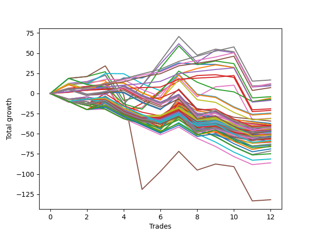

# Short Bulldog 006 
- Symbol: ES90d5m
- Date Range: 03/18/2022 - 07/08/2022
- Trading Period: 7:20-12:30
- Number of Trades: 12



| Name | Win Percent | Profit | Avg Profit / Trade |     | Name | Win Percent | Profit | Avg Profit / Trade |
| ---- | ----------- | ------ | ------------------ | --- | ---- | ----------- | ------ | ------------------ |
| Sorted By <br> Profit | | | | | Sorted By <br> Win Percentage ||||
| Seven | 58.33 | 12375.00 | 1031.25 |     | Zero | 75.00 | 4125.00 | 343.75 |
| Four | 58.33 | 12000.00 | 1000.00 |     | One | 66.67 | 10000.00 | 833.33 |
| One | 66.67 | 10000.00 | 833.33 |     | Three | 66.67 | 3125.00 | 260.42 |
| Two | 58.33 | 6250.00 | 520.83 |     | Seven | 58.33 | 12375.00 | 1031.25 |
| Zero | 75.00 | 4125.00 | 343.75 |     | Four | 58.33 | 12000.00 | 1000.00 |
| Three | 66.67 | 3125.00 | 260.42 |     | Two | 58.33 | 6250.00 | 520.83 |
| Six | 58.33 | -10000.00 | -833.33 |     | Six | 58.33 | -10000.00 | -833.33 |
| Five | 50.00 | -66500.00 | -5541.67 |     | Five | 50.00 | -66500.00 | -5541.67 |

### Test Zero
* Sell when price hits the middle line of the 20p bollinger
* No Stoploss
* Results:
```
Total Trades: 12
Percent Up: 25.00
Percent Down: 75.00
Total Points Moved Down: 8.25
Potential Profit: 4125.00
Total Points Ups: 55.50 Count Ups: 3
Total Points Downs: 63.75 Count Downs: 9
```

<details><summary>Trades</summary>

<code>In: 2022-04-06 10:55:00		Out: 2022-04-06 11:00:10		Total Position Time: 05:10		Total Move Down: 11.50		Total to Date: 11.50</code> <br />
<code>In: 2022-04-07 12:20:00		Out: 2022-04-07 12:50:00		Total Position Time: 30:00		Total Move Down: -0.00		Total to Date: 11.50</code> <br />
<code>In: 2022-04-20 10:50:00		Out: 2022-04-20 11:13:35		Total Position Time: 23:35		Total Move Down: 2.25		Total to Date: 13.75</code> <br />
<code>In: 2022-04-25 11:40:00		Out: 2022-04-25 12:07:25		Total Position Time: 27:25		Total Move Down: 10.50		Total to Date: 24.25</code> <br />
<code>In: 2022-05-04 09:45:00		Out: 2022-05-04 10:50:05		Total Position Time: 65:05		Total Move Down: 1.75		Total to Date: 26.00</code> <br />
<code>In: 2022-05-19 08:55:00		Out: 2022-05-19 09:34:10		Total Position Time: 39:10		Total Move Down: 10.25		Total to Date: 36.25</code> <br />
<code>In: 2022-05-19 12:10:00		Out: 2022-05-19 12:18:25		Total Position Time: 08:25		Total Move Down: 13.75		Total to Date: 50.00</code> <br />
<code>In: 2022-05-24 11:00:00		Out: 2022-05-24 11:48:35		Total Position Time: 48:35		Total Move Down: 5.25		Total to Date: 55.25</code> <br />
<code>In: 2022-05-31 09:10:00		Out: 2022-05-31 10:16:00		Total Position Time: 66:00		Total Move Down: 4.00		Total to Date: 59.25</code> <br />
<code>In: 2022-06-15 11:55:00		Out: 2022-06-15 12:50:00		Total Position Time: 55:00		Total Move Down: -13.00		Total to Date: 46.25</code> <br />
<code>In: 2022-07-05 10:45:00		Out: 2022-07-05 12:50:00		Total Position Time: 125:00		Total Move Down: -42.50		Total to Date: 3.75</code> <br />
<code>In: 2022-07-07 12:25:00		Out: 2022-07-07 12:38:25		Total Position Time: 13:25		Total Move Down: 4.50		Total to Date: 8.25</code> <br />


</details>

### Test One
* Sell when the price hits the upper line of the 20p 1std bollinger
* No Stoploss
* Results:
```
Total Trades: 12
Percent Up: 33.33
Percent Down: 66.67
Total Points Moved Down: 20.00
Potential Profit: 10000.00
Total Points Ups: 82.00 Count Ups: 4
Total Points Downs: 102.00 Count Downs: 8
```

<details><summary>Trades</summary>

<code>In: 2022-04-06 10:55:00		Out: 2022-04-06 11:09:45		Total Position Time: 14:45		Total Move Down: 16.00		Total to Date: 16.00</code> <br />
<code>In: 2022-04-07 12:20:00		Out: 2022-04-07 12:50:00		Total Position Time: 30:00		Total Move Down: -0.00		Total to Date: 16.00</code> <br />
<code>In: 2022-04-20 10:50:00		Out: 2022-04-20 11:17:15		Total Position Time: 27:15		Total Move Down: 5.25		Total to Date: 21.25</code> <br />
<code>In: 2022-04-25 11:40:00		Out: 2022-04-25 12:50:00		Total Position Time: 70:00		Total Move Down: -26.50		Total to Date: -5.25</code> <br />
<code>In: 2022-05-04 09:45:00		Out: 2022-05-04 11:07:25		Total Position Time: 82:25		Total Move Down: 4.50		Total to Date: -0.75</code> <br />
<code>In: 2022-05-19 08:55:00		Out: 2022-05-19 09:40:30		Total Position Time: 45:30		Total Move Down: 21.00		Total to Date: 20.25</code> <br />
<code>In: 2022-05-19 12:10:00		Out: 2022-05-19 12:24:50		Total Position Time: 14:50		Total Move Down: 23.50		Total to Date: 43.75</code> <br />
<code>In: 2022-05-24 11:00:00		Out: 2022-05-24 11:55:10		Total Position Time: 55:10		Total Move Down: 14.25		Total to Date: 58.00</code> <br />
<code>In: 2022-05-31 09:10:00		Out: 2022-05-31 10:23:00		Total Position Time: 73:00		Total Move Down: 10.00		Total to Date: 68.00</code> <br />
<code>In: 2022-06-15 11:55:00		Out: 2022-06-15 12:50:00		Total Position Time: 55:00		Total Move Down: -13.00		Total to Date: 55.00</code> <br />
<code>In: 2022-07-05 10:45:00		Out: 2022-07-05 12:50:00		Total Position Time: 125:00		Total Move Down: -42.50		Total to Date: 12.50</code> <br />
<code>In: 2022-07-07 12:25:00		Out: 2022-07-07 12:46:45		Total Position Time: 21:45		Total Move Down: 7.50		Total to Date: 20.00</code> <br />


</details>

### Test Two
* Sell when the price hits the upper line of the 20p 2std bollinger
* No Stoploss
* Results:
```
Total Trades: 12
Percent Up: 41.67
Percent Down: 58.33
Total Points Moved Down: 12.50
Potential Profit: 6250.00
Total Points Ups: 110.25 Count Ups: 5
Total Points Downs: 122.75 Count Downs: 7
```

<details><summary>Trades</summary>

<code>In: 2022-04-06 10:55:00		Out: 2022-04-06 11:15:15		Total Position Time: 20:15		Total Move Down: 24.50		Total to Date: 24.50</code> <br />
<code>In: 2022-04-07 12:20:00		Out: 2022-04-07 12:50:00		Total Position Time: 30:00		Total Move Down: -0.00		Total to Date: 24.50</code> <br />
<code>In: 2022-04-20 10:50:00		Out: 2022-04-20 11:18:30		Total Position Time: 28:30		Total Move Down: 7.50		Total to Date: 32.00</code> <br />
<code>In: 2022-04-25 11:40:00		Out: 2022-04-25 12:50:00		Total Position Time: 70:00		Total Move Down: -26.50		Total to Date: 5.50</code> <br />
<code>In: 2022-05-04 09:45:00		Out: 2022-05-04 11:07:40		Total Position Time: 82:40		Total Move Down: 8.25		Total to Date: 13.75</code> <br />
<code>In: 2022-05-19 08:55:00		Out: 2022-05-19 10:13:35		Total Position Time: 78:35		Total Move Down: 34.25		Total to Date: 48.00</code> <br />
<code>In: 2022-05-19 12:10:00		Out: 2022-05-19 12:36:30		Total Position Time: 26:30		Total Move Down: 33.25		Total to Date: 81.25</code> <br />
<code>In: 2022-05-24 11:00:00		Out: 2022-05-24 12:50:00		Total Position Time: 110:00		Total Move Down: -28.25		Total to Date: 53.00</code> <br />
<code>In: 2022-05-31 09:10:00		Out: 2022-05-31 11:46:00		Total Position Time: 156:00		Total Move Down: 11.25		Total to Date: 64.25</code> <br />
<code>In: 2022-06-15 11:55:00		Out: 2022-06-15 12:50:00		Total Position Time: 55:00		Total Move Down: -13.00		Total to Date: 51.25</code> <br />
<code>In: 2022-07-05 10:45:00		Out: 2022-07-05 12:50:00		Total Position Time: 125:00		Total Move Down: -42.50		Total to Date: 8.75</code> <br />
<code>In: 2022-07-07 12:25:00		Out: 2022-07-07 12:50:00		Total Position Time: 25:00		Total Move Down: 3.75		Total to Date: 12.50</code> <br />


</details>

### Test Three
* Sell when price hits the middle line of the 50p bollinger
* No Stoploss
* Results:
```
Total Trades: 12
Percent Up: 33.33
Percent Down: 66.67
Total Points Moved Down: 6.25
Potential Profit: 3125.00
Total Points Ups: 82.00 Count Ups: 4
Total Points Downs: 88.25 Count Downs: 8
```

<details><summary>Trades</summary>

<code>In: 2022-04-06 10:55:00		Out: 2022-04-06 11:08:35		Total Position Time: 13:35		Total Move Down: 11.50		Total to Date: 11.50</code> <br />
<code>In: 2022-04-07 12:20:00		Out: 2022-04-07 12:50:00		Total Position Time: 30:00		Total Move Down: -0.00		Total to Date: 11.50</code> <br />
<code>In: 2022-04-20 10:50:00		Out: 2022-04-20 11:17:40		Total Position Time: 27:40		Total Move Down: 5.50		Total to Date: 17.00</code> <br />
<code>In: 2022-04-25 11:40:00		Out: 2022-04-25 12:50:00		Total Position Time: 70:00		Total Move Down: -26.50		Total to Date: -9.50</code> <br />
<code>In: 2022-05-04 09:45:00		Out: 2022-05-04 11:20:50		Total Position Time: 95:50		Total Move Down: 14.00		Total to Date: 4.50</code> <br />
<code>In: 2022-05-19 08:55:00		Out: 2022-05-19 09:37:05		Total Position Time: 42:05		Total Move Down: 16.00		Total to Date: 20.50</code> <br />
<code>In: 2022-05-19 12:10:00		Out: 2022-05-19 12:21:15		Total Position Time: 11:15		Total Move Down: 16.25		Total to Date: 36.75</code> <br />
<code>In: 2022-05-24 11:00:00		Out: 2022-05-24 11:55:10		Total Position Time: 55:10		Total Move Down: 14.25		Total to Date: 51.00</code> <br />
<code>In: 2022-05-31 09:10:00		Out: 2022-05-31 11:45:05		Total Position Time: 155:05		Total Move Down: 7.00		Total to Date: 58.00</code> <br />
<code>In: 2022-06-15 11:55:00		Out: 2022-06-15 12:50:00		Total Position Time: 55:00		Total Move Down: -13.00		Total to Date: 45.00</code> <br />
<code>In: 2022-07-05 10:45:00		Out: 2022-07-05 12:50:00		Total Position Time: 125:00		Total Move Down: -42.50		Total to Date: 2.50</code> <br />
<code>In: 2022-07-07 12:25:00		Out: 2022-07-07 12:50:00		Total Position Time: 25:00		Total Move Down: 3.75		Total to Date: 6.25</code> <br />


</details>

### Test Four
* Sell when the price hits the upper line of the 50p 1std bollinger
* No Stoploss
* Results:
```
Total Trades: 12
Percent Up: 41.67
Percent Down: 58.33
Total Points Moved Down: 24.00
Potential Profit: 12000.00
Total Points Ups: 110.25 Count Ups: 5
Total Points Downs: 134.25 Count Downs: 7
```

<details><summary>Trades</summary>

<code>In: 2022-04-06 10:55:00		Out: 2022-04-06 11:11:20		Total Position Time: 16:20		Total Move Down: 17.50		Total to Date: 17.50</code> <br />
<code>In: 2022-04-07 12:20:00		Out: 2022-04-07 12:50:00		Total Position Time: 30:00		Total Move Down: -0.00		Total to Date: 17.50</code> <br />
<code>In: 2022-04-20 10:50:00		Out: 2022-04-20 11:25:50		Total Position Time: 35:50		Total Move Down: 10.00		Total to Date: 27.50</code> <br />
<code>In: 2022-04-25 11:40:00		Out: 2022-04-25 12:50:00		Total Position Time: 70:00		Total Move Down: -26.50		Total to Date: 1.00</code> <br />
<code>In: 2022-05-04 09:45:00		Out: 2022-05-04 11:34:10		Total Position Time: 109:10		Total Move Down: 25.50		Total to Date: 26.50</code> <br />
<code>In: 2022-05-19 08:55:00		Out: 2022-05-19 09:45:45		Total Position Time: 50:45		Total Move Down: 28.75		Total to Date: 55.25</code> <br />
<code>In: 2022-05-19 12:10:00		Out: 2022-05-19 12:30:05		Total Position Time: 20:05		Total Move Down: 29.25		Total to Date: 84.50</code> <br />
<code>In: 2022-05-24 11:00:00		Out: 2022-05-24 12:50:00		Total Position Time: 110:00		Total Move Down: -28.25		Total to Date: 56.25</code> <br />
<code>In: 2022-05-31 09:10:00		Out: 2022-05-31 11:54:40		Total Position Time: 164:40		Total Move Down: 19.50		Total to Date: 75.75</code> <br />
<code>In: 2022-06-15 11:55:00		Out: 2022-06-15 12:50:00		Total Position Time: 55:00		Total Move Down: -13.00		Total to Date: 62.75</code> <br />
<code>In: 2022-07-05 10:45:00		Out: 2022-07-05 12:50:00		Total Position Time: 125:00		Total Move Down: -42.50		Total to Date: 20.25</code> <br />
<code>In: 2022-07-07 12:25:00		Out: 2022-07-07 12:50:00		Total Position Time: 25:00		Total Move Down: 3.75		Total to Date: 24.00</code> <br />


</details>

### Test Five
* Sell when the price hits the upper line of the 50p 2std bollinger
* No Stoploss
* Results:
```
Total Trades: 12
Percent Up: 50.00
Percent Down: 50.00
Total Points Moved Down: -133.00
Potential Profit: -66500.00
Total Points Ups: 228.25 Count Ups: 6
Total Points Downs: 95.25 Count Downs: 6
```

<details><summary>Trades</summary>

<code>In: 2022-04-06 10:55:00		Out: 2022-04-06 11:15:05		Total Position Time: 20:05		Total Move Down: 23.75		Total to Date: 23.75</code> <br />
<code>In: 2022-04-07 12:20:00		Out: 2022-04-07 12:50:00		Total Position Time: 30:00		Total Move Down: -0.00		Total to Date: 23.75</code> <br />
<code>In: 2022-04-20 10:50:00		Out: 2022-04-20 11:35:45		Total Position Time: 45:45		Total Move Down: 15.75		Total to Date: 39.50</code> <br />
<code>In: 2022-04-25 11:40:00		Out: 2022-04-25 12:50:00		Total Position Time: 70:00		Total Move Down: -26.50		Total to Date: 13.00</code> <br />
<code>In: 2022-05-04 09:45:00		Out: 2022-05-04 12:50:00		Total Position Time: 185:00		Total Move Down: -118.00		Total to Date: -105.00</code> <br />
<code>In: 2022-05-19 08:55:00		Out: 2022-05-19 12:50:00		Total Position Time: 235:00		Total Move Down: 17.25		Total to Date: -87.75</code> <br />
<code>In: 2022-05-19 12:10:00		Out: 2022-05-19 12:50:00		Total Position Time: 40:00		Total Move Down: 22.75		Total to Date: -65.00</code> <br />
<code>In: 2022-05-24 11:00:00		Out: 2022-05-24 12:50:00		Total Position Time: 110:00		Total Move Down: -28.25		Total to Date: -93.25</code> <br />
<code>In: 2022-05-31 09:10:00		Out: 2022-05-31 12:50:00		Total Position Time: 220:00		Total Move Down: 12.00		Total to Date: -81.25</code> <br />
<code>In: 2022-06-15 11:55:00		Out: 2022-06-15 12:50:00		Total Position Time: 55:00		Total Move Down: -13.00		Total to Date: -94.25</code> <br />
<code>In: 2022-07-05 10:45:00		Out: 2022-07-05 12:50:00		Total Position Time: 125:00		Total Move Down: -42.50		Total to Date: -136.75</code> <br />
<code>In: 2022-07-07 12:25:00		Out: 2022-07-07 12:50:00		Total Position Time: 25:00		Total Move Down: 3.75		Total to Date: -133.00</code> <br />


</details>

### Test Six
* Sell when the price hits the middle line of the 1std VWAP
* No Stoploss
* Results:
```
Total Trades: 12
Percent Up: 41.67
Percent Down: 58.33
Total Points Moved Down: -20.00
Potential Profit: -10000.00
Total Points Ups: 110.25 Count Ups: 5
Total Points Downs: 90.25 Count Downs: 7
```

<details><summary>Trades</summary>

<code>In: 2022-04-06 10:55:00		Out: 2022-04-06 11:00:10		Total Position Time: 05:10		Total Move Down: 11.50		Total to Date: 11.50</code> <br />
<code>In: 2022-04-07 12:20:00		Out: 2022-04-07 12:50:00		Total Position Time: 30:00		Total Move Down: -0.00		Total to Date: 11.50</code> <br />
<code>In: 2022-04-20 10:50:00		Out: 2022-04-20 11:18:20		Total Position Time: 28:20		Total Move Down: 6.25		Total to Date: 17.75</code> <br />
<code>In: 2022-04-25 11:40:00		Out: 2022-04-25 12:50:00		Total Position Time: 70:00		Total Move Down: -26.50		Total to Date: -8.75</code> <br />
<code>In: 2022-05-04 09:45:00		Out: 2022-05-04 11:20:20		Total Position Time: 95:20		Total Move Down: 9.75		Total to Date: 1.00</code> <br />
<code>In: 2022-05-19 08:55:00		Out: 2022-05-19 09:39:15		Total Position Time: 44:15		Total Move Down: 19.25		Total to Date: 20.25</code> <br />
<code>In: 2022-05-19 12:10:00		Out: 2022-05-19 12:24:45		Total Position Time: 14:45		Total Move Down: 22.75		Total to Date: 43.00</code> <br />
<code>In: 2022-05-24 11:00:00		Out: 2022-05-24 12:50:00		Total Position Time: 110:00		Total Move Down: -28.25		Total to Date: 14.75</code> <br />
<code>In: 2022-05-31 09:10:00		Out: 2022-05-31 11:48:35		Total Position Time: 158:35		Total Move Down: 17.00		Total to Date: 31.75</code> <br />
<code>In: 2022-06-15 11:55:00		Out: 2022-06-15 12:50:00		Total Position Time: 55:00		Total Move Down: -13.00		Total to Date: 18.75</code> <br />
<code>In: 2022-07-05 10:45:00		Out: 2022-07-05 12:50:00		Total Position Time: 125:00		Total Move Down: -42.50		Total to Date: -23.75</code> <br />
<code>In: 2022-07-07 12:25:00		Out: 2022-07-07 12:50:00		Total Position Time: 25:00		Total Move Down: 3.75		Total to Date: -20.00</code> <br />


</details>

### Test Seven
* Sell when the price hits the upper line of the 1std VWAP
* No Stoploss
* Results:
```
Total Trades: 12
Percent Up: 41.67
Percent Down: 58.33
Total Points Moved Down: 24.75
Potential Profit: 12375.00
Total Points Ups: 110.25 Count Ups: 5
Total Points Downs: 135.00 Count Downs: 7
```

<details><summary>Trades</summary>

<code>In: 2022-04-06 10:55:00		Out: 2022-04-06 11:09:40		Total Position Time: 14:40		Total Move Down: 15.75		Total to Date: 15.75</code> <br />
<code>In: 2022-04-07 12:20:00		Out: 2022-04-07 12:50:00		Total Position Time: 30:00		Total Move Down: -0.00		Total to Date: 15.75</code> <br />
<code>In: 2022-04-20 10:50:00		Out: 2022-04-20 11:30:15		Total Position Time: 40:15		Total Move Down: 12.50		Total to Date: 28.25</code> <br />
<code>In: 2022-04-25 11:40:00		Out: 2022-04-25 12:50:00		Total Position Time: 70:00		Total Move Down: -26.50		Total to Date: 1.75</code> <br />
<code>In: 2022-05-04 09:45:00		Out: 2022-05-04 11:34:05		Total Position Time: 109:05		Total Move Down: 24.75		Total to Date: 26.50</code> <br />
<code>In: 2022-05-19 08:55:00		Out: 2022-05-19 09:47:35		Total Position Time: 52:35		Total Move Down: 31.50		Total to Date: 58.00</code> <br />
<code>In: 2022-05-19 12:10:00		Out: 2022-05-19 12:42:25		Total Position Time: 32:25		Total Move Down: 34.75		Total to Date: 92.75</code> <br />
<code>In: 2022-05-24 11:00:00		Out: 2022-05-24 12:50:00		Total Position Time: 110:00		Total Move Down: -28.25		Total to Date: 64.50</code> <br />
<code>In: 2022-05-31 09:10:00		Out: 2022-05-31 12:50:00		Total Position Time: 220:00		Total Move Down: 12.00		Total to Date: 76.50</code> <br />
<code>In: 2022-06-15 11:55:00		Out: 2022-06-15 12:50:00		Total Position Time: 55:00		Total Move Down: -13.00		Total to Date: 63.50</code> <br />
<code>In: 2022-07-05 10:45:00		Out: 2022-07-05 12:50:00		Total Position Time: 125:00		Total Move Down: -42.50		Total to Date: 21.00</code> <br />
<code>In: 2022-07-07 12:25:00		Out: 2022-07-07 12:50:00		Total Position Time: 25:00		Total Move Down: 3.75		Total to Date: 24.75</code> <br />


</details>