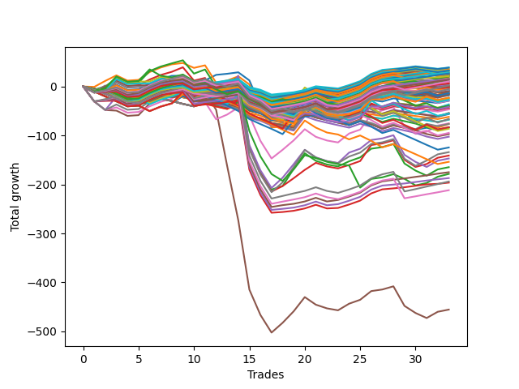

# Short Bulldog 005 
- Symbol: ES90d5m
- Date Range: 03/18/2022 - 07/08/2022
- Trading Period: 7:20-12:30
- Number of Trades: 33



| Name | Win Percent | Profit | Avg Profit / Trade | Avg Time / Trade |      | Name | Win Percent | Profit | Avg Profit / Trade | Avg Time / Trade |
| ---- | ----------- | ------ | ------------------ | ---------------- | ---- | ---- | ----------- | ------ | ------------------ | ---------------- |
| Sorted By <br> Profit | | | | | | Sorted By <br> Win Percentage ||||
| Ninety-Two | 60.61 | 19375.00 | 587.12 | 00:00 |     | One Hundred Twenty-Seven | 78.79 | 7750.00 | 234.85 | 00:00 |
| Ninety-Three | 57.58 | 19250.00 | 583.33 | 00:00 |     | One Hundred Twenty-Six | 78.79 | 3125.00 | 94.70 | 00:00 |
| Ninety-One | 60.61 | 18125.00 | 549.24 | 00:00 |     | Eighty-Three | 78.79 | -87500.00 | -2651.52 | 00:00 |
| Ninety-Four | 51.52 | 17375.00 | 526.52 | 00:00 |     | Eighty-Two | 78.79 | -93500.00 | -2833.33 | 00:00 |
| One Hundred Two | 60.61 | 16250.00 | 492.42 | 00:00 |     | Eighty-One | 78.79 | -98125.00 | -2973.48 | 00:00 |
| Ninety-Five | 45.45 | 16250.00 | 492.42 | 00:00 |     | One Hundred Twenty-Two | 75.76 | 14250.00 | 431.82 | 00:00 |
| One Hundred Three | 57.58 | 16125.00 | 488.64 | 00:00 |     | One Hundred Twenty-One | 75.76 | 10625.00 | 321.97 | 00:00 |
| One Hundred One | 60.61 | 15000.00 | 454.55 | 00:00 |     | One Hundred Twenty-Eight | 75.76 | 6875.00 | 208.33 | 00:00 |
| Ninety-Seven | 60.61 | 14375.00 | 435.61 | 00:00 |     | One Hundred Twenty-Three | 72.73 | 13250.00 | 401.52 | 00:00 |
| One Hundred Twenty-Two | 75.76 | 14250.00 | 431.82 | 00:00 |     | Eighty-Five | 72.73 | -97000.00 | -2939.39 | 00:00 |
| One Hundred Seven | 63.64 | 13750.00 | 416.67 | 00:00 |     | Eighty-Four | 72.73 | -105875.00 | -3208.33 | 00:00 |
| One Hundred Twelve | 63.64 | 13500.00 | 409.09 | 00:00 |     | One Hundred Twenty-Nine | 69.70 | 5125.00 | 155.30 | 00:00 |
| One Hundred Twenty-Three | 72.73 | 13250.00 | 401.52 | 00:00 |     | One Hundred Twenty-Four | 66.67 | 8500.00 | 257.58 | 00:00 |
| Ninety-Six | 60.61 | 13125.00 | 397.73 | 00:00 |     | One | 66.67 | -4625.00 | -140.15 | 00:00 |
| One Hundred Four | 51.52 | 13000.00 | 393.94 | 00:00 |     | Zero | 66.67 | -28125.00 | -852.27 | 00:00 |
| One Hundred Fourteen | 57.58 | 12875.00 | 390.15 | 00:00 |     | Three | 66.67 | -70500.00 | -2136.36 | 00:00 |
| One Hundred Six | 63.64 | 12500.00 | 378.79 | 00:00 |     | One Hundred Seven | 63.64 | 13750.00 | 416.67 | 00:00 |
| One Hundred Thirteen | 60.61 | 12375.00 | 375.00 | 00:00 |     | One Hundred Twelve | 63.64 | 13500.00 | 409.09 | 00:00 |
| One Hundred Eleven | 63.64 | 12250.00 | 371.21 | 00:00 |     | One Hundred Six | 63.64 | 12500.00 | 378.79 | 00:00 |
| Ninety-Eight | 57.58 | 12250.00 | 371.21 | 00:00 |     | One Hundred Eleven | 63.64 | 12250.00 | 371.21 | 00:00 |
| One Hundred Eight | 57.58 | 11250.00 | 340.91 | 00:00 |     | One Hundred Twenty-Five | 63.64 | 7750.00 | 234.85 | 00:00 |
| One Hundred Five | 45.45 | 10750.00 | 325.76 | 00:00 |     | One Hundred Thirty | 63.64 | 1125.00 | 34.09 | 00:00 |
| One Hundred Twenty-One | 75.76 | 10625.00 | 321.97 | 00:00 |     | One Hundred Seventeen | 63.64 | 750.00 | 22.73 | 00:00 |
| One Hundred Fifteen | 51.52 | 9750.00 | 295.45 | 00:00 |     | One Hundred Sixteen | 63.64 | -500.00 | -15.15 | 00:00 |
| One Hundred Twenty-Four | 66.67 | 8500.00 | 257.58 | 00:00 |     | Ninety-Two | 60.61 | 19375.00 | 587.12 | 00:00 |
| One Hundred Twenty-Seven | 78.79 | 7750.00 | 234.85 | 00:00 |     | Ninety-One | 60.61 | 18125.00 | 549.24 | 00:00 |
| One Hundred Twenty-Five | 63.64 | 7750.00 | 234.85 | 00:00 |     | One Hundred Two | 60.61 | 16250.00 | 492.42 | 00:00 |
| Ninety-Nine | 57.58 | 7625.00 | 231.06 | 00:00 |     | One Hundred One | 60.61 | 15000.00 | 454.55 | 00:00 |
| Fourteen | 24.24 | 7125.00 | 215.91 | 00:00 |     | Ninety-Seven | 60.61 | 14375.00 | 435.61 | 00:00 |
| One Hundred Twenty-Eight | 75.76 | 6875.00 | 208.33 | 00:00 |     | Ninety-Six | 60.61 | 13125.00 | 397.73 | 00:00 |
| One Hundred Ten | 51.52 | 5250.00 | 159.09 | 00:00 |     | One Hundred Thirteen | 60.61 | 12375.00 | 375.00 | 00:00 |
| One Hundred Twenty-Nine | 69.70 | 5125.00 | 155.30 | 00:00 |     | One Hundred Eighteen | 60.61 | 625.00 | 18.94 | 00:00 |
| One Hundred | 57.58 | 4750.00 | 143.94 | 00:00 |     | Six | 60.61 | -37625.00 | -1140.15 | 00:00 |
| One Hundred Nine | 51.52 | 3875.00 | 117.42 | 00:00 |     | Seven | 60.61 | -67000.00 | -2030.30 | 00:00 |
| Sixten | 57.58 | 3500.00 | 106.06 | 00:00 |     | Two | 60.61 | -82375.00 | -2496.21 | 00:00 |
| One Hundred Twenty-Six | 78.79 | 3125.00 | 94.70 | 00:00 |     | Ninety-Three | 57.58 | 19250.00 | 583.33 | 00:00 |
| Twenty-Two | 57.58 | 2625.00 | 79.55 | 00:00 |     | One Hundred Three | 57.58 | 16125.00 | 488.64 | 00:00 |
| Fifty-Four | 42.42 | 1500.00 | 45.45 | 00:00 |     | One Hundred Fourteen | 57.58 | 12875.00 | 390.15 | 00:00 |
| One Hundred Thirty | 63.64 | 1125.00 | 34.09 | 00:00 |     | Ninety-Eight | 57.58 | 12250.00 | 371.21 | 00:00 |
| One Hundred Seventeen | 63.64 | 750.00 | 22.73 | 00:00 |     | One Hundred Eight | 57.58 | 11250.00 | 340.91 | 00:00 |
| One Hundred Eighteen | 60.61 | 625.00 | 18.94 | 00:00 |     | Ninety-Nine | 57.58 | 7625.00 | 231.06 | 00:00 |
| Forty-Eight | 42.42 | 500.00 | 15.15 | 00:00 |     | One Hundred | 57.58 | 4750.00 | 143.94 | 00:00 |
| Thirty-Two | 51.52 | -0.00 | -0.00 | 00:00 |     | Sixten | 57.58 | 3500.00 | 106.06 | 00:00 |
| Thirty-Eight | 51.52 | -375.00 | -11.36 | 00:00 |     | Twenty-Two | 57.58 | 2625.00 | 79.55 | 00:00 |
| One Hundred Sixteen | 63.64 | -500.00 | -15.15 | 00:00 |     | Seventeen | 57.58 | -1750.00 | -53.03 | 00:00 |
| Eleven | 21.21 | -500.00 | -15.15 | 00:00 |     | Twenty-Three | 57.58 | -3750.00 | -113.64 | 00:00 |
| Thirty | 24.24 | -1375.00 | -41.67 | 00:00 |     | Twenty-One | 57.58 | -3750.00 | -113.64 | 00:00 |
| Seventeen | 57.58 | -1750.00 | -53.03 | 00:00 |     | Twenty | 57.58 | -3750.00 | -113.64 | 00:00 |
| Thirty-Three | 51.52 | -1875.00 | -56.82 | 00:00 |     | Nineteen | 57.58 | -3750.00 | -113.64 | 00:00 |
| Fifty-One | 42.42 | -2500.00 | -75.76 | 00:00 |     | Eighteen | 57.58 | -3750.00 | -113.64 | 00:00 |
| One Hundred Twenty | 45.45 | -2625.00 | -79.55 | 00:00 |     | Four | 57.58 | -73500.00 | -2227.27 | 00:00 |
| One Hundred Ninteen | 51.52 | -2875.00 | -87.12 | 00:00 |     | Ninety-Four | 51.52 | 17375.00 | 526.52 | 00:00 |
| Thirty-Nine | 51.52 | -3500.00 | -106.06 | 00:00 |     | One Hundred Four | 51.52 | 13000.00 | 393.94 | 00:00 |
| Twenty-Three | 57.58 | -3750.00 | -113.64 | 00:00 |     | One Hundred Fifteen | 51.52 | 9750.00 | 295.45 | 00:00 |
| Twenty-One | 57.58 | -3750.00 | -113.64 | 00:00 |     | One Hundred Ten | 51.52 | 5250.00 | 159.09 | 00:00 |
| Twenty | 57.58 | -3750.00 | -113.64 | 00:00 |     | One Hundred Nine | 51.52 | 3875.00 | 117.42 | 00:00 |
| Nineteen | 57.58 | -3750.00 | -113.64 | 00:00 |     | Thirty-Two | 51.52 | -0.00 | -0.00 | 00:00 |
| Eighteen | 57.58 | -3750.00 | -113.64 | 00:00 |     | Thirty-Eight | 51.52 | -375.00 | -11.36 | 00:00 |
| Forty-Nine | 42.42 | -4375.00 | -132.58 | 00:00 |     | Thirty-Three | 51.52 | -1875.00 | -56.82 | 00:00 |
| One | 66.67 | -4625.00 | -140.15 | 00:00 |     | One Hundred Ninteen | 51.52 | -2875.00 | -87.12 | 00:00 |
| Fifty-Five | 42.42 | -4875.00 | -147.73 | 00:00 |     | Thirty-Nine | 51.52 | -3500.00 | -106.06 | 00:00 |
| Thirty-Seven | 51.52 | -5000.00 | -151.52 | 00:00 |     | Thirty-Seven | 51.52 | -5000.00 | -151.52 | 00:00 |
| Thirty-Six | 51.52 | -5000.00 | -151.52 | 00:00 |     | Thirty-Six | 51.52 | -5000.00 | -151.52 | 00:00 |
| Thirty-Four | 51.52 | -5000.00 | -151.52 | 00:00 |     | Thirty-Four | 51.52 | -5000.00 | -151.52 | 00:00 |
| Thirty-Five | 51.52 | -5875.00 | -178.03 | 00:00 |     | Thirty-Five | 51.52 | -5875.00 | -178.03 | 00:00 |
| Seventy | 42.42 | -6875.00 | -208.33 | 00:00 |     | Five | 48.48 | -227750.00 | -6901.52 | 00:00 |
| Fifty-Three | 42.42 | -7375.00 | -223.48 | 00:00 |     | Ninety-Five | 45.45 | 16250.00 | 492.42 | 00:00 |
| Fifty-Two | 42.42 | -7375.00 | -223.48 | 00:00 |     | One Hundred Five | 45.45 | 10750.00 | 325.76 | 00:00 |
| Sixty-Five | 42.42 | -7750.00 | -234.85 | 00:00 |     | One Hundred Twenty | 45.45 | -2625.00 | -79.55 | 00:00 |
| Fifty | 42.42 | -8750.00 | -265.15 | 00:00 |     | Fifty-Six | 45.45 | -47375.00 | -1435.61 | 00:00 |
| twenty-Seven | 21.21 | -9000.00 | -272.73 | 00:00 |     | Fifty-Four | 42.42 | 1500.00 | 45.45 | 00:00 |
| Seventy-One | 42.42 | -11375.00 | -344.70 | 00:00 |     | Forty-Eight | 42.42 | 500.00 | 15.15 | 00:00 |
| Sixty-Seven | 42.42 | -11625.00 | -352.27 | 00:00 |     | Fifty-One | 42.42 | -2500.00 | -75.76 | 00:00 |
| Sixty-Eight | 42.42 | -12000.00 | -363.64 | 00:00 |     | Forty-Nine | 42.42 | -4375.00 | -132.58 | 00:00 |
| Forty-Six | 30.30 | -12625.00 | -382.58 | 00:00 |     | Fifty-Five | 42.42 | -4875.00 | -147.73 | 00:00 |
| Sixty-Nine | 42.42 | -13625.00 | -412.88 | 00:00 |     | Seventy | 42.42 | -6875.00 | -208.33 | 00:00 |
| Sixty-Six | 42.42 | -14375.00 | -435.61 | 00:00 |     | Fifty-Three | 42.42 | -7375.00 | -223.48 | 00:00 |
| Ten | 18.18 | -14625.00 | -443.18 | 00:00 |     | Fifty-Two | 42.42 | -7375.00 | -223.48 | 00:00 |
| Nine | 18.18 | -18250.00 | -553.03 | 00:00 |     | Sixty-Five | 42.42 | -7750.00 | -234.85 | 00:00 |
| Eight | 21.21 | -18875.00 | -571.97 | 00:00 |     | Fifty | 42.42 | -8750.00 | -265.15 | 00:00 |
| Fifteen | 15.15 | -19750.00 | -598.48 | 00:00 |     | Seventy-One | 42.42 | -11375.00 | -344.70 | 00:00 |
| Sixty-Two | 42.42 | -19875.00 | -602.27 | 00:00 |     | Sixty-Seven | 42.42 | -11625.00 | -352.27 | 00:00 |
| Forty-Three | 27.27 | -20625.00 | -625.00 | 00:00 |     | Sixty-Eight | 42.42 | -12000.00 | -363.64 | 00:00 |
| Sixty-Four | 42.42 | -20750.00 | -628.79 | 00:00 |     | Sixty-Nine | 42.42 | -13625.00 | -412.88 | 00:00 |
| Twelve | 15.15 | -22500.00 | -681.82 | 00:00 |     | Sixty-Six | 42.42 | -14375.00 | -435.61 | 00:00 |
| Thirteen | 15.15 | -22625.00 | -685.61 | 00:00 |     | Sixty-Two | 42.42 | -19875.00 | -602.27 | 00:00 |
| Twenty-Six | 18.18 | -23375.00 | -708.33 | 00:00 |     | Sixty-Four | 42.42 | -20750.00 | -628.79 | 00:00 |
| Twenty-Five | 18.18 | -27000.00 | -818.18 | 00:00 |     | Fifty-Nine | 42.42 | -27625.00 | -837.12 | 00:00 |
| Fifty-Nine | 42.42 | -27625.00 | -837.12 | 00:00 |     | Fifty-Seven | 42.42 | -33125.00 | -1003.79 | 00:00 |
| Twenty-Four | 21.21 | -27625.00 | -837.12 | 00:00 |     | Seventy-Three | 42.42 | -89250.00 | -2704.55 | 00:00 |
| Zero | 66.67 | -28125.00 | -852.27 | 00:00 |     | Fifty-Eight | 36.36 | -43125.00 | -1306.82 | 00:00 |
| Thirty-One | 15.15 | -31000.00 | -939.39 | 00:00 |     | Sixty-Three | 33.33 | -41500.00 | -1257.58 | 00:00 |
| Fifty-Seven | 42.42 | -33125.00 | -1003.79 | 00:00 |     | Forty-Six | 30.30 | -12625.00 | -382.58 | 00:00 |
| Twenty-Eight | 15.15 | -33750.00 | -1022.73 | 00:00 |     | Sixty | 30.30 | -62250.00 | -1886.36 | 00:00 |
| Twenty-Nine | 15.15 | -33875.00 | -1026.52 | 00:00 |     | Forty-Three | 27.27 | -20625.00 | -625.00 | 00:00 |
| Six | 60.61 | -37625.00 | -1140.15 | 00:00 |     | Forty | 27.27 | -41875.00 | -1268.94 | 00:00 |
| Forty-One | 24.24 | -38250.00 | -1159.09 | 00:00 |     | Sixty-One | 27.27 | -76875.00 | -2329.55 | 00:00 |
| Forty-Seven | 21.21 | -38250.00 | -1159.09 | 00:00 |     | Fourteen | 24.24 | 7125.00 | 215.91 | 00:00 |
| Sixty-Three | 33.33 | -41500.00 | -1257.58 | 00:00 |     | Thirty | 24.24 | -1375.00 | -41.67 | 00:00 |
| Forty-Two | 21.21 | -41750.00 | -1265.15 | 00:00 |     | Forty-One | 24.24 | -38250.00 | -1159.09 | 00:00 |
| Forty | 27.27 | -41875.00 | -1268.94 | 00:00 |     | Eleven | 21.21 | -500.00 | -15.15 | 00:00 |
| Fifty-Eight | 36.36 | -43125.00 | -1306.82 | 00:00 |     | twenty-Seven | 21.21 | -9000.00 | -272.73 | 00:00 |
| Fifty-Six | 45.45 | -47375.00 | -1435.61 | 00:00 |     | Eight | 21.21 | -18875.00 | -571.97 | 00:00 |
| Forty-Five | 18.18 | -48625.00 | -1473.48 | 00:00 |     | Twenty-Four | 21.21 | -27625.00 | -837.12 | 00:00 |
| Forty-Four | 18.18 | -51250.00 | -1553.03 | 00:00 |     | Forty-Seven | 21.21 | -38250.00 | -1159.09 | 00:00 |
| Sixty | 30.30 | -62250.00 | -1886.36 | 00:00 |     | Forty-Two | 21.21 | -41750.00 | -1265.15 | 00:00 |
| Seven | 60.61 | -67000.00 | -2030.30 | 00:00 |     | Ten | 18.18 | -14625.00 | -443.18 | 00:00 |
| Three | 66.67 | -70500.00 | -2136.36 | 00:00 |     | Nine | 18.18 | -18250.00 | -553.03 | 00:00 |
| Four | 57.58 | -73500.00 | -2227.27 | 00:00 |     | Twenty-Six | 18.18 | -23375.00 | -708.33 | 00:00 |
| Sixty-One | 27.27 | -76875.00 | -2329.55 | 00:00 |     | Twenty-Five | 18.18 | -27000.00 | -818.18 | 00:00 |
| Two | 60.61 | -82375.00 | -2496.21 | 00:00 |     | Forty-Five | 18.18 | -48625.00 | -1473.48 | 00:00 |
| Eighty-Three | 78.79 | -87500.00 | -2651.52 | 00:00 |     | Forty-Four | 18.18 | -51250.00 | -1553.03 | 00:00 |
| Seventy-Three | 42.42 | -89250.00 | -2704.55 | 00:00 |     | Fifteen | 15.15 | -19750.00 | -598.48 | 00:00 |
| Eighty-Two | 78.79 | -93500.00 | -2833.33 | 00:00 |     | Twelve | 15.15 | -22500.00 | -681.82 | 00:00 |
| Eighty-Five | 72.73 | -97000.00 | -2939.39 | 00:00 |     | Thirteen | 15.15 | -22625.00 | -685.61 | 00:00 |
| Eighty-One | 78.79 | -98125.00 | -2973.48 | 00:00 |     | Thirty-One | 15.15 | -31000.00 | -939.39 | 00:00 |
| Eighty-Four | 72.73 | -105875.00 | -3208.33 | 00:00 |     | Twenty-Eight | 15.15 | -33750.00 | -1022.73 | 00:00 |
| Five | 48.48 | -227750.00 | -6901.52 | 00:00 |     | Twenty-Nine | 15.15 | -33875.00 | -1026.52 | 00:00 |

## NO STOPLOSS

### Test Zero
* Sell when price hits the middle line of the 20p bollinger
* No Stoploss
* Results:
```
Total Trades: 33
Percent Up: 33.33
Percent Down: 66.67
Total Points Moved Down: -56.25
Potential Profit: -28125.00
Total Points Ups: 200.00 Count Ups: 11
Total Points Downs: 143.75 Count Downs: 22
```

<details><summary>Trades</summary>

<code>In: 2022-03-24 08:10:00		Out: 2022-03-24 09:25:05		Total Position Time: 75:05		Total Move Down: -7.25		Total to Date: -7.25</code> <br />
<code>In: 2022-03-24 08:35:00		Out: 2022-03-24 09:25:05		Total Position Time: 50:05		Total Move Down: 5.75		Total to Date: -1.50</code> <br />
<code>In: 2022-03-25 07:30:00		Out: 2022-03-25 08:08:15		Total Position Time: 38:15		Total Move Down: 5.25		Total to Date: 3.75</code> <br />
<code>In: 2022-03-28 12:05:00		Out: 2022-03-28 12:55:00		Total Position Time: 50:00		Total Move Down: -10.75		Total to Date: -7.00</code> <br />
<code>In: 2022-03-29 12:15:00		Out: 2022-03-29 12:55:00		Total Position Time: 40:00		Total Move Down: 1.50		Total to Date: -5.50</code> <br />
<code>In: 2022-04-06 10:55:00		Out: 2022-04-06 11:00:10		Total Position Time: 05:10		Total Move Down: 11.50		Total to Date: 6.00</code> <br />
<code>In: 2022-04-06 11:10:00		Out: 2022-04-06 11:15:10		Total Position Time: 05:10		Total Move Down: 9.25		Total to Date: 15.25</code> <br />
<code>In: 2022-04-07 12:20:00		Out: 2022-04-07 12:55:00		Total Position Time: 35:00		Total Move Down: 6.50		Total to Date: 21.75</code> <br />
<code>In: 2022-04-08 08:10:00		Out: 2022-04-08 09:49:25		Total Position Time: 99:25		Total Move Down: 0.25		Total to Date: 22.00</code> <br />
<code>In: 2022-04-13 08:10:00		Out: 2022-04-13 10:35:20		Total Position Time: 145:20		Total Move Down: -12.75		Total to Date: 9.25</code> <br />
<code>In: 2022-04-20 10:50:00		Out: 2022-04-20 11:13:55		Total Position Time: 23:55		Total Move Down: 3.25		Total to Date: 12.50</code> <br />
<code>In: 2022-04-25 11:40:00		Out: 2022-04-25 12:07:30		Total Position Time: 27:30		Total Move Down: 11.25		Total to Date: 23.75</code> <br />
<code>In: 2022-05-04 09:45:00		Out: 2022-05-04 11:00:25		Total Position Time: 75:25		Total Move Down: 2.25		Total to Date: 26.00</code> <br />
<code>In: 2022-05-04 11:10:00		Out: 2022-05-04 11:15:10		Total Position Time: 05:10		Total Move Down: 3.00		Total to Date: 29.00</code> <br />
<code>In: 2022-05-04 11:35:00		Out: 2022-05-04 11:40:10		Total Position Time: 05:10		Total Move Down: -16.50		Total to Date: 12.50</code> <br />
<code>In: 2022-05-04 12:00:00		Out: 2022-05-04 12:55:00		Total Position Time: 55:00		Total Move Down: -51.75		Total to Date: -39.25</code> <br />
<code>In: 2022-05-04 12:20:00		Out: 2022-05-04 12:55:00		Total Position Time: 35:00		Total Move Down: -36.00		Total to Date: -75.25</code> <br />
<code>In: 2022-05-16 10:40:00		Out: 2022-05-16 12:10:00		Total Position Time: 90:00		Total Move Down: -2.25		Total to Date: -77.50</code> <br />
<code>In: 2022-05-19 08:55:00		Out: 2022-05-19 09:35:15		Total Position Time: 40:15		Total Move Down: 10.00		Total to Date: -67.50</code> <br />
<code>In: 2022-05-19 12:10:00		Out: 2022-05-19 12:18:25		Total Position Time: 08:25		Total Move Down: 13.75		Total to Date: -53.75</code> <br />
<code>In: 2022-05-24 11:00:00		Out: 2022-05-24 11:48:40		Total Position Time: 48:40		Total Move Down: 6.25		Total to Date: -47.50</code> <br />
<code>In: 2022-05-25 11:40:00		Out: 2022-05-25 12:50:05		Total Position Time: 70:05		Total Move Down: -4.25		Total to Date: -51.75</code> <br />
<code>In: 2022-05-27 12:15:00		Out: 2022-05-27 12:55:00		Total Position Time: 40:00		Total Move Down: -4.00		Total to Date: -55.75</code> <br />
<code>In: 2022-05-31 09:10:00		Out: 2022-05-31 10:16:30		Total Position Time: 66:30		Total Move Down: 5.75		Total to Date: -50.00</code> <br />
<code>In: 2022-06-15 11:05:00		Out: 2022-06-15 11:10:10		Total Position Time: 05:10		Total Move Down: 8.00		Total to Date: -42.00</code> <br />
<code>In: 2022-06-15 11:50:00		Out: 2022-06-15 12:50:25		Total Position Time: 60:25		Total Move Down: 17.25		Total to Date: -24.75</code> <br />
<code>In: 2022-06-15 11:55:00		Out: 2022-06-15 12:50:25		Total Position Time: 55:25		Total Move Down: 2.75		Total to Date: -22.00</code> <br />
<code>In: 2022-06-21 12:10:00		Out: 2022-06-21 12:35:35		Total Position Time: 25:35		Total Move Down: 7.75		Total to Date: -14.25</code> <br />
<code>In: 2022-07-05 10:45:00		Out: 2022-07-05 12:55:00		Total Position Time: 130:00		Total Move Down: -40.00		Total to Date: -54.25</code> <br />
<code>In: 2022-07-05 11:45:00		Out: 2022-07-05 12:55:00		Total Position Time: 70:00		Total Move Down: -14.50		Total to Date: -68.75</code> <br />
<code>In: 2022-07-06 11:05:00		Out: 2022-07-06 11:11:35		Total Position Time: 06:35		Total Move Down: 4.25		Total to Date: -64.50</code> <br />
<code>In: 2022-07-06 11:50:00		Out: 2022-07-06 12:50:45		Total Position Time: 60:45		Total Move Down: 3.00		Total to Date: -61.50</code> <br />
<code>In: 2022-07-07 12:25:00		Out: 2022-07-07 12:38:40		Total Position Time: 13:40		Total Move Down: 5.25		Total to Date: -56.25</code> <br />


</details>

### Test One
* Sell when the price hits the upper line of the 20p 1std bollinger
* No Stoploss
* Results:
```
Total Trades: 33
Percent Up: 33.33
Percent Down: 66.67
Total Points Moved Down: -9.25
Potential Profit: -4625.00
Total Points Ups: 227.25 Count Ups: 11
Total Points Downs: 218.00 Count Downs: 22
```

<details><summary>Trades</summary>

<code>In: 2022-03-24 08:10:00		Out: 2022-03-24 09:34:05		Total Position Time: 84:05		Total Move Down: -0.75		Total to Date: -0.75</code> <br />
<code>In: 2022-03-24 08:35:00		Out: 2022-03-24 09:34:05		Total Position Time: 59:05		Total Move Down: 12.25		Total to Date: 11.50</code> <br />
<code>In: 2022-03-25 07:30:00		Out: 2022-03-25 08:09:20		Total Position Time: 39:20		Total Move Down: 11.25		Total to Date: 22.75</code> <br />
<code>In: 2022-03-28 12:05:00		Out: 2022-03-28 12:55:00		Total Position Time: 50:00		Total Move Down: -10.75		Total to Date: 12.00</code> <br />
<code>In: 2022-03-29 12:15:00		Out: 2022-03-29 12:55:00		Total Position Time: 40:00		Total Move Down: 1.50		Total to Date: 13.50</code> <br />
<code>In: 2022-04-06 10:55:00		Out: 2022-04-06 11:10:05		Total Position Time: 15:05		Total Move Down: 16.00		Total to Date: 29.50</code> <br />
<code>In: 2022-04-06 11:10:00		Out: 2022-04-06 11:15:10		Total Position Time: 05:10		Total Move Down: 9.25		Total to Date: 38.75</code> <br />
<code>In: 2022-04-07 12:20:00		Out: 2022-04-07 12:55:00		Total Position Time: 35:00		Total Move Down: 6.50		Total to Date: 45.25</code> <br />
<code>In: 2022-04-08 08:10:00		Out: 2022-04-08 10:15:35		Total Position Time: 125:35		Total Move Down: 2.75		Total to Date: 48.00</code> <br />
<code>In: 2022-04-13 08:10:00		Out: 2022-04-13 10:47:30		Total Position Time: 157:30		Total Move Down: -10.00		Total to Date: 38.00</code> <br />
<code>In: 2022-04-20 10:50:00		Out: 2022-04-20 11:17:15		Total Position Time: 27:15		Total Move Down: 5.25		Total to Date: 43.25</code> <br />
<code>In: 2022-04-25 11:40:00		Out: 2022-04-25 12:55:00		Total Position Time: 75:00		Total Move Down: -35.50		Total to Date: 7.75</code> <br />
<code>In: 2022-05-04 09:45:00		Out: 2022-05-04 11:07:25		Total Position Time: 82:25		Total Move Down: 4.50		Total to Date: 12.25</code> <br />
<code>In: 2022-05-04 11:10:00		Out: 2022-05-04 11:18:20		Total Position Time: 08:20		Total Move Down: 8.50		Total to Date: 20.75</code> <br />
<code>In: 2022-05-04 11:35:00		Out: 2022-05-04 11:40:10		Total Position Time: 05:10		Total Move Down: -16.50		Total to Date: 4.25</code> <br />
<code>In: 2022-05-04 12:00:00		Out: 2022-05-04 12:55:00		Total Position Time: 55:00		Total Move Down: -51.75		Total to Date: -47.50</code> <br />
<code>In: 2022-05-04 12:20:00		Out: 2022-05-04 12:55:00		Total Position Time: 35:00		Total Move Down: -36.00		Total to Date: -83.50</code> <br />
<code>In: 2022-05-16 10:40:00		Out: 2022-05-16 12:10:10		Total Position Time: 90:10		Total Move Down: 1.25		Total to Date: -82.25</code> <br />
<code>In: 2022-05-19 08:55:00		Out: 2022-05-19 09:40:45		Total Position Time: 45:45		Total Move Down: 22.75		Total to Date: -59.50</code> <br />
<code>In: 2022-05-19 12:10:00		Out: 2022-05-19 12:25:05		Total Position Time: 15:05		Total Move Down: 24.25		Total to Date: -35.25</code> <br />
<code>In: 2022-05-24 11:00:00		Out: 2022-05-24 11:55:15		Total Position Time: 55:15		Total Move Down: 14.50		Total to Date: -20.75</code> <br />
<code>In: 2022-05-25 11:40:00		Out: 2022-05-25 12:55:00		Total Position Time: 75:00		Total Move Down: -7.50		Total to Date: -28.25</code> <br />
<code>In: 2022-05-27 12:15:00		Out: 2022-05-27 12:55:00		Total Position Time: 40:00		Total Move Down: -4.00		Total to Date: -32.25</code> <br />
<code>In: 2022-05-31 09:10:00		Out: 2022-05-31 10:28:50		Total Position Time: 78:50		Total Move Down: 10.50		Total to Date: -21.75</code> <br />
<code>In: 2022-06-15 11:05:00		Out: 2022-06-15 11:10:10		Total Position Time: 05:10		Total Move Down: 8.00		Total to Date: -13.75</code> <br />
<code>In: 2022-06-15 11:50:00		Out: 2022-06-15 12:55:00		Total Position Time: 65:00		Total Move Down: 17.75		Total to Date: 4.00</code> <br />
<code>In: 2022-06-15 11:55:00		Out: 2022-06-15 12:55:00		Total Position Time: 60:00		Total Move Down: 3.25		Total to Date: 7.25</code> <br />
<code>In: 2022-06-21 12:10:00		Out: 2022-06-21 12:55:00		Total Position Time: 45:00		Total Move Down: 6.50		Total to Date: 13.75</code> <br />
<code>In: 2022-07-05 10:45:00		Out: 2022-07-05 12:55:00		Total Position Time: 130:00		Total Move Down: -40.00		Total to Date: -26.25</code> <br />
<code>In: 2022-07-05 11:45:00		Out: 2022-07-05 12:55:00		Total Position Time: 70:00		Total Move Down: -14.50		Total to Date: -40.75</code> <br />
<code>In: 2022-07-06 11:05:00		Out: 2022-07-06 11:12:15		Total Position Time: 07:15		Total Move Down: 10.00		Total to Date: -30.75</code> <br />
<code>In: 2022-07-06 11:50:00		Out: 2022-07-06 12:53:30		Total Position Time: 63:30		Total Move Down: 14.00		Total to Date: -16.75</code> <br />
<code>In: 2022-07-07 12:25:00		Out: 2022-07-07 12:54:30		Total Position Time: 29:30		Total Move Down: 7.50		Total to Date: -9.25</code> <br />


</details>

### Test Two
* Sell when the price hits the upper line of the 20p 2std bollinger
* No Stoploss
* Results:
```
Total Trades: 33
Percent Up: 39.39
Percent Down: 60.61
Total Points Moved Down: -164.75
Potential Profit: -82375.00
Total Points Ups: 401.00 Count Ups: 13
Total Points Downs: 236.25 Count Downs: 20
```

<details><summary>Trades</summary>

<code>In: 2022-03-24 08:10:00		Out: 2022-03-24 11:48:20		Total Position Time: 218:20		Total Move Down: -6.50		Total to Date: -6.50</code> <br />
<code>In: 2022-03-24 08:35:00		Out: 2022-03-24 11:48:20		Total Position Time: 193:20		Total Move Down: 6.50		Total to Date: 0.00</code> <br />
<code>In: 2022-03-25 07:30:00		Out: 2022-03-25 08:10:45		Total Position Time: 40:45		Total Move Down: 17.00		Total to Date: 17.00</code> <br />
<code>In: 2022-03-28 12:05:00		Out: 2022-03-28 12:55:00		Total Position Time: 50:00		Total Move Down: -10.75		Total to Date: 6.25</code> <br />
<code>In: 2022-03-29 12:15:00		Out: 2022-03-29 12:55:00		Total Position Time: 40:00		Total Move Down: 1.50		Total to Date: 7.75</code> <br />
<code>In: 2022-04-06 10:55:00		Out: 2022-04-06 11:15:05		Total Position Time: 20:05		Total Move Down: 23.75		Total to Date: 31.50</code> <br />
<code>In: 2022-04-06 11:10:00		Out: 2022-04-06 11:15:10		Total Position Time: 05:10		Total Move Down: 9.25		Total to Date: 40.75</code> <br />
<code>In: 2022-04-07 12:20:00		Out: 2022-04-07 12:55:00		Total Position Time: 35:00		Total Move Down: 6.50		Total to Date: 47.25</code> <br />
<code>In: 2022-04-08 08:10:00		Out: 2022-04-08 10:32:15		Total Position Time: 142:15		Total Move Down: 6.25		Total to Date: 53.50</code> <br />
<code>In: 2022-04-13 08:10:00		Out: 2022-04-13 12:55:00		Total Position Time: 285:00		Total Move Down: -27.25		Total to Date: 26.25</code> <br />
<code>In: 2022-04-20 10:50:00		Out: 2022-04-20 11:19:20		Total Position Time: 29:20		Total Move Down: 8.50		Total to Date: 34.75</code> <br />
<code>In: 2022-04-25 11:40:00		Out: 2022-04-25 12:55:00		Total Position Time: 75:00		Total Move Down: -35.50		Total to Date: -0.75</code> <br />
<code>In: 2022-05-04 09:45:00		Out: 2022-05-04 11:07:40		Total Position Time: 82:40		Total Move Down: 8.25		Total to Date: 7.50</code> <br />
<code>In: 2022-05-04 11:10:00		Out: 2022-05-04 11:18:40		Total Position Time: 08:40		Total Move Down: 11.25		Total to Date: 18.75</code> <br />
<code>In: 2022-05-04 11:35:00		Out: 2022-05-04 12:55:00		Total Position Time: 80:00		Total Move Down: -141.50		Total to Date: -122.75</code> <br />
<code>In: 2022-05-04 12:00:00		Out: 2022-05-04 12:55:00		Total Position Time: 55:00		Total Move Down: -51.75		Total to Date: -174.50</code> <br />
<code>In: 2022-05-04 12:20:00		Out: 2022-05-04 12:55:00		Total Position Time: 35:00		Total Move Down: -36.00		Total to Date: -210.50</code> <br />
<code>In: 2022-05-16 10:40:00		Out: 2022-05-16 12:13:35		Total Position Time: 93:35		Total Move Down: 7.25		Total to Date: -203.25</code> <br />
<code>In: 2022-05-19 08:55:00		Out: 2022-05-19 10:13:55		Total Position Time: 78:55		Total Move Down: 35.25		Total to Date: -168.00</code> <br />
<code>In: 2022-05-19 12:10:00		Out: 2022-05-19 12:36:10		Total Position Time: 26:10		Total Move Down: 31.75		Total to Date: -136.25</code> <br />
<code>In: 2022-05-24 11:00:00		Out: 2022-05-24 12:55:00		Total Position Time: 115:00		Total Move Down: -15.50		Total to Date: -151.75</code> <br />
<code>In: 2022-05-25 11:40:00		Out: 2022-05-25 12:55:00		Total Position Time: 75:00		Total Move Down: -7.50		Total to Date: -159.25</code> <br />
<code>In: 2022-05-27 12:15:00		Out: 2022-05-27 12:55:00		Total Position Time: 40:00		Total Move Down: -4.00		Total to Date: -163.25</code> <br />
<code>In: 2022-05-31 09:10:00		Out: 2022-05-31 11:45:45		Total Position Time: 155:45		Total Move Down: 10.50		Total to Date: -152.75</code> <br />
<code>In: 2022-06-15 11:05:00		Out: 2022-06-15 11:10:10		Total Position Time: 05:10		Total Move Down: 8.00		Total to Date: -144.75</code> <br />
<code>In: 2022-06-15 11:50:00		Out: 2022-06-15 12:55:00		Total Position Time: 65:00		Total Move Down: 17.75		Total to Date: -127.00</code> <br />
<code>In: 2022-06-15 11:55:00		Out: 2022-06-15 12:55:00		Total Position Time: 60:00		Total Move Down: 3.25		Total to Date: -123.75</code> <br />
<code>In: 2022-06-21 12:10:00		Out: 2022-06-21 12:55:00		Total Position Time: 45:00		Total Move Down: 6.50		Total to Date: -117.25</code> <br />
<code>In: 2022-07-05 10:45:00		Out: 2022-07-05 12:55:00		Total Position Time: 130:00		Total Move Down: -40.00		Total to Date: -157.25</code> <br />
<code>In: 2022-07-05 11:45:00		Out: 2022-07-05 12:55:00		Total Position Time: 70:00		Total Move Down: -14.50		Total to Date: -171.75</code> <br />
<code>In: 2022-07-06 11:05:00		Out: 2022-07-06 12:55:00		Total Position Time: 110:00		Total Move Down: -10.25		Total to Date: -182.00</code> <br />
<code>In: 2022-07-06 11:50:00		Out: 2022-07-06 12:55:00		Total Position Time: 65:00		Total Move Down: 12.75		Total to Date: -169.25</code> <br />
<code>In: 2022-07-07 12:25:00		Out: 2022-07-07 12:55:00		Total Position Time: 30:00		Total Move Down: 4.50		Total to Date: -164.75</code> <br />


</details>

### Test Three
* Sell when price hits the middle line of the 50p bollinger
* No Stoploss
* Results:
```
Total Trades: 33
Percent Up: 33.33
Percent Down: 66.67
Total Points Moved Down: -141.00
Potential Profit: -70500.00
Total Points Ups: 377.75 Count Ups: 11
Total Points Downs: 236.75 Count Downs: 22
```

<details><summary>Trades</summary>

<code>In: 2022-03-24 08:10:00		Out: 2022-03-24 11:45:25		Total Position Time: 215:25		Total Move Down: -9.00		Total to Date: -9.00</code> <br />
<code>In: 2022-03-24 08:35:00		Out: 2022-03-24 11:45:25		Total Position Time: 190:25		Total Move Down: 4.00		Total to Date: -5.00</code> <br />
<code>In: 2022-03-25 07:30:00		Out: 2022-03-25 08:10:45		Total Position Time: 40:45		Total Move Down: 17.00		Total to Date: 12.00</code> <br />
<code>In: 2022-03-28 12:05:00		Out: 2022-03-28 12:55:00		Total Position Time: 50:00		Total Move Down: -10.75		Total to Date: 1.25</code> <br />
<code>In: 2022-03-29 12:15:00		Out: 2022-03-29 12:55:00		Total Position Time: 40:00		Total Move Down: 1.50		Total to Date: 2.75</code> <br />
<code>In: 2022-04-06 10:55:00		Out: 2022-04-06 11:08:35		Total Position Time: 13:35		Total Move Down: 11.50		Total to Date: 14.25</code> <br />
<code>In: 2022-04-06 11:10:00		Out: 2022-04-06 11:15:10		Total Position Time: 05:10		Total Move Down: 9.25		Total to Date: 23.50</code> <br />
<code>In: 2022-04-07 12:20:00		Out: 2022-04-07 12:55:00		Total Position Time: 35:00		Total Move Down: 6.50		Total to Date: 30.00</code> <br />
<code>In: 2022-04-08 08:10:00		Out: 2022-04-08 10:43:05		Total Position Time: 153:05		Total Move Down: 9.25		Total to Date: 39.25</code> <br />
<code>In: 2022-04-13 08:10:00		Out: 2022-04-13 12:55:00		Total Position Time: 285:00		Total Move Down: -27.25		Total to Date: 12.00</code> <br />
<code>In: 2022-04-20 10:50:00		Out: 2022-04-20 11:17:40		Total Position Time: 27:40		Total Move Down: 5.50		Total to Date: 17.50</code> <br />
<code>In: 2022-04-25 11:40:00		Out: 2022-04-25 12:55:00		Total Position Time: 75:00		Total Move Down: -35.50		Total to Date: -18.00</code> <br />
<code>In: 2022-05-04 09:45:00		Out: 2022-05-04 11:20:50		Total Position Time: 95:50		Total Move Down: 14.00		Total to Date: -4.00</code> <br />
<code>In: 2022-05-04 11:10:00		Out: 2022-05-04 11:20:50		Total Position Time: 10:50		Total Move Down: 18.75		Total to Date: 14.75</code> <br />
<code>In: 2022-05-04 11:35:00		Out: 2022-05-04 12:55:00		Total Position Time: 80:00		Total Move Down: -141.50		Total to Date: -126.75</code> <br />
<code>In: 2022-05-04 12:00:00		Out: 2022-05-04 12:55:00		Total Position Time: 55:00		Total Move Down: -51.75		Total to Date: -178.50</code> <br />
<code>In: 2022-05-04 12:20:00		Out: 2022-05-04 12:55:00		Total Position Time: 35:00		Total Move Down: -36.00		Total to Date: -214.50</code> <br />
<code>In: 2022-05-16 10:40:00		Out: 2022-05-16 12:17:45		Total Position Time: 97:45		Total Move Down: 11.25		Total to Date: -203.25</code> <br />
<code>In: 2022-05-19 08:55:00		Out: 2022-05-19 09:37:05		Total Position Time: 42:05		Total Move Down: 16.00		Total to Date: -187.25</code> <br />
<code>In: 2022-05-19 12:10:00		Out: 2022-05-19 12:22:10		Total Position Time: 12:10		Total Move Down: 17.00		Total to Date: -170.25</code> <br />
<code>In: 2022-05-24 11:00:00		Out: 2022-05-24 11:55:15		Total Position Time: 55:15		Total Move Down: 14.50		Total to Date: -155.75</code> <br />
<code>In: 2022-05-25 11:40:00		Out: 2022-05-25 12:55:00		Total Position Time: 75:00		Total Move Down: -7.50		Total to Date: -163.25</code> <br />
<code>In: 2022-05-27 12:15:00		Out: 2022-05-27 12:55:00		Total Position Time: 40:00		Total Move Down: -4.00		Total to Date: -167.25</code> <br />
<code>In: 2022-05-31 09:10:00		Out: 2022-05-31 11:45:05		Total Position Time: 155:05		Total Move Down: 7.00		Total to Date: -160.25</code> <br />
<code>In: 2022-06-15 11:05:00		Out: 2022-06-15 11:10:10		Total Position Time: 05:10		Total Move Down: 8.00		Total to Date: -152.25</code> <br />
<code>In: 2022-06-15 11:50:00		Out: 2022-06-15 11:58:10		Total Position Time: 08:10		Total Move Down: 32.75		Total to Date: -119.50</code> <br />
<code>In: 2022-06-15 11:55:00		Out: 2022-06-15 12:55:00		Total Position Time: 60:00		Total Move Down: 3.25		Total to Date: -116.25</code> <br />
<code>In: 2022-06-21 12:10:00		Out: 2022-06-21 12:55:00		Total Position Time: 45:00		Total Move Down: 6.50		Total to Date: -109.75</code> <br />
<code>In: 2022-07-05 10:45:00		Out: 2022-07-05 12:55:00		Total Position Time: 130:00		Total Move Down: -40.00		Total to Date: -149.75</code> <br />
<code>In: 2022-07-05 11:45:00		Out: 2022-07-05 12:55:00		Total Position Time: 70:00		Total Move Down: -14.50		Total to Date: -164.25</code> <br />
<code>In: 2022-07-06 11:05:00		Out: 2022-07-06 11:11:50		Total Position Time: 06:50		Total Move Down: 6.00		Total to Date: -158.25</code> <br />
<code>In: 2022-07-06 11:50:00		Out: 2022-07-06 12:55:00		Total Position Time: 65:00		Total Move Down: 12.75		Total to Date: -145.50</code> <br />
<code>In: 2022-07-07 12:25:00		Out: 2022-07-07 12:55:00		Total Position Time: 30:00		Total Move Down: 4.50		Total to Date: -141.00</code> <br />


</details>

### Test Four
* Sell when the price hits the upper line of the 50p 1std bollinger
* No Stoploss
* Results:
```
Total Trades: 33
Percent Up: 42.42
Percent Down: 57.58
Total Points Moved Down: -147.00
Potential Profit: -73500.00
Total Points Ups: 442.50 Count Ups: 14
Total Points Downs: 295.50 Count Downs: 19
```

<details><summary>Trades</summary>

<code>In: 2022-03-24 08:10:00		Out: 2022-03-24 12:55:00		Total Position Time: 285:00		Total Move Down: -30.50		Total to Date: -30.50</code> <br />
<code>In: 2022-03-24 08:35:00		Out: 2022-03-24 12:55:00		Total Position Time: 260:00		Total Move Down: -17.50		Total to Date: -48.00</code> <br />
<code>In: 2022-03-25 07:30:00		Out: 2022-03-25 08:26:25		Total Position Time: 56:25		Total Move Down: 27.75		Total to Date: -20.25</code> <br />
<code>In: 2022-03-28 12:05:00		Out: 2022-03-28 12:55:00		Total Position Time: 50:00		Total Move Down: -10.75		Total to Date: -31.00</code> <br />
<code>In: 2022-03-29 12:15:00		Out: 2022-03-29 12:55:00		Total Position Time: 40:00		Total Move Down: 1.50		Total to Date: -29.50</code> <br />
<code>In: 2022-04-06 10:55:00		Out: 2022-04-06 11:11:20		Total Position Time: 16:20		Total Move Down: 17.50		Total to Date: -12.00</code> <br />
<code>In: 2022-04-06 11:10:00		Out: 2022-04-06 11:15:10		Total Position Time: 05:10		Total Move Down: 9.25		Total to Date: -2.75</code> <br />
<code>In: 2022-04-07 12:20:00		Out: 2022-04-07 12:55:00		Total Position Time: 35:00		Total Move Down: 6.50		Total to Date: 3.75</code> <br />
<code>In: 2022-04-08 08:10:00		Out: 2022-04-08 11:25:25		Total Position Time: 195:25		Total Move Down: 15.00		Total to Date: 18.75</code> <br />
<code>In: 2022-04-13 08:10:00		Out: 2022-04-13 12:55:00		Total Position Time: 285:00		Total Move Down: -27.25		Total to Date: -8.50</code> <br />
<code>In: 2022-04-20 10:50:00		Out: 2022-04-20 11:26:00		Total Position Time: 36:00		Total Move Down: 10.25		Total to Date: 1.75</code> <br />
<code>In: 2022-04-25 11:40:00		Out: 2022-04-25 12:55:00		Total Position Time: 75:00		Total Move Down: -35.50		Total to Date: -33.75</code> <br />
<code>In: 2022-05-04 09:45:00		Out: 2022-05-04 11:34:10		Total Position Time: 109:10		Total Move Down: 25.50		Total to Date: -8.25</code> <br />
<code>In: 2022-05-04 11:10:00		Out: 2022-05-04 11:34:10		Total Position Time: 24:10		Total Move Down: 30.25		Total to Date: 22.00</code> <br />
<code>In: 2022-05-04 11:35:00		Out: 2022-05-04 12:55:00		Total Position Time: 80:00		Total Move Down: -141.50		Total to Date: -119.50</code> <br />
<code>In: 2022-05-04 12:00:00		Out: 2022-05-04 12:55:00		Total Position Time: 55:00		Total Move Down: -51.75		Total to Date: -171.25</code> <br />
<code>In: 2022-05-04 12:20:00		Out: 2022-05-04 12:55:00		Total Position Time: 35:00		Total Move Down: -36.00		Total to Date: -207.25</code> <br />
<code>In: 2022-05-16 10:40:00		Out: 2022-05-16 12:35:20		Total Position Time: 115:20		Total Move Down: 21.00		Total to Date: -186.25</code> <br />
<code>In: 2022-05-19 08:55:00		Out: 2022-05-19 09:45:05		Total Position Time: 50:05		Total Move Down: 27.75		Total to Date: -158.50</code> <br />
<code>In: 2022-05-19 12:10:00		Out: 2022-05-19 12:30:05		Total Position Time: 20:05		Total Move Down: 29.25		Total to Date: -129.25</code> <br />
<code>In: 2022-05-24 11:00:00		Out: 2022-05-24 12:55:00		Total Position Time: 115:00		Total Move Down: -15.50		Total to Date: -144.75</code> <br />
<code>In: 2022-05-25 11:40:00		Out: 2022-05-25 12:55:00		Total Position Time: 75:00		Total Move Down: -7.50		Total to Date: -152.25</code> <br />
<code>In: 2022-05-27 12:15:00		Out: 2022-05-27 12:55:00		Total Position Time: 40:00		Total Move Down: -4.00		Total to Date: -156.25</code> <br />
<code>In: 2022-05-31 09:10:00		Out: 2022-05-31 11:54:45		Total Position Time: 164:45		Total Move Down: 21.25		Total to Date: -135.00</code> <br />
<code>In: 2022-06-15 11:05:00		Out: 2022-06-15 11:10:10		Total Position Time: 05:10		Total Move Down: 8.00		Total to Date: -127.00</code> <br />
<code>In: 2022-06-15 11:50:00		Out: 2022-06-15 12:55:00		Total Position Time: 65:00		Total Move Down: 17.75		Total to Date: -109.25</code> <br />
<code>In: 2022-06-15 11:55:00		Out: 2022-06-15 12:55:00		Total Position Time: 60:00		Total Move Down: 3.25		Total to Date: -106.00</code> <br />
<code>In: 2022-06-21 12:10:00		Out: 2022-06-21 12:55:00		Total Position Time: 45:00		Total Move Down: 6.50		Total to Date: -99.50</code> <br />
<code>In: 2022-07-05 10:45:00		Out: 2022-07-05 12:55:00		Total Position Time: 130:00		Total Move Down: -40.00		Total to Date: -139.50</code> <br />
<code>In: 2022-07-05 11:45:00		Out: 2022-07-05 12:55:00		Total Position Time: 70:00		Total Move Down: -14.50		Total to Date: -154.00</code> <br />
<code>In: 2022-07-06 11:05:00		Out: 2022-07-06 12:55:00		Total Position Time: 110:00		Total Move Down: -10.25		Total to Date: -164.25</code> <br />
<code>In: 2022-07-06 11:50:00		Out: 2022-07-06 12:55:00		Total Position Time: 65:00		Total Move Down: 12.75		Total to Date: -151.50</code> <br />
<code>In: 2022-07-07 12:25:00		Out: 2022-07-07 12:55:00		Total Position Time: 30:00		Total Move Down: 4.50		Total to Date: -147.00</code> <br />


</details>

### Test Five
* Sell when the price hits the upper line of the 50p 2std bollinger
* No Stoploss
* Results:
```
Total Trades: 33
Percent Up: 51.52
Percent Down: 48.48
Total Points Moved Down: -455.50
Potential Profit: -227750.00
Total Points Ups: 669.50 Count Ups: 17
Total Points Downs: 214.00 Count Downs: 16
```

<details><summary>Trades</summary>

<code>In: 2022-03-24 08:10:00		Out: 2022-03-24 12:55:00		Total Position Time: 285:00		Total Move Down: -30.50		Total to Date: -30.50</code> <br />
<code>In: 2022-03-24 08:35:00		Out: 2022-03-24 12:55:00		Total Position Time: 260:00		Total Move Down: -17.50		Total to Date: -48.00</code> <br />
<code>In: 2022-03-25 07:30:00		Out: 2022-03-25 12:55:00		Total Position Time: 325:00		Total Move Down: -1.25		Total to Date: -49.25</code> <br />
<code>In: 2022-03-28 12:05:00		Out: 2022-03-28 12:55:00		Total Position Time: 50:00		Total Move Down: -10.75		Total to Date: -60.00</code> <br />
<code>In: 2022-03-29 12:15:00		Out: 2022-03-29 12:55:00		Total Position Time: 40:00		Total Move Down: 1.50		Total to Date: -58.50</code> <br />
<code>In: 2022-04-06 10:55:00		Out: 2022-04-06 11:15:05		Total Position Time: 20:05		Total Move Down: 23.75		Total to Date: -34.75</code> <br />
<code>In: 2022-04-06 11:10:00		Out: 2022-04-06 11:15:10		Total Position Time: 05:10		Total Move Down: 9.25		Total to Date: -25.50</code> <br />
<code>In: 2022-04-07 12:20:00		Out: 2022-04-07 12:55:00		Total Position Time: 35:00		Total Move Down: 6.50		Total to Date: -19.00</code> <br />
<code>In: 2022-04-08 08:10:00		Out: 2022-04-08 12:50:00		Total Position Time: 280:00		Total Move Down: 18.50		Total to Date: -0.50</code> <br />
<code>In: 2022-04-13 08:10:00		Out: 2022-04-13 12:55:00		Total Position Time: 285:00		Total Move Down: -27.25		Total to Date: -27.75</code> <br />
<code>In: 2022-04-20 10:50:00		Out: 2022-04-20 11:35:45		Total Position Time: 45:45		Total Move Down: 15.75		Total to Date: -12.00</code> <br />
<code>In: 2022-04-25 11:40:00		Out: 2022-04-25 12:55:00		Total Position Time: 75:00		Total Move Down: -35.50		Total to Date: -47.50</code> <br />
<code>In: 2022-05-04 09:45:00		Out: 2022-05-04 12:55:00		Total Position Time: 190:00		Total Move Down: -115.25		Total to Date: -162.75</code> <br />
<code>In: 2022-05-04 11:10:00		Out: 2022-05-04 12:55:00		Total Position Time: 105:00		Total Move Down: -110.50		Total to Date: -273.25</code> <br />
<code>In: 2022-05-04 11:35:00		Out: 2022-05-04 12:55:00		Total Position Time: 80:00		Total Move Down: -141.50		Total to Date: -414.75</code> <br />
<code>In: 2022-05-04 12:00:00		Out: 2022-05-04 12:55:00		Total Position Time: 55:00		Total Move Down: -51.75		Total to Date: -466.50</code> <br />
<code>In: 2022-05-04 12:20:00		Out: 2022-05-04 12:55:00		Total Position Time: 35:00		Total Move Down: -36.00		Total to Date: -502.50</code> <br />
<code>In: 2022-05-16 10:40:00		Out: 2022-05-16 12:55:00		Total Position Time: 135:00		Total Move Down: 20.00		Total to Date: -482.50</code> <br />
<code>In: 2022-05-19 08:55:00		Out: 2022-05-19 12:55:00		Total Position Time: 240:00		Total Move Down: 23.50		Total to Date: -459.00</code> <br />
<code>In: 2022-05-19 12:10:00		Out: 2022-05-19 12:55:00		Total Position Time: 45:00		Total Move Down: 29.00		Total to Date: -430.00</code> <br />
<code>In: 2022-05-24 11:00:00		Out: 2022-05-24 12:55:00		Total Position Time: 115:00		Total Move Down: -15.50		Total to Date: -445.50</code> <br />
<code>In: 2022-05-25 11:40:00		Out: 2022-05-25 12:55:00		Total Position Time: 75:00		Total Move Down: -7.50		Total to Date: -453.00</code> <br />
<code>In: 2022-05-27 12:15:00		Out: 2022-05-27 12:55:00		Total Position Time: 40:00		Total Move Down: -4.00		Total to Date: -457.00</code> <br />
<code>In: 2022-05-31 09:10:00		Out: 2022-05-31 12:55:00		Total Position Time: 225:00		Total Move Down: 13.50		Total to Date: -443.50</code> <br />
<code>In: 2022-06-15 11:05:00		Out: 2022-06-15 11:10:10		Total Position Time: 05:10		Total Move Down: 8.00		Total to Date: -435.50</code> <br />
<code>In: 2022-06-15 11:50:00		Out: 2022-06-15 12:55:00		Total Position Time: 65:00		Total Move Down: 17.75		Total to Date: -417.75</code> <br />
<code>In: 2022-06-15 11:55:00		Out: 2022-06-15 12:55:00		Total Position Time: 60:00		Total Move Down: 3.25		Total to Date: -414.50</code> <br />
<code>In: 2022-06-21 12:10:00		Out: 2022-06-21 12:55:00		Total Position Time: 45:00		Total Move Down: 6.50		Total to Date: -408.00</code> <br />
<code>In: 2022-07-05 10:45:00		Out: 2022-07-05 12:55:00		Total Position Time: 130:00		Total Move Down: -40.00		Total to Date: -448.00</code> <br />
<code>In: 2022-07-05 11:45:00		Out: 2022-07-05 12:55:00		Total Position Time: 70:00		Total Move Down: -14.50		Total to Date: -462.50</code> <br />
<code>In: 2022-07-06 11:05:00		Out: 2022-07-06 12:55:00		Total Position Time: 110:00		Total Move Down: -10.25		Total to Date: -472.75</code> <br />
<code>In: 2022-07-06 11:50:00		Out: 2022-07-06 12:55:00		Total Position Time: 65:00		Total Move Down: 12.75		Total to Date: -460.00</code> <br />
<code>In: 2022-07-07 12:25:00		Out: 2022-07-07 12:55:00		Total Position Time: 30:00		Total Move Down: 4.50		Total to Date: -455.50</code> <br />


</details>

### Test Six
* Sell when the price hits the middle line of the 1std VWAP
* No Stoploss
* Results:
```
Total Trades: 33
Percent Up: 39.39
Percent Down: 60.61
Total Points Moved Down: -75.25
Potential Profit: -37625.00
Total Points Ups: 307.25 Count Ups: 13
Total Points Downs: 232.00 Count Downs: 20
```

<details><summary>Trades</summary>

<code>In: 2022-03-24 08:10:00		Out: 2022-03-24 12:55:00		Total Position Time: 285:00		Total Move Down: -30.50		Total to Date: -30.50</code> <br />
<code>In: 2022-03-24 08:35:00		Out: 2022-03-24 12:55:00		Total Position Time: 260:00		Total Move Down: -17.50		Total to Date: -48.00</code> <br />
<code>In: 2022-03-25 07:30:00		Out: 2022-03-25 08:08:15		Total Position Time: 38:15		Total Move Down: 5.25		Total to Date: -42.75</code> <br />
<code>In: 2022-03-28 12:05:00		Out: 2022-03-28 12:55:00		Total Position Time: 50:00		Total Move Down: -10.75		Total to Date: -53.50</code> <br />
<code>In: 2022-03-29 12:15:00		Out: 2022-03-29 12:55:00		Total Position Time: 40:00		Total Move Down: 1.50		Total to Date: -52.00</code> <br />
<code>In: 2022-04-06 10:55:00		Out: 2022-04-06 11:00:10		Total Position Time: 05:10		Total Move Down: 11.50		Total to Date: -40.50</code> <br />
<code>In: 2022-04-06 11:10:00		Out: 2022-04-06 11:15:10		Total Position Time: 05:10		Total Move Down: 9.25		Total to Date: -31.25</code> <br />
<code>In: 2022-04-07 12:20:00		Out: 2022-04-07 12:55:00		Total Position Time: 35:00		Total Move Down: 6.50		Total to Date: -24.75</code> <br />
<code>In: 2022-04-08 08:10:00		Out: 2022-04-08 11:25:05		Total Position Time: 195:05		Total Move Down: 14.25		Total to Date: -10.50</code> <br />
<code>In: 2022-04-13 08:10:00		Out: 2022-04-13 12:55:00		Total Position Time: 285:00		Total Move Down: -27.25		Total to Date: -37.75</code> <br />
<code>In: 2022-04-20 10:50:00		Out: 2022-04-20 11:18:20		Total Position Time: 28:20		Total Move Down: 6.25		Total to Date: -31.50</code> <br />
<code>In: 2022-04-25 11:40:00		Out: 2022-04-25 12:55:00		Total Position Time: 75:00		Total Move Down: -35.50		Total to Date: -67.00</code> <br />
<code>In: 2022-05-04 09:45:00		Out: 2022-05-04 11:20:20		Total Position Time: 95:20		Total Move Down: 9.75		Total to Date: -57.25</code> <br />
<code>In: 2022-05-04 11:10:00		Out: 2022-05-04 11:20:20		Total Position Time: 10:20		Total Move Down: 14.50		Total to Date: -42.75</code> <br />
<code>In: 2022-05-04 11:35:00		Out: 2022-05-04 11:40:10		Total Position Time: 05:10		Total Move Down: -16.50		Total to Date: -59.25</code> <br />
<code>In: 2022-05-04 12:00:00		Out: 2022-05-04 12:55:00		Total Position Time: 55:00		Total Move Down: -51.75		Total to Date: -111.00</code> <br />
<code>In: 2022-05-04 12:20:00		Out: 2022-05-04 12:55:00		Total Position Time: 35:00		Total Move Down: -36.00		Total to Date: -147.00</code> <br />
<code>In: 2022-05-16 10:40:00		Out: 2022-05-16 12:34:05		Total Position Time: 114:05		Total Move Down: 17.75		Total to Date: -129.25</code> <br />
<code>In: 2022-05-19 08:55:00		Out: 2022-05-19 09:39:15		Total Position Time: 44:15		Total Move Down: 19.25		Total to Date: -110.00</code> <br />
<code>In: 2022-05-19 12:10:00		Out: 2022-05-19 12:24:45		Total Position Time: 14:45		Total Move Down: 22.75		Total to Date: -87.25</code> <br />
<code>In: 2022-05-24 11:00:00		Out: 2022-05-24 12:55:00		Total Position Time: 115:00		Total Move Down: -15.50		Total to Date: -102.75</code> <br />
<code>In: 2022-05-25 11:40:00		Out: 2022-05-25 12:55:00		Total Position Time: 75:00		Total Move Down: -7.50		Total to Date: -110.25</code> <br />
<code>In: 2022-05-27 12:15:00		Out: 2022-05-27 12:55:00		Total Position Time: 40:00		Total Move Down: -4.00		Total to Date: -114.25</code> <br />
<code>In: 2022-05-31 09:10:00		Out: 2022-05-31 11:48:40		Total Position Time: 158:40		Total Move Down: 18.25		Total to Date: -96.00</code> <br />
<code>In: 2022-06-15 11:05:00		Out: 2022-06-15 11:10:10		Total Position Time: 05:10		Total Move Down: 8.00		Total to Date: -88.00</code> <br />
<code>In: 2022-06-15 11:50:00		Out: 2022-06-15 11:57:55		Total Position Time: 07:55		Total Move Down: 30.75		Total to Date: -57.25</code> <br />
<code>In: 2022-06-15 11:55:00		Out: 2022-06-15 12:52:10		Total Position Time: 57:10		Total Move Down: 8.50		Total to Date: -48.75</code> <br />
<code>In: 2022-06-21 12:10:00		Out: 2022-06-21 12:55:00		Total Position Time: 45:00		Total Move Down: 6.50		Total to Date: -42.25</code> <br />
<code>In: 2022-07-05 10:45:00		Out: 2022-07-05 12:55:00		Total Position Time: 130:00		Total Move Down: -40.00		Total to Date: -82.25</code> <br />
<code>In: 2022-07-05 11:45:00		Out: 2022-07-05 12:55:00		Total Position Time: 70:00		Total Move Down: -14.50		Total to Date: -96.75</code> <br />
<code>In: 2022-07-06 11:05:00		Out: 2022-07-06 11:11:35		Total Position Time: 06:35		Total Move Down: 4.25		Total to Date: -92.50</code> <br />
<code>In: 2022-07-06 11:50:00		Out: 2022-07-06 12:55:00		Total Position Time: 65:00		Total Move Down: 12.75		Total to Date: -79.75</code> <br />
<code>In: 2022-07-07 12:25:00		Out: 2022-07-07 12:55:00		Total Position Time: 30:00		Total Move Down: 4.50		Total to Date: -75.25</code> <br />


</details>

### Test Seven
* Sell when the price hits the upper line of the 1std VWAP
* No Stoploss
* Results:
```
Total Trades: 33
Percent Up: 39.39
Percent Down: 60.61
Total Points Moved Down: -134.00
Potential Profit: -67000.00
Total Points Ups: 432.25 Count Ups: 13
Total Points Downs: 298.25 Count Downs: 20
```

<details><summary>Trades</summary>

<code>In: 2022-03-24 08:10:00		Out: 2022-03-24 12:55:00		Total Position Time: 285:00		Total Move Down: -30.50		Total to Date: -30.50</code> <br />
<code>In: 2022-03-24 08:35:00		Out: 2022-03-24 12:55:00		Total Position Time: 260:00		Total Move Down: -17.50		Total to Date: -48.00</code> <br />
<code>In: 2022-03-25 07:30:00		Out: 2022-03-25 08:09:20		Total Position Time: 39:20		Total Move Down: 11.25		Total to Date: -36.75</code> <br />
<code>In: 2022-03-28 12:05:00		Out: 2022-03-28 12:55:00		Total Position Time: 50:00		Total Move Down: -10.75		Total to Date: -47.50</code> <br />
<code>In: 2022-03-29 12:15:00		Out: 2022-03-29 12:55:00		Total Position Time: 40:00		Total Move Down: 1.50		Total to Date: -46.00</code> <br />
<code>In: 2022-04-06 10:55:00		Out: 2022-04-06 11:09:40		Total Position Time: 14:40		Total Move Down: 15.75		Total to Date: -30.25</code> <br />
<code>In: 2022-04-06 11:10:00		Out: 2022-04-06 11:15:10		Total Position Time: 05:10		Total Move Down: 9.25		Total to Date: -21.00</code> <br />
<code>In: 2022-04-07 12:20:00		Out: 2022-04-07 12:55:00		Total Position Time: 35:00		Total Move Down: 6.50		Total to Date: -14.50</code> <br />
<code>In: 2022-04-08 08:10:00		Out: 2022-04-08 12:50:40		Total Position Time: 280:40		Total Move Down: 24.00		Total to Date: 9.50</code> <br />
<code>In: 2022-04-13 08:10:00		Out: 2022-04-13 12:55:00		Total Position Time: 285:00		Total Move Down: -27.25		Total to Date: -17.75</code> <br />
<code>In: 2022-04-20 10:50:00		Out: 2022-04-20 11:30:15		Total Position Time: 40:15		Total Move Down: 12.50		Total to Date: -5.25</code> <br />
<code>In: 2022-04-25 11:40:00		Out: 2022-04-25 12:55:00		Total Position Time: 75:00		Total Move Down: -35.50		Total to Date: -40.75</code> <br />
<code>In: 2022-05-04 09:45:00		Out: 2022-05-04 11:34:05		Total Position Time: 109:05		Total Move Down: 24.75		Total to Date: -16.00</code> <br />
<code>In: 2022-05-04 11:10:00		Out: 2022-05-04 11:34:05		Total Position Time: 24:05		Total Move Down: 29.50		Total to Date: 13.50</code> <br />
<code>In: 2022-05-04 11:35:00		Out: 2022-05-04 12:55:00		Total Position Time: 80:00		Total Move Down: -141.50		Total to Date: -128.00</code> <br />
<code>In: 2022-05-04 12:00:00		Out: 2022-05-04 12:55:00		Total Position Time: 55:00		Total Move Down: -51.75		Total to Date: -179.75</code> <br />
<code>In: 2022-05-04 12:20:00		Out: 2022-05-04 12:55:00		Total Position Time: 35:00		Total Move Down: -36.00		Total to Date: -215.75</code> <br />
<code>In: 2022-05-16 10:40:00		Out: 2022-05-16 12:55:00		Total Position Time: 135:00		Total Move Down: 20.00		Total to Date: -195.75</code> <br />
<code>In: 2022-05-19 08:55:00		Out: 2022-05-19 09:47:35		Total Position Time: 52:35		Total Move Down: 31.50		Total to Date: -164.25</code> <br />
<code>In: 2022-05-19 12:10:00		Out: 2022-05-19 12:42:25		Total Position Time: 32:25		Total Move Down: 34.75		Total to Date: -129.50</code> <br />
<code>In: 2022-05-24 11:00:00		Out: 2022-05-24 12:55:00		Total Position Time: 115:00		Total Move Down: -15.50		Total to Date: -145.00</code> <br />
<code>In: 2022-05-25 11:40:00		Out: 2022-05-25 12:55:00		Total Position Time: 75:00		Total Move Down: -7.50		Total to Date: -152.50</code> <br />
<code>In: 2022-05-27 12:15:00		Out: 2022-05-27 12:55:00		Total Position Time: 40:00		Total Move Down: -4.00		Total to Date: -156.50</code> <br />
<code>In: 2022-05-31 09:10:00		Out: 2022-05-31 12:55:00		Total Position Time: 225:00		Total Move Down: 13.50		Total to Date: -143.00</code> <br />
<code>In: 2022-06-15 11:05:00		Out: 2022-06-15 11:10:10		Total Position Time: 05:10		Total Move Down: 8.00		Total to Date: -135.00</code> <br />
<code>In: 2022-06-15 11:50:00		Out: 2022-06-15 12:55:00		Total Position Time: 65:00		Total Move Down: 17.75		Total to Date: -117.25</code> <br />
<code>In: 2022-06-15 11:55:00		Out: 2022-06-15 12:55:00		Total Position Time: 60:00		Total Move Down: 3.25		Total to Date: -114.00</code> <br />
<code>In: 2022-06-21 12:10:00		Out: 2022-06-21 12:55:00		Total Position Time: 45:00		Total Move Down: 6.50		Total to Date: -107.50</code> <br />
<code>In: 2022-07-05 10:45:00		Out: 2022-07-05 12:55:00		Total Position Time: 130:00		Total Move Down: -40.00		Total to Date: -147.50</code> <br />
<code>In: 2022-07-05 11:45:00		Out: 2022-07-05 12:55:00		Total Position Time: 70:00		Total Move Down: -14.50		Total to Date: -162.00</code> <br />
<code>In: 2022-07-06 11:05:00		Out: 2022-07-06 11:12:25		Total Position Time: 07:25		Total Move Down: 10.75		Total to Date: -151.25</code> <br />
<code>In: 2022-07-06 11:50:00		Out: 2022-07-06 12:55:00		Total Position Time: 65:00		Total Move Down: 12.75		Total to Date: -138.50</code> <br />
<code>In: 2022-07-07 12:25:00		Out: 2022-07-07 12:55:00		Total Position Time: 30:00		Total Move Down: 4.50		Total to Date: -134.00</code> <br />


</details>

## STOPLOSS OF 2

### Test Eight
* Sell when price hits the middle line of the 20p bollinger
* Stoploss is -2 points
* Results:
```
Total Trades: 33
Percent Up: 78.79
Percent Down: 21.21
Total Points Moved Down: -37.75
Potential Profit: -18875.00
Total Points Ups: 96.25 Count Ups: 26
Total Points Downs: 58.50 Count Downs: 7
```

<details><summary>Trades</summary>

<code>In: 2022-03-24 08:10:00		Out: 2022-03-24 08:15:10		Total Position Time: 05:10		Total Move Down: -5.50		Total to Date: -5.50</code> <br />
<code>In: 2022-03-24 08:35:00		Out: 2022-03-24 08:40:10		Total Position Time: 05:10		Total Move Down: -2.50		Total to Date: -8.00</code> <br />
<code>In: 2022-03-25 07:30:00		Out: 2022-03-25 07:35:10		Total Position Time: 05:10		Total Move Down: -6.75		Total to Date: -14.75</code> <br />
<code>In: 2022-03-28 12:05:00		Out: 2022-03-28 12:10:25		Total Position Time: 05:25		Total Move Down: -2.25		Total to Date: -17.00</code> <br />
<code>In: 2022-03-29 12:15:00		Out: 2022-03-29 12:20:10		Total Position Time: 05:10		Total Move Down: -2.25		Total to Date: -19.25</code> <br />
<code>In: 2022-04-06 10:55:00		Out: 2022-04-06 11:00:10		Total Position Time: 05:10		Total Move Down: 11.50		Total to Date: -7.75</code> <br />
<code>In: 2022-04-06 11:10:00		Out: 2022-04-06 11:15:10		Total Position Time: 05:10		Total Move Down: 9.25		Total to Date: 1.50</code> <br />
<code>In: 2022-04-07 12:20:00		Out: 2022-04-07 12:35:10		Total Position Time: 15:10		Total Move Down: -2.00		Total to Date: -0.50</code> <br />
<code>In: 2022-04-08 08:10:00		Out: 2022-04-08 09:11:20		Total Position Time: 61:20		Total Move Down: -2.00		Total to Date: -2.50</code> <br />
<code>In: 2022-04-13 08:10:00		Out: 2022-04-13 08:15:10		Total Position Time: 05:10		Total Move Down: -4.50		Total to Date: -7.00</code> <br />
<code>In: 2022-04-20 10:50:00		Out: 2022-04-20 11:01:40		Total Position Time: 11:40		Total Move Down: -2.25		Total to Date: -9.25</code> <br />
<code>In: 2022-04-25 11:40:00		Out: 2022-04-25 11:46:00		Total Position Time: 06:00		Total Move Down: -3.75		Total to Date: -13.00</code> <br />
<code>In: 2022-05-04 09:45:00		Out: 2022-05-04 09:54:15		Total Position Time: 09:15		Total Move Down: -2.00		Total to Date: -15.00</code> <br />
<code>In: 2022-05-04 11:10:00		Out: 2022-05-04 11:15:10		Total Position Time: 05:10		Total Move Down: 3.00		Total to Date: -12.00</code> <br />
<code>In: 2022-05-04 11:35:00		Out: 2022-05-04 11:40:10		Total Position Time: 05:10		Total Move Down: -16.50		Total to Date: -28.50</code> <br />
<code>In: 2022-05-04 12:00:00		Out: 2022-05-04 12:05:10		Total Position Time: 05:10		Total Move Down: -5.50		Total to Date: -34.00</code> <br />
<code>In: 2022-05-04 12:20:00		Out: 2022-05-04 12:25:10		Total Position Time: 05:10		Total Move Down: -9.75		Total to Date: -43.75</code> <br />
<code>In: 2022-05-16 10:40:00		Out: 2022-05-16 11:05:05		Total Position Time: 25:05		Total Move Down: -2.00		Total to Date: -45.75</code> <br />
<code>In: 2022-05-19 08:55:00		Out: 2022-05-19 09:04:50		Total Position Time: 09:50		Total Move Down: -2.00		Total to Date: -47.75</code> <br />
<code>In: 2022-05-19 12:10:00		Out: 2022-05-19 12:18:25		Total Position Time: 08:25		Total Move Down: 13.75		Total to Date: -34.00</code> <br />
<code>In: 2022-05-24 11:00:00		Out: 2022-05-24 11:09:05		Total Position Time: 09:05		Total Move Down: -2.50		Total to Date: -36.50</code> <br />
<code>In: 2022-05-25 11:40:00		Out: 2022-05-25 11:45:10		Total Position Time: 05:10		Total Move Down: -2.25		Total to Date: -38.75</code> <br />
<code>In: 2022-05-27 12:15:00		Out: 2022-05-27 12:22:50		Total Position Time: 07:50		Total Move Down: -2.25		Total to Date: -41.00</code> <br />
<code>In: 2022-05-31 09:10:00		Out: 2022-05-31 09:38:40		Total Position Time: 28:40		Total Move Down: -2.00		Total to Date: -43.00</code> <br />
<code>In: 2022-06-15 11:05:00		Out: 2022-06-15 11:10:10		Total Position Time: 05:10		Total Move Down: 8.00		Total to Date: -35.00</code> <br />
<code>In: 2022-06-15 11:50:00		Out: 2022-06-15 12:24:00		Total Position Time: 34:00		Total Move Down: -2.75		Total to Date: -37.75</code> <br />
<code>In: 2022-06-15 11:55:00		Out: 2022-06-15 12:00:50		Total Position Time: 05:50		Total Move Down: -3.50		Total to Date: -41.25</code> <br />
<code>In: 2022-06-21 12:10:00		Out: 2022-06-21 12:35:35		Total Position Time: 25:35		Total Move Down: 7.75		Total to Date: -33.50</code> <br />
<code>In: 2022-07-05 10:45:00		Out: 2022-07-05 11:02:55		Total Position Time: 17:55		Total Move Down: -2.25		Total to Date: -35.75</code> <br />
<code>In: 2022-07-05 11:45:00		Out: 2022-07-05 12:05:45		Total Position Time: 20:45		Total Move Down: -2.25		Total to Date: -38.00</code> <br />
<code>In: 2022-07-06 11:05:00		Out: 2022-07-06 11:10:15		Total Position Time: 05:15		Total Move Down: -2.50		Total to Date: -40.50</code> <br />
<code>In: 2022-07-06 11:50:00		Out: 2022-07-06 11:55:40		Total Position Time: 05:40		Total Move Down: -2.50		Total to Date: -43.00</code> <br />
<code>In: 2022-07-07 12:25:00		Out: 2022-07-07 12:38:40		Total Position Time: 13:40		Total Move Down: 5.25		Total to Date: -37.75</code> <br />


</details>

### Test Nine
* Sell when the price hits the upper line of the 20p 1std bollinger
* Stoploss is -2 points
* Results:
```
Total Trades: 33
Percent Up: 81.82
Percent Down: 18.18
Total Points Moved Down: -36.50
Potential Profit: -18250.00
Total Points Ups: 100.50 Count Ups: 27
Total Points Downs: 64.00 Count Downs: 6
```

<details><summary>Trades</summary>

<code>In: 2022-03-24 08:10:00		Out: 2022-03-24 08:15:10		Total Position Time: 05:10		Total Move Down: -5.50		Total to Date: -5.50</code> <br />
<code>In: 2022-03-24 08:35:00		Out: 2022-03-24 08:40:10		Total Position Time: 05:10		Total Move Down: -2.50		Total to Date: -8.00</code> <br />
<code>In: 2022-03-25 07:30:00		Out: 2022-03-25 07:35:10		Total Position Time: 05:10		Total Move Down: -6.75		Total to Date: -14.75</code> <br />
<code>In: 2022-03-28 12:05:00		Out: 2022-03-28 12:10:25		Total Position Time: 05:25		Total Move Down: -2.25		Total to Date: -17.00</code> <br />
<code>In: 2022-03-29 12:15:00		Out: 2022-03-29 12:20:10		Total Position Time: 05:10		Total Move Down: -2.25		Total to Date: -19.25</code> <br />
<code>In: 2022-04-06 10:55:00		Out: 2022-04-06 11:00:55		Total Position Time: 05:55		Total Move Down: -4.25		Total to Date: -23.50</code> <br />
<code>In: 2022-04-06 11:10:00		Out: 2022-04-06 11:15:10		Total Position Time: 05:10		Total Move Down: 9.25		Total to Date: -14.25</code> <br />
<code>In: 2022-04-07 12:20:00		Out: 2022-04-07 12:35:10		Total Position Time: 15:10		Total Move Down: -2.00		Total to Date: -16.25</code> <br />
<code>In: 2022-04-08 08:10:00		Out: 2022-04-08 09:11:20		Total Position Time: 61:20		Total Move Down: -2.00		Total to Date: -18.25</code> <br />
<code>In: 2022-04-13 08:10:00		Out: 2022-04-13 08:15:10		Total Position Time: 05:10		Total Move Down: -4.50		Total to Date: -22.75</code> <br />
<code>In: 2022-04-20 10:50:00		Out: 2022-04-20 11:01:40		Total Position Time: 11:40		Total Move Down: -2.25		Total to Date: -25.00</code> <br />
<code>In: 2022-04-25 11:40:00		Out: 2022-04-25 11:46:00		Total Position Time: 06:00		Total Move Down: -3.75		Total to Date: -28.75</code> <br />
<code>In: 2022-05-04 09:45:00		Out: 2022-05-04 09:54:15		Total Position Time: 09:15		Total Move Down: -2.00		Total to Date: -30.75</code> <br />
<code>In: 2022-05-04 11:10:00		Out: 2022-05-04 11:18:20		Total Position Time: 08:20		Total Move Down: 8.50		Total to Date: -22.25</code> <br />
<code>In: 2022-05-04 11:35:00		Out: 2022-05-04 11:40:10		Total Position Time: 05:10		Total Move Down: -16.50		Total to Date: -38.75</code> <br />
<code>In: 2022-05-04 12:00:00		Out: 2022-05-04 12:05:10		Total Position Time: 05:10		Total Move Down: -5.50		Total to Date: -44.25</code> <br />
<code>In: 2022-05-04 12:20:00		Out: 2022-05-04 12:25:10		Total Position Time: 05:10		Total Move Down: -9.75		Total to Date: -54.00</code> <br />
<code>In: 2022-05-16 10:40:00		Out: 2022-05-16 11:05:05		Total Position Time: 25:05		Total Move Down: -2.00		Total to Date: -56.00</code> <br />
<code>In: 2022-05-19 08:55:00		Out: 2022-05-19 09:04:50		Total Position Time: 09:50		Total Move Down: -2.00		Total to Date: -58.00</code> <br />
<code>In: 2022-05-19 12:10:00		Out: 2022-05-19 12:25:05		Total Position Time: 15:05		Total Move Down: 24.25		Total to Date: -33.75</code> <br />
<code>In: 2022-05-24 11:00:00		Out: 2022-05-24 11:09:05		Total Position Time: 09:05		Total Move Down: -2.50		Total to Date: -36.25</code> <br />
<code>In: 2022-05-25 11:40:00		Out: 2022-05-25 11:45:10		Total Position Time: 05:10		Total Move Down: -2.25		Total to Date: -38.50</code> <br />
<code>In: 2022-05-27 12:15:00		Out: 2022-05-27 12:22:50		Total Position Time: 07:50		Total Move Down: -2.25		Total to Date: -40.75</code> <br />
<code>In: 2022-05-31 09:10:00		Out: 2022-05-31 09:38:40		Total Position Time: 28:40		Total Move Down: -2.00		Total to Date: -42.75</code> <br />
<code>In: 2022-06-15 11:05:00		Out: 2022-06-15 11:10:10		Total Position Time: 05:10		Total Move Down: 8.00		Total to Date: -34.75</code> <br />
<code>In: 2022-06-15 11:50:00		Out: 2022-06-15 12:24:00		Total Position Time: 34:00		Total Move Down: -2.75		Total to Date: -37.50</code> <br />
<code>In: 2022-06-15 11:55:00		Out: 2022-06-15 12:00:50		Total Position Time: 05:50		Total Move Down: -3.50		Total to Date: -41.00</code> <br />
<code>In: 2022-06-21 12:10:00		Out: 2022-06-21 12:55:00		Total Position Time: 45:00		Total Move Down: 6.50		Total to Date: -34.50</code> <br />
<code>In: 2022-07-05 10:45:00		Out: 2022-07-05 11:02:55		Total Position Time: 17:55		Total Move Down: -2.25		Total to Date: -36.75</code> <br />
<code>In: 2022-07-05 11:45:00		Out: 2022-07-05 12:05:45		Total Position Time: 20:45		Total Move Down: -2.25		Total to Date: -39.00</code> <br />
<code>In: 2022-07-06 11:05:00		Out: 2022-07-06 11:10:15		Total Position Time: 05:15		Total Move Down: -2.50		Total to Date: -41.50</code> <br />
<code>In: 2022-07-06 11:50:00		Out: 2022-07-06 11:55:40		Total Position Time: 05:40		Total Move Down: -2.50		Total to Date: -44.00</code> <br />
<code>In: 2022-07-07 12:25:00		Out: 2022-07-07 12:54:30		Total Position Time: 29:30		Total Move Down: 7.50		Total to Date: -36.50</code> <br />


</details>

### Test Ten
* Sell when the price hits the upper line of the 20p 2std bollinger
* Stoploss is -2 points
* Results:
```
Total Trades: 33
Percent Up: 81.82
Percent Down: 18.18
Total Points Moved Down: -29.25
Potential Profit: -14625.00
Total Points Ups: 100.50 Count Ups: 27
Total Points Downs: 71.25 Count Downs: 6
```

<details><summary>Trades</summary>

<code>In: 2022-03-24 08:10:00		Out: 2022-03-24 08:15:10		Total Position Time: 05:10		Total Move Down: -5.50		Total to Date: -5.50</code> <br />
<code>In: 2022-03-24 08:35:00		Out: 2022-03-24 08:40:10		Total Position Time: 05:10		Total Move Down: -2.50		Total to Date: -8.00</code> <br />
<code>In: 2022-03-25 07:30:00		Out: 2022-03-25 07:35:10		Total Position Time: 05:10		Total Move Down: -6.75		Total to Date: -14.75</code> <br />
<code>In: 2022-03-28 12:05:00		Out: 2022-03-28 12:10:25		Total Position Time: 05:25		Total Move Down: -2.25		Total to Date: -17.00</code> <br />
<code>In: 2022-03-29 12:15:00		Out: 2022-03-29 12:20:10		Total Position Time: 05:10		Total Move Down: -2.25		Total to Date: -19.25</code> <br />
<code>In: 2022-04-06 10:55:00		Out: 2022-04-06 11:00:55		Total Position Time: 05:55		Total Move Down: -4.25		Total to Date: -23.50</code> <br />
<code>In: 2022-04-06 11:10:00		Out: 2022-04-06 11:15:10		Total Position Time: 05:10		Total Move Down: 9.25		Total to Date: -14.25</code> <br />
<code>In: 2022-04-07 12:20:00		Out: 2022-04-07 12:35:10		Total Position Time: 15:10		Total Move Down: -2.00		Total to Date: -16.25</code> <br />
<code>In: 2022-04-08 08:10:00		Out: 2022-04-08 09:11:20		Total Position Time: 61:20		Total Move Down: -2.00		Total to Date: -18.25</code> <br />
<code>In: 2022-04-13 08:10:00		Out: 2022-04-13 08:15:10		Total Position Time: 05:10		Total Move Down: -4.50		Total to Date: -22.75</code> <br />
<code>In: 2022-04-20 10:50:00		Out: 2022-04-20 11:01:40		Total Position Time: 11:40		Total Move Down: -2.25		Total to Date: -25.00</code> <br />
<code>In: 2022-04-25 11:40:00		Out: 2022-04-25 11:46:00		Total Position Time: 06:00		Total Move Down: -3.75		Total to Date: -28.75</code> <br />
<code>In: 2022-05-04 09:45:00		Out: 2022-05-04 09:54:15		Total Position Time: 09:15		Total Move Down: -2.00		Total to Date: -30.75</code> <br />
<code>In: 2022-05-04 11:10:00		Out: 2022-05-04 11:18:40		Total Position Time: 08:40		Total Move Down: 11.25		Total to Date: -19.50</code> <br />
<code>In: 2022-05-04 11:35:00		Out: 2022-05-04 11:40:10		Total Position Time: 05:10		Total Move Down: -16.50		Total to Date: -36.00</code> <br />
<code>In: 2022-05-04 12:00:00		Out: 2022-05-04 12:05:10		Total Position Time: 05:10		Total Move Down: -5.50		Total to Date: -41.50</code> <br />
<code>In: 2022-05-04 12:20:00		Out: 2022-05-04 12:25:10		Total Position Time: 05:10		Total Move Down: -9.75		Total to Date: -51.25</code> <br />
<code>In: 2022-05-16 10:40:00		Out: 2022-05-16 11:05:05		Total Position Time: 25:05		Total Move Down: -2.00		Total to Date: -53.25</code> <br />
<code>In: 2022-05-19 08:55:00		Out: 2022-05-19 09:04:50		Total Position Time: 09:50		Total Move Down: -2.00		Total to Date: -55.25</code> <br />
<code>In: 2022-05-19 12:10:00		Out: 2022-05-19 12:36:10		Total Position Time: 26:10		Total Move Down: 31.75		Total to Date: -23.50</code> <br />
<code>In: 2022-05-24 11:00:00		Out: 2022-05-24 11:09:05		Total Position Time: 09:05		Total Move Down: -2.50		Total to Date: -26.00</code> <br />
<code>In: 2022-05-25 11:40:00		Out: 2022-05-25 11:45:10		Total Position Time: 05:10		Total Move Down: -2.25		Total to Date: -28.25</code> <br />
<code>In: 2022-05-27 12:15:00		Out: 2022-05-27 12:22:50		Total Position Time: 07:50		Total Move Down: -2.25		Total to Date: -30.50</code> <br />
<code>In: 2022-05-31 09:10:00		Out: 2022-05-31 09:38:40		Total Position Time: 28:40		Total Move Down: -2.00		Total to Date: -32.50</code> <br />
<code>In: 2022-06-15 11:05:00		Out: 2022-06-15 11:10:10		Total Position Time: 05:10		Total Move Down: 8.00		Total to Date: -24.50</code> <br />
<code>In: 2022-06-15 11:50:00		Out: 2022-06-15 12:24:00		Total Position Time: 34:00		Total Move Down: -2.75		Total to Date: -27.25</code> <br />
<code>In: 2022-06-15 11:55:00		Out: 2022-06-15 12:00:50		Total Position Time: 05:50		Total Move Down: -3.50		Total to Date: -30.75</code> <br />
<code>In: 2022-06-21 12:10:00		Out: 2022-06-21 12:55:00		Total Position Time: 45:00		Total Move Down: 6.50		Total to Date: -24.25</code> <br />
<code>In: 2022-07-05 10:45:00		Out: 2022-07-05 11:02:55		Total Position Time: 17:55		Total Move Down: -2.25		Total to Date: -26.50</code> <br />
<code>In: 2022-07-05 11:45:00		Out: 2022-07-05 12:05:45		Total Position Time: 20:45		Total Move Down: -2.25		Total to Date: -28.75</code> <br />
<code>In: 2022-07-06 11:05:00		Out: 2022-07-06 11:10:15		Total Position Time: 05:15		Total Move Down: -2.50		Total to Date: -31.25</code> <br />
<code>In: 2022-07-06 11:50:00		Out: 2022-07-06 11:55:40		Total Position Time: 05:40		Total Move Down: -2.50		Total to Date: -33.75</code> <br />
<code>In: 2022-07-07 12:25:00		Out: 2022-07-07 12:55:00		Total Position Time: 30:00		Total Move Down: 4.50		Total to Date: -29.25</code> <br />


</details>

### Test Eleven
* Sell when price hits the middle line of the 50p bollinger
* Stoploss is -2 points
* Results:
```
Total Trades: 33
Percent Up: 78.79
Percent Down: 21.21
Total Points Moved Down: -1.00
Potential Profit: -500.00
Total Points Ups: 97.75 Count Ups: 26
Total Points Downs: 96.75 Count Downs: 7
```

<details><summary>Trades</summary>

<code>In: 2022-03-24 08:10:00		Out: 2022-03-24 08:15:10		Total Position Time: 05:10		Total Move Down: -5.50		Total to Date: -5.50</code> <br />
<code>In: 2022-03-24 08:35:00		Out: 2022-03-24 08:40:10		Total Position Time: 05:10		Total Move Down: -2.50		Total to Date: -8.00</code> <br />
<code>In: 2022-03-25 07:30:00		Out: 2022-03-25 07:35:10		Total Position Time: 05:10		Total Move Down: -6.75		Total to Date: -14.75</code> <br />
<code>In: 2022-03-28 12:05:00		Out: 2022-03-28 12:10:25		Total Position Time: 05:25		Total Move Down: -2.25		Total to Date: -17.00</code> <br />
<code>In: 2022-03-29 12:15:00		Out: 2022-03-29 12:20:10		Total Position Time: 05:10		Total Move Down: -2.25		Total to Date: -19.25</code> <br />
<code>In: 2022-04-06 10:55:00		Out: 2022-04-06 11:00:55		Total Position Time: 05:55		Total Move Down: -4.25		Total to Date: -23.50</code> <br />
<code>In: 2022-04-06 11:10:00		Out: 2022-04-06 11:15:10		Total Position Time: 05:10		Total Move Down: 9.25		Total to Date: -14.25</code> <br />
<code>In: 2022-04-07 12:20:00		Out: 2022-04-07 12:35:10		Total Position Time: 15:10		Total Move Down: -2.00		Total to Date: -16.25</code> <br />
<code>In: 2022-04-08 08:10:00		Out: 2022-04-08 09:11:20		Total Position Time: 61:20		Total Move Down: -2.00		Total to Date: -18.25</code> <br />
<code>In: 2022-04-13 08:10:00		Out: 2022-04-13 08:15:10		Total Position Time: 05:10		Total Move Down: -4.50		Total to Date: -22.75</code> <br />
<code>In: 2022-04-20 10:50:00		Out: 2022-04-20 11:01:40		Total Position Time: 11:40		Total Move Down: -2.25		Total to Date: -25.00</code> <br />
<code>In: 2022-04-25 11:40:00		Out: 2022-04-25 11:46:00		Total Position Time: 06:00		Total Move Down: -3.75		Total to Date: -28.75</code> <br />
<code>In: 2022-05-04 09:45:00		Out: 2022-05-04 09:54:15		Total Position Time: 09:15		Total Move Down: -2.00		Total to Date: -30.75</code> <br />
<code>In: 2022-05-04 11:10:00		Out: 2022-05-04 11:20:50		Total Position Time: 10:50		Total Move Down: 18.75		Total to Date: -12.00</code> <br />
<code>In: 2022-05-04 11:35:00		Out: 2022-05-04 11:40:10		Total Position Time: 05:10		Total Move Down: -16.50		Total to Date: -28.50</code> <br />
<code>In: 2022-05-04 12:00:00		Out: 2022-05-04 12:05:10		Total Position Time: 05:10		Total Move Down: -5.50		Total to Date: -34.00</code> <br />
<code>In: 2022-05-04 12:20:00		Out: 2022-05-04 12:25:10		Total Position Time: 05:10		Total Move Down: -9.75		Total to Date: -43.75</code> <br />
<code>In: 2022-05-16 10:40:00		Out: 2022-05-16 11:05:05		Total Position Time: 25:05		Total Move Down: -2.00		Total to Date: -45.75</code> <br />
<code>In: 2022-05-19 08:55:00		Out: 2022-05-19 09:04:50		Total Position Time: 09:50		Total Move Down: -2.00		Total to Date: -47.75</code> <br />
<code>In: 2022-05-19 12:10:00		Out: 2022-05-19 12:22:10		Total Position Time: 12:10		Total Move Down: 17.00		Total to Date: -30.75</code> <br />
<code>In: 2022-05-24 11:00:00		Out: 2022-05-24 11:09:05		Total Position Time: 09:05		Total Move Down: -2.50		Total to Date: -33.25</code> <br />
<code>In: 2022-05-25 11:40:00		Out: 2022-05-25 11:45:10		Total Position Time: 05:10		Total Move Down: -2.25		Total to Date: -35.50</code> <br />
<code>In: 2022-05-27 12:15:00		Out: 2022-05-27 12:22:50		Total Position Time: 07:50		Total Move Down: -2.25		Total to Date: -37.75</code> <br />
<code>In: 2022-05-31 09:10:00		Out: 2022-05-31 09:38:40		Total Position Time: 28:40		Total Move Down: -2.00		Total to Date: -39.75</code> <br />
<code>In: 2022-06-15 11:05:00		Out: 2022-06-15 11:10:10		Total Position Time: 05:10		Total Move Down: 8.00		Total to Date: -31.75</code> <br />
<code>In: 2022-06-15 11:50:00		Out: 2022-06-15 11:58:10		Total Position Time: 08:10		Total Move Down: 32.75		Total to Date: 1.00</code> <br />
<code>In: 2022-06-15 11:55:00		Out: 2022-06-15 12:00:50		Total Position Time: 05:50		Total Move Down: -3.50		Total to Date: -2.50</code> <br />
<code>In: 2022-06-21 12:10:00		Out: 2022-06-21 12:55:00		Total Position Time: 45:00		Total Move Down: 6.50		Total to Date: 4.00</code> <br />
<code>In: 2022-07-05 10:45:00		Out: 2022-07-05 11:02:55		Total Position Time: 17:55		Total Move Down: -2.25		Total to Date: 1.75</code> <br />
<code>In: 2022-07-05 11:45:00		Out: 2022-07-05 12:05:45		Total Position Time: 20:45		Total Move Down: -2.25		Total to Date: -0.50</code> <br />
<code>In: 2022-07-06 11:05:00		Out: 2022-07-06 11:10:15		Total Position Time: 05:15		Total Move Down: -2.50		Total to Date: -3.00</code> <br />
<code>In: 2022-07-06 11:50:00		Out: 2022-07-06 11:55:40		Total Position Time: 05:40		Total Move Down: -2.50		Total to Date: -5.50</code> <br />
<code>In: 2022-07-07 12:25:00		Out: 2022-07-07 12:55:00		Total Position Time: 30:00		Total Move Down: 4.50		Total to Date: -1.00</code> <br />


</details>

### Test Twelve
* Sell when the price hits the upper line of the 50p 1std bollinger
* Stoploss is -2 points
* Results:
```
Total Trades: 33
Percent Up: 84.85
Percent Down: 15.15
Total Points Moved Down: -45.00
Potential Profit: -22500.00
Total Points Ups: 102.50 Count Ups: 28
Total Points Downs: 57.50 Count Downs: 5
```

<details><summary>Trades</summary>

<code>In: 2022-03-24 08:10:00		Out: 2022-03-24 08:15:10		Total Position Time: 05:10		Total Move Down: -5.50		Total to Date: -5.50</code> <br />
<code>In: 2022-03-24 08:35:00		Out: 2022-03-24 08:40:10		Total Position Time: 05:10		Total Move Down: -2.50		Total to Date: -8.00</code> <br />
<code>In: 2022-03-25 07:30:00		Out: 2022-03-25 07:35:10		Total Position Time: 05:10		Total Move Down: -6.75		Total to Date: -14.75</code> <br />
<code>In: 2022-03-28 12:05:00		Out: 2022-03-28 12:10:25		Total Position Time: 05:25		Total Move Down: -2.25		Total to Date: -17.00</code> <br />
<code>In: 2022-03-29 12:15:00		Out: 2022-03-29 12:20:10		Total Position Time: 05:10		Total Move Down: -2.25		Total to Date: -19.25</code> <br />
<code>In: 2022-04-06 10:55:00		Out: 2022-04-06 11:00:55		Total Position Time: 05:55		Total Move Down: -4.25		Total to Date: -23.50</code> <br />
<code>In: 2022-04-06 11:10:00		Out: 2022-04-06 11:15:10		Total Position Time: 05:10		Total Move Down: 9.25		Total to Date: -14.25</code> <br />
<code>In: 2022-04-07 12:20:00		Out: 2022-04-07 12:35:10		Total Position Time: 15:10		Total Move Down: -2.00		Total to Date: -16.25</code> <br />
<code>In: 2022-04-08 08:10:00		Out: 2022-04-08 09:11:20		Total Position Time: 61:20		Total Move Down: -2.00		Total to Date: -18.25</code> <br />
<code>In: 2022-04-13 08:10:00		Out: 2022-04-13 08:15:10		Total Position Time: 05:10		Total Move Down: -4.50		Total to Date: -22.75</code> <br />
<code>In: 2022-04-20 10:50:00		Out: 2022-04-20 11:01:40		Total Position Time: 11:40		Total Move Down: -2.25		Total to Date: -25.00</code> <br />
<code>In: 2022-04-25 11:40:00		Out: 2022-04-25 11:46:00		Total Position Time: 06:00		Total Move Down: -3.75		Total to Date: -28.75</code> <br />
<code>In: 2022-05-04 09:45:00		Out: 2022-05-04 09:54:15		Total Position Time: 09:15		Total Move Down: -2.00		Total to Date: -30.75</code> <br />
<code>In: 2022-05-04 11:10:00		Out: 2022-05-04 11:27:15		Total Position Time: 17:15		Total Move Down: -2.00		Total to Date: -32.75</code> <br />
<code>In: 2022-05-04 11:35:00		Out: 2022-05-04 11:40:10		Total Position Time: 05:10		Total Move Down: -16.50		Total to Date: -49.25</code> <br />
<code>In: 2022-05-04 12:00:00		Out: 2022-05-04 12:05:10		Total Position Time: 05:10		Total Move Down: -5.50		Total to Date: -54.75</code> <br />
<code>In: 2022-05-04 12:20:00		Out: 2022-05-04 12:25:10		Total Position Time: 05:10		Total Move Down: -9.75		Total to Date: -64.50</code> <br />
<code>In: 2022-05-16 10:40:00		Out: 2022-05-16 11:05:05		Total Position Time: 25:05		Total Move Down: -2.00		Total to Date: -66.50</code> <br />
<code>In: 2022-05-19 08:55:00		Out: 2022-05-19 09:04:50		Total Position Time: 09:50		Total Move Down: -2.00		Total to Date: -68.50</code> <br />
<code>In: 2022-05-19 12:10:00		Out: 2022-05-19 12:30:05		Total Position Time: 20:05		Total Move Down: 29.25		Total to Date: -39.25</code> <br />
<code>In: 2022-05-24 11:00:00		Out: 2022-05-24 11:09:05		Total Position Time: 09:05		Total Move Down: -2.50		Total to Date: -41.75</code> <br />
<code>In: 2022-05-25 11:40:00		Out: 2022-05-25 11:45:10		Total Position Time: 05:10		Total Move Down: -2.25		Total to Date: -44.00</code> <br />
<code>In: 2022-05-27 12:15:00		Out: 2022-05-27 12:22:50		Total Position Time: 07:50		Total Move Down: -2.25		Total to Date: -46.25</code> <br />
<code>In: 2022-05-31 09:10:00		Out: 2022-05-31 09:38:40		Total Position Time: 28:40		Total Move Down: -2.00		Total to Date: -48.25</code> <br />
<code>In: 2022-06-15 11:05:00		Out: 2022-06-15 11:10:10		Total Position Time: 05:10		Total Move Down: 8.00		Total to Date: -40.25</code> <br />
<code>In: 2022-06-15 11:50:00		Out: 2022-06-15 12:24:00		Total Position Time: 34:00		Total Move Down: -2.75		Total to Date: -43.00</code> <br />
<code>In: 2022-06-15 11:55:00		Out: 2022-06-15 12:00:50		Total Position Time: 05:50		Total Move Down: -3.50		Total to Date: -46.50</code> <br />
<code>In: 2022-06-21 12:10:00		Out: 2022-06-21 12:55:00		Total Position Time: 45:00		Total Move Down: 6.50		Total to Date: -40.00</code> <br />
<code>In: 2022-07-05 10:45:00		Out: 2022-07-05 11:02:55		Total Position Time: 17:55		Total Move Down: -2.25		Total to Date: -42.25</code> <br />
<code>In: 2022-07-05 11:45:00		Out: 2022-07-05 12:05:45		Total Position Time: 20:45		Total Move Down: -2.25		Total to Date: -44.50</code> <br />
<code>In: 2022-07-06 11:05:00		Out: 2022-07-06 11:10:15		Total Position Time: 05:15		Total Move Down: -2.50		Total to Date: -47.00</code> <br />
<code>In: 2022-07-06 11:50:00		Out: 2022-07-06 11:55:40		Total Position Time: 05:40		Total Move Down: -2.50		Total to Date: -49.50</code> <br />
<code>In: 2022-07-07 12:25:00		Out: 2022-07-07 12:55:00		Total Position Time: 30:00		Total Move Down: 4.50		Total to Date: -45.00</code> <br />


</details>

### Test Thirteen
* Sell when the price hits the upper line of the 50p 2std bollinger
* Stoploss is -2 points
* Results:
```
Total Trades: 33
Percent Up: 84.85
Percent Down: 15.15
Total Points Moved Down: -45.25
Potential Profit: -22625.00
Total Points Ups: 102.50 Count Ups: 28
Total Points Downs: 57.25 Count Downs: 5
```

<details><summary>Trades</summary>

<code>In: 2022-03-24 08:10:00		Out: 2022-03-24 08:15:10		Total Position Time: 05:10		Total Move Down: -5.50		Total to Date: -5.50</code> <br />
<code>In: 2022-03-24 08:35:00		Out: 2022-03-24 08:40:10		Total Position Time: 05:10		Total Move Down: -2.50		Total to Date: -8.00</code> <br />
<code>In: 2022-03-25 07:30:00		Out: 2022-03-25 07:35:10		Total Position Time: 05:10		Total Move Down: -6.75		Total to Date: -14.75</code> <br />
<code>In: 2022-03-28 12:05:00		Out: 2022-03-28 12:10:25		Total Position Time: 05:25		Total Move Down: -2.25		Total to Date: -17.00</code> <br />
<code>In: 2022-03-29 12:15:00		Out: 2022-03-29 12:20:10		Total Position Time: 05:10		Total Move Down: -2.25		Total to Date: -19.25</code> <br />
<code>In: 2022-04-06 10:55:00		Out: 2022-04-06 11:00:55		Total Position Time: 05:55		Total Move Down: -4.25		Total to Date: -23.50</code> <br />
<code>In: 2022-04-06 11:10:00		Out: 2022-04-06 11:15:10		Total Position Time: 05:10		Total Move Down: 9.25		Total to Date: -14.25</code> <br />
<code>In: 2022-04-07 12:20:00		Out: 2022-04-07 12:35:10		Total Position Time: 15:10		Total Move Down: -2.00		Total to Date: -16.25</code> <br />
<code>In: 2022-04-08 08:10:00		Out: 2022-04-08 09:11:20		Total Position Time: 61:20		Total Move Down: -2.00		Total to Date: -18.25</code> <br />
<code>In: 2022-04-13 08:10:00		Out: 2022-04-13 08:15:10		Total Position Time: 05:10		Total Move Down: -4.50		Total to Date: -22.75</code> <br />
<code>In: 2022-04-20 10:50:00		Out: 2022-04-20 11:01:40		Total Position Time: 11:40		Total Move Down: -2.25		Total to Date: -25.00</code> <br />
<code>In: 2022-04-25 11:40:00		Out: 2022-04-25 11:46:00		Total Position Time: 06:00		Total Move Down: -3.75		Total to Date: -28.75</code> <br />
<code>In: 2022-05-04 09:45:00		Out: 2022-05-04 09:54:15		Total Position Time: 09:15		Total Move Down: -2.00		Total to Date: -30.75</code> <br />
<code>In: 2022-05-04 11:10:00		Out: 2022-05-04 11:27:15		Total Position Time: 17:15		Total Move Down: -2.00		Total to Date: -32.75</code> <br />
<code>In: 2022-05-04 11:35:00		Out: 2022-05-04 11:40:10		Total Position Time: 05:10		Total Move Down: -16.50		Total to Date: -49.25</code> <br />
<code>In: 2022-05-04 12:00:00		Out: 2022-05-04 12:05:10		Total Position Time: 05:10		Total Move Down: -5.50		Total to Date: -54.75</code> <br />
<code>In: 2022-05-04 12:20:00		Out: 2022-05-04 12:25:10		Total Position Time: 05:10		Total Move Down: -9.75		Total to Date: -64.50</code> <br />
<code>In: 2022-05-16 10:40:00		Out: 2022-05-16 11:05:05		Total Position Time: 25:05		Total Move Down: -2.00		Total to Date: -66.50</code> <br />
<code>In: 2022-05-19 08:55:00		Out: 2022-05-19 09:04:50		Total Position Time: 09:50		Total Move Down: -2.00		Total to Date: -68.50</code> <br />
<code>In: 2022-05-19 12:10:00		Out: 2022-05-19 12:55:00		Total Position Time: 45:00		Total Move Down: 29.00		Total to Date: -39.50</code> <br />
<code>In: 2022-05-24 11:00:00		Out: 2022-05-24 11:09:05		Total Position Time: 09:05		Total Move Down: -2.50		Total to Date: -42.00</code> <br />
<code>In: 2022-05-25 11:40:00		Out: 2022-05-25 11:45:10		Total Position Time: 05:10		Total Move Down: -2.25		Total to Date: -44.25</code> <br />
<code>In: 2022-05-27 12:15:00		Out: 2022-05-27 12:22:50		Total Position Time: 07:50		Total Move Down: -2.25		Total to Date: -46.50</code> <br />
<code>In: 2022-05-31 09:10:00		Out: 2022-05-31 09:38:40		Total Position Time: 28:40		Total Move Down: -2.00		Total to Date: -48.50</code> <br />
<code>In: 2022-06-15 11:05:00		Out: 2022-06-15 11:10:10		Total Position Time: 05:10		Total Move Down: 8.00		Total to Date: -40.50</code> <br />
<code>In: 2022-06-15 11:50:00		Out: 2022-06-15 12:24:00		Total Position Time: 34:00		Total Move Down: -2.75		Total to Date: -43.25</code> <br />
<code>In: 2022-06-15 11:55:00		Out: 2022-06-15 12:00:50		Total Position Time: 05:50		Total Move Down: -3.50		Total to Date: -46.75</code> <br />
<code>In: 2022-06-21 12:10:00		Out: 2022-06-21 12:55:00		Total Position Time: 45:00		Total Move Down: 6.50		Total to Date: -40.25</code> <br />
<code>In: 2022-07-05 10:45:00		Out: 2022-07-05 11:02:55		Total Position Time: 17:55		Total Move Down: -2.25		Total to Date: -42.50</code> <br />
<code>In: 2022-07-05 11:45:00		Out: 2022-07-05 12:05:45		Total Position Time: 20:45		Total Move Down: -2.25		Total to Date: -44.75</code> <br />
<code>In: 2022-07-06 11:05:00		Out: 2022-07-06 11:10:15		Total Position Time: 05:15		Total Move Down: -2.50		Total to Date: -47.25</code> <br />
<code>In: 2022-07-06 11:50:00		Out: 2022-07-06 11:55:40		Total Position Time: 05:40		Total Move Down: -2.50		Total to Date: -49.75</code> <br />
<code>In: 2022-07-07 12:25:00		Out: 2022-07-07 12:55:00		Total Position Time: 30:00		Total Move Down: 4.50		Total to Date: -45.25</code> <br />


</details>

### Test Fourteen
* Sell when the price hits the middle line of the 1std VWAP
* Stoploss is -2 points
* Results:
```
Total Trades: 33
Percent Up: 75.76
Percent Down: 24.24
Total Points Moved Down: 14.25
Potential Profit: 7125.00
Total Points Ups: 93.50 Count Ups: 25
Total Points Downs: 107.75 Count Downs: 8
```

<details><summary>Trades</summary>

<code>In: 2022-03-24 08:10:00		Out: 2022-03-24 08:15:10		Total Position Time: 05:10		Total Move Down: -5.50		Total to Date: -5.50</code> <br />
<code>In: 2022-03-24 08:35:00		Out: 2022-03-24 08:40:10		Total Position Time: 05:10		Total Move Down: -2.50		Total to Date: -8.00</code> <br />
<code>In: 2022-03-25 07:30:00		Out: 2022-03-25 07:35:10		Total Position Time: 05:10		Total Move Down: -6.75		Total to Date: -14.75</code> <br />
<code>In: 2022-03-28 12:05:00		Out: 2022-03-28 12:10:25		Total Position Time: 05:25		Total Move Down: -2.25		Total to Date: -17.00</code> <br />
<code>In: 2022-03-29 12:15:00		Out: 2022-03-29 12:20:10		Total Position Time: 05:10		Total Move Down: -2.25		Total to Date: -19.25</code> <br />
<code>In: 2022-04-06 10:55:00		Out: 2022-04-06 11:00:10		Total Position Time: 05:10		Total Move Down: 11.50		Total to Date: -7.75</code> <br />
<code>In: 2022-04-06 11:10:00		Out: 2022-04-06 11:15:10		Total Position Time: 05:10		Total Move Down: 9.25		Total to Date: 1.50</code> <br />
<code>In: 2022-04-07 12:20:00		Out: 2022-04-07 12:35:10		Total Position Time: 15:10		Total Move Down: -2.00		Total to Date: -0.50</code> <br />
<code>In: 2022-04-08 08:10:00		Out: 2022-04-08 09:11:20		Total Position Time: 61:20		Total Move Down: -2.00		Total to Date: -2.50</code> <br />
<code>In: 2022-04-13 08:10:00		Out: 2022-04-13 08:15:10		Total Position Time: 05:10		Total Move Down: -4.50		Total to Date: -7.00</code> <br />
<code>In: 2022-04-20 10:50:00		Out: 2022-04-20 11:01:40		Total Position Time: 11:40		Total Move Down: -2.25		Total to Date: -9.25</code> <br />
<code>In: 2022-04-25 11:40:00		Out: 2022-04-25 11:46:00		Total Position Time: 06:00		Total Move Down: -3.75		Total to Date: -13.00</code> <br />
<code>In: 2022-05-04 09:45:00		Out: 2022-05-04 09:54:15		Total Position Time: 09:15		Total Move Down: -2.00		Total to Date: -15.00</code> <br />
<code>In: 2022-05-04 11:10:00		Out: 2022-05-04 11:20:20		Total Position Time: 10:20		Total Move Down: 14.50		Total to Date: -0.50</code> <br />
<code>In: 2022-05-04 11:35:00		Out: 2022-05-04 11:40:10		Total Position Time: 05:10		Total Move Down: -16.50		Total to Date: -17.00</code> <br />
<code>In: 2022-05-04 12:00:00		Out: 2022-05-04 12:05:10		Total Position Time: 05:10		Total Move Down: -5.50		Total to Date: -22.50</code> <br />
<code>In: 2022-05-04 12:20:00		Out: 2022-05-04 12:25:10		Total Position Time: 05:10		Total Move Down: -9.75		Total to Date: -32.25</code> <br />
<code>In: 2022-05-16 10:40:00		Out: 2022-05-16 11:05:05		Total Position Time: 25:05		Total Move Down: -2.00		Total to Date: -34.25</code> <br />
<code>In: 2022-05-19 08:55:00		Out: 2022-05-19 09:04:50		Total Position Time: 09:50		Total Move Down: -2.00		Total to Date: -36.25</code> <br />
<code>In: 2022-05-19 12:10:00		Out: 2022-05-19 12:24:45		Total Position Time: 14:45		Total Move Down: 22.75		Total to Date: -13.50</code> <br />
<code>In: 2022-05-24 11:00:00		Out: 2022-05-24 11:09:05		Total Position Time: 09:05		Total Move Down: -2.50		Total to Date: -16.00</code> <br />
<code>In: 2022-05-25 11:40:00		Out: 2022-05-25 11:45:10		Total Position Time: 05:10		Total Move Down: -2.25		Total to Date: -18.25</code> <br />
<code>In: 2022-05-27 12:15:00		Out: 2022-05-27 12:22:50		Total Position Time: 07:50		Total Move Down: -2.25		Total to Date: -20.50</code> <br />
<code>In: 2022-05-31 09:10:00		Out: 2022-05-31 09:38:40		Total Position Time: 28:40		Total Move Down: -2.00		Total to Date: -22.50</code> <br />
<code>In: 2022-06-15 11:05:00		Out: 2022-06-15 11:10:10		Total Position Time: 05:10		Total Move Down: 8.00		Total to Date: -14.50</code> <br />
<code>In: 2022-06-15 11:50:00		Out: 2022-06-15 11:57:55		Total Position Time: 07:55		Total Move Down: 30.75		Total to Date: 16.25</code> <br />
<code>In: 2022-06-15 11:55:00		Out: 2022-06-15 12:00:50		Total Position Time: 05:50		Total Move Down: -3.50		Total to Date: 12.75</code> <br />
<code>In: 2022-06-21 12:10:00		Out: 2022-06-21 12:55:00		Total Position Time: 45:00		Total Move Down: 6.50		Total to Date: 19.25</code> <br />
<code>In: 2022-07-05 10:45:00		Out: 2022-07-05 11:02:55		Total Position Time: 17:55		Total Move Down: -2.25		Total to Date: 17.00</code> <br />
<code>In: 2022-07-05 11:45:00		Out: 2022-07-05 12:05:45		Total Position Time: 20:45		Total Move Down: -2.25		Total to Date: 14.75</code> <br />
<code>In: 2022-07-06 11:05:00		Out: 2022-07-06 11:10:15		Total Position Time: 05:15		Total Move Down: -2.50		Total to Date: 12.25</code> <br />
<code>In: 2022-07-06 11:50:00		Out: 2022-07-06 11:55:40		Total Position Time: 05:40		Total Move Down: -2.50		Total to Date: 9.75</code> <br />
<code>In: 2022-07-07 12:25:00		Out: 2022-07-07 12:55:00		Total Position Time: 30:00		Total Move Down: 4.50		Total to Date: 14.25</code> <br />


</details>

### Test Fifteen
* Sell when the price hits the upper line of the 1std VWAP
* Stoploss is -2 points
* Results:
```
Total Trades: 33
Percent Up: 84.85
Percent Down: 15.15
Total Points Moved Down: -39.50
Potential Profit: -19750.00
Total Points Ups: 102.50 Count Ups: 28
Total Points Downs: 63.00 Count Downs: 5
```

<details><summary>Trades</summary>

<code>In: 2022-03-24 08:10:00		Out: 2022-03-24 08:15:10		Total Position Time: 05:10		Total Move Down: -5.50		Total to Date: -5.50</code> <br />
<code>In: 2022-03-24 08:35:00		Out: 2022-03-24 08:40:10		Total Position Time: 05:10		Total Move Down: -2.50		Total to Date: -8.00</code> <br />
<code>In: 2022-03-25 07:30:00		Out: 2022-03-25 07:35:10		Total Position Time: 05:10		Total Move Down: -6.75		Total to Date: -14.75</code> <br />
<code>In: 2022-03-28 12:05:00		Out: 2022-03-28 12:10:25		Total Position Time: 05:25		Total Move Down: -2.25		Total to Date: -17.00</code> <br />
<code>In: 2022-03-29 12:15:00		Out: 2022-03-29 12:20:10		Total Position Time: 05:10		Total Move Down: -2.25		Total to Date: -19.25</code> <br />
<code>In: 2022-04-06 10:55:00		Out: 2022-04-06 11:00:55		Total Position Time: 05:55		Total Move Down: -4.25		Total to Date: -23.50</code> <br />
<code>In: 2022-04-06 11:10:00		Out: 2022-04-06 11:15:10		Total Position Time: 05:10		Total Move Down: 9.25		Total to Date: -14.25</code> <br />
<code>In: 2022-04-07 12:20:00		Out: 2022-04-07 12:35:10		Total Position Time: 15:10		Total Move Down: -2.00		Total to Date: -16.25</code> <br />
<code>In: 2022-04-08 08:10:00		Out: 2022-04-08 09:11:20		Total Position Time: 61:20		Total Move Down: -2.00		Total to Date: -18.25</code> <br />
<code>In: 2022-04-13 08:10:00		Out: 2022-04-13 08:15:10		Total Position Time: 05:10		Total Move Down: -4.50		Total to Date: -22.75</code> <br />
<code>In: 2022-04-20 10:50:00		Out: 2022-04-20 11:01:40		Total Position Time: 11:40		Total Move Down: -2.25		Total to Date: -25.00</code> <br />
<code>In: 2022-04-25 11:40:00		Out: 2022-04-25 11:46:00		Total Position Time: 06:00		Total Move Down: -3.75		Total to Date: -28.75</code> <br />
<code>In: 2022-05-04 09:45:00		Out: 2022-05-04 09:54:15		Total Position Time: 09:15		Total Move Down: -2.00		Total to Date: -30.75</code> <br />
<code>In: 2022-05-04 11:10:00		Out: 2022-05-04 11:27:15		Total Position Time: 17:15		Total Move Down: -2.00		Total to Date: -32.75</code> <br />
<code>In: 2022-05-04 11:35:00		Out: 2022-05-04 11:40:10		Total Position Time: 05:10		Total Move Down: -16.50		Total to Date: -49.25</code> <br />
<code>In: 2022-05-04 12:00:00		Out: 2022-05-04 12:05:10		Total Position Time: 05:10		Total Move Down: -5.50		Total to Date: -54.75</code> <br />
<code>In: 2022-05-04 12:20:00		Out: 2022-05-04 12:25:10		Total Position Time: 05:10		Total Move Down: -9.75		Total to Date: -64.50</code> <br />
<code>In: 2022-05-16 10:40:00		Out: 2022-05-16 11:05:05		Total Position Time: 25:05		Total Move Down: -2.00		Total to Date: -66.50</code> <br />
<code>In: 2022-05-19 08:55:00		Out: 2022-05-19 09:04:50		Total Position Time: 09:50		Total Move Down: -2.00		Total to Date: -68.50</code> <br />
<code>In: 2022-05-19 12:10:00		Out: 2022-05-19 12:42:25		Total Position Time: 32:25		Total Move Down: 34.75		Total to Date: -33.75</code> <br />
<code>In: 2022-05-24 11:00:00		Out: 2022-05-24 11:09:05		Total Position Time: 09:05		Total Move Down: -2.50		Total to Date: -36.25</code> <br />
<code>In: 2022-05-25 11:40:00		Out: 2022-05-25 11:45:10		Total Position Time: 05:10		Total Move Down: -2.25		Total to Date: -38.50</code> <br />
<code>In: 2022-05-27 12:15:00		Out: 2022-05-27 12:22:50		Total Position Time: 07:50		Total Move Down: -2.25		Total to Date: -40.75</code> <br />
<code>In: 2022-05-31 09:10:00		Out: 2022-05-31 09:38:40		Total Position Time: 28:40		Total Move Down: -2.00		Total to Date: -42.75</code> <br />
<code>In: 2022-06-15 11:05:00		Out: 2022-06-15 11:10:10		Total Position Time: 05:10		Total Move Down: 8.00		Total to Date: -34.75</code> <br />
<code>In: 2022-06-15 11:50:00		Out: 2022-06-15 12:24:00		Total Position Time: 34:00		Total Move Down: -2.75		Total to Date: -37.50</code> <br />
<code>In: 2022-06-15 11:55:00		Out: 2022-06-15 12:00:50		Total Position Time: 05:50		Total Move Down: -3.50		Total to Date: -41.00</code> <br />
<code>In: 2022-06-21 12:10:00		Out: 2022-06-21 12:55:00		Total Position Time: 45:00		Total Move Down: 6.50		Total to Date: -34.50</code> <br />
<code>In: 2022-07-05 10:45:00		Out: 2022-07-05 11:02:55		Total Position Time: 17:55		Total Move Down: -2.25		Total to Date: -36.75</code> <br />
<code>In: 2022-07-05 11:45:00		Out: 2022-07-05 12:05:45		Total Position Time: 20:45		Total Move Down: -2.25		Total to Date: -39.00</code> <br />
<code>In: 2022-07-06 11:05:00		Out: 2022-07-06 11:10:15		Total Position Time: 05:15		Total Move Down: -2.50		Total to Date: -41.50</code> <br />
<code>In: 2022-07-06 11:50:00		Out: 2022-07-06 11:55:40		Total Position Time: 05:40		Total Move Down: -2.50		Total to Date: -44.00</code> <br />
<code>In: 2022-07-07 12:25:00		Out: 2022-07-07 12:55:00		Total Position Time: 30:00		Total Move Down: 4.50		Total to Date: -39.50</code> <br />


</details>

## TRAIL STOP OF 2

### Test Sixten
* Sell when price hits the middle line of the 20p bollinger
* Trailing Stop is -2 points
* Results:
```
Total Trades: 33
Percent Up: 42.42
Percent Down: 57.58
Total Points Moved Down: 7.00
Potential Profit: 3500.00
Total Points Ups: 71.25 Count Ups: 14
Total Points Downs: 78.25 Count Downs: 19
```

<details><summary>Trades</summary>

<code>In: 2022-03-24 08:10:00		Out: 2022-03-24 08:17:15		Total Position Time: 07:15		Total Move Down: -4.75		Total to Date: -4.75</code> <br />
<code>In: 2022-03-24 08:35:00		Out: 2022-03-24 08:40:45		Total Position Time: 05:45		Total Move Down: -4.25		Total to Date: -9.00</code> <br />
<code>In: 2022-03-25 07:30:00		Out: 2022-03-25 07:35:20		Total Position Time: 05:20		Total Move Down: -7.00		Total to Date: -16.00</code> <br />
<code>In: 2022-03-28 12:05:00		Out: 2022-03-28 12:11:15		Total Position Time: 06:15		Total Move Down: -2.50		Total to Date: -18.50</code> <br />
<code>In: 2022-03-29 12:15:00		Out: 2022-03-29 12:26:05		Total Position Time: 11:05		Total Move Down: -2.25		Total to Date: -20.75</code> <br />
<code>In: 2022-04-06 10:55:00		Out: 2022-04-06 11:00:10		Total Position Time: 05:10		Total Move Down: 11.50		Total to Date: -9.25</code> <br />
<code>In: 2022-04-06 11:10:00		Out: 2022-04-06 11:15:10		Total Position Time: 05:10		Total Move Down: 9.25		Total to Date: 0.00</code> <br />
<code>In: 2022-04-07 12:20:00		Out: 2022-04-07 12:25:30		Total Position Time: 05:30		Total Move Down: 2.50		Total to Date: 2.50</code> <br />
<code>In: 2022-04-08 08:10:00		Out: 2022-04-08 08:17:35		Total Position Time: 07:35		Total Move Down: 1.00		Total to Date: 3.50</code> <br />
<code>In: 2022-04-13 08:10:00		Out: 2022-04-13 08:17:35		Total Position Time: 07:35		Total Move Down: -5.75		Total to Date: -2.25</code> <br />
<code>In: 2022-04-20 10:50:00		Out: 2022-04-20 10:57:00		Total Position Time: 07:00		Total Move Down: 1.00		Total to Date: -1.25</code> <br />
<code>In: 2022-04-25 11:40:00		Out: 2022-04-25 11:45:40		Total Position Time: 05:40		Total Move Down: 0.50		Total to Date: -0.75</code> <br />
<code>In: 2022-05-04 09:45:00		Out: 2022-05-04 09:51:25		Total Position Time: 06:25		Total Move Down: 2.50		Total to Date: 1.75</code> <br />
<code>In: 2022-05-04 11:10:00		Out: 2022-05-04 11:15:10		Total Position Time: 05:10		Total Move Down: 3.00		Total to Date: 4.75</code> <br />
<code>In: 2022-05-04 11:35:00		Out: 2022-05-04 11:40:10		Total Position Time: 05:10		Total Move Down: -16.50		Total to Date: -11.75</code> <br />
<code>In: 2022-05-04 12:00:00		Out: 2022-05-04 12:05:10		Total Position Time: 05:10		Total Move Down: -5.50		Total to Date: -17.25</code> <br />
<code>In: 2022-05-04 12:20:00		Out: 2022-05-04 12:25:55		Total Position Time: 05:55		Total Move Down: -10.75		Total to Date: -28.00</code> <br />
<code>In: 2022-05-16 10:40:00		Out: 2022-05-16 10:47:05		Total Position Time: 07:05		Total Move Down: 1.25		Total to Date: -26.75</code> <br />
<code>In: 2022-05-19 08:55:00		Out: 2022-05-19 09:00:30		Total Position Time: 05:30		Total Move Down: 0.75		Total to Date: -26.00</code> <br />
<code>In: 2022-05-19 12:10:00		Out: 2022-05-19 12:15:35		Total Position Time: 05:35		Total Move Down: 3.00		Total to Date: -23.00</code> <br />
<code>In: 2022-05-24 11:00:00		Out: 2022-05-24 11:05:45		Total Position Time: 05:45		Total Move Down: 5.75		Total to Date: -17.25</code> <br />
<code>In: 2022-05-25 11:40:00		Out: 2022-05-25 11:45:30		Total Position Time: 05:30		Total Move Down: -4.50		Total to Date: -21.75</code> <br />
<code>In: 2022-05-27 12:15:00		Out: 2022-05-27 12:22:25		Total Position Time: 07:25		Total Move Down: -1.50		Total to Date: -23.25</code> <br />
<code>In: 2022-05-31 09:10:00		Out: 2022-05-31 09:15:25		Total Position Time: 05:25		Total Move Down: 5.00		Total to Date: -18.25</code> <br />
<code>In: 2022-06-15 11:05:00		Out: 2022-06-15 11:10:10		Total Position Time: 05:10		Total Move Down: 8.00		Total to Date: -10.25</code> <br />
<code>In: 2022-06-15 11:50:00		Out: 2022-06-15 11:55:30		Total Position Time: 05:30		Total Move Down: 16.25		Total to Date: 6.00</code> <br />
<code>In: 2022-06-15 11:55:00		Out: 2022-06-15 12:00:25		Total Position Time: 05:25		Total Move Down: 4.25		Total to Date: 10.25</code> <br />
<code>In: 2022-06-21 12:10:00		Out: 2022-06-21 12:16:05		Total Position Time: 06:05		Total Move Down: -0.25		Total to Date: 10.00</code> <br />
<code>In: 2022-07-05 10:45:00		Out: 2022-07-05 10:51:45		Total Position Time: 06:45		Total Move Down: 1.25		Total to Date: 11.25</code> <br />
<code>In: 2022-07-05 11:45:00		Out: 2022-07-05 11:51:15		Total Position Time: 06:15		Total Move Down: 0.75		Total to Date: 12.00</code> <br />
<code>In: 2022-07-06 11:05:00		Out: 2022-07-06 11:10:45		Total Position Time: 05:45		Total Move Down: -3.25		Total to Date: 8.75</code> <br />
<code>In: 2022-07-06 11:50:00		Out: 2022-07-06 11:55:40		Total Position Time: 05:40		Total Move Down: -2.50		Total to Date: 6.25</code> <br />
<code>In: 2022-07-07 12:25:00		Out: 2022-07-07 12:30:50		Total Position Time: 05:50		Total Move Down: 0.75		Total to Date: 7.00</code> <br />


</details>

### Test Seventeen
* Sell when the price hits the upper line of the 20p 1std bollinger
* Trailing Stop is -2 points
* Results:
```
Total Trades: 33
Percent Up: 42.42
Percent Down: 57.58
Total Points Moved Down: -3.50
Potential Profit: -1750.00
Total Points Ups: 71.25 Count Ups: 14
Total Points Downs: 67.75 Count Downs: 19
```

<details><summary>Trades</summary>

<code>In: 2022-03-24 08:10:00		Out: 2022-03-24 08:17:15		Total Position Time: 07:15		Total Move Down: -4.75		Total to Date: -4.75</code> <br />
<code>In: 2022-03-24 08:35:00		Out: 2022-03-24 08:40:45		Total Position Time: 05:45		Total Move Down: -4.25		Total to Date: -9.00</code> <br />
<code>In: 2022-03-25 07:30:00		Out: 2022-03-25 07:35:20		Total Position Time: 05:20		Total Move Down: -7.00		Total to Date: -16.00</code> <br />
<code>In: 2022-03-28 12:05:00		Out: 2022-03-28 12:11:15		Total Position Time: 06:15		Total Move Down: -2.50		Total to Date: -18.50</code> <br />
<code>In: 2022-03-29 12:15:00		Out: 2022-03-29 12:26:05		Total Position Time: 11:05		Total Move Down: -2.25		Total to Date: -20.75</code> <br />
<code>In: 2022-04-06 10:55:00		Out: 2022-04-06 11:00:15		Total Position Time: 05:15		Total Move Down: 2.75		Total to Date: -18.00</code> <br />
<code>In: 2022-04-06 11:10:00		Out: 2022-04-06 11:15:10		Total Position Time: 05:10		Total Move Down: 9.25		Total to Date: -8.75</code> <br />
<code>In: 2022-04-07 12:20:00		Out: 2022-04-07 12:25:30		Total Position Time: 05:30		Total Move Down: 2.50		Total to Date: -6.25</code> <br />
<code>In: 2022-04-08 08:10:00		Out: 2022-04-08 08:17:35		Total Position Time: 07:35		Total Move Down: 1.00		Total to Date: -5.25</code> <br />
<code>In: 2022-04-13 08:10:00		Out: 2022-04-13 08:17:35		Total Position Time: 07:35		Total Move Down: -5.75		Total to Date: -11.00</code> <br />
<code>In: 2022-04-20 10:50:00		Out: 2022-04-20 10:57:00		Total Position Time: 07:00		Total Move Down: 1.00		Total to Date: -10.00</code> <br />
<code>In: 2022-04-25 11:40:00		Out: 2022-04-25 11:45:40		Total Position Time: 05:40		Total Move Down: 0.50		Total to Date: -9.50</code> <br />
<code>In: 2022-05-04 09:45:00		Out: 2022-05-04 09:51:25		Total Position Time: 06:25		Total Move Down: 2.50		Total to Date: -7.00</code> <br />
<code>In: 2022-05-04 11:10:00		Out: 2022-05-04 11:15:55		Total Position Time: 05:55		Total Move Down: 1.25		Total to Date: -5.75</code> <br />
<code>In: 2022-05-04 11:35:00		Out: 2022-05-04 11:40:10		Total Position Time: 05:10		Total Move Down: -16.50		Total to Date: -22.25</code> <br />
<code>In: 2022-05-04 12:00:00		Out: 2022-05-04 12:05:10		Total Position Time: 05:10		Total Move Down: -5.50		Total to Date: -27.75</code> <br />
<code>In: 2022-05-04 12:20:00		Out: 2022-05-04 12:25:55		Total Position Time: 05:55		Total Move Down: -10.75		Total to Date: -38.50</code> <br />
<code>In: 2022-05-16 10:40:00		Out: 2022-05-16 10:47:05		Total Position Time: 07:05		Total Move Down: 1.25		Total to Date: -37.25</code> <br />
<code>In: 2022-05-19 08:55:00		Out: 2022-05-19 09:00:30		Total Position Time: 05:30		Total Move Down: 0.75		Total to Date: -36.50</code> <br />
<code>In: 2022-05-19 12:10:00		Out: 2022-05-19 12:15:35		Total Position Time: 05:35		Total Move Down: 3.00		Total to Date: -33.50</code> <br />
<code>In: 2022-05-24 11:00:00		Out: 2022-05-24 11:05:45		Total Position Time: 05:45		Total Move Down: 5.75		Total to Date: -27.75</code> <br />
<code>In: 2022-05-25 11:40:00		Out: 2022-05-25 11:45:30		Total Position Time: 05:30		Total Move Down: -4.50		Total to Date: -32.25</code> <br />
<code>In: 2022-05-27 12:15:00		Out: 2022-05-27 12:22:25		Total Position Time: 07:25		Total Move Down: -1.50		Total to Date: -33.75</code> <br />
<code>In: 2022-05-31 09:10:00		Out: 2022-05-31 09:15:25		Total Position Time: 05:25		Total Move Down: 5.00		Total to Date: -28.75</code> <br />
<code>In: 2022-06-15 11:05:00		Out: 2022-06-15 11:10:10		Total Position Time: 05:10		Total Move Down: 8.00		Total to Date: -20.75</code> <br />
<code>In: 2022-06-15 11:50:00		Out: 2022-06-15 11:55:30		Total Position Time: 05:30		Total Move Down: 16.25		Total to Date: -4.50</code> <br />
<code>In: 2022-06-15 11:55:00		Out: 2022-06-15 12:00:25		Total Position Time: 05:25		Total Move Down: 4.25		Total to Date: -0.25</code> <br />
<code>In: 2022-06-21 12:10:00		Out: 2022-06-21 12:16:05		Total Position Time: 06:05		Total Move Down: -0.25		Total to Date: -0.50</code> <br />
<code>In: 2022-07-05 10:45:00		Out: 2022-07-05 10:51:45		Total Position Time: 06:45		Total Move Down: 1.25		Total to Date: 0.75</code> <br />
<code>In: 2022-07-05 11:45:00		Out: 2022-07-05 11:51:15		Total Position Time: 06:15		Total Move Down: 0.75		Total to Date: 1.50</code> <br />
<code>In: 2022-07-06 11:05:00		Out: 2022-07-06 11:10:45		Total Position Time: 05:45		Total Move Down: -3.25		Total to Date: -1.75</code> <br />
<code>In: 2022-07-06 11:50:00		Out: 2022-07-06 11:55:40		Total Position Time: 05:40		Total Move Down: -2.50		Total to Date: -4.25</code> <br />
<code>In: 2022-07-07 12:25:00		Out: 2022-07-07 12:30:50		Total Position Time: 05:50		Total Move Down: 0.75		Total to Date: -3.50</code> <br />


</details>

### Test Eighteen
* Sell when the price hits the upper line of the 20p 2std bollinger
* Trailing Stop is -2 points
* Results:
```
Total Trades: 33
Percent Up: 42.42
Percent Down: 57.58
Total Points Moved Down: -7.50
Potential Profit: -3750.00
Total Points Ups: 75.25 Count Ups: 14
Total Points Downs: 67.75 Count Downs: 19
```

<details><summary>Trades</summary>

<code>In: 2022-03-24 08:10:00		Out: 2022-03-24 08:17:15		Total Position Time: 07:15		Total Move Down: -4.75		Total to Date: -4.75</code> <br />
<code>In: 2022-03-24 08:35:00		Out: 2022-03-24 08:40:45		Total Position Time: 05:45		Total Move Down: -4.25		Total to Date: -9.00</code> <br />
<code>In: 2022-03-25 07:30:00		Out: 2022-03-25 07:35:20		Total Position Time: 05:20		Total Move Down: -7.00		Total to Date: -16.00</code> <br />
<code>In: 2022-03-28 12:05:00		Out: 2022-03-28 12:11:15		Total Position Time: 06:15		Total Move Down: -2.50		Total to Date: -18.50</code> <br />
<code>In: 2022-03-29 12:15:00		Out: 2022-03-29 12:26:05		Total Position Time: 11:05		Total Move Down: -2.25		Total to Date: -20.75</code> <br />
<code>In: 2022-04-06 10:55:00		Out: 2022-04-06 11:00:15		Total Position Time: 05:15		Total Move Down: 2.75		Total to Date: -18.00</code> <br />
<code>In: 2022-04-06 11:10:00		Out: 2022-04-06 11:15:10		Total Position Time: 05:10		Total Move Down: 9.25		Total to Date: -8.75</code> <br />
<code>In: 2022-04-07 12:20:00		Out: 2022-04-07 12:25:30		Total Position Time: 05:30		Total Move Down: 2.50		Total to Date: -6.25</code> <br />
<code>In: 2022-04-08 08:10:00		Out: 2022-04-08 08:17:35		Total Position Time: 07:35		Total Move Down: 1.00		Total to Date: -5.25</code> <br />
<code>In: 2022-04-13 08:10:00		Out: 2022-04-13 08:17:35		Total Position Time: 07:35		Total Move Down: -5.75		Total to Date: -11.00</code> <br />
<code>In: 2022-04-20 10:50:00		Out: 2022-04-20 10:57:00		Total Position Time: 07:00		Total Move Down: 1.00		Total to Date: -10.00</code> <br />
<code>In: 2022-04-25 11:40:00		Out: 2022-04-25 11:45:40		Total Position Time: 05:40		Total Move Down: 0.50		Total to Date: -9.50</code> <br />
<code>In: 2022-05-04 09:45:00		Out: 2022-05-04 09:51:25		Total Position Time: 06:25		Total Move Down: 2.50		Total to Date: -7.00</code> <br />
<code>In: 2022-05-04 11:10:00		Out: 2022-05-04 11:15:55		Total Position Time: 05:55		Total Move Down: 1.25		Total to Date: -5.75</code> <br />
<code>In: 2022-05-04 11:35:00		Out: 2022-05-04 11:40:15		Total Position Time: 05:15		Total Move Down: -20.50		Total to Date: -26.25</code> <br />
<code>In: 2022-05-04 12:00:00		Out: 2022-05-04 12:05:10		Total Position Time: 05:10		Total Move Down: -5.50		Total to Date: -31.75</code> <br />
<code>In: 2022-05-04 12:20:00		Out: 2022-05-04 12:25:55		Total Position Time: 05:55		Total Move Down: -10.75		Total to Date: -42.50</code> <br />
<code>In: 2022-05-16 10:40:00		Out: 2022-05-16 10:47:05		Total Position Time: 07:05		Total Move Down: 1.25		Total to Date: -41.25</code> <br />
<code>In: 2022-05-19 08:55:00		Out: 2022-05-19 09:00:30		Total Position Time: 05:30		Total Move Down: 0.75		Total to Date: -40.50</code> <br />
<code>In: 2022-05-19 12:10:00		Out: 2022-05-19 12:15:35		Total Position Time: 05:35		Total Move Down: 3.00		Total to Date: -37.50</code> <br />
<code>In: 2022-05-24 11:00:00		Out: 2022-05-24 11:05:45		Total Position Time: 05:45		Total Move Down: 5.75		Total to Date: -31.75</code> <br />
<code>In: 2022-05-25 11:40:00		Out: 2022-05-25 11:45:30		Total Position Time: 05:30		Total Move Down: -4.50		Total to Date: -36.25</code> <br />
<code>In: 2022-05-27 12:15:00		Out: 2022-05-27 12:22:25		Total Position Time: 07:25		Total Move Down: -1.50		Total to Date: -37.75</code> <br />
<code>In: 2022-05-31 09:10:00		Out: 2022-05-31 09:15:25		Total Position Time: 05:25		Total Move Down: 5.00		Total to Date: -32.75</code> <br />
<code>In: 2022-06-15 11:05:00		Out: 2022-06-15 11:10:10		Total Position Time: 05:10		Total Move Down: 8.00		Total to Date: -24.75</code> <br />
<code>In: 2022-06-15 11:50:00		Out: 2022-06-15 11:55:30		Total Position Time: 05:30		Total Move Down: 16.25		Total to Date: -8.50</code> <br />
<code>In: 2022-06-15 11:55:00		Out: 2022-06-15 12:00:25		Total Position Time: 05:25		Total Move Down: 4.25		Total to Date: -4.25</code> <br />
<code>In: 2022-06-21 12:10:00		Out: 2022-06-21 12:16:05		Total Position Time: 06:05		Total Move Down: -0.25		Total to Date: -4.50</code> <br />
<code>In: 2022-07-05 10:45:00		Out: 2022-07-05 10:51:45		Total Position Time: 06:45		Total Move Down: 1.25		Total to Date: -3.25</code> <br />
<code>In: 2022-07-05 11:45:00		Out: 2022-07-05 11:51:15		Total Position Time: 06:15		Total Move Down: 0.75		Total to Date: -2.50</code> <br />
<code>In: 2022-07-06 11:05:00		Out: 2022-07-06 11:10:45		Total Position Time: 05:45		Total Move Down: -3.25		Total to Date: -5.75</code> <br />
<code>In: 2022-07-06 11:50:00		Out: 2022-07-06 11:55:40		Total Position Time: 05:40		Total Move Down: -2.50		Total to Date: -8.25</code> <br />
<code>In: 2022-07-07 12:25:00		Out: 2022-07-07 12:30:50		Total Position Time: 05:50		Total Move Down: 0.75		Total to Date: -7.50</code> <br />


</details>

### Test Nineteen
* Sell when price hits the middle line of the 50p bollinger
* Trailing Stop is -2 points
* Results:
```
Total Trades: 33
Percent Up: 42.42
Percent Down: 57.58
Total Points Moved Down: -7.50
Potential Profit: -3750.00
Total Points Ups: 75.25 Count Ups: 14
Total Points Downs: 67.75 Count Downs: 19
```

<details><summary>Trades</summary>

<code>In: 2022-03-24 08:10:00		Out: 2022-03-24 08:17:15		Total Position Time: 07:15		Total Move Down: -4.75		Total to Date: -4.75</code> <br />
<code>In: 2022-03-24 08:35:00		Out: 2022-03-24 08:40:45		Total Position Time: 05:45		Total Move Down: -4.25		Total to Date: -9.00</code> <br />
<code>In: 2022-03-25 07:30:00		Out: 2022-03-25 07:35:20		Total Position Time: 05:20		Total Move Down: -7.00		Total to Date: -16.00</code> <br />
<code>In: 2022-03-28 12:05:00		Out: 2022-03-28 12:11:15		Total Position Time: 06:15		Total Move Down: -2.50		Total to Date: -18.50</code> <br />
<code>In: 2022-03-29 12:15:00		Out: 2022-03-29 12:26:05		Total Position Time: 11:05		Total Move Down: -2.25		Total to Date: -20.75</code> <br />
<code>In: 2022-04-06 10:55:00		Out: 2022-04-06 11:00:15		Total Position Time: 05:15		Total Move Down: 2.75		Total to Date: -18.00</code> <br />
<code>In: 2022-04-06 11:10:00		Out: 2022-04-06 11:15:10		Total Position Time: 05:10		Total Move Down: 9.25		Total to Date: -8.75</code> <br />
<code>In: 2022-04-07 12:20:00		Out: 2022-04-07 12:25:30		Total Position Time: 05:30		Total Move Down: 2.50		Total to Date: -6.25</code> <br />
<code>In: 2022-04-08 08:10:00		Out: 2022-04-08 08:17:35		Total Position Time: 07:35		Total Move Down: 1.00		Total to Date: -5.25</code> <br />
<code>In: 2022-04-13 08:10:00		Out: 2022-04-13 08:17:35		Total Position Time: 07:35		Total Move Down: -5.75		Total to Date: -11.00</code> <br />
<code>In: 2022-04-20 10:50:00		Out: 2022-04-20 10:57:00		Total Position Time: 07:00		Total Move Down: 1.00		Total to Date: -10.00</code> <br />
<code>In: 2022-04-25 11:40:00		Out: 2022-04-25 11:45:40		Total Position Time: 05:40		Total Move Down: 0.50		Total to Date: -9.50</code> <br />
<code>In: 2022-05-04 09:45:00		Out: 2022-05-04 09:51:25		Total Position Time: 06:25		Total Move Down: 2.50		Total to Date: -7.00</code> <br />
<code>In: 2022-05-04 11:10:00		Out: 2022-05-04 11:15:55		Total Position Time: 05:55		Total Move Down: 1.25		Total to Date: -5.75</code> <br />
<code>In: 2022-05-04 11:35:00		Out: 2022-05-04 11:40:15		Total Position Time: 05:15		Total Move Down: -20.50		Total to Date: -26.25</code> <br />
<code>In: 2022-05-04 12:00:00		Out: 2022-05-04 12:05:10		Total Position Time: 05:10		Total Move Down: -5.50		Total to Date: -31.75</code> <br />
<code>In: 2022-05-04 12:20:00		Out: 2022-05-04 12:25:55		Total Position Time: 05:55		Total Move Down: -10.75		Total to Date: -42.50</code> <br />
<code>In: 2022-05-16 10:40:00		Out: 2022-05-16 10:47:05		Total Position Time: 07:05		Total Move Down: 1.25		Total to Date: -41.25</code> <br />
<code>In: 2022-05-19 08:55:00		Out: 2022-05-19 09:00:30		Total Position Time: 05:30		Total Move Down: 0.75		Total to Date: -40.50</code> <br />
<code>In: 2022-05-19 12:10:00		Out: 2022-05-19 12:15:35		Total Position Time: 05:35		Total Move Down: 3.00		Total to Date: -37.50</code> <br />
<code>In: 2022-05-24 11:00:00		Out: 2022-05-24 11:05:45		Total Position Time: 05:45		Total Move Down: 5.75		Total to Date: -31.75</code> <br />
<code>In: 2022-05-25 11:40:00		Out: 2022-05-25 11:45:30		Total Position Time: 05:30		Total Move Down: -4.50		Total to Date: -36.25</code> <br />
<code>In: 2022-05-27 12:15:00		Out: 2022-05-27 12:22:25		Total Position Time: 07:25		Total Move Down: -1.50		Total to Date: -37.75</code> <br />
<code>In: 2022-05-31 09:10:00		Out: 2022-05-31 09:15:25		Total Position Time: 05:25		Total Move Down: 5.00		Total to Date: -32.75</code> <br />
<code>In: 2022-06-15 11:05:00		Out: 2022-06-15 11:10:10		Total Position Time: 05:10		Total Move Down: 8.00		Total to Date: -24.75</code> <br />
<code>In: 2022-06-15 11:50:00		Out: 2022-06-15 11:55:30		Total Position Time: 05:30		Total Move Down: 16.25		Total to Date: -8.50</code> <br />
<code>In: 2022-06-15 11:55:00		Out: 2022-06-15 12:00:25		Total Position Time: 05:25		Total Move Down: 4.25		Total to Date: -4.25</code> <br />
<code>In: 2022-06-21 12:10:00		Out: 2022-06-21 12:16:05		Total Position Time: 06:05		Total Move Down: -0.25		Total to Date: -4.50</code> <br />
<code>In: 2022-07-05 10:45:00		Out: 2022-07-05 10:51:45		Total Position Time: 06:45		Total Move Down: 1.25		Total to Date: -3.25</code> <br />
<code>In: 2022-07-05 11:45:00		Out: 2022-07-05 11:51:15		Total Position Time: 06:15		Total Move Down: 0.75		Total to Date: -2.50</code> <br />
<code>In: 2022-07-06 11:05:00		Out: 2022-07-06 11:10:45		Total Position Time: 05:45		Total Move Down: -3.25		Total to Date: -5.75</code> <br />
<code>In: 2022-07-06 11:50:00		Out: 2022-07-06 11:55:40		Total Position Time: 05:40		Total Move Down: -2.50		Total to Date: -8.25</code> <br />
<code>In: 2022-07-07 12:25:00		Out: 2022-07-07 12:30:50		Total Position Time: 05:50		Total Move Down: 0.75		Total to Date: -7.50</code> <br />


</details>

### Test Twenty
* Sell when the price hits the upper line of the 50p 1std bollinger
* Trailing Stop is -2 points
* Results:
```
Total Trades: 33
Percent Up: 42.42
Percent Down: 57.58
Total Points Moved Down: -7.50
Potential Profit: -3750.00
Total Points Ups: 75.25 Count Ups: 14
Total Points Downs: 67.75 Count Downs: 19
```

<details><summary>Trades</summary>

<code>In: 2022-03-24 08:10:00		Out: 2022-03-24 08:17:15		Total Position Time: 07:15		Total Move Down: -4.75		Total to Date: -4.75</code> <br />
<code>In: 2022-03-24 08:35:00		Out: 2022-03-24 08:40:45		Total Position Time: 05:45		Total Move Down: -4.25		Total to Date: -9.00</code> <br />
<code>In: 2022-03-25 07:30:00		Out: 2022-03-25 07:35:20		Total Position Time: 05:20		Total Move Down: -7.00		Total to Date: -16.00</code> <br />
<code>In: 2022-03-28 12:05:00		Out: 2022-03-28 12:11:15		Total Position Time: 06:15		Total Move Down: -2.50		Total to Date: -18.50</code> <br />
<code>In: 2022-03-29 12:15:00		Out: 2022-03-29 12:26:05		Total Position Time: 11:05		Total Move Down: -2.25		Total to Date: -20.75</code> <br />
<code>In: 2022-04-06 10:55:00		Out: 2022-04-06 11:00:15		Total Position Time: 05:15		Total Move Down: 2.75		Total to Date: -18.00</code> <br />
<code>In: 2022-04-06 11:10:00		Out: 2022-04-06 11:15:10		Total Position Time: 05:10		Total Move Down: 9.25		Total to Date: -8.75</code> <br />
<code>In: 2022-04-07 12:20:00		Out: 2022-04-07 12:25:30		Total Position Time: 05:30		Total Move Down: 2.50		Total to Date: -6.25</code> <br />
<code>In: 2022-04-08 08:10:00		Out: 2022-04-08 08:17:35		Total Position Time: 07:35		Total Move Down: 1.00		Total to Date: -5.25</code> <br />
<code>In: 2022-04-13 08:10:00		Out: 2022-04-13 08:17:35		Total Position Time: 07:35		Total Move Down: -5.75		Total to Date: -11.00</code> <br />
<code>In: 2022-04-20 10:50:00		Out: 2022-04-20 10:57:00		Total Position Time: 07:00		Total Move Down: 1.00		Total to Date: -10.00</code> <br />
<code>In: 2022-04-25 11:40:00		Out: 2022-04-25 11:45:40		Total Position Time: 05:40		Total Move Down: 0.50		Total to Date: -9.50</code> <br />
<code>In: 2022-05-04 09:45:00		Out: 2022-05-04 09:51:25		Total Position Time: 06:25		Total Move Down: 2.50		Total to Date: -7.00</code> <br />
<code>In: 2022-05-04 11:10:00		Out: 2022-05-04 11:15:55		Total Position Time: 05:55		Total Move Down: 1.25		Total to Date: -5.75</code> <br />
<code>In: 2022-05-04 11:35:00		Out: 2022-05-04 11:40:15		Total Position Time: 05:15		Total Move Down: -20.50		Total to Date: -26.25</code> <br />
<code>In: 2022-05-04 12:00:00		Out: 2022-05-04 12:05:10		Total Position Time: 05:10		Total Move Down: -5.50		Total to Date: -31.75</code> <br />
<code>In: 2022-05-04 12:20:00		Out: 2022-05-04 12:25:55		Total Position Time: 05:55		Total Move Down: -10.75		Total to Date: -42.50</code> <br />
<code>In: 2022-05-16 10:40:00		Out: 2022-05-16 10:47:05		Total Position Time: 07:05		Total Move Down: 1.25		Total to Date: -41.25</code> <br />
<code>In: 2022-05-19 08:55:00		Out: 2022-05-19 09:00:30		Total Position Time: 05:30		Total Move Down: 0.75		Total to Date: -40.50</code> <br />
<code>In: 2022-05-19 12:10:00		Out: 2022-05-19 12:15:35		Total Position Time: 05:35		Total Move Down: 3.00		Total to Date: -37.50</code> <br />
<code>In: 2022-05-24 11:00:00		Out: 2022-05-24 11:05:45		Total Position Time: 05:45		Total Move Down: 5.75		Total to Date: -31.75</code> <br />
<code>In: 2022-05-25 11:40:00		Out: 2022-05-25 11:45:30		Total Position Time: 05:30		Total Move Down: -4.50		Total to Date: -36.25</code> <br />
<code>In: 2022-05-27 12:15:00		Out: 2022-05-27 12:22:25		Total Position Time: 07:25		Total Move Down: -1.50		Total to Date: -37.75</code> <br />
<code>In: 2022-05-31 09:10:00		Out: 2022-05-31 09:15:25		Total Position Time: 05:25		Total Move Down: 5.00		Total to Date: -32.75</code> <br />
<code>In: 2022-06-15 11:05:00		Out: 2022-06-15 11:10:10		Total Position Time: 05:10		Total Move Down: 8.00		Total to Date: -24.75</code> <br />
<code>In: 2022-06-15 11:50:00		Out: 2022-06-15 11:55:30		Total Position Time: 05:30		Total Move Down: 16.25		Total to Date: -8.50</code> <br />
<code>In: 2022-06-15 11:55:00		Out: 2022-06-15 12:00:25		Total Position Time: 05:25		Total Move Down: 4.25		Total to Date: -4.25</code> <br />
<code>In: 2022-06-21 12:10:00		Out: 2022-06-21 12:16:05		Total Position Time: 06:05		Total Move Down: -0.25		Total to Date: -4.50</code> <br />
<code>In: 2022-07-05 10:45:00		Out: 2022-07-05 10:51:45		Total Position Time: 06:45		Total Move Down: 1.25		Total to Date: -3.25</code> <br />
<code>In: 2022-07-05 11:45:00		Out: 2022-07-05 11:51:15		Total Position Time: 06:15		Total Move Down: 0.75		Total to Date: -2.50</code> <br />
<code>In: 2022-07-06 11:05:00		Out: 2022-07-06 11:10:45		Total Position Time: 05:45		Total Move Down: -3.25		Total to Date: -5.75</code> <br />
<code>In: 2022-07-06 11:50:00		Out: 2022-07-06 11:55:40		Total Position Time: 05:40		Total Move Down: -2.50		Total to Date: -8.25</code> <br />
<code>In: 2022-07-07 12:25:00		Out: 2022-07-07 12:30:50		Total Position Time: 05:50		Total Move Down: 0.75		Total to Date: -7.50</code> <br />


</details>

### Test Twenty-One
* Sell when the price hits the upper line of the 50p 2std bollinger
* Trailing Stop is -2 points
* Results:
```
Total Trades: 33
Percent Up: 42.42
Percent Down: 57.58
Total Points Moved Down: -7.50
Potential Profit: -3750.00
Total Points Ups: 75.25 Count Ups: 14
Total Points Downs: 67.75 Count Downs: 19
```

<details><summary>Trades</summary>

<code>In: 2022-03-24 08:10:00		Out: 2022-03-24 08:17:15		Total Position Time: 07:15		Total Move Down: -4.75		Total to Date: -4.75</code> <br />
<code>In: 2022-03-24 08:35:00		Out: 2022-03-24 08:40:45		Total Position Time: 05:45		Total Move Down: -4.25		Total to Date: -9.00</code> <br />
<code>In: 2022-03-25 07:30:00		Out: 2022-03-25 07:35:20		Total Position Time: 05:20		Total Move Down: -7.00		Total to Date: -16.00</code> <br />
<code>In: 2022-03-28 12:05:00		Out: 2022-03-28 12:11:15		Total Position Time: 06:15		Total Move Down: -2.50		Total to Date: -18.50</code> <br />
<code>In: 2022-03-29 12:15:00		Out: 2022-03-29 12:26:05		Total Position Time: 11:05		Total Move Down: -2.25		Total to Date: -20.75</code> <br />
<code>In: 2022-04-06 10:55:00		Out: 2022-04-06 11:00:15		Total Position Time: 05:15		Total Move Down: 2.75		Total to Date: -18.00</code> <br />
<code>In: 2022-04-06 11:10:00		Out: 2022-04-06 11:15:10		Total Position Time: 05:10		Total Move Down: 9.25		Total to Date: -8.75</code> <br />
<code>In: 2022-04-07 12:20:00		Out: 2022-04-07 12:25:30		Total Position Time: 05:30		Total Move Down: 2.50		Total to Date: -6.25</code> <br />
<code>In: 2022-04-08 08:10:00		Out: 2022-04-08 08:17:35		Total Position Time: 07:35		Total Move Down: 1.00		Total to Date: -5.25</code> <br />
<code>In: 2022-04-13 08:10:00		Out: 2022-04-13 08:17:35		Total Position Time: 07:35		Total Move Down: -5.75		Total to Date: -11.00</code> <br />
<code>In: 2022-04-20 10:50:00		Out: 2022-04-20 10:57:00		Total Position Time: 07:00		Total Move Down: 1.00		Total to Date: -10.00</code> <br />
<code>In: 2022-04-25 11:40:00		Out: 2022-04-25 11:45:40		Total Position Time: 05:40		Total Move Down: 0.50		Total to Date: -9.50</code> <br />
<code>In: 2022-05-04 09:45:00		Out: 2022-05-04 09:51:25		Total Position Time: 06:25		Total Move Down: 2.50		Total to Date: -7.00</code> <br />
<code>In: 2022-05-04 11:10:00		Out: 2022-05-04 11:15:55		Total Position Time: 05:55		Total Move Down: 1.25		Total to Date: -5.75</code> <br />
<code>In: 2022-05-04 11:35:00		Out: 2022-05-04 11:40:15		Total Position Time: 05:15		Total Move Down: -20.50		Total to Date: -26.25</code> <br />
<code>In: 2022-05-04 12:00:00		Out: 2022-05-04 12:05:10		Total Position Time: 05:10		Total Move Down: -5.50		Total to Date: -31.75</code> <br />
<code>In: 2022-05-04 12:20:00		Out: 2022-05-04 12:25:55		Total Position Time: 05:55		Total Move Down: -10.75		Total to Date: -42.50</code> <br />
<code>In: 2022-05-16 10:40:00		Out: 2022-05-16 10:47:05		Total Position Time: 07:05		Total Move Down: 1.25		Total to Date: -41.25</code> <br />
<code>In: 2022-05-19 08:55:00		Out: 2022-05-19 09:00:30		Total Position Time: 05:30		Total Move Down: 0.75		Total to Date: -40.50</code> <br />
<code>In: 2022-05-19 12:10:00		Out: 2022-05-19 12:15:35		Total Position Time: 05:35		Total Move Down: 3.00		Total to Date: -37.50</code> <br />
<code>In: 2022-05-24 11:00:00		Out: 2022-05-24 11:05:45		Total Position Time: 05:45		Total Move Down: 5.75		Total to Date: -31.75</code> <br />
<code>In: 2022-05-25 11:40:00		Out: 2022-05-25 11:45:30		Total Position Time: 05:30		Total Move Down: -4.50		Total to Date: -36.25</code> <br />
<code>In: 2022-05-27 12:15:00		Out: 2022-05-27 12:22:25		Total Position Time: 07:25		Total Move Down: -1.50		Total to Date: -37.75</code> <br />
<code>In: 2022-05-31 09:10:00		Out: 2022-05-31 09:15:25		Total Position Time: 05:25		Total Move Down: 5.00		Total to Date: -32.75</code> <br />
<code>In: 2022-06-15 11:05:00		Out: 2022-06-15 11:10:10		Total Position Time: 05:10		Total Move Down: 8.00		Total to Date: -24.75</code> <br />
<code>In: 2022-06-15 11:50:00		Out: 2022-06-15 11:55:30		Total Position Time: 05:30		Total Move Down: 16.25		Total to Date: -8.50</code> <br />
<code>In: 2022-06-15 11:55:00		Out: 2022-06-15 12:00:25		Total Position Time: 05:25		Total Move Down: 4.25		Total to Date: -4.25</code> <br />
<code>In: 2022-06-21 12:10:00		Out: 2022-06-21 12:16:05		Total Position Time: 06:05		Total Move Down: -0.25		Total to Date: -4.50</code> <br />
<code>In: 2022-07-05 10:45:00		Out: 2022-07-05 10:51:45		Total Position Time: 06:45		Total Move Down: 1.25		Total to Date: -3.25</code> <br />
<code>In: 2022-07-05 11:45:00		Out: 2022-07-05 11:51:15		Total Position Time: 06:15		Total Move Down: 0.75		Total to Date: -2.50</code> <br />
<code>In: 2022-07-06 11:05:00		Out: 2022-07-06 11:10:45		Total Position Time: 05:45		Total Move Down: -3.25		Total to Date: -5.75</code> <br />
<code>In: 2022-07-06 11:50:00		Out: 2022-07-06 11:55:40		Total Position Time: 05:40		Total Move Down: -2.50		Total to Date: -8.25</code> <br />
<code>In: 2022-07-07 12:25:00		Out: 2022-07-07 12:30:50		Total Position Time: 05:50		Total Move Down: 0.75		Total to Date: -7.50</code> <br />


</details>

### Test Twenty-Two
* Sell when the price hits the middle line of the 1std VWAP
* Trailing Stop is -2 points
* Results:
```
Total Trades: 33
Percent Up: 42.42
Percent Down: 57.58
Total Points Moved Down: 5.25
Potential Profit: 2625.00
Total Points Ups: 71.25 Count Ups: 14
Total Points Downs: 76.50 Count Downs: 19
```

<details><summary>Trades</summary>

<code>In: 2022-03-24 08:10:00		Out: 2022-03-24 08:17:15		Total Position Time: 07:15		Total Move Down: -4.75		Total to Date: -4.75</code> <br />
<code>In: 2022-03-24 08:35:00		Out: 2022-03-24 08:40:45		Total Position Time: 05:45		Total Move Down: -4.25		Total to Date: -9.00</code> <br />
<code>In: 2022-03-25 07:30:00		Out: 2022-03-25 07:35:20		Total Position Time: 05:20		Total Move Down: -7.00		Total to Date: -16.00</code> <br />
<code>In: 2022-03-28 12:05:00		Out: 2022-03-28 12:11:15		Total Position Time: 06:15		Total Move Down: -2.50		Total to Date: -18.50</code> <br />
<code>In: 2022-03-29 12:15:00		Out: 2022-03-29 12:26:05		Total Position Time: 11:05		Total Move Down: -2.25		Total to Date: -20.75</code> <br />
<code>In: 2022-04-06 10:55:00		Out: 2022-04-06 11:00:10		Total Position Time: 05:10		Total Move Down: 11.50		Total to Date: -9.25</code> <br />
<code>In: 2022-04-06 11:10:00		Out: 2022-04-06 11:15:10		Total Position Time: 05:10		Total Move Down: 9.25		Total to Date: 0.00</code> <br />
<code>In: 2022-04-07 12:20:00		Out: 2022-04-07 12:25:30		Total Position Time: 05:30		Total Move Down: 2.50		Total to Date: 2.50</code> <br />
<code>In: 2022-04-08 08:10:00		Out: 2022-04-08 08:17:35		Total Position Time: 07:35		Total Move Down: 1.00		Total to Date: 3.50</code> <br />
<code>In: 2022-04-13 08:10:00		Out: 2022-04-13 08:17:35		Total Position Time: 07:35		Total Move Down: -5.75		Total to Date: -2.25</code> <br />
<code>In: 2022-04-20 10:50:00		Out: 2022-04-20 10:57:00		Total Position Time: 07:00		Total Move Down: 1.00		Total to Date: -1.25</code> <br />
<code>In: 2022-04-25 11:40:00		Out: 2022-04-25 11:45:40		Total Position Time: 05:40		Total Move Down: 0.50		Total to Date: -0.75</code> <br />
<code>In: 2022-05-04 09:45:00		Out: 2022-05-04 09:51:25		Total Position Time: 06:25		Total Move Down: 2.50		Total to Date: 1.75</code> <br />
<code>In: 2022-05-04 11:10:00		Out: 2022-05-04 11:15:55		Total Position Time: 05:55		Total Move Down: 1.25		Total to Date: 3.00</code> <br />
<code>In: 2022-05-04 11:35:00		Out: 2022-05-04 11:40:10		Total Position Time: 05:10		Total Move Down: -16.50		Total to Date: -13.50</code> <br />
<code>In: 2022-05-04 12:00:00		Out: 2022-05-04 12:05:10		Total Position Time: 05:10		Total Move Down: -5.50		Total to Date: -19.00</code> <br />
<code>In: 2022-05-04 12:20:00		Out: 2022-05-04 12:25:55		Total Position Time: 05:55		Total Move Down: -10.75		Total to Date: -29.75</code> <br />
<code>In: 2022-05-16 10:40:00		Out: 2022-05-16 10:47:05		Total Position Time: 07:05		Total Move Down: 1.25		Total to Date: -28.50</code> <br />
<code>In: 2022-05-19 08:55:00		Out: 2022-05-19 09:00:30		Total Position Time: 05:30		Total Move Down: 0.75		Total to Date: -27.75</code> <br />
<code>In: 2022-05-19 12:10:00		Out: 2022-05-19 12:15:35		Total Position Time: 05:35		Total Move Down: 3.00		Total to Date: -24.75</code> <br />
<code>In: 2022-05-24 11:00:00		Out: 2022-05-24 11:05:45		Total Position Time: 05:45		Total Move Down: 5.75		Total to Date: -19.00</code> <br />
<code>In: 2022-05-25 11:40:00		Out: 2022-05-25 11:45:30		Total Position Time: 05:30		Total Move Down: -4.50		Total to Date: -23.50</code> <br />
<code>In: 2022-05-27 12:15:00		Out: 2022-05-27 12:22:25		Total Position Time: 07:25		Total Move Down: -1.50		Total to Date: -25.00</code> <br />
<code>In: 2022-05-31 09:10:00		Out: 2022-05-31 09:15:25		Total Position Time: 05:25		Total Move Down: 5.00		Total to Date: -20.00</code> <br />
<code>In: 2022-06-15 11:05:00		Out: 2022-06-15 11:10:10		Total Position Time: 05:10		Total Move Down: 8.00		Total to Date: -12.00</code> <br />
<code>In: 2022-06-15 11:50:00		Out: 2022-06-15 11:55:30		Total Position Time: 05:30		Total Move Down: 16.25		Total to Date: 4.25</code> <br />
<code>In: 2022-06-15 11:55:00		Out: 2022-06-15 12:00:25		Total Position Time: 05:25		Total Move Down: 4.25		Total to Date: 8.50</code> <br />
<code>In: 2022-06-21 12:10:00		Out: 2022-06-21 12:16:05		Total Position Time: 06:05		Total Move Down: -0.25		Total to Date: 8.25</code> <br />
<code>In: 2022-07-05 10:45:00		Out: 2022-07-05 10:51:45		Total Position Time: 06:45		Total Move Down: 1.25		Total to Date: 9.50</code> <br />
<code>In: 2022-07-05 11:45:00		Out: 2022-07-05 11:51:15		Total Position Time: 06:15		Total Move Down: 0.75		Total to Date: 10.25</code> <br />
<code>In: 2022-07-06 11:05:00		Out: 2022-07-06 11:10:45		Total Position Time: 05:45		Total Move Down: -3.25		Total to Date: 7.00</code> <br />
<code>In: 2022-07-06 11:50:00		Out: 2022-07-06 11:55:40		Total Position Time: 05:40		Total Move Down: -2.50		Total to Date: 4.50</code> <br />
<code>In: 2022-07-07 12:25:00		Out: 2022-07-07 12:30:50		Total Position Time: 05:50		Total Move Down: 0.75		Total to Date: 5.25</code> <br />


</details>

### Test Twenty-Three
* Sell when the price hits the upper line of the 1std VWAP
* Trailing Stop is -2 points
* Results:
```
Total Trades: 33
Percent Up: 42.42
Percent Down: 57.58
Total Points Moved Down: -7.50
Potential Profit: -3750.00
Total Points Ups: 75.25 Count Ups: 14
Total Points Downs: 67.75 Count Downs: 19
```

<details><summary>Trades</summary>

<code>In: 2022-03-24 08:10:00		Out: 2022-03-24 08:17:15		Total Position Time: 07:15		Total Move Down: -4.75		Total to Date: -4.75</code> <br />
<code>In: 2022-03-24 08:35:00		Out: 2022-03-24 08:40:45		Total Position Time: 05:45		Total Move Down: -4.25		Total to Date: -9.00</code> <br />
<code>In: 2022-03-25 07:30:00		Out: 2022-03-25 07:35:20		Total Position Time: 05:20		Total Move Down: -7.00		Total to Date: -16.00</code> <br />
<code>In: 2022-03-28 12:05:00		Out: 2022-03-28 12:11:15		Total Position Time: 06:15		Total Move Down: -2.50		Total to Date: -18.50</code> <br />
<code>In: 2022-03-29 12:15:00		Out: 2022-03-29 12:26:05		Total Position Time: 11:05		Total Move Down: -2.25		Total to Date: -20.75</code> <br />
<code>In: 2022-04-06 10:55:00		Out: 2022-04-06 11:00:15		Total Position Time: 05:15		Total Move Down: 2.75		Total to Date: -18.00</code> <br />
<code>In: 2022-04-06 11:10:00		Out: 2022-04-06 11:15:10		Total Position Time: 05:10		Total Move Down: 9.25		Total to Date: -8.75</code> <br />
<code>In: 2022-04-07 12:20:00		Out: 2022-04-07 12:25:30		Total Position Time: 05:30		Total Move Down: 2.50		Total to Date: -6.25</code> <br />
<code>In: 2022-04-08 08:10:00		Out: 2022-04-08 08:17:35		Total Position Time: 07:35		Total Move Down: 1.00		Total to Date: -5.25</code> <br />
<code>In: 2022-04-13 08:10:00		Out: 2022-04-13 08:17:35		Total Position Time: 07:35		Total Move Down: -5.75		Total to Date: -11.00</code> <br />
<code>In: 2022-04-20 10:50:00		Out: 2022-04-20 10:57:00		Total Position Time: 07:00		Total Move Down: 1.00		Total to Date: -10.00</code> <br />
<code>In: 2022-04-25 11:40:00		Out: 2022-04-25 11:45:40		Total Position Time: 05:40		Total Move Down: 0.50		Total to Date: -9.50</code> <br />
<code>In: 2022-05-04 09:45:00		Out: 2022-05-04 09:51:25		Total Position Time: 06:25		Total Move Down: 2.50		Total to Date: -7.00</code> <br />
<code>In: 2022-05-04 11:10:00		Out: 2022-05-04 11:15:55		Total Position Time: 05:55		Total Move Down: 1.25		Total to Date: -5.75</code> <br />
<code>In: 2022-05-04 11:35:00		Out: 2022-05-04 11:40:15		Total Position Time: 05:15		Total Move Down: -20.50		Total to Date: -26.25</code> <br />
<code>In: 2022-05-04 12:00:00		Out: 2022-05-04 12:05:10		Total Position Time: 05:10		Total Move Down: -5.50		Total to Date: -31.75</code> <br />
<code>In: 2022-05-04 12:20:00		Out: 2022-05-04 12:25:55		Total Position Time: 05:55		Total Move Down: -10.75		Total to Date: -42.50</code> <br />
<code>In: 2022-05-16 10:40:00		Out: 2022-05-16 10:47:05		Total Position Time: 07:05		Total Move Down: 1.25		Total to Date: -41.25</code> <br />
<code>In: 2022-05-19 08:55:00		Out: 2022-05-19 09:00:30		Total Position Time: 05:30		Total Move Down: 0.75		Total to Date: -40.50</code> <br />
<code>In: 2022-05-19 12:10:00		Out: 2022-05-19 12:15:35		Total Position Time: 05:35		Total Move Down: 3.00		Total to Date: -37.50</code> <br />
<code>In: 2022-05-24 11:00:00		Out: 2022-05-24 11:05:45		Total Position Time: 05:45		Total Move Down: 5.75		Total to Date: -31.75</code> <br />
<code>In: 2022-05-25 11:40:00		Out: 2022-05-25 11:45:30		Total Position Time: 05:30		Total Move Down: -4.50		Total to Date: -36.25</code> <br />
<code>In: 2022-05-27 12:15:00		Out: 2022-05-27 12:22:25		Total Position Time: 07:25		Total Move Down: -1.50		Total to Date: -37.75</code> <br />
<code>In: 2022-05-31 09:10:00		Out: 2022-05-31 09:15:25		Total Position Time: 05:25		Total Move Down: 5.00		Total to Date: -32.75</code> <br />
<code>In: 2022-06-15 11:05:00		Out: 2022-06-15 11:10:10		Total Position Time: 05:10		Total Move Down: 8.00		Total to Date: -24.75</code> <br />
<code>In: 2022-06-15 11:50:00		Out: 2022-06-15 11:55:30		Total Position Time: 05:30		Total Move Down: 16.25		Total to Date: -8.50</code> <br />
<code>In: 2022-06-15 11:55:00		Out: 2022-06-15 12:00:25		Total Position Time: 05:25		Total Move Down: 4.25		Total to Date: -4.25</code> <br />
<code>In: 2022-06-21 12:10:00		Out: 2022-06-21 12:16:05		Total Position Time: 06:05		Total Move Down: -0.25		Total to Date: -4.50</code> <br />
<code>In: 2022-07-05 10:45:00		Out: 2022-07-05 10:51:45		Total Position Time: 06:45		Total Move Down: 1.25		Total to Date: -3.25</code> <br />
<code>In: 2022-07-05 11:45:00		Out: 2022-07-05 11:51:15		Total Position Time: 06:15		Total Move Down: 0.75		Total to Date: -2.50</code> <br />
<code>In: 2022-07-06 11:05:00		Out: 2022-07-06 11:10:45		Total Position Time: 05:45		Total Move Down: -3.25		Total to Date: -5.75</code> <br />
<code>In: 2022-07-06 11:50:00		Out: 2022-07-06 11:55:40		Total Position Time: 05:40		Total Move Down: -2.50		Total to Date: -8.25</code> <br />
<code>In: 2022-07-07 12:25:00		Out: 2022-07-07 12:30:50		Total Position Time: 05:50		Total Move Down: 0.75		Total to Date: -7.50</code> <br />


</details>

## STOPLOSS OF 3

### Test Twenty-Four
* Sell when price hits the middle line of the 20p bollinger
* Stoploss is -3 points
* Results:
```
Total Trades: 33
Percent Up: 78.79
Percent Down: 21.21
Total Points Moved Down: -55.25
Potential Profit: -27625.00
Total Points Ups: 113.75 Count Ups: 26
Total Points Downs: 58.50 Count Downs: 7
```

<details><summary>Trades</summary>

<code>In: 2022-03-24 08:10:00		Out: 2022-03-24 08:15:10		Total Position Time: 05:10		Total Move Down: -5.50		Total to Date: -5.50</code> <br />
<code>In: 2022-03-24 08:35:00		Out: 2022-03-24 08:40:35		Total Position Time: 05:35		Total Move Down: -3.25		Total to Date: -8.75</code> <br />
<code>In: 2022-03-25 07:30:00		Out: 2022-03-25 07:35:10		Total Position Time: 05:10		Total Move Down: -6.75		Total to Date: -15.50</code> <br />
<code>In: 2022-03-28 12:05:00		Out: 2022-03-28 12:14:25		Total Position Time: 09:25		Total Move Down: -3.00		Total to Date: -18.50</code> <br />
<code>In: 2022-03-29 12:15:00		Out: 2022-03-29 12:21:35		Total Position Time: 06:35		Total Move Down: -2.75		Total to Date: -21.25</code> <br />
<code>In: 2022-04-06 10:55:00		Out: 2022-04-06 11:00:10		Total Position Time: 05:10		Total Move Down: 11.50		Total to Date: -9.75</code> <br />
<code>In: 2022-04-06 11:10:00		Out: 2022-04-06 11:15:10		Total Position Time: 05:10		Total Move Down: 9.25		Total to Date: -0.50</code> <br />
<code>In: 2022-04-07 12:20:00		Out: 2022-04-07 12:40:00		Total Position Time: 20:00		Total Move Down: -3.00		Total to Date: -3.50</code> <br />
<code>In: 2022-04-08 08:10:00		Out: 2022-04-08 09:20:40		Total Position Time: 70:40		Total Move Down: -2.75		Total to Date: -6.25</code> <br />
<code>In: 2022-04-13 08:10:00		Out: 2022-04-13 08:15:10		Total Position Time: 05:10		Total Move Down: -4.50		Total to Date: -10.75</code> <br />
<code>In: 2022-04-20 10:50:00		Out: 2022-04-20 11:01:45		Total Position Time: 11:45		Total Move Down: -3.50		Total to Date: -14.25</code> <br />
<code>In: 2022-04-25 11:40:00		Out: 2022-04-25 11:46:00		Total Position Time: 06:00		Total Move Down: -3.75		Total to Date: -18.00</code> <br />
<code>In: 2022-05-04 09:45:00		Out: 2022-05-04 09:54:30		Total Position Time: 09:30		Total Move Down: -3.00		Total to Date: -21.00</code> <br />
<code>In: 2022-05-04 11:10:00		Out: 2022-05-04 11:15:10		Total Position Time: 05:10		Total Move Down: 3.00		Total to Date: -18.00</code> <br />
<code>In: 2022-05-04 11:35:00		Out: 2022-05-04 11:40:10		Total Position Time: 05:10		Total Move Down: -16.50		Total to Date: -34.50</code> <br />
<code>In: 2022-05-04 12:00:00		Out: 2022-05-04 12:05:10		Total Position Time: 05:10		Total Move Down: -5.50		Total to Date: -40.00</code> <br />
<code>In: 2022-05-04 12:20:00		Out: 2022-05-04 12:25:10		Total Position Time: 05:10		Total Move Down: -9.75		Total to Date: -49.75</code> <br />
<code>In: 2022-05-16 10:40:00		Out: 2022-05-16 11:05:15		Total Position Time: 25:15		Total Move Down: -3.50		Total to Date: -53.25</code> <br />
<code>In: 2022-05-19 08:55:00		Out: 2022-05-19 09:06:55		Total Position Time: 11:55		Total Move Down: -3.25		Total to Date: -56.50</code> <br />
<code>In: 2022-05-19 12:10:00		Out: 2022-05-19 12:18:25		Total Position Time: 08:25		Total Move Down: 13.75		Total to Date: -42.75</code> <br />
<code>In: 2022-05-24 11:00:00		Out: 2022-05-24 11:09:10		Total Position Time: 09:10		Total Move Down: -3.00		Total to Date: -45.75</code> <br />
<code>In: 2022-05-25 11:40:00		Out: 2022-05-25 11:45:30		Total Position Time: 05:30		Total Move Down: -4.50		Total to Date: -50.25</code> <br />
<code>In: 2022-05-27 12:15:00		Out: 2022-05-27 12:23:55		Total Position Time: 08:55		Total Move Down: -3.00		Total to Date: -53.25</code> <br />
<code>In: 2022-05-31 09:10:00		Out: 2022-05-31 09:39:40		Total Position Time: 29:40		Total Move Down: -3.50		Total to Date: -56.75</code> <br />
<code>In: 2022-06-15 11:05:00		Out: 2022-06-15 11:10:10		Total Position Time: 05:10		Total Move Down: 8.00		Total to Date: -48.75</code> <br />
<code>In: 2022-06-15 11:50:00		Out: 2022-06-15 12:24:10		Total Position Time: 34:10		Total Move Down: -3.25		Total to Date: -52.00</code> <br />
<code>In: 2022-06-15 11:55:00		Out: 2022-06-15 12:00:50		Total Position Time: 05:50		Total Move Down: -3.50		Total to Date: -55.50</code> <br />
<code>In: 2022-06-21 12:10:00		Out: 2022-06-21 12:35:35		Total Position Time: 25:35		Total Move Down: 7.75		Total to Date: -47.75</code> <br />
<code>In: 2022-07-05 10:45:00		Out: 2022-07-05 11:03:15		Total Position Time: 18:15		Total Move Down: -3.50		Total to Date: -51.25</code> <br />
<code>In: 2022-07-05 11:45:00		Out: 2022-07-05 12:06:55		Total Position Time: 21:55		Total Move Down: -3.00		Total to Date: -54.25</code> <br />
<code>In: 2022-07-06 11:05:00		Out: 2022-07-06 11:10:45		Total Position Time: 05:45		Total Move Down: -3.25		Total to Date: -57.50</code> <br />
<code>In: 2022-07-06 11:50:00		Out: 2022-07-06 11:55:50		Total Position Time: 05:50		Total Move Down: -3.00		Total to Date: -60.50</code> <br />
<code>In: 2022-07-07 12:25:00		Out: 2022-07-07 12:38:40		Total Position Time: 13:40		Total Move Down: 5.25		Total to Date: -55.25</code> <br />


</details>

### Test Twenty-Five
* Sell when the price hits the upper line of the 20p 1std bollinger
* Stoploss is -3 points
* Results:
```
Total Trades: 33
Percent Up: 81.82
Percent Down: 18.18
Total Points Moved Down: -54.00
Potential Profit: -27000.00
Total Points Ups: 118.00 Count Ups: 27
Total Points Downs: 64.00 Count Downs: 6
```

<details><summary>Trades</summary>

<code>In: 2022-03-24 08:10:00		Out: 2022-03-24 08:15:10		Total Position Time: 05:10		Total Move Down: -5.50		Total to Date: -5.50</code> <br />
<code>In: 2022-03-24 08:35:00		Out: 2022-03-24 08:40:35		Total Position Time: 05:35		Total Move Down: -3.25		Total to Date: -8.75</code> <br />
<code>In: 2022-03-25 07:30:00		Out: 2022-03-25 07:35:10		Total Position Time: 05:10		Total Move Down: -6.75		Total to Date: -15.50</code> <br />
<code>In: 2022-03-28 12:05:00		Out: 2022-03-28 12:14:25		Total Position Time: 09:25		Total Move Down: -3.00		Total to Date: -18.50</code> <br />
<code>In: 2022-03-29 12:15:00		Out: 2022-03-29 12:21:35		Total Position Time: 06:35		Total Move Down: -2.75		Total to Date: -21.25</code> <br />
<code>In: 2022-04-06 10:55:00		Out: 2022-04-06 11:00:55		Total Position Time: 05:55		Total Move Down: -4.25		Total to Date: -25.50</code> <br />
<code>In: 2022-04-06 11:10:00		Out: 2022-04-06 11:15:10		Total Position Time: 05:10		Total Move Down: 9.25		Total to Date: -16.25</code> <br />
<code>In: 2022-04-07 12:20:00		Out: 2022-04-07 12:40:00		Total Position Time: 20:00		Total Move Down: -3.00		Total to Date: -19.25</code> <br />
<code>In: 2022-04-08 08:10:00		Out: 2022-04-08 09:20:40		Total Position Time: 70:40		Total Move Down: -2.75		Total to Date: -22.00</code> <br />
<code>In: 2022-04-13 08:10:00		Out: 2022-04-13 08:15:10		Total Position Time: 05:10		Total Move Down: -4.50		Total to Date: -26.50</code> <br />
<code>In: 2022-04-20 10:50:00		Out: 2022-04-20 11:01:45		Total Position Time: 11:45		Total Move Down: -3.50		Total to Date: -30.00</code> <br />
<code>In: 2022-04-25 11:40:00		Out: 2022-04-25 11:46:00		Total Position Time: 06:00		Total Move Down: -3.75		Total to Date: -33.75</code> <br />
<code>In: 2022-05-04 09:45:00		Out: 2022-05-04 09:54:30		Total Position Time: 09:30		Total Move Down: -3.00		Total to Date: -36.75</code> <br />
<code>In: 2022-05-04 11:10:00		Out: 2022-05-04 11:18:20		Total Position Time: 08:20		Total Move Down: 8.50		Total to Date: -28.25</code> <br />
<code>In: 2022-05-04 11:35:00		Out: 2022-05-04 11:40:10		Total Position Time: 05:10		Total Move Down: -16.50		Total to Date: -44.75</code> <br />
<code>In: 2022-05-04 12:00:00		Out: 2022-05-04 12:05:10		Total Position Time: 05:10		Total Move Down: -5.50		Total to Date: -50.25</code> <br />
<code>In: 2022-05-04 12:20:00		Out: 2022-05-04 12:25:10		Total Position Time: 05:10		Total Move Down: -9.75		Total to Date: -60.00</code> <br />
<code>In: 2022-05-16 10:40:00		Out: 2022-05-16 11:05:15		Total Position Time: 25:15		Total Move Down: -3.50		Total to Date: -63.50</code> <br />
<code>In: 2022-05-19 08:55:00		Out: 2022-05-19 09:06:55		Total Position Time: 11:55		Total Move Down: -3.25		Total to Date: -66.75</code> <br />
<code>In: 2022-05-19 12:10:00		Out: 2022-05-19 12:25:05		Total Position Time: 15:05		Total Move Down: 24.25		Total to Date: -42.50</code> <br />
<code>In: 2022-05-24 11:00:00		Out: 2022-05-24 11:09:10		Total Position Time: 09:10		Total Move Down: -3.00		Total to Date: -45.50</code> <br />
<code>In: 2022-05-25 11:40:00		Out: 2022-05-25 11:45:30		Total Position Time: 05:30		Total Move Down: -4.50		Total to Date: -50.00</code> <br />
<code>In: 2022-05-27 12:15:00		Out: 2022-05-27 12:23:55		Total Position Time: 08:55		Total Move Down: -3.00		Total to Date: -53.00</code> <br />
<code>In: 2022-05-31 09:10:00		Out: 2022-05-31 09:39:40		Total Position Time: 29:40		Total Move Down: -3.50		Total to Date: -56.50</code> <br />
<code>In: 2022-06-15 11:05:00		Out: 2022-06-15 11:10:10		Total Position Time: 05:10		Total Move Down: 8.00		Total to Date: -48.50</code> <br />
<code>In: 2022-06-15 11:50:00		Out: 2022-06-15 12:24:10		Total Position Time: 34:10		Total Move Down: -3.25		Total to Date: -51.75</code> <br />
<code>In: 2022-06-15 11:55:00		Out: 2022-06-15 12:00:50		Total Position Time: 05:50		Total Move Down: -3.50		Total to Date: -55.25</code> <br />
<code>In: 2022-06-21 12:10:00		Out: 2022-06-21 12:55:00		Total Position Time: 45:00		Total Move Down: 6.50		Total to Date: -48.75</code> <br />
<code>In: 2022-07-05 10:45:00		Out: 2022-07-05 11:03:15		Total Position Time: 18:15		Total Move Down: -3.50		Total to Date: -52.25</code> <br />
<code>In: 2022-07-05 11:45:00		Out: 2022-07-05 12:06:55		Total Position Time: 21:55		Total Move Down: -3.00		Total to Date: -55.25</code> <br />
<code>In: 2022-07-06 11:05:00		Out: 2022-07-06 11:10:45		Total Position Time: 05:45		Total Move Down: -3.25		Total to Date: -58.50</code> <br />
<code>In: 2022-07-06 11:50:00		Out: 2022-07-06 11:55:50		Total Position Time: 05:50		Total Move Down: -3.00		Total to Date: -61.50</code> <br />
<code>In: 2022-07-07 12:25:00		Out: 2022-07-07 12:54:30		Total Position Time: 29:30		Total Move Down: 7.50		Total to Date: -54.00</code> <br />


</details>

### Test Twenty-Six
* Sell when the price hits the upper line of the 20p 2std bollinger
* Stoploss is -3 points
* Results:
```
Total Trades: 33
Percent Up: 81.82
Percent Down: 18.18
Total Points Moved Down: -46.75
Potential Profit: -23375.00
Total Points Ups: 118.00 Count Ups: 27
Total Points Downs: 71.25 Count Downs: 6
```

<details><summary>Trades</summary>

<code>In: 2022-03-24 08:10:00		Out: 2022-03-24 08:15:10		Total Position Time: 05:10		Total Move Down: -5.50		Total to Date: -5.50</code> <br />
<code>In: 2022-03-24 08:35:00		Out: 2022-03-24 08:40:35		Total Position Time: 05:35		Total Move Down: -3.25		Total to Date: -8.75</code> <br />
<code>In: 2022-03-25 07:30:00		Out: 2022-03-25 07:35:10		Total Position Time: 05:10		Total Move Down: -6.75		Total to Date: -15.50</code> <br />
<code>In: 2022-03-28 12:05:00		Out: 2022-03-28 12:14:25		Total Position Time: 09:25		Total Move Down: -3.00		Total to Date: -18.50</code> <br />
<code>In: 2022-03-29 12:15:00		Out: 2022-03-29 12:21:35		Total Position Time: 06:35		Total Move Down: -2.75		Total to Date: -21.25</code> <br />
<code>In: 2022-04-06 10:55:00		Out: 2022-04-06 11:00:55		Total Position Time: 05:55		Total Move Down: -4.25		Total to Date: -25.50</code> <br />
<code>In: 2022-04-06 11:10:00		Out: 2022-04-06 11:15:10		Total Position Time: 05:10		Total Move Down: 9.25		Total to Date: -16.25</code> <br />
<code>In: 2022-04-07 12:20:00		Out: 2022-04-07 12:40:00		Total Position Time: 20:00		Total Move Down: -3.00		Total to Date: -19.25</code> <br />
<code>In: 2022-04-08 08:10:00		Out: 2022-04-08 09:20:40		Total Position Time: 70:40		Total Move Down: -2.75		Total to Date: -22.00</code> <br />
<code>In: 2022-04-13 08:10:00		Out: 2022-04-13 08:15:10		Total Position Time: 05:10		Total Move Down: -4.50		Total to Date: -26.50</code> <br />
<code>In: 2022-04-20 10:50:00		Out: 2022-04-20 11:01:45		Total Position Time: 11:45		Total Move Down: -3.50		Total to Date: -30.00</code> <br />
<code>In: 2022-04-25 11:40:00		Out: 2022-04-25 11:46:00		Total Position Time: 06:00		Total Move Down: -3.75		Total to Date: -33.75</code> <br />
<code>In: 2022-05-04 09:45:00		Out: 2022-05-04 09:54:30		Total Position Time: 09:30		Total Move Down: -3.00		Total to Date: -36.75</code> <br />
<code>In: 2022-05-04 11:10:00		Out: 2022-05-04 11:18:40		Total Position Time: 08:40		Total Move Down: 11.25		Total to Date: -25.50</code> <br />
<code>In: 2022-05-04 11:35:00		Out: 2022-05-04 11:40:10		Total Position Time: 05:10		Total Move Down: -16.50		Total to Date: -42.00</code> <br />
<code>In: 2022-05-04 12:00:00		Out: 2022-05-04 12:05:10		Total Position Time: 05:10		Total Move Down: -5.50		Total to Date: -47.50</code> <br />
<code>In: 2022-05-04 12:20:00		Out: 2022-05-04 12:25:10		Total Position Time: 05:10		Total Move Down: -9.75		Total to Date: -57.25</code> <br />
<code>In: 2022-05-16 10:40:00		Out: 2022-05-16 11:05:15		Total Position Time: 25:15		Total Move Down: -3.50		Total to Date: -60.75</code> <br />
<code>In: 2022-05-19 08:55:00		Out: 2022-05-19 09:06:55		Total Position Time: 11:55		Total Move Down: -3.25		Total to Date: -64.00</code> <br />
<code>In: 2022-05-19 12:10:00		Out: 2022-05-19 12:36:10		Total Position Time: 26:10		Total Move Down: 31.75		Total to Date: -32.25</code> <br />
<code>In: 2022-05-24 11:00:00		Out: 2022-05-24 11:09:10		Total Position Time: 09:10		Total Move Down: -3.00		Total to Date: -35.25</code> <br />
<code>In: 2022-05-25 11:40:00		Out: 2022-05-25 11:45:30		Total Position Time: 05:30		Total Move Down: -4.50		Total to Date: -39.75</code> <br />
<code>In: 2022-05-27 12:15:00		Out: 2022-05-27 12:23:55		Total Position Time: 08:55		Total Move Down: -3.00		Total to Date: -42.75</code> <br />
<code>In: 2022-05-31 09:10:00		Out: 2022-05-31 09:39:40		Total Position Time: 29:40		Total Move Down: -3.50		Total to Date: -46.25</code> <br />
<code>In: 2022-06-15 11:05:00		Out: 2022-06-15 11:10:10		Total Position Time: 05:10		Total Move Down: 8.00		Total to Date: -38.25</code> <br />
<code>In: 2022-06-15 11:50:00		Out: 2022-06-15 12:24:10		Total Position Time: 34:10		Total Move Down: -3.25		Total to Date: -41.50</code> <br />
<code>In: 2022-06-15 11:55:00		Out: 2022-06-15 12:00:50		Total Position Time: 05:50		Total Move Down: -3.50		Total to Date: -45.00</code> <br />
<code>In: 2022-06-21 12:10:00		Out: 2022-06-21 12:55:00		Total Position Time: 45:00		Total Move Down: 6.50		Total to Date: -38.50</code> <br />
<code>In: 2022-07-05 10:45:00		Out: 2022-07-05 11:03:15		Total Position Time: 18:15		Total Move Down: -3.50		Total to Date: -42.00</code> <br />
<code>In: 2022-07-05 11:45:00		Out: 2022-07-05 12:06:55		Total Position Time: 21:55		Total Move Down: -3.00		Total to Date: -45.00</code> <br />
<code>In: 2022-07-06 11:05:00		Out: 2022-07-06 11:10:45		Total Position Time: 05:45		Total Move Down: -3.25		Total to Date: -48.25</code> <br />
<code>In: 2022-07-06 11:50:00		Out: 2022-07-06 11:55:50		Total Position Time: 05:50		Total Move Down: -3.00		Total to Date: -51.25</code> <br />
<code>In: 2022-07-07 12:25:00		Out: 2022-07-07 12:55:00		Total Position Time: 30:00		Total Move Down: 4.50		Total to Date: -46.75</code> <br />


</details>

### Test twenty-Seven
* Sell when price hits the middle line of the 50p bollinger
* Stoploss is -3 points
* Results:
```
Total Trades: 33
Percent Up: 78.79
Percent Down: 21.21
Total Points Moved Down: -18.00
Potential Profit: -9000.00
Total Points Ups: 114.75 Count Ups: 26
Total Points Downs: 96.75 Count Downs: 7
```

<details><summary>Trades</summary>

<code>In: 2022-03-24 08:10:00		Out: 2022-03-24 08:15:10		Total Position Time: 05:10		Total Move Down: -5.50		Total to Date: -5.50</code> <br />
<code>In: 2022-03-24 08:35:00		Out: 2022-03-24 08:40:35		Total Position Time: 05:35		Total Move Down: -3.25		Total to Date: -8.75</code> <br />
<code>In: 2022-03-25 07:30:00		Out: 2022-03-25 07:35:10		Total Position Time: 05:10		Total Move Down: -6.75		Total to Date: -15.50</code> <br />
<code>In: 2022-03-28 12:05:00		Out: 2022-03-28 12:14:25		Total Position Time: 09:25		Total Move Down: -3.00		Total to Date: -18.50</code> <br />
<code>In: 2022-03-29 12:15:00		Out: 2022-03-29 12:21:35		Total Position Time: 06:35		Total Move Down: -2.75		Total to Date: -21.25</code> <br />
<code>In: 2022-04-06 10:55:00		Out: 2022-04-06 11:00:55		Total Position Time: 05:55		Total Move Down: -4.25		Total to Date: -25.50</code> <br />
<code>In: 2022-04-06 11:10:00		Out: 2022-04-06 11:15:10		Total Position Time: 05:10		Total Move Down: 9.25		Total to Date: -16.25</code> <br />
<code>In: 2022-04-07 12:20:00		Out: 2022-04-07 12:40:00		Total Position Time: 20:00		Total Move Down: -3.00		Total to Date: -19.25</code> <br />
<code>In: 2022-04-08 08:10:00		Out: 2022-04-08 09:20:40		Total Position Time: 70:40		Total Move Down: -2.75		Total to Date: -22.00</code> <br />
<code>In: 2022-04-13 08:10:00		Out: 2022-04-13 08:15:10		Total Position Time: 05:10		Total Move Down: -4.50		Total to Date: -26.50</code> <br />
<code>In: 2022-04-20 10:50:00		Out: 2022-04-20 11:01:45		Total Position Time: 11:45		Total Move Down: -3.50		Total to Date: -30.00</code> <br />
<code>In: 2022-04-25 11:40:00		Out: 2022-04-25 11:46:00		Total Position Time: 06:00		Total Move Down: -3.75		Total to Date: -33.75</code> <br />
<code>In: 2022-05-04 09:45:00		Out: 2022-05-04 09:54:30		Total Position Time: 09:30		Total Move Down: -3.00		Total to Date: -36.75</code> <br />
<code>In: 2022-05-04 11:10:00		Out: 2022-05-04 11:20:50		Total Position Time: 10:50		Total Move Down: 18.75		Total to Date: -18.00</code> <br />
<code>In: 2022-05-04 11:35:00		Out: 2022-05-04 11:40:10		Total Position Time: 05:10		Total Move Down: -16.50		Total to Date: -34.50</code> <br />
<code>In: 2022-05-04 12:00:00		Out: 2022-05-04 12:05:10		Total Position Time: 05:10		Total Move Down: -5.50		Total to Date: -40.00</code> <br />
<code>In: 2022-05-04 12:20:00		Out: 2022-05-04 12:25:10		Total Position Time: 05:10		Total Move Down: -9.75		Total to Date: -49.75</code> <br />
<code>In: 2022-05-16 10:40:00		Out: 2022-05-16 11:05:15		Total Position Time: 25:15		Total Move Down: -3.50		Total to Date: -53.25</code> <br />
<code>In: 2022-05-19 08:55:00		Out: 2022-05-19 09:06:55		Total Position Time: 11:55		Total Move Down: -3.25		Total to Date: -56.50</code> <br />
<code>In: 2022-05-19 12:10:00		Out: 2022-05-19 12:22:10		Total Position Time: 12:10		Total Move Down: 17.00		Total to Date: -39.50</code> <br />
<code>In: 2022-05-24 11:00:00		Out: 2022-05-24 11:09:10		Total Position Time: 09:10		Total Move Down: -3.00		Total to Date: -42.50</code> <br />
<code>In: 2022-05-25 11:40:00		Out: 2022-05-25 11:45:30		Total Position Time: 05:30		Total Move Down: -4.50		Total to Date: -47.00</code> <br />
<code>In: 2022-05-27 12:15:00		Out: 2022-05-27 12:23:55		Total Position Time: 08:55		Total Move Down: -3.00		Total to Date: -50.00</code> <br />
<code>In: 2022-05-31 09:10:00		Out: 2022-05-31 09:39:40		Total Position Time: 29:40		Total Move Down: -3.50		Total to Date: -53.50</code> <br />
<code>In: 2022-06-15 11:05:00		Out: 2022-06-15 11:10:10		Total Position Time: 05:10		Total Move Down: 8.00		Total to Date: -45.50</code> <br />
<code>In: 2022-06-15 11:50:00		Out: 2022-06-15 11:58:10		Total Position Time: 08:10		Total Move Down: 32.75		Total to Date: -12.75</code> <br />
<code>In: 2022-06-15 11:55:00		Out: 2022-06-15 12:00:50		Total Position Time: 05:50		Total Move Down: -3.50		Total to Date: -16.25</code> <br />
<code>In: 2022-06-21 12:10:00		Out: 2022-06-21 12:55:00		Total Position Time: 45:00		Total Move Down: 6.50		Total to Date: -9.75</code> <br />
<code>In: 2022-07-05 10:45:00		Out: 2022-07-05 11:03:15		Total Position Time: 18:15		Total Move Down: -3.50		Total to Date: -13.25</code> <br />
<code>In: 2022-07-05 11:45:00		Out: 2022-07-05 12:06:55		Total Position Time: 21:55		Total Move Down: -3.00		Total to Date: -16.25</code> <br />
<code>In: 2022-07-06 11:05:00		Out: 2022-07-06 11:10:45		Total Position Time: 05:45		Total Move Down: -3.25		Total to Date: -19.50</code> <br />
<code>In: 2022-07-06 11:50:00		Out: 2022-07-06 11:55:50		Total Position Time: 05:50		Total Move Down: -3.00		Total to Date: -22.50</code> <br />
<code>In: 2022-07-07 12:25:00		Out: 2022-07-07 12:55:00		Total Position Time: 30:00		Total Move Down: 4.50		Total to Date: -18.00</code> <br />


</details>

### Test Twenty-Eight
* Sell when the price hits the upper line of the 50p 1std bollinger
* Stoploss is -3 points
* Results:
```
Total Trades: 33
Percent Up: 84.85
Percent Down: 15.15
Total Points Moved Down: -67.50
Potential Profit: -33750.00
Total Points Ups: 125.00 Count Ups: 28
Total Points Downs: 57.50 Count Downs: 5
```

<details><summary>Trades</summary>

<code>In: 2022-03-24 08:10:00		Out: 2022-03-24 08:15:10		Total Position Time: 05:10		Total Move Down: -5.50		Total to Date: -5.50</code> <br />
<code>In: 2022-03-24 08:35:00		Out: 2022-03-24 08:40:35		Total Position Time: 05:35		Total Move Down: -3.25		Total to Date: -8.75</code> <br />
<code>In: 2022-03-25 07:30:00		Out: 2022-03-25 07:35:10		Total Position Time: 05:10		Total Move Down: -6.75		Total to Date: -15.50</code> <br />
<code>In: 2022-03-28 12:05:00		Out: 2022-03-28 12:14:25		Total Position Time: 09:25		Total Move Down: -3.00		Total to Date: -18.50</code> <br />
<code>In: 2022-03-29 12:15:00		Out: 2022-03-29 12:21:35		Total Position Time: 06:35		Total Move Down: -2.75		Total to Date: -21.25</code> <br />
<code>In: 2022-04-06 10:55:00		Out: 2022-04-06 11:00:55		Total Position Time: 05:55		Total Move Down: -4.25		Total to Date: -25.50</code> <br />
<code>In: 2022-04-06 11:10:00		Out: 2022-04-06 11:15:10		Total Position Time: 05:10		Total Move Down: 9.25		Total to Date: -16.25</code> <br />
<code>In: 2022-04-07 12:20:00		Out: 2022-04-07 12:40:00		Total Position Time: 20:00		Total Move Down: -3.00		Total to Date: -19.25</code> <br />
<code>In: 2022-04-08 08:10:00		Out: 2022-04-08 09:20:40		Total Position Time: 70:40		Total Move Down: -2.75		Total to Date: -22.00</code> <br />
<code>In: 2022-04-13 08:10:00		Out: 2022-04-13 08:15:10		Total Position Time: 05:10		Total Move Down: -4.50		Total to Date: -26.50</code> <br />
<code>In: 2022-04-20 10:50:00		Out: 2022-04-20 11:01:45		Total Position Time: 11:45		Total Move Down: -3.50		Total to Date: -30.00</code> <br />
<code>In: 2022-04-25 11:40:00		Out: 2022-04-25 11:46:00		Total Position Time: 06:00		Total Move Down: -3.75		Total to Date: -33.75</code> <br />
<code>In: 2022-05-04 09:45:00		Out: 2022-05-04 09:54:30		Total Position Time: 09:30		Total Move Down: -3.00		Total to Date: -36.75</code> <br />
<code>In: 2022-05-04 11:10:00		Out: 2022-05-04 11:27:35		Total Position Time: 17:35		Total Move Down: -7.00		Total to Date: -43.75</code> <br />
<code>In: 2022-05-04 11:35:00		Out: 2022-05-04 11:40:10		Total Position Time: 05:10		Total Move Down: -16.50		Total to Date: -60.25</code> <br />
<code>In: 2022-05-04 12:00:00		Out: 2022-05-04 12:05:10		Total Position Time: 05:10		Total Move Down: -5.50		Total to Date: -65.75</code> <br />
<code>In: 2022-05-04 12:20:00		Out: 2022-05-04 12:25:10		Total Position Time: 05:10		Total Move Down: -9.75		Total to Date: -75.50</code> <br />
<code>In: 2022-05-16 10:40:00		Out: 2022-05-16 11:05:15		Total Position Time: 25:15		Total Move Down: -3.50		Total to Date: -79.00</code> <br />
<code>In: 2022-05-19 08:55:00		Out: 2022-05-19 09:06:55		Total Position Time: 11:55		Total Move Down: -3.25		Total to Date: -82.25</code> <br />
<code>In: 2022-05-19 12:10:00		Out: 2022-05-19 12:30:05		Total Position Time: 20:05		Total Move Down: 29.25		Total to Date: -53.00</code> <br />
<code>In: 2022-05-24 11:00:00		Out: 2022-05-24 11:09:10		Total Position Time: 09:10		Total Move Down: -3.00		Total to Date: -56.00</code> <br />
<code>In: 2022-05-25 11:40:00		Out: 2022-05-25 11:45:30		Total Position Time: 05:30		Total Move Down: -4.50		Total to Date: -60.50</code> <br />
<code>In: 2022-05-27 12:15:00		Out: 2022-05-27 12:23:55		Total Position Time: 08:55		Total Move Down: -3.00		Total to Date: -63.50</code> <br />
<code>In: 2022-05-31 09:10:00		Out: 2022-05-31 09:39:40		Total Position Time: 29:40		Total Move Down: -3.50		Total to Date: -67.00</code> <br />
<code>In: 2022-06-15 11:05:00		Out: 2022-06-15 11:10:10		Total Position Time: 05:10		Total Move Down: 8.00		Total to Date: -59.00</code> <br />
<code>In: 2022-06-15 11:50:00		Out: 2022-06-15 12:24:10		Total Position Time: 34:10		Total Move Down: -3.25		Total to Date: -62.25</code> <br />
<code>In: 2022-06-15 11:55:00		Out: 2022-06-15 12:00:50		Total Position Time: 05:50		Total Move Down: -3.50		Total to Date: -65.75</code> <br />
<code>In: 2022-06-21 12:10:00		Out: 2022-06-21 12:55:00		Total Position Time: 45:00		Total Move Down: 6.50		Total to Date: -59.25</code> <br />
<code>In: 2022-07-05 10:45:00		Out: 2022-07-05 11:03:15		Total Position Time: 18:15		Total Move Down: -3.50		Total to Date: -62.75</code> <br />
<code>In: 2022-07-05 11:45:00		Out: 2022-07-05 12:06:55		Total Position Time: 21:55		Total Move Down: -3.00		Total to Date: -65.75</code> <br />
<code>In: 2022-07-06 11:05:00		Out: 2022-07-06 11:10:45		Total Position Time: 05:45		Total Move Down: -3.25		Total to Date: -69.00</code> <br />
<code>In: 2022-07-06 11:50:00		Out: 2022-07-06 11:55:50		Total Position Time: 05:50		Total Move Down: -3.00		Total to Date: -72.00</code> <br />
<code>In: 2022-07-07 12:25:00		Out: 2022-07-07 12:55:00		Total Position Time: 30:00		Total Move Down: 4.50		Total to Date: -67.50</code> <br />


</details>

### Test Twenty-Nine
* Sell when the price hits the upper line of the 50p 2std bollinger
* Stoploss is -3 points
* Results:
```
Total Trades: 33
Percent Up: 84.85
Percent Down: 15.15
Total Points Moved Down: -67.75
Potential Profit: -33875.00
Total Points Ups: 125.00 Count Ups: 28
Total Points Downs: 57.25 Count Downs: 5
```

<details><summary>Trades</summary>

<code>In: 2022-03-24 08:10:00		Out: 2022-03-24 08:15:10		Total Position Time: 05:10		Total Move Down: -5.50		Total to Date: -5.50</code> <br />
<code>In: 2022-03-24 08:35:00		Out: 2022-03-24 08:40:35		Total Position Time: 05:35		Total Move Down: -3.25		Total to Date: -8.75</code> <br />
<code>In: 2022-03-25 07:30:00		Out: 2022-03-25 07:35:10		Total Position Time: 05:10		Total Move Down: -6.75		Total to Date: -15.50</code> <br />
<code>In: 2022-03-28 12:05:00		Out: 2022-03-28 12:14:25		Total Position Time: 09:25		Total Move Down: -3.00		Total to Date: -18.50</code> <br />
<code>In: 2022-03-29 12:15:00		Out: 2022-03-29 12:21:35		Total Position Time: 06:35		Total Move Down: -2.75		Total to Date: -21.25</code> <br />
<code>In: 2022-04-06 10:55:00		Out: 2022-04-06 11:00:55		Total Position Time: 05:55		Total Move Down: -4.25		Total to Date: -25.50</code> <br />
<code>In: 2022-04-06 11:10:00		Out: 2022-04-06 11:15:10		Total Position Time: 05:10		Total Move Down: 9.25		Total to Date: -16.25</code> <br />
<code>In: 2022-04-07 12:20:00		Out: 2022-04-07 12:40:00		Total Position Time: 20:00		Total Move Down: -3.00		Total to Date: -19.25</code> <br />
<code>In: 2022-04-08 08:10:00		Out: 2022-04-08 09:20:40		Total Position Time: 70:40		Total Move Down: -2.75		Total to Date: -22.00</code> <br />
<code>In: 2022-04-13 08:10:00		Out: 2022-04-13 08:15:10		Total Position Time: 05:10		Total Move Down: -4.50		Total to Date: -26.50</code> <br />
<code>In: 2022-04-20 10:50:00		Out: 2022-04-20 11:01:45		Total Position Time: 11:45		Total Move Down: -3.50		Total to Date: -30.00</code> <br />
<code>In: 2022-04-25 11:40:00		Out: 2022-04-25 11:46:00		Total Position Time: 06:00		Total Move Down: -3.75		Total to Date: -33.75</code> <br />
<code>In: 2022-05-04 09:45:00		Out: 2022-05-04 09:54:30		Total Position Time: 09:30		Total Move Down: -3.00		Total to Date: -36.75</code> <br />
<code>In: 2022-05-04 11:10:00		Out: 2022-05-04 11:27:35		Total Position Time: 17:35		Total Move Down: -7.00		Total to Date: -43.75</code> <br />
<code>In: 2022-05-04 11:35:00		Out: 2022-05-04 11:40:10		Total Position Time: 05:10		Total Move Down: -16.50		Total to Date: -60.25</code> <br />
<code>In: 2022-05-04 12:00:00		Out: 2022-05-04 12:05:10		Total Position Time: 05:10		Total Move Down: -5.50		Total to Date: -65.75</code> <br />
<code>In: 2022-05-04 12:20:00		Out: 2022-05-04 12:25:10		Total Position Time: 05:10		Total Move Down: -9.75		Total to Date: -75.50</code> <br />
<code>In: 2022-05-16 10:40:00		Out: 2022-05-16 11:05:15		Total Position Time: 25:15		Total Move Down: -3.50		Total to Date: -79.00</code> <br />
<code>In: 2022-05-19 08:55:00		Out: 2022-05-19 09:06:55		Total Position Time: 11:55		Total Move Down: -3.25		Total to Date: -82.25</code> <br />
<code>In: 2022-05-19 12:10:00		Out: 2022-05-19 12:55:00		Total Position Time: 45:00		Total Move Down: 29.00		Total to Date: -53.25</code> <br />
<code>In: 2022-05-24 11:00:00		Out: 2022-05-24 11:09:10		Total Position Time: 09:10		Total Move Down: -3.00		Total to Date: -56.25</code> <br />
<code>In: 2022-05-25 11:40:00		Out: 2022-05-25 11:45:30		Total Position Time: 05:30		Total Move Down: -4.50		Total to Date: -60.75</code> <br />
<code>In: 2022-05-27 12:15:00		Out: 2022-05-27 12:23:55		Total Position Time: 08:55		Total Move Down: -3.00		Total to Date: -63.75</code> <br />
<code>In: 2022-05-31 09:10:00		Out: 2022-05-31 09:39:40		Total Position Time: 29:40		Total Move Down: -3.50		Total to Date: -67.25</code> <br />
<code>In: 2022-06-15 11:05:00		Out: 2022-06-15 11:10:10		Total Position Time: 05:10		Total Move Down: 8.00		Total to Date: -59.25</code> <br />
<code>In: 2022-06-15 11:50:00		Out: 2022-06-15 12:24:10		Total Position Time: 34:10		Total Move Down: -3.25		Total to Date: -62.50</code> <br />
<code>In: 2022-06-15 11:55:00		Out: 2022-06-15 12:00:50		Total Position Time: 05:50		Total Move Down: -3.50		Total to Date: -66.00</code> <br />
<code>In: 2022-06-21 12:10:00		Out: 2022-06-21 12:55:00		Total Position Time: 45:00		Total Move Down: 6.50		Total to Date: -59.50</code> <br />
<code>In: 2022-07-05 10:45:00		Out: 2022-07-05 11:03:15		Total Position Time: 18:15		Total Move Down: -3.50		Total to Date: -63.00</code> <br />
<code>In: 2022-07-05 11:45:00		Out: 2022-07-05 12:06:55		Total Position Time: 21:55		Total Move Down: -3.00		Total to Date: -66.00</code> <br />
<code>In: 2022-07-06 11:05:00		Out: 2022-07-06 11:10:45		Total Position Time: 05:45		Total Move Down: -3.25		Total to Date: -69.25</code> <br />
<code>In: 2022-07-06 11:50:00		Out: 2022-07-06 11:55:50		Total Position Time: 05:50		Total Move Down: -3.00		Total to Date: -72.25</code> <br />
<code>In: 2022-07-07 12:25:00		Out: 2022-07-07 12:55:00		Total Position Time: 30:00		Total Move Down: 4.50		Total to Date: -67.75</code> <br />


</details>

### Test Thirty
* Sell when the price hits the middle line of the 1std VWAP
* Stoploss is -3 points
* Results:
```
Total Trades: 33
Percent Up: 75.76
Percent Down: 24.24
Total Points Moved Down: -2.75
Potential Profit: -1375.00
Total Points Ups: 110.50 Count Ups: 25
Total Points Downs: 107.75 Count Downs: 8
```

<details><summary>Trades</summary>

<code>In: 2022-03-24 08:10:00		Out: 2022-03-24 08:15:10		Total Position Time: 05:10		Total Move Down: -5.50		Total to Date: -5.50</code> <br />
<code>In: 2022-03-24 08:35:00		Out: 2022-03-24 08:40:35		Total Position Time: 05:35		Total Move Down: -3.25		Total to Date: -8.75</code> <br />
<code>In: 2022-03-25 07:30:00		Out: 2022-03-25 07:35:10		Total Position Time: 05:10		Total Move Down: -6.75		Total to Date: -15.50</code> <br />
<code>In: 2022-03-28 12:05:00		Out: 2022-03-28 12:14:25		Total Position Time: 09:25		Total Move Down: -3.00		Total to Date: -18.50</code> <br />
<code>In: 2022-03-29 12:15:00		Out: 2022-03-29 12:21:35		Total Position Time: 06:35		Total Move Down: -2.75		Total to Date: -21.25</code> <br />
<code>In: 2022-04-06 10:55:00		Out: 2022-04-06 11:00:10		Total Position Time: 05:10		Total Move Down: 11.50		Total to Date: -9.75</code> <br />
<code>In: 2022-04-06 11:10:00		Out: 2022-04-06 11:15:10		Total Position Time: 05:10		Total Move Down: 9.25		Total to Date: -0.50</code> <br />
<code>In: 2022-04-07 12:20:00		Out: 2022-04-07 12:40:00		Total Position Time: 20:00		Total Move Down: -3.00		Total to Date: -3.50</code> <br />
<code>In: 2022-04-08 08:10:00		Out: 2022-04-08 09:20:40		Total Position Time: 70:40		Total Move Down: -2.75		Total to Date: -6.25</code> <br />
<code>In: 2022-04-13 08:10:00		Out: 2022-04-13 08:15:10		Total Position Time: 05:10		Total Move Down: -4.50		Total to Date: -10.75</code> <br />
<code>In: 2022-04-20 10:50:00		Out: 2022-04-20 11:01:45		Total Position Time: 11:45		Total Move Down: -3.50		Total to Date: -14.25</code> <br />
<code>In: 2022-04-25 11:40:00		Out: 2022-04-25 11:46:00		Total Position Time: 06:00		Total Move Down: -3.75		Total to Date: -18.00</code> <br />
<code>In: 2022-05-04 09:45:00		Out: 2022-05-04 09:54:30		Total Position Time: 09:30		Total Move Down: -3.00		Total to Date: -21.00</code> <br />
<code>In: 2022-05-04 11:10:00		Out: 2022-05-04 11:20:20		Total Position Time: 10:20		Total Move Down: 14.50		Total to Date: -6.50</code> <br />
<code>In: 2022-05-04 11:35:00		Out: 2022-05-04 11:40:10		Total Position Time: 05:10		Total Move Down: -16.50		Total to Date: -23.00</code> <br />
<code>In: 2022-05-04 12:00:00		Out: 2022-05-04 12:05:10		Total Position Time: 05:10		Total Move Down: -5.50		Total to Date: -28.50</code> <br />
<code>In: 2022-05-04 12:20:00		Out: 2022-05-04 12:25:10		Total Position Time: 05:10		Total Move Down: -9.75		Total to Date: -38.25</code> <br />
<code>In: 2022-05-16 10:40:00		Out: 2022-05-16 11:05:15		Total Position Time: 25:15		Total Move Down: -3.50		Total to Date: -41.75</code> <br />
<code>In: 2022-05-19 08:55:00		Out: 2022-05-19 09:06:55		Total Position Time: 11:55		Total Move Down: -3.25		Total to Date: -45.00</code> <br />
<code>In: 2022-05-19 12:10:00		Out: 2022-05-19 12:24:45		Total Position Time: 14:45		Total Move Down: 22.75		Total to Date: -22.25</code> <br />
<code>In: 2022-05-24 11:00:00		Out: 2022-05-24 11:09:10		Total Position Time: 09:10		Total Move Down: -3.00		Total to Date: -25.25</code> <br />
<code>In: 2022-05-25 11:40:00		Out: 2022-05-25 11:45:30		Total Position Time: 05:30		Total Move Down: -4.50		Total to Date: -29.75</code> <br />
<code>In: 2022-05-27 12:15:00		Out: 2022-05-27 12:23:55		Total Position Time: 08:55		Total Move Down: -3.00		Total to Date: -32.75</code> <br />
<code>In: 2022-05-31 09:10:00		Out: 2022-05-31 09:39:40		Total Position Time: 29:40		Total Move Down: -3.50		Total to Date: -36.25</code> <br />
<code>In: 2022-06-15 11:05:00		Out: 2022-06-15 11:10:10		Total Position Time: 05:10		Total Move Down: 8.00		Total to Date: -28.25</code> <br />
<code>In: 2022-06-15 11:50:00		Out: 2022-06-15 11:57:55		Total Position Time: 07:55		Total Move Down: 30.75		Total to Date: 2.50</code> <br />
<code>In: 2022-06-15 11:55:00		Out: 2022-06-15 12:00:50		Total Position Time: 05:50		Total Move Down: -3.50		Total to Date: -1.00</code> <br />
<code>In: 2022-06-21 12:10:00		Out: 2022-06-21 12:55:00		Total Position Time: 45:00		Total Move Down: 6.50		Total to Date: 5.50</code> <br />
<code>In: 2022-07-05 10:45:00		Out: 2022-07-05 11:03:15		Total Position Time: 18:15		Total Move Down: -3.50		Total to Date: 2.00</code> <br />
<code>In: 2022-07-05 11:45:00		Out: 2022-07-05 12:06:55		Total Position Time: 21:55		Total Move Down: -3.00		Total to Date: -1.00</code> <br />
<code>In: 2022-07-06 11:05:00		Out: 2022-07-06 11:10:45		Total Position Time: 05:45		Total Move Down: -3.25		Total to Date: -4.25</code> <br />
<code>In: 2022-07-06 11:50:00		Out: 2022-07-06 11:55:50		Total Position Time: 05:50		Total Move Down: -3.00		Total to Date: -7.25</code> <br />
<code>In: 2022-07-07 12:25:00		Out: 2022-07-07 12:55:00		Total Position Time: 30:00		Total Move Down: 4.50		Total to Date: -2.75</code> <br />


</details>

### Test Thirty-One
* Sell when the price hits the upper line of the 1std VWAP
* Stoploss is -3 points
* Results:
```
Total Trades: 33
Percent Up: 84.85
Percent Down: 15.15
Total Points Moved Down: -62.00
Potential Profit: -31000.00
Total Points Ups: 125.00 Count Ups: 28
Total Points Downs: 63.00 Count Downs: 5
```

<details><summary>Trades</summary>

<code>In: 2022-03-24 08:10:00		Out: 2022-03-24 08:15:10		Total Position Time: 05:10		Total Move Down: -5.50		Total to Date: -5.50</code> <br />
<code>In: 2022-03-24 08:35:00		Out: 2022-03-24 08:40:35		Total Position Time: 05:35		Total Move Down: -3.25		Total to Date: -8.75</code> <br />
<code>In: 2022-03-25 07:30:00		Out: 2022-03-25 07:35:10		Total Position Time: 05:10		Total Move Down: -6.75		Total to Date: -15.50</code> <br />
<code>In: 2022-03-28 12:05:00		Out: 2022-03-28 12:14:25		Total Position Time: 09:25		Total Move Down: -3.00		Total to Date: -18.50</code> <br />
<code>In: 2022-03-29 12:15:00		Out: 2022-03-29 12:21:35		Total Position Time: 06:35		Total Move Down: -2.75		Total to Date: -21.25</code> <br />
<code>In: 2022-04-06 10:55:00		Out: 2022-04-06 11:00:55		Total Position Time: 05:55		Total Move Down: -4.25		Total to Date: -25.50</code> <br />
<code>In: 2022-04-06 11:10:00		Out: 2022-04-06 11:15:10		Total Position Time: 05:10		Total Move Down: 9.25		Total to Date: -16.25</code> <br />
<code>In: 2022-04-07 12:20:00		Out: 2022-04-07 12:40:00		Total Position Time: 20:00		Total Move Down: -3.00		Total to Date: -19.25</code> <br />
<code>In: 2022-04-08 08:10:00		Out: 2022-04-08 09:20:40		Total Position Time: 70:40		Total Move Down: -2.75		Total to Date: -22.00</code> <br />
<code>In: 2022-04-13 08:10:00		Out: 2022-04-13 08:15:10		Total Position Time: 05:10		Total Move Down: -4.50		Total to Date: -26.50</code> <br />
<code>In: 2022-04-20 10:50:00		Out: 2022-04-20 11:01:45		Total Position Time: 11:45		Total Move Down: -3.50		Total to Date: -30.00</code> <br />
<code>In: 2022-04-25 11:40:00		Out: 2022-04-25 11:46:00		Total Position Time: 06:00		Total Move Down: -3.75		Total to Date: -33.75</code> <br />
<code>In: 2022-05-04 09:45:00		Out: 2022-05-04 09:54:30		Total Position Time: 09:30		Total Move Down: -3.00		Total to Date: -36.75</code> <br />
<code>In: 2022-05-04 11:10:00		Out: 2022-05-04 11:27:35		Total Position Time: 17:35		Total Move Down: -7.00		Total to Date: -43.75</code> <br />
<code>In: 2022-05-04 11:35:00		Out: 2022-05-04 11:40:10		Total Position Time: 05:10		Total Move Down: -16.50		Total to Date: -60.25</code> <br />
<code>In: 2022-05-04 12:00:00		Out: 2022-05-04 12:05:10		Total Position Time: 05:10		Total Move Down: -5.50		Total to Date: -65.75</code> <br />
<code>In: 2022-05-04 12:20:00		Out: 2022-05-04 12:25:10		Total Position Time: 05:10		Total Move Down: -9.75		Total to Date: -75.50</code> <br />
<code>In: 2022-05-16 10:40:00		Out: 2022-05-16 11:05:15		Total Position Time: 25:15		Total Move Down: -3.50		Total to Date: -79.00</code> <br />
<code>In: 2022-05-19 08:55:00		Out: 2022-05-19 09:06:55		Total Position Time: 11:55		Total Move Down: -3.25		Total to Date: -82.25</code> <br />
<code>In: 2022-05-19 12:10:00		Out: 2022-05-19 12:42:25		Total Position Time: 32:25		Total Move Down: 34.75		Total to Date: -47.50</code> <br />
<code>In: 2022-05-24 11:00:00		Out: 2022-05-24 11:09:10		Total Position Time: 09:10		Total Move Down: -3.00		Total to Date: -50.50</code> <br />
<code>In: 2022-05-25 11:40:00		Out: 2022-05-25 11:45:30		Total Position Time: 05:30		Total Move Down: -4.50		Total to Date: -55.00</code> <br />
<code>In: 2022-05-27 12:15:00		Out: 2022-05-27 12:23:55		Total Position Time: 08:55		Total Move Down: -3.00		Total to Date: -58.00</code> <br />
<code>In: 2022-05-31 09:10:00		Out: 2022-05-31 09:39:40		Total Position Time: 29:40		Total Move Down: -3.50		Total to Date: -61.50</code> <br />
<code>In: 2022-06-15 11:05:00		Out: 2022-06-15 11:10:10		Total Position Time: 05:10		Total Move Down: 8.00		Total to Date: -53.50</code> <br />
<code>In: 2022-06-15 11:50:00		Out: 2022-06-15 12:24:10		Total Position Time: 34:10		Total Move Down: -3.25		Total to Date: -56.75</code> <br />
<code>In: 2022-06-15 11:55:00		Out: 2022-06-15 12:00:50		Total Position Time: 05:50		Total Move Down: -3.50		Total to Date: -60.25</code> <br />
<code>In: 2022-06-21 12:10:00		Out: 2022-06-21 12:55:00		Total Position Time: 45:00		Total Move Down: 6.50		Total to Date: -53.75</code> <br />
<code>In: 2022-07-05 10:45:00		Out: 2022-07-05 11:03:15		Total Position Time: 18:15		Total Move Down: -3.50		Total to Date: -57.25</code> <br />
<code>In: 2022-07-05 11:45:00		Out: 2022-07-05 12:06:55		Total Position Time: 21:55		Total Move Down: -3.00		Total to Date: -60.25</code> <br />
<code>In: 2022-07-06 11:05:00		Out: 2022-07-06 11:10:45		Total Position Time: 05:45		Total Move Down: -3.25		Total to Date: -63.50</code> <br />
<code>In: 2022-07-06 11:50:00		Out: 2022-07-06 11:55:50		Total Position Time: 05:50		Total Move Down: -3.00		Total to Date: -66.50</code> <br />
<code>In: 2022-07-07 12:25:00		Out: 2022-07-07 12:55:00		Total Position Time: 30:00		Total Move Down: 4.50		Total to Date: -62.00</code> <br />


</details>

## TRAIL STOP OF 3

### Test Thirty-Two
* Sell when price hits the middle line of the 20p bollinger
* Trailing Stop is -3 points
* Results:
```
Total Trades: 33
Percent Up: 48.48
Percent Down: 51.52
Total Points Moved Down: -0.00
Potential Profit: -0.00
Total Points Ups: 77.75 Count Ups: 16
Total Points Downs: 77.75 Count Downs: 17
```

<details><summary>Trades</summary>

<code>In: 2022-03-24 08:10:00		Out: 2022-03-24 08:17:45		Total Position Time: 07:45		Total Move Down: -5.25		Total to Date: -5.25</code> <br />
<code>In: 2022-03-24 08:35:00		Out: 2022-03-24 08:41:15		Total Position Time: 06:15		Total Move Down: -5.25		Total to Date: -10.50</code> <br />
<code>In: 2022-03-25 07:30:00		Out: 2022-03-25 07:36:35		Total Position Time: 06:35		Total Move Down: -7.75		Total to Date: -18.25</code> <br />
<code>In: 2022-03-28 12:05:00		Out: 2022-03-28 12:15:15		Total Position Time: 10:15		Total Move Down: -4.00		Total to Date: -22.25</code> <br />
<code>In: 2022-03-29 12:15:00		Out: 2022-03-29 12:28:50		Total Position Time: 13:50		Total Move Down: -2.75		Total to Date: -25.00</code> <br />
<code>In: 2022-04-06 10:55:00		Out: 2022-04-06 11:00:10		Total Position Time: 05:10		Total Move Down: 11.50		Total to Date: -13.50</code> <br />
<code>In: 2022-04-06 11:10:00		Out: 2022-04-06 11:15:10		Total Position Time: 05:10		Total Move Down: 9.25		Total to Date: -4.25</code> <br />
<code>In: 2022-04-07 12:20:00		Out: 2022-04-07 12:30:40		Total Position Time: 10:40		Total Move Down: 3.50		Total to Date: -0.75</code> <br />
<code>In: 2022-04-08 08:10:00		Out: 2022-04-08 08:17:55		Total Position Time: 07:55		Total Move Down: -0.00		Total to Date: -0.75</code> <br />
<code>In: 2022-04-13 08:10:00		Out: 2022-04-13 08:24:15		Total Position Time: 14:15		Total Move Down: -7.00		Total to Date: -7.75</code> <br />
<code>In: 2022-04-20 10:50:00		Out: 2022-04-20 10:57:30		Total Position Time: 07:30		Total Move Down: 0.50		Total to Date: -7.25</code> <br />
<code>In: 2022-04-25 11:40:00		Out: 2022-04-25 11:45:55		Total Position Time: 05:55		Total Move Down: -1.25		Total to Date: -8.50</code> <br />
<code>In: 2022-05-04 09:45:00		Out: 2022-05-04 09:51:55		Total Position Time: 06:55		Total Move Down: 1.25		Total to Date: -7.25</code> <br />
<code>In: 2022-05-04 11:10:00		Out: 2022-05-04 11:15:10		Total Position Time: 05:10		Total Move Down: 3.00		Total to Date: -4.25</code> <br />
<code>In: 2022-05-04 11:35:00		Out: 2022-05-04 11:40:10		Total Position Time: 05:10		Total Move Down: -16.50		Total to Date: -20.75</code> <br />
<code>In: 2022-05-04 12:00:00		Out: 2022-05-04 12:05:10		Total Position Time: 05:10		Total Move Down: -5.50		Total to Date: -26.25</code> <br />
<code>In: 2022-05-04 12:20:00		Out: 2022-05-04 12:26:00		Total Position Time: 06:00		Total Move Down: -11.50		Total to Date: -37.75</code> <br />
<code>In: 2022-05-16 10:40:00		Out: 2022-05-16 10:48:30		Total Position Time: 08:30		Total Move Down: 0.50		Total to Date: -37.25</code> <br />
<code>In: 2022-05-19 08:55:00		Out: 2022-05-19 09:00:45		Total Position Time: 05:45		Total Move Down: -0.00		Total to Date: -37.25</code> <br />
<code>In: 2022-05-19 12:10:00		Out: 2022-05-19 12:17:35		Total Position Time: 07:35		Total Move Down: 4.50		Total to Date: -32.75</code> <br />
<code>In: 2022-05-24 11:00:00		Out: 2022-05-24 11:06:05		Total Position Time: 06:05		Total Move Down: 5.00		Total to Date: -27.75</code> <br />
<code>In: 2022-05-25 11:40:00		Out: 2022-05-25 11:45:30		Total Position Time: 05:30		Total Move Down: -4.50		Total to Date: -32.25</code> <br />
<code>In: 2022-05-27 12:15:00		Out: 2022-05-27 12:23:35		Total Position Time: 08:35		Total Move Down: -2.75		Total to Date: -35.00</code> <br />
<code>In: 2022-05-31 09:10:00		Out: 2022-05-31 09:19:30		Total Position Time: 09:30		Total Move Down: 8.75		Total to Date: -26.25</code> <br />
<code>In: 2022-06-15 11:05:00		Out: 2022-06-15 11:10:10		Total Position Time: 05:10		Total Move Down: 8.00		Total to Date: -18.25</code> <br />
<code>In: 2022-06-15 11:50:00		Out: 2022-06-15 11:55:50		Total Position Time: 05:50		Total Move Down: 12.50		Total to Date: -5.75</code> <br />
<code>In: 2022-06-15 11:55:00		Out: 2022-06-15 12:00:25		Total Position Time: 05:25		Total Move Down: 4.25		Total to Date: -1.50</code> <br />
<code>In: 2022-06-21 12:10:00		Out: 2022-06-21 12:16:50		Total Position Time: 06:50		Total Move Down: -1.25		Total to Date: -2.75</code> <br />
<code>In: 2022-07-05 10:45:00		Out: 2022-07-05 10:53:35		Total Position Time: 08:35		Total Move Down: 0.50		Total to Date: -2.25</code> <br />
<code>In: 2022-07-05 11:45:00		Out: 2022-07-05 11:56:30		Total Position Time: 11:30		Total Move Down: 0.25		Total to Date: -2.00</code> <br />
<code>In: 2022-07-06 11:05:00		Out: 2022-07-06 11:11:35		Total Position Time: 06:35		Total Move Down: 4.25		Total to Date: 2.25</code> <br />
<code>In: 2022-07-06 11:50:00		Out: 2022-07-06 11:55:40		Total Position Time: 05:40		Total Move Down: -2.50		Total to Date: -0.25</code> <br />
<code>In: 2022-07-07 12:25:00		Out: 2022-07-07 12:31:05		Total Position Time: 06:05		Total Move Down: 0.25		Total to Date: 0.00</code> <br />


</details>

### Test Thirty-Three
* Sell when the price hits the upper line of the 20p 1std bollinger
* Trailing Stop is -3 points
* Results:
```
Total Trades: 33
Percent Up: 48.48
Percent Down: 51.52
Total Points Moved Down: -3.75
Potential Profit: -1875.00
Total Points Ups: 77.75 Count Ups: 16
Total Points Downs: 74.00 Count Downs: 17
```

<details><summary>Trades</summary>

<code>In: 2022-03-24 08:10:00		Out: 2022-03-24 08:17:45		Total Position Time: 07:45		Total Move Down: -5.25		Total to Date: -5.25</code> <br />
<code>In: 2022-03-24 08:35:00		Out: 2022-03-24 08:41:15		Total Position Time: 06:15		Total Move Down: -5.25		Total to Date: -10.50</code> <br />
<code>In: 2022-03-25 07:30:00		Out: 2022-03-25 07:36:35		Total Position Time: 06:35		Total Move Down: -7.75		Total to Date: -18.25</code> <br />
<code>In: 2022-03-28 12:05:00		Out: 2022-03-28 12:15:15		Total Position Time: 10:15		Total Move Down: -4.00		Total to Date: -22.25</code> <br />
<code>In: 2022-03-29 12:15:00		Out: 2022-03-29 12:28:50		Total Position Time: 13:50		Total Move Down: -2.75		Total to Date: -25.00</code> <br />
<code>In: 2022-04-06 10:55:00		Out: 2022-04-06 11:00:15		Total Position Time: 05:15		Total Move Down: 2.75		Total to Date: -22.25</code> <br />
<code>In: 2022-04-06 11:10:00		Out: 2022-04-06 11:15:10		Total Position Time: 05:10		Total Move Down: 9.25		Total to Date: -13.00</code> <br />
<code>In: 2022-04-07 12:20:00		Out: 2022-04-07 12:30:40		Total Position Time: 10:40		Total Move Down: 3.50		Total to Date: -9.50</code> <br />
<code>In: 2022-04-08 08:10:00		Out: 2022-04-08 08:17:55		Total Position Time: 07:55		Total Move Down: -0.00		Total to Date: -9.50</code> <br />
<code>In: 2022-04-13 08:10:00		Out: 2022-04-13 08:24:15		Total Position Time: 14:15		Total Move Down: -7.00		Total to Date: -16.50</code> <br />
<code>In: 2022-04-20 10:50:00		Out: 2022-04-20 10:57:30		Total Position Time: 07:30		Total Move Down: 0.50		Total to Date: -16.00</code> <br />
<code>In: 2022-04-25 11:40:00		Out: 2022-04-25 11:45:55		Total Position Time: 05:55		Total Move Down: -1.25		Total to Date: -17.25</code> <br />
<code>In: 2022-05-04 09:45:00		Out: 2022-05-04 09:51:55		Total Position Time: 06:55		Total Move Down: 1.25		Total to Date: -16.00</code> <br />
<code>In: 2022-05-04 11:10:00		Out: 2022-05-04 11:17:15		Total Position Time: 07:15		Total Move Down: 2.25		Total to Date: -13.75</code> <br />
<code>In: 2022-05-04 11:35:00		Out: 2022-05-04 11:40:10		Total Position Time: 05:10		Total Move Down: -16.50		Total to Date: -30.25</code> <br />
<code>In: 2022-05-04 12:00:00		Out: 2022-05-04 12:05:10		Total Position Time: 05:10		Total Move Down: -5.50		Total to Date: -35.75</code> <br />
<code>In: 2022-05-04 12:20:00		Out: 2022-05-04 12:26:00		Total Position Time: 06:00		Total Move Down: -11.50		Total to Date: -47.25</code> <br />
<code>In: 2022-05-16 10:40:00		Out: 2022-05-16 10:48:30		Total Position Time: 08:30		Total Move Down: 0.50		Total to Date: -46.75</code> <br />
<code>In: 2022-05-19 08:55:00		Out: 2022-05-19 09:00:45		Total Position Time: 05:45		Total Move Down: -0.00		Total to Date: -46.75</code> <br />
<code>In: 2022-05-19 12:10:00		Out: 2022-05-19 12:17:35		Total Position Time: 07:35		Total Move Down: 4.50		Total to Date: -42.25</code> <br />
<code>In: 2022-05-24 11:00:00		Out: 2022-05-24 11:06:05		Total Position Time: 06:05		Total Move Down: 5.00		Total to Date: -37.25</code> <br />
<code>In: 2022-05-25 11:40:00		Out: 2022-05-25 11:45:30		Total Position Time: 05:30		Total Move Down: -4.50		Total to Date: -41.75</code> <br />
<code>In: 2022-05-27 12:15:00		Out: 2022-05-27 12:23:35		Total Position Time: 08:35		Total Move Down: -2.75		Total to Date: -44.50</code> <br />
<code>In: 2022-05-31 09:10:00		Out: 2022-05-31 09:19:30		Total Position Time: 09:30		Total Move Down: 8.75		Total to Date: -35.75</code> <br />
<code>In: 2022-06-15 11:05:00		Out: 2022-06-15 11:10:10		Total Position Time: 05:10		Total Move Down: 8.00		Total to Date: -27.75</code> <br />
<code>In: 2022-06-15 11:50:00		Out: 2022-06-15 11:55:50		Total Position Time: 05:50		Total Move Down: 12.50		Total to Date: -15.25</code> <br />
<code>In: 2022-06-15 11:55:00		Out: 2022-06-15 12:00:25		Total Position Time: 05:25		Total Move Down: 4.25		Total to Date: -11.00</code> <br />
<code>In: 2022-06-21 12:10:00		Out: 2022-06-21 12:16:50		Total Position Time: 06:50		Total Move Down: -1.25		Total to Date: -12.25</code> <br />
<code>In: 2022-07-05 10:45:00		Out: 2022-07-05 10:53:35		Total Position Time: 08:35		Total Move Down: 0.50		Total to Date: -11.75</code> <br />
<code>In: 2022-07-05 11:45:00		Out: 2022-07-05 11:56:30		Total Position Time: 11:30		Total Move Down: 0.25		Total to Date: -11.50</code> <br />
<code>In: 2022-07-06 11:05:00		Out: 2022-07-06 11:12:15		Total Position Time: 07:15		Total Move Down: 10.00		Total to Date: -1.50</code> <br />
<code>In: 2022-07-06 11:50:00		Out: 2022-07-06 11:55:40		Total Position Time: 05:40		Total Move Down: -2.50		Total to Date: -4.00</code> <br />
<code>In: 2022-07-07 12:25:00		Out: 2022-07-07 12:31:05		Total Position Time: 06:05		Total Move Down: 0.25		Total to Date: -3.75</code> <br />


</details>

### Test Thirty-Four
* Sell when the price hits the upper line of the 20p 2std bollinger
* Trailing Stop is -3 points
* Results:
```
Total Trades: 33
Percent Up: 48.48
Percent Down: 51.52
Total Points Moved Down: -10.00
Potential Profit: -5000.00
Total Points Ups: 81.75 Count Ups: 16
Total Points Downs: 71.75 Count Downs: 17
```

<details><summary>Trades</summary>

<code>In: 2022-03-24 08:10:00		Out: 2022-03-24 08:17:45		Total Position Time: 07:45		Total Move Down: -5.25		Total to Date: -5.25</code> <br />
<code>In: 2022-03-24 08:35:00		Out: 2022-03-24 08:41:15		Total Position Time: 06:15		Total Move Down: -5.25		Total to Date: -10.50</code> <br />
<code>In: 2022-03-25 07:30:00		Out: 2022-03-25 07:36:35		Total Position Time: 06:35		Total Move Down: -7.75		Total to Date: -18.25</code> <br />
<code>In: 2022-03-28 12:05:00		Out: 2022-03-28 12:15:15		Total Position Time: 10:15		Total Move Down: -4.00		Total to Date: -22.25</code> <br />
<code>In: 2022-03-29 12:15:00		Out: 2022-03-29 12:28:50		Total Position Time: 13:50		Total Move Down: -2.75		Total to Date: -25.00</code> <br />
<code>In: 2022-04-06 10:55:00		Out: 2022-04-06 11:00:15		Total Position Time: 05:15		Total Move Down: 2.75		Total to Date: -22.25</code> <br />
<code>In: 2022-04-06 11:10:00		Out: 2022-04-06 11:15:10		Total Position Time: 05:10		Total Move Down: 9.25		Total to Date: -13.00</code> <br />
<code>In: 2022-04-07 12:20:00		Out: 2022-04-07 12:30:40		Total Position Time: 10:40		Total Move Down: 3.50		Total to Date: -9.50</code> <br />
<code>In: 2022-04-08 08:10:00		Out: 2022-04-08 08:17:55		Total Position Time: 07:55		Total Move Down: -0.00		Total to Date: -9.50</code> <br />
<code>In: 2022-04-13 08:10:00		Out: 2022-04-13 08:24:15		Total Position Time: 14:15		Total Move Down: -7.00		Total to Date: -16.50</code> <br />
<code>In: 2022-04-20 10:50:00		Out: 2022-04-20 10:57:30		Total Position Time: 07:30		Total Move Down: 0.50		Total to Date: -16.00</code> <br />
<code>In: 2022-04-25 11:40:00		Out: 2022-04-25 11:45:55		Total Position Time: 05:55		Total Move Down: -1.25		Total to Date: -17.25</code> <br />
<code>In: 2022-05-04 09:45:00		Out: 2022-05-04 09:51:55		Total Position Time: 06:55		Total Move Down: 1.25		Total to Date: -16.00</code> <br />
<code>In: 2022-05-04 11:10:00		Out: 2022-05-04 11:17:15		Total Position Time: 07:15		Total Move Down: 2.25		Total to Date: -13.75</code> <br />
<code>In: 2022-05-04 11:35:00		Out: 2022-05-04 11:40:15		Total Position Time: 05:15		Total Move Down: -20.50		Total to Date: -34.25</code> <br />
<code>In: 2022-05-04 12:00:00		Out: 2022-05-04 12:05:10		Total Position Time: 05:10		Total Move Down: -5.50		Total to Date: -39.75</code> <br />
<code>In: 2022-05-04 12:20:00		Out: 2022-05-04 12:26:00		Total Position Time: 06:00		Total Move Down: -11.50		Total to Date: -51.25</code> <br />
<code>In: 2022-05-16 10:40:00		Out: 2022-05-16 10:48:30		Total Position Time: 08:30		Total Move Down: 0.50		Total to Date: -50.75</code> <br />
<code>In: 2022-05-19 08:55:00		Out: 2022-05-19 09:00:45		Total Position Time: 05:45		Total Move Down: -0.00		Total to Date: -50.75</code> <br />
<code>In: 2022-05-19 12:10:00		Out: 2022-05-19 12:17:35		Total Position Time: 07:35		Total Move Down: 4.50		Total to Date: -46.25</code> <br />
<code>In: 2022-05-24 11:00:00		Out: 2022-05-24 11:06:05		Total Position Time: 06:05		Total Move Down: 5.00		Total to Date: -41.25</code> <br />
<code>In: 2022-05-25 11:40:00		Out: 2022-05-25 11:45:30		Total Position Time: 05:30		Total Move Down: -4.50		Total to Date: -45.75</code> <br />
<code>In: 2022-05-27 12:15:00		Out: 2022-05-27 12:23:35		Total Position Time: 08:35		Total Move Down: -2.75		Total to Date: -48.50</code> <br />
<code>In: 2022-05-31 09:10:00		Out: 2022-05-31 09:19:30		Total Position Time: 09:30		Total Move Down: 8.75		Total to Date: -39.75</code> <br />
<code>In: 2022-06-15 11:05:00		Out: 2022-06-15 11:10:10		Total Position Time: 05:10		Total Move Down: 8.00		Total to Date: -31.75</code> <br />
<code>In: 2022-06-15 11:50:00		Out: 2022-06-15 11:55:50		Total Position Time: 05:50		Total Move Down: 12.50		Total to Date: -19.25</code> <br />
<code>In: 2022-06-15 11:55:00		Out: 2022-06-15 12:00:25		Total Position Time: 05:25		Total Move Down: 4.25		Total to Date: -15.00</code> <br />
<code>In: 2022-06-21 12:10:00		Out: 2022-06-21 12:16:50		Total Position Time: 06:50		Total Move Down: -1.25		Total to Date: -16.25</code> <br />
<code>In: 2022-07-05 10:45:00		Out: 2022-07-05 10:53:35		Total Position Time: 08:35		Total Move Down: 0.50		Total to Date: -15.75</code> <br />
<code>In: 2022-07-05 11:45:00		Out: 2022-07-05 11:56:30		Total Position Time: 11:30		Total Move Down: 0.25		Total to Date: -15.50</code> <br />
<code>In: 2022-07-06 11:05:00		Out: 2022-07-06 11:12:45		Total Position Time: 07:45		Total Move Down: 7.75		Total to Date: -7.75</code> <br />
<code>In: 2022-07-06 11:50:00		Out: 2022-07-06 11:55:40		Total Position Time: 05:40		Total Move Down: -2.50		Total to Date: -10.25</code> <br />
<code>In: 2022-07-07 12:25:00		Out: 2022-07-07 12:31:05		Total Position Time: 06:05		Total Move Down: 0.25		Total to Date: -10.00</code> <br />


</details>

### Test Thirty-Five
* Sell when price hits the middle line of the 50p bollinger
* Trailing Stop is -3 points
* Results:
```
Total Trades: 33
Percent Up: 48.48
Percent Down: 51.52
Total Points Moved Down: -11.75
Potential Profit: -5875.00
Total Points Ups: 81.75 Count Ups: 16
Total Points Downs: 70.00 Count Downs: 17
```

<details><summary>Trades</summary>

<code>In: 2022-03-24 08:10:00		Out: 2022-03-24 08:17:45		Total Position Time: 07:45		Total Move Down: -5.25		Total to Date: -5.25</code> <br />
<code>In: 2022-03-24 08:35:00		Out: 2022-03-24 08:41:15		Total Position Time: 06:15		Total Move Down: -5.25		Total to Date: -10.50</code> <br />
<code>In: 2022-03-25 07:30:00		Out: 2022-03-25 07:36:35		Total Position Time: 06:35		Total Move Down: -7.75		Total to Date: -18.25</code> <br />
<code>In: 2022-03-28 12:05:00		Out: 2022-03-28 12:15:15		Total Position Time: 10:15		Total Move Down: -4.00		Total to Date: -22.25</code> <br />
<code>In: 2022-03-29 12:15:00		Out: 2022-03-29 12:28:50		Total Position Time: 13:50		Total Move Down: -2.75		Total to Date: -25.00</code> <br />
<code>In: 2022-04-06 10:55:00		Out: 2022-04-06 11:00:15		Total Position Time: 05:15		Total Move Down: 2.75		Total to Date: -22.25</code> <br />
<code>In: 2022-04-06 11:10:00		Out: 2022-04-06 11:15:10		Total Position Time: 05:10		Total Move Down: 9.25		Total to Date: -13.00</code> <br />
<code>In: 2022-04-07 12:20:00		Out: 2022-04-07 12:30:40		Total Position Time: 10:40		Total Move Down: 3.50		Total to Date: -9.50</code> <br />
<code>In: 2022-04-08 08:10:00		Out: 2022-04-08 08:17:55		Total Position Time: 07:55		Total Move Down: -0.00		Total to Date: -9.50</code> <br />
<code>In: 2022-04-13 08:10:00		Out: 2022-04-13 08:24:15		Total Position Time: 14:15		Total Move Down: -7.00		Total to Date: -16.50</code> <br />
<code>In: 2022-04-20 10:50:00		Out: 2022-04-20 10:57:30		Total Position Time: 07:30		Total Move Down: 0.50		Total to Date: -16.00</code> <br />
<code>In: 2022-04-25 11:40:00		Out: 2022-04-25 11:45:55		Total Position Time: 05:55		Total Move Down: -1.25		Total to Date: -17.25</code> <br />
<code>In: 2022-05-04 09:45:00		Out: 2022-05-04 09:51:55		Total Position Time: 06:55		Total Move Down: 1.25		Total to Date: -16.00</code> <br />
<code>In: 2022-05-04 11:10:00		Out: 2022-05-04 11:17:15		Total Position Time: 07:15		Total Move Down: 2.25		Total to Date: -13.75</code> <br />
<code>In: 2022-05-04 11:35:00		Out: 2022-05-04 11:40:15		Total Position Time: 05:15		Total Move Down: -20.50		Total to Date: -34.25</code> <br />
<code>In: 2022-05-04 12:00:00		Out: 2022-05-04 12:05:10		Total Position Time: 05:10		Total Move Down: -5.50		Total to Date: -39.75</code> <br />
<code>In: 2022-05-04 12:20:00		Out: 2022-05-04 12:26:00		Total Position Time: 06:00		Total Move Down: -11.50		Total to Date: -51.25</code> <br />
<code>In: 2022-05-16 10:40:00		Out: 2022-05-16 10:48:30		Total Position Time: 08:30		Total Move Down: 0.50		Total to Date: -50.75</code> <br />
<code>In: 2022-05-19 08:55:00		Out: 2022-05-19 09:00:45		Total Position Time: 05:45		Total Move Down: -0.00		Total to Date: -50.75</code> <br />
<code>In: 2022-05-19 12:10:00		Out: 2022-05-19 12:17:35		Total Position Time: 07:35		Total Move Down: 4.50		Total to Date: -46.25</code> <br />
<code>In: 2022-05-24 11:00:00		Out: 2022-05-24 11:06:05		Total Position Time: 06:05		Total Move Down: 5.00		Total to Date: -41.25</code> <br />
<code>In: 2022-05-25 11:40:00		Out: 2022-05-25 11:45:30		Total Position Time: 05:30		Total Move Down: -4.50		Total to Date: -45.75</code> <br />
<code>In: 2022-05-27 12:15:00		Out: 2022-05-27 12:23:35		Total Position Time: 08:35		Total Move Down: -2.75		Total to Date: -48.50</code> <br />
<code>In: 2022-05-31 09:10:00		Out: 2022-05-31 09:19:30		Total Position Time: 09:30		Total Move Down: 8.75		Total to Date: -39.75</code> <br />
<code>In: 2022-06-15 11:05:00		Out: 2022-06-15 11:10:10		Total Position Time: 05:10		Total Move Down: 8.00		Total to Date: -31.75</code> <br />
<code>In: 2022-06-15 11:50:00		Out: 2022-06-15 11:55:50		Total Position Time: 05:50		Total Move Down: 12.50		Total to Date: -19.25</code> <br />
<code>In: 2022-06-15 11:55:00		Out: 2022-06-15 12:00:25		Total Position Time: 05:25		Total Move Down: 4.25		Total to Date: -15.00</code> <br />
<code>In: 2022-06-21 12:10:00		Out: 2022-06-21 12:16:50		Total Position Time: 06:50		Total Move Down: -1.25		Total to Date: -16.25</code> <br />
<code>In: 2022-07-05 10:45:00		Out: 2022-07-05 10:53:35		Total Position Time: 08:35		Total Move Down: 0.50		Total to Date: -15.75</code> <br />
<code>In: 2022-07-05 11:45:00		Out: 2022-07-05 11:56:30		Total Position Time: 11:30		Total Move Down: 0.25		Total to Date: -15.50</code> <br />
<code>In: 2022-07-06 11:05:00		Out: 2022-07-06 11:11:50		Total Position Time: 06:50		Total Move Down: 6.00		Total to Date: -9.50</code> <br />
<code>In: 2022-07-06 11:50:00		Out: 2022-07-06 11:55:40		Total Position Time: 05:40		Total Move Down: -2.50		Total to Date: -12.00</code> <br />
<code>In: 2022-07-07 12:25:00		Out: 2022-07-07 12:31:05		Total Position Time: 06:05		Total Move Down: 0.25		Total to Date: -11.75</code> <br />


</details>

### Test Thirty-Six
* Sell when the price hits the upper line of the 50p 1std bollinger
* Trailing Stop is -3 points
* Results:
```
Total Trades: 33
Percent Up: 48.48
Percent Down: 51.52
Total Points Moved Down: -10.00
Potential Profit: -5000.00
Total Points Ups: 81.75 Count Ups: 16
Total Points Downs: 71.75 Count Downs: 17
```

<details><summary>Trades</summary>

<code>In: 2022-03-24 08:10:00		Out: 2022-03-24 08:17:45		Total Position Time: 07:45		Total Move Down: -5.25		Total to Date: -5.25</code> <br />
<code>In: 2022-03-24 08:35:00		Out: 2022-03-24 08:41:15		Total Position Time: 06:15		Total Move Down: -5.25		Total to Date: -10.50</code> <br />
<code>In: 2022-03-25 07:30:00		Out: 2022-03-25 07:36:35		Total Position Time: 06:35		Total Move Down: -7.75		Total to Date: -18.25</code> <br />
<code>In: 2022-03-28 12:05:00		Out: 2022-03-28 12:15:15		Total Position Time: 10:15		Total Move Down: -4.00		Total to Date: -22.25</code> <br />
<code>In: 2022-03-29 12:15:00		Out: 2022-03-29 12:28:50		Total Position Time: 13:50		Total Move Down: -2.75		Total to Date: -25.00</code> <br />
<code>In: 2022-04-06 10:55:00		Out: 2022-04-06 11:00:15		Total Position Time: 05:15		Total Move Down: 2.75		Total to Date: -22.25</code> <br />
<code>In: 2022-04-06 11:10:00		Out: 2022-04-06 11:15:10		Total Position Time: 05:10		Total Move Down: 9.25		Total to Date: -13.00</code> <br />
<code>In: 2022-04-07 12:20:00		Out: 2022-04-07 12:30:40		Total Position Time: 10:40		Total Move Down: 3.50		Total to Date: -9.50</code> <br />
<code>In: 2022-04-08 08:10:00		Out: 2022-04-08 08:17:55		Total Position Time: 07:55		Total Move Down: -0.00		Total to Date: -9.50</code> <br />
<code>In: 2022-04-13 08:10:00		Out: 2022-04-13 08:24:15		Total Position Time: 14:15		Total Move Down: -7.00		Total to Date: -16.50</code> <br />
<code>In: 2022-04-20 10:50:00		Out: 2022-04-20 10:57:30		Total Position Time: 07:30		Total Move Down: 0.50		Total to Date: -16.00</code> <br />
<code>In: 2022-04-25 11:40:00		Out: 2022-04-25 11:45:55		Total Position Time: 05:55		Total Move Down: -1.25		Total to Date: -17.25</code> <br />
<code>In: 2022-05-04 09:45:00		Out: 2022-05-04 09:51:55		Total Position Time: 06:55		Total Move Down: 1.25		Total to Date: -16.00</code> <br />
<code>In: 2022-05-04 11:10:00		Out: 2022-05-04 11:17:15		Total Position Time: 07:15		Total Move Down: 2.25		Total to Date: -13.75</code> <br />
<code>In: 2022-05-04 11:35:00		Out: 2022-05-04 11:40:15		Total Position Time: 05:15		Total Move Down: -20.50		Total to Date: -34.25</code> <br />
<code>In: 2022-05-04 12:00:00		Out: 2022-05-04 12:05:10		Total Position Time: 05:10		Total Move Down: -5.50		Total to Date: -39.75</code> <br />
<code>In: 2022-05-04 12:20:00		Out: 2022-05-04 12:26:00		Total Position Time: 06:00		Total Move Down: -11.50		Total to Date: -51.25</code> <br />
<code>In: 2022-05-16 10:40:00		Out: 2022-05-16 10:48:30		Total Position Time: 08:30		Total Move Down: 0.50		Total to Date: -50.75</code> <br />
<code>In: 2022-05-19 08:55:00		Out: 2022-05-19 09:00:45		Total Position Time: 05:45		Total Move Down: -0.00		Total to Date: -50.75</code> <br />
<code>In: 2022-05-19 12:10:00		Out: 2022-05-19 12:17:35		Total Position Time: 07:35		Total Move Down: 4.50		Total to Date: -46.25</code> <br />
<code>In: 2022-05-24 11:00:00		Out: 2022-05-24 11:06:05		Total Position Time: 06:05		Total Move Down: 5.00		Total to Date: -41.25</code> <br />
<code>In: 2022-05-25 11:40:00		Out: 2022-05-25 11:45:30		Total Position Time: 05:30		Total Move Down: -4.50		Total to Date: -45.75</code> <br />
<code>In: 2022-05-27 12:15:00		Out: 2022-05-27 12:23:35		Total Position Time: 08:35		Total Move Down: -2.75		Total to Date: -48.50</code> <br />
<code>In: 2022-05-31 09:10:00		Out: 2022-05-31 09:19:30		Total Position Time: 09:30		Total Move Down: 8.75		Total to Date: -39.75</code> <br />
<code>In: 2022-06-15 11:05:00		Out: 2022-06-15 11:10:10		Total Position Time: 05:10		Total Move Down: 8.00		Total to Date: -31.75</code> <br />
<code>In: 2022-06-15 11:50:00		Out: 2022-06-15 11:55:50		Total Position Time: 05:50		Total Move Down: 12.50		Total to Date: -19.25</code> <br />
<code>In: 2022-06-15 11:55:00		Out: 2022-06-15 12:00:25		Total Position Time: 05:25		Total Move Down: 4.25		Total to Date: -15.00</code> <br />
<code>In: 2022-06-21 12:10:00		Out: 2022-06-21 12:16:50		Total Position Time: 06:50		Total Move Down: -1.25		Total to Date: -16.25</code> <br />
<code>In: 2022-07-05 10:45:00		Out: 2022-07-05 10:53:35		Total Position Time: 08:35		Total Move Down: 0.50		Total to Date: -15.75</code> <br />
<code>In: 2022-07-05 11:45:00		Out: 2022-07-05 11:56:30		Total Position Time: 11:30		Total Move Down: 0.25		Total to Date: -15.50</code> <br />
<code>In: 2022-07-06 11:05:00		Out: 2022-07-06 11:12:45		Total Position Time: 07:45		Total Move Down: 7.75		Total to Date: -7.75</code> <br />
<code>In: 2022-07-06 11:50:00		Out: 2022-07-06 11:55:40		Total Position Time: 05:40		Total Move Down: -2.50		Total to Date: -10.25</code> <br />
<code>In: 2022-07-07 12:25:00		Out: 2022-07-07 12:31:05		Total Position Time: 06:05		Total Move Down: 0.25		Total to Date: -10.00</code> <br />


</details>

### Test Thirty-Seven
* Sell when the price hits the upper line of the 50p 2std bollinger
* Trailing Stop is -3 points
* Results:
```
Total Trades: 33
Percent Up: 48.48
Percent Down: 51.52
Total Points Moved Down: -10.00
Potential Profit: -5000.00
Total Points Ups: 81.75 Count Ups: 16
Total Points Downs: 71.75 Count Downs: 17
```

<details><summary>Trades</summary>

<code>In: 2022-03-24 08:10:00		Out: 2022-03-24 08:17:45		Total Position Time: 07:45		Total Move Down: -5.25		Total to Date: -5.25</code> <br />
<code>In: 2022-03-24 08:35:00		Out: 2022-03-24 08:41:15		Total Position Time: 06:15		Total Move Down: -5.25		Total to Date: -10.50</code> <br />
<code>In: 2022-03-25 07:30:00		Out: 2022-03-25 07:36:35		Total Position Time: 06:35		Total Move Down: -7.75		Total to Date: -18.25</code> <br />
<code>In: 2022-03-28 12:05:00		Out: 2022-03-28 12:15:15		Total Position Time: 10:15		Total Move Down: -4.00		Total to Date: -22.25</code> <br />
<code>In: 2022-03-29 12:15:00		Out: 2022-03-29 12:28:50		Total Position Time: 13:50		Total Move Down: -2.75		Total to Date: -25.00</code> <br />
<code>In: 2022-04-06 10:55:00		Out: 2022-04-06 11:00:15		Total Position Time: 05:15		Total Move Down: 2.75		Total to Date: -22.25</code> <br />
<code>In: 2022-04-06 11:10:00		Out: 2022-04-06 11:15:10		Total Position Time: 05:10		Total Move Down: 9.25		Total to Date: -13.00</code> <br />
<code>In: 2022-04-07 12:20:00		Out: 2022-04-07 12:30:40		Total Position Time: 10:40		Total Move Down: 3.50		Total to Date: -9.50</code> <br />
<code>In: 2022-04-08 08:10:00		Out: 2022-04-08 08:17:55		Total Position Time: 07:55		Total Move Down: -0.00		Total to Date: -9.50</code> <br />
<code>In: 2022-04-13 08:10:00		Out: 2022-04-13 08:24:15		Total Position Time: 14:15		Total Move Down: -7.00		Total to Date: -16.50</code> <br />
<code>In: 2022-04-20 10:50:00		Out: 2022-04-20 10:57:30		Total Position Time: 07:30		Total Move Down: 0.50		Total to Date: -16.00</code> <br />
<code>In: 2022-04-25 11:40:00		Out: 2022-04-25 11:45:55		Total Position Time: 05:55		Total Move Down: -1.25		Total to Date: -17.25</code> <br />
<code>In: 2022-05-04 09:45:00		Out: 2022-05-04 09:51:55		Total Position Time: 06:55		Total Move Down: 1.25		Total to Date: -16.00</code> <br />
<code>In: 2022-05-04 11:10:00		Out: 2022-05-04 11:17:15		Total Position Time: 07:15		Total Move Down: 2.25		Total to Date: -13.75</code> <br />
<code>In: 2022-05-04 11:35:00		Out: 2022-05-04 11:40:15		Total Position Time: 05:15		Total Move Down: -20.50		Total to Date: -34.25</code> <br />
<code>In: 2022-05-04 12:00:00		Out: 2022-05-04 12:05:10		Total Position Time: 05:10		Total Move Down: -5.50		Total to Date: -39.75</code> <br />
<code>In: 2022-05-04 12:20:00		Out: 2022-05-04 12:26:00		Total Position Time: 06:00		Total Move Down: -11.50		Total to Date: -51.25</code> <br />
<code>In: 2022-05-16 10:40:00		Out: 2022-05-16 10:48:30		Total Position Time: 08:30		Total Move Down: 0.50		Total to Date: -50.75</code> <br />
<code>In: 2022-05-19 08:55:00		Out: 2022-05-19 09:00:45		Total Position Time: 05:45		Total Move Down: -0.00		Total to Date: -50.75</code> <br />
<code>In: 2022-05-19 12:10:00		Out: 2022-05-19 12:17:35		Total Position Time: 07:35		Total Move Down: 4.50		Total to Date: -46.25</code> <br />
<code>In: 2022-05-24 11:00:00		Out: 2022-05-24 11:06:05		Total Position Time: 06:05		Total Move Down: 5.00		Total to Date: -41.25</code> <br />
<code>In: 2022-05-25 11:40:00		Out: 2022-05-25 11:45:30		Total Position Time: 05:30		Total Move Down: -4.50		Total to Date: -45.75</code> <br />
<code>In: 2022-05-27 12:15:00		Out: 2022-05-27 12:23:35		Total Position Time: 08:35		Total Move Down: -2.75		Total to Date: -48.50</code> <br />
<code>In: 2022-05-31 09:10:00		Out: 2022-05-31 09:19:30		Total Position Time: 09:30		Total Move Down: 8.75		Total to Date: -39.75</code> <br />
<code>In: 2022-06-15 11:05:00		Out: 2022-06-15 11:10:10		Total Position Time: 05:10		Total Move Down: 8.00		Total to Date: -31.75</code> <br />
<code>In: 2022-06-15 11:50:00		Out: 2022-06-15 11:55:50		Total Position Time: 05:50		Total Move Down: 12.50		Total to Date: -19.25</code> <br />
<code>In: 2022-06-15 11:55:00		Out: 2022-06-15 12:00:25		Total Position Time: 05:25		Total Move Down: 4.25		Total to Date: -15.00</code> <br />
<code>In: 2022-06-21 12:10:00		Out: 2022-06-21 12:16:50		Total Position Time: 06:50		Total Move Down: -1.25		Total to Date: -16.25</code> <br />
<code>In: 2022-07-05 10:45:00		Out: 2022-07-05 10:53:35		Total Position Time: 08:35		Total Move Down: 0.50		Total to Date: -15.75</code> <br />
<code>In: 2022-07-05 11:45:00		Out: 2022-07-05 11:56:30		Total Position Time: 11:30		Total Move Down: 0.25		Total to Date: -15.50</code> <br />
<code>In: 2022-07-06 11:05:00		Out: 2022-07-06 11:12:45		Total Position Time: 07:45		Total Move Down: 7.75		Total to Date: -7.75</code> <br />
<code>In: 2022-07-06 11:50:00		Out: 2022-07-06 11:55:40		Total Position Time: 05:40		Total Move Down: -2.50		Total to Date: -10.25</code> <br />
<code>In: 2022-07-07 12:25:00		Out: 2022-07-07 12:31:05		Total Position Time: 06:05		Total Move Down: 0.25		Total to Date: -10.00</code> <br />


</details>

### Test Thirty-Eight
* Sell when the price hits the middle line of the 1std VWAP
* Trailing Stop is -3 points
* Results:
```
Total Trades: 33
Percent Up: 48.48
Percent Down: 51.52
Total Points Moved Down: -0.75
Potential Profit: -375.00
Total Points Ups: 77.75 Count Ups: 16
Total Points Downs: 77.00 Count Downs: 17
```

<details><summary>Trades</summary>

<code>In: 2022-03-24 08:10:00		Out: 2022-03-24 08:17:45		Total Position Time: 07:45		Total Move Down: -5.25		Total to Date: -5.25</code> <br />
<code>In: 2022-03-24 08:35:00		Out: 2022-03-24 08:41:15		Total Position Time: 06:15		Total Move Down: -5.25		Total to Date: -10.50</code> <br />
<code>In: 2022-03-25 07:30:00		Out: 2022-03-25 07:36:35		Total Position Time: 06:35		Total Move Down: -7.75		Total to Date: -18.25</code> <br />
<code>In: 2022-03-28 12:05:00		Out: 2022-03-28 12:15:15		Total Position Time: 10:15		Total Move Down: -4.00		Total to Date: -22.25</code> <br />
<code>In: 2022-03-29 12:15:00		Out: 2022-03-29 12:28:50		Total Position Time: 13:50		Total Move Down: -2.75		Total to Date: -25.00</code> <br />
<code>In: 2022-04-06 10:55:00		Out: 2022-04-06 11:00:10		Total Position Time: 05:10		Total Move Down: 11.50		Total to Date: -13.50</code> <br />
<code>In: 2022-04-06 11:10:00		Out: 2022-04-06 11:15:10		Total Position Time: 05:10		Total Move Down: 9.25		Total to Date: -4.25</code> <br />
<code>In: 2022-04-07 12:20:00		Out: 2022-04-07 12:30:40		Total Position Time: 10:40		Total Move Down: 3.50		Total to Date: -0.75</code> <br />
<code>In: 2022-04-08 08:10:00		Out: 2022-04-08 08:17:55		Total Position Time: 07:55		Total Move Down: -0.00		Total to Date: -0.75</code> <br />
<code>In: 2022-04-13 08:10:00		Out: 2022-04-13 08:24:15		Total Position Time: 14:15		Total Move Down: -7.00		Total to Date: -7.75</code> <br />
<code>In: 2022-04-20 10:50:00		Out: 2022-04-20 10:57:30		Total Position Time: 07:30		Total Move Down: 0.50		Total to Date: -7.25</code> <br />
<code>In: 2022-04-25 11:40:00		Out: 2022-04-25 11:45:55		Total Position Time: 05:55		Total Move Down: -1.25		Total to Date: -8.50</code> <br />
<code>In: 2022-05-04 09:45:00		Out: 2022-05-04 09:51:55		Total Position Time: 06:55		Total Move Down: 1.25		Total to Date: -7.25</code> <br />
<code>In: 2022-05-04 11:10:00		Out: 2022-05-04 11:17:15		Total Position Time: 07:15		Total Move Down: 2.25		Total to Date: -5.00</code> <br />
<code>In: 2022-05-04 11:35:00		Out: 2022-05-04 11:40:10		Total Position Time: 05:10		Total Move Down: -16.50		Total to Date: -21.50</code> <br />
<code>In: 2022-05-04 12:00:00		Out: 2022-05-04 12:05:10		Total Position Time: 05:10		Total Move Down: -5.50		Total to Date: -27.00</code> <br />
<code>In: 2022-05-04 12:20:00		Out: 2022-05-04 12:26:00		Total Position Time: 06:00		Total Move Down: -11.50		Total to Date: -38.50</code> <br />
<code>In: 2022-05-16 10:40:00		Out: 2022-05-16 10:48:30		Total Position Time: 08:30		Total Move Down: 0.50		Total to Date: -38.00</code> <br />
<code>In: 2022-05-19 08:55:00		Out: 2022-05-19 09:00:45		Total Position Time: 05:45		Total Move Down: -0.00		Total to Date: -38.00</code> <br />
<code>In: 2022-05-19 12:10:00		Out: 2022-05-19 12:17:35		Total Position Time: 07:35		Total Move Down: 4.50		Total to Date: -33.50</code> <br />
<code>In: 2022-05-24 11:00:00		Out: 2022-05-24 11:06:05		Total Position Time: 06:05		Total Move Down: 5.00		Total to Date: -28.50</code> <br />
<code>In: 2022-05-25 11:40:00		Out: 2022-05-25 11:45:30		Total Position Time: 05:30		Total Move Down: -4.50		Total to Date: -33.00</code> <br />
<code>In: 2022-05-27 12:15:00		Out: 2022-05-27 12:23:35		Total Position Time: 08:35		Total Move Down: -2.75		Total to Date: -35.75</code> <br />
<code>In: 2022-05-31 09:10:00		Out: 2022-05-31 09:19:30		Total Position Time: 09:30		Total Move Down: 8.75		Total to Date: -27.00</code> <br />
<code>In: 2022-06-15 11:05:00		Out: 2022-06-15 11:10:10		Total Position Time: 05:10		Total Move Down: 8.00		Total to Date: -19.00</code> <br />
<code>In: 2022-06-15 11:50:00		Out: 2022-06-15 11:55:50		Total Position Time: 05:50		Total Move Down: 12.50		Total to Date: -6.50</code> <br />
<code>In: 2022-06-15 11:55:00		Out: 2022-06-15 12:00:25		Total Position Time: 05:25		Total Move Down: 4.25		Total to Date: -2.25</code> <br />
<code>In: 2022-06-21 12:10:00		Out: 2022-06-21 12:16:50		Total Position Time: 06:50		Total Move Down: -1.25		Total to Date: -3.50</code> <br />
<code>In: 2022-07-05 10:45:00		Out: 2022-07-05 10:53:35		Total Position Time: 08:35		Total Move Down: 0.50		Total to Date: -3.00</code> <br />
<code>In: 2022-07-05 11:45:00		Out: 2022-07-05 11:56:30		Total Position Time: 11:30		Total Move Down: 0.25		Total to Date: -2.75</code> <br />
<code>In: 2022-07-06 11:05:00		Out: 2022-07-06 11:11:35		Total Position Time: 06:35		Total Move Down: 4.25		Total to Date: 1.50</code> <br />
<code>In: 2022-07-06 11:50:00		Out: 2022-07-06 11:55:40		Total Position Time: 05:40		Total Move Down: -2.50		Total to Date: -1.00</code> <br />
<code>In: 2022-07-07 12:25:00		Out: 2022-07-07 12:31:05		Total Position Time: 06:05		Total Move Down: 0.25		Total to Date: -0.75</code> <br />


</details>

### Test Thirty-Nine
* Sell when the price hits the upper line of the 1std VWAP
* Trailing Stop is -3 points
* Results:
```
Total Trades: 33
Percent Up: 48.48
Percent Down: 51.52
Total Points Moved Down: -7.00
Potential Profit: -3500.00
Total Points Ups: 81.75 Count Ups: 16
Total Points Downs: 74.75 Count Downs: 17
```

<details><summary>Trades</summary>

<code>In: 2022-03-24 08:10:00		Out: 2022-03-24 08:17:45		Total Position Time: 07:45		Total Move Down: -5.25		Total to Date: -5.25</code> <br />
<code>In: 2022-03-24 08:35:00		Out: 2022-03-24 08:41:15		Total Position Time: 06:15		Total Move Down: -5.25		Total to Date: -10.50</code> <br />
<code>In: 2022-03-25 07:30:00		Out: 2022-03-25 07:36:35		Total Position Time: 06:35		Total Move Down: -7.75		Total to Date: -18.25</code> <br />
<code>In: 2022-03-28 12:05:00		Out: 2022-03-28 12:15:15		Total Position Time: 10:15		Total Move Down: -4.00		Total to Date: -22.25</code> <br />
<code>In: 2022-03-29 12:15:00		Out: 2022-03-29 12:28:50		Total Position Time: 13:50		Total Move Down: -2.75		Total to Date: -25.00</code> <br />
<code>In: 2022-04-06 10:55:00		Out: 2022-04-06 11:00:15		Total Position Time: 05:15		Total Move Down: 2.75		Total to Date: -22.25</code> <br />
<code>In: 2022-04-06 11:10:00		Out: 2022-04-06 11:15:10		Total Position Time: 05:10		Total Move Down: 9.25		Total to Date: -13.00</code> <br />
<code>In: 2022-04-07 12:20:00		Out: 2022-04-07 12:30:40		Total Position Time: 10:40		Total Move Down: 3.50		Total to Date: -9.50</code> <br />
<code>In: 2022-04-08 08:10:00		Out: 2022-04-08 08:17:55		Total Position Time: 07:55		Total Move Down: -0.00		Total to Date: -9.50</code> <br />
<code>In: 2022-04-13 08:10:00		Out: 2022-04-13 08:24:15		Total Position Time: 14:15		Total Move Down: -7.00		Total to Date: -16.50</code> <br />
<code>In: 2022-04-20 10:50:00		Out: 2022-04-20 10:57:30		Total Position Time: 07:30		Total Move Down: 0.50		Total to Date: -16.00</code> <br />
<code>In: 2022-04-25 11:40:00		Out: 2022-04-25 11:45:55		Total Position Time: 05:55		Total Move Down: -1.25		Total to Date: -17.25</code> <br />
<code>In: 2022-05-04 09:45:00		Out: 2022-05-04 09:51:55		Total Position Time: 06:55		Total Move Down: 1.25		Total to Date: -16.00</code> <br />
<code>In: 2022-05-04 11:10:00		Out: 2022-05-04 11:17:15		Total Position Time: 07:15		Total Move Down: 2.25		Total to Date: -13.75</code> <br />
<code>In: 2022-05-04 11:35:00		Out: 2022-05-04 11:40:15		Total Position Time: 05:15		Total Move Down: -20.50		Total to Date: -34.25</code> <br />
<code>In: 2022-05-04 12:00:00		Out: 2022-05-04 12:05:10		Total Position Time: 05:10		Total Move Down: -5.50		Total to Date: -39.75</code> <br />
<code>In: 2022-05-04 12:20:00		Out: 2022-05-04 12:26:00		Total Position Time: 06:00		Total Move Down: -11.50		Total to Date: -51.25</code> <br />
<code>In: 2022-05-16 10:40:00		Out: 2022-05-16 10:48:30		Total Position Time: 08:30		Total Move Down: 0.50		Total to Date: -50.75</code> <br />
<code>In: 2022-05-19 08:55:00		Out: 2022-05-19 09:00:45		Total Position Time: 05:45		Total Move Down: -0.00		Total to Date: -50.75</code> <br />
<code>In: 2022-05-19 12:10:00		Out: 2022-05-19 12:17:35		Total Position Time: 07:35		Total Move Down: 4.50		Total to Date: -46.25</code> <br />
<code>In: 2022-05-24 11:00:00		Out: 2022-05-24 11:06:05		Total Position Time: 06:05		Total Move Down: 5.00		Total to Date: -41.25</code> <br />
<code>In: 2022-05-25 11:40:00		Out: 2022-05-25 11:45:30		Total Position Time: 05:30		Total Move Down: -4.50		Total to Date: -45.75</code> <br />
<code>In: 2022-05-27 12:15:00		Out: 2022-05-27 12:23:35		Total Position Time: 08:35		Total Move Down: -2.75		Total to Date: -48.50</code> <br />
<code>In: 2022-05-31 09:10:00		Out: 2022-05-31 09:19:30		Total Position Time: 09:30		Total Move Down: 8.75		Total to Date: -39.75</code> <br />
<code>In: 2022-06-15 11:05:00		Out: 2022-06-15 11:10:10		Total Position Time: 05:10		Total Move Down: 8.00		Total to Date: -31.75</code> <br />
<code>In: 2022-06-15 11:50:00		Out: 2022-06-15 11:55:50		Total Position Time: 05:50		Total Move Down: 12.50		Total to Date: -19.25</code> <br />
<code>In: 2022-06-15 11:55:00		Out: 2022-06-15 12:00:25		Total Position Time: 05:25		Total Move Down: 4.25		Total to Date: -15.00</code> <br />
<code>In: 2022-06-21 12:10:00		Out: 2022-06-21 12:16:50		Total Position Time: 06:50		Total Move Down: -1.25		Total to Date: -16.25</code> <br />
<code>In: 2022-07-05 10:45:00		Out: 2022-07-05 10:53:35		Total Position Time: 08:35		Total Move Down: 0.50		Total to Date: -15.75</code> <br />
<code>In: 2022-07-05 11:45:00		Out: 2022-07-05 11:56:30		Total Position Time: 11:30		Total Move Down: 0.25		Total to Date: -15.50</code> <br />
<code>In: 2022-07-06 11:05:00		Out: 2022-07-06 11:12:25		Total Position Time: 07:25		Total Move Down: 10.75		Total to Date: -4.75</code> <br />
<code>In: 2022-07-06 11:50:00		Out: 2022-07-06 11:55:40		Total Position Time: 05:40		Total Move Down: -2.50		Total to Date: -7.25</code> <br />
<code>In: 2022-07-07 12:25:00		Out: 2022-07-07 12:31:05		Total Position Time: 06:05		Total Move Down: 0.25		Total to Date: -7.00</code> <br />


</details>

## STOPLOSS OF 5

### Test Forty
* Sell when price hits the middle line of the 20p bollinger
* Stoploss is -5 points
* Results:
```
Total Trades: 33
Percent Up: 72.73
Percent Down: 27.27
Total Points Moved Down: -83.75
Potential Profit: -41875.00
Total Points Ups: 149.75 Count Ups: 24
Total Points Downs: 66.00 Count Downs: 9
```

<details><summary>Trades</summary>

<code>In: 2022-03-24 08:10:00		Out: 2022-03-24 08:15:10		Total Position Time: 05:10		Total Move Down: -5.50		Total to Date: -5.50</code> <br />
<code>In: 2022-03-24 08:35:00		Out: 2022-03-24 08:41:15		Total Position Time: 06:15		Total Move Down: -5.25		Total to Date: -10.75</code> <br />
<code>In: 2022-03-25 07:30:00		Out: 2022-03-25 07:35:10		Total Position Time: 05:10		Total Move Down: -6.75		Total to Date: -17.50</code> <br />
<code>In: 2022-03-28 12:05:00		Out: 2022-03-28 12:23:45		Total Position Time: 18:45		Total Move Down: -5.00		Total to Date: -22.50</code> <br />
<code>In: 2022-03-29 12:15:00		Out: 2022-03-29 12:33:35		Total Position Time: 18:35		Total Move Down: -5.25		Total to Date: -27.75</code> <br />
<code>In: 2022-04-06 10:55:00		Out: 2022-04-06 11:00:10		Total Position Time: 05:10		Total Move Down: 11.50		Total to Date: -16.25</code> <br />
<code>In: 2022-04-06 11:10:00		Out: 2022-04-06 11:15:10		Total Position Time: 05:10		Total Move Down: 9.25		Total to Date: -7.00</code> <br />
<code>In: 2022-04-07 12:20:00		Out: 2022-04-07 12:40:45		Total Position Time: 20:45		Total Move Down: -5.25		Total to Date: -12.25</code> <br />
<code>In: 2022-04-08 08:10:00		Out: 2022-04-08 09:21:40		Total Position Time: 71:40		Total Move Down: -5.75		Total to Date: -18.00</code> <br />
<code>In: 2022-04-13 08:10:00		Out: 2022-04-13 08:15:55		Total Position Time: 05:55		Total Move Down: -5.00		Total to Date: -23.00</code> <br />
<code>In: 2022-04-20 10:50:00		Out: 2022-04-20 11:13:55		Total Position Time: 23:55		Total Move Down: 3.25		Total to Date: -19.75</code> <br />
<code>In: 2022-04-25 11:40:00		Out: 2022-04-25 11:46:15		Total Position Time: 06:15		Total Move Down: -5.75		Total to Date: -25.50</code> <br />
<code>In: 2022-05-04 09:45:00		Out: 2022-05-04 09:55:25		Total Position Time: 10:25		Total Move Down: -5.00		Total to Date: -30.50</code> <br />
<code>In: 2022-05-04 11:10:00		Out: 2022-05-04 11:15:10		Total Position Time: 05:10		Total Move Down: 3.00		Total to Date: -27.50</code> <br />
<code>In: 2022-05-04 11:35:00		Out: 2022-05-04 11:40:10		Total Position Time: 05:10		Total Move Down: -16.50		Total to Date: -44.00</code> <br />
<code>In: 2022-05-04 12:00:00		Out: 2022-05-04 12:05:10		Total Position Time: 05:10		Total Move Down: -5.50		Total to Date: -49.50</code> <br />
<code>In: 2022-05-04 12:20:00		Out: 2022-05-04 12:25:10		Total Position Time: 05:10		Total Move Down: -9.75		Total to Date: -59.25</code> <br />
<code>In: 2022-05-16 10:40:00		Out: 2022-05-16 11:05:55		Total Position Time: 25:55		Total Move Down: -5.00		Total to Date: -64.25</code> <br />
<code>In: 2022-05-19 08:55:00		Out: 2022-05-19 09:10:45		Total Position Time: 15:45		Total Move Down: -5.25		Total to Date: -69.50</code> <br />
<code>In: 2022-05-19 12:10:00		Out: 2022-05-19 12:18:25		Total Position Time: 08:25		Total Move Down: 13.75		Total to Date: -55.75</code> <br />
<code>In: 2022-05-24 11:00:00		Out: 2022-05-24 11:09:30		Total Position Time: 09:30		Total Move Down: -7.75		Total to Date: -63.50</code> <br />
<code>In: 2022-05-25 11:40:00		Out: 2022-05-25 11:45:45		Total Position Time: 05:45		Total Move Down: -5.50		Total to Date: -69.00</code> <br />
<code>In: 2022-05-27 12:15:00		Out: 2022-05-27 12:26:05		Total Position Time: 11:05		Total Move Down: -5.00		Total to Date: -74.00</code> <br />
<code>In: 2022-05-31 09:10:00		Out: 2022-05-31 09:41:25		Total Position Time: 31:25		Total Move Down: -5.00		Total to Date: -79.00</code> <br />
<code>In: 2022-06-15 11:05:00		Out: 2022-06-15 11:10:10		Total Position Time: 05:10		Total Move Down: 8.00		Total to Date: -71.00</code> <br />
<code>In: 2022-06-15 11:50:00		Out: 2022-06-15 12:24:25		Total Position Time: 34:25		Total Move Down: -6.25		Total to Date: -77.25</code> <br />
<code>In: 2022-06-15 11:55:00		Out: 2022-06-15 12:00:55		Total Position Time: 05:55		Total Move Down: -9.00		Total to Date: -86.25</code> <br />
<code>In: 2022-06-21 12:10:00		Out: 2022-06-21 12:35:35		Total Position Time: 25:35		Total Move Down: 7.75		Total to Date: -78.50</code> <br />
<code>In: 2022-07-05 10:45:00		Out: 2022-07-05 11:04:20		Total Position Time: 19:20		Total Move Down: -5.00		Total to Date: -83.50</code> <br />
<code>In: 2022-07-05 11:45:00		Out: 2022-07-05 12:07:30		Total Position Time: 22:30		Total Move Down: -5.00		Total to Date: -88.50</code> <br />
<code>In: 2022-07-06 11:05:00		Out: 2022-07-06 11:11:35		Total Position Time: 06:35		Total Move Down: 4.25		Total to Date: -84.25</code> <br />
<code>In: 2022-07-06 11:50:00		Out: 2022-07-06 11:58:40		Total Position Time: 08:40		Total Move Down: -4.75		Total to Date: -89.00</code> <br />
<code>In: 2022-07-07 12:25:00		Out: 2022-07-07 12:38:40		Total Position Time: 13:40		Total Move Down: 5.25		Total to Date: -83.75</code> <br />


</details>

### Test Forty-One
* Sell when the price hits the upper line of the 20p 1std bollinger
* Stoploss is -5 points
* Results:
```
Total Trades: 33
Percent Up: 75.76
Percent Down: 24.24
Total Points Moved Down: -76.50
Potential Profit: -38250.00
Total Points Ups: 155.75 Count Ups: 25
Total Points Downs: 79.25 Count Downs: 8
```

<details><summary>Trades</summary>

<code>In: 2022-03-24 08:10:00		Out: 2022-03-24 08:15:10		Total Position Time: 05:10		Total Move Down: -5.50		Total to Date: -5.50</code> <br />
<code>In: 2022-03-24 08:35:00		Out: 2022-03-24 08:41:15		Total Position Time: 06:15		Total Move Down: -5.25		Total to Date: -10.75</code> <br />
<code>In: 2022-03-25 07:30:00		Out: 2022-03-25 07:35:10		Total Position Time: 05:10		Total Move Down: -6.75		Total to Date: -17.50</code> <br />
<code>In: 2022-03-28 12:05:00		Out: 2022-03-28 12:23:45		Total Position Time: 18:45		Total Move Down: -5.00		Total to Date: -22.50</code> <br />
<code>In: 2022-03-29 12:15:00		Out: 2022-03-29 12:33:35		Total Position Time: 18:35		Total Move Down: -5.25		Total to Date: -27.75</code> <br />
<code>In: 2022-04-06 10:55:00		Out: 2022-04-06 11:01:40		Total Position Time: 06:40		Total Move Down: -6.00		Total to Date: -33.75</code> <br />
<code>In: 2022-04-06 11:10:00		Out: 2022-04-06 11:15:10		Total Position Time: 05:10		Total Move Down: 9.25		Total to Date: -24.50</code> <br />
<code>In: 2022-04-07 12:20:00		Out: 2022-04-07 12:40:45		Total Position Time: 20:45		Total Move Down: -5.25		Total to Date: -29.75</code> <br />
<code>In: 2022-04-08 08:10:00		Out: 2022-04-08 09:21:40		Total Position Time: 71:40		Total Move Down: -5.75		Total to Date: -35.50</code> <br />
<code>In: 2022-04-13 08:10:00		Out: 2022-04-13 08:15:55		Total Position Time: 05:55		Total Move Down: -5.00		Total to Date: -40.50</code> <br />
<code>In: 2022-04-20 10:50:00		Out: 2022-04-20 11:17:15		Total Position Time: 27:15		Total Move Down: 5.25		Total to Date: -35.25</code> <br />
<code>In: 2022-04-25 11:40:00		Out: 2022-04-25 11:46:15		Total Position Time: 06:15		Total Move Down: -5.75		Total to Date: -41.00</code> <br />
<code>In: 2022-05-04 09:45:00		Out: 2022-05-04 09:55:25		Total Position Time: 10:25		Total Move Down: -5.00		Total to Date: -46.00</code> <br />
<code>In: 2022-05-04 11:10:00		Out: 2022-05-04 11:18:20		Total Position Time: 08:20		Total Move Down: 8.50		Total to Date: -37.50</code> <br />
<code>In: 2022-05-04 11:35:00		Out: 2022-05-04 11:40:10		Total Position Time: 05:10		Total Move Down: -16.50		Total to Date: -54.00</code> <br />
<code>In: 2022-05-04 12:00:00		Out: 2022-05-04 12:05:10		Total Position Time: 05:10		Total Move Down: -5.50		Total to Date: -59.50</code> <br />
<code>In: 2022-05-04 12:20:00		Out: 2022-05-04 12:25:10		Total Position Time: 05:10		Total Move Down: -9.75		Total to Date: -69.25</code> <br />
<code>In: 2022-05-16 10:40:00		Out: 2022-05-16 11:05:55		Total Position Time: 25:55		Total Move Down: -5.00		Total to Date: -74.25</code> <br />
<code>In: 2022-05-19 08:55:00		Out: 2022-05-19 09:10:45		Total Position Time: 15:45		Total Move Down: -5.25		Total to Date: -79.50</code> <br />
<code>In: 2022-05-19 12:10:00		Out: 2022-05-19 12:25:05		Total Position Time: 15:05		Total Move Down: 24.25		Total to Date: -55.25</code> <br />
<code>In: 2022-05-24 11:00:00		Out: 2022-05-24 11:09:30		Total Position Time: 09:30		Total Move Down: -7.75		Total to Date: -63.00</code> <br />
<code>In: 2022-05-25 11:40:00		Out: 2022-05-25 11:45:45		Total Position Time: 05:45		Total Move Down: -5.50		Total to Date: -68.50</code> <br />
<code>In: 2022-05-27 12:15:00		Out: 2022-05-27 12:26:05		Total Position Time: 11:05		Total Move Down: -5.00		Total to Date: -73.50</code> <br />
<code>In: 2022-05-31 09:10:00		Out: 2022-05-31 09:41:25		Total Position Time: 31:25		Total Move Down: -5.00		Total to Date: -78.50</code> <br />
<code>In: 2022-06-15 11:05:00		Out: 2022-06-15 11:10:10		Total Position Time: 05:10		Total Move Down: 8.00		Total to Date: -70.50</code> <br />
<code>In: 2022-06-15 11:50:00		Out: 2022-06-15 12:24:25		Total Position Time: 34:25		Total Move Down: -6.25		Total to Date: -76.75</code> <br />
<code>In: 2022-06-15 11:55:00		Out: 2022-06-15 12:00:55		Total Position Time: 05:55		Total Move Down: -9.00		Total to Date: -85.75</code> <br />
<code>In: 2022-06-21 12:10:00		Out: 2022-06-21 12:55:00		Total Position Time: 45:00		Total Move Down: 6.50		Total to Date: -79.25</code> <br />
<code>In: 2022-07-05 10:45:00		Out: 2022-07-05 11:04:20		Total Position Time: 19:20		Total Move Down: -5.00		Total to Date: -84.25</code> <br />
<code>In: 2022-07-05 11:45:00		Out: 2022-07-05 12:07:30		Total Position Time: 22:30		Total Move Down: -5.00		Total to Date: -89.25</code> <br />
<code>In: 2022-07-06 11:05:00		Out: 2022-07-06 11:12:15		Total Position Time: 07:15		Total Move Down: 10.00		Total to Date: -79.25</code> <br />
<code>In: 2022-07-06 11:50:00		Out: 2022-07-06 11:58:40		Total Position Time: 08:40		Total Move Down: -4.75		Total to Date: -84.00</code> <br />
<code>In: 2022-07-07 12:25:00		Out: 2022-07-07 12:54:30		Total Position Time: 29:30		Total Move Down: 7.50		Total to Date: -76.50</code> <br />


</details>

### Test Forty-Two
* Sell when the price hits the upper line of the 20p 2std bollinger
* Stoploss is -5 points
* Results:
```
Total Trades: 33
Percent Up: 78.79
Percent Down: 21.21
Total Points Moved Down: -83.50
Potential Profit: -41750.00
Total Points Ups: 163.25 Count Ups: 26
Total Points Downs: 79.75 Count Downs: 7
```

<details><summary>Trades</summary>

<code>In: 2022-03-24 08:10:00		Out: 2022-03-24 08:15:10		Total Position Time: 05:10		Total Move Down: -5.50		Total to Date: -5.50</code> <br />
<code>In: 2022-03-24 08:35:00		Out: 2022-03-24 08:41:15		Total Position Time: 06:15		Total Move Down: -5.25		Total to Date: -10.75</code> <br />
<code>In: 2022-03-25 07:30:00		Out: 2022-03-25 07:35:10		Total Position Time: 05:10		Total Move Down: -6.75		Total to Date: -17.50</code> <br />
<code>In: 2022-03-28 12:05:00		Out: 2022-03-28 12:23:45		Total Position Time: 18:45		Total Move Down: -5.00		Total to Date: -22.50</code> <br />
<code>In: 2022-03-29 12:15:00		Out: 2022-03-29 12:33:35		Total Position Time: 18:35		Total Move Down: -5.25		Total to Date: -27.75</code> <br />
<code>In: 2022-04-06 10:55:00		Out: 2022-04-06 11:01:40		Total Position Time: 06:40		Total Move Down: -6.00		Total to Date: -33.75</code> <br />
<code>In: 2022-04-06 11:10:00		Out: 2022-04-06 11:15:10		Total Position Time: 05:10		Total Move Down: 9.25		Total to Date: -24.50</code> <br />
<code>In: 2022-04-07 12:20:00		Out: 2022-04-07 12:40:45		Total Position Time: 20:45		Total Move Down: -5.25		Total to Date: -29.75</code> <br />
<code>In: 2022-04-08 08:10:00		Out: 2022-04-08 09:21:40		Total Position Time: 71:40		Total Move Down: -5.75		Total to Date: -35.50</code> <br />
<code>In: 2022-04-13 08:10:00		Out: 2022-04-13 08:15:55		Total Position Time: 05:55		Total Move Down: -5.00		Total to Date: -40.50</code> <br />
<code>In: 2022-04-20 10:50:00		Out: 2022-04-20 11:19:20		Total Position Time: 29:20		Total Move Down: 8.50		Total to Date: -32.00</code> <br />
<code>In: 2022-04-25 11:40:00		Out: 2022-04-25 11:46:15		Total Position Time: 06:15		Total Move Down: -5.75		Total to Date: -37.75</code> <br />
<code>In: 2022-05-04 09:45:00		Out: 2022-05-04 09:55:25		Total Position Time: 10:25		Total Move Down: -5.00		Total to Date: -42.75</code> <br />
<code>In: 2022-05-04 11:10:00		Out: 2022-05-04 11:18:40		Total Position Time: 08:40		Total Move Down: 11.25		Total to Date: -31.50</code> <br />
<code>In: 2022-05-04 11:35:00		Out: 2022-05-04 11:40:10		Total Position Time: 05:10		Total Move Down: -16.50		Total to Date: -48.00</code> <br />
<code>In: 2022-05-04 12:00:00		Out: 2022-05-04 12:05:10		Total Position Time: 05:10		Total Move Down: -5.50		Total to Date: -53.50</code> <br />
<code>In: 2022-05-04 12:20:00		Out: 2022-05-04 12:25:10		Total Position Time: 05:10		Total Move Down: -9.75		Total to Date: -63.25</code> <br />
<code>In: 2022-05-16 10:40:00		Out: 2022-05-16 11:05:55		Total Position Time: 25:55		Total Move Down: -5.00		Total to Date: -68.25</code> <br />
<code>In: 2022-05-19 08:55:00		Out: 2022-05-19 09:10:45		Total Position Time: 15:45		Total Move Down: -5.25		Total to Date: -73.50</code> <br />
<code>In: 2022-05-19 12:10:00		Out: 2022-05-19 12:36:10		Total Position Time: 26:10		Total Move Down: 31.75		Total to Date: -41.75</code> <br />
<code>In: 2022-05-24 11:00:00		Out: 2022-05-24 11:09:30		Total Position Time: 09:30		Total Move Down: -7.75		Total to Date: -49.50</code> <br />
<code>In: 2022-05-25 11:40:00		Out: 2022-05-25 11:45:45		Total Position Time: 05:45		Total Move Down: -5.50		Total to Date: -55.00</code> <br />
<code>In: 2022-05-27 12:15:00		Out: 2022-05-27 12:26:05		Total Position Time: 11:05		Total Move Down: -5.00		Total to Date: -60.00</code> <br />
<code>In: 2022-05-31 09:10:00		Out: 2022-05-31 09:41:25		Total Position Time: 31:25		Total Move Down: -5.00		Total to Date: -65.00</code> <br />
<code>In: 2022-06-15 11:05:00		Out: 2022-06-15 11:10:10		Total Position Time: 05:10		Total Move Down: 8.00		Total to Date: -57.00</code> <br />
<code>In: 2022-06-15 11:50:00		Out: 2022-06-15 12:24:25		Total Position Time: 34:25		Total Move Down: -6.25		Total to Date: -63.25</code> <br />
<code>In: 2022-06-15 11:55:00		Out: 2022-06-15 12:00:55		Total Position Time: 05:55		Total Move Down: -9.00		Total to Date: -72.25</code> <br />
<code>In: 2022-06-21 12:10:00		Out: 2022-06-21 12:55:00		Total Position Time: 45:00		Total Move Down: 6.50		Total to Date: -65.75</code> <br />
<code>In: 2022-07-05 10:45:00		Out: 2022-07-05 11:04:20		Total Position Time: 19:20		Total Move Down: -5.00		Total to Date: -70.75</code> <br />
<code>In: 2022-07-05 11:45:00		Out: 2022-07-05 12:07:30		Total Position Time: 22:30		Total Move Down: -5.00		Total to Date: -75.75</code> <br />
<code>In: 2022-07-06 11:05:00		Out: 2022-07-06 11:28:20		Total Position Time: 23:20		Total Move Down: -7.50		Total to Date: -83.25</code> <br />
<code>In: 2022-07-06 11:50:00		Out: 2022-07-06 11:58:40		Total Position Time: 08:40		Total Move Down: -4.75		Total to Date: -88.00</code> <br />
<code>In: 2022-07-07 12:25:00		Out: 2022-07-07 12:55:00		Total Position Time: 30:00		Total Move Down: 4.50		Total to Date: -83.50</code> <br />


</details>

### Test Forty-Three
* Sell when price hits the middle line of the 50p bollinger
* Stoploss is -5 points
* Results:
```
Total Trades: 33
Percent Up: 72.73
Percent Down: 27.27
Total Points Moved Down: -41.25
Potential Profit: -20625.00
Total Points Ups: 149.50 Count Ups: 24
Total Points Downs: 108.25 Count Downs: 9
```

<details><summary>Trades</summary>

<code>In: 2022-03-24 08:10:00		Out: 2022-03-24 08:15:10		Total Position Time: 05:10		Total Move Down: -5.50		Total to Date: -5.50</code> <br />
<code>In: 2022-03-24 08:35:00		Out: 2022-03-24 08:41:15		Total Position Time: 06:15		Total Move Down: -5.25		Total to Date: -10.75</code> <br />
<code>In: 2022-03-25 07:30:00		Out: 2022-03-25 07:35:10		Total Position Time: 05:10		Total Move Down: -6.75		Total to Date: -17.50</code> <br />
<code>In: 2022-03-28 12:05:00		Out: 2022-03-28 12:23:45		Total Position Time: 18:45		Total Move Down: -5.00		Total to Date: -22.50</code> <br />
<code>In: 2022-03-29 12:15:00		Out: 2022-03-29 12:33:35		Total Position Time: 18:35		Total Move Down: -5.25		Total to Date: -27.75</code> <br />
<code>In: 2022-04-06 10:55:00		Out: 2022-04-06 11:01:40		Total Position Time: 06:40		Total Move Down: -6.00		Total to Date: -33.75</code> <br />
<code>In: 2022-04-06 11:10:00		Out: 2022-04-06 11:15:10		Total Position Time: 05:10		Total Move Down: 9.25		Total to Date: -24.50</code> <br />
<code>In: 2022-04-07 12:20:00		Out: 2022-04-07 12:40:45		Total Position Time: 20:45		Total Move Down: -5.25		Total to Date: -29.75</code> <br />
<code>In: 2022-04-08 08:10:00		Out: 2022-04-08 09:21:40		Total Position Time: 71:40		Total Move Down: -5.75		Total to Date: -35.50</code> <br />
<code>In: 2022-04-13 08:10:00		Out: 2022-04-13 08:15:55		Total Position Time: 05:55		Total Move Down: -5.00		Total to Date: -40.50</code> <br />
<code>In: 2022-04-20 10:50:00		Out: 2022-04-20 11:17:40		Total Position Time: 27:40		Total Move Down: 5.50		Total to Date: -35.00</code> <br />
<code>In: 2022-04-25 11:40:00		Out: 2022-04-25 11:46:15		Total Position Time: 06:15		Total Move Down: -5.75		Total to Date: -40.75</code> <br />
<code>In: 2022-05-04 09:45:00		Out: 2022-05-04 09:55:25		Total Position Time: 10:25		Total Move Down: -5.00		Total to Date: -45.75</code> <br />
<code>In: 2022-05-04 11:10:00		Out: 2022-05-04 11:20:50		Total Position Time: 10:50		Total Move Down: 18.75		Total to Date: -27.00</code> <br />
<code>In: 2022-05-04 11:35:00		Out: 2022-05-04 11:40:10		Total Position Time: 05:10		Total Move Down: -16.50		Total to Date: -43.50</code> <br />
<code>In: 2022-05-04 12:00:00		Out: 2022-05-04 12:05:10		Total Position Time: 05:10		Total Move Down: -5.50		Total to Date: -49.00</code> <br />
<code>In: 2022-05-04 12:20:00		Out: 2022-05-04 12:25:10		Total Position Time: 05:10		Total Move Down: -9.75		Total to Date: -58.75</code> <br />
<code>In: 2022-05-16 10:40:00		Out: 2022-05-16 11:05:55		Total Position Time: 25:55		Total Move Down: -5.00		Total to Date: -63.75</code> <br />
<code>In: 2022-05-19 08:55:00		Out: 2022-05-19 09:10:45		Total Position Time: 15:45		Total Move Down: -5.25		Total to Date: -69.00</code> <br />
<code>In: 2022-05-19 12:10:00		Out: 2022-05-19 12:22:10		Total Position Time: 12:10		Total Move Down: 17.00		Total to Date: -52.00</code> <br />
<code>In: 2022-05-24 11:00:00		Out: 2022-05-24 11:09:30		Total Position Time: 09:30		Total Move Down: -7.75		Total to Date: -59.75</code> <br />
<code>In: 2022-05-25 11:40:00		Out: 2022-05-25 11:45:45		Total Position Time: 05:45		Total Move Down: -5.50		Total to Date: -65.25</code> <br />
<code>In: 2022-05-27 12:15:00		Out: 2022-05-27 12:26:05		Total Position Time: 11:05		Total Move Down: -5.00		Total to Date: -70.25</code> <br />
<code>In: 2022-05-31 09:10:00		Out: 2022-05-31 09:41:25		Total Position Time: 31:25		Total Move Down: -5.00		Total to Date: -75.25</code> <br />
<code>In: 2022-06-15 11:05:00		Out: 2022-06-15 11:10:10		Total Position Time: 05:10		Total Move Down: 8.00		Total to Date: -67.25</code> <br />
<code>In: 2022-06-15 11:50:00		Out: 2022-06-15 11:58:10		Total Position Time: 08:10		Total Move Down: 32.75		Total to Date: -34.50</code> <br />
<code>In: 2022-06-15 11:55:00		Out: 2022-06-15 12:00:55		Total Position Time: 05:55		Total Move Down: -9.00		Total to Date: -43.50</code> <br />
<code>In: 2022-06-21 12:10:00		Out: 2022-06-21 12:55:00		Total Position Time: 45:00		Total Move Down: 6.50		Total to Date: -37.00</code> <br />
<code>In: 2022-07-05 10:45:00		Out: 2022-07-05 11:04:20		Total Position Time: 19:20		Total Move Down: -5.00		Total to Date: -42.00</code> <br />
<code>In: 2022-07-05 11:45:00		Out: 2022-07-05 12:07:30		Total Position Time: 22:30		Total Move Down: -5.00		Total to Date: -47.00</code> <br />
<code>In: 2022-07-06 11:05:00		Out: 2022-07-06 11:11:50		Total Position Time: 06:50		Total Move Down: 6.00		Total to Date: -41.00</code> <br />
<code>In: 2022-07-06 11:50:00		Out: 2022-07-06 11:58:40		Total Position Time: 08:40		Total Move Down: -4.75		Total to Date: -45.75</code> <br />
<code>In: 2022-07-07 12:25:00		Out: 2022-07-07 12:55:00		Total Position Time: 30:00		Total Move Down: 4.50		Total to Date: -41.25</code> <br />


</details>

### Test Forty-Four
* Sell when the price hits the upper line of the 50p 1std bollinger
* Stoploss is -5 points
* Results:
```
Total Trades: 33
Percent Up: 81.82
Percent Down: 18.18
Total Points Moved Down: -102.50
Potential Profit: -51250.00
Total Points Ups: 170.25 Count Ups: 27
Total Points Downs: 67.75 Count Downs: 6
```

<details><summary>Trades</summary>

<code>In: 2022-03-24 08:10:00		Out: 2022-03-24 08:15:10		Total Position Time: 05:10		Total Move Down: -5.50		Total to Date: -5.50</code> <br />
<code>In: 2022-03-24 08:35:00		Out: 2022-03-24 08:41:15		Total Position Time: 06:15		Total Move Down: -5.25		Total to Date: -10.75</code> <br />
<code>In: 2022-03-25 07:30:00		Out: 2022-03-25 07:35:10		Total Position Time: 05:10		Total Move Down: -6.75		Total to Date: -17.50</code> <br />
<code>In: 2022-03-28 12:05:00		Out: 2022-03-28 12:23:45		Total Position Time: 18:45		Total Move Down: -5.00		Total to Date: -22.50</code> <br />
<code>In: 2022-03-29 12:15:00		Out: 2022-03-29 12:33:35		Total Position Time: 18:35		Total Move Down: -5.25		Total to Date: -27.75</code> <br />
<code>In: 2022-04-06 10:55:00		Out: 2022-04-06 11:01:40		Total Position Time: 06:40		Total Move Down: -6.00		Total to Date: -33.75</code> <br />
<code>In: 2022-04-06 11:10:00		Out: 2022-04-06 11:15:10		Total Position Time: 05:10		Total Move Down: 9.25		Total to Date: -24.50</code> <br />
<code>In: 2022-04-07 12:20:00		Out: 2022-04-07 12:40:45		Total Position Time: 20:45		Total Move Down: -5.25		Total to Date: -29.75</code> <br />
<code>In: 2022-04-08 08:10:00		Out: 2022-04-08 09:21:40		Total Position Time: 71:40		Total Move Down: -5.75		Total to Date: -35.50</code> <br />
<code>In: 2022-04-13 08:10:00		Out: 2022-04-13 08:15:55		Total Position Time: 05:55		Total Move Down: -5.00		Total to Date: -40.50</code> <br />
<code>In: 2022-04-20 10:50:00		Out: 2022-04-20 11:26:00		Total Position Time: 36:00		Total Move Down: 10.25		Total to Date: -30.25</code> <br />
<code>In: 2022-04-25 11:40:00		Out: 2022-04-25 11:46:15		Total Position Time: 06:15		Total Move Down: -5.75		Total to Date: -36.00</code> <br />
<code>In: 2022-05-04 09:45:00		Out: 2022-05-04 09:55:25		Total Position Time: 10:25		Total Move Down: -5.00		Total to Date: -41.00</code> <br />
<code>In: 2022-05-04 11:10:00		Out: 2022-05-04 11:27:35		Total Position Time: 17:35		Total Move Down: -7.00		Total to Date: -48.00</code> <br />
<code>In: 2022-05-04 11:35:00		Out: 2022-05-04 11:40:10		Total Position Time: 05:10		Total Move Down: -16.50		Total to Date: -64.50</code> <br />
<code>In: 2022-05-04 12:00:00		Out: 2022-05-04 12:05:10		Total Position Time: 05:10		Total Move Down: -5.50		Total to Date: -70.00</code> <br />
<code>In: 2022-05-04 12:20:00		Out: 2022-05-04 12:25:10		Total Position Time: 05:10		Total Move Down: -9.75		Total to Date: -79.75</code> <br />
<code>In: 2022-05-16 10:40:00		Out: 2022-05-16 11:05:55		Total Position Time: 25:55		Total Move Down: -5.00		Total to Date: -84.75</code> <br />
<code>In: 2022-05-19 08:55:00		Out: 2022-05-19 09:10:45		Total Position Time: 15:45		Total Move Down: -5.25		Total to Date: -90.00</code> <br />
<code>In: 2022-05-19 12:10:00		Out: 2022-05-19 12:30:05		Total Position Time: 20:05		Total Move Down: 29.25		Total to Date: -60.75</code> <br />
<code>In: 2022-05-24 11:00:00		Out: 2022-05-24 11:09:30		Total Position Time: 09:30		Total Move Down: -7.75		Total to Date: -68.50</code> <br />
<code>In: 2022-05-25 11:40:00		Out: 2022-05-25 11:45:45		Total Position Time: 05:45		Total Move Down: -5.50		Total to Date: -74.00</code> <br />
<code>In: 2022-05-27 12:15:00		Out: 2022-05-27 12:26:05		Total Position Time: 11:05		Total Move Down: -5.00		Total to Date: -79.00</code> <br />
<code>In: 2022-05-31 09:10:00		Out: 2022-05-31 09:41:25		Total Position Time: 31:25		Total Move Down: -5.00		Total to Date: -84.00</code> <br />
<code>In: 2022-06-15 11:05:00		Out: 2022-06-15 11:10:10		Total Position Time: 05:10		Total Move Down: 8.00		Total to Date: -76.00</code> <br />
<code>In: 2022-06-15 11:50:00		Out: 2022-06-15 12:24:25		Total Position Time: 34:25		Total Move Down: -6.25		Total to Date: -82.25</code> <br />
<code>In: 2022-06-15 11:55:00		Out: 2022-06-15 12:00:55		Total Position Time: 05:55		Total Move Down: -9.00		Total to Date: -91.25</code> <br />
<code>In: 2022-06-21 12:10:00		Out: 2022-06-21 12:55:00		Total Position Time: 45:00		Total Move Down: 6.50		Total to Date: -84.75</code> <br />
<code>In: 2022-07-05 10:45:00		Out: 2022-07-05 11:04:20		Total Position Time: 19:20		Total Move Down: -5.00		Total to Date: -89.75</code> <br />
<code>In: 2022-07-05 11:45:00		Out: 2022-07-05 12:07:30		Total Position Time: 22:30		Total Move Down: -5.00		Total to Date: -94.75</code> <br />
<code>In: 2022-07-06 11:05:00		Out: 2022-07-06 11:28:20		Total Position Time: 23:20		Total Move Down: -7.50		Total to Date: -102.25</code> <br />
<code>In: 2022-07-06 11:50:00		Out: 2022-07-06 11:58:40		Total Position Time: 08:40		Total Move Down: -4.75		Total to Date: -107.00</code> <br />
<code>In: 2022-07-07 12:25:00		Out: 2022-07-07 12:55:00		Total Position Time: 30:00		Total Move Down: 4.50		Total to Date: -102.50</code> <br />


</details>

### Test Forty-Five
* Sell when the price hits the upper line of the 50p 2std bollinger
* Stoploss is -5 points
* Results:
```
Total Trades: 33
Percent Up: 81.82
Percent Down: 18.18
Total Points Moved Down: -97.25
Potential Profit: -48625.00
Total Points Ups: 170.25 Count Ups: 27
Total Points Downs: 73.00 Count Downs: 6
```

<details><summary>Trades</summary>

<code>In: 2022-03-24 08:10:00		Out: 2022-03-24 08:15:10		Total Position Time: 05:10		Total Move Down: -5.50		Total to Date: -5.50</code> <br />
<code>In: 2022-03-24 08:35:00		Out: 2022-03-24 08:41:15		Total Position Time: 06:15		Total Move Down: -5.25		Total to Date: -10.75</code> <br />
<code>In: 2022-03-25 07:30:00		Out: 2022-03-25 07:35:10		Total Position Time: 05:10		Total Move Down: -6.75		Total to Date: -17.50</code> <br />
<code>In: 2022-03-28 12:05:00		Out: 2022-03-28 12:23:45		Total Position Time: 18:45		Total Move Down: -5.00		Total to Date: -22.50</code> <br />
<code>In: 2022-03-29 12:15:00		Out: 2022-03-29 12:33:35		Total Position Time: 18:35		Total Move Down: -5.25		Total to Date: -27.75</code> <br />
<code>In: 2022-04-06 10:55:00		Out: 2022-04-06 11:01:40		Total Position Time: 06:40		Total Move Down: -6.00		Total to Date: -33.75</code> <br />
<code>In: 2022-04-06 11:10:00		Out: 2022-04-06 11:15:10		Total Position Time: 05:10		Total Move Down: 9.25		Total to Date: -24.50</code> <br />
<code>In: 2022-04-07 12:20:00		Out: 2022-04-07 12:40:45		Total Position Time: 20:45		Total Move Down: -5.25		Total to Date: -29.75</code> <br />
<code>In: 2022-04-08 08:10:00		Out: 2022-04-08 09:21:40		Total Position Time: 71:40		Total Move Down: -5.75		Total to Date: -35.50</code> <br />
<code>In: 2022-04-13 08:10:00		Out: 2022-04-13 08:15:55		Total Position Time: 05:55		Total Move Down: -5.00		Total to Date: -40.50</code> <br />
<code>In: 2022-04-20 10:50:00		Out: 2022-04-20 11:35:45		Total Position Time: 45:45		Total Move Down: 15.75		Total to Date: -24.75</code> <br />
<code>In: 2022-04-25 11:40:00		Out: 2022-04-25 11:46:15		Total Position Time: 06:15		Total Move Down: -5.75		Total to Date: -30.50</code> <br />
<code>In: 2022-05-04 09:45:00		Out: 2022-05-04 09:55:25		Total Position Time: 10:25		Total Move Down: -5.00		Total to Date: -35.50</code> <br />
<code>In: 2022-05-04 11:10:00		Out: 2022-05-04 11:27:35		Total Position Time: 17:35		Total Move Down: -7.00		Total to Date: -42.50</code> <br />
<code>In: 2022-05-04 11:35:00		Out: 2022-05-04 11:40:10		Total Position Time: 05:10		Total Move Down: -16.50		Total to Date: -59.00</code> <br />
<code>In: 2022-05-04 12:00:00		Out: 2022-05-04 12:05:10		Total Position Time: 05:10		Total Move Down: -5.50		Total to Date: -64.50</code> <br />
<code>In: 2022-05-04 12:20:00		Out: 2022-05-04 12:25:10		Total Position Time: 05:10		Total Move Down: -9.75		Total to Date: -74.25</code> <br />
<code>In: 2022-05-16 10:40:00		Out: 2022-05-16 11:05:55		Total Position Time: 25:55		Total Move Down: -5.00		Total to Date: -79.25</code> <br />
<code>In: 2022-05-19 08:55:00		Out: 2022-05-19 09:10:45		Total Position Time: 15:45		Total Move Down: -5.25		Total to Date: -84.50</code> <br />
<code>In: 2022-05-19 12:10:00		Out: 2022-05-19 12:55:00		Total Position Time: 45:00		Total Move Down: 29.00		Total to Date: -55.50</code> <br />
<code>In: 2022-05-24 11:00:00		Out: 2022-05-24 11:09:30		Total Position Time: 09:30		Total Move Down: -7.75		Total to Date: -63.25</code> <br />
<code>In: 2022-05-25 11:40:00		Out: 2022-05-25 11:45:45		Total Position Time: 05:45		Total Move Down: -5.50		Total to Date: -68.75</code> <br />
<code>In: 2022-05-27 12:15:00		Out: 2022-05-27 12:26:05		Total Position Time: 11:05		Total Move Down: -5.00		Total to Date: -73.75</code> <br />
<code>In: 2022-05-31 09:10:00		Out: 2022-05-31 09:41:25		Total Position Time: 31:25		Total Move Down: -5.00		Total to Date: -78.75</code> <br />
<code>In: 2022-06-15 11:05:00		Out: 2022-06-15 11:10:10		Total Position Time: 05:10		Total Move Down: 8.00		Total to Date: -70.75</code> <br />
<code>In: 2022-06-15 11:50:00		Out: 2022-06-15 12:24:25		Total Position Time: 34:25		Total Move Down: -6.25		Total to Date: -77.00</code> <br />
<code>In: 2022-06-15 11:55:00		Out: 2022-06-15 12:00:55		Total Position Time: 05:55		Total Move Down: -9.00		Total to Date: -86.00</code> <br />
<code>In: 2022-06-21 12:10:00		Out: 2022-06-21 12:55:00		Total Position Time: 45:00		Total Move Down: 6.50		Total to Date: -79.50</code> <br />
<code>In: 2022-07-05 10:45:00		Out: 2022-07-05 11:04:20		Total Position Time: 19:20		Total Move Down: -5.00		Total to Date: -84.50</code> <br />
<code>In: 2022-07-05 11:45:00		Out: 2022-07-05 12:07:30		Total Position Time: 22:30		Total Move Down: -5.00		Total to Date: -89.50</code> <br />
<code>In: 2022-07-06 11:05:00		Out: 2022-07-06 11:28:20		Total Position Time: 23:20		Total Move Down: -7.50		Total to Date: -97.00</code> <br />
<code>In: 2022-07-06 11:50:00		Out: 2022-07-06 11:58:40		Total Position Time: 08:40		Total Move Down: -4.75		Total to Date: -101.75</code> <br />
<code>In: 2022-07-07 12:25:00		Out: 2022-07-07 12:55:00		Total Position Time: 30:00		Total Move Down: 4.50		Total to Date: -97.25</code> <br />


</details>

### Test Forty-Six
* Sell when the price hits the middle line of the 1std VWAP
* Stoploss is -5 points
* Results:
```
Total Trades: 33
Percent Up: 69.70
Percent Down: 30.30
Total Points Moved Down: -25.25
Potential Profit: -12625.00
Total Points Ups: 143.50 Count Ups: 23
Total Points Downs: 118.25 Count Downs: 10
```

<details><summary>Trades</summary>

<code>In: 2022-03-24 08:10:00		Out: 2022-03-24 08:15:10		Total Position Time: 05:10		Total Move Down: -5.50		Total to Date: -5.50</code> <br />
<code>In: 2022-03-24 08:35:00		Out: 2022-03-24 08:41:15		Total Position Time: 06:15		Total Move Down: -5.25		Total to Date: -10.75</code> <br />
<code>In: 2022-03-25 07:30:00		Out: 2022-03-25 07:35:10		Total Position Time: 05:10		Total Move Down: -6.75		Total to Date: -17.50</code> <br />
<code>In: 2022-03-28 12:05:00		Out: 2022-03-28 12:23:45		Total Position Time: 18:45		Total Move Down: -5.00		Total to Date: -22.50</code> <br />
<code>In: 2022-03-29 12:15:00		Out: 2022-03-29 12:33:35		Total Position Time: 18:35		Total Move Down: -5.25		Total to Date: -27.75</code> <br />
<code>In: 2022-04-06 10:55:00		Out: 2022-04-06 11:00:10		Total Position Time: 05:10		Total Move Down: 11.50		Total to Date: -16.25</code> <br />
<code>In: 2022-04-06 11:10:00		Out: 2022-04-06 11:15:10		Total Position Time: 05:10		Total Move Down: 9.25		Total to Date: -7.00</code> <br />
<code>In: 2022-04-07 12:20:00		Out: 2022-04-07 12:40:45		Total Position Time: 20:45		Total Move Down: -5.25		Total to Date: -12.25</code> <br />
<code>In: 2022-04-08 08:10:00		Out: 2022-04-08 09:21:40		Total Position Time: 71:40		Total Move Down: -5.75		Total to Date: -18.00</code> <br />
<code>In: 2022-04-13 08:10:00		Out: 2022-04-13 08:15:55		Total Position Time: 05:55		Total Move Down: -5.00		Total to Date: -23.00</code> <br />
<code>In: 2022-04-20 10:50:00		Out: 2022-04-20 11:18:20		Total Position Time: 28:20		Total Move Down: 6.25		Total to Date: -16.75</code> <br />
<code>In: 2022-04-25 11:40:00		Out: 2022-04-25 11:46:15		Total Position Time: 06:15		Total Move Down: -5.75		Total to Date: -22.50</code> <br />
<code>In: 2022-05-04 09:45:00		Out: 2022-05-04 09:55:25		Total Position Time: 10:25		Total Move Down: -5.00		Total to Date: -27.50</code> <br />
<code>In: 2022-05-04 11:10:00		Out: 2022-05-04 11:20:20		Total Position Time: 10:20		Total Move Down: 14.50		Total to Date: -13.00</code> <br />
<code>In: 2022-05-04 11:35:00		Out: 2022-05-04 11:40:10		Total Position Time: 05:10		Total Move Down: -16.50		Total to Date: -29.50</code> <br />
<code>In: 2022-05-04 12:00:00		Out: 2022-05-04 12:05:10		Total Position Time: 05:10		Total Move Down: -5.50		Total to Date: -35.00</code> <br />
<code>In: 2022-05-04 12:20:00		Out: 2022-05-04 12:25:10		Total Position Time: 05:10		Total Move Down: -9.75		Total to Date: -44.75</code> <br />
<code>In: 2022-05-16 10:40:00		Out: 2022-05-16 11:05:55		Total Position Time: 25:55		Total Move Down: -5.00		Total to Date: -49.75</code> <br />
<code>In: 2022-05-19 08:55:00		Out: 2022-05-19 09:10:45		Total Position Time: 15:45		Total Move Down: -5.25		Total to Date: -55.00</code> <br />
<code>In: 2022-05-19 12:10:00		Out: 2022-05-19 12:24:45		Total Position Time: 14:45		Total Move Down: 22.75		Total to Date: -32.25</code> <br />
<code>In: 2022-05-24 11:00:00		Out: 2022-05-24 11:09:30		Total Position Time: 09:30		Total Move Down: -7.75		Total to Date: -40.00</code> <br />
<code>In: 2022-05-25 11:40:00		Out: 2022-05-25 11:45:45		Total Position Time: 05:45		Total Move Down: -5.50		Total to Date: -45.50</code> <br />
<code>In: 2022-05-27 12:15:00		Out: 2022-05-27 12:26:05		Total Position Time: 11:05		Total Move Down: -5.00		Total to Date: -50.50</code> <br />
<code>In: 2022-05-31 09:10:00		Out: 2022-05-31 09:41:25		Total Position Time: 31:25		Total Move Down: -5.00		Total to Date: -55.50</code> <br />
<code>In: 2022-06-15 11:05:00		Out: 2022-06-15 11:10:10		Total Position Time: 05:10		Total Move Down: 8.00		Total to Date: -47.50</code> <br />
<code>In: 2022-06-15 11:50:00		Out: 2022-06-15 11:57:55		Total Position Time: 07:55		Total Move Down: 30.75		Total to Date: -16.75</code> <br />
<code>In: 2022-06-15 11:55:00		Out: 2022-06-15 12:00:55		Total Position Time: 05:55		Total Move Down: -9.00		Total to Date: -25.75</code> <br />
<code>In: 2022-06-21 12:10:00		Out: 2022-06-21 12:55:00		Total Position Time: 45:00		Total Move Down: 6.50		Total to Date: -19.25</code> <br />
<code>In: 2022-07-05 10:45:00		Out: 2022-07-05 11:04:20		Total Position Time: 19:20		Total Move Down: -5.00		Total to Date: -24.25</code> <br />
<code>In: 2022-07-05 11:45:00		Out: 2022-07-05 12:07:30		Total Position Time: 22:30		Total Move Down: -5.00		Total to Date: -29.25</code> <br />
<code>In: 2022-07-06 11:05:00		Out: 2022-07-06 11:11:35		Total Position Time: 06:35		Total Move Down: 4.25		Total to Date: -25.00</code> <br />
<code>In: 2022-07-06 11:50:00		Out: 2022-07-06 11:58:40		Total Position Time: 08:40		Total Move Down: -4.75		Total to Date: -29.75</code> <br />
<code>In: 2022-07-07 12:25:00		Out: 2022-07-07 12:55:00		Total Position Time: 30:00		Total Move Down: 4.50		Total to Date: -25.25</code> <br />


</details>

### Test Forty-Seven
* Sell when the price hits the upper line of the 1std VWAP
* Stoploss is -5 points
* Results:
```
Total Trades: 33
Percent Up: 78.79
Percent Down: 21.21
Total Points Moved Down: -76.50
Potential Profit: -38250.00
Total Points Ups: 162.75 Count Ups: 26
Total Points Downs: 86.25 Count Downs: 7
```

<details><summary>Trades</summary>

<code>In: 2022-03-24 08:10:00		Out: 2022-03-24 08:15:10		Total Position Time: 05:10		Total Move Down: -5.50		Total to Date: -5.50</code> <br />
<code>In: 2022-03-24 08:35:00		Out: 2022-03-24 08:41:15		Total Position Time: 06:15		Total Move Down: -5.25		Total to Date: -10.75</code> <br />
<code>In: 2022-03-25 07:30:00		Out: 2022-03-25 07:35:10		Total Position Time: 05:10		Total Move Down: -6.75		Total to Date: -17.50</code> <br />
<code>In: 2022-03-28 12:05:00		Out: 2022-03-28 12:23:45		Total Position Time: 18:45		Total Move Down: -5.00		Total to Date: -22.50</code> <br />
<code>In: 2022-03-29 12:15:00		Out: 2022-03-29 12:33:35		Total Position Time: 18:35		Total Move Down: -5.25		Total to Date: -27.75</code> <br />
<code>In: 2022-04-06 10:55:00		Out: 2022-04-06 11:01:40		Total Position Time: 06:40		Total Move Down: -6.00		Total to Date: -33.75</code> <br />
<code>In: 2022-04-06 11:10:00		Out: 2022-04-06 11:15:10		Total Position Time: 05:10		Total Move Down: 9.25		Total to Date: -24.50</code> <br />
<code>In: 2022-04-07 12:20:00		Out: 2022-04-07 12:40:45		Total Position Time: 20:45		Total Move Down: -5.25		Total to Date: -29.75</code> <br />
<code>In: 2022-04-08 08:10:00		Out: 2022-04-08 09:21:40		Total Position Time: 71:40		Total Move Down: -5.75		Total to Date: -35.50</code> <br />
<code>In: 2022-04-13 08:10:00		Out: 2022-04-13 08:15:55		Total Position Time: 05:55		Total Move Down: -5.00		Total to Date: -40.50</code> <br />
<code>In: 2022-04-20 10:50:00		Out: 2022-04-20 11:30:15		Total Position Time: 40:15		Total Move Down: 12.50		Total to Date: -28.00</code> <br />
<code>In: 2022-04-25 11:40:00		Out: 2022-04-25 11:46:15		Total Position Time: 06:15		Total Move Down: -5.75		Total to Date: -33.75</code> <br />
<code>In: 2022-05-04 09:45:00		Out: 2022-05-04 09:55:25		Total Position Time: 10:25		Total Move Down: -5.00		Total to Date: -38.75</code> <br />
<code>In: 2022-05-04 11:10:00		Out: 2022-05-04 11:27:35		Total Position Time: 17:35		Total Move Down: -7.00		Total to Date: -45.75</code> <br />
<code>In: 2022-05-04 11:35:00		Out: 2022-05-04 11:40:10		Total Position Time: 05:10		Total Move Down: -16.50		Total to Date: -62.25</code> <br />
<code>In: 2022-05-04 12:00:00		Out: 2022-05-04 12:05:10		Total Position Time: 05:10		Total Move Down: -5.50		Total to Date: -67.75</code> <br />
<code>In: 2022-05-04 12:20:00		Out: 2022-05-04 12:25:10		Total Position Time: 05:10		Total Move Down: -9.75		Total to Date: -77.50</code> <br />
<code>In: 2022-05-16 10:40:00		Out: 2022-05-16 11:05:55		Total Position Time: 25:55		Total Move Down: -5.00		Total to Date: -82.50</code> <br />
<code>In: 2022-05-19 08:55:00		Out: 2022-05-19 09:10:45		Total Position Time: 15:45		Total Move Down: -5.25		Total to Date: -87.75</code> <br />
<code>In: 2022-05-19 12:10:00		Out: 2022-05-19 12:42:25		Total Position Time: 32:25		Total Move Down: 34.75		Total to Date: -53.00</code> <br />
<code>In: 2022-05-24 11:00:00		Out: 2022-05-24 11:09:30		Total Position Time: 09:30		Total Move Down: -7.75		Total to Date: -60.75</code> <br />
<code>In: 2022-05-25 11:40:00		Out: 2022-05-25 11:45:45		Total Position Time: 05:45		Total Move Down: -5.50		Total to Date: -66.25</code> <br />
<code>In: 2022-05-27 12:15:00		Out: 2022-05-27 12:26:05		Total Position Time: 11:05		Total Move Down: -5.00		Total to Date: -71.25</code> <br />
<code>In: 2022-05-31 09:10:00		Out: 2022-05-31 09:41:25		Total Position Time: 31:25		Total Move Down: -5.00		Total to Date: -76.25</code> <br />
<code>In: 2022-06-15 11:05:00		Out: 2022-06-15 11:10:10		Total Position Time: 05:10		Total Move Down: 8.00		Total to Date: -68.25</code> <br />
<code>In: 2022-06-15 11:50:00		Out: 2022-06-15 12:24:25		Total Position Time: 34:25		Total Move Down: -6.25		Total to Date: -74.50</code> <br />
<code>In: 2022-06-15 11:55:00		Out: 2022-06-15 12:00:55		Total Position Time: 05:55		Total Move Down: -9.00		Total to Date: -83.50</code> <br />
<code>In: 2022-06-21 12:10:00		Out: 2022-06-21 12:55:00		Total Position Time: 45:00		Total Move Down: 6.50		Total to Date: -77.00</code> <br />
<code>In: 2022-07-05 10:45:00		Out: 2022-07-05 11:04:20		Total Position Time: 19:20		Total Move Down: -5.00		Total to Date: -82.00</code> <br />
<code>In: 2022-07-05 11:45:00		Out: 2022-07-05 12:07:30		Total Position Time: 22:30		Total Move Down: -5.00		Total to Date: -87.00</code> <br />
<code>In: 2022-07-06 11:05:00		Out: 2022-07-06 11:12:25		Total Position Time: 07:25		Total Move Down: 10.75		Total to Date: -76.25</code> <br />
<code>In: 2022-07-06 11:50:00		Out: 2022-07-06 11:58:40		Total Position Time: 08:40		Total Move Down: -4.75		Total to Date: -81.00</code> <br />
<code>In: 2022-07-07 12:25:00		Out: 2022-07-07 12:55:00		Total Position Time: 30:00		Total Move Down: 4.50		Total to Date: -76.50</code> <br />


</details>

## TRAIL STOP OF 5

### Test Forty-Eight
* Sell when price hits the middle line of the 20p bollinger
* Trailing Stop is -5 points
* Results:
```
Total Trades: 33
Percent Up: 57.58
Percent Down: 42.42
Total Points Moved Down: 1.00
Potential Profit: 500.00
Total Points Ups: 108.75 Count Ups: 19
Total Points Downs: 109.75 Count Downs: 14
```

<details><summary>Trades</summary>

<code>In: 2022-03-24 08:10:00		Out: 2022-03-24 08:20:05		Total Position Time: 10:05		Total Move Down: -7.50		Total to Date: -7.50</code> <br />
<code>In: 2022-03-24 08:35:00		Out: 2022-03-24 08:42:40		Total Position Time: 07:40		Total Move Down: -7.25		Total to Date: -14.75</code> <br />
<code>In: 2022-03-25 07:30:00		Out: 2022-03-25 07:42:10		Total Position Time: 12:10		Total Move Down: -9.50		Total to Date: -24.25</code> <br />
<code>In: 2022-03-28 12:05:00		Out: 2022-03-28 12:23:50		Total Position Time: 18:50		Total Move Down: -6.00		Total to Date: -30.25</code> <br />
<code>In: 2022-03-29 12:15:00		Out: 2022-03-29 12:32:55		Total Position Time: 17:55		Total Move Down: -4.50		Total to Date: -34.75</code> <br />
<code>In: 2022-04-06 10:55:00		Out: 2022-04-06 11:00:10		Total Position Time: 05:10		Total Move Down: 11.50		Total to Date: -23.25</code> <br />
<code>In: 2022-04-06 11:10:00		Out: 2022-04-06 11:15:10		Total Position Time: 05:10		Total Move Down: 9.25		Total to Date: -14.00</code> <br />
<code>In: 2022-04-07 12:20:00		Out: 2022-04-07 12:31:15		Total Position Time: 11:15		Total Move Down: 1.50		Total to Date: -12.50</code> <br />
<code>In: 2022-04-08 08:10:00		Out: 2022-04-08 08:31:15		Total Position Time: 21:15		Total Move Down: 2.00		Total to Date: -10.50</code> <br />
<code>In: 2022-04-13 08:10:00		Out: 2022-04-13 08:25:20		Total Position Time: 15:20		Total Move Down: -8.75		Total to Date: -19.25</code> <br />
<code>In: 2022-04-20 10:50:00		Out: 2022-04-20 11:01:40		Total Position Time: 11:40		Total Move Down: -2.25		Total to Date: -21.50</code> <br />
<code>In: 2022-04-25 11:40:00		Out: 2022-04-25 11:46:00		Total Position Time: 06:00		Total Move Down: -3.75		Total to Date: -25.25</code> <br />
<code>In: 2022-05-04 09:45:00		Out: 2022-05-04 09:52:35		Total Position Time: 07:35		Total Move Down: -0.50		Total to Date: -25.75</code> <br />
<code>In: 2022-05-04 11:10:00		Out: 2022-05-04 11:15:10		Total Position Time: 05:10		Total Move Down: 3.00		Total to Date: -22.75</code> <br />
<code>In: 2022-05-04 11:35:00		Out: 2022-05-04 11:40:10		Total Position Time: 05:10		Total Move Down: -16.50		Total to Date: -39.25</code> <br />
<code>In: 2022-05-04 12:00:00		Out: 2022-05-04 12:06:10		Total Position Time: 06:10		Total Move Down: -7.75		Total to Date: -47.00</code> <br />
<code>In: 2022-05-04 12:20:00		Out: 2022-05-04 12:26:35		Total Position Time: 06:35		Total Move Down: -14.00		Total to Date: -61.00</code> <br />
<code>In: 2022-05-16 10:40:00		Out: 2022-05-16 10:56:25		Total Position Time: 16:25		Total Move Down: -0.50		Total to Date: -61.50</code> <br />
<code>In: 2022-05-19 08:55:00		Out: 2022-05-19 09:03:40		Total Position Time: 08:40		Total Move Down: -1.00		Total to Date: -62.50</code> <br />
<code>In: 2022-05-19 12:10:00		Out: 2022-05-19 12:18:25		Total Position Time: 08:25		Total Move Down: 13.75		Total to Date: -48.75</code> <br />
<code>In: 2022-05-24 11:00:00		Out: 2022-05-24 11:07:25		Total Position Time: 07:25		Total Move Down: 2.50		Total to Date: -46.25</code> <br />
<code>In: 2022-05-25 11:40:00		Out: 2022-05-25 11:50:15		Total Position Time: 10:15		Total Move Down: -7.00		Total to Date: -53.25</code> <br />
<code>In: 2022-05-27 12:15:00		Out: 2022-05-27 12:25:40		Total Position Time: 10:40		Total Move Down: -4.50		Total to Date: -57.75</code> <br />
<code>In: 2022-05-31 09:10:00		Out: 2022-05-31 09:27:20		Total Position Time: 17:20		Total Move Down: 8.75		Total to Date: -49.00</code> <br />
<code>In: 2022-06-15 11:05:00		Out: 2022-06-15 11:10:10		Total Position Time: 05:10		Total Move Down: 8.00		Total to Date: -41.00</code> <br />
<code>In: 2022-06-15 11:50:00		Out: 2022-06-15 11:58:20		Total Position Time: 08:20		Total Move Down: 28.00		Total to Date: -13.00</code> <br />
<code>In: 2022-06-15 11:55:00		Out: 2022-06-15 12:00:25		Total Position Time: 05:25		Total Move Down: 4.25		Total to Date: -8.75</code> <br />
<code>In: 2022-06-21 12:10:00		Out: 2022-06-21 12:35:35		Total Position Time: 25:35		Total Move Down: 7.75		Total to Date: -1.00</code> <br />
<code>In: 2022-07-05 10:45:00		Out: 2022-07-05 11:02:40		Total Position Time: 17:40		Total Move Down: -1.50		Total to Date: -2.50</code> <br />
<code>In: 2022-07-05 11:45:00		Out: 2022-07-05 11:58:05		Total Position Time: 13:05		Total Move Down: -1.25		Total to Date: -3.75</code> <br />
<code>In: 2022-07-06 11:05:00		Out: 2022-07-06 11:11:35		Total Position Time: 06:35		Total Move Down: 4.25		Total to Date: 0.50</code> <br />
<code>In: 2022-07-06 11:50:00		Out: 2022-07-06 11:58:40		Total Position Time: 08:40		Total Move Down: -4.75		Total to Date: -4.25</code> <br />
<code>In: 2022-07-07 12:25:00		Out: 2022-07-07 12:38:40		Total Position Time: 13:40		Total Move Down: 5.25		Total to Date: 1.00</code> <br />


</details>

### Test Forty-Nine
* Sell when the price hits the upper line of the 20p 1std bollinger
* Trailing Stop is -5 points
* Results:
```
Total Trades: 33
Percent Up: 57.58
Percent Down: 42.42
Total Points Moved Down: -8.75
Potential Profit: -4375.00
Total Points Ups: 108.75 Count Ups: 19
Total Points Downs: 100.00 Count Downs: 14
```

<details><summary>Trades</summary>

<code>In: 2022-03-24 08:10:00		Out: 2022-03-24 08:20:05		Total Position Time: 10:05		Total Move Down: -7.50		Total to Date: -7.50</code> <br />
<code>In: 2022-03-24 08:35:00		Out: 2022-03-24 08:42:40		Total Position Time: 07:40		Total Move Down: -7.25		Total to Date: -14.75</code> <br />
<code>In: 2022-03-25 07:30:00		Out: 2022-03-25 07:42:10		Total Position Time: 12:10		Total Move Down: -9.50		Total to Date: -24.25</code> <br />
<code>In: 2022-03-28 12:05:00		Out: 2022-03-28 12:23:50		Total Position Time: 18:50		Total Move Down: -6.00		Total to Date: -30.25</code> <br />
<code>In: 2022-03-29 12:15:00		Out: 2022-03-29 12:32:55		Total Position Time: 17:55		Total Move Down: -4.50		Total to Date: -34.75</code> <br />
<code>In: 2022-04-06 10:55:00		Out: 2022-04-06 11:00:15		Total Position Time: 05:15		Total Move Down: 2.75		Total to Date: -32.00</code> <br />
<code>In: 2022-04-06 11:10:00		Out: 2022-04-06 11:15:10		Total Position Time: 05:10		Total Move Down: 9.25		Total to Date: -22.75</code> <br />
<code>In: 2022-04-07 12:20:00		Out: 2022-04-07 12:31:15		Total Position Time: 11:15		Total Move Down: 1.50		Total to Date: -21.25</code> <br />
<code>In: 2022-04-08 08:10:00		Out: 2022-04-08 08:31:15		Total Position Time: 21:15		Total Move Down: 2.00		Total to Date: -19.25</code> <br />
<code>In: 2022-04-13 08:10:00		Out: 2022-04-13 08:25:20		Total Position Time: 15:20		Total Move Down: -8.75		Total to Date: -28.00</code> <br />
<code>In: 2022-04-20 10:50:00		Out: 2022-04-20 11:01:40		Total Position Time: 11:40		Total Move Down: -2.25		Total to Date: -30.25</code> <br />
<code>In: 2022-04-25 11:40:00		Out: 2022-04-25 11:46:00		Total Position Time: 06:00		Total Move Down: -3.75		Total to Date: -34.00</code> <br />
<code>In: 2022-05-04 09:45:00		Out: 2022-05-04 09:52:35		Total Position Time: 07:35		Total Move Down: -0.50		Total to Date: -34.50</code> <br />
<code>In: 2022-05-04 11:10:00		Out: 2022-05-04 11:18:20		Total Position Time: 08:20		Total Move Down: 8.50		Total to Date: -26.00</code> <br />
<code>In: 2022-05-04 11:35:00		Out: 2022-05-04 11:40:10		Total Position Time: 05:10		Total Move Down: -16.50		Total to Date: -42.50</code> <br />
<code>In: 2022-05-04 12:00:00		Out: 2022-05-04 12:06:10		Total Position Time: 06:10		Total Move Down: -7.75		Total to Date: -50.25</code> <br />
<code>In: 2022-05-04 12:20:00		Out: 2022-05-04 12:26:35		Total Position Time: 06:35		Total Move Down: -14.00		Total to Date: -64.25</code> <br />
<code>In: 2022-05-16 10:40:00		Out: 2022-05-16 10:56:25		Total Position Time: 16:25		Total Move Down: -0.50		Total to Date: -64.75</code> <br />
<code>In: 2022-05-19 08:55:00		Out: 2022-05-19 09:03:40		Total Position Time: 08:40		Total Move Down: -1.00		Total to Date: -65.75</code> <br />
<code>In: 2022-05-19 12:10:00		Out: 2022-05-19 12:19:05		Total Position Time: 09:05		Total Move Down: 9.00		Total to Date: -56.75</code> <br />
<code>In: 2022-05-24 11:00:00		Out: 2022-05-24 11:07:25		Total Position Time: 07:25		Total Move Down: 2.50		Total to Date: -54.25</code> <br />
<code>In: 2022-05-25 11:40:00		Out: 2022-05-25 11:50:15		Total Position Time: 10:15		Total Move Down: -7.00		Total to Date: -61.25</code> <br />
<code>In: 2022-05-27 12:15:00		Out: 2022-05-27 12:25:40		Total Position Time: 10:40		Total Move Down: -4.50		Total to Date: -65.75</code> <br />
<code>In: 2022-05-31 09:10:00		Out: 2022-05-31 09:27:20		Total Position Time: 17:20		Total Move Down: 8.75		Total to Date: -57.00</code> <br />
<code>In: 2022-06-15 11:05:00		Out: 2022-06-15 11:10:10		Total Position Time: 05:10		Total Move Down: 8.00		Total to Date: -49.00</code> <br />
<code>In: 2022-06-15 11:50:00		Out: 2022-06-15 11:58:20		Total Position Time: 08:20		Total Move Down: 28.00		Total to Date: -21.00</code> <br />
<code>In: 2022-06-15 11:55:00		Out: 2022-06-15 12:00:25		Total Position Time: 05:25		Total Move Down: 4.25		Total to Date: -16.75</code> <br />
<code>In: 2022-06-21 12:10:00		Out: 2022-06-21 12:50:05		Total Position Time: 40:05		Total Move Down: 3.25		Total to Date: -13.50</code> <br />
<code>In: 2022-07-05 10:45:00		Out: 2022-07-05 11:02:40		Total Position Time: 17:40		Total Move Down: -1.50		Total to Date: -15.00</code> <br />
<code>In: 2022-07-05 11:45:00		Out: 2022-07-05 11:58:05		Total Position Time: 13:05		Total Move Down: -1.25		Total to Date: -16.25</code> <br />
<code>In: 2022-07-06 11:05:00		Out: 2022-07-06 11:12:15		Total Position Time: 07:15		Total Move Down: 10.00		Total to Date: -6.25</code> <br />
<code>In: 2022-07-06 11:50:00		Out: 2022-07-06 11:58:40		Total Position Time: 08:40		Total Move Down: -4.75		Total to Date: -11.00</code> <br />
<code>In: 2022-07-07 12:25:00		Out: 2022-07-07 12:49:10		Total Position Time: 24:10		Total Move Down: 2.25		Total to Date: -8.75</code> <br />


</details>

### Test Fifty
* Sell when the price hits the upper line of the 20p 2std bollinger
* Trailing Stop is -5 points
* Results:
```
Total Trades: 33
Percent Up: 57.58
Percent Down: 42.42
Total Points Moved Down: -17.50
Potential Profit: -8750.00
Total Points Ups: 116.00 Count Ups: 19
Total Points Downs: 98.50 Count Downs: 14
```

<details><summary>Trades</summary>

<code>In: 2022-03-24 08:10:00		Out: 2022-03-24 08:20:05		Total Position Time: 10:05		Total Move Down: -7.50		Total to Date: -7.50</code> <br />
<code>In: 2022-03-24 08:35:00		Out: 2022-03-24 08:42:40		Total Position Time: 07:40		Total Move Down: -7.25		Total to Date: -14.75</code> <br />
<code>In: 2022-03-25 07:30:00		Out: 2022-03-25 07:42:10		Total Position Time: 12:10		Total Move Down: -9.50		Total to Date: -24.25</code> <br />
<code>In: 2022-03-28 12:05:00		Out: 2022-03-28 12:23:50		Total Position Time: 18:50		Total Move Down: -6.00		Total to Date: -30.25</code> <br />
<code>In: 2022-03-29 12:15:00		Out: 2022-03-29 12:32:55		Total Position Time: 17:55		Total Move Down: -4.50		Total to Date: -34.75</code> <br />
<code>In: 2022-04-06 10:55:00		Out: 2022-04-06 11:00:15		Total Position Time: 05:15		Total Move Down: 2.75		Total to Date: -32.00</code> <br />
<code>In: 2022-04-06 11:10:00		Out: 2022-04-06 11:15:10		Total Position Time: 05:10		Total Move Down: 9.25		Total to Date: -22.75</code> <br />
<code>In: 2022-04-07 12:20:00		Out: 2022-04-07 12:31:15		Total Position Time: 11:15		Total Move Down: 1.50		Total to Date: -21.25</code> <br />
<code>In: 2022-04-08 08:10:00		Out: 2022-04-08 08:31:15		Total Position Time: 21:15		Total Move Down: 2.00		Total to Date: -19.25</code> <br />
<code>In: 2022-04-13 08:10:00		Out: 2022-04-13 08:25:20		Total Position Time: 15:20		Total Move Down: -8.75		Total to Date: -28.00</code> <br />
<code>In: 2022-04-20 10:50:00		Out: 2022-04-20 11:01:40		Total Position Time: 11:40		Total Move Down: -2.25		Total to Date: -30.25</code> <br />
<code>In: 2022-04-25 11:40:00		Out: 2022-04-25 11:46:00		Total Position Time: 06:00		Total Move Down: -3.75		Total to Date: -34.00</code> <br />
<code>In: 2022-05-04 09:45:00		Out: 2022-05-04 09:52:35		Total Position Time: 07:35		Total Move Down: -0.50		Total to Date: -34.50</code> <br />
<code>In: 2022-05-04 11:10:00		Out: 2022-05-04 11:18:40		Total Position Time: 08:40		Total Move Down: 11.25		Total to Date: -23.25</code> <br />
<code>In: 2022-05-04 11:35:00		Out: 2022-05-04 11:41:10		Total Position Time: 06:10		Total Move Down: -23.75		Total to Date: -47.00</code> <br />
<code>In: 2022-05-04 12:00:00		Out: 2022-05-04 12:06:10		Total Position Time: 06:10		Total Move Down: -7.75		Total to Date: -54.75</code> <br />
<code>In: 2022-05-04 12:20:00		Out: 2022-05-04 12:26:35		Total Position Time: 06:35		Total Move Down: -14.00		Total to Date: -68.75</code> <br />
<code>In: 2022-05-16 10:40:00		Out: 2022-05-16 10:56:25		Total Position Time: 16:25		Total Move Down: -0.50		Total to Date: -69.25</code> <br />
<code>In: 2022-05-19 08:55:00		Out: 2022-05-19 09:03:40		Total Position Time: 08:40		Total Move Down: -1.00		Total to Date: -70.25</code> <br />
<code>In: 2022-05-19 12:10:00		Out: 2022-05-19 12:19:05		Total Position Time: 09:05		Total Move Down: 9.00		Total to Date: -61.25</code> <br />
<code>In: 2022-05-24 11:00:00		Out: 2022-05-24 11:07:25		Total Position Time: 07:25		Total Move Down: 2.50		Total to Date: -58.75</code> <br />
<code>In: 2022-05-25 11:40:00		Out: 2022-05-25 11:50:15		Total Position Time: 10:15		Total Move Down: -7.00		Total to Date: -65.75</code> <br />
<code>In: 2022-05-27 12:15:00		Out: 2022-05-27 12:25:40		Total Position Time: 10:40		Total Move Down: -4.50		Total to Date: -70.25</code> <br />
<code>In: 2022-05-31 09:10:00		Out: 2022-05-31 09:27:20		Total Position Time: 17:20		Total Move Down: 8.75		Total to Date: -61.50</code> <br />
<code>In: 2022-06-15 11:05:00		Out: 2022-06-15 11:10:10		Total Position Time: 05:10		Total Move Down: 8.00		Total to Date: -53.50</code> <br />
<code>In: 2022-06-15 11:50:00		Out: 2022-06-15 11:58:20		Total Position Time: 08:20		Total Move Down: 28.00		Total to Date: -25.50</code> <br />
<code>In: 2022-06-15 11:55:00		Out: 2022-06-15 12:00:25		Total Position Time: 05:25		Total Move Down: 4.25		Total to Date: -21.25</code> <br />
<code>In: 2022-06-21 12:10:00		Out: 2022-06-21 12:50:05		Total Position Time: 40:05		Total Move Down: 3.25		Total to Date: -18.00</code> <br />
<code>In: 2022-07-05 10:45:00		Out: 2022-07-05 11:02:40		Total Position Time: 17:40		Total Move Down: -1.50		Total to Date: -19.50</code> <br />
<code>In: 2022-07-05 11:45:00		Out: 2022-07-05 11:58:05		Total Position Time: 13:05		Total Move Down: -1.25		Total to Date: -20.75</code> <br />
<code>In: 2022-07-06 11:05:00		Out: 2022-07-06 11:13:00		Total Position Time: 08:00		Total Move Down: 5.75		Total to Date: -15.00</code> <br />
<code>In: 2022-07-06 11:50:00		Out: 2022-07-06 11:58:40		Total Position Time: 08:40		Total Move Down: -4.75		Total to Date: -19.75</code> <br />
<code>In: 2022-07-07 12:25:00		Out: 2022-07-07 12:49:10		Total Position Time: 24:10		Total Move Down: 2.25		Total to Date: -17.50</code> <br />


</details>

### Test Fifty-One
* Sell when price hits the middle line of the 50p bollinger
* Trailing Stop is -5 points
* Results:
```
Total Trades: 33
Percent Up: 57.58
Percent Down: 42.42
Total Points Moved Down: -5.00
Potential Profit: -2500.00
Total Points Ups: 116.00 Count Ups: 19
Total Points Downs: 111.00 Count Downs: 14
```

<details><summary>Trades</summary>

<code>In: 2022-03-24 08:10:00		Out: 2022-03-24 08:20:05		Total Position Time: 10:05		Total Move Down: -7.50		Total to Date: -7.50</code> <br />
<code>In: 2022-03-24 08:35:00		Out: 2022-03-24 08:42:40		Total Position Time: 07:40		Total Move Down: -7.25		Total to Date: -14.75</code> <br />
<code>In: 2022-03-25 07:30:00		Out: 2022-03-25 07:42:10		Total Position Time: 12:10		Total Move Down: -9.50		Total to Date: -24.25</code> <br />
<code>In: 2022-03-28 12:05:00		Out: 2022-03-28 12:23:50		Total Position Time: 18:50		Total Move Down: -6.00		Total to Date: -30.25</code> <br />
<code>In: 2022-03-29 12:15:00		Out: 2022-03-29 12:32:55		Total Position Time: 17:55		Total Move Down: -4.50		Total to Date: -34.75</code> <br />
<code>In: 2022-04-06 10:55:00		Out: 2022-04-06 11:00:15		Total Position Time: 05:15		Total Move Down: 2.75		Total to Date: -32.00</code> <br />
<code>In: 2022-04-06 11:10:00		Out: 2022-04-06 11:15:10		Total Position Time: 05:10		Total Move Down: 9.25		Total to Date: -22.75</code> <br />
<code>In: 2022-04-07 12:20:00		Out: 2022-04-07 12:31:15		Total Position Time: 11:15		Total Move Down: 1.50		Total to Date: -21.25</code> <br />
<code>In: 2022-04-08 08:10:00		Out: 2022-04-08 08:31:15		Total Position Time: 21:15		Total Move Down: 2.00		Total to Date: -19.25</code> <br />
<code>In: 2022-04-13 08:10:00		Out: 2022-04-13 08:25:20		Total Position Time: 15:20		Total Move Down: -8.75		Total to Date: -28.00</code> <br />
<code>In: 2022-04-20 10:50:00		Out: 2022-04-20 11:01:40		Total Position Time: 11:40		Total Move Down: -2.25		Total to Date: -30.25</code> <br />
<code>In: 2022-04-25 11:40:00		Out: 2022-04-25 11:46:00		Total Position Time: 06:00		Total Move Down: -3.75		Total to Date: -34.00</code> <br />
<code>In: 2022-05-04 09:45:00		Out: 2022-05-04 09:52:35		Total Position Time: 07:35		Total Move Down: -0.50		Total to Date: -34.50</code> <br />
<code>In: 2022-05-04 11:10:00		Out: 2022-05-04 11:20:50		Total Position Time: 10:50		Total Move Down: 18.75		Total to Date: -15.75</code> <br />
<code>In: 2022-05-04 11:35:00		Out: 2022-05-04 11:41:10		Total Position Time: 06:10		Total Move Down: -23.75		Total to Date: -39.50</code> <br />
<code>In: 2022-05-04 12:00:00		Out: 2022-05-04 12:06:10		Total Position Time: 06:10		Total Move Down: -7.75		Total to Date: -47.25</code> <br />
<code>In: 2022-05-04 12:20:00		Out: 2022-05-04 12:26:35		Total Position Time: 06:35		Total Move Down: -14.00		Total to Date: -61.25</code> <br />
<code>In: 2022-05-16 10:40:00		Out: 2022-05-16 10:56:25		Total Position Time: 16:25		Total Move Down: -0.50		Total to Date: -61.75</code> <br />
<code>In: 2022-05-19 08:55:00		Out: 2022-05-19 09:03:40		Total Position Time: 08:40		Total Move Down: -1.00		Total to Date: -62.75</code> <br />
<code>In: 2022-05-19 12:10:00		Out: 2022-05-19 12:19:05		Total Position Time: 09:05		Total Move Down: 9.00		Total to Date: -53.75</code> <br />
<code>In: 2022-05-24 11:00:00		Out: 2022-05-24 11:07:25		Total Position Time: 07:25		Total Move Down: 2.50		Total to Date: -51.25</code> <br />
<code>In: 2022-05-25 11:40:00		Out: 2022-05-25 11:50:15		Total Position Time: 10:15		Total Move Down: -7.00		Total to Date: -58.25</code> <br />
<code>In: 2022-05-27 12:15:00		Out: 2022-05-27 12:25:40		Total Position Time: 10:40		Total Move Down: -4.50		Total to Date: -62.75</code> <br />
<code>In: 2022-05-31 09:10:00		Out: 2022-05-31 09:27:20		Total Position Time: 17:20		Total Move Down: 8.75		Total to Date: -54.00</code> <br />
<code>In: 2022-06-15 11:05:00		Out: 2022-06-15 11:10:10		Total Position Time: 05:10		Total Move Down: 8.00		Total to Date: -46.00</code> <br />
<code>In: 2022-06-15 11:50:00		Out: 2022-06-15 11:58:10		Total Position Time: 08:10		Total Move Down: 32.75		Total to Date: -13.25</code> <br />
<code>In: 2022-06-15 11:55:00		Out: 2022-06-15 12:00:25		Total Position Time: 05:25		Total Move Down: 4.25		Total to Date: -9.00</code> <br />
<code>In: 2022-06-21 12:10:00		Out: 2022-06-21 12:50:05		Total Position Time: 40:05		Total Move Down: 3.25		Total to Date: -5.75</code> <br />
<code>In: 2022-07-05 10:45:00		Out: 2022-07-05 11:02:40		Total Position Time: 17:40		Total Move Down: -1.50		Total to Date: -7.25</code> <br />
<code>In: 2022-07-05 11:45:00		Out: 2022-07-05 11:58:05		Total Position Time: 13:05		Total Move Down: -1.25		Total to Date: -8.50</code> <br />
<code>In: 2022-07-06 11:05:00		Out: 2022-07-06 11:11:50		Total Position Time: 06:50		Total Move Down: 6.00		Total to Date: -2.50</code> <br />
<code>In: 2022-07-06 11:50:00		Out: 2022-07-06 11:58:40		Total Position Time: 08:40		Total Move Down: -4.75		Total to Date: -7.25</code> <br />
<code>In: 2022-07-07 12:25:00		Out: 2022-07-07 12:49:10		Total Position Time: 24:10		Total Move Down: 2.25		Total to Date: -5.00</code> <br />


</details>

### Test Fifty-Two
* Sell when the price hits the upper line of the 50p 1std bollinger
* Trailing Stop is -5 points
* Results:
```
Total Trades: 33
Percent Up: 57.58
Percent Down: 42.42
Total Points Moved Down: -14.75
Potential Profit: -7375.00
Total Points Ups: 116.00 Count Ups: 19
Total Points Downs: 101.25 Count Downs: 14
```

<details><summary>Trades</summary>

<code>In: 2022-03-24 08:10:00		Out: 2022-03-24 08:20:05		Total Position Time: 10:05		Total Move Down: -7.50		Total to Date: -7.50</code> <br />
<code>In: 2022-03-24 08:35:00		Out: 2022-03-24 08:42:40		Total Position Time: 07:40		Total Move Down: -7.25		Total to Date: -14.75</code> <br />
<code>In: 2022-03-25 07:30:00		Out: 2022-03-25 07:42:10		Total Position Time: 12:10		Total Move Down: -9.50		Total to Date: -24.25</code> <br />
<code>In: 2022-03-28 12:05:00		Out: 2022-03-28 12:23:50		Total Position Time: 18:50		Total Move Down: -6.00		Total to Date: -30.25</code> <br />
<code>In: 2022-03-29 12:15:00		Out: 2022-03-29 12:32:55		Total Position Time: 17:55		Total Move Down: -4.50		Total to Date: -34.75</code> <br />
<code>In: 2022-04-06 10:55:00		Out: 2022-04-06 11:00:15		Total Position Time: 05:15		Total Move Down: 2.75		Total to Date: -32.00</code> <br />
<code>In: 2022-04-06 11:10:00		Out: 2022-04-06 11:15:10		Total Position Time: 05:10		Total Move Down: 9.25		Total to Date: -22.75</code> <br />
<code>In: 2022-04-07 12:20:00		Out: 2022-04-07 12:31:15		Total Position Time: 11:15		Total Move Down: 1.50		Total to Date: -21.25</code> <br />
<code>In: 2022-04-08 08:10:00		Out: 2022-04-08 08:31:15		Total Position Time: 21:15		Total Move Down: 2.00		Total to Date: -19.25</code> <br />
<code>In: 2022-04-13 08:10:00		Out: 2022-04-13 08:25:20		Total Position Time: 15:20		Total Move Down: -8.75		Total to Date: -28.00</code> <br />
<code>In: 2022-04-20 10:50:00		Out: 2022-04-20 11:01:40		Total Position Time: 11:40		Total Move Down: -2.25		Total to Date: -30.25</code> <br />
<code>In: 2022-04-25 11:40:00		Out: 2022-04-25 11:46:00		Total Position Time: 06:00		Total Move Down: -3.75		Total to Date: -34.00</code> <br />
<code>In: 2022-05-04 09:45:00		Out: 2022-05-04 09:52:35		Total Position Time: 07:35		Total Move Down: -0.50		Total to Date: -34.50</code> <br />
<code>In: 2022-05-04 11:10:00		Out: 2022-05-04 11:22:45		Total Position Time: 12:45		Total Move Down: 14.00		Total to Date: -20.50</code> <br />
<code>In: 2022-05-04 11:35:00		Out: 2022-05-04 11:41:10		Total Position Time: 06:10		Total Move Down: -23.75		Total to Date: -44.25</code> <br />
<code>In: 2022-05-04 12:00:00		Out: 2022-05-04 12:06:10		Total Position Time: 06:10		Total Move Down: -7.75		Total to Date: -52.00</code> <br />
<code>In: 2022-05-04 12:20:00		Out: 2022-05-04 12:26:35		Total Position Time: 06:35		Total Move Down: -14.00		Total to Date: -66.00</code> <br />
<code>In: 2022-05-16 10:40:00		Out: 2022-05-16 10:56:25		Total Position Time: 16:25		Total Move Down: -0.50		Total to Date: -66.50</code> <br />
<code>In: 2022-05-19 08:55:00		Out: 2022-05-19 09:03:40		Total Position Time: 08:40		Total Move Down: -1.00		Total to Date: -67.50</code> <br />
<code>In: 2022-05-19 12:10:00		Out: 2022-05-19 12:19:05		Total Position Time: 09:05		Total Move Down: 9.00		Total to Date: -58.50</code> <br />
<code>In: 2022-05-24 11:00:00		Out: 2022-05-24 11:07:25		Total Position Time: 07:25		Total Move Down: 2.50		Total to Date: -56.00</code> <br />
<code>In: 2022-05-25 11:40:00		Out: 2022-05-25 11:50:15		Total Position Time: 10:15		Total Move Down: -7.00		Total to Date: -63.00</code> <br />
<code>In: 2022-05-27 12:15:00		Out: 2022-05-27 12:25:40		Total Position Time: 10:40		Total Move Down: -4.50		Total to Date: -67.50</code> <br />
<code>In: 2022-05-31 09:10:00		Out: 2022-05-31 09:27:20		Total Position Time: 17:20		Total Move Down: 8.75		Total to Date: -58.75</code> <br />
<code>In: 2022-06-15 11:05:00		Out: 2022-06-15 11:10:10		Total Position Time: 05:10		Total Move Down: 8.00		Total to Date: -50.75</code> <br />
<code>In: 2022-06-15 11:50:00		Out: 2022-06-15 11:58:20		Total Position Time: 08:20		Total Move Down: 28.00		Total to Date: -22.75</code> <br />
<code>In: 2022-06-15 11:55:00		Out: 2022-06-15 12:00:25		Total Position Time: 05:25		Total Move Down: 4.25		Total to Date: -18.50</code> <br />
<code>In: 2022-06-21 12:10:00		Out: 2022-06-21 12:50:05		Total Position Time: 40:05		Total Move Down: 3.25		Total to Date: -15.25</code> <br />
<code>In: 2022-07-05 10:45:00		Out: 2022-07-05 11:02:40		Total Position Time: 17:40		Total Move Down: -1.50		Total to Date: -16.75</code> <br />
<code>In: 2022-07-05 11:45:00		Out: 2022-07-05 11:58:05		Total Position Time: 13:05		Total Move Down: -1.25		Total to Date: -18.00</code> <br />
<code>In: 2022-07-06 11:05:00		Out: 2022-07-06 11:13:00		Total Position Time: 08:00		Total Move Down: 5.75		Total to Date: -12.25</code> <br />
<code>In: 2022-07-06 11:50:00		Out: 2022-07-06 11:58:40		Total Position Time: 08:40		Total Move Down: -4.75		Total to Date: -17.00</code> <br />
<code>In: 2022-07-07 12:25:00		Out: 2022-07-07 12:49:10		Total Position Time: 24:10		Total Move Down: 2.25		Total to Date: -14.75</code> <br />


</details>

### Test Fifty-Three
* Sell when the price hits the upper line of the 50p 2std bollinger
* Trailing Stop is -5 points
* Results:
```
Total Trades: 33
Percent Up: 57.58
Percent Down: 42.42
Total Points Moved Down: -14.75
Potential Profit: -7375.00
Total Points Ups: 116.00 Count Ups: 19
Total Points Downs: 101.25 Count Downs: 14
```

<details><summary>Trades</summary>

<code>In: 2022-03-24 08:10:00		Out: 2022-03-24 08:20:05		Total Position Time: 10:05		Total Move Down: -7.50		Total to Date: -7.50</code> <br />
<code>In: 2022-03-24 08:35:00		Out: 2022-03-24 08:42:40		Total Position Time: 07:40		Total Move Down: -7.25		Total to Date: -14.75</code> <br />
<code>In: 2022-03-25 07:30:00		Out: 2022-03-25 07:42:10		Total Position Time: 12:10		Total Move Down: -9.50		Total to Date: -24.25</code> <br />
<code>In: 2022-03-28 12:05:00		Out: 2022-03-28 12:23:50		Total Position Time: 18:50		Total Move Down: -6.00		Total to Date: -30.25</code> <br />
<code>In: 2022-03-29 12:15:00		Out: 2022-03-29 12:32:55		Total Position Time: 17:55		Total Move Down: -4.50		Total to Date: -34.75</code> <br />
<code>In: 2022-04-06 10:55:00		Out: 2022-04-06 11:00:15		Total Position Time: 05:15		Total Move Down: 2.75		Total to Date: -32.00</code> <br />
<code>In: 2022-04-06 11:10:00		Out: 2022-04-06 11:15:10		Total Position Time: 05:10		Total Move Down: 9.25		Total to Date: -22.75</code> <br />
<code>In: 2022-04-07 12:20:00		Out: 2022-04-07 12:31:15		Total Position Time: 11:15		Total Move Down: 1.50		Total to Date: -21.25</code> <br />
<code>In: 2022-04-08 08:10:00		Out: 2022-04-08 08:31:15		Total Position Time: 21:15		Total Move Down: 2.00		Total to Date: -19.25</code> <br />
<code>In: 2022-04-13 08:10:00		Out: 2022-04-13 08:25:20		Total Position Time: 15:20		Total Move Down: -8.75		Total to Date: -28.00</code> <br />
<code>In: 2022-04-20 10:50:00		Out: 2022-04-20 11:01:40		Total Position Time: 11:40		Total Move Down: -2.25		Total to Date: -30.25</code> <br />
<code>In: 2022-04-25 11:40:00		Out: 2022-04-25 11:46:00		Total Position Time: 06:00		Total Move Down: -3.75		Total to Date: -34.00</code> <br />
<code>In: 2022-05-04 09:45:00		Out: 2022-05-04 09:52:35		Total Position Time: 07:35		Total Move Down: -0.50		Total to Date: -34.50</code> <br />
<code>In: 2022-05-04 11:10:00		Out: 2022-05-04 11:22:45		Total Position Time: 12:45		Total Move Down: 14.00		Total to Date: -20.50</code> <br />
<code>In: 2022-05-04 11:35:00		Out: 2022-05-04 11:41:10		Total Position Time: 06:10		Total Move Down: -23.75		Total to Date: -44.25</code> <br />
<code>In: 2022-05-04 12:00:00		Out: 2022-05-04 12:06:10		Total Position Time: 06:10		Total Move Down: -7.75		Total to Date: -52.00</code> <br />
<code>In: 2022-05-04 12:20:00		Out: 2022-05-04 12:26:35		Total Position Time: 06:35		Total Move Down: -14.00		Total to Date: -66.00</code> <br />
<code>In: 2022-05-16 10:40:00		Out: 2022-05-16 10:56:25		Total Position Time: 16:25		Total Move Down: -0.50		Total to Date: -66.50</code> <br />
<code>In: 2022-05-19 08:55:00		Out: 2022-05-19 09:03:40		Total Position Time: 08:40		Total Move Down: -1.00		Total to Date: -67.50</code> <br />
<code>In: 2022-05-19 12:10:00		Out: 2022-05-19 12:19:05		Total Position Time: 09:05		Total Move Down: 9.00		Total to Date: -58.50</code> <br />
<code>In: 2022-05-24 11:00:00		Out: 2022-05-24 11:07:25		Total Position Time: 07:25		Total Move Down: 2.50		Total to Date: -56.00</code> <br />
<code>In: 2022-05-25 11:40:00		Out: 2022-05-25 11:50:15		Total Position Time: 10:15		Total Move Down: -7.00		Total to Date: -63.00</code> <br />
<code>In: 2022-05-27 12:15:00		Out: 2022-05-27 12:25:40		Total Position Time: 10:40		Total Move Down: -4.50		Total to Date: -67.50</code> <br />
<code>In: 2022-05-31 09:10:00		Out: 2022-05-31 09:27:20		Total Position Time: 17:20		Total Move Down: 8.75		Total to Date: -58.75</code> <br />
<code>In: 2022-06-15 11:05:00		Out: 2022-06-15 11:10:10		Total Position Time: 05:10		Total Move Down: 8.00		Total to Date: -50.75</code> <br />
<code>In: 2022-06-15 11:50:00		Out: 2022-06-15 11:58:20		Total Position Time: 08:20		Total Move Down: 28.00		Total to Date: -22.75</code> <br />
<code>In: 2022-06-15 11:55:00		Out: 2022-06-15 12:00:25		Total Position Time: 05:25		Total Move Down: 4.25		Total to Date: -18.50</code> <br />
<code>In: 2022-06-21 12:10:00		Out: 2022-06-21 12:50:05		Total Position Time: 40:05		Total Move Down: 3.25		Total to Date: -15.25</code> <br />
<code>In: 2022-07-05 10:45:00		Out: 2022-07-05 11:02:40		Total Position Time: 17:40		Total Move Down: -1.50		Total to Date: -16.75</code> <br />
<code>In: 2022-07-05 11:45:00		Out: 2022-07-05 11:58:05		Total Position Time: 13:05		Total Move Down: -1.25		Total to Date: -18.00</code> <br />
<code>In: 2022-07-06 11:05:00		Out: 2022-07-06 11:13:00		Total Position Time: 08:00		Total Move Down: 5.75		Total to Date: -12.25</code> <br />
<code>In: 2022-07-06 11:50:00		Out: 2022-07-06 11:58:40		Total Position Time: 08:40		Total Move Down: -4.75		Total to Date: -17.00</code> <br />
<code>In: 2022-07-07 12:25:00		Out: 2022-07-07 12:49:10		Total Position Time: 24:10		Total Move Down: 2.25		Total to Date: -14.75</code> <br />


</details>

### Test Fifty-Four
* Sell when the price hits the middle line of the 1std VWAP
* Trailing Stop is -5 points
* Results:
```
Total Trades: 33
Percent Up: 57.58
Percent Down: 42.42
Total Points Moved Down: 3.00
Potential Profit: 1500.00
Total Points Ups: 108.75 Count Ups: 19
Total Points Downs: 111.75 Count Downs: 14
```

<details><summary>Trades</summary>

<code>In: 2022-03-24 08:10:00		Out: 2022-03-24 08:20:05		Total Position Time: 10:05		Total Move Down: -7.50		Total to Date: -7.50</code> <br />
<code>In: 2022-03-24 08:35:00		Out: 2022-03-24 08:42:40		Total Position Time: 07:40		Total Move Down: -7.25		Total to Date: -14.75</code> <br />
<code>In: 2022-03-25 07:30:00		Out: 2022-03-25 07:42:10		Total Position Time: 12:10		Total Move Down: -9.50		Total to Date: -24.25</code> <br />
<code>In: 2022-03-28 12:05:00		Out: 2022-03-28 12:23:50		Total Position Time: 18:50		Total Move Down: -6.00		Total to Date: -30.25</code> <br />
<code>In: 2022-03-29 12:15:00		Out: 2022-03-29 12:32:55		Total Position Time: 17:55		Total Move Down: -4.50		Total to Date: -34.75</code> <br />
<code>In: 2022-04-06 10:55:00		Out: 2022-04-06 11:00:10		Total Position Time: 05:10		Total Move Down: 11.50		Total to Date: -23.25</code> <br />
<code>In: 2022-04-06 11:10:00		Out: 2022-04-06 11:15:10		Total Position Time: 05:10		Total Move Down: 9.25		Total to Date: -14.00</code> <br />
<code>In: 2022-04-07 12:20:00		Out: 2022-04-07 12:31:15		Total Position Time: 11:15		Total Move Down: 1.50		Total to Date: -12.50</code> <br />
<code>In: 2022-04-08 08:10:00		Out: 2022-04-08 08:31:15		Total Position Time: 21:15		Total Move Down: 2.00		Total to Date: -10.50</code> <br />
<code>In: 2022-04-13 08:10:00		Out: 2022-04-13 08:25:20		Total Position Time: 15:20		Total Move Down: -8.75		Total to Date: -19.25</code> <br />
<code>In: 2022-04-20 10:50:00		Out: 2022-04-20 11:01:40		Total Position Time: 11:40		Total Move Down: -2.25		Total to Date: -21.50</code> <br />
<code>In: 2022-04-25 11:40:00		Out: 2022-04-25 11:46:00		Total Position Time: 06:00		Total Move Down: -3.75		Total to Date: -25.25</code> <br />
<code>In: 2022-05-04 09:45:00		Out: 2022-05-04 09:52:35		Total Position Time: 07:35		Total Move Down: -0.50		Total to Date: -25.75</code> <br />
<code>In: 2022-05-04 11:10:00		Out: 2022-05-04 11:20:20		Total Position Time: 10:20		Total Move Down: 14.50		Total to Date: -11.25</code> <br />
<code>In: 2022-05-04 11:35:00		Out: 2022-05-04 11:40:10		Total Position Time: 05:10		Total Move Down: -16.50		Total to Date: -27.75</code> <br />
<code>In: 2022-05-04 12:00:00		Out: 2022-05-04 12:06:10		Total Position Time: 06:10		Total Move Down: -7.75		Total to Date: -35.50</code> <br />
<code>In: 2022-05-04 12:20:00		Out: 2022-05-04 12:26:35		Total Position Time: 06:35		Total Move Down: -14.00		Total to Date: -49.50</code> <br />
<code>In: 2022-05-16 10:40:00		Out: 2022-05-16 10:56:25		Total Position Time: 16:25		Total Move Down: -0.50		Total to Date: -50.00</code> <br />
<code>In: 2022-05-19 08:55:00		Out: 2022-05-19 09:03:40		Total Position Time: 08:40		Total Move Down: -1.00		Total to Date: -51.00</code> <br />
<code>In: 2022-05-19 12:10:00		Out: 2022-05-19 12:19:05		Total Position Time: 09:05		Total Move Down: 9.00		Total to Date: -42.00</code> <br />
<code>In: 2022-05-24 11:00:00		Out: 2022-05-24 11:07:25		Total Position Time: 07:25		Total Move Down: 2.50		Total to Date: -39.50</code> <br />
<code>In: 2022-05-25 11:40:00		Out: 2022-05-25 11:50:15		Total Position Time: 10:15		Total Move Down: -7.00		Total to Date: -46.50</code> <br />
<code>In: 2022-05-27 12:15:00		Out: 2022-05-27 12:25:40		Total Position Time: 10:40		Total Move Down: -4.50		Total to Date: -51.00</code> <br />
<code>In: 2022-05-31 09:10:00		Out: 2022-05-31 09:27:20		Total Position Time: 17:20		Total Move Down: 8.75		Total to Date: -42.25</code> <br />
<code>In: 2022-06-15 11:05:00		Out: 2022-06-15 11:10:10		Total Position Time: 05:10		Total Move Down: 8.00		Total to Date: -34.25</code> <br />
<code>In: 2022-06-15 11:50:00		Out: 2022-06-15 11:57:55		Total Position Time: 07:55		Total Move Down: 30.75		Total to Date: -3.50</code> <br />
<code>In: 2022-06-15 11:55:00		Out: 2022-06-15 12:00:25		Total Position Time: 05:25		Total Move Down: 4.25		Total to Date: 0.75</code> <br />
<code>In: 2022-06-21 12:10:00		Out: 2022-06-21 12:50:05		Total Position Time: 40:05		Total Move Down: 3.25		Total to Date: 4.00</code> <br />
<code>In: 2022-07-05 10:45:00		Out: 2022-07-05 11:02:40		Total Position Time: 17:40		Total Move Down: -1.50		Total to Date: 2.50</code> <br />
<code>In: 2022-07-05 11:45:00		Out: 2022-07-05 11:58:05		Total Position Time: 13:05		Total Move Down: -1.25		Total to Date: 1.25</code> <br />
<code>In: 2022-07-06 11:05:00		Out: 2022-07-06 11:11:35		Total Position Time: 06:35		Total Move Down: 4.25		Total to Date: 5.50</code> <br />
<code>In: 2022-07-06 11:50:00		Out: 2022-07-06 11:58:40		Total Position Time: 08:40		Total Move Down: -4.75		Total to Date: 0.75</code> <br />
<code>In: 2022-07-07 12:25:00		Out: 2022-07-07 12:49:10		Total Position Time: 24:10		Total Move Down: 2.25		Total to Date: 3.00</code> <br />


</details>

### Test Fifty-Five
* Sell when the price hits the upper line of the 1std VWAP
* Trailing Stop is -5 points
* Results:
```
Total Trades: 33
Percent Up: 57.58
Percent Down: 42.42
Total Points Moved Down: -9.75
Potential Profit: -4875.00
Total Points Ups: 116.00 Count Ups: 19
Total Points Downs: 106.25 Count Downs: 14
```

<details><summary>Trades</summary>

<code>In: 2022-03-24 08:10:00		Out: 2022-03-24 08:20:05		Total Position Time: 10:05		Total Move Down: -7.50		Total to Date: -7.50</code> <br />
<code>In: 2022-03-24 08:35:00		Out: 2022-03-24 08:42:40		Total Position Time: 07:40		Total Move Down: -7.25		Total to Date: -14.75</code> <br />
<code>In: 2022-03-25 07:30:00		Out: 2022-03-25 07:42:10		Total Position Time: 12:10		Total Move Down: -9.50		Total to Date: -24.25</code> <br />
<code>In: 2022-03-28 12:05:00		Out: 2022-03-28 12:23:50		Total Position Time: 18:50		Total Move Down: -6.00		Total to Date: -30.25</code> <br />
<code>In: 2022-03-29 12:15:00		Out: 2022-03-29 12:32:55		Total Position Time: 17:55		Total Move Down: -4.50		Total to Date: -34.75</code> <br />
<code>In: 2022-04-06 10:55:00		Out: 2022-04-06 11:00:15		Total Position Time: 05:15		Total Move Down: 2.75		Total to Date: -32.00</code> <br />
<code>In: 2022-04-06 11:10:00		Out: 2022-04-06 11:15:10		Total Position Time: 05:10		Total Move Down: 9.25		Total to Date: -22.75</code> <br />
<code>In: 2022-04-07 12:20:00		Out: 2022-04-07 12:31:15		Total Position Time: 11:15		Total Move Down: 1.50		Total to Date: -21.25</code> <br />
<code>In: 2022-04-08 08:10:00		Out: 2022-04-08 08:31:15		Total Position Time: 21:15		Total Move Down: 2.00		Total to Date: -19.25</code> <br />
<code>In: 2022-04-13 08:10:00		Out: 2022-04-13 08:25:20		Total Position Time: 15:20		Total Move Down: -8.75		Total to Date: -28.00</code> <br />
<code>In: 2022-04-20 10:50:00		Out: 2022-04-20 11:01:40		Total Position Time: 11:40		Total Move Down: -2.25		Total to Date: -30.25</code> <br />
<code>In: 2022-04-25 11:40:00		Out: 2022-04-25 11:46:00		Total Position Time: 06:00		Total Move Down: -3.75		Total to Date: -34.00</code> <br />
<code>In: 2022-05-04 09:45:00		Out: 2022-05-04 09:52:35		Total Position Time: 07:35		Total Move Down: -0.50		Total to Date: -34.50</code> <br />
<code>In: 2022-05-04 11:10:00		Out: 2022-05-04 11:22:45		Total Position Time: 12:45		Total Move Down: 14.00		Total to Date: -20.50</code> <br />
<code>In: 2022-05-04 11:35:00		Out: 2022-05-04 11:41:10		Total Position Time: 06:10		Total Move Down: -23.75		Total to Date: -44.25</code> <br />
<code>In: 2022-05-04 12:00:00		Out: 2022-05-04 12:06:10		Total Position Time: 06:10		Total Move Down: -7.75		Total to Date: -52.00</code> <br />
<code>In: 2022-05-04 12:20:00		Out: 2022-05-04 12:26:35		Total Position Time: 06:35		Total Move Down: -14.00		Total to Date: -66.00</code> <br />
<code>In: 2022-05-16 10:40:00		Out: 2022-05-16 10:56:25		Total Position Time: 16:25		Total Move Down: -0.50		Total to Date: -66.50</code> <br />
<code>In: 2022-05-19 08:55:00		Out: 2022-05-19 09:03:40		Total Position Time: 08:40		Total Move Down: -1.00		Total to Date: -67.50</code> <br />
<code>In: 2022-05-19 12:10:00		Out: 2022-05-19 12:19:05		Total Position Time: 09:05		Total Move Down: 9.00		Total to Date: -58.50</code> <br />
<code>In: 2022-05-24 11:00:00		Out: 2022-05-24 11:07:25		Total Position Time: 07:25		Total Move Down: 2.50		Total to Date: -56.00</code> <br />
<code>In: 2022-05-25 11:40:00		Out: 2022-05-25 11:50:15		Total Position Time: 10:15		Total Move Down: -7.00		Total to Date: -63.00</code> <br />
<code>In: 2022-05-27 12:15:00		Out: 2022-05-27 12:25:40		Total Position Time: 10:40		Total Move Down: -4.50		Total to Date: -67.50</code> <br />
<code>In: 2022-05-31 09:10:00		Out: 2022-05-31 09:27:20		Total Position Time: 17:20		Total Move Down: 8.75		Total to Date: -58.75</code> <br />
<code>In: 2022-06-15 11:05:00		Out: 2022-06-15 11:10:10		Total Position Time: 05:10		Total Move Down: 8.00		Total to Date: -50.75</code> <br />
<code>In: 2022-06-15 11:50:00		Out: 2022-06-15 11:58:20		Total Position Time: 08:20		Total Move Down: 28.00		Total to Date: -22.75</code> <br />
<code>In: 2022-06-15 11:55:00		Out: 2022-06-15 12:00:25		Total Position Time: 05:25		Total Move Down: 4.25		Total to Date: -18.50</code> <br />
<code>In: 2022-06-21 12:10:00		Out: 2022-06-21 12:50:05		Total Position Time: 40:05		Total Move Down: 3.25		Total to Date: -15.25</code> <br />
<code>In: 2022-07-05 10:45:00		Out: 2022-07-05 11:02:40		Total Position Time: 17:40		Total Move Down: -1.50		Total to Date: -16.75</code> <br />
<code>In: 2022-07-05 11:45:00		Out: 2022-07-05 11:58:05		Total Position Time: 13:05		Total Move Down: -1.25		Total to Date: -18.00</code> <br />
<code>In: 2022-07-06 11:05:00		Out: 2022-07-06 11:12:25		Total Position Time: 07:25		Total Move Down: 10.75		Total to Date: -7.25</code> <br />
<code>In: 2022-07-06 11:50:00		Out: 2022-07-06 11:58:40		Total Position Time: 08:40		Total Move Down: -4.75		Total to Date: -12.00</code> <br />
<code>In: 2022-07-07 12:25:00		Out: 2022-07-07 12:49:10		Total Position Time: 24:10		Total Move Down: 2.25		Total to Date: -9.75</code> <br />


</details>

## STOPLOSS OF 10

### Test Fifty-Six
* Sell when price hits the middle line of the 20p bollinger
* Stoploss is -10 points
* Results:
```
Total Trades: 33
Percent Up: 54.55
Percent Down: 45.45
Total Points Moved Down: -94.75
Potential Profit: -47375.00
Total Points Ups: 190.50 Count Ups: 18
Total Points Downs: 95.75 Count Downs: 15
```

<details><summary>Trades</summary>

<code>In: 2022-03-24 08:10:00		Out: 2022-03-24 08:25:50		Total Position Time: 15:50		Total Move Down: -10.25		Total to Date: -10.25</code> <br />
<code>In: 2022-03-24 08:35:00		Out: 2022-03-24 09:25:05		Total Position Time: 50:05		Total Move Down: 5.75		Total to Date: -4.50</code> <br />
<code>In: 2022-03-25 07:30:00		Out: 2022-03-25 07:42:15		Total Position Time: 12:15		Total Move Down: -10.00		Total to Date: -14.50</code> <br />
<code>In: 2022-03-28 12:05:00		Out: 2022-03-28 12:45:25		Total Position Time: 40:25		Total Move Down: -10.25		Total to Date: -24.75</code> <br />
<code>In: 2022-03-29 12:15:00		Out: 2022-03-29 12:55:00		Total Position Time: 40:00		Total Move Down: 1.50		Total to Date: -23.25</code> <br />
<code>In: 2022-04-06 10:55:00		Out: 2022-04-06 11:00:10		Total Position Time: 05:10		Total Move Down: 11.50		Total to Date: -11.75</code> <br />
<code>In: 2022-04-06 11:10:00		Out: 2022-04-06 11:15:10		Total Position Time: 05:10		Total Move Down: 9.25		Total to Date: -2.50</code> <br />
<code>In: 2022-04-07 12:20:00		Out: 2022-04-07 12:55:00		Total Position Time: 35:00		Total Move Down: 6.50		Total to Date: 4.00</code> <br />
<code>In: 2022-04-08 08:10:00		Out: 2022-04-08 09:49:25		Total Position Time: 99:25		Total Move Down: 0.25		Total to Date: 4.25</code> <br />
<code>In: 2022-04-13 08:10:00		Out: 2022-04-13 08:26:35		Total Position Time: 16:35		Total Move Down: -10.00		Total to Date: -5.75</code> <br />
<code>In: 2022-04-20 10:50:00		Out: 2022-04-20 11:13:55		Total Position Time: 23:55		Total Move Down: 3.25		Total to Date: -2.50</code> <br />
<code>In: 2022-04-25 11:40:00		Out: 2022-04-25 11:46:50		Total Position Time: 06:50		Total Move Down: -9.75		Total to Date: -12.25</code> <br />
<code>In: 2022-05-04 09:45:00		Out: 2022-05-04 10:01:35		Total Position Time: 16:35		Total Move Down: -10.00		Total to Date: -22.25</code> <br />
<code>In: 2022-05-04 11:10:00		Out: 2022-05-04 11:15:10		Total Position Time: 05:10		Total Move Down: 3.00		Total to Date: -19.25</code> <br />
<code>In: 2022-05-04 11:35:00		Out: 2022-05-04 11:40:10		Total Position Time: 05:10		Total Move Down: -16.50		Total to Date: -35.75</code> <br />
<code>In: 2022-05-04 12:00:00		Out: 2022-05-04 12:08:35		Total Position Time: 08:35		Total Move Down: -10.25		Total to Date: -46.00</code> <br />
<code>In: 2022-05-04 12:20:00		Out: 2022-05-04 12:25:10		Total Position Time: 05:10		Total Move Down: -9.75		Total to Date: -55.75</code> <br />
<code>In: 2022-05-16 10:40:00		Out: 2022-05-16 11:28:05		Total Position Time: 48:05		Total Move Down: -10.75		Total to Date: -66.50</code> <br />
<code>In: 2022-05-19 08:55:00		Out: 2022-05-19 09:35:15		Total Position Time: 40:15		Total Move Down: 10.00		Total to Date: -56.50</code> <br />
<code>In: 2022-05-19 12:10:00		Out: 2022-05-19 12:18:25		Total Position Time: 08:25		Total Move Down: 13.75		Total to Date: -42.75</code> <br />
<code>In: 2022-05-24 11:00:00		Out: 2022-05-24 11:11:05		Total Position Time: 11:05		Total Move Down: -14.50		Total to Date: -57.25</code> <br />
<code>In: 2022-05-25 11:40:00		Out: 2022-05-25 11:51:10		Total Position Time: 11:10		Total Move Down: -10.00		Total to Date: -67.25</code> <br />
<code>In: 2022-05-27 12:15:00		Out: 2022-05-27 12:55:00		Total Position Time: 40:00		Total Move Down: -4.00		Total to Date: -71.25</code> <br />
<code>In: 2022-05-31 09:10:00		Out: 2022-05-31 10:16:30		Total Position Time: 66:30		Total Move Down: 5.75		Total to Date: -65.50</code> <br />
<code>In: 2022-06-15 11:05:00		Out: 2022-06-15 11:10:10		Total Position Time: 05:10		Total Move Down: 8.00		Total to Date: -57.50</code> <br />
<code>In: 2022-06-15 11:50:00		Out: 2022-06-15 12:26:05		Total Position Time: 36:05		Total Move Down: -11.00		Total to Date: -68.50</code> <br />
<code>In: 2022-06-15 11:55:00		Out: 2022-06-15 12:21:10		Total Position Time: 26:10		Total Move Down: -13.25		Total to Date: -81.75</code> <br />
<code>In: 2022-06-21 12:10:00		Out: 2022-06-21 12:35:35		Total Position Time: 25:35		Total Move Down: 7.75		Total to Date: -74.00</code> <br />
<code>In: 2022-07-05 10:45:00		Out: 2022-07-05 11:25:50		Total Position Time: 40:50		Total Move Down: -10.50		Total to Date: -84.50</code> <br />
<code>In: 2022-07-05 11:45:00		Out: 2022-07-05 12:25:10		Total Position Time: 40:10		Total Move Down: -10.00		Total to Date: -94.50</code> <br />
<code>In: 2022-07-06 11:05:00		Out: 2022-07-06 11:11:35		Total Position Time: 06:35		Total Move Down: 4.25		Total to Date: -90.25</code> <br />
<code>In: 2022-07-06 11:50:00		Out: 2022-07-06 12:18:55		Total Position Time: 28:55		Total Move Down: -9.75		Total to Date: -100.00</code> <br />
<code>In: 2022-07-07 12:25:00		Out: 2022-07-07 12:38:40		Total Position Time: 13:40		Total Move Down: 5.25		Total to Date: -94.75</code> <br />


</details>

### Test Fifty-Seven
* Sell when the price hits the upper line of the 20p 1std bollinger
* Stoploss is -10 points
* Results:
```
Total Trades: 33
Percent Up: 57.58
Percent Down: 42.42
Total Points Moved Down: -66.25
Potential Profit: -33125.00
Total Points Ups: 201.75 Count Ups: 19
Total Points Downs: 135.50 Count Downs: 14
```

<details><summary>Trades</summary>

<code>In: 2022-03-24 08:10:00		Out: 2022-03-24 08:25:50		Total Position Time: 15:50		Total Move Down: -10.25		Total to Date: -10.25</code> <br />
<code>In: 2022-03-24 08:35:00		Out: 2022-03-24 09:34:05		Total Position Time: 59:05		Total Move Down: 12.25		Total to Date: 2.00</code> <br />
<code>In: 2022-03-25 07:30:00		Out: 2022-03-25 07:42:15		Total Position Time: 12:15		Total Move Down: -10.00		Total to Date: -8.00</code> <br />
<code>In: 2022-03-28 12:05:00		Out: 2022-03-28 12:45:25		Total Position Time: 40:25		Total Move Down: -10.25		Total to Date: -18.25</code> <br />
<code>In: 2022-03-29 12:15:00		Out: 2022-03-29 12:55:00		Total Position Time: 40:00		Total Move Down: 1.50		Total to Date: -16.75</code> <br />
<code>In: 2022-04-06 10:55:00		Out: 2022-04-06 11:02:05		Total Position Time: 07:05		Total Move Down: -11.25		Total to Date: -28.00</code> <br />
<code>In: 2022-04-06 11:10:00		Out: 2022-04-06 11:15:10		Total Position Time: 05:10		Total Move Down: 9.25		Total to Date: -18.75</code> <br />
<code>In: 2022-04-07 12:20:00		Out: 2022-04-07 12:55:00		Total Position Time: 35:00		Total Move Down: 6.50		Total to Date: -12.25</code> <br />
<code>In: 2022-04-08 08:10:00		Out: 2022-04-08 10:15:35		Total Position Time: 125:35		Total Move Down: 2.75		Total to Date: -9.50</code> <br />
<code>In: 2022-04-13 08:10:00		Out: 2022-04-13 08:26:35		Total Position Time: 16:35		Total Move Down: -10.00		Total to Date: -19.50</code> <br />
<code>In: 2022-04-20 10:50:00		Out: 2022-04-20 11:17:15		Total Position Time: 27:15		Total Move Down: 5.25		Total to Date: -14.25</code> <br />
<code>In: 2022-04-25 11:40:00		Out: 2022-04-25 11:46:50		Total Position Time: 06:50		Total Move Down: -9.75		Total to Date: -24.00</code> <br />
<code>In: 2022-05-04 09:45:00		Out: 2022-05-04 10:01:35		Total Position Time: 16:35		Total Move Down: -10.00		Total to Date: -34.00</code> <br />
<code>In: 2022-05-04 11:10:00		Out: 2022-05-04 11:18:20		Total Position Time: 08:20		Total Move Down: 8.50		Total to Date: -25.50</code> <br />
<code>In: 2022-05-04 11:35:00		Out: 2022-05-04 11:40:10		Total Position Time: 05:10		Total Move Down: -16.50		Total to Date: -42.00</code> <br />
<code>In: 2022-05-04 12:00:00		Out: 2022-05-04 12:08:35		Total Position Time: 08:35		Total Move Down: -10.25		Total to Date: -52.25</code> <br />
<code>In: 2022-05-04 12:20:00		Out: 2022-05-04 12:25:10		Total Position Time: 05:10		Total Move Down: -9.75		Total to Date: -62.00</code> <br />
<code>In: 2022-05-16 10:40:00		Out: 2022-05-16 11:28:05		Total Position Time: 48:05		Total Move Down: -10.75		Total to Date: -72.75</code> <br />
<code>In: 2022-05-19 08:55:00		Out: 2022-05-19 09:40:45		Total Position Time: 45:45		Total Move Down: 22.75		Total to Date: -50.00</code> <br />
<code>In: 2022-05-19 12:10:00		Out: 2022-05-19 12:25:05		Total Position Time: 15:05		Total Move Down: 24.25		Total to Date: -25.75</code> <br />
<code>In: 2022-05-24 11:00:00		Out: 2022-05-24 11:11:05		Total Position Time: 11:05		Total Move Down: -14.50		Total to Date: -40.25</code> <br />
<code>In: 2022-05-25 11:40:00		Out: 2022-05-25 11:51:10		Total Position Time: 11:10		Total Move Down: -10.00		Total to Date: -50.25</code> <br />
<code>In: 2022-05-27 12:15:00		Out: 2022-05-27 12:55:00		Total Position Time: 40:00		Total Move Down: -4.00		Total to Date: -54.25</code> <br />
<code>In: 2022-05-31 09:10:00		Out: 2022-05-31 10:28:50		Total Position Time: 78:50		Total Move Down: 10.50		Total to Date: -43.75</code> <br />
<code>In: 2022-06-15 11:05:00		Out: 2022-06-15 11:10:10		Total Position Time: 05:10		Total Move Down: 8.00		Total to Date: -35.75</code> <br />
<code>In: 2022-06-15 11:50:00		Out: 2022-06-15 12:26:05		Total Position Time: 36:05		Total Move Down: -11.00		Total to Date: -46.75</code> <br />
<code>In: 2022-06-15 11:55:00		Out: 2022-06-15 12:21:10		Total Position Time: 26:10		Total Move Down: -13.25		Total to Date: -60.00</code> <br />
<code>In: 2022-06-21 12:10:00		Out: 2022-06-21 12:55:00		Total Position Time: 45:00		Total Move Down: 6.50		Total to Date: -53.50</code> <br />
<code>In: 2022-07-05 10:45:00		Out: 2022-07-05 11:25:50		Total Position Time: 40:50		Total Move Down: -10.50		Total to Date: -64.00</code> <br />
<code>In: 2022-07-05 11:45:00		Out: 2022-07-05 12:25:10		Total Position Time: 40:10		Total Move Down: -10.00		Total to Date: -74.00</code> <br />
<code>In: 2022-07-06 11:05:00		Out: 2022-07-06 11:12:15		Total Position Time: 07:15		Total Move Down: 10.00		Total to Date: -64.00</code> <br />
<code>In: 2022-07-06 11:50:00		Out: 2022-07-06 12:18:55		Total Position Time: 28:55		Total Move Down: -9.75		Total to Date: -73.75</code> <br />
<code>In: 2022-07-07 12:25:00		Out: 2022-07-07 12:54:30		Total Position Time: 29:30		Total Move Down: 7.50		Total to Date: -66.25</code> <br />


</details>

### Test Fifty-Eight
* Sell when the price hits the upper line of the 20p 2std bollinger
* Stoploss is -10 points
* Results:
```
Total Trades: 33
Percent Up: 63.64
Percent Down: 36.36
Total Points Moved Down: -86.25
Potential Profit: -43125.00
Total Points Ups: 222.00 Count Ups: 21
Total Points Downs: 135.75 Count Downs: 12
```

<details><summary>Trades</summary>

<code>In: 2022-03-24 08:10:00		Out: 2022-03-24 08:25:50		Total Position Time: 15:50		Total Move Down: -10.25		Total to Date: -10.25</code> <br />
<code>In: 2022-03-24 08:35:00		Out: 2022-03-24 11:48:20		Total Position Time: 193:20		Total Move Down: 6.50		Total to Date: -3.75</code> <br />
<code>In: 2022-03-25 07:30:00		Out: 2022-03-25 07:42:15		Total Position Time: 12:15		Total Move Down: -10.00		Total to Date: -13.75</code> <br />
<code>In: 2022-03-28 12:05:00		Out: 2022-03-28 12:45:25		Total Position Time: 40:25		Total Move Down: -10.25		Total to Date: -24.00</code> <br />
<code>In: 2022-03-29 12:15:00		Out: 2022-03-29 12:55:00		Total Position Time: 40:00		Total Move Down: 1.50		Total to Date: -22.50</code> <br />
<code>In: 2022-04-06 10:55:00		Out: 2022-04-06 11:02:05		Total Position Time: 07:05		Total Move Down: -11.25		Total to Date: -33.75</code> <br />
<code>In: 2022-04-06 11:10:00		Out: 2022-04-06 11:15:10		Total Position Time: 05:10		Total Move Down: 9.25		Total to Date: -24.50</code> <br />
<code>In: 2022-04-07 12:20:00		Out: 2022-04-07 12:55:00		Total Position Time: 35:00		Total Move Down: 6.50		Total to Date: -18.00</code> <br />
<code>In: 2022-04-08 08:10:00		Out: 2022-04-08 10:32:15		Total Position Time: 142:15		Total Move Down: 6.25		Total to Date: -11.75</code> <br />
<code>In: 2022-04-13 08:10:00		Out: 2022-04-13 08:26:35		Total Position Time: 16:35		Total Move Down: -10.00		Total to Date: -21.75</code> <br />
<code>In: 2022-04-20 10:50:00		Out: 2022-04-20 11:19:20		Total Position Time: 29:20		Total Move Down: 8.50		Total to Date: -13.25</code> <br />
<code>In: 2022-04-25 11:40:00		Out: 2022-04-25 11:46:50		Total Position Time: 06:50		Total Move Down: -9.75		Total to Date: -23.00</code> <br />
<code>In: 2022-05-04 09:45:00		Out: 2022-05-04 10:01:35		Total Position Time: 16:35		Total Move Down: -10.00		Total to Date: -33.00</code> <br />
<code>In: 2022-05-04 11:10:00		Out: 2022-05-04 11:18:40		Total Position Time: 08:40		Total Move Down: 11.25		Total to Date: -21.75</code> <br />
<code>In: 2022-05-04 11:35:00		Out: 2022-05-04 11:40:10		Total Position Time: 05:10		Total Move Down: -16.50		Total to Date: -38.25</code> <br />
<code>In: 2022-05-04 12:00:00		Out: 2022-05-04 12:08:35		Total Position Time: 08:35		Total Move Down: -10.25		Total to Date: -48.50</code> <br />
<code>In: 2022-05-04 12:20:00		Out: 2022-05-04 12:25:10		Total Position Time: 05:10		Total Move Down: -9.75		Total to Date: -58.25</code> <br />
<code>In: 2022-05-16 10:40:00		Out: 2022-05-16 11:28:05		Total Position Time: 48:05		Total Move Down: -10.75		Total to Date: -69.00</code> <br />
<code>In: 2022-05-19 08:55:00		Out: 2022-05-19 10:13:55		Total Position Time: 78:55		Total Move Down: 35.25		Total to Date: -33.75</code> <br />
<code>In: 2022-05-19 12:10:00		Out: 2022-05-19 12:36:10		Total Position Time: 26:10		Total Move Down: 31.75		Total to Date: -2.00</code> <br />
<code>In: 2022-05-24 11:00:00		Out: 2022-05-24 11:11:05		Total Position Time: 11:05		Total Move Down: -14.50		Total to Date: -16.50</code> <br />
<code>In: 2022-05-25 11:40:00		Out: 2022-05-25 11:51:10		Total Position Time: 11:10		Total Move Down: -10.00		Total to Date: -26.50</code> <br />
<code>In: 2022-05-27 12:15:00		Out: 2022-05-27 12:55:00		Total Position Time: 40:00		Total Move Down: -4.00		Total to Date: -30.50</code> <br />
<code>In: 2022-05-31 09:10:00		Out: 2022-05-31 10:53:50		Total Position Time: 103:50		Total Move Down: -10.00		Total to Date: -40.50</code> <br />
<code>In: 2022-06-15 11:05:00		Out: 2022-06-15 11:10:10		Total Position Time: 05:10		Total Move Down: 8.00		Total to Date: -32.50</code> <br />
<code>In: 2022-06-15 11:50:00		Out: 2022-06-15 12:26:05		Total Position Time: 36:05		Total Move Down: -11.00		Total to Date: -43.50</code> <br />
<code>In: 2022-06-15 11:55:00		Out: 2022-06-15 12:21:10		Total Position Time: 26:10		Total Move Down: -13.25		Total to Date: -56.75</code> <br />
<code>In: 2022-06-21 12:10:00		Out: 2022-06-21 12:55:00		Total Position Time: 45:00		Total Move Down: 6.50		Total to Date: -50.25</code> <br />
<code>In: 2022-07-05 10:45:00		Out: 2022-07-05 11:25:50		Total Position Time: 40:50		Total Move Down: -10.50		Total to Date: -60.75</code> <br />
<code>In: 2022-07-05 11:45:00		Out: 2022-07-05 12:25:10		Total Position Time: 40:10		Total Move Down: -10.00		Total to Date: -70.75</code> <br />
<code>In: 2022-07-06 11:05:00		Out: 2022-07-06 11:28:50		Total Position Time: 23:50		Total Move Down: -10.25		Total to Date: -81.00</code> <br />
<code>In: 2022-07-06 11:50:00		Out: 2022-07-06 12:18:55		Total Position Time: 28:55		Total Move Down: -9.75		Total to Date: -90.75</code> <br />
<code>In: 2022-07-07 12:25:00		Out: 2022-07-07 12:55:00		Total Position Time: 30:00		Total Move Down: 4.50		Total to Date: -86.25</code> <br />


</details>

### Test Fifty-Nine
* Sell when price hits the middle line of the 50p bollinger
* Stoploss is -10 points
* Results:
```
Total Trades: 33
Percent Up: 57.58
Percent Down: 42.42
Total Points Moved Down: -55.25
Potential Profit: -27625.00
Total Points Ups: 200.75 Count Ups: 19
Total Points Downs: 145.50 Count Downs: 14
```

<details><summary>Trades</summary>

<code>In: 2022-03-24 08:10:00		Out: 2022-03-24 08:25:50		Total Position Time: 15:50		Total Move Down: -10.25		Total to Date: -10.25</code> <br />
<code>In: 2022-03-24 08:35:00		Out: 2022-03-24 11:45:25		Total Position Time: 190:25		Total Move Down: 4.00		Total to Date: -6.25</code> <br />
<code>In: 2022-03-25 07:30:00		Out: 2022-03-25 07:42:15		Total Position Time: 12:15		Total Move Down: -10.00		Total to Date: -16.25</code> <br />
<code>In: 2022-03-28 12:05:00		Out: 2022-03-28 12:45:25		Total Position Time: 40:25		Total Move Down: -10.25		Total to Date: -26.50</code> <br />
<code>In: 2022-03-29 12:15:00		Out: 2022-03-29 12:55:00		Total Position Time: 40:00		Total Move Down: 1.50		Total to Date: -25.00</code> <br />
<code>In: 2022-04-06 10:55:00		Out: 2022-04-06 11:02:05		Total Position Time: 07:05		Total Move Down: -11.25		Total to Date: -36.25</code> <br />
<code>In: 2022-04-06 11:10:00		Out: 2022-04-06 11:15:10		Total Position Time: 05:10		Total Move Down: 9.25		Total to Date: -27.00</code> <br />
<code>In: 2022-04-07 12:20:00		Out: 2022-04-07 12:55:00		Total Position Time: 35:00		Total Move Down: 6.50		Total to Date: -20.50</code> <br />
<code>In: 2022-04-08 08:10:00		Out: 2022-04-08 10:43:05		Total Position Time: 153:05		Total Move Down: 9.25		Total to Date: -11.25</code> <br />
<code>In: 2022-04-13 08:10:00		Out: 2022-04-13 08:26:35		Total Position Time: 16:35		Total Move Down: -10.00		Total to Date: -21.25</code> <br />
<code>In: 2022-04-20 10:50:00		Out: 2022-04-20 11:17:40		Total Position Time: 27:40		Total Move Down: 5.50		Total to Date: -15.75</code> <br />
<code>In: 2022-04-25 11:40:00		Out: 2022-04-25 11:46:50		Total Position Time: 06:50		Total Move Down: -9.75		Total to Date: -25.50</code> <br />
<code>In: 2022-05-04 09:45:00		Out: 2022-05-04 10:01:35		Total Position Time: 16:35		Total Move Down: -10.00		Total to Date: -35.50</code> <br />
<code>In: 2022-05-04 11:10:00		Out: 2022-05-04 11:20:50		Total Position Time: 10:50		Total Move Down: 18.75		Total to Date: -16.75</code> <br />
<code>In: 2022-05-04 11:35:00		Out: 2022-05-04 11:40:10		Total Position Time: 05:10		Total Move Down: -16.50		Total to Date: -33.25</code> <br />
<code>In: 2022-05-04 12:00:00		Out: 2022-05-04 12:08:35		Total Position Time: 08:35		Total Move Down: -10.25		Total to Date: -43.50</code> <br />
<code>In: 2022-05-04 12:20:00		Out: 2022-05-04 12:25:10		Total Position Time: 05:10		Total Move Down: -9.75		Total to Date: -53.25</code> <br />
<code>In: 2022-05-16 10:40:00		Out: 2022-05-16 11:28:05		Total Position Time: 48:05		Total Move Down: -10.75		Total to Date: -64.00</code> <br />
<code>In: 2022-05-19 08:55:00		Out: 2022-05-19 09:37:05		Total Position Time: 42:05		Total Move Down: 16.00		Total to Date: -48.00</code> <br />
<code>In: 2022-05-19 12:10:00		Out: 2022-05-19 12:22:10		Total Position Time: 12:10		Total Move Down: 17.00		Total to Date: -31.00</code> <br />
<code>In: 2022-05-24 11:00:00		Out: 2022-05-24 11:11:05		Total Position Time: 11:05		Total Move Down: -14.50		Total to Date: -45.50</code> <br />
<code>In: 2022-05-25 11:40:00		Out: 2022-05-25 11:51:10		Total Position Time: 11:10		Total Move Down: -10.00		Total to Date: -55.50</code> <br />
<code>In: 2022-05-27 12:15:00		Out: 2022-05-27 12:55:00		Total Position Time: 40:00		Total Move Down: -4.00		Total to Date: -59.50</code> <br />
<code>In: 2022-05-31 09:10:00		Out: 2022-05-31 10:53:50		Total Position Time: 103:50		Total Move Down: -10.00		Total to Date: -69.50</code> <br />
<code>In: 2022-06-15 11:05:00		Out: 2022-06-15 11:10:10		Total Position Time: 05:10		Total Move Down: 8.00		Total to Date: -61.50</code> <br />
<code>In: 2022-06-15 11:50:00		Out: 2022-06-15 11:58:10		Total Position Time: 08:10		Total Move Down: 32.75		Total to Date: -28.75</code> <br />
<code>In: 2022-06-15 11:55:00		Out: 2022-06-15 12:21:10		Total Position Time: 26:10		Total Move Down: -13.25		Total to Date: -42.00</code> <br />
<code>In: 2022-06-21 12:10:00		Out: 2022-06-21 12:55:00		Total Position Time: 45:00		Total Move Down: 6.50		Total to Date: -35.50</code> <br />
<code>In: 2022-07-05 10:45:00		Out: 2022-07-05 11:25:50		Total Position Time: 40:50		Total Move Down: -10.50		Total to Date: -46.00</code> <br />
<code>In: 2022-07-05 11:45:00		Out: 2022-07-05 12:25:10		Total Position Time: 40:10		Total Move Down: -10.00		Total to Date: -56.00</code> <br />
<code>In: 2022-07-06 11:05:00		Out: 2022-07-06 11:11:50		Total Position Time: 06:50		Total Move Down: 6.00		Total to Date: -50.00</code> <br />
<code>In: 2022-07-06 11:50:00		Out: 2022-07-06 12:18:55		Total Position Time: 28:55		Total Move Down: -9.75		Total to Date: -59.75</code> <br />
<code>In: 2022-07-07 12:25:00		Out: 2022-07-07 12:55:00		Total Position Time: 30:00		Total Move Down: 4.50		Total to Date: -55.25</code> <br />


</details>

### Test Sixty
* Sell when the price hits the upper line of the 50p 1std bollinger
* Stoploss is -10 points
* Results:
```
Total Trades: 33
Percent Up: 69.70
Percent Down: 30.30
Total Points Moved Down: -124.50
Potential Profit: -62250.00
Total Points Ups: 243.00 Count Ups: 23
Total Points Downs: 118.50 Count Downs: 10
```

<details><summary>Trades</summary>

<code>In: 2022-03-24 08:10:00		Out: 2022-03-24 08:25:50		Total Position Time: 15:50		Total Move Down: -10.25		Total to Date: -10.25</code> <br />
<code>In: 2022-03-24 08:35:00		Out: 2022-03-24 12:20:25		Total Position Time: 225:25		Total Move Down: -10.00		Total to Date: -20.25</code> <br />
<code>In: 2022-03-25 07:30:00		Out: 2022-03-25 07:42:15		Total Position Time: 12:15		Total Move Down: -10.00		Total to Date: -30.25</code> <br />
<code>In: 2022-03-28 12:05:00		Out: 2022-03-28 12:45:25		Total Position Time: 40:25		Total Move Down: -10.25		Total to Date: -40.50</code> <br />
<code>In: 2022-03-29 12:15:00		Out: 2022-03-29 12:55:00		Total Position Time: 40:00		Total Move Down: 1.50		Total to Date: -39.00</code> <br />
<code>In: 2022-04-06 10:55:00		Out: 2022-04-06 11:02:05		Total Position Time: 07:05		Total Move Down: -11.25		Total to Date: -50.25</code> <br />
<code>In: 2022-04-06 11:10:00		Out: 2022-04-06 11:15:10		Total Position Time: 05:10		Total Move Down: 9.25		Total to Date: -41.00</code> <br />
<code>In: 2022-04-07 12:20:00		Out: 2022-04-07 12:55:00		Total Position Time: 35:00		Total Move Down: 6.50		Total to Date: -34.50</code> <br />
<code>In: 2022-04-08 08:10:00		Out: 2022-04-08 11:25:25		Total Position Time: 195:25		Total Move Down: 15.00		Total to Date: -19.50</code> <br />
<code>In: 2022-04-13 08:10:00		Out: 2022-04-13 08:26:35		Total Position Time: 16:35		Total Move Down: -10.00		Total to Date: -29.50</code> <br />
<code>In: 2022-04-20 10:50:00		Out: 2022-04-20 11:26:00		Total Position Time: 36:00		Total Move Down: 10.25		Total to Date: -19.25</code> <br />
<code>In: 2022-04-25 11:40:00		Out: 2022-04-25 11:46:50		Total Position Time: 06:50		Total Move Down: -9.75		Total to Date: -29.00</code> <br />
<code>In: 2022-05-04 09:45:00		Out: 2022-05-04 10:01:35		Total Position Time: 16:35		Total Move Down: -10.00		Total to Date: -39.00</code> <br />
<code>In: 2022-05-04 11:10:00		Out: 2022-05-04 11:27:45		Total Position Time: 17:45		Total Move Down: -11.00		Total to Date: -50.00</code> <br />
<code>In: 2022-05-04 11:35:00		Out: 2022-05-04 11:40:10		Total Position Time: 05:10		Total Move Down: -16.50		Total to Date: -66.50</code> <br />
<code>In: 2022-05-04 12:00:00		Out: 2022-05-04 12:08:35		Total Position Time: 08:35		Total Move Down: -10.25		Total to Date: -76.75</code> <br />
<code>In: 2022-05-04 12:20:00		Out: 2022-05-04 12:25:10		Total Position Time: 05:10		Total Move Down: -9.75		Total to Date: -86.50</code> <br />
<code>In: 2022-05-16 10:40:00		Out: 2022-05-16 11:28:05		Total Position Time: 48:05		Total Move Down: -10.75		Total to Date: -97.25</code> <br />
<code>In: 2022-05-19 08:55:00		Out: 2022-05-19 09:45:05		Total Position Time: 50:05		Total Move Down: 27.75		Total to Date: -69.50</code> <br />
<code>In: 2022-05-19 12:10:00		Out: 2022-05-19 12:30:05		Total Position Time: 20:05		Total Move Down: 29.25		Total to Date: -40.25</code> <br />
<code>In: 2022-05-24 11:00:00		Out: 2022-05-24 11:11:05		Total Position Time: 11:05		Total Move Down: -14.50		Total to Date: -54.75</code> <br />
<code>In: 2022-05-25 11:40:00		Out: 2022-05-25 11:51:10		Total Position Time: 11:10		Total Move Down: -10.00		Total to Date: -64.75</code> <br />
<code>In: 2022-05-27 12:15:00		Out: 2022-05-27 12:55:00		Total Position Time: 40:00		Total Move Down: -4.00		Total to Date: -68.75</code> <br />
<code>In: 2022-05-31 09:10:00		Out: 2022-05-31 10:53:50		Total Position Time: 103:50		Total Move Down: -10.00		Total to Date: -78.75</code> <br />
<code>In: 2022-06-15 11:05:00		Out: 2022-06-15 11:10:10		Total Position Time: 05:10		Total Move Down: 8.00		Total to Date: -70.75</code> <br />
<code>In: 2022-06-15 11:50:00		Out: 2022-06-15 12:26:05		Total Position Time: 36:05		Total Move Down: -11.00		Total to Date: -81.75</code> <br />
<code>In: 2022-06-15 11:55:00		Out: 2022-06-15 12:21:10		Total Position Time: 26:10		Total Move Down: -13.25		Total to Date: -95.00</code> <br />
<code>In: 2022-06-21 12:10:00		Out: 2022-06-21 12:55:00		Total Position Time: 45:00		Total Move Down: 6.50		Total to Date: -88.50</code> <br />
<code>In: 2022-07-05 10:45:00		Out: 2022-07-05 11:25:50		Total Position Time: 40:50		Total Move Down: -10.50		Total to Date: -99.00</code> <br />
<code>In: 2022-07-05 11:45:00		Out: 2022-07-05 12:25:10		Total Position Time: 40:10		Total Move Down: -10.00		Total to Date: -109.00</code> <br />
<code>In: 2022-07-06 11:05:00		Out: 2022-07-06 11:28:50		Total Position Time: 23:50		Total Move Down: -10.25		Total to Date: -119.25</code> <br />
<code>In: 2022-07-06 11:50:00		Out: 2022-07-06 12:18:55		Total Position Time: 28:55		Total Move Down: -9.75		Total to Date: -129.00</code> <br />
<code>In: 2022-07-07 12:25:00		Out: 2022-07-07 12:55:00		Total Position Time: 30:00		Total Move Down: 4.50		Total to Date: -124.50</code> <br />


</details>

### Test Sixty-One
* Sell when the price hits the upper line of the 50p 2std bollinger
* Stoploss is -10 points
* Results:
```
Total Trades: 33
Percent Up: 72.73
Percent Down: 27.27
Total Points Moved Down: -153.75
Potential Profit: -76875.00
Total Points Ups: 253.25 Count Ups: 24
Total Points Downs: 99.50 Count Downs: 9
```

<details><summary>Trades</summary>

<code>In: 2022-03-24 08:10:00		Out: 2022-03-24 08:25:50		Total Position Time: 15:50		Total Move Down: -10.25		Total to Date: -10.25</code> <br />
<code>In: 2022-03-24 08:35:00		Out: 2022-03-24 12:20:25		Total Position Time: 225:25		Total Move Down: -10.00		Total to Date: -20.25</code> <br />
<code>In: 2022-03-25 07:30:00		Out: 2022-03-25 07:42:15		Total Position Time: 12:15		Total Move Down: -10.00		Total to Date: -30.25</code> <br />
<code>In: 2022-03-28 12:05:00		Out: 2022-03-28 12:45:25		Total Position Time: 40:25		Total Move Down: -10.25		Total to Date: -40.50</code> <br />
<code>In: 2022-03-29 12:15:00		Out: 2022-03-29 12:55:00		Total Position Time: 40:00		Total Move Down: 1.50		Total to Date: -39.00</code> <br />
<code>In: 2022-04-06 10:55:00		Out: 2022-04-06 11:02:05		Total Position Time: 07:05		Total Move Down: -11.25		Total to Date: -50.25</code> <br />
<code>In: 2022-04-06 11:10:00		Out: 2022-04-06 11:15:10		Total Position Time: 05:10		Total Move Down: 9.25		Total to Date: -41.00</code> <br />
<code>In: 2022-04-07 12:20:00		Out: 2022-04-07 12:55:00		Total Position Time: 35:00		Total Move Down: 6.50		Total to Date: -34.50</code> <br />
<code>In: 2022-04-08 08:10:00		Out: 2022-04-08 12:50:00		Total Position Time: 280:00		Total Move Down: 18.50		Total to Date: -16.00</code> <br />
<code>In: 2022-04-13 08:10:00		Out: 2022-04-13 08:26:35		Total Position Time: 16:35		Total Move Down: -10.00		Total to Date: -26.00</code> <br />
<code>In: 2022-04-20 10:50:00		Out: 2022-04-20 11:35:45		Total Position Time: 45:45		Total Move Down: 15.75		Total to Date: -10.25</code> <br />
<code>In: 2022-04-25 11:40:00		Out: 2022-04-25 11:46:50		Total Position Time: 06:50		Total Move Down: -9.75		Total to Date: -20.00</code> <br />
<code>In: 2022-05-04 09:45:00		Out: 2022-05-04 10:01:35		Total Position Time: 16:35		Total Move Down: -10.00		Total to Date: -30.00</code> <br />
<code>In: 2022-05-04 11:10:00		Out: 2022-05-04 11:27:45		Total Position Time: 17:45		Total Move Down: -11.00		Total to Date: -41.00</code> <br />
<code>In: 2022-05-04 11:35:00		Out: 2022-05-04 11:40:10		Total Position Time: 05:10		Total Move Down: -16.50		Total to Date: -57.50</code> <br />
<code>In: 2022-05-04 12:00:00		Out: 2022-05-04 12:08:35		Total Position Time: 08:35		Total Move Down: -10.25		Total to Date: -67.75</code> <br />
<code>In: 2022-05-04 12:20:00		Out: 2022-05-04 12:25:10		Total Position Time: 05:10		Total Move Down: -9.75		Total to Date: -77.50</code> <br />
<code>In: 2022-05-16 10:40:00		Out: 2022-05-16 11:28:05		Total Position Time: 48:05		Total Move Down: -10.75		Total to Date: -88.25</code> <br />
<code>In: 2022-05-19 08:55:00		Out: 2022-05-19 11:54:30		Total Position Time: 179:30		Total Move Down: -10.25		Total to Date: -98.50</code> <br />
<code>In: 2022-05-19 12:10:00		Out: 2022-05-19 12:55:00		Total Position Time: 45:00		Total Move Down: 29.00		Total to Date: -69.50</code> <br />
<code>In: 2022-05-24 11:00:00		Out: 2022-05-24 11:11:05		Total Position Time: 11:05		Total Move Down: -14.50		Total to Date: -84.00</code> <br />
<code>In: 2022-05-25 11:40:00		Out: 2022-05-25 11:51:10		Total Position Time: 11:10		Total Move Down: -10.00		Total to Date: -94.00</code> <br />
<code>In: 2022-05-27 12:15:00		Out: 2022-05-27 12:55:00		Total Position Time: 40:00		Total Move Down: -4.00		Total to Date: -98.00</code> <br />
<code>In: 2022-05-31 09:10:00		Out: 2022-05-31 10:53:50		Total Position Time: 103:50		Total Move Down: -10.00		Total to Date: -108.00</code> <br />
<code>In: 2022-06-15 11:05:00		Out: 2022-06-15 11:10:10		Total Position Time: 05:10		Total Move Down: 8.00		Total to Date: -100.00</code> <br />
<code>In: 2022-06-15 11:50:00		Out: 2022-06-15 12:26:05		Total Position Time: 36:05		Total Move Down: -11.00		Total to Date: -111.00</code> <br />
<code>In: 2022-06-15 11:55:00		Out: 2022-06-15 12:21:10		Total Position Time: 26:10		Total Move Down: -13.25		Total to Date: -124.25</code> <br />
<code>In: 2022-06-21 12:10:00		Out: 2022-06-21 12:55:00		Total Position Time: 45:00		Total Move Down: 6.50		Total to Date: -117.75</code> <br />
<code>In: 2022-07-05 10:45:00		Out: 2022-07-05 11:25:50		Total Position Time: 40:50		Total Move Down: -10.50		Total to Date: -128.25</code> <br />
<code>In: 2022-07-05 11:45:00		Out: 2022-07-05 12:25:10		Total Position Time: 40:10		Total Move Down: -10.00		Total to Date: -138.25</code> <br />
<code>In: 2022-07-06 11:05:00		Out: 2022-07-06 11:28:50		Total Position Time: 23:50		Total Move Down: -10.25		Total to Date: -148.50</code> <br />
<code>In: 2022-07-06 11:50:00		Out: 2022-07-06 12:18:55		Total Position Time: 28:55		Total Move Down: -9.75		Total to Date: -158.25</code> <br />
<code>In: 2022-07-07 12:25:00		Out: 2022-07-07 12:55:00		Total Position Time: 30:00		Total Move Down: 4.50		Total to Date: -153.75</code> <br />


</details>

### Test Sixty-Two
* Sell when the price hits the middle line of the 1std VWAP
* Stoploss is -10 points
* Results:
```
Total Trades: 33
Percent Up: 57.58
Percent Down: 42.42
Total Points Moved Down: -39.75
Potential Profit: -19875.00
Total Points Ups: 199.50 Count Ups: 19
Total Points Downs: 159.75 Count Downs: 14
```

<details><summary>Trades</summary>

<code>In: 2022-03-24 08:10:00		Out: 2022-03-24 08:25:50		Total Position Time: 15:50		Total Move Down: -10.25		Total to Date: -10.25</code> <br />
<code>In: 2022-03-24 08:35:00		Out: 2022-03-24 12:20:25		Total Position Time: 225:25		Total Move Down: -10.00		Total to Date: -20.25</code> <br />
<code>In: 2022-03-25 07:30:00		Out: 2022-03-25 07:42:15		Total Position Time: 12:15		Total Move Down: -10.00		Total to Date: -30.25</code> <br />
<code>In: 2022-03-28 12:05:00		Out: 2022-03-28 12:45:25		Total Position Time: 40:25		Total Move Down: -10.25		Total to Date: -40.50</code> <br />
<code>In: 2022-03-29 12:15:00		Out: 2022-03-29 12:55:00		Total Position Time: 40:00		Total Move Down: 1.50		Total to Date: -39.00</code> <br />
<code>In: 2022-04-06 10:55:00		Out: 2022-04-06 11:00:10		Total Position Time: 05:10		Total Move Down: 11.50		Total to Date: -27.50</code> <br />
<code>In: 2022-04-06 11:10:00		Out: 2022-04-06 11:15:10		Total Position Time: 05:10		Total Move Down: 9.25		Total to Date: -18.25</code> <br />
<code>In: 2022-04-07 12:20:00		Out: 2022-04-07 12:55:00		Total Position Time: 35:00		Total Move Down: 6.50		Total to Date: -11.75</code> <br />
<code>In: 2022-04-08 08:10:00		Out: 2022-04-08 11:25:05		Total Position Time: 195:05		Total Move Down: 14.25		Total to Date: 2.50</code> <br />
<code>In: 2022-04-13 08:10:00		Out: 2022-04-13 08:26:35		Total Position Time: 16:35		Total Move Down: -10.00		Total to Date: -7.50</code> <br />
<code>In: 2022-04-20 10:50:00		Out: 2022-04-20 11:18:20		Total Position Time: 28:20		Total Move Down: 6.25		Total to Date: -1.25</code> <br />
<code>In: 2022-04-25 11:40:00		Out: 2022-04-25 11:46:50		Total Position Time: 06:50		Total Move Down: -9.75		Total to Date: -11.00</code> <br />
<code>In: 2022-05-04 09:45:00		Out: 2022-05-04 10:01:35		Total Position Time: 16:35		Total Move Down: -10.00		Total to Date: -21.00</code> <br />
<code>In: 2022-05-04 11:10:00		Out: 2022-05-04 11:20:20		Total Position Time: 10:20		Total Move Down: 14.50		Total to Date: -6.50</code> <br />
<code>In: 2022-05-04 11:35:00		Out: 2022-05-04 11:40:10		Total Position Time: 05:10		Total Move Down: -16.50		Total to Date: -23.00</code> <br />
<code>In: 2022-05-04 12:00:00		Out: 2022-05-04 12:08:35		Total Position Time: 08:35		Total Move Down: -10.25		Total to Date: -33.25</code> <br />
<code>In: 2022-05-04 12:20:00		Out: 2022-05-04 12:25:10		Total Position Time: 05:10		Total Move Down: -9.75		Total to Date: -43.00</code> <br />
<code>In: 2022-05-16 10:40:00		Out: 2022-05-16 11:28:05		Total Position Time: 48:05		Total Move Down: -10.75		Total to Date: -53.75</code> <br />
<code>In: 2022-05-19 08:55:00		Out: 2022-05-19 09:39:15		Total Position Time: 44:15		Total Move Down: 19.25		Total to Date: -34.50</code> <br />
<code>In: 2022-05-19 12:10:00		Out: 2022-05-19 12:24:45		Total Position Time: 14:45		Total Move Down: 22.75		Total to Date: -11.75</code> <br />
<code>In: 2022-05-24 11:00:00		Out: 2022-05-24 11:11:05		Total Position Time: 11:05		Total Move Down: -14.50		Total to Date: -26.25</code> <br />
<code>In: 2022-05-25 11:40:00		Out: 2022-05-25 11:51:10		Total Position Time: 11:10		Total Move Down: -10.00		Total to Date: -36.25</code> <br />
<code>In: 2022-05-27 12:15:00		Out: 2022-05-27 12:55:00		Total Position Time: 40:00		Total Move Down: -4.00		Total to Date: -40.25</code> <br />
<code>In: 2022-05-31 09:10:00		Out: 2022-05-31 10:53:50		Total Position Time: 103:50		Total Move Down: -10.00		Total to Date: -50.25</code> <br />
<code>In: 2022-06-15 11:05:00		Out: 2022-06-15 11:10:10		Total Position Time: 05:10		Total Move Down: 8.00		Total to Date: -42.25</code> <br />
<code>In: 2022-06-15 11:50:00		Out: 2022-06-15 11:57:55		Total Position Time: 07:55		Total Move Down: 30.75		Total to Date: -11.50</code> <br />
<code>In: 2022-06-15 11:55:00		Out: 2022-06-15 12:21:10		Total Position Time: 26:10		Total Move Down: -13.25		Total to Date: -24.75</code> <br />
<code>In: 2022-06-21 12:10:00		Out: 2022-06-21 12:55:00		Total Position Time: 45:00		Total Move Down: 6.50		Total to Date: -18.25</code> <br />
<code>In: 2022-07-05 10:45:00		Out: 2022-07-05 11:25:50		Total Position Time: 40:50		Total Move Down: -10.50		Total to Date: -28.75</code> <br />
<code>In: 2022-07-05 11:45:00		Out: 2022-07-05 12:25:10		Total Position Time: 40:10		Total Move Down: -10.00		Total to Date: -38.75</code> <br />
<code>In: 2022-07-06 11:05:00		Out: 2022-07-06 11:11:35		Total Position Time: 06:35		Total Move Down: 4.25		Total to Date: -34.50</code> <br />
<code>In: 2022-07-06 11:50:00		Out: 2022-07-06 12:18:55		Total Position Time: 28:55		Total Move Down: -9.75		Total to Date: -44.25</code> <br />
<code>In: 2022-07-07 12:25:00		Out: 2022-07-07 12:55:00		Total Position Time: 30:00		Total Move Down: 4.50		Total to Date: -39.75</code> <br />


</details>

### Test Sixty-Three
* Sell when the price hits the upper line of the 1std VWAP
* Stoploss is -10 points
* Results:
```
Total Trades: 33
Percent Up: 66.67
Percent Down: 33.33
Total Points Moved Down: -83.00
Potential Profit: -41500.00
Total Points Ups: 232.75 Count Ups: 22
Total Points Downs: 149.75 Count Downs: 11
```

<details><summary>Trades</summary>

<code>In: 2022-03-24 08:10:00		Out: 2022-03-24 08:25:50		Total Position Time: 15:50		Total Move Down: -10.25		Total to Date: -10.25</code> <br />
<code>In: 2022-03-24 08:35:00		Out: 2022-03-24 12:20:25		Total Position Time: 225:25		Total Move Down: -10.00		Total to Date: -20.25</code> <br />
<code>In: 2022-03-25 07:30:00		Out: 2022-03-25 07:42:15		Total Position Time: 12:15		Total Move Down: -10.00		Total to Date: -30.25</code> <br />
<code>In: 2022-03-28 12:05:00		Out: 2022-03-28 12:45:25		Total Position Time: 40:25		Total Move Down: -10.25		Total to Date: -40.50</code> <br />
<code>In: 2022-03-29 12:15:00		Out: 2022-03-29 12:55:00		Total Position Time: 40:00		Total Move Down: 1.50		Total to Date: -39.00</code> <br />
<code>In: 2022-04-06 10:55:00		Out: 2022-04-06 11:02:05		Total Position Time: 07:05		Total Move Down: -11.25		Total to Date: -50.25</code> <br />
<code>In: 2022-04-06 11:10:00		Out: 2022-04-06 11:15:10		Total Position Time: 05:10		Total Move Down: 9.25		Total to Date: -41.00</code> <br />
<code>In: 2022-04-07 12:20:00		Out: 2022-04-07 12:55:00		Total Position Time: 35:00		Total Move Down: 6.50		Total to Date: -34.50</code> <br />
<code>In: 2022-04-08 08:10:00		Out: 2022-04-08 12:50:40		Total Position Time: 280:40		Total Move Down: 24.00		Total to Date: -10.50</code> <br />
<code>In: 2022-04-13 08:10:00		Out: 2022-04-13 08:26:35		Total Position Time: 16:35		Total Move Down: -10.00		Total to Date: -20.50</code> <br />
<code>In: 2022-04-20 10:50:00		Out: 2022-04-20 11:30:15		Total Position Time: 40:15		Total Move Down: 12.50		Total to Date: -8.00</code> <br />
<code>In: 2022-04-25 11:40:00		Out: 2022-04-25 11:46:50		Total Position Time: 06:50		Total Move Down: -9.75		Total to Date: -17.75</code> <br />
<code>In: 2022-05-04 09:45:00		Out: 2022-05-04 10:01:35		Total Position Time: 16:35		Total Move Down: -10.00		Total to Date: -27.75</code> <br />
<code>In: 2022-05-04 11:10:00		Out: 2022-05-04 11:27:45		Total Position Time: 17:45		Total Move Down: -11.00		Total to Date: -38.75</code> <br />
<code>In: 2022-05-04 11:35:00		Out: 2022-05-04 11:40:10		Total Position Time: 05:10		Total Move Down: -16.50		Total to Date: -55.25</code> <br />
<code>In: 2022-05-04 12:00:00		Out: 2022-05-04 12:08:35		Total Position Time: 08:35		Total Move Down: -10.25		Total to Date: -65.50</code> <br />
<code>In: 2022-05-04 12:20:00		Out: 2022-05-04 12:25:10		Total Position Time: 05:10		Total Move Down: -9.75		Total to Date: -75.25</code> <br />
<code>In: 2022-05-16 10:40:00		Out: 2022-05-16 11:28:05		Total Position Time: 48:05		Total Move Down: -10.75		Total to Date: -86.00</code> <br />
<code>In: 2022-05-19 08:55:00		Out: 2022-05-19 09:47:35		Total Position Time: 52:35		Total Move Down: 31.50		Total to Date: -54.50</code> <br />
<code>In: 2022-05-19 12:10:00		Out: 2022-05-19 12:42:25		Total Position Time: 32:25		Total Move Down: 34.75		Total to Date: -19.75</code> <br />
<code>In: 2022-05-24 11:00:00		Out: 2022-05-24 11:11:05		Total Position Time: 11:05		Total Move Down: -14.50		Total to Date: -34.25</code> <br />
<code>In: 2022-05-25 11:40:00		Out: 2022-05-25 11:51:10		Total Position Time: 11:10		Total Move Down: -10.00		Total to Date: -44.25</code> <br />
<code>In: 2022-05-27 12:15:00		Out: 2022-05-27 12:55:00		Total Position Time: 40:00		Total Move Down: -4.00		Total to Date: -48.25</code> <br />
<code>In: 2022-05-31 09:10:00		Out: 2022-05-31 10:53:50		Total Position Time: 103:50		Total Move Down: -10.00		Total to Date: -58.25</code> <br />
<code>In: 2022-06-15 11:05:00		Out: 2022-06-15 11:10:10		Total Position Time: 05:10		Total Move Down: 8.00		Total to Date: -50.25</code> <br />
<code>In: 2022-06-15 11:50:00		Out: 2022-06-15 12:26:05		Total Position Time: 36:05		Total Move Down: -11.00		Total to Date: -61.25</code> <br />
<code>In: 2022-06-15 11:55:00		Out: 2022-06-15 12:21:10		Total Position Time: 26:10		Total Move Down: -13.25		Total to Date: -74.50</code> <br />
<code>In: 2022-06-21 12:10:00		Out: 2022-06-21 12:55:00		Total Position Time: 45:00		Total Move Down: 6.50		Total to Date: -68.00</code> <br />
<code>In: 2022-07-05 10:45:00		Out: 2022-07-05 11:25:50		Total Position Time: 40:50		Total Move Down: -10.50		Total to Date: -78.50</code> <br />
<code>In: 2022-07-05 11:45:00		Out: 2022-07-05 12:25:10		Total Position Time: 40:10		Total Move Down: -10.00		Total to Date: -88.50</code> <br />
<code>In: 2022-07-06 11:05:00		Out: 2022-07-06 11:12:25		Total Position Time: 07:25		Total Move Down: 10.75		Total to Date: -77.75</code> <br />
<code>In: 2022-07-06 11:50:00		Out: 2022-07-06 12:18:55		Total Position Time: 28:55		Total Move Down: -9.75		Total to Date: -87.50</code> <br />
<code>In: 2022-07-07 12:25:00		Out: 2022-07-07 12:55:00		Total Position Time: 30:00		Total Move Down: 4.50		Total to Date: -83.00</code> <br />


</details>

## TRAIL STOP OF 10

### Test Sixty-Four
* Sell when price hits the middle line of the 20p bollinger
* Trailing Stop is -10 points
* Results:
```
Total Trades: 33
Percent Up: 57.58
Percent Down: 42.42
Total Points Moved Down: -41.50
Potential Profit: -20750.00
Total Points Ups: 145.00 Count Ups: 19
Total Points Downs: 103.50 Count Downs: 14
```

<details><summary>Trades</summary>

<code>In: 2022-03-24 08:10:00		Out: 2022-03-24 08:27:00		Total Position Time: 17:00		Total Move Down: -12.25		Total to Date: -12.25</code> <br />
<code>In: 2022-03-24 08:35:00		Out: 2022-03-24 09:25:05		Total Position Time: 50:05		Total Move Down: 5.75		Total to Date: -6.50</code> <br />
<code>In: 2022-03-25 07:30:00		Out: 2022-03-25 08:08:15		Total Position Time: 38:15		Total Move Down: 5.25		Total to Date: -1.25</code> <br />
<code>In: 2022-03-28 12:05:00		Out: 2022-03-28 12:47:10		Total Position Time: 42:10		Total Move Down: -10.50		Total to Date: -11.75</code> <br />
<code>In: 2022-03-29 12:15:00		Out: 2022-03-29 12:55:00		Total Position Time: 40:00		Total Move Down: 1.50		Total to Date: -10.25</code> <br />
<code>In: 2022-04-06 10:55:00		Out: 2022-04-06 11:00:10		Total Position Time: 05:10		Total Move Down: 11.50		Total to Date: 1.25</code> <br />
<code>In: 2022-04-06 11:10:00		Out: 2022-04-06 11:15:10		Total Position Time: 05:10		Total Move Down: 9.25		Total to Date: 10.50</code> <br />
<code>In: 2022-04-07 12:20:00		Out: 2022-04-07 12:40:00		Total Position Time: 20:00		Total Move Down: -3.00		Total to Date: 7.50</code> <br />
<code>In: 2022-04-08 08:10:00		Out: 2022-04-08 09:00:25		Total Position Time: 50:25		Total Move Down: -1.50		Total to Date: 6.00</code> <br />
<code>In: 2022-04-13 08:10:00		Out: 2022-04-13 09:22:50		Total Position Time: 72:50		Total Move Down: -12.00		Total to Date: -6.00</code> <br />
<code>In: 2022-04-20 10:50:00		Out: 2022-04-20 11:13:55		Total Position Time: 23:55		Total Move Down: 3.25		Total to Date: -2.75</code> <br />
<code>In: 2022-04-25 11:40:00		Out: 2022-04-25 11:46:35		Total Position Time: 06:35		Total Move Down: -9.75		Total to Date: -12.50</code> <br />
<code>In: 2022-05-04 09:45:00		Out: 2022-05-04 09:55:30		Total Position Time: 10:30		Total Move Down: -5.25		Total to Date: -17.75</code> <br />
<code>In: 2022-05-04 11:10:00		Out: 2022-05-04 11:15:10		Total Position Time: 05:10		Total Move Down: 3.00		Total to Date: -14.75</code> <br />
<code>In: 2022-05-04 11:35:00		Out: 2022-05-04 11:40:10		Total Position Time: 05:10		Total Move Down: -16.50		Total to Date: -31.25</code> <br />
<code>In: 2022-05-04 12:00:00		Out: 2022-05-04 12:08:30		Total Position Time: 08:30		Total Move Down: -9.75		Total to Date: -41.00</code> <br />
<code>In: 2022-05-04 12:20:00		Out: 2022-05-04 12:30:05		Total Position Time: 10:05		Total Move Down: -18.50		Total to Date: -59.50</code> <br />
<code>In: 2022-05-16 10:40:00		Out: 2022-05-16 11:05:15		Total Position Time: 25:15		Total Move Down: -3.50		Total to Date: -63.00</code> <br />
<code>In: 2022-05-19 08:55:00		Out: 2022-05-19 09:11:15		Total Position Time: 16:15		Total Move Down: -6.00		Total to Date: -69.00</code> <br />
<code>In: 2022-05-19 12:10:00		Out: 2022-05-19 12:18:25		Total Position Time: 08:25		Total Move Down: 13.75		Total to Date: -55.25</code> <br />
<code>In: 2022-05-24 11:00:00		Out: 2022-05-24 11:09:05		Total Position Time: 09:05		Total Move Down: -2.50		Total to Date: -57.75</code> <br />
<code>In: 2022-05-25 11:40:00		Out: 2022-05-25 11:51:15		Total Position Time: 11:15		Total Move Down: -11.75		Total to Date: -69.50</code> <br />
<code>In: 2022-05-27 12:15:00		Out: 2022-05-27 12:55:00		Total Position Time: 40:00		Total Move Down: -4.00		Total to Date: -73.50</code> <br />
<code>In: 2022-05-31 09:10:00		Out: 2022-05-31 09:35:05		Total Position Time: 25:05		Total Move Down: 2.75		Total to Date: -70.75</code> <br />
<code>In: 2022-06-15 11:05:00		Out: 2022-06-15 11:10:10		Total Position Time: 05:10		Total Move Down: 8.00		Total to Date: -62.75</code> <br />
<code>In: 2022-06-15 11:50:00		Out: 2022-06-15 11:58:35		Total Position Time: 08:35		Total Move Down: 22.25		Total to Date: -40.50</code> <br />
<code>In: 2022-06-15 11:55:00		Out: 2022-06-15 12:00:35		Total Position Time: 05:35		Total Move Down: -0.25		Total to Date: -40.75</code> <br />
<code>In: 2022-06-21 12:10:00		Out: 2022-06-21 12:35:35		Total Position Time: 25:35		Total Move Down: 7.75		Total to Date: -33.00</code> <br />
<code>In: 2022-07-05 10:45:00		Out: 2022-07-05 11:04:40		Total Position Time: 19:40		Total Move Down: -6.75		Total to Date: -39.75</code> <br />
<code>In: 2022-07-05 11:45:00		Out: 2022-07-05 12:07:00		Total Position Time: 22:00		Total Move Down: -4.50		Total to Date: -44.25</code> <br />
<code>In: 2022-07-06 11:05:00		Out: 2022-07-06 11:11:35		Total Position Time: 06:35		Total Move Down: 4.25		Total to Date: -40.00</code> <br />
<code>In: 2022-07-06 11:50:00		Out: 2022-07-06 12:11:05		Total Position Time: 21:05		Total Move Down: -6.75		Total to Date: -46.75</code> <br />
<code>In: 2022-07-07 12:25:00		Out: 2022-07-07 12:38:40		Total Position Time: 13:40		Total Move Down: 5.25		Total to Date: -41.50</code> <br />


</details>

### Test Sixty-Five
* Sell when the price hits the upper line of the 20p 1std bollinger
* Trailing Stop is -10 points
* Results:
```
Total Trades: 33
Percent Up: 57.58
Percent Down: 42.42
Total Points Moved Down: -15.50
Potential Profit: -7750.00
Total Points Ups: 145.00 Count Ups: 19
Total Points Downs: 129.50 Count Downs: 14
```

<details><summary>Trades</summary>

<code>In: 2022-03-24 08:10:00		Out: 2022-03-24 08:27:00		Total Position Time: 17:00		Total Move Down: -12.25		Total to Date: -12.25</code> <br />
<code>In: 2022-03-24 08:35:00		Out: 2022-03-24 09:34:05		Total Position Time: 59:05		Total Move Down: 12.25		Total to Date: 0.00</code> <br />
<code>In: 2022-03-25 07:30:00		Out: 2022-03-25 08:09:20		Total Position Time: 39:20		Total Move Down: 11.25		Total to Date: 11.25</code> <br />
<code>In: 2022-03-28 12:05:00		Out: 2022-03-28 12:47:10		Total Position Time: 42:10		Total Move Down: -10.50		Total to Date: 0.75</code> <br />
<code>In: 2022-03-29 12:15:00		Out: 2022-03-29 12:55:00		Total Position Time: 40:00		Total Move Down: 1.50		Total to Date: 2.25</code> <br />
<code>In: 2022-04-06 10:55:00		Out: 2022-04-06 11:00:25		Total Position Time: 05:25		Total Move Down: 0.25		Total to Date: 2.50</code> <br />
<code>In: 2022-04-06 11:10:00		Out: 2022-04-06 11:15:10		Total Position Time: 05:10		Total Move Down: 9.25		Total to Date: 11.75</code> <br />
<code>In: 2022-04-07 12:20:00		Out: 2022-04-07 12:40:00		Total Position Time: 20:00		Total Move Down: -3.00		Total to Date: 8.75</code> <br />
<code>In: 2022-04-08 08:10:00		Out: 2022-04-08 09:00:25		Total Position Time: 50:25		Total Move Down: -1.50		Total to Date: 7.25</code> <br />
<code>In: 2022-04-13 08:10:00		Out: 2022-04-13 09:22:50		Total Position Time: 72:50		Total Move Down: -12.00		Total to Date: -4.75</code> <br />
<code>In: 2022-04-20 10:50:00		Out: 2022-04-20 11:17:15		Total Position Time: 27:15		Total Move Down: 5.25		Total to Date: 0.50</code> <br />
<code>In: 2022-04-25 11:40:00		Out: 2022-04-25 11:46:35		Total Position Time: 06:35		Total Move Down: -9.75		Total to Date: -9.25</code> <br />
<code>In: 2022-05-04 09:45:00		Out: 2022-05-04 09:55:30		Total Position Time: 10:30		Total Move Down: -5.25		Total to Date: -14.50</code> <br />
<code>In: 2022-05-04 11:10:00		Out: 2022-05-04 11:18:20		Total Position Time: 08:20		Total Move Down: 8.50		Total to Date: -6.00</code> <br />
<code>In: 2022-05-04 11:35:00		Out: 2022-05-04 11:40:10		Total Position Time: 05:10		Total Move Down: -16.50		Total to Date: -22.50</code> <br />
<code>In: 2022-05-04 12:00:00		Out: 2022-05-04 12:08:30		Total Position Time: 08:30		Total Move Down: -9.75		Total to Date: -32.25</code> <br />
<code>In: 2022-05-04 12:20:00		Out: 2022-05-04 12:30:05		Total Position Time: 10:05		Total Move Down: -18.50		Total to Date: -50.75</code> <br />
<code>In: 2022-05-16 10:40:00		Out: 2022-05-16 11:05:15		Total Position Time: 25:15		Total Move Down: -3.50		Total to Date: -54.25</code> <br />
<code>In: 2022-05-19 08:55:00		Out: 2022-05-19 09:11:15		Total Position Time: 16:15		Total Move Down: -6.00		Total to Date: -60.25</code> <br />
<code>In: 2022-05-19 12:10:00		Out: 2022-05-19 12:25:05		Total Position Time: 15:05		Total Move Down: 24.25		Total to Date: -36.00</code> <br />
<code>In: 2022-05-24 11:00:00		Out: 2022-05-24 11:09:05		Total Position Time: 09:05		Total Move Down: -2.50		Total to Date: -38.50</code> <br />
<code>In: 2022-05-25 11:40:00		Out: 2022-05-25 11:51:15		Total Position Time: 11:15		Total Move Down: -11.75		Total to Date: -50.25</code> <br />
<code>In: 2022-05-27 12:15:00		Out: 2022-05-27 12:55:00		Total Position Time: 40:00		Total Move Down: -4.00		Total to Date: -54.25</code> <br />
<code>In: 2022-05-31 09:10:00		Out: 2022-05-31 09:35:05		Total Position Time: 25:05		Total Move Down: 2.75		Total to Date: -51.50</code> <br />
<code>In: 2022-06-15 11:05:00		Out: 2022-06-15 11:10:10		Total Position Time: 05:10		Total Move Down: 8.00		Total to Date: -43.50</code> <br />
<code>In: 2022-06-15 11:50:00		Out: 2022-06-15 11:58:35		Total Position Time: 08:35		Total Move Down: 22.25		Total to Date: -21.25</code> <br />
<code>In: 2022-06-15 11:55:00		Out: 2022-06-15 12:00:35		Total Position Time: 05:35		Total Move Down: -0.25		Total to Date: -21.50</code> <br />
<code>In: 2022-06-21 12:10:00		Out: 2022-06-21 12:55:00		Total Position Time: 45:00		Total Move Down: 6.50		Total to Date: -15.00</code> <br />
<code>In: 2022-07-05 10:45:00		Out: 2022-07-05 11:04:40		Total Position Time: 19:40		Total Move Down: -6.75		Total to Date: -21.75</code> <br />
<code>In: 2022-07-05 11:45:00		Out: 2022-07-05 12:07:00		Total Position Time: 22:00		Total Move Down: -4.50		Total to Date: -26.25</code> <br />
<code>In: 2022-07-06 11:05:00		Out: 2022-07-06 11:12:15		Total Position Time: 07:15		Total Move Down: 10.00		Total to Date: -16.25</code> <br />
<code>In: 2022-07-06 11:50:00		Out: 2022-07-06 12:11:05		Total Position Time: 21:05		Total Move Down: -6.75		Total to Date: -23.00</code> <br />
<code>In: 2022-07-07 12:25:00		Out: 2022-07-07 12:54:30		Total Position Time: 29:30		Total Move Down: 7.50		Total to Date: -15.50</code> <br />


</details>

### Test Sixty-Six
* Sell when the price hits the upper line of the 20p 2std bollinger
* Trailing Stop is -10 points
* Results:
```
Total Trades: 33
Percent Up: 57.58
Percent Down: 42.42
Total Points Moved Down: -28.75
Potential Profit: -14375.00
Total Points Ups: 156.50 Count Ups: 19
Total Points Downs: 127.75 Count Downs: 14
```

<details><summary>Trades</summary>

<code>In: 2022-03-24 08:10:00		Out: 2022-03-24 08:27:00		Total Position Time: 17:00		Total Move Down: -12.25		Total to Date: -12.25</code> <br />
<code>In: 2022-03-24 08:35:00		Out: 2022-03-24 09:57:45		Total Position Time: 82:45		Total Move Down: 3.50		Total to Date: -8.75</code> <br />
<code>In: 2022-03-25 07:30:00		Out: 2022-03-25 08:10:45		Total Position Time: 40:45		Total Move Down: 17.00		Total to Date: 8.25</code> <br />
<code>In: 2022-03-28 12:05:00		Out: 2022-03-28 12:47:10		Total Position Time: 42:10		Total Move Down: -10.50		Total to Date: -2.25</code> <br />
<code>In: 2022-03-29 12:15:00		Out: 2022-03-29 12:55:00		Total Position Time: 40:00		Total Move Down: 1.50		Total to Date: -0.75</code> <br />
<code>In: 2022-04-06 10:55:00		Out: 2022-04-06 11:00:25		Total Position Time: 05:25		Total Move Down: 0.25		Total to Date: -0.50</code> <br />
<code>In: 2022-04-06 11:10:00		Out: 2022-04-06 11:15:10		Total Position Time: 05:10		Total Move Down: 9.25		Total to Date: 8.75</code> <br />
<code>In: 2022-04-07 12:20:00		Out: 2022-04-07 12:40:00		Total Position Time: 20:00		Total Move Down: -3.00		Total to Date: 5.75</code> <br />
<code>In: 2022-04-08 08:10:00		Out: 2022-04-08 09:00:25		Total Position Time: 50:25		Total Move Down: -1.50		Total to Date: 4.25</code> <br />
<code>In: 2022-04-13 08:10:00		Out: 2022-04-13 09:22:50		Total Position Time: 72:50		Total Move Down: -12.00		Total to Date: -7.75</code> <br />
<code>In: 2022-04-20 10:50:00		Out: 2022-04-20 11:19:20		Total Position Time: 29:20		Total Move Down: 8.50		Total to Date: 0.75</code> <br />
<code>In: 2022-04-25 11:40:00		Out: 2022-04-25 11:46:35		Total Position Time: 06:35		Total Move Down: -9.75		Total to Date: -9.00</code> <br />
<code>In: 2022-05-04 09:45:00		Out: 2022-05-04 09:55:30		Total Position Time: 10:30		Total Move Down: -5.25		Total to Date: -14.25</code> <br />
<code>In: 2022-05-04 11:10:00		Out: 2022-05-04 11:18:40		Total Position Time: 08:40		Total Move Down: 11.25		Total to Date: -3.00</code> <br />
<code>In: 2022-05-04 11:35:00		Out: 2022-05-04 11:41:15		Total Position Time: 06:15		Total Move Down: -28.00		Total to Date: -31.00</code> <br />
<code>In: 2022-05-04 12:00:00		Out: 2022-05-04 12:08:30		Total Position Time: 08:30		Total Move Down: -9.75		Total to Date: -40.75</code> <br />
<code>In: 2022-05-04 12:20:00		Out: 2022-05-04 12:30:05		Total Position Time: 10:05		Total Move Down: -18.50		Total to Date: -59.25</code> <br />
<code>In: 2022-05-16 10:40:00		Out: 2022-05-16 11:05:15		Total Position Time: 25:15		Total Move Down: -3.50		Total to Date: -62.75</code> <br />
<code>In: 2022-05-19 08:55:00		Out: 2022-05-19 09:11:15		Total Position Time: 16:15		Total Move Down: -6.00		Total to Date: -68.75</code> <br />
<code>In: 2022-05-19 12:10:00		Out: 2022-05-19 12:36:10		Total Position Time: 26:10		Total Move Down: 31.75		Total to Date: -37.00</code> <br />
<code>In: 2022-05-24 11:00:00		Out: 2022-05-24 11:09:05		Total Position Time: 09:05		Total Move Down: -2.50		Total to Date: -39.50</code> <br />
<code>In: 2022-05-25 11:40:00		Out: 2022-05-25 11:51:15		Total Position Time: 11:15		Total Move Down: -11.75		Total to Date: -51.25</code> <br />
<code>In: 2022-05-27 12:15:00		Out: 2022-05-27 12:55:00		Total Position Time: 40:00		Total Move Down: -4.00		Total to Date: -55.25</code> <br />
<code>In: 2022-05-31 09:10:00		Out: 2022-05-31 09:35:05		Total Position Time: 25:05		Total Move Down: 2.75		Total to Date: -52.50</code> <br />
<code>In: 2022-06-15 11:05:00		Out: 2022-06-15 11:10:10		Total Position Time: 05:10		Total Move Down: 8.00		Total to Date: -44.50</code> <br />
<code>In: 2022-06-15 11:50:00		Out: 2022-06-15 11:58:35		Total Position Time: 08:35		Total Move Down: 22.25		Total to Date: -22.25</code> <br />
<code>In: 2022-06-15 11:55:00		Out: 2022-06-15 12:00:35		Total Position Time: 05:35		Total Move Down: -0.25		Total to Date: -22.50</code> <br />
<code>In: 2022-06-21 12:10:00		Out: 2022-06-21 12:55:00		Total Position Time: 45:00		Total Move Down: 6.50		Total to Date: -16.00</code> <br />
<code>In: 2022-07-05 10:45:00		Out: 2022-07-05 11:04:40		Total Position Time: 19:40		Total Move Down: -6.75		Total to Date: -22.75</code> <br />
<code>In: 2022-07-05 11:45:00		Out: 2022-07-05 12:07:00		Total Position Time: 22:00		Total Move Down: -4.50		Total to Date: -27.25</code> <br />
<code>In: 2022-07-06 11:05:00		Out: 2022-07-06 11:13:25		Total Position Time: 08:25		Total Move Down: 0.75		Total to Date: -26.50</code> <br />
<code>In: 2022-07-06 11:50:00		Out: 2022-07-06 12:11:05		Total Position Time: 21:05		Total Move Down: -6.75		Total to Date: -33.25</code> <br />
<code>In: 2022-07-07 12:25:00		Out: 2022-07-07 12:55:00		Total Position Time: 30:00		Total Move Down: 4.50		Total to Date: -28.75</code> <br />


</details>

### Test Sixty-Seven
* Sell when price hits the middle line of the 50p bollinger
* Trailing Stop is -10 points
* Results:
```
Total Trades: 33
Percent Up: 57.58
Percent Down: 42.42
Total Points Moved Down: -23.25
Potential Profit: -11625.00
Total Points Ups: 156.50 Count Ups: 19
Total Points Downs: 133.25 Count Downs: 14
```

<details><summary>Trades</summary>

<code>In: 2022-03-24 08:10:00		Out: 2022-03-24 08:27:00		Total Position Time: 17:00		Total Move Down: -12.25		Total to Date: -12.25</code> <br />
<code>In: 2022-03-24 08:35:00		Out: 2022-03-24 09:57:45		Total Position Time: 82:45		Total Move Down: 3.50		Total to Date: -8.75</code> <br />
<code>In: 2022-03-25 07:30:00		Out: 2022-03-25 08:10:45		Total Position Time: 40:45		Total Move Down: 17.00		Total to Date: 8.25</code> <br />
<code>In: 2022-03-28 12:05:00		Out: 2022-03-28 12:47:10		Total Position Time: 42:10		Total Move Down: -10.50		Total to Date: -2.25</code> <br />
<code>In: 2022-03-29 12:15:00		Out: 2022-03-29 12:55:00		Total Position Time: 40:00		Total Move Down: 1.50		Total to Date: -0.75</code> <br />
<code>In: 2022-04-06 10:55:00		Out: 2022-04-06 11:00:25		Total Position Time: 05:25		Total Move Down: 0.25		Total to Date: -0.50</code> <br />
<code>In: 2022-04-06 11:10:00		Out: 2022-04-06 11:15:10		Total Position Time: 05:10		Total Move Down: 9.25		Total to Date: 8.75</code> <br />
<code>In: 2022-04-07 12:20:00		Out: 2022-04-07 12:40:00		Total Position Time: 20:00		Total Move Down: -3.00		Total to Date: 5.75</code> <br />
<code>In: 2022-04-08 08:10:00		Out: 2022-04-08 09:00:25		Total Position Time: 50:25		Total Move Down: -1.50		Total to Date: 4.25</code> <br />
<code>In: 2022-04-13 08:10:00		Out: 2022-04-13 09:22:50		Total Position Time: 72:50		Total Move Down: -12.00		Total to Date: -7.75</code> <br />
<code>In: 2022-04-20 10:50:00		Out: 2022-04-20 11:17:40		Total Position Time: 27:40		Total Move Down: 5.50		Total to Date: -2.25</code> <br />
<code>In: 2022-04-25 11:40:00		Out: 2022-04-25 11:46:35		Total Position Time: 06:35		Total Move Down: -9.75		Total to Date: -12.00</code> <br />
<code>In: 2022-05-04 09:45:00		Out: 2022-05-04 09:55:30		Total Position Time: 10:30		Total Move Down: -5.25		Total to Date: -17.25</code> <br />
<code>In: 2022-05-04 11:10:00		Out: 2022-05-04 11:20:50		Total Position Time: 10:50		Total Move Down: 18.75		Total to Date: 1.50</code> <br />
<code>In: 2022-05-04 11:35:00		Out: 2022-05-04 11:41:15		Total Position Time: 06:15		Total Move Down: -28.00		Total to Date: -26.50</code> <br />
<code>In: 2022-05-04 12:00:00		Out: 2022-05-04 12:08:30		Total Position Time: 08:30		Total Move Down: -9.75		Total to Date: -36.25</code> <br />
<code>In: 2022-05-04 12:20:00		Out: 2022-05-04 12:30:05		Total Position Time: 10:05		Total Move Down: -18.50		Total to Date: -54.75</code> <br />
<code>In: 2022-05-16 10:40:00		Out: 2022-05-16 11:05:15		Total Position Time: 25:15		Total Move Down: -3.50		Total to Date: -58.25</code> <br />
<code>In: 2022-05-19 08:55:00		Out: 2022-05-19 09:11:15		Total Position Time: 16:15		Total Move Down: -6.00		Total to Date: -64.25</code> <br />
<code>In: 2022-05-19 12:10:00		Out: 2022-05-19 12:22:10		Total Position Time: 12:10		Total Move Down: 17.00		Total to Date: -47.25</code> <br />
<code>In: 2022-05-24 11:00:00		Out: 2022-05-24 11:09:05		Total Position Time: 09:05		Total Move Down: -2.50		Total to Date: -49.75</code> <br />
<code>In: 2022-05-25 11:40:00		Out: 2022-05-25 11:51:15		Total Position Time: 11:15		Total Move Down: -11.75		Total to Date: -61.50</code> <br />
<code>In: 2022-05-27 12:15:00		Out: 2022-05-27 12:55:00		Total Position Time: 40:00		Total Move Down: -4.00		Total to Date: -65.50</code> <br />
<code>In: 2022-05-31 09:10:00		Out: 2022-05-31 09:35:05		Total Position Time: 25:05		Total Move Down: 2.75		Total to Date: -62.75</code> <br />
<code>In: 2022-06-15 11:05:00		Out: 2022-06-15 11:10:10		Total Position Time: 05:10		Total Move Down: 8.00		Total to Date: -54.75</code> <br />
<code>In: 2022-06-15 11:50:00		Out: 2022-06-15 11:58:10		Total Position Time: 08:10		Total Move Down: 32.75		Total to Date: -22.00</code> <br />
<code>In: 2022-06-15 11:55:00		Out: 2022-06-15 12:00:35		Total Position Time: 05:35		Total Move Down: -0.25		Total to Date: -22.25</code> <br />
<code>In: 2022-06-21 12:10:00		Out: 2022-06-21 12:55:00		Total Position Time: 45:00		Total Move Down: 6.50		Total to Date: -15.75</code> <br />
<code>In: 2022-07-05 10:45:00		Out: 2022-07-05 11:04:40		Total Position Time: 19:40		Total Move Down: -6.75		Total to Date: -22.50</code> <br />
<code>In: 2022-07-05 11:45:00		Out: 2022-07-05 12:07:00		Total Position Time: 22:00		Total Move Down: -4.50		Total to Date: -27.00</code> <br />
<code>In: 2022-07-06 11:05:00		Out: 2022-07-06 11:11:50		Total Position Time: 06:50		Total Move Down: 6.00		Total to Date: -21.00</code> <br />
<code>In: 2022-07-06 11:50:00		Out: 2022-07-06 12:11:05		Total Position Time: 21:05		Total Move Down: -6.75		Total to Date: -27.75</code> <br />
<code>In: 2022-07-07 12:25:00		Out: 2022-07-07 12:55:00		Total Position Time: 30:00		Total Move Down: 4.50		Total to Date: -23.25</code> <br />


</details>

### Test Sixty-Eight
* Sell when the price hits the upper line of the 50p 1std bollinger
* Trailing Stop is -10 points
* Results:
```
Total Trades: 33
Percent Up: 57.58
Percent Down: 42.42
Total Points Moved Down: -24.00
Potential Profit: -12000.00
Total Points Ups: 156.50 Count Ups: 19
Total Points Downs: 132.50 Count Downs: 14
```

<details><summary>Trades</summary>

<code>In: 2022-03-24 08:10:00		Out: 2022-03-24 08:27:00		Total Position Time: 17:00		Total Move Down: -12.25		Total to Date: -12.25</code> <br />
<code>In: 2022-03-24 08:35:00		Out: 2022-03-24 09:57:45		Total Position Time: 82:45		Total Move Down: 3.50		Total to Date: -8.75</code> <br />
<code>In: 2022-03-25 07:30:00		Out: 2022-03-25 08:26:25		Total Position Time: 56:25		Total Move Down: 27.75		Total to Date: 19.00</code> <br />
<code>In: 2022-03-28 12:05:00		Out: 2022-03-28 12:47:10		Total Position Time: 42:10		Total Move Down: -10.50		Total to Date: 8.50</code> <br />
<code>In: 2022-03-29 12:15:00		Out: 2022-03-29 12:55:00		Total Position Time: 40:00		Total Move Down: 1.50		Total to Date: 10.00</code> <br />
<code>In: 2022-04-06 10:55:00		Out: 2022-04-06 11:00:25		Total Position Time: 05:25		Total Move Down: 0.25		Total to Date: 10.25</code> <br />
<code>In: 2022-04-06 11:10:00		Out: 2022-04-06 11:15:10		Total Position Time: 05:10		Total Move Down: 9.25		Total to Date: 19.50</code> <br />
<code>In: 2022-04-07 12:20:00		Out: 2022-04-07 12:40:00		Total Position Time: 20:00		Total Move Down: -3.00		Total to Date: 16.50</code> <br />
<code>In: 2022-04-08 08:10:00		Out: 2022-04-08 09:00:25		Total Position Time: 50:25		Total Move Down: -1.50		Total to Date: 15.00</code> <br />
<code>In: 2022-04-13 08:10:00		Out: 2022-04-13 09:22:50		Total Position Time: 72:50		Total Move Down: -12.00		Total to Date: 3.00</code> <br />
<code>In: 2022-04-20 10:50:00		Out: 2022-04-20 11:26:00		Total Position Time: 36:00		Total Move Down: 10.25		Total to Date: 13.25</code> <br />
<code>In: 2022-04-25 11:40:00		Out: 2022-04-25 11:46:35		Total Position Time: 06:35		Total Move Down: -9.75		Total to Date: 3.50</code> <br />
<code>In: 2022-05-04 09:45:00		Out: 2022-05-04 09:55:30		Total Position Time: 10:30		Total Move Down: -5.25		Total to Date: -1.75</code> <br />
<code>In: 2022-05-04 11:10:00		Out: 2022-05-04 11:23:55		Total Position Time: 13:55		Total Move Down: 6.00		Total to Date: 4.25</code> <br />
<code>In: 2022-05-04 11:35:00		Out: 2022-05-04 11:41:15		Total Position Time: 06:15		Total Move Down: -28.00		Total to Date: -23.75</code> <br />
<code>In: 2022-05-04 12:00:00		Out: 2022-05-04 12:08:30		Total Position Time: 08:30		Total Move Down: -9.75		Total to Date: -33.50</code> <br />
<code>In: 2022-05-04 12:20:00		Out: 2022-05-04 12:30:05		Total Position Time: 10:05		Total Move Down: -18.50		Total to Date: -52.00</code> <br />
<code>In: 2022-05-16 10:40:00		Out: 2022-05-16 11:05:15		Total Position Time: 25:15		Total Move Down: -3.50		Total to Date: -55.50</code> <br />
<code>In: 2022-05-19 08:55:00		Out: 2022-05-19 09:11:15		Total Position Time: 16:15		Total Move Down: -6.00		Total to Date: -61.50</code> <br />
<code>In: 2022-05-19 12:10:00		Out: 2022-05-19 12:30:05		Total Position Time: 20:05		Total Move Down: 29.25		Total to Date: -32.25</code> <br />
<code>In: 2022-05-24 11:00:00		Out: 2022-05-24 11:09:05		Total Position Time: 09:05		Total Move Down: -2.50		Total to Date: -34.75</code> <br />
<code>In: 2022-05-25 11:40:00		Out: 2022-05-25 11:51:15		Total Position Time: 11:15		Total Move Down: -11.75		Total to Date: -46.50</code> <br />
<code>In: 2022-05-27 12:15:00		Out: 2022-05-27 12:55:00		Total Position Time: 40:00		Total Move Down: -4.00		Total to Date: -50.50</code> <br />
<code>In: 2022-05-31 09:10:00		Out: 2022-05-31 09:35:05		Total Position Time: 25:05		Total Move Down: 2.75		Total to Date: -47.75</code> <br />
<code>In: 2022-06-15 11:05:00		Out: 2022-06-15 11:10:10		Total Position Time: 05:10		Total Move Down: 8.00		Total to Date: -39.75</code> <br />
<code>In: 2022-06-15 11:50:00		Out: 2022-06-15 11:58:35		Total Position Time: 08:35		Total Move Down: 22.25		Total to Date: -17.50</code> <br />
<code>In: 2022-06-15 11:55:00		Out: 2022-06-15 12:00:35		Total Position Time: 05:35		Total Move Down: -0.25		Total to Date: -17.75</code> <br />
<code>In: 2022-06-21 12:10:00		Out: 2022-06-21 12:55:00		Total Position Time: 45:00		Total Move Down: 6.50		Total to Date: -11.25</code> <br />
<code>In: 2022-07-05 10:45:00		Out: 2022-07-05 11:04:40		Total Position Time: 19:40		Total Move Down: -6.75		Total to Date: -18.00</code> <br />
<code>In: 2022-07-05 11:45:00		Out: 2022-07-05 12:07:00		Total Position Time: 22:00		Total Move Down: -4.50		Total to Date: -22.50</code> <br />
<code>In: 2022-07-06 11:05:00		Out: 2022-07-06 11:13:25		Total Position Time: 08:25		Total Move Down: 0.75		Total to Date: -21.75</code> <br />
<code>In: 2022-07-06 11:50:00		Out: 2022-07-06 12:11:05		Total Position Time: 21:05		Total Move Down: -6.75		Total to Date: -28.50</code> <br />
<code>In: 2022-07-07 12:25:00		Out: 2022-07-07 12:55:00		Total Position Time: 30:00		Total Move Down: 4.50		Total to Date: -24.00</code> <br />


</details>

### Test Sixty-Nine
* Sell when the price hits the upper line of the 50p 2std bollinger
* Trailing Stop is -10 points
* Results:
```
Total Trades: 33
Percent Up: 57.58
Percent Down: 42.42
Total Points Moved Down: -27.25
Potential Profit: -13625.00
Total Points Ups: 156.50 Count Ups: 19
Total Points Downs: 129.25 Count Downs: 14
```

<details><summary>Trades</summary>

<code>In: 2022-03-24 08:10:00		Out: 2022-03-24 08:27:00		Total Position Time: 17:00		Total Move Down: -12.25		Total to Date: -12.25</code> <br />
<code>In: 2022-03-24 08:35:00		Out: 2022-03-24 09:57:45		Total Position Time: 82:45		Total Move Down: 3.50		Total to Date: -8.75</code> <br />
<code>In: 2022-03-25 07:30:00		Out: 2022-03-25 08:36:55		Total Position Time: 66:55		Total Move Down: 24.00		Total to Date: 15.25</code> <br />
<code>In: 2022-03-28 12:05:00		Out: 2022-03-28 12:47:10		Total Position Time: 42:10		Total Move Down: -10.50		Total to Date: 4.75</code> <br />
<code>In: 2022-03-29 12:15:00		Out: 2022-03-29 12:55:00		Total Position Time: 40:00		Total Move Down: 1.50		Total to Date: 6.25</code> <br />
<code>In: 2022-04-06 10:55:00		Out: 2022-04-06 11:00:25		Total Position Time: 05:25		Total Move Down: 0.25		Total to Date: 6.50</code> <br />
<code>In: 2022-04-06 11:10:00		Out: 2022-04-06 11:15:10		Total Position Time: 05:10		Total Move Down: 9.25		Total to Date: 15.75</code> <br />
<code>In: 2022-04-07 12:20:00		Out: 2022-04-07 12:40:00		Total Position Time: 20:00		Total Move Down: -3.00		Total to Date: 12.75</code> <br />
<code>In: 2022-04-08 08:10:00		Out: 2022-04-08 09:00:25		Total Position Time: 50:25		Total Move Down: -1.50		Total to Date: 11.25</code> <br />
<code>In: 2022-04-13 08:10:00		Out: 2022-04-13 09:22:50		Total Position Time: 72:50		Total Move Down: -12.00		Total to Date: -0.75</code> <br />
<code>In: 2022-04-20 10:50:00		Out: 2022-04-20 11:35:45		Total Position Time: 45:45		Total Move Down: 15.75		Total to Date: 15.00</code> <br />
<code>In: 2022-04-25 11:40:00		Out: 2022-04-25 11:46:35		Total Position Time: 06:35		Total Move Down: -9.75		Total to Date: 5.25</code> <br />
<code>In: 2022-05-04 09:45:00		Out: 2022-05-04 09:55:30		Total Position Time: 10:30		Total Move Down: -5.25		Total to Date: 0.00</code> <br />
<code>In: 2022-05-04 11:10:00		Out: 2022-05-04 11:23:55		Total Position Time: 13:55		Total Move Down: 6.00		Total to Date: 6.00</code> <br />
<code>In: 2022-05-04 11:35:00		Out: 2022-05-04 11:41:15		Total Position Time: 06:15		Total Move Down: -28.00		Total to Date: -22.00</code> <br />
<code>In: 2022-05-04 12:00:00		Out: 2022-05-04 12:08:30		Total Position Time: 08:30		Total Move Down: -9.75		Total to Date: -31.75</code> <br />
<code>In: 2022-05-04 12:20:00		Out: 2022-05-04 12:30:05		Total Position Time: 10:05		Total Move Down: -18.50		Total to Date: -50.25</code> <br />
<code>In: 2022-05-16 10:40:00		Out: 2022-05-16 11:05:15		Total Position Time: 25:15		Total Move Down: -3.50		Total to Date: -53.75</code> <br />
<code>In: 2022-05-19 08:55:00		Out: 2022-05-19 09:11:15		Total Position Time: 16:15		Total Move Down: -6.00		Total to Date: -59.75</code> <br />
<code>In: 2022-05-19 12:10:00		Out: 2022-05-19 12:43:15		Total Position Time: 33:15		Total Move Down: 24.25		Total to Date: -35.50</code> <br />
<code>In: 2022-05-24 11:00:00		Out: 2022-05-24 11:09:05		Total Position Time: 09:05		Total Move Down: -2.50		Total to Date: -38.00</code> <br />
<code>In: 2022-05-25 11:40:00		Out: 2022-05-25 11:51:15		Total Position Time: 11:15		Total Move Down: -11.75		Total to Date: -49.75</code> <br />
<code>In: 2022-05-27 12:15:00		Out: 2022-05-27 12:55:00		Total Position Time: 40:00		Total Move Down: -4.00		Total to Date: -53.75</code> <br />
<code>In: 2022-05-31 09:10:00		Out: 2022-05-31 09:35:05		Total Position Time: 25:05		Total Move Down: 2.75		Total to Date: -51.00</code> <br />
<code>In: 2022-06-15 11:05:00		Out: 2022-06-15 11:10:10		Total Position Time: 05:10		Total Move Down: 8.00		Total to Date: -43.00</code> <br />
<code>In: 2022-06-15 11:50:00		Out: 2022-06-15 11:58:35		Total Position Time: 08:35		Total Move Down: 22.25		Total to Date: -20.75</code> <br />
<code>In: 2022-06-15 11:55:00		Out: 2022-06-15 12:00:35		Total Position Time: 05:35		Total Move Down: -0.25		Total to Date: -21.00</code> <br />
<code>In: 2022-06-21 12:10:00		Out: 2022-06-21 12:55:00		Total Position Time: 45:00		Total Move Down: 6.50		Total to Date: -14.50</code> <br />
<code>In: 2022-07-05 10:45:00		Out: 2022-07-05 11:04:40		Total Position Time: 19:40		Total Move Down: -6.75		Total to Date: -21.25</code> <br />
<code>In: 2022-07-05 11:45:00		Out: 2022-07-05 12:07:00		Total Position Time: 22:00		Total Move Down: -4.50		Total to Date: -25.75</code> <br />
<code>In: 2022-07-06 11:05:00		Out: 2022-07-06 11:13:25		Total Position Time: 08:25		Total Move Down: 0.75		Total to Date: -25.00</code> <br />
<code>In: 2022-07-06 11:50:00		Out: 2022-07-06 12:11:05		Total Position Time: 21:05		Total Move Down: -6.75		Total to Date: -31.75</code> <br />
<code>In: 2022-07-07 12:25:00		Out: 2022-07-07 12:55:00		Total Position Time: 30:00		Total Move Down: 4.50		Total to Date: -27.25</code> <br />


</details>

### Test Seventy
* Sell when the price hits the middle line of the 1std VWAP
* Trailing Stop is -10 points
* Results:
```
Total Trades: 33
Percent Up: 57.58
Percent Down: 42.42
Total Points Moved Down: -13.75
Potential Profit: -6875.00
Total Points Ups: 145.00 Count Ups: 19
Total Points Downs: 131.25 Count Downs: 14
```

<details><summary>Trades</summary>

<code>In: 2022-03-24 08:10:00		Out: 2022-03-24 08:27:00		Total Position Time: 17:00		Total Move Down: -12.25		Total to Date: -12.25</code> <br />
<code>In: 2022-03-24 08:35:00		Out: 2022-03-24 09:57:45		Total Position Time: 82:45		Total Move Down: 3.50		Total to Date: -8.75</code> <br />
<code>In: 2022-03-25 07:30:00		Out: 2022-03-25 08:08:15		Total Position Time: 38:15		Total Move Down: 5.25		Total to Date: -3.50</code> <br />
<code>In: 2022-03-28 12:05:00		Out: 2022-03-28 12:47:10		Total Position Time: 42:10		Total Move Down: -10.50		Total to Date: -14.00</code> <br />
<code>In: 2022-03-29 12:15:00		Out: 2022-03-29 12:55:00		Total Position Time: 40:00		Total Move Down: 1.50		Total to Date: -12.50</code> <br />
<code>In: 2022-04-06 10:55:00		Out: 2022-04-06 11:00:10		Total Position Time: 05:10		Total Move Down: 11.50		Total to Date: -1.00</code> <br />
<code>In: 2022-04-06 11:10:00		Out: 2022-04-06 11:15:10		Total Position Time: 05:10		Total Move Down: 9.25		Total to Date: 8.25</code> <br />
<code>In: 2022-04-07 12:20:00		Out: 2022-04-07 12:40:00		Total Position Time: 20:00		Total Move Down: -3.00		Total to Date: 5.25</code> <br />
<code>In: 2022-04-08 08:10:00		Out: 2022-04-08 09:00:25		Total Position Time: 50:25		Total Move Down: -1.50		Total to Date: 3.75</code> <br />
<code>In: 2022-04-13 08:10:00		Out: 2022-04-13 09:22:50		Total Position Time: 72:50		Total Move Down: -12.00		Total to Date: -8.25</code> <br />
<code>In: 2022-04-20 10:50:00		Out: 2022-04-20 11:18:20		Total Position Time: 28:20		Total Move Down: 6.25		Total to Date: -2.00</code> <br />
<code>In: 2022-04-25 11:40:00		Out: 2022-04-25 11:46:35		Total Position Time: 06:35		Total Move Down: -9.75		Total to Date: -11.75</code> <br />
<code>In: 2022-05-04 09:45:00		Out: 2022-05-04 09:55:30		Total Position Time: 10:30		Total Move Down: -5.25		Total to Date: -17.00</code> <br />
<code>In: 2022-05-04 11:10:00		Out: 2022-05-04 11:20:20		Total Position Time: 10:20		Total Move Down: 14.50		Total to Date: -2.50</code> <br />
<code>In: 2022-05-04 11:35:00		Out: 2022-05-04 11:40:10		Total Position Time: 05:10		Total Move Down: -16.50		Total to Date: -19.00</code> <br />
<code>In: 2022-05-04 12:00:00		Out: 2022-05-04 12:08:30		Total Position Time: 08:30		Total Move Down: -9.75		Total to Date: -28.75</code> <br />
<code>In: 2022-05-04 12:20:00		Out: 2022-05-04 12:30:05		Total Position Time: 10:05		Total Move Down: -18.50		Total to Date: -47.25</code> <br />
<code>In: 2022-05-16 10:40:00		Out: 2022-05-16 11:05:15		Total Position Time: 25:15		Total Move Down: -3.50		Total to Date: -50.75</code> <br />
<code>In: 2022-05-19 08:55:00		Out: 2022-05-19 09:11:15		Total Position Time: 16:15		Total Move Down: -6.00		Total to Date: -56.75</code> <br />
<code>In: 2022-05-19 12:10:00		Out: 2022-05-19 12:24:45		Total Position Time: 14:45		Total Move Down: 22.75		Total to Date: -34.00</code> <br />
<code>In: 2022-05-24 11:00:00		Out: 2022-05-24 11:09:05		Total Position Time: 09:05		Total Move Down: -2.50		Total to Date: -36.50</code> <br />
<code>In: 2022-05-25 11:40:00		Out: 2022-05-25 11:51:15		Total Position Time: 11:15		Total Move Down: -11.75		Total to Date: -48.25</code> <br />
<code>In: 2022-05-27 12:15:00		Out: 2022-05-27 12:55:00		Total Position Time: 40:00		Total Move Down: -4.00		Total to Date: -52.25</code> <br />
<code>In: 2022-05-31 09:10:00		Out: 2022-05-31 09:35:05		Total Position Time: 25:05		Total Move Down: 2.75		Total to Date: -49.50</code> <br />
<code>In: 2022-06-15 11:05:00		Out: 2022-06-15 11:10:10		Total Position Time: 05:10		Total Move Down: 8.00		Total to Date: -41.50</code> <br />
<code>In: 2022-06-15 11:50:00		Out: 2022-06-15 11:57:55		Total Position Time: 07:55		Total Move Down: 30.75		Total to Date: -10.75</code> <br />
<code>In: 2022-06-15 11:55:00		Out: 2022-06-15 12:00:35		Total Position Time: 05:35		Total Move Down: -0.25		Total to Date: -11.00</code> <br />
<code>In: 2022-06-21 12:10:00		Out: 2022-06-21 12:55:00		Total Position Time: 45:00		Total Move Down: 6.50		Total to Date: -4.50</code> <br />
<code>In: 2022-07-05 10:45:00		Out: 2022-07-05 11:04:40		Total Position Time: 19:40		Total Move Down: -6.75		Total to Date: -11.25</code> <br />
<code>In: 2022-07-05 11:45:00		Out: 2022-07-05 12:07:00		Total Position Time: 22:00		Total Move Down: -4.50		Total to Date: -15.75</code> <br />
<code>In: 2022-07-06 11:05:00		Out: 2022-07-06 11:11:35		Total Position Time: 06:35		Total Move Down: 4.25		Total to Date: -11.50</code> <br />
<code>In: 2022-07-06 11:50:00		Out: 2022-07-06 12:11:05		Total Position Time: 21:05		Total Move Down: -6.75		Total to Date: -18.25</code> <br />
<code>In: 2022-07-07 12:25:00		Out: 2022-07-07 12:55:00		Total Position Time: 30:00		Total Move Down: 4.50		Total to Date: -13.75</code> <br />


</details>

### Test Seventy-One
* Sell when the price hits the upper line of the 1std VWAP
* Trailing Stop is -10 points
* Results:
```
Total Trades: 33
Percent Up: 57.58
Percent Down: 42.42
Total Points Moved Down: -22.75
Potential Profit: -11375.00
Total Points Ups: 156.50 Count Ups: 19
Total Points Downs: 133.75 Count Downs: 14
```

<details><summary>Trades</summary>

<code>In: 2022-03-24 08:10:00		Out: 2022-03-24 08:27:00		Total Position Time: 17:00		Total Move Down: -12.25		Total to Date: -12.25</code> <br />
<code>In: 2022-03-24 08:35:00		Out: 2022-03-24 09:57:45		Total Position Time: 82:45		Total Move Down: 3.50		Total to Date: -8.75</code> <br />
<code>In: 2022-03-25 07:30:00		Out: 2022-03-25 08:09:20		Total Position Time: 39:20		Total Move Down: 11.25		Total to Date: 2.50</code> <br />
<code>In: 2022-03-28 12:05:00		Out: 2022-03-28 12:47:10		Total Position Time: 42:10		Total Move Down: -10.50		Total to Date: -8.00</code> <br />
<code>In: 2022-03-29 12:15:00		Out: 2022-03-29 12:55:00		Total Position Time: 40:00		Total Move Down: 1.50		Total to Date: -6.50</code> <br />
<code>In: 2022-04-06 10:55:00		Out: 2022-04-06 11:00:25		Total Position Time: 05:25		Total Move Down: 0.25		Total to Date: -6.25</code> <br />
<code>In: 2022-04-06 11:10:00		Out: 2022-04-06 11:15:10		Total Position Time: 05:10		Total Move Down: 9.25		Total to Date: 3.00</code> <br />
<code>In: 2022-04-07 12:20:00		Out: 2022-04-07 12:40:00		Total Position Time: 20:00		Total Move Down: -3.00		Total to Date: 0.00</code> <br />
<code>In: 2022-04-08 08:10:00		Out: 2022-04-08 09:00:25		Total Position Time: 50:25		Total Move Down: -1.50		Total to Date: -1.50</code> <br />
<code>In: 2022-04-13 08:10:00		Out: 2022-04-13 09:22:50		Total Position Time: 72:50		Total Move Down: -12.00		Total to Date: -13.50</code> <br />
<code>In: 2022-04-20 10:50:00		Out: 2022-04-20 11:30:15		Total Position Time: 40:15		Total Move Down: 12.50		Total to Date: -1.00</code> <br />
<code>In: 2022-04-25 11:40:00		Out: 2022-04-25 11:46:35		Total Position Time: 06:35		Total Move Down: -9.75		Total to Date: -10.75</code> <br />
<code>In: 2022-05-04 09:45:00		Out: 2022-05-04 09:55:30		Total Position Time: 10:30		Total Move Down: -5.25		Total to Date: -16.00</code> <br />
<code>In: 2022-05-04 11:10:00		Out: 2022-05-04 11:23:55		Total Position Time: 13:55		Total Move Down: 6.00		Total to Date: -10.00</code> <br />
<code>In: 2022-05-04 11:35:00		Out: 2022-05-04 11:41:15		Total Position Time: 06:15		Total Move Down: -28.00		Total to Date: -38.00</code> <br />
<code>In: 2022-05-04 12:00:00		Out: 2022-05-04 12:08:30		Total Position Time: 08:30		Total Move Down: -9.75		Total to Date: -47.75</code> <br />
<code>In: 2022-05-04 12:20:00		Out: 2022-05-04 12:30:05		Total Position Time: 10:05		Total Move Down: -18.50		Total to Date: -66.25</code> <br />
<code>In: 2022-05-16 10:40:00		Out: 2022-05-16 11:05:15		Total Position Time: 25:15		Total Move Down: -3.50		Total to Date: -69.75</code> <br />
<code>In: 2022-05-19 08:55:00		Out: 2022-05-19 09:11:15		Total Position Time: 16:15		Total Move Down: -6.00		Total to Date: -75.75</code> <br />
<code>In: 2022-05-19 12:10:00		Out: 2022-05-19 12:42:25		Total Position Time: 32:25		Total Move Down: 34.75		Total to Date: -41.00</code> <br />
<code>In: 2022-05-24 11:00:00		Out: 2022-05-24 11:09:05		Total Position Time: 09:05		Total Move Down: -2.50		Total to Date: -43.50</code> <br />
<code>In: 2022-05-25 11:40:00		Out: 2022-05-25 11:51:15		Total Position Time: 11:15		Total Move Down: -11.75		Total to Date: -55.25</code> <br />
<code>In: 2022-05-27 12:15:00		Out: 2022-05-27 12:55:00		Total Position Time: 40:00		Total Move Down: -4.00		Total to Date: -59.25</code> <br />
<code>In: 2022-05-31 09:10:00		Out: 2022-05-31 09:35:05		Total Position Time: 25:05		Total Move Down: 2.75		Total to Date: -56.50</code> <br />
<code>In: 2022-06-15 11:05:00		Out: 2022-06-15 11:10:10		Total Position Time: 05:10		Total Move Down: 8.00		Total to Date: -48.50</code> <br />
<code>In: 2022-06-15 11:50:00		Out: 2022-06-15 11:58:35		Total Position Time: 08:35		Total Move Down: 22.25		Total to Date: -26.25</code> <br />
<code>In: 2022-06-15 11:55:00		Out: 2022-06-15 12:00:35		Total Position Time: 05:35		Total Move Down: -0.25		Total to Date: -26.50</code> <br />
<code>In: 2022-06-21 12:10:00		Out: 2022-06-21 12:55:00		Total Position Time: 45:00		Total Move Down: 6.50		Total to Date: -20.00</code> <br />
<code>In: 2022-07-05 10:45:00		Out: 2022-07-05 11:04:40		Total Position Time: 19:40		Total Move Down: -6.75		Total to Date: -26.75</code> <br />
<code>In: 2022-07-05 11:45:00		Out: 2022-07-05 12:07:00		Total Position Time: 22:00		Total Move Down: -4.50		Total to Date: -31.25</code> <br />
<code>In: 2022-07-06 11:05:00		Out: 2022-07-06 11:12:25		Total Position Time: 07:25		Total Move Down: 10.75		Total to Date: -20.50</code> <br />
<code>In: 2022-07-06 11:50:00		Out: 2022-07-06 12:11:05		Total Position Time: 21:05		Total Move Down: -6.75		Total to Date: -27.25</code> <br />
<code>In: 2022-07-07 12:25:00		Out: 2022-07-07 12:55:00		Total Position Time: 30:00		Total Move Down: 4.50		Total to Date: -22.75</code> <br />


</details>

## SPECIAL EXIT CONDITIONS 

### Test Seventy-Three
* Sell when the linear regression slope changes to negative
* No Stoploss
* Results:
```
Total Trades: 33
Percent Up: 57.58
Percent Down: 42.42
Total Points Moved Down: -178.50
Potential Profit: -89250.00
Total Points Ups: 355.50 Count Ups: 19
Total Points Downs: 177.00 Count Downs: 14
```

<details><summary>Trades</summary>

<code>In: 2022-03-24 08:10:00		Out: 2022-03-24 10:05:05		Total Position Time: 115:05		Total Move Down: -8.25		Total to Date: -8.25</code> <br />
<code>In: 2022-03-24 08:35:00		Out: 2022-03-24 10:05:05		Total Position Time: 90:05		Total Move Down: 4.75		Total to Date: -3.50</code> <br />
<code>In: 2022-03-25 07:30:00		Out: 2022-03-25 09:05:05		Total Position Time: 95:05		Total Move Down: 24.00		Total to Date: 20.50</code> <br />
<code>In: 2022-03-28 12:05:00		Out: 2022-03-28 12:55:00		Total Position Time: 50:00		Total Move Down: -10.75		Total to Date: 9.75</code> <br />
<code>In: 2022-03-29 12:15:00		Out: 2022-03-29 12:55:00		Total Position Time: 40:00		Total Move Down: 1.50		Total to Date: 11.25</code> <br />
<code>In: 2022-04-06 10:55:00		Out: 2022-04-06 11:15:05		Total Position Time: 20:05		Total Move Down: 23.75		Total to Date: 35.00</code> <br />
<code>In: 2022-04-06 11:10:00		Out: 2022-04-06 11:45:05		Total Position Time: 35:05		Total Move Down: -13.00		Total to Date: 22.00</code> <br />
<code>In: 2022-04-07 12:20:00		Out: 2022-04-07 12:45:05		Total Position Time: 25:05		Total Move Down: -3.50		Total to Date: 18.50</code> <br />
<code>In: 2022-04-08 08:10:00		Out: 2022-04-08 08:45:05		Total Position Time: 35:05		Total Move Down: 6.00		Total to Date: 24.50</code> <br />
<code>In: 2022-04-13 08:10:00		Out: 2022-04-13 09:35:05		Total Position Time: 85:05		Total Move Down: -13.50		Total to Date: 11.00</code> <br />
<code>In: 2022-04-20 10:50:00		Out: 2022-04-20 11:10:05		Total Position Time: 20:05		Total Move Down: -0.25		Total to Date: 10.75</code> <br />
<code>In: 2022-04-25 11:40:00		Out: 2022-04-25 12:30:05		Total Position Time: 50:05		Total Move Down: -21.00		Total to Date: -10.25</code> <br />
<code>In: 2022-05-04 09:45:00		Out: 2022-05-04 11:10:05		Total Position Time: 85:05		Total Move Down: -4.25		Total to Date: -14.50</code> <br />
<code>In: 2022-05-04 11:10:00		Out: 2022-05-04 11:40:05		Total Position Time: 30:05		Total Move Down: 13.50		Total to Date: -1.00</code> <br />
<code>In: 2022-05-04 11:35:00		Out: 2022-05-04 11:55:05		Total Position Time: 20:05		Total Move Down: -90.00		Total to Date: -91.00</code> <br />
<code>In: 2022-05-04 12:00:00		Out: 2022-05-04 12:55:00		Total Position Time: 55:00		Total Move Down: -51.75		Total to Date: -142.75</code> <br />
<code>In: 2022-05-04 12:20:00		Out: 2022-05-04 12:55:00		Total Position Time: 35:00		Total Move Down: -36.00		Total to Date: -178.75</code> <br />
<code>In: 2022-05-16 10:40:00		Out: 2022-05-16 11:35:05		Total Position Time: 55:05		Total Move Down: -14.00		Total to Date: -192.75</code> <br />
<code>In: 2022-05-19 08:55:00		Out: 2022-05-19 10:30:05		Total Position Time: 95:05		Total Move Down: 23.50		Total to Date: -169.25</code> <br />
<code>In: 2022-05-19 12:10:00		Out: 2022-05-19 12:55:00		Total Position Time: 45:00		Total Move Down: 29.00		Total to Date: -140.25</code> <br />
<code>In: 2022-05-24 11:00:00		Out: 2022-05-24 12:15:05		Total Position Time: 75:05		Total Move Down: -6.00		Total to Date: -146.25</code> <br />
<code>In: 2022-05-25 11:40:00		Out: 2022-05-25 12:55:00		Total Position Time: 75:00		Total Move Down: -7.50		Total to Date: -153.75</code> <br />
<code>In: 2022-05-27 12:15:00		Out: 2022-05-27 12:55:05		Total Position Time: 40:05		Total Move Down: -4.75		Total to Date: -158.50</code> <br />
<code>In: 2022-05-31 09:10:00		Out: 2022-05-31 09:40:05		Total Position Time: 30:05		Total Move Down: -2.75		Total to Date: -161.25</code> <br />
<code>In: 2022-06-15 11:05:00		Out: 2022-06-15 11:50:05		Total Position Time: 45:05		Total Move Down: -45.25		Total to Date: -206.50</code> <br />
<code>In: 2022-06-15 11:50:00		Out: 2022-06-15 12:55:00		Total Position Time: 65:00		Total Move Down: 17.75		Total to Date: -188.75</code> <br />
<code>In: 2022-06-15 11:55:00		Out: 2022-06-15 12:55:00		Total Position Time: 60:00		Total Move Down: 3.25		Total to Date: -185.50</code> <br />
<code>In: 2022-06-21 12:10:00		Out: 2022-06-21 12:55:00		Total Position Time: 45:00		Total Move Down: 6.50		Total to Date: -179.00</code> <br />
<code>In: 2022-07-05 10:45:00		Out: 2022-07-05 11:25:05		Total Position Time: 40:05		Total Move Down: -9.50		Total to Date: -188.50</code> <br />
<code>In: 2022-07-05 11:45:00		Out: 2022-07-05 12:35:05		Total Position Time: 50:05		Total Move Down: -13.50		Total to Date: -202.00</code> <br />
<code>In: 2022-07-06 11:05:00		Out: 2022-07-06 11:20:05		Total Position Time: 15:05		Total Move Down: 5.00		Total to Date: -197.00</code> <br />
<code>In: 2022-07-06 11:50:00		Out: 2022-07-06 12:55:00		Total Position Time: 65:00		Total Move Down: 12.75		Total to Date: -184.25</code> <br />
<code>In: 2022-07-07 12:25:00		Out: 2022-07-07 12:45:05		Total Position Time: 20:05		Total Move Down: 5.75		Total to Date: -178.50</code> <br />


</details>

## TAKE PROFIT

### Test Eighty-One
* Take Profit of 1 Point
* No Stoploss
* Results:
```
Total Trades: 33
Percent Up: 21.21
Percent Down: 78.79
Total Points Moved Down: -196.25
Potential Profit: -98125.00
Total Points Ups: 305.25 Count Ups: 7
Total Points Downs: 109.00 Count Downs: 26
```

<details><summary>Trades</summary>

<code>In: 2022-03-24 08:10:00		Out: 2022-03-24 12:55:00		Total Position Time: 285:00		Total Move Down: -30.50		Total to Date: -30.50</code> <br />
<code>In: 2022-03-24 08:35:00		Out: 2022-03-24 09:03:15		Total Position Time: 28:15		Total Move Down: 1.00		Total to Date: -29.50</code> <br />
<code>In: 2022-03-25 07:30:00		Out: 2022-03-25 08:01:30		Total Position Time: 31:30		Total Move Down: 0.75		Total to Date: -28.75</code> <br />
<code>In: 2022-03-28 12:05:00		Out: 2022-03-28 12:55:00		Total Position Time: 50:00		Total Move Down: -10.75		Total to Date: -39.50</code> <br />
<code>In: 2022-03-29 12:15:00		Out: 2022-03-29 12:51:40		Total Position Time: 36:40		Total Move Down: 1.00		Total to Date: -38.50</code> <br />
<code>In: 2022-04-06 10:55:00		Out: 2022-04-06 11:00:10		Total Position Time: 05:10		Total Move Down: 11.50		Total to Date: -27.00</code> <br />
<code>In: 2022-04-06 11:10:00		Out: 2022-04-06 11:15:10		Total Position Time: 05:10		Total Move Down: 9.25		Total to Date: -17.75</code> <br />
<code>In: 2022-04-07 12:20:00		Out: 2022-04-07 12:25:10		Total Position Time: 05:10		Total Move Down: 4.25		Total to Date: -13.50</code> <br />
<code>In: 2022-04-08 08:10:00		Out: 2022-04-08 08:15:35		Total Position Time: 05:35		Total Move Down: 1.25		Total to Date: -12.25</code> <br />
<code>In: 2022-04-13 08:10:00		Out: 2022-04-13 12:55:00		Total Position Time: 285:00		Total Move Down: -27.25		Total to Date: -39.50</code> <br />
<code>In: 2022-04-20 10:50:00		Out: 2022-04-20 10:55:10		Total Position Time: 05:10		Total Move Down: 2.75		Total to Date: -36.75</code> <br />
<code>In: 2022-04-25 11:40:00		Out: 2022-04-25 11:45:10		Total Position Time: 05:10		Total Move Down: 1.75		Total to Date: -35.00</code> <br />
<code>In: 2022-05-04 09:45:00		Out: 2022-05-04 09:50:10		Total Position Time: 05:10		Total Move Down: 3.50		Total to Date: -31.50</code> <br />
<code>In: 2022-05-04 11:10:00		Out: 2022-05-04 11:15:10		Total Position Time: 05:10		Total Move Down: 3.00		Total to Date: -28.50</code> <br />
<code>In: 2022-05-04 11:35:00		Out: 2022-05-04 12:55:00		Total Position Time: 80:00		Total Move Down: -141.50		Total to Date: -170.00</code> <br />
<code>In: 2022-05-04 12:00:00		Out: 2022-05-04 12:55:00		Total Position Time: 55:00		Total Move Down: -51.75		Total to Date: -221.75</code> <br />
<code>In: 2022-05-04 12:20:00		Out: 2022-05-04 12:55:00		Total Position Time: 35:00		Total Move Down: -36.00		Total to Date: -257.75</code> <br />
<code>In: 2022-05-16 10:40:00		Out: 2022-05-16 10:45:40		Total Position Time: 05:40		Total Move Down: 1.50		Total to Date: -256.25</code> <br />
<code>In: 2022-05-19 08:55:00		Out: 2022-05-19 09:00:15		Total Position Time: 05:15		Total Move Down: 2.50		Total to Date: -253.75</code> <br />
<code>In: 2022-05-19 12:10:00		Out: 2022-05-19 12:15:10		Total Position Time: 05:10		Total Move Down: 4.75		Total to Date: -249.00</code> <br />
<code>In: 2022-05-24 11:00:00		Out: 2022-05-24 11:05:10		Total Position Time: 05:10		Total Move Down: 7.50		Total to Date: -241.50</code> <br />
<code>In: 2022-05-25 11:40:00		Out: 2022-05-25 12:55:00		Total Position Time: 75:00		Total Move Down: -7.50		Total to Date: -249.00</code> <br />
<code>In: 2022-05-27 12:15:00		Out: 2022-05-27 12:36:40		Total Position Time: 21:40		Total Move Down: 1.00		Total to Date: -248.00</code> <br />
<code>In: 2022-05-31 09:10:00		Out: 2022-05-31 09:15:10		Total Position Time: 05:10		Total Move Down: 7.00		Total to Date: -241.00</code> <br />
<code>In: 2022-06-15 11:05:00		Out: 2022-06-15 11:10:10		Total Position Time: 05:10		Total Move Down: 8.00		Total to Date: -233.00</code> <br />
<code>In: 2022-06-15 11:50:00		Out: 2022-06-15 11:55:10		Total Position Time: 05:10		Total Move Down: 14.75		Total to Date: -218.25</code> <br />
<code>In: 2022-06-15 11:55:00		Out: 2022-06-15 12:00:10		Total Position Time: 05:10		Total Move Down: 8.25		Total to Date: -210.00</code> <br />
<code>In: 2022-06-21 12:10:00		Out: 2022-06-21 12:15:35		Total Position Time: 05:35		Total Move Down: 2.00		Total to Date: -208.00</code> <br />
<code>In: 2022-07-05 10:45:00		Out: 2022-07-05 10:50:10		Total Position Time: 05:10		Total Move Down: 2.25		Total to Date: -205.75</code> <br />
<code>In: 2022-07-05 11:45:00		Out: 2022-07-05 11:50:10		Total Position Time: 05:10		Total Move Down: 3.00		Total to Date: -202.75</code> <br />
<code>In: 2022-07-06 11:05:00		Out: 2022-07-06 11:11:10		Total Position Time: 06:10		Total Move Down: 3.00		Total to Date: -199.75</code> <br />
<code>In: 2022-07-06 11:50:00		Out: 2022-07-06 12:01:00		Total Position Time: 11:00		Total Move Down: 1.00		Total to Date: -198.75</code> <br />
<code>In: 2022-07-07 12:25:00		Out: 2022-07-07 12:30:10		Total Position Time: 05:10		Total Move Down: 2.50		Total to Date: -196.25</code> <br />


</details>

### Test Eighty-Two
* Take Profit of 2 Point
* No Stoploss
* Results:
```
Total Trades: 33
Percent Up: 21.21
Percent Down: 78.79
Total Points Moved Down: -187.00
Potential Profit: -93500.00
Total Points Ups: 305.25 Count Ups: 7
Total Points Downs: 118.25 Count Downs: 26
```

<details><summary>Trades</summary>

<code>In: 2022-03-24 08:10:00		Out: 2022-03-24 12:55:00		Total Position Time: 285:00		Total Move Down: -30.50		Total to Date: -30.50</code> <br />
<code>In: 2022-03-24 08:35:00		Out: 2022-03-24 09:03:20		Total Position Time: 28:20		Total Move Down: 2.00		Total to Date: -28.50</code> <br />
<code>In: 2022-03-25 07:30:00		Out: 2022-03-25 08:01:45		Total Position Time: 31:45		Total Move Down: 2.75		Total to Date: -25.75</code> <br />
<code>In: 2022-03-28 12:05:00		Out: 2022-03-28 12:55:00		Total Position Time: 50:00		Total Move Down: -10.75		Total to Date: -36.50</code> <br />
<code>In: 2022-03-29 12:15:00		Out: 2022-03-29 12:52:05		Total Position Time: 37:05		Total Move Down: 2.00		Total to Date: -34.50</code> <br />
<code>In: 2022-04-06 10:55:00		Out: 2022-04-06 11:00:10		Total Position Time: 05:10		Total Move Down: 11.50		Total to Date: -23.00</code> <br />
<code>In: 2022-04-06 11:10:00		Out: 2022-04-06 11:15:10		Total Position Time: 05:10		Total Move Down: 9.25		Total to Date: -13.75</code> <br />
<code>In: 2022-04-07 12:20:00		Out: 2022-04-07 12:25:10		Total Position Time: 05:10		Total Move Down: 4.25		Total to Date: -9.50</code> <br />
<code>In: 2022-04-08 08:10:00		Out: 2022-04-08 08:15:45		Total Position Time: 05:45		Total Move Down: 2.00		Total to Date: -7.50</code> <br />
<code>In: 2022-04-13 08:10:00		Out: 2022-04-13 12:55:00		Total Position Time: 285:00		Total Move Down: -27.25		Total to Date: -34.75</code> <br />
<code>In: 2022-04-20 10:50:00		Out: 2022-04-20 10:55:10		Total Position Time: 05:10		Total Move Down: 2.75		Total to Date: -32.00</code> <br />
<code>In: 2022-04-25 11:40:00		Out: 2022-04-25 11:45:15		Total Position Time: 05:15		Total Move Down: 2.75		Total to Date: -29.25</code> <br />
<code>In: 2022-05-04 09:45:00		Out: 2022-05-04 09:50:10		Total Position Time: 05:10		Total Move Down: 3.50		Total to Date: -25.75</code> <br />
<code>In: 2022-05-04 11:10:00		Out: 2022-05-04 11:15:10		Total Position Time: 05:10		Total Move Down: 3.00		Total to Date: -22.75</code> <br />
<code>In: 2022-05-04 11:35:00		Out: 2022-05-04 12:55:00		Total Position Time: 80:00		Total Move Down: -141.50		Total to Date: -164.25</code> <br />
<code>In: 2022-05-04 12:00:00		Out: 2022-05-04 12:55:00		Total Position Time: 55:00		Total Move Down: -51.75		Total to Date: -216.00</code> <br />
<code>In: 2022-05-04 12:20:00		Out: 2022-05-04 12:55:00		Total Position Time: 35:00		Total Move Down: -36.00		Total to Date: -252.00</code> <br />
<code>In: 2022-05-16 10:40:00		Out: 2022-05-16 10:46:00		Total Position Time: 06:00		Total Move Down: 2.25		Total to Date: -249.75</code> <br />
<code>In: 2022-05-19 08:55:00		Out: 2022-05-19 09:00:15		Total Position Time: 05:15		Total Move Down: 2.50		Total to Date: -247.25</code> <br />
<code>In: 2022-05-19 12:10:00		Out: 2022-05-19 12:15:10		Total Position Time: 05:10		Total Move Down: 4.75		Total to Date: -242.50</code> <br />
<code>In: 2022-05-24 11:00:00		Out: 2022-05-24 11:05:10		Total Position Time: 05:10		Total Move Down: 7.50		Total to Date: -235.00</code> <br />
<code>In: 2022-05-25 11:40:00		Out: 2022-05-25 12:55:00		Total Position Time: 75:00		Total Move Down: -7.50		Total to Date: -242.50</code> <br />
<code>In: 2022-05-27 12:15:00		Out: 2022-05-27 12:36:55		Total Position Time: 21:55		Total Move Down: 2.25		Total to Date: -240.25</code> <br />
<code>In: 2022-05-31 09:10:00		Out: 2022-05-31 09:15:10		Total Position Time: 05:10		Total Move Down: 7.00		Total to Date: -233.25</code> <br />
<code>In: 2022-06-15 11:05:00		Out: 2022-06-15 11:10:10		Total Position Time: 05:10		Total Move Down: 8.00		Total to Date: -225.25</code> <br />
<code>In: 2022-06-15 11:50:00		Out: 2022-06-15 11:55:10		Total Position Time: 05:10		Total Move Down: 14.75		Total to Date: -210.50</code> <br />
<code>In: 2022-06-15 11:55:00		Out: 2022-06-15 12:00:10		Total Position Time: 05:10		Total Move Down: 8.25		Total to Date: -202.25</code> <br />
<code>In: 2022-06-21 12:10:00		Out: 2022-06-21 12:15:35		Total Position Time: 05:35		Total Move Down: 2.00		Total to Date: -200.25</code> <br />
<code>In: 2022-07-05 10:45:00		Out: 2022-07-05 10:50:10		Total Position Time: 05:10		Total Move Down: 2.25		Total to Date: -198.00</code> <br />
<code>In: 2022-07-05 11:45:00		Out: 2022-07-05 11:50:10		Total Position Time: 05:10		Total Move Down: 3.00		Total to Date: -195.00</code> <br />
<code>In: 2022-07-06 11:05:00		Out: 2022-07-06 11:11:10		Total Position Time: 06:10		Total Move Down: 3.00		Total to Date: -192.00</code> <br />
<code>In: 2022-07-06 11:50:00		Out: 2022-07-06 12:01:25		Total Position Time: 11:25		Total Move Down: 2.50		Total to Date: -189.50</code> <br />
<code>In: 2022-07-07 12:25:00		Out: 2022-07-07 12:30:10		Total Position Time: 05:10		Total Move Down: 2.50		Total to Date: -187.00</code> <br />


</details>

### Test Eighty-Three
* Take Profit of 3 Point
* No Stoploss
* Results:
```
Total Trades: 33
Percent Up: 21.21
Percent Down: 78.79
Total Points Moved Down: -175.00
Potential Profit: -87500.00
Total Points Ups: 305.25 Count Ups: 7
Total Points Downs: 130.25 Count Downs: 26
```

<details><summary>Trades</summary>

<code>In: 2022-03-24 08:10:00		Out: 2022-03-24 12:55:00		Total Position Time: 285:00		Total Move Down: -30.50		Total to Date: -30.50</code> <br />
<code>In: 2022-03-24 08:35:00		Out: 2022-03-24 09:03:30		Total Position Time: 28:30		Total Move Down: 3.00		Total to Date: -27.50</code> <br />
<code>In: 2022-03-25 07:30:00		Out: 2022-03-25 08:02:05		Total Position Time: 32:05		Total Move Down: 3.00		Total to Date: -24.50</code> <br />
<code>In: 2022-03-28 12:05:00		Out: 2022-03-28 12:55:00		Total Position Time: 50:00		Total Move Down: -10.75		Total to Date: -35.25</code> <br />
<code>In: 2022-03-29 12:15:00		Out: 2022-03-29 12:53:35		Total Position Time: 38:35		Total Move Down: 3.50		Total to Date: -31.75</code> <br />
<code>In: 2022-04-06 10:55:00		Out: 2022-04-06 11:00:10		Total Position Time: 05:10		Total Move Down: 11.50		Total to Date: -20.25</code> <br />
<code>In: 2022-04-06 11:10:00		Out: 2022-04-06 11:15:10		Total Position Time: 05:10		Total Move Down: 9.25		Total to Date: -11.00</code> <br />
<code>In: 2022-04-07 12:20:00		Out: 2022-04-07 12:25:10		Total Position Time: 05:10		Total Move Down: 4.25		Total to Date: -6.75</code> <br />
<code>In: 2022-04-08 08:10:00		Out: 2022-04-08 08:17:05		Total Position Time: 07:05		Total Move Down: 3.00		Total to Date: -3.75</code> <br />
<code>In: 2022-04-13 08:10:00		Out: 2022-04-13 12:55:00		Total Position Time: 285:00		Total Move Down: -27.25		Total to Date: -31.00</code> <br />
<code>In: 2022-04-20 10:50:00		Out: 2022-04-20 10:55:25		Total Position Time: 05:25		Total Move Down: 3.25		Total to Date: -27.75</code> <br />
<code>In: 2022-04-25 11:40:00		Out: 2022-04-25 12:03:15		Total Position Time: 23:15		Total Move Down: 4.00		Total to Date: -23.75</code> <br />
<code>In: 2022-05-04 09:45:00		Out: 2022-05-04 09:50:10		Total Position Time: 05:10		Total Move Down: 3.50		Total to Date: -20.25</code> <br />
<code>In: 2022-05-04 11:10:00		Out: 2022-05-04 11:15:20		Total Position Time: 05:20		Total Move Down: 3.50		Total to Date: -16.75</code> <br />
<code>In: 2022-05-04 11:35:00		Out: 2022-05-04 12:55:00		Total Position Time: 80:00		Total Move Down: -141.50		Total to Date: -158.25</code> <br />
<code>In: 2022-05-04 12:00:00		Out: 2022-05-04 12:55:00		Total Position Time: 55:00		Total Move Down: -51.75		Total to Date: -210.00</code> <br />
<code>In: 2022-05-04 12:20:00		Out: 2022-05-04 12:55:00		Total Position Time: 35:00		Total Move Down: -36.00		Total to Date: -246.00</code> <br />
<code>In: 2022-05-16 10:40:00		Out: 2022-05-16 10:46:35		Total Position Time: 06:35		Total Move Down: 3.75		Total to Date: -242.25</code> <br />
<code>In: 2022-05-19 08:55:00		Out: 2022-05-19 09:00:20		Total Position Time: 05:20		Total Move Down: 2.75		Total to Date: -239.50</code> <br />
<code>In: 2022-05-19 12:10:00		Out: 2022-05-19 12:15:10		Total Position Time: 05:10		Total Move Down: 4.75		Total to Date: -234.75</code> <br />
<code>In: 2022-05-24 11:00:00		Out: 2022-05-24 11:05:10		Total Position Time: 05:10		Total Move Down: 7.50		Total to Date: -227.25</code> <br />
<code>In: 2022-05-25 11:40:00		Out: 2022-05-25 12:55:00		Total Position Time: 75:00		Total Move Down: -7.50		Total to Date: -234.75</code> <br />
<code>In: 2022-05-27 12:15:00		Out: 2022-05-27 12:38:10		Total Position Time: 23:10		Total Move Down: 3.00		Total to Date: -231.75</code> <br />
<code>In: 2022-05-31 09:10:00		Out: 2022-05-31 09:15:10		Total Position Time: 05:10		Total Move Down: 7.00		Total to Date: -224.75</code> <br />
<code>In: 2022-06-15 11:05:00		Out: 2022-06-15 11:10:10		Total Position Time: 05:10		Total Move Down: 8.00		Total to Date: -216.75</code> <br />
<code>In: 2022-06-15 11:50:00		Out: 2022-06-15 11:55:10		Total Position Time: 05:10		Total Move Down: 14.75		Total to Date: -202.00</code> <br />
<code>In: 2022-06-15 11:55:00		Out: 2022-06-15 12:00:10		Total Position Time: 05:10		Total Move Down: 8.25		Total to Date: -193.75</code> <br />
<code>In: 2022-06-21 12:10:00		Out: 2022-06-21 12:23:15		Total Position Time: 13:15		Total Move Down: 3.25		Total to Date: -190.50</code> <br />
<code>In: 2022-07-05 10:45:00		Out: 2022-07-05 10:50:55		Total Position Time: 05:55		Total Move Down: 2.75		Total to Date: -187.75</code> <br />
<code>In: 2022-07-05 11:45:00		Out: 2022-07-05 11:52:45		Total Position Time: 07:45		Total Move Down: 3.25		Total to Date: -184.50</code> <br />
<code>In: 2022-07-06 11:05:00		Out: 2022-07-06 11:11:10		Total Position Time: 06:10		Total Move Down: 3.00		Total to Date: -181.50</code> <br />
<code>In: 2022-07-06 11:50:00		Out: 2022-07-06 12:01:30		Total Position Time: 11:30		Total Move Down: 3.50		Total to Date: -178.00</code> <br />
<code>In: 2022-07-07 12:25:00		Out: 2022-07-07 12:38:15		Total Position Time: 13:15		Total Move Down: 3.00		Total to Date: -175.00</code> <br />


</details>

### Test Eighty-Four
* Take Profit of 4 Point
* No Stoploss
* Results:
```
Total Trades: 33
Percent Up: 27.27
Percent Down: 72.73
Total Points Moved Down: -211.75
Potential Profit: -105875.00
Total Points Ups: 349.25 Count Ups: 9
Total Points Downs: 137.50 Count Downs: 24
```

<details><summary>Trades</summary>

<code>In: 2022-03-24 08:10:00		Out: 2022-03-24 12:55:00		Total Position Time: 285:00		Total Move Down: -30.50		Total to Date: -30.50</code> <br />
<code>In: 2022-03-24 08:35:00		Out: 2022-03-24 09:08:45		Total Position Time: 33:45		Total Move Down: 3.75		Total to Date: -26.75</code> <br />
<code>In: 2022-03-25 07:30:00		Out: 2022-03-25 08:08:15		Total Position Time: 38:15		Total Move Down: 5.25		Total to Date: -21.50</code> <br />
<code>In: 2022-03-28 12:05:00		Out: 2022-03-28 12:55:00		Total Position Time: 50:00		Total Move Down: -10.75		Total to Date: -32.25</code> <br />
<code>In: 2022-03-29 12:15:00		Out: 2022-03-29 12:54:10		Total Position Time: 39:10		Total Move Down: 4.25		Total to Date: -28.00</code> <br />
<code>In: 2022-04-06 10:55:00		Out: 2022-04-06 11:00:10		Total Position Time: 05:10		Total Move Down: 11.50		Total to Date: -16.50</code> <br />
<code>In: 2022-04-06 11:10:00		Out: 2022-04-06 11:15:10		Total Position Time: 05:10		Total Move Down: 9.25		Total to Date: -7.25</code> <br />
<code>In: 2022-04-07 12:20:00		Out: 2022-04-07 12:25:10		Total Position Time: 05:10		Total Move Down: 4.25		Total to Date: -3.00</code> <br />
<code>In: 2022-04-08 08:10:00		Out: 2022-04-08 08:20:25		Total Position Time: 10:25		Total Move Down: 4.00		Total to Date: 1.00</code> <br />
<code>In: 2022-04-13 08:10:00		Out: 2022-04-13 12:55:00		Total Position Time: 285:00		Total Move Down: -27.25		Total to Date: -26.25</code> <br />
<code>In: 2022-04-20 10:50:00		Out: 2022-04-20 11:14:30		Total Position Time: 24:30		Total Move Down: 4.00		Total to Date: -22.25</code> <br />
<code>In: 2022-04-25 11:40:00		Out: 2022-04-25 12:03:15		Total Position Time: 23:15		Total Move Down: 4.00		Total to Date: -18.25</code> <br />
<code>In: 2022-05-04 09:45:00		Out: 2022-05-04 09:51:05		Total Position Time: 06:05		Total Move Down: 4.00		Total to Date: -14.25</code> <br />
<code>In: 2022-05-04 11:10:00		Out: 2022-05-04 11:15:30		Total Position Time: 05:30		Total Move Down: 4.00		Total to Date: -10.25</code> <br />
<code>In: 2022-05-04 11:35:00		Out: 2022-05-04 12:55:00		Total Position Time: 80:00		Total Move Down: -141.50		Total to Date: -151.75</code> <br />
<code>In: 2022-05-04 12:00:00		Out: 2022-05-04 12:55:00		Total Position Time: 55:00		Total Move Down: -51.75		Total to Date: -203.50</code> <br />
<code>In: 2022-05-04 12:20:00		Out: 2022-05-04 12:55:00		Total Position Time: 35:00		Total Move Down: -36.00		Total to Date: -239.50</code> <br />
<code>In: 2022-05-16 10:40:00		Out: 2022-05-16 10:49:15		Total Position Time: 09:15		Total Move Down: 4.50		Total to Date: -235.00</code> <br />
<code>In: 2022-05-19 08:55:00		Out: 2022-05-19 09:01:30		Total Position Time: 06:30		Total Move Down: 4.25		Total to Date: -230.75</code> <br />
<code>In: 2022-05-19 12:10:00		Out: 2022-05-19 12:15:10		Total Position Time: 05:10		Total Move Down: 4.75		Total to Date: -226.00</code> <br />
<code>In: 2022-05-24 11:00:00		Out: 2022-05-24 11:05:10		Total Position Time: 05:10		Total Move Down: 7.50		Total to Date: -218.50</code> <br />
<code>In: 2022-05-25 11:40:00		Out: 2022-05-25 12:55:00		Total Position Time: 75:00		Total Move Down: -7.50		Total to Date: -226.00</code> <br />
<code>In: 2022-05-27 12:15:00		Out: 2022-05-27 12:55:00		Total Position Time: 40:00		Total Move Down: -4.00		Total to Date: -230.00</code> <br />
<code>In: 2022-05-31 09:10:00		Out: 2022-05-31 09:15:10		Total Position Time: 05:10		Total Move Down: 7.00		Total to Date: -223.00</code> <br />
<code>In: 2022-06-15 11:05:00		Out: 2022-06-15 11:10:10		Total Position Time: 05:10		Total Move Down: 8.00		Total to Date: -215.00</code> <br />
<code>In: 2022-06-15 11:50:00		Out: 2022-06-15 11:55:10		Total Position Time: 05:10		Total Move Down: 14.75		Total to Date: -200.25</code> <br />
<code>In: 2022-06-15 11:55:00		Out: 2022-06-15 12:00:10		Total Position Time: 05:10		Total Move Down: 8.25		Total to Date: -192.00</code> <br />
<code>In: 2022-06-21 12:10:00		Out: 2022-06-21 12:25:45		Total Position Time: 15:45		Total Move Down: 3.75		Total to Date: -188.25</code> <br />
<code>In: 2022-07-05 10:45:00		Out: 2022-07-05 12:55:00		Total Position Time: 130:00		Total Move Down: -40.00		Total to Date: -228.25</code> <br />
<code>In: 2022-07-05 11:45:00		Out: 2022-07-05 12:01:20		Total Position Time: 16:20		Total Move Down: 4.00		Total to Date: -224.25</code> <br />
<code>In: 2022-07-06 11:05:00		Out: 2022-07-06 11:11:35		Total Position Time: 06:35		Total Move Down: 4.25		Total to Date: -220.00</code> <br />
<code>In: 2022-07-06 11:50:00		Out: 2022-07-06 12:01:35		Total Position Time: 11:35		Total Move Down: 4.00		Total to Date: -216.00</code> <br />
<code>In: 2022-07-07 12:25:00		Out: 2022-07-07 12:38:20		Total Position Time: 13:20		Total Move Down: 4.25		Total to Date: -211.75</code> <br />


</details>

### Test Eighty-Five
* Take Profit of 5 Point
* No Stoploss
* Results:
```
Total Trades: 33
Percent Up: 27.27
Percent Down: 72.73
Total Points Moved Down: -194.00
Potential Profit: -97000.00
Total Points Ups: 349.25 Count Ups: 9
Total Points Downs: 155.25 Count Downs: 24
```

<details><summary>Trades</summary>

<code>In: 2022-03-24 08:10:00		Out: 2022-03-24 12:55:00		Total Position Time: 285:00		Total Move Down: -30.50		Total to Date: -30.50</code> <br />
<code>In: 2022-03-24 08:35:00		Out: 2022-03-24 09:10:45		Total Position Time: 35:45		Total Move Down: 4.75		Total to Date: -25.75</code> <br />
<code>In: 2022-03-25 07:30:00		Out: 2022-03-25 08:08:15		Total Position Time: 38:15		Total Move Down: 5.25		Total to Date: -20.50</code> <br />
<code>In: 2022-03-28 12:05:00		Out: 2022-03-28 12:55:00		Total Position Time: 50:00		Total Move Down: -10.75		Total to Date: -31.25</code> <br />
<code>In: 2022-03-29 12:15:00		Out: 2022-03-29 12:55:00		Total Position Time: 40:00		Total Move Down: 1.50		Total to Date: -29.75</code> <br />
<code>In: 2022-04-06 10:55:00		Out: 2022-04-06 11:00:10		Total Position Time: 05:10		Total Move Down: 11.50		Total to Date: -18.25</code> <br />
<code>In: 2022-04-06 11:10:00		Out: 2022-04-06 11:15:10		Total Position Time: 05:10		Total Move Down: 9.25		Total to Date: -9.00</code> <br />
<code>In: 2022-04-07 12:20:00		Out: 2022-04-07 12:27:40		Total Position Time: 07:40		Total Move Down: 6.50		Total to Date: -2.50</code> <br />
<code>In: 2022-04-08 08:10:00		Out: 2022-04-08 08:23:05		Total Position Time: 13:05		Total Move Down: 5.75		Total to Date: 3.25</code> <br />
<code>In: 2022-04-13 08:10:00		Out: 2022-04-13 12:55:00		Total Position Time: 285:00		Total Move Down: -27.25		Total to Date: -24.00</code> <br />
<code>In: 2022-04-20 10:50:00		Out: 2022-04-20 11:17:15		Total Position Time: 27:15		Total Move Down: 5.25		Total to Date: -18.75</code> <br />
<code>In: 2022-04-25 11:40:00		Out: 2022-04-25 12:03:20		Total Position Time: 23:20		Total Move Down: 5.00		Total to Date: -13.75</code> <br />
<code>In: 2022-05-04 09:45:00		Out: 2022-05-04 11:07:40		Total Position Time: 82:40		Total Move Down: 8.25		Total to Date: -5.50</code> <br />
<code>In: 2022-05-04 11:10:00		Out: 2022-05-04 11:17:05		Total Position Time: 07:05		Total Move Down: 6.00		Total to Date: 0.50</code> <br />
<code>In: 2022-05-04 11:35:00		Out: 2022-05-04 12:55:00		Total Position Time: 80:00		Total Move Down: -141.50		Total to Date: -141.00</code> <br />
<code>In: 2022-05-04 12:00:00		Out: 2022-05-04 12:55:00		Total Position Time: 55:00		Total Move Down: -51.75		Total to Date: -192.75</code> <br />
<code>In: 2022-05-04 12:20:00		Out: 2022-05-04 12:55:00		Total Position Time: 35:00		Total Move Down: -36.00		Total to Date: -228.75</code> <br />
<code>In: 2022-05-16 10:40:00		Out: 2022-05-16 10:54:05		Total Position Time: 14:05		Total Move Down: 5.25		Total to Date: -223.50</code> <br />
<code>In: 2022-05-19 08:55:00		Out: 2022-05-19 09:20:20		Total Position Time: 25:20		Total Move Down: 5.25		Total to Date: -218.25</code> <br />
<code>In: 2022-05-19 12:10:00		Out: 2022-05-19 12:15:15		Total Position Time: 05:15		Total Move Down: 5.00		Total to Date: -213.25</code> <br />
<code>In: 2022-05-24 11:00:00		Out: 2022-05-24 11:05:10		Total Position Time: 05:10		Total Move Down: 7.50		Total to Date: -205.75</code> <br />
<code>In: 2022-05-25 11:40:00		Out: 2022-05-25 12:55:00		Total Position Time: 75:00		Total Move Down: -7.50		Total to Date: -213.25</code> <br />
<code>In: 2022-05-27 12:15:00		Out: 2022-05-27 12:55:00		Total Position Time: 40:00		Total Move Down: -4.00		Total to Date: -217.25</code> <br />
<code>In: 2022-05-31 09:10:00		Out: 2022-05-31 09:15:10		Total Position Time: 05:10		Total Move Down: 7.00		Total to Date: -210.25</code> <br />
<code>In: 2022-06-15 11:05:00		Out: 2022-06-15 11:10:10		Total Position Time: 05:10		Total Move Down: 8.00		Total to Date: -202.25</code> <br />
<code>In: 2022-06-15 11:50:00		Out: 2022-06-15 11:55:10		Total Position Time: 05:10		Total Move Down: 14.75		Total to Date: -187.50</code> <br />
<code>In: 2022-06-15 11:55:00		Out: 2022-06-15 12:00:10		Total Position Time: 05:10		Total Move Down: 8.25		Total to Date: -179.25</code> <br />
<code>In: 2022-06-21 12:10:00		Out: 2022-06-21 12:26:15		Total Position Time: 16:15		Total Move Down: 5.00		Total to Date: -174.25</code> <br />
<code>In: 2022-07-05 10:45:00		Out: 2022-07-05 12:55:00		Total Position Time: 130:00		Total Move Down: -40.00		Total to Date: -214.25</code> <br />
<code>In: 2022-07-05 11:45:00		Out: 2022-07-05 12:01:50		Total Position Time: 16:50		Total Move Down: 4.75		Total to Date: -209.50</code> <br />
<code>In: 2022-07-06 11:05:00		Out: 2022-07-06 11:11:40		Total Position Time: 06:40		Total Move Down: 5.25		Total to Date: -204.25</code> <br />
<code>In: 2022-07-06 11:50:00		Out: 2022-07-06 12:02:50		Total Position Time: 12:50		Total Move Down: 5.00		Total to Date: -199.25</code> <br />
<code>In: 2022-07-07 12:25:00		Out: 2022-07-07 12:38:40		Total Position Time: 13:40		Total Move Down: 5.25		Total to Date: -194.00</code> <br />


</details>

## TAKE PROFIT Stoploss of Two

### Test Ninety-One
* Take Profit of 1 Point
* Stoploss is -2 points
* Results:
```
Total Trades: 33
Percent Up: 39.39
Percent Down: 60.61
Total Points Moved Down: 36.25
Potential Profit: 18125.00
Total Points Ups: 65.00 Count Ups: 13
Total Points Downs: 101.25 Count Downs: 20
```

<details><summary>Trades</summary>

<code>In: 2022-03-24 08:10:00		Out: 2022-03-24 08:15:10		Total Position Time: 05:10		Total Move Down: -5.50		Total to Date: -5.50</code> <br />
<code>In: 2022-03-24 08:35:00		Out: 2022-03-24 08:40:10		Total Position Time: 05:10		Total Move Down: -2.50		Total to Date: -8.00</code> <br />
<code>In: 2022-03-25 07:30:00		Out: 2022-03-25 07:35:10		Total Position Time: 05:10		Total Move Down: -6.75		Total to Date: -14.75</code> <br />
<code>In: 2022-03-28 12:05:00		Out: 2022-03-28 12:10:25		Total Position Time: 05:25		Total Move Down: -2.25		Total to Date: -17.00</code> <br />
<code>In: 2022-03-29 12:15:00		Out: 2022-03-29 12:20:10		Total Position Time: 05:10		Total Move Down: -2.25		Total to Date: -19.25</code> <br />
<code>In: 2022-04-06 10:55:00		Out: 2022-04-06 11:00:10		Total Position Time: 05:10		Total Move Down: 11.50		Total to Date: -7.75</code> <br />
<code>In: 2022-04-06 11:10:00		Out: 2022-04-06 11:15:10		Total Position Time: 05:10		Total Move Down: 9.25		Total to Date: 1.50</code> <br />
<code>In: 2022-04-07 12:20:00		Out: 2022-04-07 12:25:10		Total Position Time: 05:10		Total Move Down: 4.25		Total to Date: 5.75</code> <br />
<code>In: 2022-04-08 08:10:00		Out: 2022-04-08 08:15:35		Total Position Time: 05:35		Total Move Down: 1.25		Total to Date: 7.00</code> <br />
<code>In: 2022-04-13 08:10:00		Out: 2022-04-13 08:15:10		Total Position Time: 05:10		Total Move Down: -4.50		Total to Date: 2.50</code> <br />
<code>In: 2022-04-20 10:50:00		Out: 2022-04-20 10:55:10		Total Position Time: 05:10		Total Move Down: 2.75		Total to Date: 5.25</code> <br />
<code>In: 2022-04-25 11:40:00		Out: 2022-04-25 11:45:10		Total Position Time: 05:10		Total Move Down: 1.75		Total to Date: 7.00</code> <br />
<code>In: 2022-05-04 09:45:00		Out: 2022-05-04 09:50:10		Total Position Time: 05:10		Total Move Down: 3.50		Total to Date: 10.50</code> <br />
<code>In: 2022-05-04 11:10:00		Out: 2022-05-04 11:15:10		Total Position Time: 05:10		Total Move Down: 3.00		Total to Date: 13.50</code> <br />
<code>In: 2022-05-04 11:35:00		Out: 2022-05-04 11:40:10		Total Position Time: 05:10		Total Move Down: -16.50		Total to Date: -3.00</code> <br />
<code>In: 2022-05-04 12:00:00		Out: 2022-05-04 12:05:10		Total Position Time: 05:10		Total Move Down: -5.50		Total to Date: -8.50</code> <br />
<code>In: 2022-05-04 12:20:00		Out: 2022-05-04 12:25:10		Total Position Time: 05:10		Total Move Down: -9.75		Total to Date: -18.25</code> <br />
<code>In: 2022-05-16 10:40:00		Out: 2022-05-16 10:45:40		Total Position Time: 05:40		Total Move Down: 1.50		Total to Date: -16.75</code> <br />
<code>In: 2022-05-19 08:55:00		Out: 2022-05-19 09:00:15		Total Position Time: 05:15		Total Move Down: 2.50		Total to Date: -14.25</code> <br />
<code>In: 2022-05-19 12:10:00		Out: 2022-05-19 12:15:10		Total Position Time: 05:10		Total Move Down: 4.75		Total to Date: -9.50</code> <br />
<code>In: 2022-05-24 11:00:00		Out: 2022-05-24 11:05:10		Total Position Time: 05:10		Total Move Down: 7.50		Total to Date: -2.00</code> <br />
<code>In: 2022-05-25 11:40:00		Out: 2022-05-25 11:45:10		Total Position Time: 05:10		Total Move Down: -2.25		Total to Date: -4.25</code> <br />
<code>In: 2022-05-27 12:15:00		Out: 2022-05-27 12:22:50		Total Position Time: 07:50		Total Move Down: -2.25		Total to Date: -6.50</code> <br />
<code>In: 2022-05-31 09:10:00		Out: 2022-05-31 09:15:10		Total Position Time: 05:10		Total Move Down: 7.00		Total to Date: 0.50</code> <br />
<code>In: 2022-06-15 11:05:00		Out: 2022-06-15 11:10:10		Total Position Time: 05:10		Total Move Down: 8.00		Total to Date: 8.50</code> <br />
<code>In: 2022-06-15 11:50:00		Out: 2022-06-15 11:55:10		Total Position Time: 05:10		Total Move Down: 14.75		Total to Date: 23.25</code> <br />
<code>In: 2022-06-15 11:55:00		Out: 2022-06-15 12:00:10		Total Position Time: 05:10		Total Move Down: 8.25		Total to Date: 31.50</code> <br />
<code>In: 2022-06-21 12:10:00		Out: 2022-06-21 12:15:35		Total Position Time: 05:35		Total Move Down: 2.00		Total to Date: 33.50</code> <br />
<code>In: 2022-07-05 10:45:00		Out: 2022-07-05 10:50:10		Total Position Time: 05:10		Total Move Down: 2.25		Total to Date: 35.75</code> <br />
<code>In: 2022-07-05 11:45:00		Out: 2022-07-05 11:50:10		Total Position Time: 05:10		Total Move Down: 3.00		Total to Date: 38.75</code> <br />
<code>In: 2022-07-06 11:05:00		Out: 2022-07-06 11:10:15		Total Position Time: 05:15		Total Move Down: -2.50		Total to Date: 36.25</code> <br />
<code>In: 2022-07-06 11:50:00		Out: 2022-07-06 11:55:40		Total Position Time: 05:40		Total Move Down: -2.50		Total to Date: 33.75</code> <br />
<code>In: 2022-07-07 12:25:00		Out: 2022-07-07 12:30:10		Total Position Time: 05:10		Total Move Down: 2.50		Total to Date: 36.25</code> <br />


</details>

### Test Ninety-Two
* Take Profit of 2 Point
* Stoploss is -2 points
* Results:
```
Total Trades: 33
Percent Up: 39.39
Percent Down: 60.61
Total Points Moved Down: 38.75
Potential Profit: 19375.00
Total Points Ups: 65.00 Count Ups: 13
Total Points Downs: 103.75 Count Downs: 20
```

<details><summary>Trades</summary>

<code>In: 2022-03-24 08:10:00		Out: 2022-03-24 08:15:10		Total Position Time: 05:10		Total Move Down: -5.50		Total to Date: -5.50</code> <br />
<code>In: 2022-03-24 08:35:00		Out: 2022-03-24 08:40:10		Total Position Time: 05:10		Total Move Down: -2.50		Total to Date: -8.00</code> <br />
<code>In: 2022-03-25 07:30:00		Out: 2022-03-25 07:35:10		Total Position Time: 05:10		Total Move Down: -6.75		Total to Date: -14.75</code> <br />
<code>In: 2022-03-28 12:05:00		Out: 2022-03-28 12:10:25		Total Position Time: 05:25		Total Move Down: -2.25		Total to Date: -17.00</code> <br />
<code>In: 2022-03-29 12:15:00		Out: 2022-03-29 12:20:10		Total Position Time: 05:10		Total Move Down: -2.25		Total to Date: -19.25</code> <br />
<code>In: 2022-04-06 10:55:00		Out: 2022-04-06 11:00:10		Total Position Time: 05:10		Total Move Down: 11.50		Total to Date: -7.75</code> <br />
<code>In: 2022-04-06 11:10:00		Out: 2022-04-06 11:15:10		Total Position Time: 05:10		Total Move Down: 9.25		Total to Date: 1.50</code> <br />
<code>In: 2022-04-07 12:20:00		Out: 2022-04-07 12:25:10		Total Position Time: 05:10		Total Move Down: 4.25		Total to Date: 5.75</code> <br />
<code>In: 2022-04-08 08:10:00		Out: 2022-04-08 08:15:45		Total Position Time: 05:45		Total Move Down: 2.00		Total to Date: 7.75</code> <br />
<code>In: 2022-04-13 08:10:00		Out: 2022-04-13 08:15:10		Total Position Time: 05:10		Total Move Down: -4.50		Total to Date: 3.25</code> <br />
<code>In: 2022-04-20 10:50:00		Out: 2022-04-20 10:55:10		Total Position Time: 05:10		Total Move Down: 2.75		Total to Date: 6.00</code> <br />
<code>In: 2022-04-25 11:40:00		Out: 2022-04-25 11:45:15		Total Position Time: 05:15		Total Move Down: 2.75		Total to Date: 8.75</code> <br />
<code>In: 2022-05-04 09:45:00		Out: 2022-05-04 09:50:10		Total Position Time: 05:10		Total Move Down: 3.50		Total to Date: 12.25</code> <br />
<code>In: 2022-05-04 11:10:00		Out: 2022-05-04 11:15:10		Total Position Time: 05:10		Total Move Down: 3.00		Total to Date: 15.25</code> <br />
<code>In: 2022-05-04 11:35:00		Out: 2022-05-04 11:40:10		Total Position Time: 05:10		Total Move Down: -16.50		Total to Date: -1.25</code> <br />
<code>In: 2022-05-04 12:00:00		Out: 2022-05-04 12:05:10		Total Position Time: 05:10		Total Move Down: -5.50		Total to Date: -6.75</code> <br />
<code>In: 2022-05-04 12:20:00		Out: 2022-05-04 12:25:10		Total Position Time: 05:10		Total Move Down: -9.75		Total to Date: -16.50</code> <br />
<code>In: 2022-05-16 10:40:00		Out: 2022-05-16 10:46:00		Total Position Time: 06:00		Total Move Down: 2.25		Total to Date: -14.25</code> <br />
<code>In: 2022-05-19 08:55:00		Out: 2022-05-19 09:00:15		Total Position Time: 05:15		Total Move Down: 2.50		Total to Date: -11.75</code> <br />
<code>In: 2022-05-19 12:10:00		Out: 2022-05-19 12:15:10		Total Position Time: 05:10		Total Move Down: 4.75		Total to Date: -7.00</code> <br />
<code>In: 2022-05-24 11:00:00		Out: 2022-05-24 11:05:10		Total Position Time: 05:10		Total Move Down: 7.50		Total to Date: 0.50</code> <br />
<code>In: 2022-05-25 11:40:00		Out: 2022-05-25 11:45:10		Total Position Time: 05:10		Total Move Down: -2.25		Total to Date: -1.75</code> <br />
<code>In: 2022-05-27 12:15:00		Out: 2022-05-27 12:22:50		Total Position Time: 07:50		Total Move Down: -2.25		Total to Date: -4.00</code> <br />
<code>In: 2022-05-31 09:10:00		Out: 2022-05-31 09:15:10		Total Position Time: 05:10		Total Move Down: 7.00		Total to Date: 3.00</code> <br />
<code>In: 2022-06-15 11:05:00		Out: 2022-06-15 11:10:10		Total Position Time: 05:10		Total Move Down: 8.00		Total to Date: 11.00</code> <br />
<code>In: 2022-06-15 11:50:00		Out: 2022-06-15 11:55:10		Total Position Time: 05:10		Total Move Down: 14.75		Total to Date: 25.75</code> <br />
<code>In: 2022-06-15 11:55:00		Out: 2022-06-15 12:00:10		Total Position Time: 05:10		Total Move Down: 8.25		Total to Date: 34.00</code> <br />
<code>In: 2022-06-21 12:10:00		Out: 2022-06-21 12:15:35		Total Position Time: 05:35		Total Move Down: 2.00		Total to Date: 36.00</code> <br />
<code>In: 2022-07-05 10:45:00		Out: 2022-07-05 10:50:10		Total Position Time: 05:10		Total Move Down: 2.25		Total to Date: 38.25</code> <br />
<code>In: 2022-07-05 11:45:00		Out: 2022-07-05 11:50:10		Total Position Time: 05:10		Total Move Down: 3.00		Total to Date: 41.25</code> <br />
<code>In: 2022-07-06 11:05:00		Out: 2022-07-06 11:10:15		Total Position Time: 05:15		Total Move Down: -2.50		Total to Date: 38.75</code> <br />
<code>In: 2022-07-06 11:50:00		Out: 2022-07-06 11:55:40		Total Position Time: 05:40		Total Move Down: -2.50		Total to Date: 36.25</code> <br />
<code>In: 2022-07-07 12:25:00		Out: 2022-07-07 12:30:10		Total Position Time: 05:10		Total Move Down: 2.50		Total to Date: 38.75</code> <br />


</details>

### Test Ninety-Three
* Take Profit of 3 Point
* Stoploss is -2 points
* Results:
```
Total Trades: 33
Percent Up: 42.42
Percent Down: 57.58
Total Points Moved Down: 38.50
Potential Profit: 19250.00
Total Points Ups: 68.75 Count Ups: 14
Total Points Downs: 107.25 Count Downs: 19
```

<details><summary>Trades</summary>

<code>In: 2022-03-24 08:10:00		Out: 2022-03-24 08:15:10		Total Position Time: 05:10		Total Move Down: -5.50		Total to Date: -5.50</code> <br />
<code>In: 2022-03-24 08:35:00		Out: 2022-03-24 08:40:10		Total Position Time: 05:10		Total Move Down: -2.50		Total to Date: -8.00</code> <br />
<code>In: 2022-03-25 07:30:00		Out: 2022-03-25 07:35:10		Total Position Time: 05:10		Total Move Down: -6.75		Total to Date: -14.75</code> <br />
<code>In: 2022-03-28 12:05:00		Out: 2022-03-28 12:10:25		Total Position Time: 05:25		Total Move Down: -2.25		Total to Date: -17.00</code> <br />
<code>In: 2022-03-29 12:15:00		Out: 2022-03-29 12:20:10		Total Position Time: 05:10		Total Move Down: -2.25		Total to Date: -19.25</code> <br />
<code>In: 2022-04-06 10:55:00		Out: 2022-04-06 11:00:10		Total Position Time: 05:10		Total Move Down: 11.50		Total to Date: -7.75</code> <br />
<code>In: 2022-04-06 11:10:00		Out: 2022-04-06 11:15:10		Total Position Time: 05:10		Total Move Down: 9.25		Total to Date: 1.50</code> <br />
<code>In: 2022-04-07 12:20:00		Out: 2022-04-07 12:25:10		Total Position Time: 05:10		Total Move Down: 4.25		Total to Date: 5.75</code> <br />
<code>In: 2022-04-08 08:10:00		Out: 2022-04-08 08:17:05		Total Position Time: 07:05		Total Move Down: 3.00		Total to Date: 8.75</code> <br />
<code>In: 2022-04-13 08:10:00		Out: 2022-04-13 08:15:10		Total Position Time: 05:10		Total Move Down: -4.50		Total to Date: 4.25</code> <br />
<code>In: 2022-04-20 10:50:00		Out: 2022-04-20 10:55:25		Total Position Time: 05:25		Total Move Down: 3.25		Total to Date: 7.50</code> <br />
<code>In: 2022-04-25 11:40:00		Out: 2022-04-25 11:46:00		Total Position Time: 06:00		Total Move Down: -3.75		Total to Date: 3.75</code> <br />
<code>In: 2022-05-04 09:45:00		Out: 2022-05-04 09:50:10		Total Position Time: 05:10		Total Move Down: 3.50		Total to Date: 7.25</code> <br />
<code>In: 2022-05-04 11:10:00		Out: 2022-05-04 11:15:20		Total Position Time: 05:20		Total Move Down: 3.50		Total to Date: 10.75</code> <br />
<code>In: 2022-05-04 11:35:00		Out: 2022-05-04 11:40:10		Total Position Time: 05:10		Total Move Down: -16.50		Total to Date: -5.75</code> <br />
<code>In: 2022-05-04 12:00:00		Out: 2022-05-04 12:05:10		Total Position Time: 05:10		Total Move Down: -5.50		Total to Date: -11.25</code> <br />
<code>In: 2022-05-04 12:20:00		Out: 2022-05-04 12:25:10		Total Position Time: 05:10		Total Move Down: -9.75		Total to Date: -21.00</code> <br />
<code>In: 2022-05-16 10:40:00		Out: 2022-05-16 10:46:35		Total Position Time: 06:35		Total Move Down: 3.75		Total to Date: -17.25</code> <br />
<code>In: 2022-05-19 08:55:00		Out: 2022-05-19 09:00:20		Total Position Time: 05:20		Total Move Down: 2.75		Total to Date: -14.50</code> <br />
<code>In: 2022-05-19 12:10:00		Out: 2022-05-19 12:15:10		Total Position Time: 05:10		Total Move Down: 4.75		Total to Date: -9.75</code> <br />
<code>In: 2022-05-24 11:00:00		Out: 2022-05-24 11:05:10		Total Position Time: 05:10		Total Move Down: 7.50		Total to Date: -2.25</code> <br />
<code>In: 2022-05-25 11:40:00		Out: 2022-05-25 11:45:10		Total Position Time: 05:10		Total Move Down: -2.25		Total to Date: -4.50</code> <br />
<code>In: 2022-05-27 12:15:00		Out: 2022-05-27 12:22:50		Total Position Time: 07:50		Total Move Down: -2.25		Total to Date: -6.75</code> <br />
<code>In: 2022-05-31 09:10:00		Out: 2022-05-31 09:15:10		Total Position Time: 05:10		Total Move Down: 7.00		Total to Date: 0.25</code> <br />
<code>In: 2022-06-15 11:05:00		Out: 2022-06-15 11:10:10		Total Position Time: 05:10		Total Move Down: 8.00		Total to Date: 8.25</code> <br />
<code>In: 2022-06-15 11:50:00		Out: 2022-06-15 11:55:10		Total Position Time: 05:10		Total Move Down: 14.75		Total to Date: 23.00</code> <br />
<code>In: 2022-06-15 11:55:00		Out: 2022-06-15 12:00:10		Total Position Time: 05:10		Total Move Down: 8.25		Total to Date: 31.25</code> <br />
<code>In: 2022-06-21 12:10:00		Out: 2022-06-21 12:23:15		Total Position Time: 13:15		Total Move Down: 3.25		Total to Date: 34.50</code> <br />
<code>In: 2022-07-05 10:45:00		Out: 2022-07-05 10:50:55		Total Position Time: 05:55		Total Move Down: 2.75		Total to Date: 37.25</code> <br />
<code>In: 2022-07-05 11:45:00		Out: 2022-07-05 11:52:45		Total Position Time: 07:45		Total Move Down: 3.25		Total to Date: 40.50</code> <br />
<code>In: 2022-07-06 11:05:00		Out: 2022-07-06 11:10:15		Total Position Time: 05:15		Total Move Down: -2.50		Total to Date: 38.00</code> <br />
<code>In: 2022-07-06 11:50:00		Out: 2022-07-06 11:55:40		Total Position Time: 05:40		Total Move Down: -2.50		Total to Date: 35.50</code> <br />
<code>In: 2022-07-07 12:25:00		Out: 2022-07-07 12:38:15		Total Position Time: 13:15		Total Move Down: 3.00		Total to Date: 38.50</code> <br />


</details>

### Test Ninety-Four
* Take Profit of 4 Point
* Stoploss is -2 points
* Results:
```
Total Trades: 33
Percent Up: 48.48
Percent Down: 51.52
Total Points Moved Down: 34.75
Potential Profit: 17375.00
Total Points Ups: 73.25 Count Ups: 16
Total Points Downs: 108.00 Count Downs: 17
```

<details><summary>Trades</summary>

<code>In: 2022-03-24 08:10:00		Out: 2022-03-24 08:15:10		Total Position Time: 05:10		Total Move Down: -5.50		Total to Date: -5.50</code> <br />
<code>In: 2022-03-24 08:35:00		Out: 2022-03-24 08:40:10		Total Position Time: 05:10		Total Move Down: -2.50		Total to Date: -8.00</code> <br />
<code>In: 2022-03-25 07:30:00		Out: 2022-03-25 07:35:10		Total Position Time: 05:10		Total Move Down: -6.75		Total to Date: -14.75</code> <br />
<code>In: 2022-03-28 12:05:00		Out: 2022-03-28 12:10:25		Total Position Time: 05:25		Total Move Down: -2.25		Total to Date: -17.00</code> <br />
<code>In: 2022-03-29 12:15:00		Out: 2022-03-29 12:20:10		Total Position Time: 05:10		Total Move Down: -2.25		Total to Date: -19.25</code> <br />
<code>In: 2022-04-06 10:55:00		Out: 2022-04-06 11:00:10		Total Position Time: 05:10		Total Move Down: 11.50		Total to Date: -7.75</code> <br />
<code>In: 2022-04-06 11:10:00		Out: 2022-04-06 11:15:10		Total Position Time: 05:10		Total Move Down: 9.25		Total to Date: 1.50</code> <br />
<code>In: 2022-04-07 12:20:00		Out: 2022-04-07 12:25:10		Total Position Time: 05:10		Total Move Down: 4.25		Total to Date: 5.75</code> <br />
<code>In: 2022-04-08 08:10:00		Out: 2022-04-08 08:20:25		Total Position Time: 10:25		Total Move Down: 4.00		Total to Date: 9.75</code> <br />
<code>In: 2022-04-13 08:10:00		Out: 2022-04-13 08:15:10		Total Position Time: 05:10		Total Move Down: -4.50		Total to Date: 5.25</code> <br />
<code>In: 2022-04-20 10:50:00		Out: 2022-04-20 11:01:40		Total Position Time: 11:40		Total Move Down: -2.25		Total to Date: 3.00</code> <br />
<code>In: 2022-04-25 11:40:00		Out: 2022-04-25 11:46:00		Total Position Time: 06:00		Total Move Down: -3.75		Total to Date: -0.75</code> <br />
<code>In: 2022-05-04 09:45:00		Out: 2022-05-04 09:51:05		Total Position Time: 06:05		Total Move Down: 4.00		Total to Date: 3.25</code> <br />
<code>In: 2022-05-04 11:10:00		Out: 2022-05-04 11:15:30		Total Position Time: 05:30		Total Move Down: 4.00		Total to Date: 7.25</code> <br />
<code>In: 2022-05-04 11:35:00		Out: 2022-05-04 11:40:10		Total Position Time: 05:10		Total Move Down: -16.50		Total to Date: -9.25</code> <br />
<code>In: 2022-05-04 12:00:00		Out: 2022-05-04 12:05:10		Total Position Time: 05:10		Total Move Down: -5.50		Total to Date: -14.75</code> <br />
<code>In: 2022-05-04 12:20:00		Out: 2022-05-04 12:25:10		Total Position Time: 05:10		Total Move Down: -9.75		Total to Date: -24.50</code> <br />
<code>In: 2022-05-16 10:40:00		Out: 2022-05-16 10:49:15		Total Position Time: 09:15		Total Move Down: 4.50		Total to Date: -20.00</code> <br />
<code>In: 2022-05-19 08:55:00		Out: 2022-05-19 09:01:30		Total Position Time: 06:30		Total Move Down: 4.25		Total to Date: -15.75</code> <br />
<code>In: 2022-05-19 12:10:00		Out: 2022-05-19 12:15:10		Total Position Time: 05:10		Total Move Down: 4.75		Total to Date: -11.00</code> <br />
<code>In: 2022-05-24 11:00:00		Out: 2022-05-24 11:05:10		Total Position Time: 05:10		Total Move Down: 7.50		Total to Date: -3.50</code> <br />
<code>In: 2022-05-25 11:40:00		Out: 2022-05-25 11:45:10		Total Position Time: 05:10		Total Move Down: -2.25		Total to Date: -5.75</code> <br />
<code>In: 2022-05-27 12:15:00		Out: 2022-05-27 12:22:50		Total Position Time: 07:50		Total Move Down: -2.25		Total to Date: -8.00</code> <br />
<code>In: 2022-05-31 09:10:00		Out: 2022-05-31 09:15:10		Total Position Time: 05:10		Total Move Down: 7.00		Total to Date: -1.00</code> <br />
<code>In: 2022-06-15 11:05:00		Out: 2022-06-15 11:10:10		Total Position Time: 05:10		Total Move Down: 8.00		Total to Date: 7.00</code> <br />
<code>In: 2022-06-15 11:50:00		Out: 2022-06-15 11:55:10		Total Position Time: 05:10		Total Move Down: 14.75		Total to Date: 21.75</code> <br />
<code>In: 2022-06-15 11:55:00		Out: 2022-06-15 12:00:10		Total Position Time: 05:10		Total Move Down: 8.25		Total to Date: 30.00</code> <br />
<code>In: 2022-06-21 12:10:00		Out: 2022-06-21 12:25:45		Total Position Time: 15:45		Total Move Down: 3.75		Total to Date: 33.75</code> <br />
<code>In: 2022-07-05 10:45:00		Out: 2022-07-05 11:02:55		Total Position Time: 17:55		Total Move Down: -2.25		Total to Date: 31.50</code> <br />
<code>In: 2022-07-05 11:45:00		Out: 2022-07-05 12:01:20		Total Position Time: 16:20		Total Move Down: 4.00		Total to Date: 35.50</code> <br />
<code>In: 2022-07-06 11:05:00		Out: 2022-07-06 11:10:15		Total Position Time: 05:15		Total Move Down: -2.50		Total to Date: 33.00</code> <br />
<code>In: 2022-07-06 11:50:00		Out: 2022-07-06 11:55:40		Total Position Time: 05:40		Total Move Down: -2.50		Total to Date: 30.50</code> <br />
<code>In: 2022-07-07 12:25:00		Out: 2022-07-07 12:38:20		Total Position Time: 13:20		Total Move Down: 4.25		Total to Date: 34.75</code> <br />


</details>

### Test Ninety-Five
* Take Profit of 5 Point
* Stoploss is -2 points
* Results:
```
Total Trades: 33
Percent Up: 54.55
Percent Down: 45.45
Total Points Moved Down: 32.50
Potential Profit: 16250.00
Total Points Ups: 77.25 Count Ups: 18
Total Points Downs: 109.75 Count Downs: 15
```

<details><summary>Trades</summary>

<code>In: 2022-03-24 08:10:00		Out: 2022-03-24 08:15:10		Total Position Time: 05:10		Total Move Down: -5.50		Total to Date: -5.50</code> <br />
<code>In: 2022-03-24 08:35:00		Out: 2022-03-24 08:40:10		Total Position Time: 05:10		Total Move Down: -2.50		Total to Date: -8.00</code> <br />
<code>In: 2022-03-25 07:30:00		Out: 2022-03-25 07:35:10		Total Position Time: 05:10		Total Move Down: -6.75		Total to Date: -14.75</code> <br />
<code>In: 2022-03-28 12:05:00		Out: 2022-03-28 12:10:25		Total Position Time: 05:25		Total Move Down: -2.25		Total to Date: -17.00</code> <br />
<code>In: 2022-03-29 12:15:00		Out: 2022-03-29 12:20:10		Total Position Time: 05:10		Total Move Down: -2.25		Total to Date: -19.25</code> <br />
<code>In: 2022-04-06 10:55:00		Out: 2022-04-06 11:00:10		Total Position Time: 05:10		Total Move Down: 11.50		Total to Date: -7.75</code> <br />
<code>In: 2022-04-06 11:10:00		Out: 2022-04-06 11:15:10		Total Position Time: 05:10		Total Move Down: 9.25		Total to Date: 1.50</code> <br />
<code>In: 2022-04-07 12:20:00		Out: 2022-04-07 12:27:40		Total Position Time: 07:40		Total Move Down: 6.50		Total to Date: 8.00</code> <br />
<code>In: 2022-04-08 08:10:00		Out: 2022-04-08 08:23:05		Total Position Time: 13:05		Total Move Down: 5.75		Total to Date: 13.75</code> <br />
<code>In: 2022-04-13 08:10:00		Out: 2022-04-13 08:15:10		Total Position Time: 05:10		Total Move Down: -4.50		Total to Date: 9.25</code> <br />
<code>In: 2022-04-20 10:50:00		Out: 2022-04-20 11:01:40		Total Position Time: 11:40		Total Move Down: -2.25		Total to Date: 7.00</code> <br />
<code>In: 2022-04-25 11:40:00		Out: 2022-04-25 11:46:00		Total Position Time: 06:00		Total Move Down: -3.75		Total to Date: 3.25</code> <br />
<code>In: 2022-05-04 09:45:00		Out: 2022-05-04 09:54:15		Total Position Time: 09:15		Total Move Down: -2.00		Total to Date: 1.25</code> <br />
<code>In: 2022-05-04 11:10:00		Out: 2022-05-04 11:17:05		Total Position Time: 07:05		Total Move Down: 6.00		Total to Date: 7.25</code> <br />
<code>In: 2022-05-04 11:35:00		Out: 2022-05-04 11:40:10		Total Position Time: 05:10		Total Move Down: -16.50		Total to Date: -9.25</code> <br />
<code>In: 2022-05-04 12:00:00		Out: 2022-05-04 12:05:10		Total Position Time: 05:10		Total Move Down: -5.50		Total to Date: -14.75</code> <br />
<code>In: 2022-05-04 12:20:00		Out: 2022-05-04 12:25:10		Total Position Time: 05:10		Total Move Down: -9.75		Total to Date: -24.50</code> <br />
<code>In: 2022-05-16 10:40:00		Out: 2022-05-16 10:54:05		Total Position Time: 14:05		Total Move Down: 5.25		Total to Date: -19.25</code> <br />
<code>In: 2022-05-19 08:55:00		Out: 2022-05-19 09:04:50		Total Position Time: 09:50		Total Move Down: -2.00		Total to Date: -21.25</code> <br />
<code>In: 2022-05-19 12:10:00		Out: 2022-05-19 12:15:15		Total Position Time: 05:15		Total Move Down: 5.00		Total to Date: -16.25</code> <br />
<code>In: 2022-05-24 11:00:00		Out: 2022-05-24 11:05:10		Total Position Time: 05:10		Total Move Down: 7.50		Total to Date: -8.75</code> <br />
<code>In: 2022-05-25 11:40:00		Out: 2022-05-25 11:45:10		Total Position Time: 05:10		Total Move Down: -2.25		Total to Date: -11.00</code> <br />
<code>In: 2022-05-27 12:15:00		Out: 2022-05-27 12:22:50		Total Position Time: 07:50		Total Move Down: -2.25		Total to Date: -13.25</code> <br />
<code>In: 2022-05-31 09:10:00		Out: 2022-05-31 09:15:10		Total Position Time: 05:10		Total Move Down: 7.00		Total to Date: -6.25</code> <br />
<code>In: 2022-06-15 11:05:00		Out: 2022-06-15 11:10:10		Total Position Time: 05:10		Total Move Down: 8.00		Total to Date: 1.75</code> <br />
<code>In: 2022-06-15 11:50:00		Out: 2022-06-15 11:55:10		Total Position Time: 05:10		Total Move Down: 14.75		Total to Date: 16.50</code> <br />
<code>In: 2022-06-15 11:55:00		Out: 2022-06-15 12:00:10		Total Position Time: 05:10		Total Move Down: 8.25		Total to Date: 24.75</code> <br />
<code>In: 2022-06-21 12:10:00		Out: 2022-06-21 12:26:15		Total Position Time: 16:15		Total Move Down: 5.00		Total to Date: 29.75</code> <br />
<code>In: 2022-07-05 10:45:00		Out: 2022-07-05 11:02:55		Total Position Time: 17:55		Total Move Down: -2.25		Total to Date: 27.50</code> <br />
<code>In: 2022-07-05 11:45:00		Out: 2022-07-05 12:01:50		Total Position Time: 16:50		Total Move Down: 4.75		Total to Date: 32.25</code> <br />
<code>In: 2022-07-06 11:05:00		Out: 2022-07-06 11:10:15		Total Position Time: 05:15		Total Move Down: -2.50		Total to Date: 29.75</code> <br />
<code>In: 2022-07-06 11:50:00		Out: 2022-07-06 11:55:40		Total Position Time: 05:40		Total Move Down: -2.50		Total to Date: 27.25</code> <br />
<code>In: 2022-07-07 12:25:00		Out: 2022-07-07 12:38:40		Total Position Time: 13:40		Total Move Down: 5.25		Total to Date: 32.50</code> <br />


</details>

## TAKE PROFIT Trailstop of Two

### Test Ninety-Six
* Take Profit of 1 Point
* Trailing stop is -2 points
* Results:
```
Total Trades: 33
Percent Up: 39.39
Percent Down: 60.61
Total Points Moved Down: 26.25
Potential Profit: 13125.00
Total Points Ups: 75.00 Count Ups: 13
Total Points Downs: 101.25 Count Downs: 20
```

<details><summary>Trades</summary>

<code>In: 2022-03-24 08:10:00		Out: 2022-03-24 08:17:15		Total Position Time: 07:15		Total Move Down: -4.75		Total to Date: -4.75</code> <br />
<code>In: 2022-03-24 08:35:00		Out: 2022-03-24 08:40:45		Total Position Time: 05:45		Total Move Down: -4.25		Total to Date: -9.00</code> <br />
<code>In: 2022-03-25 07:30:00		Out: 2022-03-25 07:35:20		Total Position Time: 05:20		Total Move Down: -7.00		Total to Date: -16.00</code> <br />
<code>In: 2022-03-28 12:05:00		Out: 2022-03-28 12:11:15		Total Position Time: 06:15		Total Move Down: -2.50		Total to Date: -18.50</code> <br />
<code>In: 2022-03-29 12:15:00		Out: 2022-03-29 12:26:05		Total Position Time: 11:05		Total Move Down: -2.25		Total to Date: -20.75</code> <br />
<code>In: 2022-04-06 10:55:00		Out: 2022-04-06 11:00:10		Total Position Time: 05:10		Total Move Down: 11.50		Total to Date: -9.25</code> <br />
<code>In: 2022-04-06 11:10:00		Out: 2022-04-06 11:15:10		Total Position Time: 05:10		Total Move Down: 9.25		Total to Date: 0.00</code> <br />
<code>In: 2022-04-07 12:20:00		Out: 2022-04-07 12:25:10		Total Position Time: 05:10		Total Move Down: 4.25		Total to Date: 4.25</code> <br />
<code>In: 2022-04-08 08:10:00		Out: 2022-04-08 08:15:35		Total Position Time: 05:35		Total Move Down: 1.25		Total to Date: 5.50</code> <br />
<code>In: 2022-04-13 08:10:00		Out: 2022-04-13 08:17:35		Total Position Time: 07:35		Total Move Down: -5.75		Total to Date: -0.25</code> <br />
<code>In: 2022-04-20 10:50:00		Out: 2022-04-20 10:55:10		Total Position Time: 05:10		Total Move Down: 2.75		Total to Date: 2.50</code> <br />
<code>In: 2022-04-25 11:40:00		Out: 2022-04-25 11:45:10		Total Position Time: 05:10		Total Move Down: 1.75		Total to Date: 4.25</code> <br />
<code>In: 2022-05-04 09:45:00		Out: 2022-05-04 09:50:10		Total Position Time: 05:10		Total Move Down: 3.50		Total to Date: 7.75</code> <br />
<code>In: 2022-05-04 11:10:00		Out: 2022-05-04 11:15:10		Total Position Time: 05:10		Total Move Down: 3.00		Total to Date: 10.75</code> <br />
<code>In: 2022-05-04 11:35:00		Out: 2022-05-04 11:40:15		Total Position Time: 05:15		Total Move Down: -20.50		Total to Date: -9.75</code> <br />
<code>In: 2022-05-04 12:00:00		Out: 2022-05-04 12:05:10		Total Position Time: 05:10		Total Move Down: -5.50		Total to Date: -15.25</code> <br />
<code>In: 2022-05-04 12:20:00		Out: 2022-05-04 12:25:55		Total Position Time: 05:55		Total Move Down: -10.75		Total to Date: -26.00</code> <br />
<code>In: 2022-05-16 10:40:00		Out: 2022-05-16 10:45:40		Total Position Time: 05:40		Total Move Down: 1.50		Total to Date: -24.50</code> <br />
<code>In: 2022-05-19 08:55:00		Out: 2022-05-19 09:00:15		Total Position Time: 05:15		Total Move Down: 2.50		Total to Date: -22.00</code> <br />
<code>In: 2022-05-19 12:10:00		Out: 2022-05-19 12:15:10		Total Position Time: 05:10		Total Move Down: 4.75		Total to Date: -17.25</code> <br />
<code>In: 2022-05-24 11:00:00		Out: 2022-05-24 11:05:10		Total Position Time: 05:10		Total Move Down: 7.50		Total to Date: -9.75</code> <br />
<code>In: 2022-05-25 11:40:00		Out: 2022-05-25 11:45:30		Total Position Time: 05:30		Total Move Down: -4.50		Total to Date: -14.25</code> <br />
<code>In: 2022-05-27 12:15:00		Out: 2022-05-27 12:22:25		Total Position Time: 07:25		Total Move Down: -1.50		Total to Date: -15.75</code> <br />
<code>In: 2022-05-31 09:10:00		Out: 2022-05-31 09:15:10		Total Position Time: 05:10		Total Move Down: 7.00		Total to Date: -8.75</code> <br />
<code>In: 2022-06-15 11:05:00		Out: 2022-06-15 11:10:10		Total Position Time: 05:10		Total Move Down: 8.00		Total to Date: -0.75</code> <br />
<code>In: 2022-06-15 11:50:00		Out: 2022-06-15 11:55:10		Total Position Time: 05:10		Total Move Down: 14.75		Total to Date: 14.00</code> <br />
<code>In: 2022-06-15 11:55:00		Out: 2022-06-15 12:00:10		Total Position Time: 05:10		Total Move Down: 8.25		Total to Date: 22.25</code> <br />
<code>In: 2022-06-21 12:10:00		Out: 2022-06-21 12:15:35		Total Position Time: 05:35		Total Move Down: 2.00		Total to Date: 24.25</code> <br />
<code>In: 2022-07-05 10:45:00		Out: 2022-07-05 10:50:10		Total Position Time: 05:10		Total Move Down: 2.25		Total to Date: 26.50</code> <br />
<code>In: 2022-07-05 11:45:00		Out: 2022-07-05 11:50:10		Total Position Time: 05:10		Total Move Down: 3.00		Total to Date: 29.50</code> <br />
<code>In: 2022-07-06 11:05:00		Out: 2022-07-06 11:10:45		Total Position Time: 05:45		Total Move Down: -3.25		Total to Date: 26.25</code> <br />
<code>In: 2022-07-06 11:50:00		Out: 2022-07-06 11:55:40		Total Position Time: 05:40		Total Move Down: -2.50		Total to Date: 23.75</code> <br />
<code>In: 2022-07-07 12:25:00		Out: 2022-07-07 12:30:10		Total Position Time: 05:10		Total Move Down: 2.50		Total to Date: 26.25</code> <br />


</details>

### Test Ninety-Seven
* Take Profit of 2 Point
* Trailing stop is -2 points
* Results:
```
Total Trades: 33
Percent Up: 39.39
Percent Down: 60.61
Total Points Moved Down: 28.75
Potential Profit: 14375.00
Total Points Ups: 75.00 Count Ups: 13
Total Points Downs: 103.75 Count Downs: 20
```

<details><summary>Trades</summary>

<code>In: 2022-03-24 08:10:00		Out: 2022-03-24 08:17:15		Total Position Time: 07:15		Total Move Down: -4.75		Total to Date: -4.75</code> <br />
<code>In: 2022-03-24 08:35:00		Out: 2022-03-24 08:40:45		Total Position Time: 05:45		Total Move Down: -4.25		Total to Date: -9.00</code> <br />
<code>In: 2022-03-25 07:30:00		Out: 2022-03-25 07:35:20		Total Position Time: 05:20		Total Move Down: -7.00		Total to Date: -16.00</code> <br />
<code>In: 2022-03-28 12:05:00		Out: 2022-03-28 12:11:15		Total Position Time: 06:15		Total Move Down: -2.50		Total to Date: -18.50</code> <br />
<code>In: 2022-03-29 12:15:00		Out: 2022-03-29 12:26:05		Total Position Time: 11:05		Total Move Down: -2.25		Total to Date: -20.75</code> <br />
<code>In: 2022-04-06 10:55:00		Out: 2022-04-06 11:00:10		Total Position Time: 05:10		Total Move Down: 11.50		Total to Date: -9.25</code> <br />
<code>In: 2022-04-06 11:10:00		Out: 2022-04-06 11:15:10		Total Position Time: 05:10		Total Move Down: 9.25		Total to Date: 0.00</code> <br />
<code>In: 2022-04-07 12:20:00		Out: 2022-04-07 12:25:10		Total Position Time: 05:10		Total Move Down: 4.25		Total to Date: 4.25</code> <br />
<code>In: 2022-04-08 08:10:00		Out: 2022-04-08 08:15:45		Total Position Time: 05:45		Total Move Down: 2.00		Total to Date: 6.25</code> <br />
<code>In: 2022-04-13 08:10:00		Out: 2022-04-13 08:17:35		Total Position Time: 07:35		Total Move Down: -5.75		Total to Date: 0.50</code> <br />
<code>In: 2022-04-20 10:50:00		Out: 2022-04-20 10:55:10		Total Position Time: 05:10		Total Move Down: 2.75		Total to Date: 3.25</code> <br />
<code>In: 2022-04-25 11:40:00		Out: 2022-04-25 11:45:15		Total Position Time: 05:15		Total Move Down: 2.75		Total to Date: 6.00</code> <br />
<code>In: 2022-05-04 09:45:00		Out: 2022-05-04 09:50:10		Total Position Time: 05:10		Total Move Down: 3.50		Total to Date: 9.50</code> <br />
<code>In: 2022-05-04 11:10:00		Out: 2022-05-04 11:15:10		Total Position Time: 05:10		Total Move Down: 3.00		Total to Date: 12.50</code> <br />
<code>In: 2022-05-04 11:35:00		Out: 2022-05-04 11:40:15		Total Position Time: 05:15		Total Move Down: -20.50		Total to Date: -8.00</code> <br />
<code>In: 2022-05-04 12:00:00		Out: 2022-05-04 12:05:10		Total Position Time: 05:10		Total Move Down: -5.50		Total to Date: -13.50</code> <br />
<code>In: 2022-05-04 12:20:00		Out: 2022-05-04 12:25:55		Total Position Time: 05:55		Total Move Down: -10.75		Total to Date: -24.25</code> <br />
<code>In: 2022-05-16 10:40:00		Out: 2022-05-16 10:46:00		Total Position Time: 06:00		Total Move Down: 2.25		Total to Date: -22.00</code> <br />
<code>In: 2022-05-19 08:55:00		Out: 2022-05-19 09:00:15		Total Position Time: 05:15		Total Move Down: 2.50		Total to Date: -19.50</code> <br />
<code>In: 2022-05-19 12:10:00		Out: 2022-05-19 12:15:10		Total Position Time: 05:10		Total Move Down: 4.75		Total to Date: -14.75</code> <br />
<code>In: 2022-05-24 11:00:00		Out: 2022-05-24 11:05:10		Total Position Time: 05:10		Total Move Down: 7.50		Total to Date: -7.25</code> <br />
<code>In: 2022-05-25 11:40:00		Out: 2022-05-25 11:45:30		Total Position Time: 05:30		Total Move Down: -4.50		Total to Date: -11.75</code> <br />
<code>In: 2022-05-27 12:15:00		Out: 2022-05-27 12:22:25		Total Position Time: 07:25		Total Move Down: -1.50		Total to Date: -13.25</code> <br />
<code>In: 2022-05-31 09:10:00		Out: 2022-05-31 09:15:10		Total Position Time: 05:10		Total Move Down: 7.00		Total to Date: -6.25</code> <br />
<code>In: 2022-06-15 11:05:00		Out: 2022-06-15 11:10:10		Total Position Time: 05:10		Total Move Down: 8.00		Total to Date: 1.75</code> <br />
<code>In: 2022-06-15 11:50:00		Out: 2022-06-15 11:55:10		Total Position Time: 05:10		Total Move Down: 14.75		Total to Date: 16.50</code> <br />
<code>In: 2022-06-15 11:55:00		Out: 2022-06-15 12:00:10		Total Position Time: 05:10		Total Move Down: 8.25		Total to Date: 24.75</code> <br />
<code>In: 2022-06-21 12:10:00		Out: 2022-06-21 12:15:35		Total Position Time: 05:35		Total Move Down: 2.00		Total to Date: 26.75</code> <br />
<code>In: 2022-07-05 10:45:00		Out: 2022-07-05 10:50:10		Total Position Time: 05:10		Total Move Down: 2.25		Total to Date: 29.00</code> <br />
<code>In: 2022-07-05 11:45:00		Out: 2022-07-05 11:50:10		Total Position Time: 05:10		Total Move Down: 3.00		Total to Date: 32.00</code> <br />
<code>In: 2022-07-06 11:05:00		Out: 2022-07-06 11:10:45		Total Position Time: 05:45		Total Move Down: -3.25		Total to Date: 28.75</code> <br />
<code>In: 2022-07-06 11:50:00		Out: 2022-07-06 11:55:40		Total Position Time: 05:40		Total Move Down: -2.50		Total to Date: 26.25</code> <br />
<code>In: 2022-07-07 12:25:00		Out: 2022-07-07 12:30:10		Total Position Time: 05:10		Total Move Down: 2.50		Total to Date: 28.75</code> <br />


</details>

### Test Ninety-Eight
* Take Profit of 3 Point
* Trailing stop is -2 points
* Results:
```
Total Trades: 33
Percent Up: 42.42
Percent Down: 57.58
Total Points Moved Down: 24.50
Potential Profit: 12250.00
Total Points Ups: 75.25 Count Ups: 14
Total Points Downs: 99.75 Count Downs: 19
```

<details><summary>Trades</summary>

<code>In: 2022-03-24 08:10:00		Out: 2022-03-24 08:17:15		Total Position Time: 07:15		Total Move Down: -4.75		Total to Date: -4.75</code> <br />
<code>In: 2022-03-24 08:35:00		Out: 2022-03-24 08:40:45		Total Position Time: 05:45		Total Move Down: -4.25		Total to Date: -9.00</code> <br />
<code>In: 2022-03-25 07:30:00		Out: 2022-03-25 07:35:20		Total Position Time: 05:20		Total Move Down: -7.00		Total to Date: -16.00</code> <br />
<code>In: 2022-03-28 12:05:00		Out: 2022-03-28 12:11:15		Total Position Time: 06:15		Total Move Down: -2.50		Total to Date: -18.50</code> <br />
<code>In: 2022-03-29 12:15:00		Out: 2022-03-29 12:26:05		Total Position Time: 11:05		Total Move Down: -2.25		Total to Date: -20.75</code> <br />
<code>In: 2022-04-06 10:55:00		Out: 2022-04-06 11:00:10		Total Position Time: 05:10		Total Move Down: 11.50		Total to Date: -9.25</code> <br />
<code>In: 2022-04-06 11:10:00		Out: 2022-04-06 11:15:10		Total Position Time: 05:10		Total Move Down: 9.25		Total to Date: 0.00</code> <br />
<code>In: 2022-04-07 12:20:00		Out: 2022-04-07 12:25:10		Total Position Time: 05:10		Total Move Down: 4.25		Total to Date: 4.25</code> <br />
<code>In: 2022-04-08 08:10:00		Out: 2022-04-08 08:17:05		Total Position Time: 07:05		Total Move Down: 3.00		Total to Date: 7.25</code> <br />
<code>In: 2022-04-13 08:10:00		Out: 2022-04-13 08:17:35		Total Position Time: 07:35		Total Move Down: -5.75		Total to Date: 1.50</code> <br />
<code>In: 2022-04-20 10:50:00		Out: 2022-04-20 10:55:25		Total Position Time: 05:25		Total Move Down: 3.25		Total to Date: 4.75</code> <br />
<code>In: 2022-04-25 11:40:00		Out: 2022-04-25 11:45:40		Total Position Time: 05:40		Total Move Down: 0.50		Total to Date: 5.25</code> <br />
<code>In: 2022-05-04 09:45:00		Out: 2022-05-04 09:50:10		Total Position Time: 05:10		Total Move Down: 3.50		Total to Date: 8.75</code> <br />
<code>In: 2022-05-04 11:10:00		Out: 2022-05-04 11:15:20		Total Position Time: 05:20		Total Move Down: 3.50		Total to Date: 12.25</code> <br />
<code>In: 2022-05-04 11:35:00		Out: 2022-05-04 11:40:15		Total Position Time: 05:15		Total Move Down: -20.50		Total to Date: -8.25</code> <br />
<code>In: 2022-05-04 12:00:00		Out: 2022-05-04 12:05:10		Total Position Time: 05:10		Total Move Down: -5.50		Total to Date: -13.75</code> <br />
<code>In: 2022-05-04 12:20:00		Out: 2022-05-04 12:25:55		Total Position Time: 05:55		Total Move Down: -10.75		Total to Date: -24.50</code> <br />
<code>In: 2022-05-16 10:40:00		Out: 2022-05-16 10:46:35		Total Position Time: 06:35		Total Move Down: 3.75		Total to Date: -20.75</code> <br />
<code>In: 2022-05-19 08:55:00		Out: 2022-05-19 09:00:20		Total Position Time: 05:20		Total Move Down: 2.75		Total to Date: -18.00</code> <br />
<code>In: 2022-05-19 12:10:00		Out: 2022-05-19 12:15:10		Total Position Time: 05:10		Total Move Down: 4.75		Total to Date: -13.25</code> <br />
<code>In: 2022-05-24 11:00:00		Out: 2022-05-24 11:05:10		Total Position Time: 05:10		Total Move Down: 7.50		Total to Date: -5.75</code> <br />
<code>In: 2022-05-25 11:40:00		Out: 2022-05-25 11:45:30		Total Position Time: 05:30		Total Move Down: -4.50		Total to Date: -10.25</code> <br />
<code>In: 2022-05-27 12:15:00		Out: 2022-05-27 12:22:25		Total Position Time: 07:25		Total Move Down: -1.50		Total to Date: -11.75</code> <br />
<code>In: 2022-05-31 09:10:00		Out: 2022-05-31 09:15:10		Total Position Time: 05:10		Total Move Down: 7.00		Total to Date: -4.75</code> <br />
<code>In: 2022-06-15 11:05:00		Out: 2022-06-15 11:10:10		Total Position Time: 05:10		Total Move Down: 8.00		Total to Date: 3.25</code> <br />
<code>In: 2022-06-15 11:50:00		Out: 2022-06-15 11:55:10		Total Position Time: 05:10		Total Move Down: 14.75		Total to Date: 18.00</code> <br />
<code>In: 2022-06-15 11:55:00		Out: 2022-06-15 12:00:10		Total Position Time: 05:10		Total Move Down: 8.25		Total to Date: 26.25</code> <br />
<code>In: 2022-06-21 12:10:00		Out: 2022-06-21 12:16:05		Total Position Time: 06:05		Total Move Down: -0.25		Total to Date: 26.00</code> <br />
<code>In: 2022-07-05 10:45:00		Out: 2022-07-05 10:50:55		Total Position Time: 05:55		Total Move Down: 2.75		Total to Date: 28.75</code> <br />
<code>In: 2022-07-05 11:45:00		Out: 2022-07-05 11:51:15		Total Position Time: 06:15		Total Move Down: 0.75		Total to Date: 29.50</code> <br />
<code>In: 2022-07-06 11:05:00		Out: 2022-07-06 11:10:45		Total Position Time: 05:45		Total Move Down: -3.25		Total to Date: 26.25</code> <br />
<code>In: 2022-07-06 11:50:00		Out: 2022-07-06 11:55:40		Total Position Time: 05:40		Total Move Down: -2.50		Total to Date: 23.75</code> <br />
<code>In: 2022-07-07 12:25:00		Out: 2022-07-07 12:30:50		Total Position Time: 05:50		Total Move Down: 0.75		Total to Date: 24.50</code> <br />


</details>

### Test Ninety-Nine
* Take Profit of 4 Point
* Trailing stop is -2 points
* Results:
```
Total Trades: 33
Percent Up: 42.42
Percent Down: 57.58
Total Points Moved Down: 15.25
Potential Profit: 7625.00
Total Points Ups: 75.25 Count Ups: 14
Total Points Downs: 90.50 Count Downs: 19
```

<details><summary>Trades</summary>

<code>In: 2022-03-24 08:10:00		Out: 2022-03-24 08:17:15		Total Position Time: 07:15		Total Move Down: -4.75		Total to Date: -4.75</code> <br />
<code>In: 2022-03-24 08:35:00		Out: 2022-03-24 08:40:45		Total Position Time: 05:45		Total Move Down: -4.25		Total to Date: -9.00</code> <br />
<code>In: 2022-03-25 07:30:00		Out: 2022-03-25 07:35:20		Total Position Time: 05:20		Total Move Down: -7.00		Total to Date: -16.00</code> <br />
<code>In: 2022-03-28 12:05:00		Out: 2022-03-28 12:11:15		Total Position Time: 06:15		Total Move Down: -2.50		Total to Date: -18.50</code> <br />
<code>In: 2022-03-29 12:15:00		Out: 2022-03-29 12:26:05		Total Position Time: 11:05		Total Move Down: -2.25		Total to Date: -20.75</code> <br />
<code>In: 2022-04-06 10:55:00		Out: 2022-04-06 11:00:10		Total Position Time: 05:10		Total Move Down: 11.50		Total to Date: -9.25</code> <br />
<code>In: 2022-04-06 11:10:00		Out: 2022-04-06 11:15:10		Total Position Time: 05:10		Total Move Down: 9.25		Total to Date: 0.00</code> <br />
<code>In: 2022-04-07 12:20:00		Out: 2022-04-07 12:25:10		Total Position Time: 05:10		Total Move Down: 4.25		Total to Date: 4.25</code> <br />
<code>In: 2022-04-08 08:10:00		Out: 2022-04-08 08:17:35		Total Position Time: 07:35		Total Move Down: 1.00		Total to Date: 5.25</code> <br />
<code>In: 2022-04-13 08:10:00		Out: 2022-04-13 08:17:35		Total Position Time: 07:35		Total Move Down: -5.75		Total to Date: -0.50</code> <br />
<code>In: 2022-04-20 10:50:00		Out: 2022-04-20 10:57:00		Total Position Time: 07:00		Total Move Down: 1.00		Total to Date: 0.50</code> <br />
<code>In: 2022-04-25 11:40:00		Out: 2022-04-25 11:45:40		Total Position Time: 05:40		Total Move Down: 0.50		Total to Date: 1.00</code> <br />
<code>In: 2022-05-04 09:45:00		Out: 2022-05-04 09:51:05		Total Position Time: 06:05		Total Move Down: 4.00		Total to Date: 5.00</code> <br />
<code>In: 2022-05-04 11:10:00		Out: 2022-05-04 11:15:30		Total Position Time: 05:30		Total Move Down: 4.00		Total to Date: 9.00</code> <br />
<code>In: 2022-05-04 11:35:00		Out: 2022-05-04 11:40:15		Total Position Time: 05:15		Total Move Down: -20.50		Total to Date: -11.50</code> <br />
<code>In: 2022-05-04 12:00:00		Out: 2022-05-04 12:05:10		Total Position Time: 05:10		Total Move Down: -5.50		Total to Date: -17.00</code> <br />
<code>In: 2022-05-04 12:20:00		Out: 2022-05-04 12:25:55		Total Position Time: 05:55		Total Move Down: -10.75		Total to Date: -27.75</code> <br />
<code>In: 2022-05-16 10:40:00		Out: 2022-05-16 10:47:05		Total Position Time: 07:05		Total Move Down: 1.25		Total to Date: -26.50</code> <br />
<code>In: 2022-05-19 08:55:00		Out: 2022-05-19 09:00:30		Total Position Time: 05:30		Total Move Down: 0.75		Total to Date: -25.75</code> <br />
<code>In: 2022-05-19 12:10:00		Out: 2022-05-19 12:15:10		Total Position Time: 05:10		Total Move Down: 4.75		Total to Date: -21.00</code> <br />
<code>In: 2022-05-24 11:00:00		Out: 2022-05-24 11:05:10		Total Position Time: 05:10		Total Move Down: 7.50		Total to Date: -13.50</code> <br />
<code>In: 2022-05-25 11:40:00		Out: 2022-05-25 11:45:30		Total Position Time: 05:30		Total Move Down: -4.50		Total to Date: -18.00</code> <br />
<code>In: 2022-05-27 12:15:00		Out: 2022-05-27 12:22:25		Total Position Time: 07:25		Total Move Down: -1.50		Total to Date: -19.50</code> <br />
<code>In: 2022-05-31 09:10:00		Out: 2022-05-31 09:15:10		Total Position Time: 05:10		Total Move Down: 7.00		Total to Date: -12.50</code> <br />
<code>In: 2022-06-15 11:05:00		Out: 2022-06-15 11:10:10		Total Position Time: 05:10		Total Move Down: 8.00		Total to Date: -4.50</code> <br />
<code>In: 2022-06-15 11:50:00		Out: 2022-06-15 11:55:10		Total Position Time: 05:10		Total Move Down: 14.75		Total to Date: 10.25</code> <br />
<code>In: 2022-06-15 11:55:00		Out: 2022-06-15 12:00:10		Total Position Time: 05:10		Total Move Down: 8.25		Total to Date: 18.50</code> <br />
<code>In: 2022-06-21 12:10:00		Out: 2022-06-21 12:16:05		Total Position Time: 06:05		Total Move Down: -0.25		Total to Date: 18.25</code> <br />
<code>In: 2022-07-05 10:45:00		Out: 2022-07-05 10:51:45		Total Position Time: 06:45		Total Move Down: 1.25		Total to Date: 19.50</code> <br />
<code>In: 2022-07-05 11:45:00		Out: 2022-07-05 11:51:15		Total Position Time: 06:15		Total Move Down: 0.75		Total to Date: 20.25</code> <br />
<code>In: 2022-07-06 11:05:00		Out: 2022-07-06 11:10:45		Total Position Time: 05:45		Total Move Down: -3.25		Total to Date: 17.00</code> <br />
<code>In: 2022-07-06 11:50:00		Out: 2022-07-06 11:55:40		Total Position Time: 05:40		Total Move Down: -2.50		Total to Date: 14.50</code> <br />
<code>In: 2022-07-07 12:25:00		Out: 2022-07-07 12:30:50		Total Position Time: 05:50		Total Move Down: 0.75		Total to Date: 15.25</code> <br />


</details>

### Test One Hundred
* Take Profit of 5 Point
* Trailing stop is -2 points
* Results:
```
Total Trades: 33
Percent Up: 42.42
Percent Down: 57.58
Total Points Moved Down: 9.50
Potential Profit: 4750.00
Total Points Ups: 75.25 Count Ups: 14
Total Points Downs: 84.75 Count Downs: 19
```

<details><summary>Trades</summary>

<code>In: 2022-03-24 08:10:00		Out: 2022-03-24 08:17:15		Total Position Time: 07:15		Total Move Down: -4.75		Total to Date: -4.75</code> <br />
<code>In: 2022-03-24 08:35:00		Out: 2022-03-24 08:40:45		Total Position Time: 05:45		Total Move Down: -4.25		Total to Date: -9.00</code> <br />
<code>In: 2022-03-25 07:30:00		Out: 2022-03-25 07:35:20		Total Position Time: 05:20		Total Move Down: -7.00		Total to Date: -16.00</code> <br />
<code>In: 2022-03-28 12:05:00		Out: 2022-03-28 12:11:15		Total Position Time: 06:15		Total Move Down: -2.50		Total to Date: -18.50</code> <br />
<code>In: 2022-03-29 12:15:00		Out: 2022-03-29 12:26:05		Total Position Time: 11:05		Total Move Down: -2.25		Total to Date: -20.75</code> <br />
<code>In: 2022-04-06 10:55:00		Out: 2022-04-06 11:00:10		Total Position Time: 05:10		Total Move Down: 11.50		Total to Date: -9.25</code> <br />
<code>In: 2022-04-06 11:10:00		Out: 2022-04-06 11:15:10		Total Position Time: 05:10		Total Move Down: 9.25		Total to Date: 0.00</code> <br />
<code>In: 2022-04-07 12:20:00		Out: 2022-04-07 12:25:30		Total Position Time: 05:30		Total Move Down: 2.50		Total to Date: 2.50</code> <br />
<code>In: 2022-04-08 08:10:00		Out: 2022-04-08 08:17:35		Total Position Time: 07:35		Total Move Down: 1.00		Total to Date: 3.50</code> <br />
<code>In: 2022-04-13 08:10:00		Out: 2022-04-13 08:17:35		Total Position Time: 07:35		Total Move Down: -5.75		Total to Date: -2.25</code> <br />
<code>In: 2022-04-20 10:50:00		Out: 2022-04-20 10:57:00		Total Position Time: 07:00		Total Move Down: 1.00		Total to Date: -1.25</code> <br />
<code>In: 2022-04-25 11:40:00		Out: 2022-04-25 11:45:40		Total Position Time: 05:40		Total Move Down: 0.50		Total to Date: -0.75</code> <br />
<code>In: 2022-05-04 09:45:00		Out: 2022-05-04 09:51:25		Total Position Time: 06:25		Total Move Down: 2.50		Total to Date: 1.75</code> <br />
<code>In: 2022-05-04 11:10:00		Out: 2022-05-04 11:15:55		Total Position Time: 05:55		Total Move Down: 1.25		Total to Date: 3.00</code> <br />
<code>In: 2022-05-04 11:35:00		Out: 2022-05-04 11:40:15		Total Position Time: 05:15		Total Move Down: -20.50		Total to Date: -17.50</code> <br />
<code>In: 2022-05-04 12:00:00		Out: 2022-05-04 12:05:10		Total Position Time: 05:10		Total Move Down: -5.50		Total to Date: -23.00</code> <br />
<code>In: 2022-05-04 12:20:00		Out: 2022-05-04 12:25:55		Total Position Time: 05:55		Total Move Down: -10.75		Total to Date: -33.75</code> <br />
<code>In: 2022-05-16 10:40:00		Out: 2022-05-16 10:47:05		Total Position Time: 07:05		Total Move Down: 1.25		Total to Date: -32.50</code> <br />
<code>In: 2022-05-19 08:55:00		Out: 2022-05-19 09:00:30		Total Position Time: 05:30		Total Move Down: 0.75		Total to Date: -31.75</code> <br />
<code>In: 2022-05-19 12:10:00		Out: 2022-05-19 12:15:15		Total Position Time: 05:15		Total Move Down: 5.00		Total to Date: -26.75</code> <br />
<code>In: 2022-05-24 11:00:00		Out: 2022-05-24 11:05:10		Total Position Time: 05:10		Total Move Down: 7.50		Total to Date: -19.25</code> <br />
<code>In: 2022-05-25 11:40:00		Out: 2022-05-25 11:45:30		Total Position Time: 05:30		Total Move Down: -4.50		Total to Date: -23.75</code> <br />
<code>In: 2022-05-27 12:15:00		Out: 2022-05-27 12:22:25		Total Position Time: 07:25		Total Move Down: -1.50		Total to Date: -25.25</code> <br />
<code>In: 2022-05-31 09:10:00		Out: 2022-05-31 09:15:10		Total Position Time: 05:10		Total Move Down: 7.00		Total to Date: -18.25</code> <br />
<code>In: 2022-06-15 11:05:00		Out: 2022-06-15 11:10:10		Total Position Time: 05:10		Total Move Down: 8.00		Total to Date: -10.25</code> <br />
<code>In: 2022-06-15 11:50:00		Out: 2022-06-15 11:55:10		Total Position Time: 05:10		Total Move Down: 14.75		Total to Date: 4.50</code> <br />
<code>In: 2022-06-15 11:55:00		Out: 2022-06-15 12:00:10		Total Position Time: 05:10		Total Move Down: 8.25		Total to Date: 12.75</code> <br />
<code>In: 2022-06-21 12:10:00		Out: 2022-06-21 12:16:05		Total Position Time: 06:05		Total Move Down: -0.25		Total to Date: 12.50</code> <br />
<code>In: 2022-07-05 10:45:00		Out: 2022-07-05 10:51:45		Total Position Time: 06:45		Total Move Down: 1.25		Total to Date: 13.75</code> <br />
<code>In: 2022-07-05 11:45:00		Out: 2022-07-05 11:51:15		Total Position Time: 06:15		Total Move Down: 0.75		Total to Date: 14.50</code> <br />
<code>In: 2022-07-06 11:05:00		Out: 2022-07-06 11:10:45		Total Position Time: 05:45		Total Move Down: -3.25		Total to Date: 11.25</code> <br />
<code>In: 2022-07-06 11:50:00		Out: 2022-07-06 11:55:40		Total Position Time: 05:40		Total Move Down: -2.50		Total to Date: 8.75</code> <br />
<code>In: 2022-07-07 12:25:00		Out: 2022-07-07 12:30:50		Total Position Time: 05:50		Total Move Down: 0.75		Total to Date: 9.50</code> <br />


</details>

## TAKE PROFIT Stoploss of Three

### Test One Hundred One
* Take Profit of 1 Point
* Stoploss is -3 points
* Results:
```
Total Trades: 33
Percent Up: 39.39
Percent Down: 60.61
Total Points Moved Down: 30.00
Potential Profit: 15000.00
Total Points Ups: 71.25 Count Ups: 13
Total Points Downs: 101.25 Count Downs: 20
```

<details><summary>Trades</summary>

<code>In: 2022-03-24 08:10:00		Out: 2022-03-24 08:15:10		Total Position Time: 05:10		Total Move Down: -5.50		Total to Date: -5.50</code> <br />
<code>In: 2022-03-24 08:35:00		Out: 2022-03-24 08:40:35		Total Position Time: 05:35		Total Move Down: -3.25		Total to Date: -8.75</code> <br />
<code>In: 2022-03-25 07:30:00		Out: 2022-03-25 07:35:10		Total Position Time: 05:10		Total Move Down: -6.75		Total to Date: -15.50</code> <br />
<code>In: 2022-03-28 12:05:00		Out: 2022-03-28 12:14:25		Total Position Time: 09:25		Total Move Down: -3.00		Total to Date: -18.50</code> <br />
<code>In: 2022-03-29 12:15:00		Out: 2022-03-29 12:21:35		Total Position Time: 06:35		Total Move Down: -2.75		Total to Date: -21.25</code> <br />
<code>In: 2022-04-06 10:55:00		Out: 2022-04-06 11:00:10		Total Position Time: 05:10		Total Move Down: 11.50		Total to Date: -9.75</code> <br />
<code>In: 2022-04-06 11:10:00		Out: 2022-04-06 11:15:10		Total Position Time: 05:10		Total Move Down: 9.25		Total to Date: -0.50</code> <br />
<code>In: 2022-04-07 12:20:00		Out: 2022-04-07 12:25:10		Total Position Time: 05:10		Total Move Down: 4.25		Total to Date: 3.75</code> <br />
<code>In: 2022-04-08 08:10:00		Out: 2022-04-08 08:15:35		Total Position Time: 05:35		Total Move Down: 1.25		Total to Date: 5.00</code> <br />
<code>In: 2022-04-13 08:10:00		Out: 2022-04-13 08:15:10		Total Position Time: 05:10		Total Move Down: -4.50		Total to Date: 0.50</code> <br />
<code>In: 2022-04-20 10:50:00		Out: 2022-04-20 10:55:10		Total Position Time: 05:10		Total Move Down: 2.75		Total to Date: 3.25</code> <br />
<code>In: 2022-04-25 11:40:00		Out: 2022-04-25 11:45:10		Total Position Time: 05:10		Total Move Down: 1.75		Total to Date: 5.00</code> <br />
<code>In: 2022-05-04 09:45:00		Out: 2022-05-04 09:50:10		Total Position Time: 05:10		Total Move Down: 3.50		Total to Date: 8.50</code> <br />
<code>In: 2022-05-04 11:10:00		Out: 2022-05-04 11:15:10		Total Position Time: 05:10		Total Move Down: 3.00		Total to Date: 11.50</code> <br />
<code>In: 2022-05-04 11:35:00		Out: 2022-05-04 11:40:10		Total Position Time: 05:10		Total Move Down: -16.50		Total to Date: -5.00</code> <br />
<code>In: 2022-05-04 12:00:00		Out: 2022-05-04 12:05:10		Total Position Time: 05:10		Total Move Down: -5.50		Total to Date: -10.50</code> <br />
<code>In: 2022-05-04 12:20:00		Out: 2022-05-04 12:25:10		Total Position Time: 05:10		Total Move Down: -9.75		Total to Date: -20.25</code> <br />
<code>In: 2022-05-16 10:40:00		Out: 2022-05-16 10:45:40		Total Position Time: 05:40		Total Move Down: 1.50		Total to Date: -18.75</code> <br />
<code>In: 2022-05-19 08:55:00		Out: 2022-05-19 09:00:15		Total Position Time: 05:15		Total Move Down: 2.50		Total to Date: -16.25</code> <br />
<code>In: 2022-05-19 12:10:00		Out: 2022-05-19 12:15:10		Total Position Time: 05:10		Total Move Down: 4.75		Total to Date: -11.50</code> <br />
<code>In: 2022-05-24 11:00:00		Out: 2022-05-24 11:05:10		Total Position Time: 05:10		Total Move Down: 7.50		Total to Date: -4.00</code> <br />
<code>In: 2022-05-25 11:40:00		Out: 2022-05-25 11:45:30		Total Position Time: 05:30		Total Move Down: -4.50		Total to Date: -8.50</code> <br />
<code>In: 2022-05-27 12:15:00		Out: 2022-05-27 12:23:55		Total Position Time: 08:55		Total Move Down: -3.00		Total to Date: -11.50</code> <br />
<code>In: 2022-05-31 09:10:00		Out: 2022-05-31 09:15:10		Total Position Time: 05:10		Total Move Down: 7.00		Total to Date: -4.50</code> <br />
<code>In: 2022-06-15 11:05:00		Out: 2022-06-15 11:10:10		Total Position Time: 05:10		Total Move Down: 8.00		Total to Date: 3.50</code> <br />
<code>In: 2022-06-15 11:50:00		Out: 2022-06-15 11:55:10		Total Position Time: 05:10		Total Move Down: 14.75		Total to Date: 18.25</code> <br />
<code>In: 2022-06-15 11:55:00		Out: 2022-06-15 12:00:10		Total Position Time: 05:10		Total Move Down: 8.25		Total to Date: 26.50</code> <br />
<code>In: 2022-06-21 12:10:00		Out: 2022-06-21 12:15:35		Total Position Time: 05:35		Total Move Down: 2.00		Total to Date: 28.50</code> <br />
<code>In: 2022-07-05 10:45:00		Out: 2022-07-05 10:50:10		Total Position Time: 05:10		Total Move Down: 2.25		Total to Date: 30.75</code> <br />
<code>In: 2022-07-05 11:45:00		Out: 2022-07-05 11:50:10		Total Position Time: 05:10		Total Move Down: 3.00		Total to Date: 33.75</code> <br />
<code>In: 2022-07-06 11:05:00		Out: 2022-07-06 11:10:45		Total Position Time: 05:45		Total Move Down: -3.25		Total to Date: 30.50</code> <br />
<code>In: 2022-07-06 11:50:00		Out: 2022-07-06 11:55:50		Total Position Time: 05:50		Total Move Down: -3.00		Total to Date: 27.50</code> <br />
<code>In: 2022-07-07 12:25:00		Out: 2022-07-07 12:30:10		Total Position Time: 05:10		Total Move Down: 2.50		Total to Date: 30.00</code> <br />


</details>

### Test One Hundred Two
* Take Profit of 2 Point
* Stoploss is -3 points
* Results:
```
Total Trades: 33
Percent Up: 39.39
Percent Down: 60.61
Total Points Moved Down: 32.50
Potential Profit: 16250.00
Total Points Ups: 71.25 Count Ups: 13
Total Points Downs: 103.75 Count Downs: 20
```

<details><summary>Trades</summary>

<code>In: 2022-03-24 08:10:00		Out: 2022-03-24 08:15:10		Total Position Time: 05:10		Total Move Down: -5.50		Total to Date: -5.50</code> <br />
<code>In: 2022-03-24 08:35:00		Out: 2022-03-24 08:40:35		Total Position Time: 05:35		Total Move Down: -3.25		Total to Date: -8.75</code> <br />
<code>In: 2022-03-25 07:30:00		Out: 2022-03-25 07:35:10		Total Position Time: 05:10		Total Move Down: -6.75		Total to Date: -15.50</code> <br />
<code>In: 2022-03-28 12:05:00		Out: 2022-03-28 12:14:25		Total Position Time: 09:25		Total Move Down: -3.00		Total to Date: -18.50</code> <br />
<code>In: 2022-03-29 12:15:00		Out: 2022-03-29 12:21:35		Total Position Time: 06:35		Total Move Down: -2.75		Total to Date: -21.25</code> <br />
<code>In: 2022-04-06 10:55:00		Out: 2022-04-06 11:00:10		Total Position Time: 05:10		Total Move Down: 11.50		Total to Date: -9.75</code> <br />
<code>In: 2022-04-06 11:10:00		Out: 2022-04-06 11:15:10		Total Position Time: 05:10		Total Move Down: 9.25		Total to Date: -0.50</code> <br />
<code>In: 2022-04-07 12:20:00		Out: 2022-04-07 12:25:10		Total Position Time: 05:10		Total Move Down: 4.25		Total to Date: 3.75</code> <br />
<code>In: 2022-04-08 08:10:00		Out: 2022-04-08 08:15:45		Total Position Time: 05:45		Total Move Down: 2.00		Total to Date: 5.75</code> <br />
<code>In: 2022-04-13 08:10:00		Out: 2022-04-13 08:15:10		Total Position Time: 05:10		Total Move Down: -4.50		Total to Date: 1.25</code> <br />
<code>In: 2022-04-20 10:50:00		Out: 2022-04-20 10:55:10		Total Position Time: 05:10		Total Move Down: 2.75		Total to Date: 4.00</code> <br />
<code>In: 2022-04-25 11:40:00		Out: 2022-04-25 11:45:15		Total Position Time: 05:15		Total Move Down: 2.75		Total to Date: 6.75</code> <br />
<code>In: 2022-05-04 09:45:00		Out: 2022-05-04 09:50:10		Total Position Time: 05:10		Total Move Down: 3.50		Total to Date: 10.25</code> <br />
<code>In: 2022-05-04 11:10:00		Out: 2022-05-04 11:15:10		Total Position Time: 05:10		Total Move Down: 3.00		Total to Date: 13.25</code> <br />
<code>In: 2022-05-04 11:35:00		Out: 2022-05-04 11:40:10		Total Position Time: 05:10		Total Move Down: -16.50		Total to Date: -3.25</code> <br />
<code>In: 2022-05-04 12:00:00		Out: 2022-05-04 12:05:10		Total Position Time: 05:10		Total Move Down: -5.50		Total to Date: -8.75</code> <br />
<code>In: 2022-05-04 12:20:00		Out: 2022-05-04 12:25:10		Total Position Time: 05:10		Total Move Down: -9.75		Total to Date: -18.50</code> <br />
<code>In: 2022-05-16 10:40:00		Out: 2022-05-16 10:46:00		Total Position Time: 06:00		Total Move Down: 2.25		Total to Date: -16.25</code> <br />
<code>In: 2022-05-19 08:55:00		Out: 2022-05-19 09:00:15		Total Position Time: 05:15		Total Move Down: 2.50		Total to Date: -13.75</code> <br />
<code>In: 2022-05-19 12:10:00		Out: 2022-05-19 12:15:10		Total Position Time: 05:10		Total Move Down: 4.75		Total to Date: -9.00</code> <br />
<code>In: 2022-05-24 11:00:00		Out: 2022-05-24 11:05:10		Total Position Time: 05:10		Total Move Down: 7.50		Total to Date: -1.50</code> <br />
<code>In: 2022-05-25 11:40:00		Out: 2022-05-25 11:45:30		Total Position Time: 05:30		Total Move Down: -4.50		Total to Date: -6.00</code> <br />
<code>In: 2022-05-27 12:15:00		Out: 2022-05-27 12:23:55		Total Position Time: 08:55		Total Move Down: -3.00		Total to Date: -9.00</code> <br />
<code>In: 2022-05-31 09:10:00		Out: 2022-05-31 09:15:10		Total Position Time: 05:10		Total Move Down: 7.00		Total to Date: -2.00</code> <br />
<code>In: 2022-06-15 11:05:00		Out: 2022-06-15 11:10:10		Total Position Time: 05:10		Total Move Down: 8.00		Total to Date: 6.00</code> <br />
<code>In: 2022-06-15 11:50:00		Out: 2022-06-15 11:55:10		Total Position Time: 05:10		Total Move Down: 14.75		Total to Date: 20.75</code> <br />
<code>In: 2022-06-15 11:55:00		Out: 2022-06-15 12:00:10		Total Position Time: 05:10		Total Move Down: 8.25		Total to Date: 29.00</code> <br />
<code>In: 2022-06-21 12:10:00		Out: 2022-06-21 12:15:35		Total Position Time: 05:35		Total Move Down: 2.00		Total to Date: 31.00</code> <br />
<code>In: 2022-07-05 10:45:00		Out: 2022-07-05 10:50:10		Total Position Time: 05:10		Total Move Down: 2.25		Total to Date: 33.25</code> <br />
<code>In: 2022-07-05 11:45:00		Out: 2022-07-05 11:50:10		Total Position Time: 05:10		Total Move Down: 3.00		Total to Date: 36.25</code> <br />
<code>In: 2022-07-06 11:05:00		Out: 2022-07-06 11:10:45		Total Position Time: 05:45		Total Move Down: -3.25		Total to Date: 33.00</code> <br />
<code>In: 2022-07-06 11:50:00		Out: 2022-07-06 11:55:50		Total Position Time: 05:50		Total Move Down: -3.00		Total to Date: 30.00</code> <br />
<code>In: 2022-07-07 12:25:00		Out: 2022-07-07 12:30:10		Total Position Time: 05:10		Total Move Down: 2.50		Total to Date: 32.50</code> <br />


</details>

### Test One Hundred Three
* Take Profit of 3 Point
* Stoploss is -3 points
* Results:
```
Total Trades: 33
Percent Up: 42.42
Percent Down: 57.58
Total Points Moved Down: 32.25
Potential Profit: 16125.00
Total Points Ups: 75.00 Count Ups: 14
Total Points Downs: 107.25 Count Downs: 19
```

<details><summary>Trades</summary>

<code>In: 2022-03-24 08:10:00		Out: 2022-03-24 08:15:10		Total Position Time: 05:10		Total Move Down: -5.50		Total to Date: -5.50</code> <br />
<code>In: 2022-03-24 08:35:00		Out: 2022-03-24 08:40:35		Total Position Time: 05:35		Total Move Down: -3.25		Total to Date: -8.75</code> <br />
<code>In: 2022-03-25 07:30:00		Out: 2022-03-25 07:35:10		Total Position Time: 05:10		Total Move Down: -6.75		Total to Date: -15.50</code> <br />
<code>In: 2022-03-28 12:05:00		Out: 2022-03-28 12:14:25		Total Position Time: 09:25		Total Move Down: -3.00		Total to Date: -18.50</code> <br />
<code>In: 2022-03-29 12:15:00		Out: 2022-03-29 12:21:35		Total Position Time: 06:35		Total Move Down: -2.75		Total to Date: -21.25</code> <br />
<code>In: 2022-04-06 10:55:00		Out: 2022-04-06 11:00:10		Total Position Time: 05:10		Total Move Down: 11.50		Total to Date: -9.75</code> <br />
<code>In: 2022-04-06 11:10:00		Out: 2022-04-06 11:15:10		Total Position Time: 05:10		Total Move Down: 9.25		Total to Date: -0.50</code> <br />
<code>In: 2022-04-07 12:20:00		Out: 2022-04-07 12:25:10		Total Position Time: 05:10		Total Move Down: 4.25		Total to Date: 3.75</code> <br />
<code>In: 2022-04-08 08:10:00		Out: 2022-04-08 08:17:05		Total Position Time: 07:05		Total Move Down: 3.00		Total to Date: 6.75</code> <br />
<code>In: 2022-04-13 08:10:00		Out: 2022-04-13 08:15:10		Total Position Time: 05:10		Total Move Down: -4.50		Total to Date: 2.25</code> <br />
<code>In: 2022-04-20 10:50:00		Out: 2022-04-20 10:55:25		Total Position Time: 05:25		Total Move Down: 3.25		Total to Date: 5.50</code> <br />
<code>In: 2022-04-25 11:40:00		Out: 2022-04-25 11:46:00		Total Position Time: 06:00		Total Move Down: -3.75		Total to Date: 1.75</code> <br />
<code>In: 2022-05-04 09:45:00		Out: 2022-05-04 09:50:10		Total Position Time: 05:10		Total Move Down: 3.50		Total to Date: 5.25</code> <br />
<code>In: 2022-05-04 11:10:00		Out: 2022-05-04 11:15:20		Total Position Time: 05:20		Total Move Down: 3.50		Total to Date: 8.75</code> <br />
<code>In: 2022-05-04 11:35:00		Out: 2022-05-04 11:40:10		Total Position Time: 05:10		Total Move Down: -16.50		Total to Date: -7.75</code> <br />
<code>In: 2022-05-04 12:00:00		Out: 2022-05-04 12:05:10		Total Position Time: 05:10		Total Move Down: -5.50		Total to Date: -13.25</code> <br />
<code>In: 2022-05-04 12:20:00		Out: 2022-05-04 12:25:10		Total Position Time: 05:10		Total Move Down: -9.75		Total to Date: -23.00</code> <br />
<code>In: 2022-05-16 10:40:00		Out: 2022-05-16 10:46:35		Total Position Time: 06:35		Total Move Down: 3.75		Total to Date: -19.25</code> <br />
<code>In: 2022-05-19 08:55:00		Out: 2022-05-19 09:00:20		Total Position Time: 05:20		Total Move Down: 2.75		Total to Date: -16.50</code> <br />
<code>In: 2022-05-19 12:10:00		Out: 2022-05-19 12:15:10		Total Position Time: 05:10		Total Move Down: 4.75		Total to Date: -11.75</code> <br />
<code>In: 2022-05-24 11:00:00		Out: 2022-05-24 11:05:10		Total Position Time: 05:10		Total Move Down: 7.50		Total to Date: -4.25</code> <br />
<code>In: 2022-05-25 11:40:00		Out: 2022-05-25 11:45:30		Total Position Time: 05:30		Total Move Down: -4.50		Total to Date: -8.75</code> <br />
<code>In: 2022-05-27 12:15:00		Out: 2022-05-27 12:23:55		Total Position Time: 08:55		Total Move Down: -3.00		Total to Date: -11.75</code> <br />
<code>In: 2022-05-31 09:10:00		Out: 2022-05-31 09:15:10		Total Position Time: 05:10		Total Move Down: 7.00		Total to Date: -4.75</code> <br />
<code>In: 2022-06-15 11:05:00		Out: 2022-06-15 11:10:10		Total Position Time: 05:10		Total Move Down: 8.00		Total to Date: 3.25</code> <br />
<code>In: 2022-06-15 11:50:00		Out: 2022-06-15 11:55:10		Total Position Time: 05:10		Total Move Down: 14.75		Total to Date: 18.00</code> <br />
<code>In: 2022-06-15 11:55:00		Out: 2022-06-15 12:00:10		Total Position Time: 05:10		Total Move Down: 8.25		Total to Date: 26.25</code> <br />
<code>In: 2022-06-21 12:10:00		Out: 2022-06-21 12:23:15		Total Position Time: 13:15		Total Move Down: 3.25		Total to Date: 29.50</code> <br />
<code>In: 2022-07-05 10:45:00		Out: 2022-07-05 10:50:55		Total Position Time: 05:55		Total Move Down: 2.75		Total to Date: 32.25</code> <br />
<code>In: 2022-07-05 11:45:00		Out: 2022-07-05 11:52:45		Total Position Time: 07:45		Total Move Down: 3.25		Total to Date: 35.50</code> <br />
<code>In: 2022-07-06 11:05:00		Out: 2022-07-06 11:10:45		Total Position Time: 05:45		Total Move Down: -3.25		Total to Date: 32.25</code> <br />
<code>In: 2022-07-06 11:50:00		Out: 2022-07-06 11:55:50		Total Position Time: 05:50		Total Move Down: -3.00		Total to Date: 29.25</code> <br />
<code>In: 2022-07-07 12:25:00		Out: 2022-07-07 12:38:15		Total Position Time: 13:15		Total Move Down: 3.00		Total to Date: 32.25</code> <br />


</details>

### Test One Hundred Four
* Take Profit of 4 Point
* Stoploss is -3 points
* Results:
```
Total Trades: 33
Percent Up: 48.48
Percent Down: 51.52
Total Points Moved Down: 26.00
Potential Profit: 13000.00
Total Points Ups: 82.00 Count Ups: 16
Total Points Downs: 108.00 Count Downs: 17
```

<details><summary>Trades</summary>

<code>In: 2022-03-24 08:10:00		Out: 2022-03-24 08:15:10		Total Position Time: 05:10		Total Move Down: -5.50		Total to Date: -5.50</code> <br />
<code>In: 2022-03-24 08:35:00		Out: 2022-03-24 08:40:35		Total Position Time: 05:35		Total Move Down: -3.25		Total to Date: -8.75</code> <br />
<code>In: 2022-03-25 07:30:00		Out: 2022-03-25 07:35:10		Total Position Time: 05:10		Total Move Down: -6.75		Total to Date: -15.50</code> <br />
<code>In: 2022-03-28 12:05:00		Out: 2022-03-28 12:14:25		Total Position Time: 09:25		Total Move Down: -3.00		Total to Date: -18.50</code> <br />
<code>In: 2022-03-29 12:15:00		Out: 2022-03-29 12:21:35		Total Position Time: 06:35		Total Move Down: -2.75		Total to Date: -21.25</code> <br />
<code>In: 2022-04-06 10:55:00		Out: 2022-04-06 11:00:10		Total Position Time: 05:10		Total Move Down: 11.50		Total to Date: -9.75</code> <br />
<code>In: 2022-04-06 11:10:00		Out: 2022-04-06 11:15:10		Total Position Time: 05:10		Total Move Down: 9.25		Total to Date: -0.50</code> <br />
<code>In: 2022-04-07 12:20:00		Out: 2022-04-07 12:25:10		Total Position Time: 05:10		Total Move Down: 4.25		Total to Date: 3.75</code> <br />
<code>In: 2022-04-08 08:10:00		Out: 2022-04-08 08:20:25		Total Position Time: 10:25		Total Move Down: 4.00		Total to Date: 7.75</code> <br />
<code>In: 2022-04-13 08:10:00		Out: 2022-04-13 08:15:10		Total Position Time: 05:10		Total Move Down: -4.50		Total to Date: 3.25</code> <br />
<code>In: 2022-04-20 10:50:00		Out: 2022-04-20 11:01:45		Total Position Time: 11:45		Total Move Down: -3.50		Total to Date: -0.25</code> <br />
<code>In: 2022-04-25 11:40:00		Out: 2022-04-25 11:46:00		Total Position Time: 06:00		Total Move Down: -3.75		Total to Date: -4.00</code> <br />
<code>In: 2022-05-04 09:45:00		Out: 2022-05-04 09:51:05		Total Position Time: 06:05		Total Move Down: 4.00		Total to Date: 0.00</code> <br />
<code>In: 2022-05-04 11:10:00		Out: 2022-05-04 11:15:30		Total Position Time: 05:30		Total Move Down: 4.00		Total to Date: 4.00</code> <br />
<code>In: 2022-05-04 11:35:00		Out: 2022-05-04 11:40:10		Total Position Time: 05:10		Total Move Down: -16.50		Total to Date: -12.50</code> <br />
<code>In: 2022-05-04 12:00:00		Out: 2022-05-04 12:05:10		Total Position Time: 05:10		Total Move Down: -5.50		Total to Date: -18.00</code> <br />
<code>In: 2022-05-04 12:20:00		Out: 2022-05-04 12:25:10		Total Position Time: 05:10		Total Move Down: -9.75		Total to Date: -27.75</code> <br />
<code>In: 2022-05-16 10:40:00		Out: 2022-05-16 10:49:15		Total Position Time: 09:15		Total Move Down: 4.50		Total to Date: -23.25</code> <br />
<code>In: 2022-05-19 08:55:00		Out: 2022-05-19 09:01:30		Total Position Time: 06:30		Total Move Down: 4.25		Total to Date: -19.00</code> <br />
<code>In: 2022-05-19 12:10:00		Out: 2022-05-19 12:15:10		Total Position Time: 05:10		Total Move Down: 4.75		Total to Date: -14.25</code> <br />
<code>In: 2022-05-24 11:00:00		Out: 2022-05-24 11:05:10		Total Position Time: 05:10		Total Move Down: 7.50		Total to Date: -6.75</code> <br />
<code>In: 2022-05-25 11:40:00		Out: 2022-05-25 11:45:30		Total Position Time: 05:30		Total Move Down: -4.50		Total to Date: -11.25</code> <br />
<code>In: 2022-05-27 12:15:00		Out: 2022-05-27 12:23:55		Total Position Time: 08:55		Total Move Down: -3.00		Total to Date: -14.25</code> <br />
<code>In: 2022-05-31 09:10:00		Out: 2022-05-31 09:15:10		Total Position Time: 05:10		Total Move Down: 7.00		Total to Date: -7.25</code> <br />
<code>In: 2022-06-15 11:05:00		Out: 2022-06-15 11:10:10		Total Position Time: 05:10		Total Move Down: 8.00		Total to Date: 0.75</code> <br />
<code>In: 2022-06-15 11:50:00		Out: 2022-06-15 11:55:10		Total Position Time: 05:10		Total Move Down: 14.75		Total to Date: 15.50</code> <br />
<code>In: 2022-06-15 11:55:00		Out: 2022-06-15 12:00:10		Total Position Time: 05:10		Total Move Down: 8.25		Total to Date: 23.75</code> <br />
<code>In: 2022-06-21 12:10:00		Out: 2022-06-21 12:25:45		Total Position Time: 15:45		Total Move Down: 3.75		Total to Date: 27.50</code> <br />
<code>In: 2022-07-05 10:45:00		Out: 2022-07-05 11:03:15		Total Position Time: 18:15		Total Move Down: -3.50		Total to Date: 24.00</code> <br />
<code>In: 2022-07-05 11:45:00		Out: 2022-07-05 12:01:20		Total Position Time: 16:20		Total Move Down: 4.00		Total to Date: 28.00</code> <br />
<code>In: 2022-07-06 11:05:00		Out: 2022-07-06 11:10:45		Total Position Time: 05:45		Total Move Down: -3.25		Total to Date: 24.75</code> <br />
<code>In: 2022-07-06 11:50:00		Out: 2022-07-06 11:55:50		Total Position Time: 05:50		Total Move Down: -3.00		Total to Date: 21.75</code> <br />
<code>In: 2022-07-07 12:25:00		Out: 2022-07-07 12:38:20		Total Position Time: 13:20		Total Move Down: 4.25		Total to Date: 26.00</code> <br />


</details>

### Test One Hundred Five
* Take Profit of 5 Point
* Stoploss is -3 points
* Results:
```
Total Trades: 33
Percent Up: 54.55
Percent Down: 45.45
Total Points Moved Down: 21.50
Potential Profit: 10750.00
Total Points Ups: 88.25 Count Ups: 18
Total Points Downs: 109.75 Count Downs: 15
```

<details><summary>Trades</summary>

<code>In: 2022-03-24 08:10:00		Out: 2022-03-24 08:15:10		Total Position Time: 05:10		Total Move Down: -5.50		Total to Date: -5.50</code> <br />
<code>In: 2022-03-24 08:35:00		Out: 2022-03-24 08:40:35		Total Position Time: 05:35		Total Move Down: -3.25		Total to Date: -8.75</code> <br />
<code>In: 2022-03-25 07:30:00		Out: 2022-03-25 07:35:10		Total Position Time: 05:10		Total Move Down: -6.75		Total to Date: -15.50</code> <br />
<code>In: 2022-03-28 12:05:00		Out: 2022-03-28 12:14:25		Total Position Time: 09:25		Total Move Down: -3.00		Total to Date: -18.50</code> <br />
<code>In: 2022-03-29 12:15:00		Out: 2022-03-29 12:21:35		Total Position Time: 06:35		Total Move Down: -2.75		Total to Date: -21.25</code> <br />
<code>In: 2022-04-06 10:55:00		Out: 2022-04-06 11:00:10		Total Position Time: 05:10		Total Move Down: 11.50		Total to Date: -9.75</code> <br />
<code>In: 2022-04-06 11:10:00		Out: 2022-04-06 11:15:10		Total Position Time: 05:10		Total Move Down: 9.25		Total to Date: -0.50</code> <br />
<code>In: 2022-04-07 12:20:00		Out: 2022-04-07 12:27:40		Total Position Time: 07:40		Total Move Down: 6.50		Total to Date: 6.00</code> <br />
<code>In: 2022-04-08 08:10:00		Out: 2022-04-08 08:23:05		Total Position Time: 13:05		Total Move Down: 5.75		Total to Date: 11.75</code> <br />
<code>In: 2022-04-13 08:10:00		Out: 2022-04-13 08:15:10		Total Position Time: 05:10		Total Move Down: -4.50		Total to Date: 7.25</code> <br />
<code>In: 2022-04-20 10:50:00		Out: 2022-04-20 11:01:45		Total Position Time: 11:45		Total Move Down: -3.50		Total to Date: 3.75</code> <br />
<code>In: 2022-04-25 11:40:00		Out: 2022-04-25 11:46:00		Total Position Time: 06:00		Total Move Down: -3.75		Total to Date: 0.00</code> <br />
<code>In: 2022-05-04 09:45:00		Out: 2022-05-04 09:54:30		Total Position Time: 09:30		Total Move Down: -3.00		Total to Date: -3.00</code> <br />
<code>In: 2022-05-04 11:10:00		Out: 2022-05-04 11:17:05		Total Position Time: 07:05		Total Move Down: 6.00		Total to Date: 3.00</code> <br />
<code>In: 2022-05-04 11:35:00		Out: 2022-05-04 11:40:10		Total Position Time: 05:10		Total Move Down: -16.50		Total to Date: -13.50</code> <br />
<code>In: 2022-05-04 12:00:00		Out: 2022-05-04 12:05:10		Total Position Time: 05:10		Total Move Down: -5.50		Total to Date: -19.00</code> <br />
<code>In: 2022-05-04 12:20:00		Out: 2022-05-04 12:25:10		Total Position Time: 05:10		Total Move Down: -9.75		Total to Date: -28.75</code> <br />
<code>In: 2022-05-16 10:40:00		Out: 2022-05-16 10:54:05		Total Position Time: 14:05		Total Move Down: 5.25		Total to Date: -23.50</code> <br />
<code>In: 2022-05-19 08:55:00		Out: 2022-05-19 09:06:55		Total Position Time: 11:55		Total Move Down: -3.25		Total to Date: -26.75</code> <br />
<code>In: 2022-05-19 12:10:00		Out: 2022-05-19 12:15:15		Total Position Time: 05:15		Total Move Down: 5.00		Total to Date: -21.75</code> <br />
<code>In: 2022-05-24 11:00:00		Out: 2022-05-24 11:05:10		Total Position Time: 05:10		Total Move Down: 7.50		Total to Date: -14.25</code> <br />
<code>In: 2022-05-25 11:40:00		Out: 2022-05-25 11:45:30		Total Position Time: 05:30		Total Move Down: -4.50		Total to Date: -18.75</code> <br />
<code>In: 2022-05-27 12:15:00		Out: 2022-05-27 12:23:55		Total Position Time: 08:55		Total Move Down: -3.00		Total to Date: -21.75</code> <br />
<code>In: 2022-05-31 09:10:00		Out: 2022-05-31 09:15:10		Total Position Time: 05:10		Total Move Down: 7.00		Total to Date: -14.75</code> <br />
<code>In: 2022-06-15 11:05:00		Out: 2022-06-15 11:10:10		Total Position Time: 05:10		Total Move Down: 8.00		Total to Date: -6.75</code> <br />
<code>In: 2022-06-15 11:50:00		Out: 2022-06-15 11:55:10		Total Position Time: 05:10		Total Move Down: 14.75		Total to Date: 8.00</code> <br />
<code>In: 2022-06-15 11:55:00		Out: 2022-06-15 12:00:10		Total Position Time: 05:10		Total Move Down: 8.25		Total to Date: 16.25</code> <br />
<code>In: 2022-06-21 12:10:00		Out: 2022-06-21 12:26:15		Total Position Time: 16:15		Total Move Down: 5.00		Total to Date: 21.25</code> <br />
<code>In: 2022-07-05 10:45:00		Out: 2022-07-05 11:03:15		Total Position Time: 18:15		Total Move Down: -3.50		Total to Date: 17.75</code> <br />
<code>In: 2022-07-05 11:45:00		Out: 2022-07-05 12:01:50		Total Position Time: 16:50		Total Move Down: 4.75		Total to Date: 22.50</code> <br />
<code>In: 2022-07-06 11:05:00		Out: 2022-07-06 11:10:45		Total Position Time: 05:45		Total Move Down: -3.25		Total to Date: 19.25</code> <br />
<code>In: 2022-07-06 11:50:00		Out: 2022-07-06 11:55:50		Total Position Time: 05:50		Total Move Down: -3.00		Total to Date: 16.25</code> <br />
<code>In: 2022-07-07 12:25:00		Out: 2022-07-07 12:38:40		Total Position Time: 13:40		Total Move Down: 5.25		Total to Date: 21.50</code> <br />


</details>

## TAKE PROFIT Trailstop of Three

### Test One Hundred Six
* Take Profit of 1 Point
* Trailing stop is -3 points
* Results:
```
Total Trades: 33
Percent Up: 36.36
Percent Down: 63.64
Total Points Moved Down: 25.00
Potential Profit: 12500.00
Total Points Ups: 79.25 Count Ups: 12
Total Points Downs: 104.25 Count Downs: 21
```

<details><summary>Trades</summary>

<code>In: 2022-03-24 08:10:00		Out: 2022-03-24 08:17:45		Total Position Time: 07:45		Total Move Down: -5.25		Total to Date: -5.25</code> <br />
<code>In: 2022-03-24 08:35:00		Out: 2022-03-24 08:41:15		Total Position Time: 06:15		Total Move Down: -5.25		Total to Date: -10.50</code> <br />
<code>In: 2022-03-25 07:30:00		Out: 2022-03-25 07:36:35		Total Position Time: 06:35		Total Move Down: -7.75		Total to Date: -18.25</code> <br />
<code>In: 2022-03-28 12:05:00		Out: 2022-03-28 12:15:15		Total Position Time: 10:15		Total Move Down: -4.00		Total to Date: -22.25</code> <br />
<code>In: 2022-03-29 12:15:00		Out: 2022-03-29 12:28:50		Total Position Time: 13:50		Total Move Down: -2.75		Total to Date: -25.00</code> <br />
<code>In: 2022-04-06 10:55:00		Out: 2022-04-06 11:00:10		Total Position Time: 05:10		Total Move Down: 11.50		Total to Date: -13.50</code> <br />
<code>In: 2022-04-06 11:10:00		Out: 2022-04-06 11:15:10		Total Position Time: 05:10		Total Move Down: 9.25		Total to Date: -4.25</code> <br />
<code>In: 2022-04-07 12:20:00		Out: 2022-04-07 12:25:10		Total Position Time: 05:10		Total Move Down: 4.25		Total to Date: 0.00</code> <br />
<code>In: 2022-04-08 08:10:00		Out: 2022-04-08 08:15:35		Total Position Time: 05:35		Total Move Down: 1.25		Total to Date: 1.25</code> <br />
<code>In: 2022-04-13 08:10:00		Out: 2022-04-13 08:24:15		Total Position Time: 14:15		Total Move Down: -7.00		Total to Date: -5.75</code> <br />
<code>In: 2022-04-20 10:50:00		Out: 2022-04-20 10:55:10		Total Position Time: 05:10		Total Move Down: 2.75		Total to Date: -3.00</code> <br />
<code>In: 2022-04-25 11:40:00		Out: 2022-04-25 11:45:10		Total Position Time: 05:10		Total Move Down: 1.75		Total to Date: -1.25</code> <br />
<code>In: 2022-05-04 09:45:00		Out: 2022-05-04 09:50:10		Total Position Time: 05:10		Total Move Down: 3.50		Total to Date: 2.25</code> <br />
<code>In: 2022-05-04 11:10:00		Out: 2022-05-04 11:15:10		Total Position Time: 05:10		Total Move Down: 3.00		Total to Date: 5.25</code> <br />
<code>In: 2022-05-04 11:35:00		Out: 2022-05-04 11:40:15		Total Position Time: 05:15		Total Move Down: -20.50		Total to Date: -15.25</code> <br />
<code>In: 2022-05-04 12:00:00		Out: 2022-05-04 12:05:10		Total Position Time: 05:10		Total Move Down: -5.50		Total to Date: -20.75</code> <br />
<code>In: 2022-05-04 12:20:00		Out: 2022-05-04 12:26:00		Total Position Time: 06:00		Total Move Down: -11.50		Total to Date: -32.25</code> <br />
<code>In: 2022-05-16 10:40:00		Out: 2022-05-16 10:45:40		Total Position Time: 05:40		Total Move Down: 1.50		Total to Date: -30.75</code> <br />
<code>In: 2022-05-19 08:55:00		Out: 2022-05-19 09:00:15		Total Position Time: 05:15		Total Move Down: 2.50		Total to Date: -28.25</code> <br />
<code>In: 2022-05-19 12:10:00		Out: 2022-05-19 12:15:10		Total Position Time: 05:10		Total Move Down: 4.75		Total to Date: -23.50</code> <br />
<code>In: 2022-05-24 11:00:00		Out: 2022-05-24 11:05:10		Total Position Time: 05:10		Total Move Down: 7.50		Total to Date: -16.00</code> <br />
<code>In: 2022-05-25 11:40:00		Out: 2022-05-25 11:45:30		Total Position Time: 05:30		Total Move Down: -4.50		Total to Date: -20.50</code> <br />
<code>In: 2022-05-27 12:15:00		Out: 2022-05-27 12:23:35		Total Position Time: 08:35		Total Move Down: -2.75		Total to Date: -23.25</code> <br />
<code>In: 2022-05-31 09:10:00		Out: 2022-05-31 09:15:10		Total Position Time: 05:10		Total Move Down: 7.00		Total to Date: -16.25</code> <br />
<code>In: 2022-06-15 11:05:00		Out: 2022-06-15 11:10:10		Total Position Time: 05:10		Total Move Down: 8.00		Total to Date: -8.25</code> <br />
<code>In: 2022-06-15 11:50:00		Out: 2022-06-15 11:55:10		Total Position Time: 05:10		Total Move Down: 14.75		Total to Date: 6.50</code> <br />
<code>In: 2022-06-15 11:55:00		Out: 2022-06-15 12:00:10		Total Position Time: 05:10		Total Move Down: 8.25		Total to Date: 14.75</code> <br />
<code>In: 2022-06-21 12:10:00		Out: 2022-06-21 12:15:35		Total Position Time: 05:35		Total Move Down: 2.00		Total to Date: 16.75</code> <br />
<code>In: 2022-07-05 10:45:00		Out: 2022-07-05 10:50:10		Total Position Time: 05:10		Total Move Down: 2.25		Total to Date: 19.00</code> <br />
<code>In: 2022-07-05 11:45:00		Out: 2022-07-05 11:50:10		Total Position Time: 05:10		Total Move Down: 3.00		Total to Date: 22.00</code> <br />
<code>In: 2022-07-06 11:05:00		Out: 2022-07-06 11:11:10		Total Position Time: 06:10		Total Move Down: 3.00		Total to Date: 25.00</code> <br />
<code>In: 2022-07-06 11:50:00		Out: 2022-07-06 11:55:40		Total Position Time: 05:40		Total Move Down: -2.50		Total to Date: 22.50</code> <br />
<code>In: 2022-07-07 12:25:00		Out: 2022-07-07 12:30:10		Total Position Time: 05:10		Total Move Down: 2.50		Total to Date: 25.00</code> <br />


</details>

### Test One Hundred Seven
* Take Profit of 2 Point
* Trailing stop is -3 points
* Results:
```
Total Trades: 33
Percent Up: 36.36
Percent Down: 63.64
Total Points Moved Down: 27.50
Potential Profit: 13750.00
Total Points Ups: 79.25 Count Ups: 12
Total Points Downs: 106.75 Count Downs: 21
```

<details><summary>Trades</summary>

<code>In: 2022-03-24 08:10:00		Out: 2022-03-24 08:17:45		Total Position Time: 07:45		Total Move Down: -5.25		Total to Date: -5.25</code> <br />
<code>In: 2022-03-24 08:35:00		Out: 2022-03-24 08:41:15		Total Position Time: 06:15		Total Move Down: -5.25		Total to Date: -10.50</code> <br />
<code>In: 2022-03-25 07:30:00		Out: 2022-03-25 07:36:35		Total Position Time: 06:35		Total Move Down: -7.75		Total to Date: -18.25</code> <br />
<code>In: 2022-03-28 12:05:00		Out: 2022-03-28 12:15:15		Total Position Time: 10:15		Total Move Down: -4.00		Total to Date: -22.25</code> <br />
<code>In: 2022-03-29 12:15:00		Out: 2022-03-29 12:28:50		Total Position Time: 13:50		Total Move Down: -2.75		Total to Date: -25.00</code> <br />
<code>In: 2022-04-06 10:55:00		Out: 2022-04-06 11:00:10		Total Position Time: 05:10		Total Move Down: 11.50		Total to Date: -13.50</code> <br />
<code>In: 2022-04-06 11:10:00		Out: 2022-04-06 11:15:10		Total Position Time: 05:10		Total Move Down: 9.25		Total to Date: -4.25</code> <br />
<code>In: 2022-04-07 12:20:00		Out: 2022-04-07 12:25:10		Total Position Time: 05:10		Total Move Down: 4.25		Total to Date: 0.00</code> <br />
<code>In: 2022-04-08 08:10:00		Out: 2022-04-08 08:15:45		Total Position Time: 05:45		Total Move Down: 2.00		Total to Date: 2.00</code> <br />
<code>In: 2022-04-13 08:10:00		Out: 2022-04-13 08:24:15		Total Position Time: 14:15		Total Move Down: -7.00		Total to Date: -5.00</code> <br />
<code>In: 2022-04-20 10:50:00		Out: 2022-04-20 10:55:10		Total Position Time: 05:10		Total Move Down: 2.75		Total to Date: -2.25</code> <br />
<code>In: 2022-04-25 11:40:00		Out: 2022-04-25 11:45:15		Total Position Time: 05:15		Total Move Down: 2.75		Total to Date: 0.50</code> <br />
<code>In: 2022-05-04 09:45:00		Out: 2022-05-04 09:50:10		Total Position Time: 05:10		Total Move Down: 3.50		Total to Date: 4.00</code> <br />
<code>In: 2022-05-04 11:10:00		Out: 2022-05-04 11:15:10		Total Position Time: 05:10		Total Move Down: 3.00		Total to Date: 7.00</code> <br />
<code>In: 2022-05-04 11:35:00		Out: 2022-05-04 11:40:15		Total Position Time: 05:15		Total Move Down: -20.50		Total to Date: -13.50</code> <br />
<code>In: 2022-05-04 12:00:00		Out: 2022-05-04 12:05:10		Total Position Time: 05:10		Total Move Down: -5.50		Total to Date: -19.00</code> <br />
<code>In: 2022-05-04 12:20:00		Out: 2022-05-04 12:26:00		Total Position Time: 06:00		Total Move Down: -11.50		Total to Date: -30.50</code> <br />
<code>In: 2022-05-16 10:40:00		Out: 2022-05-16 10:46:00		Total Position Time: 06:00		Total Move Down: 2.25		Total to Date: -28.25</code> <br />
<code>In: 2022-05-19 08:55:00		Out: 2022-05-19 09:00:15		Total Position Time: 05:15		Total Move Down: 2.50		Total to Date: -25.75</code> <br />
<code>In: 2022-05-19 12:10:00		Out: 2022-05-19 12:15:10		Total Position Time: 05:10		Total Move Down: 4.75		Total to Date: -21.00</code> <br />
<code>In: 2022-05-24 11:00:00		Out: 2022-05-24 11:05:10		Total Position Time: 05:10		Total Move Down: 7.50		Total to Date: -13.50</code> <br />
<code>In: 2022-05-25 11:40:00		Out: 2022-05-25 11:45:30		Total Position Time: 05:30		Total Move Down: -4.50		Total to Date: -18.00</code> <br />
<code>In: 2022-05-27 12:15:00		Out: 2022-05-27 12:23:35		Total Position Time: 08:35		Total Move Down: -2.75		Total to Date: -20.75</code> <br />
<code>In: 2022-05-31 09:10:00		Out: 2022-05-31 09:15:10		Total Position Time: 05:10		Total Move Down: 7.00		Total to Date: -13.75</code> <br />
<code>In: 2022-06-15 11:05:00		Out: 2022-06-15 11:10:10		Total Position Time: 05:10		Total Move Down: 8.00		Total to Date: -5.75</code> <br />
<code>In: 2022-06-15 11:50:00		Out: 2022-06-15 11:55:10		Total Position Time: 05:10		Total Move Down: 14.75		Total to Date: 9.00</code> <br />
<code>In: 2022-06-15 11:55:00		Out: 2022-06-15 12:00:10		Total Position Time: 05:10		Total Move Down: 8.25		Total to Date: 17.25</code> <br />
<code>In: 2022-06-21 12:10:00		Out: 2022-06-21 12:15:35		Total Position Time: 05:35		Total Move Down: 2.00		Total to Date: 19.25</code> <br />
<code>In: 2022-07-05 10:45:00		Out: 2022-07-05 10:50:10		Total Position Time: 05:10		Total Move Down: 2.25		Total to Date: 21.50</code> <br />
<code>In: 2022-07-05 11:45:00		Out: 2022-07-05 11:50:10		Total Position Time: 05:10		Total Move Down: 3.00		Total to Date: 24.50</code> <br />
<code>In: 2022-07-06 11:05:00		Out: 2022-07-06 11:11:10		Total Position Time: 06:10		Total Move Down: 3.00		Total to Date: 27.50</code> <br />
<code>In: 2022-07-06 11:50:00		Out: 2022-07-06 11:55:40		Total Position Time: 05:40		Total Move Down: -2.50		Total to Date: 25.00</code> <br />
<code>In: 2022-07-07 12:25:00		Out: 2022-07-07 12:30:10		Total Position Time: 05:10		Total Move Down: 2.50		Total to Date: 27.50</code> <br />


</details>

### Test One Hundred Eight
* Take Profit of 3 Point
* Trailing stop is -3 points
* Results:
```
Total Trades: 33
Percent Up: 42.42
Percent Down: 57.58
Total Points Moved Down: 22.50
Potential Profit: 11250.00
Total Points Ups: 81.75 Count Ups: 14
Total Points Downs: 104.25 Count Downs: 19
```

<details><summary>Trades</summary>

<code>In: 2022-03-24 08:10:00		Out: 2022-03-24 08:17:45		Total Position Time: 07:45		Total Move Down: -5.25		Total to Date: -5.25</code> <br />
<code>In: 2022-03-24 08:35:00		Out: 2022-03-24 08:41:15		Total Position Time: 06:15		Total Move Down: -5.25		Total to Date: -10.50</code> <br />
<code>In: 2022-03-25 07:30:00		Out: 2022-03-25 07:36:35		Total Position Time: 06:35		Total Move Down: -7.75		Total to Date: -18.25</code> <br />
<code>In: 2022-03-28 12:05:00		Out: 2022-03-28 12:15:15		Total Position Time: 10:15		Total Move Down: -4.00		Total to Date: -22.25</code> <br />
<code>In: 2022-03-29 12:15:00		Out: 2022-03-29 12:28:50		Total Position Time: 13:50		Total Move Down: -2.75		Total to Date: -25.00</code> <br />
<code>In: 2022-04-06 10:55:00		Out: 2022-04-06 11:00:10		Total Position Time: 05:10		Total Move Down: 11.50		Total to Date: -13.50</code> <br />
<code>In: 2022-04-06 11:10:00		Out: 2022-04-06 11:15:10		Total Position Time: 05:10		Total Move Down: 9.25		Total to Date: -4.25</code> <br />
<code>In: 2022-04-07 12:20:00		Out: 2022-04-07 12:25:10		Total Position Time: 05:10		Total Move Down: 4.25		Total to Date: 0.00</code> <br />
<code>In: 2022-04-08 08:10:00		Out: 2022-04-08 08:17:05		Total Position Time: 07:05		Total Move Down: 3.00		Total to Date: 3.00</code> <br />
<code>In: 2022-04-13 08:10:00		Out: 2022-04-13 08:24:15		Total Position Time: 14:15		Total Move Down: -7.00		Total to Date: -4.00</code> <br />
<code>In: 2022-04-20 10:50:00		Out: 2022-04-20 10:55:25		Total Position Time: 05:25		Total Move Down: 3.25		Total to Date: -0.75</code> <br />
<code>In: 2022-04-25 11:40:00		Out: 2022-04-25 11:45:55		Total Position Time: 05:55		Total Move Down: -1.25		Total to Date: -2.00</code> <br />
<code>In: 2022-05-04 09:45:00		Out: 2022-05-04 09:50:10		Total Position Time: 05:10		Total Move Down: 3.50		Total to Date: 1.50</code> <br />
<code>In: 2022-05-04 11:10:00		Out: 2022-05-04 11:15:20		Total Position Time: 05:20		Total Move Down: 3.50		Total to Date: 5.00</code> <br />
<code>In: 2022-05-04 11:35:00		Out: 2022-05-04 11:40:15		Total Position Time: 05:15		Total Move Down: -20.50		Total to Date: -15.50</code> <br />
<code>In: 2022-05-04 12:00:00		Out: 2022-05-04 12:05:10		Total Position Time: 05:10		Total Move Down: -5.50		Total to Date: -21.00</code> <br />
<code>In: 2022-05-04 12:20:00		Out: 2022-05-04 12:26:00		Total Position Time: 06:00		Total Move Down: -11.50		Total to Date: -32.50</code> <br />
<code>In: 2022-05-16 10:40:00		Out: 2022-05-16 10:46:35		Total Position Time: 06:35		Total Move Down: 3.75		Total to Date: -28.75</code> <br />
<code>In: 2022-05-19 08:55:00		Out: 2022-05-19 09:00:20		Total Position Time: 05:20		Total Move Down: 2.75		Total to Date: -26.00</code> <br />
<code>In: 2022-05-19 12:10:00		Out: 2022-05-19 12:15:10		Total Position Time: 05:10		Total Move Down: 4.75		Total to Date: -21.25</code> <br />
<code>In: 2022-05-24 11:00:00		Out: 2022-05-24 11:05:10		Total Position Time: 05:10		Total Move Down: 7.50		Total to Date: -13.75</code> <br />
<code>In: 2022-05-25 11:40:00		Out: 2022-05-25 11:45:30		Total Position Time: 05:30		Total Move Down: -4.50		Total to Date: -18.25</code> <br />
<code>In: 2022-05-27 12:15:00		Out: 2022-05-27 12:23:35		Total Position Time: 08:35		Total Move Down: -2.75		Total to Date: -21.00</code> <br />
<code>In: 2022-05-31 09:10:00		Out: 2022-05-31 09:15:10		Total Position Time: 05:10		Total Move Down: 7.00		Total to Date: -14.00</code> <br />
<code>In: 2022-06-15 11:05:00		Out: 2022-06-15 11:10:10		Total Position Time: 05:10		Total Move Down: 8.00		Total to Date: -6.00</code> <br />
<code>In: 2022-06-15 11:50:00		Out: 2022-06-15 11:55:10		Total Position Time: 05:10		Total Move Down: 14.75		Total to Date: 8.75</code> <br />
<code>In: 2022-06-15 11:55:00		Out: 2022-06-15 12:00:10		Total Position Time: 05:10		Total Move Down: 8.25		Total to Date: 17.00</code> <br />
<code>In: 2022-06-21 12:10:00		Out: 2022-06-21 12:16:50		Total Position Time: 06:50		Total Move Down: -1.25		Total to Date: 15.75</code> <br />
<code>In: 2022-07-05 10:45:00		Out: 2022-07-05 10:50:55		Total Position Time: 05:55		Total Move Down: 2.75		Total to Date: 18.50</code> <br />
<code>In: 2022-07-05 11:45:00		Out: 2022-07-05 11:52:45		Total Position Time: 07:45		Total Move Down: 3.25		Total to Date: 21.75</code> <br />
<code>In: 2022-07-06 11:05:00		Out: 2022-07-06 11:11:10		Total Position Time: 06:10		Total Move Down: 3.00		Total to Date: 24.75</code> <br />
<code>In: 2022-07-06 11:50:00		Out: 2022-07-06 11:55:40		Total Position Time: 05:40		Total Move Down: -2.50		Total to Date: 22.25</code> <br />
<code>In: 2022-07-07 12:25:00		Out: 2022-07-07 12:31:05		Total Position Time: 06:05		Total Move Down: 0.25		Total to Date: 22.50</code> <br />


</details>

### Test One Hundred Nine
* Take Profit of 4 Point
* Trailing stop is -3 points
* Results:
```
Total Trades: 33
Percent Up: 48.48
Percent Down: 51.52
Total Points Moved Down: 7.75
Potential Profit: 3875.00
Total Points Ups: 81.75 Count Ups: 16
Total Points Downs: 89.50 Count Downs: 17
```

<details><summary>Trades</summary>

<code>In: 2022-03-24 08:10:00		Out: 2022-03-24 08:17:45		Total Position Time: 07:45		Total Move Down: -5.25		Total to Date: -5.25</code> <br />
<code>In: 2022-03-24 08:35:00		Out: 2022-03-24 08:41:15		Total Position Time: 06:15		Total Move Down: -5.25		Total to Date: -10.50</code> <br />
<code>In: 2022-03-25 07:30:00		Out: 2022-03-25 07:36:35		Total Position Time: 06:35		Total Move Down: -7.75		Total to Date: -18.25</code> <br />
<code>In: 2022-03-28 12:05:00		Out: 2022-03-28 12:15:15		Total Position Time: 10:15		Total Move Down: -4.00		Total to Date: -22.25</code> <br />
<code>In: 2022-03-29 12:15:00		Out: 2022-03-29 12:28:50		Total Position Time: 13:50		Total Move Down: -2.75		Total to Date: -25.00</code> <br />
<code>In: 2022-04-06 10:55:00		Out: 2022-04-06 11:00:10		Total Position Time: 05:10		Total Move Down: 11.50		Total to Date: -13.50</code> <br />
<code>In: 2022-04-06 11:10:00		Out: 2022-04-06 11:15:10		Total Position Time: 05:10		Total Move Down: 9.25		Total to Date: -4.25</code> <br />
<code>In: 2022-04-07 12:20:00		Out: 2022-04-07 12:25:10		Total Position Time: 05:10		Total Move Down: 4.25		Total to Date: 0.00</code> <br />
<code>In: 2022-04-08 08:10:00		Out: 2022-04-08 08:17:55		Total Position Time: 07:55		Total Move Down: -0.00		Total to Date: 0.00</code> <br />
<code>In: 2022-04-13 08:10:00		Out: 2022-04-13 08:24:15		Total Position Time: 14:15		Total Move Down: -7.00		Total to Date: -7.00</code> <br />
<code>In: 2022-04-20 10:50:00		Out: 2022-04-20 10:57:30		Total Position Time: 07:30		Total Move Down: 0.50		Total to Date: -6.50</code> <br />
<code>In: 2022-04-25 11:40:00		Out: 2022-04-25 11:45:55		Total Position Time: 05:55		Total Move Down: -1.25		Total to Date: -7.75</code> <br />
<code>In: 2022-05-04 09:45:00		Out: 2022-05-04 09:51:05		Total Position Time: 06:05		Total Move Down: 4.00		Total to Date: -3.75</code> <br />
<code>In: 2022-05-04 11:10:00		Out: 2022-05-04 11:15:30		Total Position Time: 05:30		Total Move Down: 4.00		Total to Date: 0.25</code> <br />
<code>In: 2022-05-04 11:35:00		Out: 2022-05-04 11:40:15		Total Position Time: 05:15		Total Move Down: -20.50		Total to Date: -20.25</code> <br />
<code>In: 2022-05-04 12:00:00		Out: 2022-05-04 12:05:10		Total Position Time: 05:10		Total Move Down: -5.50		Total to Date: -25.75</code> <br />
<code>In: 2022-05-04 12:20:00		Out: 2022-05-04 12:26:00		Total Position Time: 06:00		Total Move Down: -11.50		Total to Date: -37.25</code> <br />
<code>In: 2022-05-16 10:40:00		Out: 2022-05-16 10:48:30		Total Position Time: 08:30		Total Move Down: 0.50		Total to Date: -36.75</code> <br />
<code>In: 2022-05-19 08:55:00		Out: 2022-05-19 09:00:45		Total Position Time: 05:45		Total Move Down: -0.00		Total to Date: -36.75</code> <br />
<code>In: 2022-05-19 12:10:00		Out: 2022-05-19 12:15:10		Total Position Time: 05:10		Total Move Down: 4.75		Total to Date: -32.00</code> <br />
<code>In: 2022-05-24 11:00:00		Out: 2022-05-24 11:05:10		Total Position Time: 05:10		Total Move Down: 7.50		Total to Date: -24.50</code> <br />
<code>In: 2022-05-25 11:40:00		Out: 2022-05-25 11:45:30		Total Position Time: 05:30		Total Move Down: -4.50		Total to Date: -29.00</code> <br />
<code>In: 2022-05-27 12:15:00		Out: 2022-05-27 12:23:35		Total Position Time: 08:35		Total Move Down: -2.75		Total to Date: -31.75</code> <br />
<code>In: 2022-05-31 09:10:00		Out: 2022-05-31 09:15:10		Total Position Time: 05:10		Total Move Down: 7.00		Total to Date: -24.75</code> <br />
<code>In: 2022-06-15 11:05:00		Out: 2022-06-15 11:10:10		Total Position Time: 05:10		Total Move Down: 8.00		Total to Date: -16.75</code> <br />
<code>In: 2022-06-15 11:50:00		Out: 2022-06-15 11:55:10		Total Position Time: 05:10		Total Move Down: 14.75		Total to Date: -2.00</code> <br />
<code>In: 2022-06-15 11:55:00		Out: 2022-06-15 12:00:10		Total Position Time: 05:10		Total Move Down: 8.25		Total to Date: 6.25</code> <br />
<code>In: 2022-06-21 12:10:00		Out: 2022-06-21 12:16:50		Total Position Time: 06:50		Total Move Down: -1.25		Total to Date: 5.00</code> <br />
<code>In: 2022-07-05 10:45:00		Out: 2022-07-05 10:53:35		Total Position Time: 08:35		Total Move Down: 0.50		Total to Date: 5.50</code> <br />
<code>In: 2022-07-05 11:45:00		Out: 2022-07-05 11:56:30		Total Position Time: 11:30		Total Move Down: 0.25		Total to Date: 5.75</code> <br />
<code>In: 2022-07-06 11:05:00		Out: 2022-07-06 11:11:35		Total Position Time: 06:35		Total Move Down: 4.25		Total to Date: 10.00</code> <br />
<code>In: 2022-07-06 11:50:00		Out: 2022-07-06 11:55:40		Total Position Time: 05:40		Total Move Down: -2.50		Total to Date: 7.50</code> <br />
<code>In: 2022-07-07 12:25:00		Out: 2022-07-07 12:31:05		Total Position Time: 06:05		Total Move Down: 0.25		Total to Date: 7.75</code> <br />


</details>

### Test One Hundred Ten
* Take Profit of 5 Point
* Trailing stop is -3 points
* Results:
```
Total Trades: 33
Percent Up: 48.48
Percent Down: 51.52
Total Points Moved Down: 10.50
Potential Profit: 5250.00
Total Points Ups: 81.75 Count Ups: 16
Total Points Downs: 92.25 Count Downs: 17
```

<details><summary>Trades</summary>

<code>In: 2022-03-24 08:10:00		Out: 2022-03-24 08:17:45		Total Position Time: 07:45		Total Move Down: -5.25		Total to Date: -5.25</code> <br />
<code>In: 2022-03-24 08:35:00		Out: 2022-03-24 08:41:15		Total Position Time: 06:15		Total Move Down: -5.25		Total to Date: -10.50</code> <br />
<code>In: 2022-03-25 07:30:00		Out: 2022-03-25 07:36:35		Total Position Time: 06:35		Total Move Down: -7.75		Total to Date: -18.25</code> <br />
<code>In: 2022-03-28 12:05:00		Out: 2022-03-28 12:15:15		Total Position Time: 10:15		Total Move Down: -4.00		Total to Date: -22.25</code> <br />
<code>In: 2022-03-29 12:15:00		Out: 2022-03-29 12:28:50		Total Position Time: 13:50		Total Move Down: -2.75		Total to Date: -25.00</code> <br />
<code>In: 2022-04-06 10:55:00		Out: 2022-04-06 11:00:10		Total Position Time: 05:10		Total Move Down: 11.50		Total to Date: -13.50</code> <br />
<code>In: 2022-04-06 11:10:00		Out: 2022-04-06 11:15:10		Total Position Time: 05:10		Total Move Down: 9.25		Total to Date: -4.25</code> <br />
<code>In: 2022-04-07 12:20:00		Out: 2022-04-07 12:27:40		Total Position Time: 07:40		Total Move Down: 6.50		Total to Date: 2.25</code> <br />
<code>In: 2022-04-08 08:10:00		Out: 2022-04-08 08:17:55		Total Position Time: 07:55		Total Move Down: -0.00		Total to Date: 2.25</code> <br />
<code>In: 2022-04-13 08:10:00		Out: 2022-04-13 08:24:15		Total Position Time: 14:15		Total Move Down: -7.00		Total to Date: -4.75</code> <br />
<code>In: 2022-04-20 10:50:00		Out: 2022-04-20 10:57:30		Total Position Time: 07:30		Total Move Down: 0.50		Total to Date: -4.25</code> <br />
<code>In: 2022-04-25 11:40:00		Out: 2022-04-25 11:45:55		Total Position Time: 05:55		Total Move Down: -1.25		Total to Date: -5.50</code> <br />
<code>In: 2022-05-04 09:45:00		Out: 2022-05-04 09:51:55		Total Position Time: 06:55		Total Move Down: 1.25		Total to Date: -4.25</code> <br />
<code>In: 2022-05-04 11:10:00		Out: 2022-05-04 11:17:05		Total Position Time: 07:05		Total Move Down: 6.00		Total to Date: 1.75</code> <br />
<code>In: 2022-05-04 11:35:00		Out: 2022-05-04 11:40:15		Total Position Time: 05:15		Total Move Down: -20.50		Total to Date: -18.75</code> <br />
<code>In: 2022-05-04 12:00:00		Out: 2022-05-04 12:05:10		Total Position Time: 05:10		Total Move Down: -5.50		Total to Date: -24.25</code> <br />
<code>In: 2022-05-04 12:20:00		Out: 2022-05-04 12:26:00		Total Position Time: 06:00		Total Move Down: -11.50		Total to Date: -35.75</code> <br />
<code>In: 2022-05-16 10:40:00		Out: 2022-05-16 10:48:30		Total Position Time: 08:30		Total Move Down: 0.50		Total to Date: -35.25</code> <br />
<code>In: 2022-05-19 08:55:00		Out: 2022-05-19 09:00:45		Total Position Time: 05:45		Total Move Down: -0.00		Total to Date: -35.25</code> <br />
<code>In: 2022-05-19 12:10:00		Out: 2022-05-19 12:15:15		Total Position Time: 05:15		Total Move Down: 5.00		Total to Date: -30.25</code> <br />
<code>In: 2022-05-24 11:00:00		Out: 2022-05-24 11:05:10		Total Position Time: 05:10		Total Move Down: 7.50		Total to Date: -22.75</code> <br />
<code>In: 2022-05-25 11:40:00		Out: 2022-05-25 11:45:30		Total Position Time: 05:30		Total Move Down: -4.50		Total to Date: -27.25</code> <br />
<code>In: 2022-05-27 12:15:00		Out: 2022-05-27 12:23:35		Total Position Time: 08:35		Total Move Down: -2.75		Total to Date: -30.00</code> <br />
<code>In: 2022-05-31 09:10:00		Out: 2022-05-31 09:15:10		Total Position Time: 05:10		Total Move Down: 7.00		Total to Date: -23.00</code> <br />
<code>In: 2022-06-15 11:05:00		Out: 2022-06-15 11:10:10		Total Position Time: 05:10		Total Move Down: 8.00		Total to Date: -15.00</code> <br />
<code>In: 2022-06-15 11:50:00		Out: 2022-06-15 11:55:10		Total Position Time: 05:10		Total Move Down: 14.75		Total to Date: -0.25</code> <br />
<code>In: 2022-06-15 11:55:00		Out: 2022-06-15 12:00:10		Total Position Time: 05:10		Total Move Down: 8.25		Total to Date: 8.00</code> <br />
<code>In: 2022-06-21 12:10:00		Out: 2022-06-21 12:16:50		Total Position Time: 06:50		Total Move Down: -1.25		Total to Date: 6.75</code> <br />
<code>In: 2022-07-05 10:45:00		Out: 2022-07-05 10:53:35		Total Position Time: 08:35		Total Move Down: 0.50		Total to Date: 7.25</code> <br />
<code>In: 2022-07-05 11:45:00		Out: 2022-07-05 11:56:30		Total Position Time: 11:30		Total Move Down: 0.25		Total to Date: 7.50</code> <br />
<code>In: 2022-07-06 11:05:00		Out: 2022-07-06 11:11:40		Total Position Time: 06:40		Total Move Down: 5.25		Total to Date: 12.75</code> <br />
<code>In: 2022-07-06 11:50:00		Out: 2022-07-06 11:55:40		Total Position Time: 05:40		Total Move Down: -2.50		Total to Date: 10.25</code> <br />
<code>In: 2022-07-07 12:25:00		Out: 2022-07-07 12:31:05		Total Position Time: 06:05		Total Move Down: 0.25		Total to Date: 10.50</code> <br />


</details>

## TAKE PROFIT Stoploss of Five

### Test One Hundred Eleven
* Take Profit of 1 Point
* Stoploss is -5 points
* Results:
```
Total Trades: 33
Percent Up: 36.36
Percent Down: 63.64
Total Points Moved Down: 24.50
Potential Profit: 12250.00
Total Points Ups: 79.75 Count Ups: 12
Total Points Downs: 104.25 Count Downs: 21
```

<details><summary>Trades</summary>

<code>In: 2022-03-24 08:10:00		Out: 2022-03-24 08:15:10		Total Position Time: 05:10		Total Move Down: -5.50		Total to Date: -5.50</code> <br />
<code>In: 2022-03-24 08:35:00		Out: 2022-03-24 08:41:15		Total Position Time: 06:15		Total Move Down: -5.25		Total to Date: -10.75</code> <br />
<code>In: 2022-03-25 07:30:00		Out: 2022-03-25 07:35:10		Total Position Time: 05:10		Total Move Down: -6.75		Total to Date: -17.50</code> <br />
<code>In: 2022-03-28 12:05:00		Out: 2022-03-28 12:23:45		Total Position Time: 18:45		Total Move Down: -5.00		Total to Date: -22.50</code> <br />
<code>In: 2022-03-29 12:15:00		Out: 2022-03-29 12:33:35		Total Position Time: 18:35		Total Move Down: -5.25		Total to Date: -27.75</code> <br />
<code>In: 2022-04-06 10:55:00		Out: 2022-04-06 11:00:10		Total Position Time: 05:10		Total Move Down: 11.50		Total to Date: -16.25</code> <br />
<code>In: 2022-04-06 11:10:00		Out: 2022-04-06 11:15:10		Total Position Time: 05:10		Total Move Down: 9.25		Total to Date: -7.00</code> <br />
<code>In: 2022-04-07 12:20:00		Out: 2022-04-07 12:25:10		Total Position Time: 05:10		Total Move Down: 4.25		Total to Date: -2.75</code> <br />
<code>In: 2022-04-08 08:10:00		Out: 2022-04-08 08:15:35		Total Position Time: 05:35		Total Move Down: 1.25		Total to Date: -1.50</code> <br />
<code>In: 2022-04-13 08:10:00		Out: 2022-04-13 08:15:55		Total Position Time: 05:55		Total Move Down: -5.00		Total to Date: -6.50</code> <br />
<code>In: 2022-04-20 10:50:00		Out: 2022-04-20 10:55:10		Total Position Time: 05:10		Total Move Down: 2.75		Total to Date: -3.75</code> <br />
<code>In: 2022-04-25 11:40:00		Out: 2022-04-25 11:45:10		Total Position Time: 05:10		Total Move Down: 1.75		Total to Date: -2.00</code> <br />
<code>In: 2022-05-04 09:45:00		Out: 2022-05-04 09:50:10		Total Position Time: 05:10		Total Move Down: 3.50		Total to Date: 1.50</code> <br />
<code>In: 2022-05-04 11:10:00		Out: 2022-05-04 11:15:10		Total Position Time: 05:10		Total Move Down: 3.00		Total to Date: 4.50</code> <br />
<code>In: 2022-05-04 11:35:00		Out: 2022-05-04 11:40:10		Total Position Time: 05:10		Total Move Down: -16.50		Total to Date: -12.00</code> <br />
<code>In: 2022-05-04 12:00:00		Out: 2022-05-04 12:05:10		Total Position Time: 05:10		Total Move Down: -5.50		Total to Date: -17.50</code> <br />
<code>In: 2022-05-04 12:20:00		Out: 2022-05-04 12:25:10		Total Position Time: 05:10		Total Move Down: -9.75		Total to Date: -27.25</code> <br />
<code>In: 2022-05-16 10:40:00		Out: 2022-05-16 10:45:40		Total Position Time: 05:40		Total Move Down: 1.50		Total to Date: -25.75</code> <br />
<code>In: 2022-05-19 08:55:00		Out: 2022-05-19 09:00:15		Total Position Time: 05:15		Total Move Down: 2.50		Total to Date: -23.25</code> <br />
<code>In: 2022-05-19 12:10:00		Out: 2022-05-19 12:15:10		Total Position Time: 05:10		Total Move Down: 4.75		Total to Date: -18.50</code> <br />
<code>In: 2022-05-24 11:00:00		Out: 2022-05-24 11:05:10		Total Position Time: 05:10		Total Move Down: 7.50		Total to Date: -11.00</code> <br />
<code>In: 2022-05-25 11:40:00		Out: 2022-05-25 11:45:45		Total Position Time: 05:45		Total Move Down: -5.50		Total to Date: -16.50</code> <br />
<code>In: 2022-05-27 12:15:00		Out: 2022-05-27 12:26:05		Total Position Time: 11:05		Total Move Down: -5.00		Total to Date: -21.50</code> <br />
<code>In: 2022-05-31 09:10:00		Out: 2022-05-31 09:15:10		Total Position Time: 05:10		Total Move Down: 7.00		Total to Date: -14.50</code> <br />
<code>In: 2022-06-15 11:05:00		Out: 2022-06-15 11:10:10		Total Position Time: 05:10		Total Move Down: 8.00		Total to Date: -6.50</code> <br />
<code>In: 2022-06-15 11:50:00		Out: 2022-06-15 11:55:10		Total Position Time: 05:10		Total Move Down: 14.75		Total to Date: 8.25</code> <br />
<code>In: 2022-06-15 11:55:00		Out: 2022-06-15 12:00:10		Total Position Time: 05:10		Total Move Down: 8.25		Total to Date: 16.50</code> <br />
<code>In: 2022-06-21 12:10:00		Out: 2022-06-21 12:15:35		Total Position Time: 05:35		Total Move Down: 2.00		Total to Date: 18.50</code> <br />
<code>In: 2022-07-05 10:45:00		Out: 2022-07-05 10:50:10		Total Position Time: 05:10		Total Move Down: 2.25		Total to Date: 20.75</code> <br />
<code>In: 2022-07-05 11:45:00		Out: 2022-07-05 11:50:10		Total Position Time: 05:10		Total Move Down: 3.00		Total to Date: 23.75</code> <br />
<code>In: 2022-07-06 11:05:00		Out: 2022-07-06 11:11:10		Total Position Time: 06:10		Total Move Down: 3.00		Total to Date: 26.75</code> <br />
<code>In: 2022-07-06 11:50:00		Out: 2022-07-06 11:58:40		Total Position Time: 08:40		Total Move Down: -4.75		Total to Date: 22.00</code> <br />
<code>In: 2022-07-07 12:25:00		Out: 2022-07-07 12:30:10		Total Position Time: 05:10		Total Move Down: 2.50		Total to Date: 24.50</code> <br />


</details>

### Test One Hundred Twelve
* Take Profit of 2 Point
* Stoploss is -5 points
* Results:
```
Total Trades: 33
Percent Up: 36.36
Percent Down: 63.64
Total Points Moved Down: 27.00
Potential Profit: 13500.00
Total Points Ups: 79.75 Count Ups: 12
Total Points Downs: 106.75 Count Downs: 21
```

<details><summary>Trades</summary>

<code>In: 2022-03-24 08:10:00		Out: 2022-03-24 08:15:10		Total Position Time: 05:10		Total Move Down: -5.50		Total to Date: -5.50</code> <br />
<code>In: 2022-03-24 08:35:00		Out: 2022-03-24 08:41:15		Total Position Time: 06:15		Total Move Down: -5.25		Total to Date: -10.75</code> <br />
<code>In: 2022-03-25 07:30:00		Out: 2022-03-25 07:35:10		Total Position Time: 05:10		Total Move Down: -6.75		Total to Date: -17.50</code> <br />
<code>In: 2022-03-28 12:05:00		Out: 2022-03-28 12:23:45		Total Position Time: 18:45		Total Move Down: -5.00		Total to Date: -22.50</code> <br />
<code>In: 2022-03-29 12:15:00		Out: 2022-03-29 12:33:35		Total Position Time: 18:35		Total Move Down: -5.25		Total to Date: -27.75</code> <br />
<code>In: 2022-04-06 10:55:00		Out: 2022-04-06 11:00:10		Total Position Time: 05:10		Total Move Down: 11.50		Total to Date: -16.25</code> <br />
<code>In: 2022-04-06 11:10:00		Out: 2022-04-06 11:15:10		Total Position Time: 05:10		Total Move Down: 9.25		Total to Date: -7.00</code> <br />
<code>In: 2022-04-07 12:20:00		Out: 2022-04-07 12:25:10		Total Position Time: 05:10		Total Move Down: 4.25		Total to Date: -2.75</code> <br />
<code>In: 2022-04-08 08:10:00		Out: 2022-04-08 08:15:45		Total Position Time: 05:45		Total Move Down: 2.00		Total to Date: -0.75</code> <br />
<code>In: 2022-04-13 08:10:00		Out: 2022-04-13 08:15:55		Total Position Time: 05:55		Total Move Down: -5.00		Total to Date: -5.75</code> <br />
<code>In: 2022-04-20 10:50:00		Out: 2022-04-20 10:55:10		Total Position Time: 05:10		Total Move Down: 2.75		Total to Date: -3.00</code> <br />
<code>In: 2022-04-25 11:40:00		Out: 2022-04-25 11:45:15		Total Position Time: 05:15		Total Move Down: 2.75		Total to Date: -0.25</code> <br />
<code>In: 2022-05-04 09:45:00		Out: 2022-05-04 09:50:10		Total Position Time: 05:10		Total Move Down: 3.50		Total to Date: 3.25</code> <br />
<code>In: 2022-05-04 11:10:00		Out: 2022-05-04 11:15:10		Total Position Time: 05:10		Total Move Down: 3.00		Total to Date: 6.25</code> <br />
<code>In: 2022-05-04 11:35:00		Out: 2022-05-04 11:40:10		Total Position Time: 05:10		Total Move Down: -16.50		Total to Date: -10.25</code> <br />
<code>In: 2022-05-04 12:00:00		Out: 2022-05-04 12:05:10		Total Position Time: 05:10		Total Move Down: -5.50		Total to Date: -15.75</code> <br />
<code>In: 2022-05-04 12:20:00		Out: 2022-05-04 12:25:10		Total Position Time: 05:10		Total Move Down: -9.75		Total to Date: -25.50</code> <br />
<code>In: 2022-05-16 10:40:00		Out: 2022-05-16 10:46:00		Total Position Time: 06:00		Total Move Down: 2.25		Total to Date: -23.25</code> <br />
<code>In: 2022-05-19 08:55:00		Out: 2022-05-19 09:00:15		Total Position Time: 05:15		Total Move Down: 2.50		Total to Date: -20.75</code> <br />
<code>In: 2022-05-19 12:10:00		Out: 2022-05-19 12:15:10		Total Position Time: 05:10		Total Move Down: 4.75		Total to Date: -16.00</code> <br />
<code>In: 2022-05-24 11:00:00		Out: 2022-05-24 11:05:10		Total Position Time: 05:10		Total Move Down: 7.50		Total to Date: -8.50</code> <br />
<code>In: 2022-05-25 11:40:00		Out: 2022-05-25 11:45:45		Total Position Time: 05:45		Total Move Down: -5.50		Total to Date: -14.00</code> <br />
<code>In: 2022-05-27 12:15:00		Out: 2022-05-27 12:26:05		Total Position Time: 11:05		Total Move Down: -5.00		Total to Date: -19.00</code> <br />
<code>In: 2022-05-31 09:10:00		Out: 2022-05-31 09:15:10		Total Position Time: 05:10		Total Move Down: 7.00		Total to Date: -12.00</code> <br />
<code>In: 2022-06-15 11:05:00		Out: 2022-06-15 11:10:10		Total Position Time: 05:10		Total Move Down: 8.00		Total to Date: -4.00</code> <br />
<code>In: 2022-06-15 11:50:00		Out: 2022-06-15 11:55:10		Total Position Time: 05:10		Total Move Down: 14.75		Total to Date: 10.75</code> <br />
<code>In: 2022-06-15 11:55:00		Out: 2022-06-15 12:00:10		Total Position Time: 05:10		Total Move Down: 8.25		Total to Date: 19.00</code> <br />
<code>In: 2022-06-21 12:10:00		Out: 2022-06-21 12:15:35		Total Position Time: 05:35		Total Move Down: 2.00		Total to Date: 21.00</code> <br />
<code>In: 2022-07-05 10:45:00		Out: 2022-07-05 10:50:10		Total Position Time: 05:10		Total Move Down: 2.25		Total to Date: 23.25</code> <br />
<code>In: 2022-07-05 11:45:00		Out: 2022-07-05 11:50:10		Total Position Time: 05:10		Total Move Down: 3.00		Total to Date: 26.25</code> <br />
<code>In: 2022-07-06 11:05:00		Out: 2022-07-06 11:11:10		Total Position Time: 06:10		Total Move Down: 3.00		Total to Date: 29.25</code> <br />
<code>In: 2022-07-06 11:50:00		Out: 2022-07-06 11:58:40		Total Position Time: 08:40		Total Move Down: -4.75		Total to Date: 24.50</code> <br />
<code>In: 2022-07-07 12:25:00		Out: 2022-07-07 12:30:10		Total Position Time: 05:10		Total Move Down: 2.50		Total to Date: 27.00</code> <br />


</details>

### Test One Hundred Thirteen
* Take Profit of 3 Point
* Stoploss is -5 points
* Results:
```
Total Trades: 33
Percent Up: 39.39
Percent Down: 60.61
Total Points Moved Down: 24.75
Potential Profit: 12375.00
Total Points Ups: 85.50 Count Ups: 13
Total Points Downs: 110.25 Count Downs: 20
```

<details><summary>Trades</summary>

<code>In: 2022-03-24 08:10:00		Out: 2022-03-24 08:15:10		Total Position Time: 05:10		Total Move Down: -5.50		Total to Date: -5.50</code> <br />
<code>In: 2022-03-24 08:35:00		Out: 2022-03-24 08:41:15		Total Position Time: 06:15		Total Move Down: -5.25		Total to Date: -10.75</code> <br />
<code>In: 2022-03-25 07:30:00		Out: 2022-03-25 07:35:10		Total Position Time: 05:10		Total Move Down: -6.75		Total to Date: -17.50</code> <br />
<code>In: 2022-03-28 12:05:00		Out: 2022-03-28 12:23:45		Total Position Time: 18:45		Total Move Down: -5.00		Total to Date: -22.50</code> <br />
<code>In: 2022-03-29 12:15:00		Out: 2022-03-29 12:33:35		Total Position Time: 18:35		Total Move Down: -5.25		Total to Date: -27.75</code> <br />
<code>In: 2022-04-06 10:55:00		Out: 2022-04-06 11:00:10		Total Position Time: 05:10		Total Move Down: 11.50		Total to Date: -16.25</code> <br />
<code>In: 2022-04-06 11:10:00		Out: 2022-04-06 11:15:10		Total Position Time: 05:10		Total Move Down: 9.25		Total to Date: -7.00</code> <br />
<code>In: 2022-04-07 12:20:00		Out: 2022-04-07 12:25:10		Total Position Time: 05:10		Total Move Down: 4.25		Total to Date: -2.75</code> <br />
<code>In: 2022-04-08 08:10:00		Out: 2022-04-08 08:17:05		Total Position Time: 07:05		Total Move Down: 3.00		Total to Date: 0.25</code> <br />
<code>In: 2022-04-13 08:10:00		Out: 2022-04-13 08:15:55		Total Position Time: 05:55		Total Move Down: -5.00		Total to Date: -4.75</code> <br />
<code>In: 2022-04-20 10:50:00		Out: 2022-04-20 10:55:25		Total Position Time: 05:25		Total Move Down: 3.25		Total to Date: -1.50</code> <br />
<code>In: 2022-04-25 11:40:00		Out: 2022-04-25 11:46:15		Total Position Time: 06:15		Total Move Down: -5.75		Total to Date: -7.25</code> <br />
<code>In: 2022-05-04 09:45:00		Out: 2022-05-04 09:50:10		Total Position Time: 05:10		Total Move Down: 3.50		Total to Date: -3.75</code> <br />
<code>In: 2022-05-04 11:10:00		Out: 2022-05-04 11:15:20		Total Position Time: 05:20		Total Move Down: 3.50		Total to Date: -0.25</code> <br />
<code>In: 2022-05-04 11:35:00		Out: 2022-05-04 11:40:10		Total Position Time: 05:10		Total Move Down: -16.50		Total to Date: -16.75</code> <br />
<code>In: 2022-05-04 12:00:00		Out: 2022-05-04 12:05:10		Total Position Time: 05:10		Total Move Down: -5.50		Total to Date: -22.25</code> <br />
<code>In: 2022-05-04 12:20:00		Out: 2022-05-04 12:25:10		Total Position Time: 05:10		Total Move Down: -9.75		Total to Date: -32.00</code> <br />
<code>In: 2022-05-16 10:40:00		Out: 2022-05-16 10:46:35		Total Position Time: 06:35		Total Move Down: 3.75		Total to Date: -28.25</code> <br />
<code>In: 2022-05-19 08:55:00		Out: 2022-05-19 09:00:20		Total Position Time: 05:20		Total Move Down: 2.75		Total to Date: -25.50</code> <br />
<code>In: 2022-05-19 12:10:00		Out: 2022-05-19 12:15:10		Total Position Time: 05:10		Total Move Down: 4.75		Total to Date: -20.75</code> <br />
<code>In: 2022-05-24 11:00:00		Out: 2022-05-24 11:05:10		Total Position Time: 05:10		Total Move Down: 7.50		Total to Date: -13.25</code> <br />
<code>In: 2022-05-25 11:40:00		Out: 2022-05-25 11:45:45		Total Position Time: 05:45		Total Move Down: -5.50		Total to Date: -18.75</code> <br />
<code>In: 2022-05-27 12:15:00		Out: 2022-05-27 12:26:05		Total Position Time: 11:05		Total Move Down: -5.00		Total to Date: -23.75</code> <br />
<code>In: 2022-05-31 09:10:00		Out: 2022-05-31 09:15:10		Total Position Time: 05:10		Total Move Down: 7.00		Total to Date: -16.75</code> <br />
<code>In: 2022-06-15 11:05:00		Out: 2022-06-15 11:10:10		Total Position Time: 05:10		Total Move Down: 8.00		Total to Date: -8.75</code> <br />
<code>In: 2022-06-15 11:50:00		Out: 2022-06-15 11:55:10		Total Position Time: 05:10		Total Move Down: 14.75		Total to Date: 6.00</code> <br />
<code>In: 2022-06-15 11:55:00		Out: 2022-06-15 12:00:10		Total Position Time: 05:10		Total Move Down: 8.25		Total to Date: 14.25</code> <br />
<code>In: 2022-06-21 12:10:00		Out: 2022-06-21 12:23:15		Total Position Time: 13:15		Total Move Down: 3.25		Total to Date: 17.50</code> <br />
<code>In: 2022-07-05 10:45:00		Out: 2022-07-05 10:50:55		Total Position Time: 05:55		Total Move Down: 2.75		Total to Date: 20.25</code> <br />
<code>In: 2022-07-05 11:45:00		Out: 2022-07-05 11:52:45		Total Position Time: 07:45		Total Move Down: 3.25		Total to Date: 23.50</code> <br />
<code>In: 2022-07-06 11:05:00		Out: 2022-07-06 11:11:10		Total Position Time: 06:10		Total Move Down: 3.00		Total to Date: 26.50</code> <br />
<code>In: 2022-07-06 11:50:00		Out: 2022-07-06 11:58:40		Total Position Time: 08:40		Total Move Down: -4.75		Total to Date: 21.75</code> <br />
<code>In: 2022-07-07 12:25:00		Out: 2022-07-07 12:38:15		Total Position Time: 13:15		Total Move Down: 3.00		Total to Date: 24.75</code> <br />


</details>

### Test One Hundred Fourteen
* Take Profit of 4 Point
* Stoploss is -5 points
* Results:
```
Total Trades: 33
Percent Up: 42.42
Percent Down: 57.58
Total Points Moved Down: 25.75
Potential Profit: 12875.00
Total Points Ups: 90.50 Count Ups: 14
Total Points Downs: 116.25 Count Downs: 19
```

<details><summary>Trades</summary>

<code>In: 2022-03-24 08:10:00		Out: 2022-03-24 08:15:10		Total Position Time: 05:10		Total Move Down: -5.50		Total to Date: -5.50</code> <br />
<code>In: 2022-03-24 08:35:00		Out: 2022-03-24 08:41:15		Total Position Time: 06:15		Total Move Down: -5.25		Total to Date: -10.75</code> <br />
<code>In: 2022-03-25 07:30:00		Out: 2022-03-25 07:35:10		Total Position Time: 05:10		Total Move Down: -6.75		Total to Date: -17.50</code> <br />
<code>In: 2022-03-28 12:05:00		Out: 2022-03-28 12:23:45		Total Position Time: 18:45		Total Move Down: -5.00		Total to Date: -22.50</code> <br />
<code>In: 2022-03-29 12:15:00		Out: 2022-03-29 12:33:35		Total Position Time: 18:35		Total Move Down: -5.25		Total to Date: -27.75</code> <br />
<code>In: 2022-04-06 10:55:00		Out: 2022-04-06 11:00:10		Total Position Time: 05:10		Total Move Down: 11.50		Total to Date: -16.25</code> <br />
<code>In: 2022-04-06 11:10:00		Out: 2022-04-06 11:15:10		Total Position Time: 05:10		Total Move Down: 9.25		Total to Date: -7.00</code> <br />
<code>In: 2022-04-07 12:20:00		Out: 2022-04-07 12:25:10		Total Position Time: 05:10		Total Move Down: 4.25		Total to Date: -2.75</code> <br />
<code>In: 2022-04-08 08:10:00		Out: 2022-04-08 08:20:25		Total Position Time: 10:25		Total Move Down: 4.00		Total to Date: 1.25</code> <br />
<code>In: 2022-04-13 08:10:00		Out: 2022-04-13 08:15:55		Total Position Time: 05:55		Total Move Down: -5.00		Total to Date: -3.75</code> <br />
<code>In: 2022-04-20 10:50:00		Out: 2022-04-20 11:14:30		Total Position Time: 24:30		Total Move Down: 4.00		Total to Date: 0.25</code> <br />
<code>In: 2022-04-25 11:40:00		Out: 2022-04-25 11:46:15		Total Position Time: 06:15		Total Move Down: -5.75		Total to Date: -5.50</code> <br />
<code>In: 2022-05-04 09:45:00		Out: 2022-05-04 09:51:05		Total Position Time: 06:05		Total Move Down: 4.00		Total to Date: -1.50</code> <br />
<code>In: 2022-05-04 11:10:00		Out: 2022-05-04 11:15:30		Total Position Time: 05:30		Total Move Down: 4.00		Total to Date: 2.50</code> <br />
<code>In: 2022-05-04 11:35:00		Out: 2022-05-04 11:40:10		Total Position Time: 05:10		Total Move Down: -16.50		Total to Date: -14.00</code> <br />
<code>In: 2022-05-04 12:00:00		Out: 2022-05-04 12:05:10		Total Position Time: 05:10		Total Move Down: -5.50		Total to Date: -19.50</code> <br />
<code>In: 2022-05-04 12:20:00		Out: 2022-05-04 12:25:10		Total Position Time: 05:10		Total Move Down: -9.75		Total to Date: -29.25</code> <br />
<code>In: 2022-05-16 10:40:00		Out: 2022-05-16 10:49:15		Total Position Time: 09:15		Total Move Down: 4.50		Total to Date: -24.75</code> <br />
<code>In: 2022-05-19 08:55:00		Out: 2022-05-19 09:01:30		Total Position Time: 06:30		Total Move Down: 4.25		Total to Date: -20.50</code> <br />
<code>In: 2022-05-19 12:10:00		Out: 2022-05-19 12:15:10		Total Position Time: 05:10		Total Move Down: 4.75		Total to Date: -15.75</code> <br />
<code>In: 2022-05-24 11:00:00		Out: 2022-05-24 11:05:10		Total Position Time: 05:10		Total Move Down: 7.50		Total to Date: -8.25</code> <br />
<code>In: 2022-05-25 11:40:00		Out: 2022-05-25 11:45:45		Total Position Time: 05:45		Total Move Down: -5.50		Total to Date: -13.75</code> <br />
<code>In: 2022-05-27 12:15:00		Out: 2022-05-27 12:26:05		Total Position Time: 11:05		Total Move Down: -5.00		Total to Date: -18.75</code> <br />
<code>In: 2022-05-31 09:10:00		Out: 2022-05-31 09:15:10		Total Position Time: 05:10		Total Move Down: 7.00		Total to Date: -11.75</code> <br />
<code>In: 2022-06-15 11:05:00		Out: 2022-06-15 11:10:10		Total Position Time: 05:10		Total Move Down: 8.00		Total to Date: -3.75</code> <br />
<code>In: 2022-06-15 11:50:00		Out: 2022-06-15 11:55:10		Total Position Time: 05:10		Total Move Down: 14.75		Total to Date: 11.00</code> <br />
<code>In: 2022-06-15 11:55:00		Out: 2022-06-15 12:00:10		Total Position Time: 05:10		Total Move Down: 8.25		Total to Date: 19.25</code> <br />
<code>In: 2022-06-21 12:10:00		Out: 2022-06-21 12:25:45		Total Position Time: 15:45		Total Move Down: 3.75		Total to Date: 23.00</code> <br />
<code>In: 2022-07-05 10:45:00		Out: 2022-07-05 11:04:20		Total Position Time: 19:20		Total Move Down: -5.00		Total to Date: 18.00</code> <br />
<code>In: 2022-07-05 11:45:00		Out: 2022-07-05 12:01:20		Total Position Time: 16:20		Total Move Down: 4.00		Total to Date: 22.00</code> <br />
<code>In: 2022-07-06 11:05:00		Out: 2022-07-06 11:11:35		Total Position Time: 06:35		Total Move Down: 4.25		Total to Date: 26.25</code> <br />
<code>In: 2022-07-06 11:50:00		Out: 2022-07-06 11:58:40		Total Position Time: 08:40		Total Move Down: -4.75		Total to Date: 21.50</code> <br />
<code>In: 2022-07-07 12:25:00		Out: 2022-07-07 12:38:20		Total Position Time: 13:20		Total Move Down: 4.25		Total to Date: 25.75</code> <br />


</details>

### Test One Hundred Fifteen
* Take Profit of 5 Point
* Stoploss is -5 points
* Results:
```
Total Trades: 33
Percent Up: 48.48
Percent Down: 51.52
Total Points Moved Down: 19.50
Potential Profit: 9750.00
Total Points Ups: 100.75 Count Ups: 16
Total Points Downs: 120.25 Count Downs: 17
```

<details><summary>Trades</summary>

<code>In: 2022-03-24 08:10:00		Out: 2022-03-24 08:15:10		Total Position Time: 05:10		Total Move Down: -5.50		Total to Date: -5.50</code> <br />
<code>In: 2022-03-24 08:35:00		Out: 2022-03-24 08:41:15		Total Position Time: 06:15		Total Move Down: -5.25		Total to Date: -10.75</code> <br />
<code>In: 2022-03-25 07:30:00		Out: 2022-03-25 07:35:10		Total Position Time: 05:10		Total Move Down: -6.75		Total to Date: -17.50</code> <br />
<code>In: 2022-03-28 12:05:00		Out: 2022-03-28 12:23:45		Total Position Time: 18:45		Total Move Down: -5.00		Total to Date: -22.50</code> <br />
<code>In: 2022-03-29 12:15:00		Out: 2022-03-29 12:33:35		Total Position Time: 18:35		Total Move Down: -5.25		Total to Date: -27.75</code> <br />
<code>In: 2022-04-06 10:55:00		Out: 2022-04-06 11:00:10		Total Position Time: 05:10		Total Move Down: 11.50		Total to Date: -16.25</code> <br />
<code>In: 2022-04-06 11:10:00		Out: 2022-04-06 11:15:10		Total Position Time: 05:10		Total Move Down: 9.25		Total to Date: -7.00</code> <br />
<code>In: 2022-04-07 12:20:00		Out: 2022-04-07 12:27:40		Total Position Time: 07:40		Total Move Down: 6.50		Total to Date: -0.50</code> <br />
<code>In: 2022-04-08 08:10:00		Out: 2022-04-08 08:23:05		Total Position Time: 13:05		Total Move Down: 5.75		Total to Date: 5.25</code> <br />
<code>In: 2022-04-13 08:10:00		Out: 2022-04-13 08:15:55		Total Position Time: 05:55		Total Move Down: -5.00		Total to Date: 0.25</code> <br />
<code>In: 2022-04-20 10:50:00		Out: 2022-04-20 11:17:15		Total Position Time: 27:15		Total Move Down: 5.25		Total to Date: 5.50</code> <br />
<code>In: 2022-04-25 11:40:00		Out: 2022-04-25 11:46:15		Total Position Time: 06:15		Total Move Down: -5.75		Total to Date: -0.25</code> <br />
<code>In: 2022-05-04 09:45:00		Out: 2022-05-04 09:55:25		Total Position Time: 10:25		Total Move Down: -5.00		Total to Date: -5.25</code> <br />
<code>In: 2022-05-04 11:10:00		Out: 2022-05-04 11:17:05		Total Position Time: 07:05		Total Move Down: 6.00		Total to Date: 0.75</code> <br />
<code>In: 2022-05-04 11:35:00		Out: 2022-05-04 11:40:10		Total Position Time: 05:10		Total Move Down: -16.50		Total to Date: -15.75</code> <br />
<code>In: 2022-05-04 12:00:00		Out: 2022-05-04 12:05:10		Total Position Time: 05:10		Total Move Down: -5.50		Total to Date: -21.25</code> <br />
<code>In: 2022-05-04 12:20:00		Out: 2022-05-04 12:25:10		Total Position Time: 05:10		Total Move Down: -9.75		Total to Date: -31.00</code> <br />
<code>In: 2022-05-16 10:40:00		Out: 2022-05-16 10:54:05		Total Position Time: 14:05		Total Move Down: 5.25		Total to Date: -25.75</code> <br />
<code>In: 2022-05-19 08:55:00		Out: 2022-05-19 09:10:45		Total Position Time: 15:45		Total Move Down: -5.25		Total to Date: -31.00</code> <br />
<code>In: 2022-05-19 12:10:00		Out: 2022-05-19 12:15:15		Total Position Time: 05:15		Total Move Down: 5.00		Total to Date: -26.00</code> <br />
<code>In: 2022-05-24 11:00:00		Out: 2022-05-24 11:05:10		Total Position Time: 05:10		Total Move Down: 7.50		Total to Date: -18.50</code> <br />
<code>In: 2022-05-25 11:40:00		Out: 2022-05-25 11:45:45		Total Position Time: 05:45		Total Move Down: -5.50		Total to Date: -24.00</code> <br />
<code>In: 2022-05-27 12:15:00		Out: 2022-05-27 12:26:05		Total Position Time: 11:05		Total Move Down: -5.00		Total to Date: -29.00</code> <br />
<code>In: 2022-05-31 09:10:00		Out: 2022-05-31 09:15:10		Total Position Time: 05:10		Total Move Down: 7.00		Total to Date: -22.00</code> <br />
<code>In: 2022-06-15 11:05:00		Out: 2022-06-15 11:10:10		Total Position Time: 05:10		Total Move Down: 8.00		Total to Date: -14.00</code> <br />
<code>In: 2022-06-15 11:50:00		Out: 2022-06-15 11:55:10		Total Position Time: 05:10		Total Move Down: 14.75		Total to Date: 0.75</code> <br />
<code>In: 2022-06-15 11:55:00		Out: 2022-06-15 12:00:10		Total Position Time: 05:10		Total Move Down: 8.25		Total to Date: 9.00</code> <br />
<code>In: 2022-06-21 12:10:00		Out: 2022-06-21 12:26:15		Total Position Time: 16:15		Total Move Down: 5.00		Total to Date: 14.00</code> <br />
<code>In: 2022-07-05 10:45:00		Out: 2022-07-05 11:04:20		Total Position Time: 19:20		Total Move Down: -5.00		Total to Date: 9.00</code> <br />
<code>In: 2022-07-05 11:45:00		Out: 2022-07-05 12:01:50		Total Position Time: 16:50		Total Move Down: 4.75		Total to Date: 13.75</code> <br />
<code>In: 2022-07-06 11:05:00		Out: 2022-07-06 11:11:40		Total Position Time: 06:40		Total Move Down: 5.25		Total to Date: 19.00</code> <br />
<code>In: 2022-07-06 11:50:00		Out: 2022-07-06 11:58:40		Total Position Time: 08:40		Total Move Down: -4.75		Total to Date: 14.25</code> <br />
<code>In: 2022-07-07 12:25:00		Out: 2022-07-07 12:38:40		Total Position Time: 13:40		Total Move Down: 5.25		Total to Date: 19.50</code> <br />


</details>

## TAKE PROFIT Trailstop of Five

### Test One Hundred Sixteen
* Take Profit of 1 Point
* Trailing stop is -5 points
* Results:
```
Total Trades: 33
Percent Up: 36.36
Percent Down: 63.64
Total Points Moved Down: -1.00
Potential Profit: -500.00
Total Points Ups: 105.25 Count Ups: 12
Total Points Downs: 104.25 Count Downs: 21
```

<details><summary>Trades</summary>

<code>In: 2022-03-24 08:10:00		Out: 2022-03-24 08:20:05		Total Position Time: 10:05		Total Move Down: -7.50		Total to Date: -7.50</code> <br />
<code>In: 2022-03-24 08:35:00		Out: 2022-03-24 08:42:40		Total Position Time: 07:40		Total Move Down: -7.25		Total to Date: -14.75</code> <br />
<code>In: 2022-03-25 07:30:00		Out: 2022-03-25 07:42:10		Total Position Time: 12:10		Total Move Down: -9.50		Total to Date: -24.25</code> <br />
<code>In: 2022-03-28 12:05:00		Out: 2022-03-28 12:23:50		Total Position Time: 18:50		Total Move Down: -6.00		Total to Date: -30.25</code> <br />
<code>In: 2022-03-29 12:15:00		Out: 2022-03-29 12:32:55		Total Position Time: 17:55		Total Move Down: -4.50		Total to Date: -34.75</code> <br />
<code>In: 2022-04-06 10:55:00		Out: 2022-04-06 11:00:10		Total Position Time: 05:10		Total Move Down: 11.50		Total to Date: -23.25</code> <br />
<code>In: 2022-04-06 11:10:00		Out: 2022-04-06 11:15:10		Total Position Time: 05:10		Total Move Down: 9.25		Total to Date: -14.00</code> <br />
<code>In: 2022-04-07 12:20:00		Out: 2022-04-07 12:25:10		Total Position Time: 05:10		Total Move Down: 4.25		Total to Date: -9.75</code> <br />
<code>In: 2022-04-08 08:10:00		Out: 2022-04-08 08:15:35		Total Position Time: 05:35		Total Move Down: 1.25		Total to Date: -8.50</code> <br />
<code>In: 2022-04-13 08:10:00		Out: 2022-04-13 08:25:20		Total Position Time: 15:20		Total Move Down: -8.75		Total to Date: -17.25</code> <br />
<code>In: 2022-04-20 10:50:00		Out: 2022-04-20 10:55:10		Total Position Time: 05:10		Total Move Down: 2.75		Total to Date: -14.50</code> <br />
<code>In: 2022-04-25 11:40:00		Out: 2022-04-25 11:45:10		Total Position Time: 05:10		Total Move Down: 1.75		Total to Date: -12.75</code> <br />
<code>In: 2022-05-04 09:45:00		Out: 2022-05-04 09:50:10		Total Position Time: 05:10		Total Move Down: 3.50		Total to Date: -9.25</code> <br />
<code>In: 2022-05-04 11:10:00		Out: 2022-05-04 11:15:10		Total Position Time: 05:10		Total Move Down: 3.00		Total to Date: -6.25</code> <br />
<code>In: 2022-05-04 11:35:00		Out: 2022-05-04 11:41:10		Total Position Time: 06:10		Total Move Down: -23.75		Total to Date: -30.00</code> <br />
<code>In: 2022-05-04 12:00:00		Out: 2022-05-04 12:06:10		Total Position Time: 06:10		Total Move Down: -7.75		Total to Date: -37.75</code> <br />
<code>In: 2022-05-04 12:20:00		Out: 2022-05-04 12:26:35		Total Position Time: 06:35		Total Move Down: -14.00		Total to Date: -51.75</code> <br />
<code>In: 2022-05-16 10:40:00		Out: 2022-05-16 10:45:40		Total Position Time: 05:40		Total Move Down: 1.50		Total to Date: -50.25</code> <br />
<code>In: 2022-05-19 08:55:00		Out: 2022-05-19 09:00:15		Total Position Time: 05:15		Total Move Down: 2.50		Total to Date: -47.75</code> <br />
<code>In: 2022-05-19 12:10:00		Out: 2022-05-19 12:15:10		Total Position Time: 05:10		Total Move Down: 4.75		Total to Date: -43.00</code> <br />
<code>In: 2022-05-24 11:00:00		Out: 2022-05-24 11:05:10		Total Position Time: 05:10		Total Move Down: 7.50		Total to Date: -35.50</code> <br />
<code>In: 2022-05-25 11:40:00		Out: 2022-05-25 11:50:15		Total Position Time: 10:15		Total Move Down: -7.00		Total to Date: -42.50</code> <br />
<code>In: 2022-05-27 12:15:00		Out: 2022-05-27 12:25:40		Total Position Time: 10:40		Total Move Down: -4.50		Total to Date: -47.00</code> <br />
<code>In: 2022-05-31 09:10:00		Out: 2022-05-31 09:15:10		Total Position Time: 05:10		Total Move Down: 7.00		Total to Date: -40.00</code> <br />
<code>In: 2022-06-15 11:05:00		Out: 2022-06-15 11:10:10		Total Position Time: 05:10		Total Move Down: 8.00		Total to Date: -32.00</code> <br />
<code>In: 2022-06-15 11:50:00		Out: 2022-06-15 11:55:10		Total Position Time: 05:10		Total Move Down: 14.75		Total to Date: -17.25</code> <br />
<code>In: 2022-06-15 11:55:00		Out: 2022-06-15 12:00:10		Total Position Time: 05:10		Total Move Down: 8.25		Total to Date: -9.00</code> <br />
<code>In: 2022-06-21 12:10:00		Out: 2022-06-21 12:15:35		Total Position Time: 05:35		Total Move Down: 2.00		Total to Date: -7.00</code> <br />
<code>In: 2022-07-05 10:45:00		Out: 2022-07-05 10:50:10		Total Position Time: 05:10		Total Move Down: 2.25		Total to Date: -4.75</code> <br />
<code>In: 2022-07-05 11:45:00		Out: 2022-07-05 11:50:10		Total Position Time: 05:10		Total Move Down: 3.00		Total to Date: -1.75</code> <br />
<code>In: 2022-07-06 11:05:00		Out: 2022-07-06 11:11:10		Total Position Time: 06:10		Total Move Down: 3.00		Total to Date: 1.25</code> <br />
<code>In: 2022-07-06 11:50:00		Out: 2022-07-06 11:58:40		Total Position Time: 08:40		Total Move Down: -4.75		Total to Date: -3.50</code> <br />
<code>In: 2022-07-07 12:25:00		Out: 2022-07-07 12:30:10		Total Position Time: 05:10		Total Move Down: 2.50		Total to Date: -1.00</code> <br />


</details>

### Test One Hundred Seventeen
* Take Profit of 2 Point
* Trailing stop is -5 points
* Results:
```
Total Trades: 33
Percent Up: 36.36
Percent Down: 63.64
Total Points Moved Down: 1.50
Potential Profit: 750.00
Total Points Ups: 105.25 Count Ups: 12
Total Points Downs: 106.75 Count Downs: 21
```

<details><summary>Trades</summary>

<code>In: 2022-03-24 08:10:00		Out: 2022-03-24 08:20:05		Total Position Time: 10:05		Total Move Down: -7.50		Total to Date: -7.50</code> <br />
<code>In: 2022-03-24 08:35:00		Out: 2022-03-24 08:42:40		Total Position Time: 07:40		Total Move Down: -7.25		Total to Date: -14.75</code> <br />
<code>In: 2022-03-25 07:30:00		Out: 2022-03-25 07:42:10		Total Position Time: 12:10		Total Move Down: -9.50		Total to Date: -24.25</code> <br />
<code>In: 2022-03-28 12:05:00		Out: 2022-03-28 12:23:50		Total Position Time: 18:50		Total Move Down: -6.00		Total to Date: -30.25</code> <br />
<code>In: 2022-03-29 12:15:00		Out: 2022-03-29 12:32:55		Total Position Time: 17:55		Total Move Down: -4.50		Total to Date: -34.75</code> <br />
<code>In: 2022-04-06 10:55:00		Out: 2022-04-06 11:00:10		Total Position Time: 05:10		Total Move Down: 11.50		Total to Date: -23.25</code> <br />
<code>In: 2022-04-06 11:10:00		Out: 2022-04-06 11:15:10		Total Position Time: 05:10		Total Move Down: 9.25		Total to Date: -14.00</code> <br />
<code>In: 2022-04-07 12:20:00		Out: 2022-04-07 12:25:10		Total Position Time: 05:10		Total Move Down: 4.25		Total to Date: -9.75</code> <br />
<code>In: 2022-04-08 08:10:00		Out: 2022-04-08 08:15:45		Total Position Time: 05:45		Total Move Down: 2.00		Total to Date: -7.75</code> <br />
<code>In: 2022-04-13 08:10:00		Out: 2022-04-13 08:25:20		Total Position Time: 15:20		Total Move Down: -8.75		Total to Date: -16.50</code> <br />
<code>In: 2022-04-20 10:50:00		Out: 2022-04-20 10:55:10		Total Position Time: 05:10		Total Move Down: 2.75		Total to Date: -13.75</code> <br />
<code>In: 2022-04-25 11:40:00		Out: 2022-04-25 11:45:15		Total Position Time: 05:15		Total Move Down: 2.75		Total to Date: -11.00</code> <br />
<code>In: 2022-05-04 09:45:00		Out: 2022-05-04 09:50:10		Total Position Time: 05:10		Total Move Down: 3.50		Total to Date: -7.50</code> <br />
<code>In: 2022-05-04 11:10:00		Out: 2022-05-04 11:15:10		Total Position Time: 05:10		Total Move Down: 3.00		Total to Date: -4.50</code> <br />
<code>In: 2022-05-04 11:35:00		Out: 2022-05-04 11:41:10		Total Position Time: 06:10		Total Move Down: -23.75		Total to Date: -28.25</code> <br />
<code>In: 2022-05-04 12:00:00		Out: 2022-05-04 12:06:10		Total Position Time: 06:10		Total Move Down: -7.75		Total to Date: -36.00</code> <br />
<code>In: 2022-05-04 12:20:00		Out: 2022-05-04 12:26:35		Total Position Time: 06:35		Total Move Down: -14.00		Total to Date: -50.00</code> <br />
<code>In: 2022-05-16 10:40:00		Out: 2022-05-16 10:46:00		Total Position Time: 06:00		Total Move Down: 2.25		Total to Date: -47.75</code> <br />
<code>In: 2022-05-19 08:55:00		Out: 2022-05-19 09:00:15		Total Position Time: 05:15		Total Move Down: 2.50		Total to Date: -45.25</code> <br />
<code>In: 2022-05-19 12:10:00		Out: 2022-05-19 12:15:10		Total Position Time: 05:10		Total Move Down: 4.75		Total to Date: -40.50</code> <br />
<code>In: 2022-05-24 11:00:00		Out: 2022-05-24 11:05:10		Total Position Time: 05:10		Total Move Down: 7.50		Total to Date: -33.00</code> <br />
<code>In: 2022-05-25 11:40:00		Out: 2022-05-25 11:50:15		Total Position Time: 10:15		Total Move Down: -7.00		Total to Date: -40.00</code> <br />
<code>In: 2022-05-27 12:15:00		Out: 2022-05-27 12:25:40		Total Position Time: 10:40		Total Move Down: -4.50		Total to Date: -44.50</code> <br />
<code>In: 2022-05-31 09:10:00		Out: 2022-05-31 09:15:10		Total Position Time: 05:10		Total Move Down: 7.00		Total to Date: -37.50</code> <br />
<code>In: 2022-06-15 11:05:00		Out: 2022-06-15 11:10:10		Total Position Time: 05:10		Total Move Down: 8.00		Total to Date: -29.50</code> <br />
<code>In: 2022-06-15 11:50:00		Out: 2022-06-15 11:55:10		Total Position Time: 05:10		Total Move Down: 14.75		Total to Date: -14.75</code> <br />
<code>In: 2022-06-15 11:55:00		Out: 2022-06-15 12:00:10		Total Position Time: 05:10		Total Move Down: 8.25		Total to Date: -6.50</code> <br />
<code>In: 2022-06-21 12:10:00		Out: 2022-06-21 12:15:35		Total Position Time: 05:35		Total Move Down: 2.00		Total to Date: -4.50</code> <br />
<code>In: 2022-07-05 10:45:00		Out: 2022-07-05 10:50:10		Total Position Time: 05:10		Total Move Down: 2.25		Total to Date: -2.25</code> <br />
<code>In: 2022-07-05 11:45:00		Out: 2022-07-05 11:50:10		Total Position Time: 05:10		Total Move Down: 3.00		Total to Date: 0.75</code> <br />
<code>In: 2022-07-06 11:05:00		Out: 2022-07-06 11:11:10		Total Position Time: 06:10		Total Move Down: 3.00		Total to Date: 3.75</code> <br />
<code>In: 2022-07-06 11:50:00		Out: 2022-07-06 11:58:40		Total Position Time: 08:40		Total Move Down: -4.75		Total to Date: -1.00</code> <br />
<code>In: 2022-07-07 12:25:00		Out: 2022-07-07 12:30:10		Total Position Time: 05:10		Total Move Down: 2.50		Total to Date: 1.50</code> <br />


</details>

### Test One Hundred Eighteen
* Take Profit of 3 Point
* Trailing stop is -5 points
* Results:
```
Total Trades: 33
Percent Up: 39.39
Percent Down: 60.61
Total Points Moved Down: 1.25
Potential Profit: 625.00
Total Points Ups: 109.00 Count Ups: 13
Total Points Downs: 110.25 Count Downs: 20
```

<details><summary>Trades</summary>

<code>In: 2022-03-24 08:10:00		Out: 2022-03-24 08:20:05		Total Position Time: 10:05		Total Move Down: -7.50		Total to Date: -7.50</code> <br />
<code>In: 2022-03-24 08:35:00		Out: 2022-03-24 08:42:40		Total Position Time: 07:40		Total Move Down: -7.25		Total to Date: -14.75</code> <br />
<code>In: 2022-03-25 07:30:00		Out: 2022-03-25 07:42:10		Total Position Time: 12:10		Total Move Down: -9.50		Total to Date: -24.25</code> <br />
<code>In: 2022-03-28 12:05:00		Out: 2022-03-28 12:23:50		Total Position Time: 18:50		Total Move Down: -6.00		Total to Date: -30.25</code> <br />
<code>In: 2022-03-29 12:15:00		Out: 2022-03-29 12:32:55		Total Position Time: 17:55		Total Move Down: -4.50		Total to Date: -34.75</code> <br />
<code>In: 2022-04-06 10:55:00		Out: 2022-04-06 11:00:10		Total Position Time: 05:10		Total Move Down: 11.50		Total to Date: -23.25</code> <br />
<code>In: 2022-04-06 11:10:00		Out: 2022-04-06 11:15:10		Total Position Time: 05:10		Total Move Down: 9.25		Total to Date: -14.00</code> <br />
<code>In: 2022-04-07 12:20:00		Out: 2022-04-07 12:25:10		Total Position Time: 05:10		Total Move Down: 4.25		Total to Date: -9.75</code> <br />
<code>In: 2022-04-08 08:10:00		Out: 2022-04-08 08:17:05		Total Position Time: 07:05		Total Move Down: 3.00		Total to Date: -6.75</code> <br />
<code>In: 2022-04-13 08:10:00		Out: 2022-04-13 08:25:20		Total Position Time: 15:20		Total Move Down: -8.75		Total to Date: -15.50</code> <br />
<code>In: 2022-04-20 10:50:00		Out: 2022-04-20 10:55:25		Total Position Time: 05:25		Total Move Down: 3.25		Total to Date: -12.25</code> <br />
<code>In: 2022-04-25 11:40:00		Out: 2022-04-25 11:46:00		Total Position Time: 06:00		Total Move Down: -3.75		Total to Date: -16.00</code> <br />
<code>In: 2022-05-04 09:45:00		Out: 2022-05-04 09:50:10		Total Position Time: 05:10		Total Move Down: 3.50		Total to Date: -12.50</code> <br />
<code>In: 2022-05-04 11:10:00		Out: 2022-05-04 11:15:20		Total Position Time: 05:20		Total Move Down: 3.50		Total to Date: -9.00</code> <br />
<code>In: 2022-05-04 11:35:00		Out: 2022-05-04 11:41:10		Total Position Time: 06:10		Total Move Down: -23.75		Total to Date: -32.75</code> <br />
<code>In: 2022-05-04 12:00:00		Out: 2022-05-04 12:06:10		Total Position Time: 06:10		Total Move Down: -7.75		Total to Date: -40.50</code> <br />
<code>In: 2022-05-04 12:20:00		Out: 2022-05-04 12:26:35		Total Position Time: 06:35		Total Move Down: -14.00		Total to Date: -54.50</code> <br />
<code>In: 2022-05-16 10:40:00		Out: 2022-05-16 10:46:35		Total Position Time: 06:35		Total Move Down: 3.75		Total to Date: -50.75</code> <br />
<code>In: 2022-05-19 08:55:00		Out: 2022-05-19 09:00:20		Total Position Time: 05:20		Total Move Down: 2.75		Total to Date: -48.00</code> <br />
<code>In: 2022-05-19 12:10:00		Out: 2022-05-19 12:15:10		Total Position Time: 05:10		Total Move Down: 4.75		Total to Date: -43.25</code> <br />
<code>In: 2022-05-24 11:00:00		Out: 2022-05-24 11:05:10		Total Position Time: 05:10		Total Move Down: 7.50		Total to Date: -35.75</code> <br />
<code>In: 2022-05-25 11:40:00		Out: 2022-05-25 11:50:15		Total Position Time: 10:15		Total Move Down: -7.00		Total to Date: -42.75</code> <br />
<code>In: 2022-05-27 12:15:00		Out: 2022-05-27 12:25:40		Total Position Time: 10:40		Total Move Down: -4.50		Total to Date: -47.25</code> <br />
<code>In: 2022-05-31 09:10:00		Out: 2022-05-31 09:15:10		Total Position Time: 05:10		Total Move Down: 7.00		Total to Date: -40.25</code> <br />
<code>In: 2022-06-15 11:05:00		Out: 2022-06-15 11:10:10		Total Position Time: 05:10		Total Move Down: 8.00		Total to Date: -32.25</code> <br />
<code>In: 2022-06-15 11:50:00		Out: 2022-06-15 11:55:10		Total Position Time: 05:10		Total Move Down: 14.75		Total to Date: -17.50</code> <br />
<code>In: 2022-06-15 11:55:00		Out: 2022-06-15 12:00:10		Total Position Time: 05:10		Total Move Down: 8.25		Total to Date: -9.25</code> <br />
<code>In: 2022-06-21 12:10:00		Out: 2022-06-21 12:23:15		Total Position Time: 13:15		Total Move Down: 3.25		Total to Date: -6.00</code> <br />
<code>In: 2022-07-05 10:45:00		Out: 2022-07-05 10:50:55		Total Position Time: 05:55		Total Move Down: 2.75		Total to Date: -3.25</code> <br />
<code>In: 2022-07-05 11:45:00		Out: 2022-07-05 11:52:45		Total Position Time: 07:45		Total Move Down: 3.25		Total to Date: 0.00</code> <br />
<code>In: 2022-07-06 11:05:00		Out: 2022-07-06 11:11:10		Total Position Time: 06:10		Total Move Down: 3.00		Total to Date: 3.00</code> <br />
<code>In: 2022-07-06 11:50:00		Out: 2022-07-06 11:58:40		Total Position Time: 08:40		Total Move Down: -4.75		Total to Date: -1.75</code> <br />
<code>In: 2022-07-07 12:25:00		Out: 2022-07-07 12:38:15		Total Position Time: 13:15		Total Move Down: 3.00		Total to Date: 1.25</code> <br />


</details>

### Test One Hundred Ninteen
* Take Profit of 4 Point
* Trailing stop is -5 points
* Results:
```
Total Trades: 33
Percent Up: 48.48
Percent Down: 51.52
Total Points Moved Down: -5.75
Potential Profit: -2875.00
Total Points Ups: 114.00 Count Ups: 16
Total Points Downs: 108.25 Count Downs: 17
```

<details><summary>Trades</summary>

<code>In: 2022-03-24 08:10:00		Out: 2022-03-24 08:20:05		Total Position Time: 10:05		Total Move Down: -7.50		Total to Date: -7.50</code> <br />
<code>In: 2022-03-24 08:35:00		Out: 2022-03-24 08:42:40		Total Position Time: 07:40		Total Move Down: -7.25		Total to Date: -14.75</code> <br />
<code>In: 2022-03-25 07:30:00		Out: 2022-03-25 07:42:10		Total Position Time: 12:10		Total Move Down: -9.50		Total to Date: -24.25</code> <br />
<code>In: 2022-03-28 12:05:00		Out: 2022-03-28 12:23:50		Total Position Time: 18:50		Total Move Down: -6.00		Total to Date: -30.25</code> <br />
<code>In: 2022-03-29 12:15:00		Out: 2022-03-29 12:32:55		Total Position Time: 17:55		Total Move Down: -4.50		Total to Date: -34.75</code> <br />
<code>In: 2022-04-06 10:55:00		Out: 2022-04-06 11:00:10		Total Position Time: 05:10		Total Move Down: 11.50		Total to Date: -23.25</code> <br />
<code>In: 2022-04-06 11:10:00		Out: 2022-04-06 11:15:10		Total Position Time: 05:10		Total Move Down: 9.25		Total to Date: -14.00</code> <br />
<code>In: 2022-04-07 12:20:00		Out: 2022-04-07 12:25:10		Total Position Time: 05:10		Total Move Down: 4.25		Total to Date: -9.75</code> <br />
<code>In: 2022-04-08 08:10:00		Out: 2022-04-08 08:20:25		Total Position Time: 10:25		Total Move Down: 4.00		Total to Date: -5.75</code> <br />
<code>In: 2022-04-13 08:10:00		Out: 2022-04-13 08:25:20		Total Position Time: 15:20		Total Move Down: -8.75		Total to Date: -14.50</code> <br />
<code>In: 2022-04-20 10:50:00		Out: 2022-04-20 11:01:40		Total Position Time: 11:40		Total Move Down: -2.25		Total to Date: -16.75</code> <br />
<code>In: 2022-04-25 11:40:00		Out: 2022-04-25 11:46:00		Total Position Time: 06:00		Total Move Down: -3.75		Total to Date: -20.50</code> <br />
<code>In: 2022-05-04 09:45:00		Out: 2022-05-04 09:51:05		Total Position Time: 06:05		Total Move Down: 4.00		Total to Date: -16.50</code> <br />
<code>In: 2022-05-04 11:10:00		Out: 2022-05-04 11:15:30		Total Position Time: 05:30		Total Move Down: 4.00		Total to Date: -12.50</code> <br />
<code>In: 2022-05-04 11:35:00		Out: 2022-05-04 11:41:10		Total Position Time: 06:10		Total Move Down: -23.75		Total to Date: -36.25</code> <br />
<code>In: 2022-05-04 12:00:00		Out: 2022-05-04 12:06:10		Total Position Time: 06:10		Total Move Down: -7.75		Total to Date: -44.00</code> <br />
<code>In: 2022-05-04 12:20:00		Out: 2022-05-04 12:26:35		Total Position Time: 06:35		Total Move Down: -14.00		Total to Date: -58.00</code> <br />
<code>In: 2022-05-16 10:40:00		Out: 2022-05-16 10:49:15		Total Position Time: 09:15		Total Move Down: 4.50		Total to Date: -53.50</code> <br />
<code>In: 2022-05-19 08:55:00		Out: 2022-05-19 09:01:30		Total Position Time: 06:30		Total Move Down: 4.25		Total to Date: -49.25</code> <br />
<code>In: 2022-05-19 12:10:00		Out: 2022-05-19 12:15:10		Total Position Time: 05:10		Total Move Down: 4.75		Total to Date: -44.50</code> <br />
<code>In: 2022-05-24 11:00:00		Out: 2022-05-24 11:05:10		Total Position Time: 05:10		Total Move Down: 7.50		Total to Date: -37.00</code> <br />
<code>In: 2022-05-25 11:40:00		Out: 2022-05-25 11:50:15		Total Position Time: 10:15		Total Move Down: -7.00		Total to Date: -44.00</code> <br />
<code>In: 2022-05-27 12:15:00		Out: 2022-05-27 12:25:40		Total Position Time: 10:40		Total Move Down: -4.50		Total to Date: -48.50</code> <br />
<code>In: 2022-05-31 09:10:00		Out: 2022-05-31 09:15:10		Total Position Time: 05:10		Total Move Down: 7.00		Total to Date: -41.50</code> <br />
<code>In: 2022-06-15 11:05:00		Out: 2022-06-15 11:10:10		Total Position Time: 05:10		Total Move Down: 8.00		Total to Date: -33.50</code> <br />
<code>In: 2022-06-15 11:50:00		Out: 2022-06-15 11:55:10		Total Position Time: 05:10		Total Move Down: 14.75		Total to Date: -18.75</code> <br />
<code>In: 2022-06-15 11:55:00		Out: 2022-06-15 12:00:10		Total Position Time: 05:10		Total Move Down: 8.25		Total to Date: -10.50</code> <br />
<code>In: 2022-06-21 12:10:00		Out: 2022-06-21 12:25:45		Total Position Time: 15:45		Total Move Down: 3.75		Total to Date: -6.75</code> <br />
<code>In: 2022-07-05 10:45:00		Out: 2022-07-05 11:02:40		Total Position Time: 17:40		Total Move Down: -1.50		Total to Date: -8.25</code> <br />
<code>In: 2022-07-05 11:45:00		Out: 2022-07-05 11:58:05		Total Position Time: 13:05		Total Move Down: -1.25		Total to Date: -9.50</code> <br />
<code>In: 2022-07-06 11:05:00		Out: 2022-07-06 11:11:35		Total Position Time: 06:35		Total Move Down: 4.25		Total to Date: -5.25</code> <br />
<code>In: 2022-07-06 11:50:00		Out: 2022-07-06 11:58:40		Total Position Time: 08:40		Total Move Down: -4.75		Total to Date: -10.00</code> <br />
<code>In: 2022-07-07 12:25:00		Out: 2022-07-07 12:38:20		Total Position Time: 13:20		Total Move Down: 4.25		Total to Date: -5.75</code> <br />


</details>

### Test One Hundred Twenty
* Take Profit of 5 Point
* Trailing stop is -5 points
* Results:
```
Total Trades: 33
Percent Up: 54.55
Percent Down: 45.45
Total Points Moved Down: -5.25
Potential Profit: -2625.00
Total Points Ups: 115.50 Count Ups: 18
Total Points Downs: 110.25 Count Downs: 15
```

<details><summary>Trades</summary>

<code>In: 2022-03-24 08:10:00		Out: 2022-03-24 08:20:05		Total Position Time: 10:05		Total Move Down: -7.50		Total to Date: -7.50</code> <br />
<code>In: 2022-03-24 08:35:00		Out: 2022-03-24 08:42:40		Total Position Time: 07:40		Total Move Down: -7.25		Total to Date: -14.75</code> <br />
<code>In: 2022-03-25 07:30:00		Out: 2022-03-25 07:42:10		Total Position Time: 12:10		Total Move Down: -9.50		Total to Date: -24.25</code> <br />
<code>In: 2022-03-28 12:05:00		Out: 2022-03-28 12:23:50		Total Position Time: 18:50		Total Move Down: -6.00		Total to Date: -30.25</code> <br />
<code>In: 2022-03-29 12:15:00		Out: 2022-03-29 12:32:55		Total Position Time: 17:55		Total Move Down: -4.50		Total to Date: -34.75</code> <br />
<code>In: 2022-04-06 10:55:00		Out: 2022-04-06 11:00:10		Total Position Time: 05:10		Total Move Down: 11.50		Total to Date: -23.25</code> <br />
<code>In: 2022-04-06 11:10:00		Out: 2022-04-06 11:15:10		Total Position Time: 05:10		Total Move Down: 9.25		Total to Date: -14.00</code> <br />
<code>In: 2022-04-07 12:20:00		Out: 2022-04-07 12:27:40		Total Position Time: 07:40		Total Move Down: 6.50		Total to Date: -7.50</code> <br />
<code>In: 2022-04-08 08:10:00		Out: 2022-04-08 08:23:05		Total Position Time: 13:05		Total Move Down: 5.75		Total to Date: -1.75</code> <br />
<code>In: 2022-04-13 08:10:00		Out: 2022-04-13 08:25:20		Total Position Time: 15:20		Total Move Down: -8.75		Total to Date: -10.50</code> <br />
<code>In: 2022-04-20 10:50:00		Out: 2022-04-20 11:01:40		Total Position Time: 11:40		Total Move Down: -2.25		Total to Date: -12.75</code> <br />
<code>In: 2022-04-25 11:40:00		Out: 2022-04-25 11:46:00		Total Position Time: 06:00		Total Move Down: -3.75		Total to Date: -16.50</code> <br />
<code>In: 2022-05-04 09:45:00		Out: 2022-05-04 09:52:35		Total Position Time: 07:35		Total Move Down: -0.50		Total to Date: -17.00</code> <br />
<code>In: 2022-05-04 11:10:00		Out: 2022-05-04 11:17:05		Total Position Time: 07:05		Total Move Down: 6.00		Total to Date: -11.00</code> <br />
<code>In: 2022-05-04 11:35:00		Out: 2022-05-04 11:41:10		Total Position Time: 06:10		Total Move Down: -23.75		Total to Date: -34.75</code> <br />
<code>In: 2022-05-04 12:00:00		Out: 2022-05-04 12:06:10		Total Position Time: 06:10		Total Move Down: -7.75		Total to Date: -42.50</code> <br />
<code>In: 2022-05-04 12:20:00		Out: 2022-05-04 12:26:35		Total Position Time: 06:35		Total Move Down: -14.00		Total to Date: -56.50</code> <br />
<code>In: 2022-05-16 10:40:00		Out: 2022-05-16 10:54:05		Total Position Time: 14:05		Total Move Down: 5.25		Total to Date: -51.25</code> <br />
<code>In: 2022-05-19 08:55:00		Out: 2022-05-19 09:03:40		Total Position Time: 08:40		Total Move Down: -1.00		Total to Date: -52.25</code> <br />
<code>In: 2022-05-19 12:10:00		Out: 2022-05-19 12:15:15		Total Position Time: 05:15		Total Move Down: 5.00		Total to Date: -47.25</code> <br />
<code>In: 2022-05-24 11:00:00		Out: 2022-05-24 11:05:10		Total Position Time: 05:10		Total Move Down: 7.50		Total to Date: -39.75</code> <br />
<code>In: 2022-05-25 11:40:00		Out: 2022-05-25 11:50:15		Total Position Time: 10:15		Total Move Down: -7.00		Total to Date: -46.75</code> <br />
<code>In: 2022-05-27 12:15:00		Out: 2022-05-27 12:25:40		Total Position Time: 10:40		Total Move Down: -4.50		Total to Date: -51.25</code> <br />
<code>In: 2022-05-31 09:10:00		Out: 2022-05-31 09:15:10		Total Position Time: 05:10		Total Move Down: 7.00		Total to Date: -44.25</code> <br />
<code>In: 2022-06-15 11:05:00		Out: 2022-06-15 11:10:10		Total Position Time: 05:10		Total Move Down: 8.00		Total to Date: -36.25</code> <br />
<code>In: 2022-06-15 11:50:00		Out: 2022-06-15 11:55:10		Total Position Time: 05:10		Total Move Down: 14.75		Total to Date: -21.50</code> <br />
<code>In: 2022-06-15 11:55:00		Out: 2022-06-15 12:00:10		Total Position Time: 05:10		Total Move Down: 8.25		Total to Date: -13.25</code> <br />
<code>In: 2022-06-21 12:10:00		Out: 2022-06-21 12:26:15		Total Position Time: 16:15		Total Move Down: 5.00		Total to Date: -8.25</code> <br />
<code>In: 2022-07-05 10:45:00		Out: 2022-07-05 11:02:40		Total Position Time: 17:40		Total Move Down: -1.50		Total to Date: -9.75</code> <br />
<code>In: 2022-07-05 11:45:00		Out: 2022-07-05 11:58:05		Total Position Time: 13:05		Total Move Down: -1.25		Total to Date: -11.00</code> <br />
<code>In: 2022-07-06 11:05:00		Out: 2022-07-06 11:11:40		Total Position Time: 06:40		Total Move Down: 5.25		Total to Date: -5.75</code> <br />
<code>In: 2022-07-06 11:50:00		Out: 2022-07-06 11:58:40		Total Position Time: 08:40		Total Move Down: -4.75		Total to Date: -10.50</code> <br />
<code>In: 2022-07-07 12:25:00		Out: 2022-07-07 12:38:40		Total Position Time: 13:40		Total Move Down: 5.25		Total to Date: -5.25</code> <br />


</details>

## TAKE PROFIT Stoploss of Ten

### Test One Hundred Twenty-One
* Take Profit of 1 Point
* Stoploss is -10 points
* Results:
```
Total Trades: 33
Percent Up: 24.24
Percent Down: 75.76
Total Points Moved Down: 21.25
Potential Profit: 10625.00
Total Points Ups: 87.00 Count Ups: 8
Total Points Downs: 108.25 Count Downs: 25
```

<details><summary>Trades</summary>

<code>In: 2022-03-24 08:10:00		Out: 2022-03-24 08:25:50		Total Position Time: 15:50		Total Move Down: -10.25		Total to Date: -10.25</code> <br />
<code>In: 2022-03-24 08:35:00		Out: 2022-03-24 09:03:15		Total Position Time: 28:15		Total Move Down: 1.00		Total to Date: -9.25</code> <br />
<code>In: 2022-03-25 07:30:00		Out: 2022-03-25 07:42:15		Total Position Time: 12:15		Total Move Down: -10.00		Total to Date: -19.25</code> <br />
<code>In: 2022-03-28 12:05:00		Out: 2022-03-28 12:45:25		Total Position Time: 40:25		Total Move Down: -10.25		Total to Date: -29.50</code> <br />
<code>In: 2022-03-29 12:15:00		Out: 2022-03-29 12:51:40		Total Position Time: 36:40		Total Move Down: 1.00		Total to Date: -28.50</code> <br />
<code>In: 2022-04-06 10:55:00		Out: 2022-04-06 11:00:10		Total Position Time: 05:10		Total Move Down: 11.50		Total to Date: -17.00</code> <br />
<code>In: 2022-04-06 11:10:00		Out: 2022-04-06 11:15:10		Total Position Time: 05:10		Total Move Down: 9.25		Total to Date: -7.75</code> <br />
<code>In: 2022-04-07 12:20:00		Out: 2022-04-07 12:25:10		Total Position Time: 05:10		Total Move Down: 4.25		Total to Date: -3.50</code> <br />
<code>In: 2022-04-08 08:10:00		Out: 2022-04-08 08:15:35		Total Position Time: 05:35		Total Move Down: 1.25		Total to Date: -2.25</code> <br />
<code>In: 2022-04-13 08:10:00		Out: 2022-04-13 08:26:35		Total Position Time: 16:35		Total Move Down: -10.00		Total to Date: -12.25</code> <br />
<code>In: 2022-04-20 10:50:00		Out: 2022-04-20 10:55:10		Total Position Time: 05:10		Total Move Down: 2.75		Total to Date: -9.50</code> <br />
<code>In: 2022-04-25 11:40:00		Out: 2022-04-25 11:45:10		Total Position Time: 05:10		Total Move Down: 1.75		Total to Date: -7.75</code> <br />
<code>In: 2022-05-04 09:45:00		Out: 2022-05-04 09:50:10		Total Position Time: 05:10		Total Move Down: 3.50		Total to Date: -4.25</code> <br />
<code>In: 2022-05-04 11:10:00		Out: 2022-05-04 11:15:10		Total Position Time: 05:10		Total Move Down: 3.00		Total to Date: -1.25</code> <br />
<code>In: 2022-05-04 11:35:00		Out: 2022-05-04 11:40:10		Total Position Time: 05:10		Total Move Down: -16.50		Total to Date: -17.75</code> <br />
<code>In: 2022-05-04 12:00:00		Out: 2022-05-04 12:08:35		Total Position Time: 08:35		Total Move Down: -10.25		Total to Date: -28.00</code> <br />
<code>In: 2022-05-04 12:20:00		Out: 2022-05-04 12:25:10		Total Position Time: 05:10		Total Move Down: -9.75		Total to Date: -37.75</code> <br />
<code>In: 2022-05-16 10:40:00		Out: 2022-05-16 10:45:40		Total Position Time: 05:40		Total Move Down: 1.50		Total to Date: -36.25</code> <br />
<code>In: 2022-05-19 08:55:00		Out: 2022-05-19 09:00:15		Total Position Time: 05:15		Total Move Down: 2.50		Total to Date: -33.75</code> <br />
<code>In: 2022-05-19 12:10:00		Out: 2022-05-19 12:15:10		Total Position Time: 05:10		Total Move Down: 4.75		Total to Date: -29.00</code> <br />
<code>In: 2022-05-24 11:00:00		Out: 2022-05-24 11:05:10		Total Position Time: 05:10		Total Move Down: 7.50		Total to Date: -21.50</code> <br />
<code>In: 2022-05-25 11:40:00		Out: 2022-05-25 11:51:10		Total Position Time: 11:10		Total Move Down: -10.00		Total to Date: -31.50</code> <br />
<code>In: 2022-05-27 12:15:00		Out: 2022-05-27 12:36:40		Total Position Time: 21:40		Total Move Down: 1.00		Total to Date: -30.50</code> <br />
<code>In: 2022-05-31 09:10:00		Out: 2022-05-31 09:15:10		Total Position Time: 05:10		Total Move Down: 7.00		Total to Date: -23.50</code> <br />
<code>In: 2022-06-15 11:05:00		Out: 2022-06-15 11:10:10		Total Position Time: 05:10		Total Move Down: 8.00		Total to Date: -15.50</code> <br />
<code>In: 2022-06-15 11:50:00		Out: 2022-06-15 11:55:10		Total Position Time: 05:10		Total Move Down: 14.75		Total to Date: -0.75</code> <br />
<code>In: 2022-06-15 11:55:00		Out: 2022-06-15 12:00:10		Total Position Time: 05:10		Total Move Down: 8.25		Total to Date: 7.50</code> <br />
<code>In: 2022-06-21 12:10:00		Out: 2022-06-21 12:15:35		Total Position Time: 05:35		Total Move Down: 2.00		Total to Date: 9.50</code> <br />
<code>In: 2022-07-05 10:45:00		Out: 2022-07-05 10:50:10		Total Position Time: 05:10		Total Move Down: 2.25		Total to Date: 11.75</code> <br />
<code>In: 2022-07-05 11:45:00		Out: 2022-07-05 11:50:10		Total Position Time: 05:10		Total Move Down: 3.00		Total to Date: 14.75</code> <br />
<code>In: 2022-07-06 11:05:00		Out: 2022-07-06 11:11:10		Total Position Time: 06:10		Total Move Down: 3.00		Total to Date: 17.75</code> <br />
<code>In: 2022-07-06 11:50:00		Out: 2022-07-06 12:01:00		Total Position Time: 11:00		Total Move Down: 1.00		Total to Date: 18.75</code> <br />
<code>In: 2022-07-07 12:25:00		Out: 2022-07-07 12:30:10		Total Position Time: 05:10		Total Move Down: 2.50		Total to Date: 21.25</code> <br />


</details>

### Test One Hundred Twenty-Two
* Take Profit of 2 Point
* Stoploss is -10 points
* Results:
```
Total Trades: 33
Percent Up: 24.24
Percent Down: 75.76
Total Points Moved Down: 28.50
Potential Profit: 14250.00
Total Points Ups: 87.00 Count Ups: 8
Total Points Downs: 115.50 Count Downs: 25
```

<details><summary>Trades</summary>

<code>In: 2022-03-24 08:10:00		Out: 2022-03-24 08:25:50		Total Position Time: 15:50		Total Move Down: -10.25		Total to Date: -10.25</code> <br />
<code>In: 2022-03-24 08:35:00		Out: 2022-03-24 09:03:20		Total Position Time: 28:20		Total Move Down: 2.00		Total to Date: -8.25</code> <br />
<code>In: 2022-03-25 07:30:00		Out: 2022-03-25 07:42:15		Total Position Time: 12:15		Total Move Down: -10.00		Total to Date: -18.25</code> <br />
<code>In: 2022-03-28 12:05:00		Out: 2022-03-28 12:45:25		Total Position Time: 40:25		Total Move Down: -10.25		Total to Date: -28.50</code> <br />
<code>In: 2022-03-29 12:15:00		Out: 2022-03-29 12:52:05		Total Position Time: 37:05		Total Move Down: 2.00		Total to Date: -26.50</code> <br />
<code>In: 2022-04-06 10:55:00		Out: 2022-04-06 11:00:10		Total Position Time: 05:10		Total Move Down: 11.50		Total to Date: -15.00</code> <br />
<code>In: 2022-04-06 11:10:00		Out: 2022-04-06 11:15:10		Total Position Time: 05:10		Total Move Down: 9.25		Total to Date: -5.75</code> <br />
<code>In: 2022-04-07 12:20:00		Out: 2022-04-07 12:25:10		Total Position Time: 05:10		Total Move Down: 4.25		Total to Date: -1.50</code> <br />
<code>In: 2022-04-08 08:10:00		Out: 2022-04-08 08:15:45		Total Position Time: 05:45		Total Move Down: 2.00		Total to Date: 0.50</code> <br />
<code>In: 2022-04-13 08:10:00		Out: 2022-04-13 08:26:35		Total Position Time: 16:35		Total Move Down: -10.00		Total to Date: -9.50</code> <br />
<code>In: 2022-04-20 10:50:00		Out: 2022-04-20 10:55:10		Total Position Time: 05:10		Total Move Down: 2.75		Total to Date: -6.75</code> <br />
<code>In: 2022-04-25 11:40:00		Out: 2022-04-25 11:45:15		Total Position Time: 05:15		Total Move Down: 2.75		Total to Date: -4.00</code> <br />
<code>In: 2022-05-04 09:45:00		Out: 2022-05-04 09:50:10		Total Position Time: 05:10		Total Move Down: 3.50		Total to Date: -0.50</code> <br />
<code>In: 2022-05-04 11:10:00		Out: 2022-05-04 11:15:10		Total Position Time: 05:10		Total Move Down: 3.00		Total to Date: 2.50</code> <br />
<code>In: 2022-05-04 11:35:00		Out: 2022-05-04 11:40:10		Total Position Time: 05:10		Total Move Down: -16.50		Total to Date: -14.00</code> <br />
<code>In: 2022-05-04 12:00:00		Out: 2022-05-04 12:08:35		Total Position Time: 08:35		Total Move Down: -10.25		Total to Date: -24.25</code> <br />
<code>In: 2022-05-04 12:20:00		Out: 2022-05-04 12:25:10		Total Position Time: 05:10		Total Move Down: -9.75		Total to Date: -34.00</code> <br />
<code>In: 2022-05-16 10:40:00		Out: 2022-05-16 10:46:00		Total Position Time: 06:00		Total Move Down: 2.25		Total to Date: -31.75</code> <br />
<code>In: 2022-05-19 08:55:00		Out: 2022-05-19 09:00:15		Total Position Time: 05:15		Total Move Down: 2.50		Total to Date: -29.25</code> <br />
<code>In: 2022-05-19 12:10:00		Out: 2022-05-19 12:15:10		Total Position Time: 05:10		Total Move Down: 4.75		Total to Date: -24.50</code> <br />
<code>In: 2022-05-24 11:00:00		Out: 2022-05-24 11:05:10		Total Position Time: 05:10		Total Move Down: 7.50		Total to Date: -17.00</code> <br />
<code>In: 2022-05-25 11:40:00		Out: 2022-05-25 11:51:10		Total Position Time: 11:10		Total Move Down: -10.00		Total to Date: -27.00</code> <br />
<code>In: 2022-05-27 12:15:00		Out: 2022-05-27 12:36:55		Total Position Time: 21:55		Total Move Down: 2.25		Total to Date: -24.75</code> <br />
<code>In: 2022-05-31 09:10:00		Out: 2022-05-31 09:15:10		Total Position Time: 05:10		Total Move Down: 7.00		Total to Date: -17.75</code> <br />
<code>In: 2022-06-15 11:05:00		Out: 2022-06-15 11:10:10		Total Position Time: 05:10		Total Move Down: 8.00		Total to Date: -9.75</code> <br />
<code>In: 2022-06-15 11:50:00		Out: 2022-06-15 11:55:10		Total Position Time: 05:10		Total Move Down: 14.75		Total to Date: 5.00</code> <br />
<code>In: 2022-06-15 11:55:00		Out: 2022-06-15 12:00:10		Total Position Time: 05:10		Total Move Down: 8.25		Total to Date: 13.25</code> <br />
<code>In: 2022-06-21 12:10:00		Out: 2022-06-21 12:15:35		Total Position Time: 05:35		Total Move Down: 2.00		Total to Date: 15.25</code> <br />
<code>In: 2022-07-05 10:45:00		Out: 2022-07-05 10:50:10		Total Position Time: 05:10		Total Move Down: 2.25		Total to Date: 17.50</code> <br />
<code>In: 2022-07-05 11:45:00		Out: 2022-07-05 11:50:10		Total Position Time: 05:10		Total Move Down: 3.00		Total to Date: 20.50</code> <br />
<code>In: 2022-07-06 11:05:00		Out: 2022-07-06 11:11:10		Total Position Time: 06:10		Total Move Down: 3.00		Total to Date: 23.50</code> <br />
<code>In: 2022-07-06 11:50:00		Out: 2022-07-06 12:01:25		Total Position Time: 11:25		Total Move Down: 2.50		Total to Date: 26.00</code> <br />
<code>In: 2022-07-07 12:25:00		Out: 2022-07-07 12:30:10		Total Position Time: 05:10		Total Move Down: 2.50		Total to Date: 28.50</code> <br />


</details>

### Test One Hundred Twenty-Three
* Take Profit of 3 Point
* Stoploss is -10 points
* Results:
```
Total Trades: 33
Percent Up: 27.27
Percent Down: 72.73
Total Points Moved Down: 26.50
Potential Profit: 13250.00
Total Points Ups: 96.75 Count Ups: 9
Total Points Downs: 123.25 Count Downs: 24
```

<details><summary>Trades</summary>

<code>In: 2022-03-24 08:10:00		Out: 2022-03-24 08:25:50		Total Position Time: 15:50		Total Move Down: -10.25		Total to Date: -10.25</code> <br />
<code>In: 2022-03-24 08:35:00		Out: 2022-03-24 09:03:30		Total Position Time: 28:30		Total Move Down: 3.00		Total to Date: -7.25</code> <br />
<code>In: 2022-03-25 07:30:00		Out: 2022-03-25 07:42:15		Total Position Time: 12:15		Total Move Down: -10.00		Total to Date: -17.25</code> <br />
<code>In: 2022-03-28 12:05:00		Out: 2022-03-28 12:45:25		Total Position Time: 40:25		Total Move Down: -10.25		Total to Date: -27.50</code> <br />
<code>In: 2022-03-29 12:15:00		Out: 2022-03-29 12:53:35		Total Position Time: 38:35		Total Move Down: 3.50		Total to Date: -24.00</code> <br />
<code>In: 2022-04-06 10:55:00		Out: 2022-04-06 11:00:10		Total Position Time: 05:10		Total Move Down: 11.50		Total to Date: -12.50</code> <br />
<code>In: 2022-04-06 11:10:00		Out: 2022-04-06 11:15:10		Total Position Time: 05:10		Total Move Down: 9.25		Total to Date: -3.25</code> <br />
<code>In: 2022-04-07 12:20:00		Out: 2022-04-07 12:25:10		Total Position Time: 05:10		Total Move Down: 4.25		Total to Date: 1.00</code> <br />
<code>In: 2022-04-08 08:10:00		Out: 2022-04-08 08:17:05		Total Position Time: 07:05		Total Move Down: 3.00		Total to Date: 4.00</code> <br />
<code>In: 2022-04-13 08:10:00		Out: 2022-04-13 08:26:35		Total Position Time: 16:35		Total Move Down: -10.00		Total to Date: -6.00</code> <br />
<code>In: 2022-04-20 10:50:00		Out: 2022-04-20 10:55:25		Total Position Time: 05:25		Total Move Down: 3.25		Total to Date: -2.75</code> <br />
<code>In: 2022-04-25 11:40:00		Out: 2022-04-25 11:46:50		Total Position Time: 06:50		Total Move Down: -9.75		Total to Date: -12.50</code> <br />
<code>In: 2022-05-04 09:45:00		Out: 2022-05-04 09:50:10		Total Position Time: 05:10		Total Move Down: 3.50		Total to Date: -9.00</code> <br />
<code>In: 2022-05-04 11:10:00		Out: 2022-05-04 11:15:20		Total Position Time: 05:20		Total Move Down: 3.50		Total to Date: -5.50</code> <br />
<code>In: 2022-05-04 11:35:00		Out: 2022-05-04 11:40:10		Total Position Time: 05:10		Total Move Down: -16.50		Total to Date: -22.00</code> <br />
<code>In: 2022-05-04 12:00:00		Out: 2022-05-04 12:08:35		Total Position Time: 08:35		Total Move Down: -10.25		Total to Date: -32.25</code> <br />
<code>In: 2022-05-04 12:20:00		Out: 2022-05-04 12:25:10		Total Position Time: 05:10		Total Move Down: -9.75		Total to Date: -42.00</code> <br />
<code>In: 2022-05-16 10:40:00		Out: 2022-05-16 10:46:35		Total Position Time: 06:35		Total Move Down: 3.75		Total to Date: -38.25</code> <br />
<code>In: 2022-05-19 08:55:00		Out: 2022-05-19 09:00:20		Total Position Time: 05:20		Total Move Down: 2.75		Total to Date: -35.50</code> <br />
<code>In: 2022-05-19 12:10:00		Out: 2022-05-19 12:15:10		Total Position Time: 05:10		Total Move Down: 4.75		Total to Date: -30.75</code> <br />
<code>In: 2022-05-24 11:00:00		Out: 2022-05-24 11:05:10		Total Position Time: 05:10		Total Move Down: 7.50		Total to Date: -23.25</code> <br />
<code>In: 2022-05-25 11:40:00		Out: 2022-05-25 11:51:10		Total Position Time: 11:10		Total Move Down: -10.00		Total to Date: -33.25</code> <br />
<code>In: 2022-05-27 12:15:00		Out: 2022-05-27 12:38:10		Total Position Time: 23:10		Total Move Down: 3.00		Total to Date: -30.25</code> <br />
<code>In: 2022-05-31 09:10:00		Out: 2022-05-31 09:15:10		Total Position Time: 05:10		Total Move Down: 7.00		Total to Date: -23.25</code> <br />
<code>In: 2022-06-15 11:05:00		Out: 2022-06-15 11:10:10		Total Position Time: 05:10		Total Move Down: 8.00		Total to Date: -15.25</code> <br />
<code>In: 2022-06-15 11:50:00		Out: 2022-06-15 11:55:10		Total Position Time: 05:10		Total Move Down: 14.75		Total to Date: -0.50</code> <br />
<code>In: 2022-06-15 11:55:00		Out: 2022-06-15 12:00:10		Total Position Time: 05:10		Total Move Down: 8.25		Total to Date: 7.75</code> <br />
<code>In: 2022-06-21 12:10:00		Out: 2022-06-21 12:23:15		Total Position Time: 13:15		Total Move Down: 3.25		Total to Date: 11.00</code> <br />
<code>In: 2022-07-05 10:45:00		Out: 2022-07-05 10:50:55		Total Position Time: 05:55		Total Move Down: 2.75		Total to Date: 13.75</code> <br />
<code>In: 2022-07-05 11:45:00		Out: 2022-07-05 11:52:45		Total Position Time: 07:45		Total Move Down: 3.25		Total to Date: 17.00</code> <br />
<code>In: 2022-07-06 11:05:00		Out: 2022-07-06 11:11:10		Total Position Time: 06:10		Total Move Down: 3.00		Total to Date: 20.00</code> <br />
<code>In: 2022-07-06 11:50:00		Out: 2022-07-06 12:01:30		Total Position Time: 11:30		Total Move Down: 3.50		Total to Date: 23.50</code> <br />
<code>In: 2022-07-07 12:25:00		Out: 2022-07-07 12:38:15		Total Position Time: 13:15		Total Move Down: 3.00		Total to Date: 26.50</code> <br />


</details>

### Test One Hundred Twenty-Four
* Take Profit of 4 Point
* Stoploss is -10 points
* Results:
```
Total Trades: 33
Percent Up: 33.33
Percent Down: 66.67
Total Points Moved Down: 17.00
Potential Profit: 8500.00
Total Points Ups: 111.25 Count Ups: 11
Total Points Downs: 128.25 Count Downs: 22
```

<details><summary>Trades</summary>

<code>In: 2022-03-24 08:10:00		Out: 2022-03-24 08:25:50		Total Position Time: 15:50		Total Move Down: -10.25		Total to Date: -10.25</code> <br />
<code>In: 2022-03-24 08:35:00		Out: 2022-03-24 09:08:45		Total Position Time: 33:45		Total Move Down: 3.75		Total to Date: -6.50</code> <br />
<code>In: 2022-03-25 07:30:00		Out: 2022-03-25 07:42:15		Total Position Time: 12:15		Total Move Down: -10.00		Total to Date: -16.50</code> <br />
<code>In: 2022-03-28 12:05:00		Out: 2022-03-28 12:45:25		Total Position Time: 40:25		Total Move Down: -10.25		Total to Date: -26.75</code> <br />
<code>In: 2022-03-29 12:15:00		Out: 2022-03-29 12:54:10		Total Position Time: 39:10		Total Move Down: 4.25		Total to Date: -22.50</code> <br />
<code>In: 2022-04-06 10:55:00		Out: 2022-04-06 11:00:10		Total Position Time: 05:10		Total Move Down: 11.50		Total to Date: -11.00</code> <br />
<code>In: 2022-04-06 11:10:00		Out: 2022-04-06 11:15:10		Total Position Time: 05:10		Total Move Down: 9.25		Total to Date: -1.75</code> <br />
<code>In: 2022-04-07 12:20:00		Out: 2022-04-07 12:25:10		Total Position Time: 05:10		Total Move Down: 4.25		Total to Date: 2.50</code> <br />
<code>In: 2022-04-08 08:10:00		Out: 2022-04-08 08:20:25		Total Position Time: 10:25		Total Move Down: 4.00		Total to Date: 6.50</code> <br />
<code>In: 2022-04-13 08:10:00		Out: 2022-04-13 08:26:35		Total Position Time: 16:35		Total Move Down: -10.00		Total to Date: -3.50</code> <br />
<code>In: 2022-04-20 10:50:00		Out: 2022-04-20 11:14:30		Total Position Time: 24:30		Total Move Down: 4.00		Total to Date: 0.50</code> <br />
<code>In: 2022-04-25 11:40:00		Out: 2022-04-25 11:46:50		Total Position Time: 06:50		Total Move Down: -9.75		Total to Date: -9.25</code> <br />
<code>In: 2022-05-04 09:45:00		Out: 2022-05-04 09:51:05		Total Position Time: 06:05		Total Move Down: 4.00		Total to Date: -5.25</code> <br />
<code>In: 2022-05-04 11:10:00		Out: 2022-05-04 11:15:30		Total Position Time: 05:30		Total Move Down: 4.00		Total to Date: -1.25</code> <br />
<code>In: 2022-05-04 11:35:00		Out: 2022-05-04 11:40:10		Total Position Time: 05:10		Total Move Down: -16.50		Total to Date: -17.75</code> <br />
<code>In: 2022-05-04 12:00:00		Out: 2022-05-04 12:08:35		Total Position Time: 08:35		Total Move Down: -10.25		Total to Date: -28.00</code> <br />
<code>In: 2022-05-04 12:20:00		Out: 2022-05-04 12:25:10		Total Position Time: 05:10		Total Move Down: -9.75		Total to Date: -37.75</code> <br />
<code>In: 2022-05-16 10:40:00		Out: 2022-05-16 10:49:15		Total Position Time: 09:15		Total Move Down: 4.50		Total to Date: -33.25</code> <br />
<code>In: 2022-05-19 08:55:00		Out: 2022-05-19 09:01:30		Total Position Time: 06:30		Total Move Down: 4.25		Total to Date: -29.00</code> <br />
<code>In: 2022-05-19 12:10:00		Out: 2022-05-19 12:15:10		Total Position Time: 05:10		Total Move Down: 4.75		Total to Date: -24.25</code> <br />
<code>In: 2022-05-24 11:00:00		Out: 2022-05-24 11:05:10		Total Position Time: 05:10		Total Move Down: 7.50		Total to Date: -16.75</code> <br />
<code>In: 2022-05-25 11:40:00		Out: 2022-05-25 11:51:10		Total Position Time: 11:10		Total Move Down: -10.00		Total to Date: -26.75</code> <br />
<code>In: 2022-05-27 12:15:00		Out: 2022-05-27 12:55:00		Total Position Time: 40:00		Total Move Down: -4.00		Total to Date: -30.75</code> <br />
<code>In: 2022-05-31 09:10:00		Out: 2022-05-31 09:15:10		Total Position Time: 05:10		Total Move Down: 7.00		Total to Date: -23.75</code> <br />
<code>In: 2022-06-15 11:05:00		Out: 2022-06-15 11:10:10		Total Position Time: 05:10		Total Move Down: 8.00		Total to Date: -15.75</code> <br />
<code>In: 2022-06-15 11:50:00		Out: 2022-06-15 11:55:10		Total Position Time: 05:10		Total Move Down: 14.75		Total to Date: -1.00</code> <br />
<code>In: 2022-06-15 11:55:00		Out: 2022-06-15 12:00:10		Total Position Time: 05:10		Total Move Down: 8.25		Total to Date: 7.25</code> <br />
<code>In: 2022-06-21 12:10:00		Out: 2022-06-21 12:25:45		Total Position Time: 15:45		Total Move Down: 3.75		Total to Date: 11.00</code> <br />
<code>In: 2022-07-05 10:45:00		Out: 2022-07-05 11:25:50		Total Position Time: 40:50		Total Move Down: -10.50		Total to Date: 0.50</code> <br />
<code>In: 2022-07-05 11:45:00		Out: 2022-07-05 12:01:20		Total Position Time: 16:20		Total Move Down: 4.00		Total to Date: 4.50</code> <br />
<code>In: 2022-07-06 11:05:00		Out: 2022-07-06 11:11:35		Total Position Time: 06:35		Total Move Down: 4.25		Total to Date: 8.75</code> <br />
<code>In: 2022-07-06 11:50:00		Out: 2022-07-06 12:01:35		Total Position Time: 11:35		Total Move Down: 4.00		Total to Date: 12.75</code> <br />
<code>In: 2022-07-07 12:25:00		Out: 2022-07-07 12:38:20		Total Position Time: 13:20		Total Move Down: 4.25		Total to Date: 17.00</code> <br />


</details>

### Test One Hundred Twenty-Five
* Take Profit of 5 Point
* Stoploss is -10 points
* Results:
```
Total Trades: 33
Percent Up: 36.36
Percent Down: 63.64
Total Points Moved Down: 15.50
Potential Profit: 7750.00
Total Points Ups: 121.25 Count Ups: 12
Total Points Downs: 136.75 Count Downs: 21
```

<details><summary>Trades</summary>

<code>In: 2022-03-24 08:10:00		Out: 2022-03-24 08:25:50		Total Position Time: 15:50		Total Move Down: -10.25		Total to Date: -10.25</code> <br />
<code>In: 2022-03-24 08:35:00		Out: 2022-03-24 09:10:45		Total Position Time: 35:45		Total Move Down: 4.75		Total to Date: -5.50</code> <br />
<code>In: 2022-03-25 07:30:00		Out: 2022-03-25 07:42:15		Total Position Time: 12:15		Total Move Down: -10.00		Total to Date: -15.50</code> <br />
<code>In: 2022-03-28 12:05:00		Out: 2022-03-28 12:45:25		Total Position Time: 40:25		Total Move Down: -10.25		Total to Date: -25.75</code> <br />
<code>In: 2022-03-29 12:15:00		Out: 2022-03-29 12:55:00		Total Position Time: 40:00		Total Move Down: 1.50		Total to Date: -24.25</code> <br />
<code>In: 2022-04-06 10:55:00		Out: 2022-04-06 11:00:10		Total Position Time: 05:10		Total Move Down: 11.50		Total to Date: -12.75</code> <br />
<code>In: 2022-04-06 11:10:00		Out: 2022-04-06 11:15:10		Total Position Time: 05:10		Total Move Down: 9.25		Total to Date: -3.50</code> <br />
<code>In: 2022-04-07 12:20:00		Out: 2022-04-07 12:27:40		Total Position Time: 07:40		Total Move Down: 6.50		Total to Date: 3.00</code> <br />
<code>In: 2022-04-08 08:10:00		Out: 2022-04-08 08:23:05		Total Position Time: 13:05		Total Move Down: 5.75		Total to Date: 8.75</code> <br />
<code>In: 2022-04-13 08:10:00		Out: 2022-04-13 08:26:35		Total Position Time: 16:35		Total Move Down: -10.00		Total to Date: -1.25</code> <br />
<code>In: 2022-04-20 10:50:00		Out: 2022-04-20 11:17:15		Total Position Time: 27:15		Total Move Down: 5.25		Total to Date: 4.00</code> <br />
<code>In: 2022-04-25 11:40:00		Out: 2022-04-25 11:46:50		Total Position Time: 06:50		Total Move Down: -9.75		Total to Date: -5.75</code> <br />
<code>In: 2022-05-04 09:45:00		Out: 2022-05-04 10:01:35		Total Position Time: 16:35		Total Move Down: -10.00		Total to Date: -15.75</code> <br />
<code>In: 2022-05-04 11:10:00		Out: 2022-05-04 11:17:05		Total Position Time: 07:05		Total Move Down: 6.00		Total to Date: -9.75</code> <br />
<code>In: 2022-05-04 11:35:00		Out: 2022-05-04 11:40:10		Total Position Time: 05:10		Total Move Down: -16.50		Total to Date: -26.25</code> <br />
<code>In: 2022-05-04 12:00:00		Out: 2022-05-04 12:08:35		Total Position Time: 08:35		Total Move Down: -10.25		Total to Date: -36.50</code> <br />
<code>In: 2022-05-04 12:20:00		Out: 2022-05-04 12:25:10		Total Position Time: 05:10		Total Move Down: -9.75		Total to Date: -46.25</code> <br />
<code>In: 2022-05-16 10:40:00		Out: 2022-05-16 10:54:05		Total Position Time: 14:05		Total Move Down: 5.25		Total to Date: -41.00</code> <br />
<code>In: 2022-05-19 08:55:00		Out: 2022-05-19 09:20:20		Total Position Time: 25:20		Total Move Down: 5.25		Total to Date: -35.75</code> <br />
<code>In: 2022-05-19 12:10:00		Out: 2022-05-19 12:15:15		Total Position Time: 05:15		Total Move Down: 5.00		Total to Date: -30.75</code> <br />
<code>In: 2022-05-24 11:00:00		Out: 2022-05-24 11:05:10		Total Position Time: 05:10		Total Move Down: 7.50		Total to Date: -23.25</code> <br />
<code>In: 2022-05-25 11:40:00		Out: 2022-05-25 11:51:10		Total Position Time: 11:10		Total Move Down: -10.00		Total to Date: -33.25</code> <br />
<code>In: 2022-05-27 12:15:00		Out: 2022-05-27 12:55:00		Total Position Time: 40:00		Total Move Down: -4.00		Total to Date: -37.25</code> <br />
<code>In: 2022-05-31 09:10:00		Out: 2022-05-31 09:15:10		Total Position Time: 05:10		Total Move Down: 7.00		Total to Date: -30.25</code> <br />
<code>In: 2022-06-15 11:05:00		Out: 2022-06-15 11:10:10		Total Position Time: 05:10		Total Move Down: 8.00		Total to Date: -22.25</code> <br />
<code>In: 2022-06-15 11:50:00		Out: 2022-06-15 11:55:10		Total Position Time: 05:10		Total Move Down: 14.75		Total to Date: -7.50</code> <br />
<code>In: 2022-06-15 11:55:00		Out: 2022-06-15 12:00:10		Total Position Time: 05:10		Total Move Down: 8.25		Total to Date: 0.75</code> <br />
<code>In: 2022-06-21 12:10:00		Out: 2022-06-21 12:26:15		Total Position Time: 16:15		Total Move Down: 5.00		Total to Date: 5.75</code> <br />
<code>In: 2022-07-05 10:45:00		Out: 2022-07-05 11:25:50		Total Position Time: 40:50		Total Move Down: -10.50		Total to Date: -4.75</code> <br />
<code>In: 2022-07-05 11:45:00		Out: 2022-07-05 12:01:50		Total Position Time: 16:50		Total Move Down: 4.75		Total to Date: 0.00</code> <br />
<code>In: 2022-07-06 11:05:00		Out: 2022-07-06 11:11:40		Total Position Time: 06:40		Total Move Down: 5.25		Total to Date: 5.25</code> <br />
<code>In: 2022-07-06 11:50:00		Out: 2022-07-06 12:02:50		Total Position Time: 12:50		Total Move Down: 5.00		Total to Date: 10.25</code> <br />
<code>In: 2022-07-07 12:25:00		Out: 2022-07-07 12:38:40		Total Position Time: 13:40		Total Move Down: 5.25		Total to Date: 15.50</code> <br />


</details>

## TAKE PROFIT Trailstop of Ten

### Test One Hundred Twenty-Six
* Take Profit of 1 Point
* Trailing stop is -10 points
* Results:
```
Total Trades: 33
Percent Up: 21.21
Percent Down: 78.79
Total Points Moved Down: 6.25
Potential Profit: 3125.00
Total Points Ups: 102.75 Count Ups: 7
Total Points Downs: 109.00 Count Downs: 26
```

<details><summary>Trades</summary>

<code>In: 2022-03-24 08:10:00		Out: 2022-03-24 08:27:00		Total Position Time: 17:00		Total Move Down: -12.25		Total to Date: -12.25</code> <br />
<code>In: 2022-03-24 08:35:00		Out: 2022-03-24 09:03:15		Total Position Time: 28:15		Total Move Down: 1.00		Total to Date: -11.25</code> <br />
<code>In: 2022-03-25 07:30:00		Out: 2022-03-25 08:01:30		Total Position Time: 31:30		Total Move Down: 0.75		Total to Date: -10.50</code> <br />
<code>In: 2022-03-28 12:05:00		Out: 2022-03-28 12:47:10		Total Position Time: 42:10		Total Move Down: -10.50		Total to Date: -21.00</code> <br />
<code>In: 2022-03-29 12:15:00		Out: 2022-03-29 12:51:40		Total Position Time: 36:40		Total Move Down: 1.00		Total to Date: -20.00</code> <br />
<code>In: 2022-04-06 10:55:00		Out: 2022-04-06 11:00:10		Total Position Time: 05:10		Total Move Down: 11.50		Total to Date: -8.50</code> <br />
<code>In: 2022-04-06 11:10:00		Out: 2022-04-06 11:15:10		Total Position Time: 05:10		Total Move Down: 9.25		Total to Date: 0.75</code> <br />
<code>In: 2022-04-07 12:20:00		Out: 2022-04-07 12:25:10		Total Position Time: 05:10		Total Move Down: 4.25		Total to Date: 5.00</code> <br />
<code>In: 2022-04-08 08:10:00		Out: 2022-04-08 08:15:35		Total Position Time: 05:35		Total Move Down: 1.25		Total to Date: 6.25</code> <br />
<code>In: 2022-04-13 08:10:00		Out: 2022-04-13 09:22:50		Total Position Time: 72:50		Total Move Down: -12.00		Total to Date: -5.75</code> <br />
<code>In: 2022-04-20 10:50:00		Out: 2022-04-20 10:55:10		Total Position Time: 05:10		Total Move Down: 2.75		Total to Date: -3.00</code> <br />
<code>In: 2022-04-25 11:40:00		Out: 2022-04-25 11:45:10		Total Position Time: 05:10		Total Move Down: 1.75		Total to Date: -1.25</code> <br />
<code>In: 2022-05-04 09:45:00		Out: 2022-05-04 09:50:10		Total Position Time: 05:10		Total Move Down: 3.50		Total to Date: 2.25</code> <br />
<code>In: 2022-05-04 11:10:00		Out: 2022-05-04 11:15:10		Total Position Time: 05:10		Total Move Down: 3.00		Total to Date: 5.25</code> <br />
<code>In: 2022-05-04 11:35:00		Out: 2022-05-04 11:41:15		Total Position Time: 06:15		Total Move Down: -28.00		Total to Date: -22.75</code> <br />
<code>In: 2022-05-04 12:00:00		Out: 2022-05-04 12:08:30		Total Position Time: 08:30		Total Move Down: -9.75		Total to Date: -32.50</code> <br />
<code>In: 2022-05-04 12:20:00		Out: 2022-05-04 12:30:05		Total Position Time: 10:05		Total Move Down: -18.50		Total to Date: -51.00</code> <br />
<code>In: 2022-05-16 10:40:00		Out: 2022-05-16 10:45:40		Total Position Time: 05:40		Total Move Down: 1.50		Total to Date: -49.50</code> <br />
<code>In: 2022-05-19 08:55:00		Out: 2022-05-19 09:00:15		Total Position Time: 05:15		Total Move Down: 2.50		Total to Date: -47.00</code> <br />
<code>In: 2022-05-19 12:10:00		Out: 2022-05-19 12:15:10		Total Position Time: 05:10		Total Move Down: 4.75		Total to Date: -42.25</code> <br />
<code>In: 2022-05-24 11:00:00		Out: 2022-05-24 11:05:10		Total Position Time: 05:10		Total Move Down: 7.50		Total to Date: -34.75</code> <br />
<code>In: 2022-05-25 11:40:00		Out: 2022-05-25 11:51:15		Total Position Time: 11:15		Total Move Down: -11.75		Total to Date: -46.50</code> <br />
<code>In: 2022-05-27 12:15:00		Out: 2022-05-27 12:36:40		Total Position Time: 21:40		Total Move Down: 1.00		Total to Date: -45.50</code> <br />
<code>In: 2022-05-31 09:10:00		Out: 2022-05-31 09:15:10		Total Position Time: 05:10		Total Move Down: 7.00		Total to Date: -38.50</code> <br />
<code>In: 2022-06-15 11:05:00		Out: 2022-06-15 11:10:10		Total Position Time: 05:10		Total Move Down: 8.00		Total to Date: -30.50</code> <br />
<code>In: 2022-06-15 11:50:00		Out: 2022-06-15 11:55:10		Total Position Time: 05:10		Total Move Down: 14.75		Total to Date: -15.75</code> <br />
<code>In: 2022-06-15 11:55:00		Out: 2022-06-15 12:00:10		Total Position Time: 05:10		Total Move Down: 8.25		Total to Date: -7.50</code> <br />
<code>In: 2022-06-21 12:10:00		Out: 2022-06-21 12:15:35		Total Position Time: 05:35		Total Move Down: 2.00		Total to Date: -5.50</code> <br />
<code>In: 2022-07-05 10:45:00		Out: 2022-07-05 10:50:10		Total Position Time: 05:10		Total Move Down: 2.25		Total to Date: -3.25</code> <br />
<code>In: 2022-07-05 11:45:00		Out: 2022-07-05 11:50:10		Total Position Time: 05:10		Total Move Down: 3.00		Total to Date: -0.25</code> <br />
<code>In: 2022-07-06 11:05:00		Out: 2022-07-06 11:11:10		Total Position Time: 06:10		Total Move Down: 3.00		Total to Date: 2.75</code> <br />
<code>In: 2022-07-06 11:50:00		Out: 2022-07-06 12:01:00		Total Position Time: 11:00		Total Move Down: 1.00		Total to Date: 3.75</code> <br />
<code>In: 2022-07-07 12:25:00		Out: 2022-07-07 12:30:10		Total Position Time: 05:10		Total Move Down: 2.50		Total to Date: 6.25</code> <br />


</details>

### Test One Hundred Twenty-Seven
* Take Profit of 2 Point
* Trailing stop is -10 points
* Results:
```
Total Trades: 33
Percent Up: 21.21
Percent Down: 78.79
Total Points Moved Down: 15.50
Potential Profit: 7750.00
Total Points Ups: 102.75 Count Ups: 7
Total Points Downs: 118.25 Count Downs: 26
```

<details><summary>Trades</summary>

<code>In: 2022-03-24 08:10:00		Out: 2022-03-24 08:27:00		Total Position Time: 17:00		Total Move Down: -12.25		Total to Date: -12.25</code> <br />
<code>In: 2022-03-24 08:35:00		Out: 2022-03-24 09:03:20		Total Position Time: 28:20		Total Move Down: 2.00		Total to Date: -10.25</code> <br />
<code>In: 2022-03-25 07:30:00		Out: 2022-03-25 08:01:45		Total Position Time: 31:45		Total Move Down: 2.75		Total to Date: -7.50</code> <br />
<code>In: 2022-03-28 12:05:00		Out: 2022-03-28 12:47:10		Total Position Time: 42:10		Total Move Down: -10.50		Total to Date: -18.00</code> <br />
<code>In: 2022-03-29 12:15:00		Out: 2022-03-29 12:52:05		Total Position Time: 37:05		Total Move Down: 2.00		Total to Date: -16.00</code> <br />
<code>In: 2022-04-06 10:55:00		Out: 2022-04-06 11:00:10		Total Position Time: 05:10		Total Move Down: 11.50		Total to Date: -4.50</code> <br />
<code>In: 2022-04-06 11:10:00		Out: 2022-04-06 11:15:10		Total Position Time: 05:10		Total Move Down: 9.25		Total to Date: 4.75</code> <br />
<code>In: 2022-04-07 12:20:00		Out: 2022-04-07 12:25:10		Total Position Time: 05:10		Total Move Down: 4.25		Total to Date: 9.00</code> <br />
<code>In: 2022-04-08 08:10:00		Out: 2022-04-08 08:15:45		Total Position Time: 05:45		Total Move Down: 2.00		Total to Date: 11.00</code> <br />
<code>In: 2022-04-13 08:10:00		Out: 2022-04-13 09:22:50		Total Position Time: 72:50		Total Move Down: -12.00		Total to Date: -1.00</code> <br />
<code>In: 2022-04-20 10:50:00		Out: 2022-04-20 10:55:10		Total Position Time: 05:10		Total Move Down: 2.75		Total to Date: 1.75</code> <br />
<code>In: 2022-04-25 11:40:00		Out: 2022-04-25 11:45:15		Total Position Time: 05:15		Total Move Down: 2.75		Total to Date: 4.50</code> <br />
<code>In: 2022-05-04 09:45:00		Out: 2022-05-04 09:50:10		Total Position Time: 05:10		Total Move Down: 3.50		Total to Date: 8.00</code> <br />
<code>In: 2022-05-04 11:10:00		Out: 2022-05-04 11:15:10		Total Position Time: 05:10		Total Move Down: 3.00		Total to Date: 11.00</code> <br />
<code>In: 2022-05-04 11:35:00		Out: 2022-05-04 11:41:15		Total Position Time: 06:15		Total Move Down: -28.00		Total to Date: -17.00</code> <br />
<code>In: 2022-05-04 12:00:00		Out: 2022-05-04 12:08:30		Total Position Time: 08:30		Total Move Down: -9.75		Total to Date: -26.75</code> <br />
<code>In: 2022-05-04 12:20:00		Out: 2022-05-04 12:30:05		Total Position Time: 10:05		Total Move Down: -18.50		Total to Date: -45.25</code> <br />
<code>In: 2022-05-16 10:40:00		Out: 2022-05-16 10:46:00		Total Position Time: 06:00		Total Move Down: 2.25		Total to Date: -43.00</code> <br />
<code>In: 2022-05-19 08:55:00		Out: 2022-05-19 09:00:15		Total Position Time: 05:15		Total Move Down: 2.50		Total to Date: -40.50</code> <br />
<code>In: 2022-05-19 12:10:00		Out: 2022-05-19 12:15:10		Total Position Time: 05:10		Total Move Down: 4.75		Total to Date: -35.75</code> <br />
<code>In: 2022-05-24 11:00:00		Out: 2022-05-24 11:05:10		Total Position Time: 05:10		Total Move Down: 7.50		Total to Date: -28.25</code> <br />
<code>In: 2022-05-25 11:40:00		Out: 2022-05-25 11:51:15		Total Position Time: 11:15		Total Move Down: -11.75		Total to Date: -40.00</code> <br />
<code>In: 2022-05-27 12:15:00		Out: 2022-05-27 12:36:55		Total Position Time: 21:55		Total Move Down: 2.25		Total to Date: -37.75</code> <br />
<code>In: 2022-05-31 09:10:00		Out: 2022-05-31 09:15:10		Total Position Time: 05:10		Total Move Down: 7.00		Total to Date: -30.75</code> <br />
<code>In: 2022-06-15 11:05:00		Out: 2022-06-15 11:10:10		Total Position Time: 05:10		Total Move Down: 8.00		Total to Date: -22.75</code> <br />
<code>In: 2022-06-15 11:50:00		Out: 2022-06-15 11:55:10		Total Position Time: 05:10		Total Move Down: 14.75		Total to Date: -8.00</code> <br />
<code>In: 2022-06-15 11:55:00		Out: 2022-06-15 12:00:10		Total Position Time: 05:10		Total Move Down: 8.25		Total to Date: 0.25</code> <br />
<code>In: 2022-06-21 12:10:00		Out: 2022-06-21 12:15:35		Total Position Time: 05:35		Total Move Down: 2.00		Total to Date: 2.25</code> <br />
<code>In: 2022-07-05 10:45:00		Out: 2022-07-05 10:50:10		Total Position Time: 05:10		Total Move Down: 2.25		Total to Date: 4.50</code> <br />
<code>In: 2022-07-05 11:45:00		Out: 2022-07-05 11:50:10		Total Position Time: 05:10		Total Move Down: 3.00		Total to Date: 7.50</code> <br />
<code>In: 2022-07-06 11:05:00		Out: 2022-07-06 11:11:10		Total Position Time: 06:10		Total Move Down: 3.00		Total to Date: 10.50</code> <br />
<code>In: 2022-07-06 11:50:00		Out: 2022-07-06 12:01:25		Total Position Time: 11:25		Total Move Down: 2.50		Total to Date: 13.00</code> <br />
<code>In: 2022-07-07 12:25:00		Out: 2022-07-07 12:30:10		Total Position Time: 05:10		Total Move Down: 2.50		Total to Date: 15.50</code> <br />


</details>

### Test One Hundred Twenty-Eight
* Take Profit of 3 Point
* Trailing stop is -10 points
* Results:
```
Total Trades: 33
Percent Up: 24.24
Percent Down: 75.76
Total Points Moved Down: 13.75
Potential Profit: 6875.00
Total Points Ups: 112.50 Count Ups: 8
Total Points Downs: 126.25 Count Downs: 25
```

<details><summary>Trades</summary>

<code>In: 2022-03-24 08:10:00		Out: 2022-03-24 08:27:00		Total Position Time: 17:00		Total Move Down: -12.25		Total to Date: -12.25</code> <br />
<code>In: 2022-03-24 08:35:00		Out: 2022-03-24 09:03:30		Total Position Time: 28:30		Total Move Down: 3.00		Total to Date: -9.25</code> <br />
<code>In: 2022-03-25 07:30:00		Out: 2022-03-25 08:02:05		Total Position Time: 32:05		Total Move Down: 3.00		Total to Date: -6.25</code> <br />
<code>In: 2022-03-28 12:05:00		Out: 2022-03-28 12:47:10		Total Position Time: 42:10		Total Move Down: -10.50		Total to Date: -16.75</code> <br />
<code>In: 2022-03-29 12:15:00		Out: 2022-03-29 12:53:35		Total Position Time: 38:35		Total Move Down: 3.50		Total to Date: -13.25</code> <br />
<code>In: 2022-04-06 10:55:00		Out: 2022-04-06 11:00:10		Total Position Time: 05:10		Total Move Down: 11.50		Total to Date: -1.75</code> <br />
<code>In: 2022-04-06 11:10:00		Out: 2022-04-06 11:15:10		Total Position Time: 05:10		Total Move Down: 9.25		Total to Date: 7.50</code> <br />
<code>In: 2022-04-07 12:20:00		Out: 2022-04-07 12:25:10		Total Position Time: 05:10		Total Move Down: 4.25		Total to Date: 11.75</code> <br />
<code>In: 2022-04-08 08:10:00		Out: 2022-04-08 08:17:05		Total Position Time: 07:05		Total Move Down: 3.00		Total to Date: 14.75</code> <br />
<code>In: 2022-04-13 08:10:00		Out: 2022-04-13 09:22:50		Total Position Time: 72:50		Total Move Down: -12.00		Total to Date: 2.75</code> <br />
<code>In: 2022-04-20 10:50:00		Out: 2022-04-20 10:55:25		Total Position Time: 05:25		Total Move Down: 3.25		Total to Date: 6.00</code> <br />
<code>In: 2022-04-25 11:40:00		Out: 2022-04-25 11:46:35		Total Position Time: 06:35		Total Move Down: -9.75		Total to Date: -3.75</code> <br />
<code>In: 2022-05-04 09:45:00		Out: 2022-05-04 09:50:10		Total Position Time: 05:10		Total Move Down: 3.50		Total to Date: -0.25</code> <br />
<code>In: 2022-05-04 11:10:00		Out: 2022-05-04 11:15:20		Total Position Time: 05:20		Total Move Down: 3.50		Total to Date: 3.25</code> <br />
<code>In: 2022-05-04 11:35:00		Out: 2022-05-04 11:41:15		Total Position Time: 06:15		Total Move Down: -28.00		Total to Date: -24.75</code> <br />
<code>In: 2022-05-04 12:00:00		Out: 2022-05-04 12:08:30		Total Position Time: 08:30		Total Move Down: -9.75		Total to Date: -34.50</code> <br />
<code>In: 2022-05-04 12:20:00		Out: 2022-05-04 12:30:05		Total Position Time: 10:05		Total Move Down: -18.50		Total to Date: -53.00</code> <br />
<code>In: 2022-05-16 10:40:00		Out: 2022-05-16 10:46:35		Total Position Time: 06:35		Total Move Down: 3.75		Total to Date: -49.25</code> <br />
<code>In: 2022-05-19 08:55:00		Out: 2022-05-19 09:00:20		Total Position Time: 05:20		Total Move Down: 2.75		Total to Date: -46.50</code> <br />
<code>In: 2022-05-19 12:10:00		Out: 2022-05-19 12:15:10		Total Position Time: 05:10		Total Move Down: 4.75		Total to Date: -41.75</code> <br />
<code>In: 2022-05-24 11:00:00		Out: 2022-05-24 11:05:10		Total Position Time: 05:10		Total Move Down: 7.50		Total to Date: -34.25</code> <br />
<code>In: 2022-05-25 11:40:00		Out: 2022-05-25 11:51:15		Total Position Time: 11:15		Total Move Down: -11.75		Total to Date: -46.00</code> <br />
<code>In: 2022-05-27 12:15:00		Out: 2022-05-27 12:38:10		Total Position Time: 23:10		Total Move Down: 3.00		Total to Date: -43.00</code> <br />
<code>In: 2022-05-31 09:10:00		Out: 2022-05-31 09:15:10		Total Position Time: 05:10		Total Move Down: 7.00		Total to Date: -36.00</code> <br />
<code>In: 2022-06-15 11:05:00		Out: 2022-06-15 11:10:10		Total Position Time: 05:10		Total Move Down: 8.00		Total to Date: -28.00</code> <br />
<code>In: 2022-06-15 11:50:00		Out: 2022-06-15 11:55:10		Total Position Time: 05:10		Total Move Down: 14.75		Total to Date: -13.25</code> <br />
<code>In: 2022-06-15 11:55:00		Out: 2022-06-15 12:00:10		Total Position Time: 05:10		Total Move Down: 8.25		Total to Date: -5.00</code> <br />
<code>In: 2022-06-21 12:10:00		Out: 2022-06-21 12:23:15		Total Position Time: 13:15		Total Move Down: 3.25		Total to Date: -1.75</code> <br />
<code>In: 2022-07-05 10:45:00		Out: 2022-07-05 10:50:55		Total Position Time: 05:55		Total Move Down: 2.75		Total to Date: 1.00</code> <br />
<code>In: 2022-07-05 11:45:00		Out: 2022-07-05 11:52:45		Total Position Time: 07:45		Total Move Down: 3.25		Total to Date: 4.25</code> <br />
<code>In: 2022-07-06 11:05:00		Out: 2022-07-06 11:11:10		Total Position Time: 06:10		Total Move Down: 3.00		Total to Date: 7.25</code> <br />
<code>In: 2022-07-06 11:50:00		Out: 2022-07-06 12:01:30		Total Position Time: 11:30		Total Move Down: 3.50		Total to Date: 10.75</code> <br />
<code>In: 2022-07-07 12:25:00		Out: 2022-07-07 12:38:15		Total Position Time: 13:15		Total Move Down: 3.00		Total to Date: 13.75</code> <br />


</details>

### Test One Hundred Twenty-Nine
* Take Profit of 4 Point
* Trailing stop is -10 points
* Results:
```
Total Trades: 33
Percent Up: 30.30
Percent Down: 69.70
Total Points Moved Down: 10.25
Potential Profit: 5125.00
Total Points Ups: 123.25 Count Ups: 10
Total Points Downs: 133.50 Count Downs: 23
```

<details><summary>Trades</summary>

<code>In: 2022-03-24 08:10:00		Out: 2022-03-24 08:27:00		Total Position Time: 17:00		Total Move Down: -12.25		Total to Date: -12.25</code> <br />
<code>In: 2022-03-24 08:35:00		Out: 2022-03-24 09:08:45		Total Position Time: 33:45		Total Move Down: 3.75		Total to Date: -8.50</code> <br />
<code>In: 2022-03-25 07:30:00		Out: 2022-03-25 08:08:15		Total Position Time: 38:15		Total Move Down: 5.25		Total to Date: -3.25</code> <br />
<code>In: 2022-03-28 12:05:00		Out: 2022-03-28 12:47:10		Total Position Time: 42:10		Total Move Down: -10.50		Total to Date: -13.75</code> <br />
<code>In: 2022-03-29 12:15:00		Out: 2022-03-29 12:54:10		Total Position Time: 39:10		Total Move Down: 4.25		Total to Date: -9.50</code> <br />
<code>In: 2022-04-06 10:55:00		Out: 2022-04-06 11:00:10		Total Position Time: 05:10		Total Move Down: 11.50		Total to Date: 2.00</code> <br />
<code>In: 2022-04-06 11:10:00		Out: 2022-04-06 11:15:10		Total Position Time: 05:10		Total Move Down: 9.25		Total to Date: 11.25</code> <br />
<code>In: 2022-04-07 12:20:00		Out: 2022-04-07 12:25:10		Total Position Time: 05:10		Total Move Down: 4.25		Total to Date: 15.50</code> <br />
<code>In: 2022-04-08 08:10:00		Out: 2022-04-08 08:20:25		Total Position Time: 10:25		Total Move Down: 4.00		Total to Date: 19.50</code> <br />
<code>In: 2022-04-13 08:10:00		Out: 2022-04-13 09:22:50		Total Position Time: 72:50		Total Move Down: -12.00		Total to Date: 7.50</code> <br />
<code>In: 2022-04-20 10:50:00		Out: 2022-04-20 11:14:30		Total Position Time: 24:30		Total Move Down: 4.00		Total to Date: 11.50</code> <br />
<code>In: 2022-04-25 11:40:00		Out: 2022-04-25 11:46:35		Total Position Time: 06:35		Total Move Down: -9.75		Total to Date: 1.75</code> <br />
<code>In: 2022-05-04 09:45:00		Out: 2022-05-04 09:51:05		Total Position Time: 06:05		Total Move Down: 4.00		Total to Date: 5.75</code> <br />
<code>In: 2022-05-04 11:10:00		Out: 2022-05-04 11:15:30		Total Position Time: 05:30		Total Move Down: 4.00		Total to Date: 9.75</code> <br />
<code>In: 2022-05-04 11:35:00		Out: 2022-05-04 11:41:15		Total Position Time: 06:15		Total Move Down: -28.00		Total to Date: -18.25</code> <br />
<code>In: 2022-05-04 12:00:00		Out: 2022-05-04 12:08:30		Total Position Time: 08:30		Total Move Down: -9.75		Total to Date: -28.00</code> <br />
<code>In: 2022-05-04 12:20:00		Out: 2022-05-04 12:30:05		Total Position Time: 10:05		Total Move Down: -18.50		Total to Date: -46.50</code> <br />
<code>In: 2022-05-16 10:40:00		Out: 2022-05-16 10:49:15		Total Position Time: 09:15		Total Move Down: 4.50		Total to Date: -42.00</code> <br />
<code>In: 2022-05-19 08:55:00		Out: 2022-05-19 09:01:30		Total Position Time: 06:30		Total Move Down: 4.25		Total to Date: -37.75</code> <br />
<code>In: 2022-05-19 12:10:00		Out: 2022-05-19 12:15:10		Total Position Time: 05:10		Total Move Down: 4.75		Total to Date: -33.00</code> <br />
<code>In: 2022-05-24 11:00:00		Out: 2022-05-24 11:05:10		Total Position Time: 05:10		Total Move Down: 7.50		Total to Date: -25.50</code> <br />
<code>In: 2022-05-25 11:40:00		Out: 2022-05-25 11:51:15		Total Position Time: 11:15		Total Move Down: -11.75		Total to Date: -37.25</code> <br />
<code>In: 2022-05-27 12:15:00		Out: 2022-05-27 12:55:00		Total Position Time: 40:00		Total Move Down: -4.00		Total to Date: -41.25</code> <br />
<code>In: 2022-05-31 09:10:00		Out: 2022-05-31 09:15:10		Total Position Time: 05:10		Total Move Down: 7.00		Total to Date: -34.25</code> <br />
<code>In: 2022-06-15 11:05:00		Out: 2022-06-15 11:10:10		Total Position Time: 05:10		Total Move Down: 8.00		Total to Date: -26.25</code> <br />
<code>In: 2022-06-15 11:50:00		Out: 2022-06-15 11:55:10		Total Position Time: 05:10		Total Move Down: 14.75		Total to Date: -11.50</code> <br />
<code>In: 2022-06-15 11:55:00		Out: 2022-06-15 12:00:10		Total Position Time: 05:10		Total Move Down: 8.25		Total to Date: -3.25</code> <br />
<code>In: 2022-06-21 12:10:00		Out: 2022-06-21 12:25:45		Total Position Time: 15:45		Total Move Down: 3.75		Total to Date: 0.50</code> <br />
<code>In: 2022-07-05 10:45:00		Out: 2022-07-05 11:04:40		Total Position Time: 19:40		Total Move Down: -6.75		Total to Date: -6.25</code> <br />
<code>In: 2022-07-05 11:45:00		Out: 2022-07-05 12:01:20		Total Position Time: 16:20		Total Move Down: 4.00		Total to Date: -2.25</code> <br />
<code>In: 2022-07-06 11:05:00		Out: 2022-07-06 11:11:35		Total Position Time: 06:35		Total Move Down: 4.25		Total to Date: 2.00</code> <br />
<code>In: 2022-07-06 11:50:00		Out: 2022-07-06 12:01:35		Total Position Time: 11:35		Total Move Down: 4.00		Total to Date: 6.00</code> <br />
<code>In: 2022-07-07 12:25:00		Out: 2022-07-07 12:38:20		Total Position Time: 13:20		Total Move Down: 4.25		Total to Date: 10.25</code> <br />


</details>

### Test One Hundred Thirty
* Take Profit of 5 Point
* Trailing stop is -10 points
* Results:
```
Total Trades: 33
Percent Up: 36.36
Percent Down: 63.64
Total Points Moved Down: 2.25
Potential Profit: 1125.00
Total Points Ups: 134.50 Count Ups: 12
Total Points Downs: 136.75 Count Downs: 21
```

<details><summary>Trades</summary>

<code>In: 2022-03-24 08:10:00		Out: 2022-03-24 08:27:00		Total Position Time: 17:00		Total Move Down: -12.25		Total to Date: -12.25</code> <br />
<code>In: 2022-03-24 08:35:00		Out: 2022-03-24 09:10:45		Total Position Time: 35:45		Total Move Down: 4.75		Total to Date: -7.50</code> <br />
<code>In: 2022-03-25 07:30:00		Out: 2022-03-25 08:08:15		Total Position Time: 38:15		Total Move Down: 5.25		Total to Date: -2.25</code> <br />
<code>In: 2022-03-28 12:05:00		Out: 2022-03-28 12:47:10		Total Position Time: 42:10		Total Move Down: -10.50		Total to Date: -12.75</code> <br />
<code>In: 2022-03-29 12:15:00		Out: 2022-03-29 12:55:00		Total Position Time: 40:00		Total Move Down: 1.50		Total to Date: -11.25</code> <br />
<code>In: 2022-04-06 10:55:00		Out: 2022-04-06 11:00:10		Total Position Time: 05:10		Total Move Down: 11.50		Total to Date: 0.25</code> <br />
<code>In: 2022-04-06 11:10:00		Out: 2022-04-06 11:15:10		Total Position Time: 05:10		Total Move Down: 9.25		Total to Date: 9.50</code> <br />
<code>In: 2022-04-07 12:20:00		Out: 2022-04-07 12:27:40		Total Position Time: 07:40		Total Move Down: 6.50		Total to Date: 16.00</code> <br />
<code>In: 2022-04-08 08:10:00		Out: 2022-04-08 08:23:05		Total Position Time: 13:05		Total Move Down: 5.75		Total to Date: 21.75</code> <br />
<code>In: 2022-04-13 08:10:00		Out: 2022-04-13 09:22:50		Total Position Time: 72:50		Total Move Down: -12.00		Total to Date: 9.75</code> <br />
<code>In: 2022-04-20 10:50:00		Out: 2022-04-20 11:17:15		Total Position Time: 27:15		Total Move Down: 5.25		Total to Date: 15.00</code> <br />
<code>In: 2022-04-25 11:40:00		Out: 2022-04-25 11:46:35		Total Position Time: 06:35		Total Move Down: -9.75		Total to Date: 5.25</code> <br />
<code>In: 2022-05-04 09:45:00		Out: 2022-05-04 09:55:30		Total Position Time: 10:30		Total Move Down: -5.25		Total to Date: 0.00</code> <br />
<code>In: 2022-05-04 11:10:00		Out: 2022-05-04 11:17:05		Total Position Time: 07:05		Total Move Down: 6.00		Total to Date: 6.00</code> <br />
<code>In: 2022-05-04 11:35:00		Out: 2022-05-04 11:41:15		Total Position Time: 06:15		Total Move Down: -28.00		Total to Date: -22.00</code> <br />
<code>In: 2022-05-04 12:00:00		Out: 2022-05-04 12:08:30		Total Position Time: 08:30		Total Move Down: -9.75		Total to Date: -31.75</code> <br />
<code>In: 2022-05-04 12:20:00		Out: 2022-05-04 12:30:05		Total Position Time: 10:05		Total Move Down: -18.50		Total to Date: -50.25</code> <br />
<code>In: 2022-05-16 10:40:00		Out: 2022-05-16 10:54:05		Total Position Time: 14:05		Total Move Down: 5.25		Total to Date: -45.00</code> <br />
<code>In: 2022-05-19 08:55:00		Out: 2022-05-19 09:11:15		Total Position Time: 16:15		Total Move Down: -6.00		Total to Date: -51.00</code> <br />
<code>In: 2022-05-19 12:10:00		Out: 2022-05-19 12:15:15		Total Position Time: 05:15		Total Move Down: 5.00		Total to Date: -46.00</code> <br />
<code>In: 2022-05-24 11:00:00		Out: 2022-05-24 11:05:10		Total Position Time: 05:10		Total Move Down: 7.50		Total to Date: -38.50</code> <br />
<code>In: 2022-05-25 11:40:00		Out: 2022-05-25 11:51:15		Total Position Time: 11:15		Total Move Down: -11.75		Total to Date: -50.25</code> <br />
<code>In: 2022-05-27 12:15:00		Out: 2022-05-27 12:55:00		Total Position Time: 40:00		Total Move Down: -4.00		Total to Date: -54.25</code> <br />
<code>In: 2022-05-31 09:10:00		Out: 2022-05-31 09:15:10		Total Position Time: 05:10		Total Move Down: 7.00		Total to Date: -47.25</code> <br />
<code>In: 2022-06-15 11:05:00		Out: 2022-06-15 11:10:10		Total Position Time: 05:10		Total Move Down: 8.00		Total to Date: -39.25</code> <br />
<code>In: 2022-06-15 11:50:00		Out: 2022-06-15 11:55:10		Total Position Time: 05:10		Total Move Down: 14.75		Total to Date: -24.50</code> <br />
<code>In: 2022-06-15 11:55:00		Out: 2022-06-15 12:00:10		Total Position Time: 05:10		Total Move Down: 8.25		Total to Date: -16.25</code> <br />
<code>In: 2022-06-21 12:10:00		Out: 2022-06-21 12:26:15		Total Position Time: 16:15		Total Move Down: 5.00		Total to Date: -11.25</code> <br />
<code>In: 2022-07-05 10:45:00		Out: 2022-07-05 11:04:40		Total Position Time: 19:40		Total Move Down: -6.75		Total to Date: -18.00</code> <br />
<code>In: 2022-07-05 11:45:00		Out: 2022-07-05 12:01:50		Total Position Time: 16:50		Total Move Down: 4.75		Total to Date: -13.25</code> <br />
<code>In: 2022-07-06 11:05:00		Out: 2022-07-06 11:11:40		Total Position Time: 06:40		Total Move Down: 5.25		Total to Date: -8.00</code> <br />
<code>In: 2022-07-06 11:50:00		Out: 2022-07-06 12:02:50		Total Position Time: 12:50		Total Move Down: 5.00		Total to Date: -3.00</code> <br />
<code>In: 2022-07-07 12:25:00		Out: 2022-07-07 12:38:40		Total Position Time: 13:40		Total Move Down: 5.25		Total to Date: 2.25</code> <br />


</details>