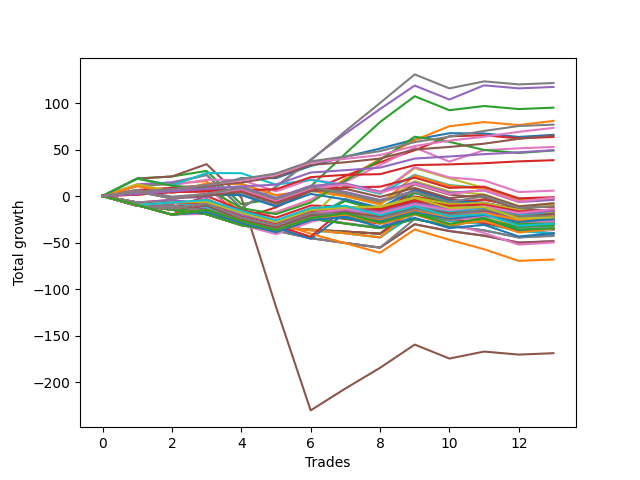

# Short Wallace 004 
- Symbol: ES90d5m
- Date Range: 03/18/2022 - 07/08/2022
- Trading Period: 7:20-12:30
- Number of Trades: 13



| Name | Win Percent | Profit | Avg Profit / Trade |     | Name | Win Percent | Profit | Avg Profit / Trade |
| ---- | ----------- | ------ | ------------------ | --- | ---- | ----------- | ------ | ------------------ |
| Sorted By <br> Profit | | | | | Sorted By <br> Win Percentage ||||
| Seven | 69.23 | 73125.00 | 5625.00 |     | Zero | 84.62 | 41000.00 | 3153.85 |
| Four | 69.23 | 71750.00 | 5519.23 |     | One | 76.92 | 53750.00 | 4134.62 |
| Two | 69.23 | 58625.00 | 4509.62 |     | Three | 76.92 | 50750.00 | 3903.85 |
| One | 76.92 | 53750.00 | 4134.62 |     | Seven | 69.23 | 73125.00 | 5625.00 |
| Three | 76.92 | 50750.00 | 3903.85 |     | Four | 69.23 | 71750.00 | 5519.23 |
| Zero | 84.62 | 41000.00 | 3153.85 |     | Two | 69.23 | 58625.00 | 4509.62 |
| Six | 69.23 | 37125.00 | 2855.77 |     | Six | 69.23 | 37125.00 | 2855.77 |
| Five | 53.85 | -84250.00 | -6480.77 |     | Five | 53.85 | -84250.00 | -6480.77 |

### Test Zero
* Sell when price hits the middle line of the 20p bollinger
* No Stoploss
* Results:
```
Total Trades: 13
Percent Up: 15.38
Percent Down: 84.62
Total Points Moved Down: 82.00
Potential Profit: 41000.00
Total Points Ups: 13.00 Count Ups: 2
Total Points Downs: 95.00 Count Downs: 11
```

<details><summary>Trades</summary>

<code>In: 2022-04-06 10:55:00		Out: 2022-04-06 11:00:10		Total Position Time: 05:10		Total Move Down: 11.50		Total to Date: 11.50</code> <br />
<code>In: 2022-04-07 12:20:00		Out: 2022-04-07 12:50:00		Total Position Time: 30:00		Total Move Down: -0.00		Total to Date: 11.50</code> <br />
<code>In: 2022-04-20 10:50:00		Out: 2022-04-20 11:13:35		Total Position Time: 23:35		Total Move Down: 2.25		Total to Date: 13.75</code> <br />
<code>In: 2022-04-25 11:40:00		Out: 2022-04-25 12:07:25		Total Position Time: 27:25		Total Move Down: 10.50		Total to Date: 24.25</code> <br />
<code>In: 2022-05-04 09:45:00		Out: 2022-05-04 10:50:05		Total Position Time: 65:05		Total Move Down: 1.75		Total to Date: 26.00</code> <br />
<code>In: 2022-05-04 11:10:00		Out: 2022-05-04 11:15:10		Total Position Time: 05:10		Total Move Down: 3.00		Total to Date: 29.00</code> <br />
<code>In: 2022-05-19 08:50:00		Out: 2022-05-19 09:34:10		Total Position Time: 44:10		Total Move Down: 20.00		Total to Date: 49.00</code> <br />
<code>In: 2022-05-19 08:55:00		Out: 2022-05-19 09:34:10		Total Position Time: 39:10		Total Move Down: 10.25		Total to Date: 59.25</code> <br />
<code>In: 2022-05-19 12:10:00		Out: 2022-05-19 12:18:25		Total Position Time: 08:25		Total Move Down: 13.75		Total to Date: 73.00</code> <br />
<code>In: 2022-05-24 11:15:00		Out: 2022-05-24 11:48:35		Total Position Time: 33:35		Total Move Down: 13.50		Total to Date: 86.50</code> <br />
<code>In: 2022-05-31 09:10:00		Out: 2022-05-31 10:16:00		Total Position Time: 66:00		Total Move Down: 4.00		Total to Date: 90.50</code> <br />
<code>In: 2022-06-15 11:55:00		Out: 2022-06-15 12:50:00		Total Position Time: 55:00		Total Move Down: -13.00		Total to Date: 77.50</code> <br />
<code>In: 2022-07-07 12:25:00		Out: 2022-07-07 12:38:25		Total Position Time: 13:25		Total Move Down: 4.50		Total to Date: 82.00</code> <br />


</details>

### Test One
* Sell when the price hits the upper line of the 20p 1std bollinger
* No Stoploss
* Results:
```
Total Trades: 13
Percent Up: 23.08
Percent Down: 76.92
Total Points Moved Down: 107.50
Potential Profit: 53750.00
Total Points Ups: 39.50 Count Ups: 3
Total Points Downs: 147.00 Count Downs: 10
```

<details><summary>Trades</summary>

<code>In: 2022-04-06 10:55:00		Out: 2022-04-06 11:09:45		Total Position Time: 14:45		Total Move Down: 16.00		Total to Date: 16.00</code> <br />
<code>In: 2022-04-07 12:20:00		Out: 2022-04-07 12:50:00		Total Position Time: 30:00		Total Move Down: -0.00		Total to Date: 16.00</code> <br />
<code>In: 2022-04-20 10:50:00		Out: 2022-04-20 11:17:15		Total Position Time: 27:15		Total Move Down: 5.25		Total to Date: 21.25</code> <br />
<code>In: 2022-04-25 11:40:00		Out: 2022-04-25 12:50:00		Total Position Time: 70:00		Total Move Down: -26.50		Total to Date: -5.25</code> <br />
<code>In: 2022-05-04 09:45:00		Out: 2022-05-04 11:07:25		Total Position Time: 82:25		Total Move Down: 4.50		Total to Date: -0.75</code> <br />
<code>In: 2022-05-04 11:10:00		Out: 2022-05-04 11:17:05		Total Position Time: 07:05		Total Move Down: 6.00		Total to Date: 5.25</code> <br />
<code>In: 2022-05-19 08:50:00		Out: 2022-05-19 09:40:30		Total Position Time: 50:30		Total Move Down: 30.75		Total to Date: 36.00</code> <br />
<code>In: 2022-05-19 08:55:00		Out: 2022-05-19 09:40:30		Total Position Time: 45:30		Total Move Down: 21.00		Total to Date: 57.00</code> <br />
<code>In: 2022-05-19 12:10:00		Out: 2022-05-19 12:24:50		Total Position Time: 14:50		Total Move Down: 23.50		Total to Date: 80.50</code> <br />
<code>In: 2022-05-24 11:15:00		Out: 2022-05-24 11:55:10		Total Position Time: 40:10		Total Move Down: 22.50		Total to Date: 103.00</code> <br />
<code>In: 2022-05-31 09:10:00		Out: 2022-05-31 10:23:00		Total Position Time: 73:00		Total Move Down: 10.00		Total to Date: 113.00</code> <br />
<code>In: 2022-06-15 11:55:00		Out: 2022-06-15 12:50:00		Total Position Time: 55:00		Total Move Down: -13.00		Total to Date: 100.00</code> <br />
<code>In: 2022-07-07 12:25:00		Out: 2022-07-07 12:46:45		Total Position Time: 21:45		Total Move Down: 7.50		Total to Date: 107.50</code> <br />


</details>

### Test Two
* Sell when the price hits the upper line of the 20p 2std bollinger
* No Stoploss
* Results:
```
Total Trades: 13
Percent Up: 30.77
Percent Down: 69.23
Total Points Moved Down: 117.25
Potential Profit: 58625.00
Total Points Ups: 59.50 Count Ups: 4
Total Points Downs: 176.75 Count Downs: 9
```

<details><summary>Trades</summary>

<code>In: 2022-04-06 10:55:00		Out: 2022-04-06 11:15:15		Total Position Time: 20:15		Total Move Down: 24.50		Total to Date: 24.50</code> <br />
<code>In: 2022-04-07 12:20:00		Out: 2022-04-07 12:50:00		Total Position Time: 30:00		Total Move Down: -0.00		Total to Date: 24.50</code> <br />
<code>In: 2022-04-20 10:50:00		Out: 2022-04-20 11:18:30		Total Position Time: 28:30		Total Move Down: 7.50		Total to Date: 32.00</code> <br />
<code>In: 2022-04-25 11:40:00		Out: 2022-04-25 12:50:00		Total Position Time: 70:00		Total Move Down: -26.50		Total to Date: 5.50</code> <br />
<code>In: 2022-05-04 09:45:00		Out: 2022-05-04 11:07:40		Total Position Time: 82:40		Total Move Down: 8.25		Total to Date: 13.75</code> <br />
<code>In: 2022-05-04 11:10:00		Out: 2022-05-04 11:18:35		Total Position Time: 08:35		Total Move Down: 10.00		Total to Date: 23.75</code> <br />
<code>In: 2022-05-19 08:50:00		Out: 2022-05-19 10:13:35		Total Position Time: 83:35		Total Move Down: 44.00		Total to Date: 67.75</code> <br />
<code>In: 2022-05-19 08:55:00		Out: 2022-05-19 10:13:35		Total Position Time: 78:35		Total Move Down: 34.25		Total to Date: 102.00</code> <br />
<code>In: 2022-05-19 12:10:00		Out: 2022-05-19 12:36:30		Total Position Time: 26:30		Total Move Down: 33.25		Total to Date: 135.25</code> <br />
<code>In: 2022-05-24 11:15:00		Out: 2022-05-24 12:50:00		Total Position Time: 95:00		Total Move Down: -20.00		Total to Date: 115.25</code> <br />
<code>In: 2022-05-31 09:10:00		Out: 2022-05-31 11:46:00		Total Position Time: 156:00		Total Move Down: 11.25		Total to Date: 126.50</code> <br />
<code>In: 2022-06-15 11:55:00		Out: 2022-06-15 12:50:00		Total Position Time: 55:00		Total Move Down: -13.00		Total to Date: 113.50</code> <br />
<code>In: 2022-07-07 12:25:00		Out: 2022-07-07 12:50:00		Total Position Time: 25:00		Total Move Down: 3.75		Total to Date: 117.25</code> <br />


</details>

### Test Three
* Sell when price hits the middle line of the 50p bollinger
* No Stoploss
* Results:
```
Total Trades: 13
Percent Up: 23.08
Percent Down: 76.92
Total Points Moved Down: 101.50
Potential Profit: 50750.00
Total Points Ups: 39.50 Count Ups: 3
Total Points Downs: 141.00 Count Downs: 10
```

<details><summary>Trades</summary>

<code>In: 2022-04-06 10:55:00		Out: 2022-04-06 11:08:35		Total Position Time: 13:35		Total Move Down: 11.50		Total to Date: 11.50</code> <br />
<code>In: 2022-04-07 12:20:00		Out: 2022-04-07 12:50:00		Total Position Time: 30:00		Total Move Down: -0.00		Total to Date: 11.50</code> <br />
<code>In: 2022-04-20 10:50:00		Out: 2022-04-20 11:17:40		Total Position Time: 27:40		Total Move Down: 5.50		Total to Date: 17.00</code> <br />
<code>In: 2022-04-25 11:40:00		Out: 2022-04-25 12:50:00		Total Position Time: 70:00		Total Move Down: -26.50		Total to Date: -9.50</code> <br />
<code>In: 2022-05-04 09:45:00		Out: 2022-05-04 11:20:50		Total Position Time: 95:50		Total Move Down: 14.00		Total to Date: 4.50</code> <br />
<code>In: 2022-05-04 11:10:00		Out: 2022-05-04 11:20:50		Total Position Time: 10:50		Total Move Down: 18.75		Total to Date: 23.25</code> <br />
<code>In: 2022-05-19 08:50:00		Out: 2022-05-19 09:37:05		Total Position Time: 47:05		Total Move Down: 25.75		Total to Date: 49.00</code> <br />
<code>In: 2022-05-19 08:55:00		Out: 2022-05-19 09:37:05		Total Position Time: 42:05		Total Move Down: 16.00		Total to Date: 65.00</code> <br />
<code>In: 2022-05-19 12:10:00		Out: 2022-05-19 12:21:15		Total Position Time: 11:15		Total Move Down: 16.25		Total to Date: 81.25</code> <br />
<code>In: 2022-05-24 11:15:00		Out: 2022-05-24 11:55:10		Total Position Time: 40:10		Total Move Down: 22.50		Total to Date: 103.75</code> <br />
<code>In: 2022-05-31 09:10:00		Out: 2022-05-31 11:45:05		Total Position Time: 155:05		Total Move Down: 7.00		Total to Date: 110.75</code> <br />
<code>In: 2022-06-15 11:55:00		Out: 2022-06-15 12:50:00		Total Position Time: 55:00		Total Move Down: -13.00		Total to Date: 97.75</code> <br />
<code>In: 2022-07-07 12:25:00		Out: 2022-07-07 12:50:00		Total Position Time: 25:00		Total Move Down: 3.75		Total to Date: 101.50</code> <br />


</details>

### Test Four
* Sell when the price hits the upper line of the 50p 1std bollinger
* No Stoploss
* Results:
```
Total Trades: 13
Percent Up: 30.77
Percent Down: 69.23
Total Points Moved Down: 143.50
Potential Profit: 71750.00
Total Points Ups: 59.50 Count Ups: 4
Total Points Downs: 203.00 Count Downs: 9
```

<details><summary>Trades</summary>

<code>In: 2022-04-06 10:55:00		Out: 2022-04-06 11:11:20		Total Position Time: 16:20		Total Move Down: 17.50		Total to Date: 17.50</code> <br />
<code>In: 2022-04-07 12:20:00		Out: 2022-04-07 12:50:00		Total Position Time: 30:00		Total Move Down: -0.00		Total to Date: 17.50</code> <br />
<code>In: 2022-04-20 10:50:00		Out: 2022-04-20 11:25:50		Total Position Time: 35:50		Total Move Down: 10.00		Total to Date: 27.50</code> <br />
<code>In: 2022-04-25 11:40:00		Out: 2022-04-25 12:50:00		Total Position Time: 70:00		Total Move Down: -26.50		Total to Date: 1.00</code> <br />
<code>In: 2022-05-04 09:45:00		Out: 2022-05-04 11:34:10		Total Position Time: 109:10		Total Move Down: 25.50		Total to Date: 26.50</code> <br />
<code>In: 2022-05-04 11:10:00		Out: 2022-05-04 11:34:10		Total Position Time: 24:10		Total Move Down: 30.25		Total to Date: 56.75</code> <br />
<code>In: 2022-05-19 08:50:00		Out: 2022-05-19 09:45:45		Total Position Time: 55:45		Total Move Down: 38.50		Total to Date: 95.25</code> <br />
<code>In: 2022-05-19 08:55:00		Out: 2022-05-19 09:45:45		Total Position Time: 50:45		Total Move Down: 28.75		Total to Date: 124.00</code> <br />
<code>In: 2022-05-19 12:10:00		Out: 2022-05-19 12:30:05		Total Position Time: 20:05		Total Move Down: 29.25		Total to Date: 153.25</code> <br />
<code>In: 2022-05-24 11:15:00		Out: 2022-05-24 12:50:00		Total Position Time: 95:00		Total Move Down: -20.00		Total to Date: 133.25</code> <br />
<code>In: 2022-05-31 09:10:00		Out: 2022-05-31 11:54:40		Total Position Time: 164:40		Total Move Down: 19.50		Total to Date: 152.75</code> <br />
<code>In: 2022-06-15 11:55:00		Out: 2022-06-15 12:50:00		Total Position Time: 55:00		Total Move Down: -13.00		Total to Date: 139.75</code> <br />
<code>In: 2022-07-07 12:25:00		Out: 2022-07-07 12:50:00		Total Position Time: 25:00		Total Move Down: 3.75		Total to Date: 143.50</code> <br />


</details>

### Test Five
* Sell when the price hits the upper line of the 50p 2std bollinger
* No Stoploss
* Results:
```
Total Trades: 13
Percent Up: 46.15
Percent Down: 53.85
Total Points Moved Down: -168.50
Potential Profit: -84250.00
Total Points Ups: 290.75 Count Ups: 6
Total Points Downs: 122.25 Count Downs: 7
```

<details><summary>Trades</summary>

<code>In: 2022-04-06 10:55:00		Out: 2022-04-06 11:15:05		Total Position Time: 20:05		Total Move Down: 23.75		Total to Date: 23.75</code> <br />
<code>In: 2022-04-07 12:20:00		Out: 2022-04-07 12:50:00		Total Position Time: 30:00		Total Move Down: -0.00		Total to Date: 23.75</code> <br />
<code>In: 2022-04-20 10:50:00		Out: 2022-04-20 11:35:45		Total Position Time: 45:45		Total Move Down: 15.75		Total to Date: 39.50</code> <br />
<code>In: 2022-04-25 11:40:00		Out: 2022-04-25 12:50:00		Total Position Time: 70:00		Total Move Down: -26.50		Total to Date: 13.00</code> <br />
<code>In: 2022-05-04 09:45:00		Out: 2022-05-04 12:50:00		Total Position Time: 185:00		Total Move Down: -118.00		Total to Date: -105.00</code> <br />
<code>In: 2022-05-04 11:10:00		Out: 2022-05-04 12:50:00		Total Position Time: 100:00		Total Move Down: -113.25		Total to Date: -218.25</code> <br />
<code>In: 2022-05-19 08:50:00		Out: 2022-05-19 12:50:00		Total Position Time: 240:00		Total Move Down: 27.00		Total to Date: -191.25</code> <br />
<code>In: 2022-05-19 08:55:00		Out: 2022-05-19 12:50:00		Total Position Time: 235:00		Total Move Down: 17.25		Total to Date: -174.00</code> <br />
<code>In: 2022-05-19 12:10:00		Out: 2022-05-19 12:50:00		Total Position Time: 40:00		Total Move Down: 22.75		Total to Date: -151.25</code> <br />
<code>In: 2022-05-24 11:15:00		Out: 2022-05-24 12:50:00		Total Position Time: 95:00		Total Move Down: -20.00		Total to Date: -171.25</code> <br />
<code>In: 2022-05-31 09:10:00		Out: 2022-05-31 12:50:00		Total Position Time: 220:00		Total Move Down: 12.00		Total to Date: -159.25</code> <br />
<code>In: 2022-06-15 11:55:00		Out: 2022-06-15 12:50:00		Total Position Time: 55:00		Total Move Down: -13.00		Total to Date: -172.25</code> <br />
<code>In: 2022-07-07 12:25:00		Out: 2022-07-07 12:50:00		Total Position Time: 25:00		Total Move Down: 3.75		Total to Date: -168.50</code> <br />


</details>

### Test Six
* Sell when the price hits the middle line of the 1std VWAP
* No Stoploss
* Results:
```
Total Trades: 13
Percent Up: 30.77
Percent Down: 69.23
Total Points Moved Down: 74.25
Potential Profit: 37125.00
Total Points Ups: 59.50 Count Ups: 4
Total Points Downs: 133.75 Count Downs: 9
```

<details><summary>Trades</summary>

<code>In: 2022-04-06 10:55:00		Out: 2022-04-06 11:00:10		Total Position Time: 05:10		Total Move Down: 11.50		Total to Date: 11.50</code> <br />
<code>In: 2022-04-07 12:20:00		Out: 2022-04-07 12:50:00		Total Position Time: 30:00		Total Move Down: -0.00		Total to Date: 11.50</code> <br />
<code>In: 2022-04-20 10:50:00		Out: 2022-04-20 11:18:20		Total Position Time: 28:20		Total Move Down: 6.25		Total to Date: 17.75</code> <br />
<code>In: 2022-04-25 11:40:00		Out: 2022-04-25 12:50:00		Total Position Time: 70:00		Total Move Down: -26.50		Total to Date: -8.75</code> <br />
<code>In: 2022-05-04 09:45:00		Out: 2022-05-04 11:20:20		Total Position Time: 95:20		Total Move Down: 9.75		Total to Date: 1.00</code> <br />
<code>In: 2022-05-04 11:10:00		Out: 2022-05-04 11:20:20		Total Position Time: 10:20		Total Move Down: 14.50		Total to Date: 15.50</code> <br />
<code>In: 2022-05-19 08:50:00		Out: 2022-05-19 09:39:15		Total Position Time: 49:15		Total Move Down: 29.00		Total to Date: 44.50</code> <br />
<code>In: 2022-05-19 08:55:00		Out: 2022-05-19 09:39:15		Total Position Time: 44:15		Total Move Down: 19.25		Total to Date: 63.75</code> <br />
<code>In: 2022-05-19 12:10:00		Out: 2022-05-19 12:24:45		Total Position Time: 14:45		Total Move Down: 22.75		Total to Date: 86.50</code> <br />
<code>In: 2022-05-24 11:15:00		Out: 2022-05-24 12:50:00		Total Position Time: 95:00		Total Move Down: -20.00		Total to Date: 66.50</code> <br />
<code>In: 2022-05-31 09:10:00		Out: 2022-05-31 11:48:35		Total Position Time: 158:35		Total Move Down: 17.00		Total to Date: 83.50</code> <br />
<code>In: 2022-06-15 11:55:00		Out: 2022-06-15 12:50:00		Total Position Time: 55:00		Total Move Down: -13.00		Total to Date: 70.50</code> <br />
<code>In: 2022-07-07 12:25:00		Out: 2022-07-07 12:50:00		Total Position Time: 25:00		Total Move Down: 3.75		Total to Date: 74.25</code> <br />


</details>

### Test Seven
* Sell when the price hits the upper line of the 1std VWAP
* No Stoploss
* Results:
```
Total Trades: 13
Percent Up: 30.77
Percent Down: 69.23
Total Points Moved Down: 146.25
Potential Profit: 73125.00
Total Points Ups: 59.50 Count Ups: 4
Total Points Downs: 205.75 Count Downs: 9
```

<details><summary>Trades</summary>

<code>In: 2022-04-06 10:55:00		Out: 2022-04-06 11:09:40		Total Position Time: 14:40		Total Move Down: 15.75		Total to Date: 15.75</code> <br />
<code>In: 2022-04-07 12:20:00		Out: 2022-04-07 12:50:00		Total Position Time: 30:00		Total Move Down: -0.00		Total to Date: 15.75</code> <br />
<code>In: 2022-04-20 10:50:00		Out: 2022-04-20 11:30:15		Total Position Time: 40:15		Total Move Down: 12.50		Total to Date: 28.25</code> <br />
<code>In: 2022-04-25 11:40:00		Out: 2022-04-25 12:50:00		Total Position Time: 70:00		Total Move Down: -26.50		Total to Date: 1.75</code> <br />
<code>In: 2022-05-04 09:45:00		Out: 2022-05-04 11:34:05		Total Position Time: 109:05		Total Move Down: 24.75		Total to Date: 26.50</code> <br />
<code>In: 2022-05-04 11:10:00		Out: 2022-05-04 11:34:05		Total Position Time: 24:05		Total Move Down: 29.50		Total to Date: 56.00</code> <br />
<code>In: 2022-05-19 08:50:00		Out: 2022-05-19 09:47:35		Total Position Time: 57:35		Total Move Down: 41.25		Total to Date: 97.25</code> <br />
<code>In: 2022-05-19 08:55:00		Out: 2022-05-19 09:47:35		Total Position Time: 52:35		Total Move Down: 31.50		Total to Date: 128.75</code> <br />
<code>In: 2022-05-19 12:10:00		Out: 2022-05-19 12:42:25		Total Position Time: 32:25		Total Move Down: 34.75		Total to Date: 163.50</code> <br />
<code>In: 2022-05-24 11:15:00		Out: 2022-05-24 12:50:00		Total Position Time: 95:00		Total Move Down: -20.00		Total to Date: 143.50</code> <br />
<code>In: 2022-05-31 09:10:00		Out: 2022-05-31 12:50:00		Total Position Time: 220:00		Total Move Down: 12.00		Total to Date: 155.50</code> <br />
<code>In: 2022-06-15 11:55:00		Out: 2022-06-15 12:50:00		Total Position Time: 55:00		Total Move Down: -13.00		Total to Date: 142.50</code> <br />
<code>In: 2022-07-07 12:25:00		Out: 2022-07-07 12:50:00		Total Position Time: 25:00		Total Move Down: 3.75		Total to Date: 146.25</code> <br />


</details>