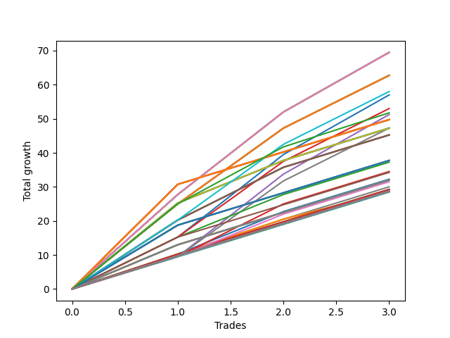

# Short Wallace 1226_003 
- Symbol: ES90d5m
- Date Range: 03/18/2022 - 07/08/2022
- Trading Period: 7:20-12:30
- Number of Trades: 3



| Name | Win Percent | Profit | Avg Profit / Trade |     | Name | Win Percent | Profit | Avg Profit / Trade |
| ---- | ----------- | ------ | ------------------ | --- | ---- | ----------- | ------ | ------------------ |
| Sorted By <br> Profit | | | | | Sorted By <br> Win Percentage ||||
| Two | 100.00 | 46750.00 | 15583.33 |     | Two | 100.00 | 46750.00 | 15583.33 |
| Five | 100.00 | 39250.00 | 13083.33 |     | Five | 100.00 | 39250.00 | 13083.33 |
| One | 100.00 | 33375.00 | 11125.00 |     | One | 100.00 | 33375.00 | 11125.00 |
| Seven | 100.00 | 32250.00 | 10750.00 |     | Seven | 100.00 | 32250.00 | 10750.00 |
| Four | 100.00 | 32250.00 | 10750.00 |     | Four | 100.00 | 32250.00 | 10750.00 |
| Six | 100.00 | 23125.00 | 7708.33 |     | Six | 100.00 | 23125.00 | 7708.33 |
| Zero | 100.00 | 20500.00 | 6833.33 |     | Zero | 100.00 | 20500.00 | 6833.33 |
| Three | 100.00 | 19875.00 | 6625.00 |     | Three | 100.00 | 19875.00 | 6625.00 |

### Test Zero
* Sell when price hits the middle line of the 20p bollinger
* No Stoploss
* Results:
```
Total Trades: 3
Percent Up: 0.00
Percent Down: 100.00
Total Points Moved Down: 41.00
Potential Profit: 20500.00
Total Points Ups: 0.00 Count Ups: 0
Total Points Downs: 41.00 Count Downs: 3
```

<details><summary>Trades</summary>

<code>In: 2022-05-19 12:10:00		Out: 2022-05-19 12:18:25		Total Position Time: 08:25		Total Move Down: 13.75		Total to Date: 13.75</code> <br />
<code>In: 2022-06-14 10:25:00		Out: 2022-06-14 10:34:00		Total Position Time: 09:00		Total Move Down: 17.75		Total to Date: 31.50</code> <br />
<code>In: 2022-06-14 10:30:00		Out: 2022-06-14 10:35:10		Total Position Time: 05:10		Total Move Down: 9.50		Total to Date: 41.00</code> <br />


</details>

### Test One
* Sell when the price hits the upper line of the 20p 1std bollinger
* No Stoploss
* Results:
```
Total Trades: 3
Percent Up: 0.00
Percent Down: 100.00
Total Points Moved Down: 66.75
Potential Profit: 33375.00
Total Points Ups: 0.00 Count Ups: 0
Total Points Downs: 66.75 Count Downs: 3
```

<details><summary>Trades</summary>

<code>In: 2022-05-19 12:10:00		Out: 2022-05-19 12:24:50		Total Position Time: 14:50		Total Move Down: 23.50		Total to Date: 23.50</code> <br />
<code>In: 2022-06-14 10:25:00		Out: 2022-06-14 10:40:05		Total Position Time: 15:05		Total Move Down: 26.75		Total to Date: 50.25</code> <br />
<code>In: 2022-06-14 10:30:00		Out: 2022-06-14 10:40:05		Total Position Time: 10:05		Total Move Down: 16.50		Total to Date: 66.75</code> <br />


</details>

### Test Two
* Sell when the price hits the upper line of the 20p 2std bollinger
* No Stoploss
* Results:
```
Total Trades: 3
Percent Up: 0.00
Percent Down: 100.00
Total Points Moved Down: 93.50
Potential Profit: 46750.00
Total Points Ups: 0.00 Count Ups: 0
Total Points Downs: 93.50 Count Downs: 3
```

<details><summary>Trades</summary>

<code>In: 2022-05-19 12:10:00		Out: 2022-05-19 12:36:30		Total Position Time: 26:30		Total Move Down: 33.25		Total to Date: 33.25</code> <br />
<code>In: 2022-06-14 10:25:00		Out: 2022-06-14 11:44:55		Total Position Time: 79:55		Total Move Down: 35.25		Total to Date: 68.50</code> <br />
<code>In: 2022-06-14 10:30:00		Out: 2022-06-14 11:44:55		Total Position Time: 74:55		Total Move Down: 25.00		Total to Date: 93.50</code> <br />


</details>

### Test Three
* Sell when price hits the middle line of the 50p bollinger
* No Stoploss
* Results:
```
Total Trades: 3
Percent Up: 0.00
Percent Down: 100.00
Total Points Moved Down: 39.75
Potential Profit: 19875.00
Total Points Ups: 0.00 Count Ups: 0
Total Points Downs: 39.75 Count Downs: 3
```

<details><summary>Trades</summary>

<code>In: 2022-05-19 12:10:00		Out: 2022-05-19 12:21:15		Total Position Time: 11:15		Total Move Down: 16.25		Total to Date: 16.25</code> <br />
<code>In: 2022-06-14 10:25:00		Out: 2022-06-14 10:30:10		Total Position Time: 05:10		Total Move Down: 14.00		Total to Date: 30.25</code> <br />
<code>In: 2022-06-14 10:30:00		Out: 2022-06-14 10:35:10		Total Position Time: 05:10		Total Move Down: 9.50		Total to Date: 39.75</code> <br />


</details>

### Test Four
* Sell when the price hits the upper line of the 50p 1std bollinger
* No Stoploss
* Results:
```
Total Trades: 3
Percent Up: 0.00
Percent Down: 100.00
Total Points Moved Down: 64.50
Potential Profit: 32250.00
Total Points Ups: 0.00 Count Ups: 0
Total Points Downs: 64.50 Count Downs: 3
```

<details><summary>Trades</summary>

<code>In: 2022-05-19 12:10:00		Out: 2022-05-19 12:30:05		Total Position Time: 20:05		Total Move Down: 29.25		Total to Date: 29.25</code> <br />
<code>In: 2022-06-14 10:25:00		Out: 2022-06-14 10:36:10		Total Position Time: 11:10		Total Move Down: 22.75		Total to Date: 52.00</code> <br />
<code>In: 2022-06-14 10:30:00		Out: 2022-06-14 10:36:10		Total Position Time: 06:10		Total Move Down: 12.50		Total to Date: 64.50</code> <br />


</details>

### Test Five
* Sell when the price hits the upper line of the 50p 2std bollinger
* No Stoploss
* Results:
```
Total Trades: 3
Percent Up: 0.00
Percent Down: 100.00
Total Points Moved Down: 78.50
Potential Profit: 39250.00
Total Points Ups: 0.00 Count Ups: 0
Total Points Downs: 78.50 Count Downs: 3
```

<details><summary>Trades</summary>

<code>In: 2022-05-19 12:10:00		Out: 2022-05-19 12:50:00		Total Position Time: 40:00		Total Move Down: 22.75		Total to Date: 22.75</code> <br />
<code>In: 2022-06-14 10:25:00		Out: 2022-06-14 10:43:55		Total Position Time: 18:55		Total Move Down: 33.00		Total to Date: 55.75</code> <br />
<code>In: 2022-06-14 10:30:00		Out: 2022-06-14 10:43:55		Total Position Time: 13:55		Total Move Down: 22.75		Total to Date: 78.50</code> <br />


</details>

### Test Six
* Sell when the price hits the middle line of the 1std VWAP
* No Stoploss
* Results:
```
Total Trades: 3
Percent Up: 0.00
Percent Down: 100.00
Total Points Moved Down: 46.25
Potential Profit: 23125.00
Total Points Ups: 0.00 Count Ups: 0
Total Points Downs: 46.25 Count Downs: 3
```

<details><summary>Trades</summary>

<code>In: 2022-05-19 12:10:00		Out: 2022-05-19 12:24:45		Total Position Time: 14:45		Total Move Down: 22.75		Total to Date: 22.75</code> <br />
<code>In: 2022-06-14 10:25:00		Out: 2022-06-14 10:30:10		Total Position Time: 05:10		Total Move Down: 14.00		Total to Date: 36.75</code> <br />
<code>In: 2022-06-14 10:30:00		Out: 2022-06-14 10:35:10		Total Position Time: 05:10		Total Move Down: 9.50		Total to Date: 46.25</code> <br />


</details>

### Test Seven
* Sell when the price hits the upper line of the 1std VWAP
* No Stoploss
* Results:
```
Total Trades: 3
Percent Up: 0.00
Percent Down: 100.00
Total Points Moved Down: 64.50
Potential Profit: 32250.00
Total Points Ups: 0.00 Count Ups: 0
Total Points Downs: 64.50 Count Downs: 3
```

<details><summary>Trades</summary>

<code>In: 2022-05-19 12:10:00		Out: 2022-05-19 12:42:25		Total Position Time: 32:25		Total Move Down: 34.75		Total to Date: 34.75</code> <br />
<code>In: 2022-06-14 10:25:00		Out: 2022-06-14 10:34:40		Total Position Time: 09:40		Total Move Down: 20.25		Total to Date: 55.00</code> <br />
<code>In: 2022-06-14 10:30:00		Out: 2022-06-14 10:35:10		Total Position Time: 05:10		Total Move Down: 9.50		Total to Date: 64.50</code> <br />


</details>