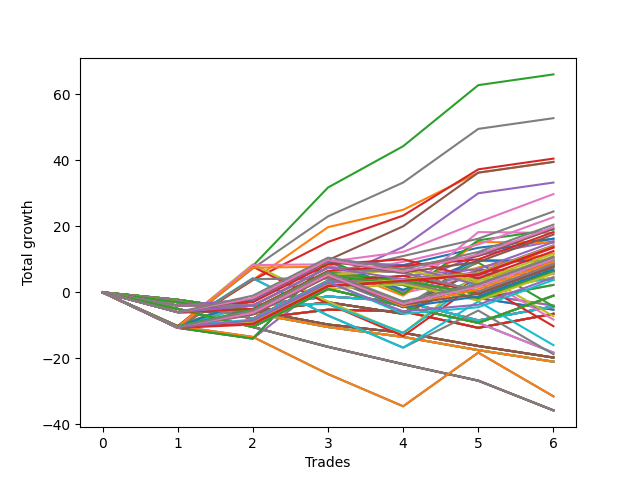

# Short Wallace Doodle 011 
- Symbol: ES90d5m
- Date Range: 03/18/2022 - 07/08/2022
- Trading Period: 7:20-12:30
- Number of Trades: 6



| Name | Win Percent | Profit | Avg Profit / Trade |     | Name | Win Percent | Profit | Avg Profit / Trade |
| ---- | ----------- | ------ | ------------------ | --- | ---- | ----------- | ------ | ------------------ |
| Sorted By <br> Profit | | | | | Sorted By <br> Win Percentage ||||
| Three | 83.33 | 47000.00 | 7833.33 |     | Three | 83.33 | 47000.00 | 7833.33 |
| Two | 83.33 | 41875.00 | 6979.17 |     | Two | 83.33 | 41875.00 | 6979.17 |
| Five | 83.33 | 39625.00 | 6604.17 |     | Five | 83.33 | 39625.00 | 6604.17 |
| Seven | 83.33 | 39000.00 | 6500.00 |     | Seven | 83.33 | 39000.00 | 6500.00 |
| Six | 83.33 | 38250.00 | 6375.00 |     | Six | 83.33 | 38250.00 | 6375.00 |
| Zero | 83.33 | 37000.00 | 6166.67 |     | Zero | 83.33 | 37000.00 | 6166.67 |
| Four | 83.33 | 36500.00 | 6083.33 |     | Four | 83.33 | 36500.00 | 6083.33 |
| One | 83.33 | 29875.00 | 4979.17 |     | One | 83.33 | 29875.00 | 4979.17 |

### Test Zero
* Sell when price hits the middle line of the 20p bollinger
* No Stoploss
* Results:
```
Total Trades: 6
Percent Up: 16.67
Percent Down: 83.33
Total Points Moved Down: 74.00
Potential Profit: 37000.00
Total Points Ups: 8.50 Count Ups: 1
Total Points Downs: 82.50 Count Downs: 5
```

<details><summary>Trades</summary>

<code>In: 2022-03-28 12:00:00		Out: 2022-03-28 12:50:00		Total Position Time: 50:00		Total Move Down: -8.50		Total to Date: -8.50</code> <br />
<code>In: 2022-04-01 11:35:00		Out: 2022-04-01 12:12:40		Total Position Time: 37:40		Total Move Down: 12.00		Total to Date: 3.50</code> <br />
<code>In: 2022-04-06 10:50:00		Out: 2022-04-06 11:00:10		Total Position Time: 10:10		Total Move Down: 13.25		Total to Date: 16.75</code> <br />
<code>In: 2022-06-10 12:00:00		Out: 2022-06-10 12:05:20		Total Position Time: 05:20		Total Move Down: 12.75		Total to Date: 29.50</code> <br />
<code>In: 2022-06-10 12:30:00		Out: 2022-06-10 12:42:40		Total Position Time: 12:40		Total Move Down: 11.75		Total to Date: 41.25</code> <br />
<code>In: 2022-06-15 11:50:00		Out: 2022-06-15 11:58:10		Total Position Time: 08:10		Total Move Down: 32.75		Total to Date: 74.00</code> <br />


</details>

### Test One
* Sell when the price hits the upper line of the 20p 1std bollinger
* No Stoploss
* Results:
```
Total Trades: 6
Percent Up: 16.67
Percent Down: 83.33
Total Points Moved Down: 59.75
Potential Profit: 29875.00
Total Points Ups: 8.50 Count Ups: 1
Total Points Downs: 68.25 Count Downs: 5
```

<details><summary>Trades</summary>

<code>In: 2022-03-28 12:00:00		Out: 2022-03-28 12:50:00		Total Position Time: 50:00		Total Move Down: -8.50		Total to Date: -8.50</code> <br />
<code>In: 2022-04-01 11:35:00		Out: 2022-04-01 12:20:05		Total Position Time: 45:05		Total Move Down: 18.25		Total to Date: 9.75</code> <br />
<code>In: 2022-04-06 10:50:00		Out: 2022-04-06 11:09:45		Total Position Time: 19:45		Total Move Down: 17.75		Total to Date: 27.50</code> <br />
<code>In: 2022-06-10 12:00:00		Out: 2022-06-10 12:45:40		Total Position Time: 45:40		Total Move Down: 14.00		Total to Date: 41.50</code> <br />
<code>In: 2022-06-10 12:30:00		Out: 2022-06-10 12:45:40		Total Position Time: 15:40		Total Move Down: 16.75		Total to Date: 58.25</code> <br />
<code>In: 2022-06-15 11:50:00		Out: 2022-06-15 12:50:00		Total Position Time: 60:00		Total Move Down: 1.50		Total to Date: 59.75</code> <br />


</details>

### Test Two
* Sell when the price hits the upper line of the 20p 2std bollinger
* No Stoploss
* Results:
```
Total Trades: 6
Percent Up: 16.67
Percent Down: 83.33
Total Points Moved Down: 83.75
Potential Profit: 41875.00
Total Points Ups: 8.50 Count Ups: 1
Total Points Downs: 92.25 Count Downs: 5
```

<details><summary>Trades</summary>

<code>In: 2022-03-28 12:00:00		Out: 2022-03-28 12:50:00		Total Position Time: 50:00		Total Move Down: -8.50		Total to Date: -8.50</code> <br />
<code>In: 2022-04-01 11:35:00		Out: 2022-04-01 12:36:15		Total Position Time: 61:15		Total Move Down: 22.25		Total to Date: 13.75</code> <br />
<code>In: 2022-04-06 10:50:00		Out: 2022-04-06 11:15:15		Total Position Time: 25:15		Total Move Down: 26.25		Total to Date: 40.00</code> <br />
<code>In: 2022-06-10 12:00:00		Out: 2022-06-10 12:46:55		Total Position Time: 46:55		Total Move Down: 19.75		Total to Date: 59.75</code> <br />
<code>In: 2022-06-10 12:30:00		Out: 2022-06-10 12:46:55		Total Position Time: 16:55		Total Move Down: 22.50		Total to Date: 82.25</code> <br />
<code>In: 2022-06-15 11:50:00		Out: 2022-06-15 12:50:00		Total Position Time: 60:00		Total Move Down: 1.50		Total to Date: 83.75</code> <br />


</details>

### Test Three
* Sell when price hits the middle line of the 50p bollinger
* No Stoploss
* Results:
```
Total Trades: 6
Percent Up: 16.67
Percent Down: 83.33
Total Points Moved Down: 94.00
Potential Profit: 47000.00
Total Points Ups: 8.50 Count Ups: 1
Total Points Downs: 102.50 Count Downs: 5
```

<details><summary>Trades</summary>

<code>In: 2022-03-28 12:00:00		Out: 2022-03-28 12:50:00		Total Position Time: 50:00		Total Move Down: -8.50		Total to Date: -8.50</code> <br />
<code>In: 2022-04-01 11:35:00		Out: 2022-04-01 12:20:05		Total Position Time: 45:05		Total Move Down: 18.25		Total to Date: 9.75</code> <br />
<code>In: 2022-04-06 10:50:00		Out: 2022-04-06 11:08:35		Total Position Time: 18:35		Total Move Down: 13.25		Total to Date: 23.00</code> <br />
<code>In: 2022-06-10 12:00:00		Out: 2022-06-10 12:46:10		Total Position Time: 46:10		Total Move Down: 17.75		Total to Date: 40.75</code> <br />
<code>In: 2022-06-10 12:30:00		Out: 2022-06-10 12:46:10		Total Position Time: 16:10		Total Move Down: 20.50		Total to Date: 61.25</code> <br />
<code>In: 2022-06-15 11:50:00		Out: 2022-06-15 11:58:10		Total Position Time: 08:10		Total Move Down: 32.75		Total to Date: 94.00</code> <br />


</details>

### Test Four
* Sell when the price hits the upper line of the 50p 1std bollinger
* No Stoploss
* Results:
```
Total Trades: 6
Percent Up: 16.67
Percent Down: 83.33
Total Points Moved Down: 73.00
Potential Profit: 36500.00
Total Points Ups: 8.50 Count Ups: 1
Total Points Downs: 81.50 Count Downs: 5
```

<details><summary>Trades</summary>

<code>In: 2022-03-28 12:00:00		Out: 2022-03-28 12:50:00		Total Position Time: 50:00		Total Move Down: -8.50		Total to Date: -8.50</code> <br />
<code>In: 2022-04-01 11:35:00		Out: 2022-04-01 12:50:00		Total Position Time: 75:00		Total Move Down: 15.00		Total to Date: 6.50</code> <br />
<code>In: 2022-04-06 10:50:00		Out: 2022-04-06 11:11:20		Total Position Time: 21:20		Total Move Down: 19.25		Total to Date: 25.75</code> <br />
<code>In: 2022-06-10 12:00:00		Out: 2022-06-10 12:50:00		Total Position Time: 50:00		Total Move Down: 21.50		Total to Date: 47.25</code> <br />
<code>In: 2022-06-10 12:30:00		Out: 2022-06-10 12:50:00		Total Position Time: 20:00		Total Move Down: 24.25		Total to Date: 71.50</code> <br />
<code>In: 2022-06-15 11:50:00		Out: 2022-06-15 12:50:00		Total Position Time: 60:00		Total Move Down: 1.50		Total to Date: 73.00</code> <br />


</details>

### Test Five
* Sell when the price hits the upper line of the 50p 2std bollinger
* No Stoploss
* Results:
```
Total Trades: 6
Percent Up: 16.67
Percent Down: 83.33
Total Points Moved Down: 79.25
Potential Profit: 39625.00
Total Points Ups: 8.50 Count Ups: 1
Total Points Downs: 87.75 Count Downs: 5
```

<details><summary>Trades</summary>

<code>In: 2022-03-28 12:00:00		Out: 2022-03-28 12:50:00		Total Position Time: 50:00		Total Move Down: -8.50		Total to Date: -8.50</code> <br />
<code>In: 2022-04-01 11:35:00		Out: 2022-04-01 12:50:00		Total Position Time: 75:00		Total Move Down: 15.00		Total to Date: 6.50</code> <br />
<code>In: 2022-04-06 10:50:00		Out: 2022-04-06 11:15:05		Total Position Time: 25:05		Total Move Down: 25.50		Total to Date: 32.00</code> <br />
<code>In: 2022-06-10 12:00:00		Out: 2022-06-10 12:50:00		Total Position Time: 50:00		Total Move Down: 21.50		Total to Date: 53.50</code> <br />
<code>In: 2022-06-10 12:30:00		Out: 2022-06-10 12:50:00		Total Position Time: 20:00		Total Move Down: 24.25		Total to Date: 77.75</code> <br />
<code>In: 2022-06-15 11:50:00		Out: 2022-06-15 12:50:00		Total Position Time: 60:00		Total Move Down: 1.50		Total to Date: 79.25</code> <br />


</details>

### Test Six
* Sell when the price hits the middle line of the 1std VWAP
* No Stoploss
* Results:
```
Total Trades: 6
Percent Up: 16.67
Percent Down: 83.33
Total Points Moved Down: 76.50
Potential Profit: 38250.00
Total Points Ups: 8.50 Count Ups: 1
Total Points Downs: 85.00 Count Downs: 5
```

<details><summary>Trades</summary>

<code>In: 2022-03-28 12:00:00		Out: 2022-03-28 12:50:00		Total Position Time: 50:00		Total Move Down: -8.50		Total to Date: -8.50</code> <br />
<code>In: 2022-04-01 11:35:00		Out: 2022-04-01 12:12:50		Total Position Time: 37:50		Total Move Down: 12.00		Total to Date: 3.50</code> <br />
<code>In: 2022-04-06 10:50:00		Out: 2022-04-06 11:00:10		Total Position Time: 10:10		Total Move Down: 13.25		Total to Date: 16.75</code> <br />
<code>In: 2022-06-10 12:00:00		Out: 2022-06-10 12:05:35		Total Position Time: 05:35		Total Move Down: 13.50		Total to Date: 30.25</code> <br />
<code>In: 2022-06-10 12:30:00		Out: 2022-06-10 12:44:05		Total Position Time: 14:05		Total Move Down: 15.50		Total to Date: 45.75</code> <br />
<code>In: 2022-06-15 11:50:00		Out: 2022-06-15 11:57:55		Total Position Time: 07:55		Total Move Down: 30.75		Total to Date: 76.50</code> <br />


</details>

### Test Seven
* Sell when the price hits the upper line of the 1std VWAP
* No Stoploss
* Results:
```
Total Trades: 6
Percent Up: 16.67
Percent Down: 83.33
Total Points Moved Down: 78.00
Potential Profit: 39000.00
Total Points Ups: 8.50 Count Ups: 1
Total Points Downs: 86.50 Count Downs: 5
```

<details><summary>Trades</summary>

<code>In: 2022-03-28 12:00:00		Out: 2022-03-28 12:50:00		Total Position Time: 50:00		Total Move Down: -8.50		Total to Date: -8.50</code> <br />
<code>In: 2022-04-01 11:35:00		Out: 2022-04-01 12:33:30		Total Position Time: 58:30		Total Move Down: 21.75		Total to Date: 13.25</code> <br />
<code>In: 2022-04-06 10:50:00		Out: 2022-04-06 11:09:40		Total Position Time: 19:40		Total Move Down: 17.50		Total to Date: 30.75</code> <br />
<code>In: 2022-06-10 12:00:00		Out: 2022-06-10 12:50:00		Total Position Time: 50:00		Total Move Down: 21.50		Total to Date: 52.25</code> <br />
<code>In: 2022-06-10 12:30:00		Out: 2022-06-10 12:50:00		Total Position Time: 20:00		Total Move Down: 24.25		Total to Date: 76.50</code> <br />
<code>In: 2022-06-15 11:50:00		Out: 2022-06-15 12:50:00		Total Position Time: 60:00		Total Move Down: 1.50		Total to Date: 78.00</code> <br />


</details>