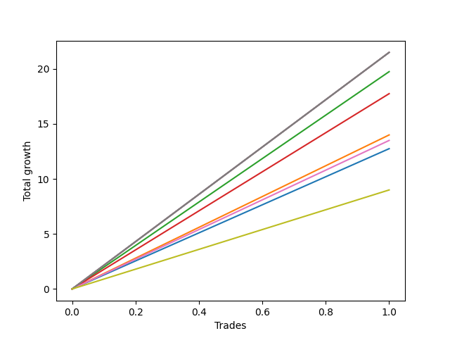

# Short Wallace Doodle 012 
- Symbol: ES90d5m
- Date Range: 03/18/2022 - 07/08/2022
- Trading Period: 7:20-12:30
- Number of Trades: 1



| Name | Win Percent | Profit | Avg Profit / Trade |     | Name | Win Percent | Profit | Avg Profit / Trade |
| ---- | ----------- | ------ | ------------------ | --- | ---- | ----------- | ------ | ------------------ |
| Sorted By <br> Profit | | | | | Sorted By <br> Win Percentage ||||
| Seven | 100.00 | 10750.00 | 10750.00 |     | Seven | 100.00 | 10750.00 | 10750.00 |
| Five | 100.00 | 10750.00 | 10750.00 |     | Five | 100.00 | 10750.00 | 10750.00 |
| Four | 100.00 | 10750.00 | 10750.00 |     | Four | 100.00 | 10750.00 | 10750.00 |
| Two | 100.00 | 9875.00 | 9875.00 |     | Two | 100.00 | 9875.00 | 9875.00 |
| Three | 100.00 | 8875.00 | 8875.00 |     | Three | 100.00 | 8875.00 | 8875.00 |
| One | 100.00 | 7000.00 | 7000.00 |     | One | 100.00 | 7000.00 | 7000.00 |
| Six | 100.00 | 6750.00 | 6750.00 |     | Six | 100.00 | 6750.00 | 6750.00 |
| Zero | 100.00 | 6375.00 | 6375.00 |     | Zero | 100.00 | 6375.00 | 6375.00 |

### Test Zero
* Sell when price hits the middle line of the 20p bollinger
* No Stoploss
* Results:
```
Total Trades: 1
Percent Up: 0.00
Percent Down: 100.00
Total Points Moved Down: 12.75
Potential Profit: 6375.00
Total Points Ups: 0.00 Count Ups: 0
Total Points Downs: 12.75 Count Downs: 1
```

<details><summary>Trades</summary>

<code>In: 2022-06-10 12:00:00		Out: 2022-06-10 12:05:20		Total Position Time: 05:20		Total Move Down: 12.75		Total to Date: 12.75</code> <br />


</details>

### Test One
* Sell when the price hits the upper line of the 20p 1std bollinger
* No Stoploss
* Results:
```
Total Trades: 1
Percent Up: 0.00
Percent Down: 100.00
Total Points Moved Down: 14.00
Potential Profit: 7000.00
Total Points Ups: 0.00 Count Ups: 0
Total Points Downs: 14.00 Count Downs: 1
```

<details><summary>Trades</summary>

<code>In: 2022-06-10 12:00:00		Out: 2022-06-10 12:45:40		Total Position Time: 45:40		Total Move Down: 14.00		Total to Date: 14.00</code> <br />


</details>

### Test Two
* Sell when the price hits the upper line of the 20p 2std bollinger
* No Stoploss
* Results:
```
Total Trades: 1
Percent Up: 0.00
Percent Down: 100.00
Total Points Moved Down: 19.75
Potential Profit: 9875.00
Total Points Ups: 0.00 Count Ups: 0
Total Points Downs: 19.75 Count Downs: 1
```

<details><summary>Trades</summary>

<code>In: 2022-06-10 12:00:00		Out: 2022-06-10 12:46:55		Total Position Time: 46:55		Total Move Down: 19.75		Total to Date: 19.75</code> <br />


</details>

### Test Three
* Sell when price hits the middle line of the 50p bollinger
* No Stoploss
* Results:
```
Total Trades: 1
Percent Up: 0.00
Percent Down: 100.00
Total Points Moved Down: 17.75
Potential Profit: 8875.00
Total Points Ups: 0.00 Count Ups: 0
Total Points Downs: 17.75 Count Downs: 1
```

<details><summary>Trades</summary>

<code>In: 2022-06-10 12:00:00		Out: 2022-06-10 12:46:10		Total Position Time: 46:10		Total Move Down: 17.75		Total to Date: 17.75</code> <br />


</details>

### Test Four
* Sell when the price hits the upper line of the 50p 1std bollinger
* No Stoploss
* Results:
```
Total Trades: 1
Percent Up: 0.00
Percent Down: 100.00
Total Points Moved Down: 21.50
Potential Profit: 10750.00
Total Points Ups: 0.00 Count Ups: 0
Total Points Downs: 21.50 Count Downs: 1
```

<details><summary>Trades</summary>

<code>In: 2022-06-10 12:00:00		Out: 2022-06-10 12:50:00		Total Position Time: 50:00		Total Move Down: 21.50		Total to Date: 21.50</code> <br />


</details>

### Test Five
* Sell when the price hits the upper line of the 50p 2std bollinger
* No Stoploss
* Results:
```
Total Trades: 1
Percent Up: 0.00
Percent Down: 100.00
Total Points Moved Down: 21.50
Potential Profit: 10750.00
Total Points Ups: 0.00 Count Ups: 0
Total Points Downs: 21.50 Count Downs: 1
```

<details><summary>Trades</summary>

<code>In: 2022-06-10 12:00:00		Out: 2022-06-10 12:50:00		Total Position Time: 50:00		Total Move Down: 21.50		Total to Date: 21.50</code> <br />


</details>

### Test Six
* Sell when the price hits the middle line of the 1std VWAP
* No Stoploss
* Results:
```
Total Trades: 1
Percent Up: 0.00
Percent Down: 100.00
Total Points Moved Down: 13.50
Potential Profit: 6750.00
Total Points Ups: 0.00 Count Ups: 0
Total Points Downs: 13.50 Count Downs: 1
```

<details><summary>Trades</summary>

<code>In: 2022-06-10 12:00:00		Out: 2022-06-10 12:05:35		Total Position Time: 05:35		Total Move Down: 13.50		Total to Date: 13.50</code> <br />


</details>

### Test Seven
* Sell when the price hits the upper line of the 1std VWAP
* No Stoploss
* Results:
```
Total Trades: 1
Percent Up: 0.00
Percent Down: 100.00
Total Points Moved Down: 21.50
Potential Profit: 10750.00
Total Points Ups: 0.00 Count Ups: 0
Total Points Downs: 21.50 Count Downs: 1
```

<details><summary>Trades</summary>

<code>In: 2022-06-10 12:00:00		Out: 2022-06-10 12:50:00		Total Position Time: 50:00		Total Move Down: 21.50		Total to Date: 21.50</code> <br />


</details>