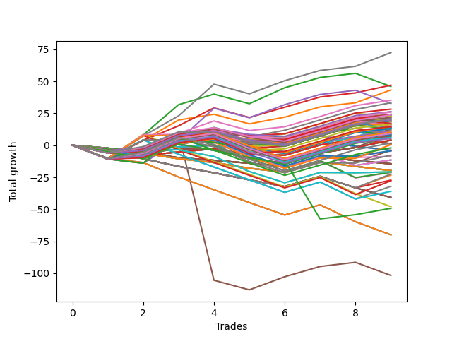

# Short Wallace Doodle 014 
- Symbol: ES90d5m
- Date Range: 03/18/2022 - 07/08/2022
- Trading Period: 7:20-12:30
- Number of Trades: 9



| Name | Win Percent | Profit | Avg Profit / Trade |     | Name | Win Percent | Profit | Avg Profit / Trade |
| ---- | ----------- | ------ | ------------------ | --- | ---- | ----------- | ------ | ------------------ |
| Sorted By <br> Profit | | | | | Sorted By <br> Win Percentage ||||
| Three | 77.78 | 61125.00 | 6791.67 |     | Three | 77.78 | 61125.00 | 6791.67 |
| Seven | 77.78 | 59000.00 | 6555.56 |     | Seven | 77.78 | 59000.00 | 6555.56 |
| Six | 77.78 | 51875.00 | 5763.89 |     | Six | 77.78 | 51875.00 | 5763.89 |
| Zero | 77.78 | 50125.00 | 5569.44 |     | Zero | 77.78 | 50125.00 | 5569.44 |
| One | 77.78 | 43125.00 | 4791.67 |     | One | 77.78 | 43125.00 | 4791.67 |
| Four | 66.67 | 39375.00 | 4375.00 |     | Four | 66.67 | 39375.00 | 4375.00 |
| Two | 66.67 | 37000.00 | 4111.11 |     | Two | 66.67 | 37000.00 | 4111.11 |
| Five | 55.56 | -29250.00 | -3250.00 |     | Five | 55.56 | -29250.00 | -3250.00 |

### Test Zero
* Sell when price hits the middle line of the 20p bollinger
* No Stoploss
* Results:
```
Total Trades: 9
Percent Up: 22.22
Percent Down: 77.78
Total Points Moved Down: 100.25
Potential Profit: 50125.00
Total Points Ups: 10.75 Count Ups: 2
Total Points Downs: 111.00 Count Downs: 7
```

<details><summary>Trades</summary>

<code>In: 2022-03-28 12:00:00		Out: 2022-03-28 12:50:00		Total Position Time: 50:00		Total Move Down: -8.50		Total to Date: -8.50</code> <br />
<code>In: 2022-04-01 11:35:00		Out: 2022-04-01 12:12:40		Total Position Time: 37:40		Total Move Down: 12.00		Total to Date: 3.50</code> <br />
<code>In: 2022-04-06 10:50:00		Out: 2022-04-06 11:00:10		Total Position Time: 10:10		Total Move Down: 13.25		Total to Date: 16.75</code> <br />
<code>In: 2022-05-04 09:40:00		Out: 2022-05-04 10:50:05		Total Position Time: 70:05		Total Move Down: 4.00		Total to Date: 20.75</code> <br />
<code>In: 2022-05-25 11:35:00		Out: 2022-05-25 12:49:20		Total Position Time: 74:20		Total Move Down: -2.25		Total to Date: 18.50</code> <br />
<code>In: 2022-06-10 12:00:00		Out: 2022-06-10 12:05:20		Total Position Time: 05:20		Total Move Down: 12.75		Total to Date: 31.25</code> <br />
<code>In: 2022-06-15 11:00:00		Out: 2022-06-15 11:05:10		Total Position Time: 05:10		Total Move Down: 30.75		Total to Date: 62.00</code> <br />
<code>In: 2022-06-15 11:50:00		Out: 2022-06-15 11:58:10		Total Position Time: 08:10		Total Move Down: 32.75		Total to Date: 94.75</code> <br />
<code>In: 2022-07-06 11:00:00		Out: 2022-07-06 11:11:35		Total Position Time: 11:35		Total Move Down: 5.50		Total to Date: 100.25</code> <br />


</details>

### Test One
* Sell when the price hits the upper line of the 20p 1std bollinger
* No Stoploss
* Results:
```
Total Trades: 9
Percent Up: 22.22
Percent Down: 77.78
Total Points Moved Down: 86.25
Potential Profit: 43125.00
Total Points Ups: 14.00 Count Ups: 2
Total Points Downs: 100.25 Count Downs: 7
```

<details><summary>Trades</summary>

<code>In: 2022-03-28 12:00:00		Out: 2022-03-28 12:50:00		Total Position Time: 50:00		Total Move Down: -8.50		Total to Date: -8.50</code> <br />
<code>In: 2022-04-01 11:35:00		Out: 2022-04-01 12:20:05		Total Position Time: 45:05		Total Move Down: 18.25		Total to Date: 9.75</code> <br />
<code>In: 2022-04-06 10:50:00		Out: 2022-04-06 11:09:45		Total Position Time: 19:45		Total Move Down: 17.75		Total to Date: 27.50</code> <br />
<code>In: 2022-05-04 09:40:00		Out: 2022-05-04 11:07:25		Total Position Time: 87:25		Total Move Down: 6.75		Total to Date: 34.25</code> <br />
<code>In: 2022-05-25 11:35:00		Out: 2022-05-25 12:50:00		Total Position Time: 75:00		Total Move Down: -5.50		Total to Date: 28.75</code> <br />
<code>In: 2022-06-10 12:00:00		Out: 2022-06-10 12:45:40		Total Position Time: 45:40		Total Move Down: 14.00		Total to Date: 42.75</code> <br />
<code>In: 2022-06-15 11:00:00		Out: 2022-06-15 11:05:10		Total Position Time: 05:10		Total Move Down: 30.75		Total to Date: 73.50</code> <br />
<code>In: 2022-06-15 11:50:00		Out: 2022-06-15 12:50:00		Total Position Time: 60:00		Total Move Down: 1.50		Total to Date: 75.00</code> <br />
<code>In: 2022-07-06 11:00:00		Out: 2022-07-06 11:12:15		Total Position Time: 12:15		Total Move Down: 11.25		Total to Date: 86.25</code> <br />


</details>

### Test Two
* Sell when the price hits the upper line of the 20p 2std bollinger
* No Stoploss
* Results:
```
Total Trades: 9
Percent Up: 33.33
Percent Down: 66.67
Total Points Moved Down: 74.00
Potential Profit: 37000.00
Total Points Ups: 37.00 Count Ups: 3
Total Points Downs: 111.00 Count Downs: 6
```

<details><summary>Trades</summary>

<code>In: 2022-03-28 12:00:00		Out: 2022-03-28 12:50:00		Total Position Time: 50:00		Total Move Down: -8.50		Total to Date: -8.50</code> <br />
<code>In: 2022-04-01 11:35:00		Out: 2022-04-01 12:36:15		Total Position Time: 61:15		Total Move Down: 22.25		Total to Date: 13.75</code> <br />
<code>In: 2022-04-06 10:50:00		Out: 2022-04-06 11:15:15		Total Position Time: 25:15		Total Move Down: 26.25		Total to Date: 40.00</code> <br />
<code>In: 2022-05-04 09:40:00		Out: 2022-05-04 11:07:40		Total Position Time: 87:40		Total Move Down: 10.50		Total to Date: 50.50</code> <br />
<code>In: 2022-05-25 11:35:00		Out: 2022-05-25 12:50:00		Total Position Time: 75:00		Total Move Down: -5.50		Total to Date: 45.00</code> <br />
<code>In: 2022-06-10 12:00:00		Out: 2022-06-10 12:46:55		Total Position Time: 46:55		Total Move Down: 19.75		Total to Date: 64.75</code> <br />
<code>In: 2022-06-15 11:00:00		Out: 2022-06-15 11:05:10		Total Position Time: 05:10		Total Move Down: 30.75		Total to Date: 95.50</code> <br />
<code>In: 2022-06-15 11:50:00		Out: 2022-06-15 12:50:00		Total Position Time: 60:00		Total Move Down: 1.50		Total to Date: 97.00</code> <br />
<code>In: 2022-07-06 11:00:00		Out: 2022-07-06 12:50:00		Total Position Time: 110:00		Total Move Down: -23.00		Total to Date: 74.00</code> <br />


</details>

### Test Three
* Sell when price hits the middle line of the 50p bollinger
* No Stoploss
* Results:
```
Total Trades: 9
Percent Up: 22.22
Percent Down: 77.78
Total Points Moved Down: 122.25
Potential Profit: 61125.00
Total Points Ups: 14.00 Count Ups: 2
Total Points Downs: 136.25 Count Downs: 7
```

<details><summary>Trades</summary>

<code>In: 2022-03-28 12:00:00		Out: 2022-03-28 12:50:00		Total Position Time: 50:00		Total Move Down: -8.50		Total to Date: -8.50</code> <br />
<code>In: 2022-04-01 11:35:00		Out: 2022-04-01 12:20:05		Total Position Time: 45:05		Total Move Down: 18.25		Total to Date: 9.75</code> <br />
<code>In: 2022-04-06 10:50:00		Out: 2022-04-06 11:08:35		Total Position Time: 18:35		Total Move Down: 13.25		Total to Date: 23.00</code> <br />
<code>In: 2022-05-04 09:40:00		Out: 2022-05-04 11:20:50		Total Position Time: 100:50		Total Move Down: 16.25		Total to Date: 39.25</code> <br />
<code>In: 2022-05-25 11:35:00		Out: 2022-05-25 12:50:00		Total Position Time: 75:00		Total Move Down: -5.50		Total to Date: 33.75</code> <br />
<code>In: 2022-06-10 12:00:00		Out: 2022-06-10 12:46:10		Total Position Time: 46:10		Total Move Down: 17.75		Total to Date: 51.50</code> <br />
<code>In: 2022-06-15 11:00:00		Out: 2022-06-15 11:05:10		Total Position Time: 05:10		Total Move Down: 30.75		Total to Date: 82.25</code> <br />
<code>In: 2022-06-15 11:50:00		Out: 2022-06-15 11:58:10		Total Position Time: 08:10		Total Move Down: 32.75		Total to Date: 115.00</code> <br />
<code>In: 2022-07-06 11:00:00		Out: 2022-07-06 11:11:50		Total Position Time: 11:50		Total Move Down: 7.25		Total to Date: 122.25</code> <br />


</details>

### Test Four
* Sell when the price hits the upper line of the 50p 1std bollinger
* No Stoploss
* Results:
```
Total Trades: 9
Percent Up: 33.33
Percent Down: 66.67
Total Points Moved Down: 78.75
Potential Profit: 39375.00
Total Points Ups: 37.00 Count Ups: 3
Total Points Downs: 115.75 Count Downs: 6
```

<details><summary>Trades</summary>

<code>In: 2022-03-28 12:00:00		Out: 2022-03-28 12:50:00		Total Position Time: 50:00		Total Move Down: -8.50		Total to Date: -8.50</code> <br />
<code>In: 2022-04-01 11:35:00		Out: 2022-04-01 12:50:00		Total Position Time: 75:00		Total Move Down: 15.00		Total to Date: 6.50</code> <br />
<code>In: 2022-04-06 10:50:00		Out: 2022-04-06 11:11:20		Total Position Time: 21:20		Total Move Down: 19.25		Total to Date: 25.75</code> <br />
<code>In: 2022-05-04 09:40:00		Out: 2022-05-04 11:34:10		Total Position Time: 114:10		Total Move Down: 27.75		Total to Date: 53.50</code> <br />
<code>In: 2022-05-25 11:35:00		Out: 2022-05-25 12:50:00		Total Position Time: 75:00		Total Move Down: -5.50		Total to Date: 48.00</code> <br />
<code>In: 2022-06-10 12:00:00		Out: 2022-06-10 12:50:00		Total Position Time: 50:00		Total Move Down: 21.50		Total to Date: 69.50</code> <br />
<code>In: 2022-06-15 11:00:00		Out: 2022-06-15 11:05:10		Total Position Time: 05:10		Total Move Down: 30.75		Total to Date: 100.25</code> <br />
<code>In: 2022-06-15 11:50:00		Out: 2022-06-15 12:50:00		Total Position Time: 60:00		Total Move Down: 1.50		Total to Date: 101.75</code> <br />
<code>In: 2022-07-06 11:00:00		Out: 2022-07-06 12:50:00		Total Position Time: 110:00		Total Move Down: -23.00		Total to Date: 78.75</code> <br />


</details>

### Test Five
* Sell when the price hits the upper line of the 50p 2std bollinger
* No Stoploss
* Results:
```
Total Trades: 9
Percent Up: 44.44
Percent Down: 55.56
Total Points Moved Down: -58.50
Potential Profit: -29250.00
Total Points Ups: 152.75 Count Ups: 4
Total Points Downs: 94.25 Count Downs: 5
```

<details><summary>Trades</summary>

<code>In: 2022-03-28 12:00:00		Out: 2022-03-28 12:50:00		Total Position Time: 50:00		Total Move Down: -8.50		Total to Date: -8.50</code> <br />
<code>In: 2022-04-01 11:35:00		Out: 2022-04-01 12:50:00		Total Position Time: 75:00		Total Move Down: 15.00		Total to Date: 6.50</code> <br />
<code>In: 2022-04-06 10:50:00		Out: 2022-04-06 11:15:05		Total Position Time: 25:05		Total Move Down: 25.50		Total to Date: 32.00</code> <br />
<code>In: 2022-05-04 09:40:00		Out: 2022-05-04 12:50:00		Total Position Time: 190:00		Total Move Down: -115.75		Total to Date: -83.75</code> <br />
<code>In: 2022-05-25 11:35:00		Out: 2022-05-25 12:50:00		Total Position Time: 75:00		Total Move Down: -5.50		Total to Date: -89.25</code> <br />
<code>In: 2022-06-10 12:00:00		Out: 2022-06-10 12:50:00		Total Position Time: 50:00		Total Move Down: 21.50		Total to Date: -67.75</code> <br />
<code>In: 2022-06-15 11:00:00		Out: 2022-06-15 11:05:10		Total Position Time: 05:10		Total Move Down: 30.75		Total to Date: -37.00</code> <br />
<code>In: 2022-06-15 11:50:00		Out: 2022-06-15 12:50:00		Total Position Time: 60:00		Total Move Down: 1.50		Total to Date: -35.50</code> <br />
<code>In: 2022-07-06 11:00:00		Out: 2022-07-06 12:50:00		Total Position Time: 110:00		Total Move Down: -23.00		Total to Date: -58.50</code> <br />


</details>

### Test Six
* Sell when the price hits the middle line of the 1std VWAP
* No Stoploss
* Results:
```
Total Trades: 9
Percent Up: 22.22
Percent Down: 77.78
Total Points Moved Down: 103.75
Potential Profit: 51875.00
Total Points Ups: 14.00 Count Ups: 2
Total Points Downs: 117.75 Count Downs: 7
```

<details><summary>Trades</summary>

<code>In: 2022-03-28 12:00:00		Out: 2022-03-28 12:50:00		Total Position Time: 50:00		Total Move Down: -8.50		Total to Date: -8.50</code> <br />
<code>In: 2022-04-01 11:35:00		Out: 2022-04-01 12:12:50		Total Position Time: 37:50		Total Move Down: 12.00		Total to Date: 3.50</code> <br />
<code>In: 2022-04-06 10:50:00		Out: 2022-04-06 11:00:10		Total Position Time: 10:10		Total Move Down: 13.25		Total to Date: 16.75</code> <br />
<code>In: 2022-05-04 09:40:00		Out: 2022-05-04 11:20:20		Total Position Time: 100:20		Total Move Down: 12.00		Total to Date: 28.75</code> <br />
<code>In: 2022-05-25 11:35:00		Out: 2022-05-25 12:50:00		Total Position Time: 75:00		Total Move Down: -5.50		Total to Date: 23.25</code> <br />
<code>In: 2022-06-10 12:00:00		Out: 2022-06-10 12:05:35		Total Position Time: 05:35		Total Move Down: 13.50		Total to Date: 36.75</code> <br />
<code>In: 2022-06-15 11:00:00		Out: 2022-06-15 11:05:10		Total Position Time: 05:10		Total Move Down: 30.75		Total to Date: 67.50</code> <br />
<code>In: 2022-06-15 11:50:00		Out: 2022-06-15 11:57:55		Total Position Time: 07:55		Total Move Down: 30.75		Total to Date: 98.25</code> <br />
<code>In: 2022-07-06 11:00:00		Out: 2022-07-06 11:11:35		Total Position Time: 11:35		Total Move Down: 5.50		Total to Date: 103.75</code> <br />


</details>

### Test Seven
* Sell when the price hits the upper line of the 1std VWAP
* No Stoploss
* Results:
```
Total Trades: 9
Percent Up: 22.22
Percent Down: 77.78
Total Points Moved Down: 118.00
Potential Profit: 59000.00
Total Points Ups: 14.00 Count Ups: 2
Total Points Downs: 132.00 Count Downs: 7
```

<details><summary>Trades</summary>

<code>In: 2022-03-28 12:00:00		Out: 2022-03-28 12:50:00		Total Position Time: 50:00		Total Move Down: -8.50		Total to Date: -8.50</code> <br />
<code>In: 2022-04-01 11:35:00		Out: 2022-04-01 12:33:30		Total Position Time: 58:30		Total Move Down: 21.75		Total to Date: 13.25</code> <br />
<code>In: 2022-04-06 10:50:00		Out: 2022-04-06 11:09:40		Total Position Time: 19:40		Total Move Down: 17.50		Total to Date: 30.75</code> <br />
<code>In: 2022-05-04 09:40:00		Out: 2022-05-04 11:34:05		Total Position Time: 114:05		Total Move Down: 27.00		Total to Date: 57.75</code> <br />
<code>In: 2022-05-25 11:35:00		Out: 2022-05-25 12:50:00		Total Position Time: 75:00		Total Move Down: -5.50		Total to Date: 52.25</code> <br />
<code>In: 2022-06-10 12:00:00		Out: 2022-06-10 12:50:00		Total Position Time: 50:00		Total Move Down: 21.50		Total to Date: 73.75</code> <br />
<code>In: 2022-06-15 11:00:00		Out: 2022-06-15 11:05:10		Total Position Time: 05:10		Total Move Down: 30.75		Total to Date: 104.50</code> <br />
<code>In: 2022-06-15 11:50:00		Out: 2022-06-15 12:50:00		Total Position Time: 60:00		Total Move Down: 1.50		Total to Date: 106.00</code> <br />
<code>In: 2022-07-06 11:00:00		Out: 2022-07-06 11:12:25		Total Position Time: 12:25		Total Move Down: 12.00		Total to Date: 118.00</code> <br />


</details>