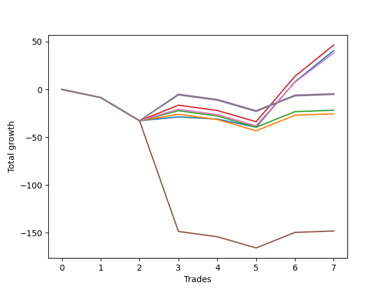

# Short Wallace Doodle 019 
- Symbol: ES90d5m
- Date Range: 03/18/2022 - 07/08/2022
- Trading Period: 7:20-12:30
- Number of Trades: 7



| Name | Win Percent | Profit | Avg Profit / Trade | Avg Time / Trade |      | Name | Win Percent | Profit | Avg Profit / Trade | Avg Time / Trade |
| ---- | ----------- | ------ | ------------------ | ---------------- | ---- | ---- | ----------- | ------ | ------------------ | ---------------- |
| Sorted By <br> Profit | | | | | | Sorted By <br> Win Percentage ||||
| Fifty-One | 42.86 | 10250.00 | 1464.29 | 00:00 |     | Eighty-Three | 71.43 | 7250.00 | 1035.71 | 00:00 |
| One Hundred Four | 57.14 | 10000.00 | 1428.57 | 00:00 |     | Eighty-Two | 71.43 | 6875.00 | 982.14 | 00:00 |
| Ninety-One | 57.14 | 9500.00 | 1357.14 | 00:00 |     | Eighty-One | 71.43 | 5125.00 | 732.14 | 00:00 |
| Fifty-Four | 42.86 | 9250.00 | 1321.43 | 00:00 |     | One Hundred Twenty-One | 71.43 | 4125.00 | 589.29 | 00:00 |
| One Hundred Three | 57.14 | 9125.00 | 1303.57 | 00:00 |     | One Hundred Twenty-Six | 71.43 | 3125.00 | 446.43 | 00:00 |
| One Hundred Two | 57.14 | 8750.00 | 1250.00 | 00:00 |     | One Hundred Four | 57.14 | 10000.00 | 1428.57 | 00:00 |
| Ninety-Six | 57.14 | 8250.00 | 1178.57 | 00:00 |     | Ninety-One | 57.14 | 9500.00 | 1357.14 | 00:00 |
| One Hundred One | 57.14 | 8000.00 | 1142.86 | 00:00 |     | One Hundred Three | 57.14 | 9125.00 | 1303.57 | 00:00 |
| Eleven | 14.29 | 8000.00 | 1142.86 | 00:00 |     | One Hundred Two | 57.14 | 8750.00 | 1250.00 | 00:00 |
| Ninety-Four | 42.86 | 7875.00 | 1125.00 | 00:00 |     | Ninety-Six | 57.14 | 8250.00 | 1178.57 | 00:00 |
| Fifty-Five | 42.86 | 7875.00 | 1125.00 | 00:00 |     | One Hundred One | 57.14 | 8000.00 | 1142.86 | 00:00 |
| Fifty-Three | 42.86 | 7875.00 | 1125.00 | 00:00 |     | One Hundred Fourteen | 57.14 | 7750.00 | 1107.14 | 00:00 |
| Fifty-Two | 42.86 | 7875.00 | 1125.00 | 00:00 |     | One Hundred Six | 57.14 | 7500.00 | 1071.43 | 00:00 |
| Fifty | 42.86 | 7875.00 | 1125.00 | 00:00 |     | One Hundred Ninteen | 57.14 | 7250.00 | 1035.71 | 00:00 |
| Forty-Nine | 42.86 | 7875.00 | 1125.00 | 00:00 |     | Eighty-Five | 57.14 | 7000.00 | 1000.00 | 00:00 |
| Forty-Eight | 42.86 | 7875.00 | 1125.00 | 00:00 |     | One Hundred Thirteen | 57.14 | 6875.00 | 982.14 | 00:00 |
| One Hundred Fourteen | 57.14 | 7750.00 | 1107.14 | 00:00 |     | One Hundred Twelve | 57.14 | 6500.00 | 928.57 | 00:00 |
| Ninety-Three | 42.86 | 7625.00 | 1089.29 | 00:00 |     | One Hundred Eighteen | 57.14 | 6375.00 | 910.71 | 00:00 |
| Ninety-Two | 42.86 | 7625.00 | 1089.29 | 00:00 |     | One Hundred Seventeen | 57.14 | 6000.00 | 857.14 | 00:00 |
| One Hundred Six | 57.14 | 7500.00 | 1071.43 | 00:00 |     | One Hundred Eleven | 57.14 | 5750.00 | 821.43 | 00:00 |
| Ninety-Nine | 42.86 | 7375.00 | 1053.57 | 00:00 |     | One Hundred Sixteen | 57.14 | 5250.00 | 750.00 | 00:00 |
| Eighty-Three | 71.43 | 7250.00 | 1035.71 | 00:00 |     | Eighty-Four | 57.14 | 4375.00 | 625.00 | 00:00 |
| One Hundred Ninteen | 57.14 | 7250.00 | 1035.71 | 00:00 |     | One Hundred Twenty-Four | 57.14 | 625.00 | 89.29 | 00:00 |
| Ninety-Eight | 42.86 | 7125.00 | 1017.86 | 00:00 |     | One Hundred Twenty-Nine | 57.14 | 250.00 | 35.71 | 00:00 |
| Ninety-Seven | 42.86 | 7125.00 | 1017.86 | 00:00 |     | One Hundred Twenty-Three | 57.14 | -250.00 | -35.71 | 00:00 |
| Eighty-Five | 57.14 | 7000.00 | 1000.00 | 00:00 |     | One Hundred Twenty-Eight | 57.14 | -625.00 | -89.29 | 00:00 |
| One Hundred Five | 42.86 | 7000.00 | 1000.00 | 00:00 |     | One Hundred Twenty-Two | 57.14 | -625.00 | -89.29 | 00:00 |
| Fourteen | 14.29 | 7000.00 | 1000.00 | 00:00 |     | One Hundred Twenty-Seven | 57.14 | -1000.00 | -142.86 | 00:00 |
| Eighty-Two | 71.43 | 6875.00 | 982.14 | 00:00 |     | Fifty-One | 42.86 | 10250.00 | 1464.29 | 00:00 |
| One Hundred Thirteen | 57.14 | 6875.00 | 982.14 | 00:00 |     | Fifty-Four | 42.86 | 9250.00 | 1321.43 | 00:00 |
| One Hundred | 42.86 | 6625.00 | 946.43 | 00:00 |     | Ninety-Four | 42.86 | 7875.00 | 1125.00 | 00:00 |
| One Hundred Twelve | 57.14 | 6500.00 | 928.57 | 00:00 |     | Fifty-Five | 42.86 | 7875.00 | 1125.00 | 00:00 |
| One Hundred Eighteen | 57.14 | 6375.00 | 910.71 | 00:00 |     | Fifty-Three | 42.86 | 7875.00 | 1125.00 | 00:00 |
| One Hundred Seventeen | 57.14 | 6000.00 | 857.14 | 00:00 |     | Fifty-Two | 42.86 | 7875.00 | 1125.00 | 00:00 |
| One Hundred Nine | 42.86 | 5875.00 | 839.29 | 00:00 |     | Fifty | 42.86 | 7875.00 | 1125.00 | 00:00 |
| twenty-Seven | 14.29 | 5875.00 | 839.29 | 00:00 |     | Forty-Nine | 42.86 | 7875.00 | 1125.00 | 00:00 |
| One Hundred Eleven | 57.14 | 5750.00 | 821.43 | 00:00 |     | Forty-Eight | 42.86 | 7875.00 | 1125.00 | 00:00 |
| One Hundred Eight | 42.86 | 5625.00 | 803.57 | 00:00 |     | Ninety-Three | 42.86 | 7625.00 | 1089.29 | 00:00 |
| One Hundred Seven | 42.86 | 5625.00 | 803.57 | 00:00 |     | Ninety-Two | 42.86 | 7625.00 | 1089.29 | 00:00 |
| One Hundred Twenty | 42.86 | 5500.00 | 785.71 | 00:00 |     | Ninety-Nine | 42.86 | 7375.00 | 1053.57 | 00:00 |
| Twenty-Three | 42.86 | 5375.00 | 767.86 | 00:00 |     | Ninety-Eight | 42.86 | 7125.00 | 1017.86 | 00:00 |
| Twenty-Two | 42.86 | 5375.00 | 767.86 | 00:00 |     | Ninety-Seven | 42.86 | 7125.00 | 1017.86 | 00:00 |
| Twenty-One | 42.86 | 5375.00 | 767.86 | 00:00 |     | One Hundred Five | 42.86 | 7000.00 | 1000.00 | 00:00 |
| Twenty | 42.86 | 5375.00 | 767.86 | 00:00 |     | One Hundred | 42.86 | 6625.00 | 946.43 | 00:00 |
| Nineteen | 42.86 | 5375.00 | 767.86 | 00:00 |     | One Hundred Nine | 42.86 | 5875.00 | 839.29 | 00:00 |
| Eighteen | 42.86 | 5375.00 | 767.86 | 00:00 |     | One Hundred Eight | 42.86 | 5625.00 | 803.57 | 00:00 |
| Seventeen | 42.86 | 5375.00 | 767.86 | 00:00 |     | One Hundred Seven | 42.86 | 5625.00 | 803.57 | 00:00 |
| Sixten | 42.86 | 5375.00 | 767.86 | 00:00 |     | One Hundred Twenty | 42.86 | 5500.00 | 785.71 | 00:00 |
| One Hundred Sixteen | 57.14 | 5250.00 | 750.00 | 00:00 |     | Twenty-Three | 42.86 | 5375.00 | 767.86 | 00:00 |
| Eighty-One | 71.43 | 5125.00 | 732.14 | 00:00 |     | Twenty-Two | 42.86 | 5375.00 | 767.86 | 00:00 |
| Three | 42.86 | 5125.00 | 732.14 | 00:00 |     | Twenty-One | 42.86 | 5375.00 | 767.86 | 00:00 |
| Ninety-Five | 28.57 | 4875.00 | 696.43 | 00:00 |     | Twenty | 42.86 | 5375.00 | 767.86 | 00:00 |
| Thirty | 14.29 | 4875.00 | 696.43 | 00:00 |     | Nineteen | 42.86 | 5375.00 | 767.86 | 00:00 |
| Six | 42.86 | 4625.00 | 660.71 | 00:00 |     | Eighteen | 42.86 | 5375.00 | 767.86 | 00:00 |
| One Hundred Ten | 42.86 | 4500.00 | 642.86 | 00:00 |     | Seventeen | 42.86 | 5375.00 | 767.86 | 00:00 |
| Eighty-Four | 57.14 | 4375.00 | 625.00 | 00:00 |     | Sixten | 42.86 | 5375.00 | 767.86 | 00:00 |
| One Hundred Twenty-One | 71.43 | 4125.00 | 589.29 | 00:00 |     | Three | 42.86 | 5125.00 | 732.14 | 00:00 |
| One Hundred Fifteen | 42.86 | 3750.00 | 535.71 | 00:00 |     | Six | 42.86 | 4625.00 | 660.71 | 00:00 |
| Four | 42.86 | 3375.00 | 482.14 | 00:00 |     | One Hundred Ten | 42.86 | 4500.00 | 642.86 | 00:00 |
| One Hundred Twenty-Six | 71.43 | 3125.00 | 446.43 | 00:00 |     | One Hundred Fifteen | 42.86 | 3750.00 | 535.71 | 00:00 |
| Seven | 42.86 | 3000.00 | 428.57 | 00:00 |     | Four | 42.86 | 3375.00 | 482.14 | 00:00 |
| Thirty-Nine | 42.86 | 1375.00 | 196.43 | 00:00 |     | Seven | 42.86 | 3000.00 | 428.57 | 00:00 |
| Thirty-Eight | 42.86 | 1375.00 | 196.43 | 00:00 |     | Thirty-Nine | 42.86 | 1375.00 | 196.43 | 00:00 |
| Thirty-Seven | 42.86 | 1375.00 | 196.43 | 00:00 |     | Thirty-Eight | 42.86 | 1375.00 | 196.43 | 00:00 |
| Thirty-Six | 42.86 | 1375.00 | 196.43 | 00:00 |     | Thirty-Seven | 42.86 | 1375.00 | 196.43 | 00:00 |
| Thirty-Five | 42.86 | 1375.00 | 196.43 | 00:00 |     | Thirty-Six | 42.86 | 1375.00 | 196.43 | 00:00 |
| Thirty-Four | 42.86 | 1375.00 | 196.43 | 00:00 |     | Thirty-Five | 42.86 | 1375.00 | 196.43 | 00:00 |
| Thirty-Three | 42.86 | 1375.00 | 196.43 | 00:00 |     | Thirty-Four | 42.86 | 1375.00 | 196.43 | 00:00 |
| Thirty-Two | 42.86 | 1375.00 | 196.43 | 00:00 |     | Thirty-Three | 42.86 | 1375.00 | 196.43 | 00:00 |
| One Hundred Twenty-Four | 57.14 | 625.00 | 89.29 | 00:00 |     | Thirty-Two | 42.86 | 1375.00 | 196.43 | 00:00 |
| One Hundred Twenty-Nine | 57.14 | 250.00 | 35.71 | 00:00 |     | Seventy-Three | 42.86 | -1250.00 | -178.57 | 00:00 |
| One Hundred Twenty-Three | 57.14 | -250.00 | -35.71 | 00:00 |     | One Hundred Thirty | 42.86 | -3875.00 | -553.57 | 00:00 |
| One Hundred Twenty-Eight | 57.14 | -625.00 | -89.29 | 00:00 |     | Two | 42.86 | -5250.00 | -750.00 | 00:00 |
| One Hundred Twenty-Two | 57.14 | -625.00 | -89.29 | 00:00 |     | Zero | 42.86 | -5500.00 | -785.71 | 00:00 |
| One Hundred Twenty-Seven | 57.14 | -1000.00 | -142.86 | 00:00 |     | One Hundred Twenty-Five | 42.86 | -5875.00 | -839.29 | 00:00 |
| Seventy-Three | 42.86 | -1250.00 | -178.57 | 00:00 |     | One | 42.86 | -7125.00 | -1017.86 | 00:00 |
| Forty-Three | 14.29 | -1375.00 | -196.43 | 00:00 |     | Ninety-Five | 28.57 | 4875.00 | 696.43 | 00:00 |
| Forty-Six | 14.29 | -2375.00 | -339.29 | 00:00 |     | Five | 28.57 | -67000.00 | -9571.43 | 00:00 |
| One Hundred Thirty | 42.86 | -3875.00 | -553.57 | 00:00 |     | Eleven | 14.29 | 8000.00 | 1142.86 | 00:00 |
| Sixty-Seven | 14.29 | -4000.00 | -571.43 | 00:00 |     | Fourteen | 14.29 | 7000.00 | 1000.00 | 00:00 |
| Seventy | 14.29 | -5000.00 | -714.29 | 00:00 |     | twenty-Seven | 14.29 | 5875.00 | 839.29 | 00:00 |
| Two | 42.86 | -5250.00 | -750.00 | 00:00 |     | Thirty | 14.29 | 4875.00 | 696.43 | 00:00 |
| Zero | 42.86 | -5500.00 | -785.71 | 00:00 |     | Forty-Three | 14.29 | -1375.00 | -196.43 | 00:00 |
| One Hundred Twenty-Five | 42.86 | -5875.00 | -839.29 | 00:00 |     | Forty-Six | 14.29 | -2375.00 | -339.29 | 00:00 |
| One | 42.86 | -7125.00 | -1017.86 | 00:00 |     | Sixty-Seven | 14.29 | -4000.00 | -571.43 | 00:00 |
| Seventy-One | 14.29 | -9250.00 | -1321.43 | 00:00 |     | Seventy | 14.29 | -5000.00 | -714.29 | 00:00 |
| Sixty-Nine | 14.29 | -9250.00 | -1321.43 | 00:00 |     | Seventy-One | 14.29 | -9250.00 | -1321.43 | 00:00 |
| Sixty-Eight | 14.29 | -9250.00 | -1321.43 | 00:00 |     | Sixty-Nine | 14.29 | -9250.00 | -1321.43 | 00:00 |
| Sixty-Six | 14.29 | -9250.00 | -1321.43 | 00:00 |     | Sixty-Eight | 14.29 | -9250.00 | -1321.43 | 00:00 |
| Sixty-Five | 14.29 | -9250.00 | -1321.43 | 00:00 |     | Sixty-Six | 14.29 | -9250.00 | -1321.43 | 00:00 |
| Sixty-Four | 14.29 | -9250.00 | -1321.43 | 00:00 |     | Sixty-Five | 14.29 | -9250.00 | -1321.43 | 00:00 |
| Fifteen | 0.00 | -9750.00 | -1392.86 | 00:00 |     | Sixty-Four | 14.29 | -9250.00 | -1321.43 | 00:00 |
| Thirteen | 0.00 | -9750.00 | -1392.86 | 00:00 |     | Fifty-Nine | 14.29 | -15250.00 | -2178.57 | 00:00 |
| Twelve | 0.00 | -9750.00 | -1392.86 | 00:00 |     | Sixty-Two | 14.29 | -16250.00 | -2321.43 | 00:00 |
| Ten | 0.00 | -9750.00 | -1392.86 | 00:00 |     | Fifteen | 0.00 | -9750.00 | -1392.86 | 00:00 |
| Nine | 0.00 | -9750.00 | -1392.86 | 00:00 |     | Thirteen | 0.00 | -9750.00 | -1392.86 | 00:00 |
| Eight | 0.00 | -9750.00 | -1392.86 | 00:00 |     | Twelve | 0.00 | -9750.00 | -1392.86 | 00:00 |
| Thirty-One | 0.00 | -12125.00 | -1732.14 | 00:00 |     | Ten | 0.00 | -9750.00 | -1392.86 | 00:00 |
| Twenty-Nine | 0.00 | -12125.00 | -1732.14 | 00:00 |     | Nine | 0.00 | -9750.00 | -1392.86 | 00:00 |
| Twenty-Eight | 0.00 | -12125.00 | -1732.14 | 00:00 |     | Eight | 0.00 | -9750.00 | -1392.86 | 00:00 |
| Twenty-Six | 0.00 | -12125.00 | -1732.14 | 00:00 |     | Thirty-One | 0.00 | -12125.00 | -1732.14 | 00:00 |
| Twenty-Five | 0.00 | -12125.00 | -1732.14 | 00:00 |     | Twenty-Nine | 0.00 | -12125.00 | -1732.14 | 00:00 |
| Twenty-Four | 0.00 | -12125.00 | -1732.14 | 00:00 |     | Twenty-Eight | 0.00 | -12125.00 | -1732.14 | 00:00 |
| Fifty-Nine | 14.29 | -15250.00 | -2178.57 | 00:00 |     | Twenty-Six | 0.00 | -12125.00 | -1732.14 | 00:00 |
| Sixty-Two | 14.29 | -16250.00 | -2321.43 | 00:00 |     | Twenty-Five | 0.00 | -12125.00 | -1732.14 | 00:00 |
| Forty-Seven | 0.00 | -20875.00 | -2982.14 | 00:00 |     | Twenty-Four | 0.00 | -12125.00 | -1732.14 | 00:00 |
| Forty-Five | 0.00 | -20875.00 | -2982.14 | 00:00 |     | Forty-Seven | 0.00 | -20875.00 | -2982.14 | 00:00 |
| Forty-Four | 0.00 | -20875.00 | -2982.14 | 00:00 |     | Forty-Five | 0.00 | -20875.00 | -2982.14 | 00:00 |
| Forty-Two | 0.00 | -20875.00 | -2982.14 | 00:00 |     | Forty-Four | 0.00 | -20875.00 | -2982.14 | 00:00 |
| Forty-One | 0.00 | -20875.00 | -2982.14 | 00:00 |     | Forty-Two | 0.00 | -20875.00 | -2982.14 | 00:00 |
| Forty | 0.00 | -20875.00 | -2982.14 | 00:00 |     | Forty-One | 0.00 | -20875.00 | -2982.14 | 00:00 |
| Sixty-Three | 0.00 | -37125.00 | -5303.57 | 00:00 |     | Forty | 0.00 | -20875.00 | -2982.14 | 00:00 |
| Sixty-One | 0.00 | -37125.00 | -5303.57 | 00:00 |     | Sixty-Three | 0.00 | -37125.00 | -5303.57 | 00:00 |
| Sixty | 0.00 | -37125.00 | -5303.57 | 00:00 |     | Sixty-One | 0.00 | -37125.00 | -5303.57 | 00:00 |
| Fifty-Eight | 0.00 | -37125.00 | -5303.57 | 00:00 |     | Sixty | 0.00 | -37125.00 | -5303.57 | 00:00 |
| Fifty-Seven | 0.00 | -37125.00 | -5303.57 | 00:00 |     | Fifty-Eight | 0.00 | -37125.00 | -5303.57 | 00:00 |
| Fifty-Six | 0.00 | -37125.00 | -5303.57 | 00:00 |     | Fifty-Seven | 0.00 | -37125.00 | -5303.57 | 00:00 |
| Five | 28.57 | -67000.00 | -9571.43 | 00:00 |     | Fifty-Six | 0.00 | -37125.00 | -5303.57 | 00:00 |

## NO STOPLOSS

### Test Zero
* Sell when price hits the middle line of the 20p bollinger
* No Stoploss
* Results:
```
Total Trades: 7
Percent Up: 57.14
Percent Down: 42.86
Total Points Moved Down: -11.00
Potential Profit: -5500.00
Total Points Ups: 33.25 Count Ups: 4
Total Points Downs: 22.25 Count Downs: 3
```

<details><summary>Trades</summary>

<code>In: 2022-03-28 12:05:00		Out: 2022-03-28 12:55:00		Total Position Time: 50:00		Total Move Down: -10.75		Total to Date: -10.75</code> <br />
<code>In: 2022-04-07 11:05:00		Out: 2022-04-07 12:55:00		Total Position Time: 110:00		Total Move Down: -17.00		Total to Date: -27.75</code> <br />
<code>In: 2022-05-04 09:45:00		Out: 2022-05-04 11:00:25		Total Position Time: 75:25		Total Move Down: 2.25		Total to Date: -25.50</code> <br />
<code>In: 2022-05-25 11:40:00		Out: 2022-05-25 12:50:05		Total Position Time: 70:05		Total Move Down: -4.25		Total to Date: -29.75</code> <br />
<code>In: 2022-05-25 11:45:00		Out: 2022-05-25 12:50:05		Total Position Time: 65:05		Total Move Down: -1.25		Total to Date: -31.00</code> <br />
<code>In: 2022-06-15 11:50:00		Out: 2022-06-15 12:50:25		Total Position Time: 60:25		Total Move Down: 17.25		Total to Date: -13.75</code> <br />
<code>In: 2022-06-15 11:55:00		Out: 2022-06-15 12:50:25		Total Position Time: 55:25		Total Move Down: 2.75		Total to Date: -11.00</code> <br />


</details>

### Test One
* Sell when the price hits the upper line of the 20p 1std bollinger
* No Stoploss
* Results:
```
Total Trades: 7
Percent Up: 57.14
Percent Down: 42.86
Total Points Moved Down: -14.25
Potential Profit: -7125.00
Total Points Ups: 39.75 Count Ups: 4
Total Points Downs: 25.50 Count Downs: 3
```

<details><summary>Trades</summary>

<code>In: 2022-03-28 12:05:00		Out: 2022-03-28 12:55:00		Total Position Time: 50:00		Total Move Down: -10.75		Total to Date: -10.75</code> <br />
<code>In: 2022-04-07 11:05:00		Out: 2022-04-07 12:55:00		Total Position Time: 110:00		Total Move Down: -17.00		Total to Date: -27.75</code> <br />
<code>In: 2022-05-04 09:45:00		Out: 2022-05-04 11:07:25		Total Position Time: 82:25		Total Move Down: 4.50		Total to Date: -23.25</code> <br />
<code>In: 2022-05-25 11:40:00		Out: 2022-05-25 12:55:00		Total Position Time: 75:00		Total Move Down: -7.50		Total to Date: -30.75</code> <br />
<code>In: 2022-05-25 11:45:00		Out: 2022-05-25 12:55:00		Total Position Time: 70:00		Total Move Down: -4.50		Total to Date: -35.25</code> <br />
<code>In: 2022-06-15 11:50:00		Out: 2022-06-15 12:55:00		Total Position Time: 65:00		Total Move Down: 17.75		Total to Date: -17.50</code> <br />
<code>In: 2022-06-15 11:55:00		Out: 2022-06-15 12:55:00		Total Position Time: 60:00		Total Move Down: 3.25		Total to Date: -14.25</code> <br />


</details>

### Test Two
* Sell when the price hits the upper line of the 20p 2std bollinger
* No Stoploss
* Results:
```
Total Trades: 7
Percent Up: 57.14
Percent Down: 42.86
Total Points Moved Down: -10.50
Potential Profit: -5250.00
Total Points Ups: 39.75 Count Ups: 4
Total Points Downs: 29.25 Count Downs: 3
```

<details><summary>Trades</summary>

<code>In: 2022-03-28 12:05:00		Out: 2022-03-28 12:55:00		Total Position Time: 50:00		Total Move Down: -10.75		Total to Date: -10.75</code> <br />
<code>In: 2022-04-07 11:05:00		Out: 2022-04-07 12:55:00		Total Position Time: 110:00		Total Move Down: -17.00		Total to Date: -27.75</code> <br />
<code>In: 2022-05-04 09:45:00		Out: 2022-05-04 11:07:40		Total Position Time: 82:40		Total Move Down: 8.25		Total to Date: -19.50</code> <br />
<code>In: 2022-05-25 11:40:00		Out: 2022-05-25 12:55:00		Total Position Time: 75:00		Total Move Down: -7.50		Total to Date: -27.00</code> <br />
<code>In: 2022-05-25 11:45:00		Out: 2022-05-25 12:55:00		Total Position Time: 70:00		Total Move Down: -4.50		Total to Date: -31.50</code> <br />
<code>In: 2022-06-15 11:50:00		Out: 2022-06-15 12:55:00		Total Position Time: 65:00		Total Move Down: 17.75		Total to Date: -13.75</code> <br />
<code>In: 2022-06-15 11:55:00		Out: 2022-06-15 12:55:00		Total Position Time: 60:00		Total Move Down: 3.25		Total to Date: -10.50</code> <br />


</details>

### Test Three
* Sell when price hits the middle line of the 50p bollinger
* No Stoploss
* Results:
```
Total Trades: 7
Percent Up: 57.14
Percent Down: 42.86
Total Points Moved Down: 10.25
Potential Profit: 5125.00
Total Points Ups: 39.75 Count Ups: 4
Total Points Downs: 50.00 Count Downs: 3
```

<details><summary>Trades</summary>

<code>In: 2022-03-28 12:05:00		Out: 2022-03-28 12:55:00		Total Position Time: 50:00		Total Move Down: -10.75		Total to Date: -10.75</code> <br />
<code>In: 2022-04-07 11:05:00		Out: 2022-04-07 12:55:00		Total Position Time: 110:00		Total Move Down: -17.00		Total to Date: -27.75</code> <br />
<code>In: 2022-05-04 09:45:00		Out: 2022-05-04 11:20:50		Total Position Time: 95:50		Total Move Down: 14.00		Total to Date: -13.75</code> <br />
<code>In: 2022-05-25 11:40:00		Out: 2022-05-25 12:55:00		Total Position Time: 75:00		Total Move Down: -7.50		Total to Date: -21.25</code> <br />
<code>In: 2022-05-25 11:45:00		Out: 2022-05-25 12:55:00		Total Position Time: 70:00		Total Move Down: -4.50		Total to Date: -25.75</code> <br />
<code>In: 2022-06-15 11:50:00		Out: 2022-06-15 11:58:10		Total Position Time: 08:10		Total Move Down: 32.75		Total to Date: 7.00</code> <br />
<code>In: 2022-06-15 11:55:00		Out: 2022-06-15 12:55:00		Total Position Time: 60:00		Total Move Down: 3.25		Total to Date: 10.25</code> <br />


</details>

### Test Four
* Sell when the price hits the upper line of the 50p 1std bollinger
* No Stoploss
* Results:
```
Total Trades: 7
Percent Up: 57.14
Percent Down: 42.86
Total Points Moved Down: 6.75
Potential Profit: 3375.00
Total Points Ups: 39.75 Count Ups: 4
Total Points Downs: 46.50 Count Downs: 3
```

<details><summary>Trades</summary>

<code>In: 2022-03-28 12:05:00		Out: 2022-03-28 12:55:00		Total Position Time: 50:00		Total Move Down: -10.75		Total to Date: -10.75</code> <br />
<code>In: 2022-04-07 11:05:00		Out: 2022-04-07 12:55:00		Total Position Time: 110:00		Total Move Down: -17.00		Total to Date: -27.75</code> <br />
<code>In: 2022-05-04 09:45:00		Out: 2022-05-04 11:34:10		Total Position Time: 109:10		Total Move Down: 25.50		Total to Date: -2.25</code> <br />
<code>In: 2022-05-25 11:40:00		Out: 2022-05-25 12:55:00		Total Position Time: 75:00		Total Move Down: -7.50		Total to Date: -9.75</code> <br />
<code>In: 2022-05-25 11:45:00		Out: 2022-05-25 12:55:00		Total Position Time: 70:00		Total Move Down: -4.50		Total to Date: -14.25</code> <br />
<code>In: 2022-06-15 11:50:00		Out: 2022-06-15 12:55:00		Total Position Time: 65:00		Total Move Down: 17.75		Total to Date: 3.50</code> <br />
<code>In: 2022-06-15 11:55:00		Out: 2022-06-15 12:55:00		Total Position Time: 60:00		Total Move Down: 3.25		Total to Date: 6.75</code> <br />


</details>

### Test Five
* Sell when the price hits the upper line of the 50p 2std bollinger
* No Stoploss
* Results:
```
Total Trades: 7
Percent Up: 71.43
Percent Down: 28.57
Total Points Moved Down: -134.00
Potential Profit: -67000.00
Total Points Ups: 155.00 Count Ups: 5
Total Points Downs: 21.00 Count Downs: 2
```

<details><summary>Trades</summary>

<code>In: 2022-03-28 12:05:00		Out: 2022-03-28 12:55:00		Total Position Time: 50:00		Total Move Down: -10.75		Total to Date: -10.75</code> <br />
<code>In: 2022-04-07 11:05:00		Out: 2022-04-07 12:55:00		Total Position Time: 110:00		Total Move Down: -17.00		Total to Date: -27.75</code> <br />
<code>In: 2022-05-04 09:45:00		Out: 2022-05-04 12:55:00		Total Position Time: 190:00		Total Move Down: -115.25		Total to Date: -143.00</code> <br />
<code>In: 2022-05-25 11:40:00		Out: 2022-05-25 12:55:00		Total Position Time: 75:00		Total Move Down: -7.50		Total to Date: -150.50</code> <br />
<code>In: 2022-05-25 11:45:00		Out: 2022-05-25 12:55:00		Total Position Time: 70:00		Total Move Down: -4.50		Total to Date: -155.00</code> <br />
<code>In: 2022-06-15 11:50:00		Out: 2022-06-15 12:55:00		Total Position Time: 65:00		Total Move Down: 17.75		Total to Date: -137.25</code> <br />
<code>In: 2022-06-15 11:55:00		Out: 2022-06-15 12:55:00		Total Position Time: 60:00		Total Move Down: 3.25		Total to Date: -134.00</code> <br />


</details>

### Test Six
* Sell when the price hits the middle line of the 1std VWAP
* No Stoploss
* Results:
```
Total Trades: 7
Percent Up: 57.14
Percent Down: 42.86
Total Points Moved Down: 9.25
Potential Profit: 4625.00
Total Points Ups: 39.75 Count Ups: 4
Total Points Downs: 49.00 Count Downs: 3
```

<details><summary>Trades</summary>

<code>In: 2022-03-28 12:05:00		Out: 2022-03-28 12:55:00		Total Position Time: 50:00		Total Move Down: -10.75		Total to Date: -10.75</code> <br />
<code>In: 2022-04-07 11:05:00		Out: 2022-04-07 12:55:00		Total Position Time: 110:00		Total Move Down: -17.00		Total to Date: -27.75</code> <br />
<code>In: 2022-05-04 09:45:00		Out: 2022-05-04 11:20:20		Total Position Time: 95:20		Total Move Down: 9.75		Total to Date: -18.00</code> <br />
<code>In: 2022-05-25 11:40:00		Out: 2022-05-25 12:55:00		Total Position Time: 75:00		Total Move Down: -7.50		Total to Date: -25.50</code> <br />
<code>In: 2022-05-25 11:45:00		Out: 2022-05-25 12:55:00		Total Position Time: 70:00		Total Move Down: -4.50		Total to Date: -30.00</code> <br />
<code>In: 2022-06-15 11:50:00		Out: 2022-06-15 11:57:55		Total Position Time: 07:55		Total Move Down: 30.75		Total to Date: 0.75</code> <br />
<code>In: 2022-06-15 11:55:00		Out: 2022-06-15 12:52:10		Total Position Time: 57:10		Total Move Down: 8.50		Total to Date: 9.25</code> <br />


</details>

### Test Seven
* Sell when the price hits the upper line of the 1std VWAP
* No Stoploss
* Results:
```
Total Trades: 7
Percent Up: 57.14
Percent Down: 42.86
Total Points Moved Down: 6.00
Potential Profit: 3000.00
Total Points Ups: 39.75 Count Ups: 4
Total Points Downs: 45.75 Count Downs: 3
```

<details><summary>Trades</summary>

<code>In: 2022-03-28 12:05:00		Out: 2022-03-28 12:55:00		Total Position Time: 50:00		Total Move Down: -10.75		Total to Date: -10.75</code> <br />
<code>In: 2022-04-07 11:05:00		Out: 2022-04-07 12:55:00		Total Position Time: 110:00		Total Move Down: -17.00		Total to Date: -27.75</code> <br />
<code>In: 2022-05-04 09:45:00		Out: 2022-05-04 11:34:05		Total Position Time: 109:05		Total Move Down: 24.75		Total to Date: -3.00</code> <br />
<code>In: 2022-05-25 11:40:00		Out: 2022-05-25 12:55:00		Total Position Time: 75:00		Total Move Down: -7.50		Total to Date: -10.50</code> <br />
<code>In: 2022-05-25 11:45:00		Out: 2022-05-25 12:55:00		Total Position Time: 70:00		Total Move Down: -4.50		Total to Date: -15.00</code> <br />
<code>In: 2022-06-15 11:50:00		Out: 2022-06-15 12:55:00		Total Position Time: 65:00		Total Move Down: 17.75		Total to Date: 2.75</code> <br />
<code>In: 2022-06-15 11:55:00		Out: 2022-06-15 12:55:00		Total Position Time: 60:00		Total Move Down: 3.25		Total to Date: 6.00</code> <br />


</details>

## STOPLOSS OF 2

### Test Eight
* Sell when price hits the middle line of the 20p bollinger
* Stoploss is -2 points
* Results:
```
Total Trades: 7
Percent Up: 100.00
Percent Down: 0.00
Total Points Moved Down: -19.50
Potential Profit: -9750.00
Total Points Ups: 19.50 Count Ups: 7
Total Points Downs: 0.00 Count Downs: 0
```

<details><summary>Trades</summary>

<code>In: 2022-03-28 12:05:00		Out: 2022-03-28 12:10:25		Total Position Time: 05:25		Total Move Down: -2.25		Total to Date: -2.25</code> <br />
<code>In: 2022-04-07 11:05:00		Out: 2022-04-07 11:14:15		Total Position Time: 09:15		Total Move Down: -2.75		Total to Date: -5.00</code> <br />
<code>In: 2022-05-04 09:45:00		Out: 2022-05-04 09:54:15		Total Position Time: 09:15		Total Move Down: -2.00		Total to Date: -7.00</code> <br />
<code>In: 2022-05-25 11:40:00		Out: 2022-05-25 11:45:10		Total Position Time: 05:10		Total Move Down: -2.25		Total to Date: -9.25</code> <br />
<code>In: 2022-05-25 11:45:00		Out: 2022-05-25 11:50:15		Total Position Time: 05:15		Total Move Down: -4.00		Total to Date: -13.25</code> <br />
<code>In: 2022-06-15 11:50:00		Out: 2022-06-15 12:24:00		Total Position Time: 34:00		Total Move Down: -2.75		Total to Date: -16.00</code> <br />
<code>In: 2022-06-15 11:55:00		Out: 2022-06-15 12:00:50		Total Position Time: 05:50		Total Move Down: -3.50		Total to Date: -19.50</code> <br />


</details>

### Test Nine
* Sell when the price hits the upper line of the 20p 1std bollinger
* Stoploss is -2 points
* Results:
```
Total Trades: 7
Percent Up: 100.00
Percent Down: 0.00
Total Points Moved Down: -19.50
Potential Profit: -9750.00
Total Points Ups: 19.50 Count Ups: 7
Total Points Downs: 0.00 Count Downs: 0
```

<details><summary>Trades</summary>

<code>In: 2022-03-28 12:05:00		Out: 2022-03-28 12:10:25		Total Position Time: 05:25		Total Move Down: -2.25		Total to Date: -2.25</code> <br />
<code>In: 2022-04-07 11:05:00		Out: 2022-04-07 11:14:15		Total Position Time: 09:15		Total Move Down: -2.75		Total to Date: -5.00</code> <br />
<code>In: 2022-05-04 09:45:00		Out: 2022-05-04 09:54:15		Total Position Time: 09:15		Total Move Down: -2.00		Total to Date: -7.00</code> <br />
<code>In: 2022-05-25 11:40:00		Out: 2022-05-25 11:45:10		Total Position Time: 05:10		Total Move Down: -2.25		Total to Date: -9.25</code> <br />
<code>In: 2022-05-25 11:45:00		Out: 2022-05-25 11:50:15		Total Position Time: 05:15		Total Move Down: -4.00		Total to Date: -13.25</code> <br />
<code>In: 2022-06-15 11:50:00		Out: 2022-06-15 12:24:00		Total Position Time: 34:00		Total Move Down: -2.75		Total to Date: -16.00</code> <br />
<code>In: 2022-06-15 11:55:00		Out: 2022-06-15 12:00:50		Total Position Time: 05:50		Total Move Down: -3.50		Total to Date: -19.50</code> <br />


</details>

### Test Ten
* Sell when the price hits the upper line of the 20p 2std bollinger
* Stoploss is -2 points
* Results:
```
Total Trades: 7
Percent Up: 100.00
Percent Down: 0.00
Total Points Moved Down: -19.50
Potential Profit: -9750.00
Total Points Ups: 19.50 Count Ups: 7
Total Points Downs: 0.00 Count Downs: 0
```

<details><summary>Trades</summary>

<code>In: 2022-03-28 12:05:00		Out: 2022-03-28 12:10:25		Total Position Time: 05:25		Total Move Down: -2.25		Total to Date: -2.25</code> <br />
<code>In: 2022-04-07 11:05:00		Out: 2022-04-07 11:14:15		Total Position Time: 09:15		Total Move Down: -2.75		Total to Date: -5.00</code> <br />
<code>In: 2022-05-04 09:45:00		Out: 2022-05-04 09:54:15		Total Position Time: 09:15		Total Move Down: -2.00		Total to Date: -7.00</code> <br />
<code>In: 2022-05-25 11:40:00		Out: 2022-05-25 11:45:10		Total Position Time: 05:10		Total Move Down: -2.25		Total to Date: -9.25</code> <br />
<code>In: 2022-05-25 11:45:00		Out: 2022-05-25 11:50:15		Total Position Time: 05:15		Total Move Down: -4.00		Total to Date: -13.25</code> <br />
<code>In: 2022-06-15 11:50:00		Out: 2022-06-15 12:24:00		Total Position Time: 34:00		Total Move Down: -2.75		Total to Date: -16.00</code> <br />
<code>In: 2022-06-15 11:55:00		Out: 2022-06-15 12:00:50		Total Position Time: 05:50		Total Move Down: -3.50		Total to Date: -19.50</code> <br />


</details>

### Test Eleven
* Sell when price hits the middle line of the 50p bollinger
* Stoploss is -2 points
* Results:
```
Total Trades: 7
Percent Up: 85.71
Percent Down: 14.29
Total Points Moved Down: 16.00
Potential Profit: 8000.00
Total Points Ups: 16.75 Count Ups: 6
Total Points Downs: 32.75 Count Downs: 1
```

<details><summary>Trades</summary>

<code>In: 2022-03-28 12:05:00		Out: 2022-03-28 12:10:25		Total Position Time: 05:25		Total Move Down: -2.25		Total to Date: -2.25</code> <br />
<code>In: 2022-04-07 11:05:00		Out: 2022-04-07 11:14:15		Total Position Time: 09:15		Total Move Down: -2.75		Total to Date: -5.00</code> <br />
<code>In: 2022-05-04 09:45:00		Out: 2022-05-04 09:54:15		Total Position Time: 09:15		Total Move Down: -2.00		Total to Date: -7.00</code> <br />
<code>In: 2022-05-25 11:40:00		Out: 2022-05-25 11:45:10		Total Position Time: 05:10		Total Move Down: -2.25		Total to Date: -9.25</code> <br />
<code>In: 2022-05-25 11:45:00		Out: 2022-05-25 11:50:15		Total Position Time: 05:15		Total Move Down: -4.00		Total to Date: -13.25</code> <br />
<code>In: 2022-06-15 11:50:00		Out: 2022-06-15 11:58:10		Total Position Time: 08:10		Total Move Down: 32.75		Total to Date: 19.50</code> <br />
<code>In: 2022-06-15 11:55:00		Out: 2022-06-15 12:00:50		Total Position Time: 05:50		Total Move Down: -3.50		Total to Date: 16.00</code> <br />


</details>

### Test Twelve
* Sell when the price hits the upper line of the 50p 1std bollinger
* Stoploss is -2 points
* Results:
```
Total Trades: 7
Percent Up: 100.00
Percent Down: 0.00
Total Points Moved Down: -19.50
Potential Profit: -9750.00
Total Points Ups: 19.50 Count Ups: 7
Total Points Downs: 0.00 Count Downs: 0
```

<details><summary>Trades</summary>

<code>In: 2022-03-28 12:05:00		Out: 2022-03-28 12:10:25		Total Position Time: 05:25		Total Move Down: -2.25		Total to Date: -2.25</code> <br />
<code>In: 2022-04-07 11:05:00		Out: 2022-04-07 11:14:15		Total Position Time: 09:15		Total Move Down: -2.75		Total to Date: -5.00</code> <br />
<code>In: 2022-05-04 09:45:00		Out: 2022-05-04 09:54:15		Total Position Time: 09:15		Total Move Down: -2.00		Total to Date: -7.00</code> <br />
<code>In: 2022-05-25 11:40:00		Out: 2022-05-25 11:45:10		Total Position Time: 05:10		Total Move Down: -2.25		Total to Date: -9.25</code> <br />
<code>In: 2022-05-25 11:45:00		Out: 2022-05-25 11:50:15		Total Position Time: 05:15		Total Move Down: -4.00		Total to Date: -13.25</code> <br />
<code>In: 2022-06-15 11:50:00		Out: 2022-06-15 12:24:00		Total Position Time: 34:00		Total Move Down: -2.75		Total to Date: -16.00</code> <br />
<code>In: 2022-06-15 11:55:00		Out: 2022-06-15 12:00:50		Total Position Time: 05:50		Total Move Down: -3.50		Total to Date: -19.50</code> <br />


</details>

### Test Thirteen
* Sell when the price hits the upper line of the 50p 2std bollinger
* Stoploss is -2 points
* Results:
```
Total Trades: 7
Percent Up: 100.00
Percent Down: 0.00
Total Points Moved Down: -19.50
Potential Profit: -9750.00
Total Points Ups: 19.50 Count Ups: 7
Total Points Downs: 0.00 Count Downs: 0
```

<details><summary>Trades</summary>

<code>In: 2022-03-28 12:05:00		Out: 2022-03-28 12:10:25		Total Position Time: 05:25		Total Move Down: -2.25		Total to Date: -2.25</code> <br />
<code>In: 2022-04-07 11:05:00		Out: 2022-04-07 11:14:15		Total Position Time: 09:15		Total Move Down: -2.75		Total to Date: -5.00</code> <br />
<code>In: 2022-05-04 09:45:00		Out: 2022-05-04 09:54:15		Total Position Time: 09:15		Total Move Down: -2.00		Total to Date: -7.00</code> <br />
<code>In: 2022-05-25 11:40:00		Out: 2022-05-25 11:45:10		Total Position Time: 05:10		Total Move Down: -2.25		Total to Date: -9.25</code> <br />
<code>In: 2022-05-25 11:45:00		Out: 2022-05-25 11:50:15		Total Position Time: 05:15		Total Move Down: -4.00		Total to Date: -13.25</code> <br />
<code>In: 2022-06-15 11:50:00		Out: 2022-06-15 12:24:00		Total Position Time: 34:00		Total Move Down: -2.75		Total to Date: -16.00</code> <br />
<code>In: 2022-06-15 11:55:00		Out: 2022-06-15 12:00:50		Total Position Time: 05:50		Total Move Down: -3.50		Total to Date: -19.50</code> <br />


</details>

### Test Fourteen
* Sell when the price hits the middle line of the 1std VWAP
* Stoploss is -2 points
* Results:
```
Total Trades: 7
Percent Up: 85.71
Percent Down: 14.29
Total Points Moved Down: 14.00
Potential Profit: 7000.00
Total Points Ups: 16.75 Count Ups: 6
Total Points Downs: 30.75 Count Downs: 1
```

<details><summary>Trades</summary>

<code>In: 2022-03-28 12:05:00		Out: 2022-03-28 12:10:25		Total Position Time: 05:25		Total Move Down: -2.25		Total to Date: -2.25</code> <br />
<code>In: 2022-04-07 11:05:00		Out: 2022-04-07 11:14:15		Total Position Time: 09:15		Total Move Down: -2.75		Total to Date: -5.00</code> <br />
<code>In: 2022-05-04 09:45:00		Out: 2022-05-04 09:54:15		Total Position Time: 09:15		Total Move Down: -2.00		Total to Date: -7.00</code> <br />
<code>In: 2022-05-25 11:40:00		Out: 2022-05-25 11:45:10		Total Position Time: 05:10		Total Move Down: -2.25		Total to Date: -9.25</code> <br />
<code>In: 2022-05-25 11:45:00		Out: 2022-05-25 11:50:15		Total Position Time: 05:15		Total Move Down: -4.00		Total to Date: -13.25</code> <br />
<code>In: 2022-06-15 11:50:00		Out: 2022-06-15 11:57:55		Total Position Time: 07:55		Total Move Down: 30.75		Total to Date: 17.50</code> <br />
<code>In: 2022-06-15 11:55:00		Out: 2022-06-15 12:00:50		Total Position Time: 05:50		Total Move Down: -3.50		Total to Date: 14.00</code> <br />


</details>

### Test Fifteen
* Sell when the price hits the upper line of the 1std VWAP
* Stoploss is -2 points
* Results:
```
Total Trades: 7
Percent Up: 100.00
Percent Down: 0.00
Total Points Moved Down: -19.50
Potential Profit: -9750.00
Total Points Ups: 19.50 Count Ups: 7
Total Points Downs: 0.00 Count Downs: 0
```

<details><summary>Trades</summary>

<code>In: 2022-03-28 12:05:00		Out: 2022-03-28 12:10:25		Total Position Time: 05:25		Total Move Down: -2.25		Total to Date: -2.25</code> <br />
<code>In: 2022-04-07 11:05:00		Out: 2022-04-07 11:14:15		Total Position Time: 09:15		Total Move Down: -2.75		Total to Date: -5.00</code> <br />
<code>In: 2022-05-04 09:45:00		Out: 2022-05-04 09:54:15		Total Position Time: 09:15		Total Move Down: -2.00		Total to Date: -7.00</code> <br />
<code>In: 2022-05-25 11:40:00		Out: 2022-05-25 11:45:10		Total Position Time: 05:10		Total Move Down: -2.25		Total to Date: -9.25</code> <br />
<code>In: 2022-05-25 11:45:00		Out: 2022-05-25 11:50:15		Total Position Time: 05:15		Total Move Down: -4.00		Total to Date: -13.25</code> <br />
<code>In: 2022-06-15 11:50:00		Out: 2022-06-15 12:24:00		Total Position Time: 34:00		Total Move Down: -2.75		Total to Date: -16.00</code> <br />
<code>In: 2022-06-15 11:55:00		Out: 2022-06-15 12:00:50		Total Position Time: 05:50		Total Move Down: -3.50		Total to Date: -19.50</code> <br />


</details>

## TRAIL STOP OF 2

### Test Sixten
* Sell when price hits the middle line of the 20p bollinger
* Trailing Stop is -2 points
* Results:
```
Total Trades: 7
Percent Up: 57.14
Percent Down: 42.86
Total Points Moved Down: 10.75
Potential Profit: 5375.00
Total Points Ups: 12.25 Count Ups: 4
Total Points Downs: 23.00 Count Downs: 3
```

<details><summary>Trades</summary>

<code>In: 2022-03-28 12:05:00		Out: 2022-03-28 12:11:15		Total Position Time: 06:15		Total Move Down: -2.50		Total to Date: -2.50</code> <br />
<code>In: 2022-04-07 11:05:00		Out: 2022-04-07 11:10:55		Total Position Time: 05:55		Total Move Down: -1.25		Total to Date: -3.75</code> <br />
<code>In: 2022-05-04 09:45:00		Out: 2022-05-04 09:51:25		Total Position Time: 06:25		Total Move Down: 2.50		Total to Date: -1.25</code> <br />
<code>In: 2022-05-25 11:40:00		Out: 2022-05-25 11:45:30		Total Position Time: 05:30		Total Move Down: -4.50		Total to Date: -5.75</code> <br />
<code>In: 2022-05-25 11:45:00		Out: 2022-05-25 11:50:15		Total Position Time: 05:15		Total Move Down: -4.00		Total to Date: -9.75</code> <br />
<code>In: 2022-06-15 11:50:00		Out: 2022-06-15 11:55:30		Total Position Time: 05:30		Total Move Down: 16.25		Total to Date: 6.50</code> <br />
<code>In: 2022-06-15 11:55:00		Out: 2022-06-15 12:00:25		Total Position Time: 05:25		Total Move Down: 4.25		Total to Date: 10.75</code> <br />


</details>

### Test Seventeen
* Sell when the price hits the upper line of the 20p 1std bollinger
* Trailing Stop is -2 points
* Results:
```
Total Trades: 7
Percent Up: 57.14
Percent Down: 42.86
Total Points Moved Down: 10.75
Potential Profit: 5375.00
Total Points Ups: 12.25 Count Ups: 4
Total Points Downs: 23.00 Count Downs: 3
```

<details><summary>Trades</summary>

<code>In: 2022-03-28 12:05:00		Out: 2022-03-28 12:11:15		Total Position Time: 06:15		Total Move Down: -2.50		Total to Date: -2.50</code> <br />
<code>In: 2022-04-07 11:05:00		Out: 2022-04-07 11:10:55		Total Position Time: 05:55		Total Move Down: -1.25		Total to Date: -3.75</code> <br />
<code>In: 2022-05-04 09:45:00		Out: 2022-05-04 09:51:25		Total Position Time: 06:25		Total Move Down: 2.50		Total to Date: -1.25</code> <br />
<code>In: 2022-05-25 11:40:00		Out: 2022-05-25 11:45:30		Total Position Time: 05:30		Total Move Down: -4.50		Total to Date: -5.75</code> <br />
<code>In: 2022-05-25 11:45:00		Out: 2022-05-25 11:50:15		Total Position Time: 05:15		Total Move Down: -4.00		Total to Date: -9.75</code> <br />
<code>In: 2022-06-15 11:50:00		Out: 2022-06-15 11:55:30		Total Position Time: 05:30		Total Move Down: 16.25		Total to Date: 6.50</code> <br />
<code>In: 2022-06-15 11:55:00		Out: 2022-06-15 12:00:25		Total Position Time: 05:25		Total Move Down: 4.25		Total to Date: 10.75</code> <br />


</details>

### Test Eighteen
* Sell when the price hits the upper line of the 20p 2std bollinger
* Trailing Stop is -2 points
* Results:
```
Total Trades: 7
Percent Up: 57.14
Percent Down: 42.86
Total Points Moved Down: 10.75
Potential Profit: 5375.00
Total Points Ups: 12.25 Count Ups: 4
Total Points Downs: 23.00 Count Downs: 3
```

<details><summary>Trades</summary>

<code>In: 2022-03-28 12:05:00		Out: 2022-03-28 12:11:15		Total Position Time: 06:15		Total Move Down: -2.50		Total to Date: -2.50</code> <br />
<code>In: 2022-04-07 11:05:00		Out: 2022-04-07 11:10:55		Total Position Time: 05:55		Total Move Down: -1.25		Total to Date: -3.75</code> <br />
<code>In: 2022-05-04 09:45:00		Out: 2022-05-04 09:51:25		Total Position Time: 06:25		Total Move Down: 2.50		Total to Date: -1.25</code> <br />
<code>In: 2022-05-25 11:40:00		Out: 2022-05-25 11:45:30		Total Position Time: 05:30		Total Move Down: -4.50		Total to Date: -5.75</code> <br />
<code>In: 2022-05-25 11:45:00		Out: 2022-05-25 11:50:15		Total Position Time: 05:15		Total Move Down: -4.00		Total to Date: -9.75</code> <br />
<code>In: 2022-06-15 11:50:00		Out: 2022-06-15 11:55:30		Total Position Time: 05:30		Total Move Down: 16.25		Total to Date: 6.50</code> <br />
<code>In: 2022-06-15 11:55:00		Out: 2022-06-15 12:00:25		Total Position Time: 05:25		Total Move Down: 4.25		Total to Date: 10.75</code> <br />


</details>

### Test Nineteen
* Sell when price hits the middle line of the 50p bollinger
* Trailing Stop is -2 points
* Results:
```
Total Trades: 7
Percent Up: 57.14
Percent Down: 42.86
Total Points Moved Down: 10.75
Potential Profit: 5375.00
Total Points Ups: 12.25 Count Ups: 4
Total Points Downs: 23.00 Count Downs: 3
```

<details><summary>Trades</summary>

<code>In: 2022-03-28 12:05:00		Out: 2022-03-28 12:11:15		Total Position Time: 06:15		Total Move Down: -2.50		Total to Date: -2.50</code> <br />
<code>In: 2022-04-07 11:05:00		Out: 2022-04-07 11:10:55		Total Position Time: 05:55		Total Move Down: -1.25		Total to Date: -3.75</code> <br />
<code>In: 2022-05-04 09:45:00		Out: 2022-05-04 09:51:25		Total Position Time: 06:25		Total Move Down: 2.50		Total to Date: -1.25</code> <br />
<code>In: 2022-05-25 11:40:00		Out: 2022-05-25 11:45:30		Total Position Time: 05:30		Total Move Down: -4.50		Total to Date: -5.75</code> <br />
<code>In: 2022-05-25 11:45:00		Out: 2022-05-25 11:50:15		Total Position Time: 05:15		Total Move Down: -4.00		Total to Date: -9.75</code> <br />
<code>In: 2022-06-15 11:50:00		Out: 2022-06-15 11:55:30		Total Position Time: 05:30		Total Move Down: 16.25		Total to Date: 6.50</code> <br />
<code>In: 2022-06-15 11:55:00		Out: 2022-06-15 12:00:25		Total Position Time: 05:25		Total Move Down: 4.25		Total to Date: 10.75</code> <br />


</details>

### Test Twenty
* Sell when the price hits the upper line of the 50p 1std bollinger
* Trailing Stop is -2 points
* Results:
```
Total Trades: 7
Percent Up: 57.14
Percent Down: 42.86
Total Points Moved Down: 10.75
Potential Profit: 5375.00
Total Points Ups: 12.25 Count Ups: 4
Total Points Downs: 23.00 Count Downs: 3
```

<details><summary>Trades</summary>

<code>In: 2022-03-28 12:05:00		Out: 2022-03-28 12:11:15		Total Position Time: 06:15		Total Move Down: -2.50		Total to Date: -2.50</code> <br />
<code>In: 2022-04-07 11:05:00		Out: 2022-04-07 11:10:55		Total Position Time: 05:55		Total Move Down: -1.25		Total to Date: -3.75</code> <br />
<code>In: 2022-05-04 09:45:00		Out: 2022-05-04 09:51:25		Total Position Time: 06:25		Total Move Down: 2.50		Total to Date: -1.25</code> <br />
<code>In: 2022-05-25 11:40:00		Out: 2022-05-25 11:45:30		Total Position Time: 05:30		Total Move Down: -4.50		Total to Date: -5.75</code> <br />
<code>In: 2022-05-25 11:45:00		Out: 2022-05-25 11:50:15		Total Position Time: 05:15		Total Move Down: -4.00		Total to Date: -9.75</code> <br />
<code>In: 2022-06-15 11:50:00		Out: 2022-06-15 11:55:30		Total Position Time: 05:30		Total Move Down: 16.25		Total to Date: 6.50</code> <br />
<code>In: 2022-06-15 11:55:00		Out: 2022-06-15 12:00:25		Total Position Time: 05:25		Total Move Down: 4.25		Total to Date: 10.75</code> <br />


</details>

### Test Twenty-One
* Sell when the price hits the upper line of the 50p 2std bollinger
* Trailing Stop is -2 points
* Results:
```
Total Trades: 7
Percent Up: 57.14
Percent Down: 42.86
Total Points Moved Down: 10.75
Potential Profit: 5375.00
Total Points Ups: 12.25 Count Ups: 4
Total Points Downs: 23.00 Count Downs: 3
```

<details><summary>Trades</summary>

<code>In: 2022-03-28 12:05:00		Out: 2022-03-28 12:11:15		Total Position Time: 06:15		Total Move Down: -2.50		Total to Date: -2.50</code> <br />
<code>In: 2022-04-07 11:05:00		Out: 2022-04-07 11:10:55		Total Position Time: 05:55		Total Move Down: -1.25		Total to Date: -3.75</code> <br />
<code>In: 2022-05-04 09:45:00		Out: 2022-05-04 09:51:25		Total Position Time: 06:25		Total Move Down: 2.50		Total to Date: -1.25</code> <br />
<code>In: 2022-05-25 11:40:00		Out: 2022-05-25 11:45:30		Total Position Time: 05:30		Total Move Down: -4.50		Total to Date: -5.75</code> <br />
<code>In: 2022-05-25 11:45:00		Out: 2022-05-25 11:50:15		Total Position Time: 05:15		Total Move Down: -4.00		Total to Date: -9.75</code> <br />
<code>In: 2022-06-15 11:50:00		Out: 2022-06-15 11:55:30		Total Position Time: 05:30		Total Move Down: 16.25		Total to Date: 6.50</code> <br />
<code>In: 2022-06-15 11:55:00		Out: 2022-06-15 12:00:25		Total Position Time: 05:25		Total Move Down: 4.25		Total to Date: 10.75</code> <br />


</details>

### Test Twenty-Two
* Sell when the price hits the middle line of the 1std VWAP
* Trailing Stop is -2 points
* Results:
```
Total Trades: 7
Percent Up: 57.14
Percent Down: 42.86
Total Points Moved Down: 10.75
Potential Profit: 5375.00
Total Points Ups: 12.25 Count Ups: 4
Total Points Downs: 23.00 Count Downs: 3
```

<details><summary>Trades</summary>

<code>In: 2022-03-28 12:05:00		Out: 2022-03-28 12:11:15		Total Position Time: 06:15		Total Move Down: -2.50		Total to Date: -2.50</code> <br />
<code>In: 2022-04-07 11:05:00		Out: 2022-04-07 11:10:55		Total Position Time: 05:55		Total Move Down: -1.25		Total to Date: -3.75</code> <br />
<code>In: 2022-05-04 09:45:00		Out: 2022-05-04 09:51:25		Total Position Time: 06:25		Total Move Down: 2.50		Total to Date: -1.25</code> <br />
<code>In: 2022-05-25 11:40:00		Out: 2022-05-25 11:45:30		Total Position Time: 05:30		Total Move Down: -4.50		Total to Date: -5.75</code> <br />
<code>In: 2022-05-25 11:45:00		Out: 2022-05-25 11:50:15		Total Position Time: 05:15		Total Move Down: -4.00		Total to Date: -9.75</code> <br />
<code>In: 2022-06-15 11:50:00		Out: 2022-06-15 11:55:30		Total Position Time: 05:30		Total Move Down: 16.25		Total to Date: 6.50</code> <br />
<code>In: 2022-06-15 11:55:00		Out: 2022-06-15 12:00:25		Total Position Time: 05:25		Total Move Down: 4.25		Total to Date: 10.75</code> <br />


</details>

### Test Twenty-Three
* Sell when the price hits the upper line of the 1std VWAP
* Trailing Stop is -2 points
* Results:
```
Total Trades: 7
Percent Up: 57.14
Percent Down: 42.86
Total Points Moved Down: 10.75
Potential Profit: 5375.00
Total Points Ups: 12.25 Count Ups: 4
Total Points Downs: 23.00 Count Downs: 3
```

<details><summary>Trades</summary>

<code>In: 2022-03-28 12:05:00		Out: 2022-03-28 12:11:15		Total Position Time: 06:15		Total Move Down: -2.50		Total to Date: -2.50</code> <br />
<code>In: 2022-04-07 11:05:00		Out: 2022-04-07 11:10:55		Total Position Time: 05:55		Total Move Down: -1.25		Total to Date: -3.75</code> <br />
<code>In: 2022-05-04 09:45:00		Out: 2022-05-04 09:51:25		Total Position Time: 06:25		Total Move Down: 2.50		Total to Date: -1.25</code> <br />
<code>In: 2022-05-25 11:40:00		Out: 2022-05-25 11:45:30		Total Position Time: 05:30		Total Move Down: -4.50		Total to Date: -5.75</code> <br />
<code>In: 2022-05-25 11:45:00		Out: 2022-05-25 11:50:15		Total Position Time: 05:15		Total Move Down: -4.00		Total to Date: -9.75</code> <br />
<code>In: 2022-06-15 11:50:00		Out: 2022-06-15 11:55:30		Total Position Time: 05:30		Total Move Down: 16.25		Total to Date: 6.50</code> <br />
<code>In: 2022-06-15 11:55:00		Out: 2022-06-15 12:00:25		Total Position Time: 05:25		Total Move Down: 4.25		Total to Date: 10.75</code> <br />


</details>

## STOPLOSS OF 3

### Test Twenty-Four
* Sell when price hits the middle line of the 20p bollinger
* Stoploss is -3 points
* Results:
```
Total Trades: 7
Percent Up: 100.00
Percent Down: 0.00
Total Points Moved Down: -24.25
Potential Profit: -12125.00
Total Points Ups: 24.25 Count Ups: 7
Total Points Downs: 0.00 Count Downs: 0
```

<details><summary>Trades</summary>

<code>In: 2022-03-28 12:05:00		Out: 2022-03-28 12:14:25		Total Position Time: 09:25		Total Move Down: -3.00		Total to Date: -3.00</code> <br />
<code>In: 2022-04-07 11:05:00		Out: 2022-04-07 11:26:05		Total Position Time: 21:05		Total Move Down: -3.00		Total to Date: -6.00</code> <br />
<code>In: 2022-05-04 09:45:00		Out: 2022-05-04 09:54:30		Total Position Time: 09:30		Total Move Down: -3.00		Total to Date: -9.00</code> <br />
<code>In: 2022-05-25 11:40:00		Out: 2022-05-25 11:45:30		Total Position Time: 05:30		Total Move Down: -4.50		Total to Date: -13.50</code> <br />
<code>In: 2022-05-25 11:45:00		Out: 2022-05-25 11:50:15		Total Position Time: 05:15		Total Move Down: -4.00		Total to Date: -17.50</code> <br />
<code>In: 2022-06-15 11:50:00		Out: 2022-06-15 12:24:10		Total Position Time: 34:10		Total Move Down: -3.25		Total to Date: -20.75</code> <br />
<code>In: 2022-06-15 11:55:00		Out: 2022-06-15 12:00:50		Total Position Time: 05:50		Total Move Down: -3.50		Total to Date: -24.25</code> <br />


</details>

### Test Twenty-Five
* Sell when the price hits the upper line of the 20p 1std bollinger
* Stoploss is -3 points
* Results:
```
Total Trades: 7
Percent Up: 100.00
Percent Down: 0.00
Total Points Moved Down: -24.25
Potential Profit: -12125.00
Total Points Ups: 24.25 Count Ups: 7
Total Points Downs: 0.00 Count Downs: 0
```

<details><summary>Trades</summary>

<code>In: 2022-03-28 12:05:00		Out: 2022-03-28 12:14:25		Total Position Time: 09:25		Total Move Down: -3.00		Total to Date: -3.00</code> <br />
<code>In: 2022-04-07 11:05:00		Out: 2022-04-07 11:26:05		Total Position Time: 21:05		Total Move Down: -3.00		Total to Date: -6.00</code> <br />
<code>In: 2022-05-04 09:45:00		Out: 2022-05-04 09:54:30		Total Position Time: 09:30		Total Move Down: -3.00		Total to Date: -9.00</code> <br />
<code>In: 2022-05-25 11:40:00		Out: 2022-05-25 11:45:30		Total Position Time: 05:30		Total Move Down: -4.50		Total to Date: -13.50</code> <br />
<code>In: 2022-05-25 11:45:00		Out: 2022-05-25 11:50:15		Total Position Time: 05:15		Total Move Down: -4.00		Total to Date: -17.50</code> <br />
<code>In: 2022-06-15 11:50:00		Out: 2022-06-15 12:24:10		Total Position Time: 34:10		Total Move Down: -3.25		Total to Date: -20.75</code> <br />
<code>In: 2022-06-15 11:55:00		Out: 2022-06-15 12:00:50		Total Position Time: 05:50		Total Move Down: -3.50		Total to Date: -24.25</code> <br />


</details>

### Test Twenty-Six
* Sell when the price hits the upper line of the 20p 2std bollinger
* Stoploss is -3 points
* Results:
```
Total Trades: 7
Percent Up: 100.00
Percent Down: 0.00
Total Points Moved Down: -24.25
Potential Profit: -12125.00
Total Points Ups: 24.25 Count Ups: 7
Total Points Downs: 0.00 Count Downs: 0
```

<details><summary>Trades</summary>

<code>In: 2022-03-28 12:05:00		Out: 2022-03-28 12:14:25		Total Position Time: 09:25		Total Move Down: -3.00		Total to Date: -3.00</code> <br />
<code>In: 2022-04-07 11:05:00		Out: 2022-04-07 11:26:05		Total Position Time: 21:05		Total Move Down: -3.00		Total to Date: -6.00</code> <br />
<code>In: 2022-05-04 09:45:00		Out: 2022-05-04 09:54:30		Total Position Time: 09:30		Total Move Down: -3.00		Total to Date: -9.00</code> <br />
<code>In: 2022-05-25 11:40:00		Out: 2022-05-25 11:45:30		Total Position Time: 05:30		Total Move Down: -4.50		Total to Date: -13.50</code> <br />
<code>In: 2022-05-25 11:45:00		Out: 2022-05-25 11:50:15		Total Position Time: 05:15		Total Move Down: -4.00		Total to Date: -17.50</code> <br />
<code>In: 2022-06-15 11:50:00		Out: 2022-06-15 12:24:10		Total Position Time: 34:10		Total Move Down: -3.25		Total to Date: -20.75</code> <br />
<code>In: 2022-06-15 11:55:00		Out: 2022-06-15 12:00:50		Total Position Time: 05:50		Total Move Down: -3.50		Total to Date: -24.25</code> <br />


</details>

### Test twenty-Seven
* Sell when price hits the middle line of the 50p bollinger
* Stoploss is -3 points
* Results:
```
Total Trades: 7
Percent Up: 85.71
Percent Down: 14.29
Total Points Moved Down: 11.75
Potential Profit: 5875.00
Total Points Ups: 21.00 Count Ups: 6
Total Points Downs: 32.75 Count Downs: 1
```

<details><summary>Trades</summary>

<code>In: 2022-03-28 12:05:00		Out: 2022-03-28 12:14:25		Total Position Time: 09:25		Total Move Down: -3.00		Total to Date: -3.00</code> <br />
<code>In: 2022-04-07 11:05:00		Out: 2022-04-07 11:26:05		Total Position Time: 21:05		Total Move Down: -3.00		Total to Date: -6.00</code> <br />
<code>In: 2022-05-04 09:45:00		Out: 2022-05-04 09:54:30		Total Position Time: 09:30		Total Move Down: -3.00		Total to Date: -9.00</code> <br />
<code>In: 2022-05-25 11:40:00		Out: 2022-05-25 11:45:30		Total Position Time: 05:30		Total Move Down: -4.50		Total to Date: -13.50</code> <br />
<code>In: 2022-05-25 11:45:00		Out: 2022-05-25 11:50:15		Total Position Time: 05:15		Total Move Down: -4.00		Total to Date: -17.50</code> <br />
<code>In: 2022-06-15 11:50:00		Out: 2022-06-15 11:58:10		Total Position Time: 08:10		Total Move Down: 32.75		Total to Date: 15.25</code> <br />
<code>In: 2022-06-15 11:55:00		Out: 2022-06-15 12:00:50		Total Position Time: 05:50		Total Move Down: -3.50		Total to Date: 11.75</code> <br />


</details>

### Test Twenty-Eight
* Sell when the price hits the upper line of the 50p 1std bollinger
* Stoploss is -3 points
* Results:
```
Total Trades: 7
Percent Up: 100.00
Percent Down: 0.00
Total Points Moved Down: -24.25
Potential Profit: -12125.00
Total Points Ups: 24.25 Count Ups: 7
Total Points Downs: 0.00 Count Downs: 0
```

<details><summary>Trades</summary>

<code>In: 2022-03-28 12:05:00		Out: 2022-03-28 12:14:25		Total Position Time: 09:25		Total Move Down: -3.00		Total to Date: -3.00</code> <br />
<code>In: 2022-04-07 11:05:00		Out: 2022-04-07 11:26:05		Total Position Time: 21:05		Total Move Down: -3.00		Total to Date: -6.00</code> <br />
<code>In: 2022-05-04 09:45:00		Out: 2022-05-04 09:54:30		Total Position Time: 09:30		Total Move Down: -3.00		Total to Date: -9.00</code> <br />
<code>In: 2022-05-25 11:40:00		Out: 2022-05-25 11:45:30		Total Position Time: 05:30		Total Move Down: -4.50		Total to Date: -13.50</code> <br />
<code>In: 2022-05-25 11:45:00		Out: 2022-05-25 11:50:15		Total Position Time: 05:15		Total Move Down: -4.00		Total to Date: -17.50</code> <br />
<code>In: 2022-06-15 11:50:00		Out: 2022-06-15 12:24:10		Total Position Time: 34:10		Total Move Down: -3.25		Total to Date: -20.75</code> <br />
<code>In: 2022-06-15 11:55:00		Out: 2022-06-15 12:00:50		Total Position Time: 05:50		Total Move Down: -3.50		Total to Date: -24.25</code> <br />


</details>

### Test Twenty-Nine
* Sell when the price hits the upper line of the 50p 2std bollinger
* Stoploss is -3 points
* Results:
```
Total Trades: 7
Percent Up: 100.00
Percent Down: 0.00
Total Points Moved Down: -24.25
Potential Profit: -12125.00
Total Points Ups: 24.25 Count Ups: 7
Total Points Downs: 0.00 Count Downs: 0
```

<details><summary>Trades</summary>

<code>In: 2022-03-28 12:05:00		Out: 2022-03-28 12:14:25		Total Position Time: 09:25		Total Move Down: -3.00		Total to Date: -3.00</code> <br />
<code>In: 2022-04-07 11:05:00		Out: 2022-04-07 11:26:05		Total Position Time: 21:05		Total Move Down: -3.00		Total to Date: -6.00</code> <br />
<code>In: 2022-05-04 09:45:00		Out: 2022-05-04 09:54:30		Total Position Time: 09:30		Total Move Down: -3.00		Total to Date: -9.00</code> <br />
<code>In: 2022-05-25 11:40:00		Out: 2022-05-25 11:45:30		Total Position Time: 05:30		Total Move Down: -4.50		Total to Date: -13.50</code> <br />
<code>In: 2022-05-25 11:45:00		Out: 2022-05-25 11:50:15		Total Position Time: 05:15		Total Move Down: -4.00		Total to Date: -17.50</code> <br />
<code>In: 2022-06-15 11:50:00		Out: 2022-06-15 12:24:10		Total Position Time: 34:10		Total Move Down: -3.25		Total to Date: -20.75</code> <br />
<code>In: 2022-06-15 11:55:00		Out: 2022-06-15 12:00:50		Total Position Time: 05:50		Total Move Down: -3.50		Total to Date: -24.25</code> <br />


</details>

### Test Thirty
* Sell when the price hits the middle line of the 1std VWAP
* Stoploss is -3 points
* Results:
```
Total Trades: 7
Percent Up: 85.71
Percent Down: 14.29
Total Points Moved Down: 9.75
Potential Profit: 4875.00
Total Points Ups: 21.00 Count Ups: 6
Total Points Downs: 30.75 Count Downs: 1
```

<details><summary>Trades</summary>

<code>In: 2022-03-28 12:05:00		Out: 2022-03-28 12:14:25		Total Position Time: 09:25		Total Move Down: -3.00		Total to Date: -3.00</code> <br />
<code>In: 2022-04-07 11:05:00		Out: 2022-04-07 11:26:05		Total Position Time: 21:05		Total Move Down: -3.00		Total to Date: -6.00</code> <br />
<code>In: 2022-05-04 09:45:00		Out: 2022-05-04 09:54:30		Total Position Time: 09:30		Total Move Down: -3.00		Total to Date: -9.00</code> <br />
<code>In: 2022-05-25 11:40:00		Out: 2022-05-25 11:45:30		Total Position Time: 05:30		Total Move Down: -4.50		Total to Date: -13.50</code> <br />
<code>In: 2022-05-25 11:45:00		Out: 2022-05-25 11:50:15		Total Position Time: 05:15		Total Move Down: -4.00		Total to Date: -17.50</code> <br />
<code>In: 2022-06-15 11:50:00		Out: 2022-06-15 11:57:55		Total Position Time: 07:55		Total Move Down: 30.75		Total to Date: 13.25</code> <br />
<code>In: 2022-06-15 11:55:00		Out: 2022-06-15 12:00:50		Total Position Time: 05:50		Total Move Down: -3.50		Total to Date: 9.75</code> <br />


</details>

### Test Thirty-One
* Sell when the price hits the upper line of the 1std VWAP
* Stoploss is -3 points
* Results:
```
Total Trades: 7
Percent Up: 100.00
Percent Down: 0.00
Total Points Moved Down: -24.25
Potential Profit: -12125.00
Total Points Ups: 24.25 Count Ups: 7
Total Points Downs: 0.00 Count Downs: 0
```

<details><summary>Trades</summary>

<code>In: 2022-03-28 12:05:00		Out: 2022-03-28 12:14:25		Total Position Time: 09:25		Total Move Down: -3.00		Total to Date: -3.00</code> <br />
<code>In: 2022-04-07 11:05:00		Out: 2022-04-07 11:26:05		Total Position Time: 21:05		Total Move Down: -3.00		Total to Date: -6.00</code> <br />
<code>In: 2022-05-04 09:45:00		Out: 2022-05-04 09:54:30		Total Position Time: 09:30		Total Move Down: -3.00		Total to Date: -9.00</code> <br />
<code>In: 2022-05-25 11:40:00		Out: 2022-05-25 11:45:30		Total Position Time: 05:30		Total Move Down: -4.50		Total to Date: -13.50</code> <br />
<code>In: 2022-05-25 11:45:00		Out: 2022-05-25 11:50:15		Total Position Time: 05:15		Total Move Down: -4.00		Total to Date: -17.50</code> <br />
<code>In: 2022-06-15 11:50:00		Out: 2022-06-15 12:24:10		Total Position Time: 34:10		Total Move Down: -3.25		Total to Date: -20.75</code> <br />
<code>In: 2022-06-15 11:55:00		Out: 2022-06-15 12:00:50		Total Position Time: 05:50		Total Move Down: -3.50		Total to Date: -24.25</code> <br />


</details>

## TRAIL STOP OF 3

### Test Thirty-Two
* Sell when price hits the middle line of the 20p bollinger
* Trailing Stop is -3 points
* Results:
```
Total Trades: 7
Percent Up: 57.14
Percent Down: 42.86
Total Points Moved Down: 2.75
Potential Profit: 1375.00
Total Points Ups: 15.25 Count Ups: 4
Total Points Downs: 18.00 Count Downs: 3
```

<details><summary>Trades</summary>

<code>In: 2022-03-28 12:05:00		Out: 2022-03-28 12:15:15		Total Position Time: 10:15		Total Move Down: -4.00		Total to Date: -4.00</code> <br />
<code>In: 2022-04-07 11:05:00		Out: 2022-04-07 11:14:15		Total Position Time: 09:15		Total Move Down: -2.75		Total to Date: -6.75</code> <br />
<code>In: 2022-05-04 09:45:00		Out: 2022-05-04 09:51:55		Total Position Time: 06:55		Total Move Down: 1.25		Total to Date: -5.50</code> <br />
<code>In: 2022-05-25 11:40:00		Out: 2022-05-25 11:45:30		Total Position Time: 05:30		Total Move Down: -4.50		Total to Date: -10.00</code> <br />
<code>In: 2022-05-25 11:45:00		Out: 2022-05-25 11:50:15		Total Position Time: 05:15		Total Move Down: -4.00		Total to Date: -14.00</code> <br />
<code>In: 2022-06-15 11:50:00		Out: 2022-06-15 11:55:50		Total Position Time: 05:50		Total Move Down: 12.50		Total to Date: -1.50</code> <br />
<code>In: 2022-06-15 11:55:00		Out: 2022-06-15 12:00:25		Total Position Time: 05:25		Total Move Down: 4.25		Total to Date: 2.75</code> <br />


</details>

### Test Thirty-Three
* Sell when the price hits the upper line of the 20p 1std bollinger
* Trailing Stop is -3 points
* Results:
```
Total Trades: 7
Percent Up: 57.14
Percent Down: 42.86
Total Points Moved Down: 2.75
Potential Profit: 1375.00
Total Points Ups: 15.25 Count Ups: 4
Total Points Downs: 18.00 Count Downs: 3
```

<details><summary>Trades</summary>

<code>In: 2022-03-28 12:05:00		Out: 2022-03-28 12:15:15		Total Position Time: 10:15		Total Move Down: -4.00		Total to Date: -4.00</code> <br />
<code>In: 2022-04-07 11:05:00		Out: 2022-04-07 11:14:15		Total Position Time: 09:15		Total Move Down: -2.75		Total to Date: -6.75</code> <br />
<code>In: 2022-05-04 09:45:00		Out: 2022-05-04 09:51:55		Total Position Time: 06:55		Total Move Down: 1.25		Total to Date: -5.50</code> <br />
<code>In: 2022-05-25 11:40:00		Out: 2022-05-25 11:45:30		Total Position Time: 05:30		Total Move Down: -4.50		Total to Date: -10.00</code> <br />
<code>In: 2022-05-25 11:45:00		Out: 2022-05-25 11:50:15		Total Position Time: 05:15		Total Move Down: -4.00		Total to Date: -14.00</code> <br />
<code>In: 2022-06-15 11:50:00		Out: 2022-06-15 11:55:50		Total Position Time: 05:50		Total Move Down: 12.50		Total to Date: -1.50</code> <br />
<code>In: 2022-06-15 11:55:00		Out: 2022-06-15 12:00:25		Total Position Time: 05:25		Total Move Down: 4.25		Total to Date: 2.75</code> <br />


</details>

### Test Thirty-Four
* Sell when the price hits the upper line of the 20p 2std bollinger
* Trailing Stop is -3 points
* Results:
```
Total Trades: 7
Percent Up: 57.14
Percent Down: 42.86
Total Points Moved Down: 2.75
Potential Profit: 1375.00
Total Points Ups: 15.25 Count Ups: 4
Total Points Downs: 18.00 Count Downs: 3
```

<details><summary>Trades</summary>

<code>In: 2022-03-28 12:05:00		Out: 2022-03-28 12:15:15		Total Position Time: 10:15		Total Move Down: -4.00		Total to Date: -4.00</code> <br />
<code>In: 2022-04-07 11:05:00		Out: 2022-04-07 11:14:15		Total Position Time: 09:15		Total Move Down: -2.75		Total to Date: -6.75</code> <br />
<code>In: 2022-05-04 09:45:00		Out: 2022-05-04 09:51:55		Total Position Time: 06:55		Total Move Down: 1.25		Total to Date: -5.50</code> <br />
<code>In: 2022-05-25 11:40:00		Out: 2022-05-25 11:45:30		Total Position Time: 05:30		Total Move Down: -4.50		Total to Date: -10.00</code> <br />
<code>In: 2022-05-25 11:45:00		Out: 2022-05-25 11:50:15		Total Position Time: 05:15		Total Move Down: -4.00		Total to Date: -14.00</code> <br />
<code>In: 2022-06-15 11:50:00		Out: 2022-06-15 11:55:50		Total Position Time: 05:50		Total Move Down: 12.50		Total to Date: -1.50</code> <br />
<code>In: 2022-06-15 11:55:00		Out: 2022-06-15 12:00:25		Total Position Time: 05:25		Total Move Down: 4.25		Total to Date: 2.75</code> <br />


</details>

### Test Thirty-Five
* Sell when price hits the middle line of the 50p bollinger
* Trailing Stop is -3 points
* Results:
```
Total Trades: 7
Percent Up: 57.14
Percent Down: 42.86
Total Points Moved Down: 2.75
Potential Profit: 1375.00
Total Points Ups: 15.25 Count Ups: 4
Total Points Downs: 18.00 Count Downs: 3
```

<details><summary>Trades</summary>

<code>In: 2022-03-28 12:05:00		Out: 2022-03-28 12:15:15		Total Position Time: 10:15		Total Move Down: -4.00		Total to Date: -4.00</code> <br />
<code>In: 2022-04-07 11:05:00		Out: 2022-04-07 11:14:15		Total Position Time: 09:15		Total Move Down: -2.75		Total to Date: -6.75</code> <br />
<code>In: 2022-05-04 09:45:00		Out: 2022-05-04 09:51:55		Total Position Time: 06:55		Total Move Down: 1.25		Total to Date: -5.50</code> <br />
<code>In: 2022-05-25 11:40:00		Out: 2022-05-25 11:45:30		Total Position Time: 05:30		Total Move Down: -4.50		Total to Date: -10.00</code> <br />
<code>In: 2022-05-25 11:45:00		Out: 2022-05-25 11:50:15		Total Position Time: 05:15		Total Move Down: -4.00		Total to Date: -14.00</code> <br />
<code>In: 2022-06-15 11:50:00		Out: 2022-06-15 11:55:50		Total Position Time: 05:50		Total Move Down: 12.50		Total to Date: -1.50</code> <br />
<code>In: 2022-06-15 11:55:00		Out: 2022-06-15 12:00:25		Total Position Time: 05:25		Total Move Down: 4.25		Total to Date: 2.75</code> <br />


</details>

### Test Thirty-Six
* Sell when the price hits the upper line of the 50p 1std bollinger
* Trailing Stop is -3 points
* Results:
```
Total Trades: 7
Percent Up: 57.14
Percent Down: 42.86
Total Points Moved Down: 2.75
Potential Profit: 1375.00
Total Points Ups: 15.25 Count Ups: 4
Total Points Downs: 18.00 Count Downs: 3
```

<details><summary>Trades</summary>

<code>In: 2022-03-28 12:05:00		Out: 2022-03-28 12:15:15		Total Position Time: 10:15		Total Move Down: -4.00		Total to Date: -4.00</code> <br />
<code>In: 2022-04-07 11:05:00		Out: 2022-04-07 11:14:15		Total Position Time: 09:15		Total Move Down: -2.75		Total to Date: -6.75</code> <br />
<code>In: 2022-05-04 09:45:00		Out: 2022-05-04 09:51:55		Total Position Time: 06:55		Total Move Down: 1.25		Total to Date: -5.50</code> <br />
<code>In: 2022-05-25 11:40:00		Out: 2022-05-25 11:45:30		Total Position Time: 05:30		Total Move Down: -4.50		Total to Date: -10.00</code> <br />
<code>In: 2022-05-25 11:45:00		Out: 2022-05-25 11:50:15		Total Position Time: 05:15		Total Move Down: -4.00		Total to Date: -14.00</code> <br />
<code>In: 2022-06-15 11:50:00		Out: 2022-06-15 11:55:50		Total Position Time: 05:50		Total Move Down: 12.50		Total to Date: -1.50</code> <br />
<code>In: 2022-06-15 11:55:00		Out: 2022-06-15 12:00:25		Total Position Time: 05:25		Total Move Down: 4.25		Total to Date: 2.75</code> <br />


</details>

### Test Thirty-Seven
* Sell when the price hits the upper line of the 50p 2std bollinger
* Trailing Stop is -3 points
* Results:
```
Total Trades: 7
Percent Up: 57.14
Percent Down: 42.86
Total Points Moved Down: 2.75
Potential Profit: 1375.00
Total Points Ups: 15.25 Count Ups: 4
Total Points Downs: 18.00 Count Downs: 3
```

<details><summary>Trades</summary>

<code>In: 2022-03-28 12:05:00		Out: 2022-03-28 12:15:15		Total Position Time: 10:15		Total Move Down: -4.00		Total to Date: -4.00</code> <br />
<code>In: 2022-04-07 11:05:00		Out: 2022-04-07 11:14:15		Total Position Time: 09:15		Total Move Down: -2.75		Total to Date: -6.75</code> <br />
<code>In: 2022-05-04 09:45:00		Out: 2022-05-04 09:51:55		Total Position Time: 06:55		Total Move Down: 1.25		Total to Date: -5.50</code> <br />
<code>In: 2022-05-25 11:40:00		Out: 2022-05-25 11:45:30		Total Position Time: 05:30		Total Move Down: -4.50		Total to Date: -10.00</code> <br />
<code>In: 2022-05-25 11:45:00		Out: 2022-05-25 11:50:15		Total Position Time: 05:15		Total Move Down: -4.00		Total to Date: -14.00</code> <br />
<code>In: 2022-06-15 11:50:00		Out: 2022-06-15 11:55:50		Total Position Time: 05:50		Total Move Down: 12.50		Total to Date: -1.50</code> <br />
<code>In: 2022-06-15 11:55:00		Out: 2022-06-15 12:00:25		Total Position Time: 05:25		Total Move Down: 4.25		Total to Date: 2.75</code> <br />


</details>

### Test Thirty-Eight
* Sell when the price hits the middle line of the 1std VWAP
* Trailing Stop is -3 points
* Results:
```
Total Trades: 7
Percent Up: 57.14
Percent Down: 42.86
Total Points Moved Down: 2.75
Potential Profit: 1375.00
Total Points Ups: 15.25 Count Ups: 4
Total Points Downs: 18.00 Count Downs: 3
```

<details><summary>Trades</summary>

<code>In: 2022-03-28 12:05:00		Out: 2022-03-28 12:15:15		Total Position Time: 10:15		Total Move Down: -4.00		Total to Date: -4.00</code> <br />
<code>In: 2022-04-07 11:05:00		Out: 2022-04-07 11:14:15		Total Position Time: 09:15		Total Move Down: -2.75		Total to Date: -6.75</code> <br />
<code>In: 2022-05-04 09:45:00		Out: 2022-05-04 09:51:55		Total Position Time: 06:55		Total Move Down: 1.25		Total to Date: -5.50</code> <br />
<code>In: 2022-05-25 11:40:00		Out: 2022-05-25 11:45:30		Total Position Time: 05:30		Total Move Down: -4.50		Total to Date: -10.00</code> <br />
<code>In: 2022-05-25 11:45:00		Out: 2022-05-25 11:50:15		Total Position Time: 05:15		Total Move Down: -4.00		Total to Date: -14.00</code> <br />
<code>In: 2022-06-15 11:50:00		Out: 2022-06-15 11:55:50		Total Position Time: 05:50		Total Move Down: 12.50		Total to Date: -1.50</code> <br />
<code>In: 2022-06-15 11:55:00		Out: 2022-06-15 12:00:25		Total Position Time: 05:25		Total Move Down: 4.25		Total to Date: 2.75</code> <br />


</details>

### Test Thirty-Nine
* Sell when the price hits the upper line of the 1std VWAP
* Trailing Stop is -3 points
* Results:
```
Total Trades: 7
Percent Up: 57.14
Percent Down: 42.86
Total Points Moved Down: 2.75
Potential Profit: 1375.00
Total Points Ups: 15.25 Count Ups: 4
Total Points Downs: 18.00 Count Downs: 3
```

<details><summary>Trades</summary>

<code>In: 2022-03-28 12:05:00		Out: 2022-03-28 12:15:15		Total Position Time: 10:15		Total Move Down: -4.00		Total to Date: -4.00</code> <br />
<code>In: 2022-04-07 11:05:00		Out: 2022-04-07 11:14:15		Total Position Time: 09:15		Total Move Down: -2.75		Total to Date: -6.75</code> <br />
<code>In: 2022-05-04 09:45:00		Out: 2022-05-04 09:51:55		Total Position Time: 06:55		Total Move Down: 1.25		Total to Date: -5.50</code> <br />
<code>In: 2022-05-25 11:40:00		Out: 2022-05-25 11:45:30		Total Position Time: 05:30		Total Move Down: -4.50		Total to Date: -10.00</code> <br />
<code>In: 2022-05-25 11:45:00		Out: 2022-05-25 11:50:15		Total Position Time: 05:15		Total Move Down: -4.00		Total to Date: -14.00</code> <br />
<code>In: 2022-06-15 11:50:00		Out: 2022-06-15 11:55:50		Total Position Time: 05:50		Total Move Down: 12.50		Total to Date: -1.50</code> <br />
<code>In: 2022-06-15 11:55:00		Out: 2022-06-15 12:00:25		Total Position Time: 05:25		Total Move Down: 4.25		Total to Date: 2.75</code> <br />


</details>

## STOPLOSS OF 5

### Test Forty
* Sell when price hits the middle line of the 20p bollinger
* Stoploss is -5 points
* Results:
```
Total Trades: 7
Percent Up: 100.00
Percent Down: 0.00
Total Points Moved Down: -41.75
Potential Profit: -20875.00
Total Points Ups: 41.75 Count Ups: 7
Total Points Downs: 0.00 Count Downs: 0
```

<details><summary>Trades</summary>

<code>In: 2022-03-28 12:05:00		Out: 2022-03-28 12:23:45		Total Position Time: 18:45		Total Move Down: -5.00		Total to Date: -5.00</code> <br />
<code>In: 2022-04-07 11:05:00		Out: 2022-04-07 11:26:15		Total Position Time: 21:15		Total Move Down: -5.50		Total to Date: -10.50</code> <br />
<code>In: 2022-05-04 09:45:00		Out: 2022-05-04 09:55:25		Total Position Time: 10:25		Total Move Down: -5.00		Total to Date: -15.50</code> <br />
<code>In: 2022-05-25 11:40:00		Out: 2022-05-25 11:45:45		Total Position Time: 05:45		Total Move Down: -5.50		Total to Date: -21.00</code> <br />
<code>In: 2022-05-25 11:45:00		Out: 2022-05-25 11:51:00		Total Position Time: 06:00		Total Move Down: -5.50		Total to Date: -26.50</code> <br />
<code>In: 2022-06-15 11:50:00		Out: 2022-06-15 12:24:25		Total Position Time: 34:25		Total Move Down: -6.25		Total to Date: -32.75</code> <br />
<code>In: 2022-06-15 11:55:00		Out: 2022-06-15 12:00:55		Total Position Time: 05:55		Total Move Down: -9.00		Total to Date: -41.75</code> <br />


</details>

### Test Forty-One
* Sell when the price hits the upper line of the 20p 1std bollinger
* Stoploss is -5 points
* Results:
```
Total Trades: 7
Percent Up: 100.00
Percent Down: 0.00
Total Points Moved Down: -41.75
Potential Profit: -20875.00
Total Points Ups: 41.75 Count Ups: 7
Total Points Downs: 0.00 Count Downs: 0
```

<details><summary>Trades</summary>

<code>In: 2022-03-28 12:05:00		Out: 2022-03-28 12:23:45		Total Position Time: 18:45		Total Move Down: -5.00		Total to Date: -5.00</code> <br />
<code>In: 2022-04-07 11:05:00		Out: 2022-04-07 11:26:15		Total Position Time: 21:15		Total Move Down: -5.50		Total to Date: -10.50</code> <br />
<code>In: 2022-05-04 09:45:00		Out: 2022-05-04 09:55:25		Total Position Time: 10:25		Total Move Down: -5.00		Total to Date: -15.50</code> <br />
<code>In: 2022-05-25 11:40:00		Out: 2022-05-25 11:45:45		Total Position Time: 05:45		Total Move Down: -5.50		Total to Date: -21.00</code> <br />
<code>In: 2022-05-25 11:45:00		Out: 2022-05-25 11:51:00		Total Position Time: 06:00		Total Move Down: -5.50		Total to Date: -26.50</code> <br />
<code>In: 2022-06-15 11:50:00		Out: 2022-06-15 12:24:25		Total Position Time: 34:25		Total Move Down: -6.25		Total to Date: -32.75</code> <br />
<code>In: 2022-06-15 11:55:00		Out: 2022-06-15 12:00:55		Total Position Time: 05:55		Total Move Down: -9.00		Total to Date: -41.75</code> <br />


</details>

### Test Forty-Two
* Sell when the price hits the upper line of the 20p 2std bollinger
* Stoploss is -5 points
* Results:
```
Total Trades: 7
Percent Up: 100.00
Percent Down: 0.00
Total Points Moved Down: -41.75
Potential Profit: -20875.00
Total Points Ups: 41.75 Count Ups: 7
Total Points Downs: 0.00 Count Downs: 0
```

<details><summary>Trades</summary>

<code>In: 2022-03-28 12:05:00		Out: 2022-03-28 12:23:45		Total Position Time: 18:45		Total Move Down: -5.00		Total to Date: -5.00</code> <br />
<code>In: 2022-04-07 11:05:00		Out: 2022-04-07 11:26:15		Total Position Time: 21:15		Total Move Down: -5.50		Total to Date: -10.50</code> <br />
<code>In: 2022-05-04 09:45:00		Out: 2022-05-04 09:55:25		Total Position Time: 10:25		Total Move Down: -5.00		Total to Date: -15.50</code> <br />
<code>In: 2022-05-25 11:40:00		Out: 2022-05-25 11:45:45		Total Position Time: 05:45		Total Move Down: -5.50		Total to Date: -21.00</code> <br />
<code>In: 2022-05-25 11:45:00		Out: 2022-05-25 11:51:00		Total Position Time: 06:00		Total Move Down: -5.50		Total to Date: -26.50</code> <br />
<code>In: 2022-06-15 11:50:00		Out: 2022-06-15 12:24:25		Total Position Time: 34:25		Total Move Down: -6.25		Total to Date: -32.75</code> <br />
<code>In: 2022-06-15 11:55:00		Out: 2022-06-15 12:00:55		Total Position Time: 05:55		Total Move Down: -9.00		Total to Date: -41.75</code> <br />


</details>

### Test Forty-Three
* Sell when price hits the middle line of the 50p bollinger
* Stoploss is -5 points
* Results:
```
Total Trades: 7
Percent Up: 85.71
Percent Down: 14.29
Total Points Moved Down: -2.75
Potential Profit: -1375.00
Total Points Ups: 35.50 Count Ups: 6
Total Points Downs: 32.75 Count Downs: 1
```

<details><summary>Trades</summary>

<code>In: 2022-03-28 12:05:00		Out: 2022-03-28 12:23:45		Total Position Time: 18:45		Total Move Down: -5.00		Total to Date: -5.00</code> <br />
<code>In: 2022-04-07 11:05:00		Out: 2022-04-07 11:26:15		Total Position Time: 21:15		Total Move Down: -5.50		Total to Date: -10.50</code> <br />
<code>In: 2022-05-04 09:45:00		Out: 2022-05-04 09:55:25		Total Position Time: 10:25		Total Move Down: -5.00		Total to Date: -15.50</code> <br />
<code>In: 2022-05-25 11:40:00		Out: 2022-05-25 11:45:45		Total Position Time: 05:45		Total Move Down: -5.50		Total to Date: -21.00</code> <br />
<code>In: 2022-05-25 11:45:00		Out: 2022-05-25 11:51:00		Total Position Time: 06:00		Total Move Down: -5.50		Total to Date: -26.50</code> <br />
<code>In: 2022-06-15 11:50:00		Out: 2022-06-15 11:58:10		Total Position Time: 08:10		Total Move Down: 32.75		Total to Date: 6.25</code> <br />
<code>In: 2022-06-15 11:55:00		Out: 2022-06-15 12:00:55		Total Position Time: 05:55		Total Move Down: -9.00		Total to Date: -2.75</code> <br />


</details>

### Test Forty-Four
* Sell when the price hits the upper line of the 50p 1std bollinger
* Stoploss is -5 points
* Results:
```
Total Trades: 7
Percent Up: 100.00
Percent Down: 0.00
Total Points Moved Down: -41.75
Potential Profit: -20875.00
Total Points Ups: 41.75 Count Ups: 7
Total Points Downs: 0.00 Count Downs: 0
```

<details><summary>Trades</summary>

<code>In: 2022-03-28 12:05:00		Out: 2022-03-28 12:23:45		Total Position Time: 18:45		Total Move Down: -5.00		Total to Date: -5.00</code> <br />
<code>In: 2022-04-07 11:05:00		Out: 2022-04-07 11:26:15		Total Position Time: 21:15		Total Move Down: -5.50		Total to Date: -10.50</code> <br />
<code>In: 2022-05-04 09:45:00		Out: 2022-05-04 09:55:25		Total Position Time: 10:25		Total Move Down: -5.00		Total to Date: -15.50</code> <br />
<code>In: 2022-05-25 11:40:00		Out: 2022-05-25 11:45:45		Total Position Time: 05:45		Total Move Down: -5.50		Total to Date: -21.00</code> <br />
<code>In: 2022-05-25 11:45:00		Out: 2022-05-25 11:51:00		Total Position Time: 06:00		Total Move Down: -5.50		Total to Date: -26.50</code> <br />
<code>In: 2022-06-15 11:50:00		Out: 2022-06-15 12:24:25		Total Position Time: 34:25		Total Move Down: -6.25		Total to Date: -32.75</code> <br />
<code>In: 2022-06-15 11:55:00		Out: 2022-06-15 12:00:55		Total Position Time: 05:55		Total Move Down: -9.00		Total to Date: -41.75</code> <br />


</details>

### Test Forty-Five
* Sell when the price hits the upper line of the 50p 2std bollinger
* Stoploss is -5 points
* Results:
```
Total Trades: 7
Percent Up: 100.00
Percent Down: 0.00
Total Points Moved Down: -41.75
Potential Profit: -20875.00
Total Points Ups: 41.75 Count Ups: 7
Total Points Downs: 0.00 Count Downs: 0
```

<details><summary>Trades</summary>

<code>In: 2022-03-28 12:05:00		Out: 2022-03-28 12:23:45		Total Position Time: 18:45		Total Move Down: -5.00		Total to Date: -5.00</code> <br />
<code>In: 2022-04-07 11:05:00		Out: 2022-04-07 11:26:15		Total Position Time: 21:15		Total Move Down: -5.50		Total to Date: -10.50</code> <br />
<code>In: 2022-05-04 09:45:00		Out: 2022-05-04 09:55:25		Total Position Time: 10:25		Total Move Down: -5.00		Total to Date: -15.50</code> <br />
<code>In: 2022-05-25 11:40:00		Out: 2022-05-25 11:45:45		Total Position Time: 05:45		Total Move Down: -5.50		Total to Date: -21.00</code> <br />
<code>In: 2022-05-25 11:45:00		Out: 2022-05-25 11:51:00		Total Position Time: 06:00		Total Move Down: -5.50		Total to Date: -26.50</code> <br />
<code>In: 2022-06-15 11:50:00		Out: 2022-06-15 12:24:25		Total Position Time: 34:25		Total Move Down: -6.25		Total to Date: -32.75</code> <br />
<code>In: 2022-06-15 11:55:00		Out: 2022-06-15 12:00:55		Total Position Time: 05:55		Total Move Down: -9.00		Total to Date: -41.75</code> <br />


</details>

### Test Forty-Six
* Sell when the price hits the middle line of the 1std VWAP
* Stoploss is -5 points
* Results:
```
Total Trades: 7
Percent Up: 85.71
Percent Down: 14.29
Total Points Moved Down: -4.75
Potential Profit: -2375.00
Total Points Ups: 35.50 Count Ups: 6
Total Points Downs: 30.75 Count Downs: 1
```

<details><summary>Trades</summary>

<code>In: 2022-03-28 12:05:00		Out: 2022-03-28 12:23:45		Total Position Time: 18:45		Total Move Down: -5.00		Total to Date: -5.00</code> <br />
<code>In: 2022-04-07 11:05:00		Out: 2022-04-07 11:26:15		Total Position Time: 21:15		Total Move Down: -5.50		Total to Date: -10.50</code> <br />
<code>In: 2022-05-04 09:45:00		Out: 2022-05-04 09:55:25		Total Position Time: 10:25		Total Move Down: -5.00		Total to Date: -15.50</code> <br />
<code>In: 2022-05-25 11:40:00		Out: 2022-05-25 11:45:45		Total Position Time: 05:45		Total Move Down: -5.50		Total to Date: -21.00</code> <br />
<code>In: 2022-05-25 11:45:00		Out: 2022-05-25 11:51:00		Total Position Time: 06:00		Total Move Down: -5.50		Total to Date: -26.50</code> <br />
<code>In: 2022-06-15 11:50:00		Out: 2022-06-15 11:57:55		Total Position Time: 07:55		Total Move Down: 30.75		Total to Date: 4.25</code> <br />
<code>In: 2022-06-15 11:55:00		Out: 2022-06-15 12:00:55		Total Position Time: 05:55		Total Move Down: -9.00		Total to Date: -4.75</code> <br />


</details>

### Test Forty-Seven
* Sell when the price hits the upper line of the 1std VWAP
* Stoploss is -5 points
* Results:
```
Total Trades: 7
Percent Up: 100.00
Percent Down: 0.00
Total Points Moved Down: -41.75
Potential Profit: -20875.00
Total Points Ups: 41.75 Count Ups: 7
Total Points Downs: 0.00 Count Downs: 0
```

<details><summary>Trades</summary>

<code>In: 2022-03-28 12:05:00		Out: 2022-03-28 12:23:45		Total Position Time: 18:45		Total Move Down: -5.00		Total to Date: -5.00</code> <br />
<code>In: 2022-04-07 11:05:00		Out: 2022-04-07 11:26:15		Total Position Time: 21:15		Total Move Down: -5.50		Total to Date: -10.50</code> <br />
<code>In: 2022-05-04 09:45:00		Out: 2022-05-04 09:55:25		Total Position Time: 10:25		Total Move Down: -5.00		Total to Date: -15.50</code> <br />
<code>In: 2022-05-25 11:40:00		Out: 2022-05-25 11:45:45		Total Position Time: 05:45		Total Move Down: -5.50		Total to Date: -21.00</code> <br />
<code>In: 2022-05-25 11:45:00		Out: 2022-05-25 11:51:00		Total Position Time: 06:00		Total Move Down: -5.50		Total to Date: -26.50</code> <br />
<code>In: 2022-06-15 11:50:00		Out: 2022-06-15 12:24:25		Total Position Time: 34:25		Total Move Down: -6.25		Total to Date: -32.75</code> <br />
<code>In: 2022-06-15 11:55:00		Out: 2022-06-15 12:00:55		Total Position Time: 05:55		Total Move Down: -9.00		Total to Date: -41.75</code> <br />


</details>

## TRAIL STOP OF 5

### Test Forty-Eight
* Sell when price hits the middle line of the 20p bollinger
* Trailing Stop is -5 points
* Results:
```
Total Trades: 7
Percent Up: 57.14
Percent Down: 42.86
Total Points Moved Down: 15.75
Potential Profit: 7875.00
Total Points Ups: 17.50 Count Ups: 4
Total Points Downs: 33.25 Count Downs: 3
```

<details><summary>Trades</summary>

<code>In: 2022-03-28 12:05:00		Out: 2022-03-28 12:23:50		Total Position Time: 18:50		Total Move Down: -6.00		Total to Date: -6.00</code> <br />
<code>In: 2022-04-07 11:05:00		Out: 2022-04-07 11:25:05		Total Position Time: 20:05		Total Move Down: 1.00		Total to Date: -5.00</code> <br />
<code>In: 2022-05-04 09:45:00		Out: 2022-05-04 09:52:35		Total Position Time: 07:35		Total Move Down: -0.50		Total to Date: -5.50</code> <br />
<code>In: 2022-05-25 11:40:00		Out: 2022-05-25 11:50:15		Total Position Time: 10:15		Total Move Down: -7.00		Total to Date: -12.50</code> <br />
<code>In: 2022-05-25 11:45:00		Out: 2022-05-25 11:50:15		Total Position Time: 05:15		Total Move Down: -4.00		Total to Date: -16.50</code> <br />
<code>In: 2022-06-15 11:50:00		Out: 2022-06-15 11:58:20		Total Position Time: 08:20		Total Move Down: 28.00		Total to Date: 11.50</code> <br />
<code>In: 2022-06-15 11:55:00		Out: 2022-06-15 12:00:25		Total Position Time: 05:25		Total Move Down: 4.25		Total to Date: 15.75</code> <br />


</details>

### Test Forty-Nine
* Sell when the price hits the upper line of the 20p 1std bollinger
* Trailing Stop is -5 points
* Results:
```
Total Trades: 7
Percent Up: 57.14
Percent Down: 42.86
Total Points Moved Down: 15.75
Potential Profit: 7875.00
Total Points Ups: 17.50 Count Ups: 4
Total Points Downs: 33.25 Count Downs: 3
```

<details><summary>Trades</summary>

<code>In: 2022-03-28 12:05:00		Out: 2022-03-28 12:23:50		Total Position Time: 18:50		Total Move Down: -6.00		Total to Date: -6.00</code> <br />
<code>In: 2022-04-07 11:05:00		Out: 2022-04-07 11:25:05		Total Position Time: 20:05		Total Move Down: 1.00		Total to Date: -5.00</code> <br />
<code>In: 2022-05-04 09:45:00		Out: 2022-05-04 09:52:35		Total Position Time: 07:35		Total Move Down: -0.50		Total to Date: -5.50</code> <br />
<code>In: 2022-05-25 11:40:00		Out: 2022-05-25 11:50:15		Total Position Time: 10:15		Total Move Down: -7.00		Total to Date: -12.50</code> <br />
<code>In: 2022-05-25 11:45:00		Out: 2022-05-25 11:50:15		Total Position Time: 05:15		Total Move Down: -4.00		Total to Date: -16.50</code> <br />
<code>In: 2022-06-15 11:50:00		Out: 2022-06-15 11:58:20		Total Position Time: 08:20		Total Move Down: 28.00		Total to Date: 11.50</code> <br />
<code>In: 2022-06-15 11:55:00		Out: 2022-06-15 12:00:25		Total Position Time: 05:25		Total Move Down: 4.25		Total to Date: 15.75</code> <br />


</details>

### Test Fifty
* Sell when the price hits the upper line of the 20p 2std bollinger
* Trailing Stop is -5 points
* Results:
```
Total Trades: 7
Percent Up: 57.14
Percent Down: 42.86
Total Points Moved Down: 15.75
Potential Profit: 7875.00
Total Points Ups: 17.50 Count Ups: 4
Total Points Downs: 33.25 Count Downs: 3
```

<details><summary>Trades</summary>

<code>In: 2022-03-28 12:05:00		Out: 2022-03-28 12:23:50		Total Position Time: 18:50		Total Move Down: -6.00		Total to Date: -6.00</code> <br />
<code>In: 2022-04-07 11:05:00		Out: 2022-04-07 11:25:05		Total Position Time: 20:05		Total Move Down: 1.00		Total to Date: -5.00</code> <br />
<code>In: 2022-05-04 09:45:00		Out: 2022-05-04 09:52:35		Total Position Time: 07:35		Total Move Down: -0.50		Total to Date: -5.50</code> <br />
<code>In: 2022-05-25 11:40:00		Out: 2022-05-25 11:50:15		Total Position Time: 10:15		Total Move Down: -7.00		Total to Date: -12.50</code> <br />
<code>In: 2022-05-25 11:45:00		Out: 2022-05-25 11:50:15		Total Position Time: 05:15		Total Move Down: -4.00		Total to Date: -16.50</code> <br />
<code>In: 2022-06-15 11:50:00		Out: 2022-06-15 11:58:20		Total Position Time: 08:20		Total Move Down: 28.00		Total to Date: 11.50</code> <br />
<code>In: 2022-06-15 11:55:00		Out: 2022-06-15 12:00:25		Total Position Time: 05:25		Total Move Down: 4.25		Total to Date: 15.75</code> <br />


</details>

### Test Fifty-One
* Sell when price hits the middle line of the 50p bollinger
* Trailing Stop is -5 points
* Results:
```
Total Trades: 7
Percent Up: 57.14
Percent Down: 42.86
Total Points Moved Down: 20.50
Potential Profit: 10250.00
Total Points Ups: 17.50 Count Ups: 4
Total Points Downs: 38.00 Count Downs: 3
```

<details><summary>Trades</summary>

<code>In: 2022-03-28 12:05:00		Out: 2022-03-28 12:23:50		Total Position Time: 18:50		Total Move Down: -6.00		Total to Date: -6.00</code> <br />
<code>In: 2022-04-07 11:05:00		Out: 2022-04-07 11:25:05		Total Position Time: 20:05		Total Move Down: 1.00		Total to Date: -5.00</code> <br />
<code>In: 2022-05-04 09:45:00		Out: 2022-05-04 09:52:35		Total Position Time: 07:35		Total Move Down: -0.50		Total to Date: -5.50</code> <br />
<code>In: 2022-05-25 11:40:00		Out: 2022-05-25 11:50:15		Total Position Time: 10:15		Total Move Down: -7.00		Total to Date: -12.50</code> <br />
<code>In: 2022-05-25 11:45:00		Out: 2022-05-25 11:50:15		Total Position Time: 05:15		Total Move Down: -4.00		Total to Date: -16.50</code> <br />
<code>In: 2022-06-15 11:50:00		Out: 2022-06-15 11:58:10		Total Position Time: 08:10		Total Move Down: 32.75		Total to Date: 16.25</code> <br />
<code>In: 2022-06-15 11:55:00		Out: 2022-06-15 12:00:25		Total Position Time: 05:25		Total Move Down: 4.25		Total to Date: 20.50</code> <br />


</details>

### Test Fifty-Two
* Sell when the price hits the upper line of the 50p 1std bollinger
* Trailing Stop is -5 points
* Results:
```
Total Trades: 7
Percent Up: 57.14
Percent Down: 42.86
Total Points Moved Down: 15.75
Potential Profit: 7875.00
Total Points Ups: 17.50 Count Ups: 4
Total Points Downs: 33.25 Count Downs: 3
```

<details><summary>Trades</summary>

<code>In: 2022-03-28 12:05:00		Out: 2022-03-28 12:23:50		Total Position Time: 18:50		Total Move Down: -6.00		Total to Date: -6.00</code> <br />
<code>In: 2022-04-07 11:05:00		Out: 2022-04-07 11:25:05		Total Position Time: 20:05		Total Move Down: 1.00		Total to Date: -5.00</code> <br />
<code>In: 2022-05-04 09:45:00		Out: 2022-05-04 09:52:35		Total Position Time: 07:35		Total Move Down: -0.50		Total to Date: -5.50</code> <br />
<code>In: 2022-05-25 11:40:00		Out: 2022-05-25 11:50:15		Total Position Time: 10:15		Total Move Down: -7.00		Total to Date: -12.50</code> <br />
<code>In: 2022-05-25 11:45:00		Out: 2022-05-25 11:50:15		Total Position Time: 05:15		Total Move Down: -4.00		Total to Date: -16.50</code> <br />
<code>In: 2022-06-15 11:50:00		Out: 2022-06-15 11:58:20		Total Position Time: 08:20		Total Move Down: 28.00		Total to Date: 11.50</code> <br />
<code>In: 2022-06-15 11:55:00		Out: 2022-06-15 12:00:25		Total Position Time: 05:25		Total Move Down: 4.25		Total to Date: 15.75</code> <br />


</details>

### Test Fifty-Three
* Sell when the price hits the upper line of the 50p 2std bollinger
* Trailing Stop is -5 points
* Results:
```
Total Trades: 7
Percent Up: 57.14
Percent Down: 42.86
Total Points Moved Down: 15.75
Potential Profit: 7875.00
Total Points Ups: 17.50 Count Ups: 4
Total Points Downs: 33.25 Count Downs: 3
```

<details><summary>Trades</summary>

<code>In: 2022-03-28 12:05:00		Out: 2022-03-28 12:23:50		Total Position Time: 18:50		Total Move Down: -6.00		Total to Date: -6.00</code> <br />
<code>In: 2022-04-07 11:05:00		Out: 2022-04-07 11:25:05		Total Position Time: 20:05		Total Move Down: 1.00		Total to Date: -5.00</code> <br />
<code>In: 2022-05-04 09:45:00		Out: 2022-05-04 09:52:35		Total Position Time: 07:35		Total Move Down: -0.50		Total to Date: -5.50</code> <br />
<code>In: 2022-05-25 11:40:00		Out: 2022-05-25 11:50:15		Total Position Time: 10:15		Total Move Down: -7.00		Total to Date: -12.50</code> <br />
<code>In: 2022-05-25 11:45:00		Out: 2022-05-25 11:50:15		Total Position Time: 05:15		Total Move Down: -4.00		Total to Date: -16.50</code> <br />
<code>In: 2022-06-15 11:50:00		Out: 2022-06-15 11:58:20		Total Position Time: 08:20		Total Move Down: 28.00		Total to Date: 11.50</code> <br />
<code>In: 2022-06-15 11:55:00		Out: 2022-06-15 12:00:25		Total Position Time: 05:25		Total Move Down: 4.25		Total to Date: 15.75</code> <br />


</details>

### Test Fifty-Four
* Sell when the price hits the middle line of the 1std VWAP
* Trailing Stop is -5 points
* Results:
```
Total Trades: 7
Percent Up: 57.14
Percent Down: 42.86
Total Points Moved Down: 18.50
Potential Profit: 9250.00
Total Points Ups: 17.50 Count Ups: 4
Total Points Downs: 36.00 Count Downs: 3
```

<details><summary>Trades</summary>

<code>In: 2022-03-28 12:05:00		Out: 2022-03-28 12:23:50		Total Position Time: 18:50		Total Move Down: -6.00		Total to Date: -6.00</code> <br />
<code>In: 2022-04-07 11:05:00		Out: 2022-04-07 11:25:05		Total Position Time: 20:05		Total Move Down: 1.00		Total to Date: -5.00</code> <br />
<code>In: 2022-05-04 09:45:00		Out: 2022-05-04 09:52:35		Total Position Time: 07:35		Total Move Down: -0.50		Total to Date: -5.50</code> <br />
<code>In: 2022-05-25 11:40:00		Out: 2022-05-25 11:50:15		Total Position Time: 10:15		Total Move Down: -7.00		Total to Date: -12.50</code> <br />
<code>In: 2022-05-25 11:45:00		Out: 2022-05-25 11:50:15		Total Position Time: 05:15		Total Move Down: -4.00		Total to Date: -16.50</code> <br />
<code>In: 2022-06-15 11:50:00		Out: 2022-06-15 11:57:55		Total Position Time: 07:55		Total Move Down: 30.75		Total to Date: 14.25</code> <br />
<code>In: 2022-06-15 11:55:00		Out: 2022-06-15 12:00:25		Total Position Time: 05:25		Total Move Down: 4.25		Total to Date: 18.50</code> <br />


</details>

### Test Fifty-Five
* Sell when the price hits the upper line of the 1std VWAP
* Trailing Stop is -5 points
* Results:
```
Total Trades: 7
Percent Up: 57.14
Percent Down: 42.86
Total Points Moved Down: 15.75
Potential Profit: 7875.00
Total Points Ups: 17.50 Count Ups: 4
Total Points Downs: 33.25 Count Downs: 3
```

<details><summary>Trades</summary>

<code>In: 2022-03-28 12:05:00		Out: 2022-03-28 12:23:50		Total Position Time: 18:50		Total Move Down: -6.00		Total to Date: -6.00</code> <br />
<code>In: 2022-04-07 11:05:00		Out: 2022-04-07 11:25:05		Total Position Time: 20:05		Total Move Down: 1.00		Total to Date: -5.00</code> <br />
<code>In: 2022-05-04 09:45:00		Out: 2022-05-04 09:52:35		Total Position Time: 07:35		Total Move Down: -0.50		Total to Date: -5.50</code> <br />
<code>In: 2022-05-25 11:40:00		Out: 2022-05-25 11:50:15		Total Position Time: 10:15		Total Move Down: -7.00		Total to Date: -12.50</code> <br />
<code>In: 2022-05-25 11:45:00		Out: 2022-05-25 11:50:15		Total Position Time: 05:15		Total Move Down: -4.00		Total to Date: -16.50</code> <br />
<code>In: 2022-06-15 11:50:00		Out: 2022-06-15 11:58:20		Total Position Time: 08:20		Total Move Down: 28.00		Total to Date: 11.50</code> <br />
<code>In: 2022-06-15 11:55:00		Out: 2022-06-15 12:00:25		Total Position Time: 05:25		Total Move Down: 4.25		Total to Date: 15.75</code> <br />


</details>

## STOPLOSS OF 10

### Test Fifty-Six
* Sell when price hits the middle line of the 20p bollinger
* Stoploss is -10 points
* Results:
```
Total Trades: 7
Percent Up: 100.00
Percent Down: 0.00
Total Points Moved Down: -74.25
Potential Profit: -37125.00
Total Points Ups: 74.25 Count Ups: 7
Total Points Downs: 0.00 Count Downs: 0
```

<details><summary>Trades</summary>

<code>In: 2022-03-28 12:05:00		Out: 2022-03-28 12:45:25		Total Position Time: 40:25		Total Move Down: -10.25		Total to Date: -10.25</code> <br />
<code>In: 2022-04-07 11:05:00		Out: 2022-04-07 11:53:10		Total Position Time: 48:10		Total Move Down: -9.75		Total to Date: -20.00</code> <br />
<code>In: 2022-05-04 09:45:00		Out: 2022-05-04 10:01:35		Total Position Time: 16:35		Total Move Down: -10.00		Total to Date: -30.00</code> <br />
<code>In: 2022-05-25 11:40:00		Out: 2022-05-25 11:51:10		Total Position Time: 11:10		Total Move Down: -10.00		Total to Date: -40.00</code> <br />
<code>In: 2022-05-25 11:45:00		Out: 2022-05-25 11:54:55		Total Position Time: 09:55		Total Move Down: -10.00		Total to Date: -50.00</code> <br />
<code>In: 2022-06-15 11:50:00		Out: 2022-06-15 12:26:05		Total Position Time: 36:05		Total Move Down: -11.00		Total to Date: -61.00</code> <br />
<code>In: 2022-06-15 11:55:00		Out: 2022-06-15 12:21:10		Total Position Time: 26:10		Total Move Down: -13.25		Total to Date: -74.25</code> <br />


</details>

### Test Fifty-Seven
* Sell when the price hits the upper line of the 20p 1std bollinger
* Stoploss is -10 points
* Results:
```
Total Trades: 7
Percent Up: 100.00
Percent Down: 0.00
Total Points Moved Down: -74.25
Potential Profit: -37125.00
Total Points Ups: 74.25 Count Ups: 7
Total Points Downs: 0.00 Count Downs: 0
```

<details><summary>Trades</summary>

<code>In: 2022-03-28 12:05:00		Out: 2022-03-28 12:45:25		Total Position Time: 40:25		Total Move Down: -10.25		Total to Date: -10.25</code> <br />
<code>In: 2022-04-07 11:05:00		Out: 2022-04-07 11:53:10		Total Position Time: 48:10		Total Move Down: -9.75		Total to Date: -20.00</code> <br />
<code>In: 2022-05-04 09:45:00		Out: 2022-05-04 10:01:35		Total Position Time: 16:35		Total Move Down: -10.00		Total to Date: -30.00</code> <br />
<code>In: 2022-05-25 11:40:00		Out: 2022-05-25 11:51:10		Total Position Time: 11:10		Total Move Down: -10.00		Total to Date: -40.00</code> <br />
<code>In: 2022-05-25 11:45:00		Out: 2022-05-25 11:54:55		Total Position Time: 09:55		Total Move Down: -10.00		Total to Date: -50.00</code> <br />
<code>In: 2022-06-15 11:50:00		Out: 2022-06-15 12:26:05		Total Position Time: 36:05		Total Move Down: -11.00		Total to Date: -61.00</code> <br />
<code>In: 2022-06-15 11:55:00		Out: 2022-06-15 12:21:10		Total Position Time: 26:10		Total Move Down: -13.25		Total to Date: -74.25</code> <br />


</details>

### Test Fifty-Eight
* Sell when the price hits the upper line of the 20p 2std bollinger
* Stoploss is -10 points
* Results:
```
Total Trades: 7
Percent Up: 100.00
Percent Down: 0.00
Total Points Moved Down: -74.25
Potential Profit: -37125.00
Total Points Ups: 74.25 Count Ups: 7
Total Points Downs: 0.00 Count Downs: 0
```

<details><summary>Trades</summary>

<code>In: 2022-03-28 12:05:00		Out: 2022-03-28 12:45:25		Total Position Time: 40:25		Total Move Down: -10.25		Total to Date: -10.25</code> <br />
<code>In: 2022-04-07 11:05:00		Out: 2022-04-07 11:53:10		Total Position Time: 48:10		Total Move Down: -9.75		Total to Date: -20.00</code> <br />
<code>In: 2022-05-04 09:45:00		Out: 2022-05-04 10:01:35		Total Position Time: 16:35		Total Move Down: -10.00		Total to Date: -30.00</code> <br />
<code>In: 2022-05-25 11:40:00		Out: 2022-05-25 11:51:10		Total Position Time: 11:10		Total Move Down: -10.00		Total to Date: -40.00</code> <br />
<code>In: 2022-05-25 11:45:00		Out: 2022-05-25 11:54:55		Total Position Time: 09:55		Total Move Down: -10.00		Total to Date: -50.00</code> <br />
<code>In: 2022-06-15 11:50:00		Out: 2022-06-15 12:26:05		Total Position Time: 36:05		Total Move Down: -11.00		Total to Date: -61.00</code> <br />
<code>In: 2022-06-15 11:55:00		Out: 2022-06-15 12:21:10		Total Position Time: 26:10		Total Move Down: -13.25		Total to Date: -74.25</code> <br />


</details>

### Test Fifty-Nine
* Sell when price hits the middle line of the 50p bollinger
* Stoploss is -10 points
* Results:
```
Total Trades: 7
Percent Up: 85.71
Percent Down: 14.29
Total Points Moved Down: -30.50
Potential Profit: -15250.00
Total Points Ups: 63.25 Count Ups: 6
Total Points Downs: 32.75 Count Downs: 1
```

<details><summary>Trades</summary>

<code>In: 2022-03-28 12:05:00		Out: 2022-03-28 12:45:25		Total Position Time: 40:25		Total Move Down: -10.25		Total to Date: -10.25</code> <br />
<code>In: 2022-04-07 11:05:00		Out: 2022-04-07 11:53:10		Total Position Time: 48:10		Total Move Down: -9.75		Total to Date: -20.00</code> <br />
<code>In: 2022-05-04 09:45:00		Out: 2022-05-04 10:01:35		Total Position Time: 16:35		Total Move Down: -10.00		Total to Date: -30.00</code> <br />
<code>In: 2022-05-25 11:40:00		Out: 2022-05-25 11:51:10		Total Position Time: 11:10		Total Move Down: -10.00		Total to Date: -40.00</code> <br />
<code>In: 2022-05-25 11:45:00		Out: 2022-05-25 11:54:55		Total Position Time: 09:55		Total Move Down: -10.00		Total to Date: -50.00</code> <br />
<code>In: 2022-06-15 11:50:00		Out: 2022-06-15 11:58:10		Total Position Time: 08:10		Total Move Down: 32.75		Total to Date: -17.25</code> <br />
<code>In: 2022-06-15 11:55:00		Out: 2022-06-15 12:21:10		Total Position Time: 26:10		Total Move Down: -13.25		Total to Date: -30.50</code> <br />


</details>

### Test Sixty
* Sell when the price hits the upper line of the 50p 1std bollinger
* Stoploss is -10 points
* Results:
```
Total Trades: 7
Percent Up: 100.00
Percent Down: 0.00
Total Points Moved Down: -74.25
Potential Profit: -37125.00
Total Points Ups: 74.25 Count Ups: 7
Total Points Downs: 0.00 Count Downs: 0
```

<details><summary>Trades</summary>

<code>In: 2022-03-28 12:05:00		Out: 2022-03-28 12:45:25		Total Position Time: 40:25		Total Move Down: -10.25		Total to Date: -10.25</code> <br />
<code>In: 2022-04-07 11:05:00		Out: 2022-04-07 11:53:10		Total Position Time: 48:10		Total Move Down: -9.75		Total to Date: -20.00</code> <br />
<code>In: 2022-05-04 09:45:00		Out: 2022-05-04 10:01:35		Total Position Time: 16:35		Total Move Down: -10.00		Total to Date: -30.00</code> <br />
<code>In: 2022-05-25 11:40:00		Out: 2022-05-25 11:51:10		Total Position Time: 11:10		Total Move Down: -10.00		Total to Date: -40.00</code> <br />
<code>In: 2022-05-25 11:45:00		Out: 2022-05-25 11:54:55		Total Position Time: 09:55		Total Move Down: -10.00		Total to Date: -50.00</code> <br />
<code>In: 2022-06-15 11:50:00		Out: 2022-06-15 12:26:05		Total Position Time: 36:05		Total Move Down: -11.00		Total to Date: -61.00</code> <br />
<code>In: 2022-06-15 11:55:00		Out: 2022-06-15 12:21:10		Total Position Time: 26:10		Total Move Down: -13.25		Total to Date: -74.25</code> <br />


</details>

### Test Sixty-One
* Sell when the price hits the upper line of the 50p 2std bollinger
* Stoploss is -10 points
* Results:
```
Total Trades: 7
Percent Up: 100.00
Percent Down: 0.00
Total Points Moved Down: -74.25
Potential Profit: -37125.00
Total Points Ups: 74.25 Count Ups: 7
Total Points Downs: 0.00 Count Downs: 0
```

<details><summary>Trades</summary>

<code>In: 2022-03-28 12:05:00		Out: 2022-03-28 12:45:25		Total Position Time: 40:25		Total Move Down: -10.25		Total to Date: -10.25</code> <br />
<code>In: 2022-04-07 11:05:00		Out: 2022-04-07 11:53:10		Total Position Time: 48:10		Total Move Down: -9.75		Total to Date: -20.00</code> <br />
<code>In: 2022-05-04 09:45:00		Out: 2022-05-04 10:01:35		Total Position Time: 16:35		Total Move Down: -10.00		Total to Date: -30.00</code> <br />
<code>In: 2022-05-25 11:40:00		Out: 2022-05-25 11:51:10		Total Position Time: 11:10		Total Move Down: -10.00		Total to Date: -40.00</code> <br />
<code>In: 2022-05-25 11:45:00		Out: 2022-05-25 11:54:55		Total Position Time: 09:55		Total Move Down: -10.00		Total to Date: -50.00</code> <br />
<code>In: 2022-06-15 11:50:00		Out: 2022-06-15 12:26:05		Total Position Time: 36:05		Total Move Down: -11.00		Total to Date: -61.00</code> <br />
<code>In: 2022-06-15 11:55:00		Out: 2022-06-15 12:21:10		Total Position Time: 26:10		Total Move Down: -13.25		Total to Date: -74.25</code> <br />


</details>

### Test Sixty-Two
* Sell when the price hits the middle line of the 1std VWAP
* Stoploss is -10 points
* Results:
```
Total Trades: 7
Percent Up: 85.71
Percent Down: 14.29
Total Points Moved Down: -32.50
Potential Profit: -16250.00
Total Points Ups: 63.25 Count Ups: 6
Total Points Downs: 30.75 Count Downs: 1
```

<details><summary>Trades</summary>

<code>In: 2022-03-28 12:05:00		Out: 2022-03-28 12:45:25		Total Position Time: 40:25		Total Move Down: -10.25		Total to Date: -10.25</code> <br />
<code>In: 2022-04-07 11:05:00		Out: 2022-04-07 11:53:10		Total Position Time: 48:10		Total Move Down: -9.75		Total to Date: -20.00</code> <br />
<code>In: 2022-05-04 09:45:00		Out: 2022-05-04 10:01:35		Total Position Time: 16:35		Total Move Down: -10.00		Total to Date: -30.00</code> <br />
<code>In: 2022-05-25 11:40:00		Out: 2022-05-25 11:51:10		Total Position Time: 11:10		Total Move Down: -10.00		Total to Date: -40.00</code> <br />
<code>In: 2022-05-25 11:45:00		Out: 2022-05-25 11:54:55		Total Position Time: 09:55		Total Move Down: -10.00		Total to Date: -50.00</code> <br />
<code>In: 2022-06-15 11:50:00		Out: 2022-06-15 11:57:55		Total Position Time: 07:55		Total Move Down: 30.75		Total to Date: -19.25</code> <br />
<code>In: 2022-06-15 11:55:00		Out: 2022-06-15 12:21:10		Total Position Time: 26:10		Total Move Down: -13.25		Total to Date: -32.50</code> <br />


</details>

### Test Sixty-Three
* Sell when the price hits the upper line of the 1std VWAP
* Stoploss is -10 points
* Results:
```
Total Trades: 7
Percent Up: 100.00
Percent Down: 0.00
Total Points Moved Down: -74.25
Potential Profit: -37125.00
Total Points Ups: 74.25 Count Ups: 7
Total Points Downs: 0.00 Count Downs: 0
```

<details><summary>Trades</summary>

<code>In: 2022-03-28 12:05:00		Out: 2022-03-28 12:45:25		Total Position Time: 40:25		Total Move Down: -10.25		Total to Date: -10.25</code> <br />
<code>In: 2022-04-07 11:05:00		Out: 2022-04-07 11:53:10		Total Position Time: 48:10		Total Move Down: -9.75		Total to Date: -20.00</code> <br />
<code>In: 2022-05-04 09:45:00		Out: 2022-05-04 10:01:35		Total Position Time: 16:35		Total Move Down: -10.00		Total to Date: -30.00</code> <br />
<code>In: 2022-05-25 11:40:00		Out: 2022-05-25 11:51:10		Total Position Time: 11:10		Total Move Down: -10.00		Total to Date: -40.00</code> <br />
<code>In: 2022-05-25 11:45:00		Out: 2022-05-25 11:54:55		Total Position Time: 09:55		Total Move Down: -10.00		Total to Date: -50.00</code> <br />
<code>In: 2022-06-15 11:50:00		Out: 2022-06-15 12:26:05		Total Position Time: 36:05		Total Move Down: -11.00		Total to Date: -61.00</code> <br />
<code>In: 2022-06-15 11:55:00		Out: 2022-06-15 12:21:10		Total Position Time: 26:10		Total Move Down: -13.25		Total to Date: -74.25</code> <br />


</details>

## TRAIL STOP OF 10

### Test Sixty-Four
* Sell when price hits the middle line of the 20p bollinger
* Trailing Stop is -10 points
* Results:
```
Total Trades: 7
Percent Up: 85.71
Percent Down: 14.29
Total Points Moved Down: -18.50
Potential Profit: -9250.00
Total Points Ups: 40.75 Count Ups: 6
Total Points Downs: 22.25 Count Downs: 1
```

<details><summary>Trades</summary>

<code>In: 2022-03-28 12:05:00		Out: 2022-03-28 12:47:10		Total Position Time: 42:10		Total Move Down: -10.50		Total to Date: -10.50</code> <br />
<code>In: 2022-04-07 11:05:00		Out: 2022-04-07 11:26:10		Total Position Time: 21:10		Total Move Down: -4.25		Total to Date: -14.75</code> <br />
<code>In: 2022-05-04 09:45:00		Out: 2022-05-04 09:55:30		Total Position Time: 10:30		Total Move Down: -5.25		Total to Date: -20.00</code> <br />
<code>In: 2022-05-25 11:40:00		Out: 2022-05-25 11:51:15		Total Position Time: 11:15		Total Move Down: -11.75		Total to Date: -31.75</code> <br />
<code>In: 2022-05-25 11:45:00		Out: 2022-05-25 11:54:10		Total Position Time: 09:10		Total Move Down: -8.75		Total to Date: -40.50</code> <br />
<code>In: 2022-06-15 11:50:00		Out: 2022-06-15 11:58:35		Total Position Time: 08:35		Total Move Down: 22.25		Total to Date: -18.25</code> <br />
<code>In: 2022-06-15 11:55:00		Out: 2022-06-15 12:00:35		Total Position Time: 05:35		Total Move Down: -0.25		Total to Date: -18.50</code> <br />


</details>

### Test Sixty-Five
* Sell when the price hits the upper line of the 20p 1std bollinger
* Trailing Stop is -10 points
* Results:
```
Total Trades: 7
Percent Up: 85.71
Percent Down: 14.29
Total Points Moved Down: -18.50
Potential Profit: -9250.00
Total Points Ups: 40.75 Count Ups: 6
Total Points Downs: 22.25 Count Downs: 1
```

<details><summary>Trades</summary>

<code>In: 2022-03-28 12:05:00		Out: 2022-03-28 12:47:10		Total Position Time: 42:10		Total Move Down: -10.50		Total to Date: -10.50</code> <br />
<code>In: 2022-04-07 11:05:00		Out: 2022-04-07 11:26:10		Total Position Time: 21:10		Total Move Down: -4.25		Total to Date: -14.75</code> <br />
<code>In: 2022-05-04 09:45:00		Out: 2022-05-04 09:55:30		Total Position Time: 10:30		Total Move Down: -5.25		Total to Date: -20.00</code> <br />
<code>In: 2022-05-25 11:40:00		Out: 2022-05-25 11:51:15		Total Position Time: 11:15		Total Move Down: -11.75		Total to Date: -31.75</code> <br />
<code>In: 2022-05-25 11:45:00		Out: 2022-05-25 11:54:10		Total Position Time: 09:10		Total Move Down: -8.75		Total to Date: -40.50</code> <br />
<code>In: 2022-06-15 11:50:00		Out: 2022-06-15 11:58:35		Total Position Time: 08:35		Total Move Down: 22.25		Total to Date: -18.25</code> <br />
<code>In: 2022-06-15 11:55:00		Out: 2022-06-15 12:00:35		Total Position Time: 05:35		Total Move Down: -0.25		Total to Date: -18.50</code> <br />


</details>

### Test Sixty-Six
* Sell when the price hits the upper line of the 20p 2std bollinger
* Trailing Stop is -10 points
* Results:
```
Total Trades: 7
Percent Up: 85.71
Percent Down: 14.29
Total Points Moved Down: -18.50
Potential Profit: -9250.00
Total Points Ups: 40.75 Count Ups: 6
Total Points Downs: 22.25 Count Downs: 1
```

<details><summary>Trades</summary>

<code>In: 2022-03-28 12:05:00		Out: 2022-03-28 12:47:10		Total Position Time: 42:10		Total Move Down: -10.50		Total to Date: -10.50</code> <br />
<code>In: 2022-04-07 11:05:00		Out: 2022-04-07 11:26:10		Total Position Time: 21:10		Total Move Down: -4.25		Total to Date: -14.75</code> <br />
<code>In: 2022-05-04 09:45:00		Out: 2022-05-04 09:55:30		Total Position Time: 10:30		Total Move Down: -5.25		Total to Date: -20.00</code> <br />
<code>In: 2022-05-25 11:40:00		Out: 2022-05-25 11:51:15		Total Position Time: 11:15		Total Move Down: -11.75		Total to Date: -31.75</code> <br />
<code>In: 2022-05-25 11:45:00		Out: 2022-05-25 11:54:10		Total Position Time: 09:10		Total Move Down: -8.75		Total to Date: -40.50</code> <br />
<code>In: 2022-06-15 11:50:00		Out: 2022-06-15 11:58:35		Total Position Time: 08:35		Total Move Down: 22.25		Total to Date: -18.25</code> <br />
<code>In: 2022-06-15 11:55:00		Out: 2022-06-15 12:00:35		Total Position Time: 05:35		Total Move Down: -0.25		Total to Date: -18.50</code> <br />


</details>

### Test Sixty-Seven
* Sell when price hits the middle line of the 50p bollinger
* Trailing Stop is -10 points
* Results:
```
Total Trades: 7
Percent Up: 85.71
Percent Down: 14.29
Total Points Moved Down: -8.00
Potential Profit: -4000.00
Total Points Ups: 40.75 Count Ups: 6
Total Points Downs: 32.75 Count Downs: 1
```

<details><summary>Trades</summary>

<code>In: 2022-03-28 12:05:00		Out: 2022-03-28 12:47:10		Total Position Time: 42:10		Total Move Down: -10.50		Total to Date: -10.50</code> <br />
<code>In: 2022-04-07 11:05:00		Out: 2022-04-07 11:26:10		Total Position Time: 21:10		Total Move Down: -4.25		Total to Date: -14.75</code> <br />
<code>In: 2022-05-04 09:45:00		Out: 2022-05-04 09:55:30		Total Position Time: 10:30		Total Move Down: -5.25		Total to Date: -20.00</code> <br />
<code>In: 2022-05-25 11:40:00		Out: 2022-05-25 11:51:15		Total Position Time: 11:15		Total Move Down: -11.75		Total to Date: -31.75</code> <br />
<code>In: 2022-05-25 11:45:00		Out: 2022-05-25 11:54:10		Total Position Time: 09:10		Total Move Down: -8.75		Total to Date: -40.50</code> <br />
<code>In: 2022-06-15 11:50:00		Out: 2022-06-15 11:58:10		Total Position Time: 08:10		Total Move Down: 32.75		Total to Date: -7.75</code> <br />
<code>In: 2022-06-15 11:55:00		Out: 2022-06-15 12:00:35		Total Position Time: 05:35		Total Move Down: -0.25		Total to Date: -8.00</code> <br />


</details>

### Test Sixty-Eight
* Sell when the price hits the upper line of the 50p 1std bollinger
* Trailing Stop is -10 points
* Results:
```
Total Trades: 7
Percent Up: 85.71
Percent Down: 14.29
Total Points Moved Down: -18.50
Potential Profit: -9250.00
Total Points Ups: 40.75 Count Ups: 6
Total Points Downs: 22.25 Count Downs: 1
```

<details><summary>Trades</summary>

<code>In: 2022-03-28 12:05:00		Out: 2022-03-28 12:47:10		Total Position Time: 42:10		Total Move Down: -10.50		Total to Date: -10.50</code> <br />
<code>In: 2022-04-07 11:05:00		Out: 2022-04-07 11:26:10		Total Position Time: 21:10		Total Move Down: -4.25		Total to Date: -14.75</code> <br />
<code>In: 2022-05-04 09:45:00		Out: 2022-05-04 09:55:30		Total Position Time: 10:30		Total Move Down: -5.25		Total to Date: -20.00</code> <br />
<code>In: 2022-05-25 11:40:00		Out: 2022-05-25 11:51:15		Total Position Time: 11:15		Total Move Down: -11.75		Total to Date: -31.75</code> <br />
<code>In: 2022-05-25 11:45:00		Out: 2022-05-25 11:54:10		Total Position Time: 09:10		Total Move Down: -8.75		Total to Date: -40.50</code> <br />
<code>In: 2022-06-15 11:50:00		Out: 2022-06-15 11:58:35		Total Position Time: 08:35		Total Move Down: 22.25		Total to Date: -18.25</code> <br />
<code>In: 2022-06-15 11:55:00		Out: 2022-06-15 12:00:35		Total Position Time: 05:35		Total Move Down: -0.25		Total to Date: -18.50</code> <br />


</details>

### Test Sixty-Nine
* Sell when the price hits the upper line of the 50p 2std bollinger
* Trailing Stop is -10 points
* Results:
```
Total Trades: 7
Percent Up: 85.71
Percent Down: 14.29
Total Points Moved Down: -18.50
Potential Profit: -9250.00
Total Points Ups: 40.75 Count Ups: 6
Total Points Downs: 22.25 Count Downs: 1
```

<details><summary>Trades</summary>

<code>In: 2022-03-28 12:05:00		Out: 2022-03-28 12:47:10		Total Position Time: 42:10		Total Move Down: -10.50		Total to Date: -10.50</code> <br />
<code>In: 2022-04-07 11:05:00		Out: 2022-04-07 11:26:10		Total Position Time: 21:10		Total Move Down: -4.25		Total to Date: -14.75</code> <br />
<code>In: 2022-05-04 09:45:00		Out: 2022-05-04 09:55:30		Total Position Time: 10:30		Total Move Down: -5.25		Total to Date: -20.00</code> <br />
<code>In: 2022-05-25 11:40:00		Out: 2022-05-25 11:51:15		Total Position Time: 11:15		Total Move Down: -11.75		Total to Date: -31.75</code> <br />
<code>In: 2022-05-25 11:45:00		Out: 2022-05-25 11:54:10		Total Position Time: 09:10		Total Move Down: -8.75		Total to Date: -40.50</code> <br />
<code>In: 2022-06-15 11:50:00		Out: 2022-06-15 11:58:35		Total Position Time: 08:35		Total Move Down: 22.25		Total to Date: -18.25</code> <br />
<code>In: 2022-06-15 11:55:00		Out: 2022-06-15 12:00:35		Total Position Time: 05:35		Total Move Down: -0.25		Total to Date: -18.50</code> <br />


</details>

### Test Seventy
* Sell when the price hits the middle line of the 1std VWAP
* Trailing Stop is -10 points
* Results:
```
Total Trades: 7
Percent Up: 85.71
Percent Down: 14.29
Total Points Moved Down: -10.00
Potential Profit: -5000.00
Total Points Ups: 40.75 Count Ups: 6
Total Points Downs: 30.75 Count Downs: 1
```

<details><summary>Trades</summary>

<code>In: 2022-03-28 12:05:00		Out: 2022-03-28 12:47:10		Total Position Time: 42:10		Total Move Down: -10.50		Total to Date: -10.50</code> <br />
<code>In: 2022-04-07 11:05:00		Out: 2022-04-07 11:26:10		Total Position Time: 21:10		Total Move Down: -4.25		Total to Date: -14.75</code> <br />
<code>In: 2022-05-04 09:45:00		Out: 2022-05-04 09:55:30		Total Position Time: 10:30		Total Move Down: -5.25		Total to Date: -20.00</code> <br />
<code>In: 2022-05-25 11:40:00		Out: 2022-05-25 11:51:15		Total Position Time: 11:15		Total Move Down: -11.75		Total to Date: -31.75</code> <br />
<code>In: 2022-05-25 11:45:00		Out: 2022-05-25 11:54:10		Total Position Time: 09:10		Total Move Down: -8.75		Total to Date: -40.50</code> <br />
<code>In: 2022-06-15 11:50:00		Out: 2022-06-15 11:57:55		Total Position Time: 07:55		Total Move Down: 30.75		Total to Date: -9.75</code> <br />
<code>In: 2022-06-15 11:55:00		Out: 2022-06-15 12:00:35		Total Position Time: 05:35		Total Move Down: -0.25		Total to Date: -10.00</code> <br />


</details>

### Test Seventy-One
* Sell when the price hits the upper line of the 1std VWAP
* Trailing Stop is -10 points
* Results:
```
Total Trades: 7
Percent Up: 85.71
Percent Down: 14.29
Total Points Moved Down: -18.50
Potential Profit: -9250.00
Total Points Ups: 40.75 Count Ups: 6
Total Points Downs: 22.25 Count Downs: 1
```

<details><summary>Trades</summary>

<code>In: 2022-03-28 12:05:00		Out: 2022-03-28 12:47:10		Total Position Time: 42:10		Total Move Down: -10.50		Total to Date: -10.50</code> <br />
<code>In: 2022-04-07 11:05:00		Out: 2022-04-07 11:26:10		Total Position Time: 21:10		Total Move Down: -4.25		Total to Date: -14.75</code> <br />
<code>In: 2022-05-04 09:45:00		Out: 2022-05-04 09:55:30		Total Position Time: 10:30		Total Move Down: -5.25		Total to Date: -20.00</code> <br />
<code>In: 2022-05-25 11:40:00		Out: 2022-05-25 11:51:15		Total Position Time: 11:15		Total Move Down: -11.75		Total to Date: -31.75</code> <br />
<code>In: 2022-05-25 11:45:00		Out: 2022-05-25 11:54:10		Total Position Time: 09:10		Total Move Down: -8.75		Total to Date: -40.50</code> <br />
<code>In: 2022-06-15 11:50:00		Out: 2022-06-15 11:58:35		Total Position Time: 08:35		Total Move Down: 22.25		Total to Date: -18.25</code> <br />
<code>In: 2022-06-15 11:55:00		Out: 2022-06-15 12:00:35		Total Position Time: 05:35		Total Move Down: -0.25		Total to Date: -18.50</code> <br />


</details>

## SPECIAL EXIT CONDITIONS 

### Test Seventy-Three
* Sell when the linear regression slope changes to negative
* No Stoploss
* Results:
```
Total Trades: 7
Percent Up: 57.14
Percent Down: 42.86
Total Points Moved Down: -2.50
Potential Profit: -1250.00
Total Points Ups: 27.00 Count Ups: 4
Total Points Downs: 24.50 Count Downs: 3
```

<details><summary>Trades</summary>

<code>In: 2022-03-28 12:05:00		Out: 2022-03-28 12:55:00		Total Position Time: 50:00		Total Move Down: -10.75		Total to Date: -10.75</code> <br />
<code>In: 2022-04-07 11:05:00		Out: 2022-04-07 11:35:05		Total Position Time: 30:05		Total Move Down: 3.50		Total to Date: -7.25</code> <br />
<code>In: 2022-05-04 09:45:00		Out: 2022-05-04 11:10:05		Total Position Time: 85:05		Total Move Down: -4.25		Total to Date: -11.50</code> <br />
<code>In: 2022-05-25 11:40:00		Out: 2022-05-25 12:55:00		Total Position Time: 75:00		Total Move Down: -7.50		Total to Date: -19.00</code> <br />
<code>In: 2022-05-25 11:45:00		Out: 2022-05-25 12:55:00		Total Position Time: 70:00		Total Move Down: -4.50		Total to Date: -23.50</code> <br />
<code>In: 2022-06-15 11:50:00		Out: 2022-06-15 12:55:00		Total Position Time: 65:00		Total Move Down: 17.75		Total to Date: -5.75</code> <br />
<code>In: 2022-06-15 11:55:00		Out: 2022-06-15 12:55:00		Total Position Time: 60:00		Total Move Down: 3.25		Total to Date: -2.50</code> <br />


</details>

## TAKE PROFIT

### Test Eighty-One
* Take Profit of 1 Point
* No Stoploss
* Results:
```
Total Trades: 7
Percent Up: 28.57
Percent Down: 71.43
Total Points Moved Down: 10.25
Potential Profit: 5125.00
Total Points Ups: 18.25 Count Ups: 2
Total Points Downs: 28.50 Count Downs: 5
```

<details><summary>Trades</summary>

<code>In: 2022-03-28 12:05:00		Out: 2022-03-28 12:55:00		Total Position Time: 50:00		Total Move Down: -10.75		Total to Date: -10.75</code> <br />
<code>In: 2022-04-07 11:05:00		Out: 2022-04-07 11:10:30		Total Position Time: 05:30		Total Move Down: 1.00		Total to Date: -9.75</code> <br />
<code>In: 2022-05-04 09:45:00		Out: 2022-05-04 09:50:10		Total Position Time: 05:10		Total Move Down: 3.50		Total to Date: -6.25</code> <br />
<code>In: 2022-05-25 11:40:00		Out: 2022-05-25 12:55:00		Total Position Time: 75:00		Total Move Down: -7.50		Total to Date: -13.75</code> <br />
<code>In: 2022-05-25 11:45:00		Out: 2022-05-25 11:52:30		Total Position Time: 07:30		Total Move Down: 1.00		Total to Date: -12.75</code> <br />
<code>In: 2022-06-15 11:50:00		Out: 2022-06-15 11:55:10		Total Position Time: 05:10		Total Move Down: 14.75		Total to Date: 2.00</code> <br />
<code>In: 2022-06-15 11:55:00		Out: 2022-06-15 12:00:10		Total Position Time: 05:10		Total Move Down: 8.25		Total to Date: 10.25</code> <br />


</details>

### Test Eighty-Two
* Take Profit of 2 Point
* No Stoploss
* Results:
```
Total Trades: 7
Percent Up: 28.57
Percent Down: 71.43
Total Points Moved Down: 13.75
Potential Profit: 6875.00
Total Points Ups: 18.25 Count Ups: 2
Total Points Downs: 32.00 Count Downs: 5
```

<details><summary>Trades</summary>

<code>In: 2022-03-28 12:05:00		Out: 2022-03-28 12:55:00		Total Position Time: 50:00		Total Move Down: -10.75		Total to Date: -10.75</code> <br />
<code>In: 2022-04-07 11:05:00		Out: 2022-04-07 11:15:20		Total Position Time: 10:20		Total Move Down: 2.50		Total to Date: -8.25</code> <br />
<code>In: 2022-05-04 09:45:00		Out: 2022-05-04 09:50:10		Total Position Time: 05:10		Total Move Down: 3.50		Total to Date: -4.75</code> <br />
<code>In: 2022-05-25 11:40:00		Out: 2022-05-25 12:55:00		Total Position Time: 75:00		Total Move Down: -7.50		Total to Date: -12.25</code> <br />
<code>In: 2022-05-25 11:45:00		Out: 2022-05-25 12:50:40		Total Position Time: 65:40		Total Move Down: 3.00		Total to Date: -9.25</code> <br />
<code>In: 2022-06-15 11:50:00		Out: 2022-06-15 11:55:10		Total Position Time: 05:10		Total Move Down: 14.75		Total to Date: 5.50</code> <br />
<code>In: 2022-06-15 11:55:00		Out: 2022-06-15 12:00:10		Total Position Time: 05:10		Total Move Down: 8.25		Total to Date: 13.75</code> <br />


</details>

### Test Eighty-Three
* Take Profit of 3 Point
* No Stoploss
* Results:
```
Total Trades: 7
Percent Up: 28.57
Percent Down: 71.43
Total Points Moved Down: 14.50
Potential Profit: 7250.00
Total Points Ups: 18.25 Count Ups: 2
Total Points Downs: 32.75 Count Downs: 5
```

<details><summary>Trades</summary>

<code>In: 2022-03-28 12:05:00		Out: 2022-03-28 12:55:00		Total Position Time: 50:00		Total Move Down: -10.75		Total to Date: -10.75</code> <br />
<code>In: 2022-04-07 11:05:00		Out: 2022-04-07 11:18:00		Total Position Time: 13:00		Total Move Down: 3.25		Total to Date: -7.50</code> <br />
<code>In: 2022-05-04 09:45:00		Out: 2022-05-04 09:50:10		Total Position Time: 05:10		Total Move Down: 3.50		Total to Date: -4.00</code> <br />
<code>In: 2022-05-25 11:40:00		Out: 2022-05-25 12:55:00		Total Position Time: 75:00		Total Move Down: -7.50		Total to Date: -11.50</code> <br />
<code>In: 2022-05-25 11:45:00		Out: 2022-05-25 12:50:40		Total Position Time: 65:40		Total Move Down: 3.00		Total to Date: -8.50</code> <br />
<code>In: 2022-06-15 11:50:00		Out: 2022-06-15 11:55:10		Total Position Time: 05:10		Total Move Down: 14.75		Total to Date: 6.25</code> <br />
<code>In: 2022-06-15 11:55:00		Out: 2022-06-15 12:00:10		Total Position Time: 05:10		Total Move Down: 8.25		Total to Date: 14.50</code> <br />


</details>

### Test Eighty-Four
* Take Profit of 4 Point
* No Stoploss
* Results:
```
Total Trades: 7
Percent Up: 42.86
Percent Down: 57.14
Total Points Moved Down: 8.75
Potential Profit: 4375.00
Total Points Ups: 22.75 Count Ups: 3
Total Points Downs: 31.50 Count Downs: 4
```

<details><summary>Trades</summary>

<code>In: 2022-03-28 12:05:00		Out: 2022-03-28 12:55:00		Total Position Time: 50:00		Total Move Down: -10.75		Total to Date: -10.75</code> <br />
<code>In: 2022-04-07 11:05:00		Out: 2022-04-07 11:18:20		Total Position Time: 13:20		Total Move Down: 4.50		Total to Date: -6.25</code> <br />
<code>In: 2022-05-04 09:45:00		Out: 2022-05-04 09:51:05		Total Position Time: 06:05		Total Move Down: 4.00		Total to Date: -2.25</code> <br />
<code>In: 2022-05-25 11:40:00		Out: 2022-05-25 12:55:00		Total Position Time: 75:00		Total Move Down: -7.50		Total to Date: -9.75</code> <br />
<code>In: 2022-05-25 11:45:00		Out: 2022-05-25 12:55:00		Total Position Time: 70:00		Total Move Down: -4.50		Total to Date: -14.25</code> <br />
<code>In: 2022-06-15 11:50:00		Out: 2022-06-15 11:55:10		Total Position Time: 05:10		Total Move Down: 14.75		Total to Date: 0.50</code> <br />
<code>In: 2022-06-15 11:55:00		Out: 2022-06-15 12:00:10		Total Position Time: 05:10		Total Move Down: 8.25		Total to Date: 8.75</code> <br />


</details>

### Test Eighty-Five
* Take Profit of 5 Point
* No Stoploss
* Results:
```
Total Trades: 7
Percent Up: 42.86
Percent Down: 57.14
Total Points Moved Down: 14.00
Potential Profit: 7000.00
Total Points Ups: 22.75 Count Ups: 3
Total Points Downs: 36.75 Count Downs: 4
```

<details><summary>Trades</summary>

<code>In: 2022-03-28 12:05:00		Out: 2022-03-28 12:55:00		Total Position Time: 50:00		Total Move Down: -10.75		Total to Date: -10.75</code> <br />
<code>In: 2022-04-07 11:05:00		Out: 2022-04-07 11:18:40		Total Position Time: 13:40		Total Move Down: 5.50		Total to Date: -5.25</code> <br />
<code>In: 2022-05-04 09:45:00		Out: 2022-05-04 11:07:40		Total Position Time: 82:40		Total Move Down: 8.25		Total to Date: 3.00</code> <br />
<code>In: 2022-05-25 11:40:00		Out: 2022-05-25 12:55:00		Total Position Time: 75:00		Total Move Down: -7.50		Total to Date: -4.50</code> <br />
<code>In: 2022-05-25 11:45:00		Out: 2022-05-25 12:55:00		Total Position Time: 70:00		Total Move Down: -4.50		Total to Date: -9.00</code> <br />
<code>In: 2022-06-15 11:50:00		Out: 2022-06-15 11:55:10		Total Position Time: 05:10		Total Move Down: 14.75		Total to Date: 5.75</code> <br />
<code>In: 2022-06-15 11:55:00		Out: 2022-06-15 12:00:10		Total Position Time: 05:10		Total Move Down: 8.25		Total to Date: 14.00</code> <br />


</details>

## TAKE PROFIT Stoploss of Two

### Test Ninety-One
* Take Profit of 1 Point
* Stoploss is -2 points
* Results:
```
Total Trades: 7
Percent Up: 42.86
Percent Down: 57.14
Total Points Moved Down: 19.00
Potential Profit: 9500.00
Total Points Ups: 8.50 Count Ups: 3
Total Points Downs: 27.50 Count Downs: 4
```

<details><summary>Trades</summary>

<code>In: 2022-03-28 12:05:00		Out: 2022-03-28 12:10:25		Total Position Time: 05:25		Total Move Down: -2.25		Total to Date: -2.25</code> <br />
<code>In: 2022-04-07 11:05:00		Out: 2022-04-07 11:10:30		Total Position Time: 05:30		Total Move Down: 1.00		Total to Date: -1.25</code> <br />
<code>In: 2022-05-04 09:45:00		Out: 2022-05-04 09:50:10		Total Position Time: 05:10		Total Move Down: 3.50		Total to Date: 2.25</code> <br />
<code>In: 2022-05-25 11:40:00		Out: 2022-05-25 11:45:10		Total Position Time: 05:10		Total Move Down: -2.25		Total to Date: 0.00</code> <br />
<code>In: 2022-05-25 11:45:00		Out: 2022-05-25 11:50:15		Total Position Time: 05:15		Total Move Down: -4.00		Total to Date: -4.00</code> <br />
<code>In: 2022-06-15 11:50:00		Out: 2022-06-15 11:55:10		Total Position Time: 05:10		Total Move Down: 14.75		Total to Date: 10.75</code> <br />
<code>In: 2022-06-15 11:55:00		Out: 2022-06-15 12:00:10		Total Position Time: 05:10		Total Move Down: 8.25		Total to Date: 19.00</code> <br />


</details>

### Test Ninety-Two
* Take Profit of 2 Point
* Stoploss is -2 points
* Results:
```
Total Trades: 7
Percent Up: 57.14
Percent Down: 42.86
Total Points Moved Down: 15.25
Potential Profit: 7625.00
Total Points Ups: 11.25 Count Ups: 4
Total Points Downs: 26.50 Count Downs: 3
```

<details><summary>Trades</summary>

<code>In: 2022-03-28 12:05:00		Out: 2022-03-28 12:10:25		Total Position Time: 05:25		Total Move Down: -2.25		Total to Date: -2.25</code> <br />
<code>In: 2022-04-07 11:05:00		Out: 2022-04-07 11:14:15		Total Position Time: 09:15		Total Move Down: -2.75		Total to Date: -5.00</code> <br />
<code>In: 2022-05-04 09:45:00		Out: 2022-05-04 09:50:10		Total Position Time: 05:10		Total Move Down: 3.50		Total to Date: -1.50</code> <br />
<code>In: 2022-05-25 11:40:00		Out: 2022-05-25 11:45:10		Total Position Time: 05:10		Total Move Down: -2.25		Total to Date: -3.75</code> <br />
<code>In: 2022-05-25 11:45:00		Out: 2022-05-25 11:50:15		Total Position Time: 05:15		Total Move Down: -4.00		Total to Date: -7.75</code> <br />
<code>In: 2022-06-15 11:50:00		Out: 2022-06-15 11:55:10		Total Position Time: 05:10		Total Move Down: 14.75		Total to Date: 7.00</code> <br />
<code>In: 2022-06-15 11:55:00		Out: 2022-06-15 12:00:10		Total Position Time: 05:10		Total Move Down: 8.25		Total to Date: 15.25</code> <br />


</details>

### Test Ninety-Three
* Take Profit of 3 Point
* Stoploss is -2 points
* Results:
```
Total Trades: 7
Percent Up: 57.14
Percent Down: 42.86
Total Points Moved Down: 15.25
Potential Profit: 7625.00
Total Points Ups: 11.25 Count Ups: 4
Total Points Downs: 26.50 Count Downs: 3
```

<details><summary>Trades</summary>

<code>In: 2022-03-28 12:05:00		Out: 2022-03-28 12:10:25		Total Position Time: 05:25		Total Move Down: -2.25		Total to Date: -2.25</code> <br />
<code>In: 2022-04-07 11:05:00		Out: 2022-04-07 11:14:15		Total Position Time: 09:15		Total Move Down: -2.75		Total to Date: -5.00</code> <br />
<code>In: 2022-05-04 09:45:00		Out: 2022-05-04 09:50:10		Total Position Time: 05:10		Total Move Down: 3.50		Total to Date: -1.50</code> <br />
<code>In: 2022-05-25 11:40:00		Out: 2022-05-25 11:45:10		Total Position Time: 05:10		Total Move Down: -2.25		Total to Date: -3.75</code> <br />
<code>In: 2022-05-25 11:45:00		Out: 2022-05-25 11:50:15		Total Position Time: 05:15		Total Move Down: -4.00		Total to Date: -7.75</code> <br />
<code>In: 2022-06-15 11:50:00		Out: 2022-06-15 11:55:10		Total Position Time: 05:10		Total Move Down: 14.75		Total to Date: 7.00</code> <br />
<code>In: 2022-06-15 11:55:00		Out: 2022-06-15 12:00:10		Total Position Time: 05:10		Total Move Down: 8.25		Total to Date: 15.25</code> <br />


</details>

### Test Ninety-Four
* Take Profit of 4 Point
* Stoploss is -2 points
* Results:
```
Total Trades: 7
Percent Up: 57.14
Percent Down: 42.86
Total Points Moved Down: 15.75
Potential Profit: 7875.00
Total Points Ups: 11.25 Count Ups: 4
Total Points Downs: 27.00 Count Downs: 3
```

<details><summary>Trades</summary>

<code>In: 2022-03-28 12:05:00		Out: 2022-03-28 12:10:25		Total Position Time: 05:25		Total Move Down: -2.25		Total to Date: -2.25</code> <br />
<code>In: 2022-04-07 11:05:00		Out: 2022-04-07 11:14:15		Total Position Time: 09:15		Total Move Down: -2.75		Total to Date: -5.00</code> <br />
<code>In: 2022-05-04 09:45:00		Out: 2022-05-04 09:51:05		Total Position Time: 06:05		Total Move Down: 4.00		Total to Date: -1.00</code> <br />
<code>In: 2022-05-25 11:40:00		Out: 2022-05-25 11:45:10		Total Position Time: 05:10		Total Move Down: -2.25		Total to Date: -3.25</code> <br />
<code>In: 2022-05-25 11:45:00		Out: 2022-05-25 11:50:15		Total Position Time: 05:15		Total Move Down: -4.00		Total to Date: -7.25</code> <br />
<code>In: 2022-06-15 11:50:00		Out: 2022-06-15 11:55:10		Total Position Time: 05:10		Total Move Down: 14.75		Total to Date: 7.50</code> <br />
<code>In: 2022-06-15 11:55:00		Out: 2022-06-15 12:00:10		Total Position Time: 05:10		Total Move Down: 8.25		Total to Date: 15.75</code> <br />


</details>

### Test Ninety-Five
* Take Profit of 5 Point
* Stoploss is -2 points
* Results:
```
Total Trades: 7
Percent Up: 71.43
Percent Down: 28.57
Total Points Moved Down: 9.75
Potential Profit: 4875.00
Total Points Ups: 13.25 Count Ups: 5
Total Points Downs: 23.00 Count Downs: 2
```

<details><summary>Trades</summary>

<code>In: 2022-03-28 12:05:00		Out: 2022-03-28 12:10:25		Total Position Time: 05:25		Total Move Down: -2.25		Total to Date: -2.25</code> <br />
<code>In: 2022-04-07 11:05:00		Out: 2022-04-07 11:14:15		Total Position Time: 09:15		Total Move Down: -2.75		Total to Date: -5.00</code> <br />
<code>In: 2022-05-04 09:45:00		Out: 2022-05-04 09:54:15		Total Position Time: 09:15		Total Move Down: -2.00		Total to Date: -7.00</code> <br />
<code>In: 2022-05-25 11:40:00		Out: 2022-05-25 11:45:10		Total Position Time: 05:10		Total Move Down: -2.25		Total to Date: -9.25</code> <br />
<code>In: 2022-05-25 11:45:00		Out: 2022-05-25 11:50:15		Total Position Time: 05:15		Total Move Down: -4.00		Total to Date: -13.25</code> <br />
<code>In: 2022-06-15 11:50:00		Out: 2022-06-15 11:55:10		Total Position Time: 05:10		Total Move Down: 14.75		Total to Date: 1.50</code> <br />
<code>In: 2022-06-15 11:55:00		Out: 2022-06-15 12:00:10		Total Position Time: 05:10		Total Move Down: 8.25		Total to Date: 9.75</code> <br />


</details>

## TAKE PROFIT Trailstop of Two

### Test Ninety-Six
* Take Profit of 1 Point
* Trailing stop is -2 points
* Results:
```
Total Trades: 7
Percent Up: 42.86
Percent Down: 57.14
Total Points Moved Down: 16.50
Potential Profit: 8250.00
Total Points Ups: 11.00 Count Ups: 3
Total Points Downs: 27.50 Count Downs: 4
```

<details><summary>Trades</summary>

<code>In: 2022-03-28 12:05:00		Out: 2022-03-28 12:11:15		Total Position Time: 06:15		Total Move Down: -2.50		Total to Date: -2.50</code> <br />
<code>In: 2022-04-07 11:05:00		Out: 2022-04-07 11:10:30		Total Position Time: 05:30		Total Move Down: 1.00		Total to Date: -1.50</code> <br />
<code>In: 2022-05-04 09:45:00		Out: 2022-05-04 09:50:10		Total Position Time: 05:10		Total Move Down: 3.50		Total to Date: 2.00</code> <br />
<code>In: 2022-05-25 11:40:00		Out: 2022-05-25 11:45:30		Total Position Time: 05:30		Total Move Down: -4.50		Total to Date: -2.50</code> <br />
<code>In: 2022-05-25 11:45:00		Out: 2022-05-25 11:50:15		Total Position Time: 05:15		Total Move Down: -4.00		Total to Date: -6.50</code> <br />
<code>In: 2022-06-15 11:50:00		Out: 2022-06-15 11:55:10		Total Position Time: 05:10		Total Move Down: 14.75		Total to Date: 8.25</code> <br />
<code>In: 2022-06-15 11:55:00		Out: 2022-06-15 12:00:10		Total Position Time: 05:10		Total Move Down: 8.25		Total to Date: 16.50</code> <br />


</details>

### Test Ninety-Seven
* Take Profit of 2 Point
* Trailing stop is -2 points
* Results:
```
Total Trades: 7
Percent Up: 57.14
Percent Down: 42.86
Total Points Moved Down: 14.25
Potential Profit: 7125.00
Total Points Ups: 12.25 Count Ups: 4
Total Points Downs: 26.50 Count Downs: 3
```

<details><summary>Trades</summary>

<code>In: 2022-03-28 12:05:00		Out: 2022-03-28 12:11:15		Total Position Time: 06:15		Total Move Down: -2.50		Total to Date: -2.50</code> <br />
<code>In: 2022-04-07 11:05:00		Out: 2022-04-07 11:10:55		Total Position Time: 05:55		Total Move Down: -1.25		Total to Date: -3.75</code> <br />
<code>In: 2022-05-04 09:45:00		Out: 2022-05-04 09:50:10		Total Position Time: 05:10		Total Move Down: 3.50		Total to Date: -0.25</code> <br />
<code>In: 2022-05-25 11:40:00		Out: 2022-05-25 11:45:30		Total Position Time: 05:30		Total Move Down: -4.50		Total to Date: -4.75</code> <br />
<code>In: 2022-05-25 11:45:00		Out: 2022-05-25 11:50:15		Total Position Time: 05:15		Total Move Down: -4.00		Total to Date: -8.75</code> <br />
<code>In: 2022-06-15 11:50:00		Out: 2022-06-15 11:55:10		Total Position Time: 05:10		Total Move Down: 14.75		Total to Date: 6.00</code> <br />
<code>In: 2022-06-15 11:55:00		Out: 2022-06-15 12:00:10		Total Position Time: 05:10		Total Move Down: 8.25		Total to Date: 14.25</code> <br />


</details>

### Test Ninety-Eight
* Take Profit of 3 Point
* Trailing stop is -2 points
* Results:
```
Total Trades: 7
Percent Up: 57.14
Percent Down: 42.86
Total Points Moved Down: 14.25
Potential Profit: 7125.00
Total Points Ups: 12.25 Count Ups: 4
Total Points Downs: 26.50 Count Downs: 3
```

<details><summary>Trades</summary>

<code>In: 2022-03-28 12:05:00		Out: 2022-03-28 12:11:15		Total Position Time: 06:15		Total Move Down: -2.50		Total to Date: -2.50</code> <br />
<code>In: 2022-04-07 11:05:00		Out: 2022-04-07 11:10:55		Total Position Time: 05:55		Total Move Down: -1.25		Total to Date: -3.75</code> <br />
<code>In: 2022-05-04 09:45:00		Out: 2022-05-04 09:50:10		Total Position Time: 05:10		Total Move Down: 3.50		Total to Date: -0.25</code> <br />
<code>In: 2022-05-25 11:40:00		Out: 2022-05-25 11:45:30		Total Position Time: 05:30		Total Move Down: -4.50		Total to Date: -4.75</code> <br />
<code>In: 2022-05-25 11:45:00		Out: 2022-05-25 11:50:15		Total Position Time: 05:15		Total Move Down: -4.00		Total to Date: -8.75</code> <br />
<code>In: 2022-06-15 11:50:00		Out: 2022-06-15 11:55:10		Total Position Time: 05:10		Total Move Down: 14.75		Total to Date: 6.00</code> <br />
<code>In: 2022-06-15 11:55:00		Out: 2022-06-15 12:00:10		Total Position Time: 05:10		Total Move Down: 8.25		Total to Date: 14.25</code> <br />


</details>

### Test Ninety-Nine
* Take Profit of 4 Point
* Trailing stop is -2 points
* Results:
```
Total Trades: 7
Percent Up: 57.14
Percent Down: 42.86
Total Points Moved Down: 14.75
Potential Profit: 7375.00
Total Points Ups: 12.25 Count Ups: 4
Total Points Downs: 27.00 Count Downs: 3
```

<details><summary>Trades</summary>

<code>In: 2022-03-28 12:05:00		Out: 2022-03-28 12:11:15		Total Position Time: 06:15		Total Move Down: -2.50		Total to Date: -2.50</code> <br />
<code>In: 2022-04-07 11:05:00		Out: 2022-04-07 11:10:55		Total Position Time: 05:55		Total Move Down: -1.25		Total to Date: -3.75</code> <br />
<code>In: 2022-05-04 09:45:00		Out: 2022-05-04 09:51:05		Total Position Time: 06:05		Total Move Down: 4.00		Total to Date: 0.25</code> <br />
<code>In: 2022-05-25 11:40:00		Out: 2022-05-25 11:45:30		Total Position Time: 05:30		Total Move Down: -4.50		Total to Date: -4.25</code> <br />
<code>In: 2022-05-25 11:45:00		Out: 2022-05-25 11:50:15		Total Position Time: 05:15		Total Move Down: -4.00		Total to Date: -8.25</code> <br />
<code>In: 2022-06-15 11:50:00		Out: 2022-06-15 11:55:10		Total Position Time: 05:10		Total Move Down: 14.75		Total to Date: 6.50</code> <br />
<code>In: 2022-06-15 11:55:00		Out: 2022-06-15 12:00:10		Total Position Time: 05:10		Total Move Down: 8.25		Total to Date: 14.75</code> <br />


</details>

### Test One Hundred
* Take Profit of 5 Point
* Trailing stop is -2 points
* Results:
```
Total Trades: 7
Percent Up: 57.14
Percent Down: 42.86
Total Points Moved Down: 13.25
Potential Profit: 6625.00
Total Points Ups: 12.25 Count Ups: 4
Total Points Downs: 25.50 Count Downs: 3
```

<details><summary>Trades</summary>

<code>In: 2022-03-28 12:05:00		Out: 2022-03-28 12:11:15		Total Position Time: 06:15		Total Move Down: -2.50		Total to Date: -2.50</code> <br />
<code>In: 2022-04-07 11:05:00		Out: 2022-04-07 11:10:55		Total Position Time: 05:55		Total Move Down: -1.25		Total to Date: -3.75</code> <br />
<code>In: 2022-05-04 09:45:00		Out: 2022-05-04 09:51:25		Total Position Time: 06:25		Total Move Down: 2.50		Total to Date: -1.25</code> <br />
<code>In: 2022-05-25 11:40:00		Out: 2022-05-25 11:45:30		Total Position Time: 05:30		Total Move Down: -4.50		Total to Date: -5.75</code> <br />
<code>In: 2022-05-25 11:45:00		Out: 2022-05-25 11:50:15		Total Position Time: 05:15		Total Move Down: -4.00		Total to Date: -9.75</code> <br />
<code>In: 2022-06-15 11:50:00		Out: 2022-06-15 11:55:10		Total Position Time: 05:10		Total Move Down: 14.75		Total to Date: 5.00</code> <br />
<code>In: 2022-06-15 11:55:00		Out: 2022-06-15 12:00:10		Total Position Time: 05:10		Total Move Down: 8.25		Total to Date: 13.25</code> <br />


</details>

## TAKE PROFIT Stoploss of Three

### Test One Hundred One
* Take Profit of 1 Point
* Stoploss is -3 points
* Results:
```
Total Trades: 7
Percent Up: 42.86
Percent Down: 57.14
Total Points Moved Down: 16.00
Potential Profit: 8000.00
Total Points Ups: 11.50 Count Ups: 3
Total Points Downs: 27.50 Count Downs: 4
```

<details><summary>Trades</summary>

<code>In: 2022-03-28 12:05:00		Out: 2022-03-28 12:14:25		Total Position Time: 09:25		Total Move Down: -3.00		Total to Date: -3.00</code> <br />
<code>In: 2022-04-07 11:05:00		Out: 2022-04-07 11:10:30		Total Position Time: 05:30		Total Move Down: 1.00		Total to Date: -2.00</code> <br />
<code>In: 2022-05-04 09:45:00		Out: 2022-05-04 09:50:10		Total Position Time: 05:10		Total Move Down: 3.50		Total to Date: 1.50</code> <br />
<code>In: 2022-05-25 11:40:00		Out: 2022-05-25 11:45:30		Total Position Time: 05:30		Total Move Down: -4.50		Total to Date: -3.00</code> <br />
<code>In: 2022-05-25 11:45:00		Out: 2022-05-25 11:50:15		Total Position Time: 05:15		Total Move Down: -4.00		Total to Date: -7.00</code> <br />
<code>In: 2022-06-15 11:50:00		Out: 2022-06-15 11:55:10		Total Position Time: 05:10		Total Move Down: 14.75		Total to Date: 7.75</code> <br />
<code>In: 2022-06-15 11:55:00		Out: 2022-06-15 12:00:10		Total Position Time: 05:10		Total Move Down: 8.25		Total to Date: 16.00</code> <br />


</details>

### Test One Hundred Two
* Take Profit of 2 Point
* Stoploss is -3 points
* Results:
```
Total Trades: 7
Percent Up: 42.86
Percent Down: 57.14
Total Points Moved Down: 17.50
Potential Profit: 8750.00
Total Points Ups: 11.50 Count Ups: 3
Total Points Downs: 29.00 Count Downs: 4
```

<details><summary>Trades</summary>

<code>In: 2022-03-28 12:05:00		Out: 2022-03-28 12:14:25		Total Position Time: 09:25		Total Move Down: -3.00		Total to Date: -3.00</code> <br />
<code>In: 2022-04-07 11:05:00		Out: 2022-04-07 11:15:20		Total Position Time: 10:20		Total Move Down: 2.50		Total to Date: -0.50</code> <br />
<code>In: 2022-05-04 09:45:00		Out: 2022-05-04 09:50:10		Total Position Time: 05:10		Total Move Down: 3.50		Total to Date: 3.00</code> <br />
<code>In: 2022-05-25 11:40:00		Out: 2022-05-25 11:45:30		Total Position Time: 05:30		Total Move Down: -4.50		Total to Date: -1.50</code> <br />
<code>In: 2022-05-25 11:45:00		Out: 2022-05-25 11:50:15		Total Position Time: 05:15		Total Move Down: -4.00		Total to Date: -5.50</code> <br />
<code>In: 2022-06-15 11:50:00		Out: 2022-06-15 11:55:10		Total Position Time: 05:10		Total Move Down: 14.75		Total to Date: 9.25</code> <br />
<code>In: 2022-06-15 11:55:00		Out: 2022-06-15 12:00:10		Total Position Time: 05:10		Total Move Down: 8.25		Total to Date: 17.50</code> <br />


</details>

### Test One Hundred Three
* Take Profit of 3 Point
* Stoploss is -3 points
* Results:
```
Total Trades: 7
Percent Up: 42.86
Percent Down: 57.14
Total Points Moved Down: 18.25
Potential Profit: 9125.00
Total Points Ups: 11.50 Count Ups: 3
Total Points Downs: 29.75 Count Downs: 4
```

<details><summary>Trades</summary>

<code>In: 2022-03-28 12:05:00		Out: 2022-03-28 12:14:25		Total Position Time: 09:25		Total Move Down: -3.00		Total to Date: -3.00</code> <br />
<code>In: 2022-04-07 11:05:00		Out: 2022-04-07 11:18:00		Total Position Time: 13:00		Total Move Down: 3.25		Total to Date: 0.25</code> <br />
<code>In: 2022-05-04 09:45:00		Out: 2022-05-04 09:50:10		Total Position Time: 05:10		Total Move Down: 3.50		Total to Date: 3.75</code> <br />
<code>In: 2022-05-25 11:40:00		Out: 2022-05-25 11:45:30		Total Position Time: 05:30		Total Move Down: -4.50		Total to Date: -0.75</code> <br />
<code>In: 2022-05-25 11:45:00		Out: 2022-05-25 11:50:15		Total Position Time: 05:15		Total Move Down: -4.00		Total to Date: -4.75</code> <br />
<code>In: 2022-06-15 11:50:00		Out: 2022-06-15 11:55:10		Total Position Time: 05:10		Total Move Down: 14.75		Total to Date: 10.00</code> <br />
<code>In: 2022-06-15 11:55:00		Out: 2022-06-15 12:00:10		Total Position Time: 05:10		Total Move Down: 8.25		Total to Date: 18.25</code> <br />


</details>

### Test One Hundred Four
* Take Profit of 4 Point
* Stoploss is -3 points
* Results:
```
Total Trades: 7
Percent Up: 42.86
Percent Down: 57.14
Total Points Moved Down: 20.00
Potential Profit: 10000.00
Total Points Ups: 11.50 Count Ups: 3
Total Points Downs: 31.50 Count Downs: 4
```

<details><summary>Trades</summary>

<code>In: 2022-03-28 12:05:00		Out: 2022-03-28 12:14:25		Total Position Time: 09:25		Total Move Down: -3.00		Total to Date: -3.00</code> <br />
<code>In: 2022-04-07 11:05:00		Out: 2022-04-07 11:18:20		Total Position Time: 13:20		Total Move Down: 4.50		Total to Date: 1.50</code> <br />
<code>In: 2022-05-04 09:45:00		Out: 2022-05-04 09:51:05		Total Position Time: 06:05		Total Move Down: 4.00		Total to Date: 5.50</code> <br />
<code>In: 2022-05-25 11:40:00		Out: 2022-05-25 11:45:30		Total Position Time: 05:30		Total Move Down: -4.50		Total to Date: 1.00</code> <br />
<code>In: 2022-05-25 11:45:00		Out: 2022-05-25 11:50:15		Total Position Time: 05:15		Total Move Down: -4.00		Total to Date: -3.00</code> <br />
<code>In: 2022-06-15 11:50:00		Out: 2022-06-15 11:55:10		Total Position Time: 05:10		Total Move Down: 14.75		Total to Date: 11.75</code> <br />
<code>In: 2022-06-15 11:55:00		Out: 2022-06-15 12:00:10		Total Position Time: 05:10		Total Move Down: 8.25		Total to Date: 20.00</code> <br />


</details>

### Test One Hundred Five
* Take Profit of 5 Point
* Stoploss is -3 points
* Results:
```
Total Trades: 7
Percent Up: 57.14
Percent Down: 42.86
Total Points Moved Down: 14.00
Potential Profit: 7000.00
Total Points Ups: 14.50 Count Ups: 4
Total Points Downs: 28.50 Count Downs: 3
```

<details><summary>Trades</summary>

<code>In: 2022-03-28 12:05:00		Out: 2022-03-28 12:14:25		Total Position Time: 09:25		Total Move Down: -3.00		Total to Date: -3.00</code> <br />
<code>In: 2022-04-07 11:05:00		Out: 2022-04-07 11:18:40		Total Position Time: 13:40		Total Move Down: 5.50		Total to Date: 2.50</code> <br />
<code>In: 2022-05-04 09:45:00		Out: 2022-05-04 09:54:30		Total Position Time: 09:30		Total Move Down: -3.00		Total to Date: -0.50</code> <br />
<code>In: 2022-05-25 11:40:00		Out: 2022-05-25 11:45:30		Total Position Time: 05:30		Total Move Down: -4.50		Total to Date: -5.00</code> <br />
<code>In: 2022-05-25 11:45:00		Out: 2022-05-25 11:50:15		Total Position Time: 05:15		Total Move Down: -4.00		Total to Date: -9.00</code> <br />
<code>In: 2022-06-15 11:50:00		Out: 2022-06-15 11:55:10		Total Position Time: 05:10		Total Move Down: 14.75		Total to Date: 5.75</code> <br />
<code>In: 2022-06-15 11:55:00		Out: 2022-06-15 12:00:10		Total Position Time: 05:10		Total Move Down: 8.25		Total to Date: 14.00</code> <br />


</details>

## TAKE PROFIT Trailstop of Three

### Test One Hundred Six
* Take Profit of 1 Point
* Trailing stop is -3 points
* Results:
```
Total Trades: 7
Percent Up: 42.86
Percent Down: 57.14
Total Points Moved Down: 15.00
Potential Profit: 7500.00
Total Points Ups: 12.50 Count Ups: 3
Total Points Downs: 27.50 Count Downs: 4
```

<details><summary>Trades</summary>

<code>In: 2022-03-28 12:05:00		Out: 2022-03-28 12:15:15		Total Position Time: 10:15		Total Move Down: -4.00		Total to Date: -4.00</code> <br />
<code>In: 2022-04-07 11:05:00		Out: 2022-04-07 11:10:30		Total Position Time: 05:30		Total Move Down: 1.00		Total to Date: -3.00</code> <br />
<code>In: 2022-05-04 09:45:00		Out: 2022-05-04 09:50:10		Total Position Time: 05:10		Total Move Down: 3.50		Total to Date: 0.50</code> <br />
<code>In: 2022-05-25 11:40:00		Out: 2022-05-25 11:45:30		Total Position Time: 05:30		Total Move Down: -4.50		Total to Date: -4.00</code> <br />
<code>In: 2022-05-25 11:45:00		Out: 2022-05-25 11:50:15		Total Position Time: 05:15		Total Move Down: -4.00		Total to Date: -8.00</code> <br />
<code>In: 2022-06-15 11:50:00		Out: 2022-06-15 11:55:10		Total Position Time: 05:10		Total Move Down: 14.75		Total to Date: 6.75</code> <br />
<code>In: 2022-06-15 11:55:00		Out: 2022-06-15 12:00:10		Total Position Time: 05:10		Total Move Down: 8.25		Total to Date: 15.00</code> <br />


</details>

### Test One Hundred Seven
* Take Profit of 2 Point
* Trailing stop is -3 points
* Results:
```
Total Trades: 7
Percent Up: 57.14
Percent Down: 42.86
Total Points Moved Down: 11.25
Potential Profit: 5625.00
Total Points Ups: 15.25 Count Ups: 4
Total Points Downs: 26.50 Count Downs: 3
```

<details><summary>Trades</summary>

<code>In: 2022-03-28 12:05:00		Out: 2022-03-28 12:15:15		Total Position Time: 10:15		Total Move Down: -4.00		Total to Date: -4.00</code> <br />
<code>In: 2022-04-07 11:05:00		Out: 2022-04-07 11:14:15		Total Position Time: 09:15		Total Move Down: -2.75		Total to Date: -6.75</code> <br />
<code>In: 2022-05-04 09:45:00		Out: 2022-05-04 09:50:10		Total Position Time: 05:10		Total Move Down: 3.50		Total to Date: -3.25</code> <br />
<code>In: 2022-05-25 11:40:00		Out: 2022-05-25 11:45:30		Total Position Time: 05:30		Total Move Down: -4.50		Total to Date: -7.75</code> <br />
<code>In: 2022-05-25 11:45:00		Out: 2022-05-25 11:50:15		Total Position Time: 05:15		Total Move Down: -4.00		Total to Date: -11.75</code> <br />
<code>In: 2022-06-15 11:50:00		Out: 2022-06-15 11:55:10		Total Position Time: 05:10		Total Move Down: 14.75		Total to Date: 3.00</code> <br />
<code>In: 2022-06-15 11:55:00		Out: 2022-06-15 12:00:10		Total Position Time: 05:10		Total Move Down: 8.25		Total to Date: 11.25</code> <br />


</details>

### Test One Hundred Eight
* Take Profit of 3 Point
* Trailing stop is -3 points
* Results:
```
Total Trades: 7
Percent Up: 57.14
Percent Down: 42.86
Total Points Moved Down: 11.25
Potential Profit: 5625.00
Total Points Ups: 15.25 Count Ups: 4
Total Points Downs: 26.50 Count Downs: 3
```

<details><summary>Trades</summary>

<code>In: 2022-03-28 12:05:00		Out: 2022-03-28 12:15:15		Total Position Time: 10:15		Total Move Down: -4.00		Total to Date: -4.00</code> <br />
<code>In: 2022-04-07 11:05:00		Out: 2022-04-07 11:14:15		Total Position Time: 09:15		Total Move Down: -2.75		Total to Date: -6.75</code> <br />
<code>In: 2022-05-04 09:45:00		Out: 2022-05-04 09:50:10		Total Position Time: 05:10		Total Move Down: 3.50		Total to Date: -3.25</code> <br />
<code>In: 2022-05-25 11:40:00		Out: 2022-05-25 11:45:30		Total Position Time: 05:30		Total Move Down: -4.50		Total to Date: -7.75</code> <br />
<code>In: 2022-05-25 11:45:00		Out: 2022-05-25 11:50:15		Total Position Time: 05:15		Total Move Down: -4.00		Total to Date: -11.75</code> <br />
<code>In: 2022-06-15 11:50:00		Out: 2022-06-15 11:55:10		Total Position Time: 05:10		Total Move Down: 14.75		Total to Date: 3.00</code> <br />
<code>In: 2022-06-15 11:55:00		Out: 2022-06-15 12:00:10		Total Position Time: 05:10		Total Move Down: 8.25		Total to Date: 11.25</code> <br />


</details>

### Test One Hundred Nine
* Take Profit of 4 Point
* Trailing stop is -3 points
* Results:
```
Total Trades: 7
Percent Up: 57.14
Percent Down: 42.86
Total Points Moved Down: 11.75
Potential Profit: 5875.00
Total Points Ups: 15.25 Count Ups: 4
Total Points Downs: 27.00 Count Downs: 3
```

<details><summary>Trades</summary>

<code>In: 2022-03-28 12:05:00		Out: 2022-03-28 12:15:15		Total Position Time: 10:15		Total Move Down: -4.00		Total to Date: -4.00</code> <br />
<code>In: 2022-04-07 11:05:00		Out: 2022-04-07 11:14:15		Total Position Time: 09:15		Total Move Down: -2.75		Total to Date: -6.75</code> <br />
<code>In: 2022-05-04 09:45:00		Out: 2022-05-04 09:51:05		Total Position Time: 06:05		Total Move Down: 4.00		Total to Date: -2.75</code> <br />
<code>In: 2022-05-25 11:40:00		Out: 2022-05-25 11:45:30		Total Position Time: 05:30		Total Move Down: -4.50		Total to Date: -7.25</code> <br />
<code>In: 2022-05-25 11:45:00		Out: 2022-05-25 11:50:15		Total Position Time: 05:15		Total Move Down: -4.00		Total to Date: -11.25</code> <br />
<code>In: 2022-06-15 11:50:00		Out: 2022-06-15 11:55:10		Total Position Time: 05:10		Total Move Down: 14.75		Total to Date: 3.50</code> <br />
<code>In: 2022-06-15 11:55:00		Out: 2022-06-15 12:00:10		Total Position Time: 05:10		Total Move Down: 8.25		Total to Date: 11.75</code> <br />


</details>

### Test One Hundred Ten
* Take Profit of 5 Point
* Trailing stop is -3 points
* Results:
```
Total Trades: 7
Percent Up: 57.14
Percent Down: 42.86
Total Points Moved Down: 9.00
Potential Profit: 4500.00
Total Points Ups: 15.25 Count Ups: 4
Total Points Downs: 24.25 Count Downs: 3
```

<details><summary>Trades</summary>

<code>In: 2022-03-28 12:05:00		Out: 2022-03-28 12:15:15		Total Position Time: 10:15		Total Move Down: -4.00		Total to Date: -4.00</code> <br />
<code>In: 2022-04-07 11:05:00		Out: 2022-04-07 11:14:15		Total Position Time: 09:15		Total Move Down: -2.75		Total to Date: -6.75</code> <br />
<code>In: 2022-05-04 09:45:00		Out: 2022-05-04 09:51:55		Total Position Time: 06:55		Total Move Down: 1.25		Total to Date: -5.50</code> <br />
<code>In: 2022-05-25 11:40:00		Out: 2022-05-25 11:45:30		Total Position Time: 05:30		Total Move Down: -4.50		Total to Date: -10.00</code> <br />
<code>In: 2022-05-25 11:45:00		Out: 2022-05-25 11:50:15		Total Position Time: 05:15		Total Move Down: -4.00		Total to Date: -14.00</code> <br />
<code>In: 2022-06-15 11:50:00		Out: 2022-06-15 11:55:10		Total Position Time: 05:10		Total Move Down: 14.75		Total to Date: 0.75</code> <br />
<code>In: 2022-06-15 11:55:00		Out: 2022-06-15 12:00:10		Total Position Time: 05:10		Total Move Down: 8.25		Total to Date: 9.00</code> <br />


</details>

## TAKE PROFIT Stoploss of Five

### Test One Hundred Eleven
* Take Profit of 1 Point
* Stoploss is -5 points
* Results:
```
Total Trades: 7
Percent Up: 42.86
Percent Down: 57.14
Total Points Moved Down: 11.50
Potential Profit: 5750.00
Total Points Ups: 16.00 Count Ups: 3
Total Points Downs: 27.50 Count Downs: 4
```

<details><summary>Trades</summary>

<code>In: 2022-03-28 12:05:00		Out: 2022-03-28 12:23:45		Total Position Time: 18:45		Total Move Down: -5.00		Total to Date: -5.00</code> <br />
<code>In: 2022-04-07 11:05:00		Out: 2022-04-07 11:10:30		Total Position Time: 05:30		Total Move Down: 1.00		Total to Date: -4.00</code> <br />
<code>In: 2022-05-04 09:45:00		Out: 2022-05-04 09:50:10		Total Position Time: 05:10		Total Move Down: 3.50		Total to Date: -0.50</code> <br />
<code>In: 2022-05-25 11:40:00		Out: 2022-05-25 11:45:45		Total Position Time: 05:45		Total Move Down: -5.50		Total to Date: -6.00</code> <br />
<code>In: 2022-05-25 11:45:00		Out: 2022-05-25 11:51:00		Total Position Time: 06:00		Total Move Down: -5.50		Total to Date: -11.50</code> <br />
<code>In: 2022-06-15 11:50:00		Out: 2022-06-15 11:55:10		Total Position Time: 05:10		Total Move Down: 14.75		Total to Date: 3.25</code> <br />
<code>In: 2022-06-15 11:55:00		Out: 2022-06-15 12:00:10		Total Position Time: 05:10		Total Move Down: 8.25		Total to Date: 11.50</code> <br />


</details>

### Test One Hundred Twelve
* Take Profit of 2 Point
* Stoploss is -5 points
* Results:
```
Total Trades: 7
Percent Up: 42.86
Percent Down: 57.14
Total Points Moved Down: 13.00
Potential Profit: 6500.00
Total Points Ups: 16.00 Count Ups: 3
Total Points Downs: 29.00 Count Downs: 4
```

<details><summary>Trades</summary>

<code>In: 2022-03-28 12:05:00		Out: 2022-03-28 12:23:45		Total Position Time: 18:45		Total Move Down: -5.00		Total to Date: -5.00</code> <br />
<code>In: 2022-04-07 11:05:00		Out: 2022-04-07 11:15:20		Total Position Time: 10:20		Total Move Down: 2.50		Total to Date: -2.50</code> <br />
<code>In: 2022-05-04 09:45:00		Out: 2022-05-04 09:50:10		Total Position Time: 05:10		Total Move Down: 3.50		Total to Date: 1.00</code> <br />
<code>In: 2022-05-25 11:40:00		Out: 2022-05-25 11:45:45		Total Position Time: 05:45		Total Move Down: -5.50		Total to Date: -4.50</code> <br />
<code>In: 2022-05-25 11:45:00		Out: 2022-05-25 11:51:00		Total Position Time: 06:00		Total Move Down: -5.50		Total to Date: -10.00</code> <br />
<code>In: 2022-06-15 11:50:00		Out: 2022-06-15 11:55:10		Total Position Time: 05:10		Total Move Down: 14.75		Total to Date: 4.75</code> <br />
<code>In: 2022-06-15 11:55:00		Out: 2022-06-15 12:00:10		Total Position Time: 05:10		Total Move Down: 8.25		Total to Date: 13.00</code> <br />


</details>

### Test One Hundred Thirteen
* Take Profit of 3 Point
* Stoploss is -5 points
* Results:
```
Total Trades: 7
Percent Up: 42.86
Percent Down: 57.14
Total Points Moved Down: 13.75
Potential Profit: 6875.00
Total Points Ups: 16.00 Count Ups: 3
Total Points Downs: 29.75 Count Downs: 4
```

<details><summary>Trades</summary>

<code>In: 2022-03-28 12:05:00		Out: 2022-03-28 12:23:45		Total Position Time: 18:45		Total Move Down: -5.00		Total to Date: -5.00</code> <br />
<code>In: 2022-04-07 11:05:00		Out: 2022-04-07 11:18:00		Total Position Time: 13:00		Total Move Down: 3.25		Total to Date: -1.75</code> <br />
<code>In: 2022-05-04 09:45:00		Out: 2022-05-04 09:50:10		Total Position Time: 05:10		Total Move Down: 3.50		Total to Date: 1.75</code> <br />
<code>In: 2022-05-25 11:40:00		Out: 2022-05-25 11:45:45		Total Position Time: 05:45		Total Move Down: -5.50		Total to Date: -3.75</code> <br />
<code>In: 2022-05-25 11:45:00		Out: 2022-05-25 11:51:00		Total Position Time: 06:00		Total Move Down: -5.50		Total to Date: -9.25</code> <br />
<code>In: 2022-06-15 11:50:00		Out: 2022-06-15 11:55:10		Total Position Time: 05:10		Total Move Down: 14.75		Total to Date: 5.50</code> <br />
<code>In: 2022-06-15 11:55:00		Out: 2022-06-15 12:00:10		Total Position Time: 05:10		Total Move Down: 8.25		Total to Date: 13.75</code> <br />


</details>

### Test One Hundred Fourteen
* Take Profit of 4 Point
* Stoploss is -5 points
* Results:
```
Total Trades: 7
Percent Up: 42.86
Percent Down: 57.14
Total Points Moved Down: 15.50
Potential Profit: 7750.00
Total Points Ups: 16.00 Count Ups: 3
Total Points Downs: 31.50 Count Downs: 4
```

<details><summary>Trades</summary>

<code>In: 2022-03-28 12:05:00		Out: 2022-03-28 12:23:45		Total Position Time: 18:45		Total Move Down: -5.00		Total to Date: -5.00</code> <br />
<code>In: 2022-04-07 11:05:00		Out: 2022-04-07 11:18:20		Total Position Time: 13:20		Total Move Down: 4.50		Total to Date: -0.50</code> <br />
<code>In: 2022-05-04 09:45:00		Out: 2022-05-04 09:51:05		Total Position Time: 06:05		Total Move Down: 4.00		Total to Date: 3.50</code> <br />
<code>In: 2022-05-25 11:40:00		Out: 2022-05-25 11:45:45		Total Position Time: 05:45		Total Move Down: -5.50		Total to Date: -2.00</code> <br />
<code>In: 2022-05-25 11:45:00		Out: 2022-05-25 11:51:00		Total Position Time: 06:00		Total Move Down: -5.50		Total to Date: -7.50</code> <br />
<code>In: 2022-06-15 11:50:00		Out: 2022-06-15 11:55:10		Total Position Time: 05:10		Total Move Down: 14.75		Total to Date: 7.25</code> <br />
<code>In: 2022-06-15 11:55:00		Out: 2022-06-15 12:00:10		Total Position Time: 05:10		Total Move Down: 8.25		Total to Date: 15.50</code> <br />


</details>

### Test One Hundred Fifteen
* Take Profit of 5 Point
* Stoploss is -5 points
* Results:
```
Total Trades: 7
Percent Up: 57.14
Percent Down: 42.86
Total Points Moved Down: 7.50
Potential Profit: 3750.00
Total Points Ups: 21.00 Count Ups: 4
Total Points Downs: 28.50 Count Downs: 3
```

<details><summary>Trades</summary>

<code>In: 2022-03-28 12:05:00		Out: 2022-03-28 12:23:45		Total Position Time: 18:45		Total Move Down: -5.00		Total to Date: -5.00</code> <br />
<code>In: 2022-04-07 11:05:00		Out: 2022-04-07 11:18:40		Total Position Time: 13:40		Total Move Down: 5.50		Total to Date: 0.50</code> <br />
<code>In: 2022-05-04 09:45:00		Out: 2022-05-04 09:55:25		Total Position Time: 10:25		Total Move Down: -5.00		Total to Date: -4.50</code> <br />
<code>In: 2022-05-25 11:40:00		Out: 2022-05-25 11:45:45		Total Position Time: 05:45		Total Move Down: -5.50		Total to Date: -10.00</code> <br />
<code>In: 2022-05-25 11:45:00		Out: 2022-05-25 11:51:00		Total Position Time: 06:00		Total Move Down: -5.50		Total to Date: -15.50</code> <br />
<code>In: 2022-06-15 11:50:00		Out: 2022-06-15 11:55:10		Total Position Time: 05:10		Total Move Down: 14.75		Total to Date: -0.75</code> <br />
<code>In: 2022-06-15 11:55:00		Out: 2022-06-15 12:00:10		Total Position Time: 05:10		Total Move Down: 8.25		Total to Date: 7.50</code> <br />


</details>

## TAKE PROFIT Trailstop of Five

### Test One Hundred Sixteen
* Take Profit of 1 Point
* Trailing stop is -5 points
* Results:
```
Total Trades: 7
Percent Up: 42.86
Percent Down: 57.14
Total Points Moved Down: 10.50
Potential Profit: 5250.00
Total Points Ups: 17.00 Count Ups: 3
Total Points Downs: 27.50 Count Downs: 4
```

<details><summary>Trades</summary>

<code>In: 2022-03-28 12:05:00		Out: 2022-03-28 12:23:50		Total Position Time: 18:50		Total Move Down: -6.00		Total to Date: -6.00</code> <br />
<code>In: 2022-04-07 11:05:00		Out: 2022-04-07 11:10:30		Total Position Time: 05:30		Total Move Down: 1.00		Total to Date: -5.00</code> <br />
<code>In: 2022-05-04 09:45:00		Out: 2022-05-04 09:50:10		Total Position Time: 05:10		Total Move Down: 3.50		Total to Date: -1.50</code> <br />
<code>In: 2022-05-25 11:40:00		Out: 2022-05-25 11:50:15		Total Position Time: 10:15		Total Move Down: -7.00		Total to Date: -8.50</code> <br />
<code>In: 2022-05-25 11:45:00		Out: 2022-05-25 11:50:15		Total Position Time: 05:15		Total Move Down: -4.00		Total to Date: -12.50</code> <br />
<code>In: 2022-06-15 11:50:00		Out: 2022-06-15 11:55:10		Total Position Time: 05:10		Total Move Down: 14.75		Total to Date: 2.25</code> <br />
<code>In: 2022-06-15 11:55:00		Out: 2022-06-15 12:00:10		Total Position Time: 05:10		Total Move Down: 8.25		Total to Date: 10.50</code> <br />


</details>

### Test One Hundred Seventeen
* Take Profit of 2 Point
* Trailing stop is -5 points
* Results:
```
Total Trades: 7
Percent Up: 42.86
Percent Down: 57.14
Total Points Moved Down: 12.00
Potential Profit: 6000.00
Total Points Ups: 17.00 Count Ups: 3
Total Points Downs: 29.00 Count Downs: 4
```

<details><summary>Trades</summary>

<code>In: 2022-03-28 12:05:00		Out: 2022-03-28 12:23:50		Total Position Time: 18:50		Total Move Down: -6.00		Total to Date: -6.00</code> <br />
<code>In: 2022-04-07 11:05:00		Out: 2022-04-07 11:15:20		Total Position Time: 10:20		Total Move Down: 2.50		Total to Date: -3.50</code> <br />
<code>In: 2022-05-04 09:45:00		Out: 2022-05-04 09:50:10		Total Position Time: 05:10		Total Move Down: 3.50		Total to Date: 0.00</code> <br />
<code>In: 2022-05-25 11:40:00		Out: 2022-05-25 11:50:15		Total Position Time: 10:15		Total Move Down: -7.00		Total to Date: -7.00</code> <br />
<code>In: 2022-05-25 11:45:00		Out: 2022-05-25 11:50:15		Total Position Time: 05:15		Total Move Down: -4.00		Total to Date: -11.00</code> <br />
<code>In: 2022-06-15 11:50:00		Out: 2022-06-15 11:55:10		Total Position Time: 05:10		Total Move Down: 14.75		Total to Date: 3.75</code> <br />
<code>In: 2022-06-15 11:55:00		Out: 2022-06-15 12:00:10		Total Position Time: 05:10		Total Move Down: 8.25		Total to Date: 12.00</code> <br />


</details>

### Test One Hundred Eighteen
* Take Profit of 3 Point
* Trailing stop is -5 points
* Results:
```
Total Trades: 7
Percent Up: 42.86
Percent Down: 57.14
Total Points Moved Down: 12.75
Potential Profit: 6375.00
Total Points Ups: 17.00 Count Ups: 3
Total Points Downs: 29.75 Count Downs: 4
```

<details><summary>Trades</summary>

<code>In: 2022-03-28 12:05:00		Out: 2022-03-28 12:23:50		Total Position Time: 18:50		Total Move Down: -6.00		Total to Date: -6.00</code> <br />
<code>In: 2022-04-07 11:05:00		Out: 2022-04-07 11:18:00		Total Position Time: 13:00		Total Move Down: 3.25		Total to Date: -2.75</code> <br />
<code>In: 2022-05-04 09:45:00		Out: 2022-05-04 09:50:10		Total Position Time: 05:10		Total Move Down: 3.50		Total to Date: 0.75</code> <br />
<code>In: 2022-05-25 11:40:00		Out: 2022-05-25 11:50:15		Total Position Time: 10:15		Total Move Down: -7.00		Total to Date: -6.25</code> <br />
<code>In: 2022-05-25 11:45:00		Out: 2022-05-25 11:50:15		Total Position Time: 05:15		Total Move Down: -4.00		Total to Date: -10.25</code> <br />
<code>In: 2022-06-15 11:50:00		Out: 2022-06-15 11:55:10		Total Position Time: 05:10		Total Move Down: 14.75		Total to Date: 4.50</code> <br />
<code>In: 2022-06-15 11:55:00		Out: 2022-06-15 12:00:10		Total Position Time: 05:10		Total Move Down: 8.25		Total to Date: 12.75</code> <br />


</details>

### Test One Hundred Ninteen
* Take Profit of 4 Point
* Trailing stop is -5 points
* Results:
```
Total Trades: 7
Percent Up: 42.86
Percent Down: 57.14
Total Points Moved Down: 14.50
Potential Profit: 7250.00
Total Points Ups: 17.00 Count Ups: 3
Total Points Downs: 31.50 Count Downs: 4
```

<details><summary>Trades</summary>

<code>In: 2022-03-28 12:05:00		Out: 2022-03-28 12:23:50		Total Position Time: 18:50		Total Move Down: -6.00		Total to Date: -6.00</code> <br />
<code>In: 2022-04-07 11:05:00		Out: 2022-04-07 11:18:20		Total Position Time: 13:20		Total Move Down: 4.50		Total to Date: -1.50</code> <br />
<code>In: 2022-05-04 09:45:00		Out: 2022-05-04 09:51:05		Total Position Time: 06:05		Total Move Down: 4.00		Total to Date: 2.50</code> <br />
<code>In: 2022-05-25 11:40:00		Out: 2022-05-25 11:50:15		Total Position Time: 10:15		Total Move Down: -7.00		Total to Date: -4.50</code> <br />
<code>In: 2022-05-25 11:45:00		Out: 2022-05-25 11:50:15		Total Position Time: 05:15		Total Move Down: -4.00		Total to Date: -8.50</code> <br />
<code>In: 2022-06-15 11:50:00		Out: 2022-06-15 11:55:10		Total Position Time: 05:10		Total Move Down: 14.75		Total to Date: 6.25</code> <br />
<code>In: 2022-06-15 11:55:00		Out: 2022-06-15 12:00:10		Total Position Time: 05:10		Total Move Down: 8.25		Total to Date: 14.50</code> <br />


</details>

### Test One Hundred Twenty
* Take Profit of 5 Point
* Trailing stop is -5 points
* Results:
```
Total Trades: 7
Percent Up: 57.14
Percent Down: 42.86
Total Points Moved Down: 11.00
Potential Profit: 5500.00
Total Points Ups: 17.50 Count Ups: 4
Total Points Downs: 28.50 Count Downs: 3
```

<details><summary>Trades</summary>

<code>In: 2022-03-28 12:05:00		Out: 2022-03-28 12:23:50		Total Position Time: 18:50		Total Move Down: -6.00		Total to Date: -6.00</code> <br />
<code>In: 2022-04-07 11:05:00		Out: 2022-04-07 11:18:40		Total Position Time: 13:40		Total Move Down: 5.50		Total to Date: -0.50</code> <br />
<code>In: 2022-05-04 09:45:00		Out: 2022-05-04 09:52:35		Total Position Time: 07:35		Total Move Down: -0.50		Total to Date: -1.00</code> <br />
<code>In: 2022-05-25 11:40:00		Out: 2022-05-25 11:50:15		Total Position Time: 10:15		Total Move Down: -7.00		Total to Date: -8.00</code> <br />
<code>In: 2022-05-25 11:45:00		Out: 2022-05-25 11:50:15		Total Position Time: 05:15		Total Move Down: -4.00		Total to Date: -12.00</code> <br />
<code>In: 2022-06-15 11:50:00		Out: 2022-06-15 11:55:10		Total Position Time: 05:10		Total Move Down: 14.75		Total to Date: 2.75</code> <br />
<code>In: 2022-06-15 11:55:00		Out: 2022-06-15 12:00:10		Total Position Time: 05:10		Total Move Down: 8.25		Total to Date: 11.00</code> <br />


</details>

## TAKE PROFIT Stoploss of Ten

### Test One Hundred Twenty-One
* Take Profit of 1 Point
* Stoploss is -10 points
* Results:
```
Total Trades: 7
Percent Up: 28.57
Percent Down: 71.43
Total Points Moved Down: 8.25
Potential Profit: 4125.00
Total Points Ups: 20.25 Count Ups: 2
Total Points Downs: 28.50 Count Downs: 5
```

<details><summary>Trades</summary>

<code>In: 2022-03-28 12:05:00		Out: 2022-03-28 12:45:25		Total Position Time: 40:25		Total Move Down: -10.25		Total to Date: -10.25</code> <br />
<code>In: 2022-04-07 11:05:00		Out: 2022-04-07 11:10:30		Total Position Time: 05:30		Total Move Down: 1.00		Total to Date: -9.25</code> <br />
<code>In: 2022-05-04 09:45:00		Out: 2022-05-04 09:50:10		Total Position Time: 05:10		Total Move Down: 3.50		Total to Date: -5.75</code> <br />
<code>In: 2022-05-25 11:40:00		Out: 2022-05-25 11:51:10		Total Position Time: 11:10		Total Move Down: -10.00		Total to Date: -15.75</code> <br />
<code>In: 2022-05-25 11:45:00		Out: 2022-05-25 11:52:30		Total Position Time: 07:30		Total Move Down: 1.00		Total to Date: -14.75</code> <br />
<code>In: 2022-06-15 11:50:00		Out: 2022-06-15 11:55:10		Total Position Time: 05:10		Total Move Down: 14.75		Total to Date: 0.00</code> <br />
<code>In: 2022-06-15 11:55:00		Out: 2022-06-15 12:00:10		Total Position Time: 05:10		Total Move Down: 8.25		Total to Date: 8.25</code> <br />


</details>

### Test One Hundred Twenty-Two
* Take Profit of 2 Point
* Stoploss is -10 points
* Results:
```
Total Trades: 7
Percent Up: 42.86
Percent Down: 57.14
Total Points Moved Down: -1.25
Potential Profit: -625.00
Total Points Ups: 30.25 Count Ups: 3
Total Points Downs: 29.00 Count Downs: 4
```

<details><summary>Trades</summary>

<code>In: 2022-03-28 12:05:00		Out: 2022-03-28 12:45:25		Total Position Time: 40:25		Total Move Down: -10.25		Total to Date: -10.25</code> <br />
<code>In: 2022-04-07 11:05:00		Out: 2022-04-07 11:15:20		Total Position Time: 10:20		Total Move Down: 2.50		Total to Date: -7.75</code> <br />
<code>In: 2022-05-04 09:45:00		Out: 2022-05-04 09:50:10		Total Position Time: 05:10		Total Move Down: 3.50		Total to Date: -4.25</code> <br />
<code>In: 2022-05-25 11:40:00		Out: 2022-05-25 11:51:10		Total Position Time: 11:10		Total Move Down: -10.00		Total to Date: -14.25</code> <br />
<code>In: 2022-05-25 11:45:00		Out: 2022-05-25 11:54:55		Total Position Time: 09:55		Total Move Down: -10.00		Total to Date: -24.25</code> <br />
<code>In: 2022-06-15 11:50:00		Out: 2022-06-15 11:55:10		Total Position Time: 05:10		Total Move Down: 14.75		Total to Date: -9.50</code> <br />
<code>In: 2022-06-15 11:55:00		Out: 2022-06-15 12:00:10		Total Position Time: 05:10		Total Move Down: 8.25		Total to Date: -1.25</code> <br />


</details>

### Test One Hundred Twenty-Three
* Take Profit of 3 Point
* Stoploss is -10 points
* Results:
```
Total Trades: 7
Percent Up: 42.86
Percent Down: 57.14
Total Points Moved Down: -0.50
Potential Profit: -250.00
Total Points Ups: 30.25 Count Ups: 3
Total Points Downs: 29.75 Count Downs: 4
```

<details><summary>Trades</summary>

<code>In: 2022-03-28 12:05:00		Out: 2022-03-28 12:45:25		Total Position Time: 40:25		Total Move Down: -10.25		Total to Date: -10.25</code> <br />
<code>In: 2022-04-07 11:05:00		Out: 2022-04-07 11:18:00		Total Position Time: 13:00		Total Move Down: 3.25		Total to Date: -7.00</code> <br />
<code>In: 2022-05-04 09:45:00		Out: 2022-05-04 09:50:10		Total Position Time: 05:10		Total Move Down: 3.50		Total to Date: -3.50</code> <br />
<code>In: 2022-05-25 11:40:00		Out: 2022-05-25 11:51:10		Total Position Time: 11:10		Total Move Down: -10.00		Total to Date: -13.50</code> <br />
<code>In: 2022-05-25 11:45:00		Out: 2022-05-25 11:54:55		Total Position Time: 09:55		Total Move Down: -10.00		Total to Date: -23.50</code> <br />
<code>In: 2022-06-15 11:50:00		Out: 2022-06-15 11:55:10		Total Position Time: 05:10		Total Move Down: 14.75		Total to Date: -8.75</code> <br />
<code>In: 2022-06-15 11:55:00		Out: 2022-06-15 12:00:10		Total Position Time: 05:10		Total Move Down: 8.25		Total to Date: -0.50</code> <br />


</details>

### Test One Hundred Twenty-Four
* Take Profit of 4 Point
* Stoploss is -10 points
* Results:
```
Total Trades: 7
Percent Up: 42.86
Percent Down: 57.14
Total Points Moved Down: 1.25
Potential Profit: 625.00
Total Points Ups: 30.25 Count Ups: 3
Total Points Downs: 31.50 Count Downs: 4
```

<details><summary>Trades</summary>

<code>In: 2022-03-28 12:05:00		Out: 2022-03-28 12:45:25		Total Position Time: 40:25		Total Move Down: -10.25		Total to Date: -10.25</code> <br />
<code>In: 2022-04-07 11:05:00		Out: 2022-04-07 11:18:20		Total Position Time: 13:20		Total Move Down: 4.50		Total to Date: -5.75</code> <br />
<code>In: 2022-05-04 09:45:00		Out: 2022-05-04 09:51:05		Total Position Time: 06:05		Total Move Down: 4.00		Total to Date: -1.75</code> <br />
<code>In: 2022-05-25 11:40:00		Out: 2022-05-25 11:51:10		Total Position Time: 11:10		Total Move Down: -10.00		Total to Date: -11.75</code> <br />
<code>In: 2022-05-25 11:45:00		Out: 2022-05-25 11:54:55		Total Position Time: 09:55		Total Move Down: -10.00		Total to Date: -21.75</code> <br />
<code>In: 2022-06-15 11:50:00		Out: 2022-06-15 11:55:10		Total Position Time: 05:10		Total Move Down: 14.75		Total to Date: -7.00</code> <br />
<code>In: 2022-06-15 11:55:00		Out: 2022-06-15 12:00:10		Total Position Time: 05:10		Total Move Down: 8.25		Total to Date: 1.25</code> <br />


</details>

### Test One Hundred Twenty-Five
* Take Profit of 5 Point
* Stoploss is -10 points
* Results:
```
Total Trades: 7
Percent Up: 57.14
Percent Down: 42.86
Total Points Moved Down: -11.75
Potential Profit: -5875.00
Total Points Ups: 40.25 Count Ups: 4
Total Points Downs: 28.50 Count Downs: 3
```

<details><summary>Trades</summary>

<code>In: 2022-03-28 12:05:00		Out: 2022-03-28 12:45:25		Total Position Time: 40:25		Total Move Down: -10.25		Total to Date: -10.25</code> <br />
<code>In: 2022-04-07 11:05:00		Out: 2022-04-07 11:18:40		Total Position Time: 13:40		Total Move Down: 5.50		Total to Date: -4.75</code> <br />
<code>In: 2022-05-04 09:45:00		Out: 2022-05-04 10:01:35		Total Position Time: 16:35		Total Move Down: -10.00		Total to Date: -14.75</code> <br />
<code>In: 2022-05-25 11:40:00		Out: 2022-05-25 11:51:10		Total Position Time: 11:10		Total Move Down: -10.00		Total to Date: -24.75</code> <br />
<code>In: 2022-05-25 11:45:00		Out: 2022-05-25 11:54:55		Total Position Time: 09:55		Total Move Down: -10.00		Total to Date: -34.75</code> <br />
<code>In: 2022-06-15 11:50:00		Out: 2022-06-15 11:55:10		Total Position Time: 05:10		Total Move Down: 14.75		Total to Date: -20.00</code> <br />
<code>In: 2022-06-15 11:55:00		Out: 2022-06-15 12:00:10		Total Position Time: 05:10		Total Move Down: 8.25		Total to Date: -11.75</code> <br />


</details>

## TAKE PROFIT Trailstop of Ten

### Test One Hundred Twenty-Six
* Take Profit of 1 Point
* Trailing stop is -10 points
* Results:
```
Total Trades: 7
Percent Up: 28.57
Percent Down: 71.43
Total Points Moved Down: 6.25
Potential Profit: 3125.00
Total Points Ups: 22.25 Count Ups: 2
Total Points Downs: 28.50 Count Downs: 5
```

<details><summary>Trades</summary>

<code>In: 2022-03-28 12:05:00		Out: 2022-03-28 12:47:10		Total Position Time: 42:10		Total Move Down: -10.50		Total to Date: -10.50</code> <br />
<code>In: 2022-04-07 11:05:00		Out: 2022-04-07 11:10:30		Total Position Time: 05:30		Total Move Down: 1.00		Total to Date: -9.50</code> <br />
<code>In: 2022-05-04 09:45:00		Out: 2022-05-04 09:50:10		Total Position Time: 05:10		Total Move Down: 3.50		Total to Date: -6.00</code> <br />
<code>In: 2022-05-25 11:40:00		Out: 2022-05-25 11:51:15		Total Position Time: 11:15		Total Move Down: -11.75		Total to Date: -17.75</code> <br />
<code>In: 2022-05-25 11:45:00		Out: 2022-05-25 11:52:30		Total Position Time: 07:30		Total Move Down: 1.00		Total to Date: -16.75</code> <br />
<code>In: 2022-06-15 11:50:00		Out: 2022-06-15 11:55:10		Total Position Time: 05:10		Total Move Down: 14.75		Total to Date: -2.00</code> <br />
<code>In: 2022-06-15 11:55:00		Out: 2022-06-15 12:00:10		Total Position Time: 05:10		Total Move Down: 8.25		Total to Date: 6.25</code> <br />


</details>

### Test One Hundred Twenty-Seven
* Take Profit of 2 Point
* Trailing stop is -10 points
* Results:
```
Total Trades: 7
Percent Up: 42.86
Percent Down: 57.14
Total Points Moved Down: -2.00
Potential Profit: -1000.00
Total Points Ups: 31.00 Count Ups: 3
Total Points Downs: 29.00 Count Downs: 4
```

<details><summary>Trades</summary>

<code>In: 2022-03-28 12:05:00		Out: 2022-03-28 12:47:10		Total Position Time: 42:10		Total Move Down: -10.50		Total to Date: -10.50</code> <br />
<code>In: 2022-04-07 11:05:00		Out: 2022-04-07 11:15:20		Total Position Time: 10:20		Total Move Down: 2.50		Total to Date: -8.00</code> <br />
<code>In: 2022-05-04 09:45:00		Out: 2022-05-04 09:50:10		Total Position Time: 05:10		Total Move Down: 3.50		Total to Date: -4.50</code> <br />
<code>In: 2022-05-25 11:40:00		Out: 2022-05-25 11:51:15		Total Position Time: 11:15		Total Move Down: -11.75		Total to Date: -16.25</code> <br />
<code>In: 2022-05-25 11:45:00		Out: 2022-05-25 11:54:10		Total Position Time: 09:10		Total Move Down: -8.75		Total to Date: -25.00</code> <br />
<code>In: 2022-06-15 11:50:00		Out: 2022-06-15 11:55:10		Total Position Time: 05:10		Total Move Down: 14.75		Total to Date: -10.25</code> <br />
<code>In: 2022-06-15 11:55:00		Out: 2022-06-15 12:00:10		Total Position Time: 05:10		Total Move Down: 8.25		Total to Date: -2.00</code> <br />


</details>

### Test One Hundred Twenty-Eight
* Take Profit of 3 Point
* Trailing stop is -10 points
* Results:
```
Total Trades: 7
Percent Up: 42.86
Percent Down: 57.14
Total Points Moved Down: -1.25
Potential Profit: -625.00
Total Points Ups: 31.00 Count Ups: 3
Total Points Downs: 29.75 Count Downs: 4
```

<details><summary>Trades</summary>

<code>In: 2022-03-28 12:05:00		Out: 2022-03-28 12:47:10		Total Position Time: 42:10		Total Move Down: -10.50		Total to Date: -10.50</code> <br />
<code>In: 2022-04-07 11:05:00		Out: 2022-04-07 11:18:00		Total Position Time: 13:00		Total Move Down: 3.25		Total to Date: -7.25</code> <br />
<code>In: 2022-05-04 09:45:00		Out: 2022-05-04 09:50:10		Total Position Time: 05:10		Total Move Down: 3.50		Total to Date: -3.75</code> <br />
<code>In: 2022-05-25 11:40:00		Out: 2022-05-25 11:51:15		Total Position Time: 11:15		Total Move Down: -11.75		Total to Date: -15.50</code> <br />
<code>In: 2022-05-25 11:45:00		Out: 2022-05-25 11:54:10		Total Position Time: 09:10		Total Move Down: -8.75		Total to Date: -24.25</code> <br />
<code>In: 2022-06-15 11:50:00		Out: 2022-06-15 11:55:10		Total Position Time: 05:10		Total Move Down: 14.75		Total to Date: -9.50</code> <br />
<code>In: 2022-06-15 11:55:00		Out: 2022-06-15 12:00:10		Total Position Time: 05:10		Total Move Down: 8.25		Total to Date: -1.25</code> <br />


</details>

### Test One Hundred Twenty-Nine
* Take Profit of 4 Point
* Trailing stop is -10 points
* Results:
```
Total Trades: 7
Percent Up: 42.86
Percent Down: 57.14
Total Points Moved Down: 0.50
Potential Profit: 250.00
Total Points Ups: 31.00 Count Ups: 3
Total Points Downs: 31.50 Count Downs: 4
```

<details><summary>Trades</summary>

<code>In: 2022-03-28 12:05:00		Out: 2022-03-28 12:47:10		Total Position Time: 42:10		Total Move Down: -10.50		Total to Date: -10.50</code> <br />
<code>In: 2022-04-07 11:05:00		Out: 2022-04-07 11:18:20		Total Position Time: 13:20		Total Move Down: 4.50		Total to Date: -6.00</code> <br />
<code>In: 2022-05-04 09:45:00		Out: 2022-05-04 09:51:05		Total Position Time: 06:05		Total Move Down: 4.00		Total to Date: -2.00</code> <br />
<code>In: 2022-05-25 11:40:00		Out: 2022-05-25 11:51:15		Total Position Time: 11:15		Total Move Down: -11.75		Total to Date: -13.75</code> <br />
<code>In: 2022-05-25 11:45:00		Out: 2022-05-25 11:54:10		Total Position Time: 09:10		Total Move Down: -8.75		Total to Date: -22.50</code> <br />
<code>In: 2022-06-15 11:50:00		Out: 2022-06-15 11:55:10		Total Position Time: 05:10		Total Move Down: 14.75		Total to Date: -7.75</code> <br />
<code>In: 2022-06-15 11:55:00		Out: 2022-06-15 12:00:10		Total Position Time: 05:10		Total Move Down: 8.25		Total to Date: 0.50</code> <br />


</details>

### Test One Hundred Thirty
* Take Profit of 5 Point
* Trailing stop is -10 points
* Results:
```
Total Trades: 7
Percent Up: 57.14
Percent Down: 42.86
Total Points Moved Down: -7.75
Potential Profit: -3875.00
Total Points Ups: 36.25 Count Ups: 4
Total Points Downs: 28.50 Count Downs: 3
```

<details><summary>Trades</summary>

<code>In: 2022-03-28 12:05:00		Out: 2022-03-28 12:47:10		Total Position Time: 42:10		Total Move Down: -10.50		Total to Date: -10.50</code> <br />
<code>In: 2022-04-07 11:05:00		Out: 2022-04-07 11:18:40		Total Position Time: 13:40		Total Move Down: 5.50		Total to Date: -5.00</code> <br />
<code>In: 2022-05-04 09:45:00		Out: 2022-05-04 09:55:30		Total Position Time: 10:30		Total Move Down: -5.25		Total to Date: -10.25</code> <br />
<code>In: 2022-05-25 11:40:00		Out: 2022-05-25 11:51:15		Total Position Time: 11:15		Total Move Down: -11.75		Total to Date: -22.00</code> <br />
<code>In: 2022-05-25 11:45:00		Out: 2022-05-25 11:54:10		Total Position Time: 09:10		Total Move Down: -8.75		Total to Date: -30.75</code> <br />
<code>In: 2022-06-15 11:50:00		Out: 2022-06-15 11:55:10		Total Position Time: 05:10		Total Move Down: 14.75		Total to Date: -16.00</code> <br />
<code>In: 2022-06-15 11:55:00		Out: 2022-06-15 12:00:10		Total Position Time: 05:10		Total Move Down: 8.25		Total to Date: -7.75</code> <br />


</details>