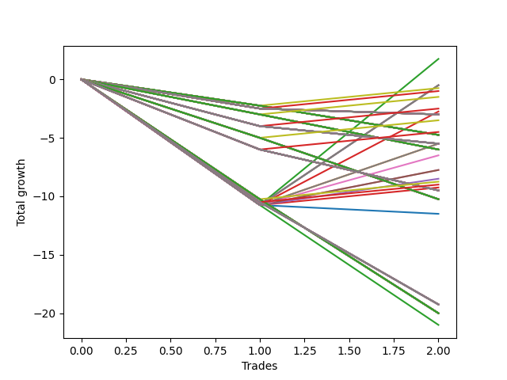

# Short Wallace Doodle 0225_009 
- Symbol: ES90d5m
- Date Range: 03/18/2022 - 07/08/2022
- Trading Period: 7:20-12:30
- Number of Trades: 2



| Name | Win Percent | Profit | Avg Profit / Trade | Avg Time / Trade |      | Name | Win Percent | Profit | Avg Profit / Trade | Avg Time / Trade |
| ---- | ----------- | ------ | ------------------ | ---------------- | ---- | ---- | ----------- | ------ | ------------------ | ---------------- |
| Sorted By <br> Profit | | | | | | Sorted By <br> Win Percentage ||||
| Two | 50.00 | 875.00 | 437.50 | 00:00 |     | Two | 50.00 | 875.00 | 437.50 | 00:00 |
| Seven | 50.00 | -250.00 | -125.00 | 00:00 |     | Seven | 50.00 | -250.00 | -125.00 | 00:00 |
| Five | 50.00 | -250.00 | -125.00 | 00:00 |     | Five | 50.00 | -250.00 | -125.00 | 00:00 |
| Four | 50.00 | -250.00 | -125.00 | 00:00 |     | Four | 50.00 | -250.00 | -125.00 | 00:00 |
| Ninety-One | 50.00 | -375.00 | -187.50 | 00:00 |     | Ninety-One | 50.00 | -375.00 | -187.50 | 00:00 |
| Ninety-Six | 50.00 | -500.00 | -250.00 | 00:00 |     | Ninety-Six | 50.00 | -500.00 | -250.00 | 00:00 |
| One Hundred One | 50.00 | -750.00 | -375.00 | 00:00 |     | One Hundred One | 50.00 | -750.00 | -375.00 | 00:00 |
| One Hundred Six | 50.00 | -1250.00 | -625.00 | 00:00 |     | One Hundred Six | 50.00 | -1250.00 | -625.00 | 00:00 |
| Three | 50.00 | -1375.00 | -687.50 | 00:00 |     | Three | 50.00 | -1375.00 | -687.50 | 00:00 |
| One Hundred | 0.00 | -1500.00 | -750.00 | 00:00 |     | One Hundred Eleven | 50.00 | -1750.00 | -875.00 | 00:00 |
| Ninety-Nine | 0.00 | -1500.00 | -750.00 | 00:00 |     | One Hundred Sixteen | 50.00 | -2250.00 | -1125.00 | 00:00 |
| Ninety-Eight | 0.00 | -1500.00 | -750.00 | 00:00 |     | Eighty-Five | 50.00 | -2750.00 | -1375.00 | 00:00 |
| Ninety-Seven | 0.00 | -1500.00 | -750.00 | 00:00 |     | One | 50.00 | -2750.00 | -1375.00 | 00:00 |
| Twenty-Three | 0.00 | -1500.00 | -750.00 | 00:00 |     | Eighty-Four | 50.00 | -3250.00 | -1625.00 | 00:00 |
| Twenty-Two | 0.00 | -1500.00 | -750.00 | 00:00 |     | Eighty-Three | 50.00 | -3875.00 | -1937.50 | 00:00 |
| Twenty-One | 0.00 | -1500.00 | -750.00 | 00:00 |     | Six | 50.00 | -3875.00 | -1937.50 | 00:00 |
| Twenty | 0.00 | -1500.00 | -750.00 | 00:00 |     | Eighty-Two | 50.00 | -4250.00 | -2125.00 | 00:00 |
| Nineteen | 0.00 | -1500.00 | -750.00 | 00:00 |     | One Hundred Twenty-One | 50.00 | -4375.00 | -2187.50 | 00:00 |
| Eighteen | 0.00 | -1500.00 | -750.00 | 00:00 |     | One Hundred Twenty-Six | 50.00 | -4500.00 | -2250.00 | 00:00 |
| Seventeen | 0.00 | -1500.00 | -750.00 | 00:00 |     | Eighty-One | 50.00 | -4625.00 | -2312.50 | 00:00 |
| Sixten | 0.00 | -1500.00 | -750.00 | 00:00 |     | One Hundred | 0.00 | -1500.00 | -750.00 | 00:00 |
| One Hundred Eleven | 50.00 | -1750.00 | -875.00 | 00:00 |     | Ninety-Nine | 0.00 | -1500.00 | -750.00 | 00:00 |
| One Hundred Sixteen | 50.00 | -2250.00 | -1125.00 | 00:00 |     | Ninety-Eight | 0.00 | -1500.00 | -750.00 | 00:00 |
| Ninety-Five | 0.00 | -2375.00 | -1187.50 | 00:00 |     | Ninety-Seven | 0.00 | -1500.00 | -750.00 | 00:00 |
| Ninety-Four | 0.00 | -2375.00 | -1187.50 | 00:00 |     | Twenty-Three | 0.00 | -1500.00 | -750.00 | 00:00 |
| Ninety-Three | 0.00 | -2375.00 | -1187.50 | 00:00 |     | Twenty-Two | 0.00 | -1500.00 | -750.00 | 00:00 |
| Ninety-Two | 0.00 | -2375.00 | -1187.50 | 00:00 |     | Twenty-One | 0.00 | -1500.00 | -750.00 | 00:00 |
| Fifteen | 0.00 | -2375.00 | -1187.50 | 00:00 |     | Twenty | 0.00 | -1500.00 | -750.00 | 00:00 |
| Fourteen | 0.00 | -2375.00 | -1187.50 | 00:00 |     | Nineteen | 0.00 | -1500.00 | -750.00 | 00:00 |
| Thirteen | 0.00 | -2375.00 | -1187.50 | 00:00 |     | Eighteen | 0.00 | -1500.00 | -750.00 | 00:00 |
| Twelve | 0.00 | -2375.00 | -1187.50 | 00:00 |     | Seventeen | 0.00 | -1500.00 | -750.00 | 00:00 |
| Eleven | 0.00 | -2375.00 | -1187.50 | 00:00 |     | Sixten | 0.00 | -1500.00 | -750.00 | 00:00 |
| Ten | 0.00 | -2375.00 | -1187.50 | 00:00 |     | Ninety-Five | 0.00 | -2375.00 | -1187.50 | 00:00 |
| Nine | 0.00 | -2375.00 | -1187.50 | 00:00 |     | Ninety-Four | 0.00 | -2375.00 | -1187.50 | 00:00 |
| Eight | 0.00 | -2375.00 | -1187.50 | 00:00 |     | Ninety-Three | 0.00 | -2375.00 | -1187.50 | 00:00 |
| Eighty-Five | 50.00 | -2750.00 | -1375.00 | 00:00 |     | Ninety-Two | 0.00 | -2375.00 | -1187.50 | 00:00 |
| One | 50.00 | -2750.00 | -1375.00 | 00:00 |     | Fifteen | 0.00 | -2375.00 | -1187.50 | 00:00 |
| One Hundred Ten | 0.00 | -2750.00 | -1375.00 | 00:00 |     | Fourteen | 0.00 | -2375.00 | -1187.50 | 00:00 |
| One Hundred Nine | 0.00 | -2750.00 | -1375.00 | 00:00 |     | Thirteen | 0.00 | -2375.00 | -1187.50 | 00:00 |
| One Hundred Eight | 0.00 | -2750.00 | -1375.00 | 00:00 |     | Twelve | 0.00 | -2375.00 | -1187.50 | 00:00 |
| One Hundred Seven | 0.00 | -2750.00 | -1375.00 | 00:00 |     | Eleven | 0.00 | -2375.00 | -1187.50 | 00:00 |
| Thirty-Nine | 0.00 | -2750.00 | -1375.00 | 00:00 |     | Ten | 0.00 | -2375.00 | -1187.50 | 00:00 |
| Thirty-Eight | 0.00 | -2750.00 | -1375.00 | 00:00 |     | Nine | 0.00 | -2375.00 | -1187.50 | 00:00 |
| Thirty-Seven | 0.00 | -2750.00 | -1375.00 | 00:00 |     | Eight | 0.00 | -2375.00 | -1187.50 | 00:00 |
| Thirty-Six | 0.00 | -2750.00 | -1375.00 | 00:00 |     | One Hundred Ten | 0.00 | -2750.00 | -1375.00 | 00:00 |
| Thirty-Five | 0.00 | -2750.00 | -1375.00 | 00:00 |     | One Hundred Nine | 0.00 | -2750.00 | -1375.00 | 00:00 |
| Thirty-Four | 0.00 | -2750.00 | -1375.00 | 00:00 |     | One Hundred Eight | 0.00 | -2750.00 | -1375.00 | 00:00 |
| Thirty-Three | 0.00 | -2750.00 | -1375.00 | 00:00 |     | One Hundred Seven | 0.00 | -2750.00 | -1375.00 | 00:00 |
| Thirty-Two | 0.00 | -2750.00 | -1375.00 | 00:00 |     | Thirty-Nine | 0.00 | -2750.00 | -1375.00 | 00:00 |
| One Hundred Five | 0.00 | -3000.00 | -1500.00 | 00:00 |     | Thirty-Eight | 0.00 | -2750.00 | -1375.00 | 00:00 |
| One Hundred Four | 0.00 | -3000.00 | -1500.00 | 00:00 |     | Thirty-Seven | 0.00 | -2750.00 | -1375.00 | 00:00 |
| One Hundred Three | 0.00 | -3000.00 | -1500.00 | 00:00 |     | Thirty-Six | 0.00 | -2750.00 | -1375.00 | 00:00 |
| One Hundred Two | 0.00 | -3000.00 | -1500.00 | 00:00 |     | Thirty-Five | 0.00 | -2750.00 | -1375.00 | 00:00 |
| Thirty-One | 0.00 | -3000.00 | -1500.00 | 00:00 |     | Thirty-Four | 0.00 | -2750.00 | -1375.00 | 00:00 |
| Thirty | 0.00 | -3000.00 | -1500.00 | 00:00 |     | Thirty-Three | 0.00 | -2750.00 | -1375.00 | 00:00 |
| Twenty-Nine | 0.00 | -3000.00 | -1500.00 | 00:00 |     | Thirty-Two | 0.00 | -2750.00 | -1375.00 | 00:00 |
| Twenty-Eight | 0.00 | -3000.00 | -1500.00 | 00:00 |     | One Hundred Five | 0.00 | -3000.00 | -1500.00 | 00:00 |
| twenty-Seven | 0.00 | -3000.00 | -1500.00 | 00:00 |     | One Hundred Four | 0.00 | -3000.00 | -1500.00 | 00:00 |
| Twenty-Six | 0.00 | -3000.00 | -1500.00 | 00:00 |     | One Hundred Three | 0.00 | -3000.00 | -1500.00 | 00:00 |
| Twenty-Five | 0.00 | -3000.00 | -1500.00 | 00:00 |     | One Hundred Two | 0.00 | -3000.00 | -1500.00 | 00:00 |
| Twenty-Four | 0.00 | -3000.00 | -1500.00 | 00:00 |     | Thirty-One | 0.00 | -3000.00 | -1500.00 | 00:00 |
| Eighty-Four | 50.00 | -3250.00 | -1625.00 | 00:00 |     | Thirty | 0.00 | -3000.00 | -1500.00 | 00:00 |
| Eighty-Three | 50.00 | -3875.00 | -1937.50 | 00:00 |     | Twenty-Nine | 0.00 | -3000.00 | -1500.00 | 00:00 |
| Six | 50.00 | -3875.00 | -1937.50 | 00:00 |     | Twenty-Eight | 0.00 | -3000.00 | -1500.00 | 00:00 |
| Eighty-Two | 50.00 | -4250.00 | -2125.00 | 00:00 |     | twenty-Seven | 0.00 | -3000.00 | -1500.00 | 00:00 |
| One Hundred Twenty-One | 50.00 | -4375.00 | -2187.50 | 00:00 |     | Twenty-Six | 0.00 | -3000.00 | -1500.00 | 00:00 |
| One Hundred Twenty-Six | 50.00 | -4500.00 | -2250.00 | 00:00 |     | Twenty-Five | 0.00 | -3000.00 | -1500.00 | 00:00 |
| Eighty-One | 50.00 | -4625.00 | -2312.50 | 00:00 |     | Twenty-Four | 0.00 | -3000.00 | -1500.00 | 00:00 |
| One Hundred Twenty | 0.00 | -4750.00 | -2375.00 | 00:00 |     | One Hundred Twenty | 0.00 | -4750.00 | -2375.00 | 00:00 |
| One Hundred Ninteen | 0.00 | -4750.00 | -2375.00 | 00:00 |     | One Hundred Ninteen | 0.00 | -4750.00 | -2375.00 | 00:00 |
| One Hundred Eighteen | 0.00 | -4750.00 | -2375.00 | 00:00 |     | One Hundred Eighteen | 0.00 | -4750.00 | -2375.00 | 00:00 |
| One Hundred Seventeen | 0.00 | -4750.00 | -2375.00 | 00:00 |     | One Hundred Seventeen | 0.00 | -4750.00 | -2375.00 | 00:00 |
| Fifty-Five | 0.00 | -4750.00 | -2375.00 | 00:00 |     | Fifty-Five | 0.00 | -4750.00 | -2375.00 | 00:00 |
| Fifty-Four | 0.00 | -4750.00 | -2375.00 | 00:00 |     | Fifty-Four | 0.00 | -4750.00 | -2375.00 | 00:00 |
| Fifty-Three | 0.00 | -4750.00 | -2375.00 | 00:00 |     | Fifty-Three | 0.00 | -4750.00 | -2375.00 | 00:00 |
| Fifty-Two | 0.00 | -4750.00 | -2375.00 | 00:00 |     | Fifty-Two | 0.00 | -4750.00 | -2375.00 | 00:00 |
| Fifty-One | 0.00 | -4750.00 | -2375.00 | 00:00 |     | Fifty-One | 0.00 | -4750.00 | -2375.00 | 00:00 |
| Fifty | 0.00 | -4750.00 | -2375.00 | 00:00 |     | Fifty | 0.00 | -4750.00 | -2375.00 | 00:00 |
| Forty-Nine | 0.00 | -4750.00 | -2375.00 | 00:00 |     | Forty-Nine | 0.00 | -4750.00 | -2375.00 | 00:00 |
| Forty-Eight | 0.00 | -4750.00 | -2375.00 | 00:00 |     | Forty-Eight | 0.00 | -4750.00 | -2375.00 | 00:00 |
| One Hundred Fifteen | 0.00 | -5125.00 | -2562.50 | 00:00 |     | One Hundred Fifteen | 0.00 | -5125.00 | -2562.50 | 00:00 |
| One Hundred Fourteen | 0.00 | -5125.00 | -2562.50 | 00:00 |     | One Hundred Fourteen | 0.00 | -5125.00 | -2562.50 | 00:00 |
| One Hundred Thirteen | 0.00 | -5125.00 | -2562.50 | 00:00 |     | One Hundred Thirteen | 0.00 | -5125.00 | -2562.50 | 00:00 |
| One Hundred Twelve | 0.00 | -5125.00 | -2562.50 | 00:00 |     | One Hundred Twelve | 0.00 | -5125.00 | -2562.50 | 00:00 |
| Forty-Seven | 0.00 | -5125.00 | -2562.50 | 00:00 |     | Forty-Seven | 0.00 | -5125.00 | -2562.50 | 00:00 |
| Forty-Six | 0.00 | -5125.00 | -2562.50 | 00:00 |     | Forty-Six | 0.00 | -5125.00 | -2562.50 | 00:00 |
| Forty-Five | 0.00 | -5125.00 | -2562.50 | 00:00 |     | Forty-Five | 0.00 | -5125.00 | -2562.50 | 00:00 |
| Forty-Four | 0.00 | -5125.00 | -2562.50 | 00:00 |     | Forty-Four | 0.00 | -5125.00 | -2562.50 | 00:00 |
| Forty-Three | 0.00 | -5125.00 | -2562.50 | 00:00 |     | Forty-Three | 0.00 | -5125.00 | -2562.50 | 00:00 |
| Forty-Two | 0.00 | -5125.00 | -2562.50 | 00:00 |     | Forty-Two | 0.00 | -5125.00 | -2562.50 | 00:00 |
| Forty-One | 0.00 | -5125.00 | -2562.50 | 00:00 |     | Forty-One | 0.00 | -5125.00 | -2562.50 | 00:00 |
| Forty | 0.00 | -5125.00 | -2562.50 | 00:00 |     | Forty | 0.00 | -5125.00 | -2562.50 | 00:00 |
| Zero | 0.00 | -5750.00 | -2875.00 | 00:00 |     | Zero | 0.00 | -5750.00 | -2875.00 | 00:00 |
| One Hundred Thirty | 0.00 | -9625.00 | -4812.50 | 00:00 |     | One Hundred Thirty | 0.00 | -9625.00 | -4812.50 | 00:00 |
| One Hundred Twenty-Nine | 0.00 | -9625.00 | -4812.50 | 00:00 |     | One Hundred Twenty-Nine | 0.00 | -9625.00 | -4812.50 | 00:00 |
| One Hundred Twenty-Eight | 0.00 | -9625.00 | -4812.50 | 00:00 |     | One Hundred Twenty-Eight | 0.00 | -9625.00 | -4812.50 | 00:00 |
| One Hundred Twenty-Seven | 0.00 | -9625.00 | -4812.50 | 00:00 |     | One Hundred Twenty-Seven | 0.00 | -9625.00 | -4812.50 | 00:00 |
| Seventy-One | 0.00 | -9625.00 | -4812.50 | 00:00 |     | Seventy-One | 0.00 | -9625.00 | -4812.50 | 00:00 |
| Seventy | 0.00 | -9625.00 | -4812.50 | 00:00 |     | Seventy | 0.00 | -9625.00 | -4812.50 | 00:00 |
| Sixty-Nine | 0.00 | -9625.00 | -4812.50 | 00:00 |     | Sixty-Nine | 0.00 | -9625.00 | -4812.50 | 00:00 |
| Sixty-Eight | 0.00 | -9625.00 | -4812.50 | 00:00 |     | Sixty-Eight | 0.00 | -9625.00 | -4812.50 | 00:00 |
| Sixty-Seven | 0.00 | -9625.00 | -4812.50 | 00:00 |     | Sixty-Seven | 0.00 | -9625.00 | -4812.50 | 00:00 |
| Sixty-Six | 0.00 | -9625.00 | -4812.50 | 00:00 |     | Sixty-Six | 0.00 | -9625.00 | -4812.50 | 00:00 |
| Sixty-Five | 0.00 | -9625.00 | -4812.50 | 00:00 |     | Sixty-Five | 0.00 | -9625.00 | -4812.50 | 00:00 |
| Sixty-Four | 0.00 | -9625.00 | -4812.50 | 00:00 |     | Sixty-Four | 0.00 | -9625.00 | -4812.50 | 00:00 |
| One Hundred Twenty-Five | 0.00 | -10000.00 | -5000.00 | 00:00 |     | One Hundred Twenty-Five | 0.00 | -10000.00 | -5000.00 | 00:00 |
| One Hundred Twenty-Four | 0.00 | -10000.00 | -5000.00 | 00:00 |     | One Hundred Twenty-Four | 0.00 | -10000.00 | -5000.00 | 00:00 |
| One Hundred Twenty-Three | 0.00 | -10000.00 | -5000.00 | 00:00 |     | One Hundred Twenty-Three | 0.00 | -10000.00 | -5000.00 | 00:00 |
| One Hundred Twenty-Two | 0.00 | -10000.00 | -5000.00 | 00:00 |     | One Hundred Twenty-Two | 0.00 | -10000.00 | -5000.00 | 00:00 |
| Sixty-Three | 0.00 | -10000.00 | -5000.00 | 00:00 |     | Sixty-Three | 0.00 | -10000.00 | -5000.00 | 00:00 |
| Sixty-Two | 0.00 | -10000.00 | -5000.00 | 00:00 |     | Sixty-Two | 0.00 | -10000.00 | -5000.00 | 00:00 |
| Sixty-One | 0.00 | -10000.00 | -5000.00 | 00:00 |     | Sixty-One | 0.00 | -10000.00 | -5000.00 | 00:00 |
| Sixty | 0.00 | -10000.00 | -5000.00 | 00:00 |     | Sixty | 0.00 | -10000.00 | -5000.00 | 00:00 |
| Fifty-Nine | 0.00 | -10000.00 | -5000.00 | 00:00 |     | Fifty-Nine | 0.00 | -10000.00 | -5000.00 | 00:00 |
| Fifty-Eight | 0.00 | -10000.00 | -5000.00 | 00:00 |     | Fifty-Eight | 0.00 | -10000.00 | -5000.00 | 00:00 |
| Fifty-Seven | 0.00 | -10000.00 | -5000.00 | 00:00 |     | Fifty-Seven | 0.00 | -10000.00 | -5000.00 | 00:00 |
| Fifty-Six | 0.00 | -10000.00 | -5000.00 | 00:00 |     | Fifty-Six | 0.00 | -10000.00 | -5000.00 | 00:00 |
| Seventy-Three | 0.00 | -10500.00 | -5250.00 | 00:00 |     | Seventy-Three | 0.00 | -10500.00 | -5250.00 | 00:00 |

## NO STOPLOSS

### Test Zero
* Sell when price hits the middle line of the 20p bollinger
* No Stoploss
* Results:
```
Total Trades: 2
Percent Up: 100.00
Percent Down: 0.00
Total Points Moved Down: -11.50
Potential Profit: -5750.00
Total Points Ups: 11.50 Count Ups: 2
Total Points Downs: 0.00 Count Downs: 0
```

<details><summary>Trades</summary>

<code>In: 2022-03-28 12:05:00		Out: 2022-03-28 12:55:00		Total Position Time: 50:00		Total Move Down: -10.75		Total to Date: -10.75</code> <br />
<code>In: 2022-06-10 12:05:00		Out: 2022-06-10 12:42:40		Total Position Time: 37:40		Total Move Down: -0.75		Total to Date: -11.50</code> <br />


</details>

### Test One
* Sell when the price hits the upper line of the 20p 1std bollinger
* No Stoploss
* Results:
```
Total Trades: 2
Percent Up: 50.00
Percent Down: 50.00
Total Points Moved Down: -5.50
Potential Profit: -2750.00
Total Points Ups: 10.75 Count Ups: 1
Total Points Downs: 5.25 Count Downs: 1
```

<details><summary>Trades</summary>

<code>In: 2022-03-28 12:05:00		Out: 2022-03-28 12:55:00		Total Position Time: 50:00		Total Move Down: -10.75		Total to Date: -10.75</code> <br />
<code>In: 2022-06-10 12:05:00		Out: 2022-06-10 12:45:50		Total Position Time: 40:50		Total Move Down: 5.25		Total to Date: -5.50</code> <br />


</details>

### Test Two
* Sell when the price hits the upper line of the 20p 2std bollinger
* No Stoploss
* Results:
```
Total Trades: 2
Percent Up: 50.00
Percent Down: 50.00
Total Points Moved Down: 1.75
Potential Profit: 875.00
Total Points Ups: 10.75 Count Ups: 1
Total Points Downs: 12.50 Count Downs: 1
```

<details><summary>Trades</summary>

<code>In: 2022-03-28 12:05:00		Out: 2022-03-28 12:55:00		Total Position Time: 50:00		Total Move Down: -10.75		Total to Date: -10.75</code> <br />
<code>In: 2022-06-10 12:05:00		Out: 2022-06-10 12:49:55		Total Position Time: 44:55		Total Move Down: 12.50		Total to Date: 1.75</code> <br />


</details>

### Test Three
* Sell when price hits the middle line of the 50p bollinger
* No Stoploss
* Results:
```
Total Trades: 2
Percent Up: 50.00
Percent Down: 50.00
Total Points Moved Down: -2.75
Potential Profit: -1375.00
Total Points Ups: 10.75 Count Ups: 1
Total Points Downs: 8.00 Count Downs: 1
```

<details><summary>Trades</summary>

<code>In: 2022-03-28 12:05:00		Out: 2022-03-28 12:55:00		Total Position Time: 50:00		Total Move Down: -10.75		Total to Date: -10.75</code> <br />
<code>In: 2022-06-10 12:05:00		Out: 2022-06-10 12:46:10		Total Position Time: 41:10		Total Move Down: 8.00		Total to Date: -2.75</code> <br />


</details>

### Test Four
* Sell when the price hits the upper line of the 50p 1std bollinger
* No Stoploss
* Results:
```
Total Trades: 2
Percent Up: 50.00
Percent Down: 50.00
Total Points Moved Down: -0.50
Potential Profit: -250.00
Total Points Ups: 10.75 Count Ups: 1
Total Points Downs: 10.25 Count Downs: 1
```

<details><summary>Trades</summary>

<code>In: 2022-03-28 12:05:00		Out: 2022-03-28 12:55:00		Total Position Time: 50:00		Total Move Down: -10.75		Total to Date: -10.75</code> <br />
<code>In: 2022-06-10 12:05:00		Out: 2022-06-10 12:55:00		Total Position Time: 50:00		Total Move Down: 10.25		Total to Date: -0.50</code> <br />


</details>

### Test Five
* Sell when the price hits the upper line of the 50p 2std bollinger
* No Stoploss
* Results:
```
Total Trades: 2
Percent Up: 50.00
Percent Down: 50.00
Total Points Moved Down: -0.50
Potential Profit: -250.00
Total Points Ups: 10.75 Count Ups: 1
Total Points Downs: 10.25 Count Downs: 1
```

<details><summary>Trades</summary>

<code>In: 2022-03-28 12:05:00		Out: 2022-03-28 12:55:00		Total Position Time: 50:00		Total Move Down: -10.75		Total to Date: -10.75</code> <br />
<code>In: 2022-06-10 12:05:00		Out: 2022-06-10 12:55:00		Total Position Time: 50:00		Total Move Down: 10.25		Total to Date: -0.50</code> <br />


</details>

### Test Six
* Sell when the price hits the middle line of the 1std VWAP
* No Stoploss
* Results:
```
Total Trades: 2
Percent Up: 50.00
Percent Down: 50.00
Total Points Moved Down: -7.75
Potential Profit: -3875.00
Total Points Ups: 10.75 Count Ups: 1
Total Points Downs: 3.00 Count Downs: 1
```

<details><summary>Trades</summary>

<code>In: 2022-03-28 12:05:00		Out: 2022-03-28 12:55:00		Total Position Time: 50:00		Total Move Down: -10.75		Total to Date: -10.75</code> <br />
<code>In: 2022-06-10 12:05:00		Out: 2022-06-10 12:44:05		Total Position Time: 39:05		Total Move Down: 3.00		Total to Date: -7.75</code> <br />


</details>

### Test Seven
* Sell when the price hits the upper line of the 1std VWAP
* No Stoploss
* Results:
```
Total Trades: 2
Percent Up: 50.00
Percent Down: 50.00
Total Points Moved Down: -0.50
Potential Profit: -250.00
Total Points Ups: 10.75 Count Ups: 1
Total Points Downs: 10.25 Count Downs: 1
```

<details><summary>Trades</summary>

<code>In: 2022-03-28 12:05:00		Out: 2022-03-28 12:55:00		Total Position Time: 50:00		Total Move Down: -10.75		Total to Date: -10.75</code> <br />
<code>In: 2022-06-10 12:05:00		Out: 2022-06-10 12:55:00		Total Position Time: 50:00		Total Move Down: 10.25		Total to Date: -0.50</code> <br />


</details>

## STOPLOSS OF 2

### Test Eight
* Sell when price hits the middle line of the 20p bollinger
* Stoploss is -2 points
* Results:
```
Total Trades: 2
Percent Up: 100.00
Percent Down: 0.00
Total Points Moved Down: -4.75
Potential Profit: -2375.00
Total Points Ups: 4.75 Count Ups: 2
Total Points Downs: 0.00 Count Downs: 0
```

<details><summary>Trades</summary>

<code>In: 2022-03-28 12:05:00		Out: 2022-03-28 12:10:25		Total Position Time: 05:25		Total Move Down: -2.25		Total to Date: -2.25</code> <br />
<code>In: 2022-06-10 12:05:00		Out: 2022-06-10 12:10:50		Total Position Time: 05:50		Total Move Down: -2.50		Total to Date: -4.75</code> <br />


</details>

### Test Nine
* Sell when the price hits the upper line of the 20p 1std bollinger
* Stoploss is -2 points
* Results:
```
Total Trades: 2
Percent Up: 100.00
Percent Down: 0.00
Total Points Moved Down: -4.75
Potential Profit: -2375.00
Total Points Ups: 4.75 Count Ups: 2
Total Points Downs: 0.00 Count Downs: 0
```

<details><summary>Trades</summary>

<code>In: 2022-03-28 12:05:00		Out: 2022-03-28 12:10:25		Total Position Time: 05:25		Total Move Down: -2.25		Total to Date: -2.25</code> <br />
<code>In: 2022-06-10 12:05:00		Out: 2022-06-10 12:10:50		Total Position Time: 05:50		Total Move Down: -2.50		Total to Date: -4.75</code> <br />


</details>

### Test Ten
* Sell when the price hits the upper line of the 20p 2std bollinger
* Stoploss is -2 points
* Results:
```
Total Trades: 2
Percent Up: 100.00
Percent Down: 0.00
Total Points Moved Down: -4.75
Potential Profit: -2375.00
Total Points Ups: 4.75 Count Ups: 2
Total Points Downs: 0.00 Count Downs: 0
```

<details><summary>Trades</summary>

<code>In: 2022-03-28 12:05:00		Out: 2022-03-28 12:10:25		Total Position Time: 05:25		Total Move Down: -2.25		Total to Date: -2.25</code> <br />
<code>In: 2022-06-10 12:05:00		Out: 2022-06-10 12:10:50		Total Position Time: 05:50		Total Move Down: -2.50		Total to Date: -4.75</code> <br />


</details>

### Test Eleven
* Sell when price hits the middle line of the 50p bollinger
* Stoploss is -2 points
* Results:
```
Total Trades: 2
Percent Up: 100.00
Percent Down: 0.00
Total Points Moved Down: -4.75
Potential Profit: -2375.00
Total Points Ups: 4.75 Count Ups: 2
Total Points Downs: 0.00 Count Downs: 0
```

<details><summary>Trades</summary>

<code>In: 2022-03-28 12:05:00		Out: 2022-03-28 12:10:25		Total Position Time: 05:25		Total Move Down: -2.25		Total to Date: -2.25</code> <br />
<code>In: 2022-06-10 12:05:00		Out: 2022-06-10 12:10:50		Total Position Time: 05:50		Total Move Down: -2.50		Total to Date: -4.75</code> <br />


</details>

### Test Twelve
* Sell when the price hits the upper line of the 50p 1std bollinger
* Stoploss is -2 points
* Results:
```
Total Trades: 2
Percent Up: 100.00
Percent Down: 0.00
Total Points Moved Down: -4.75
Potential Profit: -2375.00
Total Points Ups: 4.75 Count Ups: 2
Total Points Downs: 0.00 Count Downs: 0
```

<details><summary>Trades</summary>

<code>In: 2022-03-28 12:05:00		Out: 2022-03-28 12:10:25		Total Position Time: 05:25		Total Move Down: -2.25		Total to Date: -2.25</code> <br />
<code>In: 2022-06-10 12:05:00		Out: 2022-06-10 12:10:50		Total Position Time: 05:50		Total Move Down: -2.50		Total to Date: -4.75</code> <br />


</details>

### Test Thirteen
* Sell when the price hits the upper line of the 50p 2std bollinger
* Stoploss is -2 points
* Results:
```
Total Trades: 2
Percent Up: 100.00
Percent Down: 0.00
Total Points Moved Down: -4.75
Potential Profit: -2375.00
Total Points Ups: 4.75 Count Ups: 2
Total Points Downs: 0.00 Count Downs: 0
```

<details><summary>Trades</summary>

<code>In: 2022-03-28 12:05:00		Out: 2022-03-28 12:10:25		Total Position Time: 05:25		Total Move Down: -2.25		Total to Date: -2.25</code> <br />
<code>In: 2022-06-10 12:05:00		Out: 2022-06-10 12:10:50		Total Position Time: 05:50		Total Move Down: -2.50		Total to Date: -4.75</code> <br />


</details>

### Test Fourteen
* Sell when the price hits the middle line of the 1std VWAP
* Stoploss is -2 points
* Results:
```
Total Trades: 2
Percent Up: 100.00
Percent Down: 0.00
Total Points Moved Down: -4.75
Potential Profit: -2375.00
Total Points Ups: 4.75 Count Ups: 2
Total Points Downs: 0.00 Count Downs: 0
```

<details><summary>Trades</summary>

<code>In: 2022-03-28 12:05:00		Out: 2022-03-28 12:10:25		Total Position Time: 05:25		Total Move Down: -2.25		Total to Date: -2.25</code> <br />
<code>In: 2022-06-10 12:05:00		Out: 2022-06-10 12:10:50		Total Position Time: 05:50		Total Move Down: -2.50		Total to Date: -4.75</code> <br />


</details>

### Test Fifteen
* Sell when the price hits the upper line of the 1std VWAP
* Stoploss is -2 points
* Results:
```
Total Trades: 2
Percent Up: 100.00
Percent Down: 0.00
Total Points Moved Down: -4.75
Potential Profit: -2375.00
Total Points Ups: 4.75 Count Ups: 2
Total Points Downs: 0.00 Count Downs: 0
```

<details><summary>Trades</summary>

<code>In: 2022-03-28 12:05:00		Out: 2022-03-28 12:10:25		Total Position Time: 05:25		Total Move Down: -2.25		Total to Date: -2.25</code> <br />
<code>In: 2022-06-10 12:05:00		Out: 2022-06-10 12:10:50		Total Position Time: 05:50		Total Move Down: -2.50		Total to Date: -4.75</code> <br />


</details>

## TRAIL STOP OF 2

### Test Sixten
* Sell when price hits the middle line of the 20p bollinger
* Trailing Stop is -2 points
* Results:
```
Total Trades: 2
Percent Up: 100.00
Percent Down: 0.00
Total Points Moved Down: -3.00
Potential Profit: -1500.00
Total Points Ups: 3.00 Count Ups: 2
Total Points Downs: 0.00 Count Downs: 0
```

<details><summary>Trades</summary>

<code>In: 2022-03-28 12:05:00		Out: 2022-03-28 12:11:15		Total Position Time: 06:15		Total Move Down: -2.50		Total to Date: -2.50</code> <br />
<code>In: 2022-06-10 12:05:00		Out: 2022-06-10 12:10:35		Total Position Time: 05:35		Total Move Down: -0.50		Total to Date: -3.00</code> <br />


</details>

### Test Seventeen
* Sell when the price hits the upper line of the 20p 1std bollinger
* Trailing Stop is -2 points
* Results:
```
Total Trades: 2
Percent Up: 100.00
Percent Down: 0.00
Total Points Moved Down: -3.00
Potential Profit: -1500.00
Total Points Ups: 3.00 Count Ups: 2
Total Points Downs: 0.00 Count Downs: 0
```

<details><summary>Trades</summary>

<code>In: 2022-03-28 12:05:00		Out: 2022-03-28 12:11:15		Total Position Time: 06:15		Total Move Down: -2.50		Total to Date: -2.50</code> <br />
<code>In: 2022-06-10 12:05:00		Out: 2022-06-10 12:10:35		Total Position Time: 05:35		Total Move Down: -0.50		Total to Date: -3.00</code> <br />


</details>

### Test Eighteen
* Sell when the price hits the upper line of the 20p 2std bollinger
* Trailing Stop is -2 points
* Results:
```
Total Trades: 2
Percent Up: 100.00
Percent Down: 0.00
Total Points Moved Down: -3.00
Potential Profit: -1500.00
Total Points Ups: 3.00 Count Ups: 2
Total Points Downs: 0.00 Count Downs: 0
```

<details><summary>Trades</summary>

<code>In: 2022-03-28 12:05:00		Out: 2022-03-28 12:11:15		Total Position Time: 06:15		Total Move Down: -2.50		Total to Date: -2.50</code> <br />
<code>In: 2022-06-10 12:05:00		Out: 2022-06-10 12:10:35		Total Position Time: 05:35		Total Move Down: -0.50		Total to Date: -3.00</code> <br />


</details>

### Test Nineteen
* Sell when price hits the middle line of the 50p bollinger
* Trailing Stop is -2 points
* Results:
```
Total Trades: 2
Percent Up: 100.00
Percent Down: 0.00
Total Points Moved Down: -3.00
Potential Profit: -1500.00
Total Points Ups: 3.00 Count Ups: 2
Total Points Downs: 0.00 Count Downs: 0
```

<details><summary>Trades</summary>

<code>In: 2022-03-28 12:05:00		Out: 2022-03-28 12:11:15		Total Position Time: 06:15		Total Move Down: -2.50		Total to Date: -2.50</code> <br />
<code>In: 2022-06-10 12:05:00		Out: 2022-06-10 12:10:35		Total Position Time: 05:35		Total Move Down: -0.50		Total to Date: -3.00</code> <br />


</details>

### Test Twenty
* Sell when the price hits the upper line of the 50p 1std bollinger
* Trailing Stop is -2 points
* Results:
```
Total Trades: 2
Percent Up: 100.00
Percent Down: 0.00
Total Points Moved Down: -3.00
Potential Profit: -1500.00
Total Points Ups: 3.00 Count Ups: 2
Total Points Downs: 0.00 Count Downs: 0
```

<details><summary>Trades</summary>

<code>In: 2022-03-28 12:05:00		Out: 2022-03-28 12:11:15		Total Position Time: 06:15		Total Move Down: -2.50		Total to Date: -2.50</code> <br />
<code>In: 2022-06-10 12:05:00		Out: 2022-06-10 12:10:35		Total Position Time: 05:35		Total Move Down: -0.50		Total to Date: -3.00</code> <br />


</details>

### Test Twenty-One
* Sell when the price hits the upper line of the 50p 2std bollinger
* Trailing Stop is -2 points
* Results:
```
Total Trades: 2
Percent Up: 100.00
Percent Down: 0.00
Total Points Moved Down: -3.00
Potential Profit: -1500.00
Total Points Ups: 3.00 Count Ups: 2
Total Points Downs: 0.00 Count Downs: 0
```

<details><summary>Trades</summary>

<code>In: 2022-03-28 12:05:00		Out: 2022-03-28 12:11:15		Total Position Time: 06:15		Total Move Down: -2.50		Total to Date: -2.50</code> <br />
<code>In: 2022-06-10 12:05:00		Out: 2022-06-10 12:10:35		Total Position Time: 05:35		Total Move Down: -0.50		Total to Date: -3.00</code> <br />


</details>

### Test Twenty-Two
* Sell when the price hits the middle line of the 1std VWAP
* Trailing Stop is -2 points
* Results:
```
Total Trades: 2
Percent Up: 100.00
Percent Down: 0.00
Total Points Moved Down: -3.00
Potential Profit: -1500.00
Total Points Ups: 3.00 Count Ups: 2
Total Points Downs: 0.00 Count Downs: 0
```

<details><summary>Trades</summary>

<code>In: 2022-03-28 12:05:00		Out: 2022-03-28 12:11:15		Total Position Time: 06:15		Total Move Down: -2.50		Total to Date: -2.50</code> <br />
<code>In: 2022-06-10 12:05:00		Out: 2022-06-10 12:10:35		Total Position Time: 05:35		Total Move Down: -0.50		Total to Date: -3.00</code> <br />


</details>

### Test Twenty-Three
* Sell when the price hits the upper line of the 1std VWAP
* Trailing Stop is -2 points
* Results:
```
Total Trades: 2
Percent Up: 100.00
Percent Down: 0.00
Total Points Moved Down: -3.00
Potential Profit: -1500.00
Total Points Ups: 3.00 Count Ups: 2
Total Points Downs: 0.00 Count Downs: 0
```

<details><summary>Trades</summary>

<code>In: 2022-03-28 12:05:00		Out: 2022-03-28 12:11:15		Total Position Time: 06:15		Total Move Down: -2.50		Total to Date: -2.50</code> <br />
<code>In: 2022-06-10 12:05:00		Out: 2022-06-10 12:10:35		Total Position Time: 05:35		Total Move Down: -0.50		Total to Date: -3.00</code> <br />


</details>

## STOPLOSS OF 3

### Test Twenty-Four
* Sell when price hits the middle line of the 20p bollinger
* Stoploss is -3 points
* Results:
```
Total Trades: 2
Percent Up: 100.00
Percent Down: 0.00
Total Points Moved Down: -6.00
Potential Profit: -3000.00
Total Points Ups: 6.00 Count Ups: 2
Total Points Downs: 0.00 Count Downs: 0
```

<details><summary>Trades</summary>

<code>In: 2022-03-28 12:05:00		Out: 2022-03-28 12:14:25		Total Position Time: 09:25		Total Move Down: -3.00		Total to Date: -3.00</code> <br />
<code>In: 2022-06-10 12:05:00		Out: 2022-06-10 12:11:10		Total Position Time: 06:10		Total Move Down: -3.00		Total to Date: -6.00</code> <br />


</details>

### Test Twenty-Five
* Sell when the price hits the upper line of the 20p 1std bollinger
* Stoploss is -3 points
* Results:
```
Total Trades: 2
Percent Up: 100.00
Percent Down: 0.00
Total Points Moved Down: -6.00
Potential Profit: -3000.00
Total Points Ups: 6.00 Count Ups: 2
Total Points Downs: 0.00 Count Downs: 0
```

<details><summary>Trades</summary>

<code>In: 2022-03-28 12:05:00		Out: 2022-03-28 12:14:25		Total Position Time: 09:25		Total Move Down: -3.00		Total to Date: -3.00</code> <br />
<code>In: 2022-06-10 12:05:00		Out: 2022-06-10 12:11:10		Total Position Time: 06:10		Total Move Down: -3.00		Total to Date: -6.00</code> <br />


</details>

### Test Twenty-Six
* Sell when the price hits the upper line of the 20p 2std bollinger
* Stoploss is -3 points
* Results:
```
Total Trades: 2
Percent Up: 100.00
Percent Down: 0.00
Total Points Moved Down: -6.00
Potential Profit: -3000.00
Total Points Ups: 6.00 Count Ups: 2
Total Points Downs: 0.00 Count Downs: 0
```

<details><summary>Trades</summary>

<code>In: 2022-03-28 12:05:00		Out: 2022-03-28 12:14:25		Total Position Time: 09:25		Total Move Down: -3.00		Total to Date: -3.00</code> <br />
<code>In: 2022-06-10 12:05:00		Out: 2022-06-10 12:11:10		Total Position Time: 06:10		Total Move Down: -3.00		Total to Date: -6.00</code> <br />


</details>

### Test twenty-Seven
* Sell when price hits the middle line of the 50p bollinger
* Stoploss is -3 points
* Results:
```
Total Trades: 2
Percent Up: 100.00
Percent Down: 0.00
Total Points Moved Down: -6.00
Potential Profit: -3000.00
Total Points Ups: 6.00 Count Ups: 2
Total Points Downs: 0.00 Count Downs: 0
```

<details><summary>Trades</summary>

<code>In: 2022-03-28 12:05:00		Out: 2022-03-28 12:14:25		Total Position Time: 09:25		Total Move Down: -3.00		Total to Date: -3.00</code> <br />
<code>In: 2022-06-10 12:05:00		Out: 2022-06-10 12:11:10		Total Position Time: 06:10		Total Move Down: -3.00		Total to Date: -6.00</code> <br />


</details>

### Test Twenty-Eight
* Sell when the price hits the upper line of the 50p 1std bollinger
* Stoploss is -3 points
* Results:
```
Total Trades: 2
Percent Up: 100.00
Percent Down: 0.00
Total Points Moved Down: -6.00
Potential Profit: -3000.00
Total Points Ups: 6.00 Count Ups: 2
Total Points Downs: 0.00 Count Downs: 0
```

<details><summary>Trades</summary>

<code>In: 2022-03-28 12:05:00		Out: 2022-03-28 12:14:25		Total Position Time: 09:25		Total Move Down: -3.00		Total to Date: -3.00</code> <br />
<code>In: 2022-06-10 12:05:00		Out: 2022-06-10 12:11:10		Total Position Time: 06:10		Total Move Down: -3.00		Total to Date: -6.00</code> <br />


</details>

### Test Twenty-Nine
* Sell when the price hits the upper line of the 50p 2std bollinger
* Stoploss is -3 points
* Results:
```
Total Trades: 2
Percent Up: 100.00
Percent Down: 0.00
Total Points Moved Down: -6.00
Potential Profit: -3000.00
Total Points Ups: 6.00 Count Ups: 2
Total Points Downs: 0.00 Count Downs: 0
```

<details><summary>Trades</summary>

<code>In: 2022-03-28 12:05:00		Out: 2022-03-28 12:14:25		Total Position Time: 09:25		Total Move Down: -3.00		Total to Date: -3.00</code> <br />
<code>In: 2022-06-10 12:05:00		Out: 2022-06-10 12:11:10		Total Position Time: 06:10		Total Move Down: -3.00		Total to Date: -6.00</code> <br />


</details>

### Test Thirty
* Sell when the price hits the middle line of the 1std VWAP
* Stoploss is -3 points
* Results:
```
Total Trades: 2
Percent Up: 100.00
Percent Down: 0.00
Total Points Moved Down: -6.00
Potential Profit: -3000.00
Total Points Ups: 6.00 Count Ups: 2
Total Points Downs: 0.00 Count Downs: 0
```

<details><summary>Trades</summary>

<code>In: 2022-03-28 12:05:00		Out: 2022-03-28 12:14:25		Total Position Time: 09:25		Total Move Down: -3.00		Total to Date: -3.00</code> <br />
<code>In: 2022-06-10 12:05:00		Out: 2022-06-10 12:11:10		Total Position Time: 06:10		Total Move Down: -3.00		Total to Date: -6.00</code> <br />


</details>

### Test Thirty-One
* Sell when the price hits the upper line of the 1std VWAP
* Stoploss is -3 points
* Results:
```
Total Trades: 2
Percent Up: 100.00
Percent Down: 0.00
Total Points Moved Down: -6.00
Potential Profit: -3000.00
Total Points Ups: 6.00 Count Ups: 2
Total Points Downs: 0.00 Count Downs: 0
```

<details><summary>Trades</summary>

<code>In: 2022-03-28 12:05:00		Out: 2022-03-28 12:14:25		Total Position Time: 09:25		Total Move Down: -3.00		Total to Date: -3.00</code> <br />
<code>In: 2022-06-10 12:05:00		Out: 2022-06-10 12:11:10		Total Position Time: 06:10		Total Move Down: -3.00		Total to Date: -6.00</code> <br />


</details>

## TRAIL STOP OF 3

### Test Thirty-Two
* Sell when price hits the middle line of the 20p bollinger
* Trailing Stop is -3 points
* Results:
```
Total Trades: 2
Percent Up: 100.00
Percent Down: 0.00
Total Points Moved Down: -5.50
Potential Profit: -2750.00
Total Points Ups: 5.50 Count Ups: 2
Total Points Downs: 0.00 Count Downs: 0
```

<details><summary>Trades</summary>

<code>In: 2022-03-28 12:05:00		Out: 2022-03-28 12:15:15		Total Position Time: 10:15		Total Move Down: -4.00		Total to Date: -4.00</code> <br />
<code>In: 2022-06-10 12:05:00		Out: 2022-06-10 12:10:45		Total Position Time: 05:45		Total Move Down: -1.50		Total to Date: -5.50</code> <br />


</details>

### Test Thirty-Three
* Sell when the price hits the upper line of the 20p 1std bollinger
* Trailing Stop is -3 points
* Results:
```
Total Trades: 2
Percent Up: 100.00
Percent Down: 0.00
Total Points Moved Down: -5.50
Potential Profit: -2750.00
Total Points Ups: 5.50 Count Ups: 2
Total Points Downs: 0.00 Count Downs: 0
```

<details><summary>Trades</summary>

<code>In: 2022-03-28 12:05:00		Out: 2022-03-28 12:15:15		Total Position Time: 10:15		Total Move Down: -4.00		Total to Date: -4.00</code> <br />
<code>In: 2022-06-10 12:05:00		Out: 2022-06-10 12:10:45		Total Position Time: 05:45		Total Move Down: -1.50		Total to Date: -5.50</code> <br />


</details>

### Test Thirty-Four
* Sell when the price hits the upper line of the 20p 2std bollinger
* Trailing Stop is -3 points
* Results:
```
Total Trades: 2
Percent Up: 100.00
Percent Down: 0.00
Total Points Moved Down: -5.50
Potential Profit: -2750.00
Total Points Ups: 5.50 Count Ups: 2
Total Points Downs: 0.00 Count Downs: 0
```

<details><summary>Trades</summary>

<code>In: 2022-03-28 12:05:00		Out: 2022-03-28 12:15:15		Total Position Time: 10:15		Total Move Down: -4.00		Total to Date: -4.00</code> <br />
<code>In: 2022-06-10 12:05:00		Out: 2022-06-10 12:10:45		Total Position Time: 05:45		Total Move Down: -1.50		Total to Date: -5.50</code> <br />


</details>

### Test Thirty-Five
* Sell when price hits the middle line of the 50p bollinger
* Trailing Stop is -3 points
* Results:
```
Total Trades: 2
Percent Up: 100.00
Percent Down: 0.00
Total Points Moved Down: -5.50
Potential Profit: -2750.00
Total Points Ups: 5.50 Count Ups: 2
Total Points Downs: 0.00 Count Downs: 0
```

<details><summary>Trades</summary>

<code>In: 2022-03-28 12:05:00		Out: 2022-03-28 12:15:15		Total Position Time: 10:15		Total Move Down: -4.00		Total to Date: -4.00</code> <br />
<code>In: 2022-06-10 12:05:00		Out: 2022-06-10 12:10:45		Total Position Time: 05:45		Total Move Down: -1.50		Total to Date: -5.50</code> <br />


</details>

### Test Thirty-Six
* Sell when the price hits the upper line of the 50p 1std bollinger
* Trailing Stop is -3 points
* Results:
```
Total Trades: 2
Percent Up: 100.00
Percent Down: 0.00
Total Points Moved Down: -5.50
Potential Profit: -2750.00
Total Points Ups: 5.50 Count Ups: 2
Total Points Downs: 0.00 Count Downs: 0
```

<details><summary>Trades</summary>

<code>In: 2022-03-28 12:05:00		Out: 2022-03-28 12:15:15		Total Position Time: 10:15		Total Move Down: -4.00		Total to Date: -4.00</code> <br />
<code>In: 2022-06-10 12:05:00		Out: 2022-06-10 12:10:45		Total Position Time: 05:45		Total Move Down: -1.50		Total to Date: -5.50</code> <br />


</details>

### Test Thirty-Seven
* Sell when the price hits the upper line of the 50p 2std bollinger
* Trailing Stop is -3 points
* Results:
```
Total Trades: 2
Percent Up: 100.00
Percent Down: 0.00
Total Points Moved Down: -5.50
Potential Profit: -2750.00
Total Points Ups: 5.50 Count Ups: 2
Total Points Downs: 0.00 Count Downs: 0
```

<details><summary>Trades</summary>

<code>In: 2022-03-28 12:05:00		Out: 2022-03-28 12:15:15		Total Position Time: 10:15		Total Move Down: -4.00		Total to Date: -4.00</code> <br />
<code>In: 2022-06-10 12:05:00		Out: 2022-06-10 12:10:45		Total Position Time: 05:45		Total Move Down: -1.50		Total to Date: -5.50</code> <br />


</details>

### Test Thirty-Eight
* Sell when the price hits the middle line of the 1std VWAP
* Trailing Stop is -3 points
* Results:
```
Total Trades: 2
Percent Up: 100.00
Percent Down: 0.00
Total Points Moved Down: -5.50
Potential Profit: -2750.00
Total Points Ups: 5.50 Count Ups: 2
Total Points Downs: 0.00 Count Downs: 0
```

<details><summary>Trades</summary>

<code>In: 2022-03-28 12:05:00		Out: 2022-03-28 12:15:15		Total Position Time: 10:15		Total Move Down: -4.00		Total to Date: -4.00</code> <br />
<code>In: 2022-06-10 12:05:00		Out: 2022-06-10 12:10:45		Total Position Time: 05:45		Total Move Down: -1.50		Total to Date: -5.50</code> <br />


</details>

### Test Thirty-Nine
* Sell when the price hits the upper line of the 1std VWAP
* Trailing Stop is -3 points
* Results:
```
Total Trades: 2
Percent Up: 100.00
Percent Down: 0.00
Total Points Moved Down: -5.50
Potential Profit: -2750.00
Total Points Ups: 5.50 Count Ups: 2
Total Points Downs: 0.00 Count Downs: 0
```

<details><summary>Trades</summary>

<code>In: 2022-03-28 12:05:00		Out: 2022-03-28 12:15:15		Total Position Time: 10:15		Total Move Down: -4.00		Total to Date: -4.00</code> <br />
<code>In: 2022-06-10 12:05:00		Out: 2022-06-10 12:10:45		Total Position Time: 05:45		Total Move Down: -1.50		Total to Date: -5.50</code> <br />


</details>

## STOPLOSS OF 5

### Test Forty
* Sell when price hits the middle line of the 20p bollinger
* Stoploss is -5 points
* Results:
```
Total Trades: 2
Percent Up: 100.00
Percent Down: 0.00
Total Points Moved Down: -10.25
Potential Profit: -5125.00
Total Points Ups: 10.25 Count Ups: 2
Total Points Downs: 0.00 Count Downs: 0
```

<details><summary>Trades</summary>

<code>In: 2022-03-28 12:05:00		Out: 2022-03-28 12:23:45		Total Position Time: 18:45		Total Move Down: -5.00		Total to Date: -5.00</code> <br />
<code>In: 2022-06-10 12:05:00		Out: 2022-06-10 12:13:20		Total Position Time: 08:20		Total Move Down: -5.25		Total to Date: -10.25</code> <br />


</details>

### Test Forty-One
* Sell when the price hits the upper line of the 20p 1std bollinger
* Stoploss is -5 points
* Results:
```
Total Trades: 2
Percent Up: 100.00
Percent Down: 0.00
Total Points Moved Down: -10.25
Potential Profit: -5125.00
Total Points Ups: 10.25 Count Ups: 2
Total Points Downs: 0.00 Count Downs: 0
```

<details><summary>Trades</summary>

<code>In: 2022-03-28 12:05:00		Out: 2022-03-28 12:23:45		Total Position Time: 18:45		Total Move Down: -5.00		Total to Date: -5.00</code> <br />
<code>In: 2022-06-10 12:05:00		Out: 2022-06-10 12:13:20		Total Position Time: 08:20		Total Move Down: -5.25		Total to Date: -10.25</code> <br />


</details>

### Test Forty-Two
* Sell when the price hits the upper line of the 20p 2std bollinger
* Stoploss is -5 points
* Results:
```
Total Trades: 2
Percent Up: 100.00
Percent Down: 0.00
Total Points Moved Down: -10.25
Potential Profit: -5125.00
Total Points Ups: 10.25 Count Ups: 2
Total Points Downs: 0.00 Count Downs: 0
```

<details><summary>Trades</summary>

<code>In: 2022-03-28 12:05:00		Out: 2022-03-28 12:23:45		Total Position Time: 18:45		Total Move Down: -5.00		Total to Date: -5.00</code> <br />
<code>In: 2022-06-10 12:05:00		Out: 2022-06-10 12:13:20		Total Position Time: 08:20		Total Move Down: -5.25		Total to Date: -10.25</code> <br />


</details>

### Test Forty-Three
* Sell when price hits the middle line of the 50p bollinger
* Stoploss is -5 points
* Results:
```
Total Trades: 2
Percent Up: 100.00
Percent Down: 0.00
Total Points Moved Down: -10.25
Potential Profit: -5125.00
Total Points Ups: 10.25 Count Ups: 2
Total Points Downs: 0.00 Count Downs: 0
```

<details><summary>Trades</summary>

<code>In: 2022-03-28 12:05:00		Out: 2022-03-28 12:23:45		Total Position Time: 18:45		Total Move Down: -5.00		Total to Date: -5.00</code> <br />
<code>In: 2022-06-10 12:05:00		Out: 2022-06-10 12:13:20		Total Position Time: 08:20		Total Move Down: -5.25		Total to Date: -10.25</code> <br />


</details>

### Test Forty-Four
* Sell when the price hits the upper line of the 50p 1std bollinger
* Stoploss is -5 points
* Results:
```
Total Trades: 2
Percent Up: 100.00
Percent Down: 0.00
Total Points Moved Down: -10.25
Potential Profit: -5125.00
Total Points Ups: 10.25 Count Ups: 2
Total Points Downs: 0.00 Count Downs: 0
```

<details><summary>Trades</summary>

<code>In: 2022-03-28 12:05:00		Out: 2022-03-28 12:23:45		Total Position Time: 18:45		Total Move Down: -5.00		Total to Date: -5.00</code> <br />
<code>In: 2022-06-10 12:05:00		Out: 2022-06-10 12:13:20		Total Position Time: 08:20		Total Move Down: -5.25		Total to Date: -10.25</code> <br />


</details>

### Test Forty-Five
* Sell when the price hits the upper line of the 50p 2std bollinger
* Stoploss is -5 points
* Results:
```
Total Trades: 2
Percent Up: 100.00
Percent Down: 0.00
Total Points Moved Down: -10.25
Potential Profit: -5125.00
Total Points Ups: 10.25 Count Ups: 2
Total Points Downs: 0.00 Count Downs: 0
```

<details><summary>Trades</summary>

<code>In: 2022-03-28 12:05:00		Out: 2022-03-28 12:23:45		Total Position Time: 18:45		Total Move Down: -5.00		Total to Date: -5.00</code> <br />
<code>In: 2022-06-10 12:05:00		Out: 2022-06-10 12:13:20		Total Position Time: 08:20		Total Move Down: -5.25		Total to Date: -10.25</code> <br />


</details>

### Test Forty-Six
* Sell when the price hits the middle line of the 1std VWAP
* Stoploss is -5 points
* Results:
```
Total Trades: 2
Percent Up: 100.00
Percent Down: 0.00
Total Points Moved Down: -10.25
Potential Profit: -5125.00
Total Points Ups: 10.25 Count Ups: 2
Total Points Downs: 0.00 Count Downs: 0
```

<details><summary>Trades</summary>

<code>In: 2022-03-28 12:05:00		Out: 2022-03-28 12:23:45		Total Position Time: 18:45		Total Move Down: -5.00		Total to Date: -5.00</code> <br />
<code>In: 2022-06-10 12:05:00		Out: 2022-06-10 12:13:20		Total Position Time: 08:20		Total Move Down: -5.25		Total to Date: -10.25</code> <br />


</details>

### Test Forty-Seven
* Sell when the price hits the upper line of the 1std VWAP
* Stoploss is -5 points
* Results:
```
Total Trades: 2
Percent Up: 100.00
Percent Down: 0.00
Total Points Moved Down: -10.25
Potential Profit: -5125.00
Total Points Ups: 10.25 Count Ups: 2
Total Points Downs: 0.00 Count Downs: 0
```

<details><summary>Trades</summary>

<code>In: 2022-03-28 12:05:00		Out: 2022-03-28 12:23:45		Total Position Time: 18:45		Total Move Down: -5.00		Total to Date: -5.00</code> <br />
<code>In: 2022-06-10 12:05:00		Out: 2022-06-10 12:13:20		Total Position Time: 08:20		Total Move Down: -5.25		Total to Date: -10.25</code> <br />


</details>

## TRAIL STOP OF 5

### Test Forty-Eight
* Sell when price hits the middle line of the 20p bollinger
* Trailing Stop is -5 points
* Results:
```
Total Trades: 2
Percent Up: 100.00
Percent Down: 0.00
Total Points Moved Down: -9.50
Potential Profit: -4750.00
Total Points Ups: 9.50 Count Ups: 2
Total Points Downs: 0.00 Count Downs: 0
```

<details><summary>Trades</summary>

<code>In: 2022-03-28 12:05:00		Out: 2022-03-28 12:23:50		Total Position Time: 18:50		Total Move Down: -6.00		Total to Date: -6.00</code> <br />
<code>In: 2022-06-10 12:05:00		Out: 2022-06-10 12:11:15		Total Position Time: 06:15		Total Move Down: -3.50		Total to Date: -9.50</code> <br />


</details>

### Test Forty-Nine
* Sell when the price hits the upper line of the 20p 1std bollinger
* Trailing Stop is -5 points
* Results:
```
Total Trades: 2
Percent Up: 100.00
Percent Down: 0.00
Total Points Moved Down: -9.50
Potential Profit: -4750.00
Total Points Ups: 9.50 Count Ups: 2
Total Points Downs: 0.00 Count Downs: 0
```

<details><summary>Trades</summary>

<code>In: 2022-03-28 12:05:00		Out: 2022-03-28 12:23:50		Total Position Time: 18:50		Total Move Down: -6.00		Total to Date: -6.00</code> <br />
<code>In: 2022-06-10 12:05:00		Out: 2022-06-10 12:11:15		Total Position Time: 06:15		Total Move Down: -3.50		Total to Date: -9.50</code> <br />


</details>

### Test Fifty
* Sell when the price hits the upper line of the 20p 2std bollinger
* Trailing Stop is -5 points
* Results:
```
Total Trades: 2
Percent Up: 100.00
Percent Down: 0.00
Total Points Moved Down: -9.50
Potential Profit: -4750.00
Total Points Ups: 9.50 Count Ups: 2
Total Points Downs: 0.00 Count Downs: 0
```

<details><summary>Trades</summary>

<code>In: 2022-03-28 12:05:00		Out: 2022-03-28 12:23:50		Total Position Time: 18:50		Total Move Down: -6.00		Total to Date: -6.00</code> <br />
<code>In: 2022-06-10 12:05:00		Out: 2022-06-10 12:11:15		Total Position Time: 06:15		Total Move Down: -3.50		Total to Date: -9.50</code> <br />


</details>

### Test Fifty-One
* Sell when price hits the middle line of the 50p bollinger
* Trailing Stop is -5 points
* Results:
```
Total Trades: 2
Percent Up: 100.00
Percent Down: 0.00
Total Points Moved Down: -9.50
Potential Profit: -4750.00
Total Points Ups: 9.50 Count Ups: 2
Total Points Downs: 0.00 Count Downs: 0
```

<details><summary>Trades</summary>

<code>In: 2022-03-28 12:05:00		Out: 2022-03-28 12:23:50		Total Position Time: 18:50		Total Move Down: -6.00		Total to Date: -6.00</code> <br />
<code>In: 2022-06-10 12:05:00		Out: 2022-06-10 12:11:15		Total Position Time: 06:15		Total Move Down: -3.50		Total to Date: -9.50</code> <br />


</details>

### Test Fifty-Two
* Sell when the price hits the upper line of the 50p 1std bollinger
* Trailing Stop is -5 points
* Results:
```
Total Trades: 2
Percent Up: 100.00
Percent Down: 0.00
Total Points Moved Down: -9.50
Potential Profit: -4750.00
Total Points Ups: 9.50 Count Ups: 2
Total Points Downs: 0.00 Count Downs: 0
```

<details><summary>Trades</summary>

<code>In: 2022-03-28 12:05:00		Out: 2022-03-28 12:23:50		Total Position Time: 18:50		Total Move Down: -6.00		Total to Date: -6.00</code> <br />
<code>In: 2022-06-10 12:05:00		Out: 2022-06-10 12:11:15		Total Position Time: 06:15		Total Move Down: -3.50		Total to Date: -9.50</code> <br />


</details>

### Test Fifty-Three
* Sell when the price hits the upper line of the 50p 2std bollinger
* Trailing Stop is -5 points
* Results:
```
Total Trades: 2
Percent Up: 100.00
Percent Down: 0.00
Total Points Moved Down: -9.50
Potential Profit: -4750.00
Total Points Ups: 9.50 Count Ups: 2
Total Points Downs: 0.00 Count Downs: 0
```

<details><summary>Trades</summary>

<code>In: 2022-03-28 12:05:00		Out: 2022-03-28 12:23:50		Total Position Time: 18:50		Total Move Down: -6.00		Total to Date: -6.00</code> <br />
<code>In: 2022-06-10 12:05:00		Out: 2022-06-10 12:11:15		Total Position Time: 06:15		Total Move Down: -3.50		Total to Date: -9.50</code> <br />


</details>

### Test Fifty-Four
* Sell when the price hits the middle line of the 1std VWAP
* Trailing Stop is -5 points
* Results:
```
Total Trades: 2
Percent Up: 100.00
Percent Down: 0.00
Total Points Moved Down: -9.50
Potential Profit: -4750.00
Total Points Ups: 9.50 Count Ups: 2
Total Points Downs: 0.00 Count Downs: 0
```

<details><summary>Trades</summary>

<code>In: 2022-03-28 12:05:00		Out: 2022-03-28 12:23:50		Total Position Time: 18:50		Total Move Down: -6.00		Total to Date: -6.00</code> <br />
<code>In: 2022-06-10 12:05:00		Out: 2022-06-10 12:11:15		Total Position Time: 06:15		Total Move Down: -3.50		Total to Date: -9.50</code> <br />


</details>

### Test Fifty-Five
* Sell when the price hits the upper line of the 1std VWAP
* Trailing Stop is -5 points
* Results:
```
Total Trades: 2
Percent Up: 100.00
Percent Down: 0.00
Total Points Moved Down: -9.50
Potential Profit: -4750.00
Total Points Ups: 9.50 Count Ups: 2
Total Points Downs: 0.00 Count Downs: 0
```

<details><summary>Trades</summary>

<code>In: 2022-03-28 12:05:00		Out: 2022-03-28 12:23:50		Total Position Time: 18:50		Total Move Down: -6.00		Total to Date: -6.00</code> <br />
<code>In: 2022-06-10 12:05:00		Out: 2022-06-10 12:11:15		Total Position Time: 06:15		Total Move Down: -3.50		Total to Date: -9.50</code> <br />


</details>

## STOPLOSS OF 10

### Test Fifty-Six
* Sell when price hits the middle line of the 20p bollinger
* Stoploss is -10 points
* Results:
```
Total Trades: 2
Percent Up: 100.00
Percent Down: 0.00
Total Points Moved Down: -20.00
Potential Profit: -10000.00
Total Points Ups: 20.00 Count Ups: 2
Total Points Downs: 0.00 Count Downs: 0
```

<details><summary>Trades</summary>

<code>In: 2022-03-28 12:05:00		Out: 2022-03-28 12:45:25		Total Position Time: 40:25		Total Move Down: -10.25		Total to Date: -10.25</code> <br />
<code>In: 2022-06-10 12:05:00		Out: 2022-06-10 12:18:45		Total Position Time: 13:45		Total Move Down: -9.75		Total to Date: -20.00</code> <br />


</details>

### Test Fifty-Seven
* Sell when the price hits the upper line of the 20p 1std bollinger
* Stoploss is -10 points
* Results:
```
Total Trades: 2
Percent Up: 100.00
Percent Down: 0.00
Total Points Moved Down: -20.00
Potential Profit: -10000.00
Total Points Ups: 20.00 Count Ups: 2
Total Points Downs: 0.00 Count Downs: 0
```

<details><summary>Trades</summary>

<code>In: 2022-03-28 12:05:00		Out: 2022-03-28 12:45:25		Total Position Time: 40:25		Total Move Down: -10.25		Total to Date: -10.25</code> <br />
<code>In: 2022-06-10 12:05:00		Out: 2022-06-10 12:18:45		Total Position Time: 13:45		Total Move Down: -9.75		Total to Date: -20.00</code> <br />


</details>

### Test Fifty-Eight
* Sell when the price hits the upper line of the 20p 2std bollinger
* Stoploss is -10 points
* Results:
```
Total Trades: 2
Percent Up: 100.00
Percent Down: 0.00
Total Points Moved Down: -20.00
Potential Profit: -10000.00
Total Points Ups: 20.00 Count Ups: 2
Total Points Downs: 0.00 Count Downs: 0
```

<details><summary>Trades</summary>

<code>In: 2022-03-28 12:05:00		Out: 2022-03-28 12:45:25		Total Position Time: 40:25		Total Move Down: -10.25		Total to Date: -10.25</code> <br />
<code>In: 2022-06-10 12:05:00		Out: 2022-06-10 12:18:45		Total Position Time: 13:45		Total Move Down: -9.75		Total to Date: -20.00</code> <br />


</details>

### Test Fifty-Nine
* Sell when price hits the middle line of the 50p bollinger
* Stoploss is -10 points
* Results:
```
Total Trades: 2
Percent Up: 100.00
Percent Down: 0.00
Total Points Moved Down: -20.00
Potential Profit: -10000.00
Total Points Ups: 20.00 Count Ups: 2
Total Points Downs: 0.00 Count Downs: 0
```

<details><summary>Trades</summary>

<code>In: 2022-03-28 12:05:00		Out: 2022-03-28 12:45:25		Total Position Time: 40:25		Total Move Down: -10.25		Total to Date: -10.25</code> <br />
<code>In: 2022-06-10 12:05:00		Out: 2022-06-10 12:18:45		Total Position Time: 13:45		Total Move Down: -9.75		Total to Date: -20.00</code> <br />


</details>

### Test Sixty
* Sell when the price hits the upper line of the 50p 1std bollinger
* Stoploss is -10 points
* Results:
```
Total Trades: 2
Percent Up: 100.00
Percent Down: 0.00
Total Points Moved Down: -20.00
Potential Profit: -10000.00
Total Points Ups: 20.00 Count Ups: 2
Total Points Downs: 0.00 Count Downs: 0
```

<details><summary>Trades</summary>

<code>In: 2022-03-28 12:05:00		Out: 2022-03-28 12:45:25		Total Position Time: 40:25		Total Move Down: -10.25		Total to Date: -10.25</code> <br />
<code>In: 2022-06-10 12:05:00		Out: 2022-06-10 12:18:45		Total Position Time: 13:45		Total Move Down: -9.75		Total to Date: -20.00</code> <br />


</details>

### Test Sixty-One
* Sell when the price hits the upper line of the 50p 2std bollinger
* Stoploss is -10 points
* Results:
```
Total Trades: 2
Percent Up: 100.00
Percent Down: 0.00
Total Points Moved Down: -20.00
Potential Profit: -10000.00
Total Points Ups: 20.00 Count Ups: 2
Total Points Downs: 0.00 Count Downs: 0
```

<details><summary>Trades</summary>

<code>In: 2022-03-28 12:05:00		Out: 2022-03-28 12:45:25		Total Position Time: 40:25		Total Move Down: -10.25		Total to Date: -10.25</code> <br />
<code>In: 2022-06-10 12:05:00		Out: 2022-06-10 12:18:45		Total Position Time: 13:45		Total Move Down: -9.75		Total to Date: -20.00</code> <br />


</details>

### Test Sixty-Two
* Sell when the price hits the middle line of the 1std VWAP
* Stoploss is -10 points
* Results:
```
Total Trades: 2
Percent Up: 100.00
Percent Down: 0.00
Total Points Moved Down: -20.00
Potential Profit: -10000.00
Total Points Ups: 20.00 Count Ups: 2
Total Points Downs: 0.00 Count Downs: 0
```

<details><summary>Trades</summary>

<code>In: 2022-03-28 12:05:00		Out: 2022-03-28 12:45:25		Total Position Time: 40:25		Total Move Down: -10.25		Total to Date: -10.25</code> <br />
<code>In: 2022-06-10 12:05:00		Out: 2022-06-10 12:18:45		Total Position Time: 13:45		Total Move Down: -9.75		Total to Date: -20.00</code> <br />


</details>

### Test Sixty-Three
* Sell when the price hits the upper line of the 1std VWAP
* Stoploss is -10 points
* Results:
```
Total Trades: 2
Percent Up: 100.00
Percent Down: 0.00
Total Points Moved Down: -20.00
Potential Profit: -10000.00
Total Points Ups: 20.00 Count Ups: 2
Total Points Downs: 0.00 Count Downs: 0
```

<details><summary>Trades</summary>

<code>In: 2022-03-28 12:05:00		Out: 2022-03-28 12:45:25		Total Position Time: 40:25		Total Move Down: -10.25		Total to Date: -10.25</code> <br />
<code>In: 2022-06-10 12:05:00		Out: 2022-06-10 12:18:45		Total Position Time: 13:45		Total Move Down: -9.75		Total to Date: -20.00</code> <br />


</details>

## TRAIL STOP OF 10

### Test Sixty-Four
* Sell when price hits the middle line of the 20p bollinger
* Trailing Stop is -10 points
* Results:
```
Total Trades: 2
Percent Up: 100.00
Percent Down: 0.00
Total Points Moved Down: -19.25
Potential Profit: -9625.00
Total Points Ups: 19.25 Count Ups: 2
Total Points Downs: 0.00 Count Downs: 0
```

<details><summary>Trades</summary>

<code>In: 2022-03-28 12:05:00		Out: 2022-03-28 12:47:10		Total Position Time: 42:10		Total Move Down: -10.50		Total to Date: -10.50</code> <br />
<code>In: 2022-06-10 12:05:00		Out: 2022-06-10 12:15:40		Total Position Time: 10:40		Total Move Down: -8.75		Total to Date: -19.25</code> <br />


</details>

### Test Sixty-Five
* Sell when the price hits the upper line of the 20p 1std bollinger
* Trailing Stop is -10 points
* Results:
```
Total Trades: 2
Percent Up: 100.00
Percent Down: 0.00
Total Points Moved Down: -19.25
Potential Profit: -9625.00
Total Points Ups: 19.25 Count Ups: 2
Total Points Downs: 0.00 Count Downs: 0
```

<details><summary>Trades</summary>

<code>In: 2022-03-28 12:05:00		Out: 2022-03-28 12:47:10		Total Position Time: 42:10		Total Move Down: -10.50		Total to Date: -10.50</code> <br />
<code>In: 2022-06-10 12:05:00		Out: 2022-06-10 12:15:40		Total Position Time: 10:40		Total Move Down: -8.75		Total to Date: -19.25</code> <br />


</details>

### Test Sixty-Six
* Sell when the price hits the upper line of the 20p 2std bollinger
* Trailing Stop is -10 points
* Results:
```
Total Trades: 2
Percent Up: 100.00
Percent Down: 0.00
Total Points Moved Down: -19.25
Potential Profit: -9625.00
Total Points Ups: 19.25 Count Ups: 2
Total Points Downs: 0.00 Count Downs: 0
```

<details><summary>Trades</summary>

<code>In: 2022-03-28 12:05:00		Out: 2022-03-28 12:47:10		Total Position Time: 42:10		Total Move Down: -10.50		Total to Date: -10.50</code> <br />
<code>In: 2022-06-10 12:05:00		Out: 2022-06-10 12:15:40		Total Position Time: 10:40		Total Move Down: -8.75		Total to Date: -19.25</code> <br />


</details>

### Test Sixty-Seven
* Sell when price hits the middle line of the 50p bollinger
* Trailing Stop is -10 points
* Results:
```
Total Trades: 2
Percent Up: 100.00
Percent Down: 0.00
Total Points Moved Down: -19.25
Potential Profit: -9625.00
Total Points Ups: 19.25 Count Ups: 2
Total Points Downs: 0.00 Count Downs: 0
```

<details><summary>Trades</summary>

<code>In: 2022-03-28 12:05:00		Out: 2022-03-28 12:47:10		Total Position Time: 42:10		Total Move Down: -10.50		Total to Date: -10.50</code> <br />
<code>In: 2022-06-10 12:05:00		Out: 2022-06-10 12:15:40		Total Position Time: 10:40		Total Move Down: -8.75		Total to Date: -19.25</code> <br />


</details>

### Test Sixty-Eight
* Sell when the price hits the upper line of the 50p 1std bollinger
* Trailing Stop is -10 points
* Results:
```
Total Trades: 2
Percent Up: 100.00
Percent Down: 0.00
Total Points Moved Down: -19.25
Potential Profit: -9625.00
Total Points Ups: 19.25 Count Ups: 2
Total Points Downs: 0.00 Count Downs: 0
```

<details><summary>Trades</summary>

<code>In: 2022-03-28 12:05:00		Out: 2022-03-28 12:47:10		Total Position Time: 42:10		Total Move Down: -10.50		Total to Date: -10.50</code> <br />
<code>In: 2022-06-10 12:05:00		Out: 2022-06-10 12:15:40		Total Position Time: 10:40		Total Move Down: -8.75		Total to Date: -19.25</code> <br />


</details>

### Test Sixty-Nine
* Sell when the price hits the upper line of the 50p 2std bollinger
* Trailing Stop is -10 points
* Results:
```
Total Trades: 2
Percent Up: 100.00
Percent Down: 0.00
Total Points Moved Down: -19.25
Potential Profit: -9625.00
Total Points Ups: 19.25 Count Ups: 2
Total Points Downs: 0.00 Count Downs: 0
```

<details><summary>Trades</summary>

<code>In: 2022-03-28 12:05:00		Out: 2022-03-28 12:47:10		Total Position Time: 42:10		Total Move Down: -10.50		Total to Date: -10.50</code> <br />
<code>In: 2022-06-10 12:05:00		Out: 2022-06-10 12:15:40		Total Position Time: 10:40		Total Move Down: -8.75		Total to Date: -19.25</code> <br />


</details>

### Test Seventy
* Sell when the price hits the middle line of the 1std VWAP
* Trailing Stop is -10 points
* Results:
```
Total Trades: 2
Percent Up: 100.00
Percent Down: 0.00
Total Points Moved Down: -19.25
Potential Profit: -9625.00
Total Points Ups: 19.25 Count Ups: 2
Total Points Downs: 0.00 Count Downs: 0
```

<details><summary>Trades</summary>

<code>In: 2022-03-28 12:05:00		Out: 2022-03-28 12:47:10		Total Position Time: 42:10		Total Move Down: -10.50		Total to Date: -10.50</code> <br />
<code>In: 2022-06-10 12:05:00		Out: 2022-06-10 12:15:40		Total Position Time: 10:40		Total Move Down: -8.75		Total to Date: -19.25</code> <br />


</details>

### Test Seventy-One
* Sell when the price hits the upper line of the 1std VWAP
* Trailing Stop is -10 points
* Results:
```
Total Trades: 2
Percent Up: 100.00
Percent Down: 0.00
Total Points Moved Down: -19.25
Potential Profit: -9625.00
Total Points Ups: 19.25 Count Ups: 2
Total Points Downs: 0.00 Count Downs: 0
```

<details><summary>Trades</summary>

<code>In: 2022-03-28 12:05:00		Out: 2022-03-28 12:47:10		Total Position Time: 42:10		Total Move Down: -10.50		Total to Date: -10.50</code> <br />
<code>In: 2022-06-10 12:05:00		Out: 2022-06-10 12:15:40		Total Position Time: 10:40		Total Move Down: -8.75		Total to Date: -19.25</code> <br />


</details>

## SPECIAL EXIT CONDITIONS 

### Test Seventy-Three
* Sell when the linear regression slope changes to negative
* No Stoploss
* Results:
```
Total Trades: 2
Percent Up: 100.00
Percent Down: 0.00
Total Points Moved Down: -21.00
Potential Profit: -10500.00
Total Points Ups: 21.00 Count Ups: 2
Total Points Downs: 0.00 Count Downs: 0
```

<details><summary>Trades</summary>

<code>In: 2022-03-28 12:05:00		Out: 2022-03-28 12:55:00		Total Position Time: 50:00		Total Move Down: -10.75		Total to Date: -10.75</code> <br />
<code>In: 2022-06-10 12:05:00		Out: 2022-06-10 12:25:05		Total Position Time: 20:05		Total Move Down: -10.25		Total to Date: -21.00</code> <br />


</details>

## TAKE PROFIT

### Test Eighty-One
* Take Profit of 1 Point
* No Stoploss
* Results:
```
Total Trades: 2
Percent Up: 50.00
Percent Down: 50.00
Total Points Moved Down: -9.25
Potential Profit: -4625.00
Total Points Ups: 10.75 Count Ups: 1
Total Points Downs: 1.50 Count Downs: 1
```

<details><summary>Trades</summary>

<code>In: 2022-03-28 12:05:00		Out: 2022-03-28 12:55:00		Total Position Time: 50:00		Total Move Down: -10.75		Total to Date: -10.75</code> <br />
<code>In: 2022-06-10 12:05:00		Out: 2022-06-10 12:10:15		Total Position Time: 05:15		Total Move Down: 1.50		Total to Date: -9.25</code> <br />


</details>

### Test Eighty-Two
* Take Profit of 2 Point
* No Stoploss
* Results:
```
Total Trades: 2
Percent Up: 50.00
Percent Down: 50.00
Total Points Moved Down: -8.50
Potential Profit: -4250.00
Total Points Ups: 10.75 Count Ups: 1
Total Points Downs: 2.25 Count Downs: 1
```

<details><summary>Trades</summary>

<code>In: 2022-03-28 12:05:00		Out: 2022-03-28 12:55:00		Total Position Time: 50:00		Total Move Down: -10.75		Total to Date: -10.75</code> <br />
<code>In: 2022-06-10 12:05:00		Out: 2022-06-10 12:43:55		Total Position Time: 38:55		Total Move Down: 2.25		Total to Date: -8.50</code> <br />


</details>

### Test Eighty-Three
* Take Profit of 3 Point
* No Stoploss
* Results:
```
Total Trades: 2
Percent Up: 50.00
Percent Down: 50.00
Total Points Moved Down: -7.75
Potential Profit: -3875.00
Total Points Ups: 10.75 Count Ups: 1
Total Points Downs: 3.00 Count Downs: 1
```

<details><summary>Trades</summary>

<code>In: 2022-03-28 12:05:00		Out: 2022-03-28 12:55:00		Total Position Time: 50:00		Total Move Down: -10.75		Total to Date: -10.75</code> <br />
<code>In: 2022-06-10 12:05:00		Out: 2022-06-10 12:44:05		Total Position Time: 39:05		Total Move Down: 3.00		Total to Date: -7.75</code> <br />


</details>

### Test Eighty-Four
* Take Profit of 4 Point
* No Stoploss
* Results:
```
Total Trades: 2
Percent Up: 50.00
Percent Down: 50.00
Total Points Moved Down: -6.50
Potential Profit: -3250.00
Total Points Ups: 10.75 Count Ups: 1
Total Points Downs: 4.25 Count Downs: 1
```

<details><summary>Trades</summary>

<code>In: 2022-03-28 12:05:00		Out: 2022-03-28 12:55:00		Total Position Time: 50:00		Total Move Down: -10.75		Total to Date: -10.75</code> <br />
<code>In: 2022-06-10 12:05:00		Out: 2022-06-10 12:45:40		Total Position Time: 40:40		Total Move Down: 4.25		Total to Date: -6.50</code> <br />


</details>

### Test Eighty-Five
* Take Profit of 5 Point
* No Stoploss
* Results:
```
Total Trades: 2
Percent Up: 50.00
Percent Down: 50.00
Total Points Moved Down: -5.50
Potential Profit: -2750.00
Total Points Ups: 10.75 Count Ups: 1
Total Points Downs: 5.25 Count Downs: 1
```

<details><summary>Trades</summary>

<code>In: 2022-03-28 12:05:00		Out: 2022-03-28 12:55:00		Total Position Time: 50:00		Total Move Down: -10.75		Total to Date: -10.75</code> <br />
<code>In: 2022-06-10 12:05:00		Out: 2022-06-10 12:45:50		Total Position Time: 40:50		Total Move Down: 5.25		Total to Date: -5.50</code> <br />


</details>

## TAKE PROFIT Stoploss of Two

### Test Ninety-One
* Take Profit of 1 Point
* Stoploss is -2 points
* Results:
```
Total Trades: 2
Percent Up: 50.00
Percent Down: 50.00
Total Points Moved Down: -0.75
Potential Profit: -375.00
Total Points Ups: 2.25 Count Ups: 1
Total Points Downs: 1.50 Count Downs: 1
```

<details><summary>Trades</summary>

<code>In: 2022-03-28 12:05:00		Out: 2022-03-28 12:10:25		Total Position Time: 05:25		Total Move Down: -2.25		Total to Date: -2.25</code> <br />
<code>In: 2022-06-10 12:05:00		Out: 2022-06-10 12:10:15		Total Position Time: 05:15		Total Move Down: 1.50		Total to Date: -0.75</code> <br />


</details>

### Test Ninety-Two
* Take Profit of 2 Point
* Stoploss is -2 points
* Results:
```
Total Trades: 2
Percent Up: 100.00
Percent Down: 0.00
Total Points Moved Down: -4.75
Potential Profit: -2375.00
Total Points Ups: 4.75 Count Ups: 2
Total Points Downs: 0.00 Count Downs: 0
```

<details><summary>Trades</summary>

<code>In: 2022-03-28 12:05:00		Out: 2022-03-28 12:10:25		Total Position Time: 05:25		Total Move Down: -2.25		Total to Date: -2.25</code> <br />
<code>In: 2022-06-10 12:05:00		Out: 2022-06-10 12:10:50		Total Position Time: 05:50		Total Move Down: -2.50		Total to Date: -4.75</code> <br />


</details>

### Test Ninety-Three
* Take Profit of 3 Point
* Stoploss is -2 points
* Results:
```
Total Trades: 2
Percent Up: 100.00
Percent Down: 0.00
Total Points Moved Down: -4.75
Potential Profit: -2375.00
Total Points Ups: 4.75 Count Ups: 2
Total Points Downs: 0.00 Count Downs: 0
```

<details><summary>Trades</summary>

<code>In: 2022-03-28 12:05:00		Out: 2022-03-28 12:10:25		Total Position Time: 05:25		Total Move Down: -2.25		Total to Date: -2.25</code> <br />
<code>In: 2022-06-10 12:05:00		Out: 2022-06-10 12:10:50		Total Position Time: 05:50		Total Move Down: -2.50		Total to Date: -4.75</code> <br />


</details>

### Test Ninety-Four
* Take Profit of 4 Point
* Stoploss is -2 points
* Results:
```
Total Trades: 2
Percent Up: 100.00
Percent Down: 0.00
Total Points Moved Down: -4.75
Potential Profit: -2375.00
Total Points Ups: 4.75 Count Ups: 2
Total Points Downs: 0.00 Count Downs: 0
```

<details><summary>Trades</summary>

<code>In: 2022-03-28 12:05:00		Out: 2022-03-28 12:10:25		Total Position Time: 05:25		Total Move Down: -2.25		Total to Date: -2.25</code> <br />
<code>In: 2022-06-10 12:05:00		Out: 2022-06-10 12:10:50		Total Position Time: 05:50		Total Move Down: -2.50		Total to Date: -4.75</code> <br />


</details>

### Test Ninety-Five
* Take Profit of 5 Point
* Stoploss is -2 points
* Results:
```
Total Trades: 2
Percent Up: 100.00
Percent Down: 0.00
Total Points Moved Down: -4.75
Potential Profit: -2375.00
Total Points Ups: 4.75 Count Ups: 2
Total Points Downs: 0.00 Count Downs: 0
```

<details><summary>Trades</summary>

<code>In: 2022-03-28 12:05:00		Out: 2022-03-28 12:10:25		Total Position Time: 05:25		Total Move Down: -2.25		Total to Date: -2.25</code> <br />
<code>In: 2022-06-10 12:05:00		Out: 2022-06-10 12:10:50		Total Position Time: 05:50		Total Move Down: -2.50		Total to Date: -4.75</code> <br />


</details>

## TAKE PROFIT Trailstop of Two

### Test Ninety-Six
* Take Profit of 1 Point
* Trailing stop is -2 points
* Results:
```
Total Trades: 2
Percent Up: 50.00
Percent Down: 50.00
Total Points Moved Down: -1.00
Potential Profit: -500.00
Total Points Ups: 2.50 Count Ups: 1
Total Points Downs: 1.50 Count Downs: 1
```

<details><summary>Trades</summary>

<code>In: 2022-03-28 12:05:00		Out: 2022-03-28 12:11:15		Total Position Time: 06:15		Total Move Down: -2.50		Total to Date: -2.50</code> <br />
<code>In: 2022-06-10 12:05:00		Out: 2022-06-10 12:10:15		Total Position Time: 05:15		Total Move Down: 1.50		Total to Date: -1.00</code> <br />


</details>

### Test Ninety-Seven
* Take Profit of 2 Point
* Trailing stop is -2 points
* Results:
```
Total Trades: 2
Percent Up: 100.00
Percent Down: 0.00
Total Points Moved Down: -3.00
Potential Profit: -1500.00
Total Points Ups: 3.00 Count Ups: 2
Total Points Downs: 0.00 Count Downs: 0
```

<details><summary>Trades</summary>

<code>In: 2022-03-28 12:05:00		Out: 2022-03-28 12:11:15		Total Position Time: 06:15		Total Move Down: -2.50		Total to Date: -2.50</code> <br />
<code>In: 2022-06-10 12:05:00		Out: 2022-06-10 12:10:35		Total Position Time: 05:35		Total Move Down: -0.50		Total to Date: -3.00</code> <br />


</details>

### Test Ninety-Eight
* Take Profit of 3 Point
* Trailing stop is -2 points
* Results:
```
Total Trades: 2
Percent Up: 100.00
Percent Down: 0.00
Total Points Moved Down: -3.00
Potential Profit: -1500.00
Total Points Ups: 3.00 Count Ups: 2
Total Points Downs: 0.00 Count Downs: 0
```

<details><summary>Trades</summary>

<code>In: 2022-03-28 12:05:00		Out: 2022-03-28 12:11:15		Total Position Time: 06:15		Total Move Down: -2.50		Total to Date: -2.50</code> <br />
<code>In: 2022-06-10 12:05:00		Out: 2022-06-10 12:10:35		Total Position Time: 05:35		Total Move Down: -0.50		Total to Date: -3.00</code> <br />


</details>

### Test Ninety-Nine
* Take Profit of 4 Point
* Trailing stop is -2 points
* Results:
```
Total Trades: 2
Percent Up: 100.00
Percent Down: 0.00
Total Points Moved Down: -3.00
Potential Profit: -1500.00
Total Points Ups: 3.00 Count Ups: 2
Total Points Downs: 0.00 Count Downs: 0
```

<details><summary>Trades</summary>

<code>In: 2022-03-28 12:05:00		Out: 2022-03-28 12:11:15		Total Position Time: 06:15		Total Move Down: -2.50		Total to Date: -2.50</code> <br />
<code>In: 2022-06-10 12:05:00		Out: 2022-06-10 12:10:35		Total Position Time: 05:35		Total Move Down: -0.50		Total to Date: -3.00</code> <br />


</details>

### Test One Hundred
* Take Profit of 5 Point
* Trailing stop is -2 points
* Results:
```
Total Trades: 2
Percent Up: 100.00
Percent Down: 0.00
Total Points Moved Down: -3.00
Potential Profit: -1500.00
Total Points Ups: 3.00 Count Ups: 2
Total Points Downs: 0.00 Count Downs: 0
```

<details><summary>Trades</summary>

<code>In: 2022-03-28 12:05:00		Out: 2022-03-28 12:11:15		Total Position Time: 06:15		Total Move Down: -2.50		Total to Date: -2.50</code> <br />
<code>In: 2022-06-10 12:05:00		Out: 2022-06-10 12:10:35		Total Position Time: 05:35		Total Move Down: -0.50		Total to Date: -3.00</code> <br />


</details>

## TAKE PROFIT Stoploss of Three

### Test One Hundred One
* Take Profit of 1 Point
* Stoploss is -3 points
* Results:
```
Total Trades: 2
Percent Up: 50.00
Percent Down: 50.00
Total Points Moved Down: -1.50
Potential Profit: -750.00
Total Points Ups: 3.00 Count Ups: 1
Total Points Downs: 1.50 Count Downs: 1
```

<details><summary>Trades</summary>

<code>In: 2022-03-28 12:05:00		Out: 2022-03-28 12:14:25		Total Position Time: 09:25		Total Move Down: -3.00		Total to Date: -3.00</code> <br />
<code>In: 2022-06-10 12:05:00		Out: 2022-06-10 12:10:15		Total Position Time: 05:15		Total Move Down: 1.50		Total to Date: -1.50</code> <br />


</details>

### Test One Hundred Two
* Take Profit of 2 Point
* Stoploss is -3 points
* Results:
```
Total Trades: 2
Percent Up: 100.00
Percent Down: 0.00
Total Points Moved Down: -6.00
Potential Profit: -3000.00
Total Points Ups: 6.00 Count Ups: 2
Total Points Downs: 0.00 Count Downs: 0
```

<details><summary>Trades</summary>

<code>In: 2022-03-28 12:05:00		Out: 2022-03-28 12:14:25		Total Position Time: 09:25		Total Move Down: -3.00		Total to Date: -3.00</code> <br />
<code>In: 2022-06-10 12:05:00		Out: 2022-06-10 12:11:10		Total Position Time: 06:10		Total Move Down: -3.00		Total to Date: -6.00</code> <br />


</details>

### Test One Hundred Three
* Take Profit of 3 Point
* Stoploss is -3 points
* Results:
```
Total Trades: 2
Percent Up: 100.00
Percent Down: 0.00
Total Points Moved Down: -6.00
Potential Profit: -3000.00
Total Points Ups: 6.00 Count Ups: 2
Total Points Downs: 0.00 Count Downs: 0
```

<details><summary>Trades</summary>

<code>In: 2022-03-28 12:05:00		Out: 2022-03-28 12:14:25		Total Position Time: 09:25		Total Move Down: -3.00		Total to Date: -3.00</code> <br />
<code>In: 2022-06-10 12:05:00		Out: 2022-06-10 12:11:10		Total Position Time: 06:10		Total Move Down: -3.00		Total to Date: -6.00</code> <br />


</details>

### Test One Hundred Four
* Take Profit of 4 Point
* Stoploss is -3 points
* Results:
```
Total Trades: 2
Percent Up: 100.00
Percent Down: 0.00
Total Points Moved Down: -6.00
Potential Profit: -3000.00
Total Points Ups: 6.00 Count Ups: 2
Total Points Downs: 0.00 Count Downs: 0
```

<details><summary>Trades</summary>

<code>In: 2022-03-28 12:05:00		Out: 2022-03-28 12:14:25		Total Position Time: 09:25		Total Move Down: -3.00		Total to Date: -3.00</code> <br />
<code>In: 2022-06-10 12:05:00		Out: 2022-06-10 12:11:10		Total Position Time: 06:10		Total Move Down: -3.00		Total to Date: -6.00</code> <br />


</details>

### Test One Hundred Five
* Take Profit of 5 Point
* Stoploss is -3 points
* Results:
```
Total Trades: 2
Percent Up: 100.00
Percent Down: 0.00
Total Points Moved Down: -6.00
Potential Profit: -3000.00
Total Points Ups: 6.00 Count Ups: 2
Total Points Downs: 0.00 Count Downs: 0
```

<details><summary>Trades</summary>

<code>In: 2022-03-28 12:05:00		Out: 2022-03-28 12:14:25		Total Position Time: 09:25		Total Move Down: -3.00		Total to Date: -3.00</code> <br />
<code>In: 2022-06-10 12:05:00		Out: 2022-06-10 12:11:10		Total Position Time: 06:10		Total Move Down: -3.00		Total to Date: -6.00</code> <br />


</details>

## TAKE PROFIT Trailstop of Three

### Test One Hundred Six
* Take Profit of 1 Point
* Trailing stop is -3 points
* Results:
```
Total Trades: 2
Percent Up: 50.00
Percent Down: 50.00
Total Points Moved Down: -2.50
Potential Profit: -1250.00
Total Points Ups: 4.00 Count Ups: 1
Total Points Downs: 1.50 Count Downs: 1
```

<details><summary>Trades</summary>

<code>In: 2022-03-28 12:05:00		Out: 2022-03-28 12:15:15		Total Position Time: 10:15		Total Move Down: -4.00		Total to Date: -4.00</code> <br />
<code>In: 2022-06-10 12:05:00		Out: 2022-06-10 12:10:15		Total Position Time: 05:15		Total Move Down: 1.50		Total to Date: -2.50</code> <br />


</details>

### Test One Hundred Seven
* Take Profit of 2 Point
* Trailing stop is -3 points
* Results:
```
Total Trades: 2
Percent Up: 100.00
Percent Down: 0.00
Total Points Moved Down: -5.50
Potential Profit: -2750.00
Total Points Ups: 5.50 Count Ups: 2
Total Points Downs: 0.00 Count Downs: 0
```

<details><summary>Trades</summary>

<code>In: 2022-03-28 12:05:00		Out: 2022-03-28 12:15:15		Total Position Time: 10:15		Total Move Down: -4.00		Total to Date: -4.00</code> <br />
<code>In: 2022-06-10 12:05:00		Out: 2022-06-10 12:10:45		Total Position Time: 05:45		Total Move Down: -1.50		Total to Date: -5.50</code> <br />


</details>

### Test One Hundred Eight
* Take Profit of 3 Point
* Trailing stop is -3 points
* Results:
```
Total Trades: 2
Percent Up: 100.00
Percent Down: 0.00
Total Points Moved Down: -5.50
Potential Profit: -2750.00
Total Points Ups: 5.50 Count Ups: 2
Total Points Downs: 0.00 Count Downs: 0
```

<details><summary>Trades</summary>

<code>In: 2022-03-28 12:05:00		Out: 2022-03-28 12:15:15		Total Position Time: 10:15		Total Move Down: -4.00		Total to Date: -4.00</code> <br />
<code>In: 2022-06-10 12:05:00		Out: 2022-06-10 12:10:45		Total Position Time: 05:45		Total Move Down: -1.50		Total to Date: -5.50</code> <br />


</details>

### Test One Hundred Nine
* Take Profit of 4 Point
* Trailing stop is -3 points
* Results:
```
Total Trades: 2
Percent Up: 100.00
Percent Down: 0.00
Total Points Moved Down: -5.50
Potential Profit: -2750.00
Total Points Ups: 5.50 Count Ups: 2
Total Points Downs: 0.00 Count Downs: 0
```

<details><summary>Trades</summary>

<code>In: 2022-03-28 12:05:00		Out: 2022-03-28 12:15:15		Total Position Time: 10:15		Total Move Down: -4.00		Total to Date: -4.00</code> <br />
<code>In: 2022-06-10 12:05:00		Out: 2022-06-10 12:10:45		Total Position Time: 05:45		Total Move Down: -1.50		Total to Date: -5.50</code> <br />


</details>

### Test One Hundred Ten
* Take Profit of 5 Point
* Trailing stop is -3 points
* Results:
```
Total Trades: 2
Percent Up: 100.00
Percent Down: 0.00
Total Points Moved Down: -5.50
Potential Profit: -2750.00
Total Points Ups: 5.50 Count Ups: 2
Total Points Downs: 0.00 Count Downs: 0
```

<details><summary>Trades</summary>

<code>In: 2022-03-28 12:05:00		Out: 2022-03-28 12:15:15		Total Position Time: 10:15		Total Move Down: -4.00		Total to Date: -4.00</code> <br />
<code>In: 2022-06-10 12:05:00		Out: 2022-06-10 12:10:45		Total Position Time: 05:45		Total Move Down: -1.50		Total to Date: -5.50</code> <br />


</details>

## TAKE PROFIT Stoploss of Five

### Test One Hundred Eleven
* Take Profit of 1 Point
* Stoploss is -5 points
* Results:
```
Total Trades: 2
Percent Up: 50.00
Percent Down: 50.00
Total Points Moved Down: -3.50
Potential Profit: -1750.00
Total Points Ups: 5.00 Count Ups: 1
Total Points Downs: 1.50 Count Downs: 1
```

<details><summary>Trades</summary>

<code>In: 2022-03-28 12:05:00		Out: 2022-03-28 12:23:45		Total Position Time: 18:45		Total Move Down: -5.00		Total to Date: -5.00</code> <br />
<code>In: 2022-06-10 12:05:00		Out: 2022-06-10 12:10:15		Total Position Time: 05:15		Total Move Down: 1.50		Total to Date: -3.50</code> <br />


</details>

### Test One Hundred Twelve
* Take Profit of 2 Point
* Stoploss is -5 points
* Results:
```
Total Trades: 2
Percent Up: 100.00
Percent Down: 0.00
Total Points Moved Down: -10.25
Potential Profit: -5125.00
Total Points Ups: 10.25 Count Ups: 2
Total Points Downs: 0.00 Count Downs: 0
```

<details><summary>Trades</summary>

<code>In: 2022-03-28 12:05:00		Out: 2022-03-28 12:23:45		Total Position Time: 18:45		Total Move Down: -5.00		Total to Date: -5.00</code> <br />
<code>In: 2022-06-10 12:05:00		Out: 2022-06-10 12:13:20		Total Position Time: 08:20		Total Move Down: -5.25		Total to Date: -10.25</code> <br />


</details>

### Test One Hundred Thirteen
* Take Profit of 3 Point
* Stoploss is -5 points
* Results:
```
Total Trades: 2
Percent Up: 100.00
Percent Down: 0.00
Total Points Moved Down: -10.25
Potential Profit: -5125.00
Total Points Ups: 10.25 Count Ups: 2
Total Points Downs: 0.00 Count Downs: 0
```

<details><summary>Trades</summary>

<code>In: 2022-03-28 12:05:00		Out: 2022-03-28 12:23:45		Total Position Time: 18:45		Total Move Down: -5.00		Total to Date: -5.00</code> <br />
<code>In: 2022-06-10 12:05:00		Out: 2022-06-10 12:13:20		Total Position Time: 08:20		Total Move Down: -5.25		Total to Date: -10.25</code> <br />


</details>

### Test One Hundred Fourteen
* Take Profit of 4 Point
* Stoploss is -5 points
* Results:
```
Total Trades: 2
Percent Up: 100.00
Percent Down: 0.00
Total Points Moved Down: -10.25
Potential Profit: -5125.00
Total Points Ups: 10.25 Count Ups: 2
Total Points Downs: 0.00 Count Downs: 0
```

<details><summary>Trades</summary>

<code>In: 2022-03-28 12:05:00		Out: 2022-03-28 12:23:45		Total Position Time: 18:45		Total Move Down: -5.00		Total to Date: -5.00</code> <br />
<code>In: 2022-06-10 12:05:00		Out: 2022-06-10 12:13:20		Total Position Time: 08:20		Total Move Down: -5.25		Total to Date: -10.25</code> <br />


</details>

### Test One Hundred Fifteen
* Take Profit of 5 Point
* Stoploss is -5 points
* Results:
```
Total Trades: 2
Percent Up: 100.00
Percent Down: 0.00
Total Points Moved Down: -10.25
Potential Profit: -5125.00
Total Points Ups: 10.25 Count Ups: 2
Total Points Downs: 0.00 Count Downs: 0
```

<details><summary>Trades</summary>

<code>In: 2022-03-28 12:05:00		Out: 2022-03-28 12:23:45		Total Position Time: 18:45		Total Move Down: -5.00		Total to Date: -5.00</code> <br />
<code>In: 2022-06-10 12:05:00		Out: 2022-06-10 12:13:20		Total Position Time: 08:20		Total Move Down: -5.25		Total to Date: -10.25</code> <br />


</details>

## TAKE PROFIT Trailstop of Five

### Test One Hundred Sixteen
* Take Profit of 1 Point
* Trailing stop is -5 points
* Results:
```
Total Trades: 2
Percent Up: 50.00
Percent Down: 50.00
Total Points Moved Down: -4.50
Potential Profit: -2250.00
Total Points Ups: 6.00 Count Ups: 1
Total Points Downs: 1.50 Count Downs: 1
```

<details><summary>Trades</summary>

<code>In: 2022-03-28 12:05:00		Out: 2022-03-28 12:23:50		Total Position Time: 18:50		Total Move Down: -6.00		Total to Date: -6.00</code> <br />
<code>In: 2022-06-10 12:05:00		Out: 2022-06-10 12:10:15		Total Position Time: 05:15		Total Move Down: 1.50		Total to Date: -4.50</code> <br />


</details>

### Test One Hundred Seventeen
* Take Profit of 2 Point
* Trailing stop is -5 points
* Results:
```
Total Trades: 2
Percent Up: 100.00
Percent Down: 0.00
Total Points Moved Down: -9.50
Potential Profit: -4750.00
Total Points Ups: 9.50 Count Ups: 2
Total Points Downs: 0.00 Count Downs: 0
```

<details><summary>Trades</summary>

<code>In: 2022-03-28 12:05:00		Out: 2022-03-28 12:23:50		Total Position Time: 18:50		Total Move Down: -6.00		Total to Date: -6.00</code> <br />
<code>In: 2022-06-10 12:05:00		Out: 2022-06-10 12:11:15		Total Position Time: 06:15		Total Move Down: -3.50		Total to Date: -9.50</code> <br />


</details>

### Test One Hundred Eighteen
* Take Profit of 3 Point
* Trailing stop is -5 points
* Results:
```
Total Trades: 2
Percent Up: 100.00
Percent Down: 0.00
Total Points Moved Down: -9.50
Potential Profit: -4750.00
Total Points Ups: 9.50 Count Ups: 2
Total Points Downs: 0.00 Count Downs: 0
```

<details><summary>Trades</summary>

<code>In: 2022-03-28 12:05:00		Out: 2022-03-28 12:23:50		Total Position Time: 18:50		Total Move Down: -6.00		Total to Date: -6.00</code> <br />
<code>In: 2022-06-10 12:05:00		Out: 2022-06-10 12:11:15		Total Position Time: 06:15		Total Move Down: -3.50		Total to Date: -9.50</code> <br />


</details>

### Test One Hundred Ninteen
* Take Profit of 4 Point
* Trailing stop is -5 points
* Results:
```
Total Trades: 2
Percent Up: 100.00
Percent Down: 0.00
Total Points Moved Down: -9.50
Potential Profit: -4750.00
Total Points Ups: 9.50 Count Ups: 2
Total Points Downs: 0.00 Count Downs: 0
```

<details><summary>Trades</summary>

<code>In: 2022-03-28 12:05:00		Out: 2022-03-28 12:23:50		Total Position Time: 18:50		Total Move Down: -6.00		Total to Date: -6.00</code> <br />
<code>In: 2022-06-10 12:05:00		Out: 2022-06-10 12:11:15		Total Position Time: 06:15		Total Move Down: -3.50		Total to Date: -9.50</code> <br />


</details>

### Test One Hundred Twenty
* Take Profit of 5 Point
* Trailing stop is -5 points
* Results:
```
Total Trades: 2
Percent Up: 100.00
Percent Down: 0.00
Total Points Moved Down: -9.50
Potential Profit: -4750.00
Total Points Ups: 9.50 Count Ups: 2
Total Points Downs: 0.00 Count Downs: 0
```

<details><summary>Trades</summary>

<code>In: 2022-03-28 12:05:00		Out: 2022-03-28 12:23:50		Total Position Time: 18:50		Total Move Down: -6.00		Total to Date: -6.00</code> <br />
<code>In: 2022-06-10 12:05:00		Out: 2022-06-10 12:11:15		Total Position Time: 06:15		Total Move Down: -3.50		Total to Date: -9.50</code> <br />


</details>

## TAKE PROFIT Stoploss of Ten

### Test One Hundred Twenty-One
* Take Profit of 1 Point
* Stoploss is -10 points
* Results:
```
Total Trades: 2
Percent Up: 50.00
Percent Down: 50.00
Total Points Moved Down: -8.75
Potential Profit: -4375.00
Total Points Ups: 10.25 Count Ups: 1
Total Points Downs: 1.50 Count Downs: 1
```

<details><summary>Trades</summary>

<code>In: 2022-03-28 12:05:00		Out: 2022-03-28 12:45:25		Total Position Time: 40:25		Total Move Down: -10.25		Total to Date: -10.25</code> <br />
<code>In: 2022-06-10 12:05:00		Out: 2022-06-10 12:10:15		Total Position Time: 05:15		Total Move Down: 1.50		Total to Date: -8.75</code> <br />


</details>

### Test One Hundred Twenty-Two
* Take Profit of 2 Point
* Stoploss is -10 points
* Results:
```
Total Trades: 2
Percent Up: 100.00
Percent Down: 0.00
Total Points Moved Down: -20.00
Potential Profit: -10000.00
Total Points Ups: 20.00 Count Ups: 2
Total Points Downs: 0.00 Count Downs: 0
```

<details><summary>Trades</summary>

<code>In: 2022-03-28 12:05:00		Out: 2022-03-28 12:45:25		Total Position Time: 40:25		Total Move Down: -10.25		Total to Date: -10.25</code> <br />
<code>In: 2022-06-10 12:05:00		Out: 2022-06-10 12:18:45		Total Position Time: 13:45		Total Move Down: -9.75		Total to Date: -20.00</code> <br />


</details>

### Test One Hundred Twenty-Three
* Take Profit of 3 Point
* Stoploss is -10 points
* Results:
```
Total Trades: 2
Percent Up: 100.00
Percent Down: 0.00
Total Points Moved Down: -20.00
Potential Profit: -10000.00
Total Points Ups: 20.00 Count Ups: 2
Total Points Downs: 0.00 Count Downs: 0
```

<details><summary>Trades</summary>

<code>In: 2022-03-28 12:05:00		Out: 2022-03-28 12:45:25		Total Position Time: 40:25		Total Move Down: -10.25		Total to Date: -10.25</code> <br />
<code>In: 2022-06-10 12:05:00		Out: 2022-06-10 12:18:45		Total Position Time: 13:45		Total Move Down: -9.75		Total to Date: -20.00</code> <br />


</details>

### Test One Hundred Twenty-Four
* Take Profit of 4 Point
* Stoploss is -10 points
* Results:
```
Total Trades: 2
Percent Up: 100.00
Percent Down: 0.00
Total Points Moved Down: -20.00
Potential Profit: -10000.00
Total Points Ups: 20.00 Count Ups: 2
Total Points Downs: 0.00 Count Downs: 0
```

<details><summary>Trades</summary>

<code>In: 2022-03-28 12:05:00		Out: 2022-03-28 12:45:25		Total Position Time: 40:25		Total Move Down: -10.25		Total to Date: -10.25</code> <br />
<code>In: 2022-06-10 12:05:00		Out: 2022-06-10 12:18:45		Total Position Time: 13:45		Total Move Down: -9.75		Total to Date: -20.00</code> <br />


</details>

### Test One Hundred Twenty-Five
* Take Profit of 5 Point
* Stoploss is -10 points
* Results:
```
Total Trades: 2
Percent Up: 100.00
Percent Down: 0.00
Total Points Moved Down: -20.00
Potential Profit: -10000.00
Total Points Ups: 20.00 Count Ups: 2
Total Points Downs: 0.00 Count Downs: 0
```

<details><summary>Trades</summary>

<code>In: 2022-03-28 12:05:00		Out: 2022-03-28 12:45:25		Total Position Time: 40:25		Total Move Down: -10.25		Total to Date: -10.25</code> <br />
<code>In: 2022-06-10 12:05:00		Out: 2022-06-10 12:18:45		Total Position Time: 13:45		Total Move Down: -9.75		Total to Date: -20.00</code> <br />


</details>

## TAKE PROFIT Trailstop of Ten

### Test One Hundred Twenty-Six
* Take Profit of 1 Point
* Trailing stop is -10 points
* Results:
```
Total Trades: 2
Percent Up: 50.00
Percent Down: 50.00
Total Points Moved Down: -9.00
Potential Profit: -4500.00
Total Points Ups: 10.50 Count Ups: 1
Total Points Downs: 1.50 Count Downs: 1
```

<details><summary>Trades</summary>

<code>In: 2022-03-28 12:05:00		Out: 2022-03-28 12:47:10		Total Position Time: 42:10		Total Move Down: -10.50		Total to Date: -10.50</code> <br />
<code>In: 2022-06-10 12:05:00		Out: 2022-06-10 12:10:15		Total Position Time: 05:15		Total Move Down: 1.50		Total to Date: -9.00</code> <br />


</details>

### Test One Hundred Twenty-Seven
* Take Profit of 2 Point
* Trailing stop is -10 points
* Results:
```
Total Trades: 2
Percent Up: 100.00
Percent Down: 0.00
Total Points Moved Down: -19.25
Potential Profit: -9625.00
Total Points Ups: 19.25 Count Ups: 2
Total Points Downs: 0.00 Count Downs: 0
```

<details><summary>Trades</summary>

<code>In: 2022-03-28 12:05:00		Out: 2022-03-28 12:47:10		Total Position Time: 42:10		Total Move Down: -10.50		Total to Date: -10.50</code> <br />
<code>In: 2022-06-10 12:05:00		Out: 2022-06-10 12:15:40		Total Position Time: 10:40		Total Move Down: -8.75		Total to Date: -19.25</code> <br />


</details>

### Test One Hundred Twenty-Eight
* Take Profit of 3 Point
* Trailing stop is -10 points
* Results:
```
Total Trades: 2
Percent Up: 100.00
Percent Down: 0.00
Total Points Moved Down: -19.25
Potential Profit: -9625.00
Total Points Ups: 19.25 Count Ups: 2
Total Points Downs: 0.00 Count Downs: 0
```

<details><summary>Trades</summary>

<code>In: 2022-03-28 12:05:00		Out: 2022-03-28 12:47:10		Total Position Time: 42:10		Total Move Down: -10.50		Total to Date: -10.50</code> <br />
<code>In: 2022-06-10 12:05:00		Out: 2022-06-10 12:15:40		Total Position Time: 10:40		Total Move Down: -8.75		Total to Date: -19.25</code> <br />


</details>

### Test One Hundred Twenty-Nine
* Take Profit of 4 Point
* Trailing stop is -10 points
* Results:
```
Total Trades: 2
Percent Up: 100.00
Percent Down: 0.00
Total Points Moved Down: -19.25
Potential Profit: -9625.00
Total Points Ups: 19.25 Count Ups: 2
Total Points Downs: 0.00 Count Downs: 0
```

<details><summary>Trades</summary>

<code>In: 2022-03-28 12:05:00		Out: 2022-03-28 12:47:10		Total Position Time: 42:10		Total Move Down: -10.50		Total to Date: -10.50</code> <br />
<code>In: 2022-06-10 12:05:00		Out: 2022-06-10 12:15:40		Total Position Time: 10:40		Total Move Down: -8.75		Total to Date: -19.25</code> <br />


</details>

### Test One Hundred Thirty
* Take Profit of 5 Point
* Trailing stop is -10 points
* Results:
```
Total Trades: 2
Percent Up: 100.00
Percent Down: 0.00
Total Points Moved Down: -19.25
Potential Profit: -9625.00
Total Points Ups: 19.25 Count Ups: 2
Total Points Downs: 0.00 Count Downs: 0
```

<details><summary>Trades</summary>

<code>In: 2022-03-28 12:05:00		Out: 2022-03-28 12:47:10		Total Position Time: 42:10		Total Move Down: -10.50		Total to Date: -10.50</code> <br />
<code>In: 2022-06-10 12:05:00		Out: 2022-06-10 12:15:40		Total Position Time: 10:40		Total Move Down: -8.75		Total to Date: -19.25</code> <br />


</details>