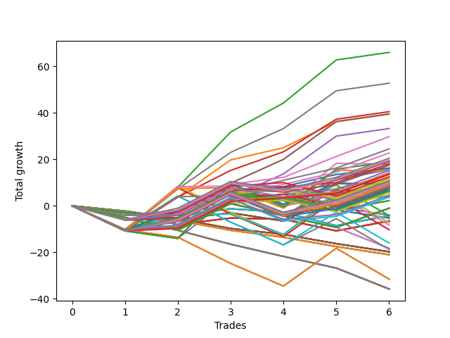

# Short Wallace Doodle 011 
- Symbol: ES90d5m
- Date Range: 03/18/2022 - 07/08/2022
- Trading Period: 7:20-12:30
- Number of Trades: 6



| Name | Win Percent | Profit | Avg Profit / Trade | Avg Time / Trade |      | Name | Win Percent | Profit | Avg Profit / Trade | Avg Time / Trade |
| ---- | ----------- | ------ | ------------------ | ---------------- | ---- | ---- | ----------- | ------ | ------------------ | ---------------- |
| Sorted By <br> Profit | | | | | | Sorted By <br> Win Percentage ||||
| Two | 83.33 | 33000.00 | 5500.00 | 00:00 |     | Two | 83.33 | 33000.00 | 5500.00 | 00:00 |
| Seven | 83.33 | 26375.00 | 4395.83 | 00:00 |     | Seven | 83.33 | 26375.00 | 4395.83 | 00:00 |
| Three | 83.33 | 20250.00 | 3375.00 | 00:00 |     | Three | 83.33 | 20250.00 | 3375.00 | 00:00 |
| One | 83.33 | 19750.00 | 3291.67 | 00:00 |     | One | 83.33 | 19750.00 | 3291.67 | 00:00 |
| Five | 66.67 | 19750.00 | 3291.67 | 00:00 |     | Six | 83.33 | 14875.00 | 2479.17 | 00:00 |
| Four | 66.67 | 16625.00 | 2770.83 | 00:00 |     | Eighty-Five | 83.33 | 12250.00 | 2041.67 | 00:00 |
| Six | 83.33 | 14875.00 | 2479.17 | 00:00 |     | Eighty-Four | 83.33 | 11375.00 | 1895.83 | 00:00 |
| Eighty-Five | 83.33 | 12250.00 | 2041.67 | 00:00 |     | Eighty-Three | 83.33 | 9625.00 | 1604.17 | 00:00 |
| Eighty-Four | 83.33 | 11375.00 | 1895.83 | 00:00 |     | One Hundred Sixteen | 83.33 | 9125.00 | 1520.83 | 00:00 |
| One Hundred Twenty | 66.67 | 10250.00 | 1708.33 | 00:00 |     | Eighty-Two | 83.33 | 7625.00 | 1270.83 | 00:00 |
| One Hundred Ninteen | 66.67 | 9875.00 | 1645.83 | 00:00 |     | One Hundred Twenty-One | 83.33 | 7000.00 | 1166.67 | 00:00 |
| Eighty-Three | 83.33 | 9625.00 | 1604.17 | 00:00 |     | One Hundred Twenty-Six | 83.33 | 6875.00 | 1145.83 | 00:00 |
| Seventy-Three | 50.00 | 9500.00 | 1583.33 | 00:00 |     | Eighty-One | 83.33 | 6750.00 | 1125.00 | 00:00 |
| One Hundred Sixteen | 83.33 | 9125.00 | 1520.83 | 00:00 |     | Five | 66.67 | 19750.00 | 3291.67 | 00:00 |
| Sixty-Six | 50.00 | 9000.00 | 1500.00 | 00:00 |     | Four | 66.67 | 16625.00 | 2770.83 | 00:00 |
| One Hundred Eighteen | 66.67 | 8750.00 | 1458.33 | 00:00 |     | One Hundred Twenty | 66.67 | 10250.00 | 1708.33 | 00:00 |
| Fifty | 66.67 | 8125.00 | 1354.17 | 00:00 |     | One Hundred Ninteen | 66.67 | 9875.00 | 1645.83 | 00:00 |
| Zero | 66.67 | 8125.00 | 1354.17 | 00:00 |     | One Hundred Eighteen | 66.67 | 8750.00 | 1458.33 | 00:00 |
| Fifty-Four | 66.67 | 7750.00 | 1291.67 | 00:00 |     | Fifty | 66.67 | 8125.00 | 1354.17 | 00:00 |
| Eighty-Two | 83.33 | 7625.00 | 1270.83 | 00:00 |     | Zero | 66.67 | 8125.00 | 1354.17 | 00:00 |
| Seventy-One | 50.00 | 7500.00 | 1250.00 | 00:00 |     | Fifty-Four | 66.67 | 7750.00 | 1291.67 | 00:00 |
| One Hundred Seventeen | 66.67 | 7125.00 | 1187.50 | 00:00 |     | One Hundred Seventeen | 66.67 | 7125.00 | 1187.50 | 00:00 |
| One Hundred Twenty-One | 83.33 | 7000.00 | 1166.67 | 00:00 |     | One Hundred Six | 66.67 | 6250.00 | 1041.67 | 00:00 |
| One Hundred Twenty-Six | 83.33 | 6875.00 | 1145.83 | 00:00 |     | Fifty-One | 66.67 | 5875.00 | 979.17 | 00:00 |
| Eighty-One | 83.33 | 6750.00 | 1125.00 | 00:00 |     | Forty-Eight | 66.67 | 5875.00 | 979.17 | 00:00 |
| One Hundred Six | 66.67 | 6250.00 | 1041.67 | 00:00 |     | One Hundred Thirty | 66.67 | 5375.00 | 895.83 | 00:00 |
| Fifty-One | 66.67 | 5875.00 | 979.17 | 00:00 |     | One Hundred Twenty-Nine | 66.67 | 5000.00 | 833.33 | 00:00 |
| Forty-Eight | 66.67 | 5875.00 | 979.17 | 00:00 |     | One Hundred Twenty-Five | 66.67 | 5000.00 | 833.33 | 00:00 |
| Ninety-One | 50.00 | 5875.00 | 979.17 | 00:00 |     | One Hundred Twenty-Four | 66.67 | 4625.00 | 770.83 | 00:00 |
| One Hundred One | 50.00 | 5500.00 | 916.67 | 00:00 |     | Forty-Nine | 66.67 | 4500.00 | 750.00 | 00:00 |
| One Hundred Thirty | 66.67 | 5375.00 | 895.83 | 00:00 |     | Fifty-Five | 66.67 | 4250.00 | 708.33 | 00:00 |
| One Hundred Seven | 50.00 | 5250.00 | 875.00 | 00:00 |     | Fifty-Three | 66.67 | 4250.00 | 708.33 | 00:00 |
| One Hundred Twenty-Nine | 66.67 | 5000.00 | 833.33 | 00:00 |     | Fifty-Two | 66.67 | 4250.00 | 708.33 | 00:00 |
| One Hundred Twenty-Five | 66.67 | 5000.00 | 833.33 | 00:00 |     | One Hundred Twenty-Eight | 66.67 | 3875.00 | 645.83 | 00:00 |
| Seventy | 50.00 | 4750.00 | 791.67 | 00:00 |     | One Hundred Twenty-Three | 66.67 | 3500.00 | 583.33 | 00:00 |
| One Hundred Twenty-Four | 66.67 | 4625.00 | 770.83 | 00:00 |     | One Hundred Twenty-Seven | 66.67 | 2250.00 | 375.00 | 00:00 |
| Sixty-Seven | 50.00 | 4625.00 | 770.83 | 00:00 |     | One Hundred Twenty-Two | 66.67 | 1875.00 | 312.50 | 00:00 |
| Forty-Nine | 66.67 | 4500.00 | 750.00 | 00:00 |     | Seventy-Three | 50.00 | 9500.00 | 1583.33 | 00:00 |
| Fifty-Five | 66.67 | 4250.00 | 708.33 | 00:00 |     | Sixty-Six | 50.00 | 9000.00 | 1500.00 | 00:00 |
| Fifty-Three | 66.67 | 4250.00 | 708.33 | 00:00 |     | Seventy-One | 50.00 | 7500.00 | 1250.00 | 00:00 |
| Fifty-Two | 66.67 | 4250.00 | 708.33 | 00:00 |     | Ninety-One | 50.00 | 5875.00 | 979.17 | 00:00 |
| One Hundred Ten | 33.33 | 4250.00 | 708.33 | 00:00 |     | One Hundred One | 50.00 | 5500.00 | 916.67 | 00:00 |
| One Hundred Nine | 33.33 | 4250.00 | 708.33 | 00:00 |     | One Hundred Seven | 50.00 | 5250.00 | 875.00 | 00:00 |
| One Hundred Eight | 33.33 | 4250.00 | 708.33 | 00:00 |     | Seventy | 50.00 | 4750.00 | 791.67 | 00:00 |
| Ninety-Six | 50.00 | 4125.00 | 687.50 | 00:00 |     | Sixty-Seven | 50.00 | 4625.00 | 770.83 | 00:00 |
| One Hundred Twenty-Eight | 66.67 | 3875.00 | 645.83 | 00:00 |     | Ninety-Six | 50.00 | 4125.00 | 687.50 | 00:00 |
| Ninety-Five | 33.33 | 3875.00 | 645.83 | 00:00 |     | Sixty-Five | 50.00 | 3250.00 | 541.67 | 00:00 |
| Ninety-Four | 33.33 | 3875.00 | 645.83 | 00:00 |     | One Hundred Eleven | 50.00 | 2875.00 | 479.17 | 00:00 |
| Ninety-Three | 33.33 | 3875.00 | 645.83 | 00:00 |     | Sixty-Four | 50.00 | 2750.00 | 458.33 | 00:00 |
| Ninety-Two | 33.33 | 3875.00 | 645.83 | 00:00 |     | Sixty-Nine | 50.00 | 1875.00 | 312.50 | 00:00 |
| One Hundred Twenty-Three | 66.67 | 3500.00 | 583.33 | 00:00 |     | Sixty-Eight | 50.00 | 1875.00 | 312.50 | 00:00 |
| Sixty-Five | 50.00 | 3250.00 | 541.67 | 00:00 |     | Sixty-Two | 50.00 | -2125.00 | -354.17 | 00:00 |
| One Hundred Five | 33.33 | 3250.00 | 541.67 | 00:00 |     | Fifty-Six | 50.00 | -4125.00 | -687.50 | 00:00 |
| One Hundred Four | 33.33 | 3250.00 | 541.67 | 00:00 |     | One Hundred Ten | 33.33 | 4250.00 | 708.33 | 00:00 |
| One Hundred Three | 33.33 | 3250.00 | 541.67 | 00:00 |     | One Hundred Nine | 33.33 | 4250.00 | 708.33 | 00:00 |
| One Hundred Two | 33.33 | 3250.00 | 541.67 | 00:00 |     | One Hundred Eight | 33.33 | 4250.00 | 708.33 | 00:00 |
| One Hundred | 33.33 | 3125.00 | 520.83 | 00:00 |     | Ninety-Five | 33.33 | 3875.00 | 645.83 | 00:00 |
| Ninety-Nine | 33.33 | 3125.00 | 520.83 | 00:00 |     | Ninety-Four | 33.33 | 3875.00 | 645.83 | 00:00 |
| Ninety-Eight | 33.33 | 3125.00 | 520.83 | 00:00 |     | Ninety-Three | 33.33 | 3875.00 | 645.83 | 00:00 |
| Ninety-Seven | 33.33 | 3125.00 | 520.83 | 00:00 |     | Ninety-Two | 33.33 | 3875.00 | 645.83 | 00:00 |
| One Hundred Eleven | 50.00 | 2875.00 | 479.17 | 00:00 |     | One Hundred Five | 33.33 | 3250.00 | 541.67 | 00:00 |
| Sixty-Four | 50.00 | 2750.00 | 458.33 | 00:00 |     | One Hundred Four | 33.33 | 3250.00 | 541.67 | 00:00 |
| One Hundred Twenty-Seven | 66.67 | 2250.00 | 375.00 | 00:00 |     | One Hundred Three | 33.33 | 3250.00 | 541.67 | 00:00 |
| Thirty-Eight | 33.33 | 2250.00 | 375.00 | 00:00 |     | One Hundred Two | 33.33 | 3250.00 | 541.67 | 00:00 |
| Thirty-Two | 33.33 | 2250.00 | 375.00 | 00:00 |     | One Hundred | 33.33 | 3125.00 | 520.83 | 00:00 |
| One Hundred Twenty-Two | 66.67 | 1875.00 | 312.50 | 00:00 |     | Ninety-Nine | 33.33 | 3125.00 | 520.83 | 00:00 |
| Sixty-Nine | 50.00 | 1875.00 | 312.50 | 00:00 |     | Ninety-Eight | 33.33 | 3125.00 | 520.83 | 00:00 |
| Sixty-Eight | 50.00 | 1875.00 | 312.50 | 00:00 |     | Ninety-Seven | 33.33 | 3125.00 | 520.83 | 00:00 |
| Twenty-Two | 33.33 | 1125.00 | 187.50 | 00:00 |     | Thirty-Eight | 33.33 | 2250.00 | 375.00 | 00:00 |
| Sixten | 33.33 | 1125.00 | 187.50 | 00:00 |     | Thirty-Two | 33.33 | 2250.00 | 375.00 | 00:00 |
| One Hundred Fifteen | 33.33 | -500.00 | -83.33 | 00:00 |     | Twenty-Two | 33.33 | 1125.00 | 187.50 | 00:00 |
| One Hundred Fourteen | 33.33 | -500.00 | -83.33 | 00:00 |     | Sixten | 33.33 | 1125.00 | 187.50 | 00:00 |
| One Hundred Thirteen | 33.33 | -500.00 | -83.33 | 00:00 |     | One Hundred Fifteen | 33.33 | -500.00 | -83.33 | 00:00 |
| One Hundred Twelve | 33.33 | -500.00 | -83.33 | 00:00 |     | One Hundred Fourteen | 33.33 | -500.00 | -83.33 | 00:00 |
| Fourteen | 16.67 | -2000.00 | -333.33 | 00:00 |     | One Hundred Thirteen | 33.33 | -500.00 | -83.33 | 00:00 |
| Eight | 16.67 | -2000.00 | -333.33 | 00:00 |     | One Hundred Twelve | 33.33 | -500.00 | -83.33 | 00:00 |
| Sixty-Two | 50.00 | -2125.00 | -354.17 | 00:00 |     | Thirty-Nine | 33.33 | -2125.00 | -354.17 | 00:00 |
| Thirty-Nine | 33.33 | -2125.00 | -354.17 | 00:00 |     | Thirty-Seven | 33.33 | -2125.00 | -354.17 | 00:00 |
| Thirty-Seven | 33.33 | -2125.00 | -354.17 | 00:00 |     | Thirty-Six | 33.33 | -2125.00 | -354.17 | 00:00 |
| Thirty-Six | 33.33 | -2125.00 | -354.17 | 00:00 |     | Thirty-Five | 33.33 | -2125.00 | -354.17 | 00:00 |
| Thirty-Five | 33.33 | -2125.00 | -354.17 | 00:00 |     | Thirty-Four | 33.33 | -2125.00 | -354.17 | 00:00 |
| Thirty-Four | 33.33 | -2125.00 | -354.17 | 00:00 |     | Thirty-Three | 33.33 | -2125.00 | -354.17 | 00:00 |
| Thirty-Three | 33.33 | -2125.00 | -354.17 | 00:00 |     | Twenty-Three | 33.33 | -3250.00 | -541.67 | 00:00 |
| Thirty | 16.67 | -2625.00 | -437.50 | 00:00 |     | Twenty-One | 33.33 | -3250.00 | -541.67 | 00:00 |
| Twenty-Four | 16.67 | -2625.00 | -437.50 | 00:00 |     | Twenty | 33.33 | -3250.00 | -541.67 | 00:00 |
| Twenty-Three | 33.33 | -3250.00 | -541.67 | 00:00 |     | Nineteen | 33.33 | -3250.00 | -541.67 | 00:00 |
| Twenty-One | 33.33 | -3250.00 | -541.67 | 00:00 |     | Eighteen | 33.33 | -3250.00 | -541.67 | 00:00 |
| Twenty | 33.33 | -3250.00 | -541.67 | 00:00 |     | Seventeen | 33.33 | -3250.00 | -541.67 | 00:00 |
| Nineteen | 33.33 | -3250.00 | -541.67 | 00:00 |     | Fifty-Eight | 33.33 | -3625.00 | -604.17 | 00:00 |
| Eighteen | 33.33 | -3250.00 | -541.67 | 00:00 |     | Sixty-Three | 33.33 | -5125.00 | -854.17 | 00:00 |
| Seventeen | 33.33 | -3250.00 | -541.67 | 00:00 |     | Fifty-Nine | 33.33 | -8000.00 | -1333.33 | 00:00 |
| Fifty-Eight | 33.33 | -3625.00 | -604.17 | 00:00 |     | Fifty-Seven | 33.33 | -9375.00 | -1562.50 | 00:00 |
| Fifty-Six | 50.00 | -4125.00 | -687.50 | 00:00 |     | Fourteen | 16.67 | -2000.00 | -333.33 | 00:00 |
| Sixty-Three | 33.33 | -5125.00 | -854.17 | 00:00 |     | Eight | 16.67 | -2000.00 | -333.33 | 00:00 |
| Fifty-Nine | 33.33 | -8000.00 | -1333.33 | 00:00 |     | Thirty | 16.67 | -2625.00 | -437.50 | 00:00 |
| Forty-Six | 16.67 | -9125.00 | -1520.83 | 00:00 |     | Twenty-Four | 16.67 | -2625.00 | -437.50 | 00:00 |
| Forty | 16.67 | -9125.00 | -1520.83 | 00:00 |     | Forty-Six | 16.67 | -9125.00 | -1520.83 | 00:00 |
| Fifty-Seven | 33.33 | -9375.00 | -1562.50 | 00:00 |     | Forty | 16.67 | -9125.00 | -1520.83 | 00:00 |
| Fifteen | 0.00 | -9875.00 | -1645.83 | 00:00 |     | Sixty-One | 16.67 | -15750.00 | -2625.00 | 00:00 |
| Thirteen | 0.00 | -9875.00 | -1645.83 | 00:00 |     | Sixty | 16.67 | -15750.00 | -2625.00 | 00:00 |
| Twelve | 0.00 | -9875.00 | -1645.83 | 00:00 |     | Fifteen | 0.00 | -9875.00 | -1645.83 | 00:00 |
| Eleven | 0.00 | -9875.00 | -1645.83 | 00:00 |     | Thirteen | 0.00 | -9875.00 | -1645.83 | 00:00 |
| Ten | 0.00 | -9875.00 | -1645.83 | 00:00 |     | Twelve | 0.00 | -9875.00 | -1645.83 | 00:00 |
| Nine | 0.00 | -9875.00 | -1645.83 | 00:00 |     | Eleven | 0.00 | -9875.00 | -1645.83 | 00:00 |
| Thirty-One | 0.00 | -10500.00 | -1750.00 | 00:00 |     | Ten | 0.00 | -9875.00 | -1645.83 | 00:00 |
| Twenty-Nine | 0.00 | -10500.00 | -1750.00 | 00:00 |     | Nine | 0.00 | -9875.00 | -1645.83 | 00:00 |
| Twenty-Eight | 0.00 | -10500.00 | -1750.00 | 00:00 |     | Thirty-One | 0.00 | -10500.00 | -1750.00 | 00:00 |
| twenty-Seven | 0.00 | -10500.00 | -1750.00 | 00:00 |     | Twenty-Nine | 0.00 | -10500.00 | -1750.00 | 00:00 |
| Twenty-Six | 0.00 | -10500.00 | -1750.00 | 00:00 |     | Twenty-Eight | 0.00 | -10500.00 | -1750.00 | 00:00 |
| Twenty-Five | 0.00 | -10500.00 | -1750.00 | 00:00 |     | twenty-Seven | 0.00 | -10500.00 | -1750.00 | 00:00 |
| Sixty-One | 16.67 | -15750.00 | -2625.00 | 00:00 |     | Twenty-Six | 0.00 | -10500.00 | -1750.00 | 00:00 |
| Sixty | 16.67 | -15750.00 | -2625.00 | 00:00 |     | Twenty-Five | 0.00 | -10500.00 | -1750.00 | 00:00 |
| Forty-Seven | 0.00 | -17875.00 | -2979.17 | 00:00 |     | Forty-Seven | 0.00 | -17875.00 | -2979.17 | 00:00 |
| Forty-Five | 0.00 | -17875.00 | -2979.17 | 00:00 |     | Forty-Five | 0.00 | -17875.00 | -2979.17 | 00:00 |
| Forty-Four | 0.00 | -17875.00 | -2979.17 | 00:00 |     | Forty-Four | 0.00 | -17875.00 | -2979.17 | 00:00 |
| Forty-Three | 0.00 | -17875.00 | -2979.17 | 00:00 |     | Forty-Three | 0.00 | -17875.00 | -2979.17 | 00:00 |
| Forty-Two | 0.00 | -17875.00 | -2979.17 | 00:00 |     | Forty-Two | 0.00 | -17875.00 | -2979.17 | 00:00 |
| Forty-One | 0.00 | -17875.00 | -2979.17 | 00:00 |     | Forty-One | 0.00 | -17875.00 | -2979.17 | 00:00 |

## NO STOPLOSS

### Test Zero
* Sell when price hits the middle line of the 20p bollinger
* No Stoploss
* Results:
```
Total Trades: 6
Percent Up: 33.33
Percent Down: 66.67
Total Points Moved Down: 16.25
Potential Profit: 8125.00
Total Points Ups: 11.50 Count Ups: 2
Total Points Downs: 27.75 Count Downs: 4
```

<details><summary>Trades</summary>

<code>In: 2022-03-28 12:05:00		Out: 2022-03-28 12:55:00		Total Position Time: 50:00		Total Move Down: -10.75		Total to Date: -10.75</code> <br />
<code>In: 2022-04-01 11:40:00		Out: 2022-04-01 12:18:15		Total Position Time: 38:15		Total Move Down: 8.25		Total to Date: -2.50</code> <br />
<code>In: 2022-04-06 10:55:00		Out: 2022-04-06 11:00:10		Total Position Time: 05:10		Total Move Down: 11.50		Total to Date: 9.00</code> <br />
<code>In: 2022-06-10 12:05:00		Out: 2022-06-10 12:42:40		Total Position Time: 37:40		Total Move Down: -0.75		Total to Date: 8.25</code> <br />
<code>In: 2022-06-10 12:35:00		Out: 2022-06-10 12:42:40		Total Position Time: 07:40		Total Move Down: 5.25		Total to Date: 13.50</code> <br />
<code>In: 2022-06-15 11:55:00		Out: 2022-06-15 12:50:25		Total Position Time: 55:25		Total Move Down: 2.75		Total to Date: 16.25</code> <br />


</details>

### Test One
* Sell when the price hits the upper line of the 20p 1std bollinger
* No Stoploss
* Results:
```
Total Trades: 6
Percent Up: 16.67
Percent Down: 83.33
Total Points Moved Down: 39.50
Potential Profit: 19750.00
Total Points Ups: 10.75 Count Ups: 1
Total Points Downs: 50.25 Count Downs: 5
```

<details><summary>Trades</summary>

<code>In: 2022-03-28 12:05:00		Out: 2022-03-28 12:55:00		Total Position Time: 50:00		Total Move Down: -10.75		Total to Date: -10.75</code> <br />
<code>In: 2022-04-01 11:40:00		Out: 2022-04-01 12:20:05		Total Position Time: 40:05		Total Move Down: 14.50		Total to Date: 3.75</code> <br />
<code>In: 2022-04-06 10:55:00		Out: 2022-04-06 11:10:05		Total Position Time: 15:05		Total Move Down: 16.00		Total to Date: 19.75</code> <br />
<code>In: 2022-06-10 12:05:00		Out: 2022-06-10 12:45:50		Total Position Time: 40:50		Total Move Down: 5.25		Total to Date: 25.00</code> <br />
<code>In: 2022-06-10 12:35:00		Out: 2022-06-10 12:45:50		Total Position Time: 10:50		Total Move Down: 11.25		Total to Date: 36.25</code> <br />
<code>In: 2022-06-15 11:55:00		Out: 2022-06-15 12:55:00		Total Position Time: 60:00		Total Move Down: 3.25		Total to Date: 39.50</code> <br />


</details>

### Test Two
* Sell when the price hits the upper line of the 20p 2std bollinger
* No Stoploss
* Results:
```
Total Trades: 6
Percent Up: 16.67
Percent Down: 83.33
Total Points Moved Down: 66.00
Potential Profit: 33000.00
Total Points Ups: 10.75 Count Ups: 1
Total Points Downs: 76.75 Count Downs: 5
```

<details><summary>Trades</summary>

<code>In: 2022-03-28 12:05:00		Out: 2022-03-28 12:55:00		Total Position Time: 50:00		Total Move Down: -10.75		Total to Date: -10.75</code> <br />
<code>In: 2022-04-01 11:40:00		Out: 2022-04-01 12:38:05		Total Position Time: 58:05		Total Move Down: 18.75		Total to Date: 8.00</code> <br />
<code>In: 2022-04-06 10:55:00		Out: 2022-04-06 11:15:05		Total Position Time: 20:05		Total Move Down: 23.75		Total to Date: 31.75</code> <br />
<code>In: 2022-06-10 12:05:00		Out: 2022-06-10 12:49:55		Total Position Time: 44:55		Total Move Down: 12.50		Total to Date: 44.25</code> <br />
<code>In: 2022-06-10 12:35:00		Out: 2022-06-10 12:49:55		Total Position Time: 14:55		Total Move Down: 18.50		Total to Date: 62.75</code> <br />
<code>In: 2022-06-15 11:55:00		Out: 2022-06-15 12:55:00		Total Position Time: 60:00		Total Move Down: 3.25		Total to Date: 66.00</code> <br />


</details>

### Test Three
* Sell when price hits the middle line of the 50p bollinger
* No Stoploss
* Results:
```
Total Trades: 6
Percent Up: 16.67
Percent Down: 83.33
Total Points Moved Down: 40.50
Potential Profit: 20250.00
Total Points Ups: 10.75 Count Ups: 1
Total Points Downs: 51.25 Count Downs: 5
```

<details><summary>Trades</summary>

<code>In: 2022-03-28 12:05:00		Out: 2022-03-28 12:55:00		Total Position Time: 50:00		Total Move Down: -10.75		Total to Date: -10.75</code> <br />
<code>In: 2022-04-01 11:40:00		Out: 2022-04-01 12:20:05		Total Position Time: 40:05		Total Move Down: 14.50		Total to Date: 3.75</code> <br />
<code>In: 2022-04-06 10:55:00		Out: 2022-04-06 11:08:35		Total Position Time: 13:35		Total Move Down: 11.50		Total to Date: 15.25</code> <br />
<code>In: 2022-06-10 12:05:00		Out: 2022-06-10 12:46:10		Total Position Time: 41:10		Total Move Down: 8.00		Total to Date: 23.25</code> <br />
<code>In: 2022-06-10 12:35:00		Out: 2022-06-10 12:46:10		Total Position Time: 11:10		Total Move Down: 14.00		Total to Date: 37.25</code> <br />
<code>In: 2022-06-15 11:55:00		Out: 2022-06-15 12:55:00		Total Position Time: 60:00		Total Move Down: 3.25		Total to Date: 40.50</code> <br />


</details>

### Test Four
* Sell when the price hits the upper line of the 50p 1std bollinger
* No Stoploss
* Results:
```
Total Trades: 6
Percent Up: 33.33
Percent Down: 66.67
Total Points Moved Down: 33.25
Potential Profit: 16625.00
Total Points Ups: 14.00 Count Ups: 2
Total Points Downs: 47.25 Count Downs: 4
```

<details><summary>Trades</summary>

<code>In: 2022-03-28 12:05:00		Out: 2022-03-28 12:55:00		Total Position Time: 50:00		Total Move Down: -10.75		Total to Date: -10.75</code> <br />
<code>In: 2022-04-01 11:40:00		Out: 2022-04-01 12:55:00		Total Position Time: 75:00		Total Move Down: -3.25		Total to Date: -14.00</code> <br />
<code>In: 2022-04-06 10:55:00		Out: 2022-04-06 11:11:20		Total Position Time: 16:20		Total Move Down: 17.50		Total to Date: 3.50</code> <br />
<code>In: 2022-06-10 12:05:00		Out: 2022-06-10 12:55:00		Total Position Time: 50:00		Total Move Down: 10.25		Total to Date: 13.75</code> <br />
<code>In: 2022-06-10 12:35:00		Out: 2022-06-10 12:55:00		Total Position Time: 20:00		Total Move Down: 16.25		Total to Date: 30.00</code> <br />
<code>In: 2022-06-15 11:55:00		Out: 2022-06-15 12:55:00		Total Position Time: 60:00		Total Move Down: 3.25		Total to Date: 33.25</code> <br />


</details>

### Test Five
* Sell when the price hits the upper line of the 50p 2std bollinger
* No Stoploss
* Results:
```
Total Trades: 6
Percent Up: 33.33
Percent Down: 66.67
Total Points Moved Down: 39.50
Potential Profit: 19750.00
Total Points Ups: 14.00 Count Ups: 2
Total Points Downs: 53.50 Count Downs: 4
```

<details><summary>Trades</summary>

<code>In: 2022-03-28 12:05:00		Out: 2022-03-28 12:55:00		Total Position Time: 50:00		Total Move Down: -10.75		Total to Date: -10.75</code> <br />
<code>In: 2022-04-01 11:40:00		Out: 2022-04-01 12:55:00		Total Position Time: 75:00		Total Move Down: -3.25		Total to Date: -14.00</code> <br />
<code>In: 2022-04-06 10:55:00		Out: 2022-04-06 11:15:05		Total Position Time: 20:05		Total Move Down: 23.75		Total to Date: 9.75</code> <br />
<code>In: 2022-06-10 12:05:00		Out: 2022-06-10 12:55:00		Total Position Time: 50:00		Total Move Down: 10.25		Total to Date: 20.00</code> <br />
<code>In: 2022-06-10 12:35:00		Out: 2022-06-10 12:55:00		Total Position Time: 20:00		Total Move Down: 16.25		Total to Date: 36.25</code> <br />
<code>In: 2022-06-15 11:55:00		Out: 2022-06-15 12:55:00		Total Position Time: 60:00		Total Move Down: 3.25		Total to Date: 39.50</code> <br />


</details>

### Test Six
* Sell when the price hits the middle line of the 1std VWAP
* No Stoploss
* Results:
```
Total Trades: 6
Percent Up: 16.67
Percent Down: 83.33
Total Points Moved Down: 29.75
Potential Profit: 14875.00
Total Points Ups: 10.75 Count Ups: 1
Total Points Downs: 40.50 Count Downs: 5
```

<details><summary>Trades</summary>

<code>In: 2022-03-28 12:05:00		Out: 2022-03-28 12:55:00		Total Position Time: 50:00		Total Move Down: -10.75		Total to Date: -10.75</code> <br />
<code>In: 2022-04-01 11:40:00		Out: 2022-04-01 12:12:55		Total Position Time: 32:55		Total Move Down: 8.50		Total to Date: -2.25</code> <br />
<code>In: 2022-04-06 10:55:00		Out: 2022-04-06 11:00:10		Total Position Time: 05:10		Total Move Down: 11.50		Total to Date: 9.25</code> <br />
<code>In: 2022-06-10 12:05:00		Out: 2022-06-10 12:44:05		Total Position Time: 39:05		Total Move Down: 3.00		Total to Date: 12.25</code> <br />
<code>In: 2022-06-10 12:35:00		Out: 2022-06-10 12:44:05		Total Position Time: 09:05		Total Move Down: 9.00		Total to Date: 21.25</code> <br />
<code>In: 2022-06-15 11:55:00		Out: 2022-06-15 12:52:10		Total Position Time: 57:10		Total Move Down: 8.50		Total to Date: 29.75</code> <br />


</details>

### Test Seven
* Sell when the price hits the upper line of the 1std VWAP
* No Stoploss
* Results:
```
Total Trades: 6
Percent Up: 16.67
Percent Down: 83.33
Total Points Moved Down: 52.75
Potential Profit: 26375.00
Total Points Ups: 10.75 Count Ups: 1
Total Points Downs: 63.50 Count Downs: 5
```

<details><summary>Trades</summary>

<code>In: 2022-03-28 12:05:00		Out: 2022-03-28 12:55:00		Total Position Time: 50:00		Total Move Down: -10.75		Total to Date: -10.75</code> <br />
<code>In: 2022-04-01 11:40:00		Out: 2022-04-01 12:33:30		Total Position Time: 53:30		Total Move Down: 18.00		Total to Date: 7.25</code> <br />
<code>In: 2022-04-06 10:55:00		Out: 2022-04-06 11:09:40		Total Position Time: 14:40		Total Move Down: 15.75		Total to Date: 23.00</code> <br />
<code>In: 2022-06-10 12:05:00		Out: 2022-06-10 12:55:00		Total Position Time: 50:00		Total Move Down: 10.25		Total to Date: 33.25</code> <br />
<code>In: 2022-06-10 12:35:00		Out: 2022-06-10 12:55:00		Total Position Time: 20:00		Total Move Down: 16.25		Total to Date: 49.50</code> <br />
<code>In: 2022-06-15 11:55:00		Out: 2022-06-15 12:55:00		Total Position Time: 60:00		Total Move Down: 3.25		Total to Date: 52.75</code> <br />


</details>

## STOPLOSS OF 2

### Test Eight
* Sell when price hits the middle line of the 20p bollinger
* Stoploss is -2 points
* Results:
```
Total Trades: 6
Percent Up: 83.33
Percent Down: 16.67
Total Points Moved Down: -4.00
Potential Profit: -2000.00
Total Points Ups: 15.50 Count Ups: 5
Total Points Downs: 11.50 Count Downs: 1
```

<details><summary>Trades</summary>

<code>In: 2022-03-28 12:05:00		Out: 2022-03-28 12:10:25		Total Position Time: 05:25		Total Move Down: -2.25		Total to Date: -2.25</code> <br />
<code>In: 2022-04-01 11:40:00		Out: 2022-04-01 11:45:10		Total Position Time: 05:10		Total Move Down: -3.25		Total to Date: -5.50</code> <br />
<code>In: 2022-04-06 10:55:00		Out: 2022-04-06 11:00:10		Total Position Time: 05:10		Total Move Down: 11.50		Total to Date: 6.00</code> <br />
<code>In: 2022-06-10 12:05:00		Out: 2022-06-10 12:10:50		Total Position Time: 05:50		Total Move Down: -2.50		Total to Date: 3.50</code> <br />
<code>In: 2022-06-10 12:35:00		Out: 2022-06-10 12:40:10		Total Position Time: 05:10		Total Move Down: -4.00		Total to Date: -0.50</code> <br />
<code>In: 2022-06-15 11:55:00		Out: 2022-06-15 12:00:50		Total Position Time: 05:50		Total Move Down: -3.50		Total to Date: -4.00</code> <br />


</details>

### Test Nine
* Sell when the price hits the upper line of the 20p 1std bollinger
* Stoploss is -2 points
* Results:
```
Total Trades: 6
Percent Up: 100.00
Percent Down: 0.00
Total Points Moved Down: -19.75
Potential Profit: -9875.00
Total Points Ups: 19.75 Count Ups: 6
Total Points Downs: 0.00 Count Downs: 0
```

<details><summary>Trades</summary>

<code>In: 2022-03-28 12:05:00		Out: 2022-03-28 12:10:25		Total Position Time: 05:25		Total Move Down: -2.25		Total to Date: -2.25</code> <br />
<code>In: 2022-04-01 11:40:00		Out: 2022-04-01 11:45:10		Total Position Time: 05:10		Total Move Down: -3.25		Total to Date: -5.50</code> <br />
<code>In: 2022-04-06 10:55:00		Out: 2022-04-06 11:00:55		Total Position Time: 05:55		Total Move Down: -4.25		Total to Date: -9.75</code> <br />
<code>In: 2022-06-10 12:05:00		Out: 2022-06-10 12:10:50		Total Position Time: 05:50		Total Move Down: -2.50		Total to Date: -12.25</code> <br />
<code>In: 2022-06-10 12:35:00		Out: 2022-06-10 12:40:10		Total Position Time: 05:10		Total Move Down: -4.00		Total to Date: -16.25</code> <br />
<code>In: 2022-06-15 11:55:00		Out: 2022-06-15 12:00:50		Total Position Time: 05:50		Total Move Down: -3.50		Total to Date: -19.75</code> <br />


</details>

### Test Ten
* Sell when the price hits the upper line of the 20p 2std bollinger
* Stoploss is -2 points
* Results:
```
Total Trades: 6
Percent Up: 100.00
Percent Down: 0.00
Total Points Moved Down: -19.75
Potential Profit: -9875.00
Total Points Ups: 19.75 Count Ups: 6
Total Points Downs: 0.00 Count Downs: 0
```

<details><summary>Trades</summary>

<code>In: 2022-03-28 12:05:00		Out: 2022-03-28 12:10:25		Total Position Time: 05:25		Total Move Down: -2.25		Total to Date: -2.25</code> <br />
<code>In: 2022-04-01 11:40:00		Out: 2022-04-01 11:45:10		Total Position Time: 05:10		Total Move Down: -3.25		Total to Date: -5.50</code> <br />
<code>In: 2022-04-06 10:55:00		Out: 2022-04-06 11:00:55		Total Position Time: 05:55		Total Move Down: -4.25		Total to Date: -9.75</code> <br />
<code>In: 2022-06-10 12:05:00		Out: 2022-06-10 12:10:50		Total Position Time: 05:50		Total Move Down: -2.50		Total to Date: -12.25</code> <br />
<code>In: 2022-06-10 12:35:00		Out: 2022-06-10 12:40:10		Total Position Time: 05:10		Total Move Down: -4.00		Total to Date: -16.25</code> <br />
<code>In: 2022-06-15 11:55:00		Out: 2022-06-15 12:00:50		Total Position Time: 05:50		Total Move Down: -3.50		Total to Date: -19.75</code> <br />


</details>

### Test Eleven
* Sell when price hits the middle line of the 50p bollinger
* Stoploss is -2 points
* Results:
```
Total Trades: 6
Percent Up: 100.00
Percent Down: 0.00
Total Points Moved Down: -19.75
Potential Profit: -9875.00
Total Points Ups: 19.75 Count Ups: 6
Total Points Downs: 0.00 Count Downs: 0
```

<details><summary>Trades</summary>

<code>In: 2022-03-28 12:05:00		Out: 2022-03-28 12:10:25		Total Position Time: 05:25		Total Move Down: -2.25		Total to Date: -2.25</code> <br />
<code>In: 2022-04-01 11:40:00		Out: 2022-04-01 11:45:10		Total Position Time: 05:10		Total Move Down: -3.25		Total to Date: -5.50</code> <br />
<code>In: 2022-04-06 10:55:00		Out: 2022-04-06 11:00:55		Total Position Time: 05:55		Total Move Down: -4.25		Total to Date: -9.75</code> <br />
<code>In: 2022-06-10 12:05:00		Out: 2022-06-10 12:10:50		Total Position Time: 05:50		Total Move Down: -2.50		Total to Date: -12.25</code> <br />
<code>In: 2022-06-10 12:35:00		Out: 2022-06-10 12:40:10		Total Position Time: 05:10		Total Move Down: -4.00		Total to Date: -16.25</code> <br />
<code>In: 2022-06-15 11:55:00		Out: 2022-06-15 12:00:50		Total Position Time: 05:50		Total Move Down: -3.50		Total to Date: -19.75</code> <br />


</details>

### Test Twelve
* Sell when the price hits the upper line of the 50p 1std bollinger
* Stoploss is -2 points
* Results:
```
Total Trades: 6
Percent Up: 100.00
Percent Down: 0.00
Total Points Moved Down: -19.75
Potential Profit: -9875.00
Total Points Ups: 19.75 Count Ups: 6
Total Points Downs: 0.00 Count Downs: 0
```

<details><summary>Trades</summary>

<code>In: 2022-03-28 12:05:00		Out: 2022-03-28 12:10:25		Total Position Time: 05:25		Total Move Down: -2.25		Total to Date: -2.25</code> <br />
<code>In: 2022-04-01 11:40:00		Out: 2022-04-01 11:45:10		Total Position Time: 05:10		Total Move Down: -3.25		Total to Date: -5.50</code> <br />
<code>In: 2022-04-06 10:55:00		Out: 2022-04-06 11:00:55		Total Position Time: 05:55		Total Move Down: -4.25		Total to Date: -9.75</code> <br />
<code>In: 2022-06-10 12:05:00		Out: 2022-06-10 12:10:50		Total Position Time: 05:50		Total Move Down: -2.50		Total to Date: -12.25</code> <br />
<code>In: 2022-06-10 12:35:00		Out: 2022-06-10 12:40:10		Total Position Time: 05:10		Total Move Down: -4.00		Total to Date: -16.25</code> <br />
<code>In: 2022-06-15 11:55:00		Out: 2022-06-15 12:00:50		Total Position Time: 05:50		Total Move Down: -3.50		Total to Date: -19.75</code> <br />


</details>

### Test Thirteen
* Sell when the price hits the upper line of the 50p 2std bollinger
* Stoploss is -2 points
* Results:
```
Total Trades: 6
Percent Up: 100.00
Percent Down: 0.00
Total Points Moved Down: -19.75
Potential Profit: -9875.00
Total Points Ups: 19.75 Count Ups: 6
Total Points Downs: 0.00 Count Downs: 0
```

<details><summary>Trades</summary>

<code>In: 2022-03-28 12:05:00		Out: 2022-03-28 12:10:25		Total Position Time: 05:25		Total Move Down: -2.25		Total to Date: -2.25</code> <br />
<code>In: 2022-04-01 11:40:00		Out: 2022-04-01 11:45:10		Total Position Time: 05:10		Total Move Down: -3.25		Total to Date: -5.50</code> <br />
<code>In: 2022-04-06 10:55:00		Out: 2022-04-06 11:00:55		Total Position Time: 05:55		Total Move Down: -4.25		Total to Date: -9.75</code> <br />
<code>In: 2022-06-10 12:05:00		Out: 2022-06-10 12:10:50		Total Position Time: 05:50		Total Move Down: -2.50		Total to Date: -12.25</code> <br />
<code>In: 2022-06-10 12:35:00		Out: 2022-06-10 12:40:10		Total Position Time: 05:10		Total Move Down: -4.00		Total to Date: -16.25</code> <br />
<code>In: 2022-06-15 11:55:00		Out: 2022-06-15 12:00:50		Total Position Time: 05:50		Total Move Down: -3.50		Total to Date: -19.75</code> <br />


</details>

### Test Fourteen
* Sell when the price hits the middle line of the 1std VWAP
* Stoploss is -2 points
* Results:
```
Total Trades: 6
Percent Up: 83.33
Percent Down: 16.67
Total Points Moved Down: -4.00
Potential Profit: -2000.00
Total Points Ups: 15.50 Count Ups: 5
Total Points Downs: 11.50 Count Downs: 1
```

<details><summary>Trades</summary>

<code>In: 2022-03-28 12:05:00		Out: 2022-03-28 12:10:25		Total Position Time: 05:25		Total Move Down: -2.25		Total to Date: -2.25</code> <br />
<code>In: 2022-04-01 11:40:00		Out: 2022-04-01 11:45:10		Total Position Time: 05:10		Total Move Down: -3.25		Total to Date: -5.50</code> <br />
<code>In: 2022-04-06 10:55:00		Out: 2022-04-06 11:00:10		Total Position Time: 05:10		Total Move Down: 11.50		Total to Date: 6.00</code> <br />
<code>In: 2022-06-10 12:05:00		Out: 2022-06-10 12:10:50		Total Position Time: 05:50		Total Move Down: -2.50		Total to Date: 3.50</code> <br />
<code>In: 2022-06-10 12:35:00		Out: 2022-06-10 12:40:10		Total Position Time: 05:10		Total Move Down: -4.00		Total to Date: -0.50</code> <br />
<code>In: 2022-06-15 11:55:00		Out: 2022-06-15 12:00:50		Total Position Time: 05:50		Total Move Down: -3.50		Total to Date: -4.00</code> <br />


</details>

### Test Fifteen
* Sell when the price hits the upper line of the 1std VWAP
* Stoploss is -2 points
* Results:
```
Total Trades: 6
Percent Up: 100.00
Percent Down: 0.00
Total Points Moved Down: -19.75
Potential Profit: -9875.00
Total Points Ups: 19.75 Count Ups: 6
Total Points Downs: 0.00 Count Downs: 0
```

<details><summary>Trades</summary>

<code>In: 2022-03-28 12:05:00		Out: 2022-03-28 12:10:25		Total Position Time: 05:25		Total Move Down: -2.25		Total to Date: -2.25</code> <br />
<code>In: 2022-04-01 11:40:00		Out: 2022-04-01 11:45:10		Total Position Time: 05:10		Total Move Down: -3.25		Total to Date: -5.50</code> <br />
<code>In: 2022-04-06 10:55:00		Out: 2022-04-06 11:00:55		Total Position Time: 05:55		Total Move Down: -4.25		Total to Date: -9.75</code> <br />
<code>In: 2022-06-10 12:05:00		Out: 2022-06-10 12:10:50		Total Position Time: 05:50		Total Move Down: -2.50		Total to Date: -12.25</code> <br />
<code>In: 2022-06-10 12:35:00		Out: 2022-06-10 12:40:10		Total Position Time: 05:10		Total Move Down: -4.00		Total to Date: -16.25</code> <br />
<code>In: 2022-06-15 11:55:00		Out: 2022-06-15 12:00:50		Total Position Time: 05:50		Total Move Down: -3.50		Total to Date: -19.75</code> <br />


</details>

## TRAIL STOP OF 2

### Test Sixten
* Sell when price hits the middle line of the 20p bollinger
* Trailing Stop is -2 points
* Results:
```
Total Trades: 6
Percent Up: 66.67
Percent Down: 33.33
Total Points Moved Down: 2.25
Potential Profit: 1125.00
Total Points Ups: 13.50 Count Ups: 4
Total Points Downs: 15.75 Count Downs: 2
```

<details><summary>Trades</summary>

<code>In: 2022-03-28 12:05:00		Out: 2022-03-28 12:11:15		Total Position Time: 06:15		Total Move Down: -2.50		Total to Date: -2.50</code> <br />
<code>In: 2022-04-01 11:40:00		Out: 2022-04-01 11:45:40		Total Position Time: 05:40		Total Move Down: -5.50		Total to Date: -8.00</code> <br />
<code>In: 2022-04-06 10:55:00		Out: 2022-04-06 11:00:10		Total Position Time: 05:10		Total Move Down: 11.50		Total to Date: 3.50</code> <br />
<code>In: 2022-06-10 12:05:00		Out: 2022-06-10 12:10:35		Total Position Time: 05:35		Total Move Down: -0.50		Total to Date: 3.00</code> <br />
<code>In: 2022-06-10 12:35:00		Out: 2022-06-10 12:40:20		Total Position Time: 05:20		Total Move Down: -5.00		Total to Date: -2.00</code> <br />
<code>In: 2022-06-15 11:55:00		Out: 2022-06-15 12:00:25		Total Position Time: 05:25		Total Move Down: 4.25		Total to Date: 2.25</code> <br />


</details>

### Test Seventeen
* Sell when the price hits the upper line of the 20p 1std bollinger
* Trailing Stop is -2 points
* Results:
```
Total Trades: 6
Percent Up: 66.67
Percent Down: 33.33
Total Points Moved Down: -6.50
Potential Profit: -3250.00
Total Points Ups: 13.50 Count Ups: 4
Total Points Downs: 7.00 Count Downs: 2
```

<details><summary>Trades</summary>

<code>In: 2022-03-28 12:05:00		Out: 2022-03-28 12:11:15		Total Position Time: 06:15		Total Move Down: -2.50		Total to Date: -2.50</code> <br />
<code>In: 2022-04-01 11:40:00		Out: 2022-04-01 11:45:40		Total Position Time: 05:40		Total Move Down: -5.50		Total to Date: -8.00</code> <br />
<code>In: 2022-04-06 10:55:00		Out: 2022-04-06 11:00:15		Total Position Time: 05:15		Total Move Down: 2.75		Total to Date: -5.25</code> <br />
<code>In: 2022-06-10 12:05:00		Out: 2022-06-10 12:10:35		Total Position Time: 05:35		Total Move Down: -0.50		Total to Date: -5.75</code> <br />
<code>In: 2022-06-10 12:35:00		Out: 2022-06-10 12:40:20		Total Position Time: 05:20		Total Move Down: -5.00		Total to Date: -10.75</code> <br />
<code>In: 2022-06-15 11:55:00		Out: 2022-06-15 12:00:25		Total Position Time: 05:25		Total Move Down: 4.25		Total to Date: -6.50</code> <br />


</details>

### Test Eighteen
* Sell when the price hits the upper line of the 20p 2std bollinger
* Trailing Stop is -2 points
* Results:
```
Total Trades: 6
Percent Up: 66.67
Percent Down: 33.33
Total Points Moved Down: -6.50
Potential Profit: -3250.00
Total Points Ups: 13.50 Count Ups: 4
Total Points Downs: 7.00 Count Downs: 2
```

<details><summary>Trades</summary>

<code>In: 2022-03-28 12:05:00		Out: 2022-03-28 12:11:15		Total Position Time: 06:15		Total Move Down: -2.50		Total to Date: -2.50</code> <br />
<code>In: 2022-04-01 11:40:00		Out: 2022-04-01 11:45:40		Total Position Time: 05:40		Total Move Down: -5.50		Total to Date: -8.00</code> <br />
<code>In: 2022-04-06 10:55:00		Out: 2022-04-06 11:00:15		Total Position Time: 05:15		Total Move Down: 2.75		Total to Date: -5.25</code> <br />
<code>In: 2022-06-10 12:05:00		Out: 2022-06-10 12:10:35		Total Position Time: 05:35		Total Move Down: -0.50		Total to Date: -5.75</code> <br />
<code>In: 2022-06-10 12:35:00		Out: 2022-06-10 12:40:20		Total Position Time: 05:20		Total Move Down: -5.00		Total to Date: -10.75</code> <br />
<code>In: 2022-06-15 11:55:00		Out: 2022-06-15 12:00:25		Total Position Time: 05:25		Total Move Down: 4.25		Total to Date: -6.50</code> <br />


</details>

### Test Nineteen
* Sell when price hits the middle line of the 50p bollinger
* Trailing Stop is -2 points
* Results:
```
Total Trades: 6
Percent Up: 66.67
Percent Down: 33.33
Total Points Moved Down: -6.50
Potential Profit: -3250.00
Total Points Ups: 13.50 Count Ups: 4
Total Points Downs: 7.00 Count Downs: 2
```

<details><summary>Trades</summary>

<code>In: 2022-03-28 12:05:00		Out: 2022-03-28 12:11:15		Total Position Time: 06:15		Total Move Down: -2.50		Total to Date: -2.50</code> <br />
<code>In: 2022-04-01 11:40:00		Out: 2022-04-01 11:45:40		Total Position Time: 05:40		Total Move Down: -5.50		Total to Date: -8.00</code> <br />
<code>In: 2022-04-06 10:55:00		Out: 2022-04-06 11:00:15		Total Position Time: 05:15		Total Move Down: 2.75		Total to Date: -5.25</code> <br />
<code>In: 2022-06-10 12:05:00		Out: 2022-06-10 12:10:35		Total Position Time: 05:35		Total Move Down: -0.50		Total to Date: -5.75</code> <br />
<code>In: 2022-06-10 12:35:00		Out: 2022-06-10 12:40:20		Total Position Time: 05:20		Total Move Down: -5.00		Total to Date: -10.75</code> <br />
<code>In: 2022-06-15 11:55:00		Out: 2022-06-15 12:00:25		Total Position Time: 05:25		Total Move Down: 4.25		Total to Date: -6.50</code> <br />


</details>

### Test Twenty
* Sell when the price hits the upper line of the 50p 1std bollinger
* Trailing Stop is -2 points
* Results:
```
Total Trades: 6
Percent Up: 66.67
Percent Down: 33.33
Total Points Moved Down: -6.50
Potential Profit: -3250.00
Total Points Ups: 13.50 Count Ups: 4
Total Points Downs: 7.00 Count Downs: 2
```

<details><summary>Trades</summary>

<code>In: 2022-03-28 12:05:00		Out: 2022-03-28 12:11:15		Total Position Time: 06:15		Total Move Down: -2.50		Total to Date: -2.50</code> <br />
<code>In: 2022-04-01 11:40:00		Out: 2022-04-01 11:45:40		Total Position Time: 05:40		Total Move Down: -5.50		Total to Date: -8.00</code> <br />
<code>In: 2022-04-06 10:55:00		Out: 2022-04-06 11:00:15		Total Position Time: 05:15		Total Move Down: 2.75		Total to Date: -5.25</code> <br />
<code>In: 2022-06-10 12:05:00		Out: 2022-06-10 12:10:35		Total Position Time: 05:35		Total Move Down: -0.50		Total to Date: -5.75</code> <br />
<code>In: 2022-06-10 12:35:00		Out: 2022-06-10 12:40:20		Total Position Time: 05:20		Total Move Down: -5.00		Total to Date: -10.75</code> <br />
<code>In: 2022-06-15 11:55:00		Out: 2022-06-15 12:00:25		Total Position Time: 05:25		Total Move Down: 4.25		Total to Date: -6.50</code> <br />


</details>

### Test Twenty-One
* Sell when the price hits the upper line of the 50p 2std bollinger
* Trailing Stop is -2 points
* Results:
```
Total Trades: 6
Percent Up: 66.67
Percent Down: 33.33
Total Points Moved Down: -6.50
Potential Profit: -3250.00
Total Points Ups: 13.50 Count Ups: 4
Total Points Downs: 7.00 Count Downs: 2
```

<details><summary>Trades</summary>

<code>In: 2022-03-28 12:05:00		Out: 2022-03-28 12:11:15		Total Position Time: 06:15		Total Move Down: -2.50		Total to Date: -2.50</code> <br />
<code>In: 2022-04-01 11:40:00		Out: 2022-04-01 11:45:40		Total Position Time: 05:40		Total Move Down: -5.50		Total to Date: -8.00</code> <br />
<code>In: 2022-04-06 10:55:00		Out: 2022-04-06 11:00:15		Total Position Time: 05:15		Total Move Down: 2.75		Total to Date: -5.25</code> <br />
<code>In: 2022-06-10 12:05:00		Out: 2022-06-10 12:10:35		Total Position Time: 05:35		Total Move Down: -0.50		Total to Date: -5.75</code> <br />
<code>In: 2022-06-10 12:35:00		Out: 2022-06-10 12:40:20		Total Position Time: 05:20		Total Move Down: -5.00		Total to Date: -10.75</code> <br />
<code>In: 2022-06-15 11:55:00		Out: 2022-06-15 12:00:25		Total Position Time: 05:25		Total Move Down: 4.25		Total to Date: -6.50</code> <br />


</details>

### Test Twenty-Two
* Sell when the price hits the middle line of the 1std VWAP
* Trailing Stop is -2 points
* Results:
```
Total Trades: 6
Percent Up: 66.67
Percent Down: 33.33
Total Points Moved Down: 2.25
Potential Profit: 1125.00
Total Points Ups: 13.50 Count Ups: 4
Total Points Downs: 15.75 Count Downs: 2
```

<details><summary>Trades</summary>

<code>In: 2022-03-28 12:05:00		Out: 2022-03-28 12:11:15		Total Position Time: 06:15		Total Move Down: -2.50		Total to Date: -2.50</code> <br />
<code>In: 2022-04-01 11:40:00		Out: 2022-04-01 11:45:40		Total Position Time: 05:40		Total Move Down: -5.50		Total to Date: -8.00</code> <br />
<code>In: 2022-04-06 10:55:00		Out: 2022-04-06 11:00:10		Total Position Time: 05:10		Total Move Down: 11.50		Total to Date: 3.50</code> <br />
<code>In: 2022-06-10 12:05:00		Out: 2022-06-10 12:10:35		Total Position Time: 05:35		Total Move Down: -0.50		Total to Date: 3.00</code> <br />
<code>In: 2022-06-10 12:35:00		Out: 2022-06-10 12:40:20		Total Position Time: 05:20		Total Move Down: -5.00		Total to Date: -2.00</code> <br />
<code>In: 2022-06-15 11:55:00		Out: 2022-06-15 12:00:25		Total Position Time: 05:25		Total Move Down: 4.25		Total to Date: 2.25</code> <br />


</details>

### Test Twenty-Three
* Sell when the price hits the upper line of the 1std VWAP
* Trailing Stop is -2 points
* Results:
```
Total Trades: 6
Percent Up: 66.67
Percent Down: 33.33
Total Points Moved Down: -6.50
Potential Profit: -3250.00
Total Points Ups: 13.50 Count Ups: 4
Total Points Downs: 7.00 Count Downs: 2
```

<details><summary>Trades</summary>

<code>In: 2022-03-28 12:05:00		Out: 2022-03-28 12:11:15		Total Position Time: 06:15		Total Move Down: -2.50		Total to Date: -2.50</code> <br />
<code>In: 2022-04-01 11:40:00		Out: 2022-04-01 11:45:40		Total Position Time: 05:40		Total Move Down: -5.50		Total to Date: -8.00</code> <br />
<code>In: 2022-04-06 10:55:00		Out: 2022-04-06 11:00:15		Total Position Time: 05:15		Total Move Down: 2.75		Total to Date: -5.25</code> <br />
<code>In: 2022-06-10 12:05:00		Out: 2022-06-10 12:10:35		Total Position Time: 05:35		Total Move Down: -0.50		Total to Date: -5.75</code> <br />
<code>In: 2022-06-10 12:35:00		Out: 2022-06-10 12:40:20		Total Position Time: 05:20		Total Move Down: -5.00		Total to Date: -10.75</code> <br />
<code>In: 2022-06-15 11:55:00		Out: 2022-06-15 12:00:25		Total Position Time: 05:25		Total Move Down: 4.25		Total to Date: -6.50</code> <br />


</details>

## STOPLOSS OF 3

### Test Twenty-Four
* Sell when price hits the middle line of the 20p bollinger
* Stoploss is -3 points
* Results:
```
Total Trades: 6
Percent Up: 83.33
Percent Down: 16.67
Total Points Moved Down: -5.25
Potential Profit: -2625.00
Total Points Ups: 16.75 Count Ups: 5
Total Points Downs: 11.50 Count Downs: 1
```

<details><summary>Trades</summary>

<code>In: 2022-03-28 12:05:00		Out: 2022-03-28 12:14:25		Total Position Time: 09:25		Total Move Down: -3.00		Total to Date: -3.00</code> <br />
<code>In: 2022-04-01 11:40:00		Out: 2022-04-01 11:45:10		Total Position Time: 05:10		Total Move Down: -3.25		Total to Date: -6.25</code> <br />
<code>In: 2022-04-06 10:55:00		Out: 2022-04-06 11:00:10		Total Position Time: 05:10		Total Move Down: 11.50		Total to Date: 5.25</code> <br />
<code>In: 2022-06-10 12:05:00		Out: 2022-06-10 12:11:10		Total Position Time: 06:10		Total Move Down: -3.00		Total to Date: 2.25</code> <br />
<code>In: 2022-06-10 12:35:00		Out: 2022-06-10 12:40:10		Total Position Time: 05:10		Total Move Down: -4.00		Total to Date: -1.75</code> <br />
<code>In: 2022-06-15 11:55:00		Out: 2022-06-15 12:00:50		Total Position Time: 05:50		Total Move Down: -3.50		Total to Date: -5.25</code> <br />


</details>

### Test Twenty-Five
* Sell when the price hits the upper line of the 20p 1std bollinger
* Stoploss is -3 points
* Results:
```
Total Trades: 6
Percent Up: 100.00
Percent Down: 0.00
Total Points Moved Down: -21.00
Potential Profit: -10500.00
Total Points Ups: 21.00 Count Ups: 6
Total Points Downs: 0.00 Count Downs: 0
```

<details><summary>Trades</summary>

<code>In: 2022-03-28 12:05:00		Out: 2022-03-28 12:14:25		Total Position Time: 09:25		Total Move Down: -3.00		Total to Date: -3.00</code> <br />
<code>In: 2022-04-01 11:40:00		Out: 2022-04-01 11:45:10		Total Position Time: 05:10		Total Move Down: -3.25		Total to Date: -6.25</code> <br />
<code>In: 2022-04-06 10:55:00		Out: 2022-04-06 11:00:55		Total Position Time: 05:55		Total Move Down: -4.25		Total to Date: -10.50</code> <br />
<code>In: 2022-06-10 12:05:00		Out: 2022-06-10 12:11:10		Total Position Time: 06:10		Total Move Down: -3.00		Total to Date: -13.50</code> <br />
<code>In: 2022-06-10 12:35:00		Out: 2022-06-10 12:40:10		Total Position Time: 05:10		Total Move Down: -4.00		Total to Date: -17.50</code> <br />
<code>In: 2022-06-15 11:55:00		Out: 2022-06-15 12:00:50		Total Position Time: 05:50		Total Move Down: -3.50		Total to Date: -21.00</code> <br />


</details>

### Test Twenty-Six
* Sell when the price hits the upper line of the 20p 2std bollinger
* Stoploss is -3 points
* Results:
```
Total Trades: 6
Percent Up: 100.00
Percent Down: 0.00
Total Points Moved Down: -21.00
Potential Profit: -10500.00
Total Points Ups: 21.00 Count Ups: 6
Total Points Downs: 0.00 Count Downs: 0
```

<details><summary>Trades</summary>

<code>In: 2022-03-28 12:05:00		Out: 2022-03-28 12:14:25		Total Position Time: 09:25		Total Move Down: -3.00		Total to Date: -3.00</code> <br />
<code>In: 2022-04-01 11:40:00		Out: 2022-04-01 11:45:10		Total Position Time: 05:10		Total Move Down: -3.25		Total to Date: -6.25</code> <br />
<code>In: 2022-04-06 10:55:00		Out: 2022-04-06 11:00:55		Total Position Time: 05:55		Total Move Down: -4.25		Total to Date: -10.50</code> <br />
<code>In: 2022-06-10 12:05:00		Out: 2022-06-10 12:11:10		Total Position Time: 06:10		Total Move Down: -3.00		Total to Date: -13.50</code> <br />
<code>In: 2022-06-10 12:35:00		Out: 2022-06-10 12:40:10		Total Position Time: 05:10		Total Move Down: -4.00		Total to Date: -17.50</code> <br />
<code>In: 2022-06-15 11:55:00		Out: 2022-06-15 12:00:50		Total Position Time: 05:50		Total Move Down: -3.50		Total to Date: -21.00</code> <br />


</details>

### Test twenty-Seven
* Sell when price hits the middle line of the 50p bollinger
* Stoploss is -3 points
* Results:
```
Total Trades: 6
Percent Up: 100.00
Percent Down: 0.00
Total Points Moved Down: -21.00
Potential Profit: -10500.00
Total Points Ups: 21.00 Count Ups: 6
Total Points Downs: 0.00 Count Downs: 0
```

<details><summary>Trades</summary>

<code>In: 2022-03-28 12:05:00		Out: 2022-03-28 12:14:25		Total Position Time: 09:25		Total Move Down: -3.00		Total to Date: -3.00</code> <br />
<code>In: 2022-04-01 11:40:00		Out: 2022-04-01 11:45:10		Total Position Time: 05:10		Total Move Down: -3.25		Total to Date: -6.25</code> <br />
<code>In: 2022-04-06 10:55:00		Out: 2022-04-06 11:00:55		Total Position Time: 05:55		Total Move Down: -4.25		Total to Date: -10.50</code> <br />
<code>In: 2022-06-10 12:05:00		Out: 2022-06-10 12:11:10		Total Position Time: 06:10		Total Move Down: -3.00		Total to Date: -13.50</code> <br />
<code>In: 2022-06-10 12:35:00		Out: 2022-06-10 12:40:10		Total Position Time: 05:10		Total Move Down: -4.00		Total to Date: -17.50</code> <br />
<code>In: 2022-06-15 11:55:00		Out: 2022-06-15 12:00:50		Total Position Time: 05:50		Total Move Down: -3.50		Total to Date: -21.00</code> <br />


</details>

### Test Twenty-Eight
* Sell when the price hits the upper line of the 50p 1std bollinger
* Stoploss is -3 points
* Results:
```
Total Trades: 6
Percent Up: 100.00
Percent Down: 0.00
Total Points Moved Down: -21.00
Potential Profit: -10500.00
Total Points Ups: 21.00 Count Ups: 6
Total Points Downs: 0.00 Count Downs: 0
```

<details><summary>Trades</summary>

<code>In: 2022-03-28 12:05:00		Out: 2022-03-28 12:14:25		Total Position Time: 09:25		Total Move Down: -3.00		Total to Date: -3.00</code> <br />
<code>In: 2022-04-01 11:40:00		Out: 2022-04-01 11:45:10		Total Position Time: 05:10		Total Move Down: -3.25		Total to Date: -6.25</code> <br />
<code>In: 2022-04-06 10:55:00		Out: 2022-04-06 11:00:55		Total Position Time: 05:55		Total Move Down: -4.25		Total to Date: -10.50</code> <br />
<code>In: 2022-06-10 12:05:00		Out: 2022-06-10 12:11:10		Total Position Time: 06:10		Total Move Down: -3.00		Total to Date: -13.50</code> <br />
<code>In: 2022-06-10 12:35:00		Out: 2022-06-10 12:40:10		Total Position Time: 05:10		Total Move Down: -4.00		Total to Date: -17.50</code> <br />
<code>In: 2022-06-15 11:55:00		Out: 2022-06-15 12:00:50		Total Position Time: 05:50		Total Move Down: -3.50		Total to Date: -21.00</code> <br />


</details>

### Test Twenty-Nine
* Sell when the price hits the upper line of the 50p 2std bollinger
* Stoploss is -3 points
* Results:
```
Total Trades: 6
Percent Up: 100.00
Percent Down: 0.00
Total Points Moved Down: -21.00
Potential Profit: -10500.00
Total Points Ups: 21.00 Count Ups: 6
Total Points Downs: 0.00 Count Downs: 0
```

<details><summary>Trades</summary>

<code>In: 2022-03-28 12:05:00		Out: 2022-03-28 12:14:25		Total Position Time: 09:25		Total Move Down: -3.00		Total to Date: -3.00</code> <br />
<code>In: 2022-04-01 11:40:00		Out: 2022-04-01 11:45:10		Total Position Time: 05:10		Total Move Down: -3.25		Total to Date: -6.25</code> <br />
<code>In: 2022-04-06 10:55:00		Out: 2022-04-06 11:00:55		Total Position Time: 05:55		Total Move Down: -4.25		Total to Date: -10.50</code> <br />
<code>In: 2022-06-10 12:05:00		Out: 2022-06-10 12:11:10		Total Position Time: 06:10		Total Move Down: -3.00		Total to Date: -13.50</code> <br />
<code>In: 2022-06-10 12:35:00		Out: 2022-06-10 12:40:10		Total Position Time: 05:10		Total Move Down: -4.00		Total to Date: -17.50</code> <br />
<code>In: 2022-06-15 11:55:00		Out: 2022-06-15 12:00:50		Total Position Time: 05:50		Total Move Down: -3.50		Total to Date: -21.00</code> <br />


</details>

### Test Thirty
* Sell when the price hits the middle line of the 1std VWAP
* Stoploss is -3 points
* Results:
```
Total Trades: 6
Percent Up: 83.33
Percent Down: 16.67
Total Points Moved Down: -5.25
Potential Profit: -2625.00
Total Points Ups: 16.75 Count Ups: 5
Total Points Downs: 11.50 Count Downs: 1
```

<details><summary>Trades</summary>

<code>In: 2022-03-28 12:05:00		Out: 2022-03-28 12:14:25		Total Position Time: 09:25		Total Move Down: -3.00		Total to Date: -3.00</code> <br />
<code>In: 2022-04-01 11:40:00		Out: 2022-04-01 11:45:10		Total Position Time: 05:10		Total Move Down: -3.25		Total to Date: -6.25</code> <br />
<code>In: 2022-04-06 10:55:00		Out: 2022-04-06 11:00:10		Total Position Time: 05:10		Total Move Down: 11.50		Total to Date: 5.25</code> <br />
<code>In: 2022-06-10 12:05:00		Out: 2022-06-10 12:11:10		Total Position Time: 06:10		Total Move Down: -3.00		Total to Date: 2.25</code> <br />
<code>In: 2022-06-10 12:35:00		Out: 2022-06-10 12:40:10		Total Position Time: 05:10		Total Move Down: -4.00		Total to Date: -1.75</code> <br />
<code>In: 2022-06-15 11:55:00		Out: 2022-06-15 12:00:50		Total Position Time: 05:50		Total Move Down: -3.50		Total to Date: -5.25</code> <br />


</details>

### Test Thirty-One
* Sell when the price hits the upper line of the 1std VWAP
* Stoploss is -3 points
* Results:
```
Total Trades: 6
Percent Up: 100.00
Percent Down: 0.00
Total Points Moved Down: -21.00
Potential Profit: -10500.00
Total Points Ups: 21.00 Count Ups: 6
Total Points Downs: 0.00 Count Downs: 0
```

<details><summary>Trades</summary>

<code>In: 2022-03-28 12:05:00		Out: 2022-03-28 12:14:25		Total Position Time: 09:25		Total Move Down: -3.00		Total to Date: -3.00</code> <br />
<code>In: 2022-04-01 11:40:00		Out: 2022-04-01 11:45:10		Total Position Time: 05:10		Total Move Down: -3.25		Total to Date: -6.25</code> <br />
<code>In: 2022-04-06 10:55:00		Out: 2022-04-06 11:00:55		Total Position Time: 05:55		Total Move Down: -4.25		Total to Date: -10.50</code> <br />
<code>In: 2022-06-10 12:05:00		Out: 2022-06-10 12:11:10		Total Position Time: 06:10		Total Move Down: -3.00		Total to Date: -13.50</code> <br />
<code>In: 2022-06-10 12:35:00		Out: 2022-06-10 12:40:10		Total Position Time: 05:10		Total Move Down: -4.00		Total to Date: -17.50</code> <br />
<code>In: 2022-06-15 11:55:00		Out: 2022-06-15 12:00:50		Total Position Time: 05:50		Total Move Down: -3.50		Total to Date: -21.00</code> <br />


</details>

## TRAIL STOP OF 3

### Test Thirty-Two
* Sell when price hits the middle line of the 20p bollinger
* Trailing Stop is -3 points
* Results:
```
Total Trades: 6
Percent Up: 66.67
Percent Down: 33.33
Total Points Moved Down: 4.50
Potential Profit: 2250.00
Total Points Ups: 11.25 Count Ups: 4
Total Points Downs: 15.75 Count Downs: 2
```

<details><summary>Trades</summary>

<code>In: 2022-03-28 12:05:00		Out: 2022-03-28 12:15:15		Total Position Time: 10:15		Total Move Down: -4.00		Total to Date: -4.00</code> <br />
<code>In: 2022-04-01 11:40:00		Out: 2022-04-01 11:57:05		Total Position Time: 17:05		Total Move Down: -0.00		Total to Date: -4.00</code> <br />
<code>In: 2022-04-06 10:55:00		Out: 2022-04-06 11:00:10		Total Position Time: 05:10		Total Move Down: 11.50		Total to Date: 7.50</code> <br />
<code>In: 2022-06-10 12:05:00		Out: 2022-06-10 12:10:45		Total Position Time: 05:45		Total Move Down: -1.50		Total to Date: 6.00</code> <br />
<code>In: 2022-06-10 12:35:00		Out: 2022-06-10 12:41:00		Total Position Time: 06:00		Total Move Down: -5.75		Total to Date: 0.25</code> <br />
<code>In: 2022-06-15 11:55:00		Out: 2022-06-15 12:00:25		Total Position Time: 05:25		Total Move Down: 4.25		Total to Date: 4.50</code> <br />


</details>

### Test Thirty-Three
* Sell when the price hits the upper line of the 20p 1std bollinger
* Trailing Stop is -3 points
* Results:
```
Total Trades: 6
Percent Up: 66.67
Percent Down: 33.33
Total Points Moved Down: -4.25
Potential Profit: -2125.00
Total Points Ups: 11.25 Count Ups: 4
Total Points Downs: 7.00 Count Downs: 2
```

<details><summary>Trades</summary>

<code>In: 2022-03-28 12:05:00		Out: 2022-03-28 12:15:15		Total Position Time: 10:15		Total Move Down: -4.00		Total to Date: -4.00</code> <br />
<code>In: 2022-04-01 11:40:00		Out: 2022-04-01 11:57:05		Total Position Time: 17:05		Total Move Down: -0.00		Total to Date: -4.00</code> <br />
<code>In: 2022-04-06 10:55:00		Out: 2022-04-06 11:00:15		Total Position Time: 05:15		Total Move Down: 2.75		Total to Date: -1.25</code> <br />
<code>In: 2022-06-10 12:05:00		Out: 2022-06-10 12:10:45		Total Position Time: 05:45		Total Move Down: -1.50		Total to Date: -2.75</code> <br />
<code>In: 2022-06-10 12:35:00		Out: 2022-06-10 12:41:00		Total Position Time: 06:00		Total Move Down: -5.75		Total to Date: -8.50</code> <br />
<code>In: 2022-06-15 11:55:00		Out: 2022-06-15 12:00:25		Total Position Time: 05:25		Total Move Down: 4.25		Total to Date: -4.25</code> <br />


</details>

### Test Thirty-Four
* Sell when the price hits the upper line of the 20p 2std bollinger
* Trailing Stop is -3 points
* Results:
```
Total Trades: 6
Percent Up: 66.67
Percent Down: 33.33
Total Points Moved Down: -4.25
Potential Profit: -2125.00
Total Points Ups: 11.25 Count Ups: 4
Total Points Downs: 7.00 Count Downs: 2
```

<details><summary>Trades</summary>

<code>In: 2022-03-28 12:05:00		Out: 2022-03-28 12:15:15		Total Position Time: 10:15		Total Move Down: -4.00		Total to Date: -4.00</code> <br />
<code>In: 2022-04-01 11:40:00		Out: 2022-04-01 11:57:05		Total Position Time: 17:05		Total Move Down: -0.00		Total to Date: -4.00</code> <br />
<code>In: 2022-04-06 10:55:00		Out: 2022-04-06 11:00:15		Total Position Time: 05:15		Total Move Down: 2.75		Total to Date: -1.25</code> <br />
<code>In: 2022-06-10 12:05:00		Out: 2022-06-10 12:10:45		Total Position Time: 05:45		Total Move Down: -1.50		Total to Date: -2.75</code> <br />
<code>In: 2022-06-10 12:35:00		Out: 2022-06-10 12:41:00		Total Position Time: 06:00		Total Move Down: -5.75		Total to Date: -8.50</code> <br />
<code>In: 2022-06-15 11:55:00		Out: 2022-06-15 12:00:25		Total Position Time: 05:25		Total Move Down: 4.25		Total to Date: -4.25</code> <br />


</details>

### Test Thirty-Five
* Sell when price hits the middle line of the 50p bollinger
* Trailing Stop is -3 points
* Results:
```
Total Trades: 6
Percent Up: 66.67
Percent Down: 33.33
Total Points Moved Down: -4.25
Potential Profit: -2125.00
Total Points Ups: 11.25 Count Ups: 4
Total Points Downs: 7.00 Count Downs: 2
```

<details><summary>Trades</summary>

<code>In: 2022-03-28 12:05:00		Out: 2022-03-28 12:15:15		Total Position Time: 10:15		Total Move Down: -4.00		Total to Date: -4.00</code> <br />
<code>In: 2022-04-01 11:40:00		Out: 2022-04-01 11:57:05		Total Position Time: 17:05		Total Move Down: -0.00		Total to Date: -4.00</code> <br />
<code>In: 2022-04-06 10:55:00		Out: 2022-04-06 11:00:15		Total Position Time: 05:15		Total Move Down: 2.75		Total to Date: -1.25</code> <br />
<code>In: 2022-06-10 12:05:00		Out: 2022-06-10 12:10:45		Total Position Time: 05:45		Total Move Down: -1.50		Total to Date: -2.75</code> <br />
<code>In: 2022-06-10 12:35:00		Out: 2022-06-10 12:41:00		Total Position Time: 06:00		Total Move Down: -5.75		Total to Date: -8.50</code> <br />
<code>In: 2022-06-15 11:55:00		Out: 2022-06-15 12:00:25		Total Position Time: 05:25		Total Move Down: 4.25		Total to Date: -4.25</code> <br />


</details>

### Test Thirty-Six
* Sell when the price hits the upper line of the 50p 1std bollinger
* Trailing Stop is -3 points
* Results:
```
Total Trades: 6
Percent Up: 66.67
Percent Down: 33.33
Total Points Moved Down: -4.25
Potential Profit: -2125.00
Total Points Ups: 11.25 Count Ups: 4
Total Points Downs: 7.00 Count Downs: 2
```

<details><summary>Trades</summary>

<code>In: 2022-03-28 12:05:00		Out: 2022-03-28 12:15:15		Total Position Time: 10:15		Total Move Down: -4.00		Total to Date: -4.00</code> <br />
<code>In: 2022-04-01 11:40:00		Out: 2022-04-01 11:57:05		Total Position Time: 17:05		Total Move Down: -0.00		Total to Date: -4.00</code> <br />
<code>In: 2022-04-06 10:55:00		Out: 2022-04-06 11:00:15		Total Position Time: 05:15		Total Move Down: 2.75		Total to Date: -1.25</code> <br />
<code>In: 2022-06-10 12:05:00		Out: 2022-06-10 12:10:45		Total Position Time: 05:45		Total Move Down: -1.50		Total to Date: -2.75</code> <br />
<code>In: 2022-06-10 12:35:00		Out: 2022-06-10 12:41:00		Total Position Time: 06:00		Total Move Down: -5.75		Total to Date: -8.50</code> <br />
<code>In: 2022-06-15 11:55:00		Out: 2022-06-15 12:00:25		Total Position Time: 05:25		Total Move Down: 4.25		Total to Date: -4.25</code> <br />


</details>

### Test Thirty-Seven
* Sell when the price hits the upper line of the 50p 2std bollinger
* Trailing Stop is -3 points
* Results:
```
Total Trades: 6
Percent Up: 66.67
Percent Down: 33.33
Total Points Moved Down: -4.25
Potential Profit: -2125.00
Total Points Ups: 11.25 Count Ups: 4
Total Points Downs: 7.00 Count Downs: 2
```

<details><summary>Trades</summary>

<code>In: 2022-03-28 12:05:00		Out: 2022-03-28 12:15:15		Total Position Time: 10:15		Total Move Down: -4.00		Total to Date: -4.00</code> <br />
<code>In: 2022-04-01 11:40:00		Out: 2022-04-01 11:57:05		Total Position Time: 17:05		Total Move Down: -0.00		Total to Date: -4.00</code> <br />
<code>In: 2022-04-06 10:55:00		Out: 2022-04-06 11:00:15		Total Position Time: 05:15		Total Move Down: 2.75		Total to Date: -1.25</code> <br />
<code>In: 2022-06-10 12:05:00		Out: 2022-06-10 12:10:45		Total Position Time: 05:45		Total Move Down: -1.50		Total to Date: -2.75</code> <br />
<code>In: 2022-06-10 12:35:00		Out: 2022-06-10 12:41:00		Total Position Time: 06:00		Total Move Down: -5.75		Total to Date: -8.50</code> <br />
<code>In: 2022-06-15 11:55:00		Out: 2022-06-15 12:00:25		Total Position Time: 05:25		Total Move Down: 4.25		Total to Date: -4.25</code> <br />


</details>

### Test Thirty-Eight
* Sell when the price hits the middle line of the 1std VWAP
* Trailing Stop is -3 points
* Results:
```
Total Trades: 6
Percent Up: 66.67
Percent Down: 33.33
Total Points Moved Down: 4.50
Potential Profit: 2250.00
Total Points Ups: 11.25 Count Ups: 4
Total Points Downs: 15.75 Count Downs: 2
```

<details><summary>Trades</summary>

<code>In: 2022-03-28 12:05:00		Out: 2022-03-28 12:15:15		Total Position Time: 10:15		Total Move Down: -4.00		Total to Date: -4.00</code> <br />
<code>In: 2022-04-01 11:40:00		Out: 2022-04-01 11:57:05		Total Position Time: 17:05		Total Move Down: -0.00		Total to Date: -4.00</code> <br />
<code>In: 2022-04-06 10:55:00		Out: 2022-04-06 11:00:10		Total Position Time: 05:10		Total Move Down: 11.50		Total to Date: 7.50</code> <br />
<code>In: 2022-06-10 12:05:00		Out: 2022-06-10 12:10:45		Total Position Time: 05:45		Total Move Down: -1.50		Total to Date: 6.00</code> <br />
<code>In: 2022-06-10 12:35:00		Out: 2022-06-10 12:41:00		Total Position Time: 06:00		Total Move Down: -5.75		Total to Date: 0.25</code> <br />
<code>In: 2022-06-15 11:55:00		Out: 2022-06-15 12:00:25		Total Position Time: 05:25		Total Move Down: 4.25		Total to Date: 4.50</code> <br />


</details>

### Test Thirty-Nine
* Sell when the price hits the upper line of the 1std VWAP
* Trailing Stop is -3 points
* Results:
```
Total Trades: 6
Percent Up: 66.67
Percent Down: 33.33
Total Points Moved Down: -4.25
Potential Profit: -2125.00
Total Points Ups: 11.25 Count Ups: 4
Total Points Downs: 7.00 Count Downs: 2
```

<details><summary>Trades</summary>

<code>In: 2022-03-28 12:05:00		Out: 2022-03-28 12:15:15		Total Position Time: 10:15		Total Move Down: -4.00		Total to Date: -4.00</code> <br />
<code>In: 2022-04-01 11:40:00		Out: 2022-04-01 11:57:05		Total Position Time: 17:05		Total Move Down: -0.00		Total to Date: -4.00</code> <br />
<code>In: 2022-04-06 10:55:00		Out: 2022-04-06 11:00:15		Total Position Time: 05:15		Total Move Down: 2.75		Total to Date: -1.25</code> <br />
<code>In: 2022-06-10 12:05:00		Out: 2022-06-10 12:10:45		Total Position Time: 05:45		Total Move Down: -1.50		Total to Date: -2.75</code> <br />
<code>In: 2022-06-10 12:35:00		Out: 2022-06-10 12:41:00		Total Position Time: 06:00		Total Move Down: -5.75		Total to Date: -8.50</code> <br />
<code>In: 2022-06-15 11:55:00		Out: 2022-06-15 12:00:25		Total Position Time: 05:25		Total Move Down: 4.25		Total to Date: -4.25</code> <br />


</details>

## STOPLOSS OF 5

### Test Forty
* Sell when price hits the middle line of the 20p bollinger
* Stoploss is -5 points
* Results:
```
Total Trades: 6
Percent Up: 83.33
Percent Down: 16.67
Total Points Moved Down: -18.25
Potential Profit: -9125.00
Total Points Ups: 29.75 Count Ups: 5
Total Points Downs: 11.50 Count Downs: 1
```

<details><summary>Trades</summary>

<code>In: 2022-03-28 12:05:00		Out: 2022-03-28 12:23:45		Total Position Time: 18:45		Total Move Down: -5.00		Total to Date: -5.00</code> <br />
<code>In: 2022-04-01 11:40:00		Out: 2022-04-01 11:45:40		Total Position Time: 05:40		Total Move Down: -5.50		Total to Date: -10.50</code> <br />
<code>In: 2022-04-06 10:55:00		Out: 2022-04-06 11:00:10		Total Position Time: 05:10		Total Move Down: 11.50		Total to Date: 1.00</code> <br />
<code>In: 2022-06-10 12:05:00		Out: 2022-06-10 12:13:20		Total Position Time: 08:20		Total Move Down: -5.25		Total to Date: -4.25</code> <br />
<code>In: 2022-06-10 12:35:00		Out: 2022-06-10 12:40:20		Total Position Time: 05:20		Total Move Down: -5.00		Total to Date: -9.25</code> <br />
<code>In: 2022-06-15 11:55:00		Out: 2022-06-15 12:00:55		Total Position Time: 05:55		Total Move Down: -9.00		Total to Date: -18.25</code> <br />


</details>

### Test Forty-One
* Sell when the price hits the upper line of the 20p 1std bollinger
* Stoploss is -5 points
* Results:
```
Total Trades: 6
Percent Up: 100.00
Percent Down: 0.00
Total Points Moved Down: -35.75
Potential Profit: -17875.00
Total Points Ups: 35.75 Count Ups: 6
Total Points Downs: 0.00 Count Downs: 0
```

<details><summary>Trades</summary>

<code>In: 2022-03-28 12:05:00		Out: 2022-03-28 12:23:45		Total Position Time: 18:45		Total Move Down: -5.00		Total to Date: -5.00</code> <br />
<code>In: 2022-04-01 11:40:00		Out: 2022-04-01 11:45:40		Total Position Time: 05:40		Total Move Down: -5.50		Total to Date: -10.50</code> <br />
<code>In: 2022-04-06 10:55:00		Out: 2022-04-06 11:01:40		Total Position Time: 06:40		Total Move Down: -6.00		Total to Date: -16.50</code> <br />
<code>In: 2022-06-10 12:05:00		Out: 2022-06-10 12:13:20		Total Position Time: 08:20		Total Move Down: -5.25		Total to Date: -21.75</code> <br />
<code>In: 2022-06-10 12:35:00		Out: 2022-06-10 12:40:20		Total Position Time: 05:20		Total Move Down: -5.00		Total to Date: -26.75</code> <br />
<code>In: 2022-06-15 11:55:00		Out: 2022-06-15 12:00:55		Total Position Time: 05:55		Total Move Down: -9.00		Total to Date: -35.75</code> <br />


</details>

### Test Forty-Two
* Sell when the price hits the upper line of the 20p 2std bollinger
* Stoploss is -5 points
* Results:
```
Total Trades: 6
Percent Up: 100.00
Percent Down: 0.00
Total Points Moved Down: -35.75
Potential Profit: -17875.00
Total Points Ups: 35.75 Count Ups: 6
Total Points Downs: 0.00 Count Downs: 0
```

<details><summary>Trades</summary>

<code>In: 2022-03-28 12:05:00		Out: 2022-03-28 12:23:45		Total Position Time: 18:45		Total Move Down: -5.00		Total to Date: -5.00</code> <br />
<code>In: 2022-04-01 11:40:00		Out: 2022-04-01 11:45:40		Total Position Time: 05:40		Total Move Down: -5.50		Total to Date: -10.50</code> <br />
<code>In: 2022-04-06 10:55:00		Out: 2022-04-06 11:01:40		Total Position Time: 06:40		Total Move Down: -6.00		Total to Date: -16.50</code> <br />
<code>In: 2022-06-10 12:05:00		Out: 2022-06-10 12:13:20		Total Position Time: 08:20		Total Move Down: -5.25		Total to Date: -21.75</code> <br />
<code>In: 2022-06-10 12:35:00		Out: 2022-06-10 12:40:20		Total Position Time: 05:20		Total Move Down: -5.00		Total to Date: -26.75</code> <br />
<code>In: 2022-06-15 11:55:00		Out: 2022-06-15 12:00:55		Total Position Time: 05:55		Total Move Down: -9.00		Total to Date: -35.75</code> <br />


</details>

### Test Forty-Three
* Sell when price hits the middle line of the 50p bollinger
* Stoploss is -5 points
* Results:
```
Total Trades: 6
Percent Up: 100.00
Percent Down: 0.00
Total Points Moved Down: -35.75
Potential Profit: -17875.00
Total Points Ups: 35.75 Count Ups: 6
Total Points Downs: 0.00 Count Downs: 0
```

<details><summary>Trades</summary>

<code>In: 2022-03-28 12:05:00		Out: 2022-03-28 12:23:45		Total Position Time: 18:45		Total Move Down: -5.00		Total to Date: -5.00</code> <br />
<code>In: 2022-04-01 11:40:00		Out: 2022-04-01 11:45:40		Total Position Time: 05:40		Total Move Down: -5.50		Total to Date: -10.50</code> <br />
<code>In: 2022-04-06 10:55:00		Out: 2022-04-06 11:01:40		Total Position Time: 06:40		Total Move Down: -6.00		Total to Date: -16.50</code> <br />
<code>In: 2022-06-10 12:05:00		Out: 2022-06-10 12:13:20		Total Position Time: 08:20		Total Move Down: -5.25		Total to Date: -21.75</code> <br />
<code>In: 2022-06-10 12:35:00		Out: 2022-06-10 12:40:20		Total Position Time: 05:20		Total Move Down: -5.00		Total to Date: -26.75</code> <br />
<code>In: 2022-06-15 11:55:00		Out: 2022-06-15 12:00:55		Total Position Time: 05:55		Total Move Down: -9.00		Total to Date: -35.75</code> <br />


</details>

### Test Forty-Four
* Sell when the price hits the upper line of the 50p 1std bollinger
* Stoploss is -5 points
* Results:
```
Total Trades: 6
Percent Up: 100.00
Percent Down: 0.00
Total Points Moved Down: -35.75
Potential Profit: -17875.00
Total Points Ups: 35.75 Count Ups: 6
Total Points Downs: 0.00 Count Downs: 0
```

<details><summary>Trades</summary>

<code>In: 2022-03-28 12:05:00		Out: 2022-03-28 12:23:45		Total Position Time: 18:45		Total Move Down: -5.00		Total to Date: -5.00</code> <br />
<code>In: 2022-04-01 11:40:00		Out: 2022-04-01 11:45:40		Total Position Time: 05:40		Total Move Down: -5.50		Total to Date: -10.50</code> <br />
<code>In: 2022-04-06 10:55:00		Out: 2022-04-06 11:01:40		Total Position Time: 06:40		Total Move Down: -6.00		Total to Date: -16.50</code> <br />
<code>In: 2022-06-10 12:05:00		Out: 2022-06-10 12:13:20		Total Position Time: 08:20		Total Move Down: -5.25		Total to Date: -21.75</code> <br />
<code>In: 2022-06-10 12:35:00		Out: 2022-06-10 12:40:20		Total Position Time: 05:20		Total Move Down: -5.00		Total to Date: -26.75</code> <br />
<code>In: 2022-06-15 11:55:00		Out: 2022-06-15 12:00:55		Total Position Time: 05:55		Total Move Down: -9.00		Total to Date: -35.75</code> <br />


</details>

### Test Forty-Five
* Sell when the price hits the upper line of the 50p 2std bollinger
* Stoploss is -5 points
* Results:
```
Total Trades: 6
Percent Up: 100.00
Percent Down: 0.00
Total Points Moved Down: -35.75
Potential Profit: -17875.00
Total Points Ups: 35.75 Count Ups: 6
Total Points Downs: 0.00 Count Downs: 0
```

<details><summary>Trades</summary>

<code>In: 2022-03-28 12:05:00		Out: 2022-03-28 12:23:45		Total Position Time: 18:45		Total Move Down: -5.00		Total to Date: -5.00</code> <br />
<code>In: 2022-04-01 11:40:00		Out: 2022-04-01 11:45:40		Total Position Time: 05:40		Total Move Down: -5.50		Total to Date: -10.50</code> <br />
<code>In: 2022-04-06 10:55:00		Out: 2022-04-06 11:01:40		Total Position Time: 06:40		Total Move Down: -6.00		Total to Date: -16.50</code> <br />
<code>In: 2022-06-10 12:05:00		Out: 2022-06-10 12:13:20		Total Position Time: 08:20		Total Move Down: -5.25		Total to Date: -21.75</code> <br />
<code>In: 2022-06-10 12:35:00		Out: 2022-06-10 12:40:20		Total Position Time: 05:20		Total Move Down: -5.00		Total to Date: -26.75</code> <br />
<code>In: 2022-06-15 11:55:00		Out: 2022-06-15 12:00:55		Total Position Time: 05:55		Total Move Down: -9.00		Total to Date: -35.75</code> <br />


</details>

### Test Forty-Six
* Sell when the price hits the middle line of the 1std VWAP
* Stoploss is -5 points
* Results:
```
Total Trades: 6
Percent Up: 83.33
Percent Down: 16.67
Total Points Moved Down: -18.25
Potential Profit: -9125.00
Total Points Ups: 29.75 Count Ups: 5
Total Points Downs: 11.50 Count Downs: 1
```

<details><summary>Trades</summary>

<code>In: 2022-03-28 12:05:00		Out: 2022-03-28 12:23:45		Total Position Time: 18:45		Total Move Down: -5.00		Total to Date: -5.00</code> <br />
<code>In: 2022-04-01 11:40:00		Out: 2022-04-01 11:45:40		Total Position Time: 05:40		Total Move Down: -5.50		Total to Date: -10.50</code> <br />
<code>In: 2022-04-06 10:55:00		Out: 2022-04-06 11:00:10		Total Position Time: 05:10		Total Move Down: 11.50		Total to Date: 1.00</code> <br />
<code>In: 2022-06-10 12:05:00		Out: 2022-06-10 12:13:20		Total Position Time: 08:20		Total Move Down: -5.25		Total to Date: -4.25</code> <br />
<code>In: 2022-06-10 12:35:00		Out: 2022-06-10 12:40:20		Total Position Time: 05:20		Total Move Down: -5.00		Total to Date: -9.25</code> <br />
<code>In: 2022-06-15 11:55:00		Out: 2022-06-15 12:00:55		Total Position Time: 05:55		Total Move Down: -9.00		Total to Date: -18.25</code> <br />


</details>

### Test Forty-Seven
* Sell when the price hits the upper line of the 1std VWAP
* Stoploss is -5 points
* Results:
```
Total Trades: 6
Percent Up: 100.00
Percent Down: 0.00
Total Points Moved Down: -35.75
Potential Profit: -17875.00
Total Points Ups: 35.75 Count Ups: 6
Total Points Downs: 0.00 Count Downs: 0
```

<details><summary>Trades</summary>

<code>In: 2022-03-28 12:05:00		Out: 2022-03-28 12:23:45		Total Position Time: 18:45		Total Move Down: -5.00		Total to Date: -5.00</code> <br />
<code>In: 2022-04-01 11:40:00		Out: 2022-04-01 11:45:40		Total Position Time: 05:40		Total Move Down: -5.50		Total to Date: -10.50</code> <br />
<code>In: 2022-04-06 10:55:00		Out: 2022-04-06 11:01:40		Total Position Time: 06:40		Total Move Down: -6.00		Total to Date: -16.50</code> <br />
<code>In: 2022-06-10 12:05:00		Out: 2022-06-10 12:13:20		Total Position Time: 08:20		Total Move Down: -5.25		Total to Date: -21.75</code> <br />
<code>In: 2022-06-10 12:35:00		Out: 2022-06-10 12:40:20		Total Position Time: 05:20		Total Move Down: -5.00		Total to Date: -26.75</code> <br />
<code>In: 2022-06-15 11:55:00		Out: 2022-06-15 12:00:55		Total Position Time: 05:55		Total Move Down: -9.00		Total to Date: -35.75</code> <br />


</details>

## TRAIL STOP OF 5

### Test Forty-Eight
* Sell when price hits the middle line of the 20p bollinger
* Trailing Stop is -5 points
* Results:
```
Total Trades: 6
Percent Up: 33.33
Percent Down: 66.67
Total Points Moved Down: 11.75
Potential Profit: 5875.00
Total Points Ups: 9.50 Count Ups: 2
Total Points Downs: 21.25 Count Downs: 4
```

<details><summary>Trades</summary>

<code>In: 2022-03-28 12:05:00		Out: 2022-03-28 12:23:50		Total Position Time: 18:50		Total Move Down: -6.00		Total to Date: -6.00</code> <br />
<code>In: 2022-04-01 11:40:00		Out: 2022-04-01 12:01:50		Total Position Time: 21:50		Total Move Down: 0.25		Total to Date: -5.75</code> <br />
<code>In: 2022-04-06 10:55:00		Out: 2022-04-06 11:00:10		Total Position Time: 05:10		Total Move Down: 11.50		Total to Date: 5.75</code> <br />
<code>In: 2022-06-10 12:05:00		Out: 2022-06-10 12:11:15		Total Position Time: 06:15		Total Move Down: -3.50		Total to Date: 2.25</code> <br />
<code>In: 2022-06-10 12:35:00		Out: 2022-06-10 12:42:40		Total Position Time: 07:40		Total Move Down: 5.25		Total to Date: 7.50</code> <br />
<code>In: 2022-06-15 11:55:00		Out: 2022-06-15 12:00:25		Total Position Time: 05:25		Total Move Down: 4.25		Total to Date: 11.75</code> <br />


</details>

### Test Forty-Nine
* Sell when the price hits the upper line of the 20p 1std bollinger
* Trailing Stop is -5 points
* Results:
```
Total Trades: 6
Percent Up: 33.33
Percent Down: 66.67
Total Points Moved Down: 9.00
Potential Profit: 4500.00
Total Points Ups: 9.50 Count Ups: 2
Total Points Downs: 18.50 Count Downs: 4
```

<details><summary>Trades</summary>

<code>In: 2022-03-28 12:05:00		Out: 2022-03-28 12:23:50		Total Position Time: 18:50		Total Move Down: -6.00		Total to Date: -6.00</code> <br />
<code>In: 2022-04-01 11:40:00		Out: 2022-04-01 12:01:50		Total Position Time: 21:50		Total Move Down: 0.25		Total to Date: -5.75</code> <br />
<code>In: 2022-04-06 10:55:00		Out: 2022-04-06 11:00:15		Total Position Time: 05:15		Total Move Down: 2.75		Total to Date: -3.00</code> <br />
<code>In: 2022-06-10 12:05:00		Out: 2022-06-10 12:11:15		Total Position Time: 06:15		Total Move Down: -3.50		Total to Date: -6.50</code> <br />
<code>In: 2022-06-10 12:35:00		Out: 2022-06-10 12:45:50		Total Position Time: 10:50		Total Move Down: 11.25		Total to Date: 4.75</code> <br />
<code>In: 2022-06-15 11:55:00		Out: 2022-06-15 12:00:25		Total Position Time: 05:25		Total Move Down: 4.25		Total to Date: 9.00</code> <br />


</details>

### Test Fifty
* Sell when the price hits the upper line of the 20p 2std bollinger
* Trailing Stop is -5 points
* Results:
```
Total Trades: 6
Percent Up: 33.33
Percent Down: 66.67
Total Points Moved Down: 16.25
Potential Profit: 8125.00
Total Points Ups: 9.50 Count Ups: 2
Total Points Downs: 25.75 Count Downs: 4
```

<details><summary>Trades</summary>

<code>In: 2022-03-28 12:05:00		Out: 2022-03-28 12:23:50		Total Position Time: 18:50		Total Move Down: -6.00		Total to Date: -6.00</code> <br />
<code>In: 2022-04-01 11:40:00		Out: 2022-04-01 12:01:50		Total Position Time: 21:50		Total Move Down: 0.25		Total to Date: -5.75</code> <br />
<code>In: 2022-04-06 10:55:00		Out: 2022-04-06 11:00:15		Total Position Time: 05:15		Total Move Down: 2.75		Total to Date: -3.00</code> <br />
<code>In: 2022-06-10 12:05:00		Out: 2022-06-10 12:11:15		Total Position Time: 06:15		Total Move Down: -3.50		Total to Date: -6.50</code> <br />
<code>In: 2022-06-10 12:35:00		Out: 2022-06-10 12:49:55		Total Position Time: 14:55		Total Move Down: 18.50		Total to Date: 12.00</code> <br />
<code>In: 2022-06-15 11:55:00		Out: 2022-06-15 12:00:25		Total Position Time: 05:25		Total Move Down: 4.25		Total to Date: 16.25</code> <br />


</details>

### Test Fifty-One
* Sell when price hits the middle line of the 50p bollinger
* Trailing Stop is -5 points
* Results:
```
Total Trades: 6
Percent Up: 33.33
Percent Down: 66.67
Total Points Moved Down: 11.75
Potential Profit: 5875.00
Total Points Ups: 9.50 Count Ups: 2
Total Points Downs: 21.25 Count Downs: 4
```

<details><summary>Trades</summary>

<code>In: 2022-03-28 12:05:00		Out: 2022-03-28 12:23:50		Total Position Time: 18:50		Total Move Down: -6.00		Total to Date: -6.00</code> <br />
<code>In: 2022-04-01 11:40:00		Out: 2022-04-01 12:01:50		Total Position Time: 21:50		Total Move Down: 0.25		Total to Date: -5.75</code> <br />
<code>In: 2022-04-06 10:55:00		Out: 2022-04-06 11:00:15		Total Position Time: 05:15		Total Move Down: 2.75		Total to Date: -3.00</code> <br />
<code>In: 2022-06-10 12:05:00		Out: 2022-06-10 12:11:15		Total Position Time: 06:15		Total Move Down: -3.50		Total to Date: -6.50</code> <br />
<code>In: 2022-06-10 12:35:00		Out: 2022-06-10 12:46:10		Total Position Time: 11:10		Total Move Down: 14.00		Total to Date: 7.50</code> <br />
<code>In: 2022-06-15 11:55:00		Out: 2022-06-15 12:00:25		Total Position Time: 05:25		Total Move Down: 4.25		Total to Date: 11.75</code> <br />


</details>

### Test Fifty-Two
* Sell when the price hits the upper line of the 50p 1std bollinger
* Trailing Stop is -5 points
* Results:
```
Total Trades: 6
Percent Up: 33.33
Percent Down: 66.67
Total Points Moved Down: 8.50
Potential Profit: 4250.00
Total Points Ups: 9.50 Count Ups: 2
Total Points Downs: 18.00 Count Downs: 4
```

<details><summary>Trades</summary>

<code>In: 2022-03-28 12:05:00		Out: 2022-03-28 12:23:50		Total Position Time: 18:50		Total Move Down: -6.00		Total to Date: -6.00</code> <br />
<code>In: 2022-04-01 11:40:00		Out: 2022-04-01 12:01:50		Total Position Time: 21:50		Total Move Down: 0.25		Total to Date: -5.75</code> <br />
<code>In: 2022-04-06 10:55:00		Out: 2022-04-06 11:00:15		Total Position Time: 05:15		Total Move Down: 2.75		Total to Date: -3.00</code> <br />
<code>In: 2022-06-10 12:05:00		Out: 2022-06-10 12:11:15		Total Position Time: 06:15		Total Move Down: -3.50		Total to Date: -6.50</code> <br />
<code>In: 2022-06-10 12:35:00		Out: 2022-06-10 12:50:10		Total Position Time: 15:10		Total Move Down: 10.75		Total to Date: 4.25</code> <br />
<code>In: 2022-06-15 11:55:00		Out: 2022-06-15 12:00:25		Total Position Time: 05:25		Total Move Down: 4.25		Total to Date: 8.50</code> <br />


</details>

### Test Fifty-Three
* Sell when the price hits the upper line of the 50p 2std bollinger
* Trailing Stop is -5 points
* Results:
```
Total Trades: 6
Percent Up: 33.33
Percent Down: 66.67
Total Points Moved Down: 8.50
Potential Profit: 4250.00
Total Points Ups: 9.50 Count Ups: 2
Total Points Downs: 18.00 Count Downs: 4
```

<details><summary>Trades</summary>

<code>In: 2022-03-28 12:05:00		Out: 2022-03-28 12:23:50		Total Position Time: 18:50		Total Move Down: -6.00		Total to Date: -6.00</code> <br />
<code>In: 2022-04-01 11:40:00		Out: 2022-04-01 12:01:50		Total Position Time: 21:50		Total Move Down: 0.25		Total to Date: -5.75</code> <br />
<code>In: 2022-04-06 10:55:00		Out: 2022-04-06 11:00:15		Total Position Time: 05:15		Total Move Down: 2.75		Total to Date: -3.00</code> <br />
<code>In: 2022-06-10 12:05:00		Out: 2022-06-10 12:11:15		Total Position Time: 06:15		Total Move Down: -3.50		Total to Date: -6.50</code> <br />
<code>In: 2022-06-10 12:35:00		Out: 2022-06-10 12:50:10		Total Position Time: 15:10		Total Move Down: 10.75		Total to Date: 4.25</code> <br />
<code>In: 2022-06-15 11:55:00		Out: 2022-06-15 12:00:25		Total Position Time: 05:25		Total Move Down: 4.25		Total to Date: 8.50</code> <br />


</details>

### Test Fifty-Four
* Sell when the price hits the middle line of the 1std VWAP
* Trailing Stop is -5 points
* Results:
```
Total Trades: 6
Percent Up: 33.33
Percent Down: 66.67
Total Points Moved Down: 15.50
Potential Profit: 7750.00
Total Points Ups: 9.50 Count Ups: 2
Total Points Downs: 25.00 Count Downs: 4
```

<details><summary>Trades</summary>

<code>In: 2022-03-28 12:05:00		Out: 2022-03-28 12:23:50		Total Position Time: 18:50		Total Move Down: -6.00		Total to Date: -6.00</code> <br />
<code>In: 2022-04-01 11:40:00		Out: 2022-04-01 12:01:50		Total Position Time: 21:50		Total Move Down: 0.25		Total to Date: -5.75</code> <br />
<code>In: 2022-04-06 10:55:00		Out: 2022-04-06 11:00:10		Total Position Time: 05:10		Total Move Down: 11.50		Total to Date: 5.75</code> <br />
<code>In: 2022-06-10 12:05:00		Out: 2022-06-10 12:11:15		Total Position Time: 06:15		Total Move Down: -3.50		Total to Date: 2.25</code> <br />
<code>In: 2022-06-10 12:35:00		Out: 2022-06-10 12:44:05		Total Position Time: 09:05		Total Move Down: 9.00		Total to Date: 11.25</code> <br />
<code>In: 2022-06-15 11:55:00		Out: 2022-06-15 12:00:25		Total Position Time: 05:25		Total Move Down: 4.25		Total to Date: 15.50</code> <br />


</details>

### Test Fifty-Five
* Sell when the price hits the upper line of the 1std VWAP
* Trailing Stop is -5 points
* Results:
```
Total Trades: 6
Percent Up: 33.33
Percent Down: 66.67
Total Points Moved Down: 8.50
Potential Profit: 4250.00
Total Points Ups: 9.50 Count Ups: 2
Total Points Downs: 18.00 Count Downs: 4
```

<details><summary>Trades</summary>

<code>In: 2022-03-28 12:05:00		Out: 2022-03-28 12:23:50		Total Position Time: 18:50		Total Move Down: -6.00		Total to Date: -6.00</code> <br />
<code>In: 2022-04-01 11:40:00		Out: 2022-04-01 12:01:50		Total Position Time: 21:50		Total Move Down: 0.25		Total to Date: -5.75</code> <br />
<code>In: 2022-04-06 10:55:00		Out: 2022-04-06 11:00:15		Total Position Time: 05:15		Total Move Down: 2.75		Total to Date: -3.00</code> <br />
<code>In: 2022-06-10 12:05:00		Out: 2022-06-10 12:11:15		Total Position Time: 06:15		Total Move Down: -3.50		Total to Date: -6.50</code> <br />
<code>In: 2022-06-10 12:35:00		Out: 2022-06-10 12:50:10		Total Position Time: 15:10		Total Move Down: 10.75		Total to Date: 4.25</code> <br />
<code>In: 2022-06-15 11:55:00		Out: 2022-06-15 12:00:25		Total Position Time: 05:25		Total Move Down: 4.25		Total to Date: 8.50</code> <br />


</details>

## STOPLOSS OF 10

### Test Fifty-Six
* Sell when price hits the middle line of the 20p bollinger
* Stoploss is -10 points
* Results:
```
Total Trades: 6
Percent Up: 50.00
Percent Down: 50.00
Total Points Moved Down: -8.25
Potential Profit: -4125.00
Total Points Ups: 33.25 Count Ups: 3
Total Points Downs: 25.00 Count Downs: 3
```

<details><summary>Trades</summary>

<code>In: 2022-03-28 12:05:00		Out: 2022-03-28 12:45:25		Total Position Time: 40:25		Total Move Down: -10.25		Total to Date: -10.25</code> <br />
<code>In: 2022-04-01 11:40:00		Out: 2022-04-01 12:18:15		Total Position Time: 38:15		Total Move Down: 8.25		Total to Date: -2.00</code> <br />
<code>In: 2022-04-06 10:55:00		Out: 2022-04-06 11:00:10		Total Position Time: 05:10		Total Move Down: 11.50		Total to Date: 9.50</code> <br />
<code>In: 2022-06-10 12:05:00		Out: 2022-06-10 12:18:45		Total Position Time: 13:45		Total Move Down: -9.75		Total to Date: -0.25</code> <br />
<code>In: 2022-06-10 12:35:00		Out: 2022-06-10 12:42:40		Total Position Time: 07:40		Total Move Down: 5.25		Total to Date: 5.00</code> <br />
<code>In: 2022-06-15 11:55:00		Out: 2022-06-15 12:21:10		Total Position Time: 26:10		Total Move Down: -13.25		Total to Date: -8.25</code> <br />


</details>

### Test Fifty-Seven
* Sell when the price hits the upper line of the 20p 1std bollinger
* Stoploss is -10 points
* Results:
```
Total Trades: 6
Percent Up: 66.67
Percent Down: 33.33
Total Points Moved Down: -18.75
Potential Profit: -9375.00
Total Points Ups: 44.50 Count Ups: 4
Total Points Downs: 25.75 Count Downs: 2
```

<details><summary>Trades</summary>

<code>In: 2022-03-28 12:05:00		Out: 2022-03-28 12:45:25		Total Position Time: 40:25		Total Move Down: -10.25		Total to Date: -10.25</code> <br />
<code>In: 2022-04-01 11:40:00		Out: 2022-04-01 12:20:05		Total Position Time: 40:05		Total Move Down: 14.50		Total to Date: 4.25</code> <br />
<code>In: 2022-04-06 10:55:00		Out: 2022-04-06 11:02:05		Total Position Time: 07:05		Total Move Down: -11.25		Total to Date: -7.00</code> <br />
<code>In: 2022-06-10 12:05:00		Out: 2022-06-10 12:18:45		Total Position Time: 13:45		Total Move Down: -9.75		Total to Date: -16.75</code> <br />
<code>In: 2022-06-10 12:35:00		Out: 2022-06-10 12:45:50		Total Position Time: 10:50		Total Move Down: 11.25		Total to Date: -5.50</code> <br />
<code>In: 2022-06-15 11:55:00		Out: 2022-06-15 12:21:10		Total Position Time: 26:10		Total Move Down: -13.25		Total to Date: -18.75</code> <br />


</details>

### Test Fifty-Eight
* Sell when the price hits the upper line of the 20p 2std bollinger
* Stoploss is -10 points
* Results:
```
Total Trades: 6
Percent Up: 66.67
Percent Down: 33.33
Total Points Moved Down: -7.25
Potential Profit: -3625.00
Total Points Ups: 44.50 Count Ups: 4
Total Points Downs: 37.25 Count Downs: 2
```

<details><summary>Trades</summary>

<code>In: 2022-03-28 12:05:00		Out: 2022-03-28 12:45:25		Total Position Time: 40:25		Total Move Down: -10.25		Total to Date: -10.25</code> <br />
<code>In: 2022-04-01 11:40:00		Out: 2022-04-01 12:38:05		Total Position Time: 58:05		Total Move Down: 18.75		Total to Date: 8.50</code> <br />
<code>In: 2022-04-06 10:55:00		Out: 2022-04-06 11:02:05		Total Position Time: 07:05		Total Move Down: -11.25		Total to Date: -2.75</code> <br />
<code>In: 2022-06-10 12:05:00		Out: 2022-06-10 12:18:45		Total Position Time: 13:45		Total Move Down: -9.75		Total to Date: -12.50</code> <br />
<code>In: 2022-06-10 12:35:00		Out: 2022-06-10 12:49:55		Total Position Time: 14:55		Total Move Down: 18.50		Total to Date: 6.00</code> <br />
<code>In: 2022-06-15 11:55:00		Out: 2022-06-15 12:21:10		Total Position Time: 26:10		Total Move Down: -13.25		Total to Date: -7.25</code> <br />


</details>

### Test Fifty-Nine
* Sell when price hits the middle line of the 50p bollinger
* Stoploss is -10 points
* Results:
```
Total Trades: 6
Percent Up: 66.67
Percent Down: 33.33
Total Points Moved Down: -16.00
Potential Profit: -8000.00
Total Points Ups: 44.50 Count Ups: 4
Total Points Downs: 28.50 Count Downs: 2
```

<details><summary>Trades</summary>

<code>In: 2022-03-28 12:05:00		Out: 2022-03-28 12:45:25		Total Position Time: 40:25		Total Move Down: -10.25		Total to Date: -10.25</code> <br />
<code>In: 2022-04-01 11:40:00		Out: 2022-04-01 12:20:05		Total Position Time: 40:05		Total Move Down: 14.50		Total to Date: 4.25</code> <br />
<code>In: 2022-04-06 10:55:00		Out: 2022-04-06 11:02:05		Total Position Time: 07:05		Total Move Down: -11.25		Total to Date: -7.00</code> <br />
<code>In: 2022-06-10 12:05:00		Out: 2022-06-10 12:18:45		Total Position Time: 13:45		Total Move Down: -9.75		Total to Date: -16.75</code> <br />
<code>In: 2022-06-10 12:35:00		Out: 2022-06-10 12:46:10		Total Position Time: 11:10		Total Move Down: 14.00		Total to Date: -2.75</code> <br />
<code>In: 2022-06-15 11:55:00		Out: 2022-06-15 12:21:10		Total Position Time: 26:10		Total Move Down: -13.25		Total to Date: -16.00</code> <br />


</details>

### Test Sixty
* Sell when the price hits the upper line of the 50p 1std bollinger
* Stoploss is -10 points
* Results:
```
Total Trades: 6
Percent Up: 83.33
Percent Down: 16.67
Total Points Moved Down: -31.50
Potential Profit: -15750.00
Total Points Ups: 47.75 Count Ups: 5
Total Points Downs: 16.25 Count Downs: 1
```

<details><summary>Trades</summary>

<code>In: 2022-03-28 12:05:00		Out: 2022-03-28 12:45:25		Total Position Time: 40:25		Total Move Down: -10.25		Total to Date: -10.25</code> <br />
<code>In: 2022-04-01 11:40:00		Out: 2022-04-01 12:55:00		Total Position Time: 75:00		Total Move Down: -3.25		Total to Date: -13.50</code> <br />
<code>In: 2022-04-06 10:55:00		Out: 2022-04-06 11:02:05		Total Position Time: 07:05		Total Move Down: -11.25		Total to Date: -24.75</code> <br />
<code>In: 2022-06-10 12:05:00		Out: 2022-06-10 12:18:45		Total Position Time: 13:45		Total Move Down: -9.75		Total to Date: -34.50</code> <br />
<code>In: 2022-06-10 12:35:00		Out: 2022-06-10 12:55:00		Total Position Time: 20:00		Total Move Down: 16.25		Total to Date: -18.25</code> <br />
<code>In: 2022-06-15 11:55:00		Out: 2022-06-15 12:21:10		Total Position Time: 26:10		Total Move Down: -13.25		Total to Date: -31.50</code> <br />


</details>

### Test Sixty-One
* Sell when the price hits the upper line of the 50p 2std bollinger
* Stoploss is -10 points
* Results:
```
Total Trades: 6
Percent Up: 83.33
Percent Down: 16.67
Total Points Moved Down: -31.50
Potential Profit: -15750.00
Total Points Ups: 47.75 Count Ups: 5
Total Points Downs: 16.25 Count Downs: 1
```

<details><summary>Trades</summary>

<code>In: 2022-03-28 12:05:00		Out: 2022-03-28 12:45:25		Total Position Time: 40:25		Total Move Down: -10.25		Total to Date: -10.25</code> <br />
<code>In: 2022-04-01 11:40:00		Out: 2022-04-01 12:55:00		Total Position Time: 75:00		Total Move Down: -3.25		Total to Date: -13.50</code> <br />
<code>In: 2022-04-06 10:55:00		Out: 2022-04-06 11:02:05		Total Position Time: 07:05		Total Move Down: -11.25		Total to Date: -24.75</code> <br />
<code>In: 2022-06-10 12:05:00		Out: 2022-06-10 12:18:45		Total Position Time: 13:45		Total Move Down: -9.75		Total to Date: -34.50</code> <br />
<code>In: 2022-06-10 12:35:00		Out: 2022-06-10 12:55:00		Total Position Time: 20:00		Total Move Down: 16.25		Total to Date: -18.25</code> <br />
<code>In: 2022-06-15 11:55:00		Out: 2022-06-15 12:21:10		Total Position Time: 26:10		Total Move Down: -13.25		Total to Date: -31.50</code> <br />


</details>

### Test Sixty-Two
* Sell when the price hits the middle line of the 1std VWAP
* Stoploss is -10 points
* Results:
```
Total Trades: 6
Percent Up: 50.00
Percent Down: 50.00
Total Points Moved Down: -4.25
Potential Profit: -2125.00
Total Points Ups: 33.25 Count Ups: 3
Total Points Downs: 29.00 Count Downs: 3
```

<details><summary>Trades</summary>

<code>In: 2022-03-28 12:05:00		Out: 2022-03-28 12:45:25		Total Position Time: 40:25		Total Move Down: -10.25		Total to Date: -10.25</code> <br />
<code>In: 2022-04-01 11:40:00		Out: 2022-04-01 12:12:55		Total Position Time: 32:55		Total Move Down: 8.50		Total to Date: -1.75</code> <br />
<code>In: 2022-04-06 10:55:00		Out: 2022-04-06 11:00:10		Total Position Time: 05:10		Total Move Down: 11.50		Total to Date: 9.75</code> <br />
<code>In: 2022-06-10 12:05:00		Out: 2022-06-10 12:18:45		Total Position Time: 13:45		Total Move Down: -9.75		Total to Date: 0.00</code> <br />
<code>In: 2022-06-10 12:35:00		Out: 2022-06-10 12:44:05		Total Position Time: 09:05		Total Move Down: 9.00		Total to Date: 9.00</code> <br />
<code>In: 2022-06-15 11:55:00		Out: 2022-06-15 12:21:10		Total Position Time: 26:10		Total Move Down: -13.25		Total to Date: -4.25</code> <br />


</details>

### Test Sixty-Three
* Sell when the price hits the upper line of the 1std VWAP
* Stoploss is -10 points
* Results:
```
Total Trades: 6
Percent Up: 66.67
Percent Down: 33.33
Total Points Moved Down: -10.25
Potential Profit: -5125.00
Total Points Ups: 44.50 Count Ups: 4
Total Points Downs: 34.25 Count Downs: 2
```

<details><summary>Trades</summary>

<code>In: 2022-03-28 12:05:00		Out: 2022-03-28 12:45:25		Total Position Time: 40:25		Total Move Down: -10.25		Total to Date: -10.25</code> <br />
<code>In: 2022-04-01 11:40:00		Out: 2022-04-01 12:33:30		Total Position Time: 53:30		Total Move Down: 18.00		Total to Date: 7.75</code> <br />
<code>In: 2022-04-06 10:55:00		Out: 2022-04-06 11:02:05		Total Position Time: 07:05		Total Move Down: -11.25		Total to Date: -3.50</code> <br />
<code>In: 2022-06-10 12:05:00		Out: 2022-06-10 12:18:45		Total Position Time: 13:45		Total Move Down: -9.75		Total to Date: -13.25</code> <br />
<code>In: 2022-06-10 12:35:00		Out: 2022-06-10 12:55:00		Total Position Time: 20:00		Total Move Down: 16.25		Total to Date: 3.00</code> <br />
<code>In: 2022-06-15 11:55:00		Out: 2022-06-15 12:21:10		Total Position Time: 26:10		Total Move Down: -13.25		Total to Date: -10.25</code> <br />


</details>

## TRAIL STOP OF 10

### Test Sixty-Four
* Sell when price hits the middle line of the 20p bollinger
* Trailing Stop is -10 points
* Results:
```
Total Trades: 6
Percent Up: 50.00
Percent Down: 50.00
Total Points Moved Down: 5.50
Potential Profit: 2750.00
Total Points Ups: 19.50 Count Ups: 3
Total Points Downs: 25.00 Count Downs: 3
```

<details><summary>Trades</summary>

<code>In: 2022-03-28 12:05:00		Out: 2022-03-28 12:47:10		Total Position Time: 42:10		Total Move Down: -10.50		Total to Date: -10.50</code> <br />
<code>In: 2022-04-01 11:40:00		Out: 2022-04-01 12:18:15		Total Position Time: 38:15		Total Move Down: 8.25		Total to Date: -2.25</code> <br />
<code>In: 2022-04-06 10:55:00		Out: 2022-04-06 11:00:10		Total Position Time: 05:10		Total Move Down: 11.50		Total to Date: 9.25</code> <br />
<code>In: 2022-06-10 12:05:00		Out: 2022-06-10 12:15:40		Total Position Time: 10:40		Total Move Down: -8.75		Total to Date: 0.50</code> <br />
<code>In: 2022-06-10 12:35:00		Out: 2022-06-10 12:42:40		Total Position Time: 07:40		Total Move Down: 5.25		Total to Date: 5.75</code> <br />
<code>In: 2022-06-15 11:55:00		Out: 2022-06-15 12:00:35		Total Position Time: 05:35		Total Move Down: -0.25		Total to Date: 5.50</code> <br />


</details>

### Test Sixty-Five
* Sell when the price hits the upper line of the 20p 1std bollinger
* Trailing Stop is -10 points
* Results:
```
Total Trades: 6
Percent Up: 50.00
Percent Down: 50.00
Total Points Moved Down: 6.50
Potential Profit: 3250.00
Total Points Ups: 19.50 Count Ups: 3
Total Points Downs: 26.00 Count Downs: 3
```

<details><summary>Trades</summary>

<code>In: 2022-03-28 12:05:00		Out: 2022-03-28 12:47:10		Total Position Time: 42:10		Total Move Down: -10.50		Total to Date: -10.50</code> <br />
<code>In: 2022-04-01 11:40:00		Out: 2022-04-01 12:20:05		Total Position Time: 40:05		Total Move Down: 14.50		Total to Date: 4.00</code> <br />
<code>In: 2022-04-06 10:55:00		Out: 2022-04-06 11:00:25		Total Position Time: 05:25		Total Move Down: 0.25		Total to Date: 4.25</code> <br />
<code>In: 2022-06-10 12:05:00		Out: 2022-06-10 12:15:40		Total Position Time: 10:40		Total Move Down: -8.75		Total to Date: -4.50</code> <br />
<code>In: 2022-06-10 12:35:00		Out: 2022-06-10 12:45:50		Total Position Time: 10:50		Total Move Down: 11.25		Total to Date: 6.75</code> <br />
<code>In: 2022-06-15 11:55:00		Out: 2022-06-15 12:00:35		Total Position Time: 05:35		Total Move Down: -0.25		Total to Date: 6.50</code> <br />


</details>

### Test Sixty-Six
* Sell when the price hits the upper line of the 20p 2std bollinger
* Trailing Stop is -10 points
* Results:
```
Total Trades: 6
Percent Up: 50.00
Percent Down: 50.00
Total Points Moved Down: 18.00
Potential Profit: 9000.00
Total Points Ups: 19.50 Count Ups: 3
Total Points Downs: 37.50 Count Downs: 3
```

<details><summary>Trades</summary>

<code>In: 2022-03-28 12:05:00		Out: 2022-03-28 12:47:10		Total Position Time: 42:10		Total Move Down: -10.50		Total to Date: -10.50</code> <br />
<code>In: 2022-04-01 11:40:00		Out: 2022-04-01 12:38:05		Total Position Time: 58:05		Total Move Down: 18.75		Total to Date: 8.25</code> <br />
<code>In: 2022-04-06 10:55:00		Out: 2022-04-06 11:00:25		Total Position Time: 05:25		Total Move Down: 0.25		Total to Date: 8.50</code> <br />
<code>In: 2022-06-10 12:05:00		Out: 2022-06-10 12:15:40		Total Position Time: 10:40		Total Move Down: -8.75		Total to Date: -0.25</code> <br />
<code>In: 2022-06-10 12:35:00		Out: 2022-06-10 12:49:55		Total Position Time: 14:55		Total Move Down: 18.50		Total to Date: 18.25</code> <br />
<code>In: 2022-06-15 11:55:00		Out: 2022-06-15 12:00:35		Total Position Time: 05:35		Total Move Down: -0.25		Total to Date: 18.00</code> <br />


</details>

### Test Sixty-Seven
* Sell when price hits the middle line of the 50p bollinger
* Trailing Stop is -10 points
* Results:
```
Total Trades: 6
Percent Up: 50.00
Percent Down: 50.00
Total Points Moved Down: 9.25
Potential Profit: 4625.00
Total Points Ups: 19.50 Count Ups: 3
Total Points Downs: 28.75 Count Downs: 3
```

<details><summary>Trades</summary>

<code>In: 2022-03-28 12:05:00		Out: 2022-03-28 12:47:10		Total Position Time: 42:10		Total Move Down: -10.50		Total to Date: -10.50</code> <br />
<code>In: 2022-04-01 11:40:00		Out: 2022-04-01 12:20:05		Total Position Time: 40:05		Total Move Down: 14.50		Total to Date: 4.00</code> <br />
<code>In: 2022-04-06 10:55:00		Out: 2022-04-06 11:00:25		Total Position Time: 05:25		Total Move Down: 0.25		Total to Date: 4.25</code> <br />
<code>In: 2022-06-10 12:05:00		Out: 2022-06-10 12:15:40		Total Position Time: 10:40		Total Move Down: -8.75		Total to Date: -4.50</code> <br />
<code>In: 2022-06-10 12:35:00		Out: 2022-06-10 12:46:10		Total Position Time: 11:10		Total Move Down: 14.00		Total to Date: 9.50</code> <br />
<code>In: 2022-06-15 11:55:00		Out: 2022-06-15 12:00:35		Total Position Time: 05:35		Total Move Down: -0.25		Total to Date: 9.25</code> <br />


</details>

### Test Sixty-Eight
* Sell when the price hits the upper line of the 50p 1std bollinger
* Trailing Stop is -10 points
* Results:
```
Total Trades: 6
Percent Up: 50.00
Percent Down: 50.00
Total Points Moved Down: 3.75
Potential Profit: 1875.00
Total Points Ups: 19.50 Count Ups: 3
Total Points Downs: 23.25 Count Downs: 3
```

<details><summary>Trades</summary>

<code>In: 2022-03-28 12:05:00		Out: 2022-03-28 12:47:10		Total Position Time: 42:10		Total Move Down: -10.50		Total to Date: -10.50</code> <br />
<code>In: 2022-04-01 11:40:00		Out: 2022-04-01 12:50:05		Total Position Time: 70:05		Total Move Down: 6.75		Total to Date: -3.75</code> <br />
<code>In: 2022-04-06 10:55:00		Out: 2022-04-06 11:00:25		Total Position Time: 05:25		Total Move Down: 0.25		Total to Date: -3.50</code> <br />
<code>In: 2022-06-10 12:05:00		Out: 2022-06-10 12:15:40		Total Position Time: 10:40		Total Move Down: -8.75		Total to Date: -12.25</code> <br />
<code>In: 2022-06-10 12:35:00		Out: 2022-06-10 12:55:00		Total Position Time: 20:00		Total Move Down: 16.25		Total to Date: 4.00</code> <br />
<code>In: 2022-06-15 11:55:00		Out: 2022-06-15 12:00:35		Total Position Time: 05:35		Total Move Down: -0.25		Total to Date: 3.75</code> <br />


</details>

### Test Sixty-Nine
* Sell when the price hits the upper line of the 50p 2std bollinger
* Trailing Stop is -10 points
* Results:
```
Total Trades: 6
Percent Up: 50.00
Percent Down: 50.00
Total Points Moved Down: 3.75
Potential Profit: 1875.00
Total Points Ups: 19.50 Count Ups: 3
Total Points Downs: 23.25 Count Downs: 3
```

<details><summary>Trades</summary>

<code>In: 2022-03-28 12:05:00		Out: 2022-03-28 12:47:10		Total Position Time: 42:10		Total Move Down: -10.50		Total to Date: -10.50</code> <br />
<code>In: 2022-04-01 11:40:00		Out: 2022-04-01 12:50:05		Total Position Time: 70:05		Total Move Down: 6.75		Total to Date: -3.75</code> <br />
<code>In: 2022-04-06 10:55:00		Out: 2022-04-06 11:00:25		Total Position Time: 05:25		Total Move Down: 0.25		Total to Date: -3.50</code> <br />
<code>In: 2022-06-10 12:05:00		Out: 2022-06-10 12:15:40		Total Position Time: 10:40		Total Move Down: -8.75		Total to Date: -12.25</code> <br />
<code>In: 2022-06-10 12:35:00		Out: 2022-06-10 12:55:00		Total Position Time: 20:00		Total Move Down: 16.25		Total to Date: 4.00</code> <br />
<code>In: 2022-06-15 11:55:00		Out: 2022-06-15 12:00:35		Total Position Time: 05:35		Total Move Down: -0.25		Total to Date: 3.75</code> <br />


</details>

### Test Seventy
* Sell when the price hits the middle line of the 1std VWAP
* Trailing Stop is -10 points
* Results:
```
Total Trades: 6
Percent Up: 50.00
Percent Down: 50.00
Total Points Moved Down: 9.50
Potential Profit: 4750.00
Total Points Ups: 19.50 Count Ups: 3
Total Points Downs: 29.00 Count Downs: 3
```

<details><summary>Trades</summary>

<code>In: 2022-03-28 12:05:00		Out: 2022-03-28 12:47:10		Total Position Time: 42:10		Total Move Down: -10.50		Total to Date: -10.50</code> <br />
<code>In: 2022-04-01 11:40:00		Out: 2022-04-01 12:12:55		Total Position Time: 32:55		Total Move Down: 8.50		Total to Date: -2.00</code> <br />
<code>In: 2022-04-06 10:55:00		Out: 2022-04-06 11:00:10		Total Position Time: 05:10		Total Move Down: 11.50		Total to Date: 9.50</code> <br />
<code>In: 2022-06-10 12:05:00		Out: 2022-06-10 12:15:40		Total Position Time: 10:40		Total Move Down: -8.75		Total to Date: 0.75</code> <br />
<code>In: 2022-06-10 12:35:00		Out: 2022-06-10 12:44:05		Total Position Time: 09:05		Total Move Down: 9.00		Total to Date: 9.75</code> <br />
<code>In: 2022-06-15 11:55:00		Out: 2022-06-15 12:00:35		Total Position Time: 05:35		Total Move Down: -0.25		Total to Date: 9.50</code> <br />


</details>

### Test Seventy-One
* Sell when the price hits the upper line of the 1std VWAP
* Trailing Stop is -10 points
* Results:
```
Total Trades: 6
Percent Up: 50.00
Percent Down: 50.00
Total Points Moved Down: 15.00
Potential Profit: 7500.00
Total Points Ups: 19.50 Count Ups: 3
Total Points Downs: 34.50 Count Downs: 3
```

<details><summary>Trades</summary>

<code>In: 2022-03-28 12:05:00		Out: 2022-03-28 12:47:10		Total Position Time: 42:10		Total Move Down: -10.50		Total to Date: -10.50</code> <br />
<code>In: 2022-04-01 11:40:00		Out: 2022-04-01 12:33:30		Total Position Time: 53:30		Total Move Down: 18.00		Total to Date: 7.50</code> <br />
<code>In: 2022-04-06 10:55:00		Out: 2022-04-06 11:00:25		Total Position Time: 05:25		Total Move Down: 0.25		Total to Date: 7.75</code> <br />
<code>In: 2022-06-10 12:05:00		Out: 2022-06-10 12:15:40		Total Position Time: 10:40		Total Move Down: -8.75		Total to Date: -1.00</code> <br />
<code>In: 2022-06-10 12:35:00		Out: 2022-06-10 12:55:00		Total Position Time: 20:00		Total Move Down: 16.25		Total to Date: 15.25</code> <br />
<code>In: 2022-06-15 11:55:00		Out: 2022-06-15 12:00:35		Total Position Time: 05:35		Total Move Down: -0.25		Total to Date: 15.00</code> <br />


</details>

## SPECIAL EXIT CONDITIONS 

### Test Seventy-Three
* Sell when the linear regression slope changes to negative
* No Stoploss
* Results:
```
Total Trades: 6
Percent Up: 50.00
Percent Down: 50.00
Total Points Moved Down: 19.00
Potential Profit: 9500.00
Total Points Ups: 24.25 Count Ups: 3
Total Points Downs: 43.25 Count Downs: 3
```

<details><summary>Trades</summary>

<code>In: 2022-03-28 12:05:00		Out: 2022-03-28 12:55:00		Total Position Time: 50:00		Total Move Down: -10.75		Total to Date: -10.75</code> <br />
<code>In: 2022-04-01 11:40:00		Out: 2022-04-01 12:55:00		Total Position Time: 75:00		Total Move Down: -3.25		Total to Date: -14.00</code> <br />
<code>In: 2022-04-06 10:55:00		Out: 2022-04-06 11:15:05		Total Position Time: 20:05		Total Move Down: 23.75		Total to Date: 9.75</code> <br />
<code>In: 2022-06-10 12:05:00		Out: 2022-06-10 12:25:05		Total Position Time: 20:05		Total Move Down: -10.25		Total to Date: -0.50</code> <br />
<code>In: 2022-06-10 12:35:00		Out: 2022-06-10 12:55:00		Total Position Time: 20:00		Total Move Down: 16.25		Total to Date: 15.75</code> <br />
<code>In: 2022-06-15 11:55:00		Out: 2022-06-15 12:55:00		Total Position Time: 60:00		Total Move Down: 3.25		Total to Date: 19.00</code> <br />


</details>

## TAKE PROFIT

### Test Eighty-One
* Take Profit of 1 Point
* No Stoploss
* Results:
```
Total Trades: 6
Percent Up: 16.67
Percent Down: 83.33
Total Points Moved Down: 13.50
Potential Profit: 6750.00
Total Points Ups: 10.75 Count Ups: 1
Total Points Downs: 24.25 Count Downs: 5
```

<details><summary>Trades</summary>

<code>In: 2022-03-28 12:05:00		Out: 2022-03-28 12:55:00		Total Position Time: 50:00		Total Move Down: -10.75		Total to Date: -10.75</code> <br />
<code>In: 2022-04-01 11:40:00		Out: 2022-04-01 11:50:15		Total Position Time: 10:15		Total Move Down: 1.00		Total to Date: -9.75</code> <br />
<code>In: 2022-04-06 10:55:00		Out: 2022-04-06 11:00:10		Total Position Time: 05:10		Total Move Down: 11.50		Total to Date: 1.75</code> <br />
<code>In: 2022-06-10 12:05:00		Out: 2022-06-10 12:10:15		Total Position Time: 05:15		Total Move Down: 1.50		Total to Date: 3.25</code> <br />
<code>In: 2022-06-10 12:35:00		Out: 2022-06-10 12:42:20		Total Position Time: 07:20		Total Move Down: 2.00		Total to Date: 5.25</code> <br />
<code>In: 2022-06-15 11:55:00		Out: 2022-06-15 12:00:10		Total Position Time: 05:10		Total Move Down: 8.25		Total to Date: 13.50</code> <br />


</details>

### Test Eighty-Two
* Take Profit of 2 Point
* No Stoploss
* Results:
```
Total Trades: 6
Percent Up: 16.67
Percent Down: 83.33
Total Points Moved Down: 15.25
Potential Profit: 7625.00
Total Points Ups: 10.75 Count Ups: 1
Total Points Downs: 26.00 Count Downs: 5
```

<details><summary>Trades</summary>

<code>In: 2022-03-28 12:05:00		Out: 2022-03-28 12:55:00		Total Position Time: 50:00		Total Move Down: -10.75		Total to Date: -10.75</code> <br />
<code>In: 2022-04-01 11:40:00		Out: 2022-04-01 11:50:55		Total Position Time: 10:55		Total Move Down: 2.00		Total to Date: -8.75</code> <br />
<code>In: 2022-04-06 10:55:00		Out: 2022-04-06 11:00:10		Total Position Time: 05:10		Total Move Down: 11.50		Total to Date: 2.75</code> <br />
<code>In: 2022-06-10 12:05:00		Out: 2022-06-10 12:43:55		Total Position Time: 38:55		Total Move Down: 2.25		Total to Date: 5.00</code> <br />
<code>In: 2022-06-10 12:35:00		Out: 2022-06-10 12:42:20		Total Position Time: 07:20		Total Move Down: 2.00		Total to Date: 7.00</code> <br />
<code>In: 2022-06-15 11:55:00		Out: 2022-06-15 12:00:10		Total Position Time: 05:10		Total Move Down: 8.25		Total to Date: 15.25</code> <br />


</details>

### Test Eighty-Three
* Take Profit of 3 Point
* No Stoploss
* Results:
```
Total Trades: 6
Percent Up: 16.67
Percent Down: 83.33
Total Points Moved Down: 19.25
Potential Profit: 9625.00
Total Points Ups: 10.75 Count Ups: 1
Total Points Downs: 30.00 Count Downs: 5
```

<details><summary>Trades</summary>

<code>In: 2022-03-28 12:05:00		Out: 2022-03-28 12:55:00		Total Position Time: 50:00		Total Move Down: -10.75		Total to Date: -10.75</code> <br />
<code>In: 2022-04-01 11:40:00		Out: 2022-04-01 11:58:10		Total Position Time: 18:10		Total Move Down: 4.00		Total to Date: -6.75</code> <br />
<code>In: 2022-04-06 10:55:00		Out: 2022-04-06 11:00:10		Total Position Time: 05:10		Total Move Down: 11.50		Total to Date: 4.75</code> <br />
<code>In: 2022-06-10 12:05:00		Out: 2022-06-10 12:44:05		Total Position Time: 39:05		Total Move Down: 3.00		Total to Date: 7.75</code> <br />
<code>In: 2022-06-10 12:35:00		Out: 2022-06-10 12:42:30		Total Position Time: 07:30		Total Move Down: 3.25		Total to Date: 11.00</code> <br />
<code>In: 2022-06-15 11:55:00		Out: 2022-06-15 12:00:10		Total Position Time: 05:10		Total Move Down: 8.25		Total to Date: 19.25</code> <br />


</details>

### Test Eighty-Four
* Take Profit of 4 Point
* No Stoploss
* Results:
```
Total Trades: 6
Percent Up: 16.67
Percent Down: 83.33
Total Points Moved Down: 22.75
Potential Profit: 11375.00
Total Points Ups: 10.75 Count Ups: 1
Total Points Downs: 33.50 Count Downs: 5
```

<details><summary>Trades</summary>

<code>In: 2022-03-28 12:05:00		Out: 2022-03-28 12:55:00		Total Position Time: 50:00		Total Move Down: -10.75		Total to Date: -10.75</code> <br />
<code>In: 2022-04-01 11:40:00		Out: 2022-04-01 11:58:30		Total Position Time: 18:30		Total Move Down: 4.25		Total to Date: -6.50</code> <br />
<code>In: 2022-04-06 10:55:00		Out: 2022-04-06 11:00:10		Total Position Time: 05:10		Total Move Down: 11.50		Total to Date: 5.00</code> <br />
<code>In: 2022-06-10 12:05:00		Out: 2022-06-10 12:45:40		Total Position Time: 40:40		Total Move Down: 4.25		Total to Date: 9.25</code> <br />
<code>In: 2022-06-10 12:35:00		Out: 2022-06-10 12:42:40		Total Position Time: 07:40		Total Move Down: 5.25		Total to Date: 14.50</code> <br />
<code>In: 2022-06-15 11:55:00		Out: 2022-06-15 12:00:10		Total Position Time: 05:10		Total Move Down: 8.25		Total to Date: 22.75</code> <br />


</details>

### Test Eighty-Five
* Take Profit of 5 Point
* No Stoploss
* Results:
```
Total Trades: 6
Percent Up: 16.67
Percent Down: 83.33
Total Points Moved Down: 24.50
Potential Profit: 12250.00
Total Points Ups: 10.75 Count Ups: 1
Total Points Downs: 35.25 Count Downs: 5
```

<details><summary>Trades</summary>

<code>In: 2022-03-28 12:05:00		Out: 2022-03-28 12:55:00		Total Position Time: 50:00		Total Move Down: -10.75		Total to Date: -10.75</code> <br />
<code>In: 2022-04-01 11:40:00		Out: 2022-04-01 11:58:45		Total Position Time: 18:45		Total Move Down: 5.00		Total to Date: -5.75</code> <br />
<code>In: 2022-04-06 10:55:00		Out: 2022-04-06 11:00:10		Total Position Time: 05:10		Total Move Down: 11.50		Total to Date: 5.75</code> <br />
<code>In: 2022-06-10 12:05:00		Out: 2022-06-10 12:45:50		Total Position Time: 40:50		Total Move Down: 5.25		Total to Date: 11.00</code> <br />
<code>In: 2022-06-10 12:35:00		Out: 2022-06-10 12:42:40		Total Position Time: 07:40		Total Move Down: 5.25		Total to Date: 16.25</code> <br />
<code>In: 2022-06-15 11:55:00		Out: 2022-06-15 12:00:10		Total Position Time: 05:10		Total Move Down: 8.25		Total to Date: 24.50</code> <br />


</details>

## TAKE PROFIT Stoploss of Two

### Test Ninety-One
* Take Profit of 1 Point
* Stoploss is -2 points
* Results:
```
Total Trades: 6
Percent Up: 50.00
Percent Down: 50.00
Total Points Moved Down: 11.75
Potential Profit: 5875.00
Total Points Ups: 9.50 Count Ups: 3
Total Points Downs: 21.25 Count Downs: 3
```

<details><summary>Trades</summary>

<code>In: 2022-03-28 12:05:00		Out: 2022-03-28 12:10:25		Total Position Time: 05:25		Total Move Down: -2.25		Total to Date: -2.25</code> <br />
<code>In: 2022-04-01 11:40:00		Out: 2022-04-01 11:45:10		Total Position Time: 05:10		Total Move Down: -3.25		Total to Date: -5.50</code> <br />
<code>In: 2022-04-06 10:55:00		Out: 2022-04-06 11:00:10		Total Position Time: 05:10		Total Move Down: 11.50		Total to Date: 6.00</code> <br />
<code>In: 2022-06-10 12:05:00		Out: 2022-06-10 12:10:15		Total Position Time: 05:15		Total Move Down: 1.50		Total to Date: 7.50</code> <br />
<code>In: 2022-06-10 12:35:00		Out: 2022-06-10 12:40:10		Total Position Time: 05:10		Total Move Down: -4.00		Total to Date: 3.50</code> <br />
<code>In: 2022-06-15 11:55:00		Out: 2022-06-15 12:00:10		Total Position Time: 05:10		Total Move Down: 8.25		Total to Date: 11.75</code> <br />


</details>

### Test Ninety-Two
* Take Profit of 2 Point
* Stoploss is -2 points
* Results:
```
Total Trades: 6
Percent Up: 66.67
Percent Down: 33.33
Total Points Moved Down: 7.75
Potential Profit: 3875.00
Total Points Ups: 12.00 Count Ups: 4
Total Points Downs: 19.75 Count Downs: 2
```

<details><summary>Trades</summary>

<code>In: 2022-03-28 12:05:00		Out: 2022-03-28 12:10:25		Total Position Time: 05:25		Total Move Down: -2.25		Total to Date: -2.25</code> <br />
<code>In: 2022-04-01 11:40:00		Out: 2022-04-01 11:45:10		Total Position Time: 05:10		Total Move Down: -3.25		Total to Date: -5.50</code> <br />
<code>In: 2022-04-06 10:55:00		Out: 2022-04-06 11:00:10		Total Position Time: 05:10		Total Move Down: 11.50		Total to Date: 6.00</code> <br />
<code>In: 2022-06-10 12:05:00		Out: 2022-06-10 12:10:50		Total Position Time: 05:50		Total Move Down: -2.50		Total to Date: 3.50</code> <br />
<code>In: 2022-06-10 12:35:00		Out: 2022-06-10 12:40:10		Total Position Time: 05:10		Total Move Down: -4.00		Total to Date: -0.50</code> <br />
<code>In: 2022-06-15 11:55:00		Out: 2022-06-15 12:00:10		Total Position Time: 05:10		Total Move Down: 8.25		Total to Date: 7.75</code> <br />


</details>

### Test Ninety-Three
* Take Profit of 3 Point
* Stoploss is -2 points
* Results:
```
Total Trades: 6
Percent Up: 66.67
Percent Down: 33.33
Total Points Moved Down: 7.75
Potential Profit: 3875.00
Total Points Ups: 12.00 Count Ups: 4
Total Points Downs: 19.75 Count Downs: 2
```

<details><summary>Trades</summary>

<code>In: 2022-03-28 12:05:00		Out: 2022-03-28 12:10:25		Total Position Time: 05:25		Total Move Down: -2.25		Total to Date: -2.25</code> <br />
<code>In: 2022-04-01 11:40:00		Out: 2022-04-01 11:45:10		Total Position Time: 05:10		Total Move Down: -3.25		Total to Date: -5.50</code> <br />
<code>In: 2022-04-06 10:55:00		Out: 2022-04-06 11:00:10		Total Position Time: 05:10		Total Move Down: 11.50		Total to Date: 6.00</code> <br />
<code>In: 2022-06-10 12:05:00		Out: 2022-06-10 12:10:50		Total Position Time: 05:50		Total Move Down: -2.50		Total to Date: 3.50</code> <br />
<code>In: 2022-06-10 12:35:00		Out: 2022-06-10 12:40:10		Total Position Time: 05:10		Total Move Down: -4.00		Total to Date: -0.50</code> <br />
<code>In: 2022-06-15 11:55:00		Out: 2022-06-15 12:00:10		Total Position Time: 05:10		Total Move Down: 8.25		Total to Date: 7.75</code> <br />


</details>

### Test Ninety-Four
* Take Profit of 4 Point
* Stoploss is -2 points
* Results:
```
Total Trades: 6
Percent Up: 66.67
Percent Down: 33.33
Total Points Moved Down: 7.75
Potential Profit: 3875.00
Total Points Ups: 12.00 Count Ups: 4
Total Points Downs: 19.75 Count Downs: 2
```

<details><summary>Trades</summary>

<code>In: 2022-03-28 12:05:00		Out: 2022-03-28 12:10:25		Total Position Time: 05:25		Total Move Down: -2.25		Total to Date: -2.25</code> <br />
<code>In: 2022-04-01 11:40:00		Out: 2022-04-01 11:45:10		Total Position Time: 05:10		Total Move Down: -3.25		Total to Date: -5.50</code> <br />
<code>In: 2022-04-06 10:55:00		Out: 2022-04-06 11:00:10		Total Position Time: 05:10		Total Move Down: 11.50		Total to Date: 6.00</code> <br />
<code>In: 2022-06-10 12:05:00		Out: 2022-06-10 12:10:50		Total Position Time: 05:50		Total Move Down: -2.50		Total to Date: 3.50</code> <br />
<code>In: 2022-06-10 12:35:00		Out: 2022-06-10 12:40:10		Total Position Time: 05:10		Total Move Down: -4.00		Total to Date: -0.50</code> <br />
<code>In: 2022-06-15 11:55:00		Out: 2022-06-15 12:00:10		Total Position Time: 05:10		Total Move Down: 8.25		Total to Date: 7.75</code> <br />


</details>

### Test Ninety-Five
* Take Profit of 5 Point
* Stoploss is -2 points
* Results:
```
Total Trades: 6
Percent Up: 66.67
Percent Down: 33.33
Total Points Moved Down: 7.75
Potential Profit: 3875.00
Total Points Ups: 12.00 Count Ups: 4
Total Points Downs: 19.75 Count Downs: 2
```

<details><summary>Trades</summary>

<code>In: 2022-03-28 12:05:00		Out: 2022-03-28 12:10:25		Total Position Time: 05:25		Total Move Down: -2.25		Total to Date: -2.25</code> <br />
<code>In: 2022-04-01 11:40:00		Out: 2022-04-01 11:45:10		Total Position Time: 05:10		Total Move Down: -3.25		Total to Date: -5.50</code> <br />
<code>In: 2022-04-06 10:55:00		Out: 2022-04-06 11:00:10		Total Position Time: 05:10		Total Move Down: 11.50		Total to Date: 6.00</code> <br />
<code>In: 2022-06-10 12:05:00		Out: 2022-06-10 12:10:50		Total Position Time: 05:50		Total Move Down: -2.50		Total to Date: 3.50</code> <br />
<code>In: 2022-06-10 12:35:00		Out: 2022-06-10 12:40:10		Total Position Time: 05:10		Total Move Down: -4.00		Total to Date: -0.50</code> <br />
<code>In: 2022-06-15 11:55:00		Out: 2022-06-15 12:00:10		Total Position Time: 05:10		Total Move Down: 8.25		Total to Date: 7.75</code> <br />


</details>

## TAKE PROFIT Trailstop of Two

### Test Ninety-Six
* Take Profit of 1 Point
* Trailing stop is -2 points
* Results:
```
Total Trades: 6
Percent Up: 50.00
Percent Down: 50.00
Total Points Moved Down: 8.25
Potential Profit: 4125.00
Total Points Ups: 13.00 Count Ups: 3
Total Points Downs: 21.25 Count Downs: 3
```

<details><summary>Trades</summary>

<code>In: 2022-03-28 12:05:00		Out: 2022-03-28 12:11:15		Total Position Time: 06:15		Total Move Down: -2.50		Total to Date: -2.50</code> <br />
<code>In: 2022-04-01 11:40:00		Out: 2022-04-01 11:45:40		Total Position Time: 05:40		Total Move Down: -5.50		Total to Date: -8.00</code> <br />
<code>In: 2022-04-06 10:55:00		Out: 2022-04-06 11:00:10		Total Position Time: 05:10		Total Move Down: 11.50		Total to Date: 3.50</code> <br />
<code>In: 2022-06-10 12:05:00		Out: 2022-06-10 12:10:15		Total Position Time: 05:15		Total Move Down: 1.50		Total to Date: 5.00</code> <br />
<code>In: 2022-06-10 12:35:00		Out: 2022-06-10 12:40:20		Total Position Time: 05:20		Total Move Down: -5.00		Total to Date: 0.00</code> <br />
<code>In: 2022-06-15 11:55:00		Out: 2022-06-15 12:00:10		Total Position Time: 05:10		Total Move Down: 8.25		Total to Date: 8.25</code> <br />


</details>

### Test Ninety-Seven
* Take Profit of 2 Point
* Trailing stop is -2 points
* Results:
```
Total Trades: 6
Percent Up: 66.67
Percent Down: 33.33
Total Points Moved Down: 6.25
Potential Profit: 3125.00
Total Points Ups: 13.50 Count Ups: 4
Total Points Downs: 19.75 Count Downs: 2
```

<details><summary>Trades</summary>

<code>In: 2022-03-28 12:05:00		Out: 2022-03-28 12:11:15		Total Position Time: 06:15		Total Move Down: -2.50		Total to Date: -2.50</code> <br />
<code>In: 2022-04-01 11:40:00		Out: 2022-04-01 11:45:40		Total Position Time: 05:40		Total Move Down: -5.50		Total to Date: -8.00</code> <br />
<code>In: 2022-04-06 10:55:00		Out: 2022-04-06 11:00:10		Total Position Time: 05:10		Total Move Down: 11.50		Total to Date: 3.50</code> <br />
<code>In: 2022-06-10 12:05:00		Out: 2022-06-10 12:10:35		Total Position Time: 05:35		Total Move Down: -0.50		Total to Date: 3.00</code> <br />
<code>In: 2022-06-10 12:35:00		Out: 2022-06-10 12:40:20		Total Position Time: 05:20		Total Move Down: -5.00		Total to Date: -2.00</code> <br />
<code>In: 2022-06-15 11:55:00		Out: 2022-06-15 12:00:10		Total Position Time: 05:10		Total Move Down: 8.25		Total to Date: 6.25</code> <br />


</details>

### Test Ninety-Eight
* Take Profit of 3 Point
* Trailing stop is -2 points
* Results:
```
Total Trades: 6
Percent Up: 66.67
Percent Down: 33.33
Total Points Moved Down: 6.25
Potential Profit: 3125.00
Total Points Ups: 13.50 Count Ups: 4
Total Points Downs: 19.75 Count Downs: 2
```

<details><summary>Trades</summary>

<code>In: 2022-03-28 12:05:00		Out: 2022-03-28 12:11:15		Total Position Time: 06:15		Total Move Down: -2.50		Total to Date: -2.50</code> <br />
<code>In: 2022-04-01 11:40:00		Out: 2022-04-01 11:45:40		Total Position Time: 05:40		Total Move Down: -5.50		Total to Date: -8.00</code> <br />
<code>In: 2022-04-06 10:55:00		Out: 2022-04-06 11:00:10		Total Position Time: 05:10		Total Move Down: 11.50		Total to Date: 3.50</code> <br />
<code>In: 2022-06-10 12:05:00		Out: 2022-06-10 12:10:35		Total Position Time: 05:35		Total Move Down: -0.50		Total to Date: 3.00</code> <br />
<code>In: 2022-06-10 12:35:00		Out: 2022-06-10 12:40:20		Total Position Time: 05:20		Total Move Down: -5.00		Total to Date: -2.00</code> <br />
<code>In: 2022-06-15 11:55:00		Out: 2022-06-15 12:00:10		Total Position Time: 05:10		Total Move Down: 8.25		Total to Date: 6.25</code> <br />


</details>

### Test Ninety-Nine
* Take Profit of 4 Point
* Trailing stop is -2 points
* Results:
```
Total Trades: 6
Percent Up: 66.67
Percent Down: 33.33
Total Points Moved Down: 6.25
Potential Profit: 3125.00
Total Points Ups: 13.50 Count Ups: 4
Total Points Downs: 19.75 Count Downs: 2
```

<details><summary>Trades</summary>

<code>In: 2022-03-28 12:05:00		Out: 2022-03-28 12:11:15		Total Position Time: 06:15		Total Move Down: -2.50		Total to Date: -2.50</code> <br />
<code>In: 2022-04-01 11:40:00		Out: 2022-04-01 11:45:40		Total Position Time: 05:40		Total Move Down: -5.50		Total to Date: -8.00</code> <br />
<code>In: 2022-04-06 10:55:00		Out: 2022-04-06 11:00:10		Total Position Time: 05:10		Total Move Down: 11.50		Total to Date: 3.50</code> <br />
<code>In: 2022-06-10 12:05:00		Out: 2022-06-10 12:10:35		Total Position Time: 05:35		Total Move Down: -0.50		Total to Date: 3.00</code> <br />
<code>In: 2022-06-10 12:35:00		Out: 2022-06-10 12:40:20		Total Position Time: 05:20		Total Move Down: -5.00		Total to Date: -2.00</code> <br />
<code>In: 2022-06-15 11:55:00		Out: 2022-06-15 12:00:10		Total Position Time: 05:10		Total Move Down: 8.25		Total to Date: 6.25</code> <br />


</details>

### Test One Hundred
* Take Profit of 5 Point
* Trailing stop is -2 points
* Results:
```
Total Trades: 6
Percent Up: 66.67
Percent Down: 33.33
Total Points Moved Down: 6.25
Potential Profit: 3125.00
Total Points Ups: 13.50 Count Ups: 4
Total Points Downs: 19.75 Count Downs: 2
```

<details><summary>Trades</summary>

<code>In: 2022-03-28 12:05:00		Out: 2022-03-28 12:11:15		Total Position Time: 06:15		Total Move Down: -2.50		Total to Date: -2.50</code> <br />
<code>In: 2022-04-01 11:40:00		Out: 2022-04-01 11:45:40		Total Position Time: 05:40		Total Move Down: -5.50		Total to Date: -8.00</code> <br />
<code>In: 2022-04-06 10:55:00		Out: 2022-04-06 11:00:10		Total Position Time: 05:10		Total Move Down: 11.50		Total to Date: 3.50</code> <br />
<code>In: 2022-06-10 12:05:00		Out: 2022-06-10 12:10:35		Total Position Time: 05:35		Total Move Down: -0.50		Total to Date: 3.00</code> <br />
<code>In: 2022-06-10 12:35:00		Out: 2022-06-10 12:40:20		Total Position Time: 05:20		Total Move Down: -5.00		Total to Date: -2.00</code> <br />
<code>In: 2022-06-15 11:55:00		Out: 2022-06-15 12:00:10		Total Position Time: 05:10		Total Move Down: 8.25		Total to Date: 6.25</code> <br />


</details>

## TAKE PROFIT Stoploss of Three

### Test One Hundred One
* Take Profit of 1 Point
* Stoploss is -3 points
* Results:
```
Total Trades: 6
Percent Up: 50.00
Percent Down: 50.00
Total Points Moved Down: 11.00
Potential Profit: 5500.00
Total Points Ups: 10.25 Count Ups: 3
Total Points Downs: 21.25 Count Downs: 3
```

<details><summary>Trades</summary>

<code>In: 2022-03-28 12:05:00		Out: 2022-03-28 12:14:25		Total Position Time: 09:25		Total Move Down: -3.00		Total to Date: -3.00</code> <br />
<code>In: 2022-04-01 11:40:00		Out: 2022-04-01 11:45:10		Total Position Time: 05:10		Total Move Down: -3.25		Total to Date: -6.25</code> <br />
<code>In: 2022-04-06 10:55:00		Out: 2022-04-06 11:00:10		Total Position Time: 05:10		Total Move Down: 11.50		Total to Date: 5.25</code> <br />
<code>In: 2022-06-10 12:05:00		Out: 2022-06-10 12:10:15		Total Position Time: 05:15		Total Move Down: 1.50		Total to Date: 6.75</code> <br />
<code>In: 2022-06-10 12:35:00		Out: 2022-06-10 12:40:10		Total Position Time: 05:10		Total Move Down: -4.00		Total to Date: 2.75</code> <br />
<code>In: 2022-06-15 11:55:00		Out: 2022-06-15 12:00:10		Total Position Time: 05:10		Total Move Down: 8.25		Total to Date: 11.00</code> <br />


</details>

### Test One Hundred Two
* Take Profit of 2 Point
* Stoploss is -3 points
* Results:
```
Total Trades: 6
Percent Up: 66.67
Percent Down: 33.33
Total Points Moved Down: 6.50
Potential Profit: 3250.00
Total Points Ups: 13.25 Count Ups: 4
Total Points Downs: 19.75 Count Downs: 2
```

<details><summary>Trades</summary>

<code>In: 2022-03-28 12:05:00		Out: 2022-03-28 12:14:25		Total Position Time: 09:25		Total Move Down: -3.00		Total to Date: -3.00</code> <br />
<code>In: 2022-04-01 11:40:00		Out: 2022-04-01 11:45:10		Total Position Time: 05:10		Total Move Down: -3.25		Total to Date: -6.25</code> <br />
<code>In: 2022-04-06 10:55:00		Out: 2022-04-06 11:00:10		Total Position Time: 05:10		Total Move Down: 11.50		Total to Date: 5.25</code> <br />
<code>In: 2022-06-10 12:05:00		Out: 2022-06-10 12:11:10		Total Position Time: 06:10		Total Move Down: -3.00		Total to Date: 2.25</code> <br />
<code>In: 2022-06-10 12:35:00		Out: 2022-06-10 12:40:10		Total Position Time: 05:10		Total Move Down: -4.00		Total to Date: -1.75</code> <br />
<code>In: 2022-06-15 11:55:00		Out: 2022-06-15 12:00:10		Total Position Time: 05:10		Total Move Down: 8.25		Total to Date: 6.50</code> <br />


</details>

### Test One Hundred Three
* Take Profit of 3 Point
* Stoploss is -3 points
* Results:
```
Total Trades: 6
Percent Up: 66.67
Percent Down: 33.33
Total Points Moved Down: 6.50
Potential Profit: 3250.00
Total Points Ups: 13.25 Count Ups: 4
Total Points Downs: 19.75 Count Downs: 2
```

<details><summary>Trades</summary>

<code>In: 2022-03-28 12:05:00		Out: 2022-03-28 12:14:25		Total Position Time: 09:25		Total Move Down: -3.00		Total to Date: -3.00</code> <br />
<code>In: 2022-04-01 11:40:00		Out: 2022-04-01 11:45:10		Total Position Time: 05:10		Total Move Down: -3.25		Total to Date: -6.25</code> <br />
<code>In: 2022-04-06 10:55:00		Out: 2022-04-06 11:00:10		Total Position Time: 05:10		Total Move Down: 11.50		Total to Date: 5.25</code> <br />
<code>In: 2022-06-10 12:05:00		Out: 2022-06-10 12:11:10		Total Position Time: 06:10		Total Move Down: -3.00		Total to Date: 2.25</code> <br />
<code>In: 2022-06-10 12:35:00		Out: 2022-06-10 12:40:10		Total Position Time: 05:10		Total Move Down: -4.00		Total to Date: -1.75</code> <br />
<code>In: 2022-06-15 11:55:00		Out: 2022-06-15 12:00:10		Total Position Time: 05:10		Total Move Down: 8.25		Total to Date: 6.50</code> <br />


</details>

### Test One Hundred Four
* Take Profit of 4 Point
* Stoploss is -3 points
* Results:
```
Total Trades: 6
Percent Up: 66.67
Percent Down: 33.33
Total Points Moved Down: 6.50
Potential Profit: 3250.00
Total Points Ups: 13.25 Count Ups: 4
Total Points Downs: 19.75 Count Downs: 2
```

<details><summary>Trades</summary>

<code>In: 2022-03-28 12:05:00		Out: 2022-03-28 12:14:25		Total Position Time: 09:25		Total Move Down: -3.00		Total to Date: -3.00</code> <br />
<code>In: 2022-04-01 11:40:00		Out: 2022-04-01 11:45:10		Total Position Time: 05:10		Total Move Down: -3.25		Total to Date: -6.25</code> <br />
<code>In: 2022-04-06 10:55:00		Out: 2022-04-06 11:00:10		Total Position Time: 05:10		Total Move Down: 11.50		Total to Date: 5.25</code> <br />
<code>In: 2022-06-10 12:05:00		Out: 2022-06-10 12:11:10		Total Position Time: 06:10		Total Move Down: -3.00		Total to Date: 2.25</code> <br />
<code>In: 2022-06-10 12:35:00		Out: 2022-06-10 12:40:10		Total Position Time: 05:10		Total Move Down: -4.00		Total to Date: -1.75</code> <br />
<code>In: 2022-06-15 11:55:00		Out: 2022-06-15 12:00:10		Total Position Time: 05:10		Total Move Down: 8.25		Total to Date: 6.50</code> <br />


</details>

### Test One Hundred Five
* Take Profit of 5 Point
* Stoploss is -3 points
* Results:
```
Total Trades: 6
Percent Up: 66.67
Percent Down: 33.33
Total Points Moved Down: 6.50
Potential Profit: 3250.00
Total Points Ups: 13.25 Count Ups: 4
Total Points Downs: 19.75 Count Downs: 2
```

<details><summary>Trades</summary>

<code>In: 2022-03-28 12:05:00		Out: 2022-03-28 12:14:25		Total Position Time: 09:25		Total Move Down: -3.00		Total to Date: -3.00</code> <br />
<code>In: 2022-04-01 11:40:00		Out: 2022-04-01 11:45:10		Total Position Time: 05:10		Total Move Down: -3.25		Total to Date: -6.25</code> <br />
<code>In: 2022-04-06 10:55:00		Out: 2022-04-06 11:00:10		Total Position Time: 05:10		Total Move Down: 11.50		Total to Date: 5.25</code> <br />
<code>In: 2022-06-10 12:05:00		Out: 2022-06-10 12:11:10		Total Position Time: 06:10		Total Move Down: -3.00		Total to Date: 2.25</code> <br />
<code>In: 2022-06-10 12:35:00		Out: 2022-06-10 12:40:10		Total Position Time: 05:10		Total Move Down: -4.00		Total to Date: -1.75</code> <br />
<code>In: 2022-06-15 11:55:00		Out: 2022-06-15 12:00:10		Total Position Time: 05:10		Total Move Down: 8.25		Total to Date: 6.50</code> <br />


</details>

## TAKE PROFIT Trailstop of Three

### Test One Hundred Six
* Take Profit of 1 Point
* Trailing stop is -3 points
* Results:
```
Total Trades: 6
Percent Up: 33.33
Percent Down: 66.67
Total Points Moved Down: 12.50
Potential Profit: 6250.00
Total Points Ups: 9.75 Count Ups: 2
Total Points Downs: 22.25 Count Downs: 4
```

<details><summary>Trades</summary>

<code>In: 2022-03-28 12:05:00		Out: 2022-03-28 12:15:15		Total Position Time: 10:15		Total Move Down: -4.00		Total to Date: -4.00</code> <br />
<code>In: 2022-04-01 11:40:00		Out: 2022-04-01 11:50:15		Total Position Time: 10:15		Total Move Down: 1.00		Total to Date: -3.00</code> <br />
<code>In: 2022-04-06 10:55:00		Out: 2022-04-06 11:00:10		Total Position Time: 05:10		Total Move Down: 11.50		Total to Date: 8.50</code> <br />
<code>In: 2022-06-10 12:05:00		Out: 2022-06-10 12:10:15		Total Position Time: 05:15		Total Move Down: 1.50		Total to Date: 10.00</code> <br />
<code>In: 2022-06-10 12:35:00		Out: 2022-06-10 12:41:00		Total Position Time: 06:00		Total Move Down: -5.75		Total to Date: 4.25</code> <br />
<code>In: 2022-06-15 11:55:00		Out: 2022-06-15 12:00:10		Total Position Time: 05:10		Total Move Down: 8.25		Total to Date: 12.50</code> <br />


</details>

### Test One Hundred Seven
* Take Profit of 2 Point
* Trailing stop is -3 points
* Results:
```
Total Trades: 6
Percent Up: 50.00
Percent Down: 50.00
Total Points Moved Down: 10.50
Potential Profit: 5250.00
Total Points Ups: 11.25 Count Ups: 3
Total Points Downs: 21.75 Count Downs: 3
```

<details><summary>Trades</summary>

<code>In: 2022-03-28 12:05:00		Out: 2022-03-28 12:15:15		Total Position Time: 10:15		Total Move Down: -4.00		Total to Date: -4.00</code> <br />
<code>In: 2022-04-01 11:40:00		Out: 2022-04-01 11:50:55		Total Position Time: 10:55		Total Move Down: 2.00		Total to Date: -2.00</code> <br />
<code>In: 2022-04-06 10:55:00		Out: 2022-04-06 11:00:10		Total Position Time: 05:10		Total Move Down: 11.50		Total to Date: 9.50</code> <br />
<code>In: 2022-06-10 12:05:00		Out: 2022-06-10 12:10:45		Total Position Time: 05:45		Total Move Down: -1.50		Total to Date: 8.00</code> <br />
<code>In: 2022-06-10 12:35:00		Out: 2022-06-10 12:41:00		Total Position Time: 06:00		Total Move Down: -5.75		Total to Date: 2.25</code> <br />
<code>In: 2022-06-15 11:55:00		Out: 2022-06-15 12:00:10		Total Position Time: 05:10		Total Move Down: 8.25		Total to Date: 10.50</code> <br />


</details>

### Test One Hundred Eight
* Take Profit of 3 Point
* Trailing stop is -3 points
* Results:
```
Total Trades: 6
Percent Up: 66.67
Percent Down: 33.33
Total Points Moved Down: 8.50
Potential Profit: 4250.00
Total Points Ups: 11.25 Count Ups: 4
Total Points Downs: 19.75 Count Downs: 2
```

<details><summary>Trades</summary>

<code>In: 2022-03-28 12:05:00		Out: 2022-03-28 12:15:15		Total Position Time: 10:15		Total Move Down: -4.00		Total to Date: -4.00</code> <br />
<code>In: 2022-04-01 11:40:00		Out: 2022-04-01 11:57:05		Total Position Time: 17:05		Total Move Down: -0.00		Total to Date: -4.00</code> <br />
<code>In: 2022-04-06 10:55:00		Out: 2022-04-06 11:00:10		Total Position Time: 05:10		Total Move Down: 11.50		Total to Date: 7.50</code> <br />
<code>In: 2022-06-10 12:05:00		Out: 2022-06-10 12:10:45		Total Position Time: 05:45		Total Move Down: -1.50		Total to Date: 6.00</code> <br />
<code>In: 2022-06-10 12:35:00		Out: 2022-06-10 12:41:00		Total Position Time: 06:00		Total Move Down: -5.75		Total to Date: 0.25</code> <br />
<code>In: 2022-06-15 11:55:00		Out: 2022-06-15 12:00:10		Total Position Time: 05:10		Total Move Down: 8.25		Total to Date: 8.50</code> <br />


</details>

### Test One Hundred Nine
* Take Profit of 4 Point
* Trailing stop is -3 points
* Results:
```
Total Trades: 6
Percent Up: 66.67
Percent Down: 33.33
Total Points Moved Down: 8.50
Potential Profit: 4250.00
Total Points Ups: 11.25 Count Ups: 4
Total Points Downs: 19.75 Count Downs: 2
```

<details><summary>Trades</summary>

<code>In: 2022-03-28 12:05:00		Out: 2022-03-28 12:15:15		Total Position Time: 10:15		Total Move Down: -4.00		Total to Date: -4.00</code> <br />
<code>In: 2022-04-01 11:40:00		Out: 2022-04-01 11:57:05		Total Position Time: 17:05		Total Move Down: -0.00		Total to Date: -4.00</code> <br />
<code>In: 2022-04-06 10:55:00		Out: 2022-04-06 11:00:10		Total Position Time: 05:10		Total Move Down: 11.50		Total to Date: 7.50</code> <br />
<code>In: 2022-06-10 12:05:00		Out: 2022-06-10 12:10:45		Total Position Time: 05:45		Total Move Down: -1.50		Total to Date: 6.00</code> <br />
<code>In: 2022-06-10 12:35:00		Out: 2022-06-10 12:41:00		Total Position Time: 06:00		Total Move Down: -5.75		Total to Date: 0.25</code> <br />
<code>In: 2022-06-15 11:55:00		Out: 2022-06-15 12:00:10		Total Position Time: 05:10		Total Move Down: 8.25		Total to Date: 8.50</code> <br />


</details>

### Test One Hundred Ten
* Take Profit of 5 Point
* Trailing stop is -3 points
* Results:
```
Total Trades: 6
Percent Up: 66.67
Percent Down: 33.33
Total Points Moved Down: 8.50
Potential Profit: 4250.00
Total Points Ups: 11.25 Count Ups: 4
Total Points Downs: 19.75 Count Downs: 2
```

<details><summary>Trades</summary>

<code>In: 2022-03-28 12:05:00		Out: 2022-03-28 12:15:15		Total Position Time: 10:15		Total Move Down: -4.00		Total to Date: -4.00</code> <br />
<code>In: 2022-04-01 11:40:00		Out: 2022-04-01 11:57:05		Total Position Time: 17:05		Total Move Down: -0.00		Total to Date: -4.00</code> <br />
<code>In: 2022-04-06 10:55:00		Out: 2022-04-06 11:00:10		Total Position Time: 05:10		Total Move Down: 11.50		Total to Date: 7.50</code> <br />
<code>In: 2022-06-10 12:05:00		Out: 2022-06-10 12:10:45		Total Position Time: 05:45		Total Move Down: -1.50		Total to Date: 6.00</code> <br />
<code>In: 2022-06-10 12:35:00		Out: 2022-06-10 12:41:00		Total Position Time: 06:00		Total Move Down: -5.75		Total to Date: 0.25</code> <br />
<code>In: 2022-06-15 11:55:00		Out: 2022-06-15 12:00:10		Total Position Time: 05:10		Total Move Down: 8.25		Total to Date: 8.50</code> <br />


</details>

## TAKE PROFIT Stoploss of Five

### Test One Hundred Eleven
* Take Profit of 1 Point
* Stoploss is -5 points
* Results:
```
Total Trades: 6
Percent Up: 50.00
Percent Down: 50.00
Total Points Moved Down: 5.75
Potential Profit: 2875.00
Total Points Ups: 15.50 Count Ups: 3
Total Points Downs: 21.25 Count Downs: 3
```

<details><summary>Trades</summary>

<code>In: 2022-03-28 12:05:00		Out: 2022-03-28 12:23:45		Total Position Time: 18:45		Total Move Down: -5.00		Total to Date: -5.00</code> <br />
<code>In: 2022-04-01 11:40:00		Out: 2022-04-01 11:45:40		Total Position Time: 05:40		Total Move Down: -5.50		Total to Date: -10.50</code> <br />
<code>In: 2022-04-06 10:55:00		Out: 2022-04-06 11:00:10		Total Position Time: 05:10		Total Move Down: 11.50		Total to Date: 1.00</code> <br />
<code>In: 2022-06-10 12:05:00		Out: 2022-06-10 12:10:15		Total Position Time: 05:15		Total Move Down: 1.50		Total to Date: 2.50</code> <br />
<code>In: 2022-06-10 12:35:00		Out: 2022-06-10 12:40:20		Total Position Time: 05:20		Total Move Down: -5.00		Total to Date: -2.50</code> <br />
<code>In: 2022-06-15 11:55:00		Out: 2022-06-15 12:00:10		Total Position Time: 05:10		Total Move Down: 8.25		Total to Date: 5.75</code> <br />


</details>

### Test One Hundred Twelve
* Take Profit of 2 Point
* Stoploss is -5 points
* Results:
```
Total Trades: 6
Percent Up: 66.67
Percent Down: 33.33
Total Points Moved Down: -1.00
Potential Profit: -500.00
Total Points Ups: 20.75 Count Ups: 4
Total Points Downs: 19.75 Count Downs: 2
```

<details><summary>Trades</summary>

<code>In: 2022-03-28 12:05:00		Out: 2022-03-28 12:23:45		Total Position Time: 18:45		Total Move Down: -5.00		Total to Date: -5.00</code> <br />
<code>In: 2022-04-01 11:40:00		Out: 2022-04-01 11:45:40		Total Position Time: 05:40		Total Move Down: -5.50		Total to Date: -10.50</code> <br />
<code>In: 2022-04-06 10:55:00		Out: 2022-04-06 11:00:10		Total Position Time: 05:10		Total Move Down: 11.50		Total to Date: 1.00</code> <br />
<code>In: 2022-06-10 12:05:00		Out: 2022-06-10 12:13:20		Total Position Time: 08:20		Total Move Down: -5.25		Total to Date: -4.25</code> <br />
<code>In: 2022-06-10 12:35:00		Out: 2022-06-10 12:40:20		Total Position Time: 05:20		Total Move Down: -5.00		Total to Date: -9.25</code> <br />
<code>In: 2022-06-15 11:55:00		Out: 2022-06-15 12:00:10		Total Position Time: 05:10		Total Move Down: 8.25		Total to Date: -1.00</code> <br />


</details>

### Test One Hundred Thirteen
* Take Profit of 3 Point
* Stoploss is -5 points
* Results:
```
Total Trades: 6
Percent Up: 66.67
Percent Down: 33.33
Total Points Moved Down: -1.00
Potential Profit: -500.00
Total Points Ups: 20.75 Count Ups: 4
Total Points Downs: 19.75 Count Downs: 2
```

<details><summary>Trades</summary>

<code>In: 2022-03-28 12:05:00		Out: 2022-03-28 12:23:45		Total Position Time: 18:45		Total Move Down: -5.00		Total to Date: -5.00</code> <br />
<code>In: 2022-04-01 11:40:00		Out: 2022-04-01 11:45:40		Total Position Time: 05:40		Total Move Down: -5.50		Total to Date: -10.50</code> <br />
<code>In: 2022-04-06 10:55:00		Out: 2022-04-06 11:00:10		Total Position Time: 05:10		Total Move Down: 11.50		Total to Date: 1.00</code> <br />
<code>In: 2022-06-10 12:05:00		Out: 2022-06-10 12:13:20		Total Position Time: 08:20		Total Move Down: -5.25		Total to Date: -4.25</code> <br />
<code>In: 2022-06-10 12:35:00		Out: 2022-06-10 12:40:20		Total Position Time: 05:20		Total Move Down: -5.00		Total to Date: -9.25</code> <br />
<code>In: 2022-06-15 11:55:00		Out: 2022-06-15 12:00:10		Total Position Time: 05:10		Total Move Down: 8.25		Total to Date: -1.00</code> <br />


</details>

### Test One Hundred Fourteen
* Take Profit of 4 Point
* Stoploss is -5 points
* Results:
```
Total Trades: 6
Percent Up: 66.67
Percent Down: 33.33
Total Points Moved Down: -1.00
Potential Profit: -500.00
Total Points Ups: 20.75 Count Ups: 4
Total Points Downs: 19.75 Count Downs: 2
```

<details><summary>Trades</summary>

<code>In: 2022-03-28 12:05:00		Out: 2022-03-28 12:23:45		Total Position Time: 18:45		Total Move Down: -5.00		Total to Date: -5.00</code> <br />
<code>In: 2022-04-01 11:40:00		Out: 2022-04-01 11:45:40		Total Position Time: 05:40		Total Move Down: -5.50		Total to Date: -10.50</code> <br />
<code>In: 2022-04-06 10:55:00		Out: 2022-04-06 11:00:10		Total Position Time: 05:10		Total Move Down: 11.50		Total to Date: 1.00</code> <br />
<code>In: 2022-06-10 12:05:00		Out: 2022-06-10 12:13:20		Total Position Time: 08:20		Total Move Down: -5.25		Total to Date: -4.25</code> <br />
<code>In: 2022-06-10 12:35:00		Out: 2022-06-10 12:40:20		Total Position Time: 05:20		Total Move Down: -5.00		Total to Date: -9.25</code> <br />
<code>In: 2022-06-15 11:55:00		Out: 2022-06-15 12:00:10		Total Position Time: 05:10		Total Move Down: 8.25		Total to Date: -1.00</code> <br />


</details>

### Test One Hundred Fifteen
* Take Profit of 5 Point
* Stoploss is -5 points
* Results:
```
Total Trades: 6
Percent Up: 66.67
Percent Down: 33.33
Total Points Moved Down: -1.00
Potential Profit: -500.00
Total Points Ups: 20.75 Count Ups: 4
Total Points Downs: 19.75 Count Downs: 2
```

<details><summary>Trades</summary>

<code>In: 2022-03-28 12:05:00		Out: 2022-03-28 12:23:45		Total Position Time: 18:45		Total Move Down: -5.00		Total to Date: -5.00</code> <br />
<code>In: 2022-04-01 11:40:00		Out: 2022-04-01 11:45:40		Total Position Time: 05:40		Total Move Down: -5.50		Total to Date: -10.50</code> <br />
<code>In: 2022-04-06 10:55:00		Out: 2022-04-06 11:00:10		Total Position Time: 05:10		Total Move Down: 11.50		Total to Date: 1.00</code> <br />
<code>In: 2022-06-10 12:05:00		Out: 2022-06-10 12:13:20		Total Position Time: 08:20		Total Move Down: -5.25		Total to Date: -4.25</code> <br />
<code>In: 2022-06-10 12:35:00		Out: 2022-06-10 12:40:20		Total Position Time: 05:20		Total Move Down: -5.00		Total to Date: -9.25</code> <br />
<code>In: 2022-06-15 11:55:00		Out: 2022-06-15 12:00:10		Total Position Time: 05:10		Total Move Down: 8.25		Total to Date: -1.00</code> <br />


</details>

## TAKE PROFIT Trailstop of Five

### Test One Hundred Sixteen
* Take Profit of 1 Point
* Trailing stop is -5 points
* Results:
```
Total Trades: 6
Percent Up: 16.67
Percent Down: 83.33
Total Points Moved Down: 18.25
Potential Profit: 9125.00
Total Points Ups: 6.00 Count Ups: 1
Total Points Downs: 24.25 Count Downs: 5
```

<details><summary>Trades</summary>

<code>In: 2022-03-28 12:05:00		Out: 2022-03-28 12:23:50		Total Position Time: 18:50		Total Move Down: -6.00		Total to Date: -6.00</code> <br />
<code>In: 2022-04-01 11:40:00		Out: 2022-04-01 11:50:15		Total Position Time: 10:15		Total Move Down: 1.00		Total to Date: -5.00</code> <br />
<code>In: 2022-04-06 10:55:00		Out: 2022-04-06 11:00:10		Total Position Time: 05:10		Total Move Down: 11.50		Total to Date: 6.50</code> <br />
<code>In: 2022-06-10 12:05:00		Out: 2022-06-10 12:10:15		Total Position Time: 05:15		Total Move Down: 1.50		Total to Date: 8.00</code> <br />
<code>In: 2022-06-10 12:35:00		Out: 2022-06-10 12:42:20		Total Position Time: 07:20		Total Move Down: 2.00		Total to Date: 10.00</code> <br />
<code>In: 2022-06-15 11:55:00		Out: 2022-06-15 12:00:10		Total Position Time: 05:10		Total Move Down: 8.25		Total to Date: 18.25</code> <br />


</details>

### Test One Hundred Seventeen
* Take Profit of 2 Point
* Trailing stop is -5 points
* Results:
```
Total Trades: 6
Percent Up: 33.33
Percent Down: 66.67
Total Points Moved Down: 14.25
Potential Profit: 7125.00
Total Points Ups: 9.50 Count Ups: 2
Total Points Downs: 23.75 Count Downs: 4
```

<details><summary>Trades</summary>

<code>In: 2022-03-28 12:05:00		Out: 2022-03-28 12:23:50		Total Position Time: 18:50		Total Move Down: -6.00		Total to Date: -6.00</code> <br />
<code>In: 2022-04-01 11:40:00		Out: 2022-04-01 11:50:55		Total Position Time: 10:55		Total Move Down: 2.00		Total to Date: -4.00</code> <br />
<code>In: 2022-04-06 10:55:00		Out: 2022-04-06 11:00:10		Total Position Time: 05:10		Total Move Down: 11.50		Total to Date: 7.50</code> <br />
<code>In: 2022-06-10 12:05:00		Out: 2022-06-10 12:11:15		Total Position Time: 06:15		Total Move Down: -3.50		Total to Date: 4.00</code> <br />
<code>In: 2022-06-10 12:35:00		Out: 2022-06-10 12:42:20		Total Position Time: 07:20		Total Move Down: 2.00		Total to Date: 6.00</code> <br />
<code>In: 2022-06-15 11:55:00		Out: 2022-06-15 12:00:10		Total Position Time: 05:10		Total Move Down: 8.25		Total to Date: 14.25</code> <br />


</details>

### Test One Hundred Eighteen
* Take Profit of 3 Point
* Trailing stop is -5 points
* Results:
```
Total Trades: 6
Percent Up: 33.33
Percent Down: 66.67
Total Points Moved Down: 17.50
Potential Profit: 8750.00
Total Points Ups: 9.50 Count Ups: 2
Total Points Downs: 27.00 Count Downs: 4
```

<details><summary>Trades</summary>

<code>In: 2022-03-28 12:05:00		Out: 2022-03-28 12:23:50		Total Position Time: 18:50		Total Move Down: -6.00		Total to Date: -6.00</code> <br />
<code>In: 2022-04-01 11:40:00		Out: 2022-04-01 11:58:10		Total Position Time: 18:10		Total Move Down: 4.00		Total to Date: -2.00</code> <br />
<code>In: 2022-04-06 10:55:00		Out: 2022-04-06 11:00:10		Total Position Time: 05:10		Total Move Down: 11.50		Total to Date: 9.50</code> <br />
<code>In: 2022-06-10 12:05:00		Out: 2022-06-10 12:11:15		Total Position Time: 06:15		Total Move Down: -3.50		Total to Date: 6.00</code> <br />
<code>In: 2022-06-10 12:35:00		Out: 2022-06-10 12:42:30		Total Position Time: 07:30		Total Move Down: 3.25		Total to Date: 9.25</code> <br />
<code>In: 2022-06-15 11:55:00		Out: 2022-06-15 12:00:10		Total Position Time: 05:10		Total Move Down: 8.25		Total to Date: 17.50</code> <br />


</details>

### Test One Hundred Ninteen
* Take Profit of 4 Point
* Trailing stop is -5 points
* Results:
```
Total Trades: 6
Percent Up: 33.33
Percent Down: 66.67
Total Points Moved Down: 19.75
Potential Profit: 9875.00
Total Points Ups: 9.50 Count Ups: 2
Total Points Downs: 29.25 Count Downs: 4
```

<details><summary>Trades</summary>

<code>In: 2022-03-28 12:05:00		Out: 2022-03-28 12:23:50		Total Position Time: 18:50		Total Move Down: -6.00		Total to Date: -6.00</code> <br />
<code>In: 2022-04-01 11:40:00		Out: 2022-04-01 11:58:30		Total Position Time: 18:30		Total Move Down: 4.25		Total to Date: -1.75</code> <br />
<code>In: 2022-04-06 10:55:00		Out: 2022-04-06 11:00:10		Total Position Time: 05:10		Total Move Down: 11.50		Total to Date: 9.75</code> <br />
<code>In: 2022-06-10 12:05:00		Out: 2022-06-10 12:11:15		Total Position Time: 06:15		Total Move Down: -3.50		Total to Date: 6.25</code> <br />
<code>In: 2022-06-10 12:35:00		Out: 2022-06-10 12:42:40		Total Position Time: 07:40		Total Move Down: 5.25		Total to Date: 11.50</code> <br />
<code>In: 2022-06-15 11:55:00		Out: 2022-06-15 12:00:10		Total Position Time: 05:10		Total Move Down: 8.25		Total to Date: 19.75</code> <br />


</details>

### Test One Hundred Twenty
* Take Profit of 5 Point
* Trailing stop is -5 points
* Results:
```
Total Trades: 6
Percent Up: 33.33
Percent Down: 66.67
Total Points Moved Down: 20.50
Potential Profit: 10250.00
Total Points Ups: 9.50 Count Ups: 2
Total Points Downs: 30.00 Count Downs: 4
```

<details><summary>Trades</summary>

<code>In: 2022-03-28 12:05:00		Out: 2022-03-28 12:23:50		Total Position Time: 18:50		Total Move Down: -6.00		Total to Date: -6.00</code> <br />
<code>In: 2022-04-01 11:40:00		Out: 2022-04-01 11:58:45		Total Position Time: 18:45		Total Move Down: 5.00		Total to Date: -1.00</code> <br />
<code>In: 2022-04-06 10:55:00		Out: 2022-04-06 11:00:10		Total Position Time: 05:10		Total Move Down: 11.50		Total to Date: 10.50</code> <br />
<code>In: 2022-06-10 12:05:00		Out: 2022-06-10 12:11:15		Total Position Time: 06:15		Total Move Down: -3.50		Total to Date: 7.00</code> <br />
<code>In: 2022-06-10 12:35:00		Out: 2022-06-10 12:42:40		Total Position Time: 07:40		Total Move Down: 5.25		Total to Date: 12.25</code> <br />
<code>In: 2022-06-15 11:55:00		Out: 2022-06-15 12:00:10		Total Position Time: 05:10		Total Move Down: 8.25		Total to Date: 20.50</code> <br />


</details>

## TAKE PROFIT Stoploss of Ten

### Test One Hundred Twenty-One
* Take Profit of 1 Point
* Stoploss is -10 points
* Results:
```
Total Trades: 6
Percent Up: 16.67
Percent Down: 83.33
Total Points Moved Down: 14.00
Potential Profit: 7000.00
Total Points Ups: 10.25 Count Ups: 1
Total Points Downs: 24.25 Count Downs: 5
```

<details><summary>Trades</summary>

<code>In: 2022-03-28 12:05:00		Out: 2022-03-28 12:45:25		Total Position Time: 40:25		Total Move Down: -10.25		Total to Date: -10.25</code> <br />
<code>In: 2022-04-01 11:40:00		Out: 2022-04-01 11:50:15		Total Position Time: 10:15		Total Move Down: 1.00		Total to Date: -9.25</code> <br />
<code>In: 2022-04-06 10:55:00		Out: 2022-04-06 11:00:10		Total Position Time: 05:10		Total Move Down: 11.50		Total to Date: 2.25</code> <br />
<code>In: 2022-06-10 12:05:00		Out: 2022-06-10 12:10:15		Total Position Time: 05:15		Total Move Down: 1.50		Total to Date: 3.75</code> <br />
<code>In: 2022-06-10 12:35:00		Out: 2022-06-10 12:42:20		Total Position Time: 07:20		Total Move Down: 2.00		Total to Date: 5.75</code> <br />
<code>In: 2022-06-15 11:55:00		Out: 2022-06-15 12:00:10		Total Position Time: 05:10		Total Move Down: 8.25		Total to Date: 14.00</code> <br />


</details>

### Test One Hundred Twenty-Two
* Take Profit of 2 Point
* Stoploss is -10 points
* Results:
```
Total Trades: 6
Percent Up: 33.33
Percent Down: 66.67
Total Points Moved Down: 3.75
Potential Profit: 1875.00
Total Points Ups: 20.00 Count Ups: 2
Total Points Downs: 23.75 Count Downs: 4
```

<details><summary>Trades</summary>

<code>In: 2022-03-28 12:05:00		Out: 2022-03-28 12:45:25		Total Position Time: 40:25		Total Move Down: -10.25		Total to Date: -10.25</code> <br />
<code>In: 2022-04-01 11:40:00		Out: 2022-04-01 11:50:55		Total Position Time: 10:55		Total Move Down: 2.00		Total to Date: -8.25</code> <br />
<code>In: 2022-04-06 10:55:00		Out: 2022-04-06 11:00:10		Total Position Time: 05:10		Total Move Down: 11.50		Total to Date: 3.25</code> <br />
<code>In: 2022-06-10 12:05:00		Out: 2022-06-10 12:18:45		Total Position Time: 13:45		Total Move Down: -9.75		Total to Date: -6.50</code> <br />
<code>In: 2022-06-10 12:35:00		Out: 2022-06-10 12:42:20		Total Position Time: 07:20		Total Move Down: 2.00		Total to Date: -4.50</code> <br />
<code>In: 2022-06-15 11:55:00		Out: 2022-06-15 12:00:10		Total Position Time: 05:10		Total Move Down: 8.25		Total to Date: 3.75</code> <br />


</details>

### Test One Hundred Twenty-Three
* Take Profit of 3 Point
* Stoploss is -10 points
* Results:
```
Total Trades: 6
Percent Up: 33.33
Percent Down: 66.67
Total Points Moved Down: 7.00
Potential Profit: 3500.00
Total Points Ups: 20.00 Count Ups: 2
Total Points Downs: 27.00 Count Downs: 4
```

<details><summary>Trades</summary>

<code>In: 2022-03-28 12:05:00		Out: 2022-03-28 12:45:25		Total Position Time: 40:25		Total Move Down: -10.25		Total to Date: -10.25</code> <br />
<code>In: 2022-04-01 11:40:00		Out: 2022-04-01 11:58:10		Total Position Time: 18:10		Total Move Down: 4.00		Total to Date: -6.25</code> <br />
<code>In: 2022-04-06 10:55:00		Out: 2022-04-06 11:00:10		Total Position Time: 05:10		Total Move Down: 11.50		Total to Date: 5.25</code> <br />
<code>In: 2022-06-10 12:05:00		Out: 2022-06-10 12:18:45		Total Position Time: 13:45		Total Move Down: -9.75		Total to Date: -4.50</code> <br />
<code>In: 2022-06-10 12:35:00		Out: 2022-06-10 12:42:30		Total Position Time: 07:30		Total Move Down: 3.25		Total to Date: -1.25</code> <br />
<code>In: 2022-06-15 11:55:00		Out: 2022-06-15 12:00:10		Total Position Time: 05:10		Total Move Down: 8.25		Total to Date: 7.00</code> <br />


</details>

### Test One Hundred Twenty-Four
* Take Profit of 4 Point
* Stoploss is -10 points
* Results:
```
Total Trades: 6
Percent Up: 33.33
Percent Down: 66.67
Total Points Moved Down: 9.25
Potential Profit: 4625.00
Total Points Ups: 20.00 Count Ups: 2
Total Points Downs: 29.25 Count Downs: 4
```

<details><summary>Trades</summary>

<code>In: 2022-03-28 12:05:00		Out: 2022-03-28 12:45:25		Total Position Time: 40:25		Total Move Down: -10.25		Total to Date: -10.25</code> <br />
<code>In: 2022-04-01 11:40:00		Out: 2022-04-01 11:58:30		Total Position Time: 18:30		Total Move Down: 4.25		Total to Date: -6.00</code> <br />
<code>In: 2022-04-06 10:55:00		Out: 2022-04-06 11:00:10		Total Position Time: 05:10		Total Move Down: 11.50		Total to Date: 5.50</code> <br />
<code>In: 2022-06-10 12:05:00		Out: 2022-06-10 12:18:45		Total Position Time: 13:45		Total Move Down: -9.75		Total to Date: -4.25</code> <br />
<code>In: 2022-06-10 12:35:00		Out: 2022-06-10 12:42:40		Total Position Time: 07:40		Total Move Down: 5.25		Total to Date: 1.00</code> <br />
<code>In: 2022-06-15 11:55:00		Out: 2022-06-15 12:00:10		Total Position Time: 05:10		Total Move Down: 8.25		Total to Date: 9.25</code> <br />


</details>

### Test One Hundred Twenty-Five
* Take Profit of 5 Point
* Stoploss is -10 points
* Results:
```
Total Trades: 6
Percent Up: 33.33
Percent Down: 66.67
Total Points Moved Down: 10.00
Potential Profit: 5000.00
Total Points Ups: 20.00 Count Ups: 2
Total Points Downs: 30.00 Count Downs: 4
```

<details><summary>Trades</summary>

<code>In: 2022-03-28 12:05:00		Out: 2022-03-28 12:45:25		Total Position Time: 40:25		Total Move Down: -10.25		Total to Date: -10.25</code> <br />
<code>In: 2022-04-01 11:40:00		Out: 2022-04-01 11:58:45		Total Position Time: 18:45		Total Move Down: 5.00		Total to Date: -5.25</code> <br />
<code>In: 2022-04-06 10:55:00		Out: 2022-04-06 11:00:10		Total Position Time: 05:10		Total Move Down: 11.50		Total to Date: 6.25</code> <br />
<code>In: 2022-06-10 12:05:00		Out: 2022-06-10 12:18:45		Total Position Time: 13:45		Total Move Down: -9.75		Total to Date: -3.50</code> <br />
<code>In: 2022-06-10 12:35:00		Out: 2022-06-10 12:42:40		Total Position Time: 07:40		Total Move Down: 5.25		Total to Date: 1.75</code> <br />
<code>In: 2022-06-15 11:55:00		Out: 2022-06-15 12:00:10		Total Position Time: 05:10		Total Move Down: 8.25		Total to Date: 10.00</code> <br />


</details>

## TAKE PROFIT Trailstop of Ten

### Test One Hundred Twenty-Six
* Take Profit of 1 Point
* Trailing stop is -10 points
* Results:
```
Total Trades: 6
Percent Up: 16.67
Percent Down: 83.33
Total Points Moved Down: 13.75
Potential Profit: 6875.00
Total Points Ups: 10.50 Count Ups: 1
Total Points Downs: 24.25 Count Downs: 5
```

<details><summary>Trades</summary>

<code>In: 2022-03-28 12:05:00		Out: 2022-03-28 12:47:10		Total Position Time: 42:10		Total Move Down: -10.50		Total to Date: -10.50</code> <br />
<code>In: 2022-04-01 11:40:00		Out: 2022-04-01 11:50:15		Total Position Time: 10:15		Total Move Down: 1.00		Total to Date: -9.50</code> <br />
<code>In: 2022-04-06 10:55:00		Out: 2022-04-06 11:00:10		Total Position Time: 05:10		Total Move Down: 11.50		Total to Date: 2.00</code> <br />
<code>In: 2022-06-10 12:05:00		Out: 2022-06-10 12:10:15		Total Position Time: 05:15		Total Move Down: 1.50		Total to Date: 3.50</code> <br />
<code>In: 2022-06-10 12:35:00		Out: 2022-06-10 12:42:20		Total Position Time: 07:20		Total Move Down: 2.00		Total to Date: 5.50</code> <br />
<code>In: 2022-06-15 11:55:00		Out: 2022-06-15 12:00:10		Total Position Time: 05:10		Total Move Down: 8.25		Total to Date: 13.75</code> <br />


</details>

### Test One Hundred Twenty-Seven
* Take Profit of 2 Point
* Trailing stop is -10 points
* Results:
```
Total Trades: 6
Percent Up: 33.33
Percent Down: 66.67
Total Points Moved Down: 4.50
Potential Profit: 2250.00
Total Points Ups: 19.25 Count Ups: 2
Total Points Downs: 23.75 Count Downs: 4
```

<details><summary>Trades</summary>

<code>In: 2022-03-28 12:05:00		Out: 2022-03-28 12:47:10		Total Position Time: 42:10		Total Move Down: -10.50		Total to Date: -10.50</code> <br />
<code>In: 2022-04-01 11:40:00		Out: 2022-04-01 11:50:55		Total Position Time: 10:55		Total Move Down: 2.00		Total to Date: -8.50</code> <br />
<code>In: 2022-04-06 10:55:00		Out: 2022-04-06 11:00:10		Total Position Time: 05:10		Total Move Down: 11.50		Total to Date: 3.00</code> <br />
<code>In: 2022-06-10 12:05:00		Out: 2022-06-10 12:15:40		Total Position Time: 10:40		Total Move Down: -8.75		Total to Date: -5.75</code> <br />
<code>In: 2022-06-10 12:35:00		Out: 2022-06-10 12:42:20		Total Position Time: 07:20		Total Move Down: 2.00		Total to Date: -3.75</code> <br />
<code>In: 2022-06-15 11:55:00		Out: 2022-06-15 12:00:10		Total Position Time: 05:10		Total Move Down: 8.25		Total to Date: 4.50</code> <br />


</details>

### Test One Hundred Twenty-Eight
* Take Profit of 3 Point
* Trailing stop is -10 points
* Results:
```
Total Trades: 6
Percent Up: 33.33
Percent Down: 66.67
Total Points Moved Down: 7.75
Potential Profit: 3875.00
Total Points Ups: 19.25 Count Ups: 2
Total Points Downs: 27.00 Count Downs: 4
```

<details><summary>Trades</summary>

<code>In: 2022-03-28 12:05:00		Out: 2022-03-28 12:47:10		Total Position Time: 42:10		Total Move Down: -10.50		Total to Date: -10.50</code> <br />
<code>In: 2022-04-01 11:40:00		Out: 2022-04-01 11:58:10		Total Position Time: 18:10		Total Move Down: 4.00		Total to Date: -6.50</code> <br />
<code>In: 2022-04-06 10:55:00		Out: 2022-04-06 11:00:10		Total Position Time: 05:10		Total Move Down: 11.50		Total to Date: 5.00</code> <br />
<code>In: 2022-06-10 12:05:00		Out: 2022-06-10 12:15:40		Total Position Time: 10:40		Total Move Down: -8.75		Total to Date: -3.75</code> <br />
<code>In: 2022-06-10 12:35:00		Out: 2022-06-10 12:42:30		Total Position Time: 07:30		Total Move Down: 3.25		Total to Date: -0.50</code> <br />
<code>In: 2022-06-15 11:55:00		Out: 2022-06-15 12:00:10		Total Position Time: 05:10		Total Move Down: 8.25		Total to Date: 7.75</code> <br />


</details>

### Test One Hundred Twenty-Nine
* Take Profit of 4 Point
* Trailing stop is -10 points
* Results:
```
Total Trades: 6
Percent Up: 33.33
Percent Down: 66.67
Total Points Moved Down: 10.00
Potential Profit: 5000.00
Total Points Ups: 19.25 Count Ups: 2
Total Points Downs: 29.25 Count Downs: 4
```

<details><summary>Trades</summary>

<code>In: 2022-03-28 12:05:00		Out: 2022-03-28 12:47:10		Total Position Time: 42:10		Total Move Down: -10.50		Total to Date: -10.50</code> <br />
<code>In: 2022-04-01 11:40:00		Out: 2022-04-01 11:58:30		Total Position Time: 18:30		Total Move Down: 4.25		Total to Date: -6.25</code> <br />
<code>In: 2022-04-06 10:55:00		Out: 2022-04-06 11:00:10		Total Position Time: 05:10		Total Move Down: 11.50		Total to Date: 5.25</code> <br />
<code>In: 2022-06-10 12:05:00		Out: 2022-06-10 12:15:40		Total Position Time: 10:40		Total Move Down: -8.75		Total to Date: -3.50</code> <br />
<code>In: 2022-06-10 12:35:00		Out: 2022-06-10 12:42:40		Total Position Time: 07:40		Total Move Down: 5.25		Total to Date: 1.75</code> <br />
<code>In: 2022-06-15 11:55:00		Out: 2022-06-15 12:00:10		Total Position Time: 05:10		Total Move Down: 8.25		Total to Date: 10.00</code> <br />


</details>

### Test One Hundred Thirty
* Take Profit of 5 Point
* Trailing stop is -10 points
* Results:
```
Total Trades: 6
Percent Up: 33.33
Percent Down: 66.67
Total Points Moved Down: 10.75
Potential Profit: 5375.00
Total Points Ups: 19.25 Count Ups: 2
Total Points Downs: 30.00 Count Downs: 4
```

<details><summary>Trades</summary>

<code>In: 2022-03-28 12:05:00		Out: 2022-03-28 12:47:10		Total Position Time: 42:10		Total Move Down: -10.50		Total to Date: -10.50</code> <br />
<code>In: 2022-04-01 11:40:00		Out: 2022-04-01 11:58:45		Total Position Time: 18:45		Total Move Down: 5.00		Total to Date: -5.50</code> <br />
<code>In: 2022-04-06 10:55:00		Out: 2022-04-06 11:00:10		Total Position Time: 05:10		Total Move Down: 11.50		Total to Date: 6.00</code> <br />
<code>In: 2022-06-10 12:05:00		Out: 2022-06-10 12:15:40		Total Position Time: 10:40		Total Move Down: -8.75		Total to Date: -2.75</code> <br />
<code>In: 2022-06-10 12:35:00		Out: 2022-06-10 12:42:40		Total Position Time: 07:40		Total Move Down: 5.25		Total to Date: 2.50</code> <br />
<code>In: 2022-06-15 11:55:00		Out: 2022-06-15 12:00:10		Total Position Time: 05:10		Total Move Down: 8.25		Total to Date: 10.75</code> <br />


</details>