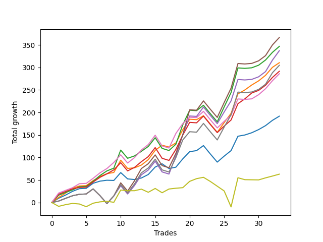

# Long Bulldog 005 
- Symbol: ES90d5m120m
- Date Range: 03/18/2022 - 07/08/2022
- Trading Period: 7:20-12:30
- Number of Trades: 33



| Name | Win Percent | Profit | Avg Profit / Trade |     | Name | Win Percent | Profit | Avg Profit / Trade |
| ---- | ----------- | ------ | ------------------ | --- | ---- | ----------- | ------ | ------------------ |
| Sorted By <br> Profit | | | | | Sorted By <br> Win Percentage ||||
| Five | 72.73 | 183250.00 | 5553.03 |     | One | 84.85 | 155250.00 | 4704.55 |
| Two | 78.79 | 173375.00 | 5253.79 |     | Three | 81.82 | 145750.00 | 4416.67 |
| Four | 72.73 | 168625.00 | 5109.85 |     | Zero | 81.82 | 95875.00 | 2905.30 |
| One | 84.85 | 155250.00 | 4704.55 |     | Two | 78.79 | 173375.00 | 5253.79 |
| Seven | 72.73 | 152375.00 | 4617.42 |     | Six | 78.79 | 143000.00 | 4333.33 |
| Three | 81.82 | 145750.00 | 4416.67 |     | Five | 72.73 | 183250.00 | 5553.03 |
| Six | 78.79 | 143000.00 | 4333.33 |     | Four | 72.73 | 168625.00 | 5109.85 |
| Zero | 81.82 | 95875.00 | 2905.30 |     | Seven | 72.73 | 152375.00 | 4617.42 |
| Seventy-Three | 57.58 | 31500.00 | 954.55 |     | Seventy-Three | 57.58 | 31500.00 | 954.55 |

## NO STOPLOSS

### Test Zero
* Sell when price hits the middle line of the 20p bollinger
* No Stoploss
* Results:
```
Total Trades: 33
Percent Up: 81.82
Percent Down: 18.18
Total Points Moved Up: 191.75
Potential Profit: 95875.00
Total Points Ups: 255.00 Count Ups: 27
Total Points Downs: -63.25 Count Downs: 6
```

<details><summary>Trades</summary>

<code>In: 2022-03-21 10:05:00		Out: 2022-03-21 11:00:15		Total Position Time: 55:15		Total Move Up: 9.50		Total to Date: 9.50</code> <br />
<code>In: 2022-03-23 10:30:00		Out: 2022-03-23 11:28:15		Total Position Time: 58:15		Total Move Up: 7.00		Total to Date: 16.50</code> <br />
<code>In: 2022-03-23 10:45:00		Out: 2022-03-23 11:28:15		Total Position Time: 43:15		Total Move Up: 8.25		Total to Date: 24.75</code> <br />
<code>In: 2022-03-30 08:15:00		Out: 2022-03-30 09:00:30		Total Position Time: 45:30		Total Move Up: 6.00		Total to Date: 30.75</code> <br />
<code>In: 2022-03-30 12:10:00		Out: 2022-03-30 12:46:00		Total Position Time: 36:00		Total Move Up: 0.75		Total to Date: 31.50</code> <br />
<code>In: 2022-03-30 12:25:00		Out: 2022-03-30 12:46:00		Total Position Time: 21:00		Total Move Up: 11.25		Total to Date: 42.75</code> <br />
<code>In: 2022-03-31 11:20:00		Out: 2022-03-31 11:58:10		Total Position Time: 38:10		Total Move Up: 4.75		Total to Date: 47.50</code> <br />
<code>In: 2022-03-31 11:25:00		Out: 2022-03-31 11:58:10		Total Position Time: 33:10		Total Move Up: 2.00		Total to Date: 49.50</code> <br />
<code>In: 2022-04-01 09:05:00		Out: 2022-04-01 10:31:50		Total Position Time: 86:50		Total Move Up: -0.50		Total to Date: 49.00</code> <br />
<code>In: 2022-04-06 11:20:00		Out: 2022-04-06 11:32:35		Total Position Time: 12:35		Total Move Up: 17.50		Total to Date: 66.50</code> <br />
<code>In: 2022-04-12 11:00:00		Out: 2022-04-12 12:41:15		Total Position Time: 101:15		Total Move Up: -14.00		Total to Date: 52.50</code> <br />
<code>In: 2022-04-18 08:40:00		Out: 2022-04-18 09:54:40		Total Position Time: 74:40		Total Move Up: -1.50		Total to Date: 51.00</code> <br />
<code>In: 2022-04-18 08:50:00		Out: 2022-04-18 09:54:40		Total Position Time: 64:40		Total Move Up: 3.50		Total to Date: 54.50</code> <br />
<code>In: 2022-04-20 11:45:00		Out: 2022-04-20 12:24:15		Total Position Time: 39:15		Total Move Up: 7.75		Total to Date: 62.25</code> <br />
<code>In: 2022-04-20 11:55:00		Out: 2022-04-20 12:24:15		Total Position Time: 29:15		Total Move Up: 16.50		Total to Date: 78.75</code> <br />
<code>In: 2022-04-29 07:35:00		Out: 2022-04-29 08:32:00		Total Position Time: 57:00		Total Move Up: 7.25		Total to Date: 86.00</code> <br />
<code>In: 2022-05-02 10:05:00		Out: 2022-05-02 11:53:35		Total Position Time: 108:35		Total Move Up: -10.50		Total to Date: 75.50</code> <br />
<code>In: 2022-05-12 10:50:00		Out: 2022-05-12 12:04:10		Total Position Time: 74:10		Total Move Up: 3.00		Total to Date: 78.50</code> <br />
<code>In: 2022-05-13 11:05:00		Out: 2022-05-13 11:51:35		Total Position Time: 46:35		Total Move Up: 18.50		Total to Date: 97.00</code> <br />
<code>In: 2022-06-02 07:25:00		Out: 2022-06-02 07:38:55		Total Position Time: 13:55		Total Move Up: 16.00		Total to Date: 113.00</code> <br />
<code>In: 2022-06-08 09:45:00		Out: 2022-06-08 11:07:45		Total Position Time: 82:45		Total Move Up: 2.25		Total to Date: 115.25</code> <br />
<code>In: 2022-06-09 08:05:00		Out: 2022-06-09 08:42:25		Total Position Time: 37:25		Total Move Up: 11.25		Total to Date: 126.50</code> <br />
<code>In: 2022-06-09 12:15:00		Out: 2022-06-09 12:46:00		Total Position Time: 31:00		Total Move Up: -18.75		Total to Date: 107.75</code> <br />
<code>In: 2022-06-13 12:15:00		Out: 2022-06-13 12:46:00		Total Position Time: 31:00		Total Move Up: -18.00		Total to Date: 89.75</code> <br />
<code>In: 2022-06-15 11:10:00		Out: 2022-06-15 11:17:05		Total Position Time: 07:05		Total Move Up: 13.25		Total to Date: 103.00</code> <br />
<code>In: 2022-06-15 11:15:00		Out: 2022-06-15 11:17:05		Total Position Time: 02:05		Total Move Up: 12.25		Total to Date: 115.25</code> <br />
<code>In: 2022-06-15 11:35:00		Out: 2022-06-15 11:38:10		Total Position Time: 03:10		Total Move Up: 32.00		Total to Date: 147.25</code> <br />
<code>In: 2022-06-16 11:00:00		Out: 2022-06-16 12:09:30		Total Position Time: 69:30		Total Move Up: 2.75		Total to Date: 150.00</code> <br />
<code>In: 2022-06-16 11:10:00		Out: 2022-06-16 12:09:30		Total Position Time: 59:30		Total Move Up: 5.00		Total to Date: 155.00</code> <br />
<code>In: 2022-06-27 11:00:00		Out: 2022-06-27 11:19:05		Total Position Time: 19:05		Total Move Up: 7.00		Total to Date: 162.00</code> <br />
<code>In: 2022-06-27 12:05:00		Out: 2022-06-27 12:10:30		Total Position Time: 05:30		Total Move Up: 8.75		Total to Date: 170.75</code> <br />
<code>In: 2022-06-29 09:30:00		Out: 2022-06-29 10:01:50		Total Position Time: 31:50		Total Move Up: 11.75		Total to Date: 182.50</code> <br />
<code>In: 2022-07-06 08:45:00		Out: 2022-07-06 09:14:00		Total Position Time: 29:00		Total Move Up: 9.25		Total to Date: 191.75</code> <br />


</details>

### Test One
* Sell when the price hits the upper line of the 20p 1std bollinger
* No Stoploss
* Results:
```
Total Trades: 33
Percent Up: 84.85
Percent Down: 15.15
Total Points Moved Up: 310.50
Potential Profit: 155250.00
Total Points Ups: 370.50 Count Ups: 28
Total Points Downs: -60.00 Count Downs: 5
```

<details><summary>Trades</summary>

<code>In: 2022-03-21 10:05:00		Out: 2022-03-21 11:21:30		Total Position Time: 76:30		Total Move Up: 11.25		Total to Date: 11.25</code> <br />
<code>In: 2022-03-23 10:30:00		Out: 2022-03-23 11:48:00		Total Position Time: 78:00		Total Move Up: 9.50		Total to Date: 20.75</code> <br />
<code>In: 2022-03-23 10:45:00		Out: 2022-03-23 11:48:00		Total Position Time: 63:00		Total Move Up: 10.75		Total to Date: 31.50</code> <br />
<code>In: 2022-03-30 08:15:00		Out: 2022-03-30 09:37:30		Total Position Time: 82:30		Total Move Up: 5.25		Total to Date: 36.75</code> <br />
<code>In: 2022-03-30 12:10:00		Out: 2022-03-30 12:46:00		Total Position Time: 36:00		Total Move Up: 0.75		Total to Date: 37.50</code> <br />
<code>In: 2022-03-30 12:25:00		Out: 2022-03-30 12:46:00		Total Position Time: 21:00		Total Move Up: 11.25		Total to Date: 48.75</code> <br />
<code>In: 2022-03-31 11:20:00		Out: 2022-03-31 12:00:20		Total Position Time: 40:20		Total Move Up: 9.00		Total to Date: 57.75</code> <br />
<code>In: 2022-03-31 11:25:00		Out: 2022-03-31 12:00:20		Total Position Time: 35:20		Total Move Up: 6.25		Total to Date: 64.00</code> <br />
<code>In: 2022-04-01 09:05:00		Out: 2022-04-01 10:37:10		Total Position Time: 92:10		Total Move Up: 2.75		Total to Date: 66.75</code> <br />
<code>In: 2022-04-06 11:20:00		Out: 2022-04-06 11:34:05		Total Position Time: 14:05		Total Move Up: 27.25		Total to Date: 94.00</code> <br />
<code>In: 2022-04-12 11:00:00		Out: 2022-04-12 12:46:00		Total Position Time: 106:00		Total Move Up: -18.25		Total to Date: 75.75</code> <br />
<code>In: 2022-04-18 08:40:00		Out: 2022-04-18 10:07:50		Total Position Time: 87:50		Total Move Up: 1.25		Total to Date: 77.00</code> <br />
<code>In: 2022-04-18 08:50:00		Out: 2022-04-18 10:07:50		Total Position Time: 77:50		Total Move Up: 6.25		Total to Date: 83.25</code> <br />
<code>In: 2022-04-20 11:45:00		Out: 2022-04-20 12:45:15		Total Position Time: 60:15		Total Move Up: 12.00		Total to Date: 95.25</code> <br />
<code>In: 2022-04-20 11:55:00		Out: 2022-04-20 12:45:15		Total Position Time: 50:15		Total Move Up: 20.75		Total to Date: 116.00</code> <br />
<code>In: 2022-04-29 07:35:00		Out: 2022-04-29 08:46:10		Total Position Time: 71:10		Total Move Up: 11.25		Total to Date: 127.25</code> <br />
<code>In: 2022-05-02 10:05:00		Out: 2022-05-02 12:05:15		Total Position Time: 120:15		Total Move Up: -4.00		Total to Date: 123.25</code> <br />
<code>In: 2022-05-12 10:50:00		Out: 2022-05-12 12:18:20		Total Position Time: 88:20		Total Move Up: 9.00		Total to Date: 132.25</code> <br />
<code>In: 2022-05-13 11:05:00		Out: 2022-05-13 12:00:35		Total Position Time: 55:35		Total Move Up: 29.50		Total to Date: 161.75</code> <br />
<code>In: 2022-06-02 07:25:00		Out: 2022-06-02 07:56:05		Total Position Time: 31:05		Total Move Up: 23.25		Total to Date: 185.00</code> <br />
<code>In: 2022-06-08 09:45:00		Out: 2022-06-08 11:45:55		Total Position Time: 120:55		Total Move Up: -1.00		Total to Date: 184.00</code> <br />
<code>In: 2022-06-09 08:05:00		Out: 2022-06-09 09:26:30		Total Position Time: 81:30		Total Move Up: 8.75		Total to Date: 192.75</code> <br />
<code>In: 2022-06-09 12:15:00		Out: 2022-06-09 12:46:00		Total Position Time: 31:00		Total Move Up: -18.75		Total to Date: 174.00</code> <br />
<code>In: 2022-06-13 12:15:00		Out: 2022-06-13 12:46:00		Total Position Time: 31:00		Total Move Up: -18.00		Total to Date: 156.00</code> <br />
<code>In: 2022-06-15 11:10:00		Out: 2022-06-15 11:38:55		Total Position Time: 28:55		Total Move Up: 21.50		Total to Date: 177.50</code> <br />
<code>In: 2022-06-15 11:15:00		Out: 2022-06-15 11:38:55		Total Position Time: 23:55		Total Move Up: 20.50		Total to Date: 198.00</code> <br />
<code>In: 2022-06-15 11:35:00		Out: 2022-06-15 11:38:55		Total Position Time: 03:55		Total Move Up: 43.25		Total to Date: 241.25</code> <br />
<code>In: 2022-06-16 11:00:00		Out: 2022-06-16 12:20:15		Total Position Time: 80:15		Total Move Up: 8.75		Total to Date: 250.00</code> <br />
<code>In: 2022-06-16 11:10:00		Out: 2022-06-16 12:20:15		Total Position Time: 70:15		Total Move Up: 11.00		Total to Date: 261.00</code> <br />
<code>In: 2022-06-27 11:00:00		Out: 2022-06-27 11:38:50		Total Position Time: 38:50		Total Move Up: 9.25		Total to Date: 270.25</code> <br />
<code>In: 2022-06-27 12:05:00		Out: 2022-06-27 12:15:20		Total Position Time: 10:20		Total Move Up: 12.25		Total to Date: 282.50</code> <br />
<code>In: 2022-06-29 09:30:00		Out: 2022-06-29 10:11:05		Total Position Time: 41:05		Total Move Up: 17.75		Total to Date: 300.25</code> <br />
<code>In: 2022-07-06 08:45:00		Out: 2022-07-06 09:36:15		Total Position Time: 51:15		Total Move Up: 10.25		Total to Date: 310.50</code> <br />


</details>

### Test Two
* Sell when the price hits the upper line of the 20p 2std bollinger
* No Stoploss
* Results:
```
Total Trades: 33
Percent Up: 78.79
Percent Down: 21.21
Total Points Moved Up: 346.75
Potential Profit: 173375.00
Total Points Ups: 432.25 Count Ups: 26
Total Points Downs: -85.50 Count Downs: 7
```

<details><summary>Trades</summary>

<code>In: 2022-03-21 10:05:00		Out: 2022-03-21 11:27:05		Total Position Time: 82:05		Total Move Up: 16.25		Total to Date: 16.25</code> <br />
<code>In: 2022-03-23 10:30:00		Out: 2022-03-23 12:30:55		Total Position Time: 120:55		Total Move Up: 6.00		Total to Date: 22.25</code> <br />
<code>In: 2022-03-23 10:45:00		Out: 2022-03-23 12:45:55		Total Position Time: 120:55		Total Move Up: 5.75		Total to Date: 28.00</code> <br />
<code>In: 2022-03-30 08:15:00		Out: 2022-03-30 09:40:10		Total Position Time: 85:10		Total Move Up: 7.00		Total to Date: 35.00</code> <br />
<code>In: 2022-03-30 12:10:00		Out: 2022-03-30 12:46:00		Total Position Time: 36:00		Total Move Up: 0.75		Total to Date: 35.75</code> <br />
<code>In: 2022-03-30 12:25:00		Out: 2022-03-30 12:46:00		Total Position Time: 21:00		Total Move Up: 11.25		Total to Date: 47.00</code> <br />
<code>In: 2022-03-31 11:20:00		Out: 2022-03-31 12:02:55		Total Position Time: 42:55		Total Move Up: 13.00		Total to Date: 60.00</code> <br />
<code>In: 2022-03-31 11:25:00		Out: 2022-03-31 12:02:55		Total Position Time: 37:55		Total Move Up: 10.25		Total to Date: 70.25</code> <br />
<code>In: 2022-04-01 09:05:00		Out: 2022-04-01 10:38:20		Total Position Time: 93:20		Total Move Up: 6.00		Total to Date: 76.25</code> <br />
<code>In: 2022-04-06 11:20:00		Out: 2022-04-06 11:56:00		Total Position Time: 36:00		Total Move Up: 40.25		Total to Date: 116.50</code> <br />
<code>In: 2022-04-12 11:00:00		Out: 2022-04-12 12:46:00		Total Position Time: 106:00		Total Move Up: -18.25		Total to Date: 98.25</code> <br />
<code>In: 2022-04-18 08:40:00		Out: 2022-04-18 10:10:25		Total Position Time: 90:25		Total Move Up: 5.25		Total to Date: 103.50</code> <br />
<code>In: 2022-04-18 08:50:00		Out: 2022-04-18 10:10:25		Total Position Time: 80:25		Total Move Up: 10.25		Total to Date: 113.75</code> <br />
<code>In: 2022-04-20 11:45:00		Out: 2022-04-20 12:46:00		Total Position Time: 61:00		Total Move Up: 10.75		Total to Date: 124.50</code> <br />
<code>In: 2022-04-20 11:55:00		Out: 2022-04-20 12:46:00		Total Position Time: 51:00		Total Move Up: 19.50		Total to Date: 144.00</code> <br />
<code>In: 2022-04-29 07:35:00		Out: 2022-04-29 09:35:55		Total Position Time: 120:55		Total Move Up: -23.75		Total to Date: 120.25</code> <br />
<code>In: 2022-05-02 10:05:00		Out: 2022-05-02 12:05:55		Total Position Time: 120:55		Total Move Up: -4.75		Total to Date: 115.50</code> <br />
<code>In: 2022-05-12 10:50:00		Out: 2022-05-12 12:19:20		Total Position Time: 89:20		Total Move Up: 14.00		Total to Date: 129.50</code> <br />
<code>In: 2022-05-13 11:05:00		Out: 2022-05-13 12:18:35		Total Position Time: 73:35		Total Move Up: 43.25		Total to Date: 172.75</code> <br />
<code>In: 2022-06-02 07:25:00		Out: 2022-06-02 08:02:25		Total Position Time: 37:25		Total Move Up: 32.25		Total to Date: 205.00</code> <br />
<code>In: 2022-06-08 09:45:00		Out: 2022-06-08 11:45:55		Total Position Time: 120:55		Total Move Up: -1.00		Total to Date: 204.00</code> <br />
<code>In: 2022-06-09 08:05:00		Out: 2022-06-09 09:30:40		Total Position Time: 85:40		Total Move Up: 12.00		Total to Date: 216.00</code> <br />
<code>In: 2022-06-09 12:15:00		Out: 2022-06-09 12:46:00		Total Position Time: 31:00		Total Move Up: -18.75		Total to Date: 197.25</code> <br />
<code>In: 2022-06-13 12:15:00		Out: 2022-06-13 12:46:00		Total Position Time: 31:00		Total Move Up: -18.00		Total to Date: 179.25</code> <br />
<code>In: 2022-06-15 11:10:00		Out: 2022-06-15 11:41:00		Total Position Time: 31:00		Total Move Up: 33.00		Total to Date: 212.25</code> <br />
<code>In: 2022-06-15 11:15:00		Out: 2022-06-15 11:41:00		Total Position Time: 26:00		Total Move Up: 32.00		Total to Date: 244.25</code> <br />
<code>In: 2022-06-15 11:35:00		Out: 2022-06-15 11:41:00		Total Position Time: 06:00		Total Move Up: 54.75		Total to Date: 299.00</code> <br />
<code>In: 2022-06-16 11:00:00		Out: 2022-06-16 12:46:00		Total Position Time: 106:00		Total Move Up: -1.00		Total to Date: 298.00</code> <br />
<code>In: 2022-06-16 11:10:00		Out: 2022-06-16 12:46:00		Total Position Time: 96:00		Total Move Up: 1.25		Total to Date: 299.25</code> <br />
<code>In: 2022-06-27 11:00:00		Out: 2022-06-27 12:46:00		Total Position Time: 106:00		Total Move Up: 5.75		Total to Date: 305.00</code> <br />
<code>In: 2022-06-27 12:05:00		Out: 2022-06-27 12:46:00		Total Position Time: 41:00		Total Move Up: 11.50		Total to Date: 316.50</code> <br />
<code>In: 2022-06-29 09:30:00		Out: 2022-06-29 10:43:40		Total Position Time: 73:40		Total Move Up: 17.00		Total to Date: 333.50</code> <br />
<code>In: 2022-07-06 08:45:00		Out: 2022-07-06 10:00:50		Total Position Time: 75:50		Total Move Up: 13.25		Total to Date: 346.75</code> <br />


</details>

### Test Three
* Sell when price hits the middle line of the 50p bollinger
* No Stoploss
* Results:
```
Total Trades: 33
Percent Up: 81.82
Percent Down: 18.18
Total Points Moved Up: 291.50
Potential Profit: 145750.00
Total Points Ups: 376.00 Count Ups: 27
Total Points Downs: -84.50 Count Downs: 6
```

<details><summary>Trades</summary>

<code>In: 2022-03-21 10:05:00		Out: 2022-03-21 11:30:15		Total Position Time: 85:15		Total Move Up: 18.50		Total to Date: 18.50</code> <br />
<code>In: 2022-03-23 10:30:00		Out: 2022-03-23 12:30:55		Total Position Time: 120:55		Total Move Up: 6.00		Total to Date: 24.50</code> <br />
<code>In: 2022-03-23 10:45:00		Out: 2022-03-23 12:45:55		Total Position Time: 120:55		Total Move Up: 5.75		Total to Date: 30.25</code> <br />
<code>In: 2022-03-30 08:15:00		Out: 2022-03-30 10:15:55		Total Position Time: 120:55		Total Move Up: 3.25		Total to Date: 33.50</code> <br />
<code>In: 2022-03-30 12:10:00		Out: 2022-03-30 12:46:00		Total Position Time: 36:00		Total Move Up: 0.75		Total to Date: 34.25</code> <br />
<code>In: 2022-03-30 12:25:00		Out: 2022-03-30 12:46:00		Total Position Time: 21:00		Total Move Up: 11.25		Total to Date: 45.50</code> <br />
<code>In: 2022-03-31 11:20:00		Out: 2022-03-31 12:01:05		Total Position Time: 41:05		Total Move Up: 10.50		Total to Date: 56.00</code> <br />
<code>In: 2022-03-31 11:25:00		Out: 2022-03-31 12:01:05		Total Position Time: 36:05		Total Move Up: 7.75		Total to Date: 63.75</code> <br />
<code>In: 2022-04-01 09:05:00		Out: 2022-04-01 11:02:35		Total Position Time: 117:35		Total Move Up: 8.75		Total to Date: 72.50</code> <br />
<code>In: 2022-04-06 11:20:00		Out: 2022-04-06 11:32:15		Total Position Time: 12:15		Total Move Up: 16.00		Total to Date: 88.50</code> <br />
<code>In: 2022-04-12 11:00:00		Out: 2022-04-12 12:46:00		Total Position Time: 106:00		Total Move Up: -18.25		Total to Date: 70.25</code> <br />
<code>In: 2022-04-18 08:40:00		Out: 2022-04-18 10:31:35		Total Position Time: 111:35		Total Move Up: 7.75		Total to Date: 78.00</code> <br />
<code>In: 2022-04-18 08:50:00		Out: 2022-04-18 10:31:35		Total Position Time: 101:35		Total Move Up: 12.75		Total to Date: 90.75</code> <br />
<code>In: 2022-04-20 11:45:00		Out: 2022-04-20 12:25:50		Total Position Time: 40:50		Total Move Up: 11.25		Total to Date: 102.00</code> <br />
<code>In: 2022-04-20 11:55:00		Out: 2022-04-20 12:25:50		Total Position Time: 30:50		Total Move Up: 20.00		Total to Date: 122.00</code> <br />
<code>In: 2022-04-29 07:35:00		Out: 2022-04-29 09:35:55		Total Position Time: 120:55		Total Move Up: -23.75		Total to Date: 98.25</code> <br />
<code>In: 2022-05-02 10:05:00		Out: 2022-05-02 12:05:55		Total Position Time: 120:55		Total Move Up: -4.75		Total to Date: 93.50</code> <br />
<code>In: 2022-05-12 10:50:00		Out: 2022-05-12 12:21:25		Total Position Time: 91:25		Total Move Up: 24.50		Total to Date: 118.00</code> <br />
<code>In: 2022-05-13 11:05:00		Out: 2022-05-13 12:01:10		Total Position Time: 56:10		Total Move Up: 31.75		Total to Date: 149.75</code> <br />
<code>In: 2022-06-02 07:25:00		Out: 2022-06-02 08:01:30		Total Position Time: 36:30		Total Move Up: 28.25		Total to Date: 178.00</code> <br />
<code>In: 2022-06-08 09:45:00		Out: 2022-06-08 11:45:55		Total Position Time: 120:55		Total Move Up: -1.00		Total to Date: 177.00</code> <br />
<code>In: 2022-06-09 08:05:00		Out: 2022-06-09 09:43:25		Total Position Time: 98:25		Total Move Up: 15.00		Total to Date: 192.00</code> <br />
<code>In: 2022-06-09 12:15:00		Out: 2022-06-09 12:46:00		Total Position Time: 31:00		Total Move Up: -18.75		Total to Date: 173.25</code> <br />
<code>In: 2022-06-13 12:15:00		Out: 2022-06-13 12:46:00		Total Position Time: 31:00		Total Move Up: -18.00		Total to Date: 155.25</code> <br />
<code>In: 2022-06-15 11:10:00		Out: 2022-06-15 11:38:45		Total Position Time: 28:45		Total Move Up: 14.50		Total to Date: 169.75</code> <br />
<code>In: 2022-06-15 11:15:00		Out: 2022-06-15 11:38:45		Total Position Time: 23:45		Total Move Up: 13.50		Total to Date: 183.25</code> <br />
<code>In: 2022-06-15 11:35:00		Out: 2022-06-15 11:38:45		Total Position Time: 03:45		Total Move Up: 36.25		Total to Date: 219.50</code> <br />
<code>In: 2022-06-16 11:00:00		Out: 2022-06-16 12:10:20		Total Position Time: 70:20		Total Move Up: 10.75		Total to Date: 230.25</code> <br />
<code>In: 2022-06-16 11:10:00		Out: 2022-06-16 12:10:20		Total Position Time: 60:20		Total Move Up: 13.00		Total to Date: 243.25</code> <br />
<code>In: 2022-06-27 11:00:00		Out: 2022-06-27 12:46:00		Total Position Time: 106:00		Total Move Up: 5.75		Total to Date: 249.00</code> <br />
<code>In: 2022-06-27 12:05:00		Out: 2022-06-27 12:46:00		Total Position Time: 41:00		Total Move Up: 11.50		Total to Date: 260.50</code> <br />
<code>In: 2022-06-29 09:30:00		Out: 2022-06-29 10:10:45		Total Position Time: 40:45		Total Move Up: 17.25		Total to Date: 277.75</code> <br />
<code>In: 2022-07-06 08:45:00		Out: 2022-07-06 10:01:50		Total Position Time: 76:50		Total Move Up: 13.75		Total to Date: 291.50</code> <br />


</details>

### Test Four
* Sell when the price hits the upper line of the 50p 1std bollinger
* No Stoploss
* Results:
```
Total Trades: 33
Percent Up: 72.73
Percent Down: 27.27
Total Points Moved Up: 337.25
Potential Profit: 168625.00
Total Points Ups: 455.50 Count Ups: 24
Total Points Downs: -118.25 Count Downs: 9
```

<details><summary>Trades</summary>

<code>In: 2022-03-21 10:05:00		Out: 2022-03-21 12:05:55		Total Position Time: 120:55		Total Move Up: 3.25		Total to Date: 3.25</code> <br />
<code>In: 2022-03-23 10:30:00		Out: 2022-03-23 12:30:55		Total Position Time: 120:55		Total Move Up: 6.00		Total to Date: 9.25</code> <br />
<code>In: 2022-03-23 10:45:00		Out: 2022-03-23 12:45:55		Total Position Time: 120:55		Total Move Up: 5.75		Total to Date: 15.00</code> <br />
<code>In: 2022-03-30 08:15:00		Out: 2022-03-30 10:15:55		Total Position Time: 120:55		Total Move Up: 3.25		Total to Date: 18.25</code> <br />
<code>In: 2022-03-30 12:10:00		Out: 2022-03-30 12:46:00		Total Position Time: 36:00		Total Move Up: 0.75		Total to Date: 19.00</code> <br />
<code>In: 2022-03-30 12:25:00		Out: 2022-03-30 12:46:00		Total Position Time: 21:00		Total Move Up: 11.25		Total to Date: 30.25</code> <br />
<code>In: 2022-03-31 11:20:00		Out: 2022-03-31 12:46:00		Total Position Time: 86:00		Total Move Up: -15.00		Total to Date: 15.25</code> <br />
<code>In: 2022-03-31 11:25:00		Out: 2022-03-31 12:46:00		Total Position Time: 81:00		Total Move Up: -17.75		Total to Date: -2.50</code> <br />
<code>In: 2022-04-01 09:05:00		Out: 2022-04-01 11:05:55		Total Position Time: 120:55		Total Move Up: 17.25		Total to Date: 14.75</code> <br />
<code>In: 2022-04-06 11:20:00		Out: 2022-04-06 11:32:45		Total Position Time: 12:45		Total Move Up: 22.50		Total to Date: 37.25</code> <br />
<code>In: 2022-04-12 11:00:00		Out: 2022-04-12 12:46:00		Total Position Time: 106:00		Total Move Up: -18.25		Total to Date: 19.00</code> <br />
<code>In: 2022-04-18 08:40:00		Out: 2022-04-18 10:35:40		Total Position Time: 115:40		Total Move Up: 18.75		Total to Date: 37.75</code> <br />
<code>In: 2022-04-18 08:50:00		Out: 2022-04-18 10:35:40		Total Position Time: 105:40		Total Move Up: 23.75		Total to Date: 61.50</code> <br />
<code>In: 2022-04-20 11:45:00		Out: 2022-04-20 12:46:00		Total Position Time: 61:00		Total Move Up: 10.75		Total to Date: 72.25</code> <br />
<code>In: 2022-04-20 11:55:00		Out: 2022-04-20 12:46:00		Total Position Time: 51:00		Total Move Up: 19.50		Total to Date: 91.75</code> <br />
<code>In: 2022-04-29 07:35:00		Out: 2022-04-29 09:35:55		Total Position Time: 120:55		Total Move Up: -23.75		Total to Date: 68.00</code> <br />
<code>In: 2022-05-02 10:05:00		Out: 2022-05-02 12:05:55		Total Position Time: 120:55		Total Move Up: -4.75		Total to Date: 63.25</code> <br />
<code>In: 2022-05-12 10:50:00		Out: 2022-05-12 12:43:05		Total Position Time: 113:05		Total Move Up: 40.75		Total to Date: 104.00</code> <br />
<code>In: 2022-05-13 11:05:00		Out: 2022-05-13 12:29:40		Total Position Time: 84:40		Total Move Up: 46.50		Total to Date: 150.50</code> <br />
<code>In: 2022-06-02 07:25:00		Out: 2022-06-02 08:10:45		Total Position Time: 45:45		Total Move Up: 41.75		Total to Date: 192.25</code> <br />
<code>In: 2022-06-08 09:45:00		Out: 2022-06-08 11:45:55		Total Position Time: 120:55		Total Move Up: -1.00		Total to Date: 191.25</code> <br />
<code>In: 2022-06-09 08:05:00		Out: 2022-06-09 10:05:55		Total Position Time: 120:55		Total Move Up: 20.75		Total to Date: 212.00</code> <br />
<code>In: 2022-06-09 12:15:00		Out: 2022-06-09 12:46:00		Total Position Time: 31:00		Total Move Up: -18.75		Total to Date: 193.25</code> <br />
<code>In: 2022-06-13 12:15:00		Out: 2022-06-13 12:46:00		Total Position Time: 31:00		Total Move Up: -18.00		Total to Date: 175.25</code> <br />
<code>In: 2022-06-15 11:10:00		Out: 2022-06-15 11:39:00		Total Position Time: 29:00		Total Move Up: 25.75		Total to Date: 201.00</code> <br />
<code>In: 2022-06-15 11:15:00		Out: 2022-06-15 11:39:00		Total Position Time: 24:00		Total Move Up: 24.75		Total to Date: 225.75</code> <br />
<code>In: 2022-06-15 11:35:00		Out: 2022-06-15 11:39:00		Total Position Time: 04:00		Total Move Up: 47.50		Total to Date: 273.25</code> <br />
<code>In: 2022-06-16 11:00:00		Out: 2022-06-16 12:46:00		Total Position Time: 106:00		Total Move Up: -1.00		Total to Date: 272.25</code> <br />
<code>In: 2022-06-16 11:10:00		Out: 2022-06-16 12:46:00		Total Position Time: 96:00		Total Move Up: 1.25		Total to Date: 273.50</code> <br />
<code>In: 2022-06-27 11:00:00		Out: 2022-06-27 12:46:00		Total Position Time: 106:00		Total Move Up: 5.75		Total to Date: 279.25</code> <br />
<code>In: 2022-06-27 12:05:00		Out: 2022-06-27 12:46:00		Total Position Time: 41:00		Total Move Up: 11.50		Total to Date: 290.75</code> <br />
<code>In: 2022-06-29 09:30:00		Out: 2022-06-29 11:01:35		Total Position Time: 91:35		Total Move Up: 25.50		Total to Date: 316.25</code> <br />
<code>In: 2022-07-06 08:45:00		Out: 2022-07-06 10:08:05		Total Position Time: 83:05		Total Move Up: 21.00		Total to Date: 337.25</code> <br />


</details>

### Test Five
* Sell when the price hits the upper line of the 50p 2std bollinger
* No Stoploss
* Results:
```
Total Trades: 33
Percent Up: 72.73
Percent Down: 27.27
Total Points Moved Up: 366.50
Potential Profit: 183250.00
Total Points Ups: 484.75 Count Ups: 24
Total Points Downs: -118.25 Count Downs: 9
```

<details><summary>Trades</summary>

<code>In: 2022-03-21 10:05:00		Out: 2022-03-21 12:05:55		Total Position Time: 120:55		Total Move Up: 3.25		Total to Date: 3.25</code> <br />
<code>In: 2022-03-23 10:30:00		Out: 2022-03-23 12:30:55		Total Position Time: 120:55		Total Move Up: 6.00		Total to Date: 9.25</code> <br />
<code>In: 2022-03-23 10:45:00		Out: 2022-03-23 12:45:55		Total Position Time: 120:55		Total Move Up: 5.75		Total to Date: 15.00</code> <br />
<code>In: 2022-03-30 08:15:00		Out: 2022-03-30 10:15:55		Total Position Time: 120:55		Total Move Up: 3.25		Total to Date: 18.25</code> <br />
<code>In: 2022-03-30 12:10:00		Out: 2022-03-30 12:46:00		Total Position Time: 36:00		Total Move Up: 0.75		Total to Date: 19.00</code> <br />
<code>In: 2022-03-30 12:25:00		Out: 2022-03-30 12:46:00		Total Position Time: 21:00		Total Move Up: 11.25		Total to Date: 30.25</code> <br />
<code>In: 2022-03-31 11:20:00		Out: 2022-03-31 12:46:00		Total Position Time: 86:00		Total Move Up: -15.00		Total to Date: 15.25</code> <br />
<code>In: 2022-03-31 11:25:00		Out: 2022-03-31 12:46:00		Total Position Time: 81:00		Total Move Up: -17.75		Total to Date: -2.50</code> <br />
<code>In: 2022-04-01 09:05:00		Out: 2022-04-01 11:05:55		Total Position Time: 120:55		Total Move Up: 17.25		Total to Date: 14.75</code> <br />
<code>In: 2022-04-06 11:20:00		Out: 2022-04-06 11:34:25		Total Position Time: 14:25		Total Move Up: 29.00		Total to Date: 43.75</code> <br />
<code>In: 2022-04-12 11:00:00		Out: 2022-04-12 12:46:00		Total Position Time: 106:00		Total Move Up: -18.25		Total to Date: 25.50</code> <br />
<code>In: 2022-04-18 08:40:00		Out: 2022-04-18 10:40:55		Total Position Time: 120:55		Total Move Up: 22.75		Total to Date: 48.25</code> <br />
<code>In: 2022-04-18 08:50:00		Out: 2022-04-18 10:50:55		Total Position Time: 120:55		Total Move Up: 27.25		Total to Date: 75.50</code> <br />
<code>In: 2022-04-20 11:45:00		Out: 2022-04-20 12:46:00		Total Position Time: 61:00		Total Move Up: 10.75		Total to Date: 86.25</code> <br />
<code>In: 2022-04-20 11:55:00		Out: 2022-04-20 12:46:00		Total Position Time: 51:00		Total Move Up: 19.50		Total to Date: 105.75</code> <br />
<code>In: 2022-04-29 07:35:00		Out: 2022-04-29 09:35:55		Total Position Time: 120:55		Total Move Up: -23.75		Total to Date: 82.00</code> <br />
<code>In: 2022-05-02 10:05:00		Out: 2022-05-02 12:05:55		Total Position Time: 120:55		Total Move Up: -4.75		Total to Date: 77.25</code> <br />
<code>In: 2022-05-12 10:50:00		Out: 2022-05-12 12:46:00		Total Position Time: 116:00		Total Move Up: 32.00		Total to Date: 109.25</code> <br />
<code>In: 2022-05-13 11:05:00		Out: 2022-05-13 12:46:00		Total Position Time: 101:00		Total Move Up: 41.25		Total to Date: 150.50</code> <br />
<code>In: 2022-06-02 07:25:00		Out: 2022-06-02 08:47:20		Total Position Time: 82:20		Total Move Up: 55.50		Total to Date: 206.00</code> <br />
<code>In: 2022-06-08 09:45:00		Out: 2022-06-08 11:45:55		Total Position Time: 120:55		Total Move Up: -1.00		Total to Date: 205.00</code> <br />
<code>In: 2022-06-09 08:05:00		Out: 2022-06-09 10:05:55		Total Position Time: 120:55		Total Move Up: 20.75		Total to Date: 225.75</code> <br />
<code>In: 2022-06-09 12:15:00		Out: 2022-06-09 12:46:00		Total Position Time: 31:00		Total Move Up: -18.75		Total to Date: 207.00</code> <br />
<code>In: 2022-06-13 12:15:00		Out: 2022-06-13 12:46:00		Total Position Time: 31:00		Total Move Up: -18.00		Total to Date: 189.00</code> <br />
<code>In: 2022-06-15 11:10:00		Out: 2022-06-15 11:41:00		Total Position Time: 31:00		Total Move Up: 33.00		Total to Date: 222.00</code> <br />
<code>In: 2022-06-15 11:15:00		Out: 2022-06-15 11:41:00		Total Position Time: 26:00		Total Move Up: 32.00		Total to Date: 254.00</code> <br />
<code>In: 2022-06-15 11:35:00		Out: 2022-06-15 11:41:00		Total Position Time: 06:00		Total Move Up: 54.75		Total to Date: 308.75</code> <br />
<code>In: 2022-06-16 11:00:00		Out: 2022-06-16 12:46:00		Total Position Time: 106:00		Total Move Up: -1.00		Total to Date: 307.75</code> <br />
<code>In: 2022-06-16 11:10:00		Out: 2022-06-16 12:46:00		Total Position Time: 96:00		Total Move Up: 1.25		Total to Date: 309.00</code> <br />
<code>In: 2022-06-27 11:00:00		Out: 2022-06-27 12:46:00		Total Position Time: 106:00		Total Move Up: 5.75		Total to Date: 314.75</code> <br />
<code>In: 2022-06-27 12:05:00		Out: 2022-06-27 12:46:00		Total Position Time: 41:00		Total Move Up: 11.50		Total to Date: 326.25</code> <br />
<code>In: 2022-06-29 09:30:00		Out: 2022-06-29 11:30:55		Total Position Time: 120:55		Total Move Up: 23.75		Total to Date: 350.00</code> <br />
<code>In: 2022-07-06 08:45:00		Out: 2022-07-06 10:45:55		Total Position Time: 120:55		Total Move Up: 16.50		Total to Date: 366.50</code> <br />


</details>

### Test Six
* Sell when the price hits the middle line of the 1std VWAP
* No Stoploss
* Results:
```
Total Trades: 33
Percent Up: 78.79
Percent Down: 21.21
Total Points Moved Up: 286.00
Potential Profit: 143000.00
Total Points Ups: 371.50 Count Ups: 26
Total Points Downs: -85.50 Count Downs: 7
```

<details><summary>Trades</summary>

<code>In: 2022-03-21 10:05:00		Out: 2022-03-21 11:46:15		Total Position Time: 101:15		Total Move Up: 21.00		Total to Date: 21.00</code> <br />
<code>In: 2022-03-23 10:30:00		Out: 2022-03-23 12:30:55		Total Position Time: 120:55		Total Move Up: 6.00		Total to Date: 27.00</code> <br />
<code>In: 2022-03-23 10:45:00		Out: 2022-03-23 12:45:55		Total Position Time: 120:55		Total Move Up: 5.75		Total to Date: 32.75</code> <br />
<code>In: 2022-03-30 08:15:00		Out: 2022-03-30 09:03:05		Total Position Time: 48:05		Total Move Up: 9.00		Total to Date: 41.75</code> <br />
<code>In: 2022-03-30 12:10:00		Out: 2022-03-30 12:46:00		Total Position Time: 36:00		Total Move Up: 0.75		Total to Date: 42.50</code> <br />
<code>In: 2022-03-30 12:25:00		Out: 2022-03-30 12:46:00		Total Position Time: 21:00		Total Move Up: 11.25		Total to Date: 53.75</code> <br />
<code>In: 2022-03-31 11:20:00		Out: 2022-03-31 12:02:25		Total Position Time: 42:25		Total Move Up: 12.25		Total to Date: 66.00</code> <br />
<code>In: 2022-03-31 11:25:00		Out: 2022-03-31 12:02:25		Total Position Time: 37:25		Total Move Up: 9.50		Total to Date: 75.50</code> <br />
<code>In: 2022-04-01 09:05:00		Out: 2022-04-01 11:05:00		Total Position Time: 120:00		Total Move Up: 13.50		Total to Date: 89.00</code> <br />
<code>In: 2022-04-06 11:20:00		Out: 2022-04-06 11:32:25		Total Position Time: 12:25		Total Move Up: 17.00		Total to Date: 106.00</code> <br />
<code>In: 2022-04-12 11:00:00		Out: 2022-04-12 12:46:00		Total Position Time: 106:00		Total Move Up: -18.25		Total to Date: 87.75</code> <br />
<code>In: 2022-04-18 08:40:00		Out: 2022-04-18 10:32:10		Total Position Time: 112:10		Total Move Up: 12.00		Total to Date: 99.75</code> <br />
<code>In: 2022-04-18 08:50:00		Out: 2022-04-18 10:32:10		Total Position Time: 102:10		Total Move Up: 17.00		Total to Date: 116.75</code> <br />
<code>In: 2022-04-20 11:45:00		Out: 2022-04-20 12:26:10		Total Position Time: 41:10		Total Move Up: 12.00		Total to Date: 128.75</code> <br />
<code>In: 2022-04-20 11:55:00		Out: 2022-04-20 12:26:10		Total Position Time: 31:10		Total Move Up: 20.75		Total to Date: 149.50</code> <br />
<code>In: 2022-04-29 07:35:00		Out: 2022-04-29 09:35:55		Total Position Time: 120:55		Total Move Up: -23.75		Total to Date: 125.75</code> <br />
<code>In: 2022-05-02 10:05:00		Out: 2022-05-02 12:05:55		Total Position Time: 120:55		Total Move Up: -4.75		Total to Date: 121.00</code> <br />
<code>In: 2022-05-12 10:50:00		Out: 2022-05-12 12:23:20		Total Position Time: 93:20		Total Move Up: 32.50		Total to Date: 153.50</code> <br />
<code>In: 2022-05-13 11:05:00		Out: 2022-05-13 11:52:25		Total Position Time: 47:25		Total Move Up: 21.75		Total to Date: 175.25</code> <br />
<code>In: 2022-06-02 07:25:00		Out: 2022-06-02 07:34:25		Total Position Time: 09:25		Total Move Up: 14.25		Total to Date: 189.50</code> <br />
<code>In: 2022-06-08 09:45:00		Out: 2022-06-08 11:45:55		Total Position Time: 120:55		Total Move Up: -1.00		Total to Date: 188.50</code> <br />
<code>In: 2022-06-09 08:05:00		Out: 2022-06-09 08:42:55		Total Position Time: 37:55		Total Move Up: 14.00		Total to Date: 202.50</code> <br />
<code>In: 2022-06-09 12:15:00		Out: 2022-06-09 12:46:00		Total Position Time: 31:00		Total Move Up: -18.75		Total to Date: 183.75</code> <br />
<code>In: 2022-06-13 12:15:00		Out: 2022-06-13 12:46:00		Total Position Time: 31:00		Total Move Up: -18.00		Total to Date: 165.75</code> <br />
<code>In: 2022-06-15 11:10:00		Out: 2022-06-15 11:38:45		Total Position Time: 28:45		Total Move Up: 14.50		Total to Date: 180.25</code> <br />
<code>In: 2022-06-15 11:15:00		Out: 2022-06-15 11:38:45		Total Position Time: 23:45		Total Move Up: 13.50		Total to Date: 193.75</code> <br />
<code>In: 2022-06-15 11:35:00		Out: 2022-06-15 11:38:45		Total Position Time: 03:45		Total Move Up: 36.25		Total to Date: 230.00</code> <br />
<code>In: 2022-06-16 11:00:00		Out: 2022-06-16 12:46:00		Total Position Time: 106:00		Total Move Up: -1.00		Total to Date: 229.00</code> <br />
<code>In: 2022-06-16 11:10:00		Out: 2022-06-16 12:46:00		Total Position Time: 96:00		Total Move Up: 1.25		Total to Date: 230.25</code> <br />
<code>In: 2022-06-27 11:00:00		Out: 2022-06-27 11:38:50		Total Position Time: 38:50		Total Move Up: 9.25		Total to Date: 239.50</code> <br />
<code>In: 2022-06-27 12:05:00		Out: 2022-06-27 12:45:40		Total Position Time: 40:40		Total Move Up: 13.25		Total to Date: 252.75</code> <br />
<code>In: 2022-06-29 09:30:00		Out: 2022-06-29 10:10:55		Total Position Time: 40:55		Total Move Up: 17.75		Total to Date: 270.50</code> <br />
<code>In: 2022-07-06 08:45:00		Out: 2022-07-06 10:03:00		Total Position Time: 78:00		Total Move Up: 15.50		Total to Date: 286.00</code> <br />


</details>

### Test Seven
* Sell when the price hits the upper line of the 1std VWAP
* No Stoploss
* Results:
```
Total Trades: 33
Percent Up: 72.73
Percent Down: 27.27
Total Points Moved Up: 304.75
Potential Profit: 152375.00
Total Points Ups: 423.00 Count Ups: 24
Total Points Downs: -118.25 Count Downs: 9
```

<details><summary>Trades</summary>

<code>In: 2022-03-21 10:05:00		Out: 2022-03-21 12:05:55		Total Position Time: 120:55		Total Move Up: 3.25		Total to Date: 3.25</code> <br />
<code>In: 2022-03-23 10:30:00		Out: 2022-03-23 12:30:55		Total Position Time: 120:55		Total Move Up: 6.00		Total to Date: 9.25</code> <br />
<code>In: 2022-03-23 10:45:00		Out: 2022-03-23 12:45:55		Total Position Time: 120:55		Total Move Up: 5.75		Total to Date: 15.00</code> <br />
<code>In: 2022-03-30 08:15:00		Out: 2022-03-30 10:15:55		Total Position Time: 120:55		Total Move Up: 3.25		Total to Date: 18.25</code> <br />
<code>In: 2022-03-30 12:10:00		Out: 2022-03-30 12:46:00		Total Position Time: 36:00		Total Move Up: 0.75		Total to Date: 19.00</code> <br />
<code>In: 2022-03-30 12:25:00		Out: 2022-03-30 12:46:00		Total Position Time: 21:00		Total Move Up: 11.25		Total to Date: 30.25</code> <br />
<code>In: 2022-03-31 11:20:00		Out: 2022-03-31 12:46:00		Total Position Time: 86:00		Total Move Up: -15.00		Total to Date: 15.25</code> <br />
<code>In: 2022-03-31 11:25:00		Out: 2022-03-31 12:46:00		Total Position Time: 81:00		Total Move Up: -17.75		Total to Date: -2.50</code> <br />
<code>In: 2022-04-01 09:05:00		Out: 2022-04-01 11:05:55		Total Position Time: 120:55		Total Move Up: 17.25		Total to Date: 14.75</code> <br />
<code>In: 2022-04-06 11:20:00		Out: 2022-04-06 11:32:55		Total Position Time: 12:55		Total Move Up: 25.00		Total to Date: 39.75</code> <br />
<code>In: 2022-04-12 11:00:00		Out: 2022-04-12 12:46:00		Total Position Time: 106:00		Total Move Up: -18.25		Total to Date: 21.50</code> <br />
<code>In: 2022-04-18 08:40:00		Out: 2022-04-18 10:35:45		Total Position Time: 115:45		Total Move Up: 19.75		Total to Date: 41.25</code> <br />
<code>In: 2022-04-18 08:50:00		Out: 2022-04-18 10:35:45		Total Position Time: 105:45		Total Move Up: 24.75		Total to Date: 66.00</code> <br />
<code>In: 2022-04-20 11:45:00		Out: 2022-04-20 12:46:00		Total Position Time: 61:00		Total Move Up: 10.75		Total to Date: 76.75</code> <br />
<code>In: 2022-04-20 11:55:00		Out: 2022-04-20 12:46:00		Total Position Time: 51:00		Total Move Up: 19.50		Total to Date: 96.25</code> <br />
<code>In: 2022-04-29 07:35:00		Out: 2022-04-29 09:35:55		Total Position Time: 120:55		Total Move Up: -23.75		Total to Date: 72.50</code> <br />
<code>In: 2022-05-02 10:05:00		Out: 2022-05-02 12:05:55		Total Position Time: 120:55		Total Move Up: -4.75		Total to Date: 67.75</code> <br />
<code>In: 2022-05-12 10:50:00		Out: 2022-05-12 12:46:00		Total Position Time: 116:00		Total Move Up: 32.00		Total to Date: 99.75</code> <br />
<code>In: 2022-05-13 11:05:00		Out: 2022-05-13 12:14:40		Total Position Time: 69:40		Total Move Up: 39.25		Total to Date: 139.00</code> <br />
<code>In: 2022-06-02 07:25:00		Out: 2022-06-02 07:42:35		Total Position Time: 17:35		Total Move Up: 18.25		Total to Date: 157.25</code> <br />
<code>In: 2022-06-08 09:45:00		Out: 2022-06-08 11:45:55		Total Position Time: 120:55		Total Move Up: -1.00		Total to Date: 156.25</code> <br />
<code>In: 2022-06-09 08:05:00		Out: 2022-06-09 09:59:35		Total Position Time: 114:35		Total Move Up: 19.50		Total to Date: 175.75</code> <br />
<code>In: 2022-06-09 12:15:00		Out: 2022-06-09 12:46:00		Total Position Time: 31:00		Total Move Up: -18.75		Total to Date: 157.00</code> <br />
<code>In: 2022-06-13 12:15:00		Out: 2022-06-13 12:46:00		Total Position Time: 31:00		Total Move Up: -18.00		Total to Date: 139.00</code> <br />
<code>In: 2022-06-15 11:10:00		Out: 2022-06-15 11:40:55		Total Position Time: 30:55		Total Move Up: 28.50		Total to Date: 167.50</code> <br />
<code>In: 2022-06-15 11:15:00		Out: 2022-06-15 11:40:55		Total Position Time: 25:55		Total Move Up: 27.50		Total to Date: 195.00</code> <br />
<code>In: 2022-06-15 11:35:00		Out: 2022-06-15 11:40:55		Total Position Time: 05:55		Total Move Up: 50.25		Total to Date: 245.25</code> <br />
<code>In: 2022-06-16 11:00:00		Out: 2022-06-16 12:46:00		Total Position Time: 106:00		Total Move Up: -1.00		Total to Date: 244.25</code> <br />
<code>In: 2022-06-16 11:10:00		Out: 2022-06-16 12:46:00		Total Position Time: 96:00		Total Move Up: 1.25		Total to Date: 245.50</code> <br />
<code>In: 2022-06-27 11:00:00		Out: 2022-06-27 12:46:00		Total Position Time: 106:00		Total Move Up: 5.75		Total to Date: 251.25</code> <br />
<code>In: 2022-06-27 12:05:00		Out: 2022-06-27 12:46:00		Total Position Time: 41:00		Total Move Up: 11.50		Total to Date: 262.75</code> <br />
<code>In: 2022-06-29 09:30:00		Out: 2022-06-29 11:01:35		Total Position Time: 91:35		Total Move Up: 25.50		Total to Date: 288.25</code> <br />
<code>In: 2022-07-06 08:45:00		Out: 2022-07-06 10:45:55		Total Position Time: 120:55		Total Move Up: 16.50		Total to Date: 304.75</code> <br />


</details>

## SPECIAL EXIT CONDITIONS 

### Test Seventy-Three
* Sell when the linear regression slope changes to negative
* No Stoploss
* Results:
```
Total Trades: 33
Percent Up: 57.58
Percent Down: 42.42
Total Points Moved Up: 63.00
Potential Profit: 31500.00
Total Points Ups: 169.50 Count Ups: 19
Total Points Downs: -106.50 Count Downs: 14
```

<details><summary>Trades</summary>

<code>In: 2022-03-21 10:05:00		Out: 2022-03-21 10:20:05		Total Position Time: 15:05		Total Move Up: -8.50		Total to Date: -8.50</code> <br />
<code>In: 2022-03-23 10:30:00		Out: 2022-03-23 10:39:05		Total Position Time: 09:05		Total Move Up: 3.75		Total to Date: -4.75</code> <br />
<code>In: 2022-03-23 10:45:00		Out: 2022-03-23 10:51:05		Total Position Time: 06:05		Total Move Up: 2.75		Total to Date: -2.00</code> <br />
<code>In: 2022-03-30 08:15:00		Out: 2022-03-30 08:29:05		Total Position Time: 14:05		Total Move Up: -1.25		Total to Date: -3.25</code> <br />
<code>In: 2022-03-30 12:10:00		Out: 2022-03-30 12:20:05		Total Position Time: 10:05		Total Move Up: -6.00		Total to Date: -9.25</code> <br />
<code>In: 2022-03-30 12:25:00		Out: 2022-03-30 12:32:05		Total Position Time: 07:05		Total Move Up: 7.75		Total to Date: -1.50</code> <br />
<code>In: 2022-03-31 11:20:00		Out: 2022-03-31 11:33:05		Total Position Time: 13:05		Total Move Up: 3.00		Total to Date: 1.50</code> <br />
<code>In: 2022-03-31 11:25:00		Out: 2022-03-31 11:37:05		Total Position Time: 12:05		Total Move Up: 1.25		Total to Date: 2.75</code> <br />
<code>In: 2022-04-01 09:05:00		Out: 2022-04-01 09:12:05		Total Position Time: 07:05		Total Move Up: -2.25		Total to Date: 0.50</code> <br />
<code>In: 2022-04-06 11:20:00		Out: 2022-04-06 11:34:05		Total Position Time: 14:05		Total Move Up: 27.25		Total to Date: 27.75</code> <br />
<code>In: 2022-04-12 11:00:00		Out: 2022-04-12 11:14:05		Total Position Time: 14:05		Total Move Up: -1.50		Total to Date: 26.25</code> <br />
<code>In: 2022-04-18 08:40:00		Out: 2022-04-18 08:46:05		Total Position Time: 06:05		Total Move Up: 0.00		Total to Date: 26.25</code> <br />
<code>In: 2022-04-18 08:50:00		Out: 2022-04-18 08:54:05		Total Position Time: 04:05		Total Move Up: 3.50		Total to Date: 29.75</code> <br />
<code>In: 2022-04-20 11:45:00		Out: 2022-04-20 12:00:05		Total Position Time: 15:05		Total Move Up: -7.00		Total to Date: 22.75</code> <br />
<code>In: 2022-04-20 11:55:00		Out: 2022-04-20 12:08:05		Total Position Time: 13:05		Total Move Up: 8.50		Total to Date: 31.25</code> <br />
<code>In: 2022-04-29 07:35:00		Out: 2022-04-29 07:53:05		Total Position Time: 18:05		Total Move Up: -9.50		Total to Date: 21.75</code> <br />
<code>In: 2022-05-02 10:05:00		Out: 2022-05-02 10:19:05		Total Position Time: 14:05		Total Move Up: 8.25		Total to Date: 30.00</code> <br />
<code>In: 2022-05-12 10:50:00		Out: 2022-05-12 10:55:05		Total Position Time: 05:05		Total Move Up: 1.75		Total to Date: 31.75</code> <br />
<code>In: 2022-05-13 11:05:00		Out: 2022-05-13 11:24:05		Total Position Time: 19:05		Total Move Up: 1.25		Total to Date: 33.00</code> <br />
<code>In: 2022-06-02 07:25:00		Out: 2022-06-02 07:41:05		Total Position Time: 16:05		Total Move Up: 14.00		Total to Date: 47.00</code> <br />
<code>In: 2022-06-08 09:45:00		Out: 2022-06-08 09:56:05		Total Position Time: 11:05		Total Move Up: 6.00		Total to Date: 53.00</code> <br />
<code>In: 2022-06-09 08:05:00		Out: 2022-06-09 08:19:05		Total Position Time: 14:05		Total Move Up: 3.00		Total to Date: 56.00</code> <br />
<code>In: 2022-06-09 12:15:00		Out: 2022-06-09 12:38:05		Total Position Time: 23:05		Total Move Up: -9.25		Total to Date: 46.75</code> <br />
<code>In: 2022-06-13 12:15:00		Out: 2022-06-13 12:36:05		Total Position Time: 21:05		Total Move Up: -10.50		Total to Date: 36.25</code> <br />
<code>In: 2022-06-15 11:10:00		Out: 2022-06-15 11:29:05		Total Position Time: 19:05		Total Move Up: -10.50		Total to Date: 25.75</code> <br />
<code>In: 2022-06-15 11:15:00		Out: 2022-06-15 11:33:05		Total Position Time: 18:05		Total Move Up: -35.50		Total to Date: -9.75</code> <br />
<code>In: 2022-06-15 11:35:00		Out: 2022-06-15 11:49:05		Total Position Time: 14:05		Total Move Up: 64.75		Total to Date: 55.00</code> <br />
<code>In: 2022-06-16 11:00:00		Out: 2022-06-16 11:11:05		Total Position Time: 11:05		Total Move Up: -4.25		Total to Date: 50.75</code> <br />
<code>In: 2022-06-16 11:10:00		Out: 2022-06-16 11:19:05		Total Position Time: 09:05		Total Move Up: -0.25		Total to Date: 50.50</code> <br />
<code>In: 2022-06-27 11:00:00		Out: 2022-06-27 11:12:05		Total Position Time: 12:05		Total Move Up: -0.25		Total to Date: 50.25</code> <br />
<code>In: 2022-06-27 12:05:00		Out: 2022-06-27 12:10:05		Total Position Time: 05:05		Total Move Up: 4.50		Total to Date: 54.75</code> <br />
<code>In: 2022-06-29 09:30:00		Out: 2022-06-29 09:36:05		Total Position Time: 06:05		Total Move Up: 4.00		Total to Date: 58.75</code> <br />
<code>In: 2022-07-06 08:45:00		Out: 2022-07-06 08:50:05		Total Position Time: 05:05		Total Move Up: 4.25		Total to Date: 63.00</code> <br />


</details>