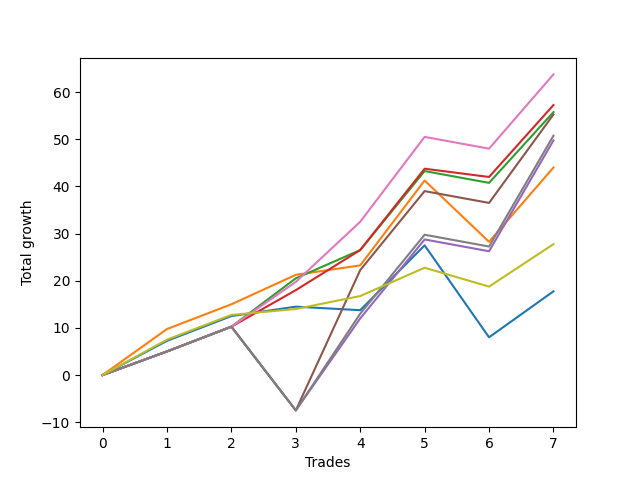

# Long Bulldog 006 
- Symbol: ES90d5m120m
- Date Range: 03/18/2022 - 07/08/2022
- Trading Period: 7:20-12:30
- Number of Trades: 7



| Name | Win Percent | Profit | Avg Profit / Trade |     | Name | Win Percent | Profit | Avg Profit / Trade |
| ---- | ----------- | ------ | ------------------ | --- | ---- | ----------- | ------ | ------------------ |
| Sorted By <br> Profit | | | | | Sorted By <br> Win Percentage ||||
| Six | 85.71 | 31875.00 | 4553.57 |     | Six | 85.71 | 31875.00 | 4553.57 |
| Three | 85.71 | 28625.00 | 4089.29 |     | Three | 85.71 | 28625.00 | 4089.29 |
| Two | 85.71 | 27875.00 | 3982.14 |     | Two | 85.71 | 27875.00 | 3982.14 |
| Five | 71.43 | 27625.00 | 3946.43 |     | One | 85.71 | 22000.00 | 3142.86 |
| Seven | 71.43 | 25375.00 | 3625.00 |     | Seventy-Three | 85.71 | 13875.00 | 1982.14 |
| Four | 71.43 | 24875.00 | 3553.57 |     | Five | 71.43 | 27625.00 | 3946.43 |
| One | 85.71 | 22000.00 | 3142.86 |     | Seven | 71.43 | 25375.00 | 3625.00 |
| Seventy-Three | 85.71 | 13875.00 | 1982.14 |     | Four | 71.43 | 24875.00 | 3553.57 |
| Zero | 71.43 | 8875.00 | 1267.86 |     | Zero | 71.43 | 8875.00 | 1267.86 |

## NO STOPLOSS

### Test Zero
* Sell when price hits the middle line of the 20p bollinger
* No Stoploss
* Results:
```
Total Trades: 7
Percent Up: 71.43
Percent Down: 28.57
Total Points Moved Up: 17.75
Potential Profit: 8875.00
Total Points Ups: 38.00 Count Ups: 5
Total Points Downs: -20.25 Count Downs: 2
```

<details><summary>Trades</summary>

<code>In: 2022-03-23 10:50:00		Out: 2022-03-23 11:28:15		Total Position Time: 38:15		Total Move Up: 7.25		Total to Date: 7.25</code> <br />
<code>In: 2022-03-30 12:30:00		Out: 2022-03-30 12:46:00		Total Position Time: 16:00		Total Move Up: 5.25		Total to Date: 12.50</code> <br />
<code>In: 2022-03-31 11:25:00		Out: 2022-03-31 11:58:10		Total Position Time: 33:10		Total Move Up: 2.00		Total to Date: 14.50</code> <br />
<code>In: 2022-04-18 08:55:00		Out: 2022-04-18 09:54:40		Total Position Time: 59:40		Total Move Up: -0.75		Total to Date: 13.75</code> <br />
<code>In: 2022-04-20 12:00:00		Out: 2022-04-20 12:24:15		Total Position Time: 24:15		Total Move Up: 13.75		Total to Date: 27.50</code> <br />
<code>In: 2022-05-02 10:10:00		Out: 2022-05-02 11:53:35		Total Position Time: 103:35		Total Move Up: -19.50		Total to Date: 8.00</code> <br />
<code>In: 2022-06-29 09:35:00		Out: 2022-06-29 10:01:50		Total Position Time: 26:50		Total Move Up: 9.75		Total to Date: 17.75</code> <br />


</details>

### Test One
* Sell when the price hits the upper line of the 20p 1std bollinger
* No Stoploss
* Results:
```
Total Trades: 7
Percent Up: 85.71
Percent Down: 14.29
Total Points Moved Up: 44.00
Potential Profit: 22000.00
Total Points Ups: 57.00 Count Ups: 6
Total Points Downs: -13.00 Count Downs: 1
```

<details><summary>Trades</summary>

<code>In: 2022-03-23 10:50:00		Out: 2022-03-23 11:48:00		Total Position Time: 58:00		Total Move Up: 9.75		Total to Date: 9.75</code> <br />
<code>In: 2022-03-30 12:30:00		Out: 2022-03-30 12:46:00		Total Position Time: 16:00		Total Move Up: 5.25		Total to Date: 15.00</code> <br />
<code>In: 2022-03-31 11:25:00		Out: 2022-03-31 12:00:20		Total Position Time: 35:20		Total Move Up: 6.25		Total to Date: 21.25</code> <br />
<code>In: 2022-04-18 08:55:00		Out: 2022-04-18 10:07:50		Total Position Time: 72:50		Total Move Up: 2.00		Total to Date: 23.25</code> <br />
<code>In: 2022-04-20 12:00:00		Out: 2022-04-20 12:45:15		Total Position Time: 45:15		Total Move Up: 18.00		Total to Date: 41.25</code> <br />
<code>In: 2022-05-02 10:10:00		Out: 2022-05-02 12:05:15		Total Position Time: 115:15		Total Move Up: -13.00		Total to Date: 28.25</code> <br />
<code>In: 2022-06-29 09:35:00		Out: 2022-06-29 10:11:05		Total Position Time: 36:05		Total Move Up: 15.75		Total to Date: 44.00</code> <br />


</details>

### Test Two
* Sell when the price hits the upper line of the 20p 2std bollinger
* No Stoploss
* Results:
```
Total Trades: 7
Percent Up: 85.71
Percent Down: 14.29
Total Points Moved Up: 55.75
Potential Profit: 27875.00
Total Points Ups: 58.25 Count Ups: 6
Total Points Downs: -2.50 Count Downs: 1
```

<details><summary>Trades</summary>

<code>In: 2022-03-23 10:50:00		Out: 2022-03-23 12:46:00		Total Position Time: 116:00		Total Move Up: 5.00		Total to Date: 5.00</code> <br />
<code>In: 2022-03-30 12:30:00		Out: 2022-03-30 12:46:00		Total Position Time: 16:00		Total Move Up: 5.25		Total to Date: 10.25</code> <br />
<code>In: 2022-03-31 11:25:00		Out: 2022-03-31 12:02:55		Total Position Time: 37:55		Total Move Up: 10.25		Total to Date: 20.50</code> <br />
<code>In: 2022-04-18 08:55:00		Out: 2022-04-18 10:10:25		Total Position Time: 75:25		Total Move Up: 6.00		Total to Date: 26.50</code> <br />
<code>In: 2022-04-20 12:00:00		Out: 2022-04-20 12:46:00		Total Position Time: 46:00		Total Move Up: 16.75		Total to Date: 43.25</code> <br />
<code>In: 2022-05-02 10:10:00		Out: 2022-05-02 12:09:40		Total Position Time: 119:40		Total Move Up: -2.50		Total to Date: 40.75</code> <br />
<code>In: 2022-06-29 09:35:00		Out: 2022-06-29 10:43:40		Total Position Time: 68:40		Total Move Up: 15.00		Total to Date: 55.75</code> <br />


</details>

### Test Three
* Sell when price hits the middle line of the 50p bollinger
* No Stoploss
* Results:
```
Total Trades: 7
Percent Up: 85.71
Percent Down: 14.29
Total Points Moved Up: 57.25
Potential Profit: 28625.00
Total Points Ups: 59.00 Count Ups: 6
Total Points Downs: -1.75 Count Downs: 1
```

<details><summary>Trades</summary>

<code>In: 2022-03-23 10:50:00		Out: 2022-03-23 12:46:00		Total Position Time: 116:00		Total Move Up: 5.00		Total to Date: 5.00</code> <br />
<code>In: 2022-03-30 12:30:00		Out: 2022-03-30 12:46:00		Total Position Time: 16:00		Total Move Up: 5.25		Total to Date: 10.25</code> <br />
<code>In: 2022-03-31 11:25:00		Out: 2022-03-31 12:01:05		Total Position Time: 36:05		Total Move Up: 7.75		Total to Date: 18.00</code> <br />
<code>In: 2022-04-18 08:55:00		Out: 2022-04-18 10:31:35		Total Position Time: 96:35		Total Move Up: 8.50		Total to Date: 26.50</code> <br />
<code>In: 2022-04-20 12:00:00		Out: 2022-04-20 12:25:50		Total Position Time: 25:50		Total Move Up: 17.25		Total to Date: 43.75</code> <br />
<code>In: 2022-05-02 10:10:00		Out: 2022-05-02 12:10:10		Total Position Time: 120:10		Total Move Up: -1.75		Total to Date: 42.00</code> <br />
<code>In: 2022-06-29 09:35:00		Out: 2022-06-29 10:10:45		Total Position Time: 35:45		Total Move Up: 15.25		Total to Date: 57.25</code> <br />


</details>

### Test Four
* Sell when the price hits the upper line of the 50p 1std bollinger
* No Stoploss
* Results:
```
Total Trades: 7
Percent Up: 71.43
Percent Down: 28.57
Total Points Moved Up: 49.75
Potential Profit: 24875.00
Total Points Ups: 70.00 Count Ups: 5
Total Points Downs: -20.25 Count Downs: 2
```

<details><summary>Trades</summary>

<code>In: 2022-03-23 10:50:00		Out: 2022-03-23 12:46:00		Total Position Time: 116:00		Total Move Up: 5.00		Total to Date: 5.00</code> <br />
<code>In: 2022-03-30 12:30:00		Out: 2022-03-30 12:46:00		Total Position Time: 16:00		Total Move Up: 5.25		Total to Date: 10.25</code> <br />
<code>In: 2022-03-31 11:25:00		Out: 2022-03-31 12:46:00		Total Position Time: 81:00		Total Move Up: -17.75		Total to Date: -7.50</code> <br />
<code>In: 2022-04-18 08:55:00		Out: 2022-04-18 10:35:40		Total Position Time: 100:40		Total Move Up: 19.50		Total to Date: 12.00</code> <br />
<code>In: 2022-04-20 12:00:00		Out: 2022-04-20 12:46:00		Total Position Time: 46:00		Total Move Up: 16.75		Total to Date: 28.75</code> <br />
<code>In: 2022-05-02 10:10:00		Out: 2022-05-02 12:10:55		Total Position Time: 120:55		Total Move Up: -2.50		Total to Date: 26.25</code> <br />
<code>In: 2022-06-29 09:35:00		Out: 2022-06-29 11:01:35		Total Position Time: 86:35		Total Move Up: 23.50		Total to Date: 49.75</code> <br />


</details>

### Test Five
* Sell when the price hits the upper line of the 50p 2std bollinger
* No Stoploss
* Results:
```
Total Trades: 7
Percent Up: 71.43
Percent Down: 28.57
Total Points Moved Up: 55.25
Potential Profit: 27625.00
Total Points Ups: 75.50 Count Ups: 5
Total Points Downs: -20.25 Count Downs: 2
```

<details><summary>Trades</summary>

<code>In: 2022-03-23 10:50:00		Out: 2022-03-23 12:46:00		Total Position Time: 116:00		Total Move Up: 5.00		Total to Date: 5.00</code> <br />
<code>In: 2022-03-30 12:30:00		Out: 2022-03-30 12:46:00		Total Position Time: 16:00		Total Move Up: 5.25		Total to Date: 10.25</code> <br />
<code>In: 2022-03-31 11:25:00		Out: 2022-03-31 12:46:00		Total Position Time: 81:00		Total Move Up: -17.75		Total to Date: -7.50</code> <br />
<code>In: 2022-04-18 08:55:00		Out: 2022-04-18 10:55:55		Total Position Time: 120:55		Total Move Up: 29.75		Total to Date: 22.25</code> <br />
<code>In: 2022-04-20 12:00:00		Out: 2022-04-20 12:46:00		Total Position Time: 46:00		Total Move Up: 16.75		Total to Date: 39.00</code> <br />
<code>In: 2022-05-02 10:10:00		Out: 2022-05-02 12:10:55		Total Position Time: 120:55		Total Move Up: -2.50		Total to Date: 36.50</code> <br />
<code>In: 2022-06-29 09:35:00		Out: 2022-06-29 11:35:55		Total Position Time: 120:55		Total Move Up: 18.75		Total to Date: 55.25</code> <br />


</details>

### Test Six
* Sell when the price hits the middle line of the 1std VWAP
* No Stoploss
* Results:
```
Total Trades: 7
Percent Up: 85.71
Percent Down: 14.29
Total Points Moved Up: 63.75
Potential Profit: 31875.00
Total Points Ups: 66.25 Count Ups: 6
Total Points Downs: -2.50 Count Downs: 1
```

<details><summary>Trades</summary>

<code>In: 2022-03-23 10:50:00		Out: 2022-03-23 12:46:00		Total Position Time: 116:00		Total Move Up: 5.00		Total to Date: 5.00</code> <br />
<code>In: 2022-03-30 12:30:00		Out: 2022-03-30 12:46:00		Total Position Time: 16:00		Total Move Up: 5.25		Total to Date: 10.25</code> <br />
<code>In: 2022-03-31 11:25:00		Out: 2022-03-31 12:02:25		Total Position Time: 37:25		Total Move Up: 9.50		Total to Date: 19.75</code> <br />
<code>In: 2022-04-18 08:55:00		Out: 2022-04-18 10:32:10		Total Position Time: 97:10		Total Move Up: 12.75		Total to Date: 32.50</code> <br />
<code>In: 2022-04-20 12:00:00		Out: 2022-04-20 12:26:10		Total Position Time: 26:10		Total Move Up: 18.00		Total to Date: 50.50</code> <br />
<code>In: 2022-05-02 10:10:00		Out: 2022-05-02 12:10:55		Total Position Time: 120:55		Total Move Up: -2.50		Total to Date: 48.00</code> <br />
<code>In: 2022-06-29 09:35:00		Out: 2022-06-29 10:10:55		Total Position Time: 35:55		Total Move Up: 15.75		Total to Date: 63.75</code> <br />


</details>

### Test Seven
* Sell when the price hits the upper line of the 1std VWAP
* No Stoploss
* Results:
```
Total Trades: 7
Percent Up: 71.43
Percent Down: 28.57
Total Points Moved Up: 50.75
Potential Profit: 25375.00
Total Points Ups: 71.00 Count Ups: 5
Total Points Downs: -20.25 Count Downs: 2
```

<details><summary>Trades</summary>

<code>In: 2022-03-23 10:50:00		Out: 2022-03-23 12:46:00		Total Position Time: 116:00		Total Move Up: 5.00		Total to Date: 5.00</code> <br />
<code>In: 2022-03-30 12:30:00		Out: 2022-03-30 12:46:00		Total Position Time: 16:00		Total Move Up: 5.25		Total to Date: 10.25</code> <br />
<code>In: 2022-03-31 11:25:00		Out: 2022-03-31 12:46:00		Total Position Time: 81:00		Total Move Up: -17.75		Total to Date: -7.50</code> <br />
<code>In: 2022-04-18 08:55:00		Out: 2022-04-18 10:35:45		Total Position Time: 100:45		Total Move Up: 20.50		Total to Date: 13.00</code> <br />
<code>In: 2022-04-20 12:00:00		Out: 2022-04-20 12:46:00		Total Position Time: 46:00		Total Move Up: 16.75		Total to Date: 29.75</code> <br />
<code>In: 2022-05-02 10:10:00		Out: 2022-05-02 12:10:55		Total Position Time: 120:55		Total Move Up: -2.50		Total to Date: 27.25</code> <br />
<code>In: 2022-06-29 09:35:00		Out: 2022-06-29 11:01:35		Total Position Time: 86:35		Total Move Up: 23.50		Total to Date: 50.75</code> <br />


</details>

## SPECIAL EXIT CONDITIONS 

### Test Seventy-Three
* Sell when the linear regression slope changes to negative
* No Stoploss
* Results:
```
Total Trades: 7
Percent Up: 85.71
Percent Down: 14.29
Total Points Moved Up: 27.75
Potential Profit: 13875.00
Total Points Ups: 31.75 Count Ups: 6
Total Points Downs: -4.00 Count Downs: 1
```

<details><summary>Trades</summary>

<code>In: 2022-03-23 10:50:00		Out: 2022-03-23 10:55:05		Total Position Time: 05:05		Total Move Up: 7.50		Total to Date: 7.50</code> <br />
<code>In: 2022-03-30 12:30:00		Out: 2022-03-30 12:36:05		Total Position Time: 06:05		Total Move Up: 5.25		Total to Date: 12.75</code> <br />
<code>In: 2022-03-31 11:25:00		Out: 2022-03-31 11:37:05		Total Position Time: 12:05		Total Move Up: 1.25		Total to Date: 14.00</code> <br />
<code>In: 2022-04-18 08:55:00		Out: 2022-04-18 08:58:05		Total Position Time: 03:05		Total Move Up: 2.75		Total to Date: 16.75</code> <br />
<code>In: 2022-04-20 12:00:00		Out: 2022-04-20 12:12:05		Total Position Time: 12:05		Total Move Up: 6.00		Total to Date: 22.75</code> <br />
<code>In: 2022-05-02 10:10:00		Out: 2022-05-02 10:23:05		Total Position Time: 13:05		Total Move Up: -4.00		Total to Date: 18.75</code> <br />
<code>In: 2022-06-29 09:35:00		Out: 2022-06-29 09:40:05		Total Position Time: 05:05		Total Move Up: 9.00		Total to Date: 27.75</code> <br />


</details>