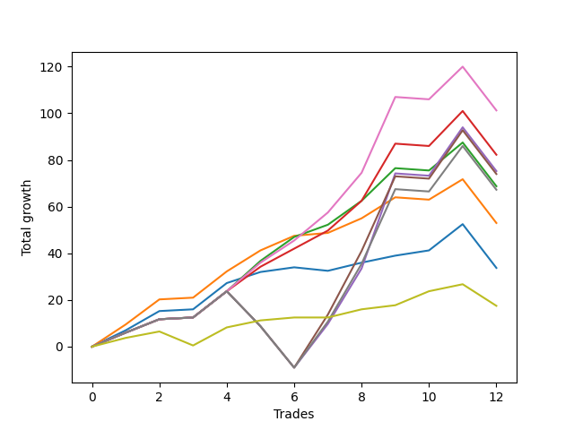

# Long Bulldog 003 
- Symbol: ES90d5m120m
- Date Range: 03/18/2022 - 07/08/2022
- Trading Period: 7:20-12:30
- Number of Trades: 12



| Name | Win Percent | Profit | Avg Profit / Trade |     | Name | Win Percent | Profit | Avg Profit / Trade |
| ---- | ----------- | ------ | ------------------ | --- | ---- | ----------- | ------ | ------------------ |
| Sorted By <br> Profit | | | | | Sorted By <br> Win Percentage ||||
| Six | 83.33 | 50625.00 | 4218.75 |     | Six | 83.33 | 50625.00 | 4218.75 |
| Three | 83.33 | 41125.00 | 3427.08 |     | Three | 83.33 | 41125.00 | 3427.08 |
| Four | 66.67 | 37625.00 | 3135.42 |     | Two | 83.33 | 34375.00 | 2864.58 |
| Five | 66.67 | 37000.00 | 3083.33 |     | One | 83.33 | 26500.00 | 2208.33 |
| Two | 83.33 | 34375.00 | 2864.58 |     | Zero | 83.33 | 16875.00 | 1406.25 |
| Seven | 66.67 | 33625.00 | 2802.08 |     | Seventy-Three | 83.33 | 8750.00 | 729.17 |
| One | 83.33 | 26500.00 | 2208.33 |     | Four | 66.67 | 37625.00 | 3135.42 |
| Zero | 83.33 | 16875.00 | 1406.25 |     | Five | 66.67 | 37000.00 | 3083.33 |
| Seventy-Three | 83.33 | 8750.00 | 729.17 |     | Seven | 66.67 | 33625.00 | 2802.08 |

## NO STOPLOSS

### Test Zero
* Sell when price hits the middle line of the 20p bollinger
* No Stoploss
* Results:
```
Total Trades: 12
Percent Up: 83.33
Percent Down: 16.67
Total Points Moved Up: 33.75
Potential Profit: 16875.00
Total Points Ups: 54.00 Count Ups: 10
Total Points Downs: -20.25 Count Downs: 2
```

<details><summary>Trades</summary>

<code>In: 2022-03-23 10:30:00		Out: 2022-03-23 11:28:15		Total Position Time: 58:15		Total Move Up: 7.00		Total to Date: 7.00</code> <br />
<code>In: 2022-03-23 10:45:00		Out: 2022-03-23 11:28:15		Total Position Time: 43:15		Total Move Up: 8.25		Total to Date: 15.25</code> <br />
<code>In: 2022-03-30 12:10:00		Out: 2022-03-30 12:46:00		Total Position Time: 36:00		Total Move Up: 0.75		Total to Date: 16.00</code> <br />
<code>In: 2022-03-30 12:25:00		Out: 2022-03-30 12:46:00		Total Position Time: 21:00		Total Move Up: 11.25		Total to Date: 27.25</code> <br />
<code>In: 2022-03-31 11:20:00		Out: 2022-03-31 11:58:10		Total Position Time: 38:10		Total Move Up: 4.75		Total to Date: 32.00</code> <br />
<code>In: 2022-03-31 11:25:00		Out: 2022-03-31 11:58:10		Total Position Time: 33:10		Total Move Up: 2.00		Total to Date: 34.00</code> <br />
<code>In: 2022-04-18 08:40:00		Out: 2022-04-18 09:54:40		Total Position Time: 74:40		Total Move Up: -1.50		Total to Date: 32.50</code> <br />
<code>In: 2022-04-18 08:50:00		Out: 2022-04-18 09:54:40		Total Position Time: 64:40		Total Move Up: 3.50		Total to Date: 36.00</code> <br />
<code>In: 2022-05-12 10:50:00		Out: 2022-05-12 12:04:10		Total Position Time: 74:10		Total Move Up: 3.00		Total to Date: 39.00</code> <br />
<code>In: 2022-06-08 09:45:00		Out: 2022-06-08 11:07:45		Total Position Time: 82:45		Total Move Up: 2.25		Total to Date: 41.25</code> <br />
<code>In: 2022-06-09 08:05:00		Out: 2022-06-09 08:42:25		Total Position Time: 37:25		Total Move Up: 11.25		Total to Date: 52.50</code> <br />
<code>In: 2022-06-09 12:15:00		Out: 2022-06-09 12:46:00		Total Position Time: 31:00		Total Move Up: -18.75		Total to Date: 33.75</code> <br />


</details>

### Test One
* Sell when the price hits the upper line of the 20p 1std bollinger
* No Stoploss
* Results:
```
Total Trades: 12
Percent Up: 83.33
Percent Down: 16.67
Total Points Moved Up: 53.00
Potential Profit: 26500.00
Total Points Ups: 72.75 Count Ups: 10
Total Points Downs: -19.75 Count Downs: 2
```

<details><summary>Trades</summary>

<code>In: 2022-03-23 10:30:00		Out: 2022-03-23 11:48:00		Total Position Time: 78:00		Total Move Up: 9.50		Total to Date: 9.50</code> <br />
<code>In: 2022-03-23 10:45:00		Out: 2022-03-23 11:48:00		Total Position Time: 63:00		Total Move Up: 10.75		Total to Date: 20.25</code> <br />
<code>In: 2022-03-30 12:10:00		Out: 2022-03-30 12:46:00		Total Position Time: 36:00		Total Move Up: 0.75		Total to Date: 21.00</code> <br />
<code>In: 2022-03-30 12:25:00		Out: 2022-03-30 12:46:00		Total Position Time: 21:00		Total Move Up: 11.25		Total to Date: 32.25</code> <br />
<code>In: 2022-03-31 11:20:00		Out: 2022-03-31 12:00:20		Total Position Time: 40:20		Total Move Up: 9.00		Total to Date: 41.25</code> <br />
<code>In: 2022-03-31 11:25:00		Out: 2022-03-31 12:00:20		Total Position Time: 35:20		Total Move Up: 6.25		Total to Date: 47.50</code> <br />
<code>In: 2022-04-18 08:40:00		Out: 2022-04-18 10:07:50		Total Position Time: 87:50		Total Move Up: 1.25		Total to Date: 48.75</code> <br />
<code>In: 2022-04-18 08:50:00		Out: 2022-04-18 10:07:50		Total Position Time: 77:50		Total Move Up: 6.25		Total to Date: 55.00</code> <br />
<code>In: 2022-05-12 10:50:00		Out: 2022-05-12 12:18:20		Total Position Time: 88:20		Total Move Up: 9.00		Total to Date: 64.00</code> <br />
<code>In: 2022-06-08 09:45:00		Out: 2022-06-08 11:45:55		Total Position Time: 120:55		Total Move Up: -1.00		Total to Date: 63.00</code> <br />
<code>In: 2022-06-09 08:05:00		Out: 2022-06-09 09:26:30		Total Position Time: 81:30		Total Move Up: 8.75		Total to Date: 71.75</code> <br />
<code>In: 2022-06-09 12:15:00		Out: 2022-06-09 12:46:00		Total Position Time: 31:00		Total Move Up: -18.75		Total to Date: 53.00</code> <br />


</details>

### Test Two
* Sell when the price hits the upper line of the 20p 2std bollinger
* No Stoploss
* Results:
```
Total Trades: 12
Percent Up: 83.33
Percent Down: 16.67
Total Points Moved Up: 68.75
Potential Profit: 34375.00
Total Points Ups: 88.50 Count Ups: 10
Total Points Downs: -19.75 Count Downs: 2
```

<details><summary>Trades</summary>

<code>In: 2022-03-23 10:30:00		Out: 2022-03-23 12:30:55		Total Position Time: 120:55		Total Move Up: 6.00		Total to Date: 6.00</code> <br />
<code>In: 2022-03-23 10:45:00		Out: 2022-03-23 12:45:55		Total Position Time: 120:55		Total Move Up: 5.75		Total to Date: 11.75</code> <br />
<code>In: 2022-03-30 12:10:00		Out: 2022-03-30 12:46:00		Total Position Time: 36:00		Total Move Up: 0.75		Total to Date: 12.50</code> <br />
<code>In: 2022-03-30 12:25:00		Out: 2022-03-30 12:46:00		Total Position Time: 21:00		Total Move Up: 11.25		Total to Date: 23.75</code> <br />
<code>In: 2022-03-31 11:20:00		Out: 2022-03-31 12:02:55		Total Position Time: 42:55		Total Move Up: 13.00		Total to Date: 36.75</code> <br />
<code>In: 2022-03-31 11:25:00		Out: 2022-03-31 12:02:55		Total Position Time: 37:55		Total Move Up: 10.25		Total to Date: 47.00</code> <br />
<code>In: 2022-04-18 08:40:00		Out: 2022-04-18 10:10:25		Total Position Time: 90:25		Total Move Up: 5.25		Total to Date: 52.25</code> <br />
<code>In: 2022-04-18 08:50:00		Out: 2022-04-18 10:10:25		Total Position Time: 80:25		Total Move Up: 10.25		Total to Date: 62.50</code> <br />
<code>In: 2022-05-12 10:50:00		Out: 2022-05-12 12:19:20		Total Position Time: 89:20		Total Move Up: 14.00		Total to Date: 76.50</code> <br />
<code>In: 2022-06-08 09:45:00		Out: 2022-06-08 11:45:55		Total Position Time: 120:55		Total Move Up: -1.00		Total to Date: 75.50</code> <br />
<code>In: 2022-06-09 08:05:00		Out: 2022-06-09 09:30:40		Total Position Time: 85:40		Total Move Up: 12.00		Total to Date: 87.50</code> <br />
<code>In: 2022-06-09 12:15:00		Out: 2022-06-09 12:46:00		Total Position Time: 31:00		Total Move Up: -18.75		Total to Date: 68.75</code> <br />


</details>

### Test Three
* Sell when price hits the middle line of the 50p bollinger
* No Stoploss
* Results:
```
Total Trades: 12
Percent Up: 83.33
Percent Down: 16.67
Total Points Moved Up: 82.25
Potential Profit: 41125.00
Total Points Ups: 102.00 Count Ups: 10
Total Points Downs: -19.75 Count Downs: 2
```

<details><summary>Trades</summary>

<code>In: 2022-03-23 10:30:00		Out: 2022-03-23 12:30:55		Total Position Time: 120:55		Total Move Up: 6.00		Total to Date: 6.00</code> <br />
<code>In: 2022-03-23 10:45:00		Out: 2022-03-23 12:45:55		Total Position Time: 120:55		Total Move Up: 5.75		Total to Date: 11.75</code> <br />
<code>In: 2022-03-30 12:10:00		Out: 2022-03-30 12:46:00		Total Position Time: 36:00		Total Move Up: 0.75		Total to Date: 12.50</code> <br />
<code>In: 2022-03-30 12:25:00		Out: 2022-03-30 12:46:00		Total Position Time: 21:00		Total Move Up: 11.25		Total to Date: 23.75</code> <br />
<code>In: 2022-03-31 11:20:00		Out: 2022-03-31 12:01:05		Total Position Time: 41:05		Total Move Up: 10.50		Total to Date: 34.25</code> <br />
<code>In: 2022-03-31 11:25:00		Out: 2022-03-31 12:01:05		Total Position Time: 36:05		Total Move Up: 7.75		Total to Date: 42.00</code> <br />
<code>In: 2022-04-18 08:40:00		Out: 2022-04-18 10:31:35		Total Position Time: 111:35		Total Move Up: 7.75		Total to Date: 49.75</code> <br />
<code>In: 2022-04-18 08:50:00		Out: 2022-04-18 10:31:35		Total Position Time: 101:35		Total Move Up: 12.75		Total to Date: 62.50</code> <br />
<code>In: 2022-05-12 10:50:00		Out: 2022-05-12 12:21:25		Total Position Time: 91:25		Total Move Up: 24.50		Total to Date: 87.00</code> <br />
<code>In: 2022-06-08 09:45:00		Out: 2022-06-08 11:45:55		Total Position Time: 120:55		Total Move Up: -1.00		Total to Date: 86.00</code> <br />
<code>In: 2022-06-09 08:05:00		Out: 2022-06-09 09:43:25		Total Position Time: 98:25		Total Move Up: 15.00		Total to Date: 101.00</code> <br />
<code>In: 2022-06-09 12:15:00		Out: 2022-06-09 12:46:00		Total Position Time: 31:00		Total Move Up: -18.75		Total to Date: 82.25</code> <br />


</details>

### Test Four
* Sell when the price hits the upper line of the 50p 1std bollinger
* No Stoploss
* Results:
```
Total Trades: 12
Percent Up: 66.67
Percent Down: 33.33
Total Points Moved Up: 75.25
Potential Profit: 37625.00
Total Points Ups: 127.75 Count Ups: 8
Total Points Downs: -52.50 Count Downs: 4
```

<details><summary>Trades</summary>

<code>In: 2022-03-23 10:30:00		Out: 2022-03-23 12:30:55		Total Position Time: 120:55		Total Move Up: 6.00		Total to Date: 6.00</code> <br />
<code>In: 2022-03-23 10:45:00		Out: 2022-03-23 12:45:55		Total Position Time: 120:55		Total Move Up: 5.75		Total to Date: 11.75</code> <br />
<code>In: 2022-03-30 12:10:00		Out: 2022-03-30 12:46:00		Total Position Time: 36:00		Total Move Up: 0.75		Total to Date: 12.50</code> <br />
<code>In: 2022-03-30 12:25:00		Out: 2022-03-30 12:46:00		Total Position Time: 21:00		Total Move Up: 11.25		Total to Date: 23.75</code> <br />
<code>In: 2022-03-31 11:20:00		Out: 2022-03-31 12:46:00		Total Position Time: 86:00		Total Move Up: -15.00		Total to Date: 8.75</code> <br />
<code>In: 2022-03-31 11:25:00		Out: 2022-03-31 12:46:00		Total Position Time: 81:00		Total Move Up: -17.75		Total to Date: -9.00</code> <br />
<code>In: 2022-04-18 08:40:00		Out: 2022-04-18 10:35:40		Total Position Time: 115:40		Total Move Up: 18.75		Total to Date: 9.75</code> <br />
<code>In: 2022-04-18 08:50:00		Out: 2022-04-18 10:35:40		Total Position Time: 105:40		Total Move Up: 23.75		Total to Date: 33.50</code> <br />
<code>In: 2022-05-12 10:50:00		Out: 2022-05-12 12:43:05		Total Position Time: 113:05		Total Move Up: 40.75		Total to Date: 74.25</code> <br />
<code>In: 2022-06-08 09:45:00		Out: 2022-06-08 11:45:55		Total Position Time: 120:55		Total Move Up: -1.00		Total to Date: 73.25</code> <br />
<code>In: 2022-06-09 08:05:00		Out: 2022-06-09 10:05:55		Total Position Time: 120:55		Total Move Up: 20.75		Total to Date: 94.00</code> <br />
<code>In: 2022-06-09 12:15:00		Out: 2022-06-09 12:46:00		Total Position Time: 31:00		Total Move Up: -18.75		Total to Date: 75.25</code> <br />


</details>

### Test Five
* Sell when the price hits the upper line of the 50p 2std bollinger
* No Stoploss
* Results:
```
Total Trades: 12
Percent Up: 66.67
Percent Down: 33.33
Total Points Moved Up: 74.00
Potential Profit: 37000.00
Total Points Ups: 126.50 Count Ups: 8
Total Points Downs: -52.50 Count Downs: 4
```

<details><summary>Trades</summary>

<code>In: 2022-03-23 10:30:00		Out: 2022-03-23 12:30:55		Total Position Time: 120:55		Total Move Up: 6.00		Total to Date: 6.00</code> <br />
<code>In: 2022-03-23 10:45:00		Out: 2022-03-23 12:45:55		Total Position Time: 120:55		Total Move Up: 5.75		Total to Date: 11.75</code> <br />
<code>In: 2022-03-30 12:10:00		Out: 2022-03-30 12:46:00		Total Position Time: 36:00		Total Move Up: 0.75		Total to Date: 12.50</code> <br />
<code>In: 2022-03-30 12:25:00		Out: 2022-03-30 12:46:00		Total Position Time: 21:00		Total Move Up: 11.25		Total to Date: 23.75</code> <br />
<code>In: 2022-03-31 11:20:00		Out: 2022-03-31 12:46:00		Total Position Time: 86:00		Total Move Up: -15.00		Total to Date: 8.75</code> <br />
<code>In: 2022-03-31 11:25:00		Out: 2022-03-31 12:46:00		Total Position Time: 81:00		Total Move Up: -17.75		Total to Date: -9.00</code> <br />
<code>In: 2022-04-18 08:40:00		Out: 2022-04-18 10:40:55		Total Position Time: 120:55		Total Move Up: 22.75		Total to Date: 13.75</code> <br />
<code>In: 2022-04-18 08:50:00		Out: 2022-04-18 10:50:55		Total Position Time: 120:55		Total Move Up: 27.25		Total to Date: 41.00</code> <br />
<code>In: 2022-05-12 10:50:00		Out: 2022-05-12 12:46:00		Total Position Time: 116:00		Total Move Up: 32.00		Total to Date: 73.00</code> <br />
<code>In: 2022-06-08 09:45:00		Out: 2022-06-08 11:45:55		Total Position Time: 120:55		Total Move Up: -1.00		Total to Date: 72.00</code> <br />
<code>In: 2022-06-09 08:05:00		Out: 2022-06-09 10:05:55		Total Position Time: 120:55		Total Move Up: 20.75		Total to Date: 92.75</code> <br />
<code>In: 2022-06-09 12:15:00		Out: 2022-06-09 12:46:00		Total Position Time: 31:00		Total Move Up: -18.75		Total to Date: 74.00</code> <br />


</details>

### Test Six
* Sell when the price hits the middle line of the 1std VWAP
* No Stoploss
* Results:
```
Total Trades: 12
Percent Up: 83.33
Percent Down: 16.67
Total Points Moved Up: 101.25
Potential Profit: 50625.00
Total Points Ups: 121.00 Count Ups: 10
Total Points Downs: -19.75 Count Downs: 2
```

<details><summary>Trades</summary>

<code>In: 2022-03-23 10:30:00		Out: 2022-03-23 12:30:55		Total Position Time: 120:55		Total Move Up: 6.00		Total to Date: 6.00</code> <br />
<code>In: 2022-03-23 10:45:00		Out: 2022-03-23 12:45:55		Total Position Time: 120:55		Total Move Up: 5.75		Total to Date: 11.75</code> <br />
<code>In: 2022-03-30 12:10:00		Out: 2022-03-30 12:46:00		Total Position Time: 36:00		Total Move Up: 0.75		Total to Date: 12.50</code> <br />
<code>In: 2022-03-30 12:25:00		Out: 2022-03-30 12:46:00		Total Position Time: 21:00		Total Move Up: 11.25		Total to Date: 23.75</code> <br />
<code>In: 2022-03-31 11:20:00		Out: 2022-03-31 12:02:25		Total Position Time: 42:25		Total Move Up: 12.25		Total to Date: 36.00</code> <br />
<code>In: 2022-03-31 11:25:00		Out: 2022-03-31 12:02:25		Total Position Time: 37:25		Total Move Up: 9.50		Total to Date: 45.50</code> <br />
<code>In: 2022-04-18 08:40:00		Out: 2022-04-18 10:32:10		Total Position Time: 112:10		Total Move Up: 12.00		Total to Date: 57.50</code> <br />
<code>In: 2022-04-18 08:50:00		Out: 2022-04-18 10:32:10		Total Position Time: 102:10		Total Move Up: 17.00		Total to Date: 74.50</code> <br />
<code>In: 2022-05-12 10:50:00		Out: 2022-05-12 12:23:20		Total Position Time: 93:20		Total Move Up: 32.50		Total to Date: 107.00</code> <br />
<code>In: 2022-06-08 09:45:00		Out: 2022-06-08 11:45:55		Total Position Time: 120:55		Total Move Up: -1.00		Total to Date: 106.00</code> <br />
<code>In: 2022-06-09 08:05:00		Out: 2022-06-09 08:42:55		Total Position Time: 37:55		Total Move Up: 14.00		Total to Date: 120.00</code> <br />
<code>In: 2022-06-09 12:15:00		Out: 2022-06-09 12:46:00		Total Position Time: 31:00		Total Move Up: -18.75		Total to Date: 101.25</code> <br />


</details>

### Test Seven
* Sell when the price hits the upper line of the 1std VWAP
* No Stoploss
* Results:
```
Total Trades: 12
Percent Up: 66.67
Percent Down: 33.33
Total Points Moved Up: 67.25
Potential Profit: 33625.00
Total Points Ups: 119.75 Count Ups: 8
Total Points Downs: -52.50 Count Downs: 4
```

<details><summary>Trades</summary>

<code>In: 2022-03-23 10:30:00		Out: 2022-03-23 12:30:55		Total Position Time: 120:55		Total Move Up: 6.00		Total to Date: 6.00</code> <br />
<code>In: 2022-03-23 10:45:00		Out: 2022-03-23 12:45:55		Total Position Time: 120:55		Total Move Up: 5.75		Total to Date: 11.75</code> <br />
<code>In: 2022-03-30 12:10:00		Out: 2022-03-30 12:46:00		Total Position Time: 36:00		Total Move Up: 0.75		Total to Date: 12.50</code> <br />
<code>In: 2022-03-30 12:25:00		Out: 2022-03-30 12:46:00		Total Position Time: 21:00		Total Move Up: 11.25		Total to Date: 23.75</code> <br />
<code>In: 2022-03-31 11:20:00		Out: 2022-03-31 12:46:00		Total Position Time: 86:00		Total Move Up: -15.00		Total to Date: 8.75</code> <br />
<code>In: 2022-03-31 11:25:00		Out: 2022-03-31 12:46:00		Total Position Time: 81:00		Total Move Up: -17.75		Total to Date: -9.00</code> <br />
<code>In: 2022-04-18 08:40:00		Out: 2022-04-18 10:35:45		Total Position Time: 115:45		Total Move Up: 19.75		Total to Date: 10.75</code> <br />
<code>In: 2022-04-18 08:50:00		Out: 2022-04-18 10:35:45		Total Position Time: 105:45		Total Move Up: 24.75		Total to Date: 35.50</code> <br />
<code>In: 2022-05-12 10:50:00		Out: 2022-05-12 12:46:00		Total Position Time: 116:00		Total Move Up: 32.00		Total to Date: 67.50</code> <br />
<code>In: 2022-06-08 09:45:00		Out: 2022-06-08 11:45:55		Total Position Time: 120:55		Total Move Up: -1.00		Total to Date: 66.50</code> <br />
<code>In: 2022-06-09 08:05:00		Out: 2022-06-09 09:59:35		Total Position Time: 114:35		Total Move Up: 19.50		Total to Date: 86.00</code> <br />
<code>In: 2022-06-09 12:15:00		Out: 2022-06-09 12:46:00		Total Position Time: 31:00		Total Move Up: -18.75		Total to Date: 67.25</code> <br />


</details>

## SPECIAL EXIT CONDITIONS 

### Test Seventy-Three
* Sell when the linear regression slope changes to negative
* No Stoploss
* Results:
```
Total Trades: 12
Percent Up: 83.33
Percent Down: 16.67
Total Points Moved Up: 17.50
Potential Profit: 8750.00
Total Points Ups: 32.75 Count Ups: 10
Total Points Downs: -15.25 Count Downs: 2
```

<details><summary>Trades</summary>

<code>In: 2022-03-23 10:30:00		Out: 2022-03-23 10:39:05		Total Position Time: 09:05		Total Move Up: 3.75		Total to Date: 3.75</code> <br />
<code>In: 2022-03-23 10:45:00		Out: 2022-03-23 10:51:05		Total Position Time: 06:05		Total Move Up: 2.75		Total to Date: 6.50</code> <br />
<code>In: 2022-03-30 12:10:00		Out: 2022-03-30 12:20:05		Total Position Time: 10:05		Total Move Up: -6.00		Total to Date: 0.50</code> <br />
<code>In: 2022-03-30 12:25:00		Out: 2022-03-30 12:32:05		Total Position Time: 07:05		Total Move Up: 7.75		Total to Date: 8.25</code> <br />
<code>In: 2022-03-31 11:20:00		Out: 2022-03-31 11:33:05		Total Position Time: 13:05		Total Move Up: 3.00		Total to Date: 11.25</code> <br />
<code>In: 2022-03-31 11:25:00		Out: 2022-03-31 11:37:05		Total Position Time: 12:05		Total Move Up: 1.25		Total to Date: 12.50</code> <br />
<code>In: 2022-04-18 08:40:00		Out: 2022-04-18 08:46:05		Total Position Time: 06:05		Total Move Up: 0.00		Total to Date: 12.50</code> <br />
<code>In: 2022-04-18 08:50:00		Out: 2022-04-18 08:54:05		Total Position Time: 04:05		Total Move Up: 3.50		Total to Date: 16.00</code> <br />
<code>In: 2022-05-12 10:50:00		Out: 2022-05-12 10:55:05		Total Position Time: 05:05		Total Move Up: 1.75		Total to Date: 17.75</code> <br />
<code>In: 2022-06-08 09:45:00		Out: 2022-06-08 09:56:05		Total Position Time: 11:05		Total Move Up: 6.00		Total to Date: 23.75</code> <br />
<code>In: 2022-06-09 08:05:00		Out: 2022-06-09 08:19:05		Total Position Time: 14:05		Total Move Up: 3.00		Total to Date: 26.75</code> <br />
<code>In: 2022-06-09 12:15:00		Out: 2022-06-09 12:38:05		Total Position Time: 23:05		Total Move Up: -9.25		Total to Date: 17.50</code> <br />


</details>