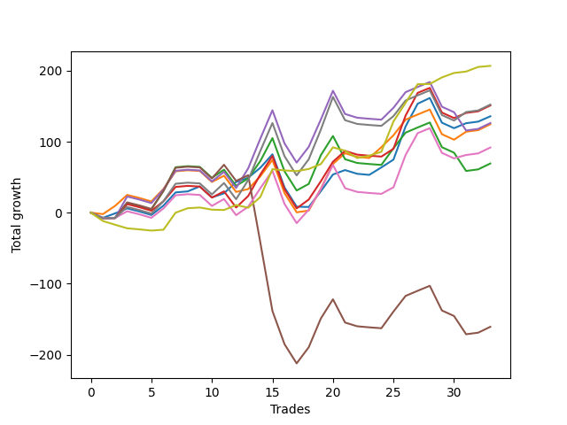

# Short Bulldog 005 
- Symbol: ES90d5m120m
- Date Range: 03/18/2022 - 07/08/2022
- Trading Period: 7:20-12:30
- Number of Trades: 33



| Name | Win Percent | Profit | Avg Profit / Trade |     | Name | Win Percent | Profit | Avg Profit / Trade |
| ---- | ----------- | ------ | ------------------ | --- | ---- | ----------- | ------ | ------------------ |
| Sorted By <br> Profit | | | | | Sorted By <br> Win Percentage ||||
| Seventy-Three | 63.64 | 103375.00 | 3132.58 |     | Zero | 66.67 | 67875.00 | 2056.82 |
| Seven | 57.58 | 76125.00 | 2306.82 |     | Seventy-Three | 63.64 | 103375.00 | 3132.58 |
| Three | 60.61 | 75500.00 | 2287.88 |     | One | 63.64 | 62250.00 | 1886.36 |
| Zero | 66.67 | 67875.00 | 2056.82 |     | Three | 60.61 | 75500.00 | 2287.88 |
| Four | 54.55 | 63125.00 | 1912.88 |     | Seven | 57.58 | 76125.00 | 2306.82 |
| One | 63.64 | 62250.00 | 1886.36 |     | Six | 57.58 | 45875.00 | 1390.15 |
| Six | 57.58 | 45875.00 | 1390.15 |     | Four | 54.55 | 63125.00 | 1912.88 |
| Two | 54.55 | 34625.00 | 1049.24 |     | Two | 54.55 | 34625.00 | 1049.24 |
| Five | 48.48 | -80375.00 | -2435.61 |     | Five | 48.48 | -80375.00 | -2435.61 |

## NO STOPLOSS

### Test Zero
* Sell when price hits the middle line of the 20p bollinger
* No Stoploss
* Results:
```
Total Trades: 33
Percent Up: 33.33
Percent Down: 66.67
Total Points Moved Down: 135.75
Potential Profit: 67875.00
Total Points Ups: 155.50 Count Ups: 11
Total Points Downs: 291.25 Count Downs: 22
```

<details><summary>Trades</summary>

<code>In: 2022-03-24 08:05:00		Out: 2022-03-24 09:17:15		Total Position Time: 72:15		Total Move Down: -7.25		Total to Date: -7.25</code> <br />
<code>In: 2022-03-24 08:30:00		Out: 2022-03-24 09:17:15		Total Position Time: 47:15		Total Move Down: 6.25		Total to Date: -1.00</code> <br />
<code>In: 2022-03-25 07:25:00		Out: 2022-03-25 08:01:45		Total Position Time: 36:45		Total Move Down: 7.00		Total to Date: 6.00</code> <br />
<code>In: 2022-03-28 12:00:00		Out: 2022-03-28 12:46:00		Total Position Time: 46:00		Total Move Down: -4.25		Total to Date: 1.75</code> <br />
<code>In: 2022-03-29 12:10:00		Out: 2022-03-29 12:46:00		Total Position Time: 36:00		Total Move Down: -5.00		Total to Date: -3.25</code> <br />
<code>In: 2022-04-06 10:50:00		Out: 2022-04-06 11:00:10		Total Position Time: 10:10		Total Move Down: 13.25		Total to Date: 10.00</code> <br />
<code>In: 2022-04-06 11:05:00		Out: 2022-04-06 11:08:10		Total Position Time: 03:10		Total Move Down: 18.50		Total to Date: 28.50</code> <br />
<code>In: 2022-04-07 12:15:00		Out: 2022-04-07 12:46:00		Total Position Time: 31:00		Total Move Down: 1.50		Total to Date: 30.00</code> <br />
<code>In: 2022-04-08 08:05:00		Out: 2022-04-08 09:13:40		Total Position Time: 68:40		Total Move Down: 7.00		Total to Date: 37.00</code> <br />
<code>In: 2022-04-13 08:05:00		Out: 2022-04-13 10:05:55		Total Position Time: 120:55		Total Move Down: -15.50		Total to Date: 21.50</code> <br />
<code>In: 2022-04-20 10:45:00		Out: 2022-04-20 11:13:25		Total Position Time: 28:25		Total Move Down: 5.75		Total to Date: 27.25</code> <br />
<code>In: 2022-04-25 11:35:00		Out: 2022-04-25 12:07:15		Total Position Time: 32:15		Total Move Down: 16.00		Total to Date: 43.25</code> <br />
<code>In: 2022-05-04 09:40:00		Out: 2022-05-04 10:37:25		Total Position Time: 57:25		Total Move Down: 6.00		Total to Date: 49.25</code> <br />
<code>In: 2022-05-04 11:05:00		Out: 2022-05-04 11:07:15		Total Position Time: 02:15		Total Move Down: 14.00		Total to Date: 63.25</code> <br />
<code>In: 2022-05-04 11:30:00		Out: 2022-05-04 11:31:10		Total Position Time: 01:10		Total Move Down: 19.00		Total to Date: 82.25</code> <br />
<code>In: 2022-05-04 11:55:00		Out: 2022-05-04 12:46:00		Total Position Time: 51:00		Total Move Down: -46.75		Total to Date: 35.50</code> <br />
<code>In: 2022-05-04 12:15:00		Out: 2022-05-04 12:46:00		Total Position Time: 31:00		Total Move Down: -27.00		Total to Date: 8.50</code> <br />
<code>In: 2022-05-16 10:35:00		Out: 2022-05-16 11:51:05		Total Position Time: 76:05		Total Move Down: -0.50		Total to Date: 8.00</code> <br />
<code>In: 2022-05-19 08:50:00		Out: 2022-05-19 09:21:05		Total Position Time: 31:05		Total Move Down: 22.25		Total to Date: 30.25</code> <br />
<code>In: 2022-05-19 12:05:00		Out: 2022-05-19 12:18:20		Total Position Time: 13:20		Total Move Down: 23.50		Total to Date: 53.75</code> <br />
<code>In: 2022-05-24 10:55:00		Out: 2022-05-24 11:48:35		Total Position Time: 53:35		Total Move Down: 6.25		Total to Date: 60.00</code> <br />
<code>In: 2022-05-25 11:35:00		Out: 2022-05-25 12:46:00		Total Position Time: 71:00		Total Move Down: -5.25		Total to Date: 54.75</code> <br />
<code>In: 2022-05-27 12:10:00		Out: 2022-05-27 12:46:00		Total Position Time: 36:00		Total Move Down: -1.50		Total to Date: 53.25</code> <br />
<code>In: 2022-05-31 09:05:00		Out: 2022-05-31 10:16:00		Total Position Time: 71:00		Total Move Down: 10.50		Total to Date: 63.75</code> <br />
<code>In: 2022-06-15 11:00:00		Out: 2022-06-15 11:01:15		Total Position Time: 01:15		Total Move Down: 11.00		Total to Date: 74.75</code> <br />
<code>In: 2022-06-15 11:45:00		Out: 2022-06-15 11:58:05		Total Position Time: 13:05		Total Move Down: 46.75		Total to Date: 121.50</code> <br />
<code>In: 2022-06-15 11:50:00		Out: 2022-06-15 11:58:05		Total Position Time: 08:05		Total Move Down: 32.00		Total to Date: 153.50</code> <br />
<code>In: 2022-06-21 12:05:00		Out: 2022-06-21 12:35:35		Total Position Time: 30:35		Total Move Down: 8.00		Total to Date: 161.50</code> <br />
<code>In: 2022-07-05 10:40:00		Out: 2022-07-05 12:40:55		Total Position Time: 120:55		Total Move Down: -34.75		Total to Date: 126.75</code> <br />
<code>In: 2022-07-05 11:40:00		Out: 2022-07-05 12:46:00		Total Position Time: 66:00		Total Move Down: -7.75		Total to Date: 119.00</code> <br />
<code>In: 2022-07-06 11:00:00		Out: 2022-07-06 11:02:25		Total Position Time: 02:25		Total Move Down: 7.00		Total to Date: 126.00</code> <br />
<code>In: 2022-07-06 11:45:00		Out: 2022-07-06 12:46:00		Total Position Time: 61:00		Total Move Down: 2.25		Total to Date: 128.25</code> <br />
<code>In: 2022-07-07 12:20:00		Out: 2022-07-07 12:38:25		Total Position Time: 18:25		Total Move Down: 7.50		Total to Date: 135.75</code> <br />


</details>

### Test One
* Sell when the price hits the upper line of the 20p 1std bollinger
* No Stoploss
* Results:
```
Total Trades: 33
Percent Up: 36.36
Percent Down: 63.64
Total Points Moved Down: 124.50
Potential Profit: 62250.00
Total Points Ups: 173.50 Count Ups: 12
Total Points Downs: 298.00 Count Downs: 21
```

<details><summary>Trades</summary>

<code>In: 2022-03-24 08:05:00		Out: 2022-03-24 09:33:55		Total Position Time: 88:55		Total Move Down: -2.00		Total to Date: -2.00</code> <br />
<code>In: 2022-03-24 08:30:00		Out: 2022-03-24 09:33:55		Total Position Time: 63:55		Total Move Down: 11.50		Total to Date: 9.50</code> <br />
<code>In: 2022-03-25 07:25:00		Out: 2022-03-25 08:09:20		Total Position Time: 44:20		Total Move Down: 15.50		Total to Date: 25.00</code> <br />
<code>In: 2022-03-28 12:00:00		Out: 2022-03-28 12:46:00		Total Position Time: 46:00		Total Move Down: -4.25		Total to Date: 20.75</code> <br />
<code>In: 2022-03-29 12:10:00		Out: 2022-03-29 12:46:00		Total Position Time: 36:00		Total Move Down: -5.00		Total to Date: 15.75</code> <br />
<code>In: 2022-04-06 10:50:00		Out: 2022-04-06 11:09:45		Total Position Time: 19:45		Total Move Down: 17.75		Total to Date: 33.50</code> <br />
<code>In: 2022-04-06 11:05:00		Out: 2022-04-06 11:09:45		Total Position Time: 04:45		Total Move Down: 24.75		Total to Date: 58.25</code> <br />
<code>In: 2022-04-07 12:15:00		Out: 2022-04-07 12:46:00		Total Position Time: 31:00		Total Move Down: 1.50		Total to Date: 59.75</code> <br />
<code>In: 2022-04-08 08:05:00		Out: 2022-04-08 10:05:55		Total Position Time: 120:55		Total Move Down: -1.00		Total to Date: 58.75</code> <br />
<code>In: 2022-04-13 08:05:00		Out: 2022-04-13 10:05:55		Total Position Time: 120:55		Total Move Down: -15.50		Total to Date: 43.25</code> <br />
<code>In: 2022-04-20 10:45:00		Out: 2022-04-20 11:17:15		Total Position Time: 32:15		Total Move Down: 8.75		Total to Date: 52.00</code> <br />
<code>In: 2022-04-25 11:35:00		Out: 2022-04-25 12:46:00		Total Position Time: 71:00		Total Move Down: -22.75		Total to Date: 29.25</code> <br />
<code>In: 2022-05-04 09:40:00		Out: 2022-05-04 11:07:20		Total Position Time: 87:20		Total Move Down: 4.00		Total to Date: 33.25</code> <br />
<code>In: 2022-05-04 11:05:00		Out: 2022-05-04 11:07:20		Total Position Time: 02:20		Total Move Down: 18.00		Total to Date: 51.25</code> <br />
<code>In: 2022-05-04 11:30:00		Out: 2022-05-04 11:31:20		Total Position Time: 01:20		Total Move Down: 23.00		Total to Date: 74.25</code> <br />
<code>In: 2022-05-04 11:55:00		Out: 2022-05-04 12:46:00		Total Position Time: 51:00		Total Move Down: -46.75		Total to Date: 27.50</code> <br />
<code>In: 2022-05-04 12:15:00		Out: 2022-05-04 12:46:00		Total Position Time: 31:00		Total Move Down: -27.00		Total to Date: 0.50</code> <br />
<code>In: 2022-05-16 10:35:00		Out: 2022-05-16 12:10:10		Total Position Time: 95:10		Total Move Down: 2.50		Total to Date: 3.00</code> <br />
<code>In: 2022-05-19 08:50:00		Out: 2022-05-19 09:40:30		Total Position Time: 50:30		Total Move Down: 30.75		Total to Date: 33.75</code> <br />
<code>In: 2022-05-19 12:05:00		Out: 2022-05-19 12:24:50		Total Position Time: 19:50		Total Move Down: 34.75		Total to Date: 68.50</code> <br />
<code>In: 2022-05-24 10:55:00		Out: 2022-05-24 11:55:10		Total Position Time: 60:10		Total Move Down: 15.25		Total to Date: 83.75</code> <br />
<code>In: 2022-05-25 11:35:00		Out: 2022-05-25 12:46:00		Total Position Time: 71:00		Total Move Down: -5.25		Total to Date: 78.50</code> <br />
<code>In: 2022-05-27 12:10:00		Out: 2022-05-27 12:46:00		Total Position Time: 36:00		Total Move Down: -1.50		Total to Date: 77.00</code> <br />
<code>In: 2022-05-31 09:05:00		Out: 2022-05-31 10:22:45		Total Position Time: 77:45		Total Move Down: 15.25		Total to Date: 92.25</code> <br />
<code>In: 2022-06-15 11:00:00		Out: 2022-06-15 11:01:25		Total Position Time: 01:25		Total Move Down: 16.75		Total to Date: 109.00</code> <br />
<code>In: 2022-06-15 11:45:00		Out: 2022-06-15 12:46:00		Total Position Time: 61:00		Total Move Down: 22.00		Total to Date: 131.00</code> <br />
<code>In: 2022-06-15 11:50:00		Out: 2022-06-15 12:46:00		Total Position Time: 56:00		Total Move Down: 7.25		Total to Date: 138.25</code> <br />
<code>In: 2022-06-21 12:05:00		Out: 2022-06-21 12:46:00		Total Position Time: 41:00		Total Move Down: 7.00		Total to Date: 145.25</code> <br />
<code>In: 2022-07-05 10:40:00		Out: 2022-07-05 12:40:55		Total Position Time: 120:55		Total Move Down: -34.75		Total to Date: 110.50</code> <br />
<code>In: 2022-07-05 11:40:00		Out: 2022-07-05 12:46:00		Total Position Time: 66:00		Total Move Down: -7.75		Total to Date: 102.75</code> <br />
<code>In: 2022-07-06 11:00:00		Out: 2022-07-06 11:12:15		Total Position Time: 12:15		Total Move Down: 11.25		Total to Date: 114.00</code> <br />
<code>In: 2022-07-06 11:45:00		Out: 2022-07-06 12:46:00		Total Position Time: 61:00		Total Move Down: 2.25		Total to Date: 116.25</code> <br />
<code>In: 2022-07-07 12:20:00		Out: 2022-07-07 12:46:00		Total Position Time: 26:00		Total Move Down: 8.25		Total to Date: 124.50</code> <br />


</details>

### Test Two
* Sell when the price hits the upper line of the 20p 2std bollinger
* No Stoploss
* Results:
```
Total Trades: 33
Percent Up: 45.45
Percent Down: 54.55
Total Points Moved Down: 69.25
Potential Profit: 34625.00
Total Points Ups: 239.00 Count Ups: 15
Total Points Downs: 308.25 Count Downs: 18
```

<details><summary>Trades</summary>

<code>In: 2022-03-24 08:05:00		Out: 2022-03-24 10:05:55		Total Position Time: 120:55		Total Move Down: -7.75		Total to Date: -7.75</code> <br />
<code>In: 2022-03-24 08:30:00		Out: 2022-03-24 10:30:55		Total Position Time: 120:55		Total Move Down: 0.25		Total to Date: -7.50</code> <br />
<code>In: 2022-03-25 07:25:00		Out: 2022-03-25 08:10:45		Total Position Time: 45:45		Total Move Down: 21.25		Total to Date: 13.75</code> <br />
<code>In: 2022-03-28 12:00:00		Out: 2022-03-28 12:46:00		Total Position Time: 46:00		Total Move Down: -4.25		Total to Date: 9.50</code> <br />
<code>In: 2022-03-29 12:10:00		Out: 2022-03-29 12:46:00		Total Position Time: 36:00		Total Move Down: -5.00		Total to Date: 4.50</code> <br />
<code>In: 2022-04-06 10:50:00		Out: 2022-04-06 11:15:15		Total Position Time: 25:15		Total Move Down: 26.25		Total to Date: 30.75</code> <br />
<code>In: 2022-04-06 11:05:00		Out: 2022-04-06 11:15:15		Total Position Time: 10:15		Total Move Down: 33.25		Total to Date: 64.00</code> <br />
<code>In: 2022-04-07 12:15:00		Out: 2022-04-07 12:46:00		Total Position Time: 31:00		Total Move Down: 1.50		Total to Date: 65.50</code> <br />
<code>In: 2022-04-08 08:05:00		Out: 2022-04-08 10:05:55		Total Position Time: 120:55		Total Move Down: -1.00		Total to Date: 64.50</code> <br />
<code>In: 2022-04-13 08:05:00		Out: 2022-04-13 10:05:55		Total Position Time: 120:55		Total Move Down: -15.50		Total to Date: 49.00</code> <br />
<code>In: 2022-04-20 10:45:00		Out: 2022-04-20 11:19:15		Total Position Time: 34:15		Total Move Down: 11.50		Total to Date: 60.50</code> <br />
<code>In: 2022-04-25 11:35:00		Out: 2022-04-25 12:46:00		Total Position Time: 71:00		Total Move Down: -22.75		Total to Date: 37.75</code> <br />
<code>In: 2022-05-04 09:40:00		Out: 2022-05-04 11:07:40		Total Position Time: 87:40		Total Move Down: 10.50		Total to Date: 48.25</code> <br />
<code>In: 2022-05-04 11:05:00		Out: 2022-05-04 11:07:40		Total Position Time: 02:40		Total Move Down: 24.50		Total to Date: 72.75</code> <br />
<code>In: 2022-05-04 11:30:00		Out: 2022-05-04 11:32:25		Total Position Time: 02:25		Total Move Down: 32.25		Total to Date: 105.00</code> <br />
<code>In: 2022-05-04 11:55:00		Out: 2022-05-04 12:46:00		Total Position Time: 51:00		Total Move Down: -46.75		Total to Date: 58.25</code> <br />
<code>In: 2022-05-04 12:15:00		Out: 2022-05-04 12:46:00		Total Position Time: 31:00		Total Move Down: -27.00		Total to Date: 31.25</code> <br />
<code>In: 2022-05-16 10:35:00		Out: 2022-05-16 12:14:20		Total Position Time: 99:20		Total Move Down: 9.25		Total to Date: 40.50</code> <br />
<code>In: 2022-05-19 08:50:00		Out: 2022-05-19 10:50:55		Total Position Time: 120:55		Total Move Down: 40.50		Total to Date: 81.00</code> <br />
<code>In: 2022-05-19 12:05:00		Out: 2022-05-19 12:46:00		Total Position Time: 41:00		Total Move Down: 27.00		Total to Date: 108.00</code> <br />
<code>In: 2022-05-24 10:55:00		Out: 2022-05-24 12:46:00		Total Position Time: 111:00		Total Move Down: -32.75		Total to Date: 75.25</code> <br />
<code>In: 2022-05-25 11:35:00		Out: 2022-05-25 12:46:00		Total Position Time: 71:00		Total Move Down: -5.25		Total to Date: 70.00</code> <br />
<code>In: 2022-05-27 12:10:00		Out: 2022-05-27 12:46:00		Total Position Time: 36:00		Total Move Down: -1.50		Total to Date: 68.50</code> <br />
<code>In: 2022-05-31 09:05:00		Out: 2022-05-31 11:05:55		Total Position Time: 120:55		Total Move Down: -1.25		Total to Date: 67.25</code> <br />
<code>In: 2022-06-15 11:00:00		Out: 2022-06-15 11:01:40		Total Position Time: 01:40		Total Move Down: 23.50		Total to Date: 90.75</code> <br />
<code>In: 2022-06-15 11:45:00		Out: 2022-06-15 12:46:00		Total Position Time: 61:00		Total Move Down: 22.00		Total to Date: 112.75</code> <br />
<code>In: 2022-06-15 11:50:00		Out: 2022-06-15 12:46:00		Total Position Time: 56:00		Total Move Down: 7.25		Total to Date: 120.00</code> <br />
<code>In: 2022-06-21 12:05:00		Out: 2022-06-21 12:46:00		Total Position Time: 41:00		Total Move Down: 7.00		Total to Date: 127.00</code> <br />
<code>In: 2022-07-05 10:40:00		Out: 2022-07-05 12:40:55		Total Position Time: 120:55		Total Move Down: -34.75		Total to Date: 92.25</code> <br />
<code>In: 2022-07-05 11:40:00		Out: 2022-07-05 12:46:00		Total Position Time: 66:00		Total Move Down: -7.75		Total to Date: 84.50</code> <br />
<code>In: 2022-07-06 11:00:00		Out: 2022-07-06 12:46:00		Total Position Time: 106:00		Total Move Down: -25.75		Total to Date: 58.75</code> <br />
<code>In: 2022-07-06 11:45:00		Out: 2022-07-06 12:46:00		Total Position Time: 61:00		Total Move Down: 2.25		Total to Date: 61.00</code> <br />
<code>In: 2022-07-07 12:20:00		Out: 2022-07-07 12:46:00		Total Position Time: 26:00		Total Move Down: 8.25		Total to Date: 69.25</code> <br />


</details>

### Test Three
* Sell when price hits the middle line of the 50p bollinger
* No Stoploss
* Results:
```
Total Trades: 33
Percent Up: 39.39
Percent Down: 60.61
Total Points Moved Down: 151.00
Potential Profit: 75500.00
Total Points Ups: 180.50 Count Ups: 13
Total Points Downs: 331.50 Count Downs: 20
```

<details><summary>Trades</summary>

<code>In: 2022-03-24 08:05:00		Out: 2022-03-24 10:05:55		Total Position Time: 120:55		Total Move Down: -7.75		Total to Date: -7.75</code> <br />
<code>In: 2022-03-24 08:30:00		Out: 2022-03-24 10:30:55		Total Position Time: 120:55		Total Move Down: 0.25		Total to Date: -7.50</code> <br />
<code>In: 2022-03-25 07:25:00		Out: 2022-03-25 08:10:15		Total Position Time: 45:15		Total Move Down: 19.50		Total to Date: 12.00</code> <br />
<code>In: 2022-03-28 12:00:00		Out: 2022-03-28 12:46:00		Total Position Time: 46:00		Total Move Down: -4.25		Total to Date: 7.75</code> <br />
<code>In: 2022-03-29 12:10:00		Out: 2022-03-29 12:46:00		Total Position Time: 36:00		Total Move Down: -5.00		Total to Date: 2.75</code> <br />
<code>In: 2022-04-06 10:50:00		Out: 2022-04-06 11:08:35		Total Position Time: 18:35		Total Move Down: 13.25		Total to Date: 16.00</code> <br />
<code>In: 2022-04-06 11:05:00		Out: 2022-04-06 11:08:35		Total Position Time: 03:35		Total Move Down: 20.25		Total to Date: 36.25</code> <br />
<code>In: 2022-04-07 12:15:00		Out: 2022-04-07 12:46:00		Total Position Time: 31:00		Total Move Down: 1.50		Total to Date: 37.75</code> <br />
<code>In: 2022-04-08 08:05:00		Out: 2022-04-08 10:05:55		Total Position Time: 120:55		Total Move Down: -1.00		Total to Date: 36.75</code> <br />
<code>In: 2022-04-13 08:05:00		Out: 2022-04-13 10:05:55		Total Position Time: 120:55		Total Move Down: -15.50		Total to Date: 21.25</code> <br />
<code>In: 2022-04-20 10:45:00		Out: 2022-04-20 11:17:15		Total Position Time: 32:15		Total Move Down: 8.75		Total to Date: 30.00</code> <br />
<code>In: 2022-04-25 11:35:00		Out: 2022-04-25 12:46:00		Total Position Time: 71:00		Total Move Down: -22.75		Total to Date: 7.25</code> <br />
<code>In: 2022-05-04 09:40:00		Out: 2022-05-04 11:20:50		Total Position Time: 100:50		Total Move Down: 16.25		Total to Date: 23.50</code> <br />
<code>In: 2022-05-04 11:05:00		Out: 2022-05-04 11:20:50		Total Position Time: 15:50		Total Move Down: 30.25		Total to Date: 53.75</code> <br />
<code>In: 2022-05-04 11:30:00		Out: 2022-05-04 11:31:40		Total Position Time: 01:40		Total Move Down: 26.00		Total to Date: 79.75</code> <br />
<code>In: 2022-05-04 11:55:00		Out: 2022-05-04 12:46:00		Total Position Time: 51:00		Total Move Down: -46.75		Total to Date: 33.00</code> <br />
<code>In: 2022-05-04 12:15:00		Out: 2022-05-04 12:46:00		Total Position Time: 31:00		Total Move Down: -27.00		Total to Date: 6.00</code> <br />
<code>In: 2022-05-16 10:35:00		Out: 2022-05-16 12:17:45		Total Position Time: 102:45		Total Move Down: 12.50		Total to Date: 18.50</code> <br />
<code>In: 2022-05-19 08:50:00		Out: 2022-05-19 09:37:05		Total Position Time: 47:05		Total Move Down: 25.75		Total to Date: 44.25</code> <br />
<code>In: 2022-05-19 12:05:00		Out: 2022-05-19 12:21:15		Total Position Time: 16:15		Total Move Down: 27.50		Total to Date: 71.75</code> <br />
<code>In: 2022-05-24 10:55:00		Out: 2022-05-24 11:55:10		Total Position Time: 60:10		Total Move Down: 15.25		Total to Date: 87.00</code> <br />
<code>In: 2022-05-25 11:35:00		Out: 2022-05-25 12:46:00		Total Position Time: 71:00		Total Move Down: -5.25		Total to Date: 81.75</code> <br />
<code>In: 2022-05-27 12:10:00		Out: 2022-05-27 12:46:00		Total Position Time: 36:00		Total Move Down: -1.50		Total to Date: 80.25</code> <br />
<code>In: 2022-05-31 09:05:00		Out: 2022-05-31 11:05:55		Total Position Time: 120:55		Total Move Down: -1.25		Total to Date: 79.00</code> <br />
<code>In: 2022-06-15 11:00:00		Out: 2022-06-15 11:01:15		Total Position Time: 01:15		Total Move Down: 11.00		Total to Date: 90.00</code> <br />
<code>In: 2022-06-15 11:45:00		Out: 2022-06-15 11:58:05		Total Position Time: 13:05		Total Move Down: 46.75		Total to Date: 136.75</code> <br />
<code>In: 2022-06-15 11:50:00		Out: 2022-06-15 11:58:05		Total Position Time: 08:05		Total Move Down: 32.00		Total to Date: 168.75</code> <br />
<code>In: 2022-06-21 12:05:00		Out: 2022-06-21 12:46:00		Total Position Time: 41:00		Total Move Down: 7.00		Total to Date: 175.75</code> <br />
<code>In: 2022-07-05 10:40:00		Out: 2022-07-05 12:40:55		Total Position Time: 120:55		Total Move Down: -34.75		Total to Date: 141.00</code> <br />
<code>In: 2022-07-05 11:40:00		Out: 2022-07-05 12:46:00		Total Position Time: 66:00		Total Move Down: -7.75		Total to Date: 133.25</code> <br />
<code>In: 2022-07-06 11:00:00		Out: 2022-07-06 11:11:50		Total Position Time: 11:50		Total Move Down: 7.25		Total to Date: 140.50</code> <br />
<code>In: 2022-07-06 11:45:00		Out: 2022-07-06 12:46:00		Total Position Time: 61:00		Total Move Down: 2.25		Total to Date: 142.75</code> <br />
<code>In: 2022-07-07 12:20:00		Out: 2022-07-07 12:46:00		Total Position Time: 26:00		Total Move Down: 8.25		Total to Date: 151.00</code> <br />


</details>

### Test Four
* Sell when the price hits the upper line of the 50p 1std bollinger
* No Stoploss
* Results:
```
Total Trades: 33
Percent Up: 45.45
Percent Down: 54.55
Total Points Moved Down: 126.25
Potential Profit: 63125.00
Total Points Ups: 239.00 Count Ups: 15
Total Points Downs: 365.25 Count Downs: 18
```

<details><summary>Trades</summary>

<code>In: 2022-03-24 08:05:00		Out: 2022-03-24 10:05:55		Total Position Time: 120:55		Total Move Down: -7.75		Total to Date: -7.75</code> <br />
<code>In: 2022-03-24 08:30:00		Out: 2022-03-24 10:30:55		Total Position Time: 120:55		Total Move Down: 0.25		Total to Date: -7.50</code> <br />
<code>In: 2022-03-25 07:25:00		Out: 2022-03-25 08:26:05		Total Position Time: 61:05		Total Move Down: 30.25		Total to Date: 22.75</code> <br />
<code>In: 2022-03-28 12:00:00		Out: 2022-03-28 12:46:00		Total Position Time: 46:00		Total Move Down: -4.25		Total to Date: 18.50</code> <br />
<code>In: 2022-03-29 12:10:00		Out: 2022-03-29 12:46:00		Total Position Time: 36:00		Total Move Down: -5.00		Total to Date: 13.50</code> <br />
<code>In: 2022-04-06 10:50:00		Out: 2022-04-06 11:11:20		Total Position Time: 21:20		Total Move Down: 19.25		Total to Date: 32.75</code> <br />
<code>In: 2022-04-06 11:05:00		Out: 2022-04-06 11:11:20		Total Position Time: 06:20		Total Move Down: 26.25		Total to Date: 59.00</code> <br />
<code>In: 2022-04-07 12:15:00		Out: 2022-04-07 12:46:00		Total Position Time: 31:00		Total Move Down: 1.50		Total to Date: 60.50</code> <br />
<code>In: 2022-04-08 08:05:00		Out: 2022-04-08 10:05:55		Total Position Time: 120:55		Total Move Down: -1.00		Total to Date: 59.50</code> <br />
<code>In: 2022-04-13 08:05:00		Out: 2022-04-13 10:05:55		Total Position Time: 120:55		Total Move Down: -15.50		Total to Date: 44.00</code> <br />
<code>In: 2022-04-20 10:45:00		Out: 2022-04-20 11:21:05		Total Position Time: 36:05		Total Move Down: 13.50		Total to Date: 57.50</code> <br />
<code>In: 2022-04-25 11:35:00		Out: 2022-04-25 12:46:00		Total Position Time: 71:00		Total Move Down: -22.75		Total to Date: 34.75</code> <br />
<code>In: 2022-05-04 09:40:00		Out: 2022-05-04 11:34:10		Total Position Time: 114:10		Total Move Down: 27.75		Total to Date: 62.50</code> <br />
<code>In: 2022-05-04 11:05:00		Out: 2022-05-04 11:34:10		Total Position Time: 29:10		Total Move Down: 41.75		Total to Date: 104.25</code> <br />
<code>In: 2022-05-04 11:30:00		Out: 2022-05-04 11:34:10		Total Position Time: 04:10		Total Move Down: 40.00		Total to Date: 144.25</code> <br />
<code>In: 2022-05-04 11:55:00		Out: 2022-05-04 12:46:00		Total Position Time: 51:00		Total Move Down: -46.75		Total to Date: 97.50</code> <br />
<code>In: 2022-05-04 12:15:00		Out: 2022-05-04 12:46:00		Total Position Time: 31:00		Total Move Down: -27.00		Total to Date: 70.50</code> <br />
<code>In: 2022-05-16 10:35:00		Out: 2022-05-16 12:35:20		Total Position Time: 120:20		Total Move Down: 22.25		Total to Date: 92.75</code> <br />
<code>In: 2022-05-19 08:50:00		Out: 2022-05-19 09:45:45		Total Position Time: 55:45		Total Move Down: 38.50		Total to Date: 131.25</code> <br />
<code>In: 2022-05-19 12:05:00		Out: 2022-05-19 12:30:05		Total Position Time: 25:05		Total Move Down: 40.50		Total to Date: 171.75</code> <br />
<code>In: 2022-05-24 10:55:00		Out: 2022-05-24 12:46:00		Total Position Time: 111:00		Total Move Down: -32.75		Total to Date: 139.00</code> <br />
<code>In: 2022-05-25 11:35:00		Out: 2022-05-25 12:46:00		Total Position Time: 71:00		Total Move Down: -5.25		Total to Date: 133.75</code> <br />
<code>In: 2022-05-27 12:10:00		Out: 2022-05-27 12:46:00		Total Position Time: 36:00		Total Move Down: -1.50		Total to Date: 132.25</code> <br />
<code>In: 2022-05-31 09:05:00		Out: 2022-05-31 11:05:55		Total Position Time: 120:55		Total Move Down: -1.25		Total to Date: 131.00</code> <br />
<code>In: 2022-06-15 11:00:00		Out: 2022-06-15 11:01:25		Total Position Time: 01:25		Total Move Down: 16.75		Total to Date: 147.75</code> <br />
<code>In: 2022-06-15 11:45:00		Out: 2022-06-15 12:46:00		Total Position Time: 61:00		Total Move Down: 22.00		Total to Date: 169.75</code> <br />
<code>In: 2022-06-15 11:50:00		Out: 2022-06-15 12:46:00		Total Position Time: 56:00		Total Move Down: 7.25		Total to Date: 177.00</code> <br />
<code>In: 2022-06-21 12:05:00		Out: 2022-06-21 12:46:00		Total Position Time: 41:00		Total Move Down: 7.00		Total to Date: 184.00</code> <br />
<code>In: 2022-07-05 10:40:00		Out: 2022-07-05 12:40:55		Total Position Time: 120:55		Total Move Down: -34.75		Total to Date: 149.25</code> <br />
<code>In: 2022-07-05 11:40:00		Out: 2022-07-05 12:46:00		Total Position Time: 66:00		Total Move Down: -7.75		Total to Date: 141.50</code> <br />
<code>In: 2022-07-06 11:00:00		Out: 2022-07-06 12:46:00		Total Position Time: 106:00		Total Move Down: -25.75		Total to Date: 115.75</code> <br />
<code>In: 2022-07-06 11:45:00		Out: 2022-07-06 12:46:00		Total Position Time: 61:00		Total Move Down: 2.25		Total to Date: 118.00</code> <br />
<code>In: 2022-07-07 12:20:00		Out: 2022-07-07 12:46:00		Total Position Time: 26:00		Total Move Down: 8.25		Total to Date: 126.25</code> <br />


</details>

### Test Five
* Sell when the price hits the upper line of the 50p 2std bollinger
* No Stoploss
* Results:
```
Total Trades: 33
Percent Up: 51.52
Percent Down: 48.48
Total Points Moved Down: -160.75
Potential Profit: -80375.00
Total Points Ups: 430.25 Count Ups: 17
Total Points Downs: 269.50 Count Downs: 16
```

<details><summary>Trades</summary>

<code>In: 2022-03-24 08:05:00		Out: 2022-03-24 10:05:55		Total Position Time: 120:55		Total Move Down: -7.75		Total to Date: -7.75</code> <br />
<code>In: 2022-03-24 08:30:00		Out: 2022-03-24 10:30:55		Total Position Time: 120:55		Total Move Down: 0.25		Total to Date: -7.50</code> <br />
<code>In: 2022-03-25 07:25:00		Out: 2022-03-25 09:25:55		Total Position Time: 120:55		Total Move Down: 22.00		Total to Date: 14.50</code> <br />
<code>In: 2022-03-28 12:00:00		Out: 2022-03-28 12:46:00		Total Position Time: 46:00		Total Move Down: -4.25		Total to Date: 10.25</code> <br />
<code>In: 2022-03-29 12:10:00		Out: 2022-03-29 12:46:00		Total Position Time: 36:00		Total Move Down: -5.00		Total to Date: 5.25</code> <br />
<code>In: 2022-04-06 10:50:00		Out: 2022-04-06 11:15:05		Total Position Time: 25:05		Total Move Down: 25.50		Total to Date: 30.75</code> <br />
<code>In: 2022-04-06 11:05:00		Out: 2022-04-06 11:15:05		Total Position Time: 10:05		Total Move Down: 32.50		Total to Date: 63.25</code> <br />
<code>In: 2022-04-07 12:15:00		Out: 2022-04-07 12:46:00		Total Position Time: 31:00		Total Move Down: 1.50		Total to Date: 64.75</code> <br />
<code>In: 2022-04-08 08:05:00		Out: 2022-04-08 10:05:55		Total Position Time: 120:55		Total Move Down: -1.00		Total to Date: 63.75</code> <br />
<code>In: 2022-04-13 08:05:00		Out: 2022-04-13 10:05:55		Total Position Time: 120:55		Total Move Down: -15.50		Total to Date: 48.25</code> <br />
<code>In: 2022-04-20 10:45:00		Out: 2022-04-20 11:35:45		Total Position Time: 50:45		Total Move Down: 19.25		Total to Date: 67.50</code> <br />
<code>In: 2022-04-25 11:35:00		Out: 2022-04-25 12:46:00		Total Position Time: 71:00		Total Move Down: -22.75		Total to Date: 44.75</code> <br />
<code>In: 2022-05-04 09:40:00		Out: 2022-05-04 11:40:55		Total Position Time: 120:55		Total Move Down: 8.00		Total to Date: 52.75</code> <br />
<code>In: 2022-05-04 11:05:00		Out: 2022-05-04 12:46:00		Total Position Time: 101:00		Total Move Down: -94.75		Total to Date: -42.00</code> <br />
<code>In: 2022-05-04 11:30:00		Out: 2022-05-04 12:46:00		Total Position Time: 76:00		Total Move Down: -96.50		Total to Date: -138.50</code> <br />
<code>In: 2022-05-04 11:55:00		Out: 2022-05-04 12:46:00		Total Position Time: 51:00		Total Move Down: -46.75		Total to Date: -185.25</code> <br />
<code>In: 2022-05-04 12:15:00		Out: 2022-05-04 12:46:00		Total Position Time: 31:00		Total Move Down: -27.00		Total to Date: -212.25</code> <br />
<code>In: 2022-05-16 10:35:00		Out: 2022-05-16 12:35:55		Total Position Time: 120:55		Total Move Down: 22.75		Total to Date: -189.50</code> <br />
<code>In: 2022-05-19 08:50:00		Out: 2022-05-19 10:50:55		Total Position Time: 120:55		Total Move Down: 40.50		Total to Date: -149.00</code> <br />
<code>In: 2022-05-19 12:05:00		Out: 2022-05-19 12:46:00		Total Position Time: 41:00		Total Move Down: 27.00		Total to Date: -122.00</code> <br />
<code>In: 2022-05-24 10:55:00		Out: 2022-05-24 12:46:00		Total Position Time: 111:00		Total Move Down: -32.75		Total to Date: -154.75</code> <br />
<code>In: 2022-05-25 11:35:00		Out: 2022-05-25 12:46:00		Total Position Time: 71:00		Total Move Down: -5.25		Total to Date: -160.00</code> <br />
<code>In: 2022-05-27 12:10:00		Out: 2022-05-27 12:46:00		Total Position Time: 36:00		Total Move Down: -1.50		Total to Date: -161.50</code> <br />
<code>In: 2022-05-31 09:05:00		Out: 2022-05-31 11:05:55		Total Position Time: 120:55		Total Move Down: -1.25		Total to Date: -162.75</code> <br />
<code>In: 2022-06-15 11:00:00		Out: 2022-06-15 11:01:40		Total Position Time: 01:40		Total Move Down: 23.50		Total to Date: -139.25</code> <br />
<code>In: 2022-06-15 11:45:00		Out: 2022-06-15 12:46:00		Total Position Time: 61:00		Total Move Down: 22.00		Total to Date: -117.25</code> <br />
<code>In: 2022-06-15 11:50:00		Out: 2022-06-15 12:46:00		Total Position Time: 56:00		Total Move Down: 7.25		Total to Date: -110.00</code> <br />
<code>In: 2022-06-21 12:05:00		Out: 2022-06-21 12:46:00		Total Position Time: 41:00		Total Move Down: 7.00		Total to Date: -103.00</code> <br />
<code>In: 2022-07-05 10:40:00		Out: 2022-07-05 12:40:55		Total Position Time: 120:55		Total Move Down: -34.75		Total to Date: -137.75</code> <br />
<code>In: 2022-07-05 11:40:00		Out: 2022-07-05 12:46:00		Total Position Time: 66:00		Total Move Down: -7.75		Total to Date: -145.50</code> <br />
<code>In: 2022-07-06 11:00:00		Out: 2022-07-06 12:46:00		Total Position Time: 106:00		Total Move Down: -25.75		Total to Date: -171.25</code> <br />
<code>In: 2022-07-06 11:45:00		Out: 2022-07-06 12:46:00		Total Position Time: 61:00		Total Move Down: 2.25		Total to Date: -169.00</code> <br />
<code>In: 2022-07-07 12:20:00		Out: 2022-07-07 12:46:00		Total Position Time: 26:00		Total Move Down: 8.25		Total to Date: -160.75</code> <br />


</details>

### Test Six
* Sell when the price hits the middle line of the 1std VWAP
* No Stoploss
* Results:
```
Total Trades: 33
Percent Up: 42.42
Percent Down: 57.58
Total Points Moved Down: 91.75
Potential Profit: 45875.00
Total Points Ups: 213.25 Count Ups: 14
Total Points Downs: 305.00 Count Downs: 19
```

<details><summary>Trades</summary>

<code>In: 2022-03-24 08:05:00		Out: 2022-03-24 10:05:55		Total Position Time: 120:55		Total Move Down: -7.75		Total to Date: -7.75</code> <br />
<code>In: 2022-03-24 08:30:00		Out: 2022-03-24 10:30:55		Total Position Time: 120:55		Total Move Down: 0.25		Total to Date: -7.50</code> <br />
<code>In: 2022-03-25 07:25:00		Out: 2022-03-25 08:08:15		Total Position Time: 43:15		Total Move Down: 9.50		Total to Date: 2.00</code> <br />
<code>In: 2022-03-28 12:00:00		Out: 2022-03-28 12:46:00		Total Position Time: 46:00		Total Move Down: -4.25		Total to Date: -2.25</code> <br />
<code>In: 2022-03-29 12:10:00		Out: 2022-03-29 12:46:00		Total Position Time: 36:00		Total Move Down: -5.00		Total to Date: -7.25</code> <br />
<code>In: 2022-04-06 10:50:00		Out: 2022-04-06 11:00:10		Total Position Time: 10:10		Total Move Down: 13.25		Total to Date: 6.00</code> <br />
<code>In: 2022-04-06 11:05:00		Out: 2022-04-06 11:08:10		Total Position Time: 03:10		Total Move Down: 18.50		Total to Date: 24.50</code> <br />
<code>In: 2022-04-07 12:15:00		Out: 2022-04-07 12:46:00		Total Position Time: 31:00		Total Move Down: 1.50		Total to Date: 26.00</code> <br />
<code>In: 2022-04-08 08:05:00		Out: 2022-04-08 10:05:55		Total Position Time: 120:55		Total Move Down: -1.00		Total to Date: 25.00</code> <br />
<code>In: 2022-04-13 08:05:00		Out: 2022-04-13 10:05:55		Total Position Time: 120:55		Total Move Down: -15.50		Total to Date: 9.50</code> <br />
<code>In: 2022-04-20 10:45:00		Out: 2022-04-20 11:18:20		Total Position Time: 33:20		Total Move Down: 9.75		Total to Date: 19.25</code> <br />
<code>In: 2022-04-25 11:35:00		Out: 2022-04-25 12:46:00		Total Position Time: 71:00		Total Move Down: -22.75		Total to Date: -3.50</code> <br />
<code>In: 2022-05-04 09:40:00		Out: 2022-05-04 11:20:20		Total Position Time: 100:20		Total Move Down: 12.00		Total to Date: 8.50</code> <br />
<code>In: 2022-05-04 11:05:00		Out: 2022-05-04 11:20:20		Total Position Time: 15:20		Total Move Down: 26.00		Total to Date: 34.50</code> <br />
<code>In: 2022-05-04 11:30:00		Out: 2022-05-04 11:31:25		Total Position Time: 01:25		Total Move Down: 24.50		Total to Date: 59.00</code> <br />
<code>In: 2022-05-04 11:55:00		Out: 2022-05-04 12:46:00		Total Position Time: 51:00		Total Move Down: -46.75		Total to Date: 12.25</code> <br />
<code>In: 2022-05-04 12:15:00		Out: 2022-05-04 12:46:00		Total Position Time: 31:00		Total Move Down: -27.00		Total to Date: -14.75</code> <br />
<code>In: 2022-05-16 10:35:00		Out: 2022-05-16 12:34:05		Total Position Time: 119:05		Total Move Down: 19.00		Total to Date: 4.25</code> <br />
<code>In: 2022-05-19 08:50:00		Out: 2022-05-19 09:39:15		Total Position Time: 49:15		Total Move Down: 29.00		Total to Date: 33.25</code> <br />
<code>In: 2022-05-19 12:05:00		Out: 2022-05-19 12:24:45		Total Position Time: 19:45		Total Move Down: 34.00		Total to Date: 67.25</code> <br />
<code>In: 2022-05-24 10:55:00		Out: 2022-05-24 12:46:00		Total Position Time: 111:00		Total Move Down: -32.75		Total to Date: 34.50</code> <br />
<code>In: 2022-05-25 11:35:00		Out: 2022-05-25 12:46:00		Total Position Time: 71:00		Total Move Down: -5.25		Total to Date: 29.25</code> <br />
<code>In: 2022-05-27 12:10:00		Out: 2022-05-27 12:46:00		Total Position Time: 36:00		Total Move Down: -1.50		Total to Date: 27.75</code> <br />
<code>In: 2022-05-31 09:05:00		Out: 2022-05-31 11:05:55		Total Position Time: 120:55		Total Move Down: -1.25		Total to Date: 26.50</code> <br />
<code>In: 2022-06-15 11:00:00		Out: 2022-06-15 11:01:10		Total Position Time: 01:10		Total Move Down: 9.25		Total to Date: 35.75</code> <br />
<code>In: 2022-06-15 11:45:00		Out: 2022-06-15 11:57:55		Total Position Time: 12:55		Total Move Down: 45.50		Total to Date: 81.25</code> <br />
<code>In: 2022-06-15 11:50:00		Out: 2022-06-15 11:57:55		Total Position Time: 07:55		Total Move Down: 30.75		Total to Date: 112.00</code> <br />
<code>In: 2022-06-21 12:05:00		Out: 2022-06-21 12:46:00		Total Position Time: 41:00		Total Move Down: 7.00		Total to Date: 119.00</code> <br />
<code>In: 2022-07-05 10:40:00		Out: 2022-07-05 12:40:55		Total Position Time: 120:55		Total Move Down: -34.75		Total to Date: 84.25</code> <br />
<code>In: 2022-07-05 11:40:00		Out: 2022-07-05 12:46:00		Total Position Time: 66:00		Total Move Down: -7.75		Total to Date: 76.50</code> <br />
<code>In: 2022-07-06 11:00:00		Out: 2022-07-06 11:01:15		Total Position Time: 01:15		Total Move Down: 4.75		Total to Date: 81.25</code> <br />
<code>In: 2022-07-06 11:45:00		Out: 2022-07-06 12:46:00		Total Position Time: 61:00		Total Move Down: 2.25		Total to Date: 83.50</code> <br />
<code>In: 2022-07-07 12:20:00		Out: 2022-07-07 12:46:00		Total Position Time: 26:00		Total Move Down: 8.25		Total to Date: 91.75</code> <br />


</details>

### Test Seven
* Sell when the price hits the upper line of the 1std VWAP
* No Stoploss
* Results:
```
Total Trades: 33
Percent Up: 42.42
Percent Down: 57.58
Total Points Moved Down: 152.25
Potential Profit: 76125.00
Total Points Ups: 213.25 Count Ups: 14
Total Points Downs: 365.50 Count Downs: 19
```

<details><summary>Trades</summary>

<code>In: 2022-03-24 08:05:00		Out: 2022-03-24 10:05:55		Total Position Time: 120:55		Total Move Down: -7.75		Total to Date: -7.75</code> <br />
<code>In: 2022-03-24 08:30:00		Out: 2022-03-24 10:30:55		Total Position Time: 120:55		Total Move Down: 0.25		Total to Date: -7.50</code> <br />
<code>In: 2022-03-25 07:25:00		Out: 2022-03-25 08:09:20		Total Position Time: 44:20		Total Move Down: 15.50		Total to Date: 8.00</code> <br />
<code>In: 2022-03-28 12:00:00		Out: 2022-03-28 12:46:00		Total Position Time: 46:00		Total Move Down: -4.25		Total to Date: 3.75</code> <br />
<code>In: 2022-03-29 12:10:00		Out: 2022-03-29 12:46:00		Total Position Time: 36:00		Total Move Down: -5.00		Total to Date: -1.25</code> <br />
<code>In: 2022-04-06 10:50:00		Out: 2022-04-06 11:09:40		Total Position Time: 19:40		Total Move Down: 17.50		Total to Date: 16.25</code> <br />
<code>In: 2022-04-06 11:05:00		Out: 2022-04-06 11:09:40		Total Position Time: 04:40		Total Move Down: 24.50		Total to Date: 40.75</code> <br />
<code>In: 2022-04-07 12:15:00		Out: 2022-04-07 12:46:00		Total Position Time: 31:00		Total Move Down: 1.50		Total to Date: 42.25</code> <br />
<code>In: 2022-04-08 08:05:00		Out: 2022-04-08 10:05:55		Total Position Time: 120:55		Total Move Down: -1.00		Total to Date: 41.25</code> <br />
<code>In: 2022-04-13 08:05:00		Out: 2022-04-13 10:05:55		Total Position Time: 120:55		Total Move Down: -15.50		Total to Date: 25.75</code> <br />
<code>In: 2022-04-20 10:45:00		Out: 2022-04-20 11:30:15		Total Position Time: 45:15		Total Move Down: 16.00		Total to Date: 41.75</code> <br />
<code>In: 2022-04-25 11:35:00		Out: 2022-04-25 12:46:00		Total Position Time: 71:00		Total Move Down: -22.75		Total to Date: 19.00</code> <br />
<code>In: 2022-05-04 09:40:00		Out: 2022-05-04 11:34:05		Total Position Time: 114:05		Total Move Down: 27.00		Total to Date: 46.00</code> <br />
<code>In: 2022-05-04 11:05:00		Out: 2022-05-04 11:34:05		Total Position Time: 29:05		Total Move Down: 41.00		Total to Date: 87.00</code> <br />
<code>In: 2022-05-04 11:30:00		Out: 2022-05-04 11:34:05		Total Position Time: 04:05		Total Move Down: 39.25		Total to Date: 126.25</code> <br />
<code>In: 2022-05-04 11:55:00		Out: 2022-05-04 12:46:00		Total Position Time: 51:00		Total Move Down: -46.75		Total to Date: 79.50</code> <br />
<code>In: 2022-05-04 12:15:00		Out: 2022-05-04 12:46:00		Total Position Time: 31:00		Total Move Down: -27.00		Total to Date: 52.50</code> <br />
<code>In: 2022-05-16 10:35:00		Out: 2022-05-16 12:35:55		Total Position Time: 120:55		Total Move Down: 22.75		Total to Date: 75.25</code> <br />
<code>In: 2022-05-19 08:50:00		Out: 2022-05-19 09:55:15		Total Position Time: 65:15		Total Move Down: 41.75		Total to Date: 117.00</code> <br />
<code>In: 2022-05-19 12:05:00		Out: 2022-05-19 12:42:25		Total Position Time: 37:25		Total Move Down: 46.00		Total to Date: 163.00</code> <br />
<code>In: 2022-05-24 10:55:00		Out: 2022-05-24 12:46:00		Total Position Time: 111:00		Total Move Down: -32.75		Total to Date: 130.25</code> <br />
<code>In: 2022-05-25 11:35:00		Out: 2022-05-25 12:46:00		Total Position Time: 71:00		Total Move Down: -5.25		Total to Date: 125.00</code> <br />
<code>In: 2022-05-27 12:10:00		Out: 2022-05-27 12:46:00		Total Position Time: 36:00		Total Move Down: -1.50		Total to Date: 123.50</code> <br />
<code>In: 2022-05-31 09:05:00		Out: 2022-05-31 11:05:55		Total Position Time: 120:55		Total Move Down: -1.25		Total to Date: 122.25</code> <br />
<code>In: 2022-06-15 11:00:00		Out: 2022-06-15 11:01:20		Total Position Time: 01:20		Total Move Down: 13.75		Total to Date: 136.00</code> <br />
<code>In: 2022-06-15 11:45:00		Out: 2022-06-15 12:46:00		Total Position Time: 61:00		Total Move Down: 22.00		Total to Date: 158.00</code> <br />
<code>In: 2022-06-15 11:50:00		Out: 2022-06-15 12:46:00		Total Position Time: 56:00		Total Move Down: 7.25		Total to Date: 165.25</code> <br />
<code>In: 2022-06-21 12:05:00		Out: 2022-06-21 12:46:00		Total Position Time: 41:00		Total Move Down: 7.00		Total to Date: 172.25</code> <br />
<code>In: 2022-07-05 10:40:00		Out: 2022-07-05 12:40:55		Total Position Time: 120:55		Total Move Down: -34.75		Total to Date: 137.50</code> <br />
<code>In: 2022-07-05 11:40:00		Out: 2022-07-05 12:46:00		Total Position Time: 66:00		Total Move Down: -7.75		Total to Date: 129.75</code> <br />
<code>In: 2022-07-06 11:00:00		Out: 2022-07-06 11:12:25		Total Position Time: 12:25		Total Move Down: 12.00		Total to Date: 141.75</code> <br />
<code>In: 2022-07-06 11:45:00		Out: 2022-07-06 12:46:00		Total Position Time: 61:00		Total Move Down: 2.25		Total to Date: 144.00</code> <br />
<code>In: 2022-07-07 12:20:00		Out: 2022-07-07 12:46:00		Total Position Time: 26:00		Total Move Down: 8.25		Total to Date: 152.25</code> <br />


</details>

## SPECIAL EXIT CONDITIONS 

### Test Seventy-Three
* Sell when the linear regression slope changes to negative
* No Stoploss
* Results:
```
Total Trades: 33
Percent Up: 36.36
Percent Down: 63.64
Total Points Moved Down: 206.75
Potential Profit: 103375.00
Total Points Ups: 50.25 Count Ups: 12
Total Points Downs: 257.00 Count Downs: 21
```

<details><summary>Trades</summary>

<code>In: 2022-03-24 08:05:00		Out: 2022-03-24 08:28:05		Total Position Time: 23:05		Total Move Down: -11.75		Total to Date: -11.75</code> <br />
<code>In: 2022-03-24 08:30:00		Out: 2022-03-24 08:48:05		Total Position Time: 18:05		Total Move Down: -5.25		Total to Date: -17.00</code> <br />
<code>In: 2022-03-25 07:25:00		Out: 2022-03-25 07:44:05		Total Position Time: 19:05		Total Move Down: -5.00		Total to Date: -22.00</code> <br />
<code>In: 2022-03-28 12:00:00		Out: 2022-03-28 12:26:05		Total Position Time: 26:05		Total Move Down: -1.50		Total to Date: -23.50</code> <br />
<code>In: 2022-03-29 12:10:00		Out: 2022-03-29 12:21:05		Total Position Time: 11:05		Total Move Down: -1.75		Total to Date: -25.25</code> <br />
<code>In: 2022-04-06 10:50:00		Out: 2022-04-06 10:54:05		Total Position Time: 04:05		Total Move Down: 1.25		Total to Date: -24.00</code> <br />
<code>In: 2022-04-06 11:05:00		Out: 2022-04-06 11:12:05		Total Position Time: 07:05		Total Move Down: 24.00		Total to Date: 0.00</code> <br />
<code>In: 2022-04-07 12:15:00		Out: 2022-04-07 12:20:05		Total Position Time: 05:05		Total Move Down: 6.25		Total to Date: 6.25</code> <br />
<code>In: 2022-04-08 08:05:00		Out: 2022-04-08 08:12:05		Total Position Time: 07:05		Total Move Down: 1.00		Total to Date: 7.25</code> <br />
<code>In: 2022-04-13 08:05:00		Out: 2022-04-13 08:22:05		Total Position Time: 17:05		Total Move Down: -3.00		Total to Date: 4.25</code> <br />
<code>In: 2022-04-20 10:45:00		Out: 2022-04-20 10:49:05		Total Position Time: 04:05		Total Move Down: -0.50		Total to Date: 3.75</code> <br />
<code>In: 2022-04-25 11:35:00		Out: 2022-04-25 11:45:05		Total Position Time: 10:05		Total Move Down: 7.00		Total to Date: 10.75</code> <br />
<code>In: 2022-05-04 09:40:00		Out: 2022-05-04 09:57:05		Total Position Time: 17:05		Total Move Down: -3.75		Total to Date: 7.00</code> <br />
<code>In: 2022-05-04 11:05:00		Out: 2022-05-04 11:11:05		Total Position Time: 06:05		Total Move Down: 15.00		Total to Date: 22.00</code> <br />
<code>In: 2022-05-04 11:30:00		Out: 2022-05-04 11:34:05		Total Position Time: 04:05		Total Move Down: 39.25		Total to Date: 61.25</code> <br />
<code>In: 2022-05-04 11:55:00		Out: 2022-05-04 12:07:05		Total Position Time: 12:05		Total Move Down: -1.75		Total to Date: 59.50</code> <br />
<code>In: 2022-05-04 12:15:00		Out: 2022-05-04 12:23:05		Total Position Time: 08:05		Total Move Down: -1.00		Total to Date: 58.50</code> <br />
<code>In: 2022-05-16 10:35:00		Out: 2022-05-16 10:46:05		Total Position Time: 11:05		Total Move Down: 3.00		Total to Date: 61.50</code> <br />
<code>In: 2022-05-19 08:50:00		Out: 2022-05-19 09:09:05		Total Position Time: 19:05		Total Move Down: 7.00		Total to Date: 68.50</code> <br />
<code>In: 2022-05-19 12:05:00		Out: 2022-05-19 12:20:05		Total Position Time: 15:05		Total Move Down: 23.50		Total to Date: 92.00</code> <br />
<code>In: 2022-05-24 10:55:00		Out: 2022-05-24 11:10:05		Total Position Time: 15:05		Total Move Down: -4.75		Total to Date: 87.25</code> <br />
<code>In: 2022-05-25 11:35:00		Out: 2022-05-25 12:01:05		Total Position Time: 26:05		Total Move Down: -10.25		Total to Date: 77.00</code> <br />
<code>In: 2022-05-27 12:10:00		Out: 2022-05-27 12:18:05		Total Position Time: 08:05		Total Move Down: 3.25		Total to Date: 80.25</code> <br />
<code>In: 2022-05-31 09:05:00		Out: 2022-05-31 09:11:05		Total Position Time: 06:05		Total Move Down: 5.50		Total to Date: 85.75</code> <br />
<code>In: 2022-06-15 11:00:00		Out: 2022-06-15 11:09:05		Total Position Time: 09:05		Total Move Down: 42.75		Total to Date: 128.50</code> <br />
<code>In: 2022-06-15 11:45:00		Out: 2022-06-15 12:09:05		Total Position Time: 24:05		Total Move Down: 26.25		Total to Date: 154.75</code> <br />
<code>In: 2022-06-15 11:50:00		Out: 2022-06-15 12:13:05		Total Position Time: 23:05		Total Move Down: 26.25		Total to Date: 181.00</code> <br />
<code>In: 2022-06-21 12:05:00		Out: 2022-06-21 12:22:05		Total Position Time: 17:05		Total Move Down: 0.25		Total to Date: 181.25</code> <br />
<code>In: 2022-07-05 10:40:00		Out: 2022-07-05 10:48:05		Total Position Time: 08:05		Total Move Down: 9.25		Total to Date: 190.50</code> <br />
<code>In: 2022-07-05 11:40:00		Out: 2022-07-05 11:50:05		Total Position Time: 10:05		Total Move Down: 6.25		Total to Date: 196.75</code> <br />
<code>In: 2022-07-06 11:00:00		Out: 2022-07-06 11:03:05		Total Position Time: 03:05		Total Move Down: 2.00		Total to Date: 198.75</code> <br />
<code>In: 2022-07-06 11:45:00		Out: 2022-07-06 12:08:05		Total Position Time: 23:05		Total Move Down: 6.50		Total to Date: 205.25</code> <br />
<code>In: 2022-07-07 12:20:00		Out: 2022-07-07 12:24:05		Total Position Time: 04:05		Total Move Down: 1.50		Total to Date: 206.75</code> <br />


</details>