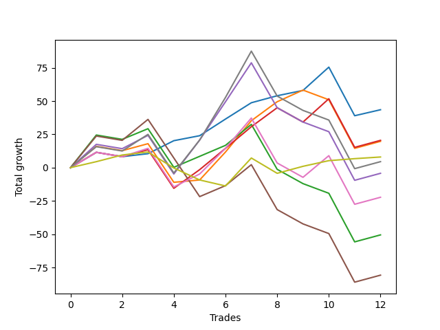

# Short Bulldog 006 
- Symbol: ES90d5m120m
- Date Range: 03/18/2022 - 07/08/2022
- Trading Period: 7:20-12:30
- Number of Trades: 12



| Name | Win Percent | Profit | Avg Profit / Trade |     | Name | Win Percent | Profit | Avg Profit / Trade |
| ---- | ----------- | ------ | ------------------ | --- | ---- | ----------- | ------ | ------------------ |
| Sorted By <br> Profit | | | | | Sorted By <br> Win Percentage ||||
| Zero | 83.33 | 21750.00 | 1812.50 |     | Zero | 83.33 | 21750.00 | 1812.50 |
| Three | 66.67 | 10250.00 | 854.17 |     | Three | 66.67 | 10250.00 | 854.17 |
| One | 66.67 | 9875.00 | 822.92 |     | One | 66.67 | 9875.00 | 822.92 |
| Seventy-Three | 66.67 | 4000.00 | 333.33 |     | Seventy-Three | 66.67 | 4000.00 | 333.33 |
| Seven | 50.00 | 2250.00 | 187.50 |     | Six | 58.33 | -11125.00 | -927.08 |
| Four | 50.00 | -2125.00 | -177.08 |     | Seven | 50.00 | 2250.00 | 187.50 |
| Six | 58.33 | -11125.00 | -927.08 |     | Four | 50.00 | -2125.00 | -177.08 |
| Two | 50.00 | -25250.00 | -2104.17 |     | Two | 50.00 | -25250.00 | -2104.17 |
| Five | 41.67 | -40375.00 | -3364.58 |     | Five | 41.67 | -40375.00 | -3364.58 |

## NO STOPLOSS

### Test Zero
* Sell when price hits the middle line of the 20p bollinger
* No Stoploss
* Results:
```
Total Trades: 12
Percent Up: 16.67
Percent Down: 83.33
Total Points Moved Down: 43.50
Potential Profit: 21750.00
Total Points Ups: 39.75 Count Ups: 2
Total Points Downs: 83.25 Count Downs: 10
```

<details><summary>Trades</summary>

<code>In: 2022-04-06 10:55:00		Out: 2022-04-06 11:00:10		Total Position Time: 05:10		Total Move Down: 11.50		Total to Date: 11.50</code> <br />
<code>In: 2022-04-07 12:20:00		Out: 2022-04-07 12:46:00		Total Position Time: 26:00		Total Move Down: -3.25		Total to Date: 8.25</code> <br />
<code>In: 2022-04-20 10:50:00		Out: 2022-04-20 11:13:25		Total Position Time: 23:25		Total Move Down: 2.25		Total to Date: 10.50</code> <br />
<code>In: 2022-04-25 11:40:00		Out: 2022-04-25 12:07:15		Total Position Time: 27:15		Total Move Down: 9.75		Total to Date: 20.25</code> <br />
<code>In: 2022-05-04 09:45:00		Out: 2022-05-04 10:37:25		Total Position Time: 52:25		Total Move Down: 3.75		Total to Date: 24.00</code> <br />
<code>In: 2022-05-19 08:55:00		Out: 2022-05-19 09:21:05		Total Position Time: 26:05		Total Move Down: 12.50		Total to Date: 36.50</code> <br />
<code>In: 2022-05-19 12:10:00		Out: 2022-05-19 12:18:20		Total Position Time: 08:20		Total Move Down: 12.25		Total to Date: 48.75</code> <br />
<code>In: 2022-05-24 11:00:00		Out: 2022-05-24 11:48:35		Total Position Time: 48:35		Total Move Down: 5.25		Total to Date: 54.00</code> <br />
<code>In: 2022-05-31 09:10:00		Out: 2022-05-31 10:16:00		Total Position Time: 66:00		Total Move Down: 4.00		Total to Date: 58.00</code> <br />
<code>In: 2022-06-15 11:55:00		Out: 2022-06-15 11:58:05		Total Position Time: 03:05		Total Move Down: 17.50		Total to Date: 75.50</code> <br />
<code>In: 2022-07-05 10:45:00		Out: 2022-07-05 12:45:55		Total Position Time: 120:55		Total Move Down: -36.50		Total to Date: 39.00</code> <br />
<code>In: 2022-07-07 12:25:00		Out: 2022-07-07 12:38:25		Total Position Time: 13:25		Total Move Down: 4.50		Total to Date: 43.50</code> <br />


</details>

### Test One
* Sell when the price hits the upper line of the 20p 1std bollinger
* No Stoploss
* Results:
```
Total Trades: 12
Percent Up: 33.33
Percent Down: 66.67
Total Points Moved Down: 19.75
Potential Profit: 9875.00
Total Points Ups: 76.00 Count Ups: 4
Total Points Downs: 95.75 Count Downs: 8
```

<details><summary>Trades</summary>

<code>In: 2022-04-06 10:55:00		Out: 2022-04-06 11:09:45		Total Position Time: 14:45		Total Move Down: 16.00		Total to Date: 16.00</code> <br />
<code>In: 2022-04-07 12:20:00		Out: 2022-04-07 12:46:00		Total Position Time: 26:00		Total Move Down: -3.25		Total to Date: 12.75</code> <br />
<code>In: 2022-04-20 10:50:00		Out: 2022-04-20 11:17:15		Total Position Time: 27:15		Total Move Down: 5.25		Total to Date: 18.00</code> <br />
<code>In: 2022-04-25 11:40:00		Out: 2022-04-25 12:46:00		Total Position Time: 66:00		Total Move Down: -29.00		Total to Date: -11.00</code> <br />
<code>In: 2022-05-04 09:45:00		Out: 2022-05-04 11:07:20		Total Position Time: 82:20		Total Move Down: 1.75		Total to Date: -9.25</code> <br />
<code>In: 2022-05-19 08:55:00		Out: 2022-05-19 09:40:30		Total Position Time: 45:30		Total Move Down: 21.00		Total to Date: 11.75</code> <br />
<code>In: 2022-05-19 12:10:00		Out: 2022-05-19 12:24:50		Total Position Time: 14:50		Total Move Down: 23.50		Total to Date: 35.25</code> <br />
<code>In: 2022-05-24 11:00:00		Out: 2022-05-24 11:55:10		Total Position Time: 55:10		Total Move Down: 14.25		Total to Date: 49.50</code> <br />
<code>In: 2022-05-31 09:10:00		Out: 2022-05-31 10:22:45		Total Position Time: 72:45		Total Move Down: 8.75		Total to Date: 58.25</code> <br />
<code>In: 2022-06-15 11:55:00		Out: 2022-06-15 12:46:00		Total Position Time: 51:00		Total Move Down: -7.25		Total to Date: 51.00</code> <br />
<code>In: 2022-07-05 10:45:00		Out: 2022-07-05 12:45:55		Total Position Time: 120:55		Total Move Down: -36.50		Total to Date: 14.50</code> <br />
<code>In: 2022-07-07 12:25:00		Out: 2022-07-07 12:46:00		Total Position Time: 21:00		Total Move Down: 5.25		Total to Date: 19.75</code> <br />


</details>

### Test Two
* Sell when the price hits the upper line of the 20p 2std bollinger
* No Stoploss
* Results:
```
Total Trades: 12
Percent Up: 50.00
Percent Down: 50.00
Total Points Moved Down: -50.50
Potential Profit: -25250.00
Total Points Ups: 120.50 Count Ups: 6
Total Points Downs: 70.00 Count Downs: 6
```

<details><summary>Trades</summary>

<code>In: 2022-04-06 10:55:00		Out: 2022-04-06 11:15:15		Total Position Time: 20:15		Total Move Down: 24.50		Total to Date: 24.50</code> <br />
<code>In: 2022-04-07 12:20:00		Out: 2022-04-07 12:46:00		Total Position Time: 26:00		Total Move Down: -3.25		Total to Date: 21.25</code> <br />
<code>In: 2022-04-20 10:50:00		Out: 2022-04-20 11:19:15		Total Position Time: 29:15		Total Move Down: 8.00		Total to Date: 29.25</code> <br />
<code>In: 2022-04-25 11:40:00		Out: 2022-04-25 12:46:00		Total Position Time: 66:00		Total Move Down: -29.00		Total to Date: 0.25</code> <br />
<code>In: 2022-05-04 09:45:00		Out: 2022-05-04 11:07:40		Total Position Time: 82:40		Total Move Down: 8.25		Total to Date: 8.50</code> <br />
<code>In: 2022-05-19 08:55:00		Out: 2022-05-19 10:55:55		Total Position Time: 120:55		Total Move Down: 8.25		Total to Date: 16.75</code> <br />
<code>In: 2022-05-19 12:10:00		Out: 2022-05-19 12:46:00		Total Position Time: 36:00		Total Move Down: 15.75		Total to Date: 32.50</code> <br />
<code>In: 2022-05-24 11:00:00		Out: 2022-05-24 12:46:00		Total Position Time: 106:00		Total Move Down: -33.75		Total to Date: -1.25</code> <br />
<code>In: 2022-05-31 09:10:00		Out: 2022-05-31 11:10:55		Total Position Time: 120:55		Total Move Down: -10.75		Total to Date: -12.00</code> <br />
<code>In: 2022-06-15 11:55:00		Out: 2022-06-15 12:46:00		Total Position Time: 51:00		Total Move Down: -7.25		Total to Date: -19.25</code> <br />
<code>In: 2022-07-05 10:45:00		Out: 2022-07-05 12:45:55		Total Position Time: 120:55		Total Move Down: -36.50		Total to Date: -55.75</code> <br />
<code>In: 2022-07-07 12:25:00		Out: 2022-07-07 12:46:00		Total Position Time: 21:00		Total Move Down: 5.25		Total to Date: -50.50</code> <br />


</details>

### Test Three
* Sell when price hits the middle line of the 50p bollinger
* No Stoploss
* Results:
```
Total Trades: 12
Percent Up: 33.33
Percent Down: 66.67
Total Points Moved Down: 20.50
Potential Profit: 10250.00
Total Points Ups: 79.50 Count Ups: 4
Total Points Downs: 100.00 Count Downs: 8
```

<details><summary>Trades</summary>

<code>In: 2022-04-06 10:55:00		Out: 2022-04-06 11:08:35		Total Position Time: 13:35		Total Move Down: 11.50		Total to Date: 11.50</code> <br />
<code>In: 2022-04-07 12:20:00		Out: 2022-04-07 12:46:00		Total Position Time: 26:00		Total Move Down: -3.25		Total to Date: 8.25</code> <br />
<code>In: 2022-04-20 10:50:00		Out: 2022-04-20 11:17:15		Total Position Time: 27:15		Total Move Down: 5.25		Total to Date: 13.50</code> <br />
<code>In: 2022-04-25 11:40:00		Out: 2022-04-25 12:46:00		Total Position Time: 66:00		Total Move Down: -29.00		Total to Date: -15.50</code> <br />
<code>In: 2022-05-04 09:45:00		Out: 2022-05-04 11:20:50		Total Position Time: 95:50		Total Move Down: 14.00		Total to Date: -1.50</code> <br />
<code>In: 2022-05-19 08:55:00		Out: 2022-05-19 09:37:05		Total Position Time: 42:05		Total Move Down: 16.00		Total to Date: 14.50</code> <br />
<code>In: 2022-05-19 12:10:00		Out: 2022-05-19 12:21:15		Total Position Time: 11:15		Total Move Down: 16.25		Total to Date: 30.75</code> <br />
<code>In: 2022-05-24 11:00:00		Out: 2022-05-24 11:55:10		Total Position Time: 55:10		Total Move Down: 14.25		Total to Date: 45.00</code> <br />
<code>In: 2022-05-31 09:10:00		Out: 2022-05-31 11:10:55		Total Position Time: 120:55		Total Move Down: -10.75		Total to Date: 34.25</code> <br />
<code>In: 2022-06-15 11:55:00		Out: 2022-06-15 11:58:05		Total Position Time: 03:05		Total Move Down: 17.50		Total to Date: 51.75</code> <br />
<code>In: 2022-07-05 10:45:00		Out: 2022-07-05 12:45:55		Total Position Time: 120:55		Total Move Down: -36.50		Total to Date: 15.25</code> <br />
<code>In: 2022-07-07 12:25:00		Out: 2022-07-07 12:46:00		Total Position Time: 21:00		Total Move Down: 5.25		Total to Date: 20.50</code> <br />


</details>

### Test Four
* Sell when the price hits the upper line of the 50p 1std bollinger
* No Stoploss
* Results:
```
Total Trades: 12
Percent Up: 50.00
Percent Down: 50.00
Total Points Moved Down: -4.25
Potential Profit: -2125.00
Total Points Ups: 120.50 Count Ups: 6
Total Points Downs: 116.25 Count Downs: 6
```

<details><summary>Trades</summary>

<code>In: 2022-04-06 10:55:00		Out: 2022-04-06 11:11:20		Total Position Time: 16:20		Total Move Down: 17.50		Total to Date: 17.50</code> <br />
<code>In: 2022-04-07 12:20:00		Out: 2022-04-07 12:46:00		Total Position Time: 26:00		Total Move Down: -3.25		Total to Date: 14.25</code> <br />
<code>In: 2022-04-20 10:50:00		Out: 2022-04-20 11:21:05		Total Position Time: 31:05		Total Move Down: 10.00		Total to Date: 24.25</code> <br />
<code>In: 2022-04-25 11:40:00		Out: 2022-04-25 12:46:00		Total Position Time: 66:00		Total Move Down: -29.00		Total to Date: -4.75</code> <br />
<code>In: 2022-05-04 09:45:00		Out: 2022-05-04 11:34:10		Total Position Time: 109:10		Total Move Down: 25.50		Total to Date: 20.75</code> <br />
<code>In: 2022-05-19 08:55:00		Out: 2022-05-19 09:45:45		Total Position Time: 50:45		Total Move Down: 28.75		Total to Date: 49.50</code> <br />
<code>In: 2022-05-19 12:10:00		Out: 2022-05-19 12:30:05		Total Position Time: 20:05		Total Move Down: 29.25		Total to Date: 78.75</code> <br />
<code>In: 2022-05-24 11:00:00		Out: 2022-05-24 12:46:00		Total Position Time: 106:00		Total Move Down: -33.75		Total to Date: 45.00</code> <br />
<code>In: 2022-05-31 09:10:00		Out: 2022-05-31 11:10:55		Total Position Time: 120:55		Total Move Down: -10.75		Total to Date: 34.25</code> <br />
<code>In: 2022-06-15 11:55:00		Out: 2022-06-15 12:46:00		Total Position Time: 51:00		Total Move Down: -7.25		Total to Date: 27.00</code> <br />
<code>In: 2022-07-05 10:45:00		Out: 2022-07-05 12:45:55		Total Position Time: 120:55		Total Move Down: -36.50		Total to Date: -9.50</code> <br />
<code>In: 2022-07-07 12:25:00		Out: 2022-07-07 12:46:00		Total Position Time: 21:00		Total Move Down: 5.25		Total to Date: -4.25</code> <br />


</details>

### Test Five
* Sell when the price hits the upper line of the 50p 2std bollinger
* No Stoploss
* Results:
```
Total Trades: 12
Percent Up: 58.33
Percent Down: 41.67
Total Points Moved Down: -80.75
Potential Profit: -40375.00
Total Points Ups: 149.50 Count Ups: 7
Total Points Downs: 68.75 Count Downs: 5
```

<details><summary>Trades</summary>

<code>In: 2022-04-06 10:55:00		Out: 2022-04-06 11:15:05		Total Position Time: 20:05		Total Move Down: 23.75		Total to Date: 23.75</code> <br />
<code>In: 2022-04-07 12:20:00		Out: 2022-04-07 12:46:00		Total Position Time: 26:00		Total Move Down: -3.25		Total to Date: 20.50</code> <br />
<code>In: 2022-04-20 10:50:00		Out: 2022-04-20 11:35:45		Total Position Time: 45:45		Total Move Down: 15.75		Total to Date: 36.25</code> <br />
<code>In: 2022-04-25 11:40:00		Out: 2022-04-25 12:46:00		Total Position Time: 66:00		Total Move Down: -29.00		Total to Date: 7.25</code> <br />
<code>In: 2022-05-04 09:45:00		Out: 2022-05-04 11:45:55		Total Position Time: 120:55		Total Move Down: -29.00		Total to Date: -21.75</code> <br />
<code>In: 2022-05-19 08:55:00		Out: 2022-05-19 10:55:55		Total Position Time: 120:55		Total Move Down: 8.25		Total to Date: -13.50</code> <br />
<code>In: 2022-05-19 12:10:00		Out: 2022-05-19 12:46:00		Total Position Time: 36:00		Total Move Down: 15.75		Total to Date: 2.25</code> <br />
<code>In: 2022-05-24 11:00:00		Out: 2022-05-24 12:46:00		Total Position Time: 106:00		Total Move Down: -33.75		Total to Date: -31.50</code> <br />
<code>In: 2022-05-31 09:10:00		Out: 2022-05-31 11:10:55		Total Position Time: 120:55		Total Move Down: -10.75		Total to Date: -42.25</code> <br />
<code>In: 2022-06-15 11:55:00		Out: 2022-06-15 12:46:00		Total Position Time: 51:00		Total Move Down: -7.25		Total to Date: -49.50</code> <br />
<code>In: 2022-07-05 10:45:00		Out: 2022-07-05 12:45:55		Total Position Time: 120:55		Total Move Down: -36.50		Total to Date: -86.00</code> <br />
<code>In: 2022-07-07 12:25:00		Out: 2022-07-07 12:46:00		Total Position Time: 21:00		Total Move Down: 5.25		Total to Date: -80.75</code> <br />


</details>

### Test Six
* Sell when the price hits the middle line of the 1std VWAP
* No Stoploss
* Results:
```
Total Trades: 12
Percent Up: 41.67
Percent Down: 58.33
Total Points Moved Down: -22.25
Potential Profit: -11125.00
Total Points Ups: 113.25 Count Ups: 5
Total Points Downs: 91.00 Count Downs: 7
```

<details><summary>Trades</summary>

<code>In: 2022-04-06 10:55:00		Out: 2022-04-06 11:00:10		Total Position Time: 05:10		Total Move Down: 11.50		Total to Date: 11.50</code> <br />
<code>In: 2022-04-07 12:20:00		Out: 2022-04-07 12:46:00		Total Position Time: 26:00		Total Move Down: -3.25		Total to Date: 8.25</code> <br />
<code>In: 2022-04-20 10:50:00		Out: 2022-04-20 11:18:20		Total Position Time: 28:20		Total Move Down: 6.25		Total to Date: 14.50</code> <br />
<code>In: 2022-04-25 11:40:00		Out: 2022-04-25 12:46:00		Total Position Time: 66:00		Total Move Down: -29.00		Total to Date: -14.50</code> <br />
<code>In: 2022-05-04 09:45:00		Out: 2022-05-04 11:20:20		Total Position Time: 95:20		Total Move Down: 9.75		Total to Date: -4.75</code> <br />
<code>In: 2022-05-19 08:55:00		Out: 2022-05-19 09:39:15		Total Position Time: 44:15		Total Move Down: 19.25		Total to Date: 14.50</code> <br />
<code>In: 2022-05-19 12:10:00		Out: 2022-05-19 12:24:45		Total Position Time: 14:45		Total Move Down: 22.75		Total to Date: 37.25</code> <br />
<code>In: 2022-05-24 11:00:00		Out: 2022-05-24 12:46:00		Total Position Time: 106:00		Total Move Down: -33.75		Total to Date: 3.50</code> <br />
<code>In: 2022-05-31 09:10:00		Out: 2022-05-31 11:10:55		Total Position Time: 120:55		Total Move Down: -10.75		Total to Date: -7.25</code> <br />
<code>In: 2022-06-15 11:55:00		Out: 2022-06-15 11:57:55		Total Position Time: 02:55		Total Move Down: 16.25		Total to Date: 9.00</code> <br />
<code>In: 2022-07-05 10:45:00		Out: 2022-07-05 12:45:55		Total Position Time: 120:55		Total Move Down: -36.50		Total to Date: -27.50</code> <br />
<code>In: 2022-07-07 12:25:00		Out: 2022-07-07 12:46:00		Total Position Time: 21:00		Total Move Down: 5.25		Total to Date: -22.25</code> <br />


</details>

### Test Seven
* Sell when the price hits the upper line of the 1std VWAP
* No Stoploss
* Results:
```
Total Trades: 12
Percent Up: 50.00
Percent Down: 50.00
Total Points Moved Down: 4.50
Potential Profit: 2250.00
Total Points Ups: 120.50 Count Ups: 6
Total Points Downs: 125.00 Count Downs: 6
```

<details><summary>Trades</summary>

<code>In: 2022-04-06 10:55:00		Out: 2022-04-06 11:09:40		Total Position Time: 14:40		Total Move Down: 15.75		Total to Date: 15.75</code> <br />
<code>In: 2022-04-07 12:20:00		Out: 2022-04-07 12:46:00		Total Position Time: 26:00		Total Move Down: -3.25		Total to Date: 12.50</code> <br />
<code>In: 2022-04-20 10:50:00		Out: 2022-04-20 11:30:15		Total Position Time: 40:15		Total Move Down: 12.50		Total to Date: 25.00</code> <br />
<code>In: 2022-04-25 11:40:00		Out: 2022-04-25 12:46:00		Total Position Time: 66:00		Total Move Down: -29.00		Total to Date: -4.00</code> <br />
<code>In: 2022-05-04 09:45:00		Out: 2022-05-04 11:34:05		Total Position Time: 109:05		Total Move Down: 24.75		Total to Date: 20.75</code> <br />
<code>In: 2022-05-19 08:55:00		Out: 2022-05-19 09:55:15		Total Position Time: 60:15		Total Move Down: 32.00		Total to Date: 52.75</code> <br />
<code>In: 2022-05-19 12:10:00		Out: 2022-05-19 12:42:25		Total Position Time: 32:25		Total Move Down: 34.75		Total to Date: 87.50</code> <br />
<code>In: 2022-05-24 11:00:00		Out: 2022-05-24 12:46:00		Total Position Time: 106:00		Total Move Down: -33.75		Total to Date: 53.75</code> <br />
<code>In: 2022-05-31 09:10:00		Out: 2022-05-31 11:10:55		Total Position Time: 120:55		Total Move Down: -10.75		Total to Date: 43.00</code> <br />
<code>In: 2022-06-15 11:55:00		Out: 2022-06-15 12:46:00		Total Position Time: 51:00		Total Move Down: -7.25		Total to Date: 35.75</code> <br />
<code>In: 2022-07-05 10:45:00		Out: 2022-07-05 12:45:55		Total Position Time: 120:55		Total Move Down: -36.50		Total to Date: -0.75</code> <br />
<code>In: 2022-07-07 12:25:00		Out: 2022-07-07 12:46:00		Total Position Time: 21:00		Total Move Down: 5.25		Total to Date: 4.50</code> <br />


</details>

## SPECIAL EXIT CONDITIONS 

### Test Seventy-Three
* Sell when the linear regression slope changes to negative
* No Stoploss
* Results:
```
Total Trades: 12
Percent Up: 33.33
Percent Down: 66.67
Total Points Moved Down: 8.00
Potential Profit: 4000.00
Total Points Ups: 37.00 Count Ups: 4
Total Points Downs: 45.00 Count Downs: 8
```

<details><summary>Trades</summary>

<code>In: 2022-04-06 10:55:00		Out: 2022-04-06 10:58:05		Total Position Time: 03:05		Total Move Down: 4.50		Total to Date: 4.50</code> <br />
<code>In: 2022-04-07 12:20:00		Out: 2022-04-07 12:24:05		Total Position Time: 04:05		Total Move Down: 5.00		Total to Date: 9.50</code> <br />
<code>In: 2022-04-20 10:50:00		Out: 2022-04-20 10:53:05		Total Position Time: 03:05		Total Move Down: 2.25		Total to Date: 11.75</code> <br />
<code>In: 2022-04-25 11:40:00		Out: 2022-04-25 11:49:05		Total Position Time: 09:05		Total Move Down: -12.00		Total to Date: -0.25</code> <br />
<code>In: 2022-05-04 09:45:00		Out: 2022-05-04 10:01:05		Total Position Time: 16:05		Total Move Down: -9.00		Total to Date: -9.25</code> <br />
<code>In: 2022-05-19 08:55:00		Out: 2022-05-19 09:13:05		Total Position Time: 18:05		Total Move Down: -4.50		Total to Date: -13.75</code> <br />
<code>In: 2022-05-19 12:10:00		Out: 2022-05-19 12:24:05		Total Position Time: 14:05		Total Move Down: 21.00		Total to Date: 7.25</code> <br />
<code>In: 2022-05-24 11:00:00		Out: 2022-05-24 11:14:05		Total Position Time: 14:05		Total Move Down: -11.50		Total to Date: -4.25</code> <br />
<code>In: 2022-05-31 09:10:00		Out: 2022-05-31 09:15:05		Total Position Time: 05:05		Total Move Down: 5.25		Total to Date: 1.00</code> <br />
<code>In: 2022-06-15 11:55:00		Out: 2022-06-15 12:17:05		Total Position Time: 22:05		Total Move Down: 4.25		Total to Date: 5.25</code> <br />
<code>In: 2022-07-05 10:45:00		Out: 2022-07-05 10:52:05		Total Position Time: 07:05		Total Move Down: 1.50		Total to Date: 6.75</code> <br />
<code>In: 2022-07-07 12:25:00		Out: 2022-07-07 12:28:05		Total Position Time: 03:05		Total Move Down: 1.25		Total to Date: 8.00</code> <br />


</details>