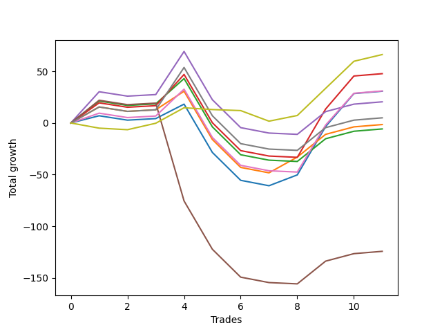

# Short Bulldog 003 
- Symbol: ES90d5m120m
- Date Range: 03/18/2022 - 07/08/2022
- Trading Period: 7:20-12:30
- Number of Trades: 11



| Name | Win Percent | Profit | Avg Profit / Trade |     | Name | Win Percent | Profit | Avg Profit / Trade |
| ---- | ----------- | ------ | ------------------ | --- | ---- | ----------- | ------ | ------------------ |
| Sorted By <br> Profit | | | | | Sorted By <br> Win Percentage ||||
| Seventy-Three | 54.55 | 33125.00 | 3011.36 |     | Zero | 63.64 | 15375.00 | 1397.73 |
| Three | 54.55 | 23875.00 | 2170.45 |     | One | 63.64 | -750.00 | -68.18 |
| Six | 54.55 | 15500.00 | 1409.09 |     | Seventy-Three | 54.55 | 33125.00 | 3011.36 |
| Zero | 63.64 | 15375.00 | 1397.73 |     | Three | 54.55 | 23875.00 | 2170.45 |
| Four | 54.55 | 10250.00 | 931.82 |     | Six | 54.55 | 15500.00 | 1409.09 |
| Seven | 54.55 | 2500.00 | 227.27 |     | Four | 54.55 | 10250.00 | 931.82 |
| One | 63.64 | -750.00 | -68.18 |     | Seven | 54.55 | 2500.00 | 227.27 |
| Two | 54.55 | -2875.00 | -261.36 |     | Two | 54.55 | -2875.00 | -261.36 |
| Five | 45.45 | -62125.00 | -5647.73 |     | Five | 45.45 | -62125.00 | -5647.73 |

## NO STOPLOSS

### Test Zero
* Sell when price hits the middle line of the 20p bollinger
* No Stoploss
* Results:
```
Total Trades: 11
Percent Up: 36.36
Percent Down: 63.64
Total Points Moved Down: 30.75
Potential Profit: 15375.00
Total Points Ups: 83.25 Count Ups: 4
Total Points Downs: 114.00 Count Downs: 7
```

<details><summary>Trades</summary>

<code>In: 2022-03-25 07:25:00		Out: 2022-03-25 08:01:45		Total Position Time: 36:45		Total Move Down: 7.00		Total to Date: 7.00</code> <br />
<code>In: 2022-03-28 12:00:00		Out: 2022-03-28 12:46:00		Total Position Time: 46:00		Total Move Down: -4.25		Total to Date: 2.75</code> <br />
<code>In: 2022-04-07 12:15:00		Out: 2022-04-07 12:46:00		Total Position Time: 31:00		Total Move Down: 1.50		Total to Date: 4.25</code> <br />
<code>In: 2022-05-04 11:05:00		Out: 2022-05-04 11:07:15		Total Position Time: 02:15		Total Move Down: 14.00		Total to Date: 18.25</code> <br />
<code>In: 2022-05-04 11:55:00		Out: 2022-05-04 12:46:00		Total Position Time: 51:00		Total Move Down: -46.75		Total to Date: -28.50</code> <br />
<code>In: 2022-05-04 12:15:00		Out: 2022-05-04 12:46:00		Total Position Time: 31:00		Total Move Down: -27.00		Total to Date: -55.50</code> <br />
<code>In: 2022-05-25 11:35:00		Out: 2022-05-25 12:46:00		Total Position Time: 71:00		Total Move Down: -5.25		Total to Date: -60.75</code> <br />
<code>In: 2022-05-31 09:05:00		Out: 2022-05-31 10:16:00		Total Position Time: 71:00		Total Move Down: 10.50		Total to Date: -50.25</code> <br />
<code>In: 2022-06-15 11:45:00		Out: 2022-06-15 11:58:05		Total Position Time: 13:05		Total Move Down: 46.75		Total to Date: -3.50</code> <br />
<code>In: 2022-06-15 11:50:00		Out: 2022-06-15 11:58:05		Total Position Time: 08:05		Total Move Down: 32.00		Total to Date: 28.50</code> <br />
<code>In: 2022-07-06 11:45:00		Out: 2022-07-06 12:46:00		Total Position Time: 61:00		Total Move Down: 2.25		Total to Date: 30.75</code> <br />


</details>

### Test One
* Sell when the price hits the upper line of the 20p 1std bollinger
* No Stoploss
* Results:
```
Total Trades: 11
Percent Up: 36.36
Percent Down: 63.64
Total Points Moved Down: -1.50
Potential Profit: -750.00
Total Points Ups: 83.25 Count Ups: 4
Total Points Downs: 81.75 Count Downs: 7
```

<details><summary>Trades</summary>

<code>In: 2022-03-25 07:25:00		Out: 2022-03-25 08:09:20		Total Position Time: 44:20		Total Move Down: 15.50		Total to Date: 15.50</code> <br />
<code>In: 2022-03-28 12:00:00		Out: 2022-03-28 12:46:00		Total Position Time: 46:00		Total Move Down: -4.25		Total to Date: 11.25</code> <br />
<code>In: 2022-04-07 12:15:00		Out: 2022-04-07 12:46:00		Total Position Time: 31:00		Total Move Down: 1.50		Total to Date: 12.75</code> <br />
<code>In: 2022-05-04 11:05:00		Out: 2022-05-04 11:07:20		Total Position Time: 02:20		Total Move Down: 18.00		Total to Date: 30.75</code> <br />
<code>In: 2022-05-04 11:55:00		Out: 2022-05-04 12:46:00		Total Position Time: 51:00		Total Move Down: -46.75		Total to Date: -16.00</code> <br />
<code>In: 2022-05-04 12:15:00		Out: 2022-05-04 12:46:00		Total Position Time: 31:00		Total Move Down: -27.00		Total to Date: -43.00</code> <br />
<code>In: 2022-05-25 11:35:00		Out: 2022-05-25 12:46:00		Total Position Time: 71:00		Total Move Down: -5.25		Total to Date: -48.25</code> <br />
<code>In: 2022-05-31 09:05:00		Out: 2022-05-31 10:22:45		Total Position Time: 77:45		Total Move Down: 15.25		Total to Date: -33.00</code> <br />
<code>In: 2022-06-15 11:45:00		Out: 2022-06-15 12:46:00		Total Position Time: 61:00		Total Move Down: 22.00		Total to Date: -11.00</code> <br />
<code>In: 2022-06-15 11:50:00		Out: 2022-06-15 12:46:00		Total Position Time: 56:00		Total Move Down: 7.25		Total to Date: -3.75</code> <br />
<code>In: 2022-07-06 11:45:00		Out: 2022-07-06 12:46:00		Total Position Time: 61:00		Total Move Down: 2.25		Total to Date: -1.50</code> <br />


</details>

### Test Two
* Sell when the price hits the upper line of the 20p 2std bollinger
* No Stoploss
* Results:
```
Total Trades: 11
Percent Up: 45.45
Percent Down: 54.55
Total Points Moved Down: -5.75
Potential Profit: -2875.00
Total Points Ups: 84.50 Count Ups: 5
Total Points Downs: 78.75 Count Downs: 6
```

<details><summary>Trades</summary>

<code>In: 2022-03-25 07:25:00		Out: 2022-03-25 08:10:45		Total Position Time: 45:45		Total Move Down: 21.25		Total to Date: 21.25</code> <br />
<code>In: 2022-03-28 12:00:00		Out: 2022-03-28 12:46:00		Total Position Time: 46:00		Total Move Down: -4.25		Total to Date: 17.00</code> <br />
<code>In: 2022-04-07 12:15:00		Out: 2022-04-07 12:46:00		Total Position Time: 31:00		Total Move Down: 1.50		Total to Date: 18.50</code> <br />
<code>In: 2022-05-04 11:05:00		Out: 2022-05-04 11:07:40		Total Position Time: 02:40		Total Move Down: 24.50		Total to Date: 43.00</code> <br />
<code>In: 2022-05-04 11:55:00		Out: 2022-05-04 12:46:00		Total Position Time: 51:00		Total Move Down: -46.75		Total to Date: -3.75</code> <br />
<code>In: 2022-05-04 12:15:00		Out: 2022-05-04 12:46:00		Total Position Time: 31:00		Total Move Down: -27.00		Total to Date: -30.75</code> <br />
<code>In: 2022-05-25 11:35:00		Out: 2022-05-25 12:46:00		Total Position Time: 71:00		Total Move Down: -5.25		Total to Date: -36.00</code> <br />
<code>In: 2022-05-31 09:05:00		Out: 2022-05-31 11:05:55		Total Position Time: 120:55		Total Move Down: -1.25		Total to Date: -37.25</code> <br />
<code>In: 2022-06-15 11:45:00		Out: 2022-06-15 12:46:00		Total Position Time: 61:00		Total Move Down: 22.00		Total to Date: -15.25</code> <br />
<code>In: 2022-06-15 11:50:00		Out: 2022-06-15 12:46:00		Total Position Time: 56:00		Total Move Down: 7.25		Total to Date: -8.00</code> <br />
<code>In: 2022-07-06 11:45:00		Out: 2022-07-06 12:46:00		Total Position Time: 61:00		Total Move Down: 2.25		Total to Date: -5.75</code> <br />


</details>

### Test Three
* Sell when price hits the middle line of the 50p bollinger
* No Stoploss
* Results:
```
Total Trades: 11
Percent Up: 45.45
Percent Down: 54.55
Total Points Moved Down: 47.75
Potential Profit: 23875.00
Total Points Ups: 84.50 Count Ups: 5
Total Points Downs: 132.25 Count Downs: 6
```

<details><summary>Trades</summary>

<code>In: 2022-03-25 07:25:00		Out: 2022-03-25 08:10:15		Total Position Time: 45:15		Total Move Down: 19.50		Total to Date: 19.50</code> <br />
<code>In: 2022-03-28 12:00:00		Out: 2022-03-28 12:46:00		Total Position Time: 46:00		Total Move Down: -4.25		Total to Date: 15.25</code> <br />
<code>In: 2022-04-07 12:15:00		Out: 2022-04-07 12:46:00		Total Position Time: 31:00		Total Move Down: 1.50		Total to Date: 16.75</code> <br />
<code>In: 2022-05-04 11:05:00		Out: 2022-05-04 11:20:50		Total Position Time: 15:50		Total Move Down: 30.25		Total to Date: 47.00</code> <br />
<code>In: 2022-05-04 11:55:00		Out: 2022-05-04 12:46:00		Total Position Time: 51:00		Total Move Down: -46.75		Total to Date: 0.25</code> <br />
<code>In: 2022-05-04 12:15:00		Out: 2022-05-04 12:46:00		Total Position Time: 31:00		Total Move Down: -27.00		Total to Date: -26.75</code> <br />
<code>In: 2022-05-25 11:35:00		Out: 2022-05-25 12:46:00		Total Position Time: 71:00		Total Move Down: -5.25		Total to Date: -32.00</code> <br />
<code>In: 2022-05-31 09:05:00		Out: 2022-05-31 11:05:55		Total Position Time: 120:55		Total Move Down: -1.25		Total to Date: -33.25</code> <br />
<code>In: 2022-06-15 11:45:00		Out: 2022-06-15 11:58:05		Total Position Time: 13:05		Total Move Down: 46.75		Total to Date: 13.50</code> <br />
<code>In: 2022-06-15 11:50:00		Out: 2022-06-15 11:58:05		Total Position Time: 08:05		Total Move Down: 32.00		Total to Date: 45.50</code> <br />
<code>In: 2022-07-06 11:45:00		Out: 2022-07-06 12:46:00		Total Position Time: 61:00		Total Move Down: 2.25		Total to Date: 47.75</code> <br />


</details>

### Test Four
* Sell when the price hits the upper line of the 50p 1std bollinger
* No Stoploss
* Results:
```
Total Trades: 11
Percent Up: 45.45
Percent Down: 54.55
Total Points Moved Down: 20.50
Potential Profit: 10250.00
Total Points Ups: 84.50 Count Ups: 5
Total Points Downs: 105.00 Count Downs: 6
```

<details><summary>Trades</summary>

<code>In: 2022-03-25 07:25:00		Out: 2022-03-25 08:26:05		Total Position Time: 61:05		Total Move Down: 30.25		Total to Date: 30.25</code> <br />
<code>In: 2022-03-28 12:00:00		Out: 2022-03-28 12:46:00		Total Position Time: 46:00		Total Move Down: -4.25		Total to Date: 26.00</code> <br />
<code>In: 2022-04-07 12:15:00		Out: 2022-04-07 12:46:00		Total Position Time: 31:00		Total Move Down: 1.50		Total to Date: 27.50</code> <br />
<code>In: 2022-05-04 11:05:00		Out: 2022-05-04 11:34:10		Total Position Time: 29:10		Total Move Down: 41.75		Total to Date: 69.25</code> <br />
<code>In: 2022-05-04 11:55:00		Out: 2022-05-04 12:46:00		Total Position Time: 51:00		Total Move Down: -46.75		Total to Date: 22.50</code> <br />
<code>In: 2022-05-04 12:15:00		Out: 2022-05-04 12:46:00		Total Position Time: 31:00		Total Move Down: -27.00		Total to Date: -4.50</code> <br />
<code>In: 2022-05-25 11:35:00		Out: 2022-05-25 12:46:00		Total Position Time: 71:00		Total Move Down: -5.25		Total to Date: -9.75</code> <br />
<code>In: 2022-05-31 09:05:00		Out: 2022-05-31 11:05:55		Total Position Time: 120:55		Total Move Down: -1.25		Total to Date: -11.00</code> <br />
<code>In: 2022-06-15 11:45:00		Out: 2022-06-15 12:46:00		Total Position Time: 61:00		Total Move Down: 22.00		Total to Date: 11.00</code> <br />
<code>In: 2022-06-15 11:50:00		Out: 2022-06-15 12:46:00		Total Position Time: 56:00		Total Move Down: 7.25		Total to Date: 18.25</code> <br />
<code>In: 2022-07-06 11:45:00		Out: 2022-07-06 12:46:00		Total Position Time: 61:00		Total Move Down: 2.25		Total to Date: 20.50</code> <br />


</details>

### Test Five
* Sell when the price hits the upper line of the 50p 2std bollinger
* No Stoploss
* Results:
```
Total Trades: 11
Percent Up: 54.55
Percent Down: 45.45
Total Points Moved Down: -124.25
Potential Profit: -62125.00
Total Points Ups: 179.25 Count Ups: 6
Total Points Downs: 55.00 Count Downs: 5
```

<details><summary>Trades</summary>

<code>In: 2022-03-25 07:25:00		Out: 2022-03-25 09:25:55		Total Position Time: 120:55		Total Move Down: 22.00		Total to Date: 22.00</code> <br />
<code>In: 2022-03-28 12:00:00		Out: 2022-03-28 12:46:00		Total Position Time: 46:00		Total Move Down: -4.25		Total to Date: 17.75</code> <br />
<code>In: 2022-04-07 12:15:00		Out: 2022-04-07 12:46:00		Total Position Time: 31:00		Total Move Down: 1.50		Total to Date: 19.25</code> <br />
<code>In: 2022-05-04 11:05:00		Out: 2022-05-04 12:46:00		Total Position Time: 101:00		Total Move Down: -94.75		Total to Date: -75.50</code> <br />
<code>In: 2022-05-04 11:55:00		Out: 2022-05-04 12:46:00		Total Position Time: 51:00		Total Move Down: -46.75		Total to Date: -122.25</code> <br />
<code>In: 2022-05-04 12:15:00		Out: 2022-05-04 12:46:00		Total Position Time: 31:00		Total Move Down: -27.00		Total to Date: -149.25</code> <br />
<code>In: 2022-05-25 11:35:00		Out: 2022-05-25 12:46:00		Total Position Time: 71:00		Total Move Down: -5.25		Total to Date: -154.50</code> <br />
<code>In: 2022-05-31 09:05:00		Out: 2022-05-31 11:05:55		Total Position Time: 120:55		Total Move Down: -1.25		Total to Date: -155.75</code> <br />
<code>In: 2022-06-15 11:45:00		Out: 2022-06-15 12:46:00		Total Position Time: 61:00		Total Move Down: 22.00		Total to Date: -133.75</code> <br />
<code>In: 2022-06-15 11:50:00		Out: 2022-06-15 12:46:00		Total Position Time: 56:00		Total Move Down: 7.25		Total to Date: -126.50</code> <br />
<code>In: 2022-07-06 11:45:00		Out: 2022-07-06 12:46:00		Total Position Time: 61:00		Total Move Down: 2.25		Total to Date: -124.25</code> <br />


</details>

### Test Six
* Sell when the price hits the middle line of the 1std VWAP
* No Stoploss
* Results:
```
Total Trades: 11
Percent Up: 45.45
Percent Down: 54.55
Total Points Moved Down: 31.00
Potential Profit: 15500.00
Total Points Ups: 84.50 Count Ups: 5
Total Points Downs: 115.50 Count Downs: 6
```

<details><summary>Trades</summary>

<code>In: 2022-03-25 07:25:00		Out: 2022-03-25 08:08:15		Total Position Time: 43:15		Total Move Down: 9.50		Total to Date: 9.50</code> <br />
<code>In: 2022-03-28 12:00:00		Out: 2022-03-28 12:46:00		Total Position Time: 46:00		Total Move Down: -4.25		Total to Date: 5.25</code> <br />
<code>In: 2022-04-07 12:15:00		Out: 2022-04-07 12:46:00		Total Position Time: 31:00		Total Move Down: 1.50		Total to Date: 6.75</code> <br />
<code>In: 2022-05-04 11:05:00		Out: 2022-05-04 11:20:20		Total Position Time: 15:20		Total Move Down: 26.00		Total to Date: 32.75</code> <br />
<code>In: 2022-05-04 11:55:00		Out: 2022-05-04 12:46:00		Total Position Time: 51:00		Total Move Down: -46.75		Total to Date: -14.00</code> <br />
<code>In: 2022-05-04 12:15:00		Out: 2022-05-04 12:46:00		Total Position Time: 31:00		Total Move Down: -27.00		Total to Date: -41.00</code> <br />
<code>In: 2022-05-25 11:35:00		Out: 2022-05-25 12:46:00		Total Position Time: 71:00		Total Move Down: -5.25		Total to Date: -46.25</code> <br />
<code>In: 2022-05-31 09:05:00		Out: 2022-05-31 11:05:55		Total Position Time: 120:55		Total Move Down: -1.25		Total to Date: -47.50</code> <br />
<code>In: 2022-06-15 11:45:00		Out: 2022-06-15 11:57:55		Total Position Time: 12:55		Total Move Down: 45.50		Total to Date: -2.00</code> <br />
<code>In: 2022-06-15 11:50:00		Out: 2022-06-15 11:57:55		Total Position Time: 07:55		Total Move Down: 30.75		Total to Date: 28.75</code> <br />
<code>In: 2022-07-06 11:45:00		Out: 2022-07-06 12:46:00		Total Position Time: 61:00		Total Move Down: 2.25		Total to Date: 31.00</code> <br />


</details>

### Test Seven
* Sell when the price hits the upper line of the 1std VWAP
* No Stoploss
* Results:
```
Total Trades: 11
Percent Up: 45.45
Percent Down: 54.55
Total Points Moved Down: 5.00
Potential Profit: 2500.00
Total Points Ups: 84.50 Count Ups: 5
Total Points Downs: 89.50 Count Downs: 6
```

<details><summary>Trades</summary>

<code>In: 2022-03-25 07:25:00		Out: 2022-03-25 08:09:20		Total Position Time: 44:20		Total Move Down: 15.50		Total to Date: 15.50</code> <br />
<code>In: 2022-03-28 12:00:00		Out: 2022-03-28 12:46:00		Total Position Time: 46:00		Total Move Down: -4.25		Total to Date: 11.25</code> <br />
<code>In: 2022-04-07 12:15:00		Out: 2022-04-07 12:46:00		Total Position Time: 31:00		Total Move Down: 1.50		Total to Date: 12.75</code> <br />
<code>In: 2022-05-04 11:05:00		Out: 2022-05-04 11:34:05		Total Position Time: 29:05		Total Move Down: 41.00		Total to Date: 53.75</code> <br />
<code>In: 2022-05-04 11:55:00		Out: 2022-05-04 12:46:00		Total Position Time: 51:00		Total Move Down: -46.75		Total to Date: 7.00</code> <br />
<code>In: 2022-05-04 12:15:00		Out: 2022-05-04 12:46:00		Total Position Time: 31:00		Total Move Down: -27.00		Total to Date: -20.00</code> <br />
<code>In: 2022-05-25 11:35:00		Out: 2022-05-25 12:46:00		Total Position Time: 71:00		Total Move Down: -5.25		Total to Date: -25.25</code> <br />
<code>In: 2022-05-31 09:05:00		Out: 2022-05-31 11:05:55		Total Position Time: 120:55		Total Move Down: -1.25		Total to Date: -26.50</code> <br />
<code>In: 2022-06-15 11:45:00		Out: 2022-06-15 12:46:00		Total Position Time: 61:00		Total Move Down: 22.00		Total to Date: -4.50</code> <br />
<code>In: 2022-06-15 11:50:00		Out: 2022-06-15 12:46:00		Total Position Time: 56:00		Total Move Down: 7.25		Total to Date: 2.75</code> <br />
<code>In: 2022-07-06 11:45:00		Out: 2022-07-06 12:46:00		Total Position Time: 61:00		Total Move Down: 2.25		Total to Date: 5.00</code> <br />


</details>

## SPECIAL EXIT CONDITIONS 

### Test Seventy-Three
* Sell when the linear regression slope changes to negative
* No Stoploss
* Results:
```
Total Trades: 11
Percent Up: 45.45
Percent Down: 54.55
Total Points Moved Down: 66.25
Potential Profit: 33125.00
Total Points Ups: 19.50 Count Ups: 5
Total Points Downs: 85.75 Count Downs: 6
```

<details><summary>Trades</summary>

<code>In: 2022-03-25 07:25:00		Out: 2022-03-25 07:44:05		Total Position Time: 19:05		Total Move Down: -5.00		Total to Date: -5.00</code> <br />
<code>In: 2022-03-28 12:00:00		Out: 2022-03-28 12:26:05		Total Position Time: 26:05		Total Move Down: -1.50		Total to Date: -6.50</code> <br />
<code>In: 2022-04-07 12:15:00		Out: 2022-04-07 12:20:05		Total Position Time: 05:05		Total Move Down: 6.25		Total to Date: -0.25</code> <br />
<code>In: 2022-05-04 11:05:00		Out: 2022-05-04 11:11:05		Total Position Time: 06:05		Total Move Down: 15.00		Total to Date: 14.75</code> <br />
<code>In: 2022-05-04 11:55:00		Out: 2022-05-04 12:07:05		Total Position Time: 12:05		Total Move Down: -1.75		Total to Date: 13.00</code> <br />
<code>In: 2022-05-04 12:15:00		Out: 2022-05-04 12:23:05		Total Position Time: 08:05		Total Move Down: -1.00		Total to Date: 12.00</code> <br />
<code>In: 2022-05-25 11:35:00		Out: 2022-05-25 12:01:05		Total Position Time: 26:05		Total Move Down: -10.25		Total to Date: 1.75</code> <br />
<code>In: 2022-05-31 09:05:00		Out: 2022-05-31 09:11:05		Total Position Time: 06:05		Total Move Down: 5.50		Total to Date: 7.25</code> <br />
<code>In: 2022-06-15 11:45:00		Out: 2022-06-15 12:09:05		Total Position Time: 24:05		Total Move Down: 26.25		Total to Date: 33.50</code> <br />
<code>In: 2022-06-15 11:50:00		Out: 2022-06-15 12:13:05		Total Position Time: 23:05		Total Move Down: 26.25		Total to Date: 59.75</code> <br />
<code>In: 2022-07-06 11:45:00		Out: 2022-07-06 12:08:05		Total Position Time: 23:05		Total Move Down: 6.50		Total to Date: 66.25</code> <br />


</details>