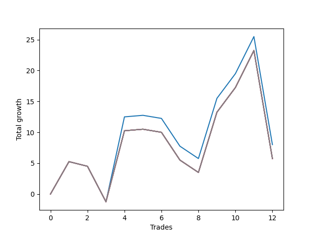

# Long Bulldog 003 
- Symbol: ES90d5mOut
- Date Range: 03/18/2022 - 07/08/2022
- Trading Period: 7:20-12:30
- Number of Trades: 12



| Name | Win Percent | Profit | Avg Profit / Trade |     | Name | Win Percent | Profit | Avg Profit / Trade |
| ---- | ----------- | ------ | ------------------ | --- | ---- | ----------- | ------ | ------------------ |
| Sorted By <br> Profit | | | | | Sorted By <br> Win Percentage ||||
| Zero | 50.00 | 4000.00 | 333.33 |     | Zero | 50.00 | 4000.00 | 333.33 |
| Seven | 50.00 | 2875.00 | 239.58 |     | Seven | 50.00 | 2875.00 | 239.58 |
| Six | 50.00 | 2875.00 | 239.58 |     | Six | 50.00 | 2875.00 | 239.58 |
| Five | 50.00 | 2875.00 | 239.58 |     | Five | 50.00 | 2875.00 | 239.58 |
| Four | 50.00 | 2875.00 | 239.58 |     | Four | 50.00 | 2875.00 | 239.58 |
| Three | 50.00 | 2875.00 | 239.58 |     | Three | 50.00 | 2875.00 | 239.58 |
| Two | 50.00 | 2875.00 | 239.58 |     | Two | 50.00 | 2875.00 | 239.58 |
| One | 50.00 | 2875.00 | 239.58 |     | One | 50.00 | 2875.00 | 239.58 |

### Test Zero
* Sell when price hits the middle line of the 20p bollinger
* No Stoploss
* Results:
```
Total Trades: 12
Percent Up: 50.00
Percent Down: 50.00
Total Points Moved Up: 8.00
Potential Profit: 4000.00
Total Points Ups: 39.00 Count Ups: 6
Total Points Downs: -31.00 Count Downs: 6
```

<details><summary>Trades</summary>

<code>In: 2022-03-23 10:30:00		Out: 2022-03-23 11:00:55		Total Position Time: 30:55		Total Move Up: 5.25		Total to Date: 5.25</code> <br />
<code>In: 2022-03-23 10:45:00		Out: 2022-03-23 11:15:55		Total Position Time: 30:55		Total Move Up: -0.75		Total to Date: 4.50</code> <br />
<code>In: 2022-03-30 12:10:00		Out: 2022-03-30 12:40:55		Total Position Time: 30:55		Total Move Up: -5.75		Total to Date: -1.25</code> <br />
<code>In: 2022-03-30 12:25:00		Out: 2022-03-30 12:46:25		Total Position Time: 21:25		Total Move Up: 13.75		Total to Date: 12.50</code> <br />
<code>In: 2022-03-31 11:20:00		Out: 2022-03-31 11:50:55		Total Position Time: 30:55		Total Move Up: 0.25		Total to Date: 12.75</code> <br />
<code>In: 2022-03-31 11:25:00		Out: 2022-03-31 11:55:55		Total Position Time: 30:55		Total Move Up: -0.50		Total to Date: 12.25</code> <br />
<code>In: 2022-04-18 08:40:00		Out: 2022-04-18 09:10:55		Total Position Time: 30:55		Total Move Up: -4.50		Total to Date: 7.75</code> <br />
<code>In: 2022-04-18 08:50:00		Out: 2022-04-18 09:20:55		Total Position Time: 30:55		Total Move Up: -2.00		Total to Date: 5.75</code> <br />
<code>In: 2022-05-12 10:50:00		Out: 2022-05-12 11:20:55		Total Position Time: 30:55		Total Move Up: 9.75		Total to Date: 15.50</code> <br />
<code>In: 2022-06-08 09:45:00		Out: 2022-06-08 10:15:55		Total Position Time: 30:55		Total Move Up: 4.00		Total to Date: 19.50</code> <br />
<code>In: 2022-06-09 08:05:00		Out: 2022-06-09 08:35:55		Total Position Time: 30:55		Total Move Up: 6.00		Total to Date: 25.50</code> <br />
<code>In: 2022-06-09 12:15:00		Out: 2022-06-09 12:45:55		Total Position Time: 30:55		Total Move Up: -17.50		Total to Date: 8.00</code> <br />


</details>

### Test One
* Sell when the price hits the upper line of the 20p 1std bollinger
* No Stoploss
* Results:
```
Total Trades: 12
Percent Up: 50.00
Percent Down: 50.00
Total Points Moved Up: 5.75
Potential Profit: 2875.00
Total Points Ups: 36.75 Count Ups: 6
Total Points Downs: -31.00 Count Downs: 6
```

<details><summary>Trades</summary>

<code>In: 2022-03-23 10:30:00		Out: 2022-03-23 11:00:55		Total Position Time: 30:55		Total Move Up: 5.25		Total to Date: 5.25</code> <br />
<code>In: 2022-03-23 10:45:00		Out: 2022-03-23 11:15:55		Total Position Time: 30:55		Total Move Up: -0.75		Total to Date: 4.50</code> <br />
<code>In: 2022-03-30 12:10:00		Out: 2022-03-30 12:40:55		Total Position Time: 30:55		Total Move Up: -5.75		Total to Date: -1.25</code> <br />
<code>In: 2022-03-30 12:25:00		Out: 2022-03-30 12:55:55		Total Position Time: 30:55		Total Move Up: 11.50		Total to Date: 10.25</code> <br />
<code>In: 2022-03-31 11:20:00		Out: 2022-03-31 11:50:55		Total Position Time: 30:55		Total Move Up: 0.25		Total to Date: 10.50</code> <br />
<code>In: 2022-03-31 11:25:00		Out: 2022-03-31 11:55:55		Total Position Time: 30:55		Total Move Up: -0.50		Total to Date: 10.00</code> <br />
<code>In: 2022-04-18 08:40:00		Out: 2022-04-18 09:10:55		Total Position Time: 30:55		Total Move Up: -4.50		Total to Date: 5.50</code> <br />
<code>In: 2022-04-18 08:50:00		Out: 2022-04-18 09:20:55		Total Position Time: 30:55		Total Move Up: -2.00		Total to Date: 3.50</code> <br />
<code>In: 2022-05-12 10:50:00		Out: 2022-05-12 11:20:55		Total Position Time: 30:55		Total Move Up: 9.75		Total to Date: 13.25</code> <br />
<code>In: 2022-06-08 09:45:00		Out: 2022-06-08 10:15:55		Total Position Time: 30:55		Total Move Up: 4.00		Total to Date: 17.25</code> <br />
<code>In: 2022-06-09 08:05:00		Out: 2022-06-09 08:35:55		Total Position Time: 30:55		Total Move Up: 6.00		Total to Date: 23.25</code> <br />
<code>In: 2022-06-09 12:15:00		Out: 2022-06-09 12:45:55		Total Position Time: 30:55		Total Move Up: -17.50		Total to Date: 5.75</code> <br />


</details>

### Test Two
* Sell when the price hits the upper line of the 20p 2std bollinger
* No Stoploss
* Results:
```
Total Trades: 12
Percent Up: 50.00
Percent Down: 50.00
Total Points Moved Up: 5.75
Potential Profit: 2875.00
Total Points Ups: 36.75 Count Ups: 6
Total Points Downs: -31.00 Count Downs: 6
```

<details><summary>Trades</summary>

<code>In: 2022-03-23 10:30:00		Out: 2022-03-23 11:00:55		Total Position Time: 30:55		Total Move Up: 5.25		Total to Date: 5.25</code> <br />
<code>In: 2022-03-23 10:45:00		Out: 2022-03-23 11:15:55		Total Position Time: 30:55		Total Move Up: -0.75		Total to Date: 4.50</code> <br />
<code>In: 2022-03-30 12:10:00		Out: 2022-03-30 12:40:55		Total Position Time: 30:55		Total Move Up: -5.75		Total to Date: -1.25</code> <br />
<code>In: 2022-03-30 12:25:00		Out: 2022-03-30 12:55:55		Total Position Time: 30:55		Total Move Up: 11.50		Total to Date: 10.25</code> <br />
<code>In: 2022-03-31 11:20:00		Out: 2022-03-31 11:50:55		Total Position Time: 30:55		Total Move Up: 0.25		Total to Date: 10.50</code> <br />
<code>In: 2022-03-31 11:25:00		Out: 2022-03-31 11:55:55		Total Position Time: 30:55		Total Move Up: -0.50		Total to Date: 10.00</code> <br />
<code>In: 2022-04-18 08:40:00		Out: 2022-04-18 09:10:55		Total Position Time: 30:55		Total Move Up: -4.50		Total to Date: 5.50</code> <br />
<code>In: 2022-04-18 08:50:00		Out: 2022-04-18 09:20:55		Total Position Time: 30:55		Total Move Up: -2.00		Total to Date: 3.50</code> <br />
<code>In: 2022-05-12 10:50:00		Out: 2022-05-12 11:20:55		Total Position Time: 30:55		Total Move Up: 9.75		Total to Date: 13.25</code> <br />
<code>In: 2022-06-08 09:45:00		Out: 2022-06-08 10:15:55		Total Position Time: 30:55		Total Move Up: 4.00		Total to Date: 17.25</code> <br />
<code>In: 2022-06-09 08:05:00		Out: 2022-06-09 08:35:55		Total Position Time: 30:55		Total Move Up: 6.00		Total to Date: 23.25</code> <br />
<code>In: 2022-06-09 12:15:00		Out: 2022-06-09 12:45:55		Total Position Time: 30:55		Total Move Up: -17.50		Total to Date: 5.75</code> <br />


</details>

### Test Three
* Sell when price hits the middle line of the 50p bollinger
* No Stoploss
* Results:
```
Total Trades: 12
Percent Up: 50.00
Percent Down: 50.00
Total Points Moved Up: 5.75
Potential Profit: 2875.00
Total Points Ups: 36.75 Count Ups: 6
Total Points Downs: -31.00 Count Downs: 6
```

<details><summary>Trades</summary>

<code>In: 2022-03-23 10:30:00		Out: 2022-03-23 11:00:55		Total Position Time: 30:55		Total Move Up: 5.25		Total to Date: 5.25</code> <br />
<code>In: 2022-03-23 10:45:00		Out: 2022-03-23 11:15:55		Total Position Time: 30:55		Total Move Up: -0.75		Total to Date: 4.50</code> <br />
<code>In: 2022-03-30 12:10:00		Out: 2022-03-30 12:40:55		Total Position Time: 30:55		Total Move Up: -5.75		Total to Date: -1.25</code> <br />
<code>In: 2022-03-30 12:25:00		Out: 2022-03-30 12:55:55		Total Position Time: 30:55		Total Move Up: 11.50		Total to Date: 10.25</code> <br />
<code>In: 2022-03-31 11:20:00		Out: 2022-03-31 11:50:55		Total Position Time: 30:55		Total Move Up: 0.25		Total to Date: 10.50</code> <br />
<code>In: 2022-03-31 11:25:00		Out: 2022-03-31 11:55:55		Total Position Time: 30:55		Total Move Up: -0.50		Total to Date: 10.00</code> <br />
<code>In: 2022-04-18 08:40:00		Out: 2022-04-18 09:10:55		Total Position Time: 30:55		Total Move Up: -4.50		Total to Date: 5.50</code> <br />
<code>In: 2022-04-18 08:50:00		Out: 2022-04-18 09:20:55		Total Position Time: 30:55		Total Move Up: -2.00		Total to Date: 3.50</code> <br />
<code>In: 2022-05-12 10:50:00		Out: 2022-05-12 11:20:55		Total Position Time: 30:55		Total Move Up: 9.75		Total to Date: 13.25</code> <br />
<code>In: 2022-06-08 09:45:00		Out: 2022-06-08 10:15:55		Total Position Time: 30:55		Total Move Up: 4.00		Total to Date: 17.25</code> <br />
<code>In: 2022-06-09 08:05:00		Out: 2022-06-09 08:35:55		Total Position Time: 30:55		Total Move Up: 6.00		Total to Date: 23.25</code> <br />
<code>In: 2022-06-09 12:15:00		Out: 2022-06-09 12:45:55		Total Position Time: 30:55		Total Move Up: -17.50		Total to Date: 5.75</code> <br />


</details>

### Test Four
* Sell when the price hits the upper line of the 50p 1std bollinger
* No Stoploss
* Results:
```
Total Trades: 12
Percent Up: 50.00
Percent Down: 50.00
Total Points Moved Up: 5.75
Potential Profit: 2875.00
Total Points Ups: 36.75 Count Ups: 6
Total Points Downs: -31.00 Count Downs: 6
```

<details><summary>Trades</summary>

<code>In: 2022-03-23 10:30:00		Out: 2022-03-23 11:00:55		Total Position Time: 30:55		Total Move Up: 5.25		Total to Date: 5.25</code> <br />
<code>In: 2022-03-23 10:45:00		Out: 2022-03-23 11:15:55		Total Position Time: 30:55		Total Move Up: -0.75		Total to Date: 4.50</code> <br />
<code>In: 2022-03-30 12:10:00		Out: 2022-03-30 12:40:55		Total Position Time: 30:55		Total Move Up: -5.75		Total to Date: -1.25</code> <br />
<code>In: 2022-03-30 12:25:00		Out: 2022-03-30 12:55:55		Total Position Time: 30:55		Total Move Up: 11.50		Total to Date: 10.25</code> <br />
<code>In: 2022-03-31 11:20:00		Out: 2022-03-31 11:50:55		Total Position Time: 30:55		Total Move Up: 0.25		Total to Date: 10.50</code> <br />
<code>In: 2022-03-31 11:25:00		Out: 2022-03-31 11:55:55		Total Position Time: 30:55		Total Move Up: -0.50		Total to Date: 10.00</code> <br />
<code>In: 2022-04-18 08:40:00		Out: 2022-04-18 09:10:55		Total Position Time: 30:55		Total Move Up: -4.50		Total to Date: 5.50</code> <br />
<code>In: 2022-04-18 08:50:00		Out: 2022-04-18 09:20:55		Total Position Time: 30:55		Total Move Up: -2.00		Total to Date: 3.50</code> <br />
<code>In: 2022-05-12 10:50:00		Out: 2022-05-12 11:20:55		Total Position Time: 30:55		Total Move Up: 9.75		Total to Date: 13.25</code> <br />
<code>In: 2022-06-08 09:45:00		Out: 2022-06-08 10:15:55		Total Position Time: 30:55		Total Move Up: 4.00		Total to Date: 17.25</code> <br />
<code>In: 2022-06-09 08:05:00		Out: 2022-06-09 08:35:55		Total Position Time: 30:55		Total Move Up: 6.00		Total to Date: 23.25</code> <br />
<code>In: 2022-06-09 12:15:00		Out: 2022-06-09 12:45:55		Total Position Time: 30:55		Total Move Up: -17.50		Total to Date: 5.75</code> <br />


</details>

### Test Five
* Sell when the price hits the upper line of the 50p 2std bollinger
* No Stoploss
* Results:
```
Total Trades: 12
Percent Up: 50.00
Percent Down: 50.00
Total Points Moved Up: 5.75
Potential Profit: 2875.00
Total Points Ups: 36.75 Count Ups: 6
Total Points Downs: -31.00 Count Downs: 6
```

<details><summary>Trades</summary>

<code>In: 2022-03-23 10:30:00		Out: 2022-03-23 11:00:55		Total Position Time: 30:55		Total Move Up: 5.25		Total to Date: 5.25</code> <br />
<code>In: 2022-03-23 10:45:00		Out: 2022-03-23 11:15:55		Total Position Time: 30:55		Total Move Up: -0.75		Total to Date: 4.50</code> <br />
<code>In: 2022-03-30 12:10:00		Out: 2022-03-30 12:40:55		Total Position Time: 30:55		Total Move Up: -5.75		Total to Date: -1.25</code> <br />
<code>In: 2022-03-30 12:25:00		Out: 2022-03-30 12:55:55		Total Position Time: 30:55		Total Move Up: 11.50		Total to Date: 10.25</code> <br />
<code>In: 2022-03-31 11:20:00		Out: 2022-03-31 11:50:55		Total Position Time: 30:55		Total Move Up: 0.25		Total to Date: 10.50</code> <br />
<code>In: 2022-03-31 11:25:00		Out: 2022-03-31 11:55:55		Total Position Time: 30:55		Total Move Up: -0.50		Total to Date: 10.00</code> <br />
<code>In: 2022-04-18 08:40:00		Out: 2022-04-18 09:10:55		Total Position Time: 30:55		Total Move Up: -4.50		Total to Date: 5.50</code> <br />
<code>In: 2022-04-18 08:50:00		Out: 2022-04-18 09:20:55		Total Position Time: 30:55		Total Move Up: -2.00		Total to Date: 3.50</code> <br />
<code>In: 2022-05-12 10:50:00		Out: 2022-05-12 11:20:55		Total Position Time: 30:55		Total Move Up: 9.75		Total to Date: 13.25</code> <br />
<code>In: 2022-06-08 09:45:00		Out: 2022-06-08 10:15:55		Total Position Time: 30:55		Total Move Up: 4.00		Total to Date: 17.25</code> <br />
<code>In: 2022-06-09 08:05:00		Out: 2022-06-09 08:35:55		Total Position Time: 30:55		Total Move Up: 6.00		Total to Date: 23.25</code> <br />
<code>In: 2022-06-09 12:15:00		Out: 2022-06-09 12:45:55		Total Position Time: 30:55		Total Move Up: -17.50		Total to Date: 5.75</code> <br />


</details>

### Test Six
* Sell when the price hits the middle line of the 1std VWAP
* No Stoploss
* Results:
```
Total Trades: 12
Percent Up: 50.00
Percent Down: 50.00
Total Points Moved Up: 5.75
Potential Profit: 2875.00
Total Points Ups: 36.75 Count Ups: 6
Total Points Downs: -31.00 Count Downs: 6
```

<details><summary>Trades</summary>

<code>In: 2022-03-23 10:30:00		Out: 2022-03-23 11:00:55		Total Position Time: 30:55		Total Move Up: 5.25		Total to Date: 5.25</code> <br />
<code>In: 2022-03-23 10:45:00		Out: 2022-03-23 11:15:55		Total Position Time: 30:55		Total Move Up: -0.75		Total to Date: 4.50</code> <br />
<code>In: 2022-03-30 12:10:00		Out: 2022-03-30 12:40:55		Total Position Time: 30:55		Total Move Up: -5.75		Total to Date: -1.25</code> <br />
<code>In: 2022-03-30 12:25:00		Out: 2022-03-30 12:55:55		Total Position Time: 30:55		Total Move Up: 11.50		Total to Date: 10.25</code> <br />
<code>In: 2022-03-31 11:20:00		Out: 2022-03-31 11:50:55		Total Position Time: 30:55		Total Move Up: 0.25		Total to Date: 10.50</code> <br />
<code>In: 2022-03-31 11:25:00		Out: 2022-03-31 11:55:55		Total Position Time: 30:55		Total Move Up: -0.50		Total to Date: 10.00</code> <br />
<code>In: 2022-04-18 08:40:00		Out: 2022-04-18 09:10:55		Total Position Time: 30:55		Total Move Up: -4.50		Total to Date: 5.50</code> <br />
<code>In: 2022-04-18 08:50:00		Out: 2022-04-18 09:20:55		Total Position Time: 30:55		Total Move Up: -2.00		Total to Date: 3.50</code> <br />
<code>In: 2022-05-12 10:50:00		Out: 2022-05-12 11:20:55		Total Position Time: 30:55		Total Move Up: 9.75		Total to Date: 13.25</code> <br />
<code>In: 2022-06-08 09:45:00		Out: 2022-06-08 10:15:55		Total Position Time: 30:55		Total Move Up: 4.00		Total to Date: 17.25</code> <br />
<code>In: 2022-06-09 08:05:00		Out: 2022-06-09 08:35:55		Total Position Time: 30:55		Total Move Up: 6.00		Total to Date: 23.25</code> <br />
<code>In: 2022-06-09 12:15:00		Out: 2022-06-09 12:45:55		Total Position Time: 30:55		Total Move Up: -17.50		Total to Date: 5.75</code> <br />


</details>

### Test Seven
* Sell when the price hits the upper line of the 1std VWAP
* No Stoploss
* Results:
```
Total Trades: 12
Percent Up: 50.00
Percent Down: 50.00
Total Points Moved Up: 5.75
Potential Profit: 2875.00
Total Points Ups: 36.75 Count Ups: 6
Total Points Downs: -31.00 Count Downs: 6
```

<details><summary>Trades</summary>

<code>In: 2022-03-23 10:30:00		Out: 2022-03-23 11:00:55		Total Position Time: 30:55		Total Move Up: 5.25		Total to Date: 5.25</code> <br />
<code>In: 2022-03-23 10:45:00		Out: 2022-03-23 11:15:55		Total Position Time: 30:55		Total Move Up: -0.75		Total to Date: 4.50</code> <br />
<code>In: 2022-03-30 12:10:00		Out: 2022-03-30 12:40:55		Total Position Time: 30:55		Total Move Up: -5.75		Total to Date: -1.25</code> <br />
<code>In: 2022-03-30 12:25:00		Out: 2022-03-30 12:55:55		Total Position Time: 30:55		Total Move Up: 11.50		Total to Date: 10.25</code> <br />
<code>In: 2022-03-31 11:20:00		Out: 2022-03-31 11:50:55		Total Position Time: 30:55		Total Move Up: 0.25		Total to Date: 10.50</code> <br />
<code>In: 2022-03-31 11:25:00		Out: 2022-03-31 11:55:55		Total Position Time: 30:55		Total Move Up: -0.50		Total to Date: 10.00</code> <br />
<code>In: 2022-04-18 08:40:00		Out: 2022-04-18 09:10:55		Total Position Time: 30:55		Total Move Up: -4.50		Total to Date: 5.50</code> <br />
<code>In: 2022-04-18 08:50:00		Out: 2022-04-18 09:20:55		Total Position Time: 30:55		Total Move Up: -2.00		Total to Date: 3.50</code> <br />
<code>In: 2022-05-12 10:50:00		Out: 2022-05-12 11:20:55		Total Position Time: 30:55		Total Move Up: 9.75		Total to Date: 13.25</code> <br />
<code>In: 2022-06-08 09:45:00		Out: 2022-06-08 10:15:55		Total Position Time: 30:55		Total Move Up: 4.00		Total to Date: 17.25</code> <br />
<code>In: 2022-06-09 08:05:00		Out: 2022-06-09 08:35:55		Total Position Time: 30:55		Total Move Up: 6.00		Total to Date: 23.25</code> <br />
<code>In: 2022-06-09 12:15:00		Out: 2022-06-09 12:45:55		Total Position Time: 30:55		Total Move Up: -17.50		Total to Date: 5.75</code> <br />


</details>