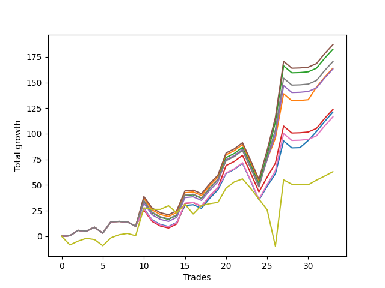

# Long Bulldog 005 
- Symbol: ES90d5m30m
- Date Range: 03/18/2022 - 07/08/2022
- Trading Period: 7:20-12:30
- Number of Trades: 33



| Name | Win Percent | Profit | Avg Profit / Trade | Avg Time / Trade |      | Name | Win Percent | Profit | Avg Profit / Trade | Avg Time / Trade |
| ---- | ----------- | ------ | ------------------ | ---------------- | ---- | ---- | ----------- | ------ | ------------------ | ---------------- |
| Sorted By <br> Profit | | | | | | Sorted By <br> Win Percentage ||||
| Seventy-Three | 57.58 | 47750.00 | 1446.97 | 00:00 |     | Eighty-One | 96.97 | 16125.00 | 488.64 | 00:00 |
| Two | 57.58 | 24750.00 | 750.00 | 00:00 |     | Eighty-Two | 84.85 | 7125.00 | 215.91 | 00:00 |
| Five | 57.58 | 22750.00 | 689.39 | 00:00 |     | One Hundred Twenty-One | 81.82 | -11000.00 | -333.33 | 00:00 |
| Eighty-One | 96.97 | 16125.00 | 488.64 | 00:00 |     | One Hundred Twenty-Six | 78.79 | -11250.00 | -340.91 | 00:00 |
| Seven | 57.58 | 10625.00 | 321.97 | 00:00 |     | Eighty-Three | 75.76 | 2125.00 | 64.39 | 00:00 |
| One | 60.61 | 8875.00 | 268.94 | 00:00 |     | One Hundred Eleven | 75.76 | -4500.00 | -136.36 | 00:00 |
| Eighty-Two | 84.85 | 7125.00 | 215.91 | 00:00 |     | One Hundred Twenty-Two | 72.73 | -13250.00 | -401.52 | 00:00 |
| Four | 57.58 | 6000.00 | 181.82 | 00:00 |     | Eighty-Four | 69.70 | -4125.00 | -125.00 | 00:00 |
| Eighty-Five | 66.67 | 3500.00 | 106.06 | 00:00 |     | One Hundred Twenty-Seven | 69.70 | -13875.00 | -420.45 | 00:00 |
| Eighty-Three | 75.76 | 2125.00 | 64.39 | 00:00 |     | Eighty-Five | 66.67 | 3500.00 | 106.06 | 00:00 |
| Ninety-Five | 33.33 | 1250.00 | 37.88 | 00:00 |     | One Hundred One | 63.64 | -8125.00 | -246.21 | 00:00 |
| Ninety-Four | 39.39 | 1000.00 | 30.30 | 00:00 |     | One Hundred Twenty-Three | 63.64 | -16375.00 | -496.21 | 00:00 |
| Ten | 15.15 | -1125.00 | -34.09 | 00:00 |     | One | 60.61 | 8875.00 | 268.94 | 00:00 |
| Ninety-Three | 42.42 | -1250.00 | -37.88 | 00:00 |     | One Hundred Twelve | 60.61 | -9625.00 | -291.67 | 00:00 |
| Twenty-Six | 24.24 | -1750.00 | -53.03 | 00:00 |     | One Hundred Twenty-Eight | 60.61 | -14125.00 | -428.03 | 00:00 |
| Thirteen | 15.15 | -3125.00 | -94.70 | 00:00 |     | One Hundred Sixteen | 60.61 | -14250.00 | -431.82 | 00:00 |
| One Hundred Four | 42.42 | -3500.00 | -106.06 | 00:00 |     | Seventy-Three | 57.58 | 47750.00 | 1446.97 | 00:00 |
| Twenty-Nine | 24.24 | -3750.00 | -113.64 | 00:00 |     | Two | 57.58 | 24750.00 | 750.00 | 00:00 |
| One Hundred Five | 36.36 | -3875.00 | -117.42 | 00:00 |     | Five | 57.58 | 22750.00 | 689.39 | 00:00 |
| Forty-Two | 33.33 | -3875.00 | -117.42 | 00:00 |     | Seven | 57.58 | 10625.00 | 321.97 | 00:00 |
| Eighty-Four | 69.70 | -4125.00 | -125.00 | 00:00 |     | Four | 57.58 | 6000.00 | 181.82 | 00:00 |
| One Hundred Eleven | 75.76 | -4500.00 | -136.36 | 00:00 |     | Ninety-One | 57.58 | -6500.00 | -196.97 | 00:00 |
| One Hundred Three | 45.45 | -5250.00 | -159.09 | 00:00 |     | Zero | 57.58 | -7250.00 | -219.70 | 00:00 |
| Nine | 18.18 | -5500.00 | -166.67 | 00:00 |     | One Hundred Twenty-Four | 57.58 | -20750.00 | -628.79 | 00:00 |
| Twenty-Five | 27.27 | -5750.00 | -174.24 | 00:00 |     | One Hundred Thirteen | 54.55 | -8000.00 | -242.42 | 00:00 |
| Forty-Five | 33.33 | -5875.00 | -178.03 | 00:00 |     | Three | 54.55 | -8625.00 | -261.36 | 00:00 |
| One Hundred Fourteen | 51.52 | -6125.00 | -185.61 | 00:00 |     | Six | 54.55 | -13125.00 | -397.73 | 00:00 |
| Ninety-Two | 45.45 | -6375.00 | -193.18 | 00:00 |     | One Hundred Twenty-Five | 54.55 | -16125.00 | -488.64 | 00:00 |
| Ninety-One | 57.58 | -6500.00 | -196.97 | 00:00 |     | One Hundred Twenty-Nine | 54.55 | -17750.00 | -537.88 | 00:00 |
| Zero | 57.58 | -7250.00 | -219.70 | 00:00 |     | One Hundred Fourteen | 51.52 | -6125.00 | -185.61 | 00:00 |
| Fifteen | 15.15 | -7375.00 | -223.48 | 00:00 |     | Ninety-Six | 51.52 | -7875.00 | -238.64 | 00:00 |
| Forty-One | 36.36 | -7625.00 | -231.06 | 00:00 |     | One Hundred Two | 51.52 | -8375.00 | -253.79 | 00:00 |
| Ninety-Six | 51.52 | -7875.00 | -238.64 | 00:00 |     | One Hundred Six | 51.52 | -14875.00 | -450.76 | 00:00 |
| One Hundred Thirteen | 54.55 | -8000.00 | -242.42 | 00:00 |     | Fifty-Seven | 48.48 | -18125.00 | -549.24 | 00:00 |
| Thirty-One | 24.24 | -8000.00 | -242.42 | 00:00 |     | Fifty-Six | 48.48 | -19375.00 | -587.12 | 00:00 |
| One Hundred One | 63.64 | -8125.00 | -246.21 | 00:00 |     | One Hundred Thirty | 48.48 | -21500.00 | -651.52 | 00:00 |
| One Hundred Fifteen | 45.45 | -8125.00 | -246.21 | 00:00 |     | One Hundred Three | 45.45 | -5250.00 | -159.09 | 00:00 |
| One Hundred Two | 51.52 | -8375.00 | -253.79 | 00:00 |     | Ninety-Two | 45.45 | -6375.00 | -193.18 | 00:00 |
| Three | 54.55 | -8625.00 | -261.36 | 00:00 |     | One Hundred Fifteen | 45.45 | -8125.00 | -246.21 | 00:00 |
| One Hundred Twelve | 60.61 | -9625.00 | -291.67 | 00:00 |     | Fifty-Eight | 45.45 | -13750.00 | -416.67 | 00:00 |
| Twenty-Four | 24.24 | -10375.00 | -314.39 | 00:00 |     | Sixty-One | 45.45 | -15750.00 | -477.27 | 00:00 |
| One Hundred Twenty-One | 81.82 | -11000.00 | -333.33 | 00:00 |     | Sixty-Three | 45.45 | -23375.00 | -708.33 | 00:00 |
| One Hundred Twenty-Six | 78.79 | -11250.00 | -340.91 | 00:00 |     | Sixty | 45.45 | -25250.00 | -765.15 | 00:00 |
| Ninety-Seven | 36.36 | -12125.00 | -367.42 | 00:00 |     | Ninety-Three | 42.42 | -1250.00 | -37.88 | 00:00 |
| Forty | 36.36 | -12250.00 | -371.21 | 00:00 |     | One Hundred Four | 42.42 | -3500.00 | -106.06 | 00:00 |
| Eight | 15.15 | -12250.00 | -371.21 | 00:00 |     | Sixty-Four | 42.42 | -18875.00 | -571.97 | 00:00 |
| Ninety-Eight | 30.30 | -12625.00 | -382.58 | 00:00 |     | One Hundred Seventeen | 42.42 | -24875.00 | -753.79 | 00:00 |
| Twelve | 15.15 | -12625.00 | -382.58 | 00:00 |     | Fifty-Nine | 42.42 | -28625.00 | -867.42 | 00:00 |
| Six | 54.55 | -13125.00 | -397.73 | 00:00 |     | Sixty-Two | 42.42 | -33125.00 | -1003.79 | 00:00 |
| One Hundred Twenty-Two | 72.73 | -13250.00 | -401.52 | 00:00 |     | Ninety-Four | 39.39 | 1000.00 | 30.30 | 00:00 |
| Twenty-Eight | 24.24 | -13250.00 | -401.52 | 00:00 |     | Sixty-Five | 39.39 | -17750.00 | -537.88 | 00:00 |
| Forty-Seven | 33.33 | -13500.00 | -409.09 | 00:00 |     | One Hundred Seven | 39.39 | -19625.00 | -594.70 | 00:00 |
| Sixten | 33.33 | -13625.00 | -412.88 | 00:00 |     | One Hundred Five | 36.36 | -3875.00 | -117.42 | 00:00 |
| Fifty-Eight | 45.45 | -13750.00 | -416.67 | 00:00 |     | Forty-One | 36.36 | -7625.00 | -231.06 | 00:00 |
| One Hundred Twenty-Seven | 69.70 | -13875.00 | -420.45 | 00:00 |     | Ninety-Seven | 36.36 | -12125.00 | -367.42 | 00:00 |
| One Hundred | 30.30 | -13875.00 | -420.45 | 00:00 |     | Forty | 36.36 | -12250.00 | -371.21 | 00:00 |
| One Hundred Twenty-Eight | 60.61 | -14125.00 | -428.03 | 00:00 |     | Sixty-Nine | 36.36 | -20000.00 | -606.06 | 00:00 |
| One Hundred Sixteen | 60.61 | -14250.00 | -431.82 | 00:00 |     | Sixty-Six | 36.36 | -23125.00 | -700.76 | 00:00 |
| Twenty-Three | 30.30 | -14625.00 | -443.18 | 00:00 |     | Sixty-Eight | 36.36 | -23250.00 | -704.55 | 00:00 |
| Twenty-Two | 30.30 | -14625.00 | -443.18 | 00:00 |     | Sixty-Seven | 36.36 | -25125.00 | -761.36 | 00:00 |
| Twenty-One | 30.30 | -14625.00 | -443.18 | 00:00 |     | Seventy-One | 36.36 | -25375.00 | -768.94 | 00:00 |
| Twenty | 30.30 | -14625.00 | -443.18 | 00:00 |     | Seventy | 36.36 | -29625.00 | -897.73 | 00:00 |
| Nineteen | 30.30 | -14625.00 | -443.18 | 00:00 |     | Ninety-Five | 33.33 | 1250.00 | 37.88 | 00:00 |
| Eighteen | 30.30 | -14625.00 | -443.18 | 00:00 |     | Forty-Two | 33.33 | -3875.00 | -117.42 | 00:00 |
| Seventeen | 30.30 | -14625.00 | -443.18 | 00:00 |     | Forty-Five | 33.33 | -5875.00 | -178.03 | 00:00 |
| One Hundred Six | 51.52 | -14875.00 | -450.76 | 00:00 |     | Forty-Seven | 33.33 | -13500.00 | -409.09 | 00:00 |
| Ninety-Nine | 30.30 | -14875.00 | -450.76 | 00:00 |     | Sixten | 33.33 | -13625.00 | -412.88 | 00:00 |
| Fourteen | 12.12 | -15125.00 | -458.33 | 00:00 |     | Forty-Four | 33.33 | -15375.00 | -465.91 | 00:00 |
| Forty-Four | 33.33 | -15375.00 | -465.91 | 00:00 |     | One Hundred Eight | 33.33 | -19625.00 | -594.70 | 00:00 |
| Sixty-One | 45.45 | -15750.00 | -477.27 | 00:00 |     | Thirty-Two | 33.33 | -23375.00 | -708.33 | 00:00 |
| Thirty | 21.21 | -15750.00 | -477.27 | 00:00 |     | One Hundred Eighteen | 33.33 | -28375.00 | -859.85 | 00:00 |
| Eleven | 12.12 | -16000.00 | -484.85 | 00:00 |     | Ninety-Eight | 30.30 | -12625.00 | -382.58 | 00:00 |
| One Hundred Twenty-Five | 54.55 | -16125.00 | -488.64 | 00:00 |     | One Hundred | 30.30 | -13875.00 | -420.45 | 00:00 |
| One Hundred Twenty-Three | 63.64 | -16375.00 | -496.21 | 00:00 |     | Twenty-Three | 30.30 | -14625.00 | -443.18 | 00:00 |
| twenty-Seven | 21.21 | -16625.00 | -503.79 | 00:00 |     | Twenty-Two | 30.30 | -14625.00 | -443.18 | 00:00 |
| One Hundred Twenty-Nine | 54.55 | -17750.00 | -537.88 | 00:00 |     | Twenty-One | 30.30 | -14625.00 | -443.18 | 00:00 |
| Sixty-Five | 39.39 | -17750.00 | -537.88 | 00:00 |     | Twenty | 30.30 | -14625.00 | -443.18 | 00:00 |
| Fifty-Seven | 48.48 | -18125.00 | -549.24 | 00:00 |     | Nineteen | 30.30 | -14625.00 | -443.18 | 00:00 |
| Forty-Three | 30.30 | -18750.00 | -568.18 | 00:00 |     | Eighteen | 30.30 | -14625.00 | -443.18 | 00:00 |
| Sixty-Four | 42.42 | -18875.00 | -571.97 | 00:00 |     | Seventeen | 30.30 | -14625.00 | -443.18 | 00:00 |
| Fifty-Six | 48.48 | -19375.00 | -587.12 | 00:00 |     | Ninety-Nine | 30.30 | -14875.00 | -450.76 | 00:00 |
| One Hundred Seven | 39.39 | -19625.00 | -594.70 | 00:00 |     | Forty-Three | 30.30 | -18750.00 | -568.18 | 00:00 |
| One Hundred Eight | 33.33 | -19625.00 | -594.70 | 00:00 |     | One Hundred Nine | 30.30 | -21500.00 | -651.52 | 00:00 |
| Sixty-Nine | 36.36 | -20000.00 | -606.06 | 00:00 |     | Forty-Six | 30.30 | -23250.00 | -704.55 | 00:00 |
| One Hundred Twenty-Four | 57.58 | -20750.00 | -628.79 | 00:00 |     | One Hundred Ten | 30.30 | -23625.00 | -715.91 | 00:00 |
| One Hundred Thirty | 48.48 | -21500.00 | -651.52 | 00:00 |     | Thirty-Nine | 30.30 | -24375.00 | -738.64 | 00:00 |
| One Hundred Nine | 30.30 | -21500.00 | -651.52 | 00:00 |     | Thirty-Eight | 30.30 | -24375.00 | -738.64 | 00:00 |
| Sixty-Six | 36.36 | -23125.00 | -700.76 | 00:00 |     | Thirty-Seven | 30.30 | -24375.00 | -738.64 | 00:00 |
| Sixty-Eight | 36.36 | -23250.00 | -704.55 | 00:00 |     | Thirty-Six | 30.30 | -24375.00 | -738.64 | 00:00 |
| Forty-Six | 30.30 | -23250.00 | -704.55 | 00:00 |     | Thirty-Five | 30.30 | -24375.00 | -738.64 | 00:00 |
| Sixty-Three | 45.45 | -23375.00 | -708.33 | 00:00 |     | Thirty-Four | 30.30 | -24375.00 | -738.64 | 00:00 |
| Thirty-Two | 33.33 | -23375.00 | -708.33 | 00:00 |     | Thirty-Three | 30.30 | -24375.00 | -738.64 | 00:00 |
| One Hundred Ten | 30.30 | -23625.00 | -715.91 | 00:00 |     | Twenty-Five | 27.27 | -5750.00 | -174.24 | 00:00 |
| Thirty-Nine | 30.30 | -24375.00 | -738.64 | 00:00 |     | One Hundred Ninteen | 27.27 | -31375.00 | -950.76 | 00:00 |
| Thirty-Eight | 30.30 | -24375.00 | -738.64 | 00:00 |     | Twenty-Six | 24.24 | -1750.00 | -53.03 | 00:00 |
| Thirty-Seven | 30.30 | -24375.00 | -738.64 | 00:00 |     | Twenty-Nine | 24.24 | -3750.00 | -113.64 | 00:00 |
| Thirty-Six | 30.30 | -24375.00 | -738.64 | 00:00 |     | Thirty-One | 24.24 | -8000.00 | -242.42 | 00:00 |
| Thirty-Five | 30.30 | -24375.00 | -738.64 | 00:00 |     | Twenty-Four | 24.24 | -10375.00 | -314.39 | 00:00 |
| Thirty-Four | 30.30 | -24375.00 | -738.64 | 00:00 |     | Twenty-Eight | 24.24 | -13250.00 | -401.52 | 00:00 |
| Thirty-Three | 30.30 | -24375.00 | -738.64 | 00:00 |     | Thirty | 21.21 | -15750.00 | -477.27 | 00:00 |
| One Hundred Seventeen | 42.42 | -24875.00 | -753.79 | 00:00 |     | twenty-Seven | 21.21 | -16625.00 | -503.79 | 00:00 |
| Sixty-Seven | 36.36 | -25125.00 | -761.36 | 00:00 |     | One Hundred Twenty | 21.21 | -34375.00 | -1041.67 | 00:00 |
| Sixty | 45.45 | -25250.00 | -765.15 | 00:00 |     | Forty-Eight | 21.21 | -39000.00 | -1181.82 | 00:00 |
| Seventy-One | 36.36 | -25375.00 | -768.94 | 00:00 |     | Nine | 18.18 | -5500.00 | -166.67 | 00:00 |
| One Hundred Eighteen | 33.33 | -28375.00 | -859.85 | 00:00 |     | Fifty-Five | 18.18 | -40875.00 | -1238.64 | 00:00 |
| Fifty-Nine | 42.42 | -28625.00 | -867.42 | 00:00 |     | Fifty-Four | 18.18 | -40875.00 | -1238.64 | 00:00 |
| Seventy | 36.36 | -29625.00 | -897.73 | 00:00 |     | Fifty-Three | 18.18 | -40875.00 | -1238.64 | 00:00 |
| One Hundred Ninteen | 27.27 | -31375.00 | -950.76 | 00:00 |     | Fifty-Two | 18.18 | -40875.00 | -1238.64 | 00:00 |
| Sixty-Two | 42.42 | -33125.00 | -1003.79 | 00:00 |     | Fifty-One | 18.18 | -40875.00 | -1238.64 | 00:00 |
| One Hundred Twenty | 21.21 | -34375.00 | -1041.67 | 00:00 |     | Fifty | 18.18 | -40875.00 | -1238.64 | 00:00 |
| Forty-Eight | 21.21 | -39000.00 | -1181.82 | 00:00 |     | Forty-Nine | 18.18 | -40875.00 | -1238.64 | 00:00 |
| Fifty-Five | 18.18 | -40875.00 | -1238.64 | 00:00 |     | Ten | 15.15 | -1125.00 | -34.09 | 00:00 |
| Fifty-Four | 18.18 | -40875.00 | -1238.64 | 00:00 |     | Thirteen | 15.15 | -3125.00 | -94.70 | 00:00 |
| Fifty-Three | 18.18 | -40875.00 | -1238.64 | 00:00 |     | Fifteen | 15.15 | -7375.00 | -223.48 | 00:00 |
| Fifty-Two | 18.18 | -40875.00 | -1238.64 | 00:00 |     | Eight | 15.15 | -12250.00 | -371.21 | 00:00 |
| Fifty-One | 18.18 | -40875.00 | -1238.64 | 00:00 |     | Twelve | 15.15 | -12625.00 | -382.58 | 00:00 |
| Fifty | 18.18 | -40875.00 | -1238.64 | 00:00 |     | Fourteen | 12.12 | -15125.00 | -458.33 | 00:00 |
| Forty-Nine | 18.18 | -40875.00 | -1238.64 | 00:00 |     | Eleven | 12.12 | -16000.00 | -484.85 | 00:00 |

## NO STOPLOSS

### Test Zero
* Sell when price hits the middle line of the 20p bollinger
* No Stoploss
* Results:
```
Total Trades: 33
Percent Up: 57.58
Percent Down: 42.42
Total Points Moved Up: -14.50
Potential Profit: -7250.00
Total Points Ups: 108.75 Count Ups: 19
Total Points Downs: -123.25 Count Downs: 14
```

<details><summary>Trades</summary>

<code>In: 2022-03-21 10:10:00		Out: 2022-03-21 10:39:55		Total Position Time: 29:55		Total Move Up: 2.50		Total to Date: 2.50</code> <br />
<code>In: 2022-03-23 10:35:00		Out: 2022-03-23 11:04:55		Total Position Time: 29:55		Total Move Up: 3.50		Total to Date: 6.00</code> <br />
<code>In: 2022-03-23 10:50:00		Out: 2022-03-23 11:19:55		Total Position Time: 29:55		Total Move Up: 3.50		Total to Date: 9.50</code> <br />
<code>In: 2022-03-30 08:20:00		Out: 2022-03-30 08:49:55		Total Position Time: 29:55		Total Move Up: -0.50		Total to Date: 9.00</code> <br />
<code>In: 2022-03-30 12:15:00		Out: 2022-03-30 12:44:55		Total Position Time: 29:55		Total Move Up: -3.75		Total to Date: 5.25</code> <br />
<code>In: 2022-03-30 12:30:00		Out: 2022-03-30 12:47:25		Total Position Time: 17:25		Total Move Up: 8.50		Total to Date: 13.75</code> <br />
<code>In: 2022-03-31 11:25:00		Out: 2022-03-31 11:54:55		Total Position Time: 29:55		Total Move Up: -2.00		Total to Date: 11.75</code> <br />
<code>In: 2022-03-31 11:30:00		Out: 2022-03-31 11:59:20		Total Position Time: 29:20		Total Move Up: 2.00		Total to Date: 13.75</code> <br />
<code>In: 2022-04-01 09:10:00		Out: 2022-04-01 09:39:55		Total Position Time: 29:55		Total Move Up: -2.50		Total to Date: 11.25</code> <br />
<code>In: 2022-04-06 11:25:00		Out: 2022-04-06 11:32:25		Total Position Time: 07:25		Total Move Up: 12.50		Total to Date: 23.75</code> <br />
<code>In: 2022-04-12 11:05:00		Out: 2022-04-12 11:34:55		Total Position Time: 29:55		Total Move Up: -13.50		Total to Date: 10.25</code> <br />
<code>In: 2022-04-18 08:45:00		Out: 2022-04-18 09:14:55		Total Position Time: 29:55		Total Move Up: -6.50		Total to Date: 3.75</code> <br />
<code>In: 2022-04-18 08:55:00		Out: 2022-04-18 09:24:55		Total Position Time: 29:55		Total Move Up: -5.75		Total to Date: -2.00</code> <br />
<code>In: 2022-04-20 11:50:00		Out: 2022-04-20 12:19:55		Total Position Time: 29:55		Total Move Up: 4.50		Total to Date: 2.50</code> <br />
<code>In: 2022-04-20 12:00:00		Out: 2022-04-20 12:25:05		Total Position Time: 25:05		Total Move Up: 14.25		Total to Date: 16.75</code> <br />
<code>In: 2022-04-29 07:40:00		Out: 2022-04-29 08:09:55		Total Position Time: 29:55		Total Move Up: -6.75		Total to Date: 10.00</code> <br />
<code>In: 2022-05-02 10:10:00		Out: 2022-05-02 10:39:55		Total Position Time: 29:55		Total Move Up: -14.25		Total to Date: -4.25</code> <br />
<code>In: 2022-05-12 10:55:00		Out: 2022-05-12 11:24:55		Total Position Time: 29:55		Total Move Up: 0.00		Total to Date: -4.25</code> <br />
<code>In: 2022-05-13 11:10:00		Out: 2022-05-13 11:39:55		Total Position Time: 29:55		Total Move Up: 3.00		Total to Date: -1.25</code> <br />
<code>In: 2022-06-02 07:30:00		Out: 2022-06-02 07:40:05		Total Position Time: 10:05		Total Move Up: 10.00		Total to Date: 8.75</code> <br />
<code>In: 2022-06-08 09:50:00		Out: 2022-06-08 10:19:55		Total Position Time: 29:55		Total Move Up: 2.25		Total to Date: 11.00</code> <br />
<code>In: 2022-06-09 08:10:00		Out: 2022-06-09 08:39:55		Total Position Time: 29:55		Total Move Up: 4.25		Total to Date: 15.25</code> <br />
<code>In: 2022-06-09 12:20:00		Out: 2022-06-09 12:49:55		Total Position Time: 29:55		Total Move Up: -26.50		Total to Date: -11.25</code> <br />
<code>In: 2022-06-13 12:20:00		Out: 2022-06-13 12:49:55		Total Position Time: 29:55		Total Move Up: -23.50		Total to Date: -34.75</code> <br />
<code>In: 2022-06-15 11:15:00		Out: 2022-06-15 11:17:05		Total Position Time: 02:05		Total Move Up: 12.25		Total to Date: -22.50</code> <br />
<code>In: 2022-06-15 11:20:00		Out: 2022-06-15 11:20:30		Total Position Time: 00:30		Total Move Up: 1.75		Total to Date: -20.75</code> <br />
<code>In: 2022-06-15 11:40:00		Out: 2022-06-15 11:40:10		Total Position Time: 00:10		Total Move Up: -0.75		Total to Date: -21.50</code> <br />
<code>In: 2022-06-16 11:05:00		Out: 2022-06-16 11:34:55		Total Position Time: 29:55		Total Move Up: -11.50		Total to Date: -33.00</code> <br />
<code>In: 2022-06-16 11:15:00		Out: 2022-06-16 11:44:55		Total Position Time: 29:55		Total Move Up: -5.50		Total to Date: -38.50</code> <br />
<code>In: 2022-06-27 11:05:00		Out: 2022-06-27 11:19:05		Total Position Time: 14:05		Total Move Up: 4.75		Total to Date: -33.75</code> <br />
<code>In: 2022-06-27 12:10:00		Out: 2022-06-27 12:10:30		Total Position Time: 00:30		Total Move Up: 4.25		Total to Date: -29.50</code> <br />
<code>In: 2022-06-29 09:35:00		Out: 2022-06-29 10:01:50		Total Position Time: 26:50		Total Move Up: 9.75		Total to Date: -19.75</code> <br />
<code>In: 2022-07-06 08:50:00		Out: 2022-07-06 09:15:00		Total Position Time: 25:00		Total Move Up: 5.25		Total to Date: -14.50</code> <br />


</details>

### Test One
* Sell when the price hits the upper line of the 20p 1std bollinger
* No Stoploss
* Results:
```
Total Trades: 33
Percent Up: 60.61
Percent Down: 39.39
Total Points Moved Up: 17.75
Potential Profit: 8875.00
Total Points Ups: 140.25 Count Ups: 20
Total Points Downs: -122.50 Count Downs: 13
```

<details><summary>Trades</summary>

<code>In: 2022-03-21 10:10:00		Out: 2022-03-21 10:39:55		Total Position Time: 29:55		Total Move Up: 2.50		Total to Date: 2.50</code> <br />
<code>In: 2022-03-23 10:35:00		Out: 2022-03-23 11:04:55		Total Position Time: 29:55		Total Move Up: 3.50		Total to Date: 6.00</code> <br />
<code>In: 2022-03-23 10:50:00		Out: 2022-03-23 11:19:55		Total Position Time: 29:55		Total Move Up: 3.50		Total to Date: 9.50</code> <br />
<code>In: 2022-03-30 08:20:00		Out: 2022-03-30 08:49:55		Total Position Time: 29:55		Total Move Up: -0.50		Total to Date: 9.00</code> <br />
<code>In: 2022-03-30 12:15:00		Out: 2022-03-30 12:44:55		Total Position Time: 29:55		Total Move Up: -3.75		Total to Date: 5.25</code> <br />
<code>In: 2022-03-30 12:30:00		Out: 2022-03-30 12:50:00		Total Position Time: 20:00		Total Move Up: 6.75		Total to Date: 12.00</code> <br />
<code>In: 2022-03-31 11:25:00		Out: 2022-03-31 11:54:55		Total Position Time: 29:55		Total Move Up: -2.00		Total to Date: 10.00</code> <br />
<code>In: 2022-03-31 11:30:00		Out: 2022-03-31 11:59:55		Total Position Time: 29:55		Total Move Up: 2.00		Total to Date: 12.00</code> <br />
<code>In: 2022-04-01 09:10:00		Out: 2022-04-01 09:39:55		Total Position Time: 29:55		Total Move Up: -2.50		Total to Date: 9.50</code> <br />
<code>In: 2022-04-06 11:25:00		Out: 2022-04-06 11:34:00		Total Position Time: 09:00		Total Move Up: 22.25		Total to Date: 31.75</code> <br />
<code>In: 2022-04-12 11:05:00		Out: 2022-04-12 11:34:55		Total Position Time: 29:55		Total Move Up: -13.50		Total to Date: 18.25</code> <br />
<code>In: 2022-04-18 08:45:00		Out: 2022-04-18 09:14:55		Total Position Time: 29:55		Total Move Up: -6.50		Total to Date: 11.75</code> <br />
<code>In: 2022-04-18 08:55:00		Out: 2022-04-18 09:24:55		Total Position Time: 29:55		Total Move Up: -5.75		Total to Date: 6.00</code> <br />
<code>In: 2022-04-20 11:50:00		Out: 2022-04-20 12:19:55		Total Position Time: 29:55		Total Move Up: 4.50		Total to Date: 10.50</code> <br />
<code>In: 2022-04-20 12:00:00		Out: 2022-04-20 12:29:55		Total Position Time: 29:55		Total Move Up: 14.50		Total to Date: 25.00</code> <br />
<code>In: 2022-04-29 07:40:00		Out: 2022-04-29 08:09:55		Total Position Time: 29:55		Total Move Up: -6.75		Total to Date: 18.25</code> <br />
<code>In: 2022-05-02 10:10:00		Out: 2022-05-02 10:39:55		Total Position Time: 29:55		Total Move Up: -14.25		Total to Date: 4.00</code> <br />
<code>In: 2022-05-12 10:55:00		Out: 2022-05-12 11:24:55		Total Position Time: 29:55		Total Move Up: 0.00		Total to Date: 4.00</code> <br />
<code>In: 2022-05-13 11:10:00		Out: 2022-05-13 11:39:55		Total Position Time: 29:55		Total Move Up: 3.00		Total to Date: 7.00</code> <br />
<code>In: 2022-06-02 07:30:00		Out: 2022-06-02 07:56:05		Total Position Time: 26:05		Total Move Up: 16.75		Total to Date: 23.75</code> <br />
<code>In: 2022-06-08 09:50:00		Out: 2022-06-08 10:19:55		Total Position Time: 29:55		Total Move Up: 2.25		Total to Date: 26.00</code> <br />
<code>In: 2022-06-09 08:10:00		Out: 2022-06-09 08:39:55		Total Position Time: 29:55		Total Move Up: 4.25		Total to Date: 30.25</code> <br />
<code>In: 2022-06-09 12:20:00		Out: 2022-06-09 12:49:55		Total Position Time: 29:55		Total Move Up: -26.50		Total to Date: 3.75</code> <br />
<code>In: 2022-06-13 12:20:00		Out: 2022-06-13 12:49:55		Total Position Time: 29:55		Total Move Up: -23.50		Total to Date: -19.75</code> <br />
<code>In: 2022-06-15 11:15:00		Out: 2022-06-15 11:38:55		Total Position Time: 23:55		Total Move Up: 20.50		Total to Date: 0.75</code> <br />
<code>In: 2022-06-15 11:20:00		Out: 2022-06-15 11:38:55		Total Position Time: 18:55		Total Move Up: 11.00		Total to Date: 11.75</code> <br />
<code>In: 2022-06-15 11:40:00		Out: 2022-06-15 11:40:30		Total Position Time: 00:30		Total Move Up: 2.25		Total to Date: 14.00</code> <br />
<code>In: 2022-06-16 11:05:00		Out: 2022-06-16 11:34:55		Total Position Time: 29:55		Total Move Up: -11.50		Total to Date: 2.50</code> <br />
<code>In: 2022-06-16 11:15:00		Out: 2022-06-16 11:44:55		Total Position Time: 29:55		Total Move Up: -5.50		Total to Date: -3.00</code> <br />
<code>In: 2022-06-27 11:05:00		Out: 2022-06-27 11:34:55		Total Position Time: 29:55		Total Move Up: 3.50		Total to Date: 0.50</code> <br />
<code>In: 2022-06-27 12:10:00		Out: 2022-06-27 12:15:20		Total Position Time: 05:20		Total Move Up: 7.75		Total to Date: 8.25</code> <br />
<code>In: 2022-06-29 09:35:00		Out: 2022-06-29 10:04:55		Total Position Time: 29:55		Total Move Up: 6.75		Total to Date: 15.00</code> <br />
<code>In: 2022-07-06 08:50:00		Out: 2022-07-06 09:19:55		Total Position Time: 29:55		Total Move Up: 2.75		Total to Date: 17.75</code> <br />


</details>

### Test Two
* Sell when the price hits the upper line of the 20p 2std bollinger
* No Stoploss
* Results:
```
Total Trades: 33
Percent Up: 57.58
Percent Down: 42.42
Total Points Moved Up: 49.50
Potential Profit: 24750.00
Total Points Ups: 176.00 Count Ups: 19
Total Points Downs: -126.50 Count Downs: 14
```

<details><summary>Trades</summary>

<code>In: 2022-03-21 10:10:00		Out: 2022-03-21 10:39:55		Total Position Time: 29:55		Total Move Up: 2.50		Total to Date: 2.50</code> <br />
<code>In: 2022-03-23 10:35:00		Out: 2022-03-23 11:04:55		Total Position Time: 29:55		Total Move Up: 3.50		Total to Date: 6.00</code> <br />
<code>In: 2022-03-23 10:50:00		Out: 2022-03-23 11:19:55		Total Position Time: 29:55		Total Move Up: 3.50		Total to Date: 9.50</code> <br />
<code>In: 2022-03-30 08:20:00		Out: 2022-03-30 08:49:55		Total Position Time: 29:55		Total Move Up: -0.50		Total to Date: 9.00</code> <br />
<code>In: 2022-03-30 12:15:00		Out: 2022-03-30 12:44:55		Total Position Time: 29:55		Total Move Up: -3.75		Total to Date: 5.25</code> <br />
<code>In: 2022-03-30 12:30:00		Out: 2022-03-30 12:50:00		Total Position Time: 20:00		Total Move Up: 6.75		Total to Date: 12.00</code> <br />
<code>In: 2022-03-31 11:25:00		Out: 2022-03-31 11:54:55		Total Position Time: 29:55		Total Move Up: -2.00		Total to Date: 10.00</code> <br />
<code>In: 2022-03-31 11:30:00		Out: 2022-03-31 11:59:55		Total Position Time: 29:55		Total Move Up: 2.00		Total to Date: 12.00</code> <br />
<code>In: 2022-04-01 09:10:00		Out: 2022-04-01 09:39:55		Total Position Time: 29:55		Total Move Up: -2.50		Total to Date: 9.50</code> <br />
<code>In: 2022-04-06 11:25:00		Out: 2022-04-06 11:54:55		Total Position Time: 29:55		Total Move Up: 28.50		Total to Date: 38.00</code> <br />
<code>In: 2022-04-12 11:05:00		Out: 2022-04-12 11:34:55		Total Position Time: 29:55		Total Move Up: -13.50		Total to Date: 24.50</code> <br />
<code>In: 2022-04-18 08:45:00		Out: 2022-04-18 09:14:55		Total Position Time: 29:55		Total Move Up: -6.50		Total to Date: 18.00</code> <br />
<code>In: 2022-04-18 08:55:00		Out: 2022-04-18 09:24:55		Total Position Time: 29:55		Total Move Up: -5.75		Total to Date: 12.25</code> <br />
<code>In: 2022-04-20 11:50:00		Out: 2022-04-20 12:19:55		Total Position Time: 29:55		Total Move Up: 4.50		Total to Date: 16.75</code> <br />
<code>In: 2022-04-20 12:00:00		Out: 2022-04-20 12:29:55		Total Position Time: 29:55		Total Move Up: 14.50		Total to Date: 31.25</code> <br />
<code>In: 2022-04-29 07:40:00		Out: 2022-04-29 08:09:55		Total Position Time: 29:55		Total Move Up: -6.75		Total to Date: 24.50</code> <br />
<code>In: 2022-05-02 10:10:00		Out: 2022-05-02 10:39:55		Total Position Time: 29:55		Total Move Up: -14.25		Total to Date: 10.25</code> <br />
<code>In: 2022-05-12 10:55:00		Out: 2022-05-12 11:24:55		Total Position Time: 29:55		Total Move Up: 0.00		Total to Date: 10.25</code> <br />
<code>In: 2022-05-13 11:10:00		Out: 2022-05-13 11:39:55		Total Position Time: 29:55		Total Move Up: 3.00		Total to Date: 13.25</code> <br />
<code>In: 2022-06-02 07:30:00		Out: 2022-06-02 07:59:55		Total Position Time: 29:55		Total Move Up: 18.50		Total to Date: 31.75</code> <br />
<code>In: 2022-06-08 09:50:00		Out: 2022-06-08 10:19:55		Total Position Time: 29:55		Total Move Up: 2.25		Total to Date: 34.00</code> <br />
<code>In: 2022-06-09 08:10:00		Out: 2022-06-09 08:39:55		Total Position Time: 29:55		Total Move Up: 4.25		Total to Date: 38.25</code> <br />
<code>In: 2022-06-09 12:20:00		Out: 2022-06-09 12:49:55		Total Position Time: 29:55		Total Move Up: -26.50		Total to Date: 11.75</code> <br />
<code>In: 2022-06-13 12:20:00		Out: 2022-06-13 12:49:55		Total Position Time: 29:55		Total Move Up: -23.50		Total to Date: -11.75</code> <br />
<code>In: 2022-06-15 11:15:00		Out: 2022-06-15 11:41:00		Total Position Time: 26:00		Total Move Up: 32.00		Total to Date: 20.25</code> <br />
<code>In: 2022-06-15 11:20:00		Out: 2022-06-15 11:41:00		Total Position Time: 21:00		Total Move Up: 22.50		Total to Date: 42.75</code> <br />
<code>In: 2022-06-15 11:40:00		Out: 2022-06-15 11:41:00		Total Position Time: 01:00		Total Move Up: 14.75		Total to Date: 57.50</code> <br />
<code>In: 2022-06-16 11:05:00		Out: 2022-06-16 11:34:55		Total Position Time: 29:55		Total Move Up: -11.50		Total to Date: 46.00</code> <br />
<code>In: 2022-06-16 11:15:00		Out: 2022-06-16 11:44:55		Total Position Time: 29:55		Total Move Up: -5.50		Total to Date: 40.50</code> <br />
<code>In: 2022-06-27 11:05:00		Out: 2022-06-27 11:34:55		Total Position Time: 29:55		Total Move Up: 3.50		Total to Date: 44.00</code> <br />
<code>In: 2022-06-27 12:10:00		Out: 2022-06-27 12:39:55		Total Position Time: 29:55		Total Move Up: -4.00		Total to Date: 40.00</code> <br />
<code>In: 2022-06-29 09:35:00		Out: 2022-06-29 10:04:55		Total Position Time: 29:55		Total Move Up: 6.75		Total to Date: 46.75</code> <br />
<code>In: 2022-07-06 08:50:00		Out: 2022-07-06 09:19:55		Total Position Time: 29:55		Total Move Up: 2.75		Total to Date: 49.50</code> <br />


</details>

### Test Three
* Sell when price hits the middle line of the 50p bollinger
* No Stoploss
* Results:
```
Total Trades: 33
Percent Up: 54.55
Percent Down: 45.45
Total Points Moved Up: -17.25
Potential Profit: -8625.00
Total Points Ups: 110.00 Count Ups: 18
Total Points Downs: -127.25 Count Downs: 15
```

<details><summary>Trades</summary>

<code>In: 2022-03-21 10:10:00		Out: 2022-03-21 10:39:55		Total Position Time: 29:55		Total Move Up: 2.50		Total to Date: 2.50</code> <br />
<code>In: 2022-03-23 10:35:00		Out: 2022-03-23 11:04:55		Total Position Time: 29:55		Total Move Up: 3.50		Total to Date: 6.00</code> <br />
<code>In: 2022-03-23 10:50:00		Out: 2022-03-23 11:19:55		Total Position Time: 29:55		Total Move Up: 3.50		Total to Date: 9.50</code> <br />
<code>In: 2022-03-30 08:20:00		Out: 2022-03-30 08:49:55		Total Position Time: 29:55		Total Move Up: -0.50		Total to Date: 9.00</code> <br />
<code>In: 2022-03-30 12:15:00		Out: 2022-03-30 12:44:55		Total Position Time: 29:55		Total Move Up: -3.75		Total to Date: 5.25</code> <br />
<code>In: 2022-03-30 12:30:00		Out: 2022-03-30 12:50:00		Total Position Time: 20:00		Total Move Up: 6.75		Total to Date: 12.00</code> <br />
<code>In: 2022-03-31 11:25:00		Out: 2022-03-31 11:54:55		Total Position Time: 29:55		Total Move Up: -2.00		Total to Date: 10.00</code> <br />
<code>In: 2022-03-31 11:30:00		Out: 2022-03-31 11:59:55		Total Position Time: 29:55		Total Move Up: 2.00		Total to Date: 12.00</code> <br />
<code>In: 2022-04-01 09:10:00		Out: 2022-04-01 09:39:55		Total Position Time: 29:55		Total Move Up: -2.50		Total to Date: 9.50</code> <br />
<code>In: 2022-04-06 11:25:00		Out: 2022-04-06 11:32:15		Total Position Time: 07:15		Total Move Up: 11.50		Total to Date: 21.00</code> <br />
<code>In: 2022-04-12 11:05:00		Out: 2022-04-12 11:34:55		Total Position Time: 29:55		Total Move Up: -13.50		Total to Date: 7.50</code> <br />
<code>In: 2022-04-18 08:45:00		Out: 2022-04-18 09:14:55		Total Position Time: 29:55		Total Move Up: -6.50		Total to Date: 1.00</code> <br />
<code>In: 2022-04-18 08:55:00		Out: 2022-04-18 09:24:55		Total Position Time: 29:55		Total Move Up: -5.75		Total to Date: -4.75</code> <br />
<code>In: 2022-04-20 11:50:00		Out: 2022-04-20 12:19:55		Total Position Time: 29:55		Total Move Up: 4.50		Total to Date: -0.25</code> <br />
<code>In: 2022-04-20 12:00:00		Out: 2022-04-20 12:25:50		Total Position Time: 25:50		Total Move Up: 17.25		Total to Date: 17.00</code> <br />
<code>In: 2022-04-29 07:40:00		Out: 2022-04-29 08:09:55		Total Position Time: 29:55		Total Move Up: -6.75		Total to Date: 10.25</code> <br />
<code>In: 2022-05-02 10:10:00		Out: 2022-05-02 10:39:55		Total Position Time: 29:55		Total Move Up: -14.25		Total to Date: -4.00</code> <br />
<code>In: 2022-05-12 10:55:00		Out: 2022-05-12 11:24:55		Total Position Time: 29:55		Total Move Up: 0.00		Total to Date: -4.00</code> <br />
<code>In: 2022-05-13 11:10:00		Out: 2022-05-13 11:39:55		Total Position Time: 29:55		Total Move Up: 3.00		Total to Date: -1.00</code> <br />
<code>In: 2022-06-02 07:30:00		Out: 2022-06-02 07:59:55		Total Position Time: 29:55		Total Move Up: 18.50		Total to Date: 17.50</code> <br />
<code>In: 2022-06-08 09:50:00		Out: 2022-06-08 10:19:55		Total Position Time: 29:55		Total Move Up: 2.25		Total to Date: 19.75</code> <br />
<code>In: 2022-06-09 08:10:00		Out: 2022-06-09 08:39:55		Total Position Time: 29:55		Total Move Up: 4.25		Total to Date: 24.00</code> <br />
<code>In: 2022-06-09 12:20:00		Out: 2022-06-09 12:49:55		Total Position Time: 29:55		Total Move Up: -26.50		Total to Date: -2.50</code> <br />
<code>In: 2022-06-13 12:20:00		Out: 2022-06-13 12:49:55		Total Position Time: 29:55		Total Move Up: -23.50		Total to Date: -26.00</code> <br />
<code>In: 2022-06-15 11:15:00		Out: 2022-06-15 11:38:45		Total Position Time: 23:45		Total Move Up: 13.50		Total to Date: -12.50</code> <br />
<code>In: 2022-06-15 11:20:00		Out: 2022-06-15 11:38:45		Total Position Time: 18:45		Total Move Up: 4.00		Total to Date: -8.50</code> <br />
<code>In: 2022-06-15 11:40:00		Out: 2022-06-15 11:40:10		Total Position Time: 00:10		Total Move Up: -0.75		Total to Date: -9.25</code> <br />
<code>In: 2022-06-16 11:05:00		Out: 2022-06-16 11:34:55		Total Position Time: 29:55		Total Move Up: -11.50		Total to Date: -20.75</code> <br />
<code>In: 2022-06-16 11:15:00		Out: 2022-06-16 11:44:55		Total Position Time: 29:55		Total Move Up: -5.50		Total to Date: -26.25</code> <br />
<code>In: 2022-06-27 11:05:00		Out: 2022-06-27 11:34:55		Total Position Time: 29:55		Total Move Up: 3.50		Total to Date: -22.75</code> <br />
<code>In: 2022-06-27 12:10:00		Out: 2022-06-27 12:39:55		Total Position Time: 29:55		Total Move Up: -4.00		Total to Date: -26.75</code> <br />
<code>In: 2022-06-29 09:35:00		Out: 2022-06-29 10:04:55		Total Position Time: 29:55		Total Move Up: 6.75		Total to Date: -20.00</code> <br />
<code>In: 2022-07-06 08:50:00		Out: 2022-07-06 09:19:55		Total Position Time: 29:55		Total Move Up: 2.75		Total to Date: -17.25</code> <br />


</details>

### Test Four
* Sell when the price hits the upper line of the 50p 1std bollinger
* No Stoploss
* Results:
```
Total Trades: 33
Percent Up: 57.58
Percent Down: 42.42
Total Points Moved Up: 12.00
Potential Profit: 6000.00
Total Points Ups: 138.50 Count Ups: 19
Total Points Downs: -126.50 Count Downs: 14
```

<details><summary>Trades</summary>

<code>In: 2022-03-21 10:10:00		Out: 2022-03-21 10:39:55		Total Position Time: 29:55		Total Move Up: 2.50		Total to Date: 2.50</code> <br />
<code>In: 2022-03-23 10:35:00		Out: 2022-03-23 11:04:55		Total Position Time: 29:55		Total Move Up: 3.50		Total to Date: 6.00</code> <br />
<code>In: 2022-03-23 10:50:00		Out: 2022-03-23 11:19:55		Total Position Time: 29:55		Total Move Up: 3.50		Total to Date: 9.50</code> <br />
<code>In: 2022-03-30 08:20:00		Out: 2022-03-30 08:49:55		Total Position Time: 29:55		Total Move Up: -0.50		Total to Date: 9.00</code> <br />
<code>In: 2022-03-30 12:15:00		Out: 2022-03-30 12:44:55		Total Position Time: 29:55		Total Move Up: -3.75		Total to Date: 5.25</code> <br />
<code>In: 2022-03-30 12:30:00		Out: 2022-03-30 12:50:00		Total Position Time: 20:00		Total Move Up: 6.75		Total to Date: 12.00</code> <br />
<code>In: 2022-03-31 11:25:00		Out: 2022-03-31 11:54:55		Total Position Time: 29:55		Total Move Up: -2.00		Total to Date: 10.00</code> <br />
<code>In: 2022-03-31 11:30:00		Out: 2022-03-31 11:59:55		Total Position Time: 29:55		Total Move Up: 2.00		Total to Date: 12.00</code> <br />
<code>In: 2022-04-01 09:10:00		Out: 2022-04-01 09:39:55		Total Position Time: 29:55		Total Move Up: -2.50		Total to Date: 9.50</code> <br />
<code>In: 2022-04-06 11:25:00		Out: 2022-04-06 11:32:45		Total Position Time: 07:45		Total Move Up: 18.00		Total to Date: 27.50</code> <br />
<code>In: 2022-04-12 11:05:00		Out: 2022-04-12 11:34:55		Total Position Time: 29:55		Total Move Up: -13.50		Total to Date: 14.00</code> <br />
<code>In: 2022-04-18 08:45:00		Out: 2022-04-18 09:14:55		Total Position Time: 29:55		Total Move Up: -6.50		Total to Date: 7.50</code> <br />
<code>In: 2022-04-18 08:55:00		Out: 2022-04-18 09:24:55		Total Position Time: 29:55		Total Move Up: -5.75		Total to Date: 1.75</code> <br />
<code>In: 2022-04-20 11:50:00		Out: 2022-04-20 12:19:55		Total Position Time: 29:55		Total Move Up: 4.50		Total to Date: 6.25</code> <br />
<code>In: 2022-04-20 12:00:00		Out: 2022-04-20 12:29:55		Total Position Time: 29:55		Total Move Up: 14.50		Total to Date: 20.75</code> <br />
<code>In: 2022-04-29 07:40:00		Out: 2022-04-29 08:09:55		Total Position Time: 29:55		Total Move Up: -6.75		Total to Date: 14.00</code> <br />
<code>In: 2022-05-02 10:10:00		Out: 2022-05-02 10:39:55		Total Position Time: 29:55		Total Move Up: -14.25		Total to Date: -0.25</code> <br />
<code>In: 2022-05-12 10:55:00		Out: 2022-05-12 11:24:55		Total Position Time: 29:55		Total Move Up: 0.00		Total to Date: -0.25</code> <br />
<code>In: 2022-05-13 11:10:00		Out: 2022-05-13 11:39:55		Total Position Time: 29:55		Total Move Up: 3.00		Total to Date: 2.75</code> <br />
<code>In: 2022-06-02 07:30:00		Out: 2022-06-02 07:59:55		Total Position Time: 29:55		Total Move Up: 18.50		Total to Date: 21.25</code> <br />
<code>In: 2022-06-08 09:50:00		Out: 2022-06-08 10:19:55		Total Position Time: 29:55		Total Move Up: 2.25		Total to Date: 23.50</code> <br />
<code>In: 2022-06-09 08:10:00		Out: 2022-06-09 08:39:55		Total Position Time: 29:55		Total Move Up: 4.25		Total to Date: 27.75</code> <br />
<code>In: 2022-06-09 12:20:00		Out: 2022-06-09 12:49:55		Total Position Time: 29:55		Total Move Up: -26.50		Total to Date: 1.25</code> <br />
<code>In: 2022-06-13 12:20:00		Out: 2022-06-13 12:49:55		Total Position Time: 29:55		Total Move Up: -23.50		Total to Date: -22.25</code> <br />
<code>In: 2022-06-15 11:15:00		Out: 2022-06-15 11:39:00		Total Position Time: 24:00		Total Move Up: 24.75		Total to Date: 2.50</code> <br />
<code>In: 2022-06-15 11:20:00		Out: 2022-06-15 11:39:00		Total Position Time: 19:00		Total Move Up: 15.25		Total to Date: 17.75</code> <br />
<code>In: 2022-06-15 11:40:00		Out: 2022-06-15 11:40:30		Total Position Time: 00:30		Total Move Up: 2.25		Total to Date: 20.00</code> <br />
<code>In: 2022-06-16 11:05:00		Out: 2022-06-16 11:34:55		Total Position Time: 29:55		Total Move Up: -11.50		Total to Date: 8.50</code> <br />
<code>In: 2022-06-16 11:15:00		Out: 2022-06-16 11:44:55		Total Position Time: 29:55		Total Move Up: -5.50		Total to Date: 3.00</code> <br />
<code>In: 2022-06-27 11:05:00		Out: 2022-06-27 11:34:55		Total Position Time: 29:55		Total Move Up: 3.50		Total to Date: 6.50</code> <br />
<code>In: 2022-06-27 12:10:00		Out: 2022-06-27 12:39:55		Total Position Time: 29:55		Total Move Up: -4.00		Total to Date: 2.50</code> <br />
<code>In: 2022-06-29 09:35:00		Out: 2022-06-29 10:04:55		Total Position Time: 29:55		Total Move Up: 6.75		Total to Date: 9.25</code> <br />
<code>In: 2022-07-06 08:50:00		Out: 2022-07-06 09:19:55		Total Position Time: 29:55		Total Move Up: 2.75		Total to Date: 12.00</code> <br />


</details>

### Test Five
* Sell when the price hits the upper line of the 50p 2std bollinger
* No Stoploss
* Results:
```
Total Trades: 33
Percent Up: 57.58
Percent Down: 42.42
Total Points Moved Up: 45.50
Potential Profit: 22750.00
Total Points Ups: 172.00 Count Ups: 19
Total Points Downs: -126.50 Count Downs: 14
```

<details><summary>Trades</summary>

<code>In: 2022-03-21 10:10:00		Out: 2022-03-21 10:39:55		Total Position Time: 29:55		Total Move Up: 2.50		Total to Date: 2.50</code> <br />
<code>In: 2022-03-23 10:35:00		Out: 2022-03-23 11:04:55		Total Position Time: 29:55		Total Move Up: 3.50		Total to Date: 6.00</code> <br />
<code>In: 2022-03-23 10:50:00		Out: 2022-03-23 11:19:55		Total Position Time: 29:55		Total Move Up: 3.50		Total to Date: 9.50</code> <br />
<code>In: 2022-03-30 08:20:00		Out: 2022-03-30 08:49:55		Total Position Time: 29:55		Total Move Up: -0.50		Total to Date: 9.00</code> <br />
<code>In: 2022-03-30 12:15:00		Out: 2022-03-30 12:44:55		Total Position Time: 29:55		Total Move Up: -3.75		Total to Date: 5.25</code> <br />
<code>In: 2022-03-30 12:30:00		Out: 2022-03-30 12:50:00		Total Position Time: 20:00		Total Move Up: 6.75		Total to Date: 12.00</code> <br />
<code>In: 2022-03-31 11:25:00		Out: 2022-03-31 11:54:55		Total Position Time: 29:55		Total Move Up: -2.00		Total to Date: 10.00</code> <br />
<code>In: 2022-03-31 11:30:00		Out: 2022-03-31 11:59:55		Total Position Time: 29:55		Total Move Up: 2.00		Total to Date: 12.00</code> <br />
<code>In: 2022-04-01 09:10:00		Out: 2022-04-01 09:39:55		Total Position Time: 29:55		Total Move Up: -2.50		Total to Date: 9.50</code> <br />
<code>In: 2022-04-06 11:25:00		Out: 2022-04-06 11:34:25		Total Position Time: 09:25		Total Move Up: 24.50		Total to Date: 34.00</code> <br />
<code>In: 2022-04-12 11:05:00		Out: 2022-04-12 11:34:55		Total Position Time: 29:55		Total Move Up: -13.50		Total to Date: 20.50</code> <br />
<code>In: 2022-04-18 08:45:00		Out: 2022-04-18 09:14:55		Total Position Time: 29:55		Total Move Up: -6.50		Total to Date: 14.00</code> <br />
<code>In: 2022-04-18 08:55:00		Out: 2022-04-18 09:24:55		Total Position Time: 29:55		Total Move Up: -5.75		Total to Date: 8.25</code> <br />
<code>In: 2022-04-20 11:50:00		Out: 2022-04-20 12:19:55		Total Position Time: 29:55		Total Move Up: 4.50		Total to Date: 12.75</code> <br />
<code>In: 2022-04-20 12:00:00		Out: 2022-04-20 12:29:55		Total Position Time: 29:55		Total Move Up: 14.50		Total to Date: 27.25</code> <br />
<code>In: 2022-04-29 07:40:00		Out: 2022-04-29 08:09:55		Total Position Time: 29:55		Total Move Up: -6.75		Total to Date: 20.50</code> <br />
<code>In: 2022-05-02 10:10:00		Out: 2022-05-02 10:39:55		Total Position Time: 29:55		Total Move Up: -14.25		Total to Date: 6.25</code> <br />
<code>In: 2022-05-12 10:55:00		Out: 2022-05-12 11:24:55		Total Position Time: 29:55		Total Move Up: 0.00		Total to Date: 6.25</code> <br />
<code>In: 2022-05-13 11:10:00		Out: 2022-05-13 11:39:55		Total Position Time: 29:55		Total Move Up: 3.00		Total to Date: 9.25</code> <br />
<code>In: 2022-06-02 07:30:00		Out: 2022-06-02 07:59:55		Total Position Time: 29:55		Total Move Up: 18.50		Total to Date: 27.75</code> <br />
<code>In: 2022-06-08 09:50:00		Out: 2022-06-08 10:19:55		Total Position Time: 29:55		Total Move Up: 2.25		Total to Date: 30.00</code> <br />
<code>In: 2022-06-09 08:10:00		Out: 2022-06-09 08:39:55		Total Position Time: 29:55		Total Move Up: 4.25		Total to Date: 34.25</code> <br />
<code>In: 2022-06-09 12:20:00		Out: 2022-06-09 12:49:55		Total Position Time: 29:55		Total Move Up: -26.50		Total to Date: 7.75</code> <br />
<code>In: 2022-06-13 12:20:00		Out: 2022-06-13 12:49:55		Total Position Time: 29:55		Total Move Up: -23.50		Total to Date: -15.75</code> <br />
<code>In: 2022-06-15 11:15:00		Out: 2022-06-15 11:41:00		Total Position Time: 26:00		Total Move Up: 32.00		Total to Date: 16.25</code> <br />
<code>In: 2022-06-15 11:20:00		Out: 2022-06-15 11:41:00		Total Position Time: 21:00		Total Move Up: 22.50		Total to Date: 38.75</code> <br />
<code>In: 2022-06-15 11:40:00		Out: 2022-06-15 11:41:00		Total Position Time: 01:00		Total Move Up: 14.75		Total to Date: 53.50</code> <br />
<code>In: 2022-06-16 11:05:00		Out: 2022-06-16 11:34:55		Total Position Time: 29:55		Total Move Up: -11.50		Total to Date: 42.00</code> <br />
<code>In: 2022-06-16 11:15:00		Out: 2022-06-16 11:44:55		Total Position Time: 29:55		Total Move Up: -5.50		Total to Date: 36.50</code> <br />
<code>In: 2022-06-27 11:05:00		Out: 2022-06-27 11:34:55		Total Position Time: 29:55		Total Move Up: 3.50		Total to Date: 40.00</code> <br />
<code>In: 2022-06-27 12:10:00		Out: 2022-06-27 12:39:55		Total Position Time: 29:55		Total Move Up: -4.00		Total to Date: 36.00</code> <br />
<code>In: 2022-06-29 09:35:00		Out: 2022-06-29 10:04:55		Total Position Time: 29:55		Total Move Up: 6.75		Total to Date: 42.75</code> <br />
<code>In: 2022-07-06 08:50:00		Out: 2022-07-06 09:19:55		Total Position Time: 29:55		Total Move Up: 2.75		Total to Date: 45.50</code> <br />


</details>

### Test Six
* Sell when the price hits the middle line of the 1std VWAP
* No Stoploss
* Results:
```
Total Trades: 33
Percent Up: 54.55
Percent Down: 45.45
Total Points Moved Up: -26.25
Potential Profit: -13125.00
Total Points Ups: 101.00 Count Ups: 18
Total Points Downs: -127.25 Count Downs: 15
```

<details><summary>Trades</summary>

<code>In: 2022-03-21 10:10:00		Out: 2022-03-21 10:39:55		Total Position Time: 29:55		Total Move Up: 2.50		Total to Date: 2.50</code> <br />
<code>In: 2022-03-23 10:35:00		Out: 2022-03-23 11:04:55		Total Position Time: 29:55		Total Move Up: 3.50		Total to Date: 6.00</code> <br />
<code>In: 2022-03-23 10:50:00		Out: 2022-03-23 11:19:55		Total Position Time: 29:55		Total Move Up: 3.50		Total to Date: 9.50</code> <br />
<code>In: 2022-03-30 08:20:00		Out: 2022-03-30 08:49:55		Total Position Time: 29:55		Total Move Up: -0.50		Total to Date: 9.00</code> <br />
<code>In: 2022-03-30 12:15:00		Out: 2022-03-30 12:44:55		Total Position Time: 29:55		Total Move Up: -3.75		Total to Date: 5.25</code> <br />
<code>In: 2022-03-30 12:30:00		Out: 2022-03-30 12:50:00		Total Position Time: 20:00		Total Move Up: 6.75		Total to Date: 12.00</code> <br />
<code>In: 2022-03-31 11:25:00		Out: 2022-03-31 11:54:55		Total Position Time: 29:55		Total Move Up: -2.00		Total to Date: 10.00</code> <br />
<code>In: 2022-03-31 11:30:00		Out: 2022-03-31 11:59:55		Total Position Time: 29:55		Total Move Up: 2.00		Total to Date: 12.00</code> <br />
<code>In: 2022-04-01 09:10:00		Out: 2022-04-01 09:39:55		Total Position Time: 29:55		Total Move Up: -2.50		Total to Date: 9.50</code> <br />
<code>In: 2022-04-06 11:25:00		Out: 2022-04-06 11:32:25		Total Position Time: 07:25		Total Move Up: 12.50		Total to Date: 22.00</code> <br />
<code>In: 2022-04-12 11:05:00		Out: 2022-04-12 11:34:55		Total Position Time: 29:55		Total Move Up: -13.50		Total to Date: 8.50</code> <br />
<code>In: 2022-04-18 08:45:00		Out: 2022-04-18 09:14:55		Total Position Time: 29:55		Total Move Up: -6.50		Total to Date: 2.00</code> <br />
<code>In: 2022-04-18 08:55:00		Out: 2022-04-18 09:24:55		Total Position Time: 29:55		Total Move Up: -5.75		Total to Date: -3.75</code> <br />
<code>In: 2022-04-20 11:50:00		Out: 2022-04-20 12:19:55		Total Position Time: 29:55		Total Move Up: 4.50		Total to Date: 0.75</code> <br />
<code>In: 2022-04-20 12:00:00		Out: 2022-04-20 12:26:10		Total Position Time: 26:10		Total Move Up: 18.00		Total to Date: 18.75</code> <br />
<code>In: 2022-04-29 07:40:00		Out: 2022-04-29 08:09:55		Total Position Time: 29:55		Total Move Up: -6.75		Total to Date: 12.00</code> <br />
<code>In: 2022-05-02 10:10:00		Out: 2022-05-02 10:39:55		Total Position Time: 29:55		Total Move Up: -14.25		Total to Date: -2.25</code> <br />
<code>In: 2022-05-12 10:55:00		Out: 2022-05-12 11:24:55		Total Position Time: 29:55		Total Move Up: 0.00		Total to Date: -2.25</code> <br />
<code>In: 2022-05-13 11:10:00		Out: 2022-05-13 11:39:55		Total Position Time: 29:55		Total Move Up: 3.00		Total to Date: 0.75</code> <br />
<code>In: 2022-06-02 07:30:00		Out: 2022-06-02 07:34:25		Total Position Time: 04:25		Total Move Up: 7.75		Total to Date: 8.50</code> <br />
<code>In: 2022-06-08 09:50:00		Out: 2022-06-08 10:19:55		Total Position Time: 29:55		Total Move Up: 2.25		Total to Date: 10.75</code> <br />
<code>In: 2022-06-09 08:10:00		Out: 2022-06-09 08:39:55		Total Position Time: 29:55		Total Move Up: 4.25		Total to Date: 15.00</code> <br />
<code>In: 2022-06-09 12:20:00		Out: 2022-06-09 12:49:55		Total Position Time: 29:55		Total Move Up: -26.50		Total to Date: -11.50</code> <br />
<code>In: 2022-06-13 12:20:00		Out: 2022-06-13 12:49:55		Total Position Time: 29:55		Total Move Up: -23.50		Total to Date: -35.00</code> <br />
<code>In: 2022-06-15 11:15:00		Out: 2022-06-15 11:38:45		Total Position Time: 23:45		Total Move Up: 13.50		Total to Date: -21.50</code> <br />
<code>In: 2022-06-15 11:20:00		Out: 2022-06-15 11:38:45		Total Position Time: 18:45		Total Move Up: 4.00		Total to Date: -17.50</code> <br />
<code>In: 2022-06-15 11:40:00		Out: 2022-06-15 11:40:10		Total Position Time: 00:10		Total Move Up: -0.75		Total to Date: -18.25</code> <br />
<code>In: 2022-06-16 11:05:00		Out: 2022-06-16 11:34:55		Total Position Time: 29:55		Total Move Up: -11.50		Total to Date: -29.75</code> <br />
<code>In: 2022-06-16 11:15:00		Out: 2022-06-16 11:44:55		Total Position Time: 29:55		Total Move Up: -5.50		Total to Date: -35.25</code> <br />
<code>In: 2022-06-27 11:05:00		Out: 2022-06-27 11:34:55		Total Position Time: 29:55		Total Move Up: 3.50		Total to Date: -31.75</code> <br />
<code>In: 2022-06-27 12:10:00		Out: 2022-06-27 12:39:55		Total Position Time: 29:55		Total Move Up: -4.00		Total to Date: -35.75</code> <br />
<code>In: 2022-06-29 09:35:00		Out: 2022-06-29 10:04:55		Total Position Time: 29:55		Total Move Up: 6.75		Total to Date: -29.00</code> <br />
<code>In: 2022-07-06 08:50:00		Out: 2022-07-06 09:19:55		Total Position Time: 29:55		Total Move Up: 2.75		Total to Date: -26.25</code> <br />


</details>

### Test Seven
* Sell when the price hits the upper line of the 1std VWAP
* No Stoploss
* Results:
```
Total Trades: 33
Percent Up: 57.58
Percent Down: 42.42
Total Points Moved Up: 21.25
Potential Profit: 10625.00
Total Points Ups: 147.75 Count Ups: 19
Total Points Downs: -126.50 Count Downs: 14
```

<details><summary>Trades</summary>

<code>In: 2022-03-21 10:10:00		Out: 2022-03-21 10:39:55		Total Position Time: 29:55		Total Move Up: 2.50		Total to Date: 2.50</code> <br />
<code>In: 2022-03-23 10:35:00		Out: 2022-03-23 11:04:55		Total Position Time: 29:55		Total Move Up: 3.50		Total to Date: 6.00</code> <br />
<code>In: 2022-03-23 10:50:00		Out: 2022-03-23 11:19:55		Total Position Time: 29:55		Total Move Up: 3.50		Total to Date: 9.50</code> <br />
<code>In: 2022-03-30 08:20:00		Out: 2022-03-30 08:49:55		Total Position Time: 29:55		Total Move Up: -0.50		Total to Date: 9.00</code> <br />
<code>In: 2022-03-30 12:15:00		Out: 2022-03-30 12:44:55		Total Position Time: 29:55		Total Move Up: -3.75		Total to Date: 5.25</code> <br />
<code>In: 2022-03-30 12:30:00		Out: 2022-03-30 12:50:00		Total Position Time: 20:00		Total Move Up: 6.75		Total to Date: 12.00</code> <br />
<code>In: 2022-03-31 11:25:00		Out: 2022-03-31 11:54:55		Total Position Time: 29:55		Total Move Up: -2.00		Total to Date: 10.00</code> <br />
<code>In: 2022-03-31 11:30:00		Out: 2022-03-31 11:59:55		Total Position Time: 29:55		Total Move Up: 2.00		Total to Date: 12.00</code> <br />
<code>In: 2022-04-01 09:10:00		Out: 2022-04-01 09:39:55		Total Position Time: 29:55		Total Move Up: -2.50		Total to Date: 9.50</code> <br />
<code>In: 2022-04-06 11:25:00		Out: 2022-04-06 11:32:55		Total Position Time: 07:55		Total Move Up: 20.50		Total to Date: 30.00</code> <br />
<code>In: 2022-04-12 11:05:00		Out: 2022-04-12 11:34:55		Total Position Time: 29:55		Total Move Up: -13.50		Total to Date: 16.50</code> <br />
<code>In: 2022-04-18 08:45:00		Out: 2022-04-18 09:14:55		Total Position Time: 29:55		Total Move Up: -6.50		Total to Date: 10.00</code> <br />
<code>In: 2022-04-18 08:55:00		Out: 2022-04-18 09:24:55		Total Position Time: 29:55		Total Move Up: -5.75		Total to Date: 4.25</code> <br />
<code>In: 2022-04-20 11:50:00		Out: 2022-04-20 12:19:55		Total Position Time: 29:55		Total Move Up: 4.50		Total to Date: 8.75</code> <br />
<code>In: 2022-04-20 12:00:00		Out: 2022-04-20 12:29:55		Total Position Time: 29:55		Total Move Up: 14.50		Total to Date: 23.25</code> <br />
<code>In: 2022-04-29 07:40:00		Out: 2022-04-29 08:09:55		Total Position Time: 29:55		Total Move Up: -6.75		Total to Date: 16.50</code> <br />
<code>In: 2022-05-02 10:10:00		Out: 2022-05-02 10:39:55		Total Position Time: 29:55		Total Move Up: -14.25		Total to Date: 2.25</code> <br />
<code>In: 2022-05-12 10:55:00		Out: 2022-05-12 11:24:55		Total Position Time: 29:55		Total Move Up: 0.00		Total to Date: 2.25</code> <br />
<code>In: 2022-05-13 11:10:00		Out: 2022-05-13 11:39:55		Total Position Time: 29:55		Total Move Up: 3.00		Total to Date: 5.25</code> <br />
<code>In: 2022-06-02 07:30:00		Out: 2022-06-02 07:42:35		Total Position Time: 12:35		Total Move Up: 11.75		Total to Date: 17.00</code> <br />
<code>In: 2022-06-08 09:50:00		Out: 2022-06-08 10:19:55		Total Position Time: 29:55		Total Move Up: 2.25		Total to Date: 19.25</code> <br />
<code>In: 2022-06-09 08:10:00		Out: 2022-06-09 08:39:55		Total Position Time: 29:55		Total Move Up: 4.25		Total to Date: 23.50</code> <br />
<code>In: 2022-06-09 12:20:00		Out: 2022-06-09 12:49:55		Total Position Time: 29:55		Total Move Up: -26.50		Total to Date: -3.00</code> <br />
<code>In: 2022-06-13 12:20:00		Out: 2022-06-13 12:49:55		Total Position Time: 29:55		Total Move Up: -23.50		Total to Date: -26.50</code> <br />
<code>In: 2022-06-15 11:15:00		Out: 2022-06-15 11:40:55		Total Position Time: 25:55		Total Move Up: 27.50		Total to Date: 1.00</code> <br />
<code>In: 2022-06-15 11:20:00		Out: 2022-06-15 11:40:55		Total Position Time: 20:55		Total Move Up: 18.00		Total to Date: 19.00</code> <br />
<code>In: 2022-06-15 11:40:00		Out: 2022-06-15 11:40:55		Total Position Time: 00:55		Total Move Up: 10.25		Total to Date: 29.25</code> <br />
<code>In: 2022-06-16 11:05:00		Out: 2022-06-16 11:34:55		Total Position Time: 29:55		Total Move Up: -11.50		Total to Date: 17.75</code> <br />
<code>In: 2022-06-16 11:15:00		Out: 2022-06-16 11:44:55		Total Position Time: 29:55		Total Move Up: -5.50		Total to Date: 12.25</code> <br />
<code>In: 2022-06-27 11:05:00		Out: 2022-06-27 11:34:55		Total Position Time: 29:55		Total Move Up: 3.50		Total to Date: 15.75</code> <br />
<code>In: 2022-06-27 12:10:00		Out: 2022-06-27 12:39:55		Total Position Time: 29:55		Total Move Up: -4.00		Total to Date: 11.75</code> <br />
<code>In: 2022-06-29 09:35:00		Out: 2022-06-29 10:04:55		Total Position Time: 29:55		Total Move Up: 6.75		Total to Date: 18.50</code> <br />
<code>In: 2022-07-06 08:50:00		Out: 2022-07-06 09:19:55		Total Position Time: 29:55		Total Move Up: 2.75		Total to Date: 21.25</code> <br />


</details>

## STOPLOSS OF 2

### Test Eight
* Sell when price hits the middle line of the 20p bollinger
* Stoploss is 2 points
* Results:
```
Total Trades: 33
Percent Up: 15.15
Percent Down: 84.85
Total Points Moved Up: -24.50
Potential Profit: -12250.00
Total Points Ups: 45.00 Count Ups: 5
Total Points Downs: -69.50 Count Downs: 28
```

<details><summary>Trades</summary>

<code>In: 2022-03-21 10:10:00		Out: 2022-03-21 10:10:25		Total Position Time: 00:25		Total Move Up: -2.00		Total to Date: -2.00</code> <br />
<code>In: 2022-03-23 10:35:00		Out: 2022-03-23 10:41:20		Total Position Time: 06:20		Total Move Up: -2.25		Total to Date: -4.25</code> <br />
<code>In: 2022-03-23 10:50:00		Out: 2022-03-23 11:10:40		Total Position Time: 20:40		Total Move Up: -1.75		Total to Date: -6.00</code> <br />
<code>In: 2022-03-30 08:20:00		Out: 2022-03-30 08:22:45		Total Position Time: 02:45		Total Move Up: -2.00		Total to Date: -8.00</code> <br />
<code>In: 2022-03-30 12:15:00		Out: 2022-03-30 12:16:30		Total Position Time: 01:30		Total Move Up: -2.00		Total to Date: -10.00</code> <br />
<code>In: 2022-03-30 12:30:00		Out: 2022-03-30 12:41:20		Total Position Time: 11:20		Total Move Up: -2.50		Total to Date: -12.50</code> <br />
<code>In: 2022-03-31 11:25:00		Out: 2022-03-31 11:26:10		Total Position Time: 01:10		Total Move Up: -2.25		Total to Date: -14.75</code> <br />
<code>In: 2022-03-31 11:30:00		Out: 2022-03-31 11:33:35		Total Position Time: 03:35		Total Move Up: -2.25		Total to Date: -17.00</code> <br />
<code>In: 2022-04-01 09:10:00		Out: 2022-04-01 09:12:05		Total Position Time: 02:05		Total Move Up: -2.50		Total to Date: -19.50</code> <br />
<code>In: 2022-04-06 11:25:00		Out: 2022-04-06 11:32:25		Total Position Time: 07:25		Total Move Up: 12.50		Total to Date: -7.00</code> <br />
<code>In: 2022-04-12 11:05:00		Out: 2022-04-12 11:11:05		Total Position Time: 06:05		Total Move Up: -2.00		Total to Date: -9.00</code> <br />
<code>In: 2022-04-18 08:45:00		Out: 2022-04-18 08:47:40		Total Position Time: 02:40		Total Move Up: -2.25		Total to Date: -11.25</code> <br />
<code>In: 2022-04-18 08:55:00		Out: 2022-04-18 09:10:40		Total Position Time: 15:40		Total Move Up: -2.50		Total to Date: -13.75</code> <br />
<code>In: 2022-04-20 11:50:00		Out: 2022-04-20 11:51:25		Total Position Time: 01:25		Total Move Up: -2.00		Total to Date: -15.75</code> <br />
<code>In: 2022-04-20 12:00:00		Out: 2022-04-20 12:25:05		Total Position Time: 25:05		Total Move Up: 14.25		Total to Date: -1.50</code> <br />
<code>In: 2022-04-29 07:40:00		Out: 2022-04-29 07:41:05		Total Position Time: 01:05		Total Move Up: -2.00		Total to Date: -3.50</code> <br />
<code>In: 2022-05-02 10:10:00		Out: 2022-05-02 10:17:20		Total Position Time: 07:20		Total Move Up: -2.00		Total to Date: -5.50</code> <br />
<code>In: 2022-05-12 10:55:00		Out: 2022-05-12 10:56:00		Total Position Time: 01:00		Total Move Up: -2.00		Total to Date: -7.50</code> <br />
<code>In: 2022-05-13 11:10:00		Out: 2022-05-13 11:14:00		Total Position Time: 04:00		Total Move Up: -2.25		Total to Date: -9.75</code> <br />
<code>In: 2022-06-02 07:30:00		Out: 2022-06-02 07:30:20		Total Position Time: 00:20		Total Move Up: -3.50		Total to Date: -13.25</code> <br />
<code>In: 2022-06-08 09:50:00		Out: 2022-06-08 10:02:20		Total Position Time: 12:20		Total Move Up: -2.75		Total to Date: -16.00</code> <br />
<code>In: 2022-06-09 08:10:00		Out: 2022-06-09 08:39:55		Total Position Time: 29:55		Total Move Up: 4.25		Total to Date: -11.75</code> <br />
<code>In: 2022-06-09 12:20:00		Out: 2022-06-09 12:22:10		Total Position Time: 02:10		Total Move Up: -2.75		Total to Date: -14.50</code> <br />
<code>In: 2022-06-13 12:20:00		Out: 2022-06-13 12:20:25		Total Position Time: 00:25		Total Move Up: -4.00		Total to Date: -18.50</code> <br />
<code>In: 2022-06-15 11:15:00		Out: 2022-06-15 11:15:10		Total Position Time: 00:10		Total Move Up: -6.50		Total to Date: -25.00</code> <br />
<code>In: 2022-06-15 11:20:00		Out: 2022-06-15 11:20:10		Total Position Time: 00:10		Total Move Up: -3.00		Total to Date: -28.00</code> <br />
<code>In: 2022-06-15 11:40:00		Out: 2022-06-15 11:40:10		Total Position Time: 00:10		Total Move Up: -0.75		Total to Date: -28.75</code> <br />
<code>In: 2022-06-16 11:05:00		Out: 2022-06-16 11:05:15		Total Position Time: 00:15		Total Move Up: -2.00		Total to Date: -30.75</code> <br />
<code>In: 2022-06-16 11:15:00		Out: 2022-06-16 11:15:10		Total Position Time: 00:10		Total Move Up: -3.75		Total to Date: -34.50</code> <br />
<code>In: 2022-06-27 11:05:00		Out: 2022-06-27 11:05:55		Total Position Time: 00:55		Total Move Up: -2.00		Total to Date: -36.50</code> <br />
<code>In: 2022-06-27 12:10:00		Out: 2022-06-27 12:10:30		Total Position Time: 00:30		Total Move Up: 4.25		Total to Date: -32.25</code> <br />
<code>In: 2022-06-29 09:35:00		Out: 2022-06-29 10:01:50		Total Position Time: 26:50		Total Move Up: 9.75		Total to Date: -22.50</code> <br />
<code>In: 2022-07-06 08:50:00		Out: 2022-07-06 09:04:50		Total Position Time: 14:50		Total Move Up: -2.00		Total to Date: -24.50</code> <br />


</details>

### Test Nine
* Sell when the price hits the upper line of the 20p 1std bollinger
* Stoploss is 2 points
* Results:
```
Total Trades: 33
Percent Up: 18.18
Percent Down: 81.82
Total Points Moved Up: -11.00
Potential Profit: -5500.00
Total Points Ups: 57.75 Count Ups: 6
Total Points Downs: -68.75 Count Downs: 27
```

<details><summary>Trades</summary>

<code>In: 2022-03-21 10:10:00		Out: 2022-03-21 10:10:25		Total Position Time: 00:25		Total Move Up: -2.00		Total to Date: -2.00</code> <br />
<code>In: 2022-03-23 10:35:00		Out: 2022-03-23 10:41:20		Total Position Time: 06:20		Total Move Up: -2.25		Total to Date: -4.25</code> <br />
<code>In: 2022-03-23 10:50:00		Out: 2022-03-23 11:10:40		Total Position Time: 20:40		Total Move Up: -1.75		Total to Date: -6.00</code> <br />
<code>In: 2022-03-30 08:20:00		Out: 2022-03-30 08:22:45		Total Position Time: 02:45		Total Move Up: -2.00		Total to Date: -8.00</code> <br />
<code>In: 2022-03-30 12:15:00		Out: 2022-03-30 12:16:30		Total Position Time: 01:30		Total Move Up: -2.00		Total to Date: -10.00</code> <br />
<code>In: 2022-03-30 12:30:00		Out: 2022-03-30 12:41:20		Total Position Time: 11:20		Total Move Up: -2.50		Total to Date: -12.50</code> <br />
<code>In: 2022-03-31 11:25:00		Out: 2022-03-31 11:26:10		Total Position Time: 01:10		Total Move Up: -2.25		Total to Date: -14.75</code> <br />
<code>In: 2022-03-31 11:30:00		Out: 2022-03-31 11:33:35		Total Position Time: 03:35		Total Move Up: -2.25		Total to Date: -17.00</code> <br />
<code>In: 2022-04-01 09:10:00		Out: 2022-04-01 09:12:05		Total Position Time: 02:05		Total Move Up: -2.50		Total to Date: -19.50</code> <br />
<code>In: 2022-04-06 11:25:00		Out: 2022-04-06 11:34:00		Total Position Time: 09:00		Total Move Up: 22.25		Total to Date: 2.75</code> <br />
<code>In: 2022-04-12 11:05:00		Out: 2022-04-12 11:11:05		Total Position Time: 06:05		Total Move Up: -2.00		Total to Date: 0.75</code> <br />
<code>In: 2022-04-18 08:45:00		Out: 2022-04-18 08:47:40		Total Position Time: 02:40		Total Move Up: -2.25		Total to Date: -1.50</code> <br />
<code>In: 2022-04-18 08:55:00		Out: 2022-04-18 09:10:40		Total Position Time: 15:40		Total Move Up: -2.50		Total to Date: -4.00</code> <br />
<code>In: 2022-04-20 11:50:00		Out: 2022-04-20 11:51:25		Total Position Time: 01:25		Total Move Up: -2.00		Total to Date: -6.00</code> <br />
<code>In: 2022-04-20 12:00:00		Out: 2022-04-20 12:29:55		Total Position Time: 29:55		Total Move Up: 14.50		Total to Date: 8.50</code> <br />
<code>In: 2022-04-29 07:40:00		Out: 2022-04-29 07:41:05		Total Position Time: 01:05		Total Move Up: -2.00		Total to Date: 6.50</code> <br />
<code>In: 2022-05-02 10:10:00		Out: 2022-05-02 10:17:20		Total Position Time: 07:20		Total Move Up: -2.00		Total to Date: 4.50</code> <br />
<code>In: 2022-05-12 10:55:00		Out: 2022-05-12 10:56:00		Total Position Time: 01:00		Total Move Up: -2.00		Total to Date: 2.50</code> <br />
<code>In: 2022-05-13 11:10:00		Out: 2022-05-13 11:14:00		Total Position Time: 04:00		Total Move Up: -2.25		Total to Date: 0.25</code> <br />
<code>In: 2022-06-02 07:30:00		Out: 2022-06-02 07:30:20		Total Position Time: 00:20		Total Move Up: -3.50		Total to Date: -3.25</code> <br />
<code>In: 2022-06-08 09:50:00		Out: 2022-06-08 10:02:20		Total Position Time: 12:20		Total Move Up: -2.75		Total to Date: -6.00</code> <br />
<code>In: 2022-06-09 08:10:00		Out: 2022-06-09 08:39:55		Total Position Time: 29:55		Total Move Up: 4.25		Total to Date: -1.75</code> <br />
<code>In: 2022-06-09 12:20:00		Out: 2022-06-09 12:22:10		Total Position Time: 02:10		Total Move Up: -2.75		Total to Date: -4.50</code> <br />
<code>In: 2022-06-13 12:20:00		Out: 2022-06-13 12:20:25		Total Position Time: 00:25		Total Move Up: -4.00		Total to Date: -8.50</code> <br />
<code>In: 2022-06-15 11:15:00		Out: 2022-06-15 11:15:10		Total Position Time: 00:10		Total Move Up: -6.50		Total to Date: -15.00</code> <br />
<code>In: 2022-06-15 11:20:00		Out: 2022-06-15 11:20:10		Total Position Time: 00:10		Total Move Up: -3.00		Total to Date: -18.00</code> <br />
<code>In: 2022-06-15 11:40:00		Out: 2022-06-15 11:40:30		Total Position Time: 00:30		Total Move Up: 2.25		Total to Date: -15.75</code> <br />
<code>In: 2022-06-16 11:05:00		Out: 2022-06-16 11:05:15		Total Position Time: 00:15		Total Move Up: -2.00		Total to Date: -17.75</code> <br />
<code>In: 2022-06-16 11:15:00		Out: 2022-06-16 11:15:10		Total Position Time: 00:10		Total Move Up: -3.75		Total to Date: -21.50</code> <br />
<code>In: 2022-06-27 11:05:00		Out: 2022-06-27 11:05:55		Total Position Time: 00:55		Total Move Up: -2.00		Total to Date: -23.50</code> <br />
<code>In: 2022-06-27 12:10:00		Out: 2022-06-27 12:15:20		Total Position Time: 05:20		Total Move Up: 7.75		Total to Date: -15.75</code> <br />
<code>In: 2022-06-29 09:35:00		Out: 2022-06-29 10:04:55		Total Position Time: 29:55		Total Move Up: 6.75		Total to Date: -9.00</code> <br />
<code>In: 2022-07-06 08:50:00		Out: 2022-07-06 09:04:50		Total Position Time: 14:50		Total Move Up: -2.00		Total to Date: -11.00</code> <br />


</details>

### Test Ten
* Sell when the price hits the upper line of the 20p 2std bollinger
* Stoploss is 2 points
* Results:
```
Total Trades: 33
Percent Up: 15.15
Percent Down: 84.85
Total Points Moved Up: -2.25
Potential Profit: -1125.00
Total Points Ups: 68.75 Count Ups: 5
Total Points Downs: -71.00 Count Downs: 28
```

<details><summary>Trades</summary>

<code>In: 2022-03-21 10:10:00		Out: 2022-03-21 10:10:25		Total Position Time: 00:25		Total Move Up: -2.00		Total to Date: -2.00</code> <br />
<code>In: 2022-03-23 10:35:00		Out: 2022-03-23 10:41:20		Total Position Time: 06:20		Total Move Up: -2.25		Total to Date: -4.25</code> <br />
<code>In: 2022-03-23 10:50:00		Out: 2022-03-23 11:10:40		Total Position Time: 20:40		Total Move Up: -1.75		Total to Date: -6.00</code> <br />
<code>In: 2022-03-30 08:20:00		Out: 2022-03-30 08:22:45		Total Position Time: 02:45		Total Move Up: -2.00		Total to Date: -8.00</code> <br />
<code>In: 2022-03-30 12:15:00		Out: 2022-03-30 12:16:30		Total Position Time: 01:30		Total Move Up: -2.00		Total to Date: -10.00</code> <br />
<code>In: 2022-03-30 12:30:00		Out: 2022-03-30 12:41:20		Total Position Time: 11:20		Total Move Up: -2.50		Total to Date: -12.50</code> <br />
<code>In: 2022-03-31 11:25:00		Out: 2022-03-31 11:26:10		Total Position Time: 01:10		Total Move Up: -2.25		Total to Date: -14.75</code> <br />
<code>In: 2022-03-31 11:30:00		Out: 2022-03-31 11:33:35		Total Position Time: 03:35		Total Move Up: -2.25		Total to Date: -17.00</code> <br />
<code>In: 2022-04-01 09:10:00		Out: 2022-04-01 09:12:05		Total Position Time: 02:05		Total Move Up: -2.50		Total to Date: -19.50</code> <br />
<code>In: 2022-04-06 11:25:00		Out: 2022-04-06 11:54:55		Total Position Time: 29:55		Total Move Up: 28.50		Total to Date: 9.00</code> <br />
<code>In: 2022-04-12 11:05:00		Out: 2022-04-12 11:11:05		Total Position Time: 06:05		Total Move Up: -2.00		Total to Date: 7.00</code> <br />
<code>In: 2022-04-18 08:45:00		Out: 2022-04-18 08:47:40		Total Position Time: 02:40		Total Move Up: -2.25		Total to Date: 4.75</code> <br />
<code>In: 2022-04-18 08:55:00		Out: 2022-04-18 09:10:40		Total Position Time: 15:40		Total Move Up: -2.50		Total to Date: 2.25</code> <br />
<code>In: 2022-04-20 11:50:00		Out: 2022-04-20 11:51:25		Total Position Time: 01:25		Total Move Up: -2.00		Total to Date: 0.25</code> <br />
<code>In: 2022-04-20 12:00:00		Out: 2022-04-20 12:29:55		Total Position Time: 29:55		Total Move Up: 14.50		Total to Date: 14.75</code> <br />
<code>In: 2022-04-29 07:40:00		Out: 2022-04-29 07:41:05		Total Position Time: 01:05		Total Move Up: -2.00		Total to Date: 12.75</code> <br />
<code>In: 2022-05-02 10:10:00		Out: 2022-05-02 10:17:20		Total Position Time: 07:20		Total Move Up: -2.00		Total to Date: 10.75</code> <br />
<code>In: 2022-05-12 10:55:00		Out: 2022-05-12 10:56:00		Total Position Time: 01:00		Total Move Up: -2.00		Total to Date: 8.75</code> <br />
<code>In: 2022-05-13 11:10:00		Out: 2022-05-13 11:14:00		Total Position Time: 04:00		Total Move Up: -2.25		Total to Date: 6.50</code> <br />
<code>In: 2022-06-02 07:30:00		Out: 2022-06-02 07:30:20		Total Position Time: 00:20		Total Move Up: -3.50		Total to Date: 3.00</code> <br />
<code>In: 2022-06-08 09:50:00		Out: 2022-06-08 10:02:20		Total Position Time: 12:20		Total Move Up: -2.75		Total to Date: 0.25</code> <br />
<code>In: 2022-06-09 08:10:00		Out: 2022-06-09 08:39:55		Total Position Time: 29:55		Total Move Up: 4.25		Total to Date: 4.50</code> <br />
<code>In: 2022-06-09 12:20:00		Out: 2022-06-09 12:22:10		Total Position Time: 02:10		Total Move Up: -2.75		Total to Date: 1.75</code> <br />
<code>In: 2022-06-13 12:20:00		Out: 2022-06-13 12:20:25		Total Position Time: 00:25		Total Move Up: -4.00		Total to Date: -2.25</code> <br />
<code>In: 2022-06-15 11:15:00		Out: 2022-06-15 11:15:10		Total Position Time: 00:10		Total Move Up: -6.50		Total to Date: -8.75</code> <br />
<code>In: 2022-06-15 11:20:00		Out: 2022-06-15 11:20:10		Total Position Time: 00:10		Total Move Up: -3.00		Total to Date: -11.75</code> <br />
<code>In: 2022-06-15 11:40:00		Out: 2022-06-15 11:41:00		Total Position Time: 01:00		Total Move Up: 14.75		Total to Date: 3.00</code> <br />
<code>In: 2022-06-16 11:05:00		Out: 2022-06-16 11:05:15		Total Position Time: 00:15		Total Move Up: -2.00		Total to Date: 1.00</code> <br />
<code>In: 2022-06-16 11:15:00		Out: 2022-06-16 11:15:10		Total Position Time: 00:10		Total Move Up: -3.75		Total to Date: -2.75</code> <br />
<code>In: 2022-06-27 11:05:00		Out: 2022-06-27 11:05:55		Total Position Time: 00:55		Total Move Up: -2.00		Total to Date: -4.75</code> <br />
<code>In: 2022-06-27 12:10:00		Out: 2022-06-27 12:36:35		Total Position Time: 26:35		Total Move Up: -2.25		Total to Date: -7.00</code> <br />
<code>In: 2022-06-29 09:35:00		Out: 2022-06-29 10:04:55		Total Position Time: 29:55		Total Move Up: 6.75		Total to Date: -0.25</code> <br />
<code>In: 2022-07-06 08:50:00		Out: 2022-07-06 09:04:50		Total Position Time: 14:50		Total Move Up: -2.00		Total to Date: -2.25</code> <br />


</details>

### Test Eleven
* Sell when price hits the middle line of the 50p bollinger
* Stoploss is 2 points
* Results:
```
Total Trades: 33
Percent Up: 12.12
Percent Down: 87.88
Total Points Moved Up: -32.00
Potential Profit: -16000.00
Total Points Ups: 39.75 Count Ups: 4
Total Points Downs: -71.75 Count Downs: 29
```

<details><summary>Trades</summary>

<code>In: 2022-03-21 10:10:00		Out: 2022-03-21 10:10:25		Total Position Time: 00:25		Total Move Up: -2.00		Total to Date: -2.00</code> <br />
<code>In: 2022-03-23 10:35:00		Out: 2022-03-23 10:41:20		Total Position Time: 06:20		Total Move Up: -2.25		Total to Date: -4.25</code> <br />
<code>In: 2022-03-23 10:50:00		Out: 2022-03-23 11:10:40		Total Position Time: 20:40		Total Move Up: -1.75		Total to Date: -6.00</code> <br />
<code>In: 2022-03-30 08:20:00		Out: 2022-03-30 08:22:45		Total Position Time: 02:45		Total Move Up: -2.00		Total to Date: -8.00</code> <br />
<code>In: 2022-03-30 12:15:00		Out: 2022-03-30 12:16:30		Total Position Time: 01:30		Total Move Up: -2.00		Total to Date: -10.00</code> <br />
<code>In: 2022-03-30 12:30:00		Out: 2022-03-30 12:41:20		Total Position Time: 11:20		Total Move Up: -2.50		Total to Date: -12.50</code> <br />
<code>In: 2022-03-31 11:25:00		Out: 2022-03-31 11:26:10		Total Position Time: 01:10		Total Move Up: -2.25		Total to Date: -14.75</code> <br />
<code>In: 2022-03-31 11:30:00		Out: 2022-03-31 11:33:35		Total Position Time: 03:35		Total Move Up: -2.25		Total to Date: -17.00</code> <br />
<code>In: 2022-04-01 09:10:00		Out: 2022-04-01 09:12:05		Total Position Time: 02:05		Total Move Up: -2.50		Total to Date: -19.50</code> <br />
<code>In: 2022-04-06 11:25:00		Out: 2022-04-06 11:32:15		Total Position Time: 07:15		Total Move Up: 11.50		Total to Date: -8.00</code> <br />
<code>In: 2022-04-12 11:05:00		Out: 2022-04-12 11:11:05		Total Position Time: 06:05		Total Move Up: -2.00		Total to Date: -10.00</code> <br />
<code>In: 2022-04-18 08:45:00		Out: 2022-04-18 08:47:40		Total Position Time: 02:40		Total Move Up: -2.25		Total to Date: -12.25</code> <br />
<code>In: 2022-04-18 08:55:00		Out: 2022-04-18 09:10:40		Total Position Time: 15:40		Total Move Up: -2.50		Total to Date: -14.75</code> <br />
<code>In: 2022-04-20 11:50:00		Out: 2022-04-20 11:51:25		Total Position Time: 01:25		Total Move Up: -2.00		Total to Date: -16.75</code> <br />
<code>In: 2022-04-20 12:00:00		Out: 2022-04-20 12:25:50		Total Position Time: 25:50		Total Move Up: 17.25		Total to Date: 0.50</code> <br />
<code>In: 2022-04-29 07:40:00		Out: 2022-04-29 07:41:05		Total Position Time: 01:05		Total Move Up: -2.00		Total to Date: -1.50</code> <br />
<code>In: 2022-05-02 10:10:00		Out: 2022-05-02 10:17:20		Total Position Time: 07:20		Total Move Up: -2.00		Total to Date: -3.50</code> <br />
<code>In: 2022-05-12 10:55:00		Out: 2022-05-12 10:56:00		Total Position Time: 01:00		Total Move Up: -2.00		Total to Date: -5.50</code> <br />
<code>In: 2022-05-13 11:10:00		Out: 2022-05-13 11:14:00		Total Position Time: 04:00		Total Move Up: -2.25		Total to Date: -7.75</code> <br />
<code>In: 2022-06-02 07:30:00		Out: 2022-06-02 07:30:20		Total Position Time: 00:20		Total Move Up: -3.50		Total to Date: -11.25</code> <br />
<code>In: 2022-06-08 09:50:00		Out: 2022-06-08 10:02:20		Total Position Time: 12:20		Total Move Up: -2.75		Total to Date: -14.00</code> <br />
<code>In: 2022-06-09 08:10:00		Out: 2022-06-09 08:39:55		Total Position Time: 29:55		Total Move Up: 4.25		Total to Date: -9.75</code> <br />
<code>In: 2022-06-09 12:20:00		Out: 2022-06-09 12:22:10		Total Position Time: 02:10		Total Move Up: -2.75		Total to Date: -12.50</code> <br />
<code>In: 2022-06-13 12:20:00		Out: 2022-06-13 12:20:25		Total Position Time: 00:25		Total Move Up: -4.00		Total to Date: -16.50</code> <br />
<code>In: 2022-06-15 11:15:00		Out: 2022-06-15 11:15:10		Total Position Time: 00:10		Total Move Up: -6.50		Total to Date: -23.00</code> <br />
<code>In: 2022-06-15 11:20:00		Out: 2022-06-15 11:20:10		Total Position Time: 00:10		Total Move Up: -3.00		Total to Date: -26.00</code> <br />
<code>In: 2022-06-15 11:40:00		Out: 2022-06-15 11:40:10		Total Position Time: 00:10		Total Move Up: -0.75		Total to Date: -26.75</code> <br />
<code>In: 2022-06-16 11:05:00		Out: 2022-06-16 11:05:15		Total Position Time: 00:15		Total Move Up: -2.00		Total to Date: -28.75</code> <br />
<code>In: 2022-06-16 11:15:00		Out: 2022-06-16 11:15:10		Total Position Time: 00:10		Total Move Up: -3.75		Total to Date: -32.50</code> <br />
<code>In: 2022-06-27 11:05:00		Out: 2022-06-27 11:05:55		Total Position Time: 00:55		Total Move Up: -2.00		Total to Date: -34.50</code> <br />
<code>In: 2022-06-27 12:10:00		Out: 2022-06-27 12:36:35		Total Position Time: 26:35		Total Move Up: -2.25		Total to Date: -36.75</code> <br />
<code>In: 2022-06-29 09:35:00		Out: 2022-06-29 10:04:55		Total Position Time: 29:55		Total Move Up: 6.75		Total to Date: -30.00</code> <br />
<code>In: 2022-07-06 08:50:00		Out: 2022-07-06 09:04:50		Total Position Time: 14:50		Total Move Up: -2.00		Total to Date: -32.00</code> <br />


</details>

### Test Twelve
* Sell when the price hits the upper line of the 50p 1std bollinger
* Stoploss is 2 points
* Results:
```
Total Trades: 33
Percent Up: 15.15
Percent Down: 84.85
Total Points Moved Up: -25.25
Potential Profit: -12625.00
Total Points Ups: 45.75 Count Ups: 5
Total Points Downs: -71.00 Count Downs: 28
```

<details><summary>Trades</summary>

<code>In: 2022-03-21 10:10:00		Out: 2022-03-21 10:10:25		Total Position Time: 00:25		Total Move Up: -2.00		Total to Date: -2.00</code> <br />
<code>In: 2022-03-23 10:35:00		Out: 2022-03-23 10:41:20		Total Position Time: 06:20		Total Move Up: -2.25		Total to Date: -4.25</code> <br />
<code>In: 2022-03-23 10:50:00		Out: 2022-03-23 11:10:40		Total Position Time: 20:40		Total Move Up: -1.75		Total to Date: -6.00</code> <br />
<code>In: 2022-03-30 08:20:00		Out: 2022-03-30 08:22:45		Total Position Time: 02:45		Total Move Up: -2.00		Total to Date: -8.00</code> <br />
<code>In: 2022-03-30 12:15:00		Out: 2022-03-30 12:16:30		Total Position Time: 01:30		Total Move Up: -2.00		Total to Date: -10.00</code> <br />
<code>In: 2022-03-30 12:30:00		Out: 2022-03-30 12:41:20		Total Position Time: 11:20		Total Move Up: -2.50		Total to Date: -12.50</code> <br />
<code>In: 2022-03-31 11:25:00		Out: 2022-03-31 11:26:10		Total Position Time: 01:10		Total Move Up: -2.25		Total to Date: -14.75</code> <br />
<code>In: 2022-03-31 11:30:00		Out: 2022-03-31 11:33:35		Total Position Time: 03:35		Total Move Up: -2.25		Total to Date: -17.00</code> <br />
<code>In: 2022-04-01 09:10:00		Out: 2022-04-01 09:12:05		Total Position Time: 02:05		Total Move Up: -2.50		Total to Date: -19.50</code> <br />
<code>In: 2022-04-06 11:25:00		Out: 2022-04-06 11:32:45		Total Position Time: 07:45		Total Move Up: 18.00		Total to Date: -1.50</code> <br />
<code>In: 2022-04-12 11:05:00		Out: 2022-04-12 11:11:05		Total Position Time: 06:05		Total Move Up: -2.00		Total to Date: -3.50</code> <br />
<code>In: 2022-04-18 08:45:00		Out: 2022-04-18 08:47:40		Total Position Time: 02:40		Total Move Up: -2.25		Total to Date: -5.75</code> <br />
<code>In: 2022-04-18 08:55:00		Out: 2022-04-18 09:10:40		Total Position Time: 15:40		Total Move Up: -2.50		Total to Date: -8.25</code> <br />
<code>In: 2022-04-20 11:50:00		Out: 2022-04-20 11:51:25		Total Position Time: 01:25		Total Move Up: -2.00		Total to Date: -10.25</code> <br />
<code>In: 2022-04-20 12:00:00		Out: 2022-04-20 12:29:55		Total Position Time: 29:55		Total Move Up: 14.50		Total to Date: 4.25</code> <br />
<code>In: 2022-04-29 07:40:00		Out: 2022-04-29 07:41:05		Total Position Time: 01:05		Total Move Up: -2.00		Total to Date: 2.25</code> <br />
<code>In: 2022-05-02 10:10:00		Out: 2022-05-02 10:17:20		Total Position Time: 07:20		Total Move Up: -2.00		Total to Date: 0.25</code> <br />
<code>In: 2022-05-12 10:55:00		Out: 2022-05-12 10:56:00		Total Position Time: 01:00		Total Move Up: -2.00		Total to Date: -1.75</code> <br />
<code>In: 2022-05-13 11:10:00		Out: 2022-05-13 11:14:00		Total Position Time: 04:00		Total Move Up: -2.25		Total to Date: -4.00</code> <br />
<code>In: 2022-06-02 07:30:00		Out: 2022-06-02 07:30:20		Total Position Time: 00:20		Total Move Up: -3.50		Total to Date: -7.50</code> <br />
<code>In: 2022-06-08 09:50:00		Out: 2022-06-08 10:02:20		Total Position Time: 12:20		Total Move Up: -2.75		Total to Date: -10.25</code> <br />
<code>In: 2022-06-09 08:10:00		Out: 2022-06-09 08:39:55		Total Position Time: 29:55		Total Move Up: 4.25		Total to Date: -6.00</code> <br />
<code>In: 2022-06-09 12:20:00		Out: 2022-06-09 12:22:10		Total Position Time: 02:10		Total Move Up: -2.75		Total to Date: -8.75</code> <br />
<code>In: 2022-06-13 12:20:00		Out: 2022-06-13 12:20:25		Total Position Time: 00:25		Total Move Up: -4.00		Total to Date: -12.75</code> <br />
<code>In: 2022-06-15 11:15:00		Out: 2022-06-15 11:15:10		Total Position Time: 00:10		Total Move Up: -6.50		Total to Date: -19.25</code> <br />
<code>In: 2022-06-15 11:20:00		Out: 2022-06-15 11:20:10		Total Position Time: 00:10		Total Move Up: -3.00		Total to Date: -22.25</code> <br />
<code>In: 2022-06-15 11:40:00		Out: 2022-06-15 11:40:30		Total Position Time: 00:30		Total Move Up: 2.25		Total to Date: -20.00</code> <br />
<code>In: 2022-06-16 11:05:00		Out: 2022-06-16 11:05:15		Total Position Time: 00:15		Total Move Up: -2.00		Total to Date: -22.00</code> <br />
<code>In: 2022-06-16 11:15:00		Out: 2022-06-16 11:15:10		Total Position Time: 00:10		Total Move Up: -3.75		Total to Date: -25.75</code> <br />
<code>In: 2022-06-27 11:05:00		Out: 2022-06-27 11:05:55		Total Position Time: 00:55		Total Move Up: -2.00		Total to Date: -27.75</code> <br />
<code>In: 2022-06-27 12:10:00		Out: 2022-06-27 12:36:35		Total Position Time: 26:35		Total Move Up: -2.25		Total to Date: -30.00</code> <br />
<code>In: 2022-06-29 09:35:00		Out: 2022-06-29 10:04:55		Total Position Time: 29:55		Total Move Up: 6.75		Total to Date: -23.25</code> <br />
<code>In: 2022-07-06 08:50:00		Out: 2022-07-06 09:04:50		Total Position Time: 14:50		Total Move Up: -2.00		Total to Date: -25.25</code> <br />


</details>

### Test Thirteen
* Sell when the price hits the upper line of the 50p 2std bollinger
* Stoploss is 2 points
* Results:
```
Total Trades: 33
Percent Up: 15.15
Percent Down: 84.85
Total Points Moved Up: -6.25
Potential Profit: -3125.00
Total Points Ups: 64.75 Count Ups: 5
Total Points Downs: -71.00 Count Downs: 28
```

<details><summary>Trades</summary>

<code>In: 2022-03-21 10:10:00		Out: 2022-03-21 10:10:25		Total Position Time: 00:25		Total Move Up: -2.00		Total to Date: -2.00</code> <br />
<code>In: 2022-03-23 10:35:00		Out: 2022-03-23 10:41:20		Total Position Time: 06:20		Total Move Up: -2.25		Total to Date: -4.25</code> <br />
<code>In: 2022-03-23 10:50:00		Out: 2022-03-23 11:10:40		Total Position Time: 20:40		Total Move Up: -1.75		Total to Date: -6.00</code> <br />
<code>In: 2022-03-30 08:20:00		Out: 2022-03-30 08:22:45		Total Position Time: 02:45		Total Move Up: -2.00		Total to Date: -8.00</code> <br />
<code>In: 2022-03-30 12:15:00		Out: 2022-03-30 12:16:30		Total Position Time: 01:30		Total Move Up: -2.00		Total to Date: -10.00</code> <br />
<code>In: 2022-03-30 12:30:00		Out: 2022-03-30 12:41:20		Total Position Time: 11:20		Total Move Up: -2.50		Total to Date: -12.50</code> <br />
<code>In: 2022-03-31 11:25:00		Out: 2022-03-31 11:26:10		Total Position Time: 01:10		Total Move Up: -2.25		Total to Date: -14.75</code> <br />
<code>In: 2022-03-31 11:30:00		Out: 2022-03-31 11:33:35		Total Position Time: 03:35		Total Move Up: -2.25		Total to Date: -17.00</code> <br />
<code>In: 2022-04-01 09:10:00		Out: 2022-04-01 09:12:05		Total Position Time: 02:05		Total Move Up: -2.50		Total to Date: -19.50</code> <br />
<code>In: 2022-04-06 11:25:00		Out: 2022-04-06 11:34:25		Total Position Time: 09:25		Total Move Up: 24.50		Total to Date: 5.00</code> <br />
<code>In: 2022-04-12 11:05:00		Out: 2022-04-12 11:11:05		Total Position Time: 06:05		Total Move Up: -2.00		Total to Date: 3.00</code> <br />
<code>In: 2022-04-18 08:45:00		Out: 2022-04-18 08:47:40		Total Position Time: 02:40		Total Move Up: -2.25		Total to Date: 0.75</code> <br />
<code>In: 2022-04-18 08:55:00		Out: 2022-04-18 09:10:40		Total Position Time: 15:40		Total Move Up: -2.50		Total to Date: -1.75</code> <br />
<code>In: 2022-04-20 11:50:00		Out: 2022-04-20 11:51:25		Total Position Time: 01:25		Total Move Up: -2.00		Total to Date: -3.75</code> <br />
<code>In: 2022-04-20 12:00:00		Out: 2022-04-20 12:29:55		Total Position Time: 29:55		Total Move Up: 14.50		Total to Date: 10.75</code> <br />
<code>In: 2022-04-29 07:40:00		Out: 2022-04-29 07:41:05		Total Position Time: 01:05		Total Move Up: -2.00		Total to Date: 8.75</code> <br />
<code>In: 2022-05-02 10:10:00		Out: 2022-05-02 10:17:20		Total Position Time: 07:20		Total Move Up: -2.00		Total to Date: 6.75</code> <br />
<code>In: 2022-05-12 10:55:00		Out: 2022-05-12 10:56:00		Total Position Time: 01:00		Total Move Up: -2.00		Total to Date: 4.75</code> <br />
<code>In: 2022-05-13 11:10:00		Out: 2022-05-13 11:14:00		Total Position Time: 04:00		Total Move Up: -2.25		Total to Date: 2.50</code> <br />
<code>In: 2022-06-02 07:30:00		Out: 2022-06-02 07:30:20		Total Position Time: 00:20		Total Move Up: -3.50		Total to Date: -1.00</code> <br />
<code>In: 2022-06-08 09:50:00		Out: 2022-06-08 10:02:20		Total Position Time: 12:20		Total Move Up: -2.75		Total to Date: -3.75</code> <br />
<code>In: 2022-06-09 08:10:00		Out: 2022-06-09 08:39:55		Total Position Time: 29:55		Total Move Up: 4.25		Total to Date: 0.50</code> <br />
<code>In: 2022-06-09 12:20:00		Out: 2022-06-09 12:22:10		Total Position Time: 02:10		Total Move Up: -2.75		Total to Date: -2.25</code> <br />
<code>In: 2022-06-13 12:20:00		Out: 2022-06-13 12:20:25		Total Position Time: 00:25		Total Move Up: -4.00		Total to Date: -6.25</code> <br />
<code>In: 2022-06-15 11:15:00		Out: 2022-06-15 11:15:10		Total Position Time: 00:10		Total Move Up: -6.50		Total to Date: -12.75</code> <br />
<code>In: 2022-06-15 11:20:00		Out: 2022-06-15 11:20:10		Total Position Time: 00:10		Total Move Up: -3.00		Total to Date: -15.75</code> <br />
<code>In: 2022-06-15 11:40:00		Out: 2022-06-15 11:41:00		Total Position Time: 01:00		Total Move Up: 14.75		Total to Date: -1.00</code> <br />
<code>In: 2022-06-16 11:05:00		Out: 2022-06-16 11:05:15		Total Position Time: 00:15		Total Move Up: -2.00		Total to Date: -3.00</code> <br />
<code>In: 2022-06-16 11:15:00		Out: 2022-06-16 11:15:10		Total Position Time: 00:10		Total Move Up: -3.75		Total to Date: -6.75</code> <br />
<code>In: 2022-06-27 11:05:00		Out: 2022-06-27 11:05:55		Total Position Time: 00:55		Total Move Up: -2.00		Total to Date: -8.75</code> <br />
<code>In: 2022-06-27 12:10:00		Out: 2022-06-27 12:36:35		Total Position Time: 26:35		Total Move Up: -2.25		Total to Date: -11.00</code> <br />
<code>In: 2022-06-29 09:35:00		Out: 2022-06-29 10:04:55		Total Position Time: 29:55		Total Move Up: 6.75		Total to Date: -4.25</code> <br />
<code>In: 2022-07-06 08:50:00		Out: 2022-07-06 09:04:50		Total Position Time: 14:50		Total Move Up: -2.00		Total to Date: -6.25</code> <br />


</details>

### Test Fourteen
* Sell when the price hits the middle line of the 1std VWAP
* Stoploss is 2 points
* Results:
```
Total Trades: 33
Percent Up: 12.12
Percent Down: 87.88
Total Points Moved Up: -30.25
Potential Profit: -15125.00
Total Points Ups: 41.50 Count Ups: 4
Total Points Downs: -71.75 Count Downs: 29
```

<details><summary>Trades</summary>

<code>In: 2022-03-21 10:10:00		Out: 2022-03-21 10:10:25		Total Position Time: 00:25		Total Move Up: -2.00		Total to Date: -2.00</code> <br />
<code>In: 2022-03-23 10:35:00		Out: 2022-03-23 10:41:20		Total Position Time: 06:20		Total Move Up: -2.25		Total to Date: -4.25</code> <br />
<code>In: 2022-03-23 10:50:00		Out: 2022-03-23 11:10:40		Total Position Time: 20:40		Total Move Up: -1.75		Total to Date: -6.00</code> <br />
<code>In: 2022-03-30 08:20:00		Out: 2022-03-30 08:22:45		Total Position Time: 02:45		Total Move Up: -2.00		Total to Date: -8.00</code> <br />
<code>In: 2022-03-30 12:15:00		Out: 2022-03-30 12:16:30		Total Position Time: 01:30		Total Move Up: -2.00		Total to Date: -10.00</code> <br />
<code>In: 2022-03-30 12:30:00		Out: 2022-03-30 12:41:20		Total Position Time: 11:20		Total Move Up: -2.50		Total to Date: -12.50</code> <br />
<code>In: 2022-03-31 11:25:00		Out: 2022-03-31 11:26:10		Total Position Time: 01:10		Total Move Up: -2.25		Total to Date: -14.75</code> <br />
<code>In: 2022-03-31 11:30:00		Out: 2022-03-31 11:33:35		Total Position Time: 03:35		Total Move Up: -2.25		Total to Date: -17.00</code> <br />
<code>In: 2022-04-01 09:10:00		Out: 2022-04-01 09:12:05		Total Position Time: 02:05		Total Move Up: -2.50		Total to Date: -19.50</code> <br />
<code>In: 2022-04-06 11:25:00		Out: 2022-04-06 11:32:25		Total Position Time: 07:25		Total Move Up: 12.50		Total to Date: -7.00</code> <br />
<code>In: 2022-04-12 11:05:00		Out: 2022-04-12 11:11:05		Total Position Time: 06:05		Total Move Up: -2.00		Total to Date: -9.00</code> <br />
<code>In: 2022-04-18 08:45:00		Out: 2022-04-18 08:47:40		Total Position Time: 02:40		Total Move Up: -2.25		Total to Date: -11.25</code> <br />
<code>In: 2022-04-18 08:55:00		Out: 2022-04-18 09:10:40		Total Position Time: 15:40		Total Move Up: -2.50		Total to Date: -13.75</code> <br />
<code>In: 2022-04-20 11:50:00		Out: 2022-04-20 11:51:25		Total Position Time: 01:25		Total Move Up: -2.00		Total to Date: -15.75</code> <br />
<code>In: 2022-04-20 12:00:00		Out: 2022-04-20 12:26:10		Total Position Time: 26:10		Total Move Up: 18.00		Total to Date: 2.25</code> <br />
<code>In: 2022-04-29 07:40:00		Out: 2022-04-29 07:41:05		Total Position Time: 01:05		Total Move Up: -2.00		Total to Date: 0.25</code> <br />
<code>In: 2022-05-02 10:10:00		Out: 2022-05-02 10:17:20		Total Position Time: 07:20		Total Move Up: -2.00		Total to Date: -1.75</code> <br />
<code>In: 2022-05-12 10:55:00		Out: 2022-05-12 10:56:00		Total Position Time: 01:00		Total Move Up: -2.00		Total to Date: -3.75</code> <br />
<code>In: 2022-05-13 11:10:00		Out: 2022-05-13 11:14:00		Total Position Time: 04:00		Total Move Up: -2.25		Total to Date: -6.00</code> <br />
<code>In: 2022-06-02 07:30:00		Out: 2022-06-02 07:30:20		Total Position Time: 00:20		Total Move Up: -3.50		Total to Date: -9.50</code> <br />
<code>In: 2022-06-08 09:50:00		Out: 2022-06-08 10:02:20		Total Position Time: 12:20		Total Move Up: -2.75		Total to Date: -12.25</code> <br />
<code>In: 2022-06-09 08:10:00		Out: 2022-06-09 08:39:55		Total Position Time: 29:55		Total Move Up: 4.25		Total to Date: -8.00</code> <br />
<code>In: 2022-06-09 12:20:00		Out: 2022-06-09 12:22:10		Total Position Time: 02:10		Total Move Up: -2.75		Total to Date: -10.75</code> <br />
<code>In: 2022-06-13 12:20:00		Out: 2022-06-13 12:20:25		Total Position Time: 00:25		Total Move Up: -4.00		Total to Date: -14.75</code> <br />
<code>In: 2022-06-15 11:15:00		Out: 2022-06-15 11:15:10		Total Position Time: 00:10		Total Move Up: -6.50		Total to Date: -21.25</code> <br />
<code>In: 2022-06-15 11:20:00		Out: 2022-06-15 11:20:10		Total Position Time: 00:10		Total Move Up: -3.00		Total to Date: -24.25</code> <br />
<code>In: 2022-06-15 11:40:00		Out: 2022-06-15 11:40:10		Total Position Time: 00:10		Total Move Up: -0.75		Total to Date: -25.00</code> <br />
<code>In: 2022-06-16 11:05:00		Out: 2022-06-16 11:05:15		Total Position Time: 00:15		Total Move Up: -2.00		Total to Date: -27.00</code> <br />
<code>In: 2022-06-16 11:15:00		Out: 2022-06-16 11:15:10		Total Position Time: 00:10		Total Move Up: -3.75		Total to Date: -30.75</code> <br />
<code>In: 2022-06-27 11:05:00		Out: 2022-06-27 11:05:55		Total Position Time: 00:55		Total Move Up: -2.00		Total to Date: -32.75</code> <br />
<code>In: 2022-06-27 12:10:00		Out: 2022-06-27 12:36:35		Total Position Time: 26:35		Total Move Up: -2.25		Total to Date: -35.00</code> <br />
<code>In: 2022-06-29 09:35:00		Out: 2022-06-29 10:04:55		Total Position Time: 29:55		Total Move Up: 6.75		Total to Date: -28.25</code> <br />
<code>In: 2022-07-06 08:50:00		Out: 2022-07-06 09:04:50		Total Position Time: 14:50		Total Move Up: -2.00		Total to Date: -30.25</code> <br />


</details>

### Test Fifteen
* Sell when the price hits the upper line of the 1std VWAP
* Stoploss is 2 points
* Results:
```
Total Trades: 33
Percent Up: 15.15
Percent Down: 84.85
Total Points Moved Up: -14.75
Potential Profit: -7375.00
Total Points Ups: 56.25 Count Ups: 5
Total Points Downs: -71.00 Count Downs: 28
```

<details><summary>Trades</summary>

<code>In: 2022-03-21 10:10:00		Out: 2022-03-21 10:10:25		Total Position Time: 00:25		Total Move Up: -2.00		Total to Date: -2.00</code> <br />
<code>In: 2022-03-23 10:35:00		Out: 2022-03-23 10:41:20		Total Position Time: 06:20		Total Move Up: -2.25		Total to Date: -4.25</code> <br />
<code>In: 2022-03-23 10:50:00		Out: 2022-03-23 11:10:40		Total Position Time: 20:40		Total Move Up: -1.75		Total to Date: -6.00</code> <br />
<code>In: 2022-03-30 08:20:00		Out: 2022-03-30 08:22:45		Total Position Time: 02:45		Total Move Up: -2.00		Total to Date: -8.00</code> <br />
<code>In: 2022-03-30 12:15:00		Out: 2022-03-30 12:16:30		Total Position Time: 01:30		Total Move Up: -2.00		Total to Date: -10.00</code> <br />
<code>In: 2022-03-30 12:30:00		Out: 2022-03-30 12:41:20		Total Position Time: 11:20		Total Move Up: -2.50		Total to Date: -12.50</code> <br />
<code>In: 2022-03-31 11:25:00		Out: 2022-03-31 11:26:10		Total Position Time: 01:10		Total Move Up: -2.25		Total to Date: -14.75</code> <br />
<code>In: 2022-03-31 11:30:00		Out: 2022-03-31 11:33:35		Total Position Time: 03:35		Total Move Up: -2.25		Total to Date: -17.00</code> <br />
<code>In: 2022-04-01 09:10:00		Out: 2022-04-01 09:12:05		Total Position Time: 02:05		Total Move Up: -2.50		Total to Date: -19.50</code> <br />
<code>In: 2022-04-06 11:25:00		Out: 2022-04-06 11:32:55		Total Position Time: 07:55		Total Move Up: 20.50		Total to Date: 1.00</code> <br />
<code>In: 2022-04-12 11:05:00		Out: 2022-04-12 11:11:05		Total Position Time: 06:05		Total Move Up: -2.00		Total to Date: -1.00</code> <br />
<code>In: 2022-04-18 08:45:00		Out: 2022-04-18 08:47:40		Total Position Time: 02:40		Total Move Up: -2.25		Total to Date: -3.25</code> <br />
<code>In: 2022-04-18 08:55:00		Out: 2022-04-18 09:10:40		Total Position Time: 15:40		Total Move Up: -2.50		Total to Date: -5.75</code> <br />
<code>In: 2022-04-20 11:50:00		Out: 2022-04-20 11:51:25		Total Position Time: 01:25		Total Move Up: -2.00		Total to Date: -7.75</code> <br />
<code>In: 2022-04-20 12:00:00		Out: 2022-04-20 12:29:55		Total Position Time: 29:55		Total Move Up: 14.50		Total to Date: 6.75</code> <br />
<code>In: 2022-04-29 07:40:00		Out: 2022-04-29 07:41:05		Total Position Time: 01:05		Total Move Up: -2.00		Total to Date: 4.75</code> <br />
<code>In: 2022-05-02 10:10:00		Out: 2022-05-02 10:17:20		Total Position Time: 07:20		Total Move Up: -2.00		Total to Date: 2.75</code> <br />
<code>In: 2022-05-12 10:55:00		Out: 2022-05-12 10:56:00		Total Position Time: 01:00		Total Move Up: -2.00		Total to Date: 0.75</code> <br />
<code>In: 2022-05-13 11:10:00		Out: 2022-05-13 11:14:00		Total Position Time: 04:00		Total Move Up: -2.25		Total to Date: -1.50</code> <br />
<code>In: 2022-06-02 07:30:00		Out: 2022-06-02 07:30:20		Total Position Time: 00:20		Total Move Up: -3.50		Total to Date: -5.00</code> <br />
<code>In: 2022-06-08 09:50:00		Out: 2022-06-08 10:02:20		Total Position Time: 12:20		Total Move Up: -2.75		Total to Date: -7.75</code> <br />
<code>In: 2022-06-09 08:10:00		Out: 2022-06-09 08:39:55		Total Position Time: 29:55		Total Move Up: 4.25		Total to Date: -3.50</code> <br />
<code>In: 2022-06-09 12:20:00		Out: 2022-06-09 12:22:10		Total Position Time: 02:10		Total Move Up: -2.75		Total to Date: -6.25</code> <br />
<code>In: 2022-06-13 12:20:00		Out: 2022-06-13 12:20:25		Total Position Time: 00:25		Total Move Up: -4.00		Total to Date: -10.25</code> <br />
<code>In: 2022-06-15 11:15:00		Out: 2022-06-15 11:15:10		Total Position Time: 00:10		Total Move Up: -6.50		Total to Date: -16.75</code> <br />
<code>In: 2022-06-15 11:20:00		Out: 2022-06-15 11:20:10		Total Position Time: 00:10		Total Move Up: -3.00		Total to Date: -19.75</code> <br />
<code>In: 2022-06-15 11:40:00		Out: 2022-06-15 11:40:55		Total Position Time: 00:55		Total Move Up: 10.25		Total to Date: -9.50</code> <br />
<code>In: 2022-06-16 11:05:00		Out: 2022-06-16 11:05:15		Total Position Time: 00:15		Total Move Up: -2.00		Total to Date: -11.50</code> <br />
<code>In: 2022-06-16 11:15:00		Out: 2022-06-16 11:15:10		Total Position Time: 00:10		Total Move Up: -3.75		Total to Date: -15.25</code> <br />
<code>In: 2022-06-27 11:05:00		Out: 2022-06-27 11:05:55		Total Position Time: 00:55		Total Move Up: -2.00		Total to Date: -17.25</code> <br />
<code>In: 2022-06-27 12:10:00		Out: 2022-06-27 12:36:35		Total Position Time: 26:35		Total Move Up: -2.25		Total to Date: -19.50</code> <br />
<code>In: 2022-06-29 09:35:00		Out: 2022-06-29 10:04:55		Total Position Time: 29:55		Total Move Up: 6.75		Total to Date: -12.75</code> <br />
<code>In: 2022-07-06 08:50:00		Out: 2022-07-06 09:04:50		Total Position Time: 14:50		Total Move Up: -2.00		Total to Date: -14.75</code> <br />


</details>

## TRAIL STOP OF 2

### Test Sixten
* Sell when price hits the middle line of the 20p bollinger
* Trailing Stop is 2 points
* Results:
```
Total Trades: 33
Percent Up: 33.33
Percent Down: 66.67
Total Points Moved Up: -27.25
Potential Profit: -13625.00
Total Points Ups: 14.00 Count Ups: 11
Total Points Downs: -41.25 Count Downs: 22
```

<details><summary>Trades</summary>

<code>In: 2022-03-21 10:10:00		Out: 2022-03-21 10:10:50		Total Position Time: 00:50		Total Move Up: -3.25		Total to Date: -3.25</code> <br />
<code>In: 2022-03-23 10:35:00		Out: 2022-03-23 10:37:10		Total Position Time: 02:10		Total Move Up: -1.00		Total to Date: -4.25</code> <br />
<code>In: 2022-03-23 10:50:00		Out: 2022-03-23 10:50:10		Total Position Time: 00:10		Total Move Up: -0.75		Total to Date: -5.00</code> <br />
<code>In: 2022-03-30 08:20:00		Out: 2022-03-30 08:21:20		Total Position Time: 01:20		Total Move Up: -1.50		Total to Date: -6.50</code> <br />
<code>In: 2022-03-30 12:15:00		Out: 2022-03-30 12:15:55		Total Position Time: 00:55		Total Move Up: -0.75		Total to Date: -7.25</code> <br />
<code>In: 2022-03-30 12:30:00		Out: 2022-03-30 12:30:10		Total Position Time: 00:10		Total Move Up: -1.50		Total to Date: -8.75</code> <br />
<code>In: 2022-03-31 11:25:00		Out: 2022-03-31 11:25:55		Total Position Time: 00:55		Total Move Up: -1.25		Total to Date: -10.00</code> <br />
<code>In: 2022-03-31 11:30:00		Out: 2022-03-31 11:33:35		Total Position Time: 03:35		Total Move Up: -2.25		Total to Date: -12.25</code> <br />
<code>In: 2022-04-01 09:10:00		Out: 2022-04-01 09:10:35		Total Position Time: 00:35		Total Move Up: -0.75		Total to Date: -13.00</code> <br />
<code>In: 2022-04-06 11:25:00		Out: 2022-04-06 11:26:05		Total Position Time: 01:05		Total Move Up: 4.50		Total to Date: -8.50</code> <br />
<code>In: 2022-04-12 11:05:00		Out: 2022-04-12 11:08:55		Total Position Time: 03:55		Total Move Up: 1.75		Total to Date: -6.75</code> <br />
<code>In: 2022-04-18 08:45:00		Out: 2022-04-18 08:47:10		Total Position Time: 02:10		Total Move Up: -1.75		Total to Date: -8.50</code> <br />
<code>In: 2022-04-18 08:55:00		Out: 2022-04-18 08:55:10		Total Position Time: 00:10		Total Move Up: 1.75		Total to Date: -6.75</code> <br />
<code>In: 2022-04-20 11:50:00		Out: 2022-04-20 11:51:25		Total Position Time: 01:25		Total Move Up: -2.00		Total to Date: -8.75</code> <br />
<code>In: 2022-04-20 12:00:00		Out: 2022-04-20 12:00:10		Total Position Time: 00:10		Total Move Up: 0.00		Total to Date: -8.75</code> <br />
<code>In: 2022-04-29 07:40:00		Out: 2022-04-29 07:40:35		Total Position Time: 00:35		Total Move Up: -1.50		Total to Date: -10.25</code> <br />
<code>In: 2022-05-02 10:10:00		Out: 2022-05-02 10:10:10		Total Position Time: 00:10		Total Move Up: -1.00		Total to Date: -11.25</code> <br />
<code>In: 2022-05-12 10:55:00		Out: 2022-05-12 10:55:10		Total Position Time: 00:10		Total Move Up: 0.75		Total to Date: -10.50</code> <br />
<code>In: 2022-05-13 11:10:00		Out: 2022-05-13 11:11:25		Total Position Time: 01:25		Total Move Up: 1.25		Total to Date: -9.25</code> <br />
<code>In: 2022-06-02 07:30:00		Out: 2022-06-02 07:30:10		Total Position Time: 00:10		Total Move Up: 0.00		Total to Date: -9.25</code> <br />
<code>In: 2022-06-08 09:50:00		Out: 2022-06-08 09:52:35		Total Position Time: 02:35		Total Move Up: -0.50		Total to Date: -9.75</code> <br />
<code>In: 2022-06-09 08:10:00		Out: 2022-06-09 08:10:10		Total Position Time: 00:10		Total Move Up: -0.50		Total to Date: -10.25</code> <br />
<code>In: 2022-06-09 12:20:00		Out: 2022-06-09 12:21:45		Total Position Time: 01:45		Total Move Up: -0.25		Total to Date: -10.50</code> <br />
<code>In: 2022-06-13 12:20:00		Out: 2022-06-13 12:20:25		Total Position Time: 00:25		Total Move Up: -4.00		Total to Date: -14.50</code> <br />
<code>In: 2022-06-15 11:15:00		Out: 2022-06-15 11:15:10		Total Position Time: 00:10		Total Move Up: -6.50		Total to Date: -21.00</code> <br />
<code>In: 2022-06-15 11:20:00		Out: 2022-06-15 11:20:30		Total Position Time: 00:30		Total Move Up: 1.75		Total to Date: -19.25</code> <br />
<code>In: 2022-06-15 11:40:00		Out: 2022-06-15 11:40:10		Total Position Time: 00:10		Total Move Up: -0.75		Total to Date: -20.00</code> <br />
<code>In: 2022-06-16 11:05:00		Out: 2022-06-16 11:05:50		Total Position Time: 00:50		Total Move Up: -3.75		Total to Date: -23.75</code> <br />
<code>In: 2022-06-16 11:15:00		Out: 2022-06-16 11:15:10		Total Position Time: 00:10		Total Move Up: -3.75		Total to Date: -27.50</code> <br />
<code>In: 2022-06-27 11:05:00		Out: 2022-06-27 11:05:55		Total Position Time: 00:55		Total Move Up: -2.00		Total to Date: -29.50</code> <br />
<code>In: 2022-06-27 12:10:00		Out: 2022-06-27 12:10:10		Total Position Time: 00:10		Total Move Up: 0.25		Total to Date: -29.25</code> <br />
<code>In: 2022-06-29 09:35:00		Out: 2022-06-29 09:35:10		Total Position Time: 00:10		Total Move Up: 0.25		Total to Date: -29.00</code> <br />
<code>In: 2022-07-06 08:50:00		Out: 2022-07-06 08:51:45		Total Position Time: 01:45		Total Move Up: 1.75		Total to Date: -27.25</code> <br />


</details>

### Test Seventeen
* Sell when the price hits the upper line of the 20p 1std bollinger
* Trailing Stop is 2 points
* Results:
```
Total Trades: 33
Percent Up: 30.30
Percent Down: 69.70
Total Points Moved Up: -29.25
Potential Profit: -14625.00
Total Points Ups: 12.25 Count Ups: 10
Total Points Downs: -41.50 Count Downs: 23
```

<details><summary>Trades</summary>

<code>In: 2022-03-21 10:10:00		Out: 2022-03-21 10:10:50		Total Position Time: 00:50		Total Move Up: -3.25		Total to Date: -3.25</code> <br />
<code>In: 2022-03-23 10:35:00		Out: 2022-03-23 10:37:10		Total Position Time: 02:10		Total Move Up: -1.00		Total to Date: -4.25</code> <br />
<code>In: 2022-03-23 10:50:00		Out: 2022-03-23 10:50:10		Total Position Time: 00:10		Total Move Up: -0.75		Total to Date: -5.00</code> <br />
<code>In: 2022-03-30 08:20:00		Out: 2022-03-30 08:21:20		Total Position Time: 01:20		Total Move Up: -1.50		Total to Date: -6.50</code> <br />
<code>In: 2022-03-30 12:15:00		Out: 2022-03-30 12:15:55		Total Position Time: 00:55		Total Move Up: -0.75		Total to Date: -7.25</code> <br />
<code>In: 2022-03-30 12:30:00		Out: 2022-03-30 12:30:10		Total Position Time: 00:10		Total Move Up: -1.50		Total to Date: -8.75</code> <br />
<code>In: 2022-03-31 11:25:00		Out: 2022-03-31 11:25:55		Total Position Time: 00:55		Total Move Up: -1.25		Total to Date: -10.00</code> <br />
<code>In: 2022-03-31 11:30:00		Out: 2022-03-31 11:33:35		Total Position Time: 03:35		Total Move Up: -2.25		Total to Date: -12.25</code> <br />
<code>In: 2022-04-01 09:10:00		Out: 2022-04-01 09:10:35		Total Position Time: 00:35		Total Move Up: -0.75		Total to Date: -13.00</code> <br />
<code>In: 2022-04-06 11:25:00		Out: 2022-04-06 11:26:05		Total Position Time: 01:05		Total Move Up: 4.50		Total to Date: -8.50</code> <br />
<code>In: 2022-04-12 11:05:00		Out: 2022-04-12 11:08:55		Total Position Time: 03:55		Total Move Up: 1.75		Total to Date: -6.75</code> <br />
<code>In: 2022-04-18 08:45:00		Out: 2022-04-18 08:47:10		Total Position Time: 02:10		Total Move Up: -1.75		Total to Date: -8.50</code> <br />
<code>In: 2022-04-18 08:55:00		Out: 2022-04-18 08:55:10		Total Position Time: 00:10		Total Move Up: 1.75		Total to Date: -6.75</code> <br />
<code>In: 2022-04-20 11:50:00		Out: 2022-04-20 11:51:25		Total Position Time: 01:25		Total Move Up: -2.00		Total to Date: -8.75</code> <br />
<code>In: 2022-04-20 12:00:00		Out: 2022-04-20 12:00:10		Total Position Time: 00:10		Total Move Up: 0.00		Total to Date: -8.75</code> <br />
<code>In: 2022-04-29 07:40:00		Out: 2022-04-29 07:40:35		Total Position Time: 00:35		Total Move Up: -1.50		Total to Date: -10.25</code> <br />
<code>In: 2022-05-02 10:10:00		Out: 2022-05-02 10:10:10		Total Position Time: 00:10		Total Move Up: -1.00		Total to Date: -11.25</code> <br />
<code>In: 2022-05-12 10:55:00		Out: 2022-05-12 10:55:10		Total Position Time: 00:10		Total Move Up: 0.75		Total to Date: -10.50</code> <br />
<code>In: 2022-05-13 11:10:00		Out: 2022-05-13 11:11:25		Total Position Time: 01:25		Total Move Up: 1.25		Total to Date: -9.25</code> <br />
<code>In: 2022-06-02 07:30:00		Out: 2022-06-02 07:30:10		Total Position Time: 00:10		Total Move Up: 0.00		Total to Date: -9.25</code> <br />
<code>In: 2022-06-08 09:50:00		Out: 2022-06-08 09:52:35		Total Position Time: 02:35		Total Move Up: -0.50		Total to Date: -9.75</code> <br />
<code>In: 2022-06-09 08:10:00		Out: 2022-06-09 08:10:10		Total Position Time: 00:10		Total Move Up: -0.50		Total to Date: -10.25</code> <br />
<code>In: 2022-06-09 12:20:00		Out: 2022-06-09 12:21:45		Total Position Time: 01:45		Total Move Up: -0.25		Total to Date: -10.50</code> <br />
<code>In: 2022-06-13 12:20:00		Out: 2022-06-13 12:20:25		Total Position Time: 00:25		Total Move Up: -4.00		Total to Date: -14.50</code> <br />
<code>In: 2022-06-15 11:15:00		Out: 2022-06-15 11:15:10		Total Position Time: 00:10		Total Move Up: -6.50		Total to Date: -21.00</code> <br />
<code>In: 2022-06-15 11:20:00		Out: 2022-06-15 11:20:50		Total Position Time: 00:50		Total Move Up: -0.25		Total to Date: -21.25</code> <br />
<code>In: 2022-06-15 11:40:00		Out: 2022-06-15 11:40:10		Total Position Time: 00:10		Total Move Up: -0.75		Total to Date: -22.00</code> <br />
<code>In: 2022-06-16 11:05:00		Out: 2022-06-16 11:05:50		Total Position Time: 00:50		Total Move Up: -3.75		Total to Date: -25.75</code> <br />
<code>In: 2022-06-16 11:15:00		Out: 2022-06-16 11:15:10		Total Position Time: 00:10		Total Move Up: -3.75		Total to Date: -29.50</code> <br />
<code>In: 2022-06-27 11:05:00		Out: 2022-06-27 11:05:55		Total Position Time: 00:55		Total Move Up: -2.00		Total to Date: -31.50</code> <br />
<code>In: 2022-06-27 12:10:00		Out: 2022-06-27 12:10:10		Total Position Time: 00:10		Total Move Up: 0.25		Total to Date: -31.25</code> <br />
<code>In: 2022-06-29 09:35:00		Out: 2022-06-29 09:35:10		Total Position Time: 00:10		Total Move Up: 0.25		Total to Date: -31.00</code> <br />
<code>In: 2022-07-06 08:50:00		Out: 2022-07-06 08:51:45		Total Position Time: 01:45		Total Move Up: 1.75		Total to Date: -29.25</code> <br />


</details>

### Test Eighteen
* Sell when the price hits the upper line of the 20p 2std bollinger
* Trailing Stop is 2 points
* Results:
```
Total Trades: 33
Percent Up: 30.30
Percent Down: 69.70
Total Points Moved Up: -29.25
Potential Profit: -14625.00
Total Points Ups: 12.25 Count Ups: 10
Total Points Downs: -41.50 Count Downs: 23
```

<details><summary>Trades</summary>

<code>In: 2022-03-21 10:10:00		Out: 2022-03-21 10:10:50		Total Position Time: 00:50		Total Move Up: -3.25		Total to Date: -3.25</code> <br />
<code>In: 2022-03-23 10:35:00		Out: 2022-03-23 10:37:10		Total Position Time: 02:10		Total Move Up: -1.00		Total to Date: -4.25</code> <br />
<code>In: 2022-03-23 10:50:00		Out: 2022-03-23 10:50:10		Total Position Time: 00:10		Total Move Up: -0.75		Total to Date: -5.00</code> <br />
<code>In: 2022-03-30 08:20:00		Out: 2022-03-30 08:21:20		Total Position Time: 01:20		Total Move Up: -1.50		Total to Date: -6.50</code> <br />
<code>In: 2022-03-30 12:15:00		Out: 2022-03-30 12:15:55		Total Position Time: 00:55		Total Move Up: -0.75		Total to Date: -7.25</code> <br />
<code>In: 2022-03-30 12:30:00		Out: 2022-03-30 12:30:10		Total Position Time: 00:10		Total Move Up: -1.50		Total to Date: -8.75</code> <br />
<code>In: 2022-03-31 11:25:00		Out: 2022-03-31 11:25:55		Total Position Time: 00:55		Total Move Up: -1.25		Total to Date: -10.00</code> <br />
<code>In: 2022-03-31 11:30:00		Out: 2022-03-31 11:33:35		Total Position Time: 03:35		Total Move Up: -2.25		Total to Date: -12.25</code> <br />
<code>In: 2022-04-01 09:10:00		Out: 2022-04-01 09:10:35		Total Position Time: 00:35		Total Move Up: -0.75		Total to Date: -13.00</code> <br />
<code>In: 2022-04-06 11:25:00		Out: 2022-04-06 11:26:05		Total Position Time: 01:05		Total Move Up: 4.50		Total to Date: -8.50</code> <br />
<code>In: 2022-04-12 11:05:00		Out: 2022-04-12 11:08:55		Total Position Time: 03:55		Total Move Up: 1.75		Total to Date: -6.75</code> <br />
<code>In: 2022-04-18 08:45:00		Out: 2022-04-18 08:47:10		Total Position Time: 02:10		Total Move Up: -1.75		Total to Date: -8.50</code> <br />
<code>In: 2022-04-18 08:55:00		Out: 2022-04-18 08:55:10		Total Position Time: 00:10		Total Move Up: 1.75		Total to Date: -6.75</code> <br />
<code>In: 2022-04-20 11:50:00		Out: 2022-04-20 11:51:25		Total Position Time: 01:25		Total Move Up: -2.00		Total to Date: -8.75</code> <br />
<code>In: 2022-04-20 12:00:00		Out: 2022-04-20 12:00:10		Total Position Time: 00:10		Total Move Up: 0.00		Total to Date: -8.75</code> <br />
<code>In: 2022-04-29 07:40:00		Out: 2022-04-29 07:40:35		Total Position Time: 00:35		Total Move Up: -1.50		Total to Date: -10.25</code> <br />
<code>In: 2022-05-02 10:10:00		Out: 2022-05-02 10:10:10		Total Position Time: 00:10		Total Move Up: -1.00		Total to Date: -11.25</code> <br />
<code>In: 2022-05-12 10:55:00		Out: 2022-05-12 10:55:10		Total Position Time: 00:10		Total Move Up: 0.75		Total to Date: -10.50</code> <br />
<code>In: 2022-05-13 11:10:00		Out: 2022-05-13 11:11:25		Total Position Time: 01:25		Total Move Up: 1.25		Total to Date: -9.25</code> <br />
<code>In: 2022-06-02 07:30:00		Out: 2022-06-02 07:30:10		Total Position Time: 00:10		Total Move Up: 0.00		Total to Date: -9.25</code> <br />
<code>In: 2022-06-08 09:50:00		Out: 2022-06-08 09:52:35		Total Position Time: 02:35		Total Move Up: -0.50		Total to Date: -9.75</code> <br />
<code>In: 2022-06-09 08:10:00		Out: 2022-06-09 08:10:10		Total Position Time: 00:10		Total Move Up: -0.50		Total to Date: -10.25</code> <br />
<code>In: 2022-06-09 12:20:00		Out: 2022-06-09 12:21:45		Total Position Time: 01:45		Total Move Up: -0.25		Total to Date: -10.50</code> <br />
<code>In: 2022-06-13 12:20:00		Out: 2022-06-13 12:20:25		Total Position Time: 00:25		Total Move Up: -4.00		Total to Date: -14.50</code> <br />
<code>In: 2022-06-15 11:15:00		Out: 2022-06-15 11:15:10		Total Position Time: 00:10		Total Move Up: -6.50		Total to Date: -21.00</code> <br />
<code>In: 2022-06-15 11:20:00		Out: 2022-06-15 11:20:50		Total Position Time: 00:50		Total Move Up: -0.25		Total to Date: -21.25</code> <br />
<code>In: 2022-06-15 11:40:00		Out: 2022-06-15 11:40:10		Total Position Time: 00:10		Total Move Up: -0.75		Total to Date: -22.00</code> <br />
<code>In: 2022-06-16 11:05:00		Out: 2022-06-16 11:05:50		Total Position Time: 00:50		Total Move Up: -3.75		Total to Date: -25.75</code> <br />
<code>In: 2022-06-16 11:15:00		Out: 2022-06-16 11:15:10		Total Position Time: 00:10		Total Move Up: -3.75		Total to Date: -29.50</code> <br />
<code>In: 2022-06-27 11:05:00		Out: 2022-06-27 11:05:55		Total Position Time: 00:55		Total Move Up: -2.00		Total to Date: -31.50</code> <br />
<code>In: 2022-06-27 12:10:00		Out: 2022-06-27 12:10:10		Total Position Time: 00:10		Total Move Up: 0.25		Total to Date: -31.25</code> <br />
<code>In: 2022-06-29 09:35:00		Out: 2022-06-29 09:35:10		Total Position Time: 00:10		Total Move Up: 0.25		Total to Date: -31.00</code> <br />
<code>In: 2022-07-06 08:50:00		Out: 2022-07-06 08:51:45		Total Position Time: 01:45		Total Move Up: 1.75		Total to Date: -29.25</code> <br />


</details>

### Test Nineteen
* Sell when price hits the middle line of the 50p bollinger
* Trailing Stop is 2 points
* Results:
```
Total Trades: 33
Percent Up: 30.30
Percent Down: 69.70
Total Points Moved Up: -29.25
Potential Profit: -14625.00
Total Points Ups: 12.25 Count Ups: 10
Total Points Downs: -41.50 Count Downs: 23
```

<details><summary>Trades</summary>

<code>In: 2022-03-21 10:10:00		Out: 2022-03-21 10:10:50		Total Position Time: 00:50		Total Move Up: -3.25		Total to Date: -3.25</code> <br />
<code>In: 2022-03-23 10:35:00		Out: 2022-03-23 10:37:10		Total Position Time: 02:10		Total Move Up: -1.00		Total to Date: -4.25</code> <br />
<code>In: 2022-03-23 10:50:00		Out: 2022-03-23 10:50:10		Total Position Time: 00:10		Total Move Up: -0.75		Total to Date: -5.00</code> <br />
<code>In: 2022-03-30 08:20:00		Out: 2022-03-30 08:21:20		Total Position Time: 01:20		Total Move Up: -1.50		Total to Date: -6.50</code> <br />
<code>In: 2022-03-30 12:15:00		Out: 2022-03-30 12:15:55		Total Position Time: 00:55		Total Move Up: -0.75		Total to Date: -7.25</code> <br />
<code>In: 2022-03-30 12:30:00		Out: 2022-03-30 12:30:10		Total Position Time: 00:10		Total Move Up: -1.50		Total to Date: -8.75</code> <br />
<code>In: 2022-03-31 11:25:00		Out: 2022-03-31 11:25:55		Total Position Time: 00:55		Total Move Up: -1.25		Total to Date: -10.00</code> <br />
<code>In: 2022-03-31 11:30:00		Out: 2022-03-31 11:33:35		Total Position Time: 03:35		Total Move Up: -2.25		Total to Date: -12.25</code> <br />
<code>In: 2022-04-01 09:10:00		Out: 2022-04-01 09:10:35		Total Position Time: 00:35		Total Move Up: -0.75		Total to Date: -13.00</code> <br />
<code>In: 2022-04-06 11:25:00		Out: 2022-04-06 11:26:05		Total Position Time: 01:05		Total Move Up: 4.50		Total to Date: -8.50</code> <br />
<code>In: 2022-04-12 11:05:00		Out: 2022-04-12 11:08:55		Total Position Time: 03:55		Total Move Up: 1.75		Total to Date: -6.75</code> <br />
<code>In: 2022-04-18 08:45:00		Out: 2022-04-18 08:47:10		Total Position Time: 02:10		Total Move Up: -1.75		Total to Date: -8.50</code> <br />
<code>In: 2022-04-18 08:55:00		Out: 2022-04-18 08:55:10		Total Position Time: 00:10		Total Move Up: 1.75		Total to Date: -6.75</code> <br />
<code>In: 2022-04-20 11:50:00		Out: 2022-04-20 11:51:25		Total Position Time: 01:25		Total Move Up: -2.00		Total to Date: -8.75</code> <br />
<code>In: 2022-04-20 12:00:00		Out: 2022-04-20 12:00:10		Total Position Time: 00:10		Total Move Up: 0.00		Total to Date: -8.75</code> <br />
<code>In: 2022-04-29 07:40:00		Out: 2022-04-29 07:40:35		Total Position Time: 00:35		Total Move Up: -1.50		Total to Date: -10.25</code> <br />
<code>In: 2022-05-02 10:10:00		Out: 2022-05-02 10:10:10		Total Position Time: 00:10		Total Move Up: -1.00		Total to Date: -11.25</code> <br />
<code>In: 2022-05-12 10:55:00		Out: 2022-05-12 10:55:10		Total Position Time: 00:10		Total Move Up: 0.75		Total to Date: -10.50</code> <br />
<code>In: 2022-05-13 11:10:00		Out: 2022-05-13 11:11:25		Total Position Time: 01:25		Total Move Up: 1.25		Total to Date: -9.25</code> <br />
<code>In: 2022-06-02 07:30:00		Out: 2022-06-02 07:30:10		Total Position Time: 00:10		Total Move Up: 0.00		Total to Date: -9.25</code> <br />
<code>In: 2022-06-08 09:50:00		Out: 2022-06-08 09:52:35		Total Position Time: 02:35		Total Move Up: -0.50		Total to Date: -9.75</code> <br />
<code>In: 2022-06-09 08:10:00		Out: 2022-06-09 08:10:10		Total Position Time: 00:10		Total Move Up: -0.50		Total to Date: -10.25</code> <br />
<code>In: 2022-06-09 12:20:00		Out: 2022-06-09 12:21:45		Total Position Time: 01:45		Total Move Up: -0.25		Total to Date: -10.50</code> <br />
<code>In: 2022-06-13 12:20:00		Out: 2022-06-13 12:20:25		Total Position Time: 00:25		Total Move Up: -4.00		Total to Date: -14.50</code> <br />
<code>In: 2022-06-15 11:15:00		Out: 2022-06-15 11:15:10		Total Position Time: 00:10		Total Move Up: -6.50		Total to Date: -21.00</code> <br />
<code>In: 2022-06-15 11:20:00		Out: 2022-06-15 11:20:50		Total Position Time: 00:50		Total Move Up: -0.25		Total to Date: -21.25</code> <br />
<code>In: 2022-06-15 11:40:00		Out: 2022-06-15 11:40:10		Total Position Time: 00:10		Total Move Up: -0.75		Total to Date: -22.00</code> <br />
<code>In: 2022-06-16 11:05:00		Out: 2022-06-16 11:05:50		Total Position Time: 00:50		Total Move Up: -3.75		Total to Date: -25.75</code> <br />
<code>In: 2022-06-16 11:15:00		Out: 2022-06-16 11:15:10		Total Position Time: 00:10		Total Move Up: -3.75		Total to Date: -29.50</code> <br />
<code>In: 2022-06-27 11:05:00		Out: 2022-06-27 11:05:55		Total Position Time: 00:55		Total Move Up: -2.00		Total to Date: -31.50</code> <br />
<code>In: 2022-06-27 12:10:00		Out: 2022-06-27 12:10:10		Total Position Time: 00:10		Total Move Up: 0.25		Total to Date: -31.25</code> <br />
<code>In: 2022-06-29 09:35:00		Out: 2022-06-29 09:35:10		Total Position Time: 00:10		Total Move Up: 0.25		Total to Date: -31.00</code> <br />
<code>In: 2022-07-06 08:50:00		Out: 2022-07-06 08:51:45		Total Position Time: 01:45		Total Move Up: 1.75		Total to Date: -29.25</code> <br />


</details>

### Test Twenty
* Sell when the price hits the upper line of the 50p 1std bollinger
* Trailing Stop is 2 points
* Results:
```
Total Trades: 33
Percent Up: 30.30
Percent Down: 69.70
Total Points Moved Up: -29.25
Potential Profit: -14625.00
Total Points Ups: 12.25 Count Ups: 10
Total Points Downs: -41.50 Count Downs: 23
```

<details><summary>Trades</summary>

<code>In: 2022-03-21 10:10:00		Out: 2022-03-21 10:10:50		Total Position Time: 00:50		Total Move Up: -3.25		Total to Date: -3.25</code> <br />
<code>In: 2022-03-23 10:35:00		Out: 2022-03-23 10:37:10		Total Position Time: 02:10		Total Move Up: -1.00		Total to Date: -4.25</code> <br />
<code>In: 2022-03-23 10:50:00		Out: 2022-03-23 10:50:10		Total Position Time: 00:10		Total Move Up: -0.75		Total to Date: -5.00</code> <br />
<code>In: 2022-03-30 08:20:00		Out: 2022-03-30 08:21:20		Total Position Time: 01:20		Total Move Up: -1.50		Total to Date: -6.50</code> <br />
<code>In: 2022-03-30 12:15:00		Out: 2022-03-30 12:15:55		Total Position Time: 00:55		Total Move Up: -0.75		Total to Date: -7.25</code> <br />
<code>In: 2022-03-30 12:30:00		Out: 2022-03-30 12:30:10		Total Position Time: 00:10		Total Move Up: -1.50		Total to Date: -8.75</code> <br />
<code>In: 2022-03-31 11:25:00		Out: 2022-03-31 11:25:55		Total Position Time: 00:55		Total Move Up: -1.25		Total to Date: -10.00</code> <br />
<code>In: 2022-03-31 11:30:00		Out: 2022-03-31 11:33:35		Total Position Time: 03:35		Total Move Up: -2.25		Total to Date: -12.25</code> <br />
<code>In: 2022-04-01 09:10:00		Out: 2022-04-01 09:10:35		Total Position Time: 00:35		Total Move Up: -0.75		Total to Date: -13.00</code> <br />
<code>In: 2022-04-06 11:25:00		Out: 2022-04-06 11:26:05		Total Position Time: 01:05		Total Move Up: 4.50		Total to Date: -8.50</code> <br />
<code>In: 2022-04-12 11:05:00		Out: 2022-04-12 11:08:55		Total Position Time: 03:55		Total Move Up: 1.75		Total to Date: -6.75</code> <br />
<code>In: 2022-04-18 08:45:00		Out: 2022-04-18 08:47:10		Total Position Time: 02:10		Total Move Up: -1.75		Total to Date: -8.50</code> <br />
<code>In: 2022-04-18 08:55:00		Out: 2022-04-18 08:55:10		Total Position Time: 00:10		Total Move Up: 1.75		Total to Date: -6.75</code> <br />
<code>In: 2022-04-20 11:50:00		Out: 2022-04-20 11:51:25		Total Position Time: 01:25		Total Move Up: -2.00		Total to Date: -8.75</code> <br />
<code>In: 2022-04-20 12:00:00		Out: 2022-04-20 12:00:10		Total Position Time: 00:10		Total Move Up: 0.00		Total to Date: -8.75</code> <br />
<code>In: 2022-04-29 07:40:00		Out: 2022-04-29 07:40:35		Total Position Time: 00:35		Total Move Up: -1.50		Total to Date: -10.25</code> <br />
<code>In: 2022-05-02 10:10:00		Out: 2022-05-02 10:10:10		Total Position Time: 00:10		Total Move Up: -1.00		Total to Date: -11.25</code> <br />
<code>In: 2022-05-12 10:55:00		Out: 2022-05-12 10:55:10		Total Position Time: 00:10		Total Move Up: 0.75		Total to Date: -10.50</code> <br />
<code>In: 2022-05-13 11:10:00		Out: 2022-05-13 11:11:25		Total Position Time: 01:25		Total Move Up: 1.25		Total to Date: -9.25</code> <br />
<code>In: 2022-06-02 07:30:00		Out: 2022-06-02 07:30:10		Total Position Time: 00:10		Total Move Up: 0.00		Total to Date: -9.25</code> <br />
<code>In: 2022-06-08 09:50:00		Out: 2022-06-08 09:52:35		Total Position Time: 02:35		Total Move Up: -0.50		Total to Date: -9.75</code> <br />
<code>In: 2022-06-09 08:10:00		Out: 2022-06-09 08:10:10		Total Position Time: 00:10		Total Move Up: -0.50		Total to Date: -10.25</code> <br />
<code>In: 2022-06-09 12:20:00		Out: 2022-06-09 12:21:45		Total Position Time: 01:45		Total Move Up: -0.25		Total to Date: -10.50</code> <br />
<code>In: 2022-06-13 12:20:00		Out: 2022-06-13 12:20:25		Total Position Time: 00:25		Total Move Up: -4.00		Total to Date: -14.50</code> <br />
<code>In: 2022-06-15 11:15:00		Out: 2022-06-15 11:15:10		Total Position Time: 00:10		Total Move Up: -6.50		Total to Date: -21.00</code> <br />
<code>In: 2022-06-15 11:20:00		Out: 2022-06-15 11:20:50		Total Position Time: 00:50		Total Move Up: -0.25		Total to Date: -21.25</code> <br />
<code>In: 2022-06-15 11:40:00		Out: 2022-06-15 11:40:10		Total Position Time: 00:10		Total Move Up: -0.75		Total to Date: -22.00</code> <br />
<code>In: 2022-06-16 11:05:00		Out: 2022-06-16 11:05:50		Total Position Time: 00:50		Total Move Up: -3.75		Total to Date: -25.75</code> <br />
<code>In: 2022-06-16 11:15:00		Out: 2022-06-16 11:15:10		Total Position Time: 00:10		Total Move Up: -3.75		Total to Date: -29.50</code> <br />
<code>In: 2022-06-27 11:05:00		Out: 2022-06-27 11:05:55		Total Position Time: 00:55		Total Move Up: -2.00		Total to Date: -31.50</code> <br />
<code>In: 2022-06-27 12:10:00		Out: 2022-06-27 12:10:10		Total Position Time: 00:10		Total Move Up: 0.25		Total to Date: -31.25</code> <br />
<code>In: 2022-06-29 09:35:00		Out: 2022-06-29 09:35:10		Total Position Time: 00:10		Total Move Up: 0.25		Total to Date: -31.00</code> <br />
<code>In: 2022-07-06 08:50:00		Out: 2022-07-06 08:51:45		Total Position Time: 01:45		Total Move Up: 1.75		Total to Date: -29.25</code> <br />


</details>

### Test Twenty-One
* Sell when the price hits the upper line of the 50p 2std bollinger
* Trailing Stop is 2 points
* Results:
```
Total Trades: 33
Percent Up: 30.30
Percent Down: 69.70
Total Points Moved Up: -29.25
Potential Profit: -14625.00
Total Points Ups: 12.25 Count Ups: 10
Total Points Downs: -41.50 Count Downs: 23
```

<details><summary>Trades</summary>

<code>In: 2022-03-21 10:10:00		Out: 2022-03-21 10:10:50		Total Position Time: 00:50		Total Move Up: -3.25		Total to Date: -3.25</code> <br />
<code>In: 2022-03-23 10:35:00		Out: 2022-03-23 10:37:10		Total Position Time: 02:10		Total Move Up: -1.00		Total to Date: -4.25</code> <br />
<code>In: 2022-03-23 10:50:00		Out: 2022-03-23 10:50:10		Total Position Time: 00:10		Total Move Up: -0.75		Total to Date: -5.00</code> <br />
<code>In: 2022-03-30 08:20:00		Out: 2022-03-30 08:21:20		Total Position Time: 01:20		Total Move Up: -1.50		Total to Date: -6.50</code> <br />
<code>In: 2022-03-30 12:15:00		Out: 2022-03-30 12:15:55		Total Position Time: 00:55		Total Move Up: -0.75		Total to Date: -7.25</code> <br />
<code>In: 2022-03-30 12:30:00		Out: 2022-03-30 12:30:10		Total Position Time: 00:10		Total Move Up: -1.50		Total to Date: -8.75</code> <br />
<code>In: 2022-03-31 11:25:00		Out: 2022-03-31 11:25:55		Total Position Time: 00:55		Total Move Up: -1.25		Total to Date: -10.00</code> <br />
<code>In: 2022-03-31 11:30:00		Out: 2022-03-31 11:33:35		Total Position Time: 03:35		Total Move Up: -2.25		Total to Date: -12.25</code> <br />
<code>In: 2022-04-01 09:10:00		Out: 2022-04-01 09:10:35		Total Position Time: 00:35		Total Move Up: -0.75		Total to Date: -13.00</code> <br />
<code>In: 2022-04-06 11:25:00		Out: 2022-04-06 11:26:05		Total Position Time: 01:05		Total Move Up: 4.50		Total to Date: -8.50</code> <br />
<code>In: 2022-04-12 11:05:00		Out: 2022-04-12 11:08:55		Total Position Time: 03:55		Total Move Up: 1.75		Total to Date: -6.75</code> <br />
<code>In: 2022-04-18 08:45:00		Out: 2022-04-18 08:47:10		Total Position Time: 02:10		Total Move Up: -1.75		Total to Date: -8.50</code> <br />
<code>In: 2022-04-18 08:55:00		Out: 2022-04-18 08:55:10		Total Position Time: 00:10		Total Move Up: 1.75		Total to Date: -6.75</code> <br />
<code>In: 2022-04-20 11:50:00		Out: 2022-04-20 11:51:25		Total Position Time: 01:25		Total Move Up: -2.00		Total to Date: -8.75</code> <br />
<code>In: 2022-04-20 12:00:00		Out: 2022-04-20 12:00:10		Total Position Time: 00:10		Total Move Up: 0.00		Total to Date: -8.75</code> <br />
<code>In: 2022-04-29 07:40:00		Out: 2022-04-29 07:40:35		Total Position Time: 00:35		Total Move Up: -1.50		Total to Date: -10.25</code> <br />
<code>In: 2022-05-02 10:10:00		Out: 2022-05-02 10:10:10		Total Position Time: 00:10		Total Move Up: -1.00		Total to Date: -11.25</code> <br />
<code>In: 2022-05-12 10:55:00		Out: 2022-05-12 10:55:10		Total Position Time: 00:10		Total Move Up: 0.75		Total to Date: -10.50</code> <br />
<code>In: 2022-05-13 11:10:00		Out: 2022-05-13 11:11:25		Total Position Time: 01:25		Total Move Up: 1.25		Total to Date: -9.25</code> <br />
<code>In: 2022-06-02 07:30:00		Out: 2022-06-02 07:30:10		Total Position Time: 00:10		Total Move Up: 0.00		Total to Date: -9.25</code> <br />
<code>In: 2022-06-08 09:50:00		Out: 2022-06-08 09:52:35		Total Position Time: 02:35		Total Move Up: -0.50		Total to Date: -9.75</code> <br />
<code>In: 2022-06-09 08:10:00		Out: 2022-06-09 08:10:10		Total Position Time: 00:10		Total Move Up: -0.50		Total to Date: -10.25</code> <br />
<code>In: 2022-06-09 12:20:00		Out: 2022-06-09 12:21:45		Total Position Time: 01:45		Total Move Up: -0.25		Total to Date: -10.50</code> <br />
<code>In: 2022-06-13 12:20:00		Out: 2022-06-13 12:20:25		Total Position Time: 00:25		Total Move Up: -4.00		Total to Date: -14.50</code> <br />
<code>In: 2022-06-15 11:15:00		Out: 2022-06-15 11:15:10		Total Position Time: 00:10		Total Move Up: -6.50		Total to Date: -21.00</code> <br />
<code>In: 2022-06-15 11:20:00		Out: 2022-06-15 11:20:50		Total Position Time: 00:50		Total Move Up: -0.25		Total to Date: -21.25</code> <br />
<code>In: 2022-06-15 11:40:00		Out: 2022-06-15 11:40:10		Total Position Time: 00:10		Total Move Up: -0.75		Total to Date: -22.00</code> <br />
<code>In: 2022-06-16 11:05:00		Out: 2022-06-16 11:05:50		Total Position Time: 00:50		Total Move Up: -3.75		Total to Date: -25.75</code> <br />
<code>In: 2022-06-16 11:15:00		Out: 2022-06-16 11:15:10		Total Position Time: 00:10		Total Move Up: -3.75		Total to Date: -29.50</code> <br />
<code>In: 2022-06-27 11:05:00		Out: 2022-06-27 11:05:55		Total Position Time: 00:55		Total Move Up: -2.00		Total to Date: -31.50</code> <br />
<code>In: 2022-06-27 12:10:00		Out: 2022-06-27 12:10:10		Total Position Time: 00:10		Total Move Up: 0.25		Total to Date: -31.25</code> <br />
<code>In: 2022-06-29 09:35:00		Out: 2022-06-29 09:35:10		Total Position Time: 00:10		Total Move Up: 0.25		Total to Date: -31.00</code> <br />
<code>In: 2022-07-06 08:50:00		Out: 2022-07-06 08:51:45		Total Position Time: 01:45		Total Move Up: 1.75		Total to Date: -29.25</code> <br />


</details>

### Test Twenty-Two
* Sell when the price hits the middle line of the 1std VWAP
* Trailing Stop is 2 points
* Results:
```
Total Trades: 33
Percent Up: 30.30
Percent Down: 69.70
Total Points Moved Up: -29.25
Potential Profit: -14625.00
Total Points Ups: 12.25 Count Ups: 10
Total Points Downs: -41.50 Count Downs: 23
```

<details><summary>Trades</summary>

<code>In: 2022-03-21 10:10:00		Out: 2022-03-21 10:10:50		Total Position Time: 00:50		Total Move Up: -3.25		Total to Date: -3.25</code> <br />
<code>In: 2022-03-23 10:35:00		Out: 2022-03-23 10:37:10		Total Position Time: 02:10		Total Move Up: -1.00		Total to Date: -4.25</code> <br />
<code>In: 2022-03-23 10:50:00		Out: 2022-03-23 10:50:10		Total Position Time: 00:10		Total Move Up: -0.75		Total to Date: -5.00</code> <br />
<code>In: 2022-03-30 08:20:00		Out: 2022-03-30 08:21:20		Total Position Time: 01:20		Total Move Up: -1.50		Total to Date: -6.50</code> <br />
<code>In: 2022-03-30 12:15:00		Out: 2022-03-30 12:15:55		Total Position Time: 00:55		Total Move Up: -0.75		Total to Date: -7.25</code> <br />
<code>In: 2022-03-30 12:30:00		Out: 2022-03-30 12:30:10		Total Position Time: 00:10		Total Move Up: -1.50		Total to Date: -8.75</code> <br />
<code>In: 2022-03-31 11:25:00		Out: 2022-03-31 11:25:55		Total Position Time: 00:55		Total Move Up: -1.25		Total to Date: -10.00</code> <br />
<code>In: 2022-03-31 11:30:00		Out: 2022-03-31 11:33:35		Total Position Time: 03:35		Total Move Up: -2.25		Total to Date: -12.25</code> <br />
<code>In: 2022-04-01 09:10:00		Out: 2022-04-01 09:10:35		Total Position Time: 00:35		Total Move Up: -0.75		Total to Date: -13.00</code> <br />
<code>In: 2022-04-06 11:25:00		Out: 2022-04-06 11:26:05		Total Position Time: 01:05		Total Move Up: 4.50		Total to Date: -8.50</code> <br />
<code>In: 2022-04-12 11:05:00		Out: 2022-04-12 11:08:55		Total Position Time: 03:55		Total Move Up: 1.75		Total to Date: -6.75</code> <br />
<code>In: 2022-04-18 08:45:00		Out: 2022-04-18 08:47:10		Total Position Time: 02:10		Total Move Up: -1.75		Total to Date: -8.50</code> <br />
<code>In: 2022-04-18 08:55:00		Out: 2022-04-18 08:55:10		Total Position Time: 00:10		Total Move Up: 1.75		Total to Date: -6.75</code> <br />
<code>In: 2022-04-20 11:50:00		Out: 2022-04-20 11:51:25		Total Position Time: 01:25		Total Move Up: -2.00		Total to Date: -8.75</code> <br />
<code>In: 2022-04-20 12:00:00		Out: 2022-04-20 12:00:10		Total Position Time: 00:10		Total Move Up: 0.00		Total to Date: -8.75</code> <br />
<code>In: 2022-04-29 07:40:00		Out: 2022-04-29 07:40:35		Total Position Time: 00:35		Total Move Up: -1.50		Total to Date: -10.25</code> <br />
<code>In: 2022-05-02 10:10:00		Out: 2022-05-02 10:10:10		Total Position Time: 00:10		Total Move Up: -1.00		Total to Date: -11.25</code> <br />
<code>In: 2022-05-12 10:55:00		Out: 2022-05-12 10:55:10		Total Position Time: 00:10		Total Move Up: 0.75		Total to Date: -10.50</code> <br />
<code>In: 2022-05-13 11:10:00		Out: 2022-05-13 11:11:25		Total Position Time: 01:25		Total Move Up: 1.25		Total to Date: -9.25</code> <br />
<code>In: 2022-06-02 07:30:00		Out: 2022-06-02 07:30:10		Total Position Time: 00:10		Total Move Up: 0.00		Total to Date: -9.25</code> <br />
<code>In: 2022-06-08 09:50:00		Out: 2022-06-08 09:52:35		Total Position Time: 02:35		Total Move Up: -0.50		Total to Date: -9.75</code> <br />
<code>In: 2022-06-09 08:10:00		Out: 2022-06-09 08:10:10		Total Position Time: 00:10		Total Move Up: -0.50		Total to Date: -10.25</code> <br />
<code>In: 2022-06-09 12:20:00		Out: 2022-06-09 12:21:45		Total Position Time: 01:45		Total Move Up: -0.25		Total to Date: -10.50</code> <br />
<code>In: 2022-06-13 12:20:00		Out: 2022-06-13 12:20:25		Total Position Time: 00:25		Total Move Up: -4.00		Total to Date: -14.50</code> <br />
<code>In: 2022-06-15 11:15:00		Out: 2022-06-15 11:15:10		Total Position Time: 00:10		Total Move Up: -6.50		Total to Date: -21.00</code> <br />
<code>In: 2022-06-15 11:20:00		Out: 2022-06-15 11:20:50		Total Position Time: 00:50		Total Move Up: -0.25		Total to Date: -21.25</code> <br />
<code>In: 2022-06-15 11:40:00		Out: 2022-06-15 11:40:10		Total Position Time: 00:10		Total Move Up: -0.75		Total to Date: -22.00</code> <br />
<code>In: 2022-06-16 11:05:00		Out: 2022-06-16 11:05:50		Total Position Time: 00:50		Total Move Up: -3.75		Total to Date: -25.75</code> <br />
<code>In: 2022-06-16 11:15:00		Out: 2022-06-16 11:15:10		Total Position Time: 00:10		Total Move Up: -3.75		Total to Date: -29.50</code> <br />
<code>In: 2022-06-27 11:05:00		Out: 2022-06-27 11:05:55		Total Position Time: 00:55		Total Move Up: -2.00		Total to Date: -31.50</code> <br />
<code>In: 2022-06-27 12:10:00		Out: 2022-06-27 12:10:10		Total Position Time: 00:10		Total Move Up: 0.25		Total to Date: -31.25</code> <br />
<code>In: 2022-06-29 09:35:00		Out: 2022-06-29 09:35:10		Total Position Time: 00:10		Total Move Up: 0.25		Total to Date: -31.00</code> <br />
<code>In: 2022-07-06 08:50:00		Out: 2022-07-06 08:51:45		Total Position Time: 01:45		Total Move Up: 1.75		Total to Date: -29.25</code> <br />


</details>

### Test Twenty-Three
* Sell when the price hits the upper line of the 1std VWAP
* Trailing Stop is 2 points
* Results:
```
Total Trades: 33
Percent Up: 30.30
Percent Down: 69.70
Total Points Moved Up: -29.25
Potential Profit: -14625.00
Total Points Ups: 12.25 Count Ups: 10
Total Points Downs: -41.50 Count Downs: 23
```

<details><summary>Trades</summary>

<code>In: 2022-03-21 10:10:00		Out: 2022-03-21 10:10:50		Total Position Time: 00:50		Total Move Up: -3.25		Total to Date: -3.25</code> <br />
<code>In: 2022-03-23 10:35:00		Out: 2022-03-23 10:37:10		Total Position Time: 02:10		Total Move Up: -1.00		Total to Date: -4.25</code> <br />
<code>In: 2022-03-23 10:50:00		Out: 2022-03-23 10:50:10		Total Position Time: 00:10		Total Move Up: -0.75		Total to Date: -5.00</code> <br />
<code>In: 2022-03-30 08:20:00		Out: 2022-03-30 08:21:20		Total Position Time: 01:20		Total Move Up: -1.50		Total to Date: -6.50</code> <br />
<code>In: 2022-03-30 12:15:00		Out: 2022-03-30 12:15:55		Total Position Time: 00:55		Total Move Up: -0.75		Total to Date: -7.25</code> <br />
<code>In: 2022-03-30 12:30:00		Out: 2022-03-30 12:30:10		Total Position Time: 00:10		Total Move Up: -1.50		Total to Date: -8.75</code> <br />
<code>In: 2022-03-31 11:25:00		Out: 2022-03-31 11:25:55		Total Position Time: 00:55		Total Move Up: -1.25		Total to Date: -10.00</code> <br />
<code>In: 2022-03-31 11:30:00		Out: 2022-03-31 11:33:35		Total Position Time: 03:35		Total Move Up: -2.25		Total to Date: -12.25</code> <br />
<code>In: 2022-04-01 09:10:00		Out: 2022-04-01 09:10:35		Total Position Time: 00:35		Total Move Up: -0.75		Total to Date: -13.00</code> <br />
<code>In: 2022-04-06 11:25:00		Out: 2022-04-06 11:26:05		Total Position Time: 01:05		Total Move Up: 4.50		Total to Date: -8.50</code> <br />
<code>In: 2022-04-12 11:05:00		Out: 2022-04-12 11:08:55		Total Position Time: 03:55		Total Move Up: 1.75		Total to Date: -6.75</code> <br />
<code>In: 2022-04-18 08:45:00		Out: 2022-04-18 08:47:10		Total Position Time: 02:10		Total Move Up: -1.75		Total to Date: -8.50</code> <br />
<code>In: 2022-04-18 08:55:00		Out: 2022-04-18 08:55:10		Total Position Time: 00:10		Total Move Up: 1.75		Total to Date: -6.75</code> <br />
<code>In: 2022-04-20 11:50:00		Out: 2022-04-20 11:51:25		Total Position Time: 01:25		Total Move Up: -2.00		Total to Date: -8.75</code> <br />
<code>In: 2022-04-20 12:00:00		Out: 2022-04-20 12:00:10		Total Position Time: 00:10		Total Move Up: 0.00		Total to Date: -8.75</code> <br />
<code>In: 2022-04-29 07:40:00		Out: 2022-04-29 07:40:35		Total Position Time: 00:35		Total Move Up: -1.50		Total to Date: -10.25</code> <br />
<code>In: 2022-05-02 10:10:00		Out: 2022-05-02 10:10:10		Total Position Time: 00:10		Total Move Up: -1.00		Total to Date: -11.25</code> <br />
<code>In: 2022-05-12 10:55:00		Out: 2022-05-12 10:55:10		Total Position Time: 00:10		Total Move Up: 0.75		Total to Date: -10.50</code> <br />
<code>In: 2022-05-13 11:10:00		Out: 2022-05-13 11:11:25		Total Position Time: 01:25		Total Move Up: 1.25		Total to Date: -9.25</code> <br />
<code>In: 2022-06-02 07:30:00		Out: 2022-06-02 07:30:10		Total Position Time: 00:10		Total Move Up: 0.00		Total to Date: -9.25</code> <br />
<code>In: 2022-06-08 09:50:00		Out: 2022-06-08 09:52:35		Total Position Time: 02:35		Total Move Up: -0.50		Total to Date: -9.75</code> <br />
<code>In: 2022-06-09 08:10:00		Out: 2022-06-09 08:10:10		Total Position Time: 00:10		Total Move Up: -0.50		Total to Date: -10.25</code> <br />
<code>In: 2022-06-09 12:20:00		Out: 2022-06-09 12:21:45		Total Position Time: 01:45		Total Move Up: -0.25		Total to Date: -10.50</code> <br />
<code>In: 2022-06-13 12:20:00		Out: 2022-06-13 12:20:25		Total Position Time: 00:25		Total Move Up: -4.00		Total to Date: -14.50</code> <br />
<code>In: 2022-06-15 11:15:00		Out: 2022-06-15 11:15:10		Total Position Time: 00:10		Total Move Up: -6.50		Total to Date: -21.00</code> <br />
<code>In: 2022-06-15 11:20:00		Out: 2022-06-15 11:20:50		Total Position Time: 00:50		Total Move Up: -0.25		Total to Date: -21.25</code> <br />
<code>In: 2022-06-15 11:40:00		Out: 2022-06-15 11:40:10		Total Position Time: 00:10		Total Move Up: -0.75		Total to Date: -22.00</code> <br />
<code>In: 2022-06-16 11:05:00		Out: 2022-06-16 11:05:50		Total Position Time: 00:50		Total Move Up: -3.75		Total to Date: -25.75</code> <br />
<code>In: 2022-06-16 11:15:00		Out: 2022-06-16 11:15:10		Total Position Time: 00:10		Total Move Up: -3.75		Total to Date: -29.50</code> <br />
<code>In: 2022-06-27 11:05:00		Out: 2022-06-27 11:05:55		Total Position Time: 00:55		Total Move Up: -2.00		Total to Date: -31.50</code> <br />
<code>In: 2022-06-27 12:10:00		Out: 2022-06-27 12:10:10		Total Position Time: 00:10		Total Move Up: 0.25		Total to Date: -31.25</code> <br />
<code>In: 2022-06-29 09:35:00		Out: 2022-06-29 09:35:10		Total Position Time: 00:10		Total Move Up: 0.25		Total to Date: -31.00</code> <br />
<code>In: 2022-07-06 08:50:00		Out: 2022-07-06 08:51:45		Total Position Time: 01:45		Total Move Up: 1.75		Total to Date: -29.25</code> <br />


</details>

## STOPLOSS OF 3

### Test Twenty-Four
* Sell when price hits the middle line of the 20p bollinger
* Stoploss is 3 points
* Results:
```
Total Trades: 33
Percent Up: 24.24
Percent Down: 75.76
Total Points Moved Up: -20.75
Potential Profit: -10375.00
Total Points Ups: 62.25 Count Ups: 8
Total Points Downs: -83.00 Count Downs: 25
```

<details><summary>Trades</summary>

<code>In: 2022-03-21 10:10:00		Out: 2022-03-21 10:10:50		Total Position Time: 00:50		Total Move Up: -3.25		Total to Date: -3.25</code> <br />
<code>In: 2022-03-23 10:35:00		Out: 2022-03-23 10:44:10		Total Position Time: 09:10		Total Move Up: -3.00		Total to Date: -6.25</code> <br />
<code>In: 2022-03-23 10:50:00		Out: 2022-03-23 11:19:55		Total Position Time: 29:55		Total Move Up: 3.50		Total to Date: -2.75</code> <br />
<code>In: 2022-03-30 08:20:00		Out: 2022-03-30 08:26:05		Total Position Time: 06:05		Total Move Up: -3.00		Total to Date: -5.75</code> <br />
<code>In: 2022-03-30 12:15:00		Out: 2022-03-30 12:16:45		Total Position Time: 01:45		Total Move Up: -3.00		Total to Date: -8.75</code> <br />
<code>In: 2022-03-30 12:30:00		Out: 2022-03-30 12:47:25		Total Position Time: 17:25		Total Move Up: 8.50		Total to Date: -0.25</code> <br />
<code>In: 2022-03-31 11:25:00		Out: 2022-03-31 11:27:15		Total Position Time: 02:15		Total Move Up: -3.50		Total to Date: -3.75</code> <br />
<code>In: 2022-03-31 11:30:00		Out: 2022-03-31 11:34:10		Total Position Time: 04:10		Total Move Up: -2.75		Total to Date: -6.50</code> <br />
<code>In: 2022-04-01 09:10:00		Out: 2022-04-01 09:17:55		Total Position Time: 07:55		Total Move Up: -2.75		Total to Date: -9.25</code> <br />
<code>In: 2022-04-06 11:25:00		Out: 2022-04-06 11:32:25		Total Position Time: 07:25		Total Move Up: 12.50		Total to Date: 3.25</code> <br />
<code>In: 2022-04-12 11:05:00		Out: 2022-04-12 11:12:55		Total Position Time: 07:55		Total Move Up: -3.75		Total to Date: -0.50</code> <br />
<code>In: 2022-04-18 08:45:00		Out: 2022-04-18 08:48:20		Total Position Time: 03:20		Total Move Up: -4.50		Total to Date: -5.00</code> <br />
<code>In: 2022-04-18 08:55:00		Out: 2022-04-18 09:10:50		Total Position Time: 15:50		Total Move Up: -3.00		Total to Date: -8.00</code> <br />
<code>In: 2022-04-20 11:50:00		Out: 2022-04-20 11:51:50		Total Position Time: 01:50		Total Move Up: -3.00		Total to Date: -11.00</code> <br />
<code>In: 2022-04-20 12:00:00		Out: 2022-04-20 12:25:05		Total Position Time: 25:05		Total Move Up: 14.25		Total to Date: 3.25</code> <br />
<code>In: 2022-04-29 07:40:00		Out: 2022-04-29 07:41:25		Total Position Time: 01:25		Total Move Up: -3.00		Total to Date: 0.25</code> <br />
<code>In: 2022-05-02 10:10:00		Out: 2022-05-02 10:20:45		Total Position Time: 10:45		Total Move Up: -3.00		Total to Date: -2.75</code> <br />
<code>In: 2022-05-12 10:55:00		Out: 2022-05-12 11:09:00		Total Position Time: 14:00		Total Move Up: -3.25		Total to Date: -6.00</code> <br />
<code>In: 2022-05-13 11:10:00		Out: 2022-05-13 11:14:10		Total Position Time: 04:10		Total Move Up: -4.00		Total to Date: -10.00</code> <br />
<code>In: 2022-06-02 07:30:00		Out: 2022-06-02 07:30:20		Total Position Time: 00:20		Total Move Up: -3.50		Total to Date: -13.50</code> <br />
<code>In: 2022-06-08 09:50:00		Out: 2022-06-08 10:02:25		Total Position Time: 12:25		Total Move Up: -3.00		Total to Date: -16.50</code> <br />
<code>In: 2022-06-09 08:10:00		Out: 2022-06-09 08:39:55		Total Position Time: 29:55		Total Move Up: 4.25		Total to Date: -12.25</code> <br />
<code>In: 2022-06-09 12:20:00		Out: 2022-06-09 12:22:15		Total Position Time: 02:15		Total Move Up: -3.50		Total to Date: -15.75</code> <br />
<code>In: 2022-06-13 12:20:00		Out: 2022-06-13 12:20:25		Total Position Time: 00:25		Total Move Up: -4.00		Total to Date: -19.75</code> <br />
<code>In: 2022-06-15 11:15:00		Out: 2022-06-15 11:15:10		Total Position Time: 00:10		Total Move Up: -6.50		Total to Date: -26.25</code> <br />
<code>In: 2022-06-15 11:20:00		Out: 2022-06-15 11:20:10		Total Position Time: 00:10		Total Move Up: -3.00		Total to Date: -29.25</code> <br />
<code>In: 2022-06-15 11:40:00		Out: 2022-06-15 11:40:10		Total Position Time: 00:10		Total Move Up: -0.75		Total to Date: -30.00</code> <br />
<code>In: 2022-06-16 11:05:00		Out: 2022-06-16 11:05:40		Total Position Time: 00:40		Total Move Up: -3.25		Total to Date: -33.25</code> <br />
<code>In: 2022-06-16 11:15:00		Out: 2022-06-16 11:15:15		Total Position Time: 00:15		Total Move Up: -3.50		Total to Date: -36.75</code> <br />
<code>In: 2022-06-27 11:05:00		Out: 2022-06-27 11:06:20		Total Position Time: 01:20		Total Move Up: -3.25		Total to Date: -40.00</code> <br />
<code>In: 2022-06-27 12:10:00		Out: 2022-06-27 12:10:30		Total Position Time: 00:30		Total Move Up: 4.25		Total to Date: -35.75</code> <br />
<code>In: 2022-06-29 09:35:00		Out: 2022-06-29 10:01:50		Total Position Time: 26:50		Total Move Up: 9.75		Total to Date: -26.00</code> <br />
<code>In: 2022-07-06 08:50:00		Out: 2022-07-06 09:15:00		Total Position Time: 25:00		Total Move Up: 5.25		Total to Date: -20.75</code> <br />


</details>

### Test Twenty-Five
* Sell when the price hits the upper line of the 20p 1std bollinger
* Stoploss is 3 points
* Results:
```
Total Trades: 33
Percent Up: 27.27
Percent Down: 72.73
Total Points Moved Up: -11.50
Potential Profit: -5750.00
Total Points Ups: 70.75 Count Ups: 9
Total Points Downs: -82.25 Count Downs: 24
```

<details><summary>Trades</summary>

<code>In: 2022-03-21 10:10:00		Out: 2022-03-21 10:10:50		Total Position Time: 00:50		Total Move Up: -3.25		Total to Date: -3.25</code> <br />
<code>In: 2022-03-23 10:35:00		Out: 2022-03-23 10:44:10		Total Position Time: 09:10		Total Move Up: -3.00		Total to Date: -6.25</code> <br />
<code>In: 2022-03-23 10:50:00		Out: 2022-03-23 11:19:55		Total Position Time: 29:55		Total Move Up: 3.50		Total to Date: -2.75</code> <br />
<code>In: 2022-03-30 08:20:00		Out: 2022-03-30 08:26:05		Total Position Time: 06:05		Total Move Up: -3.00		Total to Date: -5.75</code> <br />
<code>In: 2022-03-30 12:15:00		Out: 2022-03-30 12:16:45		Total Position Time: 01:45		Total Move Up: -3.00		Total to Date: -8.75</code> <br />
<code>In: 2022-03-30 12:30:00		Out: 2022-03-30 12:50:00		Total Position Time: 20:00		Total Move Up: 6.75		Total to Date: -2.00</code> <br />
<code>In: 2022-03-31 11:25:00		Out: 2022-03-31 11:27:15		Total Position Time: 02:15		Total Move Up: -3.50		Total to Date: -5.50</code> <br />
<code>In: 2022-03-31 11:30:00		Out: 2022-03-31 11:34:10		Total Position Time: 04:10		Total Move Up: -2.75		Total to Date: -8.25</code> <br />
<code>In: 2022-04-01 09:10:00		Out: 2022-04-01 09:17:55		Total Position Time: 07:55		Total Move Up: -2.75		Total to Date: -11.00</code> <br />
<code>In: 2022-04-06 11:25:00		Out: 2022-04-06 11:34:00		Total Position Time: 09:00		Total Move Up: 22.25		Total to Date: 11.25</code> <br />
<code>In: 2022-04-12 11:05:00		Out: 2022-04-12 11:12:55		Total Position Time: 07:55		Total Move Up: -3.75		Total to Date: 7.50</code> <br />
<code>In: 2022-04-18 08:45:00		Out: 2022-04-18 08:48:20		Total Position Time: 03:20		Total Move Up: -4.50		Total to Date: 3.00</code> <br />
<code>In: 2022-04-18 08:55:00		Out: 2022-04-18 09:10:50		Total Position Time: 15:50		Total Move Up: -3.00		Total to Date: 0.00</code> <br />
<code>In: 2022-04-20 11:50:00		Out: 2022-04-20 11:51:50		Total Position Time: 01:50		Total Move Up: -3.00		Total to Date: -3.00</code> <br />
<code>In: 2022-04-20 12:00:00		Out: 2022-04-20 12:29:55		Total Position Time: 29:55		Total Move Up: 14.50		Total to Date: 11.50</code> <br />
<code>In: 2022-04-29 07:40:00		Out: 2022-04-29 07:41:25		Total Position Time: 01:25		Total Move Up: -3.00		Total to Date: 8.50</code> <br />
<code>In: 2022-05-02 10:10:00		Out: 2022-05-02 10:20:45		Total Position Time: 10:45		Total Move Up: -3.00		Total to Date: 5.50</code> <br />
<code>In: 2022-05-12 10:55:00		Out: 2022-05-12 11:09:00		Total Position Time: 14:00		Total Move Up: -3.25		Total to Date: 2.25</code> <br />
<code>In: 2022-05-13 11:10:00		Out: 2022-05-13 11:14:10		Total Position Time: 04:10		Total Move Up: -4.00		Total to Date: -1.75</code> <br />
<code>In: 2022-06-02 07:30:00		Out: 2022-06-02 07:30:20		Total Position Time: 00:20		Total Move Up: -3.50		Total to Date: -5.25</code> <br />
<code>In: 2022-06-08 09:50:00		Out: 2022-06-08 10:02:25		Total Position Time: 12:25		Total Move Up: -3.00		Total to Date: -8.25</code> <br />
<code>In: 2022-06-09 08:10:00		Out: 2022-06-09 08:39:55		Total Position Time: 29:55		Total Move Up: 4.25		Total to Date: -4.00</code> <br />
<code>In: 2022-06-09 12:20:00		Out: 2022-06-09 12:22:15		Total Position Time: 02:15		Total Move Up: -3.50		Total to Date: -7.50</code> <br />
<code>In: 2022-06-13 12:20:00		Out: 2022-06-13 12:20:25		Total Position Time: 00:25		Total Move Up: -4.00		Total to Date: -11.50</code> <br />
<code>In: 2022-06-15 11:15:00		Out: 2022-06-15 11:15:10		Total Position Time: 00:10		Total Move Up: -6.50		Total to Date: -18.00</code> <br />
<code>In: 2022-06-15 11:20:00		Out: 2022-06-15 11:20:10		Total Position Time: 00:10		Total Move Up: -3.00		Total to Date: -21.00</code> <br />
<code>In: 2022-06-15 11:40:00		Out: 2022-06-15 11:40:30		Total Position Time: 00:30		Total Move Up: 2.25		Total to Date: -18.75</code> <br />
<code>In: 2022-06-16 11:05:00		Out: 2022-06-16 11:05:40		Total Position Time: 00:40		Total Move Up: -3.25		Total to Date: -22.00</code> <br />
<code>In: 2022-06-16 11:15:00		Out: 2022-06-16 11:15:15		Total Position Time: 00:15		Total Move Up: -3.50		Total to Date: -25.50</code> <br />
<code>In: 2022-06-27 11:05:00		Out: 2022-06-27 11:06:20		Total Position Time: 01:20		Total Move Up: -3.25		Total to Date: -28.75</code> <br />
<code>In: 2022-06-27 12:10:00		Out: 2022-06-27 12:15:20		Total Position Time: 05:20		Total Move Up: 7.75		Total to Date: -21.00</code> <br />
<code>In: 2022-06-29 09:35:00		Out: 2022-06-29 10:04:55		Total Position Time: 29:55		Total Move Up: 6.75		Total to Date: -14.25</code> <br />
<code>In: 2022-07-06 08:50:00		Out: 2022-07-06 09:19:55		Total Position Time: 29:55		Total Move Up: 2.75		Total to Date: -11.50</code> <br />


</details>

### Test Twenty-Six
* Sell when the price hits the upper line of the 20p 2std bollinger
* Stoploss is 3 points
* Results:
```
Total Trades: 33
Percent Up: 24.24
Percent Down: 75.76
Total Points Moved Up: -3.50
Potential Profit: -1750.00
Total Points Ups: 81.75 Count Ups: 8
Total Points Downs: -85.25 Count Downs: 25
```

<details><summary>Trades</summary>

<code>In: 2022-03-21 10:10:00		Out: 2022-03-21 10:10:50		Total Position Time: 00:50		Total Move Up: -3.25		Total to Date: -3.25</code> <br />
<code>In: 2022-03-23 10:35:00		Out: 2022-03-23 10:44:10		Total Position Time: 09:10		Total Move Up: -3.00		Total to Date: -6.25</code> <br />
<code>In: 2022-03-23 10:50:00		Out: 2022-03-23 11:19:55		Total Position Time: 29:55		Total Move Up: 3.50		Total to Date: -2.75</code> <br />
<code>In: 2022-03-30 08:20:00		Out: 2022-03-30 08:26:05		Total Position Time: 06:05		Total Move Up: -3.00		Total to Date: -5.75</code> <br />
<code>In: 2022-03-30 12:15:00		Out: 2022-03-30 12:16:45		Total Position Time: 01:45		Total Move Up: -3.00		Total to Date: -8.75</code> <br />
<code>In: 2022-03-30 12:30:00		Out: 2022-03-30 12:50:00		Total Position Time: 20:00		Total Move Up: 6.75		Total to Date: -2.00</code> <br />
<code>In: 2022-03-31 11:25:00		Out: 2022-03-31 11:27:15		Total Position Time: 02:15		Total Move Up: -3.50		Total to Date: -5.50</code> <br />
<code>In: 2022-03-31 11:30:00		Out: 2022-03-31 11:34:10		Total Position Time: 04:10		Total Move Up: -2.75		Total to Date: -8.25</code> <br />
<code>In: 2022-04-01 09:10:00		Out: 2022-04-01 09:17:55		Total Position Time: 07:55		Total Move Up: -2.75		Total to Date: -11.00</code> <br />
<code>In: 2022-04-06 11:25:00		Out: 2022-04-06 11:54:55		Total Position Time: 29:55		Total Move Up: 28.50		Total to Date: 17.50</code> <br />
<code>In: 2022-04-12 11:05:00		Out: 2022-04-12 11:12:55		Total Position Time: 07:55		Total Move Up: -3.75		Total to Date: 13.75</code> <br />
<code>In: 2022-04-18 08:45:00		Out: 2022-04-18 08:48:20		Total Position Time: 03:20		Total Move Up: -4.50		Total to Date: 9.25</code> <br />
<code>In: 2022-04-18 08:55:00		Out: 2022-04-18 09:10:50		Total Position Time: 15:50		Total Move Up: -3.00		Total to Date: 6.25</code> <br />
<code>In: 2022-04-20 11:50:00		Out: 2022-04-20 11:51:50		Total Position Time: 01:50		Total Move Up: -3.00		Total to Date: 3.25</code> <br />
<code>In: 2022-04-20 12:00:00		Out: 2022-04-20 12:29:55		Total Position Time: 29:55		Total Move Up: 14.50		Total to Date: 17.75</code> <br />
<code>In: 2022-04-29 07:40:00		Out: 2022-04-29 07:41:25		Total Position Time: 01:25		Total Move Up: -3.00		Total to Date: 14.75</code> <br />
<code>In: 2022-05-02 10:10:00		Out: 2022-05-02 10:20:45		Total Position Time: 10:45		Total Move Up: -3.00		Total to Date: 11.75</code> <br />
<code>In: 2022-05-12 10:55:00		Out: 2022-05-12 11:09:00		Total Position Time: 14:00		Total Move Up: -3.25		Total to Date: 8.50</code> <br />
<code>In: 2022-05-13 11:10:00		Out: 2022-05-13 11:14:10		Total Position Time: 04:10		Total Move Up: -4.00		Total to Date: 4.50</code> <br />
<code>In: 2022-06-02 07:30:00		Out: 2022-06-02 07:30:20		Total Position Time: 00:20		Total Move Up: -3.50		Total to Date: 1.00</code> <br />
<code>In: 2022-06-08 09:50:00		Out: 2022-06-08 10:02:25		Total Position Time: 12:25		Total Move Up: -3.00		Total to Date: -2.00</code> <br />
<code>In: 2022-06-09 08:10:00		Out: 2022-06-09 08:39:55		Total Position Time: 29:55		Total Move Up: 4.25		Total to Date: 2.25</code> <br />
<code>In: 2022-06-09 12:20:00		Out: 2022-06-09 12:22:15		Total Position Time: 02:15		Total Move Up: -3.50		Total to Date: -1.25</code> <br />
<code>In: 2022-06-13 12:20:00		Out: 2022-06-13 12:20:25		Total Position Time: 00:25		Total Move Up: -4.00		Total to Date: -5.25</code> <br />
<code>In: 2022-06-15 11:15:00		Out: 2022-06-15 11:15:10		Total Position Time: 00:10		Total Move Up: -6.50		Total to Date: -11.75</code> <br />
<code>In: 2022-06-15 11:20:00		Out: 2022-06-15 11:20:10		Total Position Time: 00:10		Total Move Up: -3.00		Total to Date: -14.75</code> <br />
<code>In: 2022-06-15 11:40:00		Out: 2022-06-15 11:41:00		Total Position Time: 01:00		Total Move Up: 14.75		Total to Date: 0.00</code> <br />
<code>In: 2022-06-16 11:05:00		Out: 2022-06-16 11:05:40		Total Position Time: 00:40		Total Move Up: -3.25		Total to Date: -3.25</code> <br />
<code>In: 2022-06-16 11:15:00		Out: 2022-06-16 11:15:15		Total Position Time: 00:15		Total Move Up: -3.50		Total to Date: -6.75</code> <br />
<code>In: 2022-06-27 11:05:00		Out: 2022-06-27 11:06:20		Total Position Time: 01:20		Total Move Up: -3.25		Total to Date: -10.00</code> <br />
<code>In: 2022-06-27 12:10:00		Out: 2022-06-27 12:36:40		Total Position Time: 26:40		Total Move Up: -3.00		Total to Date: -13.00</code> <br />
<code>In: 2022-06-29 09:35:00		Out: 2022-06-29 10:04:55		Total Position Time: 29:55		Total Move Up: 6.75		Total to Date: -6.25</code> <br />
<code>In: 2022-07-06 08:50:00		Out: 2022-07-06 09:19:55		Total Position Time: 29:55		Total Move Up: 2.75		Total to Date: -3.50</code> <br />


</details>

### Test twenty-Seven
* Sell when price hits the middle line of the 50p bollinger
* Stoploss is 3 points
* Results:
```
Total Trades: 33
Percent Up: 21.21
Percent Down: 78.79
Total Points Moved Up: -33.25
Potential Profit: -16625.00
Total Points Ups: 52.75 Count Ups: 7
Total Points Downs: -86.00 Count Downs: 26
```

<details><summary>Trades</summary>

<code>In: 2022-03-21 10:10:00		Out: 2022-03-21 10:10:50		Total Position Time: 00:50		Total Move Up: -3.25		Total to Date: -3.25</code> <br />
<code>In: 2022-03-23 10:35:00		Out: 2022-03-23 10:44:10		Total Position Time: 09:10		Total Move Up: -3.00		Total to Date: -6.25</code> <br />
<code>In: 2022-03-23 10:50:00		Out: 2022-03-23 11:19:55		Total Position Time: 29:55		Total Move Up: 3.50		Total to Date: -2.75</code> <br />
<code>In: 2022-03-30 08:20:00		Out: 2022-03-30 08:26:05		Total Position Time: 06:05		Total Move Up: -3.00		Total to Date: -5.75</code> <br />
<code>In: 2022-03-30 12:15:00		Out: 2022-03-30 12:16:45		Total Position Time: 01:45		Total Move Up: -3.00		Total to Date: -8.75</code> <br />
<code>In: 2022-03-30 12:30:00		Out: 2022-03-30 12:50:00		Total Position Time: 20:00		Total Move Up: 6.75		Total to Date: -2.00</code> <br />
<code>In: 2022-03-31 11:25:00		Out: 2022-03-31 11:27:15		Total Position Time: 02:15		Total Move Up: -3.50		Total to Date: -5.50</code> <br />
<code>In: 2022-03-31 11:30:00		Out: 2022-03-31 11:34:10		Total Position Time: 04:10		Total Move Up: -2.75		Total to Date: -8.25</code> <br />
<code>In: 2022-04-01 09:10:00		Out: 2022-04-01 09:17:55		Total Position Time: 07:55		Total Move Up: -2.75		Total to Date: -11.00</code> <br />
<code>In: 2022-04-06 11:25:00		Out: 2022-04-06 11:32:15		Total Position Time: 07:15		Total Move Up: 11.50		Total to Date: 0.50</code> <br />
<code>In: 2022-04-12 11:05:00		Out: 2022-04-12 11:12:55		Total Position Time: 07:55		Total Move Up: -3.75		Total to Date: -3.25</code> <br />
<code>In: 2022-04-18 08:45:00		Out: 2022-04-18 08:48:20		Total Position Time: 03:20		Total Move Up: -4.50		Total to Date: -7.75</code> <br />
<code>In: 2022-04-18 08:55:00		Out: 2022-04-18 09:10:50		Total Position Time: 15:50		Total Move Up: -3.00		Total to Date: -10.75</code> <br />
<code>In: 2022-04-20 11:50:00		Out: 2022-04-20 11:51:50		Total Position Time: 01:50		Total Move Up: -3.00		Total to Date: -13.75</code> <br />
<code>In: 2022-04-20 12:00:00		Out: 2022-04-20 12:25:50		Total Position Time: 25:50		Total Move Up: 17.25		Total to Date: 3.50</code> <br />
<code>In: 2022-04-29 07:40:00		Out: 2022-04-29 07:41:25		Total Position Time: 01:25		Total Move Up: -3.00		Total to Date: 0.50</code> <br />
<code>In: 2022-05-02 10:10:00		Out: 2022-05-02 10:20:45		Total Position Time: 10:45		Total Move Up: -3.00		Total to Date: -2.50</code> <br />
<code>In: 2022-05-12 10:55:00		Out: 2022-05-12 11:09:00		Total Position Time: 14:00		Total Move Up: -3.25		Total to Date: -5.75</code> <br />
<code>In: 2022-05-13 11:10:00		Out: 2022-05-13 11:14:10		Total Position Time: 04:10		Total Move Up: -4.00		Total to Date: -9.75</code> <br />
<code>In: 2022-06-02 07:30:00		Out: 2022-06-02 07:30:20		Total Position Time: 00:20		Total Move Up: -3.50		Total to Date: -13.25</code> <br />
<code>In: 2022-06-08 09:50:00		Out: 2022-06-08 10:02:25		Total Position Time: 12:25		Total Move Up: -3.00		Total to Date: -16.25</code> <br />
<code>In: 2022-06-09 08:10:00		Out: 2022-06-09 08:39:55		Total Position Time: 29:55		Total Move Up: 4.25		Total to Date: -12.00</code> <br />
<code>In: 2022-06-09 12:20:00		Out: 2022-06-09 12:22:15		Total Position Time: 02:15		Total Move Up: -3.50		Total to Date: -15.50</code> <br />
<code>In: 2022-06-13 12:20:00		Out: 2022-06-13 12:20:25		Total Position Time: 00:25		Total Move Up: -4.00		Total to Date: -19.50</code> <br />
<code>In: 2022-06-15 11:15:00		Out: 2022-06-15 11:15:10		Total Position Time: 00:10		Total Move Up: -6.50		Total to Date: -26.00</code> <br />
<code>In: 2022-06-15 11:20:00		Out: 2022-06-15 11:20:10		Total Position Time: 00:10		Total Move Up: -3.00		Total to Date: -29.00</code> <br />
<code>In: 2022-06-15 11:40:00		Out: 2022-06-15 11:40:10		Total Position Time: 00:10		Total Move Up: -0.75		Total to Date: -29.75</code> <br />
<code>In: 2022-06-16 11:05:00		Out: 2022-06-16 11:05:40		Total Position Time: 00:40		Total Move Up: -3.25		Total to Date: -33.00</code> <br />
<code>In: 2022-06-16 11:15:00		Out: 2022-06-16 11:15:15		Total Position Time: 00:15		Total Move Up: -3.50		Total to Date: -36.50</code> <br />
<code>In: 2022-06-27 11:05:00		Out: 2022-06-27 11:06:20		Total Position Time: 01:20		Total Move Up: -3.25		Total to Date: -39.75</code> <br />
<code>In: 2022-06-27 12:10:00		Out: 2022-06-27 12:36:40		Total Position Time: 26:40		Total Move Up: -3.00		Total to Date: -42.75</code> <br />
<code>In: 2022-06-29 09:35:00		Out: 2022-06-29 10:04:55		Total Position Time: 29:55		Total Move Up: 6.75		Total to Date: -36.00</code> <br />
<code>In: 2022-07-06 08:50:00		Out: 2022-07-06 09:19:55		Total Position Time: 29:55		Total Move Up: 2.75		Total to Date: -33.25</code> <br />


</details>

### Test Twenty-Eight
* Sell when the price hits the upper line of the 50p 1std bollinger
* Stoploss is 3 points
* Results:
```
Total Trades: 33
Percent Up: 24.24
Percent Down: 75.76
Total Points Moved Up: -26.50
Potential Profit: -13250.00
Total Points Ups: 58.75 Count Ups: 8
Total Points Downs: -85.25 Count Downs: 25
```

<details><summary>Trades</summary>

<code>In: 2022-03-21 10:10:00		Out: 2022-03-21 10:10:50		Total Position Time: 00:50		Total Move Up: -3.25		Total to Date: -3.25</code> <br />
<code>In: 2022-03-23 10:35:00		Out: 2022-03-23 10:44:10		Total Position Time: 09:10		Total Move Up: -3.00		Total to Date: -6.25</code> <br />
<code>In: 2022-03-23 10:50:00		Out: 2022-03-23 11:19:55		Total Position Time: 29:55		Total Move Up: 3.50		Total to Date: -2.75</code> <br />
<code>In: 2022-03-30 08:20:00		Out: 2022-03-30 08:26:05		Total Position Time: 06:05		Total Move Up: -3.00		Total to Date: -5.75</code> <br />
<code>In: 2022-03-30 12:15:00		Out: 2022-03-30 12:16:45		Total Position Time: 01:45		Total Move Up: -3.00		Total to Date: -8.75</code> <br />
<code>In: 2022-03-30 12:30:00		Out: 2022-03-30 12:50:00		Total Position Time: 20:00		Total Move Up: 6.75		Total to Date: -2.00</code> <br />
<code>In: 2022-03-31 11:25:00		Out: 2022-03-31 11:27:15		Total Position Time: 02:15		Total Move Up: -3.50		Total to Date: -5.50</code> <br />
<code>In: 2022-03-31 11:30:00		Out: 2022-03-31 11:34:10		Total Position Time: 04:10		Total Move Up: -2.75		Total to Date: -8.25</code> <br />
<code>In: 2022-04-01 09:10:00		Out: 2022-04-01 09:17:55		Total Position Time: 07:55		Total Move Up: -2.75		Total to Date: -11.00</code> <br />
<code>In: 2022-04-06 11:25:00		Out: 2022-04-06 11:32:45		Total Position Time: 07:45		Total Move Up: 18.00		Total to Date: 7.00</code> <br />
<code>In: 2022-04-12 11:05:00		Out: 2022-04-12 11:12:55		Total Position Time: 07:55		Total Move Up: -3.75		Total to Date: 3.25</code> <br />
<code>In: 2022-04-18 08:45:00		Out: 2022-04-18 08:48:20		Total Position Time: 03:20		Total Move Up: -4.50		Total to Date: -1.25</code> <br />
<code>In: 2022-04-18 08:55:00		Out: 2022-04-18 09:10:50		Total Position Time: 15:50		Total Move Up: -3.00		Total to Date: -4.25</code> <br />
<code>In: 2022-04-20 11:50:00		Out: 2022-04-20 11:51:50		Total Position Time: 01:50		Total Move Up: -3.00		Total to Date: -7.25</code> <br />
<code>In: 2022-04-20 12:00:00		Out: 2022-04-20 12:29:55		Total Position Time: 29:55		Total Move Up: 14.50		Total to Date: 7.25</code> <br />
<code>In: 2022-04-29 07:40:00		Out: 2022-04-29 07:41:25		Total Position Time: 01:25		Total Move Up: -3.00		Total to Date: 4.25</code> <br />
<code>In: 2022-05-02 10:10:00		Out: 2022-05-02 10:20:45		Total Position Time: 10:45		Total Move Up: -3.00		Total to Date: 1.25</code> <br />
<code>In: 2022-05-12 10:55:00		Out: 2022-05-12 11:09:00		Total Position Time: 14:00		Total Move Up: -3.25		Total to Date: -2.00</code> <br />
<code>In: 2022-05-13 11:10:00		Out: 2022-05-13 11:14:10		Total Position Time: 04:10		Total Move Up: -4.00		Total to Date: -6.00</code> <br />
<code>In: 2022-06-02 07:30:00		Out: 2022-06-02 07:30:20		Total Position Time: 00:20		Total Move Up: -3.50		Total to Date: -9.50</code> <br />
<code>In: 2022-06-08 09:50:00		Out: 2022-06-08 10:02:25		Total Position Time: 12:25		Total Move Up: -3.00		Total to Date: -12.50</code> <br />
<code>In: 2022-06-09 08:10:00		Out: 2022-06-09 08:39:55		Total Position Time: 29:55		Total Move Up: 4.25		Total to Date: -8.25</code> <br />
<code>In: 2022-06-09 12:20:00		Out: 2022-06-09 12:22:15		Total Position Time: 02:15		Total Move Up: -3.50		Total to Date: -11.75</code> <br />
<code>In: 2022-06-13 12:20:00		Out: 2022-06-13 12:20:25		Total Position Time: 00:25		Total Move Up: -4.00		Total to Date: -15.75</code> <br />
<code>In: 2022-06-15 11:15:00		Out: 2022-06-15 11:15:10		Total Position Time: 00:10		Total Move Up: -6.50		Total to Date: -22.25</code> <br />
<code>In: 2022-06-15 11:20:00		Out: 2022-06-15 11:20:10		Total Position Time: 00:10		Total Move Up: -3.00		Total to Date: -25.25</code> <br />
<code>In: 2022-06-15 11:40:00		Out: 2022-06-15 11:40:30		Total Position Time: 00:30		Total Move Up: 2.25		Total to Date: -23.00</code> <br />
<code>In: 2022-06-16 11:05:00		Out: 2022-06-16 11:05:40		Total Position Time: 00:40		Total Move Up: -3.25		Total to Date: -26.25</code> <br />
<code>In: 2022-06-16 11:15:00		Out: 2022-06-16 11:15:15		Total Position Time: 00:15		Total Move Up: -3.50		Total to Date: -29.75</code> <br />
<code>In: 2022-06-27 11:05:00		Out: 2022-06-27 11:06:20		Total Position Time: 01:20		Total Move Up: -3.25		Total to Date: -33.00</code> <br />
<code>In: 2022-06-27 12:10:00		Out: 2022-06-27 12:36:40		Total Position Time: 26:40		Total Move Up: -3.00		Total to Date: -36.00</code> <br />
<code>In: 2022-06-29 09:35:00		Out: 2022-06-29 10:04:55		Total Position Time: 29:55		Total Move Up: 6.75		Total to Date: -29.25</code> <br />
<code>In: 2022-07-06 08:50:00		Out: 2022-07-06 09:19:55		Total Position Time: 29:55		Total Move Up: 2.75		Total to Date: -26.50</code> <br />


</details>

### Test Twenty-Nine
* Sell when the price hits the upper line of the 50p 2std bollinger
* Stoploss is 3 points
* Results:
```
Total Trades: 33
Percent Up: 24.24
Percent Down: 75.76
Total Points Moved Up: -7.50
Potential Profit: -3750.00
Total Points Ups: 77.75 Count Ups: 8
Total Points Downs: -85.25 Count Downs: 25
```

<details><summary>Trades</summary>

<code>In: 2022-03-21 10:10:00		Out: 2022-03-21 10:10:50		Total Position Time: 00:50		Total Move Up: -3.25		Total to Date: -3.25</code> <br />
<code>In: 2022-03-23 10:35:00		Out: 2022-03-23 10:44:10		Total Position Time: 09:10		Total Move Up: -3.00		Total to Date: -6.25</code> <br />
<code>In: 2022-03-23 10:50:00		Out: 2022-03-23 11:19:55		Total Position Time: 29:55		Total Move Up: 3.50		Total to Date: -2.75</code> <br />
<code>In: 2022-03-30 08:20:00		Out: 2022-03-30 08:26:05		Total Position Time: 06:05		Total Move Up: -3.00		Total to Date: -5.75</code> <br />
<code>In: 2022-03-30 12:15:00		Out: 2022-03-30 12:16:45		Total Position Time: 01:45		Total Move Up: -3.00		Total to Date: -8.75</code> <br />
<code>In: 2022-03-30 12:30:00		Out: 2022-03-30 12:50:00		Total Position Time: 20:00		Total Move Up: 6.75		Total to Date: -2.00</code> <br />
<code>In: 2022-03-31 11:25:00		Out: 2022-03-31 11:27:15		Total Position Time: 02:15		Total Move Up: -3.50		Total to Date: -5.50</code> <br />
<code>In: 2022-03-31 11:30:00		Out: 2022-03-31 11:34:10		Total Position Time: 04:10		Total Move Up: -2.75		Total to Date: -8.25</code> <br />
<code>In: 2022-04-01 09:10:00		Out: 2022-04-01 09:17:55		Total Position Time: 07:55		Total Move Up: -2.75		Total to Date: -11.00</code> <br />
<code>In: 2022-04-06 11:25:00		Out: 2022-04-06 11:34:25		Total Position Time: 09:25		Total Move Up: 24.50		Total to Date: 13.50</code> <br />
<code>In: 2022-04-12 11:05:00		Out: 2022-04-12 11:12:55		Total Position Time: 07:55		Total Move Up: -3.75		Total to Date: 9.75</code> <br />
<code>In: 2022-04-18 08:45:00		Out: 2022-04-18 08:48:20		Total Position Time: 03:20		Total Move Up: -4.50		Total to Date: 5.25</code> <br />
<code>In: 2022-04-18 08:55:00		Out: 2022-04-18 09:10:50		Total Position Time: 15:50		Total Move Up: -3.00		Total to Date: 2.25</code> <br />
<code>In: 2022-04-20 11:50:00		Out: 2022-04-20 11:51:50		Total Position Time: 01:50		Total Move Up: -3.00		Total to Date: -0.75</code> <br />
<code>In: 2022-04-20 12:00:00		Out: 2022-04-20 12:29:55		Total Position Time: 29:55		Total Move Up: 14.50		Total to Date: 13.75</code> <br />
<code>In: 2022-04-29 07:40:00		Out: 2022-04-29 07:41:25		Total Position Time: 01:25		Total Move Up: -3.00		Total to Date: 10.75</code> <br />
<code>In: 2022-05-02 10:10:00		Out: 2022-05-02 10:20:45		Total Position Time: 10:45		Total Move Up: -3.00		Total to Date: 7.75</code> <br />
<code>In: 2022-05-12 10:55:00		Out: 2022-05-12 11:09:00		Total Position Time: 14:00		Total Move Up: -3.25		Total to Date: 4.50</code> <br />
<code>In: 2022-05-13 11:10:00		Out: 2022-05-13 11:14:10		Total Position Time: 04:10		Total Move Up: -4.00		Total to Date: 0.50</code> <br />
<code>In: 2022-06-02 07:30:00		Out: 2022-06-02 07:30:20		Total Position Time: 00:20		Total Move Up: -3.50		Total to Date: -3.00</code> <br />
<code>In: 2022-06-08 09:50:00		Out: 2022-06-08 10:02:25		Total Position Time: 12:25		Total Move Up: -3.00		Total to Date: -6.00</code> <br />
<code>In: 2022-06-09 08:10:00		Out: 2022-06-09 08:39:55		Total Position Time: 29:55		Total Move Up: 4.25		Total to Date: -1.75</code> <br />
<code>In: 2022-06-09 12:20:00		Out: 2022-06-09 12:22:15		Total Position Time: 02:15		Total Move Up: -3.50		Total to Date: -5.25</code> <br />
<code>In: 2022-06-13 12:20:00		Out: 2022-06-13 12:20:25		Total Position Time: 00:25		Total Move Up: -4.00		Total to Date: -9.25</code> <br />
<code>In: 2022-06-15 11:15:00		Out: 2022-06-15 11:15:10		Total Position Time: 00:10		Total Move Up: -6.50		Total to Date: -15.75</code> <br />
<code>In: 2022-06-15 11:20:00		Out: 2022-06-15 11:20:10		Total Position Time: 00:10		Total Move Up: -3.00		Total to Date: -18.75</code> <br />
<code>In: 2022-06-15 11:40:00		Out: 2022-06-15 11:41:00		Total Position Time: 01:00		Total Move Up: 14.75		Total to Date: -4.00</code> <br />
<code>In: 2022-06-16 11:05:00		Out: 2022-06-16 11:05:40		Total Position Time: 00:40		Total Move Up: -3.25		Total to Date: -7.25</code> <br />
<code>In: 2022-06-16 11:15:00		Out: 2022-06-16 11:15:15		Total Position Time: 00:15		Total Move Up: -3.50		Total to Date: -10.75</code> <br />
<code>In: 2022-06-27 11:05:00		Out: 2022-06-27 11:06:20		Total Position Time: 01:20		Total Move Up: -3.25		Total to Date: -14.00</code> <br />
<code>In: 2022-06-27 12:10:00		Out: 2022-06-27 12:36:40		Total Position Time: 26:40		Total Move Up: -3.00		Total to Date: -17.00</code> <br />
<code>In: 2022-06-29 09:35:00		Out: 2022-06-29 10:04:55		Total Position Time: 29:55		Total Move Up: 6.75		Total to Date: -10.25</code> <br />
<code>In: 2022-07-06 08:50:00		Out: 2022-07-06 09:19:55		Total Position Time: 29:55		Total Move Up: 2.75		Total to Date: -7.50</code> <br />


</details>

### Test Thirty
* Sell when the price hits the middle line of the 1std VWAP
* Stoploss is 3 points
* Results:
```
Total Trades: 33
Percent Up: 21.21
Percent Down: 78.79
Total Points Moved Up: -31.50
Potential Profit: -15750.00
Total Points Ups: 54.50 Count Ups: 7
Total Points Downs: -86.00 Count Downs: 26
```

<details><summary>Trades</summary>

<code>In: 2022-03-21 10:10:00		Out: 2022-03-21 10:10:50		Total Position Time: 00:50		Total Move Up: -3.25		Total to Date: -3.25</code> <br />
<code>In: 2022-03-23 10:35:00		Out: 2022-03-23 10:44:10		Total Position Time: 09:10		Total Move Up: -3.00		Total to Date: -6.25</code> <br />
<code>In: 2022-03-23 10:50:00		Out: 2022-03-23 11:19:55		Total Position Time: 29:55		Total Move Up: 3.50		Total to Date: -2.75</code> <br />
<code>In: 2022-03-30 08:20:00		Out: 2022-03-30 08:26:05		Total Position Time: 06:05		Total Move Up: -3.00		Total to Date: -5.75</code> <br />
<code>In: 2022-03-30 12:15:00		Out: 2022-03-30 12:16:45		Total Position Time: 01:45		Total Move Up: -3.00		Total to Date: -8.75</code> <br />
<code>In: 2022-03-30 12:30:00		Out: 2022-03-30 12:50:00		Total Position Time: 20:00		Total Move Up: 6.75		Total to Date: -2.00</code> <br />
<code>In: 2022-03-31 11:25:00		Out: 2022-03-31 11:27:15		Total Position Time: 02:15		Total Move Up: -3.50		Total to Date: -5.50</code> <br />
<code>In: 2022-03-31 11:30:00		Out: 2022-03-31 11:34:10		Total Position Time: 04:10		Total Move Up: -2.75		Total to Date: -8.25</code> <br />
<code>In: 2022-04-01 09:10:00		Out: 2022-04-01 09:17:55		Total Position Time: 07:55		Total Move Up: -2.75		Total to Date: -11.00</code> <br />
<code>In: 2022-04-06 11:25:00		Out: 2022-04-06 11:32:25		Total Position Time: 07:25		Total Move Up: 12.50		Total to Date: 1.50</code> <br />
<code>In: 2022-04-12 11:05:00		Out: 2022-04-12 11:12:55		Total Position Time: 07:55		Total Move Up: -3.75		Total to Date: -2.25</code> <br />
<code>In: 2022-04-18 08:45:00		Out: 2022-04-18 08:48:20		Total Position Time: 03:20		Total Move Up: -4.50		Total to Date: -6.75</code> <br />
<code>In: 2022-04-18 08:55:00		Out: 2022-04-18 09:10:50		Total Position Time: 15:50		Total Move Up: -3.00		Total to Date: -9.75</code> <br />
<code>In: 2022-04-20 11:50:00		Out: 2022-04-20 11:51:50		Total Position Time: 01:50		Total Move Up: -3.00		Total to Date: -12.75</code> <br />
<code>In: 2022-04-20 12:00:00		Out: 2022-04-20 12:26:10		Total Position Time: 26:10		Total Move Up: 18.00		Total to Date: 5.25</code> <br />
<code>In: 2022-04-29 07:40:00		Out: 2022-04-29 07:41:25		Total Position Time: 01:25		Total Move Up: -3.00		Total to Date: 2.25</code> <br />
<code>In: 2022-05-02 10:10:00		Out: 2022-05-02 10:20:45		Total Position Time: 10:45		Total Move Up: -3.00		Total to Date: -0.75</code> <br />
<code>In: 2022-05-12 10:55:00		Out: 2022-05-12 11:09:00		Total Position Time: 14:00		Total Move Up: -3.25		Total to Date: -4.00</code> <br />
<code>In: 2022-05-13 11:10:00		Out: 2022-05-13 11:14:10		Total Position Time: 04:10		Total Move Up: -4.00		Total to Date: -8.00</code> <br />
<code>In: 2022-06-02 07:30:00		Out: 2022-06-02 07:30:20		Total Position Time: 00:20		Total Move Up: -3.50		Total to Date: -11.50</code> <br />
<code>In: 2022-06-08 09:50:00		Out: 2022-06-08 10:02:25		Total Position Time: 12:25		Total Move Up: -3.00		Total to Date: -14.50</code> <br />
<code>In: 2022-06-09 08:10:00		Out: 2022-06-09 08:39:55		Total Position Time: 29:55		Total Move Up: 4.25		Total to Date: -10.25</code> <br />
<code>In: 2022-06-09 12:20:00		Out: 2022-06-09 12:22:15		Total Position Time: 02:15		Total Move Up: -3.50		Total to Date: -13.75</code> <br />
<code>In: 2022-06-13 12:20:00		Out: 2022-06-13 12:20:25		Total Position Time: 00:25		Total Move Up: -4.00		Total to Date: -17.75</code> <br />
<code>In: 2022-06-15 11:15:00		Out: 2022-06-15 11:15:10		Total Position Time: 00:10		Total Move Up: -6.50		Total to Date: -24.25</code> <br />
<code>In: 2022-06-15 11:20:00		Out: 2022-06-15 11:20:10		Total Position Time: 00:10		Total Move Up: -3.00		Total to Date: -27.25</code> <br />
<code>In: 2022-06-15 11:40:00		Out: 2022-06-15 11:40:10		Total Position Time: 00:10		Total Move Up: -0.75		Total to Date: -28.00</code> <br />
<code>In: 2022-06-16 11:05:00		Out: 2022-06-16 11:05:40		Total Position Time: 00:40		Total Move Up: -3.25		Total to Date: -31.25</code> <br />
<code>In: 2022-06-16 11:15:00		Out: 2022-06-16 11:15:15		Total Position Time: 00:15		Total Move Up: -3.50		Total to Date: -34.75</code> <br />
<code>In: 2022-06-27 11:05:00		Out: 2022-06-27 11:06:20		Total Position Time: 01:20		Total Move Up: -3.25		Total to Date: -38.00</code> <br />
<code>In: 2022-06-27 12:10:00		Out: 2022-06-27 12:36:40		Total Position Time: 26:40		Total Move Up: -3.00		Total to Date: -41.00</code> <br />
<code>In: 2022-06-29 09:35:00		Out: 2022-06-29 10:04:55		Total Position Time: 29:55		Total Move Up: 6.75		Total to Date: -34.25</code> <br />
<code>In: 2022-07-06 08:50:00		Out: 2022-07-06 09:19:55		Total Position Time: 29:55		Total Move Up: 2.75		Total to Date: -31.50</code> <br />


</details>

### Test Thirty-One
* Sell when the price hits the upper line of the 1std VWAP
* Stoploss is 3 points
* Results:
```
Total Trades: 33
Percent Up: 24.24
Percent Down: 75.76
Total Points Moved Up: -16.00
Potential Profit: -8000.00
Total Points Ups: 69.25 Count Ups: 8
Total Points Downs: -85.25 Count Downs: 25
```

<details><summary>Trades</summary>

<code>In: 2022-03-21 10:10:00		Out: 2022-03-21 10:10:50		Total Position Time: 00:50		Total Move Up: -3.25		Total to Date: -3.25</code> <br />
<code>In: 2022-03-23 10:35:00		Out: 2022-03-23 10:44:10		Total Position Time: 09:10		Total Move Up: -3.00		Total to Date: -6.25</code> <br />
<code>In: 2022-03-23 10:50:00		Out: 2022-03-23 11:19:55		Total Position Time: 29:55		Total Move Up: 3.50		Total to Date: -2.75</code> <br />
<code>In: 2022-03-30 08:20:00		Out: 2022-03-30 08:26:05		Total Position Time: 06:05		Total Move Up: -3.00		Total to Date: -5.75</code> <br />
<code>In: 2022-03-30 12:15:00		Out: 2022-03-30 12:16:45		Total Position Time: 01:45		Total Move Up: -3.00		Total to Date: -8.75</code> <br />
<code>In: 2022-03-30 12:30:00		Out: 2022-03-30 12:50:00		Total Position Time: 20:00		Total Move Up: 6.75		Total to Date: -2.00</code> <br />
<code>In: 2022-03-31 11:25:00		Out: 2022-03-31 11:27:15		Total Position Time: 02:15		Total Move Up: -3.50		Total to Date: -5.50</code> <br />
<code>In: 2022-03-31 11:30:00		Out: 2022-03-31 11:34:10		Total Position Time: 04:10		Total Move Up: -2.75		Total to Date: -8.25</code> <br />
<code>In: 2022-04-01 09:10:00		Out: 2022-04-01 09:17:55		Total Position Time: 07:55		Total Move Up: -2.75		Total to Date: -11.00</code> <br />
<code>In: 2022-04-06 11:25:00		Out: 2022-04-06 11:32:55		Total Position Time: 07:55		Total Move Up: 20.50		Total to Date: 9.50</code> <br />
<code>In: 2022-04-12 11:05:00		Out: 2022-04-12 11:12:55		Total Position Time: 07:55		Total Move Up: -3.75		Total to Date: 5.75</code> <br />
<code>In: 2022-04-18 08:45:00		Out: 2022-04-18 08:48:20		Total Position Time: 03:20		Total Move Up: -4.50		Total to Date: 1.25</code> <br />
<code>In: 2022-04-18 08:55:00		Out: 2022-04-18 09:10:50		Total Position Time: 15:50		Total Move Up: -3.00		Total to Date: -1.75</code> <br />
<code>In: 2022-04-20 11:50:00		Out: 2022-04-20 11:51:50		Total Position Time: 01:50		Total Move Up: -3.00		Total to Date: -4.75</code> <br />
<code>In: 2022-04-20 12:00:00		Out: 2022-04-20 12:29:55		Total Position Time: 29:55		Total Move Up: 14.50		Total to Date: 9.75</code> <br />
<code>In: 2022-04-29 07:40:00		Out: 2022-04-29 07:41:25		Total Position Time: 01:25		Total Move Up: -3.00		Total to Date: 6.75</code> <br />
<code>In: 2022-05-02 10:10:00		Out: 2022-05-02 10:20:45		Total Position Time: 10:45		Total Move Up: -3.00		Total to Date: 3.75</code> <br />
<code>In: 2022-05-12 10:55:00		Out: 2022-05-12 11:09:00		Total Position Time: 14:00		Total Move Up: -3.25		Total to Date: 0.50</code> <br />
<code>In: 2022-05-13 11:10:00		Out: 2022-05-13 11:14:10		Total Position Time: 04:10		Total Move Up: -4.00		Total to Date: -3.50</code> <br />
<code>In: 2022-06-02 07:30:00		Out: 2022-06-02 07:30:20		Total Position Time: 00:20		Total Move Up: -3.50		Total to Date: -7.00</code> <br />
<code>In: 2022-06-08 09:50:00		Out: 2022-06-08 10:02:25		Total Position Time: 12:25		Total Move Up: -3.00		Total to Date: -10.00</code> <br />
<code>In: 2022-06-09 08:10:00		Out: 2022-06-09 08:39:55		Total Position Time: 29:55		Total Move Up: 4.25		Total to Date: -5.75</code> <br />
<code>In: 2022-06-09 12:20:00		Out: 2022-06-09 12:22:15		Total Position Time: 02:15		Total Move Up: -3.50		Total to Date: -9.25</code> <br />
<code>In: 2022-06-13 12:20:00		Out: 2022-06-13 12:20:25		Total Position Time: 00:25		Total Move Up: -4.00		Total to Date: -13.25</code> <br />
<code>In: 2022-06-15 11:15:00		Out: 2022-06-15 11:15:10		Total Position Time: 00:10		Total Move Up: -6.50		Total to Date: -19.75</code> <br />
<code>In: 2022-06-15 11:20:00		Out: 2022-06-15 11:20:10		Total Position Time: 00:10		Total Move Up: -3.00		Total to Date: -22.75</code> <br />
<code>In: 2022-06-15 11:40:00		Out: 2022-06-15 11:40:55		Total Position Time: 00:55		Total Move Up: 10.25		Total to Date: -12.50</code> <br />
<code>In: 2022-06-16 11:05:00		Out: 2022-06-16 11:05:40		Total Position Time: 00:40		Total Move Up: -3.25		Total to Date: -15.75</code> <br />
<code>In: 2022-06-16 11:15:00		Out: 2022-06-16 11:15:15		Total Position Time: 00:15		Total Move Up: -3.50		Total to Date: -19.25</code> <br />
<code>In: 2022-06-27 11:05:00		Out: 2022-06-27 11:06:20		Total Position Time: 01:20		Total Move Up: -3.25		Total to Date: -22.50</code> <br />
<code>In: 2022-06-27 12:10:00		Out: 2022-06-27 12:36:40		Total Position Time: 26:40		Total Move Up: -3.00		Total to Date: -25.50</code> <br />
<code>In: 2022-06-29 09:35:00		Out: 2022-06-29 10:04:55		Total Position Time: 29:55		Total Move Up: 6.75		Total to Date: -18.75</code> <br />
<code>In: 2022-07-06 08:50:00		Out: 2022-07-06 09:19:55		Total Position Time: 29:55		Total Move Up: 2.75		Total to Date: -16.00</code> <br />


</details>

## TRAIL STOP OF 3

### Test Thirty-Two
* Sell when price hits the middle line of the 20p bollinger
* Trailing Stop is 3 points
* Results:
```
Total Trades: 33
Percent Up: 33.33
Percent Down: 66.67
Total Points Moved Up: -46.75
Potential Profit: -23375.00
Total Points Ups: 10.75 Count Ups: 11
Total Points Downs: -57.50 Count Downs: 22
```

<details><summary>Trades</summary>

<code>In: 2022-03-21 10:10:00		Out: 2022-03-21 10:11:20		Total Position Time: 01:20		Total Move Up: -4.50		Total to Date: -4.50</code> <br />
<code>In: 2022-03-23 10:35:00		Out: 2022-03-23 10:40:30		Total Position Time: 05:30		Total Move Up: -1.75		Total to Date: -6.25</code> <br />
<code>In: 2022-03-23 10:50:00		Out: 2022-03-23 10:50:10		Total Position Time: 00:10		Total Move Up: -0.75		Total to Date: -7.00</code> <br />
<code>In: 2022-03-30 08:20:00		Out: 2022-03-30 08:22:45		Total Position Time: 02:45		Total Move Up: -2.00		Total to Date: -9.00</code> <br />
<code>In: 2022-03-30 12:15:00		Out: 2022-03-30 12:16:30		Total Position Time: 01:30		Total Move Up: -2.00		Total to Date: -11.00</code> <br />
<code>In: 2022-03-30 12:30:00		Out: 2022-03-30 12:30:10		Total Position Time: 00:10		Total Move Up: -1.50		Total to Date: -12.50</code> <br />
<code>In: 2022-03-31 11:25:00		Out: 2022-03-31 11:26:10		Total Position Time: 01:10		Total Move Up: -2.25		Total to Date: -14.75</code> <br />
<code>In: 2022-03-31 11:30:00		Out: 2022-03-31 11:34:10		Total Position Time: 04:10		Total Move Up: -2.75		Total to Date: -17.50</code> <br />
<code>In: 2022-04-01 09:10:00		Out: 2022-04-01 09:12:05		Total Position Time: 02:05		Total Move Up: -2.50		Total to Date: -20.00</code> <br />
<code>In: 2022-04-06 11:25:00		Out: 2022-04-06 11:26:05		Total Position Time: 01:05		Total Move Up: 4.50		Total to Date: -15.50</code> <br />
<code>In: 2022-04-12 11:05:00		Out: 2022-04-12 11:09:05		Total Position Time: 04:05		Total Move Up: 0.75		Total to Date: -14.75</code> <br />
<code>In: 2022-04-18 08:45:00		Out: 2022-04-18 08:48:20		Total Position Time: 03:20		Total Move Up: -4.50		Total to Date: -19.25</code> <br />
<code>In: 2022-04-18 08:55:00		Out: 2022-04-18 08:55:15		Total Position Time: 00:15		Total Move Up: 1.00		Total to Date: -18.25</code> <br />
<code>In: 2022-04-20 11:50:00		Out: 2022-04-20 11:51:45		Total Position Time: 01:45		Total Move Up: -2.75		Total to Date: -21.00</code> <br />
<code>In: 2022-04-20 12:00:00		Out: 2022-04-20 12:00:10		Total Position Time: 00:10		Total Move Up: 0.00		Total to Date: -21.00</code> <br />
<code>In: 2022-04-29 07:40:00		Out: 2022-04-29 07:41:25		Total Position Time: 01:25		Total Move Up: -3.00		Total to Date: -24.00</code> <br />
<code>In: 2022-05-02 10:10:00		Out: 2022-05-02 10:10:10		Total Position Time: 00:10		Total Move Up: -1.00		Total to Date: -25.00</code> <br />
<code>In: 2022-05-12 10:55:00		Out: 2022-05-12 10:55:15		Total Position Time: 00:15		Total Move Up: 0.00		Total to Date: -25.00</code> <br />
<code>In: 2022-05-13 11:10:00		Out: 2022-05-13 11:13:15		Total Position Time: 03:15		Total Move Up: 1.50		Total to Date: -23.50</code> <br />
<code>In: 2022-06-02 07:30:00		Out: 2022-06-02 07:30:10		Total Position Time: 00:10		Total Move Up: 0.00		Total to Date: -23.50</code> <br />
<code>In: 2022-06-08 09:50:00		Out: 2022-06-08 10:01:05		Total Position Time: 11:05		Total Move Up: 0.75		Total to Date: -22.75</code> <br />
<code>In: 2022-06-09 08:10:00		Out: 2022-06-09 08:10:10		Total Position Time: 00:10		Total Move Up: -0.50		Total to Date: -23.25</code> <br />
<code>In: 2022-06-09 12:20:00		Out: 2022-06-09 12:21:50		Total Position Time: 01:50		Total Move Up: -1.00		Total to Date: -24.25</code> <br />
<code>In: 2022-06-13 12:20:00		Out: 2022-06-13 12:20:25		Total Position Time: 00:25		Total Move Up: -4.00		Total to Date: -28.25</code> <br />
<code>In: 2022-06-15 11:15:00		Out: 2022-06-15 11:15:10		Total Position Time: 00:10		Total Move Up: -6.50		Total to Date: -34.75</code> <br />
<code>In: 2022-06-15 11:20:00		Out: 2022-06-15 11:20:30		Total Position Time: 00:30		Total Move Up: 1.75		Total to Date: -33.00</code> <br />
<code>In: 2022-06-15 11:40:00		Out: 2022-06-15 11:40:10		Total Position Time: 00:10		Total Move Up: -0.75		Total to Date: -33.75</code> <br />
<code>In: 2022-06-16 11:05:00		Out: 2022-06-16 11:06:05		Total Position Time: 01:05		Total Move Up: -4.50		Total to Date: -38.25</code> <br />
<code>In: 2022-06-16 11:15:00		Out: 2022-06-16 11:15:35		Total Position Time: 00:35		Total Move Up: -5.50		Total to Date: -43.75</code> <br />
<code>In: 2022-06-27 11:05:00		Out: 2022-06-27 11:06:20		Total Position Time: 01:20		Total Move Up: -3.25		Total to Date: -47.00</code> <br />
<code>In: 2022-06-27 12:10:00		Out: 2022-06-27 12:10:10		Total Position Time: 00:10		Total Move Up: 0.25		Total to Date: -46.75</code> <br />
<code>In: 2022-06-29 09:35:00		Out: 2022-06-29 09:35:10		Total Position Time: 00:10		Total Move Up: 0.25		Total to Date: -46.50</code> <br />
<code>In: 2022-07-06 08:50:00		Out: 2022-07-06 08:52:05		Total Position Time: 02:05		Total Move Up: -0.25		Total to Date: -46.75</code> <br />


</details>

### Test Thirty-Three
* Sell when the price hits the upper line of the 20p 1std bollinger
* Trailing Stop is 3 points
* Results:
```
Total Trades: 33
Percent Up: 30.30
Percent Down: 69.70
Total Points Moved Up: -48.75
Potential Profit: -24375.00
Total Points Ups: 9.00 Count Ups: 10
Total Points Downs: -57.75 Count Downs: 23
```

<details><summary>Trades</summary>

<code>In: 2022-03-21 10:10:00		Out: 2022-03-21 10:11:20		Total Position Time: 01:20		Total Move Up: -4.50		Total to Date: -4.50</code> <br />
<code>In: 2022-03-23 10:35:00		Out: 2022-03-23 10:40:30		Total Position Time: 05:30		Total Move Up: -1.75		Total to Date: -6.25</code> <br />
<code>In: 2022-03-23 10:50:00		Out: 2022-03-23 10:50:10		Total Position Time: 00:10		Total Move Up: -0.75		Total to Date: -7.00</code> <br />
<code>In: 2022-03-30 08:20:00		Out: 2022-03-30 08:22:45		Total Position Time: 02:45		Total Move Up: -2.00		Total to Date: -9.00</code> <br />
<code>In: 2022-03-30 12:15:00		Out: 2022-03-30 12:16:30		Total Position Time: 01:30		Total Move Up: -2.00		Total to Date: -11.00</code> <br />
<code>In: 2022-03-30 12:30:00		Out: 2022-03-30 12:30:10		Total Position Time: 00:10		Total Move Up: -1.50		Total to Date: -12.50</code> <br />
<code>In: 2022-03-31 11:25:00		Out: 2022-03-31 11:26:10		Total Position Time: 01:10		Total Move Up: -2.25		Total to Date: -14.75</code> <br />
<code>In: 2022-03-31 11:30:00		Out: 2022-03-31 11:34:10		Total Position Time: 04:10		Total Move Up: -2.75		Total to Date: -17.50</code> <br />
<code>In: 2022-04-01 09:10:00		Out: 2022-04-01 09:12:05		Total Position Time: 02:05		Total Move Up: -2.50		Total to Date: -20.00</code> <br />
<code>In: 2022-04-06 11:25:00		Out: 2022-04-06 11:26:05		Total Position Time: 01:05		Total Move Up: 4.50		Total to Date: -15.50</code> <br />
<code>In: 2022-04-12 11:05:00		Out: 2022-04-12 11:09:05		Total Position Time: 04:05		Total Move Up: 0.75		Total to Date: -14.75</code> <br />
<code>In: 2022-04-18 08:45:00		Out: 2022-04-18 08:48:20		Total Position Time: 03:20		Total Move Up: -4.50		Total to Date: -19.25</code> <br />
<code>In: 2022-04-18 08:55:00		Out: 2022-04-18 08:55:15		Total Position Time: 00:15		Total Move Up: 1.00		Total to Date: -18.25</code> <br />
<code>In: 2022-04-20 11:50:00		Out: 2022-04-20 11:51:45		Total Position Time: 01:45		Total Move Up: -2.75		Total to Date: -21.00</code> <br />
<code>In: 2022-04-20 12:00:00		Out: 2022-04-20 12:00:10		Total Position Time: 00:10		Total Move Up: 0.00		Total to Date: -21.00</code> <br />
<code>In: 2022-04-29 07:40:00		Out: 2022-04-29 07:41:25		Total Position Time: 01:25		Total Move Up: -3.00		Total to Date: -24.00</code> <br />
<code>In: 2022-05-02 10:10:00		Out: 2022-05-02 10:10:10		Total Position Time: 00:10		Total Move Up: -1.00		Total to Date: -25.00</code> <br />
<code>In: 2022-05-12 10:55:00		Out: 2022-05-12 10:55:15		Total Position Time: 00:15		Total Move Up: 0.00		Total to Date: -25.00</code> <br />
<code>In: 2022-05-13 11:10:00		Out: 2022-05-13 11:13:15		Total Position Time: 03:15		Total Move Up: 1.50		Total to Date: -23.50</code> <br />
<code>In: 2022-06-02 07:30:00		Out: 2022-06-02 07:30:10		Total Position Time: 00:10		Total Move Up: 0.00		Total to Date: -23.50</code> <br />
<code>In: 2022-06-08 09:50:00		Out: 2022-06-08 10:01:05		Total Position Time: 11:05		Total Move Up: 0.75		Total to Date: -22.75</code> <br />
<code>In: 2022-06-09 08:10:00		Out: 2022-06-09 08:10:10		Total Position Time: 00:10		Total Move Up: -0.50		Total to Date: -23.25</code> <br />
<code>In: 2022-06-09 12:20:00		Out: 2022-06-09 12:21:50		Total Position Time: 01:50		Total Move Up: -1.00		Total to Date: -24.25</code> <br />
<code>In: 2022-06-13 12:20:00		Out: 2022-06-13 12:20:25		Total Position Time: 00:25		Total Move Up: -4.00		Total to Date: -28.25</code> <br />
<code>In: 2022-06-15 11:15:00		Out: 2022-06-15 11:15:10		Total Position Time: 00:10		Total Move Up: -6.50		Total to Date: -34.75</code> <br />
<code>In: 2022-06-15 11:20:00		Out: 2022-06-15 11:20:50		Total Position Time: 00:50		Total Move Up: -0.25		Total to Date: -35.00</code> <br />
<code>In: 2022-06-15 11:40:00		Out: 2022-06-15 11:40:10		Total Position Time: 00:10		Total Move Up: -0.75		Total to Date: -35.75</code> <br />
<code>In: 2022-06-16 11:05:00		Out: 2022-06-16 11:06:05		Total Position Time: 01:05		Total Move Up: -4.50		Total to Date: -40.25</code> <br />
<code>In: 2022-06-16 11:15:00		Out: 2022-06-16 11:15:35		Total Position Time: 00:35		Total Move Up: -5.50		Total to Date: -45.75</code> <br />
<code>In: 2022-06-27 11:05:00		Out: 2022-06-27 11:06:20		Total Position Time: 01:20		Total Move Up: -3.25		Total to Date: -49.00</code> <br />
<code>In: 2022-06-27 12:10:00		Out: 2022-06-27 12:10:10		Total Position Time: 00:10		Total Move Up: 0.25		Total to Date: -48.75</code> <br />
<code>In: 2022-06-29 09:35:00		Out: 2022-06-29 09:35:10		Total Position Time: 00:10		Total Move Up: 0.25		Total to Date: -48.50</code> <br />
<code>In: 2022-07-06 08:50:00		Out: 2022-07-06 08:52:05		Total Position Time: 02:05		Total Move Up: -0.25		Total to Date: -48.75</code> <br />


</details>

### Test Thirty-Four
* Sell when the price hits the upper line of the 20p 2std bollinger
* Trailing Stop is 3 points
* Results:
```
Total Trades: 33
Percent Up: 30.30
Percent Down: 69.70
Total Points Moved Up: -48.75
Potential Profit: -24375.00
Total Points Ups: 9.00 Count Ups: 10
Total Points Downs: -57.75 Count Downs: 23
```

<details><summary>Trades</summary>

<code>In: 2022-03-21 10:10:00		Out: 2022-03-21 10:11:20		Total Position Time: 01:20		Total Move Up: -4.50		Total to Date: -4.50</code> <br />
<code>In: 2022-03-23 10:35:00		Out: 2022-03-23 10:40:30		Total Position Time: 05:30		Total Move Up: -1.75		Total to Date: -6.25</code> <br />
<code>In: 2022-03-23 10:50:00		Out: 2022-03-23 10:50:10		Total Position Time: 00:10		Total Move Up: -0.75		Total to Date: -7.00</code> <br />
<code>In: 2022-03-30 08:20:00		Out: 2022-03-30 08:22:45		Total Position Time: 02:45		Total Move Up: -2.00		Total to Date: -9.00</code> <br />
<code>In: 2022-03-30 12:15:00		Out: 2022-03-30 12:16:30		Total Position Time: 01:30		Total Move Up: -2.00		Total to Date: -11.00</code> <br />
<code>In: 2022-03-30 12:30:00		Out: 2022-03-30 12:30:10		Total Position Time: 00:10		Total Move Up: -1.50		Total to Date: -12.50</code> <br />
<code>In: 2022-03-31 11:25:00		Out: 2022-03-31 11:26:10		Total Position Time: 01:10		Total Move Up: -2.25		Total to Date: -14.75</code> <br />
<code>In: 2022-03-31 11:30:00		Out: 2022-03-31 11:34:10		Total Position Time: 04:10		Total Move Up: -2.75		Total to Date: -17.50</code> <br />
<code>In: 2022-04-01 09:10:00		Out: 2022-04-01 09:12:05		Total Position Time: 02:05		Total Move Up: -2.50		Total to Date: -20.00</code> <br />
<code>In: 2022-04-06 11:25:00		Out: 2022-04-06 11:26:05		Total Position Time: 01:05		Total Move Up: 4.50		Total to Date: -15.50</code> <br />
<code>In: 2022-04-12 11:05:00		Out: 2022-04-12 11:09:05		Total Position Time: 04:05		Total Move Up: 0.75		Total to Date: -14.75</code> <br />
<code>In: 2022-04-18 08:45:00		Out: 2022-04-18 08:48:20		Total Position Time: 03:20		Total Move Up: -4.50		Total to Date: -19.25</code> <br />
<code>In: 2022-04-18 08:55:00		Out: 2022-04-18 08:55:15		Total Position Time: 00:15		Total Move Up: 1.00		Total to Date: -18.25</code> <br />
<code>In: 2022-04-20 11:50:00		Out: 2022-04-20 11:51:45		Total Position Time: 01:45		Total Move Up: -2.75		Total to Date: -21.00</code> <br />
<code>In: 2022-04-20 12:00:00		Out: 2022-04-20 12:00:10		Total Position Time: 00:10		Total Move Up: 0.00		Total to Date: -21.00</code> <br />
<code>In: 2022-04-29 07:40:00		Out: 2022-04-29 07:41:25		Total Position Time: 01:25		Total Move Up: -3.00		Total to Date: -24.00</code> <br />
<code>In: 2022-05-02 10:10:00		Out: 2022-05-02 10:10:10		Total Position Time: 00:10		Total Move Up: -1.00		Total to Date: -25.00</code> <br />
<code>In: 2022-05-12 10:55:00		Out: 2022-05-12 10:55:15		Total Position Time: 00:15		Total Move Up: 0.00		Total to Date: -25.00</code> <br />
<code>In: 2022-05-13 11:10:00		Out: 2022-05-13 11:13:15		Total Position Time: 03:15		Total Move Up: 1.50		Total to Date: -23.50</code> <br />
<code>In: 2022-06-02 07:30:00		Out: 2022-06-02 07:30:10		Total Position Time: 00:10		Total Move Up: 0.00		Total to Date: -23.50</code> <br />
<code>In: 2022-06-08 09:50:00		Out: 2022-06-08 10:01:05		Total Position Time: 11:05		Total Move Up: 0.75		Total to Date: -22.75</code> <br />
<code>In: 2022-06-09 08:10:00		Out: 2022-06-09 08:10:10		Total Position Time: 00:10		Total Move Up: -0.50		Total to Date: -23.25</code> <br />
<code>In: 2022-06-09 12:20:00		Out: 2022-06-09 12:21:50		Total Position Time: 01:50		Total Move Up: -1.00		Total to Date: -24.25</code> <br />
<code>In: 2022-06-13 12:20:00		Out: 2022-06-13 12:20:25		Total Position Time: 00:25		Total Move Up: -4.00		Total to Date: -28.25</code> <br />
<code>In: 2022-06-15 11:15:00		Out: 2022-06-15 11:15:10		Total Position Time: 00:10		Total Move Up: -6.50		Total to Date: -34.75</code> <br />
<code>In: 2022-06-15 11:20:00		Out: 2022-06-15 11:20:50		Total Position Time: 00:50		Total Move Up: -0.25		Total to Date: -35.00</code> <br />
<code>In: 2022-06-15 11:40:00		Out: 2022-06-15 11:40:10		Total Position Time: 00:10		Total Move Up: -0.75		Total to Date: -35.75</code> <br />
<code>In: 2022-06-16 11:05:00		Out: 2022-06-16 11:06:05		Total Position Time: 01:05		Total Move Up: -4.50		Total to Date: -40.25</code> <br />
<code>In: 2022-06-16 11:15:00		Out: 2022-06-16 11:15:35		Total Position Time: 00:35		Total Move Up: -5.50		Total to Date: -45.75</code> <br />
<code>In: 2022-06-27 11:05:00		Out: 2022-06-27 11:06:20		Total Position Time: 01:20		Total Move Up: -3.25		Total to Date: -49.00</code> <br />
<code>In: 2022-06-27 12:10:00		Out: 2022-06-27 12:10:10		Total Position Time: 00:10		Total Move Up: 0.25		Total to Date: -48.75</code> <br />
<code>In: 2022-06-29 09:35:00		Out: 2022-06-29 09:35:10		Total Position Time: 00:10		Total Move Up: 0.25		Total to Date: -48.50</code> <br />
<code>In: 2022-07-06 08:50:00		Out: 2022-07-06 08:52:05		Total Position Time: 02:05		Total Move Up: -0.25		Total to Date: -48.75</code> <br />


</details>

### Test Thirty-Five
* Sell when price hits the middle line of the 50p bollinger
* Trailing Stop is 3 points
* Results:
```
Total Trades: 33
Percent Up: 30.30
Percent Down: 69.70
Total Points Moved Up: -48.75
Potential Profit: -24375.00
Total Points Ups: 9.00 Count Ups: 10
Total Points Downs: -57.75 Count Downs: 23
```

<details><summary>Trades</summary>

<code>In: 2022-03-21 10:10:00		Out: 2022-03-21 10:11:20		Total Position Time: 01:20		Total Move Up: -4.50		Total to Date: -4.50</code> <br />
<code>In: 2022-03-23 10:35:00		Out: 2022-03-23 10:40:30		Total Position Time: 05:30		Total Move Up: -1.75		Total to Date: -6.25</code> <br />
<code>In: 2022-03-23 10:50:00		Out: 2022-03-23 10:50:10		Total Position Time: 00:10		Total Move Up: -0.75		Total to Date: -7.00</code> <br />
<code>In: 2022-03-30 08:20:00		Out: 2022-03-30 08:22:45		Total Position Time: 02:45		Total Move Up: -2.00		Total to Date: -9.00</code> <br />
<code>In: 2022-03-30 12:15:00		Out: 2022-03-30 12:16:30		Total Position Time: 01:30		Total Move Up: -2.00		Total to Date: -11.00</code> <br />
<code>In: 2022-03-30 12:30:00		Out: 2022-03-30 12:30:10		Total Position Time: 00:10		Total Move Up: -1.50		Total to Date: -12.50</code> <br />
<code>In: 2022-03-31 11:25:00		Out: 2022-03-31 11:26:10		Total Position Time: 01:10		Total Move Up: -2.25		Total to Date: -14.75</code> <br />
<code>In: 2022-03-31 11:30:00		Out: 2022-03-31 11:34:10		Total Position Time: 04:10		Total Move Up: -2.75		Total to Date: -17.50</code> <br />
<code>In: 2022-04-01 09:10:00		Out: 2022-04-01 09:12:05		Total Position Time: 02:05		Total Move Up: -2.50		Total to Date: -20.00</code> <br />
<code>In: 2022-04-06 11:25:00		Out: 2022-04-06 11:26:05		Total Position Time: 01:05		Total Move Up: 4.50		Total to Date: -15.50</code> <br />
<code>In: 2022-04-12 11:05:00		Out: 2022-04-12 11:09:05		Total Position Time: 04:05		Total Move Up: 0.75		Total to Date: -14.75</code> <br />
<code>In: 2022-04-18 08:45:00		Out: 2022-04-18 08:48:20		Total Position Time: 03:20		Total Move Up: -4.50		Total to Date: -19.25</code> <br />
<code>In: 2022-04-18 08:55:00		Out: 2022-04-18 08:55:15		Total Position Time: 00:15		Total Move Up: 1.00		Total to Date: -18.25</code> <br />
<code>In: 2022-04-20 11:50:00		Out: 2022-04-20 11:51:45		Total Position Time: 01:45		Total Move Up: -2.75		Total to Date: -21.00</code> <br />
<code>In: 2022-04-20 12:00:00		Out: 2022-04-20 12:00:10		Total Position Time: 00:10		Total Move Up: 0.00		Total to Date: -21.00</code> <br />
<code>In: 2022-04-29 07:40:00		Out: 2022-04-29 07:41:25		Total Position Time: 01:25		Total Move Up: -3.00		Total to Date: -24.00</code> <br />
<code>In: 2022-05-02 10:10:00		Out: 2022-05-02 10:10:10		Total Position Time: 00:10		Total Move Up: -1.00		Total to Date: -25.00</code> <br />
<code>In: 2022-05-12 10:55:00		Out: 2022-05-12 10:55:15		Total Position Time: 00:15		Total Move Up: 0.00		Total to Date: -25.00</code> <br />
<code>In: 2022-05-13 11:10:00		Out: 2022-05-13 11:13:15		Total Position Time: 03:15		Total Move Up: 1.50		Total to Date: -23.50</code> <br />
<code>In: 2022-06-02 07:30:00		Out: 2022-06-02 07:30:10		Total Position Time: 00:10		Total Move Up: 0.00		Total to Date: -23.50</code> <br />
<code>In: 2022-06-08 09:50:00		Out: 2022-06-08 10:01:05		Total Position Time: 11:05		Total Move Up: 0.75		Total to Date: -22.75</code> <br />
<code>In: 2022-06-09 08:10:00		Out: 2022-06-09 08:10:10		Total Position Time: 00:10		Total Move Up: -0.50		Total to Date: -23.25</code> <br />
<code>In: 2022-06-09 12:20:00		Out: 2022-06-09 12:21:50		Total Position Time: 01:50		Total Move Up: -1.00		Total to Date: -24.25</code> <br />
<code>In: 2022-06-13 12:20:00		Out: 2022-06-13 12:20:25		Total Position Time: 00:25		Total Move Up: -4.00		Total to Date: -28.25</code> <br />
<code>In: 2022-06-15 11:15:00		Out: 2022-06-15 11:15:10		Total Position Time: 00:10		Total Move Up: -6.50		Total to Date: -34.75</code> <br />
<code>In: 2022-06-15 11:20:00		Out: 2022-06-15 11:20:50		Total Position Time: 00:50		Total Move Up: -0.25		Total to Date: -35.00</code> <br />
<code>In: 2022-06-15 11:40:00		Out: 2022-06-15 11:40:10		Total Position Time: 00:10		Total Move Up: -0.75		Total to Date: -35.75</code> <br />
<code>In: 2022-06-16 11:05:00		Out: 2022-06-16 11:06:05		Total Position Time: 01:05		Total Move Up: -4.50		Total to Date: -40.25</code> <br />
<code>In: 2022-06-16 11:15:00		Out: 2022-06-16 11:15:35		Total Position Time: 00:35		Total Move Up: -5.50		Total to Date: -45.75</code> <br />
<code>In: 2022-06-27 11:05:00		Out: 2022-06-27 11:06:20		Total Position Time: 01:20		Total Move Up: -3.25		Total to Date: -49.00</code> <br />
<code>In: 2022-06-27 12:10:00		Out: 2022-06-27 12:10:10		Total Position Time: 00:10		Total Move Up: 0.25		Total to Date: -48.75</code> <br />
<code>In: 2022-06-29 09:35:00		Out: 2022-06-29 09:35:10		Total Position Time: 00:10		Total Move Up: 0.25		Total to Date: -48.50</code> <br />
<code>In: 2022-07-06 08:50:00		Out: 2022-07-06 08:52:05		Total Position Time: 02:05		Total Move Up: -0.25		Total to Date: -48.75</code> <br />


</details>

### Test Thirty-Six
* Sell when the price hits the upper line of the 50p 1std bollinger
* Trailing Stop is 3 points
* Results:
```
Total Trades: 33
Percent Up: 30.30
Percent Down: 69.70
Total Points Moved Up: -48.75
Potential Profit: -24375.00
Total Points Ups: 9.00 Count Ups: 10
Total Points Downs: -57.75 Count Downs: 23
```

<details><summary>Trades</summary>

<code>In: 2022-03-21 10:10:00		Out: 2022-03-21 10:11:20		Total Position Time: 01:20		Total Move Up: -4.50		Total to Date: -4.50</code> <br />
<code>In: 2022-03-23 10:35:00		Out: 2022-03-23 10:40:30		Total Position Time: 05:30		Total Move Up: -1.75		Total to Date: -6.25</code> <br />
<code>In: 2022-03-23 10:50:00		Out: 2022-03-23 10:50:10		Total Position Time: 00:10		Total Move Up: -0.75		Total to Date: -7.00</code> <br />
<code>In: 2022-03-30 08:20:00		Out: 2022-03-30 08:22:45		Total Position Time: 02:45		Total Move Up: -2.00		Total to Date: -9.00</code> <br />
<code>In: 2022-03-30 12:15:00		Out: 2022-03-30 12:16:30		Total Position Time: 01:30		Total Move Up: -2.00		Total to Date: -11.00</code> <br />
<code>In: 2022-03-30 12:30:00		Out: 2022-03-30 12:30:10		Total Position Time: 00:10		Total Move Up: -1.50		Total to Date: -12.50</code> <br />
<code>In: 2022-03-31 11:25:00		Out: 2022-03-31 11:26:10		Total Position Time: 01:10		Total Move Up: -2.25		Total to Date: -14.75</code> <br />
<code>In: 2022-03-31 11:30:00		Out: 2022-03-31 11:34:10		Total Position Time: 04:10		Total Move Up: -2.75		Total to Date: -17.50</code> <br />
<code>In: 2022-04-01 09:10:00		Out: 2022-04-01 09:12:05		Total Position Time: 02:05		Total Move Up: -2.50		Total to Date: -20.00</code> <br />
<code>In: 2022-04-06 11:25:00		Out: 2022-04-06 11:26:05		Total Position Time: 01:05		Total Move Up: 4.50		Total to Date: -15.50</code> <br />
<code>In: 2022-04-12 11:05:00		Out: 2022-04-12 11:09:05		Total Position Time: 04:05		Total Move Up: 0.75		Total to Date: -14.75</code> <br />
<code>In: 2022-04-18 08:45:00		Out: 2022-04-18 08:48:20		Total Position Time: 03:20		Total Move Up: -4.50		Total to Date: -19.25</code> <br />
<code>In: 2022-04-18 08:55:00		Out: 2022-04-18 08:55:15		Total Position Time: 00:15		Total Move Up: 1.00		Total to Date: -18.25</code> <br />
<code>In: 2022-04-20 11:50:00		Out: 2022-04-20 11:51:45		Total Position Time: 01:45		Total Move Up: -2.75		Total to Date: -21.00</code> <br />
<code>In: 2022-04-20 12:00:00		Out: 2022-04-20 12:00:10		Total Position Time: 00:10		Total Move Up: 0.00		Total to Date: -21.00</code> <br />
<code>In: 2022-04-29 07:40:00		Out: 2022-04-29 07:41:25		Total Position Time: 01:25		Total Move Up: -3.00		Total to Date: -24.00</code> <br />
<code>In: 2022-05-02 10:10:00		Out: 2022-05-02 10:10:10		Total Position Time: 00:10		Total Move Up: -1.00		Total to Date: -25.00</code> <br />
<code>In: 2022-05-12 10:55:00		Out: 2022-05-12 10:55:15		Total Position Time: 00:15		Total Move Up: 0.00		Total to Date: -25.00</code> <br />
<code>In: 2022-05-13 11:10:00		Out: 2022-05-13 11:13:15		Total Position Time: 03:15		Total Move Up: 1.50		Total to Date: -23.50</code> <br />
<code>In: 2022-06-02 07:30:00		Out: 2022-06-02 07:30:10		Total Position Time: 00:10		Total Move Up: 0.00		Total to Date: -23.50</code> <br />
<code>In: 2022-06-08 09:50:00		Out: 2022-06-08 10:01:05		Total Position Time: 11:05		Total Move Up: 0.75		Total to Date: -22.75</code> <br />
<code>In: 2022-06-09 08:10:00		Out: 2022-06-09 08:10:10		Total Position Time: 00:10		Total Move Up: -0.50		Total to Date: -23.25</code> <br />
<code>In: 2022-06-09 12:20:00		Out: 2022-06-09 12:21:50		Total Position Time: 01:50		Total Move Up: -1.00		Total to Date: -24.25</code> <br />
<code>In: 2022-06-13 12:20:00		Out: 2022-06-13 12:20:25		Total Position Time: 00:25		Total Move Up: -4.00		Total to Date: -28.25</code> <br />
<code>In: 2022-06-15 11:15:00		Out: 2022-06-15 11:15:10		Total Position Time: 00:10		Total Move Up: -6.50		Total to Date: -34.75</code> <br />
<code>In: 2022-06-15 11:20:00		Out: 2022-06-15 11:20:50		Total Position Time: 00:50		Total Move Up: -0.25		Total to Date: -35.00</code> <br />
<code>In: 2022-06-15 11:40:00		Out: 2022-06-15 11:40:10		Total Position Time: 00:10		Total Move Up: -0.75		Total to Date: -35.75</code> <br />
<code>In: 2022-06-16 11:05:00		Out: 2022-06-16 11:06:05		Total Position Time: 01:05		Total Move Up: -4.50		Total to Date: -40.25</code> <br />
<code>In: 2022-06-16 11:15:00		Out: 2022-06-16 11:15:35		Total Position Time: 00:35		Total Move Up: -5.50		Total to Date: -45.75</code> <br />
<code>In: 2022-06-27 11:05:00		Out: 2022-06-27 11:06:20		Total Position Time: 01:20		Total Move Up: -3.25		Total to Date: -49.00</code> <br />
<code>In: 2022-06-27 12:10:00		Out: 2022-06-27 12:10:10		Total Position Time: 00:10		Total Move Up: 0.25		Total to Date: -48.75</code> <br />
<code>In: 2022-06-29 09:35:00		Out: 2022-06-29 09:35:10		Total Position Time: 00:10		Total Move Up: 0.25		Total to Date: -48.50</code> <br />
<code>In: 2022-07-06 08:50:00		Out: 2022-07-06 08:52:05		Total Position Time: 02:05		Total Move Up: -0.25		Total to Date: -48.75</code> <br />


</details>

### Test Thirty-Seven
* Sell when the price hits the upper line of the 50p 2std bollinger
* Trailing Stop is 3 points
* Results:
```
Total Trades: 33
Percent Up: 30.30
Percent Down: 69.70
Total Points Moved Up: -48.75
Potential Profit: -24375.00
Total Points Ups: 9.00 Count Ups: 10
Total Points Downs: -57.75 Count Downs: 23
```

<details><summary>Trades</summary>

<code>In: 2022-03-21 10:10:00		Out: 2022-03-21 10:11:20		Total Position Time: 01:20		Total Move Up: -4.50		Total to Date: -4.50</code> <br />
<code>In: 2022-03-23 10:35:00		Out: 2022-03-23 10:40:30		Total Position Time: 05:30		Total Move Up: -1.75		Total to Date: -6.25</code> <br />
<code>In: 2022-03-23 10:50:00		Out: 2022-03-23 10:50:10		Total Position Time: 00:10		Total Move Up: -0.75		Total to Date: -7.00</code> <br />
<code>In: 2022-03-30 08:20:00		Out: 2022-03-30 08:22:45		Total Position Time: 02:45		Total Move Up: -2.00		Total to Date: -9.00</code> <br />
<code>In: 2022-03-30 12:15:00		Out: 2022-03-30 12:16:30		Total Position Time: 01:30		Total Move Up: -2.00		Total to Date: -11.00</code> <br />
<code>In: 2022-03-30 12:30:00		Out: 2022-03-30 12:30:10		Total Position Time: 00:10		Total Move Up: -1.50		Total to Date: -12.50</code> <br />
<code>In: 2022-03-31 11:25:00		Out: 2022-03-31 11:26:10		Total Position Time: 01:10		Total Move Up: -2.25		Total to Date: -14.75</code> <br />
<code>In: 2022-03-31 11:30:00		Out: 2022-03-31 11:34:10		Total Position Time: 04:10		Total Move Up: -2.75		Total to Date: -17.50</code> <br />
<code>In: 2022-04-01 09:10:00		Out: 2022-04-01 09:12:05		Total Position Time: 02:05		Total Move Up: -2.50		Total to Date: -20.00</code> <br />
<code>In: 2022-04-06 11:25:00		Out: 2022-04-06 11:26:05		Total Position Time: 01:05		Total Move Up: 4.50		Total to Date: -15.50</code> <br />
<code>In: 2022-04-12 11:05:00		Out: 2022-04-12 11:09:05		Total Position Time: 04:05		Total Move Up: 0.75		Total to Date: -14.75</code> <br />
<code>In: 2022-04-18 08:45:00		Out: 2022-04-18 08:48:20		Total Position Time: 03:20		Total Move Up: -4.50		Total to Date: -19.25</code> <br />
<code>In: 2022-04-18 08:55:00		Out: 2022-04-18 08:55:15		Total Position Time: 00:15		Total Move Up: 1.00		Total to Date: -18.25</code> <br />
<code>In: 2022-04-20 11:50:00		Out: 2022-04-20 11:51:45		Total Position Time: 01:45		Total Move Up: -2.75		Total to Date: -21.00</code> <br />
<code>In: 2022-04-20 12:00:00		Out: 2022-04-20 12:00:10		Total Position Time: 00:10		Total Move Up: 0.00		Total to Date: -21.00</code> <br />
<code>In: 2022-04-29 07:40:00		Out: 2022-04-29 07:41:25		Total Position Time: 01:25		Total Move Up: -3.00		Total to Date: -24.00</code> <br />
<code>In: 2022-05-02 10:10:00		Out: 2022-05-02 10:10:10		Total Position Time: 00:10		Total Move Up: -1.00		Total to Date: -25.00</code> <br />
<code>In: 2022-05-12 10:55:00		Out: 2022-05-12 10:55:15		Total Position Time: 00:15		Total Move Up: 0.00		Total to Date: -25.00</code> <br />
<code>In: 2022-05-13 11:10:00		Out: 2022-05-13 11:13:15		Total Position Time: 03:15		Total Move Up: 1.50		Total to Date: -23.50</code> <br />
<code>In: 2022-06-02 07:30:00		Out: 2022-06-02 07:30:10		Total Position Time: 00:10		Total Move Up: 0.00		Total to Date: -23.50</code> <br />
<code>In: 2022-06-08 09:50:00		Out: 2022-06-08 10:01:05		Total Position Time: 11:05		Total Move Up: 0.75		Total to Date: -22.75</code> <br />
<code>In: 2022-06-09 08:10:00		Out: 2022-06-09 08:10:10		Total Position Time: 00:10		Total Move Up: -0.50		Total to Date: -23.25</code> <br />
<code>In: 2022-06-09 12:20:00		Out: 2022-06-09 12:21:50		Total Position Time: 01:50		Total Move Up: -1.00		Total to Date: -24.25</code> <br />
<code>In: 2022-06-13 12:20:00		Out: 2022-06-13 12:20:25		Total Position Time: 00:25		Total Move Up: -4.00		Total to Date: -28.25</code> <br />
<code>In: 2022-06-15 11:15:00		Out: 2022-06-15 11:15:10		Total Position Time: 00:10		Total Move Up: -6.50		Total to Date: -34.75</code> <br />
<code>In: 2022-06-15 11:20:00		Out: 2022-06-15 11:20:50		Total Position Time: 00:50		Total Move Up: -0.25		Total to Date: -35.00</code> <br />
<code>In: 2022-06-15 11:40:00		Out: 2022-06-15 11:40:10		Total Position Time: 00:10		Total Move Up: -0.75		Total to Date: -35.75</code> <br />
<code>In: 2022-06-16 11:05:00		Out: 2022-06-16 11:06:05		Total Position Time: 01:05		Total Move Up: -4.50		Total to Date: -40.25</code> <br />
<code>In: 2022-06-16 11:15:00		Out: 2022-06-16 11:15:35		Total Position Time: 00:35		Total Move Up: -5.50		Total to Date: -45.75</code> <br />
<code>In: 2022-06-27 11:05:00		Out: 2022-06-27 11:06:20		Total Position Time: 01:20		Total Move Up: -3.25		Total to Date: -49.00</code> <br />
<code>In: 2022-06-27 12:10:00		Out: 2022-06-27 12:10:10		Total Position Time: 00:10		Total Move Up: 0.25		Total to Date: -48.75</code> <br />
<code>In: 2022-06-29 09:35:00		Out: 2022-06-29 09:35:10		Total Position Time: 00:10		Total Move Up: 0.25		Total to Date: -48.50</code> <br />
<code>In: 2022-07-06 08:50:00		Out: 2022-07-06 08:52:05		Total Position Time: 02:05		Total Move Up: -0.25		Total to Date: -48.75</code> <br />


</details>

### Test Thirty-Eight
* Sell when the price hits the middle line of the 1std VWAP
* Trailing Stop is 3 points
* Results:
```
Total Trades: 33
Percent Up: 30.30
Percent Down: 69.70
Total Points Moved Up: -48.75
Potential Profit: -24375.00
Total Points Ups: 9.00 Count Ups: 10
Total Points Downs: -57.75 Count Downs: 23
```

<details><summary>Trades</summary>

<code>In: 2022-03-21 10:10:00		Out: 2022-03-21 10:11:20		Total Position Time: 01:20		Total Move Up: -4.50		Total to Date: -4.50</code> <br />
<code>In: 2022-03-23 10:35:00		Out: 2022-03-23 10:40:30		Total Position Time: 05:30		Total Move Up: -1.75		Total to Date: -6.25</code> <br />
<code>In: 2022-03-23 10:50:00		Out: 2022-03-23 10:50:10		Total Position Time: 00:10		Total Move Up: -0.75		Total to Date: -7.00</code> <br />
<code>In: 2022-03-30 08:20:00		Out: 2022-03-30 08:22:45		Total Position Time: 02:45		Total Move Up: -2.00		Total to Date: -9.00</code> <br />
<code>In: 2022-03-30 12:15:00		Out: 2022-03-30 12:16:30		Total Position Time: 01:30		Total Move Up: -2.00		Total to Date: -11.00</code> <br />
<code>In: 2022-03-30 12:30:00		Out: 2022-03-30 12:30:10		Total Position Time: 00:10		Total Move Up: -1.50		Total to Date: -12.50</code> <br />
<code>In: 2022-03-31 11:25:00		Out: 2022-03-31 11:26:10		Total Position Time: 01:10		Total Move Up: -2.25		Total to Date: -14.75</code> <br />
<code>In: 2022-03-31 11:30:00		Out: 2022-03-31 11:34:10		Total Position Time: 04:10		Total Move Up: -2.75		Total to Date: -17.50</code> <br />
<code>In: 2022-04-01 09:10:00		Out: 2022-04-01 09:12:05		Total Position Time: 02:05		Total Move Up: -2.50		Total to Date: -20.00</code> <br />
<code>In: 2022-04-06 11:25:00		Out: 2022-04-06 11:26:05		Total Position Time: 01:05		Total Move Up: 4.50		Total to Date: -15.50</code> <br />
<code>In: 2022-04-12 11:05:00		Out: 2022-04-12 11:09:05		Total Position Time: 04:05		Total Move Up: 0.75		Total to Date: -14.75</code> <br />
<code>In: 2022-04-18 08:45:00		Out: 2022-04-18 08:48:20		Total Position Time: 03:20		Total Move Up: -4.50		Total to Date: -19.25</code> <br />
<code>In: 2022-04-18 08:55:00		Out: 2022-04-18 08:55:15		Total Position Time: 00:15		Total Move Up: 1.00		Total to Date: -18.25</code> <br />
<code>In: 2022-04-20 11:50:00		Out: 2022-04-20 11:51:45		Total Position Time: 01:45		Total Move Up: -2.75		Total to Date: -21.00</code> <br />
<code>In: 2022-04-20 12:00:00		Out: 2022-04-20 12:00:10		Total Position Time: 00:10		Total Move Up: 0.00		Total to Date: -21.00</code> <br />
<code>In: 2022-04-29 07:40:00		Out: 2022-04-29 07:41:25		Total Position Time: 01:25		Total Move Up: -3.00		Total to Date: -24.00</code> <br />
<code>In: 2022-05-02 10:10:00		Out: 2022-05-02 10:10:10		Total Position Time: 00:10		Total Move Up: -1.00		Total to Date: -25.00</code> <br />
<code>In: 2022-05-12 10:55:00		Out: 2022-05-12 10:55:15		Total Position Time: 00:15		Total Move Up: 0.00		Total to Date: -25.00</code> <br />
<code>In: 2022-05-13 11:10:00		Out: 2022-05-13 11:13:15		Total Position Time: 03:15		Total Move Up: 1.50		Total to Date: -23.50</code> <br />
<code>In: 2022-06-02 07:30:00		Out: 2022-06-02 07:30:10		Total Position Time: 00:10		Total Move Up: 0.00		Total to Date: -23.50</code> <br />
<code>In: 2022-06-08 09:50:00		Out: 2022-06-08 10:01:05		Total Position Time: 11:05		Total Move Up: 0.75		Total to Date: -22.75</code> <br />
<code>In: 2022-06-09 08:10:00		Out: 2022-06-09 08:10:10		Total Position Time: 00:10		Total Move Up: -0.50		Total to Date: -23.25</code> <br />
<code>In: 2022-06-09 12:20:00		Out: 2022-06-09 12:21:50		Total Position Time: 01:50		Total Move Up: -1.00		Total to Date: -24.25</code> <br />
<code>In: 2022-06-13 12:20:00		Out: 2022-06-13 12:20:25		Total Position Time: 00:25		Total Move Up: -4.00		Total to Date: -28.25</code> <br />
<code>In: 2022-06-15 11:15:00		Out: 2022-06-15 11:15:10		Total Position Time: 00:10		Total Move Up: -6.50		Total to Date: -34.75</code> <br />
<code>In: 2022-06-15 11:20:00		Out: 2022-06-15 11:20:50		Total Position Time: 00:50		Total Move Up: -0.25		Total to Date: -35.00</code> <br />
<code>In: 2022-06-15 11:40:00		Out: 2022-06-15 11:40:10		Total Position Time: 00:10		Total Move Up: -0.75		Total to Date: -35.75</code> <br />
<code>In: 2022-06-16 11:05:00		Out: 2022-06-16 11:06:05		Total Position Time: 01:05		Total Move Up: -4.50		Total to Date: -40.25</code> <br />
<code>In: 2022-06-16 11:15:00		Out: 2022-06-16 11:15:35		Total Position Time: 00:35		Total Move Up: -5.50		Total to Date: -45.75</code> <br />
<code>In: 2022-06-27 11:05:00		Out: 2022-06-27 11:06:20		Total Position Time: 01:20		Total Move Up: -3.25		Total to Date: -49.00</code> <br />
<code>In: 2022-06-27 12:10:00		Out: 2022-06-27 12:10:10		Total Position Time: 00:10		Total Move Up: 0.25		Total to Date: -48.75</code> <br />
<code>In: 2022-06-29 09:35:00		Out: 2022-06-29 09:35:10		Total Position Time: 00:10		Total Move Up: 0.25		Total to Date: -48.50</code> <br />
<code>In: 2022-07-06 08:50:00		Out: 2022-07-06 08:52:05		Total Position Time: 02:05		Total Move Up: -0.25		Total to Date: -48.75</code> <br />


</details>

### Test Thirty-Nine
* Sell when the price hits the upper line of the 1std VWAP
* Trailing Stop is 3 points
* Results:
```
Total Trades: 33
Percent Up: 30.30
Percent Down: 69.70
Total Points Moved Up: -48.75
Potential Profit: -24375.00
Total Points Ups: 9.00 Count Ups: 10
Total Points Downs: -57.75 Count Downs: 23
```

<details><summary>Trades</summary>

<code>In: 2022-03-21 10:10:00		Out: 2022-03-21 10:11:20		Total Position Time: 01:20		Total Move Up: -4.50		Total to Date: -4.50</code> <br />
<code>In: 2022-03-23 10:35:00		Out: 2022-03-23 10:40:30		Total Position Time: 05:30		Total Move Up: -1.75		Total to Date: -6.25</code> <br />
<code>In: 2022-03-23 10:50:00		Out: 2022-03-23 10:50:10		Total Position Time: 00:10		Total Move Up: -0.75		Total to Date: -7.00</code> <br />
<code>In: 2022-03-30 08:20:00		Out: 2022-03-30 08:22:45		Total Position Time: 02:45		Total Move Up: -2.00		Total to Date: -9.00</code> <br />
<code>In: 2022-03-30 12:15:00		Out: 2022-03-30 12:16:30		Total Position Time: 01:30		Total Move Up: -2.00		Total to Date: -11.00</code> <br />
<code>In: 2022-03-30 12:30:00		Out: 2022-03-30 12:30:10		Total Position Time: 00:10		Total Move Up: -1.50		Total to Date: -12.50</code> <br />
<code>In: 2022-03-31 11:25:00		Out: 2022-03-31 11:26:10		Total Position Time: 01:10		Total Move Up: -2.25		Total to Date: -14.75</code> <br />
<code>In: 2022-03-31 11:30:00		Out: 2022-03-31 11:34:10		Total Position Time: 04:10		Total Move Up: -2.75		Total to Date: -17.50</code> <br />
<code>In: 2022-04-01 09:10:00		Out: 2022-04-01 09:12:05		Total Position Time: 02:05		Total Move Up: -2.50		Total to Date: -20.00</code> <br />
<code>In: 2022-04-06 11:25:00		Out: 2022-04-06 11:26:05		Total Position Time: 01:05		Total Move Up: 4.50		Total to Date: -15.50</code> <br />
<code>In: 2022-04-12 11:05:00		Out: 2022-04-12 11:09:05		Total Position Time: 04:05		Total Move Up: 0.75		Total to Date: -14.75</code> <br />
<code>In: 2022-04-18 08:45:00		Out: 2022-04-18 08:48:20		Total Position Time: 03:20		Total Move Up: -4.50		Total to Date: -19.25</code> <br />
<code>In: 2022-04-18 08:55:00		Out: 2022-04-18 08:55:15		Total Position Time: 00:15		Total Move Up: 1.00		Total to Date: -18.25</code> <br />
<code>In: 2022-04-20 11:50:00		Out: 2022-04-20 11:51:45		Total Position Time: 01:45		Total Move Up: -2.75		Total to Date: -21.00</code> <br />
<code>In: 2022-04-20 12:00:00		Out: 2022-04-20 12:00:10		Total Position Time: 00:10		Total Move Up: 0.00		Total to Date: -21.00</code> <br />
<code>In: 2022-04-29 07:40:00		Out: 2022-04-29 07:41:25		Total Position Time: 01:25		Total Move Up: -3.00		Total to Date: -24.00</code> <br />
<code>In: 2022-05-02 10:10:00		Out: 2022-05-02 10:10:10		Total Position Time: 00:10		Total Move Up: -1.00		Total to Date: -25.00</code> <br />
<code>In: 2022-05-12 10:55:00		Out: 2022-05-12 10:55:15		Total Position Time: 00:15		Total Move Up: 0.00		Total to Date: -25.00</code> <br />
<code>In: 2022-05-13 11:10:00		Out: 2022-05-13 11:13:15		Total Position Time: 03:15		Total Move Up: 1.50		Total to Date: -23.50</code> <br />
<code>In: 2022-06-02 07:30:00		Out: 2022-06-02 07:30:10		Total Position Time: 00:10		Total Move Up: 0.00		Total to Date: -23.50</code> <br />
<code>In: 2022-06-08 09:50:00		Out: 2022-06-08 10:01:05		Total Position Time: 11:05		Total Move Up: 0.75		Total to Date: -22.75</code> <br />
<code>In: 2022-06-09 08:10:00		Out: 2022-06-09 08:10:10		Total Position Time: 00:10		Total Move Up: -0.50		Total to Date: -23.25</code> <br />
<code>In: 2022-06-09 12:20:00		Out: 2022-06-09 12:21:50		Total Position Time: 01:50		Total Move Up: -1.00		Total to Date: -24.25</code> <br />
<code>In: 2022-06-13 12:20:00		Out: 2022-06-13 12:20:25		Total Position Time: 00:25		Total Move Up: -4.00		Total to Date: -28.25</code> <br />
<code>In: 2022-06-15 11:15:00		Out: 2022-06-15 11:15:10		Total Position Time: 00:10		Total Move Up: -6.50		Total to Date: -34.75</code> <br />
<code>In: 2022-06-15 11:20:00		Out: 2022-06-15 11:20:50		Total Position Time: 00:50		Total Move Up: -0.25		Total to Date: -35.00</code> <br />
<code>In: 2022-06-15 11:40:00		Out: 2022-06-15 11:40:10		Total Position Time: 00:10		Total Move Up: -0.75		Total to Date: -35.75</code> <br />
<code>In: 2022-06-16 11:05:00		Out: 2022-06-16 11:06:05		Total Position Time: 01:05		Total Move Up: -4.50		Total to Date: -40.25</code> <br />
<code>In: 2022-06-16 11:15:00		Out: 2022-06-16 11:15:35		Total Position Time: 00:35		Total Move Up: -5.50		Total to Date: -45.75</code> <br />
<code>In: 2022-06-27 11:05:00		Out: 2022-06-27 11:06:20		Total Position Time: 01:20		Total Move Up: -3.25		Total to Date: -49.00</code> <br />
<code>In: 2022-06-27 12:10:00		Out: 2022-06-27 12:10:10		Total Position Time: 00:10		Total Move Up: 0.25		Total to Date: -48.75</code> <br />
<code>In: 2022-06-29 09:35:00		Out: 2022-06-29 09:35:10		Total Position Time: 00:10		Total Move Up: 0.25		Total to Date: -48.50</code> <br />
<code>In: 2022-07-06 08:50:00		Out: 2022-07-06 08:52:05		Total Position Time: 02:05		Total Move Up: -0.25		Total to Date: -48.75</code> <br />


</details>

## STOPLOSS OF 5

### Test Forty
* Sell when price hits the middle line of the 20p bollinger
* Stoploss is 5 points
* Results:
```
Total Trades: 33
Percent Up: 36.36
Percent Down: 63.64
Total Points Moved Up: -24.50
Potential Profit: -12250.00
Total Points Ups: 78.25 Count Ups: 12
Total Points Downs: -102.75 Count Downs: 21
```

<details><summary>Trades</summary>

<code>In: 2022-03-21 10:10:00		Out: 2022-03-21 10:11:25		Total Position Time: 01:25		Total Move Up: -5.00		Total to Date: -5.00</code> <br />
<code>In: 2022-03-23 10:35:00		Out: 2022-03-23 10:46:10		Total Position Time: 11:10		Total Move Up: -4.75		Total to Date: -9.75</code> <br />
<code>In: 2022-03-23 10:50:00		Out: 2022-03-23 11:19:55		Total Position Time: 29:55		Total Move Up: 3.50		Total to Date: -6.25</code> <br />
<code>In: 2022-03-30 08:20:00		Out: 2022-03-30 08:28:45		Total Position Time: 08:45		Total Move Up: -5.50		Total to Date: -11.75</code> <br />
<code>In: 2022-03-30 12:15:00		Out: 2022-03-30 12:18:15		Total Position Time: 03:15		Total Move Up: -5.25		Total to Date: -17.00</code> <br />
<code>In: 2022-03-30 12:30:00		Out: 2022-03-30 12:47:25		Total Position Time: 17:25		Total Move Up: 8.50		Total to Date: -8.50</code> <br />
<code>In: 2022-03-31 11:25:00		Out: 2022-03-31 11:54:55		Total Position Time: 29:55		Total Move Up: -2.00		Total to Date: -10.50</code> <br />
<code>In: 2022-03-31 11:30:00		Out: 2022-03-31 11:59:20		Total Position Time: 29:20		Total Move Up: 2.00		Total to Date: -8.50</code> <br />
<code>In: 2022-04-01 09:10:00		Out: 2022-04-01 09:34:20		Total Position Time: 24:20		Total Move Up: -5.00		Total to Date: -13.50</code> <br />
<code>In: 2022-04-06 11:25:00		Out: 2022-04-06 11:32:25		Total Position Time: 07:25		Total Move Up: 12.50		Total to Date: -1.00</code> <br />
<code>In: 2022-04-12 11:05:00		Out: 2022-04-12 11:14:05		Total Position Time: 09:05		Total Move Up: -5.00		Total to Date: -6.00</code> <br />
<code>In: 2022-04-18 08:45:00		Out: 2022-04-18 08:48:40		Total Position Time: 03:40		Total Move Up: -4.75		Total to Date: -10.75</code> <br />
<code>In: 2022-04-18 08:55:00		Out: 2022-04-18 09:11:15		Total Position Time: 16:15		Total Move Up: -5.25		Total to Date: -16.00</code> <br />
<code>In: 2022-04-20 11:50:00		Out: 2022-04-20 11:52:05		Total Position Time: 02:05		Total Move Up: -5.50		Total to Date: -21.50</code> <br />
<code>In: 2022-04-20 12:00:00		Out: 2022-04-20 12:25:05		Total Position Time: 25:05		Total Move Up: 14.25		Total to Date: -7.25</code> <br />
<code>In: 2022-04-29 07:40:00		Out: 2022-04-29 07:42:00		Total Position Time: 02:00		Total Move Up: -5.50		Total to Date: -12.75</code> <br />
<code>In: 2022-05-02 10:10:00		Out: 2022-05-02 10:21:50		Total Position Time: 11:50		Total Move Up: -5.00		Total to Date: -17.75</code> <br />
<code>In: 2022-05-12 10:55:00		Out: 2022-05-12 11:09:25		Total Position Time: 14:25		Total Move Up: -5.25		Total to Date: -23.00</code> <br />
<code>In: 2022-05-13 11:10:00		Out: 2022-05-13 11:15:50		Total Position Time: 05:50		Total Move Up: -5.00		Total to Date: -28.00</code> <br />
<code>In: 2022-06-02 07:30:00		Out: 2022-06-02 07:40:05		Total Position Time: 10:05		Total Move Up: 10.00		Total to Date: -18.00</code> <br />
<code>In: 2022-06-08 09:50:00		Out: 2022-06-08 10:19:55		Total Position Time: 29:55		Total Move Up: 2.25		Total to Date: -15.75</code> <br />
<code>In: 2022-06-09 08:10:00		Out: 2022-06-09 08:39:55		Total Position Time: 29:55		Total Move Up: 4.25		Total to Date: -11.50</code> <br />
<code>In: 2022-06-09 12:20:00		Out: 2022-06-09 12:27:35		Total Position Time: 07:35		Total Move Up: -5.00		Total to Date: -16.50</code> <br />
<code>In: 2022-06-13 12:20:00		Out: 2022-06-13 12:22:10		Total Position Time: 02:10		Total Move Up: -5.25		Total to Date: -21.75</code> <br />
<code>In: 2022-06-15 11:15:00		Out: 2022-06-15 11:15:10		Total Position Time: 00:10		Total Move Up: -6.50		Total to Date: -28.25</code> <br />
<code>In: 2022-06-15 11:20:00		Out: 2022-06-15 11:20:30		Total Position Time: 00:30		Total Move Up: 1.75		Total to Date: -26.50</code> <br />
<code>In: 2022-06-15 11:40:00		Out: 2022-06-15 11:40:10		Total Position Time: 00:10		Total Move Up: -0.75		Total to Date: -27.25</code> <br />
<code>In: 2022-06-16 11:05:00		Out: 2022-06-16 11:07:05		Total Position Time: 02:05		Total Move Up: -6.25		Total to Date: -33.50</code> <br />
<code>In: 2022-06-16 11:15:00		Out: 2022-06-16 11:15:35		Total Position Time: 00:35		Total Move Up: -5.50		Total to Date: -39.00</code> <br />
<code>In: 2022-06-27 11:05:00		Out: 2022-06-27 11:08:05		Total Position Time: 03:05		Total Move Up: -4.75		Total to Date: -43.75</code> <br />
<code>In: 2022-06-27 12:10:00		Out: 2022-06-27 12:10:30		Total Position Time: 00:30		Total Move Up: 4.25		Total to Date: -39.50</code> <br />
<code>In: 2022-06-29 09:35:00		Out: 2022-06-29 10:01:50		Total Position Time: 26:50		Total Move Up: 9.75		Total to Date: -29.75</code> <br />
<code>In: 2022-07-06 08:50:00		Out: 2022-07-06 09:15:00		Total Position Time: 25:00		Total Move Up: 5.25		Total to Date: -24.50</code> <br />


</details>

### Test Forty-One
* Sell when the price hits the upper line of the 20p 1std bollinger
* Stoploss is 5 points
* Results:
```
Total Trades: 33
Percent Up: 36.36
Percent Down: 63.64
Total Points Moved Up: -15.25
Potential Profit: -7625.00
Total Points Ups: 91.75 Count Ups: 12
Total Points Downs: -107.00 Count Downs: 21
```

<details><summary>Trades</summary>

<code>In: 2022-03-21 10:10:00		Out: 2022-03-21 10:11:25		Total Position Time: 01:25		Total Move Up: -5.00		Total to Date: -5.00</code> <br />
<code>In: 2022-03-23 10:35:00		Out: 2022-03-23 10:46:10		Total Position Time: 11:10		Total Move Up: -4.75		Total to Date: -9.75</code> <br />
<code>In: 2022-03-23 10:50:00		Out: 2022-03-23 11:19:55		Total Position Time: 29:55		Total Move Up: 3.50		Total to Date: -6.25</code> <br />
<code>In: 2022-03-30 08:20:00		Out: 2022-03-30 08:28:45		Total Position Time: 08:45		Total Move Up: -5.50		Total to Date: -11.75</code> <br />
<code>In: 2022-03-30 12:15:00		Out: 2022-03-30 12:18:15		Total Position Time: 03:15		Total Move Up: -5.25		Total to Date: -17.00</code> <br />
<code>In: 2022-03-30 12:30:00		Out: 2022-03-30 12:50:00		Total Position Time: 20:00		Total Move Up: 6.75		Total to Date: -10.25</code> <br />
<code>In: 2022-03-31 11:25:00		Out: 2022-03-31 11:54:55		Total Position Time: 29:55		Total Move Up: -2.00		Total to Date: -12.25</code> <br />
<code>In: 2022-03-31 11:30:00		Out: 2022-03-31 11:59:55		Total Position Time: 29:55		Total Move Up: 2.00		Total to Date: -10.25</code> <br />
<code>In: 2022-04-01 09:10:00		Out: 2022-04-01 09:34:20		Total Position Time: 24:20		Total Move Up: -5.00		Total to Date: -15.25</code> <br />
<code>In: 2022-04-06 11:25:00		Out: 2022-04-06 11:34:00		Total Position Time: 09:00		Total Move Up: 22.25		Total to Date: 7.00</code> <br />
<code>In: 2022-04-12 11:05:00		Out: 2022-04-12 11:14:05		Total Position Time: 09:05		Total Move Up: -5.00		Total to Date: 2.00</code> <br />
<code>In: 2022-04-18 08:45:00		Out: 2022-04-18 08:48:40		Total Position Time: 03:40		Total Move Up: -4.75		Total to Date: -2.75</code> <br />
<code>In: 2022-04-18 08:55:00		Out: 2022-04-18 09:11:15		Total Position Time: 16:15		Total Move Up: -5.25		Total to Date: -8.00</code> <br />
<code>In: 2022-04-20 11:50:00		Out: 2022-04-20 11:52:05		Total Position Time: 02:05		Total Move Up: -5.50		Total to Date: -13.50</code> <br />
<code>In: 2022-04-20 12:00:00		Out: 2022-04-20 12:29:55		Total Position Time: 29:55		Total Move Up: 14.50		Total to Date: 1.00</code> <br />
<code>In: 2022-04-29 07:40:00		Out: 2022-04-29 07:42:00		Total Position Time: 02:00		Total Move Up: -5.50		Total to Date: -4.50</code> <br />
<code>In: 2022-05-02 10:10:00		Out: 2022-05-02 10:21:50		Total Position Time: 11:50		Total Move Up: -5.00		Total to Date: -9.50</code> <br />
<code>In: 2022-05-12 10:55:00		Out: 2022-05-12 11:09:25		Total Position Time: 14:25		Total Move Up: -5.25		Total to Date: -14.75</code> <br />
<code>In: 2022-05-13 11:10:00		Out: 2022-05-13 11:15:50		Total Position Time: 05:50		Total Move Up: -5.00		Total to Date: -19.75</code> <br />
<code>In: 2022-06-02 07:30:00		Out: 2022-06-02 07:56:05		Total Position Time: 26:05		Total Move Up: 16.75		Total to Date: -3.00</code> <br />
<code>In: 2022-06-08 09:50:00		Out: 2022-06-08 10:19:55		Total Position Time: 29:55		Total Move Up: 2.25		Total to Date: -0.75</code> <br />
<code>In: 2022-06-09 08:10:00		Out: 2022-06-09 08:39:55		Total Position Time: 29:55		Total Move Up: 4.25		Total to Date: 3.50</code> <br />
<code>In: 2022-06-09 12:20:00		Out: 2022-06-09 12:27:35		Total Position Time: 07:35		Total Move Up: -5.00		Total to Date: -1.50</code> <br />
<code>In: 2022-06-13 12:20:00		Out: 2022-06-13 12:22:10		Total Position Time: 02:10		Total Move Up: -5.25		Total to Date: -6.75</code> <br />
<code>In: 2022-06-15 11:15:00		Out: 2022-06-15 11:15:10		Total Position Time: 00:10		Total Move Up: -6.50		Total to Date: -13.25</code> <br />
<code>In: 2022-06-15 11:20:00		Out: 2022-06-15 11:22:05		Total Position Time: 02:05		Total Move Up: -5.00		Total to Date: -18.25</code> <br />
<code>In: 2022-06-15 11:40:00		Out: 2022-06-15 11:40:30		Total Position Time: 00:30		Total Move Up: 2.25		Total to Date: -16.00</code> <br />
<code>In: 2022-06-16 11:05:00		Out: 2022-06-16 11:07:05		Total Position Time: 02:05		Total Move Up: -6.25		Total to Date: -22.25</code> <br />
<code>In: 2022-06-16 11:15:00		Out: 2022-06-16 11:15:35		Total Position Time: 00:35		Total Move Up: -5.50		Total to Date: -27.75</code> <br />
<code>In: 2022-06-27 11:05:00		Out: 2022-06-27 11:08:05		Total Position Time: 03:05		Total Move Up: -4.75		Total to Date: -32.50</code> <br />
<code>In: 2022-06-27 12:10:00		Out: 2022-06-27 12:15:20		Total Position Time: 05:20		Total Move Up: 7.75		Total to Date: -24.75</code> <br />
<code>In: 2022-06-29 09:35:00		Out: 2022-06-29 10:04:55		Total Position Time: 29:55		Total Move Up: 6.75		Total to Date: -18.00</code> <br />
<code>In: 2022-07-06 08:50:00		Out: 2022-07-06 09:19:55		Total Position Time: 29:55		Total Move Up: 2.75		Total to Date: -15.25</code> <br />


</details>

### Test Forty-Two
* Sell when the price hits the upper line of the 20p 2std bollinger
* Stoploss is 5 points
* Results:
```
Total Trades: 33
Percent Up: 33.33
Percent Down: 66.67
Total Points Moved Up: -7.75
Potential Profit: -3875.00
Total Points Ups: 104.50 Count Ups: 11
Total Points Downs: -112.25 Count Downs: 22
```

<details><summary>Trades</summary>

<code>In: 2022-03-21 10:10:00		Out: 2022-03-21 10:11:25		Total Position Time: 01:25		Total Move Up: -5.00		Total to Date: -5.00</code> <br />
<code>In: 2022-03-23 10:35:00		Out: 2022-03-23 10:46:10		Total Position Time: 11:10		Total Move Up: -4.75		Total to Date: -9.75</code> <br />
<code>In: 2022-03-23 10:50:00		Out: 2022-03-23 11:19:55		Total Position Time: 29:55		Total Move Up: 3.50		Total to Date: -6.25</code> <br />
<code>In: 2022-03-30 08:20:00		Out: 2022-03-30 08:28:45		Total Position Time: 08:45		Total Move Up: -5.50		Total to Date: -11.75</code> <br />
<code>In: 2022-03-30 12:15:00		Out: 2022-03-30 12:18:15		Total Position Time: 03:15		Total Move Up: -5.25		Total to Date: -17.00</code> <br />
<code>In: 2022-03-30 12:30:00		Out: 2022-03-30 12:50:00		Total Position Time: 20:00		Total Move Up: 6.75		Total to Date: -10.25</code> <br />
<code>In: 2022-03-31 11:25:00		Out: 2022-03-31 11:54:55		Total Position Time: 29:55		Total Move Up: -2.00		Total to Date: -12.25</code> <br />
<code>In: 2022-03-31 11:30:00		Out: 2022-03-31 11:59:55		Total Position Time: 29:55		Total Move Up: 2.00		Total to Date: -10.25</code> <br />
<code>In: 2022-04-01 09:10:00		Out: 2022-04-01 09:34:20		Total Position Time: 24:20		Total Move Up: -5.00		Total to Date: -15.25</code> <br />
<code>In: 2022-04-06 11:25:00		Out: 2022-04-06 11:54:55		Total Position Time: 29:55		Total Move Up: 28.50		Total to Date: 13.25</code> <br />
<code>In: 2022-04-12 11:05:00		Out: 2022-04-12 11:14:05		Total Position Time: 09:05		Total Move Up: -5.00		Total to Date: 8.25</code> <br />
<code>In: 2022-04-18 08:45:00		Out: 2022-04-18 08:48:40		Total Position Time: 03:40		Total Move Up: -4.75		Total to Date: 3.50</code> <br />
<code>In: 2022-04-18 08:55:00		Out: 2022-04-18 09:11:15		Total Position Time: 16:15		Total Move Up: -5.25		Total to Date: -1.75</code> <br />
<code>In: 2022-04-20 11:50:00		Out: 2022-04-20 11:52:05		Total Position Time: 02:05		Total Move Up: -5.50		Total to Date: -7.25</code> <br />
<code>In: 2022-04-20 12:00:00		Out: 2022-04-20 12:29:55		Total Position Time: 29:55		Total Move Up: 14.50		Total to Date: 7.25</code> <br />
<code>In: 2022-04-29 07:40:00		Out: 2022-04-29 07:42:00		Total Position Time: 02:00		Total Move Up: -5.50		Total to Date: 1.75</code> <br />
<code>In: 2022-05-02 10:10:00		Out: 2022-05-02 10:21:50		Total Position Time: 11:50		Total Move Up: -5.00		Total to Date: -3.25</code> <br />
<code>In: 2022-05-12 10:55:00		Out: 2022-05-12 11:09:25		Total Position Time: 14:25		Total Move Up: -5.25		Total to Date: -8.50</code> <br />
<code>In: 2022-05-13 11:10:00		Out: 2022-05-13 11:15:50		Total Position Time: 05:50		Total Move Up: -5.00		Total to Date: -13.50</code> <br />
<code>In: 2022-06-02 07:30:00		Out: 2022-06-02 07:59:55		Total Position Time: 29:55		Total Move Up: 18.50		Total to Date: 5.00</code> <br />
<code>In: 2022-06-08 09:50:00		Out: 2022-06-08 10:19:55		Total Position Time: 29:55		Total Move Up: 2.25		Total to Date: 7.25</code> <br />
<code>In: 2022-06-09 08:10:00		Out: 2022-06-09 08:39:55		Total Position Time: 29:55		Total Move Up: 4.25		Total to Date: 11.50</code> <br />
<code>In: 2022-06-09 12:20:00		Out: 2022-06-09 12:27:35		Total Position Time: 07:35		Total Move Up: -5.00		Total to Date: 6.50</code> <br />
<code>In: 2022-06-13 12:20:00		Out: 2022-06-13 12:22:10		Total Position Time: 02:10		Total Move Up: -5.25		Total to Date: 1.25</code> <br />
<code>In: 2022-06-15 11:15:00		Out: 2022-06-15 11:15:10		Total Position Time: 00:10		Total Move Up: -6.50		Total to Date: -5.25</code> <br />
<code>In: 2022-06-15 11:20:00		Out: 2022-06-15 11:22:05		Total Position Time: 02:05		Total Move Up: -5.00		Total to Date: -10.25</code> <br />
<code>In: 2022-06-15 11:40:00		Out: 2022-06-15 11:41:00		Total Position Time: 01:00		Total Move Up: 14.75		Total to Date: 4.50</code> <br />
<code>In: 2022-06-16 11:05:00		Out: 2022-06-16 11:07:05		Total Position Time: 02:05		Total Move Up: -6.25		Total to Date: -1.75</code> <br />
<code>In: 2022-06-16 11:15:00		Out: 2022-06-16 11:15:35		Total Position Time: 00:35		Total Move Up: -5.50		Total to Date: -7.25</code> <br />
<code>In: 2022-06-27 11:05:00		Out: 2022-06-27 11:08:05		Total Position Time: 03:05		Total Move Up: -4.75		Total to Date: -12.00</code> <br />
<code>In: 2022-06-27 12:10:00		Out: 2022-06-27 12:38:55		Total Position Time: 28:55		Total Move Up: -5.25		Total to Date: -17.25</code> <br />
<code>In: 2022-06-29 09:35:00		Out: 2022-06-29 10:04:55		Total Position Time: 29:55		Total Move Up: 6.75		Total to Date: -10.50</code> <br />
<code>In: 2022-07-06 08:50:00		Out: 2022-07-06 09:19:55		Total Position Time: 29:55		Total Move Up: 2.75		Total to Date: -7.75</code> <br />


</details>

### Test Forty-Three
* Sell when price hits the middle line of the 50p bollinger
* Stoploss is 5 points
* Results:
```
Total Trades: 33
Percent Up: 30.30
Percent Down: 69.70
Total Points Moved Up: -37.50
Potential Profit: -18750.00
Total Points Ups: 75.50 Count Ups: 10
Total Points Downs: -113.00 Count Downs: 23
```

<details><summary>Trades</summary>

<code>In: 2022-03-21 10:10:00		Out: 2022-03-21 10:11:25		Total Position Time: 01:25		Total Move Up: -5.00		Total to Date: -5.00</code> <br />
<code>In: 2022-03-23 10:35:00		Out: 2022-03-23 10:46:10		Total Position Time: 11:10		Total Move Up: -4.75		Total to Date: -9.75</code> <br />
<code>In: 2022-03-23 10:50:00		Out: 2022-03-23 11:19:55		Total Position Time: 29:55		Total Move Up: 3.50		Total to Date: -6.25</code> <br />
<code>In: 2022-03-30 08:20:00		Out: 2022-03-30 08:28:45		Total Position Time: 08:45		Total Move Up: -5.50		Total to Date: -11.75</code> <br />
<code>In: 2022-03-30 12:15:00		Out: 2022-03-30 12:18:15		Total Position Time: 03:15		Total Move Up: -5.25		Total to Date: -17.00</code> <br />
<code>In: 2022-03-30 12:30:00		Out: 2022-03-30 12:50:00		Total Position Time: 20:00		Total Move Up: 6.75		Total to Date: -10.25</code> <br />
<code>In: 2022-03-31 11:25:00		Out: 2022-03-31 11:54:55		Total Position Time: 29:55		Total Move Up: -2.00		Total to Date: -12.25</code> <br />
<code>In: 2022-03-31 11:30:00		Out: 2022-03-31 11:59:55		Total Position Time: 29:55		Total Move Up: 2.00		Total to Date: -10.25</code> <br />
<code>In: 2022-04-01 09:10:00		Out: 2022-04-01 09:34:20		Total Position Time: 24:20		Total Move Up: -5.00		Total to Date: -15.25</code> <br />
<code>In: 2022-04-06 11:25:00		Out: 2022-04-06 11:32:15		Total Position Time: 07:15		Total Move Up: 11.50		Total to Date: -3.75</code> <br />
<code>In: 2022-04-12 11:05:00		Out: 2022-04-12 11:14:05		Total Position Time: 09:05		Total Move Up: -5.00		Total to Date: -8.75</code> <br />
<code>In: 2022-04-18 08:45:00		Out: 2022-04-18 08:48:40		Total Position Time: 03:40		Total Move Up: -4.75		Total to Date: -13.50</code> <br />
<code>In: 2022-04-18 08:55:00		Out: 2022-04-18 09:11:15		Total Position Time: 16:15		Total Move Up: -5.25		Total to Date: -18.75</code> <br />
<code>In: 2022-04-20 11:50:00		Out: 2022-04-20 11:52:05		Total Position Time: 02:05		Total Move Up: -5.50		Total to Date: -24.25</code> <br />
<code>In: 2022-04-20 12:00:00		Out: 2022-04-20 12:25:50		Total Position Time: 25:50		Total Move Up: 17.25		Total to Date: -7.00</code> <br />
<code>In: 2022-04-29 07:40:00		Out: 2022-04-29 07:42:00		Total Position Time: 02:00		Total Move Up: -5.50		Total to Date: -12.50</code> <br />
<code>In: 2022-05-02 10:10:00		Out: 2022-05-02 10:21:50		Total Position Time: 11:50		Total Move Up: -5.00		Total to Date: -17.50</code> <br />
<code>In: 2022-05-12 10:55:00		Out: 2022-05-12 11:09:25		Total Position Time: 14:25		Total Move Up: -5.25		Total to Date: -22.75</code> <br />
<code>In: 2022-05-13 11:10:00		Out: 2022-05-13 11:15:50		Total Position Time: 05:50		Total Move Up: -5.00		Total to Date: -27.75</code> <br />
<code>In: 2022-06-02 07:30:00		Out: 2022-06-02 07:59:55		Total Position Time: 29:55		Total Move Up: 18.50		Total to Date: -9.25</code> <br />
<code>In: 2022-06-08 09:50:00		Out: 2022-06-08 10:19:55		Total Position Time: 29:55		Total Move Up: 2.25		Total to Date: -7.00</code> <br />
<code>In: 2022-06-09 08:10:00		Out: 2022-06-09 08:39:55		Total Position Time: 29:55		Total Move Up: 4.25		Total to Date: -2.75</code> <br />
<code>In: 2022-06-09 12:20:00		Out: 2022-06-09 12:27:35		Total Position Time: 07:35		Total Move Up: -5.00		Total to Date: -7.75</code> <br />
<code>In: 2022-06-13 12:20:00		Out: 2022-06-13 12:22:10		Total Position Time: 02:10		Total Move Up: -5.25		Total to Date: -13.00</code> <br />
<code>In: 2022-06-15 11:15:00		Out: 2022-06-15 11:15:10		Total Position Time: 00:10		Total Move Up: -6.50		Total to Date: -19.50</code> <br />
<code>In: 2022-06-15 11:20:00		Out: 2022-06-15 11:22:05		Total Position Time: 02:05		Total Move Up: -5.00		Total to Date: -24.50</code> <br />
<code>In: 2022-06-15 11:40:00		Out: 2022-06-15 11:40:10		Total Position Time: 00:10		Total Move Up: -0.75		Total to Date: -25.25</code> <br />
<code>In: 2022-06-16 11:05:00		Out: 2022-06-16 11:07:05		Total Position Time: 02:05		Total Move Up: -6.25		Total to Date: -31.50</code> <br />
<code>In: 2022-06-16 11:15:00		Out: 2022-06-16 11:15:35		Total Position Time: 00:35		Total Move Up: -5.50		Total to Date: -37.00</code> <br />
<code>In: 2022-06-27 11:05:00		Out: 2022-06-27 11:08:05		Total Position Time: 03:05		Total Move Up: -4.75		Total to Date: -41.75</code> <br />
<code>In: 2022-06-27 12:10:00		Out: 2022-06-27 12:38:55		Total Position Time: 28:55		Total Move Up: -5.25		Total to Date: -47.00</code> <br />
<code>In: 2022-06-29 09:35:00		Out: 2022-06-29 10:04:55		Total Position Time: 29:55		Total Move Up: 6.75		Total to Date: -40.25</code> <br />
<code>In: 2022-07-06 08:50:00		Out: 2022-07-06 09:19:55		Total Position Time: 29:55		Total Move Up: 2.75		Total to Date: -37.50</code> <br />


</details>

### Test Forty-Four
* Sell when the price hits the upper line of the 50p 1std bollinger
* Stoploss is 5 points
* Results:
```
Total Trades: 33
Percent Up: 33.33
Percent Down: 66.67
Total Points Moved Up: -30.75
Potential Profit: -15375.00
Total Points Ups: 81.50 Count Ups: 11
Total Points Downs: -112.25 Count Downs: 22
```

<details><summary>Trades</summary>

<code>In: 2022-03-21 10:10:00		Out: 2022-03-21 10:11:25		Total Position Time: 01:25		Total Move Up: -5.00		Total to Date: -5.00</code> <br />
<code>In: 2022-03-23 10:35:00		Out: 2022-03-23 10:46:10		Total Position Time: 11:10		Total Move Up: -4.75		Total to Date: -9.75</code> <br />
<code>In: 2022-03-23 10:50:00		Out: 2022-03-23 11:19:55		Total Position Time: 29:55		Total Move Up: 3.50		Total to Date: -6.25</code> <br />
<code>In: 2022-03-30 08:20:00		Out: 2022-03-30 08:28:45		Total Position Time: 08:45		Total Move Up: -5.50		Total to Date: -11.75</code> <br />
<code>In: 2022-03-30 12:15:00		Out: 2022-03-30 12:18:15		Total Position Time: 03:15		Total Move Up: -5.25		Total to Date: -17.00</code> <br />
<code>In: 2022-03-30 12:30:00		Out: 2022-03-30 12:50:00		Total Position Time: 20:00		Total Move Up: 6.75		Total to Date: -10.25</code> <br />
<code>In: 2022-03-31 11:25:00		Out: 2022-03-31 11:54:55		Total Position Time: 29:55		Total Move Up: -2.00		Total to Date: -12.25</code> <br />
<code>In: 2022-03-31 11:30:00		Out: 2022-03-31 11:59:55		Total Position Time: 29:55		Total Move Up: 2.00		Total to Date: -10.25</code> <br />
<code>In: 2022-04-01 09:10:00		Out: 2022-04-01 09:34:20		Total Position Time: 24:20		Total Move Up: -5.00		Total to Date: -15.25</code> <br />
<code>In: 2022-04-06 11:25:00		Out: 2022-04-06 11:32:45		Total Position Time: 07:45		Total Move Up: 18.00		Total to Date: 2.75</code> <br />
<code>In: 2022-04-12 11:05:00		Out: 2022-04-12 11:14:05		Total Position Time: 09:05		Total Move Up: -5.00		Total to Date: -2.25</code> <br />
<code>In: 2022-04-18 08:45:00		Out: 2022-04-18 08:48:40		Total Position Time: 03:40		Total Move Up: -4.75		Total to Date: -7.00</code> <br />
<code>In: 2022-04-18 08:55:00		Out: 2022-04-18 09:11:15		Total Position Time: 16:15		Total Move Up: -5.25		Total to Date: -12.25</code> <br />
<code>In: 2022-04-20 11:50:00		Out: 2022-04-20 11:52:05		Total Position Time: 02:05		Total Move Up: -5.50		Total to Date: -17.75</code> <br />
<code>In: 2022-04-20 12:00:00		Out: 2022-04-20 12:29:55		Total Position Time: 29:55		Total Move Up: 14.50		Total to Date: -3.25</code> <br />
<code>In: 2022-04-29 07:40:00		Out: 2022-04-29 07:42:00		Total Position Time: 02:00		Total Move Up: -5.50		Total to Date: -8.75</code> <br />
<code>In: 2022-05-02 10:10:00		Out: 2022-05-02 10:21:50		Total Position Time: 11:50		Total Move Up: -5.00		Total to Date: -13.75</code> <br />
<code>In: 2022-05-12 10:55:00		Out: 2022-05-12 11:09:25		Total Position Time: 14:25		Total Move Up: -5.25		Total to Date: -19.00</code> <br />
<code>In: 2022-05-13 11:10:00		Out: 2022-05-13 11:15:50		Total Position Time: 05:50		Total Move Up: -5.00		Total to Date: -24.00</code> <br />
<code>In: 2022-06-02 07:30:00		Out: 2022-06-02 07:59:55		Total Position Time: 29:55		Total Move Up: 18.50		Total to Date: -5.50</code> <br />
<code>In: 2022-06-08 09:50:00		Out: 2022-06-08 10:19:55		Total Position Time: 29:55		Total Move Up: 2.25		Total to Date: -3.25</code> <br />
<code>In: 2022-06-09 08:10:00		Out: 2022-06-09 08:39:55		Total Position Time: 29:55		Total Move Up: 4.25		Total to Date: 1.00</code> <br />
<code>In: 2022-06-09 12:20:00		Out: 2022-06-09 12:27:35		Total Position Time: 07:35		Total Move Up: -5.00		Total to Date: -4.00</code> <br />
<code>In: 2022-06-13 12:20:00		Out: 2022-06-13 12:22:10		Total Position Time: 02:10		Total Move Up: -5.25		Total to Date: -9.25</code> <br />
<code>In: 2022-06-15 11:15:00		Out: 2022-06-15 11:15:10		Total Position Time: 00:10		Total Move Up: -6.50		Total to Date: -15.75</code> <br />
<code>In: 2022-06-15 11:20:00		Out: 2022-06-15 11:22:05		Total Position Time: 02:05		Total Move Up: -5.00		Total to Date: -20.75</code> <br />
<code>In: 2022-06-15 11:40:00		Out: 2022-06-15 11:40:30		Total Position Time: 00:30		Total Move Up: 2.25		Total to Date: -18.50</code> <br />
<code>In: 2022-06-16 11:05:00		Out: 2022-06-16 11:07:05		Total Position Time: 02:05		Total Move Up: -6.25		Total to Date: -24.75</code> <br />
<code>In: 2022-06-16 11:15:00		Out: 2022-06-16 11:15:35		Total Position Time: 00:35		Total Move Up: -5.50		Total to Date: -30.25</code> <br />
<code>In: 2022-06-27 11:05:00		Out: 2022-06-27 11:08:05		Total Position Time: 03:05		Total Move Up: -4.75		Total to Date: -35.00</code> <br />
<code>In: 2022-06-27 12:10:00		Out: 2022-06-27 12:38:55		Total Position Time: 28:55		Total Move Up: -5.25		Total to Date: -40.25</code> <br />
<code>In: 2022-06-29 09:35:00		Out: 2022-06-29 10:04:55		Total Position Time: 29:55		Total Move Up: 6.75		Total to Date: -33.50</code> <br />
<code>In: 2022-07-06 08:50:00		Out: 2022-07-06 09:19:55		Total Position Time: 29:55		Total Move Up: 2.75		Total to Date: -30.75</code> <br />


</details>

### Test Forty-Five
* Sell when the price hits the upper line of the 50p 2std bollinger
* Stoploss is 5 points
* Results:
```
Total Trades: 33
Percent Up: 33.33
Percent Down: 66.67
Total Points Moved Up: -11.75
Potential Profit: -5875.00
Total Points Ups: 100.50 Count Ups: 11
Total Points Downs: -112.25 Count Downs: 22
```

<details><summary>Trades</summary>

<code>In: 2022-03-21 10:10:00		Out: 2022-03-21 10:11:25		Total Position Time: 01:25		Total Move Up: -5.00		Total to Date: -5.00</code> <br />
<code>In: 2022-03-23 10:35:00		Out: 2022-03-23 10:46:10		Total Position Time: 11:10		Total Move Up: -4.75		Total to Date: -9.75</code> <br />
<code>In: 2022-03-23 10:50:00		Out: 2022-03-23 11:19:55		Total Position Time: 29:55		Total Move Up: 3.50		Total to Date: -6.25</code> <br />
<code>In: 2022-03-30 08:20:00		Out: 2022-03-30 08:28:45		Total Position Time: 08:45		Total Move Up: -5.50		Total to Date: -11.75</code> <br />
<code>In: 2022-03-30 12:15:00		Out: 2022-03-30 12:18:15		Total Position Time: 03:15		Total Move Up: -5.25		Total to Date: -17.00</code> <br />
<code>In: 2022-03-30 12:30:00		Out: 2022-03-30 12:50:00		Total Position Time: 20:00		Total Move Up: 6.75		Total to Date: -10.25</code> <br />
<code>In: 2022-03-31 11:25:00		Out: 2022-03-31 11:54:55		Total Position Time: 29:55		Total Move Up: -2.00		Total to Date: -12.25</code> <br />
<code>In: 2022-03-31 11:30:00		Out: 2022-03-31 11:59:55		Total Position Time: 29:55		Total Move Up: 2.00		Total to Date: -10.25</code> <br />
<code>In: 2022-04-01 09:10:00		Out: 2022-04-01 09:34:20		Total Position Time: 24:20		Total Move Up: -5.00		Total to Date: -15.25</code> <br />
<code>In: 2022-04-06 11:25:00		Out: 2022-04-06 11:34:25		Total Position Time: 09:25		Total Move Up: 24.50		Total to Date: 9.25</code> <br />
<code>In: 2022-04-12 11:05:00		Out: 2022-04-12 11:14:05		Total Position Time: 09:05		Total Move Up: -5.00		Total to Date: 4.25</code> <br />
<code>In: 2022-04-18 08:45:00		Out: 2022-04-18 08:48:40		Total Position Time: 03:40		Total Move Up: -4.75		Total to Date: -0.50</code> <br />
<code>In: 2022-04-18 08:55:00		Out: 2022-04-18 09:11:15		Total Position Time: 16:15		Total Move Up: -5.25		Total to Date: -5.75</code> <br />
<code>In: 2022-04-20 11:50:00		Out: 2022-04-20 11:52:05		Total Position Time: 02:05		Total Move Up: -5.50		Total to Date: -11.25</code> <br />
<code>In: 2022-04-20 12:00:00		Out: 2022-04-20 12:29:55		Total Position Time: 29:55		Total Move Up: 14.50		Total to Date: 3.25</code> <br />
<code>In: 2022-04-29 07:40:00		Out: 2022-04-29 07:42:00		Total Position Time: 02:00		Total Move Up: -5.50		Total to Date: -2.25</code> <br />
<code>In: 2022-05-02 10:10:00		Out: 2022-05-02 10:21:50		Total Position Time: 11:50		Total Move Up: -5.00		Total to Date: -7.25</code> <br />
<code>In: 2022-05-12 10:55:00		Out: 2022-05-12 11:09:25		Total Position Time: 14:25		Total Move Up: -5.25		Total to Date: -12.50</code> <br />
<code>In: 2022-05-13 11:10:00		Out: 2022-05-13 11:15:50		Total Position Time: 05:50		Total Move Up: -5.00		Total to Date: -17.50</code> <br />
<code>In: 2022-06-02 07:30:00		Out: 2022-06-02 07:59:55		Total Position Time: 29:55		Total Move Up: 18.50		Total to Date: 1.00</code> <br />
<code>In: 2022-06-08 09:50:00		Out: 2022-06-08 10:19:55		Total Position Time: 29:55		Total Move Up: 2.25		Total to Date: 3.25</code> <br />
<code>In: 2022-06-09 08:10:00		Out: 2022-06-09 08:39:55		Total Position Time: 29:55		Total Move Up: 4.25		Total to Date: 7.50</code> <br />
<code>In: 2022-06-09 12:20:00		Out: 2022-06-09 12:27:35		Total Position Time: 07:35		Total Move Up: -5.00		Total to Date: 2.50</code> <br />
<code>In: 2022-06-13 12:20:00		Out: 2022-06-13 12:22:10		Total Position Time: 02:10		Total Move Up: -5.25		Total to Date: -2.75</code> <br />
<code>In: 2022-06-15 11:15:00		Out: 2022-06-15 11:15:10		Total Position Time: 00:10		Total Move Up: -6.50		Total to Date: -9.25</code> <br />
<code>In: 2022-06-15 11:20:00		Out: 2022-06-15 11:22:05		Total Position Time: 02:05		Total Move Up: -5.00		Total to Date: -14.25</code> <br />
<code>In: 2022-06-15 11:40:00		Out: 2022-06-15 11:41:00		Total Position Time: 01:00		Total Move Up: 14.75		Total to Date: 0.50</code> <br />
<code>In: 2022-06-16 11:05:00		Out: 2022-06-16 11:07:05		Total Position Time: 02:05		Total Move Up: -6.25		Total to Date: -5.75</code> <br />
<code>In: 2022-06-16 11:15:00		Out: 2022-06-16 11:15:35		Total Position Time: 00:35		Total Move Up: -5.50		Total to Date: -11.25</code> <br />
<code>In: 2022-06-27 11:05:00		Out: 2022-06-27 11:08:05		Total Position Time: 03:05		Total Move Up: -4.75		Total to Date: -16.00</code> <br />
<code>In: 2022-06-27 12:10:00		Out: 2022-06-27 12:38:55		Total Position Time: 28:55		Total Move Up: -5.25		Total to Date: -21.25</code> <br />
<code>In: 2022-06-29 09:35:00		Out: 2022-06-29 10:04:55		Total Position Time: 29:55		Total Move Up: 6.75		Total to Date: -14.50</code> <br />
<code>In: 2022-07-06 08:50:00		Out: 2022-07-06 09:19:55		Total Position Time: 29:55		Total Move Up: 2.75		Total to Date: -11.75</code> <br />


</details>

### Test Forty-Six
* Sell when the price hits the middle line of the 1std VWAP
* Stoploss is 5 points
* Results:
```
Total Trades: 33
Percent Up: 30.30
Percent Down: 69.70
Total Points Moved Up: -46.50
Potential Profit: -23250.00
Total Points Ups: 66.50 Count Ups: 10
Total Points Downs: -113.00 Count Downs: 23
```

<details><summary>Trades</summary>

<code>In: 2022-03-21 10:10:00		Out: 2022-03-21 10:11:25		Total Position Time: 01:25		Total Move Up: -5.00		Total to Date: -5.00</code> <br />
<code>In: 2022-03-23 10:35:00		Out: 2022-03-23 10:46:10		Total Position Time: 11:10		Total Move Up: -4.75		Total to Date: -9.75</code> <br />
<code>In: 2022-03-23 10:50:00		Out: 2022-03-23 11:19:55		Total Position Time: 29:55		Total Move Up: 3.50		Total to Date: -6.25</code> <br />
<code>In: 2022-03-30 08:20:00		Out: 2022-03-30 08:28:45		Total Position Time: 08:45		Total Move Up: -5.50		Total to Date: -11.75</code> <br />
<code>In: 2022-03-30 12:15:00		Out: 2022-03-30 12:18:15		Total Position Time: 03:15		Total Move Up: -5.25		Total to Date: -17.00</code> <br />
<code>In: 2022-03-30 12:30:00		Out: 2022-03-30 12:50:00		Total Position Time: 20:00		Total Move Up: 6.75		Total to Date: -10.25</code> <br />
<code>In: 2022-03-31 11:25:00		Out: 2022-03-31 11:54:55		Total Position Time: 29:55		Total Move Up: -2.00		Total to Date: -12.25</code> <br />
<code>In: 2022-03-31 11:30:00		Out: 2022-03-31 11:59:55		Total Position Time: 29:55		Total Move Up: 2.00		Total to Date: -10.25</code> <br />
<code>In: 2022-04-01 09:10:00		Out: 2022-04-01 09:34:20		Total Position Time: 24:20		Total Move Up: -5.00		Total to Date: -15.25</code> <br />
<code>In: 2022-04-06 11:25:00		Out: 2022-04-06 11:32:25		Total Position Time: 07:25		Total Move Up: 12.50		Total to Date: -2.75</code> <br />
<code>In: 2022-04-12 11:05:00		Out: 2022-04-12 11:14:05		Total Position Time: 09:05		Total Move Up: -5.00		Total to Date: -7.75</code> <br />
<code>In: 2022-04-18 08:45:00		Out: 2022-04-18 08:48:40		Total Position Time: 03:40		Total Move Up: -4.75		Total to Date: -12.50</code> <br />
<code>In: 2022-04-18 08:55:00		Out: 2022-04-18 09:11:15		Total Position Time: 16:15		Total Move Up: -5.25		Total to Date: -17.75</code> <br />
<code>In: 2022-04-20 11:50:00		Out: 2022-04-20 11:52:05		Total Position Time: 02:05		Total Move Up: -5.50		Total to Date: -23.25</code> <br />
<code>In: 2022-04-20 12:00:00		Out: 2022-04-20 12:26:10		Total Position Time: 26:10		Total Move Up: 18.00		Total to Date: -5.25</code> <br />
<code>In: 2022-04-29 07:40:00		Out: 2022-04-29 07:42:00		Total Position Time: 02:00		Total Move Up: -5.50		Total to Date: -10.75</code> <br />
<code>In: 2022-05-02 10:10:00		Out: 2022-05-02 10:21:50		Total Position Time: 11:50		Total Move Up: -5.00		Total to Date: -15.75</code> <br />
<code>In: 2022-05-12 10:55:00		Out: 2022-05-12 11:09:25		Total Position Time: 14:25		Total Move Up: -5.25		Total to Date: -21.00</code> <br />
<code>In: 2022-05-13 11:10:00		Out: 2022-05-13 11:15:50		Total Position Time: 05:50		Total Move Up: -5.00		Total to Date: -26.00</code> <br />
<code>In: 2022-06-02 07:30:00		Out: 2022-06-02 07:34:25		Total Position Time: 04:25		Total Move Up: 7.75		Total to Date: -18.25</code> <br />
<code>In: 2022-06-08 09:50:00		Out: 2022-06-08 10:19:55		Total Position Time: 29:55		Total Move Up: 2.25		Total to Date: -16.00</code> <br />
<code>In: 2022-06-09 08:10:00		Out: 2022-06-09 08:39:55		Total Position Time: 29:55		Total Move Up: 4.25		Total to Date: -11.75</code> <br />
<code>In: 2022-06-09 12:20:00		Out: 2022-06-09 12:27:35		Total Position Time: 07:35		Total Move Up: -5.00		Total to Date: -16.75</code> <br />
<code>In: 2022-06-13 12:20:00		Out: 2022-06-13 12:22:10		Total Position Time: 02:10		Total Move Up: -5.25		Total to Date: -22.00</code> <br />
<code>In: 2022-06-15 11:15:00		Out: 2022-06-15 11:15:10		Total Position Time: 00:10		Total Move Up: -6.50		Total to Date: -28.50</code> <br />
<code>In: 2022-06-15 11:20:00		Out: 2022-06-15 11:22:05		Total Position Time: 02:05		Total Move Up: -5.00		Total to Date: -33.50</code> <br />
<code>In: 2022-06-15 11:40:00		Out: 2022-06-15 11:40:10		Total Position Time: 00:10		Total Move Up: -0.75		Total to Date: -34.25</code> <br />
<code>In: 2022-06-16 11:05:00		Out: 2022-06-16 11:07:05		Total Position Time: 02:05		Total Move Up: -6.25		Total to Date: -40.50</code> <br />
<code>In: 2022-06-16 11:15:00		Out: 2022-06-16 11:15:35		Total Position Time: 00:35		Total Move Up: -5.50		Total to Date: -46.00</code> <br />
<code>In: 2022-06-27 11:05:00		Out: 2022-06-27 11:08:05		Total Position Time: 03:05		Total Move Up: -4.75		Total to Date: -50.75</code> <br />
<code>In: 2022-06-27 12:10:00		Out: 2022-06-27 12:38:55		Total Position Time: 28:55		Total Move Up: -5.25		Total to Date: -56.00</code> <br />
<code>In: 2022-06-29 09:35:00		Out: 2022-06-29 10:04:55		Total Position Time: 29:55		Total Move Up: 6.75		Total to Date: -49.25</code> <br />
<code>In: 2022-07-06 08:50:00		Out: 2022-07-06 09:19:55		Total Position Time: 29:55		Total Move Up: 2.75		Total to Date: -46.50</code> <br />


</details>

### Test Forty-Seven
* Sell when the price hits the upper line of the 1std VWAP
* Stoploss is 5 points
* Results:
```
Total Trades: 33
Percent Up: 33.33
Percent Down: 66.67
Total Points Moved Up: -27.00
Potential Profit: -13500.00
Total Points Ups: 85.25 Count Ups: 11
Total Points Downs: -112.25 Count Downs: 22
```

<details><summary>Trades</summary>

<code>In: 2022-03-21 10:10:00		Out: 2022-03-21 10:11:25		Total Position Time: 01:25		Total Move Up: -5.00		Total to Date: -5.00</code> <br />
<code>In: 2022-03-23 10:35:00		Out: 2022-03-23 10:46:10		Total Position Time: 11:10		Total Move Up: -4.75		Total to Date: -9.75</code> <br />
<code>In: 2022-03-23 10:50:00		Out: 2022-03-23 11:19:55		Total Position Time: 29:55		Total Move Up: 3.50		Total to Date: -6.25</code> <br />
<code>In: 2022-03-30 08:20:00		Out: 2022-03-30 08:28:45		Total Position Time: 08:45		Total Move Up: -5.50		Total to Date: -11.75</code> <br />
<code>In: 2022-03-30 12:15:00		Out: 2022-03-30 12:18:15		Total Position Time: 03:15		Total Move Up: -5.25		Total to Date: -17.00</code> <br />
<code>In: 2022-03-30 12:30:00		Out: 2022-03-30 12:50:00		Total Position Time: 20:00		Total Move Up: 6.75		Total to Date: -10.25</code> <br />
<code>In: 2022-03-31 11:25:00		Out: 2022-03-31 11:54:55		Total Position Time: 29:55		Total Move Up: -2.00		Total to Date: -12.25</code> <br />
<code>In: 2022-03-31 11:30:00		Out: 2022-03-31 11:59:55		Total Position Time: 29:55		Total Move Up: 2.00		Total to Date: -10.25</code> <br />
<code>In: 2022-04-01 09:10:00		Out: 2022-04-01 09:34:20		Total Position Time: 24:20		Total Move Up: -5.00		Total to Date: -15.25</code> <br />
<code>In: 2022-04-06 11:25:00		Out: 2022-04-06 11:32:55		Total Position Time: 07:55		Total Move Up: 20.50		Total to Date: 5.25</code> <br />
<code>In: 2022-04-12 11:05:00		Out: 2022-04-12 11:14:05		Total Position Time: 09:05		Total Move Up: -5.00		Total to Date: 0.25</code> <br />
<code>In: 2022-04-18 08:45:00		Out: 2022-04-18 08:48:40		Total Position Time: 03:40		Total Move Up: -4.75		Total to Date: -4.50</code> <br />
<code>In: 2022-04-18 08:55:00		Out: 2022-04-18 09:11:15		Total Position Time: 16:15		Total Move Up: -5.25		Total to Date: -9.75</code> <br />
<code>In: 2022-04-20 11:50:00		Out: 2022-04-20 11:52:05		Total Position Time: 02:05		Total Move Up: -5.50		Total to Date: -15.25</code> <br />
<code>In: 2022-04-20 12:00:00		Out: 2022-04-20 12:29:55		Total Position Time: 29:55		Total Move Up: 14.50		Total to Date: -0.75</code> <br />
<code>In: 2022-04-29 07:40:00		Out: 2022-04-29 07:42:00		Total Position Time: 02:00		Total Move Up: -5.50		Total to Date: -6.25</code> <br />
<code>In: 2022-05-02 10:10:00		Out: 2022-05-02 10:21:50		Total Position Time: 11:50		Total Move Up: -5.00		Total to Date: -11.25</code> <br />
<code>In: 2022-05-12 10:55:00		Out: 2022-05-12 11:09:25		Total Position Time: 14:25		Total Move Up: -5.25		Total to Date: -16.50</code> <br />
<code>In: 2022-05-13 11:10:00		Out: 2022-05-13 11:15:50		Total Position Time: 05:50		Total Move Up: -5.00		Total to Date: -21.50</code> <br />
<code>In: 2022-06-02 07:30:00		Out: 2022-06-02 07:42:35		Total Position Time: 12:35		Total Move Up: 11.75		Total to Date: -9.75</code> <br />
<code>In: 2022-06-08 09:50:00		Out: 2022-06-08 10:19:55		Total Position Time: 29:55		Total Move Up: 2.25		Total to Date: -7.50</code> <br />
<code>In: 2022-06-09 08:10:00		Out: 2022-06-09 08:39:55		Total Position Time: 29:55		Total Move Up: 4.25		Total to Date: -3.25</code> <br />
<code>In: 2022-06-09 12:20:00		Out: 2022-06-09 12:27:35		Total Position Time: 07:35		Total Move Up: -5.00		Total to Date: -8.25</code> <br />
<code>In: 2022-06-13 12:20:00		Out: 2022-06-13 12:22:10		Total Position Time: 02:10		Total Move Up: -5.25		Total to Date: -13.50</code> <br />
<code>In: 2022-06-15 11:15:00		Out: 2022-06-15 11:15:10		Total Position Time: 00:10		Total Move Up: -6.50		Total to Date: -20.00</code> <br />
<code>In: 2022-06-15 11:20:00		Out: 2022-06-15 11:22:05		Total Position Time: 02:05		Total Move Up: -5.00		Total to Date: -25.00</code> <br />
<code>In: 2022-06-15 11:40:00		Out: 2022-06-15 11:40:55		Total Position Time: 00:55		Total Move Up: 10.25		Total to Date: -14.75</code> <br />
<code>In: 2022-06-16 11:05:00		Out: 2022-06-16 11:07:05		Total Position Time: 02:05		Total Move Up: -6.25		Total to Date: -21.00</code> <br />
<code>In: 2022-06-16 11:15:00		Out: 2022-06-16 11:15:35		Total Position Time: 00:35		Total Move Up: -5.50		Total to Date: -26.50</code> <br />
<code>In: 2022-06-27 11:05:00		Out: 2022-06-27 11:08:05		Total Position Time: 03:05		Total Move Up: -4.75		Total to Date: -31.25</code> <br />
<code>In: 2022-06-27 12:10:00		Out: 2022-06-27 12:38:55		Total Position Time: 28:55		Total Move Up: -5.25		Total to Date: -36.50</code> <br />
<code>In: 2022-06-29 09:35:00		Out: 2022-06-29 10:04:55		Total Position Time: 29:55		Total Move Up: 6.75		Total to Date: -29.75</code> <br />
<code>In: 2022-07-06 08:50:00		Out: 2022-07-06 09:19:55		Total Position Time: 29:55		Total Move Up: 2.75		Total to Date: -27.00</code> <br />


</details>

## TRAIL STOP OF 5

### Test Forty-Eight
* Sell when price hits the middle line of the 20p bollinger
* Trailing Stop is 5 points
* Results:
```
Total Trades: 33
Percent Up: 21.21
Percent Down: 78.79
Total Points Moved Up: -78.00
Potential Profit: -39000.00
Total Points Ups: 6.00 Count Ups: 7
Total Points Downs: -84.00 Count Downs: 26
```

<details><summary>Trades</summary>

<code>In: 2022-03-21 10:10:00		Out: 2022-03-21 10:12:40		Total Position Time: 02:40		Total Move Up: -6.50		Total to Date: -6.50</code> <br />
<code>In: 2022-03-23 10:35:00		Out: 2022-03-23 10:44:25		Total Position Time: 09:25		Total Move Up: -3.50		Total to Date: -10.00</code> <br />
<code>In: 2022-03-23 10:50:00		Out: 2022-03-23 10:50:10		Total Position Time: 00:10		Total Move Up: -0.75		Total to Date: -10.75</code> <br />
<code>In: 2022-03-30 08:20:00		Out: 2022-03-30 08:27:05		Total Position Time: 07:05		Total Move Up: -4.00		Total to Date: -14.75</code> <br />
<code>In: 2022-03-30 12:15:00		Out: 2022-03-30 12:17:40		Total Position Time: 02:40		Total Move Up: -3.75		Total to Date: -18.50</code> <br />
<code>In: 2022-03-30 12:30:00		Out: 2022-03-30 12:38:50		Total Position Time: 08:50		Total Move Up: 1.75		Total to Date: -16.75</code> <br />
<code>In: 2022-03-31 11:25:00		Out: 2022-03-31 11:42:40		Total Position Time: 17:40		Total Move Up: -3.25		Total to Date: -20.00</code> <br />
<code>In: 2022-03-31 11:30:00		Out: 2022-03-31 11:42:40		Total Position Time: 12:40		Total Move Up: -3.75		Total to Date: -23.75</code> <br />
<code>In: 2022-04-01 09:10:00		Out: 2022-04-01 09:17:50		Total Position Time: 07:50		Total Move Up: -3.00		Total to Date: -26.75</code> <br />
<code>In: 2022-04-06 11:25:00		Out: 2022-04-06 11:27:30		Total Position Time: 02:30		Total Move Up: 2.00		Total to Date: -24.75</code> <br />
<code>In: 2022-04-12 11:05:00		Out: 2022-04-12 11:10:45		Total Position Time: 05:45		Total Move Up: -1.50		Total to Date: -26.25</code> <br />
<code>In: 2022-04-18 08:45:00		Out: 2022-04-18 08:48:40		Total Position Time: 03:40		Total Move Up: -4.75		Total to Date: -31.00</code> <br />
<code>In: 2022-04-18 08:55:00		Out: 2022-04-18 09:04:10		Total Position Time: 09:10		Total Move Up: -0.75		Total to Date: -31.75</code> <br />
<code>In: 2022-04-20 11:50:00		Out: 2022-04-20 11:52:05		Total Position Time: 02:05		Total Move Up: -5.50		Total to Date: -37.25</code> <br />
<code>In: 2022-04-20 12:00:00		Out: 2022-04-20 12:00:10		Total Position Time: 00:10		Total Move Up: 0.00		Total to Date: -37.25</code> <br />
<code>In: 2022-04-29 07:40:00		Out: 2022-04-29 07:41:50		Total Position Time: 01:50		Total Move Up: -4.75		Total to Date: -42.00</code> <br />
<code>In: 2022-05-02 10:10:00		Out: 2022-05-02 10:10:10		Total Position Time: 00:10		Total Move Up: -1.00		Total to Date: -43.00</code> <br />
<code>In: 2022-05-12 10:55:00		Out: 2022-05-12 10:56:00		Total Position Time: 01:00		Total Move Up: -2.00		Total to Date: -45.00</code> <br />
<code>In: 2022-05-13 11:10:00		Out: 2022-05-13 11:13:40		Total Position Time: 03:40		Total Move Up: -1.00		Total to Date: -46.00</code> <br />
<code>In: 2022-06-02 07:30:00		Out: 2022-06-02 07:30:10		Total Position Time: 00:10		Total Move Up: 0.00		Total to Date: -46.00</code> <br />
<code>In: 2022-06-08 09:50:00		Out: 2022-06-08 10:01:40		Total Position Time: 11:40		Total Move Up: -1.00		Total to Date: -47.00</code> <br />
<code>In: 2022-06-09 08:10:00		Out: 2022-06-09 08:10:15		Total Position Time: 00:15		Total Move Up: -1.00		Total to Date: -48.00</code> <br />
<code>In: 2022-06-09 12:20:00		Out: 2022-06-09 12:22:10		Total Position Time: 02:10		Total Move Up: -2.75		Total to Date: -50.75</code> <br />
<code>In: 2022-06-13 12:20:00		Out: 2022-06-13 12:20:25		Total Position Time: 00:25		Total Move Up: -4.00		Total to Date: -54.75</code> <br />
<code>In: 2022-06-15 11:15:00		Out: 2022-06-15 11:15:10		Total Position Time: 00:10		Total Move Up: -6.50		Total to Date: -61.25</code> <br />
<code>In: 2022-06-15 11:20:00		Out: 2022-06-15 11:20:30		Total Position Time: 00:30		Total Move Up: 1.75		Total to Date: -59.50</code> <br />
<code>In: 2022-06-15 11:40:00		Out: 2022-06-15 11:40:10		Total Position Time: 00:10		Total Move Up: -0.75		Total to Date: -60.25</code> <br />
<code>In: 2022-06-16 11:05:00		Out: 2022-06-16 11:07:05		Total Position Time: 02:05		Total Move Up: -6.25		Total to Date: -66.50</code> <br />
<code>In: 2022-06-16 11:15:00		Out: 2022-06-16 11:15:35		Total Position Time: 00:35		Total Move Up: -5.50		Total to Date: -72.00</code> <br />
<code>In: 2022-06-27 11:05:00		Out: 2022-06-27 11:08:05		Total Position Time: 03:05		Total Move Up: -4.75		Total to Date: -76.75</code> <br />
<code>In: 2022-06-27 12:10:00		Out: 2022-06-27 12:10:10		Total Position Time: 00:10		Total Move Up: 0.25		Total to Date: -76.50</code> <br />
<code>In: 2022-06-29 09:35:00		Out: 2022-06-29 09:35:10		Total Position Time: 00:10		Total Move Up: 0.25		Total to Date: -76.25</code> <br />
<code>In: 2022-07-06 08:50:00		Out: 2022-07-06 08:53:15		Total Position Time: 03:15		Total Move Up: -1.75		Total to Date: -78.00</code> <br />


</details>

### Test Forty-Nine
* Sell when the price hits the upper line of the 20p 1std bollinger
* Trailing Stop is 5 points
* Results:
```
Total Trades: 33
Percent Up: 18.18
Percent Down: 81.82
Total Points Moved Up: -81.75
Potential Profit: -40875.00
Total Points Ups: 4.25 Count Ups: 6
Total Points Downs: -86.00 Count Downs: 27
```

<details><summary>Trades</summary>

<code>In: 2022-03-21 10:10:00		Out: 2022-03-21 10:12:40		Total Position Time: 02:40		Total Move Up: -6.50		Total to Date: -6.50</code> <br />
<code>In: 2022-03-23 10:35:00		Out: 2022-03-23 10:44:25		Total Position Time: 09:25		Total Move Up: -3.50		Total to Date: -10.00</code> <br />
<code>In: 2022-03-23 10:50:00		Out: 2022-03-23 10:50:10		Total Position Time: 00:10		Total Move Up: -0.75		Total to Date: -10.75</code> <br />
<code>In: 2022-03-30 08:20:00		Out: 2022-03-30 08:27:05		Total Position Time: 07:05		Total Move Up: -4.00		Total to Date: -14.75</code> <br />
<code>In: 2022-03-30 12:15:00		Out: 2022-03-30 12:17:40		Total Position Time: 02:40		Total Move Up: -3.75		Total to Date: -18.50</code> <br />
<code>In: 2022-03-30 12:30:00		Out: 2022-03-30 12:38:50		Total Position Time: 08:50		Total Move Up: 1.75		Total to Date: -16.75</code> <br />
<code>In: 2022-03-31 11:25:00		Out: 2022-03-31 11:42:40		Total Position Time: 17:40		Total Move Up: -3.25		Total to Date: -20.00</code> <br />
<code>In: 2022-03-31 11:30:00		Out: 2022-03-31 11:42:40		Total Position Time: 12:40		Total Move Up: -3.75		Total to Date: -23.75</code> <br />
<code>In: 2022-04-01 09:10:00		Out: 2022-04-01 09:17:50		Total Position Time: 07:50		Total Move Up: -3.00		Total to Date: -26.75</code> <br />
<code>In: 2022-04-06 11:25:00		Out: 2022-04-06 11:27:30		Total Position Time: 02:30		Total Move Up: 2.00		Total to Date: -24.75</code> <br />
<code>In: 2022-04-12 11:05:00		Out: 2022-04-12 11:10:45		Total Position Time: 05:45		Total Move Up: -1.50		Total to Date: -26.25</code> <br />
<code>In: 2022-04-18 08:45:00		Out: 2022-04-18 08:48:40		Total Position Time: 03:40		Total Move Up: -4.75		Total to Date: -31.00</code> <br />
<code>In: 2022-04-18 08:55:00		Out: 2022-04-18 09:04:10		Total Position Time: 09:10		Total Move Up: -0.75		Total to Date: -31.75</code> <br />
<code>In: 2022-04-20 11:50:00		Out: 2022-04-20 11:52:05		Total Position Time: 02:05		Total Move Up: -5.50		Total to Date: -37.25</code> <br />
<code>In: 2022-04-20 12:00:00		Out: 2022-04-20 12:00:10		Total Position Time: 00:10		Total Move Up: 0.00		Total to Date: -37.25</code> <br />
<code>In: 2022-04-29 07:40:00		Out: 2022-04-29 07:41:50		Total Position Time: 01:50		Total Move Up: -4.75		Total to Date: -42.00</code> <br />
<code>In: 2022-05-02 10:10:00		Out: 2022-05-02 10:10:10		Total Position Time: 00:10		Total Move Up: -1.00		Total to Date: -43.00</code> <br />
<code>In: 2022-05-12 10:55:00		Out: 2022-05-12 10:56:00		Total Position Time: 01:00		Total Move Up: -2.00		Total to Date: -45.00</code> <br />
<code>In: 2022-05-13 11:10:00		Out: 2022-05-13 11:13:40		Total Position Time: 03:40		Total Move Up: -1.00		Total to Date: -46.00</code> <br />
<code>In: 2022-06-02 07:30:00		Out: 2022-06-02 07:30:10		Total Position Time: 00:10		Total Move Up: 0.00		Total to Date: -46.00</code> <br />
<code>In: 2022-06-08 09:50:00		Out: 2022-06-08 10:01:40		Total Position Time: 11:40		Total Move Up: -1.00		Total to Date: -47.00</code> <br />
<code>In: 2022-06-09 08:10:00		Out: 2022-06-09 08:10:15		Total Position Time: 00:15		Total Move Up: -1.00		Total to Date: -48.00</code> <br />
<code>In: 2022-06-09 12:20:00		Out: 2022-06-09 12:22:10		Total Position Time: 02:10		Total Move Up: -2.75		Total to Date: -50.75</code> <br />
<code>In: 2022-06-13 12:20:00		Out: 2022-06-13 12:20:25		Total Position Time: 00:25		Total Move Up: -4.00		Total to Date: -54.75</code> <br />
<code>In: 2022-06-15 11:15:00		Out: 2022-06-15 11:15:10		Total Position Time: 00:10		Total Move Up: -6.50		Total to Date: -61.25</code> <br />
<code>In: 2022-06-15 11:20:00		Out: 2022-06-15 11:21:30		Total Position Time: 01:30		Total Move Up: -2.00		Total to Date: -63.25</code> <br />
<code>In: 2022-06-15 11:40:00		Out: 2022-06-15 11:40:10		Total Position Time: 00:10		Total Move Up: -0.75		Total to Date: -64.00</code> <br />
<code>In: 2022-06-16 11:05:00		Out: 2022-06-16 11:07:05		Total Position Time: 02:05		Total Move Up: -6.25		Total to Date: -70.25</code> <br />
<code>In: 2022-06-16 11:15:00		Out: 2022-06-16 11:15:35		Total Position Time: 00:35		Total Move Up: -5.50		Total to Date: -75.75</code> <br />
<code>In: 2022-06-27 11:05:00		Out: 2022-06-27 11:08:05		Total Position Time: 03:05		Total Move Up: -4.75		Total to Date: -80.50</code> <br />
<code>In: 2022-06-27 12:10:00		Out: 2022-06-27 12:10:10		Total Position Time: 00:10		Total Move Up: 0.25		Total to Date: -80.25</code> <br />
<code>In: 2022-06-29 09:35:00		Out: 2022-06-29 09:35:10		Total Position Time: 00:10		Total Move Up: 0.25		Total to Date: -80.00</code> <br />
<code>In: 2022-07-06 08:50:00		Out: 2022-07-06 08:53:15		Total Position Time: 03:15		Total Move Up: -1.75		Total to Date: -81.75</code> <br />


</details>

### Test Fifty
* Sell when the price hits the upper line of the 20p 2std bollinger
* Trailing Stop is 5 points
* Results:
```
Total Trades: 33
Percent Up: 18.18
Percent Down: 81.82
Total Points Moved Up: -81.75
Potential Profit: -40875.00
Total Points Ups: 4.25 Count Ups: 6
Total Points Downs: -86.00 Count Downs: 27
```

<details><summary>Trades</summary>

<code>In: 2022-03-21 10:10:00		Out: 2022-03-21 10:12:40		Total Position Time: 02:40		Total Move Up: -6.50		Total to Date: -6.50</code> <br />
<code>In: 2022-03-23 10:35:00		Out: 2022-03-23 10:44:25		Total Position Time: 09:25		Total Move Up: -3.50		Total to Date: -10.00</code> <br />
<code>In: 2022-03-23 10:50:00		Out: 2022-03-23 10:50:10		Total Position Time: 00:10		Total Move Up: -0.75		Total to Date: -10.75</code> <br />
<code>In: 2022-03-30 08:20:00		Out: 2022-03-30 08:27:05		Total Position Time: 07:05		Total Move Up: -4.00		Total to Date: -14.75</code> <br />
<code>In: 2022-03-30 12:15:00		Out: 2022-03-30 12:17:40		Total Position Time: 02:40		Total Move Up: -3.75		Total to Date: -18.50</code> <br />
<code>In: 2022-03-30 12:30:00		Out: 2022-03-30 12:38:50		Total Position Time: 08:50		Total Move Up: 1.75		Total to Date: -16.75</code> <br />
<code>In: 2022-03-31 11:25:00		Out: 2022-03-31 11:42:40		Total Position Time: 17:40		Total Move Up: -3.25		Total to Date: -20.00</code> <br />
<code>In: 2022-03-31 11:30:00		Out: 2022-03-31 11:42:40		Total Position Time: 12:40		Total Move Up: -3.75		Total to Date: -23.75</code> <br />
<code>In: 2022-04-01 09:10:00		Out: 2022-04-01 09:17:50		Total Position Time: 07:50		Total Move Up: -3.00		Total to Date: -26.75</code> <br />
<code>In: 2022-04-06 11:25:00		Out: 2022-04-06 11:27:30		Total Position Time: 02:30		Total Move Up: 2.00		Total to Date: -24.75</code> <br />
<code>In: 2022-04-12 11:05:00		Out: 2022-04-12 11:10:45		Total Position Time: 05:45		Total Move Up: -1.50		Total to Date: -26.25</code> <br />
<code>In: 2022-04-18 08:45:00		Out: 2022-04-18 08:48:40		Total Position Time: 03:40		Total Move Up: -4.75		Total to Date: -31.00</code> <br />
<code>In: 2022-04-18 08:55:00		Out: 2022-04-18 09:04:10		Total Position Time: 09:10		Total Move Up: -0.75		Total to Date: -31.75</code> <br />
<code>In: 2022-04-20 11:50:00		Out: 2022-04-20 11:52:05		Total Position Time: 02:05		Total Move Up: -5.50		Total to Date: -37.25</code> <br />
<code>In: 2022-04-20 12:00:00		Out: 2022-04-20 12:00:10		Total Position Time: 00:10		Total Move Up: 0.00		Total to Date: -37.25</code> <br />
<code>In: 2022-04-29 07:40:00		Out: 2022-04-29 07:41:50		Total Position Time: 01:50		Total Move Up: -4.75		Total to Date: -42.00</code> <br />
<code>In: 2022-05-02 10:10:00		Out: 2022-05-02 10:10:10		Total Position Time: 00:10		Total Move Up: -1.00		Total to Date: -43.00</code> <br />
<code>In: 2022-05-12 10:55:00		Out: 2022-05-12 10:56:00		Total Position Time: 01:00		Total Move Up: -2.00		Total to Date: -45.00</code> <br />
<code>In: 2022-05-13 11:10:00		Out: 2022-05-13 11:13:40		Total Position Time: 03:40		Total Move Up: -1.00		Total to Date: -46.00</code> <br />
<code>In: 2022-06-02 07:30:00		Out: 2022-06-02 07:30:10		Total Position Time: 00:10		Total Move Up: 0.00		Total to Date: -46.00</code> <br />
<code>In: 2022-06-08 09:50:00		Out: 2022-06-08 10:01:40		Total Position Time: 11:40		Total Move Up: -1.00		Total to Date: -47.00</code> <br />
<code>In: 2022-06-09 08:10:00		Out: 2022-06-09 08:10:15		Total Position Time: 00:15		Total Move Up: -1.00		Total to Date: -48.00</code> <br />
<code>In: 2022-06-09 12:20:00		Out: 2022-06-09 12:22:10		Total Position Time: 02:10		Total Move Up: -2.75		Total to Date: -50.75</code> <br />
<code>In: 2022-06-13 12:20:00		Out: 2022-06-13 12:20:25		Total Position Time: 00:25		Total Move Up: -4.00		Total to Date: -54.75</code> <br />
<code>In: 2022-06-15 11:15:00		Out: 2022-06-15 11:15:10		Total Position Time: 00:10		Total Move Up: -6.50		Total to Date: -61.25</code> <br />
<code>In: 2022-06-15 11:20:00		Out: 2022-06-15 11:21:30		Total Position Time: 01:30		Total Move Up: -2.00		Total to Date: -63.25</code> <br />
<code>In: 2022-06-15 11:40:00		Out: 2022-06-15 11:40:10		Total Position Time: 00:10		Total Move Up: -0.75		Total to Date: -64.00</code> <br />
<code>In: 2022-06-16 11:05:00		Out: 2022-06-16 11:07:05		Total Position Time: 02:05		Total Move Up: -6.25		Total to Date: -70.25</code> <br />
<code>In: 2022-06-16 11:15:00		Out: 2022-06-16 11:15:35		Total Position Time: 00:35		Total Move Up: -5.50		Total to Date: -75.75</code> <br />
<code>In: 2022-06-27 11:05:00		Out: 2022-06-27 11:08:05		Total Position Time: 03:05		Total Move Up: -4.75		Total to Date: -80.50</code> <br />
<code>In: 2022-06-27 12:10:00		Out: 2022-06-27 12:10:10		Total Position Time: 00:10		Total Move Up: 0.25		Total to Date: -80.25</code> <br />
<code>In: 2022-06-29 09:35:00		Out: 2022-06-29 09:35:10		Total Position Time: 00:10		Total Move Up: 0.25		Total to Date: -80.00</code> <br />
<code>In: 2022-07-06 08:50:00		Out: 2022-07-06 08:53:15		Total Position Time: 03:15		Total Move Up: -1.75		Total to Date: -81.75</code> <br />


</details>

### Test Fifty-One
* Sell when price hits the middle line of the 50p bollinger
* Trailing Stop is 5 points
* Results:
```
Total Trades: 33
Percent Up: 18.18
Percent Down: 81.82
Total Points Moved Up: -81.75
Potential Profit: -40875.00
Total Points Ups: 4.25 Count Ups: 6
Total Points Downs: -86.00 Count Downs: 27
```

<details><summary>Trades</summary>

<code>In: 2022-03-21 10:10:00		Out: 2022-03-21 10:12:40		Total Position Time: 02:40		Total Move Up: -6.50		Total to Date: -6.50</code> <br />
<code>In: 2022-03-23 10:35:00		Out: 2022-03-23 10:44:25		Total Position Time: 09:25		Total Move Up: -3.50		Total to Date: -10.00</code> <br />
<code>In: 2022-03-23 10:50:00		Out: 2022-03-23 10:50:10		Total Position Time: 00:10		Total Move Up: -0.75		Total to Date: -10.75</code> <br />
<code>In: 2022-03-30 08:20:00		Out: 2022-03-30 08:27:05		Total Position Time: 07:05		Total Move Up: -4.00		Total to Date: -14.75</code> <br />
<code>In: 2022-03-30 12:15:00		Out: 2022-03-30 12:17:40		Total Position Time: 02:40		Total Move Up: -3.75		Total to Date: -18.50</code> <br />
<code>In: 2022-03-30 12:30:00		Out: 2022-03-30 12:38:50		Total Position Time: 08:50		Total Move Up: 1.75		Total to Date: -16.75</code> <br />
<code>In: 2022-03-31 11:25:00		Out: 2022-03-31 11:42:40		Total Position Time: 17:40		Total Move Up: -3.25		Total to Date: -20.00</code> <br />
<code>In: 2022-03-31 11:30:00		Out: 2022-03-31 11:42:40		Total Position Time: 12:40		Total Move Up: -3.75		Total to Date: -23.75</code> <br />
<code>In: 2022-04-01 09:10:00		Out: 2022-04-01 09:17:50		Total Position Time: 07:50		Total Move Up: -3.00		Total to Date: -26.75</code> <br />
<code>In: 2022-04-06 11:25:00		Out: 2022-04-06 11:27:30		Total Position Time: 02:30		Total Move Up: 2.00		Total to Date: -24.75</code> <br />
<code>In: 2022-04-12 11:05:00		Out: 2022-04-12 11:10:45		Total Position Time: 05:45		Total Move Up: -1.50		Total to Date: -26.25</code> <br />
<code>In: 2022-04-18 08:45:00		Out: 2022-04-18 08:48:40		Total Position Time: 03:40		Total Move Up: -4.75		Total to Date: -31.00</code> <br />
<code>In: 2022-04-18 08:55:00		Out: 2022-04-18 09:04:10		Total Position Time: 09:10		Total Move Up: -0.75		Total to Date: -31.75</code> <br />
<code>In: 2022-04-20 11:50:00		Out: 2022-04-20 11:52:05		Total Position Time: 02:05		Total Move Up: -5.50		Total to Date: -37.25</code> <br />
<code>In: 2022-04-20 12:00:00		Out: 2022-04-20 12:00:10		Total Position Time: 00:10		Total Move Up: 0.00		Total to Date: -37.25</code> <br />
<code>In: 2022-04-29 07:40:00		Out: 2022-04-29 07:41:50		Total Position Time: 01:50		Total Move Up: -4.75		Total to Date: -42.00</code> <br />
<code>In: 2022-05-02 10:10:00		Out: 2022-05-02 10:10:10		Total Position Time: 00:10		Total Move Up: -1.00		Total to Date: -43.00</code> <br />
<code>In: 2022-05-12 10:55:00		Out: 2022-05-12 10:56:00		Total Position Time: 01:00		Total Move Up: -2.00		Total to Date: -45.00</code> <br />
<code>In: 2022-05-13 11:10:00		Out: 2022-05-13 11:13:40		Total Position Time: 03:40		Total Move Up: -1.00		Total to Date: -46.00</code> <br />
<code>In: 2022-06-02 07:30:00		Out: 2022-06-02 07:30:10		Total Position Time: 00:10		Total Move Up: 0.00		Total to Date: -46.00</code> <br />
<code>In: 2022-06-08 09:50:00		Out: 2022-06-08 10:01:40		Total Position Time: 11:40		Total Move Up: -1.00		Total to Date: -47.00</code> <br />
<code>In: 2022-06-09 08:10:00		Out: 2022-06-09 08:10:15		Total Position Time: 00:15		Total Move Up: -1.00		Total to Date: -48.00</code> <br />
<code>In: 2022-06-09 12:20:00		Out: 2022-06-09 12:22:10		Total Position Time: 02:10		Total Move Up: -2.75		Total to Date: -50.75</code> <br />
<code>In: 2022-06-13 12:20:00		Out: 2022-06-13 12:20:25		Total Position Time: 00:25		Total Move Up: -4.00		Total to Date: -54.75</code> <br />
<code>In: 2022-06-15 11:15:00		Out: 2022-06-15 11:15:10		Total Position Time: 00:10		Total Move Up: -6.50		Total to Date: -61.25</code> <br />
<code>In: 2022-06-15 11:20:00		Out: 2022-06-15 11:21:30		Total Position Time: 01:30		Total Move Up: -2.00		Total to Date: -63.25</code> <br />
<code>In: 2022-06-15 11:40:00		Out: 2022-06-15 11:40:10		Total Position Time: 00:10		Total Move Up: -0.75		Total to Date: -64.00</code> <br />
<code>In: 2022-06-16 11:05:00		Out: 2022-06-16 11:07:05		Total Position Time: 02:05		Total Move Up: -6.25		Total to Date: -70.25</code> <br />
<code>In: 2022-06-16 11:15:00		Out: 2022-06-16 11:15:35		Total Position Time: 00:35		Total Move Up: -5.50		Total to Date: -75.75</code> <br />
<code>In: 2022-06-27 11:05:00		Out: 2022-06-27 11:08:05		Total Position Time: 03:05		Total Move Up: -4.75		Total to Date: -80.50</code> <br />
<code>In: 2022-06-27 12:10:00		Out: 2022-06-27 12:10:10		Total Position Time: 00:10		Total Move Up: 0.25		Total to Date: -80.25</code> <br />
<code>In: 2022-06-29 09:35:00		Out: 2022-06-29 09:35:10		Total Position Time: 00:10		Total Move Up: 0.25		Total to Date: -80.00</code> <br />
<code>In: 2022-07-06 08:50:00		Out: 2022-07-06 08:53:15		Total Position Time: 03:15		Total Move Up: -1.75		Total to Date: -81.75</code> <br />


</details>

### Test Fifty-Two
* Sell when the price hits the upper line of the 50p 1std bollinger
* Trailing Stop is 5 points
* Results:
```
Total Trades: 33
Percent Up: 18.18
Percent Down: 81.82
Total Points Moved Up: -81.75
Potential Profit: -40875.00
Total Points Ups: 4.25 Count Ups: 6
Total Points Downs: -86.00 Count Downs: 27
```

<details><summary>Trades</summary>

<code>In: 2022-03-21 10:10:00		Out: 2022-03-21 10:12:40		Total Position Time: 02:40		Total Move Up: -6.50		Total to Date: -6.50</code> <br />
<code>In: 2022-03-23 10:35:00		Out: 2022-03-23 10:44:25		Total Position Time: 09:25		Total Move Up: -3.50		Total to Date: -10.00</code> <br />
<code>In: 2022-03-23 10:50:00		Out: 2022-03-23 10:50:10		Total Position Time: 00:10		Total Move Up: -0.75		Total to Date: -10.75</code> <br />
<code>In: 2022-03-30 08:20:00		Out: 2022-03-30 08:27:05		Total Position Time: 07:05		Total Move Up: -4.00		Total to Date: -14.75</code> <br />
<code>In: 2022-03-30 12:15:00		Out: 2022-03-30 12:17:40		Total Position Time: 02:40		Total Move Up: -3.75		Total to Date: -18.50</code> <br />
<code>In: 2022-03-30 12:30:00		Out: 2022-03-30 12:38:50		Total Position Time: 08:50		Total Move Up: 1.75		Total to Date: -16.75</code> <br />
<code>In: 2022-03-31 11:25:00		Out: 2022-03-31 11:42:40		Total Position Time: 17:40		Total Move Up: -3.25		Total to Date: -20.00</code> <br />
<code>In: 2022-03-31 11:30:00		Out: 2022-03-31 11:42:40		Total Position Time: 12:40		Total Move Up: -3.75		Total to Date: -23.75</code> <br />
<code>In: 2022-04-01 09:10:00		Out: 2022-04-01 09:17:50		Total Position Time: 07:50		Total Move Up: -3.00		Total to Date: -26.75</code> <br />
<code>In: 2022-04-06 11:25:00		Out: 2022-04-06 11:27:30		Total Position Time: 02:30		Total Move Up: 2.00		Total to Date: -24.75</code> <br />
<code>In: 2022-04-12 11:05:00		Out: 2022-04-12 11:10:45		Total Position Time: 05:45		Total Move Up: -1.50		Total to Date: -26.25</code> <br />
<code>In: 2022-04-18 08:45:00		Out: 2022-04-18 08:48:40		Total Position Time: 03:40		Total Move Up: -4.75		Total to Date: -31.00</code> <br />
<code>In: 2022-04-18 08:55:00		Out: 2022-04-18 09:04:10		Total Position Time: 09:10		Total Move Up: -0.75		Total to Date: -31.75</code> <br />
<code>In: 2022-04-20 11:50:00		Out: 2022-04-20 11:52:05		Total Position Time: 02:05		Total Move Up: -5.50		Total to Date: -37.25</code> <br />
<code>In: 2022-04-20 12:00:00		Out: 2022-04-20 12:00:10		Total Position Time: 00:10		Total Move Up: 0.00		Total to Date: -37.25</code> <br />
<code>In: 2022-04-29 07:40:00		Out: 2022-04-29 07:41:50		Total Position Time: 01:50		Total Move Up: -4.75		Total to Date: -42.00</code> <br />
<code>In: 2022-05-02 10:10:00		Out: 2022-05-02 10:10:10		Total Position Time: 00:10		Total Move Up: -1.00		Total to Date: -43.00</code> <br />
<code>In: 2022-05-12 10:55:00		Out: 2022-05-12 10:56:00		Total Position Time: 01:00		Total Move Up: -2.00		Total to Date: -45.00</code> <br />
<code>In: 2022-05-13 11:10:00		Out: 2022-05-13 11:13:40		Total Position Time: 03:40		Total Move Up: -1.00		Total to Date: -46.00</code> <br />
<code>In: 2022-06-02 07:30:00		Out: 2022-06-02 07:30:10		Total Position Time: 00:10		Total Move Up: 0.00		Total to Date: -46.00</code> <br />
<code>In: 2022-06-08 09:50:00		Out: 2022-06-08 10:01:40		Total Position Time: 11:40		Total Move Up: -1.00		Total to Date: -47.00</code> <br />
<code>In: 2022-06-09 08:10:00		Out: 2022-06-09 08:10:15		Total Position Time: 00:15		Total Move Up: -1.00		Total to Date: -48.00</code> <br />
<code>In: 2022-06-09 12:20:00		Out: 2022-06-09 12:22:10		Total Position Time: 02:10		Total Move Up: -2.75		Total to Date: -50.75</code> <br />
<code>In: 2022-06-13 12:20:00		Out: 2022-06-13 12:20:25		Total Position Time: 00:25		Total Move Up: -4.00		Total to Date: -54.75</code> <br />
<code>In: 2022-06-15 11:15:00		Out: 2022-06-15 11:15:10		Total Position Time: 00:10		Total Move Up: -6.50		Total to Date: -61.25</code> <br />
<code>In: 2022-06-15 11:20:00		Out: 2022-06-15 11:21:30		Total Position Time: 01:30		Total Move Up: -2.00		Total to Date: -63.25</code> <br />
<code>In: 2022-06-15 11:40:00		Out: 2022-06-15 11:40:10		Total Position Time: 00:10		Total Move Up: -0.75		Total to Date: -64.00</code> <br />
<code>In: 2022-06-16 11:05:00		Out: 2022-06-16 11:07:05		Total Position Time: 02:05		Total Move Up: -6.25		Total to Date: -70.25</code> <br />
<code>In: 2022-06-16 11:15:00		Out: 2022-06-16 11:15:35		Total Position Time: 00:35		Total Move Up: -5.50		Total to Date: -75.75</code> <br />
<code>In: 2022-06-27 11:05:00		Out: 2022-06-27 11:08:05		Total Position Time: 03:05		Total Move Up: -4.75		Total to Date: -80.50</code> <br />
<code>In: 2022-06-27 12:10:00		Out: 2022-06-27 12:10:10		Total Position Time: 00:10		Total Move Up: 0.25		Total to Date: -80.25</code> <br />
<code>In: 2022-06-29 09:35:00		Out: 2022-06-29 09:35:10		Total Position Time: 00:10		Total Move Up: 0.25		Total to Date: -80.00</code> <br />
<code>In: 2022-07-06 08:50:00		Out: 2022-07-06 08:53:15		Total Position Time: 03:15		Total Move Up: -1.75		Total to Date: -81.75</code> <br />


</details>

### Test Fifty-Three
* Sell when the price hits the upper line of the 50p 2std bollinger
* Trailing Stop is 5 points
* Results:
```
Total Trades: 33
Percent Up: 18.18
Percent Down: 81.82
Total Points Moved Up: -81.75
Potential Profit: -40875.00
Total Points Ups: 4.25 Count Ups: 6
Total Points Downs: -86.00 Count Downs: 27
```

<details><summary>Trades</summary>

<code>In: 2022-03-21 10:10:00		Out: 2022-03-21 10:12:40		Total Position Time: 02:40		Total Move Up: -6.50		Total to Date: -6.50</code> <br />
<code>In: 2022-03-23 10:35:00		Out: 2022-03-23 10:44:25		Total Position Time: 09:25		Total Move Up: -3.50		Total to Date: -10.00</code> <br />
<code>In: 2022-03-23 10:50:00		Out: 2022-03-23 10:50:10		Total Position Time: 00:10		Total Move Up: -0.75		Total to Date: -10.75</code> <br />
<code>In: 2022-03-30 08:20:00		Out: 2022-03-30 08:27:05		Total Position Time: 07:05		Total Move Up: -4.00		Total to Date: -14.75</code> <br />
<code>In: 2022-03-30 12:15:00		Out: 2022-03-30 12:17:40		Total Position Time: 02:40		Total Move Up: -3.75		Total to Date: -18.50</code> <br />
<code>In: 2022-03-30 12:30:00		Out: 2022-03-30 12:38:50		Total Position Time: 08:50		Total Move Up: 1.75		Total to Date: -16.75</code> <br />
<code>In: 2022-03-31 11:25:00		Out: 2022-03-31 11:42:40		Total Position Time: 17:40		Total Move Up: -3.25		Total to Date: -20.00</code> <br />
<code>In: 2022-03-31 11:30:00		Out: 2022-03-31 11:42:40		Total Position Time: 12:40		Total Move Up: -3.75		Total to Date: -23.75</code> <br />
<code>In: 2022-04-01 09:10:00		Out: 2022-04-01 09:17:50		Total Position Time: 07:50		Total Move Up: -3.00		Total to Date: -26.75</code> <br />
<code>In: 2022-04-06 11:25:00		Out: 2022-04-06 11:27:30		Total Position Time: 02:30		Total Move Up: 2.00		Total to Date: -24.75</code> <br />
<code>In: 2022-04-12 11:05:00		Out: 2022-04-12 11:10:45		Total Position Time: 05:45		Total Move Up: -1.50		Total to Date: -26.25</code> <br />
<code>In: 2022-04-18 08:45:00		Out: 2022-04-18 08:48:40		Total Position Time: 03:40		Total Move Up: -4.75		Total to Date: -31.00</code> <br />
<code>In: 2022-04-18 08:55:00		Out: 2022-04-18 09:04:10		Total Position Time: 09:10		Total Move Up: -0.75		Total to Date: -31.75</code> <br />
<code>In: 2022-04-20 11:50:00		Out: 2022-04-20 11:52:05		Total Position Time: 02:05		Total Move Up: -5.50		Total to Date: -37.25</code> <br />
<code>In: 2022-04-20 12:00:00		Out: 2022-04-20 12:00:10		Total Position Time: 00:10		Total Move Up: 0.00		Total to Date: -37.25</code> <br />
<code>In: 2022-04-29 07:40:00		Out: 2022-04-29 07:41:50		Total Position Time: 01:50		Total Move Up: -4.75		Total to Date: -42.00</code> <br />
<code>In: 2022-05-02 10:10:00		Out: 2022-05-02 10:10:10		Total Position Time: 00:10		Total Move Up: -1.00		Total to Date: -43.00</code> <br />
<code>In: 2022-05-12 10:55:00		Out: 2022-05-12 10:56:00		Total Position Time: 01:00		Total Move Up: -2.00		Total to Date: -45.00</code> <br />
<code>In: 2022-05-13 11:10:00		Out: 2022-05-13 11:13:40		Total Position Time: 03:40		Total Move Up: -1.00		Total to Date: -46.00</code> <br />
<code>In: 2022-06-02 07:30:00		Out: 2022-06-02 07:30:10		Total Position Time: 00:10		Total Move Up: 0.00		Total to Date: -46.00</code> <br />
<code>In: 2022-06-08 09:50:00		Out: 2022-06-08 10:01:40		Total Position Time: 11:40		Total Move Up: -1.00		Total to Date: -47.00</code> <br />
<code>In: 2022-06-09 08:10:00		Out: 2022-06-09 08:10:15		Total Position Time: 00:15		Total Move Up: -1.00		Total to Date: -48.00</code> <br />
<code>In: 2022-06-09 12:20:00		Out: 2022-06-09 12:22:10		Total Position Time: 02:10		Total Move Up: -2.75		Total to Date: -50.75</code> <br />
<code>In: 2022-06-13 12:20:00		Out: 2022-06-13 12:20:25		Total Position Time: 00:25		Total Move Up: -4.00		Total to Date: -54.75</code> <br />
<code>In: 2022-06-15 11:15:00		Out: 2022-06-15 11:15:10		Total Position Time: 00:10		Total Move Up: -6.50		Total to Date: -61.25</code> <br />
<code>In: 2022-06-15 11:20:00		Out: 2022-06-15 11:21:30		Total Position Time: 01:30		Total Move Up: -2.00		Total to Date: -63.25</code> <br />
<code>In: 2022-06-15 11:40:00		Out: 2022-06-15 11:40:10		Total Position Time: 00:10		Total Move Up: -0.75		Total to Date: -64.00</code> <br />
<code>In: 2022-06-16 11:05:00		Out: 2022-06-16 11:07:05		Total Position Time: 02:05		Total Move Up: -6.25		Total to Date: -70.25</code> <br />
<code>In: 2022-06-16 11:15:00		Out: 2022-06-16 11:15:35		Total Position Time: 00:35		Total Move Up: -5.50		Total to Date: -75.75</code> <br />
<code>In: 2022-06-27 11:05:00		Out: 2022-06-27 11:08:05		Total Position Time: 03:05		Total Move Up: -4.75		Total to Date: -80.50</code> <br />
<code>In: 2022-06-27 12:10:00		Out: 2022-06-27 12:10:10		Total Position Time: 00:10		Total Move Up: 0.25		Total to Date: -80.25</code> <br />
<code>In: 2022-06-29 09:35:00		Out: 2022-06-29 09:35:10		Total Position Time: 00:10		Total Move Up: 0.25		Total to Date: -80.00</code> <br />
<code>In: 2022-07-06 08:50:00		Out: 2022-07-06 08:53:15		Total Position Time: 03:15		Total Move Up: -1.75		Total to Date: -81.75</code> <br />


</details>

### Test Fifty-Four
* Sell when the price hits the middle line of the 1std VWAP
* Trailing Stop is 5 points
* Results:
```
Total Trades: 33
Percent Up: 18.18
Percent Down: 81.82
Total Points Moved Up: -81.75
Potential Profit: -40875.00
Total Points Ups: 4.25 Count Ups: 6
Total Points Downs: -86.00 Count Downs: 27
```

<details><summary>Trades</summary>

<code>In: 2022-03-21 10:10:00		Out: 2022-03-21 10:12:40		Total Position Time: 02:40		Total Move Up: -6.50		Total to Date: -6.50</code> <br />
<code>In: 2022-03-23 10:35:00		Out: 2022-03-23 10:44:25		Total Position Time: 09:25		Total Move Up: -3.50		Total to Date: -10.00</code> <br />
<code>In: 2022-03-23 10:50:00		Out: 2022-03-23 10:50:10		Total Position Time: 00:10		Total Move Up: -0.75		Total to Date: -10.75</code> <br />
<code>In: 2022-03-30 08:20:00		Out: 2022-03-30 08:27:05		Total Position Time: 07:05		Total Move Up: -4.00		Total to Date: -14.75</code> <br />
<code>In: 2022-03-30 12:15:00		Out: 2022-03-30 12:17:40		Total Position Time: 02:40		Total Move Up: -3.75		Total to Date: -18.50</code> <br />
<code>In: 2022-03-30 12:30:00		Out: 2022-03-30 12:38:50		Total Position Time: 08:50		Total Move Up: 1.75		Total to Date: -16.75</code> <br />
<code>In: 2022-03-31 11:25:00		Out: 2022-03-31 11:42:40		Total Position Time: 17:40		Total Move Up: -3.25		Total to Date: -20.00</code> <br />
<code>In: 2022-03-31 11:30:00		Out: 2022-03-31 11:42:40		Total Position Time: 12:40		Total Move Up: -3.75		Total to Date: -23.75</code> <br />
<code>In: 2022-04-01 09:10:00		Out: 2022-04-01 09:17:50		Total Position Time: 07:50		Total Move Up: -3.00		Total to Date: -26.75</code> <br />
<code>In: 2022-04-06 11:25:00		Out: 2022-04-06 11:27:30		Total Position Time: 02:30		Total Move Up: 2.00		Total to Date: -24.75</code> <br />
<code>In: 2022-04-12 11:05:00		Out: 2022-04-12 11:10:45		Total Position Time: 05:45		Total Move Up: -1.50		Total to Date: -26.25</code> <br />
<code>In: 2022-04-18 08:45:00		Out: 2022-04-18 08:48:40		Total Position Time: 03:40		Total Move Up: -4.75		Total to Date: -31.00</code> <br />
<code>In: 2022-04-18 08:55:00		Out: 2022-04-18 09:04:10		Total Position Time: 09:10		Total Move Up: -0.75		Total to Date: -31.75</code> <br />
<code>In: 2022-04-20 11:50:00		Out: 2022-04-20 11:52:05		Total Position Time: 02:05		Total Move Up: -5.50		Total to Date: -37.25</code> <br />
<code>In: 2022-04-20 12:00:00		Out: 2022-04-20 12:00:10		Total Position Time: 00:10		Total Move Up: 0.00		Total to Date: -37.25</code> <br />
<code>In: 2022-04-29 07:40:00		Out: 2022-04-29 07:41:50		Total Position Time: 01:50		Total Move Up: -4.75		Total to Date: -42.00</code> <br />
<code>In: 2022-05-02 10:10:00		Out: 2022-05-02 10:10:10		Total Position Time: 00:10		Total Move Up: -1.00		Total to Date: -43.00</code> <br />
<code>In: 2022-05-12 10:55:00		Out: 2022-05-12 10:56:00		Total Position Time: 01:00		Total Move Up: -2.00		Total to Date: -45.00</code> <br />
<code>In: 2022-05-13 11:10:00		Out: 2022-05-13 11:13:40		Total Position Time: 03:40		Total Move Up: -1.00		Total to Date: -46.00</code> <br />
<code>In: 2022-06-02 07:30:00		Out: 2022-06-02 07:30:10		Total Position Time: 00:10		Total Move Up: 0.00		Total to Date: -46.00</code> <br />
<code>In: 2022-06-08 09:50:00		Out: 2022-06-08 10:01:40		Total Position Time: 11:40		Total Move Up: -1.00		Total to Date: -47.00</code> <br />
<code>In: 2022-06-09 08:10:00		Out: 2022-06-09 08:10:15		Total Position Time: 00:15		Total Move Up: -1.00		Total to Date: -48.00</code> <br />
<code>In: 2022-06-09 12:20:00		Out: 2022-06-09 12:22:10		Total Position Time: 02:10		Total Move Up: -2.75		Total to Date: -50.75</code> <br />
<code>In: 2022-06-13 12:20:00		Out: 2022-06-13 12:20:25		Total Position Time: 00:25		Total Move Up: -4.00		Total to Date: -54.75</code> <br />
<code>In: 2022-06-15 11:15:00		Out: 2022-06-15 11:15:10		Total Position Time: 00:10		Total Move Up: -6.50		Total to Date: -61.25</code> <br />
<code>In: 2022-06-15 11:20:00		Out: 2022-06-15 11:21:30		Total Position Time: 01:30		Total Move Up: -2.00		Total to Date: -63.25</code> <br />
<code>In: 2022-06-15 11:40:00		Out: 2022-06-15 11:40:10		Total Position Time: 00:10		Total Move Up: -0.75		Total to Date: -64.00</code> <br />
<code>In: 2022-06-16 11:05:00		Out: 2022-06-16 11:07:05		Total Position Time: 02:05		Total Move Up: -6.25		Total to Date: -70.25</code> <br />
<code>In: 2022-06-16 11:15:00		Out: 2022-06-16 11:15:35		Total Position Time: 00:35		Total Move Up: -5.50		Total to Date: -75.75</code> <br />
<code>In: 2022-06-27 11:05:00		Out: 2022-06-27 11:08:05		Total Position Time: 03:05		Total Move Up: -4.75		Total to Date: -80.50</code> <br />
<code>In: 2022-06-27 12:10:00		Out: 2022-06-27 12:10:10		Total Position Time: 00:10		Total Move Up: 0.25		Total to Date: -80.25</code> <br />
<code>In: 2022-06-29 09:35:00		Out: 2022-06-29 09:35:10		Total Position Time: 00:10		Total Move Up: 0.25		Total to Date: -80.00</code> <br />
<code>In: 2022-07-06 08:50:00		Out: 2022-07-06 08:53:15		Total Position Time: 03:15		Total Move Up: -1.75		Total to Date: -81.75</code> <br />


</details>

### Test Fifty-Five
* Sell when the price hits the upper line of the 1std VWAP
* Trailing Stop is 5 points
* Results:
```
Total Trades: 33
Percent Up: 18.18
Percent Down: 81.82
Total Points Moved Up: -81.75
Potential Profit: -40875.00
Total Points Ups: 4.25 Count Ups: 6
Total Points Downs: -86.00 Count Downs: 27
```

<details><summary>Trades</summary>

<code>In: 2022-03-21 10:10:00		Out: 2022-03-21 10:12:40		Total Position Time: 02:40		Total Move Up: -6.50		Total to Date: -6.50</code> <br />
<code>In: 2022-03-23 10:35:00		Out: 2022-03-23 10:44:25		Total Position Time: 09:25		Total Move Up: -3.50		Total to Date: -10.00</code> <br />
<code>In: 2022-03-23 10:50:00		Out: 2022-03-23 10:50:10		Total Position Time: 00:10		Total Move Up: -0.75		Total to Date: -10.75</code> <br />
<code>In: 2022-03-30 08:20:00		Out: 2022-03-30 08:27:05		Total Position Time: 07:05		Total Move Up: -4.00		Total to Date: -14.75</code> <br />
<code>In: 2022-03-30 12:15:00		Out: 2022-03-30 12:17:40		Total Position Time: 02:40		Total Move Up: -3.75		Total to Date: -18.50</code> <br />
<code>In: 2022-03-30 12:30:00		Out: 2022-03-30 12:38:50		Total Position Time: 08:50		Total Move Up: 1.75		Total to Date: -16.75</code> <br />
<code>In: 2022-03-31 11:25:00		Out: 2022-03-31 11:42:40		Total Position Time: 17:40		Total Move Up: -3.25		Total to Date: -20.00</code> <br />
<code>In: 2022-03-31 11:30:00		Out: 2022-03-31 11:42:40		Total Position Time: 12:40		Total Move Up: -3.75		Total to Date: -23.75</code> <br />
<code>In: 2022-04-01 09:10:00		Out: 2022-04-01 09:17:50		Total Position Time: 07:50		Total Move Up: -3.00		Total to Date: -26.75</code> <br />
<code>In: 2022-04-06 11:25:00		Out: 2022-04-06 11:27:30		Total Position Time: 02:30		Total Move Up: 2.00		Total to Date: -24.75</code> <br />
<code>In: 2022-04-12 11:05:00		Out: 2022-04-12 11:10:45		Total Position Time: 05:45		Total Move Up: -1.50		Total to Date: -26.25</code> <br />
<code>In: 2022-04-18 08:45:00		Out: 2022-04-18 08:48:40		Total Position Time: 03:40		Total Move Up: -4.75		Total to Date: -31.00</code> <br />
<code>In: 2022-04-18 08:55:00		Out: 2022-04-18 09:04:10		Total Position Time: 09:10		Total Move Up: -0.75		Total to Date: -31.75</code> <br />
<code>In: 2022-04-20 11:50:00		Out: 2022-04-20 11:52:05		Total Position Time: 02:05		Total Move Up: -5.50		Total to Date: -37.25</code> <br />
<code>In: 2022-04-20 12:00:00		Out: 2022-04-20 12:00:10		Total Position Time: 00:10		Total Move Up: 0.00		Total to Date: -37.25</code> <br />
<code>In: 2022-04-29 07:40:00		Out: 2022-04-29 07:41:50		Total Position Time: 01:50		Total Move Up: -4.75		Total to Date: -42.00</code> <br />
<code>In: 2022-05-02 10:10:00		Out: 2022-05-02 10:10:10		Total Position Time: 00:10		Total Move Up: -1.00		Total to Date: -43.00</code> <br />
<code>In: 2022-05-12 10:55:00		Out: 2022-05-12 10:56:00		Total Position Time: 01:00		Total Move Up: -2.00		Total to Date: -45.00</code> <br />
<code>In: 2022-05-13 11:10:00		Out: 2022-05-13 11:13:40		Total Position Time: 03:40		Total Move Up: -1.00		Total to Date: -46.00</code> <br />
<code>In: 2022-06-02 07:30:00		Out: 2022-06-02 07:30:10		Total Position Time: 00:10		Total Move Up: 0.00		Total to Date: -46.00</code> <br />
<code>In: 2022-06-08 09:50:00		Out: 2022-06-08 10:01:40		Total Position Time: 11:40		Total Move Up: -1.00		Total to Date: -47.00</code> <br />
<code>In: 2022-06-09 08:10:00		Out: 2022-06-09 08:10:15		Total Position Time: 00:15		Total Move Up: -1.00		Total to Date: -48.00</code> <br />
<code>In: 2022-06-09 12:20:00		Out: 2022-06-09 12:22:10		Total Position Time: 02:10		Total Move Up: -2.75		Total to Date: -50.75</code> <br />
<code>In: 2022-06-13 12:20:00		Out: 2022-06-13 12:20:25		Total Position Time: 00:25		Total Move Up: -4.00		Total to Date: -54.75</code> <br />
<code>In: 2022-06-15 11:15:00		Out: 2022-06-15 11:15:10		Total Position Time: 00:10		Total Move Up: -6.50		Total to Date: -61.25</code> <br />
<code>In: 2022-06-15 11:20:00		Out: 2022-06-15 11:21:30		Total Position Time: 01:30		Total Move Up: -2.00		Total to Date: -63.25</code> <br />
<code>In: 2022-06-15 11:40:00		Out: 2022-06-15 11:40:10		Total Position Time: 00:10		Total Move Up: -0.75		Total to Date: -64.00</code> <br />
<code>In: 2022-06-16 11:05:00		Out: 2022-06-16 11:07:05		Total Position Time: 02:05		Total Move Up: -6.25		Total to Date: -70.25</code> <br />
<code>In: 2022-06-16 11:15:00		Out: 2022-06-16 11:15:35		Total Position Time: 00:35		Total Move Up: -5.50		Total to Date: -75.75</code> <br />
<code>In: 2022-06-27 11:05:00		Out: 2022-06-27 11:08:05		Total Position Time: 03:05		Total Move Up: -4.75		Total to Date: -80.50</code> <br />
<code>In: 2022-06-27 12:10:00		Out: 2022-06-27 12:10:10		Total Position Time: 00:10		Total Move Up: 0.25		Total to Date: -80.25</code> <br />
<code>In: 2022-06-29 09:35:00		Out: 2022-06-29 09:35:10		Total Position Time: 00:10		Total Move Up: 0.25		Total to Date: -80.00</code> <br />
<code>In: 2022-07-06 08:50:00		Out: 2022-07-06 08:53:15		Total Position Time: 03:15		Total Move Up: -1.75		Total to Date: -81.75</code> <br />


</details>

## STOPLOSS OF 10

### Test Fifty-Six
* Sell when price hits the middle line of the 20p bollinger
* Stoploss is 10 points
* Results:
```
Total Trades: 33
Percent Up: 48.48
Percent Down: 51.52
Total Points Moved Up: -38.75
Potential Profit: -19375.00
Total Points Ups: 89.50 Count Ups: 16
Total Points Downs: -128.25 Count Downs: 17
```

<details><summary>Trades</summary>

<code>In: 2022-03-21 10:10:00		Out: 2022-03-21 10:17:30		Total Position Time: 07:30		Total Move Up: -9.75		Total to Date: -9.75</code> <br />
<code>In: 2022-03-23 10:35:00		Out: 2022-03-23 11:04:55		Total Position Time: 29:55		Total Move Up: 3.50		Total to Date: -6.25</code> <br />
<code>In: 2022-03-23 10:50:00		Out: 2022-03-23 11:19:55		Total Position Time: 29:55		Total Move Up: 3.50		Total to Date: -2.75</code> <br />
<code>In: 2022-03-30 08:20:00		Out: 2022-03-30 08:49:55		Total Position Time: 29:55		Total Move Up: -0.50		Total to Date: -3.25</code> <br />
<code>In: 2022-03-30 12:15:00		Out: 2022-03-30 12:23:15		Total Position Time: 08:15		Total Move Up: -10.00		Total to Date: -13.25</code> <br />
<code>In: 2022-03-30 12:30:00		Out: 2022-03-30 12:47:25		Total Position Time: 17:25		Total Move Up: 8.50		Total to Date: -4.75</code> <br />
<code>In: 2022-03-31 11:25:00		Out: 2022-03-31 11:54:55		Total Position Time: 29:55		Total Move Up: -2.00		Total to Date: -6.75</code> <br />
<code>In: 2022-03-31 11:30:00		Out: 2022-03-31 11:59:20		Total Position Time: 29:20		Total Move Up: 2.00		Total to Date: -4.75</code> <br />
<code>In: 2022-04-01 09:10:00		Out: 2022-04-01 09:39:55		Total Position Time: 29:55		Total Move Up: -2.50		Total to Date: -7.25</code> <br />
<code>In: 2022-04-06 11:25:00		Out: 2022-04-06 11:32:25		Total Position Time: 07:25		Total Move Up: 12.50		Total to Date: 5.25</code> <br />
<code>In: 2022-04-12 11:05:00		Out: 2022-04-12 11:15:55		Total Position Time: 10:55		Total Move Up: -10.00		Total to Date: -4.75</code> <br />
<code>In: 2022-04-18 08:45:00		Out: 2022-04-18 09:14:55		Total Position Time: 29:55		Total Move Up: -6.50		Total to Date: -11.25</code> <br />
<code>In: 2022-04-18 08:55:00		Out: 2022-04-18 09:24:55		Total Position Time: 29:55		Total Move Up: -5.75		Total to Date: -17.00</code> <br />
<code>In: 2022-04-20 11:50:00		Out: 2022-04-20 11:54:45		Total Position Time: 04:45		Total Move Up: -10.00		Total to Date: -27.00</code> <br />
<code>In: 2022-04-20 12:00:00		Out: 2022-04-20 12:25:05		Total Position Time: 25:05		Total Move Up: 14.25		Total to Date: -12.75</code> <br />
<code>In: 2022-04-29 07:40:00		Out: 2022-04-29 07:51:30		Total Position Time: 11:30		Total Move Up: -10.00		Total to Date: -22.75</code> <br />
<code>In: 2022-05-02 10:10:00		Out: 2022-05-02 10:29:05		Total Position Time: 19:05		Total Move Up: -10.75		Total to Date: -33.50</code> <br />
<code>In: 2022-05-12 10:55:00		Out: 2022-05-12 11:24:55		Total Position Time: 29:55		Total Move Up: 0.00		Total to Date: -33.50</code> <br />
<code>In: 2022-05-13 11:10:00		Out: 2022-05-13 11:39:55		Total Position Time: 29:55		Total Move Up: 3.00		Total to Date: -30.50</code> <br />
<code>In: 2022-06-02 07:30:00		Out: 2022-06-02 07:40:05		Total Position Time: 10:05		Total Move Up: 10.00		Total to Date: -20.50</code> <br />
<code>In: 2022-06-08 09:50:00		Out: 2022-06-08 10:19:55		Total Position Time: 29:55		Total Move Up: 2.25		Total to Date: -18.25</code> <br />
<code>In: 2022-06-09 08:10:00		Out: 2022-06-09 08:39:55		Total Position Time: 29:55		Total Move Up: 4.25		Total to Date: -14.00</code> <br />
<code>In: 2022-06-09 12:20:00		Out: 2022-06-09 12:30:00		Total Position Time: 10:00		Total Move Up: -10.25		Total to Date: -24.25</code> <br />
<code>In: 2022-06-13 12:20:00		Out: 2022-06-13 12:25:25		Total Position Time: 05:25		Total Move Up: -9.75		Total to Date: -34.00</code> <br />
<code>In: 2022-06-15 11:15:00		Out: 2022-06-15 11:15:20		Total Position Time: 00:20		Total Move Up: -10.00		Total to Date: -44.00</code> <br />
<code>In: 2022-06-15 11:20:00		Out: 2022-06-15 11:20:30		Total Position Time: 00:30		Total Move Up: 1.75		Total to Date: -42.25</code> <br />
<code>In: 2022-06-15 11:40:00		Out: 2022-06-15 11:40:10		Total Position Time: 00:10		Total Move Up: -0.75		Total to Date: -43.00</code> <br />
<code>In: 2022-06-16 11:05:00		Out: 2022-06-16 11:23:25		Total Position Time: 18:25		Total Move Up: -10.00		Total to Date: -53.00</code> <br />
<code>In: 2022-06-16 11:15:00		Out: 2022-06-16 11:29:55		Total Position Time: 14:55		Total Move Up: -9.75		Total to Date: -62.75</code> <br />
<code>In: 2022-06-27 11:05:00		Out: 2022-06-27 11:19:05		Total Position Time: 14:05		Total Move Up: 4.75		Total to Date: -58.00</code> <br />
<code>In: 2022-06-27 12:10:00		Out: 2022-06-27 12:10:30		Total Position Time: 00:30		Total Move Up: 4.25		Total to Date: -53.75</code> <br />
<code>In: 2022-06-29 09:35:00		Out: 2022-06-29 10:01:50		Total Position Time: 26:50		Total Move Up: 9.75		Total to Date: -44.00</code> <br />
<code>In: 2022-07-06 08:50:00		Out: 2022-07-06 09:15:00		Total Position Time: 25:00		Total Move Up: 5.25		Total to Date: -38.75</code> <br />


</details>

### Test Fifty-Seven
* Sell when the price hits the upper line of the 20p 1std bollinger
* Stoploss is 10 points
* Results:
```
Total Trades: 33
Percent Up: 48.48
Percent Down: 51.52
Total Points Moved Up: -36.25
Potential Profit: -18125.00
Total Points Ups: 101.75 Count Ups: 16
Total Points Downs: -138.00 Count Downs: 17
```

<details><summary>Trades</summary>

<code>In: 2022-03-21 10:10:00		Out: 2022-03-21 10:17:30		Total Position Time: 07:30		Total Move Up: -9.75		Total to Date: -9.75</code> <br />
<code>In: 2022-03-23 10:35:00		Out: 2022-03-23 11:04:55		Total Position Time: 29:55		Total Move Up: 3.50		Total to Date: -6.25</code> <br />
<code>In: 2022-03-23 10:50:00		Out: 2022-03-23 11:19:55		Total Position Time: 29:55		Total Move Up: 3.50		Total to Date: -2.75</code> <br />
<code>In: 2022-03-30 08:20:00		Out: 2022-03-30 08:49:55		Total Position Time: 29:55		Total Move Up: -0.50		Total to Date: -3.25</code> <br />
<code>In: 2022-03-30 12:15:00		Out: 2022-03-30 12:23:15		Total Position Time: 08:15		Total Move Up: -10.00		Total to Date: -13.25</code> <br />
<code>In: 2022-03-30 12:30:00		Out: 2022-03-30 12:50:00		Total Position Time: 20:00		Total Move Up: 6.75		Total to Date: -6.50</code> <br />
<code>In: 2022-03-31 11:25:00		Out: 2022-03-31 11:54:55		Total Position Time: 29:55		Total Move Up: -2.00		Total to Date: -8.50</code> <br />
<code>In: 2022-03-31 11:30:00		Out: 2022-03-31 11:59:55		Total Position Time: 29:55		Total Move Up: 2.00		Total to Date: -6.50</code> <br />
<code>In: 2022-04-01 09:10:00		Out: 2022-04-01 09:39:55		Total Position Time: 29:55		Total Move Up: -2.50		Total to Date: -9.00</code> <br />
<code>In: 2022-04-06 11:25:00		Out: 2022-04-06 11:34:00		Total Position Time: 09:00		Total Move Up: 22.25		Total to Date: 13.25</code> <br />
<code>In: 2022-04-12 11:05:00		Out: 2022-04-12 11:15:55		Total Position Time: 10:55		Total Move Up: -10.00		Total to Date: 3.25</code> <br />
<code>In: 2022-04-18 08:45:00		Out: 2022-04-18 09:14:55		Total Position Time: 29:55		Total Move Up: -6.50		Total to Date: -3.25</code> <br />
<code>In: 2022-04-18 08:55:00		Out: 2022-04-18 09:24:55		Total Position Time: 29:55		Total Move Up: -5.75		Total to Date: -9.00</code> <br />
<code>In: 2022-04-20 11:50:00		Out: 2022-04-20 11:54:45		Total Position Time: 04:45		Total Move Up: -10.00		Total to Date: -19.00</code> <br />
<code>In: 2022-04-20 12:00:00		Out: 2022-04-20 12:29:55		Total Position Time: 29:55		Total Move Up: 14.50		Total to Date: -4.50</code> <br />
<code>In: 2022-04-29 07:40:00		Out: 2022-04-29 07:51:30		Total Position Time: 11:30		Total Move Up: -10.00		Total to Date: -14.50</code> <br />
<code>In: 2022-05-02 10:10:00		Out: 2022-05-02 10:29:05		Total Position Time: 19:05		Total Move Up: -10.75		Total to Date: -25.25</code> <br />
<code>In: 2022-05-12 10:55:00		Out: 2022-05-12 11:24:55		Total Position Time: 29:55		Total Move Up: 0.00		Total to Date: -25.25</code> <br />
<code>In: 2022-05-13 11:10:00		Out: 2022-05-13 11:39:55		Total Position Time: 29:55		Total Move Up: 3.00		Total to Date: -22.25</code> <br />
<code>In: 2022-06-02 07:30:00		Out: 2022-06-02 07:56:05		Total Position Time: 26:05		Total Move Up: 16.75		Total to Date: -5.50</code> <br />
<code>In: 2022-06-08 09:50:00		Out: 2022-06-08 10:19:55		Total Position Time: 29:55		Total Move Up: 2.25		Total to Date: -3.25</code> <br />
<code>In: 2022-06-09 08:10:00		Out: 2022-06-09 08:39:55		Total Position Time: 29:55		Total Move Up: 4.25		Total to Date: 1.00</code> <br />
<code>In: 2022-06-09 12:20:00		Out: 2022-06-09 12:30:00		Total Position Time: 10:00		Total Move Up: -10.25		Total to Date: -9.25</code> <br />
<code>In: 2022-06-13 12:20:00		Out: 2022-06-13 12:25:25		Total Position Time: 05:25		Total Move Up: -9.75		Total to Date: -19.00</code> <br />
<code>In: 2022-06-15 11:15:00		Out: 2022-06-15 11:15:20		Total Position Time: 00:20		Total Move Up: -10.00		Total to Date: -29.00</code> <br />
<code>In: 2022-06-15 11:20:00		Out: 2022-06-15 11:22:20		Total Position Time: 02:20		Total Move Up: -10.50		Total to Date: -39.50</code> <br />
<code>In: 2022-06-15 11:40:00		Out: 2022-06-15 11:40:30		Total Position Time: 00:30		Total Move Up: 2.25		Total to Date: -37.25</code> <br />
<code>In: 2022-06-16 11:05:00		Out: 2022-06-16 11:23:25		Total Position Time: 18:25		Total Move Up: -10.00		Total to Date: -47.25</code> <br />
<code>In: 2022-06-16 11:15:00		Out: 2022-06-16 11:29:55		Total Position Time: 14:55		Total Move Up: -9.75		Total to Date: -57.00</code> <br />
<code>In: 2022-06-27 11:05:00		Out: 2022-06-27 11:34:55		Total Position Time: 29:55		Total Move Up: 3.50		Total to Date: -53.50</code> <br />
<code>In: 2022-06-27 12:10:00		Out: 2022-06-27 12:15:20		Total Position Time: 05:20		Total Move Up: 7.75		Total to Date: -45.75</code> <br />
<code>In: 2022-06-29 09:35:00		Out: 2022-06-29 10:04:55		Total Position Time: 29:55		Total Move Up: 6.75		Total to Date: -39.00</code> <br />
<code>In: 2022-07-06 08:50:00		Out: 2022-07-06 09:19:55		Total Position Time: 29:55		Total Move Up: 2.75		Total to Date: -36.25</code> <br />


</details>

### Test Fifty-Eight
* Sell when the price hits the upper line of the 20p 2std bollinger
* Stoploss is 10 points
* Results:
```
Total Trades: 33
Percent Up: 45.45
Percent Down: 54.55
Total Points Moved Up: -27.50
Potential Profit: -13750.00
Total Points Ups: 114.50 Count Ups: 15
Total Points Downs: -142.00 Count Downs: 18
```

<details><summary>Trades</summary>

<code>In: 2022-03-21 10:10:00		Out: 2022-03-21 10:17:30		Total Position Time: 07:30		Total Move Up: -9.75		Total to Date: -9.75</code> <br />
<code>In: 2022-03-23 10:35:00		Out: 2022-03-23 11:04:55		Total Position Time: 29:55		Total Move Up: 3.50		Total to Date: -6.25</code> <br />
<code>In: 2022-03-23 10:50:00		Out: 2022-03-23 11:19:55		Total Position Time: 29:55		Total Move Up: 3.50		Total to Date: -2.75</code> <br />
<code>In: 2022-03-30 08:20:00		Out: 2022-03-30 08:49:55		Total Position Time: 29:55		Total Move Up: -0.50		Total to Date: -3.25</code> <br />
<code>In: 2022-03-30 12:15:00		Out: 2022-03-30 12:23:15		Total Position Time: 08:15		Total Move Up: -10.00		Total to Date: -13.25</code> <br />
<code>In: 2022-03-30 12:30:00		Out: 2022-03-30 12:50:00		Total Position Time: 20:00		Total Move Up: 6.75		Total to Date: -6.50</code> <br />
<code>In: 2022-03-31 11:25:00		Out: 2022-03-31 11:54:55		Total Position Time: 29:55		Total Move Up: -2.00		Total to Date: -8.50</code> <br />
<code>In: 2022-03-31 11:30:00		Out: 2022-03-31 11:59:55		Total Position Time: 29:55		Total Move Up: 2.00		Total to Date: -6.50</code> <br />
<code>In: 2022-04-01 09:10:00		Out: 2022-04-01 09:39:55		Total Position Time: 29:55		Total Move Up: -2.50		Total to Date: -9.00</code> <br />
<code>In: 2022-04-06 11:25:00		Out: 2022-04-06 11:54:55		Total Position Time: 29:55		Total Move Up: 28.50		Total to Date: 19.50</code> <br />
<code>In: 2022-04-12 11:05:00		Out: 2022-04-12 11:15:55		Total Position Time: 10:55		Total Move Up: -10.00		Total to Date: 9.50</code> <br />
<code>In: 2022-04-18 08:45:00		Out: 2022-04-18 09:14:55		Total Position Time: 29:55		Total Move Up: -6.50		Total to Date: 3.00</code> <br />
<code>In: 2022-04-18 08:55:00		Out: 2022-04-18 09:24:55		Total Position Time: 29:55		Total Move Up: -5.75		Total to Date: -2.75</code> <br />
<code>In: 2022-04-20 11:50:00		Out: 2022-04-20 11:54:45		Total Position Time: 04:45		Total Move Up: -10.00		Total to Date: -12.75</code> <br />
<code>In: 2022-04-20 12:00:00		Out: 2022-04-20 12:29:55		Total Position Time: 29:55		Total Move Up: 14.50		Total to Date: 1.75</code> <br />
<code>In: 2022-04-29 07:40:00		Out: 2022-04-29 07:51:30		Total Position Time: 11:30		Total Move Up: -10.00		Total to Date: -8.25</code> <br />
<code>In: 2022-05-02 10:10:00		Out: 2022-05-02 10:29:05		Total Position Time: 19:05		Total Move Up: -10.75		Total to Date: -19.00</code> <br />
<code>In: 2022-05-12 10:55:00		Out: 2022-05-12 11:24:55		Total Position Time: 29:55		Total Move Up: 0.00		Total to Date: -19.00</code> <br />
<code>In: 2022-05-13 11:10:00		Out: 2022-05-13 11:39:55		Total Position Time: 29:55		Total Move Up: 3.00		Total to Date: -16.00</code> <br />
<code>In: 2022-06-02 07:30:00		Out: 2022-06-02 07:59:55		Total Position Time: 29:55		Total Move Up: 18.50		Total to Date: 2.50</code> <br />
<code>In: 2022-06-08 09:50:00		Out: 2022-06-08 10:19:55		Total Position Time: 29:55		Total Move Up: 2.25		Total to Date: 4.75</code> <br />
<code>In: 2022-06-09 08:10:00		Out: 2022-06-09 08:39:55		Total Position Time: 29:55		Total Move Up: 4.25		Total to Date: 9.00</code> <br />
<code>In: 2022-06-09 12:20:00		Out: 2022-06-09 12:30:00		Total Position Time: 10:00		Total Move Up: -10.25		Total to Date: -1.25</code> <br />
<code>In: 2022-06-13 12:20:00		Out: 2022-06-13 12:25:25		Total Position Time: 05:25		Total Move Up: -9.75		Total to Date: -11.00</code> <br />
<code>In: 2022-06-15 11:15:00		Out: 2022-06-15 11:15:20		Total Position Time: 00:20		Total Move Up: -10.00		Total to Date: -21.00</code> <br />
<code>In: 2022-06-15 11:20:00		Out: 2022-06-15 11:22:20		Total Position Time: 02:20		Total Move Up: -10.50		Total to Date: -31.50</code> <br />
<code>In: 2022-06-15 11:40:00		Out: 2022-06-15 11:41:00		Total Position Time: 01:00		Total Move Up: 14.75		Total to Date: -16.75</code> <br />
<code>In: 2022-06-16 11:05:00		Out: 2022-06-16 11:23:25		Total Position Time: 18:25		Total Move Up: -10.00		Total to Date: -26.75</code> <br />
<code>In: 2022-06-16 11:15:00		Out: 2022-06-16 11:29:55		Total Position Time: 14:55		Total Move Up: -9.75		Total to Date: -36.50</code> <br />
<code>In: 2022-06-27 11:05:00		Out: 2022-06-27 11:34:55		Total Position Time: 29:55		Total Move Up: 3.50		Total to Date: -33.00</code> <br />
<code>In: 2022-06-27 12:10:00		Out: 2022-06-27 12:39:55		Total Position Time: 29:55		Total Move Up: -4.00		Total to Date: -37.00</code> <br />
<code>In: 2022-06-29 09:35:00		Out: 2022-06-29 10:04:55		Total Position Time: 29:55		Total Move Up: 6.75		Total to Date: -30.25</code> <br />
<code>In: 2022-07-06 08:50:00		Out: 2022-07-06 09:19:55		Total Position Time: 29:55		Total Move Up: 2.75		Total to Date: -27.50</code> <br />


</details>

### Test Fifty-Nine
* Sell when price hits the middle line of the 50p bollinger
* Stoploss is 10 points
* Results:
```
Total Trades: 33
Percent Up: 42.42
Percent Down: 57.58
Total Points Moved Up: -57.25
Potential Profit: -28625.00
Total Points Ups: 85.50 Count Ups: 14
Total Points Downs: -142.75 Count Downs: 19
```

<details><summary>Trades</summary>

<code>In: 2022-03-21 10:10:00		Out: 2022-03-21 10:17:30		Total Position Time: 07:30		Total Move Up: -9.75		Total to Date: -9.75</code> <br />
<code>In: 2022-03-23 10:35:00		Out: 2022-03-23 11:04:55		Total Position Time: 29:55		Total Move Up: 3.50		Total to Date: -6.25</code> <br />
<code>In: 2022-03-23 10:50:00		Out: 2022-03-23 11:19:55		Total Position Time: 29:55		Total Move Up: 3.50		Total to Date: -2.75</code> <br />
<code>In: 2022-03-30 08:20:00		Out: 2022-03-30 08:49:55		Total Position Time: 29:55		Total Move Up: -0.50		Total to Date: -3.25</code> <br />
<code>In: 2022-03-30 12:15:00		Out: 2022-03-30 12:23:15		Total Position Time: 08:15		Total Move Up: -10.00		Total to Date: -13.25</code> <br />
<code>In: 2022-03-30 12:30:00		Out: 2022-03-30 12:50:00		Total Position Time: 20:00		Total Move Up: 6.75		Total to Date: -6.50</code> <br />
<code>In: 2022-03-31 11:25:00		Out: 2022-03-31 11:54:55		Total Position Time: 29:55		Total Move Up: -2.00		Total to Date: -8.50</code> <br />
<code>In: 2022-03-31 11:30:00		Out: 2022-03-31 11:59:55		Total Position Time: 29:55		Total Move Up: 2.00		Total to Date: -6.50</code> <br />
<code>In: 2022-04-01 09:10:00		Out: 2022-04-01 09:39:55		Total Position Time: 29:55		Total Move Up: -2.50		Total to Date: -9.00</code> <br />
<code>In: 2022-04-06 11:25:00		Out: 2022-04-06 11:32:15		Total Position Time: 07:15		Total Move Up: 11.50		Total to Date: 2.50</code> <br />
<code>In: 2022-04-12 11:05:00		Out: 2022-04-12 11:15:55		Total Position Time: 10:55		Total Move Up: -10.00		Total to Date: -7.50</code> <br />
<code>In: 2022-04-18 08:45:00		Out: 2022-04-18 09:14:55		Total Position Time: 29:55		Total Move Up: -6.50		Total to Date: -14.00</code> <br />
<code>In: 2022-04-18 08:55:00		Out: 2022-04-18 09:24:55		Total Position Time: 29:55		Total Move Up: -5.75		Total to Date: -19.75</code> <br />
<code>In: 2022-04-20 11:50:00		Out: 2022-04-20 11:54:45		Total Position Time: 04:45		Total Move Up: -10.00		Total to Date: -29.75</code> <br />
<code>In: 2022-04-20 12:00:00		Out: 2022-04-20 12:25:50		Total Position Time: 25:50		Total Move Up: 17.25		Total to Date: -12.50</code> <br />
<code>In: 2022-04-29 07:40:00		Out: 2022-04-29 07:51:30		Total Position Time: 11:30		Total Move Up: -10.00		Total to Date: -22.50</code> <br />
<code>In: 2022-05-02 10:10:00		Out: 2022-05-02 10:29:05		Total Position Time: 19:05		Total Move Up: -10.75		Total to Date: -33.25</code> <br />
<code>In: 2022-05-12 10:55:00		Out: 2022-05-12 11:24:55		Total Position Time: 29:55		Total Move Up: 0.00		Total to Date: -33.25</code> <br />
<code>In: 2022-05-13 11:10:00		Out: 2022-05-13 11:39:55		Total Position Time: 29:55		Total Move Up: 3.00		Total to Date: -30.25</code> <br />
<code>In: 2022-06-02 07:30:00		Out: 2022-06-02 07:59:55		Total Position Time: 29:55		Total Move Up: 18.50		Total to Date: -11.75</code> <br />
<code>In: 2022-06-08 09:50:00		Out: 2022-06-08 10:19:55		Total Position Time: 29:55		Total Move Up: 2.25		Total to Date: -9.50</code> <br />
<code>In: 2022-06-09 08:10:00		Out: 2022-06-09 08:39:55		Total Position Time: 29:55		Total Move Up: 4.25		Total to Date: -5.25</code> <br />
<code>In: 2022-06-09 12:20:00		Out: 2022-06-09 12:30:00		Total Position Time: 10:00		Total Move Up: -10.25		Total to Date: -15.50</code> <br />
<code>In: 2022-06-13 12:20:00		Out: 2022-06-13 12:25:25		Total Position Time: 05:25		Total Move Up: -9.75		Total to Date: -25.25</code> <br />
<code>In: 2022-06-15 11:15:00		Out: 2022-06-15 11:15:20		Total Position Time: 00:20		Total Move Up: -10.00		Total to Date: -35.25</code> <br />
<code>In: 2022-06-15 11:20:00		Out: 2022-06-15 11:22:20		Total Position Time: 02:20		Total Move Up: -10.50		Total to Date: -45.75</code> <br />
<code>In: 2022-06-15 11:40:00		Out: 2022-06-15 11:40:10		Total Position Time: 00:10		Total Move Up: -0.75		Total to Date: -46.50</code> <br />
<code>In: 2022-06-16 11:05:00		Out: 2022-06-16 11:23:25		Total Position Time: 18:25		Total Move Up: -10.00		Total to Date: -56.50</code> <br />
<code>In: 2022-06-16 11:15:00		Out: 2022-06-16 11:29:55		Total Position Time: 14:55		Total Move Up: -9.75		Total to Date: -66.25</code> <br />
<code>In: 2022-06-27 11:05:00		Out: 2022-06-27 11:34:55		Total Position Time: 29:55		Total Move Up: 3.50		Total to Date: -62.75</code> <br />
<code>In: 2022-06-27 12:10:00		Out: 2022-06-27 12:39:55		Total Position Time: 29:55		Total Move Up: -4.00		Total to Date: -66.75</code> <br />
<code>In: 2022-06-29 09:35:00		Out: 2022-06-29 10:04:55		Total Position Time: 29:55		Total Move Up: 6.75		Total to Date: -60.00</code> <br />
<code>In: 2022-07-06 08:50:00		Out: 2022-07-06 09:19:55		Total Position Time: 29:55		Total Move Up: 2.75		Total to Date: -57.25</code> <br />


</details>

### Test Sixty
* Sell when the price hits the upper line of the 50p 1std bollinger
* Stoploss is 10 points
* Results:
```
Total Trades: 33
Percent Up: 45.45
Percent Down: 54.55
Total Points Moved Up: -50.50
Potential Profit: -25250.00
Total Points Ups: 91.50 Count Ups: 15
Total Points Downs: -142.00 Count Downs: 18
```

<details><summary>Trades</summary>

<code>In: 2022-03-21 10:10:00		Out: 2022-03-21 10:17:30		Total Position Time: 07:30		Total Move Up: -9.75		Total to Date: -9.75</code> <br />
<code>In: 2022-03-23 10:35:00		Out: 2022-03-23 11:04:55		Total Position Time: 29:55		Total Move Up: 3.50		Total to Date: -6.25</code> <br />
<code>In: 2022-03-23 10:50:00		Out: 2022-03-23 11:19:55		Total Position Time: 29:55		Total Move Up: 3.50		Total to Date: -2.75</code> <br />
<code>In: 2022-03-30 08:20:00		Out: 2022-03-30 08:49:55		Total Position Time: 29:55		Total Move Up: -0.50		Total to Date: -3.25</code> <br />
<code>In: 2022-03-30 12:15:00		Out: 2022-03-30 12:23:15		Total Position Time: 08:15		Total Move Up: -10.00		Total to Date: -13.25</code> <br />
<code>In: 2022-03-30 12:30:00		Out: 2022-03-30 12:50:00		Total Position Time: 20:00		Total Move Up: 6.75		Total to Date: -6.50</code> <br />
<code>In: 2022-03-31 11:25:00		Out: 2022-03-31 11:54:55		Total Position Time: 29:55		Total Move Up: -2.00		Total to Date: -8.50</code> <br />
<code>In: 2022-03-31 11:30:00		Out: 2022-03-31 11:59:55		Total Position Time: 29:55		Total Move Up: 2.00		Total to Date: -6.50</code> <br />
<code>In: 2022-04-01 09:10:00		Out: 2022-04-01 09:39:55		Total Position Time: 29:55		Total Move Up: -2.50		Total to Date: -9.00</code> <br />
<code>In: 2022-04-06 11:25:00		Out: 2022-04-06 11:32:45		Total Position Time: 07:45		Total Move Up: 18.00		Total to Date: 9.00</code> <br />
<code>In: 2022-04-12 11:05:00		Out: 2022-04-12 11:15:55		Total Position Time: 10:55		Total Move Up: -10.00		Total to Date: -1.00</code> <br />
<code>In: 2022-04-18 08:45:00		Out: 2022-04-18 09:14:55		Total Position Time: 29:55		Total Move Up: -6.50		Total to Date: -7.50</code> <br />
<code>In: 2022-04-18 08:55:00		Out: 2022-04-18 09:24:55		Total Position Time: 29:55		Total Move Up: -5.75		Total to Date: -13.25</code> <br />
<code>In: 2022-04-20 11:50:00		Out: 2022-04-20 11:54:45		Total Position Time: 04:45		Total Move Up: -10.00		Total to Date: -23.25</code> <br />
<code>In: 2022-04-20 12:00:00		Out: 2022-04-20 12:29:55		Total Position Time: 29:55		Total Move Up: 14.50		Total to Date: -8.75</code> <br />
<code>In: 2022-04-29 07:40:00		Out: 2022-04-29 07:51:30		Total Position Time: 11:30		Total Move Up: -10.00		Total to Date: -18.75</code> <br />
<code>In: 2022-05-02 10:10:00		Out: 2022-05-02 10:29:05		Total Position Time: 19:05		Total Move Up: -10.75		Total to Date: -29.50</code> <br />
<code>In: 2022-05-12 10:55:00		Out: 2022-05-12 11:24:55		Total Position Time: 29:55		Total Move Up: 0.00		Total to Date: -29.50</code> <br />
<code>In: 2022-05-13 11:10:00		Out: 2022-05-13 11:39:55		Total Position Time: 29:55		Total Move Up: 3.00		Total to Date: -26.50</code> <br />
<code>In: 2022-06-02 07:30:00		Out: 2022-06-02 07:59:55		Total Position Time: 29:55		Total Move Up: 18.50		Total to Date: -8.00</code> <br />
<code>In: 2022-06-08 09:50:00		Out: 2022-06-08 10:19:55		Total Position Time: 29:55		Total Move Up: 2.25		Total to Date: -5.75</code> <br />
<code>In: 2022-06-09 08:10:00		Out: 2022-06-09 08:39:55		Total Position Time: 29:55		Total Move Up: 4.25		Total to Date: -1.50</code> <br />
<code>In: 2022-06-09 12:20:00		Out: 2022-06-09 12:30:00		Total Position Time: 10:00		Total Move Up: -10.25		Total to Date: -11.75</code> <br />
<code>In: 2022-06-13 12:20:00		Out: 2022-06-13 12:25:25		Total Position Time: 05:25		Total Move Up: -9.75		Total to Date: -21.50</code> <br />
<code>In: 2022-06-15 11:15:00		Out: 2022-06-15 11:15:20		Total Position Time: 00:20		Total Move Up: -10.00		Total to Date: -31.50</code> <br />
<code>In: 2022-06-15 11:20:00		Out: 2022-06-15 11:22:20		Total Position Time: 02:20		Total Move Up: -10.50		Total to Date: -42.00</code> <br />
<code>In: 2022-06-15 11:40:00		Out: 2022-06-15 11:40:30		Total Position Time: 00:30		Total Move Up: 2.25		Total to Date: -39.75</code> <br />
<code>In: 2022-06-16 11:05:00		Out: 2022-06-16 11:23:25		Total Position Time: 18:25		Total Move Up: -10.00		Total to Date: -49.75</code> <br />
<code>In: 2022-06-16 11:15:00		Out: 2022-06-16 11:29:55		Total Position Time: 14:55		Total Move Up: -9.75		Total to Date: -59.50</code> <br />
<code>In: 2022-06-27 11:05:00		Out: 2022-06-27 11:34:55		Total Position Time: 29:55		Total Move Up: 3.50		Total to Date: -56.00</code> <br />
<code>In: 2022-06-27 12:10:00		Out: 2022-06-27 12:39:55		Total Position Time: 29:55		Total Move Up: -4.00		Total to Date: -60.00</code> <br />
<code>In: 2022-06-29 09:35:00		Out: 2022-06-29 10:04:55		Total Position Time: 29:55		Total Move Up: 6.75		Total to Date: -53.25</code> <br />
<code>In: 2022-07-06 08:50:00		Out: 2022-07-06 09:19:55		Total Position Time: 29:55		Total Move Up: 2.75		Total to Date: -50.50</code> <br />


</details>

### Test Sixty-One
* Sell when the price hits the upper line of the 50p 2std bollinger
* Stoploss is 10 points
* Results:
```
Total Trades: 33
Percent Up: 45.45
Percent Down: 54.55
Total Points Moved Up: -31.50
Potential Profit: -15750.00
Total Points Ups: 110.50 Count Ups: 15
Total Points Downs: -142.00 Count Downs: 18
```

<details><summary>Trades</summary>

<code>In: 2022-03-21 10:10:00		Out: 2022-03-21 10:17:30		Total Position Time: 07:30		Total Move Up: -9.75		Total to Date: -9.75</code> <br />
<code>In: 2022-03-23 10:35:00		Out: 2022-03-23 11:04:55		Total Position Time: 29:55		Total Move Up: 3.50		Total to Date: -6.25</code> <br />
<code>In: 2022-03-23 10:50:00		Out: 2022-03-23 11:19:55		Total Position Time: 29:55		Total Move Up: 3.50		Total to Date: -2.75</code> <br />
<code>In: 2022-03-30 08:20:00		Out: 2022-03-30 08:49:55		Total Position Time: 29:55		Total Move Up: -0.50		Total to Date: -3.25</code> <br />
<code>In: 2022-03-30 12:15:00		Out: 2022-03-30 12:23:15		Total Position Time: 08:15		Total Move Up: -10.00		Total to Date: -13.25</code> <br />
<code>In: 2022-03-30 12:30:00		Out: 2022-03-30 12:50:00		Total Position Time: 20:00		Total Move Up: 6.75		Total to Date: -6.50</code> <br />
<code>In: 2022-03-31 11:25:00		Out: 2022-03-31 11:54:55		Total Position Time: 29:55		Total Move Up: -2.00		Total to Date: -8.50</code> <br />
<code>In: 2022-03-31 11:30:00		Out: 2022-03-31 11:59:55		Total Position Time: 29:55		Total Move Up: 2.00		Total to Date: -6.50</code> <br />
<code>In: 2022-04-01 09:10:00		Out: 2022-04-01 09:39:55		Total Position Time: 29:55		Total Move Up: -2.50		Total to Date: -9.00</code> <br />
<code>In: 2022-04-06 11:25:00		Out: 2022-04-06 11:34:25		Total Position Time: 09:25		Total Move Up: 24.50		Total to Date: 15.50</code> <br />
<code>In: 2022-04-12 11:05:00		Out: 2022-04-12 11:15:55		Total Position Time: 10:55		Total Move Up: -10.00		Total to Date: 5.50</code> <br />
<code>In: 2022-04-18 08:45:00		Out: 2022-04-18 09:14:55		Total Position Time: 29:55		Total Move Up: -6.50		Total to Date: -1.00</code> <br />
<code>In: 2022-04-18 08:55:00		Out: 2022-04-18 09:24:55		Total Position Time: 29:55		Total Move Up: -5.75		Total to Date: -6.75</code> <br />
<code>In: 2022-04-20 11:50:00		Out: 2022-04-20 11:54:45		Total Position Time: 04:45		Total Move Up: -10.00		Total to Date: -16.75</code> <br />
<code>In: 2022-04-20 12:00:00		Out: 2022-04-20 12:29:55		Total Position Time: 29:55		Total Move Up: 14.50		Total to Date: -2.25</code> <br />
<code>In: 2022-04-29 07:40:00		Out: 2022-04-29 07:51:30		Total Position Time: 11:30		Total Move Up: -10.00		Total to Date: -12.25</code> <br />
<code>In: 2022-05-02 10:10:00		Out: 2022-05-02 10:29:05		Total Position Time: 19:05		Total Move Up: -10.75		Total to Date: -23.00</code> <br />
<code>In: 2022-05-12 10:55:00		Out: 2022-05-12 11:24:55		Total Position Time: 29:55		Total Move Up: 0.00		Total to Date: -23.00</code> <br />
<code>In: 2022-05-13 11:10:00		Out: 2022-05-13 11:39:55		Total Position Time: 29:55		Total Move Up: 3.00		Total to Date: -20.00</code> <br />
<code>In: 2022-06-02 07:30:00		Out: 2022-06-02 07:59:55		Total Position Time: 29:55		Total Move Up: 18.50		Total to Date: -1.50</code> <br />
<code>In: 2022-06-08 09:50:00		Out: 2022-06-08 10:19:55		Total Position Time: 29:55		Total Move Up: 2.25		Total to Date: 0.75</code> <br />
<code>In: 2022-06-09 08:10:00		Out: 2022-06-09 08:39:55		Total Position Time: 29:55		Total Move Up: 4.25		Total to Date: 5.00</code> <br />
<code>In: 2022-06-09 12:20:00		Out: 2022-06-09 12:30:00		Total Position Time: 10:00		Total Move Up: -10.25		Total to Date: -5.25</code> <br />
<code>In: 2022-06-13 12:20:00		Out: 2022-06-13 12:25:25		Total Position Time: 05:25		Total Move Up: -9.75		Total to Date: -15.00</code> <br />
<code>In: 2022-06-15 11:15:00		Out: 2022-06-15 11:15:20		Total Position Time: 00:20		Total Move Up: -10.00		Total to Date: -25.00</code> <br />
<code>In: 2022-06-15 11:20:00		Out: 2022-06-15 11:22:20		Total Position Time: 02:20		Total Move Up: -10.50		Total to Date: -35.50</code> <br />
<code>In: 2022-06-15 11:40:00		Out: 2022-06-15 11:41:00		Total Position Time: 01:00		Total Move Up: 14.75		Total to Date: -20.75</code> <br />
<code>In: 2022-06-16 11:05:00		Out: 2022-06-16 11:23:25		Total Position Time: 18:25		Total Move Up: -10.00		Total to Date: -30.75</code> <br />
<code>In: 2022-06-16 11:15:00		Out: 2022-06-16 11:29:55		Total Position Time: 14:55		Total Move Up: -9.75		Total to Date: -40.50</code> <br />
<code>In: 2022-06-27 11:05:00		Out: 2022-06-27 11:34:55		Total Position Time: 29:55		Total Move Up: 3.50		Total to Date: -37.00</code> <br />
<code>In: 2022-06-27 12:10:00		Out: 2022-06-27 12:39:55		Total Position Time: 29:55		Total Move Up: -4.00		Total to Date: -41.00</code> <br />
<code>In: 2022-06-29 09:35:00		Out: 2022-06-29 10:04:55		Total Position Time: 29:55		Total Move Up: 6.75		Total to Date: -34.25</code> <br />
<code>In: 2022-07-06 08:50:00		Out: 2022-07-06 09:19:55		Total Position Time: 29:55		Total Move Up: 2.75		Total to Date: -31.50</code> <br />


</details>

### Test Sixty-Two
* Sell when the price hits the middle line of the 1std VWAP
* Stoploss is 10 points
* Results:
```
Total Trades: 33
Percent Up: 42.42
Percent Down: 57.58
Total Points Moved Up: -66.25
Potential Profit: -33125.00
Total Points Ups: 76.50 Count Ups: 14
Total Points Downs: -142.75 Count Downs: 19
```

<details><summary>Trades</summary>

<code>In: 2022-03-21 10:10:00		Out: 2022-03-21 10:17:30		Total Position Time: 07:30		Total Move Up: -9.75		Total to Date: -9.75</code> <br />
<code>In: 2022-03-23 10:35:00		Out: 2022-03-23 11:04:55		Total Position Time: 29:55		Total Move Up: 3.50		Total to Date: -6.25</code> <br />
<code>In: 2022-03-23 10:50:00		Out: 2022-03-23 11:19:55		Total Position Time: 29:55		Total Move Up: 3.50		Total to Date: -2.75</code> <br />
<code>In: 2022-03-30 08:20:00		Out: 2022-03-30 08:49:55		Total Position Time: 29:55		Total Move Up: -0.50		Total to Date: -3.25</code> <br />
<code>In: 2022-03-30 12:15:00		Out: 2022-03-30 12:23:15		Total Position Time: 08:15		Total Move Up: -10.00		Total to Date: -13.25</code> <br />
<code>In: 2022-03-30 12:30:00		Out: 2022-03-30 12:50:00		Total Position Time: 20:00		Total Move Up: 6.75		Total to Date: -6.50</code> <br />
<code>In: 2022-03-31 11:25:00		Out: 2022-03-31 11:54:55		Total Position Time: 29:55		Total Move Up: -2.00		Total to Date: -8.50</code> <br />
<code>In: 2022-03-31 11:30:00		Out: 2022-03-31 11:59:55		Total Position Time: 29:55		Total Move Up: 2.00		Total to Date: -6.50</code> <br />
<code>In: 2022-04-01 09:10:00		Out: 2022-04-01 09:39:55		Total Position Time: 29:55		Total Move Up: -2.50		Total to Date: -9.00</code> <br />
<code>In: 2022-04-06 11:25:00		Out: 2022-04-06 11:32:25		Total Position Time: 07:25		Total Move Up: 12.50		Total to Date: 3.50</code> <br />
<code>In: 2022-04-12 11:05:00		Out: 2022-04-12 11:15:55		Total Position Time: 10:55		Total Move Up: -10.00		Total to Date: -6.50</code> <br />
<code>In: 2022-04-18 08:45:00		Out: 2022-04-18 09:14:55		Total Position Time: 29:55		Total Move Up: -6.50		Total to Date: -13.00</code> <br />
<code>In: 2022-04-18 08:55:00		Out: 2022-04-18 09:24:55		Total Position Time: 29:55		Total Move Up: -5.75		Total to Date: -18.75</code> <br />
<code>In: 2022-04-20 11:50:00		Out: 2022-04-20 11:54:45		Total Position Time: 04:45		Total Move Up: -10.00		Total to Date: -28.75</code> <br />
<code>In: 2022-04-20 12:00:00		Out: 2022-04-20 12:26:10		Total Position Time: 26:10		Total Move Up: 18.00		Total to Date: -10.75</code> <br />
<code>In: 2022-04-29 07:40:00		Out: 2022-04-29 07:51:30		Total Position Time: 11:30		Total Move Up: -10.00		Total to Date: -20.75</code> <br />
<code>In: 2022-05-02 10:10:00		Out: 2022-05-02 10:29:05		Total Position Time: 19:05		Total Move Up: -10.75		Total to Date: -31.50</code> <br />
<code>In: 2022-05-12 10:55:00		Out: 2022-05-12 11:24:55		Total Position Time: 29:55		Total Move Up: 0.00		Total to Date: -31.50</code> <br />
<code>In: 2022-05-13 11:10:00		Out: 2022-05-13 11:39:55		Total Position Time: 29:55		Total Move Up: 3.00		Total to Date: -28.50</code> <br />
<code>In: 2022-06-02 07:30:00		Out: 2022-06-02 07:34:25		Total Position Time: 04:25		Total Move Up: 7.75		Total to Date: -20.75</code> <br />
<code>In: 2022-06-08 09:50:00		Out: 2022-06-08 10:19:55		Total Position Time: 29:55		Total Move Up: 2.25		Total to Date: -18.50</code> <br />
<code>In: 2022-06-09 08:10:00		Out: 2022-06-09 08:39:55		Total Position Time: 29:55		Total Move Up: 4.25		Total to Date: -14.25</code> <br />
<code>In: 2022-06-09 12:20:00		Out: 2022-06-09 12:30:00		Total Position Time: 10:00		Total Move Up: -10.25		Total to Date: -24.50</code> <br />
<code>In: 2022-06-13 12:20:00		Out: 2022-06-13 12:25:25		Total Position Time: 05:25		Total Move Up: -9.75		Total to Date: -34.25</code> <br />
<code>In: 2022-06-15 11:15:00		Out: 2022-06-15 11:15:20		Total Position Time: 00:20		Total Move Up: -10.00		Total to Date: -44.25</code> <br />
<code>In: 2022-06-15 11:20:00		Out: 2022-06-15 11:22:20		Total Position Time: 02:20		Total Move Up: -10.50		Total to Date: -54.75</code> <br />
<code>In: 2022-06-15 11:40:00		Out: 2022-06-15 11:40:10		Total Position Time: 00:10		Total Move Up: -0.75		Total to Date: -55.50</code> <br />
<code>In: 2022-06-16 11:05:00		Out: 2022-06-16 11:23:25		Total Position Time: 18:25		Total Move Up: -10.00		Total to Date: -65.50</code> <br />
<code>In: 2022-06-16 11:15:00		Out: 2022-06-16 11:29:55		Total Position Time: 14:55		Total Move Up: -9.75		Total to Date: -75.25</code> <br />
<code>In: 2022-06-27 11:05:00		Out: 2022-06-27 11:34:55		Total Position Time: 29:55		Total Move Up: 3.50		Total to Date: -71.75</code> <br />
<code>In: 2022-06-27 12:10:00		Out: 2022-06-27 12:39:55		Total Position Time: 29:55		Total Move Up: -4.00		Total to Date: -75.75</code> <br />
<code>In: 2022-06-29 09:35:00		Out: 2022-06-29 10:04:55		Total Position Time: 29:55		Total Move Up: 6.75		Total to Date: -69.00</code> <br />
<code>In: 2022-07-06 08:50:00		Out: 2022-07-06 09:19:55		Total Position Time: 29:55		Total Move Up: 2.75		Total to Date: -66.25</code> <br />


</details>

### Test Sixty-Three
* Sell when the price hits the upper line of the 1std VWAP
* Stoploss is 10 points
* Results:
```
Total Trades: 33
Percent Up: 45.45
Percent Down: 54.55
Total Points Moved Up: -46.75
Potential Profit: -23375.00
Total Points Ups: 95.25 Count Ups: 15
Total Points Downs: -142.00 Count Downs: 18
```

<details><summary>Trades</summary>

<code>In: 2022-03-21 10:10:00		Out: 2022-03-21 10:17:30		Total Position Time: 07:30		Total Move Up: -9.75		Total to Date: -9.75</code> <br />
<code>In: 2022-03-23 10:35:00		Out: 2022-03-23 11:04:55		Total Position Time: 29:55		Total Move Up: 3.50		Total to Date: -6.25</code> <br />
<code>In: 2022-03-23 10:50:00		Out: 2022-03-23 11:19:55		Total Position Time: 29:55		Total Move Up: 3.50		Total to Date: -2.75</code> <br />
<code>In: 2022-03-30 08:20:00		Out: 2022-03-30 08:49:55		Total Position Time: 29:55		Total Move Up: -0.50		Total to Date: -3.25</code> <br />
<code>In: 2022-03-30 12:15:00		Out: 2022-03-30 12:23:15		Total Position Time: 08:15		Total Move Up: -10.00		Total to Date: -13.25</code> <br />
<code>In: 2022-03-30 12:30:00		Out: 2022-03-30 12:50:00		Total Position Time: 20:00		Total Move Up: 6.75		Total to Date: -6.50</code> <br />
<code>In: 2022-03-31 11:25:00		Out: 2022-03-31 11:54:55		Total Position Time: 29:55		Total Move Up: -2.00		Total to Date: -8.50</code> <br />
<code>In: 2022-03-31 11:30:00		Out: 2022-03-31 11:59:55		Total Position Time: 29:55		Total Move Up: 2.00		Total to Date: -6.50</code> <br />
<code>In: 2022-04-01 09:10:00		Out: 2022-04-01 09:39:55		Total Position Time: 29:55		Total Move Up: -2.50		Total to Date: -9.00</code> <br />
<code>In: 2022-04-06 11:25:00		Out: 2022-04-06 11:32:55		Total Position Time: 07:55		Total Move Up: 20.50		Total to Date: 11.50</code> <br />
<code>In: 2022-04-12 11:05:00		Out: 2022-04-12 11:15:55		Total Position Time: 10:55		Total Move Up: -10.00		Total to Date: 1.50</code> <br />
<code>In: 2022-04-18 08:45:00		Out: 2022-04-18 09:14:55		Total Position Time: 29:55		Total Move Up: -6.50		Total to Date: -5.00</code> <br />
<code>In: 2022-04-18 08:55:00		Out: 2022-04-18 09:24:55		Total Position Time: 29:55		Total Move Up: -5.75		Total to Date: -10.75</code> <br />
<code>In: 2022-04-20 11:50:00		Out: 2022-04-20 11:54:45		Total Position Time: 04:45		Total Move Up: -10.00		Total to Date: -20.75</code> <br />
<code>In: 2022-04-20 12:00:00		Out: 2022-04-20 12:29:55		Total Position Time: 29:55		Total Move Up: 14.50		Total to Date: -6.25</code> <br />
<code>In: 2022-04-29 07:40:00		Out: 2022-04-29 07:51:30		Total Position Time: 11:30		Total Move Up: -10.00		Total to Date: -16.25</code> <br />
<code>In: 2022-05-02 10:10:00		Out: 2022-05-02 10:29:05		Total Position Time: 19:05		Total Move Up: -10.75		Total to Date: -27.00</code> <br />
<code>In: 2022-05-12 10:55:00		Out: 2022-05-12 11:24:55		Total Position Time: 29:55		Total Move Up: 0.00		Total to Date: -27.00</code> <br />
<code>In: 2022-05-13 11:10:00		Out: 2022-05-13 11:39:55		Total Position Time: 29:55		Total Move Up: 3.00		Total to Date: -24.00</code> <br />
<code>In: 2022-06-02 07:30:00		Out: 2022-06-02 07:42:35		Total Position Time: 12:35		Total Move Up: 11.75		Total to Date: -12.25</code> <br />
<code>In: 2022-06-08 09:50:00		Out: 2022-06-08 10:19:55		Total Position Time: 29:55		Total Move Up: 2.25		Total to Date: -10.00</code> <br />
<code>In: 2022-06-09 08:10:00		Out: 2022-06-09 08:39:55		Total Position Time: 29:55		Total Move Up: 4.25		Total to Date: -5.75</code> <br />
<code>In: 2022-06-09 12:20:00		Out: 2022-06-09 12:30:00		Total Position Time: 10:00		Total Move Up: -10.25		Total to Date: -16.00</code> <br />
<code>In: 2022-06-13 12:20:00		Out: 2022-06-13 12:25:25		Total Position Time: 05:25		Total Move Up: -9.75		Total to Date: -25.75</code> <br />
<code>In: 2022-06-15 11:15:00		Out: 2022-06-15 11:15:20		Total Position Time: 00:20		Total Move Up: -10.00		Total to Date: -35.75</code> <br />
<code>In: 2022-06-15 11:20:00		Out: 2022-06-15 11:22:20		Total Position Time: 02:20		Total Move Up: -10.50		Total to Date: -46.25</code> <br />
<code>In: 2022-06-15 11:40:00		Out: 2022-06-15 11:40:55		Total Position Time: 00:55		Total Move Up: 10.25		Total to Date: -36.00</code> <br />
<code>In: 2022-06-16 11:05:00		Out: 2022-06-16 11:23:25		Total Position Time: 18:25		Total Move Up: -10.00		Total to Date: -46.00</code> <br />
<code>In: 2022-06-16 11:15:00		Out: 2022-06-16 11:29:55		Total Position Time: 14:55		Total Move Up: -9.75		Total to Date: -55.75</code> <br />
<code>In: 2022-06-27 11:05:00		Out: 2022-06-27 11:34:55		Total Position Time: 29:55		Total Move Up: 3.50		Total to Date: -52.25</code> <br />
<code>In: 2022-06-27 12:10:00		Out: 2022-06-27 12:39:55		Total Position Time: 29:55		Total Move Up: -4.00		Total to Date: -56.25</code> <br />
<code>In: 2022-06-29 09:35:00		Out: 2022-06-29 10:04:55		Total Position Time: 29:55		Total Move Up: 6.75		Total to Date: -49.50</code> <br />
<code>In: 2022-07-06 08:50:00		Out: 2022-07-06 09:19:55		Total Position Time: 29:55		Total Move Up: 2.75		Total to Date: -46.75</code> <br />


</details>

## TRAIL STOP OF 10

### Test Sixty-Four
* Sell when price hits the middle line of the 20p bollinger
* Trailing Stop is 10 points
* Results:
```
Total Trades: 33
Percent Up: 42.42
Percent Down: 57.58
Total Points Moved Up: -37.75
Potential Profit: -18875.00
Total Points Ups: 83.50 Count Ups: 14
Total Points Downs: -121.25 Count Downs: 19
```

<details><summary>Trades</summary>

<code>In: 2022-03-21 10:10:00		Out: 2022-03-21 10:17:55		Total Position Time: 07:55		Total Move Up: -11.25		Total to Date: -11.25</code> <br />
<code>In: 2022-03-23 10:35:00		Out: 2022-03-23 11:04:55		Total Position Time: 29:55		Total Move Up: 3.50		Total to Date: -7.75</code> <br />
<code>In: 2022-03-23 10:50:00		Out: 2022-03-23 11:10:40		Total Position Time: 20:40		Total Move Up: -1.75		Total to Date: -9.50</code> <br />
<code>In: 2022-03-30 08:20:00		Out: 2022-03-30 08:49:55		Total Position Time: 29:55		Total Move Up: -0.50		Total to Date: -10.00</code> <br />
<code>In: 2022-03-30 12:15:00		Out: 2022-03-30 12:23:10		Total Position Time: 08:10		Total Move Up: -9.25		Total to Date: -19.25</code> <br />
<code>In: 2022-03-30 12:30:00		Out: 2022-03-30 12:47:25		Total Position Time: 17:25		Total Move Up: 8.50		Total to Date: -10.75</code> <br />
<code>In: 2022-03-31 11:25:00		Out: 2022-03-31 11:54:55		Total Position Time: 29:55		Total Move Up: -2.00		Total to Date: -12.75</code> <br />
<code>In: 2022-03-31 11:30:00		Out: 2022-03-31 11:59:20		Total Position Time: 29:20		Total Move Up: 2.00		Total to Date: -10.75</code> <br />
<code>In: 2022-04-01 09:10:00		Out: 2022-04-01 09:35:45		Total Position Time: 25:45		Total Move Up: -5.25		Total to Date: -16.00</code> <br />
<code>In: 2022-04-06 11:25:00		Out: 2022-04-06 11:32:25		Total Position Time: 07:25		Total Move Up: 12.50		Total to Date: -3.50</code> <br />
<code>In: 2022-04-12 11:05:00		Out: 2022-04-12 11:14:40		Total Position Time: 09:40		Total Move Up: -6.00		Total to Date: -9.50</code> <br />
<code>In: 2022-04-18 08:45:00		Out: 2022-04-18 09:11:15		Total Position Time: 26:15		Total Move Up: -6.75		Total to Date: -16.25</code> <br />
<code>In: 2022-04-18 08:55:00		Out: 2022-04-18 09:11:15		Total Position Time: 16:15		Total Move Up: -5.25		Total to Date: -21.50</code> <br />
<code>In: 2022-04-20 11:50:00		Out: 2022-04-20 11:54:40		Total Position Time: 04:40		Total Move Up: -9.50		Total to Date: -31.00</code> <br />
<code>In: 2022-04-20 12:00:00		Out: 2022-04-20 12:25:05		Total Position Time: 25:05		Total Move Up: 14.25		Total to Date: -16.75</code> <br />
<code>In: 2022-04-29 07:40:00		Out: 2022-04-29 07:51:30		Total Position Time: 11:30		Total Move Up: -10.00		Total to Date: -26.75</code> <br />
<code>In: 2022-05-02 10:10:00		Out: 2022-05-02 10:18:05		Total Position Time: 08:05		Total Move Up: -2.75		Total to Date: -29.50</code> <br />
<code>In: 2022-05-12 10:55:00		Out: 2022-05-12 11:06:00		Total Position Time: 11:00		Total Move Up: 0.50		Total to Date: -29.00</code> <br />
<code>In: 2022-05-13 11:10:00		Out: 2022-05-13 11:16:05		Total Position Time: 06:05		Total Move Up: -5.50		Total to Date: -34.50</code> <br />
<code>In: 2022-06-02 07:30:00		Out: 2022-06-02 07:40:05		Total Position Time: 10:05		Total Move Up: 10.00		Total to Date: -24.50</code> <br />
<code>In: 2022-06-08 09:50:00		Out: 2022-06-08 10:19:55		Total Position Time: 29:55		Total Move Up: 2.25		Total to Date: -22.25</code> <br />
<code>In: 2022-06-09 08:10:00		Out: 2022-06-09 08:39:55		Total Position Time: 29:55		Total Move Up: 4.25		Total to Date: -18.00</code> <br />
<code>In: 2022-06-09 12:20:00		Out: 2022-06-09 12:28:30		Total Position Time: 08:30		Total Move Up: -7.25		Total to Date: -25.25</code> <br />
<code>In: 2022-06-13 12:20:00		Out: 2022-06-13 12:23:10		Total Position Time: 03:10		Total Move Up: -9.25		Total to Date: -34.50</code> <br />
<code>In: 2022-06-15 11:15:00		Out: 2022-06-15 11:15:10		Total Position Time: 00:10		Total Move Up: -6.50		Total to Date: -41.00</code> <br />
<code>In: 2022-06-15 11:20:00		Out: 2022-06-15 11:20:30		Total Position Time: 00:30		Total Move Up: 1.75		Total to Date: -39.25</code> <br />
<code>In: 2022-06-15 11:40:00		Out: 2022-06-15 11:40:10		Total Position Time: 00:10		Total Move Up: -0.75		Total to Date: -40.00</code> <br />
<code>In: 2022-06-16 11:05:00		Out: 2022-06-16 11:29:55		Total Position Time: 24:55		Total Move Up: -11.25		Total to Date: -51.25</code> <br />
<code>In: 2022-06-16 11:15:00		Out: 2022-06-16 11:32:25		Total Position Time: 17:25		Total Move Up: -10.50		Total to Date: -61.75</code> <br />
<code>In: 2022-06-27 11:05:00		Out: 2022-06-27 11:19:05		Total Position Time: 14:05		Total Move Up: 4.75		Total to Date: -57.00</code> <br />
<code>In: 2022-06-27 12:10:00		Out: 2022-06-27 12:10:30		Total Position Time: 00:30		Total Move Up: 4.25		Total to Date: -52.75</code> <br />
<code>In: 2022-06-29 09:35:00		Out: 2022-06-29 10:01:50		Total Position Time: 26:50		Total Move Up: 9.75		Total to Date: -43.00</code> <br />
<code>In: 2022-07-06 08:50:00		Out: 2022-07-06 09:15:00		Total Position Time: 25:00		Total Move Up: 5.25		Total to Date: -37.75</code> <br />


</details>

### Test Sixty-Five
* Sell when the price hits the upper line of the 20p 1std bollinger
* Trailing Stop is 10 points
* Results:
```
Total Trades: 33
Percent Up: 39.39
Percent Down: 60.61
Total Points Moved Up: -35.50
Potential Profit: -17750.00
Total Points Ups: 93.50 Count Ups: 13
Total Points Downs: -129.00 Count Downs: 20
```

<details><summary>Trades</summary>

<code>In: 2022-03-21 10:10:00		Out: 2022-03-21 10:17:55		Total Position Time: 07:55		Total Move Up: -11.25		Total to Date: -11.25</code> <br />
<code>In: 2022-03-23 10:35:00		Out: 2022-03-23 11:04:55		Total Position Time: 29:55		Total Move Up: 3.50		Total to Date: -7.75</code> <br />
<code>In: 2022-03-23 10:50:00		Out: 2022-03-23 11:10:40		Total Position Time: 20:40		Total Move Up: -1.75		Total to Date: -9.50</code> <br />
<code>In: 2022-03-30 08:20:00		Out: 2022-03-30 08:49:55		Total Position Time: 29:55		Total Move Up: -0.50		Total to Date: -10.00</code> <br />
<code>In: 2022-03-30 12:15:00		Out: 2022-03-30 12:23:10		Total Position Time: 08:10		Total Move Up: -9.25		Total to Date: -19.25</code> <br />
<code>In: 2022-03-30 12:30:00		Out: 2022-03-30 12:50:00		Total Position Time: 20:00		Total Move Up: 6.75		Total to Date: -12.50</code> <br />
<code>In: 2022-03-31 11:25:00		Out: 2022-03-31 11:54:55		Total Position Time: 29:55		Total Move Up: -2.00		Total to Date: -14.50</code> <br />
<code>In: 2022-03-31 11:30:00		Out: 2022-03-31 11:59:55		Total Position Time: 29:55		Total Move Up: 2.00		Total to Date: -12.50</code> <br />
<code>In: 2022-04-01 09:10:00		Out: 2022-04-01 09:35:45		Total Position Time: 25:45		Total Move Up: -5.25		Total to Date: -17.75</code> <br />
<code>In: 2022-04-06 11:25:00		Out: 2022-04-06 11:34:00		Total Position Time: 09:00		Total Move Up: 22.25		Total to Date: 4.50</code> <br />
<code>In: 2022-04-12 11:05:00		Out: 2022-04-12 11:14:40		Total Position Time: 09:40		Total Move Up: -6.00		Total to Date: -1.50</code> <br />
<code>In: 2022-04-18 08:45:00		Out: 2022-04-18 09:11:15		Total Position Time: 26:15		Total Move Up: -6.75		Total to Date: -8.25</code> <br />
<code>In: 2022-04-18 08:55:00		Out: 2022-04-18 09:11:15		Total Position Time: 16:15		Total Move Up: -5.25		Total to Date: -13.50</code> <br />
<code>In: 2022-04-20 11:50:00		Out: 2022-04-20 11:54:40		Total Position Time: 04:40		Total Move Up: -9.50		Total to Date: -23.00</code> <br />
<code>In: 2022-04-20 12:00:00		Out: 2022-04-20 12:29:55		Total Position Time: 29:55		Total Move Up: 14.50		Total to Date: -8.50</code> <br />
<code>In: 2022-04-29 07:40:00		Out: 2022-04-29 07:51:30		Total Position Time: 11:30		Total Move Up: -10.00		Total to Date: -18.50</code> <br />
<code>In: 2022-05-02 10:10:00		Out: 2022-05-02 10:18:05		Total Position Time: 08:05		Total Move Up: -2.75		Total to Date: -21.25</code> <br />
<code>In: 2022-05-12 10:55:00		Out: 2022-05-12 11:06:00		Total Position Time: 11:00		Total Move Up: 0.50		Total to Date: -20.75</code> <br />
<code>In: 2022-05-13 11:10:00		Out: 2022-05-13 11:16:05		Total Position Time: 06:05		Total Move Up: -5.50		Total to Date: -26.25</code> <br />
<code>In: 2022-06-02 07:30:00		Out: 2022-06-02 07:56:05		Total Position Time: 26:05		Total Move Up: 16.75		Total to Date: -9.50</code> <br />
<code>In: 2022-06-08 09:50:00		Out: 2022-06-08 10:19:55		Total Position Time: 29:55		Total Move Up: 2.25		Total to Date: -7.25</code> <br />
<code>In: 2022-06-09 08:10:00		Out: 2022-06-09 08:39:55		Total Position Time: 29:55		Total Move Up: 4.25		Total to Date: -3.00</code> <br />
<code>In: 2022-06-09 12:20:00		Out: 2022-06-09 12:28:30		Total Position Time: 08:30		Total Move Up: -7.25		Total to Date: -10.25</code> <br />
<code>In: 2022-06-13 12:20:00		Out: 2022-06-13 12:23:10		Total Position Time: 03:10		Total Move Up: -9.25		Total to Date: -19.50</code> <br />
<code>In: 2022-06-15 11:15:00		Out: 2022-06-15 11:15:10		Total Position Time: 00:10		Total Move Up: -6.50		Total to Date: -26.00</code> <br />
<code>In: 2022-06-15 11:20:00		Out: 2022-06-15 11:22:10		Total Position Time: 02:10		Total Move Up: -7.75		Total to Date: -33.75</code> <br />
<code>In: 2022-06-15 11:40:00		Out: 2022-06-15 11:40:10		Total Position Time: 00:10		Total Move Up: -0.75		Total to Date: -34.50</code> <br />
<code>In: 2022-06-16 11:05:00		Out: 2022-06-16 11:29:55		Total Position Time: 24:55		Total Move Up: -11.25		Total to Date: -45.75</code> <br />
<code>In: 2022-06-16 11:15:00		Out: 2022-06-16 11:32:25		Total Position Time: 17:25		Total Move Up: -10.50		Total to Date: -56.25</code> <br />
<code>In: 2022-06-27 11:05:00		Out: 2022-06-27 11:34:55		Total Position Time: 29:55		Total Move Up: 3.50		Total to Date: -52.75</code> <br />
<code>In: 2022-06-27 12:10:00		Out: 2022-06-27 12:15:20		Total Position Time: 05:20		Total Move Up: 7.75		Total to Date: -45.00</code> <br />
<code>In: 2022-06-29 09:35:00		Out: 2022-06-29 10:04:55		Total Position Time: 29:55		Total Move Up: 6.75		Total to Date: -38.25</code> <br />
<code>In: 2022-07-06 08:50:00		Out: 2022-07-06 09:19:55		Total Position Time: 29:55		Total Move Up: 2.75		Total to Date: -35.50</code> <br />


</details>

### Test Sixty-Six
* Sell when the price hits the upper line of the 20p 2std bollinger
* Trailing Stop is 10 points
* Results:
```
Total Trades: 33
Percent Up: 36.36
Percent Down: 63.64
Total Points Moved Up: -46.25
Potential Profit: -23125.00
Total Points Ups: 83.50 Count Ups: 12
Total Points Downs: -129.75 Count Downs: 21
```

<details><summary>Trades</summary>

<code>In: 2022-03-21 10:10:00		Out: 2022-03-21 10:17:55		Total Position Time: 07:55		Total Move Up: -11.25		Total to Date: -11.25</code> <br />
<code>In: 2022-03-23 10:35:00		Out: 2022-03-23 11:04:55		Total Position Time: 29:55		Total Move Up: 3.50		Total to Date: -7.75</code> <br />
<code>In: 2022-03-23 10:50:00		Out: 2022-03-23 11:10:40		Total Position Time: 20:40		Total Move Up: -1.75		Total to Date: -9.50</code> <br />
<code>In: 2022-03-30 08:20:00		Out: 2022-03-30 08:49:55		Total Position Time: 29:55		Total Move Up: -0.50		Total to Date: -10.00</code> <br />
<code>In: 2022-03-30 12:15:00		Out: 2022-03-30 12:23:10		Total Position Time: 08:10		Total Move Up: -9.25		Total to Date: -19.25</code> <br />
<code>In: 2022-03-30 12:30:00		Out: 2022-03-30 12:50:00		Total Position Time: 20:00		Total Move Up: 6.75		Total to Date: -12.50</code> <br />
<code>In: 2022-03-31 11:25:00		Out: 2022-03-31 11:54:55		Total Position Time: 29:55		Total Move Up: -2.00		Total to Date: -14.50</code> <br />
<code>In: 2022-03-31 11:30:00		Out: 2022-03-31 11:59:55		Total Position Time: 29:55		Total Move Up: 2.00		Total to Date: -12.50</code> <br />
<code>In: 2022-04-01 09:10:00		Out: 2022-04-01 09:35:45		Total Position Time: 25:45		Total Move Up: -5.25		Total to Date: -17.75</code> <br />
<code>In: 2022-04-06 11:25:00		Out: 2022-04-06 11:36:35		Total Position Time: 11:35		Total Move Up: 18.25		Total to Date: 0.50</code> <br />
<code>In: 2022-04-12 11:05:00		Out: 2022-04-12 11:14:40		Total Position Time: 09:40		Total Move Up: -6.00		Total to Date: -5.50</code> <br />
<code>In: 2022-04-18 08:45:00		Out: 2022-04-18 09:11:15		Total Position Time: 26:15		Total Move Up: -6.75		Total to Date: -12.25</code> <br />
<code>In: 2022-04-18 08:55:00		Out: 2022-04-18 09:11:15		Total Position Time: 16:15		Total Move Up: -5.25		Total to Date: -17.50</code> <br />
<code>In: 2022-04-20 11:50:00		Out: 2022-04-20 11:54:40		Total Position Time: 04:40		Total Move Up: -9.50		Total to Date: -27.00</code> <br />
<code>In: 2022-04-20 12:00:00		Out: 2022-04-20 12:29:55		Total Position Time: 29:55		Total Move Up: 14.50		Total to Date: -12.50</code> <br />
<code>In: 2022-04-29 07:40:00		Out: 2022-04-29 07:51:30		Total Position Time: 11:30		Total Move Up: -10.00		Total to Date: -22.50</code> <br />
<code>In: 2022-05-02 10:10:00		Out: 2022-05-02 10:18:05		Total Position Time: 08:05		Total Move Up: -2.75		Total to Date: -25.25</code> <br />
<code>In: 2022-05-12 10:55:00		Out: 2022-05-12 11:06:00		Total Position Time: 11:00		Total Move Up: 0.50		Total to Date: -24.75</code> <br />
<code>In: 2022-05-13 11:10:00		Out: 2022-05-13 11:16:05		Total Position Time: 06:05		Total Move Up: -5.50		Total to Date: -30.25</code> <br />
<code>In: 2022-06-02 07:30:00		Out: 2022-06-02 07:59:55		Total Position Time: 29:55		Total Move Up: 18.50		Total to Date: -11.75</code> <br />
<code>In: 2022-06-08 09:50:00		Out: 2022-06-08 10:19:55		Total Position Time: 29:55		Total Move Up: 2.25		Total to Date: -9.50</code> <br />
<code>In: 2022-06-09 08:10:00		Out: 2022-06-09 08:39:55		Total Position Time: 29:55		Total Move Up: 4.25		Total to Date: -5.25</code> <br />
<code>In: 2022-06-09 12:20:00		Out: 2022-06-09 12:28:30		Total Position Time: 08:30		Total Move Up: -7.25		Total to Date: -12.50</code> <br />
<code>In: 2022-06-13 12:20:00		Out: 2022-06-13 12:23:10		Total Position Time: 03:10		Total Move Up: -9.25		Total to Date: -21.75</code> <br />
<code>In: 2022-06-15 11:15:00		Out: 2022-06-15 11:15:10		Total Position Time: 00:10		Total Move Up: -6.50		Total to Date: -28.25</code> <br />
<code>In: 2022-06-15 11:20:00		Out: 2022-06-15 11:22:10		Total Position Time: 02:10		Total Move Up: -7.75		Total to Date: -36.00</code> <br />
<code>In: 2022-06-15 11:40:00		Out: 2022-06-15 11:40:10		Total Position Time: 00:10		Total Move Up: -0.75		Total to Date: -36.75</code> <br />
<code>In: 2022-06-16 11:05:00		Out: 2022-06-16 11:29:55		Total Position Time: 24:55		Total Move Up: -11.25		Total to Date: -48.00</code> <br />
<code>In: 2022-06-16 11:15:00		Out: 2022-06-16 11:32:25		Total Position Time: 17:25		Total Move Up: -10.50		Total to Date: -58.50</code> <br />
<code>In: 2022-06-27 11:05:00		Out: 2022-06-27 11:34:55		Total Position Time: 29:55		Total Move Up: 3.50		Total to Date: -55.00</code> <br />
<code>In: 2022-06-27 12:10:00		Out: 2022-06-27 12:35:15		Total Position Time: 25:15		Total Move Up: -0.75		Total to Date: -55.75</code> <br />
<code>In: 2022-06-29 09:35:00		Out: 2022-06-29 10:04:55		Total Position Time: 29:55		Total Move Up: 6.75		Total to Date: -49.00</code> <br />
<code>In: 2022-07-06 08:50:00		Out: 2022-07-06 09:19:55		Total Position Time: 29:55		Total Move Up: 2.75		Total to Date: -46.25</code> <br />


</details>

### Test Sixty-Seven
* Sell when price hits the middle line of the 50p bollinger
* Trailing Stop is 10 points
* Results:
```
Total Trades: 33
Percent Up: 36.36
Percent Down: 63.64
Total Points Moved Up: -50.25
Potential Profit: -25125.00
Total Points Ups: 79.50 Count Ups: 12
Total Points Downs: -129.75 Count Downs: 21
```

<details><summary>Trades</summary>

<code>In: 2022-03-21 10:10:00		Out: 2022-03-21 10:17:55		Total Position Time: 07:55		Total Move Up: -11.25		Total to Date: -11.25</code> <br />
<code>In: 2022-03-23 10:35:00		Out: 2022-03-23 11:04:55		Total Position Time: 29:55		Total Move Up: 3.50		Total to Date: -7.75</code> <br />
<code>In: 2022-03-23 10:50:00		Out: 2022-03-23 11:10:40		Total Position Time: 20:40		Total Move Up: -1.75		Total to Date: -9.50</code> <br />
<code>In: 2022-03-30 08:20:00		Out: 2022-03-30 08:49:55		Total Position Time: 29:55		Total Move Up: -0.50		Total to Date: -10.00</code> <br />
<code>In: 2022-03-30 12:15:00		Out: 2022-03-30 12:23:10		Total Position Time: 08:10		Total Move Up: -9.25		Total to Date: -19.25</code> <br />
<code>In: 2022-03-30 12:30:00		Out: 2022-03-30 12:50:00		Total Position Time: 20:00		Total Move Up: 6.75		Total to Date: -12.50</code> <br />
<code>In: 2022-03-31 11:25:00		Out: 2022-03-31 11:54:55		Total Position Time: 29:55		Total Move Up: -2.00		Total to Date: -14.50</code> <br />
<code>In: 2022-03-31 11:30:00		Out: 2022-03-31 11:59:55		Total Position Time: 29:55		Total Move Up: 2.00		Total to Date: -12.50</code> <br />
<code>In: 2022-04-01 09:10:00		Out: 2022-04-01 09:35:45		Total Position Time: 25:45		Total Move Up: -5.25		Total to Date: -17.75</code> <br />
<code>In: 2022-04-06 11:25:00		Out: 2022-04-06 11:32:15		Total Position Time: 07:15		Total Move Up: 11.50		Total to Date: -6.25</code> <br />
<code>In: 2022-04-12 11:05:00		Out: 2022-04-12 11:14:40		Total Position Time: 09:40		Total Move Up: -6.00		Total to Date: -12.25</code> <br />
<code>In: 2022-04-18 08:45:00		Out: 2022-04-18 09:11:15		Total Position Time: 26:15		Total Move Up: -6.75		Total to Date: -19.00</code> <br />
<code>In: 2022-04-18 08:55:00		Out: 2022-04-18 09:11:15		Total Position Time: 16:15		Total Move Up: -5.25		Total to Date: -24.25</code> <br />
<code>In: 2022-04-20 11:50:00		Out: 2022-04-20 11:54:40		Total Position Time: 04:40		Total Move Up: -9.50		Total to Date: -33.75</code> <br />
<code>In: 2022-04-20 12:00:00		Out: 2022-04-20 12:25:50		Total Position Time: 25:50		Total Move Up: 17.25		Total to Date: -16.50</code> <br />
<code>In: 2022-04-29 07:40:00		Out: 2022-04-29 07:51:30		Total Position Time: 11:30		Total Move Up: -10.00		Total to Date: -26.50</code> <br />
<code>In: 2022-05-02 10:10:00		Out: 2022-05-02 10:18:05		Total Position Time: 08:05		Total Move Up: -2.75		Total to Date: -29.25</code> <br />
<code>In: 2022-05-12 10:55:00		Out: 2022-05-12 11:06:00		Total Position Time: 11:00		Total Move Up: 0.50		Total to Date: -28.75</code> <br />
<code>In: 2022-05-13 11:10:00		Out: 2022-05-13 11:16:05		Total Position Time: 06:05		Total Move Up: -5.50		Total to Date: -34.25</code> <br />
<code>In: 2022-06-02 07:30:00		Out: 2022-06-02 07:59:55		Total Position Time: 29:55		Total Move Up: 18.50		Total to Date: -15.75</code> <br />
<code>In: 2022-06-08 09:50:00		Out: 2022-06-08 10:19:55		Total Position Time: 29:55		Total Move Up: 2.25		Total to Date: -13.50</code> <br />
<code>In: 2022-06-09 08:10:00		Out: 2022-06-09 08:39:55		Total Position Time: 29:55		Total Move Up: 4.25		Total to Date: -9.25</code> <br />
<code>In: 2022-06-09 12:20:00		Out: 2022-06-09 12:28:30		Total Position Time: 08:30		Total Move Up: -7.25		Total to Date: -16.50</code> <br />
<code>In: 2022-06-13 12:20:00		Out: 2022-06-13 12:23:10		Total Position Time: 03:10		Total Move Up: -9.25		Total to Date: -25.75</code> <br />
<code>In: 2022-06-15 11:15:00		Out: 2022-06-15 11:15:10		Total Position Time: 00:10		Total Move Up: -6.50		Total to Date: -32.25</code> <br />
<code>In: 2022-06-15 11:20:00		Out: 2022-06-15 11:22:10		Total Position Time: 02:10		Total Move Up: -7.75		Total to Date: -40.00</code> <br />
<code>In: 2022-06-15 11:40:00		Out: 2022-06-15 11:40:10		Total Position Time: 00:10		Total Move Up: -0.75		Total to Date: -40.75</code> <br />
<code>In: 2022-06-16 11:05:00		Out: 2022-06-16 11:29:55		Total Position Time: 24:55		Total Move Up: -11.25		Total to Date: -52.00</code> <br />
<code>In: 2022-06-16 11:15:00		Out: 2022-06-16 11:32:25		Total Position Time: 17:25		Total Move Up: -10.50		Total to Date: -62.50</code> <br />
<code>In: 2022-06-27 11:05:00		Out: 2022-06-27 11:34:55		Total Position Time: 29:55		Total Move Up: 3.50		Total to Date: -59.00</code> <br />
<code>In: 2022-06-27 12:10:00		Out: 2022-06-27 12:35:15		Total Position Time: 25:15		Total Move Up: -0.75		Total to Date: -59.75</code> <br />
<code>In: 2022-06-29 09:35:00		Out: 2022-06-29 10:04:55		Total Position Time: 29:55		Total Move Up: 6.75		Total to Date: -53.00</code> <br />
<code>In: 2022-07-06 08:50:00		Out: 2022-07-06 09:19:55		Total Position Time: 29:55		Total Move Up: 2.75		Total to Date: -50.25</code> <br />


</details>

### Test Sixty-Eight
* Sell when the price hits the upper line of the 50p 1std bollinger
* Trailing Stop is 10 points
* Results:
```
Total Trades: 33
Percent Up: 36.36
Percent Down: 63.64
Total Points Moved Up: -46.50
Potential Profit: -23250.00
Total Points Ups: 83.25 Count Ups: 12
Total Points Downs: -129.75 Count Downs: 21
```

<details><summary>Trades</summary>

<code>In: 2022-03-21 10:10:00		Out: 2022-03-21 10:17:55		Total Position Time: 07:55		Total Move Up: -11.25		Total to Date: -11.25</code> <br />
<code>In: 2022-03-23 10:35:00		Out: 2022-03-23 11:04:55		Total Position Time: 29:55		Total Move Up: 3.50		Total to Date: -7.75</code> <br />
<code>In: 2022-03-23 10:50:00		Out: 2022-03-23 11:10:40		Total Position Time: 20:40		Total Move Up: -1.75		Total to Date: -9.50</code> <br />
<code>In: 2022-03-30 08:20:00		Out: 2022-03-30 08:49:55		Total Position Time: 29:55		Total Move Up: -0.50		Total to Date: -10.00</code> <br />
<code>In: 2022-03-30 12:15:00		Out: 2022-03-30 12:23:10		Total Position Time: 08:10		Total Move Up: -9.25		Total to Date: -19.25</code> <br />
<code>In: 2022-03-30 12:30:00		Out: 2022-03-30 12:50:00		Total Position Time: 20:00		Total Move Up: 6.75		Total to Date: -12.50</code> <br />
<code>In: 2022-03-31 11:25:00		Out: 2022-03-31 11:54:55		Total Position Time: 29:55		Total Move Up: -2.00		Total to Date: -14.50</code> <br />
<code>In: 2022-03-31 11:30:00		Out: 2022-03-31 11:59:55		Total Position Time: 29:55		Total Move Up: 2.00		Total to Date: -12.50</code> <br />
<code>In: 2022-04-01 09:10:00		Out: 2022-04-01 09:35:45		Total Position Time: 25:45		Total Move Up: -5.25		Total to Date: -17.75</code> <br />
<code>In: 2022-04-06 11:25:00		Out: 2022-04-06 11:32:45		Total Position Time: 07:45		Total Move Up: 18.00		Total to Date: 0.25</code> <br />
<code>In: 2022-04-12 11:05:00		Out: 2022-04-12 11:14:40		Total Position Time: 09:40		Total Move Up: -6.00		Total to Date: -5.75</code> <br />
<code>In: 2022-04-18 08:45:00		Out: 2022-04-18 09:11:15		Total Position Time: 26:15		Total Move Up: -6.75		Total to Date: -12.50</code> <br />
<code>In: 2022-04-18 08:55:00		Out: 2022-04-18 09:11:15		Total Position Time: 16:15		Total Move Up: -5.25		Total to Date: -17.75</code> <br />
<code>In: 2022-04-20 11:50:00		Out: 2022-04-20 11:54:40		Total Position Time: 04:40		Total Move Up: -9.50		Total to Date: -27.25</code> <br />
<code>In: 2022-04-20 12:00:00		Out: 2022-04-20 12:29:55		Total Position Time: 29:55		Total Move Up: 14.50		Total to Date: -12.75</code> <br />
<code>In: 2022-04-29 07:40:00		Out: 2022-04-29 07:51:30		Total Position Time: 11:30		Total Move Up: -10.00		Total to Date: -22.75</code> <br />
<code>In: 2022-05-02 10:10:00		Out: 2022-05-02 10:18:05		Total Position Time: 08:05		Total Move Up: -2.75		Total to Date: -25.50</code> <br />
<code>In: 2022-05-12 10:55:00		Out: 2022-05-12 11:06:00		Total Position Time: 11:00		Total Move Up: 0.50		Total to Date: -25.00</code> <br />
<code>In: 2022-05-13 11:10:00		Out: 2022-05-13 11:16:05		Total Position Time: 06:05		Total Move Up: -5.50		Total to Date: -30.50</code> <br />
<code>In: 2022-06-02 07:30:00		Out: 2022-06-02 07:59:55		Total Position Time: 29:55		Total Move Up: 18.50		Total to Date: -12.00</code> <br />
<code>In: 2022-06-08 09:50:00		Out: 2022-06-08 10:19:55		Total Position Time: 29:55		Total Move Up: 2.25		Total to Date: -9.75</code> <br />
<code>In: 2022-06-09 08:10:00		Out: 2022-06-09 08:39:55		Total Position Time: 29:55		Total Move Up: 4.25		Total to Date: -5.50</code> <br />
<code>In: 2022-06-09 12:20:00		Out: 2022-06-09 12:28:30		Total Position Time: 08:30		Total Move Up: -7.25		Total to Date: -12.75</code> <br />
<code>In: 2022-06-13 12:20:00		Out: 2022-06-13 12:23:10		Total Position Time: 03:10		Total Move Up: -9.25		Total to Date: -22.00</code> <br />
<code>In: 2022-06-15 11:15:00		Out: 2022-06-15 11:15:10		Total Position Time: 00:10		Total Move Up: -6.50		Total to Date: -28.50</code> <br />
<code>In: 2022-06-15 11:20:00		Out: 2022-06-15 11:22:10		Total Position Time: 02:10		Total Move Up: -7.75		Total to Date: -36.25</code> <br />
<code>In: 2022-06-15 11:40:00		Out: 2022-06-15 11:40:10		Total Position Time: 00:10		Total Move Up: -0.75		Total to Date: -37.00</code> <br />
<code>In: 2022-06-16 11:05:00		Out: 2022-06-16 11:29:55		Total Position Time: 24:55		Total Move Up: -11.25		Total to Date: -48.25</code> <br />
<code>In: 2022-06-16 11:15:00		Out: 2022-06-16 11:32:25		Total Position Time: 17:25		Total Move Up: -10.50		Total to Date: -58.75</code> <br />
<code>In: 2022-06-27 11:05:00		Out: 2022-06-27 11:34:55		Total Position Time: 29:55		Total Move Up: 3.50		Total to Date: -55.25</code> <br />
<code>In: 2022-06-27 12:10:00		Out: 2022-06-27 12:35:15		Total Position Time: 25:15		Total Move Up: -0.75		Total to Date: -56.00</code> <br />
<code>In: 2022-06-29 09:35:00		Out: 2022-06-29 10:04:55		Total Position Time: 29:55		Total Move Up: 6.75		Total to Date: -49.25</code> <br />
<code>In: 2022-07-06 08:50:00		Out: 2022-07-06 09:19:55		Total Position Time: 29:55		Total Move Up: 2.75		Total to Date: -46.50</code> <br />


</details>

### Test Sixty-Nine
* Sell when the price hits the upper line of the 50p 2std bollinger
* Trailing Stop is 10 points
* Results:
```
Total Trades: 33
Percent Up: 36.36
Percent Down: 63.64
Total Points Moved Up: -40.00
Potential Profit: -20000.00
Total Points Ups: 89.75 Count Ups: 12
Total Points Downs: -129.75 Count Downs: 21
```

<details><summary>Trades</summary>

<code>In: 2022-03-21 10:10:00		Out: 2022-03-21 10:17:55		Total Position Time: 07:55		Total Move Up: -11.25		Total to Date: -11.25</code> <br />
<code>In: 2022-03-23 10:35:00		Out: 2022-03-23 11:04:55		Total Position Time: 29:55		Total Move Up: 3.50		Total to Date: -7.75</code> <br />
<code>In: 2022-03-23 10:50:00		Out: 2022-03-23 11:10:40		Total Position Time: 20:40		Total Move Up: -1.75		Total to Date: -9.50</code> <br />
<code>In: 2022-03-30 08:20:00		Out: 2022-03-30 08:49:55		Total Position Time: 29:55		Total Move Up: -0.50		Total to Date: -10.00</code> <br />
<code>In: 2022-03-30 12:15:00		Out: 2022-03-30 12:23:10		Total Position Time: 08:10		Total Move Up: -9.25		Total to Date: -19.25</code> <br />
<code>In: 2022-03-30 12:30:00		Out: 2022-03-30 12:50:00		Total Position Time: 20:00		Total Move Up: 6.75		Total to Date: -12.50</code> <br />
<code>In: 2022-03-31 11:25:00		Out: 2022-03-31 11:54:55		Total Position Time: 29:55		Total Move Up: -2.00		Total to Date: -14.50</code> <br />
<code>In: 2022-03-31 11:30:00		Out: 2022-03-31 11:59:55		Total Position Time: 29:55		Total Move Up: 2.00		Total to Date: -12.50</code> <br />
<code>In: 2022-04-01 09:10:00		Out: 2022-04-01 09:35:45		Total Position Time: 25:45		Total Move Up: -5.25		Total to Date: -17.75</code> <br />
<code>In: 2022-04-06 11:25:00		Out: 2022-04-06 11:34:25		Total Position Time: 09:25		Total Move Up: 24.50		Total to Date: 6.75</code> <br />
<code>In: 2022-04-12 11:05:00		Out: 2022-04-12 11:14:40		Total Position Time: 09:40		Total Move Up: -6.00		Total to Date: 0.75</code> <br />
<code>In: 2022-04-18 08:45:00		Out: 2022-04-18 09:11:15		Total Position Time: 26:15		Total Move Up: -6.75		Total to Date: -6.00</code> <br />
<code>In: 2022-04-18 08:55:00		Out: 2022-04-18 09:11:15		Total Position Time: 16:15		Total Move Up: -5.25		Total to Date: -11.25</code> <br />
<code>In: 2022-04-20 11:50:00		Out: 2022-04-20 11:54:40		Total Position Time: 04:40		Total Move Up: -9.50		Total to Date: -20.75</code> <br />
<code>In: 2022-04-20 12:00:00		Out: 2022-04-20 12:29:55		Total Position Time: 29:55		Total Move Up: 14.50		Total to Date: -6.25</code> <br />
<code>In: 2022-04-29 07:40:00		Out: 2022-04-29 07:51:30		Total Position Time: 11:30		Total Move Up: -10.00		Total to Date: -16.25</code> <br />
<code>In: 2022-05-02 10:10:00		Out: 2022-05-02 10:18:05		Total Position Time: 08:05		Total Move Up: -2.75		Total to Date: -19.00</code> <br />
<code>In: 2022-05-12 10:55:00		Out: 2022-05-12 11:06:00		Total Position Time: 11:00		Total Move Up: 0.50		Total to Date: -18.50</code> <br />
<code>In: 2022-05-13 11:10:00		Out: 2022-05-13 11:16:05		Total Position Time: 06:05		Total Move Up: -5.50		Total to Date: -24.00</code> <br />
<code>In: 2022-06-02 07:30:00		Out: 2022-06-02 07:59:55		Total Position Time: 29:55		Total Move Up: 18.50		Total to Date: -5.50</code> <br />
<code>In: 2022-06-08 09:50:00		Out: 2022-06-08 10:19:55		Total Position Time: 29:55		Total Move Up: 2.25		Total to Date: -3.25</code> <br />
<code>In: 2022-06-09 08:10:00		Out: 2022-06-09 08:39:55		Total Position Time: 29:55		Total Move Up: 4.25		Total to Date: 1.00</code> <br />
<code>In: 2022-06-09 12:20:00		Out: 2022-06-09 12:28:30		Total Position Time: 08:30		Total Move Up: -7.25		Total to Date: -6.25</code> <br />
<code>In: 2022-06-13 12:20:00		Out: 2022-06-13 12:23:10		Total Position Time: 03:10		Total Move Up: -9.25		Total to Date: -15.50</code> <br />
<code>In: 2022-06-15 11:15:00		Out: 2022-06-15 11:15:10		Total Position Time: 00:10		Total Move Up: -6.50		Total to Date: -22.00</code> <br />
<code>In: 2022-06-15 11:20:00		Out: 2022-06-15 11:22:10		Total Position Time: 02:10		Total Move Up: -7.75		Total to Date: -29.75</code> <br />
<code>In: 2022-06-15 11:40:00		Out: 2022-06-15 11:40:10		Total Position Time: 00:10		Total Move Up: -0.75		Total to Date: -30.50</code> <br />
<code>In: 2022-06-16 11:05:00		Out: 2022-06-16 11:29:55		Total Position Time: 24:55		Total Move Up: -11.25		Total to Date: -41.75</code> <br />
<code>In: 2022-06-16 11:15:00		Out: 2022-06-16 11:32:25		Total Position Time: 17:25		Total Move Up: -10.50		Total to Date: -52.25</code> <br />
<code>In: 2022-06-27 11:05:00		Out: 2022-06-27 11:34:55		Total Position Time: 29:55		Total Move Up: 3.50		Total to Date: -48.75</code> <br />
<code>In: 2022-06-27 12:10:00		Out: 2022-06-27 12:35:15		Total Position Time: 25:15		Total Move Up: -0.75		Total to Date: -49.50</code> <br />
<code>In: 2022-06-29 09:35:00		Out: 2022-06-29 10:04:55		Total Position Time: 29:55		Total Move Up: 6.75		Total to Date: -42.75</code> <br />
<code>In: 2022-07-06 08:50:00		Out: 2022-07-06 09:19:55		Total Position Time: 29:55		Total Move Up: 2.75		Total to Date: -40.00</code> <br />


</details>

### Test Seventy
* Sell when the price hits the middle line of the 1std VWAP
* Trailing Stop is 10 points
* Results:
```
Total Trades: 33
Percent Up: 36.36
Percent Down: 63.64
Total Points Moved Up: -59.25
Potential Profit: -29625.00
Total Points Ups: 70.50 Count Ups: 12
Total Points Downs: -129.75 Count Downs: 21
```

<details><summary>Trades</summary>

<code>In: 2022-03-21 10:10:00		Out: 2022-03-21 10:17:55		Total Position Time: 07:55		Total Move Up: -11.25		Total to Date: -11.25</code> <br />
<code>In: 2022-03-23 10:35:00		Out: 2022-03-23 11:04:55		Total Position Time: 29:55		Total Move Up: 3.50		Total to Date: -7.75</code> <br />
<code>In: 2022-03-23 10:50:00		Out: 2022-03-23 11:10:40		Total Position Time: 20:40		Total Move Up: -1.75		Total to Date: -9.50</code> <br />
<code>In: 2022-03-30 08:20:00		Out: 2022-03-30 08:49:55		Total Position Time: 29:55		Total Move Up: -0.50		Total to Date: -10.00</code> <br />
<code>In: 2022-03-30 12:15:00		Out: 2022-03-30 12:23:10		Total Position Time: 08:10		Total Move Up: -9.25		Total to Date: -19.25</code> <br />
<code>In: 2022-03-30 12:30:00		Out: 2022-03-30 12:50:00		Total Position Time: 20:00		Total Move Up: 6.75		Total to Date: -12.50</code> <br />
<code>In: 2022-03-31 11:25:00		Out: 2022-03-31 11:54:55		Total Position Time: 29:55		Total Move Up: -2.00		Total to Date: -14.50</code> <br />
<code>In: 2022-03-31 11:30:00		Out: 2022-03-31 11:59:55		Total Position Time: 29:55		Total Move Up: 2.00		Total to Date: -12.50</code> <br />
<code>In: 2022-04-01 09:10:00		Out: 2022-04-01 09:35:45		Total Position Time: 25:45		Total Move Up: -5.25		Total to Date: -17.75</code> <br />
<code>In: 2022-04-06 11:25:00		Out: 2022-04-06 11:32:25		Total Position Time: 07:25		Total Move Up: 12.50		Total to Date: -5.25</code> <br />
<code>In: 2022-04-12 11:05:00		Out: 2022-04-12 11:14:40		Total Position Time: 09:40		Total Move Up: -6.00		Total to Date: -11.25</code> <br />
<code>In: 2022-04-18 08:45:00		Out: 2022-04-18 09:11:15		Total Position Time: 26:15		Total Move Up: -6.75		Total to Date: -18.00</code> <br />
<code>In: 2022-04-18 08:55:00		Out: 2022-04-18 09:11:15		Total Position Time: 16:15		Total Move Up: -5.25		Total to Date: -23.25</code> <br />
<code>In: 2022-04-20 11:50:00		Out: 2022-04-20 11:54:40		Total Position Time: 04:40		Total Move Up: -9.50		Total to Date: -32.75</code> <br />
<code>In: 2022-04-20 12:00:00		Out: 2022-04-20 12:26:10		Total Position Time: 26:10		Total Move Up: 18.00		Total to Date: -14.75</code> <br />
<code>In: 2022-04-29 07:40:00		Out: 2022-04-29 07:51:30		Total Position Time: 11:30		Total Move Up: -10.00		Total to Date: -24.75</code> <br />
<code>In: 2022-05-02 10:10:00		Out: 2022-05-02 10:18:05		Total Position Time: 08:05		Total Move Up: -2.75		Total to Date: -27.50</code> <br />
<code>In: 2022-05-12 10:55:00		Out: 2022-05-12 11:06:00		Total Position Time: 11:00		Total Move Up: 0.50		Total to Date: -27.00</code> <br />
<code>In: 2022-05-13 11:10:00		Out: 2022-05-13 11:16:05		Total Position Time: 06:05		Total Move Up: -5.50		Total to Date: -32.50</code> <br />
<code>In: 2022-06-02 07:30:00		Out: 2022-06-02 07:34:25		Total Position Time: 04:25		Total Move Up: 7.75		Total to Date: -24.75</code> <br />
<code>In: 2022-06-08 09:50:00		Out: 2022-06-08 10:19:55		Total Position Time: 29:55		Total Move Up: 2.25		Total to Date: -22.50</code> <br />
<code>In: 2022-06-09 08:10:00		Out: 2022-06-09 08:39:55		Total Position Time: 29:55		Total Move Up: 4.25		Total to Date: -18.25</code> <br />
<code>In: 2022-06-09 12:20:00		Out: 2022-06-09 12:28:30		Total Position Time: 08:30		Total Move Up: -7.25		Total to Date: -25.50</code> <br />
<code>In: 2022-06-13 12:20:00		Out: 2022-06-13 12:23:10		Total Position Time: 03:10		Total Move Up: -9.25		Total to Date: -34.75</code> <br />
<code>In: 2022-06-15 11:15:00		Out: 2022-06-15 11:15:10		Total Position Time: 00:10		Total Move Up: -6.50		Total to Date: -41.25</code> <br />
<code>In: 2022-06-15 11:20:00		Out: 2022-06-15 11:22:10		Total Position Time: 02:10		Total Move Up: -7.75		Total to Date: -49.00</code> <br />
<code>In: 2022-06-15 11:40:00		Out: 2022-06-15 11:40:10		Total Position Time: 00:10		Total Move Up: -0.75		Total to Date: -49.75</code> <br />
<code>In: 2022-06-16 11:05:00		Out: 2022-06-16 11:29:55		Total Position Time: 24:55		Total Move Up: -11.25		Total to Date: -61.00</code> <br />
<code>In: 2022-06-16 11:15:00		Out: 2022-06-16 11:32:25		Total Position Time: 17:25		Total Move Up: -10.50		Total to Date: -71.50</code> <br />
<code>In: 2022-06-27 11:05:00		Out: 2022-06-27 11:34:55		Total Position Time: 29:55		Total Move Up: 3.50		Total to Date: -68.00</code> <br />
<code>In: 2022-06-27 12:10:00		Out: 2022-06-27 12:35:15		Total Position Time: 25:15		Total Move Up: -0.75		Total to Date: -68.75</code> <br />
<code>In: 2022-06-29 09:35:00		Out: 2022-06-29 10:04:55		Total Position Time: 29:55		Total Move Up: 6.75		Total to Date: -62.00</code> <br />
<code>In: 2022-07-06 08:50:00		Out: 2022-07-06 09:19:55		Total Position Time: 29:55		Total Move Up: 2.75		Total to Date: -59.25</code> <br />


</details>

### Test Seventy-One
* Sell when the price hits the upper line of the 1std VWAP
* Trailing Stop is 10 points
* Results:
```
Total Trades: 33
Percent Up: 36.36
Percent Down: 63.64
Total Points Moved Up: -50.75
Potential Profit: -25375.00
Total Points Ups: 79.00 Count Ups: 12
Total Points Downs: -129.75 Count Downs: 21
```

<details><summary>Trades</summary>

<code>In: 2022-03-21 10:10:00		Out: 2022-03-21 10:17:55		Total Position Time: 07:55		Total Move Up: -11.25		Total to Date: -11.25</code> <br />
<code>In: 2022-03-23 10:35:00		Out: 2022-03-23 11:04:55		Total Position Time: 29:55		Total Move Up: 3.50		Total to Date: -7.75</code> <br />
<code>In: 2022-03-23 10:50:00		Out: 2022-03-23 11:10:40		Total Position Time: 20:40		Total Move Up: -1.75		Total to Date: -9.50</code> <br />
<code>In: 2022-03-30 08:20:00		Out: 2022-03-30 08:49:55		Total Position Time: 29:55		Total Move Up: -0.50		Total to Date: -10.00</code> <br />
<code>In: 2022-03-30 12:15:00		Out: 2022-03-30 12:23:10		Total Position Time: 08:10		Total Move Up: -9.25		Total to Date: -19.25</code> <br />
<code>In: 2022-03-30 12:30:00		Out: 2022-03-30 12:50:00		Total Position Time: 20:00		Total Move Up: 6.75		Total to Date: -12.50</code> <br />
<code>In: 2022-03-31 11:25:00		Out: 2022-03-31 11:54:55		Total Position Time: 29:55		Total Move Up: -2.00		Total to Date: -14.50</code> <br />
<code>In: 2022-03-31 11:30:00		Out: 2022-03-31 11:59:55		Total Position Time: 29:55		Total Move Up: 2.00		Total to Date: -12.50</code> <br />
<code>In: 2022-04-01 09:10:00		Out: 2022-04-01 09:35:45		Total Position Time: 25:45		Total Move Up: -5.25		Total to Date: -17.75</code> <br />
<code>In: 2022-04-06 11:25:00		Out: 2022-04-06 11:32:55		Total Position Time: 07:55		Total Move Up: 20.50		Total to Date: 2.75</code> <br />
<code>In: 2022-04-12 11:05:00		Out: 2022-04-12 11:14:40		Total Position Time: 09:40		Total Move Up: -6.00		Total to Date: -3.25</code> <br />
<code>In: 2022-04-18 08:45:00		Out: 2022-04-18 09:11:15		Total Position Time: 26:15		Total Move Up: -6.75		Total to Date: -10.00</code> <br />
<code>In: 2022-04-18 08:55:00		Out: 2022-04-18 09:11:15		Total Position Time: 16:15		Total Move Up: -5.25		Total to Date: -15.25</code> <br />
<code>In: 2022-04-20 11:50:00		Out: 2022-04-20 11:54:40		Total Position Time: 04:40		Total Move Up: -9.50		Total to Date: -24.75</code> <br />
<code>In: 2022-04-20 12:00:00		Out: 2022-04-20 12:29:55		Total Position Time: 29:55		Total Move Up: 14.50		Total to Date: -10.25</code> <br />
<code>In: 2022-04-29 07:40:00		Out: 2022-04-29 07:51:30		Total Position Time: 11:30		Total Move Up: -10.00		Total to Date: -20.25</code> <br />
<code>In: 2022-05-02 10:10:00		Out: 2022-05-02 10:18:05		Total Position Time: 08:05		Total Move Up: -2.75		Total to Date: -23.00</code> <br />
<code>In: 2022-05-12 10:55:00		Out: 2022-05-12 11:06:00		Total Position Time: 11:00		Total Move Up: 0.50		Total to Date: -22.50</code> <br />
<code>In: 2022-05-13 11:10:00		Out: 2022-05-13 11:16:05		Total Position Time: 06:05		Total Move Up: -5.50		Total to Date: -28.00</code> <br />
<code>In: 2022-06-02 07:30:00		Out: 2022-06-02 07:42:35		Total Position Time: 12:35		Total Move Up: 11.75		Total to Date: -16.25</code> <br />
<code>In: 2022-06-08 09:50:00		Out: 2022-06-08 10:19:55		Total Position Time: 29:55		Total Move Up: 2.25		Total to Date: -14.00</code> <br />
<code>In: 2022-06-09 08:10:00		Out: 2022-06-09 08:39:55		Total Position Time: 29:55		Total Move Up: 4.25		Total to Date: -9.75</code> <br />
<code>In: 2022-06-09 12:20:00		Out: 2022-06-09 12:28:30		Total Position Time: 08:30		Total Move Up: -7.25		Total to Date: -17.00</code> <br />
<code>In: 2022-06-13 12:20:00		Out: 2022-06-13 12:23:10		Total Position Time: 03:10		Total Move Up: -9.25		Total to Date: -26.25</code> <br />
<code>In: 2022-06-15 11:15:00		Out: 2022-06-15 11:15:10		Total Position Time: 00:10		Total Move Up: -6.50		Total to Date: -32.75</code> <br />
<code>In: 2022-06-15 11:20:00		Out: 2022-06-15 11:22:10		Total Position Time: 02:10		Total Move Up: -7.75		Total to Date: -40.50</code> <br />
<code>In: 2022-06-15 11:40:00		Out: 2022-06-15 11:40:10		Total Position Time: 00:10		Total Move Up: -0.75		Total to Date: -41.25</code> <br />
<code>In: 2022-06-16 11:05:00		Out: 2022-06-16 11:29:55		Total Position Time: 24:55		Total Move Up: -11.25		Total to Date: -52.50</code> <br />
<code>In: 2022-06-16 11:15:00		Out: 2022-06-16 11:32:25		Total Position Time: 17:25		Total Move Up: -10.50		Total to Date: -63.00</code> <br />
<code>In: 2022-06-27 11:05:00		Out: 2022-06-27 11:34:55		Total Position Time: 29:55		Total Move Up: 3.50		Total to Date: -59.50</code> <br />
<code>In: 2022-06-27 12:10:00		Out: 2022-06-27 12:35:15		Total Position Time: 25:15		Total Move Up: -0.75		Total to Date: -60.25</code> <br />
<code>In: 2022-06-29 09:35:00		Out: 2022-06-29 10:04:55		Total Position Time: 29:55		Total Move Up: 6.75		Total to Date: -53.50</code> <br />
<code>In: 2022-07-06 08:50:00		Out: 2022-07-06 09:19:55		Total Position Time: 29:55		Total Move Up: 2.75		Total to Date: -50.75</code> <br />


</details>

## SPECIAL EXIT CONDITIONS 

### Test Seventy-Three
* Sell when the linear regression slope changes to negative
* No Stoploss
* Results:
```
Total Trades: 33
Percent Up: 57.58
Percent Down: 42.42
Total Points Moved Up: 95.50
Potential Profit: 47750.00
Total Points Ups: 213.75 Count Ups: 19
Total Points Downs: -118.25 Count Downs: 14
```

<details><summary>Trades</summary>

<code>In: 2022-03-21 10:10:00		Out: 2022-03-21 10:39:55		Total Position Time: 29:55		Total Move Up: 2.50		Total to Date: 2.50</code> <br />
<code>In: 2022-03-23 10:35:00		Out: 2022-03-23 11:04:55		Total Position Time: 29:55		Total Move Up: 3.50		Total to Date: 6.00</code> <br />
<code>In: 2022-03-23 10:50:00		Out: 2022-03-23 11:10:05		Total Position Time: 20:05		Total Move Up: 1.25		Total to Date: 7.25</code> <br />
<code>In: 2022-03-30 08:20:00		Out: 2022-03-30 08:49:55		Total Position Time: 29:55		Total Move Up: -0.50		Total to Date: 6.75</code> <br />
<code>In: 2022-03-30 12:15:00		Out: 2022-03-30 12:44:55		Total Position Time: 29:55		Total Move Up: -3.75		Total to Date: 3.00</code> <br />
<code>In: 2022-03-30 12:30:00		Out: 2022-03-30 12:50:00		Total Position Time: 20:00		Total Move Up: 6.75		Total to Date: 9.75</code> <br />
<code>In: 2022-03-31 11:25:00		Out: 2022-03-31 11:54:55		Total Position Time: 29:55		Total Move Up: -2.00		Total to Date: 7.75</code> <br />
<code>In: 2022-03-31 11:30:00		Out: 2022-03-31 11:59:55		Total Position Time: 29:55		Total Move Up: 2.00		Total to Date: 9.75</code> <br />
<code>In: 2022-04-01 09:10:00		Out: 2022-04-01 09:35:05		Total Position Time: 25:05		Total Move Up: -4.50		Total to Date: 5.25</code> <br />
<code>In: 2022-04-06 11:25:00		Out: 2022-04-06 11:54:55		Total Position Time: 29:55		Total Move Up: 28.50		Total to Date: 33.75</code> <br />
<code>In: 2022-04-12 11:05:00		Out: 2022-04-12 11:34:55		Total Position Time: 29:55		Total Move Up: -13.50		Total to Date: 20.25</code> <br />
<code>In: 2022-04-18 08:45:00		Out: 2022-04-18 09:05:05		Total Position Time: 20:05		Total Move Up: -0.50		Total to Date: 19.75</code> <br />
<code>In: 2022-04-18 08:55:00		Out: 2022-04-18 09:05:05		Total Position Time: 10:05		Total Move Up: 1.00		Total to Date: 20.75</code> <br />
<code>In: 2022-04-20 11:50:00		Out: 2022-04-20 12:19:55		Total Position Time: 29:55		Total Move Up: 4.50		Total to Date: 25.25</code> <br />
<code>In: 2022-04-20 12:00:00		Out: 2022-04-20 12:29:55		Total Position Time: 29:55		Total Move Up: 14.50		Total to Date: 39.75</code> <br />
<code>In: 2022-04-29 07:40:00		Out: 2022-04-29 08:09:55		Total Position Time: 29:55		Total Move Up: -6.75		Total to Date: 33.00</code> <br />
<code>In: 2022-05-02 10:10:00		Out: 2022-05-02 10:39:55		Total Position Time: 29:55		Total Move Up: -14.25		Total to Date: 18.75</code> <br />
<code>In: 2022-05-12 10:55:00		Out: 2022-05-12 11:10:05		Total Position Time: 15:05		Total Move Up: -5.25		Total to Date: 13.50</code> <br />
<code>In: 2022-05-13 11:10:00		Out: 2022-05-13 11:39:55		Total Position Time: 29:55		Total Move Up: 3.00		Total to Date: 16.50</code> <br />
<code>In: 2022-06-02 07:30:00		Out: 2022-06-02 07:59:55		Total Position Time: 29:55		Total Move Up: 18.50		Total to Date: 35.00</code> <br />
<code>In: 2022-06-08 09:50:00		Out: 2022-06-08 10:19:55		Total Position Time: 29:55		Total Move Up: 2.25		Total to Date: 37.25</code> <br />
<code>In: 2022-06-09 08:10:00		Out: 2022-06-09 08:39:55		Total Position Time: 29:55		Total Move Up: 4.25		Total to Date: 41.50</code> <br />
<code>In: 2022-06-09 12:20:00		Out: 2022-06-09 12:49:55		Total Position Time: 29:55		Total Move Up: -26.50		Total to Date: 15.00</code> <br />
<code>In: 2022-06-13 12:20:00		Out: 2022-06-13 12:49:55		Total Position Time: 29:55		Total Move Up: -23.50		Total to Date: -8.50</code> <br />
<code>In: 2022-06-15 11:15:00		Out: 2022-06-15 11:44:55		Total Position Time: 29:55		Total Move Up: 54.50		Total to Date: 46.00</code> <br />
<code>In: 2022-06-15 11:20:00		Out: 2022-06-15 11:49:55		Total Position Time: 29:55		Total Move Up: 35.25		Total to Date: 81.25</code> <br />
<code>In: 2022-06-15 11:40:00		Out: 2022-06-15 12:09:55		Total Position Time: 29:55		Total Move Up: 18.25		Total to Date: 99.50</code> <br />
<code>In: 2022-06-16 11:05:00		Out: 2022-06-16 11:34:55		Total Position Time: 29:55		Total Move Up: -11.50		Total to Date: 88.00</code> <br />
<code>In: 2022-06-16 11:15:00		Out: 2022-06-16 11:44:55		Total Position Time: 29:55		Total Move Up: -5.50		Total to Date: 82.50</code> <br />
<code>In: 2022-06-27 11:05:00		Out: 2022-06-27 11:34:55		Total Position Time: 29:55		Total Move Up: 3.50		Total to Date: 86.00</code> <br />
<code>In: 2022-06-27 12:10:00		Out: 2022-06-27 12:25:05		Total Position Time: 15:05		Total Move Up: 4.50		Total to Date: 90.50</code> <br />
<code>In: 2022-06-29 09:35:00		Out: 2022-06-29 09:55:05		Total Position Time: 20:05		Total Move Up: 5.25		Total to Date: 95.75</code> <br />
<code>In: 2022-07-06 08:50:00		Out: 2022-07-06 09:05:05		Total Position Time: 15:05		Total Move Up: -0.25		Total to Date: 95.50</code> <br />


</details>

## TAKE PROFIT

### Test Eighty-One
* Take Profit of 1 Point
* No Stoploss
* Results:
```
Total Trades: 33
Percent Up: 96.97
Percent Down: 3.03
Total Points Moved Up: 32.25
Potential Profit: 16125.00
Total Points Ups: 43.75 Count Ups: 32
Total Points Downs: -11.50 Count Downs: 1
```

<details><summary>Trades</summary>

<code>In: 2022-03-21 10:10:00		Out: 2022-03-21 10:38:25		Total Position Time: 28:25		Total Move Up: 1.00		Total to Date: 1.00</code> <br />
<code>In: 2022-03-23 10:35:00		Out: 2022-03-23 10:36:05		Total Position Time: 01:05		Total Move Up: 1.25		Total to Date: 2.25</code> <br />
<code>In: 2022-03-23 10:50:00		Out: 2022-03-23 10:51:00		Total Position Time: 01:00		Total Move Up: 1.00		Total to Date: 3.25</code> <br />
<code>In: 2022-03-30 08:20:00		Out: 2022-03-30 08:20:50		Total Position Time: 00:50		Total Move Up: 1.00		Total to Date: 4.25</code> <br />
<code>In: 2022-03-30 12:15:00		Out: 2022-03-30 12:15:20		Total Position Time: 00:20		Total Move Up: 0.75		Total to Date: 5.00</code> <br />
<code>In: 2022-03-30 12:30:00		Out: 2022-03-30 12:31:35		Total Position Time: 01:35		Total Move Up: 1.50		Total to Date: 6.50</code> <br />
<code>In: 2022-03-31 11:25:00		Out: 2022-03-31 11:29:25		Total Position Time: 04:25		Total Move Up: 1.25		Total to Date: 7.75</code> <br />
<code>In: 2022-03-31 11:30:00		Out: 2022-03-31 11:36:50		Total Position Time: 06:50		Total Move Up: 1.25		Total to Date: 9.00</code> <br />
<code>In: 2022-04-01 09:10:00		Out: 2022-04-01 09:14:45		Total Position Time: 04:45		Total Move Up: 0.75		Total to Date: 9.75</code> <br />
<code>In: 2022-04-06 11:25:00		Out: 2022-04-06 11:25:10		Total Position Time: 00:10		Total Move Up: 2.75		Total to Date: 12.50</code> <br />
<code>In: 2022-04-12 11:05:00		Out: 2022-04-12 11:05:45		Total Position Time: 00:45		Total Move Up: 0.75		Total to Date: 13.25</code> <br />
<code>In: 2022-04-18 08:45:00		Out: 2022-04-18 08:57:25		Total Position Time: 12:25		Total Move Up: 1.25		Total to Date: 14.50</code> <br />
<code>In: 2022-04-18 08:55:00		Out: 2022-04-18 08:55:10		Total Position Time: 00:10		Total Move Up: 1.75		Total to Date: 16.25</code> <br />
<code>In: 2022-04-20 11:50:00		Out: 2022-04-20 12:10:20		Total Position Time: 20:20		Total Move Up: 1.00		Total to Date: 17.25</code> <br />
<code>In: 2022-04-20 12:00:00		Out: 2022-04-20 12:00:15		Total Position Time: 00:15		Total Move Up: 1.75		Total to Date: 19.00</code> <br />
<code>In: 2022-04-29 07:40:00		Out: 2022-04-29 08:05:45		Total Position Time: 25:45		Total Move Up: 1.50		Total to Date: 20.50</code> <br />
<code>In: 2022-05-02 10:10:00		Out: 2022-05-02 10:10:45		Total Position Time: 00:45		Total Move Up: 1.75		Total to Date: 22.25</code> <br />
<code>In: 2022-05-12 10:55:00		Out: 2022-05-12 10:56:40		Total Position Time: 01:40		Total Move Up: 1.00		Total to Date: 23.25</code> <br />
<code>In: 2022-05-13 11:10:00		Out: 2022-05-13 11:10:15		Total Position Time: 00:15		Total Move Up: 1.50		Total to Date: 24.75</code> <br />
<code>In: 2022-06-02 07:30:00		Out: 2022-06-02 07:30:35		Total Position Time: 00:35		Total Move Up: 3.75		Total to Date: 28.50</code> <br />
<code>In: 2022-06-08 09:50:00		Out: 2022-06-08 09:51:40		Total Position Time: 01:40		Total Move Up: 1.00		Total to Date: 29.50</code> <br />
<code>In: 2022-06-09 08:10:00		Out: 2022-06-09 08:10:35		Total Position Time: 00:35		Total Move Up: 1.25		Total to Date: 30.75</code> <br />
<code>In: 2022-06-09 12:20:00		Out: 2022-06-09 12:20:10		Total Position Time: 00:10		Total Move Up: 1.00		Total to Date: 31.75</code> <br />
<code>In: 2022-06-13 12:20:00		Out: 2022-06-13 12:20:15		Total Position Time: 00:15		Total Move Up: 1.75		Total to Date: 33.50</code> <br />
<code>In: 2022-06-15 11:15:00		Out: 2022-06-15 11:15:55		Total Position Time: 00:55		Total Move Up: 1.75		Total to Date: 35.25</code> <br />
<code>In: 2022-06-15 11:20:00		Out: 2022-06-15 11:20:30		Total Position Time: 00:30		Total Move Up: 1.75		Total to Date: 37.00</code> <br />
<code>In: 2022-06-15 11:40:00		Out: 2022-06-15 11:40:20		Total Position Time: 00:20		Total Move Up: 0.25		Total to Date: 37.25</code> <br />
<code>In: 2022-06-16 11:05:00		Out: 2022-06-16 11:34:55		Total Position Time: 29:55		Total Move Up: -11.50		Total to Date: 25.75</code> <br />
<code>In: 2022-06-16 11:15:00		Out: 2022-06-16 11:41:25		Total Position Time: 26:25		Total Move Up: 1.00		Total to Date: 26.75</code> <br />
<code>In: 2022-06-27 11:05:00		Out: 2022-06-27 11:14:45		Total Position Time: 09:45		Total Move Up: 1.50		Total to Date: 28.25</code> <br />
<code>In: 2022-06-27 12:10:00		Out: 2022-06-27 12:10:20		Total Position Time: 00:20		Total Move Up: 2.25		Total to Date: 30.50</code> <br />
<code>In: 2022-06-29 09:35:00		Out: 2022-06-29 09:35:15		Total Position Time: 00:15		Total Move Up: 0.75		Total to Date: 31.25</code> <br />
<code>In: 2022-07-06 08:50:00		Out: 2022-07-06 08:51:00		Total Position Time: 01:00		Total Move Up: 1.00		Total to Date: 32.25</code> <br />


</details>

### Test Eighty-Two
* Take Profit of 2 Point
* No Stoploss
* Results:
```
Total Trades: 33
Percent Up: 84.85
Percent Down: 15.15
Total Points Moved Up: 14.25
Potential Profit: 7125.00
Total Points Ups: 63.50 Count Ups: 28
Total Points Downs: -49.25 Count Downs: 5
```

<details><summary>Trades</summary>

<code>In: 2022-03-21 10:10:00		Out: 2022-03-21 10:38:40		Total Position Time: 28:40		Total Move Up: 2.50		Total to Date: 2.50</code> <br />
<code>In: 2022-03-23 10:35:00		Out: 2022-03-23 10:54:25		Total Position Time: 19:25		Total Move Up: 2.00		Total to Date: 4.50</code> <br />
<code>In: 2022-03-23 10:50:00		Out: 2022-03-23 10:51:10		Total Position Time: 01:10		Total Move Up: 2.00		Total to Date: 6.50</code> <br />
<code>In: 2022-03-30 08:20:00		Out: 2022-03-30 08:35:25		Total Position Time: 15:25		Total Move Up: 2.00		Total to Date: 8.50</code> <br />
<code>In: 2022-03-30 12:15:00		Out: 2022-03-30 12:36:55		Total Position Time: 21:55		Total Move Up: 1.75		Total to Date: 10.25</code> <br />
<code>In: 2022-03-30 12:30:00		Out: 2022-03-30 12:32:15		Total Position Time: 02:15		Total Move Up: 2.25		Total to Date: 12.50</code> <br />
<code>In: 2022-03-31 11:25:00		Out: 2022-03-31 11:54:55		Total Position Time: 29:55		Total Move Up: -2.00		Total to Date: 10.50</code> <br />
<code>In: 2022-03-31 11:30:00		Out: 2022-03-31 11:59:20		Total Position Time: 29:20		Total Move Up: 2.00		Total to Date: 12.50</code> <br />
<code>In: 2022-04-01 09:10:00		Out: 2022-04-01 09:15:15		Total Position Time: 05:15		Total Move Up: 2.00		Total to Date: 14.50</code> <br />
<code>In: 2022-04-06 11:25:00		Out: 2022-04-06 11:25:10		Total Position Time: 00:10		Total Move Up: 2.75		Total to Date: 17.25</code> <br />
<code>In: 2022-04-12 11:05:00		Out: 2022-04-12 11:05:50		Total Position Time: 00:50		Total Move Up: 2.00		Total to Date: 19.25</code> <br />
<code>In: 2022-04-18 08:45:00		Out: 2022-04-18 08:58:45		Total Position Time: 13:45		Total Move Up: 1.75		Total to Date: 21.00</code> <br />
<code>In: 2022-04-18 08:55:00		Out: 2022-04-18 08:57:20		Total Position Time: 02:20		Total Move Up: 2.25		Total to Date: 23.25</code> <br />
<code>In: 2022-04-20 11:50:00		Out: 2022-04-20 12:12:35		Total Position Time: 22:35		Total Move Up: 2.00		Total to Date: 25.25</code> <br />
<code>In: 2022-04-20 12:00:00		Out: 2022-04-20 12:00:45		Total Position Time: 00:45		Total Move Up: 2.00		Total to Date: 27.25</code> <br />
<code>In: 2022-04-29 07:40:00		Out: 2022-04-29 08:09:55		Total Position Time: 29:55		Total Move Up: -6.75		Total to Date: 20.50</code> <br />
<code>In: 2022-05-02 10:10:00		Out: 2022-05-02 10:10:50		Total Position Time: 00:50		Total Move Up: 5.25		Total to Date: 25.75</code> <br />
<code>In: 2022-05-12 10:55:00		Out: 2022-05-12 10:56:45		Total Position Time: 01:45		Total Move Up: 1.75		Total to Date: 27.50</code> <br />
<code>In: 2022-05-13 11:10:00		Out: 2022-05-13 11:10:20		Total Position Time: 00:20		Total Move Up: 1.75		Total to Date: 29.25</code> <br />
<code>In: 2022-06-02 07:30:00		Out: 2022-06-02 07:30:35		Total Position Time: 00:35		Total Move Up: 3.75		Total to Date: 33.00</code> <br />
<code>In: 2022-06-08 09:50:00		Out: 2022-06-08 09:53:00		Total Position Time: 03:00		Total Move Up: 1.75		Total to Date: 34.75</code> <br />
<code>In: 2022-06-09 08:10:00		Out: 2022-06-09 08:10:45		Total Position Time: 00:45		Total Move Up: 2.00		Total to Date: 36.75</code> <br />
<code>In: 2022-06-09 12:20:00		Out: 2022-06-09 12:20:50		Total Position Time: 00:50		Total Move Up: 1.75		Total to Date: 38.50</code> <br />
<code>In: 2022-06-13 12:20:00		Out: 2022-06-13 12:49:55		Total Position Time: 29:55		Total Move Up: -23.50		Total to Date: 15.00</code> <br />
<code>In: 2022-06-15 11:15:00		Out: 2022-06-15 11:16:00		Total Position Time: 01:00		Total Move Up: 2.50		Total to Date: 17.50</code> <br />
<code>In: 2022-06-15 11:20:00		Out: 2022-06-15 11:20:35		Total Position Time: 00:35		Total Move Up: 2.25		Total to Date: 19.75</code> <br />
<code>In: 2022-06-15 11:40:00		Out: 2022-06-15 11:40:30		Total Position Time: 00:30		Total Move Up: 2.25		Total to Date: 22.00</code> <br />
<code>In: 2022-06-16 11:05:00		Out: 2022-06-16 11:34:55		Total Position Time: 29:55		Total Move Up: -11.50		Total to Date: 10.50</code> <br />
<code>In: 2022-06-16 11:15:00		Out: 2022-06-16 11:44:55		Total Position Time: 29:55		Total Move Up: -5.50		Total to Date: 5.00</code> <br />
<code>In: 2022-06-27 11:05:00		Out: 2022-06-27 11:15:35		Total Position Time: 10:35		Total Move Up: 1.75		Total to Date: 6.75</code> <br />
<code>In: 2022-06-27 12:10:00		Out: 2022-06-27 12:10:20		Total Position Time: 00:20		Total Move Up: 2.25		Total to Date: 9.00</code> <br />
<code>In: 2022-06-29 09:35:00		Out: 2022-06-29 09:36:05		Total Position Time: 01:05		Total Move Up: 2.00		Total to Date: 11.00</code> <br />
<code>In: 2022-07-06 08:50:00		Out: 2022-07-06 08:51:15		Total Position Time: 01:15		Total Move Up: 3.25		Total to Date: 14.25</code> <br />


</details>

### Test Eighty-Three
* Take Profit of 3 Point
* No Stoploss
* Results:
```
Total Trades: 33
Percent Up: 75.76
Percent Down: 24.24
Total Points Moved Up: 4.25
Potential Profit: 2125.00
Total Points Ups: 84.25 Count Ups: 25
Total Points Downs: -80.00 Count Downs: 8
```

<details><summary>Trades</summary>

<code>In: 2022-03-21 10:10:00		Out: 2022-03-21 10:38:50		Total Position Time: 28:50		Total Move Up: 3.25		Total to Date: 3.25</code> <br />
<code>In: 2022-03-23 10:35:00		Out: 2022-03-23 10:54:50		Total Position Time: 19:50		Total Move Up: 3.00		Total to Date: 6.25</code> <br />
<code>In: 2022-03-23 10:50:00		Out: 2022-03-23 10:51:35		Total Position Time: 01:35		Total Move Up: 3.00		Total to Date: 9.25</code> <br />
<code>In: 2022-03-30 08:20:00		Out: 2022-03-30 08:49:55		Total Position Time: 29:55		Total Move Up: -0.50		Total to Date: 8.75</code> <br />
<code>In: 2022-03-30 12:15:00		Out: 2022-03-30 12:44:55		Total Position Time: 29:55		Total Move Up: -3.75		Total to Date: 5.00</code> <br />
<code>In: 2022-03-30 12:30:00		Out: 2022-03-30 12:32:25		Total Position Time: 02:25		Total Move Up: 3.00		Total to Date: 8.00</code> <br />
<code>In: 2022-03-31 11:25:00		Out: 2022-03-31 11:54:55		Total Position Time: 29:55		Total Move Up: -2.00		Total to Date: 6.00</code> <br />
<code>In: 2022-03-31 11:30:00		Out: 2022-03-31 11:59:55		Total Position Time: 29:55		Total Move Up: 2.00		Total to Date: 8.00</code> <br />
<code>In: 2022-04-01 09:10:00		Out: 2022-04-01 09:25:30		Total Position Time: 15:30		Total Move Up: 3.00		Total to Date: 11.00</code> <br />
<code>In: 2022-04-06 11:25:00		Out: 2022-04-06 11:25:25		Total Position Time: 00:25		Total Move Up: 4.00		Total to Date: 15.00</code> <br />
<code>In: 2022-04-12 11:05:00		Out: 2022-04-12 11:07:00		Total Position Time: 02:00		Total Move Up: 2.75		Total to Date: 17.75</code> <br />
<code>In: 2022-04-18 08:45:00		Out: 2022-04-18 08:59:35		Total Position Time: 14:35		Total Move Up: 3.00		Total to Date: 20.75</code> <br />
<code>In: 2022-04-18 08:55:00		Out: 2022-04-18 08:57:30		Total Position Time: 02:30		Total Move Up: 3.00		Total to Date: 23.75</code> <br />
<code>In: 2022-04-20 11:50:00		Out: 2022-04-20 12:12:50		Total Position Time: 22:50		Total Move Up: 3.50		Total to Date: 27.25</code> <br />
<code>In: 2022-04-20 12:00:00		Out: 2022-04-20 12:01:10		Total Position Time: 01:10		Total Move Up: 3.25		Total to Date: 30.50</code> <br />
<code>In: 2022-04-29 07:40:00		Out: 2022-04-29 08:09:55		Total Position Time: 29:55		Total Move Up: -6.75		Total to Date: 23.75</code> <br />
<code>In: 2022-05-02 10:10:00		Out: 2022-05-02 10:10:50		Total Position Time: 00:50		Total Move Up: 5.25		Total to Date: 29.00</code> <br />
<code>In: 2022-05-12 10:55:00		Out: 2022-05-12 10:57:10		Total Position Time: 02:10		Total Move Up: 3.25		Total to Date: 32.25</code> <br />
<code>In: 2022-05-13 11:10:00		Out: 2022-05-13 11:10:50		Total Position Time: 00:50		Total Move Up: 3.25		Total to Date: 35.50</code> <br />
<code>In: 2022-06-02 07:30:00		Out: 2022-06-02 07:30:35		Total Position Time: 00:35		Total Move Up: 3.75		Total to Date: 39.25</code> <br />
<code>In: 2022-06-08 09:50:00		Out: 2022-06-08 09:59:05		Total Position Time: 09:05		Total Move Up: 3.50		Total to Date: 42.75</code> <br />
<code>In: 2022-06-09 08:10:00		Out: 2022-06-09 08:11:10		Total Position Time: 01:10		Total Move Up: 3.25		Total to Date: 46.00</code> <br />
<code>In: 2022-06-09 12:20:00		Out: 2022-06-09 12:49:55		Total Position Time: 29:55		Total Move Up: -26.50		Total to Date: 19.50</code> <br />
<code>In: 2022-06-13 12:20:00		Out: 2022-06-13 12:49:55		Total Position Time: 29:55		Total Move Up: -23.50		Total to Date: -4.00</code> <br />
<code>In: 2022-06-15 11:15:00		Out: 2022-06-15 11:16:40		Total Position Time: 01:40		Total Move Up: 3.75		Total to Date: -0.25</code> <br />
<code>In: 2022-06-15 11:20:00		Out: 2022-06-15 11:38:45		Total Position Time: 18:45		Total Move Up: 4.00		Total to Date: 3.75</code> <br />
<code>In: 2022-06-15 11:40:00		Out: 2022-06-15 11:40:30		Total Position Time: 00:30		Total Move Up: 2.25		Total to Date: 6.00</code> <br />
<code>In: 2022-06-16 11:05:00		Out: 2022-06-16 11:34:55		Total Position Time: 29:55		Total Move Up: -11.50		Total to Date: -5.50</code> <br />
<code>In: 2022-06-16 11:15:00		Out: 2022-06-16 11:44:55		Total Position Time: 29:55		Total Move Up: -5.50		Total to Date: -11.00</code> <br />
<code>In: 2022-06-27 11:05:00		Out: 2022-06-27 11:18:25		Total Position Time: 13:25		Total Move Up: 3.25		Total to Date: -7.75</code> <br />
<code>In: 2022-06-27 12:10:00		Out: 2022-06-27 12:10:30		Total Position Time: 00:30		Total Move Up: 4.25		Total to Date: -3.50</code> <br />
<code>In: 2022-06-29 09:35:00		Out: 2022-06-29 09:36:40		Total Position Time: 01:40		Total Move Up: 4.50		Total to Date: 1.00</code> <br />
<code>In: 2022-07-06 08:50:00		Out: 2022-07-06 08:51:15		Total Position Time: 01:15		Total Move Up: 3.25		Total to Date: 4.25</code> <br />


</details>

### Test Eighty-Four
* Take Profit of 4 Point
* No Stoploss
* Results:
```
Total Trades: 33
Percent Up: 69.70
Percent Down: 30.30
Total Points Moved Up: -8.25
Potential Profit: -4125.00
Total Points Ups: 91.75 Count Ups: 23
Total Points Downs: -100.00 Count Downs: 10
```

<details><summary>Trades</summary>

<code>In: 2022-03-21 10:10:00		Out: 2022-03-21 10:39:55		Total Position Time: 29:55		Total Move Up: 2.50		Total to Date: 2.50</code> <br />
<code>In: 2022-03-23 10:35:00		Out: 2022-03-23 10:55:05		Total Position Time: 20:05		Total Move Up: 4.00		Total to Date: 6.50</code> <br />
<code>In: 2022-03-23 10:50:00		Out: 2022-03-23 10:51:50		Total Position Time: 01:50		Total Move Up: 3.75		Total to Date: 10.25</code> <br />
<code>In: 2022-03-30 08:20:00		Out: 2022-03-30 08:49:55		Total Position Time: 29:55		Total Move Up: -0.50		Total to Date: 9.75</code> <br />
<code>In: 2022-03-30 12:15:00		Out: 2022-03-30 12:44:55		Total Position Time: 29:55		Total Move Up: -3.75		Total to Date: 6.00</code> <br />
<code>In: 2022-03-30 12:30:00		Out: 2022-03-30 12:32:40		Total Position Time: 02:40		Total Move Up: 3.75		Total to Date: 9.75</code> <br />
<code>In: 2022-03-31 11:25:00		Out: 2022-03-31 11:54:55		Total Position Time: 29:55		Total Move Up: -2.00		Total to Date: 7.75</code> <br />
<code>In: 2022-03-31 11:30:00		Out: 2022-03-31 11:59:55		Total Position Time: 29:55		Total Move Up: 2.00		Total to Date: 9.75</code> <br />
<code>In: 2022-04-01 09:10:00		Out: 2022-04-01 09:29:30		Total Position Time: 19:30		Total Move Up: 4.25		Total to Date: 14.00</code> <br />
<code>In: 2022-04-06 11:25:00		Out: 2022-04-06 11:25:25		Total Position Time: 00:25		Total Move Up: 4.00		Total to Date: 18.00</code> <br />
<code>In: 2022-04-12 11:05:00		Out: 2022-04-12 11:34:55		Total Position Time: 29:55		Total Move Up: -13.50		Total to Date: 4.50</code> <br />
<code>In: 2022-04-18 08:45:00		Out: 2022-04-18 09:14:55		Total Position Time: 29:55		Total Move Up: -6.50		Total to Date: -2.00</code> <br />
<code>In: 2022-04-18 08:55:00		Out: 2022-04-18 08:59:15		Total Position Time: 04:15		Total Move Up: 3.75		Total to Date: 1.75</code> <br />
<code>In: 2022-04-20 11:50:00		Out: 2022-04-20 12:12:55		Total Position Time: 22:55		Total Move Up: 4.00		Total to Date: 5.75</code> <br />
<code>In: 2022-04-20 12:00:00		Out: 2022-04-20 12:01:15		Total Position Time: 01:15		Total Move Up: 4.50		Total to Date: 10.25</code> <br />
<code>In: 2022-04-29 07:40:00		Out: 2022-04-29 08:09:55		Total Position Time: 29:55		Total Move Up: -6.75		Total to Date: 3.50</code> <br />
<code>In: 2022-05-02 10:10:00		Out: 2022-05-02 10:10:50		Total Position Time: 00:50		Total Move Up: 5.25		Total to Date: 8.75</code> <br />
<code>In: 2022-05-12 10:55:00		Out: 2022-05-12 10:57:20		Total Position Time: 02:20		Total Move Up: 4.00		Total to Date: 12.75</code> <br />
<code>In: 2022-05-13 11:10:00		Out: 2022-05-13 11:12:25		Total Position Time: 02:25		Total Move Up: 4.50		Total to Date: 17.25</code> <br />
<code>In: 2022-06-02 07:30:00		Out: 2022-06-02 07:31:00		Total Position Time: 01:00		Total Move Up: 4.00		Total to Date: 21.25</code> <br />
<code>In: 2022-06-08 09:50:00		Out: 2022-06-08 09:59:10		Total Position Time: 09:10		Total Move Up: 4.00		Total to Date: 25.25</code> <br />
<code>In: 2022-06-09 08:10:00		Out: 2022-06-09 08:11:30		Total Position Time: 01:30		Total Move Up: 4.00		Total to Date: 29.25</code> <br />
<code>In: 2022-06-09 12:20:00		Out: 2022-06-09 12:49:55		Total Position Time: 29:55		Total Move Up: -26.50		Total to Date: 2.75</code> <br />
<code>In: 2022-06-13 12:20:00		Out: 2022-06-13 12:49:55		Total Position Time: 29:55		Total Move Up: -23.50		Total to Date: -20.75</code> <br />
<code>In: 2022-06-15 11:15:00		Out: 2022-06-15 11:16:40		Total Position Time: 01:40		Total Move Up: 3.75		Total to Date: -17.00</code> <br />
<code>In: 2022-06-15 11:20:00		Out: 2022-06-15 11:38:45		Total Position Time: 18:45		Total Move Up: 4.00		Total to Date: -13.00</code> <br />
<code>In: 2022-06-15 11:40:00		Out: 2022-06-15 11:40:35		Total Position Time: 00:35		Total Move Up: 4.50		Total to Date: -8.50</code> <br />
<code>In: 2022-06-16 11:05:00		Out: 2022-06-16 11:34:55		Total Position Time: 29:55		Total Move Up: -11.50		Total to Date: -20.00</code> <br />
<code>In: 2022-06-16 11:15:00		Out: 2022-06-16 11:44:55		Total Position Time: 29:55		Total Move Up: -5.50		Total to Date: -25.50</code> <br />
<code>In: 2022-06-27 11:05:00		Out: 2022-06-27 11:19:00		Total Position Time: 14:00		Total Move Up: 4.25		Total to Date: -21.25</code> <br />
<code>In: 2022-06-27 12:10:00		Out: 2022-06-27 12:10:30		Total Position Time: 00:30		Total Move Up: 4.25		Total to Date: -17.00</code> <br />
<code>In: 2022-06-29 09:35:00		Out: 2022-06-29 09:36:40		Total Position Time: 01:40		Total Move Up: 4.50		Total to Date: -12.50</code> <br />
<code>In: 2022-07-06 08:50:00		Out: 2022-07-06 08:58:10		Total Position Time: 08:10		Total Move Up: 4.25		Total to Date: -8.25</code> <br />


</details>

### Test Eighty-Five
* Take Profit of 5 Point
* No Stoploss
* Results:
```
Total Trades: 33
Percent Up: 66.67
Percent Down: 33.33
Total Points Moved Up: 7.00
Potential Profit: 3500.00
Total Points Ups: 109.50 Count Ups: 22
Total Points Downs: -102.50 Count Downs: 11
```

<details><summary>Trades</summary>

<code>In: 2022-03-21 10:10:00		Out: 2022-03-21 10:39:55		Total Position Time: 29:55		Total Move Up: 2.50		Total to Date: 2.50</code> <br />
<code>In: 2022-03-23 10:35:00		Out: 2022-03-23 11:04:55		Total Position Time: 29:55		Total Move Up: 3.50		Total to Date: 6.00</code> <br />
<code>In: 2022-03-23 10:50:00		Out: 2022-03-23 10:54:20		Total Position Time: 04:20		Total Move Up: 5.25		Total to Date: 11.25</code> <br />
<code>In: 2022-03-30 08:20:00		Out: 2022-03-30 08:49:55		Total Position Time: 29:55		Total Move Up: -0.50		Total to Date: 10.75</code> <br />
<code>In: 2022-03-30 12:15:00		Out: 2022-03-30 12:44:55		Total Position Time: 29:55		Total Move Up: -3.75		Total to Date: 7.00</code> <br />
<code>In: 2022-03-30 12:30:00		Out: 2022-03-30 12:35:55		Total Position Time: 05:55		Total Move Up: 5.00		Total to Date: 12.00</code> <br />
<code>In: 2022-03-31 11:25:00		Out: 2022-03-31 11:54:55		Total Position Time: 29:55		Total Move Up: -2.00		Total to Date: 10.00</code> <br />
<code>In: 2022-03-31 11:30:00		Out: 2022-03-31 11:59:55		Total Position Time: 29:55		Total Move Up: 2.00		Total to Date: 12.00</code> <br />
<code>In: 2022-04-01 09:10:00		Out: 2022-04-01 09:39:55		Total Position Time: 29:55		Total Move Up: -2.50		Total to Date: 9.50</code> <br />
<code>In: 2022-04-06 11:25:00		Out: 2022-04-06 11:25:40		Total Position Time: 00:40		Total Move Up: 6.00		Total to Date: 15.50</code> <br />
<code>In: 2022-04-12 11:05:00		Out: 2022-04-12 11:34:55		Total Position Time: 29:55		Total Move Up: -13.50		Total to Date: 2.00</code> <br />
<code>In: 2022-04-18 08:45:00		Out: 2022-04-18 09:14:55		Total Position Time: 29:55		Total Move Up: -6.50		Total to Date: -4.50</code> <br />
<code>In: 2022-04-18 08:55:00		Out: 2022-04-18 09:00:40		Total Position Time: 05:40		Total Move Up: 5.00		Total to Date: 0.50</code> <br />
<code>In: 2022-04-20 11:50:00		Out: 2022-04-20 12:13:35		Total Position Time: 23:35		Total Move Up: 5.25		Total to Date: 5.75</code> <br />
<code>In: 2022-04-20 12:00:00		Out: 2022-04-20 12:01:20		Total Position Time: 01:20		Total Move Up: 6.25		Total to Date: 12.00</code> <br />
<code>In: 2022-04-29 07:40:00		Out: 2022-04-29 08:09:55		Total Position Time: 29:55		Total Move Up: -6.75		Total to Date: 5.25</code> <br />
<code>In: 2022-05-02 10:10:00		Out: 2022-05-02 10:10:50		Total Position Time: 00:50		Total Move Up: 5.25		Total to Date: 10.50</code> <br />
<code>In: 2022-05-12 10:55:00		Out: 2022-05-12 10:57:25		Total Position Time: 02:25		Total Move Up: 4.75		Total to Date: 15.25</code> <br />
<code>In: 2022-05-13 11:10:00		Out: 2022-05-13 11:31:20		Total Position Time: 21:20		Total Move Up: 5.75		Total to Date: 21.00</code> <br />
<code>In: 2022-06-02 07:30:00		Out: 2022-06-02 07:31:30		Total Position Time: 01:30		Total Move Up: 5.75		Total to Date: 26.75</code> <br />
<code>In: 2022-06-08 09:50:00		Out: 2022-06-08 10:19:55		Total Position Time: 29:55		Total Move Up: 2.25		Total to Date: 29.00</code> <br />
<code>In: 2022-06-09 08:10:00		Out: 2022-06-09 08:21:15		Total Position Time: 11:15		Total Move Up: 5.00		Total to Date: 34.00</code> <br />
<code>In: 2022-06-09 12:20:00		Out: 2022-06-09 12:49:55		Total Position Time: 29:55		Total Move Up: -26.50		Total to Date: 7.50</code> <br />
<code>In: 2022-06-13 12:20:00		Out: 2022-06-13 12:49:55		Total Position Time: 29:55		Total Move Up: -23.50		Total to Date: -16.00</code> <br />
<code>In: 2022-06-15 11:15:00		Out: 2022-06-15 11:16:50		Total Position Time: 01:50		Total Move Up: 6.75		Total to Date: -9.25</code> <br />
<code>In: 2022-06-15 11:20:00		Out: 2022-06-15 11:38:50		Total Position Time: 18:50		Total Move Up: 5.75		Total to Date: -3.50</code> <br />
<code>In: 2022-06-15 11:40:00		Out: 2022-06-15 11:40:45		Total Position Time: 00:45		Total Move Up: 7.25		Total to Date: 3.75</code> <br />
<code>In: 2022-06-16 11:05:00		Out: 2022-06-16 11:34:55		Total Position Time: 29:55		Total Move Up: -11.50		Total to Date: -7.75</code> <br />
<code>In: 2022-06-16 11:15:00		Out: 2022-06-16 11:44:55		Total Position Time: 29:55		Total Move Up: -5.50		Total to Date: -13.25</code> <br />
<code>In: 2022-06-27 11:05:00		Out: 2022-06-27 11:19:05		Total Position Time: 14:05		Total Move Up: 4.75		Total to Date: -8.50</code> <br />
<code>In: 2022-06-27 12:10:00		Out: 2022-06-27 12:12:10		Total Position Time: 02:10		Total Move Up: 5.25		Total to Date: -3.25</code> <br />
<code>In: 2022-06-29 09:35:00		Out: 2022-06-29 09:36:45		Total Position Time: 01:45		Total Move Up: 5.25		Total to Date: 2.00</code> <br />
<code>In: 2022-07-06 08:50:00		Out: 2022-07-06 08:58:15		Total Position Time: 08:15		Total Move Up: 5.00		Total to Date: 7.00</code> <br />


</details>

## TAKE PROFIT Stoploss of Two

### Test Ninety-One
* Take Profit of 1 Point
* Stoploss is 2 points
* Results:
```
Total Trades: 33
Percent Up: 57.58
Percent Down: 42.42
Total Points Moved Up: -13.00
Potential Profit: -6500.00
Total Points Ups: 25.00 Count Ups: 19
Total Points Downs: -38.00 Count Downs: 14
```

<details><summary>Trades</summary>

<code>In: 2022-03-21 10:10:00		Out: 2022-03-21 10:10:25		Total Position Time: 00:25		Total Move Up: -2.00		Total to Date: -2.00</code> <br />
<code>In: 2022-03-23 10:35:00		Out: 2022-03-23 10:36:05		Total Position Time: 01:05		Total Move Up: 1.25		Total to Date: -0.75</code> <br />
<code>In: 2022-03-23 10:50:00		Out: 2022-03-23 10:51:00		Total Position Time: 01:00		Total Move Up: 1.00		Total to Date: 0.25</code> <br />
<code>In: 2022-03-30 08:20:00		Out: 2022-03-30 08:20:50		Total Position Time: 00:50		Total Move Up: 1.00		Total to Date: 1.25</code> <br />
<code>In: 2022-03-30 12:15:00		Out: 2022-03-30 12:15:20		Total Position Time: 00:20		Total Move Up: 0.75		Total to Date: 2.00</code> <br />
<code>In: 2022-03-30 12:30:00		Out: 2022-03-30 12:31:35		Total Position Time: 01:35		Total Move Up: 1.50		Total to Date: 3.50</code> <br />
<code>In: 2022-03-31 11:25:00		Out: 2022-03-31 11:26:10		Total Position Time: 01:10		Total Move Up: -2.25		Total to Date: 1.25</code> <br />
<code>In: 2022-03-31 11:30:00		Out: 2022-03-31 11:33:35		Total Position Time: 03:35		Total Move Up: -2.25		Total to Date: -1.00</code> <br />
<code>In: 2022-04-01 09:10:00		Out: 2022-04-01 09:12:05		Total Position Time: 02:05		Total Move Up: -2.50		Total to Date: -3.50</code> <br />
<code>In: 2022-04-06 11:25:00		Out: 2022-04-06 11:25:10		Total Position Time: 00:10		Total Move Up: 2.75		Total to Date: -0.75</code> <br />
<code>In: 2022-04-12 11:05:00		Out: 2022-04-12 11:05:45		Total Position Time: 00:45		Total Move Up: 0.75		Total to Date: 0.00</code> <br />
<code>In: 2022-04-18 08:45:00		Out: 2022-04-18 08:47:40		Total Position Time: 02:40		Total Move Up: -2.25		Total to Date: -2.25</code> <br />
<code>In: 2022-04-18 08:55:00		Out: 2022-04-18 08:55:10		Total Position Time: 00:10		Total Move Up: 1.75		Total to Date: -0.50</code> <br />
<code>In: 2022-04-20 11:50:00		Out: 2022-04-20 11:51:25		Total Position Time: 01:25		Total Move Up: -2.00		Total to Date: -2.50</code> <br />
<code>In: 2022-04-20 12:00:00		Out: 2022-04-20 12:00:15		Total Position Time: 00:15		Total Move Up: 1.75		Total to Date: -0.75</code> <br />
<code>In: 2022-04-29 07:40:00		Out: 2022-04-29 07:41:05		Total Position Time: 01:05		Total Move Up: -2.00		Total to Date: -2.75</code> <br />
<code>In: 2022-05-02 10:10:00		Out: 2022-05-02 10:10:45		Total Position Time: 00:45		Total Move Up: 1.75		Total to Date: -1.00</code> <br />
<code>In: 2022-05-12 10:55:00		Out: 2022-05-12 10:56:00		Total Position Time: 01:00		Total Move Up: -2.00		Total to Date: -3.00</code> <br />
<code>In: 2022-05-13 11:10:00		Out: 2022-05-13 11:10:15		Total Position Time: 00:15		Total Move Up: 1.50		Total to Date: -1.50</code> <br />
<code>In: 2022-06-02 07:30:00		Out: 2022-06-02 07:30:20		Total Position Time: 00:20		Total Move Up: -3.50		Total to Date: -5.00</code> <br />
<code>In: 2022-06-08 09:50:00		Out: 2022-06-08 09:51:40		Total Position Time: 01:40		Total Move Up: 1.00		Total to Date: -4.00</code> <br />
<code>In: 2022-06-09 08:10:00		Out: 2022-06-09 08:10:35		Total Position Time: 00:35		Total Move Up: 1.25		Total to Date: -2.75</code> <br />
<code>In: 2022-06-09 12:20:00		Out: 2022-06-09 12:20:10		Total Position Time: 00:10		Total Move Up: 1.00		Total to Date: -1.75</code> <br />
<code>In: 2022-06-13 12:20:00		Out: 2022-06-13 12:20:15		Total Position Time: 00:15		Total Move Up: 1.75		Total to Date: 0.00</code> <br />
<code>In: 2022-06-15 11:15:00		Out: 2022-06-15 11:15:10		Total Position Time: 00:10		Total Move Up: -6.50		Total to Date: -6.50</code> <br />
<code>In: 2022-06-15 11:20:00		Out: 2022-06-15 11:20:10		Total Position Time: 00:10		Total Move Up: -3.00		Total to Date: -9.50</code> <br />
<code>In: 2022-06-15 11:40:00		Out: 2022-06-15 11:40:20		Total Position Time: 00:20		Total Move Up: 0.25		Total to Date: -9.25</code> <br />
<code>In: 2022-06-16 11:05:00		Out: 2022-06-16 11:05:15		Total Position Time: 00:15		Total Move Up: -2.00		Total to Date: -11.25</code> <br />
<code>In: 2022-06-16 11:15:00		Out: 2022-06-16 11:15:10		Total Position Time: 00:10		Total Move Up: -3.75		Total to Date: -15.00</code> <br />
<code>In: 2022-06-27 11:05:00		Out: 2022-06-27 11:05:55		Total Position Time: 00:55		Total Move Up: -2.00		Total to Date: -17.00</code> <br />
<code>In: 2022-06-27 12:10:00		Out: 2022-06-27 12:10:20		Total Position Time: 00:20		Total Move Up: 2.25		Total to Date: -14.75</code> <br />
<code>In: 2022-06-29 09:35:00		Out: 2022-06-29 09:35:15		Total Position Time: 00:15		Total Move Up: 0.75		Total to Date: -14.00</code> <br />
<code>In: 2022-07-06 08:50:00		Out: 2022-07-06 08:51:00		Total Position Time: 01:00		Total Move Up: 1.00		Total to Date: -13.00</code> <br />


</details>

### Test Ninety-Two
* Take Profit of 2 Point
* Stoploss is 2 points
* Results:
```
Total Trades: 33
Percent Up: 45.45
Percent Down: 54.55
Total Points Moved Up: -12.75
Potential Profit: -6375.00
Total Points Ups: 35.50 Count Ups: 15
Total Points Downs: -48.25 Count Downs: 18
```

<details><summary>Trades</summary>

<code>In: 2022-03-21 10:10:00		Out: 2022-03-21 10:10:25		Total Position Time: 00:25		Total Move Up: -2.00		Total to Date: -2.00</code> <br />
<code>In: 2022-03-23 10:35:00		Out: 2022-03-23 10:41:20		Total Position Time: 06:20		Total Move Up: -2.25		Total to Date: -4.25</code> <br />
<code>In: 2022-03-23 10:50:00		Out: 2022-03-23 10:51:10		Total Position Time: 01:10		Total Move Up: 2.00		Total to Date: -2.25</code> <br />
<code>In: 2022-03-30 08:20:00		Out: 2022-03-30 08:22:45		Total Position Time: 02:45		Total Move Up: -2.00		Total to Date: -4.25</code> <br />
<code>In: 2022-03-30 12:15:00		Out: 2022-03-30 12:16:30		Total Position Time: 01:30		Total Move Up: -2.00		Total to Date: -6.25</code> <br />
<code>In: 2022-03-30 12:30:00		Out: 2022-03-30 12:32:15		Total Position Time: 02:15		Total Move Up: 2.25		Total to Date: -4.00</code> <br />
<code>In: 2022-03-31 11:25:00		Out: 2022-03-31 11:26:10		Total Position Time: 01:10		Total Move Up: -2.25		Total to Date: -6.25</code> <br />
<code>In: 2022-03-31 11:30:00		Out: 2022-03-31 11:33:35		Total Position Time: 03:35		Total Move Up: -2.25		Total to Date: -8.50</code> <br />
<code>In: 2022-04-01 09:10:00		Out: 2022-04-01 09:12:05		Total Position Time: 02:05		Total Move Up: -2.50		Total to Date: -11.00</code> <br />
<code>In: 2022-04-06 11:25:00		Out: 2022-04-06 11:25:10		Total Position Time: 00:10		Total Move Up: 2.75		Total to Date: -8.25</code> <br />
<code>In: 2022-04-12 11:05:00		Out: 2022-04-12 11:05:50		Total Position Time: 00:50		Total Move Up: 2.00		Total to Date: -6.25</code> <br />
<code>In: 2022-04-18 08:45:00		Out: 2022-04-18 08:47:40		Total Position Time: 02:40		Total Move Up: -2.25		Total to Date: -8.50</code> <br />
<code>In: 2022-04-18 08:55:00		Out: 2022-04-18 08:57:20		Total Position Time: 02:20		Total Move Up: 2.25		Total to Date: -6.25</code> <br />
<code>In: 2022-04-20 11:50:00		Out: 2022-04-20 11:51:25		Total Position Time: 01:25		Total Move Up: -2.00		Total to Date: -8.25</code> <br />
<code>In: 2022-04-20 12:00:00		Out: 2022-04-20 12:00:45		Total Position Time: 00:45		Total Move Up: 2.00		Total to Date: -6.25</code> <br />
<code>In: 2022-04-29 07:40:00		Out: 2022-04-29 07:41:05		Total Position Time: 01:05		Total Move Up: -2.00		Total to Date: -8.25</code> <br />
<code>In: 2022-05-02 10:10:00		Out: 2022-05-02 10:10:50		Total Position Time: 00:50		Total Move Up: 5.25		Total to Date: -3.00</code> <br />
<code>In: 2022-05-12 10:55:00		Out: 2022-05-12 10:56:00		Total Position Time: 01:00		Total Move Up: -2.00		Total to Date: -5.00</code> <br />
<code>In: 2022-05-13 11:10:00		Out: 2022-05-13 11:10:20		Total Position Time: 00:20		Total Move Up: 1.75		Total to Date: -3.25</code> <br />
<code>In: 2022-06-02 07:30:00		Out: 2022-06-02 07:30:20		Total Position Time: 00:20		Total Move Up: -3.50		Total to Date: -6.75</code> <br />
<code>In: 2022-06-08 09:50:00		Out: 2022-06-08 09:53:00		Total Position Time: 03:00		Total Move Up: 1.75		Total to Date: -5.00</code> <br />
<code>In: 2022-06-09 08:10:00		Out: 2022-06-09 08:10:45		Total Position Time: 00:45		Total Move Up: 2.00		Total to Date: -3.00</code> <br />
<code>In: 2022-06-09 12:20:00		Out: 2022-06-09 12:20:50		Total Position Time: 00:50		Total Move Up: 1.75		Total to Date: -1.25</code> <br />
<code>In: 2022-06-13 12:20:00		Out: 2022-06-13 12:20:25		Total Position Time: 00:25		Total Move Up: -4.00		Total to Date: -5.25</code> <br />
<code>In: 2022-06-15 11:15:00		Out: 2022-06-15 11:15:10		Total Position Time: 00:10		Total Move Up: -6.50		Total to Date: -11.75</code> <br />
<code>In: 2022-06-15 11:20:00		Out: 2022-06-15 11:20:10		Total Position Time: 00:10		Total Move Up: -3.00		Total to Date: -14.75</code> <br />
<code>In: 2022-06-15 11:40:00		Out: 2022-06-15 11:40:30		Total Position Time: 00:30		Total Move Up: 2.25		Total to Date: -12.50</code> <br />
<code>In: 2022-06-16 11:05:00		Out: 2022-06-16 11:05:15		Total Position Time: 00:15		Total Move Up: -2.00		Total to Date: -14.50</code> <br />
<code>In: 2022-06-16 11:15:00		Out: 2022-06-16 11:15:10		Total Position Time: 00:10		Total Move Up: -3.75		Total to Date: -18.25</code> <br />
<code>In: 2022-06-27 11:05:00		Out: 2022-06-27 11:05:55		Total Position Time: 00:55		Total Move Up: -2.00		Total to Date: -20.25</code> <br />
<code>In: 2022-06-27 12:10:00		Out: 2022-06-27 12:10:20		Total Position Time: 00:20		Total Move Up: 2.25		Total to Date: -18.00</code> <br />
<code>In: 2022-06-29 09:35:00		Out: 2022-06-29 09:36:05		Total Position Time: 01:05		Total Move Up: 2.00		Total to Date: -16.00</code> <br />
<code>In: 2022-07-06 08:50:00		Out: 2022-07-06 08:51:15		Total Position Time: 01:15		Total Move Up: 3.25		Total to Date: -12.75</code> <br />


</details>

### Test Ninety-Three
* Take Profit of 3 Point
* Stoploss is 2 points
* Results:
```
Total Trades: 33
Percent Up: 42.42
Percent Down: 57.58
Total Points Moved Up: -2.50
Potential Profit: -1250.00
Total Points Ups: 48.50 Count Ups: 14
Total Points Downs: -51.00 Count Downs: 19
```

<details><summary>Trades</summary>

<code>In: 2022-03-21 10:10:00		Out: 2022-03-21 10:10:25		Total Position Time: 00:25		Total Move Up: -2.00		Total to Date: -2.00</code> <br />
<code>In: 2022-03-23 10:35:00		Out: 2022-03-23 10:41:20		Total Position Time: 06:20		Total Move Up: -2.25		Total to Date: -4.25</code> <br />
<code>In: 2022-03-23 10:50:00		Out: 2022-03-23 10:51:35		Total Position Time: 01:35		Total Move Up: 3.00		Total to Date: -1.25</code> <br />
<code>In: 2022-03-30 08:20:00		Out: 2022-03-30 08:22:45		Total Position Time: 02:45		Total Move Up: -2.00		Total to Date: -3.25</code> <br />
<code>In: 2022-03-30 12:15:00		Out: 2022-03-30 12:16:30		Total Position Time: 01:30		Total Move Up: -2.00		Total to Date: -5.25</code> <br />
<code>In: 2022-03-30 12:30:00		Out: 2022-03-30 12:32:25		Total Position Time: 02:25		Total Move Up: 3.00		Total to Date: -2.25</code> <br />
<code>In: 2022-03-31 11:25:00		Out: 2022-03-31 11:26:10		Total Position Time: 01:10		Total Move Up: -2.25		Total to Date: -4.50</code> <br />
<code>In: 2022-03-31 11:30:00		Out: 2022-03-31 11:33:35		Total Position Time: 03:35		Total Move Up: -2.25		Total to Date: -6.75</code> <br />
<code>In: 2022-04-01 09:10:00		Out: 2022-04-01 09:12:05		Total Position Time: 02:05		Total Move Up: -2.50		Total to Date: -9.25</code> <br />
<code>In: 2022-04-06 11:25:00		Out: 2022-04-06 11:25:25		Total Position Time: 00:25		Total Move Up: 4.00		Total to Date: -5.25</code> <br />
<code>In: 2022-04-12 11:05:00		Out: 2022-04-12 11:07:00		Total Position Time: 02:00		Total Move Up: 2.75		Total to Date: -2.50</code> <br />
<code>In: 2022-04-18 08:45:00		Out: 2022-04-18 08:47:40		Total Position Time: 02:40		Total Move Up: -2.25		Total to Date: -4.75</code> <br />
<code>In: 2022-04-18 08:55:00		Out: 2022-04-18 08:57:30		Total Position Time: 02:30		Total Move Up: 3.00		Total to Date: -1.75</code> <br />
<code>In: 2022-04-20 11:50:00		Out: 2022-04-20 11:51:25		Total Position Time: 01:25		Total Move Up: -2.00		Total to Date: -3.75</code> <br />
<code>In: 2022-04-20 12:00:00		Out: 2022-04-20 12:01:10		Total Position Time: 01:10		Total Move Up: 3.25		Total to Date: -0.50</code> <br />
<code>In: 2022-04-29 07:40:00		Out: 2022-04-29 07:41:05		Total Position Time: 01:05		Total Move Up: -2.00		Total to Date: -2.50</code> <br />
<code>In: 2022-05-02 10:10:00		Out: 2022-05-02 10:10:50		Total Position Time: 00:50		Total Move Up: 5.25		Total to Date: 2.75</code> <br />
<code>In: 2022-05-12 10:55:00		Out: 2022-05-12 10:56:00		Total Position Time: 01:00		Total Move Up: -2.00		Total to Date: 0.75</code> <br />
<code>In: 2022-05-13 11:10:00		Out: 2022-05-13 11:10:50		Total Position Time: 00:50		Total Move Up: 3.25		Total to Date: 4.00</code> <br />
<code>In: 2022-06-02 07:30:00		Out: 2022-06-02 07:30:20		Total Position Time: 00:20		Total Move Up: -3.50		Total to Date: 0.50</code> <br />
<code>In: 2022-06-08 09:50:00		Out: 2022-06-08 09:59:05		Total Position Time: 09:05		Total Move Up: 3.50		Total to Date: 4.00</code> <br />
<code>In: 2022-06-09 08:10:00		Out: 2022-06-09 08:11:10		Total Position Time: 01:10		Total Move Up: 3.25		Total to Date: 7.25</code> <br />
<code>In: 2022-06-09 12:20:00		Out: 2022-06-09 12:22:10		Total Position Time: 02:10		Total Move Up: -2.75		Total to Date: 4.50</code> <br />
<code>In: 2022-06-13 12:20:00		Out: 2022-06-13 12:20:25		Total Position Time: 00:25		Total Move Up: -4.00		Total to Date: 0.50</code> <br />
<code>In: 2022-06-15 11:15:00		Out: 2022-06-15 11:15:10		Total Position Time: 00:10		Total Move Up: -6.50		Total to Date: -6.00</code> <br />
<code>In: 2022-06-15 11:20:00		Out: 2022-06-15 11:20:10		Total Position Time: 00:10		Total Move Up: -3.00		Total to Date: -9.00</code> <br />
<code>In: 2022-06-15 11:40:00		Out: 2022-06-15 11:40:30		Total Position Time: 00:30		Total Move Up: 2.25		Total to Date: -6.75</code> <br />
<code>In: 2022-06-16 11:05:00		Out: 2022-06-16 11:05:15		Total Position Time: 00:15		Total Move Up: -2.00		Total to Date: -8.75</code> <br />
<code>In: 2022-06-16 11:15:00		Out: 2022-06-16 11:15:10		Total Position Time: 00:10		Total Move Up: -3.75		Total to Date: -12.50</code> <br />
<code>In: 2022-06-27 11:05:00		Out: 2022-06-27 11:05:55		Total Position Time: 00:55		Total Move Up: -2.00		Total to Date: -14.50</code> <br />
<code>In: 2022-06-27 12:10:00		Out: 2022-06-27 12:10:30		Total Position Time: 00:30		Total Move Up: 4.25		Total to Date: -10.25</code> <br />
<code>In: 2022-06-29 09:35:00		Out: 2022-06-29 09:36:40		Total Position Time: 01:40		Total Move Up: 4.50		Total to Date: -5.75</code> <br />
<code>In: 2022-07-06 08:50:00		Out: 2022-07-06 08:51:15		Total Position Time: 01:15		Total Move Up: 3.25		Total to Date: -2.50</code> <br />


</details>

### Test Ninety-Four
* Take Profit of 4 Point
* Stoploss is 2 points
* Results:
```
Total Trades: 33
Percent Up: 39.39
Percent Down: 60.61
Total Points Moved Up: 2.00
Potential Profit: 1000.00
Total Points Ups: 55.00 Count Ups: 13
Total Points Downs: -53.00 Count Downs: 20
```

<details><summary>Trades</summary>

<code>In: 2022-03-21 10:10:00		Out: 2022-03-21 10:10:25		Total Position Time: 00:25		Total Move Up: -2.00		Total to Date: -2.00</code> <br />
<code>In: 2022-03-23 10:35:00		Out: 2022-03-23 10:41:20		Total Position Time: 06:20		Total Move Up: -2.25		Total to Date: -4.25</code> <br />
<code>In: 2022-03-23 10:50:00		Out: 2022-03-23 10:51:50		Total Position Time: 01:50		Total Move Up: 3.75		Total to Date: -0.50</code> <br />
<code>In: 2022-03-30 08:20:00		Out: 2022-03-30 08:22:45		Total Position Time: 02:45		Total Move Up: -2.00		Total to Date: -2.50</code> <br />
<code>In: 2022-03-30 12:15:00		Out: 2022-03-30 12:16:30		Total Position Time: 01:30		Total Move Up: -2.00		Total to Date: -4.50</code> <br />
<code>In: 2022-03-30 12:30:00		Out: 2022-03-30 12:32:40		Total Position Time: 02:40		Total Move Up: 3.75		Total to Date: -0.75</code> <br />
<code>In: 2022-03-31 11:25:00		Out: 2022-03-31 11:26:10		Total Position Time: 01:10		Total Move Up: -2.25		Total to Date: -3.00</code> <br />
<code>In: 2022-03-31 11:30:00		Out: 2022-03-31 11:33:35		Total Position Time: 03:35		Total Move Up: -2.25		Total to Date: -5.25</code> <br />
<code>In: 2022-04-01 09:10:00		Out: 2022-04-01 09:12:05		Total Position Time: 02:05		Total Move Up: -2.50		Total to Date: -7.75</code> <br />
<code>In: 2022-04-06 11:25:00		Out: 2022-04-06 11:25:25		Total Position Time: 00:25		Total Move Up: 4.00		Total to Date: -3.75</code> <br />
<code>In: 2022-04-12 11:05:00		Out: 2022-04-12 11:11:05		Total Position Time: 06:05		Total Move Up: -2.00		Total to Date: -5.75</code> <br />
<code>In: 2022-04-18 08:45:00		Out: 2022-04-18 08:47:40		Total Position Time: 02:40		Total Move Up: -2.25		Total to Date: -8.00</code> <br />
<code>In: 2022-04-18 08:55:00		Out: 2022-04-18 08:59:15		Total Position Time: 04:15		Total Move Up: 3.75		Total to Date: -4.25</code> <br />
<code>In: 2022-04-20 11:50:00		Out: 2022-04-20 11:51:25		Total Position Time: 01:25		Total Move Up: -2.00		Total to Date: -6.25</code> <br />
<code>In: 2022-04-20 12:00:00		Out: 2022-04-20 12:01:15		Total Position Time: 01:15		Total Move Up: 4.50		Total to Date: -1.75</code> <br />
<code>In: 2022-04-29 07:40:00		Out: 2022-04-29 07:41:05		Total Position Time: 01:05		Total Move Up: -2.00		Total to Date: -3.75</code> <br />
<code>In: 2022-05-02 10:10:00		Out: 2022-05-02 10:10:50		Total Position Time: 00:50		Total Move Up: 5.25		Total to Date: 1.50</code> <br />
<code>In: 2022-05-12 10:55:00		Out: 2022-05-12 10:56:00		Total Position Time: 01:00		Total Move Up: -2.00		Total to Date: -0.50</code> <br />
<code>In: 2022-05-13 11:10:00		Out: 2022-05-13 11:12:25		Total Position Time: 02:25		Total Move Up: 4.50		Total to Date: 4.00</code> <br />
<code>In: 2022-06-02 07:30:00		Out: 2022-06-02 07:30:20		Total Position Time: 00:20		Total Move Up: -3.50		Total to Date: 0.50</code> <br />
<code>In: 2022-06-08 09:50:00		Out: 2022-06-08 09:59:10		Total Position Time: 09:10		Total Move Up: 4.00		Total to Date: 4.50</code> <br />
<code>In: 2022-06-09 08:10:00		Out: 2022-06-09 08:11:30		Total Position Time: 01:30		Total Move Up: 4.00		Total to Date: 8.50</code> <br />
<code>In: 2022-06-09 12:20:00		Out: 2022-06-09 12:22:10		Total Position Time: 02:10		Total Move Up: -2.75		Total to Date: 5.75</code> <br />
<code>In: 2022-06-13 12:20:00		Out: 2022-06-13 12:20:25		Total Position Time: 00:25		Total Move Up: -4.00		Total to Date: 1.75</code> <br />
<code>In: 2022-06-15 11:15:00		Out: 2022-06-15 11:15:10		Total Position Time: 00:10		Total Move Up: -6.50		Total to Date: -4.75</code> <br />
<code>In: 2022-06-15 11:20:00		Out: 2022-06-15 11:20:10		Total Position Time: 00:10		Total Move Up: -3.00		Total to Date: -7.75</code> <br />
<code>In: 2022-06-15 11:40:00		Out: 2022-06-15 11:40:35		Total Position Time: 00:35		Total Move Up: 4.50		Total to Date: -3.25</code> <br />
<code>In: 2022-06-16 11:05:00		Out: 2022-06-16 11:05:15		Total Position Time: 00:15		Total Move Up: -2.00		Total to Date: -5.25</code> <br />
<code>In: 2022-06-16 11:15:00		Out: 2022-06-16 11:15:10		Total Position Time: 00:10		Total Move Up: -3.75		Total to Date: -9.00</code> <br />
<code>In: 2022-06-27 11:05:00		Out: 2022-06-27 11:05:55		Total Position Time: 00:55		Total Move Up: -2.00		Total to Date: -11.00</code> <br />
<code>In: 2022-06-27 12:10:00		Out: 2022-06-27 12:10:30		Total Position Time: 00:30		Total Move Up: 4.25		Total to Date: -6.75</code> <br />
<code>In: 2022-06-29 09:35:00		Out: 2022-06-29 09:36:40		Total Position Time: 01:40		Total Move Up: 4.50		Total to Date: -2.25</code> <br />
<code>In: 2022-07-06 08:50:00		Out: 2022-07-06 08:58:10		Total Position Time: 08:10		Total Move Up: 4.25		Total to Date: 2.00</code> <br />


</details>

### Test Ninety-Five
* Take Profit of 5 Point
* Stoploss is 2 points
* Results:
```
Total Trades: 33
Percent Up: 33.33
Percent Down: 66.67
Total Points Moved Up: 2.50
Potential Profit: 1250.00
Total Points Ups: 60.50 Count Ups: 11
Total Points Downs: -58.00 Count Downs: 22
```

<details><summary>Trades</summary>

<code>In: 2022-03-21 10:10:00		Out: 2022-03-21 10:10:25		Total Position Time: 00:25		Total Move Up: -2.00		Total to Date: -2.00</code> <br />
<code>In: 2022-03-23 10:35:00		Out: 2022-03-23 10:41:20		Total Position Time: 06:20		Total Move Up: -2.25		Total to Date: -4.25</code> <br />
<code>In: 2022-03-23 10:50:00		Out: 2022-03-23 10:54:20		Total Position Time: 04:20		Total Move Up: 5.25		Total to Date: 1.00</code> <br />
<code>In: 2022-03-30 08:20:00		Out: 2022-03-30 08:22:45		Total Position Time: 02:45		Total Move Up: -2.00		Total to Date: -1.00</code> <br />
<code>In: 2022-03-30 12:15:00		Out: 2022-03-30 12:16:30		Total Position Time: 01:30		Total Move Up: -2.00		Total to Date: -3.00</code> <br />
<code>In: 2022-03-30 12:30:00		Out: 2022-03-30 12:35:55		Total Position Time: 05:55		Total Move Up: 5.00		Total to Date: 2.00</code> <br />
<code>In: 2022-03-31 11:25:00		Out: 2022-03-31 11:26:10		Total Position Time: 01:10		Total Move Up: -2.25		Total to Date: -0.25</code> <br />
<code>In: 2022-03-31 11:30:00		Out: 2022-03-31 11:33:35		Total Position Time: 03:35		Total Move Up: -2.25		Total to Date: -2.50</code> <br />
<code>In: 2022-04-01 09:10:00		Out: 2022-04-01 09:12:05		Total Position Time: 02:05		Total Move Up: -2.50		Total to Date: -5.00</code> <br />
<code>In: 2022-04-06 11:25:00		Out: 2022-04-06 11:25:40		Total Position Time: 00:40		Total Move Up: 6.00		Total to Date: 1.00</code> <br />
<code>In: 2022-04-12 11:05:00		Out: 2022-04-12 11:11:05		Total Position Time: 06:05		Total Move Up: -2.00		Total to Date: -1.00</code> <br />
<code>In: 2022-04-18 08:45:00		Out: 2022-04-18 08:47:40		Total Position Time: 02:40		Total Move Up: -2.25		Total to Date: -3.25</code> <br />
<code>In: 2022-04-18 08:55:00		Out: 2022-04-18 09:00:40		Total Position Time: 05:40		Total Move Up: 5.00		Total to Date: 1.75</code> <br />
<code>In: 2022-04-20 11:50:00		Out: 2022-04-20 11:51:25		Total Position Time: 01:25		Total Move Up: -2.00		Total to Date: -0.25</code> <br />
<code>In: 2022-04-20 12:00:00		Out: 2022-04-20 12:01:20		Total Position Time: 01:20		Total Move Up: 6.25		Total to Date: 6.00</code> <br />
<code>In: 2022-04-29 07:40:00		Out: 2022-04-29 07:41:05		Total Position Time: 01:05		Total Move Up: -2.00		Total to Date: 4.00</code> <br />
<code>In: 2022-05-02 10:10:00		Out: 2022-05-02 10:10:50		Total Position Time: 00:50		Total Move Up: 5.25		Total to Date: 9.25</code> <br />
<code>In: 2022-05-12 10:55:00		Out: 2022-05-12 10:56:00		Total Position Time: 01:00		Total Move Up: -2.00		Total to Date: 7.25</code> <br />
<code>In: 2022-05-13 11:10:00		Out: 2022-05-13 11:14:00		Total Position Time: 04:00		Total Move Up: -2.25		Total to Date: 5.00</code> <br />
<code>In: 2022-06-02 07:30:00		Out: 2022-06-02 07:30:20		Total Position Time: 00:20		Total Move Up: -3.50		Total to Date: 1.50</code> <br />
<code>In: 2022-06-08 09:50:00		Out: 2022-06-08 10:02:20		Total Position Time: 12:20		Total Move Up: -2.75		Total to Date: -1.25</code> <br />
<code>In: 2022-06-09 08:10:00		Out: 2022-06-09 08:21:15		Total Position Time: 11:15		Total Move Up: 5.00		Total to Date: 3.75</code> <br />
<code>In: 2022-06-09 12:20:00		Out: 2022-06-09 12:22:10		Total Position Time: 02:10		Total Move Up: -2.75		Total to Date: 1.00</code> <br />
<code>In: 2022-06-13 12:20:00		Out: 2022-06-13 12:20:25		Total Position Time: 00:25		Total Move Up: -4.00		Total to Date: -3.00</code> <br />
<code>In: 2022-06-15 11:15:00		Out: 2022-06-15 11:15:10		Total Position Time: 00:10		Total Move Up: -6.50		Total to Date: -9.50</code> <br />
<code>In: 2022-06-15 11:20:00		Out: 2022-06-15 11:20:10		Total Position Time: 00:10		Total Move Up: -3.00		Total to Date: -12.50</code> <br />
<code>In: 2022-06-15 11:40:00		Out: 2022-06-15 11:40:45		Total Position Time: 00:45		Total Move Up: 7.25		Total to Date: -5.25</code> <br />
<code>In: 2022-06-16 11:05:00		Out: 2022-06-16 11:05:15		Total Position Time: 00:15		Total Move Up: -2.00		Total to Date: -7.25</code> <br />
<code>In: 2022-06-16 11:15:00		Out: 2022-06-16 11:15:10		Total Position Time: 00:10		Total Move Up: -3.75		Total to Date: -11.00</code> <br />
<code>In: 2022-06-27 11:05:00		Out: 2022-06-27 11:05:55		Total Position Time: 00:55		Total Move Up: -2.00		Total to Date: -13.00</code> <br />
<code>In: 2022-06-27 12:10:00		Out: 2022-06-27 12:12:10		Total Position Time: 02:10		Total Move Up: 5.25		Total to Date: -7.75</code> <br />
<code>In: 2022-06-29 09:35:00		Out: 2022-06-29 09:36:45		Total Position Time: 01:45		Total Move Up: 5.25		Total to Date: -2.50</code> <br />
<code>In: 2022-07-06 08:50:00		Out: 2022-07-06 08:58:15		Total Position Time: 08:15		Total Move Up: 5.00		Total to Date: 2.50</code> <br />


</details>

## TAKE PROFIT Trailstop of Two

### Test Ninety-Six
* Take Profit of 1 Point
* Trailing stop is 2 points
* Results:
```
Total Trades: 33
Percent Up: 51.52
Percent Down: 48.48
Total Points Moved Up: -15.75
Potential Profit: -7875.00
Total Points Ups: 17.50 Count Ups: 17
Total Points Downs: -33.25 Count Downs: 16
```

<details><summary>Trades</summary>

<code>In: 2022-03-21 10:10:00		Out: 2022-03-21 10:10:50		Total Position Time: 00:50		Total Move Up: -3.25		Total to Date: -3.25</code> <br />
<code>In: 2022-03-23 10:35:00		Out: 2022-03-23 10:36:05		Total Position Time: 01:05		Total Move Up: 1.25		Total to Date: -2.00</code> <br />
<code>In: 2022-03-23 10:50:00		Out: 2022-03-23 10:50:10		Total Position Time: 00:10		Total Move Up: -0.75		Total to Date: -2.75</code> <br />
<code>In: 2022-03-30 08:20:00		Out: 2022-03-30 08:20:50		Total Position Time: 00:50		Total Move Up: 1.00		Total to Date: -1.75</code> <br />
<code>In: 2022-03-30 12:15:00		Out: 2022-03-30 12:15:20		Total Position Time: 00:20		Total Move Up: 0.75		Total to Date: -1.00</code> <br />
<code>In: 2022-03-30 12:30:00		Out: 2022-03-30 12:30:10		Total Position Time: 00:10		Total Move Up: -1.50		Total to Date: -2.50</code> <br />
<code>In: 2022-03-31 11:25:00		Out: 2022-03-31 11:25:55		Total Position Time: 00:55		Total Move Up: -1.25		Total to Date: -3.75</code> <br />
<code>In: 2022-03-31 11:30:00		Out: 2022-03-31 11:33:35		Total Position Time: 03:35		Total Move Up: -2.25		Total to Date: -6.00</code> <br />
<code>In: 2022-04-01 09:10:00		Out: 2022-04-01 09:10:35		Total Position Time: 00:35		Total Move Up: -0.75		Total to Date: -6.75</code> <br />
<code>In: 2022-04-06 11:25:00		Out: 2022-04-06 11:25:10		Total Position Time: 00:10		Total Move Up: 2.75		Total to Date: -4.00</code> <br />
<code>In: 2022-04-12 11:05:00		Out: 2022-04-12 11:05:45		Total Position Time: 00:45		Total Move Up: 0.75		Total to Date: -3.25</code> <br />
<code>In: 2022-04-18 08:45:00		Out: 2022-04-18 08:47:10		Total Position Time: 02:10		Total Move Up: -1.75		Total to Date: -5.00</code> <br />
<code>In: 2022-04-18 08:55:00		Out: 2022-04-18 08:55:10		Total Position Time: 00:10		Total Move Up: 1.75		Total to Date: -3.25</code> <br />
<code>In: 2022-04-20 11:50:00		Out: 2022-04-20 11:51:25		Total Position Time: 01:25		Total Move Up: -2.00		Total to Date: -5.25</code> <br />
<code>In: 2022-04-20 12:00:00		Out: 2022-04-20 12:00:10		Total Position Time: 00:10		Total Move Up: 0.00		Total to Date: -5.25</code> <br />
<code>In: 2022-04-29 07:40:00		Out: 2022-04-29 07:40:35		Total Position Time: 00:35		Total Move Up: -1.50		Total to Date: -6.75</code> <br />
<code>In: 2022-05-02 10:10:00		Out: 2022-05-02 10:10:10		Total Position Time: 00:10		Total Move Up: -1.00		Total to Date: -7.75</code> <br />
<code>In: 2022-05-12 10:55:00		Out: 2022-05-12 10:55:10		Total Position Time: 00:10		Total Move Up: 0.75		Total to Date: -7.00</code> <br />
<code>In: 2022-05-13 11:10:00		Out: 2022-05-13 11:10:15		Total Position Time: 00:15		Total Move Up: 1.50		Total to Date: -5.50</code> <br />
<code>In: 2022-06-02 07:30:00		Out: 2022-06-02 07:30:10		Total Position Time: 00:10		Total Move Up: 0.00		Total to Date: -5.50</code> <br />
<code>In: 2022-06-08 09:50:00		Out: 2022-06-08 09:51:40		Total Position Time: 01:40		Total Move Up: 1.00		Total to Date: -4.50</code> <br />
<code>In: 2022-06-09 08:10:00		Out: 2022-06-09 08:10:10		Total Position Time: 00:10		Total Move Up: -0.50		Total to Date: -5.00</code> <br />
<code>In: 2022-06-09 12:20:00		Out: 2022-06-09 12:20:10		Total Position Time: 00:10		Total Move Up: 1.00		Total to Date: -4.00</code> <br />
<code>In: 2022-06-13 12:20:00		Out: 2022-06-13 12:20:15		Total Position Time: 00:15		Total Move Up: 1.75		Total to Date: -2.25</code> <br />
<code>In: 2022-06-15 11:15:00		Out: 2022-06-15 11:15:10		Total Position Time: 00:10		Total Move Up: -6.50		Total to Date: -8.75</code> <br />
<code>In: 2022-06-15 11:20:00		Out: 2022-06-15 11:20:30		Total Position Time: 00:30		Total Move Up: 1.75		Total to Date: -7.00</code> <br />
<code>In: 2022-06-15 11:40:00		Out: 2022-06-15 11:40:10		Total Position Time: 00:10		Total Move Up: -0.75		Total to Date: -7.75</code> <br />
<code>In: 2022-06-16 11:05:00		Out: 2022-06-16 11:05:50		Total Position Time: 00:50		Total Move Up: -3.75		Total to Date: -11.50</code> <br />
<code>In: 2022-06-16 11:15:00		Out: 2022-06-16 11:15:10		Total Position Time: 00:10		Total Move Up: -3.75		Total to Date: -15.25</code> <br />
<code>In: 2022-06-27 11:05:00		Out: 2022-06-27 11:05:55		Total Position Time: 00:55		Total Move Up: -2.00		Total to Date: -17.25</code> <br />
<code>In: 2022-06-27 12:10:00		Out: 2022-06-27 12:10:10		Total Position Time: 00:10		Total Move Up: 0.25		Total to Date: -17.00</code> <br />
<code>In: 2022-06-29 09:35:00		Out: 2022-06-29 09:35:10		Total Position Time: 00:10		Total Move Up: 0.25		Total to Date: -16.75</code> <br />
<code>In: 2022-07-06 08:50:00		Out: 2022-07-06 08:51:00		Total Position Time: 01:00		Total Move Up: 1.00		Total to Date: -15.75</code> <br />


</details>

### Test Ninety-Seven
* Take Profit of 2 Point
* Trailing stop is 2 points
* Results:
```
Total Trades: 33
Percent Up: 36.36
Percent Down: 63.64
Total Points Moved Up: -24.25
Potential Profit: -12125.00
Total Points Ups: 16.75 Count Ups: 12
Total Points Downs: -41.00 Count Downs: 21
```

<details><summary>Trades</summary>

<code>In: 2022-03-21 10:10:00		Out: 2022-03-21 10:10:50		Total Position Time: 00:50		Total Move Up: -3.25		Total to Date: -3.25</code> <br />
<code>In: 2022-03-23 10:35:00		Out: 2022-03-23 10:37:10		Total Position Time: 02:10		Total Move Up: -1.00		Total to Date: -4.25</code> <br />
<code>In: 2022-03-23 10:50:00		Out: 2022-03-23 10:50:10		Total Position Time: 00:10		Total Move Up: -0.75		Total to Date: -5.00</code> <br />
<code>In: 2022-03-30 08:20:00		Out: 2022-03-30 08:21:20		Total Position Time: 01:20		Total Move Up: -1.50		Total to Date: -6.50</code> <br />
<code>In: 2022-03-30 12:15:00		Out: 2022-03-30 12:15:55		Total Position Time: 00:55		Total Move Up: -0.75		Total to Date: -7.25</code> <br />
<code>In: 2022-03-30 12:30:00		Out: 2022-03-30 12:30:10		Total Position Time: 00:10		Total Move Up: -1.50		Total to Date: -8.75</code> <br />
<code>In: 2022-03-31 11:25:00		Out: 2022-03-31 11:25:55		Total Position Time: 00:55		Total Move Up: -1.25		Total to Date: -10.00</code> <br />
<code>In: 2022-03-31 11:30:00		Out: 2022-03-31 11:33:35		Total Position Time: 03:35		Total Move Up: -2.25		Total to Date: -12.25</code> <br />
<code>In: 2022-04-01 09:10:00		Out: 2022-04-01 09:10:35		Total Position Time: 00:35		Total Move Up: -0.75		Total to Date: -13.00</code> <br />
<code>In: 2022-04-06 11:25:00		Out: 2022-04-06 11:25:10		Total Position Time: 00:10		Total Move Up: 2.75		Total to Date: -10.25</code> <br />
<code>In: 2022-04-12 11:05:00		Out: 2022-04-12 11:05:50		Total Position Time: 00:50		Total Move Up: 2.00		Total to Date: -8.25</code> <br />
<code>In: 2022-04-18 08:45:00		Out: 2022-04-18 08:47:10		Total Position Time: 02:10		Total Move Up: -1.75		Total to Date: -10.00</code> <br />
<code>In: 2022-04-18 08:55:00		Out: 2022-04-18 08:55:10		Total Position Time: 00:10		Total Move Up: 1.75		Total to Date: -8.25</code> <br />
<code>In: 2022-04-20 11:50:00		Out: 2022-04-20 11:51:25		Total Position Time: 01:25		Total Move Up: -2.00		Total to Date: -10.25</code> <br />
<code>In: 2022-04-20 12:00:00		Out: 2022-04-20 12:00:10		Total Position Time: 00:10		Total Move Up: 0.00		Total to Date: -10.25</code> <br />
<code>In: 2022-04-29 07:40:00		Out: 2022-04-29 07:40:35		Total Position Time: 00:35		Total Move Up: -1.50		Total to Date: -11.75</code> <br />
<code>In: 2022-05-02 10:10:00		Out: 2022-05-02 10:10:10		Total Position Time: 00:10		Total Move Up: -1.00		Total to Date: -12.75</code> <br />
<code>In: 2022-05-12 10:55:00		Out: 2022-05-12 10:55:10		Total Position Time: 00:10		Total Move Up: 0.75		Total to Date: -12.00</code> <br />
<code>In: 2022-05-13 11:10:00		Out: 2022-05-13 11:10:20		Total Position Time: 00:20		Total Move Up: 1.75		Total to Date: -10.25</code> <br />
<code>In: 2022-06-02 07:30:00		Out: 2022-06-02 07:30:10		Total Position Time: 00:10		Total Move Up: 0.00		Total to Date: -10.25</code> <br />
<code>In: 2022-06-08 09:50:00		Out: 2022-06-08 09:52:35		Total Position Time: 02:35		Total Move Up: -0.50		Total to Date: -10.75</code> <br />
<code>In: 2022-06-09 08:10:00		Out: 2022-06-09 08:10:10		Total Position Time: 00:10		Total Move Up: -0.50		Total to Date: -11.25</code> <br />
<code>In: 2022-06-09 12:20:00		Out: 2022-06-09 12:20:50		Total Position Time: 00:50		Total Move Up: 1.75		Total to Date: -9.50</code> <br />
<code>In: 2022-06-13 12:20:00		Out: 2022-06-13 12:20:25		Total Position Time: 00:25		Total Move Up: -4.00		Total to Date: -13.50</code> <br />
<code>In: 2022-06-15 11:15:00		Out: 2022-06-15 11:15:10		Total Position Time: 00:10		Total Move Up: -6.50		Total to Date: -20.00</code> <br />
<code>In: 2022-06-15 11:20:00		Out: 2022-06-15 11:20:35		Total Position Time: 00:35		Total Move Up: 2.25		Total to Date: -17.75</code> <br />
<code>In: 2022-06-15 11:40:00		Out: 2022-06-15 11:40:10		Total Position Time: 00:10		Total Move Up: -0.75		Total to Date: -18.50</code> <br />
<code>In: 2022-06-16 11:05:00		Out: 2022-06-16 11:05:50		Total Position Time: 00:50		Total Move Up: -3.75		Total to Date: -22.25</code> <br />
<code>In: 2022-06-16 11:15:00		Out: 2022-06-16 11:15:10		Total Position Time: 00:10		Total Move Up: -3.75		Total to Date: -26.00</code> <br />
<code>In: 2022-06-27 11:05:00		Out: 2022-06-27 11:05:55		Total Position Time: 00:55		Total Move Up: -2.00		Total to Date: -28.00</code> <br />
<code>In: 2022-06-27 12:10:00		Out: 2022-06-27 12:10:10		Total Position Time: 00:10		Total Move Up: 0.25		Total to Date: -27.75</code> <br />
<code>In: 2022-06-29 09:35:00		Out: 2022-06-29 09:35:10		Total Position Time: 00:10		Total Move Up: 0.25		Total to Date: -27.50</code> <br />
<code>In: 2022-07-06 08:50:00		Out: 2022-07-06 08:51:15		Total Position Time: 01:15		Total Move Up: 3.25		Total to Date: -24.25</code> <br />


</details>

### Test Ninety-Eight
* Take Profit of 3 Point
* Trailing stop is 2 points
* Results:
```
Total Trades: 33
Percent Up: 30.30
Percent Down: 69.70
Total Points Moved Up: -25.25
Potential Profit: -12625.00
Total Points Ups: 16.25 Count Ups: 10
Total Points Downs: -41.50 Count Downs: 23
```

<details><summary>Trades</summary>

<code>In: 2022-03-21 10:10:00		Out: 2022-03-21 10:10:50		Total Position Time: 00:50		Total Move Up: -3.25		Total to Date: -3.25</code> <br />
<code>In: 2022-03-23 10:35:00		Out: 2022-03-23 10:37:10		Total Position Time: 02:10		Total Move Up: -1.00		Total to Date: -4.25</code> <br />
<code>In: 2022-03-23 10:50:00		Out: 2022-03-23 10:50:10		Total Position Time: 00:10		Total Move Up: -0.75		Total to Date: -5.00</code> <br />
<code>In: 2022-03-30 08:20:00		Out: 2022-03-30 08:21:20		Total Position Time: 01:20		Total Move Up: -1.50		Total to Date: -6.50</code> <br />
<code>In: 2022-03-30 12:15:00		Out: 2022-03-30 12:15:55		Total Position Time: 00:55		Total Move Up: -0.75		Total to Date: -7.25</code> <br />
<code>In: 2022-03-30 12:30:00		Out: 2022-03-30 12:30:10		Total Position Time: 00:10		Total Move Up: -1.50		Total to Date: -8.75</code> <br />
<code>In: 2022-03-31 11:25:00		Out: 2022-03-31 11:25:55		Total Position Time: 00:55		Total Move Up: -1.25		Total to Date: -10.00</code> <br />
<code>In: 2022-03-31 11:30:00		Out: 2022-03-31 11:33:35		Total Position Time: 03:35		Total Move Up: -2.25		Total to Date: -12.25</code> <br />
<code>In: 2022-04-01 09:10:00		Out: 2022-04-01 09:10:35		Total Position Time: 00:35		Total Move Up: -0.75		Total to Date: -13.00</code> <br />
<code>In: 2022-04-06 11:25:00		Out: 2022-04-06 11:25:25		Total Position Time: 00:25		Total Move Up: 4.00		Total to Date: -9.00</code> <br />
<code>In: 2022-04-12 11:05:00		Out: 2022-04-12 11:07:00		Total Position Time: 02:00		Total Move Up: 2.75		Total to Date: -6.25</code> <br />
<code>In: 2022-04-18 08:45:00		Out: 2022-04-18 08:47:10		Total Position Time: 02:10		Total Move Up: -1.75		Total to Date: -8.00</code> <br />
<code>In: 2022-04-18 08:55:00		Out: 2022-04-18 08:55:10		Total Position Time: 00:10		Total Move Up: 1.75		Total to Date: -6.25</code> <br />
<code>In: 2022-04-20 11:50:00		Out: 2022-04-20 11:51:25		Total Position Time: 01:25		Total Move Up: -2.00		Total to Date: -8.25</code> <br />
<code>In: 2022-04-20 12:00:00		Out: 2022-04-20 12:00:10		Total Position Time: 00:10		Total Move Up: 0.00		Total to Date: -8.25</code> <br />
<code>In: 2022-04-29 07:40:00		Out: 2022-04-29 07:40:35		Total Position Time: 00:35		Total Move Up: -1.50		Total to Date: -9.75</code> <br />
<code>In: 2022-05-02 10:10:00		Out: 2022-05-02 10:10:10		Total Position Time: 00:10		Total Move Up: -1.00		Total to Date: -10.75</code> <br />
<code>In: 2022-05-12 10:55:00		Out: 2022-05-12 10:55:10		Total Position Time: 00:10		Total Move Up: 0.75		Total to Date: -10.00</code> <br />
<code>In: 2022-05-13 11:10:00		Out: 2022-05-13 11:10:50		Total Position Time: 00:50		Total Move Up: 3.25		Total to Date: -6.75</code> <br />
<code>In: 2022-06-02 07:30:00		Out: 2022-06-02 07:30:10		Total Position Time: 00:10		Total Move Up: 0.00		Total to Date: -6.75</code> <br />
<code>In: 2022-06-08 09:50:00		Out: 2022-06-08 09:52:35		Total Position Time: 02:35		Total Move Up: -0.50		Total to Date: -7.25</code> <br />
<code>In: 2022-06-09 08:10:00		Out: 2022-06-09 08:10:10		Total Position Time: 00:10		Total Move Up: -0.50		Total to Date: -7.75</code> <br />
<code>In: 2022-06-09 12:20:00		Out: 2022-06-09 12:21:45		Total Position Time: 01:45		Total Move Up: -0.25		Total to Date: -8.00</code> <br />
<code>In: 2022-06-13 12:20:00		Out: 2022-06-13 12:20:25		Total Position Time: 00:25		Total Move Up: -4.00		Total to Date: -12.00</code> <br />
<code>In: 2022-06-15 11:15:00		Out: 2022-06-15 11:15:10		Total Position Time: 00:10		Total Move Up: -6.50		Total to Date: -18.50</code> <br />
<code>In: 2022-06-15 11:20:00		Out: 2022-06-15 11:20:50		Total Position Time: 00:50		Total Move Up: -0.25		Total to Date: -18.75</code> <br />
<code>In: 2022-06-15 11:40:00		Out: 2022-06-15 11:40:10		Total Position Time: 00:10		Total Move Up: -0.75		Total to Date: -19.50</code> <br />
<code>In: 2022-06-16 11:05:00		Out: 2022-06-16 11:05:50		Total Position Time: 00:50		Total Move Up: -3.75		Total to Date: -23.25</code> <br />
<code>In: 2022-06-16 11:15:00		Out: 2022-06-16 11:15:10		Total Position Time: 00:10		Total Move Up: -3.75		Total to Date: -27.00</code> <br />
<code>In: 2022-06-27 11:05:00		Out: 2022-06-27 11:05:55		Total Position Time: 00:55		Total Move Up: -2.00		Total to Date: -29.00</code> <br />
<code>In: 2022-06-27 12:10:00		Out: 2022-06-27 12:10:10		Total Position Time: 00:10		Total Move Up: 0.25		Total to Date: -28.75</code> <br />
<code>In: 2022-06-29 09:35:00		Out: 2022-06-29 09:35:10		Total Position Time: 00:10		Total Move Up: 0.25		Total to Date: -28.50</code> <br />
<code>In: 2022-07-06 08:50:00		Out: 2022-07-06 08:51:15		Total Position Time: 01:15		Total Move Up: 3.25		Total to Date: -25.25</code> <br />


</details>

### Test Ninety-Nine
* Take Profit of 4 Point
* Trailing stop is 2 points
* Results:
```
Total Trades: 33
Percent Up: 30.30
Percent Down: 69.70
Total Points Moved Up: -29.75
Potential Profit: -14875.00
Total Points Ups: 11.75 Count Ups: 10
Total Points Downs: -41.50 Count Downs: 23
```

<details><summary>Trades</summary>

<code>In: 2022-03-21 10:10:00		Out: 2022-03-21 10:10:50		Total Position Time: 00:50		Total Move Up: -3.25		Total to Date: -3.25</code> <br />
<code>In: 2022-03-23 10:35:00		Out: 2022-03-23 10:37:10		Total Position Time: 02:10		Total Move Up: -1.00		Total to Date: -4.25</code> <br />
<code>In: 2022-03-23 10:50:00		Out: 2022-03-23 10:50:10		Total Position Time: 00:10		Total Move Up: -0.75		Total to Date: -5.00</code> <br />
<code>In: 2022-03-30 08:20:00		Out: 2022-03-30 08:21:20		Total Position Time: 01:20		Total Move Up: -1.50		Total to Date: -6.50</code> <br />
<code>In: 2022-03-30 12:15:00		Out: 2022-03-30 12:15:55		Total Position Time: 00:55		Total Move Up: -0.75		Total to Date: -7.25</code> <br />
<code>In: 2022-03-30 12:30:00		Out: 2022-03-30 12:30:10		Total Position Time: 00:10		Total Move Up: -1.50		Total to Date: -8.75</code> <br />
<code>In: 2022-03-31 11:25:00		Out: 2022-03-31 11:25:55		Total Position Time: 00:55		Total Move Up: -1.25		Total to Date: -10.00</code> <br />
<code>In: 2022-03-31 11:30:00		Out: 2022-03-31 11:33:35		Total Position Time: 03:35		Total Move Up: -2.25		Total to Date: -12.25</code> <br />
<code>In: 2022-04-01 09:10:00		Out: 2022-04-01 09:10:35		Total Position Time: 00:35		Total Move Up: -0.75		Total to Date: -13.00</code> <br />
<code>In: 2022-04-06 11:25:00		Out: 2022-04-06 11:25:25		Total Position Time: 00:25		Total Move Up: 4.00		Total to Date: -9.00</code> <br />
<code>In: 2022-04-12 11:05:00		Out: 2022-04-12 11:08:55		Total Position Time: 03:55		Total Move Up: 1.75		Total to Date: -7.25</code> <br />
<code>In: 2022-04-18 08:45:00		Out: 2022-04-18 08:47:10		Total Position Time: 02:10		Total Move Up: -1.75		Total to Date: -9.00</code> <br />
<code>In: 2022-04-18 08:55:00		Out: 2022-04-18 08:55:10		Total Position Time: 00:10		Total Move Up: 1.75		Total to Date: -7.25</code> <br />
<code>In: 2022-04-20 11:50:00		Out: 2022-04-20 11:51:25		Total Position Time: 01:25		Total Move Up: -2.00		Total to Date: -9.25</code> <br />
<code>In: 2022-04-20 12:00:00		Out: 2022-04-20 12:00:10		Total Position Time: 00:10		Total Move Up: 0.00		Total to Date: -9.25</code> <br />
<code>In: 2022-04-29 07:40:00		Out: 2022-04-29 07:40:35		Total Position Time: 00:35		Total Move Up: -1.50		Total to Date: -10.75</code> <br />
<code>In: 2022-05-02 10:10:00		Out: 2022-05-02 10:10:10		Total Position Time: 00:10		Total Move Up: -1.00		Total to Date: -11.75</code> <br />
<code>In: 2022-05-12 10:55:00		Out: 2022-05-12 10:55:10		Total Position Time: 00:10		Total Move Up: 0.75		Total to Date: -11.00</code> <br />
<code>In: 2022-05-13 11:10:00		Out: 2022-05-13 11:11:25		Total Position Time: 01:25		Total Move Up: 1.25		Total to Date: -9.75</code> <br />
<code>In: 2022-06-02 07:30:00		Out: 2022-06-02 07:30:10		Total Position Time: 00:10		Total Move Up: 0.00		Total to Date: -9.75</code> <br />
<code>In: 2022-06-08 09:50:00		Out: 2022-06-08 09:52:35		Total Position Time: 02:35		Total Move Up: -0.50		Total to Date: -10.25</code> <br />
<code>In: 2022-06-09 08:10:00		Out: 2022-06-09 08:10:10		Total Position Time: 00:10		Total Move Up: -0.50		Total to Date: -10.75</code> <br />
<code>In: 2022-06-09 12:20:00		Out: 2022-06-09 12:21:45		Total Position Time: 01:45		Total Move Up: -0.25		Total to Date: -11.00</code> <br />
<code>In: 2022-06-13 12:20:00		Out: 2022-06-13 12:20:25		Total Position Time: 00:25		Total Move Up: -4.00		Total to Date: -15.00</code> <br />
<code>In: 2022-06-15 11:15:00		Out: 2022-06-15 11:15:10		Total Position Time: 00:10		Total Move Up: -6.50		Total to Date: -21.50</code> <br />
<code>In: 2022-06-15 11:20:00		Out: 2022-06-15 11:20:50		Total Position Time: 00:50		Total Move Up: -0.25		Total to Date: -21.75</code> <br />
<code>In: 2022-06-15 11:40:00		Out: 2022-06-15 11:40:10		Total Position Time: 00:10		Total Move Up: -0.75		Total to Date: -22.50</code> <br />
<code>In: 2022-06-16 11:05:00		Out: 2022-06-16 11:05:50		Total Position Time: 00:50		Total Move Up: -3.75		Total to Date: -26.25</code> <br />
<code>In: 2022-06-16 11:15:00		Out: 2022-06-16 11:15:10		Total Position Time: 00:10		Total Move Up: -3.75		Total to Date: -30.00</code> <br />
<code>In: 2022-06-27 11:05:00		Out: 2022-06-27 11:05:55		Total Position Time: 00:55		Total Move Up: -2.00		Total to Date: -32.00</code> <br />
<code>In: 2022-06-27 12:10:00		Out: 2022-06-27 12:10:10		Total Position Time: 00:10		Total Move Up: 0.25		Total to Date: -31.75</code> <br />
<code>In: 2022-06-29 09:35:00		Out: 2022-06-29 09:35:10		Total Position Time: 00:10		Total Move Up: 0.25		Total to Date: -31.50</code> <br />
<code>In: 2022-07-06 08:50:00		Out: 2022-07-06 08:51:45		Total Position Time: 01:45		Total Move Up: 1.75		Total to Date: -29.75</code> <br />


</details>

### Test One Hundred
* Take Profit of 5 Point
* Trailing stop is 2 points
* Results:
```
Total Trades: 33
Percent Up: 30.30
Percent Down: 69.70
Total Points Moved Up: -27.75
Potential Profit: -13875.00
Total Points Ups: 13.75 Count Ups: 10
Total Points Downs: -41.50 Count Downs: 23
```

<details><summary>Trades</summary>

<code>In: 2022-03-21 10:10:00		Out: 2022-03-21 10:10:50		Total Position Time: 00:50		Total Move Up: -3.25		Total to Date: -3.25</code> <br />
<code>In: 2022-03-23 10:35:00		Out: 2022-03-23 10:37:10		Total Position Time: 02:10		Total Move Up: -1.00		Total to Date: -4.25</code> <br />
<code>In: 2022-03-23 10:50:00		Out: 2022-03-23 10:50:10		Total Position Time: 00:10		Total Move Up: -0.75		Total to Date: -5.00</code> <br />
<code>In: 2022-03-30 08:20:00		Out: 2022-03-30 08:21:20		Total Position Time: 01:20		Total Move Up: -1.50		Total to Date: -6.50</code> <br />
<code>In: 2022-03-30 12:15:00		Out: 2022-03-30 12:15:55		Total Position Time: 00:55		Total Move Up: -0.75		Total to Date: -7.25</code> <br />
<code>In: 2022-03-30 12:30:00		Out: 2022-03-30 12:30:10		Total Position Time: 00:10		Total Move Up: -1.50		Total to Date: -8.75</code> <br />
<code>In: 2022-03-31 11:25:00		Out: 2022-03-31 11:25:55		Total Position Time: 00:55		Total Move Up: -1.25		Total to Date: -10.00</code> <br />
<code>In: 2022-03-31 11:30:00		Out: 2022-03-31 11:33:35		Total Position Time: 03:35		Total Move Up: -2.25		Total to Date: -12.25</code> <br />
<code>In: 2022-04-01 09:10:00		Out: 2022-04-01 09:10:35		Total Position Time: 00:35		Total Move Up: -0.75		Total to Date: -13.00</code> <br />
<code>In: 2022-04-06 11:25:00		Out: 2022-04-06 11:25:40		Total Position Time: 00:40		Total Move Up: 6.00		Total to Date: -7.00</code> <br />
<code>In: 2022-04-12 11:05:00		Out: 2022-04-12 11:08:55		Total Position Time: 03:55		Total Move Up: 1.75		Total to Date: -5.25</code> <br />
<code>In: 2022-04-18 08:45:00		Out: 2022-04-18 08:47:10		Total Position Time: 02:10		Total Move Up: -1.75		Total to Date: -7.00</code> <br />
<code>In: 2022-04-18 08:55:00		Out: 2022-04-18 08:55:10		Total Position Time: 00:10		Total Move Up: 1.75		Total to Date: -5.25</code> <br />
<code>In: 2022-04-20 11:50:00		Out: 2022-04-20 11:51:25		Total Position Time: 01:25		Total Move Up: -2.00		Total to Date: -7.25</code> <br />
<code>In: 2022-04-20 12:00:00		Out: 2022-04-20 12:00:10		Total Position Time: 00:10		Total Move Up: 0.00		Total to Date: -7.25</code> <br />
<code>In: 2022-04-29 07:40:00		Out: 2022-04-29 07:40:35		Total Position Time: 00:35		Total Move Up: -1.50		Total to Date: -8.75</code> <br />
<code>In: 2022-05-02 10:10:00		Out: 2022-05-02 10:10:10		Total Position Time: 00:10		Total Move Up: -1.00		Total to Date: -9.75</code> <br />
<code>In: 2022-05-12 10:55:00		Out: 2022-05-12 10:55:10		Total Position Time: 00:10		Total Move Up: 0.75		Total to Date: -9.00</code> <br />
<code>In: 2022-05-13 11:10:00		Out: 2022-05-13 11:11:25		Total Position Time: 01:25		Total Move Up: 1.25		Total to Date: -7.75</code> <br />
<code>In: 2022-06-02 07:30:00		Out: 2022-06-02 07:30:10		Total Position Time: 00:10		Total Move Up: 0.00		Total to Date: -7.75</code> <br />
<code>In: 2022-06-08 09:50:00		Out: 2022-06-08 09:52:35		Total Position Time: 02:35		Total Move Up: -0.50		Total to Date: -8.25</code> <br />
<code>In: 2022-06-09 08:10:00		Out: 2022-06-09 08:10:10		Total Position Time: 00:10		Total Move Up: -0.50		Total to Date: -8.75</code> <br />
<code>In: 2022-06-09 12:20:00		Out: 2022-06-09 12:21:45		Total Position Time: 01:45		Total Move Up: -0.25		Total to Date: -9.00</code> <br />
<code>In: 2022-06-13 12:20:00		Out: 2022-06-13 12:20:25		Total Position Time: 00:25		Total Move Up: -4.00		Total to Date: -13.00</code> <br />
<code>In: 2022-06-15 11:15:00		Out: 2022-06-15 11:15:10		Total Position Time: 00:10		Total Move Up: -6.50		Total to Date: -19.50</code> <br />
<code>In: 2022-06-15 11:20:00		Out: 2022-06-15 11:20:50		Total Position Time: 00:50		Total Move Up: -0.25		Total to Date: -19.75</code> <br />
<code>In: 2022-06-15 11:40:00		Out: 2022-06-15 11:40:10		Total Position Time: 00:10		Total Move Up: -0.75		Total to Date: -20.50</code> <br />
<code>In: 2022-06-16 11:05:00		Out: 2022-06-16 11:05:50		Total Position Time: 00:50		Total Move Up: -3.75		Total to Date: -24.25</code> <br />
<code>In: 2022-06-16 11:15:00		Out: 2022-06-16 11:15:10		Total Position Time: 00:10		Total Move Up: -3.75		Total to Date: -28.00</code> <br />
<code>In: 2022-06-27 11:05:00		Out: 2022-06-27 11:05:55		Total Position Time: 00:55		Total Move Up: -2.00		Total to Date: -30.00</code> <br />
<code>In: 2022-06-27 12:10:00		Out: 2022-06-27 12:10:10		Total Position Time: 00:10		Total Move Up: 0.25		Total to Date: -29.75</code> <br />
<code>In: 2022-06-29 09:35:00		Out: 2022-06-29 09:35:10		Total Position Time: 00:10		Total Move Up: 0.25		Total to Date: -29.50</code> <br />
<code>In: 2022-07-06 08:50:00		Out: 2022-07-06 08:51:45		Total Position Time: 01:45		Total Move Up: 1.75		Total to Date: -27.75</code> <br />


</details>

## TAKE PROFIT Stoploss of Three

### Test One Hundred One
* Take Profit of 1 Point
* Stoploss is 3 points
* Results:
```
Total Trades: 33
Percent Up: 63.64
Percent Down: 36.36
Total Points Moved Up: -16.25
Potential Profit: -8125.00
Total Points Ups: 26.75 Count Ups: 21
Total Points Downs: -43.00 Count Downs: 12
```

<details><summary>Trades</summary>

<code>In: 2022-03-21 10:10:00		Out: 2022-03-21 10:10:50		Total Position Time: 00:50		Total Move Up: -3.25		Total to Date: -3.25</code> <br />
<code>In: 2022-03-23 10:35:00		Out: 2022-03-23 10:36:05		Total Position Time: 01:05		Total Move Up: 1.25		Total to Date: -2.00</code> <br />
<code>In: 2022-03-23 10:50:00		Out: 2022-03-23 10:51:00		Total Position Time: 01:00		Total Move Up: 1.00		Total to Date: -1.00</code> <br />
<code>In: 2022-03-30 08:20:00		Out: 2022-03-30 08:20:50		Total Position Time: 00:50		Total Move Up: 1.00		Total to Date: 0.00</code> <br />
<code>In: 2022-03-30 12:15:00		Out: 2022-03-30 12:15:20		Total Position Time: 00:20		Total Move Up: 0.75		Total to Date: 0.75</code> <br />
<code>In: 2022-03-30 12:30:00		Out: 2022-03-30 12:31:35		Total Position Time: 01:35		Total Move Up: 1.50		Total to Date: 2.25</code> <br />
<code>In: 2022-03-31 11:25:00		Out: 2022-03-31 11:27:15		Total Position Time: 02:15		Total Move Up: -3.50		Total to Date: -1.25</code> <br />
<code>In: 2022-03-31 11:30:00		Out: 2022-03-31 11:34:10		Total Position Time: 04:10		Total Move Up: -2.75		Total to Date: -4.00</code> <br />
<code>In: 2022-04-01 09:10:00		Out: 2022-04-01 09:14:45		Total Position Time: 04:45		Total Move Up: 0.75		Total to Date: -3.25</code> <br />
<code>In: 2022-04-06 11:25:00		Out: 2022-04-06 11:25:10		Total Position Time: 00:10		Total Move Up: 2.75		Total to Date: -0.50</code> <br />
<code>In: 2022-04-12 11:05:00		Out: 2022-04-12 11:05:45		Total Position Time: 00:45		Total Move Up: 0.75		Total to Date: 0.25</code> <br />
<code>In: 2022-04-18 08:45:00		Out: 2022-04-18 08:48:20		Total Position Time: 03:20		Total Move Up: -4.50		Total to Date: -4.25</code> <br />
<code>In: 2022-04-18 08:55:00		Out: 2022-04-18 08:55:10		Total Position Time: 00:10		Total Move Up: 1.75		Total to Date: -2.50</code> <br />
<code>In: 2022-04-20 11:50:00		Out: 2022-04-20 11:51:50		Total Position Time: 01:50		Total Move Up: -3.00		Total to Date: -5.50</code> <br />
<code>In: 2022-04-20 12:00:00		Out: 2022-04-20 12:00:15		Total Position Time: 00:15		Total Move Up: 1.75		Total to Date: -3.75</code> <br />
<code>In: 2022-04-29 07:40:00		Out: 2022-04-29 07:41:25		Total Position Time: 01:25		Total Move Up: -3.00		Total to Date: -6.75</code> <br />
<code>In: 2022-05-02 10:10:00		Out: 2022-05-02 10:10:45		Total Position Time: 00:45		Total Move Up: 1.75		Total to Date: -5.00</code> <br />
<code>In: 2022-05-12 10:55:00		Out: 2022-05-12 10:56:40		Total Position Time: 01:40		Total Move Up: 1.00		Total to Date: -4.00</code> <br />
<code>In: 2022-05-13 11:10:00		Out: 2022-05-13 11:10:15		Total Position Time: 00:15		Total Move Up: 1.50		Total to Date: -2.50</code> <br />
<code>In: 2022-06-02 07:30:00		Out: 2022-06-02 07:30:20		Total Position Time: 00:20		Total Move Up: -3.50		Total to Date: -6.00</code> <br />
<code>In: 2022-06-08 09:50:00		Out: 2022-06-08 09:51:40		Total Position Time: 01:40		Total Move Up: 1.00		Total to Date: -5.00</code> <br />
<code>In: 2022-06-09 08:10:00		Out: 2022-06-09 08:10:35		Total Position Time: 00:35		Total Move Up: 1.25		Total to Date: -3.75</code> <br />
<code>In: 2022-06-09 12:20:00		Out: 2022-06-09 12:20:10		Total Position Time: 00:10		Total Move Up: 1.00		Total to Date: -2.75</code> <br />
<code>In: 2022-06-13 12:20:00		Out: 2022-06-13 12:20:15		Total Position Time: 00:15		Total Move Up: 1.75		Total to Date: -1.00</code> <br />
<code>In: 2022-06-15 11:15:00		Out: 2022-06-15 11:15:10		Total Position Time: 00:10		Total Move Up: -6.50		Total to Date: -7.50</code> <br />
<code>In: 2022-06-15 11:20:00		Out: 2022-06-15 11:20:10		Total Position Time: 00:10		Total Move Up: -3.00		Total to Date: -10.50</code> <br />
<code>In: 2022-06-15 11:40:00		Out: 2022-06-15 11:40:20		Total Position Time: 00:20		Total Move Up: 0.25		Total to Date: -10.25</code> <br />
<code>In: 2022-06-16 11:05:00		Out: 2022-06-16 11:05:40		Total Position Time: 00:40		Total Move Up: -3.25		Total to Date: -13.50</code> <br />
<code>In: 2022-06-16 11:15:00		Out: 2022-06-16 11:15:15		Total Position Time: 00:15		Total Move Up: -3.50		Total to Date: -17.00</code> <br />
<code>In: 2022-06-27 11:05:00		Out: 2022-06-27 11:06:20		Total Position Time: 01:20		Total Move Up: -3.25		Total to Date: -20.25</code> <br />
<code>In: 2022-06-27 12:10:00		Out: 2022-06-27 12:10:20		Total Position Time: 00:20		Total Move Up: 2.25		Total to Date: -18.00</code> <br />
<code>In: 2022-06-29 09:35:00		Out: 2022-06-29 09:35:15		Total Position Time: 00:15		Total Move Up: 0.75		Total to Date: -17.25</code> <br />
<code>In: 2022-07-06 08:50:00		Out: 2022-07-06 08:51:00		Total Position Time: 01:00		Total Move Up: 1.00		Total to Date: -16.25</code> <br />


</details>

### Test One Hundred Two
* Take Profit of 2 Point
* Stoploss is 3 points
* Results:
```
Total Trades: 33
Percent Up: 51.52
Percent Down: 48.48
Total Points Moved Up: -16.75
Potential Profit: -8375.00
Total Points Ups: 39.25 Count Ups: 17
Total Points Downs: -56.00 Count Downs: 16
```

<details><summary>Trades</summary>

<code>In: 2022-03-21 10:10:00		Out: 2022-03-21 10:10:50		Total Position Time: 00:50		Total Move Up: -3.25		Total to Date: -3.25</code> <br />
<code>In: 2022-03-23 10:35:00		Out: 2022-03-23 10:44:10		Total Position Time: 09:10		Total Move Up: -3.00		Total to Date: -6.25</code> <br />
<code>In: 2022-03-23 10:50:00		Out: 2022-03-23 10:51:10		Total Position Time: 01:10		Total Move Up: 2.00		Total to Date: -4.25</code> <br />
<code>In: 2022-03-30 08:20:00		Out: 2022-03-30 08:26:05		Total Position Time: 06:05		Total Move Up: -3.00		Total to Date: -7.25</code> <br />
<code>In: 2022-03-30 12:15:00		Out: 2022-03-30 12:16:45		Total Position Time: 01:45		Total Move Up: -3.00		Total to Date: -10.25</code> <br />
<code>In: 2022-03-30 12:30:00		Out: 2022-03-30 12:32:15		Total Position Time: 02:15		Total Move Up: 2.25		Total to Date: -8.00</code> <br />
<code>In: 2022-03-31 11:25:00		Out: 2022-03-31 11:27:15		Total Position Time: 02:15		Total Move Up: -3.50		Total to Date: -11.50</code> <br />
<code>In: 2022-03-31 11:30:00		Out: 2022-03-31 11:34:10		Total Position Time: 04:10		Total Move Up: -2.75		Total to Date: -14.25</code> <br />
<code>In: 2022-04-01 09:10:00		Out: 2022-04-01 09:15:15		Total Position Time: 05:15		Total Move Up: 2.00		Total to Date: -12.25</code> <br />
<code>In: 2022-04-06 11:25:00		Out: 2022-04-06 11:25:10		Total Position Time: 00:10		Total Move Up: 2.75		Total to Date: -9.50</code> <br />
<code>In: 2022-04-12 11:05:00		Out: 2022-04-12 11:05:50		Total Position Time: 00:50		Total Move Up: 2.00		Total to Date: -7.50</code> <br />
<code>In: 2022-04-18 08:45:00		Out: 2022-04-18 08:48:20		Total Position Time: 03:20		Total Move Up: -4.50		Total to Date: -12.00</code> <br />
<code>In: 2022-04-18 08:55:00		Out: 2022-04-18 08:57:20		Total Position Time: 02:20		Total Move Up: 2.25		Total to Date: -9.75</code> <br />
<code>In: 2022-04-20 11:50:00		Out: 2022-04-20 11:51:50		Total Position Time: 01:50		Total Move Up: -3.00		Total to Date: -12.75</code> <br />
<code>In: 2022-04-20 12:00:00		Out: 2022-04-20 12:00:45		Total Position Time: 00:45		Total Move Up: 2.00		Total to Date: -10.75</code> <br />
<code>In: 2022-04-29 07:40:00		Out: 2022-04-29 07:41:25		Total Position Time: 01:25		Total Move Up: -3.00		Total to Date: -13.75</code> <br />
<code>In: 2022-05-02 10:10:00		Out: 2022-05-02 10:10:50		Total Position Time: 00:50		Total Move Up: 5.25		Total to Date: -8.50</code> <br />
<code>In: 2022-05-12 10:55:00		Out: 2022-05-12 10:56:45		Total Position Time: 01:45		Total Move Up: 1.75		Total to Date: -6.75</code> <br />
<code>In: 2022-05-13 11:10:00		Out: 2022-05-13 11:10:20		Total Position Time: 00:20		Total Move Up: 1.75		Total to Date: -5.00</code> <br />
<code>In: 2022-06-02 07:30:00		Out: 2022-06-02 07:30:20		Total Position Time: 00:20		Total Move Up: -3.50		Total to Date: -8.50</code> <br />
<code>In: 2022-06-08 09:50:00		Out: 2022-06-08 09:53:00		Total Position Time: 03:00		Total Move Up: 1.75		Total to Date: -6.75</code> <br />
<code>In: 2022-06-09 08:10:00		Out: 2022-06-09 08:10:45		Total Position Time: 00:45		Total Move Up: 2.00		Total to Date: -4.75</code> <br />
<code>In: 2022-06-09 12:20:00		Out: 2022-06-09 12:20:50		Total Position Time: 00:50		Total Move Up: 1.75		Total to Date: -3.00</code> <br />
<code>In: 2022-06-13 12:20:00		Out: 2022-06-13 12:20:25		Total Position Time: 00:25		Total Move Up: -4.00		Total to Date: -7.00</code> <br />
<code>In: 2022-06-15 11:15:00		Out: 2022-06-15 11:15:10		Total Position Time: 00:10		Total Move Up: -6.50		Total to Date: -13.50</code> <br />
<code>In: 2022-06-15 11:20:00		Out: 2022-06-15 11:20:10		Total Position Time: 00:10		Total Move Up: -3.00		Total to Date: -16.50</code> <br />
<code>In: 2022-06-15 11:40:00		Out: 2022-06-15 11:40:30		Total Position Time: 00:30		Total Move Up: 2.25		Total to Date: -14.25</code> <br />
<code>In: 2022-06-16 11:05:00		Out: 2022-06-16 11:05:40		Total Position Time: 00:40		Total Move Up: -3.25		Total to Date: -17.50</code> <br />
<code>In: 2022-06-16 11:15:00		Out: 2022-06-16 11:15:15		Total Position Time: 00:15		Total Move Up: -3.50		Total to Date: -21.00</code> <br />
<code>In: 2022-06-27 11:05:00		Out: 2022-06-27 11:06:20		Total Position Time: 01:20		Total Move Up: -3.25		Total to Date: -24.25</code> <br />
<code>In: 2022-06-27 12:10:00		Out: 2022-06-27 12:10:20		Total Position Time: 00:20		Total Move Up: 2.25		Total to Date: -22.00</code> <br />
<code>In: 2022-06-29 09:35:00		Out: 2022-06-29 09:36:05		Total Position Time: 01:05		Total Move Up: 2.00		Total to Date: -20.00</code> <br />
<code>In: 2022-07-06 08:50:00		Out: 2022-07-06 08:51:15		Total Position Time: 01:15		Total Move Up: 3.25		Total to Date: -16.75</code> <br />


</details>

### Test One Hundred Three
* Take Profit of 3 Point
* Stoploss is 3 points
* Results:
```
Total Trades: 33
Percent Up: 45.45
Percent Down: 54.55
Total Points Moved Up: -10.50
Potential Profit: -5250.00
Total Points Ups: 51.75 Count Ups: 15
Total Points Downs: -62.25 Count Downs: 18
```

<details><summary>Trades</summary>

<code>In: 2022-03-21 10:10:00		Out: 2022-03-21 10:10:50		Total Position Time: 00:50		Total Move Up: -3.25		Total to Date: -3.25</code> <br />
<code>In: 2022-03-23 10:35:00		Out: 2022-03-23 10:44:10		Total Position Time: 09:10		Total Move Up: -3.00		Total to Date: -6.25</code> <br />
<code>In: 2022-03-23 10:50:00		Out: 2022-03-23 10:51:35		Total Position Time: 01:35		Total Move Up: 3.00		Total to Date: -3.25</code> <br />
<code>In: 2022-03-30 08:20:00		Out: 2022-03-30 08:26:05		Total Position Time: 06:05		Total Move Up: -3.00		Total to Date: -6.25</code> <br />
<code>In: 2022-03-30 12:15:00		Out: 2022-03-30 12:16:45		Total Position Time: 01:45		Total Move Up: -3.00		Total to Date: -9.25</code> <br />
<code>In: 2022-03-30 12:30:00		Out: 2022-03-30 12:32:25		Total Position Time: 02:25		Total Move Up: 3.00		Total to Date: -6.25</code> <br />
<code>In: 2022-03-31 11:25:00		Out: 2022-03-31 11:27:15		Total Position Time: 02:15		Total Move Up: -3.50		Total to Date: -9.75</code> <br />
<code>In: 2022-03-31 11:30:00		Out: 2022-03-31 11:34:10		Total Position Time: 04:10		Total Move Up: -2.75		Total to Date: -12.50</code> <br />
<code>In: 2022-04-01 09:10:00		Out: 2022-04-01 09:17:55		Total Position Time: 07:55		Total Move Up: -2.75		Total to Date: -15.25</code> <br />
<code>In: 2022-04-06 11:25:00		Out: 2022-04-06 11:25:25		Total Position Time: 00:25		Total Move Up: 4.00		Total to Date: -11.25</code> <br />
<code>In: 2022-04-12 11:05:00		Out: 2022-04-12 11:07:00		Total Position Time: 02:00		Total Move Up: 2.75		Total to Date: -8.50</code> <br />
<code>In: 2022-04-18 08:45:00		Out: 2022-04-18 08:48:20		Total Position Time: 03:20		Total Move Up: -4.50		Total to Date: -13.00</code> <br />
<code>In: 2022-04-18 08:55:00		Out: 2022-04-18 08:57:30		Total Position Time: 02:30		Total Move Up: 3.00		Total to Date: -10.00</code> <br />
<code>In: 2022-04-20 11:50:00		Out: 2022-04-20 11:51:50		Total Position Time: 01:50		Total Move Up: -3.00		Total to Date: -13.00</code> <br />
<code>In: 2022-04-20 12:00:00		Out: 2022-04-20 12:01:10		Total Position Time: 01:10		Total Move Up: 3.25		Total to Date: -9.75</code> <br />
<code>In: 2022-04-29 07:40:00		Out: 2022-04-29 07:41:25		Total Position Time: 01:25		Total Move Up: -3.00		Total to Date: -12.75</code> <br />
<code>In: 2022-05-02 10:10:00		Out: 2022-05-02 10:10:50		Total Position Time: 00:50		Total Move Up: 5.25		Total to Date: -7.50</code> <br />
<code>In: 2022-05-12 10:55:00		Out: 2022-05-12 10:57:10		Total Position Time: 02:10		Total Move Up: 3.25		Total to Date: -4.25</code> <br />
<code>In: 2022-05-13 11:10:00		Out: 2022-05-13 11:10:50		Total Position Time: 00:50		Total Move Up: 3.25		Total to Date: -1.00</code> <br />
<code>In: 2022-06-02 07:30:00		Out: 2022-06-02 07:30:20		Total Position Time: 00:20		Total Move Up: -3.50		Total to Date: -4.50</code> <br />
<code>In: 2022-06-08 09:50:00		Out: 2022-06-08 09:59:05		Total Position Time: 09:05		Total Move Up: 3.50		Total to Date: -1.00</code> <br />
<code>In: 2022-06-09 08:10:00		Out: 2022-06-09 08:11:10		Total Position Time: 01:10		Total Move Up: 3.25		Total to Date: 2.25</code> <br />
<code>In: 2022-06-09 12:20:00		Out: 2022-06-09 12:22:15		Total Position Time: 02:15		Total Move Up: -3.50		Total to Date: -1.25</code> <br />
<code>In: 2022-06-13 12:20:00		Out: 2022-06-13 12:20:25		Total Position Time: 00:25		Total Move Up: -4.00		Total to Date: -5.25</code> <br />
<code>In: 2022-06-15 11:15:00		Out: 2022-06-15 11:15:10		Total Position Time: 00:10		Total Move Up: -6.50		Total to Date: -11.75</code> <br />
<code>In: 2022-06-15 11:20:00		Out: 2022-06-15 11:20:10		Total Position Time: 00:10		Total Move Up: -3.00		Total to Date: -14.75</code> <br />
<code>In: 2022-06-15 11:40:00		Out: 2022-06-15 11:40:30		Total Position Time: 00:30		Total Move Up: 2.25		Total to Date: -12.50</code> <br />
<code>In: 2022-06-16 11:05:00		Out: 2022-06-16 11:05:40		Total Position Time: 00:40		Total Move Up: -3.25		Total to Date: -15.75</code> <br />
<code>In: 2022-06-16 11:15:00		Out: 2022-06-16 11:15:15		Total Position Time: 00:15		Total Move Up: -3.50		Total to Date: -19.25</code> <br />
<code>In: 2022-06-27 11:05:00		Out: 2022-06-27 11:06:20		Total Position Time: 01:20		Total Move Up: -3.25		Total to Date: -22.50</code> <br />
<code>In: 2022-06-27 12:10:00		Out: 2022-06-27 12:10:30		Total Position Time: 00:30		Total Move Up: 4.25		Total to Date: -18.25</code> <br />
<code>In: 2022-06-29 09:35:00		Out: 2022-06-29 09:36:40		Total Position Time: 01:40		Total Move Up: 4.50		Total to Date: -13.75</code> <br />
<code>In: 2022-07-06 08:50:00		Out: 2022-07-06 08:51:15		Total Position Time: 01:15		Total Move Up: 3.25		Total to Date: -10.50</code> <br />


</details>

### Test One Hundred Four
* Take Profit of 4 Point
* Stoploss is 3 points
* Results:
```
Total Trades: 33
Percent Up: 42.42
Percent Down: 57.58
Total Points Moved Up: -7.00
Potential Profit: -3500.00
Total Points Ups: 59.00 Count Ups: 14
Total Points Downs: -66.00 Count Downs: 19
```

<details><summary>Trades</summary>

<code>In: 2022-03-21 10:10:00		Out: 2022-03-21 10:10:50		Total Position Time: 00:50		Total Move Up: -3.25		Total to Date: -3.25</code> <br />
<code>In: 2022-03-23 10:35:00		Out: 2022-03-23 10:44:10		Total Position Time: 09:10		Total Move Up: -3.00		Total to Date: -6.25</code> <br />
<code>In: 2022-03-23 10:50:00		Out: 2022-03-23 10:51:50		Total Position Time: 01:50		Total Move Up: 3.75		Total to Date: -2.50</code> <br />
<code>In: 2022-03-30 08:20:00		Out: 2022-03-30 08:26:05		Total Position Time: 06:05		Total Move Up: -3.00		Total to Date: -5.50</code> <br />
<code>In: 2022-03-30 12:15:00		Out: 2022-03-30 12:16:45		Total Position Time: 01:45		Total Move Up: -3.00		Total to Date: -8.50</code> <br />
<code>In: 2022-03-30 12:30:00		Out: 2022-03-30 12:32:40		Total Position Time: 02:40		Total Move Up: 3.75		Total to Date: -4.75</code> <br />
<code>In: 2022-03-31 11:25:00		Out: 2022-03-31 11:27:15		Total Position Time: 02:15		Total Move Up: -3.50		Total to Date: -8.25</code> <br />
<code>In: 2022-03-31 11:30:00		Out: 2022-03-31 11:34:10		Total Position Time: 04:10		Total Move Up: -2.75		Total to Date: -11.00</code> <br />
<code>In: 2022-04-01 09:10:00		Out: 2022-04-01 09:17:55		Total Position Time: 07:55		Total Move Up: -2.75		Total to Date: -13.75</code> <br />
<code>In: 2022-04-06 11:25:00		Out: 2022-04-06 11:25:25		Total Position Time: 00:25		Total Move Up: 4.00		Total to Date: -9.75</code> <br />
<code>In: 2022-04-12 11:05:00		Out: 2022-04-12 11:12:55		Total Position Time: 07:55		Total Move Up: -3.75		Total to Date: -13.50</code> <br />
<code>In: 2022-04-18 08:45:00		Out: 2022-04-18 08:48:20		Total Position Time: 03:20		Total Move Up: -4.50		Total to Date: -18.00</code> <br />
<code>In: 2022-04-18 08:55:00		Out: 2022-04-18 08:59:15		Total Position Time: 04:15		Total Move Up: 3.75		Total to Date: -14.25</code> <br />
<code>In: 2022-04-20 11:50:00		Out: 2022-04-20 11:51:50		Total Position Time: 01:50		Total Move Up: -3.00		Total to Date: -17.25</code> <br />
<code>In: 2022-04-20 12:00:00		Out: 2022-04-20 12:01:15		Total Position Time: 01:15		Total Move Up: 4.50		Total to Date: -12.75</code> <br />
<code>In: 2022-04-29 07:40:00		Out: 2022-04-29 07:41:25		Total Position Time: 01:25		Total Move Up: -3.00		Total to Date: -15.75</code> <br />
<code>In: 2022-05-02 10:10:00		Out: 2022-05-02 10:10:50		Total Position Time: 00:50		Total Move Up: 5.25		Total to Date: -10.50</code> <br />
<code>In: 2022-05-12 10:55:00		Out: 2022-05-12 10:57:20		Total Position Time: 02:20		Total Move Up: 4.00		Total to Date: -6.50</code> <br />
<code>In: 2022-05-13 11:10:00		Out: 2022-05-13 11:12:25		Total Position Time: 02:25		Total Move Up: 4.50		Total to Date: -2.00</code> <br />
<code>In: 2022-06-02 07:30:00		Out: 2022-06-02 07:30:20		Total Position Time: 00:20		Total Move Up: -3.50		Total to Date: -5.50</code> <br />
<code>In: 2022-06-08 09:50:00		Out: 2022-06-08 09:59:10		Total Position Time: 09:10		Total Move Up: 4.00		Total to Date: -1.50</code> <br />
<code>In: 2022-06-09 08:10:00		Out: 2022-06-09 08:11:30		Total Position Time: 01:30		Total Move Up: 4.00		Total to Date: 2.50</code> <br />
<code>In: 2022-06-09 12:20:00		Out: 2022-06-09 12:22:15		Total Position Time: 02:15		Total Move Up: -3.50		Total to Date: -1.00</code> <br />
<code>In: 2022-06-13 12:20:00		Out: 2022-06-13 12:20:25		Total Position Time: 00:25		Total Move Up: -4.00		Total to Date: -5.00</code> <br />
<code>In: 2022-06-15 11:15:00		Out: 2022-06-15 11:15:10		Total Position Time: 00:10		Total Move Up: -6.50		Total to Date: -11.50</code> <br />
<code>In: 2022-06-15 11:20:00		Out: 2022-06-15 11:20:10		Total Position Time: 00:10		Total Move Up: -3.00		Total to Date: -14.50</code> <br />
<code>In: 2022-06-15 11:40:00		Out: 2022-06-15 11:40:35		Total Position Time: 00:35		Total Move Up: 4.50		Total to Date: -10.00</code> <br />
<code>In: 2022-06-16 11:05:00		Out: 2022-06-16 11:05:40		Total Position Time: 00:40		Total Move Up: -3.25		Total to Date: -13.25</code> <br />
<code>In: 2022-06-16 11:15:00		Out: 2022-06-16 11:15:15		Total Position Time: 00:15		Total Move Up: -3.50		Total to Date: -16.75</code> <br />
<code>In: 2022-06-27 11:05:00		Out: 2022-06-27 11:06:20		Total Position Time: 01:20		Total Move Up: -3.25		Total to Date: -20.00</code> <br />
<code>In: 2022-06-27 12:10:00		Out: 2022-06-27 12:10:30		Total Position Time: 00:30		Total Move Up: 4.25		Total to Date: -15.75</code> <br />
<code>In: 2022-06-29 09:35:00		Out: 2022-06-29 09:36:40		Total Position Time: 01:40		Total Move Up: 4.50		Total to Date: -11.25</code> <br />
<code>In: 2022-07-06 08:50:00		Out: 2022-07-06 08:58:10		Total Position Time: 08:10		Total Move Up: 4.25		Total to Date: -7.00</code> <br />


</details>

### Test One Hundred Five
* Take Profit of 5 Point
* Stoploss is 3 points
* Results:
```
Total Trades: 33
Percent Up: 36.36
Percent Down: 63.64
Total Points Moved Up: -7.75
Potential Profit: -3875.00
Total Points Ups: 65.25 Count Ups: 12
Total Points Downs: -73.00 Count Downs: 21
```

<details><summary>Trades</summary>

<code>In: 2022-03-21 10:10:00		Out: 2022-03-21 10:10:50		Total Position Time: 00:50		Total Move Up: -3.25		Total to Date: -3.25</code> <br />
<code>In: 2022-03-23 10:35:00		Out: 2022-03-23 10:44:10		Total Position Time: 09:10		Total Move Up: -3.00		Total to Date: -6.25</code> <br />
<code>In: 2022-03-23 10:50:00		Out: 2022-03-23 10:54:20		Total Position Time: 04:20		Total Move Up: 5.25		Total to Date: -1.00</code> <br />
<code>In: 2022-03-30 08:20:00		Out: 2022-03-30 08:26:05		Total Position Time: 06:05		Total Move Up: -3.00		Total to Date: -4.00</code> <br />
<code>In: 2022-03-30 12:15:00		Out: 2022-03-30 12:16:45		Total Position Time: 01:45		Total Move Up: -3.00		Total to Date: -7.00</code> <br />
<code>In: 2022-03-30 12:30:00		Out: 2022-03-30 12:35:55		Total Position Time: 05:55		Total Move Up: 5.00		Total to Date: -2.00</code> <br />
<code>In: 2022-03-31 11:25:00		Out: 2022-03-31 11:27:15		Total Position Time: 02:15		Total Move Up: -3.50		Total to Date: -5.50</code> <br />
<code>In: 2022-03-31 11:30:00		Out: 2022-03-31 11:34:10		Total Position Time: 04:10		Total Move Up: -2.75		Total to Date: -8.25</code> <br />
<code>In: 2022-04-01 09:10:00		Out: 2022-04-01 09:17:55		Total Position Time: 07:55		Total Move Up: -2.75		Total to Date: -11.00</code> <br />
<code>In: 2022-04-06 11:25:00		Out: 2022-04-06 11:25:40		Total Position Time: 00:40		Total Move Up: 6.00		Total to Date: -5.00</code> <br />
<code>In: 2022-04-12 11:05:00		Out: 2022-04-12 11:12:55		Total Position Time: 07:55		Total Move Up: -3.75		Total to Date: -8.75</code> <br />
<code>In: 2022-04-18 08:45:00		Out: 2022-04-18 08:48:20		Total Position Time: 03:20		Total Move Up: -4.50		Total to Date: -13.25</code> <br />
<code>In: 2022-04-18 08:55:00		Out: 2022-04-18 09:00:40		Total Position Time: 05:40		Total Move Up: 5.00		Total to Date: -8.25</code> <br />
<code>In: 2022-04-20 11:50:00		Out: 2022-04-20 11:51:50		Total Position Time: 01:50		Total Move Up: -3.00		Total to Date: -11.25</code> <br />
<code>In: 2022-04-20 12:00:00		Out: 2022-04-20 12:01:20		Total Position Time: 01:20		Total Move Up: 6.25		Total to Date: -5.00</code> <br />
<code>In: 2022-04-29 07:40:00		Out: 2022-04-29 07:41:25		Total Position Time: 01:25		Total Move Up: -3.00		Total to Date: -8.00</code> <br />
<code>In: 2022-05-02 10:10:00		Out: 2022-05-02 10:10:50		Total Position Time: 00:50		Total Move Up: 5.25		Total to Date: -2.75</code> <br />
<code>In: 2022-05-12 10:55:00		Out: 2022-05-12 10:57:25		Total Position Time: 02:25		Total Move Up: 4.75		Total to Date: 2.00</code> <br />
<code>In: 2022-05-13 11:10:00		Out: 2022-05-13 11:14:10		Total Position Time: 04:10		Total Move Up: -4.00		Total to Date: -2.00</code> <br />
<code>In: 2022-06-02 07:30:00		Out: 2022-06-02 07:30:20		Total Position Time: 00:20		Total Move Up: -3.50		Total to Date: -5.50</code> <br />
<code>In: 2022-06-08 09:50:00		Out: 2022-06-08 10:02:25		Total Position Time: 12:25		Total Move Up: -3.00		Total to Date: -8.50</code> <br />
<code>In: 2022-06-09 08:10:00		Out: 2022-06-09 08:21:15		Total Position Time: 11:15		Total Move Up: 5.00		Total to Date: -3.50</code> <br />
<code>In: 2022-06-09 12:20:00		Out: 2022-06-09 12:22:15		Total Position Time: 02:15		Total Move Up: -3.50		Total to Date: -7.00</code> <br />
<code>In: 2022-06-13 12:20:00		Out: 2022-06-13 12:20:25		Total Position Time: 00:25		Total Move Up: -4.00		Total to Date: -11.00</code> <br />
<code>In: 2022-06-15 11:15:00		Out: 2022-06-15 11:15:10		Total Position Time: 00:10		Total Move Up: -6.50		Total to Date: -17.50</code> <br />
<code>In: 2022-06-15 11:20:00		Out: 2022-06-15 11:20:10		Total Position Time: 00:10		Total Move Up: -3.00		Total to Date: -20.50</code> <br />
<code>In: 2022-06-15 11:40:00		Out: 2022-06-15 11:40:45		Total Position Time: 00:45		Total Move Up: 7.25		Total to Date: -13.25</code> <br />
<code>In: 2022-06-16 11:05:00		Out: 2022-06-16 11:05:40		Total Position Time: 00:40		Total Move Up: -3.25		Total to Date: -16.50</code> <br />
<code>In: 2022-06-16 11:15:00		Out: 2022-06-16 11:15:15		Total Position Time: 00:15		Total Move Up: -3.50		Total to Date: -20.00</code> <br />
<code>In: 2022-06-27 11:05:00		Out: 2022-06-27 11:06:20		Total Position Time: 01:20		Total Move Up: -3.25		Total to Date: -23.25</code> <br />
<code>In: 2022-06-27 12:10:00		Out: 2022-06-27 12:12:10		Total Position Time: 02:10		Total Move Up: 5.25		Total to Date: -18.00</code> <br />
<code>In: 2022-06-29 09:35:00		Out: 2022-06-29 09:36:45		Total Position Time: 01:45		Total Move Up: 5.25		Total to Date: -12.75</code> <br />
<code>In: 2022-07-06 08:50:00		Out: 2022-07-06 08:58:15		Total Position Time: 08:15		Total Move Up: 5.00		Total to Date: -7.75</code> <br />


</details>

## TAKE PROFIT Trailstop of Three

### Test One Hundred Six
* Take Profit of 1 Point
* Trailing stop is 3 points
* Results:
```
Total Trades: 33
Percent Up: 51.52
Percent Down: 48.48
Total Points Moved Up: -29.75
Potential Profit: -14875.00
Total Points Ups: 16.75 Count Ups: 17
Total Points Downs: -46.50 Count Downs: 16
```

<details><summary>Trades</summary>

<code>In: 2022-03-21 10:10:00		Out: 2022-03-21 10:11:20		Total Position Time: 01:20		Total Move Up: -4.50		Total to Date: -4.50</code> <br />
<code>In: 2022-03-23 10:35:00		Out: 2022-03-23 10:36:05		Total Position Time: 01:05		Total Move Up: 1.25		Total to Date: -3.25</code> <br />
<code>In: 2022-03-23 10:50:00		Out: 2022-03-23 10:50:10		Total Position Time: 00:10		Total Move Up: -0.75		Total to Date: -4.00</code> <br />
<code>In: 2022-03-30 08:20:00		Out: 2022-03-30 08:20:50		Total Position Time: 00:50		Total Move Up: 1.00		Total to Date: -3.00</code> <br />
<code>In: 2022-03-30 12:15:00		Out: 2022-03-30 12:15:20		Total Position Time: 00:20		Total Move Up: 0.75		Total to Date: -2.25</code> <br />
<code>In: 2022-03-30 12:30:00		Out: 2022-03-30 12:30:10		Total Position Time: 00:10		Total Move Up: -1.50		Total to Date: -3.75</code> <br />
<code>In: 2022-03-31 11:25:00		Out: 2022-03-31 11:26:10		Total Position Time: 01:10		Total Move Up: -2.25		Total to Date: -6.00</code> <br />
<code>In: 2022-03-31 11:30:00		Out: 2022-03-31 11:34:10		Total Position Time: 04:10		Total Move Up: -2.75		Total to Date: -8.75</code> <br />
<code>In: 2022-04-01 09:10:00		Out: 2022-04-01 09:12:05		Total Position Time: 02:05		Total Move Up: -2.50		Total to Date: -11.25</code> <br />
<code>In: 2022-04-06 11:25:00		Out: 2022-04-06 11:25:10		Total Position Time: 00:10		Total Move Up: 2.75		Total to Date: -8.50</code> <br />
<code>In: 2022-04-12 11:05:00		Out: 2022-04-12 11:05:45		Total Position Time: 00:45		Total Move Up: 0.75		Total to Date: -7.75</code> <br />
<code>In: 2022-04-18 08:45:00		Out: 2022-04-18 08:48:20		Total Position Time: 03:20		Total Move Up: -4.50		Total to Date: -12.25</code> <br />
<code>In: 2022-04-18 08:55:00		Out: 2022-04-18 08:55:10		Total Position Time: 00:10		Total Move Up: 1.75		Total to Date: -10.50</code> <br />
<code>In: 2022-04-20 11:50:00		Out: 2022-04-20 11:51:45		Total Position Time: 01:45		Total Move Up: -2.75		Total to Date: -13.25</code> <br />
<code>In: 2022-04-20 12:00:00		Out: 2022-04-20 12:00:10		Total Position Time: 00:10		Total Move Up: 0.00		Total to Date: -13.25</code> <br />
<code>In: 2022-04-29 07:40:00		Out: 2022-04-29 07:41:25		Total Position Time: 01:25		Total Move Up: -3.00		Total to Date: -16.25</code> <br />
<code>In: 2022-05-02 10:10:00		Out: 2022-05-02 10:10:10		Total Position Time: 00:10		Total Move Up: -1.00		Total to Date: -17.25</code> <br />
<code>In: 2022-05-12 10:55:00		Out: 2022-05-12 10:55:15		Total Position Time: 00:15		Total Move Up: 0.00		Total to Date: -17.25</code> <br />
<code>In: 2022-05-13 11:10:00		Out: 2022-05-13 11:10:15		Total Position Time: 00:15		Total Move Up: 1.50		Total to Date: -15.75</code> <br />
<code>In: 2022-06-02 07:30:00		Out: 2022-06-02 07:30:10		Total Position Time: 00:10		Total Move Up: 0.00		Total to Date: -15.75</code> <br />
<code>In: 2022-06-08 09:50:00		Out: 2022-06-08 09:51:40		Total Position Time: 01:40		Total Move Up: 1.00		Total to Date: -14.75</code> <br />
<code>In: 2022-06-09 08:10:00		Out: 2022-06-09 08:10:10		Total Position Time: 00:10		Total Move Up: -0.50		Total to Date: -15.25</code> <br />
<code>In: 2022-06-09 12:20:00		Out: 2022-06-09 12:20:10		Total Position Time: 00:10		Total Move Up: 1.00		Total to Date: -14.25</code> <br />
<code>In: 2022-06-13 12:20:00		Out: 2022-06-13 12:20:15		Total Position Time: 00:15		Total Move Up: 1.75		Total to Date: -12.50</code> <br />
<code>In: 2022-06-15 11:15:00		Out: 2022-06-15 11:15:10		Total Position Time: 00:10		Total Move Up: -6.50		Total to Date: -19.00</code> <br />
<code>In: 2022-06-15 11:20:00		Out: 2022-06-15 11:20:30		Total Position Time: 00:30		Total Move Up: 1.75		Total to Date: -17.25</code> <br />
<code>In: 2022-06-15 11:40:00		Out: 2022-06-15 11:40:10		Total Position Time: 00:10		Total Move Up: -0.75		Total to Date: -18.00</code> <br />
<code>In: 2022-06-16 11:05:00		Out: 2022-06-16 11:06:05		Total Position Time: 01:05		Total Move Up: -4.50		Total to Date: -22.50</code> <br />
<code>In: 2022-06-16 11:15:00		Out: 2022-06-16 11:15:35		Total Position Time: 00:35		Total Move Up: -5.50		Total to Date: -28.00</code> <br />
<code>In: 2022-06-27 11:05:00		Out: 2022-06-27 11:06:20		Total Position Time: 01:20		Total Move Up: -3.25		Total to Date: -31.25</code> <br />
<code>In: 2022-06-27 12:10:00		Out: 2022-06-27 12:10:10		Total Position Time: 00:10		Total Move Up: 0.25		Total to Date: -31.00</code> <br />
<code>In: 2022-06-29 09:35:00		Out: 2022-06-29 09:35:10		Total Position Time: 00:10		Total Move Up: 0.25		Total to Date: -30.75</code> <br />
<code>In: 2022-07-06 08:50:00		Out: 2022-07-06 08:51:00		Total Position Time: 01:00		Total Move Up: 1.00		Total to Date: -29.75</code> <br />


</details>

### Test One Hundred Seven
* Take Profit of 2 Point
* Trailing stop is 3 points
* Results:
```
Total Trades: 33
Percent Up: 39.39
Percent Down: 60.61
Total Points Moved Up: -39.25
Potential Profit: -19625.00
Total Points Ups: 17.00 Count Ups: 13
Total Points Downs: -56.25 Count Downs: 20
```

<details><summary>Trades</summary>

<code>In: 2022-03-21 10:10:00		Out: 2022-03-21 10:11:20		Total Position Time: 01:20		Total Move Up: -4.50		Total to Date: -4.50</code> <br />
<code>In: 2022-03-23 10:35:00		Out: 2022-03-23 10:40:30		Total Position Time: 05:30		Total Move Up: -1.75		Total to Date: -6.25</code> <br />
<code>In: 2022-03-23 10:50:00		Out: 2022-03-23 10:50:10		Total Position Time: 00:10		Total Move Up: -0.75		Total to Date: -7.00</code> <br />
<code>In: 2022-03-30 08:20:00		Out: 2022-03-30 08:22:45		Total Position Time: 02:45		Total Move Up: -2.00		Total to Date: -9.00</code> <br />
<code>In: 2022-03-30 12:15:00		Out: 2022-03-30 12:16:30		Total Position Time: 01:30		Total Move Up: -2.00		Total to Date: -11.00</code> <br />
<code>In: 2022-03-30 12:30:00		Out: 2022-03-30 12:30:10		Total Position Time: 00:10		Total Move Up: -1.50		Total to Date: -12.50</code> <br />
<code>In: 2022-03-31 11:25:00		Out: 2022-03-31 11:26:10		Total Position Time: 01:10		Total Move Up: -2.25		Total to Date: -14.75</code> <br />
<code>In: 2022-03-31 11:30:00		Out: 2022-03-31 11:34:10		Total Position Time: 04:10		Total Move Up: -2.75		Total to Date: -17.50</code> <br />
<code>In: 2022-04-01 09:10:00		Out: 2022-04-01 09:12:05		Total Position Time: 02:05		Total Move Up: -2.50		Total to Date: -20.00</code> <br />
<code>In: 2022-04-06 11:25:00		Out: 2022-04-06 11:25:10		Total Position Time: 00:10		Total Move Up: 2.75		Total to Date: -17.25</code> <br />
<code>In: 2022-04-12 11:05:00		Out: 2022-04-12 11:05:50		Total Position Time: 00:50		Total Move Up: 2.00		Total to Date: -15.25</code> <br />
<code>In: 2022-04-18 08:45:00		Out: 2022-04-18 08:48:20		Total Position Time: 03:20		Total Move Up: -4.50		Total to Date: -19.75</code> <br />
<code>In: 2022-04-18 08:55:00		Out: 2022-04-18 08:55:15		Total Position Time: 00:15		Total Move Up: 1.00		Total to Date: -18.75</code> <br />
<code>In: 2022-04-20 11:50:00		Out: 2022-04-20 11:51:45		Total Position Time: 01:45		Total Move Up: -2.75		Total to Date: -21.50</code> <br />
<code>In: 2022-04-20 12:00:00		Out: 2022-04-20 12:00:10		Total Position Time: 00:10		Total Move Up: 0.00		Total to Date: -21.50</code> <br />
<code>In: 2022-04-29 07:40:00		Out: 2022-04-29 07:41:25		Total Position Time: 01:25		Total Move Up: -3.00		Total to Date: -24.50</code> <br />
<code>In: 2022-05-02 10:10:00		Out: 2022-05-02 10:10:10		Total Position Time: 00:10		Total Move Up: -1.00		Total to Date: -25.50</code> <br />
<code>In: 2022-05-12 10:55:00		Out: 2022-05-12 10:55:15		Total Position Time: 00:15		Total Move Up: 0.00		Total to Date: -25.50</code> <br />
<code>In: 2022-05-13 11:10:00		Out: 2022-05-13 11:10:20		Total Position Time: 00:20		Total Move Up: 1.75		Total to Date: -23.75</code> <br />
<code>In: 2022-06-02 07:30:00		Out: 2022-06-02 07:30:10		Total Position Time: 00:10		Total Move Up: 0.00		Total to Date: -23.75</code> <br />
<code>In: 2022-06-08 09:50:00		Out: 2022-06-08 09:53:00		Total Position Time: 03:00		Total Move Up: 1.75		Total to Date: -22.00</code> <br />
<code>In: 2022-06-09 08:10:00		Out: 2022-06-09 08:10:10		Total Position Time: 00:10		Total Move Up: -0.50		Total to Date: -22.50</code> <br />
<code>In: 2022-06-09 12:20:00		Out: 2022-06-09 12:20:50		Total Position Time: 00:50		Total Move Up: 1.75		Total to Date: -20.75</code> <br />
<code>In: 2022-06-13 12:20:00		Out: 2022-06-13 12:20:25		Total Position Time: 00:25		Total Move Up: -4.00		Total to Date: -24.75</code> <br />
<code>In: 2022-06-15 11:15:00		Out: 2022-06-15 11:15:10		Total Position Time: 00:10		Total Move Up: -6.50		Total to Date: -31.25</code> <br />
<code>In: 2022-06-15 11:20:00		Out: 2022-06-15 11:20:35		Total Position Time: 00:35		Total Move Up: 2.25		Total to Date: -29.00</code> <br />
<code>In: 2022-06-15 11:40:00		Out: 2022-06-15 11:40:10		Total Position Time: 00:10		Total Move Up: -0.75		Total to Date: -29.75</code> <br />
<code>In: 2022-06-16 11:05:00		Out: 2022-06-16 11:06:05		Total Position Time: 01:05		Total Move Up: -4.50		Total to Date: -34.25</code> <br />
<code>In: 2022-06-16 11:15:00		Out: 2022-06-16 11:15:35		Total Position Time: 00:35		Total Move Up: -5.50		Total to Date: -39.75</code> <br />
<code>In: 2022-06-27 11:05:00		Out: 2022-06-27 11:06:20		Total Position Time: 01:20		Total Move Up: -3.25		Total to Date: -43.00</code> <br />
<code>In: 2022-06-27 12:10:00		Out: 2022-06-27 12:10:10		Total Position Time: 00:10		Total Move Up: 0.25		Total to Date: -42.75</code> <br />
<code>In: 2022-06-29 09:35:00		Out: 2022-06-29 09:35:10		Total Position Time: 00:10		Total Move Up: 0.25		Total to Date: -42.50</code> <br />
<code>In: 2022-07-06 08:50:00		Out: 2022-07-06 08:51:15		Total Position Time: 01:15		Total Move Up: 3.25		Total to Date: -39.25</code> <br />


</details>

### Test One Hundred Eight
* Take Profit of 3 Point
* Trailing stop is 3 points
* Results:
```
Total Trades: 33
Percent Up: 33.33
Percent Down: 66.67
Total Points Moved Up: -39.25
Potential Profit: -19625.00
Total Points Ups: 18.25 Count Ups: 11
Total Points Downs: -57.50 Count Downs: 22
```

<details><summary>Trades</summary>

<code>In: 2022-03-21 10:10:00		Out: 2022-03-21 10:11:20		Total Position Time: 01:20		Total Move Up: -4.50		Total to Date: -4.50</code> <br />
<code>In: 2022-03-23 10:35:00		Out: 2022-03-23 10:40:30		Total Position Time: 05:30		Total Move Up: -1.75		Total to Date: -6.25</code> <br />
<code>In: 2022-03-23 10:50:00		Out: 2022-03-23 10:50:10		Total Position Time: 00:10		Total Move Up: -0.75		Total to Date: -7.00</code> <br />
<code>In: 2022-03-30 08:20:00		Out: 2022-03-30 08:22:45		Total Position Time: 02:45		Total Move Up: -2.00		Total to Date: -9.00</code> <br />
<code>In: 2022-03-30 12:15:00		Out: 2022-03-30 12:16:30		Total Position Time: 01:30		Total Move Up: -2.00		Total to Date: -11.00</code> <br />
<code>In: 2022-03-30 12:30:00		Out: 2022-03-30 12:30:10		Total Position Time: 00:10		Total Move Up: -1.50		Total to Date: -12.50</code> <br />
<code>In: 2022-03-31 11:25:00		Out: 2022-03-31 11:26:10		Total Position Time: 01:10		Total Move Up: -2.25		Total to Date: -14.75</code> <br />
<code>In: 2022-03-31 11:30:00		Out: 2022-03-31 11:34:10		Total Position Time: 04:10		Total Move Up: -2.75		Total to Date: -17.50</code> <br />
<code>In: 2022-04-01 09:10:00		Out: 2022-04-01 09:12:05		Total Position Time: 02:05		Total Move Up: -2.50		Total to Date: -20.00</code> <br />
<code>In: 2022-04-06 11:25:00		Out: 2022-04-06 11:25:25		Total Position Time: 00:25		Total Move Up: 4.00		Total to Date: -16.00</code> <br />
<code>In: 2022-04-12 11:05:00		Out: 2022-04-12 11:07:00		Total Position Time: 02:00		Total Move Up: 2.75		Total to Date: -13.25</code> <br />
<code>In: 2022-04-18 08:45:00		Out: 2022-04-18 08:48:20		Total Position Time: 03:20		Total Move Up: -4.50		Total to Date: -17.75</code> <br />
<code>In: 2022-04-18 08:55:00		Out: 2022-04-18 08:55:15		Total Position Time: 00:15		Total Move Up: 1.00		Total to Date: -16.75</code> <br />
<code>In: 2022-04-20 11:50:00		Out: 2022-04-20 11:51:45		Total Position Time: 01:45		Total Move Up: -2.75		Total to Date: -19.50</code> <br />
<code>In: 2022-04-20 12:00:00		Out: 2022-04-20 12:00:10		Total Position Time: 00:10		Total Move Up: 0.00		Total to Date: -19.50</code> <br />
<code>In: 2022-04-29 07:40:00		Out: 2022-04-29 07:41:25		Total Position Time: 01:25		Total Move Up: -3.00		Total to Date: -22.50</code> <br />
<code>In: 2022-05-02 10:10:00		Out: 2022-05-02 10:10:10		Total Position Time: 00:10		Total Move Up: -1.00		Total to Date: -23.50</code> <br />
<code>In: 2022-05-12 10:55:00		Out: 2022-05-12 10:55:15		Total Position Time: 00:15		Total Move Up: 0.00		Total to Date: -23.50</code> <br />
<code>In: 2022-05-13 11:10:00		Out: 2022-05-13 11:10:50		Total Position Time: 00:50		Total Move Up: 3.25		Total to Date: -20.25</code> <br />
<code>In: 2022-06-02 07:30:00		Out: 2022-06-02 07:30:10		Total Position Time: 00:10		Total Move Up: 0.00		Total to Date: -20.25</code> <br />
<code>In: 2022-06-08 09:50:00		Out: 2022-06-08 09:59:05		Total Position Time: 09:05		Total Move Up: 3.50		Total to Date: -16.75</code> <br />
<code>In: 2022-06-09 08:10:00		Out: 2022-06-09 08:10:10		Total Position Time: 00:10		Total Move Up: -0.50		Total to Date: -17.25</code> <br />
<code>In: 2022-06-09 12:20:00		Out: 2022-06-09 12:21:50		Total Position Time: 01:50		Total Move Up: -1.00		Total to Date: -18.25</code> <br />
<code>In: 2022-06-13 12:20:00		Out: 2022-06-13 12:20:25		Total Position Time: 00:25		Total Move Up: -4.00		Total to Date: -22.25</code> <br />
<code>In: 2022-06-15 11:15:00		Out: 2022-06-15 11:15:10		Total Position Time: 00:10		Total Move Up: -6.50		Total to Date: -28.75</code> <br />
<code>In: 2022-06-15 11:20:00		Out: 2022-06-15 11:20:50		Total Position Time: 00:50		Total Move Up: -0.25		Total to Date: -29.00</code> <br />
<code>In: 2022-06-15 11:40:00		Out: 2022-06-15 11:40:10		Total Position Time: 00:10		Total Move Up: -0.75		Total to Date: -29.75</code> <br />
<code>In: 2022-06-16 11:05:00		Out: 2022-06-16 11:06:05		Total Position Time: 01:05		Total Move Up: -4.50		Total to Date: -34.25</code> <br />
<code>In: 2022-06-16 11:15:00		Out: 2022-06-16 11:15:35		Total Position Time: 00:35		Total Move Up: -5.50		Total to Date: -39.75</code> <br />
<code>In: 2022-06-27 11:05:00		Out: 2022-06-27 11:06:20		Total Position Time: 01:20		Total Move Up: -3.25		Total to Date: -43.00</code> <br />
<code>In: 2022-06-27 12:10:00		Out: 2022-06-27 12:10:10		Total Position Time: 00:10		Total Move Up: 0.25		Total to Date: -42.75</code> <br />
<code>In: 2022-06-29 09:35:00		Out: 2022-06-29 09:35:10		Total Position Time: 00:10		Total Move Up: 0.25		Total to Date: -42.50</code> <br />
<code>In: 2022-07-06 08:50:00		Out: 2022-07-06 08:51:15		Total Position Time: 01:15		Total Move Up: 3.25		Total to Date: -39.25</code> <br />


</details>

### Test One Hundred Nine
* Take Profit of 4 Point
* Trailing stop is 3 points
* Results:
```
Total Trades: 33
Percent Up: 30.30
Percent Down: 69.70
Total Points Moved Up: -43.00
Potential Profit: -21500.00
Total Points Ups: 14.75 Count Ups: 10
Total Points Downs: -57.75 Count Downs: 23
```

<details><summary>Trades</summary>

<code>In: 2022-03-21 10:10:00		Out: 2022-03-21 10:11:20		Total Position Time: 01:20		Total Move Up: -4.50		Total to Date: -4.50</code> <br />
<code>In: 2022-03-23 10:35:00		Out: 2022-03-23 10:40:30		Total Position Time: 05:30		Total Move Up: -1.75		Total to Date: -6.25</code> <br />
<code>In: 2022-03-23 10:50:00		Out: 2022-03-23 10:50:10		Total Position Time: 00:10		Total Move Up: -0.75		Total to Date: -7.00</code> <br />
<code>In: 2022-03-30 08:20:00		Out: 2022-03-30 08:22:45		Total Position Time: 02:45		Total Move Up: -2.00		Total to Date: -9.00</code> <br />
<code>In: 2022-03-30 12:15:00		Out: 2022-03-30 12:16:30		Total Position Time: 01:30		Total Move Up: -2.00		Total to Date: -11.00</code> <br />
<code>In: 2022-03-30 12:30:00		Out: 2022-03-30 12:30:10		Total Position Time: 00:10		Total Move Up: -1.50		Total to Date: -12.50</code> <br />
<code>In: 2022-03-31 11:25:00		Out: 2022-03-31 11:26:10		Total Position Time: 01:10		Total Move Up: -2.25		Total to Date: -14.75</code> <br />
<code>In: 2022-03-31 11:30:00		Out: 2022-03-31 11:34:10		Total Position Time: 04:10		Total Move Up: -2.75		Total to Date: -17.50</code> <br />
<code>In: 2022-04-01 09:10:00		Out: 2022-04-01 09:12:05		Total Position Time: 02:05		Total Move Up: -2.50		Total to Date: -20.00</code> <br />
<code>In: 2022-04-06 11:25:00		Out: 2022-04-06 11:25:25		Total Position Time: 00:25		Total Move Up: 4.00		Total to Date: -16.00</code> <br />
<code>In: 2022-04-12 11:05:00		Out: 2022-04-12 11:09:05		Total Position Time: 04:05		Total Move Up: 0.75		Total to Date: -15.25</code> <br />
<code>In: 2022-04-18 08:45:00		Out: 2022-04-18 08:48:20		Total Position Time: 03:20		Total Move Up: -4.50		Total to Date: -19.75</code> <br />
<code>In: 2022-04-18 08:55:00		Out: 2022-04-18 08:55:15		Total Position Time: 00:15		Total Move Up: 1.00		Total to Date: -18.75</code> <br />
<code>In: 2022-04-20 11:50:00		Out: 2022-04-20 11:51:45		Total Position Time: 01:45		Total Move Up: -2.75		Total to Date: -21.50</code> <br />
<code>In: 2022-04-20 12:00:00		Out: 2022-04-20 12:00:10		Total Position Time: 00:10		Total Move Up: 0.00		Total to Date: -21.50</code> <br />
<code>In: 2022-04-29 07:40:00		Out: 2022-04-29 07:41:25		Total Position Time: 01:25		Total Move Up: -3.00		Total to Date: -24.50</code> <br />
<code>In: 2022-05-02 10:10:00		Out: 2022-05-02 10:10:10		Total Position Time: 00:10		Total Move Up: -1.00		Total to Date: -25.50</code> <br />
<code>In: 2022-05-12 10:55:00		Out: 2022-05-12 10:55:15		Total Position Time: 00:15		Total Move Up: 0.00		Total to Date: -25.50</code> <br />
<code>In: 2022-05-13 11:10:00		Out: 2022-05-13 11:12:25		Total Position Time: 02:25		Total Move Up: 4.50		Total to Date: -21.00</code> <br />
<code>In: 2022-06-02 07:30:00		Out: 2022-06-02 07:30:10		Total Position Time: 00:10		Total Move Up: 0.00		Total to Date: -21.00</code> <br />
<code>In: 2022-06-08 09:50:00		Out: 2022-06-08 09:59:10		Total Position Time: 09:10		Total Move Up: 4.00		Total to Date: -17.00</code> <br />
<code>In: 2022-06-09 08:10:00		Out: 2022-06-09 08:10:10		Total Position Time: 00:10		Total Move Up: -0.50		Total to Date: -17.50</code> <br />
<code>In: 2022-06-09 12:20:00		Out: 2022-06-09 12:21:50		Total Position Time: 01:50		Total Move Up: -1.00		Total to Date: -18.50</code> <br />
<code>In: 2022-06-13 12:20:00		Out: 2022-06-13 12:20:25		Total Position Time: 00:25		Total Move Up: -4.00		Total to Date: -22.50</code> <br />
<code>In: 2022-06-15 11:15:00		Out: 2022-06-15 11:15:10		Total Position Time: 00:10		Total Move Up: -6.50		Total to Date: -29.00</code> <br />
<code>In: 2022-06-15 11:20:00		Out: 2022-06-15 11:20:50		Total Position Time: 00:50		Total Move Up: -0.25		Total to Date: -29.25</code> <br />
<code>In: 2022-06-15 11:40:00		Out: 2022-06-15 11:40:10		Total Position Time: 00:10		Total Move Up: -0.75		Total to Date: -30.00</code> <br />
<code>In: 2022-06-16 11:05:00		Out: 2022-06-16 11:06:05		Total Position Time: 01:05		Total Move Up: -4.50		Total to Date: -34.50</code> <br />
<code>In: 2022-06-16 11:15:00		Out: 2022-06-16 11:15:35		Total Position Time: 00:35		Total Move Up: -5.50		Total to Date: -40.00</code> <br />
<code>In: 2022-06-27 11:05:00		Out: 2022-06-27 11:06:20		Total Position Time: 01:20		Total Move Up: -3.25		Total to Date: -43.25</code> <br />
<code>In: 2022-06-27 12:10:00		Out: 2022-06-27 12:10:10		Total Position Time: 00:10		Total Move Up: 0.25		Total to Date: -43.00</code> <br />
<code>In: 2022-06-29 09:35:00		Out: 2022-06-29 09:35:10		Total Position Time: 00:10		Total Move Up: 0.25		Total to Date: -42.75</code> <br />
<code>In: 2022-07-06 08:50:00		Out: 2022-07-06 08:52:05		Total Position Time: 02:05		Total Move Up: -0.25		Total to Date: -43.00</code> <br />


</details>

### Test One Hundred Ten
* Take Profit of 5 Point
* Trailing stop is 3 points
* Results:
```
Total Trades: 33
Percent Up: 30.30
Percent Down: 69.70
Total Points Moved Up: -47.25
Potential Profit: -23625.00
Total Points Ups: 10.50 Count Ups: 10
Total Points Downs: -57.75 Count Downs: 23
```

<details><summary>Trades</summary>

<code>In: 2022-03-21 10:10:00		Out: 2022-03-21 10:11:20		Total Position Time: 01:20		Total Move Up: -4.50		Total to Date: -4.50</code> <br />
<code>In: 2022-03-23 10:35:00		Out: 2022-03-23 10:40:30		Total Position Time: 05:30		Total Move Up: -1.75		Total to Date: -6.25</code> <br />
<code>In: 2022-03-23 10:50:00		Out: 2022-03-23 10:50:10		Total Position Time: 00:10		Total Move Up: -0.75		Total to Date: -7.00</code> <br />
<code>In: 2022-03-30 08:20:00		Out: 2022-03-30 08:22:45		Total Position Time: 02:45		Total Move Up: -2.00		Total to Date: -9.00</code> <br />
<code>In: 2022-03-30 12:15:00		Out: 2022-03-30 12:16:30		Total Position Time: 01:30		Total Move Up: -2.00		Total to Date: -11.00</code> <br />
<code>In: 2022-03-30 12:30:00		Out: 2022-03-30 12:30:10		Total Position Time: 00:10		Total Move Up: -1.50		Total to Date: -12.50</code> <br />
<code>In: 2022-03-31 11:25:00		Out: 2022-03-31 11:26:10		Total Position Time: 01:10		Total Move Up: -2.25		Total to Date: -14.75</code> <br />
<code>In: 2022-03-31 11:30:00		Out: 2022-03-31 11:34:10		Total Position Time: 04:10		Total Move Up: -2.75		Total to Date: -17.50</code> <br />
<code>In: 2022-04-01 09:10:00		Out: 2022-04-01 09:12:05		Total Position Time: 02:05		Total Move Up: -2.50		Total to Date: -20.00</code> <br />
<code>In: 2022-04-06 11:25:00		Out: 2022-04-06 11:25:40		Total Position Time: 00:40		Total Move Up: 6.00		Total to Date: -14.00</code> <br />
<code>In: 2022-04-12 11:05:00		Out: 2022-04-12 11:09:05		Total Position Time: 04:05		Total Move Up: 0.75		Total to Date: -13.25</code> <br />
<code>In: 2022-04-18 08:45:00		Out: 2022-04-18 08:48:20		Total Position Time: 03:20		Total Move Up: -4.50		Total to Date: -17.75</code> <br />
<code>In: 2022-04-18 08:55:00		Out: 2022-04-18 08:55:15		Total Position Time: 00:15		Total Move Up: 1.00		Total to Date: -16.75</code> <br />
<code>In: 2022-04-20 11:50:00		Out: 2022-04-20 11:51:45		Total Position Time: 01:45		Total Move Up: -2.75		Total to Date: -19.50</code> <br />
<code>In: 2022-04-20 12:00:00		Out: 2022-04-20 12:00:10		Total Position Time: 00:10		Total Move Up: 0.00		Total to Date: -19.50</code> <br />
<code>In: 2022-04-29 07:40:00		Out: 2022-04-29 07:41:25		Total Position Time: 01:25		Total Move Up: -3.00		Total to Date: -22.50</code> <br />
<code>In: 2022-05-02 10:10:00		Out: 2022-05-02 10:10:10		Total Position Time: 00:10		Total Move Up: -1.00		Total to Date: -23.50</code> <br />
<code>In: 2022-05-12 10:55:00		Out: 2022-05-12 10:55:15		Total Position Time: 00:15		Total Move Up: 0.00		Total to Date: -23.50</code> <br />
<code>In: 2022-05-13 11:10:00		Out: 2022-05-13 11:13:15		Total Position Time: 03:15		Total Move Up: 1.50		Total to Date: -22.00</code> <br />
<code>In: 2022-06-02 07:30:00		Out: 2022-06-02 07:30:10		Total Position Time: 00:10		Total Move Up: 0.00		Total to Date: -22.00</code> <br />
<code>In: 2022-06-08 09:50:00		Out: 2022-06-08 10:01:05		Total Position Time: 11:05		Total Move Up: 0.75		Total to Date: -21.25</code> <br />
<code>In: 2022-06-09 08:10:00		Out: 2022-06-09 08:10:10		Total Position Time: 00:10		Total Move Up: -0.50		Total to Date: -21.75</code> <br />
<code>In: 2022-06-09 12:20:00		Out: 2022-06-09 12:21:50		Total Position Time: 01:50		Total Move Up: -1.00		Total to Date: -22.75</code> <br />
<code>In: 2022-06-13 12:20:00		Out: 2022-06-13 12:20:25		Total Position Time: 00:25		Total Move Up: -4.00		Total to Date: -26.75</code> <br />
<code>In: 2022-06-15 11:15:00		Out: 2022-06-15 11:15:10		Total Position Time: 00:10		Total Move Up: -6.50		Total to Date: -33.25</code> <br />
<code>In: 2022-06-15 11:20:00		Out: 2022-06-15 11:20:50		Total Position Time: 00:50		Total Move Up: -0.25		Total to Date: -33.50</code> <br />
<code>In: 2022-06-15 11:40:00		Out: 2022-06-15 11:40:10		Total Position Time: 00:10		Total Move Up: -0.75		Total to Date: -34.25</code> <br />
<code>In: 2022-06-16 11:05:00		Out: 2022-06-16 11:06:05		Total Position Time: 01:05		Total Move Up: -4.50		Total to Date: -38.75</code> <br />
<code>In: 2022-06-16 11:15:00		Out: 2022-06-16 11:15:35		Total Position Time: 00:35		Total Move Up: -5.50		Total to Date: -44.25</code> <br />
<code>In: 2022-06-27 11:05:00		Out: 2022-06-27 11:06:20		Total Position Time: 01:20		Total Move Up: -3.25		Total to Date: -47.50</code> <br />
<code>In: 2022-06-27 12:10:00		Out: 2022-06-27 12:10:10		Total Position Time: 00:10		Total Move Up: 0.25		Total to Date: -47.25</code> <br />
<code>In: 2022-06-29 09:35:00		Out: 2022-06-29 09:35:10		Total Position Time: 00:10		Total Move Up: 0.25		Total to Date: -47.00</code> <br />
<code>In: 2022-07-06 08:50:00		Out: 2022-07-06 08:52:05		Total Position Time: 02:05		Total Move Up: -0.25		Total to Date: -47.25</code> <br />


</details>

## TAKE PROFIT Stoploss of Five

### Test One Hundred Eleven
* Take Profit of 1 Point
* Stoploss is 5 points
* Results:
```
Total Trades: 33
Percent Up: 75.76
Percent Down: 24.24
Total Points Moved Up: -9.00
Potential Profit: -4500.00
Total Points Ups: 34.75 Count Ups: 25
Total Points Downs: -43.75 Count Downs: 8
```

<details><summary>Trades</summary>

<code>In: 2022-03-21 10:10:00		Out: 2022-03-21 10:11:25		Total Position Time: 01:25		Total Move Up: -5.00		Total to Date: -5.00</code> <br />
<code>In: 2022-03-23 10:35:00		Out: 2022-03-23 10:36:05		Total Position Time: 01:05		Total Move Up: 1.25		Total to Date: -3.75</code> <br />
<code>In: 2022-03-23 10:50:00		Out: 2022-03-23 10:51:00		Total Position Time: 01:00		Total Move Up: 1.00		Total to Date: -2.75</code> <br />
<code>In: 2022-03-30 08:20:00		Out: 2022-03-30 08:20:50		Total Position Time: 00:50		Total Move Up: 1.00		Total to Date: -1.75</code> <br />
<code>In: 2022-03-30 12:15:00		Out: 2022-03-30 12:15:20		Total Position Time: 00:20		Total Move Up: 0.75		Total to Date: -1.00</code> <br />
<code>In: 2022-03-30 12:30:00		Out: 2022-03-30 12:31:35		Total Position Time: 01:35		Total Move Up: 1.50		Total to Date: 0.50</code> <br />
<code>In: 2022-03-31 11:25:00		Out: 2022-03-31 11:29:25		Total Position Time: 04:25		Total Move Up: 1.25		Total to Date: 1.75</code> <br />
<code>In: 2022-03-31 11:30:00		Out: 2022-03-31 11:36:50		Total Position Time: 06:50		Total Move Up: 1.25		Total to Date: 3.00</code> <br />
<code>In: 2022-04-01 09:10:00		Out: 2022-04-01 09:14:45		Total Position Time: 04:45		Total Move Up: 0.75		Total to Date: 3.75</code> <br />
<code>In: 2022-04-06 11:25:00		Out: 2022-04-06 11:25:10		Total Position Time: 00:10		Total Move Up: 2.75		Total to Date: 6.50</code> <br />
<code>In: 2022-04-12 11:05:00		Out: 2022-04-12 11:05:45		Total Position Time: 00:45		Total Move Up: 0.75		Total to Date: 7.25</code> <br />
<code>In: 2022-04-18 08:45:00		Out: 2022-04-18 08:48:40		Total Position Time: 03:40		Total Move Up: -4.75		Total to Date: 2.50</code> <br />
<code>In: 2022-04-18 08:55:00		Out: 2022-04-18 08:55:10		Total Position Time: 00:10		Total Move Up: 1.75		Total to Date: 4.25</code> <br />
<code>In: 2022-04-20 11:50:00		Out: 2022-04-20 11:52:05		Total Position Time: 02:05		Total Move Up: -5.50		Total to Date: -1.25</code> <br />
<code>In: 2022-04-20 12:00:00		Out: 2022-04-20 12:00:15		Total Position Time: 00:15		Total Move Up: 1.75		Total to Date: 0.50</code> <br />
<code>In: 2022-04-29 07:40:00		Out: 2022-04-29 07:42:00		Total Position Time: 02:00		Total Move Up: -5.50		Total to Date: -5.00</code> <br />
<code>In: 2022-05-02 10:10:00		Out: 2022-05-02 10:10:45		Total Position Time: 00:45		Total Move Up: 1.75		Total to Date: -3.25</code> <br />
<code>In: 2022-05-12 10:55:00		Out: 2022-05-12 10:56:40		Total Position Time: 01:40		Total Move Up: 1.00		Total to Date: -2.25</code> <br />
<code>In: 2022-05-13 11:10:00		Out: 2022-05-13 11:10:15		Total Position Time: 00:15		Total Move Up: 1.50		Total to Date: -0.75</code> <br />
<code>In: 2022-06-02 07:30:00		Out: 2022-06-02 07:30:35		Total Position Time: 00:35		Total Move Up: 3.75		Total to Date: 3.00</code> <br />
<code>In: 2022-06-08 09:50:00		Out: 2022-06-08 09:51:40		Total Position Time: 01:40		Total Move Up: 1.00		Total to Date: 4.00</code> <br />
<code>In: 2022-06-09 08:10:00		Out: 2022-06-09 08:10:35		Total Position Time: 00:35		Total Move Up: 1.25		Total to Date: 5.25</code> <br />
<code>In: 2022-06-09 12:20:00		Out: 2022-06-09 12:20:10		Total Position Time: 00:10		Total Move Up: 1.00		Total to Date: 6.25</code> <br />
<code>In: 2022-06-13 12:20:00		Out: 2022-06-13 12:20:15		Total Position Time: 00:15		Total Move Up: 1.75		Total to Date: 8.00</code> <br />
<code>In: 2022-06-15 11:15:00		Out: 2022-06-15 11:15:10		Total Position Time: 00:10		Total Move Up: -6.50		Total to Date: 1.50</code> <br />
<code>In: 2022-06-15 11:20:00		Out: 2022-06-15 11:20:30		Total Position Time: 00:30		Total Move Up: 1.75		Total to Date: 3.25</code> <br />
<code>In: 2022-06-15 11:40:00		Out: 2022-06-15 11:40:20		Total Position Time: 00:20		Total Move Up: 0.25		Total to Date: 3.50</code> <br />
<code>In: 2022-06-16 11:05:00		Out: 2022-06-16 11:07:05		Total Position Time: 02:05		Total Move Up: -6.25		Total to Date: -2.75</code> <br />
<code>In: 2022-06-16 11:15:00		Out: 2022-06-16 11:15:35		Total Position Time: 00:35		Total Move Up: -5.50		Total to Date: -8.25</code> <br />
<code>In: 2022-06-27 11:05:00		Out: 2022-06-27 11:08:05		Total Position Time: 03:05		Total Move Up: -4.75		Total to Date: -13.00</code> <br />
<code>In: 2022-06-27 12:10:00		Out: 2022-06-27 12:10:20		Total Position Time: 00:20		Total Move Up: 2.25		Total to Date: -10.75</code> <br />
<code>In: 2022-06-29 09:35:00		Out: 2022-06-29 09:35:15		Total Position Time: 00:15		Total Move Up: 0.75		Total to Date: -10.00</code> <br />
<code>In: 2022-07-06 08:50:00		Out: 2022-07-06 08:51:00		Total Position Time: 01:00		Total Move Up: 1.00		Total to Date: -9.00</code> <br />


</details>

### Test One Hundred Twelve
* Take Profit of 2 Point
* Stoploss is 5 points
* Results:
```
Total Trades: 33
Percent Up: 60.61
Percent Down: 39.39
Total Points Moved Up: -19.25
Potential Profit: -9625.00
Total Points Ups: 47.25 Count Ups: 20
Total Points Downs: -66.50 Count Downs: 13
```

<details><summary>Trades</summary>

<code>In: 2022-03-21 10:10:00		Out: 2022-03-21 10:11:25		Total Position Time: 01:25		Total Move Up: -5.00		Total to Date: -5.00</code> <br />
<code>In: 2022-03-23 10:35:00		Out: 2022-03-23 10:46:10		Total Position Time: 11:10		Total Move Up: -4.75		Total to Date: -9.75</code> <br />
<code>In: 2022-03-23 10:50:00		Out: 2022-03-23 10:51:10		Total Position Time: 01:10		Total Move Up: 2.00		Total to Date: -7.75</code> <br />
<code>In: 2022-03-30 08:20:00		Out: 2022-03-30 08:28:45		Total Position Time: 08:45		Total Move Up: -5.50		Total to Date: -13.25</code> <br />
<code>In: 2022-03-30 12:15:00		Out: 2022-03-30 12:18:15		Total Position Time: 03:15		Total Move Up: -5.25		Total to Date: -18.50</code> <br />
<code>In: 2022-03-30 12:30:00		Out: 2022-03-30 12:32:15		Total Position Time: 02:15		Total Move Up: 2.25		Total to Date: -16.25</code> <br />
<code>In: 2022-03-31 11:25:00		Out: 2022-03-31 11:54:55		Total Position Time: 29:55		Total Move Up: -2.00		Total to Date: -18.25</code> <br />
<code>In: 2022-03-31 11:30:00		Out: 2022-03-31 11:59:20		Total Position Time: 29:20		Total Move Up: 2.00		Total to Date: -16.25</code> <br />
<code>In: 2022-04-01 09:10:00		Out: 2022-04-01 09:15:15		Total Position Time: 05:15		Total Move Up: 2.00		Total to Date: -14.25</code> <br />
<code>In: 2022-04-06 11:25:00		Out: 2022-04-06 11:25:10		Total Position Time: 00:10		Total Move Up: 2.75		Total to Date: -11.50</code> <br />
<code>In: 2022-04-12 11:05:00		Out: 2022-04-12 11:05:50		Total Position Time: 00:50		Total Move Up: 2.00		Total to Date: -9.50</code> <br />
<code>In: 2022-04-18 08:45:00		Out: 2022-04-18 08:48:40		Total Position Time: 03:40		Total Move Up: -4.75		Total to Date: -14.25</code> <br />
<code>In: 2022-04-18 08:55:00		Out: 2022-04-18 08:57:20		Total Position Time: 02:20		Total Move Up: 2.25		Total to Date: -12.00</code> <br />
<code>In: 2022-04-20 11:50:00		Out: 2022-04-20 11:52:05		Total Position Time: 02:05		Total Move Up: -5.50		Total to Date: -17.50</code> <br />
<code>In: 2022-04-20 12:00:00		Out: 2022-04-20 12:00:45		Total Position Time: 00:45		Total Move Up: 2.00		Total to Date: -15.50</code> <br />
<code>In: 2022-04-29 07:40:00		Out: 2022-04-29 07:42:00		Total Position Time: 02:00		Total Move Up: -5.50		Total to Date: -21.00</code> <br />
<code>In: 2022-05-02 10:10:00		Out: 2022-05-02 10:10:50		Total Position Time: 00:50		Total Move Up: 5.25		Total to Date: -15.75</code> <br />
<code>In: 2022-05-12 10:55:00		Out: 2022-05-12 10:56:45		Total Position Time: 01:45		Total Move Up: 1.75		Total to Date: -14.00</code> <br />
<code>In: 2022-05-13 11:10:00		Out: 2022-05-13 11:10:20		Total Position Time: 00:20		Total Move Up: 1.75		Total to Date: -12.25</code> <br />
<code>In: 2022-06-02 07:30:00		Out: 2022-06-02 07:30:35		Total Position Time: 00:35		Total Move Up: 3.75		Total to Date: -8.50</code> <br />
<code>In: 2022-06-08 09:50:00		Out: 2022-06-08 09:53:00		Total Position Time: 03:00		Total Move Up: 1.75		Total to Date: -6.75</code> <br />
<code>In: 2022-06-09 08:10:00		Out: 2022-06-09 08:10:45		Total Position Time: 00:45		Total Move Up: 2.00		Total to Date: -4.75</code> <br />
<code>In: 2022-06-09 12:20:00		Out: 2022-06-09 12:20:50		Total Position Time: 00:50		Total Move Up: 1.75		Total to Date: -3.00</code> <br />
<code>In: 2022-06-13 12:20:00		Out: 2022-06-13 12:22:10		Total Position Time: 02:10		Total Move Up: -5.25		Total to Date: -8.25</code> <br />
<code>In: 2022-06-15 11:15:00		Out: 2022-06-15 11:15:10		Total Position Time: 00:10		Total Move Up: -6.50		Total to Date: -14.75</code> <br />
<code>In: 2022-06-15 11:20:00		Out: 2022-06-15 11:20:35		Total Position Time: 00:35		Total Move Up: 2.25		Total to Date: -12.50</code> <br />
<code>In: 2022-06-15 11:40:00		Out: 2022-06-15 11:40:30		Total Position Time: 00:30		Total Move Up: 2.25		Total to Date: -10.25</code> <br />
<code>In: 2022-06-16 11:05:00		Out: 2022-06-16 11:07:05		Total Position Time: 02:05		Total Move Up: -6.25		Total to Date: -16.50</code> <br />
<code>In: 2022-06-16 11:15:00		Out: 2022-06-16 11:15:35		Total Position Time: 00:35		Total Move Up: -5.50		Total to Date: -22.00</code> <br />
<code>In: 2022-06-27 11:05:00		Out: 2022-06-27 11:08:05		Total Position Time: 03:05		Total Move Up: -4.75		Total to Date: -26.75</code> <br />
<code>In: 2022-06-27 12:10:00		Out: 2022-06-27 12:10:20		Total Position Time: 00:20		Total Move Up: 2.25		Total to Date: -24.50</code> <br />
<code>In: 2022-06-29 09:35:00		Out: 2022-06-29 09:36:05		Total Position Time: 01:05		Total Move Up: 2.00		Total to Date: -22.50</code> <br />
<code>In: 2022-07-06 08:50:00		Out: 2022-07-06 08:51:15		Total Position Time: 01:15		Total Move Up: 3.25		Total to Date: -19.25</code> <br />


</details>

### Test One Hundred Thirteen
* Take Profit of 3 Point
* Stoploss is 5 points
* Results:
```
Total Trades: 33
Percent Up: 54.55
Percent Down: 45.45
Total Points Moved Up: -16.00
Potential Profit: -8000.00
Total Points Ups: 60.50 Count Ups: 18
Total Points Downs: -76.50 Count Downs: 15
```

<details><summary>Trades</summary>

<code>In: 2022-03-21 10:10:00		Out: 2022-03-21 10:11:25		Total Position Time: 01:25		Total Move Up: -5.00		Total to Date: -5.00</code> <br />
<code>In: 2022-03-23 10:35:00		Out: 2022-03-23 10:46:10		Total Position Time: 11:10		Total Move Up: -4.75		Total to Date: -9.75</code> <br />
<code>In: 2022-03-23 10:50:00		Out: 2022-03-23 10:51:35		Total Position Time: 01:35		Total Move Up: 3.00		Total to Date: -6.75</code> <br />
<code>In: 2022-03-30 08:20:00		Out: 2022-03-30 08:28:45		Total Position Time: 08:45		Total Move Up: -5.50		Total to Date: -12.25</code> <br />
<code>In: 2022-03-30 12:15:00		Out: 2022-03-30 12:18:15		Total Position Time: 03:15		Total Move Up: -5.25		Total to Date: -17.50</code> <br />
<code>In: 2022-03-30 12:30:00		Out: 2022-03-30 12:32:25		Total Position Time: 02:25		Total Move Up: 3.00		Total to Date: -14.50</code> <br />
<code>In: 2022-03-31 11:25:00		Out: 2022-03-31 11:54:55		Total Position Time: 29:55		Total Move Up: -2.00		Total to Date: -16.50</code> <br />
<code>In: 2022-03-31 11:30:00		Out: 2022-03-31 11:59:55		Total Position Time: 29:55		Total Move Up: 2.00		Total to Date: -14.50</code> <br />
<code>In: 2022-04-01 09:10:00		Out: 2022-04-01 09:25:30		Total Position Time: 15:30		Total Move Up: 3.00		Total to Date: -11.50</code> <br />
<code>In: 2022-04-06 11:25:00		Out: 2022-04-06 11:25:25		Total Position Time: 00:25		Total Move Up: 4.00		Total to Date: -7.50</code> <br />
<code>In: 2022-04-12 11:05:00		Out: 2022-04-12 11:07:00		Total Position Time: 02:00		Total Move Up: 2.75		Total to Date: -4.75</code> <br />
<code>In: 2022-04-18 08:45:00		Out: 2022-04-18 08:48:40		Total Position Time: 03:40		Total Move Up: -4.75		Total to Date: -9.50</code> <br />
<code>In: 2022-04-18 08:55:00		Out: 2022-04-18 08:57:30		Total Position Time: 02:30		Total Move Up: 3.00		Total to Date: -6.50</code> <br />
<code>In: 2022-04-20 11:50:00		Out: 2022-04-20 11:52:05		Total Position Time: 02:05		Total Move Up: -5.50		Total to Date: -12.00</code> <br />
<code>In: 2022-04-20 12:00:00		Out: 2022-04-20 12:01:10		Total Position Time: 01:10		Total Move Up: 3.25		Total to Date: -8.75</code> <br />
<code>In: 2022-04-29 07:40:00		Out: 2022-04-29 07:42:00		Total Position Time: 02:00		Total Move Up: -5.50		Total to Date: -14.25</code> <br />
<code>In: 2022-05-02 10:10:00		Out: 2022-05-02 10:10:50		Total Position Time: 00:50		Total Move Up: 5.25		Total to Date: -9.00</code> <br />
<code>In: 2022-05-12 10:55:00		Out: 2022-05-12 10:57:10		Total Position Time: 02:10		Total Move Up: 3.25		Total to Date: -5.75</code> <br />
<code>In: 2022-05-13 11:10:00		Out: 2022-05-13 11:10:50		Total Position Time: 00:50		Total Move Up: 3.25		Total to Date: -2.50</code> <br />
<code>In: 2022-06-02 07:30:00		Out: 2022-06-02 07:30:35		Total Position Time: 00:35		Total Move Up: 3.75		Total to Date: 1.25</code> <br />
<code>In: 2022-06-08 09:50:00		Out: 2022-06-08 09:59:05		Total Position Time: 09:05		Total Move Up: 3.50		Total to Date: 4.75</code> <br />
<code>In: 2022-06-09 08:10:00		Out: 2022-06-09 08:11:10		Total Position Time: 01:10		Total Move Up: 3.25		Total to Date: 8.00</code> <br />
<code>In: 2022-06-09 12:20:00		Out: 2022-06-09 12:27:35		Total Position Time: 07:35		Total Move Up: -5.00		Total to Date: 3.00</code> <br />
<code>In: 2022-06-13 12:20:00		Out: 2022-06-13 12:22:10		Total Position Time: 02:10		Total Move Up: -5.25		Total to Date: -2.25</code> <br />
<code>In: 2022-06-15 11:15:00		Out: 2022-06-15 11:15:10		Total Position Time: 00:10		Total Move Up: -6.50		Total to Date: -8.75</code> <br />
<code>In: 2022-06-15 11:20:00		Out: 2022-06-15 11:22:05		Total Position Time: 02:05		Total Move Up: -5.00		Total to Date: -13.75</code> <br />
<code>In: 2022-06-15 11:40:00		Out: 2022-06-15 11:40:30		Total Position Time: 00:30		Total Move Up: 2.25		Total to Date: -11.50</code> <br />
<code>In: 2022-06-16 11:05:00		Out: 2022-06-16 11:07:05		Total Position Time: 02:05		Total Move Up: -6.25		Total to Date: -17.75</code> <br />
<code>In: 2022-06-16 11:15:00		Out: 2022-06-16 11:15:35		Total Position Time: 00:35		Total Move Up: -5.50		Total to Date: -23.25</code> <br />
<code>In: 2022-06-27 11:05:00		Out: 2022-06-27 11:08:05		Total Position Time: 03:05		Total Move Up: -4.75		Total to Date: -28.00</code> <br />
<code>In: 2022-06-27 12:10:00		Out: 2022-06-27 12:10:30		Total Position Time: 00:30		Total Move Up: 4.25		Total to Date: -23.75</code> <br />
<code>In: 2022-06-29 09:35:00		Out: 2022-06-29 09:36:40		Total Position Time: 01:40		Total Move Up: 4.50		Total to Date: -19.25</code> <br />
<code>In: 2022-07-06 08:50:00		Out: 2022-07-06 08:51:15		Total Position Time: 01:15		Total Move Up: 3.25		Total to Date: -16.00</code> <br />


</details>

### Test One Hundred Fourteen
* Take Profit of 4 Point
* Stoploss is 5 points
* Results:
```
Total Trades: 33
Percent Up: 51.52
Percent Down: 48.48
Total Points Moved Up: -12.25
Potential Profit: -6125.00
Total Points Ups: 69.25 Count Ups: 17
Total Points Downs: -81.50 Count Downs: 16
```

<details><summary>Trades</summary>

<code>In: 2022-03-21 10:10:00		Out: 2022-03-21 10:11:25		Total Position Time: 01:25		Total Move Up: -5.00		Total to Date: -5.00</code> <br />
<code>In: 2022-03-23 10:35:00		Out: 2022-03-23 10:46:10		Total Position Time: 11:10		Total Move Up: -4.75		Total to Date: -9.75</code> <br />
<code>In: 2022-03-23 10:50:00		Out: 2022-03-23 10:51:50		Total Position Time: 01:50		Total Move Up: 3.75		Total to Date: -6.00</code> <br />
<code>In: 2022-03-30 08:20:00		Out: 2022-03-30 08:28:45		Total Position Time: 08:45		Total Move Up: -5.50		Total to Date: -11.50</code> <br />
<code>In: 2022-03-30 12:15:00		Out: 2022-03-30 12:18:15		Total Position Time: 03:15		Total Move Up: -5.25		Total to Date: -16.75</code> <br />
<code>In: 2022-03-30 12:30:00		Out: 2022-03-30 12:32:40		Total Position Time: 02:40		Total Move Up: 3.75		Total to Date: -13.00</code> <br />
<code>In: 2022-03-31 11:25:00		Out: 2022-03-31 11:54:55		Total Position Time: 29:55		Total Move Up: -2.00		Total to Date: -15.00</code> <br />
<code>In: 2022-03-31 11:30:00		Out: 2022-03-31 11:59:55		Total Position Time: 29:55		Total Move Up: 2.00		Total to Date: -13.00</code> <br />
<code>In: 2022-04-01 09:10:00		Out: 2022-04-01 09:29:30		Total Position Time: 19:30		Total Move Up: 4.25		Total to Date: -8.75</code> <br />
<code>In: 2022-04-06 11:25:00		Out: 2022-04-06 11:25:25		Total Position Time: 00:25		Total Move Up: 4.00		Total to Date: -4.75</code> <br />
<code>In: 2022-04-12 11:05:00		Out: 2022-04-12 11:14:05		Total Position Time: 09:05		Total Move Up: -5.00		Total to Date: -9.75</code> <br />
<code>In: 2022-04-18 08:45:00		Out: 2022-04-18 08:48:40		Total Position Time: 03:40		Total Move Up: -4.75		Total to Date: -14.50</code> <br />
<code>In: 2022-04-18 08:55:00		Out: 2022-04-18 08:59:15		Total Position Time: 04:15		Total Move Up: 3.75		Total to Date: -10.75</code> <br />
<code>In: 2022-04-20 11:50:00		Out: 2022-04-20 11:52:05		Total Position Time: 02:05		Total Move Up: -5.50		Total to Date: -16.25</code> <br />
<code>In: 2022-04-20 12:00:00		Out: 2022-04-20 12:01:15		Total Position Time: 01:15		Total Move Up: 4.50		Total to Date: -11.75</code> <br />
<code>In: 2022-04-29 07:40:00		Out: 2022-04-29 07:42:00		Total Position Time: 02:00		Total Move Up: -5.50		Total to Date: -17.25</code> <br />
<code>In: 2022-05-02 10:10:00		Out: 2022-05-02 10:10:50		Total Position Time: 00:50		Total Move Up: 5.25		Total to Date: -12.00</code> <br />
<code>In: 2022-05-12 10:55:00		Out: 2022-05-12 10:57:20		Total Position Time: 02:20		Total Move Up: 4.00		Total to Date: -8.00</code> <br />
<code>In: 2022-05-13 11:10:00		Out: 2022-05-13 11:12:25		Total Position Time: 02:25		Total Move Up: 4.50		Total to Date: -3.50</code> <br />
<code>In: 2022-06-02 07:30:00		Out: 2022-06-02 07:31:00		Total Position Time: 01:00		Total Move Up: 4.00		Total to Date: 0.50</code> <br />
<code>In: 2022-06-08 09:50:00		Out: 2022-06-08 09:59:10		Total Position Time: 09:10		Total Move Up: 4.00		Total to Date: 4.50</code> <br />
<code>In: 2022-06-09 08:10:00		Out: 2022-06-09 08:11:30		Total Position Time: 01:30		Total Move Up: 4.00		Total to Date: 8.50</code> <br />
<code>In: 2022-06-09 12:20:00		Out: 2022-06-09 12:27:35		Total Position Time: 07:35		Total Move Up: -5.00		Total to Date: 3.50</code> <br />
<code>In: 2022-06-13 12:20:00		Out: 2022-06-13 12:22:10		Total Position Time: 02:10		Total Move Up: -5.25		Total to Date: -1.75</code> <br />
<code>In: 2022-06-15 11:15:00		Out: 2022-06-15 11:15:10		Total Position Time: 00:10		Total Move Up: -6.50		Total to Date: -8.25</code> <br />
<code>In: 2022-06-15 11:20:00		Out: 2022-06-15 11:22:05		Total Position Time: 02:05		Total Move Up: -5.00		Total to Date: -13.25</code> <br />
<code>In: 2022-06-15 11:40:00		Out: 2022-06-15 11:40:35		Total Position Time: 00:35		Total Move Up: 4.50		Total to Date: -8.75</code> <br />
<code>In: 2022-06-16 11:05:00		Out: 2022-06-16 11:07:05		Total Position Time: 02:05		Total Move Up: -6.25		Total to Date: -15.00</code> <br />
<code>In: 2022-06-16 11:15:00		Out: 2022-06-16 11:15:35		Total Position Time: 00:35		Total Move Up: -5.50		Total to Date: -20.50</code> <br />
<code>In: 2022-06-27 11:05:00		Out: 2022-06-27 11:08:05		Total Position Time: 03:05		Total Move Up: -4.75		Total to Date: -25.25</code> <br />
<code>In: 2022-06-27 12:10:00		Out: 2022-06-27 12:10:30		Total Position Time: 00:30		Total Move Up: 4.25		Total to Date: -21.00</code> <br />
<code>In: 2022-06-29 09:35:00		Out: 2022-06-29 09:36:40		Total Position Time: 01:40		Total Move Up: 4.50		Total to Date: -16.50</code> <br />
<code>In: 2022-07-06 08:50:00		Out: 2022-07-06 08:58:10		Total Position Time: 08:10		Total Move Up: 4.25		Total to Date: -12.25</code> <br />


</details>

### Test One Hundred Fifteen
* Take Profit of 5 Point
* Stoploss is 5 points
* Results:
```
Total Trades: 33
Percent Up: 45.45
Percent Down: 54.55
Total Points Moved Up: -16.25
Potential Profit: -8125.00
Total Points Ups: 75.25 Count Ups: 15
Total Points Downs: -91.50 Count Downs: 18
```

<details><summary>Trades</summary>

<code>In: 2022-03-21 10:10:00		Out: 2022-03-21 10:11:25		Total Position Time: 01:25		Total Move Up: -5.00		Total to Date: -5.00</code> <br />
<code>In: 2022-03-23 10:35:00		Out: 2022-03-23 10:46:10		Total Position Time: 11:10		Total Move Up: -4.75		Total to Date: -9.75</code> <br />
<code>In: 2022-03-23 10:50:00		Out: 2022-03-23 10:54:20		Total Position Time: 04:20		Total Move Up: 5.25		Total to Date: -4.50</code> <br />
<code>In: 2022-03-30 08:20:00		Out: 2022-03-30 08:28:45		Total Position Time: 08:45		Total Move Up: -5.50		Total to Date: -10.00</code> <br />
<code>In: 2022-03-30 12:15:00		Out: 2022-03-30 12:18:15		Total Position Time: 03:15		Total Move Up: -5.25		Total to Date: -15.25</code> <br />
<code>In: 2022-03-30 12:30:00		Out: 2022-03-30 12:35:55		Total Position Time: 05:55		Total Move Up: 5.00		Total to Date: -10.25</code> <br />
<code>In: 2022-03-31 11:25:00		Out: 2022-03-31 11:54:55		Total Position Time: 29:55		Total Move Up: -2.00		Total to Date: -12.25</code> <br />
<code>In: 2022-03-31 11:30:00		Out: 2022-03-31 11:59:55		Total Position Time: 29:55		Total Move Up: 2.00		Total to Date: -10.25</code> <br />
<code>In: 2022-04-01 09:10:00		Out: 2022-04-01 09:34:20		Total Position Time: 24:20		Total Move Up: -5.00		Total to Date: -15.25</code> <br />
<code>In: 2022-04-06 11:25:00		Out: 2022-04-06 11:25:40		Total Position Time: 00:40		Total Move Up: 6.00		Total to Date: -9.25</code> <br />
<code>In: 2022-04-12 11:05:00		Out: 2022-04-12 11:14:05		Total Position Time: 09:05		Total Move Up: -5.00		Total to Date: -14.25</code> <br />
<code>In: 2022-04-18 08:45:00		Out: 2022-04-18 08:48:40		Total Position Time: 03:40		Total Move Up: -4.75		Total to Date: -19.00</code> <br />
<code>In: 2022-04-18 08:55:00		Out: 2022-04-18 09:00:40		Total Position Time: 05:40		Total Move Up: 5.00		Total to Date: -14.00</code> <br />
<code>In: 2022-04-20 11:50:00		Out: 2022-04-20 11:52:05		Total Position Time: 02:05		Total Move Up: -5.50		Total to Date: -19.50</code> <br />
<code>In: 2022-04-20 12:00:00		Out: 2022-04-20 12:01:20		Total Position Time: 01:20		Total Move Up: 6.25		Total to Date: -13.25</code> <br />
<code>In: 2022-04-29 07:40:00		Out: 2022-04-29 07:42:00		Total Position Time: 02:00		Total Move Up: -5.50		Total to Date: -18.75</code> <br />
<code>In: 2022-05-02 10:10:00		Out: 2022-05-02 10:10:50		Total Position Time: 00:50		Total Move Up: 5.25		Total to Date: -13.50</code> <br />
<code>In: 2022-05-12 10:55:00		Out: 2022-05-12 10:57:25		Total Position Time: 02:25		Total Move Up: 4.75		Total to Date: -8.75</code> <br />
<code>In: 2022-05-13 11:10:00		Out: 2022-05-13 11:15:50		Total Position Time: 05:50		Total Move Up: -5.00		Total to Date: -13.75</code> <br />
<code>In: 2022-06-02 07:30:00		Out: 2022-06-02 07:31:30		Total Position Time: 01:30		Total Move Up: 5.75		Total to Date: -8.00</code> <br />
<code>In: 2022-06-08 09:50:00		Out: 2022-06-08 10:19:55		Total Position Time: 29:55		Total Move Up: 2.25		Total to Date: -5.75</code> <br />
<code>In: 2022-06-09 08:10:00		Out: 2022-06-09 08:21:15		Total Position Time: 11:15		Total Move Up: 5.00		Total to Date: -0.75</code> <br />
<code>In: 2022-06-09 12:20:00		Out: 2022-06-09 12:27:35		Total Position Time: 07:35		Total Move Up: -5.00		Total to Date: -5.75</code> <br />
<code>In: 2022-06-13 12:20:00		Out: 2022-06-13 12:22:10		Total Position Time: 02:10		Total Move Up: -5.25		Total to Date: -11.00</code> <br />
<code>In: 2022-06-15 11:15:00		Out: 2022-06-15 11:15:10		Total Position Time: 00:10		Total Move Up: -6.50		Total to Date: -17.50</code> <br />
<code>In: 2022-06-15 11:20:00		Out: 2022-06-15 11:22:05		Total Position Time: 02:05		Total Move Up: -5.00		Total to Date: -22.50</code> <br />
<code>In: 2022-06-15 11:40:00		Out: 2022-06-15 11:40:45		Total Position Time: 00:45		Total Move Up: 7.25		Total to Date: -15.25</code> <br />
<code>In: 2022-06-16 11:05:00		Out: 2022-06-16 11:07:05		Total Position Time: 02:05		Total Move Up: -6.25		Total to Date: -21.50</code> <br />
<code>In: 2022-06-16 11:15:00		Out: 2022-06-16 11:15:35		Total Position Time: 00:35		Total Move Up: -5.50		Total to Date: -27.00</code> <br />
<code>In: 2022-06-27 11:05:00		Out: 2022-06-27 11:08:05		Total Position Time: 03:05		Total Move Up: -4.75		Total to Date: -31.75</code> <br />
<code>In: 2022-06-27 12:10:00		Out: 2022-06-27 12:12:10		Total Position Time: 02:10		Total Move Up: 5.25		Total to Date: -26.50</code> <br />
<code>In: 2022-06-29 09:35:00		Out: 2022-06-29 09:36:45		Total Position Time: 01:45		Total Move Up: 5.25		Total to Date: -21.25</code> <br />
<code>In: 2022-07-06 08:50:00		Out: 2022-07-06 08:58:15		Total Position Time: 08:15		Total Move Up: 5.00		Total to Date: -16.25</code> <br />


</details>

## TAKE PROFIT Trailstop of Five

### Test One Hundred Sixteen
* Take Profit of 1 Point
* Trailing stop is 5 points
* Results:
```
Total Trades: 33
Percent Up: 60.61
Percent Down: 39.39
Total Points Moved Up: -28.50
Potential Profit: -14250.00
Total Points Ups: 21.50 Count Ups: 20
Total Points Downs: -50.00 Count Downs: 13
```

<details><summary>Trades</summary>

<code>In: 2022-03-21 10:10:00		Out: 2022-03-21 10:12:40		Total Position Time: 02:40		Total Move Up: -6.50		Total to Date: -6.50</code> <br />
<code>In: 2022-03-23 10:35:00		Out: 2022-03-23 10:36:05		Total Position Time: 01:05		Total Move Up: 1.25		Total to Date: -5.25</code> <br />
<code>In: 2022-03-23 10:50:00		Out: 2022-03-23 10:50:10		Total Position Time: 00:10		Total Move Up: -0.75		Total to Date: -6.00</code> <br />
<code>In: 2022-03-30 08:20:00		Out: 2022-03-30 08:20:50		Total Position Time: 00:50		Total Move Up: 1.00		Total to Date: -5.00</code> <br />
<code>In: 2022-03-30 12:15:00		Out: 2022-03-30 12:15:20		Total Position Time: 00:20		Total Move Up: 0.75		Total to Date: -4.25</code> <br />
<code>In: 2022-03-30 12:30:00		Out: 2022-03-30 12:31:35		Total Position Time: 01:35		Total Move Up: 1.50		Total to Date: -2.75</code> <br />
<code>In: 2022-03-31 11:25:00		Out: 2022-03-31 11:29:25		Total Position Time: 04:25		Total Move Up: 1.25		Total to Date: -1.50</code> <br />
<code>In: 2022-03-31 11:30:00		Out: 2022-03-31 11:36:50		Total Position Time: 06:50		Total Move Up: 1.25		Total to Date: -0.25</code> <br />
<code>In: 2022-04-01 09:10:00		Out: 2022-04-01 09:14:45		Total Position Time: 04:45		Total Move Up: 0.75		Total to Date: 0.50</code> <br />
<code>In: 2022-04-06 11:25:00		Out: 2022-04-06 11:25:10		Total Position Time: 00:10		Total Move Up: 2.75		Total to Date: 3.25</code> <br />
<code>In: 2022-04-12 11:05:00		Out: 2022-04-12 11:05:45		Total Position Time: 00:45		Total Move Up: 0.75		Total to Date: 4.00</code> <br />
<code>In: 2022-04-18 08:45:00		Out: 2022-04-18 08:48:40		Total Position Time: 03:40		Total Move Up: -4.75		Total to Date: -0.75</code> <br />
<code>In: 2022-04-18 08:55:00		Out: 2022-04-18 08:55:10		Total Position Time: 00:10		Total Move Up: 1.75		Total to Date: 1.00</code> <br />
<code>In: 2022-04-20 11:50:00		Out: 2022-04-20 11:52:05		Total Position Time: 02:05		Total Move Up: -5.50		Total to Date: -4.50</code> <br />
<code>In: 2022-04-20 12:00:00		Out: 2022-04-20 12:00:10		Total Position Time: 00:10		Total Move Up: 0.00		Total to Date: -4.50</code> <br />
<code>In: 2022-04-29 07:40:00		Out: 2022-04-29 07:41:50		Total Position Time: 01:50		Total Move Up: -4.75		Total to Date: -9.25</code> <br />
<code>In: 2022-05-02 10:10:00		Out: 2022-05-02 10:10:10		Total Position Time: 00:10		Total Move Up: -1.00		Total to Date: -10.25</code> <br />
<code>In: 2022-05-12 10:55:00		Out: 2022-05-12 10:56:00		Total Position Time: 01:00		Total Move Up: -2.00		Total to Date: -12.25</code> <br />
<code>In: 2022-05-13 11:10:00		Out: 2022-05-13 11:10:15		Total Position Time: 00:15		Total Move Up: 1.50		Total to Date: -10.75</code> <br />
<code>In: 2022-06-02 07:30:00		Out: 2022-06-02 07:30:10		Total Position Time: 00:10		Total Move Up: 0.00		Total to Date: -10.75</code> <br />
<code>In: 2022-06-08 09:50:00		Out: 2022-06-08 09:51:40		Total Position Time: 01:40		Total Move Up: 1.00		Total to Date: -9.75</code> <br />
<code>In: 2022-06-09 08:10:00		Out: 2022-06-09 08:10:15		Total Position Time: 00:15		Total Move Up: -1.00		Total to Date: -10.75</code> <br />
<code>In: 2022-06-09 12:20:00		Out: 2022-06-09 12:20:10		Total Position Time: 00:10		Total Move Up: 1.00		Total to Date: -9.75</code> <br />
<code>In: 2022-06-13 12:20:00		Out: 2022-06-13 12:20:15		Total Position Time: 00:15		Total Move Up: 1.75		Total to Date: -8.00</code> <br />
<code>In: 2022-06-15 11:15:00		Out: 2022-06-15 11:15:10		Total Position Time: 00:10		Total Move Up: -6.50		Total to Date: -14.50</code> <br />
<code>In: 2022-06-15 11:20:00		Out: 2022-06-15 11:20:30		Total Position Time: 00:30		Total Move Up: 1.75		Total to Date: -12.75</code> <br />
<code>In: 2022-06-15 11:40:00		Out: 2022-06-15 11:40:10		Total Position Time: 00:10		Total Move Up: -0.75		Total to Date: -13.50</code> <br />
<code>In: 2022-06-16 11:05:00		Out: 2022-06-16 11:07:05		Total Position Time: 02:05		Total Move Up: -6.25		Total to Date: -19.75</code> <br />
<code>In: 2022-06-16 11:15:00		Out: 2022-06-16 11:15:35		Total Position Time: 00:35		Total Move Up: -5.50		Total to Date: -25.25</code> <br />
<code>In: 2022-06-27 11:05:00		Out: 2022-06-27 11:08:05		Total Position Time: 03:05		Total Move Up: -4.75		Total to Date: -30.00</code> <br />
<code>In: 2022-06-27 12:10:00		Out: 2022-06-27 12:10:10		Total Position Time: 00:10		Total Move Up: 0.25		Total to Date: -29.75</code> <br />
<code>In: 2022-06-29 09:35:00		Out: 2022-06-29 09:35:10		Total Position Time: 00:10		Total Move Up: 0.25		Total to Date: -29.50</code> <br />
<code>In: 2022-07-06 08:50:00		Out: 2022-07-06 08:51:00		Total Position Time: 01:00		Total Move Up: 1.00		Total to Date: -28.50</code> <br />


</details>

### Test One Hundred Seventeen
* Take Profit of 2 Point
* Trailing stop is 5 points
* Results:
```
Total Trades: 33
Percent Up: 42.42
Percent Down: 57.58
Total Points Moved Up: -49.75
Potential Profit: -24875.00
Total Points Ups: 22.50 Count Ups: 14
Total Points Downs: -72.25 Count Downs: 19
```

<details><summary>Trades</summary>

<code>In: 2022-03-21 10:10:00		Out: 2022-03-21 10:12:40		Total Position Time: 02:40		Total Move Up: -6.50		Total to Date: -6.50</code> <br />
<code>In: 2022-03-23 10:35:00		Out: 2022-03-23 10:44:25		Total Position Time: 09:25		Total Move Up: -3.50		Total to Date: -10.00</code> <br />
<code>In: 2022-03-23 10:50:00		Out: 2022-03-23 10:50:10		Total Position Time: 00:10		Total Move Up: -0.75		Total to Date: -10.75</code> <br />
<code>In: 2022-03-30 08:20:00		Out: 2022-03-30 08:27:05		Total Position Time: 07:05		Total Move Up: -4.00		Total to Date: -14.75</code> <br />
<code>In: 2022-03-30 12:15:00		Out: 2022-03-30 12:17:40		Total Position Time: 02:40		Total Move Up: -3.75		Total to Date: -18.50</code> <br />
<code>In: 2022-03-30 12:30:00		Out: 2022-03-30 12:32:15		Total Position Time: 02:15		Total Move Up: 2.25		Total to Date: -16.25</code> <br />
<code>In: 2022-03-31 11:25:00		Out: 2022-03-31 11:42:40		Total Position Time: 17:40		Total Move Up: -3.25		Total to Date: -19.50</code> <br />
<code>In: 2022-03-31 11:30:00		Out: 2022-03-31 11:42:40		Total Position Time: 12:40		Total Move Up: -3.75		Total to Date: -23.25</code> <br />
<code>In: 2022-04-01 09:10:00		Out: 2022-04-01 09:15:15		Total Position Time: 05:15		Total Move Up: 2.00		Total to Date: -21.25</code> <br />
<code>In: 2022-04-06 11:25:00		Out: 2022-04-06 11:25:10		Total Position Time: 00:10		Total Move Up: 2.75		Total to Date: -18.50</code> <br />
<code>In: 2022-04-12 11:05:00		Out: 2022-04-12 11:05:50		Total Position Time: 00:50		Total Move Up: 2.00		Total to Date: -16.50</code> <br />
<code>In: 2022-04-18 08:45:00		Out: 2022-04-18 08:48:40		Total Position Time: 03:40		Total Move Up: -4.75		Total to Date: -21.25</code> <br />
<code>In: 2022-04-18 08:55:00		Out: 2022-04-18 08:57:20		Total Position Time: 02:20		Total Move Up: 2.25		Total to Date: -19.00</code> <br />
<code>In: 2022-04-20 11:50:00		Out: 2022-04-20 11:52:05		Total Position Time: 02:05		Total Move Up: -5.50		Total to Date: -24.50</code> <br />
<code>In: 2022-04-20 12:00:00		Out: 2022-04-20 12:00:10		Total Position Time: 00:10		Total Move Up: 0.00		Total to Date: -24.50</code> <br />
<code>In: 2022-04-29 07:40:00		Out: 2022-04-29 07:41:50		Total Position Time: 01:50		Total Move Up: -4.75		Total to Date: -29.25</code> <br />
<code>In: 2022-05-02 10:10:00		Out: 2022-05-02 10:10:10		Total Position Time: 00:10		Total Move Up: -1.00		Total to Date: -30.25</code> <br />
<code>In: 2022-05-12 10:55:00		Out: 2022-05-12 10:56:00		Total Position Time: 01:00		Total Move Up: -2.00		Total to Date: -32.25</code> <br />
<code>In: 2022-05-13 11:10:00		Out: 2022-05-13 11:10:20		Total Position Time: 00:20		Total Move Up: 1.75		Total to Date: -30.50</code> <br />
<code>In: 2022-06-02 07:30:00		Out: 2022-06-02 07:30:10		Total Position Time: 00:10		Total Move Up: 0.00		Total to Date: -30.50</code> <br />
<code>In: 2022-06-08 09:50:00		Out: 2022-06-08 09:53:00		Total Position Time: 03:00		Total Move Up: 1.75		Total to Date: -28.75</code> <br />
<code>In: 2022-06-09 08:10:00		Out: 2022-06-09 08:10:15		Total Position Time: 00:15		Total Move Up: -1.00		Total to Date: -29.75</code> <br />
<code>In: 2022-06-09 12:20:00		Out: 2022-06-09 12:20:50		Total Position Time: 00:50		Total Move Up: 1.75		Total to Date: -28.00</code> <br />
<code>In: 2022-06-13 12:20:00		Out: 2022-06-13 12:20:25		Total Position Time: 00:25		Total Move Up: -4.00		Total to Date: -32.00</code> <br />
<code>In: 2022-06-15 11:15:00		Out: 2022-06-15 11:15:10		Total Position Time: 00:10		Total Move Up: -6.50		Total to Date: -38.50</code> <br />
<code>In: 2022-06-15 11:20:00		Out: 2022-06-15 11:20:35		Total Position Time: 00:35		Total Move Up: 2.25		Total to Date: -36.25</code> <br />
<code>In: 2022-06-15 11:40:00		Out: 2022-06-15 11:40:10		Total Position Time: 00:10		Total Move Up: -0.75		Total to Date: -37.00</code> <br />
<code>In: 2022-06-16 11:05:00		Out: 2022-06-16 11:07:05		Total Position Time: 02:05		Total Move Up: -6.25		Total to Date: -43.25</code> <br />
<code>In: 2022-06-16 11:15:00		Out: 2022-06-16 11:15:35		Total Position Time: 00:35		Total Move Up: -5.50		Total to Date: -48.75</code> <br />
<code>In: 2022-06-27 11:05:00		Out: 2022-06-27 11:08:05		Total Position Time: 03:05		Total Move Up: -4.75		Total to Date: -53.50</code> <br />
<code>In: 2022-06-27 12:10:00		Out: 2022-06-27 12:10:10		Total Position Time: 00:10		Total Move Up: 0.25		Total to Date: -53.25</code> <br />
<code>In: 2022-06-29 09:35:00		Out: 2022-06-29 09:35:10		Total Position Time: 00:10		Total Move Up: 0.25		Total to Date: -53.00</code> <br />
<code>In: 2022-07-06 08:50:00		Out: 2022-07-06 08:51:15		Total Position Time: 01:15		Total Move Up: 3.25		Total to Date: -49.75</code> <br />


</details>

### Test One Hundred Eighteen
* Take Profit of 3 Point
* Trailing stop is 5 points
* Results:
```
Total Trades: 33
Percent Up: 33.33
Percent Down: 66.67
Total Points Moved Up: -56.75
Potential Profit: -28375.00
Total Points Ups: 23.25 Count Ups: 11
Total Points Downs: -80.00 Count Downs: 22
```

<details><summary>Trades</summary>

<code>In: 2022-03-21 10:10:00		Out: 2022-03-21 10:12:40		Total Position Time: 02:40		Total Move Up: -6.50		Total to Date: -6.50</code> <br />
<code>In: 2022-03-23 10:35:00		Out: 2022-03-23 10:44:25		Total Position Time: 09:25		Total Move Up: -3.50		Total to Date: -10.00</code> <br />
<code>In: 2022-03-23 10:50:00		Out: 2022-03-23 10:50:10		Total Position Time: 00:10		Total Move Up: -0.75		Total to Date: -10.75</code> <br />
<code>In: 2022-03-30 08:20:00		Out: 2022-03-30 08:27:05		Total Position Time: 07:05		Total Move Up: -4.00		Total to Date: -14.75</code> <br />
<code>In: 2022-03-30 12:15:00		Out: 2022-03-30 12:17:40		Total Position Time: 02:40		Total Move Up: -3.75		Total to Date: -18.50</code> <br />
<code>In: 2022-03-30 12:30:00		Out: 2022-03-30 12:32:25		Total Position Time: 02:25		Total Move Up: 3.00		Total to Date: -15.50</code> <br />
<code>In: 2022-03-31 11:25:00		Out: 2022-03-31 11:42:40		Total Position Time: 17:40		Total Move Up: -3.25		Total to Date: -18.75</code> <br />
<code>In: 2022-03-31 11:30:00		Out: 2022-03-31 11:42:40		Total Position Time: 12:40		Total Move Up: -3.75		Total to Date: -22.50</code> <br />
<code>In: 2022-04-01 09:10:00		Out: 2022-04-01 09:17:50		Total Position Time: 07:50		Total Move Up: -3.00		Total to Date: -25.50</code> <br />
<code>In: 2022-04-06 11:25:00		Out: 2022-04-06 11:25:25		Total Position Time: 00:25		Total Move Up: 4.00		Total to Date: -21.50</code> <br />
<code>In: 2022-04-12 11:05:00		Out: 2022-04-12 11:07:00		Total Position Time: 02:00		Total Move Up: 2.75		Total to Date: -18.75</code> <br />
<code>In: 2022-04-18 08:45:00		Out: 2022-04-18 08:48:40		Total Position Time: 03:40		Total Move Up: -4.75		Total to Date: -23.50</code> <br />
<code>In: 2022-04-18 08:55:00		Out: 2022-04-18 08:57:30		Total Position Time: 02:30		Total Move Up: 3.00		Total to Date: -20.50</code> <br />
<code>In: 2022-04-20 11:50:00		Out: 2022-04-20 11:52:05		Total Position Time: 02:05		Total Move Up: -5.50		Total to Date: -26.00</code> <br />
<code>In: 2022-04-20 12:00:00		Out: 2022-04-20 12:00:10		Total Position Time: 00:10		Total Move Up: 0.00		Total to Date: -26.00</code> <br />
<code>In: 2022-04-29 07:40:00		Out: 2022-04-29 07:41:50		Total Position Time: 01:50		Total Move Up: -4.75		Total to Date: -30.75</code> <br />
<code>In: 2022-05-02 10:10:00		Out: 2022-05-02 10:10:10		Total Position Time: 00:10		Total Move Up: -1.00		Total to Date: -31.75</code> <br />
<code>In: 2022-05-12 10:55:00		Out: 2022-05-12 10:56:00		Total Position Time: 01:00		Total Move Up: -2.00		Total to Date: -33.75</code> <br />
<code>In: 2022-05-13 11:10:00		Out: 2022-05-13 11:10:50		Total Position Time: 00:50		Total Move Up: 3.25		Total to Date: -30.50</code> <br />
<code>In: 2022-06-02 07:30:00		Out: 2022-06-02 07:30:10		Total Position Time: 00:10		Total Move Up: 0.00		Total to Date: -30.50</code> <br />
<code>In: 2022-06-08 09:50:00		Out: 2022-06-08 09:59:05		Total Position Time: 09:05		Total Move Up: 3.50		Total to Date: -27.00</code> <br />
<code>In: 2022-06-09 08:10:00		Out: 2022-06-09 08:10:15		Total Position Time: 00:15		Total Move Up: -1.00		Total to Date: -28.00</code> <br />
<code>In: 2022-06-09 12:20:00		Out: 2022-06-09 12:22:10		Total Position Time: 02:10		Total Move Up: -2.75		Total to Date: -30.75</code> <br />
<code>In: 2022-06-13 12:20:00		Out: 2022-06-13 12:20:25		Total Position Time: 00:25		Total Move Up: -4.00		Total to Date: -34.75</code> <br />
<code>In: 2022-06-15 11:15:00		Out: 2022-06-15 11:15:10		Total Position Time: 00:10		Total Move Up: -6.50		Total to Date: -41.25</code> <br />
<code>In: 2022-06-15 11:20:00		Out: 2022-06-15 11:21:30		Total Position Time: 01:30		Total Move Up: -2.00		Total to Date: -43.25</code> <br />
<code>In: 2022-06-15 11:40:00		Out: 2022-06-15 11:40:10		Total Position Time: 00:10		Total Move Up: -0.75		Total to Date: -44.00</code> <br />
<code>In: 2022-06-16 11:05:00		Out: 2022-06-16 11:07:05		Total Position Time: 02:05		Total Move Up: -6.25		Total to Date: -50.25</code> <br />
<code>In: 2022-06-16 11:15:00		Out: 2022-06-16 11:15:35		Total Position Time: 00:35		Total Move Up: -5.50		Total to Date: -55.75</code> <br />
<code>In: 2022-06-27 11:05:00		Out: 2022-06-27 11:08:05		Total Position Time: 03:05		Total Move Up: -4.75		Total to Date: -60.50</code> <br />
<code>In: 2022-06-27 12:10:00		Out: 2022-06-27 12:10:10		Total Position Time: 00:10		Total Move Up: 0.25		Total to Date: -60.25</code> <br />
<code>In: 2022-06-29 09:35:00		Out: 2022-06-29 09:35:10		Total Position Time: 00:10		Total Move Up: 0.25		Total to Date: -60.00</code> <br />
<code>In: 2022-07-06 08:50:00		Out: 2022-07-06 08:51:15		Total Position Time: 01:15		Total Move Up: 3.25		Total to Date: -56.75</code> <br />


</details>

### Test One Hundred Ninteen
* Take Profit of 4 Point
* Trailing stop is 5 points
* Results:
```
Total Trades: 33
Percent Up: 27.27
Percent Down: 72.73
Total Points Moved Up: -62.75
Potential Profit: -31375.00
Total Points Ups: 20.50 Count Ups: 9
Total Points Downs: -83.25 Count Downs: 24
```

<details><summary>Trades</summary>

<code>In: 2022-03-21 10:10:00		Out: 2022-03-21 10:12:40		Total Position Time: 02:40		Total Move Up: -6.50		Total to Date: -6.50</code> <br />
<code>In: 2022-03-23 10:35:00		Out: 2022-03-23 10:44:25		Total Position Time: 09:25		Total Move Up: -3.50		Total to Date: -10.00</code> <br />
<code>In: 2022-03-23 10:50:00		Out: 2022-03-23 10:50:10		Total Position Time: 00:10		Total Move Up: -0.75		Total to Date: -10.75</code> <br />
<code>In: 2022-03-30 08:20:00		Out: 2022-03-30 08:27:05		Total Position Time: 07:05		Total Move Up: -4.00		Total to Date: -14.75</code> <br />
<code>In: 2022-03-30 12:15:00		Out: 2022-03-30 12:17:40		Total Position Time: 02:40		Total Move Up: -3.75		Total to Date: -18.50</code> <br />
<code>In: 2022-03-30 12:30:00		Out: 2022-03-30 12:32:40		Total Position Time: 02:40		Total Move Up: 3.75		Total to Date: -14.75</code> <br />
<code>In: 2022-03-31 11:25:00		Out: 2022-03-31 11:42:40		Total Position Time: 17:40		Total Move Up: -3.25		Total to Date: -18.00</code> <br />
<code>In: 2022-03-31 11:30:00		Out: 2022-03-31 11:42:40		Total Position Time: 12:40		Total Move Up: -3.75		Total to Date: -21.75</code> <br />
<code>In: 2022-04-01 09:10:00		Out: 2022-04-01 09:17:50		Total Position Time: 07:50		Total Move Up: -3.00		Total to Date: -24.75</code> <br />
<code>In: 2022-04-06 11:25:00		Out: 2022-04-06 11:25:25		Total Position Time: 00:25		Total Move Up: 4.00		Total to Date: -20.75</code> <br />
<code>In: 2022-04-12 11:05:00		Out: 2022-04-12 11:10:45		Total Position Time: 05:45		Total Move Up: -1.50		Total to Date: -22.25</code> <br />
<code>In: 2022-04-18 08:45:00		Out: 2022-04-18 08:48:40		Total Position Time: 03:40		Total Move Up: -4.75		Total to Date: -27.00</code> <br />
<code>In: 2022-04-18 08:55:00		Out: 2022-04-18 08:59:15		Total Position Time: 04:15		Total Move Up: 3.75		Total to Date: -23.25</code> <br />
<code>In: 2022-04-20 11:50:00		Out: 2022-04-20 11:52:05		Total Position Time: 02:05		Total Move Up: -5.50		Total to Date: -28.75</code> <br />
<code>In: 2022-04-20 12:00:00		Out: 2022-04-20 12:00:10		Total Position Time: 00:10		Total Move Up: 0.00		Total to Date: -28.75</code> <br />
<code>In: 2022-04-29 07:40:00		Out: 2022-04-29 07:41:50		Total Position Time: 01:50		Total Move Up: -4.75		Total to Date: -33.50</code> <br />
<code>In: 2022-05-02 10:10:00		Out: 2022-05-02 10:10:10		Total Position Time: 00:10		Total Move Up: -1.00		Total to Date: -34.50</code> <br />
<code>In: 2022-05-12 10:55:00		Out: 2022-05-12 10:56:00		Total Position Time: 01:00		Total Move Up: -2.00		Total to Date: -36.50</code> <br />
<code>In: 2022-05-13 11:10:00		Out: 2022-05-13 11:12:25		Total Position Time: 02:25		Total Move Up: 4.50		Total to Date: -32.00</code> <br />
<code>In: 2022-06-02 07:30:00		Out: 2022-06-02 07:30:10		Total Position Time: 00:10		Total Move Up: 0.00		Total to Date: -32.00</code> <br />
<code>In: 2022-06-08 09:50:00		Out: 2022-06-08 09:59:10		Total Position Time: 09:10		Total Move Up: 4.00		Total to Date: -28.00</code> <br />
<code>In: 2022-06-09 08:10:00		Out: 2022-06-09 08:10:15		Total Position Time: 00:15		Total Move Up: -1.00		Total to Date: -29.00</code> <br />
<code>In: 2022-06-09 12:20:00		Out: 2022-06-09 12:22:10		Total Position Time: 02:10		Total Move Up: -2.75		Total to Date: -31.75</code> <br />
<code>In: 2022-06-13 12:20:00		Out: 2022-06-13 12:20:25		Total Position Time: 00:25		Total Move Up: -4.00		Total to Date: -35.75</code> <br />
<code>In: 2022-06-15 11:15:00		Out: 2022-06-15 11:15:10		Total Position Time: 00:10		Total Move Up: -6.50		Total to Date: -42.25</code> <br />
<code>In: 2022-06-15 11:20:00		Out: 2022-06-15 11:21:30		Total Position Time: 01:30		Total Move Up: -2.00		Total to Date: -44.25</code> <br />
<code>In: 2022-06-15 11:40:00		Out: 2022-06-15 11:40:10		Total Position Time: 00:10		Total Move Up: -0.75		Total to Date: -45.00</code> <br />
<code>In: 2022-06-16 11:05:00		Out: 2022-06-16 11:07:05		Total Position Time: 02:05		Total Move Up: -6.25		Total to Date: -51.25</code> <br />
<code>In: 2022-06-16 11:15:00		Out: 2022-06-16 11:15:35		Total Position Time: 00:35		Total Move Up: -5.50		Total to Date: -56.75</code> <br />
<code>In: 2022-06-27 11:05:00		Out: 2022-06-27 11:08:05		Total Position Time: 03:05		Total Move Up: -4.75		Total to Date: -61.50</code> <br />
<code>In: 2022-06-27 12:10:00		Out: 2022-06-27 12:10:10		Total Position Time: 00:10		Total Move Up: 0.25		Total to Date: -61.25</code> <br />
<code>In: 2022-06-29 09:35:00		Out: 2022-06-29 09:35:10		Total Position Time: 00:10		Total Move Up: 0.25		Total to Date: -61.00</code> <br />
<code>In: 2022-07-06 08:50:00		Out: 2022-07-06 08:53:15		Total Position Time: 03:15		Total Move Up: -1.75		Total to Date: -62.75</code> <br />


</details>

### Test One Hundred Twenty
* Take Profit of 5 Point
* Trailing stop is 5 points
* Results:
```
Total Trades: 33
Percent Up: 21.21
Percent Down: 78.79
Total Points Moved Up: -68.75
Potential Profit: -34375.00
Total Points Ups: 16.50 Count Ups: 7
Total Points Downs: -85.25 Count Downs: 26
```

<details><summary>Trades</summary>

<code>In: 2022-03-21 10:10:00		Out: 2022-03-21 10:12:40		Total Position Time: 02:40		Total Move Up: -6.50		Total to Date: -6.50</code> <br />
<code>In: 2022-03-23 10:35:00		Out: 2022-03-23 10:44:25		Total Position Time: 09:25		Total Move Up: -3.50		Total to Date: -10.00</code> <br />
<code>In: 2022-03-23 10:50:00		Out: 2022-03-23 10:50:10		Total Position Time: 00:10		Total Move Up: -0.75		Total to Date: -10.75</code> <br />
<code>In: 2022-03-30 08:20:00		Out: 2022-03-30 08:27:05		Total Position Time: 07:05		Total Move Up: -4.00		Total to Date: -14.75</code> <br />
<code>In: 2022-03-30 12:15:00		Out: 2022-03-30 12:17:40		Total Position Time: 02:40		Total Move Up: -3.75		Total to Date: -18.50</code> <br />
<code>In: 2022-03-30 12:30:00		Out: 2022-03-30 12:35:55		Total Position Time: 05:55		Total Move Up: 5.00		Total to Date: -13.50</code> <br />
<code>In: 2022-03-31 11:25:00		Out: 2022-03-31 11:42:40		Total Position Time: 17:40		Total Move Up: -3.25		Total to Date: -16.75</code> <br />
<code>In: 2022-03-31 11:30:00		Out: 2022-03-31 11:42:40		Total Position Time: 12:40		Total Move Up: -3.75		Total to Date: -20.50</code> <br />
<code>In: 2022-04-01 09:10:00		Out: 2022-04-01 09:17:50		Total Position Time: 07:50		Total Move Up: -3.00		Total to Date: -23.50</code> <br />
<code>In: 2022-04-06 11:25:00		Out: 2022-04-06 11:25:40		Total Position Time: 00:40		Total Move Up: 6.00		Total to Date: -17.50</code> <br />
<code>In: 2022-04-12 11:05:00		Out: 2022-04-12 11:10:45		Total Position Time: 05:45		Total Move Up: -1.50		Total to Date: -19.00</code> <br />
<code>In: 2022-04-18 08:45:00		Out: 2022-04-18 08:48:40		Total Position Time: 03:40		Total Move Up: -4.75		Total to Date: -23.75</code> <br />
<code>In: 2022-04-18 08:55:00		Out: 2022-04-18 09:00:40		Total Position Time: 05:40		Total Move Up: 5.00		Total to Date: -18.75</code> <br />
<code>In: 2022-04-20 11:50:00		Out: 2022-04-20 11:52:05		Total Position Time: 02:05		Total Move Up: -5.50		Total to Date: -24.25</code> <br />
<code>In: 2022-04-20 12:00:00		Out: 2022-04-20 12:00:10		Total Position Time: 00:10		Total Move Up: 0.00		Total to Date: -24.25</code> <br />
<code>In: 2022-04-29 07:40:00		Out: 2022-04-29 07:41:50		Total Position Time: 01:50		Total Move Up: -4.75		Total to Date: -29.00</code> <br />
<code>In: 2022-05-02 10:10:00		Out: 2022-05-02 10:10:10		Total Position Time: 00:10		Total Move Up: -1.00		Total to Date: -30.00</code> <br />
<code>In: 2022-05-12 10:55:00		Out: 2022-05-12 10:56:00		Total Position Time: 01:00		Total Move Up: -2.00		Total to Date: -32.00</code> <br />
<code>In: 2022-05-13 11:10:00		Out: 2022-05-13 11:13:40		Total Position Time: 03:40		Total Move Up: -1.00		Total to Date: -33.00</code> <br />
<code>In: 2022-06-02 07:30:00		Out: 2022-06-02 07:30:10		Total Position Time: 00:10		Total Move Up: 0.00		Total to Date: -33.00</code> <br />
<code>In: 2022-06-08 09:50:00		Out: 2022-06-08 10:01:40		Total Position Time: 11:40		Total Move Up: -1.00		Total to Date: -34.00</code> <br />
<code>In: 2022-06-09 08:10:00		Out: 2022-06-09 08:10:15		Total Position Time: 00:15		Total Move Up: -1.00		Total to Date: -35.00</code> <br />
<code>In: 2022-06-09 12:20:00		Out: 2022-06-09 12:22:10		Total Position Time: 02:10		Total Move Up: -2.75		Total to Date: -37.75</code> <br />
<code>In: 2022-06-13 12:20:00		Out: 2022-06-13 12:20:25		Total Position Time: 00:25		Total Move Up: -4.00		Total to Date: -41.75</code> <br />
<code>In: 2022-06-15 11:15:00		Out: 2022-06-15 11:15:10		Total Position Time: 00:10		Total Move Up: -6.50		Total to Date: -48.25</code> <br />
<code>In: 2022-06-15 11:20:00		Out: 2022-06-15 11:21:30		Total Position Time: 01:30		Total Move Up: -2.00		Total to Date: -50.25</code> <br />
<code>In: 2022-06-15 11:40:00		Out: 2022-06-15 11:40:10		Total Position Time: 00:10		Total Move Up: -0.75		Total to Date: -51.00</code> <br />
<code>In: 2022-06-16 11:05:00		Out: 2022-06-16 11:07:05		Total Position Time: 02:05		Total Move Up: -6.25		Total to Date: -57.25</code> <br />
<code>In: 2022-06-16 11:15:00		Out: 2022-06-16 11:15:35		Total Position Time: 00:35		Total Move Up: -5.50		Total to Date: -62.75</code> <br />
<code>In: 2022-06-27 11:05:00		Out: 2022-06-27 11:08:05		Total Position Time: 03:05		Total Move Up: -4.75		Total to Date: -67.50</code> <br />
<code>In: 2022-06-27 12:10:00		Out: 2022-06-27 12:10:10		Total Position Time: 00:10		Total Move Up: 0.25		Total to Date: -67.25</code> <br />
<code>In: 2022-06-29 09:35:00		Out: 2022-06-29 09:35:10		Total Position Time: 00:10		Total Move Up: 0.25		Total to Date: -67.00</code> <br />
<code>In: 2022-07-06 08:50:00		Out: 2022-07-06 08:53:15		Total Position Time: 03:15		Total Move Up: -1.75		Total to Date: -68.75</code> <br />


</details>

## TAKE PROFIT Stoploss of Ten

### Test One Hundred Twenty-One
* Take Profit of 1 Point
* Stoploss is 10 points
* Results:
```
Total Trades: 33
Percent Up: 81.82
Percent Down: 18.18
Total Points Moved Up: -22.00
Potential Profit: -11000.00
Total Points Ups: 37.50 Count Ups: 27
Total Points Downs: -59.50 Count Downs: 6
```

<details><summary>Trades</summary>

<code>In: 2022-03-21 10:10:00		Out: 2022-03-21 10:17:30		Total Position Time: 07:30		Total Move Up: -9.75		Total to Date: -9.75</code> <br />
<code>In: 2022-03-23 10:35:00		Out: 2022-03-23 10:36:05		Total Position Time: 01:05		Total Move Up: 1.25		Total to Date: -8.50</code> <br />
<code>In: 2022-03-23 10:50:00		Out: 2022-03-23 10:51:00		Total Position Time: 01:00		Total Move Up: 1.00		Total to Date: -7.50</code> <br />
<code>In: 2022-03-30 08:20:00		Out: 2022-03-30 08:20:50		Total Position Time: 00:50		Total Move Up: 1.00		Total to Date: -6.50</code> <br />
<code>In: 2022-03-30 12:15:00		Out: 2022-03-30 12:15:20		Total Position Time: 00:20		Total Move Up: 0.75		Total to Date: -5.75</code> <br />
<code>In: 2022-03-30 12:30:00		Out: 2022-03-30 12:31:35		Total Position Time: 01:35		Total Move Up: 1.50		Total to Date: -4.25</code> <br />
<code>In: 2022-03-31 11:25:00		Out: 2022-03-31 11:29:25		Total Position Time: 04:25		Total Move Up: 1.25		Total to Date: -3.00</code> <br />
<code>In: 2022-03-31 11:30:00		Out: 2022-03-31 11:36:50		Total Position Time: 06:50		Total Move Up: 1.25		Total to Date: -1.75</code> <br />
<code>In: 2022-04-01 09:10:00		Out: 2022-04-01 09:14:45		Total Position Time: 04:45		Total Move Up: 0.75		Total to Date: -1.00</code> <br />
<code>In: 2022-04-06 11:25:00		Out: 2022-04-06 11:25:10		Total Position Time: 00:10		Total Move Up: 2.75		Total to Date: 1.75</code> <br />
<code>In: 2022-04-12 11:05:00		Out: 2022-04-12 11:05:45		Total Position Time: 00:45		Total Move Up: 0.75		Total to Date: 2.50</code> <br />
<code>In: 2022-04-18 08:45:00		Out: 2022-04-18 08:57:25		Total Position Time: 12:25		Total Move Up: 1.25		Total to Date: 3.75</code> <br />
<code>In: 2022-04-18 08:55:00		Out: 2022-04-18 08:55:10		Total Position Time: 00:10		Total Move Up: 1.75		Total to Date: 5.50</code> <br />
<code>In: 2022-04-20 11:50:00		Out: 2022-04-20 11:54:45		Total Position Time: 04:45		Total Move Up: -10.00		Total to Date: -4.50</code> <br />
<code>In: 2022-04-20 12:00:00		Out: 2022-04-20 12:00:15		Total Position Time: 00:15		Total Move Up: 1.75		Total to Date: -2.75</code> <br />
<code>In: 2022-04-29 07:40:00		Out: 2022-04-29 07:51:30		Total Position Time: 11:30		Total Move Up: -10.00		Total to Date: -12.75</code> <br />
<code>In: 2022-05-02 10:10:00		Out: 2022-05-02 10:10:45		Total Position Time: 00:45		Total Move Up: 1.75		Total to Date: -11.00</code> <br />
<code>In: 2022-05-12 10:55:00		Out: 2022-05-12 10:56:40		Total Position Time: 01:40		Total Move Up: 1.00		Total to Date: -10.00</code> <br />
<code>In: 2022-05-13 11:10:00		Out: 2022-05-13 11:10:15		Total Position Time: 00:15		Total Move Up: 1.50		Total to Date: -8.50</code> <br />
<code>In: 2022-06-02 07:30:00		Out: 2022-06-02 07:30:35		Total Position Time: 00:35		Total Move Up: 3.75		Total to Date: -4.75</code> <br />
<code>In: 2022-06-08 09:50:00		Out: 2022-06-08 09:51:40		Total Position Time: 01:40		Total Move Up: 1.00		Total to Date: -3.75</code> <br />
<code>In: 2022-06-09 08:10:00		Out: 2022-06-09 08:10:35		Total Position Time: 00:35		Total Move Up: 1.25		Total to Date: -2.50</code> <br />
<code>In: 2022-06-09 12:20:00		Out: 2022-06-09 12:20:10		Total Position Time: 00:10		Total Move Up: 1.00		Total to Date: -1.50</code> <br />
<code>In: 2022-06-13 12:20:00		Out: 2022-06-13 12:20:15		Total Position Time: 00:15		Total Move Up: 1.75		Total to Date: 0.25</code> <br />
<code>In: 2022-06-15 11:15:00		Out: 2022-06-15 11:15:20		Total Position Time: 00:20		Total Move Up: -10.00		Total to Date: -9.75</code> <br />
<code>In: 2022-06-15 11:20:00		Out: 2022-06-15 11:20:30		Total Position Time: 00:30		Total Move Up: 1.75		Total to Date: -8.00</code> <br />
<code>In: 2022-06-15 11:40:00		Out: 2022-06-15 11:40:20		Total Position Time: 00:20		Total Move Up: 0.25		Total to Date: -7.75</code> <br />
<code>In: 2022-06-16 11:05:00		Out: 2022-06-16 11:23:25		Total Position Time: 18:25		Total Move Up: -10.00		Total to Date: -17.75</code> <br />
<code>In: 2022-06-16 11:15:00		Out: 2022-06-16 11:29:55		Total Position Time: 14:55		Total Move Up: -9.75		Total to Date: -27.50</code> <br />
<code>In: 2022-06-27 11:05:00		Out: 2022-06-27 11:14:45		Total Position Time: 09:45		Total Move Up: 1.50		Total to Date: -26.00</code> <br />
<code>In: 2022-06-27 12:10:00		Out: 2022-06-27 12:10:20		Total Position Time: 00:20		Total Move Up: 2.25		Total to Date: -23.75</code> <br />
<code>In: 2022-06-29 09:35:00		Out: 2022-06-29 09:35:15		Total Position Time: 00:15		Total Move Up: 0.75		Total to Date: -23.00</code> <br />
<code>In: 2022-07-06 08:50:00		Out: 2022-07-06 08:51:00		Total Position Time: 01:00		Total Move Up: 1.00		Total to Date: -22.00</code> <br />


</details>

### Test One Hundred Twenty-Two
* Take Profit of 2 Point
* Stoploss is 10 points
* Results:
```
Total Trades: 33
Percent Up: 72.73
Percent Down: 27.27
Total Points Moved Up: -26.50
Potential Profit: -13250.00
Total Points Ups: 54.75 Count Ups: 24
Total Points Downs: -81.25 Count Downs: 9
```

<details><summary>Trades</summary>

<code>In: 2022-03-21 10:10:00		Out: 2022-03-21 10:17:30		Total Position Time: 07:30		Total Move Up: -9.75		Total to Date: -9.75</code> <br />
<code>In: 2022-03-23 10:35:00		Out: 2022-03-23 10:54:25		Total Position Time: 19:25		Total Move Up: 2.00		Total to Date: -7.75</code> <br />
<code>In: 2022-03-23 10:50:00		Out: 2022-03-23 10:51:10		Total Position Time: 01:10		Total Move Up: 2.00		Total to Date: -5.75</code> <br />
<code>In: 2022-03-30 08:20:00		Out: 2022-03-30 08:35:25		Total Position Time: 15:25		Total Move Up: 2.00		Total to Date: -3.75</code> <br />
<code>In: 2022-03-30 12:15:00		Out: 2022-03-30 12:23:15		Total Position Time: 08:15		Total Move Up: -10.00		Total to Date: -13.75</code> <br />
<code>In: 2022-03-30 12:30:00		Out: 2022-03-30 12:32:15		Total Position Time: 02:15		Total Move Up: 2.25		Total to Date: -11.50</code> <br />
<code>In: 2022-03-31 11:25:00		Out: 2022-03-31 11:54:55		Total Position Time: 29:55		Total Move Up: -2.00		Total to Date: -13.50</code> <br />
<code>In: 2022-03-31 11:30:00		Out: 2022-03-31 11:59:20		Total Position Time: 29:20		Total Move Up: 2.00		Total to Date: -11.50</code> <br />
<code>In: 2022-04-01 09:10:00		Out: 2022-04-01 09:15:15		Total Position Time: 05:15		Total Move Up: 2.00		Total to Date: -9.50</code> <br />
<code>In: 2022-04-06 11:25:00		Out: 2022-04-06 11:25:10		Total Position Time: 00:10		Total Move Up: 2.75		Total to Date: -6.75</code> <br />
<code>In: 2022-04-12 11:05:00		Out: 2022-04-12 11:05:50		Total Position Time: 00:50		Total Move Up: 2.00		Total to Date: -4.75</code> <br />
<code>In: 2022-04-18 08:45:00		Out: 2022-04-18 08:58:45		Total Position Time: 13:45		Total Move Up: 1.75		Total to Date: -3.00</code> <br />
<code>In: 2022-04-18 08:55:00		Out: 2022-04-18 08:57:20		Total Position Time: 02:20		Total Move Up: 2.25		Total to Date: -0.75</code> <br />
<code>In: 2022-04-20 11:50:00		Out: 2022-04-20 11:54:45		Total Position Time: 04:45		Total Move Up: -10.00		Total to Date: -10.75</code> <br />
<code>In: 2022-04-20 12:00:00		Out: 2022-04-20 12:00:45		Total Position Time: 00:45		Total Move Up: 2.00		Total to Date: -8.75</code> <br />
<code>In: 2022-04-29 07:40:00		Out: 2022-04-29 07:51:30		Total Position Time: 11:30		Total Move Up: -10.00		Total to Date: -18.75</code> <br />
<code>In: 2022-05-02 10:10:00		Out: 2022-05-02 10:10:50		Total Position Time: 00:50		Total Move Up: 5.25		Total to Date: -13.50</code> <br />
<code>In: 2022-05-12 10:55:00		Out: 2022-05-12 10:56:45		Total Position Time: 01:45		Total Move Up: 1.75		Total to Date: -11.75</code> <br />
<code>In: 2022-05-13 11:10:00		Out: 2022-05-13 11:10:20		Total Position Time: 00:20		Total Move Up: 1.75		Total to Date: -10.00</code> <br />
<code>In: 2022-06-02 07:30:00		Out: 2022-06-02 07:30:35		Total Position Time: 00:35		Total Move Up: 3.75		Total to Date: -6.25</code> <br />
<code>In: 2022-06-08 09:50:00		Out: 2022-06-08 09:53:00		Total Position Time: 03:00		Total Move Up: 1.75		Total to Date: -4.50</code> <br />
<code>In: 2022-06-09 08:10:00		Out: 2022-06-09 08:10:45		Total Position Time: 00:45		Total Move Up: 2.00		Total to Date: -2.50</code> <br />
<code>In: 2022-06-09 12:20:00		Out: 2022-06-09 12:20:50		Total Position Time: 00:50		Total Move Up: 1.75		Total to Date: -0.75</code> <br />
<code>In: 2022-06-13 12:20:00		Out: 2022-06-13 12:25:25		Total Position Time: 05:25		Total Move Up: -9.75		Total to Date: -10.50</code> <br />
<code>In: 2022-06-15 11:15:00		Out: 2022-06-15 11:15:20		Total Position Time: 00:20		Total Move Up: -10.00		Total to Date: -20.50</code> <br />
<code>In: 2022-06-15 11:20:00		Out: 2022-06-15 11:20:35		Total Position Time: 00:35		Total Move Up: 2.25		Total to Date: -18.25</code> <br />
<code>In: 2022-06-15 11:40:00		Out: 2022-06-15 11:40:30		Total Position Time: 00:30		Total Move Up: 2.25		Total to Date: -16.00</code> <br />
<code>In: 2022-06-16 11:05:00		Out: 2022-06-16 11:23:25		Total Position Time: 18:25		Total Move Up: -10.00		Total to Date: -26.00</code> <br />
<code>In: 2022-06-16 11:15:00		Out: 2022-06-16 11:29:55		Total Position Time: 14:55		Total Move Up: -9.75		Total to Date: -35.75</code> <br />
<code>In: 2022-06-27 11:05:00		Out: 2022-06-27 11:15:35		Total Position Time: 10:35		Total Move Up: 1.75		Total to Date: -34.00</code> <br />
<code>In: 2022-06-27 12:10:00		Out: 2022-06-27 12:10:20		Total Position Time: 00:20		Total Move Up: 2.25		Total to Date: -31.75</code> <br />
<code>In: 2022-06-29 09:35:00		Out: 2022-06-29 09:36:05		Total Position Time: 01:05		Total Move Up: 2.00		Total to Date: -29.75</code> <br />
<code>In: 2022-07-06 08:50:00		Out: 2022-07-06 08:51:15		Total Position Time: 01:15		Total Move Up: 3.25		Total to Date: -26.50</code> <br />


</details>

### Test One Hundred Twenty-Three
* Take Profit of 3 Point
* Stoploss is 10 points
* Results:
```
Total Trades: 33
Percent Up: 63.64
Percent Down: 36.36
Total Points Moved Up: -32.75
Potential Profit: -16375.00
Total Points Ups: 69.75 Count Ups: 21
Total Points Downs: -102.50 Count Downs: 12
```

<details><summary>Trades</summary>

<code>In: 2022-03-21 10:10:00		Out: 2022-03-21 10:17:30		Total Position Time: 07:30		Total Move Up: -9.75		Total to Date: -9.75</code> <br />
<code>In: 2022-03-23 10:35:00		Out: 2022-03-23 10:54:50		Total Position Time: 19:50		Total Move Up: 3.00		Total to Date: -6.75</code> <br />
<code>In: 2022-03-23 10:50:00		Out: 2022-03-23 10:51:35		Total Position Time: 01:35		Total Move Up: 3.00		Total to Date: -3.75</code> <br />
<code>In: 2022-03-30 08:20:00		Out: 2022-03-30 08:49:55		Total Position Time: 29:55		Total Move Up: -0.50		Total to Date: -4.25</code> <br />
<code>In: 2022-03-30 12:15:00		Out: 2022-03-30 12:23:15		Total Position Time: 08:15		Total Move Up: -10.00		Total to Date: -14.25</code> <br />
<code>In: 2022-03-30 12:30:00		Out: 2022-03-30 12:32:25		Total Position Time: 02:25		Total Move Up: 3.00		Total to Date: -11.25</code> <br />
<code>In: 2022-03-31 11:25:00		Out: 2022-03-31 11:54:55		Total Position Time: 29:55		Total Move Up: -2.00		Total to Date: -13.25</code> <br />
<code>In: 2022-03-31 11:30:00		Out: 2022-03-31 11:59:55		Total Position Time: 29:55		Total Move Up: 2.00		Total to Date: -11.25</code> <br />
<code>In: 2022-04-01 09:10:00		Out: 2022-04-01 09:25:30		Total Position Time: 15:30		Total Move Up: 3.00		Total to Date: -8.25</code> <br />
<code>In: 2022-04-06 11:25:00		Out: 2022-04-06 11:25:25		Total Position Time: 00:25		Total Move Up: 4.00		Total to Date: -4.25</code> <br />
<code>In: 2022-04-12 11:05:00		Out: 2022-04-12 11:07:00		Total Position Time: 02:00		Total Move Up: 2.75		Total to Date: -1.50</code> <br />
<code>In: 2022-04-18 08:45:00		Out: 2022-04-18 08:59:35		Total Position Time: 14:35		Total Move Up: 3.00		Total to Date: 1.50</code> <br />
<code>In: 2022-04-18 08:55:00		Out: 2022-04-18 08:57:30		Total Position Time: 02:30		Total Move Up: 3.00		Total to Date: 4.50</code> <br />
<code>In: 2022-04-20 11:50:00		Out: 2022-04-20 11:54:45		Total Position Time: 04:45		Total Move Up: -10.00		Total to Date: -5.50</code> <br />
<code>In: 2022-04-20 12:00:00		Out: 2022-04-20 12:01:10		Total Position Time: 01:10		Total Move Up: 3.25		Total to Date: -2.25</code> <br />
<code>In: 2022-04-29 07:40:00		Out: 2022-04-29 07:51:30		Total Position Time: 11:30		Total Move Up: -10.00		Total to Date: -12.25</code> <br />
<code>In: 2022-05-02 10:10:00		Out: 2022-05-02 10:10:50		Total Position Time: 00:50		Total Move Up: 5.25		Total to Date: -7.00</code> <br />
<code>In: 2022-05-12 10:55:00		Out: 2022-05-12 10:57:10		Total Position Time: 02:10		Total Move Up: 3.25		Total to Date: -3.75</code> <br />
<code>In: 2022-05-13 11:10:00		Out: 2022-05-13 11:10:50		Total Position Time: 00:50		Total Move Up: 3.25		Total to Date: -0.50</code> <br />
<code>In: 2022-06-02 07:30:00		Out: 2022-06-02 07:30:35		Total Position Time: 00:35		Total Move Up: 3.75		Total to Date: 3.25</code> <br />
<code>In: 2022-06-08 09:50:00		Out: 2022-06-08 09:59:05		Total Position Time: 09:05		Total Move Up: 3.50		Total to Date: 6.75</code> <br />
<code>In: 2022-06-09 08:10:00		Out: 2022-06-09 08:11:10		Total Position Time: 01:10		Total Move Up: 3.25		Total to Date: 10.00</code> <br />
<code>In: 2022-06-09 12:20:00		Out: 2022-06-09 12:30:00		Total Position Time: 10:00		Total Move Up: -10.25		Total to Date: -0.25</code> <br />
<code>In: 2022-06-13 12:20:00		Out: 2022-06-13 12:25:25		Total Position Time: 05:25		Total Move Up: -9.75		Total to Date: -10.00</code> <br />
<code>In: 2022-06-15 11:15:00		Out: 2022-06-15 11:15:20		Total Position Time: 00:20		Total Move Up: -10.00		Total to Date: -20.00</code> <br />
<code>In: 2022-06-15 11:20:00		Out: 2022-06-15 11:22:20		Total Position Time: 02:20		Total Move Up: -10.50		Total to Date: -30.50</code> <br />
<code>In: 2022-06-15 11:40:00		Out: 2022-06-15 11:40:30		Total Position Time: 00:30		Total Move Up: 2.25		Total to Date: -28.25</code> <br />
<code>In: 2022-06-16 11:05:00		Out: 2022-06-16 11:23:25		Total Position Time: 18:25		Total Move Up: -10.00		Total to Date: -38.25</code> <br />
<code>In: 2022-06-16 11:15:00		Out: 2022-06-16 11:29:55		Total Position Time: 14:55		Total Move Up: -9.75		Total to Date: -48.00</code> <br />
<code>In: 2022-06-27 11:05:00		Out: 2022-06-27 11:18:25		Total Position Time: 13:25		Total Move Up: 3.25		Total to Date: -44.75</code> <br />
<code>In: 2022-06-27 12:10:00		Out: 2022-06-27 12:10:30		Total Position Time: 00:30		Total Move Up: 4.25		Total to Date: -40.50</code> <br />
<code>In: 2022-06-29 09:35:00		Out: 2022-06-29 09:36:40		Total Position Time: 01:40		Total Move Up: 4.50		Total to Date: -36.00</code> <br />
<code>In: 2022-07-06 08:50:00		Out: 2022-07-06 08:51:15		Total Position Time: 01:15		Total Move Up: 3.25		Total to Date: -32.75</code> <br />


</details>

### Test One Hundred Twenty-Four
* Take Profit of 4 Point
* Stoploss is 10 points
* Results:
```
Total Trades: 33
Percent Up: 57.58
Percent Down: 42.42
Total Points Moved Up: -41.50
Potential Profit: -20750.00
Total Points Ups: 77.50 Count Ups: 19
Total Points Downs: -119.00 Count Downs: 14
```

<details><summary>Trades</summary>

<code>In: 2022-03-21 10:10:00		Out: 2022-03-21 10:17:30		Total Position Time: 07:30		Total Move Up: -9.75		Total to Date: -9.75</code> <br />
<code>In: 2022-03-23 10:35:00		Out: 2022-03-23 10:55:05		Total Position Time: 20:05		Total Move Up: 4.00		Total to Date: -5.75</code> <br />
<code>In: 2022-03-23 10:50:00		Out: 2022-03-23 10:51:50		Total Position Time: 01:50		Total Move Up: 3.75		Total to Date: -2.00</code> <br />
<code>In: 2022-03-30 08:20:00		Out: 2022-03-30 08:49:55		Total Position Time: 29:55		Total Move Up: -0.50		Total to Date: -2.50</code> <br />
<code>In: 2022-03-30 12:15:00		Out: 2022-03-30 12:23:15		Total Position Time: 08:15		Total Move Up: -10.00		Total to Date: -12.50</code> <br />
<code>In: 2022-03-30 12:30:00		Out: 2022-03-30 12:32:40		Total Position Time: 02:40		Total Move Up: 3.75		Total to Date: -8.75</code> <br />
<code>In: 2022-03-31 11:25:00		Out: 2022-03-31 11:54:55		Total Position Time: 29:55		Total Move Up: -2.00		Total to Date: -10.75</code> <br />
<code>In: 2022-03-31 11:30:00		Out: 2022-03-31 11:59:55		Total Position Time: 29:55		Total Move Up: 2.00		Total to Date: -8.75</code> <br />
<code>In: 2022-04-01 09:10:00		Out: 2022-04-01 09:29:30		Total Position Time: 19:30		Total Move Up: 4.25		Total to Date: -4.50</code> <br />
<code>In: 2022-04-06 11:25:00		Out: 2022-04-06 11:25:25		Total Position Time: 00:25		Total Move Up: 4.00		Total to Date: -0.50</code> <br />
<code>In: 2022-04-12 11:05:00		Out: 2022-04-12 11:15:55		Total Position Time: 10:55		Total Move Up: -10.00		Total to Date: -10.50</code> <br />
<code>In: 2022-04-18 08:45:00		Out: 2022-04-18 09:14:55		Total Position Time: 29:55		Total Move Up: -6.50		Total to Date: -17.00</code> <br />
<code>In: 2022-04-18 08:55:00		Out: 2022-04-18 08:59:15		Total Position Time: 04:15		Total Move Up: 3.75		Total to Date: -13.25</code> <br />
<code>In: 2022-04-20 11:50:00		Out: 2022-04-20 11:54:45		Total Position Time: 04:45		Total Move Up: -10.00		Total to Date: -23.25</code> <br />
<code>In: 2022-04-20 12:00:00		Out: 2022-04-20 12:01:15		Total Position Time: 01:15		Total Move Up: 4.50		Total to Date: -18.75</code> <br />
<code>In: 2022-04-29 07:40:00		Out: 2022-04-29 07:51:30		Total Position Time: 11:30		Total Move Up: -10.00		Total to Date: -28.75</code> <br />
<code>In: 2022-05-02 10:10:00		Out: 2022-05-02 10:10:50		Total Position Time: 00:50		Total Move Up: 5.25		Total to Date: -23.50</code> <br />
<code>In: 2022-05-12 10:55:00		Out: 2022-05-12 10:57:20		Total Position Time: 02:20		Total Move Up: 4.00		Total to Date: -19.50</code> <br />
<code>In: 2022-05-13 11:10:00		Out: 2022-05-13 11:12:25		Total Position Time: 02:25		Total Move Up: 4.50		Total to Date: -15.00</code> <br />
<code>In: 2022-06-02 07:30:00		Out: 2022-06-02 07:31:00		Total Position Time: 01:00		Total Move Up: 4.00		Total to Date: -11.00</code> <br />
<code>In: 2022-06-08 09:50:00		Out: 2022-06-08 09:59:10		Total Position Time: 09:10		Total Move Up: 4.00		Total to Date: -7.00</code> <br />
<code>In: 2022-06-09 08:10:00		Out: 2022-06-09 08:11:30		Total Position Time: 01:30		Total Move Up: 4.00		Total to Date: -3.00</code> <br />
<code>In: 2022-06-09 12:20:00		Out: 2022-06-09 12:30:00		Total Position Time: 10:00		Total Move Up: -10.25		Total to Date: -13.25</code> <br />
<code>In: 2022-06-13 12:20:00		Out: 2022-06-13 12:25:25		Total Position Time: 05:25		Total Move Up: -9.75		Total to Date: -23.00</code> <br />
<code>In: 2022-06-15 11:15:00		Out: 2022-06-15 11:15:20		Total Position Time: 00:20		Total Move Up: -10.00		Total to Date: -33.00</code> <br />
<code>In: 2022-06-15 11:20:00		Out: 2022-06-15 11:22:20		Total Position Time: 02:20		Total Move Up: -10.50		Total to Date: -43.50</code> <br />
<code>In: 2022-06-15 11:40:00		Out: 2022-06-15 11:40:35		Total Position Time: 00:35		Total Move Up: 4.50		Total to Date: -39.00</code> <br />
<code>In: 2022-06-16 11:05:00		Out: 2022-06-16 11:23:25		Total Position Time: 18:25		Total Move Up: -10.00		Total to Date: -49.00</code> <br />
<code>In: 2022-06-16 11:15:00		Out: 2022-06-16 11:29:55		Total Position Time: 14:55		Total Move Up: -9.75		Total to Date: -58.75</code> <br />
<code>In: 2022-06-27 11:05:00		Out: 2022-06-27 11:19:00		Total Position Time: 14:00		Total Move Up: 4.25		Total to Date: -54.50</code> <br />
<code>In: 2022-06-27 12:10:00		Out: 2022-06-27 12:10:30		Total Position Time: 00:30		Total Move Up: 4.25		Total to Date: -50.25</code> <br />
<code>In: 2022-06-29 09:35:00		Out: 2022-06-29 09:36:40		Total Position Time: 01:40		Total Move Up: 4.50		Total to Date: -45.75</code> <br />
<code>In: 2022-07-06 08:50:00		Out: 2022-07-06 08:58:10		Total Position Time: 08:10		Total Move Up: 4.25		Total to Date: -41.50</code> <br />


</details>

### Test One Hundred Twenty-Five
* Take Profit of 5 Point
* Stoploss is 10 points
* Results:
```
Total Trades: 33
Percent Up: 54.55
Percent Down: 45.45
Total Points Moved Up: -32.25
Potential Profit: -16125.00
Total Points Ups: 89.25 Count Ups: 18
Total Points Downs: -121.50 Count Downs: 15
```

<details><summary>Trades</summary>

<code>In: 2022-03-21 10:10:00		Out: 2022-03-21 10:17:30		Total Position Time: 07:30		Total Move Up: -9.75		Total to Date: -9.75</code> <br />
<code>In: 2022-03-23 10:35:00		Out: 2022-03-23 11:04:55		Total Position Time: 29:55		Total Move Up: 3.50		Total to Date: -6.25</code> <br />
<code>In: 2022-03-23 10:50:00		Out: 2022-03-23 10:54:20		Total Position Time: 04:20		Total Move Up: 5.25		Total to Date: -1.00</code> <br />
<code>In: 2022-03-30 08:20:00		Out: 2022-03-30 08:49:55		Total Position Time: 29:55		Total Move Up: -0.50		Total to Date: -1.50</code> <br />
<code>In: 2022-03-30 12:15:00		Out: 2022-03-30 12:23:15		Total Position Time: 08:15		Total Move Up: -10.00		Total to Date: -11.50</code> <br />
<code>In: 2022-03-30 12:30:00		Out: 2022-03-30 12:35:55		Total Position Time: 05:55		Total Move Up: 5.00		Total to Date: -6.50</code> <br />
<code>In: 2022-03-31 11:25:00		Out: 2022-03-31 11:54:55		Total Position Time: 29:55		Total Move Up: -2.00		Total to Date: -8.50</code> <br />
<code>In: 2022-03-31 11:30:00		Out: 2022-03-31 11:59:55		Total Position Time: 29:55		Total Move Up: 2.00		Total to Date: -6.50</code> <br />
<code>In: 2022-04-01 09:10:00		Out: 2022-04-01 09:39:55		Total Position Time: 29:55		Total Move Up: -2.50		Total to Date: -9.00</code> <br />
<code>In: 2022-04-06 11:25:00		Out: 2022-04-06 11:25:40		Total Position Time: 00:40		Total Move Up: 6.00		Total to Date: -3.00</code> <br />
<code>In: 2022-04-12 11:05:00		Out: 2022-04-12 11:15:55		Total Position Time: 10:55		Total Move Up: -10.00		Total to Date: -13.00</code> <br />
<code>In: 2022-04-18 08:45:00		Out: 2022-04-18 09:14:55		Total Position Time: 29:55		Total Move Up: -6.50		Total to Date: -19.50</code> <br />
<code>In: 2022-04-18 08:55:00		Out: 2022-04-18 09:00:40		Total Position Time: 05:40		Total Move Up: 5.00		Total to Date: -14.50</code> <br />
<code>In: 2022-04-20 11:50:00		Out: 2022-04-20 11:54:45		Total Position Time: 04:45		Total Move Up: -10.00		Total to Date: -24.50</code> <br />
<code>In: 2022-04-20 12:00:00		Out: 2022-04-20 12:01:20		Total Position Time: 01:20		Total Move Up: 6.25		Total to Date: -18.25</code> <br />
<code>In: 2022-04-29 07:40:00		Out: 2022-04-29 07:51:30		Total Position Time: 11:30		Total Move Up: -10.00		Total to Date: -28.25</code> <br />
<code>In: 2022-05-02 10:10:00		Out: 2022-05-02 10:10:50		Total Position Time: 00:50		Total Move Up: 5.25		Total to Date: -23.00</code> <br />
<code>In: 2022-05-12 10:55:00		Out: 2022-05-12 10:57:25		Total Position Time: 02:25		Total Move Up: 4.75		Total to Date: -18.25</code> <br />
<code>In: 2022-05-13 11:10:00		Out: 2022-05-13 11:31:20		Total Position Time: 21:20		Total Move Up: 5.75		Total to Date: -12.50</code> <br />
<code>In: 2022-06-02 07:30:00		Out: 2022-06-02 07:31:30		Total Position Time: 01:30		Total Move Up: 5.75		Total to Date: -6.75</code> <br />
<code>In: 2022-06-08 09:50:00		Out: 2022-06-08 10:19:55		Total Position Time: 29:55		Total Move Up: 2.25		Total to Date: -4.50</code> <br />
<code>In: 2022-06-09 08:10:00		Out: 2022-06-09 08:21:15		Total Position Time: 11:15		Total Move Up: 5.00		Total to Date: 0.50</code> <br />
<code>In: 2022-06-09 12:20:00		Out: 2022-06-09 12:30:00		Total Position Time: 10:00		Total Move Up: -10.25		Total to Date: -9.75</code> <br />
<code>In: 2022-06-13 12:20:00		Out: 2022-06-13 12:25:25		Total Position Time: 05:25		Total Move Up: -9.75		Total to Date: -19.50</code> <br />
<code>In: 2022-06-15 11:15:00		Out: 2022-06-15 11:15:20		Total Position Time: 00:20		Total Move Up: -10.00		Total to Date: -29.50</code> <br />
<code>In: 2022-06-15 11:20:00		Out: 2022-06-15 11:22:20		Total Position Time: 02:20		Total Move Up: -10.50		Total to Date: -40.00</code> <br />
<code>In: 2022-06-15 11:40:00		Out: 2022-06-15 11:40:45		Total Position Time: 00:45		Total Move Up: 7.25		Total to Date: -32.75</code> <br />
<code>In: 2022-06-16 11:05:00		Out: 2022-06-16 11:23:25		Total Position Time: 18:25		Total Move Up: -10.00		Total to Date: -42.75</code> <br />
<code>In: 2022-06-16 11:15:00		Out: 2022-06-16 11:29:55		Total Position Time: 14:55		Total Move Up: -9.75		Total to Date: -52.50</code> <br />
<code>In: 2022-06-27 11:05:00		Out: 2022-06-27 11:19:05		Total Position Time: 14:05		Total Move Up: 4.75		Total to Date: -47.75</code> <br />
<code>In: 2022-06-27 12:10:00		Out: 2022-06-27 12:12:10		Total Position Time: 02:10		Total Move Up: 5.25		Total to Date: -42.50</code> <br />
<code>In: 2022-06-29 09:35:00		Out: 2022-06-29 09:36:45		Total Position Time: 01:45		Total Move Up: 5.25		Total to Date: -37.25</code> <br />
<code>In: 2022-07-06 08:50:00		Out: 2022-07-06 08:58:15		Total Position Time: 08:15		Total Move Up: 5.00		Total to Date: -32.25</code> <br />


</details>

## TAKE PROFIT Trailstop of Ten

### Test One Hundred Twenty-Six
* Take Profit of 1 Point
* Trailing stop is 10 points
* Results:
```
Total Trades: 33
Percent Up: 78.79
Percent Down: 21.21
Total Points Moved Up: -22.50
Potential Profit: -11250.00
Total Points Ups: 37.25 Count Ups: 26
Total Points Downs: -59.75 Count Downs: 7
```

<details><summary>Trades</summary>

<code>In: 2022-03-21 10:10:00		Out: 2022-03-21 10:17:55		Total Position Time: 07:55		Total Move Up: -11.25		Total to Date: -11.25</code> <br />
<code>In: 2022-03-23 10:35:00		Out: 2022-03-23 10:36:05		Total Position Time: 01:05		Total Move Up: 1.25		Total to Date: -10.00</code> <br />
<code>In: 2022-03-23 10:50:00		Out: 2022-03-23 10:51:00		Total Position Time: 01:00		Total Move Up: 1.00		Total to Date: -9.00</code> <br />
<code>In: 2022-03-30 08:20:00		Out: 2022-03-30 08:20:50		Total Position Time: 00:50		Total Move Up: 1.00		Total to Date: -8.00</code> <br />
<code>In: 2022-03-30 12:15:00		Out: 2022-03-30 12:15:20		Total Position Time: 00:20		Total Move Up: 0.75		Total to Date: -7.25</code> <br />
<code>In: 2022-03-30 12:30:00		Out: 2022-03-30 12:31:35		Total Position Time: 01:35		Total Move Up: 1.50		Total to Date: -5.75</code> <br />
<code>In: 2022-03-31 11:25:00		Out: 2022-03-31 11:29:25		Total Position Time: 04:25		Total Move Up: 1.25		Total to Date: -4.50</code> <br />
<code>In: 2022-03-31 11:30:00		Out: 2022-03-31 11:36:50		Total Position Time: 06:50		Total Move Up: 1.25		Total to Date: -3.25</code> <br />
<code>In: 2022-04-01 09:10:00		Out: 2022-04-01 09:14:45		Total Position Time: 04:45		Total Move Up: 0.75		Total to Date: -2.50</code> <br />
<code>In: 2022-04-06 11:25:00		Out: 2022-04-06 11:25:10		Total Position Time: 00:10		Total Move Up: 2.75		Total to Date: 0.25</code> <br />
<code>In: 2022-04-12 11:05:00		Out: 2022-04-12 11:05:45		Total Position Time: 00:45		Total Move Up: 0.75		Total to Date: 1.00</code> <br />
<code>In: 2022-04-18 08:45:00		Out: 2022-04-18 08:57:25		Total Position Time: 12:25		Total Move Up: 1.25		Total to Date: 2.25</code> <br />
<code>In: 2022-04-18 08:55:00		Out: 2022-04-18 08:55:10		Total Position Time: 00:10		Total Move Up: 1.75		Total to Date: 4.00</code> <br />
<code>In: 2022-04-20 11:50:00		Out: 2022-04-20 11:54:40		Total Position Time: 04:40		Total Move Up: -9.50		Total to Date: -5.50</code> <br />
<code>In: 2022-04-20 12:00:00		Out: 2022-04-20 12:00:15		Total Position Time: 00:15		Total Move Up: 1.75		Total to Date: -3.75</code> <br />
<code>In: 2022-04-29 07:40:00		Out: 2022-04-29 07:51:30		Total Position Time: 11:30		Total Move Up: -10.00		Total to Date: -13.75</code> <br />
<code>In: 2022-05-02 10:10:00		Out: 2022-05-02 10:10:45		Total Position Time: 00:45		Total Move Up: 1.75		Total to Date: -12.00</code> <br />
<code>In: 2022-05-12 10:55:00		Out: 2022-05-12 10:56:40		Total Position Time: 01:40		Total Move Up: 1.00		Total to Date: -11.00</code> <br />
<code>In: 2022-05-13 11:10:00		Out: 2022-05-13 11:10:15		Total Position Time: 00:15		Total Move Up: 1.50		Total to Date: -9.50</code> <br />
<code>In: 2022-06-02 07:30:00		Out: 2022-06-02 07:30:35		Total Position Time: 00:35		Total Move Up: 3.75		Total to Date: -5.75</code> <br />
<code>In: 2022-06-08 09:50:00		Out: 2022-06-08 09:51:40		Total Position Time: 01:40		Total Move Up: 1.00		Total to Date: -4.75</code> <br />
<code>In: 2022-06-09 08:10:00		Out: 2022-06-09 08:10:35		Total Position Time: 00:35		Total Move Up: 1.25		Total to Date: -3.50</code> <br />
<code>In: 2022-06-09 12:20:00		Out: 2022-06-09 12:20:10		Total Position Time: 00:10		Total Move Up: 1.00		Total to Date: -2.50</code> <br />
<code>In: 2022-06-13 12:20:00		Out: 2022-06-13 12:20:15		Total Position Time: 00:15		Total Move Up: 1.75		Total to Date: -0.75</code> <br />
<code>In: 2022-06-15 11:15:00		Out: 2022-06-15 11:15:10		Total Position Time: 00:10		Total Move Up: -6.50		Total to Date: -7.25</code> <br />
<code>In: 2022-06-15 11:20:00		Out: 2022-06-15 11:20:30		Total Position Time: 00:30		Total Move Up: 1.75		Total to Date: -5.50</code> <br />
<code>In: 2022-06-15 11:40:00		Out: 2022-06-15 11:40:10		Total Position Time: 00:10		Total Move Up: -0.75		Total to Date: -6.25</code> <br />
<code>In: 2022-06-16 11:05:00		Out: 2022-06-16 11:29:55		Total Position Time: 24:55		Total Move Up: -11.25		Total to Date: -17.50</code> <br />
<code>In: 2022-06-16 11:15:00		Out: 2022-06-16 11:32:25		Total Position Time: 17:25		Total Move Up: -10.50		Total to Date: -28.00</code> <br />
<code>In: 2022-06-27 11:05:00		Out: 2022-06-27 11:14:45		Total Position Time: 09:45		Total Move Up: 1.50		Total to Date: -26.50</code> <br />
<code>In: 2022-06-27 12:10:00		Out: 2022-06-27 12:10:20		Total Position Time: 00:20		Total Move Up: 2.25		Total to Date: -24.25</code> <br />
<code>In: 2022-06-29 09:35:00		Out: 2022-06-29 09:35:15		Total Position Time: 00:15		Total Move Up: 0.75		Total to Date: -23.50</code> <br />
<code>In: 2022-07-06 08:50:00		Out: 2022-07-06 08:51:00		Total Position Time: 01:00		Total Move Up: 1.00		Total to Date: -22.50</code> <br />


</details>

### Test One Hundred Twenty-Seven
* Take Profit of 2 Point
* Trailing stop is 10 points
* Results:
```
Total Trades: 33
Percent Up: 69.70
Percent Down: 30.30
Total Points Moved Up: -27.75
Potential Profit: -13875.00
Total Points Ups: 52.50 Count Ups: 23
Total Points Downs: -80.25 Count Downs: 10
```

<details><summary>Trades</summary>

<code>In: 2022-03-21 10:10:00		Out: 2022-03-21 10:17:55		Total Position Time: 07:55		Total Move Up: -11.25		Total to Date: -11.25</code> <br />
<code>In: 2022-03-23 10:35:00		Out: 2022-03-23 10:54:25		Total Position Time: 19:25		Total Move Up: 2.00		Total to Date: -9.25</code> <br />
<code>In: 2022-03-23 10:50:00		Out: 2022-03-23 10:51:10		Total Position Time: 01:10		Total Move Up: 2.00		Total to Date: -7.25</code> <br />
<code>In: 2022-03-30 08:20:00		Out: 2022-03-30 08:35:25		Total Position Time: 15:25		Total Move Up: 2.00		Total to Date: -5.25</code> <br />
<code>In: 2022-03-30 12:15:00		Out: 2022-03-30 12:23:10		Total Position Time: 08:10		Total Move Up: -9.25		Total to Date: -14.50</code> <br />
<code>In: 2022-03-30 12:30:00		Out: 2022-03-30 12:32:15		Total Position Time: 02:15		Total Move Up: 2.25		Total to Date: -12.25</code> <br />
<code>In: 2022-03-31 11:25:00		Out: 2022-03-31 11:54:55		Total Position Time: 29:55		Total Move Up: -2.00		Total to Date: -14.25</code> <br />
<code>In: 2022-03-31 11:30:00		Out: 2022-03-31 11:59:20		Total Position Time: 29:20		Total Move Up: 2.00		Total to Date: -12.25</code> <br />
<code>In: 2022-04-01 09:10:00		Out: 2022-04-01 09:15:15		Total Position Time: 05:15		Total Move Up: 2.00		Total to Date: -10.25</code> <br />
<code>In: 2022-04-06 11:25:00		Out: 2022-04-06 11:25:10		Total Position Time: 00:10		Total Move Up: 2.75		Total to Date: -7.50</code> <br />
<code>In: 2022-04-12 11:05:00		Out: 2022-04-12 11:05:50		Total Position Time: 00:50		Total Move Up: 2.00		Total to Date: -5.50</code> <br />
<code>In: 2022-04-18 08:45:00		Out: 2022-04-18 08:58:45		Total Position Time: 13:45		Total Move Up: 1.75		Total to Date: -3.75</code> <br />
<code>In: 2022-04-18 08:55:00		Out: 2022-04-18 08:57:20		Total Position Time: 02:20		Total Move Up: 2.25		Total to Date: -1.50</code> <br />
<code>In: 2022-04-20 11:50:00		Out: 2022-04-20 11:54:40		Total Position Time: 04:40		Total Move Up: -9.50		Total to Date: -11.00</code> <br />
<code>In: 2022-04-20 12:00:00		Out: 2022-04-20 12:00:45		Total Position Time: 00:45		Total Move Up: 2.00		Total to Date: -9.00</code> <br />
<code>In: 2022-04-29 07:40:00		Out: 2022-04-29 07:51:30		Total Position Time: 11:30		Total Move Up: -10.00		Total to Date: -19.00</code> <br />
<code>In: 2022-05-02 10:10:00		Out: 2022-05-02 10:10:50		Total Position Time: 00:50		Total Move Up: 5.25		Total to Date: -13.75</code> <br />
<code>In: 2022-05-12 10:55:00		Out: 2022-05-12 10:56:45		Total Position Time: 01:45		Total Move Up: 1.75		Total to Date: -12.00</code> <br />
<code>In: 2022-05-13 11:10:00		Out: 2022-05-13 11:10:20		Total Position Time: 00:20		Total Move Up: 1.75		Total to Date: -10.25</code> <br />
<code>In: 2022-06-02 07:30:00		Out: 2022-06-02 07:30:35		Total Position Time: 00:35		Total Move Up: 3.75		Total to Date: -6.50</code> <br />
<code>In: 2022-06-08 09:50:00		Out: 2022-06-08 09:53:00		Total Position Time: 03:00		Total Move Up: 1.75		Total to Date: -4.75</code> <br />
<code>In: 2022-06-09 08:10:00		Out: 2022-06-09 08:10:45		Total Position Time: 00:45		Total Move Up: 2.00		Total to Date: -2.75</code> <br />
<code>In: 2022-06-09 12:20:00		Out: 2022-06-09 12:20:50		Total Position Time: 00:50		Total Move Up: 1.75		Total to Date: -1.00</code> <br />
<code>In: 2022-06-13 12:20:00		Out: 2022-06-13 12:23:10		Total Position Time: 03:10		Total Move Up: -9.25		Total to Date: -10.25</code> <br />
<code>In: 2022-06-15 11:15:00		Out: 2022-06-15 11:15:10		Total Position Time: 00:10		Total Move Up: -6.50		Total to Date: -16.75</code> <br />
<code>In: 2022-06-15 11:20:00		Out: 2022-06-15 11:20:35		Total Position Time: 00:35		Total Move Up: 2.25		Total to Date: -14.50</code> <br />
<code>In: 2022-06-15 11:40:00		Out: 2022-06-15 11:40:10		Total Position Time: 00:10		Total Move Up: -0.75		Total to Date: -15.25</code> <br />
<code>In: 2022-06-16 11:05:00		Out: 2022-06-16 11:29:55		Total Position Time: 24:55		Total Move Up: -11.25		Total to Date: -26.50</code> <br />
<code>In: 2022-06-16 11:15:00		Out: 2022-06-16 11:32:25		Total Position Time: 17:25		Total Move Up: -10.50		Total to Date: -37.00</code> <br />
<code>In: 2022-06-27 11:05:00		Out: 2022-06-27 11:15:35		Total Position Time: 10:35		Total Move Up: 1.75		Total to Date: -35.25</code> <br />
<code>In: 2022-06-27 12:10:00		Out: 2022-06-27 12:10:20		Total Position Time: 00:20		Total Move Up: 2.25		Total to Date: -33.00</code> <br />
<code>In: 2022-06-29 09:35:00		Out: 2022-06-29 09:36:05		Total Position Time: 01:05		Total Move Up: 2.00		Total to Date: -31.00</code> <br />
<code>In: 2022-07-06 08:50:00		Out: 2022-07-06 08:51:15		Total Position Time: 01:15		Total Move Up: 3.25		Total to Date: -27.75</code> <br />


</details>

### Test One Hundred Twenty-Eight
* Take Profit of 3 Point
* Trailing stop is 10 points
* Results:
```
Total Trades: 33
Percent Up: 60.61
Percent Down: 39.39
Total Points Moved Up: -28.25
Potential Profit: -14125.00
Total Points Ups: 67.50 Count Ups: 20
Total Points Downs: -95.75 Count Downs: 13
```

<details><summary>Trades</summary>

<code>In: 2022-03-21 10:10:00		Out: 2022-03-21 10:17:55		Total Position Time: 07:55		Total Move Up: -11.25		Total to Date: -11.25</code> <br />
<code>In: 2022-03-23 10:35:00		Out: 2022-03-23 10:54:50		Total Position Time: 19:50		Total Move Up: 3.00		Total to Date: -8.25</code> <br />
<code>In: 2022-03-23 10:50:00		Out: 2022-03-23 10:51:35		Total Position Time: 01:35		Total Move Up: 3.00		Total to Date: -5.25</code> <br />
<code>In: 2022-03-30 08:20:00		Out: 2022-03-30 08:49:55		Total Position Time: 29:55		Total Move Up: -0.50		Total to Date: -5.75</code> <br />
<code>In: 2022-03-30 12:15:00		Out: 2022-03-30 12:23:10		Total Position Time: 08:10		Total Move Up: -9.25		Total to Date: -15.00</code> <br />
<code>In: 2022-03-30 12:30:00		Out: 2022-03-30 12:32:25		Total Position Time: 02:25		Total Move Up: 3.00		Total to Date: -12.00</code> <br />
<code>In: 2022-03-31 11:25:00		Out: 2022-03-31 11:54:55		Total Position Time: 29:55		Total Move Up: -2.00		Total to Date: -14.00</code> <br />
<code>In: 2022-03-31 11:30:00		Out: 2022-03-31 11:59:55		Total Position Time: 29:55		Total Move Up: 2.00		Total to Date: -12.00</code> <br />
<code>In: 2022-04-01 09:10:00		Out: 2022-04-01 09:25:30		Total Position Time: 15:30		Total Move Up: 3.00		Total to Date: -9.00</code> <br />
<code>In: 2022-04-06 11:25:00		Out: 2022-04-06 11:25:25		Total Position Time: 00:25		Total Move Up: 4.00		Total to Date: -5.00</code> <br />
<code>In: 2022-04-12 11:05:00		Out: 2022-04-12 11:07:00		Total Position Time: 02:00		Total Move Up: 2.75		Total to Date: -2.25</code> <br />
<code>In: 2022-04-18 08:45:00		Out: 2022-04-18 08:59:35		Total Position Time: 14:35		Total Move Up: 3.00		Total to Date: 0.75</code> <br />
<code>In: 2022-04-18 08:55:00		Out: 2022-04-18 08:57:30		Total Position Time: 02:30		Total Move Up: 3.00		Total to Date: 3.75</code> <br />
<code>In: 2022-04-20 11:50:00		Out: 2022-04-20 11:54:40		Total Position Time: 04:40		Total Move Up: -9.50		Total to Date: -5.75</code> <br />
<code>In: 2022-04-20 12:00:00		Out: 2022-04-20 12:01:10		Total Position Time: 01:10		Total Move Up: 3.25		Total to Date: -2.50</code> <br />
<code>In: 2022-04-29 07:40:00		Out: 2022-04-29 07:51:30		Total Position Time: 11:30		Total Move Up: -10.00		Total to Date: -12.50</code> <br />
<code>In: 2022-05-02 10:10:00		Out: 2022-05-02 10:10:50		Total Position Time: 00:50		Total Move Up: 5.25		Total to Date: -7.25</code> <br />
<code>In: 2022-05-12 10:55:00		Out: 2022-05-12 10:57:10		Total Position Time: 02:10		Total Move Up: 3.25		Total to Date: -4.00</code> <br />
<code>In: 2022-05-13 11:10:00		Out: 2022-05-13 11:10:50		Total Position Time: 00:50		Total Move Up: 3.25		Total to Date: -0.75</code> <br />
<code>In: 2022-06-02 07:30:00		Out: 2022-06-02 07:30:35		Total Position Time: 00:35		Total Move Up: 3.75		Total to Date: 3.00</code> <br />
<code>In: 2022-06-08 09:50:00		Out: 2022-06-08 09:59:05		Total Position Time: 09:05		Total Move Up: 3.50		Total to Date: 6.50</code> <br />
<code>In: 2022-06-09 08:10:00		Out: 2022-06-09 08:11:10		Total Position Time: 01:10		Total Move Up: 3.25		Total to Date: 9.75</code> <br />
<code>In: 2022-06-09 12:20:00		Out: 2022-06-09 12:28:30		Total Position Time: 08:30		Total Move Up: -7.25		Total to Date: 2.50</code> <br />
<code>In: 2022-06-13 12:20:00		Out: 2022-06-13 12:23:10		Total Position Time: 03:10		Total Move Up: -9.25		Total to Date: -6.75</code> <br />
<code>In: 2022-06-15 11:15:00		Out: 2022-06-15 11:15:10		Total Position Time: 00:10		Total Move Up: -6.50		Total to Date: -13.25</code> <br />
<code>In: 2022-06-15 11:20:00		Out: 2022-06-15 11:22:10		Total Position Time: 02:10		Total Move Up: -7.75		Total to Date: -21.00</code> <br />
<code>In: 2022-06-15 11:40:00		Out: 2022-06-15 11:40:10		Total Position Time: 00:10		Total Move Up: -0.75		Total to Date: -21.75</code> <br />
<code>In: 2022-06-16 11:05:00		Out: 2022-06-16 11:29:55		Total Position Time: 24:55		Total Move Up: -11.25		Total to Date: -33.00</code> <br />
<code>In: 2022-06-16 11:15:00		Out: 2022-06-16 11:32:25		Total Position Time: 17:25		Total Move Up: -10.50		Total to Date: -43.50</code> <br />
<code>In: 2022-06-27 11:05:00		Out: 2022-06-27 11:18:25		Total Position Time: 13:25		Total Move Up: 3.25		Total to Date: -40.25</code> <br />
<code>In: 2022-06-27 12:10:00		Out: 2022-06-27 12:10:30		Total Position Time: 00:30		Total Move Up: 4.25		Total to Date: -36.00</code> <br />
<code>In: 2022-06-29 09:35:00		Out: 2022-06-29 09:36:40		Total Position Time: 01:40		Total Move Up: 4.50		Total to Date: -31.50</code> <br />
<code>In: 2022-07-06 08:50:00		Out: 2022-07-06 08:51:15		Total Position Time: 01:15		Total Move Up: 3.25		Total to Date: -28.25</code> <br />


</details>

### Test One Hundred Twenty-Nine
* Take Profit of 4 Point
* Trailing stop is 10 points
* Results:
```
Total Trades: 33
Percent Up: 54.55
Percent Down: 45.45
Total Points Moved Up: -35.50
Potential Profit: -17750.00
Total Points Ups: 73.00 Count Ups: 18
Total Points Downs: -108.50 Count Downs: 15
```

<details><summary>Trades</summary>

<code>In: 2022-03-21 10:10:00		Out: 2022-03-21 10:17:55		Total Position Time: 07:55		Total Move Up: -11.25		Total to Date: -11.25</code> <br />
<code>In: 2022-03-23 10:35:00		Out: 2022-03-23 10:55:05		Total Position Time: 20:05		Total Move Up: 4.00		Total to Date: -7.25</code> <br />
<code>In: 2022-03-23 10:50:00		Out: 2022-03-23 10:51:50		Total Position Time: 01:50		Total Move Up: 3.75		Total to Date: -3.50</code> <br />
<code>In: 2022-03-30 08:20:00		Out: 2022-03-30 08:49:55		Total Position Time: 29:55		Total Move Up: -0.50		Total to Date: -4.00</code> <br />
<code>In: 2022-03-30 12:15:00		Out: 2022-03-30 12:23:10		Total Position Time: 08:10		Total Move Up: -9.25		Total to Date: -13.25</code> <br />
<code>In: 2022-03-30 12:30:00		Out: 2022-03-30 12:32:40		Total Position Time: 02:40		Total Move Up: 3.75		Total to Date: -9.50</code> <br />
<code>In: 2022-03-31 11:25:00		Out: 2022-03-31 11:54:55		Total Position Time: 29:55		Total Move Up: -2.00		Total to Date: -11.50</code> <br />
<code>In: 2022-03-31 11:30:00		Out: 2022-03-31 11:59:55		Total Position Time: 29:55		Total Move Up: 2.00		Total to Date: -9.50</code> <br />
<code>In: 2022-04-01 09:10:00		Out: 2022-04-01 09:29:30		Total Position Time: 19:30		Total Move Up: 4.25		Total to Date: -5.25</code> <br />
<code>In: 2022-04-06 11:25:00		Out: 2022-04-06 11:25:25		Total Position Time: 00:25		Total Move Up: 4.00		Total to Date: -1.25</code> <br />
<code>In: 2022-04-12 11:05:00		Out: 2022-04-12 11:14:40		Total Position Time: 09:40		Total Move Up: -6.00		Total to Date: -7.25</code> <br />
<code>In: 2022-04-18 08:45:00		Out: 2022-04-18 09:11:15		Total Position Time: 26:15		Total Move Up: -6.75		Total to Date: -14.00</code> <br />
<code>In: 2022-04-18 08:55:00		Out: 2022-04-18 08:59:15		Total Position Time: 04:15		Total Move Up: 3.75		Total to Date: -10.25</code> <br />
<code>In: 2022-04-20 11:50:00		Out: 2022-04-20 11:54:40		Total Position Time: 04:40		Total Move Up: -9.50		Total to Date: -19.75</code> <br />
<code>In: 2022-04-20 12:00:00		Out: 2022-04-20 12:01:15		Total Position Time: 01:15		Total Move Up: 4.50		Total to Date: -15.25</code> <br />
<code>In: 2022-04-29 07:40:00		Out: 2022-04-29 07:51:30		Total Position Time: 11:30		Total Move Up: -10.00		Total to Date: -25.25</code> <br />
<code>In: 2022-05-02 10:10:00		Out: 2022-05-02 10:10:50		Total Position Time: 00:50		Total Move Up: 5.25		Total to Date: -20.00</code> <br />
<code>In: 2022-05-12 10:55:00		Out: 2022-05-12 10:57:20		Total Position Time: 02:20		Total Move Up: 4.00		Total to Date: -16.00</code> <br />
<code>In: 2022-05-13 11:10:00		Out: 2022-05-13 11:12:25		Total Position Time: 02:25		Total Move Up: 4.50		Total to Date: -11.50</code> <br />
<code>In: 2022-06-02 07:30:00		Out: 2022-06-02 07:31:00		Total Position Time: 01:00		Total Move Up: 4.00		Total to Date: -7.50</code> <br />
<code>In: 2022-06-08 09:50:00		Out: 2022-06-08 09:59:10		Total Position Time: 09:10		Total Move Up: 4.00		Total to Date: -3.50</code> <br />
<code>In: 2022-06-09 08:10:00		Out: 2022-06-09 08:11:30		Total Position Time: 01:30		Total Move Up: 4.00		Total to Date: 0.50</code> <br />
<code>In: 2022-06-09 12:20:00		Out: 2022-06-09 12:28:30		Total Position Time: 08:30		Total Move Up: -7.25		Total to Date: -6.75</code> <br />
<code>In: 2022-06-13 12:20:00		Out: 2022-06-13 12:23:10		Total Position Time: 03:10		Total Move Up: -9.25		Total to Date: -16.00</code> <br />
<code>In: 2022-06-15 11:15:00		Out: 2022-06-15 11:15:10		Total Position Time: 00:10		Total Move Up: -6.50		Total to Date: -22.50</code> <br />
<code>In: 2022-06-15 11:20:00		Out: 2022-06-15 11:22:10		Total Position Time: 02:10		Total Move Up: -7.75		Total to Date: -30.25</code> <br />
<code>In: 2022-06-15 11:40:00		Out: 2022-06-15 11:40:10		Total Position Time: 00:10		Total Move Up: -0.75		Total to Date: -31.00</code> <br />
<code>In: 2022-06-16 11:05:00		Out: 2022-06-16 11:29:55		Total Position Time: 24:55		Total Move Up: -11.25		Total to Date: -42.25</code> <br />
<code>In: 2022-06-16 11:15:00		Out: 2022-06-16 11:32:25		Total Position Time: 17:25		Total Move Up: -10.50		Total to Date: -52.75</code> <br />
<code>In: 2022-06-27 11:05:00		Out: 2022-06-27 11:19:00		Total Position Time: 14:00		Total Move Up: 4.25		Total to Date: -48.50</code> <br />
<code>In: 2022-06-27 12:10:00		Out: 2022-06-27 12:10:30		Total Position Time: 00:30		Total Move Up: 4.25		Total to Date: -44.25</code> <br />
<code>In: 2022-06-29 09:35:00		Out: 2022-06-29 09:36:40		Total Position Time: 01:40		Total Move Up: 4.50		Total to Date: -39.75</code> <br />
<code>In: 2022-07-06 08:50:00		Out: 2022-07-06 08:58:10		Total Position Time: 08:10		Total Move Up: 4.25		Total to Date: -35.50</code> <br />


</details>

### Test One Hundred Thirty
* Take Profit of 5 Point
* Trailing stop is 10 points
* Results:
```
Total Trades: 33
Percent Up: 48.48
Percent Down: 51.52
Total Points Moved Up: -43.00
Potential Profit: -21500.00
Total Points Ups: 76.25 Count Ups: 16
Total Points Downs: -119.25 Count Downs: 17
```

<details><summary>Trades</summary>

<code>In: 2022-03-21 10:10:00		Out: 2022-03-21 10:17:55		Total Position Time: 07:55		Total Move Up: -11.25		Total to Date: -11.25</code> <br />
<code>In: 2022-03-23 10:35:00		Out: 2022-03-23 11:04:55		Total Position Time: 29:55		Total Move Up: 3.50		Total to Date: -7.75</code> <br />
<code>In: 2022-03-23 10:50:00		Out: 2022-03-23 10:54:20		Total Position Time: 04:20		Total Move Up: 5.25		Total to Date: -2.50</code> <br />
<code>In: 2022-03-30 08:20:00		Out: 2022-03-30 08:49:55		Total Position Time: 29:55		Total Move Up: -0.50		Total to Date: -3.00</code> <br />
<code>In: 2022-03-30 12:15:00		Out: 2022-03-30 12:23:10		Total Position Time: 08:10		Total Move Up: -9.25		Total to Date: -12.25</code> <br />
<code>In: 2022-03-30 12:30:00		Out: 2022-03-30 12:35:55		Total Position Time: 05:55		Total Move Up: 5.00		Total to Date: -7.25</code> <br />
<code>In: 2022-03-31 11:25:00		Out: 2022-03-31 11:54:55		Total Position Time: 29:55		Total Move Up: -2.00		Total to Date: -9.25</code> <br />
<code>In: 2022-03-31 11:30:00		Out: 2022-03-31 11:59:55		Total Position Time: 29:55		Total Move Up: 2.00		Total to Date: -7.25</code> <br />
<code>In: 2022-04-01 09:10:00		Out: 2022-04-01 09:35:45		Total Position Time: 25:45		Total Move Up: -5.25		Total to Date: -12.50</code> <br />
<code>In: 2022-04-06 11:25:00		Out: 2022-04-06 11:25:40		Total Position Time: 00:40		Total Move Up: 6.00		Total to Date: -6.50</code> <br />
<code>In: 2022-04-12 11:05:00		Out: 2022-04-12 11:14:40		Total Position Time: 09:40		Total Move Up: -6.00		Total to Date: -12.50</code> <br />
<code>In: 2022-04-18 08:45:00		Out: 2022-04-18 09:11:15		Total Position Time: 26:15		Total Move Up: -6.75		Total to Date: -19.25</code> <br />
<code>In: 2022-04-18 08:55:00		Out: 2022-04-18 09:00:40		Total Position Time: 05:40		Total Move Up: 5.00		Total to Date: -14.25</code> <br />
<code>In: 2022-04-20 11:50:00		Out: 2022-04-20 11:54:40		Total Position Time: 04:40		Total Move Up: -9.50		Total to Date: -23.75</code> <br />
<code>In: 2022-04-20 12:00:00		Out: 2022-04-20 12:01:20		Total Position Time: 01:20		Total Move Up: 6.25		Total to Date: -17.50</code> <br />
<code>In: 2022-04-29 07:40:00		Out: 2022-04-29 07:51:30		Total Position Time: 11:30		Total Move Up: -10.00		Total to Date: -27.50</code> <br />
<code>In: 2022-05-02 10:10:00		Out: 2022-05-02 10:10:50		Total Position Time: 00:50		Total Move Up: 5.25		Total to Date: -22.25</code> <br />
<code>In: 2022-05-12 10:55:00		Out: 2022-05-12 10:57:25		Total Position Time: 02:25		Total Move Up: 4.75		Total to Date: -17.50</code> <br />
<code>In: 2022-05-13 11:10:00		Out: 2022-05-13 11:16:05		Total Position Time: 06:05		Total Move Up: -5.50		Total to Date: -23.00</code> <br />
<code>In: 2022-06-02 07:30:00		Out: 2022-06-02 07:31:30		Total Position Time: 01:30		Total Move Up: 5.75		Total to Date: -17.25</code> <br />
<code>In: 2022-06-08 09:50:00		Out: 2022-06-08 10:19:55		Total Position Time: 29:55		Total Move Up: 2.25		Total to Date: -15.00</code> <br />
<code>In: 2022-06-09 08:10:00		Out: 2022-06-09 08:21:15		Total Position Time: 11:15		Total Move Up: 5.00		Total to Date: -10.00</code> <br />
<code>In: 2022-06-09 12:20:00		Out: 2022-06-09 12:28:30		Total Position Time: 08:30		Total Move Up: -7.25		Total to Date: -17.25</code> <br />
<code>In: 2022-06-13 12:20:00		Out: 2022-06-13 12:23:10		Total Position Time: 03:10		Total Move Up: -9.25		Total to Date: -26.50</code> <br />
<code>In: 2022-06-15 11:15:00		Out: 2022-06-15 11:15:10		Total Position Time: 00:10		Total Move Up: -6.50		Total to Date: -33.00</code> <br />
<code>In: 2022-06-15 11:20:00		Out: 2022-06-15 11:22:10		Total Position Time: 02:10		Total Move Up: -7.75		Total to Date: -40.75</code> <br />
<code>In: 2022-06-15 11:40:00		Out: 2022-06-15 11:40:10		Total Position Time: 00:10		Total Move Up: -0.75		Total to Date: -41.50</code> <br />
<code>In: 2022-06-16 11:05:00		Out: 2022-06-16 11:29:55		Total Position Time: 24:55		Total Move Up: -11.25		Total to Date: -52.75</code> <br />
<code>In: 2022-06-16 11:15:00		Out: 2022-06-16 11:32:25		Total Position Time: 17:25		Total Move Up: -10.50		Total to Date: -63.25</code> <br />
<code>In: 2022-06-27 11:05:00		Out: 2022-06-27 11:19:05		Total Position Time: 14:05		Total Move Up: 4.75		Total to Date: -58.50</code> <br />
<code>In: 2022-06-27 12:10:00		Out: 2022-06-27 12:12:10		Total Position Time: 02:10		Total Move Up: 5.25		Total to Date: -53.25</code> <br />
<code>In: 2022-06-29 09:35:00		Out: 2022-06-29 09:36:45		Total Position Time: 01:45		Total Move Up: 5.25		Total to Date: -48.00</code> <br />
<code>In: 2022-07-06 08:50:00		Out: 2022-07-06 08:58:15		Total Position Time: 08:15		Total Move Up: 5.00		Total to Date: -43.00</code> <br />


</details>