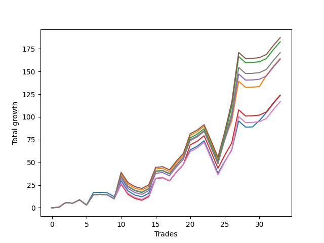

# Long Bulldog 005 
- Symbol: ES90d5mOut
- Date Range: 03/18/2022 - 07/08/2022
- Trading Period: 7:20-12:30
- Number of Trades: 33



| Name | Win Percent | Profit | Avg Profit / Trade |     | Name | Win Percent | Profit | Avg Profit / Trade |
| ---- | ----------- | ------ | ------------------ | --- | ---- | ----------- | ------ | ------------------ |
| Sorted By <br> Profit | | | | | Sorted By <br> Win Percentage ||||
| Five | 66.67 | 93625.00 | 2837.12 |     | Five | 66.67 | 93625.00 | 2837.12 |
| Two | 66.67 | 91375.00 | 2768.94 |     | Two | 66.67 | 91375.00 | 2768.94 |
| Seven | 66.67 | 85375.00 | 2587.12 |     | Seven | 66.67 | 85375.00 | 2587.12 |
| One | 66.67 | 82125.00 | 2488.64 |     | One | 66.67 | 82125.00 | 2488.64 |
| Four | 66.67 | 81750.00 | 2477.27 |     | Four | 66.67 | 81750.00 | 2477.27 |
| Three | 66.67 | 62000.00 | 1878.79 |     | Three | 66.67 | 62000.00 | 1878.79 |
| Zero | 66.67 | 61875.00 | 1875.00 |     | Zero | 66.67 | 61875.00 | 1875.00 |
| Six | 66.67 | 58375.00 | 1768.94 |     | Six | 66.67 | 58375.00 | 1768.94 |

### Test Zero
* Sell when price hits the middle line of the 20p bollinger
* No Stoploss
* Results:
```
Total Trades: 33
Percent Up: 66.67
Percent Down: 33.33
Total Points Moved Up: 123.75
Potential Profit: 61875.00
Total Points Ups: 198.75 Count Ups: 22
Total Points Downs: -75.00 Count Downs: 11
```

<details><summary>Trades</summary>

<code>In: 2022-03-21 10:05:00		Out: 2022-03-21 10:35:55		Total Position Time: 30:55		Total Move Up: 0.50		Total to Date: 0.50</code> <br />
<code>In: 2022-03-23 10:30:00		Out: 2022-03-23 11:00:55		Total Position Time: 30:55		Total Move Up: 5.25		Total to Date: 5.75</code> <br />
<code>In: 2022-03-23 10:45:00		Out: 2022-03-23 11:15:55		Total Position Time: 30:55		Total Move Up: -0.75		Total to Date: 5.00</code> <br />
<code>In: 2022-03-30 08:15:00		Out: 2022-03-30 08:45:55		Total Position Time: 30:55		Total Move Up: 3.75		Total to Date: 8.75</code> <br />
<code>In: 2022-03-30 12:10:00		Out: 2022-03-30 12:40:55		Total Position Time: 30:55		Total Move Up: -5.75		Total to Date: 3.00</code> <br />
<code>In: 2022-03-30 12:25:00		Out: 2022-03-30 12:46:25		Total Position Time: 21:25		Total Move Up: 13.75		Total to Date: 16.75</code> <br />
<code>In: 2022-03-31 11:20:00		Out: 2022-03-31 11:50:55		Total Position Time: 30:55		Total Move Up: 0.25		Total to Date: 17.00</code> <br />
<code>In: 2022-03-31 11:25:00		Out: 2022-03-31 11:55:55		Total Position Time: 30:55		Total Move Up: -0.50		Total to Date: 16.50</code> <br />
<code>In: 2022-04-01 09:05:00		Out: 2022-04-01 09:35:55		Total Position Time: 30:55		Total Move Up: -4.25		Total to Date: 12.25</code> <br />
<code>In: 2022-04-06 11:20:00		Out: 2022-04-06 11:32:35		Total Position Time: 12:35		Total Move Up: 17.50		Total to Date: 29.75</code> <br />
<code>In: 2022-04-12 11:00:00		Out: 2022-04-12 11:30:55		Total Position Time: 30:55		Total Move Up: -11.25		Total to Date: 18.50</code> <br />
<code>In: 2022-04-18 08:40:00		Out: 2022-04-18 09:10:55		Total Position Time: 30:55		Total Move Up: -4.50		Total to Date: 14.00</code> <br />
<code>In: 2022-04-18 08:50:00		Out: 2022-04-18 09:20:55		Total Position Time: 30:55		Total Move Up: -2.00		Total to Date: 12.00</code> <br />
<code>In: 2022-04-20 11:45:00		Out: 2022-04-20 12:15:55		Total Position Time: 30:55		Total Move Up: 4.00		Total to Date: 16.00</code> <br />
<code>In: 2022-04-20 11:55:00		Out: 2022-04-20 12:24:15		Total Position Time: 29:15		Total Move Up: 16.50		Total to Date: 32.50</code> <br />
<code>In: 2022-04-29 07:35:00		Out: 2022-04-29 08:05:55		Total Position Time: 30:55		Total Move Up: 0.75		Total to Date: 33.25</code> <br />
<code>In: 2022-05-02 10:05:00		Out: 2022-05-02 10:35:55		Total Position Time: 30:55		Total Move Up: -3.50		Total to Date: 29.75</code> <br />
<code>In: 2022-05-12 10:50:00		Out: 2022-05-12 11:20:55		Total Position Time: 30:55		Total Move Up: 9.75		Total to Date: 39.50</code> <br />
<code>In: 2022-05-13 11:05:00		Out: 2022-05-13 11:35:55		Total Position Time: 30:55		Total Move Up: 8.25		Total to Date: 47.75</code> <br />
<code>In: 2022-06-02 07:25:00		Out: 2022-06-02 07:38:55		Total Position Time: 13:55		Total Move Up: 16.00		Total to Date: 63.75</code> <br />
<code>In: 2022-06-08 09:45:00		Out: 2022-06-08 10:15:55		Total Position Time: 30:55		Total Move Up: 4.00		Total to Date: 67.75</code> <br />
<code>In: 2022-06-09 08:05:00		Out: 2022-06-09 08:35:55		Total Position Time: 30:55		Total Move Up: 6.00		Total to Date: 73.75</code> <br />
<code>In: 2022-06-09 12:15:00		Out: 2022-06-09 12:45:55		Total Position Time: 30:55		Total Move Up: -17.50		Total to Date: 56.25</code> <br />
<code>In: 2022-06-13 12:15:00		Out: 2022-06-13 12:45:55		Total Position Time: 30:55		Total Move Up: -18.25		Total to Date: 38.00</code> <br />
<code>In: 2022-06-15 11:10:00		Out: 2022-06-15 11:17:05		Total Position Time: 07:05		Total Move Up: 13.25		Total to Date: 51.25</code> <br />
<code>In: 2022-06-15 11:15:00		Out: 2022-06-15 11:17:05		Total Position Time: 02:05		Total Move Up: 12.25		Total to Date: 63.50</code> <br />
<code>In: 2022-06-15 11:35:00		Out: 2022-06-15 11:38:10		Total Position Time: 03:10		Total Move Up: 32.00		Total to Date: 95.50</code> <br />
<code>In: 2022-06-16 11:00:00		Out: 2022-06-16 11:30:55		Total Position Time: 30:55		Total Move Up: -6.75		Total to Date: 88.75</code> <br />
<code>In: 2022-06-16 11:10:00		Out: 2022-06-16 11:40:55		Total Position Time: 30:55		Total Move Up: 0.25		Total to Date: 89.00</code> <br />
<code>In: 2022-06-27 11:00:00		Out: 2022-06-27 11:19:05		Total Position Time: 19:05		Total Move Up: 7.00		Total to Date: 96.00</code> <br />
<code>In: 2022-06-27 12:05:00		Out: 2022-06-27 12:10:30		Total Position Time: 05:30		Total Move Up: 8.75		Total to Date: 104.75</code> <br />
<code>In: 2022-06-29 09:30:00		Out: 2022-06-29 10:00:55		Total Position Time: 30:55		Total Move Up: 9.75		Total to Date: 114.50</code> <br />
<code>In: 2022-07-06 08:45:00		Out: 2022-07-06 09:14:00		Total Position Time: 29:00		Total Move Up: 9.25		Total to Date: 123.75</code> <br />


</details>

### Test One
* Sell when the price hits the upper line of the 20p 1std bollinger
* No Stoploss
* Results:
```
Total Trades: 33
Percent Up: 66.67
Percent Down: 33.33
Total Points Moved Up: 164.25
Potential Profit: 82125.00
Total Points Ups: 239.25 Count Ups: 22
Total Points Downs: -75.00 Count Downs: 11
```

<details><summary>Trades</summary>

<code>In: 2022-03-21 10:05:00		Out: 2022-03-21 10:35:55		Total Position Time: 30:55		Total Move Up: 0.50		Total to Date: 0.50</code> <br />
<code>In: 2022-03-23 10:30:00		Out: 2022-03-23 11:00:55		Total Position Time: 30:55		Total Move Up: 5.25		Total to Date: 5.75</code> <br />
<code>In: 2022-03-23 10:45:00		Out: 2022-03-23 11:15:55		Total Position Time: 30:55		Total Move Up: -0.75		Total to Date: 5.00</code> <br />
<code>In: 2022-03-30 08:15:00		Out: 2022-03-30 08:45:55		Total Position Time: 30:55		Total Move Up: 3.75		Total to Date: 8.75</code> <br />
<code>In: 2022-03-30 12:10:00		Out: 2022-03-30 12:40:55		Total Position Time: 30:55		Total Move Up: -5.75		Total to Date: 3.00</code> <br />
<code>In: 2022-03-30 12:25:00		Out: 2022-03-30 12:55:55		Total Position Time: 30:55		Total Move Up: 11.50		Total to Date: 14.50</code> <br />
<code>In: 2022-03-31 11:20:00		Out: 2022-03-31 11:50:55		Total Position Time: 30:55		Total Move Up: 0.25		Total to Date: 14.75</code> <br />
<code>In: 2022-03-31 11:25:00		Out: 2022-03-31 11:55:55		Total Position Time: 30:55		Total Move Up: -0.50		Total to Date: 14.25</code> <br />
<code>In: 2022-04-01 09:05:00		Out: 2022-04-01 09:35:55		Total Position Time: 30:55		Total Move Up: -4.25		Total to Date: 10.00</code> <br />
<code>In: 2022-04-06 11:20:00		Out: 2022-04-06 11:34:05		Total Position Time: 14:05		Total Move Up: 27.25		Total to Date: 37.25</code> <br />
<code>In: 2022-04-12 11:00:00		Out: 2022-04-12 11:30:55		Total Position Time: 30:55		Total Move Up: -11.25		Total to Date: 26.00</code> <br />
<code>In: 2022-04-18 08:40:00		Out: 2022-04-18 09:10:55		Total Position Time: 30:55		Total Move Up: -4.50		Total to Date: 21.50</code> <br />
<code>In: 2022-04-18 08:50:00		Out: 2022-04-18 09:20:55		Total Position Time: 30:55		Total Move Up: -2.00		Total to Date: 19.50</code> <br />
<code>In: 2022-04-20 11:45:00		Out: 2022-04-20 12:15:55		Total Position Time: 30:55		Total Move Up: 4.00		Total to Date: 23.50</code> <br />
<code>In: 2022-04-20 11:55:00		Out: 2022-04-20 12:25:55		Total Position Time: 30:55		Total Move Up: 19.25		Total to Date: 42.75</code> <br />
<code>In: 2022-04-29 07:35:00		Out: 2022-04-29 08:05:55		Total Position Time: 30:55		Total Move Up: 0.75		Total to Date: 43.50</code> <br />
<code>In: 2022-05-02 10:05:00		Out: 2022-05-02 10:35:55		Total Position Time: 30:55		Total Move Up: -3.50		Total to Date: 40.00</code> <br />
<code>In: 2022-05-12 10:50:00		Out: 2022-05-12 11:20:55		Total Position Time: 30:55		Total Move Up: 9.75		Total to Date: 49.75</code> <br />
<code>In: 2022-05-13 11:05:00		Out: 2022-05-13 11:35:55		Total Position Time: 30:55		Total Move Up: 8.25		Total to Date: 58.00</code> <br />
<code>In: 2022-06-02 07:25:00		Out: 2022-06-02 07:55:55		Total Position Time: 30:55		Total Move Up: 21.75		Total to Date: 79.75</code> <br />
<code>In: 2022-06-08 09:45:00		Out: 2022-06-08 10:15:55		Total Position Time: 30:55		Total Move Up: 4.00		Total to Date: 83.75</code> <br />
<code>In: 2022-06-09 08:05:00		Out: 2022-06-09 08:35:55		Total Position Time: 30:55		Total Move Up: 6.00		Total to Date: 89.75</code> <br />
<code>In: 2022-06-09 12:15:00		Out: 2022-06-09 12:45:55		Total Position Time: 30:55		Total Move Up: -17.50		Total to Date: 72.25</code> <br />
<code>In: 2022-06-13 12:15:00		Out: 2022-06-13 12:45:55		Total Position Time: 30:55		Total Move Up: -18.25		Total to Date: 54.00</code> <br />
<code>In: 2022-06-15 11:10:00		Out: 2022-06-15 11:38:55		Total Position Time: 28:55		Total Move Up: 21.50		Total to Date: 75.50</code> <br />
<code>In: 2022-06-15 11:15:00		Out: 2022-06-15 11:38:55		Total Position Time: 23:55		Total Move Up: 20.50		Total to Date: 96.00</code> <br />
<code>In: 2022-06-15 11:35:00		Out: 2022-06-15 11:38:55		Total Position Time: 03:55		Total Move Up: 43.25		Total to Date: 139.25</code> <br />
<code>In: 2022-06-16 11:00:00		Out: 2022-06-16 11:30:55		Total Position Time: 30:55		Total Move Up: -6.75		Total to Date: 132.50</code> <br />
<code>In: 2022-06-16 11:10:00		Out: 2022-06-16 11:40:55		Total Position Time: 30:55		Total Move Up: 0.25		Total to Date: 132.75</code> <br />
<code>In: 2022-06-27 11:00:00		Out: 2022-06-27 11:30:55		Total Position Time: 30:55		Total Move Up: 0.75		Total to Date: 133.50</code> <br />
<code>In: 2022-06-27 12:05:00		Out: 2022-06-27 12:15:20		Total Position Time: 10:20		Total Move Up: 12.25		Total to Date: 145.75</code> <br />
<code>In: 2022-06-29 09:30:00		Out: 2022-06-29 10:00:55		Total Position Time: 30:55		Total Move Up: 9.75		Total to Date: 155.50</code> <br />
<code>In: 2022-07-06 08:45:00		Out: 2022-07-06 09:15:55		Total Position Time: 30:55		Total Move Up: 8.75		Total to Date: 164.25</code> <br />


</details>

### Test Two
* Sell when the price hits the upper line of the 20p 2std bollinger
* No Stoploss
* Results:
```
Total Trades: 33
Percent Up: 66.67
Percent Down: 33.33
Total Points Moved Up: 182.75
Potential Profit: 91375.00
Total Points Ups: 257.75 Count Ups: 22
Total Points Downs: -75.00 Count Downs: 11
```

<details><summary>Trades</summary>

<code>In: 2022-03-21 10:05:00		Out: 2022-03-21 10:35:55		Total Position Time: 30:55		Total Move Up: 0.50		Total to Date: 0.50</code> <br />
<code>In: 2022-03-23 10:30:00		Out: 2022-03-23 11:00:55		Total Position Time: 30:55		Total Move Up: 5.25		Total to Date: 5.75</code> <br />
<code>In: 2022-03-23 10:45:00		Out: 2022-03-23 11:15:55		Total Position Time: 30:55		Total Move Up: -0.75		Total to Date: 5.00</code> <br />
<code>In: 2022-03-30 08:15:00		Out: 2022-03-30 08:45:55		Total Position Time: 30:55		Total Move Up: 3.75		Total to Date: 8.75</code> <br />
<code>In: 2022-03-30 12:10:00		Out: 2022-03-30 12:40:55		Total Position Time: 30:55		Total Move Up: -5.75		Total to Date: 3.00</code> <br />
<code>In: 2022-03-30 12:25:00		Out: 2022-03-30 12:55:55		Total Position Time: 30:55		Total Move Up: 11.50		Total to Date: 14.50</code> <br />
<code>In: 2022-03-31 11:20:00		Out: 2022-03-31 11:50:55		Total Position Time: 30:55		Total Move Up: 0.25		Total to Date: 14.75</code> <br />
<code>In: 2022-03-31 11:25:00		Out: 2022-03-31 11:55:55		Total Position Time: 30:55		Total Move Up: -0.50		Total to Date: 14.25</code> <br />
<code>In: 2022-04-01 09:05:00		Out: 2022-04-01 09:35:55		Total Position Time: 30:55		Total Move Up: -4.25		Total to Date: 10.00</code> <br />
<code>In: 2022-04-06 11:20:00		Out: 2022-04-06 11:50:55		Total Position Time: 30:55		Total Move Up: 24.50		Total to Date: 34.50</code> <br />
<code>In: 2022-04-12 11:00:00		Out: 2022-04-12 11:30:55		Total Position Time: 30:55		Total Move Up: -11.25		Total to Date: 23.25</code> <br />
<code>In: 2022-04-18 08:40:00		Out: 2022-04-18 09:10:55		Total Position Time: 30:55		Total Move Up: -4.50		Total to Date: 18.75</code> <br />
<code>In: 2022-04-18 08:50:00		Out: 2022-04-18 09:20:55		Total Position Time: 30:55		Total Move Up: -2.00		Total to Date: 16.75</code> <br />
<code>In: 2022-04-20 11:45:00		Out: 2022-04-20 12:15:55		Total Position Time: 30:55		Total Move Up: 4.00		Total to Date: 20.75</code> <br />
<code>In: 2022-04-20 11:55:00		Out: 2022-04-20 12:25:55		Total Position Time: 30:55		Total Move Up: 19.25		Total to Date: 40.00</code> <br />
<code>In: 2022-04-29 07:35:00		Out: 2022-04-29 08:05:55		Total Position Time: 30:55		Total Move Up: 0.75		Total to Date: 40.75</code> <br />
<code>In: 2022-05-02 10:05:00		Out: 2022-05-02 10:35:55		Total Position Time: 30:55		Total Move Up: -3.50		Total to Date: 37.25</code> <br />
<code>In: 2022-05-12 10:50:00		Out: 2022-05-12 11:20:55		Total Position Time: 30:55		Total Move Up: 9.75		Total to Date: 47.00</code> <br />
<code>In: 2022-05-13 11:05:00		Out: 2022-05-13 11:35:55		Total Position Time: 30:55		Total Move Up: 8.25		Total to Date: 55.25</code> <br />
<code>In: 2022-06-02 07:25:00		Out: 2022-06-02 07:55:55		Total Position Time: 30:55		Total Move Up: 21.75		Total to Date: 77.00</code> <br />
<code>In: 2022-06-08 09:45:00		Out: 2022-06-08 10:15:55		Total Position Time: 30:55		Total Move Up: 4.00		Total to Date: 81.00</code> <br />
<code>In: 2022-06-09 08:05:00		Out: 2022-06-09 08:35:55		Total Position Time: 30:55		Total Move Up: 6.00		Total to Date: 87.00</code> <br />
<code>In: 2022-06-09 12:15:00		Out: 2022-06-09 12:45:55		Total Position Time: 30:55		Total Move Up: -17.50		Total to Date: 69.50</code> <br />
<code>In: 2022-06-13 12:15:00		Out: 2022-06-13 12:45:55		Total Position Time: 30:55		Total Move Up: -18.25		Total to Date: 51.25</code> <br />
<code>In: 2022-06-15 11:10:00		Out: 2022-06-15 11:40:55		Total Position Time: 30:55		Total Move Up: 28.50		Total to Date: 79.75</code> <br />
<code>In: 2022-06-15 11:15:00		Out: 2022-06-15 11:41:00		Total Position Time: 26:00		Total Move Up: 32.00		Total to Date: 111.75</code> <br />
<code>In: 2022-06-15 11:35:00		Out: 2022-06-15 11:41:00		Total Position Time: 06:00		Total Move Up: 54.75		Total to Date: 166.50</code> <br />
<code>In: 2022-06-16 11:00:00		Out: 2022-06-16 11:30:55		Total Position Time: 30:55		Total Move Up: -6.75		Total to Date: 159.75</code> <br />
<code>In: 2022-06-16 11:10:00		Out: 2022-06-16 11:40:55		Total Position Time: 30:55		Total Move Up: 0.25		Total to Date: 160.00</code> <br />
<code>In: 2022-06-27 11:00:00		Out: 2022-06-27 11:30:55		Total Position Time: 30:55		Total Move Up: 0.75		Total to Date: 160.75</code> <br />
<code>In: 2022-06-27 12:05:00		Out: 2022-06-27 12:35:55		Total Position Time: 30:55		Total Move Up: 3.50		Total to Date: 164.25</code> <br />
<code>In: 2022-06-29 09:30:00		Out: 2022-06-29 10:00:55		Total Position Time: 30:55		Total Move Up: 9.75		Total to Date: 174.00</code> <br />
<code>In: 2022-07-06 08:45:00		Out: 2022-07-06 09:15:55		Total Position Time: 30:55		Total Move Up: 8.75		Total to Date: 182.75</code> <br />


</details>

### Test Three
* Sell when price hits the middle line of the 50p bollinger
* No Stoploss
* Results:
```
Total Trades: 33
Percent Up: 66.67
Percent Down: 33.33
Total Points Moved Up: 124.00
Potential Profit: 62000.00
Total Points Ups: 199.00 Count Ups: 22
Total Points Downs: -75.00 Count Downs: 11
```

<details><summary>Trades</summary>

<code>In: 2022-03-21 10:05:00		Out: 2022-03-21 10:35:55		Total Position Time: 30:55		Total Move Up: 0.50		Total to Date: 0.50</code> <br />
<code>In: 2022-03-23 10:30:00		Out: 2022-03-23 11:00:55		Total Position Time: 30:55		Total Move Up: 5.25		Total to Date: 5.75</code> <br />
<code>In: 2022-03-23 10:45:00		Out: 2022-03-23 11:15:55		Total Position Time: 30:55		Total Move Up: -0.75		Total to Date: 5.00</code> <br />
<code>In: 2022-03-30 08:15:00		Out: 2022-03-30 08:45:55		Total Position Time: 30:55		Total Move Up: 3.75		Total to Date: 8.75</code> <br />
<code>In: 2022-03-30 12:10:00		Out: 2022-03-30 12:40:55		Total Position Time: 30:55		Total Move Up: -5.75		Total to Date: 3.00</code> <br />
<code>In: 2022-03-30 12:25:00		Out: 2022-03-30 12:55:55		Total Position Time: 30:55		Total Move Up: 11.50		Total to Date: 14.50</code> <br />
<code>In: 2022-03-31 11:20:00		Out: 2022-03-31 11:50:55		Total Position Time: 30:55		Total Move Up: 0.25		Total to Date: 14.75</code> <br />
<code>In: 2022-03-31 11:25:00		Out: 2022-03-31 11:55:55		Total Position Time: 30:55		Total Move Up: -0.50		Total to Date: 14.25</code> <br />
<code>In: 2022-04-01 09:05:00		Out: 2022-04-01 09:35:55		Total Position Time: 30:55		Total Move Up: -4.25		Total to Date: 10.00</code> <br />
<code>In: 2022-04-06 11:20:00		Out: 2022-04-06 11:32:15		Total Position Time: 12:15		Total Move Up: 16.00		Total to Date: 26.00</code> <br />
<code>In: 2022-04-12 11:00:00		Out: 2022-04-12 11:30:55		Total Position Time: 30:55		Total Move Up: -11.25		Total to Date: 14.75</code> <br />
<code>In: 2022-04-18 08:40:00		Out: 2022-04-18 09:10:55		Total Position Time: 30:55		Total Move Up: -4.50		Total to Date: 10.25</code> <br />
<code>In: 2022-04-18 08:50:00		Out: 2022-04-18 09:20:55		Total Position Time: 30:55		Total Move Up: -2.00		Total to Date: 8.25</code> <br />
<code>In: 2022-04-20 11:45:00		Out: 2022-04-20 12:15:55		Total Position Time: 30:55		Total Move Up: 4.00		Total to Date: 12.25</code> <br />
<code>In: 2022-04-20 11:55:00		Out: 2022-04-20 12:25:50		Total Position Time: 30:50		Total Move Up: 20.00		Total to Date: 32.25</code> <br />
<code>In: 2022-04-29 07:35:00		Out: 2022-04-29 08:05:55		Total Position Time: 30:55		Total Move Up: 0.75		Total to Date: 33.00</code> <br />
<code>In: 2022-05-02 10:05:00		Out: 2022-05-02 10:35:55		Total Position Time: 30:55		Total Move Up: -3.50		Total to Date: 29.50</code> <br />
<code>In: 2022-05-12 10:50:00		Out: 2022-05-12 11:20:55		Total Position Time: 30:55		Total Move Up: 9.75		Total to Date: 39.25</code> <br />
<code>In: 2022-05-13 11:05:00		Out: 2022-05-13 11:35:55		Total Position Time: 30:55		Total Move Up: 8.25		Total to Date: 47.50</code> <br />
<code>In: 2022-06-02 07:25:00		Out: 2022-06-02 07:55:55		Total Position Time: 30:55		Total Move Up: 21.75		Total to Date: 69.25</code> <br />
<code>In: 2022-06-08 09:45:00		Out: 2022-06-08 10:15:55		Total Position Time: 30:55		Total Move Up: 4.00		Total to Date: 73.25</code> <br />
<code>In: 2022-06-09 08:05:00		Out: 2022-06-09 08:35:55		Total Position Time: 30:55		Total Move Up: 6.00		Total to Date: 79.25</code> <br />
<code>In: 2022-06-09 12:15:00		Out: 2022-06-09 12:45:55		Total Position Time: 30:55		Total Move Up: -17.50		Total to Date: 61.75</code> <br />
<code>In: 2022-06-13 12:15:00		Out: 2022-06-13 12:45:55		Total Position Time: 30:55		Total Move Up: -18.25		Total to Date: 43.50</code> <br />
<code>In: 2022-06-15 11:10:00		Out: 2022-06-15 11:38:45		Total Position Time: 28:45		Total Move Up: 14.50		Total to Date: 58.00</code> <br />
<code>In: 2022-06-15 11:15:00		Out: 2022-06-15 11:38:45		Total Position Time: 23:45		Total Move Up: 13.50		Total to Date: 71.50</code> <br />
<code>In: 2022-06-15 11:35:00		Out: 2022-06-15 11:38:45		Total Position Time: 03:45		Total Move Up: 36.25		Total to Date: 107.75</code> <br />
<code>In: 2022-06-16 11:00:00		Out: 2022-06-16 11:30:55		Total Position Time: 30:55		Total Move Up: -6.75		Total to Date: 101.00</code> <br />
<code>In: 2022-06-16 11:10:00		Out: 2022-06-16 11:40:55		Total Position Time: 30:55		Total Move Up: 0.25		Total to Date: 101.25</code> <br />
<code>In: 2022-06-27 11:00:00		Out: 2022-06-27 11:30:55		Total Position Time: 30:55		Total Move Up: 0.75		Total to Date: 102.00</code> <br />
<code>In: 2022-06-27 12:05:00		Out: 2022-06-27 12:35:55		Total Position Time: 30:55		Total Move Up: 3.50		Total to Date: 105.50</code> <br />
<code>In: 2022-06-29 09:30:00		Out: 2022-06-29 10:00:55		Total Position Time: 30:55		Total Move Up: 9.75		Total to Date: 115.25</code> <br />
<code>In: 2022-07-06 08:45:00		Out: 2022-07-06 09:15:55		Total Position Time: 30:55		Total Move Up: 8.75		Total to Date: 124.00</code> <br />


</details>

### Test Four
* Sell when the price hits the upper line of the 50p 1std bollinger
* No Stoploss
* Results:
```
Total Trades: 33
Percent Up: 66.67
Percent Down: 33.33
Total Points Moved Up: 163.50
Potential Profit: 81750.00
Total Points Ups: 238.50 Count Ups: 22
Total Points Downs: -75.00 Count Downs: 11
```

<details><summary>Trades</summary>

<code>In: 2022-03-21 10:05:00		Out: 2022-03-21 10:35:55		Total Position Time: 30:55		Total Move Up: 0.50		Total to Date: 0.50</code> <br />
<code>In: 2022-03-23 10:30:00		Out: 2022-03-23 11:00:55		Total Position Time: 30:55		Total Move Up: 5.25		Total to Date: 5.75</code> <br />
<code>In: 2022-03-23 10:45:00		Out: 2022-03-23 11:15:55		Total Position Time: 30:55		Total Move Up: -0.75		Total to Date: 5.00</code> <br />
<code>In: 2022-03-30 08:15:00		Out: 2022-03-30 08:45:55		Total Position Time: 30:55		Total Move Up: 3.75		Total to Date: 8.75</code> <br />
<code>In: 2022-03-30 12:10:00		Out: 2022-03-30 12:40:55		Total Position Time: 30:55		Total Move Up: -5.75		Total to Date: 3.00</code> <br />
<code>In: 2022-03-30 12:25:00		Out: 2022-03-30 12:55:55		Total Position Time: 30:55		Total Move Up: 11.50		Total to Date: 14.50</code> <br />
<code>In: 2022-03-31 11:20:00		Out: 2022-03-31 11:50:55		Total Position Time: 30:55		Total Move Up: 0.25		Total to Date: 14.75</code> <br />
<code>In: 2022-03-31 11:25:00		Out: 2022-03-31 11:55:55		Total Position Time: 30:55		Total Move Up: -0.50		Total to Date: 14.25</code> <br />
<code>In: 2022-04-01 09:05:00		Out: 2022-04-01 09:35:55		Total Position Time: 30:55		Total Move Up: -4.25		Total to Date: 10.00</code> <br />
<code>In: 2022-04-06 11:20:00		Out: 2022-04-06 11:32:45		Total Position Time: 12:45		Total Move Up: 22.50		Total to Date: 32.50</code> <br />
<code>In: 2022-04-12 11:00:00		Out: 2022-04-12 11:30:55		Total Position Time: 30:55		Total Move Up: -11.25		Total to Date: 21.25</code> <br />
<code>In: 2022-04-18 08:40:00		Out: 2022-04-18 09:10:55		Total Position Time: 30:55		Total Move Up: -4.50		Total to Date: 16.75</code> <br />
<code>In: 2022-04-18 08:50:00		Out: 2022-04-18 09:20:55		Total Position Time: 30:55		Total Move Up: -2.00		Total to Date: 14.75</code> <br />
<code>In: 2022-04-20 11:45:00		Out: 2022-04-20 12:15:55		Total Position Time: 30:55		Total Move Up: 4.00		Total to Date: 18.75</code> <br />
<code>In: 2022-04-20 11:55:00		Out: 2022-04-20 12:25:55		Total Position Time: 30:55		Total Move Up: 19.25		Total to Date: 38.00</code> <br />
<code>In: 2022-04-29 07:35:00		Out: 2022-04-29 08:05:55		Total Position Time: 30:55		Total Move Up: 0.75		Total to Date: 38.75</code> <br />
<code>In: 2022-05-02 10:05:00		Out: 2022-05-02 10:35:55		Total Position Time: 30:55		Total Move Up: -3.50		Total to Date: 35.25</code> <br />
<code>In: 2022-05-12 10:50:00		Out: 2022-05-12 11:20:55		Total Position Time: 30:55		Total Move Up: 9.75		Total to Date: 45.00</code> <br />
<code>In: 2022-05-13 11:05:00		Out: 2022-05-13 11:35:55		Total Position Time: 30:55		Total Move Up: 8.25		Total to Date: 53.25</code> <br />
<code>In: 2022-06-02 07:25:00		Out: 2022-06-02 07:55:55		Total Position Time: 30:55		Total Move Up: 21.75		Total to Date: 75.00</code> <br />
<code>In: 2022-06-08 09:45:00		Out: 2022-06-08 10:15:55		Total Position Time: 30:55		Total Move Up: 4.00		Total to Date: 79.00</code> <br />
<code>In: 2022-06-09 08:05:00		Out: 2022-06-09 08:35:55		Total Position Time: 30:55		Total Move Up: 6.00		Total to Date: 85.00</code> <br />
<code>In: 2022-06-09 12:15:00		Out: 2022-06-09 12:45:55		Total Position Time: 30:55		Total Move Up: -17.50		Total to Date: 67.50</code> <br />
<code>In: 2022-06-13 12:15:00		Out: 2022-06-13 12:45:55		Total Position Time: 30:55		Total Move Up: -18.25		Total to Date: 49.25</code> <br />
<code>In: 2022-06-15 11:10:00		Out: 2022-06-15 11:39:00		Total Position Time: 29:00		Total Move Up: 25.75		Total to Date: 75.00</code> <br />
<code>In: 2022-06-15 11:15:00		Out: 2022-06-15 11:39:00		Total Position Time: 24:00		Total Move Up: 24.75		Total to Date: 99.75</code> <br />
<code>In: 2022-06-15 11:35:00		Out: 2022-06-15 11:39:00		Total Position Time: 04:00		Total Move Up: 47.50		Total to Date: 147.25</code> <br />
<code>In: 2022-06-16 11:00:00		Out: 2022-06-16 11:30:55		Total Position Time: 30:55		Total Move Up: -6.75		Total to Date: 140.50</code> <br />
<code>In: 2022-06-16 11:10:00		Out: 2022-06-16 11:40:55		Total Position Time: 30:55		Total Move Up: 0.25		Total to Date: 140.75</code> <br />
<code>In: 2022-06-27 11:00:00		Out: 2022-06-27 11:30:55		Total Position Time: 30:55		Total Move Up: 0.75		Total to Date: 141.50</code> <br />
<code>In: 2022-06-27 12:05:00		Out: 2022-06-27 12:35:55		Total Position Time: 30:55		Total Move Up: 3.50		Total to Date: 145.00</code> <br />
<code>In: 2022-06-29 09:30:00		Out: 2022-06-29 10:00:55		Total Position Time: 30:55		Total Move Up: 9.75		Total to Date: 154.75</code> <br />
<code>In: 2022-07-06 08:45:00		Out: 2022-07-06 09:15:55		Total Position Time: 30:55		Total Move Up: 8.75		Total to Date: 163.50</code> <br />


</details>

### Test Five
* Sell when the price hits the upper line of the 50p 2std bollinger
* No Stoploss
* Results:
```
Total Trades: 33
Percent Up: 66.67
Percent Down: 33.33
Total Points Moved Up: 187.25
Potential Profit: 93625.00
Total Points Ups: 262.25 Count Ups: 22
Total Points Downs: -75.00 Count Downs: 11
```

<details><summary>Trades</summary>

<code>In: 2022-03-21 10:05:00		Out: 2022-03-21 10:35:55		Total Position Time: 30:55		Total Move Up: 0.50		Total to Date: 0.50</code> <br />
<code>In: 2022-03-23 10:30:00		Out: 2022-03-23 11:00:55		Total Position Time: 30:55		Total Move Up: 5.25		Total to Date: 5.75</code> <br />
<code>In: 2022-03-23 10:45:00		Out: 2022-03-23 11:15:55		Total Position Time: 30:55		Total Move Up: -0.75		Total to Date: 5.00</code> <br />
<code>In: 2022-03-30 08:15:00		Out: 2022-03-30 08:45:55		Total Position Time: 30:55		Total Move Up: 3.75		Total to Date: 8.75</code> <br />
<code>In: 2022-03-30 12:10:00		Out: 2022-03-30 12:40:55		Total Position Time: 30:55		Total Move Up: -5.75		Total to Date: 3.00</code> <br />
<code>In: 2022-03-30 12:25:00		Out: 2022-03-30 12:55:55		Total Position Time: 30:55		Total Move Up: 11.50		Total to Date: 14.50</code> <br />
<code>In: 2022-03-31 11:20:00		Out: 2022-03-31 11:50:55		Total Position Time: 30:55		Total Move Up: 0.25		Total to Date: 14.75</code> <br />
<code>In: 2022-03-31 11:25:00		Out: 2022-03-31 11:55:55		Total Position Time: 30:55		Total Move Up: -0.50		Total to Date: 14.25</code> <br />
<code>In: 2022-04-01 09:05:00		Out: 2022-04-01 09:35:55		Total Position Time: 30:55		Total Move Up: -4.25		Total to Date: 10.00</code> <br />
<code>In: 2022-04-06 11:20:00		Out: 2022-04-06 11:34:25		Total Position Time: 14:25		Total Move Up: 29.00		Total to Date: 39.00</code> <br />
<code>In: 2022-04-12 11:00:00		Out: 2022-04-12 11:30:55		Total Position Time: 30:55		Total Move Up: -11.25		Total to Date: 27.75</code> <br />
<code>In: 2022-04-18 08:40:00		Out: 2022-04-18 09:10:55		Total Position Time: 30:55		Total Move Up: -4.50		Total to Date: 23.25</code> <br />
<code>In: 2022-04-18 08:50:00		Out: 2022-04-18 09:20:55		Total Position Time: 30:55		Total Move Up: -2.00		Total to Date: 21.25</code> <br />
<code>In: 2022-04-20 11:45:00		Out: 2022-04-20 12:15:55		Total Position Time: 30:55		Total Move Up: 4.00		Total to Date: 25.25</code> <br />
<code>In: 2022-04-20 11:55:00		Out: 2022-04-20 12:25:55		Total Position Time: 30:55		Total Move Up: 19.25		Total to Date: 44.50</code> <br />
<code>In: 2022-04-29 07:35:00		Out: 2022-04-29 08:05:55		Total Position Time: 30:55		Total Move Up: 0.75		Total to Date: 45.25</code> <br />
<code>In: 2022-05-02 10:05:00		Out: 2022-05-02 10:35:55		Total Position Time: 30:55		Total Move Up: -3.50		Total to Date: 41.75</code> <br />
<code>In: 2022-05-12 10:50:00		Out: 2022-05-12 11:20:55		Total Position Time: 30:55		Total Move Up: 9.75		Total to Date: 51.50</code> <br />
<code>In: 2022-05-13 11:05:00		Out: 2022-05-13 11:35:55		Total Position Time: 30:55		Total Move Up: 8.25		Total to Date: 59.75</code> <br />
<code>In: 2022-06-02 07:25:00		Out: 2022-06-02 07:55:55		Total Position Time: 30:55		Total Move Up: 21.75		Total to Date: 81.50</code> <br />
<code>In: 2022-06-08 09:45:00		Out: 2022-06-08 10:15:55		Total Position Time: 30:55		Total Move Up: 4.00		Total to Date: 85.50</code> <br />
<code>In: 2022-06-09 08:05:00		Out: 2022-06-09 08:35:55		Total Position Time: 30:55		Total Move Up: 6.00		Total to Date: 91.50</code> <br />
<code>In: 2022-06-09 12:15:00		Out: 2022-06-09 12:45:55		Total Position Time: 30:55		Total Move Up: -17.50		Total to Date: 74.00</code> <br />
<code>In: 2022-06-13 12:15:00		Out: 2022-06-13 12:45:55		Total Position Time: 30:55		Total Move Up: -18.25		Total to Date: 55.75</code> <br />
<code>In: 2022-06-15 11:10:00		Out: 2022-06-15 11:40:55		Total Position Time: 30:55		Total Move Up: 28.50		Total to Date: 84.25</code> <br />
<code>In: 2022-06-15 11:15:00		Out: 2022-06-15 11:41:00		Total Position Time: 26:00		Total Move Up: 32.00		Total to Date: 116.25</code> <br />
<code>In: 2022-06-15 11:35:00		Out: 2022-06-15 11:41:00		Total Position Time: 06:00		Total Move Up: 54.75		Total to Date: 171.00</code> <br />
<code>In: 2022-06-16 11:00:00		Out: 2022-06-16 11:30:55		Total Position Time: 30:55		Total Move Up: -6.75		Total to Date: 164.25</code> <br />
<code>In: 2022-06-16 11:10:00		Out: 2022-06-16 11:40:55		Total Position Time: 30:55		Total Move Up: 0.25		Total to Date: 164.50</code> <br />
<code>In: 2022-06-27 11:00:00		Out: 2022-06-27 11:30:55		Total Position Time: 30:55		Total Move Up: 0.75		Total to Date: 165.25</code> <br />
<code>In: 2022-06-27 12:05:00		Out: 2022-06-27 12:35:55		Total Position Time: 30:55		Total Move Up: 3.50		Total to Date: 168.75</code> <br />
<code>In: 2022-06-29 09:30:00		Out: 2022-06-29 10:00:55		Total Position Time: 30:55		Total Move Up: 9.75		Total to Date: 178.50</code> <br />
<code>In: 2022-07-06 08:45:00		Out: 2022-07-06 09:15:55		Total Position Time: 30:55		Total Move Up: 8.75		Total to Date: 187.25</code> <br />


</details>

### Test Six
* Sell when the price hits the middle line of the 1std VWAP
* No Stoploss
* Results:
```
Total Trades: 33
Percent Up: 66.67
Percent Down: 33.33
Total Points Moved Up: 116.75
Potential Profit: 58375.00
Total Points Ups: 191.75 Count Ups: 22
Total Points Downs: -75.00 Count Downs: 11
```

<details><summary>Trades</summary>

<code>In: 2022-03-21 10:05:00		Out: 2022-03-21 10:35:55		Total Position Time: 30:55		Total Move Up: 0.50		Total to Date: 0.50</code> <br />
<code>In: 2022-03-23 10:30:00		Out: 2022-03-23 11:00:55		Total Position Time: 30:55		Total Move Up: 5.25		Total to Date: 5.75</code> <br />
<code>In: 2022-03-23 10:45:00		Out: 2022-03-23 11:15:55		Total Position Time: 30:55		Total Move Up: -0.75		Total to Date: 5.00</code> <br />
<code>In: 2022-03-30 08:15:00		Out: 2022-03-30 08:45:55		Total Position Time: 30:55		Total Move Up: 3.75		Total to Date: 8.75</code> <br />
<code>In: 2022-03-30 12:10:00		Out: 2022-03-30 12:40:55		Total Position Time: 30:55		Total Move Up: -5.75		Total to Date: 3.00</code> <br />
<code>In: 2022-03-30 12:25:00		Out: 2022-03-30 12:55:55		Total Position Time: 30:55		Total Move Up: 11.50		Total to Date: 14.50</code> <br />
<code>In: 2022-03-31 11:20:00		Out: 2022-03-31 11:50:55		Total Position Time: 30:55		Total Move Up: 0.25		Total to Date: 14.75</code> <br />
<code>In: 2022-03-31 11:25:00		Out: 2022-03-31 11:55:55		Total Position Time: 30:55		Total Move Up: -0.50		Total to Date: 14.25</code> <br />
<code>In: 2022-04-01 09:05:00		Out: 2022-04-01 09:35:55		Total Position Time: 30:55		Total Move Up: -4.25		Total to Date: 10.00</code> <br />
<code>In: 2022-04-06 11:20:00		Out: 2022-04-06 11:32:25		Total Position Time: 12:25		Total Move Up: 17.00		Total to Date: 27.00</code> <br />
<code>In: 2022-04-12 11:00:00		Out: 2022-04-12 11:30:55		Total Position Time: 30:55		Total Move Up: -11.25		Total to Date: 15.75</code> <br />
<code>In: 2022-04-18 08:40:00		Out: 2022-04-18 09:10:55		Total Position Time: 30:55		Total Move Up: -4.50		Total to Date: 11.25</code> <br />
<code>In: 2022-04-18 08:50:00		Out: 2022-04-18 09:20:55		Total Position Time: 30:55		Total Move Up: -2.00		Total to Date: 9.25</code> <br />
<code>In: 2022-04-20 11:45:00		Out: 2022-04-20 12:15:55		Total Position Time: 30:55		Total Move Up: 4.00		Total to Date: 13.25</code> <br />
<code>In: 2022-04-20 11:55:00		Out: 2022-04-20 12:25:55		Total Position Time: 30:55		Total Move Up: 19.25		Total to Date: 32.50</code> <br />
<code>In: 2022-04-29 07:35:00		Out: 2022-04-29 08:05:55		Total Position Time: 30:55		Total Move Up: 0.75		Total to Date: 33.25</code> <br />
<code>In: 2022-05-02 10:05:00		Out: 2022-05-02 10:35:55		Total Position Time: 30:55		Total Move Up: -3.50		Total to Date: 29.75</code> <br />
<code>In: 2022-05-12 10:50:00		Out: 2022-05-12 11:20:55		Total Position Time: 30:55		Total Move Up: 9.75		Total to Date: 39.50</code> <br />
<code>In: 2022-05-13 11:05:00		Out: 2022-05-13 11:35:55		Total Position Time: 30:55		Total Move Up: 8.25		Total to Date: 47.75</code> <br />
<code>In: 2022-06-02 07:25:00		Out: 2022-06-02 07:34:25		Total Position Time: 09:25		Total Move Up: 14.25		Total to Date: 62.00</code> <br />
<code>In: 2022-06-08 09:45:00		Out: 2022-06-08 10:15:55		Total Position Time: 30:55		Total Move Up: 4.00		Total to Date: 66.00</code> <br />
<code>In: 2022-06-09 08:05:00		Out: 2022-06-09 08:35:55		Total Position Time: 30:55		Total Move Up: 6.00		Total to Date: 72.00</code> <br />
<code>In: 2022-06-09 12:15:00		Out: 2022-06-09 12:45:55		Total Position Time: 30:55		Total Move Up: -17.50		Total to Date: 54.50</code> <br />
<code>In: 2022-06-13 12:15:00		Out: 2022-06-13 12:45:55		Total Position Time: 30:55		Total Move Up: -18.25		Total to Date: 36.25</code> <br />
<code>In: 2022-06-15 11:10:00		Out: 2022-06-15 11:38:45		Total Position Time: 28:45		Total Move Up: 14.50		Total to Date: 50.75</code> <br />
<code>In: 2022-06-15 11:15:00		Out: 2022-06-15 11:38:45		Total Position Time: 23:45		Total Move Up: 13.50		Total to Date: 64.25</code> <br />
<code>In: 2022-06-15 11:35:00		Out: 2022-06-15 11:38:45		Total Position Time: 03:45		Total Move Up: 36.25		Total to Date: 100.50</code> <br />
<code>In: 2022-06-16 11:00:00		Out: 2022-06-16 11:30:55		Total Position Time: 30:55		Total Move Up: -6.75		Total to Date: 93.75</code> <br />
<code>In: 2022-06-16 11:10:00		Out: 2022-06-16 11:40:55		Total Position Time: 30:55		Total Move Up: 0.25		Total to Date: 94.00</code> <br />
<code>In: 2022-06-27 11:00:00		Out: 2022-06-27 11:30:55		Total Position Time: 30:55		Total Move Up: 0.75		Total to Date: 94.75</code> <br />
<code>In: 2022-06-27 12:05:00		Out: 2022-06-27 12:35:55		Total Position Time: 30:55		Total Move Up: 3.50		Total to Date: 98.25</code> <br />
<code>In: 2022-06-29 09:30:00		Out: 2022-06-29 10:00:55		Total Position Time: 30:55		Total Move Up: 9.75		Total to Date: 108.00</code> <br />
<code>In: 2022-07-06 08:45:00		Out: 2022-07-06 09:15:55		Total Position Time: 30:55		Total Move Up: 8.75		Total to Date: 116.75</code> <br />


</details>

### Test Seven
* Sell when the price hits the upper line of the 1std VWAP
* No Stoploss
* Results:
```
Total Trades: 33
Percent Up: 66.67
Percent Down: 33.33
Total Points Moved Up: 170.75
Potential Profit: 85375.00
Total Points Ups: 245.75 Count Ups: 22
Total Points Downs: -75.00 Count Downs: 11
```

<details><summary>Trades</summary>

<code>In: 2022-03-21 10:05:00		Out: 2022-03-21 10:35:55		Total Position Time: 30:55		Total Move Up: 0.50		Total to Date: 0.50</code> <br />
<code>In: 2022-03-23 10:30:00		Out: 2022-03-23 11:00:55		Total Position Time: 30:55		Total Move Up: 5.25		Total to Date: 5.75</code> <br />
<code>In: 2022-03-23 10:45:00		Out: 2022-03-23 11:15:55		Total Position Time: 30:55		Total Move Up: -0.75		Total to Date: 5.00</code> <br />
<code>In: 2022-03-30 08:15:00		Out: 2022-03-30 08:45:55		Total Position Time: 30:55		Total Move Up: 3.75		Total to Date: 8.75</code> <br />
<code>In: 2022-03-30 12:10:00		Out: 2022-03-30 12:40:55		Total Position Time: 30:55		Total Move Up: -5.75		Total to Date: 3.00</code> <br />
<code>In: 2022-03-30 12:25:00		Out: 2022-03-30 12:55:55		Total Position Time: 30:55		Total Move Up: 11.50		Total to Date: 14.50</code> <br />
<code>In: 2022-03-31 11:20:00		Out: 2022-03-31 11:50:55		Total Position Time: 30:55		Total Move Up: 0.25		Total to Date: 14.75</code> <br />
<code>In: 2022-03-31 11:25:00		Out: 2022-03-31 11:55:55		Total Position Time: 30:55		Total Move Up: -0.50		Total to Date: 14.25</code> <br />
<code>In: 2022-04-01 09:05:00		Out: 2022-04-01 09:35:55		Total Position Time: 30:55		Total Move Up: -4.25		Total to Date: 10.00</code> <br />
<code>In: 2022-04-06 11:20:00		Out: 2022-04-06 11:32:55		Total Position Time: 12:55		Total Move Up: 25.00		Total to Date: 35.00</code> <br />
<code>In: 2022-04-12 11:00:00		Out: 2022-04-12 11:30:55		Total Position Time: 30:55		Total Move Up: -11.25		Total to Date: 23.75</code> <br />
<code>In: 2022-04-18 08:40:00		Out: 2022-04-18 09:10:55		Total Position Time: 30:55		Total Move Up: -4.50		Total to Date: 19.25</code> <br />
<code>In: 2022-04-18 08:50:00		Out: 2022-04-18 09:20:55		Total Position Time: 30:55		Total Move Up: -2.00		Total to Date: 17.25</code> <br />
<code>In: 2022-04-20 11:45:00		Out: 2022-04-20 12:15:55		Total Position Time: 30:55		Total Move Up: 4.00		Total to Date: 21.25</code> <br />
<code>In: 2022-04-20 11:55:00		Out: 2022-04-20 12:25:55		Total Position Time: 30:55		Total Move Up: 19.25		Total to Date: 40.50</code> <br />
<code>In: 2022-04-29 07:35:00		Out: 2022-04-29 08:05:55		Total Position Time: 30:55		Total Move Up: 0.75		Total to Date: 41.25</code> <br />
<code>In: 2022-05-02 10:05:00		Out: 2022-05-02 10:35:55		Total Position Time: 30:55		Total Move Up: -3.50		Total to Date: 37.75</code> <br />
<code>In: 2022-05-12 10:50:00		Out: 2022-05-12 11:20:55		Total Position Time: 30:55		Total Move Up: 9.75		Total to Date: 47.50</code> <br />
<code>In: 2022-05-13 11:05:00		Out: 2022-05-13 11:35:55		Total Position Time: 30:55		Total Move Up: 8.25		Total to Date: 55.75</code> <br />
<code>In: 2022-06-02 07:25:00		Out: 2022-06-02 07:42:35		Total Position Time: 17:35		Total Move Up: 18.25		Total to Date: 74.00</code> <br />
<code>In: 2022-06-08 09:45:00		Out: 2022-06-08 10:15:55		Total Position Time: 30:55		Total Move Up: 4.00		Total to Date: 78.00</code> <br />
<code>In: 2022-06-09 08:05:00		Out: 2022-06-09 08:35:55		Total Position Time: 30:55		Total Move Up: 6.00		Total to Date: 84.00</code> <br />
<code>In: 2022-06-09 12:15:00		Out: 2022-06-09 12:45:55		Total Position Time: 30:55		Total Move Up: -17.50		Total to Date: 66.50</code> <br />
<code>In: 2022-06-13 12:15:00		Out: 2022-06-13 12:45:55		Total Position Time: 30:55		Total Move Up: -18.25		Total to Date: 48.25</code> <br />
<code>In: 2022-06-15 11:10:00		Out: 2022-06-15 11:40:55		Total Position Time: 30:55		Total Move Up: 28.50		Total to Date: 76.75</code> <br />
<code>In: 2022-06-15 11:15:00		Out: 2022-06-15 11:40:55		Total Position Time: 25:55		Total Move Up: 27.50		Total to Date: 104.25</code> <br />
<code>In: 2022-06-15 11:35:00		Out: 2022-06-15 11:40:55		Total Position Time: 05:55		Total Move Up: 50.25		Total to Date: 154.50</code> <br />
<code>In: 2022-06-16 11:00:00		Out: 2022-06-16 11:30:55		Total Position Time: 30:55		Total Move Up: -6.75		Total to Date: 147.75</code> <br />
<code>In: 2022-06-16 11:10:00		Out: 2022-06-16 11:40:55		Total Position Time: 30:55		Total Move Up: 0.25		Total to Date: 148.00</code> <br />
<code>In: 2022-06-27 11:00:00		Out: 2022-06-27 11:30:55		Total Position Time: 30:55		Total Move Up: 0.75		Total to Date: 148.75</code> <br />
<code>In: 2022-06-27 12:05:00		Out: 2022-06-27 12:35:55		Total Position Time: 30:55		Total Move Up: 3.50		Total to Date: 152.25</code> <br />
<code>In: 2022-06-29 09:30:00		Out: 2022-06-29 10:00:55		Total Position Time: 30:55		Total Move Up: 9.75		Total to Date: 162.00</code> <br />
<code>In: 2022-07-06 08:45:00		Out: 2022-07-06 09:15:55		Total Position Time: 30:55		Total Move Up: 8.75		Total to Date: 170.75</code> <br />


</details>