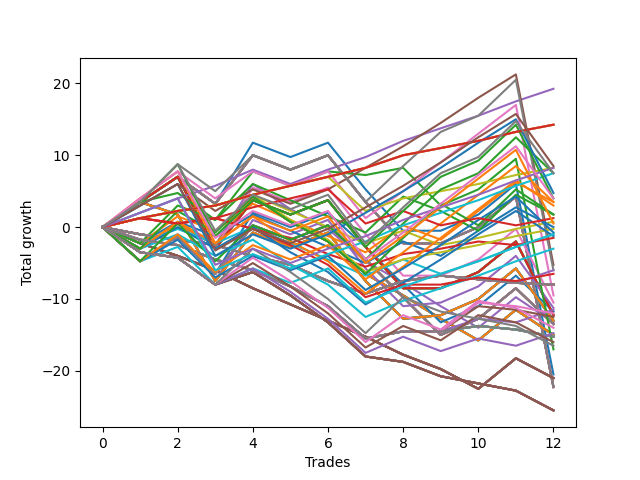

# Long Bulldog 003 
- Symbol: ES90d5m30m
- Date Range: 03/18/2022 - 07/08/2022
- Trading Period: 7:20-12:30
- Number of Trades: 12



| Name | Win Percent | Profit | Avg Profit / Trade | Avg Time / Trade |      | Name | Win Percent | Profit | Avg Profit / Trade | Avg Time / Trade |
| ---- | ----------- | ------ | ------------------ | ---------------- | ---- | ---- | ----------- | ------ | ------------------ | ---------------- |
| Sorted By <br> Profit | | | | | | Sorted By <br> Win Percentage ||||
| Eighty-Two | 91.67 | 9625.00 | 802.08 | 00:00 |     | One Hundred Twenty-Six | 100.00 | 7125.00 | 593.75 | 00:00 |
| One Hundred Twenty-Six | 100.00 | 7125.00 | 593.75 | 00:00 |     | One Hundred Twenty-One | 100.00 | 7125.00 | 593.75 | 00:00 |
| One Hundred Twenty-One | 100.00 | 7125.00 | 593.75 | 00:00 |     | Eighty-One | 100.00 | 7125.00 | 593.75 | 00:00 |
| Eighty-One | 100.00 | 7125.00 | 593.75 | 00:00 |     | Eighty-Two | 91.67 | 9625.00 | 802.08 | 00:00 |
| One Hundred Twenty-Eight | 75.00 | 4250.00 | 354.17 | 00:00 |     | One Hundred Eleven | 91.67 | 4125.00 | 343.75 | 00:00 |
| One Hundred Eleven | 91.67 | 4125.00 | 343.75 | 00:00 |     | One Hundred Twenty-Seven | 83.33 | 4125.00 | 343.75 | 00:00 |
| One Hundred Twenty-Seven | 83.33 | 4125.00 | 343.75 | 00:00 |     | One Hundred Twenty-Two | 83.33 | 3750.00 | 312.50 | 00:00 |
| One Hundred Twenty-Two | 83.33 | 3750.00 | 312.50 | 00:00 |     | One Hundred Twenty-Eight | 75.00 | 4250.00 | 354.17 | 00:00 |
| One Hundred Thirty | 66.67 | 3750.00 | 312.50 | 00:00 |     | One Hundred Twenty-Three | 75.00 | 2375.00 | 197.92 | 00:00 |
| One Hundred Fifteen | 58.33 | 3750.00 | 312.50 | 00:00 |     | One Hundred One | 75.00 | -125.00 | -10.42 | 00:00 |
| One Hundred Twenty-Three | 75.00 | 2375.00 | 197.92 | 00:00 |     | Eighty-Three | 75.00 | -2625.00 | -218.75 | 00:00 |
| One Hundred Twenty-Nine | 66.67 | 2000.00 | 166.67 | 00:00 |     | One Hundred Thirty | 66.67 | 3750.00 | 312.50 | 00:00 |
| One Hundred Twenty-Five | 66.67 | 2000.00 | 166.67 | 00:00 |     | One Hundred Twenty-Nine | 66.67 | 2000.00 | 166.67 | 00:00 |
| One Hundred Fourteen | 58.33 | 1750.00 | 145.83 | 00:00 |     | One Hundred Twenty-Five | 66.67 | 2000.00 | 166.67 | 00:00 |
| Ninety-Four | 41.67 | 1750.00 | 145.83 | 00:00 |     | One Hundred Sixteen | 66.67 | 625.00 | 52.08 | 00:00 |
| One Hundred Four | 50.00 | 1500.00 | 125.00 | 00:00 |     | Ninety-One | 66.67 | 375.00 | 31.25 | 00:00 |
| One Hundred Five | 41.67 | 875.00 | 72.92 | 00:00 |     | One Hundred Twenty-Four | 66.67 | 250.00 | 20.83 | 00:00 |
| Ninety-Five | 33.33 | 875.00 | 72.92 | 00:00 |     | One Hundred Twelve | 66.67 | -500.00 | -41.67 | 00:00 |
| One Hundred Sixteen | 66.67 | 625.00 | 52.08 | 00:00 |     | Eighty-Five | 66.67 | -3000.00 | -250.00 | 00:00 |
| Ninety-One | 66.67 | 375.00 | 31.25 | 00:00 |     | Eighty-Four | 66.67 | -4750.00 | -395.83 | 00:00 |
| One Hundred Twenty-Four | 66.67 | 250.00 | 20.83 | 00:00 |     | One Hundred Fifteen | 58.33 | 3750.00 | 312.50 | 00:00 |
| Ninety-Three | 41.67 | 0.00 | 0.00 | 00:00 |     | One Hundred Fourteen | 58.33 | 1750.00 | 145.83 | 00:00 |
| One Hundred One | 75.00 | -125.00 | -10.42 | 00:00 |     | One Hundred Thirteen | 58.33 | -375.00 | -31.25 | 00:00 |
| One Hundred Thirteen | 58.33 | -375.00 | -31.25 | 00:00 |     | One Hundred Two | 58.33 | -1500.00 | -125.00 | 00:00 |
| One Hundred Twelve | 66.67 | -500.00 | -41.67 | 00:00 |     | Fifty-Six | 58.33 | -5250.00 | -437.50 | 00:00 |
| Ninety-Two | 50.00 | -500.00 | -41.67 | 00:00 |     | Sixty-Three | 58.33 | -6125.00 | -510.42 | 00:00 |
| One Hundred Three | 50.00 | -625.00 | -52.08 | 00:00 |     | Sixty-Two | 58.33 | -6125.00 | -510.42 | 00:00 |
| Ninety-Six | 50.00 | -750.00 | -62.50 | 00:00 |     | Sixty-One | 58.33 | -6125.00 | -510.42 | 00:00 |
| One Hundred Two | 58.33 | -1500.00 | -125.00 | 00:00 |     | Sixty | 58.33 | -6125.00 | -510.42 | 00:00 |
| Eighty-Three | 75.00 | -2625.00 | -218.75 | 00:00 |     | Fifty-Nine | 58.33 | -6125.00 | -510.42 | 00:00 |
| Eighty-Five | 66.67 | -3000.00 | -250.00 | 00:00 |     | Fifty-Eight | 58.33 | -6125.00 | -510.42 | 00:00 |
| Ninety-Seven | 25.00 | -3000.00 | -250.00 | 00:00 |     | Fifty-Seven | 58.33 | -6125.00 | -510.42 | 00:00 |
| One Hundred Six | 50.00 | -3250.00 | -270.83 | 00:00 |     | Seventy-Three | 58.33 | -8500.00 | -708.33 | 00:00 |
| One Hundred | 16.67 | -4000.00 | -333.33 | 00:00 |     | Zero | 58.33 | -10250.00 | -854.17 | 00:00 |
| Ninety-Nine | 16.67 | -4000.00 | -333.33 | 00:00 |     | Seven | 58.33 | -11125.00 | -927.08 | 00:00 |
| Ninety-Eight | 16.67 | -4000.00 | -333.33 | 00:00 |     | Six | 58.33 | -11125.00 | -927.08 | 00:00 |
| Twenty-Three | 16.67 | -4000.00 | -333.33 | 00:00 |     | Five | 58.33 | -11125.00 | -927.08 | 00:00 |
| Twenty-Two | 16.67 | -4000.00 | -333.33 | 00:00 |     | Four | 58.33 | -11125.00 | -927.08 | 00:00 |
| Twenty-One | 16.67 | -4000.00 | -333.33 | 00:00 |     | Three | 58.33 | -11125.00 | -927.08 | 00:00 |
| Twenty | 16.67 | -4000.00 | -333.33 | 00:00 |     | Two | 58.33 | -11125.00 | -927.08 | 00:00 |
| Nineteen | 16.67 | -4000.00 | -333.33 | 00:00 |     | One | 58.33 | -11125.00 | -927.08 | 00:00 |
| Eighteen | 16.67 | -4000.00 | -333.33 | 00:00 |     | One Hundred Four | 50.00 | 1500.00 | 125.00 | 00:00 |
| Seventeen | 16.67 | -4000.00 | -333.33 | 00:00 |     | Ninety-Two | 50.00 | -500.00 | -41.67 | 00:00 |
| Sixten | 16.67 | -4000.00 | -333.33 | 00:00 |     | One Hundred Three | 50.00 | -625.00 | -52.08 | 00:00 |
| Eighty-Four | 66.67 | -4750.00 | -395.83 | 00:00 |     | Ninety-Six | 50.00 | -750.00 | -62.50 | 00:00 |
| Fifty-Six | 58.33 | -5250.00 | -437.50 | 00:00 |     | One Hundred Six | 50.00 | -3250.00 | -270.83 | 00:00 |
| Sixty-Four | 50.00 | -5625.00 | -468.75 | 00:00 |     | Sixty-Four | 50.00 | -5625.00 | -468.75 | 00:00 |
| One Hundred Seven | 33.33 | -5750.00 | -479.17 | 00:00 |     | Seventy-One | 50.00 | -6500.00 | -541.67 | 00:00 |
| Forty | 41.67 | -5875.00 | -489.58 | 00:00 |     | Seventy | 50.00 | -6500.00 | -541.67 | 00:00 |
| One Hundred Nine | 25.00 | -6000.00 | -500.00 | 00:00 |     | Sixty-Nine | 50.00 | -6500.00 | -541.67 | 00:00 |
| Sixty-Three | 58.33 | -6125.00 | -510.42 | 00:00 |     | Sixty-Eight | 50.00 | -6500.00 | -541.67 | 00:00 |
| Sixty-Two | 58.33 | -6125.00 | -510.42 | 00:00 |     | Sixty-Seven | 50.00 | -6500.00 | -541.67 | 00:00 |
| Sixty-One | 58.33 | -6125.00 | -510.42 | 00:00 |     | Sixty-Six | 50.00 | -6500.00 | -541.67 | 00:00 |
| Sixty | 58.33 | -6125.00 | -510.42 | 00:00 |     | Sixty-Five | 50.00 | -6500.00 | -541.67 | 00:00 |
| Fifty-Nine | 58.33 | -6125.00 | -510.42 | 00:00 |     | Ninety-Four | 41.67 | 1750.00 | 145.83 | 00:00 |
| Fifty-Eight | 58.33 | -6125.00 | -510.42 | 00:00 |     | One Hundred Five | 41.67 | 875.00 | 72.92 | 00:00 |
| Fifty-Seven | 58.33 | -6125.00 | -510.42 | 00:00 |     | Ninety-Three | 41.67 | 0.00 | 0.00 | 00:00 |
| One Hundred Eight | 25.00 | -6250.00 | -520.83 | 00:00 |     | Forty | 41.67 | -5875.00 | -489.58 | 00:00 |
| Seventy-One | 50.00 | -6500.00 | -541.67 | 00:00 |     | Forty-Seven | 41.67 | -6750.00 | -562.50 | 00:00 |
| Seventy | 50.00 | -6500.00 | -541.67 | 00:00 |     | Forty-Six | 41.67 | -6750.00 | -562.50 | 00:00 |
| Sixty-Nine | 50.00 | -6500.00 | -541.67 | 00:00 |     | Forty-Five | 41.67 | -6750.00 | -562.50 | 00:00 |
| Sixty-Eight | 50.00 | -6500.00 | -541.67 | 00:00 |     | Forty-Four | 41.67 | -6750.00 | -562.50 | 00:00 |
| Sixty-Seven | 50.00 | -6500.00 | -541.67 | 00:00 |     | Forty-Three | 41.67 | -6750.00 | -562.50 | 00:00 |
| Sixty-Six | 50.00 | -6500.00 | -541.67 | 00:00 |     | Forty-Two | 41.67 | -6750.00 | -562.50 | 00:00 |
| Sixty-Five | 50.00 | -6500.00 | -541.67 | 00:00 |     | Forty-One | 41.67 | -6750.00 | -562.50 | 00:00 |
| Twenty-Four | 25.00 | -6625.00 | -552.08 | 00:00 |     | Ninety-Five | 33.33 | 875.00 | 72.92 | 00:00 |
| Forty-Seven | 41.67 | -6750.00 | -562.50 | 00:00 |     | One Hundred Seven | 33.33 | -5750.00 | -479.17 | 00:00 |
| Forty-Six | 41.67 | -6750.00 | -562.50 | 00:00 |     | One Hundred Seventeen | 33.33 | -7375.00 | -614.58 | 00:00 |
| Forty-Five | 41.67 | -6750.00 | -562.50 | 00:00 |     | Ninety-Seven | 25.00 | -3000.00 | -250.00 | 00:00 |
| Forty-Four | 41.67 | -6750.00 | -562.50 | 00:00 |     | One Hundred Nine | 25.00 | -6000.00 | -500.00 | 00:00 |
| Forty-Three | 41.67 | -6750.00 | -562.50 | 00:00 |     | One Hundred Eight | 25.00 | -6250.00 | -520.83 | 00:00 |
| Forty-Two | 41.67 | -6750.00 | -562.50 | 00:00 |     | Twenty-Four | 25.00 | -6625.00 | -552.08 | 00:00 |
| Forty-One | 41.67 | -6750.00 | -562.50 | 00:00 |     | One Hundred Ninteen | 25.00 | -7000.00 | -583.33 | 00:00 |
| One Hundred Ninteen | 25.00 | -7000.00 | -583.33 | 00:00 |     | Thirty-One | 25.00 | -7500.00 | -625.00 | 00:00 |
| One Hundred Seventeen | 33.33 | -7375.00 | -614.58 | 00:00 |     | Thirty | 25.00 | -7500.00 | -625.00 | 00:00 |
| Thirty-One | 25.00 | -7500.00 | -625.00 | 00:00 |     | Twenty-Nine | 25.00 | -7500.00 | -625.00 | 00:00 |
| Thirty | 25.00 | -7500.00 | -625.00 | 00:00 |     | Twenty-Eight | 25.00 | -7500.00 | -625.00 | 00:00 |
| Twenty-Nine | 25.00 | -7500.00 | -625.00 | 00:00 |     | twenty-Seven | 25.00 | -7500.00 | -625.00 | 00:00 |
| Twenty-Eight | 25.00 | -7500.00 | -625.00 | 00:00 |     | Twenty-Six | 25.00 | -7500.00 | -625.00 | 00:00 |
| twenty-Seven | 25.00 | -7500.00 | -625.00 | 00:00 |     | Twenty-Five | 25.00 | -7500.00 | -625.00 | 00:00 |
| Twenty-Six | 25.00 | -7500.00 | -625.00 | 00:00 |     | One Hundred Ten | 25.00 | -7625.00 | -635.42 | 00:00 |
| Twenty-Five | 25.00 | -7500.00 | -625.00 | 00:00 |     | Thirty-Nine | 25.00 | -7625.00 | -635.42 | 00:00 |
| One Hundred Ten | 25.00 | -7625.00 | -635.42 | 00:00 |     | Thirty-Eight | 25.00 | -7625.00 | -635.42 | 00:00 |
| Thirty-Nine | 25.00 | -7625.00 | -635.42 | 00:00 |     | Thirty-Seven | 25.00 | -7625.00 | -635.42 | 00:00 |
| Thirty-Eight | 25.00 | -7625.00 | -635.42 | 00:00 |     | Thirty-Six | 25.00 | -7625.00 | -635.42 | 00:00 |
| Thirty-Seven | 25.00 | -7625.00 | -635.42 | 00:00 |     | Thirty-Five | 25.00 | -7625.00 | -635.42 | 00:00 |
| Thirty-Six | 25.00 | -7625.00 | -635.42 | 00:00 |     | Thirty-Four | 25.00 | -7625.00 | -635.42 | 00:00 |
| Thirty-Five | 25.00 | -7625.00 | -635.42 | 00:00 |     | Thirty-Three | 25.00 | -7625.00 | -635.42 | 00:00 |
| Thirty-Four | 25.00 | -7625.00 | -635.42 | 00:00 |     | Thirty-Two | 25.00 | -7625.00 | -635.42 | 00:00 |
| Thirty-Three | 25.00 | -7625.00 | -635.42 | 00:00 |     | One Hundred Eighteen | 25.00 | -8000.00 | -666.67 | 00:00 |
| Thirty-Two | 25.00 | -7625.00 | -635.42 | 00:00 |     | One Hundred | 16.67 | -4000.00 | -333.33 | 00:00 |
| One Hundred Eighteen | 25.00 | -8000.00 | -666.67 | 00:00 |     | Ninety-Nine | 16.67 | -4000.00 | -333.33 | 00:00 |
| One Hundred Twenty | 16.67 | -8250.00 | -687.50 | 00:00 |     | Ninety-Eight | 16.67 | -4000.00 | -333.33 | 00:00 |
| Seventy-Three | 58.33 | -8500.00 | -708.33 | 00:00 |     | Twenty-Three | 16.67 | -4000.00 | -333.33 | 00:00 |
| Zero | 58.33 | -10250.00 | -854.17 | 00:00 |     | Twenty-Two | 16.67 | -4000.00 | -333.33 | 00:00 |
| Fifteen | 8.33 | -10500.00 | -875.00 | 00:00 |     | Twenty-One | 16.67 | -4000.00 | -333.33 | 00:00 |
| Fourteen | 8.33 | -10500.00 | -875.00 | 00:00 |     | Twenty | 16.67 | -4000.00 | -333.33 | 00:00 |
| Thirteen | 8.33 | -10500.00 | -875.00 | 00:00 |     | Nineteen | 16.67 | -4000.00 | -333.33 | 00:00 |
| Twelve | 8.33 | -10500.00 | -875.00 | 00:00 |     | Eighteen | 16.67 | -4000.00 | -333.33 | 00:00 |
| Eleven | 8.33 | -10500.00 | -875.00 | 00:00 |     | Seventeen | 16.67 | -4000.00 | -333.33 | 00:00 |
| Ten | 8.33 | -10500.00 | -875.00 | 00:00 |     | Sixten | 16.67 | -4000.00 | -333.33 | 00:00 |
| Nine | 8.33 | -10500.00 | -875.00 | 00:00 |     | One Hundred Twenty | 16.67 | -8250.00 | -687.50 | 00:00 |
| Eight | 8.33 | -10500.00 | -875.00 | 00:00 |     | Fifteen | 8.33 | -10500.00 | -875.00 | 00:00 |
| Seven | 58.33 | -11125.00 | -927.08 | 00:00 |     | Fourteen | 8.33 | -10500.00 | -875.00 | 00:00 |
| Six | 58.33 | -11125.00 | -927.08 | 00:00 |     | Thirteen | 8.33 | -10500.00 | -875.00 | 00:00 |
| Five | 58.33 | -11125.00 | -927.08 | 00:00 |     | Twelve | 8.33 | -10500.00 | -875.00 | 00:00 |
| Four | 58.33 | -11125.00 | -927.08 | 00:00 |     | Eleven | 8.33 | -10500.00 | -875.00 | 00:00 |
| Three | 58.33 | -11125.00 | -927.08 | 00:00 |     | Ten | 8.33 | -10500.00 | -875.00 | 00:00 |
| Two | 58.33 | -11125.00 | -927.08 | 00:00 |     | Nine | 8.33 | -10500.00 | -875.00 | 00:00 |
| One | 58.33 | -11125.00 | -927.08 | 00:00 |     | Eight | 8.33 | -10500.00 | -875.00 | 00:00 |
| Fifty-Five | 8.33 | -12750.00 | -1062.50 | 00:00 |     | Fifty-Five | 8.33 | -12750.00 | -1062.50 | 00:00 |
| Fifty-Four | 8.33 | -12750.00 | -1062.50 | 00:00 |     | Fifty-Four | 8.33 | -12750.00 | -1062.50 | 00:00 |
| Fifty-Three | 8.33 | -12750.00 | -1062.50 | 00:00 |     | Fifty-Three | 8.33 | -12750.00 | -1062.50 | 00:00 |
| Fifty-Two | 8.33 | -12750.00 | -1062.50 | 00:00 |     | Fifty-Two | 8.33 | -12750.00 | -1062.50 | 00:00 |
| Fifty-One | 8.33 | -12750.00 | -1062.50 | 00:00 |     | Fifty-One | 8.33 | -12750.00 | -1062.50 | 00:00 |
| Fifty | 8.33 | -12750.00 | -1062.50 | 00:00 |     | Fifty | 8.33 | -12750.00 | -1062.50 | 00:00 |
| Forty-Nine | 8.33 | -12750.00 | -1062.50 | 00:00 |     | Forty-Nine | 8.33 | -12750.00 | -1062.50 | 00:00 |
| Forty-Eight | 8.33 | -12750.00 | -1062.50 | 00:00 |     | Forty-Eight | 8.33 | -12750.00 | -1062.50 | 00:00 |

## NO STOPLOSS

### Test Zero
* Sell when price hits the middle line of the 20p bollinger
* No Stoploss
* Results:
```
Total Trades: 12
Percent Up: 58.33
Percent Down: 41.67
Total Points Moved Up: -20.50
Potential Profit: -10250.00
Total Points Ups: 24.00 Count Ups: 7
Total Points Downs: -44.50 Count Downs: 5
```

<details><summary>Trades</summary>

<code>In: 2022-03-23 10:35:00		Out: 2022-03-23 11:04:55		Total Position Time: 29:55		Total Move Up: 3.50		Total to Date: 3.50</code> <br />
<code>In: 2022-03-23 10:50:00		Out: 2022-03-23 11:19:55		Total Position Time: 29:55		Total Move Up: 3.50		Total to Date: 7.00</code> <br />
<code>In: 2022-03-30 12:15:00		Out: 2022-03-30 12:44:55		Total Position Time: 29:55		Total Move Up: -3.75		Total to Date: 3.25</code> <br />
<code>In: 2022-03-30 12:30:00		Out: 2022-03-30 12:47:25		Total Position Time: 17:25		Total Move Up: 8.50		Total to Date: 11.75</code> <br />
<code>In: 2022-03-31 11:25:00		Out: 2022-03-31 11:54:55		Total Position Time: 29:55		Total Move Up: -2.00		Total to Date: 9.75</code> <br />
<code>In: 2022-03-31 11:30:00		Out: 2022-03-31 11:59:20		Total Position Time: 29:20		Total Move Up: 2.00		Total to Date: 11.75</code> <br />
<code>In: 2022-04-18 08:45:00		Out: 2022-04-18 09:14:55		Total Position Time: 29:55		Total Move Up: -6.50		Total to Date: 5.25</code> <br />
<code>In: 2022-04-18 08:55:00		Out: 2022-04-18 09:24:55		Total Position Time: 29:55		Total Move Up: -5.75		Total to Date: -0.50</code> <br />
<code>In: 2022-05-12 10:55:00		Out: 2022-05-12 11:24:55		Total Position Time: 29:55		Total Move Up: 0.00		Total to Date: -0.50</code> <br />
<code>In: 2022-06-08 09:50:00		Out: 2022-06-08 10:19:55		Total Position Time: 29:55		Total Move Up: 2.25		Total to Date: 1.75</code> <br />
<code>In: 2022-06-09 08:10:00		Out: 2022-06-09 08:39:55		Total Position Time: 29:55		Total Move Up: 4.25		Total to Date: 6.00</code> <br />
<code>In: 2022-06-09 12:20:00		Out: 2022-06-09 12:49:55		Total Position Time: 29:55		Total Move Up: -26.50		Total to Date: -20.50</code> <br />


</details>

### Test One
* Sell when the price hits the upper line of the 20p 1std bollinger
* No Stoploss
* Results:
```
Total Trades: 12
Percent Up: 58.33
Percent Down: 41.67
Total Points Moved Up: -22.25
Potential Profit: -11125.00
Total Points Ups: 22.25 Count Ups: 7
Total Points Downs: -44.50 Count Downs: 5
```

<details><summary>Trades</summary>

<code>In: 2022-03-23 10:35:00		Out: 2022-03-23 11:04:55		Total Position Time: 29:55		Total Move Up: 3.50		Total to Date: 3.50</code> <br />
<code>In: 2022-03-23 10:50:00		Out: 2022-03-23 11:19:55		Total Position Time: 29:55		Total Move Up: 3.50		Total to Date: 7.00</code> <br />
<code>In: 2022-03-30 12:15:00		Out: 2022-03-30 12:44:55		Total Position Time: 29:55		Total Move Up: -3.75		Total to Date: 3.25</code> <br />
<code>In: 2022-03-30 12:30:00		Out: 2022-03-30 12:50:00		Total Position Time: 20:00		Total Move Up: 6.75		Total to Date: 10.00</code> <br />
<code>In: 2022-03-31 11:25:00		Out: 2022-03-31 11:54:55		Total Position Time: 29:55		Total Move Up: -2.00		Total to Date: 8.00</code> <br />
<code>In: 2022-03-31 11:30:00		Out: 2022-03-31 11:59:55		Total Position Time: 29:55		Total Move Up: 2.00		Total to Date: 10.00</code> <br />
<code>In: 2022-04-18 08:45:00		Out: 2022-04-18 09:14:55		Total Position Time: 29:55		Total Move Up: -6.50		Total to Date: 3.50</code> <br />
<code>In: 2022-04-18 08:55:00		Out: 2022-04-18 09:24:55		Total Position Time: 29:55		Total Move Up: -5.75		Total to Date: -2.25</code> <br />
<code>In: 2022-05-12 10:55:00		Out: 2022-05-12 11:24:55		Total Position Time: 29:55		Total Move Up: 0.00		Total to Date: -2.25</code> <br />
<code>In: 2022-06-08 09:50:00		Out: 2022-06-08 10:19:55		Total Position Time: 29:55		Total Move Up: 2.25		Total to Date: 0.00</code> <br />
<code>In: 2022-06-09 08:10:00		Out: 2022-06-09 08:39:55		Total Position Time: 29:55		Total Move Up: 4.25		Total to Date: 4.25</code> <br />
<code>In: 2022-06-09 12:20:00		Out: 2022-06-09 12:49:55		Total Position Time: 29:55		Total Move Up: -26.50		Total to Date: -22.25</code> <br />


</details>

### Test Two
* Sell when the price hits the upper line of the 20p 2std bollinger
* No Stoploss
* Results:
```
Total Trades: 12
Percent Up: 58.33
Percent Down: 41.67
Total Points Moved Up: -22.25
Potential Profit: -11125.00
Total Points Ups: 22.25 Count Ups: 7
Total Points Downs: -44.50 Count Downs: 5
```

<details><summary>Trades</summary>

<code>In: 2022-03-23 10:35:00		Out: 2022-03-23 11:04:55		Total Position Time: 29:55		Total Move Up: 3.50		Total to Date: 3.50</code> <br />
<code>In: 2022-03-23 10:50:00		Out: 2022-03-23 11:19:55		Total Position Time: 29:55		Total Move Up: 3.50		Total to Date: 7.00</code> <br />
<code>In: 2022-03-30 12:15:00		Out: 2022-03-30 12:44:55		Total Position Time: 29:55		Total Move Up: -3.75		Total to Date: 3.25</code> <br />
<code>In: 2022-03-30 12:30:00		Out: 2022-03-30 12:50:00		Total Position Time: 20:00		Total Move Up: 6.75		Total to Date: 10.00</code> <br />
<code>In: 2022-03-31 11:25:00		Out: 2022-03-31 11:54:55		Total Position Time: 29:55		Total Move Up: -2.00		Total to Date: 8.00</code> <br />
<code>In: 2022-03-31 11:30:00		Out: 2022-03-31 11:59:55		Total Position Time: 29:55		Total Move Up: 2.00		Total to Date: 10.00</code> <br />
<code>In: 2022-04-18 08:45:00		Out: 2022-04-18 09:14:55		Total Position Time: 29:55		Total Move Up: -6.50		Total to Date: 3.50</code> <br />
<code>In: 2022-04-18 08:55:00		Out: 2022-04-18 09:24:55		Total Position Time: 29:55		Total Move Up: -5.75		Total to Date: -2.25</code> <br />
<code>In: 2022-05-12 10:55:00		Out: 2022-05-12 11:24:55		Total Position Time: 29:55		Total Move Up: 0.00		Total to Date: -2.25</code> <br />
<code>In: 2022-06-08 09:50:00		Out: 2022-06-08 10:19:55		Total Position Time: 29:55		Total Move Up: 2.25		Total to Date: 0.00</code> <br />
<code>In: 2022-06-09 08:10:00		Out: 2022-06-09 08:39:55		Total Position Time: 29:55		Total Move Up: 4.25		Total to Date: 4.25</code> <br />
<code>In: 2022-06-09 12:20:00		Out: 2022-06-09 12:49:55		Total Position Time: 29:55		Total Move Up: -26.50		Total to Date: -22.25</code> <br />


</details>

### Test Three
* Sell when price hits the middle line of the 50p bollinger
* No Stoploss
* Results:
```
Total Trades: 12
Percent Up: 58.33
Percent Down: 41.67
Total Points Moved Up: -22.25
Potential Profit: -11125.00
Total Points Ups: 22.25 Count Ups: 7
Total Points Downs: -44.50 Count Downs: 5
```

<details><summary>Trades</summary>

<code>In: 2022-03-23 10:35:00		Out: 2022-03-23 11:04:55		Total Position Time: 29:55		Total Move Up: 3.50		Total to Date: 3.50</code> <br />
<code>In: 2022-03-23 10:50:00		Out: 2022-03-23 11:19:55		Total Position Time: 29:55		Total Move Up: 3.50		Total to Date: 7.00</code> <br />
<code>In: 2022-03-30 12:15:00		Out: 2022-03-30 12:44:55		Total Position Time: 29:55		Total Move Up: -3.75		Total to Date: 3.25</code> <br />
<code>In: 2022-03-30 12:30:00		Out: 2022-03-30 12:50:00		Total Position Time: 20:00		Total Move Up: 6.75		Total to Date: 10.00</code> <br />
<code>In: 2022-03-31 11:25:00		Out: 2022-03-31 11:54:55		Total Position Time: 29:55		Total Move Up: -2.00		Total to Date: 8.00</code> <br />
<code>In: 2022-03-31 11:30:00		Out: 2022-03-31 11:59:55		Total Position Time: 29:55		Total Move Up: 2.00		Total to Date: 10.00</code> <br />
<code>In: 2022-04-18 08:45:00		Out: 2022-04-18 09:14:55		Total Position Time: 29:55		Total Move Up: -6.50		Total to Date: 3.50</code> <br />
<code>In: 2022-04-18 08:55:00		Out: 2022-04-18 09:24:55		Total Position Time: 29:55		Total Move Up: -5.75		Total to Date: -2.25</code> <br />
<code>In: 2022-05-12 10:55:00		Out: 2022-05-12 11:24:55		Total Position Time: 29:55		Total Move Up: 0.00		Total to Date: -2.25</code> <br />
<code>In: 2022-06-08 09:50:00		Out: 2022-06-08 10:19:55		Total Position Time: 29:55		Total Move Up: 2.25		Total to Date: 0.00</code> <br />
<code>In: 2022-06-09 08:10:00		Out: 2022-06-09 08:39:55		Total Position Time: 29:55		Total Move Up: 4.25		Total to Date: 4.25</code> <br />
<code>In: 2022-06-09 12:20:00		Out: 2022-06-09 12:49:55		Total Position Time: 29:55		Total Move Up: -26.50		Total to Date: -22.25</code> <br />


</details>

### Test Four
* Sell when the price hits the upper line of the 50p 1std bollinger
* No Stoploss
* Results:
```
Total Trades: 12
Percent Up: 58.33
Percent Down: 41.67
Total Points Moved Up: -22.25
Potential Profit: -11125.00
Total Points Ups: 22.25 Count Ups: 7
Total Points Downs: -44.50 Count Downs: 5
```

<details><summary>Trades</summary>

<code>In: 2022-03-23 10:35:00		Out: 2022-03-23 11:04:55		Total Position Time: 29:55		Total Move Up: 3.50		Total to Date: 3.50</code> <br />
<code>In: 2022-03-23 10:50:00		Out: 2022-03-23 11:19:55		Total Position Time: 29:55		Total Move Up: 3.50		Total to Date: 7.00</code> <br />
<code>In: 2022-03-30 12:15:00		Out: 2022-03-30 12:44:55		Total Position Time: 29:55		Total Move Up: -3.75		Total to Date: 3.25</code> <br />
<code>In: 2022-03-30 12:30:00		Out: 2022-03-30 12:50:00		Total Position Time: 20:00		Total Move Up: 6.75		Total to Date: 10.00</code> <br />
<code>In: 2022-03-31 11:25:00		Out: 2022-03-31 11:54:55		Total Position Time: 29:55		Total Move Up: -2.00		Total to Date: 8.00</code> <br />
<code>In: 2022-03-31 11:30:00		Out: 2022-03-31 11:59:55		Total Position Time: 29:55		Total Move Up: 2.00		Total to Date: 10.00</code> <br />
<code>In: 2022-04-18 08:45:00		Out: 2022-04-18 09:14:55		Total Position Time: 29:55		Total Move Up: -6.50		Total to Date: 3.50</code> <br />
<code>In: 2022-04-18 08:55:00		Out: 2022-04-18 09:24:55		Total Position Time: 29:55		Total Move Up: -5.75		Total to Date: -2.25</code> <br />
<code>In: 2022-05-12 10:55:00		Out: 2022-05-12 11:24:55		Total Position Time: 29:55		Total Move Up: 0.00		Total to Date: -2.25</code> <br />
<code>In: 2022-06-08 09:50:00		Out: 2022-06-08 10:19:55		Total Position Time: 29:55		Total Move Up: 2.25		Total to Date: 0.00</code> <br />
<code>In: 2022-06-09 08:10:00		Out: 2022-06-09 08:39:55		Total Position Time: 29:55		Total Move Up: 4.25		Total to Date: 4.25</code> <br />
<code>In: 2022-06-09 12:20:00		Out: 2022-06-09 12:49:55		Total Position Time: 29:55		Total Move Up: -26.50		Total to Date: -22.25</code> <br />


</details>

### Test Five
* Sell when the price hits the upper line of the 50p 2std bollinger
* No Stoploss
* Results:
```
Total Trades: 12
Percent Up: 58.33
Percent Down: 41.67
Total Points Moved Up: -22.25
Potential Profit: -11125.00
Total Points Ups: 22.25 Count Ups: 7
Total Points Downs: -44.50 Count Downs: 5
```

<details><summary>Trades</summary>

<code>In: 2022-03-23 10:35:00		Out: 2022-03-23 11:04:55		Total Position Time: 29:55		Total Move Up: 3.50		Total to Date: 3.50</code> <br />
<code>In: 2022-03-23 10:50:00		Out: 2022-03-23 11:19:55		Total Position Time: 29:55		Total Move Up: 3.50		Total to Date: 7.00</code> <br />
<code>In: 2022-03-30 12:15:00		Out: 2022-03-30 12:44:55		Total Position Time: 29:55		Total Move Up: -3.75		Total to Date: 3.25</code> <br />
<code>In: 2022-03-30 12:30:00		Out: 2022-03-30 12:50:00		Total Position Time: 20:00		Total Move Up: 6.75		Total to Date: 10.00</code> <br />
<code>In: 2022-03-31 11:25:00		Out: 2022-03-31 11:54:55		Total Position Time: 29:55		Total Move Up: -2.00		Total to Date: 8.00</code> <br />
<code>In: 2022-03-31 11:30:00		Out: 2022-03-31 11:59:55		Total Position Time: 29:55		Total Move Up: 2.00		Total to Date: 10.00</code> <br />
<code>In: 2022-04-18 08:45:00		Out: 2022-04-18 09:14:55		Total Position Time: 29:55		Total Move Up: -6.50		Total to Date: 3.50</code> <br />
<code>In: 2022-04-18 08:55:00		Out: 2022-04-18 09:24:55		Total Position Time: 29:55		Total Move Up: -5.75		Total to Date: -2.25</code> <br />
<code>In: 2022-05-12 10:55:00		Out: 2022-05-12 11:24:55		Total Position Time: 29:55		Total Move Up: 0.00		Total to Date: -2.25</code> <br />
<code>In: 2022-06-08 09:50:00		Out: 2022-06-08 10:19:55		Total Position Time: 29:55		Total Move Up: 2.25		Total to Date: 0.00</code> <br />
<code>In: 2022-06-09 08:10:00		Out: 2022-06-09 08:39:55		Total Position Time: 29:55		Total Move Up: 4.25		Total to Date: 4.25</code> <br />
<code>In: 2022-06-09 12:20:00		Out: 2022-06-09 12:49:55		Total Position Time: 29:55		Total Move Up: -26.50		Total to Date: -22.25</code> <br />


</details>

### Test Six
* Sell when the price hits the middle line of the 1std VWAP
* No Stoploss
* Results:
```
Total Trades: 12
Percent Up: 58.33
Percent Down: 41.67
Total Points Moved Up: -22.25
Potential Profit: -11125.00
Total Points Ups: 22.25 Count Ups: 7
Total Points Downs: -44.50 Count Downs: 5
```

<details><summary>Trades</summary>

<code>In: 2022-03-23 10:35:00		Out: 2022-03-23 11:04:55		Total Position Time: 29:55		Total Move Up: 3.50		Total to Date: 3.50</code> <br />
<code>In: 2022-03-23 10:50:00		Out: 2022-03-23 11:19:55		Total Position Time: 29:55		Total Move Up: 3.50		Total to Date: 7.00</code> <br />
<code>In: 2022-03-30 12:15:00		Out: 2022-03-30 12:44:55		Total Position Time: 29:55		Total Move Up: -3.75		Total to Date: 3.25</code> <br />
<code>In: 2022-03-30 12:30:00		Out: 2022-03-30 12:50:00		Total Position Time: 20:00		Total Move Up: 6.75		Total to Date: 10.00</code> <br />
<code>In: 2022-03-31 11:25:00		Out: 2022-03-31 11:54:55		Total Position Time: 29:55		Total Move Up: -2.00		Total to Date: 8.00</code> <br />
<code>In: 2022-03-31 11:30:00		Out: 2022-03-31 11:59:55		Total Position Time: 29:55		Total Move Up: 2.00		Total to Date: 10.00</code> <br />
<code>In: 2022-04-18 08:45:00		Out: 2022-04-18 09:14:55		Total Position Time: 29:55		Total Move Up: -6.50		Total to Date: 3.50</code> <br />
<code>In: 2022-04-18 08:55:00		Out: 2022-04-18 09:24:55		Total Position Time: 29:55		Total Move Up: -5.75		Total to Date: -2.25</code> <br />
<code>In: 2022-05-12 10:55:00		Out: 2022-05-12 11:24:55		Total Position Time: 29:55		Total Move Up: 0.00		Total to Date: -2.25</code> <br />
<code>In: 2022-06-08 09:50:00		Out: 2022-06-08 10:19:55		Total Position Time: 29:55		Total Move Up: 2.25		Total to Date: 0.00</code> <br />
<code>In: 2022-06-09 08:10:00		Out: 2022-06-09 08:39:55		Total Position Time: 29:55		Total Move Up: 4.25		Total to Date: 4.25</code> <br />
<code>In: 2022-06-09 12:20:00		Out: 2022-06-09 12:49:55		Total Position Time: 29:55		Total Move Up: -26.50		Total to Date: -22.25</code> <br />


</details>

### Test Seven
* Sell when the price hits the upper line of the 1std VWAP
* No Stoploss
* Results:
```
Total Trades: 12
Percent Up: 58.33
Percent Down: 41.67
Total Points Moved Up: -22.25
Potential Profit: -11125.00
Total Points Ups: 22.25 Count Ups: 7
Total Points Downs: -44.50 Count Downs: 5
```

<details><summary>Trades</summary>

<code>In: 2022-03-23 10:35:00		Out: 2022-03-23 11:04:55		Total Position Time: 29:55		Total Move Up: 3.50		Total to Date: 3.50</code> <br />
<code>In: 2022-03-23 10:50:00		Out: 2022-03-23 11:19:55		Total Position Time: 29:55		Total Move Up: 3.50		Total to Date: 7.00</code> <br />
<code>In: 2022-03-30 12:15:00		Out: 2022-03-30 12:44:55		Total Position Time: 29:55		Total Move Up: -3.75		Total to Date: 3.25</code> <br />
<code>In: 2022-03-30 12:30:00		Out: 2022-03-30 12:50:00		Total Position Time: 20:00		Total Move Up: 6.75		Total to Date: 10.00</code> <br />
<code>In: 2022-03-31 11:25:00		Out: 2022-03-31 11:54:55		Total Position Time: 29:55		Total Move Up: -2.00		Total to Date: 8.00</code> <br />
<code>In: 2022-03-31 11:30:00		Out: 2022-03-31 11:59:55		Total Position Time: 29:55		Total Move Up: 2.00		Total to Date: 10.00</code> <br />
<code>In: 2022-04-18 08:45:00		Out: 2022-04-18 09:14:55		Total Position Time: 29:55		Total Move Up: -6.50		Total to Date: 3.50</code> <br />
<code>In: 2022-04-18 08:55:00		Out: 2022-04-18 09:24:55		Total Position Time: 29:55		Total Move Up: -5.75		Total to Date: -2.25</code> <br />
<code>In: 2022-05-12 10:55:00		Out: 2022-05-12 11:24:55		Total Position Time: 29:55		Total Move Up: 0.00		Total to Date: -2.25</code> <br />
<code>In: 2022-06-08 09:50:00		Out: 2022-06-08 10:19:55		Total Position Time: 29:55		Total Move Up: 2.25		Total to Date: 0.00</code> <br />
<code>In: 2022-06-09 08:10:00		Out: 2022-06-09 08:39:55		Total Position Time: 29:55		Total Move Up: 4.25		Total to Date: 4.25</code> <br />
<code>In: 2022-06-09 12:20:00		Out: 2022-06-09 12:49:55		Total Position Time: 29:55		Total Move Up: -26.50		Total to Date: -22.25</code> <br />


</details>

## STOPLOSS OF 2

### Test Eight
* Sell when price hits the middle line of the 20p bollinger
* Stoploss is 2 points
* Results:
```
Total Trades: 12
Percent Up: 8.33
Percent Down: 91.67
Total Points Moved Up: -21.00
Potential Profit: -10500.00
Total Points Ups: 4.25 Count Ups: 1
Total Points Downs: -25.25 Count Downs: 11
```

<details><summary>Trades</summary>

<code>In: 2022-03-23 10:35:00		Out: 2022-03-23 10:41:20		Total Position Time: 06:20		Total Move Up: -2.25		Total to Date: -2.25</code> <br />
<code>In: 2022-03-23 10:50:00		Out: 2022-03-23 11:10:40		Total Position Time: 20:40		Total Move Up: -1.75		Total to Date: -4.00</code> <br />
<code>In: 2022-03-30 12:15:00		Out: 2022-03-30 12:16:30		Total Position Time: 01:30		Total Move Up: -2.00		Total to Date: -6.00</code> <br />
<code>In: 2022-03-30 12:30:00		Out: 2022-03-30 12:41:20		Total Position Time: 11:20		Total Move Up: -2.50		Total to Date: -8.50</code> <br />
<code>In: 2022-03-31 11:25:00		Out: 2022-03-31 11:26:10		Total Position Time: 01:10		Total Move Up: -2.25		Total to Date: -10.75</code> <br />
<code>In: 2022-03-31 11:30:00		Out: 2022-03-31 11:33:35		Total Position Time: 03:35		Total Move Up: -2.25		Total to Date: -13.00</code> <br />
<code>In: 2022-04-18 08:45:00		Out: 2022-04-18 08:47:40		Total Position Time: 02:40		Total Move Up: -2.25		Total to Date: -15.25</code> <br />
<code>In: 2022-04-18 08:55:00		Out: 2022-04-18 09:10:40		Total Position Time: 15:40		Total Move Up: -2.50		Total to Date: -17.75</code> <br />
<code>In: 2022-05-12 10:55:00		Out: 2022-05-12 10:56:00		Total Position Time: 01:00		Total Move Up: -2.00		Total to Date: -19.75</code> <br />
<code>In: 2022-06-08 09:50:00		Out: 2022-06-08 10:02:20		Total Position Time: 12:20		Total Move Up: -2.75		Total to Date: -22.50</code> <br />
<code>In: 2022-06-09 08:10:00		Out: 2022-06-09 08:39:55		Total Position Time: 29:55		Total Move Up: 4.25		Total to Date: -18.25</code> <br />
<code>In: 2022-06-09 12:20:00		Out: 2022-06-09 12:22:10		Total Position Time: 02:10		Total Move Up: -2.75		Total to Date: -21.00</code> <br />


</details>

### Test Nine
* Sell when the price hits the upper line of the 20p 1std bollinger
* Stoploss is 2 points
* Results:
```
Total Trades: 12
Percent Up: 8.33
Percent Down: 91.67
Total Points Moved Up: -21.00
Potential Profit: -10500.00
Total Points Ups: 4.25 Count Ups: 1
Total Points Downs: -25.25 Count Downs: 11
```

<details><summary>Trades</summary>

<code>In: 2022-03-23 10:35:00		Out: 2022-03-23 10:41:20		Total Position Time: 06:20		Total Move Up: -2.25		Total to Date: -2.25</code> <br />
<code>In: 2022-03-23 10:50:00		Out: 2022-03-23 11:10:40		Total Position Time: 20:40		Total Move Up: -1.75		Total to Date: -4.00</code> <br />
<code>In: 2022-03-30 12:15:00		Out: 2022-03-30 12:16:30		Total Position Time: 01:30		Total Move Up: -2.00		Total to Date: -6.00</code> <br />
<code>In: 2022-03-30 12:30:00		Out: 2022-03-30 12:41:20		Total Position Time: 11:20		Total Move Up: -2.50		Total to Date: -8.50</code> <br />
<code>In: 2022-03-31 11:25:00		Out: 2022-03-31 11:26:10		Total Position Time: 01:10		Total Move Up: -2.25		Total to Date: -10.75</code> <br />
<code>In: 2022-03-31 11:30:00		Out: 2022-03-31 11:33:35		Total Position Time: 03:35		Total Move Up: -2.25		Total to Date: -13.00</code> <br />
<code>In: 2022-04-18 08:45:00		Out: 2022-04-18 08:47:40		Total Position Time: 02:40		Total Move Up: -2.25		Total to Date: -15.25</code> <br />
<code>In: 2022-04-18 08:55:00		Out: 2022-04-18 09:10:40		Total Position Time: 15:40		Total Move Up: -2.50		Total to Date: -17.75</code> <br />
<code>In: 2022-05-12 10:55:00		Out: 2022-05-12 10:56:00		Total Position Time: 01:00		Total Move Up: -2.00		Total to Date: -19.75</code> <br />
<code>In: 2022-06-08 09:50:00		Out: 2022-06-08 10:02:20		Total Position Time: 12:20		Total Move Up: -2.75		Total to Date: -22.50</code> <br />
<code>In: 2022-06-09 08:10:00		Out: 2022-06-09 08:39:55		Total Position Time: 29:55		Total Move Up: 4.25		Total to Date: -18.25</code> <br />
<code>In: 2022-06-09 12:20:00		Out: 2022-06-09 12:22:10		Total Position Time: 02:10		Total Move Up: -2.75		Total to Date: -21.00</code> <br />


</details>

### Test Ten
* Sell when the price hits the upper line of the 20p 2std bollinger
* Stoploss is 2 points
* Results:
```
Total Trades: 12
Percent Up: 8.33
Percent Down: 91.67
Total Points Moved Up: -21.00
Potential Profit: -10500.00
Total Points Ups: 4.25 Count Ups: 1
Total Points Downs: -25.25 Count Downs: 11
```

<details><summary>Trades</summary>

<code>In: 2022-03-23 10:35:00		Out: 2022-03-23 10:41:20		Total Position Time: 06:20		Total Move Up: -2.25		Total to Date: -2.25</code> <br />
<code>In: 2022-03-23 10:50:00		Out: 2022-03-23 11:10:40		Total Position Time: 20:40		Total Move Up: -1.75		Total to Date: -4.00</code> <br />
<code>In: 2022-03-30 12:15:00		Out: 2022-03-30 12:16:30		Total Position Time: 01:30		Total Move Up: -2.00		Total to Date: -6.00</code> <br />
<code>In: 2022-03-30 12:30:00		Out: 2022-03-30 12:41:20		Total Position Time: 11:20		Total Move Up: -2.50		Total to Date: -8.50</code> <br />
<code>In: 2022-03-31 11:25:00		Out: 2022-03-31 11:26:10		Total Position Time: 01:10		Total Move Up: -2.25		Total to Date: -10.75</code> <br />
<code>In: 2022-03-31 11:30:00		Out: 2022-03-31 11:33:35		Total Position Time: 03:35		Total Move Up: -2.25		Total to Date: -13.00</code> <br />
<code>In: 2022-04-18 08:45:00		Out: 2022-04-18 08:47:40		Total Position Time: 02:40		Total Move Up: -2.25		Total to Date: -15.25</code> <br />
<code>In: 2022-04-18 08:55:00		Out: 2022-04-18 09:10:40		Total Position Time: 15:40		Total Move Up: -2.50		Total to Date: -17.75</code> <br />
<code>In: 2022-05-12 10:55:00		Out: 2022-05-12 10:56:00		Total Position Time: 01:00		Total Move Up: -2.00		Total to Date: -19.75</code> <br />
<code>In: 2022-06-08 09:50:00		Out: 2022-06-08 10:02:20		Total Position Time: 12:20		Total Move Up: -2.75		Total to Date: -22.50</code> <br />
<code>In: 2022-06-09 08:10:00		Out: 2022-06-09 08:39:55		Total Position Time: 29:55		Total Move Up: 4.25		Total to Date: -18.25</code> <br />
<code>In: 2022-06-09 12:20:00		Out: 2022-06-09 12:22:10		Total Position Time: 02:10		Total Move Up: -2.75		Total to Date: -21.00</code> <br />


</details>

### Test Eleven
* Sell when price hits the middle line of the 50p bollinger
* Stoploss is 2 points
* Results:
```
Total Trades: 12
Percent Up: 8.33
Percent Down: 91.67
Total Points Moved Up: -21.00
Potential Profit: -10500.00
Total Points Ups: 4.25 Count Ups: 1
Total Points Downs: -25.25 Count Downs: 11
```

<details><summary>Trades</summary>

<code>In: 2022-03-23 10:35:00		Out: 2022-03-23 10:41:20		Total Position Time: 06:20		Total Move Up: -2.25		Total to Date: -2.25</code> <br />
<code>In: 2022-03-23 10:50:00		Out: 2022-03-23 11:10:40		Total Position Time: 20:40		Total Move Up: -1.75		Total to Date: -4.00</code> <br />
<code>In: 2022-03-30 12:15:00		Out: 2022-03-30 12:16:30		Total Position Time: 01:30		Total Move Up: -2.00		Total to Date: -6.00</code> <br />
<code>In: 2022-03-30 12:30:00		Out: 2022-03-30 12:41:20		Total Position Time: 11:20		Total Move Up: -2.50		Total to Date: -8.50</code> <br />
<code>In: 2022-03-31 11:25:00		Out: 2022-03-31 11:26:10		Total Position Time: 01:10		Total Move Up: -2.25		Total to Date: -10.75</code> <br />
<code>In: 2022-03-31 11:30:00		Out: 2022-03-31 11:33:35		Total Position Time: 03:35		Total Move Up: -2.25		Total to Date: -13.00</code> <br />
<code>In: 2022-04-18 08:45:00		Out: 2022-04-18 08:47:40		Total Position Time: 02:40		Total Move Up: -2.25		Total to Date: -15.25</code> <br />
<code>In: 2022-04-18 08:55:00		Out: 2022-04-18 09:10:40		Total Position Time: 15:40		Total Move Up: -2.50		Total to Date: -17.75</code> <br />
<code>In: 2022-05-12 10:55:00		Out: 2022-05-12 10:56:00		Total Position Time: 01:00		Total Move Up: -2.00		Total to Date: -19.75</code> <br />
<code>In: 2022-06-08 09:50:00		Out: 2022-06-08 10:02:20		Total Position Time: 12:20		Total Move Up: -2.75		Total to Date: -22.50</code> <br />
<code>In: 2022-06-09 08:10:00		Out: 2022-06-09 08:39:55		Total Position Time: 29:55		Total Move Up: 4.25		Total to Date: -18.25</code> <br />
<code>In: 2022-06-09 12:20:00		Out: 2022-06-09 12:22:10		Total Position Time: 02:10		Total Move Up: -2.75		Total to Date: -21.00</code> <br />


</details>

### Test Twelve
* Sell when the price hits the upper line of the 50p 1std bollinger
* Stoploss is 2 points
* Results:
```
Total Trades: 12
Percent Up: 8.33
Percent Down: 91.67
Total Points Moved Up: -21.00
Potential Profit: -10500.00
Total Points Ups: 4.25 Count Ups: 1
Total Points Downs: -25.25 Count Downs: 11
```

<details><summary>Trades</summary>

<code>In: 2022-03-23 10:35:00		Out: 2022-03-23 10:41:20		Total Position Time: 06:20		Total Move Up: -2.25		Total to Date: -2.25</code> <br />
<code>In: 2022-03-23 10:50:00		Out: 2022-03-23 11:10:40		Total Position Time: 20:40		Total Move Up: -1.75		Total to Date: -4.00</code> <br />
<code>In: 2022-03-30 12:15:00		Out: 2022-03-30 12:16:30		Total Position Time: 01:30		Total Move Up: -2.00		Total to Date: -6.00</code> <br />
<code>In: 2022-03-30 12:30:00		Out: 2022-03-30 12:41:20		Total Position Time: 11:20		Total Move Up: -2.50		Total to Date: -8.50</code> <br />
<code>In: 2022-03-31 11:25:00		Out: 2022-03-31 11:26:10		Total Position Time: 01:10		Total Move Up: -2.25		Total to Date: -10.75</code> <br />
<code>In: 2022-03-31 11:30:00		Out: 2022-03-31 11:33:35		Total Position Time: 03:35		Total Move Up: -2.25		Total to Date: -13.00</code> <br />
<code>In: 2022-04-18 08:45:00		Out: 2022-04-18 08:47:40		Total Position Time: 02:40		Total Move Up: -2.25		Total to Date: -15.25</code> <br />
<code>In: 2022-04-18 08:55:00		Out: 2022-04-18 09:10:40		Total Position Time: 15:40		Total Move Up: -2.50		Total to Date: -17.75</code> <br />
<code>In: 2022-05-12 10:55:00		Out: 2022-05-12 10:56:00		Total Position Time: 01:00		Total Move Up: -2.00		Total to Date: -19.75</code> <br />
<code>In: 2022-06-08 09:50:00		Out: 2022-06-08 10:02:20		Total Position Time: 12:20		Total Move Up: -2.75		Total to Date: -22.50</code> <br />
<code>In: 2022-06-09 08:10:00		Out: 2022-06-09 08:39:55		Total Position Time: 29:55		Total Move Up: 4.25		Total to Date: -18.25</code> <br />
<code>In: 2022-06-09 12:20:00		Out: 2022-06-09 12:22:10		Total Position Time: 02:10		Total Move Up: -2.75		Total to Date: -21.00</code> <br />


</details>

### Test Thirteen
* Sell when the price hits the upper line of the 50p 2std bollinger
* Stoploss is 2 points
* Results:
```
Total Trades: 12
Percent Up: 8.33
Percent Down: 91.67
Total Points Moved Up: -21.00
Potential Profit: -10500.00
Total Points Ups: 4.25 Count Ups: 1
Total Points Downs: -25.25 Count Downs: 11
```

<details><summary>Trades</summary>

<code>In: 2022-03-23 10:35:00		Out: 2022-03-23 10:41:20		Total Position Time: 06:20		Total Move Up: -2.25		Total to Date: -2.25</code> <br />
<code>In: 2022-03-23 10:50:00		Out: 2022-03-23 11:10:40		Total Position Time: 20:40		Total Move Up: -1.75		Total to Date: -4.00</code> <br />
<code>In: 2022-03-30 12:15:00		Out: 2022-03-30 12:16:30		Total Position Time: 01:30		Total Move Up: -2.00		Total to Date: -6.00</code> <br />
<code>In: 2022-03-30 12:30:00		Out: 2022-03-30 12:41:20		Total Position Time: 11:20		Total Move Up: -2.50		Total to Date: -8.50</code> <br />
<code>In: 2022-03-31 11:25:00		Out: 2022-03-31 11:26:10		Total Position Time: 01:10		Total Move Up: -2.25		Total to Date: -10.75</code> <br />
<code>In: 2022-03-31 11:30:00		Out: 2022-03-31 11:33:35		Total Position Time: 03:35		Total Move Up: -2.25		Total to Date: -13.00</code> <br />
<code>In: 2022-04-18 08:45:00		Out: 2022-04-18 08:47:40		Total Position Time: 02:40		Total Move Up: -2.25		Total to Date: -15.25</code> <br />
<code>In: 2022-04-18 08:55:00		Out: 2022-04-18 09:10:40		Total Position Time: 15:40		Total Move Up: -2.50		Total to Date: -17.75</code> <br />
<code>In: 2022-05-12 10:55:00		Out: 2022-05-12 10:56:00		Total Position Time: 01:00		Total Move Up: -2.00		Total to Date: -19.75</code> <br />
<code>In: 2022-06-08 09:50:00		Out: 2022-06-08 10:02:20		Total Position Time: 12:20		Total Move Up: -2.75		Total to Date: -22.50</code> <br />
<code>In: 2022-06-09 08:10:00		Out: 2022-06-09 08:39:55		Total Position Time: 29:55		Total Move Up: 4.25		Total to Date: -18.25</code> <br />
<code>In: 2022-06-09 12:20:00		Out: 2022-06-09 12:22:10		Total Position Time: 02:10		Total Move Up: -2.75		Total to Date: -21.00</code> <br />


</details>

### Test Fourteen
* Sell when the price hits the middle line of the 1std VWAP
* Stoploss is 2 points
* Results:
```
Total Trades: 12
Percent Up: 8.33
Percent Down: 91.67
Total Points Moved Up: -21.00
Potential Profit: -10500.00
Total Points Ups: 4.25 Count Ups: 1
Total Points Downs: -25.25 Count Downs: 11
```

<details><summary>Trades</summary>

<code>In: 2022-03-23 10:35:00		Out: 2022-03-23 10:41:20		Total Position Time: 06:20		Total Move Up: -2.25		Total to Date: -2.25</code> <br />
<code>In: 2022-03-23 10:50:00		Out: 2022-03-23 11:10:40		Total Position Time: 20:40		Total Move Up: -1.75		Total to Date: -4.00</code> <br />
<code>In: 2022-03-30 12:15:00		Out: 2022-03-30 12:16:30		Total Position Time: 01:30		Total Move Up: -2.00		Total to Date: -6.00</code> <br />
<code>In: 2022-03-30 12:30:00		Out: 2022-03-30 12:41:20		Total Position Time: 11:20		Total Move Up: -2.50		Total to Date: -8.50</code> <br />
<code>In: 2022-03-31 11:25:00		Out: 2022-03-31 11:26:10		Total Position Time: 01:10		Total Move Up: -2.25		Total to Date: -10.75</code> <br />
<code>In: 2022-03-31 11:30:00		Out: 2022-03-31 11:33:35		Total Position Time: 03:35		Total Move Up: -2.25		Total to Date: -13.00</code> <br />
<code>In: 2022-04-18 08:45:00		Out: 2022-04-18 08:47:40		Total Position Time: 02:40		Total Move Up: -2.25		Total to Date: -15.25</code> <br />
<code>In: 2022-04-18 08:55:00		Out: 2022-04-18 09:10:40		Total Position Time: 15:40		Total Move Up: -2.50		Total to Date: -17.75</code> <br />
<code>In: 2022-05-12 10:55:00		Out: 2022-05-12 10:56:00		Total Position Time: 01:00		Total Move Up: -2.00		Total to Date: -19.75</code> <br />
<code>In: 2022-06-08 09:50:00		Out: 2022-06-08 10:02:20		Total Position Time: 12:20		Total Move Up: -2.75		Total to Date: -22.50</code> <br />
<code>In: 2022-06-09 08:10:00		Out: 2022-06-09 08:39:55		Total Position Time: 29:55		Total Move Up: 4.25		Total to Date: -18.25</code> <br />
<code>In: 2022-06-09 12:20:00		Out: 2022-06-09 12:22:10		Total Position Time: 02:10		Total Move Up: -2.75		Total to Date: -21.00</code> <br />


</details>

### Test Fifteen
* Sell when the price hits the upper line of the 1std VWAP
* Stoploss is 2 points
* Results:
```
Total Trades: 12
Percent Up: 8.33
Percent Down: 91.67
Total Points Moved Up: -21.00
Potential Profit: -10500.00
Total Points Ups: 4.25 Count Ups: 1
Total Points Downs: -25.25 Count Downs: 11
```

<details><summary>Trades</summary>

<code>In: 2022-03-23 10:35:00		Out: 2022-03-23 10:41:20		Total Position Time: 06:20		Total Move Up: -2.25		Total to Date: -2.25</code> <br />
<code>In: 2022-03-23 10:50:00		Out: 2022-03-23 11:10:40		Total Position Time: 20:40		Total Move Up: -1.75		Total to Date: -4.00</code> <br />
<code>In: 2022-03-30 12:15:00		Out: 2022-03-30 12:16:30		Total Position Time: 01:30		Total Move Up: -2.00		Total to Date: -6.00</code> <br />
<code>In: 2022-03-30 12:30:00		Out: 2022-03-30 12:41:20		Total Position Time: 11:20		Total Move Up: -2.50		Total to Date: -8.50</code> <br />
<code>In: 2022-03-31 11:25:00		Out: 2022-03-31 11:26:10		Total Position Time: 01:10		Total Move Up: -2.25		Total to Date: -10.75</code> <br />
<code>In: 2022-03-31 11:30:00		Out: 2022-03-31 11:33:35		Total Position Time: 03:35		Total Move Up: -2.25		Total to Date: -13.00</code> <br />
<code>In: 2022-04-18 08:45:00		Out: 2022-04-18 08:47:40		Total Position Time: 02:40		Total Move Up: -2.25		Total to Date: -15.25</code> <br />
<code>In: 2022-04-18 08:55:00		Out: 2022-04-18 09:10:40		Total Position Time: 15:40		Total Move Up: -2.50		Total to Date: -17.75</code> <br />
<code>In: 2022-05-12 10:55:00		Out: 2022-05-12 10:56:00		Total Position Time: 01:00		Total Move Up: -2.00		Total to Date: -19.75</code> <br />
<code>In: 2022-06-08 09:50:00		Out: 2022-06-08 10:02:20		Total Position Time: 12:20		Total Move Up: -2.75		Total to Date: -22.50</code> <br />
<code>In: 2022-06-09 08:10:00		Out: 2022-06-09 08:39:55		Total Position Time: 29:55		Total Move Up: 4.25		Total to Date: -18.25</code> <br />
<code>In: 2022-06-09 12:20:00		Out: 2022-06-09 12:22:10		Total Position Time: 02:10		Total Move Up: -2.75		Total to Date: -21.00</code> <br />


</details>

## TRAIL STOP OF 2

### Test Sixten
* Sell when price hits the middle line of the 20p bollinger
* Trailing Stop is 2 points
* Results:
```
Total Trades: 12
Percent Up: 16.67
Percent Down: 83.33
Total Points Moved Up: -8.00
Potential Profit: -4000.00
Total Points Ups: 2.50 Count Ups: 2
Total Points Downs: -10.50 Count Downs: 10
```

<details><summary>Trades</summary>

<code>In: 2022-03-23 10:35:00		Out: 2022-03-23 10:37:10		Total Position Time: 02:10		Total Move Up: -1.00		Total to Date: -1.00</code> <br />
<code>In: 2022-03-23 10:50:00		Out: 2022-03-23 10:50:10		Total Position Time: 00:10		Total Move Up: -0.75		Total to Date: -1.75</code> <br />
<code>In: 2022-03-30 12:15:00		Out: 2022-03-30 12:15:55		Total Position Time: 00:55		Total Move Up: -0.75		Total to Date: -2.50</code> <br />
<code>In: 2022-03-30 12:30:00		Out: 2022-03-30 12:30:10		Total Position Time: 00:10		Total Move Up: -1.50		Total to Date: -4.00</code> <br />
<code>In: 2022-03-31 11:25:00		Out: 2022-03-31 11:25:55		Total Position Time: 00:55		Total Move Up: -1.25		Total to Date: -5.25</code> <br />
<code>In: 2022-03-31 11:30:00		Out: 2022-03-31 11:33:35		Total Position Time: 03:35		Total Move Up: -2.25		Total to Date: -7.50</code> <br />
<code>In: 2022-04-18 08:45:00		Out: 2022-04-18 08:47:10		Total Position Time: 02:10		Total Move Up: -1.75		Total to Date: -9.25</code> <br />
<code>In: 2022-04-18 08:55:00		Out: 2022-04-18 08:55:10		Total Position Time: 00:10		Total Move Up: 1.75		Total to Date: -7.50</code> <br />
<code>In: 2022-05-12 10:55:00		Out: 2022-05-12 10:55:10		Total Position Time: 00:10		Total Move Up: 0.75		Total to Date: -6.75</code> <br />
<code>In: 2022-06-08 09:50:00		Out: 2022-06-08 09:52:35		Total Position Time: 02:35		Total Move Up: -0.50		Total to Date: -7.25</code> <br />
<code>In: 2022-06-09 08:10:00		Out: 2022-06-09 08:10:10		Total Position Time: 00:10		Total Move Up: -0.50		Total to Date: -7.75</code> <br />
<code>In: 2022-06-09 12:20:00		Out: 2022-06-09 12:21:45		Total Position Time: 01:45		Total Move Up: -0.25		Total to Date: -8.00</code> <br />


</details>

### Test Seventeen
* Sell when the price hits the upper line of the 20p 1std bollinger
* Trailing Stop is 2 points
* Results:
```
Total Trades: 12
Percent Up: 16.67
Percent Down: 83.33
Total Points Moved Up: -8.00
Potential Profit: -4000.00
Total Points Ups: 2.50 Count Ups: 2
Total Points Downs: -10.50 Count Downs: 10
```

<details><summary>Trades</summary>

<code>In: 2022-03-23 10:35:00		Out: 2022-03-23 10:37:10		Total Position Time: 02:10		Total Move Up: -1.00		Total to Date: -1.00</code> <br />
<code>In: 2022-03-23 10:50:00		Out: 2022-03-23 10:50:10		Total Position Time: 00:10		Total Move Up: -0.75		Total to Date: -1.75</code> <br />
<code>In: 2022-03-30 12:15:00		Out: 2022-03-30 12:15:55		Total Position Time: 00:55		Total Move Up: -0.75		Total to Date: -2.50</code> <br />
<code>In: 2022-03-30 12:30:00		Out: 2022-03-30 12:30:10		Total Position Time: 00:10		Total Move Up: -1.50		Total to Date: -4.00</code> <br />
<code>In: 2022-03-31 11:25:00		Out: 2022-03-31 11:25:55		Total Position Time: 00:55		Total Move Up: -1.25		Total to Date: -5.25</code> <br />
<code>In: 2022-03-31 11:30:00		Out: 2022-03-31 11:33:35		Total Position Time: 03:35		Total Move Up: -2.25		Total to Date: -7.50</code> <br />
<code>In: 2022-04-18 08:45:00		Out: 2022-04-18 08:47:10		Total Position Time: 02:10		Total Move Up: -1.75		Total to Date: -9.25</code> <br />
<code>In: 2022-04-18 08:55:00		Out: 2022-04-18 08:55:10		Total Position Time: 00:10		Total Move Up: 1.75		Total to Date: -7.50</code> <br />
<code>In: 2022-05-12 10:55:00		Out: 2022-05-12 10:55:10		Total Position Time: 00:10		Total Move Up: 0.75		Total to Date: -6.75</code> <br />
<code>In: 2022-06-08 09:50:00		Out: 2022-06-08 09:52:35		Total Position Time: 02:35		Total Move Up: -0.50		Total to Date: -7.25</code> <br />
<code>In: 2022-06-09 08:10:00		Out: 2022-06-09 08:10:10		Total Position Time: 00:10		Total Move Up: -0.50		Total to Date: -7.75</code> <br />
<code>In: 2022-06-09 12:20:00		Out: 2022-06-09 12:21:45		Total Position Time: 01:45		Total Move Up: -0.25		Total to Date: -8.00</code> <br />


</details>

### Test Eighteen
* Sell when the price hits the upper line of the 20p 2std bollinger
* Trailing Stop is 2 points
* Results:
```
Total Trades: 12
Percent Up: 16.67
Percent Down: 83.33
Total Points Moved Up: -8.00
Potential Profit: -4000.00
Total Points Ups: 2.50 Count Ups: 2
Total Points Downs: -10.50 Count Downs: 10
```

<details><summary>Trades</summary>

<code>In: 2022-03-23 10:35:00		Out: 2022-03-23 10:37:10		Total Position Time: 02:10		Total Move Up: -1.00		Total to Date: -1.00</code> <br />
<code>In: 2022-03-23 10:50:00		Out: 2022-03-23 10:50:10		Total Position Time: 00:10		Total Move Up: -0.75		Total to Date: -1.75</code> <br />
<code>In: 2022-03-30 12:15:00		Out: 2022-03-30 12:15:55		Total Position Time: 00:55		Total Move Up: -0.75		Total to Date: -2.50</code> <br />
<code>In: 2022-03-30 12:30:00		Out: 2022-03-30 12:30:10		Total Position Time: 00:10		Total Move Up: -1.50		Total to Date: -4.00</code> <br />
<code>In: 2022-03-31 11:25:00		Out: 2022-03-31 11:25:55		Total Position Time: 00:55		Total Move Up: -1.25		Total to Date: -5.25</code> <br />
<code>In: 2022-03-31 11:30:00		Out: 2022-03-31 11:33:35		Total Position Time: 03:35		Total Move Up: -2.25		Total to Date: -7.50</code> <br />
<code>In: 2022-04-18 08:45:00		Out: 2022-04-18 08:47:10		Total Position Time: 02:10		Total Move Up: -1.75		Total to Date: -9.25</code> <br />
<code>In: 2022-04-18 08:55:00		Out: 2022-04-18 08:55:10		Total Position Time: 00:10		Total Move Up: 1.75		Total to Date: -7.50</code> <br />
<code>In: 2022-05-12 10:55:00		Out: 2022-05-12 10:55:10		Total Position Time: 00:10		Total Move Up: 0.75		Total to Date: -6.75</code> <br />
<code>In: 2022-06-08 09:50:00		Out: 2022-06-08 09:52:35		Total Position Time: 02:35		Total Move Up: -0.50		Total to Date: -7.25</code> <br />
<code>In: 2022-06-09 08:10:00		Out: 2022-06-09 08:10:10		Total Position Time: 00:10		Total Move Up: -0.50		Total to Date: -7.75</code> <br />
<code>In: 2022-06-09 12:20:00		Out: 2022-06-09 12:21:45		Total Position Time: 01:45		Total Move Up: -0.25		Total to Date: -8.00</code> <br />


</details>

### Test Nineteen
* Sell when price hits the middle line of the 50p bollinger
* Trailing Stop is 2 points
* Results:
```
Total Trades: 12
Percent Up: 16.67
Percent Down: 83.33
Total Points Moved Up: -8.00
Potential Profit: -4000.00
Total Points Ups: 2.50 Count Ups: 2
Total Points Downs: -10.50 Count Downs: 10
```

<details><summary>Trades</summary>

<code>In: 2022-03-23 10:35:00		Out: 2022-03-23 10:37:10		Total Position Time: 02:10		Total Move Up: -1.00		Total to Date: -1.00</code> <br />
<code>In: 2022-03-23 10:50:00		Out: 2022-03-23 10:50:10		Total Position Time: 00:10		Total Move Up: -0.75		Total to Date: -1.75</code> <br />
<code>In: 2022-03-30 12:15:00		Out: 2022-03-30 12:15:55		Total Position Time: 00:55		Total Move Up: -0.75		Total to Date: -2.50</code> <br />
<code>In: 2022-03-30 12:30:00		Out: 2022-03-30 12:30:10		Total Position Time: 00:10		Total Move Up: -1.50		Total to Date: -4.00</code> <br />
<code>In: 2022-03-31 11:25:00		Out: 2022-03-31 11:25:55		Total Position Time: 00:55		Total Move Up: -1.25		Total to Date: -5.25</code> <br />
<code>In: 2022-03-31 11:30:00		Out: 2022-03-31 11:33:35		Total Position Time: 03:35		Total Move Up: -2.25		Total to Date: -7.50</code> <br />
<code>In: 2022-04-18 08:45:00		Out: 2022-04-18 08:47:10		Total Position Time: 02:10		Total Move Up: -1.75		Total to Date: -9.25</code> <br />
<code>In: 2022-04-18 08:55:00		Out: 2022-04-18 08:55:10		Total Position Time: 00:10		Total Move Up: 1.75		Total to Date: -7.50</code> <br />
<code>In: 2022-05-12 10:55:00		Out: 2022-05-12 10:55:10		Total Position Time: 00:10		Total Move Up: 0.75		Total to Date: -6.75</code> <br />
<code>In: 2022-06-08 09:50:00		Out: 2022-06-08 09:52:35		Total Position Time: 02:35		Total Move Up: -0.50		Total to Date: -7.25</code> <br />
<code>In: 2022-06-09 08:10:00		Out: 2022-06-09 08:10:10		Total Position Time: 00:10		Total Move Up: -0.50		Total to Date: -7.75</code> <br />
<code>In: 2022-06-09 12:20:00		Out: 2022-06-09 12:21:45		Total Position Time: 01:45		Total Move Up: -0.25		Total to Date: -8.00</code> <br />


</details>

### Test Twenty
* Sell when the price hits the upper line of the 50p 1std bollinger
* Trailing Stop is 2 points
* Results:
```
Total Trades: 12
Percent Up: 16.67
Percent Down: 83.33
Total Points Moved Up: -8.00
Potential Profit: -4000.00
Total Points Ups: 2.50 Count Ups: 2
Total Points Downs: -10.50 Count Downs: 10
```

<details><summary>Trades</summary>

<code>In: 2022-03-23 10:35:00		Out: 2022-03-23 10:37:10		Total Position Time: 02:10		Total Move Up: -1.00		Total to Date: -1.00</code> <br />
<code>In: 2022-03-23 10:50:00		Out: 2022-03-23 10:50:10		Total Position Time: 00:10		Total Move Up: -0.75		Total to Date: -1.75</code> <br />
<code>In: 2022-03-30 12:15:00		Out: 2022-03-30 12:15:55		Total Position Time: 00:55		Total Move Up: -0.75		Total to Date: -2.50</code> <br />
<code>In: 2022-03-30 12:30:00		Out: 2022-03-30 12:30:10		Total Position Time: 00:10		Total Move Up: -1.50		Total to Date: -4.00</code> <br />
<code>In: 2022-03-31 11:25:00		Out: 2022-03-31 11:25:55		Total Position Time: 00:55		Total Move Up: -1.25		Total to Date: -5.25</code> <br />
<code>In: 2022-03-31 11:30:00		Out: 2022-03-31 11:33:35		Total Position Time: 03:35		Total Move Up: -2.25		Total to Date: -7.50</code> <br />
<code>In: 2022-04-18 08:45:00		Out: 2022-04-18 08:47:10		Total Position Time: 02:10		Total Move Up: -1.75		Total to Date: -9.25</code> <br />
<code>In: 2022-04-18 08:55:00		Out: 2022-04-18 08:55:10		Total Position Time: 00:10		Total Move Up: 1.75		Total to Date: -7.50</code> <br />
<code>In: 2022-05-12 10:55:00		Out: 2022-05-12 10:55:10		Total Position Time: 00:10		Total Move Up: 0.75		Total to Date: -6.75</code> <br />
<code>In: 2022-06-08 09:50:00		Out: 2022-06-08 09:52:35		Total Position Time: 02:35		Total Move Up: -0.50		Total to Date: -7.25</code> <br />
<code>In: 2022-06-09 08:10:00		Out: 2022-06-09 08:10:10		Total Position Time: 00:10		Total Move Up: -0.50		Total to Date: -7.75</code> <br />
<code>In: 2022-06-09 12:20:00		Out: 2022-06-09 12:21:45		Total Position Time: 01:45		Total Move Up: -0.25		Total to Date: -8.00</code> <br />


</details>

### Test Twenty-One
* Sell when the price hits the upper line of the 50p 2std bollinger
* Trailing Stop is 2 points
* Results:
```
Total Trades: 12
Percent Up: 16.67
Percent Down: 83.33
Total Points Moved Up: -8.00
Potential Profit: -4000.00
Total Points Ups: 2.50 Count Ups: 2
Total Points Downs: -10.50 Count Downs: 10
```

<details><summary>Trades</summary>

<code>In: 2022-03-23 10:35:00		Out: 2022-03-23 10:37:10		Total Position Time: 02:10		Total Move Up: -1.00		Total to Date: -1.00</code> <br />
<code>In: 2022-03-23 10:50:00		Out: 2022-03-23 10:50:10		Total Position Time: 00:10		Total Move Up: -0.75		Total to Date: -1.75</code> <br />
<code>In: 2022-03-30 12:15:00		Out: 2022-03-30 12:15:55		Total Position Time: 00:55		Total Move Up: -0.75		Total to Date: -2.50</code> <br />
<code>In: 2022-03-30 12:30:00		Out: 2022-03-30 12:30:10		Total Position Time: 00:10		Total Move Up: -1.50		Total to Date: -4.00</code> <br />
<code>In: 2022-03-31 11:25:00		Out: 2022-03-31 11:25:55		Total Position Time: 00:55		Total Move Up: -1.25		Total to Date: -5.25</code> <br />
<code>In: 2022-03-31 11:30:00		Out: 2022-03-31 11:33:35		Total Position Time: 03:35		Total Move Up: -2.25		Total to Date: -7.50</code> <br />
<code>In: 2022-04-18 08:45:00		Out: 2022-04-18 08:47:10		Total Position Time: 02:10		Total Move Up: -1.75		Total to Date: -9.25</code> <br />
<code>In: 2022-04-18 08:55:00		Out: 2022-04-18 08:55:10		Total Position Time: 00:10		Total Move Up: 1.75		Total to Date: -7.50</code> <br />
<code>In: 2022-05-12 10:55:00		Out: 2022-05-12 10:55:10		Total Position Time: 00:10		Total Move Up: 0.75		Total to Date: -6.75</code> <br />
<code>In: 2022-06-08 09:50:00		Out: 2022-06-08 09:52:35		Total Position Time: 02:35		Total Move Up: -0.50		Total to Date: -7.25</code> <br />
<code>In: 2022-06-09 08:10:00		Out: 2022-06-09 08:10:10		Total Position Time: 00:10		Total Move Up: -0.50		Total to Date: -7.75</code> <br />
<code>In: 2022-06-09 12:20:00		Out: 2022-06-09 12:21:45		Total Position Time: 01:45		Total Move Up: -0.25		Total to Date: -8.00</code> <br />


</details>

### Test Twenty-Two
* Sell when the price hits the middle line of the 1std VWAP
* Trailing Stop is 2 points
* Results:
```
Total Trades: 12
Percent Up: 16.67
Percent Down: 83.33
Total Points Moved Up: -8.00
Potential Profit: -4000.00
Total Points Ups: 2.50 Count Ups: 2
Total Points Downs: -10.50 Count Downs: 10
```

<details><summary>Trades</summary>

<code>In: 2022-03-23 10:35:00		Out: 2022-03-23 10:37:10		Total Position Time: 02:10		Total Move Up: -1.00		Total to Date: -1.00</code> <br />
<code>In: 2022-03-23 10:50:00		Out: 2022-03-23 10:50:10		Total Position Time: 00:10		Total Move Up: -0.75		Total to Date: -1.75</code> <br />
<code>In: 2022-03-30 12:15:00		Out: 2022-03-30 12:15:55		Total Position Time: 00:55		Total Move Up: -0.75		Total to Date: -2.50</code> <br />
<code>In: 2022-03-30 12:30:00		Out: 2022-03-30 12:30:10		Total Position Time: 00:10		Total Move Up: -1.50		Total to Date: -4.00</code> <br />
<code>In: 2022-03-31 11:25:00		Out: 2022-03-31 11:25:55		Total Position Time: 00:55		Total Move Up: -1.25		Total to Date: -5.25</code> <br />
<code>In: 2022-03-31 11:30:00		Out: 2022-03-31 11:33:35		Total Position Time: 03:35		Total Move Up: -2.25		Total to Date: -7.50</code> <br />
<code>In: 2022-04-18 08:45:00		Out: 2022-04-18 08:47:10		Total Position Time: 02:10		Total Move Up: -1.75		Total to Date: -9.25</code> <br />
<code>In: 2022-04-18 08:55:00		Out: 2022-04-18 08:55:10		Total Position Time: 00:10		Total Move Up: 1.75		Total to Date: -7.50</code> <br />
<code>In: 2022-05-12 10:55:00		Out: 2022-05-12 10:55:10		Total Position Time: 00:10		Total Move Up: 0.75		Total to Date: -6.75</code> <br />
<code>In: 2022-06-08 09:50:00		Out: 2022-06-08 09:52:35		Total Position Time: 02:35		Total Move Up: -0.50		Total to Date: -7.25</code> <br />
<code>In: 2022-06-09 08:10:00		Out: 2022-06-09 08:10:10		Total Position Time: 00:10		Total Move Up: -0.50		Total to Date: -7.75</code> <br />
<code>In: 2022-06-09 12:20:00		Out: 2022-06-09 12:21:45		Total Position Time: 01:45		Total Move Up: -0.25		Total to Date: -8.00</code> <br />


</details>

### Test Twenty-Three
* Sell when the price hits the upper line of the 1std VWAP
* Trailing Stop is 2 points
* Results:
```
Total Trades: 12
Percent Up: 16.67
Percent Down: 83.33
Total Points Moved Up: -8.00
Potential Profit: -4000.00
Total Points Ups: 2.50 Count Ups: 2
Total Points Downs: -10.50 Count Downs: 10
```

<details><summary>Trades</summary>

<code>In: 2022-03-23 10:35:00		Out: 2022-03-23 10:37:10		Total Position Time: 02:10		Total Move Up: -1.00		Total to Date: -1.00</code> <br />
<code>In: 2022-03-23 10:50:00		Out: 2022-03-23 10:50:10		Total Position Time: 00:10		Total Move Up: -0.75		Total to Date: -1.75</code> <br />
<code>In: 2022-03-30 12:15:00		Out: 2022-03-30 12:15:55		Total Position Time: 00:55		Total Move Up: -0.75		Total to Date: -2.50</code> <br />
<code>In: 2022-03-30 12:30:00		Out: 2022-03-30 12:30:10		Total Position Time: 00:10		Total Move Up: -1.50		Total to Date: -4.00</code> <br />
<code>In: 2022-03-31 11:25:00		Out: 2022-03-31 11:25:55		Total Position Time: 00:55		Total Move Up: -1.25		Total to Date: -5.25</code> <br />
<code>In: 2022-03-31 11:30:00		Out: 2022-03-31 11:33:35		Total Position Time: 03:35		Total Move Up: -2.25		Total to Date: -7.50</code> <br />
<code>In: 2022-04-18 08:45:00		Out: 2022-04-18 08:47:10		Total Position Time: 02:10		Total Move Up: -1.75		Total to Date: -9.25</code> <br />
<code>In: 2022-04-18 08:55:00		Out: 2022-04-18 08:55:10		Total Position Time: 00:10		Total Move Up: 1.75		Total to Date: -7.50</code> <br />
<code>In: 2022-05-12 10:55:00		Out: 2022-05-12 10:55:10		Total Position Time: 00:10		Total Move Up: 0.75		Total to Date: -6.75</code> <br />
<code>In: 2022-06-08 09:50:00		Out: 2022-06-08 09:52:35		Total Position Time: 02:35		Total Move Up: -0.50		Total to Date: -7.25</code> <br />
<code>In: 2022-06-09 08:10:00		Out: 2022-06-09 08:10:10		Total Position Time: 00:10		Total Move Up: -0.50		Total to Date: -7.75</code> <br />
<code>In: 2022-06-09 12:20:00		Out: 2022-06-09 12:21:45		Total Position Time: 01:45		Total Move Up: -0.25		Total to Date: -8.00</code> <br />


</details>

## STOPLOSS OF 3

### Test Twenty-Four
* Sell when price hits the middle line of the 20p bollinger
* Stoploss is 3 points
* Results:
```
Total Trades: 12
Percent Up: 25.00
Percent Down: 75.00
Total Points Moved Up: -13.25
Potential Profit: -6625.00
Total Points Ups: 16.25 Count Ups: 3
Total Points Downs: -29.50 Count Downs: 9
```

<details><summary>Trades</summary>

<code>In: 2022-03-23 10:35:00		Out: 2022-03-23 10:44:10		Total Position Time: 09:10		Total Move Up: -3.00		Total to Date: -3.00</code> <br />
<code>In: 2022-03-23 10:50:00		Out: 2022-03-23 11:19:55		Total Position Time: 29:55		Total Move Up: 3.50		Total to Date: 0.50</code> <br />
<code>In: 2022-03-30 12:15:00		Out: 2022-03-30 12:16:45		Total Position Time: 01:45		Total Move Up: -3.00		Total to Date: -2.50</code> <br />
<code>In: 2022-03-30 12:30:00		Out: 2022-03-30 12:47:25		Total Position Time: 17:25		Total Move Up: 8.50		Total to Date: 6.00</code> <br />
<code>In: 2022-03-31 11:25:00		Out: 2022-03-31 11:27:15		Total Position Time: 02:15		Total Move Up: -3.50		Total to Date: 2.50</code> <br />
<code>In: 2022-03-31 11:30:00		Out: 2022-03-31 11:34:10		Total Position Time: 04:10		Total Move Up: -2.75		Total to Date: -0.25</code> <br />
<code>In: 2022-04-18 08:45:00		Out: 2022-04-18 08:48:20		Total Position Time: 03:20		Total Move Up: -4.50		Total to Date: -4.75</code> <br />
<code>In: 2022-04-18 08:55:00		Out: 2022-04-18 09:10:50		Total Position Time: 15:50		Total Move Up: -3.00		Total to Date: -7.75</code> <br />
<code>In: 2022-05-12 10:55:00		Out: 2022-05-12 11:09:00		Total Position Time: 14:00		Total Move Up: -3.25		Total to Date: -11.00</code> <br />
<code>In: 2022-06-08 09:50:00		Out: 2022-06-08 10:02:25		Total Position Time: 12:25		Total Move Up: -3.00		Total to Date: -14.00</code> <br />
<code>In: 2022-06-09 08:10:00		Out: 2022-06-09 08:39:55		Total Position Time: 29:55		Total Move Up: 4.25		Total to Date: -9.75</code> <br />
<code>In: 2022-06-09 12:20:00		Out: 2022-06-09 12:22:15		Total Position Time: 02:15		Total Move Up: -3.50		Total to Date: -13.25</code> <br />


</details>

### Test Twenty-Five
* Sell when the price hits the upper line of the 20p 1std bollinger
* Stoploss is 3 points
* Results:
```
Total Trades: 12
Percent Up: 25.00
Percent Down: 75.00
Total Points Moved Up: -15.00
Potential Profit: -7500.00
Total Points Ups: 14.50 Count Ups: 3
Total Points Downs: -29.50 Count Downs: 9
```

<details><summary>Trades</summary>

<code>In: 2022-03-23 10:35:00		Out: 2022-03-23 10:44:10		Total Position Time: 09:10		Total Move Up: -3.00		Total to Date: -3.00</code> <br />
<code>In: 2022-03-23 10:50:00		Out: 2022-03-23 11:19:55		Total Position Time: 29:55		Total Move Up: 3.50		Total to Date: 0.50</code> <br />
<code>In: 2022-03-30 12:15:00		Out: 2022-03-30 12:16:45		Total Position Time: 01:45		Total Move Up: -3.00		Total to Date: -2.50</code> <br />
<code>In: 2022-03-30 12:30:00		Out: 2022-03-30 12:50:00		Total Position Time: 20:00		Total Move Up: 6.75		Total to Date: 4.25</code> <br />
<code>In: 2022-03-31 11:25:00		Out: 2022-03-31 11:27:15		Total Position Time: 02:15		Total Move Up: -3.50		Total to Date: 0.75</code> <br />
<code>In: 2022-03-31 11:30:00		Out: 2022-03-31 11:34:10		Total Position Time: 04:10		Total Move Up: -2.75		Total to Date: -2.00</code> <br />
<code>In: 2022-04-18 08:45:00		Out: 2022-04-18 08:48:20		Total Position Time: 03:20		Total Move Up: -4.50		Total to Date: -6.50</code> <br />
<code>In: 2022-04-18 08:55:00		Out: 2022-04-18 09:10:50		Total Position Time: 15:50		Total Move Up: -3.00		Total to Date: -9.50</code> <br />
<code>In: 2022-05-12 10:55:00		Out: 2022-05-12 11:09:00		Total Position Time: 14:00		Total Move Up: -3.25		Total to Date: -12.75</code> <br />
<code>In: 2022-06-08 09:50:00		Out: 2022-06-08 10:02:25		Total Position Time: 12:25		Total Move Up: -3.00		Total to Date: -15.75</code> <br />
<code>In: 2022-06-09 08:10:00		Out: 2022-06-09 08:39:55		Total Position Time: 29:55		Total Move Up: 4.25		Total to Date: -11.50</code> <br />
<code>In: 2022-06-09 12:20:00		Out: 2022-06-09 12:22:15		Total Position Time: 02:15		Total Move Up: -3.50		Total to Date: -15.00</code> <br />


</details>

### Test Twenty-Six
* Sell when the price hits the upper line of the 20p 2std bollinger
* Stoploss is 3 points
* Results:
```
Total Trades: 12
Percent Up: 25.00
Percent Down: 75.00
Total Points Moved Up: -15.00
Potential Profit: -7500.00
Total Points Ups: 14.50 Count Ups: 3
Total Points Downs: -29.50 Count Downs: 9
```

<details><summary>Trades</summary>

<code>In: 2022-03-23 10:35:00		Out: 2022-03-23 10:44:10		Total Position Time: 09:10		Total Move Up: -3.00		Total to Date: -3.00</code> <br />
<code>In: 2022-03-23 10:50:00		Out: 2022-03-23 11:19:55		Total Position Time: 29:55		Total Move Up: 3.50		Total to Date: 0.50</code> <br />
<code>In: 2022-03-30 12:15:00		Out: 2022-03-30 12:16:45		Total Position Time: 01:45		Total Move Up: -3.00		Total to Date: -2.50</code> <br />
<code>In: 2022-03-30 12:30:00		Out: 2022-03-30 12:50:00		Total Position Time: 20:00		Total Move Up: 6.75		Total to Date: 4.25</code> <br />
<code>In: 2022-03-31 11:25:00		Out: 2022-03-31 11:27:15		Total Position Time: 02:15		Total Move Up: -3.50		Total to Date: 0.75</code> <br />
<code>In: 2022-03-31 11:30:00		Out: 2022-03-31 11:34:10		Total Position Time: 04:10		Total Move Up: -2.75		Total to Date: -2.00</code> <br />
<code>In: 2022-04-18 08:45:00		Out: 2022-04-18 08:48:20		Total Position Time: 03:20		Total Move Up: -4.50		Total to Date: -6.50</code> <br />
<code>In: 2022-04-18 08:55:00		Out: 2022-04-18 09:10:50		Total Position Time: 15:50		Total Move Up: -3.00		Total to Date: -9.50</code> <br />
<code>In: 2022-05-12 10:55:00		Out: 2022-05-12 11:09:00		Total Position Time: 14:00		Total Move Up: -3.25		Total to Date: -12.75</code> <br />
<code>In: 2022-06-08 09:50:00		Out: 2022-06-08 10:02:25		Total Position Time: 12:25		Total Move Up: -3.00		Total to Date: -15.75</code> <br />
<code>In: 2022-06-09 08:10:00		Out: 2022-06-09 08:39:55		Total Position Time: 29:55		Total Move Up: 4.25		Total to Date: -11.50</code> <br />
<code>In: 2022-06-09 12:20:00		Out: 2022-06-09 12:22:15		Total Position Time: 02:15		Total Move Up: -3.50		Total to Date: -15.00</code> <br />


</details>

### Test twenty-Seven
* Sell when price hits the middle line of the 50p bollinger
* Stoploss is 3 points
* Results:
```
Total Trades: 12
Percent Up: 25.00
Percent Down: 75.00
Total Points Moved Up: -15.00
Potential Profit: -7500.00
Total Points Ups: 14.50 Count Ups: 3
Total Points Downs: -29.50 Count Downs: 9
```

<details><summary>Trades</summary>

<code>In: 2022-03-23 10:35:00		Out: 2022-03-23 10:44:10		Total Position Time: 09:10		Total Move Up: -3.00		Total to Date: -3.00</code> <br />
<code>In: 2022-03-23 10:50:00		Out: 2022-03-23 11:19:55		Total Position Time: 29:55		Total Move Up: 3.50		Total to Date: 0.50</code> <br />
<code>In: 2022-03-30 12:15:00		Out: 2022-03-30 12:16:45		Total Position Time: 01:45		Total Move Up: -3.00		Total to Date: -2.50</code> <br />
<code>In: 2022-03-30 12:30:00		Out: 2022-03-30 12:50:00		Total Position Time: 20:00		Total Move Up: 6.75		Total to Date: 4.25</code> <br />
<code>In: 2022-03-31 11:25:00		Out: 2022-03-31 11:27:15		Total Position Time: 02:15		Total Move Up: -3.50		Total to Date: 0.75</code> <br />
<code>In: 2022-03-31 11:30:00		Out: 2022-03-31 11:34:10		Total Position Time: 04:10		Total Move Up: -2.75		Total to Date: -2.00</code> <br />
<code>In: 2022-04-18 08:45:00		Out: 2022-04-18 08:48:20		Total Position Time: 03:20		Total Move Up: -4.50		Total to Date: -6.50</code> <br />
<code>In: 2022-04-18 08:55:00		Out: 2022-04-18 09:10:50		Total Position Time: 15:50		Total Move Up: -3.00		Total to Date: -9.50</code> <br />
<code>In: 2022-05-12 10:55:00		Out: 2022-05-12 11:09:00		Total Position Time: 14:00		Total Move Up: -3.25		Total to Date: -12.75</code> <br />
<code>In: 2022-06-08 09:50:00		Out: 2022-06-08 10:02:25		Total Position Time: 12:25		Total Move Up: -3.00		Total to Date: -15.75</code> <br />
<code>In: 2022-06-09 08:10:00		Out: 2022-06-09 08:39:55		Total Position Time: 29:55		Total Move Up: 4.25		Total to Date: -11.50</code> <br />
<code>In: 2022-06-09 12:20:00		Out: 2022-06-09 12:22:15		Total Position Time: 02:15		Total Move Up: -3.50		Total to Date: -15.00</code> <br />


</details>

### Test Twenty-Eight
* Sell when the price hits the upper line of the 50p 1std bollinger
* Stoploss is 3 points
* Results:
```
Total Trades: 12
Percent Up: 25.00
Percent Down: 75.00
Total Points Moved Up: -15.00
Potential Profit: -7500.00
Total Points Ups: 14.50 Count Ups: 3
Total Points Downs: -29.50 Count Downs: 9
```

<details><summary>Trades</summary>

<code>In: 2022-03-23 10:35:00		Out: 2022-03-23 10:44:10		Total Position Time: 09:10		Total Move Up: -3.00		Total to Date: -3.00</code> <br />
<code>In: 2022-03-23 10:50:00		Out: 2022-03-23 11:19:55		Total Position Time: 29:55		Total Move Up: 3.50		Total to Date: 0.50</code> <br />
<code>In: 2022-03-30 12:15:00		Out: 2022-03-30 12:16:45		Total Position Time: 01:45		Total Move Up: -3.00		Total to Date: -2.50</code> <br />
<code>In: 2022-03-30 12:30:00		Out: 2022-03-30 12:50:00		Total Position Time: 20:00		Total Move Up: 6.75		Total to Date: 4.25</code> <br />
<code>In: 2022-03-31 11:25:00		Out: 2022-03-31 11:27:15		Total Position Time: 02:15		Total Move Up: -3.50		Total to Date: 0.75</code> <br />
<code>In: 2022-03-31 11:30:00		Out: 2022-03-31 11:34:10		Total Position Time: 04:10		Total Move Up: -2.75		Total to Date: -2.00</code> <br />
<code>In: 2022-04-18 08:45:00		Out: 2022-04-18 08:48:20		Total Position Time: 03:20		Total Move Up: -4.50		Total to Date: -6.50</code> <br />
<code>In: 2022-04-18 08:55:00		Out: 2022-04-18 09:10:50		Total Position Time: 15:50		Total Move Up: -3.00		Total to Date: -9.50</code> <br />
<code>In: 2022-05-12 10:55:00		Out: 2022-05-12 11:09:00		Total Position Time: 14:00		Total Move Up: -3.25		Total to Date: -12.75</code> <br />
<code>In: 2022-06-08 09:50:00		Out: 2022-06-08 10:02:25		Total Position Time: 12:25		Total Move Up: -3.00		Total to Date: -15.75</code> <br />
<code>In: 2022-06-09 08:10:00		Out: 2022-06-09 08:39:55		Total Position Time: 29:55		Total Move Up: 4.25		Total to Date: -11.50</code> <br />
<code>In: 2022-06-09 12:20:00		Out: 2022-06-09 12:22:15		Total Position Time: 02:15		Total Move Up: -3.50		Total to Date: -15.00</code> <br />


</details>

### Test Twenty-Nine
* Sell when the price hits the upper line of the 50p 2std bollinger
* Stoploss is 3 points
* Results:
```
Total Trades: 12
Percent Up: 25.00
Percent Down: 75.00
Total Points Moved Up: -15.00
Potential Profit: -7500.00
Total Points Ups: 14.50 Count Ups: 3
Total Points Downs: -29.50 Count Downs: 9
```

<details><summary>Trades</summary>

<code>In: 2022-03-23 10:35:00		Out: 2022-03-23 10:44:10		Total Position Time: 09:10		Total Move Up: -3.00		Total to Date: -3.00</code> <br />
<code>In: 2022-03-23 10:50:00		Out: 2022-03-23 11:19:55		Total Position Time: 29:55		Total Move Up: 3.50		Total to Date: 0.50</code> <br />
<code>In: 2022-03-30 12:15:00		Out: 2022-03-30 12:16:45		Total Position Time: 01:45		Total Move Up: -3.00		Total to Date: -2.50</code> <br />
<code>In: 2022-03-30 12:30:00		Out: 2022-03-30 12:50:00		Total Position Time: 20:00		Total Move Up: 6.75		Total to Date: 4.25</code> <br />
<code>In: 2022-03-31 11:25:00		Out: 2022-03-31 11:27:15		Total Position Time: 02:15		Total Move Up: -3.50		Total to Date: 0.75</code> <br />
<code>In: 2022-03-31 11:30:00		Out: 2022-03-31 11:34:10		Total Position Time: 04:10		Total Move Up: -2.75		Total to Date: -2.00</code> <br />
<code>In: 2022-04-18 08:45:00		Out: 2022-04-18 08:48:20		Total Position Time: 03:20		Total Move Up: -4.50		Total to Date: -6.50</code> <br />
<code>In: 2022-04-18 08:55:00		Out: 2022-04-18 09:10:50		Total Position Time: 15:50		Total Move Up: -3.00		Total to Date: -9.50</code> <br />
<code>In: 2022-05-12 10:55:00		Out: 2022-05-12 11:09:00		Total Position Time: 14:00		Total Move Up: -3.25		Total to Date: -12.75</code> <br />
<code>In: 2022-06-08 09:50:00		Out: 2022-06-08 10:02:25		Total Position Time: 12:25		Total Move Up: -3.00		Total to Date: -15.75</code> <br />
<code>In: 2022-06-09 08:10:00		Out: 2022-06-09 08:39:55		Total Position Time: 29:55		Total Move Up: 4.25		Total to Date: -11.50</code> <br />
<code>In: 2022-06-09 12:20:00		Out: 2022-06-09 12:22:15		Total Position Time: 02:15		Total Move Up: -3.50		Total to Date: -15.00</code> <br />


</details>

### Test Thirty
* Sell when the price hits the middle line of the 1std VWAP
* Stoploss is 3 points
* Results:
```
Total Trades: 12
Percent Up: 25.00
Percent Down: 75.00
Total Points Moved Up: -15.00
Potential Profit: -7500.00
Total Points Ups: 14.50 Count Ups: 3
Total Points Downs: -29.50 Count Downs: 9
```

<details><summary>Trades</summary>

<code>In: 2022-03-23 10:35:00		Out: 2022-03-23 10:44:10		Total Position Time: 09:10		Total Move Up: -3.00		Total to Date: -3.00</code> <br />
<code>In: 2022-03-23 10:50:00		Out: 2022-03-23 11:19:55		Total Position Time: 29:55		Total Move Up: 3.50		Total to Date: 0.50</code> <br />
<code>In: 2022-03-30 12:15:00		Out: 2022-03-30 12:16:45		Total Position Time: 01:45		Total Move Up: -3.00		Total to Date: -2.50</code> <br />
<code>In: 2022-03-30 12:30:00		Out: 2022-03-30 12:50:00		Total Position Time: 20:00		Total Move Up: 6.75		Total to Date: 4.25</code> <br />
<code>In: 2022-03-31 11:25:00		Out: 2022-03-31 11:27:15		Total Position Time: 02:15		Total Move Up: -3.50		Total to Date: 0.75</code> <br />
<code>In: 2022-03-31 11:30:00		Out: 2022-03-31 11:34:10		Total Position Time: 04:10		Total Move Up: -2.75		Total to Date: -2.00</code> <br />
<code>In: 2022-04-18 08:45:00		Out: 2022-04-18 08:48:20		Total Position Time: 03:20		Total Move Up: -4.50		Total to Date: -6.50</code> <br />
<code>In: 2022-04-18 08:55:00		Out: 2022-04-18 09:10:50		Total Position Time: 15:50		Total Move Up: -3.00		Total to Date: -9.50</code> <br />
<code>In: 2022-05-12 10:55:00		Out: 2022-05-12 11:09:00		Total Position Time: 14:00		Total Move Up: -3.25		Total to Date: -12.75</code> <br />
<code>In: 2022-06-08 09:50:00		Out: 2022-06-08 10:02:25		Total Position Time: 12:25		Total Move Up: -3.00		Total to Date: -15.75</code> <br />
<code>In: 2022-06-09 08:10:00		Out: 2022-06-09 08:39:55		Total Position Time: 29:55		Total Move Up: 4.25		Total to Date: -11.50</code> <br />
<code>In: 2022-06-09 12:20:00		Out: 2022-06-09 12:22:15		Total Position Time: 02:15		Total Move Up: -3.50		Total to Date: -15.00</code> <br />


</details>

### Test Thirty-One
* Sell when the price hits the upper line of the 1std VWAP
* Stoploss is 3 points
* Results:
```
Total Trades: 12
Percent Up: 25.00
Percent Down: 75.00
Total Points Moved Up: -15.00
Potential Profit: -7500.00
Total Points Ups: 14.50 Count Ups: 3
Total Points Downs: -29.50 Count Downs: 9
```

<details><summary>Trades</summary>

<code>In: 2022-03-23 10:35:00		Out: 2022-03-23 10:44:10		Total Position Time: 09:10		Total Move Up: -3.00		Total to Date: -3.00</code> <br />
<code>In: 2022-03-23 10:50:00		Out: 2022-03-23 11:19:55		Total Position Time: 29:55		Total Move Up: 3.50		Total to Date: 0.50</code> <br />
<code>In: 2022-03-30 12:15:00		Out: 2022-03-30 12:16:45		Total Position Time: 01:45		Total Move Up: -3.00		Total to Date: -2.50</code> <br />
<code>In: 2022-03-30 12:30:00		Out: 2022-03-30 12:50:00		Total Position Time: 20:00		Total Move Up: 6.75		Total to Date: 4.25</code> <br />
<code>In: 2022-03-31 11:25:00		Out: 2022-03-31 11:27:15		Total Position Time: 02:15		Total Move Up: -3.50		Total to Date: 0.75</code> <br />
<code>In: 2022-03-31 11:30:00		Out: 2022-03-31 11:34:10		Total Position Time: 04:10		Total Move Up: -2.75		Total to Date: -2.00</code> <br />
<code>In: 2022-04-18 08:45:00		Out: 2022-04-18 08:48:20		Total Position Time: 03:20		Total Move Up: -4.50		Total to Date: -6.50</code> <br />
<code>In: 2022-04-18 08:55:00		Out: 2022-04-18 09:10:50		Total Position Time: 15:50		Total Move Up: -3.00		Total to Date: -9.50</code> <br />
<code>In: 2022-05-12 10:55:00		Out: 2022-05-12 11:09:00		Total Position Time: 14:00		Total Move Up: -3.25		Total to Date: -12.75</code> <br />
<code>In: 2022-06-08 09:50:00		Out: 2022-06-08 10:02:25		Total Position Time: 12:25		Total Move Up: -3.00		Total to Date: -15.75</code> <br />
<code>In: 2022-06-09 08:10:00		Out: 2022-06-09 08:39:55		Total Position Time: 29:55		Total Move Up: 4.25		Total to Date: -11.50</code> <br />
<code>In: 2022-06-09 12:20:00		Out: 2022-06-09 12:22:15		Total Position Time: 02:15		Total Move Up: -3.50		Total to Date: -15.00</code> <br />


</details>

## TRAIL STOP OF 3

### Test Thirty-Two
* Sell when price hits the middle line of the 20p bollinger
* Trailing Stop is 3 points
* Results:
```
Total Trades: 12
Percent Up: 25.00
Percent Down: 75.00
Total Points Moved Up: -15.25
Potential Profit: -7625.00
Total Points Ups: 1.75 Count Ups: 3
Total Points Downs: -17.00 Count Downs: 9
```

<details><summary>Trades</summary>

<code>In: 2022-03-23 10:35:00		Out: 2022-03-23 10:40:30		Total Position Time: 05:30		Total Move Up: -1.75		Total to Date: -1.75</code> <br />
<code>In: 2022-03-23 10:50:00		Out: 2022-03-23 10:50:10		Total Position Time: 00:10		Total Move Up: -0.75		Total to Date: -2.50</code> <br />
<code>In: 2022-03-30 12:15:00		Out: 2022-03-30 12:16:30		Total Position Time: 01:30		Total Move Up: -2.00		Total to Date: -4.50</code> <br />
<code>In: 2022-03-30 12:30:00		Out: 2022-03-30 12:30:10		Total Position Time: 00:10		Total Move Up: -1.50		Total to Date: -6.00</code> <br />
<code>In: 2022-03-31 11:25:00		Out: 2022-03-31 11:26:10		Total Position Time: 01:10		Total Move Up: -2.25		Total to Date: -8.25</code> <br />
<code>In: 2022-03-31 11:30:00		Out: 2022-03-31 11:34:10		Total Position Time: 04:10		Total Move Up: -2.75		Total to Date: -11.00</code> <br />
<code>In: 2022-04-18 08:45:00		Out: 2022-04-18 08:48:20		Total Position Time: 03:20		Total Move Up: -4.50		Total to Date: -15.50</code> <br />
<code>In: 2022-04-18 08:55:00		Out: 2022-04-18 08:55:15		Total Position Time: 00:15		Total Move Up: 1.00		Total to Date: -14.50</code> <br />
<code>In: 2022-05-12 10:55:00		Out: 2022-05-12 10:55:15		Total Position Time: 00:15		Total Move Up: 0.00		Total to Date: -14.50</code> <br />
<code>In: 2022-06-08 09:50:00		Out: 2022-06-08 10:01:05		Total Position Time: 11:05		Total Move Up: 0.75		Total to Date: -13.75</code> <br />
<code>In: 2022-06-09 08:10:00		Out: 2022-06-09 08:10:10		Total Position Time: 00:10		Total Move Up: -0.50		Total to Date: -14.25</code> <br />
<code>In: 2022-06-09 12:20:00		Out: 2022-06-09 12:21:50		Total Position Time: 01:50		Total Move Up: -1.00		Total to Date: -15.25</code> <br />


</details>

### Test Thirty-Three
* Sell when the price hits the upper line of the 20p 1std bollinger
* Trailing Stop is 3 points
* Results:
```
Total Trades: 12
Percent Up: 25.00
Percent Down: 75.00
Total Points Moved Up: -15.25
Potential Profit: -7625.00
Total Points Ups: 1.75 Count Ups: 3
Total Points Downs: -17.00 Count Downs: 9
```

<details><summary>Trades</summary>

<code>In: 2022-03-23 10:35:00		Out: 2022-03-23 10:40:30		Total Position Time: 05:30		Total Move Up: -1.75		Total to Date: -1.75</code> <br />
<code>In: 2022-03-23 10:50:00		Out: 2022-03-23 10:50:10		Total Position Time: 00:10		Total Move Up: -0.75		Total to Date: -2.50</code> <br />
<code>In: 2022-03-30 12:15:00		Out: 2022-03-30 12:16:30		Total Position Time: 01:30		Total Move Up: -2.00		Total to Date: -4.50</code> <br />
<code>In: 2022-03-30 12:30:00		Out: 2022-03-30 12:30:10		Total Position Time: 00:10		Total Move Up: -1.50		Total to Date: -6.00</code> <br />
<code>In: 2022-03-31 11:25:00		Out: 2022-03-31 11:26:10		Total Position Time: 01:10		Total Move Up: -2.25		Total to Date: -8.25</code> <br />
<code>In: 2022-03-31 11:30:00		Out: 2022-03-31 11:34:10		Total Position Time: 04:10		Total Move Up: -2.75		Total to Date: -11.00</code> <br />
<code>In: 2022-04-18 08:45:00		Out: 2022-04-18 08:48:20		Total Position Time: 03:20		Total Move Up: -4.50		Total to Date: -15.50</code> <br />
<code>In: 2022-04-18 08:55:00		Out: 2022-04-18 08:55:15		Total Position Time: 00:15		Total Move Up: 1.00		Total to Date: -14.50</code> <br />
<code>In: 2022-05-12 10:55:00		Out: 2022-05-12 10:55:15		Total Position Time: 00:15		Total Move Up: 0.00		Total to Date: -14.50</code> <br />
<code>In: 2022-06-08 09:50:00		Out: 2022-06-08 10:01:05		Total Position Time: 11:05		Total Move Up: 0.75		Total to Date: -13.75</code> <br />
<code>In: 2022-06-09 08:10:00		Out: 2022-06-09 08:10:10		Total Position Time: 00:10		Total Move Up: -0.50		Total to Date: -14.25</code> <br />
<code>In: 2022-06-09 12:20:00		Out: 2022-06-09 12:21:50		Total Position Time: 01:50		Total Move Up: -1.00		Total to Date: -15.25</code> <br />


</details>

### Test Thirty-Four
* Sell when the price hits the upper line of the 20p 2std bollinger
* Trailing Stop is 3 points
* Results:
```
Total Trades: 12
Percent Up: 25.00
Percent Down: 75.00
Total Points Moved Up: -15.25
Potential Profit: -7625.00
Total Points Ups: 1.75 Count Ups: 3
Total Points Downs: -17.00 Count Downs: 9
```

<details><summary>Trades</summary>

<code>In: 2022-03-23 10:35:00		Out: 2022-03-23 10:40:30		Total Position Time: 05:30		Total Move Up: -1.75		Total to Date: -1.75</code> <br />
<code>In: 2022-03-23 10:50:00		Out: 2022-03-23 10:50:10		Total Position Time: 00:10		Total Move Up: -0.75		Total to Date: -2.50</code> <br />
<code>In: 2022-03-30 12:15:00		Out: 2022-03-30 12:16:30		Total Position Time: 01:30		Total Move Up: -2.00		Total to Date: -4.50</code> <br />
<code>In: 2022-03-30 12:30:00		Out: 2022-03-30 12:30:10		Total Position Time: 00:10		Total Move Up: -1.50		Total to Date: -6.00</code> <br />
<code>In: 2022-03-31 11:25:00		Out: 2022-03-31 11:26:10		Total Position Time: 01:10		Total Move Up: -2.25		Total to Date: -8.25</code> <br />
<code>In: 2022-03-31 11:30:00		Out: 2022-03-31 11:34:10		Total Position Time: 04:10		Total Move Up: -2.75		Total to Date: -11.00</code> <br />
<code>In: 2022-04-18 08:45:00		Out: 2022-04-18 08:48:20		Total Position Time: 03:20		Total Move Up: -4.50		Total to Date: -15.50</code> <br />
<code>In: 2022-04-18 08:55:00		Out: 2022-04-18 08:55:15		Total Position Time: 00:15		Total Move Up: 1.00		Total to Date: -14.50</code> <br />
<code>In: 2022-05-12 10:55:00		Out: 2022-05-12 10:55:15		Total Position Time: 00:15		Total Move Up: 0.00		Total to Date: -14.50</code> <br />
<code>In: 2022-06-08 09:50:00		Out: 2022-06-08 10:01:05		Total Position Time: 11:05		Total Move Up: 0.75		Total to Date: -13.75</code> <br />
<code>In: 2022-06-09 08:10:00		Out: 2022-06-09 08:10:10		Total Position Time: 00:10		Total Move Up: -0.50		Total to Date: -14.25</code> <br />
<code>In: 2022-06-09 12:20:00		Out: 2022-06-09 12:21:50		Total Position Time: 01:50		Total Move Up: -1.00		Total to Date: -15.25</code> <br />


</details>

### Test Thirty-Five
* Sell when price hits the middle line of the 50p bollinger
* Trailing Stop is 3 points
* Results:
```
Total Trades: 12
Percent Up: 25.00
Percent Down: 75.00
Total Points Moved Up: -15.25
Potential Profit: -7625.00
Total Points Ups: 1.75 Count Ups: 3
Total Points Downs: -17.00 Count Downs: 9
```

<details><summary>Trades</summary>

<code>In: 2022-03-23 10:35:00		Out: 2022-03-23 10:40:30		Total Position Time: 05:30		Total Move Up: -1.75		Total to Date: -1.75</code> <br />
<code>In: 2022-03-23 10:50:00		Out: 2022-03-23 10:50:10		Total Position Time: 00:10		Total Move Up: -0.75		Total to Date: -2.50</code> <br />
<code>In: 2022-03-30 12:15:00		Out: 2022-03-30 12:16:30		Total Position Time: 01:30		Total Move Up: -2.00		Total to Date: -4.50</code> <br />
<code>In: 2022-03-30 12:30:00		Out: 2022-03-30 12:30:10		Total Position Time: 00:10		Total Move Up: -1.50		Total to Date: -6.00</code> <br />
<code>In: 2022-03-31 11:25:00		Out: 2022-03-31 11:26:10		Total Position Time: 01:10		Total Move Up: -2.25		Total to Date: -8.25</code> <br />
<code>In: 2022-03-31 11:30:00		Out: 2022-03-31 11:34:10		Total Position Time: 04:10		Total Move Up: -2.75		Total to Date: -11.00</code> <br />
<code>In: 2022-04-18 08:45:00		Out: 2022-04-18 08:48:20		Total Position Time: 03:20		Total Move Up: -4.50		Total to Date: -15.50</code> <br />
<code>In: 2022-04-18 08:55:00		Out: 2022-04-18 08:55:15		Total Position Time: 00:15		Total Move Up: 1.00		Total to Date: -14.50</code> <br />
<code>In: 2022-05-12 10:55:00		Out: 2022-05-12 10:55:15		Total Position Time: 00:15		Total Move Up: 0.00		Total to Date: -14.50</code> <br />
<code>In: 2022-06-08 09:50:00		Out: 2022-06-08 10:01:05		Total Position Time: 11:05		Total Move Up: 0.75		Total to Date: -13.75</code> <br />
<code>In: 2022-06-09 08:10:00		Out: 2022-06-09 08:10:10		Total Position Time: 00:10		Total Move Up: -0.50		Total to Date: -14.25</code> <br />
<code>In: 2022-06-09 12:20:00		Out: 2022-06-09 12:21:50		Total Position Time: 01:50		Total Move Up: -1.00		Total to Date: -15.25</code> <br />


</details>

### Test Thirty-Six
* Sell when the price hits the upper line of the 50p 1std bollinger
* Trailing Stop is 3 points
* Results:
```
Total Trades: 12
Percent Up: 25.00
Percent Down: 75.00
Total Points Moved Up: -15.25
Potential Profit: -7625.00
Total Points Ups: 1.75 Count Ups: 3
Total Points Downs: -17.00 Count Downs: 9
```

<details><summary>Trades</summary>

<code>In: 2022-03-23 10:35:00		Out: 2022-03-23 10:40:30		Total Position Time: 05:30		Total Move Up: -1.75		Total to Date: -1.75</code> <br />
<code>In: 2022-03-23 10:50:00		Out: 2022-03-23 10:50:10		Total Position Time: 00:10		Total Move Up: -0.75		Total to Date: -2.50</code> <br />
<code>In: 2022-03-30 12:15:00		Out: 2022-03-30 12:16:30		Total Position Time: 01:30		Total Move Up: -2.00		Total to Date: -4.50</code> <br />
<code>In: 2022-03-30 12:30:00		Out: 2022-03-30 12:30:10		Total Position Time: 00:10		Total Move Up: -1.50		Total to Date: -6.00</code> <br />
<code>In: 2022-03-31 11:25:00		Out: 2022-03-31 11:26:10		Total Position Time: 01:10		Total Move Up: -2.25		Total to Date: -8.25</code> <br />
<code>In: 2022-03-31 11:30:00		Out: 2022-03-31 11:34:10		Total Position Time: 04:10		Total Move Up: -2.75		Total to Date: -11.00</code> <br />
<code>In: 2022-04-18 08:45:00		Out: 2022-04-18 08:48:20		Total Position Time: 03:20		Total Move Up: -4.50		Total to Date: -15.50</code> <br />
<code>In: 2022-04-18 08:55:00		Out: 2022-04-18 08:55:15		Total Position Time: 00:15		Total Move Up: 1.00		Total to Date: -14.50</code> <br />
<code>In: 2022-05-12 10:55:00		Out: 2022-05-12 10:55:15		Total Position Time: 00:15		Total Move Up: 0.00		Total to Date: -14.50</code> <br />
<code>In: 2022-06-08 09:50:00		Out: 2022-06-08 10:01:05		Total Position Time: 11:05		Total Move Up: 0.75		Total to Date: -13.75</code> <br />
<code>In: 2022-06-09 08:10:00		Out: 2022-06-09 08:10:10		Total Position Time: 00:10		Total Move Up: -0.50		Total to Date: -14.25</code> <br />
<code>In: 2022-06-09 12:20:00		Out: 2022-06-09 12:21:50		Total Position Time: 01:50		Total Move Up: -1.00		Total to Date: -15.25</code> <br />


</details>

### Test Thirty-Seven
* Sell when the price hits the upper line of the 50p 2std bollinger
* Trailing Stop is 3 points
* Results:
```
Total Trades: 12
Percent Up: 25.00
Percent Down: 75.00
Total Points Moved Up: -15.25
Potential Profit: -7625.00
Total Points Ups: 1.75 Count Ups: 3
Total Points Downs: -17.00 Count Downs: 9
```

<details><summary>Trades</summary>

<code>In: 2022-03-23 10:35:00		Out: 2022-03-23 10:40:30		Total Position Time: 05:30		Total Move Up: -1.75		Total to Date: -1.75</code> <br />
<code>In: 2022-03-23 10:50:00		Out: 2022-03-23 10:50:10		Total Position Time: 00:10		Total Move Up: -0.75		Total to Date: -2.50</code> <br />
<code>In: 2022-03-30 12:15:00		Out: 2022-03-30 12:16:30		Total Position Time: 01:30		Total Move Up: -2.00		Total to Date: -4.50</code> <br />
<code>In: 2022-03-30 12:30:00		Out: 2022-03-30 12:30:10		Total Position Time: 00:10		Total Move Up: -1.50		Total to Date: -6.00</code> <br />
<code>In: 2022-03-31 11:25:00		Out: 2022-03-31 11:26:10		Total Position Time: 01:10		Total Move Up: -2.25		Total to Date: -8.25</code> <br />
<code>In: 2022-03-31 11:30:00		Out: 2022-03-31 11:34:10		Total Position Time: 04:10		Total Move Up: -2.75		Total to Date: -11.00</code> <br />
<code>In: 2022-04-18 08:45:00		Out: 2022-04-18 08:48:20		Total Position Time: 03:20		Total Move Up: -4.50		Total to Date: -15.50</code> <br />
<code>In: 2022-04-18 08:55:00		Out: 2022-04-18 08:55:15		Total Position Time: 00:15		Total Move Up: 1.00		Total to Date: -14.50</code> <br />
<code>In: 2022-05-12 10:55:00		Out: 2022-05-12 10:55:15		Total Position Time: 00:15		Total Move Up: 0.00		Total to Date: -14.50</code> <br />
<code>In: 2022-06-08 09:50:00		Out: 2022-06-08 10:01:05		Total Position Time: 11:05		Total Move Up: 0.75		Total to Date: -13.75</code> <br />
<code>In: 2022-06-09 08:10:00		Out: 2022-06-09 08:10:10		Total Position Time: 00:10		Total Move Up: -0.50		Total to Date: -14.25</code> <br />
<code>In: 2022-06-09 12:20:00		Out: 2022-06-09 12:21:50		Total Position Time: 01:50		Total Move Up: -1.00		Total to Date: -15.25</code> <br />


</details>

### Test Thirty-Eight
* Sell when the price hits the middle line of the 1std VWAP
* Trailing Stop is 3 points
* Results:
```
Total Trades: 12
Percent Up: 25.00
Percent Down: 75.00
Total Points Moved Up: -15.25
Potential Profit: -7625.00
Total Points Ups: 1.75 Count Ups: 3
Total Points Downs: -17.00 Count Downs: 9
```

<details><summary>Trades</summary>

<code>In: 2022-03-23 10:35:00		Out: 2022-03-23 10:40:30		Total Position Time: 05:30		Total Move Up: -1.75		Total to Date: -1.75</code> <br />
<code>In: 2022-03-23 10:50:00		Out: 2022-03-23 10:50:10		Total Position Time: 00:10		Total Move Up: -0.75		Total to Date: -2.50</code> <br />
<code>In: 2022-03-30 12:15:00		Out: 2022-03-30 12:16:30		Total Position Time: 01:30		Total Move Up: -2.00		Total to Date: -4.50</code> <br />
<code>In: 2022-03-30 12:30:00		Out: 2022-03-30 12:30:10		Total Position Time: 00:10		Total Move Up: -1.50		Total to Date: -6.00</code> <br />
<code>In: 2022-03-31 11:25:00		Out: 2022-03-31 11:26:10		Total Position Time: 01:10		Total Move Up: -2.25		Total to Date: -8.25</code> <br />
<code>In: 2022-03-31 11:30:00		Out: 2022-03-31 11:34:10		Total Position Time: 04:10		Total Move Up: -2.75		Total to Date: -11.00</code> <br />
<code>In: 2022-04-18 08:45:00		Out: 2022-04-18 08:48:20		Total Position Time: 03:20		Total Move Up: -4.50		Total to Date: -15.50</code> <br />
<code>In: 2022-04-18 08:55:00		Out: 2022-04-18 08:55:15		Total Position Time: 00:15		Total Move Up: 1.00		Total to Date: -14.50</code> <br />
<code>In: 2022-05-12 10:55:00		Out: 2022-05-12 10:55:15		Total Position Time: 00:15		Total Move Up: 0.00		Total to Date: -14.50</code> <br />
<code>In: 2022-06-08 09:50:00		Out: 2022-06-08 10:01:05		Total Position Time: 11:05		Total Move Up: 0.75		Total to Date: -13.75</code> <br />
<code>In: 2022-06-09 08:10:00		Out: 2022-06-09 08:10:10		Total Position Time: 00:10		Total Move Up: -0.50		Total to Date: -14.25</code> <br />
<code>In: 2022-06-09 12:20:00		Out: 2022-06-09 12:21:50		Total Position Time: 01:50		Total Move Up: -1.00		Total to Date: -15.25</code> <br />


</details>

### Test Thirty-Nine
* Sell when the price hits the upper line of the 1std VWAP
* Trailing Stop is 3 points
* Results:
```
Total Trades: 12
Percent Up: 25.00
Percent Down: 75.00
Total Points Moved Up: -15.25
Potential Profit: -7625.00
Total Points Ups: 1.75 Count Ups: 3
Total Points Downs: -17.00 Count Downs: 9
```

<details><summary>Trades</summary>

<code>In: 2022-03-23 10:35:00		Out: 2022-03-23 10:40:30		Total Position Time: 05:30		Total Move Up: -1.75		Total to Date: -1.75</code> <br />
<code>In: 2022-03-23 10:50:00		Out: 2022-03-23 10:50:10		Total Position Time: 00:10		Total Move Up: -0.75		Total to Date: -2.50</code> <br />
<code>In: 2022-03-30 12:15:00		Out: 2022-03-30 12:16:30		Total Position Time: 01:30		Total Move Up: -2.00		Total to Date: -4.50</code> <br />
<code>In: 2022-03-30 12:30:00		Out: 2022-03-30 12:30:10		Total Position Time: 00:10		Total Move Up: -1.50		Total to Date: -6.00</code> <br />
<code>In: 2022-03-31 11:25:00		Out: 2022-03-31 11:26:10		Total Position Time: 01:10		Total Move Up: -2.25		Total to Date: -8.25</code> <br />
<code>In: 2022-03-31 11:30:00		Out: 2022-03-31 11:34:10		Total Position Time: 04:10		Total Move Up: -2.75		Total to Date: -11.00</code> <br />
<code>In: 2022-04-18 08:45:00		Out: 2022-04-18 08:48:20		Total Position Time: 03:20		Total Move Up: -4.50		Total to Date: -15.50</code> <br />
<code>In: 2022-04-18 08:55:00		Out: 2022-04-18 08:55:15		Total Position Time: 00:15		Total Move Up: 1.00		Total to Date: -14.50</code> <br />
<code>In: 2022-05-12 10:55:00		Out: 2022-05-12 10:55:15		Total Position Time: 00:15		Total Move Up: 0.00		Total to Date: -14.50</code> <br />
<code>In: 2022-06-08 09:50:00		Out: 2022-06-08 10:01:05		Total Position Time: 11:05		Total Move Up: 0.75		Total to Date: -13.75</code> <br />
<code>In: 2022-06-09 08:10:00		Out: 2022-06-09 08:10:10		Total Position Time: 00:10		Total Move Up: -0.50		Total to Date: -14.25</code> <br />
<code>In: 2022-06-09 12:20:00		Out: 2022-06-09 12:21:50		Total Position Time: 01:50		Total Move Up: -1.00		Total to Date: -15.25</code> <br />


</details>

## STOPLOSS OF 5

### Test Forty
* Sell when price hits the middle line of the 20p bollinger
* Stoploss is 5 points
* Results:
```
Total Trades: 12
Percent Up: 41.67
Percent Down: 58.33
Total Points Moved Up: -11.75
Potential Profit: -5875.00
Total Points Ups: 20.50 Count Ups: 5
Total Points Downs: -32.25 Count Downs: 7
```

<details><summary>Trades</summary>

<code>In: 2022-03-23 10:35:00		Out: 2022-03-23 10:46:10		Total Position Time: 11:10		Total Move Up: -4.75		Total to Date: -4.75</code> <br />
<code>In: 2022-03-23 10:50:00		Out: 2022-03-23 11:19:55		Total Position Time: 29:55		Total Move Up: 3.50		Total to Date: -1.25</code> <br />
<code>In: 2022-03-30 12:15:00		Out: 2022-03-30 12:18:15		Total Position Time: 03:15		Total Move Up: -5.25		Total to Date: -6.50</code> <br />
<code>In: 2022-03-30 12:30:00		Out: 2022-03-30 12:47:25		Total Position Time: 17:25		Total Move Up: 8.50		Total to Date: 2.00</code> <br />
<code>In: 2022-03-31 11:25:00		Out: 2022-03-31 11:54:55		Total Position Time: 29:55		Total Move Up: -2.00		Total to Date: 0.00</code> <br />
<code>In: 2022-03-31 11:30:00		Out: 2022-03-31 11:59:20		Total Position Time: 29:20		Total Move Up: 2.00		Total to Date: 2.00</code> <br />
<code>In: 2022-04-18 08:45:00		Out: 2022-04-18 08:48:40		Total Position Time: 03:40		Total Move Up: -4.75		Total to Date: -2.75</code> <br />
<code>In: 2022-04-18 08:55:00		Out: 2022-04-18 09:11:15		Total Position Time: 16:15		Total Move Up: -5.25		Total to Date: -8.00</code> <br />
<code>In: 2022-05-12 10:55:00		Out: 2022-05-12 11:09:25		Total Position Time: 14:25		Total Move Up: -5.25		Total to Date: -13.25</code> <br />
<code>In: 2022-06-08 09:50:00		Out: 2022-06-08 10:19:55		Total Position Time: 29:55		Total Move Up: 2.25		Total to Date: -11.00</code> <br />
<code>In: 2022-06-09 08:10:00		Out: 2022-06-09 08:39:55		Total Position Time: 29:55		Total Move Up: 4.25		Total to Date: -6.75</code> <br />
<code>In: 2022-06-09 12:20:00		Out: 2022-06-09 12:27:35		Total Position Time: 07:35		Total Move Up: -5.00		Total to Date: -11.75</code> <br />


</details>

### Test Forty-One
* Sell when the price hits the upper line of the 20p 1std bollinger
* Stoploss is 5 points
* Results:
```
Total Trades: 12
Percent Up: 41.67
Percent Down: 58.33
Total Points Moved Up: -13.50
Potential Profit: -6750.00
Total Points Ups: 18.75 Count Ups: 5
Total Points Downs: -32.25 Count Downs: 7
```

<details><summary>Trades</summary>

<code>In: 2022-03-23 10:35:00		Out: 2022-03-23 10:46:10		Total Position Time: 11:10		Total Move Up: -4.75		Total to Date: -4.75</code> <br />
<code>In: 2022-03-23 10:50:00		Out: 2022-03-23 11:19:55		Total Position Time: 29:55		Total Move Up: 3.50		Total to Date: -1.25</code> <br />
<code>In: 2022-03-30 12:15:00		Out: 2022-03-30 12:18:15		Total Position Time: 03:15		Total Move Up: -5.25		Total to Date: -6.50</code> <br />
<code>In: 2022-03-30 12:30:00		Out: 2022-03-30 12:50:00		Total Position Time: 20:00		Total Move Up: 6.75		Total to Date: 0.25</code> <br />
<code>In: 2022-03-31 11:25:00		Out: 2022-03-31 11:54:55		Total Position Time: 29:55		Total Move Up: -2.00		Total to Date: -1.75</code> <br />
<code>In: 2022-03-31 11:30:00		Out: 2022-03-31 11:59:55		Total Position Time: 29:55		Total Move Up: 2.00		Total to Date: 0.25</code> <br />
<code>In: 2022-04-18 08:45:00		Out: 2022-04-18 08:48:40		Total Position Time: 03:40		Total Move Up: -4.75		Total to Date: -4.50</code> <br />
<code>In: 2022-04-18 08:55:00		Out: 2022-04-18 09:11:15		Total Position Time: 16:15		Total Move Up: -5.25		Total to Date: -9.75</code> <br />
<code>In: 2022-05-12 10:55:00		Out: 2022-05-12 11:09:25		Total Position Time: 14:25		Total Move Up: -5.25		Total to Date: -15.00</code> <br />
<code>In: 2022-06-08 09:50:00		Out: 2022-06-08 10:19:55		Total Position Time: 29:55		Total Move Up: 2.25		Total to Date: -12.75</code> <br />
<code>In: 2022-06-09 08:10:00		Out: 2022-06-09 08:39:55		Total Position Time: 29:55		Total Move Up: 4.25		Total to Date: -8.50</code> <br />
<code>In: 2022-06-09 12:20:00		Out: 2022-06-09 12:27:35		Total Position Time: 07:35		Total Move Up: -5.00		Total to Date: -13.50</code> <br />


</details>

### Test Forty-Two
* Sell when the price hits the upper line of the 20p 2std bollinger
* Stoploss is 5 points
* Results:
```
Total Trades: 12
Percent Up: 41.67
Percent Down: 58.33
Total Points Moved Up: -13.50
Potential Profit: -6750.00
Total Points Ups: 18.75 Count Ups: 5
Total Points Downs: -32.25 Count Downs: 7
```

<details><summary>Trades</summary>

<code>In: 2022-03-23 10:35:00		Out: 2022-03-23 10:46:10		Total Position Time: 11:10		Total Move Up: -4.75		Total to Date: -4.75</code> <br />
<code>In: 2022-03-23 10:50:00		Out: 2022-03-23 11:19:55		Total Position Time: 29:55		Total Move Up: 3.50		Total to Date: -1.25</code> <br />
<code>In: 2022-03-30 12:15:00		Out: 2022-03-30 12:18:15		Total Position Time: 03:15		Total Move Up: -5.25		Total to Date: -6.50</code> <br />
<code>In: 2022-03-30 12:30:00		Out: 2022-03-30 12:50:00		Total Position Time: 20:00		Total Move Up: 6.75		Total to Date: 0.25</code> <br />
<code>In: 2022-03-31 11:25:00		Out: 2022-03-31 11:54:55		Total Position Time: 29:55		Total Move Up: -2.00		Total to Date: -1.75</code> <br />
<code>In: 2022-03-31 11:30:00		Out: 2022-03-31 11:59:55		Total Position Time: 29:55		Total Move Up: 2.00		Total to Date: 0.25</code> <br />
<code>In: 2022-04-18 08:45:00		Out: 2022-04-18 08:48:40		Total Position Time: 03:40		Total Move Up: -4.75		Total to Date: -4.50</code> <br />
<code>In: 2022-04-18 08:55:00		Out: 2022-04-18 09:11:15		Total Position Time: 16:15		Total Move Up: -5.25		Total to Date: -9.75</code> <br />
<code>In: 2022-05-12 10:55:00		Out: 2022-05-12 11:09:25		Total Position Time: 14:25		Total Move Up: -5.25		Total to Date: -15.00</code> <br />
<code>In: 2022-06-08 09:50:00		Out: 2022-06-08 10:19:55		Total Position Time: 29:55		Total Move Up: 2.25		Total to Date: -12.75</code> <br />
<code>In: 2022-06-09 08:10:00		Out: 2022-06-09 08:39:55		Total Position Time: 29:55		Total Move Up: 4.25		Total to Date: -8.50</code> <br />
<code>In: 2022-06-09 12:20:00		Out: 2022-06-09 12:27:35		Total Position Time: 07:35		Total Move Up: -5.00		Total to Date: -13.50</code> <br />


</details>

### Test Forty-Three
* Sell when price hits the middle line of the 50p bollinger
* Stoploss is 5 points
* Results:
```
Total Trades: 12
Percent Up: 41.67
Percent Down: 58.33
Total Points Moved Up: -13.50
Potential Profit: -6750.00
Total Points Ups: 18.75 Count Ups: 5
Total Points Downs: -32.25 Count Downs: 7
```

<details><summary>Trades</summary>

<code>In: 2022-03-23 10:35:00		Out: 2022-03-23 10:46:10		Total Position Time: 11:10		Total Move Up: -4.75		Total to Date: -4.75</code> <br />
<code>In: 2022-03-23 10:50:00		Out: 2022-03-23 11:19:55		Total Position Time: 29:55		Total Move Up: 3.50		Total to Date: -1.25</code> <br />
<code>In: 2022-03-30 12:15:00		Out: 2022-03-30 12:18:15		Total Position Time: 03:15		Total Move Up: -5.25		Total to Date: -6.50</code> <br />
<code>In: 2022-03-30 12:30:00		Out: 2022-03-30 12:50:00		Total Position Time: 20:00		Total Move Up: 6.75		Total to Date: 0.25</code> <br />
<code>In: 2022-03-31 11:25:00		Out: 2022-03-31 11:54:55		Total Position Time: 29:55		Total Move Up: -2.00		Total to Date: -1.75</code> <br />
<code>In: 2022-03-31 11:30:00		Out: 2022-03-31 11:59:55		Total Position Time: 29:55		Total Move Up: 2.00		Total to Date: 0.25</code> <br />
<code>In: 2022-04-18 08:45:00		Out: 2022-04-18 08:48:40		Total Position Time: 03:40		Total Move Up: -4.75		Total to Date: -4.50</code> <br />
<code>In: 2022-04-18 08:55:00		Out: 2022-04-18 09:11:15		Total Position Time: 16:15		Total Move Up: -5.25		Total to Date: -9.75</code> <br />
<code>In: 2022-05-12 10:55:00		Out: 2022-05-12 11:09:25		Total Position Time: 14:25		Total Move Up: -5.25		Total to Date: -15.00</code> <br />
<code>In: 2022-06-08 09:50:00		Out: 2022-06-08 10:19:55		Total Position Time: 29:55		Total Move Up: 2.25		Total to Date: -12.75</code> <br />
<code>In: 2022-06-09 08:10:00		Out: 2022-06-09 08:39:55		Total Position Time: 29:55		Total Move Up: 4.25		Total to Date: -8.50</code> <br />
<code>In: 2022-06-09 12:20:00		Out: 2022-06-09 12:27:35		Total Position Time: 07:35		Total Move Up: -5.00		Total to Date: -13.50</code> <br />


</details>

### Test Forty-Four
* Sell when the price hits the upper line of the 50p 1std bollinger
* Stoploss is 5 points
* Results:
```
Total Trades: 12
Percent Up: 41.67
Percent Down: 58.33
Total Points Moved Up: -13.50
Potential Profit: -6750.00
Total Points Ups: 18.75 Count Ups: 5
Total Points Downs: -32.25 Count Downs: 7
```

<details><summary>Trades</summary>

<code>In: 2022-03-23 10:35:00		Out: 2022-03-23 10:46:10		Total Position Time: 11:10		Total Move Up: -4.75		Total to Date: -4.75</code> <br />
<code>In: 2022-03-23 10:50:00		Out: 2022-03-23 11:19:55		Total Position Time: 29:55		Total Move Up: 3.50		Total to Date: -1.25</code> <br />
<code>In: 2022-03-30 12:15:00		Out: 2022-03-30 12:18:15		Total Position Time: 03:15		Total Move Up: -5.25		Total to Date: -6.50</code> <br />
<code>In: 2022-03-30 12:30:00		Out: 2022-03-30 12:50:00		Total Position Time: 20:00		Total Move Up: 6.75		Total to Date: 0.25</code> <br />
<code>In: 2022-03-31 11:25:00		Out: 2022-03-31 11:54:55		Total Position Time: 29:55		Total Move Up: -2.00		Total to Date: -1.75</code> <br />
<code>In: 2022-03-31 11:30:00		Out: 2022-03-31 11:59:55		Total Position Time: 29:55		Total Move Up: 2.00		Total to Date: 0.25</code> <br />
<code>In: 2022-04-18 08:45:00		Out: 2022-04-18 08:48:40		Total Position Time: 03:40		Total Move Up: -4.75		Total to Date: -4.50</code> <br />
<code>In: 2022-04-18 08:55:00		Out: 2022-04-18 09:11:15		Total Position Time: 16:15		Total Move Up: -5.25		Total to Date: -9.75</code> <br />
<code>In: 2022-05-12 10:55:00		Out: 2022-05-12 11:09:25		Total Position Time: 14:25		Total Move Up: -5.25		Total to Date: -15.00</code> <br />
<code>In: 2022-06-08 09:50:00		Out: 2022-06-08 10:19:55		Total Position Time: 29:55		Total Move Up: 2.25		Total to Date: -12.75</code> <br />
<code>In: 2022-06-09 08:10:00		Out: 2022-06-09 08:39:55		Total Position Time: 29:55		Total Move Up: 4.25		Total to Date: -8.50</code> <br />
<code>In: 2022-06-09 12:20:00		Out: 2022-06-09 12:27:35		Total Position Time: 07:35		Total Move Up: -5.00		Total to Date: -13.50</code> <br />


</details>

### Test Forty-Five
* Sell when the price hits the upper line of the 50p 2std bollinger
* Stoploss is 5 points
* Results:
```
Total Trades: 12
Percent Up: 41.67
Percent Down: 58.33
Total Points Moved Up: -13.50
Potential Profit: -6750.00
Total Points Ups: 18.75 Count Ups: 5
Total Points Downs: -32.25 Count Downs: 7
```

<details><summary>Trades</summary>

<code>In: 2022-03-23 10:35:00		Out: 2022-03-23 10:46:10		Total Position Time: 11:10		Total Move Up: -4.75		Total to Date: -4.75</code> <br />
<code>In: 2022-03-23 10:50:00		Out: 2022-03-23 11:19:55		Total Position Time: 29:55		Total Move Up: 3.50		Total to Date: -1.25</code> <br />
<code>In: 2022-03-30 12:15:00		Out: 2022-03-30 12:18:15		Total Position Time: 03:15		Total Move Up: -5.25		Total to Date: -6.50</code> <br />
<code>In: 2022-03-30 12:30:00		Out: 2022-03-30 12:50:00		Total Position Time: 20:00		Total Move Up: 6.75		Total to Date: 0.25</code> <br />
<code>In: 2022-03-31 11:25:00		Out: 2022-03-31 11:54:55		Total Position Time: 29:55		Total Move Up: -2.00		Total to Date: -1.75</code> <br />
<code>In: 2022-03-31 11:30:00		Out: 2022-03-31 11:59:55		Total Position Time: 29:55		Total Move Up: 2.00		Total to Date: 0.25</code> <br />
<code>In: 2022-04-18 08:45:00		Out: 2022-04-18 08:48:40		Total Position Time: 03:40		Total Move Up: -4.75		Total to Date: -4.50</code> <br />
<code>In: 2022-04-18 08:55:00		Out: 2022-04-18 09:11:15		Total Position Time: 16:15		Total Move Up: -5.25		Total to Date: -9.75</code> <br />
<code>In: 2022-05-12 10:55:00		Out: 2022-05-12 11:09:25		Total Position Time: 14:25		Total Move Up: -5.25		Total to Date: -15.00</code> <br />
<code>In: 2022-06-08 09:50:00		Out: 2022-06-08 10:19:55		Total Position Time: 29:55		Total Move Up: 2.25		Total to Date: -12.75</code> <br />
<code>In: 2022-06-09 08:10:00		Out: 2022-06-09 08:39:55		Total Position Time: 29:55		Total Move Up: 4.25		Total to Date: -8.50</code> <br />
<code>In: 2022-06-09 12:20:00		Out: 2022-06-09 12:27:35		Total Position Time: 07:35		Total Move Up: -5.00		Total to Date: -13.50</code> <br />


</details>

### Test Forty-Six
* Sell when the price hits the middle line of the 1std VWAP
* Stoploss is 5 points
* Results:
```
Total Trades: 12
Percent Up: 41.67
Percent Down: 58.33
Total Points Moved Up: -13.50
Potential Profit: -6750.00
Total Points Ups: 18.75 Count Ups: 5
Total Points Downs: -32.25 Count Downs: 7
```

<details><summary>Trades</summary>

<code>In: 2022-03-23 10:35:00		Out: 2022-03-23 10:46:10		Total Position Time: 11:10		Total Move Up: -4.75		Total to Date: -4.75</code> <br />
<code>In: 2022-03-23 10:50:00		Out: 2022-03-23 11:19:55		Total Position Time: 29:55		Total Move Up: 3.50		Total to Date: -1.25</code> <br />
<code>In: 2022-03-30 12:15:00		Out: 2022-03-30 12:18:15		Total Position Time: 03:15		Total Move Up: -5.25		Total to Date: -6.50</code> <br />
<code>In: 2022-03-30 12:30:00		Out: 2022-03-30 12:50:00		Total Position Time: 20:00		Total Move Up: 6.75		Total to Date: 0.25</code> <br />
<code>In: 2022-03-31 11:25:00		Out: 2022-03-31 11:54:55		Total Position Time: 29:55		Total Move Up: -2.00		Total to Date: -1.75</code> <br />
<code>In: 2022-03-31 11:30:00		Out: 2022-03-31 11:59:55		Total Position Time: 29:55		Total Move Up: 2.00		Total to Date: 0.25</code> <br />
<code>In: 2022-04-18 08:45:00		Out: 2022-04-18 08:48:40		Total Position Time: 03:40		Total Move Up: -4.75		Total to Date: -4.50</code> <br />
<code>In: 2022-04-18 08:55:00		Out: 2022-04-18 09:11:15		Total Position Time: 16:15		Total Move Up: -5.25		Total to Date: -9.75</code> <br />
<code>In: 2022-05-12 10:55:00		Out: 2022-05-12 11:09:25		Total Position Time: 14:25		Total Move Up: -5.25		Total to Date: -15.00</code> <br />
<code>In: 2022-06-08 09:50:00		Out: 2022-06-08 10:19:55		Total Position Time: 29:55		Total Move Up: 2.25		Total to Date: -12.75</code> <br />
<code>In: 2022-06-09 08:10:00		Out: 2022-06-09 08:39:55		Total Position Time: 29:55		Total Move Up: 4.25		Total to Date: -8.50</code> <br />
<code>In: 2022-06-09 12:20:00		Out: 2022-06-09 12:27:35		Total Position Time: 07:35		Total Move Up: -5.00		Total to Date: -13.50</code> <br />


</details>

### Test Forty-Seven
* Sell when the price hits the upper line of the 1std VWAP
* Stoploss is 5 points
* Results:
```
Total Trades: 12
Percent Up: 41.67
Percent Down: 58.33
Total Points Moved Up: -13.50
Potential Profit: -6750.00
Total Points Ups: 18.75 Count Ups: 5
Total Points Downs: -32.25 Count Downs: 7
```

<details><summary>Trades</summary>

<code>In: 2022-03-23 10:35:00		Out: 2022-03-23 10:46:10		Total Position Time: 11:10		Total Move Up: -4.75		Total to Date: -4.75</code> <br />
<code>In: 2022-03-23 10:50:00		Out: 2022-03-23 11:19:55		Total Position Time: 29:55		Total Move Up: 3.50		Total to Date: -1.25</code> <br />
<code>In: 2022-03-30 12:15:00		Out: 2022-03-30 12:18:15		Total Position Time: 03:15		Total Move Up: -5.25		Total to Date: -6.50</code> <br />
<code>In: 2022-03-30 12:30:00		Out: 2022-03-30 12:50:00		Total Position Time: 20:00		Total Move Up: 6.75		Total to Date: 0.25</code> <br />
<code>In: 2022-03-31 11:25:00		Out: 2022-03-31 11:54:55		Total Position Time: 29:55		Total Move Up: -2.00		Total to Date: -1.75</code> <br />
<code>In: 2022-03-31 11:30:00		Out: 2022-03-31 11:59:55		Total Position Time: 29:55		Total Move Up: 2.00		Total to Date: 0.25</code> <br />
<code>In: 2022-04-18 08:45:00		Out: 2022-04-18 08:48:40		Total Position Time: 03:40		Total Move Up: -4.75		Total to Date: -4.50</code> <br />
<code>In: 2022-04-18 08:55:00		Out: 2022-04-18 09:11:15		Total Position Time: 16:15		Total Move Up: -5.25		Total to Date: -9.75</code> <br />
<code>In: 2022-05-12 10:55:00		Out: 2022-05-12 11:09:25		Total Position Time: 14:25		Total Move Up: -5.25		Total to Date: -15.00</code> <br />
<code>In: 2022-06-08 09:50:00		Out: 2022-06-08 10:19:55		Total Position Time: 29:55		Total Move Up: 2.25		Total to Date: -12.75</code> <br />
<code>In: 2022-06-09 08:10:00		Out: 2022-06-09 08:39:55		Total Position Time: 29:55		Total Move Up: 4.25		Total to Date: -8.50</code> <br />
<code>In: 2022-06-09 12:20:00		Out: 2022-06-09 12:27:35		Total Position Time: 07:35		Total Move Up: -5.00		Total to Date: -13.50</code> <br />


</details>

## TRAIL STOP OF 5

### Test Forty-Eight
* Sell when price hits the middle line of the 20p bollinger
* Trailing Stop is 5 points
* Results:
```
Total Trades: 12
Percent Up: 8.33
Percent Down: 91.67
Total Points Moved Up: -25.50
Potential Profit: -12750.00
Total Points Ups: 1.75 Count Ups: 1
Total Points Downs: -27.25 Count Downs: 11
```

<details><summary>Trades</summary>

<code>In: 2022-03-23 10:35:00		Out: 2022-03-23 10:44:25		Total Position Time: 09:25		Total Move Up: -3.50		Total to Date: -3.50</code> <br />
<code>In: 2022-03-23 10:50:00		Out: 2022-03-23 10:50:10		Total Position Time: 00:10		Total Move Up: -0.75		Total to Date: -4.25</code> <br />
<code>In: 2022-03-30 12:15:00		Out: 2022-03-30 12:17:40		Total Position Time: 02:40		Total Move Up: -3.75		Total to Date: -8.00</code> <br />
<code>In: 2022-03-30 12:30:00		Out: 2022-03-30 12:38:50		Total Position Time: 08:50		Total Move Up: 1.75		Total to Date: -6.25</code> <br />
<code>In: 2022-03-31 11:25:00		Out: 2022-03-31 11:42:40		Total Position Time: 17:40		Total Move Up: -3.25		Total to Date: -9.50</code> <br />
<code>In: 2022-03-31 11:30:00		Out: 2022-03-31 11:42:40		Total Position Time: 12:40		Total Move Up: -3.75		Total to Date: -13.25</code> <br />
<code>In: 2022-04-18 08:45:00		Out: 2022-04-18 08:48:40		Total Position Time: 03:40		Total Move Up: -4.75		Total to Date: -18.00</code> <br />
<code>In: 2022-04-18 08:55:00		Out: 2022-04-18 09:04:10		Total Position Time: 09:10		Total Move Up: -0.75		Total to Date: -18.75</code> <br />
<code>In: 2022-05-12 10:55:00		Out: 2022-05-12 10:56:00		Total Position Time: 01:00		Total Move Up: -2.00		Total to Date: -20.75</code> <br />
<code>In: 2022-06-08 09:50:00		Out: 2022-06-08 10:01:40		Total Position Time: 11:40		Total Move Up: -1.00		Total to Date: -21.75</code> <br />
<code>In: 2022-06-09 08:10:00		Out: 2022-06-09 08:10:15		Total Position Time: 00:15		Total Move Up: -1.00		Total to Date: -22.75</code> <br />
<code>In: 2022-06-09 12:20:00		Out: 2022-06-09 12:22:10		Total Position Time: 02:10		Total Move Up: -2.75		Total to Date: -25.50</code> <br />


</details>

### Test Forty-Nine
* Sell when the price hits the upper line of the 20p 1std bollinger
* Trailing Stop is 5 points
* Results:
```
Total Trades: 12
Percent Up: 8.33
Percent Down: 91.67
Total Points Moved Up: -25.50
Potential Profit: -12750.00
Total Points Ups: 1.75 Count Ups: 1
Total Points Downs: -27.25 Count Downs: 11
```

<details><summary>Trades</summary>

<code>In: 2022-03-23 10:35:00		Out: 2022-03-23 10:44:25		Total Position Time: 09:25		Total Move Up: -3.50		Total to Date: -3.50</code> <br />
<code>In: 2022-03-23 10:50:00		Out: 2022-03-23 10:50:10		Total Position Time: 00:10		Total Move Up: -0.75		Total to Date: -4.25</code> <br />
<code>In: 2022-03-30 12:15:00		Out: 2022-03-30 12:17:40		Total Position Time: 02:40		Total Move Up: -3.75		Total to Date: -8.00</code> <br />
<code>In: 2022-03-30 12:30:00		Out: 2022-03-30 12:38:50		Total Position Time: 08:50		Total Move Up: 1.75		Total to Date: -6.25</code> <br />
<code>In: 2022-03-31 11:25:00		Out: 2022-03-31 11:42:40		Total Position Time: 17:40		Total Move Up: -3.25		Total to Date: -9.50</code> <br />
<code>In: 2022-03-31 11:30:00		Out: 2022-03-31 11:42:40		Total Position Time: 12:40		Total Move Up: -3.75		Total to Date: -13.25</code> <br />
<code>In: 2022-04-18 08:45:00		Out: 2022-04-18 08:48:40		Total Position Time: 03:40		Total Move Up: -4.75		Total to Date: -18.00</code> <br />
<code>In: 2022-04-18 08:55:00		Out: 2022-04-18 09:04:10		Total Position Time: 09:10		Total Move Up: -0.75		Total to Date: -18.75</code> <br />
<code>In: 2022-05-12 10:55:00		Out: 2022-05-12 10:56:00		Total Position Time: 01:00		Total Move Up: -2.00		Total to Date: -20.75</code> <br />
<code>In: 2022-06-08 09:50:00		Out: 2022-06-08 10:01:40		Total Position Time: 11:40		Total Move Up: -1.00		Total to Date: -21.75</code> <br />
<code>In: 2022-06-09 08:10:00		Out: 2022-06-09 08:10:15		Total Position Time: 00:15		Total Move Up: -1.00		Total to Date: -22.75</code> <br />
<code>In: 2022-06-09 12:20:00		Out: 2022-06-09 12:22:10		Total Position Time: 02:10		Total Move Up: -2.75		Total to Date: -25.50</code> <br />


</details>

### Test Fifty
* Sell when the price hits the upper line of the 20p 2std bollinger
* Trailing Stop is 5 points
* Results:
```
Total Trades: 12
Percent Up: 8.33
Percent Down: 91.67
Total Points Moved Up: -25.50
Potential Profit: -12750.00
Total Points Ups: 1.75 Count Ups: 1
Total Points Downs: -27.25 Count Downs: 11
```

<details><summary>Trades</summary>

<code>In: 2022-03-23 10:35:00		Out: 2022-03-23 10:44:25		Total Position Time: 09:25		Total Move Up: -3.50		Total to Date: -3.50</code> <br />
<code>In: 2022-03-23 10:50:00		Out: 2022-03-23 10:50:10		Total Position Time: 00:10		Total Move Up: -0.75		Total to Date: -4.25</code> <br />
<code>In: 2022-03-30 12:15:00		Out: 2022-03-30 12:17:40		Total Position Time: 02:40		Total Move Up: -3.75		Total to Date: -8.00</code> <br />
<code>In: 2022-03-30 12:30:00		Out: 2022-03-30 12:38:50		Total Position Time: 08:50		Total Move Up: 1.75		Total to Date: -6.25</code> <br />
<code>In: 2022-03-31 11:25:00		Out: 2022-03-31 11:42:40		Total Position Time: 17:40		Total Move Up: -3.25		Total to Date: -9.50</code> <br />
<code>In: 2022-03-31 11:30:00		Out: 2022-03-31 11:42:40		Total Position Time: 12:40		Total Move Up: -3.75		Total to Date: -13.25</code> <br />
<code>In: 2022-04-18 08:45:00		Out: 2022-04-18 08:48:40		Total Position Time: 03:40		Total Move Up: -4.75		Total to Date: -18.00</code> <br />
<code>In: 2022-04-18 08:55:00		Out: 2022-04-18 09:04:10		Total Position Time: 09:10		Total Move Up: -0.75		Total to Date: -18.75</code> <br />
<code>In: 2022-05-12 10:55:00		Out: 2022-05-12 10:56:00		Total Position Time: 01:00		Total Move Up: -2.00		Total to Date: -20.75</code> <br />
<code>In: 2022-06-08 09:50:00		Out: 2022-06-08 10:01:40		Total Position Time: 11:40		Total Move Up: -1.00		Total to Date: -21.75</code> <br />
<code>In: 2022-06-09 08:10:00		Out: 2022-06-09 08:10:15		Total Position Time: 00:15		Total Move Up: -1.00		Total to Date: -22.75</code> <br />
<code>In: 2022-06-09 12:20:00		Out: 2022-06-09 12:22:10		Total Position Time: 02:10		Total Move Up: -2.75		Total to Date: -25.50</code> <br />


</details>

### Test Fifty-One
* Sell when price hits the middle line of the 50p bollinger
* Trailing Stop is 5 points
* Results:
```
Total Trades: 12
Percent Up: 8.33
Percent Down: 91.67
Total Points Moved Up: -25.50
Potential Profit: -12750.00
Total Points Ups: 1.75 Count Ups: 1
Total Points Downs: -27.25 Count Downs: 11
```

<details><summary>Trades</summary>

<code>In: 2022-03-23 10:35:00		Out: 2022-03-23 10:44:25		Total Position Time: 09:25		Total Move Up: -3.50		Total to Date: -3.50</code> <br />
<code>In: 2022-03-23 10:50:00		Out: 2022-03-23 10:50:10		Total Position Time: 00:10		Total Move Up: -0.75		Total to Date: -4.25</code> <br />
<code>In: 2022-03-30 12:15:00		Out: 2022-03-30 12:17:40		Total Position Time: 02:40		Total Move Up: -3.75		Total to Date: -8.00</code> <br />
<code>In: 2022-03-30 12:30:00		Out: 2022-03-30 12:38:50		Total Position Time: 08:50		Total Move Up: 1.75		Total to Date: -6.25</code> <br />
<code>In: 2022-03-31 11:25:00		Out: 2022-03-31 11:42:40		Total Position Time: 17:40		Total Move Up: -3.25		Total to Date: -9.50</code> <br />
<code>In: 2022-03-31 11:30:00		Out: 2022-03-31 11:42:40		Total Position Time: 12:40		Total Move Up: -3.75		Total to Date: -13.25</code> <br />
<code>In: 2022-04-18 08:45:00		Out: 2022-04-18 08:48:40		Total Position Time: 03:40		Total Move Up: -4.75		Total to Date: -18.00</code> <br />
<code>In: 2022-04-18 08:55:00		Out: 2022-04-18 09:04:10		Total Position Time: 09:10		Total Move Up: -0.75		Total to Date: -18.75</code> <br />
<code>In: 2022-05-12 10:55:00		Out: 2022-05-12 10:56:00		Total Position Time: 01:00		Total Move Up: -2.00		Total to Date: -20.75</code> <br />
<code>In: 2022-06-08 09:50:00		Out: 2022-06-08 10:01:40		Total Position Time: 11:40		Total Move Up: -1.00		Total to Date: -21.75</code> <br />
<code>In: 2022-06-09 08:10:00		Out: 2022-06-09 08:10:15		Total Position Time: 00:15		Total Move Up: -1.00		Total to Date: -22.75</code> <br />
<code>In: 2022-06-09 12:20:00		Out: 2022-06-09 12:22:10		Total Position Time: 02:10		Total Move Up: -2.75		Total to Date: -25.50</code> <br />


</details>

### Test Fifty-Two
* Sell when the price hits the upper line of the 50p 1std bollinger
* Trailing Stop is 5 points
* Results:
```
Total Trades: 12
Percent Up: 8.33
Percent Down: 91.67
Total Points Moved Up: -25.50
Potential Profit: -12750.00
Total Points Ups: 1.75 Count Ups: 1
Total Points Downs: -27.25 Count Downs: 11
```

<details><summary>Trades</summary>

<code>In: 2022-03-23 10:35:00		Out: 2022-03-23 10:44:25		Total Position Time: 09:25		Total Move Up: -3.50		Total to Date: -3.50</code> <br />
<code>In: 2022-03-23 10:50:00		Out: 2022-03-23 10:50:10		Total Position Time: 00:10		Total Move Up: -0.75		Total to Date: -4.25</code> <br />
<code>In: 2022-03-30 12:15:00		Out: 2022-03-30 12:17:40		Total Position Time: 02:40		Total Move Up: -3.75		Total to Date: -8.00</code> <br />
<code>In: 2022-03-30 12:30:00		Out: 2022-03-30 12:38:50		Total Position Time: 08:50		Total Move Up: 1.75		Total to Date: -6.25</code> <br />
<code>In: 2022-03-31 11:25:00		Out: 2022-03-31 11:42:40		Total Position Time: 17:40		Total Move Up: -3.25		Total to Date: -9.50</code> <br />
<code>In: 2022-03-31 11:30:00		Out: 2022-03-31 11:42:40		Total Position Time: 12:40		Total Move Up: -3.75		Total to Date: -13.25</code> <br />
<code>In: 2022-04-18 08:45:00		Out: 2022-04-18 08:48:40		Total Position Time: 03:40		Total Move Up: -4.75		Total to Date: -18.00</code> <br />
<code>In: 2022-04-18 08:55:00		Out: 2022-04-18 09:04:10		Total Position Time: 09:10		Total Move Up: -0.75		Total to Date: -18.75</code> <br />
<code>In: 2022-05-12 10:55:00		Out: 2022-05-12 10:56:00		Total Position Time: 01:00		Total Move Up: -2.00		Total to Date: -20.75</code> <br />
<code>In: 2022-06-08 09:50:00		Out: 2022-06-08 10:01:40		Total Position Time: 11:40		Total Move Up: -1.00		Total to Date: -21.75</code> <br />
<code>In: 2022-06-09 08:10:00		Out: 2022-06-09 08:10:15		Total Position Time: 00:15		Total Move Up: -1.00		Total to Date: -22.75</code> <br />
<code>In: 2022-06-09 12:20:00		Out: 2022-06-09 12:22:10		Total Position Time: 02:10		Total Move Up: -2.75		Total to Date: -25.50</code> <br />


</details>

### Test Fifty-Three
* Sell when the price hits the upper line of the 50p 2std bollinger
* Trailing Stop is 5 points
* Results:
```
Total Trades: 12
Percent Up: 8.33
Percent Down: 91.67
Total Points Moved Up: -25.50
Potential Profit: -12750.00
Total Points Ups: 1.75 Count Ups: 1
Total Points Downs: -27.25 Count Downs: 11
```

<details><summary>Trades</summary>

<code>In: 2022-03-23 10:35:00		Out: 2022-03-23 10:44:25		Total Position Time: 09:25		Total Move Up: -3.50		Total to Date: -3.50</code> <br />
<code>In: 2022-03-23 10:50:00		Out: 2022-03-23 10:50:10		Total Position Time: 00:10		Total Move Up: -0.75		Total to Date: -4.25</code> <br />
<code>In: 2022-03-30 12:15:00		Out: 2022-03-30 12:17:40		Total Position Time: 02:40		Total Move Up: -3.75		Total to Date: -8.00</code> <br />
<code>In: 2022-03-30 12:30:00		Out: 2022-03-30 12:38:50		Total Position Time: 08:50		Total Move Up: 1.75		Total to Date: -6.25</code> <br />
<code>In: 2022-03-31 11:25:00		Out: 2022-03-31 11:42:40		Total Position Time: 17:40		Total Move Up: -3.25		Total to Date: -9.50</code> <br />
<code>In: 2022-03-31 11:30:00		Out: 2022-03-31 11:42:40		Total Position Time: 12:40		Total Move Up: -3.75		Total to Date: -13.25</code> <br />
<code>In: 2022-04-18 08:45:00		Out: 2022-04-18 08:48:40		Total Position Time: 03:40		Total Move Up: -4.75		Total to Date: -18.00</code> <br />
<code>In: 2022-04-18 08:55:00		Out: 2022-04-18 09:04:10		Total Position Time: 09:10		Total Move Up: -0.75		Total to Date: -18.75</code> <br />
<code>In: 2022-05-12 10:55:00		Out: 2022-05-12 10:56:00		Total Position Time: 01:00		Total Move Up: -2.00		Total to Date: -20.75</code> <br />
<code>In: 2022-06-08 09:50:00		Out: 2022-06-08 10:01:40		Total Position Time: 11:40		Total Move Up: -1.00		Total to Date: -21.75</code> <br />
<code>In: 2022-06-09 08:10:00		Out: 2022-06-09 08:10:15		Total Position Time: 00:15		Total Move Up: -1.00		Total to Date: -22.75</code> <br />
<code>In: 2022-06-09 12:20:00		Out: 2022-06-09 12:22:10		Total Position Time: 02:10		Total Move Up: -2.75		Total to Date: -25.50</code> <br />


</details>

### Test Fifty-Four
* Sell when the price hits the middle line of the 1std VWAP
* Trailing Stop is 5 points
* Results:
```
Total Trades: 12
Percent Up: 8.33
Percent Down: 91.67
Total Points Moved Up: -25.50
Potential Profit: -12750.00
Total Points Ups: 1.75 Count Ups: 1
Total Points Downs: -27.25 Count Downs: 11
```

<details><summary>Trades</summary>

<code>In: 2022-03-23 10:35:00		Out: 2022-03-23 10:44:25		Total Position Time: 09:25		Total Move Up: -3.50		Total to Date: -3.50</code> <br />
<code>In: 2022-03-23 10:50:00		Out: 2022-03-23 10:50:10		Total Position Time: 00:10		Total Move Up: -0.75		Total to Date: -4.25</code> <br />
<code>In: 2022-03-30 12:15:00		Out: 2022-03-30 12:17:40		Total Position Time: 02:40		Total Move Up: -3.75		Total to Date: -8.00</code> <br />
<code>In: 2022-03-30 12:30:00		Out: 2022-03-30 12:38:50		Total Position Time: 08:50		Total Move Up: 1.75		Total to Date: -6.25</code> <br />
<code>In: 2022-03-31 11:25:00		Out: 2022-03-31 11:42:40		Total Position Time: 17:40		Total Move Up: -3.25		Total to Date: -9.50</code> <br />
<code>In: 2022-03-31 11:30:00		Out: 2022-03-31 11:42:40		Total Position Time: 12:40		Total Move Up: -3.75		Total to Date: -13.25</code> <br />
<code>In: 2022-04-18 08:45:00		Out: 2022-04-18 08:48:40		Total Position Time: 03:40		Total Move Up: -4.75		Total to Date: -18.00</code> <br />
<code>In: 2022-04-18 08:55:00		Out: 2022-04-18 09:04:10		Total Position Time: 09:10		Total Move Up: -0.75		Total to Date: -18.75</code> <br />
<code>In: 2022-05-12 10:55:00		Out: 2022-05-12 10:56:00		Total Position Time: 01:00		Total Move Up: -2.00		Total to Date: -20.75</code> <br />
<code>In: 2022-06-08 09:50:00		Out: 2022-06-08 10:01:40		Total Position Time: 11:40		Total Move Up: -1.00		Total to Date: -21.75</code> <br />
<code>In: 2022-06-09 08:10:00		Out: 2022-06-09 08:10:15		Total Position Time: 00:15		Total Move Up: -1.00		Total to Date: -22.75</code> <br />
<code>In: 2022-06-09 12:20:00		Out: 2022-06-09 12:22:10		Total Position Time: 02:10		Total Move Up: -2.75		Total to Date: -25.50</code> <br />


</details>

### Test Fifty-Five
* Sell when the price hits the upper line of the 1std VWAP
* Trailing Stop is 5 points
* Results:
```
Total Trades: 12
Percent Up: 8.33
Percent Down: 91.67
Total Points Moved Up: -25.50
Potential Profit: -12750.00
Total Points Ups: 1.75 Count Ups: 1
Total Points Downs: -27.25 Count Downs: 11
```

<details><summary>Trades</summary>

<code>In: 2022-03-23 10:35:00		Out: 2022-03-23 10:44:25		Total Position Time: 09:25		Total Move Up: -3.50		Total to Date: -3.50</code> <br />
<code>In: 2022-03-23 10:50:00		Out: 2022-03-23 10:50:10		Total Position Time: 00:10		Total Move Up: -0.75		Total to Date: -4.25</code> <br />
<code>In: 2022-03-30 12:15:00		Out: 2022-03-30 12:17:40		Total Position Time: 02:40		Total Move Up: -3.75		Total to Date: -8.00</code> <br />
<code>In: 2022-03-30 12:30:00		Out: 2022-03-30 12:38:50		Total Position Time: 08:50		Total Move Up: 1.75		Total to Date: -6.25</code> <br />
<code>In: 2022-03-31 11:25:00		Out: 2022-03-31 11:42:40		Total Position Time: 17:40		Total Move Up: -3.25		Total to Date: -9.50</code> <br />
<code>In: 2022-03-31 11:30:00		Out: 2022-03-31 11:42:40		Total Position Time: 12:40		Total Move Up: -3.75		Total to Date: -13.25</code> <br />
<code>In: 2022-04-18 08:45:00		Out: 2022-04-18 08:48:40		Total Position Time: 03:40		Total Move Up: -4.75		Total to Date: -18.00</code> <br />
<code>In: 2022-04-18 08:55:00		Out: 2022-04-18 09:04:10		Total Position Time: 09:10		Total Move Up: -0.75		Total to Date: -18.75</code> <br />
<code>In: 2022-05-12 10:55:00		Out: 2022-05-12 10:56:00		Total Position Time: 01:00		Total Move Up: -2.00		Total to Date: -20.75</code> <br />
<code>In: 2022-06-08 09:50:00		Out: 2022-06-08 10:01:40		Total Position Time: 11:40		Total Move Up: -1.00		Total to Date: -21.75</code> <br />
<code>In: 2022-06-09 08:10:00		Out: 2022-06-09 08:10:15		Total Position Time: 00:15		Total Move Up: -1.00		Total to Date: -22.75</code> <br />
<code>In: 2022-06-09 12:20:00		Out: 2022-06-09 12:22:10		Total Position Time: 02:10		Total Move Up: -2.75		Total to Date: -25.50</code> <br />


</details>

## STOPLOSS OF 10

### Test Fifty-Six
* Sell when price hits the middle line of the 20p bollinger
* Stoploss is 10 points
* Results:
```
Total Trades: 12
Percent Up: 58.33
Percent Down: 41.67
Total Points Moved Up: -10.50
Potential Profit: -5250.00
Total Points Ups: 24.00 Count Ups: 7
Total Points Downs: -34.50 Count Downs: 5
```

<details><summary>Trades</summary>

<code>In: 2022-03-23 10:35:00		Out: 2022-03-23 11:04:55		Total Position Time: 29:55		Total Move Up: 3.50		Total to Date: 3.50</code> <br />
<code>In: 2022-03-23 10:50:00		Out: 2022-03-23 11:19:55		Total Position Time: 29:55		Total Move Up: 3.50		Total to Date: 7.00</code> <br />
<code>In: 2022-03-30 12:15:00		Out: 2022-03-30 12:23:15		Total Position Time: 08:15		Total Move Up: -10.00		Total to Date: -3.00</code> <br />
<code>In: 2022-03-30 12:30:00		Out: 2022-03-30 12:47:25		Total Position Time: 17:25		Total Move Up: 8.50		Total to Date: 5.50</code> <br />
<code>In: 2022-03-31 11:25:00		Out: 2022-03-31 11:54:55		Total Position Time: 29:55		Total Move Up: -2.00		Total to Date: 3.50</code> <br />
<code>In: 2022-03-31 11:30:00		Out: 2022-03-31 11:59:20		Total Position Time: 29:20		Total Move Up: 2.00		Total to Date: 5.50</code> <br />
<code>In: 2022-04-18 08:45:00		Out: 2022-04-18 09:14:55		Total Position Time: 29:55		Total Move Up: -6.50		Total to Date: -1.00</code> <br />
<code>In: 2022-04-18 08:55:00		Out: 2022-04-18 09:24:55		Total Position Time: 29:55		Total Move Up: -5.75		Total to Date: -6.75</code> <br />
<code>In: 2022-05-12 10:55:00		Out: 2022-05-12 11:24:55		Total Position Time: 29:55		Total Move Up: 0.00		Total to Date: -6.75</code> <br />
<code>In: 2022-06-08 09:50:00		Out: 2022-06-08 10:19:55		Total Position Time: 29:55		Total Move Up: 2.25		Total to Date: -4.50</code> <br />
<code>In: 2022-06-09 08:10:00		Out: 2022-06-09 08:39:55		Total Position Time: 29:55		Total Move Up: 4.25		Total to Date: -0.25</code> <br />
<code>In: 2022-06-09 12:20:00		Out: 2022-06-09 12:30:00		Total Position Time: 10:00		Total Move Up: -10.25		Total to Date: -10.50</code> <br />


</details>

### Test Fifty-Seven
* Sell when the price hits the upper line of the 20p 1std bollinger
* Stoploss is 10 points
* Results:
```
Total Trades: 12
Percent Up: 58.33
Percent Down: 41.67
Total Points Moved Up: -12.25
Potential Profit: -6125.00
Total Points Ups: 22.25 Count Ups: 7
Total Points Downs: -34.50 Count Downs: 5
```

<details><summary>Trades</summary>

<code>In: 2022-03-23 10:35:00		Out: 2022-03-23 11:04:55		Total Position Time: 29:55		Total Move Up: 3.50		Total to Date: 3.50</code> <br />
<code>In: 2022-03-23 10:50:00		Out: 2022-03-23 11:19:55		Total Position Time: 29:55		Total Move Up: 3.50		Total to Date: 7.00</code> <br />
<code>In: 2022-03-30 12:15:00		Out: 2022-03-30 12:23:15		Total Position Time: 08:15		Total Move Up: -10.00		Total to Date: -3.00</code> <br />
<code>In: 2022-03-30 12:30:00		Out: 2022-03-30 12:50:00		Total Position Time: 20:00		Total Move Up: 6.75		Total to Date: 3.75</code> <br />
<code>In: 2022-03-31 11:25:00		Out: 2022-03-31 11:54:55		Total Position Time: 29:55		Total Move Up: -2.00		Total to Date: 1.75</code> <br />
<code>In: 2022-03-31 11:30:00		Out: 2022-03-31 11:59:55		Total Position Time: 29:55		Total Move Up: 2.00		Total to Date: 3.75</code> <br />
<code>In: 2022-04-18 08:45:00		Out: 2022-04-18 09:14:55		Total Position Time: 29:55		Total Move Up: -6.50		Total to Date: -2.75</code> <br />
<code>In: 2022-04-18 08:55:00		Out: 2022-04-18 09:24:55		Total Position Time: 29:55		Total Move Up: -5.75		Total to Date: -8.50</code> <br />
<code>In: 2022-05-12 10:55:00		Out: 2022-05-12 11:24:55		Total Position Time: 29:55		Total Move Up: 0.00		Total to Date: -8.50</code> <br />
<code>In: 2022-06-08 09:50:00		Out: 2022-06-08 10:19:55		Total Position Time: 29:55		Total Move Up: 2.25		Total to Date: -6.25</code> <br />
<code>In: 2022-06-09 08:10:00		Out: 2022-06-09 08:39:55		Total Position Time: 29:55		Total Move Up: 4.25		Total to Date: -2.00</code> <br />
<code>In: 2022-06-09 12:20:00		Out: 2022-06-09 12:30:00		Total Position Time: 10:00		Total Move Up: -10.25		Total to Date: -12.25</code> <br />


</details>

### Test Fifty-Eight
* Sell when the price hits the upper line of the 20p 2std bollinger
* Stoploss is 10 points
* Results:
```
Total Trades: 12
Percent Up: 58.33
Percent Down: 41.67
Total Points Moved Up: -12.25
Potential Profit: -6125.00
Total Points Ups: 22.25 Count Ups: 7
Total Points Downs: -34.50 Count Downs: 5
```

<details><summary>Trades</summary>

<code>In: 2022-03-23 10:35:00		Out: 2022-03-23 11:04:55		Total Position Time: 29:55		Total Move Up: 3.50		Total to Date: 3.50</code> <br />
<code>In: 2022-03-23 10:50:00		Out: 2022-03-23 11:19:55		Total Position Time: 29:55		Total Move Up: 3.50		Total to Date: 7.00</code> <br />
<code>In: 2022-03-30 12:15:00		Out: 2022-03-30 12:23:15		Total Position Time: 08:15		Total Move Up: -10.00		Total to Date: -3.00</code> <br />
<code>In: 2022-03-30 12:30:00		Out: 2022-03-30 12:50:00		Total Position Time: 20:00		Total Move Up: 6.75		Total to Date: 3.75</code> <br />
<code>In: 2022-03-31 11:25:00		Out: 2022-03-31 11:54:55		Total Position Time: 29:55		Total Move Up: -2.00		Total to Date: 1.75</code> <br />
<code>In: 2022-03-31 11:30:00		Out: 2022-03-31 11:59:55		Total Position Time: 29:55		Total Move Up: 2.00		Total to Date: 3.75</code> <br />
<code>In: 2022-04-18 08:45:00		Out: 2022-04-18 09:14:55		Total Position Time: 29:55		Total Move Up: -6.50		Total to Date: -2.75</code> <br />
<code>In: 2022-04-18 08:55:00		Out: 2022-04-18 09:24:55		Total Position Time: 29:55		Total Move Up: -5.75		Total to Date: -8.50</code> <br />
<code>In: 2022-05-12 10:55:00		Out: 2022-05-12 11:24:55		Total Position Time: 29:55		Total Move Up: 0.00		Total to Date: -8.50</code> <br />
<code>In: 2022-06-08 09:50:00		Out: 2022-06-08 10:19:55		Total Position Time: 29:55		Total Move Up: 2.25		Total to Date: -6.25</code> <br />
<code>In: 2022-06-09 08:10:00		Out: 2022-06-09 08:39:55		Total Position Time: 29:55		Total Move Up: 4.25		Total to Date: -2.00</code> <br />
<code>In: 2022-06-09 12:20:00		Out: 2022-06-09 12:30:00		Total Position Time: 10:00		Total Move Up: -10.25		Total to Date: -12.25</code> <br />


</details>

### Test Fifty-Nine
* Sell when price hits the middle line of the 50p bollinger
* Stoploss is 10 points
* Results:
```
Total Trades: 12
Percent Up: 58.33
Percent Down: 41.67
Total Points Moved Up: -12.25
Potential Profit: -6125.00
Total Points Ups: 22.25 Count Ups: 7
Total Points Downs: -34.50 Count Downs: 5
```

<details><summary>Trades</summary>

<code>In: 2022-03-23 10:35:00		Out: 2022-03-23 11:04:55		Total Position Time: 29:55		Total Move Up: 3.50		Total to Date: 3.50</code> <br />
<code>In: 2022-03-23 10:50:00		Out: 2022-03-23 11:19:55		Total Position Time: 29:55		Total Move Up: 3.50		Total to Date: 7.00</code> <br />
<code>In: 2022-03-30 12:15:00		Out: 2022-03-30 12:23:15		Total Position Time: 08:15		Total Move Up: -10.00		Total to Date: -3.00</code> <br />
<code>In: 2022-03-30 12:30:00		Out: 2022-03-30 12:50:00		Total Position Time: 20:00		Total Move Up: 6.75		Total to Date: 3.75</code> <br />
<code>In: 2022-03-31 11:25:00		Out: 2022-03-31 11:54:55		Total Position Time: 29:55		Total Move Up: -2.00		Total to Date: 1.75</code> <br />
<code>In: 2022-03-31 11:30:00		Out: 2022-03-31 11:59:55		Total Position Time: 29:55		Total Move Up: 2.00		Total to Date: 3.75</code> <br />
<code>In: 2022-04-18 08:45:00		Out: 2022-04-18 09:14:55		Total Position Time: 29:55		Total Move Up: -6.50		Total to Date: -2.75</code> <br />
<code>In: 2022-04-18 08:55:00		Out: 2022-04-18 09:24:55		Total Position Time: 29:55		Total Move Up: -5.75		Total to Date: -8.50</code> <br />
<code>In: 2022-05-12 10:55:00		Out: 2022-05-12 11:24:55		Total Position Time: 29:55		Total Move Up: 0.00		Total to Date: -8.50</code> <br />
<code>In: 2022-06-08 09:50:00		Out: 2022-06-08 10:19:55		Total Position Time: 29:55		Total Move Up: 2.25		Total to Date: -6.25</code> <br />
<code>In: 2022-06-09 08:10:00		Out: 2022-06-09 08:39:55		Total Position Time: 29:55		Total Move Up: 4.25		Total to Date: -2.00</code> <br />
<code>In: 2022-06-09 12:20:00		Out: 2022-06-09 12:30:00		Total Position Time: 10:00		Total Move Up: -10.25		Total to Date: -12.25</code> <br />


</details>

### Test Sixty
* Sell when the price hits the upper line of the 50p 1std bollinger
* Stoploss is 10 points
* Results:
```
Total Trades: 12
Percent Up: 58.33
Percent Down: 41.67
Total Points Moved Up: -12.25
Potential Profit: -6125.00
Total Points Ups: 22.25 Count Ups: 7
Total Points Downs: -34.50 Count Downs: 5
```

<details><summary>Trades</summary>

<code>In: 2022-03-23 10:35:00		Out: 2022-03-23 11:04:55		Total Position Time: 29:55		Total Move Up: 3.50		Total to Date: 3.50</code> <br />
<code>In: 2022-03-23 10:50:00		Out: 2022-03-23 11:19:55		Total Position Time: 29:55		Total Move Up: 3.50		Total to Date: 7.00</code> <br />
<code>In: 2022-03-30 12:15:00		Out: 2022-03-30 12:23:15		Total Position Time: 08:15		Total Move Up: -10.00		Total to Date: -3.00</code> <br />
<code>In: 2022-03-30 12:30:00		Out: 2022-03-30 12:50:00		Total Position Time: 20:00		Total Move Up: 6.75		Total to Date: 3.75</code> <br />
<code>In: 2022-03-31 11:25:00		Out: 2022-03-31 11:54:55		Total Position Time: 29:55		Total Move Up: -2.00		Total to Date: 1.75</code> <br />
<code>In: 2022-03-31 11:30:00		Out: 2022-03-31 11:59:55		Total Position Time: 29:55		Total Move Up: 2.00		Total to Date: 3.75</code> <br />
<code>In: 2022-04-18 08:45:00		Out: 2022-04-18 09:14:55		Total Position Time: 29:55		Total Move Up: -6.50		Total to Date: -2.75</code> <br />
<code>In: 2022-04-18 08:55:00		Out: 2022-04-18 09:24:55		Total Position Time: 29:55		Total Move Up: -5.75		Total to Date: -8.50</code> <br />
<code>In: 2022-05-12 10:55:00		Out: 2022-05-12 11:24:55		Total Position Time: 29:55		Total Move Up: 0.00		Total to Date: -8.50</code> <br />
<code>In: 2022-06-08 09:50:00		Out: 2022-06-08 10:19:55		Total Position Time: 29:55		Total Move Up: 2.25		Total to Date: -6.25</code> <br />
<code>In: 2022-06-09 08:10:00		Out: 2022-06-09 08:39:55		Total Position Time: 29:55		Total Move Up: 4.25		Total to Date: -2.00</code> <br />
<code>In: 2022-06-09 12:20:00		Out: 2022-06-09 12:30:00		Total Position Time: 10:00		Total Move Up: -10.25		Total to Date: -12.25</code> <br />


</details>

### Test Sixty-One
* Sell when the price hits the upper line of the 50p 2std bollinger
* Stoploss is 10 points
* Results:
```
Total Trades: 12
Percent Up: 58.33
Percent Down: 41.67
Total Points Moved Up: -12.25
Potential Profit: -6125.00
Total Points Ups: 22.25 Count Ups: 7
Total Points Downs: -34.50 Count Downs: 5
```

<details><summary>Trades</summary>

<code>In: 2022-03-23 10:35:00		Out: 2022-03-23 11:04:55		Total Position Time: 29:55		Total Move Up: 3.50		Total to Date: 3.50</code> <br />
<code>In: 2022-03-23 10:50:00		Out: 2022-03-23 11:19:55		Total Position Time: 29:55		Total Move Up: 3.50		Total to Date: 7.00</code> <br />
<code>In: 2022-03-30 12:15:00		Out: 2022-03-30 12:23:15		Total Position Time: 08:15		Total Move Up: -10.00		Total to Date: -3.00</code> <br />
<code>In: 2022-03-30 12:30:00		Out: 2022-03-30 12:50:00		Total Position Time: 20:00		Total Move Up: 6.75		Total to Date: 3.75</code> <br />
<code>In: 2022-03-31 11:25:00		Out: 2022-03-31 11:54:55		Total Position Time: 29:55		Total Move Up: -2.00		Total to Date: 1.75</code> <br />
<code>In: 2022-03-31 11:30:00		Out: 2022-03-31 11:59:55		Total Position Time: 29:55		Total Move Up: 2.00		Total to Date: 3.75</code> <br />
<code>In: 2022-04-18 08:45:00		Out: 2022-04-18 09:14:55		Total Position Time: 29:55		Total Move Up: -6.50		Total to Date: -2.75</code> <br />
<code>In: 2022-04-18 08:55:00		Out: 2022-04-18 09:24:55		Total Position Time: 29:55		Total Move Up: -5.75		Total to Date: -8.50</code> <br />
<code>In: 2022-05-12 10:55:00		Out: 2022-05-12 11:24:55		Total Position Time: 29:55		Total Move Up: 0.00		Total to Date: -8.50</code> <br />
<code>In: 2022-06-08 09:50:00		Out: 2022-06-08 10:19:55		Total Position Time: 29:55		Total Move Up: 2.25		Total to Date: -6.25</code> <br />
<code>In: 2022-06-09 08:10:00		Out: 2022-06-09 08:39:55		Total Position Time: 29:55		Total Move Up: 4.25		Total to Date: -2.00</code> <br />
<code>In: 2022-06-09 12:20:00		Out: 2022-06-09 12:30:00		Total Position Time: 10:00		Total Move Up: -10.25		Total to Date: -12.25</code> <br />


</details>

### Test Sixty-Two
* Sell when the price hits the middle line of the 1std VWAP
* Stoploss is 10 points
* Results:
```
Total Trades: 12
Percent Up: 58.33
Percent Down: 41.67
Total Points Moved Up: -12.25
Potential Profit: -6125.00
Total Points Ups: 22.25 Count Ups: 7
Total Points Downs: -34.50 Count Downs: 5
```

<details><summary>Trades</summary>

<code>In: 2022-03-23 10:35:00		Out: 2022-03-23 11:04:55		Total Position Time: 29:55		Total Move Up: 3.50		Total to Date: 3.50</code> <br />
<code>In: 2022-03-23 10:50:00		Out: 2022-03-23 11:19:55		Total Position Time: 29:55		Total Move Up: 3.50		Total to Date: 7.00</code> <br />
<code>In: 2022-03-30 12:15:00		Out: 2022-03-30 12:23:15		Total Position Time: 08:15		Total Move Up: -10.00		Total to Date: -3.00</code> <br />
<code>In: 2022-03-30 12:30:00		Out: 2022-03-30 12:50:00		Total Position Time: 20:00		Total Move Up: 6.75		Total to Date: 3.75</code> <br />
<code>In: 2022-03-31 11:25:00		Out: 2022-03-31 11:54:55		Total Position Time: 29:55		Total Move Up: -2.00		Total to Date: 1.75</code> <br />
<code>In: 2022-03-31 11:30:00		Out: 2022-03-31 11:59:55		Total Position Time: 29:55		Total Move Up: 2.00		Total to Date: 3.75</code> <br />
<code>In: 2022-04-18 08:45:00		Out: 2022-04-18 09:14:55		Total Position Time: 29:55		Total Move Up: -6.50		Total to Date: -2.75</code> <br />
<code>In: 2022-04-18 08:55:00		Out: 2022-04-18 09:24:55		Total Position Time: 29:55		Total Move Up: -5.75		Total to Date: -8.50</code> <br />
<code>In: 2022-05-12 10:55:00		Out: 2022-05-12 11:24:55		Total Position Time: 29:55		Total Move Up: 0.00		Total to Date: -8.50</code> <br />
<code>In: 2022-06-08 09:50:00		Out: 2022-06-08 10:19:55		Total Position Time: 29:55		Total Move Up: 2.25		Total to Date: -6.25</code> <br />
<code>In: 2022-06-09 08:10:00		Out: 2022-06-09 08:39:55		Total Position Time: 29:55		Total Move Up: 4.25		Total to Date: -2.00</code> <br />
<code>In: 2022-06-09 12:20:00		Out: 2022-06-09 12:30:00		Total Position Time: 10:00		Total Move Up: -10.25		Total to Date: -12.25</code> <br />


</details>

### Test Sixty-Three
* Sell when the price hits the upper line of the 1std VWAP
* Stoploss is 10 points
* Results:
```
Total Trades: 12
Percent Up: 58.33
Percent Down: 41.67
Total Points Moved Up: -12.25
Potential Profit: -6125.00
Total Points Ups: 22.25 Count Ups: 7
Total Points Downs: -34.50 Count Downs: 5
```

<details><summary>Trades</summary>

<code>In: 2022-03-23 10:35:00		Out: 2022-03-23 11:04:55		Total Position Time: 29:55		Total Move Up: 3.50		Total to Date: 3.50</code> <br />
<code>In: 2022-03-23 10:50:00		Out: 2022-03-23 11:19:55		Total Position Time: 29:55		Total Move Up: 3.50		Total to Date: 7.00</code> <br />
<code>In: 2022-03-30 12:15:00		Out: 2022-03-30 12:23:15		Total Position Time: 08:15		Total Move Up: -10.00		Total to Date: -3.00</code> <br />
<code>In: 2022-03-30 12:30:00		Out: 2022-03-30 12:50:00		Total Position Time: 20:00		Total Move Up: 6.75		Total to Date: 3.75</code> <br />
<code>In: 2022-03-31 11:25:00		Out: 2022-03-31 11:54:55		Total Position Time: 29:55		Total Move Up: -2.00		Total to Date: 1.75</code> <br />
<code>In: 2022-03-31 11:30:00		Out: 2022-03-31 11:59:55		Total Position Time: 29:55		Total Move Up: 2.00		Total to Date: 3.75</code> <br />
<code>In: 2022-04-18 08:45:00		Out: 2022-04-18 09:14:55		Total Position Time: 29:55		Total Move Up: -6.50		Total to Date: -2.75</code> <br />
<code>In: 2022-04-18 08:55:00		Out: 2022-04-18 09:24:55		Total Position Time: 29:55		Total Move Up: -5.75		Total to Date: -8.50</code> <br />
<code>In: 2022-05-12 10:55:00		Out: 2022-05-12 11:24:55		Total Position Time: 29:55		Total Move Up: 0.00		Total to Date: -8.50</code> <br />
<code>In: 2022-06-08 09:50:00		Out: 2022-06-08 10:19:55		Total Position Time: 29:55		Total Move Up: 2.25		Total to Date: -6.25</code> <br />
<code>In: 2022-06-09 08:10:00		Out: 2022-06-09 08:39:55		Total Position Time: 29:55		Total Move Up: 4.25		Total to Date: -2.00</code> <br />
<code>In: 2022-06-09 12:20:00		Out: 2022-06-09 12:30:00		Total Position Time: 10:00		Total Move Up: -10.25		Total to Date: -12.25</code> <br />


</details>

## TRAIL STOP OF 10

### Test Sixty-Four
* Sell when price hits the middle line of the 20p bollinger
* Trailing Stop is 10 points
* Results:
```
Total Trades: 12
Percent Up: 50.00
Percent Down: 50.00
Total Points Moved Up: -11.25
Potential Profit: -5625.00
Total Points Ups: 21.00 Count Ups: 6
Total Points Downs: -32.25 Count Downs: 6
```

<details><summary>Trades</summary>

<code>In: 2022-03-23 10:35:00		Out: 2022-03-23 11:04:55		Total Position Time: 29:55		Total Move Up: 3.50		Total to Date: 3.50</code> <br />
<code>In: 2022-03-23 10:50:00		Out: 2022-03-23 11:10:40		Total Position Time: 20:40		Total Move Up: -1.75		Total to Date: 1.75</code> <br />
<code>In: 2022-03-30 12:15:00		Out: 2022-03-30 12:23:10		Total Position Time: 08:10		Total Move Up: -9.25		Total to Date: -7.50</code> <br />
<code>In: 2022-03-30 12:30:00		Out: 2022-03-30 12:47:25		Total Position Time: 17:25		Total Move Up: 8.50		Total to Date: 1.00</code> <br />
<code>In: 2022-03-31 11:25:00		Out: 2022-03-31 11:54:55		Total Position Time: 29:55		Total Move Up: -2.00		Total to Date: -1.00</code> <br />
<code>In: 2022-03-31 11:30:00		Out: 2022-03-31 11:59:20		Total Position Time: 29:20		Total Move Up: 2.00		Total to Date: 1.00</code> <br />
<code>In: 2022-04-18 08:45:00		Out: 2022-04-18 09:11:15		Total Position Time: 26:15		Total Move Up: -6.75		Total to Date: -5.75</code> <br />
<code>In: 2022-04-18 08:55:00		Out: 2022-04-18 09:11:15		Total Position Time: 16:15		Total Move Up: -5.25		Total to Date: -11.00</code> <br />
<code>In: 2022-05-12 10:55:00		Out: 2022-05-12 11:06:00		Total Position Time: 11:00		Total Move Up: 0.50		Total to Date: -10.50</code> <br />
<code>In: 2022-06-08 09:50:00		Out: 2022-06-08 10:19:55		Total Position Time: 29:55		Total Move Up: 2.25		Total to Date: -8.25</code> <br />
<code>In: 2022-06-09 08:10:00		Out: 2022-06-09 08:39:55		Total Position Time: 29:55		Total Move Up: 4.25		Total to Date: -4.00</code> <br />
<code>In: 2022-06-09 12:20:00		Out: 2022-06-09 12:28:30		Total Position Time: 08:30		Total Move Up: -7.25		Total to Date: -11.25</code> <br />


</details>

### Test Sixty-Five
* Sell when the price hits the upper line of the 20p 1std bollinger
* Trailing Stop is 10 points
* Results:
```
Total Trades: 12
Percent Up: 50.00
Percent Down: 50.00
Total Points Moved Up: -13.00
Potential Profit: -6500.00
Total Points Ups: 19.25 Count Ups: 6
Total Points Downs: -32.25 Count Downs: 6
```

<details><summary>Trades</summary>

<code>In: 2022-03-23 10:35:00		Out: 2022-03-23 11:04:55		Total Position Time: 29:55		Total Move Up: 3.50		Total to Date: 3.50</code> <br />
<code>In: 2022-03-23 10:50:00		Out: 2022-03-23 11:10:40		Total Position Time: 20:40		Total Move Up: -1.75		Total to Date: 1.75</code> <br />
<code>In: 2022-03-30 12:15:00		Out: 2022-03-30 12:23:10		Total Position Time: 08:10		Total Move Up: -9.25		Total to Date: -7.50</code> <br />
<code>In: 2022-03-30 12:30:00		Out: 2022-03-30 12:50:00		Total Position Time: 20:00		Total Move Up: 6.75		Total to Date: -0.75</code> <br />
<code>In: 2022-03-31 11:25:00		Out: 2022-03-31 11:54:55		Total Position Time: 29:55		Total Move Up: -2.00		Total to Date: -2.75</code> <br />
<code>In: 2022-03-31 11:30:00		Out: 2022-03-31 11:59:55		Total Position Time: 29:55		Total Move Up: 2.00		Total to Date: -0.75</code> <br />
<code>In: 2022-04-18 08:45:00		Out: 2022-04-18 09:11:15		Total Position Time: 26:15		Total Move Up: -6.75		Total to Date: -7.50</code> <br />
<code>In: 2022-04-18 08:55:00		Out: 2022-04-18 09:11:15		Total Position Time: 16:15		Total Move Up: -5.25		Total to Date: -12.75</code> <br />
<code>In: 2022-05-12 10:55:00		Out: 2022-05-12 11:06:00		Total Position Time: 11:00		Total Move Up: 0.50		Total to Date: -12.25</code> <br />
<code>In: 2022-06-08 09:50:00		Out: 2022-06-08 10:19:55		Total Position Time: 29:55		Total Move Up: 2.25		Total to Date: -10.00</code> <br />
<code>In: 2022-06-09 08:10:00		Out: 2022-06-09 08:39:55		Total Position Time: 29:55		Total Move Up: 4.25		Total to Date: -5.75</code> <br />
<code>In: 2022-06-09 12:20:00		Out: 2022-06-09 12:28:30		Total Position Time: 08:30		Total Move Up: -7.25		Total to Date: -13.00</code> <br />


</details>

### Test Sixty-Six
* Sell when the price hits the upper line of the 20p 2std bollinger
* Trailing Stop is 10 points
* Results:
```
Total Trades: 12
Percent Up: 50.00
Percent Down: 50.00
Total Points Moved Up: -13.00
Potential Profit: -6500.00
Total Points Ups: 19.25 Count Ups: 6
Total Points Downs: -32.25 Count Downs: 6
```

<details><summary>Trades</summary>

<code>In: 2022-03-23 10:35:00		Out: 2022-03-23 11:04:55		Total Position Time: 29:55		Total Move Up: 3.50		Total to Date: 3.50</code> <br />
<code>In: 2022-03-23 10:50:00		Out: 2022-03-23 11:10:40		Total Position Time: 20:40		Total Move Up: -1.75		Total to Date: 1.75</code> <br />
<code>In: 2022-03-30 12:15:00		Out: 2022-03-30 12:23:10		Total Position Time: 08:10		Total Move Up: -9.25		Total to Date: -7.50</code> <br />
<code>In: 2022-03-30 12:30:00		Out: 2022-03-30 12:50:00		Total Position Time: 20:00		Total Move Up: 6.75		Total to Date: -0.75</code> <br />
<code>In: 2022-03-31 11:25:00		Out: 2022-03-31 11:54:55		Total Position Time: 29:55		Total Move Up: -2.00		Total to Date: -2.75</code> <br />
<code>In: 2022-03-31 11:30:00		Out: 2022-03-31 11:59:55		Total Position Time: 29:55		Total Move Up: 2.00		Total to Date: -0.75</code> <br />
<code>In: 2022-04-18 08:45:00		Out: 2022-04-18 09:11:15		Total Position Time: 26:15		Total Move Up: -6.75		Total to Date: -7.50</code> <br />
<code>In: 2022-04-18 08:55:00		Out: 2022-04-18 09:11:15		Total Position Time: 16:15		Total Move Up: -5.25		Total to Date: -12.75</code> <br />
<code>In: 2022-05-12 10:55:00		Out: 2022-05-12 11:06:00		Total Position Time: 11:00		Total Move Up: 0.50		Total to Date: -12.25</code> <br />
<code>In: 2022-06-08 09:50:00		Out: 2022-06-08 10:19:55		Total Position Time: 29:55		Total Move Up: 2.25		Total to Date: -10.00</code> <br />
<code>In: 2022-06-09 08:10:00		Out: 2022-06-09 08:39:55		Total Position Time: 29:55		Total Move Up: 4.25		Total to Date: -5.75</code> <br />
<code>In: 2022-06-09 12:20:00		Out: 2022-06-09 12:28:30		Total Position Time: 08:30		Total Move Up: -7.25		Total to Date: -13.00</code> <br />


</details>

### Test Sixty-Seven
* Sell when price hits the middle line of the 50p bollinger
* Trailing Stop is 10 points
* Results:
```
Total Trades: 12
Percent Up: 50.00
Percent Down: 50.00
Total Points Moved Up: -13.00
Potential Profit: -6500.00
Total Points Ups: 19.25 Count Ups: 6
Total Points Downs: -32.25 Count Downs: 6
```

<details><summary>Trades</summary>

<code>In: 2022-03-23 10:35:00		Out: 2022-03-23 11:04:55		Total Position Time: 29:55		Total Move Up: 3.50		Total to Date: 3.50</code> <br />
<code>In: 2022-03-23 10:50:00		Out: 2022-03-23 11:10:40		Total Position Time: 20:40		Total Move Up: -1.75		Total to Date: 1.75</code> <br />
<code>In: 2022-03-30 12:15:00		Out: 2022-03-30 12:23:10		Total Position Time: 08:10		Total Move Up: -9.25		Total to Date: -7.50</code> <br />
<code>In: 2022-03-30 12:30:00		Out: 2022-03-30 12:50:00		Total Position Time: 20:00		Total Move Up: 6.75		Total to Date: -0.75</code> <br />
<code>In: 2022-03-31 11:25:00		Out: 2022-03-31 11:54:55		Total Position Time: 29:55		Total Move Up: -2.00		Total to Date: -2.75</code> <br />
<code>In: 2022-03-31 11:30:00		Out: 2022-03-31 11:59:55		Total Position Time: 29:55		Total Move Up: 2.00		Total to Date: -0.75</code> <br />
<code>In: 2022-04-18 08:45:00		Out: 2022-04-18 09:11:15		Total Position Time: 26:15		Total Move Up: -6.75		Total to Date: -7.50</code> <br />
<code>In: 2022-04-18 08:55:00		Out: 2022-04-18 09:11:15		Total Position Time: 16:15		Total Move Up: -5.25		Total to Date: -12.75</code> <br />
<code>In: 2022-05-12 10:55:00		Out: 2022-05-12 11:06:00		Total Position Time: 11:00		Total Move Up: 0.50		Total to Date: -12.25</code> <br />
<code>In: 2022-06-08 09:50:00		Out: 2022-06-08 10:19:55		Total Position Time: 29:55		Total Move Up: 2.25		Total to Date: -10.00</code> <br />
<code>In: 2022-06-09 08:10:00		Out: 2022-06-09 08:39:55		Total Position Time: 29:55		Total Move Up: 4.25		Total to Date: -5.75</code> <br />
<code>In: 2022-06-09 12:20:00		Out: 2022-06-09 12:28:30		Total Position Time: 08:30		Total Move Up: -7.25		Total to Date: -13.00</code> <br />


</details>

### Test Sixty-Eight
* Sell when the price hits the upper line of the 50p 1std bollinger
* Trailing Stop is 10 points
* Results:
```
Total Trades: 12
Percent Up: 50.00
Percent Down: 50.00
Total Points Moved Up: -13.00
Potential Profit: -6500.00
Total Points Ups: 19.25 Count Ups: 6
Total Points Downs: -32.25 Count Downs: 6
```

<details><summary>Trades</summary>

<code>In: 2022-03-23 10:35:00		Out: 2022-03-23 11:04:55		Total Position Time: 29:55		Total Move Up: 3.50		Total to Date: 3.50</code> <br />
<code>In: 2022-03-23 10:50:00		Out: 2022-03-23 11:10:40		Total Position Time: 20:40		Total Move Up: -1.75		Total to Date: 1.75</code> <br />
<code>In: 2022-03-30 12:15:00		Out: 2022-03-30 12:23:10		Total Position Time: 08:10		Total Move Up: -9.25		Total to Date: -7.50</code> <br />
<code>In: 2022-03-30 12:30:00		Out: 2022-03-30 12:50:00		Total Position Time: 20:00		Total Move Up: 6.75		Total to Date: -0.75</code> <br />
<code>In: 2022-03-31 11:25:00		Out: 2022-03-31 11:54:55		Total Position Time: 29:55		Total Move Up: -2.00		Total to Date: -2.75</code> <br />
<code>In: 2022-03-31 11:30:00		Out: 2022-03-31 11:59:55		Total Position Time: 29:55		Total Move Up: 2.00		Total to Date: -0.75</code> <br />
<code>In: 2022-04-18 08:45:00		Out: 2022-04-18 09:11:15		Total Position Time: 26:15		Total Move Up: -6.75		Total to Date: -7.50</code> <br />
<code>In: 2022-04-18 08:55:00		Out: 2022-04-18 09:11:15		Total Position Time: 16:15		Total Move Up: -5.25		Total to Date: -12.75</code> <br />
<code>In: 2022-05-12 10:55:00		Out: 2022-05-12 11:06:00		Total Position Time: 11:00		Total Move Up: 0.50		Total to Date: -12.25</code> <br />
<code>In: 2022-06-08 09:50:00		Out: 2022-06-08 10:19:55		Total Position Time: 29:55		Total Move Up: 2.25		Total to Date: -10.00</code> <br />
<code>In: 2022-06-09 08:10:00		Out: 2022-06-09 08:39:55		Total Position Time: 29:55		Total Move Up: 4.25		Total to Date: -5.75</code> <br />
<code>In: 2022-06-09 12:20:00		Out: 2022-06-09 12:28:30		Total Position Time: 08:30		Total Move Up: -7.25		Total to Date: -13.00</code> <br />


</details>

### Test Sixty-Nine
* Sell when the price hits the upper line of the 50p 2std bollinger
* Trailing Stop is 10 points
* Results:
```
Total Trades: 12
Percent Up: 50.00
Percent Down: 50.00
Total Points Moved Up: -13.00
Potential Profit: -6500.00
Total Points Ups: 19.25 Count Ups: 6
Total Points Downs: -32.25 Count Downs: 6
```

<details><summary>Trades</summary>

<code>In: 2022-03-23 10:35:00		Out: 2022-03-23 11:04:55		Total Position Time: 29:55		Total Move Up: 3.50		Total to Date: 3.50</code> <br />
<code>In: 2022-03-23 10:50:00		Out: 2022-03-23 11:10:40		Total Position Time: 20:40		Total Move Up: -1.75		Total to Date: 1.75</code> <br />
<code>In: 2022-03-30 12:15:00		Out: 2022-03-30 12:23:10		Total Position Time: 08:10		Total Move Up: -9.25		Total to Date: -7.50</code> <br />
<code>In: 2022-03-30 12:30:00		Out: 2022-03-30 12:50:00		Total Position Time: 20:00		Total Move Up: 6.75		Total to Date: -0.75</code> <br />
<code>In: 2022-03-31 11:25:00		Out: 2022-03-31 11:54:55		Total Position Time: 29:55		Total Move Up: -2.00		Total to Date: -2.75</code> <br />
<code>In: 2022-03-31 11:30:00		Out: 2022-03-31 11:59:55		Total Position Time: 29:55		Total Move Up: 2.00		Total to Date: -0.75</code> <br />
<code>In: 2022-04-18 08:45:00		Out: 2022-04-18 09:11:15		Total Position Time: 26:15		Total Move Up: -6.75		Total to Date: -7.50</code> <br />
<code>In: 2022-04-18 08:55:00		Out: 2022-04-18 09:11:15		Total Position Time: 16:15		Total Move Up: -5.25		Total to Date: -12.75</code> <br />
<code>In: 2022-05-12 10:55:00		Out: 2022-05-12 11:06:00		Total Position Time: 11:00		Total Move Up: 0.50		Total to Date: -12.25</code> <br />
<code>In: 2022-06-08 09:50:00		Out: 2022-06-08 10:19:55		Total Position Time: 29:55		Total Move Up: 2.25		Total to Date: -10.00</code> <br />
<code>In: 2022-06-09 08:10:00		Out: 2022-06-09 08:39:55		Total Position Time: 29:55		Total Move Up: 4.25		Total to Date: -5.75</code> <br />
<code>In: 2022-06-09 12:20:00		Out: 2022-06-09 12:28:30		Total Position Time: 08:30		Total Move Up: -7.25		Total to Date: -13.00</code> <br />


</details>

### Test Seventy
* Sell when the price hits the middle line of the 1std VWAP
* Trailing Stop is 10 points
* Results:
```
Total Trades: 12
Percent Up: 50.00
Percent Down: 50.00
Total Points Moved Up: -13.00
Potential Profit: -6500.00
Total Points Ups: 19.25 Count Ups: 6
Total Points Downs: -32.25 Count Downs: 6
```

<details><summary>Trades</summary>

<code>In: 2022-03-23 10:35:00		Out: 2022-03-23 11:04:55		Total Position Time: 29:55		Total Move Up: 3.50		Total to Date: 3.50</code> <br />
<code>In: 2022-03-23 10:50:00		Out: 2022-03-23 11:10:40		Total Position Time: 20:40		Total Move Up: -1.75		Total to Date: 1.75</code> <br />
<code>In: 2022-03-30 12:15:00		Out: 2022-03-30 12:23:10		Total Position Time: 08:10		Total Move Up: -9.25		Total to Date: -7.50</code> <br />
<code>In: 2022-03-30 12:30:00		Out: 2022-03-30 12:50:00		Total Position Time: 20:00		Total Move Up: 6.75		Total to Date: -0.75</code> <br />
<code>In: 2022-03-31 11:25:00		Out: 2022-03-31 11:54:55		Total Position Time: 29:55		Total Move Up: -2.00		Total to Date: -2.75</code> <br />
<code>In: 2022-03-31 11:30:00		Out: 2022-03-31 11:59:55		Total Position Time: 29:55		Total Move Up: 2.00		Total to Date: -0.75</code> <br />
<code>In: 2022-04-18 08:45:00		Out: 2022-04-18 09:11:15		Total Position Time: 26:15		Total Move Up: -6.75		Total to Date: -7.50</code> <br />
<code>In: 2022-04-18 08:55:00		Out: 2022-04-18 09:11:15		Total Position Time: 16:15		Total Move Up: -5.25		Total to Date: -12.75</code> <br />
<code>In: 2022-05-12 10:55:00		Out: 2022-05-12 11:06:00		Total Position Time: 11:00		Total Move Up: 0.50		Total to Date: -12.25</code> <br />
<code>In: 2022-06-08 09:50:00		Out: 2022-06-08 10:19:55		Total Position Time: 29:55		Total Move Up: 2.25		Total to Date: -10.00</code> <br />
<code>In: 2022-06-09 08:10:00		Out: 2022-06-09 08:39:55		Total Position Time: 29:55		Total Move Up: 4.25		Total to Date: -5.75</code> <br />
<code>In: 2022-06-09 12:20:00		Out: 2022-06-09 12:28:30		Total Position Time: 08:30		Total Move Up: -7.25		Total to Date: -13.00</code> <br />


</details>

### Test Seventy-One
* Sell when the price hits the upper line of the 1std VWAP
* Trailing Stop is 10 points
* Results:
```
Total Trades: 12
Percent Up: 50.00
Percent Down: 50.00
Total Points Moved Up: -13.00
Potential Profit: -6500.00
Total Points Ups: 19.25 Count Ups: 6
Total Points Downs: -32.25 Count Downs: 6
```

<details><summary>Trades</summary>

<code>In: 2022-03-23 10:35:00		Out: 2022-03-23 11:04:55		Total Position Time: 29:55		Total Move Up: 3.50		Total to Date: 3.50</code> <br />
<code>In: 2022-03-23 10:50:00		Out: 2022-03-23 11:10:40		Total Position Time: 20:40		Total Move Up: -1.75		Total to Date: 1.75</code> <br />
<code>In: 2022-03-30 12:15:00		Out: 2022-03-30 12:23:10		Total Position Time: 08:10		Total Move Up: -9.25		Total to Date: -7.50</code> <br />
<code>In: 2022-03-30 12:30:00		Out: 2022-03-30 12:50:00		Total Position Time: 20:00		Total Move Up: 6.75		Total to Date: -0.75</code> <br />
<code>In: 2022-03-31 11:25:00		Out: 2022-03-31 11:54:55		Total Position Time: 29:55		Total Move Up: -2.00		Total to Date: -2.75</code> <br />
<code>In: 2022-03-31 11:30:00		Out: 2022-03-31 11:59:55		Total Position Time: 29:55		Total Move Up: 2.00		Total to Date: -0.75</code> <br />
<code>In: 2022-04-18 08:45:00		Out: 2022-04-18 09:11:15		Total Position Time: 26:15		Total Move Up: -6.75		Total to Date: -7.50</code> <br />
<code>In: 2022-04-18 08:55:00		Out: 2022-04-18 09:11:15		Total Position Time: 16:15		Total Move Up: -5.25		Total to Date: -12.75</code> <br />
<code>In: 2022-05-12 10:55:00		Out: 2022-05-12 11:06:00		Total Position Time: 11:00		Total Move Up: 0.50		Total to Date: -12.25</code> <br />
<code>In: 2022-06-08 09:50:00		Out: 2022-06-08 10:19:55		Total Position Time: 29:55		Total Move Up: 2.25		Total to Date: -10.00</code> <br />
<code>In: 2022-06-09 08:10:00		Out: 2022-06-09 08:39:55		Total Position Time: 29:55		Total Move Up: 4.25		Total to Date: -5.75</code> <br />
<code>In: 2022-06-09 12:20:00		Out: 2022-06-09 12:28:30		Total Position Time: 08:30		Total Move Up: -7.25		Total to Date: -13.00</code> <br />


</details>

## SPECIAL EXIT CONDITIONS 

### Test Seventy-Three
* Sell when the linear regression slope changes to negative
* No Stoploss
* Results:
```
Total Trades: 12
Percent Up: 58.33
Percent Down: 41.67
Total Points Moved Up: -17.00
Potential Profit: -8500.00
Total Points Ups: 21.00 Count Ups: 7
Total Points Downs: -38.00 Count Downs: 5
```

<details><summary>Trades</summary>

<code>In: 2022-03-23 10:35:00		Out: 2022-03-23 11:04:55		Total Position Time: 29:55		Total Move Up: 3.50		Total to Date: 3.50</code> <br />
<code>In: 2022-03-23 10:50:00		Out: 2022-03-23 11:10:05		Total Position Time: 20:05		Total Move Up: 1.25		Total to Date: 4.75</code> <br />
<code>In: 2022-03-30 12:15:00		Out: 2022-03-30 12:44:55		Total Position Time: 29:55		Total Move Up: -3.75		Total to Date: 1.00</code> <br />
<code>In: 2022-03-30 12:30:00		Out: 2022-03-30 12:50:00		Total Position Time: 20:00		Total Move Up: 6.75		Total to Date: 7.75</code> <br />
<code>In: 2022-03-31 11:25:00		Out: 2022-03-31 11:54:55		Total Position Time: 29:55		Total Move Up: -2.00		Total to Date: 5.75</code> <br />
<code>In: 2022-03-31 11:30:00		Out: 2022-03-31 11:59:55		Total Position Time: 29:55		Total Move Up: 2.00		Total to Date: 7.75</code> <br />
<code>In: 2022-04-18 08:45:00		Out: 2022-04-18 09:05:05		Total Position Time: 20:05		Total Move Up: -0.50		Total to Date: 7.25</code> <br />
<code>In: 2022-04-18 08:55:00		Out: 2022-04-18 09:05:05		Total Position Time: 10:05		Total Move Up: 1.00		Total to Date: 8.25</code> <br />
<code>In: 2022-05-12 10:55:00		Out: 2022-05-12 11:10:05		Total Position Time: 15:05		Total Move Up: -5.25		Total to Date: 3.00</code> <br />
<code>In: 2022-06-08 09:50:00		Out: 2022-06-08 10:19:55		Total Position Time: 29:55		Total Move Up: 2.25		Total to Date: 5.25</code> <br />
<code>In: 2022-06-09 08:10:00		Out: 2022-06-09 08:39:55		Total Position Time: 29:55		Total Move Up: 4.25		Total to Date: 9.50</code> <br />
<code>In: 2022-06-09 12:20:00		Out: 2022-06-09 12:49:55		Total Position Time: 29:55		Total Move Up: -26.50		Total to Date: -17.00</code> <br />


</details>

## TAKE PROFIT

### Test Eighty-One
* Take Profit of 1 Point
* No Stoploss
* Results:
```
Total Trades: 12
Percent Up: 100.00
Percent Down: 0.00
Total Points Moved Up: 14.25
Potential Profit: 7125.00
Total Points Ups: 14.25 Count Ups: 12
Total Points Downs: 0.00 Count Downs: 0
```

<details><summary>Trades</summary>

<code>In: 2022-03-23 10:35:00		Out: 2022-03-23 10:36:05		Total Position Time: 01:05		Total Move Up: 1.25		Total to Date: 1.25</code> <br />
<code>In: 2022-03-23 10:50:00		Out: 2022-03-23 10:51:00		Total Position Time: 01:00		Total Move Up: 1.00		Total to Date: 2.25</code> <br />
<code>In: 2022-03-30 12:15:00		Out: 2022-03-30 12:15:20		Total Position Time: 00:20		Total Move Up: 0.75		Total to Date: 3.00</code> <br />
<code>In: 2022-03-30 12:30:00		Out: 2022-03-30 12:31:35		Total Position Time: 01:35		Total Move Up: 1.50		Total to Date: 4.50</code> <br />
<code>In: 2022-03-31 11:25:00		Out: 2022-03-31 11:29:25		Total Position Time: 04:25		Total Move Up: 1.25		Total to Date: 5.75</code> <br />
<code>In: 2022-03-31 11:30:00		Out: 2022-03-31 11:36:50		Total Position Time: 06:50		Total Move Up: 1.25		Total to Date: 7.00</code> <br />
<code>In: 2022-04-18 08:45:00		Out: 2022-04-18 08:57:25		Total Position Time: 12:25		Total Move Up: 1.25		Total to Date: 8.25</code> <br />
<code>In: 2022-04-18 08:55:00		Out: 2022-04-18 08:55:10		Total Position Time: 00:10		Total Move Up: 1.75		Total to Date: 10.00</code> <br />
<code>In: 2022-05-12 10:55:00		Out: 2022-05-12 10:56:40		Total Position Time: 01:40		Total Move Up: 1.00		Total to Date: 11.00</code> <br />
<code>In: 2022-06-08 09:50:00		Out: 2022-06-08 09:51:40		Total Position Time: 01:40		Total Move Up: 1.00		Total to Date: 12.00</code> <br />
<code>In: 2022-06-09 08:10:00		Out: 2022-06-09 08:10:35		Total Position Time: 00:35		Total Move Up: 1.25		Total to Date: 13.25</code> <br />
<code>In: 2022-06-09 12:20:00		Out: 2022-06-09 12:20:10		Total Position Time: 00:10		Total Move Up: 1.00		Total to Date: 14.25</code> <br />


</details>

### Test Eighty-Two
* Take Profit of 2 Point
* No Stoploss
* Results:
```
Total Trades: 12
Percent Up: 91.67
Percent Down: 8.33
Total Points Moved Up: 19.25
Potential Profit: 9625.00
Total Points Ups: 21.25 Count Ups: 11
Total Points Downs: -2.00 Count Downs: 1
```

<details><summary>Trades</summary>

<code>In: 2022-03-23 10:35:00		Out: 2022-03-23 10:54:25		Total Position Time: 19:25		Total Move Up: 2.00		Total to Date: 2.00</code> <br />
<code>In: 2022-03-23 10:50:00		Out: 2022-03-23 10:51:10		Total Position Time: 01:10		Total Move Up: 2.00		Total to Date: 4.00</code> <br />
<code>In: 2022-03-30 12:15:00		Out: 2022-03-30 12:36:55		Total Position Time: 21:55		Total Move Up: 1.75		Total to Date: 5.75</code> <br />
<code>In: 2022-03-30 12:30:00		Out: 2022-03-30 12:32:15		Total Position Time: 02:15		Total Move Up: 2.25		Total to Date: 8.00</code> <br />
<code>In: 2022-03-31 11:25:00		Out: 2022-03-31 11:54:55		Total Position Time: 29:55		Total Move Up: -2.00		Total to Date: 6.00</code> <br />
<code>In: 2022-03-31 11:30:00		Out: 2022-03-31 11:59:20		Total Position Time: 29:20		Total Move Up: 2.00		Total to Date: 8.00</code> <br />
<code>In: 2022-04-18 08:45:00		Out: 2022-04-18 08:58:45		Total Position Time: 13:45		Total Move Up: 1.75		Total to Date: 9.75</code> <br />
<code>In: 2022-04-18 08:55:00		Out: 2022-04-18 08:57:20		Total Position Time: 02:20		Total Move Up: 2.25		Total to Date: 12.00</code> <br />
<code>In: 2022-05-12 10:55:00		Out: 2022-05-12 10:56:45		Total Position Time: 01:45		Total Move Up: 1.75		Total to Date: 13.75</code> <br />
<code>In: 2022-06-08 09:50:00		Out: 2022-06-08 09:53:00		Total Position Time: 03:00		Total Move Up: 1.75		Total to Date: 15.50</code> <br />
<code>In: 2022-06-09 08:10:00		Out: 2022-06-09 08:10:45		Total Position Time: 00:45		Total Move Up: 2.00		Total to Date: 17.50</code> <br />
<code>In: 2022-06-09 12:20:00		Out: 2022-06-09 12:20:50		Total Position Time: 00:50		Total Move Up: 1.75		Total to Date: 19.25</code> <br />


</details>

### Test Eighty-Three
* Take Profit of 3 Point
* No Stoploss
* Results:
```
Total Trades: 12
Percent Up: 75.00
Percent Down: 25.00
Total Points Moved Up: -5.25
Potential Profit: -2625.00
Total Points Ups: 27.00 Count Ups: 9
Total Points Downs: -32.25 Count Downs: 3
```

<details><summary>Trades</summary>

<code>In: 2022-03-23 10:35:00		Out: 2022-03-23 10:54:50		Total Position Time: 19:50		Total Move Up: 3.00		Total to Date: 3.00</code> <br />
<code>In: 2022-03-23 10:50:00		Out: 2022-03-23 10:51:35		Total Position Time: 01:35		Total Move Up: 3.00		Total to Date: 6.00</code> <br />
<code>In: 2022-03-30 12:15:00		Out: 2022-03-30 12:44:55		Total Position Time: 29:55		Total Move Up: -3.75		Total to Date: 2.25</code> <br />
<code>In: 2022-03-30 12:30:00		Out: 2022-03-30 12:32:25		Total Position Time: 02:25		Total Move Up: 3.00		Total to Date: 5.25</code> <br />
<code>In: 2022-03-31 11:25:00		Out: 2022-03-31 11:54:55		Total Position Time: 29:55		Total Move Up: -2.00		Total to Date: 3.25</code> <br />
<code>In: 2022-03-31 11:30:00		Out: 2022-03-31 11:59:55		Total Position Time: 29:55		Total Move Up: 2.00		Total to Date: 5.25</code> <br />
<code>In: 2022-04-18 08:45:00		Out: 2022-04-18 08:59:35		Total Position Time: 14:35		Total Move Up: 3.00		Total to Date: 8.25</code> <br />
<code>In: 2022-04-18 08:55:00		Out: 2022-04-18 08:57:30		Total Position Time: 02:30		Total Move Up: 3.00		Total to Date: 11.25</code> <br />
<code>In: 2022-05-12 10:55:00		Out: 2022-05-12 10:57:10		Total Position Time: 02:10		Total Move Up: 3.25		Total to Date: 14.50</code> <br />
<code>In: 2022-06-08 09:50:00		Out: 2022-06-08 09:59:05		Total Position Time: 09:05		Total Move Up: 3.50		Total to Date: 18.00</code> <br />
<code>In: 2022-06-09 08:10:00		Out: 2022-06-09 08:11:10		Total Position Time: 01:10		Total Move Up: 3.25		Total to Date: 21.25</code> <br />
<code>In: 2022-06-09 12:20:00		Out: 2022-06-09 12:49:55		Total Position Time: 29:55		Total Move Up: -26.50		Total to Date: -5.25</code> <br />


</details>

### Test Eighty-Four
* Take Profit of 4 Point
* No Stoploss
* Results:
```
Total Trades: 12
Percent Up: 66.67
Percent Down: 33.33
Total Points Moved Up: -9.50
Potential Profit: -4750.00
Total Points Ups: 29.25 Count Ups: 8
Total Points Downs: -38.75 Count Downs: 4
```

<details><summary>Trades</summary>

<code>In: 2022-03-23 10:35:00		Out: 2022-03-23 10:55:05		Total Position Time: 20:05		Total Move Up: 4.00		Total to Date: 4.00</code> <br />
<code>In: 2022-03-23 10:50:00		Out: 2022-03-23 10:51:50		Total Position Time: 01:50		Total Move Up: 3.75		Total to Date: 7.75</code> <br />
<code>In: 2022-03-30 12:15:00		Out: 2022-03-30 12:44:55		Total Position Time: 29:55		Total Move Up: -3.75		Total to Date: 4.00</code> <br />
<code>In: 2022-03-30 12:30:00		Out: 2022-03-30 12:32:40		Total Position Time: 02:40		Total Move Up: 3.75		Total to Date: 7.75</code> <br />
<code>In: 2022-03-31 11:25:00		Out: 2022-03-31 11:54:55		Total Position Time: 29:55		Total Move Up: -2.00		Total to Date: 5.75</code> <br />
<code>In: 2022-03-31 11:30:00		Out: 2022-03-31 11:59:55		Total Position Time: 29:55		Total Move Up: 2.00		Total to Date: 7.75</code> <br />
<code>In: 2022-04-18 08:45:00		Out: 2022-04-18 09:14:55		Total Position Time: 29:55		Total Move Up: -6.50		Total to Date: 1.25</code> <br />
<code>In: 2022-04-18 08:55:00		Out: 2022-04-18 08:59:15		Total Position Time: 04:15		Total Move Up: 3.75		Total to Date: 5.00</code> <br />
<code>In: 2022-05-12 10:55:00		Out: 2022-05-12 10:57:20		Total Position Time: 02:20		Total Move Up: 4.00		Total to Date: 9.00</code> <br />
<code>In: 2022-06-08 09:50:00		Out: 2022-06-08 09:59:10		Total Position Time: 09:10		Total Move Up: 4.00		Total to Date: 13.00</code> <br />
<code>In: 2022-06-09 08:10:00		Out: 2022-06-09 08:11:30		Total Position Time: 01:30		Total Move Up: 4.00		Total to Date: 17.00</code> <br />
<code>In: 2022-06-09 12:20:00		Out: 2022-06-09 12:49:55		Total Position Time: 29:55		Total Move Up: -26.50		Total to Date: -9.50</code> <br />


</details>

### Test Eighty-Five
* Take Profit of 5 Point
* No Stoploss
* Results:
```
Total Trades: 12
Percent Up: 66.67
Percent Down: 33.33
Total Points Moved Up: -6.00
Potential Profit: -3000.00
Total Points Ups: 32.75 Count Ups: 8
Total Points Downs: -38.75 Count Downs: 4
```

<details><summary>Trades</summary>

<code>In: 2022-03-23 10:35:00		Out: 2022-03-23 11:04:55		Total Position Time: 29:55		Total Move Up: 3.50		Total to Date: 3.50</code> <br />
<code>In: 2022-03-23 10:50:00		Out: 2022-03-23 10:54:20		Total Position Time: 04:20		Total Move Up: 5.25		Total to Date: 8.75</code> <br />
<code>In: 2022-03-30 12:15:00		Out: 2022-03-30 12:44:55		Total Position Time: 29:55		Total Move Up: -3.75		Total to Date: 5.00</code> <br />
<code>In: 2022-03-30 12:30:00		Out: 2022-03-30 12:35:55		Total Position Time: 05:55		Total Move Up: 5.00		Total to Date: 10.00</code> <br />
<code>In: 2022-03-31 11:25:00		Out: 2022-03-31 11:54:55		Total Position Time: 29:55		Total Move Up: -2.00		Total to Date: 8.00</code> <br />
<code>In: 2022-03-31 11:30:00		Out: 2022-03-31 11:59:55		Total Position Time: 29:55		Total Move Up: 2.00		Total to Date: 10.00</code> <br />
<code>In: 2022-04-18 08:45:00		Out: 2022-04-18 09:14:55		Total Position Time: 29:55		Total Move Up: -6.50		Total to Date: 3.50</code> <br />
<code>In: 2022-04-18 08:55:00		Out: 2022-04-18 09:00:40		Total Position Time: 05:40		Total Move Up: 5.00		Total to Date: 8.50</code> <br />
<code>In: 2022-05-12 10:55:00		Out: 2022-05-12 10:57:25		Total Position Time: 02:25		Total Move Up: 4.75		Total to Date: 13.25</code> <br />
<code>In: 2022-06-08 09:50:00		Out: 2022-06-08 10:19:55		Total Position Time: 29:55		Total Move Up: 2.25		Total to Date: 15.50</code> <br />
<code>In: 2022-06-09 08:10:00		Out: 2022-06-09 08:21:15		Total Position Time: 11:15		Total Move Up: 5.00		Total to Date: 20.50</code> <br />
<code>In: 2022-06-09 12:20:00		Out: 2022-06-09 12:49:55		Total Position Time: 29:55		Total Move Up: -26.50		Total to Date: -6.00</code> <br />


</details>

## TAKE PROFIT Stoploss of Two

### Test Ninety-One
* Take Profit of 1 Point
* Stoploss is 2 points
* Results:
```
Total Trades: 12
Percent Up: 66.67
Percent Down: 33.33
Total Points Moved Up: 0.75
Potential Profit: 375.00
Total Points Ups: 9.50 Count Ups: 8
Total Points Downs: -8.75 Count Downs: 4
```

<details><summary>Trades</summary>

<code>In: 2022-03-23 10:35:00		Out: 2022-03-23 10:36:05		Total Position Time: 01:05		Total Move Up: 1.25		Total to Date: 1.25</code> <br />
<code>In: 2022-03-23 10:50:00		Out: 2022-03-23 10:51:00		Total Position Time: 01:00		Total Move Up: 1.00		Total to Date: 2.25</code> <br />
<code>In: 2022-03-30 12:15:00		Out: 2022-03-30 12:15:20		Total Position Time: 00:20		Total Move Up: 0.75		Total to Date: 3.00</code> <br />
<code>In: 2022-03-30 12:30:00		Out: 2022-03-30 12:31:35		Total Position Time: 01:35		Total Move Up: 1.50		Total to Date: 4.50</code> <br />
<code>In: 2022-03-31 11:25:00		Out: 2022-03-31 11:26:10		Total Position Time: 01:10		Total Move Up: -2.25		Total to Date: 2.25</code> <br />
<code>In: 2022-03-31 11:30:00		Out: 2022-03-31 11:33:35		Total Position Time: 03:35		Total Move Up: -2.25		Total to Date: 0.00</code> <br />
<code>In: 2022-04-18 08:45:00		Out: 2022-04-18 08:47:40		Total Position Time: 02:40		Total Move Up: -2.25		Total to Date: -2.25</code> <br />
<code>In: 2022-04-18 08:55:00		Out: 2022-04-18 08:55:10		Total Position Time: 00:10		Total Move Up: 1.75		Total to Date: -0.50</code> <br />
<code>In: 2022-05-12 10:55:00		Out: 2022-05-12 10:56:00		Total Position Time: 01:00		Total Move Up: -2.00		Total to Date: -2.50</code> <br />
<code>In: 2022-06-08 09:50:00		Out: 2022-06-08 09:51:40		Total Position Time: 01:40		Total Move Up: 1.00		Total to Date: -1.50</code> <br />
<code>In: 2022-06-09 08:10:00		Out: 2022-06-09 08:10:35		Total Position Time: 00:35		Total Move Up: 1.25		Total to Date: -0.25</code> <br />
<code>In: 2022-06-09 12:20:00		Out: 2022-06-09 12:20:10		Total Position Time: 00:10		Total Move Up: 1.00		Total to Date: 0.75</code> <br />


</details>

### Test Ninety-Two
* Take Profit of 2 Point
* Stoploss is 2 points
* Results:
```
Total Trades: 12
Percent Up: 50.00
Percent Down: 50.00
Total Points Moved Up: -1.00
Potential Profit: -500.00
Total Points Ups: 12.00 Count Ups: 6
Total Points Downs: -13.00 Count Downs: 6
```

<details><summary>Trades</summary>

<code>In: 2022-03-23 10:35:00		Out: 2022-03-23 10:41:20		Total Position Time: 06:20		Total Move Up: -2.25		Total to Date: -2.25</code> <br />
<code>In: 2022-03-23 10:50:00		Out: 2022-03-23 10:51:10		Total Position Time: 01:10		Total Move Up: 2.00		Total to Date: -0.25</code> <br />
<code>In: 2022-03-30 12:15:00		Out: 2022-03-30 12:16:30		Total Position Time: 01:30		Total Move Up: -2.00		Total to Date: -2.25</code> <br />
<code>In: 2022-03-30 12:30:00		Out: 2022-03-30 12:32:15		Total Position Time: 02:15		Total Move Up: 2.25		Total to Date: 0.00</code> <br />
<code>In: 2022-03-31 11:25:00		Out: 2022-03-31 11:26:10		Total Position Time: 01:10		Total Move Up: -2.25		Total to Date: -2.25</code> <br />
<code>In: 2022-03-31 11:30:00		Out: 2022-03-31 11:33:35		Total Position Time: 03:35		Total Move Up: -2.25		Total to Date: -4.50</code> <br />
<code>In: 2022-04-18 08:45:00		Out: 2022-04-18 08:47:40		Total Position Time: 02:40		Total Move Up: -2.25		Total to Date: -6.75</code> <br />
<code>In: 2022-04-18 08:55:00		Out: 2022-04-18 08:57:20		Total Position Time: 02:20		Total Move Up: 2.25		Total to Date: -4.50</code> <br />
<code>In: 2022-05-12 10:55:00		Out: 2022-05-12 10:56:00		Total Position Time: 01:00		Total Move Up: -2.00		Total to Date: -6.50</code> <br />
<code>In: 2022-06-08 09:50:00		Out: 2022-06-08 09:53:00		Total Position Time: 03:00		Total Move Up: 1.75		Total to Date: -4.75</code> <br />
<code>In: 2022-06-09 08:10:00		Out: 2022-06-09 08:10:45		Total Position Time: 00:45		Total Move Up: 2.00		Total to Date: -2.75</code> <br />
<code>In: 2022-06-09 12:20:00		Out: 2022-06-09 12:20:50		Total Position Time: 00:50		Total Move Up: 1.75		Total to Date: -1.00</code> <br />


</details>

### Test Ninety-Three
* Take Profit of 3 Point
* Stoploss is 2 points
* Results:
```
Total Trades: 12
Percent Up: 41.67
Percent Down: 58.33
Total Points Moved Up: 0.00
Potential Profit: 0.00
Total Points Ups: 15.75 Count Ups: 5
Total Points Downs: -15.75 Count Downs: 7
```

<details><summary>Trades</summary>

<code>In: 2022-03-23 10:35:00		Out: 2022-03-23 10:41:20		Total Position Time: 06:20		Total Move Up: -2.25		Total to Date: -2.25</code> <br />
<code>In: 2022-03-23 10:50:00		Out: 2022-03-23 10:51:35		Total Position Time: 01:35		Total Move Up: 3.00		Total to Date: 0.75</code> <br />
<code>In: 2022-03-30 12:15:00		Out: 2022-03-30 12:16:30		Total Position Time: 01:30		Total Move Up: -2.00		Total to Date: -1.25</code> <br />
<code>In: 2022-03-30 12:30:00		Out: 2022-03-30 12:32:25		Total Position Time: 02:25		Total Move Up: 3.00		Total to Date: 1.75</code> <br />
<code>In: 2022-03-31 11:25:00		Out: 2022-03-31 11:26:10		Total Position Time: 01:10		Total Move Up: -2.25		Total to Date: -0.50</code> <br />
<code>In: 2022-03-31 11:30:00		Out: 2022-03-31 11:33:35		Total Position Time: 03:35		Total Move Up: -2.25		Total to Date: -2.75</code> <br />
<code>In: 2022-04-18 08:45:00		Out: 2022-04-18 08:47:40		Total Position Time: 02:40		Total Move Up: -2.25		Total to Date: -5.00</code> <br />
<code>In: 2022-04-18 08:55:00		Out: 2022-04-18 08:57:30		Total Position Time: 02:30		Total Move Up: 3.00		Total to Date: -2.00</code> <br />
<code>In: 2022-05-12 10:55:00		Out: 2022-05-12 10:56:00		Total Position Time: 01:00		Total Move Up: -2.00		Total to Date: -4.00</code> <br />
<code>In: 2022-06-08 09:50:00		Out: 2022-06-08 09:59:05		Total Position Time: 09:05		Total Move Up: 3.50		Total to Date: -0.50</code> <br />
<code>In: 2022-06-09 08:10:00		Out: 2022-06-09 08:11:10		Total Position Time: 01:10		Total Move Up: 3.25		Total to Date: 2.75</code> <br />
<code>In: 2022-06-09 12:20:00		Out: 2022-06-09 12:22:10		Total Position Time: 02:10		Total Move Up: -2.75		Total to Date: 0.00</code> <br />


</details>

### Test Ninety-Four
* Take Profit of 4 Point
* Stoploss is 2 points
* Results:
```
Total Trades: 12
Percent Up: 41.67
Percent Down: 58.33
Total Points Moved Up: 3.50
Potential Profit: 1750.00
Total Points Ups: 19.25 Count Ups: 5
Total Points Downs: -15.75 Count Downs: 7
```

<details><summary>Trades</summary>

<code>In: 2022-03-23 10:35:00		Out: 2022-03-23 10:41:20		Total Position Time: 06:20		Total Move Up: -2.25		Total to Date: -2.25</code> <br />
<code>In: 2022-03-23 10:50:00		Out: 2022-03-23 10:51:50		Total Position Time: 01:50		Total Move Up: 3.75		Total to Date: 1.50</code> <br />
<code>In: 2022-03-30 12:15:00		Out: 2022-03-30 12:16:30		Total Position Time: 01:30		Total Move Up: -2.00		Total to Date: -0.50</code> <br />
<code>In: 2022-03-30 12:30:00		Out: 2022-03-30 12:32:40		Total Position Time: 02:40		Total Move Up: 3.75		Total to Date: 3.25</code> <br />
<code>In: 2022-03-31 11:25:00		Out: 2022-03-31 11:26:10		Total Position Time: 01:10		Total Move Up: -2.25		Total to Date: 1.00</code> <br />
<code>In: 2022-03-31 11:30:00		Out: 2022-03-31 11:33:35		Total Position Time: 03:35		Total Move Up: -2.25		Total to Date: -1.25</code> <br />
<code>In: 2022-04-18 08:45:00		Out: 2022-04-18 08:47:40		Total Position Time: 02:40		Total Move Up: -2.25		Total to Date: -3.50</code> <br />
<code>In: 2022-04-18 08:55:00		Out: 2022-04-18 08:59:15		Total Position Time: 04:15		Total Move Up: 3.75		Total to Date: 0.25</code> <br />
<code>In: 2022-05-12 10:55:00		Out: 2022-05-12 10:56:00		Total Position Time: 01:00		Total Move Up: -2.00		Total to Date: -1.75</code> <br />
<code>In: 2022-06-08 09:50:00		Out: 2022-06-08 09:59:10		Total Position Time: 09:10		Total Move Up: 4.00		Total to Date: 2.25</code> <br />
<code>In: 2022-06-09 08:10:00		Out: 2022-06-09 08:11:30		Total Position Time: 01:30		Total Move Up: 4.00		Total to Date: 6.25</code> <br />
<code>In: 2022-06-09 12:20:00		Out: 2022-06-09 12:22:10		Total Position Time: 02:10		Total Move Up: -2.75		Total to Date: 3.50</code> <br />


</details>

### Test Ninety-Five
* Take Profit of 5 Point
* Stoploss is 2 points
* Results:
```
Total Trades: 12
Percent Up: 33.33
Percent Down: 66.67
Total Points Moved Up: 1.75
Potential Profit: 875.00
Total Points Ups: 20.25 Count Ups: 4
Total Points Downs: -18.50 Count Downs: 8
```

<details><summary>Trades</summary>

<code>In: 2022-03-23 10:35:00		Out: 2022-03-23 10:41:20		Total Position Time: 06:20		Total Move Up: -2.25		Total to Date: -2.25</code> <br />
<code>In: 2022-03-23 10:50:00		Out: 2022-03-23 10:54:20		Total Position Time: 04:20		Total Move Up: 5.25		Total to Date: 3.00</code> <br />
<code>In: 2022-03-30 12:15:00		Out: 2022-03-30 12:16:30		Total Position Time: 01:30		Total Move Up: -2.00		Total to Date: 1.00</code> <br />
<code>In: 2022-03-30 12:30:00		Out: 2022-03-30 12:35:55		Total Position Time: 05:55		Total Move Up: 5.00		Total to Date: 6.00</code> <br />
<code>In: 2022-03-31 11:25:00		Out: 2022-03-31 11:26:10		Total Position Time: 01:10		Total Move Up: -2.25		Total to Date: 3.75</code> <br />
<code>In: 2022-03-31 11:30:00		Out: 2022-03-31 11:33:35		Total Position Time: 03:35		Total Move Up: -2.25		Total to Date: 1.50</code> <br />
<code>In: 2022-04-18 08:45:00		Out: 2022-04-18 08:47:40		Total Position Time: 02:40		Total Move Up: -2.25		Total to Date: -0.75</code> <br />
<code>In: 2022-04-18 08:55:00		Out: 2022-04-18 09:00:40		Total Position Time: 05:40		Total Move Up: 5.00		Total to Date: 4.25</code> <br />
<code>In: 2022-05-12 10:55:00		Out: 2022-05-12 10:56:00		Total Position Time: 01:00		Total Move Up: -2.00		Total to Date: 2.25</code> <br />
<code>In: 2022-06-08 09:50:00		Out: 2022-06-08 10:02:20		Total Position Time: 12:20		Total Move Up: -2.75		Total to Date: -0.50</code> <br />
<code>In: 2022-06-09 08:10:00		Out: 2022-06-09 08:21:15		Total Position Time: 11:15		Total Move Up: 5.00		Total to Date: 4.50</code> <br />
<code>In: 2022-06-09 12:20:00		Out: 2022-06-09 12:22:10		Total Position Time: 02:10		Total Move Up: -2.75		Total to Date: 1.75</code> <br />


</details>

## TAKE PROFIT Trailstop of Two

### Test Ninety-Six
* Take Profit of 1 Point
* Trailing stop is 2 points
* Results:
```
Total Trades: 12
Percent Up: 50.00
Percent Down: 50.00
Total Points Moved Up: -1.50
Potential Profit: -750.00
Total Points Ups: 6.50 Count Ups: 6
Total Points Downs: -8.00 Count Downs: 6
```

<details><summary>Trades</summary>

<code>In: 2022-03-23 10:35:00		Out: 2022-03-23 10:36:05		Total Position Time: 01:05		Total Move Up: 1.25		Total to Date: 1.25</code> <br />
<code>In: 2022-03-23 10:50:00		Out: 2022-03-23 10:50:10		Total Position Time: 00:10		Total Move Up: -0.75		Total to Date: 0.50</code> <br />
<code>In: 2022-03-30 12:15:00		Out: 2022-03-30 12:15:20		Total Position Time: 00:20		Total Move Up: 0.75		Total to Date: 1.25</code> <br />
<code>In: 2022-03-30 12:30:00		Out: 2022-03-30 12:30:10		Total Position Time: 00:10		Total Move Up: -1.50		Total to Date: -0.25</code> <br />
<code>In: 2022-03-31 11:25:00		Out: 2022-03-31 11:25:55		Total Position Time: 00:55		Total Move Up: -1.25		Total to Date: -1.50</code> <br />
<code>In: 2022-03-31 11:30:00		Out: 2022-03-31 11:33:35		Total Position Time: 03:35		Total Move Up: -2.25		Total to Date: -3.75</code> <br />
<code>In: 2022-04-18 08:45:00		Out: 2022-04-18 08:47:10		Total Position Time: 02:10		Total Move Up: -1.75		Total to Date: -5.50</code> <br />
<code>In: 2022-04-18 08:55:00		Out: 2022-04-18 08:55:10		Total Position Time: 00:10		Total Move Up: 1.75		Total to Date: -3.75</code> <br />
<code>In: 2022-05-12 10:55:00		Out: 2022-05-12 10:55:10		Total Position Time: 00:10		Total Move Up: 0.75		Total to Date: -3.00</code> <br />
<code>In: 2022-06-08 09:50:00		Out: 2022-06-08 09:51:40		Total Position Time: 01:40		Total Move Up: 1.00		Total to Date: -2.00</code> <br />
<code>In: 2022-06-09 08:10:00		Out: 2022-06-09 08:10:10		Total Position Time: 00:10		Total Move Up: -0.50		Total to Date: -2.50</code> <br />
<code>In: 2022-06-09 12:20:00		Out: 2022-06-09 12:20:10		Total Position Time: 00:10		Total Move Up: 1.00		Total to Date: -1.50</code> <br />


</details>

### Test Ninety-Seven
* Take Profit of 2 Point
* Trailing stop is 2 points
* Results:
```
Total Trades: 12
Percent Up: 25.00
Percent Down: 75.00
Total Points Moved Up: -6.00
Potential Profit: -3000.00
Total Points Ups: 4.25 Count Ups: 3
Total Points Downs: -10.25 Count Downs: 9
```

<details><summary>Trades</summary>

<code>In: 2022-03-23 10:35:00		Out: 2022-03-23 10:37:10		Total Position Time: 02:10		Total Move Up: -1.00		Total to Date: -1.00</code> <br />
<code>In: 2022-03-23 10:50:00		Out: 2022-03-23 10:50:10		Total Position Time: 00:10		Total Move Up: -0.75		Total to Date: -1.75</code> <br />
<code>In: 2022-03-30 12:15:00		Out: 2022-03-30 12:15:55		Total Position Time: 00:55		Total Move Up: -0.75		Total to Date: -2.50</code> <br />
<code>In: 2022-03-30 12:30:00		Out: 2022-03-30 12:30:10		Total Position Time: 00:10		Total Move Up: -1.50		Total to Date: -4.00</code> <br />
<code>In: 2022-03-31 11:25:00		Out: 2022-03-31 11:25:55		Total Position Time: 00:55		Total Move Up: -1.25		Total to Date: -5.25</code> <br />
<code>In: 2022-03-31 11:30:00		Out: 2022-03-31 11:33:35		Total Position Time: 03:35		Total Move Up: -2.25		Total to Date: -7.50</code> <br />
<code>In: 2022-04-18 08:45:00		Out: 2022-04-18 08:47:10		Total Position Time: 02:10		Total Move Up: -1.75		Total to Date: -9.25</code> <br />
<code>In: 2022-04-18 08:55:00		Out: 2022-04-18 08:55:10		Total Position Time: 00:10		Total Move Up: 1.75		Total to Date: -7.50</code> <br />
<code>In: 2022-05-12 10:55:00		Out: 2022-05-12 10:55:10		Total Position Time: 00:10		Total Move Up: 0.75		Total to Date: -6.75</code> <br />
<code>In: 2022-06-08 09:50:00		Out: 2022-06-08 09:52:35		Total Position Time: 02:35		Total Move Up: -0.50		Total to Date: -7.25</code> <br />
<code>In: 2022-06-09 08:10:00		Out: 2022-06-09 08:10:10		Total Position Time: 00:10		Total Move Up: -0.50		Total to Date: -7.75</code> <br />
<code>In: 2022-06-09 12:20:00		Out: 2022-06-09 12:20:50		Total Position Time: 00:50		Total Move Up: 1.75		Total to Date: -6.00</code> <br />


</details>

### Test Ninety-Eight
* Take Profit of 3 Point
* Trailing stop is 2 points
* Results:
```
Total Trades: 12
Percent Up: 16.67
Percent Down: 83.33
Total Points Moved Up: -8.00
Potential Profit: -4000.00
Total Points Ups: 2.50 Count Ups: 2
Total Points Downs: -10.50 Count Downs: 10
```

<details><summary>Trades</summary>

<code>In: 2022-03-23 10:35:00		Out: 2022-03-23 10:37:10		Total Position Time: 02:10		Total Move Up: -1.00		Total to Date: -1.00</code> <br />
<code>In: 2022-03-23 10:50:00		Out: 2022-03-23 10:50:10		Total Position Time: 00:10		Total Move Up: -0.75		Total to Date: -1.75</code> <br />
<code>In: 2022-03-30 12:15:00		Out: 2022-03-30 12:15:55		Total Position Time: 00:55		Total Move Up: -0.75		Total to Date: -2.50</code> <br />
<code>In: 2022-03-30 12:30:00		Out: 2022-03-30 12:30:10		Total Position Time: 00:10		Total Move Up: -1.50		Total to Date: -4.00</code> <br />
<code>In: 2022-03-31 11:25:00		Out: 2022-03-31 11:25:55		Total Position Time: 00:55		Total Move Up: -1.25		Total to Date: -5.25</code> <br />
<code>In: 2022-03-31 11:30:00		Out: 2022-03-31 11:33:35		Total Position Time: 03:35		Total Move Up: -2.25		Total to Date: -7.50</code> <br />
<code>In: 2022-04-18 08:45:00		Out: 2022-04-18 08:47:10		Total Position Time: 02:10		Total Move Up: -1.75		Total to Date: -9.25</code> <br />
<code>In: 2022-04-18 08:55:00		Out: 2022-04-18 08:55:10		Total Position Time: 00:10		Total Move Up: 1.75		Total to Date: -7.50</code> <br />
<code>In: 2022-05-12 10:55:00		Out: 2022-05-12 10:55:10		Total Position Time: 00:10		Total Move Up: 0.75		Total to Date: -6.75</code> <br />
<code>In: 2022-06-08 09:50:00		Out: 2022-06-08 09:52:35		Total Position Time: 02:35		Total Move Up: -0.50		Total to Date: -7.25</code> <br />
<code>In: 2022-06-09 08:10:00		Out: 2022-06-09 08:10:10		Total Position Time: 00:10		Total Move Up: -0.50		Total to Date: -7.75</code> <br />
<code>In: 2022-06-09 12:20:00		Out: 2022-06-09 12:21:45		Total Position Time: 01:45		Total Move Up: -0.25		Total to Date: -8.00</code> <br />


</details>

### Test Ninety-Nine
* Take Profit of 4 Point
* Trailing stop is 2 points
* Results:
```
Total Trades: 12
Percent Up: 16.67
Percent Down: 83.33
Total Points Moved Up: -8.00
Potential Profit: -4000.00
Total Points Ups: 2.50 Count Ups: 2
Total Points Downs: -10.50 Count Downs: 10
```

<details><summary>Trades</summary>

<code>In: 2022-03-23 10:35:00		Out: 2022-03-23 10:37:10		Total Position Time: 02:10		Total Move Up: -1.00		Total to Date: -1.00</code> <br />
<code>In: 2022-03-23 10:50:00		Out: 2022-03-23 10:50:10		Total Position Time: 00:10		Total Move Up: -0.75		Total to Date: -1.75</code> <br />
<code>In: 2022-03-30 12:15:00		Out: 2022-03-30 12:15:55		Total Position Time: 00:55		Total Move Up: -0.75		Total to Date: -2.50</code> <br />
<code>In: 2022-03-30 12:30:00		Out: 2022-03-30 12:30:10		Total Position Time: 00:10		Total Move Up: -1.50		Total to Date: -4.00</code> <br />
<code>In: 2022-03-31 11:25:00		Out: 2022-03-31 11:25:55		Total Position Time: 00:55		Total Move Up: -1.25		Total to Date: -5.25</code> <br />
<code>In: 2022-03-31 11:30:00		Out: 2022-03-31 11:33:35		Total Position Time: 03:35		Total Move Up: -2.25		Total to Date: -7.50</code> <br />
<code>In: 2022-04-18 08:45:00		Out: 2022-04-18 08:47:10		Total Position Time: 02:10		Total Move Up: -1.75		Total to Date: -9.25</code> <br />
<code>In: 2022-04-18 08:55:00		Out: 2022-04-18 08:55:10		Total Position Time: 00:10		Total Move Up: 1.75		Total to Date: -7.50</code> <br />
<code>In: 2022-05-12 10:55:00		Out: 2022-05-12 10:55:10		Total Position Time: 00:10		Total Move Up: 0.75		Total to Date: -6.75</code> <br />
<code>In: 2022-06-08 09:50:00		Out: 2022-06-08 09:52:35		Total Position Time: 02:35		Total Move Up: -0.50		Total to Date: -7.25</code> <br />
<code>In: 2022-06-09 08:10:00		Out: 2022-06-09 08:10:10		Total Position Time: 00:10		Total Move Up: -0.50		Total to Date: -7.75</code> <br />
<code>In: 2022-06-09 12:20:00		Out: 2022-06-09 12:21:45		Total Position Time: 01:45		Total Move Up: -0.25		Total to Date: -8.00</code> <br />


</details>

### Test One Hundred
* Take Profit of 5 Point
* Trailing stop is 2 points
* Results:
```
Total Trades: 12
Percent Up: 16.67
Percent Down: 83.33
Total Points Moved Up: -8.00
Potential Profit: -4000.00
Total Points Ups: 2.50 Count Ups: 2
Total Points Downs: -10.50 Count Downs: 10
```

<details><summary>Trades</summary>

<code>In: 2022-03-23 10:35:00		Out: 2022-03-23 10:37:10		Total Position Time: 02:10		Total Move Up: -1.00		Total to Date: -1.00</code> <br />
<code>In: 2022-03-23 10:50:00		Out: 2022-03-23 10:50:10		Total Position Time: 00:10		Total Move Up: -0.75		Total to Date: -1.75</code> <br />
<code>In: 2022-03-30 12:15:00		Out: 2022-03-30 12:15:55		Total Position Time: 00:55		Total Move Up: -0.75		Total to Date: -2.50</code> <br />
<code>In: 2022-03-30 12:30:00		Out: 2022-03-30 12:30:10		Total Position Time: 00:10		Total Move Up: -1.50		Total to Date: -4.00</code> <br />
<code>In: 2022-03-31 11:25:00		Out: 2022-03-31 11:25:55		Total Position Time: 00:55		Total Move Up: -1.25		Total to Date: -5.25</code> <br />
<code>In: 2022-03-31 11:30:00		Out: 2022-03-31 11:33:35		Total Position Time: 03:35		Total Move Up: -2.25		Total to Date: -7.50</code> <br />
<code>In: 2022-04-18 08:45:00		Out: 2022-04-18 08:47:10		Total Position Time: 02:10		Total Move Up: -1.75		Total to Date: -9.25</code> <br />
<code>In: 2022-04-18 08:55:00		Out: 2022-04-18 08:55:10		Total Position Time: 00:10		Total Move Up: 1.75		Total to Date: -7.50</code> <br />
<code>In: 2022-05-12 10:55:00		Out: 2022-05-12 10:55:10		Total Position Time: 00:10		Total Move Up: 0.75		Total to Date: -6.75</code> <br />
<code>In: 2022-06-08 09:50:00		Out: 2022-06-08 09:52:35		Total Position Time: 02:35		Total Move Up: -0.50		Total to Date: -7.25</code> <br />
<code>In: 2022-06-09 08:10:00		Out: 2022-06-09 08:10:10		Total Position Time: 00:10		Total Move Up: -0.50		Total to Date: -7.75</code> <br />
<code>In: 2022-06-09 12:20:00		Out: 2022-06-09 12:21:45		Total Position Time: 01:45		Total Move Up: -0.25		Total to Date: -8.00</code> <br />


</details>

## TAKE PROFIT Stoploss of Three

### Test One Hundred One
* Take Profit of 1 Point
* Stoploss is 3 points
* Results:
```
Total Trades: 12
Percent Up: 75.00
Percent Down: 25.00
Total Points Moved Up: -0.25
Potential Profit: -125.00
Total Points Ups: 10.50 Count Ups: 9
Total Points Downs: -10.75 Count Downs: 3
```

<details><summary>Trades</summary>

<code>In: 2022-03-23 10:35:00		Out: 2022-03-23 10:36:05		Total Position Time: 01:05		Total Move Up: 1.25		Total to Date: 1.25</code> <br />
<code>In: 2022-03-23 10:50:00		Out: 2022-03-23 10:51:00		Total Position Time: 01:00		Total Move Up: 1.00		Total to Date: 2.25</code> <br />
<code>In: 2022-03-30 12:15:00		Out: 2022-03-30 12:15:20		Total Position Time: 00:20		Total Move Up: 0.75		Total to Date: 3.00</code> <br />
<code>In: 2022-03-30 12:30:00		Out: 2022-03-30 12:31:35		Total Position Time: 01:35		Total Move Up: 1.50		Total to Date: 4.50</code> <br />
<code>In: 2022-03-31 11:25:00		Out: 2022-03-31 11:27:15		Total Position Time: 02:15		Total Move Up: -3.50		Total to Date: 1.00</code> <br />
<code>In: 2022-03-31 11:30:00		Out: 2022-03-31 11:34:10		Total Position Time: 04:10		Total Move Up: -2.75		Total to Date: -1.75</code> <br />
<code>In: 2022-04-18 08:45:00		Out: 2022-04-18 08:48:20		Total Position Time: 03:20		Total Move Up: -4.50		Total to Date: -6.25</code> <br />
<code>In: 2022-04-18 08:55:00		Out: 2022-04-18 08:55:10		Total Position Time: 00:10		Total Move Up: 1.75		Total to Date: -4.50</code> <br />
<code>In: 2022-05-12 10:55:00		Out: 2022-05-12 10:56:40		Total Position Time: 01:40		Total Move Up: 1.00		Total to Date: -3.50</code> <br />
<code>In: 2022-06-08 09:50:00		Out: 2022-06-08 09:51:40		Total Position Time: 01:40		Total Move Up: 1.00		Total to Date: -2.50</code> <br />
<code>In: 2022-06-09 08:10:00		Out: 2022-06-09 08:10:35		Total Position Time: 00:35		Total Move Up: 1.25		Total to Date: -1.25</code> <br />
<code>In: 2022-06-09 12:20:00		Out: 2022-06-09 12:20:10		Total Position Time: 00:10		Total Move Up: 1.00		Total to Date: -0.25</code> <br />


</details>

### Test One Hundred Two
* Take Profit of 2 Point
* Stoploss is 3 points
* Results:
```
Total Trades: 12
Percent Up: 58.33
Percent Down: 41.67
Total Points Moved Up: -3.00
Potential Profit: -1500.00
Total Points Ups: 13.75 Count Ups: 7
Total Points Downs: -16.75 Count Downs: 5
```

<details><summary>Trades</summary>

<code>In: 2022-03-23 10:35:00		Out: 2022-03-23 10:44:10		Total Position Time: 09:10		Total Move Up: -3.00		Total to Date: -3.00</code> <br />
<code>In: 2022-03-23 10:50:00		Out: 2022-03-23 10:51:10		Total Position Time: 01:10		Total Move Up: 2.00		Total to Date: -1.00</code> <br />
<code>In: 2022-03-30 12:15:00		Out: 2022-03-30 12:16:45		Total Position Time: 01:45		Total Move Up: -3.00		Total to Date: -4.00</code> <br />
<code>In: 2022-03-30 12:30:00		Out: 2022-03-30 12:32:15		Total Position Time: 02:15		Total Move Up: 2.25		Total to Date: -1.75</code> <br />
<code>In: 2022-03-31 11:25:00		Out: 2022-03-31 11:27:15		Total Position Time: 02:15		Total Move Up: -3.50		Total to Date: -5.25</code> <br />
<code>In: 2022-03-31 11:30:00		Out: 2022-03-31 11:34:10		Total Position Time: 04:10		Total Move Up: -2.75		Total to Date: -8.00</code> <br />
<code>In: 2022-04-18 08:45:00		Out: 2022-04-18 08:48:20		Total Position Time: 03:20		Total Move Up: -4.50		Total to Date: -12.50</code> <br />
<code>In: 2022-04-18 08:55:00		Out: 2022-04-18 08:57:20		Total Position Time: 02:20		Total Move Up: 2.25		Total to Date: -10.25</code> <br />
<code>In: 2022-05-12 10:55:00		Out: 2022-05-12 10:56:45		Total Position Time: 01:45		Total Move Up: 1.75		Total to Date: -8.50</code> <br />
<code>In: 2022-06-08 09:50:00		Out: 2022-06-08 09:53:00		Total Position Time: 03:00		Total Move Up: 1.75		Total to Date: -6.75</code> <br />
<code>In: 2022-06-09 08:10:00		Out: 2022-06-09 08:10:45		Total Position Time: 00:45		Total Move Up: 2.00		Total to Date: -4.75</code> <br />
<code>In: 2022-06-09 12:20:00		Out: 2022-06-09 12:20:50		Total Position Time: 00:50		Total Move Up: 1.75		Total to Date: -3.00</code> <br />


</details>

### Test One Hundred Three
* Take Profit of 3 Point
* Stoploss is 3 points
* Results:
```
Total Trades: 12
Percent Up: 50.00
Percent Down: 50.00
Total Points Moved Up: -1.25
Potential Profit: -625.00
Total Points Ups: 19.00 Count Ups: 6
Total Points Downs: -20.25 Count Downs: 6
```

<details><summary>Trades</summary>

<code>In: 2022-03-23 10:35:00		Out: 2022-03-23 10:44:10		Total Position Time: 09:10		Total Move Up: -3.00		Total to Date: -3.00</code> <br />
<code>In: 2022-03-23 10:50:00		Out: 2022-03-23 10:51:35		Total Position Time: 01:35		Total Move Up: 3.00		Total to Date: 0.00</code> <br />
<code>In: 2022-03-30 12:15:00		Out: 2022-03-30 12:16:45		Total Position Time: 01:45		Total Move Up: -3.00		Total to Date: -3.00</code> <br />
<code>In: 2022-03-30 12:30:00		Out: 2022-03-30 12:32:25		Total Position Time: 02:25		Total Move Up: 3.00		Total to Date: 0.00</code> <br />
<code>In: 2022-03-31 11:25:00		Out: 2022-03-31 11:27:15		Total Position Time: 02:15		Total Move Up: -3.50		Total to Date: -3.50</code> <br />
<code>In: 2022-03-31 11:30:00		Out: 2022-03-31 11:34:10		Total Position Time: 04:10		Total Move Up: -2.75		Total to Date: -6.25</code> <br />
<code>In: 2022-04-18 08:45:00		Out: 2022-04-18 08:48:20		Total Position Time: 03:20		Total Move Up: -4.50		Total to Date: -10.75</code> <br />
<code>In: 2022-04-18 08:55:00		Out: 2022-04-18 08:57:30		Total Position Time: 02:30		Total Move Up: 3.00		Total to Date: -7.75</code> <br />
<code>In: 2022-05-12 10:55:00		Out: 2022-05-12 10:57:10		Total Position Time: 02:10		Total Move Up: 3.25		Total to Date: -4.50</code> <br />
<code>In: 2022-06-08 09:50:00		Out: 2022-06-08 09:59:05		Total Position Time: 09:05		Total Move Up: 3.50		Total to Date: -1.00</code> <br />
<code>In: 2022-06-09 08:10:00		Out: 2022-06-09 08:11:10		Total Position Time: 01:10		Total Move Up: 3.25		Total to Date: 2.25</code> <br />
<code>In: 2022-06-09 12:20:00		Out: 2022-06-09 12:22:15		Total Position Time: 02:15		Total Move Up: -3.50		Total to Date: -1.25</code> <br />


</details>

### Test One Hundred Four
* Take Profit of 4 Point
* Stoploss is 3 points
* Results:
```
Total Trades: 12
Percent Up: 50.00
Percent Down: 50.00
Total Points Moved Up: 3.00
Potential Profit: 1500.00
Total Points Ups: 23.25 Count Ups: 6
Total Points Downs: -20.25 Count Downs: 6
```

<details><summary>Trades</summary>

<code>In: 2022-03-23 10:35:00		Out: 2022-03-23 10:44:10		Total Position Time: 09:10		Total Move Up: -3.00		Total to Date: -3.00</code> <br />
<code>In: 2022-03-23 10:50:00		Out: 2022-03-23 10:51:50		Total Position Time: 01:50		Total Move Up: 3.75		Total to Date: 0.75</code> <br />
<code>In: 2022-03-30 12:15:00		Out: 2022-03-30 12:16:45		Total Position Time: 01:45		Total Move Up: -3.00		Total to Date: -2.25</code> <br />
<code>In: 2022-03-30 12:30:00		Out: 2022-03-30 12:32:40		Total Position Time: 02:40		Total Move Up: 3.75		Total to Date: 1.50</code> <br />
<code>In: 2022-03-31 11:25:00		Out: 2022-03-31 11:27:15		Total Position Time: 02:15		Total Move Up: -3.50		Total to Date: -2.00</code> <br />
<code>In: 2022-03-31 11:30:00		Out: 2022-03-31 11:34:10		Total Position Time: 04:10		Total Move Up: -2.75		Total to Date: -4.75</code> <br />
<code>In: 2022-04-18 08:45:00		Out: 2022-04-18 08:48:20		Total Position Time: 03:20		Total Move Up: -4.50		Total to Date: -9.25</code> <br />
<code>In: 2022-04-18 08:55:00		Out: 2022-04-18 08:59:15		Total Position Time: 04:15		Total Move Up: 3.75		Total to Date: -5.50</code> <br />
<code>In: 2022-05-12 10:55:00		Out: 2022-05-12 10:57:20		Total Position Time: 02:20		Total Move Up: 4.00		Total to Date: -1.50</code> <br />
<code>In: 2022-06-08 09:50:00		Out: 2022-06-08 09:59:10		Total Position Time: 09:10		Total Move Up: 4.00		Total to Date: 2.50</code> <br />
<code>In: 2022-06-09 08:10:00		Out: 2022-06-09 08:11:30		Total Position Time: 01:30		Total Move Up: 4.00		Total to Date: 6.50</code> <br />
<code>In: 2022-06-09 12:20:00		Out: 2022-06-09 12:22:15		Total Position Time: 02:15		Total Move Up: -3.50		Total to Date: 3.00</code> <br />


</details>

### Test One Hundred Five
* Take Profit of 5 Point
* Stoploss is 3 points
* Results:
```
Total Trades: 12
Percent Up: 41.67
Percent Down: 58.33
Total Points Moved Up: 1.75
Potential Profit: 875.00
Total Points Ups: 25.00 Count Ups: 5
Total Points Downs: -23.25 Count Downs: 7
```

<details><summary>Trades</summary>

<code>In: 2022-03-23 10:35:00		Out: 2022-03-23 10:44:10		Total Position Time: 09:10		Total Move Up: -3.00		Total to Date: -3.00</code> <br />
<code>In: 2022-03-23 10:50:00		Out: 2022-03-23 10:54:20		Total Position Time: 04:20		Total Move Up: 5.25		Total to Date: 2.25</code> <br />
<code>In: 2022-03-30 12:15:00		Out: 2022-03-30 12:16:45		Total Position Time: 01:45		Total Move Up: -3.00		Total to Date: -0.75</code> <br />
<code>In: 2022-03-30 12:30:00		Out: 2022-03-30 12:35:55		Total Position Time: 05:55		Total Move Up: 5.00		Total to Date: 4.25</code> <br />
<code>In: 2022-03-31 11:25:00		Out: 2022-03-31 11:27:15		Total Position Time: 02:15		Total Move Up: -3.50		Total to Date: 0.75</code> <br />
<code>In: 2022-03-31 11:30:00		Out: 2022-03-31 11:34:10		Total Position Time: 04:10		Total Move Up: -2.75		Total to Date: -2.00</code> <br />
<code>In: 2022-04-18 08:45:00		Out: 2022-04-18 08:48:20		Total Position Time: 03:20		Total Move Up: -4.50		Total to Date: -6.50</code> <br />
<code>In: 2022-04-18 08:55:00		Out: 2022-04-18 09:00:40		Total Position Time: 05:40		Total Move Up: 5.00		Total to Date: -1.50</code> <br />
<code>In: 2022-05-12 10:55:00		Out: 2022-05-12 10:57:25		Total Position Time: 02:25		Total Move Up: 4.75		Total to Date: 3.25</code> <br />
<code>In: 2022-06-08 09:50:00		Out: 2022-06-08 10:02:25		Total Position Time: 12:25		Total Move Up: -3.00		Total to Date: 0.25</code> <br />
<code>In: 2022-06-09 08:10:00		Out: 2022-06-09 08:21:15		Total Position Time: 11:15		Total Move Up: 5.00		Total to Date: 5.25</code> <br />
<code>In: 2022-06-09 12:20:00		Out: 2022-06-09 12:22:15		Total Position Time: 02:15		Total Move Up: -3.50		Total to Date: 1.75</code> <br />


</details>

## TAKE PROFIT Trailstop of Three

### Test One Hundred Six
* Take Profit of 1 Point
* Trailing stop is 3 points
* Results:
```
Total Trades: 12
Percent Up: 50.00
Percent Down: 50.00
Total Points Moved Up: -6.50
Potential Profit: -3250.00
Total Points Ups: 5.75 Count Ups: 6
Total Points Downs: -12.25 Count Downs: 6
```

<details><summary>Trades</summary>

<code>In: 2022-03-23 10:35:00		Out: 2022-03-23 10:36:05		Total Position Time: 01:05		Total Move Up: 1.25		Total to Date: 1.25</code> <br />
<code>In: 2022-03-23 10:50:00		Out: 2022-03-23 10:50:10		Total Position Time: 00:10		Total Move Up: -0.75		Total to Date: 0.50</code> <br />
<code>In: 2022-03-30 12:15:00		Out: 2022-03-30 12:15:20		Total Position Time: 00:20		Total Move Up: 0.75		Total to Date: 1.25</code> <br />
<code>In: 2022-03-30 12:30:00		Out: 2022-03-30 12:30:10		Total Position Time: 00:10		Total Move Up: -1.50		Total to Date: -0.25</code> <br />
<code>In: 2022-03-31 11:25:00		Out: 2022-03-31 11:26:10		Total Position Time: 01:10		Total Move Up: -2.25		Total to Date: -2.50</code> <br />
<code>In: 2022-03-31 11:30:00		Out: 2022-03-31 11:34:10		Total Position Time: 04:10		Total Move Up: -2.75		Total to Date: -5.25</code> <br />
<code>In: 2022-04-18 08:45:00		Out: 2022-04-18 08:48:20		Total Position Time: 03:20		Total Move Up: -4.50		Total to Date: -9.75</code> <br />
<code>In: 2022-04-18 08:55:00		Out: 2022-04-18 08:55:10		Total Position Time: 00:10		Total Move Up: 1.75		Total to Date: -8.00</code> <br />
<code>In: 2022-05-12 10:55:00		Out: 2022-05-12 10:55:15		Total Position Time: 00:15		Total Move Up: 0.00		Total to Date: -8.00</code> <br />
<code>In: 2022-06-08 09:50:00		Out: 2022-06-08 09:51:40		Total Position Time: 01:40		Total Move Up: 1.00		Total to Date: -7.00</code> <br />
<code>In: 2022-06-09 08:10:00		Out: 2022-06-09 08:10:10		Total Position Time: 00:10		Total Move Up: -0.50		Total to Date: -7.50</code> <br />
<code>In: 2022-06-09 12:20:00		Out: 2022-06-09 12:20:10		Total Position Time: 00:10		Total Move Up: 1.00		Total to Date: -6.50</code> <br />


</details>

### Test One Hundred Seven
* Take Profit of 2 Point
* Trailing stop is 3 points
* Results:
```
Total Trades: 12
Percent Up: 33.33
Percent Down: 66.67
Total Points Moved Up: -11.50
Potential Profit: -5750.00
Total Points Ups: 4.50 Count Ups: 4
Total Points Downs: -16.00 Count Downs: 8
```

<details><summary>Trades</summary>

<code>In: 2022-03-23 10:35:00		Out: 2022-03-23 10:40:30		Total Position Time: 05:30		Total Move Up: -1.75		Total to Date: -1.75</code> <br />
<code>In: 2022-03-23 10:50:00		Out: 2022-03-23 10:50:10		Total Position Time: 00:10		Total Move Up: -0.75		Total to Date: -2.50</code> <br />
<code>In: 2022-03-30 12:15:00		Out: 2022-03-30 12:16:30		Total Position Time: 01:30		Total Move Up: -2.00		Total to Date: -4.50</code> <br />
<code>In: 2022-03-30 12:30:00		Out: 2022-03-30 12:30:10		Total Position Time: 00:10		Total Move Up: -1.50		Total to Date: -6.00</code> <br />
<code>In: 2022-03-31 11:25:00		Out: 2022-03-31 11:26:10		Total Position Time: 01:10		Total Move Up: -2.25		Total to Date: -8.25</code> <br />
<code>In: 2022-03-31 11:30:00		Out: 2022-03-31 11:34:10		Total Position Time: 04:10		Total Move Up: -2.75		Total to Date: -11.00</code> <br />
<code>In: 2022-04-18 08:45:00		Out: 2022-04-18 08:48:20		Total Position Time: 03:20		Total Move Up: -4.50		Total to Date: -15.50</code> <br />
<code>In: 2022-04-18 08:55:00		Out: 2022-04-18 08:55:15		Total Position Time: 00:15		Total Move Up: 1.00		Total to Date: -14.50</code> <br />
<code>In: 2022-05-12 10:55:00		Out: 2022-05-12 10:55:15		Total Position Time: 00:15		Total Move Up: 0.00		Total to Date: -14.50</code> <br />
<code>In: 2022-06-08 09:50:00		Out: 2022-06-08 09:53:00		Total Position Time: 03:00		Total Move Up: 1.75		Total to Date: -12.75</code> <br />
<code>In: 2022-06-09 08:10:00		Out: 2022-06-09 08:10:10		Total Position Time: 00:10		Total Move Up: -0.50		Total to Date: -13.25</code> <br />
<code>In: 2022-06-09 12:20:00		Out: 2022-06-09 12:20:50		Total Position Time: 00:50		Total Move Up: 1.75		Total to Date: -11.50</code> <br />


</details>

### Test One Hundred Eight
* Take Profit of 3 Point
* Trailing stop is 3 points
* Results:
```
Total Trades: 12
Percent Up: 25.00
Percent Down: 75.00
Total Points Moved Up: -12.50
Potential Profit: -6250.00
Total Points Ups: 4.50 Count Ups: 3
Total Points Downs: -17.00 Count Downs: 9
```

<details><summary>Trades</summary>

<code>In: 2022-03-23 10:35:00		Out: 2022-03-23 10:40:30		Total Position Time: 05:30		Total Move Up: -1.75		Total to Date: -1.75</code> <br />
<code>In: 2022-03-23 10:50:00		Out: 2022-03-23 10:50:10		Total Position Time: 00:10		Total Move Up: -0.75		Total to Date: -2.50</code> <br />
<code>In: 2022-03-30 12:15:00		Out: 2022-03-30 12:16:30		Total Position Time: 01:30		Total Move Up: -2.00		Total to Date: -4.50</code> <br />
<code>In: 2022-03-30 12:30:00		Out: 2022-03-30 12:30:10		Total Position Time: 00:10		Total Move Up: -1.50		Total to Date: -6.00</code> <br />
<code>In: 2022-03-31 11:25:00		Out: 2022-03-31 11:26:10		Total Position Time: 01:10		Total Move Up: -2.25		Total to Date: -8.25</code> <br />
<code>In: 2022-03-31 11:30:00		Out: 2022-03-31 11:34:10		Total Position Time: 04:10		Total Move Up: -2.75		Total to Date: -11.00</code> <br />
<code>In: 2022-04-18 08:45:00		Out: 2022-04-18 08:48:20		Total Position Time: 03:20		Total Move Up: -4.50		Total to Date: -15.50</code> <br />
<code>In: 2022-04-18 08:55:00		Out: 2022-04-18 08:55:15		Total Position Time: 00:15		Total Move Up: 1.00		Total to Date: -14.50</code> <br />
<code>In: 2022-05-12 10:55:00		Out: 2022-05-12 10:55:15		Total Position Time: 00:15		Total Move Up: 0.00		Total to Date: -14.50</code> <br />
<code>In: 2022-06-08 09:50:00		Out: 2022-06-08 09:59:05		Total Position Time: 09:05		Total Move Up: 3.50		Total to Date: -11.00</code> <br />
<code>In: 2022-06-09 08:10:00		Out: 2022-06-09 08:10:10		Total Position Time: 00:10		Total Move Up: -0.50		Total to Date: -11.50</code> <br />
<code>In: 2022-06-09 12:20:00		Out: 2022-06-09 12:21:50		Total Position Time: 01:50		Total Move Up: -1.00		Total to Date: -12.50</code> <br />


</details>

### Test One Hundred Nine
* Take Profit of 4 Point
* Trailing stop is 3 points
* Results:
```
Total Trades: 12
Percent Up: 25.00
Percent Down: 75.00
Total Points Moved Up: -12.00
Potential Profit: -6000.00
Total Points Ups: 5.00 Count Ups: 3
Total Points Downs: -17.00 Count Downs: 9
```

<details><summary>Trades</summary>

<code>In: 2022-03-23 10:35:00		Out: 2022-03-23 10:40:30		Total Position Time: 05:30		Total Move Up: -1.75		Total to Date: -1.75</code> <br />
<code>In: 2022-03-23 10:50:00		Out: 2022-03-23 10:50:10		Total Position Time: 00:10		Total Move Up: -0.75		Total to Date: -2.50</code> <br />
<code>In: 2022-03-30 12:15:00		Out: 2022-03-30 12:16:30		Total Position Time: 01:30		Total Move Up: -2.00		Total to Date: -4.50</code> <br />
<code>In: 2022-03-30 12:30:00		Out: 2022-03-30 12:30:10		Total Position Time: 00:10		Total Move Up: -1.50		Total to Date: -6.00</code> <br />
<code>In: 2022-03-31 11:25:00		Out: 2022-03-31 11:26:10		Total Position Time: 01:10		Total Move Up: -2.25		Total to Date: -8.25</code> <br />
<code>In: 2022-03-31 11:30:00		Out: 2022-03-31 11:34:10		Total Position Time: 04:10		Total Move Up: -2.75		Total to Date: -11.00</code> <br />
<code>In: 2022-04-18 08:45:00		Out: 2022-04-18 08:48:20		Total Position Time: 03:20		Total Move Up: -4.50		Total to Date: -15.50</code> <br />
<code>In: 2022-04-18 08:55:00		Out: 2022-04-18 08:55:15		Total Position Time: 00:15		Total Move Up: 1.00		Total to Date: -14.50</code> <br />
<code>In: 2022-05-12 10:55:00		Out: 2022-05-12 10:55:15		Total Position Time: 00:15		Total Move Up: 0.00		Total to Date: -14.50</code> <br />
<code>In: 2022-06-08 09:50:00		Out: 2022-06-08 09:59:10		Total Position Time: 09:10		Total Move Up: 4.00		Total to Date: -10.50</code> <br />
<code>In: 2022-06-09 08:10:00		Out: 2022-06-09 08:10:10		Total Position Time: 00:10		Total Move Up: -0.50		Total to Date: -11.00</code> <br />
<code>In: 2022-06-09 12:20:00		Out: 2022-06-09 12:21:50		Total Position Time: 01:50		Total Move Up: -1.00		Total to Date: -12.00</code> <br />


</details>

### Test One Hundred Ten
* Take Profit of 5 Point
* Trailing stop is 3 points
* Results:
```
Total Trades: 12
Percent Up: 25.00
Percent Down: 75.00
Total Points Moved Up: -15.25
Potential Profit: -7625.00
Total Points Ups: 1.75 Count Ups: 3
Total Points Downs: -17.00 Count Downs: 9
```

<details><summary>Trades</summary>

<code>In: 2022-03-23 10:35:00		Out: 2022-03-23 10:40:30		Total Position Time: 05:30		Total Move Up: -1.75		Total to Date: -1.75</code> <br />
<code>In: 2022-03-23 10:50:00		Out: 2022-03-23 10:50:10		Total Position Time: 00:10		Total Move Up: -0.75		Total to Date: -2.50</code> <br />
<code>In: 2022-03-30 12:15:00		Out: 2022-03-30 12:16:30		Total Position Time: 01:30		Total Move Up: -2.00		Total to Date: -4.50</code> <br />
<code>In: 2022-03-30 12:30:00		Out: 2022-03-30 12:30:10		Total Position Time: 00:10		Total Move Up: -1.50		Total to Date: -6.00</code> <br />
<code>In: 2022-03-31 11:25:00		Out: 2022-03-31 11:26:10		Total Position Time: 01:10		Total Move Up: -2.25		Total to Date: -8.25</code> <br />
<code>In: 2022-03-31 11:30:00		Out: 2022-03-31 11:34:10		Total Position Time: 04:10		Total Move Up: -2.75		Total to Date: -11.00</code> <br />
<code>In: 2022-04-18 08:45:00		Out: 2022-04-18 08:48:20		Total Position Time: 03:20		Total Move Up: -4.50		Total to Date: -15.50</code> <br />
<code>In: 2022-04-18 08:55:00		Out: 2022-04-18 08:55:15		Total Position Time: 00:15		Total Move Up: 1.00		Total to Date: -14.50</code> <br />
<code>In: 2022-05-12 10:55:00		Out: 2022-05-12 10:55:15		Total Position Time: 00:15		Total Move Up: 0.00		Total to Date: -14.50</code> <br />
<code>In: 2022-06-08 09:50:00		Out: 2022-06-08 10:01:05		Total Position Time: 11:05		Total Move Up: 0.75		Total to Date: -13.75</code> <br />
<code>In: 2022-06-09 08:10:00		Out: 2022-06-09 08:10:10		Total Position Time: 00:10		Total Move Up: -0.50		Total to Date: -14.25</code> <br />
<code>In: 2022-06-09 12:20:00		Out: 2022-06-09 12:21:50		Total Position Time: 01:50		Total Move Up: -1.00		Total to Date: -15.25</code> <br />


</details>

## TAKE PROFIT Stoploss of Five

### Test One Hundred Eleven
* Take Profit of 1 Point
* Stoploss is 5 points
* Results:
```
Total Trades: 12
Percent Up: 91.67
Percent Down: 8.33
Total Points Moved Up: 8.25
Potential Profit: 4125.00
Total Points Ups: 13.00 Count Ups: 11
Total Points Downs: -4.75 Count Downs: 1
```

<details><summary>Trades</summary>

<code>In: 2022-03-23 10:35:00		Out: 2022-03-23 10:36:05		Total Position Time: 01:05		Total Move Up: 1.25		Total to Date: 1.25</code> <br />
<code>In: 2022-03-23 10:50:00		Out: 2022-03-23 10:51:00		Total Position Time: 01:00		Total Move Up: 1.00		Total to Date: 2.25</code> <br />
<code>In: 2022-03-30 12:15:00		Out: 2022-03-30 12:15:20		Total Position Time: 00:20		Total Move Up: 0.75		Total to Date: 3.00</code> <br />
<code>In: 2022-03-30 12:30:00		Out: 2022-03-30 12:31:35		Total Position Time: 01:35		Total Move Up: 1.50		Total to Date: 4.50</code> <br />
<code>In: 2022-03-31 11:25:00		Out: 2022-03-31 11:29:25		Total Position Time: 04:25		Total Move Up: 1.25		Total to Date: 5.75</code> <br />
<code>In: 2022-03-31 11:30:00		Out: 2022-03-31 11:36:50		Total Position Time: 06:50		Total Move Up: 1.25		Total to Date: 7.00</code> <br />
<code>In: 2022-04-18 08:45:00		Out: 2022-04-18 08:48:40		Total Position Time: 03:40		Total Move Up: -4.75		Total to Date: 2.25</code> <br />
<code>In: 2022-04-18 08:55:00		Out: 2022-04-18 08:55:10		Total Position Time: 00:10		Total Move Up: 1.75		Total to Date: 4.00</code> <br />
<code>In: 2022-05-12 10:55:00		Out: 2022-05-12 10:56:40		Total Position Time: 01:40		Total Move Up: 1.00		Total to Date: 5.00</code> <br />
<code>In: 2022-06-08 09:50:00		Out: 2022-06-08 09:51:40		Total Position Time: 01:40		Total Move Up: 1.00		Total to Date: 6.00</code> <br />
<code>In: 2022-06-09 08:10:00		Out: 2022-06-09 08:10:35		Total Position Time: 00:35		Total Move Up: 1.25		Total to Date: 7.25</code> <br />
<code>In: 2022-06-09 12:20:00		Out: 2022-06-09 12:20:10		Total Position Time: 00:10		Total Move Up: 1.00		Total to Date: 8.25</code> <br />


</details>

### Test One Hundred Twelve
* Take Profit of 2 Point
* Stoploss is 5 points
* Results:
```
Total Trades: 12
Percent Up: 66.67
Percent Down: 33.33
Total Points Moved Up: -1.00
Potential Profit: -500.00
Total Points Ups: 15.75 Count Ups: 8
Total Points Downs: -16.75 Count Downs: 4
```

<details><summary>Trades</summary>

<code>In: 2022-03-23 10:35:00		Out: 2022-03-23 10:46:10		Total Position Time: 11:10		Total Move Up: -4.75		Total to Date: -4.75</code> <br />
<code>In: 2022-03-23 10:50:00		Out: 2022-03-23 10:51:10		Total Position Time: 01:10		Total Move Up: 2.00		Total to Date: -2.75</code> <br />
<code>In: 2022-03-30 12:15:00		Out: 2022-03-30 12:18:15		Total Position Time: 03:15		Total Move Up: -5.25		Total to Date: -8.00</code> <br />
<code>In: 2022-03-30 12:30:00		Out: 2022-03-30 12:32:15		Total Position Time: 02:15		Total Move Up: 2.25		Total to Date: -5.75</code> <br />
<code>In: 2022-03-31 11:25:00		Out: 2022-03-31 11:54:55		Total Position Time: 29:55		Total Move Up: -2.00		Total to Date: -7.75</code> <br />
<code>In: 2022-03-31 11:30:00		Out: 2022-03-31 11:59:20		Total Position Time: 29:20		Total Move Up: 2.00		Total to Date: -5.75</code> <br />
<code>In: 2022-04-18 08:45:00		Out: 2022-04-18 08:48:40		Total Position Time: 03:40		Total Move Up: -4.75		Total to Date: -10.50</code> <br />
<code>In: 2022-04-18 08:55:00		Out: 2022-04-18 08:57:20		Total Position Time: 02:20		Total Move Up: 2.25		Total to Date: -8.25</code> <br />
<code>In: 2022-05-12 10:55:00		Out: 2022-05-12 10:56:45		Total Position Time: 01:45		Total Move Up: 1.75		Total to Date: -6.50</code> <br />
<code>In: 2022-06-08 09:50:00		Out: 2022-06-08 09:53:00		Total Position Time: 03:00		Total Move Up: 1.75		Total to Date: -4.75</code> <br />
<code>In: 2022-06-09 08:10:00		Out: 2022-06-09 08:10:45		Total Position Time: 00:45		Total Move Up: 2.00		Total to Date: -2.75</code> <br />
<code>In: 2022-06-09 12:20:00		Out: 2022-06-09 12:20:50		Total Position Time: 00:50		Total Move Up: 1.75		Total to Date: -1.00</code> <br />


</details>

### Test One Hundred Thirteen
* Take Profit of 3 Point
* Stoploss is 5 points
* Results:
```
Total Trades: 12
Percent Up: 58.33
Percent Down: 41.67
Total Points Moved Up: -0.75
Potential Profit: -375.00
Total Points Ups: 21.00 Count Ups: 7
Total Points Downs: -21.75 Count Downs: 5
```

<details><summary>Trades</summary>

<code>In: 2022-03-23 10:35:00		Out: 2022-03-23 10:46:10		Total Position Time: 11:10		Total Move Up: -4.75		Total to Date: -4.75</code> <br />
<code>In: 2022-03-23 10:50:00		Out: 2022-03-23 10:51:35		Total Position Time: 01:35		Total Move Up: 3.00		Total to Date: -1.75</code> <br />
<code>In: 2022-03-30 12:15:00		Out: 2022-03-30 12:18:15		Total Position Time: 03:15		Total Move Up: -5.25		Total to Date: -7.00</code> <br />
<code>In: 2022-03-30 12:30:00		Out: 2022-03-30 12:32:25		Total Position Time: 02:25		Total Move Up: 3.00		Total to Date: -4.00</code> <br />
<code>In: 2022-03-31 11:25:00		Out: 2022-03-31 11:54:55		Total Position Time: 29:55		Total Move Up: -2.00		Total to Date: -6.00</code> <br />
<code>In: 2022-03-31 11:30:00		Out: 2022-03-31 11:59:55		Total Position Time: 29:55		Total Move Up: 2.00		Total to Date: -4.00</code> <br />
<code>In: 2022-04-18 08:45:00		Out: 2022-04-18 08:48:40		Total Position Time: 03:40		Total Move Up: -4.75		Total to Date: -8.75</code> <br />
<code>In: 2022-04-18 08:55:00		Out: 2022-04-18 08:57:30		Total Position Time: 02:30		Total Move Up: 3.00		Total to Date: -5.75</code> <br />
<code>In: 2022-05-12 10:55:00		Out: 2022-05-12 10:57:10		Total Position Time: 02:10		Total Move Up: 3.25		Total to Date: -2.50</code> <br />
<code>In: 2022-06-08 09:50:00		Out: 2022-06-08 09:59:05		Total Position Time: 09:05		Total Move Up: 3.50		Total to Date: 1.00</code> <br />
<code>In: 2022-06-09 08:10:00		Out: 2022-06-09 08:11:10		Total Position Time: 01:10		Total Move Up: 3.25		Total to Date: 4.25</code> <br />
<code>In: 2022-06-09 12:20:00		Out: 2022-06-09 12:27:35		Total Position Time: 07:35		Total Move Up: -5.00		Total to Date: -0.75</code> <br />


</details>

### Test One Hundred Fourteen
* Take Profit of 4 Point
* Stoploss is 5 points
* Results:
```
Total Trades: 12
Percent Up: 58.33
Percent Down: 41.67
Total Points Moved Up: 3.50
Potential Profit: 1750.00
Total Points Ups: 25.25 Count Ups: 7
Total Points Downs: -21.75 Count Downs: 5
```

<details><summary>Trades</summary>

<code>In: 2022-03-23 10:35:00		Out: 2022-03-23 10:46:10		Total Position Time: 11:10		Total Move Up: -4.75		Total to Date: -4.75</code> <br />
<code>In: 2022-03-23 10:50:00		Out: 2022-03-23 10:51:50		Total Position Time: 01:50		Total Move Up: 3.75		Total to Date: -1.00</code> <br />
<code>In: 2022-03-30 12:15:00		Out: 2022-03-30 12:18:15		Total Position Time: 03:15		Total Move Up: -5.25		Total to Date: -6.25</code> <br />
<code>In: 2022-03-30 12:30:00		Out: 2022-03-30 12:32:40		Total Position Time: 02:40		Total Move Up: 3.75		Total to Date: -2.50</code> <br />
<code>In: 2022-03-31 11:25:00		Out: 2022-03-31 11:54:55		Total Position Time: 29:55		Total Move Up: -2.00		Total to Date: -4.50</code> <br />
<code>In: 2022-03-31 11:30:00		Out: 2022-03-31 11:59:55		Total Position Time: 29:55		Total Move Up: 2.00		Total to Date: -2.50</code> <br />
<code>In: 2022-04-18 08:45:00		Out: 2022-04-18 08:48:40		Total Position Time: 03:40		Total Move Up: -4.75		Total to Date: -7.25</code> <br />
<code>In: 2022-04-18 08:55:00		Out: 2022-04-18 08:59:15		Total Position Time: 04:15		Total Move Up: 3.75		Total to Date: -3.50</code> <br />
<code>In: 2022-05-12 10:55:00		Out: 2022-05-12 10:57:20		Total Position Time: 02:20		Total Move Up: 4.00		Total to Date: 0.50</code> <br />
<code>In: 2022-06-08 09:50:00		Out: 2022-06-08 09:59:10		Total Position Time: 09:10		Total Move Up: 4.00		Total to Date: 4.50</code> <br />
<code>In: 2022-06-09 08:10:00		Out: 2022-06-09 08:11:30		Total Position Time: 01:30		Total Move Up: 4.00		Total to Date: 8.50</code> <br />
<code>In: 2022-06-09 12:20:00		Out: 2022-06-09 12:27:35		Total Position Time: 07:35		Total Move Up: -5.00		Total to Date: 3.50</code> <br />


</details>

### Test One Hundred Fifteen
* Take Profit of 5 Point
* Stoploss is 5 points
* Results:
```
Total Trades: 12
Percent Up: 58.33
Percent Down: 41.67
Total Points Moved Up: 7.50
Potential Profit: 3750.00
Total Points Ups: 29.25 Count Ups: 7
Total Points Downs: -21.75 Count Downs: 5
```

<details><summary>Trades</summary>

<code>In: 2022-03-23 10:35:00		Out: 2022-03-23 10:46:10		Total Position Time: 11:10		Total Move Up: -4.75		Total to Date: -4.75</code> <br />
<code>In: 2022-03-23 10:50:00		Out: 2022-03-23 10:54:20		Total Position Time: 04:20		Total Move Up: 5.25		Total to Date: 0.50</code> <br />
<code>In: 2022-03-30 12:15:00		Out: 2022-03-30 12:18:15		Total Position Time: 03:15		Total Move Up: -5.25		Total to Date: -4.75</code> <br />
<code>In: 2022-03-30 12:30:00		Out: 2022-03-30 12:35:55		Total Position Time: 05:55		Total Move Up: 5.00		Total to Date: 0.25</code> <br />
<code>In: 2022-03-31 11:25:00		Out: 2022-03-31 11:54:55		Total Position Time: 29:55		Total Move Up: -2.00		Total to Date: -1.75</code> <br />
<code>In: 2022-03-31 11:30:00		Out: 2022-03-31 11:59:55		Total Position Time: 29:55		Total Move Up: 2.00		Total to Date: 0.25</code> <br />
<code>In: 2022-04-18 08:45:00		Out: 2022-04-18 08:48:40		Total Position Time: 03:40		Total Move Up: -4.75		Total to Date: -4.50</code> <br />
<code>In: 2022-04-18 08:55:00		Out: 2022-04-18 09:00:40		Total Position Time: 05:40		Total Move Up: 5.00		Total to Date: 0.50</code> <br />
<code>In: 2022-05-12 10:55:00		Out: 2022-05-12 10:57:25		Total Position Time: 02:25		Total Move Up: 4.75		Total to Date: 5.25</code> <br />
<code>In: 2022-06-08 09:50:00		Out: 2022-06-08 10:19:55		Total Position Time: 29:55		Total Move Up: 2.25		Total to Date: 7.50</code> <br />
<code>In: 2022-06-09 08:10:00		Out: 2022-06-09 08:21:15		Total Position Time: 11:15		Total Move Up: 5.00		Total to Date: 12.50</code> <br />
<code>In: 2022-06-09 12:20:00		Out: 2022-06-09 12:27:35		Total Position Time: 07:35		Total Move Up: -5.00		Total to Date: 7.50</code> <br />


</details>

## TAKE PROFIT Trailstop of Five

### Test One Hundred Sixteen
* Take Profit of 1 Point
* Trailing stop is 5 points
* Results:
```
Total Trades: 12
Percent Up: 66.67
Percent Down: 33.33
Total Points Moved Up: 1.25
Potential Profit: 625.00
Total Points Ups: 9.75 Count Ups: 8
Total Points Downs: -8.50 Count Downs: 4
```

<details><summary>Trades</summary>

<code>In: 2022-03-23 10:35:00		Out: 2022-03-23 10:36:05		Total Position Time: 01:05		Total Move Up: 1.25		Total to Date: 1.25</code> <br />
<code>In: 2022-03-23 10:50:00		Out: 2022-03-23 10:50:10		Total Position Time: 00:10		Total Move Up: -0.75		Total to Date: 0.50</code> <br />
<code>In: 2022-03-30 12:15:00		Out: 2022-03-30 12:15:20		Total Position Time: 00:20		Total Move Up: 0.75		Total to Date: 1.25</code> <br />
<code>In: 2022-03-30 12:30:00		Out: 2022-03-30 12:31:35		Total Position Time: 01:35		Total Move Up: 1.50		Total to Date: 2.75</code> <br />
<code>In: 2022-03-31 11:25:00		Out: 2022-03-31 11:29:25		Total Position Time: 04:25		Total Move Up: 1.25		Total to Date: 4.00</code> <br />
<code>In: 2022-03-31 11:30:00		Out: 2022-03-31 11:36:50		Total Position Time: 06:50		Total Move Up: 1.25		Total to Date: 5.25</code> <br />
<code>In: 2022-04-18 08:45:00		Out: 2022-04-18 08:48:40		Total Position Time: 03:40		Total Move Up: -4.75		Total to Date: 0.50</code> <br />
<code>In: 2022-04-18 08:55:00		Out: 2022-04-18 08:55:10		Total Position Time: 00:10		Total Move Up: 1.75		Total to Date: 2.25</code> <br />
<code>In: 2022-05-12 10:55:00		Out: 2022-05-12 10:56:00		Total Position Time: 01:00		Total Move Up: -2.00		Total to Date: 0.25</code> <br />
<code>In: 2022-06-08 09:50:00		Out: 2022-06-08 09:51:40		Total Position Time: 01:40		Total Move Up: 1.00		Total to Date: 1.25</code> <br />
<code>In: 2022-06-09 08:10:00		Out: 2022-06-09 08:10:15		Total Position Time: 00:15		Total Move Up: -1.00		Total to Date: 0.25</code> <br />
<code>In: 2022-06-09 12:20:00		Out: 2022-06-09 12:20:10		Total Position Time: 00:10		Total Move Up: 1.00		Total to Date: 1.25</code> <br />


</details>

### Test One Hundred Seventeen
* Take Profit of 2 Point
* Trailing stop is 5 points
* Results:
```
Total Trades: 12
Percent Up: 33.33
Percent Down: 66.67
Total Points Moved Up: -14.75
Potential Profit: -7375.00
Total Points Ups: 8.00 Count Ups: 4
Total Points Downs: -22.75 Count Downs: 8
```

<details><summary>Trades</summary>

<code>In: 2022-03-23 10:35:00		Out: 2022-03-23 10:44:25		Total Position Time: 09:25		Total Move Up: -3.50		Total to Date: -3.50</code> <br />
<code>In: 2022-03-23 10:50:00		Out: 2022-03-23 10:50:10		Total Position Time: 00:10		Total Move Up: -0.75		Total to Date: -4.25</code> <br />
<code>In: 2022-03-30 12:15:00		Out: 2022-03-30 12:17:40		Total Position Time: 02:40		Total Move Up: -3.75		Total to Date: -8.00</code> <br />
<code>In: 2022-03-30 12:30:00		Out: 2022-03-30 12:32:15		Total Position Time: 02:15		Total Move Up: 2.25		Total to Date: -5.75</code> <br />
<code>In: 2022-03-31 11:25:00		Out: 2022-03-31 11:42:40		Total Position Time: 17:40		Total Move Up: -3.25		Total to Date: -9.00</code> <br />
<code>In: 2022-03-31 11:30:00		Out: 2022-03-31 11:42:40		Total Position Time: 12:40		Total Move Up: -3.75		Total to Date: -12.75</code> <br />
<code>In: 2022-04-18 08:45:00		Out: 2022-04-18 08:48:40		Total Position Time: 03:40		Total Move Up: -4.75		Total to Date: -17.50</code> <br />
<code>In: 2022-04-18 08:55:00		Out: 2022-04-18 08:57:20		Total Position Time: 02:20		Total Move Up: 2.25		Total to Date: -15.25</code> <br />
<code>In: 2022-05-12 10:55:00		Out: 2022-05-12 10:56:00		Total Position Time: 01:00		Total Move Up: -2.00		Total to Date: -17.25</code> <br />
<code>In: 2022-06-08 09:50:00		Out: 2022-06-08 09:53:00		Total Position Time: 03:00		Total Move Up: 1.75		Total to Date: -15.50</code> <br />
<code>In: 2022-06-09 08:10:00		Out: 2022-06-09 08:10:15		Total Position Time: 00:15		Total Move Up: -1.00		Total to Date: -16.50</code> <br />
<code>In: 2022-06-09 12:20:00		Out: 2022-06-09 12:20:50		Total Position Time: 00:50		Total Move Up: 1.75		Total to Date: -14.75</code> <br />


</details>

### Test One Hundred Eighteen
* Take Profit of 3 Point
* Trailing stop is 5 points
* Results:
```
Total Trades: 12
Percent Up: 25.00
Percent Down: 75.00
Total Points Moved Up: -16.00
Potential Profit: -8000.00
Total Points Ups: 9.50 Count Ups: 3
Total Points Downs: -25.50 Count Downs: 9
```

<details><summary>Trades</summary>

<code>In: 2022-03-23 10:35:00		Out: 2022-03-23 10:44:25		Total Position Time: 09:25		Total Move Up: -3.50		Total to Date: -3.50</code> <br />
<code>In: 2022-03-23 10:50:00		Out: 2022-03-23 10:50:10		Total Position Time: 00:10		Total Move Up: -0.75		Total to Date: -4.25</code> <br />
<code>In: 2022-03-30 12:15:00		Out: 2022-03-30 12:17:40		Total Position Time: 02:40		Total Move Up: -3.75		Total to Date: -8.00</code> <br />
<code>In: 2022-03-30 12:30:00		Out: 2022-03-30 12:32:25		Total Position Time: 02:25		Total Move Up: 3.00		Total to Date: -5.00</code> <br />
<code>In: 2022-03-31 11:25:00		Out: 2022-03-31 11:42:40		Total Position Time: 17:40		Total Move Up: -3.25		Total to Date: -8.25</code> <br />
<code>In: 2022-03-31 11:30:00		Out: 2022-03-31 11:42:40		Total Position Time: 12:40		Total Move Up: -3.75		Total to Date: -12.00</code> <br />
<code>In: 2022-04-18 08:45:00		Out: 2022-04-18 08:48:40		Total Position Time: 03:40		Total Move Up: -4.75		Total to Date: -16.75</code> <br />
<code>In: 2022-04-18 08:55:00		Out: 2022-04-18 08:57:30		Total Position Time: 02:30		Total Move Up: 3.00		Total to Date: -13.75</code> <br />
<code>In: 2022-05-12 10:55:00		Out: 2022-05-12 10:56:00		Total Position Time: 01:00		Total Move Up: -2.00		Total to Date: -15.75</code> <br />
<code>In: 2022-06-08 09:50:00		Out: 2022-06-08 09:59:05		Total Position Time: 09:05		Total Move Up: 3.50		Total to Date: -12.25</code> <br />
<code>In: 2022-06-09 08:10:00		Out: 2022-06-09 08:10:15		Total Position Time: 00:15		Total Move Up: -1.00		Total to Date: -13.25</code> <br />
<code>In: 2022-06-09 12:20:00		Out: 2022-06-09 12:22:10		Total Position Time: 02:10		Total Move Up: -2.75		Total to Date: -16.00</code> <br />


</details>

### Test One Hundred Ninteen
* Take Profit of 4 Point
* Trailing stop is 5 points
* Results:
```
Total Trades: 12
Percent Up: 25.00
Percent Down: 75.00
Total Points Moved Up: -14.00
Potential Profit: -7000.00
Total Points Ups: 11.50 Count Ups: 3
Total Points Downs: -25.50 Count Downs: 9
```

<details><summary>Trades</summary>

<code>In: 2022-03-23 10:35:00		Out: 2022-03-23 10:44:25		Total Position Time: 09:25		Total Move Up: -3.50		Total to Date: -3.50</code> <br />
<code>In: 2022-03-23 10:50:00		Out: 2022-03-23 10:50:10		Total Position Time: 00:10		Total Move Up: -0.75		Total to Date: -4.25</code> <br />
<code>In: 2022-03-30 12:15:00		Out: 2022-03-30 12:17:40		Total Position Time: 02:40		Total Move Up: -3.75		Total to Date: -8.00</code> <br />
<code>In: 2022-03-30 12:30:00		Out: 2022-03-30 12:32:40		Total Position Time: 02:40		Total Move Up: 3.75		Total to Date: -4.25</code> <br />
<code>In: 2022-03-31 11:25:00		Out: 2022-03-31 11:42:40		Total Position Time: 17:40		Total Move Up: -3.25		Total to Date: -7.50</code> <br />
<code>In: 2022-03-31 11:30:00		Out: 2022-03-31 11:42:40		Total Position Time: 12:40		Total Move Up: -3.75		Total to Date: -11.25</code> <br />
<code>In: 2022-04-18 08:45:00		Out: 2022-04-18 08:48:40		Total Position Time: 03:40		Total Move Up: -4.75		Total to Date: -16.00</code> <br />
<code>In: 2022-04-18 08:55:00		Out: 2022-04-18 08:59:15		Total Position Time: 04:15		Total Move Up: 3.75		Total to Date: -12.25</code> <br />
<code>In: 2022-05-12 10:55:00		Out: 2022-05-12 10:56:00		Total Position Time: 01:00		Total Move Up: -2.00		Total to Date: -14.25</code> <br />
<code>In: 2022-06-08 09:50:00		Out: 2022-06-08 09:59:10		Total Position Time: 09:10		Total Move Up: 4.00		Total to Date: -10.25</code> <br />
<code>In: 2022-06-09 08:10:00		Out: 2022-06-09 08:10:15		Total Position Time: 00:15		Total Move Up: -1.00		Total to Date: -11.25</code> <br />
<code>In: 2022-06-09 12:20:00		Out: 2022-06-09 12:22:10		Total Position Time: 02:10		Total Move Up: -2.75		Total to Date: -14.00</code> <br />


</details>

### Test One Hundred Twenty
* Take Profit of 5 Point
* Trailing stop is 5 points
* Results:
```
Total Trades: 12
Percent Up: 16.67
Percent Down: 83.33
Total Points Moved Up: -16.50
Potential Profit: -8250.00
Total Points Ups: 10.00 Count Ups: 2
Total Points Downs: -26.50 Count Downs: 10
```

<details><summary>Trades</summary>

<code>In: 2022-03-23 10:35:00		Out: 2022-03-23 10:44:25		Total Position Time: 09:25		Total Move Up: -3.50		Total to Date: -3.50</code> <br />
<code>In: 2022-03-23 10:50:00		Out: 2022-03-23 10:50:10		Total Position Time: 00:10		Total Move Up: -0.75		Total to Date: -4.25</code> <br />
<code>In: 2022-03-30 12:15:00		Out: 2022-03-30 12:17:40		Total Position Time: 02:40		Total Move Up: -3.75		Total to Date: -8.00</code> <br />
<code>In: 2022-03-30 12:30:00		Out: 2022-03-30 12:35:55		Total Position Time: 05:55		Total Move Up: 5.00		Total to Date: -3.00</code> <br />
<code>In: 2022-03-31 11:25:00		Out: 2022-03-31 11:42:40		Total Position Time: 17:40		Total Move Up: -3.25		Total to Date: -6.25</code> <br />
<code>In: 2022-03-31 11:30:00		Out: 2022-03-31 11:42:40		Total Position Time: 12:40		Total Move Up: -3.75		Total to Date: -10.00</code> <br />
<code>In: 2022-04-18 08:45:00		Out: 2022-04-18 08:48:40		Total Position Time: 03:40		Total Move Up: -4.75		Total to Date: -14.75</code> <br />
<code>In: 2022-04-18 08:55:00		Out: 2022-04-18 09:00:40		Total Position Time: 05:40		Total Move Up: 5.00		Total to Date: -9.75</code> <br />
<code>In: 2022-05-12 10:55:00		Out: 2022-05-12 10:56:00		Total Position Time: 01:00		Total Move Up: -2.00		Total to Date: -11.75</code> <br />
<code>In: 2022-06-08 09:50:00		Out: 2022-06-08 10:01:40		Total Position Time: 11:40		Total Move Up: -1.00		Total to Date: -12.75</code> <br />
<code>In: 2022-06-09 08:10:00		Out: 2022-06-09 08:10:15		Total Position Time: 00:15		Total Move Up: -1.00		Total to Date: -13.75</code> <br />
<code>In: 2022-06-09 12:20:00		Out: 2022-06-09 12:22:10		Total Position Time: 02:10		Total Move Up: -2.75		Total to Date: -16.50</code> <br />


</details>

## TAKE PROFIT Stoploss of Ten

### Test One Hundred Twenty-One
* Take Profit of 1 Point
* Stoploss is 10 points
* Results:
```
Total Trades: 12
Percent Up: 100.00
Percent Down: 0.00
Total Points Moved Up: 14.25
Potential Profit: 7125.00
Total Points Ups: 14.25 Count Ups: 12
Total Points Downs: 0.00 Count Downs: 0
```

<details><summary>Trades</summary>

<code>In: 2022-03-23 10:35:00		Out: 2022-03-23 10:36:05		Total Position Time: 01:05		Total Move Up: 1.25		Total to Date: 1.25</code> <br />
<code>In: 2022-03-23 10:50:00		Out: 2022-03-23 10:51:00		Total Position Time: 01:00		Total Move Up: 1.00		Total to Date: 2.25</code> <br />
<code>In: 2022-03-30 12:15:00		Out: 2022-03-30 12:15:20		Total Position Time: 00:20		Total Move Up: 0.75		Total to Date: 3.00</code> <br />
<code>In: 2022-03-30 12:30:00		Out: 2022-03-30 12:31:35		Total Position Time: 01:35		Total Move Up: 1.50		Total to Date: 4.50</code> <br />
<code>In: 2022-03-31 11:25:00		Out: 2022-03-31 11:29:25		Total Position Time: 04:25		Total Move Up: 1.25		Total to Date: 5.75</code> <br />
<code>In: 2022-03-31 11:30:00		Out: 2022-03-31 11:36:50		Total Position Time: 06:50		Total Move Up: 1.25		Total to Date: 7.00</code> <br />
<code>In: 2022-04-18 08:45:00		Out: 2022-04-18 08:57:25		Total Position Time: 12:25		Total Move Up: 1.25		Total to Date: 8.25</code> <br />
<code>In: 2022-04-18 08:55:00		Out: 2022-04-18 08:55:10		Total Position Time: 00:10		Total Move Up: 1.75		Total to Date: 10.00</code> <br />
<code>In: 2022-05-12 10:55:00		Out: 2022-05-12 10:56:40		Total Position Time: 01:40		Total Move Up: 1.00		Total to Date: 11.00</code> <br />
<code>In: 2022-06-08 09:50:00		Out: 2022-06-08 09:51:40		Total Position Time: 01:40		Total Move Up: 1.00		Total to Date: 12.00</code> <br />
<code>In: 2022-06-09 08:10:00		Out: 2022-06-09 08:10:35		Total Position Time: 00:35		Total Move Up: 1.25		Total to Date: 13.25</code> <br />
<code>In: 2022-06-09 12:20:00		Out: 2022-06-09 12:20:10		Total Position Time: 00:10		Total Move Up: 1.00		Total to Date: 14.25</code> <br />


</details>

### Test One Hundred Twenty-Two
* Take Profit of 2 Point
* Stoploss is 10 points
* Results:
```
Total Trades: 12
Percent Up: 83.33
Percent Down: 16.67
Total Points Moved Up: 7.50
Potential Profit: 3750.00
Total Points Ups: 19.50 Count Ups: 10
Total Points Downs: -12.00 Count Downs: 2
```

<details><summary>Trades</summary>

<code>In: 2022-03-23 10:35:00		Out: 2022-03-23 10:54:25		Total Position Time: 19:25		Total Move Up: 2.00		Total to Date: 2.00</code> <br />
<code>In: 2022-03-23 10:50:00		Out: 2022-03-23 10:51:10		Total Position Time: 01:10		Total Move Up: 2.00		Total to Date: 4.00</code> <br />
<code>In: 2022-03-30 12:15:00		Out: 2022-03-30 12:23:15		Total Position Time: 08:15		Total Move Up: -10.00		Total to Date: -6.00</code> <br />
<code>In: 2022-03-30 12:30:00		Out: 2022-03-30 12:32:15		Total Position Time: 02:15		Total Move Up: 2.25		Total to Date: -3.75</code> <br />
<code>In: 2022-03-31 11:25:00		Out: 2022-03-31 11:54:55		Total Position Time: 29:55		Total Move Up: -2.00		Total to Date: -5.75</code> <br />
<code>In: 2022-03-31 11:30:00		Out: 2022-03-31 11:59:20		Total Position Time: 29:20		Total Move Up: 2.00		Total to Date: -3.75</code> <br />
<code>In: 2022-04-18 08:45:00		Out: 2022-04-18 08:58:45		Total Position Time: 13:45		Total Move Up: 1.75		Total to Date: -2.00</code> <br />
<code>In: 2022-04-18 08:55:00		Out: 2022-04-18 08:57:20		Total Position Time: 02:20		Total Move Up: 2.25		Total to Date: 0.25</code> <br />
<code>In: 2022-05-12 10:55:00		Out: 2022-05-12 10:56:45		Total Position Time: 01:45		Total Move Up: 1.75		Total to Date: 2.00</code> <br />
<code>In: 2022-06-08 09:50:00		Out: 2022-06-08 09:53:00		Total Position Time: 03:00		Total Move Up: 1.75		Total to Date: 3.75</code> <br />
<code>In: 2022-06-09 08:10:00		Out: 2022-06-09 08:10:45		Total Position Time: 00:45		Total Move Up: 2.00		Total to Date: 5.75</code> <br />
<code>In: 2022-06-09 12:20:00		Out: 2022-06-09 12:20:50		Total Position Time: 00:50		Total Move Up: 1.75		Total to Date: 7.50</code> <br />


</details>

### Test One Hundred Twenty-Three
* Take Profit of 3 Point
* Stoploss is 10 points
* Results:
```
Total Trades: 12
Percent Up: 75.00
Percent Down: 25.00
Total Points Moved Up: 4.75
Potential Profit: 2375.00
Total Points Ups: 27.00 Count Ups: 9
Total Points Downs: -22.25 Count Downs: 3
```

<details><summary>Trades</summary>

<code>In: 2022-03-23 10:35:00		Out: 2022-03-23 10:54:50		Total Position Time: 19:50		Total Move Up: 3.00		Total to Date: 3.00</code> <br />
<code>In: 2022-03-23 10:50:00		Out: 2022-03-23 10:51:35		Total Position Time: 01:35		Total Move Up: 3.00		Total to Date: 6.00</code> <br />
<code>In: 2022-03-30 12:15:00		Out: 2022-03-30 12:23:15		Total Position Time: 08:15		Total Move Up: -10.00		Total to Date: -4.00</code> <br />
<code>In: 2022-03-30 12:30:00		Out: 2022-03-30 12:32:25		Total Position Time: 02:25		Total Move Up: 3.00		Total to Date: -1.00</code> <br />
<code>In: 2022-03-31 11:25:00		Out: 2022-03-31 11:54:55		Total Position Time: 29:55		Total Move Up: -2.00		Total to Date: -3.00</code> <br />
<code>In: 2022-03-31 11:30:00		Out: 2022-03-31 11:59:55		Total Position Time: 29:55		Total Move Up: 2.00		Total to Date: -1.00</code> <br />
<code>In: 2022-04-18 08:45:00		Out: 2022-04-18 08:59:35		Total Position Time: 14:35		Total Move Up: 3.00		Total to Date: 2.00</code> <br />
<code>In: 2022-04-18 08:55:00		Out: 2022-04-18 08:57:30		Total Position Time: 02:30		Total Move Up: 3.00		Total to Date: 5.00</code> <br />
<code>In: 2022-05-12 10:55:00		Out: 2022-05-12 10:57:10		Total Position Time: 02:10		Total Move Up: 3.25		Total to Date: 8.25</code> <br />
<code>In: 2022-06-08 09:50:00		Out: 2022-06-08 09:59:05		Total Position Time: 09:05		Total Move Up: 3.50		Total to Date: 11.75</code> <br />
<code>In: 2022-06-09 08:10:00		Out: 2022-06-09 08:11:10		Total Position Time: 01:10		Total Move Up: 3.25		Total to Date: 15.00</code> <br />
<code>In: 2022-06-09 12:20:00		Out: 2022-06-09 12:30:00		Total Position Time: 10:00		Total Move Up: -10.25		Total to Date: 4.75</code> <br />


</details>

### Test One Hundred Twenty-Four
* Take Profit of 4 Point
* Stoploss is 10 points
* Results:
```
Total Trades: 12
Percent Up: 66.67
Percent Down: 33.33
Total Points Moved Up: 0.50
Potential Profit: 250.00
Total Points Ups: 29.25 Count Ups: 8
Total Points Downs: -28.75 Count Downs: 4
```

<details><summary>Trades</summary>

<code>In: 2022-03-23 10:35:00		Out: 2022-03-23 10:55:05		Total Position Time: 20:05		Total Move Up: 4.00		Total to Date: 4.00</code> <br />
<code>In: 2022-03-23 10:50:00		Out: 2022-03-23 10:51:50		Total Position Time: 01:50		Total Move Up: 3.75		Total to Date: 7.75</code> <br />
<code>In: 2022-03-30 12:15:00		Out: 2022-03-30 12:23:15		Total Position Time: 08:15		Total Move Up: -10.00		Total to Date: -2.25</code> <br />
<code>In: 2022-03-30 12:30:00		Out: 2022-03-30 12:32:40		Total Position Time: 02:40		Total Move Up: 3.75		Total to Date: 1.50</code> <br />
<code>In: 2022-03-31 11:25:00		Out: 2022-03-31 11:54:55		Total Position Time: 29:55		Total Move Up: -2.00		Total to Date: -0.50</code> <br />
<code>In: 2022-03-31 11:30:00		Out: 2022-03-31 11:59:55		Total Position Time: 29:55		Total Move Up: 2.00		Total to Date: 1.50</code> <br />
<code>In: 2022-04-18 08:45:00		Out: 2022-04-18 09:14:55		Total Position Time: 29:55		Total Move Up: -6.50		Total to Date: -5.00</code> <br />
<code>In: 2022-04-18 08:55:00		Out: 2022-04-18 08:59:15		Total Position Time: 04:15		Total Move Up: 3.75		Total to Date: -1.25</code> <br />
<code>In: 2022-05-12 10:55:00		Out: 2022-05-12 10:57:20		Total Position Time: 02:20		Total Move Up: 4.00		Total to Date: 2.75</code> <br />
<code>In: 2022-06-08 09:50:00		Out: 2022-06-08 09:59:10		Total Position Time: 09:10		Total Move Up: 4.00		Total to Date: 6.75</code> <br />
<code>In: 2022-06-09 08:10:00		Out: 2022-06-09 08:11:30		Total Position Time: 01:30		Total Move Up: 4.00		Total to Date: 10.75</code> <br />
<code>In: 2022-06-09 12:20:00		Out: 2022-06-09 12:30:00		Total Position Time: 10:00		Total Move Up: -10.25		Total to Date: 0.50</code> <br />


</details>

### Test One Hundred Twenty-Five
* Take Profit of 5 Point
* Stoploss is 10 points
* Results:
```
Total Trades: 12
Percent Up: 66.67
Percent Down: 33.33
Total Points Moved Up: 4.00
Potential Profit: 2000.00
Total Points Ups: 32.75 Count Ups: 8
Total Points Downs: -28.75 Count Downs: 4
```

<details><summary>Trades</summary>

<code>In: 2022-03-23 10:35:00		Out: 2022-03-23 11:04:55		Total Position Time: 29:55		Total Move Up: 3.50		Total to Date: 3.50</code> <br />
<code>In: 2022-03-23 10:50:00		Out: 2022-03-23 10:54:20		Total Position Time: 04:20		Total Move Up: 5.25		Total to Date: 8.75</code> <br />
<code>In: 2022-03-30 12:15:00		Out: 2022-03-30 12:23:15		Total Position Time: 08:15		Total Move Up: -10.00		Total to Date: -1.25</code> <br />
<code>In: 2022-03-30 12:30:00		Out: 2022-03-30 12:35:55		Total Position Time: 05:55		Total Move Up: 5.00		Total to Date: 3.75</code> <br />
<code>In: 2022-03-31 11:25:00		Out: 2022-03-31 11:54:55		Total Position Time: 29:55		Total Move Up: -2.00		Total to Date: 1.75</code> <br />
<code>In: 2022-03-31 11:30:00		Out: 2022-03-31 11:59:55		Total Position Time: 29:55		Total Move Up: 2.00		Total to Date: 3.75</code> <br />
<code>In: 2022-04-18 08:45:00		Out: 2022-04-18 09:14:55		Total Position Time: 29:55		Total Move Up: -6.50		Total to Date: -2.75</code> <br />
<code>In: 2022-04-18 08:55:00		Out: 2022-04-18 09:00:40		Total Position Time: 05:40		Total Move Up: 5.00		Total to Date: 2.25</code> <br />
<code>In: 2022-05-12 10:55:00		Out: 2022-05-12 10:57:25		Total Position Time: 02:25		Total Move Up: 4.75		Total to Date: 7.00</code> <br />
<code>In: 2022-06-08 09:50:00		Out: 2022-06-08 10:19:55		Total Position Time: 29:55		Total Move Up: 2.25		Total to Date: 9.25</code> <br />
<code>In: 2022-06-09 08:10:00		Out: 2022-06-09 08:21:15		Total Position Time: 11:15		Total Move Up: 5.00		Total to Date: 14.25</code> <br />
<code>In: 2022-06-09 12:20:00		Out: 2022-06-09 12:30:00		Total Position Time: 10:00		Total Move Up: -10.25		Total to Date: 4.00</code> <br />


</details>

## TAKE PROFIT Trailstop of Ten

### Test One Hundred Twenty-Six
* Take Profit of 1 Point
* Trailing stop is 10 points
* Results:
```
Total Trades: 12
Percent Up: 100.00
Percent Down: 0.00
Total Points Moved Up: 14.25
Potential Profit: 7125.00
Total Points Ups: 14.25 Count Ups: 12
Total Points Downs: 0.00 Count Downs: 0
```

<details><summary>Trades</summary>

<code>In: 2022-03-23 10:35:00		Out: 2022-03-23 10:36:05		Total Position Time: 01:05		Total Move Up: 1.25		Total to Date: 1.25</code> <br />
<code>In: 2022-03-23 10:50:00		Out: 2022-03-23 10:51:00		Total Position Time: 01:00		Total Move Up: 1.00		Total to Date: 2.25</code> <br />
<code>In: 2022-03-30 12:15:00		Out: 2022-03-30 12:15:20		Total Position Time: 00:20		Total Move Up: 0.75		Total to Date: 3.00</code> <br />
<code>In: 2022-03-30 12:30:00		Out: 2022-03-30 12:31:35		Total Position Time: 01:35		Total Move Up: 1.50		Total to Date: 4.50</code> <br />
<code>In: 2022-03-31 11:25:00		Out: 2022-03-31 11:29:25		Total Position Time: 04:25		Total Move Up: 1.25		Total to Date: 5.75</code> <br />
<code>In: 2022-03-31 11:30:00		Out: 2022-03-31 11:36:50		Total Position Time: 06:50		Total Move Up: 1.25		Total to Date: 7.00</code> <br />
<code>In: 2022-04-18 08:45:00		Out: 2022-04-18 08:57:25		Total Position Time: 12:25		Total Move Up: 1.25		Total to Date: 8.25</code> <br />
<code>In: 2022-04-18 08:55:00		Out: 2022-04-18 08:55:10		Total Position Time: 00:10		Total Move Up: 1.75		Total to Date: 10.00</code> <br />
<code>In: 2022-05-12 10:55:00		Out: 2022-05-12 10:56:40		Total Position Time: 01:40		Total Move Up: 1.00		Total to Date: 11.00</code> <br />
<code>In: 2022-06-08 09:50:00		Out: 2022-06-08 09:51:40		Total Position Time: 01:40		Total Move Up: 1.00		Total to Date: 12.00</code> <br />
<code>In: 2022-06-09 08:10:00		Out: 2022-06-09 08:10:35		Total Position Time: 00:35		Total Move Up: 1.25		Total to Date: 13.25</code> <br />
<code>In: 2022-06-09 12:20:00		Out: 2022-06-09 12:20:10		Total Position Time: 00:10		Total Move Up: 1.00		Total to Date: 14.25</code> <br />


</details>

### Test One Hundred Twenty-Seven
* Take Profit of 2 Point
* Trailing stop is 10 points
* Results:
```
Total Trades: 12
Percent Up: 83.33
Percent Down: 16.67
Total Points Moved Up: 8.25
Potential Profit: 4125.00
Total Points Ups: 19.50 Count Ups: 10
Total Points Downs: -11.25 Count Downs: 2
```

<details><summary>Trades</summary>

<code>In: 2022-03-23 10:35:00		Out: 2022-03-23 10:54:25		Total Position Time: 19:25		Total Move Up: 2.00		Total to Date: 2.00</code> <br />
<code>In: 2022-03-23 10:50:00		Out: 2022-03-23 10:51:10		Total Position Time: 01:10		Total Move Up: 2.00		Total to Date: 4.00</code> <br />
<code>In: 2022-03-30 12:15:00		Out: 2022-03-30 12:23:10		Total Position Time: 08:10		Total Move Up: -9.25		Total to Date: -5.25</code> <br />
<code>In: 2022-03-30 12:30:00		Out: 2022-03-30 12:32:15		Total Position Time: 02:15		Total Move Up: 2.25		Total to Date: -3.00</code> <br />
<code>In: 2022-03-31 11:25:00		Out: 2022-03-31 11:54:55		Total Position Time: 29:55		Total Move Up: -2.00		Total to Date: -5.00</code> <br />
<code>In: 2022-03-31 11:30:00		Out: 2022-03-31 11:59:20		Total Position Time: 29:20		Total Move Up: 2.00		Total to Date: -3.00</code> <br />
<code>In: 2022-04-18 08:45:00		Out: 2022-04-18 08:58:45		Total Position Time: 13:45		Total Move Up: 1.75		Total to Date: -1.25</code> <br />
<code>In: 2022-04-18 08:55:00		Out: 2022-04-18 08:57:20		Total Position Time: 02:20		Total Move Up: 2.25		Total to Date: 1.00</code> <br />
<code>In: 2022-05-12 10:55:00		Out: 2022-05-12 10:56:45		Total Position Time: 01:45		Total Move Up: 1.75		Total to Date: 2.75</code> <br />
<code>In: 2022-06-08 09:50:00		Out: 2022-06-08 09:53:00		Total Position Time: 03:00		Total Move Up: 1.75		Total to Date: 4.50</code> <br />
<code>In: 2022-06-09 08:10:00		Out: 2022-06-09 08:10:45		Total Position Time: 00:45		Total Move Up: 2.00		Total to Date: 6.50</code> <br />
<code>In: 2022-06-09 12:20:00		Out: 2022-06-09 12:20:50		Total Position Time: 00:50		Total Move Up: 1.75		Total to Date: 8.25</code> <br />


</details>

### Test One Hundred Twenty-Eight
* Take Profit of 3 Point
* Trailing stop is 10 points
* Results:
```
Total Trades: 12
Percent Up: 75.00
Percent Down: 25.00
Total Points Moved Up: 8.50
Potential Profit: 4250.00
Total Points Ups: 27.00 Count Ups: 9
Total Points Downs: -18.50 Count Downs: 3
```

<details><summary>Trades</summary>

<code>In: 2022-03-23 10:35:00		Out: 2022-03-23 10:54:50		Total Position Time: 19:50		Total Move Up: 3.00		Total to Date: 3.00</code> <br />
<code>In: 2022-03-23 10:50:00		Out: 2022-03-23 10:51:35		Total Position Time: 01:35		Total Move Up: 3.00		Total to Date: 6.00</code> <br />
<code>In: 2022-03-30 12:15:00		Out: 2022-03-30 12:23:10		Total Position Time: 08:10		Total Move Up: -9.25		Total to Date: -3.25</code> <br />
<code>In: 2022-03-30 12:30:00		Out: 2022-03-30 12:32:25		Total Position Time: 02:25		Total Move Up: 3.00		Total to Date: -0.25</code> <br />
<code>In: 2022-03-31 11:25:00		Out: 2022-03-31 11:54:55		Total Position Time: 29:55		Total Move Up: -2.00		Total to Date: -2.25</code> <br />
<code>In: 2022-03-31 11:30:00		Out: 2022-03-31 11:59:55		Total Position Time: 29:55		Total Move Up: 2.00		Total to Date: -0.25</code> <br />
<code>In: 2022-04-18 08:45:00		Out: 2022-04-18 08:59:35		Total Position Time: 14:35		Total Move Up: 3.00		Total to Date: 2.75</code> <br />
<code>In: 2022-04-18 08:55:00		Out: 2022-04-18 08:57:30		Total Position Time: 02:30		Total Move Up: 3.00		Total to Date: 5.75</code> <br />
<code>In: 2022-05-12 10:55:00		Out: 2022-05-12 10:57:10		Total Position Time: 02:10		Total Move Up: 3.25		Total to Date: 9.00</code> <br />
<code>In: 2022-06-08 09:50:00		Out: 2022-06-08 09:59:05		Total Position Time: 09:05		Total Move Up: 3.50		Total to Date: 12.50</code> <br />
<code>In: 2022-06-09 08:10:00		Out: 2022-06-09 08:11:10		Total Position Time: 01:10		Total Move Up: 3.25		Total to Date: 15.75</code> <br />
<code>In: 2022-06-09 12:20:00		Out: 2022-06-09 12:28:30		Total Position Time: 08:30		Total Move Up: -7.25		Total to Date: 8.50</code> <br />


</details>

### Test One Hundred Twenty-Nine
* Take Profit of 4 Point
* Trailing stop is 10 points
* Results:
```
Total Trades: 12
Percent Up: 66.67
Percent Down: 33.33
Total Points Moved Up: 4.00
Potential Profit: 2000.00
Total Points Ups: 29.25 Count Ups: 8
Total Points Downs: -25.25 Count Downs: 4
```

<details><summary>Trades</summary>

<code>In: 2022-03-23 10:35:00		Out: 2022-03-23 10:55:05		Total Position Time: 20:05		Total Move Up: 4.00		Total to Date: 4.00</code> <br />
<code>In: 2022-03-23 10:50:00		Out: 2022-03-23 10:51:50		Total Position Time: 01:50		Total Move Up: 3.75		Total to Date: 7.75</code> <br />
<code>In: 2022-03-30 12:15:00		Out: 2022-03-30 12:23:10		Total Position Time: 08:10		Total Move Up: -9.25		Total to Date: -1.50</code> <br />
<code>In: 2022-03-30 12:30:00		Out: 2022-03-30 12:32:40		Total Position Time: 02:40		Total Move Up: 3.75		Total to Date: 2.25</code> <br />
<code>In: 2022-03-31 11:25:00		Out: 2022-03-31 11:54:55		Total Position Time: 29:55		Total Move Up: -2.00		Total to Date: 0.25</code> <br />
<code>In: 2022-03-31 11:30:00		Out: 2022-03-31 11:59:55		Total Position Time: 29:55		Total Move Up: 2.00		Total to Date: 2.25</code> <br />
<code>In: 2022-04-18 08:45:00		Out: 2022-04-18 09:11:15		Total Position Time: 26:15		Total Move Up: -6.75		Total to Date: -4.50</code> <br />
<code>In: 2022-04-18 08:55:00		Out: 2022-04-18 08:59:15		Total Position Time: 04:15		Total Move Up: 3.75		Total to Date: -0.75</code> <br />
<code>In: 2022-05-12 10:55:00		Out: 2022-05-12 10:57:20		Total Position Time: 02:20		Total Move Up: 4.00		Total to Date: 3.25</code> <br />
<code>In: 2022-06-08 09:50:00		Out: 2022-06-08 09:59:10		Total Position Time: 09:10		Total Move Up: 4.00		Total to Date: 7.25</code> <br />
<code>In: 2022-06-09 08:10:00		Out: 2022-06-09 08:11:30		Total Position Time: 01:30		Total Move Up: 4.00		Total to Date: 11.25</code> <br />
<code>In: 2022-06-09 12:20:00		Out: 2022-06-09 12:28:30		Total Position Time: 08:30		Total Move Up: -7.25		Total to Date: 4.00</code> <br />


</details>

### Test One Hundred Thirty
* Take Profit of 5 Point
* Trailing stop is 10 points
* Results:
```
Total Trades: 12
Percent Up: 66.67
Percent Down: 33.33
Total Points Moved Up: 7.50
Potential Profit: 3750.00
Total Points Ups: 32.75 Count Ups: 8
Total Points Downs: -25.25 Count Downs: 4
```

<details><summary>Trades</summary>

<code>In: 2022-03-23 10:35:00		Out: 2022-03-23 11:04:55		Total Position Time: 29:55		Total Move Up: 3.50		Total to Date: 3.50</code> <br />
<code>In: 2022-03-23 10:50:00		Out: 2022-03-23 10:54:20		Total Position Time: 04:20		Total Move Up: 5.25		Total to Date: 8.75</code> <br />
<code>In: 2022-03-30 12:15:00		Out: 2022-03-30 12:23:10		Total Position Time: 08:10		Total Move Up: -9.25		Total to Date: -0.50</code> <br />
<code>In: 2022-03-30 12:30:00		Out: 2022-03-30 12:35:55		Total Position Time: 05:55		Total Move Up: 5.00		Total to Date: 4.50</code> <br />
<code>In: 2022-03-31 11:25:00		Out: 2022-03-31 11:54:55		Total Position Time: 29:55		Total Move Up: -2.00		Total to Date: 2.50</code> <br />
<code>In: 2022-03-31 11:30:00		Out: 2022-03-31 11:59:55		Total Position Time: 29:55		Total Move Up: 2.00		Total to Date: 4.50</code> <br />
<code>In: 2022-04-18 08:45:00		Out: 2022-04-18 09:11:15		Total Position Time: 26:15		Total Move Up: -6.75		Total to Date: -2.25</code> <br />
<code>In: 2022-04-18 08:55:00		Out: 2022-04-18 09:00:40		Total Position Time: 05:40		Total Move Up: 5.00		Total to Date: 2.75</code> <br />
<code>In: 2022-05-12 10:55:00		Out: 2022-05-12 10:57:25		Total Position Time: 02:25		Total Move Up: 4.75		Total to Date: 7.50</code> <br />
<code>In: 2022-06-08 09:50:00		Out: 2022-06-08 10:19:55		Total Position Time: 29:55		Total Move Up: 2.25		Total to Date: 9.75</code> <br />
<code>In: 2022-06-09 08:10:00		Out: 2022-06-09 08:21:15		Total Position Time: 11:15		Total Move Up: 5.00		Total to Date: 14.75</code> <br />
<code>In: 2022-06-09 12:20:00		Out: 2022-06-09 12:28:30		Total Position Time: 08:30		Total Move Up: -7.25		Total to Date: 7.50</code> <br />


</details>