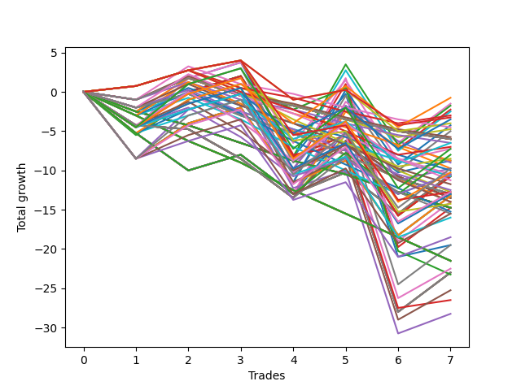

# Long Bulldog 006 
- Symbol: ES90d5m30m
- Date Range: 03/18/2022 - 07/08/2022
- Trading Period: 7:20-12:30
- Number of Trades: 7



| Name | Win Percent | Profit | Avg Profit / Trade | Avg Time / Trade |      | Name | Win Percent | Profit | Avg Profit / Trade | Avg Time / Trade |
| ---- | ----------- | ------ | ------------------ | ---------------- | ---- | ---- | ----------- | ------ | ------------------ | ---------------- |
| Sorted By <br> Profit | | | | | | Sorted By <br> Win Percentage ||||
| One Hundred Fourteen | 57.14 | -375.00 | -53.57 | 00:00 |     | One Hundred Sixteen | 71.43 | -1625.00 | -232.14 | 00:00 |
| Forty-Six | 42.86 | -750.00 | -107.14 | 00:00 |     | One Hundred Eleven | 71.43 | -2000.00 | -285.71 | 00:00 |
| Sixty-Two | 57.14 | -875.00 | -125.00 | 00:00 |     | One Hundred Twenty-Six | 71.43 | -6375.00 | -910.71 | 00:00 |
| Forty-Three | 42.86 | -1125.00 | -160.71 | 00:00 |     | One Hundred Twenty-One | 71.43 | -7125.00 | -1017.86 | 00:00 |
| Fifty-Nine | 57.14 | -1250.00 | -178.57 | 00:00 |     | Eighty-One | 71.43 | -13250.00 | -1892.86 | 00:00 |
| Ninety-Six | 42.86 | -1500.00 | -214.29 | 00:00 |     | One Hundred Fourteen | 57.14 | -375.00 | -53.57 | 00:00 |
| One Hundred Sixteen | 71.43 | -1625.00 | -232.14 | 00:00 |     | Sixty-Two | 57.14 | -875.00 | -125.00 | 00:00 |
| One Hundred Thirteen | 57.14 | -1750.00 | -250.00 | 00:00 |     | Fifty-Nine | 57.14 | -1250.00 | -178.57 | 00:00 |
| One Hundred Eleven | 71.43 | -2000.00 | -285.71 | 00:00 |     | One Hundred Thirteen | 57.14 | -1750.00 | -250.00 | 00:00 |
| Seventy | 57.14 | -2125.00 | -303.57 | 00:00 |     | Seventy | 57.14 | -2125.00 | -303.57 | 00:00 |
| Ninety-Nine | 14.29 | -2250.00 | -321.43 | 00:00 |     | Sixty-Seven | 57.14 | -2500.00 | -357.14 | 00:00 |
| Ninety-One | 42.86 | -2375.00 | -339.29 | 00:00 |     | One Hundred Twelve | 57.14 | -3250.00 | -464.29 | 00:00 |
| Sixty-Seven | 57.14 | -2500.00 | -357.14 | 00:00 |     | One Hundred Twenty-Five | 57.14 | -3625.00 | -517.86 | 00:00 |
| Ninety-Eight | 14.29 | -2875.00 | -410.71 | 00:00 |     | Fifty-Six | 57.14 | -3625.00 | -517.86 | 00:00 |
| One Hundred | 14.29 | -3000.00 | -428.57 | 00:00 |     | One Hundred Thirty | 57.14 | -4875.00 | -696.43 | 00:00 |
| Twenty-Three | 14.29 | -3000.00 | -428.57 | 00:00 |     | Sixty-Four | 57.14 | -4875.00 | -696.43 | 00:00 |
| Twenty-Two | 14.29 | -3000.00 | -428.57 | 00:00 |     | One Hundred Twenty-Four | 57.14 | -5125.00 | -732.14 | 00:00 |
| Twenty-One | 14.29 | -3000.00 | -428.57 | 00:00 |     | Sixty-Three | 57.14 | -5375.00 | -767.86 | 00:00 |
| Twenty | 14.29 | -3000.00 | -428.57 | 00:00 |     | Sixty-One | 57.14 | -5375.00 | -767.86 | 00:00 |
| Nineteen | 14.29 | -3000.00 | -428.57 | 00:00 |     | Sixty | 57.14 | -5375.00 | -767.86 | 00:00 |
| Eighteen | 14.29 | -3000.00 | -428.57 | 00:00 |     | Fifty-Eight | 57.14 | -5375.00 | -767.86 | 00:00 |
| Seventeen | 14.29 | -3000.00 | -428.57 | 00:00 |     | Fifty-Seven | 57.14 | -5375.00 | -767.86 | 00:00 |
| Sixten | 14.29 | -3000.00 | -428.57 | 00:00 |     | One Hundred Twenty-Nine | 57.14 | -6375.00 | -910.71 | 00:00 |
| One Hundred Twelve | 57.14 | -3250.00 | -464.29 | 00:00 |     | One Hundred Twenty-Three | 57.14 | -6500.00 | -928.57 | 00:00 |
| Ninety-Seven | 14.29 | -3250.00 | -464.29 | 00:00 |     | Seventy-One | 57.14 | -6625.00 | -946.43 | 00:00 |
| One Hundred Six | 42.86 | -3500.00 | -500.00 | 00:00 |     | Sixty-Nine | 57.14 | -6625.00 | -946.43 | 00:00 |
| One Hundred Twenty-Five | 57.14 | -3625.00 | -517.86 | 00:00 |     | Sixty-Eight | 57.14 | -6625.00 | -946.43 | 00:00 |
| Fifty-Six | 57.14 | -3625.00 | -517.86 | 00:00 |     | Sixty-Six | 57.14 | -6625.00 | -946.43 | 00:00 |
| One Hundred Fifteen | 42.86 | -4000.00 | -571.43 | 00:00 |     | Sixty-Five | 57.14 | -6625.00 | -946.43 | 00:00 |
| One Hundred One | 42.86 | -4250.00 | -607.14 | 00:00 |     | Six | 57.14 | -7000.00 | -1000.00 | 00:00 |
| Forty | 42.86 | -4375.00 | -625.00 | 00:00 |     | Three | 57.14 | -7375.00 | -1053.57 | 00:00 |
| Ninety-Four | 14.29 | -4375.00 | -625.00 | 00:00 |     | One Hundred Twenty-Eight | 57.14 | -7750.00 | -1107.14 | 00:00 |
| Fifty-Four | 14.29 | -4500.00 | -642.86 | 00:00 |     | One Hundred Twenty-Two | 57.14 | -8000.00 | -1142.86 | 00:00 |
| One Hundred Thirty | 57.14 | -4875.00 | -696.43 | 00:00 |     | One Hundred Twenty-Seven | 57.14 | -9250.00 | -1321.43 | 00:00 |
| Sixty-Four | 57.14 | -4875.00 | -696.43 | 00:00 |     | Eighty-Five | 57.14 | -9750.00 | -1392.86 | 00:00 |
| Fifty-One | 14.29 | -4875.00 | -696.43 | 00:00 |     | Zero | 57.14 | -9750.00 | -1392.86 | 00:00 |
| Ninety-Three | 14.29 | -5000.00 | -714.29 | 00:00 |     | Eighty-Four | 57.14 | -11250.00 | -1607.14 | 00:00 |
| One Hundred Twenty-Four | 57.14 | -5125.00 | -732.14 | 00:00 |     | Seven | 57.14 | -11500.00 | -1642.86 | 00:00 |
| One Hundred Seventeen | 42.86 | -5250.00 | -750.00 | 00:00 |     | Five | 57.14 | -11500.00 | -1642.86 | 00:00 |
| Forty-Seven | 42.86 | -5250.00 | -750.00 | 00:00 |     | Four | 57.14 | -11500.00 | -1642.86 | 00:00 |
| Forty-Five | 42.86 | -5250.00 | -750.00 | 00:00 |     | Two | 57.14 | -11500.00 | -1642.86 | 00:00 |
| Forty-Four | 42.86 | -5250.00 | -750.00 | 00:00 |     | One | 57.14 | -11500.00 | -1642.86 | 00:00 |
| Forty-Two | 42.86 | -5250.00 | -750.00 | 00:00 |     | Eighty-Three | 57.14 | -12625.00 | -1803.57 | 00:00 |
| Forty-One | 42.86 | -5250.00 | -750.00 | 00:00 |     | Eighty-Two | 57.14 | -14125.00 | -2017.86 | 00:00 |
| One Hundred Two | 28.57 | -5250.00 | -750.00 | 00:00 |     | Forty-Six | 42.86 | -750.00 | -107.14 | 00:00 |
| One Hundred Nine | 14.29 | -5250.00 | -750.00 | 00:00 |     | Forty-Three | 42.86 | -1125.00 | -160.71 | 00:00 |
| Sixty-Three | 57.14 | -5375.00 | -767.86 | 00:00 |     | Ninety-Six | 42.86 | -1500.00 | -214.29 | 00:00 |
| Sixty-One | 57.14 | -5375.00 | -767.86 | 00:00 |     | Ninety-One | 42.86 | -2375.00 | -339.29 | 00:00 |
| Sixty | 57.14 | -5375.00 | -767.86 | 00:00 |     | One Hundred Six | 42.86 | -3500.00 | -500.00 | 00:00 |
| Fifty-Eight | 57.14 | -5375.00 | -767.86 | 00:00 |     | One Hundred Fifteen | 42.86 | -4000.00 | -571.43 | 00:00 |
| Fifty-Seven | 57.14 | -5375.00 | -767.86 | 00:00 |     | One Hundred One | 42.86 | -4250.00 | -607.14 | 00:00 |
| Ninety-Two | 14.29 | -5375.00 | -767.86 | 00:00 |     | Forty | 42.86 | -4375.00 | -625.00 | 00:00 |
| One Hundred Ninteen | 28.57 | -5625.00 | -803.57 | 00:00 |     | One Hundred Seventeen | 42.86 | -5250.00 | -750.00 | 00:00 |
| One Hundred Eight | 14.29 | -5875.00 | -839.29 | 00:00 |     | Forty-Seven | 42.86 | -5250.00 | -750.00 | 00:00 |
| One Hundred Seven | 14.29 | -6250.00 | -892.86 | 00:00 |     | Forty-Five | 42.86 | -5250.00 | -750.00 | 00:00 |
| One Hundred Twenty-Six | 71.43 | -6375.00 | -910.71 | 00:00 |     | Forty-Four | 42.86 | -5250.00 | -750.00 | 00:00 |
| One Hundred Twenty-Nine | 57.14 | -6375.00 | -910.71 | 00:00 |     | Forty-Two | 42.86 | -5250.00 | -750.00 | 00:00 |
| Forty-Eight | 14.29 | -6375.00 | -910.71 | 00:00 |     | Forty-One | 42.86 | -5250.00 | -750.00 | 00:00 |
| One Hundred Twenty-Three | 57.14 | -6500.00 | -928.57 | 00:00 |     | Seventy-Three | 42.86 | -11625.00 | -1660.71 | 00:00 |
| One Hundred Ten | 14.29 | -6500.00 | -928.57 | 00:00 |     | One Hundred Two | 28.57 | -5250.00 | -750.00 | 00:00 |
| Thirty-Nine | 14.29 | -6500.00 | -928.57 | 00:00 |     | One Hundred Ninteen | 28.57 | -5625.00 | -803.57 | 00:00 |
| Thirty-Eight | 14.29 | -6500.00 | -928.57 | 00:00 |     | One Hundred Eighteen | 28.57 | -7000.00 | -1000.00 | 00:00 |
| Thirty-Seven | 14.29 | -6500.00 | -928.57 | 00:00 |     | Ninety-Nine | 14.29 | -2250.00 | -321.43 | 00:00 |
| Thirty-Six | 14.29 | -6500.00 | -928.57 | 00:00 |     | Ninety-Eight | 14.29 | -2875.00 | -410.71 | 00:00 |
| Thirty-Five | 14.29 | -6500.00 | -928.57 | 00:00 |     | One Hundred | 14.29 | -3000.00 | -428.57 | 00:00 |
| Thirty-Four | 14.29 | -6500.00 | -928.57 | 00:00 |     | Twenty-Three | 14.29 | -3000.00 | -428.57 | 00:00 |
| Thirty-Three | 14.29 | -6500.00 | -928.57 | 00:00 |     | Twenty-Two | 14.29 | -3000.00 | -428.57 | 00:00 |
| Thirty-Two | 14.29 | -6500.00 | -928.57 | 00:00 |     | Twenty-One | 14.29 | -3000.00 | -428.57 | 00:00 |
| Seventy-One | 57.14 | -6625.00 | -946.43 | 00:00 |     | Twenty | 14.29 | -3000.00 | -428.57 | 00:00 |
| Sixty-Nine | 57.14 | -6625.00 | -946.43 | 00:00 |     | Nineteen | 14.29 | -3000.00 | -428.57 | 00:00 |
| Sixty-Eight | 57.14 | -6625.00 | -946.43 | 00:00 |     | Eighteen | 14.29 | -3000.00 | -428.57 | 00:00 |
| Sixty-Six | 57.14 | -6625.00 | -946.43 | 00:00 |     | Seventeen | 14.29 | -3000.00 | -428.57 | 00:00 |
| Sixty-Five | 57.14 | -6625.00 | -946.43 | 00:00 |     | Sixten | 14.29 | -3000.00 | -428.57 | 00:00 |
| Fifty-Five | 14.29 | -6750.00 | -964.29 | 00:00 |     | Ninety-Seven | 14.29 | -3250.00 | -464.29 | 00:00 |
| Fifty-Three | 14.29 | -6750.00 | -964.29 | 00:00 |     | Ninety-Four | 14.29 | -4375.00 | -625.00 | 00:00 |
| Fifty-Two | 14.29 | -6750.00 | -964.29 | 00:00 |     | Fifty-Four | 14.29 | -4500.00 | -642.86 | 00:00 |
| Fifty | 14.29 | -6750.00 | -964.29 | 00:00 |     | Fifty-One | 14.29 | -4875.00 | -696.43 | 00:00 |
| Forty-Nine | 14.29 | -6750.00 | -964.29 | 00:00 |     | Ninety-Three | 14.29 | -5000.00 | -714.29 | 00:00 |
| Six | 57.14 | -7000.00 | -1000.00 | 00:00 |     | One Hundred Nine | 14.29 | -5250.00 | -750.00 | 00:00 |
| One Hundred Eighteen | 28.57 | -7000.00 | -1000.00 | 00:00 |     | Ninety-Two | 14.29 | -5375.00 | -767.86 | 00:00 |
| One Hundred Four | 14.29 | -7000.00 | -1000.00 | 00:00 |     | One Hundred Eight | 14.29 | -5875.00 | -839.29 | 00:00 |
| One Hundred Twenty-One | 71.43 | -7125.00 | -1017.86 | 00:00 |     | One Hundred Seven | 14.29 | -6250.00 | -892.86 | 00:00 |
| Three | 57.14 | -7375.00 | -1053.57 | 00:00 |     | Forty-Eight | 14.29 | -6375.00 | -910.71 | 00:00 |
| Ninety-Five | 0.00 | -7375.00 | -1053.57 | 00:00 |     | One Hundred Ten | 14.29 | -6500.00 | -928.57 | 00:00 |
| Fifteen | 0.00 | -7375.00 | -1053.57 | 00:00 |     | Thirty-Nine | 14.29 | -6500.00 | -928.57 | 00:00 |
| Fourteen | 0.00 | -7375.00 | -1053.57 | 00:00 |     | Thirty-Eight | 14.29 | -6500.00 | -928.57 | 00:00 |
| Thirteen | 0.00 | -7375.00 | -1053.57 | 00:00 |     | Thirty-Seven | 14.29 | -6500.00 | -928.57 | 00:00 |
| Twelve | 0.00 | -7375.00 | -1053.57 | 00:00 |     | Thirty-Six | 14.29 | -6500.00 | -928.57 | 00:00 |
| Eleven | 0.00 | -7375.00 | -1053.57 | 00:00 |     | Thirty-Five | 14.29 | -6500.00 | -928.57 | 00:00 |
| Ten | 0.00 | -7375.00 | -1053.57 | 00:00 |     | Thirty-Four | 14.29 | -6500.00 | -928.57 | 00:00 |
| Nine | 0.00 | -7375.00 | -1053.57 | 00:00 |     | Thirty-Three | 14.29 | -6500.00 | -928.57 | 00:00 |
| Eight | 0.00 | -7375.00 | -1053.57 | 00:00 |     | Thirty-Two | 14.29 | -6500.00 | -928.57 | 00:00 |
| One Hundred Three | 14.29 | -7625.00 | -1089.29 | 00:00 |     | Fifty-Five | 14.29 | -6750.00 | -964.29 | 00:00 |
| One Hundred Twenty-Eight | 57.14 | -7750.00 | -1107.14 | 00:00 |     | Fifty-Three | 14.29 | -6750.00 | -964.29 | 00:00 |
| One Hundred Twenty | 14.29 | -7750.00 | -1107.14 | 00:00 |     | Fifty-Two | 14.29 | -6750.00 | -964.29 | 00:00 |
| One Hundred Twenty-Two | 57.14 | -8000.00 | -1142.86 | 00:00 |     | Fifty | 14.29 | -6750.00 | -964.29 | 00:00 |
| One Hundred Twenty-Seven | 57.14 | -9250.00 | -1321.43 | 00:00 |     | Forty-Nine | 14.29 | -6750.00 | -964.29 | 00:00 |
| Eighty-Five | 57.14 | -9750.00 | -1392.86 | 00:00 |     | One Hundred Four | 14.29 | -7000.00 | -1000.00 | 00:00 |
| Zero | 57.14 | -9750.00 | -1392.86 | 00:00 |     | One Hundred Three | 14.29 | -7625.00 | -1089.29 | 00:00 |
| One Hundred Five | 0.00 | -10750.00 | -1535.71 | 00:00 |     | One Hundred Twenty | 14.29 | -7750.00 | -1107.14 | 00:00 |
| Thirty-One | 0.00 | -10750.00 | -1535.71 | 00:00 |     | Ninety-Five | 0.00 | -7375.00 | -1053.57 | 00:00 |
| Thirty | 0.00 | -10750.00 | -1535.71 | 00:00 |     | Fifteen | 0.00 | -7375.00 | -1053.57 | 00:00 |
| Twenty-Nine | 0.00 | -10750.00 | -1535.71 | 00:00 |     | Fourteen | 0.00 | -7375.00 | -1053.57 | 00:00 |
| Twenty-Eight | 0.00 | -10750.00 | -1535.71 | 00:00 |     | Thirteen | 0.00 | -7375.00 | -1053.57 | 00:00 |
| twenty-Seven | 0.00 | -10750.00 | -1535.71 | 00:00 |     | Twelve | 0.00 | -7375.00 | -1053.57 | 00:00 |
| Twenty-Six | 0.00 | -10750.00 | -1535.71 | 00:00 |     | Eleven | 0.00 | -7375.00 | -1053.57 | 00:00 |
| Twenty-Five | 0.00 | -10750.00 | -1535.71 | 00:00 |     | Ten | 0.00 | -7375.00 | -1053.57 | 00:00 |
| Twenty-Four | 0.00 | -10750.00 | -1535.71 | 00:00 |     | Nine | 0.00 | -7375.00 | -1053.57 | 00:00 |
| Eighty-Four | 57.14 | -11250.00 | -1607.14 | 00:00 |     | Eight | 0.00 | -7375.00 | -1053.57 | 00:00 |
| Seven | 57.14 | -11500.00 | -1642.86 | 00:00 |     | One Hundred Five | 0.00 | -10750.00 | -1535.71 | 00:00 |
| Five | 57.14 | -11500.00 | -1642.86 | 00:00 |     | Thirty-One | 0.00 | -10750.00 | -1535.71 | 00:00 |
| Four | 57.14 | -11500.00 | -1642.86 | 00:00 |     | Thirty | 0.00 | -10750.00 | -1535.71 | 00:00 |
| Two | 57.14 | -11500.00 | -1642.86 | 00:00 |     | Twenty-Nine | 0.00 | -10750.00 | -1535.71 | 00:00 |
| One | 57.14 | -11500.00 | -1642.86 | 00:00 |     | Twenty-Eight | 0.00 | -10750.00 | -1535.71 | 00:00 |
| Seventy-Three | 42.86 | -11625.00 | -1660.71 | 00:00 |     | twenty-Seven | 0.00 | -10750.00 | -1535.71 | 00:00 |
| Eighty-Three | 57.14 | -12625.00 | -1803.57 | 00:00 |     | Twenty-Six | 0.00 | -10750.00 | -1535.71 | 00:00 |
| Eighty-One | 71.43 | -13250.00 | -1892.86 | 00:00 |     | Twenty-Five | 0.00 | -10750.00 | -1535.71 | 00:00 |
| Eighty-Two | 57.14 | -14125.00 | -2017.86 | 00:00 |     | Twenty-Four | 0.00 | -10750.00 | -1535.71 | 00:00 |

## NO STOPLOSS

### Test Zero
* Sell when price hits the middle line of the 20p bollinger
* No Stoploss
* Results:
```
Total Trades: 7
Percent Up: 57.14
Percent Down: 42.86
Total Points Moved Up: -19.50
Potential Profit: -9750.00
Total Points Ups: 17.75 Count Ups: 4
Total Points Downs: -37.25 Count Downs: 3
```

<details><summary>Trades</summary>

<code>In: 2022-03-23 10:55:00		Out: 2022-03-23 11:24:55		Total Position Time: 29:55		Total Move Up: -4.50		Total to Date: -4.50</code> <br />
<code>In: 2022-03-30 12:35:00		Out: 2022-03-30 12:47:25		Total Position Time: 12:25		Total Move Up: 6.25		Total to Date: 1.75</code> <br />
<code>In: 2022-03-31 11:30:00		Out: 2022-03-31 11:59:20		Total Position Time: 29:20		Total Move Up: 2.00		Total to Date: 3.75</code> <br />
<code>In: 2022-04-18 09:00:00		Out: 2022-04-18 09:29:55		Total Position Time: 29:55		Total Move Up: -12.00		Total to Date: -8.25</code> <br />
<code>In: 2022-04-20 12:05:00		Out: 2022-04-20 12:25:05		Total Position Time: 20:05		Total Move Up: 8.00		Total to Date: -0.25</code> <br />
<code>In: 2022-05-02 10:15:00		Out: 2022-05-02 10:44:55		Total Position Time: 29:55		Total Move Up: -20.75		Total to Date: -21.00</code> <br />
<code>In: 2022-06-29 09:40:00		Out: 2022-06-29 10:01:50		Total Position Time: 21:50		Total Move Up: 1.50		Total to Date: -19.50</code> <br />


</details>

### Test One
* Sell when the price hits the upper line of the 20p 1std bollinger
* No Stoploss
* Results:
```
Total Trades: 7
Percent Up: 57.14
Percent Down: 42.86
Total Points Moved Up: -23.00
Potential Profit: -11500.00
Total Points Ups: 14.25 Count Ups: 4
Total Points Downs: -37.25 Count Downs: 3
```

<details><summary>Trades</summary>

<code>In: 2022-03-23 10:55:00		Out: 2022-03-23 11:24:55		Total Position Time: 29:55		Total Move Up: -4.50		Total to Date: -4.50</code> <br />
<code>In: 2022-03-30 12:35:00		Out: 2022-03-30 12:50:00		Total Position Time: 15:00		Total Move Up: 4.50		Total to Date: 0.00</code> <br />
<code>In: 2022-03-31 11:30:00		Out: 2022-03-31 11:59:55		Total Position Time: 29:55		Total Move Up: 2.00		Total to Date: 2.00</code> <br />
<code>In: 2022-04-18 09:00:00		Out: 2022-04-18 09:29:55		Total Position Time: 29:55		Total Move Up: -12.00		Total to Date: -10.00</code> <br />
<code>In: 2022-04-20 12:05:00		Out: 2022-04-20 12:34:55		Total Position Time: 29:55		Total Move Up: 2.75		Total to Date: -7.25</code> <br />
<code>In: 2022-05-02 10:15:00		Out: 2022-05-02 10:44:55		Total Position Time: 29:55		Total Move Up: -20.75		Total to Date: -28.00</code> <br />
<code>In: 2022-06-29 09:40:00		Out: 2022-06-29 10:09:55		Total Position Time: 29:55		Total Move Up: 5.00		Total to Date: -23.00</code> <br />


</details>

### Test Two
* Sell when the price hits the upper line of the 20p 2std bollinger
* No Stoploss
* Results:
```
Total Trades: 7
Percent Up: 57.14
Percent Down: 42.86
Total Points Moved Up: -23.00
Potential Profit: -11500.00
Total Points Ups: 14.25 Count Ups: 4
Total Points Downs: -37.25 Count Downs: 3
```

<details><summary>Trades</summary>

<code>In: 2022-03-23 10:55:00		Out: 2022-03-23 11:24:55		Total Position Time: 29:55		Total Move Up: -4.50		Total to Date: -4.50</code> <br />
<code>In: 2022-03-30 12:35:00		Out: 2022-03-30 12:50:00		Total Position Time: 15:00		Total Move Up: 4.50		Total to Date: 0.00</code> <br />
<code>In: 2022-03-31 11:30:00		Out: 2022-03-31 11:59:55		Total Position Time: 29:55		Total Move Up: 2.00		Total to Date: 2.00</code> <br />
<code>In: 2022-04-18 09:00:00		Out: 2022-04-18 09:29:55		Total Position Time: 29:55		Total Move Up: -12.00		Total to Date: -10.00</code> <br />
<code>In: 2022-04-20 12:05:00		Out: 2022-04-20 12:34:55		Total Position Time: 29:55		Total Move Up: 2.75		Total to Date: -7.25</code> <br />
<code>In: 2022-05-02 10:15:00		Out: 2022-05-02 10:44:55		Total Position Time: 29:55		Total Move Up: -20.75		Total to Date: -28.00</code> <br />
<code>In: 2022-06-29 09:40:00		Out: 2022-06-29 10:09:55		Total Position Time: 29:55		Total Move Up: 5.00		Total to Date: -23.00</code> <br />


</details>

### Test Three
* Sell when price hits the middle line of the 50p bollinger
* No Stoploss
* Results:
```
Total Trades: 7
Percent Up: 57.14
Percent Down: 42.86
Total Points Moved Up: -14.75
Potential Profit: -7375.00
Total Points Ups: 22.50 Count Ups: 4
Total Points Downs: -37.25 Count Downs: 3
```

<details><summary>Trades</summary>

<code>In: 2022-03-23 10:55:00		Out: 2022-03-23 11:24:55		Total Position Time: 29:55		Total Move Up: -4.50		Total to Date: -4.50</code> <br />
<code>In: 2022-03-30 12:35:00		Out: 2022-03-30 12:50:00		Total Position Time: 15:00		Total Move Up: 4.50		Total to Date: 0.00</code> <br />
<code>In: 2022-03-31 11:30:00		Out: 2022-03-31 11:59:55		Total Position Time: 29:55		Total Move Up: 2.00		Total to Date: 2.00</code> <br />
<code>In: 2022-04-18 09:00:00		Out: 2022-04-18 09:29:55		Total Position Time: 29:55		Total Move Up: -12.00		Total to Date: -10.00</code> <br />
<code>In: 2022-04-20 12:05:00		Out: 2022-04-20 12:25:50		Total Position Time: 20:50		Total Move Up: 11.00		Total to Date: 1.00</code> <br />
<code>In: 2022-05-02 10:15:00		Out: 2022-05-02 10:44:55		Total Position Time: 29:55		Total Move Up: -20.75		Total to Date: -19.75</code> <br />
<code>In: 2022-06-29 09:40:00		Out: 2022-06-29 10:09:55		Total Position Time: 29:55		Total Move Up: 5.00		Total to Date: -14.75</code> <br />


</details>

### Test Four
* Sell when the price hits the upper line of the 50p 1std bollinger
* No Stoploss
* Results:
```
Total Trades: 7
Percent Up: 57.14
Percent Down: 42.86
Total Points Moved Up: -23.00
Potential Profit: -11500.00
Total Points Ups: 14.25 Count Ups: 4
Total Points Downs: -37.25 Count Downs: 3
```

<details><summary>Trades</summary>

<code>In: 2022-03-23 10:55:00		Out: 2022-03-23 11:24:55		Total Position Time: 29:55		Total Move Up: -4.50		Total to Date: -4.50</code> <br />
<code>In: 2022-03-30 12:35:00		Out: 2022-03-30 12:50:00		Total Position Time: 15:00		Total Move Up: 4.50		Total to Date: 0.00</code> <br />
<code>In: 2022-03-31 11:30:00		Out: 2022-03-31 11:59:55		Total Position Time: 29:55		Total Move Up: 2.00		Total to Date: 2.00</code> <br />
<code>In: 2022-04-18 09:00:00		Out: 2022-04-18 09:29:55		Total Position Time: 29:55		Total Move Up: -12.00		Total to Date: -10.00</code> <br />
<code>In: 2022-04-20 12:05:00		Out: 2022-04-20 12:34:55		Total Position Time: 29:55		Total Move Up: 2.75		Total to Date: -7.25</code> <br />
<code>In: 2022-05-02 10:15:00		Out: 2022-05-02 10:44:55		Total Position Time: 29:55		Total Move Up: -20.75		Total to Date: -28.00</code> <br />
<code>In: 2022-06-29 09:40:00		Out: 2022-06-29 10:09:55		Total Position Time: 29:55		Total Move Up: 5.00		Total to Date: -23.00</code> <br />


</details>

### Test Five
* Sell when the price hits the upper line of the 50p 2std bollinger
* No Stoploss
* Results:
```
Total Trades: 7
Percent Up: 57.14
Percent Down: 42.86
Total Points Moved Up: -23.00
Potential Profit: -11500.00
Total Points Ups: 14.25 Count Ups: 4
Total Points Downs: -37.25 Count Downs: 3
```

<details><summary>Trades</summary>

<code>In: 2022-03-23 10:55:00		Out: 2022-03-23 11:24:55		Total Position Time: 29:55		Total Move Up: -4.50		Total to Date: -4.50</code> <br />
<code>In: 2022-03-30 12:35:00		Out: 2022-03-30 12:50:00		Total Position Time: 15:00		Total Move Up: 4.50		Total to Date: 0.00</code> <br />
<code>In: 2022-03-31 11:30:00		Out: 2022-03-31 11:59:55		Total Position Time: 29:55		Total Move Up: 2.00		Total to Date: 2.00</code> <br />
<code>In: 2022-04-18 09:00:00		Out: 2022-04-18 09:29:55		Total Position Time: 29:55		Total Move Up: -12.00		Total to Date: -10.00</code> <br />
<code>In: 2022-04-20 12:05:00		Out: 2022-04-20 12:34:55		Total Position Time: 29:55		Total Move Up: 2.75		Total to Date: -7.25</code> <br />
<code>In: 2022-05-02 10:15:00		Out: 2022-05-02 10:44:55		Total Position Time: 29:55		Total Move Up: -20.75		Total to Date: -28.00</code> <br />
<code>In: 2022-06-29 09:40:00		Out: 2022-06-29 10:09:55		Total Position Time: 29:55		Total Move Up: 5.00		Total to Date: -23.00</code> <br />


</details>

### Test Six
* Sell when the price hits the middle line of the 1std VWAP
* No Stoploss
* Results:
```
Total Trades: 7
Percent Up: 57.14
Percent Down: 42.86
Total Points Moved Up: -14.00
Potential Profit: -7000.00
Total Points Ups: 23.25 Count Ups: 4
Total Points Downs: -37.25 Count Downs: 3
```

<details><summary>Trades</summary>

<code>In: 2022-03-23 10:55:00		Out: 2022-03-23 11:24:55		Total Position Time: 29:55		Total Move Up: -4.50		Total to Date: -4.50</code> <br />
<code>In: 2022-03-30 12:35:00		Out: 2022-03-30 12:50:00		Total Position Time: 15:00		Total Move Up: 4.50		Total to Date: 0.00</code> <br />
<code>In: 2022-03-31 11:30:00		Out: 2022-03-31 11:59:55		Total Position Time: 29:55		Total Move Up: 2.00		Total to Date: 2.00</code> <br />
<code>In: 2022-04-18 09:00:00		Out: 2022-04-18 09:29:55		Total Position Time: 29:55		Total Move Up: -12.00		Total to Date: -10.00</code> <br />
<code>In: 2022-04-20 12:05:00		Out: 2022-04-20 12:26:10		Total Position Time: 21:10		Total Move Up: 11.75		Total to Date: 1.75</code> <br />
<code>In: 2022-05-02 10:15:00		Out: 2022-05-02 10:44:55		Total Position Time: 29:55		Total Move Up: -20.75		Total to Date: -19.00</code> <br />
<code>In: 2022-06-29 09:40:00		Out: 2022-06-29 10:09:55		Total Position Time: 29:55		Total Move Up: 5.00		Total to Date: -14.00</code> <br />


</details>

### Test Seven
* Sell when the price hits the upper line of the 1std VWAP
* No Stoploss
* Results:
```
Total Trades: 7
Percent Up: 57.14
Percent Down: 42.86
Total Points Moved Up: -23.00
Potential Profit: -11500.00
Total Points Ups: 14.25 Count Ups: 4
Total Points Downs: -37.25 Count Downs: 3
```

<details><summary>Trades</summary>

<code>In: 2022-03-23 10:55:00		Out: 2022-03-23 11:24:55		Total Position Time: 29:55		Total Move Up: -4.50		Total to Date: -4.50</code> <br />
<code>In: 2022-03-30 12:35:00		Out: 2022-03-30 12:50:00		Total Position Time: 15:00		Total Move Up: 4.50		Total to Date: 0.00</code> <br />
<code>In: 2022-03-31 11:30:00		Out: 2022-03-31 11:59:55		Total Position Time: 29:55		Total Move Up: 2.00		Total to Date: 2.00</code> <br />
<code>In: 2022-04-18 09:00:00		Out: 2022-04-18 09:29:55		Total Position Time: 29:55		Total Move Up: -12.00		Total to Date: -10.00</code> <br />
<code>In: 2022-04-20 12:05:00		Out: 2022-04-20 12:34:55		Total Position Time: 29:55		Total Move Up: 2.75		Total to Date: -7.25</code> <br />
<code>In: 2022-05-02 10:15:00		Out: 2022-05-02 10:44:55		Total Position Time: 29:55		Total Move Up: -20.75		Total to Date: -28.00</code> <br />
<code>In: 2022-06-29 09:40:00		Out: 2022-06-29 10:09:55		Total Position Time: 29:55		Total Move Up: 5.00		Total to Date: -23.00</code> <br />


</details>

## STOPLOSS OF 2

### Test Eight
* Sell when price hits the middle line of the 20p bollinger
* Stoploss is 2 points
* Results:
```
Total Trades: 7
Percent Up: 0.00
Percent Down: 100.00
Total Points Moved Up: -14.75
Potential Profit: -7375.00
Total Points Ups: 0.00 Count Ups: 0
Total Points Downs: -14.75 Count Downs: 7
```

<details><summary>Trades</summary>

<code>In: 2022-03-23 10:55:00		Out: 2022-03-23 11:00:40		Total Position Time: 05:40		Total Move Up: -2.50		Total to Date: -2.50</code> <br />
<code>In: 2022-03-30 12:35:00		Out: 2022-03-30 12:39:45		Total Position Time: 04:45		Total Move Up: -1.75		Total to Date: -4.25</code> <br />
<code>In: 2022-03-31 11:30:00		Out: 2022-03-31 11:33:35		Total Position Time: 03:35		Total Move Up: -2.25		Total to Date: -6.50</code> <br />
<code>In: 2022-04-18 09:00:00		Out: 2022-04-18 09:02:10		Total Position Time: 02:10		Total Move Up: -2.25		Total to Date: -8.75</code> <br />
<code>In: 2022-04-20 12:05:00		Out: 2022-04-20 12:05:55		Total Position Time: 00:55		Total Move Up: -1.75		Total to Date: -10.50</code> <br />
<code>In: 2022-05-02 10:15:00		Out: 2022-05-02 10:15:35		Total Position Time: 00:35		Total Move Up: -2.25		Total to Date: -12.75</code> <br />
<code>In: 2022-06-29 09:40:00		Out: 2022-06-29 09:43:10		Total Position Time: 03:10		Total Move Up: -2.00		Total to Date: -14.75</code> <br />


</details>

### Test Nine
* Sell when the price hits the upper line of the 20p 1std bollinger
* Stoploss is 2 points
* Results:
```
Total Trades: 7
Percent Up: 0.00
Percent Down: 100.00
Total Points Moved Up: -14.75
Potential Profit: -7375.00
Total Points Ups: 0.00 Count Ups: 0
Total Points Downs: -14.75 Count Downs: 7
```

<details><summary>Trades</summary>

<code>In: 2022-03-23 10:55:00		Out: 2022-03-23 11:00:40		Total Position Time: 05:40		Total Move Up: -2.50		Total to Date: -2.50</code> <br />
<code>In: 2022-03-30 12:35:00		Out: 2022-03-30 12:39:45		Total Position Time: 04:45		Total Move Up: -1.75		Total to Date: -4.25</code> <br />
<code>In: 2022-03-31 11:30:00		Out: 2022-03-31 11:33:35		Total Position Time: 03:35		Total Move Up: -2.25		Total to Date: -6.50</code> <br />
<code>In: 2022-04-18 09:00:00		Out: 2022-04-18 09:02:10		Total Position Time: 02:10		Total Move Up: -2.25		Total to Date: -8.75</code> <br />
<code>In: 2022-04-20 12:05:00		Out: 2022-04-20 12:05:55		Total Position Time: 00:55		Total Move Up: -1.75		Total to Date: -10.50</code> <br />
<code>In: 2022-05-02 10:15:00		Out: 2022-05-02 10:15:35		Total Position Time: 00:35		Total Move Up: -2.25		Total to Date: -12.75</code> <br />
<code>In: 2022-06-29 09:40:00		Out: 2022-06-29 09:43:10		Total Position Time: 03:10		Total Move Up: -2.00		Total to Date: -14.75</code> <br />


</details>

### Test Ten
* Sell when the price hits the upper line of the 20p 2std bollinger
* Stoploss is 2 points
* Results:
```
Total Trades: 7
Percent Up: 0.00
Percent Down: 100.00
Total Points Moved Up: -14.75
Potential Profit: -7375.00
Total Points Ups: 0.00 Count Ups: 0
Total Points Downs: -14.75 Count Downs: 7
```

<details><summary>Trades</summary>

<code>In: 2022-03-23 10:55:00		Out: 2022-03-23 11:00:40		Total Position Time: 05:40		Total Move Up: -2.50		Total to Date: -2.50</code> <br />
<code>In: 2022-03-30 12:35:00		Out: 2022-03-30 12:39:45		Total Position Time: 04:45		Total Move Up: -1.75		Total to Date: -4.25</code> <br />
<code>In: 2022-03-31 11:30:00		Out: 2022-03-31 11:33:35		Total Position Time: 03:35		Total Move Up: -2.25		Total to Date: -6.50</code> <br />
<code>In: 2022-04-18 09:00:00		Out: 2022-04-18 09:02:10		Total Position Time: 02:10		Total Move Up: -2.25		Total to Date: -8.75</code> <br />
<code>In: 2022-04-20 12:05:00		Out: 2022-04-20 12:05:55		Total Position Time: 00:55		Total Move Up: -1.75		Total to Date: -10.50</code> <br />
<code>In: 2022-05-02 10:15:00		Out: 2022-05-02 10:15:35		Total Position Time: 00:35		Total Move Up: -2.25		Total to Date: -12.75</code> <br />
<code>In: 2022-06-29 09:40:00		Out: 2022-06-29 09:43:10		Total Position Time: 03:10		Total Move Up: -2.00		Total to Date: -14.75</code> <br />


</details>

### Test Eleven
* Sell when price hits the middle line of the 50p bollinger
* Stoploss is 2 points
* Results:
```
Total Trades: 7
Percent Up: 0.00
Percent Down: 100.00
Total Points Moved Up: -14.75
Potential Profit: -7375.00
Total Points Ups: 0.00 Count Ups: 0
Total Points Downs: -14.75 Count Downs: 7
```

<details><summary>Trades</summary>

<code>In: 2022-03-23 10:55:00		Out: 2022-03-23 11:00:40		Total Position Time: 05:40		Total Move Up: -2.50		Total to Date: -2.50</code> <br />
<code>In: 2022-03-30 12:35:00		Out: 2022-03-30 12:39:45		Total Position Time: 04:45		Total Move Up: -1.75		Total to Date: -4.25</code> <br />
<code>In: 2022-03-31 11:30:00		Out: 2022-03-31 11:33:35		Total Position Time: 03:35		Total Move Up: -2.25		Total to Date: -6.50</code> <br />
<code>In: 2022-04-18 09:00:00		Out: 2022-04-18 09:02:10		Total Position Time: 02:10		Total Move Up: -2.25		Total to Date: -8.75</code> <br />
<code>In: 2022-04-20 12:05:00		Out: 2022-04-20 12:05:55		Total Position Time: 00:55		Total Move Up: -1.75		Total to Date: -10.50</code> <br />
<code>In: 2022-05-02 10:15:00		Out: 2022-05-02 10:15:35		Total Position Time: 00:35		Total Move Up: -2.25		Total to Date: -12.75</code> <br />
<code>In: 2022-06-29 09:40:00		Out: 2022-06-29 09:43:10		Total Position Time: 03:10		Total Move Up: -2.00		Total to Date: -14.75</code> <br />


</details>

### Test Twelve
* Sell when the price hits the upper line of the 50p 1std bollinger
* Stoploss is 2 points
* Results:
```
Total Trades: 7
Percent Up: 0.00
Percent Down: 100.00
Total Points Moved Up: -14.75
Potential Profit: -7375.00
Total Points Ups: 0.00 Count Ups: 0
Total Points Downs: -14.75 Count Downs: 7
```

<details><summary>Trades</summary>

<code>In: 2022-03-23 10:55:00		Out: 2022-03-23 11:00:40		Total Position Time: 05:40		Total Move Up: -2.50		Total to Date: -2.50</code> <br />
<code>In: 2022-03-30 12:35:00		Out: 2022-03-30 12:39:45		Total Position Time: 04:45		Total Move Up: -1.75		Total to Date: -4.25</code> <br />
<code>In: 2022-03-31 11:30:00		Out: 2022-03-31 11:33:35		Total Position Time: 03:35		Total Move Up: -2.25		Total to Date: -6.50</code> <br />
<code>In: 2022-04-18 09:00:00		Out: 2022-04-18 09:02:10		Total Position Time: 02:10		Total Move Up: -2.25		Total to Date: -8.75</code> <br />
<code>In: 2022-04-20 12:05:00		Out: 2022-04-20 12:05:55		Total Position Time: 00:55		Total Move Up: -1.75		Total to Date: -10.50</code> <br />
<code>In: 2022-05-02 10:15:00		Out: 2022-05-02 10:15:35		Total Position Time: 00:35		Total Move Up: -2.25		Total to Date: -12.75</code> <br />
<code>In: 2022-06-29 09:40:00		Out: 2022-06-29 09:43:10		Total Position Time: 03:10		Total Move Up: -2.00		Total to Date: -14.75</code> <br />


</details>

### Test Thirteen
* Sell when the price hits the upper line of the 50p 2std bollinger
* Stoploss is 2 points
* Results:
```
Total Trades: 7
Percent Up: 0.00
Percent Down: 100.00
Total Points Moved Up: -14.75
Potential Profit: -7375.00
Total Points Ups: 0.00 Count Ups: 0
Total Points Downs: -14.75 Count Downs: 7
```

<details><summary>Trades</summary>

<code>In: 2022-03-23 10:55:00		Out: 2022-03-23 11:00:40		Total Position Time: 05:40		Total Move Up: -2.50		Total to Date: -2.50</code> <br />
<code>In: 2022-03-30 12:35:00		Out: 2022-03-30 12:39:45		Total Position Time: 04:45		Total Move Up: -1.75		Total to Date: -4.25</code> <br />
<code>In: 2022-03-31 11:30:00		Out: 2022-03-31 11:33:35		Total Position Time: 03:35		Total Move Up: -2.25		Total to Date: -6.50</code> <br />
<code>In: 2022-04-18 09:00:00		Out: 2022-04-18 09:02:10		Total Position Time: 02:10		Total Move Up: -2.25		Total to Date: -8.75</code> <br />
<code>In: 2022-04-20 12:05:00		Out: 2022-04-20 12:05:55		Total Position Time: 00:55		Total Move Up: -1.75		Total to Date: -10.50</code> <br />
<code>In: 2022-05-02 10:15:00		Out: 2022-05-02 10:15:35		Total Position Time: 00:35		Total Move Up: -2.25		Total to Date: -12.75</code> <br />
<code>In: 2022-06-29 09:40:00		Out: 2022-06-29 09:43:10		Total Position Time: 03:10		Total Move Up: -2.00		Total to Date: -14.75</code> <br />


</details>

### Test Fourteen
* Sell when the price hits the middle line of the 1std VWAP
* Stoploss is 2 points
* Results:
```
Total Trades: 7
Percent Up: 0.00
Percent Down: 100.00
Total Points Moved Up: -14.75
Potential Profit: -7375.00
Total Points Ups: 0.00 Count Ups: 0
Total Points Downs: -14.75 Count Downs: 7
```

<details><summary>Trades</summary>

<code>In: 2022-03-23 10:55:00		Out: 2022-03-23 11:00:40		Total Position Time: 05:40		Total Move Up: -2.50		Total to Date: -2.50</code> <br />
<code>In: 2022-03-30 12:35:00		Out: 2022-03-30 12:39:45		Total Position Time: 04:45		Total Move Up: -1.75		Total to Date: -4.25</code> <br />
<code>In: 2022-03-31 11:30:00		Out: 2022-03-31 11:33:35		Total Position Time: 03:35		Total Move Up: -2.25		Total to Date: -6.50</code> <br />
<code>In: 2022-04-18 09:00:00		Out: 2022-04-18 09:02:10		Total Position Time: 02:10		Total Move Up: -2.25		Total to Date: -8.75</code> <br />
<code>In: 2022-04-20 12:05:00		Out: 2022-04-20 12:05:55		Total Position Time: 00:55		Total Move Up: -1.75		Total to Date: -10.50</code> <br />
<code>In: 2022-05-02 10:15:00		Out: 2022-05-02 10:15:35		Total Position Time: 00:35		Total Move Up: -2.25		Total to Date: -12.75</code> <br />
<code>In: 2022-06-29 09:40:00		Out: 2022-06-29 09:43:10		Total Position Time: 03:10		Total Move Up: -2.00		Total to Date: -14.75</code> <br />


</details>

### Test Fifteen
* Sell when the price hits the upper line of the 1std VWAP
* Stoploss is 2 points
* Results:
```
Total Trades: 7
Percent Up: 0.00
Percent Down: 100.00
Total Points Moved Up: -14.75
Potential Profit: -7375.00
Total Points Ups: 0.00 Count Ups: 0
Total Points Downs: -14.75 Count Downs: 7
```

<details><summary>Trades</summary>

<code>In: 2022-03-23 10:55:00		Out: 2022-03-23 11:00:40		Total Position Time: 05:40		Total Move Up: -2.50		Total to Date: -2.50</code> <br />
<code>In: 2022-03-30 12:35:00		Out: 2022-03-30 12:39:45		Total Position Time: 04:45		Total Move Up: -1.75		Total to Date: -4.25</code> <br />
<code>In: 2022-03-31 11:30:00		Out: 2022-03-31 11:33:35		Total Position Time: 03:35		Total Move Up: -2.25		Total to Date: -6.50</code> <br />
<code>In: 2022-04-18 09:00:00		Out: 2022-04-18 09:02:10		Total Position Time: 02:10		Total Move Up: -2.25		Total to Date: -8.75</code> <br />
<code>In: 2022-04-20 12:05:00		Out: 2022-04-20 12:05:55		Total Position Time: 00:55		Total Move Up: -1.75		Total to Date: -10.50</code> <br />
<code>In: 2022-05-02 10:15:00		Out: 2022-05-02 10:15:35		Total Position Time: 00:35		Total Move Up: -2.25		Total to Date: -12.75</code> <br />
<code>In: 2022-06-29 09:40:00		Out: 2022-06-29 09:43:10		Total Position Time: 03:10		Total Move Up: -2.00		Total to Date: -14.75</code> <br />


</details>

## TRAIL STOP OF 2

### Test Sixten
* Sell when price hits the middle line of the 20p bollinger
* Trailing Stop is 2 points
* Results:
```
Total Trades: 7
Percent Up: 14.29
Percent Down: 85.71
Total Points Moved Up: -6.00
Potential Profit: -3000.00
Total Points Ups: 2.75 Count Ups: 1
Total Points Downs: -8.75 Count Downs: 6
```

<details><summary>Trades</summary>

<code>In: 2022-03-23 10:55:00		Out: 2022-03-23 10:57:30		Total Position Time: 02:30		Total Move Up: -1.00		Total to Date: -1.00</code> <br />
<code>In: 2022-03-30 12:35:00		Out: 2022-03-30 12:38:10		Total Position Time: 03:10		Total Move Up: 2.75		Total to Date: 1.75</code> <br />
<code>In: 2022-03-31 11:30:00		Out: 2022-03-31 11:33:35		Total Position Time: 03:35		Total Move Up: -2.25		Total to Date: -0.50</code> <br />
<code>In: 2022-04-18 09:00:00		Out: 2022-04-18 09:01:05		Total Position Time: 01:05		Total Move Up: -1.25		Total to Date: -1.75</code> <br />
<code>In: 2022-04-20 12:05:00		Out: 2022-04-20 12:05:45		Total Position Time: 00:45		Total Move Up: -1.75		Total to Date: -3.50</code> <br />
<code>In: 2022-05-02 10:15:00		Out: 2022-05-02 10:15:20		Total Position Time: 00:20		Total Move Up: -1.50		Total to Date: -5.00</code> <br />
<code>In: 2022-06-29 09:40:00		Out: 2022-06-29 09:41:55		Total Position Time: 01:55		Total Move Up: -1.00		Total to Date: -6.00</code> <br />


</details>

### Test Seventeen
* Sell when the price hits the upper line of the 20p 1std bollinger
* Trailing Stop is 2 points
* Results:
```
Total Trades: 7
Percent Up: 14.29
Percent Down: 85.71
Total Points Moved Up: -6.00
Potential Profit: -3000.00
Total Points Ups: 2.75 Count Ups: 1
Total Points Downs: -8.75 Count Downs: 6
```

<details><summary>Trades</summary>

<code>In: 2022-03-23 10:55:00		Out: 2022-03-23 10:57:30		Total Position Time: 02:30		Total Move Up: -1.00		Total to Date: -1.00</code> <br />
<code>In: 2022-03-30 12:35:00		Out: 2022-03-30 12:38:10		Total Position Time: 03:10		Total Move Up: 2.75		Total to Date: 1.75</code> <br />
<code>In: 2022-03-31 11:30:00		Out: 2022-03-31 11:33:35		Total Position Time: 03:35		Total Move Up: -2.25		Total to Date: -0.50</code> <br />
<code>In: 2022-04-18 09:00:00		Out: 2022-04-18 09:01:05		Total Position Time: 01:05		Total Move Up: -1.25		Total to Date: -1.75</code> <br />
<code>In: 2022-04-20 12:05:00		Out: 2022-04-20 12:05:45		Total Position Time: 00:45		Total Move Up: -1.75		Total to Date: -3.50</code> <br />
<code>In: 2022-05-02 10:15:00		Out: 2022-05-02 10:15:20		Total Position Time: 00:20		Total Move Up: -1.50		Total to Date: -5.00</code> <br />
<code>In: 2022-06-29 09:40:00		Out: 2022-06-29 09:41:55		Total Position Time: 01:55		Total Move Up: -1.00		Total to Date: -6.00</code> <br />


</details>

### Test Eighteen
* Sell when the price hits the upper line of the 20p 2std bollinger
* Trailing Stop is 2 points
* Results:
```
Total Trades: 7
Percent Up: 14.29
Percent Down: 85.71
Total Points Moved Up: -6.00
Potential Profit: -3000.00
Total Points Ups: 2.75 Count Ups: 1
Total Points Downs: -8.75 Count Downs: 6
```

<details><summary>Trades</summary>

<code>In: 2022-03-23 10:55:00		Out: 2022-03-23 10:57:30		Total Position Time: 02:30		Total Move Up: -1.00		Total to Date: -1.00</code> <br />
<code>In: 2022-03-30 12:35:00		Out: 2022-03-30 12:38:10		Total Position Time: 03:10		Total Move Up: 2.75		Total to Date: 1.75</code> <br />
<code>In: 2022-03-31 11:30:00		Out: 2022-03-31 11:33:35		Total Position Time: 03:35		Total Move Up: -2.25		Total to Date: -0.50</code> <br />
<code>In: 2022-04-18 09:00:00		Out: 2022-04-18 09:01:05		Total Position Time: 01:05		Total Move Up: -1.25		Total to Date: -1.75</code> <br />
<code>In: 2022-04-20 12:05:00		Out: 2022-04-20 12:05:45		Total Position Time: 00:45		Total Move Up: -1.75		Total to Date: -3.50</code> <br />
<code>In: 2022-05-02 10:15:00		Out: 2022-05-02 10:15:20		Total Position Time: 00:20		Total Move Up: -1.50		Total to Date: -5.00</code> <br />
<code>In: 2022-06-29 09:40:00		Out: 2022-06-29 09:41:55		Total Position Time: 01:55		Total Move Up: -1.00		Total to Date: -6.00</code> <br />


</details>

### Test Nineteen
* Sell when price hits the middle line of the 50p bollinger
* Trailing Stop is 2 points
* Results:
```
Total Trades: 7
Percent Up: 14.29
Percent Down: 85.71
Total Points Moved Up: -6.00
Potential Profit: -3000.00
Total Points Ups: 2.75 Count Ups: 1
Total Points Downs: -8.75 Count Downs: 6
```

<details><summary>Trades</summary>

<code>In: 2022-03-23 10:55:00		Out: 2022-03-23 10:57:30		Total Position Time: 02:30		Total Move Up: -1.00		Total to Date: -1.00</code> <br />
<code>In: 2022-03-30 12:35:00		Out: 2022-03-30 12:38:10		Total Position Time: 03:10		Total Move Up: 2.75		Total to Date: 1.75</code> <br />
<code>In: 2022-03-31 11:30:00		Out: 2022-03-31 11:33:35		Total Position Time: 03:35		Total Move Up: -2.25		Total to Date: -0.50</code> <br />
<code>In: 2022-04-18 09:00:00		Out: 2022-04-18 09:01:05		Total Position Time: 01:05		Total Move Up: -1.25		Total to Date: -1.75</code> <br />
<code>In: 2022-04-20 12:05:00		Out: 2022-04-20 12:05:45		Total Position Time: 00:45		Total Move Up: -1.75		Total to Date: -3.50</code> <br />
<code>In: 2022-05-02 10:15:00		Out: 2022-05-02 10:15:20		Total Position Time: 00:20		Total Move Up: -1.50		Total to Date: -5.00</code> <br />
<code>In: 2022-06-29 09:40:00		Out: 2022-06-29 09:41:55		Total Position Time: 01:55		Total Move Up: -1.00		Total to Date: -6.00</code> <br />


</details>

### Test Twenty
* Sell when the price hits the upper line of the 50p 1std bollinger
* Trailing Stop is 2 points
* Results:
```
Total Trades: 7
Percent Up: 14.29
Percent Down: 85.71
Total Points Moved Up: -6.00
Potential Profit: -3000.00
Total Points Ups: 2.75 Count Ups: 1
Total Points Downs: -8.75 Count Downs: 6
```

<details><summary>Trades</summary>

<code>In: 2022-03-23 10:55:00		Out: 2022-03-23 10:57:30		Total Position Time: 02:30		Total Move Up: -1.00		Total to Date: -1.00</code> <br />
<code>In: 2022-03-30 12:35:00		Out: 2022-03-30 12:38:10		Total Position Time: 03:10		Total Move Up: 2.75		Total to Date: 1.75</code> <br />
<code>In: 2022-03-31 11:30:00		Out: 2022-03-31 11:33:35		Total Position Time: 03:35		Total Move Up: -2.25		Total to Date: -0.50</code> <br />
<code>In: 2022-04-18 09:00:00		Out: 2022-04-18 09:01:05		Total Position Time: 01:05		Total Move Up: -1.25		Total to Date: -1.75</code> <br />
<code>In: 2022-04-20 12:05:00		Out: 2022-04-20 12:05:45		Total Position Time: 00:45		Total Move Up: -1.75		Total to Date: -3.50</code> <br />
<code>In: 2022-05-02 10:15:00		Out: 2022-05-02 10:15:20		Total Position Time: 00:20		Total Move Up: -1.50		Total to Date: -5.00</code> <br />
<code>In: 2022-06-29 09:40:00		Out: 2022-06-29 09:41:55		Total Position Time: 01:55		Total Move Up: -1.00		Total to Date: -6.00</code> <br />


</details>

### Test Twenty-One
* Sell when the price hits the upper line of the 50p 2std bollinger
* Trailing Stop is 2 points
* Results:
```
Total Trades: 7
Percent Up: 14.29
Percent Down: 85.71
Total Points Moved Up: -6.00
Potential Profit: -3000.00
Total Points Ups: 2.75 Count Ups: 1
Total Points Downs: -8.75 Count Downs: 6
```

<details><summary>Trades</summary>

<code>In: 2022-03-23 10:55:00		Out: 2022-03-23 10:57:30		Total Position Time: 02:30		Total Move Up: -1.00		Total to Date: -1.00</code> <br />
<code>In: 2022-03-30 12:35:00		Out: 2022-03-30 12:38:10		Total Position Time: 03:10		Total Move Up: 2.75		Total to Date: 1.75</code> <br />
<code>In: 2022-03-31 11:30:00		Out: 2022-03-31 11:33:35		Total Position Time: 03:35		Total Move Up: -2.25		Total to Date: -0.50</code> <br />
<code>In: 2022-04-18 09:00:00		Out: 2022-04-18 09:01:05		Total Position Time: 01:05		Total Move Up: -1.25		Total to Date: -1.75</code> <br />
<code>In: 2022-04-20 12:05:00		Out: 2022-04-20 12:05:45		Total Position Time: 00:45		Total Move Up: -1.75		Total to Date: -3.50</code> <br />
<code>In: 2022-05-02 10:15:00		Out: 2022-05-02 10:15:20		Total Position Time: 00:20		Total Move Up: -1.50		Total to Date: -5.00</code> <br />
<code>In: 2022-06-29 09:40:00		Out: 2022-06-29 09:41:55		Total Position Time: 01:55		Total Move Up: -1.00		Total to Date: -6.00</code> <br />


</details>

### Test Twenty-Two
* Sell when the price hits the middle line of the 1std VWAP
* Trailing Stop is 2 points
* Results:
```
Total Trades: 7
Percent Up: 14.29
Percent Down: 85.71
Total Points Moved Up: -6.00
Potential Profit: -3000.00
Total Points Ups: 2.75 Count Ups: 1
Total Points Downs: -8.75 Count Downs: 6
```

<details><summary>Trades</summary>

<code>In: 2022-03-23 10:55:00		Out: 2022-03-23 10:57:30		Total Position Time: 02:30		Total Move Up: -1.00		Total to Date: -1.00</code> <br />
<code>In: 2022-03-30 12:35:00		Out: 2022-03-30 12:38:10		Total Position Time: 03:10		Total Move Up: 2.75		Total to Date: 1.75</code> <br />
<code>In: 2022-03-31 11:30:00		Out: 2022-03-31 11:33:35		Total Position Time: 03:35		Total Move Up: -2.25		Total to Date: -0.50</code> <br />
<code>In: 2022-04-18 09:00:00		Out: 2022-04-18 09:01:05		Total Position Time: 01:05		Total Move Up: -1.25		Total to Date: -1.75</code> <br />
<code>In: 2022-04-20 12:05:00		Out: 2022-04-20 12:05:45		Total Position Time: 00:45		Total Move Up: -1.75		Total to Date: -3.50</code> <br />
<code>In: 2022-05-02 10:15:00		Out: 2022-05-02 10:15:20		Total Position Time: 00:20		Total Move Up: -1.50		Total to Date: -5.00</code> <br />
<code>In: 2022-06-29 09:40:00		Out: 2022-06-29 09:41:55		Total Position Time: 01:55		Total Move Up: -1.00		Total to Date: -6.00</code> <br />


</details>

### Test Twenty-Three
* Sell when the price hits the upper line of the 1std VWAP
* Trailing Stop is 2 points
* Results:
```
Total Trades: 7
Percent Up: 14.29
Percent Down: 85.71
Total Points Moved Up: -6.00
Potential Profit: -3000.00
Total Points Ups: 2.75 Count Ups: 1
Total Points Downs: -8.75 Count Downs: 6
```

<details><summary>Trades</summary>

<code>In: 2022-03-23 10:55:00		Out: 2022-03-23 10:57:30		Total Position Time: 02:30		Total Move Up: -1.00		Total to Date: -1.00</code> <br />
<code>In: 2022-03-30 12:35:00		Out: 2022-03-30 12:38:10		Total Position Time: 03:10		Total Move Up: 2.75		Total to Date: 1.75</code> <br />
<code>In: 2022-03-31 11:30:00		Out: 2022-03-31 11:33:35		Total Position Time: 03:35		Total Move Up: -2.25		Total to Date: -0.50</code> <br />
<code>In: 2022-04-18 09:00:00		Out: 2022-04-18 09:01:05		Total Position Time: 01:05		Total Move Up: -1.25		Total to Date: -1.75</code> <br />
<code>In: 2022-04-20 12:05:00		Out: 2022-04-20 12:05:45		Total Position Time: 00:45		Total Move Up: -1.75		Total to Date: -3.50</code> <br />
<code>In: 2022-05-02 10:15:00		Out: 2022-05-02 10:15:20		Total Position Time: 00:20		Total Move Up: -1.50		Total to Date: -5.00</code> <br />
<code>In: 2022-06-29 09:40:00		Out: 2022-06-29 09:41:55		Total Position Time: 01:55		Total Move Up: -1.00		Total to Date: -6.00</code> <br />


</details>

## STOPLOSS OF 3

### Test Twenty-Four
* Sell when price hits the middle line of the 20p bollinger
* Stoploss is 3 points
* Results:
```
Total Trades: 7
Percent Up: 0.00
Percent Down: 100.00
Total Points Moved Up: -21.50
Potential Profit: -10750.00
Total Points Ups: 0.00 Count Ups: 0
Total Points Downs: -21.50 Count Downs: 7
```

<details><summary>Trades</summary>

<code>In: 2022-03-23 10:55:00		Out: 2022-03-23 11:06:40		Total Position Time: 11:40		Total Move Up: -3.00		Total to Date: -3.00</code> <br />
<code>In: 2022-03-30 12:35:00		Out: 2022-03-30 12:40:25		Total Position Time: 05:25		Total Move Up: -3.25		Total to Date: -6.25</code> <br />
<code>In: 2022-03-31 11:30:00		Out: 2022-03-31 11:34:10		Total Position Time: 04:10		Total Move Up: -2.75		Total to Date: -9.00</code> <br />
<code>In: 2022-04-18 09:00:00		Out: 2022-04-18 09:03:10		Total Position Time: 03:10		Total Move Up: -3.50		Total to Date: -12.50</code> <br />
<code>In: 2022-04-20 12:05:00		Out: 2022-04-20 12:06:20		Total Position Time: 01:20		Total Move Up: -3.00		Total to Date: -15.50</code> <br />
<code>In: 2022-05-02 10:15:00		Out: 2022-05-02 10:16:50		Total Position Time: 01:50		Total Move Up: -3.00		Total to Date: -18.50</code> <br />
<code>In: 2022-06-29 09:40:00		Out: 2022-06-29 09:48:25		Total Position Time: 08:25		Total Move Up: -3.00		Total to Date: -21.50</code> <br />


</details>

### Test Twenty-Five
* Sell when the price hits the upper line of the 20p 1std bollinger
* Stoploss is 3 points
* Results:
```
Total Trades: 7
Percent Up: 0.00
Percent Down: 100.00
Total Points Moved Up: -21.50
Potential Profit: -10750.00
Total Points Ups: 0.00 Count Ups: 0
Total Points Downs: -21.50 Count Downs: 7
```

<details><summary>Trades</summary>

<code>In: 2022-03-23 10:55:00		Out: 2022-03-23 11:06:40		Total Position Time: 11:40		Total Move Up: -3.00		Total to Date: -3.00</code> <br />
<code>In: 2022-03-30 12:35:00		Out: 2022-03-30 12:40:25		Total Position Time: 05:25		Total Move Up: -3.25		Total to Date: -6.25</code> <br />
<code>In: 2022-03-31 11:30:00		Out: 2022-03-31 11:34:10		Total Position Time: 04:10		Total Move Up: -2.75		Total to Date: -9.00</code> <br />
<code>In: 2022-04-18 09:00:00		Out: 2022-04-18 09:03:10		Total Position Time: 03:10		Total Move Up: -3.50		Total to Date: -12.50</code> <br />
<code>In: 2022-04-20 12:05:00		Out: 2022-04-20 12:06:20		Total Position Time: 01:20		Total Move Up: -3.00		Total to Date: -15.50</code> <br />
<code>In: 2022-05-02 10:15:00		Out: 2022-05-02 10:16:50		Total Position Time: 01:50		Total Move Up: -3.00		Total to Date: -18.50</code> <br />
<code>In: 2022-06-29 09:40:00		Out: 2022-06-29 09:48:25		Total Position Time: 08:25		Total Move Up: -3.00		Total to Date: -21.50</code> <br />


</details>

### Test Twenty-Six
* Sell when the price hits the upper line of the 20p 2std bollinger
* Stoploss is 3 points
* Results:
```
Total Trades: 7
Percent Up: 0.00
Percent Down: 100.00
Total Points Moved Up: -21.50
Potential Profit: -10750.00
Total Points Ups: 0.00 Count Ups: 0
Total Points Downs: -21.50 Count Downs: 7
```

<details><summary>Trades</summary>

<code>In: 2022-03-23 10:55:00		Out: 2022-03-23 11:06:40		Total Position Time: 11:40		Total Move Up: -3.00		Total to Date: -3.00</code> <br />
<code>In: 2022-03-30 12:35:00		Out: 2022-03-30 12:40:25		Total Position Time: 05:25		Total Move Up: -3.25		Total to Date: -6.25</code> <br />
<code>In: 2022-03-31 11:30:00		Out: 2022-03-31 11:34:10		Total Position Time: 04:10		Total Move Up: -2.75		Total to Date: -9.00</code> <br />
<code>In: 2022-04-18 09:00:00		Out: 2022-04-18 09:03:10		Total Position Time: 03:10		Total Move Up: -3.50		Total to Date: -12.50</code> <br />
<code>In: 2022-04-20 12:05:00		Out: 2022-04-20 12:06:20		Total Position Time: 01:20		Total Move Up: -3.00		Total to Date: -15.50</code> <br />
<code>In: 2022-05-02 10:15:00		Out: 2022-05-02 10:16:50		Total Position Time: 01:50		Total Move Up: -3.00		Total to Date: -18.50</code> <br />
<code>In: 2022-06-29 09:40:00		Out: 2022-06-29 09:48:25		Total Position Time: 08:25		Total Move Up: -3.00		Total to Date: -21.50</code> <br />


</details>

### Test twenty-Seven
* Sell when price hits the middle line of the 50p bollinger
* Stoploss is 3 points
* Results:
```
Total Trades: 7
Percent Up: 0.00
Percent Down: 100.00
Total Points Moved Up: -21.50
Potential Profit: -10750.00
Total Points Ups: 0.00 Count Ups: 0
Total Points Downs: -21.50 Count Downs: 7
```

<details><summary>Trades</summary>

<code>In: 2022-03-23 10:55:00		Out: 2022-03-23 11:06:40		Total Position Time: 11:40		Total Move Up: -3.00		Total to Date: -3.00</code> <br />
<code>In: 2022-03-30 12:35:00		Out: 2022-03-30 12:40:25		Total Position Time: 05:25		Total Move Up: -3.25		Total to Date: -6.25</code> <br />
<code>In: 2022-03-31 11:30:00		Out: 2022-03-31 11:34:10		Total Position Time: 04:10		Total Move Up: -2.75		Total to Date: -9.00</code> <br />
<code>In: 2022-04-18 09:00:00		Out: 2022-04-18 09:03:10		Total Position Time: 03:10		Total Move Up: -3.50		Total to Date: -12.50</code> <br />
<code>In: 2022-04-20 12:05:00		Out: 2022-04-20 12:06:20		Total Position Time: 01:20		Total Move Up: -3.00		Total to Date: -15.50</code> <br />
<code>In: 2022-05-02 10:15:00		Out: 2022-05-02 10:16:50		Total Position Time: 01:50		Total Move Up: -3.00		Total to Date: -18.50</code> <br />
<code>In: 2022-06-29 09:40:00		Out: 2022-06-29 09:48:25		Total Position Time: 08:25		Total Move Up: -3.00		Total to Date: -21.50</code> <br />


</details>

### Test Twenty-Eight
* Sell when the price hits the upper line of the 50p 1std bollinger
* Stoploss is 3 points
* Results:
```
Total Trades: 7
Percent Up: 0.00
Percent Down: 100.00
Total Points Moved Up: -21.50
Potential Profit: -10750.00
Total Points Ups: 0.00 Count Ups: 0
Total Points Downs: -21.50 Count Downs: 7
```

<details><summary>Trades</summary>

<code>In: 2022-03-23 10:55:00		Out: 2022-03-23 11:06:40		Total Position Time: 11:40		Total Move Up: -3.00		Total to Date: -3.00</code> <br />
<code>In: 2022-03-30 12:35:00		Out: 2022-03-30 12:40:25		Total Position Time: 05:25		Total Move Up: -3.25		Total to Date: -6.25</code> <br />
<code>In: 2022-03-31 11:30:00		Out: 2022-03-31 11:34:10		Total Position Time: 04:10		Total Move Up: -2.75		Total to Date: -9.00</code> <br />
<code>In: 2022-04-18 09:00:00		Out: 2022-04-18 09:03:10		Total Position Time: 03:10		Total Move Up: -3.50		Total to Date: -12.50</code> <br />
<code>In: 2022-04-20 12:05:00		Out: 2022-04-20 12:06:20		Total Position Time: 01:20		Total Move Up: -3.00		Total to Date: -15.50</code> <br />
<code>In: 2022-05-02 10:15:00		Out: 2022-05-02 10:16:50		Total Position Time: 01:50		Total Move Up: -3.00		Total to Date: -18.50</code> <br />
<code>In: 2022-06-29 09:40:00		Out: 2022-06-29 09:48:25		Total Position Time: 08:25		Total Move Up: -3.00		Total to Date: -21.50</code> <br />


</details>

### Test Twenty-Nine
* Sell when the price hits the upper line of the 50p 2std bollinger
* Stoploss is 3 points
* Results:
```
Total Trades: 7
Percent Up: 0.00
Percent Down: 100.00
Total Points Moved Up: -21.50
Potential Profit: -10750.00
Total Points Ups: 0.00 Count Ups: 0
Total Points Downs: -21.50 Count Downs: 7
```

<details><summary>Trades</summary>

<code>In: 2022-03-23 10:55:00		Out: 2022-03-23 11:06:40		Total Position Time: 11:40		Total Move Up: -3.00		Total to Date: -3.00</code> <br />
<code>In: 2022-03-30 12:35:00		Out: 2022-03-30 12:40:25		Total Position Time: 05:25		Total Move Up: -3.25		Total to Date: -6.25</code> <br />
<code>In: 2022-03-31 11:30:00		Out: 2022-03-31 11:34:10		Total Position Time: 04:10		Total Move Up: -2.75		Total to Date: -9.00</code> <br />
<code>In: 2022-04-18 09:00:00		Out: 2022-04-18 09:03:10		Total Position Time: 03:10		Total Move Up: -3.50		Total to Date: -12.50</code> <br />
<code>In: 2022-04-20 12:05:00		Out: 2022-04-20 12:06:20		Total Position Time: 01:20		Total Move Up: -3.00		Total to Date: -15.50</code> <br />
<code>In: 2022-05-02 10:15:00		Out: 2022-05-02 10:16:50		Total Position Time: 01:50		Total Move Up: -3.00		Total to Date: -18.50</code> <br />
<code>In: 2022-06-29 09:40:00		Out: 2022-06-29 09:48:25		Total Position Time: 08:25		Total Move Up: -3.00		Total to Date: -21.50</code> <br />


</details>

### Test Thirty
* Sell when the price hits the middle line of the 1std VWAP
* Stoploss is 3 points
* Results:
```
Total Trades: 7
Percent Up: 0.00
Percent Down: 100.00
Total Points Moved Up: -21.50
Potential Profit: -10750.00
Total Points Ups: 0.00 Count Ups: 0
Total Points Downs: -21.50 Count Downs: 7
```

<details><summary>Trades</summary>

<code>In: 2022-03-23 10:55:00		Out: 2022-03-23 11:06:40		Total Position Time: 11:40		Total Move Up: -3.00		Total to Date: -3.00</code> <br />
<code>In: 2022-03-30 12:35:00		Out: 2022-03-30 12:40:25		Total Position Time: 05:25		Total Move Up: -3.25		Total to Date: -6.25</code> <br />
<code>In: 2022-03-31 11:30:00		Out: 2022-03-31 11:34:10		Total Position Time: 04:10		Total Move Up: -2.75		Total to Date: -9.00</code> <br />
<code>In: 2022-04-18 09:00:00		Out: 2022-04-18 09:03:10		Total Position Time: 03:10		Total Move Up: -3.50		Total to Date: -12.50</code> <br />
<code>In: 2022-04-20 12:05:00		Out: 2022-04-20 12:06:20		Total Position Time: 01:20		Total Move Up: -3.00		Total to Date: -15.50</code> <br />
<code>In: 2022-05-02 10:15:00		Out: 2022-05-02 10:16:50		Total Position Time: 01:50		Total Move Up: -3.00		Total to Date: -18.50</code> <br />
<code>In: 2022-06-29 09:40:00		Out: 2022-06-29 09:48:25		Total Position Time: 08:25		Total Move Up: -3.00		Total to Date: -21.50</code> <br />


</details>

### Test Thirty-One
* Sell when the price hits the upper line of the 1std VWAP
* Stoploss is 3 points
* Results:
```
Total Trades: 7
Percent Up: 0.00
Percent Down: 100.00
Total Points Moved Up: -21.50
Potential Profit: -10750.00
Total Points Ups: 0.00 Count Ups: 0
Total Points Downs: -21.50 Count Downs: 7
```

<details><summary>Trades</summary>

<code>In: 2022-03-23 10:55:00		Out: 2022-03-23 11:06:40		Total Position Time: 11:40		Total Move Up: -3.00		Total to Date: -3.00</code> <br />
<code>In: 2022-03-30 12:35:00		Out: 2022-03-30 12:40:25		Total Position Time: 05:25		Total Move Up: -3.25		Total to Date: -6.25</code> <br />
<code>In: 2022-03-31 11:30:00		Out: 2022-03-31 11:34:10		Total Position Time: 04:10		Total Move Up: -2.75		Total to Date: -9.00</code> <br />
<code>In: 2022-04-18 09:00:00		Out: 2022-04-18 09:03:10		Total Position Time: 03:10		Total Move Up: -3.50		Total to Date: -12.50</code> <br />
<code>In: 2022-04-20 12:05:00		Out: 2022-04-20 12:06:20		Total Position Time: 01:20		Total Move Up: -3.00		Total to Date: -15.50</code> <br />
<code>In: 2022-05-02 10:15:00		Out: 2022-05-02 10:16:50		Total Position Time: 01:50		Total Move Up: -3.00		Total to Date: -18.50</code> <br />
<code>In: 2022-06-29 09:40:00		Out: 2022-06-29 09:48:25		Total Position Time: 08:25		Total Move Up: -3.00		Total to Date: -21.50</code> <br />


</details>

## TRAIL STOP OF 3

### Test Thirty-Two
* Sell when price hits the middle line of the 20p bollinger
* Trailing Stop is 3 points
* Results:
```
Total Trades: 7
Percent Up: 14.29
Percent Down: 85.71
Total Points Moved Up: -13.00
Potential Profit: -6500.00
Total Points Ups: 1.75 Count Ups: 1
Total Points Downs: -14.75 Count Downs: 6
```

<details><summary>Trades</summary>

<code>In: 2022-03-23 10:55:00		Out: 2022-03-23 11:00:30		Total Position Time: 05:30		Total Move Up: -2.00		Total to Date: -2.00</code> <br />
<code>In: 2022-03-30 12:35:00		Out: 2022-03-30 12:38:30		Total Position Time: 03:30		Total Move Up: 1.75		Total to Date: -0.25</code> <br />
<code>In: 2022-03-31 11:30:00		Out: 2022-03-31 11:34:10		Total Position Time: 04:10		Total Move Up: -2.75		Total to Date: -3.00</code> <br />
<code>In: 2022-04-18 09:00:00		Out: 2022-04-18 09:02:10		Total Position Time: 02:10		Total Move Up: -2.25		Total to Date: -5.25</code> <br />
<code>In: 2022-04-20 12:05:00		Out: 2022-04-20 12:06:10		Total Position Time: 01:10		Total Move Up: -2.75		Total to Date: -8.00</code> <br />
<code>In: 2022-05-02 10:15:00		Out: 2022-05-02 10:16:50		Total Position Time: 01:50		Total Move Up: -3.00		Total to Date: -11.00</code> <br />
<code>In: 2022-06-29 09:40:00		Out: 2022-06-29 09:43:10		Total Position Time: 03:10		Total Move Up: -2.00		Total to Date: -13.00</code> <br />


</details>

### Test Thirty-Three
* Sell when the price hits the upper line of the 20p 1std bollinger
* Trailing Stop is 3 points
* Results:
```
Total Trades: 7
Percent Up: 14.29
Percent Down: 85.71
Total Points Moved Up: -13.00
Potential Profit: -6500.00
Total Points Ups: 1.75 Count Ups: 1
Total Points Downs: -14.75 Count Downs: 6
```

<details><summary>Trades</summary>

<code>In: 2022-03-23 10:55:00		Out: 2022-03-23 11:00:30		Total Position Time: 05:30		Total Move Up: -2.00		Total to Date: -2.00</code> <br />
<code>In: 2022-03-30 12:35:00		Out: 2022-03-30 12:38:30		Total Position Time: 03:30		Total Move Up: 1.75		Total to Date: -0.25</code> <br />
<code>In: 2022-03-31 11:30:00		Out: 2022-03-31 11:34:10		Total Position Time: 04:10		Total Move Up: -2.75		Total to Date: -3.00</code> <br />
<code>In: 2022-04-18 09:00:00		Out: 2022-04-18 09:02:10		Total Position Time: 02:10		Total Move Up: -2.25		Total to Date: -5.25</code> <br />
<code>In: 2022-04-20 12:05:00		Out: 2022-04-20 12:06:10		Total Position Time: 01:10		Total Move Up: -2.75		Total to Date: -8.00</code> <br />
<code>In: 2022-05-02 10:15:00		Out: 2022-05-02 10:16:50		Total Position Time: 01:50		Total Move Up: -3.00		Total to Date: -11.00</code> <br />
<code>In: 2022-06-29 09:40:00		Out: 2022-06-29 09:43:10		Total Position Time: 03:10		Total Move Up: -2.00		Total to Date: -13.00</code> <br />


</details>

### Test Thirty-Four
* Sell when the price hits the upper line of the 20p 2std bollinger
* Trailing Stop is 3 points
* Results:
```
Total Trades: 7
Percent Up: 14.29
Percent Down: 85.71
Total Points Moved Up: -13.00
Potential Profit: -6500.00
Total Points Ups: 1.75 Count Ups: 1
Total Points Downs: -14.75 Count Downs: 6
```

<details><summary>Trades</summary>

<code>In: 2022-03-23 10:55:00		Out: 2022-03-23 11:00:30		Total Position Time: 05:30		Total Move Up: -2.00		Total to Date: -2.00</code> <br />
<code>In: 2022-03-30 12:35:00		Out: 2022-03-30 12:38:30		Total Position Time: 03:30		Total Move Up: 1.75		Total to Date: -0.25</code> <br />
<code>In: 2022-03-31 11:30:00		Out: 2022-03-31 11:34:10		Total Position Time: 04:10		Total Move Up: -2.75		Total to Date: -3.00</code> <br />
<code>In: 2022-04-18 09:00:00		Out: 2022-04-18 09:02:10		Total Position Time: 02:10		Total Move Up: -2.25		Total to Date: -5.25</code> <br />
<code>In: 2022-04-20 12:05:00		Out: 2022-04-20 12:06:10		Total Position Time: 01:10		Total Move Up: -2.75		Total to Date: -8.00</code> <br />
<code>In: 2022-05-02 10:15:00		Out: 2022-05-02 10:16:50		Total Position Time: 01:50		Total Move Up: -3.00		Total to Date: -11.00</code> <br />
<code>In: 2022-06-29 09:40:00		Out: 2022-06-29 09:43:10		Total Position Time: 03:10		Total Move Up: -2.00		Total to Date: -13.00</code> <br />


</details>

### Test Thirty-Five
* Sell when price hits the middle line of the 50p bollinger
* Trailing Stop is 3 points
* Results:
```
Total Trades: 7
Percent Up: 14.29
Percent Down: 85.71
Total Points Moved Up: -13.00
Potential Profit: -6500.00
Total Points Ups: 1.75 Count Ups: 1
Total Points Downs: -14.75 Count Downs: 6
```

<details><summary>Trades</summary>

<code>In: 2022-03-23 10:55:00		Out: 2022-03-23 11:00:30		Total Position Time: 05:30		Total Move Up: -2.00		Total to Date: -2.00</code> <br />
<code>In: 2022-03-30 12:35:00		Out: 2022-03-30 12:38:30		Total Position Time: 03:30		Total Move Up: 1.75		Total to Date: -0.25</code> <br />
<code>In: 2022-03-31 11:30:00		Out: 2022-03-31 11:34:10		Total Position Time: 04:10		Total Move Up: -2.75		Total to Date: -3.00</code> <br />
<code>In: 2022-04-18 09:00:00		Out: 2022-04-18 09:02:10		Total Position Time: 02:10		Total Move Up: -2.25		Total to Date: -5.25</code> <br />
<code>In: 2022-04-20 12:05:00		Out: 2022-04-20 12:06:10		Total Position Time: 01:10		Total Move Up: -2.75		Total to Date: -8.00</code> <br />
<code>In: 2022-05-02 10:15:00		Out: 2022-05-02 10:16:50		Total Position Time: 01:50		Total Move Up: -3.00		Total to Date: -11.00</code> <br />
<code>In: 2022-06-29 09:40:00		Out: 2022-06-29 09:43:10		Total Position Time: 03:10		Total Move Up: -2.00		Total to Date: -13.00</code> <br />


</details>

### Test Thirty-Six
* Sell when the price hits the upper line of the 50p 1std bollinger
* Trailing Stop is 3 points
* Results:
```
Total Trades: 7
Percent Up: 14.29
Percent Down: 85.71
Total Points Moved Up: -13.00
Potential Profit: -6500.00
Total Points Ups: 1.75 Count Ups: 1
Total Points Downs: -14.75 Count Downs: 6
```

<details><summary>Trades</summary>

<code>In: 2022-03-23 10:55:00		Out: 2022-03-23 11:00:30		Total Position Time: 05:30		Total Move Up: -2.00		Total to Date: -2.00</code> <br />
<code>In: 2022-03-30 12:35:00		Out: 2022-03-30 12:38:30		Total Position Time: 03:30		Total Move Up: 1.75		Total to Date: -0.25</code> <br />
<code>In: 2022-03-31 11:30:00		Out: 2022-03-31 11:34:10		Total Position Time: 04:10		Total Move Up: -2.75		Total to Date: -3.00</code> <br />
<code>In: 2022-04-18 09:00:00		Out: 2022-04-18 09:02:10		Total Position Time: 02:10		Total Move Up: -2.25		Total to Date: -5.25</code> <br />
<code>In: 2022-04-20 12:05:00		Out: 2022-04-20 12:06:10		Total Position Time: 01:10		Total Move Up: -2.75		Total to Date: -8.00</code> <br />
<code>In: 2022-05-02 10:15:00		Out: 2022-05-02 10:16:50		Total Position Time: 01:50		Total Move Up: -3.00		Total to Date: -11.00</code> <br />
<code>In: 2022-06-29 09:40:00		Out: 2022-06-29 09:43:10		Total Position Time: 03:10		Total Move Up: -2.00		Total to Date: -13.00</code> <br />


</details>

### Test Thirty-Seven
* Sell when the price hits the upper line of the 50p 2std bollinger
* Trailing Stop is 3 points
* Results:
```
Total Trades: 7
Percent Up: 14.29
Percent Down: 85.71
Total Points Moved Up: -13.00
Potential Profit: -6500.00
Total Points Ups: 1.75 Count Ups: 1
Total Points Downs: -14.75 Count Downs: 6
```

<details><summary>Trades</summary>

<code>In: 2022-03-23 10:55:00		Out: 2022-03-23 11:00:30		Total Position Time: 05:30		Total Move Up: -2.00		Total to Date: -2.00</code> <br />
<code>In: 2022-03-30 12:35:00		Out: 2022-03-30 12:38:30		Total Position Time: 03:30		Total Move Up: 1.75		Total to Date: -0.25</code> <br />
<code>In: 2022-03-31 11:30:00		Out: 2022-03-31 11:34:10		Total Position Time: 04:10		Total Move Up: -2.75		Total to Date: -3.00</code> <br />
<code>In: 2022-04-18 09:00:00		Out: 2022-04-18 09:02:10		Total Position Time: 02:10		Total Move Up: -2.25		Total to Date: -5.25</code> <br />
<code>In: 2022-04-20 12:05:00		Out: 2022-04-20 12:06:10		Total Position Time: 01:10		Total Move Up: -2.75		Total to Date: -8.00</code> <br />
<code>In: 2022-05-02 10:15:00		Out: 2022-05-02 10:16:50		Total Position Time: 01:50		Total Move Up: -3.00		Total to Date: -11.00</code> <br />
<code>In: 2022-06-29 09:40:00		Out: 2022-06-29 09:43:10		Total Position Time: 03:10		Total Move Up: -2.00		Total to Date: -13.00</code> <br />


</details>

### Test Thirty-Eight
* Sell when the price hits the middle line of the 1std VWAP
* Trailing Stop is 3 points
* Results:
```
Total Trades: 7
Percent Up: 14.29
Percent Down: 85.71
Total Points Moved Up: -13.00
Potential Profit: -6500.00
Total Points Ups: 1.75 Count Ups: 1
Total Points Downs: -14.75 Count Downs: 6
```

<details><summary>Trades</summary>

<code>In: 2022-03-23 10:55:00		Out: 2022-03-23 11:00:30		Total Position Time: 05:30		Total Move Up: -2.00		Total to Date: -2.00</code> <br />
<code>In: 2022-03-30 12:35:00		Out: 2022-03-30 12:38:30		Total Position Time: 03:30		Total Move Up: 1.75		Total to Date: -0.25</code> <br />
<code>In: 2022-03-31 11:30:00		Out: 2022-03-31 11:34:10		Total Position Time: 04:10		Total Move Up: -2.75		Total to Date: -3.00</code> <br />
<code>In: 2022-04-18 09:00:00		Out: 2022-04-18 09:02:10		Total Position Time: 02:10		Total Move Up: -2.25		Total to Date: -5.25</code> <br />
<code>In: 2022-04-20 12:05:00		Out: 2022-04-20 12:06:10		Total Position Time: 01:10		Total Move Up: -2.75		Total to Date: -8.00</code> <br />
<code>In: 2022-05-02 10:15:00		Out: 2022-05-02 10:16:50		Total Position Time: 01:50		Total Move Up: -3.00		Total to Date: -11.00</code> <br />
<code>In: 2022-06-29 09:40:00		Out: 2022-06-29 09:43:10		Total Position Time: 03:10		Total Move Up: -2.00		Total to Date: -13.00</code> <br />


</details>

### Test Thirty-Nine
* Sell when the price hits the upper line of the 1std VWAP
* Trailing Stop is 3 points
* Results:
```
Total Trades: 7
Percent Up: 14.29
Percent Down: 85.71
Total Points Moved Up: -13.00
Potential Profit: -6500.00
Total Points Ups: 1.75 Count Ups: 1
Total Points Downs: -14.75 Count Downs: 6
```

<details><summary>Trades</summary>

<code>In: 2022-03-23 10:55:00		Out: 2022-03-23 11:00:30		Total Position Time: 05:30		Total Move Up: -2.00		Total to Date: -2.00</code> <br />
<code>In: 2022-03-30 12:35:00		Out: 2022-03-30 12:38:30		Total Position Time: 03:30		Total Move Up: 1.75		Total to Date: -0.25</code> <br />
<code>In: 2022-03-31 11:30:00		Out: 2022-03-31 11:34:10		Total Position Time: 04:10		Total Move Up: -2.75		Total to Date: -3.00</code> <br />
<code>In: 2022-04-18 09:00:00		Out: 2022-04-18 09:02:10		Total Position Time: 02:10		Total Move Up: -2.25		Total to Date: -5.25</code> <br />
<code>In: 2022-04-20 12:05:00		Out: 2022-04-20 12:06:10		Total Position Time: 01:10		Total Move Up: -2.75		Total to Date: -8.00</code> <br />
<code>In: 2022-05-02 10:15:00		Out: 2022-05-02 10:16:50		Total Position Time: 01:50		Total Move Up: -3.00		Total to Date: -11.00</code> <br />
<code>In: 2022-06-29 09:40:00		Out: 2022-06-29 09:43:10		Total Position Time: 03:10		Total Move Up: -2.00		Total to Date: -13.00</code> <br />


</details>

## STOPLOSS OF 5

### Test Forty
* Sell when price hits the middle line of the 20p bollinger
* Stoploss is 5 points
* Results:
```
Total Trades: 7
Percent Up: 42.86
Percent Down: 57.14
Total Points Moved Up: -8.75
Potential Profit: -4375.00
Total Points Ups: 11.50 Count Ups: 3
Total Points Downs: -20.25 Count Downs: 4
```

<details><summary>Trades</summary>

<code>In: 2022-03-23 10:55:00		Out: 2022-03-23 11:09:10		Total Position Time: 14:10		Total Move Up: -5.25		Total to Date: -5.25</code> <br />
<code>In: 2022-03-30 12:35:00		Out: 2022-03-30 12:41:45		Total Position Time: 06:45		Total Move Up: -4.75		Total to Date: -10.00</code> <br />
<code>In: 2022-03-31 11:30:00		Out: 2022-03-31 11:59:20		Total Position Time: 29:20		Total Move Up: 2.00		Total to Date: -8.00</code> <br />
<code>In: 2022-04-18 09:00:00		Out: 2022-04-18 09:09:50		Total Position Time: 09:50		Total Move Up: -5.00		Total to Date: -13.00</code> <br />
<code>In: 2022-04-20 12:05:00		Out: 2022-04-20 12:25:05		Total Position Time: 20:05		Total Move Up: 8.00		Total to Date: -5.00</code> <br />
<code>In: 2022-05-02 10:15:00		Out: 2022-05-02 10:17:15		Total Position Time: 02:15		Total Move Up: -5.25		Total to Date: -10.25</code> <br />
<code>In: 2022-06-29 09:40:00		Out: 2022-06-29 10:01:50		Total Position Time: 21:50		Total Move Up: 1.50		Total to Date: -8.75</code> <br />


</details>

### Test Forty-One
* Sell when the price hits the upper line of the 20p 1std bollinger
* Stoploss is 5 points
* Results:
```
Total Trades: 7
Percent Up: 42.86
Percent Down: 57.14
Total Points Moved Up: -10.50
Potential Profit: -5250.00
Total Points Ups: 9.75 Count Ups: 3
Total Points Downs: -20.25 Count Downs: 4
```

<details><summary>Trades</summary>

<code>In: 2022-03-23 10:55:00		Out: 2022-03-23 11:09:10		Total Position Time: 14:10		Total Move Up: -5.25		Total to Date: -5.25</code> <br />
<code>In: 2022-03-30 12:35:00		Out: 2022-03-30 12:41:45		Total Position Time: 06:45		Total Move Up: -4.75		Total to Date: -10.00</code> <br />
<code>In: 2022-03-31 11:30:00		Out: 2022-03-31 11:59:55		Total Position Time: 29:55		Total Move Up: 2.00		Total to Date: -8.00</code> <br />
<code>In: 2022-04-18 09:00:00		Out: 2022-04-18 09:09:50		Total Position Time: 09:50		Total Move Up: -5.00		Total to Date: -13.00</code> <br />
<code>In: 2022-04-20 12:05:00		Out: 2022-04-20 12:34:55		Total Position Time: 29:55		Total Move Up: 2.75		Total to Date: -10.25</code> <br />
<code>In: 2022-05-02 10:15:00		Out: 2022-05-02 10:17:15		Total Position Time: 02:15		Total Move Up: -5.25		Total to Date: -15.50</code> <br />
<code>In: 2022-06-29 09:40:00		Out: 2022-06-29 10:09:55		Total Position Time: 29:55		Total Move Up: 5.00		Total to Date: -10.50</code> <br />


</details>

### Test Forty-Two
* Sell when the price hits the upper line of the 20p 2std bollinger
* Stoploss is 5 points
* Results:
```
Total Trades: 7
Percent Up: 42.86
Percent Down: 57.14
Total Points Moved Up: -10.50
Potential Profit: -5250.00
Total Points Ups: 9.75 Count Ups: 3
Total Points Downs: -20.25 Count Downs: 4
```

<details><summary>Trades</summary>

<code>In: 2022-03-23 10:55:00		Out: 2022-03-23 11:09:10		Total Position Time: 14:10		Total Move Up: -5.25		Total to Date: -5.25</code> <br />
<code>In: 2022-03-30 12:35:00		Out: 2022-03-30 12:41:45		Total Position Time: 06:45		Total Move Up: -4.75		Total to Date: -10.00</code> <br />
<code>In: 2022-03-31 11:30:00		Out: 2022-03-31 11:59:55		Total Position Time: 29:55		Total Move Up: 2.00		Total to Date: -8.00</code> <br />
<code>In: 2022-04-18 09:00:00		Out: 2022-04-18 09:09:50		Total Position Time: 09:50		Total Move Up: -5.00		Total to Date: -13.00</code> <br />
<code>In: 2022-04-20 12:05:00		Out: 2022-04-20 12:34:55		Total Position Time: 29:55		Total Move Up: 2.75		Total to Date: -10.25</code> <br />
<code>In: 2022-05-02 10:15:00		Out: 2022-05-02 10:17:15		Total Position Time: 02:15		Total Move Up: -5.25		Total to Date: -15.50</code> <br />
<code>In: 2022-06-29 09:40:00		Out: 2022-06-29 10:09:55		Total Position Time: 29:55		Total Move Up: 5.00		Total to Date: -10.50</code> <br />


</details>

### Test Forty-Three
* Sell when price hits the middle line of the 50p bollinger
* Stoploss is 5 points
* Results:
```
Total Trades: 7
Percent Up: 42.86
Percent Down: 57.14
Total Points Moved Up: -2.25
Potential Profit: -1125.00
Total Points Ups: 18.00 Count Ups: 3
Total Points Downs: -20.25 Count Downs: 4
```

<details><summary>Trades</summary>

<code>In: 2022-03-23 10:55:00		Out: 2022-03-23 11:09:10		Total Position Time: 14:10		Total Move Up: -5.25		Total to Date: -5.25</code> <br />
<code>In: 2022-03-30 12:35:00		Out: 2022-03-30 12:41:45		Total Position Time: 06:45		Total Move Up: -4.75		Total to Date: -10.00</code> <br />
<code>In: 2022-03-31 11:30:00		Out: 2022-03-31 11:59:55		Total Position Time: 29:55		Total Move Up: 2.00		Total to Date: -8.00</code> <br />
<code>In: 2022-04-18 09:00:00		Out: 2022-04-18 09:09:50		Total Position Time: 09:50		Total Move Up: -5.00		Total to Date: -13.00</code> <br />
<code>In: 2022-04-20 12:05:00		Out: 2022-04-20 12:25:50		Total Position Time: 20:50		Total Move Up: 11.00		Total to Date: -2.00</code> <br />
<code>In: 2022-05-02 10:15:00		Out: 2022-05-02 10:17:15		Total Position Time: 02:15		Total Move Up: -5.25		Total to Date: -7.25</code> <br />
<code>In: 2022-06-29 09:40:00		Out: 2022-06-29 10:09:55		Total Position Time: 29:55		Total Move Up: 5.00		Total to Date: -2.25</code> <br />


</details>

### Test Forty-Four
* Sell when the price hits the upper line of the 50p 1std bollinger
* Stoploss is 5 points
* Results:
```
Total Trades: 7
Percent Up: 42.86
Percent Down: 57.14
Total Points Moved Up: -10.50
Potential Profit: -5250.00
Total Points Ups: 9.75 Count Ups: 3
Total Points Downs: -20.25 Count Downs: 4
```

<details><summary>Trades</summary>

<code>In: 2022-03-23 10:55:00		Out: 2022-03-23 11:09:10		Total Position Time: 14:10		Total Move Up: -5.25		Total to Date: -5.25</code> <br />
<code>In: 2022-03-30 12:35:00		Out: 2022-03-30 12:41:45		Total Position Time: 06:45		Total Move Up: -4.75		Total to Date: -10.00</code> <br />
<code>In: 2022-03-31 11:30:00		Out: 2022-03-31 11:59:55		Total Position Time: 29:55		Total Move Up: 2.00		Total to Date: -8.00</code> <br />
<code>In: 2022-04-18 09:00:00		Out: 2022-04-18 09:09:50		Total Position Time: 09:50		Total Move Up: -5.00		Total to Date: -13.00</code> <br />
<code>In: 2022-04-20 12:05:00		Out: 2022-04-20 12:34:55		Total Position Time: 29:55		Total Move Up: 2.75		Total to Date: -10.25</code> <br />
<code>In: 2022-05-02 10:15:00		Out: 2022-05-02 10:17:15		Total Position Time: 02:15		Total Move Up: -5.25		Total to Date: -15.50</code> <br />
<code>In: 2022-06-29 09:40:00		Out: 2022-06-29 10:09:55		Total Position Time: 29:55		Total Move Up: 5.00		Total to Date: -10.50</code> <br />


</details>

### Test Forty-Five
* Sell when the price hits the upper line of the 50p 2std bollinger
* Stoploss is 5 points
* Results:
```
Total Trades: 7
Percent Up: 42.86
Percent Down: 57.14
Total Points Moved Up: -10.50
Potential Profit: -5250.00
Total Points Ups: 9.75 Count Ups: 3
Total Points Downs: -20.25 Count Downs: 4
```

<details><summary>Trades</summary>

<code>In: 2022-03-23 10:55:00		Out: 2022-03-23 11:09:10		Total Position Time: 14:10		Total Move Up: -5.25		Total to Date: -5.25</code> <br />
<code>In: 2022-03-30 12:35:00		Out: 2022-03-30 12:41:45		Total Position Time: 06:45		Total Move Up: -4.75		Total to Date: -10.00</code> <br />
<code>In: 2022-03-31 11:30:00		Out: 2022-03-31 11:59:55		Total Position Time: 29:55		Total Move Up: 2.00		Total to Date: -8.00</code> <br />
<code>In: 2022-04-18 09:00:00		Out: 2022-04-18 09:09:50		Total Position Time: 09:50		Total Move Up: -5.00		Total to Date: -13.00</code> <br />
<code>In: 2022-04-20 12:05:00		Out: 2022-04-20 12:34:55		Total Position Time: 29:55		Total Move Up: 2.75		Total to Date: -10.25</code> <br />
<code>In: 2022-05-02 10:15:00		Out: 2022-05-02 10:17:15		Total Position Time: 02:15		Total Move Up: -5.25		Total to Date: -15.50</code> <br />
<code>In: 2022-06-29 09:40:00		Out: 2022-06-29 10:09:55		Total Position Time: 29:55		Total Move Up: 5.00		Total to Date: -10.50</code> <br />


</details>

### Test Forty-Six
* Sell when the price hits the middle line of the 1std VWAP
* Stoploss is 5 points
* Results:
```
Total Trades: 7
Percent Up: 42.86
Percent Down: 57.14
Total Points Moved Up: -1.50
Potential Profit: -750.00
Total Points Ups: 18.75 Count Ups: 3
Total Points Downs: -20.25 Count Downs: 4
```

<details><summary>Trades</summary>

<code>In: 2022-03-23 10:55:00		Out: 2022-03-23 11:09:10		Total Position Time: 14:10		Total Move Up: -5.25		Total to Date: -5.25</code> <br />
<code>In: 2022-03-30 12:35:00		Out: 2022-03-30 12:41:45		Total Position Time: 06:45		Total Move Up: -4.75		Total to Date: -10.00</code> <br />
<code>In: 2022-03-31 11:30:00		Out: 2022-03-31 11:59:55		Total Position Time: 29:55		Total Move Up: 2.00		Total to Date: -8.00</code> <br />
<code>In: 2022-04-18 09:00:00		Out: 2022-04-18 09:09:50		Total Position Time: 09:50		Total Move Up: -5.00		Total to Date: -13.00</code> <br />
<code>In: 2022-04-20 12:05:00		Out: 2022-04-20 12:26:10		Total Position Time: 21:10		Total Move Up: 11.75		Total to Date: -1.25</code> <br />
<code>In: 2022-05-02 10:15:00		Out: 2022-05-02 10:17:15		Total Position Time: 02:15		Total Move Up: -5.25		Total to Date: -6.50</code> <br />
<code>In: 2022-06-29 09:40:00		Out: 2022-06-29 10:09:55		Total Position Time: 29:55		Total Move Up: 5.00		Total to Date: -1.50</code> <br />


</details>

### Test Forty-Seven
* Sell when the price hits the upper line of the 1std VWAP
* Stoploss is 5 points
* Results:
```
Total Trades: 7
Percent Up: 42.86
Percent Down: 57.14
Total Points Moved Up: -10.50
Potential Profit: -5250.00
Total Points Ups: 9.75 Count Ups: 3
Total Points Downs: -20.25 Count Downs: 4
```

<details><summary>Trades</summary>

<code>In: 2022-03-23 10:55:00		Out: 2022-03-23 11:09:10		Total Position Time: 14:10		Total Move Up: -5.25		Total to Date: -5.25</code> <br />
<code>In: 2022-03-30 12:35:00		Out: 2022-03-30 12:41:45		Total Position Time: 06:45		Total Move Up: -4.75		Total to Date: -10.00</code> <br />
<code>In: 2022-03-31 11:30:00		Out: 2022-03-31 11:59:55		Total Position Time: 29:55		Total Move Up: 2.00		Total to Date: -8.00</code> <br />
<code>In: 2022-04-18 09:00:00		Out: 2022-04-18 09:09:50		Total Position Time: 09:50		Total Move Up: -5.00		Total to Date: -13.00</code> <br />
<code>In: 2022-04-20 12:05:00		Out: 2022-04-20 12:34:55		Total Position Time: 29:55		Total Move Up: 2.75		Total to Date: -10.25</code> <br />
<code>In: 2022-05-02 10:15:00		Out: 2022-05-02 10:17:15		Total Position Time: 02:15		Total Move Up: -5.25		Total to Date: -15.50</code> <br />
<code>In: 2022-06-29 09:40:00		Out: 2022-06-29 10:09:55		Total Position Time: 29:55		Total Move Up: 5.00		Total to Date: -10.50</code> <br />


</details>

## TRAIL STOP OF 5

### Test Forty-Eight
* Sell when price hits the middle line of the 20p bollinger
* Trailing Stop is 5 points
* Results:
```
Total Trades: 7
Percent Up: 14.29
Percent Down: 85.71
Total Points Moved Up: -12.75
Potential Profit: -6375.00
Total Points Ups: 8.00 Count Ups: 1
Total Points Downs: -20.75 Count Downs: 6
```

<details><summary>Trades</summary>

<code>In: 2022-03-23 10:55:00		Out: 2022-03-23 11:08:55		Total Position Time: 13:55		Total Move Up: -4.25		Total to Date: -4.25</code> <br />
<code>In: 2022-03-30 12:35:00		Out: 2022-03-30 12:38:50		Total Position Time: 03:50		Total Move Up: -0.50		Total to Date: -4.75</code> <br />
<code>In: 2022-03-31 11:30:00		Out: 2022-03-31 11:42:40		Total Position Time: 12:40		Total Move Up: -3.75		Total to Date: -8.50</code> <br />
<code>In: 2022-04-18 09:00:00		Out: 2022-04-18 09:04:10		Total Position Time: 04:10		Total Move Up: -5.00		Total to Date: -13.50</code> <br />
<code>In: 2022-04-20 12:05:00		Out: 2022-04-20 12:25:05		Total Position Time: 20:05		Total Move Up: 8.00		Total to Date: -5.50</code> <br />
<code>In: 2022-05-02 10:15:00		Out: 2022-05-02 10:17:05		Total Position Time: 02:05		Total Move Up: -4.50		Total to Date: -10.00</code> <br />
<code>In: 2022-06-29 09:40:00		Out: 2022-06-29 09:47:30		Total Position Time: 07:30		Total Move Up: -2.75		Total to Date: -12.75</code> <br />


</details>

### Test Forty-Nine
* Sell when the price hits the upper line of the 20p 1std bollinger
* Trailing Stop is 5 points
* Results:
```
Total Trades: 7
Percent Up: 14.29
Percent Down: 85.71
Total Points Moved Up: -13.50
Potential Profit: -6750.00
Total Points Ups: 7.25 Count Ups: 1
Total Points Downs: -20.75 Count Downs: 6
```

<details><summary>Trades</summary>

<code>In: 2022-03-23 10:55:00		Out: 2022-03-23 11:08:55		Total Position Time: 13:55		Total Move Up: -4.25		Total to Date: -4.25</code> <br />
<code>In: 2022-03-30 12:35:00		Out: 2022-03-30 12:38:50		Total Position Time: 03:50		Total Move Up: -0.50		Total to Date: -4.75</code> <br />
<code>In: 2022-03-31 11:30:00		Out: 2022-03-31 11:42:40		Total Position Time: 12:40		Total Move Up: -3.75		Total to Date: -8.50</code> <br />
<code>In: 2022-04-18 09:00:00		Out: 2022-04-18 09:04:10		Total Position Time: 04:10		Total Move Up: -5.00		Total to Date: -13.50</code> <br />
<code>In: 2022-04-20 12:05:00		Out: 2022-04-20 12:28:15		Total Position Time: 23:15		Total Move Up: 7.25		Total to Date: -6.25</code> <br />
<code>In: 2022-05-02 10:15:00		Out: 2022-05-02 10:17:05		Total Position Time: 02:05		Total Move Up: -4.50		Total to Date: -10.75</code> <br />
<code>In: 2022-06-29 09:40:00		Out: 2022-06-29 09:47:30		Total Position Time: 07:30		Total Move Up: -2.75		Total to Date: -13.50</code> <br />


</details>

### Test Fifty
* Sell when the price hits the upper line of the 20p 2std bollinger
* Trailing Stop is 5 points
* Results:
```
Total Trades: 7
Percent Up: 14.29
Percent Down: 85.71
Total Points Moved Up: -13.50
Potential Profit: -6750.00
Total Points Ups: 7.25 Count Ups: 1
Total Points Downs: -20.75 Count Downs: 6
```

<details><summary>Trades</summary>

<code>In: 2022-03-23 10:55:00		Out: 2022-03-23 11:08:55		Total Position Time: 13:55		Total Move Up: -4.25		Total to Date: -4.25</code> <br />
<code>In: 2022-03-30 12:35:00		Out: 2022-03-30 12:38:50		Total Position Time: 03:50		Total Move Up: -0.50		Total to Date: -4.75</code> <br />
<code>In: 2022-03-31 11:30:00		Out: 2022-03-31 11:42:40		Total Position Time: 12:40		Total Move Up: -3.75		Total to Date: -8.50</code> <br />
<code>In: 2022-04-18 09:00:00		Out: 2022-04-18 09:04:10		Total Position Time: 04:10		Total Move Up: -5.00		Total to Date: -13.50</code> <br />
<code>In: 2022-04-20 12:05:00		Out: 2022-04-20 12:28:15		Total Position Time: 23:15		Total Move Up: 7.25		Total to Date: -6.25</code> <br />
<code>In: 2022-05-02 10:15:00		Out: 2022-05-02 10:17:05		Total Position Time: 02:05		Total Move Up: -4.50		Total to Date: -10.75</code> <br />
<code>In: 2022-06-29 09:40:00		Out: 2022-06-29 09:47:30		Total Position Time: 07:30		Total Move Up: -2.75		Total to Date: -13.50</code> <br />


</details>

### Test Fifty-One
* Sell when price hits the middle line of the 50p bollinger
* Trailing Stop is 5 points
* Results:
```
Total Trades: 7
Percent Up: 14.29
Percent Down: 85.71
Total Points Moved Up: -9.75
Potential Profit: -4875.00
Total Points Ups: 11.00 Count Ups: 1
Total Points Downs: -20.75 Count Downs: 6
```

<details><summary>Trades</summary>

<code>In: 2022-03-23 10:55:00		Out: 2022-03-23 11:08:55		Total Position Time: 13:55		Total Move Up: -4.25		Total to Date: -4.25</code> <br />
<code>In: 2022-03-30 12:35:00		Out: 2022-03-30 12:38:50		Total Position Time: 03:50		Total Move Up: -0.50		Total to Date: -4.75</code> <br />
<code>In: 2022-03-31 11:30:00		Out: 2022-03-31 11:42:40		Total Position Time: 12:40		Total Move Up: -3.75		Total to Date: -8.50</code> <br />
<code>In: 2022-04-18 09:00:00		Out: 2022-04-18 09:04:10		Total Position Time: 04:10		Total Move Up: -5.00		Total to Date: -13.50</code> <br />
<code>In: 2022-04-20 12:05:00		Out: 2022-04-20 12:25:50		Total Position Time: 20:50		Total Move Up: 11.00		Total to Date: -2.50</code> <br />
<code>In: 2022-05-02 10:15:00		Out: 2022-05-02 10:17:05		Total Position Time: 02:05		Total Move Up: -4.50		Total to Date: -7.00</code> <br />
<code>In: 2022-06-29 09:40:00		Out: 2022-06-29 09:47:30		Total Position Time: 07:30		Total Move Up: -2.75		Total to Date: -9.75</code> <br />


</details>

### Test Fifty-Two
* Sell when the price hits the upper line of the 50p 1std bollinger
* Trailing Stop is 5 points
* Results:
```
Total Trades: 7
Percent Up: 14.29
Percent Down: 85.71
Total Points Moved Up: -13.50
Potential Profit: -6750.00
Total Points Ups: 7.25 Count Ups: 1
Total Points Downs: -20.75 Count Downs: 6
```

<details><summary>Trades</summary>

<code>In: 2022-03-23 10:55:00		Out: 2022-03-23 11:08:55		Total Position Time: 13:55		Total Move Up: -4.25		Total to Date: -4.25</code> <br />
<code>In: 2022-03-30 12:35:00		Out: 2022-03-30 12:38:50		Total Position Time: 03:50		Total Move Up: -0.50		Total to Date: -4.75</code> <br />
<code>In: 2022-03-31 11:30:00		Out: 2022-03-31 11:42:40		Total Position Time: 12:40		Total Move Up: -3.75		Total to Date: -8.50</code> <br />
<code>In: 2022-04-18 09:00:00		Out: 2022-04-18 09:04:10		Total Position Time: 04:10		Total Move Up: -5.00		Total to Date: -13.50</code> <br />
<code>In: 2022-04-20 12:05:00		Out: 2022-04-20 12:28:15		Total Position Time: 23:15		Total Move Up: 7.25		Total to Date: -6.25</code> <br />
<code>In: 2022-05-02 10:15:00		Out: 2022-05-02 10:17:05		Total Position Time: 02:05		Total Move Up: -4.50		Total to Date: -10.75</code> <br />
<code>In: 2022-06-29 09:40:00		Out: 2022-06-29 09:47:30		Total Position Time: 07:30		Total Move Up: -2.75		Total to Date: -13.50</code> <br />


</details>

### Test Fifty-Three
* Sell when the price hits the upper line of the 50p 2std bollinger
* Trailing Stop is 5 points
* Results:
```
Total Trades: 7
Percent Up: 14.29
Percent Down: 85.71
Total Points Moved Up: -13.50
Potential Profit: -6750.00
Total Points Ups: 7.25 Count Ups: 1
Total Points Downs: -20.75 Count Downs: 6
```

<details><summary>Trades</summary>

<code>In: 2022-03-23 10:55:00		Out: 2022-03-23 11:08:55		Total Position Time: 13:55		Total Move Up: -4.25		Total to Date: -4.25</code> <br />
<code>In: 2022-03-30 12:35:00		Out: 2022-03-30 12:38:50		Total Position Time: 03:50		Total Move Up: -0.50		Total to Date: -4.75</code> <br />
<code>In: 2022-03-31 11:30:00		Out: 2022-03-31 11:42:40		Total Position Time: 12:40		Total Move Up: -3.75		Total to Date: -8.50</code> <br />
<code>In: 2022-04-18 09:00:00		Out: 2022-04-18 09:04:10		Total Position Time: 04:10		Total Move Up: -5.00		Total to Date: -13.50</code> <br />
<code>In: 2022-04-20 12:05:00		Out: 2022-04-20 12:28:15		Total Position Time: 23:15		Total Move Up: 7.25		Total to Date: -6.25</code> <br />
<code>In: 2022-05-02 10:15:00		Out: 2022-05-02 10:17:05		Total Position Time: 02:05		Total Move Up: -4.50		Total to Date: -10.75</code> <br />
<code>In: 2022-06-29 09:40:00		Out: 2022-06-29 09:47:30		Total Position Time: 07:30		Total Move Up: -2.75		Total to Date: -13.50</code> <br />


</details>

### Test Fifty-Four
* Sell when the price hits the middle line of the 1std VWAP
* Trailing Stop is 5 points
* Results:
```
Total Trades: 7
Percent Up: 14.29
Percent Down: 85.71
Total Points Moved Up: -9.00
Potential Profit: -4500.00
Total Points Ups: 11.75 Count Ups: 1
Total Points Downs: -20.75 Count Downs: 6
```

<details><summary>Trades</summary>

<code>In: 2022-03-23 10:55:00		Out: 2022-03-23 11:08:55		Total Position Time: 13:55		Total Move Up: -4.25		Total to Date: -4.25</code> <br />
<code>In: 2022-03-30 12:35:00		Out: 2022-03-30 12:38:50		Total Position Time: 03:50		Total Move Up: -0.50		Total to Date: -4.75</code> <br />
<code>In: 2022-03-31 11:30:00		Out: 2022-03-31 11:42:40		Total Position Time: 12:40		Total Move Up: -3.75		Total to Date: -8.50</code> <br />
<code>In: 2022-04-18 09:00:00		Out: 2022-04-18 09:04:10		Total Position Time: 04:10		Total Move Up: -5.00		Total to Date: -13.50</code> <br />
<code>In: 2022-04-20 12:05:00		Out: 2022-04-20 12:26:10		Total Position Time: 21:10		Total Move Up: 11.75		Total to Date: -1.75</code> <br />
<code>In: 2022-05-02 10:15:00		Out: 2022-05-02 10:17:05		Total Position Time: 02:05		Total Move Up: -4.50		Total to Date: -6.25</code> <br />
<code>In: 2022-06-29 09:40:00		Out: 2022-06-29 09:47:30		Total Position Time: 07:30		Total Move Up: -2.75		Total to Date: -9.00</code> <br />


</details>

### Test Fifty-Five
* Sell when the price hits the upper line of the 1std VWAP
* Trailing Stop is 5 points
* Results:
```
Total Trades: 7
Percent Up: 14.29
Percent Down: 85.71
Total Points Moved Up: -13.50
Potential Profit: -6750.00
Total Points Ups: 7.25 Count Ups: 1
Total Points Downs: -20.75 Count Downs: 6
```

<details><summary>Trades</summary>

<code>In: 2022-03-23 10:55:00		Out: 2022-03-23 11:08:55		Total Position Time: 13:55		Total Move Up: -4.25		Total to Date: -4.25</code> <br />
<code>In: 2022-03-30 12:35:00		Out: 2022-03-30 12:38:50		Total Position Time: 03:50		Total Move Up: -0.50		Total to Date: -4.75</code> <br />
<code>In: 2022-03-31 11:30:00		Out: 2022-03-31 11:42:40		Total Position Time: 12:40		Total Move Up: -3.75		Total to Date: -8.50</code> <br />
<code>In: 2022-04-18 09:00:00		Out: 2022-04-18 09:04:10		Total Position Time: 04:10		Total Move Up: -5.00		Total to Date: -13.50</code> <br />
<code>In: 2022-04-20 12:05:00		Out: 2022-04-20 12:28:15		Total Position Time: 23:15		Total Move Up: 7.25		Total to Date: -6.25</code> <br />
<code>In: 2022-05-02 10:15:00		Out: 2022-05-02 10:17:05		Total Position Time: 02:05		Total Move Up: -4.50		Total to Date: -10.75</code> <br />
<code>In: 2022-06-29 09:40:00		Out: 2022-06-29 09:47:30		Total Position Time: 07:30		Total Move Up: -2.75		Total to Date: -13.50</code> <br />


</details>

## STOPLOSS OF 10

### Test Fifty-Six
* Sell when price hits the middle line of the 20p bollinger
* Stoploss is 10 points
* Results:
```
Total Trades: 7
Percent Up: 57.14
Percent Down: 42.86
Total Points Moved Up: -7.25
Potential Profit: -3625.00
Total Points Ups: 17.75 Count Ups: 4
Total Points Downs: -25.00 Count Downs: 3
```

<details><summary>Trades</summary>

<code>In: 2022-03-23 10:55:00		Out: 2022-03-23 11:24:55		Total Position Time: 29:55		Total Move Up: -4.50		Total to Date: -4.50</code> <br />
<code>In: 2022-03-30 12:35:00		Out: 2022-03-30 12:47:25		Total Position Time: 12:25		Total Move Up: 6.25		Total to Date: 1.75</code> <br />
<code>In: 2022-03-31 11:30:00		Out: 2022-03-31 11:59:20		Total Position Time: 29:20		Total Move Up: 2.00		Total to Date: 3.75</code> <br />
<code>In: 2022-04-18 09:00:00		Out: 2022-04-18 09:14:15		Total Position Time: 14:15		Total Move Up: -10.25		Total to Date: -6.50</code> <br />
<code>In: 2022-04-20 12:05:00		Out: 2022-04-20 12:25:05		Total Position Time: 20:05		Total Move Up: 8.00		Total to Date: 1.50</code> <br />
<code>In: 2022-05-02 10:15:00		Out: 2022-05-02 10:24:25		Total Position Time: 09:25		Total Move Up: -10.25		Total to Date: -8.75</code> <br />
<code>In: 2022-06-29 09:40:00		Out: 2022-06-29 10:01:50		Total Position Time: 21:50		Total Move Up: 1.50		Total to Date: -7.25</code> <br />


</details>

### Test Fifty-Seven
* Sell when the price hits the upper line of the 20p 1std bollinger
* Stoploss is 10 points
* Results:
```
Total Trades: 7
Percent Up: 57.14
Percent Down: 42.86
Total Points Moved Up: -10.75
Potential Profit: -5375.00
Total Points Ups: 14.25 Count Ups: 4
Total Points Downs: -25.00 Count Downs: 3
```

<details><summary>Trades</summary>

<code>In: 2022-03-23 10:55:00		Out: 2022-03-23 11:24:55		Total Position Time: 29:55		Total Move Up: -4.50		Total to Date: -4.50</code> <br />
<code>In: 2022-03-30 12:35:00		Out: 2022-03-30 12:50:00		Total Position Time: 15:00		Total Move Up: 4.50		Total to Date: 0.00</code> <br />
<code>In: 2022-03-31 11:30:00		Out: 2022-03-31 11:59:55		Total Position Time: 29:55		Total Move Up: 2.00		Total to Date: 2.00</code> <br />
<code>In: 2022-04-18 09:00:00		Out: 2022-04-18 09:14:15		Total Position Time: 14:15		Total Move Up: -10.25		Total to Date: -8.25</code> <br />
<code>In: 2022-04-20 12:05:00		Out: 2022-04-20 12:34:55		Total Position Time: 29:55		Total Move Up: 2.75		Total to Date: -5.50</code> <br />
<code>In: 2022-05-02 10:15:00		Out: 2022-05-02 10:24:25		Total Position Time: 09:25		Total Move Up: -10.25		Total to Date: -15.75</code> <br />
<code>In: 2022-06-29 09:40:00		Out: 2022-06-29 10:09:55		Total Position Time: 29:55		Total Move Up: 5.00		Total to Date: -10.75</code> <br />


</details>

### Test Fifty-Eight
* Sell when the price hits the upper line of the 20p 2std bollinger
* Stoploss is 10 points
* Results:
```
Total Trades: 7
Percent Up: 57.14
Percent Down: 42.86
Total Points Moved Up: -10.75
Potential Profit: -5375.00
Total Points Ups: 14.25 Count Ups: 4
Total Points Downs: -25.00 Count Downs: 3
```

<details><summary>Trades</summary>

<code>In: 2022-03-23 10:55:00		Out: 2022-03-23 11:24:55		Total Position Time: 29:55		Total Move Up: -4.50		Total to Date: -4.50</code> <br />
<code>In: 2022-03-30 12:35:00		Out: 2022-03-30 12:50:00		Total Position Time: 15:00		Total Move Up: 4.50		Total to Date: 0.00</code> <br />
<code>In: 2022-03-31 11:30:00		Out: 2022-03-31 11:59:55		Total Position Time: 29:55		Total Move Up: 2.00		Total to Date: 2.00</code> <br />
<code>In: 2022-04-18 09:00:00		Out: 2022-04-18 09:14:15		Total Position Time: 14:15		Total Move Up: -10.25		Total to Date: -8.25</code> <br />
<code>In: 2022-04-20 12:05:00		Out: 2022-04-20 12:34:55		Total Position Time: 29:55		Total Move Up: 2.75		Total to Date: -5.50</code> <br />
<code>In: 2022-05-02 10:15:00		Out: 2022-05-02 10:24:25		Total Position Time: 09:25		Total Move Up: -10.25		Total to Date: -15.75</code> <br />
<code>In: 2022-06-29 09:40:00		Out: 2022-06-29 10:09:55		Total Position Time: 29:55		Total Move Up: 5.00		Total to Date: -10.75</code> <br />


</details>

### Test Fifty-Nine
* Sell when price hits the middle line of the 50p bollinger
* Stoploss is 10 points
* Results:
```
Total Trades: 7
Percent Up: 57.14
Percent Down: 42.86
Total Points Moved Up: -2.50
Potential Profit: -1250.00
Total Points Ups: 22.50 Count Ups: 4
Total Points Downs: -25.00 Count Downs: 3
```

<details><summary>Trades</summary>

<code>In: 2022-03-23 10:55:00		Out: 2022-03-23 11:24:55		Total Position Time: 29:55		Total Move Up: -4.50		Total to Date: -4.50</code> <br />
<code>In: 2022-03-30 12:35:00		Out: 2022-03-30 12:50:00		Total Position Time: 15:00		Total Move Up: 4.50		Total to Date: 0.00</code> <br />
<code>In: 2022-03-31 11:30:00		Out: 2022-03-31 11:59:55		Total Position Time: 29:55		Total Move Up: 2.00		Total to Date: 2.00</code> <br />
<code>In: 2022-04-18 09:00:00		Out: 2022-04-18 09:14:15		Total Position Time: 14:15		Total Move Up: -10.25		Total to Date: -8.25</code> <br />
<code>In: 2022-04-20 12:05:00		Out: 2022-04-20 12:25:50		Total Position Time: 20:50		Total Move Up: 11.00		Total to Date: 2.75</code> <br />
<code>In: 2022-05-02 10:15:00		Out: 2022-05-02 10:24:25		Total Position Time: 09:25		Total Move Up: -10.25		Total to Date: -7.50</code> <br />
<code>In: 2022-06-29 09:40:00		Out: 2022-06-29 10:09:55		Total Position Time: 29:55		Total Move Up: 5.00		Total to Date: -2.50</code> <br />


</details>

### Test Sixty
* Sell when the price hits the upper line of the 50p 1std bollinger
* Stoploss is 10 points
* Results:
```
Total Trades: 7
Percent Up: 57.14
Percent Down: 42.86
Total Points Moved Up: -10.75
Potential Profit: -5375.00
Total Points Ups: 14.25 Count Ups: 4
Total Points Downs: -25.00 Count Downs: 3
```

<details><summary>Trades</summary>

<code>In: 2022-03-23 10:55:00		Out: 2022-03-23 11:24:55		Total Position Time: 29:55		Total Move Up: -4.50		Total to Date: -4.50</code> <br />
<code>In: 2022-03-30 12:35:00		Out: 2022-03-30 12:50:00		Total Position Time: 15:00		Total Move Up: 4.50		Total to Date: 0.00</code> <br />
<code>In: 2022-03-31 11:30:00		Out: 2022-03-31 11:59:55		Total Position Time: 29:55		Total Move Up: 2.00		Total to Date: 2.00</code> <br />
<code>In: 2022-04-18 09:00:00		Out: 2022-04-18 09:14:15		Total Position Time: 14:15		Total Move Up: -10.25		Total to Date: -8.25</code> <br />
<code>In: 2022-04-20 12:05:00		Out: 2022-04-20 12:34:55		Total Position Time: 29:55		Total Move Up: 2.75		Total to Date: -5.50</code> <br />
<code>In: 2022-05-02 10:15:00		Out: 2022-05-02 10:24:25		Total Position Time: 09:25		Total Move Up: -10.25		Total to Date: -15.75</code> <br />
<code>In: 2022-06-29 09:40:00		Out: 2022-06-29 10:09:55		Total Position Time: 29:55		Total Move Up: 5.00		Total to Date: -10.75</code> <br />


</details>

### Test Sixty-One
* Sell when the price hits the upper line of the 50p 2std bollinger
* Stoploss is 10 points
* Results:
```
Total Trades: 7
Percent Up: 57.14
Percent Down: 42.86
Total Points Moved Up: -10.75
Potential Profit: -5375.00
Total Points Ups: 14.25 Count Ups: 4
Total Points Downs: -25.00 Count Downs: 3
```

<details><summary>Trades</summary>

<code>In: 2022-03-23 10:55:00		Out: 2022-03-23 11:24:55		Total Position Time: 29:55		Total Move Up: -4.50		Total to Date: -4.50</code> <br />
<code>In: 2022-03-30 12:35:00		Out: 2022-03-30 12:50:00		Total Position Time: 15:00		Total Move Up: 4.50		Total to Date: 0.00</code> <br />
<code>In: 2022-03-31 11:30:00		Out: 2022-03-31 11:59:55		Total Position Time: 29:55		Total Move Up: 2.00		Total to Date: 2.00</code> <br />
<code>In: 2022-04-18 09:00:00		Out: 2022-04-18 09:14:15		Total Position Time: 14:15		Total Move Up: -10.25		Total to Date: -8.25</code> <br />
<code>In: 2022-04-20 12:05:00		Out: 2022-04-20 12:34:55		Total Position Time: 29:55		Total Move Up: 2.75		Total to Date: -5.50</code> <br />
<code>In: 2022-05-02 10:15:00		Out: 2022-05-02 10:24:25		Total Position Time: 09:25		Total Move Up: -10.25		Total to Date: -15.75</code> <br />
<code>In: 2022-06-29 09:40:00		Out: 2022-06-29 10:09:55		Total Position Time: 29:55		Total Move Up: 5.00		Total to Date: -10.75</code> <br />


</details>

### Test Sixty-Two
* Sell when the price hits the middle line of the 1std VWAP
* Stoploss is 10 points
* Results:
```
Total Trades: 7
Percent Up: 57.14
Percent Down: 42.86
Total Points Moved Up: -1.75
Potential Profit: -875.00
Total Points Ups: 23.25 Count Ups: 4
Total Points Downs: -25.00 Count Downs: 3
```

<details><summary>Trades</summary>

<code>In: 2022-03-23 10:55:00		Out: 2022-03-23 11:24:55		Total Position Time: 29:55		Total Move Up: -4.50		Total to Date: -4.50</code> <br />
<code>In: 2022-03-30 12:35:00		Out: 2022-03-30 12:50:00		Total Position Time: 15:00		Total Move Up: 4.50		Total to Date: 0.00</code> <br />
<code>In: 2022-03-31 11:30:00		Out: 2022-03-31 11:59:55		Total Position Time: 29:55		Total Move Up: 2.00		Total to Date: 2.00</code> <br />
<code>In: 2022-04-18 09:00:00		Out: 2022-04-18 09:14:15		Total Position Time: 14:15		Total Move Up: -10.25		Total to Date: -8.25</code> <br />
<code>In: 2022-04-20 12:05:00		Out: 2022-04-20 12:26:10		Total Position Time: 21:10		Total Move Up: 11.75		Total to Date: 3.50</code> <br />
<code>In: 2022-05-02 10:15:00		Out: 2022-05-02 10:24:25		Total Position Time: 09:25		Total Move Up: -10.25		Total to Date: -6.75</code> <br />
<code>In: 2022-06-29 09:40:00		Out: 2022-06-29 10:09:55		Total Position Time: 29:55		Total Move Up: 5.00		Total to Date: -1.75</code> <br />


</details>

### Test Sixty-Three
* Sell when the price hits the upper line of the 1std VWAP
* Stoploss is 10 points
* Results:
```
Total Trades: 7
Percent Up: 57.14
Percent Down: 42.86
Total Points Moved Up: -10.75
Potential Profit: -5375.00
Total Points Ups: 14.25 Count Ups: 4
Total Points Downs: -25.00 Count Downs: 3
```

<details><summary>Trades</summary>

<code>In: 2022-03-23 10:55:00		Out: 2022-03-23 11:24:55		Total Position Time: 29:55		Total Move Up: -4.50		Total to Date: -4.50</code> <br />
<code>In: 2022-03-30 12:35:00		Out: 2022-03-30 12:50:00		Total Position Time: 15:00		Total Move Up: 4.50		Total to Date: 0.00</code> <br />
<code>In: 2022-03-31 11:30:00		Out: 2022-03-31 11:59:55		Total Position Time: 29:55		Total Move Up: 2.00		Total to Date: 2.00</code> <br />
<code>In: 2022-04-18 09:00:00		Out: 2022-04-18 09:14:15		Total Position Time: 14:15		Total Move Up: -10.25		Total to Date: -8.25</code> <br />
<code>In: 2022-04-20 12:05:00		Out: 2022-04-20 12:34:55		Total Position Time: 29:55		Total Move Up: 2.75		Total to Date: -5.50</code> <br />
<code>In: 2022-05-02 10:15:00		Out: 2022-05-02 10:24:25		Total Position Time: 09:25		Total Move Up: -10.25		Total to Date: -15.75</code> <br />
<code>In: 2022-06-29 09:40:00		Out: 2022-06-29 10:09:55		Total Position Time: 29:55		Total Move Up: 5.00		Total to Date: -10.75</code> <br />


</details>

## TRAIL STOP OF 10

### Test Sixty-Four
* Sell when price hits the middle line of the 20p bollinger
* Trailing Stop is 10 points
* Results:
```
Total Trades: 7
Percent Up: 57.14
Percent Down: 42.86
Total Points Moved Up: -9.75
Potential Profit: -4875.00
Total Points Ups: 17.75 Count Ups: 4
Total Points Downs: -27.50 Count Downs: 3
```

<details><summary>Trades</summary>

<code>In: 2022-03-23 10:55:00		Out: 2022-03-23 11:10:40		Total Position Time: 15:40		Total Move Up: -8.50		Total to Date: -8.50</code> <br />
<code>In: 2022-03-30 12:35:00		Out: 2022-03-30 12:47:25		Total Position Time: 12:25		Total Move Up: 6.25		Total to Date: -2.25</code> <br />
<code>In: 2022-03-31 11:30:00		Out: 2022-03-31 11:59:20		Total Position Time: 29:20		Total Move Up: 2.00		Total to Date: -0.25</code> <br />
<code>In: 2022-04-18 09:00:00		Out: 2022-04-18 09:11:15		Total Position Time: 11:15		Total Move Up: -9.50		Total to Date: -9.75</code> <br />
<code>In: 2022-04-20 12:05:00		Out: 2022-04-20 12:25:05		Total Position Time: 20:05		Total Move Up: 8.00		Total to Date: -1.75</code> <br />
<code>In: 2022-05-02 10:15:00		Out: 2022-05-02 10:22:20		Total Position Time: 07:20		Total Move Up: -9.50		Total to Date: -11.25</code> <br />
<code>In: 2022-06-29 09:40:00		Out: 2022-06-29 10:01:50		Total Position Time: 21:50		Total Move Up: 1.50		Total to Date: -9.75</code> <br />


</details>

### Test Sixty-Five
* Sell when the price hits the upper line of the 20p 1std bollinger
* Trailing Stop is 10 points
* Results:
```
Total Trades: 7
Percent Up: 57.14
Percent Down: 42.86
Total Points Moved Up: -13.25
Potential Profit: -6625.00
Total Points Ups: 14.25 Count Ups: 4
Total Points Downs: -27.50 Count Downs: 3
```

<details><summary>Trades</summary>

<code>In: 2022-03-23 10:55:00		Out: 2022-03-23 11:10:40		Total Position Time: 15:40		Total Move Up: -8.50		Total to Date: -8.50</code> <br />
<code>In: 2022-03-30 12:35:00		Out: 2022-03-30 12:50:00		Total Position Time: 15:00		Total Move Up: 4.50		Total to Date: -4.00</code> <br />
<code>In: 2022-03-31 11:30:00		Out: 2022-03-31 11:59:55		Total Position Time: 29:55		Total Move Up: 2.00		Total to Date: -2.00</code> <br />
<code>In: 2022-04-18 09:00:00		Out: 2022-04-18 09:11:15		Total Position Time: 11:15		Total Move Up: -9.50		Total to Date: -11.50</code> <br />
<code>In: 2022-04-20 12:05:00		Out: 2022-04-20 12:34:55		Total Position Time: 29:55		Total Move Up: 2.75		Total to Date: -8.75</code> <br />
<code>In: 2022-05-02 10:15:00		Out: 2022-05-02 10:22:20		Total Position Time: 07:20		Total Move Up: -9.50		Total to Date: -18.25</code> <br />
<code>In: 2022-06-29 09:40:00		Out: 2022-06-29 10:09:55		Total Position Time: 29:55		Total Move Up: 5.00		Total to Date: -13.25</code> <br />


</details>

### Test Sixty-Six
* Sell when the price hits the upper line of the 20p 2std bollinger
* Trailing Stop is 10 points
* Results:
```
Total Trades: 7
Percent Up: 57.14
Percent Down: 42.86
Total Points Moved Up: -13.25
Potential Profit: -6625.00
Total Points Ups: 14.25 Count Ups: 4
Total Points Downs: -27.50 Count Downs: 3
```

<details><summary>Trades</summary>

<code>In: 2022-03-23 10:55:00		Out: 2022-03-23 11:10:40		Total Position Time: 15:40		Total Move Up: -8.50		Total to Date: -8.50</code> <br />
<code>In: 2022-03-30 12:35:00		Out: 2022-03-30 12:50:00		Total Position Time: 15:00		Total Move Up: 4.50		Total to Date: -4.00</code> <br />
<code>In: 2022-03-31 11:30:00		Out: 2022-03-31 11:59:55		Total Position Time: 29:55		Total Move Up: 2.00		Total to Date: -2.00</code> <br />
<code>In: 2022-04-18 09:00:00		Out: 2022-04-18 09:11:15		Total Position Time: 11:15		Total Move Up: -9.50		Total to Date: -11.50</code> <br />
<code>In: 2022-04-20 12:05:00		Out: 2022-04-20 12:34:55		Total Position Time: 29:55		Total Move Up: 2.75		Total to Date: -8.75</code> <br />
<code>In: 2022-05-02 10:15:00		Out: 2022-05-02 10:22:20		Total Position Time: 07:20		Total Move Up: -9.50		Total to Date: -18.25</code> <br />
<code>In: 2022-06-29 09:40:00		Out: 2022-06-29 10:09:55		Total Position Time: 29:55		Total Move Up: 5.00		Total to Date: -13.25</code> <br />


</details>

### Test Sixty-Seven
* Sell when price hits the middle line of the 50p bollinger
* Trailing Stop is 10 points
* Results:
```
Total Trades: 7
Percent Up: 57.14
Percent Down: 42.86
Total Points Moved Up: -5.00
Potential Profit: -2500.00
Total Points Ups: 22.50 Count Ups: 4
Total Points Downs: -27.50 Count Downs: 3
```

<details><summary>Trades</summary>

<code>In: 2022-03-23 10:55:00		Out: 2022-03-23 11:10:40		Total Position Time: 15:40		Total Move Up: -8.50		Total to Date: -8.50</code> <br />
<code>In: 2022-03-30 12:35:00		Out: 2022-03-30 12:50:00		Total Position Time: 15:00		Total Move Up: 4.50		Total to Date: -4.00</code> <br />
<code>In: 2022-03-31 11:30:00		Out: 2022-03-31 11:59:55		Total Position Time: 29:55		Total Move Up: 2.00		Total to Date: -2.00</code> <br />
<code>In: 2022-04-18 09:00:00		Out: 2022-04-18 09:11:15		Total Position Time: 11:15		Total Move Up: -9.50		Total to Date: -11.50</code> <br />
<code>In: 2022-04-20 12:05:00		Out: 2022-04-20 12:25:50		Total Position Time: 20:50		Total Move Up: 11.00		Total to Date: -0.50</code> <br />
<code>In: 2022-05-02 10:15:00		Out: 2022-05-02 10:22:20		Total Position Time: 07:20		Total Move Up: -9.50		Total to Date: -10.00</code> <br />
<code>In: 2022-06-29 09:40:00		Out: 2022-06-29 10:09:55		Total Position Time: 29:55		Total Move Up: 5.00		Total to Date: -5.00</code> <br />


</details>

### Test Sixty-Eight
* Sell when the price hits the upper line of the 50p 1std bollinger
* Trailing Stop is 10 points
* Results:
```
Total Trades: 7
Percent Up: 57.14
Percent Down: 42.86
Total Points Moved Up: -13.25
Potential Profit: -6625.00
Total Points Ups: 14.25 Count Ups: 4
Total Points Downs: -27.50 Count Downs: 3
```

<details><summary>Trades</summary>

<code>In: 2022-03-23 10:55:00		Out: 2022-03-23 11:10:40		Total Position Time: 15:40		Total Move Up: -8.50		Total to Date: -8.50</code> <br />
<code>In: 2022-03-30 12:35:00		Out: 2022-03-30 12:50:00		Total Position Time: 15:00		Total Move Up: 4.50		Total to Date: -4.00</code> <br />
<code>In: 2022-03-31 11:30:00		Out: 2022-03-31 11:59:55		Total Position Time: 29:55		Total Move Up: 2.00		Total to Date: -2.00</code> <br />
<code>In: 2022-04-18 09:00:00		Out: 2022-04-18 09:11:15		Total Position Time: 11:15		Total Move Up: -9.50		Total to Date: -11.50</code> <br />
<code>In: 2022-04-20 12:05:00		Out: 2022-04-20 12:34:55		Total Position Time: 29:55		Total Move Up: 2.75		Total to Date: -8.75</code> <br />
<code>In: 2022-05-02 10:15:00		Out: 2022-05-02 10:22:20		Total Position Time: 07:20		Total Move Up: -9.50		Total to Date: -18.25</code> <br />
<code>In: 2022-06-29 09:40:00		Out: 2022-06-29 10:09:55		Total Position Time: 29:55		Total Move Up: 5.00		Total to Date: -13.25</code> <br />


</details>

### Test Sixty-Nine
* Sell when the price hits the upper line of the 50p 2std bollinger
* Trailing Stop is 10 points
* Results:
```
Total Trades: 7
Percent Up: 57.14
Percent Down: 42.86
Total Points Moved Up: -13.25
Potential Profit: -6625.00
Total Points Ups: 14.25 Count Ups: 4
Total Points Downs: -27.50 Count Downs: 3
```

<details><summary>Trades</summary>

<code>In: 2022-03-23 10:55:00		Out: 2022-03-23 11:10:40		Total Position Time: 15:40		Total Move Up: -8.50		Total to Date: -8.50</code> <br />
<code>In: 2022-03-30 12:35:00		Out: 2022-03-30 12:50:00		Total Position Time: 15:00		Total Move Up: 4.50		Total to Date: -4.00</code> <br />
<code>In: 2022-03-31 11:30:00		Out: 2022-03-31 11:59:55		Total Position Time: 29:55		Total Move Up: 2.00		Total to Date: -2.00</code> <br />
<code>In: 2022-04-18 09:00:00		Out: 2022-04-18 09:11:15		Total Position Time: 11:15		Total Move Up: -9.50		Total to Date: -11.50</code> <br />
<code>In: 2022-04-20 12:05:00		Out: 2022-04-20 12:34:55		Total Position Time: 29:55		Total Move Up: 2.75		Total to Date: -8.75</code> <br />
<code>In: 2022-05-02 10:15:00		Out: 2022-05-02 10:22:20		Total Position Time: 07:20		Total Move Up: -9.50		Total to Date: -18.25</code> <br />
<code>In: 2022-06-29 09:40:00		Out: 2022-06-29 10:09:55		Total Position Time: 29:55		Total Move Up: 5.00		Total to Date: -13.25</code> <br />


</details>

### Test Seventy
* Sell when the price hits the middle line of the 1std VWAP
* Trailing Stop is 10 points
* Results:
```
Total Trades: 7
Percent Up: 57.14
Percent Down: 42.86
Total Points Moved Up: -4.25
Potential Profit: -2125.00
Total Points Ups: 23.25 Count Ups: 4
Total Points Downs: -27.50 Count Downs: 3
```

<details><summary>Trades</summary>

<code>In: 2022-03-23 10:55:00		Out: 2022-03-23 11:10:40		Total Position Time: 15:40		Total Move Up: -8.50		Total to Date: -8.50</code> <br />
<code>In: 2022-03-30 12:35:00		Out: 2022-03-30 12:50:00		Total Position Time: 15:00		Total Move Up: 4.50		Total to Date: -4.00</code> <br />
<code>In: 2022-03-31 11:30:00		Out: 2022-03-31 11:59:55		Total Position Time: 29:55		Total Move Up: 2.00		Total to Date: -2.00</code> <br />
<code>In: 2022-04-18 09:00:00		Out: 2022-04-18 09:11:15		Total Position Time: 11:15		Total Move Up: -9.50		Total to Date: -11.50</code> <br />
<code>In: 2022-04-20 12:05:00		Out: 2022-04-20 12:26:10		Total Position Time: 21:10		Total Move Up: 11.75		Total to Date: 0.25</code> <br />
<code>In: 2022-05-02 10:15:00		Out: 2022-05-02 10:22:20		Total Position Time: 07:20		Total Move Up: -9.50		Total to Date: -9.25</code> <br />
<code>In: 2022-06-29 09:40:00		Out: 2022-06-29 10:09:55		Total Position Time: 29:55		Total Move Up: 5.00		Total to Date: -4.25</code> <br />


</details>

### Test Seventy-One
* Sell when the price hits the upper line of the 1std VWAP
* Trailing Stop is 10 points
* Results:
```
Total Trades: 7
Percent Up: 57.14
Percent Down: 42.86
Total Points Moved Up: -13.25
Potential Profit: -6625.00
Total Points Ups: 14.25 Count Ups: 4
Total Points Downs: -27.50 Count Downs: 3
```

<details><summary>Trades</summary>

<code>In: 2022-03-23 10:55:00		Out: 2022-03-23 11:10:40		Total Position Time: 15:40		Total Move Up: -8.50		Total to Date: -8.50</code> <br />
<code>In: 2022-03-30 12:35:00		Out: 2022-03-30 12:50:00		Total Position Time: 15:00		Total Move Up: 4.50		Total to Date: -4.00</code> <br />
<code>In: 2022-03-31 11:30:00		Out: 2022-03-31 11:59:55		Total Position Time: 29:55		Total Move Up: 2.00		Total to Date: -2.00</code> <br />
<code>In: 2022-04-18 09:00:00		Out: 2022-04-18 09:11:15		Total Position Time: 11:15		Total Move Up: -9.50		Total to Date: -11.50</code> <br />
<code>In: 2022-04-20 12:05:00		Out: 2022-04-20 12:34:55		Total Position Time: 29:55		Total Move Up: 2.75		Total to Date: -8.75</code> <br />
<code>In: 2022-05-02 10:15:00		Out: 2022-05-02 10:22:20		Total Position Time: 07:20		Total Move Up: -9.50		Total to Date: -18.25</code> <br />
<code>In: 2022-06-29 09:40:00		Out: 2022-06-29 10:09:55		Total Position Time: 29:55		Total Move Up: 5.00		Total to Date: -13.25</code> <br />


</details>

## SPECIAL EXIT CONDITIONS 

### Test Seventy-Three
* Sell when the linear regression slope changes to negative
* No Stoploss
* Results:
```
Total Trades: 7
Percent Up: 42.86
Percent Down: 57.14
Total Points Moved Up: -23.25
Potential Profit: -11625.00
Total Points Ups: 9.25 Count Ups: 3
Total Points Downs: -32.50 Count Downs: 4
```

<details><summary>Trades</summary>

<code>In: 2022-03-23 10:55:00		Out: 2022-03-23 11:10:05		Total Position Time: 15:05		Total Move Up: -5.50		Total to Date: -5.50</code> <br />
<code>In: 2022-03-30 12:35:00		Out: 2022-03-30 12:50:00		Total Position Time: 15:00		Total Move Up: 4.50		Total to Date: -1.00</code> <br />
<code>In: 2022-03-31 11:30:00		Out: 2022-03-31 11:59:55		Total Position Time: 29:55		Total Move Up: 2.00		Total to Date: 1.00</code> <br />
<code>In: 2022-04-18 09:00:00		Out: 2022-04-18 09:05:05		Total Position Time: 05:05		Total Move Up: -3.25		Total to Date: -2.25</code> <br />
<code>In: 2022-04-20 12:05:00		Out: 2022-04-20 12:34:55		Total Position Time: 29:55		Total Move Up: 2.75		Total to Date: 0.50</code> <br />
<code>In: 2022-05-02 10:15:00		Out: 2022-05-02 10:44:55		Total Position Time: 29:55		Total Move Up: -20.75		Total to Date: -20.25</code> <br />
<code>In: 2022-06-29 09:40:00		Out: 2022-06-29 09:55:05		Total Position Time: 15:05		Total Move Up: -3.00		Total to Date: -23.25</code> <br />


</details>

## TAKE PROFIT

### Test Eighty-One
* Take Profit of 1 Point
* No Stoploss
* Results:
```
Total Trades: 7
Percent Up: 71.43
Percent Down: 28.57
Total Points Moved Up: -26.50
Potential Profit: -13250.00
Total Points Ups: 6.25 Count Ups: 5
Total Points Downs: -32.75 Count Downs: 2
```

<details><summary>Trades</summary>

<code>In: 2022-03-23 10:55:00		Out: 2022-03-23 10:55:10		Total Position Time: 00:10		Total Move Up: 0.75		Total to Date: 0.75</code> <br />
<code>In: 2022-03-30 12:35:00		Out: 2022-03-30 12:35:10		Total Position Time: 00:10		Total Move Up: 2.00		Total to Date: 2.75</code> <br />
<code>In: 2022-03-31 11:30:00		Out: 2022-03-31 11:36:50		Total Position Time: 06:50		Total Move Up: 1.25		Total to Date: 4.00</code> <br />
<code>In: 2022-04-18 09:00:00		Out: 2022-04-18 09:29:55		Total Position Time: 29:55		Total Move Up: -12.00		Total to Date: -8.00</code> <br />
<code>In: 2022-04-20 12:05:00		Out: 2022-04-20 12:10:05		Total Position Time: 05:05		Total Move Up: 1.25		Total to Date: -6.75</code> <br />
<code>In: 2022-05-02 10:15:00		Out: 2022-05-02 10:44:55		Total Position Time: 29:55		Total Move Up: -20.75		Total to Date: -27.50</code> <br />
<code>In: 2022-06-29 09:40:00		Out: 2022-06-29 09:40:30		Total Position Time: 00:30		Total Move Up: 1.00		Total to Date: -26.50</code> <br />


</details>

### Test Eighty-Two
* Take Profit of 2 Point
* No Stoploss
* Results:
```
Total Trades: 7
Percent Up: 57.14
Percent Down: 42.86
Total Points Moved Up: -28.25
Potential Profit: -14125.00
Total Points Ups: 9.00 Count Ups: 4
Total Points Downs: -37.25 Count Downs: 3
```

<details><summary>Trades</summary>

<code>In: 2022-03-23 10:55:00		Out: 2022-03-23 11:24:55		Total Position Time: 29:55		Total Move Up: -4.50		Total to Date: -4.50</code> <br />
<code>In: 2022-03-30 12:35:00		Out: 2022-03-30 12:35:40		Total Position Time: 00:40		Total Move Up: 2.25		Total to Date: -2.25</code> <br />
<code>In: 2022-03-31 11:30:00		Out: 2022-03-31 11:59:20		Total Position Time: 29:20		Total Move Up: 2.00		Total to Date: -0.25</code> <br />
<code>In: 2022-04-18 09:00:00		Out: 2022-04-18 09:29:55		Total Position Time: 29:55		Total Move Up: -12.00		Total to Date: -12.25</code> <br />
<code>In: 2022-04-20 12:05:00		Out: 2022-04-20 12:10:20		Total Position Time: 05:20		Total Move Up: 2.25		Total to Date: -10.00</code> <br />
<code>In: 2022-05-02 10:15:00		Out: 2022-05-02 10:44:55		Total Position Time: 29:55		Total Move Up: -20.75		Total to Date: -30.75</code> <br />
<code>In: 2022-06-29 09:40:00		Out: 2022-06-29 09:46:10		Total Position Time: 06:10		Total Move Up: 2.50		Total to Date: -28.25</code> <br />


</details>

### Test Eighty-Three
* Take Profit of 3 Point
* No Stoploss
* Results:
```
Total Trades: 7
Percent Up: 57.14
Percent Down: 42.86
Total Points Moved Up: -25.25
Potential Profit: -12625.00
Total Points Ups: 12.00 Count Ups: 4
Total Points Downs: -37.25 Count Downs: 3
```

<details><summary>Trades</summary>

<code>In: 2022-03-23 10:55:00		Out: 2022-03-23 11:24:55		Total Position Time: 29:55		Total Move Up: -4.50		Total to Date: -4.50</code> <br />
<code>In: 2022-03-30 12:35:00		Out: 2022-03-30 12:36:05		Total Position Time: 01:05		Total Move Up: 3.00		Total to Date: -1.50</code> <br />
<code>In: 2022-03-31 11:30:00		Out: 2022-03-31 11:59:55		Total Position Time: 29:55		Total Move Up: 2.00		Total to Date: 0.50</code> <br />
<code>In: 2022-04-18 09:00:00		Out: 2022-04-18 09:29:55		Total Position Time: 29:55		Total Move Up: -12.00		Total to Date: -11.50</code> <br />
<code>In: 2022-04-20 12:05:00		Out: 2022-04-20 12:12:35		Total Position Time: 07:35		Total Move Up: 3.25		Total to Date: -8.25</code> <br />
<code>In: 2022-05-02 10:15:00		Out: 2022-05-02 10:44:55		Total Position Time: 29:55		Total Move Up: -20.75		Total to Date: -29.00</code> <br />
<code>In: 2022-06-29 09:40:00		Out: 2022-06-29 10:09:35		Total Position Time: 29:35		Total Move Up: 3.75		Total to Date: -25.25</code> <br />


</details>

### Test Eighty-Four
* Take Profit of 4 Point
* No Stoploss
* Results:
```
Total Trades: 7
Percent Up: 57.14
Percent Down: 42.86
Total Points Moved Up: -22.50
Potential Profit: -11250.00
Total Points Ups: 14.75 Count Ups: 4
Total Points Downs: -37.25 Count Downs: 3
```

<details><summary>Trades</summary>

<code>In: 2022-03-23 10:55:00		Out: 2022-03-23 11:24:55		Total Position Time: 29:55		Total Move Up: -4.50		Total to Date: -4.50</code> <br />
<code>In: 2022-03-30 12:35:00		Out: 2022-03-30 12:36:55		Total Position Time: 01:55		Total Move Up: 4.25		Total to Date: -0.25</code> <br />
<code>In: 2022-03-31 11:30:00		Out: 2022-03-31 11:59:55		Total Position Time: 29:55		Total Move Up: 2.00		Total to Date: 1.75</code> <br />
<code>In: 2022-04-18 09:00:00		Out: 2022-04-18 09:29:55		Total Position Time: 29:55		Total Move Up: -12.00		Total to Date: -10.25</code> <br />
<code>In: 2022-04-20 12:05:00		Out: 2022-04-20 12:12:50		Total Position Time: 07:50		Total Move Up: 4.75		Total to Date: -5.50</code> <br />
<code>In: 2022-05-02 10:15:00		Out: 2022-05-02 10:44:55		Total Position Time: 29:55		Total Move Up: -20.75		Total to Date: -26.25</code> <br />
<code>In: 2022-06-29 09:40:00		Out: 2022-06-29 10:09:35		Total Position Time: 29:35		Total Move Up: 3.75		Total to Date: -22.50</code> <br />


</details>

### Test Eighty-Five
* Take Profit of 5 Point
* No Stoploss
* Results:
```
Total Trades: 7
Percent Up: 57.14
Percent Down: 42.86
Total Points Moved Up: -19.50
Potential Profit: -9750.00
Total Points Ups: 17.75 Count Ups: 4
Total Points Downs: -37.25 Count Downs: 3
```

<details><summary>Trades</summary>

<code>In: 2022-03-23 10:55:00		Out: 2022-03-23 11:24:55		Total Position Time: 29:55		Total Move Up: -4.50		Total to Date: -4.50</code> <br />
<code>In: 2022-03-30 12:35:00		Out: 2022-03-30 12:46:25		Total Position Time: 11:25		Total Move Up: 5.50		Total to Date: 1.00</code> <br />
<code>In: 2022-03-31 11:30:00		Out: 2022-03-31 11:59:55		Total Position Time: 29:55		Total Move Up: 2.00		Total to Date: 3.00</code> <br />
<code>In: 2022-04-18 09:00:00		Out: 2022-04-18 09:29:55		Total Position Time: 29:55		Total Move Up: -12.00		Total to Date: -9.00</code> <br />
<code>In: 2022-04-20 12:05:00		Out: 2022-04-20 12:12:55		Total Position Time: 07:55		Total Move Up: 5.25		Total to Date: -3.75</code> <br />
<code>In: 2022-05-02 10:15:00		Out: 2022-05-02 10:44:55		Total Position Time: 29:55		Total Move Up: -20.75		Total to Date: -24.50</code> <br />
<code>In: 2022-06-29 09:40:00		Out: 2022-06-29 10:09:45		Total Position Time: 29:45		Total Move Up: 5.00		Total to Date: -19.50</code> <br />


</details>

## TAKE PROFIT Stoploss of Two

### Test Ninety-One
* Take Profit of 1 Point
* Stoploss is 2 points
* Results:
```
Total Trades: 7
Percent Up: 42.86
Percent Down: 57.14
Total Points Moved Up: -4.75
Potential Profit: -2375.00
Total Points Ups: 3.75 Count Ups: 3
Total Points Downs: -8.50 Count Downs: 4
```

<details><summary>Trades</summary>

<code>In: 2022-03-23 10:55:00		Out: 2022-03-23 10:55:10		Total Position Time: 00:10		Total Move Up: 0.75		Total to Date: 0.75</code> <br />
<code>In: 2022-03-30 12:35:00		Out: 2022-03-30 12:35:10		Total Position Time: 00:10		Total Move Up: 2.00		Total to Date: 2.75</code> <br />
<code>In: 2022-03-31 11:30:00		Out: 2022-03-31 11:33:35		Total Position Time: 03:35		Total Move Up: -2.25		Total to Date: 0.50</code> <br />
<code>In: 2022-04-18 09:00:00		Out: 2022-04-18 09:02:10		Total Position Time: 02:10		Total Move Up: -2.25		Total to Date: -1.75</code> <br />
<code>In: 2022-04-20 12:05:00		Out: 2022-04-20 12:05:55		Total Position Time: 00:55		Total Move Up: -1.75		Total to Date: -3.50</code> <br />
<code>In: 2022-05-02 10:15:00		Out: 2022-05-02 10:15:35		Total Position Time: 00:35		Total Move Up: -2.25		Total to Date: -5.75</code> <br />
<code>In: 2022-06-29 09:40:00		Out: 2022-06-29 09:40:30		Total Position Time: 00:30		Total Move Up: 1.00		Total to Date: -4.75</code> <br />


</details>

### Test Ninety-Two
* Take Profit of 2 Point
* Stoploss is 2 points
* Results:
```
Total Trades: 7
Percent Up: 14.29
Percent Down: 85.71
Total Points Moved Up: -10.75
Potential Profit: -5375.00
Total Points Ups: 2.25 Count Ups: 1
Total Points Downs: -13.00 Count Downs: 6
```

<details><summary>Trades</summary>

<code>In: 2022-03-23 10:55:00		Out: 2022-03-23 11:00:40		Total Position Time: 05:40		Total Move Up: -2.50		Total to Date: -2.50</code> <br />
<code>In: 2022-03-30 12:35:00		Out: 2022-03-30 12:35:40		Total Position Time: 00:40		Total Move Up: 2.25		Total to Date: -0.25</code> <br />
<code>In: 2022-03-31 11:30:00		Out: 2022-03-31 11:33:35		Total Position Time: 03:35		Total Move Up: -2.25		Total to Date: -2.50</code> <br />
<code>In: 2022-04-18 09:00:00		Out: 2022-04-18 09:02:10		Total Position Time: 02:10		Total Move Up: -2.25		Total to Date: -4.75</code> <br />
<code>In: 2022-04-20 12:05:00		Out: 2022-04-20 12:05:55		Total Position Time: 00:55		Total Move Up: -1.75		Total to Date: -6.50</code> <br />
<code>In: 2022-05-02 10:15:00		Out: 2022-05-02 10:15:35		Total Position Time: 00:35		Total Move Up: -2.25		Total to Date: -8.75</code> <br />
<code>In: 2022-06-29 09:40:00		Out: 2022-06-29 09:43:10		Total Position Time: 03:10		Total Move Up: -2.00		Total to Date: -10.75</code> <br />


</details>

### Test Ninety-Three
* Take Profit of 3 Point
* Stoploss is 2 points
* Results:
```
Total Trades: 7
Percent Up: 14.29
Percent Down: 85.71
Total Points Moved Up: -10.00
Potential Profit: -5000.00
Total Points Ups: 3.00 Count Ups: 1
Total Points Downs: -13.00 Count Downs: 6
```

<details><summary>Trades</summary>

<code>In: 2022-03-23 10:55:00		Out: 2022-03-23 11:00:40		Total Position Time: 05:40		Total Move Up: -2.50		Total to Date: -2.50</code> <br />
<code>In: 2022-03-30 12:35:00		Out: 2022-03-30 12:36:05		Total Position Time: 01:05		Total Move Up: 3.00		Total to Date: 0.50</code> <br />
<code>In: 2022-03-31 11:30:00		Out: 2022-03-31 11:33:35		Total Position Time: 03:35		Total Move Up: -2.25		Total to Date: -1.75</code> <br />
<code>In: 2022-04-18 09:00:00		Out: 2022-04-18 09:02:10		Total Position Time: 02:10		Total Move Up: -2.25		Total to Date: -4.00</code> <br />
<code>In: 2022-04-20 12:05:00		Out: 2022-04-20 12:05:55		Total Position Time: 00:55		Total Move Up: -1.75		Total to Date: -5.75</code> <br />
<code>In: 2022-05-02 10:15:00		Out: 2022-05-02 10:15:35		Total Position Time: 00:35		Total Move Up: -2.25		Total to Date: -8.00</code> <br />
<code>In: 2022-06-29 09:40:00		Out: 2022-06-29 09:43:10		Total Position Time: 03:10		Total Move Up: -2.00		Total to Date: -10.00</code> <br />


</details>

### Test Ninety-Four
* Take Profit of 4 Point
* Stoploss is 2 points
* Results:
```
Total Trades: 7
Percent Up: 14.29
Percent Down: 85.71
Total Points Moved Up: -8.75
Potential Profit: -4375.00
Total Points Ups: 4.25 Count Ups: 1
Total Points Downs: -13.00 Count Downs: 6
```

<details><summary>Trades</summary>

<code>In: 2022-03-23 10:55:00		Out: 2022-03-23 11:00:40		Total Position Time: 05:40		Total Move Up: -2.50		Total to Date: -2.50</code> <br />
<code>In: 2022-03-30 12:35:00		Out: 2022-03-30 12:36:55		Total Position Time: 01:55		Total Move Up: 4.25		Total to Date: 1.75</code> <br />
<code>In: 2022-03-31 11:30:00		Out: 2022-03-31 11:33:35		Total Position Time: 03:35		Total Move Up: -2.25		Total to Date: -0.50</code> <br />
<code>In: 2022-04-18 09:00:00		Out: 2022-04-18 09:02:10		Total Position Time: 02:10		Total Move Up: -2.25		Total to Date: -2.75</code> <br />
<code>In: 2022-04-20 12:05:00		Out: 2022-04-20 12:05:55		Total Position Time: 00:55		Total Move Up: -1.75		Total to Date: -4.50</code> <br />
<code>In: 2022-05-02 10:15:00		Out: 2022-05-02 10:15:35		Total Position Time: 00:35		Total Move Up: -2.25		Total to Date: -6.75</code> <br />
<code>In: 2022-06-29 09:40:00		Out: 2022-06-29 09:43:10		Total Position Time: 03:10		Total Move Up: -2.00		Total to Date: -8.75</code> <br />


</details>

### Test Ninety-Five
* Take Profit of 5 Point
* Stoploss is 2 points
* Results:
```
Total Trades: 7
Percent Up: 0.00
Percent Down: 100.00
Total Points Moved Up: -14.75
Potential Profit: -7375.00
Total Points Ups: 0.00 Count Ups: 0
Total Points Downs: -14.75 Count Downs: 7
```

<details><summary>Trades</summary>

<code>In: 2022-03-23 10:55:00		Out: 2022-03-23 11:00:40		Total Position Time: 05:40		Total Move Up: -2.50		Total to Date: -2.50</code> <br />
<code>In: 2022-03-30 12:35:00		Out: 2022-03-30 12:39:45		Total Position Time: 04:45		Total Move Up: -1.75		Total to Date: -4.25</code> <br />
<code>In: 2022-03-31 11:30:00		Out: 2022-03-31 11:33:35		Total Position Time: 03:35		Total Move Up: -2.25		Total to Date: -6.50</code> <br />
<code>In: 2022-04-18 09:00:00		Out: 2022-04-18 09:02:10		Total Position Time: 02:10		Total Move Up: -2.25		Total to Date: -8.75</code> <br />
<code>In: 2022-04-20 12:05:00		Out: 2022-04-20 12:05:55		Total Position Time: 00:55		Total Move Up: -1.75		Total to Date: -10.50</code> <br />
<code>In: 2022-05-02 10:15:00		Out: 2022-05-02 10:15:35		Total Position Time: 00:35		Total Move Up: -2.25		Total to Date: -12.75</code> <br />
<code>In: 2022-06-29 09:40:00		Out: 2022-06-29 09:43:10		Total Position Time: 03:10		Total Move Up: -2.00		Total to Date: -14.75</code> <br />


</details>

## TAKE PROFIT Trailstop of Two

### Test Ninety-Six
* Take Profit of 1 Point
* Trailing stop is 2 points
* Results:
```
Total Trades: 7
Percent Up: 42.86
Percent Down: 57.14
Total Points Moved Up: -3.00
Potential Profit: -1500.00
Total Points Ups: 3.75 Count Ups: 3
Total Points Downs: -6.75 Count Downs: 4
```

<details><summary>Trades</summary>

<code>In: 2022-03-23 10:55:00		Out: 2022-03-23 10:55:10		Total Position Time: 00:10		Total Move Up: 0.75		Total to Date: 0.75</code> <br />
<code>In: 2022-03-30 12:35:00		Out: 2022-03-30 12:35:10		Total Position Time: 00:10		Total Move Up: 2.00		Total to Date: 2.75</code> <br />
<code>In: 2022-03-31 11:30:00		Out: 2022-03-31 11:33:35		Total Position Time: 03:35		Total Move Up: -2.25		Total to Date: 0.50</code> <br />
<code>In: 2022-04-18 09:00:00		Out: 2022-04-18 09:01:05		Total Position Time: 01:05		Total Move Up: -1.25		Total to Date: -0.75</code> <br />
<code>In: 2022-04-20 12:05:00		Out: 2022-04-20 12:05:45		Total Position Time: 00:45		Total Move Up: -1.75		Total to Date: -2.50</code> <br />
<code>In: 2022-05-02 10:15:00		Out: 2022-05-02 10:15:20		Total Position Time: 00:20		Total Move Up: -1.50		Total to Date: -4.00</code> <br />
<code>In: 2022-06-29 09:40:00		Out: 2022-06-29 09:40:30		Total Position Time: 00:30		Total Move Up: 1.00		Total to Date: -3.00</code> <br />


</details>

### Test Ninety-Seven
* Take Profit of 2 Point
* Trailing stop is 2 points
* Results:
```
Total Trades: 7
Percent Up: 14.29
Percent Down: 85.71
Total Points Moved Up: -6.50
Potential Profit: -3250.00
Total Points Ups: 2.25 Count Ups: 1
Total Points Downs: -8.75 Count Downs: 6
```

<details><summary>Trades</summary>

<code>In: 2022-03-23 10:55:00		Out: 2022-03-23 10:57:30		Total Position Time: 02:30		Total Move Up: -1.00		Total to Date: -1.00</code> <br />
<code>In: 2022-03-30 12:35:00		Out: 2022-03-30 12:35:40		Total Position Time: 00:40		Total Move Up: 2.25		Total to Date: 1.25</code> <br />
<code>In: 2022-03-31 11:30:00		Out: 2022-03-31 11:33:35		Total Position Time: 03:35		Total Move Up: -2.25		Total to Date: -1.00</code> <br />
<code>In: 2022-04-18 09:00:00		Out: 2022-04-18 09:01:05		Total Position Time: 01:05		Total Move Up: -1.25		Total to Date: -2.25</code> <br />
<code>In: 2022-04-20 12:05:00		Out: 2022-04-20 12:05:45		Total Position Time: 00:45		Total Move Up: -1.75		Total to Date: -4.00</code> <br />
<code>In: 2022-05-02 10:15:00		Out: 2022-05-02 10:15:20		Total Position Time: 00:20		Total Move Up: -1.50		Total to Date: -5.50</code> <br />
<code>In: 2022-06-29 09:40:00		Out: 2022-06-29 09:41:55		Total Position Time: 01:55		Total Move Up: -1.00		Total to Date: -6.50</code> <br />


</details>

### Test Ninety-Eight
* Take Profit of 3 Point
* Trailing stop is 2 points
* Results:
```
Total Trades: 7
Percent Up: 14.29
Percent Down: 85.71
Total Points Moved Up: -5.75
Potential Profit: -2875.00
Total Points Ups: 3.00 Count Ups: 1
Total Points Downs: -8.75 Count Downs: 6
```

<details><summary>Trades</summary>

<code>In: 2022-03-23 10:55:00		Out: 2022-03-23 10:57:30		Total Position Time: 02:30		Total Move Up: -1.00		Total to Date: -1.00</code> <br />
<code>In: 2022-03-30 12:35:00		Out: 2022-03-30 12:36:05		Total Position Time: 01:05		Total Move Up: 3.00		Total to Date: 2.00</code> <br />
<code>In: 2022-03-31 11:30:00		Out: 2022-03-31 11:33:35		Total Position Time: 03:35		Total Move Up: -2.25		Total to Date: -0.25</code> <br />
<code>In: 2022-04-18 09:00:00		Out: 2022-04-18 09:01:05		Total Position Time: 01:05		Total Move Up: -1.25		Total to Date: -1.50</code> <br />
<code>In: 2022-04-20 12:05:00		Out: 2022-04-20 12:05:45		Total Position Time: 00:45		Total Move Up: -1.75		Total to Date: -3.25</code> <br />
<code>In: 2022-05-02 10:15:00		Out: 2022-05-02 10:15:20		Total Position Time: 00:20		Total Move Up: -1.50		Total to Date: -4.75</code> <br />
<code>In: 2022-06-29 09:40:00		Out: 2022-06-29 09:41:55		Total Position Time: 01:55		Total Move Up: -1.00		Total to Date: -5.75</code> <br />


</details>

### Test Ninety-Nine
* Take Profit of 4 Point
* Trailing stop is 2 points
* Results:
```
Total Trades: 7
Percent Up: 14.29
Percent Down: 85.71
Total Points Moved Up: -4.50
Potential Profit: -2250.00
Total Points Ups: 4.25 Count Ups: 1
Total Points Downs: -8.75 Count Downs: 6
```

<details><summary>Trades</summary>

<code>In: 2022-03-23 10:55:00		Out: 2022-03-23 10:57:30		Total Position Time: 02:30		Total Move Up: -1.00		Total to Date: -1.00</code> <br />
<code>In: 2022-03-30 12:35:00		Out: 2022-03-30 12:36:55		Total Position Time: 01:55		Total Move Up: 4.25		Total to Date: 3.25</code> <br />
<code>In: 2022-03-31 11:30:00		Out: 2022-03-31 11:33:35		Total Position Time: 03:35		Total Move Up: -2.25		Total to Date: 1.00</code> <br />
<code>In: 2022-04-18 09:00:00		Out: 2022-04-18 09:01:05		Total Position Time: 01:05		Total Move Up: -1.25		Total to Date: -0.25</code> <br />
<code>In: 2022-04-20 12:05:00		Out: 2022-04-20 12:05:45		Total Position Time: 00:45		Total Move Up: -1.75		Total to Date: -2.00</code> <br />
<code>In: 2022-05-02 10:15:00		Out: 2022-05-02 10:15:20		Total Position Time: 00:20		Total Move Up: -1.50		Total to Date: -3.50</code> <br />
<code>In: 2022-06-29 09:40:00		Out: 2022-06-29 09:41:55		Total Position Time: 01:55		Total Move Up: -1.00		Total to Date: -4.50</code> <br />


</details>

### Test One Hundred
* Take Profit of 5 Point
* Trailing stop is 2 points
* Results:
```
Total Trades: 7
Percent Up: 14.29
Percent Down: 85.71
Total Points Moved Up: -6.00
Potential Profit: -3000.00
Total Points Ups: 2.75 Count Ups: 1
Total Points Downs: -8.75 Count Downs: 6
```

<details><summary>Trades</summary>

<code>In: 2022-03-23 10:55:00		Out: 2022-03-23 10:57:30		Total Position Time: 02:30		Total Move Up: -1.00		Total to Date: -1.00</code> <br />
<code>In: 2022-03-30 12:35:00		Out: 2022-03-30 12:38:10		Total Position Time: 03:10		Total Move Up: 2.75		Total to Date: 1.75</code> <br />
<code>In: 2022-03-31 11:30:00		Out: 2022-03-31 11:33:35		Total Position Time: 03:35		Total Move Up: -2.25		Total to Date: -0.50</code> <br />
<code>In: 2022-04-18 09:00:00		Out: 2022-04-18 09:01:05		Total Position Time: 01:05		Total Move Up: -1.25		Total to Date: -1.75</code> <br />
<code>In: 2022-04-20 12:05:00		Out: 2022-04-20 12:05:45		Total Position Time: 00:45		Total Move Up: -1.75		Total to Date: -3.50</code> <br />
<code>In: 2022-05-02 10:15:00		Out: 2022-05-02 10:15:20		Total Position Time: 00:20		Total Move Up: -1.50		Total to Date: -5.00</code> <br />
<code>In: 2022-06-29 09:40:00		Out: 2022-06-29 09:41:55		Total Position Time: 01:55		Total Move Up: -1.00		Total to Date: -6.00</code> <br />


</details>

## TAKE PROFIT Stoploss of Three

### Test One Hundred One
* Take Profit of 1 Point
* Stoploss is 3 points
* Results:
```
Total Trades: 7
Percent Up: 42.86
Percent Down: 57.14
Total Points Moved Up: -8.50
Potential Profit: -4250.00
Total Points Ups: 3.75 Count Ups: 3
Total Points Downs: -12.25 Count Downs: 4
```

<details><summary>Trades</summary>

<code>In: 2022-03-23 10:55:00		Out: 2022-03-23 10:55:10		Total Position Time: 00:10		Total Move Up: 0.75		Total to Date: 0.75</code> <br />
<code>In: 2022-03-30 12:35:00		Out: 2022-03-30 12:35:10		Total Position Time: 00:10		Total Move Up: 2.00		Total to Date: 2.75</code> <br />
<code>In: 2022-03-31 11:30:00		Out: 2022-03-31 11:34:10		Total Position Time: 04:10		Total Move Up: -2.75		Total to Date: 0.00</code> <br />
<code>In: 2022-04-18 09:00:00		Out: 2022-04-18 09:03:10		Total Position Time: 03:10		Total Move Up: -3.50		Total to Date: -3.50</code> <br />
<code>In: 2022-04-20 12:05:00		Out: 2022-04-20 12:06:20		Total Position Time: 01:20		Total Move Up: -3.00		Total to Date: -6.50</code> <br />
<code>In: 2022-05-02 10:15:00		Out: 2022-05-02 10:16:50		Total Position Time: 01:50		Total Move Up: -3.00		Total to Date: -9.50</code> <br />
<code>In: 2022-06-29 09:40:00		Out: 2022-06-29 09:40:30		Total Position Time: 00:30		Total Move Up: 1.00		Total to Date: -8.50</code> <br />


</details>

### Test One Hundred Two
* Take Profit of 2 Point
* Stoploss is 3 points
* Results:
```
Total Trades: 7
Percent Up: 28.57
Percent Down: 71.43
Total Points Moved Up: -10.50
Potential Profit: -5250.00
Total Points Ups: 4.75 Count Ups: 2
Total Points Downs: -15.25 Count Downs: 5
```

<details><summary>Trades</summary>

<code>In: 2022-03-23 10:55:00		Out: 2022-03-23 11:06:40		Total Position Time: 11:40		Total Move Up: -3.00		Total to Date: -3.00</code> <br />
<code>In: 2022-03-30 12:35:00		Out: 2022-03-30 12:35:40		Total Position Time: 00:40		Total Move Up: 2.25		Total to Date: -0.75</code> <br />
<code>In: 2022-03-31 11:30:00		Out: 2022-03-31 11:34:10		Total Position Time: 04:10		Total Move Up: -2.75		Total to Date: -3.50</code> <br />
<code>In: 2022-04-18 09:00:00		Out: 2022-04-18 09:03:10		Total Position Time: 03:10		Total Move Up: -3.50		Total to Date: -7.00</code> <br />
<code>In: 2022-04-20 12:05:00		Out: 2022-04-20 12:06:20		Total Position Time: 01:20		Total Move Up: -3.00		Total to Date: -10.00</code> <br />
<code>In: 2022-05-02 10:15:00		Out: 2022-05-02 10:16:50		Total Position Time: 01:50		Total Move Up: -3.00		Total to Date: -13.00</code> <br />
<code>In: 2022-06-29 09:40:00		Out: 2022-06-29 09:46:10		Total Position Time: 06:10		Total Move Up: 2.50		Total to Date: -10.50</code> <br />


</details>

### Test One Hundred Three
* Take Profit of 3 Point
* Stoploss is 3 points
* Results:
```
Total Trades: 7
Percent Up: 14.29
Percent Down: 85.71
Total Points Moved Up: -15.25
Potential Profit: -7625.00
Total Points Ups: 3.00 Count Ups: 1
Total Points Downs: -18.25 Count Downs: 6
```

<details><summary>Trades</summary>

<code>In: 2022-03-23 10:55:00		Out: 2022-03-23 11:06:40		Total Position Time: 11:40		Total Move Up: -3.00		Total to Date: -3.00</code> <br />
<code>In: 2022-03-30 12:35:00		Out: 2022-03-30 12:36:05		Total Position Time: 01:05		Total Move Up: 3.00		Total to Date: 0.00</code> <br />
<code>In: 2022-03-31 11:30:00		Out: 2022-03-31 11:34:10		Total Position Time: 04:10		Total Move Up: -2.75		Total to Date: -2.75</code> <br />
<code>In: 2022-04-18 09:00:00		Out: 2022-04-18 09:03:10		Total Position Time: 03:10		Total Move Up: -3.50		Total to Date: -6.25</code> <br />
<code>In: 2022-04-20 12:05:00		Out: 2022-04-20 12:06:20		Total Position Time: 01:20		Total Move Up: -3.00		Total to Date: -9.25</code> <br />
<code>In: 2022-05-02 10:15:00		Out: 2022-05-02 10:16:50		Total Position Time: 01:50		Total Move Up: -3.00		Total to Date: -12.25</code> <br />
<code>In: 2022-06-29 09:40:00		Out: 2022-06-29 09:48:25		Total Position Time: 08:25		Total Move Up: -3.00		Total to Date: -15.25</code> <br />


</details>

### Test One Hundred Four
* Take Profit of 4 Point
* Stoploss is 3 points
* Results:
```
Total Trades: 7
Percent Up: 14.29
Percent Down: 85.71
Total Points Moved Up: -14.00
Potential Profit: -7000.00
Total Points Ups: 4.25 Count Ups: 1
Total Points Downs: -18.25 Count Downs: 6
```

<details><summary>Trades</summary>

<code>In: 2022-03-23 10:55:00		Out: 2022-03-23 11:06:40		Total Position Time: 11:40		Total Move Up: -3.00		Total to Date: -3.00</code> <br />
<code>In: 2022-03-30 12:35:00		Out: 2022-03-30 12:36:55		Total Position Time: 01:55		Total Move Up: 4.25		Total to Date: 1.25</code> <br />
<code>In: 2022-03-31 11:30:00		Out: 2022-03-31 11:34:10		Total Position Time: 04:10		Total Move Up: -2.75		Total to Date: -1.50</code> <br />
<code>In: 2022-04-18 09:00:00		Out: 2022-04-18 09:03:10		Total Position Time: 03:10		Total Move Up: -3.50		Total to Date: -5.00</code> <br />
<code>In: 2022-04-20 12:05:00		Out: 2022-04-20 12:06:20		Total Position Time: 01:20		Total Move Up: -3.00		Total to Date: -8.00</code> <br />
<code>In: 2022-05-02 10:15:00		Out: 2022-05-02 10:16:50		Total Position Time: 01:50		Total Move Up: -3.00		Total to Date: -11.00</code> <br />
<code>In: 2022-06-29 09:40:00		Out: 2022-06-29 09:48:25		Total Position Time: 08:25		Total Move Up: -3.00		Total to Date: -14.00</code> <br />


</details>

### Test One Hundred Five
* Take Profit of 5 Point
* Stoploss is 3 points
* Results:
```
Total Trades: 7
Percent Up: 0.00
Percent Down: 100.00
Total Points Moved Up: -21.50
Potential Profit: -10750.00
Total Points Ups: 0.00 Count Ups: 0
Total Points Downs: -21.50 Count Downs: 7
```

<details><summary>Trades</summary>

<code>In: 2022-03-23 10:55:00		Out: 2022-03-23 11:06:40		Total Position Time: 11:40		Total Move Up: -3.00		Total to Date: -3.00</code> <br />
<code>In: 2022-03-30 12:35:00		Out: 2022-03-30 12:40:25		Total Position Time: 05:25		Total Move Up: -3.25		Total to Date: -6.25</code> <br />
<code>In: 2022-03-31 11:30:00		Out: 2022-03-31 11:34:10		Total Position Time: 04:10		Total Move Up: -2.75		Total to Date: -9.00</code> <br />
<code>In: 2022-04-18 09:00:00		Out: 2022-04-18 09:03:10		Total Position Time: 03:10		Total Move Up: -3.50		Total to Date: -12.50</code> <br />
<code>In: 2022-04-20 12:05:00		Out: 2022-04-20 12:06:20		Total Position Time: 01:20		Total Move Up: -3.00		Total to Date: -15.50</code> <br />
<code>In: 2022-05-02 10:15:00		Out: 2022-05-02 10:16:50		Total Position Time: 01:50		Total Move Up: -3.00		Total to Date: -18.50</code> <br />
<code>In: 2022-06-29 09:40:00		Out: 2022-06-29 09:48:25		Total Position Time: 08:25		Total Move Up: -3.00		Total to Date: -21.50</code> <br />


</details>

## TAKE PROFIT Trailstop of Three

### Test One Hundred Six
* Take Profit of 1 Point
* Trailing stop is 3 points
* Results:
```
Total Trades: 7
Percent Up: 42.86
Percent Down: 57.14
Total Points Moved Up: -7.00
Potential Profit: -3500.00
Total Points Ups: 3.75 Count Ups: 3
Total Points Downs: -10.75 Count Downs: 4
```

<details><summary>Trades</summary>

<code>In: 2022-03-23 10:55:00		Out: 2022-03-23 10:55:10		Total Position Time: 00:10		Total Move Up: 0.75		Total to Date: 0.75</code> <br />
<code>In: 2022-03-30 12:35:00		Out: 2022-03-30 12:35:10		Total Position Time: 00:10		Total Move Up: 2.00		Total to Date: 2.75</code> <br />
<code>In: 2022-03-31 11:30:00		Out: 2022-03-31 11:34:10		Total Position Time: 04:10		Total Move Up: -2.75		Total to Date: 0.00</code> <br />
<code>In: 2022-04-18 09:00:00		Out: 2022-04-18 09:02:10		Total Position Time: 02:10		Total Move Up: -2.25		Total to Date: -2.25</code> <br />
<code>In: 2022-04-20 12:05:00		Out: 2022-04-20 12:06:10		Total Position Time: 01:10		Total Move Up: -2.75		Total to Date: -5.00</code> <br />
<code>In: 2022-05-02 10:15:00		Out: 2022-05-02 10:16:50		Total Position Time: 01:50		Total Move Up: -3.00		Total to Date: -8.00</code> <br />
<code>In: 2022-06-29 09:40:00		Out: 2022-06-29 09:40:30		Total Position Time: 00:30		Total Move Up: 1.00		Total to Date: -7.00</code> <br />


</details>

### Test One Hundred Seven
* Take Profit of 2 Point
* Trailing stop is 3 points
* Results:
```
Total Trades: 7
Percent Up: 14.29
Percent Down: 85.71
Total Points Moved Up: -12.50
Potential Profit: -6250.00
Total Points Ups: 2.25 Count Ups: 1
Total Points Downs: -14.75 Count Downs: 6
```

<details><summary>Trades</summary>

<code>In: 2022-03-23 10:55:00		Out: 2022-03-23 11:00:30		Total Position Time: 05:30		Total Move Up: -2.00		Total to Date: -2.00</code> <br />
<code>In: 2022-03-30 12:35:00		Out: 2022-03-30 12:35:40		Total Position Time: 00:40		Total Move Up: 2.25		Total to Date: 0.25</code> <br />
<code>In: 2022-03-31 11:30:00		Out: 2022-03-31 11:34:10		Total Position Time: 04:10		Total Move Up: -2.75		Total to Date: -2.50</code> <br />
<code>In: 2022-04-18 09:00:00		Out: 2022-04-18 09:02:10		Total Position Time: 02:10		Total Move Up: -2.25		Total to Date: -4.75</code> <br />
<code>In: 2022-04-20 12:05:00		Out: 2022-04-20 12:06:10		Total Position Time: 01:10		Total Move Up: -2.75		Total to Date: -7.50</code> <br />
<code>In: 2022-05-02 10:15:00		Out: 2022-05-02 10:16:50		Total Position Time: 01:50		Total Move Up: -3.00		Total to Date: -10.50</code> <br />
<code>In: 2022-06-29 09:40:00		Out: 2022-06-29 09:43:10		Total Position Time: 03:10		Total Move Up: -2.00		Total to Date: -12.50</code> <br />


</details>

### Test One Hundred Eight
* Take Profit of 3 Point
* Trailing stop is 3 points
* Results:
```
Total Trades: 7
Percent Up: 14.29
Percent Down: 85.71
Total Points Moved Up: -11.75
Potential Profit: -5875.00
Total Points Ups: 3.00 Count Ups: 1
Total Points Downs: -14.75 Count Downs: 6
```

<details><summary>Trades</summary>

<code>In: 2022-03-23 10:55:00		Out: 2022-03-23 11:00:30		Total Position Time: 05:30		Total Move Up: -2.00		Total to Date: -2.00</code> <br />
<code>In: 2022-03-30 12:35:00		Out: 2022-03-30 12:36:05		Total Position Time: 01:05		Total Move Up: 3.00		Total to Date: 1.00</code> <br />
<code>In: 2022-03-31 11:30:00		Out: 2022-03-31 11:34:10		Total Position Time: 04:10		Total Move Up: -2.75		Total to Date: -1.75</code> <br />
<code>In: 2022-04-18 09:00:00		Out: 2022-04-18 09:02:10		Total Position Time: 02:10		Total Move Up: -2.25		Total to Date: -4.00</code> <br />
<code>In: 2022-04-20 12:05:00		Out: 2022-04-20 12:06:10		Total Position Time: 01:10		Total Move Up: -2.75		Total to Date: -6.75</code> <br />
<code>In: 2022-05-02 10:15:00		Out: 2022-05-02 10:16:50		Total Position Time: 01:50		Total Move Up: -3.00		Total to Date: -9.75</code> <br />
<code>In: 2022-06-29 09:40:00		Out: 2022-06-29 09:43:10		Total Position Time: 03:10		Total Move Up: -2.00		Total to Date: -11.75</code> <br />


</details>

### Test One Hundred Nine
* Take Profit of 4 Point
* Trailing stop is 3 points
* Results:
```
Total Trades: 7
Percent Up: 14.29
Percent Down: 85.71
Total Points Moved Up: -10.50
Potential Profit: -5250.00
Total Points Ups: 4.25 Count Ups: 1
Total Points Downs: -14.75 Count Downs: 6
```

<details><summary>Trades</summary>

<code>In: 2022-03-23 10:55:00		Out: 2022-03-23 11:00:30		Total Position Time: 05:30		Total Move Up: -2.00		Total to Date: -2.00</code> <br />
<code>In: 2022-03-30 12:35:00		Out: 2022-03-30 12:36:55		Total Position Time: 01:55		Total Move Up: 4.25		Total to Date: 2.25</code> <br />
<code>In: 2022-03-31 11:30:00		Out: 2022-03-31 11:34:10		Total Position Time: 04:10		Total Move Up: -2.75		Total to Date: -0.50</code> <br />
<code>In: 2022-04-18 09:00:00		Out: 2022-04-18 09:02:10		Total Position Time: 02:10		Total Move Up: -2.25		Total to Date: -2.75</code> <br />
<code>In: 2022-04-20 12:05:00		Out: 2022-04-20 12:06:10		Total Position Time: 01:10		Total Move Up: -2.75		Total to Date: -5.50</code> <br />
<code>In: 2022-05-02 10:15:00		Out: 2022-05-02 10:16:50		Total Position Time: 01:50		Total Move Up: -3.00		Total to Date: -8.50</code> <br />
<code>In: 2022-06-29 09:40:00		Out: 2022-06-29 09:43:10		Total Position Time: 03:10		Total Move Up: -2.00		Total to Date: -10.50</code> <br />


</details>

### Test One Hundred Ten
* Take Profit of 5 Point
* Trailing stop is 3 points
* Results:
```
Total Trades: 7
Percent Up: 14.29
Percent Down: 85.71
Total Points Moved Up: -13.00
Potential Profit: -6500.00
Total Points Ups: 1.75 Count Ups: 1
Total Points Downs: -14.75 Count Downs: 6
```

<details><summary>Trades</summary>

<code>In: 2022-03-23 10:55:00		Out: 2022-03-23 11:00:30		Total Position Time: 05:30		Total Move Up: -2.00		Total to Date: -2.00</code> <br />
<code>In: 2022-03-30 12:35:00		Out: 2022-03-30 12:38:30		Total Position Time: 03:30		Total Move Up: 1.75		Total to Date: -0.25</code> <br />
<code>In: 2022-03-31 11:30:00		Out: 2022-03-31 11:34:10		Total Position Time: 04:10		Total Move Up: -2.75		Total to Date: -3.00</code> <br />
<code>In: 2022-04-18 09:00:00		Out: 2022-04-18 09:02:10		Total Position Time: 02:10		Total Move Up: -2.25		Total to Date: -5.25</code> <br />
<code>In: 2022-04-20 12:05:00		Out: 2022-04-20 12:06:10		Total Position Time: 01:10		Total Move Up: -2.75		Total to Date: -8.00</code> <br />
<code>In: 2022-05-02 10:15:00		Out: 2022-05-02 10:16:50		Total Position Time: 01:50		Total Move Up: -3.00		Total to Date: -11.00</code> <br />
<code>In: 2022-06-29 09:40:00		Out: 2022-06-29 09:43:10		Total Position Time: 03:10		Total Move Up: -2.00		Total to Date: -13.00</code> <br />


</details>

## TAKE PROFIT Stoploss of Five

### Test One Hundred Eleven
* Take Profit of 1 Point
* Stoploss is 5 points
* Results:
```
Total Trades: 7
Percent Up: 71.43
Percent Down: 28.57
Total Points Moved Up: -4.00
Potential Profit: -2000.00
Total Points Ups: 6.25 Count Ups: 5
Total Points Downs: -10.25 Count Downs: 2
```

<details><summary>Trades</summary>

<code>In: 2022-03-23 10:55:00		Out: 2022-03-23 10:55:10		Total Position Time: 00:10		Total Move Up: 0.75		Total to Date: 0.75</code> <br />
<code>In: 2022-03-30 12:35:00		Out: 2022-03-30 12:35:10		Total Position Time: 00:10		Total Move Up: 2.00		Total to Date: 2.75</code> <br />
<code>In: 2022-03-31 11:30:00		Out: 2022-03-31 11:36:50		Total Position Time: 06:50		Total Move Up: 1.25		Total to Date: 4.00</code> <br />
<code>In: 2022-04-18 09:00:00		Out: 2022-04-18 09:09:50		Total Position Time: 09:50		Total Move Up: -5.00		Total to Date: -1.00</code> <br />
<code>In: 2022-04-20 12:05:00		Out: 2022-04-20 12:10:05		Total Position Time: 05:05		Total Move Up: 1.25		Total to Date: 0.25</code> <br />
<code>In: 2022-05-02 10:15:00		Out: 2022-05-02 10:17:15		Total Position Time: 02:15		Total Move Up: -5.25		Total to Date: -5.00</code> <br />
<code>In: 2022-06-29 09:40:00		Out: 2022-06-29 09:40:30		Total Position Time: 00:30		Total Move Up: 1.00		Total to Date: -4.00</code> <br />


</details>

### Test One Hundred Twelve
* Take Profit of 2 Point
* Stoploss is 5 points
* Results:
```
Total Trades: 7
Percent Up: 57.14
Percent Down: 42.86
Total Points Moved Up: -6.50
Potential Profit: -3250.00
Total Points Ups: 9.00 Count Ups: 4
Total Points Downs: -15.50 Count Downs: 3
```

<details><summary>Trades</summary>

<code>In: 2022-03-23 10:55:00		Out: 2022-03-23 11:09:10		Total Position Time: 14:10		Total Move Up: -5.25		Total to Date: -5.25</code> <br />
<code>In: 2022-03-30 12:35:00		Out: 2022-03-30 12:35:40		Total Position Time: 00:40		Total Move Up: 2.25		Total to Date: -3.00</code> <br />
<code>In: 2022-03-31 11:30:00		Out: 2022-03-31 11:59:20		Total Position Time: 29:20		Total Move Up: 2.00		Total to Date: -1.00</code> <br />
<code>In: 2022-04-18 09:00:00		Out: 2022-04-18 09:09:50		Total Position Time: 09:50		Total Move Up: -5.00		Total to Date: -6.00</code> <br />
<code>In: 2022-04-20 12:05:00		Out: 2022-04-20 12:10:20		Total Position Time: 05:20		Total Move Up: 2.25		Total to Date: -3.75</code> <br />
<code>In: 2022-05-02 10:15:00		Out: 2022-05-02 10:17:15		Total Position Time: 02:15		Total Move Up: -5.25		Total to Date: -9.00</code> <br />
<code>In: 2022-06-29 09:40:00		Out: 2022-06-29 09:46:10		Total Position Time: 06:10		Total Move Up: 2.50		Total to Date: -6.50</code> <br />


</details>

### Test One Hundred Thirteen
* Take Profit of 3 Point
* Stoploss is 5 points
* Results:
```
Total Trades: 7
Percent Up: 57.14
Percent Down: 42.86
Total Points Moved Up: -3.50
Potential Profit: -1750.00
Total Points Ups: 12.00 Count Ups: 4
Total Points Downs: -15.50 Count Downs: 3
```

<details><summary>Trades</summary>

<code>In: 2022-03-23 10:55:00		Out: 2022-03-23 11:09:10		Total Position Time: 14:10		Total Move Up: -5.25		Total to Date: -5.25</code> <br />
<code>In: 2022-03-30 12:35:00		Out: 2022-03-30 12:36:05		Total Position Time: 01:05		Total Move Up: 3.00		Total to Date: -2.25</code> <br />
<code>In: 2022-03-31 11:30:00		Out: 2022-03-31 11:59:55		Total Position Time: 29:55		Total Move Up: 2.00		Total to Date: -0.25</code> <br />
<code>In: 2022-04-18 09:00:00		Out: 2022-04-18 09:09:50		Total Position Time: 09:50		Total Move Up: -5.00		Total to Date: -5.25</code> <br />
<code>In: 2022-04-20 12:05:00		Out: 2022-04-20 12:12:35		Total Position Time: 07:35		Total Move Up: 3.25		Total to Date: -2.00</code> <br />
<code>In: 2022-05-02 10:15:00		Out: 2022-05-02 10:17:15		Total Position Time: 02:15		Total Move Up: -5.25		Total to Date: -7.25</code> <br />
<code>In: 2022-06-29 09:40:00		Out: 2022-06-29 10:09:35		Total Position Time: 29:35		Total Move Up: 3.75		Total to Date: -3.50</code> <br />


</details>

### Test One Hundred Fourteen
* Take Profit of 4 Point
* Stoploss is 5 points
* Results:
```
Total Trades: 7
Percent Up: 57.14
Percent Down: 42.86
Total Points Moved Up: -0.75
Potential Profit: -375.00
Total Points Ups: 14.75 Count Ups: 4
Total Points Downs: -15.50 Count Downs: 3
```

<details><summary>Trades</summary>

<code>In: 2022-03-23 10:55:00		Out: 2022-03-23 11:09:10		Total Position Time: 14:10		Total Move Up: -5.25		Total to Date: -5.25</code> <br />
<code>In: 2022-03-30 12:35:00		Out: 2022-03-30 12:36:55		Total Position Time: 01:55		Total Move Up: 4.25		Total to Date: -1.00</code> <br />
<code>In: 2022-03-31 11:30:00		Out: 2022-03-31 11:59:55		Total Position Time: 29:55		Total Move Up: 2.00		Total to Date: 1.00</code> <br />
<code>In: 2022-04-18 09:00:00		Out: 2022-04-18 09:09:50		Total Position Time: 09:50		Total Move Up: -5.00		Total to Date: -4.00</code> <br />
<code>In: 2022-04-20 12:05:00		Out: 2022-04-20 12:12:50		Total Position Time: 07:50		Total Move Up: 4.75		Total to Date: 0.75</code> <br />
<code>In: 2022-05-02 10:15:00		Out: 2022-05-02 10:17:15		Total Position Time: 02:15		Total Move Up: -5.25		Total to Date: -4.50</code> <br />
<code>In: 2022-06-29 09:40:00		Out: 2022-06-29 10:09:35		Total Position Time: 29:35		Total Move Up: 3.75		Total to Date: -0.75</code> <br />


</details>

### Test One Hundred Fifteen
* Take Profit of 5 Point
* Stoploss is 5 points
* Results:
```
Total Trades: 7
Percent Up: 42.86
Percent Down: 57.14
Total Points Moved Up: -8.00
Potential Profit: -4000.00
Total Points Ups: 12.25 Count Ups: 3
Total Points Downs: -20.25 Count Downs: 4
```

<details><summary>Trades</summary>

<code>In: 2022-03-23 10:55:00		Out: 2022-03-23 11:09:10		Total Position Time: 14:10		Total Move Up: -5.25		Total to Date: -5.25</code> <br />
<code>In: 2022-03-30 12:35:00		Out: 2022-03-30 12:41:45		Total Position Time: 06:45		Total Move Up: -4.75		Total to Date: -10.00</code> <br />
<code>In: 2022-03-31 11:30:00		Out: 2022-03-31 11:59:55		Total Position Time: 29:55		Total Move Up: 2.00		Total to Date: -8.00</code> <br />
<code>In: 2022-04-18 09:00:00		Out: 2022-04-18 09:09:50		Total Position Time: 09:50		Total Move Up: -5.00		Total to Date: -13.00</code> <br />
<code>In: 2022-04-20 12:05:00		Out: 2022-04-20 12:12:55		Total Position Time: 07:55		Total Move Up: 5.25		Total to Date: -7.75</code> <br />
<code>In: 2022-05-02 10:15:00		Out: 2022-05-02 10:17:15		Total Position Time: 02:15		Total Move Up: -5.25		Total to Date: -13.00</code> <br />
<code>In: 2022-06-29 09:40:00		Out: 2022-06-29 10:09:45		Total Position Time: 29:45		Total Move Up: 5.00		Total to Date: -8.00</code> <br />


</details>

## TAKE PROFIT Trailstop of Five

### Test One Hundred Sixteen
* Take Profit of 1 Point
* Trailing stop is 5 points
* Results:
```
Total Trades: 7
Percent Up: 71.43
Percent Down: 28.57
Total Points Moved Up: -3.25
Potential Profit: -1625.00
Total Points Ups: 6.25 Count Ups: 5
Total Points Downs: -9.50 Count Downs: 2
```

<details><summary>Trades</summary>

<code>In: 2022-03-23 10:55:00		Out: 2022-03-23 10:55:10		Total Position Time: 00:10		Total Move Up: 0.75		Total to Date: 0.75</code> <br />
<code>In: 2022-03-30 12:35:00		Out: 2022-03-30 12:35:10		Total Position Time: 00:10		Total Move Up: 2.00		Total to Date: 2.75</code> <br />
<code>In: 2022-03-31 11:30:00		Out: 2022-03-31 11:36:50		Total Position Time: 06:50		Total Move Up: 1.25		Total to Date: 4.00</code> <br />
<code>In: 2022-04-18 09:00:00		Out: 2022-04-18 09:04:10		Total Position Time: 04:10		Total Move Up: -5.00		Total to Date: -1.00</code> <br />
<code>In: 2022-04-20 12:05:00		Out: 2022-04-20 12:10:05		Total Position Time: 05:05		Total Move Up: 1.25		Total to Date: 0.25</code> <br />
<code>In: 2022-05-02 10:15:00		Out: 2022-05-02 10:17:05		Total Position Time: 02:05		Total Move Up: -4.50		Total to Date: -4.25</code> <br />
<code>In: 2022-06-29 09:40:00		Out: 2022-06-29 09:40:30		Total Position Time: 00:30		Total Move Up: 1.00		Total to Date: -3.25</code> <br />


</details>

### Test One Hundred Seventeen
* Take Profit of 2 Point
* Trailing stop is 5 points
* Results:
```
Total Trades: 7
Percent Up: 42.86
Percent Down: 57.14
Total Points Moved Up: -10.50
Potential Profit: -5250.00
Total Points Ups: 7.00 Count Ups: 3
Total Points Downs: -17.50 Count Downs: 4
```

<details><summary>Trades</summary>

<code>In: 2022-03-23 10:55:00		Out: 2022-03-23 11:08:55		Total Position Time: 13:55		Total Move Up: -4.25		Total to Date: -4.25</code> <br />
<code>In: 2022-03-30 12:35:00		Out: 2022-03-30 12:35:40		Total Position Time: 00:40		Total Move Up: 2.25		Total to Date: -2.00</code> <br />
<code>In: 2022-03-31 11:30:00		Out: 2022-03-31 11:42:40		Total Position Time: 12:40		Total Move Up: -3.75		Total to Date: -5.75</code> <br />
<code>In: 2022-04-18 09:00:00		Out: 2022-04-18 09:04:10		Total Position Time: 04:10		Total Move Up: -5.00		Total to Date: -10.75</code> <br />
<code>In: 2022-04-20 12:05:00		Out: 2022-04-20 12:10:20		Total Position Time: 05:20		Total Move Up: 2.25		Total to Date: -8.50</code> <br />
<code>In: 2022-05-02 10:15:00		Out: 2022-05-02 10:17:05		Total Position Time: 02:05		Total Move Up: -4.50		Total to Date: -13.00</code> <br />
<code>In: 2022-06-29 09:40:00		Out: 2022-06-29 09:46:10		Total Position Time: 06:10		Total Move Up: 2.50		Total to Date: -10.50</code> <br />


</details>

### Test One Hundred Eighteen
* Take Profit of 3 Point
* Trailing stop is 5 points
* Results:
```
Total Trades: 7
Percent Up: 28.57
Percent Down: 71.43
Total Points Moved Up: -14.00
Potential Profit: -7000.00
Total Points Ups: 6.25 Count Ups: 2
Total Points Downs: -20.25 Count Downs: 5
```

<details><summary>Trades</summary>

<code>In: 2022-03-23 10:55:00		Out: 2022-03-23 11:08:55		Total Position Time: 13:55		Total Move Up: -4.25		Total to Date: -4.25</code> <br />
<code>In: 2022-03-30 12:35:00		Out: 2022-03-30 12:36:05		Total Position Time: 01:05		Total Move Up: 3.00		Total to Date: -1.25</code> <br />
<code>In: 2022-03-31 11:30:00		Out: 2022-03-31 11:42:40		Total Position Time: 12:40		Total Move Up: -3.75		Total to Date: -5.00</code> <br />
<code>In: 2022-04-18 09:00:00		Out: 2022-04-18 09:04:10		Total Position Time: 04:10		Total Move Up: -5.00		Total to Date: -10.00</code> <br />
<code>In: 2022-04-20 12:05:00		Out: 2022-04-20 12:12:35		Total Position Time: 07:35		Total Move Up: 3.25		Total to Date: -6.75</code> <br />
<code>In: 2022-05-02 10:15:00		Out: 2022-05-02 10:17:05		Total Position Time: 02:05		Total Move Up: -4.50		Total to Date: -11.25</code> <br />
<code>In: 2022-06-29 09:40:00		Out: 2022-06-29 09:47:30		Total Position Time: 07:30		Total Move Up: -2.75		Total to Date: -14.00</code> <br />


</details>

### Test One Hundred Ninteen
* Take Profit of 4 Point
* Trailing stop is 5 points
* Results:
```
Total Trades: 7
Percent Up: 28.57
Percent Down: 71.43
Total Points Moved Up: -11.25
Potential Profit: -5625.00
Total Points Ups: 9.00 Count Ups: 2
Total Points Downs: -20.25 Count Downs: 5
```

<details><summary>Trades</summary>

<code>In: 2022-03-23 10:55:00		Out: 2022-03-23 11:08:55		Total Position Time: 13:55		Total Move Up: -4.25		Total to Date: -4.25</code> <br />
<code>In: 2022-03-30 12:35:00		Out: 2022-03-30 12:36:55		Total Position Time: 01:55		Total Move Up: 4.25		Total to Date: 0.00</code> <br />
<code>In: 2022-03-31 11:30:00		Out: 2022-03-31 11:42:40		Total Position Time: 12:40		Total Move Up: -3.75		Total to Date: -3.75</code> <br />
<code>In: 2022-04-18 09:00:00		Out: 2022-04-18 09:04:10		Total Position Time: 04:10		Total Move Up: -5.00		Total to Date: -8.75</code> <br />
<code>In: 2022-04-20 12:05:00		Out: 2022-04-20 12:12:50		Total Position Time: 07:50		Total Move Up: 4.75		Total to Date: -4.00</code> <br />
<code>In: 2022-05-02 10:15:00		Out: 2022-05-02 10:17:05		Total Position Time: 02:05		Total Move Up: -4.50		Total to Date: -8.50</code> <br />
<code>In: 2022-06-29 09:40:00		Out: 2022-06-29 09:47:30		Total Position Time: 07:30		Total Move Up: -2.75		Total to Date: -11.25</code> <br />


</details>

### Test One Hundred Twenty
* Take Profit of 5 Point
* Trailing stop is 5 points
* Results:
```
Total Trades: 7
Percent Up: 14.29
Percent Down: 85.71
Total Points Moved Up: -15.50
Potential Profit: -7750.00
Total Points Ups: 5.25 Count Ups: 1
Total Points Downs: -20.75 Count Downs: 6
```

<details><summary>Trades</summary>

<code>In: 2022-03-23 10:55:00		Out: 2022-03-23 11:08:55		Total Position Time: 13:55		Total Move Up: -4.25		Total to Date: -4.25</code> <br />
<code>In: 2022-03-30 12:35:00		Out: 2022-03-30 12:38:50		Total Position Time: 03:50		Total Move Up: -0.50		Total to Date: -4.75</code> <br />
<code>In: 2022-03-31 11:30:00		Out: 2022-03-31 11:42:40		Total Position Time: 12:40		Total Move Up: -3.75		Total to Date: -8.50</code> <br />
<code>In: 2022-04-18 09:00:00		Out: 2022-04-18 09:04:10		Total Position Time: 04:10		Total Move Up: -5.00		Total to Date: -13.50</code> <br />
<code>In: 2022-04-20 12:05:00		Out: 2022-04-20 12:12:55		Total Position Time: 07:55		Total Move Up: 5.25		Total to Date: -8.25</code> <br />
<code>In: 2022-05-02 10:15:00		Out: 2022-05-02 10:17:05		Total Position Time: 02:05		Total Move Up: -4.50		Total to Date: -12.75</code> <br />
<code>In: 2022-06-29 09:40:00		Out: 2022-06-29 09:47:30		Total Position Time: 07:30		Total Move Up: -2.75		Total to Date: -15.50</code> <br />


</details>

## TAKE PROFIT Stoploss of Ten

### Test One Hundred Twenty-One
* Take Profit of 1 Point
* Stoploss is 10 points
* Results:
```
Total Trades: 7
Percent Up: 71.43
Percent Down: 28.57
Total Points Moved Up: -14.25
Potential Profit: -7125.00
Total Points Ups: 6.25 Count Ups: 5
Total Points Downs: -20.50 Count Downs: 2
```

<details><summary>Trades</summary>

<code>In: 2022-03-23 10:55:00		Out: 2022-03-23 10:55:10		Total Position Time: 00:10		Total Move Up: 0.75		Total to Date: 0.75</code> <br />
<code>In: 2022-03-30 12:35:00		Out: 2022-03-30 12:35:10		Total Position Time: 00:10		Total Move Up: 2.00		Total to Date: 2.75</code> <br />
<code>In: 2022-03-31 11:30:00		Out: 2022-03-31 11:36:50		Total Position Time: 06:50		Total Move Up: 1.25		Total to Date: 4.00</code> <br />
<code>In: 2022-04-18 09:00:00		Out: 2022-04-18 09:14:15		Total Position Time: 14:15		Total Move Up: -10.25		Total to Date: -6.25</code> <br />
<code>In: 2022-04-20 12:05:00		Out: 2022-04-20 12:10:05		Total Position Time: 05:05		Total Move Up: 1.25		Total to Date: -5.00</code> <br />
<code>In: 2022-05-02 10:15:00		Out: 2022-05-02 10:24:25		Total Position Time: 09:25		Total Move Up: -10.25		Total to Date: -15.25</code> <br />
<code>In: 2022-06-29 09:40:00		Out: 2022-06-29 09:40:30		Total Position Time: 00:30		Total Move Up: 1.00		Total to Date: -14.25</code> <br />


</details>

### Test One Hundred Twenty-Two
* Take Profit of 2 Point
* Stoploss is 10 points
* Results:
```
Total Trades: 7
Percent Up: 57.14
Percent Down: 42.86
Total Points Moved Up: -16.00
Potential Profit: -8000.00
Total Points Ups: 9.00 Count Ups: 4
Total Points Downs: -25.00 Count Downs: 3
```

<details><summary>Trades</summary>

<code>In: 2022-03-23 10:55:00		Out: 2022-03-23 11:24:55		Total Position Time: 29:55		Total Move Up: -4.50		Total to Date: -4.50</code> <br />
<code>In: 2022-03-30 12:35:00		Out: 2022-03-30 12:35:40		Total Position Time: 00:40		Total Move Up: 2.25		Total to Date: -2.25</code> <br />
<code>In: 2022-03-31 11:30:00		Out: 2022-03-31 11:59:20		Total Position Time: 29:20		Total Move Up: 2.00		Total to Date: -0.25</code> <br />
<code>In: 2022-04-18 09:00:00		Out: 2022-04-18 09:14:15		Total Position Time: 14:15		Total Move Up: -10.25		Total to Date: -10.50</code> <br />
<code>In: 2022-04-20 12:05:00		Out: 2022-04-20 12:10:20		Total Position Time: 05:20		Total Move Up: 2.25		Total to Date: -8.25</code> <br />
<code>In: 2022-05-02 10:15:00		Out: 2022-05-02 10:24:25		Total Position Time: 09:25		Total Move Up: -10.25		Total to Date: -18.50</code> <br />
<code>In: 2022-06-29 09:40:00		Out: 2022-06-29 09:46:10		Total Position Time: 06:10		Total Move Up: 2.50		Total to Date: -16.00</code> <br />


</details>

### Test One Hundred Twenty-Three
* Take Profit of 3 Point
* Stoploss is 10 points
* Results:
```
Total Trades: 7
Percent Up: 57.14
Percent Down: 42.86
Total Points Moved Up: -13.00
Potential Profit: -6500.00
Total Points Ups: 12.00 Count Ups: 4
Total Points Downs: -25.00 Count Downs: 3
```

<details><summary>Trades</summary>

<code>In: 2022-03-23 10:55:00		Out: 2022-03-23 11:24:55		Total Position Time: 29:55		Total Move Up: -4.50		Total to Date: -4.50</code> <br />
<code>In: 2022-03-30 12:35:00		Out: 2022-03-30 12:36:05		Total Position Time: 01:05		Total Move Up: 3.00		Total to Date: -1.50</code> <br />
<code>In: 2022-03-31 11:30:00		Out: 2022-03-31 11:59:55		Total Position Time: 29:55		Total Move Up: 2.00		Total to Date: 0.50</code> <br />
<code>In: 2022-04-18 09:00:00		Out: 2022-04-18 09:14:15		Total Position Time: 14:15		Total Move Up: -10.25		Total to Date: -9.75</code> <br />
<code>In: 2022-04-20 12:05:00		Out: 2022-04-20 12:12:35		Total Position Time: 07:35		Total Move Up: 3.25		Total to Date: -6.50</code> <br />
<code>In: 2022-05-02 10:15:00		Out: 2022-05-02 10:24:25		Total Position Time: 09:25		Total Move Up: -10.25		Total to Date: -16.75</code> <br />
<code>In: 2022-06-29 09:40:00		Out: 2022-06-29 10:09:35		Total Position Time: 29:35		Total Move Up: 3.75		Total to Date: -13.00</code> <br />


</details>

### Test One Hundred Twenty-Four
* Take Profit of 4 Point
* Stoploss is 10 points
* Results:
```
Total Trades: 7
Percent Up: 57.14
Percent Down: 42.86
Total Points Moved Up: -10.25
Potential Profit: -5125.00
Total Points Ups: 14.75 Count Ups: 4
Total Points Downs: -25.00 Count Downs: 3
```

<details><summary>Trades</summary>

<code>In: 2022-03-23 10:55:00		Out: 2022-03-23 11:24:55		Total Position Time: 29:55		Total Move Up: -4.50		Total to Date: -4.50</code> <br />
<code>In: 2022-03-30 12:35:00		Out: 2022-03-30 12:36:55		Total Position Time: 01:55		Total Move Up: 4.25		Total to Date: -0.25</code> <br />
<code>In: 2022-03-31 11:30:00		Out: 2022-03-31 11:59:55		Total Position Time: 29:55		Total Move Up: 2.00		Total to Date: 1.75</code> <br />
<code>In: 2022-04-18 09:00:00		Out: 2022-04-18 09:14:15		Total Position Time: 14:15		Total Move Up: -10.25		Total to Date: -8.50</code> <br />
<code>In: 2022-04-20 12:05:00		Out: 2022-04-20 12:12:50		Total Position Time: 07:50		Total Move Up: 4.75		Total to Date: -3.75</code> <br />
<code>In: 2022-05-02 10:15:00		Out: 2022-05-02 10:24:25		Total Position Time: 09:25		Total Move Up: -10.25		Total to Date: -14.00</code> <br />
<code>In: 2022-06-29 09:40:00		Out: 2022-06-29 10:09:35		Total Position Time: 29:35		Total Move Up: 3.75		Total to Date: -10.25</code> <br />


</details>

### Test One Hundred Twenty-Five
* Take Profit of 5 Point
* Stoploss is 10 points
* Results:
```
Total Trades: 7
Percent Up: 57.14
Percent Down: 42.86
Total Points Moved Up: -7.25
Potential Profit: -3625.00
Total Points Ups: 17.75 Count Ups: 4
Total Points Downs: -25.00 Count Downs: 3
```

<details><summary>Trades</summary>

<code>In: 2022-03-23 10:55:00		Out: 2022-03-23 11:24:55		Total Position Time: 29:55		Total Move Up: -4.50		Total to Date: -4.50</code> <br />
<code>In: 2022-03-30 12:35:00		Out: 2022-03-30 12:46:25		Total Position Time: 11:25		Total Move Up: 5.50		Total to Date: 1.00</code> <br />
<code>In: 2022-03-31 11:30:00		Out: 2022-03-31 11:59:55		Total Position Time: 29:55		Total Move Up: 2.00		Total to Date: 3.00</code> <br />
<code>In: 2022-04-18 09:00:00		Out: 2022-04-18 09:14:15		Total Position Time: 14:15		Total Move Up: -10.25		Total to Date: -7.25</code> <br />
<code>In: 2022-04-20 12:05:00		Out: 2022-04-20 12:12:55		Total Position Time: 07:55		Total Move Up: 5.25		Total to Date: -2.00</code> <br />
<code>In: 2022-05-02 10:15:00		Out: 2022-05-02 10:24:25		Total Position Time: 09:25		Total Move Up: -10.25		Total to Date: -12.25</code> <br />
<code>In: 2022-06-29 09:40:00		Out: 2022-06-29 10:09:45		Total Position Time: 29:45		Total Move Up: 5.00		Total to Date: -7.25</code> <br />


</details>

## TAKE PROFIT Trailstop of Ten

### Test One Hundred Twenty-Six
* Take Profit of 1 Point
* Trailing stop is 10 points
* Results:
```
Total Trades: 7
Percent Up: 71.43
Percent Down: 28.57
Total Points Moved Up: -12.75
Potential Profit: -6375.00
Total Points Ups: 6.25 Count Ups: 5
Total Points Downs: -19.00 Count Downs: 2
```

<details><summary>Trades</summary>

<code>In: 2022-03-23 10:55:00		Out: 2022-03-23 10:55:10		Total Position Time: 00:10		Total Move Up: 0.75		Total to Date: 0.75</code> <br />
<code>In: 2022-03-30 12:35:00		Out: 2022-03-30 12:35:10		Total Position Time: 00:10		Total Move Up: 2.00		Total to Date: 2.75</code> <br />
<code>In: 2022-03-31 11:30:00		Out: 2022-03-31 11:36:50		Total Position Time: 06:50		Total Move Up: 1.25		Total to Date: 4.00</code> <br />
<code>In: 2022-04-18 09:00:00		Out: 2022-04-18 09:11:15		Total Position Time: 11:15		Total Move Up: -9.50		Total to Date: -5.50</code> <br />
<code>In: 2022-04-20 12:05:00		Out: 2022-04-20 12:10:05		Total Position Time: 05:05		Total Move Up: 1.25		Total to Date: -4.25</code> <br />
<code>In: 2022-05-02 10:15:00		Out: 2022-05-02 10:22:20		Total Position Time: 07:20		Total Move Up: -9.50		Total to Date: -13.75</code> <br />
<code>In: 2022-06-29 09:40:00		Out: 2022-06-29 09:40:30		Total Position Time: 00:30		Total Move Up: 1.00		Total to Date: -12.75</code> <br />


</details>

### Test One Hundred Twenty-Seven
* Take Profit of 2 Point
* Trailing stop is 10 points
* Results:
```
Total Trades: 7
Percent Up: 57.14
Percent Down: 42.86
Total Points Moved Up: -18.50
Potential Profit: -9250.00
Total Points Ups: 9.00 Count Ups: 4
Total Points Downs: -27.50 Count Downs: 3
```

<details><summary>Trades</summary>

<code>In: 2022-03-23 10:55:00		Out: 2022-03-23 11:10:40		Total Position Time: 15:40		Total Move Up: -8.50		Total to Date: -8.50</code> <br />
<code>In: 2022-03-30 12:35:00		Out: 2022-03-30 12:35:40		Total Position Time: 00:40		Total Move Up: 2.25		Total to Date: -6.25</code> <br />
<code>In: 2022-03-31 11:30:00		Out: 2022-03-31 11:59:20		Total Position Time: 29:20		Total Move Up: 2.00		Total to Date: -4.25</code> <br />
<code>In: 2022-04-18 09:00:00		Out: 2022-04-18 09:11:15		Total Position Time: 11:15		Total Move Up: -9.50		Total to Date: -13.75</code> <br />
<code>In: 2022-04-20 12:05:00		Out: 2022-04-20 12:10:20		Total Position Time: 05:20		Total Move Up: 2.25		Total to Date: -11.50</code> <br />
<code>In: 2022-05-02 10:15:00		Out: 2022-05-02 10:22:20		Total Position Time: 07:20		Total Move Up: -9.50		Total to Date: -21.00</code> <br />
<code>In: 2022-06-29 09:40:00		Out: 2022-06-29 09:46:10		Total Position Time: 06:10		Total Move Up: 2.50		Total to Date: -18.50</code> <br />


</details>

### Test One Hundred Twenty-Eight
* Take Profit of 3 Point
* Trailing stop is 10 points
* Results:
```
Total Trades: 7
Percent Up: 57.14
Percent Down: 42.86
Total Points Moved Up: -15.50
Potential Profit: -7750.00
Total Points Ups: 12.00 Count Ups: 4
Total Points Downs: -27.50 Count Downs: 3
```

<details><summary>Trades</summary>

<code>In: 2022-03-23 10:55:00		Out: 2022-03-23 11:10:40		Total Position Time: 15:40		Total Move Up: -8.50		Total to Date: -8.50</code> <br />
<code>In: 2022-03-30 12:35:00		Out: 2022-03-30 12:36:05		Total Position Time: 01:05		Total Move Up: 3.00		Total to Date: -5.50</code> <br />
<code>In: 2022-03-31 11:30:00		Out: 2022-03-31 11:59:55		Total Position Time: 29:55		Total Move Up: 2.00		Total to Date: -3.50</code> <br />
<code>In: 2022-04-18 09:00:00		Out: 2022-04-18 09:11:15		Total Position Time: 11:15		Total Move Up: -9.50		Total to Date: -13.00</code> <br />
<code>In: 2022-04-20 12:05:00		Out: 2022-04-20 12:12:35		Total Position Time: 07:35		Total Move Up: 3.25		Total to Date: -9.75</code> <br />
<code>In: 2022-05-02 10:15:00		Out: 2022-05-02 10:22:20		Total Position Time: 07:20		Total Move Up: -9.50		Total to Date: -19.25</code> <br />
<code>In: 2022-06-29 09:40:00		Out: 2022-06-29 10:09:35		Total Position Time: 29:35		Total Move Up: 3.75		Total to Date: -15.50</code> <br />


</details>

### Test One Hundred Twenty-Nine
* Take Profit of 4 Point
* Trailing stop is 10 points
* Results:
```
Total Trades: 7
Percent Up: 57.14
Percent Down: 42.86
Total Points Moved Up: -12.75
Potential Profit: -6375.00
Total Points Ups: 14.75 Count Ups: 4
Total Points Downs: -27.50 Count Downs: 3
```

<details><summary>Trades</summary>

<code>In: 2022-03-23 10:55:00		Out: 2022-03-23 11:10:40		Total Position Time: 15:40		Total Move Up: -8.50		Total to Date: -8.50</code> <br />
<code>In: 2022-03-30 12:35:00		Out: 2022-03-30 12:36:55		Total Position Time: 01:55		Total Move Up: 4.25		Total to Date: -4.25</code> <br />
<code>In: 2022-03-31 11:30:00		Out: 2022-03-31 11:59:55		Total Position Time: 29:55		Total Move Up: 2.00		Total to Date: -2.25</code> <br />
<code>In: 2022-04-18 09:00:00		Out: 2022-04-18 09:11:15		Total Position Time: 11:15		Total Move Up: -9.50		Total to Date: -11.75</code> <br />
<code>In: 2022-04-20 12:05:00		Out: 2022-04-20 12:12:50		Total Position Time: 07:50		Total Move Up: 4.75		Total to Date: -7.00</code> <br />
<code>In: 2022-05-02 10:15:00		Out: 2022-05-02 10:22:20		Total Position Time: 07:20		Total Move Up: -9.50		Total to Date: -16.50</code> <br />
<code>In: 2022-06-29 09:40:00		Out: 2022-06-29 10:09:35		Total Position Time: 29:35		Total Move Up: 3.75		Total to Date: -12.75</code> <br />


</details>

### Test One Hundred Thirty
* Take Profit of 5 Point
* Trailing stop is 10 points
* Results:
```
Total Trades: 7
Percent Up: 57.14
Percent Down: 42.86
Total Points Moved Up: -9.75
Potential Profit: -4875.00
Total Points Ups: 17.75 Count Ups: 4
Total Points Downs: -27.50 Count Downs: 3
```

<details><summary>Trades</summary>

<code>In: 2022-03-23 10:55:00		Out: 2022-03-23 11:10:40		Total Position Time: 15:40		Total Move Up: -8.50		Total to Date: -8.50</code> <br />
<code>In: 2022-03-30 12:35:00		Out: 2022-03-30 12:46:25		Total Position Time: 11:25		Total Move Up: 5.50		Total to Date: -3.00</code> <br />
<code>In: 2022-03-31 11:30:00		Out: 2022-03-31 11:59:55		Total Position Time: 29:55		Total Move Up: 2.00		Total to Date: -1.00</code> <br />
<code>In: 2022-04-18 09:00:00		Out: 2022-04-18 09:11:15		Total Position Time: 11:15		Total Move Up: -9.50		Total to Date: -10.50</code> <br />
<code>In: 2022-04-20 12:05:00		Out: 2022-04-20 12:12:55		Total Position Time: 07:55		Total Move Up: 5.25		Total to Date: -5.25</code> <br />
<code>In: 2022-05-02 10:15:00		Out: 2022-05-02 10:22:20		Total Position Time: 07:20		Total Move Up: -9.50		Total to Date: -14.75</code> <br />
<code>In: 2022-06-29 09:40:00		Out: 2022-06-29 10:09:45		Total Position Time: 29:45		Total Move Up: 5.00		Total to Date: -9.75</code> <br />


</details>