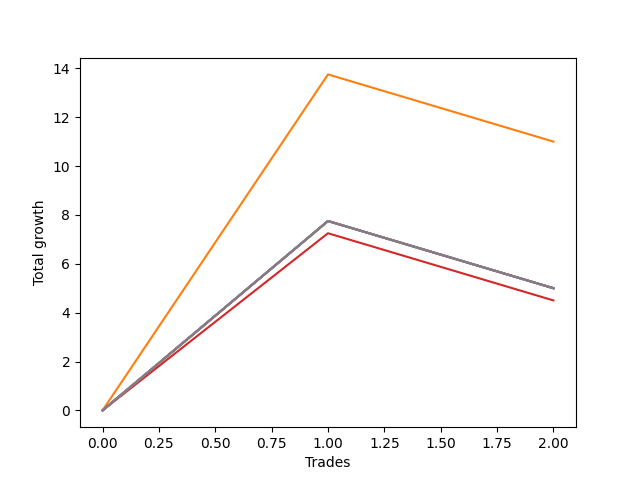

# Long Entry Wallace MJ 007 
- Symbol: ES90d5mOut
- Date Range: 03/18/2022 - 07/08/2022
- Trading Period: 7:20-12:30
- Number of Trades: 2



| Name | Win Percent | Profit | Avg Profit / Trade |     | Name | Win Percent | Profit | Avg Profit / Trade |
| ---- | ----------- | ------ | ------------------ | --- | ---- | ----------- | ------ | ------------------ |
| Sorted By <br> Profit | | | | | Sorted By <br> Win Percentage ||||
| One | 50.00 | 5500.00 | 2750.00 |     | One | 50.00 | 5500.00 | 2750.00 |
| Seven | 50.00 | 2500.00 | 1250.00 |     | Seven | 50.00 | 2500.00 | 1250.00 |
| Six | 50.00 | 2500.00 | 1250.00 |     | Six | 50.00 | 2500.00 | 1250.00 |
| Five | 50.00 | 2500.00 | 1250.00 |     | Five | 50.00 | 2500.00 | 1250.00 |
| Four | 50.00 | 2500.00 | 1250.00 |     | Four | 50.00 | 2500.00 | 1250.00 |
| Two | 50.00 | 2500.00 | 1250.00 |     | Two | 50.00 | 2500.00 | 1250.00 |
| Zero | 50.00 | 2500.00 | 1250.00 |     | Zero | 50.00 | 2500.00 | 1250.00 |
| Three | 50.00 | 2250.00 | 1125.00 |     | Three | 50.00 | 2250.00 | 1125.00 |

### Test Zero
* Sell when price hits the middle line of the 20p bollinger
* No Stoploss
* Results:
```
Total Trades: 2
Percent Up: 50.00
Percent Down: 50.00
Total Points Moved Up: 5.00
Potential Profit: 2500.00
Total Points Ups: 7.75 Count Ups: 1
Total Points Downs: -2.75 Count Downs: 1
```

<details><summary>Trades</summary>

<code>In: 2022-03-30 12:30:00		Out: 2022-03-30 12:46:25		Total Position Time: 16:25		Total Move Up: 7.75		Total to Date: 7.75</code> <br />
<code>In: 2022-03-31 09:40:00		Out: 2022-03-31 10:10:55		Total Position Time: 30:55		Total Move Up: -2.75		Total to Date: 5.00</code> <br />


</details>

### Test One
* Sell when the price hits the upper line of the 20p 1std bollinger
* No Stoploss
* Results:
```
Total Trades: 2
Percent Up: 50.00
Percent Down: 50.00
Total Points Moved Up: 11.00
Potential Profit: 5500.00
Total Points Ups: 13.75 Count Ups: 1
Total Points Downs: -2.75 Count Downs: 1
```

<details><summary>Trades</summary>

<code>In: 2022-03-30 12:30:00		Out: 2022-03-30 12:59:50		Total Position Time: 29:50		Total Move Up: 13.75		Total to Date: 13.75</code> <br />
<code>In: 2022-03-31 09:40:00		Out: 2022-03-31 10:10:55		Total Position Time: 30:55		Total Move Up: -2.75		Total to Date: 11.00</code> <br />


</details>

### Test Two
* Sell when the price hits the upper line of the 20p 2std bollinger
* No Stoploss
* Results:
```
Total Trades: 2
Percent Up: 50.00
Percent Down: 50.00
Total Points Moved Up: 5.00
Potential Profit: 2500.00
Total Points Ups: 7.75 Count Ups: 1
Total Points Downs: -2.75 Count Downs: 1
```

<details><summary>Trades</summary>

<code>In: 2022-03-30 12:30:00		Out: 2022-03-31 06:30:55		Total Position Time: 1080:55		Total Move Up: 7.75		Total to Date: 7.75</code> <br />
<code>In: 2022-03-31 09:40:00		Out: 2022-03-31 10:10:55		Total Position Time: 30:55		Total Move Up: -2.75		Total to Date: 5.00</code> <br />


</details>

### Test Three
* Sell when price hits the middle line of the 50p bollinger
* No Stoploss
* Results:
```
Total Trades: 2
Percent Up: 50.00
Percent Down: 50.00
Total Points Moved Up: 4.50
Potential Profit: 2250.00
Total Points Ups: 7.25 Count Ups: 1
Total Points Downs: -2.75 Count Downs: 1
```

<details><summary>Trades</summary>

<code>In: 2022-03-30 12:30:00		Out: 2022-03-31 06:30:00		Total Position Time: 1080:00		Total Move Up: 7.25		Total to Date: 7.25</code> <br />
<code>In: 2022-03-31 09:40:00		Out: 2022-03-31 10:10:55		Total Position Time: 30:55		Total Move Up: -2.75		Total to Date: 4.50</code> <br />


</details>

### Test Four
* Sell when the price hits the upper line of the 50p 1std bollinger
* No Stoploss
* Results:
```
Total Trades: 2
Percent Up: 50.00
Percent Down: 50.00
Total Points Moved Up: 5.00
Potential Profit: 2500.00
Total Points Ups: 7.75 Count Ups: 1
Total Points Downs: -2.75 Count Downs: 1
```

<details><summary>Trades</summary>

<code>In: 2022-03-30 12:30:00		Out: 2022-03-31 06:30:55		Total Position Time: 1080:55		Total Move Up: 7.75		Total to Date: 7.75</code> <br />
<code>In: 2022-03-31 09:40:00		Out: 2022-03-31 10:10:55		Total Position Time: 30:55		Total Move Up: -2.75		Total to Date: 5.00</code> <br />


</details>

### Test Five
* Sell when the price hits the upper line of the 50p 2std bollinger
* No Stoploss
* Results:
```
Total Trades: 2
Percent Up: 50.00
Percent Down: 50.00
Total Points Moved Up: 5.00
Potential Profit: 2500.00
Total Points Ups: 7.75 Count Ups: 1
Total Points Downs: -2.75 Count Downs: 1
```

<details><summary>Trades</summary>

<code>In: 2022-03-30 12:30:00		Out: 2022-03-31 06:30:55		Total Position Time: 1080:55		Total Move Up: 7.75		Total to Date: 7.75</code> <br />
<code>In: 2022-03-31 09:40:00		Out: 2022-03-31 10:10:55		Total Position Time: 30:55		Total Move Up: -2.75		Total to Date: 5.00</code> <br />


</details>

### Test Six
* Sell when the price hits the middle line of the 1std VWAP
* No Stoploss
* Results:
```
Total Trades: 2
Percent Up: 50.00
Percent Down: 50.00
Total Points Moved Up: 5.00
Potential Profit: 2500.00
Total Points Ups: 7.75 Count Ups: 1
Total Points Downs: -2.75 Count Downs: 1
```

<details><summary>Trades</summary>

<code>In: 2022-03-30 12:30:00		Out: 2022-03-31 06:30:55		Total Position Time: 1080:55		Total Move Up: 7.75		Total to Date: 7.75</code> <br />
<code>In: 2022-03-31 09:40:00		Out: 2022-03-31 10:10:55		Total Position Time: 30:55		Total Move Up: -2.75		Total to Date: 5.00</code> <br />


</details>

### Test Seven
* Sell when the price hits the upper line of the 1std VWAP
* No Stoploss
* Results:
```
Total Trades: 2
Percent Up: 50.00
Percent Down: 50.00
Total Points Moved Up: 5.00
Potential Profit: 2500.00
Total Points Ups: 7.75 Count Ups: 1
Total Points Downs: -2.75 Count Downs: 1
```

<details><summary>Trades</summary>

<code>In: 2022-03-30 12:30:00		Out: 2022-03-31 06:30:55		Total Position Time: 1080:55		Total Move Up: 7.75		Total to Date: 7.75</code> <br />
<code>In: 2022-03-31 09:40:00		Out: 2022-03-31 10:10:55		Total Position Time: 30:55		Total Move Up: -2.75		Total to Date: 5.00</code> <br />


</details>