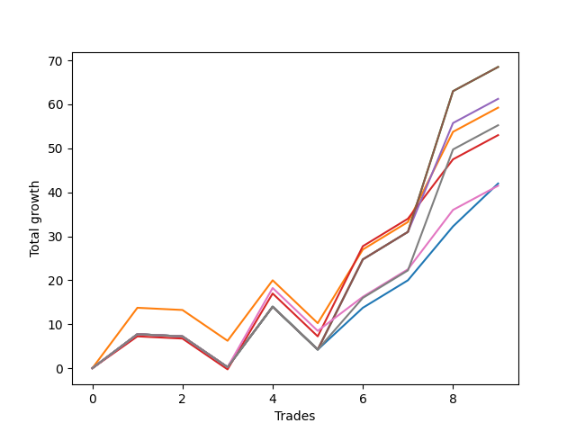

# Long Wallace 004 
- Symbol: ES90d5mOut
- Date Range: 03/18/2022 - 07/08/2022
- Trading Period: 7:20-12:30
- Number of Trades: 9



| Name | Win Percent | Profit | Avg Profit / Trade |     | Name | Win Percent | Profit | Avg Profit / Trade |
| ---- | ----------- | ------ | ------------------ | --- | ---- | ----------- | ------ | ------------------ |
| Sorted By <br> Profit | | | | | Sorted By <br> Win Percentage ||||
| Five | 66.67 | 34250.00 | 3805.56 |     | Five | 66.67 | 34250.00 | 3805.56 |
| Two | 66.67 | 34250.00 | 3805.56 |     | Two | 66.67 | 34250.00 | 3805.56 |
| Four | 66.67 | 30625.00 | 3402.78 |     | Four | 66.67 | 30625.00 | 3402.78 |
| One | 66.67 | 29625.00 | 3291.67 |     | One | 66.67 | 29625.00 | 3291.67 |
| Seven | 66.67 | 27625.00 | 3069.44 |     | Seven | 66.67 | 27625.00 | 3069.44 |
| Three | 66.67 | 26500.00 | 2944.44 |     | Three | 66.67 | 26500.00 | 2944.44 |
| Zero | 66.67 | 21000.00 | 2333.33 |     | Zero | 66.67 | 21000.00 | 2333.33 |
| Six | 66.67 | 20750.00 | 2305.56 |     | Six | 66.67 | 20750.00 | 2305.56 |

### Test Zero
* Sell when price hits the middle line of the 20p bollinger
* No Stoploss
* Results:
```
Total Trades: 9
Percent Up: 66.67
Percent Down: 33.33
Total Points Moved Up: 42.00
Potential Profit: 21000.00
Total Points Ups: 59.25 Count Ups: 6
Total Points Downs: -17.25 Count Downs: 3
```

<details><summary>Trades</summary>

<code>In: 2022-03-30 12:30:00		Out: 2022-03-30 12:46:25		Total Position Time: 16:25		Total Move Up: 7.75		Total to Date: 7.75</code> <br />
<code>In: 2022-03-31 11:25:00		Out: 2022-03-31 11:55:55		Total Position Time: 30:55		Total Move Up: -0.50		Total to Date: 7.25</code> <br />
<code>In: 2022-04-18 08:55:00		Out: 2022-04-18 09:25:55		Total Position Time: 30:55		Total Move Up: -7.00		Total to Date: 0.25</code> <br />
<code>In: 2022-04-20 12:00:00		Out: 2022-04-20 12:24:15		Total Position Time: 24:15		Total Move Up: 13.75		Total to Date: 14.00</code> <br />
<code>In: 2022-05-02 10:10:00		Out: 2022-05-02 10:40:55		Total Position Time: 30:55		Total Move Up: -9.75		Total to Date: 4.25</code> <br />
<code>In: 2022-06-02 07:30:00		Out: 2022-06-02 07:38:55		Total Position Time: 08:55		Total Move Up: 9.50		Total to Date: 13.75</code> <br />
<code>In: 2022-06-09 08:10:00		Out: 2022-06-09 08:40:55		Total Position Time: 30:55		Total Move Up: 6.25		Total to Date: 20.00</code> <br />
<code>In: 2022-06-15 11:15:00		Out: 2022-06-15 11:17:05		Total Position Time: 02:05		Total Move Up: 12.25		Total to Date: 32.25</code> <br />
<code>In: 2022-06-29 09:35:00		Out: 2022-06-29 10:01:50		Total Position Time: 26:50		Total Move Up: 9.75		Total to Date: 42.00</code> <br />


</details>

### Test One
* Sell when the price hits the upper line of the 20p 1std bollinger
* No Stoploss
* Results:
```
Total Trades: 9
Percent Up: 66.67
Percent Down: 33.33
Total Points Moved Up: 59.25
Potential Profit: 29625.00
Total Points Ups: 76.50 Count Ups: 6
Total Points Downs: -17.25 Count Downs: 3
```

<details><summary>Trades</summary>

<code>In: 2022-03-30 12:30:00		Out: 2022-03-30 12:59:50		Total Position Time: 29:50		Total Move Up: 13.75		Total to Date: 13.75</code> <br />
<code>In: 2022-03-31 11:25:00		Out: 2022-03-31 11:55:55		Total Position Time: 30:55		Total Move Up: -0.50		Total to Date: 13.25</code> <br />
<code>In: 2022-04-18 08:55:00		Out: 2022-04-18 09:25:55		Total Position Time: 30:55		Total Move Up: -7.00		Total to Date: 6.25</code> <br />
<code>In: 2022-04-20 12:00:00		Out: 2022-04-20 12:30:55		Total Position Time: 30:55		Total Move Up: 13.75		Total to Date: 20.00</code> <br />
<code>In: 2022-05-02 10:10:00		Out: 2022-05-02 10:40:55		Total Position Time: 30:55		Total Move Up: -9.75		Total to Date: 10.25</code> <br />
<code>In: 2022-06-02 07:30:00		Out: 2022-06-02 07:56:05		Total Position Time: 26:05		Total Move Up: 16.75		Total to Date: 27.00</code> <br />
<code>In: 2022-06-09 08:10:00		Out: 2022-06-09 08:40:55		Total Position Time: 30:55		Total Move Up: 6.25		Total to Date: 33.25</code> <br />
<code>In: 2022-06-15 11:15:00		Out: 2022-06-15 11:38:55		Total Position Time: 23:55		Total Move Up: 20.50		Total to Date: 53.75</code> <br />
<code>In: 2022-06-29 09:35:00		Out: 2022-06-29 10:05:55		Total Position Time: 30:55		Total Move Up: 5.50		Total to Date: 59.25</code> <br />


</details>

### Test Two
* Sell when the price hits the upper line of the 20p 2std bollinger
* No Stoploss
* Results:
```
Total Trades: 9
Percent Up: 66.67
Percent Down: 33.33
Total Points Moved Up: 68.50
Potential Profit: 34250.00
Total Points Ups: 85.75 Count Ups: 6
Total Points Downs: -17.25 Count Downs: 3
```

<details><summary>Trades</summary>

<code>In: 2022-03-30 12:30:00		Out: 2022-03-31 06:30:55		Total Position Time: 1080:55		Total Move Up: 7.75		Total to Date: 7.75</code> <br />
<code>In: 2022-03-31 11:25:00		Out: 2022-03-31 11:55:55		Total Position Time: 30:55		Total Move Up: -0.50		Total to Date: 7.25</code> <br />
<code>In: 2022-04-18 08:55:00		Out: 2022-04-18 09:25:55		Total Position Time: 30:55		Total Move Up: -7.00		Total to Date: 0.25</code> <br />
<code>In: 2022-04-20 12:00:00		Out: 2022-04-20 12:30:55		Total Position Time: 30:55		Total Move Up: 13.75		Total to Date: 14.00</code> <br />
<code>In: 2022-05-02 10:10:00		Out: 2022-05-02 10:40:55		Total Position Time: 30:55		Total Move Up: -9.75		Total to Date: 4.25</code> <br />
<code>In: 2022-06-02 07:30:00		Out: 2022-06-02 08:00:55		Total Position Time: 30:55		Total Move Up: 20.50		Total to Date: 24.75</code> <br />
<code>In: 2022-06-09 08:10:00		Out: 2022-06-09 08:40:55		Total Position Time: 30:55		Total Move Up: 6.25		Total to Date: 31.00</code> <br />
<code>In: 2022-06-15 11:15:00		Out: 2022-06-15 11:41:00		Total Position Time: 26:00		Total Move Up: 32.00		Total to Date: 63.00</code> <br />
<code>In: 2022-06-29 09:35:00		Out: 2022-06-29 10:05:55		Total Position Time: 30:55		Total Move Up: 5.50		Total to Date: 68.50</code> <br />


</details>

### Test Three
* Sell when price hits the middle line of the 50p bollinger
* No Stoploss
* Results:
```
Total Trades: 9
Percent Up: 66.67
Percent Down: 33.33
Total Points Moved Up: 53.00
Potential Profit: 26500.00
Total Points Ups: 70.25 Count Ups: 6
Total Points Downs: -17.25 Count Downs: 3
```

<details><summary>Trades</summary>

<code>In: 2022-03-30 12:30:00		Out: 2022-03-31 06:30:00		Total Position Time: 1080:00		Total Move Up: 7.25		Total to Date: 7.25</code> <br />
<code>In: 2022-03-31 11:25:00		Out: 2022-03-31 11:55:55		Total Position Time: 30:55		Total Move Up: -0.50		Total to Date: 6.75</code> <br />
<code>In: 2022-04-18 08:55:00		Out: 2022-04-18 09:25:55		Total Position Time: 30:55		Total Move Up: -7.00		Total to Date: -0.25</code> <br />
<code>In: 2022-04-20 12:00:00		Out: 2022-04-20 12:25:50		Total Position Time: 25:50		Total Move Up: 17.25		Total to Date: 17.00</code> <br />
<code>In: 2022-05-02 10:10:00		Out: 2022-05-02 10:40:55		Total Position Time: 30:55		Total Move Up: -9.75		Total to Date: 7.25</code> <br />
<code>In: 2022-06-02 07:30:00		Out: 2022-06-02 08:00:55		Total Position Time: 30:55		Total Move Up: 20.50		Total to Date: 27.75</code> <br />
<code>In: 2022-06-09 08:10:00		Out: 2022-06-09 08:40:55		Total Position Time: 30:55		Total Move Up: 6.25		Total to Date: 34.00</code> <br />
<code>In: 2022-06-15 11:15:00		Out: 2022-06-15 11:38:45		Total Position Time: 23:45		Total Move Up: 13.50		Total to Date: 47.50</code> <br />
<code>In: 2022-06-29 09:35:00		Out: 2022-06-29 10:05:55		Total Position Time: 30:55		Total Move Up: 5.50		Total to Date: 53.00</code> <br />


</details>

### Test Four
* Sell when the price hits the upper line of the 50p 1std bollinger
* No Stoploss
* Results:
```
Total Trades: 9
Percent Up: 66.67
Percent Down: 33.33
Total Points Moved Up: 61.25
Potential Profit: 30625.00
Total Points Ups: 78.50 Count Ups: 6
Total Points Downs: -17.25 Count Downs: 3
```

<details><summary>Trades</summary>

<code>In: 2022-03-30 12:30:00		Out: 2022-03-31 06:30:55		Total Position Time: 1080:55		Total Move Up: 7.75		Total to Date: 7.75</code> <br />
<code>In: 2022-03-31 11:25:00		Out: 2022-03-31 11:55:55		Total Position Time: 30:55		Total Move Up: -0.50		Total to Date: 7.25</code> <br />
<code>In: 2022-04-18 08:55:00		Out: 2022-04-18 09:25:55		Total Position Time: 30:55		Total Move Up: -7.00		Total to Date: 0.25</code> <br />
<code>In: 2022-04-20 12:00:00		Out: 2022-04-20 12:30:55		Total Position Time: 30:55		Total Move Up: 13.75		Total to Date: 14.00</code> <br />
<code>In: 2022-05-02 10:10:00		Out: 2022-05-02 10:40:55		Total Position Time: 30:55		Total Move Up: -9.75		Total to Date: 4.25</code> <br />
<code>In: 2022-06-02 07:30:00		Out: 2022-06-02 08:00:55		Total Position Time: 30:55		Total Move Up: 20.50		Total to Date: 24.75</code> <br />
<code>In: 2022-06-09 08:10:00		Out: 2022-06-09 08:40:55		Total Position Time: 30:55		Total Move Up: 6.25		Total to Date: 31.00</code> <br />
<code>In: 2022-06-15 11:15:00		Out: 2022-06-15 11:39:00		Total Position Time: 24:00		Total Move Up: 24.75		Total to Date: 55.75</code> <br />
<code>In: 2022-06-29 09:35:00		Out: 2022-06-29 10:05:55		Total Position Time: 30:55		Total Move Up: 5.50		Total to Date: 61.25</code> <br />


</details>

### Test Five
* Sell when the price hits the upper line of the 50p 2std bollinger
* No Stoploss
* Results:
```
Total Trades: 9
Percent Up: 66.67
Percent Down: 33.33
Total Points Moved Up: 68.50
Potential Profit: 34250.00
Total Points Ups: 85.75 Count Ups: 6
Total Points Downs: -17.25 Count Downs: 3
```

<details><summary>Trades</summary>

<code>In: 2022-03-30 12:30:00		Out: 2022-03-31 06:30:55		Total Position Time: 1080:55		Total Move Up: 7.75		Total to Date: 7.75</code> <br />
<code>In: 2022-03-31 11:25:00		Out: 2022-03-31 11:55:55		Total Position Time: 30:55		Total Move Up: -0.50		Total to Date: 7.25</code> <br />
<code>In: 2022-04-18 08:55:00		Out: 2022-04-18 09:25:55		Total Position Time: 30:55		Total Move Up: -7.00		Total to Date: 0.25</code> <br />
<code>In: 2022-04-20 12:00:00		Out: 2022-04-20 12:30:55		Total Position Time: 30:55		Total Move Up: 13.75		Total to Date: 14.00</code> <br />
<code>In: 2022-05-02 10:10:00		Out: 2022-05-02 10:40:55		Total Position Time: 30:55		Total Move Up: -9.75		Total to Date: 4.25</code> <br />
<code>In: 2022-06-02 07:30:00		Out: 2022-06-02 08:00:55		Total Position Time: 30:55		Total Move Up: 20.50		Total to Date: 24.75</code> <br />
<code>In: 2022-06-09 08:10:00		Out: 2022-06-09 08:40:55		Total Position Time: 30:55		Total Move Up: 6.25		Total to Date: 31.00</code> <br />
<code>In: 2022-06-15 11:15:00		Out: 2022-06-15 11:41:00		Total Position Time: 26:00		Total Move Up: 32.00		Total to Date: 63.00</code> <br />
<code>In: 2022-06-29 09:35:00		Out: 2022-06-29 10:05:55		Total Position Time: 30:55		Total Move Up: 5.50		Total to Date: 68.50</code> <br />


</details>

### Test Six
* Sell when the price hits the middle line of the 1std VWAP
* No Stoploss
* Results:
```
Total Trades: 9
Percent Up: 66.67
Percent Down: 33.33
Total Points Moved Up: 41.50
Potential Profit: 20750.00
Total Points Ups: 58.75 Count Ups: 6
Total Points Downs: -17.25 Count Downs: 3
```

<details><summary>Trades</summary>

<code>In: 2022-03-30 12:30:00		Out: 2022-03-31 06:30:55		Total Position Time: 1080:55		Total Move Up: 7.75		Total to Date: 7.75</code> <br />
<code>In: 2022-03-31 11:25:00		Out: 2022-03-31 11:55:55		Total Position Time: 30:55		Total Move Up: -0.50		Total to Date: 7.25</code> <br />
<code>In: 2022-04-18 08:55:00		Out: 2022-04-18 09:25:55		Total Position Time: 30:55		Total Move Up: -7.00		Total to Date: 0.25</code> <br />
<code>In: 2022-04-20 12:00:00		Out: 2022-04-20 12:26:10		Total Position Time: 26:10		Total Move Up: 18.00		Total to Date: 18.25</code> <br />
<code>In: 2022-05-02 10:10:00		Out: 2022-05-02 10:40:55		Total Position Time: 30:55		Total Move Up: -9.75		Total to Date: 8.50</code> <br />
<code>In: 2022-06-02 07:30:00		Out: 2022-06-02 07:34:25		Total Position Time: 04:25		Total Move Up: 7.75		Total to Date: 16.25</code> <br />
<code>In: 2022-06-09 08:10:00		Out: 2022-06-09 08:40:55		Total Position Time: 30:55		Total Move Up: 6.25		Total to Date: 22.50</code> <br />
<code>In: 2022-06-15 11:15:00		Out: 2022-06-15 11:38:45		Total Position Time: 23:45		Total Move Up: 13.50		Total to Date: 36.00</code> <br />
<code>In: 2022-06-29 09:35:00		Out: 2022-06-29 10:05:55		Total Position Time: 30:55		Total Move Up: 5.50		Total to Date: 41.50</code> <br />


</details>

### Test Seven
* Sell when the price hits the upper line of the 1std VWAP
* No Stoploss
* Results:
```
Total Trades: 9
Percent Up: 66.67
Percent Down: 33.33
Total Points Moved Up: 55.25
Potential Profit: 27625.00
Total Points Ups: 72.50 Count Ups: 6
Total Points Downs: -17.25 Count Downs: 3
```

<details><summary>Trades</summary>

<code>In: 2022-03-30 12:30:00		Out: 2022-03-31 06:30:55		Total Position Time: 1080:55		Total Move Up: 7.75		Total to Date: 7.75</code> <br />
<code>In: 2022-03-31 11:25:00		Out: 2022-03-31 11:55:55		Total Position Time: 30:55		Total Move Up: -0.50		Total to Date: 7.25</code> <br />
<code>In: 2022-04-18 08:55:00		Out: 2022-04-18 09:25:55		Total Position Time: 30:55		Total Move Up: -7.00		Total to Date: 0.25</code> <br />
<code>In: 2022-04-20 12:00:00		Out: 2022-04-20 12:30:55		Total Position Time: 30:55		Total Move Up: 13.75		Total to Date: 14.00</code> <br />
<code>In: 2022-05-02 10:10:00		Out: 2022-05-02 10:40:55		Total Position Time: 30:55		Total Move Up: -9.75		Total to Date: 4.25</code> <br />
<code>In: 2022-06-02 07:30:00		Out: 2022-06-02 07:42:35		Total Position Time: 12:35		Total Move Up: 11.75		Total to Date: 16.00</code> <br />
<code>In: 2022-06-09 08:10:00		Out: 2022-06-09 08:40:55		Total Position Time: 30:55		Total Move Up: 6.25		Total to Date: 22.25</code> <br />
<code>In: 2022-06-15 11:15:00		Out: 2022-06-15 11:40:55		Total Position Time: 25:55		Total Move Up: 27.50		Total to Date: 49.75</code> <br />
<code>In: 2022-06-29 09:35:00		Out: 2022-06-29 10:05:55		Total Position Time: 30:55		Total Move Up: 5.50		Total to Date: 55.25</code> <br />


</details>