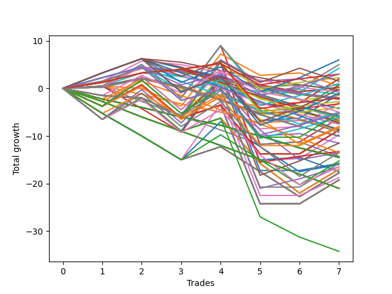

# Long Wallace 1226_003 
- Symbol: ES90d5m30m
- Date Range: 03/18/2022 - 07/08/2022
- Trading Period: 7:20-12:30
- Number of Trades: 7



| Name | Win Percent | Profit | Avg Profit / Trade |     | Name | Win Percent | Profit | Avg Profit / Trade |
| ---- | ----------- | ------ | ------------------ | --- | ---- | ----------- | ------ | ------------------ |
| Sorted By <br> Profit | | | | | Sorted By <br> Win Percentage ||||
| Seventy-Three | 85.71 | 13750.00 | 1964.29 |     | Seventy-Three | 85.71 | 13750.00 | 1964.29 |
| Three | 71.43 | 10750.00 | 1535.71 |     | Three | 71.43 | 10750.00 | 1535.71 |
| Six | 57.14 | 9500.00 | 1357.14 |     | Six | 57.14 | 9500.00 | 1357.14 |
| Zero | 57.14 | 8875.00 | 1267.86 |     | Zero | 57.14 | 8875.00 | 1267.86 |
| Seven | 57.14 | 6750.00 | 964.29 |     | Seven | 57.14 | 6750.00 | 964.29 |
| Five | 57.14 | 6750.00 | 964.29 |     | Five | 57.14 | 6750.00 | 964.29 |
| Four | 57.14 | 6750.00 | 964.29 |     | Four | 57.14 | 6750.00 | 964.29 |
| Two | 57.14 | 6750.00 | 964.29 |     | Two | 57.14 | 6750.00 | 964.29 |
| One | 57.14 | 6750.00 | 964.29 |     | One | 57.14 | 6750.00 | 964.29 |

## NO STOPLOSS

### Test Zero
* Sell when price hits the middle line of the 20p bollinger
* No Stoploss
* Results:
```
Total Trades: 7
Percent Up: 57.14
Percent Down: 42.86
Total Points Moved Up: 17.75
Potential Profit: 8875.00
Total Points Ups: 30.50 Count Ups: 4
Total Points Downs: -12.75 Count Downs: 3
```

<details><summary>Trades</summary>

<code>In: 2022-03-29 09:40:00		Out: 2022-03-29 10:10:55		Total Position Time: 30:55		Total Move Up: -0.25		Total to Date: -0.25</code> <br />
<code>In: 2022-03-30 12:30:00		Out: 2022-03-30 12:46:00		Total Position Time: 16:00		Total Move Up: 5.25		Total to Date: 5.00</code> <br />
<code>In: 2022-03-31 09:40:00		Out: 2022-03-31 10:10:55		Total Position Time: 30:55		Total Move Up: -2.75		Total to Date: 2.25</code> <br />
<code>In: 2022-04-20 12:00:00		Out: 2022-04-20 12:24:15		Total Position Time: 24:15		Total Move Up: 13.75		Total to Date: 16.00</code> <br />
<code>In: 2022-05-02 10:10:00		Out: 2022-05-02 10:40:55		Total Position Time: 30:55		Total Move Up: -9.75		Total to Date: 6.25</code> <br />
<code>In: 2022-06-27 09:40:00		Out: 2022-06-27 10:10:55		Total Position Time: 30:55		Total Move Up: 1.75		Total to Date: 8.00</code> <br />
<code>In: 2022-06-29 09:35:00		Out: 2022-06-29 10:01:50		Total Position Time: 26:50		Total Move Up: 9.75		Total to Date: 17.75</code> <br />


</details>

### Test One
* Sell when the price hits the upper line of the 20p 1std bollinger
* No Stoploss
* Results:
```
Total Trades: 7
Percent Up: 57.14
Percent Down: 42.86
Total Points Moved Up: 13.50
Potential Profit: 6750.00
Total Points Ups: 26.25 Count Ups: 4
Total Points Downs: -12.75 Count Downs: 3
```

<details><summary>Trades</summary>

<code>In: 2022-03-29 09:40:00		Out: 2022-03-29 10:10:55		Total Position Time: 30:55		Total Move Up: -0.25		Total to Date: -0.25</code> <br />
<code>In: 2022-03-30 12:30:00		Out: 2022-03-30 12:46:00		Total Position Time: 16:00		Total Move Up: 5.25		Total to Date: 5.00</code> <br />
<code>In: 2022-03-31 09:40:00		Out: 2022-03-31 10:10:55		Total Position Time: 30:55		Total Move Up: -2.75		Total to Date: 2.25</code> <br />
<code>In: 2022-04-20 12:00:00		Out: 2022-04-20 12:30:55		Total Position Time: 30:55		Total Move Up: 13.75		Total to Date: 16.00</code> <br />
<code>In: 2022-05-02 10:10:00		Out: 2022-05-02 10:40:55		Total Position Time: 30:55		Total Move Up: -9.75		Total to Date: 6.25</code> <br />
<code>In: 2022-06-27 09:40:00		Out: 2022-06-27 10:10:55		Total Position Time: 30:55		Total Move Up: 1.75		Total to Date: 8.00</code> <br />
<code>In: 2022-06-29 09:35:00		Out: 2022-06-29 10:05:55		Total Position Time: 30:55		Total Move Up: 5.50		Total to Date: 13.50</code> <br />


</details>

### Test Two
* Sell when the price hits the upper line of the 20p 2std bollinger
* No Stoploss
* Results:
```
Total Trades: 7
Percent Up: 57.14
Percent Down: 42.86
Total Points Moved Up: 13.50
Potential Profit: 6750.00
Total Points Ups: 26.25 Count Ups: 4
Total Points Downs: -12.75 Count Downs: 3
```

<details><summary>Trades</summary>

<code>In: 2022-03-29 09:40:00		Out: 2022-03-29 10:10:55		Total Position Time: 30:55		Total Move Up: -0.25		Total to Date: -0.25</code> <br />
<code>In: 2022-03-30 12:30:00		Out: 2022-03-30 12:46:00		Total Position Time: 16:00		Total Move Up: 5.25		Total to Date: 5.00</code> <br />
<code>In: 2022-03-31 09:40:00		Out: 2022-03-31 10:10:55		Total Position Time: 30:55		Total Move Up: -2.75		Total to Date: 2.25</code> <br />
<code>In: 2022-04-20 12:00:00		Out: 2022-04-20 12:30:55		Total Position Time: 30:55		Total Move Up: 13.75		Total to Date: 16.00</code> <br />
<code>In: 2022-05-02 10:10:00		Out: 2022-05-02 10:40:55		Total Position Time: 30:55		Total Move Up: -9.75		Total to Date: 6.25</code> <br />
<code>In: 2022-06-27 09:40:00		Out: 2022-06-27 10:10:55		Total Position Time: 30:55		Total Move Up: 1.75		Total to Date: 8.00</code> <br />
<code>In: 2022-06-29 09:35:00		Out: 2022-06-29 10:05:55		Total Position Time: 30:55		Total Move Up: 5.50		Total to Date: 13.50</code> <br />


</details>

### Test Three
* Sell when price hits the middle line of the 50p bollinger
* No Stoploss
* Results:
```
Total Trades: 7
Percent Up: 71.43
Percent Down: 28.57
Total Points Moved Up: 21.50
Potential Profit: 10750.00
Total Points Ups: 34.00 Count Ups: 5
Total Points Downs: -12.50 Count Downs: 2
```

<details><summary>Trades</summary>

<code>In: 2022-03-29 09:40:00		Out: 2022-03-29 09:43:20		Total Position Time: 03:20		Total Move Up: 3.75		Total to Date: 3.75</code> <br />
<code>In: 2022-03-30 12:30:00		Out: 2022-03-30 12:46:00		Total Position Time: 16:00		Total Move Up: 5.25		Total to Date: 9.00</code> <br />
<code>In: 2022-03-31 09:40:00		Out: 2022-03-31 10:10:55		Total Position Time: 30:55		Total Move Up: -2.75		Total to Date: 6.25</code> <br />
<code>In: 2022-04-20 12:00:00		Out: 2022-04-20 12:25:50		Total Position Time: 25:50		Total Move Up: 17.25		Total to Date: 23.50</code> <br />
<code>In: 2022-05-02 10:10:00		Out: 2022-05-02 10:40:55		Total Position Time: 30:55		Total Move Up: -9.75		Total to Date: 13.75</code> <br />
<code>In: 2022-06-27 09:40:00		Out: 2022-06-27 09:41:15		Total Position Time: 01:15		Total Move Up: 2.25		Total to Date: 16.00</code> <br />
<code>In: 2022-06-29 09:35:00		Out: 2022-06-29 10:05:55		Total Position Time: 30:55		Total Move Up: 5.50		Total to Date: 21.50</code> <br />


</details>

### Test Four
* Sell when the price hits the upper line of the 50p 1std bollinger
* No Stoploss
* Results:
```
Total Trades: 7
Percent Up: 57.14
Percent Down: 42.86
Total Points Moved Up: 13.50
Potential Profit: 6750.00
Total Points Ups: 26.25 Count Ups: 4
Total Points Downs: -12.75 Count Downs: 3
```

<details><summary>Trades</summary>

<code>In: 2022-03-29 09:40:00		Out: 2022-03-29 10:10:55		Total Position Time: 30:55		Total Move Up: -0.25		Total to Date: -0.25</code> <br />
<code>In: 2022-03-30 12:30:00		Out: 2022-03-30 12:46:00		Total Position Time: 16:00		Total Move Up: 5.25		Total to Date: 5.00</code> <br />
<code>In: 2022-03-31 09:40:00		Out: 2022-03-31 10:10:55		Total Position Time: 30:55		Total Move Up: -2.75		Total to Date: 2.25</code> <br />
<code>In: 2022-04-20 12:00:00		Out: 2022-04-20 12:30:55		Total Position Time: 30:55		Total Move Up: 13.75		Total to Date: 16.00</code> <br />
<code>In: 2022-05-02 10:10:00		Out: 2022-05-02 10:40:55		Total Position Time: 30:55		Total Move Up: -9.75		Total to Date: 6.25</code> <br />
<code>In: 2022-06-27 09:40:00		Out: 2022-06-27 10:10:55		Total Position Time: 30:55		Total Move Up: 1.75		Total to Date: 8.00</code> <br />
<code>In: 2022-06-29 09:35:00		Out: 2022-06-29 10:05:55		Total Position Time: 30:55		Total Move Up: 5.50		Total to Date: 13.50</code> <br />


</details>

### Test Five
* Sell when the price hits the upper line of the 50p 2std bollinger
* No Stoploss
* Results:
```
Total Trades: 7
Percent Up: 57.14
Percent Down: 42.86
Total Points Moved Up: 13.50
Potential Profit: 6750.00
Total Points Ups: 26.25 Count Ups: 4
Total Points Downs: -12.75 Count Downs: 3
```

<details><summary>Trades</summary>

<code>In: 2022-03-29 09:40:00		Out: 2022-03-29 10:10:55		Total Position Time: 30:55		Total Move Up: -0.25		Total to Date: -0.25</code> <br />
<code>In: 2022-03-30 12:30:00		Out: 2022-03-30 12:46:00		Total Position Time: 16:00		Total Move Up: 5.25		Total to Date: 5.00</code> <br />
<code>In: 2022-03-31 09:40:00		Out: 2022-03-31 10:10:55		Total Position Time: 30:55		Total Move Up: -2.75		Total to Date: 2.25</code> <br />
<code>In: 2022-04-20 12:00:00		Out: 2022-04-20 12:30:55		Total Position Time: 30:55		Total Move Up: 13.75		Total to Date: 16.00</code> <br />
<code>In: 2022-05-02 10:10:00		Out: 2022-05-02 10:40:55		Total Position Time: 30:55		Total Move Up: -9.75		Total to Date: 6.25</code> <br />
<code>In: 2022-06-27 09:40:00		Out: 2022-06-27 10:10:55		Total Position Time: 30:55		Total Move Up: 1.75		Total to Date: 8.00</code> <br />
<code>In: 2022-06-29 09:35:00		Out: 2022-06-29 10:05:55		Total Position Time: 30:55		Total Move Up: 5.50		Total to Date: 13.50</code> <br />


</details>

### Test Six
* Sell when the price hits the middle line of the 1std VWAP
* No Stoploss
* Results:
```
Total Trades: 7
Percent Up: 57.14
Percent Down: 42.86
Total Points Moved Up: 19.00
Potential Profit: 9500.00
Total Points Ups: 31.75 Count Ups: 4
Total Points Downs: -12.75 Count Downs: 3
```

<details><summary>Trades</summary>

<code>In: 2022-03-29 09:40:00		Out: 2022-03-29 10:10:55		Total Position Time: 30:55		Total Move Up: -0.25		Total to Date: -0.25</code> <br />
<code>In: 2022-03-30 12:30:00		Out: 2022-03-30 12:46:00		Total Position Time: 16:00		Total Move Up: 5.25		Total to Date: 5.00</code> <br />
<code>In: 2022-03-31 09:40:00		Out: 2022-03-31 10:10:55		Total Position Time: 30:55		Total Move Up: -2.75		Total to Date: 2.25</code> <br />
<code>In: 2022-04-20 12:00:00		Out: 2022-04-20 12:26:10		Total Position Time: 26:10		Total Move Up: 18.00		Total to Date: 20.25</code> <br />
<code>In: 2022-05-02 10:10:00		Out: 2022-05-02 10:40:55		Total Position Time: 30:55		Total Move Up: -9.75		Total to Date: 10.50</code> <br />
<code>In: 2022-06-27 09:40:00		Out: 2022-06-27 09:44:15		Total Position Time: 04:15		Total Move Up: 3.00		Total to Date: 13.50</code> <br />
<code>In: 2022-06-29 09:35:00		Out: 2022-06-29 10:05:55		Total Position Time: 30:55		Total Move Up: 5.50		Total to Date: 19.00</code> <br />


</details>

### Test Seven
* Sell when the price hits the upper line of the 1std VWAP
* No Stoploss
* Results:
```
Total Trades: 7
Percent Up: 57.14
Percent Down: 42.86
Total Points Moved Up: 13.50
Potential Profit: 6750.00
Total Points Ups: 26.25 Count Ups: 4
Total Points Downs: -12.75 Count Downs: 3
```

<details><summary>Trades</summary>

<code>In: 2022-03-29 09:40:00		Out: 2022-03-29 10:10:55		Total Position Time: 30:55		Total Move Up: -0.25		Total to Date: -0.25</code> <br />
<code>In: 2022-03-30 12:30:00		Out: 2022-03-30 12:46:00		Total Position Time: 16:00		Total Move Up: 5.25		Total to Date: 5.00</code> <br />
<code>In: 2022-03-31 09:40:00		Out: 2022-03-31 10:10:55		Total Position Time: 30:55		Total Move Up: -2.75		Total to Date: 2.25</code> <br />
<code>In: 2022-04-20 12:00:00		Out: 2022-04-20 12:30:55		Total Position Time: 30:55		Total Move Up: 13.75		Total to Date: 16.00</code> <br />
<code>In: 2022-05-02 10:10:00		Out: 2022-05-02 10:40:55		Total Position Time: 30:55		Total Move Up: -9.75		Total to Date: 6.25</code> <br />
<code>In: 2022-06-27 09:40:00		Out: 2022-06-27 10:10:55		Total Position Time: 30:55		Total Move Up: 1.75		Total to Date: 8.00</code> <br />
<code>In: 2022-06-29 09:35:00		Out: 2022-06-29 10:05:55		Total Position Time: 30:55		Total Move Up: 5.50		Total to Date: 13.50</code> <br />


</details>

## SPECIAL EXIT CONDITIONS 

### Test Seventy-Three
* Sell when the linear regression slope changes to negative
* No Stoploss
* Results:
```
Total Trades: 7
Percent Up: 85.71
Percent Down: 14.29
Total Points Moved Up: 27.50
Potential Profit: 13750.00
Total Points Ups: 31.50 Count Ups: 6
Total Points Downs: -4.00 Count Downs: 1
```

<details><summary>Trades</summary>

<code>In: 2022-03-29 09:40:00		Out: 2022-03-29 09:47:05		Total Position Time: 07:05		Total Move Up: 8.25		Total to Date: 8.25</code> <br />
<code>In: 2022-03-30 12:30:00		Out: 2022-03-30 12:36:05		Total Position Time: 06:05		Total Move Up: 5.25		Total to Date: 13.50</code> <br />
<code>In: 2022-03-31 09:40:00		Out: 2022-03-31 09:50:05		Total Position Time: 10:05		Total Move Up: 1.50		Total to Date: 15.00</code> <br />
<code>In: 2022-04-20 12:00:00		Out: 2022-04-20 12:12:05		Total Position Time: 12:05		Total Move Up: 6.00		Total to Date: 21.00</code> <br />
<code>In: 2022-05-02 10:10:00		Out: 2022-05-02 10:23:05		Total Position Time: 13:05		Total Move Up: -4.00		Total to Date: 17.00</code> <br />
<code>In: 2022-06-27 09:40:00		Out: 2022-06-27 09:46:05		Total Position Time: 06:05		Total Move Up: 1.50		Total to Date: 18.50</code> <br />
<code>In: 2022-06-29 09:35:00		Out: 2022-06-29 09:40:05		Total Position Time: 05:05		Total Move Up: 9.00		Total to Date: 27.50</code> <br />


</details>